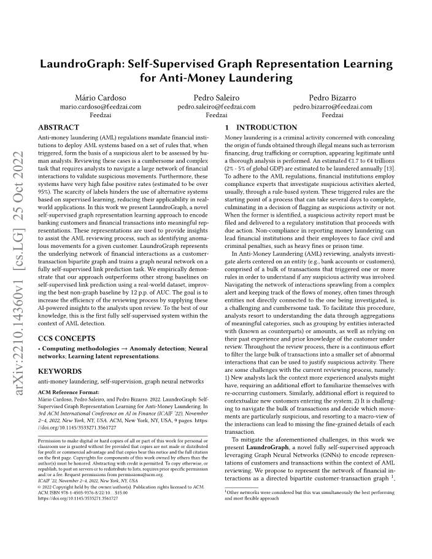
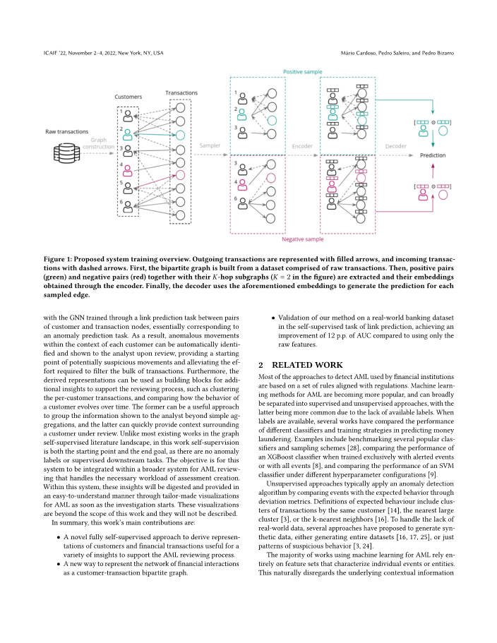
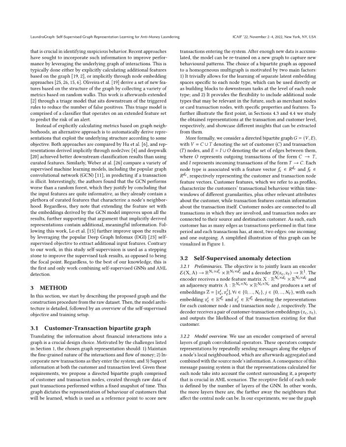
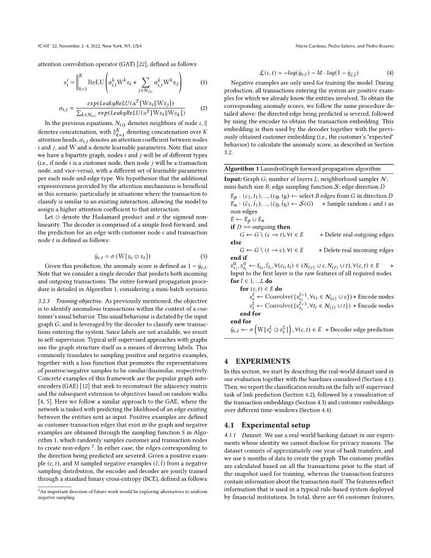
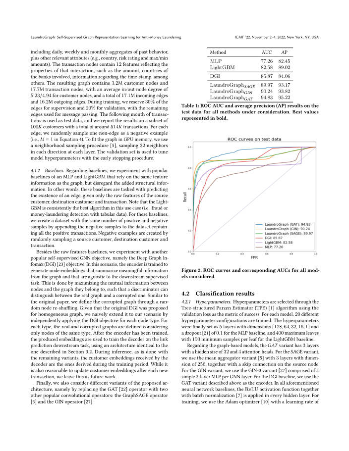
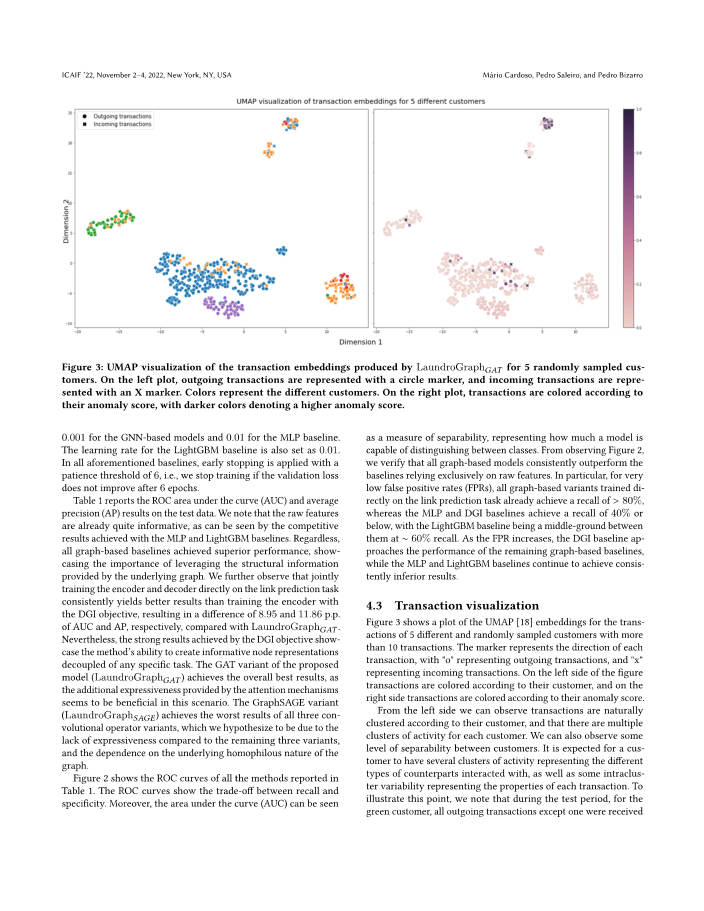
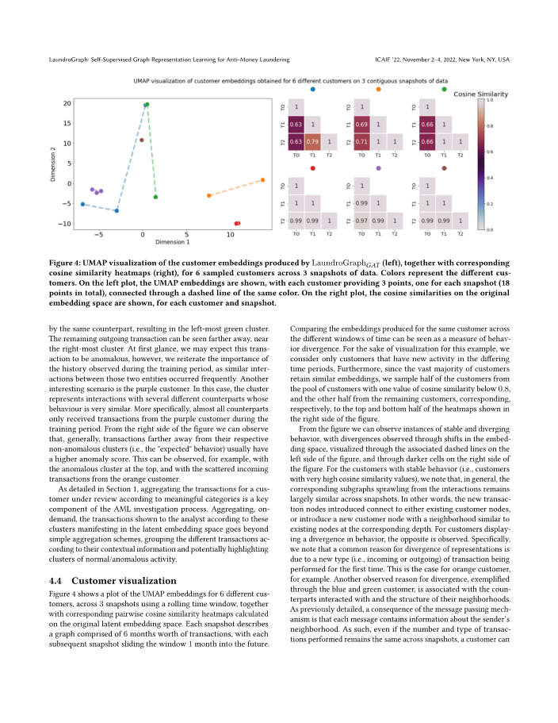
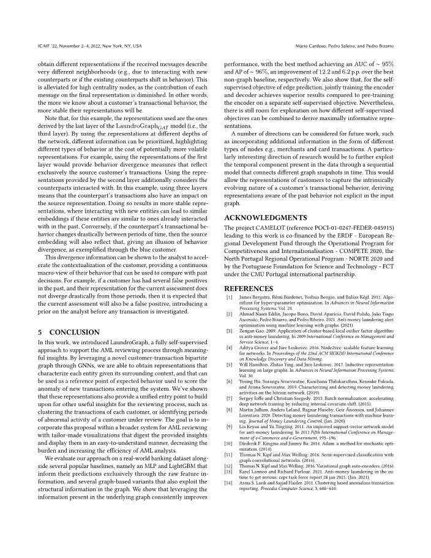
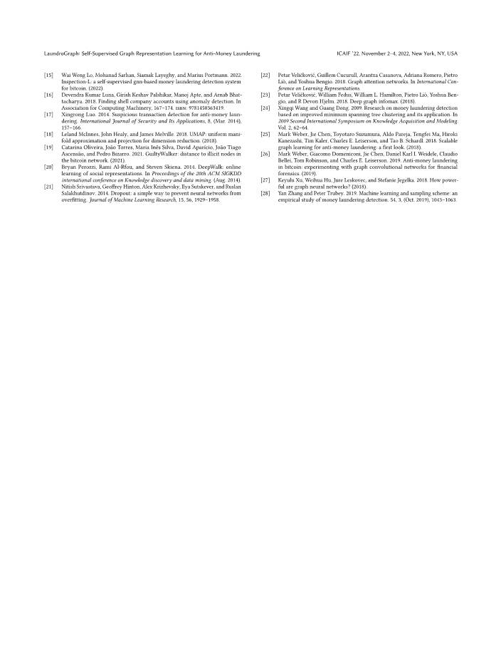

# LaundroGraph: 자금세탁방지를 위한 자기지도 그래프 표현 학습

> **원문 제목:** LaundroGraph: Self-Supervised Graph Representation Learning for Anti-Money Laundering  
> **저자:** Mário Cardoso · Pedro Saleiro · Pedro Bizarro  
> **게재 정보:** 3rd ACM International Conference on AI in Finance (ICAIF 2022)  
> **DOI:** [https://doi.org/10.1145/3533271.3561727](https://doi.org/10.1145/3533271.3561727)

> **번역 안내:** 본문은 문단의 전체 문맥을 기준으로 한국어로 옮겼으며, AML·GNN 전문용어를 통일했습니다. 수식, 변수, 알고리즘 코드와 참고문헌은 정확성을 위해 원문 표기를 유지했습니다. 그림과 표는 각 번역 구간에 배치된 해당 원문 페이지 이미지에서 확인할 수 있습니다.

---

<!-- 원문 1쪽 -->

<details>
<summary>원문 1쪽 이미지 보기</summary>



</details>

## 초록

자금세탁방지(AML) 규정에 따라 금융기관은 사전에 정의된 규칙이 발동하면 의심 경보를 생성하고, 이를 사람이 검토하는 AML 시스템을 운영해야 합니다. 그러나 분석가는 의심스러운 자금 흐름을 확인하기 위해 방대한 금융 상호작용 네트워크를 탐색해야 하므로 검토 업무가 복잡하고 많은 시간이 듭니다. 또한 기존 시스템의 위양성률은 95%를 넘는 것으로 추정됩니다. 레이블이 부족하다는 점은 지도학습 기반 대안의 실제 적용을 어렵게 합니다. 본 논문은 은행 고객과 금융 거래를 의미 있는 벡터 표현으로 인코딩하는 새로운 자기지도 그래프 표현 학습 방법인 LaundroGraph를 제안합니다. 이 표현은 특정 고객의 비정상 거래를 식별하는 등 AML 검토를 지원하는 통찰을 제공하는 데 활용됩니다. LaundroGraph는 금융 상호작용을 고객-거래 이분 그래프로 표현하고, 완전 자기지도 링크 예측 과제로 그래프 신경망을 학습합니다. 실제 은행 데이터셋에서 평가한 결과, 자기지도 링크 예측 성능이 강력한 베이스라인보다 우수했으며 최상의 비그래프 베이스라인보다 AUC가 12%p 향상되었습니다. 이 방법의 목적은 검토 과정에서 AI 기반 통찰을 분석가에게 제공하여 업무 효율을 높이는 것입니다. 저자들이 아는 한, 이는 AML 탐지 맥락에서 제안된 최초의 완전 자기지도 시스템입니다.

## CCS 개념

- 컴퓨팅 방법론 →이상 탐지; 신경망; 잠재 표현 학습.

## 핵심어

자금세탁방지, 자기지도, 그래프 신경망

> ACM 참조 형식: Mário Cardoso, Pedro Saleiro 및 Pedro Bizarro. 2022. LaundroGraph: 자금세탁방지를 위한 자기지도 그래프 표현 학습. 제3차 ACM 금융 AI 국제 컨퍼런스(ICAIF ’22)에서 2022년 11월 2~4일, 미국 뉴욕주 뉴욕에서 개최됩니다. ACM, 뉴욕, 뉴욕, 미국, 9페이지. https: //doi.org/10.1145/3533271.3561727

> 사본이 영리 또는 상업적 이익을 위해 제작 또는 배포되지 않고 사본에 이 공지와 첫 페이지에 전체 인용문이 표시되어 있는 경우 개인 또는 교실 사용을 위해 이 저작물의 전부 또는 일부를 디지털 또는 하드 사본으로 만드는 권한은 무료로 부여됩니다. 저자가 아닌 다른 사람이 소유한 이 저작물의 구성 요소에 대한 저작권은 존중되어야 합니다. 신용으로 추상화하는 것이 허용됩니다. 다른 방법으로 복사하거나 재게시하거나 서버에 게시하거나 목록에 재배포하려면 사전 특정 허가 및/또는 수수료가 필요합니다. permissions@acm.org에 권한을 요청하세요. ICAIF ’22, 2022년 11월 2~4일, 뉴욕, 뉴욕, 미국 © 2022 저작권은 소유자/저자가 보유합니다. ACM에 라이선스가 부여된 출판권. ACM ISBN 978-1-4503-9376-8/22/10...$15.00 https://doi.org/10.1145/3533271.3561727

## 1 서론

자금세탁이란 테러자금 조달, 마약밀매, 부패 등 불법적인 수단을 통해 얻은 자금의 출처를 철저한 분석이 이루어질 때까지 합법적인 것처럼 보이도록 은폐하는 범죄행위입니다. 매년 약 1.7조~4조 유로(전 세계 GDP의 2%~5%)가 세탁되는 것으로 추정됩니다[13]. AML 규정을 준수하기 위해 금융 기관은 일반적으로 규칙 기반 시스템을 통해 경고된 의심스러운 활동을 조사하는 규정 준수 전문가를 고용합니다. 이러한 트리거된 규칙은 완료하는 데 며칠이 걸릴 수 있는 프로세스의 시작점이며, 의심스러운 활동으로 플래그를 지정할지 여부를 결정하게 됩니다. 전자가 식별되면 의심스러운 활동 보고서를 제출하고 적법한 조치를 취하는 규제 기관에 전달해야 합니다. 자금세탁 신고를 준수하지 않을 경우 금융 기관과 그 직원은 무거운 벌금이나 징역형 등 민사 및 형사 처벌을 받을 수 있습니다.

자금세탁방지(AML) 검토에서 분석가는 의심스러운 활동이 관련되었는지 이해하기 위해 하나 이상의 규칙을 트리거한 대량의 거래로 구성된 엔터티(예: 은행 계좌 또는 고객)를 중심으로 경고를 조사합니다. 복잡한 경보에서 퍼져나가는 상호 작용 네트워크를 탐색하고 종종 조사 대상과 직접 연결되지 않은 엔터티를 통해 자금 흐름을 추적하는 것은 어렵고 번거로운 작업입니다. 이 절차를 용이하게 하기 위해 분석가는 상호작용한 개체(상대방으로 알려짐) 또는 금액별로 그룹화하는 등 의미 있는 범주의 집계를 통해 데이터를 이해하고 검토 대상 고객에 대한 과거 경험과 사전 지식을 활용합니다. 검토 프로세스 전반에 걸쳐 대량의 거래를 의심스러운 활동을 정당화하는 데 사용할 수 있는 더 작은 비정상적인 상호 작용 집합으로 필터링하려는 지속적인 노력이 있습니다. 현재 검토 프로세스에는 다음과 같은 몇 가지 과제가 있습니다. 즉, 1) 새로운 분석가에게는 경험이 많은 분석가가 가질 수 있는 상황이 부족하므로 반복 고객에 익숙해지려면 추가적인 노력이 필요합니다. 마찬가지로, 시스템에 들어오는 신규 고객의 상황을 파악하려면 추가적인 노력이 필요합니다. 2) 대량의 거래를 탐색하고 특히 의심스러운 움직임을 결정하는 것은 어려우며, 상호 작용에 대한 거시적 관점에 의존하면 각 거래의 세밀한 세부 정보를 놓칠 수 있습니다.

앞서 언급한 문제를 완화하기 위해 본 연구에서는 그래프 신경망(GNN)을 활용하여 AML 검토 컨텍스트 내에서 고객 및 거래의 표현을 인코딩하는 새로운 완전 자기지도 접근 방식인 LaundroGraph를 제시합니다. 본 연구에서는 금융 상호 작용 네트워크를 양방향 고객-거래 그래프 1로 표현하는 것을 제안합니다.

> **주:** 1다른 네트워크도 고려되었지만 이는 동시에 가장 성능이 뛰어나고 가장 유연한 접근 방식이었습니다.

<!-- 원문 2쪽 -->

<details>
<summary>원문 2쪽 이미지 보기</summary>



</details>

**그림 1. 제안 시스템의 학습 개요. 출금 거래는 채워진 화살표로, 입금 거래는 점선 화살표로 표시한다. 먼저 원시 거래 데이터셋으로부터 이분 그래프를 구성한다. 그다음 양성 쌍(녹색)과 음성 쌍(빨간색), 그리고 각 쌍의 K-홉 하위 그래프(그림에서는 K=2)를 추출하여 인코더로 임베딩을 얻는다. 마지막으로 디코더가 이 임베딩을 사용해 샘플링된 각 엣지를 예측한다.**

GNN은 본질적으로 이상 예측 작업에 해당하는 고객과 거래 노드 쌍 간의 링크 예측 작업을 통해 훈련되었습니다. 결과적으로, 각 고객의 맥락 내에서 비정상적인 움직임이 자동으로 식별되어 검토 시 분석가에게 표시될 수 있으므로 잠재적으로 의심스러운 움직임의 시작점을 제공하고 대량의 거래를 필터링하는 데 필요한 노력을 줄일 수 있습니다. 또한 파생된 표현은 고객별 거래를 클러스터링하고 시간이 지남에 따라 고객 행동이 어떻게 변화하는지 비교하는 등 검토 프로세스를 지원하기 위한 추가 통찰력을 위한 구성 요소로 사용될 수 있습니다. 전자는 단순한 집계를 넘어 분석가에게 표시되는 정보를 그룹화하는 데 유용한 접근 방식이 될 수 있으며, 후자는 검토 중인 고객과 관련된 컨텍스트를 신속하게 제공할 수 있습니다. 그래프 자기지도 문헌 환경의 대부분의 기존 작업과 달리 본 연구에서는 이상 징후 라벨이나 감독 다운스트림 작업이 없기 때문에 자기지도가 시작점이자 최종 목표입니다. 목표는 이 시스템을 평가 작성에 필요한 워크로드를 처리하는 AML 검토를 위한 더 넓은 시스템 내에 통합하는 것입니다. 이 시스템 내에서는 조사가 시작되는 즉시 AML에 대한 맞춤형 시각화를 통해 이러한 통찰력을 이해하기 쉽게 소화하고 제공합니다. 이러한 시각화는 이 작업의 범위를 벗어나므로 설명하지 않습니다.

요약하면, 이 작업의 주요 기여는 다음과 같습니다.

- AML 검토 프로세스를 지원하기 위한 다양한 통찰력에 유용한 고객 및 금융 거래의 표현을 도출하는 새로운 완전 자기지도 접근 방식입니다.
- 금융 상호 작용 네트워크를 고객-거래 이분 그래프로 표현하는 새로운 방법입니다.

- 자기지도 링크 예측 과제에서 실제 은행 데이터셋으로 본 방법을 검증했으며, 원시 특징만 사용한 경우보다 AUC가 12%p 향상되었습니다.

## 2 관련 연구

금융 기관에서 사용하는 AML을 탐지하는 대부분의 접근 방식은 규정에 부합하는 일련의 규칙을 기반으로 합니다. AML에 대한 머신러닝 방법은 점점 더 대중화되고 있으며 지도학습 방식과 비지도 방식으로 크게 분리될 수 있습니다. 사용 가능한 레이블이 부족하기 때문에 후자가 더 일반적입니다. 레이블을 사용할 수 있는 경우 여러 연구에서 자금세탁을 예측하는 데 있어 다양한 분류기 및 훈련 전략의 성능을 비교했습니다. 예를 들어 여러 가지 인기 있는 분류기 및 샘플링 방식 [28] 벤치마킹, 경고된 이벤트 또는 모든 이벤트 [8]로만 훈련할 때 XGBoost 분류기의 성능 비교, 다양한 하이퍼 매개변수 구성 [9]에서 SVM 분류기의 성능 비교 등이 있습니다.

비지도 접근 방식은 일반적으로 편차 지표을 통해 이벤트를 예상 동작과 비교하여 이상 탐지 알고리즘을 적용합니다. 예상되는 동작의 정의에는 동일한 고객 [14], 가장 가까운 대규모 클러스터 [3] 또는 k-최근접 이웃 [16]에 의한 거래 클러스터가 포함됩니다. 실제 데이터의 부족을 처리하기 위해 전체 데이터셋 [16, 17, 25]를 생성하거나 의심스러운 동작 패턴 [3, 24]을 생성하는 등 합성 데이터를 생성하는 여러 가지 접근 방식이 제안되었습니다.

AML에 머신러닝을 사용하는 대부분의 작업은 개별 이벤트 또는 엔터티를 특성화하는 특징 집합에 전적으로 의존합니다. 이는 의심스러운 행동을 식별하는 데 중요한 기본 상황 정보를 자연스럽게 무시합니다. 최근 접근 방식에서는 기본 상호 작용 그래프를 활용하여 성능을 향상시키기 위해 이러한 정보를 통합하려고 했습니다. 이는 일반적으로 그래프 [19, 2]를 기반으로 추가 특징을 명시적으로 계산하거나 노드 임베딩 접근 방식 [25, 26, 15, 6]를 통해 암시적으로 수행됩니다. Oliveiraet al. [19]는 랜덤 워크를 기반으로 다양한 지표을 수집하여 그래프 구조를 기반으로 일련의 새로운 기능을 도출합니다. 이후 이 작업은 오탐지 수를 줄이기 위해 트리거된 규칙의 다운스트림에 있는 분류 모델을 통해 [2]를 확장합니다. 이 분류 모델은 경고의 위험을 예측하기 위해 확장된 특징 집합에서 작동하는 분류자로 구성됩니다.

<!-- 원문 3쪽 -->

<details>
<summary>원문 3쪽 이미지 보기</summary>



</details>

그래프 이웃을 기반으로 메트릭을 명시적으로 계산하는 대신, 대체 접근 방식은 일부 목표에 따라 기본 구조를 활용하는 표현을 자동으로 파생하는 것입니다. 두 접근법 모두 Hu et al.에 의해 비교되었습니다. [6] 및 node2vec [4] 및 딥워크 [20]를 통해 암시적으로 파생된 표현은 설계된 특징을 사용하는 것보다 더 나은 다운스트림 분류 결과를 달성했습니다. 마찬가지로, Weber at al. [26]는 인기 있는 그래프 합성곱 신경망(GCN) [11]를 포함한 다양한 지도 머신러닝 모델을 비교하여 거래가 불법인지 예측합니다. 흥미롭게도 저자는 GCN이 랜덤 포레스트보다 성능이 더 나쁘다는 것을 발견했습니다. 이는 입력 특징이 이미 노드 주변을 특징짓는 설계된 특징을 많이 포함하고 있기 때문에 입력 특징이 상당히 유익하다고 결론을 내림으로써 정당화됩니다. 그럼에도 불구하고 그들은 GCN 모델에서 파생된 임베딩으로 특징 집합을 확장하면 모든 결과가 향상되고 암시적으로 파생된 표현에 추가적인 의미 있는 정보가 포함되어 있다는 주장을 더욱 뒷받침한다는 점에 주목합니다. 이 연구에 이어 Lo et al. [15]는 인기 있는 Deep Graph Infomax(DGI) [23] 자기지도 목표를 활용하여 추가 입력 특징을 추출함으로써 결과를 더욱 향상시킵니다. 우리 연구와는 반대로, 본 연구에서는 자기지도가 초점이 되는 것이 아니라 지도학습 과제 결과를 향상시키기 위한 디딤돌로 사용됩니다. 그럼에도 불구하고, 우리가 아는 한, 이는 자기지도 GNN 및 AML 감지를 결합한 최초이자 유일한 작업입니다.

## 3 연구 방법

이 섹션에서는 제안된 그래프와 원시 데이터셋의 구성 절차를 설명하는 것으로 시작합니다. 그런 다음 모델 아키텍처를 자세히 설명한 다음, 자기지도 목표 및 훈련 설정에 대한 개요를 설명합니다.

### 3.1 고객-거래 이분 그래프

금융 상호 작용에 대한 정보를 그래프로 변환하는 것은 중요한 디자인 선택입니다. 섹션 1에 나열된 과제를 바탕으로 선택한 그래프 표현은 다음과 같아야 합니다. 1) 상호 작용 및 자금 흐름의 세분화된 특성을 유지해야 합니다. 2) 새로운 거래가 시스템에 입력되면 통합합니다. 3) 고객 및 거래 수준 모두에서 정보를 지원합니다. 이러한 요구 사항을 고려하여 우리는 고정된 스냅샷 내에 수행된 과거 거래의 원시 데이터를 통해 생성된 고객 및 거래 노드로 구성된 방향성 이분 그래프를 제안합니다. 이 그래프는 학습될 고객 행동의 표현을 나타내며, 이는 시스템에 들어오는 새로운 거래의 점수를 매기는 기준점으로 사용됩니다. 새로운 데이터가 충분히 축적된 후에는 새로운 그래프에서 모델을 재학습하여 새로운 행동 패턴을 포착할 수 있습니다. 동종 다중 그래프와 반대되는 이분 그래프의 선택은 두 가지 주요 요소에 의해 결정됩니다. 1) 각 노드 유형에 특정한 별도의 잠재 임베딩 공간을 쉽게 학습할 수 있으며, 이는 각 노드 유형 수준에서 직접 또는 다운스트림 작업의 빌딩 블록으로 사용할 수 있습니다. 2) 특정 속성 및 기능을 갖춘 판매자 노드 또는 카드 거래 노드와 같이 미래에 관련될 수 있는 추가 노드 유형을 포함할 수 있는 유연성을 제공합니다. 첫 번째 요점을 더 자세히 설명하기 위해 섹션 4.3과 4.4에서는 거래 및 고객 수준에서 각각 얻은 표현을 연구하고 그 표현에서 추출할 수 있는 다양한 통찰력을 보여줍니다.

**수식 및 기호가 포함된 원문(정확성 보존)**

```text
More formally, we consider a directed bipartite graph 𝐺= (𝑉, 𝐸),
with 𝑉= 𝐶∪𝑇denoting the set of customer (𝐶) and transaction
(𝑇) nodes, and 𝐸= 𝐼∪𝑂denoting the set of edges between them,
where 𝑂represents outgoing transactions of the form 𝐶→𝑇,
and 𝐼represents incoming transactions of the form 𝑇→𝐶. Each
node type is associated with a feature vector 𝑓𝑐∈𝑅𝑑𝑐and 𝑓𝑡∈
𝑅𝑑𝑡, respectively representing the customer and transaction node
feature vectors. Customer features, which we refer to as profiles,
characterize the customers’ transactional behaviour within time-
windows of different granularities, plus other relevant attributes
about the customer, while transaction features contain information
about the transaction itself. Customer nodes are connected to all
transactions in which they are involved, and transaction nodes are
connected to their source and destination customer. As such, each
customer has as many edges as transactions performed in that time
period and each transactions has, at most, two edges: one incoming
and one outgoing. A simplified illustration of this graph can be
visualized in Figure 1.
```

### 3.2 자기지도 이상 탐지

#### 3.2.1 예선. 목표는 인코더 E(X, A) →R𝑁𝑐×𝑑′를 공동으로 학습하는 것입니다.

```text
𝑐× R𝑁𝑡×𝑑′
```

𝑡및 디코더 D(z𝑐, z𝑡) →R1. 인코더는 노드 특징 행렬 X: R𝑁𝑐×𝑑𝑐× R𝑁𝑡×𝑑𝑡및 인접 행렬 A: R𝑁𝑐×𝑁𝑡×를 수신합니다. R𝑁𝑡×𝑁𝑐임베딩 세트 Z = [z𝑖𝑐, z𝑗

```text
𝑡], ∀𝑖∈{0, ..., 𝑁𝑐}, 𝑗∈{0, ..., 𝑁𝑡}, with each
embedding z𝑖𝑐∈R𝑑′
```

𝑐그리고 z𝑗

```text
𝑡∈R𝑑′
```

𝑡는 각각 각 고객 노드𝑖와 거래 노드𝑗에 대한 표현을 나타냅니다. 디코더는 한 쌍의 고객 거래 임베딩(zc, zt)을 수신하고 해당 고객에 대해 해당 거래가 존재할 가능성을 출력합니다.

#### 3.2.2 모델 개요

본 연구에서는 여러 레이어의 그래프 합성곱 연산자로 구성된 인코더를 사용합니다. 이러한 연산자는 노드의 로컬 이웃 엣지를 따라 메시지를 반복적으로 전송하여 표현을 계산합니다. 이 메시지는 나중에 집계되어 소스 노드의 정보와 결합됩니다. 이 메시지 패싱 시스템의 결과는 각 노드에 대해 계산된 표현이 주변 컨텍스트를 고려한다는 것입니다. 이는 AML 시나리오에서 중요한 속성입니다. 각 노드의 수용 필드는 GNN의 레이어 수에 따라 정의됩니다. 즉, 레이어가 많을수록 중앙 노드에 영향을 미치는 이웃이 더 멀리 있을 수 있습니다. 실험에서는 다음과 같이 정의된 그래프 어텐션 컨볼루션 연산자(GAT) [22]를 사용합니다.

<!-- 원문 4쪽 -->

<details>
<summary>원문 4쪽 이미지 보기</summary>



</details>

```text
z′
𝑖=
𝐾
𝑘=1
```

ReLU

```text
𝛼𝑘
𝑖,𝑖W𝑘z𝑖+
∑︁
𝑗∈𝑁(𝑖)
𝛼𝑘
𝑖,𝑗W𝑘z𝑗

(1)
𝛼𝑖,𝑗=
𝑒𝑥𝑝(𝐿𝑒𝑎𝑘𝑦𝑅𝑒𝐿𝑈(a𝑇[Wz𝑖∥Wz𝑗])

𝑘∈𝑁(𝑖) 𝑒𝑥𝑝(𝐿𝑒𝑎𝑘𝑦𝑅𝑒𝐿𝑈(a𝑇[Wz𝑖∥Wz𝑘])
(2)
```

이전 방정식에서 𝑁(𝑖)는 노드 𝑖의 이웃을 나타내고, Bu는 연결을 나타내며, ought𝐾 𝑘=1는 𝐾 어텐션 헤드에 대한 연결을 나타내고, 𝛼𝑖,𝑗denotes는 노드 𝑖와 𝑗 사이의 어텐션 계수를 나타내며, W와 a는 학습 가능한 매개변수를 나타냅니다. 이분 그래프가 있으므로 노드 𝑖과 𝑗는 서로 다른 유형이 되며(즉, 노드 𝑖이 고객 노드인 경우 노드 𝑗는 거래 노드가 되고 그 반대도 됨), 각 노드 및 엣지 유형마다 학습 가능한 매개변수 집합이 다릅니다. 본 연구에서는 주의 메커니즘에 의해 제공되는 추가적인 표현력이 이 시나리오에서 유익하다고 가정합니다. 특히 분류할 거래가 기존 상호 작용과 유사한 상황에서 모델이 해당 상호 작용에 더 높은 주의 계수를 할당할 수 있도록 허용합니다.

⊙denote를 Hadamard 곱과 𝜎the 시그모이드 비선형성으로 둡니다. 디코더는 간단한 피드포워드로 구성되며 고객 노드𝑐및 거래 노드𝑡와의 엣지에 대한 예측은 다음과 같이 정의됩니다.

```text
^𝑦𝑐,𝑡= 𝜎(W[z𝑐⊙z𝑡])
(3)
```

이 예측을 바탕으로 이상치 점수는 1 −^𝑦𝑐,𝑡로 정의됩니다. 들어오고 나가는 거래를 모두 예측하는 단일 디코더를 고려합니다. 전체 순방향 전파 절차는 미니 배치 시나리오를 고려한 알고리즘 1에 자세히 설명되어 있습니다.

#### 3.2.3 훈련 목표

앞서 언급했듯이 목표는 고객의 일반적인 행동 맥락에서 비정상적인 거래를 식별하는 것입니다. 이러한 일반적인 동작은 입력 그래프 𝐺,에 의해 결정되며 디코더에서 시스템에 들어오는 새 거래를 분류하는 데 활용됩니다. 라벨을 사용할 수 없으므로 자기지도을 사용합니다. 그래프를 사용한 일반적인 자기 지도 방식은 그래프 구조 자체를 레이블 파생 수단으로 사용합니다. 이는 일반적으로 긍정적/부정적 샘플의 표현이 각각 유사/비슷하도록 촉진하는 손실 함수와 함께 긍정적 및 부정적 예시를 샘플링하는 것으로 해석됩니다. 이 프레임워크의 구체적인 예로는 인접 행렬을 재구성하고 무작위 보행 [4, 5]를 기반으로 목표에 대한 후속 확장을 추구하는 인기 있는 그래프 자동 인코더(GAE) [12]가 있습니다. 여기서 우리는 GAE와 유사한 접근 방식을 따릅니다. 여기서 네트워크는 입력으로 전송된 엔터티 사이에 존재하는 엣지의 가능성을 예측하는 작업을 수행합니다. 긍정적인 예는 그래프에 존재하는 고객-거래 간선으로 정의되고, 부정적인 예는 알고리즘 1의 샘플링 함수 𝑆를 통해 얻어지며, 고객과 거래 노드를 무작위로 샘플링하여 비 간선 2를 생성합니다. 두 경우 모두 예측되는 방향에 해당하는 간선이 절단됩니다. 음수 샘플링 분포의 양수 예(𝑐,𝑡)와 𝑀샘플링된 음수 예(~𝑐,~𝑡)가 주어지면 인코더와 디코더는 다음과 같이 정의된 표준 이진 교차 엔트로피(BCE)를 통해 공동으로 훈련됩니다.

> **주:** 2향후 작업의 중요한 방향은 균일한 네거티브 샘플링에 대한 대안을 모색하는 것입니다.

```text
L(𝑐,𝑡) = −𝑙𝑜𝑔(^𝑦𝑐,𝑡) −𝑀· 𝑙𝑜𝑔(1 −^𝑦˜𝑐,˜𝑡)
(4)
```

부정적인 예는 모델 학습에만 사용됩니다. 생산 과정에서 시스템에 입력되는 모든 거래는 관련된 엔터티를 이미 알고 있는 긍정적인 예입니다. 해당 이상 점수를 얻기 위해 위에서 설명한 것과 동일한 절차를 따릅니다. 즉, 예측되는 방향성 엣지가 끊어진 다음 인코더를 사용하여 거래 임베딩을 얻습니다. 이 임베딩은 섹션 3.2에 설명된 대로 이전에 얻은 고객 임베딩(즉, 고객의 "예상" 행동)과 함께 디코더에서 사용되어 이상 점수를 계산합니다.

**알고리즘 원문(기호와 절차 보존)**

```text
Algorithm 1 LaundroGraph forward propagation algorithm
```

입력: 그래프 𝐺; 레이어 수 𝐿; 동네 샘플러 N; 미니 배치 크기 𝐵; 엣지 샘플링 기능 S; 엣지 방향 𝐷

**수식 및 기호가 포함된 원문(정확성 보존)**

```text
𝐸𝑝: (𝑐1,𝑡1), ..., (𝑐𝐵,𝑡𝐵) ←select 𝐵edges from 𝐺in direction 𝐷
𝐸𝑛: (˜𝑐1,˜𝑡1), ..., (˜𝑐𝐵,˜𝑡𝐵) ←S(𝐺)
⊲Sample random 𝑐and 𝑡as
non-edges
𝐸←𝐸𝑝∪𝐸𝑛
if 𝐷== outgoing then
```

```text
𝐺←𝐺\ (𝑐→𝑡), ∀𝑡∈𝐸
⊲Delete real outgoing edges
else
𝐺←𝐺\ (𝑡→𝑐), ∀𝑡∈𝐸
⊲Delete real incoming edges
end if
z0ci, z0
```

**수식 및 기호가 포함된 원문(정확성 보존)**

```text
𝑡𝑖←f𝑐𝑖, f𝑡𝑖, ∀(𝑐𝑖,𝑡𝑖) ∈(𝑁(𝑐) ∪𝑐, 𝑁(𝑡) ∪𝑡), ∀(𝑐,𝑡) ∈𝐸
⊲
Input to the first layer is the raw features of all required nodes
for 𝑙∈1, ...𝐿do
```

for (𝑐,𝑡) ∈𝐸do z𝑙𝑐←Convolve({z𝑙−1 𝑐𝑖, ∀𝑐𝑖∈N(𝑐) ∪𝑐}) ⊲인코딩 노드 z𝑙 𝑡←Convolve({z𝑙−1

```text
𝑡𝑖, ∀𝑡𝑖∈N(𝑡) ∪𝑡}) ⊲Encode nodes
end for
end for
^𝑦𝑐,𝑡←𝜎

W[z𝐿𝑐⊙z𝐿
𝑡]

, ∀(𝑐,𝑡) ∈𝐸
⊲Decoder edge prediction
```

## 4 실험

이 섹션에서는 고려된 베이스라인(섹션 4.1)과 함께 평가에 사용된 실제 데이터셋을 설명하는 것으로 시작합니다. 그런 다음 링크 예측(섹션 4.2)의 완전 자기지도 작업에 대한 분류 결과를 보고한 다음, 다양한 시간대에 대한 거래 임베딩(섹션 4.3) 및 고객 임베딩(섹션 4.4)을 시각화합니다.

### 4.1 실험 설정

#### 4.1.1 데이터세트

본 연구에서는 개인정보 보호를 위해 신원을 공개할 수 없는 실제 은행 데이터세트를 실험에 사용했습니다. 데이터셋은 약 1년 간의 은행 이체 데이터로 구성되어 있으며, 그래프를 작성하는 데 6개월의 데이터를 사용합니다. 고객 프로필은 훈련에 사용되는 스냅샷 시작 전의 모든 거래를 기반으로 계산되는 반면, 거래 특징에는 거래 자체에 대한 정보가 포함됩니다. 이 기능은 금융 기관에서 배포하는 일반적인 규칙 기반 시스템에서 사용되는 정보를 반영합니다. 과거 행동에 대한 일일, 주간, 월간 집계와 기타 관련 속성(예: 국가, 위험 등급 및 최대/최소 금액)을 포함하여 총 66개의 고객 특징이 있습니다. 거래 노드에는 금액, 관련 은행 국가, 타임스탬프 관련 정보 등 해당 상호 작용의 속성을 반영하는 12가지 기능이 포함되어 있습니다. 결과 그래프에는 320만 개의 고객 노드와 1770만 개의 거래 노드가 포함되어 있으며, 고객 노드의 평균 입출력 노드 수준은 5.23/4.94이고 총 1710만 개의 들어오는 엣지와 1620만 개의 나가는 엣지가 있습니다. 훈련 중에 엣지의 30%는 감독용으로, 20%는 검증용으로 예약하고 나머지 엣지는 메시지 패싱에 사용합니다. 다음 달 거래는 테스트 데이터로 사용되며 총 514𝐾거래에 대해 100𝐾고객의 하위 집합에 대한 결과를 보고합니다. 각 모서리에 대해 모서리가 아닌 하나를 무작위로 부정적인 예로 샘플링합니다(예: 방정식 4의 𝑀= 1). GPU 메모리에 그래프를 맞추기 위해 우리는 이웃 샘플링 절차 [5]를 사용하여 각 레이어의 각 방향에서 32개의 이웃을 샘플링합니다. 검증 세트는 조기 중지 절차를 통해 모델 하이퍼파라미터를 조정하는 데 사용됩니다.

<!-- 원문 5쪽 -->

<details>
<summary>원문 5쪽 이미지 보기</summary>



</details>

#### 4.1.2 베이스라인

베이스라인과 관련하여 그래프와 동일한 기능 정보를 사용하지만 추가된 구조 정보를 무시하는 인기 있는 MLP 및 LightGBM 베이스라인을 실험합니다. 즉, 이러한 베이스라인은 원본 고객, 대상 고객 및 거래의 원시 특징만 고려하여 엣지의 존재를 예측하는 작업을 수행합니다. Light-GBM은 이 사용 사례(예: 표 형식 데이터를 사용한 사기 또는 자금세탁 탐지)에서 일관되게 최고의 알고리즘입니다. 이러한 베이스라인의 경우 모든 긍정적인 거래가 포함된 데이터세트에 음성 샘플을 추가하여 동일한 수의 양성 샘플과 음성 샘플이 있는 데이터세트를 생성합니다. 부정적인 예는 원본 고객, 대상 고객 및 거래를 무작위로 샘플링하여 생성됩니다.

원시 특징 기준 외에도 또 다른 인기 있는 자기지도 GNN 목표, 즉 Deep Graph Infomax(DGI) [23] 목표를 실험합니다. 이 시나리오에서 인코더는 그래프의 의미 있는 정보를 요약하고 다운스트림 지도 작업에 독립적인 노드 임베딩을 생성하도록 훈련되었습니다. 이는 노드와 노드가 속한 그래프 간의 상호 정보를 최대화하여 판별자가 실제 그래프와 손상된 그래프를 구별할 수 있도록 함으로써 이루어집니다. 원본 논문과 유사하게 무작위 노드 재셔플링을 통해 손상된 그래프를 정의합니다. 원래 DGI가 동종 그래프를 위해 제안되었다는 점을 고려하여 각 노드 유형에 대해 DGI 목표를 독립적으로 적용하여 이를 시나리오로 순진하게 확장합니다. 각 유형에 대해 동일한 유형의 노드만을 고려하여 실제 그래프와 손상된 그래프를 정의합니다. 인코더가 훈련된 후 생성된 임베딩은 섹션 3.2에 설명된 것과 동일한 아키텍처를 사용하여 링크 예측 다운스트림 작업에 대한 디코더를 훈련하는 데 사용됩니다. 추론 중에 나머지 변형과 마찬가지로 디코더가 수신한 고객 임베딩은 훈련 기간 동안 파생된 것입니다. 새로운 거래가 발생할 때마다 고객 임베딩을 업데이트하는 것도 합리적이지만 이를 향후 작업으로 남겨둡니다.

마지막으로 제안된 아키텍처의 다양한 변형, 즉 GAT [22] 연산자를 다른 두 가지 인기 있는 컨벌루션 연산자(GraphSAGE 연산자 [5] 및 GIN 연산자 [27])로 대체하는 방법도 고려합니다.

방법 AUC AP MLP 77.26 82.45 LightGBM 82.58 89.02

```text
DGI
85.87
84.06
LaundroGraph𝑆𝐴𝐺𝐸
89.97
93.17
LaundroGraph𝐺𝐼𝑁
90.24
93.82
LaundroGraph𝐺𝐴𝑇
94.83
95.22
```

**표 1: 고려 중인 모든 방법에 대한 테스트 데이터의 ROC AUC 및 평균 정밀도(AP) 결과. 굵은 글씨로 표시된 최상의 값.**

**그림 2: 고려된 모든 모델에 대한 ROC 곡선 및 해당 AUC.**

### 4.2 분류 결과

#### 4.2.1 하이퍼파라미터

하이퍼파라미터는 검증 손실을 성공 지표로 사용하는 TPE(Tree-structured Parzen Estimator) [1] 알고리즘을 통해 선택됩니다. 각 모델마다 20개의 서로 다른 하이퍼파라미터 구성이 학습됩니다. 하이퍼파라미터는 MLP 베이스라인에 대해 차원 [128, 64, 32, 16, 1] 및 드롭아웃 [21]가 0.1인 5개의 레이어와 LightGBM 베이스라인에 대해 리프당 최소 샘플 150개를 포함하는 최대 400개의 리프로 최종 설정되었습니다.

그래프 기반 모델과 관련하여 𝐺𝐴𝑇variant에는 숨겨진 크기가 32인 3개의 레이어와 4개의 주의 헤드가 있습니다. SAGE 변형의 경우 소스 노드의 건너뛰기 연결과 함께 차원이 256인 3개의 레이어가 있는 평균 집계 변형 [5]를 사용합니다. GIN 변형의 경우 GNN 레이어당 간단한 2레이어 MLP로 구성된 GIN-0 변형 [27]를 사용합니다. DGI 베이스라인의 경우 위에서 설명한 GAT 변형을 인코더로 사용합니다. 앞서 언급한 모든 신경망 베이스라인에서 배치 정규화 [7]와 함께 ReLU 활성화 기능은 모든 숨겨진 계층에 적용됩니다. 훈련을 위해 우리는 Adam 최적화 프로그램 [10]를 학습률로 사용합니다.

<!-- 원문 6쪽 -->

<details>
<summary>원문 6쪽 이미지 보기</summary>



</details>

**그림 3: 무작위로 샘플링된 LaundroGraph𝐺𝐴𝑇for 5명의 고객이 생성한 거래 임베딩의 UMAP 시각화. 왼쪽 그림에서 나가는 거래는 원 마커로 표시되고 들어오는 거래는 X 마커로 표시됩니다. 색상은 다양한 고객을 나타냅니다. 오른쪽 그림에서 거래는 이상 점수에 따라 색상이 지정되어 있으며 색상이 짙을수록 이상 점수가 높다는 것을 나타냅니다.**

GNN 기반 모델의 경우 0.001, MLP 베이스라인의 경우 0.01입니다. LightGBM 베이스라인의 학습률도 0.01로 설정됩니다. 앞서 언급한 모든 기준에서 조기 중지는 인내심 임계값 6으로 적용됩니다. 즉, 6 에포크 후에도 검증 손실이 개선되지 않으면 훈련을 중지합니다.

**표 1은 곡선 아래 ROC 영역(AUC)과 테스트 데이터의 평균 정밀도(AP) 결과를 보고합니다. MLP 및 LightGBM 기준으로 달성한 경쟁 결과에서 볼 수 있듯이 원시 특징은 이미 매우 유익합니다. 그럼에도 불구하고, 모든 그래프 기반 베이스라인은 우수한 성능을 달성하여 기본 그래프가 제공하는 구조적 정보 활용의 중요성을 보여줍니다. 본 연구에서는 또한 링크 예측 작업에서 직접 인코더와 디코더를 공동으로 훈련하는 것이 DGI 목표를 사용하여 인코더를 훈련하는 것보다 지속적으로 더 나은 결과를 산출하여 8.95와 11.86 p.p.의 차이가 발생한다는 것을 관찰했습니다. AUC 및 AP는 각각 LaundroGraph𝐺𝐴𝑇.와 비교되었습니다. 그럼에도 불구하고 DGI 목표를 통해 얻은 강력한 결과는 특정 작업과 분리된 정보 노드 표현을 생성하는 방법의 능력을 보여줍니다. 제안된 모델 (LaundroGraph𝐺𝐴𝑇)의 GAT 변형은 전반적으로 최상의 결과를 달성합니다. 주의 메커니즘이 제공하는 추가적인 표현력이 이 시나리오에서 유익한 것으로 보이기 때문입니다. GraphSAGE 변형 (LaundroGraph𝑆𝐴𝐺𝐸)는 세 가지 컨벌루션 연산자 변형 모두에서 최악의 결과를 달성합니다. 이는 나머지 세 가지 변형에 비해 표현력이 부족하고 그래프의 기본 동질성 특성에 대한 의존성 때문이라고 가정합니다.**

**그림 2는 표 1에 보고된 모든 방법의 ROC 곡선을 보여줍니다. ROC 곡선은 재현율과 특이성 간의 균형을 보여줍니다. 또한 곡선 아래 영역(AUC)을 볼 수 있습니다.**

모델이 클래스를 얼마나 구별할 수 있는지를 나타내는 분리성의 척도로 사용됩니다. 그림 2를 관찰함으로써 우리는 모든 그래프 기반 모델이 원시 특징에만 의존하는 베이스라인보다 지속적으로 뛰어난 성능을 발휘한다는 것을 확인합니다. 특히 매우 낮은 FPR(위양성률)의 경우 링크 예측 작업에 직접 교육된 모든 그래프 기반 변형은 이미 80% 이상의 재현율을 달성한 반면, MLP 및 DGI 베이스라인은 40% 이하의 재현율을 달성했으며 LightGBM 베이스라인은 ~60% 재현율에서 중간 수준입니다. FPR가 증가함에 따라 DGI 베이스라인은 나머지 그래프 기반 베이스라인의 성능에 접근하는 반면, MLP 및 LightGBM 베이스라인은 지속적으로 열등한 결과를 달성합니다.

### 4.3 거래 시각화

**그림 3은 10개 이상의 거래가 있는 무작위로 샘플링된 고객 5명의 거래에 대한 UMAP [18] 임베딩 플롯을 보여줍니다. 마커는 각 거래의 방향을 나타내며 "o"는 나가는 거래를 나타내고 "x"는 들어오는 거래를 나타냅니다. 그림의 왼쪽에는 고객에 따라 거래의 색상이 지정되고, 오른쪽에는 이상 점수에 따라 거래의 색상이 지정됩니다.**

왼쪽에서 우리는 거래가 고객에 따라 자연스럽게 클러스터링되고 각 고객에 대한 활동 클러스터가 여러 개 있음을 관찰할 수 있습니다. 본 연구에서는 또한 고객 간의 어느 정도 분리 가능성을 관찰할 수 있습니다. 고객은 상호 작용하는 다양한 유형의 상대방을 나타내는 여러 활동 클러스터와 각 거래의 속성을 나타내는 일부 클러스터 내 변동성을 가질 것으로 예상됩니다. 이를 설명하기 위해 테스트 기간 동안 그린 고객의 경우 하나를 제외한 모든 나가는 거래가 수신되었음을 참고하세요.

<!-- 원문 7쪽 -->

<details>
<summary>원문 7쪽 이미지 보기</summary>



</details>

**그림 4: 3개의 데이터 스냅샷에서 샘플링된 6명의 고객에 대해 해당 코사인 유사성 히트맵(오른쪽)과 함께 LaundroGraph𝐺𝐴𝑇(left),에서 생성된 고객 임베딩의 UMAP 시각화입니다. 색상은 다양한 고객을 나타냅니다. 왼쪽 플롯에는 UMAP 임베딩이 표시되어 있으며, 각 고객은 동일한 색상의 점선을 통해 연결된 각 스냅샷(총 18포인트)에 대해 하나씩 3포인트를 제공합니다. 오른쪽 플롯에는 각 고객과 스냅샷에 대한 원래 임베딩 공간의 코사인 유사성이 표시됩니다.**

동일한 대응 부분에 의해 가장 왼쪽의 녹색 클러스터가 생성됩니다. 나머지 나가는 거래는 가장 오른쪽 클러스터 근처에서 더 멀리 볼 수 있습니다. 언뜻 보면 이 거래가 변칙적일 것으로 예상할 수 있지만, 두 개체 간에 유사한 상호 작용이 자주 발생했기 때문에 훈련 기간 동안 관찰된 기록의 중요성을 다시 한번 강조합니다. 또 다른 흥미로운 시나리오는 보라색 고객입니다. 이 경우 클러스터는 동작이 매우 유사한 여러 다른 상대와의 상호 작용을 나타냅니다. 좀 더 구체적으로 말하면, 거의 모든 상대방은 훈련 기간 동안 보라색 고객으로부터만 거래를 받았습니다. 그림의 오른쪽에서 우리는 일반적으로 각각의 비정상 클러스터(예: "예상" 동작)에서 더 멀리 떨어져 있는 거래가 일반적으로 더 높은 이상 점수를 갖는 것을 볼 수 있습니다. 예를 들어, 이는 상단의 변칙 클러스터와 주황색 고객으로부터 분산된 수신 거래를 통해 관찰할 수 있습니다.

섹션 1에 자세히 설명된 대로 의미 있는 범주에 따라 검토 중인 고객의 거래를 집계하는 것은 AML 조사 프로세스의 핵심 구성 요소입니다. 잠재 임베딩 공간에 나타나는 이러한 클러스터에 따라 분석가에게 표시되는 거래를 주문형으로 집계하는 것은 단순한 집계 체계를 넘어 상황 정보에 따라 다양한 거래를 그룹화하고 잠재적으로 정상/비정상 활동 클러스터를 강조 표시합니다.

### 4.4 고객 시각화

**그림 4는 원래 잠재 임베딩 공간에서 계산된 해당 쌍별 코사인 유사성 히트맵과 함께 롤링 시간 창을 사용하는 3개의 스냅샷에 걸쳐 6명의 서로 다른 고객에 대한 UMAP 임베딩 플롯을 보여줍니다. 각 스냅샷은 6개월 분량의 거래으로 구성된 그래프를 설명하며, 각 후속 스냅샷은 창을 1개월 미래로 이동합니다.**

서로 다른 시간대에 걸쳐 동일한 고객에 대해 생성된 임베딩을 비교하는 것은 행동 차이의 척도로 볼 수 있습니다. 이 예의 시각화를 위해 서로 다른 기간에 새로운 활동이 있는 고객만 고려합니다. 또한 대다수의 고객이 유사한 임베딩을 유지하므로 코사인 유사도 값이 0.8 미만인 고객 풀의 고객 절반을 샘플링하고 나머지 고객의 나머지 절반은 각각 그림 오른쪽에 표시된 히트맵의 위쪽 및 아래쪽 절반에 해당합니다.

그림에서 우리는 임베딩 공간의 변화를 통해 관찰된 발산과 함께 안정적이고 발산하는 동작의 인스턴스를 관찰할 수 있으며, 그림 왼쪽의 관련 점선과 그림 오른쪽의 어두운 셀을 통해 시각화됩니다. 안정적인 행동을 보이는 고객(즉, 코사인 유사성 값이 매우 높은 고객)의 경우 일반적으로 상호 작용에서 뻗어나가는 해당 하위 그래프가 스냅샷 전체에서 거의 유사하게 유지된다는 점에 주목합니다. 즉, 도입된 새로운 거래 노드는 기존 고객 노드에 연결되거나 해당 깊이에서 기존 노드와 유사한 이웃을 가진 새로운 고객 노드를 도입합니다. 행동의 차이를 보이는 고객의 경우 그 반대가 관찰됩니다. 특히, 표현의 차이에 대한 일반적인 이유는 처음으로 수행되는 새로운 유형의 거래(즉, 들어오거나 나가는)로 인한 것입니다. 예를 들어, 오렌지색 고객의 경우입니다. 블루와 그린 고객을 통해 예시된 또 다른 관찰된 차이 이유는 상호 작용하는 상대방 및 해당 지역의 구조와 관련이 있습니다. 이전에 자세히 설명했듯이 메시지 패싱 메커니즘의 결과로 각 메시지에는 보낸 사람의 이웃에 대한 정보가 포함됩니다. 따라서 수행된 거래 수와 유형이 스냅샷 전체에서 동일하게 유지되더라도 수신된 메시지가 매우 다른 환경을 설명하는 경우(예: 새로운 상대방과의 상호 작용 또는 기존 상대방의 행동 변화로 인해) 고객은 다른 표현을 얻을 수 있습니다. 이는 최종 표현에 대한 각 메시지의 기여도가 줄어들기 때문에 중심성이 높은 노드의 경우 완화됩니다. 즉, 고객의 거래 행동에 대해 더 많이 알수록 고객의 표현이 더욱 안정적이 됩니다.

<!-- 원문 8쪽 -->

<details>
<summary>원문 8쪽 이미지 보기</summary>



</details>

이 예에서 사용된 표현은 LaundroGraph𝐺𝐴𝑇model의 마지막 레이어(즉, 세 번째 레이어)에서 파생된 표현입니다. 네트워크의 다양한 깊이에서 표현을 사용함으로써 다양한 정보의 우선순위를 지정할 수 있으며 잠재적으로 더 불안정한 표현을 희생하여 다양한 유형의 동작을 강조할 수 있습니다. 예를 들어, 첫 번째 계층의 표현을 사용하면 소스 고객의 거래만 반영하는 행동 분기 측정이 제공됩니다. 두 번째 레이어에서 제공하는 표현을 사용하면 상호작용하는 상대방도 추가로 고려됩니다. 이 예에서 세 개의 레이어를 사용한다는 것은 상대방의 거래도 소스 표현에 영향을 미친다는 것을 의미합니다. 이렇게 하면 새로운 엔터티와 상호 작용하는 엔터티가 과거에 이미 상호 작용한 엔터티와 유사한 경우 유사한 임베딩으로 이어질 수 있는 보다 안정적인 표현이 생성됩니다. 반대로, 상대방의 거래 행동이 일정 기간 사이에 급격하게 변하는 경우 소스 임베딩도 이를 반영하여 파란색 고객을 통해 예시된 것처럼 행동 차이의 환상을 제공합니다.

이러한 차이 정보는 분석가에게 표시되어 고객의 상황 파악을 가속화하고 과거 결정과 비교하는 데 사용할 수 있는 고객 행동에 대한 지속적인 거시적 관점을 제공합니다. 예를 들어, 고객이 과거에 여러 차례 오탐을 겪었고 현재 평가에 대한 표현이 해당 기간과 크게 다르지 않은 경우 현재 평가도 오탐이 될 것으로 예상되며 거래가 조사되기 전에 분석가에게 사전 조사가 도입됩니다.

## 5 결론

본 연구에서는 의미 있는 통찰력을 통해 AML 검토 프로세스를 지원하기 위한 완전한 자기지도 접근 방식인 LaundroGraph를 도입했습니다. GNN를 통해 새로운 고객-거래 이분 그래프를 활용함으로써 우리는 주변 상황에 따라 각 엔터티를 특성화하는 표현을 얻을 수 있으며, 이는 시스템에 들어오는 새로운 거래의 이상 현상을 점수화하는 데 사용되는 예상 동작의 기준점으로 사용할 수 있습니다. 본 연구에서는 이러한 표현이 각 고객의 거래를 클러스터링하거나 검토 중인 고객의 비정상적인 활동 기간을 식별하는 등 검토 프로세스에 대한 다른 유용한 통찰력을 구축할 수 있는 통합 진입점도 제공한다는 것을 보여주었습니다. 목표는 제공된 통찰력을 소화하고 이해하기 쉬운 방식으로 표시하는 맞춤형 시각화를 통해 AML 검토를 위한 더 넓은 시스템 내에 이 제안을 통합하여 AML 분석가의 부담을 줄이고 효율성을 높이는 것입니다.

본 연구에서는 원시 특징 정보를 통해서만 예측을 알리는 MLP 및 LightGBM과 같은 몇 가지 인기 있는 기준과 그래프의 구조적 정보를 활용하는 여러 그래프 기반 변형과 함께 실제 뱅킹 데이터셋에 대한 접근 방식을 평가합니다. 본 연구에서는 기본 그래프에 있는 정보를 활용하면 지속적으로 성능이 향상된다는 것을 보여줍니다. 최선의 방법은 AUC ~95% 및 AP ~96%를 달성하여 12.2 및 6.2p.p.의 개선을 달성했습니다. 그래프가 아닌 최상의 베이스라인에 대해 각각. 또한 엣지 예측의 자기지도 목표에 대해 인코더와 디코더를 공동으로 훈련하는 것이 별도의 자기지도 목표에 대해 인코더를 사전 훈련하는 것에 비해 우수한 결과를 달성한다는 것을 보여줍니다. 그럼에도 불구하고, 최대한 유익한 표현을 도출하기 위해 다양한 자기지도 목표를 결합할 수 있는 방법에 대한 탐구의 여지는 여전히 남아 있습니다.

판매자, 카드 거래 등 다양한 유형의 노드 형태로 추가 정보를 통합하는 등 향후 작업을 위해 다양한 방향을 고려할 수 있습니다. 특히 흥미로운 연구 방향은 서로 다른 그래프 스냅샷을 시간에 따라 연결하는 순차 모델을 통해 데이터에 존재하는 시간적 구성 요소를 추가로 활용하는 것입니다. 이를 통해 고객 표현은 고객 거래 행동의 본질적으로 진화하는 특성을 포착하여 입력 그래프에 명시되지 않은 과거 행동을 인식하는 표현을 도출할 수 있습니다.

## 감사의 글

이 작업으로 이어지는 프로젝트 CAMELOT(참조 POCI-01-0247-FEDER-045915)는 경쟁력 및 국제화를 위한 운영 프로그램 - COMPETE 2020, 북 포르투갈 지역 운영 프로그램 - NORTE 2020 및 CMU 포르투갈 국제 파트너십에 따른 포르투갈 과학 기술 재단 - FCT를 통해 ERDF - 유럽 지역 개발 기금에서 공동 자금을 조달합니다.

## 참고문헌

[1] James Bergstra, Rémi Bardenet, Yoshua Bengio, and Balázs Kégl. 2011. Algorithms for hyper-parameter optimization. In Advances in Neural Information Processing Systems. Vol. 24. [2] Ahmad Naser Eddin, Jacopo Bono, David Aparício, David Polido, João Tiago Ascensão, Pedro Bizarro, and Pedro Ribeiro. 2021. Anti-money laundering alert optimization using machine learning with graphs. (2021). [3] Zengan Gao. 2009. Application of cluster-based local outlier factor algorithm in anti-money laundering. In 2009 International Conference on Management and Service Science, 1–4. [4] Aditya Grover and Jure Leskovec. 2016. Node2vec: scalable feature learning for networks. In Proceedings of the 22nd ACM SIGKDD International Conference on Knowledge Discovery and Data Mining. [5] Will Hamilton, Zhitao Ying, and Jure Leskovec. 2017. Inductive representation learning on large graphs. In Advances in Neural Information Processing Systems. Vol. 30. [6] Yining Hu, Suranga Seneviratne, Kanchana Thilakarathna, Kensuke Fukuda, and Aruna Seneviratne. 2019. Characterizing and detecting money laundering activities on the bitcoin network. (2019). [7] Sergey Ioffe and Christian Szegedy. 2015. Batch normalization: accelerating deep network training by reducing internal covariate shift. (2015). [8] Martin Jullum, Anders Løland, Ragnar Huseby, Geir Ånonsen, and Johannes Lorentzen. 2020. Detecting money laundering transactions with machine learning. Journal of Money Laundering Control, (Jan. 2020). [9] Liu Keyan and Yu Tingting. 2011. An improved support-vector network model for anti-money laundering. In 2011 Fifth International Conference on Management of e-Commerce and e-Government, 193–196. [10] Diederik P. Kingma and Jimmy Ba. 2014. Adam: a method for stochastic optimization. (2014). [11] Thomas N. Kipf and Max Welling. 2016. Semi-supervised classification with graph convolutional networks. (2016). [12] Thomas N. Kipf and Max Welling. 2016. Variational graph auto-encoders. (2016). [13] Karel Lannoo and Richard Parlour. 2021. Anti-money laundering in the eu: time to get serious. ceps task force report 28 jan 2021. (Jan. 2021). [14] Asma S. Larik and Sajjad Haider. 2011. Clustering based anomalous transaction reporting. Procedia Computer Science, 3, 606–610.

<!-- 원문 9쪽 -->

<details>
<summary>원문 9쪽 이미지 보기</summary>



</details>

[15] Wai Weng Lo, Mohanad Sarhan, Siamak Layeghy, and Marius Portmann. 2022. Inspection-L: a self-supervised gnn-based money laundering detection system for bitcoin. (2022). [16] Devendra Kumar Luna, Girish Keshav Palshikar, Manoj Apte, and Arnab Bhattacharya. 2018. Finding shell company accounts using anomaly detection. In Association for Computing Machinery, 167–174. isbn: 9781450363419. [17] Xingrong Luo. 2014. Suspicious transaction detection for anti-money laundering. International Journal of Security and Its Applications, 8, (Mar. 2014), 157–166. [18] Leland McInnes, John Healy, and James Melville. 2018. UMAP: uniform manifold approximation and projection for dimension reduction. (2018). [19] Catarina Oliveira, João Torres, Maria Inês Silva, David Aparício, João Tiago Ascensão, and Pedro Bizarro. 2021. GuiltyWalker: distance to illicit nodes in the bitcoin network. (2021). [20] Bryan Perozzi, Rami Al-Rfou, and Steven Skiena. 2014. DeepWalk: online learning of social representations. In Proceedings of the 20th ACM SIGKDD international conference on Knowledge discovery and data mining. (Aug. 2014). [21] Nitish Srivastava, Geoffrey Hinton, Alex Krizhevsky, Ilya Sutskever, and Ruslan Salakhutdinov. 2014. Dropout: a simple way to prevent neural networks from overfitting. Journal of Machine Learning Research, 15, 56, 1929–1958.

[22] Petar Veličković, Guillem Cucurull, Arantxa Casanova, Adriana Romero, Pietro Liò, and Yoshua Bengio. 2018. Graph attention networks. In International Conference on Learning Representations. [23] Petar Veličković, William Fedus, William L. Hamilton, Pietro Liò, Yoshua Bengio, and R Devon Hjelm. 2018. Deep graph infomax. (2018). [24] Xingqi Wang and Guang Dong. 2009. Research on money laundering detection based on improved minimum spanning tree clustering and its application. In 2009 Second International Symposium on Knowledge Acquisition and Modeling. Vol. 2, 62–64. [25] Mark Weber, Jie Chen, Toyotaro Suzumura, Aldo Pareja, Tengfei Ma, Hiroki Kanezashi, Tim Kaler, Charles E. Leiserson, and Tao B. Schardl. 2018. Scalable graph learning for anti-money laundering: a first look. (2018). [26] Mark Weber, Giacomo Domeniconi, Jie Chen, Daniel Karl I. Weidele, Claudio Bellei, Tom Robinson, and Charles E. Leiserson. 2019. Anti-money laundering in bitcoin: experimenting with graph convolutional networks for financial forensics. (2019). [27] Keyulu Xu, Weihua Hu, Jure Leskovec, and Stefanie Jegelka. 2018. How powerful are graph neural networks? (2018). [28] Yan Zhang and Peter Trubey. 2019. Machine learning and sampling scheme: an empirical study of money laundering detection. 54, 3, (Oct. 2019), 1043–1063.
