# 거래 모니터링을 위한 그래프 기반 자금세탁방지 딥러닝 모델

> **원문 제목:** A Graph-Based Deep Learning Model for the Anti-Money Laundering Task of Transaction Monitoring  
> **저자:** Nazanin Bakhshinejad · Uyen Trang Nguyen · Shahram Ghahremani · Reza Soltani  
> **게재 정보:** 16th International Joint Conference on Computational Intelligence (IJCCI 2024)  
> **DOI:** [https://doi.org/10.5220/0013071700003837](https://doi.org/10.5220/0013071700003837)

> **번역 안내:** 본문은 문단의 전체 문맥을 기준으로 한국어로 옮겼으며, AML·GNN 전문용어를 통일했습니다. 수식, 변수, 알고리즘 코드와 참고문헌은 정확성을 위해 원문 표기를 유지했습니다. 그림과 표는 각 번역 구간에 배치된 해당 원문 페이지 이미지에서 확인할 수 있습니다.

---

<!-- 원문 1쪽 -->

<details>
<summary>원문 1쪽 이미지 보기</summary>

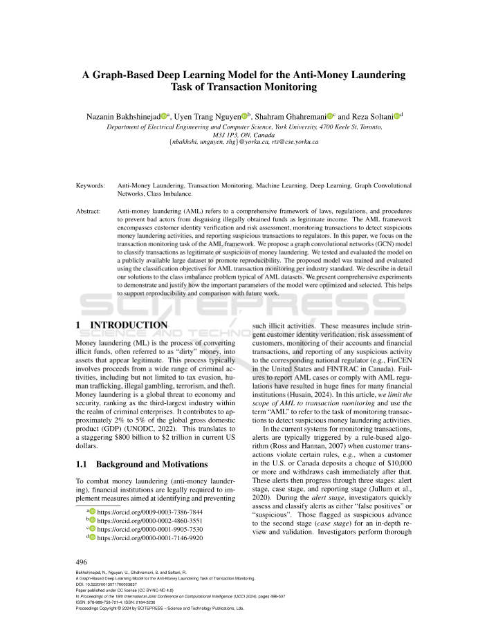

</details>

## 핵심어

자금세탁방지, 거래 모니터링, 머신러닝, 딥러닝, 그래프 합성곱 신경망, 클래스 불균형.

## 초록

자금세탁방지(AML)는 불법적으로 취득한 자금을 합법적인 소득으로 위장하지 못하도록 막기 위한 법률, 규정 및 절차의 종합적인 체계를 뜻합니다. AML 체계에는 고객 신원 확인과 위험 평가, 의심스러운 자금세탁 활동을 탐지하기 위한 거래 모니터링, 규제기관에 대한 의심 거래 보고가 포함됩니다. 본 논문은 이 가운데 거래 모니터링 과제에 초점을 맞추고, 거래를 정상 또는 자금세탁 의심 거래로 분류하는 그래프 합성곱 신경망(GCN) 모델을 제안합니다. 재현성을 높이기 위해 공개된 대규모 데이터셋으로 모델을 학습하고 평가했으며, 업계의 AML 거래 모니터링 목표에 맞는 분류 기준을 사용했습니다. 또한 AML 데이터에서 흔히 나타나는 클래스 불균형 문제의 해결 방법을 상세히 설명하고, 주요 모델 매개변수를 최적화하고 선택한 과정을 포괄적인 실험으로 제시하여 향후 연구와의 재현 및 비교가 가능하도록 했습니다.

## 1 서론

자금세탁(ML)은 종종 "더러운" 자금이라고 불리는 불법 자금을 합법적인 자산으로 전환하는 프로세스입니다. 이 프로세스에는 일반적으로 탈세, 인신매매, 불법 도박, 테러, 절도를 포함하되 이에 국한되지 않는 광범위한 범죄 활동으로 인한 수익금이 포함됩니다. 자금세탁은 경제와 보안에 대한 전 세계적 위협으로, 범죄 기업 영역에서 세 번째로 큰 산업입니다. 이는 전 세계 국내총생산(GDP)의 약 2~5%에 기여합니다(UNODC, 2022). 이는 현재 미국 달러로 환산하면 8000억 달러에서 2조 달러에 달하는 엄청난 규모입니다.

### 1.1 배경 및 연구 동기

자금세탁을 방지하기 위해, 금융 기관은 그러한 불법 활동을 식별하고 예방하기 위한 조치를 이행해야 할 법적 의무가 있습니다. 이러한 조치에는 엄격한 고객 신원 확인, 고객 위험 평가, 계정 및 금융 거래 모니터링, 의심스러운 활동에 대한 해당 국가 규제 기관(예: 미국의 FinCEN, 캐나다의 FINTRAC) 보고가 포함됩니다. AML 사례를 보고하지 않거나 AML 규정을 준수하지 않으면 많은 금융 기관에 막대한 벌금이 부과됩니다(Husain, 2024). 이 기사에서는 AML의 범위를 거래 모니터링으로 제한하고 "AML"이라는 용어를 사용하여 의심스러운 자금세탁 활동을 감지하기 위해 거래를 모니터링하는 작업을 나타냅니다.

현재 거래를 모니터링하는 시스템에서는 고객 거래가 특정 규칙을 위반할 때(예: 미국이나 캐나다의 고객이 10,000달러 이상의 수표를 입금하고 그 직후 현금을 인출하는 경우) 규칙 기반 알고리즘(Ross and Hannan, 2007)에 의해 일반적으로 경고가 발생합니다. 그런 다음 이러한 경고는 경고 단계, 사례 단계, 보고 단계의 세 단계를 거쳐 진행됩니다(Jullum et al., 2020). 경보 단계에서 조사관은 경보를 "오탐" 또는 "의심"으로 신속하게 평가하고 분류합니다. 의심스러운 것으로 신고된 사람들은 심층 검토 및 검증을 위해 2단계(사건 단계)로 진행됩니다. 조사관은 의심스러운 거래의 성격(예: 비정상적인 활동, 고위험 송금)을 확인하고 해당 거래가 실제로 자금세탁 활동의 일부인지 확인하기 위해 철저하고 상세한 조사를 수행합니다. 그러한 경우, 해당 사례는 3단계(보고 단계)로 전달됩니다. 3단계 조사관은 전달된 사례를 추가로 검토하고 2단계 조사 결과를 검증합니다. 정확하고 규정을 준수하는 것으로 판단되면 이러한 사례는 의심스러운 활동/거래 보고서를 규제 기관에 제출하라는 권고와 함께 금융 기관의 자금세탁 신고관(MLRO)에게 보고됩니다.

<!-- 원문 2쪽 -->

<details>
<summary>원문 2쪽 이미지 보기</summary>

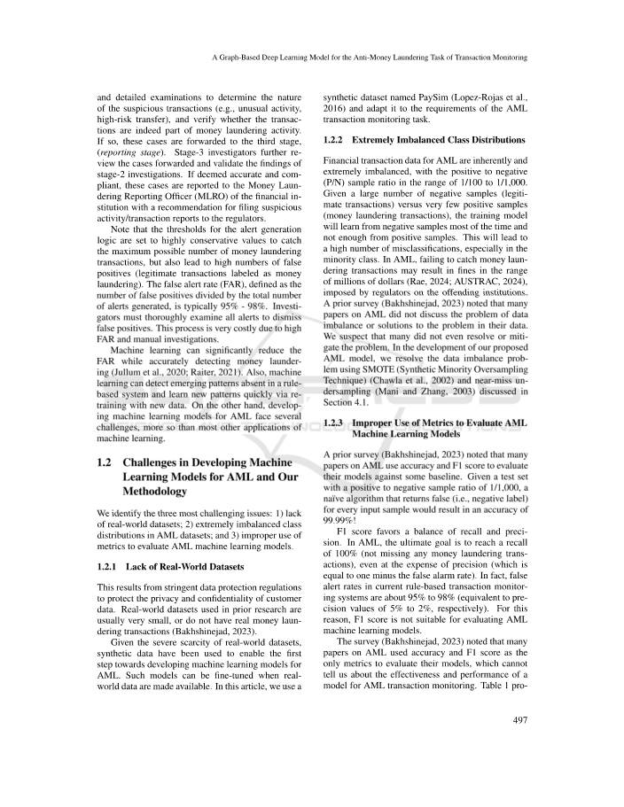

</details>

경고 생성 논리의 임계값은 가능한 최대 자금세탁 거래 수를 포착하기 위해 매우 보수적인 값으로 설정되지만, 위양성(자금세탁으로 표시된 합법적인 거래) 수도 많이 발생합니다. 오탐지 수를 생성된 총 경고 수로 나눈 값인 허위 경고율(FAR)은 일반적으로 95% - 98%입니다. 조사관은 오탐지를 무시하기 위해 모든 경고를 철저히 조사해야 합니다. 이 프로세스는 높은 FAR과 수동 조사로 인해 비용이 매우 많이 듭니다.

머신러닝은 자금세탁을 정확하게 감지하면서 FAR을 크게 줄일 수 있습니다(Jullum et al., 2020; Raiter, 2021). 또한 머신러닝은 규칙 기반 시스템에 없는 새로운 패턴을 감지하고 새로운 데이터로 재학습을 통해 새로운 패턴을 빠르게 학습할 수 있습니다. 반면, AML용 머신러닝 모델을 개발하는 것은 대부분의 다른 머신러닝 응용 프로그램보다 더 많은 몇 가지 과제에 직면합니다.

### 1.2 AML에 대한 머신러닝 모델 개발의 과제 및 방법론

본 연구에서는 가장 어려운 세 가지 문제를 식별합니다. 1) 실제 데이터셋이 부족합니다. 2) AML 데이터셋의 클래스 분포가 극도로 불균형합니다. 3) AML 머신러닝 모델을 평가하기 위해 지표을 부적절하게 사용합니다.

#### 1.2.1 실제 데이터셋의 부족

이는 고객 데이터의 개인 정보 보호 및 기밀성을 보호하기 위한 엄격한 데이터 보호 규정의 결과입니다. 이전 연구에 사용된 실제 데이터셋은 일반적으로 매우 작거나 실제 자금세탁 거래가 없습니다(Bakhshinejad, 2023).

실제 데이터셋이 심각하게 부족하다는 점을 고려하여 합성 데이터를 사용하여 AML용 머신러닝 모델 개발을 향한 첫 번째 단계를 가능하게 했습니다. 이러한 모델은 실제 데이터가 제공되면 미세 조정될 수 있습니다. 이 기사에서는 PaySim(Lopez-Rojas et al., 2016)이라는 합성 데이터셋을 사용하고 이를 AML 거래 모니터링 작업의 요구 사항에 맞게 조정합니다.

#### 1.2.2 극도로 불균형한 클래스 분포

AML의 금융 거래 데이터는 P/N(양수 대 음수) 표본 비율이 1/100~1/1,000 범위로 본질적으로 극도로 불균형합니다. 많은 수의 음성 샘플(합법적인 거래)과 매우 적은 수의 양성 샘플(자금세탁 거래)이 주어지면 훈련 모델은 대부분의 경우 음성 샘플에서 학습하지만 양성 샘플에서는 충분하지 않습니다. 이는 특히 소수 클래스에서 많은 수의 잘못된 분류로 이어질 것입니다. AML에서는 자금세탁 거래를 적발하지 못하면 규제 당국이 위반 기관에 부과하는 수백만 달러 범위의 벌금이 부과될 수 있습니다(Rae, 2024; AUSTRAC, 2024). 이전 조사(Bakhshinejad, 2023)에서는 AML에 대한 많은 논문이 데이터 불균형 문제나 데이터 문제에 대한 해결책을 논의하지 않은 것으로 나타났습니다. 많은 사람들이 문제를 해결하거나 완화하지도 못한 것으로 보입니다. 제안된 AML 모델 개발에서 우리는 섹션 4.1에서 논의한 SMOTE(Synthetic Minority Oversampling Technique)(Chawla et al., 2002)와 Near-miss Undersampling(Mani and Zhang, 2003)을 사용하여 데이터 불균형 문제를 해결했습니다.

#### 1.2.3 AML 머신러닝 모델을 평가하기 위한 지표의 부적절한 사용

이전 설문 조사(Bakhshinejad, 2023)에서는 AML에 대한 많은 논문이 정확도와 F1 점수를 사용하여 일부 기준에 대해 모델을 평가하는 것으로 나타났습니다. 긍정 대 부정 샘플 비율이 1/1,000인 테스트 세트가 주어지면 모든 입력 샘플에 대해 false(즉, 부정 레이블)를 반환하는 순진한 알고리즘의 정확도는 99.99%입니다! F1 점수는 재현율과 정밀도의 균형을 선호합니다. AML의 궁극적인 목표는 정밀도(1에서 허위 경보 비율을 뺀 값)를 희생하더라도 100% 재현율(자금세탁 거래 누락 없음)에 도달하는 것입니다. 실제로 현재 규칙 기반 거래 모니터링 시스템의 허위 경고 비율은 약 95%~98%(각각 5%~2%의 정밀도 값에 해당)입니다. 이러한 이유로 F1 점수는 AML 머신러닝 모델을 평가하는 데 적합하지 않습니다.

설문조사(Bakhshinejad, 2023)에서는 AML에 대한 많은 논문이 정확도와 F1 점수를 모델을 평가하기 위한 유일한 지표으로 사용했으며 이는 AML 거래 모니터링을 위한 모델의 효율성과 성능을 알 수 없다는 점에 주목했습니다. 표 1은 PaySim 데이터셋(Lopez-Rojas et al., 2016)를 사용한 초기 모델의 예와 해당 논문에 보고된 분류 성능을 제공합니다. 이 모델의 정확도는 81.25%~99% 범위인 반면 PaySim 데이터세트의 클래스 분포는 약 1/1000입니다. 99.99%의 정확도를 가진 위의 순진한 알고리즘은 정확도 측면에서 표 1의 모든 모델보다 성능이 뛰어납니다1!

<!-- 원문 3쪽 -->

<details>
<summary>원문 3쪽 이미지 보기</summary>

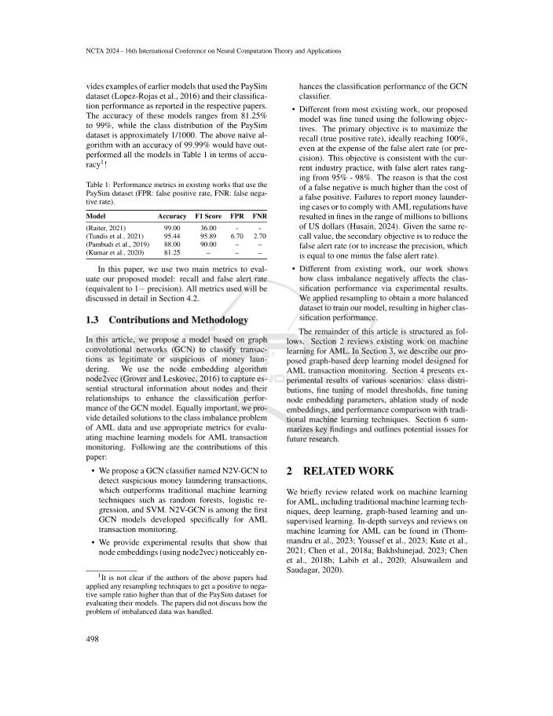

</details>

**표 1: PaySim 데이터셋을 사용하는 기존 작업의 성능 지표(FPR: 거짓 긍정 비율, FNR: 거짓 부정 비율).**

모델 정확도 F1 점수 FPR FNR (Raiter, 2021) 99.00 36.00 - - (Tundis et al., 2021) 95.44 95.89 6.70 2.70 (Pambudi et al., 2019) 88.00 90.00 – – (Kumar et al., 2020) 81.25 – – – 이 문서에서는 제안된 모델을 평가하기 위해 두 가지 주요 지표인 재현율과 잘못된 경고 비율(1-정밀도와 동일)을 사용합니다. 사용된 모든 지표는 섹션 4.2에서 자세히 논의됩니다.

### 1.3 기여 및 방법론

이 기사에서는 그래프 합성곱 신경망(GCN)를 기반으로 자금세탁이 합법적인지 의심스러운 거래를 분류하는 모델을 제안합니다. 본 연구에서는 노드 임베딩 알고리즘 node2vec(Grover and Leskovec, 2016)를 사용하여 노드 및 노드 관계에 대한 필수 구조 정보를 캡처하여 GCN 모델의 분류 성능을 향상시킵니다. 마찬가지로 중요한 것은 AML 데이터의 클래스 불균형 문제에 대한 자세한 솔루션을 제공하고 AML 거래 모니터링을 위한 머신러닝 모델을 평가하기 위해 적절한 지표을 사용한다는 것입니다. 이 논문의 기여는 다음과 같습니다.

- 우리는 의심스러운 자금세탁 거래를 탐지하기 위해 N2V-GCN이라는 GCN 분류자를 제안합니다. 이는 랜덤 포레스트, 로지스틱 회귀, SVM과 같은 기존 머신러닝 기술보다 성능이 뛰어납니다. N2V-GCN은 AML 거래 모니터링을 위해 특별히 개발된 최초의 GCN 모델 중 하나입니다.

- 노드 임베딩(node2vec 사용)이 눈에 띄게 활성화되는 것을 보여주는 실험 결과를 제공합니다.

1위 논문의 저자가 모델을 평가하기 위해 PaySim 데이터세트의 비율보다 더 높은 긍정 대 부정 표본 비율을 얻기 위해 리샘플링 기술을 적용했는지는 확실하지 않습니다. 해당 논문에서는 데이터 불균형 문제를 어떻게 처리했는지에 대해서는 논의하지 않았습니다. GCN 분류기의 분류 성능을 향상시킵니다.

- 대부분의 기존 작업과 달리 우리가 제안한 모델은 다음 목표를 사용하여 미세 조정되었습니다. 주요 목표는 잘못된 경고 비율(또는 정밀도)을 희생하더라도 이상적으로는 100%에 도달하여 재현율(참 긍정 비율)을 최대화하는 것입니다. 이 목표는 잘못된 경고 비율이 95% - 98%에 이르는 현재 업계 관행과 일치합니다. 그 이유는 위음성 비용이 위양성 비용보다 훨씬 높기 때문입니다. 자금세탁 사례를 보고하지 않거나 AML 규정을 준수하지 않을 경우 수백만 달러에서 수십억 달러에 달하는 벌금이 부과됩니다(Husain, 2024). 동일한 재현율 값이 주어지면 두 번째 목표는 허위 경고 비율을 줄이는 것입니다(또는 1에서 허위 경고 비율을 뺀 것과 동일한 정밀도를 높이는 것입니다).

- 기존 연구와 달리 본 연구에서는 클래스 불균형이 분류 성능에 어떻게 부정적인 영향을 미치는지를 실험 결과를 통해 보여줍니다. 모델을 훈련하기 위해 보다 균형 잡힌 데이터셋을 얻기 위해 리샘플링을 적용하여 분류 성능을 높였습니다.

이 기사의 나머지 부분은 다음과 같이 구성됩니다. 섹션 2에서는 AML의 머신러닝에 대한 기존 작업을 검토합니다. 섹션 3에서는 AML 거래 모니터링을 위해 설계된 그래프 기반 딥러닝 모델을 제안합니다. 섹션 4에서는 클래스 분포, 모델 임계값의 미세 조정, 노드 임베딩 매개변수의 미세 조정, 노드 임베딩에 대한 제거 연구, 기존 머신러닝 기술과의 성능 비교 등 다양한 시나리오의 실험 결과를 제시합니다. 섹션 6에서는 주요 결과를 요약하고 향후 연구의 잠재적인 문제를 설명합니다.

## 2 관련 연구

전통적인 머신러닝 기술, 딥러닝, 그래프 기반 학습 및 비지도 학습을 포함하여 AML의 머신러닝 관련 작업을 간략하게 검토합니다. AML에 대한 머신러닝에 대한 심층적인 조사 및 리뷰는 (Thommandru et al., 2023; Youssef et al., 2023; Kute et al., 2021; Chen et al., 2018a; Bakhshinejad, 2023; Chen et al., 2018b; Labib et al., 2020; Alsuwailem 및 Saudagar, 2020).

<!-- 원문 4쪽 -->

<details>
<summary>원문 4쪽 이미지 보기</summary>

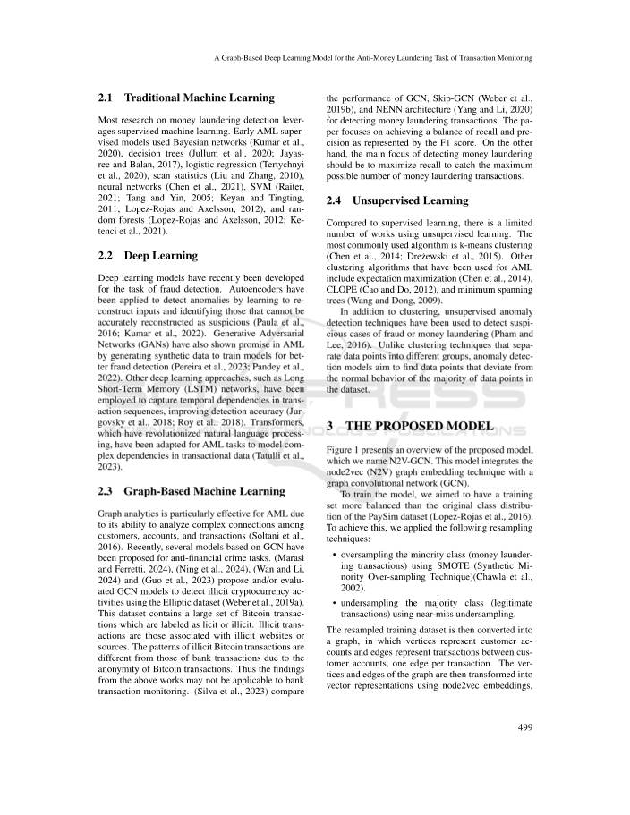

</details>

### 2.1 전통적인 머신러닝

자금세탁 탐지에 관한 대부분의 연구는 지도 머신러닝을 활용합니다. 초기 AML 지도 모델은 베이지안 네트워크(Kumar et al., 2020), 의사결정 트리(Jullum et al., 2020; Jayasree and Balan, 2017), 로지스틱 회귀(Tertychnyi et al., 2020), 스캔 통계(Liu and Zhang, 2010), 신경망(Chen et al., 2021), SVM(Raiter, 2021; Tang and Yin, 2005; Keyan and Tingting, 2011; Lopez-Rojas and Axelsson, 2012) 및 랜덤 포레스트(Lopez-Rojas and Axelsson, 2012; Ketenci et al., 2021).

### 2.2 딥러닝

최근 사기 탐지를 위한 딥러닝 모델이 개발되었습니다. 자동 인코더는 입력을 재구성하는 방법을 학습하고 의심스러운 것으로 정확하게 재구성할 수 없는 입력을 식별하여 이상 현상을 감지하는 데 적용되었습니다(Paula et al., 2016; Kumar et al., 2022). GAN(Generative Adversarial Networks)은 더 나은 사기 탐지를 위한 모델을 훈련하기 위해 합성 데이터를 생성함으로써 AML에서도 가능성을 보여주었습니다(Pereira et al., 2023; Pandey et al., 2022). LSTM(Long Short-Term Memory) 네트워크와 같은 다른 딥러닝 접근 방식은 거래 시퀀스의 시간적 종속성을 캡처하여 감지 정확도를 향상시키는 데 사용되었습니다(Jurgovsky et al., 2018; Roy et al., 2018). 자연어 처리에 혁명을 일으킨 Transformers는 거래 데이터의 복잡한 종속성을 모델링하기 위해 AML 작업에 맞게 조정되었습니다(Tatulli et al., 2023).

### 2.3 그래프 기반 머신러닝

그래프 분석은 고객, 계정 및 거래 간의 복잡한 연결을 분석하는 기능으로 인해 AML에 특히 효과적입니다(Soltani et al., 2016). 최근에는 금융범죄 방지 업무를 위해 GCN을 기반으로 한 여러 모델이 제안되었습니다. (Marasi and Ferretti, 2024), (Ning et al., 2024), (Wan and Li, 2024) 및 (Guo et al., 2023)은 Elliptic 데이터셋(Weber et al., 2019a)를 사용하여 불법 암호화폐 활동을 탐지하기 위한 GCN 모델을 제안 및/또는 평가했습니다. 이 데이터세트에는 합법 또는 불법으로 분류된 대규모 비트코인 ​​거래 세트가 포함되어 있습니다. 불법 거래는 불법 웹사이트나 출처와 관련된 거래입니다. 불법 비트코인 ​​거래의 패턴은 비트코인 ​​거래의 익명성으로 인해 은행 거래의 패턴과 다릅니다. 따라서 위 연구 결과는 은행 거래 모니터링에 적용되지 않을 수 있습니다. (Silva et al., 2023)은 자금세탁 거래를 탐지하기 위해 GCN, Skip-GCN(Weber et al., 2019b) 및 NENN 아키텍처(Yang and Li, 2020)의 성능을 비교합니다. 이 논문에서는 F1 점수로 표현되는 재현율과 정밀도의 균형을 달성하는 데 중점을 둡니다. 반면, 자금세탁 탐지의 주요 초점은 가능한 최대 자금세탁 거래 수를 포착하기 위해 재현율을 최대화하는 것입니다.

### 2.4 비지도 학습

지도학습에 비해 비지도학습을 활용한 작품은 제한적이다. 가장 일반적으로 사용되는 알고리즘은 k-평균 클러스터링입니다(Chen et al., 2014; Dre˙zewski et al., 2015). AML에 사용된 다른 클러스터링 알고리즘에는 기대 최대화(Chen et al., 2014), CLOPE(Cao and Do, 2012) 및 최소 스패닝 트리(Wang and Dong, 2009)가 포함됩니다.

클러스터링 외에도 비지도 이상 탐지 기술을 사용하여 사기 또는 자금세탁 의심 사례를 탐지했습니다(Pham and Lee, 2016). 데이터 포인트를 여러 그룹으로 분리하는 클러스터링 기술과 달리 이상 탐지 모델은 데이터셋에 있는 대부분의 데이터 포인트의 정상적인 동작에서 벗어나는 데이터 포인트를 찾는 것을 목표로 합니다.

## 3 제안된 모델

**그림 1은 제안된 모델(N2V-GCN)의 개요를 보여줍니다. 이 모델은 node2vec(N2V) 그래프 임베딩 기술을 그래프 합성곱 신경망(GCN)와 통합합니다.**

모델을 훈련하기 위해 우리는 PaySim 데이터세트의 원래 클래스 분포보다 더 균형 잡힌 훈련 세트를 갖는 것을 목표로 했습니다(Lopez-Rojas et al., 2016). 이를 달성하기 위해 다음과 같은 리샘플링 기술을 적용했습니다.

- SMOTE(Synthetic Minority Over-sampling Technique)를 사용하여 소수 클래스(자금세탁 거래)를 오버샘플링합니다(Chawla et al., 2002).

- 거의 누락된 언더샘플링을 사용하여 다수 클래스(적법한 거래)를 언더샘플링합니다.

그런 다음 리샘플링된 교육 데이터셋은 그래프로 변환됩니다. 여기서 꼭지점은 고객 계정을 나타내고 엣지는 고객 계정 간의 거래를 나타냅니다(거래당 하나의 엣지). 그런 다음 그래프의 꼭지점과 엣지는 node2vec 임베딩을 사용하여 벡터 표현으로 변환된 다음 GCN 모델에 입력됩니다. 모델은 node2vec의 벡터 출력을 사용하여 학습됩니다.

<!-- 원문 5쪽 -->

<details>
<summary>원문 5쪽 이미지 보기</summary>

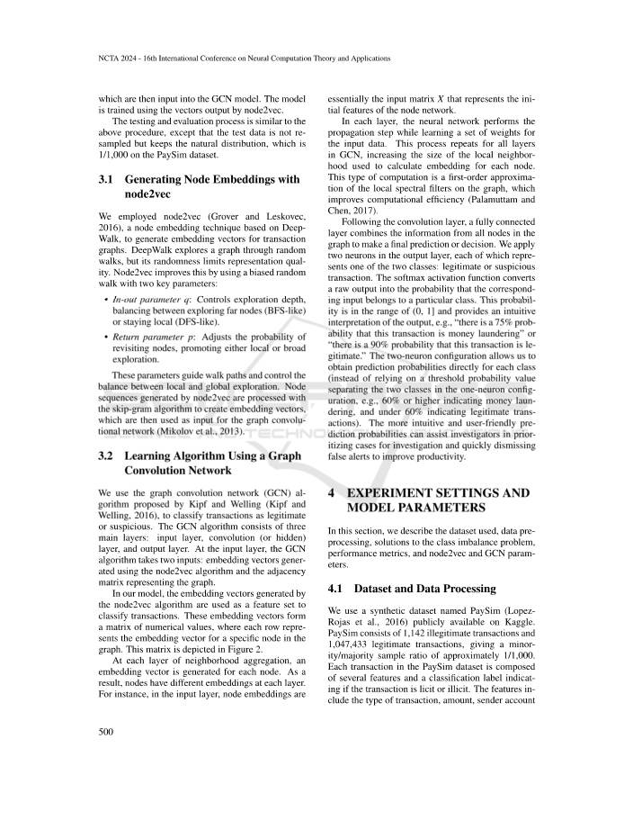

</details>

테스트 및 평가 프로세스는 테스트 데이터가 리샘플링되지 않고 PaySim 데이터셋에서 1/1,000인 자연 분포를 유지한다는 점을 제외하면 위 절차와 유사합니다.

### 3.1 node2vec을 사용하여 노드 임베딩 생성

본 연구에서는 거래 그래프에 대한 임베딩 벡터를 생성하기 위해 Deep-Walk 기반의 노드 임베딩 기술인 node2vec(Grover and Leskovec, 2016)를 사용했습니다. DeepWalk는 무작위 탐색을 통해 그래프를 탐색하지만 무작위성은 표현 품질을 제한합니다. Node2vec은 두 가지 주요 매개변수가 있는 편향된 무작위 보행을 사용하여 이를 개선합니다.

- In-out 매개변수 q: 탐색 깊이를 제어하고 원거리 노드 탐색(BFS와 유사) 또는 로컬 유지(DFS와 유사) 사이의 균형을 유지합니다.

- 반환 매개변수 p: 노드를 다시 방문할 확률을 조정하여 로컬 또는 광범위한 탐색을 촉진합니다.

이러한 매개변수는 도보 경로를 안내하고 로컬 탐색과 글로벌 탐색 간의 균형을 제어합니다. node2vec에 의해 생성된 노드 시퀀스는 스킵 그램 알고리즘으로 처리되어 임베딩 벡터를 생성한 다음 그래프 합성곱 신경망의 입력으로 사용됩니다(Mikolov et al., 2013).

### 3.2 그래프 합성곱 신경망을 이용한 알고리즘 학습

본 연구에서는 Kipf와 Welling(Kipf and Welling, 2016)이 제안한 그래프 합성곱 신경망(GCN) 알고리즘을 사용하여 합법적인 거래와 의심스러운 거래를 분류합니다. GCN 알고리즘은 입력 레이어, 컨볼루션(또는 숨겨진) 레이어, 출력 레이어의 세 가지 주요 레이어로 구성됩니다. 입력 레이어에서 GCN 알고리즘은 두 가지 입력, 즉 node2vec 알고리즘을 사용하여 생성된 임베딩 벡터와 그래프를 나타내는 인접 행렬을 사용합니다.

우리 모델에서는 node2vec 알고리즘에 의해 생성된 임베딩 벡터가 거래를 분류하기 위한 특징 집합로 사용됩니다. 이러한 임베딩 벡터는 숫자 값의 행렬을 형성하며, 여기서 각 행은 그래프의 특정 노드에 대한 임베딩 벡터를 나타냅니다. 이 매트릭스는 그림 2에 나와 있습니다.

이웃 집계의 각 계층에서 각 노드에 대해 임베딩 벡터가 생성됩니다. 결과적으로 노드는 각 레이어마다 다른 임베딩을 갖습니다. 예를 들어, 입력 계층에서 노드 임베딩은 본질적으로 노드 네트워크의 초기 기능을 나타내는 입력 행렬 X입니다.

각 계층에서 신경망은 입력 데이터에 대한 가중치 세트를 학습하면서 전파 단계를 수행합니다. 이 프로세스는 GCN의 모든 레이어에 대해 반복되어 각 노드의 임베딩을 계산하는 데 사용되는 로컬 이웃의 크기를 늘립니다. 이러한 유형의 계산은 그래프의 로컬 스펙트럼 필터에 대한 1차 근사법으로, 계산 효율성을 향상시킵니다(Palamuttam 및 Chen, 2017).

컨볼루션 레이어 다음에는 완전 연결 레이어가 그래프에 있는 모든 노드의 정보를 결합하여 최종 예측이나 결정을 내립니다. 본 연구에서는 출력 레이어에 두 개의 뉴런을 적용합니다. 각 뉴런은 합법적인 거래 또는 의심스러운 거래라는 두 가지 클래스 중 하나를 나타냅니다. 소프트맥스 활성화 함수는 원시 출력을 해당 입력이 특정 클래스에 속할 확률로 변환합니다. 이 확률은 (0, 1] 범위에 있으며 출력에 대한 직관적인 해석을 제공합니다(예: "이 거래가 자금세탁일 확률이 75%입니다" 또는 "이 거래가 합법적일 확률이 90%입니다"). 60% 미만은 합법적인 거래를 나타냄) 보다 직관적이고 사용자 친화적인 예측 확률은 조사관이 조사 대상 사례의 우선순위를 정하고 허위 경고를 신속하게 무시하여 생산성을 향상시키는 데 도움이 될 수 있습니다.

## 4 실험 설정 및 모델 매개변수

이 섹션에서는 사용된 데이터세트, 데이터 전처리, 클래스 불균형 문제에 대한 솔루션, 성능 지표, node2vec 및 GCN 매개변수에 대해 설명합니다.

### 4.1 데이터셋 및 데이터 처리

본 연구에서는 Kaggle에서 공개적으로 사용할 수 있는 PaySim(Lopez-Rojas et al., 2016)이라는 합성 데이터셋을 사용합니다. PaySim은 1,142개의 불법 거래와 1,047,433개의 합법적 거래로 구성되어 있으며 소수/다수의 표본 비율은 약 1/1,000입니다. PaySim 데이터세트의 각 거래는 여러 기능과 거래가 합법인지 불법인지를 나타내는 분류 라벨로 구성됩니다. 기능에는 거래 유형, 금액, 보낸 사람 계정이 포함됩니다.

<!-- 원문 6쪽 -->

<details>
<summary>원문 6쪽 이미지 보기</summary>

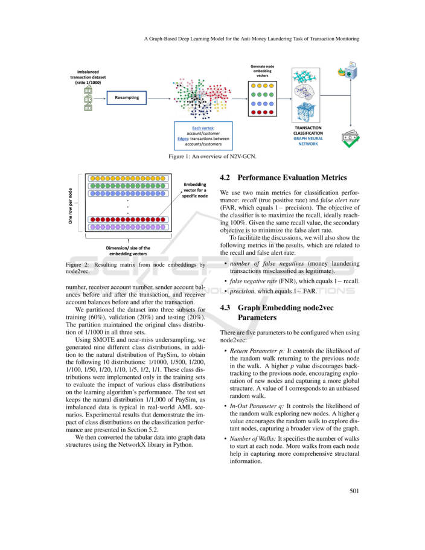

</details>

**그림 1: N2V-GCN 개요.**

**그림 2: node2vec에 의한 노드 임베딩의 결과 매트릭스.**

번호, 수취인 계좌번호, 거래 전후의 송금인 계좌 잔액, 거래 전후의 수취인 계좌 잔액.

본 연구에서는 데이터세트를 훈련(60%), 검증(20%), 테스트(20%)를 위한 세 가지 하위 집합으로 분할했습니다. 파티션은 세 세트 모두에서 원래 클래스 분포인 1/1000을 유지했습니다.

SMOTE 및 니어 미스 언더샘플링을 사용하여 PaySim의 자연 분포 외에도 9개의 서로 다른 클래스 분포를 생성하여 1/1000, 1/500, 1/200, 1/100, 1/50, 1/20, 1/10, 1/5, 1/2, 1/1의 10개 분포를 얻었습니다. 이러한 클래스 분포는 다양한 클래스 분포가 학습 알고리즘 성능에 미치는 영향을 평가하기 위해 훈련 세트에만 구현되었습니다. 실제 AML 시나리오에서는 불균형 데이터가 일반적이므로 테스트 세트는 PaySim의 자연 분포를 1/1,000으로 유지합니다. 클래스 분포가 분류 성능에 미치는 영향을 보여주는 실험 결과는 섹션 5.2에 나와 있습니다.

그런 다음 Python의 NetworkX 라이브러리를 사용하여 표 형식 데이터를 그래프 데이터 구조로 변환했습니다.

### 4.2 성능 평가 지표

본 연구에서는 분류 성능을 위해 재현율(참양성률)과 거짓 경고율(FAR, 1-정밀도)이라는 두 가지 주요 지표를 사용합니다. 분류기의 목적은 재현율을 최대화하여 이상적으로는 100%에 도달하는 것입니다. 동일한 재현율 값이 주어지면 두 번째 목표는 잘못된 경고 비율을 최소화하는 것입니다.

토론을 촉진하기 위해 결과에 재현율 및 허위 경고 비율과 관련된 다음 지표도 표시됩니다.

- 위음성(합법적인 것으로 잘못 분류된 자금세탁 거래)의 수.

- 위음성률(FNR), 이는 1−재현율과 같습니다.

- 정밀도는 1−FAR과 같습니다.

### 4.3 그래프 임베딩 node2vec 매개변수

node2vec을 사용할 때 구성해야 할 매개변수는 5개입니다.

- 반환 매개변수 p: 랜덤 워크가 워크에서 이전 노드로 돌아갈 가능성을 제어합니다. p 값이 높을수록 이전 노드로의 역추적을 방지하여 새 노드 탐색을 장려하고 보다 전역적인 구조를 캡처합니다. 값 1은 편견 없는 무작위 보행에 해당합니다.

- In-Out 매개변수 q: 새로운 노드를 탐색하는 랜덤 워크의 가능성을 제어합니다. q 값이 높을수록 랜덤 워크가 먼 노드를 탐색하여 그래프의 더 넓은 보기를 캡처하도록 권장합니다.

- 걷기 횟수: 각 노드에서 시작할 걷기 횟수를 지정합니다. 각 노드에서 더 많이 이동하면 보다 포괄적인 구조 정보를 캡처하는 데 도움이 됩니다.

<!-- 원문 7쪽 -->

<details>
<summary>원문 7쪽 이미지 보기</summary>

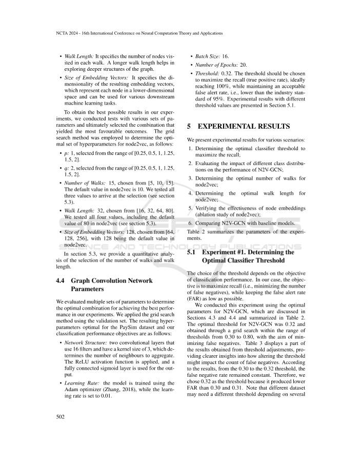

</details>

- 걷기 길이: 각 걷기에서 방문하는 노드 수를 지정합니다. 걷는 길이가 길수록 그래프의 더 깊은 구조를 탐색하는 데 도움이 됩니다.

- 임베딩 벡터 크기: 결과 임베딩 벡터의 차원을 지정합니다. 이는 저차원 공간의 각 노드를 나타내고 다양한 다운스트림 머신러닝 작업에 사용될 수 있습니다.

실험에서 가능한 최상의 결과를 얻기 위해 다양한 매개변수 세트를 사용하여 테스트를 수행했으며 궁극적으로 가장 유리한 결과를 산출하는 조합을 선택했습니다. node2vec에 대한 최적의 하이퍼파라미터 세트를 결정하기 위해 다음과 같이 그리드 검색 방법이 사용되었습니다.

- p: 1, [0.25, 0.5, 1, 1.25, 1.5, 2] 범위에서 선택됩니다.

- q: 2, [0.25, 0.5, 1, 1.25, 1.5, 2] 범위에서 선택됩니다.

- 걷기 횟수: 15, [5, 10, 15]에서 선택. node2vec의 기본값은 10입니다. 선택 항목에 도달하기 위해 세 가지 값을 모두 테스트했습니다(섹션 5.3 참조).

- 도보 길이: 32, [16, 32, 64, 80]에서 선택됨. node2vec의 기본값인 80을 포함하여 4가지 값을 모두 테스트했습니다(섹션 5.3 참조).

- 임베딩 벡터 크기: 128([64, 128, 256]에서 선택됨), node2vec의 기본값은 128입니다.

5.3절에서는 걷기 횟수와 걷기 길이 선택에 대한 정량적 분석을 제공합니다.

### 4.4 그래프 합성곱 신경망 매개변수

본 연구에서는 실험에서 최고의 성능을 달성하기 위한 최적의 조합을 결정하기 위해 여러 매개변수 세트를 평가했습니다. 검증 세트를 사용하여 그리드 검색 방법을 적용했습니다. PaySim 데이터세트와 분류 성능 목표에 최적인 결과 하이퍼파라미터는 다음과 같습니다.

- 네트워크 구조: 16개의 필터를 사용하고 커널 크기가 3인 2개의 컨벌루션 레이어로 집계할 이웃 수를 결정합니다. ReLU 활성화 함수가 적용되었으며, 출력에는 완전히 연결된 시그모이드 레이어가 사용되었습니다.

- 학습률: 모델은 Adam 최적화 프로그램(Zhang, 2018)을 사용하여 학습되고 학습률은 0.01로 설정됩니다.

- 배치 크기: 16.

- 에포크 수: 20.

- 임계값: 0.32. 임계값은 허용 가능한 잘못된 경고 비율, 즉 업계 표준인 95%보다 낮은 수준을 유지하면서 이상적으로는 100%에 도달하는 회상(진양성 비율)을 최대화하도록 선택해야 합니다. 다양한 임계값을 사용한 실험 결과는 섹션 5.1에 나와 있습니다.

## 5 실험 결과

다양한 시나리오에 대한 실험 결과를 제시합니다.

1. 재현율을 최대화하기 위한 최적의 분류기 임계값을 결정합니다. 2. N2V-GCN의 성능에 대한 다양한 클래스 분포의 영향을 평가합니다. 3. node2vec에 대한 최적의 걷기 횟수를 결정합니다. 4. node2vec에 대한 최적의 보행 길이를 결정합니다. 5. 노드 임베딩의 효율성 검증(node2vec의 절제 연구) 6. N2V-GCN을 기본 모델과 비교합니다.

**표 2는 실험의 매개변수를 요약합니다.**

### 5.1 실험 #1. 최적의 분류기 임계값 결정

임계값의 선택은 분류 성능의 목표에 따라 달라집니다. 우리의 경우 목표는 FAR(오경보율)을 가능한 한 낮게 유지하면서 재현율을 최대화하는 것(예: 위음성 수 최소화)입니다.

본 연구에서는 섹션 4.3 및 4.4에서 논의되고 표 2에 요약된 N2V-GCN에 대한 최적 매개변수를 사용하여 이 실험을 수행했습니다. N2V-GCN에 대한 최적 임계값은 0.32였으며 잘못된 부정을 최소화하기 위한 목표로 0.30~0.80의 임계값 범위 내에서 그리드 검색을 통해 얻었습니다. 표 3은 임계값 조정에서 얻은 결과의 일부를 표시하여 임계값 변경이 위음성 수에 어떤 영향을 미칠 수 있는지에 대한 보다 명확한 통찰력을 제공합니다. 결과에 따르면 0.30에서 0.32 역치까지는 위음성률이 일정하게 유지되는 것으로 나타났습니다. 따라서 0.30과 0.31보다 FAR이 낮기 때문에 0.32를 임계값으로 선택했습니다. 여러 데이터셋에는 여러 조건에 따라 다른 임계값이 필요할 수 있습니다.

<!-- 원문 8쪽 -->

<details>
<summary>원문 8쪽 이미지 보기</summary>

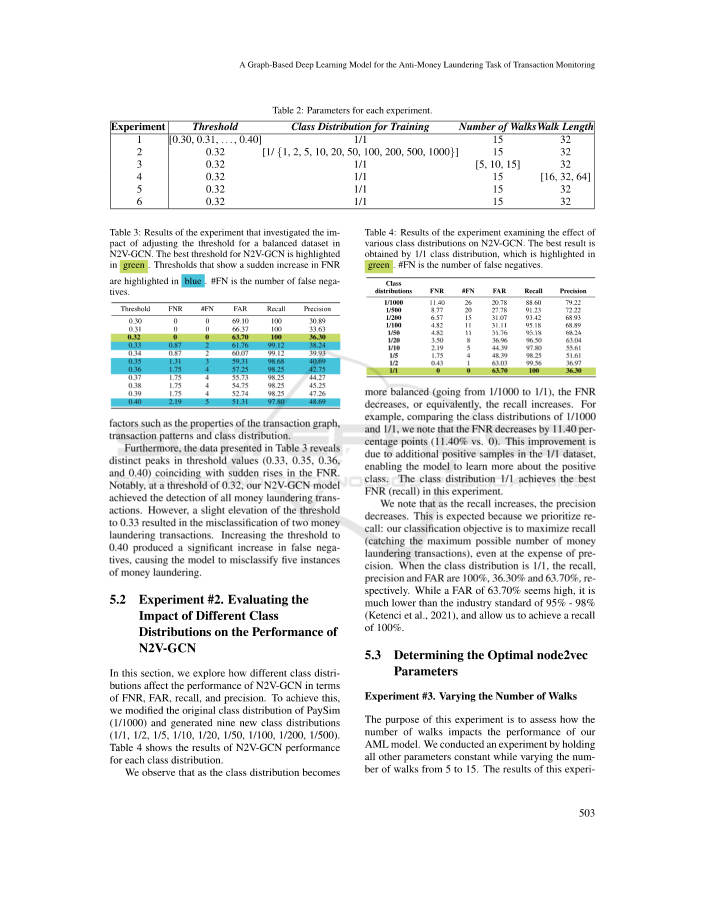

</details>

**표 2: 각 실험에 대한 매개변수.**

WalksWalk 길이 1 횟수 훈련에 대한 실험 임계값 클래스 분포 [0.30, 0.31,..., 0.40] 1/1 15 32 2 0.32 [1/ {1, 2, 5, 10, 20, 50, 100, 200, 500, 1000}] 15 32 3 0.32 1/1 [5, 10, 15] 32 4 0.32 1/1 15 [16, 32, 64] 5 0.32 1/1 15 32 6 0.32 1/1 15 32

**표 3: N2V-GCN에서 균형 잡힌 데이터셋에 대한 임계값 조정의 영향을 조사한 실험 결과. N2V-GCN의 최고 임계값은 녹색으로 강조 표시됩니다. FNR의 급격한 증가를 보여주는 임계값**

파란색으로 강조 표시됩니다. #FN은 위음성의 수입니다.

임계값 FNR #FN FAR 재현율 정밀도

> **주:** 0.30 0 0 69.10 100 30.89 0.31 0 0 66.37 100 33.63 0.32 0 0 63.70 100 36.30 0.33 0.87 2 61.76 99.12 38.24 0.34 0.87 2 60.07 99.12 39.93 0.35 1.31 3 59.31 98.68 40.69 0.36 1.75 4 57.25 98.25 42.75 0.37 1.75 4 55.73 98.25 44.27 0.38 1.75 4 54.75 98.25 45.25 0.39 1.75 4 52.74 98.25 47.26 0.40 2.19 5 51.31 97.80 48.69

거래 그래프의 속성, 거래 패턴, 클래스 분포 등의 요소.

또한 표 3에 제시된 데이터는 FNR의 급격한 상승과 동시에 임계값(0.33, 0.35, 0.36 및 0.40)의 뚜렷한 피크를 나타냅니다. 특히 N2V-GCN 모델은 임계값 0.32에서 모든 자금세탁 거래를 탐지하는 데 성공했습니다. 그러나 임계값을 0.33으로 약간 높이면 2건의 자금세탁 거래가 잘못 분류되는 결과가 발생했습니다. 임계값을 0.40으로 높이면 위음성이 크게 증가하여 모델이 5개의 자금세탁 사례를 잘못 분류하게 되었습니다.

### 5.2 실험 #2. N2V-GCN의 성능에 대한 다양한 클래스 분포의 영향 평가

이 섹션에서는 다양한 클래스 분포가 FNR, FAR, 재현율 및 정밀도 측면에서 N2V-GCN의 성능에 어떤 영향을 미치는지 살펴봅니다. 이를 달성하기 위해 PaySim의 원래 클래스 분포(1/1000)를 수정하고 9개의 새로운 클래스 분포(1/1, 1/2, 1/5, 1/10, 1/20, 1/50, 1/100, 1/200, 1/500)를 생성했습니다. 표 4는 각 클래스 분포에 대한 N2V-GCN 성능 결과를 보여줍니다.

본 연구에서는 클래스 분포가 다음과 같이 됨을 관찰합니다.

**표 4: N2V-GCN에 대한 다양한 클래스 분포의 효과를 조사한 실험 결과. 최상의 결과는 1/1 클래스 분포로 얻어지며, 이는 다음에서 강조됩니다.**

녹색. #FN은 위음성의 수입니다.

클래스 분포 FNR #FN FAR 재현율 정밀도

> **주:** 1/1000 11.40 26 20.78 88.60 79.22 1/500 8.77 20 27.78 91.23 72.22 1/200 6.57 15 31.07 93.42 68.93 1/100 4.82 11 31.11 95.18 68.89 1/50 4.82 11 31.76 95.18 68.24 1/20 3.50 8 36.96 96.50 63.04 1/10 2.19 5 44.39 97.80 55.61 1/5 1.75 4 48.39 98.25 51.61 1/2 0.43 1 63.03 99.56 36.97 1/1 0 0 63.70 100 36.30

균형이 더 잘 잡혀 있으면(1/1000에서 1/1로) FNR가 감소하거나 이에 상응하여 재현율이 증가합니다. 예를 들어, 1/1000과 1/1의 클래스 분포를 비교하면 FNR가 11.40% 포인트(11.40% 대 0) 감소한다는 것을 알 수 있습니다. 이러한 개선은 1/1 데이터셋의 추가 양성 샘플 덕분에 모델이 양성 클래스에 대해 더 많이 학습할 수 있게 되었습니다. 이 실험에서는 클래스 분포 1/1이 최고의 FNR(재현율)를 달성했습니다.

재현율이 증가하면 정밀도가 감소한다는 것을 알 수 있습니다. 이는 우리가 회상을 우선시하기 때문에 예상되는 것입니다. 우리의 분류 목표는 정확성을 희생하더라도 회상을 최대화(가능한 최대 자금세탁 거래 수를 포착)하는 것입니다. 클래스 분포가 1/1일 때 재현율, 정밀도, FAR은 각각 100%, 36.30%, 63.70%입니다. 63.70%의 FAR은 높은 것처럼 보이지만 업계 표준인 95%~98%(Ketenci et al., 2021)보다 훨씬 낮으며 100%의 재현율을 달성할 수 있습니다.

### 5.3 최적의 node2vec 매개변수 결정

실험 #3. 걷기 횟수 변경 이 실험의 목적은 걷기 횟수가 AML 모델의 성능에 어떤 영향을 미치는지 평가하는 것입니다. 본 연구에서는 걷기 횟수를 5회에서 15회까지 변화시키면서 다른 모든 매개변수는 일정하게 유지하면서 실험을 수행했습니다. 이 실험의 결과는 표 5에 요약되어 있습니다.

<!-- 원문 9쪽 -->

<details>
<summary>원문 9쪽 이미지 보기</summary>

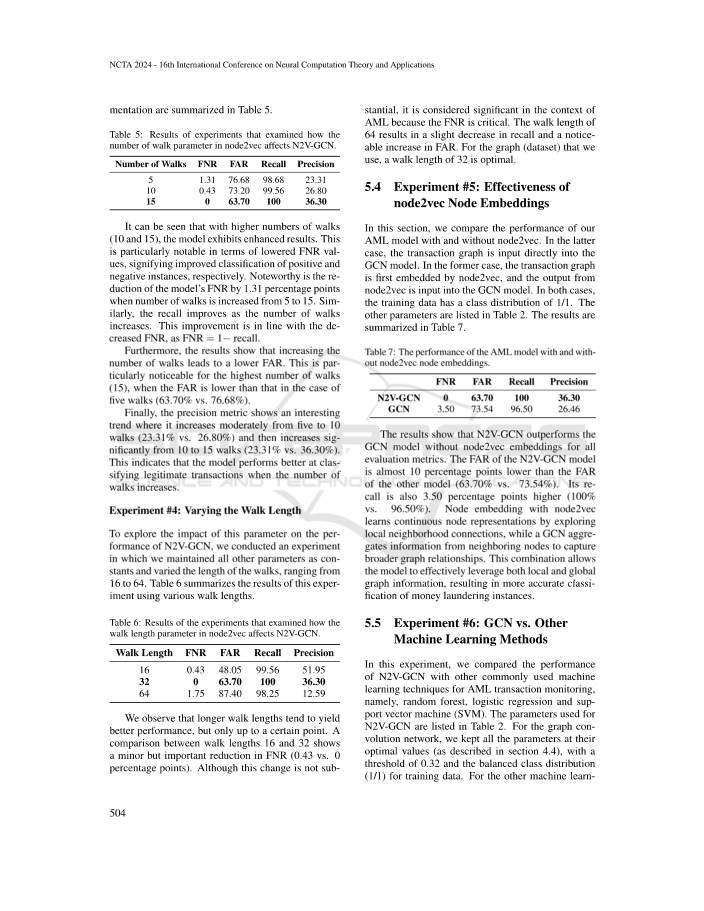

</details>

**표 5: node2vec의 걷기 매개변수 수가 N2V-GCN에 어떻게 영향을 미치는지 조사한 실험 결과.**

보행 횟수 FNR FAR 재현율 정밀도

```text
5
1.31
76.68
98.68
23.31
10
0.43
73.20
99.56
26.80
15
0
63.70
100
36.30
```

걷기 횟수가 많을수록(10 및 15) 모델이 향상된 결과를 나타내는 것을 볼 수 있습니다. 이는 FNR 값이 낮아졌다는 점에서 특히 주목할 만하며, 이는 각각 긍정적인 사례와 부정적인 사례의 분류가 향상되었음을 의미합니다. 주목할만한 점은 보행 횟수가 5회에서 15회로 증가할 때 모델의 FNR가 1.31% 포인트 감소한 것입니다. 마찬가지로 보행 횟수가 증가할수록 재현율도 향상됩니다. 이러한 개선은 FNR = 1−recall과 같이 감소된 FNR와 일치합니다.

또한, 결과는 걷기 횟수를 늘리면 FAR이 낮아지는 것으로 나타났습니다. 이는 FAR이 5개의 볼넷(63.70% 대 76.68%)의 경우보다 낮은 경우 가장 높은 볼넷 수(15개)에서 특히 두드러집니다.

마지막으로 정밀도 지표는 5회에서 10회까지 적당히 증가한 다음(23.31% 대 26.80%) 10회에서 15회까지 크게 증가하는(23.31% 대 36.30%) 흥미로운 추세를 보여줍니다. 이는 워크 수가 증가할 때 모델이 합법적인 거래를 분류하는 데 더 나은 성능을 발휘한다는 것을 나타냅니다.

실험 #4: 걷기 길이 변경 N2V-GCN의 성능에 대한 이 매개변수의 영향을 탐색하기 위해 우리는 다른 모든 매개변수를 상수로 유지하고 걷기 길이를 16에서 64까지 변경하는 실험을 수행했습니다. 표 6은 다양한 걷기 길이를 사용한 이 실험의 결과를 요약합니다.

**표 6: node2vec의 보행 길이 매개변수가 N2V-GCN에 어떻게 영향을 미치는지 조사한 실험 결과.**

보행 길이 FNR FAR 재현율 정밀도

```text
16
0.43
48.05
99.56
51.95
32
0
63.70
100
36.30
64
1.75
87.40
98.25
12.59
```

본 연구에서는 걷는 길이가 길수록 성능이 향상되는 경향이 있지만 특정 지점까지만 가능하다는 것을 관찰했습니다. 보행 길이 16과 32 사이의 비교는 FNR에서 사소하지만 중요한 감소를 보여줍니다(0.43 대 0% 포인트). 이 변경 사항은 중요하지 않지만 FNR가 중요하므로 AML의 맥락에서는 중요한 것으로 간주됩니다. 64의 보행 길이는 기억력이 약간 감소하고 FAR이 눈에 띄게 증가합니다. 우리가 사용하는 그래프(데이터셋)의 경우 걷기 길이는 32가 최적입니다.

### 5.4 실험 #5: node2vec 노드 임베딩의 효율성

이 섹션에서는 node2vec가 있거나 없는 AML 모델의 성능을 비교합니다. 후자의 경우 거래 그래프가 GCN 모델에 직접 입력됩니다. 전자의 경우 거래 그래프는 먼저 node2vec에 의해 내장되고 node2vec의 출력은 GCN 모델에 입력됩니다. 두 경우 모두 훈련 데이터의 클래스 분포는 1/1입니다. 다른 매개변수는 표 2에 나열되어 있습니다. 결과는 표 7에 요약되어 있습니다.

**표 7: node2vec 노드 임베딩이 있거나 없는 AML 모델의 성능.**

FNR FAR 재현율 정밀도

```text
N2V-GCN
0
63.70
100
36.30
GCN
3.50
73.54
96.50
26.46
```

결과는 N2V-GCN이 모든 평가 지표에 대해 node2vec 임베딩이 없는 GCN 모델보다 성능이 우수하다는 것을 보여줍니다. N2V-GCN 모델의 FAR은 다른 모델의 FAR보다 거의 10% 포인트 낮습니다(63.70% 대 73.54%). 회상률도 3.50%포인트 더 높습니다(100% 대 96.50%). node2vec을 사용한 노드 임베딩은 로컬 인접 연결을 탐색하여 연속 노드 표현을 학습하는 반면, GCN은 인접 노드의 정보를 집계하여 더 넓은 그래프 관계를 캡처합니다. 이 조합을 통해 모델은 로컬 및 글로벌 그래프 정보를 모두 효과적으로 활용하여 자금세탁 사례를 보다 정확하게 분류할 수 있습니다.

### 5.5 실험 #6: GCN 대 다른 머신러닝 방법

이 실험에서는 N2V-GCN의 성능을 AML 거래 모니터링을 위해 일반적으로 사용되는 다른 머신러닝 기술인 랜덤 포레스트, 로지스틱 회귀 및 지원 벡터 머신(SVM)과 비교했습니다. N2V-GCN에 사용되는 매개변수는 표 2에 나열되어 있습니다. 그래프 합성곱 신경망의 경우 모든 매개변수를 최적의 값(섹션 4.4에 설명됨)으로 유지했으며 임계값은 0.32이고 훈련 데이터에 대한 균형 클래스 분포(1/1)가 있습니다. 다른 머신러닝 기술의 경우 기본값을 사용하고 분류기 임계값을 SVM, Random Forest 및 로지스틱 회귀에 대해 각각 0.35, 0.40 및 0.41인 최적의 임계값으로 변경했습니다. 실험 결과는 표 8에 제시되어 있다.

<!-- 원문 10쪽 -->

<details>
<summary>원문 10쪽 이미지 보기</summary>

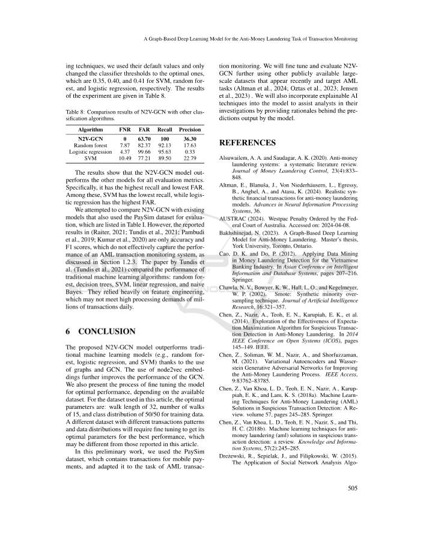

</details>

**표 8: N2V-GCN와 다른 분류 알고리즘의 비교 결과.**

알고리즘 FNR FAR 재현율 정밀도 N2V-GCN 0 63.70 100 36.30 랜덤 포레스트 7.87 82.37 92.13 17.63 로지스틱 회귀 4.37 99.66 95.63 0.33 SVM 10.49 77.21 89.50 22.79 결과는 N2V-GCN 모델이 모든 평가 지표에서 다른 모델보다 우수한 것으로 나타났습니다. 특히 재현율이 가장 높고 FAR이 가장 낮습니다. 이 중에서 SVM의 재현율이 가장 낮고 로지스틱 회귀의 FAR이 가장 높습니다.

본 연구에서는 N2V-GCN을 표 I에 나열된 평가를 위해 PaySim 데이터셋을 사용한 기존 모델과 비교하려고 시도했습니다. 그러나 (Raiter, 2021; Tundis et al., 2021; Pambudi et al., 2019; Kumar et al., 2020)에 보고된 결과는 정확성과 F1 점수일 뿐이며 이는 성능을 효과적으로 포착하지 못합니다. 섹션 1.2.3에 설명된 AML 거래 모니터링 시스템. Tundis 등의 논문. (Tundis et al., 2021)은 Random Forest, 의사결정 트리, SVM, 선형 회귀 및 Naive Bayes와 같은 전통적인 머신러닝 알고리즘의 성능을 비교했습니다. 그들은 기능 엔지니어링에 크게 의존했는데, 이는 매일 수백만 건의 거래에 대한 높은 처리 요구를 충족하지 못할 수도 있습니다.

## 6 결론

제안된 N2V-GCN 모델은 그래프와 GCN을 사용하여 기존 머신러닝 모델(예: Random Forest, 로지스틱 회귀, SVM)보다 성능이 뛰어납니다. node2vec 임베딩을 사용하면 GCN의 성능이 더욱 향상됩니다. 또한 사용 가능한 데이터셋에 따라 최적의 성능을 위해 모델을 미세 조정하는 프로세스도 제시합니다. 이 기사에 사용된 데이터세트의 경우 최적의 매개변수는 걷기 길이 32, 걷기 횟수 15, 학습 데이터 클래스 분포 50/50입니다. 다양한 거래 패턴과 데이터 분포를 가진 다양한 데이터셋은 최고의 성능을 위한 최적의 매개변수를 얻기 위해 미세 조정이 필요하며 이는 이 기사에서 보고된 것과 다를 수 있습니다.

이 예비 작업에서는 모바일 결제 거래가 포함된 PaySim 데이터셋을 사용하여 AML 거래 모니터링 작업에 맞게 조정했습니다. 본 연구에서는 최근에 나타나고 AML 작업을 대상으로 하는 공개적으로 사용 가능한 다른 대규모 데이터셋을 사용하여 N2V-GCN을 추가로 미세 조정하고 평가할 것입니다(Altman et al., 2024; Oztas et al., 2023; Jensen et al., 2023). 또한 설명 가능한 AI 기술을 모델에 통합하여 모델의 예측 결과에 대한 근거를 제공함으로써 분석가의 조사를 지원합니다.

## 참고문헌

Alsuwailem, A. A. and Saudagar, A. K. (2020). Anti-money

laundering systems: a systematic literature review. Journal of Money Laundering Control, 23(4):833– 848. Altman, E., Blanuˇsa, J., Von Niederh¨ausern, L., Egressy,

B., Anghel, A., and Atasu, K. (2024). Realistic synthetic financial transactions for anti-money laundering models. Advances in Neural Information Processing Systems, 36. AUSTRAC (2024). Westpac Penalty Ordered by the Fed-

eral Court of Australia. Accessed on: 2024-04-08. Bakhshinejad, N. (2023). A Graph-Based Deep Learning

Model for Anti-Money Laundering. Master’s thesis, York University, Toronto, Ontario. Cao, D. K. and Do, P. (2012). Applying Data Mining in Money Laundering Detection for the Vietnamese Banking Industry. In Asian Conference on Intelligent Information and Database Systems, pages 207–216. Springer. Chawla, N. V., Bowyer, K. W., Hall, L. O., and Kegelmeyer,

W. P. (2002). Smote: Synthetic minority oversampling technique. Journal of Artificial Intelligence Research, 16:321–357. Chen, Z., Nazir, A., Teoh, E. N., Karupiah, E. K., et al.

(2014). Exploration of the Effectiveness of Expectation Maximization Algorithm for Suspicious Transaction Detection in Anti-Money Laundering. In 2014 IEEE Conference on Open Systems (ICOS), pages 145–149. IEEE. Chen, Z., Soliman, W. M., Nazir, A., and Shorfuzzaman,

M. (2021). Variational Autoencoders and Wasserstein Generative Adversarial Networks for Improving the Anti-Money Laundering Process. IEEE Access, 9:83762–83785. Chen, Z., Van Khoa, L. D., Teoh, E. N., Nazir, A., Karup-

piah, E. K., and Lam, K. S. (2018a). Machine Learning Techniques for Anti-Money Laundering (AML) Solutions in Suspicious Transaction Detection: A Review. volume 57, pages 245–285. Springer. Chen, Z., Van Khoa, L. D., Teoh, E. N., Nazir, S., and Thi,

H. C. (2018b). Machine learning techniques for antimoney laundering (aml) solutions in suspicious transaction detection: a review. Knowledge and Information Systems, 57(2):245–285. Dre˙zewski, R., Sepielak, J., and Filipkowski, W. (2015).

The Application of Social Network Analysis Algo-

<!-- 원문 11쪽 -->

<details>
<summary>원문 11쪽 이미지 보기</summary>

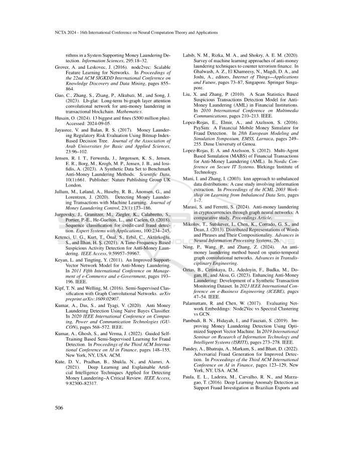

</details>

rithms in a System Supporting Money Laundering Detection. Information Sciences, 295:18–32. Grover, A. and Leskovec, J. (2016). node2vec: Scalable

Feature Learning for Networks. In Proceedings of the 22nd ACM SIGKDD International Conference on Knowledge Discovery and Data Mining, pages 855– 864. Guo, C., Zhang, S., Zhang, P., Alkubati, M., and Song, J.

(2023). Lb-glat: Long-term bi-graph layer attention convolutional network for anti-money laundering in transactional blockchain. Mathematics. Husain, O. (2024). 13 biggest aml fines ($500 million plus).

Accessed: 2024-09-05. Jayasree, V. and Balan, R. S. (2017). Money Laundering Regulatory Risk Evaluation Using Bitmap Index- Based Decision Tree. Journal of the Association of Arab Universities for Basic and Applied Sciences, 23:96–102. Jensen, R. I. T., Ferwerda, J., Jørgensen, K. S., Jensen,

E. R., Borg, M., Krogh, M. P., Jensen, J. B., and Iosifidis, A. (2023). A Synthetic Data Set to Benchmark Anti-Money Laundering Methods. Scientific Data, 10(1):661. Publisher: Nature Publishing Group UK London. Jullum, M., Løland, A., Huseby, R. B., ˚Anonsen, G., and

Lorentzen, J. (2020). Detecting Money Laundering Transactions with Machine Learning. Journal of Money Laundering Control, 23(1):173–186. Jurgovsky, J., Granitzer, M., Ziegler, K., Calabretto, S.,

Portier, P.-E., He-Guelton, L., and Caelen, O. (2018). Sequence classification for credit-card fraud detection. Expert Systems with Applications, 100:234–245. Ketenci, U. G., Kurt, T., ¨Onal, S., Erbil, C., Akt¨urkoˇglu,

S., and ˙Ilhan, H. S¸. (2021). A Time-Frequency Based Suspicious Activity Detection for Anti-Money Laundering. IEEE Access, 9:59957–59967. Keyan, L. and Tingting, Y. (2011). An Improved Support-

Vector Network Model for Anti-Money Laundering. In 2011 Fifth International Conference on Management of e-Commerce and e-Government, pages 193– 196. IEEE. Kipf, T. N. and Welling, M. (2016). Semi-Supervised Clas-

sification with Graph Convolutional Networks. arXiv preprint arXiv:1609.02907. Kumar, A., Das, S., and Tyagi, V. (2020). Anti Money Laundering Detection Using Na¨ıve Bayes Classifier. In 2020 IEEE International Conference on Computing, Power and Communication Technologies (GU- CON), pages 568–572. IEEE. Kumar, A., Ghosh, S., and Verma, J. (2022). Guided Self-

Training Based Semi-Supervised Learning for Fraud Detection. In Proceedings of the Third ACM International Conference on AI in Finance, pages 148–155, New York, NY, USA. ACM. Kute, D. V., Pradhan, B., Shukla, N., and Alamri, A.

(2021). Deep Learning and Explainable Artificial Intelligence Techniques Applied for Detecting Money Laundering–A Critical Review. IEEE Access, 9:82300–82317.

Labib, N. M., Rizka, M. A., and Shokry, A. E. M. (2020).

Survey of machine learning approaches of anti-money laundering techniques to counter terrorism finance. In Ghalwash, A. Z., El Khameesy, N., Magdi, D. A., and Joshi, A., editors, Internet of Things—Applications and Future, pages 73–87, Singapore. Springer Singapore. Liu, X. and Zhang, P. (2010). A Scan Statistics Based Suspicious Transactions Detection Model for Anti- Money Laundering (AML) in Financial Institutions. In 2010 International Conference on Multimedia Communications, pages 210–213. IEEE. Lopez-Rojas, E., Elmir, A., and Axelsson, S. (2016).

PaySim: A Financial Mobile Money Simulator for Fraud Detection. In 28th European Modeling and Simulation Symposium, EMSS, Larnaca, pages 249– 255. Dime University of Genoa. Lopez-Rojas, E. A. and Axelsson, S. (2012). Multi-Agent

Based Simulation (MABS) of Financial Transactions for Anti-Money Laundering (AML). In Nordic Conference on Secure IT Systems. Blekinge Institute of Technology. Mani, I. and Zhang, I. (2003). knn approach to unbalanced

data distributions: A case study involving information extraction. In Proceedings of the ICML 2003 Workshop on Learning from Imbalanced Data Sets, pages 1–7. Marasi, S. and Ferretti, S. (2024). Anti-money laundering

in cryptocurrencies through graph neural networks: A comparative study. Proceedings Article. Mikolov, T., Sutskever, I., Chen, K., Corrado, G. S., and

Dean, J. (2013). Distributed Representations of Words and Phrases and Their Compositionality. Advances in Neural Information Processing Systems, 26. Ning, P., Wang, P., and Zhang, Z. (2024). An antimoney laundering method based on spatio-temporal graph convolutional networks. Advances in Transdisciplinary Engineering. Oztas, B., Cetinkaya, D., Adedoyin, F., Budka, M., Do-

gan, H., and Aksu, G. (2023). Enhancing Anti-Money Laundering: Development of a Synthetic Transaction Monitoring Dataset. In 2023 IEEE International Conference on e-Business Engineering (ICEBE), pages 47–54. IEEE. Palamuttam, R. and Chen, W. (2017). Evaluating Network Embeddings: Node2Vec vs Spectral Clustering vs GCN. Pambudi, B. N., Hidayah, I., and Fauziati, S. (2019). Im-

proving Money Laundering Detection Using Optimized Support Vector Machine. In 2019 International Seminar on Research of Information Technology and Intelligent Systems (ISRITI), pages 273–278. IEEE. Pandey, A., Bhatraju, A., Markam, S., and Bhatt, D. (2022).

Adversarial Fraud Generation for Improved Detection. In Proceedings of the Third ACM International Conference on AI in Finance, pages 123–129, New York, NY, USA. ACM. Paula, E. L., Ladeira, M., Carvalho, R. N., and Marza-

gao, T. (2016). Deep Learning Anomaly Detection as Support Fraud Investigation in Brazilian Exports and

<!-- 원문 12쪽 -->

<details>
<summary>원문 12쪽 이미지 보기</summary>

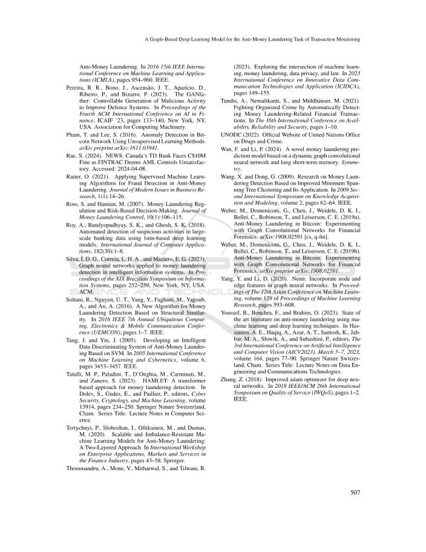

</details>

Anti-Money Laundering. In 2016 15th IEEE International Conference on Machine Learning and Applications (ICMLA), pages 954–960. IEEE. Pereira, R. R., Bono, J., Ascens˜ao, J. T., Apar´ıcio, D.,

Ribeiro, P., and Bizarro, P. (2023). The GANfather: Controllable Generation of Malicious Activity to Improve Defence Systems. In Proceedings of the Fourth ACM International Conference on AI in Finance, ICAIF ’23, pages 133–140, New York, NY, USA. Association for Computing Machinery. Pham, T. and Lee, S. (2016). Anomaly Detection in Bit-

coin Network Using Unsupervised Learning Methods. arXiv preprint arXiv:1611.03941. Rae, S. (2024). NEWS: Canada’s TD Bank Faces C$10M

Fine as FINTRAC Deems AML Controls Unsatisfactory. Accessed: 2024-04-08. Raiter, O. (2021). Applying Supervised Machine Learning Algorithms for Fraud Detection in Anti-Money Laundering. Journal of Modern Issues in Business Research, 1(1):14–26. Ross, S. and Hannan, M. (2007). Money Laundering Reg-

ulation and Risk-Based Decision-Making. Journal of Money Laundering Control, 10(1):106–115. Roy, A., Bandyopadhyay, S. K., and Ghosh, S. K. (2018).

Automated detection of suspicious activities in largescale banking data using lstm-based deep learning models. International Journal of Computer Applications, 182(30):1–8. Silva, ´I. D. G., Correia, L. H. A., and Maziero, E. G. (2023).

Graph neural networks applied to money laundering detection in intelligent information systems. In Proceedings of the XIX Brazilian Symposium on Information Systems, pages 252–259, New York, NY, USA. ACM. Soltani, R., Nguyen, U. T., Yang, Y., Faghani, M., Yagoub,

A., and An, A. (2016). A New Algorithm for Money Laundering Detection Based on Structural Similarity. In 2016 IEEE 7th Annual Ubiquitous Computing, Electronics & Mobile Communication Conference (UEMCON), pages 1–7. IEEE. Tang, J. and Yin, J. (2005). Developing an Intelligent Data Discriminating System of Anti-Money Laundering Based on SVM. In 2005 International Conference on Machine Learning and Cybernetics, volume 6, pages 3453–3457. IEEE. Tatulli, M. P., Paladini, T., D’Onghia, M., Carminati, M.,

and Zanero, S. (2023). HAMLET: A transformer based approach for money laundering detection. In Dolev, S., Gudes, E., and Paillier, P., editors, Cyber Security, Cryptology, and Machine Learning, volume 13914, pages 234–250. Springer Nature Switzerland, Cham. Series Title: Lecture Notes in Computer Science. Tertychnyi, P., Slobozhan, I., Ollikainen, M., and Dumas,

M. (2020). Scalable and Imbalance-Resistant Machine Learning Models for Anti-Money Laundering: A Two-Layered Approach. In International Workshop on Enterprise Applications, Markets and Services in the Finance Industry, pages 43–58. Springer. Thommandru, A., Mone, V., Mitharwal, S., and Tilwani, R.

(2023). Exploring the intersection of machine learning, money laundering, data privacy, and law. In 2023 International Conference on Innovative Data Communication Technologies and Application (ICIDCA), pages 149–155. Tundis, A., Nemalikanti, S., and M¨uhlh¨auser, M. (2021).

Fighting Organized Crime by Automatically Detecting Money Laundering-Related Financial Transactions. In The 16th International Conference on Availability, Reliability and Security, pages 1–10. UNODC (2022). Official Website of United Nations Office

on Drugs and Crime. Wan, F. and Li, P. (2024). A novel money laundering pre-

diction model based on a dynamic graph convolutional neural network and long short-term memory. Symmetry. Wang, X. and Dong, G. (2009). Research on Money Laun-

dering Detection Based on Improved Minimum Spanning Tree Clustering and Its Application. In 2009 Second International Symposium on Knowledge Acquisition and Modeling, volume 2, pages 62–64. IEEE. Weber, M., Domeniconi, G., Chen, J., Weidele, D. K. I.,

Bellei, C., Robinson, T., and Leiserson, C. E. (2019a). Anti-Money Laundering in Bitcoin: Experimenting with Graph Convolutional Networks for Financial Forensics. arXiv:1908.02591 [cs, q-fin]. Weber, M., Domeniconi, G., Chen, J., Weidele, D. K. I.,

Bellei, C., Robinson, T., and Leiserson, C. E. (2019b). Anti-Money Laundering in Bitcoin: Experimenting with Graph Convolutional Networks for Financial Forensics. arXiv preprint arXiv:1908.02591. Yang, Y. and Li, D. (2020). Nenn: Incorporate node and

edge features in graph neural networks. In Proceedings of The 12th Asian Conference on Machine Learning, volume 129 of Proceedings of Machine Learning Research, pages 593–608. Youssef, B., Bouchra, F., and Brahim, O. (2023). State of

the art literature on anti-money laundering using machine learning and deep learning techniques. In Hassanien, A. E., Haqiq, A., Azar, A. T., Santosh, K., Jabbar, M. A., Słowik, A., and Subashini, P., editors, The 3rd International Conference on Artificial Intelligence and Computer Vision (AICV2023), March 5–7, 2023, volume 164, pages 77–90. Springer Nature Switzerland, Cham. Series Title: Lecture Notes on Data Engineering and Communications Technologies. Zhang, Z. (2018). Improved adam optimizer for deep neu-

ral networks. In 2018 IEEE/ACM 26th International Symposium on Quality of Service (IWQoS), pages 1–2. IEEE.
