# 이종 그래프 신경망을 이용한 자금세탁자 탐지

> **원문 제목:** Finding Money Launderers Using Heterogeneous Graph Neural Networks  
> **저자:** Fredrik Johannessen · Martin Jullum  
> **게재 정보:** The Journal of Finance and Data Science, Volume 11 (2025), Article 100175  
> **DOI:** [https://doi.org/10.1016/j.jfds.2025.100175](https://doi.org/10.1016/j.jfds.2025.100175)

> **번역 안내:** 본문은 문단의 전체 문맥을 기준으로 한국어로 옮겼으며, AML·GNN 전문용어를 통일했습니다. 수식, 변수, 알고리즘 코드와 참고문헌은 정확성을 위해 원문 표기를 유지했습니다. 그림과 표는 각 번역 구간에 배치된 해당 원문 페이지 이미지에서 확인할 수 있습니다.

---

<!-- 원문 1쪽 -->

<details>
<summary>원문 1쪽 이미지 보기</summary>

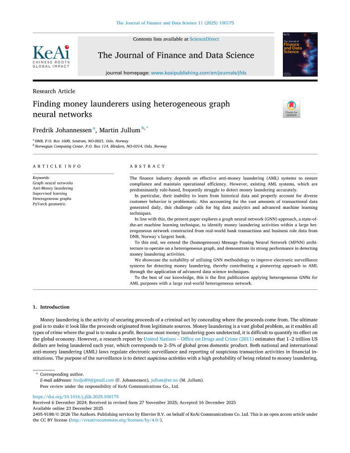

</details>

## 핵심어

그래프 신경망 자금세탁방지 지도 학습 이종 그래프 PyTorch 기하학

## 초록

금융 산업은 규제 준수와 운영 효율성을 확보하기 위해 효과적인 자금세탁방지(AML) 시스템에 의존합니다. 그러나 현재의 AML 시스템은 대부분 규칙 기반이어서 자금세탁을 정확히 탐지하는 데 자주 한계를 보입니다. 특히 과거 데이터로부터 학습하지 못하고 다양한 고객 행동을 충분히 반영하지 못한다는 문제가 있습니다. 매일 생성되는 방대한 거래 데이터까지 고려하면 빅데이터 분석과 고도화된 머신러닝 기법이 필요합니다. 본 논문은 노르웨이 최대 은행 DNB의 실제 은행 거래와 기업 역할 데이터로 구성된 대규모 이종 네트워크에서 자금세탁 활동을 식별하기 위해 최신 머신러닝 기법인 그래프 신경망(GNN)을 적용합니다. 이를 위해 동종 메시지 패싱 신경망(MPNN) 구조를 이종 그래프에서 작동하도록 확장하고, 자금세탁 탐지에서 강력한 성능을 보임을 입증합니다. 또한 GNN 방법론이 은행의 전자 감시 시스템을 개선하는 데 적합함을 보여 줌으로써, 고급 데이터 과학을 AML에 적용하는 선도적인 접근법을 제시합니다. 저자들이 아는 한, 이는 대규모 실제 이종 네트워크에서 AML 목적으로 이종 GNN을 적용한 최초의 출판 연구입니다.

## 1 서론

자금세탁이란 범죄수익의 출처를 숨겨 범죄수익을 확보하는 행위를 말한다. 궁극적인 목표는 합법적인 출처에서 발생한 수익금처럼 보이도록 만드는 것입니다. 자금세탁은 이익 창출이 목표인 모든 유형의 범죄를 가능하게 하기 때문에 광범위한 글로벌 문제입니다. 대부분의 자금세탁은 적발되지 않기 때문에 그것이 세계 경제에 미치는 영향을 정량화하기는 어렵습니다. 그러나 UN 마약 범죄 사무국(2011)의 연구 보고서에 따르면 매년 1~2조 달러가 세탁되고 있으며 이는 전 세계 국내총생산(GDP)의 2~5%에 해당합니다. 국내 및 국제 자금세탁방지법(AML)은 금융 기관의 의심스러운 거래 활동에 대한 전자 감시 및 보고를 규제합니다. 감시의 목적은 자금세탁과 관련될 가능성이 높은 의심스러운 활동을 탐지하는 것입니다.

- 교신저자. 이메일 주소: fredjo89@gmail.com(F. Johannessen), jullum@nr.no(M. Jullum). KeAi Communications Co., Ltd.의 책임 하에 Peer Review를 수행합니다.

<!-- 원문 2쪽 -->

<details>
<summary>원문 2쪽 이미지 보기</summary>

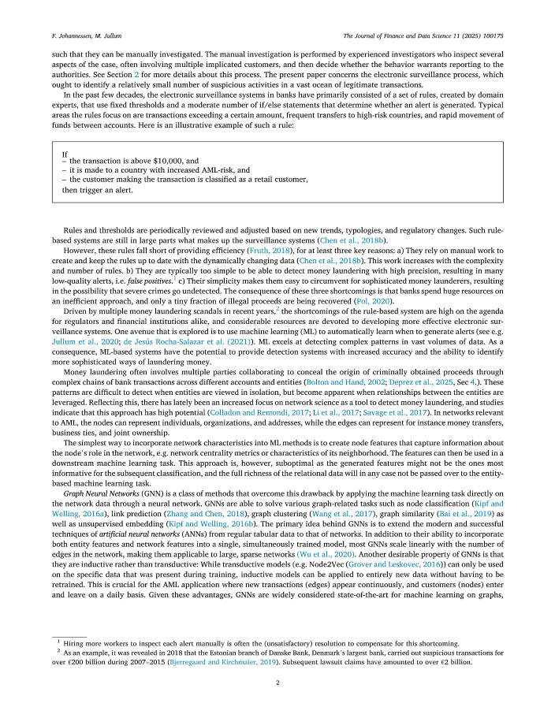

</details>

수동으로 조사할 수 있도록 합니다. 수동 조사는 사건의 여러 측면(종종 연루된 고객 포함)을 조사한 후 해당 행위가 당국에 보고되어야 하는지 여부를 결정하는 숙련된 조사관에 의해 수행됩니다. 이 프로세스에 대한 자세한 내용은 섹션 2를 참조하세요. 본 논문은 합법적인 거래의 광대한 바다에서 비교적 소수의 의심스러운 활동을 식별해야 하는 전자 감시 프로세스에 관한 것입니다.

지난 수십 년 동안 은행의 전자 감시 시스템은 주로 도메인 전문가가 만든 일련의 규칙으로 구성되어 있으며, 경고 생성 여부를 결정하는 고정된 임계값과 적절한 수의 if/else 문을 사용합니다. 규칙이 중점을 두는 일반적인 영역은 일정 금액을 초과하는 거래, 고위험 국가로의 빈번한 이체, 계좌 간 자금의 빠른 이동입니다. 다음은 그러한 규칙의 예시입니다.

– 거래가 $10,000를 초과하고 – AML 위험이 증가한 국가에서 이루어졌으며 – 거래를 하는 고객이 소매 고객으로 분류되면 경고가 트리거됩니다.

규칙과 임계값은 새로운 동향, 유형, 규제 변경 사항에 따라 정기적으로 검토되고 조정됩니다. 이러한 규칙 기반 시스템은 여전히 ​​감시 시스템을 구성하는 큰 부분을 차지합니다(Chen et al., 2018b).

그러나 이러한 규칙은 적어도 세 가지 주요 이유로 인해 효율성을 제공하지 못합니다(Fruth, 2018). a) 동적으로 변화하는 데이터로 규칙을 최신 상태로 유지하기 위해 수동 작업에 의존합니다(Chen et al., 2018b). 이 작업은 규칙의 복잡성과 수에 따라 증가합니다. b) 일반적으로 너무 단순하여 높은 정밀도로 자금세탁을 탐지할 수 없으므로 품질이 낮은 경고(예: 오탐)가 많이 발생합니다.1 c) 이러한 단순성으로 인해 정교한 자금세탁자가 쉽게 우회할 수 있어 심각한 범죄가 탐지되지 않을 가능성이 있습니다. 이 세 가지 단점의 결과로 은행은 비효율적인 접근 방식에 막대한 자원을 소비하고 불법 수익 중 극히 일부만 회수된다는 것입니다(Pol, 2020).

최근 몇 년간 여러 차례의 자금세탁 스캔들로 인해2 규칙 기반 시스템의 단점이 규제 기관과 금융 기관 모두의 주요 의제로 떠오르고 있으며 보다 효과적인 전자 감시 시스템을 개발하는 데 상당한 자원이 투입되고 있습니다. 탐색되는 한 가지 방법은 머신러닝(ML)을 사용하여 경고 생성 시기를 자동으로 학습하는 것입니다(예: Jullum et al., 2020; de Jesús Rocha-Salazar et al.(2021) 참조). ML은 방대한 양의 데이터에서 복잡한 패턴을 탐지하는 데 탁월합니다. 결과적으로, ML 기반 시스템은 향상된 정확성과 보다 정교한 자금세탁 방법을 식별할 수 있는 능력을 갖춘 탐지 시스템을 제공할 수 있는 잠재력을 가지고 있습니다.

자금세탁에는 여러 계좌와 법인에 걸친 복잡한 은행 거래 체인을 통해 범죄로 취득한 수익금의 출처를 은폐하기 위해 여러 당사자가 협력하는 경우가 많습니다(Bolton and Hand, 2002; Deprez et al., 2025, Sec 4.). 이러한 패턴은 엔터티를 개별적으로 볼 때 감지하기 어렵지만 엔터티 간의 관계를 활용하면 분명해집니다. 이를 반영하여 최근 자금세탁을 탐지하는 도구로서 네트워크 과학에 대한 관심이 높아지고 있으며, 연구에 따르면 이 접근 방식은 높은 잠재력을 가지고 있는 것으로 나타났습니다(Colladon and Remondi, 2017; Li et al., 2017; Savage et al., 2017). AML과 관련된 네트워크에서 노드는 개인, 조직 및 주소를 나타낼 수 있으며 엣지는 송금, 비즈니스 관계 및 공동 소유권 등을 나타낼 수 있습니다.

네트워크 특성을 ML 방법에 통합하는 가장 간단한 방법은 네트워크에서 노드의 역할에 대한 정보를 캡처하는 노드 특징을 만드는 것입니다. 네트워크 중심성 지표 또는 인근 지역의 특성. 그런 다음 해당 기능을 다운스트림 머신러닝 작업에서 사용할 수 있습니다. 그러나 이 접근 방식은 생성된 기능이 후속 분류에 가장 유용한 기능이 아닐 수 있고 어떤 경우에도 관계형 데이터의 전체 풍부함이 엔터티 기반 머신러닝 작업으로 전달되지 않기 때문에 차선책입니다.

그래프 신경망(GNN)은 신경망을 통해 네트워크 데이터에 직접 머신러닝 작업을 적용하여 이러한 단점을 극복하는 방법의 클래스입니다. GNN은 노드 분류(Kipf and Welling, 2016a), 링크 예측(Zhang and Chen, 2018), 그래프 클러스터링(Wang et al., 2017), 그래프 유사성(Bai et al., 2019) 및 비지도 임베딩(Kipf and Welling, 2016b)과 같은 다양한 그래프 관련 작업을 해결할 수 있습니다. GNN의 기본 아이디어는 인공 신경망(ANN)의 현대적이고 성공적인 기술을 일반 표 형식 데이터에서 네트워크 데이터로 확장하는 것입니다. 엔터티 기능과 네트워크 기능을 동시에 학습된 단일 모델에 통합하는 기능 외에도 대부분의 GNN은 네트워크의 엣지 수에 따라 선형적으로 확장되므로 대규모 희소 네트워크에 적용할 수 있습니다(Wu et al., 2020). GNN의 또 다른 바람직한 특성은 변환적보다는 유도적이라는 것입니다. 변환적 모델(예: Node2Vec(Grover and Leskovec, 2016))은 훈련 중에 존재했던 특정 데이터에만 사용할 수 있는 반면, 귀납적 모델은 재훈련할 필요 없이 완전히 새로운 데이터에 적용할 수 있습니다. 이는 새로운 거래(엣지)가 지속적으로 나타나고 고객(노드)이 매일 들어오고 나가는 AML 애플리케이션에 매우 중요합니다. 이러한 장점을 고려할 때 GNN은 그래프 머신러닝을 위한 최첨단 기술로 널리 간주됩니다.

> **주:** 1 각 경고를 수동으로 검사하기 위해 더 많은 작업자를 고용하는 것은 이러한 단점을 보완하기 위한 (불만족스러운) 해결책인 경우가 많습니다. 2 일례로, 덴마크 최대 은행인 Danske Bank의 에스토니아 지점이 2007~2015년 동안 2,000억 유로가 넘는 의심스러운 거래를 수행한 사실이 2018년에 밝혀졌습니다(Bjerregaard 및 Kirchmaier, 2019). 후속 소송 청구 금액은 20억 유로가 넘습니다.

<!-- 원문 3쪽 -->

<details>
<summary>원문 3쪽 이미지 보기</summary>

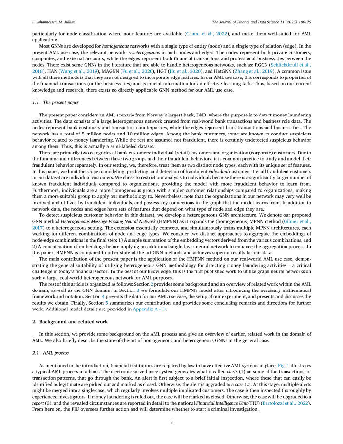

</details>

특히 노드 특징을 사용할 수 있는 노드 분류의 경우(Chami et al., 2022) AML 애플리케이션에 적합하게 만듭니다.

대부분의 GNN은 단일 유형의 엔터티(노드)와 단일 유형의 관계(엣지)가 있는 동종 네트워크용으로 개발되었습니다. 현재 AML 사용 사례에서 관련 네트워크는 노드와 엣지 모두에서 이질적입니다. 노드는 개인 고객, 회사 및 외부 계정을 모두 나타내고 엣지는 노드 간의 금융 거래와 전문적인 비즈니스 관계를 모두 나타냅니다. RGCN(Schlichtkrull et al., 2018), HAN(Wang et al., 2019), MAGNN(Fu et al., 2020), HGT(Hu et al., 2020) 및 HetGNN(Zhang et al., 2019). 이러한 모든 방법의 일반적인 문제는 엣지 기능을 통합하도록 설계되지 않았다는 것입니다. AML 사용 사례에서 이는 금융 거래(또는 비즈니스 관계)의 속성에 해당하며 효과적인 학습 작업을 위한 중요한 정보입니다. 따라서 현재 지식과 연구에 따르면 AML 사용 사례에 직접 적용할 수 있는 GNN 방법은 없습니다.

### 1.1 본 논문

본 문서에서는 자금세탁 활동을 탐지하는 것이 목적인 노르웨이 최대 은행인 DNB의 AML 시나리오를 고려합니다. 데이터는 실제 은행 거래와 비즈니스 역할 데이터로 생성된 대규모 이종 네트워크로 구성됩니다. 노드는 은행 고객과 거래 상대방을 나타내고, 엣지는 은행 거래와 비즈니스 관계를 나타냅니다. 네트워크에는 총 500만 개의 노드와 1천만 개의 엣지가 있습니다. 은행 고객 중에는 자금세탁과 관련해 의심스러운 행동을 하는 이들도 있는 것으로 알려졌다. 나머지는 사기가 아닌 것으로 추정되지만, 그중에는 확실히 감지되지 않은 의심스러운 행동이 있습니다. 따라서 이는 실제로 부분적으로 레이블된 데이터셋입니다.

은행 고객에는 주로 개인(소매) 고객과 조직(기업) 고객이라는 두 가지 범주가 있습니다. 이 두 그룹과 사기 행위 간의 근본적인 차이로 인해 사기 행위를 별도로 연구하고 모델링하는 것이 일반적입니다. 따라서 우리 설정에서는 이를 각각 고유한 특징 집합을 가진 두 개의 서로 다른 노드 유형으로 취급합니다. 본 논문에서는 사기성 개인 고객의 모델링, 예측 및 탐지로 범위를 제한합니다. 즉. 우리 데이터셋의 모든 사기 고객은 개인 고객입니다. 본 연구에서는 분석을 개인으로 제한하기로 결정했습니다. 왜냐하면 조직에 비해 알려진 사기 개인의 수가 훨씬 더 많기 때문에 모델에 더 많은 사기 행위로부터 학습할 수 있는 기능을 제공하기 때문입니다. 또한 개인은 조직에 비해 고객 관계가 더 단순한 동질적인 그룹이므로 우리의 방법론을 적용하기에 더 적합한 그룹입니다. 그럼에도 불구하고, 우리 네트워크의 조직은 사기꾼에 의해 매우 잘 연루되어 활용될 수 있으며, 모델이 학습하는 그래프에서 주요 연결을 보유할 수 있습니다. 네트워크 데이터 외에도 노드와 엣지에는 노드와 엣지의 유형에 따라 달라지는 특징 집합이 있습니다.

이 데이터셋에서 의심스러운 고객 행동을 탐지하기 위해 우리는 이종 GNN 아키텍처를 개발합니다. 제안된 GNN 방법 이종 메시지 패싱 신경망(HMPNN)은 (동종) MPNN 방법(Gilmer et al., 2017)을 이종 설정으로 확장하므로 나타냅니다. 확장은 기본적으로 여러 MPNN 아키텍처를 연결하고 동시에 학습하며, 각각은 노드와 엣지 유형의 다양한 조합에서 작동합니다. 본 연구에서는 마지막 단계에서 노드-엣지 조합의 임베딩을 집계하기 위해 두 가지 서로 다른 접근 방식을 고려합니다. 1) 다양한 조합에서 파생된 임베딩 벡터의 간단한 합산, 2) 집계 프로세스를 향상하기 위해 추가 단일 계층 신경망을 적용하기 전 임베딩 연결. 본 논문에서는 HMPNN을 다른 최첨단 GNN 방법과 비교하여 데이터에 대해 우수한 결과를 얻었습니다.

본 논문의 주요 기여는 실제 AML 사용 사례에 HMPNN 방법을 적용한 것이며, 이는 오늘날 금융 부문에서 중요한 과제인 자금세탁 활동을 탐지하기 위해 이종 GNN 방법론을 활용하는 일반적인 적합성을 입증합니다. 우리가 아는 한, 이것은 AML 목적을 위해 대규모의 실제 이종 네트워크에서 그래프 신경망을 활용하는 최초의 출판된 작업입니다.

이 문서의 나머지 부분은 다음과 같이 구성됩니다. 섹션 2에서는 AML 도메인 및 GNN 도메인 내 관련 작업에 대한 배경 지식과 개요를 제공합니다. 섹션 3에서는 필요한 수학적 프레임워크와 표기법을 소개한 후 HMPNN 모델을 공식화합니다. 섹션 4에서는 AML 사용 사례, 실험 설정에 대한 데이터를 제시하고 우리가 얻은 결과를 제시하고 논의합니다. 마지막으로 섹션 5에서는 우리의 기여를 요약하고 몇 가지 결론 및 향후 작업 방향을 제공합니다. 추가 모델 세부 정보는 부록 A - D에 제공됩니다.

## 2 배경 및 관련 연구

이 섹션에서는 AML 프로세스에 대한 배경 지식을 제공하고 AML 영역의 이전 관련 작업에 대한 개요를 제공합니다. 또한 일반적인 경우의 동종 및 이종 GNN의 최신 기술에 대해 간략하게 설명합니다.

### 2.1 AML 프로세스

서문에서 언급했듯이 금융 기관은 법적으로 효과적인 AML 시스템을 마련해야 합니다. 그림 1은 은행의 일반적인 AML 프로세스를 보여줍니다. 전자 감시 시스템은 은행을 통과하는 일부 거래 또는 거래 패턴에 대해 경고(1)를 생성합니다. 경고는 먼저 간단한 초기 검사를 거쳐 합법적인 것으로 쉽게 식별될 수 있는 경고를 선택하고 닫힌 것으로 표시합니다. 그렇지 않으면 경고가 사례(2)로 업그레이드됩니다. 이 단계에서는 여러 경고가 정기적으로 여러 관련 고객과 관련된 단일 사례로 병합될 수 있습니다. 그런 다음 경험이 풍부한 조사관이 사건을 철저하게 검사합니다. 자금세탁이 배제되면 사건은 종료된 것으로 표시됩니다. 그렇지 않은 경우 해당 사례는 보고서(3)로 업그레이드되고, 공개된 정황은 국가 금융정보분석원(FIU)에 자세히 보고됩니다(Bartolozzi et al., 2022). 이제부터 FIU는 추가 조치를 감독하고 범죄 수사 개시 여부를 결정하게 됩니다.

<!-- 원문 4쪽 -->

<details>
<summary>원문 4쪽 이미지 보기</summary>

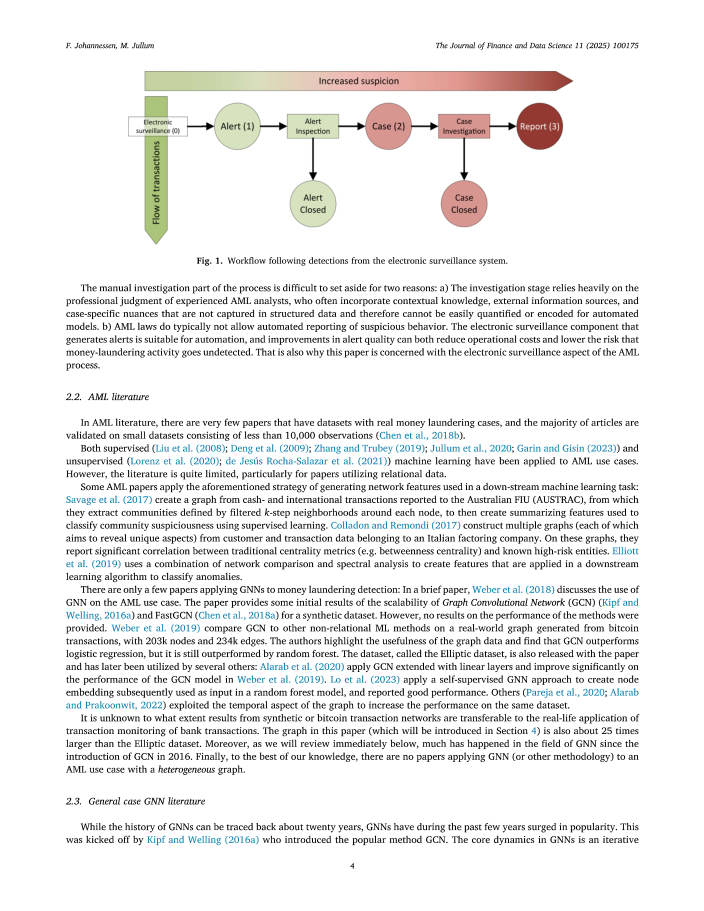

</details>

의심 증가 알림 종료됨 케이스 종료됨 s noitc as n a rt fo olF

**그림 1. 전자 감시 시스템의 탐지에 따른 워크플로.**

프로세스의 수동 조사 부분은 다음 두 가지 이유로 제외하기 어렵습니다. a) 조사 단계는 경험이 풍부한 AML 분석가의 전문적 판단에 크게 의존합니다. 분석가는 상황별 지식, 외부 정보 소스 및 구조화된 데이터에 포착되지 않아 자동화된 모델에 대해 쉽게 정량화하거나 인코딩할 수 없는 사례별 뉘앙스를 통합하는 경우가 많습니다. b) AML 법률은 일반적으로 의심스러운 행동에 대한 자동 보고를 허용하지 않습니다. 경고를 생성하는 전자 감시 구성 요소는 자동화에 적합하며, 경고 품질이 향상되면 운영 비용이 절감되고 자금세탁 활동이 감지되지 않을 위험이 낮아집니다. 이것이 바로 본 논문가 AML 프로세스의 전자 감시 측면에 관심을 두는 이유이기도 합니다.

### 2.2 AML 문헌

AML 문헌에는 실제 자금세탁 사례가 포함된 데이터셋이 있는 논문이 거의 없으며, 대부분의 기사는 10,000개 미만의 관찰로 구성된 소규모 데이터셋에서 검증됩니다(Chen et al., 2018b).

지도(Liu 등(2008); Deng 등(2009); Zhang and Trubey(2019); Jullum 등, 2020; Garin and Gisin(2023)) 및 비지도(Lorenz 등(2020); de Jesús Rocha-Salazar 등(2021)) 머신러닝이 모두 적용되었습니다. AML 사용 사례. 그러나 문헌은 매우 제한적이며 특히 관계형 데이터를 활용하는 논문의 경우 더욱 그렇습니다.

일부 AML 논문에서는 앞서 언급한 다운스트림 머신러닝 작업에 사용되는 네트워크 기능 생성 전략을 적용합니다(Savage et al.). (2017)은 호주 FIU(AUSTRAC)에 보고된 현금 및 국제 거래에서 그래프를 생성하고, 여기에서 각 노드 주변의 필터링된 k-단계 이웃으로 정의된 커뮤니티를 추출한 다음 지도 학습을 사용하여 커뮤니티 의심을 분류하는 데 사용되는 요약 기능을 생성합니다. Colladon과 Remondi(2017)는 이탈리아 팩토링 회사에 속한 고객 및 거래 데이터로부터 여러 그래프(각각 고유한 측면을 드러내는 것을 목표로 함)를 구성합니다. 이 그래프에서는 기존 중심성 지표(예: 매개 중심성)과 알려진 고위험 엔터티 간의 중요한 상관 관계를 보고합니다. Elliottet al. (2019)는 네트워크 비교와 스펙트럼 분석의 조합을 사용하여 이상 현상을 분류하기 위해 다운스트림 학습 알고리즘에 적용되는 기능을 만듭니다.

자금세탁 탐지에 GNN를 적용한 논문은 몇 가지 있습니다. 간략한 논문에서 Weber et al. (2018)은 AML 사용 사례에서 GNN 사용에 대해 논의합니다. 이 논문은 합성 데이터세트에 대한 Graph Convolutional Network(GCN)(Kipf and Welling, 2016a) 및 FastGCN(Chen et al., 2018a)의 확장성에 대한 몇 가지 초기 결과를 제공합니다. 그러나 방법의 성능에 대한 결과는 제공되지 않았습니다. Weberet al. (2019)는 203k 노드와 234k 엣지를 사용하여 비트코인 ​​거래에서 생성된 실제 그래프에서 GCN을 다른 비관계형 ML 방법과 비교합니다. 저자는 그래프 데이터의 유용성을 강조하고 GCN이 로지스틱 회귀보다 성능이 뛰어나지만 여전히 Random Forest보다 성능이 뛰어남을 발견했습니다. Elliptic 데이터세트라고 불리는 데이터세트도 논문과 함께 공개되었으며 나중에 Alarab et al. (2020)은 선형 레이어로 확장된 GCN을 적용하고 Weber et al의 GCN 모델 성능을 크게 향상시켰습니다. (2019). Loet al. (2023)은 자기지도 GNN 접근 방식을 적용하여 이후에 랜덤 포레스트 모델의 입력으로 사용되는 노드 임베딩을 생성하고 좋은 성능을 보고했습니다. 다른 사람들(Pareja et al., 2020; Alarab and Prakoonwit, 2022)은 그래프의 시간적 측면을 활용하여 동일한 데이터세트의 성능을 높였습니다.

합성 또는 비트코인 ​​거래 네트워크의 결과가 은행 거래의 거래 모니터링이라는 실제 응용 프로그램으로 어느 정도까지 이전될 수 있는지는 알 수 없습니다. 이 문서의 그래프(섹션 4에서 소개됨)도 Elliptic 데이터셋보다 약 25배 더 큽니다. 더욱이, 바로 아래에서 검토하겠지만, 2016년 GCN이 도입된 이후 GNN 분야에서는 많은 일이 일어났습니다. 마지막으로, 우리가 아는 한, 이종 그래프가 있는 AML 사용 사례에 GNN(또는 다른 방법론)를 적용한 논문은 없습니다.

### 2.3 일반 GNN 문헌

GNN의 역사는 약 20년 전으로 거슬러 올라갈 수 있지만, GNN은 지난 몇 년 동안 인기가 급상승했습니다. 이는 인기 있는 방법인 GCN을 도입한 Kipf와 Welling(2016a)에 의해 시작되었습니다. GNN의 핵심 역학은 각 노드가 이웃으로부터 정보를 수신하고 이를 자체 표현과 결합하여 다음 반복에서 이웃으로 전달될 새로운 표현을 생성하는 반복적 접근 방식입니다. 이를 메시지 패싱이라고 합니다. 노드 분류가 관심 있는 작업인 경우 이러한 노드 표현은 노드에 대해 추론하는 데 사용됩니다.

<!-- 원문 5쪽 -->

<details>
<summary>원문 5쪽 이미지 보기</summary>

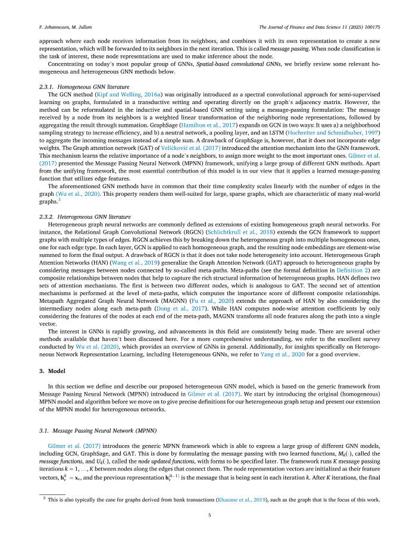

</details>

오늘날 가장 인기 있는 GNN 그룹인 공간 기반 컨벌루션 GNN에 집중하여 아래에서 관련 동종 및 이종 GNN 방법 몇 가지를 간략하게 검토합니다.

2.3.1. 동종 GNN 문헌 GCN 방법(Kipf and Welling, 2016a)은 원래 그래프의 준지도 학습을 위한 스펙트럼 컨볼루션 접근 방식으로 도입되었으며, 변환 설정으로 공식화되고 그래프의 인접 행렬에서 직접 작동합니다. 그러나 이 방법은 메시지 패싱 공식을 사용하여 귀납적 및 공간 기반 GNN 설정에서 다시 공식화될 수 있습니다. 이웃으로부터 노드가 수신한 메시지는 이웃 노드 표현의 가중 선형 변환이며, 이어서 합산을 통해 결과를 집계합니다. GraphSage(Hamilton et al., 2017)는 두 가지 방법으로 GCN을 확장합니다. a) 효율성을 높이기 위해 이웃 샘플링 전략을 사용하고 b) 중립 네트워크, 풀링 계층 및 LSTM(Hochreiter 및 Schmidhuber, 1997)을 사용하여 간단한 합계 대신 들어오는 메시지를 집계합니다. 그러나 GraphSage의 단점은 엣지 가중치를 포함하지 않는다는 것입니다. Velickovic et al.의 그래프 어텐션 네트워크(GAT) (2017)은 GNN 프레임워크에 주의 메커니즘을 도입했습니다. 이 메커니즘은 노드 이웃의 상대적 중요성을 학습하여 가장 중요한 노드에 더 많은 가중치를 할당합니다. Gilmeret al. (2017)은 다양한 GNN 방법의 대규모 그룹을 통합하는 메시지 패싱 신경망(MPNN) 프레임워크를 제시했습니다. 통합 프레임워크 외에도 이 모델의 가장 중요한 기여는 엣지 기능을 활용하는 학습된 메시지 패싱 기능을 적용한다는 것입니다.

앞서 언급한 GNN 방법은 시간 복잡도가 그래프의 간선 수에 따라 선형적으로 확장된다는 공통점이 있습니다(Wu et al., 2020). 이 속성은 많은 실제 그래프의 특징인 크고 희박한 그래프에 적합하게 만듭니다.3 2.3.2. 이종 GNN 문헌 이종 그래프 신경망은 일반적으로 기존 동종 그래프 신경망의 확장으로 정의됩니다. 예를 들어, RGCN(Relational Graph Convolutional Network)(Schlichtkrull et al., 2018)은 GCN 프레임워크를 확장하여 여러 유형의 간선이 있는 그래프를 지원합니다. RGCN은 이종 그래프를 각 엣지 유형에 대해 하나씩 여러 개의 동종 그래프로 분해하여 이를 달성합니다. 각 레이어에서 GCN은 각 동종 그래프에 적용되고 결과 노드 임베딩은 요소별로 합산되어 최종 출력을 형성합니다. RGCN의 단점은 노드 이질성을 고려하지 않는다는 것입니다. Heterogeneous Graph Attention Networks(HAN)(Wang et al., 2019)은 소위 메타 경로로 연결된 노드 간의 메시지를 고려하여 이종 그래프에 대한 Graph Attention Network(GAT) 접근 방식을 일반화합니다. 메타 경로(정의 2의 형식 정의 참조)는 이종 그래프의 풍부한 구조 정보를 캡처하는 데 도움이 되는 노드 간의 복합 관계입니다. HAN은 두 가지 주의 메커니즘 세트를 정의합니다. 첫 번째는 GAT와 유사한 두 개의 서로 다른 노드 사이입니다. 두 번째 주의 메커니즘 세트는 다양한 복합 관계의 중요도 점수를 계산하는 메타 경로 수준에서 수행됩니다. MAGNN(Metapath Aggregated Graph Neural Network)(Fu et al., 2020)은 각 메타 경로를 따라 중간 노드도 고려하여 HAN의 접근 방식을 확장합니다(Dong et al., 2017). HAN은 메타 경로의 각 끝에 있는 노드의 특징만 고려하여 노드별 주의 계수를 계산하는 반면, MAGNN은 경로를 따라 모든 노드 특징을 단일 벡터로 변환합니다.

GNN에 대한 관심이 급속도로 커지고 있으며 이 분야의 발전은 지속적으로 이루어지고 있습니다. 여기에서 논의되지 않은 몇 가지 다른 방법이 있습니다. 보다 포괄적인 이해를 위해 Wu et al.이 실시한 훌륭한 설문 조사를 참조하십시오. (2020), GNN의 일반적인 개요를 제공합니다. 또한 이종 GNN를 포함한 이종 네트워크 표현 학습에 대한 통찰력을 얻으려면 Yang et al., 2020을 참조하여 좋은 개요를 확인하세요.

## 3 모델

이 섹션에서는 Gilmer 등이 소개한 메시지 패싱 신경망(MPNN)의 일반 프레임워크를 기반으로 제안된 이종 GNN 모델을 정의하고 설명합니다. (2017). 본 연구에서는 이종 그래프 설정에 대한 정확한 정의를 제공하고 이종 네트워크에 대한 MPNN 모델의 확장을 제시하기 전에 원본(동종) MPNN 모델과 알고리즘을 소개하는 것으로 시작합니다.

### 3.1 메시지 패싱 신경망(MPNN)

Gilmeret al. (2017)은 GCN, GraphSage 및 GAT를 포함하여 다양한 GNN 모델의 대규모 그룹을 표현할 수 있는 일반 MPNN 프레임워크를 소개합니다. 이는 나중에 지정될 형식을 사용하여 메시지 함수라고 하는 두 개의 학습된 함수 Mk(⋅)와 노드 업데이트 함수라고 하는 Uk(⋅)를 사용하여 전달하는 메시지를 공식화하여 수행됩니다. 프레임워크는 노드를 연결하는 엣지를 따라 노드 간에 k = 1, …, K 반복을 전달하는 K 메시지를 실행합니다. 노드 표현 벡터는 특징 벡터 h0 v = xv로 초기화되며 이전 표현 h(k−1) v는 각 반복 k에서 전송되는 메시지입니다. K번 반복한 후 최종

> **주:** 3 이는 이 연구의 초점인 그래프와 같이 은행 거래에서 파생된 그래프(Khazane et al., 2019)의 경우에도 일반적으로 해당됩니다.

<!-- 원문 6쪽 -->

<details>
<summary>원문 6쪽 이미지 보기</summary>

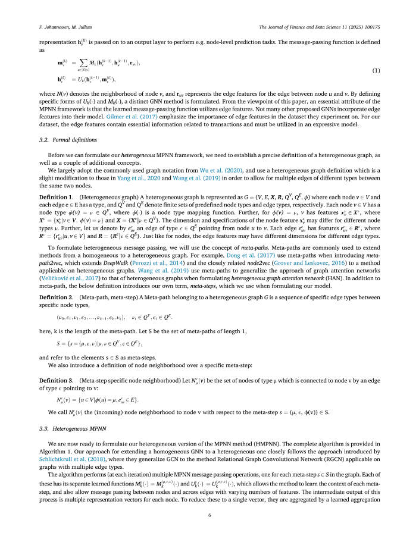

</details>

표현 h(K) v는 예를 들어 다음을 수행하기 위해 출력 레이어로 전달됩니다. 노드 수준 예측 작업. 메시지 패싱 기능은 다음과 같이 정의됩니다.

```text
∑
m(k)
```

Mk(h(k−1)

```text
v
; h(k−1)
```

당신; 루브);

```text
v
=
u∈N(v)
(1)
h(k)
```

v = 영국(h(k−1)

```text
v
; m(k)
v );
```

여기서 N(v)는 노드 v의 이웃을 나타내고 ruv는 노드 u와 v 사이의 엣지에 대한 엣지 특징을 나타냅니다. Uk(⋅) 및 Mk(⋅)의 특정 형태를 정의함으로써 고유한 GNN 방법이 공식화됩니다. 본 논문의 관점에서 볼 때, MPNN 프레임워크의 필수 속성은 학습된 메시지 패싱 기능이 엣지 기능을 활용한다는 것입니다. 제안된 다른 많은 GNN은 엣지 기능을 모델에 통합하지 않습니다. Gilmeret al. (2017)은 실험하는 데이터셋에서 엣지 기능의 중요성을 강조합니다. 우리 데이터셋의 경우 엣지 기능에는 거래와 관련된 필수 정보가 포함되어 있으며 표현 모델에서 활용되어야 합니다.

### 3.2 공식적인 정의

이종 MPNN 프레임워크를 공식화하기 전에 이종 그래프에 대한 정확한 정의와 몇 가지 추가 개념을 설정해야 합니다.

본 연구에서는 주로 Wu et al.에서 일반적으로 사용되는 그래프 표기법을 채택합니다. (2020), Yang et al., 2020 및 Wang et al.의 정의를 약간 수정한 이종 그래프 정의를 사용합니다. (2019) 동일한 두 노드 사이에 서로 다른 유형의 여러 엣지를 허용하기 위해.

> 정의 1. (이종 그래프) 이종 그래프는 G = (V, E, X, R, QV, QE, ф)로 표현됩니다. 여기서 각 노드 v ∈V와 각 엣지 e ∈E는 유형을 가지며, QV와 QE는 각각 미리 정의된 노드 유형과 엣지 유형의 유한 집합을 나타냅니다. 각 노드 v ∈V에는 노드 유형 ф(v) = ν ∈QV,가 있습니다. 여기서 ф(⋅)는 노드 유형 매핑 함수입니다. 또한 ф(v) = ν에 대해 v는 xν 특징을 갖습니다.

v ∈Xν, 여기서 Xν = {xν

```text
v|v ∈V; ϕ(v) = ν} and X = {Xν|ν ∈QV}. The dimension and specifications of the node feature xν
```

v는 노드 유형 ν에 따라 다를 수 있습니다. 또한, 노드 u에서 v를 가리키는 ϵ ∈QE 유형의 엣지를 eϵ uv로 표시하겠습니다. 각 엣지 eϵ uv에는 rϵ uv ∈Rϵ, 기능이 있습니다. 여기서 Rϵ = {rϵ

**수식 및 기호가 포함된 원문(정확성 보존)**

```text
uv|u; v ∈V} and R = {Rϵ|ϵ ∈QE}. Just like for nodes, the edge features may have different dimensions for different edge types.
```

이종 메시지 패싱을 공식화하기 위해 메타 경로 개념을 사용합니다. 메타 경로는 일반적으로 동종 그래프에서 이종 그래프로 메서드를 확장하는 데 사용됩니다. 예를 들어, Dong et al. (2017)은 DeepWalk(Perozzi et al., 2014)와 밀접하게 관련된 node2vec(Grover and Leskovec, 2016)를 이종 그래프에 적용할 수 있는 방법으로 확장하는 Metapath2vec을 도입할 때 메타 경로를 사용합니다. 왕 외. (2019)는 이종 그래프 어텐션 네트워크(HAN)를 공식화할 때 그래프 어텐션 네트워크(Velickovic et al., 2017)의 접근 방식을 이종 그래프의 접근 방식으로 일반화하기 위해 메타 경로를 사용합니다. 메타 경로 외에도 아래 정의에서는 모델을 공식화할 때 사용하는 자체 용어인 메타 단계를 소개합니다.

> 정의 2. (메타 경로, 메타 단계) 이종 그래프 G에 속하는 메타 경로는 특정 노드 유형 간의 특정 엣지 유형의 시퀀스이며,

(ν0; ϵ1; ν1; ϵ2; …; νk−1; ϵk; νk); νi ∈QV; ϵi ∈QE: 여기서 k는 메타 경로의 길이입니다. S를 길이 1의 메타 경로 세트로 설정하고,

```text
S = {s = (μ; ϵ; ν)|μ; ν ∈QV; ϵ ∈QE};
```

∈S 요소를 메타 단계로 참조합니다.

또한 특정 메타 단계에 대한 노드 이웃의 정의를 소개합니다.

> 정의 3. (메타 단계 특정 노드 이웃) Nϵ

μ(v)는 v를 가리키는 유형 ϵ의 엣지에 의해 노드 v에 연결된 유형 μ의 노드 집합입니다.

```text
Nϵ
μ(v) = {u ∈V|ϕ(u) = μ; eϵ
```

자외선 ∈E}:

본 연구에서는 Nϵ μ(v)를 메타 단계 = (μ, ϵ, ф(v)) ∈S.와 관련하여 노드 v에 대한 (들어오는) 노드 이웃이라고 부릅니다.

### 3.3 이종 MPNN

이제 MPNN 방법(HMPNN)의 이종 버전을 공식화할 준비가 되었습니다. 완전한 알고리즘은 알고리즘 1에 제공됩니다. 동종 GNN를 이종 ZZ로 확장하는 접근 방식은 Schlichtkrull et al.이 도입한 접근 방식을 밀접하게 따릅니다. (2018)에서는 GCN을 여러 엣지 유형이 있는 그래프에 적용 가능한 RGCN(Relational Graph Convolutional Network) 방법으로 일반화합니다.

알고리즘은 (각 반복에서) 그래프의 각 메타 단계 ∈S에 대해 하나씩 여러 MPNN 메시지 패싱 작업을 수행합니다. 이들 각각은 별도의 학습된 기능을 가지고 있습니다.

```text
k(⋅) = M(μ;ϵ;ν)
k(⋅) = U(μ;ϵ;ν)
```

k(⋅) 및 Us k(⋅)를 사용하면 메서드가 각 메타단계의 컨텍스트를 학습할 수 있고 다양한 수의 기능을 사용하여 노드 간 및 엣지를 가로질러 메시지를 전달할 수도 있습니다. 이 프로세스의 중간 출력은 각 노드에 대한 여러 표현 벡터입니다. 이를 단일 벡터로 줄이기 위해 각 노드 유형에 특정한 학습된 집계 함수 Aν(⋅)에 의해 집계됩니다. MPNN의 일반적인 공식화에 따라 알고리즘 1에서는 집계 함수의 특정 형태를 지정하지 않습니다. 실험 중에 두 가지 대안 옵션을 평가했으며 이에 대해 곧 논의하겠습니다.

<!-- 원문 7쪽 -->

<details>
<summary>원문 7쪽 이미지 보기</summary>

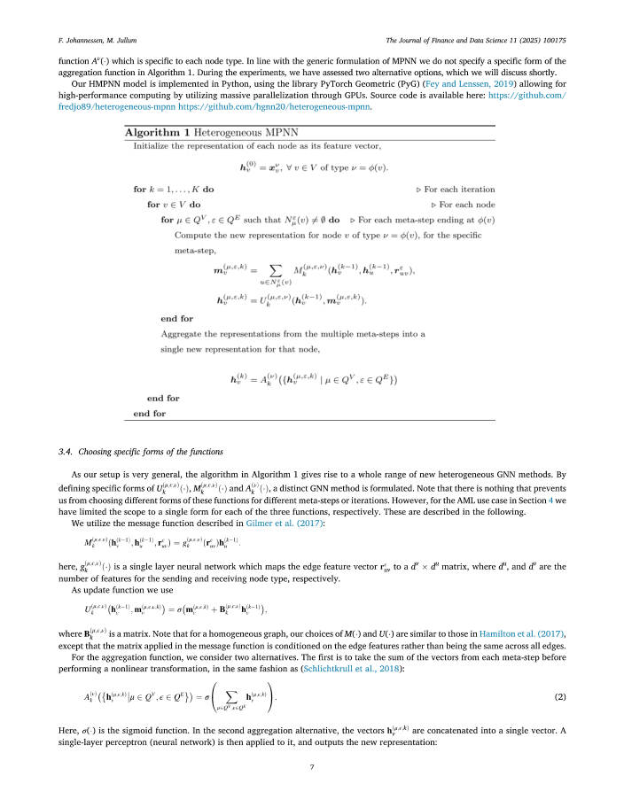

</details>

우리의 HMPNN 모델은 라이브러리 PyTorch 기하학(PyG)(Fey 및 Lenssen, 2019)을 사용하여 Python으로 구현되어 GPU를 통한 대규모 병렬화를 활용하여 고성능 컴퓨팅을 허용합니다. 소스 코드는 여기에서 확인할 수 있습니다: https://github.com/ fredjo89/heterogeneous-mpnn https://github.com/hgnn20/heterogeneous-mpnn.

### 3.4 특정 형태의 함수 선택

우리의 설정은 매우 일반적이므로 알고리즘 1의 알고리즘은 전체 범위의 새로운 이종 GNN 방법을 생성합니다. U(μ;ϵ;ν)의 특정 형태를 정의함으로써

```text
k
(⋅), M(μ;ϵ;ν)
```

k(⋅) 및 A(ν) k(⋅), 별도의 GNN 방법이 공식화됩니다. 다양한 메타 단계나 반복에 대해 이러한 기능의 다양한 형태를 선택하는 것을 방해하는 것은 없습니다. 그러나 섹션 4의 AML 사용 사례에서는 세 가지 기능 각각에 대해 각각 단일 형식으로 범위를 제한했습니다. 이에 대한 설명은 다음과 같습니다.

본 연구에서는 Gilmer et al.에 설명된 메시지 기능을 활용합니다. (2017):

```text
M(μ;ϵ;ν)
k
(h(k−1)
k
(rϵ
v
; h(k−1)
u
; rϵ
u
:
```

uv) = g(μ;ϵ;ν) uv)h(k−1) 여기서 g(μ;ϵ;ν) k (⋅)는 엣지 특징 벡터 rϵ uv를 dv × du 행렬에 매핑하는 단일 레이어 신경망입니다. 여기서 du와 dv는 각각 송신 및 수신 노드 유형에 대한 특징 수입니다.

업데이트 기능으로 우리는

```text
(
)
(
)
;
h(k−1)
= σ
m(μ;ϵ;k)
U(μ;ϵ;ν)
k
k
h(k−1)
v
v
+ B(μ;ϵ;ν)
v
; m(μ;ϵ;ν;k)
v
```

여기서 B(μ;ϵ;ν) k는 행렬입니다. 동종 그래프의 경우 M(⋅) 및 U(⋅)의 선택은 Hamilton et al의 선택과 유사합니다. (2017), 메시지 기능에 적용된 행렬이 모든 엣지에서 동일하지 않고 엣지 특징에 따라 조절된다는 점을 제외하면.

집계 함수의 경우 두 가지 대안을 고려합니다. 첫 번째는 비선형 변환을 수행하기 전에 (Schlichtkrull et al., 2018)과 동일한 방식으로 각 메타 단계에서 벡터의 합을 취하는 것입니다.

```text
⎛
⎞
( {
⎝
∑
h(μ;ϵ;k)
= σ
A(ν)
h(μ;ϵ;k)
k
⎠:
(2)
```

v μ ∈QV; ϵ ∈QE})

```text
v
```

μ∈QV;ϵ∈QE 여기서 σ(⋅)는 시그모이드 함수입니다. 두 번째 집계 대안에서는 벡터 h(μ;ϵ;k)v가 단일 벡터로 연결됩니다. 그런 다음 단일 레이어 퍼셉트론(신경망)이 여기에 적용되고 새로운 표현이 출력됩니다.

<!-- 원문 8쪽 -->

<details>
<summary>원문 8쪽 이미지 보기</summary>

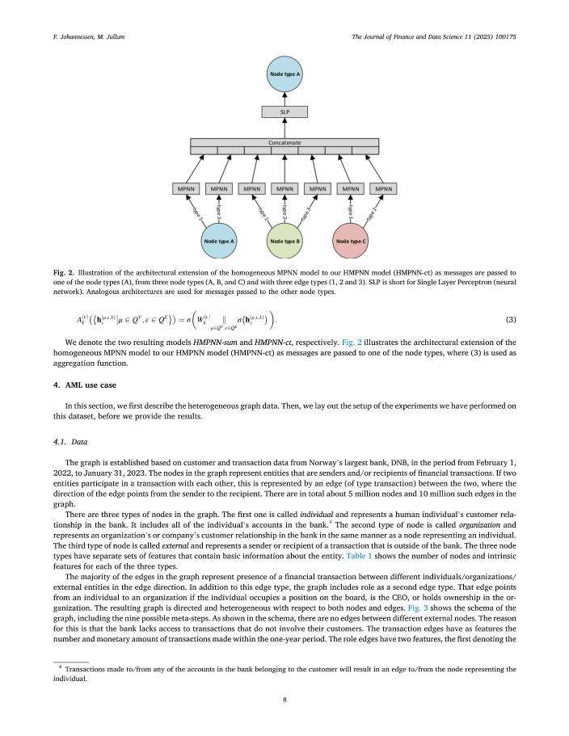

</details>

**그림 2. 메시지가 세 가지 노드 유형(A, B, C)과 세 가지 엣지 유형(1, 2, 3)에서 노드 유형(A) 중 하나에 전달될 때 동종 MPNN 모델을 HMPNN 모델(HMPNN-ct)로 아키텍처 확장한 그림. SLP는 Single Layer Perceptron(신경망)의 약어입니다. 다른 노드 유형으로 전달되는 메시지에는 유사한 아키텍처가 사용됩니다.**

```text
(
( {
) )
(
h(μ;ϵ;k)
= σ
W(ν)
A(ν)
h(μ;ϵ;k)
k
:
(3)
```

v μ ∈QV; ϵ ∈QE})

```text
v
```

k `` μ∈QV;ϵ∈QEσ 두 가지 결과 모델 HMPNN-sum 및 HMPNN-ct를 각각 나타냅니다. 그림 2는 메시지가 노드 유형 중 하나로 전달될 때 동종 MPNN 모델을 HMPNN 모델(HMPNN-ct)로 확장하는 아키텍처를 보여줍니다. 여기서 (3)은 집계 함수로 사용됩니다.

## 4 AML 사용 사례

이번 섹션에서는 먼저 이종 그래프 데이터에 대해 설명합니다. 그런 다음 결과를 제공하기 전에 이 데이터셋에 대해 수행한 실험 설정을 배치합니다.

### 4.1 데이터

그래프는 2022년 2월 1일부터 2023년 1월 31일까지 노르웨이 최대 은행인 DNB의 고객 및 거래 데이터를 기반으로 구성되었습니다. 그래프의 노드는 금융 거래의 송금인 및/또는 수취인인 엔터티를 나타냅니다. 두 개체가 서로 거래에 참여하는 경우 이는 둘 사이의 엣지(거래 유형)로 표시되며 엣지의 방향은 보낸 사람에서 받는 사람을 가리킵니다. 그래프에는 총 약 500만 개의 노드와 1천만 개의 간선이 있습니다.

그래프에는 세 가지 유형의 노드가 있습니다. 첫 번째는 개인(individual)이라고 하며 은행 내 인간 개인의 고객 관계를 나타냅니다. 여기에는 은행에 있는 개인의 모든 계좌가 포함됩니다.4 두 번째 유형의 노드는 조직이라고 하며 개인을 나타내는 노드와 동일한 방식으로 은행에서 조직 또는 회사의 고객 관계를 나타냅니다. 세 번째 유형의 노드는 외부라고 하며 은행 외부 거래의 보낸 사람 또는 받는 사람을 나타냅니다. 세 가지 노드 유형에는 엔터티에 대한 기본 정보가 포함된 별도의 특징 집합이 있습니다. 표 1은 세 가지 유형 각각에 대한 노드 수와 고유 기능을 보여줍니다.

그래프에 있는 엣지의 대부분은 엣지 방향에서 다양한 개인/조직/외부 엔터티 간의 금융 거래의 존재를 나타냅니다. 이 간선 유형 외에도 그래프에는 두 번째 간선 유형으로서의 역할이 포함됩니다. 개인이 이사회에서 직위를 차지하거나 CEO이거나 조직의 소유권을 보유하는 경우 그 우위는 개인에서 조직으로 향합니다. 결과 그래프는 노드와 엣지 모두에 대해 방향이 있고 이질적입니다. 그림 3은 9가지 가능한 메타 단계를 포함한 그래프의 스키마를 보여줍니다. 스키마에 표시된 것처럼 서로 다른 외부 노드 사이에는 엣지가 없습니다. 그 이유는 은행이 고객과 관련되지 않은 거래에 접근할 수 없기 때문입니다. 거래 엣지는 1년 동안 발생한 거래 수와 금액을 특징으로 합니다. 역할 엣지에는 두 가지 기능이 있습니다. 첫 번째는

> **주:** 4 고객이 속한 은행의 계좌 중 하나와 거래가 이루어지면 개인을 대표하는 노드와 엣지가 발생합니다.

<!-- 원문 9쪽 -->

<details>
<summary>원문 9쪽 이미지 보기</summary>

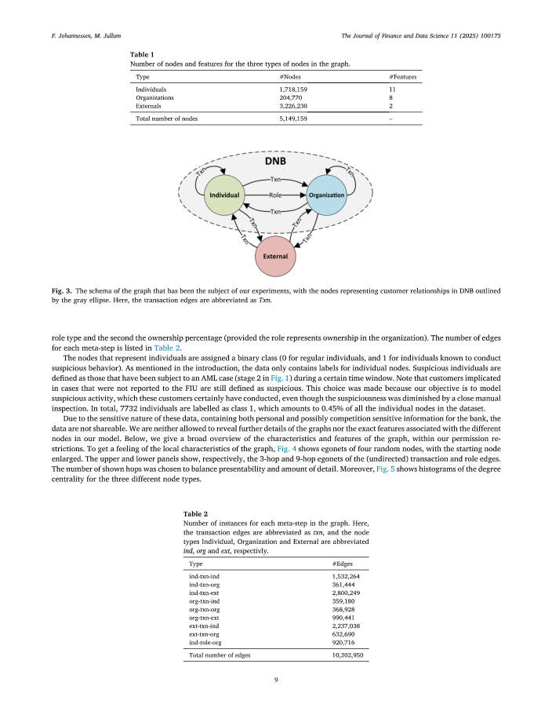

</details>

**풀 사이즈 테이블**

유형 #노드 #기능 개인 1,718,159 11 조직 204,770 8 외부 3,226,230 2 총 노드 수 5,149,159 – DNB Txn DNB Txn 역할 역할 개별 조직 개별 조직 Txn Txn 외부 외부

**그림 3. 실험의 대상이 된 그래프의 스키마. DNB의 고객 관계를 나타내는 노드는 회색 타원으로 윤곽이 그려져 있습니다. 여기서 거래 엣지는 Txn으로 축약됩니다.**

역할 유형과 두 번째는 소유권 비율입니다(역할이 조직의 소유권을 나타내는 경우). 각 메타 단계의 엣지 수는 표 2에 나열되어 있습니다.

개인을 나타내는 노드에는 이진 클래스가 할당됩니다(일반 개인의 경우 0, 의심스러운 행동을 수행하는 것으로 알려진 개인의 경우 1). 소개에서 언급했듯이 데이터에는 개별 노드에 대한 레이블만 포함됩니다. 의심스러운 개인은 특정 기간 동안 AML 사례(그림 1의 2단계)의 대상이 된 개인으로 정의됩니다. FIU에 보고되지 않은 사건에 연루된 고객은 여전히 ​​의심스러운 고객으로 정의됩니다. 이러한 선택은 면밀한 수동 검사로 의심이 줄어들었음에도 불구하고 고객이 확실히 수행한 의심스러운 활동을 모델링하는 것이 우리의 목표이기 때문에 이루어졌습니다. 전체적으로 7732명의 개인이 클래스 1로 분류되었으며 이는 데이터셋의 모든 개별 노드의 0.45%에 해당합니다.

이러한 데이터는 개인 정보와 은행의 경쟁에 민감한 정보를 모두 포함하는 민감한 특성으로 인해 공유할 수 없습니다. 본 연구에서는 그래프의 추가 세부 사항이나 모델의 다른 노드와 관련된 정확한 기능을 공개할 수 없습니다. 아래에서는 권한 제한 내에서 그래프의 특징과 기능에 대한 광범위한 개요를 제공합니다. 그래프의 국지적인 특성을 느끼기 위해 그림 4는 시작 노드를 확대한 4개의 임의 노드의 자고넷을 보여줍니다. 상단 및 하단 패널은 각각 (방향이 지정되지 않은) 거래 및 역할 엣지의 3홉 및 9홉 에고넷을 보여줍니다. 표시되는 홉의 수는 표현성과 디테일의 양의 균형을 맞추기 위해 선택되었습니다. 또한, 그림 5는 세 가지 다른 노드 유형에 대한 중심성의 정도에 대한 히스토그램을 보여줍니다.

**표 2 그래프의 각 메타 단계에 대한 인스턴스 수. 여기서 거래 엣지는 txn으로 축약되고, 노드 유형 Individual, Organization 및 external은 각각 ind, org 및 ext로 축약됩니다.**

#Edges ind-txn-ind 1,532,264 ind-txn-org 361,444 ind-txn-ext 2,800,249 org-txn-ind 359,180 org-txn-org 368,928 org-txn-ext 990,441 ext-txn-ind를 입력하세요. 2,237,038 ext-txn-org 632,690 ind-role-org 920,716 총 엣지 수 10,202,950

<!-- 원문 10쪽 -->

<details>
<summary>원문 10쪽 이미지 보기</summary>

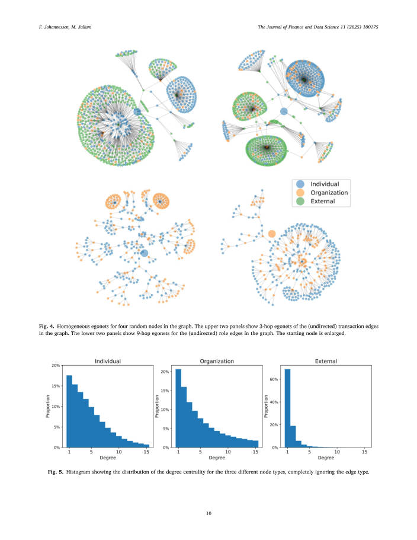

</details>

**그림 4. 그래프의 무작위 노드 4개에 대한 동종 자아넷. 위쪽 두 패널은 그래프에서 (방향이 지정되지 않은) 거래 엣지의 3홉 에고넷을 보여줍니다. 아래쪽 두 패널에는 그래프의 (방향이 지정되지 않은) 역할 엣지에 대한 9홉 에고넷이 표시됩니다. 시작 노드가 확대됩니다.**

**그림 5. 엣지 유형을 완전히 무시하고 세 가지 다른 노드 유형에 대한 중심성 분포를 보여주는 히스토그램.**

<!-- 원문 11쪽 -->

<details>
<summary>원문 11쪽 이미지 보기</summary>

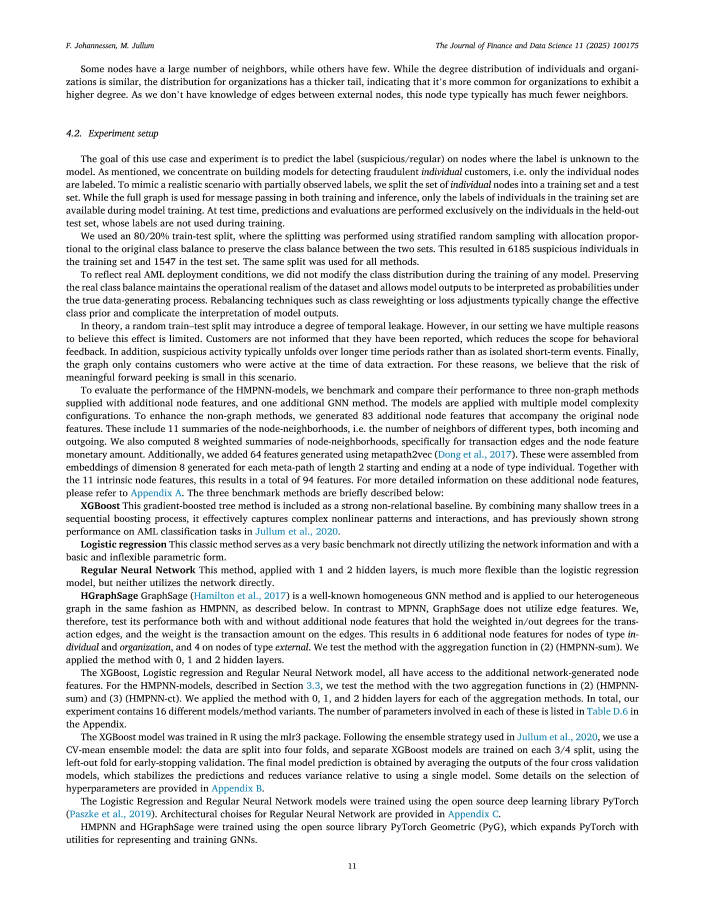

</details>

일부 노드에는 많은 수의 이웃이 있는 반면 다른 노드에는 적은 수의 이웃이 있습니다. 개인과 조직의 학위 분포는 유사하지만, 조직의 분포는 꼬리가 더 두꺼워서 조직이 더 높은 학위를 나타내는 것이 더 일반적임을 나타냅니다. 외부 노드 사이의 엣지에 대한 지식이 없기 때문에 이 노드 유형에는 일반적으로 훨씬 적은 수의 이웃이 있습니다.

### 4.2 실험 설정

이 사용 사례 및 실험의 목표는 모델에 레이블이 알려지지 않은 노드에서 레이블(의심/일반)을 예측하는 것입니다. 언급한 바와 같이, 우리는 사기성 개인 고객을 탐지하기 위한 모델 구축에 집중합니다. 즉, 개별 노드에만 라벨이 지정됩니다. 부분적으로 관찰된 레이블을 사용하여 현실적인 시나리오를 모방하기 위해 개별 노드 세트를 훈련 세트와 테스트 세트로 분할했습니다. 훈련과 추론 모두에서 메시지 패싱에 전체 그래프가 사용되는 반면, 모델 훈련 중에는 훈련 세트에 있는 개인의 레이블만 사용할 수 있습니다. 테스트 시간에는 훈련 중에 레이블이 사용되지 않는 홀드아웃 테스트 세트의 개인에 대해서만 예측 및 평가가 수행됩니다.

본 연구에서는 80/20% 열차-테스트 분할을 사용했습니다. 여기서 분할은 두 세트 간의 클래스 균형을 유지하기 위해 원래 클래스 균형에 비례하여 할당된 계층화된 무작위 샘플링을 사용하여 수행되었습니다. 그 결과 훈련 세트에는 6185명의 의심스러운 개인이, 테스트 세트에는 1547명이 발생했습니다. 모든 방법에 동일한 분할이 사용되었습니다.

실제 AML 배포 조건을 반영하기 위해 모델 교육 중에 클래스 분포를 수정하지 않았습니다. 실제 클래스 균형을 유지하면 데이터셋의 운영 현실성이 유지되고 모델 출력이 실제 데이터 생성 프로세스에서 확률로 해석될 수 있습니다. 클래스 재가중화 또는 손실 조정과 같은 재조정 기술은 일반적으로 유효 클래스를 사전에 변경하고 모델 출력의 해석을 복잡하게 만듭니다.

이론적으로 무작위 열차-테스트 분할로 인해 어느 정도 시간적 누출이 발생할 수 있습니다. 그러나 우리 환경에서는 이 효과가 제한적이라고 믿을 수 있는 여러 가지 이유가 있습니다. 고객에게는 보고되었다는 사실이 통보되지 않으므로 행동 피드백의 범위가 줄어듭니다. 또한 의심스러운 활동은 일반적으로 고립된 단기 이벤트가 아닌 장기간에 걸쳐 전개됩니다. 마지막으로 그래프에는 데이터 추출 당시 활성 상태였던 고객만 포함됩니다. 이러한 이유로 우리는 이 시나리오에서 의미 있는 전방 엿보기의 위험이 작다고 믿습니다.

HMPNN 모델의 성능을 평가하기 위해 추가 노드 특징과 함께 제공되는 세 가지 비그래프 방법과 하나의 추가 GNN 방법과 성능을 벤치마킹하고 비교합니다. 모델에는 여러 모델 복잡성 구성이 적용됩니다. 비그래프 방법을 향상시키기 위해 원래 노드 특징과 함께 83개의 추가 노드 특징을 생성했습니다. 여기에는 노드 환경에 대한 11개의 요약, 즉 들어오고 나가는 다양한 유형의 이웃 수가 포함됩니다. 또한 특히 거래 엣지 및 노드 특징 화폐 금액에 대해 노드 환경에 대한 8개의 가중치 요약을 계산했습니다. 또한, 우리는 Metapath2vec을 사용하여 생성된 64개의 기능을 추가했습니다(Dong et al., 2017). 이는 개인 유형의 노드에서 시작하고 끝나는 길이 2의 각 메타 경로에 대해 생성된 차원 8의 임베딩으로 조립되었습니다. 11개의 고유 노드 특징과 함께 총 94개의 기능이 생성됩니다. 이러한 추가 노드 특징에 대한 자세한 내용은 부록 A를 참조하십시오. 세 가지 벤치마크 방법은 아래에 간략하게 설명되어 있습니다.

XGBoost 이 그래디언트 부스팅 트리 방법은 강력한 비관계형 기준으로 포함됩니다. 순차적 부스팅 프로세스에서 많은 얕은 트리를 결합함으로써 복잡한 비선형 패턴과 상호 작용을 효과적으로 포착하며 이전에는 Jullum et al., 2020의 AML 분류 작업에서 강력한 성능을 보여주었습니다.

로지스틱 회귀 이 고전적인 방법은 네트워크 정보를 직접 활용하지 않고 기본적이고 유연하지 않은 매개변수 형식을 사용하여 매우 기본적인 벤치마크 역할을 합니다.

정규 신경망 1개와 2개의 숨겨진 레이어를 적용한 이 방법은 로지스틱 회귀 모델보다 훨씬 유연하지만 둘 다 네트워크를 직접 활용하지 않습니다.

HGraphSage GraphSage(Hamilton et al., 2017)는 잘 알려진 동종 GNN 방법이며 아래 설명된 대로 HMPNN와 동일한 방식으로 이종 그래프에 적용됩니다. MPNN와 달리 GraphSage는 엣지 기능을 활용하지 않습니다. 따라서 우리는 거래 엣지에 대한 가중치 입/출력 정도를 유지하는 추가 노드 특징 유무에 관계없이 성능을 테스트하며 가중치는 엣지의 거래 금액입니다. 결과적으로 개인 및 조직 유형의 노드에 대해 6개의 추가 노드 특징이 생성되고 외부 유형의 노드에 4개의 추가 노드 특징이 생성됩니다. (2)(HMPNN-sum)의 집계 함수를 사용하여 방법을 테스트합니다. 본 연구에서는 0, 1, 2개의 히든 레이어를 사용하여 방법을 적용했습니다.

XGBoost, 로지스틱 회귀 및 일반 신경망 모델은 모두 추가 네트워크 생성 노드 특징에 액세스할 수 있습니다. 섹션 3.3에 설명된 HMPNN 모델의 경우 (2)(HMPNNsum) 및 (3)(HMPNN-ct)의 두 가지 집계 함수를 사용하여 방법을 테스트합니다. 각 집계 방법에 대해 0, 1, 2개의 숨겨진 레이어를 사용하는 방법을 적용했습니다. 전체적으로 우리 실험에는 16개의 서로 다른 모델/방법 변형이 포함되어 있습니다. 이들 각각에 관련된 매개변수의 수는 부록의 표 D.6에 나열되어 있습니다.

XGBoost 모델은 mlr3 패키지를 사용하여 R에서 학습되었습니다. Jullum et al., 2020에서 사용된 앙상블 전략에 따라 CV 평균 앙상블 모델을 사용합니다. 데이터는 4개의 접기로 분할되고 별도의 XGBoost 모델은 조기 중지 검증을 위해 왼쪽 접기를 사용하여 각 3/4 분할에서 학습됩니다. 최종 모델 예측은 4개의 교차 검증 모델의 출력을 평균함으로써 얻어지며, 이는 예측을 안정화하고 단일 모델을 사용하는 것에 비해 분산을 줄입니다. 하이퍼파라미터 선택에 대한 자세한 내용은 부록 B에 나와 있습니다.

로지스틱 회귀 및 정규 신경망 모델은 오픈 소스 딥러닝 라이브러리 PyTorch(Paszke et al., 2019)를 사용하여 훈련되었습니다. 정규 신경망에 대한 아키텍처 선택은 부록 C에 제공됩니다.

HMPNN 및 HGraphSage는 GNN를 표현하고 교육하기 위한 유틸리티로 PyTorch를 확장하는 오픈 소스 라이브러리 PyTorch 기하학적(PyG)을 사용하여 교육되었습니다.

<!-- 원문 12쪽 -->

<details>
<summary>원문 12쪽 이미지 보기</summary>

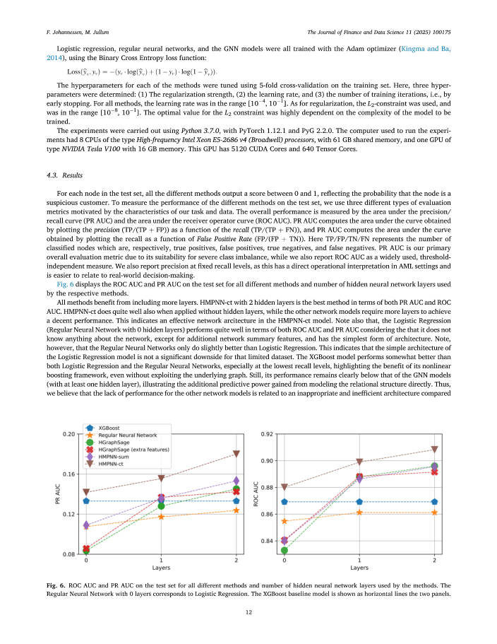

</details>

로지스틱 회귀, 일반 신경망 및 GNN 모델은 모두 Binary Cross Entropy 손실 함수를 사용하여 Adam 최적화 프로그램(Kingma 및 Ba, 2014)으로 훈련되었습니다.

손실(̂yv; yv) = −(yv ⋅log(̂yv) + (1 −yv) ⋅log(1 −̂ yv)):

각 방법의 하이퍼파라미터는 훈련 세트에 대한 5겹 교차 검증을 사용하여 조정되었습니다. 여기서는 (1) 정규화 강도, (2) 학습 속도, (3) 훈련 반복 횟수, 즉 조기 중지라는 세 가지 하이퍼파라미터가 결정되었습니다. 모든 방법에서 학습률은 [10−4, 10−1] 범위에 있었습니다. 정규화에는 L2 제약 조건이 사용되었으며 범위는 [10-8, 10-1]이었습니다. L2 제약 조건의 최적 값은 훈련할 모델의 복잡성에 따라 크게 달라집니다.

실험은 PyTorch 1.12.1 및 PyG 2.2.0과 함께 Python 3.7.0을 사용하여 수행되었습니다. 실험을 실행하는 데 사용된 컴퓨터에는 61GB 공유 메모리를 갖춘 고주파수 Intel Xeon E5-2686 v4(Broadwell) 프로세서 유형의 CPU 8개와 16GB 메모리를 갖춘 NVIDIA Tesla V100 유형의 GPU 1개가 있었습니다. 이 GPU에는 5120개의 CUDA 코어와 640개의 Tensor 코어가 있습니다.

### 4.3 결과

테스트 세트의 각 노드에 대해 모든 다양한 방법은 해당 노드가 의심스러운 고객일 확률을 반영하여 0에서 1 사이의 점수를 출력합니다. 테스트 세트에서 다양한 방법의 성능을 측정하기 위해 작업 및 데이터의 특성에 따라 세 가지 유형의 평가 지표를 사용합니다. 전체 성능은 정밀도/재현율 곡선 아래 영역(PR AUC)과 수신기 작동 곡선 아래 영역(ROC AUC)으로 측정됩니다. PR AUC는 정밀도(TP/(TP + FP))를 재현율(TP/(TP + FN))의 함수로 플롯하여 얻은 곡선 아래 면적을 계산하고, PR AUC는 위양성률(FP/(FP + TN))의 함수로 재현율을 플롯하여 얻은 곡선 아래 면적을 계산합니다. 여기서 TP/FP/TN/FN은 각각 참양성, 위양성, 참음성, 위음성으로 분류된 노드의 수를 나타냅니다. PR AUC는 심각한 클래스 불균형에 대한 적합성으로 인해 기본 전체 평가 메트릭이며, 또한 ROC AUC는 널리 사용되는 임계값 독립적 측정값으로 보고됩니다. 또한 고정된 재현율 수준의 정밀도를 보고합니다. 이는 AML 설정에서 직접적인 작동 해석을 갖고 실제 의사 결정과 더 쉽게 관련되기 때문입니다.

**그림 6은 모든 다른 방법에 대한 테스트 세트의 ROC AUC 및 PR AUC와 각 방법에서 사용되는 숨겨진 신경망 레이어 수를 표시합니다.**

모든 방법은 더 많은 레이어를 포함함으로써 이점을 얻습니다. 2개의 숨겨진 레이어가 있는 HMPNN-ct는 PR AUC 및 ROC AUC 측면에서 가장 좋은 방법입니다. HMPNN-ct는 숨겨진 레이어 없이 적용될 때도 꽤 잘 작동하는 반면, 다른 네트워크 모델은 적절한 성능을 달성하기 위해 더 많은 레이어가 필요합니다. 이는 HMPNN-ct 모델의 효과적인 네트워크 아키텍처를 나타냅니다. 또한 로지스틱 회귀 분석(숨겨진 레이어가 0개인 일반 신경망)은 추가 네트워크 요약 기능을 제외하고 네트워크에 대해 아무것도 모르고 가장 간단한 형태의 아키텍처를 가지고 있다는 점을 고려하면 ROC AUC 및 PR AUC 측면에서 매우 잘 수행됩니다. 그러나 일반 신경망은 로지스틱 회귀보다 약간 더 나은 성능을 발휘합니다. 이는 로지스틱 회귀 모델의 단순한 아키텍처가 제한된 데이터셋에 대한 중요한 단점이 아니라는 것을 나타냅니다. XGBoost 모델은 특히 가장 낮은 재현율 수준에서 로지스틱 회귀 및 일반 신경망보다 성능이 다소 우수하여 기본 그래프를 활용하지 않고도 비선형 부스팅 프레임워크의 이점을 강조합니다. 그럼에도 불구하고 그 성능은 GNN 모델(적어도 하나의 숨겨진 레이어 포함)의 성능보다 확실히 낮으며, 이는 관계형 구조를 직접 모델링하여 얻은 추가적인 예측 능력을 보여줍니다. 따라서 우리는 다른 네트워크 모델의 성능 부족이 비교에 비해 부적절하고 비효율적인 아키텍처와 관련이 있다고 믿습니다.

**그림 6. 모든 다양한 방법에 대한 테스트 세트의 ROC AUC 및 PR AUC 및 해당 방법에 사용되는 숨겨진 신경망 레이어 수. 레이어가 0개인 일반 신경망은 로지스틱 회귀에 해당합니다. XGBoost 기본 모델은 두 패널에 수평선으로 표시됩니다.**

<!-- 원문 13쪽 -->

<details>
<summary>원문 13쪽 이미지 보기</summary>

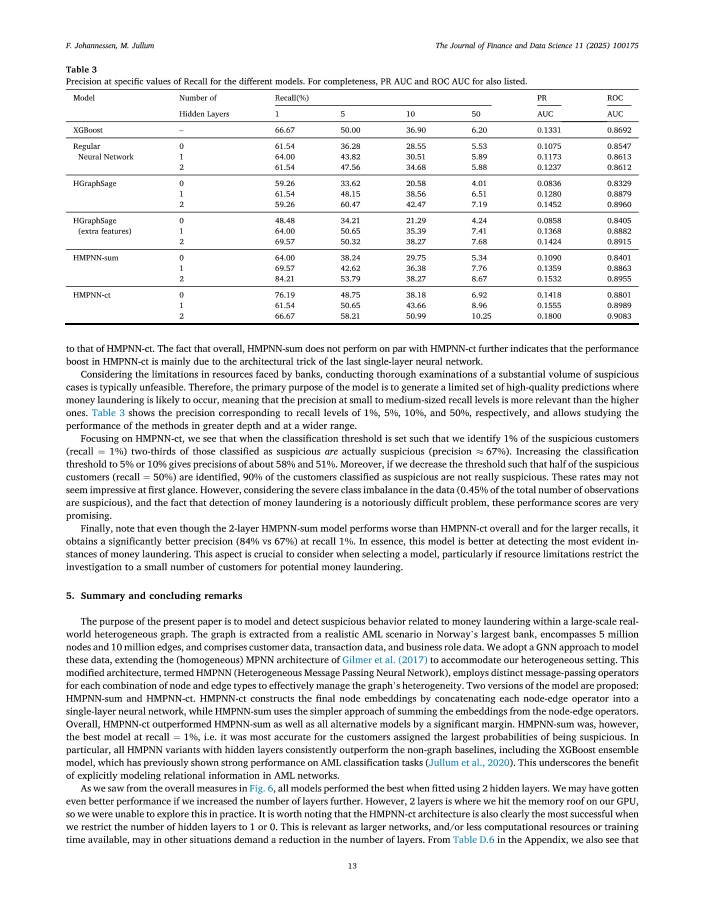

</details>

**표 3 다양한 모델에 대한 특정 재현율 값의 정밀도. 완전성을 위해 PR AUC 및 ROC AUC도 나열되어 있습니다.**

모델 재현율 수(%) PR ROC 히든 레이어 1 5 10 50 AUC AUC

```text
XGBoost
–
66.67
50.00
36.90
6.20
0.1331
0.8692
```

일반 신경망

> **주:** 0 61.54 36.28 28.55 5.53 0.1075 0.8547 1 64.00 43.82 30.51 5.89 0.1173 0.8613 2 61.54 47.56 34.68 5.88 0.1237 0.8612

```text
HGraphSage
0
59.26
33.62
20.58
4.01
0.0836
0.8329
1
61.54
48.15
38.56
6.51
0.1280
0.8879
2
59.26
60.47
42.47
7.19
0.1452
0.8960
```

HGraphSage(추가 특징)

> **주:** 0 48.48 34.21 21.29 4.24 0.0858 0.8405 1 64.00 50.65 35.39 7.41 0.1368 0.8882 2 69.57 50.32 38.27 7.68 0.1424 0.8915

```text
HMPNN-sum
0
64.00
38.24
29.75
5.34
0.1090
0.8401
1
69.57
42.62
36.38
7.76
0.1359
0.8863
2
84.21
53.79
38.27
8.67
0.1532
0.8955
HMPNN-ct
0
76.19
48.75
38.18
6.92
0.1418
0.8801
1
61.54
50.65
43.66
8.96
0.1555
0.8989
2
66.67
58.21
50.99
10.25
0.1800
0.9083
```

HMPNN-ct에 해당합니다. 전체적으로 HMPNN-sum이 HMPNN-ct와 동등한 성능을 발휘하지 못한다는 사실은 HMPNN-ct의 성능 향상이 주로 마지막 단일 계층 신경망의 아키텍처 트릭에 기인함을 나타냅니다.

은행이 직면한 자원의 한계를 고려할 때, 막대한 양의 의심 사례에 대해 철저한 조사를 수행하는 것은 일반적으로 불가능합니다. 따라서 모델의 주요 목적은 자금세탁이 발생할 가능성이 있는 제한된 고품질 예측 세트를 생성하는 것입니다. 즉, 중소 규모 재현율 수준의 정밀도가 높은 수준보다 더 관련성이 높습니다. 표 3은 각각 1%, 5%, 10%, 50%의 재현율 수준에 해당하는 정밀도를 보여 주며, 방법의 성능을 더 깊이 있고 더 넓은 범위에서 연구할 수 있게 해줍니다.

**수식 및 기호가 포함된 원문(정확성 보존)**

```text
Focusing on HMPNN-ct, we see that when the classification threshold is set such that we identify 1% of the suspicious customers
(recall = 1%) two-thirds of those classified as suspicious are actually suspicious (precision ≈67%). Increasing the classification
threshold to 5% or 10% gives precisions of about 58% and 51%. Moreover, if we decrease the threshold such that half of the suspicious
customers (recall = 50%) are identified, 90% of the customers classified as suspicious are not really suspicious. These rates may not
seem impressive at first glance. However, considering the severe class imbalance in the data (0.45% of the total number of observations
are suspicious), and the fact that detection of money laundering is a notoriously difficult problem, these performance scores are very
promising.
```

마지막으로, 2레이어 HMPNN-sum 모델은 전체적으로 HMPNN-ct보다 성능이 떨어지고 더 큰 재현율의 경우 재현율 1%에서 훨씬 더 나은 정밀도(84% 대 67%)를 얻습니다. 본질적으로 이 모델은 가장 명백한 자금세탁 사례를 탐지하는 데 더 좋습니다. 특히 자원 제한으로 인해 자금세탁 가능성에 대한 조사가 소수의 고객으로 제한되는 경우 모델을 선택할 때 이 측면을 고려하는 것이 중요합니다.

## 5 요약 및 결론

본 논문의 목적은 대규모 실제 이종 그래프 내에서 자금세탁과 관련된 의심스러운 행동을 모델링하고 탐지하는 것입니다. 그래프는 노르웨이 최대 은행의 현실적인 AML 시나리오에서 추출되었으며, 500만 개의 노드와 1,000만 개의 엣지를 포함하고 고객 데이터, 거래 데이터 및 비즈니스 역할 데이터로 구성됩니다. 본 연구에서는 Gilmer 등의 (동종) MPNN 아키텍처를 확장하여 이러한 데이터를 모델링하기 위해 GNN 접근 방식을 채택했습니다. (2017) 우리의 이질적인 환경을 수용하기 위해. HMPNN(이종 메시지 패싱 신경망)라고 하는 이 수정된 아키텍처는 노드와 엣지 유형의 각 조합에 대해 고유한 메시지 패싱 연산자를 사용하여 그래프의 이질성을 효과적으로 관리합니다. 모델의 두 가지 버전이 제안되었습니다: HMPNN-sum 및 HMPNN-ct. HMPNN-ct는 각 노드-엣지 연산자를 단일 계층 신경망으로 연결하여 최종 노드 임베딩을 구성하는 반면, HMPNN-sum은 노드-엣지 연산자의 임베딩을 합산하는 더 간단한 접근 방식을 사용합니다. 전반적으로 HMPNN-ct는 HMPNN-sum 및 모든 대체 모델보다 상당한 차이로 성능이 뛰어났습니다. 그러나 HMPNN-sum은 재현율 = 1%에서 가장 좋은 모델이었습니다. 즉, 의심될 확률이 가장 높은 고객에게 가장 정확했습니다. 특히 숨겨진 레이어가 있는 모든 HMPNN 변형은 이전에 AML 분류 작업에서 강력한 성능을 보여준 XGBoost 앙상블 모델을 포함하여 비그래프 베이스라인보다 지속적으로 성능이 뛰어납니다(Jullum et al., 2020). 이는 AML 네트워크에서 관계형 정보를 명시적으로 모델링하는 이점을 강조합니다.

그림 6의 전체 측정에서 볼 수 있듯이 모든 모델은 2개의 숨겨진 레이어를 사용하여 피팅했을 때 가장 좋은 성능을 보였습니다. 레이어 수를 더 늘리면 성능이 더 좋아질 수도 있습니다. 그러나 2레이어는 GPU의 메모리 한계에 도달했기 때문에 실제로 이를 탐색할 수 없었습니다. HMPNN-ct 아키텍처는 숨겨진 레이어 수를 1 또는 0으로 제한할 때 가장 성공적이라는 점은 주목할 가치가 있습니다. 이는 더 큰 네트워크 및/또는 사용 가능한 계산 리소스 또는 교육 시간이 적기 때문에 다른 상황에서 레이어 수 감소가 필요할 수 있으므로 관련이 있습니다. 부록의 표 D.6에서 일반 신경망 모델과 별도로 HMPNN-ct는 2계층 모델 중 가장 적은 수의 모델 매개변수를 가지며 이는 효율적인 아키텍처를 가지고 있음을 나타냅니다.

<!-- 원문 14쪽 -->

<details>
<summary>원문 14쪽 이미지 보기</summary>

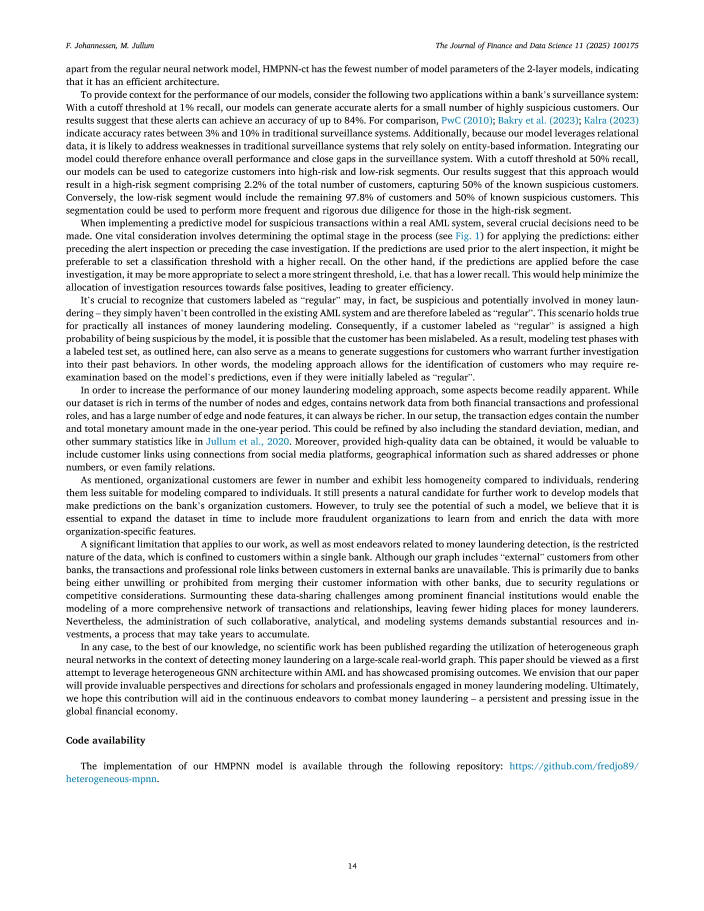

</details>

우리 모델의 성능에 대한 맥락을 제공하기 위해 은행 감시 시스템 내에서 다음 두 가지 애플리케이션을 고려하십시오. 1% 회수율의 기준점을 사용하면 우리 모델은 매우 의심스러운 소수의 고객에게 정확한 경고를 생성할 수 있습니다. 우리의 결과는 이러한 경고가 최대 84%의 정확도를 달성할 수 있음을 시사합니다. 비교를 위해 PwC(2010); Bakryet al. (2023); Kalra(2023)는 기존 감시 시스템의 정확도가 3%에서 10% 사이임을 나타냅니다. 또한, 우리 모델은 관계형 데이터를 활용하기 때문에 엔터티 기반 정보에만 의존하는 기존 감시 시스템의 약점을 해결할 가능성이 높습니다. 따라서 우리 모델을 통합하면 전반적인 성능이 향상되고 감시 시스템의 격차가 줄어들 수 있습니다. 50% 회상률의 컷오프 임계값을 사용하면 당사 모델을 사용하여 고객을 고위험 세그먼트와 저위험 세그먼트로 분류할 수 있습니다. 우리의 결과는 이 접근 방식을 통해 전체 고객 수의 2.2%로 구성된 고위험 세그먼트가 생성되어 알려진 의심스러운 고객의 50%를 포착할 수 있음을 시사합니다. 반대로, 저위험 세그먼트에는 나머지 97.8%의 고객과 50%의 알려진 의심스러운 고객이 포함됩니다. 이 세분화를 사용하면 고위험 부문에 속한 사람들에 대해 보다 빈번하고 엄격한 실사를 수행할 수 있습니다.

실제 AML 시스템 내에서 의심스러운 거래에 대한 예측 모델을 구현할 때 몇 가지 중요한 결정을 내려야 합니다. 중요한 고려 사항 중 하나는 예측을 적용하기 위한 프로세스(그림 1 참조)의 최적 단계(경보 검사 이전 또는 사례 조사 이전)를 결정하는 것입니다. 경고 검사 전에 예측을 사용하는 경우 재현율이 높은 분류 임계값을 설정하는 것이 더 나을 수 있습니다. 반면, 사례 조사 전에 예측이 적용되는 경우 더 엄격한 임계값, 즉 재현율이 낮은 임계값을 선택하는 것이 더 적절할 수 있습니다. 이는 오탐에 대한 조사 자원 할당을 최소화하여 효율성을 높이는 데 도움이 됩니다.

"일반"으로 분류된 고객은 실제로 의심스럽고 자금세탁에 연루될 가능성이 있다는 점을 인식하는 것이 중요합니다. 이러한 고객은 단순히 기존 AML 시스템에서 통제되지 않았으므로 "일반"으로 분류됩니다. 이 시나리오는 자금세탁 모델링의 거의 모든 사례에 적용됩니다. 결과적으로, "일반"으로 분류된 고객에게 모델에 의해 의심될 가능성이 높은 것으로 할당된 경우 고객에게 잘못 분류되었을 가능성이 있습니다. 결과적으로, 여기에 설명된 대로 레이블이 지정된 테스트 세트를 사용하여 테스트 단계를 모델링하면 과거 행동에 대한 추가 조사가 필요한 고객을 위한 제안을 생성하는 수단으로도 사용될 수 있습니다. 즉, 모델링 접근 방식을 사용하면 처음에 "일반"으로 분류되었더라도 모델의 예측을 기반으로 재검토가 필요할 수 있는 고객을 식별할 수 있습니다.

자금세탁 모델링 접근 방식의 성능을 높이기 위해 몇 가지 측면이 쉽게 드러납니다. 우리의 데이터셋은 노드 및 엣지 수 측면에서 풍부하고 금융 거래 및 전문 역할 모두의 네트워크 데이터를 포함하며 많은 엣지 및 노드 특징을 갖추고 있지만 항상 더 풍부할 수 있습니다. 우리 설정에서 거래 엣지에는 1년 동안 발생한 금액과 총 금액이 포함됩니다. 이는 Jullum et al., 2020과 같은 표준 편차, 중앙값 및 기타 요약 통계를 포함하여 개선할 수 있습니다. 또한 고품질 데이터를 얻을 수 있다면 소셜 미디어 플랫폼의 연결, 공유 주소나 전화번호와 같은 지리적 정보, 심지어 가족 관계를 사용하여 고객 링크를 포함하는 것이 중요할 것입니다.

언급한 바와 같이 조직 고객은 개인에 비해 숫자가 적고 동질성이 떨어지므로 개인에 비해 모델링에 적합하지 않습니다. 이는 여전히 은행 조직의 고객을 예측하는 모델을 개발하기 위한 추가 작업에 대한 자연스러운 후보를 제시합니다. 그러나 그러한 모델의 잠재력을 진정으로 확인하려면 더 많은 사기 조직을 포함하도록 데이터셋을 확장하고 더 많은 조직별 기능으로 데이터를 강화하는 것이 필수적이라고 믿습니다.

자금세탁 적발과 관련된 대부분의 노력뿐만 아니라 우리 업무에 적용되는 중요한 제한 사항은 단일 은행 내의 고객에게만 국한된 데이터의 제한된 특성입니다. 그래프에는 다른 은행의 "외부" 고객이 포함되어 있지만 외부 은행 고객 간의 거래 및 전문 역할 연결은 사용할 수 없습니다. 이는 주로 은행이 보안 규정이나 경쟁 고려 사항으로 인해 고객 정보를 다른 은행과 병합하는 것을 꺼리거나 금지하기 때문입니다. 주요 금융 기관 간의 이러한 데이터 공유 문제를 극복하면 보다 포괄적인 거래 및 관계 네트워크의 모델링이 가능해지며 자금세탁자들이 숨을 곳이 줄어들 것입니다. 그럼에도 불구하고 이러한 협업, 분석 및 모델링 시스템을 관리하려면 상당한 자원과 투자가 필요하며, 이를 축적하는 데 수년이 걸릴 수 있습니다.

어쨌든, 우리가 아는 한, 대규모 실제 그래프에서 자금세탁을 탐지하는 맥락에서 이종 그래프 신경망을 활용하는 것과 관련된 과학적 연구는 발표된 적이 없습니다. 이 문서는 AML 내에서 이종 GNN 아키텍처를 활용하려는 첫 번째 시도로 간주되어야 하며 유망한 결과를 보여주었습니다. 본 연구에서는 우리의 논문이 자금세탁 모델링에 종사하는 학자 및 전문가에게 귀중한 관점과 방향을 제공할 것이라고 생각합니다. 궁극적으로 우리는 이 기여가 세계 금융 경제에서 지속적이고 긴급한 문제인 자금세탁을 근절하기 위한 지속적인 노력에 도움이 되기를 바랍니다.

코드 가용성 HMPNN 모델의 구현은 다음 저장소를 통해 제공됩니다: https://github.com/fredjo89/ heterogeneous-mpnn.

경쟁 이해 관계 선언 저자는 이 문서에 보고된 작업에 영향을 미칠 수 있는 경쟁적인 금전적 이해 관계나 개인적 관계가 없음을 선언합니다.

<!-- 원문 15쪽 -->

<details>
<summary>원문 15쪽 이미지 보기</summary>

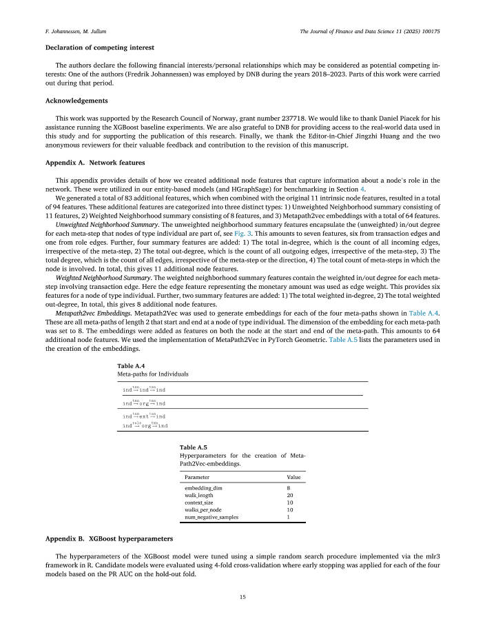

</details>

## 감사의 글

이 작업은 노르웨이 연구 위원회(승인 번호 237718)의 지원을 받았습니다. XGBoost 기본 실험을 실행하는 데 도움을 준 Daniel Piacek에게 감사의 말씀을 전하고 싶습니다. 또한 본 연구에 사용된 실제 데이터에 대한 액세스를 제공하고 본 연구의 출판을 지원한 DNB에 감사드립니다. 마지막으로, 본 논문의 개정에 귀중한 피드백과 기여를 해주신 황징지 편집장과 익명의 심사위원 두 분에게 감사드립니다.

부록 A. 네트워크 기능 이 부록에서는 네트워크에서 노드의 역할에 대한 정보를 캡처하는 추가 노드 특징을 생성한 방법에 대한 세부 정보를 제공합니다. 이는 섹션 4의 벤치마킹을 위해 엔터티 기반 모델(및 HGraphSage)에서 활용되었습니다.

본 연구에서는 총 83개의 추가 특징을 생성했으며, 이는 원래의 11개 고유 노드 특징과 결합되어 총 94개의 기능이 생성되었습니다. 이러한 추가 특징은 1) 11개 기능으로 구성된 Unweighted Neighborhood 요약, 2) 8개 기능으로 구성된 Weighted Neighborhood 요약, 3) 총 64개 기능으로 구성된 Metapath2vec 임베딩의 세 가지 유형으로 분류됩니다. 비가중 지역 요약. 가중치가 적용되지 않은 이웃 요약 기능은 개인 유형의 노드가 속한 각 메타 단계에 대한 (비가중) 입/출력 정도를 캡슐화합니다(그림 3 참조). 이는 거래 엣지에서 6개, 역할 엣지에서 1개, 총 7개의 기능에 해당합니다. 또한 4가지 요약 기능이 추가됩니다. 1) 메타 단계에 관계없이 들어오는 모든 엣지의 개수인 total in-degree, 2) 메타 단계에 관계없이 나가는 모든 엣지의 개수인 total out-degree, 3) 메타 단계나 방향에 관계없이 모든 엣지의 개수인 total order, 4) 노드가 포함된 총 메타 단계 개수입니다. 전체적으로 11개의 추가 노드 특징이 제공됩니다.

가중 지역 요약. 가중 이웃 요약 기능에는 거래 엣지와 관련된 각 메타단계에 대한 가중 입/출력 정도가 포함됩니다. 여기서는 금액을 나타내는 간선 특징을 간선 가중치로 사용했습니다. 이는 개인 유형 노드에 대해 6가지 기능을 제공합니다. 또한 두 가지 요약 기능이 추가됩니다. 1) 총 가중 차수, 2) 총 가중 외차, 총 8개의 추가 노드 특징이 제공됩니다.

Metapath2vec 임베딩. Metapath2Vec은 표 A.4에 표시된 4개의 메타 경로 각각에 대한 임베딩을 생성하는 데 사용되었습니다. 이는 모두 개인 유형의 노드에서 시작하고 끝나는 길이 2의 메타 경로입니다. 각 메타 경로의 임베딩 차원은 8로 설정되었습니다. 임베딩은 메타 경로의 시작과 끝 노드 모두에 기능으로 추가되었습니다. 이는 64개의 추가 노드 특징에 해당합니다. 본 연구에서는 PyTorch 기하학에서 MetaPath2Vec의 구현을 사용했습니다. 표 A.5에는 임베딩 생성에 사용되는 매개변수가 나열되어 있습니다.

표 A.4 개인용 메타 경로 txnind ind → txnind → txnind txnorg → ind → txnind ind → txnext → txnind roleorg → ind → 표 A.5 MetaPath2Vec 임베딩 생성을 위한 하이퍼파라미터.

매개변수 값 embedding_dim 8 walk_length 20 context_size 10 walks_per_node 10 num_negative_samples 1 부록 B. XGBoost 하이퍼파라미터 XGBoost 모델의 하이퍼파라미터는 R의 mlr3 프레임워크를 통해 구현된 간단한 무작위 검색 절차를 사용하여 조정되었습니다. 후보 모델은 조기 중지가 수행된 4겹 교차 검증을 사용하여 평가되었습니다. 홀드아웃 폴드의 PR AUC를 기준으로 4가지 모델 각각에 적용되었습니다.

**수식 및 기호가 포함된 원문(정확성 보존)**

```text
The best-performing configuration was found with the following hyperparameters: alpha = 0.0003, colsample_bytree = 2.69, eta =
0.032, gamma = 0.030, lambda = 14.60, max_depth = 10, min_child_weight = 24.80, subsample = 0.68. The four cross-validated
models used in the CV-mean ensemble contained, respectively, 368, 378, 320, and 362 boosting rounds (trees).
```

<!-- 원문 16쪽 -->

<details>
<summary>원문 16쪽 이미지 보기</summary>

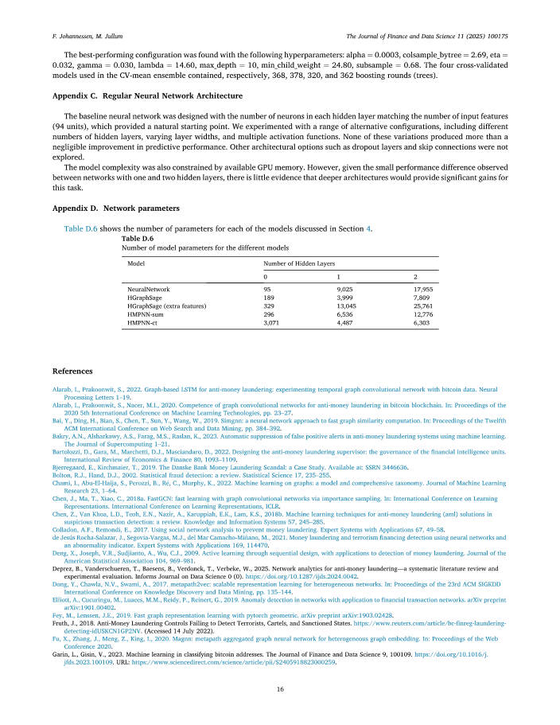

</details>

부록 C. 일반 신경망 아키텍처 기본 신경망은 입력 특징 수(94개 단위)와 일치하는 각 은닉층의 뉴런 수로 설계되었으며, 이는 자연스러운 시작점을 제공했습니다. 본 연구에서는 다양한 수의 숨겨진 레이어, 다양한 레이어 너비, 여러 활성화 기능을 포함한 다양한 대체 구성을 실험했습니다. 이러한 변형 중 어느 것도 예측 성능에서 미미한 향상을 가져왔습니다. 드롭아웃 레이어 및 건너뛰기 연결과 같은 다른 아키텍처 옵션은 탐색되지 않았습니다.

모델 복잡성도 사용 가능한 GPU 메모리로 인해 제한되었습니다. 그러나 하나의 숨겨진 레이어와 두 개의 숨겨진 레이어가 있는 네트워크 간에 관찰된 작은 성능 차이를 고려할 때 더 깊은 아키텍처가 이 작업에 상당한 이점을 제공할 것이라는 증거는 거의 없습니다.

부록 D. 네트워크 매개변수 표 D.6은 섹션 4에서 논의된 각 모델에 대한 매개변수 수를 보여줍니다.

표 D.6 다양한 모델에 대한 모델 매개변수 수 숨겨진 레이어의 모델 수

> **주:** 0 1 2

NeuralNetwork 95 9,025 17,955 HGraphSage 189 3,999 7,809 HGraphSage(추가 특징) 329 13,045 25,761 HMPNN-sum 296 6,536 12,776 HMPNN-ct 3,071 4,487 6,303

## 참고문헌

Alarab, I., Prakoonwit, S., 2022. Graph-based LSTM for anti-money laundering: experimenting temporal graph convolutional network with bitcoin data. Neural

Processing Letters 1–19. Alarab, I., Prakoonwit, S., Nacer, M.I., 2020. Competence of graph convolutional networks for anti-money laundering in bitcoin blockchain. In: Proceedings of the

2020 5th International Conference on Machine Learning Technologies, pp. 23–27. Bai, Y., Ding, H., Bian, S., Chen, T., Sun, Y., Wang, W., 2019. Simgnn: a neural network approach to fast graph similarity computation. In: Proceedings of the Twelfth

ACM International Conference on Web Search and Data Mining, pp. 384–392. Bakry, A.N., Alsharkawy, A.S., Farag, M.S., Raslan, K., 2023. Automatic suppression of false positive alerts in anti-money laundering systems using machine learning.

The Journal of Supercomputing 1–21. Bartolozzi, D., Gara, M., Marchetti, D.J., Masciandaro, D., 2022. Designing the anti-money laundering supervisor: the governance of the financial intelligence units.

International Review of Economics & Finance 80, 1093–1109. Bjerregaard, E., Kirchmaier, T., 2019. The Danske Bank Money Laundering Scandal: a Case Study. Available at: SSRN 3446636. Bolton, R.J., Hand, D.J., 2002. Statistical fraud detection: a review. Statistical Science 17, 235–255. Chami, I., Abu-El-Haija, S., Perozzi, B., Re, C., Murphy, K., 2022. Machine learning on graphs: a model and comprehensive taxonomy. Journal of Machine Learning

Research 23, 1–64. Chen, J., Ma, T., Xiao, C., 2018a. FastGCN: fast learning with graph convolutional networks via importance sampling. In: International Conference on Learning

Representations. International Conference on Learning Representations, ICLR. Chen, Z., Van Khoa, L.D., Teoh, E.N., Nazir, A., Karuppiah, E.K., Lam, K.S., 2018b. Machine learning techniques for anti-money laundering (aml) solutions in

suspicious transaction detection: a review. Knowledge and Information Systems 57, 245–285. Colladon, A.F., Remondi, E., 2017. Using social network analysis to prevent money laundering. Expert Systems with Applications 67, 49–58. de Jesús Rocha-Salazar, J., Segovia-Vargas, M.J., del Mar Camacho-Mi~nano, M., 2021. Money laundering and terrorism financing detection using neural networks and

an abnormality indicator. Expert Systems with Applications 169, 114470. Deng, X., Joseph, V.R., Sudjianto, A., Wu, C.J., 2009. Active learning through sequential design, with applications to detection of money laundering. Journal of the

American Statistical Association 104, 969–981. Deprez, B., Vanderschueren, T., Baesens, B., Verdonck, T., Verbeke, W., 2025. Network analytics for anti-money laundering—a systematic literature review and

experimental evaluation. Informs Journal on Data Science 0 (0). https://doi.org/10.1287/ijds.2024.0042. Dong, Y., Chawla, N.V., Swami, A., 2017. metapath2vec: scalable representation learning for heterogeneous networks. In: Proceedings of the 23rd ACM SIGKDD

International Conference on Knowledge Discovery and Data Mining, pp. 135–144. Elliott, A., Cucuringu, M., Luaces, M.M., Reidy, P., Reinert, G., 2019. Anomaly detection in networks with application to financial transaction networks. arXiv preprint

detecting-idUSKCN1GP2NV. (Accessed 14 July 2022). Fu, X., Zhang, J., Meng, Z., King, I., 2020. Magnn: metapath aggregated graph neural network for heterogeneous graph embedding. In: Proceedings of the Web

jfds.2023.100109. URL: https://www.sciencedirect.com/science/article/pii/S2405918823000259. Gilmer, J., Schoenholz, S.S., Riley, P.F., Vinyals, O., Dahl, G.E., 2017. Neural message passing for quantum chemistry. In: International Conference on Machine

Learning. PMLR, pp. 1263–1272. Grover, A., Leskovec, J., 2016. node2vec: scalable feature learning for networks. In: Proceedings of the 22nd ACM SIGKDD International Conference on Knowledge

Discovery and Data Mining, pp. 855–864. Hamilton, W.L., Ying, R., Leskovec, J., 2017. Inductive representation learning on large graphs. In: Proceedings of the 31st International Conference on Neural

Information Processing Systems, pp. 1025–1035.

<!-- 원문 17쪽 -->

<details>
<summary>원문 17쪽 이미지 보기</summary>

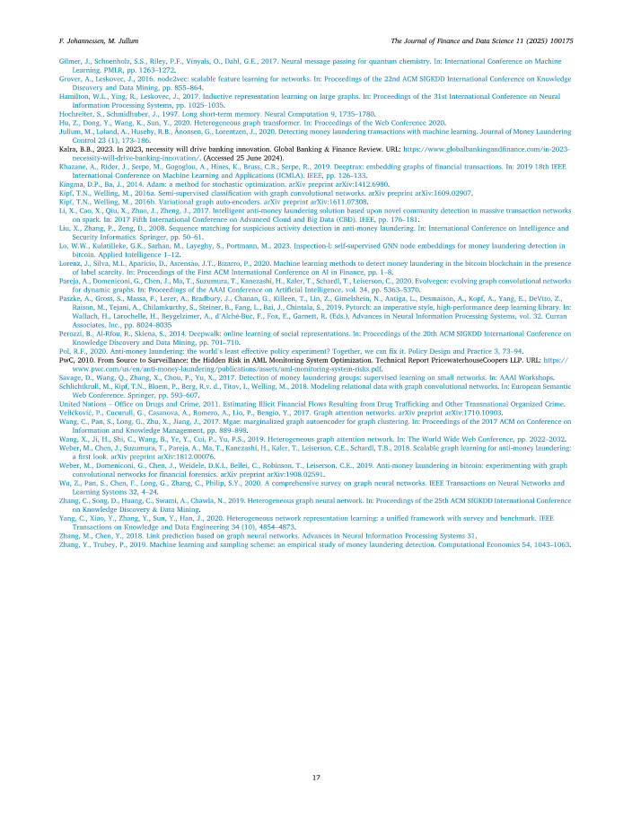

</details>

Hochreiter, S., Schmidhuber, J., 1997. Long short-term memory. Neural Computation 9, 1735–1780. Hu, Z., Dong, Y., Wang, K., Sun, Y., 2020. Heterogeneous graph transformer. In: Proceedings of the Web Conference 2020. Jullum, M., Løland, A., Huseby, R.B., Ånonsen, G., Lorentzen, J., 2020. Detecting money laundering transactions with machine learning. Journal of Money Laundering

Control 23 (1), 173–186. Kalra, B.B., 2023. In 2023, necessity will drive banking innovation. Global Banking & Finance Review. URL: https://www.globalbankingandfinance.com/in-2023-

necessity-will-drive-banking-innovation/. (Accessed 25 June 2024). Khazane, A., Rider, J., Serpe, M., Gogoglou, A., Hines, K., Bruss, C.B., Serpe, R., 2019. Deeptrax: embedding graphs of financial transactions. In: 2019 18th IEEE

International Conference on Machine Learning and Applications (ICMLA). IEEE, pp. 126–133. Kingma, D.P., Ba, J., 2014. Adam: a method for stochastic optimization. arXiv preprint arXiv:1412.6980. Kipf, T.N., Welling, M., 2016a. Semi-supervised classification with graph convolutional networks. arXiv preprint arXiv:1609.02907. Kipf, T.N., Welling, M., 2016b. Variational graph auto-encoders. arXiv preprint arXiv:1611.07308. Li, X., Cao, X., Qiu, X., Zhao, J., Zheng, J., 2017. Intelligent anti-money laundering solution based upon novel community detection in massive transaction networks

on spark. In: 2017 Fifth International Conference on Advanced Cloud and Big Data (CBD). IEEE, pp. 176–181. Liu, X., Zhang, P., Zeng, D., 2008. Sequence matching for suspicious activity detection in anti-money laundering. In: International Conference on Intelligence and

Security Informatics. Springer, pp. 50–61. Lo, W.W., Kulatilleke, G.K., Sarhan, M., Layeghy, S., Portmann, M., 2023. Inspection-l: self-supervised GNN node embeddings for money laundering detection in

bitcoin. Applied Intelligence 1–12. Lorenz, J., Silva, M.I., Aparício, D., Ascens~ao, J.T., Bizarro, P., 2020. Machine learning methods to detect money laundering in the bitcoin blockchain in the presence

of label scarcity. In: Proceedings of the First ACM International Conference on AI in Finance, pp. 1–8. Pareja, A., Domeniconi, G., Chen, J., Ma, T., Suzumura, T., Kanezashi, H., Kaler, T., Schardl, T., Leiserson, C., 2020. Evolvegcn: evolving graph convolutional networks

for dynamic graphs. In: Proceedings of the AAAI Conference on Artificial Intelligence, vol. 34, pp. 5363–5370. Paszke, A., Gross, S., Massa, F., Lerer, A., Bradbury, J., Chanan, G., Killeen, T., Lin, Z., Gimelshein, N., Antiga, L., Desmaison, A., Kopf, A., Yang, E., DeVito, Z.,

Raison, M., Tejani, A., Chilamkurthy, S., Steiner, B., Fang, L., Bai, J., Chintala, S., 2019. Pytorch: an imperative style, high-performance deep learning library. In: Wallach, H., Larochelle, H., Beygelzimer, A., d’Alche-Buc, F., Fox, E., Garnett, R. (Eds.), Advances in Neural Information Processing Systems, vol. 32. Curran Associates, Inc., pp. 8024–8035 Perozzi, B., Al-Rfou, R., Skiena, S., 2014. Deepwalk: online learning of social representations. In: Proceedings of the 20th ACM SIGKDD International Conference on

Knowledge Discovery and Data Mining, pp. 701–710. Pol, R.F., 2020. Anti-money laundering: the world’s least effective policy experiment? Together, we can fix it. Policy Design and Practice 3, 73–94. PwC, 2010. From Source to Surveillance: the Hidden Risk in AML Monitoring System Optimization. Technical Report PricewaterhouseCoopers LLP. URL: https://

www.pwc.com/us/en/anti-money-laundering/publications/assets/aml-monitoring-system-risks.pdf. Savage, D., Wang, Q., Zhang, X., Chou, P., Yu, X., 2017. Detection of money laundering groups: supervised learning on small networks. In: AAAI Workshops. Schlichtkrull, M., Kipf, T.N., Bloem, P., Berg, R.v. d., Titov, I., Welling, M., 2018. Modeling relational data with graph convolutional networks. In: European Semantic

Web Conference. Springer, pp. 593–607. United Nations – Office on Drugs and Crime, 2011. Estimating Illicit Financial Flows Resulting from Drug Trafficking and Other Transnational Organized Crime. Velickovic, P., Cucurull, G., Casanova, A., Romero, A., Lio, P., Bengio, Y., 2017. Graph attention networks. arXiv preprint arXiv:1710.10903. Wang, C., Pan, S., Long, G., Zhu, X., Jiang, J., 2017. Mgae: marginalized graph autoencoder for graph clustering. In: Proceedings of the 2017 ACM on Conference on

Information and Knowledge Management, pp. 889–898. Wang, X., Ji, H., Shi, C., Wang, B., Ye, Y., Cui, P., Yu, P.S., 2019. Heterogeneous graph attention network. In: The World Wide Web Conference, pp. 2022–2032. Weber, M., Chen, J., Suzumura, T., Pareja, A., Ma, T., Kanezashi, H., Kaler, T., Leiserson, C.E., Schardl, T.B., 2018. Scalable graph learning for anti-money laundering:

a first look. arXiv preprint arXiv:1812.00076. Weber, M., Domeniconi, G., Chen, J., Weidele, D.K.I., Bellei, C., Robinson, T., Leiserson, C.E., 2019. Anti-money laundering in bitcoin: experimenting with graph

convolutional networks for financial forensics. arXiv preprint arXiv:1908.02591. Wu, Z., Pan, S., Chen, F., Long, G., Zhang, C., Philip, S.Y., 2020. A comprehensive survey on graph neural networks. IEEE Transactions on Neural Networks and

Learning Systems 32, 4–24. Zhang, C., Song, D., Huang, C., Swami, A., Chawla, N., 2019. Heterogeneous graph neural network. In: Proceedings of the 25th ACM SIGKDD International Conference

on Knowledge Discovery & Data Mining. Yang, C., Xiao, Y., Zhang, Y., Sun, Y., Han, J., 2020. Heterogeneous network representation learning: a unified framework with survey and benchmark. IEEE

Transactions on Knowledge and Data Engineering 34 (10), 4854–4873. Zhang, M., Chen, Y., 2018. Link prediction based on graph neural networks. Advances in Neural Information Processing Systems 31. Zhang, Y., Trubey, P., 2019. Machine learning and sampling scheme: an empirical study of money laundering detection. Computational Economics 54, 1043–1063.
