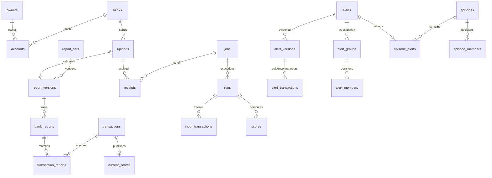

# AML 데이터 구조

PostgreSQL 17(`postgres:17-alpine`)을 사용한다. 환경별 업무 DB 하나 안에서 역할별 스키마를 나누며 dev와 prod는 분리한다. 적용 컬럼·키·제약·인덱스의 정본은 [Flyway 마이그레이션](src/main/resources/db/migration)이다. 이 문서는 현재 구조만 설명한다.

## 관계

## 테이블 역할

| 스키마 | 테이블 | 책임 |
|---|---|---|
| core | users | 직원 계정·비밀번호 해시·역할·자동 배정 순서 |
| core | banks, bank_reporting_periods | 은행 정보와 보고 자격 적용 기간 |
| core | fx_rates | 버전별 고정 환율 |
| core | owners, accounts | 서비스 식별자·저장 가명·은행과 소유주 관계 |
| private | owner_identities, account_identities | 암호화한 원천 식별자·이름과 검색 토큰 |
| private | bank_reports | 보고 버전별 암호화 원문 행 |
| ingest | uploads | 파일 발급·수신·검수 상태, 분석 작업과 독립 |
| ingest | reporting_scopes, reporting_scope_banks | 거래 기준일에 고정한 보고 은행 범위 |
| ingest | report_sets, report_versions | 은행·기준일별 보고 묶음, 후보·현재 버전 |
| ingest | integration_attempts, integration_attempt_versions | 통합 시도와 사용한 보고 버전 |
| ingest | correction_requests, correction_errors, correction_uploads | 정정 요청·오류·멱등 제출 관계 |
| ledger | transactions | 통합 거래 원장·통합 상태·USD 금액 |
| ledger | transaction_reports | 통합 거래와 실제 원천 보고 행의 연결 |
| analysis | jobs, receipts, selected_versions | 분석 상태·고정 수신 목록·통합에서 선택한 버전 |
| analysis | runs, run_replacements | 실행 세대와 취소·대체 관계 |
| analysis | stage_results, failures | 단계 완료 체크포인트·실패 이력 |
| analysis | input_transactions, input_reports | 불변 TARGET 및 cutoff 이전 유효 전체 CONTEXT 거래값·보고 출처 |
| analysis | target_ownership | 미완료 TARGET 실행 소유권 |
| analysis | input_coverage, input_scores, source_manifest | 고정 커버리지·선행 점수와 원본 실행 참조·보고/수집 범위 상태 |
| analysis | model_requests, model_tasks, cancel_outbox | 모델 요청·회차·관측·취소 전달 |
| analysis | features, scores, current_scores | 실행별 피처·점수, 완료 후 공개되는 거래별 점수 참조 |
| analysis | alert_origins | 입력 동결 시 공개된 후속 계보의 마지막 Alert와 불변 근거 버전 참조. 실행 산출 연결은 alert_versions.run_id |
| review | alerts | Alert 담당·상태·종결 결과 |
| review | episodes | Episode 담당·상태·종결 결과. Alert와 별도 테이블 |
| review | alert_versions, alert_transactions, alert_coverage_checks | 버전별 불변 생성 근거·거래·커버리지. alert_transactions.seed_risk는 당시 SEED의 p_laundering이며 나머지는 NULL. 현재 유효 소속과 결합하여 위험도 정렬에 사용 |
| review | alert_groups, alert_members | 저장한 Alert 조사 그룹·소속·역할·판정 |
| review | episode_alerts, episode_members | Episode의 원본 Alert와 조사 거래·판정 |
| review | events, requests, notification_reads | 감사 이력·멱등 변경 요청·알림 읽음 |
| ops | business_clock | 시연 업무 시각 |
| ops | resets, reset_files | 초기화 작업·파일 삭제 재시도 |
| evaluation | report_labels, transaction_labels | 평가 라벨. 분석·화면 입력에서 제외 |

## 식별자와 저장 원칙

- `core.work_id`는 업로드와 분석 작업의 공통 숫자 ID를 발급한다. 실제 저장소는 `ingest.uploads`와 `analysis.jobs`로 분리한다.
- `review.case_id`는 Alert와 Episode의 공통 숫자 ID를 발급한다. API의 `caseId`는 해당 Alert 또는 Episode ID다. 쓰기는 각 실제 테이블에서 수행한다.
- 소유주는 최초 통합 때 서비스 UUID와 `가명이름#코드`를 확정하여 `core.owners.display_name`에 저장한다. 조회마다 원문 이름을 복호화하거나 가명을 재계산하지 않는다. 원문과 서비스 표시값은 별개다.
- 원천 보고의 반복 동일 행은 발생 건수대로 보존한다. 송신·수신 보고를 대조해 거래를 만들고 `ledger.transaction_reports`에 양쪽 출처를 연결한다.
- 원장, 고정 분석 입력, Alert 생성 근거는 수명과 의미가 달라 각각 보존한다. 당시 근거 JSON은 불변 증거이며, 조사 소속·판정·Episode 연결은 관계형 테이블로 저장한다.
- 새로운 분석은 기존 Alert 근거 JSON을 복사하지 않고 불변 버전 ID를 참조한다. 조사 변경은 근거 버전을 수정하지 않는다.

## 실행과 공개 경계

Spring은 인증·API·실행 조정·입력 고정·최종 공개를 담당한다. Python은 CSV 검수·원문 보호·통합·정정과 피처·추론 결과 결합·Alert 생성을 담당한다. 프로세스를 바꾸었다는 이유로 계산이 빨라진다고 가정하지 않으며, 대량 COPY와 집합 연산으로 처리한다.

Python의 데이터 변경과 단계 완료 기록은 같은 DB 트랜잭션이다. Spring은 종료 코드만으로 성공 처리하지 않고 현재 실행 토큰에 해당하는 체크포인트를 확인한다. 별도 Python 프로세스가 Spring JDBC 트랜잭션에 참여하지 않는다.

분석 등록 시 cutoff 이하 전체 수신 ID를 고정한다. 통합 버전의 세대가 변경되면 다시 준비하고, cutoff 밖 최신본으로 교체되면 과거 포인터를 되돌리지 않는다. 취소된 실행의 후속 쓰기는 실행 토큰·현재 run 확인으로 차단한다. 완료 TARGET을 바꾸는 정정은 거절하고 완료 CONTEXT는 고정 입력값으로 보존한다.

점수는 `(run_id, tx_id)`로 저장하며 완료 전에는 `analysis.current_scores`로 공개하지 않는다. Alert 조회도 완료한 분석의 근거만 사용한다. Episode는 서로 다른 Alert 두 개 이상을 포함하며 한 Alert의 현재 Episode 소속은 최대 하나다. 연결·해제·종결은 관계와 감사 이력을 함께 변경한다.

## 읽기 전용 뷰

`core.assignable_staff`는 비밀번호 해시를 노출하지 않는 배정 후보 목록이다. `ops.work_items`는 작업 목록, `review.cases`는 공통 사건 목록이다. `review.event_history`, `saved_members`, `latest_versions`, `effective_members`, `visible_cases`, `notifications`는 현재 조사·완료 근거·알림을 조합한다. 업무 상태의 두 번째 저장소나 구 테이블의 쓰기 호환 계층이 아니다.

현재 API의 목록·대시보드는 `ReviewCaseSql`에서 공개 사건 조회와 사건별 위험도 조회를 분리한다. `visible_cases`의 전체 집계 결합은 초기 통계 오차 시 반복 비교가 커져 API에서 사용하지 않는다. 이는 Spring 조회 변경이며 현재 V1의 수정이나 재초기화가 필요하지 않다.

## 초기화 전환

초기 스키마는 빈 DB용이다. 구 Flyway 이력이 있는 DB 위에 적용하거나 validate를 끄지 않는다. 테스트 업무 데이터는 초기화하고 직원 계정·비밀번호 해시·은행·보고 기간·환율·외부 암호키를 보존하여 같은 환경 DB에 복원한다. 새 버전 DB를 추가하지 않는다. 실제 초기화·배포는 대상 확인과 코드 검증 후 수행한다.

스키마 분리만으로 원문 접근 차단이 보장되지는 않는다. 통합 작업과 분석 작업의 접속 역할을 분리하고 분석 역할의 private/evaluation 접근 거부를 실제 PostgreSQL에서 검증해야 한다. 외부 추론 서비스에는 DB 자격증명을 전달하지 않는다.
