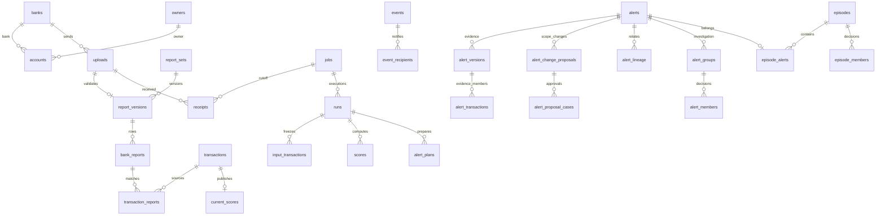

# AML 데이터 구조

PostgreSQL 17(`postgres:17-alpine`)을 사용한다. 환경별 업무 DB 하나 안에서 역할별 스키마를 나누며 dev와 prod는 분리한다. 적용 컬럼·키·제약·인덱스의 정본은 [Flyway 마이그레이션](src/main/resources/db/migration)이다. 이 문서는 현재 구조만 설명한다.

## 관계

## 테이블 역할

| 스키마 | 테이블 | 책임 |
|---|---|---|
| core | users | 직원 계정·비밀번호 해시·역할·자동 배정 순서 |
| core | banks, bank_reporting_periods | 은행 정보와 보고 자격 적용 기간 |
| core | fx_rates | 버전별 고정 환율 |
| core | owners, accounts | 서비스 식별자·저장 가명·은행과 소유주 관계 |
| private | owner_identities, account_identities | 암호화한 원천 식별자·이름과 검색 토큰 |
| private | bank_reports | 보고 버전별 암호화 원문 행 |
| ingest | uploads | 파일 발급·수신·검수 상태, 분석 작업과 독립 |
| ingest | reporting_scopes, reporting_scope_banks | 거래 기준일에 고정한 보고 은행 범위 |
| ingest | report_sets, report_versions | 은행·기준일별 보고 묶음, 후보·현재 버전 |
| ingest | integration_attempts, integration_attempt_versions | 통합 시도와 사용한 보고 버전 |
| ingest | correction_requests, correction_errors, correction_uploads | 정정 요청·오류·멱등 제출 관계 |
| ledger | transactions | 통합 거래 원장·통합 상태·USD 금액 |
| ledger | transaction_reports | 통합 거래와 실제 원천 보고 행의 연결 |
| analysis | jobs, receipts, selected_versions | 분석 상태·고정 수신 목록·통합에서 선택한 버전 |
| analysis | runs, run_replacements | 실행 세대와 취소·대체 관계 |
| analysis | stage_results, failures | 단계 완료 체크포인트·실패 이력 |
| analysis | input_transactions, input_reports | 불변 TARGET 및 cutoff 이전 유효 전체 CONTEXT 거래값·보고 출처 |
| analysis | target_ownership | 미완료 TARGET 실행 소유권 |
| analysis | input_coverage, input_scores, source_manifest | 고정 커버리지·선행 점수와 원본 실행 참조·보고/수집 범위 상태 |
| analysis | model_requests, model_tasks, cancel_outbox | 모델 요청·회차·관측·취소 전달 |
| analysis | features, scores, current_scores | 실행별 피처·점수, 완료 후 공개되는 거래별 점수 참조 |
| analysis | alert_origins | 입력 동결 시 모든 공개 Alert(종결·병합 별칭 포함)와 불변 공개 근거 버전 참조. 실행 산출 연결은 alert_versions.run_id |
| analysis | alert_plans, alert_fact_checks | 실행 토큰·세대·SHA-256으로 검증하는 공개 준비 계획(canonical JSON TEXT), 기존 근거 거래의 명시적 유효성 스냅샷 |
| review | alerts | Alert 담당·상태·종결 결과·조사 착수·공개 버전·병합 대표 ID·현재 범위 요약/revision/digest |
| review | episodes | Episode 담당·상태·종결 결과·현재 범위 요약/revision/digest. Alert와 별도 테이블 |
| review | alert_versions, alert_transactions, alert_coverage_checks | 버전별 불변 생성 근거·거래·커버리지. alert_transactions.seed_risk는 당시 SEED의 p_laundering이며 나머지는 NULL. 현재 위험도는 현재 조사 범위에서 계산해 root summary와 생성 컬럼 risk_score에 저장 |
| review | alert_groups, alert_members | 저장한 Alert 조사 그룹·소속·역할·판정 |
| review | episode_alerts, episode_members | Episode의 원본 Alert와 조사 거래·판정 |
| review | alert_lineage | MERGED_INTO/FOLLOWUP_OF 관계와 원인 이벤트 |
| review | alert_change_proposals, alert_proposal_cases | 조사 중 병합·기존 근거 제거·재평가 제안, 영향 사건 baseline과 담당자 동의 |
| review | events, event_recipients, requests, notification_reads | 감사 이력·공개 시 고정 수신자·멱등 변경 요청·사용자별 알림 읽음 |
| ops | business_clock | 시연 업무 시각 |
| ops | dashboard_dirty | component·영향 범위·source transaction별 요청. PIPELINE/INVESTIGATION scope는 component에서 생성 |
| ops | dashboard_refresh_state | 영역별 성공 버전/시각·연속 실패·재시도 시각·소요시간·안전한 오류 코드 |
| ops | dashboard_model_counts | 거래일·탐지일·이진판정·유형별 건수. 수신/분석/의심 건수와 모델 분포 |
| ops | dashboard_case_counts | 상태·담당·생성/배정/종결/첫 열람 시각·Episode 소속별 사건 건수. 정규화 JSON group_key PK, 변경된 키의 차이만 반영 |
| ops | dashboard_case_items | 우선순위/오래된 Episode용 작은 현재 사건 투영. 상세 JSON 없음 |
| ops | dashboard_report_counts | 거래일별 미완료 보고 건수 |
| ops | dashboard_delivery_days | 탐지 업무일과 보고 대상 거래일 대응 |
| ops | resets, reset_files | 초기화 작업·파일 삭제 재시도 |
| evaluation | report_labels, transaction_labels | 평가 라벨. 분석·화면 입력에서 제외 |

분할 경계는 `alert_versions.evidence.boundaryWitnesses`에 거래 ID와 관계 종류로 고정 보존한다. 현재 관련 Alert 이동 대상은 `alert_transactions`의 거래 인덱스와 공개 포인터로 찾으며 병합·후속 계보와 혼용하지 않는다. `alert_coverage_checks.coverage`는 동일 수신 달력을 씨앗별로 복사하지 않고 `{txIds, days}` 묶음에 한 번 저장한다. 공개 API의 날짜별 coverage 형식은 유지한다.

## 식별자와 저장 원칙

- `core.work_id`는 업로드와 분석 작업의 공통 숫자 ID를 발급한다. 실제 저장소는 `ingest.uploads`와 `analysis.jobs`로 분리한다.
- `review.case_id`는 Alert와 Episode의 공통 숫자 ID를 발급한다. API의 `caseId`는 해당 Alert 또는 Episode ID다. 쓰기는 각 실제 테이블에서 수행한다.
- 소유주는 최초 통합 때 서비스 UUID와 `가명이름#코드`를 확정하여 `core.owners.display_name`에 저장한다. 조회마다 원문 이름을 복호화하거나 가명을 재계산하지 않는다. 원문과 서비스 표시값은 별개다.
- 원천 보고의 반복 동일 행은 발생 건수대로 보존한다. 송신·수신 보고를 대조해 거래를 만들고 `ledger.transaction_reports`에 양쪽 출처를 연결한다.
- 원장, 고정 분석 입력, Alert 생성 근거는 수명과 의미가 달라 각각 보존한다. 당시 근거 JSON은 불변 증거이며, 조사 소속·판정·Episode 연결은 관계형 테이블로 저장한다.
- 새로운 분석은 기존 Alert 근거 JSON을 복사하지 않고 불변 버전 ID를 참조한다. 조사 변경은 근거 버전을 수정하지 않는다.

## 실행과 공개 경계

Spring은 인증·API·실행 조정·입력 고정·최종 공개를 담당한다. Python은 CSV 검수·원문 보호·통합·정정과 피처·추론 결과 결합·Alert 생성을 담당한다. 프로세스를 바꾸었다는 이유로 계산이 빨라진다고 가정하지 않으며, 대량 COPY와 집합 연산으로 처리한다.

Python의 데이터 변경과 단계 완료 기록은 같은 DB 트랜잭션이다. Spring은 종료 코드만으로 성공 처리하지 않고 현재 실행 토큰에 해당하는 체크포인트를 확인한다. 별도 Python 프로세스가 Spring JDBC 트랜잭션에 참여하지 않는다.

분석 등록 시 cutoff 이하 전체 수신 ID를 고정한다. 통합 버전의 세대가 변경되면 다시 준비하고, cutoff 밖 최신본으로 교체되면 과거 포인터를 되돌리지 않는다. 취소된 실행의 후속 쓰기는 실행 토큰·현재 run 확인으로 차단한다. 완료 TARGET을 바꾸는 정정은 거절하고 완료 CONTEXT는 고정 입력값으로 보존한다.

점수는 `(run_id, tx_id)`로 저장하며 완료 전에는 `analysis.current_scores`로 공개하지 않는다. Alert 조회는 root published_version과 버전 published_at을 사용하며 완료한 분석의 공개 근거만 반환한다. 미승인 제안 버전은 일반 상세/버전 목록에서 숨긴다. ALERTS worker는 준비 계획만 저장하고, Spring이 run/job 완료와 공개 버전·범위·요약·계보·이벤트·수신자 변경을 한 트랜잭션에서 확정한다. 열린 Alert의 새 거래는 조사 중에도 자동 편입하되 기존 판정·제외·역할을 보존한다. 추가 ID·시각·연결 이유·전후 버전은 이벤트에 남긴다. Episode는 서로 다른 Alert 두 개 이상을 포함하며 한 Alert의 현재 Episode 소속은 최대 하나다. 연결·해제·종결은 관계와 감사 이력을 함께 변경한다.

## 읽기 전용 뷰

`core.assignable_staff`는 비밀번호 해시를 노출하지 않는 배정 후보 목록이다. `ops.work_items`는 작업 목록, `review.cases`는 공통 사건 목록이다. `review.event_history`, `saved_members`, `latest_versions`, `effective_members`, `visible_cases`, `notifications`는 현재 조사·완료 근거·알림을 조합한다. 업무 상태의 두 번째 저장소나 구 테이블의 쓰기 호환 계층이 아니다.

`saved_members`는 과거 근거에 대한 직원 판정을 보존한다. `effective_members`는 Alert의 저장 범위와 현재 `published_version` 거래의 교집합이며, Episode는 편입 당시 고정 범위를 유지한다. 보고 정정에 따라 현재 범위에서 빠진 거래를 EXCLUDED나 NORMAL로 자동 재판정하지 않는다. 현재 요약은 공개/직원 명령과 같은 트랜잭션에서 이 유효 범위를 기준으로 갱신한다.

현재 사건 목록 API는 `ReviewCaseSql`에서 공개 사건 조회와 저장된 현재 범위 위험도 조회를 분리한다. 목록은 root summary를 읽고 페이지별 전체 근거 JSON/거래 집계를 실행하지 않는다. CaseSummaryStore가 공개/직원 명령과 같은 트랜잭션에서 요약을 갱신한다. 요약은 재구축 가능한 파생값이며 근거와 직원 판정을 대체하지 않는다. 단일 V1에 공개 포인터·계보·계획·요약 구조를 통합했으므로 기존 dev에는 검증 후 초기화 전환이 필요하다.

## 대시보드 집계 경계

정본은 업무 테이블이며 조회용 테이블은 재구축 가능하다. PIPELINE은 MODEL/REPORTS/DELIVERY component를 같은 RR 트랜잭션에서 공개하고, INVESTIGATION은 CASES component를 독립 공개한다. 변경되지 않은 component를 재계산하지 않는다. 전역 완료 대기나 과거값 복제 테이블은 없다.

statement trigger는 실제 집계 입력이 바뀐 old/new 날짜 또는 caseId를 같은 원본 트랜잭션에 기록한다. 사용자 비밀번호·분석 heartbeat·동일값 UPDATE는 제외한다. source_tx 키로 같은 트랜잭션의 중복을 합친다. worker가 보는 스냅샷 이후 커밋된 요청은 삭제되지 않는다. max(xid)를 커밋 순서로 해석하지 않는다.

모델/보고/전달일은 영향 날짜만 교체한다. 사건은 영향 caseId의 이전/새 투영에서 집계 키별 증감을 구해 같은 트랜잭션에 적용한다. group_key는 지표 차원의 JSON 배열이며 시각은 epoch 값으로 정규화해 세션 시간대 차이를 제거한다.0건 키는 커밋 전에 삭제한다. '*'/TRUNCATE는 복구용 전체 재구축이다.

명시적인 영역 잠금키로 API 인스턴스 간 중복 계산을 막는다. dashboard_publication_version 시퀀스는 성공/초기화 세대를 구분하여 이전 실패가 새 성공/초기화 상태를 덮지 못하게 한다. 실패 시 출력/요청 처리는 rollback하고, 실패운영정보는 버전 검사 후 별도 짧은 트랜잭션에 기록한다.

시연 초기화는 같은 영역 잠금을 고정 순서로 확보하고 집계/dirty를 비운 뒤 빈 상태의 운영 행2개를 만든다. 실행 중 집계 잠금을 얻지 못하면 RESET_BUSY다. 초기화 이전 작업이 데이터를 다시 공개하지 못한다. 운영 상태 행과 조회 투영은 시연 업무 건수/확인 fingerprint에 포함하지 않는다.

제한된 Python 분석 역할에는 ops 권한을 주지 않는다. 고정 search_path·schema-qualified SECURITY DEFINER 트리거로만 변경 요청을 기록한다. 조회/집계 주기와 새 응답은 API.md §7을 따른다.

## 초기화 전환

초기 스키마는 빈 DB용이다. 구 Flyway 이력이 있는 DB 위에 적용하거나 validate를 끄지 않는다. 테스트 업무 데이터는 초기화하고 직원 계정·비밀번호 해시·은행·보고 기간·환율·외부 암호키를 보존하여 같은 환경 DB에 복원한다. 새 버전 DB를 추가하지 않는다. 실제 초기화·배포는 대상 확인과 코드 검증 후 수행한다.

스키마 분리만으로 원문 접근 차단이 보장되지는 않는다. 통합 작업과 분석 작업의 접속 역할을 분리하고 분석 역할의 private/evaluation 접근 거부를 실제 PostgreSQL에서 검증해야 한다. 외부 추론 서비스에는 DB 자격증명을 전달하지 않는다.

`core.users.last_assigned_at`은 업무 시각과 분리된 배정 순서 값이다. Alert·Episode가 공통 잠금으로 순환하며 DB 시각과 기존 최대값+1마이크로초 중 큰 값으로 진행한다. 계정 설정과 달리 시연 초기화·설정 복원 시 NULL로 초기화한다.
