# 블록체인에서 자금세탁 서브그래프 식별

> **원문 제목:** Identifying Money Laundering Subgraphs on the Blockchain  
> **저자:** Kiwhan Song · Mohamed Ali Dhraief · Muhua Xu · Locke Cai · Xuhao Chen · Arvind · Jie Chen  
> **게재 정보:** ACM International Conference on AI in Finance (ICAIF), 2024  
> **DOI:** [https://doi.org/10.1145/3677052.3698635](https://doi.org/10.1145/3677052.3698635)

> **번역 안내:** 본문과 부록은 문단 문맥을 기준으로 한국어로 옮겼습니다. 수식과 참고문헌은 정확성을 위해 원문 표기를 유지했습니다. 원문의 그림과 표는 개별 이미지로 잘라 해당 본문 위치에 바로 배치했습니다.

---

<!-- 원문 1쪽 -->

## 초록

자금세탁방지(AML)는 암호화폐 거래와 같은 금융 활동에서 자금세탁 범죄를 식별하는 것과 관련됩니다. 최근 연구에서는 그래프 기반 기계 학습의 렌즈를 통해 AML를 발전시켜 금융 거래 웹을 그래프로 모델링하고 의심 활동을 식별하는 그래프 방법을 개발했습니다. 예를 들어, 오픈소싱 데이터셋 및 벤치마크에 대한 최근 노력인 Elliptic2는 동일한 엔터티에 의해 제어되는 것으로 간주되는 일련의 비트코인 ​​주소를 그래프 노드로, 엔터티 간 거래를 그래프 에지로 처리합니다. 이 모델링은 자금세탁 계획의 "형태", 즉 필링 체인이나 중첩된 서비스와 같은 블록체인의 하위 그래프를 보여줍니다. 논문에서 벤치마킹한 매력적인 하위 그래프 분류 결과에도 불구하고 그래프의 크기가 크기 때문에 경쟁력 있는 방법을 적용하는 데 비용이 많이 듭니다. 게다가 기존 방법에서는 실제로 사용할 수 없는 입력으로 후보 하위 그래프가 필요합니다.

본 연구에서는 더 낮은 비용과 더 높은 정확도로 대규모 AML 분석을 가능하게 하는 그래프 기반 프레임워크인 RevTrack을 소개합니다. 핵심 아이디어는 자금의 초기 송금인과 최종 수신자를 추적하는 것입니다. 이러한 엔터티는 해당 하위 그래프의 성격(합법적 또는 의심스러운)에 대한 강력한 표시를 제공합니다. 이 프레임워크를 기반으로 하위 그래프 분류를 위한 신경망 모델인 RevClassify를 제안합니다. 또한 RevFilter를 제안하여 하위 그래프 후보가 제공되지 않는 실제 문제를 해결합니다. 이 방법은 RevClassify를 사용하여 적법한 거래를 반복적으로 필터링하여 새로운 의심스러운 하위 그래프를 식별합니다. AML의 새로운 표준인 Elliptic2에서 이러한 방법을 벤치마킹하여 RevClassify가 최첨단 하위 그래프보다 성능이 우수하다는 것을 보여줍니다.

> **주:** *두 저자 모두 본 연구에 동등하게 기여했습니다.

비용과 정확성 모두를 고려한 분류 기술. 또한 새로운 의심스러운 하위 그래프를 발견하는 데 있어 RevFilter의 효율성을 입증하고 실용적인 AML에 대한 유용성을 확인합니다.

## CCS 개념

- 컴퓨팅 방법론 →Machine 학습; • 응용 컴퓨팅 →Network 포렌식.

## 핵심어

인공 지능, 기계 학습, 그래프 신경망, 하위 그래프 표현 학습, 금융 포렌식, 암호화폐, 자금세탁방지 ACM 참조 형식: Kiwhan Song, Mohamed Ali Dhraief, Muhua Xu, Locke Cai, Xuhao Chen, Arvind 및 Jie Chen. 2024. 블록체인에서 자금세탁 하위 그래프를 식별합니다. 금융 부문 AI(ICAIF '24)에 관한 제5차 ACM 국제 컨퍼런스에서 11월 14–17, 2024, 미국 뉴욕주 브루클린에서 개최되었습니다. ACM, 뉴욕, 뉴욕, 미국,

> 9 pages. https://doi.org/10.1145/3677052.3698635

## 1 서론

금융범죄인 자금세탁은 인신매매, 마약밀매, 테러 등 다양한 파괴적인 활동을 조장합니다. 범죄 네트워크의 70% 이상이 자금세탁을 통해 활동 자금을 조달하고 자산을 은폐합니다. 이는 다양한 범죄에 걸쳐 자금세탁의 범위가 광범위할 뿐만 아니라 2023 [16]의 글로벌 금융 시스템을 통해 약 $3.1조 달러의 불법 자금이 흘러들어가는 심각한 결과를 보여줍니다. 암호화폐의 부상으로 인해 이 문제가 가속화되었으며, 암호화폐 사기로 인한 피해자 수와 손실된 달러 규모가 [17]의 두 배로 늘어났습니다. 더 나쁜 것은 이 기술의 유사 익명성 특성이 불법 활동에 추가적인 보호 계층을 제공한다는 것입니다. 오늘날 금융 범죄에 맞서 싸우는 것은 매우 중요하며 국가 안보의 문제로 간주됩니다. [18].

자금세탁방지를 위한 더 나은 도구(AML)에 대한 필요성에 따라 Elliptic 데이터셋(이하 Elliptic1)는 [23] 당시 가장 크고 공개적으로 액세스할 수 있으며 레이블이 붙은 AML/암호화폐 데이터셋로 2019에서 출시되었습니다. Elliptic1은 그래프이고,

<!-- 원문 2쪽 -->

> **주:** ICAIF '24, 11월 14–17, 2024, Brooklyn, NY, USA Song et al.

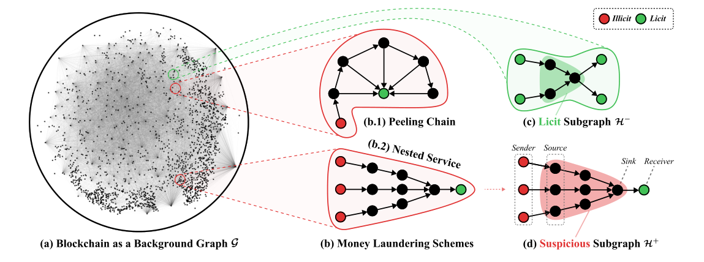

**그림 1: 자금세탁 계획의 용어 및 예.**

204,000개 암호화폐 거래를 그래프 노드로, 234,000개 결제 흐름(한 거래에서 다음 거래로의 모든 비트코인 흐름)을 방향성 에지로 구성합니다. 기계 학습 작업은 노드 분류, 즉 각 거래의 합법적인 성격과 불법적인 성격을 분류하는 것입니다. Elliptic1은 기계 학습과 AML 커뮤니티 모두에서 상당한 관심을 얻었지만 지원하는 작업은 개별 거래를 분석하는 것으로 제한되어 더 복잡한 자금세탁 계획을 연구하는 문제는 해결되지 않았습니다.

자금세탁 계획에는 불법적으로 획득한 자금을 명백히 합법적인 계정으로 전환하는 일련의 금융 거래가 포함됩니다. 2024에서는 암호화폐 블록체인 [4]에서 이러한 복잡한 패턴을 공개하기 위한 효과적인 도구의 필요성에 대응하여 Elliptic2가 출시되었습니다. Elliptic1보다 거의 3배 더 큰 그래프인 것 외에도 Elliptic2는 거래 그래프를 다르게 모델링하고 다른 기계 학습 작업인 하위 그래프 분류 특성을 제공합니다. 구체적으로 각 노드는 블록체인의 금융 실체를 나타내며 각 에지는 한 쌍의 실체 간의 거래를 집계합니다. 따라서 자금세탁 계획은 범죄에서 법률에 이르기까지 여러 주체 간의 일련의 거래로 구성된 하위 그래프를 의미합니다.

자금세탁 계획을 하위 그래프로 표현하면 그래프 기반 기계 학습 [24, 28] 분야의 급속한 발전을 활용하여 효과적인 AML 도구를 개발할 수 있습니다. 특히, 하위 그래프 분류는 철저히 연구된 작업(노드 분류, 에지 예측 및 그래프 분류)을 또 다른 그래프 세분화인 하위 그래프로 확장하는 새로운 주제입니다. 여러 하위 그래프 신경망 방법 [1, 2, 22]가 좋은 후보로 보입니다.

그러나 하위 그래프 AML에는 여러 가지 과제가 있습니다. 첫째, 암호화폐 거래 그래프는 방대합니다. 5월 05, 2024 [5]에 블록체인 누적 거래 수가 10억 건을 초과했습니다. 주소 및 거래 집계를 사용하더라도 Elliptic2에는 거의 5천만 개의 노드와 2억 개의 에지가 포함됩니다. 이러한 대규모 비용은 GLASS [22]와 같은 효과적인 하위 그래프 모델을 사용하여 GPU 없이 훈련하는 데 며칠이 걸리지만 GPU [4]에 훈련을 포팅하려면 간단하지 않은 시스템 엔지니어링 노력이 필요합니다. 둘째, 그래프에는 기하급수적으로 많은 하위 그래프가 있습니다. 자금세탁에 해당하는 의심스러운 하위 그래프를 식별하는 것은 건초 더미에서 바늘을 찾는 것과 같습니다. 일반적인 분류 방법은 합리적인 양의 인스턴스를 분류할 수 있지만 그 양이 기하급수적이면 실용적이지 않습니다.

이 작업에서 우리는 의심스러운 자금세탁 하위 그래프를 효율적으로 분류하고 발견할 수 있는 RevTrack이라는 프레임워크를 개발했습니다. 이 프레임워크의 핵심은 하위 그래프 자체가 아닌 하위 그래프의 엔터티를 보내고 받는 것을 추적하는 것입니다. 이렇게 하면 더 쉽게 훈련하고 확장할 수 있는 대체 신경망(그래프 신경망 제외)을 사용할 수 있습니다. 이 프레임워크를 기반으로 우리는 하위 그래프 분류(주어진 하위 그래프 분류)를 위한 RevClassify 방법과 잠재적인 범죄 단체 및 이들의 자금세탁 활동(새로운 의심스러운 하위 그래프 발견)을 식별하기 위한 RevFilter 방법을 제안합니다. Elliptic2 데이터셋에서 이러한 방법을 벤치마킹하여 강력한 기준에 비해 뛰어난 성능과 AML의 실용적인 유용성을 보여줍니다.

## 2 자금세탁의 하위 그래프 표현

블록체인 참가자의 대다수는 "합법적인" 실체입니다. 거래소, 지갑 제공업체, 채굴자부터 합법 서비스까지 다양합니다. 반면에 "불법" 실체는 일반적으로 암시장, 사기꾼, 해커와 같은 범죄와 연관되어 있습니다. 자금세탁에 대한 기본 가정은 자금의 소유권을 변경하지 않고 불법 단체를 합법적 단체에 연결하는 경로가 범죄인이나 조직에 의한 자금세탁을 나타낼 가능성이 높다는 것입니다. 범죄자들은 ​​여러 단계의 거래(세탁)를 통해 합법적인 서비스에 자금을 예치하고 불법적인 자금 출처의 탐지를 회피합니다.

자금세탁 계획은 하나 이상의 illict→licit 경로로 구성될 수 있습니다. 이러한 경로의 결합은 하위 그래프입니다. 알려진 방식은 "필링 체인"입니다(그림 1의 중간 그림 참조). 여기서 경로의 모든 중간 엔터티는 추가로 다음을 가리킵니다.

<!-- 원문 3쪽 -->

> **주:** 블록체인에서 자금세탁 하위 그래프 식별 ICAIF '24, 11월 14–17, 2024, Brooklyn, NY, USA

길의 끝. 이 경우 최종 엔터티는 모든 중간 엔터티가 자금의 일부를 예치하는 교환이 될 수 있습니다(나머지는 다음 엔터티로 전송됨). 또 다른 예는 "중첩 서비스"(그림 1 참조)로, 별도의 불법 엔터티에서 시작하는 여러 경로가 동일한 "서비스" 엔터티에서 병합되어 합법적인 교환을 추가로 가리킵니다. 이러한 서비스는 일반적으로 거래소보다 고객 실사 점검이 덜 엄격하여 암호화폐 세탁에 (잘못) 사용되는 결과를 낳습니다.

### 2.1 용어 및 표기법

그림 1에서는 이 문서 전체에 사용된 주요 개념을 설명합니다. 블록체인은 방향성 그래프 G =(V, E)로 모델링됩니다. 여기서 노드 𝑣∈V는 단일 엔터티(예: 사람 또는 조직)에 의해 제어되는 것으로 생각되는 비트코인 주소 집합이고 방향성 에지 𝑒=(𝑢, 𝑣) ∈E는 엔터티 𝑢에서 하나 또는 여러 거래를 나타냅니다. 𝑣. 하위 그래프가 우려되는 경우 G를 배경 그래프라고 부릅니다.

G의 하위 그래프를 H =(VH, EH)로 표시합니다. H 내부의 차수가 0인 각 노드 𝑣∈VH를 소스라고 하며 모든 소스는 집합 V𝑠𝑜𝑢𝑟𝑐𝑒을 형성합니다. 마찬가지로 H 내부에서 아웃 차수가 0인 각 노드를 싱크라고 하며 모든 싱크는 집합 V𝑠𝑖𝑛𝑘을 형성합니다. 임의의 소스를 가리키는 노드를 송신자라고 하며 모든 송신자는 집합 S를 형성합니다. 마찬가지로 싱크가 가리키는 노드를 수신자라고 하며 모든 수신자는 집합 R을 형성합니다. 정의에 따르면 S와 R은 하위 그래프 H 외부에 있습니다.

Elliptic2 데이터셋는 공개되지 않은 노드 라벨링을 사용하여 분류를 위한 하위 그래프를 구성합니다. 노드에는 (수동으로) 합법, 불법으로 레이블이 지정되거나 대부분의 경우 레이블이 지정되지 않으며 이 경우 알 수 없음이라고 합니다. Elliptic2의 하위 그래프에는 합법 또는 의심이라는 라벨이 지정됩니다. [4]에 설명된 구성 절차를 기반으로 Elliptic2의 하위 그래프는 보낸 사람과 받는 사람이 모두 합법적인 경우 합법적인 반면, 받는 사람은 합법적이지만 보낸 사람은 불법인 경우 하위 그래프가 의심스럽다고 추론할 수 있습니다. 의심스러운 하위 그래프는 불법적인 성격(자금세탁)을 확인하기 위해 인간 분석가에 의해 검증되도록 의도되었습니다.

모든 하위 그래프에 라벨을 지정할 수 있는 것은 아닙니다. 라벨이 붙은 것 중에는 불법적인 하위 그래프가 거의 없습니다. 발신자와 수신자의 라벨을 기반으로 하위 그래프 라벨을 예측하고 싶은 유혹이 있습니다. 그러나 노드 레이블은 제공되지 않으며 하위 그래프 구성 절차에 따라 이를 리버스 엔지니어링하면 노드의 작은 부분에 대한 레이블만 표시됩니다.

### 2.2 관심 있는 두 가지 작업

이 작업에서 우리는 두 가지 작업에 관심이 있습니다: (1) 주어진 하위 그래프 H의 성격(합법적 대 의심스러운)을 분류합니다. (2) 새로운 의심스러운 하위 그래프를 식별합니다.

작업(1)은 표준 분류 문제입니다. 레이블이 있는 하위 그래프 집합이 주어지면 이를 훈련/검증/테스트 하위 집합으로 나눕니다. 훈련 세트와 검증 세트를 사용하여 각 하위 그래프의 레이블을 예측하도록 모델을 훈련하고 테스트 세트에서 평가합니다. 이 작업은 특정 하위 그래프의 특성을 식별할 수 있는 효과적인 기계 학습 모델을 요청합니다.

반면 AML의 궁극적인 목표는 모든 자금세탁 계획을 찾아내는 것입니다. 작업(1)은 두 가지 이유로 이 목표를 달성할 수 없습니다. 첫째, 기하급수적으로 많은 하위 그래프(구체적으로 2|V|)가 있습니다. 그것들을 일일이 열거하고 분류하는 것은 불가능하다

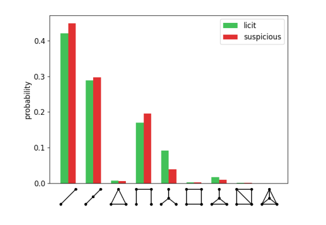

**그림 2: 적법한 하위 그래프와 의심스러운 하위 그래프에 대한 그래프 분포.**

하나. 둘째, 모든 하위 그래프에 논리적으로 레이블을 지정할 수 있는 것은 아닙니다. 실제로 소수만이 합법적인 것으로 간주될 수 있으며 심지어 소수만이 의심스럽습니다.

따라서 작업(2)은 이 목표에 대한 대안 솔루션입니다. 레이블이 지정된 하위 그래프 집합이 주어지면 (기하급수적으로 많은 후보 중에서) 의심스러울 수 있는 새로운 하위 그래프를 발견할 수 있는 방법을 설계합니다. 이 작업은 매우 중요하지 않습니다. Task에서 학습된 모델(1)을 재사용하여 작업을 수행하는 방법을 제안합니다.

## 3 송금인 및 수취인과 함께 자금세탁 하위 항목 식별

하위 그래프 신경망은 비용이 많이 듭니다. 하위 그래프가 의심스러운 자금세탁 계획인지 확인하는 간단한 접근 방식은 하위 그래프 분류를 수행하는 것입니다. 이 접근 방식에 대한 몇 가지 대표적인 신경망이 [4]에서 탐색되었으며, 이는 우리 사용 사례에 효과적인 신경망이 훈련하는 데 상당히 비용이 많이 든다는 것을 의미합니다. 예를 들어, 2개의 레이어만 사용하는 GLASS [22]는 CPU를 사용하여 훈련하는 데 며칠이 필요합니다. 이는 엄청난 메모리 소비로 인해 Elliptic2(~50M 노드 및 ~200M 에지)만큼 큰 배경 그래프에 대한 GPU 훈련이 복잡한 문제이고 노드 분류 워크로드 [12, 13]를 하위 그래프 분류 워크로드 [4]에 적용하려면 간단하지 않은 엔지니어링 노력이 필요하기 때문입니다. GPU 훈련은 일반적인 신경망의 표준이지만, 그래프 신경망의 경우 데이터 포인트(예: 노드)의 손실에는 데이터 자체뿐만 아니라 그 주변에 대한 정보도 필요하기 때문에 특별한 처리가 필요하며, 이는 전체 그래프 훈련을 사용해야 하는지 미니 배치 훈련을 사용해야 하는지에 대한 논쟁을 불러일으킵니다. 또한 미니 배치 훈련을 사용하는 경우 일괄 처리 및 이웃 샘플링을 하위 그래프에 적용하려면 효과적인 메모리 사용 [12, 13]을 위해 기존 라이브러리 또는 코드베이스를 리엔지니어링해야 합니다.

하위 그래프 구조만으로는 식별이 불충분합니다. 전체 배경 그래프에 대해 신경망을 훈련시키는 방법인 GLASS가 개별 하위 그래프에만 신경망을 훈련시키는 방법(예: Sub2Vec [1])보다 더 효과적인 분류를 수행하는 이유는 내부 하위 그래프 구조만으로는 분류가 불충분하기 때문입니다. 추가적으로 중요한 것은 국경을 둘러싼 국경 정보입니다.

<!-- 원문 4쪽 -->

> **주:** ICAIF '24, 11월 14–17, 2024, Brooklyn, NY, USA Song et al.

하위 그래프. 이 점을 더 자세히 설명하기 위해 하위 그래프 컬렉션 내에서 그래프렛(2 노드, 3 노드 및 4 노드 그래프 포함)의 분포를 계산합니다. 그림 2는 적법한 하위 그래프의 분포와 의심스러운 하위 그래프의 분포가 다소 유사하다는 것을 보여줍니다. 이 예는 계산 목적(예: 가장자리 방향 및 더 큰 그래프 무시)을 위해 단순화되었지만 후속 실험 섹션의 더 많은 증거는 의심스러운 하위 그래프를 식별하기 위해 내부 구조 너머를 살펴봐야 함을 확인합니다.

자금을 보내는 사람과 받는 사람은 강력한 힌트를 제공합니다. 논리적으로 유용한 국경 정보는 보낸 사람과 받는 사람입니다. 현장 통찰에 따르면 불법 보낸 사람은 자금을 계층별로 적법한 계정으로 이체하여 돈을 세탁하는 것으로 나타났기 때문입니다. 따라서 다음 섹션에서는 송금인과 수취인 정보를 중점적으로 활용하여 자금세탁 하위 그래프를 식별하는 방법을 제안합니다. 이러한 엔터티는 2.1 섹션에 소개된 정의를 사용하여 쉽게 추출할 수 있습니다(그림 1의 예 참조). 각 하위 그래프에 대해 먼저 거래이 시작되고 끝나는 노드, 즉 소스와 싱크를 식별합니다. 그런 다음 소스를 가리키는 하위 그래프 외부의 노드는 발신자이고 싱크가 가리키는 노드는 수신자입니다. 하위 그래프는 때때로 비주기적이지 않으므로(예: 두 개체가 서로 다른 시간에 서로 자금을 보낼 수 있음) 소스나 싱크가 발생하지 않습니다. 이 경우 감지된 모든 주기를 제거하여 소스와 싱크를 추출합니다.

## 4 REVTRACK: 두 가지 방법에 대한 이야기

이제 송금인과 수취인 추적을 통해 자금세탁 하위 그래프를 분석하고 발견하는 프레임워크인 RevTrack을 도입할 준비가 되었습니다. 프레임워크는 송신자 세트 S와 수신자 세트 R로 하위 그래프 H를 나타냅니다. 본 연구에서는 이들 사이에 "링크"를 만듭니다. 이러한 링크는 S와 R 사이의 경로를 추상화한 것으로 해석될 수 있습니다. RevTrack에는 두 가지 방법이 포함되어 있습니다. RevClassify는 주어진 하위 그래프의 성격(적법성 대 의심스러운)을 분류하는 반면, RevFilter는 적법하다고 간주되는 링크를 반복적으로 필터링하여 새로운 의심스러운 하위 그래프를 발견합니다. 그림 3는 두 가지 방법을 모두 보여줍니다.

### 4.1 RevClassify: 하위 그래프 분류

RevClassify는 지정된 하위 그래프 H를 분류합니다. H의 (S, R) 표현이 주어지면 이 메서드는 hH의 로지스틱 회귀가 분류를 수행하도록 하위 그래프에 대한 임베딩 벡터 hH를 생성합니다. RevClassify에는 두 세트를 입력으로 처리하기 위한 표현형 아키텍처가 필요합니다. 여기서는 RevClassify𝐵𝑃 및 RevClassify𝐷𝑆라는 두 가지 아키텍처를 명명합니다. 둘 다 S와 R에 대해 순열 불변입니다.

RevClassify𝐵𝑃. 이 아키텍처는 S와 R 사이에 완전 연결 방향성 이분 그래프 H̃를 구성합니다.

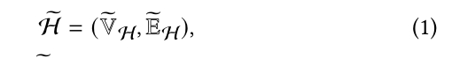

여기서 ṼH = S ∪ R이고 ẼH = {(u, v) | u ∈ S ∧ v ∈ R}입니다. 이어서 메시지 전달 신경망(MPNN) [15, 20, 25]으로 임베딩을 계산하고, 전역 풀링 계층을 판독 함수로 사용합니다.

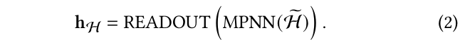

이 아키텍처는 H를 분류하기 위해 원래 하위 그래프 H의 대안적이지만 확장된 버전 H̃에서 그래프 신경망을 실행합니다. H 외부의 정보까지 고려하므로 더 효과적입니다.

RevClassify𝐷𝑆. 이 아키텍처는 그래프 신경망을 사용하지 않습니다. 대신 순열 불변성과 등변성을 보존하는 범용 집합 표현 아키텍처인 Deep Sets [27]로 S와 R을 각각 처리합니다.

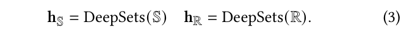

송신자 또는 수신자 내부에는 순서상 우선순위가 없으므로 이 구성은 본 연구의 설정에 적합합니다. 두 집합의 표현 hS와 hR을 연결한 뒤 다층 퍼셉트론(MLP)으로 최종 임베딩을 만듭니다.

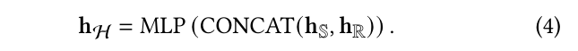

RevClassify𝐵𝑃와 RevClassify𝐷𝑆는 모두 이진 교차 엔트로피 손실로 학습할 때 하위 그래프 H를 효과적으로 분류합니다.

### 4.2 RevFilter: 새로운 의심스러운 하위 그래프 발견

RevClassify는 하위 그래프를 정확하게 분류할 수 있지만 관심 있는 하위 그래프가 제공된다고 가정합니다. 그러나 총 2|V| 하위 그래프 중 극히 일부만이 자금세탁에 해당합니다. 따라서 모든 하위 그래프를 열거하고 이에 대해 RevClassify를 하나씩 적용하는 것은 비현실적입니다. 오히려 철저한 검색 없이 잠재적인 자금세탁을 효율적으로 발견할 수 있는 추천형 시스템에 대한 열망이 강합니다.

이를 위해 우리는 의심스러운 하위 그래프를 추천하는 효율적이고 확장 가능한 방법인 RevFilter를 제안합니다. 이 방법은 자금세탁에 기여하지 않는 것으로 간주되는 송금인 및 수취인 그룹을 반복적으로 필터링하는 방식으로 작동합니다. 구체적으로, 임의의 발신자 집합 S와 임의의 수신자 집합 R이 주어지면 RevFilter는 상위 𝑘순위(𝑠,𝑟) 쌍 목록을 생성합니다. 여기서 𝑠∈S, 𝑟∈R,와 각 (𝑠,𝑟) 쌍은 의심스러운 것으로 간주됩니다(즉, 𝑠과 𝑟를 연결하는 경로는 의심스러운 하위 그래프입니다). 놀랍게도 RevFilter는 사전 훈련된 RevClassify 분류자를 활용하므로 훈련이나 최적화가 필요하지 않습니다.

알고리즘 1가 세부 사항을 설명합니다. RevFilter는 발신자 집합 및 수신자 집합 쌍 목록을 유지 관리합니다. 처음에는 (S, R) 한 쌍만 있습니다. 각 반복에서 우리는 송신자 세트와 수신자 세트를 이등분하여 목록의 각 쌍을 4개의 쌍으로 나눕니다. 그런 다음 모든 쌍은 사전 훈련된 분류기 C로 전달되어 보낸 사람과 받는 사람 사이의 자금세탁 가능성을 나타내는 확률 점수를 할당합니다. 점수를 기준으로 상위 𝑘순위 쌍만 다음 반복을 위해 유지됩니다. 이 반복 필터링 프로세스는 각 쌍의 크기가 1-1로 줄어들 때까지 반복되어 가장 가능성이 높은 자금세탁 경로를 제안합니다. 의심스러운 하위 그래프가 부족한 경우 RevFilter의 기본 버전은 다음과 같은 향상된 특성을 통해 더욱 강력해 질 수 있습니다. (1) 데이터 증대를 통한 미세 조정. 사전 학습된 분류기 C에 전달된 쌍에는 처음에 큰 발신자/수신자 세트가 있습니다. 그러나 이 분류기는 Elliptic2 데이터셋의 특성으로 인해 대부분 작은 쌍으로 훈련됩니다. 따라서 C의 성능을 향상시키기 위해 병합된 쌍을 사용하여 C를 미세 조정합니다. 이러한 쌍은 병합된 세트 수 𝑛𝑚𝑒𝑟𝑔𝑒가 지수 분포 𝑃(𝑛𝑚𝑒𝑟𝑔𝑒= 𝑡) = 𝛾𝑒−𝛾·𝑡을 따르도록 발신자와 수신자의 세트를 무작위로 병합하여 생성됩니다. 이러한 데이터 증대는 쌍의 크기 분포가 RevFilter 실행 시 발생하는 것과 유사한 미세 조정 데이터셋를 생성합니다.

<!-- 원문 5쪽 -->

> **주:** 블록체인에서 자금세탁 하위 그래프 식별 ICAIF '24, 11월 14–17, 2024, Brooklyn, NY, USA

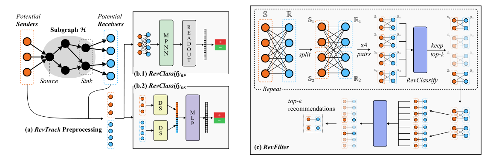

**그림 3: RevClassify 및 RevFilter 메서드 그림.**

**알고리즘 1: RevFilter — 새로운 의심 하위 그래프 발견**

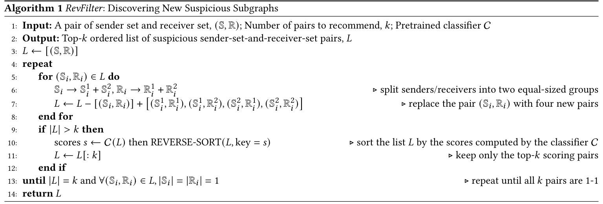

(2) 더 많은 후보를 유지합니다. 분류기 C가 반복 중에 의심스러운 자금세탁 활동이 포함된 쌍에 실수로 낮은 점수를 할당하는 경우 의심 활동은 잘못 ​​무시됩니다. 분류기가 매우 정확하더라도 이는 여러 번의 반복을 통해 발생할 수 있습니다. 따라서 초기 반복에서는 𝛼𝑘𝑒𝑒𝑝×𝑘쌍 (𝛼𝑘𝑒𝑒𝑝> 1)을 유지하고 반복이 끝날 때까지 이 숫자를 점차적으로 𝑘로 줄여 의심스러운 쌍을 실수로 제거하는 것을 완화합니다. 큰 𝛼𝑘𝑒𝑒𝑝을 사용하면 절충안이 발생할 수 있습니다. 잠재적 후보를 보존하는 데 도움이 되지만 추론 속도가 감소하고 반복 필터링 프로세스가 평탄화될 수도 있습니다.

RevFilter의 실제 사용. 알고리즘 1에는 초기 송신자 세트 S와 수신자 세트 R이 입력으로 필요합니다. RevFilter의 실제 용도 중 하나는 알려진 자금세탁 하위 그래프가 있는 경우 추가 불법 개체를 식별하는 것입니다. 이러한 하위 그래프의 끝은 적법한 엔터티(예: 교환)와 연결되어 있습니다. 따라서 이러한 엔터티를 사용하여 R을 형성하면 동일한 암호화폐 예금을 공유하는 새로운 자금세탁 계획을 잠재적으로 식별할 수 있습니다. 추가적으로, 하나의 파티션이 매번 S를 형성하는 데 사용되도록 노드 세트 V를 분할하여 추론 속도를 높이면서 S와 R의 상대적인 크기의 균형을 맞출 수 있습니다.

## 5 실험: 재분류

Elliptic2 데이터세트 [4]를 사용하여 제안된 방법(이 섹션에서는 RevClassify, 다음 섹션에서는 RevFilter)의 효율성을 종합적으로 평가합니다. Elliptic2는 최근 출시된 벤치마크로, 하위 그래프 분류 문제로 AML를 혁신적으로 모델링하는 동종 최대 규모의 벤치마크입니다. 데이터셋에서 배경 그래프에는 49,299,864 노드와 196,215,606 가장자리가 포함되어 있습니다. 또한 121,810 라벨이 붙은 하위 그래프가 있는데, 그 중 119,092는 적법하고 2,718는 의심스럽습니다.

### 5.1 실험 설정

[4]에 이어 레이블이 지정된 하위 그래프를 훈련, 검증 및 테스트 세트로 무작위로 분할합니다(80:10:10). 전체 훈련 세트를 훈련에 사용하는 풀샷 설정 외에도 훈련 세트의 일부만 사용하는 퓨샷 설정을 탐색하여 데이터가 부족한 환경에서 모델 동작을 조사합니다. 주어진 분수 𝑝에 대해 의심스러운 하위 그래프와 적법한 하위 그래프의 𝑝을 무작위로 샘플링합니다.

5.1.1 기준선. RevClassify를 네 가지 일반적인 하위 그래프 분류 방법과 비교합니다. Sub2Vec [1]는 하위 그래프 내에서 무작위 이동을 샘플링하는 초기 그래프 임베딩 방법입니다.

<!-- 원문 6쪽 -->

> **주:** ICAIF '24, 11월 14–17, 2024, Brooklyn, NY, USA Song et al.

**표 1: RevClassify와 기준선 간의 정확도 및 비용 비교. "Full-shot"은 훈련 세트 전체를 사용하고 "few-shot"은 일부만 사용합니다. 가장 좋은 결과는 굵은 글씨로 표시되고 두 번째로 좋은 결과는 밑줄이 그어져 있습니다.**

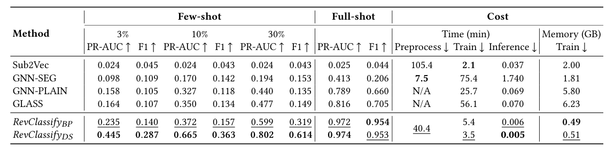

Paragraph2Vec을 사용하여 샘플링된 보행에서 하위 그래프 임베딩을 학습합니다. GNN-SEG는 하위 그래프의 내부 구조에만 작용하는 MPNN입니다. GNN-PLAIN은 또 다른 MPNN이지만 메시지 전달은 배경 그래프에서 수행되므로 하위 그래프 표현은 하위 그래프 외부에 정보를 추가로 그립니다. GLASS [22]는 하위 그래프 내부와 외부의 노드를 구별하는 제로원 라벨링 트릭을 사용하여 GNN-PLAIN을 확장합니다. 이 방법은 이론적으로 GNN-PLAIN보다 표현력이 더 뛰어난 것으로 입증되었습니다.

5.1.2 평가 지표. 레이블 불균형과 의심스러운 클래스의 중요성으로 인해 이진 F1 점수(의심을 긍정적으로 처리)와 PR-AUC 점수를 사용하여 모델 성능을 평가합니다. 또한 시간 및 메모리 사용량을 포함하여 각 방법의 리소스 요구 사항을 비교합니다.

5.1.3 구현 세부 사항. RevClassify𝐵𝑃는 GIN [25]를 MPNN 백본으로 사용합니다. RevClassify𝐷𝑆는 딥 세트 [27]의 불변 레이어에 MLP를 사용합니다. GLASS 및 Sub2Vec은 원저작자가 제공한 코드베이스에서 구현됩니다. GNN-SEG 및 GNN-PLAIN은 GLASS와 동일한 MPNN 백본을 사용합니다. 본 연구에서는 기본 방법의 경우 1000 에포크에 대해 Adam 옵티마이저 [14]를 사용하고 조기 중지를 통합하는 RevClassify에 대해 150 에포크를 사용하여 이진 교차 엔트로피 손실을 최소화하도록 모든 모델을 훈련합니다. 레이어 수, 숨겨진 차원, 풀링 유형, 학습률, 드롭아웃 및 배치 크기를 포함한 하이퍼파라미터를 조정합니다.

기준선 Sub2Vec, GNN-SEG 및 GLASS의 성능은 [4]에서 보고된 것보다 (때때로 상당히) 향상되었습니다. [4]의 결과는 CPU 교육 및 노드 특성 무시를 통해 얻은 것이지만, 우리의 결과는 가능할 때마다 GPU 교육 및 노드 특성 활용을 통해 얻은 것입니다. 또한 GLASS 및 GNN-PLAIN의 경우 이웃 샘플링이 포함된 하나의 MPNN 레이어만 사용하므로 교육 시간과 메모리 요구 사항이 크게 줄어듭니다. 또한 데이터 사전 처리를 구현하여 더 빠른 데이터 로드를 가능하게 하고 메모리 집약적인 GraphNorm 레이어 [6]를 더 가벼운 LayerNorm [3]로 교체합니다. 이러한 수정을 통해 기준선의 속도와 정확성이 향상되어 더 강력한 경쟁자가 됩니다. 우리의 실험은 16GB VRAM을 갖춘 단일 V100 GPU를 사용하여 수행되었습니다.

### 5.2 결과

5.2.1 정확도. 결과는 표 1에 요약되어 있습니다. RevClassify는 전반적으로 모든 기준을 능가합니다. 기준선 중에서 Sub2Vec의 성능이 가장 낮습니다. 노드 특성을 사용하지 않기 때문입니다. GNN-PLAIN 및 GLASS는 GNN-SEG보다 훨씬 더 나은 성능을 발휘하여 내부 하위 그래프 구조를 넘어 외부 노드 정보를 포함하는 것의 중요성을 확인합니다. 우리의 방법은 GNN-PLAIN 및 GLASS에 비해 훨씬 더 향상되었습니다. 우리 방법의 두 아키텍처 사이에서 RevClassify𝐷𝑆는 몇 장의 샷 설정에서 훨씬 더 강력합니다.

5.2.2 비용. 표 1에서 볼 수 있듯이 RevClassify는 다른 방법보다 훨씬 더 메모리 효율적이고 추론 속도가 훨씬 빠릅니다. 이 효율성은 송신자/수신자 노드만 사용하는 데서 비롯되는 반면, GNN-SEG는 하위 그래프의 모든 노드를 사용하여 계산하고 Sub2Vec, GLASS 및 GNN-PLAIN은 배경 그래프를 포함합니다. GNN-SEG, GNN-PLAIN 및 GLASS는 학습 속도가 느립니다. 반면에 Sub2Vec은 빠르지만 광범위한 전처리가 필요합니다. RevClassify의 전처리는 Sub2Vec만큼 까다롭지 않습니다. 또한 처리된 발신자와 수신자는 재사용을 위해 해시 테이블에 저장되며 해당 비용은 하위 그래프에 따라 분할됩니다.

## 6 실험: REVFILTER

이 섹션에서는 새로운 의심스러운 하위 그래프를 발견하기 위해 RevFilter를 평가합니다. 목표는 다음 질문에 답하는 것입니다.

- 질문 1: 기준선과 비교하여 RevFilter의 성능은 어떻습니까? • Q2a: 자금세탁의 희소성은 RevFilter의 성능에 어떤 영향을 줍니까? • Q2b: RevFilter가 대부분의 자금세탁 활동을 발견하려면 몇 개의 추천(𝑘)이 필요합니까? • Q3: (절제) 단일 패스 상단𝑘선택과 달리 알고리즘 1의 반복 필터링이 필요합니까? • Q4a: (절제) 데이터 증대를 통한 미세 조정이 RevFilter의 성능에 어떤 영향을 미치나요? • Q4b: (절제) 더 많은 후보자를 유지하는 것이 RevFilter의 성능에 어떤 영향을 줍니까?

### 6.1 실험 설정

우리가 아는 한, 동일한 설정을 실험하는 이전 문헌은 존재하지 않습니다. 가장 가까운 도메인은 일반적으로 주어진 항목을 추천하는 협업 필터링입니다.

<!-- 원문 7쪽 -->

> **주:** 블록체인에서 자금세탁 하위 그래프 식별 ICAIF '24, 11월 14–17, 2024, Brooklyn, NY, USA

**표 2: 8가지 설정(𝑛+ + 𝑛−@𝑘)에서 RevFilter와 기준선 간의 성능 비교. 두 가지 지표인 HR과 NDCG는 높을수록 좋습니다.**

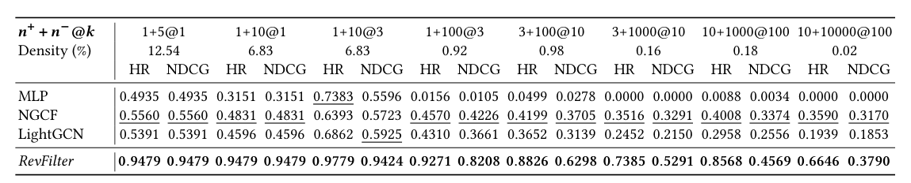

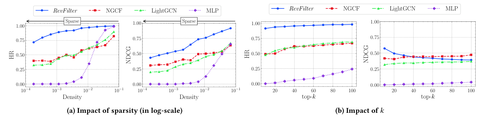

**그림 4: 희소성 및 𝑘에 관한 RevFilter와 기준선 간의 비교.**

반면에 우리의 임무는 다중 송신자 →multi-receiver 설정에서 링크(의심스러운 1-1 발신자-수신자 쌍)를 추천하는 것입니다. 따라서 우리는 협업 필터링 및 추천 시스템 [10, 11, 21, 26]에 사용되는 실험 설정 및 평가 프로토콜을 채택하지만 우리의 요구 사항에 맞게 수정합니다. 작업.

6.1.1 테스트 세트 구성. 의심스러운 자금세탁 하위 그래프에 해당하는 보낸 사람과 받는 사람 간의 링크를 추천하는 추천 작업을 위해 Elliptic2의 테스트 세트를 수정했습니다. 수정은 다음과 같이 진행됩니다. (1) 모든 하위 그래프에 대해 발신자와 수신자를 식별합니다. 의심스러운 세트를 D+로 표시하고 적법한 세트를 D-로 표시합니다. (2) 발신자와 수신자 사이에 단일 링크를 유도하는 하위 그래프(즉, 단일 발신자와 수신자만 있는 하위 그래프)만 포함하도록 의심스러운 세트를 필터링합니다. 이 하위 집합을 D+라고 부르세요.

D−의 1−1 및 𝑛−하위 그래프. 그런 다음 이러한 하위 그래프에서 모든 노드를 수집하여 송신자와 수신자를 연결하여 완전히 연결된 이분 그래프 S를 구성합니다. 작업은 S에서 𝑛+ 링크를 추천하는 것입니다. (4) (3) 𝑁번 반복하여 𝑁 크기의 테스트 세트를 구성합니다. 큰 𝑁

방법의 성능 차이를 크게 줄일 수 있습니다. 본 연구에서는 모든 실험에 𝑁= 256를 사용합니다.

본 연구에서는 상위𝑘링크를 추천하도록 요청하고 𝒏+ + 𝒏−@𝒌로 설정을 표시하여 각 방법을 평가합니다. 𝑛+가 더 작고 𝑛−가 크거나 𝑘가 더 작을수록 작업이 더 어려워집니다. 밀도를 𝑛+/(|S||R|)로 정의하고 밀도가 작은 경우를 희소라고 부릅니다. 다양한 𝑛+, 𝑛− 및 𝑘을 사용하여 다양한 설정을 평가합니다.

6.1.2 기준선. RevFilter를 세 가지 기준과 비교합니다. MLP는 간단한 협업 필터링 방법입니다. MLP를 사용하여 노드 임베딩을 생성하고 임베딩 간 내적을 기반으로 추천을 제공합니다. NGCF [21] 및 Light-GCN [10]는 GCN [15]를 기반으로 한 최첨단 추천 시스템입니다. 두 방법 모두 사용자 항목 그래프에 메시지를 전파하여 노드 임베딩을 생성합니다. 추천은 내적을 기반으로 이루어집니다. 둘 사이의 차이점은 아키텍처에 있습니다. NGCF는 GCN 레이어 내부에 특성 변환과 비선형 활성화를 통합하는 반면 LightGCN은 그렇지 않습니다.

6.1.3 평가 지표. top-𝑘 추천의 성능을 평가하기 위해 협업 필터링 [11, 21]에서 널리 사용되는 HR(Hit Ratio) 및 NDCG(Normalized Discounted Cumulative Gain) [9]를 사용합니다. HR은 상위𝑘순위 목록에 나타나는 실측 링크의 수를 계산하고 HDCG는 실측 링크의 순위가 높을수록 더 높은 점수를 부여합니다.

6.1.4 구현 세부 사항. RevClassify의 두 아키텍처 모두 RevFilter에 대해 사전 훈련된 분류자 역할을 할 수 있습니다. 본 연구에서는 더 빠른 추론과 견고성 때문에 RevClassify𝐷𝑆를 사용합니다(섹션 5.2). 또한 섹션 4.2에서 언급한 두 가지 향상된 특성을 사용합니다. 즉, 𝛾= 0.4, 1 ≤𝑛𝑚𝑒𝑟𝑔𝑒≤20, 및 𝛼𝑘𝑒𝑒𝑝= 1.5를 설정하여 쌍을 병합하여 사전 훈련된 분류기를 미세 조정합니다.

본 연구에서는 공개적으로 사용 가능한 코드베이스를 사용하여 NGCF 및 LightGCN을 구현하는 동시에 설정에 대해 다음 변경 사항을 통합했습니다. (1) Xavier 초기화 [8]를 사용하는 대신 노드 특성으로 임베딩 레이어를 초기화합니다. (2) 사용 가능한 레이블이 지정된 링크 수가 제한되어 있기 때문에 BPR 손실 [19] 대신 이진 교차 엔트로피 손실을 최적화합니다. 본 연구에서는 기준선을 훈련합니다

<!-- 원문 8쪽 -->

> **주:** ICAIF '24, 11월 14–17, 2024, Brooklyn, NY, USA Song et al.

초매개변수(레이어 수, 드롭아웃 및 숨겨진 차원) 검색을 통해 조기 중지 특성을 통합한 150 시대의 경우.

### 6.2 결과

기준선(Q1)과 6.2.1 성능 비교. 표 2는 𝒏+ + 𝒏−@𝒌의 8가지 다양한 설정에서 방법을 비교한 것입니다. RevFilter는 두 지표 모두에서 모든 기준보다 성능이 뛰어납니다. 대부분의 경우 RevFilter는 두 번째로 좋은 방법보다 50~100% 더 높은 HR을 달성합니다. 이는 1.5~2배 더 많은 자금세탁 계획을 식별할 수 있음을 나타냅니다.

6.2.2 희소성의 영향(Q2a). 그림 4a에 표시된 것처럼 RevFilter는 불법 링크가 거의 없는 희소 설정(예: 저밀도)에서 상당한 견고성을 보여줍니다. 예를 들어 S의 밀도가 10−1에서 10−4(즉, 1000배 더 희박함)로 감소하면 RevFilter는 HR에서 ~20% 손실만 경험하는 반면 NGCF와 LightGCN은 ∼50% 감소 및 MLP는 ∼100% 감소를 겪습니다.

6.2.3 𝑘(Q2b)의 영향. 그림 4b에서는 다양한 𝑘을 사용하여 1 + 1000@𝑘설정에서 방법의 성능을 제시합니다. RevFilter는 소수의 권장 사항((𝑘= 10)을 사용하여 90% 이상의 확률로 실제 링크를 식별할 수 있는 반면, 다수의 권장 사항((𝑘= 100)을 사용하면 기준선이 75%에 도달할 수 없습니다. 이 결과는 RevFilter가 작지만 고품질의 의심스러운 하위 그래프 세트를 추천하여 인간 분석가가 잠재적인 자금세탁 계획을 조사할 필요성을 크게 줄일 수 있음을 강조합니다. 다른 방법과 달리 우리 방법의 NDCG는 𝑘증가함에 따라 감소합니다. 이는 1) 𝑘이 증가함에 따라 우리 방법의 반복 필터링이 덜 효과적이기 때문이며 2) 우리 방법은 링크 순위보다는 필터링에 최적화되어 있기 때문입니다. 따라서 지나치게 큰 𝑘과 관련된 최적이 아닌 성능을 피하기 위해 적절한 𝑘을 선택하는 것이 중요합니다.

6.2.4 반복 필터링과 1패스 필터링 비교(Q3). 반복 필터링의 유용성을 확인하기 위해 변형("반복 없음")과 비교합니다. 이 변형에서는 알고리즘 1의 외부 루프가 제거되고 모든 1-1 발신자-수신자 쌍에 대한 점수를 계산하고 상위𝑘쌍을 추천하여 필터링이 단일 패스로 수행됩니다. 표 3의 결과는 희소 S에 대한 HR(0.4 ~ 0.6)의 상당한 감소를 보여줍니다. 이는 반복 필터링이 기본 분류기의 오류를 완화할 수 있음을 나타냅니다.

6.2.5 데이터 확대를 통한 미세 조정의 영향(Q4a). 미세 조정이 없는 경우("미세 조정 없음")와 비교하여 증강 데이터로 분류기를 미세 조정하는 경우의 영향을 조사합니다. 표 3는 미세 조정을 하지 않은 경우 성능이 전반적으로 저하되고 희소 설정이 더욱 크게 감소함을 보여줍니다. 이는 특히 대규모 송신자-수신자 쌍의 경우 미세 조정이 분류기의 정확도를 향상시킨다는 것을 나타냅니다.

6.2.6 더 많은 후보 유지의 영향(Q4b.) 더 많은 후보 유지가 추천 성능에 미치는 영향을 평가하기 위해 우리의 방법을 각 반복에서 정확히 𝑘후보가 유지되는 𝛼𝑘𝑒𝑒𝑝= 1의 표준 사례와 비교합니다. 후자의 경우 대부분의 설정에서 성능이 약간 저하됩니다. 본 연구에서는 미세 조정된 분류기가 이미 거의 완벽하다고 추측하므로 더 많은 후보자가 가져오는 개선은 미미합니다. 더 많은 후보를 유지하면 추론 속도가 저하되므로 큰 𝛼𝑘𝑒𝑒𝑝을 적용할 때 절충점을 고려하는 것이 좋습니다.

**표 3: 절제(왼쪽에서 오른쪽으로 희소성 증가).**

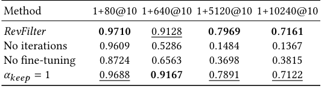

## 7 결론

Elliptic2는 AML에 대한 하위 그래프 접근 방식을 도입했으며 암호화폐의 법의학 분석을 위한 새로운 표준을 설정했습니다. 원본 논문에서는 몇 가지 하위 그래프 분류 방법을 벤치마킹하고 하위 그래프 모델링의 가능성을 보여 주었지만, 본 논문에서는 (1) 하위 그래프 분류의 효율성을 개선하고 (2) 새로운 하위 그래프 발견 특성을 개발하여 최첨단 기술을 발전시킵니다. RevClassify는 자금의 초기 발신자와 최종 수신자를 사용하여 거래 하위 그래프를 추상화하여 모델 추론 비용과 메모리 소비를 크게 줄입니다. RevFilter는 추천 시스템에서 영감을 받은 혁신적인 접근 방식을 사용하여 새로운 하위 그래프를 발견합니다. 즉, 단일 거래로 직접 연결되지 않을 수 있는 발신자와 수신자 간의 의심스러운 링크를 추천합니다. 본 연구에서는 이 두 가지 접근 방식이 강력한 기준선보다 훨씬 뛰어난 성능을 발휘한다는 것을 보여주기 위해 많은 실증적 평가를 수행했습니다. 향후 연구 방법은 보다 복잡한 자금세탁 계획(예: 단일 송금인 및 수신인이 관련된 계획)을 발견하는 것입니다. 또 다른 방법은 자금세탁의 일시적 행동을 연구하고 일시적 정보와 구조적 정보를 모두 활용하는 보다 효과적인 방법을 개발하는 것입니다.

## 8 지원 코드

구현 및 사전 훈련된 모델은 https://github.com/MITIBMxGraph/RevTrack에서 확인할 수 있습니다.

## 감사의 글

이 작업은 MIT-IBM Watson AI Lab의 자금 지원을 받았습니다.

## 참고문헌

[1] Bijaya Adhikari, Yao Zhang, Naren Ramakrishnan, and B Aditya Prakash. 2018.

Sub2vec: Feature learning for subgraphs. In Advances in Knowledge Discovery and Data Mining: 22nd Pacific-Asia Conference, PAKDD 2018, Melbourne, VIC, Australia, June 3-6, 2018, Proceedings, Part II 22. Springer, 170–182. [2] Emily Alsentzer, Samuel Finlayson, Michelle Li, and Marinka Zitnik. 2020. Sub-

graph neural networks. Advances in Neural Information Processing Systems 33 (2020), 8017–8029. [3] Jimmy Lei Ba, Jamie Ryan Kiros, and Geoffrey E Hinton. 2016. Layer normaliza-

tion. arXiv preprint arXiv:1607.06450 (2016). [4] Claudio Bellei, Muhua Xu, Ross Phillips, Tom Robinson, Mark Weber, Tim Kaler,

Charles E. Leiserson, Arvind, and Jie Chen. 2024. The Shape of Money Laundering: Subgraph Representation Learning on the Blockchain with the Elliptic2 Dataset. In KDD Workshop on Machine Learning in Finance. [5] Blockchain.com. 2024. https://www.blockchain.com/explorer/charts/ntransactions-total [6] Tianle Cai, Shengjie Luo, Keyulu Xu, Di He, Tie-yan Liu, and Liwei Wang. 2021.

Graphnorm: A principled approach to accelerating graph neural network training. In International Conference on Machine Learning. PMLR, 1204–1215. [7] Europol. 2024. The Other Side of the Coin - Analysis of Financial and Economic

Crime. https://www.europol.europa.eu/cms/sites/default/files/documents/The% 20Other%20Side%20of%20the%20Coin%20-%20Analysis%20of%20Financial% 20and%20Economic%20Crime%20%28EN%29.pdf.

<!-- 원문 9쪽 -->

Identifying Money Laundering Subgraphs on the Blockchain ICAIF '24, November 14–17, 2024, Brooklyn, NY, USA

[8] Xavier Glorot and Yoshua Bengio. 2010. Understanding the difficulty of training

deep feedforward neural networks. In Proceedings of the thirteenth international conference on artificial intelligence and statistics. JMLR Workshop and Conference Proceedings, 249–256. [9] Xiangnan He, Tao Chen, Min-Yen Kan, and Xiao Chen. 2015. Trirank: Review-

aware explainable recommendation by modeling aspects. In Proceedings of the 24th ACM international on conference on information and knowledge management. 1661–1670. [10] Xiangnan He, Kuan Deng, Xiang Wang, Yan Li, Yongdong Zhang, and Meng

Wang. 2020. Lightgcn: Simplifying and powering graph convolution network for recommendation. In Proceedings of the 43rd International ACM SIGIR conference on research and development in Information Retrieval. 639–648. [11] Xiangnan He, Lizi Liao, Hanwang Zhang, Liqiang Nie, Xia Hu, and Tat-Seng

Chua. 2017. Neural collaborative filtering. In Proceedings of the 26th international conference on world wide web. 173–182. [12] Tim Kaler, Alexandros Iliopoulos, Philip Murzynowski, Tao Schardl, Charles E

Leiserson, and Jie Chen. 2023. Communication-Efficient Graph Neural Networks with Probabilistic Neighborhood Expansion Analysis and Caching. Proceedings of Machine Learning and Systems 5 (2023). [13] Tim Kaler, Nickolas Stathas, Anne Ouyang, Alexandros-Stavros Iliopoulos, Tao

Schardl, Charles E Leiserson, and Jie Chen. 2022. Accelerating training and inference of graph neural networks with fast sampling and pipelining. Proceedings of Machine Learning and Systems 4 (2022), 172–189. [14] Diederik P Kingma and Jimmy Ba. 2014. Adam: A method for stochastic opti-

mization. arXiv preprint arXiv:1412.6980 (2014). [15] Thomas N Kipf and Max Welling. 2016. Semi-supervised classification with graph

convolutional networks. arXiv preprint arXiv:1609.02907 (2016). [16] Nasdaq. 2023. Global Financial Crime Report. https://www.nasdaq.com/global-

financial-crime-report. [17] Federal Bureau of Investigation. 2023. 2022 Internet Crime Report. https://www.

ic3.gov/Media/PDF/AnnualReport/2022_IC3Report.pdf. [18] U.S. Department of the Treasury. 2024. 2024 National Money Laundering Risk

Assessment. https://home.treasury.gov/system/files/136/2024-National-Money-

Laundering-Risk-Assessment.pdf. [19] Steffen Rendle, Christoph Freudenthaler, Zeno Gantner, and Lars Schmidt-Thieme.

2012. BPR: Bayesian personalized ranking from implicit feedback. arXiv preprint arXiv:1205.2618 (2012). [20] Petar Veličković, Guillem Cucurull, Arantxa Casanova, Adriana Romero, Pietro

Lio, and Yoshua Bengio. 2017. Graph attention networks. arXiv preprint arXiv:1710.10903 (2017). [21] Xiang Wang, Xiangnan He, Meng Wang, Fuli Feng, and Tat-Seng Chua. 2019.

Neural graph collaborative filtering. In Proceedings of the 42nd international ACM SIGIR conference on Research and development in Information Retrieval. 165–174. [22] Xiyuan Wang and Muhan Zhang. 2021. GLASS: GNN with labeling tricks for

subgraph representation learning. In International Conference on Learning Representations. [23] Mark Weber, Giacomo Domeniconi, Jie Chen, Daniel Karl I. Weidele, Claudio

Bellei, Tom Robinson, and Charles E. Leiserson. 2019. Anti-Money Laundering in Bitcoin: Experimenting with Graph Convolutional Networks for Financial Forensics. In 2nd KDD Workshop on Anomaly Detection in Finance. [24] Zonghan Wu, Shirui Pan, Fengwen Chen, Guodong Long, Chengqi Zhang, and

Philip S. Yu. 2021. A Comprehensive Survey on Graph Neural Networks. IEEE Transactions on Neural Networks and Learning Systems 32, 1 (2021), 4–24. [25] Keyulu Xu, Weihua Hu, Jure Leskovec, and Stefanie Jegelka. 2018. How powerful

are graph neural networks? arXiv preprint arXiv:1810.00826 (2018). [26] Rex Ying, Ruining He, Kaifeng Chen, Pong Eksombatchai, William L Hamilton,

and Jure Leskovec. 2018. Graph convolutional neural networks for web-scale recommender systems. In Proceedings of the 24th ACM SIGKDD international conference on knowledge discovery & data mining. 974–983. [27] Manzil Zaheer, Satwik Kottur, Siamak Ravanbakhsh, Barnabas Poczos, Russ R

Salakhutdinov, and Alexander J Smola. 2017. Deep sets. Advances in neural information processing systems 30 (2017). [28] Jie Zhou, Ganqu Cui, Shengding Hu, Zhengyan Zhang, Cheng Yang, Zhiyuan Liu,

Lifeng Wang, Changcheng Li, and Maosong Sun. 2020. Graph Neural Networks: A Review of Methods and Applications. AI Open 1 (2020), 57–81.
