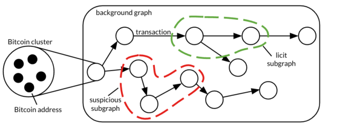
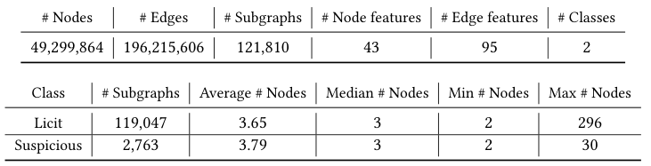
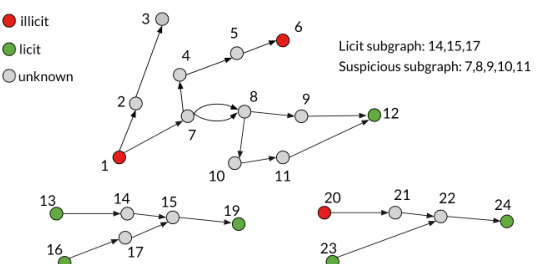
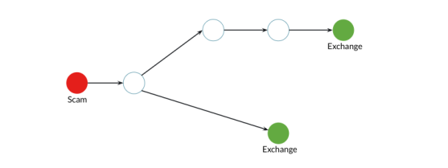
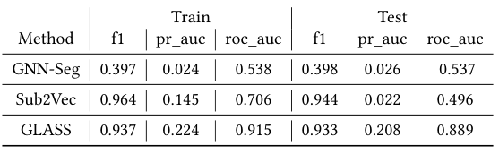
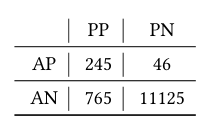

# 자금세탁의 형태: Elliptic2 데이터셋을 활용한 블록체인 서브그래프 표현 학습

> **원문 제목:** The Shape of Money Laundering: Subgraph Representation Learning on the Blockchain with the Elliptic2 Dataset  
> **저자:** Claudio Bellei · Muhua Xu · Ross Phillips · Tom Robinson · Mark Weber · Tim Kaler · Charles E. Leiserson · Arvind · Jie Chen  
> **게재 정보:** KDD MLF Workshop, 2024  
> **DOI:** [https://doi.org/10.48550/arXiv.2404.19109](https://doi.org/10.48550/arXiv.2404.19109)

> **번역 안내:** 본문과 부록은 문단 문맥을 기준으로 한국어로 옮겼습니다. 수식과 참고문헌은 정확성을 위해 원문 표기를 유지했습니다. 원문의 그림과 표는 개별 이미지로 잘라 해당 본문 위치에 바로 배치했습니다.

---

<!-- 원문 1쪽 -->

## 초록

하위 그래프 표현 학습은 복잡한 네트워크 내의 로컬 구조(또는 모양)를 분석하는 기술입니다. 확장 가능한 GNN(Graph Neural Networks)의 최근 개발을 통해 활성화된 이 접근 방식은 추상화 노드 수준이 아닌 하위 그룹 수준(다중 연결된 노드)에서 관계형 정보를 인코딩합니다. 본 연구에서는 자금세탁방지(AML)와 같은 특정 도메인 응용 프로그램이 본질적으로 하위 그래프 문제이며 주류 그래프 기술이 차선의 추상화 수준에서 작동하고 있다고 가정합니다. 이는 부분적으로 실제 크기와 복잡성의 주석이 달린 데이터셋가 부족하고 하위 그래프 GNN 워크플로를 대규모로 관리하기 위한 소프트웨어 도구가 부족하기 때문입니다. AML 이상의 기본 알고리즘과 도메인 애플리케이션 작업을 활성화하기 위해 우리는 49M 노드 클러스터와 196M 엣지 거래으로 구성된 배경 그래프 내에 비트코인 ​​클러스터의 122K 레이블 하위 그래프가 포함된 대형 그래프 데이터셋인 Elliptic2를 도입합니다. 데이터셋는 자금세탁이 암호화폐에서 나타내는 "형태" 집합을 학습하고 새로운 범죄 활동을 정확하게 분류하기 위해 불법 활동과 연결된 것으로 알려진 하위 그래프를 제공합니다. 데이터셋와 함께 그래프 기술, 소프트웨어 도구, 유망한 초기 실험 결과 및 이 접근 방식에서 이미 수집한 새로운 도메인 통찰력을 공유합니다. 종합해보면, 우리는 이 접근 방식에서 즉각적인 실용적인 가치와 암호화폐 및 기타 금융 네트워크의 자금세탁방지 및 법의학 분석에 대한 새로운 표준에 대한 잠재력을 발견했습니다.

> **주:** *이 저자들은 본 연구에 동등하게 기여했습니다.

## CCS 개념

- 보안 및 개인 정보 보호 →Database 활동 모니터링; • 컴퓨팅 방법론 →Machine 학습; • 응용 컴퓨팅 →Network 포렌식.

## 핵심어

인공 지능, 기계 학습, 공개 데이터셋, 그래프 신경망, 하위 그래프 표현 학습, 금융 법의학, 암호화폐, 자금세탁방지 ACM 참조 형식: Claudio Bellei, Muhua Xu, Ross Phillips, Tom Robinson, Mark Weber, Tim Kaler, Charles E. Leiserson, Arvind 및 Jie Chen. 2024. 자금세탁의 형태: Elliptic2 데이터셋를 사용하여 블록체인에서 하위 그래프 표현 학습. KDD MLF '24: 재무 분야 머신 러닝에 관한 KDD 워크숍, 8월 26, 2024, 스페인 바르셀로나. ACM, 뉴욕, NY, 미국, 7 페이지.

## 1 서론

지난 몇 년 동안 그래프 신경망(GNN)의 개발을 통해 기본이 아닌 유클리드 구조를 가진 데이터에 대한 딥 러닝 방법의 확장이 가능해졌습니다. GNN은 노드, 에지 및 전체 그래프에 대한 의미 있는 표현을 학습할 수 있는 다양한 모델과 아키텍처를 제공합니다. 이러한 변형은 추천 시스템, 화학, 교통 제어, 물리학 등 [24]와 같은 다양한 분야에서 응용 프로그램을 찾았습니다. 그러나 복잡한 그래프 구조를 다룰 때 특히 관심 있는 하위 그래프를 식별하는 것이 가능한 경우가 많습니다. 최근 하위 그래프 표현 학습의 출현으로 더 큰 그래프 구조 [2, 22] 내에서 하위 그래프 속성을 예측할 수 있게 되었습니다. 이 접근 방식을 활용하면 더 넓은 배경 그래프 내에서 이러한 하위 그래프의 특성과 동작에 대한 귀중한 통찰력을 얻을 수 있습니다.

블록체인 기반 암호화폐 등 금융 그래프에서 흥미로운 하위 그래프를 발견할 수 있다. 비트코인 [16]가 시작된 이래 암호화폐의 주요 특성 중 하나는 기록된 모든 거래에 대한 불변적이고 투명한 기록입니다.

<!-- 원문 2쪽 -->

> **주:** KDD MLF '24, 8월 26, 2024, 스페인 바르셀로나 Bellei et al.

사용자의 가명성을 유지하면서 네트워크에서. 이러한 공개 정보와 네트워크상의 합법 및 불법 서비스 존재에 대한 지식을 결합하여 암호 화폐 정보 회사는 암호 화폐 도메인에 맞춤화된 자금세탁방지(AML) 솔루션을 제공하기 위해 등장했습니다. 비트코인의 가명성은 범죄자에게 이점이 되는 반면, 데이터의 공개 가용성은 금융 범죄를 식별하고 조사하려는 법 집행 기관 및 금융 기관 내에서 중요한 이점입니다.

여기에 제시된 데이터셋는 암호화폐 정보 회사의 AML 렌즈 내에서 관심 있는 하위 그래프를 식별합니다. 일부 하위 그래프에는 자금세탁 활동에 대한 변칙적인 서명이 포함되어 있는 반면, 다른 하위 그래프(대다수)는 합법적인 서비스 간에 비트코인 흐름을 전송하는 것으로 보입니다. 문제는 아직 레이블이 지정되지 않았으며 잠재적으로 표준 방법을 사용하여 레이블이 지정되지 않을 하위 그래프에 대해 예측을 할 수 있어야 AML 솔루션이 퍼블릭 블록체인 데이터를 독점적으로 사용하여 알려지지 않은 상황에서도 예측을 할 수 있도록 하는 것입니다.

## 2 서브그래프를 위한 대규모 데이터셋

하위 그래프 표현 학습에 사용 가능한 실제 데이터셋에는 PPI-BP, HPO-METAB, HPO-NEURO 및 EM-USER가 포함됩니다. 각각에 대한 자세한 속성은 [2, 부록 B]에서 확인할 수 있습니다. 이러한 데이터셋 중 가장 큰 배경 그래프는 100K 노드와 5M 가장자리로 구성되며, 하위 그래프 수는 324에서 4,000 사이로 다양하고 하위 그래프당 노드는 10에서 155 사이로 구성됩니다. 우리가 아는 한, 이는 사용 가능한 가장 큰 하위 그래프 데이터셋이지만 실제로는 그렇게 크지 않습니다. 확장성 제약과 대규모 네트워크 구조에 공통적인 기타 문제를 해결하는 것이 실제로 많은 실제 환경에서 GNN의 약속의 핵심이기 때문에 이는 이 분야의 과학적 발전을 제한합니다.

훨씬 더 큰 규모의 하위 그래프 학습에 대한 연구를 가능하게 하기 위해 우리는 우리가 알고 있는 실제 데이터셋보다 거의 3배 더 큰 배경 그래프로 구성된 비트코인 주소와 거래 간의 완전히 연결된 네트워크인 Elliptic2를 제시합니다. 이 배경 그래프에는 의심스러운 또는 적법한 것으로 표시된 많은 작은 하위 그래프가 있으며, 현재 수행 중인 작업은 의심스러운 하위 그래프의 이진 분류입니다. 이 데이터셋의 출시는 비트코인 ​​거래를 포함하고 노드 분류에 초점을 맞춘 2019의 표준 그래프 데이터셋의 게시를 따릅니다. 두 데이터셋 모두 확장 가능한 그래프 신경망에 대한 연구와 암호화폐의 자금세탁방지 애플리케이션을 발전시킬 수 있습니다.

### 2.1 Elliptic1에 대한 회고

2019에서 우리는 Kaggle [21]에 The Elliptic Data Set(이하 Elliptic1)이라는 비트코인 거래의 레이블이 지정된 그래프 데이터셋를 게시했으며, 첨부 문서 [23]는 GNN을 사용하여 상당한 성능 향상을 위해 분류 모델에 공급할 수 있는 숨겨진 관계 정보를 추출하는 방법에 대한 실험 결과를 보여줍니다. 데이터셋는 166 특성을 갖춘 204K 노드 거래과 234K 방향성 엣지 결제 흐름으로 구성되었습니다. 노드 거래의 약 2%는 불법으로 표시되었으며 21%는 합법으로 표시되었습니다. 제시된 작업은 노드 거래이 합법적인 개체 또는 불법적인 개체에 의해 비트코인 ​​네트워크에 브로드캐스팅되었는지 여부를 예측하는 이진 노드 분류 작업이었습니다. 이 출판물을 기준으로 데이터셋는 10만 번 이상 조회되었고 거의 10,000번 다운로드되었으며 논문은 약 400 인용되었습니다. 기계 학습 및 AML 커뮤니티의 견인력은 우리가 AML 전문가를 위한 잠재적으로 강력한 새 도구로 하위 그래프 분류를 가능하게 하기 위해 수정된 구조와 하위 그래프 레이블을 추가하여 Elliptic2라고 부르는 훨씬 더 큰 데이터셋를 게시하도록 동기를 부여했습니다. 이 새로운 데이터세트에 대한 우리만의 새로운 방법이 곧 출시될 예정이지만, 우리는 과학 발전과 공익을 위해 이 데이터세트를 커뮤니티에 제공합니다.

### 2.2 Elliptic2 소개

Elliptic2의 임무는 특정 비트코인 흐름이 자금세탁 활동, 특히 합법적인 서비스를 통해 불법 행위로 얻은 이익을 명목화폐나 기타 암호화폐로 전환하려는 시도와 연결될 수 있는지 여부를 식별하여 금융 범죄에 맞서 싸우는 것입니다. 다음 논의를 위해서는 몇 가지 유용한 정의가 필요합니다.

정의 2.1. 클러스터는 단일 개인이나 조직에 의해 제어되는 것으로 생각되는 비트코인 ​​주소 집합입니다.

합법적인 클러스터는 "적법한" 개체(교환, 지갑 공급자, 채굴자, 합법적인 서비스 등)가 소유합니다. 불법 클러스터는 "불법" 개체(암흑 시장, 사기, 해킹 등)가 소유합니다. 합법도 불법도 아닌 클러스터는 알 수 없는 것으로 간주됩니다(예: 레이블이 지정되지 않은 클러스터).

의심스러운 경로는 불법 클러스터를 합법적 클러스터에 연결하는 경로입니다. 불법 경로는 불법 클러스터를 불법 클러스터에 연결하는 경로입니다. 합법적이지 않거나 의심스럽거나 불법적이지 않은 경로는 중립적인 것으로 간주됩니다.

2.2.1 가정. 위의 정의는 다음과 같은 가정을 기반으로 합니다. 자금의 소유권을 변경하지 않고 불법 클러스터를 합법적 클러스터에 연결하는 블록체인의 경로는 범죄인이나 조직에 의한 자금세탁 활동을 나타낼 가능성이 높습니다. 합법적인 서비스에 자금을 예치하려는 범죄자는 블록체인의 탐지를 회피하려고 시도하여 기계 학습 모델이 식별할 수 있어야 하는 관련 "모양" 및 특성이 있는 고유한 하위 그래프를 생성한다는 아이디어입니다.

**그림 1: 배경 그래프와 주석이 달린 하위 그래프가 포함된 데이터세트의 예시입니다. 각 노드는 동일한 엔터티에 의해 제어되는 비트코인 ​​주소 모음인 비트코인 ​​클러스터를 나타내며, 각 에지는 이들 간의 거래를 나타냅니다.**

2.2.2 그래프 구성. 그림 1는 비트코인 ​​클러스터를 나타내는 그래프의 각 노드와 이들 사이의 거래를 나타내는 에지로 데이터셋의 구성 요소를 보여줍니다. 클러스터링

<!-- 원문 3쪽 -->

> **주:** Elliptic2 데이터세트 KDD MLF '24, August 26, 2024, 스페인 바르셀로나

**표 1: 배경 그래프(위)와 적법한 하위 그래프(아래)에 대한 데이터세트 속성입니다.**

주소는 잘 알려진 [3, 9, 14, 15, 18, 20]뿐만 아니라 독점 휴리스틱, 인간 분석 및 도메인 전문 지식을 적용하여 수행됩니다. 하위 그래프에 주석을 달 때 지적 재산상의 이유로 Elliptic 클러스터 레이블의 하위 집합만 사용되었습니다.

데이터셋는 아래 제공된 단계에 따라 구축됩니다. (1) 시간 창, 통과할 최대 홉 수, 소유권 변경이 발생할 가능성이 있는 경우(예: 탐색 중에 활동이 높은 알 수 없는 클러스터가 발견되는 경우) 조기 중지 조건을 정의합니다. (2) 시간 창 내에서 가장 큰 연결된 구성 요소(배경 그래프)를 결정합니다. (3) 배경 그래프의 레이블이 지정된 각 노드에 대해 나가는 거래를 가져와 그래프 순회를 위한 시작점을 제공합니다. (4) 다음 조건 중 하나가 충족될 때까지 그래프를 탐색합니다. I. 레이블이 지정된 노드가 발견되었습니다. II. 통과한 길이가 허용된 최대 홉 수보다 큽니다. III. 조기 정지 조건이 만족됩니다. (5) 이전 단계에서 발견된 각 경로에 대해 불법인 경우 "의심스러운" →licit, 합법적인 경우 "licit" →licit, 불법인 경우 "불법" →illicit, 또는 불법/합법적인 경우 "중립" →unknown. (6) 위의 방법을 사용하여 경로, 연결된 구성 요소를 실행하여 레이블을 지정할 수 있는 하위 그래프, 즉 논리적으로 일관된 경로(합법적 + 중립 또는 의심스러운 + 불법 + 중립)만 있는 하위 그래프만 유지합니다. (7) 최종 출력에 대한 하위 그래프에 주석을 달고 적법한(적법한 하위 그래프) 또는 의심스러운(의심스러운 하위 그래프) 경로의 일부인 알 수 없는 노드만 유지합니다.

시간 창은 블록체인 데이터의 1 연도로 선택되었으며 계산상의 이유로 최대 홉 수는 6였습니다. 단계(3)의 거래은 각 클러스터의 최대값으로 제한되어 다양한 블록체인 활동을 가진 다양한 행위자에 대한 데이터셋의 균형을 맞추는 데 도움이 됩니다.

2.2.3 Elliptic2 개요. 데이터세트의 일부 속성에 대한 개요는 표 1에서 확인할 수 있습니다. 데이터셋는 49M 클러스터와 196M 가장자리의 배경 그래프로 구성됩니다. 배경 그래프의 하위 집합은 그림 1에 표시된 것처럼 레이블이 지정된(합법적/의심스러운) 하위 그래프로 구성됩니다. 데이터셋에 존재하는 유일한 레이블은 이러한 하위 그래프와 관련된 레이블이며 그래프에 있는 대부분의 노드는 레이블이 지정된 하위 그래프에 속하지 않습니다. 하위 그래프 중 약 2%만이 "의심스러운" 라벨이 붙어 있고 나머지는 "합법적"이라는 라벨이 붙어 있어 심각한 클래스 불균형 문제가 발생합니다. 평균적으로 하위 그래프의 크기는

**그림 2: 데이터셋를 구성하려면 먼저 경로에 레이블을 지정한 다음 하위 그래프에 레이블을 지정해야 합니다. 위의 예에는 3 적법한 경로가 있습니다(I. 13 →14 →15 →19; II. 16 →17 →15 → 19; III. 23 →22 →24), 1 불법 경로(1 →7 →4 →5 →6), 3 의심스러운 경로(I. 1 →7 →8 →9 →12; II. 1 →7 →8 →10 →11 →12; III. 20 →21 →22 →24), 및 1 중립 경로(1 → 2 →3). 결과는 하나의 적법한 하위 그래프와 하나의 의심스러운 하위 그래프입니다(하위 그래프에 유의하세요). 21,22는 의심스러운 경로와 합법적인 경로로 구성되어 있으므로 레이블이 지정되지 않았습니다.**

**그림 3: 사기로 인한 이익을 두 교환소에 연결하는 3 크기의 의심스러운 하위 그래프의 예(참고: 레이블 범주는 데이터셋에서 사용할 수 없습니다).**

작지만 분포의 꼬리가 중요합니다. 크기 3 의심스러운 하위 그래프의 예가 그림 3에 나와 있습니다.

배경 그래프의 각 노드에는 43 특성이 있고 각 가장자리 95 특성이 있습니다. 노드 특성에는 노드 크기(주소 수) 및 거래 수가 포함됩니다. 두 가지 모두 수십 배(1에서 수백만까지)만큼 다양할 수 있는 특성의 예입니다. 엣지 특성에는 거래량, 수수료, 타임스탬프가 포함됩니다. Elliptic의 지적 재산을 보호하기 위해 대부분의 특성은 저장소로 분류되었습니다. 사용되는 저장소의 수는 특성마다 다릅니다. 이 프로세스는 연속적인 수치 특성을 순서형 특성으로 변환했습니다.

<!-- 원문 4쪽 -->

> **주:** KDD MLF '24, 8월 26, 2024, 스페인 바르셀로나 Bellei et al.

## 3 ELLIPTIC2 3.1의 사용 자금세탁방지 관점

Elliptic2의 설정은 암호화폐와 상호 작용하는 회사가 준수해야 하는 규제 준수 제약 사항에 맞게 조정되었습니다. 전통적인 AML 설정에서와 마찬가지로 자금을 받는 회사는 일반적으로 의심 활동이나 조직과의 잠재적인 연결과 관련하여 해당 자금의 적법성에 대한 결정을 내려야 합니다. 이를 위해 Elliptic2에서 제안하는 작업은 하위 그래프가 의심스러운지 여부를 판단하는 목적을 가진 이진 분류입니다. 비트코인의 투명성은 퍼블릭 블록체인에서 관찰 가능한 패턴(예: 하위 그래프 모양)에 대한 공개적이고 개인정보를 보호하는 포렌식 분석을 허용한다는 점에서 도움이 됩니다. 라벨 의존도를 줄이기 위해 고급 기계 학습 기술을 활용하면 대규모 암호화폐의 정확한 자금세탁방지에 대한 약속이 방향적으로 달성 가능한 것으로 보입니다. 이 문제 [19]를 해결하는 데 도움이 될 수 있는 암호화폐 자금세탁의 일부 "유형"이 확인되었지만 이에 대한 일반적인 해결책은 여전히 ​​달성하기 어렵습니다. 예를 들어 적시성이 중요한 "로우 프로필" 사례(예: 사기꾼이 범죄 수익금을 신속하게 현금화하려고 하는 경우)입니다.

### 3.2 AI 관점

Elliptic2 데이터세트는 AI 커뮤니티에 시의적절하게 기여한 것입니다. 그래프 표현 학습 연구가 수년에 걸쳐 폭발적인 견인력을 얻었고 일반적으로 GNN 및 신흥 그래프 변환기 [4]와 같은 방법과 모델을 벤치마킹하기 위한 실제적이고 대규모이며 까다로운 데이터세트를 요구하기 때문입니다. 벤치마크 기여의 예로는 재현 가능한 벤치마킹을 위한 확장 가능한 프레임워크를 제공하는 Benchmarking GNN [5]가 있습니다. 그리고 장거리 그래프 벤치마크 [6]는 노드의 장거리 상호 작용에 대한 추론에서 모델의 특성을 테스트할 수 있는 그래프 데이터셋를 설계합니다. 이러한 기여에는 일반적으로 대규모 그래프가 포함되지 않습니다. Open Graph Benchmark [11]는 오늘날 널리 사용되는 여러 개의 가장 큰 그래프로 구성된 대안적인 예입니다. 이 그래프에는 ogbn-papers100M 및 MAG240M [10]가 포함되어 있어 기계 학습 모델 개발뿐만 아니라 시스템 설계 연구도 지원합니다.

Elliptic2는 그래프 모델의 확장성과 훈련 시스템의 효율성을 벤치마킹하는 데 사용할 수 있는 유사한 대규모 데이터셋입니다. 이는 벤치마킹에 사용할 수 있는 공개 데이터세트가 거의 없는 금융 영역(암호화폐)의 실제 사용 사례를 나타냅니다.

대규모 및 고유 도메인 외에도 더 중요한 것은 Elliptic2가 새로운 주제인 하위 그래프 표현 학습에 대한 연구를 지원한다는 것입니다. 전통적으로 그래프 벤치마크 데이터세트는 노드 수준 작업(분류 및 회귀), 그래프 수준 작업(유사) 및 에지 수준 작업(링크 예측)을 수행하는 데 사용됩니다. 대신 Elliptic2를 사용하여 하위 그래프 수준 작업을 수행할 수 있습니다. 하위 그래프 분류는 다음과 같이 수학적으로 정의됩니다.

정의 3.1. 그래프 𝐺가 주어지면 𝑆𝐺가 해당 그래프의 하위 그래프를 나타내고 ⊂를 사용하여 하위 그래프 관계를 나타냅니다. 즉, 𝑆𝐺⊂𝐺. Label을 레이블 공간으로, Train을 훈련 인덱스 세트로, Test를 테스트 인덱스 세트로 설정합니다. 그런 다음 하위 그래프 분류의 문제는 레이블이 지정된 훈련 하위 그래프 모음이 주어지는 것입니다 {(𝑆𝐺

𝑖 ⊂𝐺, 𝑦𝑖∈Label, 𝑖∈Train}, 테스트 세트 {𝑆𝐺에서 하위 그래프의 레이블을 예측합니다.

𝑗⊂𝐺, 𝑗∈Test}. 각 하위 그래프는 연결이 끊어질 수 있으며 다른 하위 그래프는 겹칠 수 있습니다.

하위 그래프 분류는 노드/그래프 분류에 비해 상대적으로 덜 연구됩니다. 간단한 접근 방식은 그래프 모델(예: GNN)을 적용하고, 노드 표현을 얻고, 하위 그래프 노드에 대해 풀링(예: 평균화)을 수행하고, 예측 헤드를 적용하여 하위 그래프 레이블을 예측하는 것입니다. 이 접근 방식은 일반적인 기준이기는 하지만 최근에 제안된 여러 가지 방법 [1, 2, 22]보다 성능이 뛰어납니다. Elliptic2는 성능 및 확장성 벤치마킹과 관련된 새로운 방법을 위한 유용한 테스트베드입니다.

## 4 결과

Elliptic2에서 세 가지 하위 그래프 분류 방법을 실험했습니다. 하위 그래프를 독립 그래프(GNN-Seg라고 함)로 훈련한 기존 GNN, Sub2Vec [1] 및 GLASS [22]입니다. Sub2Vec은 하위 그래프 내의 무작위 보행 샘플을 사용하여 하위 그래프 임베딩을 구축합니다. GNN-Seg와 Sub2Vec 모두 하위 그래프 자체를 보완하는 중요한 정보(예: 하위 그래프와 배경 그래프를 교차하는 가장자리)를 제공할 수 있는 배경 그래프를 무시하는 반면, GLASS는 이를 활용합니다.

GLASS의 GNN 아키텍처는 기본 메시지 전달 레이어를 사용하고 노드 라벨링을 위한 추가 선형 레이어로 보완되며 두 개의 레이어로 구성됩니다. 하이퍼파라미터는 대부분 GLASS 작성자가 제공한 기본 구성을 따르며, 훈련 속도와 품질을 향상시키기 위해 배치 크기(4000)와 학습 속도(0.001)를 약간 조정합니다.

훈련, 검증 및 테스트를 위해 각각 무작위 80:10:10 분할을 수행했습니다. 실험은 160 CPU 코어와 1.2TB RAM을 갖춘 Linux 서버에서 수행되었습니다. GPU 메모리가 모든 그래프와 중간 데이터를 호스팅하기에는 데이터셋가 너무 크기 때문에 GPU를 사용하지 않았습니다. 같은 이유로 우리는 node/edge 특성을 사용하지 않았습니다. 이웃 샘플링을 통합하고 확장 가능한 훈련 시스템을 사용하여 이렇게 큰 규모의 데이터세트에 대해 훈련 및 추론을 수행할 수 있는 방법에 대한 논의는 섹션 6를 참조하세요.

**표 2: Elliptic2에 대한 다양한 하위 그래프 분류 방법의 성능.**

**표 2는 세 가지 방법을 마이크로 평균 F1, PR-AUC, ROC-AUC의 세 평가 지표로 비교합니다. GLASS는 다른 두 방법보다 현저히 우수한 성능을 보입니다.**

PR-AUC 및 ROC-AUC 지표에 따라 접근하는 동시에 F1에서 경쟁력을 갖습니다. 라벨의 불균형이 높기 때문에 AUC 측정항목은 라벨링 임계값에 대한 보다 유연한 선택을 반영합니다. 따라서 이러한 지표에 대한 성과가 높을수록 더 강력한 결과를 얻을 수 있습니다.

<!-- 원문 5쪽 -->

> **주:** Elliptic2 데이터세트 KDD MLF '24, August 26, 2024, 스페인 바르셀로나

순위가 매겨진 예측을 직접 검증할 때 이점이 있습니다. GLASS는 의심스러운 하위 그래프를 안정적으로 예측하여 훈련 세트와 테스트 세트 모두에서 일관된 성능을 제공할 수 있음을 확인했습니다. 이 주목할만한 이득은 데이터셋에서 통찰력을 얻는 타당성뿐만 아니라 모델 훈련에 배경 그래프를 사용하는 것의 중요성도 보여줍니다.

**표 3: GLASS 방법으로 얻은 혼동 행렬. 긍정적인 것은 의심스러운 클래스입니다.**

클래스 불균형 상황에서 GLASS의 예측 성능을 더 종합적으로 살펴보기 위해 표 3에 혼동 행렬을 제시합니다. 의심스럽다고 예측한 하위 그래프 네 개 중 적어도 하나는 실제로 의심스러웠고, 의심 하위 그래프의 85%를 정확히 탐지했습니다. 이는 GLASS가 합리적인 수준의 위양성률과 위음성률을 유지함을 보여줍니다.

계산 비용 측면에서 Sub2Vec은 약 7시간이 걸리는 긴 전처리 단계가 있지만 모델 학습 시간은 매우 짧습니다. 반면 GNN-Seg와 GLASS는 GNN 모델 학습에 많은 계산이 필요합니다. 모든 방법은 수일 이내에 수렴했으며 추론 시간은 8시간 미만이었습니다.

## 5 학습된 모델의 검증

앞 절의 결과를 바탕으로 학습된 GLASS 모델을 사용해 추가적인 미라벨 하위 그래프의 의심 여부를 예측했습니다.

### 5.1 암호화폐 거래소 서비스에서 얻은 통찰력

암호화폐 거래소는 자체 오프체인 통찰력을 사용하여 모델 예측을 검증해 달라는 요청을 받았습니다. 구체적으로, 의심스러운 것으로 간주되고 거래소에 대한 예금 거래로 끝나는 52 하위 그래프가 선택되었습니다. 왜냐하면 거래소가 이러한 예금을 받은 계정 소유자에 대한 정보를 보유하기 때문입니다. 이러한 예금 거래는 거래소와 공유되었습니다. 검토 결과, 거래소는 고객 실사 및 기타 오프체인 정보를 통해 얻은 자체 오프체인 통찰력을 바탕으로 이러한 예금을 받은 52 계정 중 14가 불법 활동에 잠재적으로 연루되어 있음을 발견했습니다. 특히, 이러한 14 계정 중 8는 '자금세탁' 또는 '사기'와 확실히 연관되어 있었습니다. Exchange에서는 나머지 38 계정이 불법 활동에 연루되었다는 긍정적인 징후가 없음에도 불구하고 이것이 그러한 가능성을 배제하지 않습니다.

거래소에 따르면 고객 계정 중 0.1% 미만이 자금세탁 또는 사기와 연관되어 있는 반면, 모델 예측에서 강조된 계정 중 최소 26.9%는 그러한 연관이 있는 것으로 밝혀졌습니다. 이는 우리 모델의 경험적 정확도가 순진한 무작위 모델의 정확도를 훨씬 능가한다는 것을 의미합니다.

### 5.2 의심스러운 하위 그래프에서 자금 출처 식별

모델 예측을 검증하는 또 다른 접근 방식은 의심스러운 것으로 예측된 하위 그래프에 자금을 지원하는 레이블이 지정되지 않은 노드가 실제로 불법 개체임을 증명하는 것입니다. 이를 위해 의심스러운 하위 그래프로 유입되는 자금의 출처를 식별하기 위해, 즉 하위 그래프 앞의 노드를 제어하는 ​​엔터티를 식별하기 위한 조사가 수행되었습니다. 이러한 조사에서는 오픈 소스 연구 및 기타 표준 식별 기술을 활용하여 다수의 노드를 식별했습니다. 예: (1) 의심스러운 것으로 간주되는 최소 60개의 하위 그래프가 암호화폐 혼합기로 식별된 노드로부터 자금을 받았습니다. 믹서는 난독화 서비스를 제공하며 불법 활동으로 인한 수익금을 세탁하는 데 많이 사용됩니다. (2) 두 명의 의심스러운 하위 그래프가 파나마 기반 폰지 사기로부터 자금을 받았습니다. (3) 최소 100개의 의심스러운 하위 그래프가 메시징 플랫폼에서 익명 암호화폐 거래를 가능하게 하는 봇으로 식별된 노드로부터 자금을 받았습니다. 이는 거래의 거의 절반이 범죄 활동 [8]와 연관되어 폐쇄된 암호화폐 거래소 Bitzlato가 제공하는 서비스와 특성적으로 유사합니다. (4) 최소 20개의 의심스러운 하위 그래프가 초대 전용 러시아 다크넷 시장으로 여겨지는 노드로부터 자금을 받았습니다.

이러한 결과는 의심 거래 식별, 즉 의심스러운 노드 식별을 넘어 모델 출력의 적용을 제안합니다. 여기서 모델은 노드에서 생성된 하위 그래프를 기반으로 불법일 가능성이 가장 높은 노드에 대한 수동 조사를 지시하는 데 유용한 것으로 나타났습니다.

### 5.3 알려진 암호화폐 세탁 패턴 식별

알려진 암호화폐 세탁 거래 패턴에 대한 의심스러운 하위 그래프를 조사하여 모델 결과에 대한 추가 검증을 얻을 수 있습니다.

의심스러운 하위 그래프 중 다수는 "필링 체인"으로 알려진 것을 포함하는 것으로 밝혀졌습니다. 이는 암호화폐 사용자가 암호화폐를 대상 주소로 보내거나 "필링"하고 나머지는 사용자가 제어하는 ​​다른 주소로 전송될 때 생성되는 거래 패턴을 의미합니다. 이것이 반복적으로 발생하여 벗겨지는 사슬을 형성합니다. 패턴은 주소 재사용을 방지하는 등 합법적인 금융 개인 정보 보호 목적을 가질 수 있으며 이를 통해 사용자의 거래를 쉽게 연결할 수 있습니다. 그러나 다양한 형사 사건 [17]에서 설명된 것처럼 패턴은 자금세탁을 나타낼 수도 있습니다. 특히 "벗겨진" 암호화폐가 교환 서비스로 반복적으로 전송되는 경우에 그렇습니다. 전통적인 금융에서는 이를 "스머핑(smurfing)"이라고 합니다. 이는 다량의 현금을 여러 개의 소규모 거래로 구성하여 규제 보고 한도를 준수하고 적발을 방지하는 것입니다. 모델이 노드 차수를 사용했다는 점을 감안할 때 체인 벗겨짐은 모두 일치하는 노드 차수를 갖는 노드 체인이 될 가능성이 높기 때문에 체인 벗겨짐이 보이는 패턴이라는 것을 이해할 수 있습니다.

벗겨진 체인 외에도 의심스러운 하위 그래프 중 다수에는 암호화폐 거래소에 대한 최종 입금 근처에 명백한 "중첩 서비스"가 포함되어 있습니다. 중첩된 서비스는 다음과 같은 비즈니스입니다.

<!-- 원문 6쪽 -->

> **주:** KDD MLF '24, 8월 26, 2024, 스페인 바르셀로나 Bellei et al.

때로는 거래소의 인식이나 승인 없이 대규모 암호화폐 거래소의 계좌를 통해 자금을 이동합니다. 중첩된 서비스는 고객 중 한 명으로부터 암호화폐 주소로 예금을 받은 다음 해당 자금을 거래소의 예금 주소로 전달할 수 있습니다. 중첩된 서비스는 자신이 활용하는 암호화폐 거래소보다 덜 엄격한 고객 실사 점검을 하는 경우가 많거나 때로는 그러한 자금세탁방지 점검이 전혀 없는 것으로 알려져 있으며, 이로 인해 암호화폐 세탁 [7]가 오용되어 잠재적으로 모델에서 의심스러운 것으로 간주되는 하위 그래프에 표시될 수 있습니다.

## 6 대규모 하위 그래프 학습

Elliptic2의 큰 크기는 GNN 교육에 상당한 어려움을 안겨줍니다. 하위 그래프 표현 학습의 병목 현상과 작업 부하를 해결하는 확장 가능한 훈련 및 추론 시스템을 구축하는 것이 필수적입니다. 본 연구에서는 GLASS [22]를 동기 부여 사례로 사용합니다. 이는 노드 분류 GNN을 간단하게 적용한 동시에 표현력이 뛰어나고 경험적으로 효과적이기 때문입니다. 특히 GLASS는 노드가 관심 있는 하위 그래프에 속하는지 여부를 나타내는 추가 바이너리 속성을 특징 벡터에 추가합니다. 저자는 백본 GNN이 충분히 표현력이 있는 경우 이러한 0-1 라벨링 트릭을 통해 하위 그래프에 대한 모든 특성을 학습할 수 있음을 보여줍니다.

GLASS와 같은 하위 그래프 방법에는 노드 분류에 대한 일부 변경이 필요합니다. 여기서는 확장 가능한 GNN 교육 시스템인 SALIENT [13]와 노드 분류 워크로드용으로 설계된 향상된 후속 제품인 SALIENT++ [12]를 소개합니다. 그런 다음 SALIENT/SALIENT++와 같은 시스템을 하위 그래프 분류 워크로드를 처리하기 위해 어떻게 조정할 수 있는지 논의합니다.

### 6.1 SALIENT 및 SALIENT++

GNN의 대규모 분산 훈련은 두 가지 주요 병목 현상에 직면합니다. 즉, 이웃 샘플링 비용이 모델 평가 비용을 지배하고 노드 특성의 분산 저장으로 인해 기계 간 통신이 많이 발생합니다.

이웃 샘플링은 훈련 노드 미니 배치의 𝑘홉 이웃의 폭발적인 크기를 줄이는 수단입니다. 이 전략은 미니배치 훈련에 필요한 계산과 메모리를 줄입니다. 일반적으로 사용되는 이웃 샘플링 알고리즘은 노드별 샘플링이라고 하며, 여기서 샘플링된 𝑘-홉 이웃은 (𝑘−1)-홉 이웃의 각 노드에 대해 최대 𝑓𝑘이웃을 샘플링하여 계산됩니다. 이웃 샘플링은 데이터 로더의 주요 계산 구성 요소인 CPU 메모리에서 수행됩니다. 그러나 CPU 처리량은 샘플링된 이웃을 기반으로 모델 평가를 수행하는 GPU 처리량보다 훨씬 낮습니다.

이웃 샘플링의 병목 현상을 해결하기 위해 SALIENT [13]는 가장 효율적인 데이터 구조를 사용하여 C++로 샘플러를 구현하고, PyTorch의 다중 처리와 달리 C++ 스레드를 사용하여 공유 메모리 병렬 배치 준비를 수행하고, GPU와 CPU 간의 데이터 전송을 파이프라인하여 GPU 활용도를 극대화합니다. 이러한 성능 엔지니어링을 통해 SALIENT는 그래프 딥 러닝의 가장 큰 벤치마크 중 하나인 ogbn-papers100M 데이터셋에서 단일 GPU와 함께 인기 있는 PyTorch-Geometric 라이브러리를 사용하여 구현된 표준 GNN 시스템에 비해 3×의 속도 향상을 달성하고 16 GPU를 사용하여 8× 병렬 속도 향상을 달성할 수 있습니다.

노드 특성이 분할되어(각 파티션에 노드의 하위 집합이 포함됨) 서로 다른 시스템에 저장되면 시스템 간 특성 통신이 또 다른 훈련 병목 현상이 됩니다. 샘플링된 𝑘-홉 환경에는 필연적으로 파티션 외부의 노드(즉, 다른 머신에 저장된 노드)가 포함되기 때문에 머신 간 통신이 발생합니다.

통신량을 줄이기 위해 SALIENT++ [12]는 자주 액세스하는 파티션 외부 노드의 특성을 캐시하는 정적 캐싱 정책을 사용합니다. 이 정책은 VIP(정점 포함 확률) 분석이라는 기술을 기반으로 하며 다음과 같이 작동합니다. 트레이닝 세트의 정점 그래프 𝐺=(𝑉, 𝐸) 및 T ⊂𝑉가 주어지면 VIP 분석은 주어진 정점이 크기 𝐵의 무작위로 선택된 미니 배치에 존재할 확률을 추정하는 것으로 시작됩니다. 특정 정점이 이러한 미니배치에 나타날 확률은 |T |/|𝑉|입니다. 그런 다음 GNN의 각 계층에서 이웃 샘플링을 사용하여 정점이 샘플링될 확률을 계산하기 위해 반복 프로세스가 수행됩니다. 이 캐싱 정책을 통해 SALIENT++는 ogbn-papers100M 벤치마크용 8개 시스템에서 또 다른 인기 있는 교육 시스템인 DistDGL에 비해 12.7× 속도 향상을 달성할 수 있습니다.

### 6.2 하위 그래프 분류 워크로드에 노드 분류 GNN 적용

GLASS와 같은 하위 그래프 방법의 경우 노드 분류를 위한 기존의 효율적인 교육 시스템을 수정하여 하위 그래프 분류 워크로드를 처리할 수 있습니다. 예를 들어 SALIENT 및 SALIENT++를 사용합니다.

첫째, SALIENT의 이웃 샘플링 코드는 미니배치 구성을 약간만 수정하여 하위 그래프에서 작동하도록 조정할 수 있습니다. 하위 그래프의 미니배치는 고유한 하위 그래프에 해당하는 목록의 범위를 나타내는 메타데이터와 결합된 노드 목록으로 표시될 수 있습니다. 훈련 세트의 하위 그래프를 섞은 다음 선택된 하위 그래프에 포함된 노드의 미니 배치를 형성함으로써 훈련 중에 미니 배치를 구성할 수 있습니다. 이러한 적응을 통해 SALIENT의 기존 빠른 샘플링 코드를 사용하여 하위 그래프 분류에서 이웃 샘플링의 계산 병목 현상을 해결할 수 있습니다.

둘째, SALIENT++에서 사용하는 VIP 분석 기술을 적용하여 매우 간단한 방식으로 하위 그래프 작업 부하를 처리할 수도 있습니다. 개념적으로는 증가된 그래프와 샘플링 방식을 사용하여 노드 분류 워크로드에 대한 최적의 정적 캐싱 정책을 계산하는 문제로 줄일 수 있습니다. 증대 그래프 𝐺′에는 𝐺의 모든 노드와 간선이 포함되지만, 방향성 간선에 의해 해당 하위 그래프에 포함된 𝐺의 모든 노드에 연결되는 하위 그래프당 하나의 추가 노드가 추가로 포함됩니다. 증강 샘플링 방식에는 "하위 그래프 노드"의 모든 이웃을 샘플링하는 하나의 추가 레이어가 포함됩니다. 이제 추가된 "하위 그래프 노드" 세트를 노드 분류 워크로드의 트레이닝 세트로 처리하여 𝐺′에서 VIP 분석을 수행할 수 있습니다. 실제로는 𝐺의 하위 그래프 목록과 결합된 원본 그래프 𝐺가 필요한 업데이트를 수행하기에 충분하므로 실제로 𝐺'를 구체화할 필요가 없습니다.

<!-- 원문 7쪽 -->

> **주:** Elliptic2 데이터세트 KDD MLF '24, August 26, 2024, 스페인 바르셀로나

## 7 요약

본 연구에서는 Elliptic1이 출판된 지 5년 만에 두 번째로 큰 라벨이 붙은 암호화폐 거래 데이터셋인 Elliptic2를 제공했습니다. Elliptic2는 Elliptic1보다 2배 이상 크며 AML에 대해 다른 기계 학습 작업(하위 그래프 분류)을 지원합니다. 금융 포렌식뿐만 아니라 머신러닝, 특히 하위 그래프 표현 학습 분야의 연구 기회를 제공합니다. 본 연구에서는 하위 그래프 기반 예측 모델 훈련을 통해 그 유용성을 입증했으며 효과적인 모델인 GLASS를 발견했습니다.

이 모델은 이전에는 자금이 규제된 교환 서비스에 진입한 후 오프체인 정보를 통해서만 식별할 수 있었던 온체인 패턴을 기반으로 불법 활동을 식별하여 매우 유망한 결과를 가져왔습니다. 이는 이러한 모델의 결과를 효과적인 규정 준수 도구로 사용하는 방법을 열어줍니다.

또한 이 모델은 하위 그래프를 기반으로, 즉 이러한 지갑의 자금이 세탁되는 방식을 기반으로 이전에 알려지지 않은 불법 암호화폐 지갑으로 우리를 성공적으로 안내했습니다. 이는 블록체인 분석 회사, 법 집행 조사관 및 금융 규제 기관이 불법 활동과 관련된 암호화폐 지갑을 식별하는 데 활용할 수 있습니다.

여기에 적용된 모델은 유망한 결과를 보여 주었지만 향후 연구에서는 계산 예산에 따라 노드/에지 특성을 모델에 통합하는 확장 가능한 훈련 시스템을 사용하여 예측 성능을 향상시킬 수 있습니다. 더 많은 특성을 포함하면 더 정교하고 이전에 문서화되지 않은 자금세탁 전략을 발견할 수 있어 금융 범죄를 더 정확하게 식별할 수 있습니다.

## 8 데이터 및 코드

Elliptic2 데이터세트는 http://elliptic.co/ elliptic2를 통해 액세스할 수 있습니다. 실험에 사용된 첨부 코드는 https://github.com/MITIBMxGraph/Elliptic2.에 있습니다.

## 감사의 글

이 연구는 Elliptic과 MIT-IBM Watson AI Lab(Massachusetts Institute of Technology 및 IBM Research 간의 공동 연구 이니셔티브)의 자금 지원을 받았습니다. 데이터 및 도메인 전문 지식은 Elliptic에서 제공되었습니다.

## 참고문헌

[1] Bijaya Adhikari, Yao Zhang, and Naren Ramakrishnan. 2018. Sub2Vec: Feature

Learning for Subgraphs. In PAKDD. [2] Emily Alsentzer, Samuel G Finlayson, Michelle M Li, and Marinka Zitnik. 2020.

Subgraph Neural Networks. Proceedings of Neural Information Processing Systems, NeurIPS (2020). [3] Elli Androulaki, Ghassan O Karame, Marc Roeschlin, Tobias Scherer, and Srdjan

Capkun. 2013. Evaluating user privacy in bitcoin. In International Conference on Financial Cryptography and Data Security. Springer, 34–51. [4] Vijay Prakash Dwivedi and Xavier Bresson. 2021. A Generalization of Trans-

former Networks to Graphs. In AAAI Workshop on Deep Learning on Graphs: Methods and Applications. [5] Vijay Prakash Dwivedi, Chaitanya K. Joshi, Anh Tuan Luu, Thomas Laurent,

Yoshua Bengio, and Xavier Bresson. 2020. Benchmarking Graph Neural Networks. Preprint arXiv:2003.00982. [6] Vijay Prakash Dwivedi, Ladislav Rampášek, Mikhail Galkin, Ali Parviz, Guy Wolf,

Anh Tuan Luu, and Dominique Beaini. 2022. Long Range Graph Benchmark. In NeurIPS Track on Datasets and Benchmarks. [7] Elliptic. 2023. Five ways coin swap services facilitate money laundering and

sanctions evasion. https://www.elliptic.co/blog/five-ways-coin-swap-servicesfacilitate-money-laundering-and-sanctions-evasion.

[8] Europol. 2023. Bitzlato: senior management arrested. https://www.europol.

europa.eu/media-press/newsroom/news/bitzlato-senior-management-arrested. [9] Martin Harrigan and Christoph Fretter. 2016. The unreasonable effectiveness

of address clustering. In 2016 Intl IEEE Conferences on Ubiquitous Intelligence & Computing, Advanced and Trusted Computing, Scalable Computing and Communications, Cloud and Big Data Computing, Internet of People, and Smart World Congress. IEEE, 368–373. [10] Weihua Hu, Matthias Fey, Hongyu Ren, Maho Nakata, Yuxiao Dong, and Jure

Leskovec. 2021. OGB-LSC: A Large-Scale Challenge for Machine Learning on Graphs. In NeurIPS Datasets and Benchmarks Track. [11] Weihua Hu, Matthias Fey, Marinka Zitnik, Yuxiao Dong, Hongyu Ren, Bowen

Liu, Michele Catasta, and Jure Leskovec. 2020. Open Graph Benchmark: Datasets for Machine Learning on Graphs. Preprint arXiv:2005.00687. [12] Tim Kaler, Alexandros Iliopoulos, Philip Murzynowski, Tao Schardl, Charles E

Leiserson, and Jie Chen. 2023. Communication-Efficient Graph Neural Networks with Probabilistic Neighborhood Expansion Analysis and Caching. Proceedings of Machine Learning and Systems 5 (2023). [13] Tim Kaler, Nickolas Stathas, Anne Ouyang, Alexandros-Stavros Iliopoulos, Tao

Schardl, Charles E Leiserson, and Jie Chen. 2022. Accelerating training and inference of graph neural networks with fast sampling and pipelining. Proceedings of Machine Learning and Systems 4 (2022), 172–189. [14] Sarah Meiklejohn, Marjori Pomarole, Grant Jordan, Kirill Levchenko, Damon

McCoy, Geoffrey M Voelker, and Stefan Savage. 2013. A fistful of bitcoins: characterizing payments among men with no names. In Proceedings of the 2013 conference on Internet measurement conference. 127–140. [15] Malte Möser and Arvind Narayanan. 2022. Resurrecting Address Clustering in

Bitcoin. In Financial Cryptography and Data Security - 26th International Conference, FC 2022, Revised Selected Papers. Springer Science and Business Media Deutschland GmbH, 386–403. https://doi.org/10.1007/978-3-031-18283-9_19 [16] Satoshi Nakamoto. 2008. Bitcoin: A peer-to-peer electronic cash system. (2008). [17] United States of America v. Virtual Currency Accounts. 2020. AF- FIDAVIT IN SUPPORT OF ISSUANCE OF WARRANT OF ARREST IN REM. https://assetforfeiturelaw.us/wp-content/uploads/2020/08/113-Virtual- Currency-Accounts-Affidavit.pdf. [18] Fergal Reid and Martin Harrigan. 2013. An analysis of anonymity in the bitcoin

system. In Security and privacy in social networks. Springer, 197–223. [19] Elliptic Typologies Report. 2023. https://www.elliptic.co/resources/elliptictypologies-report-2023. [20] Dorit Ron and Adi Shamir. 2013. Quantitative analysis of the full bitcoin trans-

action graph. In International Conference on Financial Cryptography and Data Security. Springer, 6–24. [21] Elliptic Data Set. 2019. https://www.kaggle.com/ellipticco/elliptic-data-set. [22] Xiyuan Wang and Muhan Zhang. 2022. GLASS: GNN with Labeling Tricks

for Subgraph Representation Learning. In International Conference on Learning Representations. [23] Mark Weber, Giacomo Domeniconi, Jie Chen, Daniel Karl I. Weidele, Claudio

Bellei, Tom Robinson, and Charles E. Leiserson. 2019. Anti-Money Laundering in Bitcoin: Experimenting with Graph Convolutional Networks for Financial Forensics. arXiv:1908.02591 [cs.SI] [24] Jie Zhou, Ganqu Cui, Shengding Hu, Zhengyan Zhang, Cheng Yang, Zhiyuan Liu,

Lifeng Wang, Changcheng Li, and Maosong Sun. 2021. Graph Neural Networks: A Review of Methods and Applications. arXiv:1812.08434 [cs.LG]
