# 대규모 거래 네트워크에서 자금세탁 서브네트워크 발견 학습

> **원문 제목:** Towards Learning to Discover Money Laundering Sub-network in Massive Transaction Network  
> **저자:** Ziwei Chai · Yang Yang · Jiawang Dan · Sheng Tian · Changhua Meng · Weiqiang Wang · Yifei Sun  
> **게재 정보:** AAAI Conference on Artificial Intelligence, 2023  
> **DOI:** [https://doi.org/10.1609/aaai.v37i12.26656](https://doi.org/10.1609/aaai.v37i12.26656)

> **번역 안내:** 본문과 부록은 문단 문맥을 기준으로 한국어로 옮겼습니다. 수식과 참고문헌은 정확성을 위해 원문 표기를 유지했습니다. 원문의 그림과 표는 개별 이미지로 잘라 해당 본문 위치에 바로 배치했습니다.

---

<!-- 원문 1쪽 -->

## 초록

자금세탁방지(AML) 시스템은 세계 경제를 보호하는 데 중요한 역할을 합니다. 자금세탁은 최고의 집단 범죄 중 하나로 간주되므로 강력한 AML 시스템을 위해 특정 자금세탁 거래 뒤에 있는 자금세탁 하위 네트워크를 발견하는 것이 중요합니다. 그러나 자금세탁 하위 네트워크 검색을 위한 기존 규칙 기반 방법은 도메인 지식에 크게 기반을 두고 있으며 세탁자의 작업 방식보다 뒤처질 수 있습니다. 따라서 본 연구에서는 먼저 신경망 기반 접근 방식으로 자금세탁 하위 네트워크 발견 문제를 해결하고 적응형 하위 네트워크 제안자를 갖춘 AML 프레임워크 AMAP를 제안합니다. 특히, 우리는 자금세탁 거래와 대규모 양성 거래를 구별하기 위해 감독된 대조 손실에 의해 안내되는 적응형 하위 네트워크 제안자를 설계합니다. Ant Group의 AliPay에서 실제 단어 데이터세트에 대한 광범위한 실험을 수행합니다. 결과는 자금세탁 거래 탐지 및 자금세탁 하위 네트워크 발견 모두에서 AMAP의 효율성을 입증합니다. 대규모 거래 네트워크에서 자금세탁 하위 네트워크를 생성하는 학습된 프레임워크는 보다 포괄적인 위험 범위와 자금세탁 전략에 대한 더 깊은 통찰력으로 이어집니다.

1 소개 불법적으로 얻은 수익(예: "더러운 돈")을 합법적인 외관(예: "깨끗한")으로 보이게 하는 것을 목표로 하는 자금세탁(ML)은 수십 년 동안 경제와 사회에 대한 주요 위협 중 하나였습니다. 매년 전 세계적으로 세탁되는 자금의 양은 전 세계 GDP의 2-5%를 차지하며 계속해서 증가할 것으로 예상됩니다(Kute et al. 2021). 일반적으로 세탁 대상이 되는 불법 자금은 불법 자금 출처가 위장될 때까지 때로는 수많은 복잡한 금융 거래를 통해 이리저리 이체됩니다(Force 1999). 그림 1는 AliPay1의 실제 온라인 결제 시스템에서 관찰된 자금세탁 거래 하위 네트워크(ML sub-network)의 전형적인 사례를 보여줍니다. 자금세탁 거래 체인은 종종 숨겨져 있을 수 있습니다.

*교신저자. 저작권 © 2023, 인공지능진흥협회(www.aaai.org). 모든 권리 보유.

1Ant Group에 속한 세계 최대의 온라인 결제 시스템 중 하나

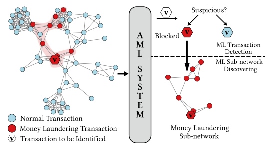

**그림 1: Alipay의 실제 거래 네트워크를 보여줍니다. 강력한 AML 시스템은 포괄적인 위험 범위를 위해 의심스러운 ML 거래의 ML 하위 네트워크를 발견할 것으로 예상됩니다.**

양성 거래 중이며 발견하기 어렵습니다. 금융기관 규정에 따르면 자금 흐름을 완벽하게 추적해야 합니다. 결과적으로 포괄적인 위험 커버리지를 위해 강력한 자금세탁방지(AML) 시스템은 특정 의심스러운 ML 거래를 식별 및 차단(ML 거래 탐지)할 뿐만 아니라 대규모 거래 네트워크에서 의심스러운 ML 하위 네트워크를 공개(ML 하위 네트워크 검색)할 것으로 예상됩니다.

AML 시스템 구축을 목표로 하는 기존의 많은 방법이 광범위하게 연구되었습니다. 주로 1의 두 가지 범주로 나뉩니다. 규칙 기반 방법은 지난 수십 년 동안 상업 기관에서 매우 인기가 있었습니다(Chen et al. 2018). 규칙 기반 AML 시스템은 컨설턴트 및 도메인 전문가가 개발한 내장된 규칙을 기반으로 합니다. 규칙 기반 시스템의 주요 문제는 규칙을 항상 최신 상태로 유지하는 것이 매우 어렵다는 것입니다. 2). 머신/딥 러닝 기반 방법은 방대한 양의 과거 거래 데이터를 탐색하여 모델을 학습합니다. 예를 들어 Kingdon(2004)은 비정상적인 고객 행동을 감지하기 위해 SVM(지원 벡터 머신) 확장을 제안합니다. Deng et al. (2009)은 순차적 설계 방법을 통해 능동 학습 과정을 제안합니다. 그래프 신경망(GNN)이 최근 몇 년 동안 그래프에 대한 기계 학습 작업을 수행하기 위한 사실상의 도구가 되면서 Weber et al. (2019) ML 거래를 감지하기 위해 GNN을 사용합니다.

<!-- 원문 2쪽 -->

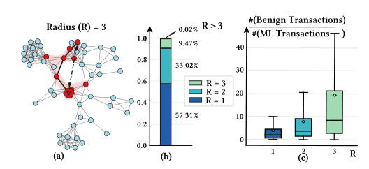

**그림 2: AliPay의 실제 거래 네트워크에서 관찰. (a)는 거래 v의 ML 하위 네트워크의 반경을 보여줍니다. 반경(R)은 v와 ML 하위 네트워크에 포함된 다른 모든 거래 사이의 최대 거리를 나타냅니다. (b)는 거래 네트워크에서 ML 서브네트워크의 반경 분포를 보여줍니다. (c)는 반경 R의 ML 하위 네트워크에 대해 R-hop 하위 그래프에서 ML 거래 양()에 대한 양성 거래 양()의 비율이 어떻게 분포되는지 보여줍니다.**

그러나 앞서 언급한 방법은 특정 의심 거래를 식별하는 ML 거래 탐지 작업에서 작동하는 AML 시스템에만 적용됩니다. ML 하위 네트워크를 발견하기 위해 도메인 지식(Dre˙zewski, Sepielak 및 Filipkowski 2015; Li et al. 2017)에서 설계된 사전 정의된 규칙이 포함된 방법에 크게 의존합니다. 이는 대규모 거래 네트워크에서 비용이 많이 들고 세탁자의 작업 방식보다 뒤처질 수 있습니다.

기존 AML 시스템과 산업 위험 보장 요구 사항 간의 격차를 해소하려면 의심스러운 ML 거래를 식별할 때 잠재적인 ML 하위 네트워크를 추가로 발견할 수 있는 제대로 작동하는 AML 시스템을 설계하는 것이 중요합니다. 자금세탁 사건과 관련된 ML 하위 네트워크의 기본 패턴을 캡처하려면 AML 시스템이 필요합니다. AliPay의 실제 온라인 결제 네트워크에서 다음과 같은 두 가지 주요 과제를 요약합니다: 1). 다중 홉 자금세탁 체인. 세탁된 불법 자금은 여러 거래를 통해 이체되어 복잡한 다중 홉 ML 하위 네트워크를 형성하는 경우가 많습니다. 그림으로. 2(b)는 40%보다 많은 ML 하위 네트워크가 1보다 더 큰 반경을 가지고 있음을 보여줍니다(그림 2(a)의 반경 정의 참조). 따라서 ML 하위 네트워크를 완전히 추적하려면 멀티 홉 기본 패턴을 캡처하고 기하급수적으로 증가하는 거래를 탐색해야 하는 경우가 많습니다. 2). 위장된 세탁소. 세탁자는 자신을 숨기기 위해 수많은 양성 거래를 동시에 수행할 수 있습니다. 따라서 ML 거래는 거래 네트워크에서 다수의 양성 거래와 연결되는 경우가 많습니다. 반경 R의 ML 하위 네트워크에 관련된 ML 거래 v의 경우 ML 하위 네트워크를 발견하기 위해 v의 R-hop 자아 하위 그래프 GR v를 탐색해야 합니다. 그리고 GR v에서 대부분의 거래이 양성임을 확인했습니다(그림 2(c)). 위장 전략은 ML 거래와 대규모 양성 거래를 구별하는 데 추가적인 과제를 안겨줍니다.

따라서 본 논문에서는 Adaptive sub-network Proposer를 갖춘 자금세탁방지를 위한 새로운 신경망 기반 프레임워크인 AMAP를 제시합니다. 우리의 프레임워크는 ML 거래 감지와 ML 하위 네트워크 검색이라는 두 가지 목표를 동시에 해결하는 것을 목표로 합니다. 우리가 설계한 적응형 하위 네트워크 제안자는 모델이 ML 거래와 양성 거래를 구별할 수 있는 권한을 부여하는 "위장된 세탁자"를 고려한 감독된 대비 손실을 따릅니다. 적응형 하위 네트워크 제안자는 노드에서 시작하여 반복적으로 하위 네트워크를 확장하여 다중 홉 자금세탁 체인의 기본 패턴을 탐색합니다. 그런 다음 우리의 프레임워크는 적응형 하위 네트워크 제안자가 생성한 잠재적인 ML 하위 네트워크를 활용하여 ML 거래를 식별하는 듀얼 뷰 융합 분류자를 활용합니다. 문헌의 AML 방법과 비교하여 AMAP는 ML 거래를 예측할 뿐만 아니라 의심스러운 ML 거래의 ML 하위 네트워크를 생성하여 보다 포괄적인 위험 제어와 ML 전략에 대한 더 깊은 이해를 제공합니다.

요약하자면, 우리의 주요 기여는 다음과 같습니다. • 우리가 아는 한, 우리는 기존 규칙 기반 방법으로는 해결하기 어려운 심층 신경망 기반 접근 방식을 통해 자금세탁 하위 네트워크 발견 문제를 최초로 해결했습니다. • 우리는 새로운 적응형 서브 네트워크 제안자를 갖춘 AML 프레임워크 AMAP를 제안합니다. 설계된 감독 대비 손실 및 반복 생성 메커니즘을 통해 제안자는 ML 거래를 대규모 양성 거래과 구별하고 다중 홉 기본 패턴을 캡처하는 능력을 부여받습니다. • 당사의 AML 프레임워크는 실제 온라인 결제 시스템에서 광범위하게 평가되었습니다. 실험 결과는 ML 거래 감지 및 ML 하위 네트워크 검색 모두에서 제안된 프레임워크의 우수성을 보여줍니다.

## 2 예비 지식

### 2.1 문제 정의

거래 네트워크. 속성 네트워크 G = {V, X, Y, E}에서 각 노드 v ∈ V는 특징 벡터 xᵥ ∈ Rᵈ를 가진 거래를 나타냅니다. X는 특징 행렬이고 Y는 각 노드가 자금세탁 거래인지 나타내는 지시 벡터입니다. 두 거래 u와 v 사이의 에지 eᵤᵥ는 두 거래가 서로 연관되어 있음을 뜻합니다. E⁺는 자금세탁 거래 사이의 에지 집합이며 E⁻ = E \ E⁺이고 E⁺ ∩ E⁻ = ∅입니다.

자금세탁 하위 네트워크. G⁺ = {V⁺, X⁺, E⁺}를 에지 집합 E⁺가 유도한 G의 하위 그래프로 둡니다. 자금세탁 거래 v에 대한 하위 네트워크 G⁺ᵥ는 v에서 그래프 거리 k 이내에 있는 G⁺의 노드와 에지로 구성됩니다.

자금세탁 방지 목표. 관측된 Gᵗ = {Vᵗ, Xᵗ, Yᵗ, Eᵗ}를 학습 집합으로 사용할 때 목표는 (1) 주어진 거래 v가 자금세탁 거래인지 예측하고, (2) v가 자금세탁 거래라면 그 하위 네트워크 G⁺ᵥ를 생성하는 것입니다. 두 하위 목표를 각각 자금세탁 거래 탐지와 자금세탁 하위 네트워크 발견이라 부릅니다. 본 연구는 새로 관측된 G = {V, X, E}와 학습 그래프 Gᵗ가 겹치지 않는 귀납적 설정을 따르며, 이는 실제 AML 시스템의 운용 조건과 일치합니다.

<!-- 원문 3쪽 -->

## AMAP

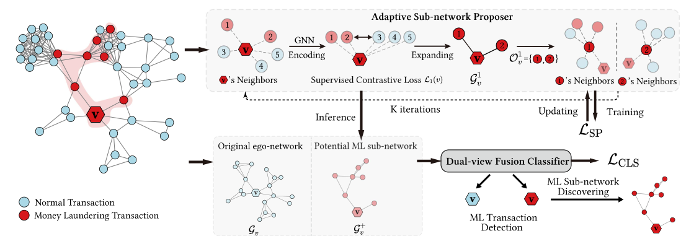

**그림 3: AMAP의 그림. 편의를 위해 거래 v에 대한 학습 및 추론 프로세스를 모두 설명합니다. 실제로 프레임워크는 배치 방식으로 학습하고 귀납적으로 추론할 수 있습니다. 적응형 서브 네트워크 제안자는 초기 노드에서 시작하여 서브 네트워크를 반복적으로 확장합니다. 확장 과정은 감독된 대비 손실에 의해 안내됩니다. 적응형 하위 네트워크 제안자를 훈련한 후 모듈은 잠재적인 ML 하위 네트워크 G+를 제안하는 데 사용됩니다.**

v 추론된 거래 v의 경우 v. 그런 다음 듀얼 뷰 융합 분류자는 잠재적인 ML 하위 네트워크와 원래 자아 네트워크를 모두 활용하여 거래 v를 식별합니다. v가 ML 거래으로 식별되면 G+ v는 v의 ML 하위 네트워크로 출력됩니다.

## 3 제안된 접근법

### 3.1 개요

AMAP의 전체 프레임워크는 그림 3에 나와 있습니다. 거래 네트워크를 입력으로 고려하여 적응형 하위 네트워크 제안자를 훈련하여 대규모 거래 네트워크에서 거래의 잠재적인 ML 하위 네트워크를 생성합니다. 그런 다음 거래를 식별하기 위해 적응형 하위 네트워크 제안자를 적용하여 분류 성능을 높이기 위해 듀얼 뷰 융합 분류기에 공급되는 잠재적인 ML 하위 네트워크를 얻습니다. AMAP가 ML 거래를 식별하는 경우 잠재적인 ML 하위 네트워크도 AMAP의 출력이 됩니다.

### 3.2 적응형 하위 네트워크 제안자

제안자 모듈은 대규모 거래 네트워크에서 특정 거래의 잠재적 핵심 하위 네트워크, 즉 자금세탁 하위 네트워크를 생성합니다. 이전 반복에서 만든 하위 그래프를 바탕으로 연결된 후보 노드를 탐색하고 의심 거래 노드를 반복적으로 확장합니다. 후보 집합의 자금세탁 거래와 정상 거래를 구별하기 위해, 이미 생성된 하위 그래프와 자금세탁 거래 노드는 임베딩 공간에서 가깝게 하고 정상 노드는 멀어지게 하는 지도 대조 손실을 사용합니다.

하위 네트워크 인코딩. 노드 v에 대해 (k−1)번째 반복에서 생성된 Gᵏ⁻¹ᵥ가 주어지면, 이 그래프에서 GNN을 실행해 노드 표현을 구합니다. m번째 GNN 계층의 전파와 최종 노드 표현은 다음과 같습니다.

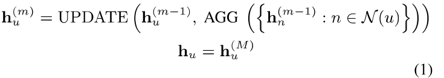

여기서 M은 적층한 GNN 계층 수이고 N은 이웃 함수입니다. 마지막 계층의 출력 hᵤ를 노드 u의 표현으로 사용하며, Gᵏ⁻¹ᵥ의 표현은 노드 표현을 READOUT 함수로 집계해 얻습니다.

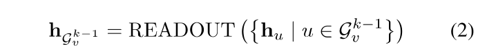

(k−1)번째 단계까지 하위 네트워크로 확장된 노드 집합을 Oᵏ⁻¹ᵥ라 하면, k번째 확장의 후보 집합은 그 노드들의 이웃 합집합입니다.

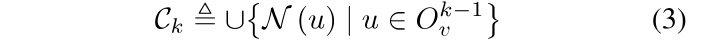

이미 생성된 하위 네트워크를 고려하면서 후보 집합 Cᵏᵥ의 자금세탁 거래와 정상 거래를 구별해야 합니다. Oᵏ⁻¹ᵥ의 각 노드 u에 대해 전역 정보와 지역 정보를 함께 담는 최종 표현을 다음과 같이 정의합니다.

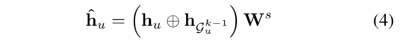

여기서 ⊕는 연결 연산이고 Wˢ는 투영 행렬입니다.

<!-- 원문 4쪽 -->

지도 대조 학습. k번째 단계에서 추가할 이웃에는 자금세탁 거래를 포함하고 정상 거래는 제외해야 합니다. 이를 위해 다음 지도 대조 손실을 사용합니다.

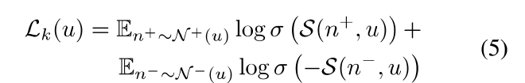

N⁺(u)와 N⁻(u)는 각각 자금세탁 거래 및 정상 거래에 해당하는 u의 이웃입니다. 어느 집합이 비어 있으면 해당 항은 계산하지 않습니다. 유사도 S(n, u)는 잠재 표현 공간에서 다음과 같이 코사인 유사도로 구현합니다.

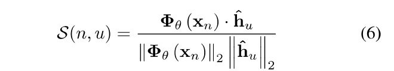

가상 노드를 이용한 적응형 임계값. 전역 임계값은 노드별 이웃 분포 차이를 반영하지 못합니다. 이에 학습 가능한 가상 임계값 노드(VTN)를 도입하여 자금세탁 거래와 정상 거래를 분리합니다. 식 (5)의 손실은 다음과 같이 바뀝니다.

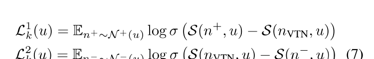

nVTN은 가상 임계값 노드입니다. 첫 번째 항은 자금세탁 이웃의 유사도가 가상 노드보다 높아지도록 하고, 두 번째 항은 정상 이웃의 유사도가 가상 노드보다 낮아지도록 합니다. 이로써 노드마다 개인화된 임계값을 학습할 수 있습니다.

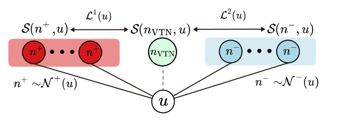

**그림 4: 적응형 임계값 손실의 개념도. 가상 임계값 노드가 자금세탁 거래 노드와 정상 노드를 분리합니다.**

학습. 적응형 하위 네트워크 제안자의 전체 손실은 K회 반복의 손실을 합산합니다.

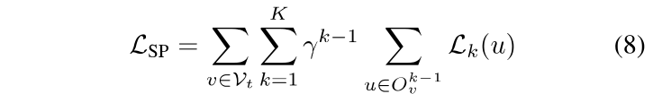

여기서 γ는 반복별 균형 매개변수이고 Vₜ는 학습 노드 집합입니다. 학습 단계에서는 정답 정보를 사용하여 각 반복의 하위 네트워크를 구성합니다. 클래스 불균형의 영향을 줄이기 위해 자금세탁 거래 노드와 같은 수의 정상 노드를 무작위로 뽑아 학습 집합을 구성합니다.

<!-- 원문 5쪽 -->

**알고리즘 1: 적응형 하위 네트워크 제안자**

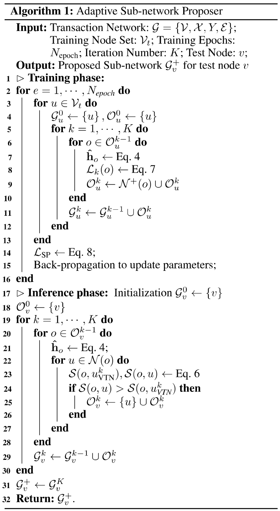

### 3.3 듀얼 뷰 융합 분류기

학습된 제안자는 거래 노드의 잠재적 자금세탁 하위 네트워크를 생성합니다. 그러나 라벨 오류 등으로 출력에 잡음이 생길 수 있으므로, 잠재적 하위 네트워크와 원래 네트워크의 정보를 결합하는 분류기를 추가합니다. 노드 v의 두 그래프 표현에 대한 중요도는 주의 메커니즘으로 학습합니다.

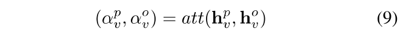

주의 메커니즘은 먼저 비선형 변환을 수행한 뒤 공유 주의 벡터 q로 각 뷰의 가중치를 계산합니다.

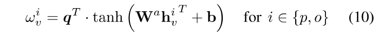

이 가중치를 소프트맥스로 정규화합니다.

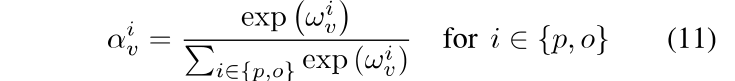

두 임베딩을 가중합하여 융합 임베딩 zᵥ를 얻습니다.

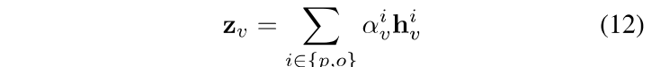

zᵥ를 노드 v의 최종 임베딩으로 사용하고, 자금세탁 거래 탐지를 노드 분류 문제로 모델링하여 교차 엔트로피 손실을 적용합니다.

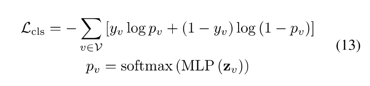

여기서 MLP는 노드 임베딩을 예측 점수로 변환하고 pᵥ는 노드 v가 자금세탁 거래일 확률입니다.

4 실험 이 섹션에서는 제안된 프레임워크 AMAP의 효율성에 대한 평가를 수행합니다. AMAP는 ML 거래 감지와 ML 하위 네트워크 검색이라는 두 가지 하위 작업을 동시에 처리합니다. 따라서 이 섹션에서는 두 하위 작업에 대한 AMAP를 별도로 평가합니다. 보다 구체적으로 우리는 다음과 같은 연구 질문에 답하는 것을 목표로 합니다.

- Q1: 실제 ML 거래 탐지 작업에 대한 최첨단 기준에 비해 우리의 전체 프레임워크는 어떻게 작동합니까? • Q2: 우리가 설계한 하위 네트워크 제안자가 ML 거래의 ML 하위 네트워크 검색을 효과적으로 수행할 수 있습니까? GNN 설명 방법과 같은 대체 방법과 어떻게 경쟁합니까? • Q3: AMAP의 설계된 메커니즘이 예상대로 효과적이고 작동합니까?

4.1 실험 설정 데이터셋 우리는 1 수십억 명 이상의 사용자에게 서비스를 제공하는 Ant Group에서 제공하는 온라인 결제 서비스인 Alipay의 실제 데이터셋를 사용합니다. M6(02/22/22 및 02/28/22 사이에서 발생하는 거래에서 샘플링)과 M12(02/22/22 사이에서 발생하는 거래에서 샘플링)라는 두 개의 하위 데이터셋를 추출합니다. 02/16/22 및 02/28/22). 거래 발신자/수신자 프로필, 거래 금액 등을 포함하여 각 거래에 대한 400 속성을 추출합니다. 데이터세트는 민감도를 낮추고 암호화되었으며 개인 식별 정보(PII)를 포함하지 않습니다. 데이터셋는 학술 연구에만 사용되며 실제 비즈니스 상황을 나타내지는 않습니다. 실험 중에는 데이터 사본 유출 위험을 방지하기 위해 적절한 데이터 보호가 수행되었으며, 실험 후 데이터셋는 파기되었습니다. 두 데이터셋 모두 03/02/22와 03/05/22 사이에서 발생하는 거래에 대한 모델 성능을 테스트합니다.

ML 거래 탐지에 대한 4.2 평가(Q1) ML 거래 탐지 기준 AMAP를 세 가지 범주의 기준과 비교합니다: 1) SVM(Chang and Lin 2011) 및 SVM을 포함한 특성 기반 방법

<!-- 원문 6쪽 -->

**표 1: M6 및 M12 데이터셋에 대한 비교 방법의 실험 결과(평균 ± 표준)**

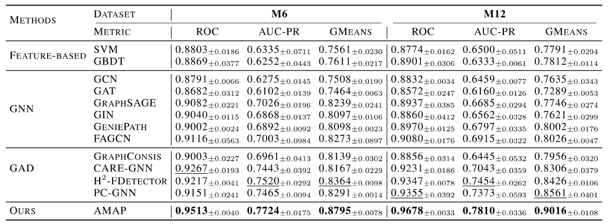

## 제안 방법 AMAP 0.9513±0.0040 0.7724±0.0175 0.8795±0.0078 0.9678±0.0033 0.7810±0.0336 0.9016±0.0108

GBDT(프리드먼 2001); 2) GCN(Kipf 및 Welling 2017), GraphSAGE(Hamilton, Ying, and Leskovec 2017), GAT(Veli¡ckovi´c 외 2018) GIN(Xu 외 2018)을 포함한 GNN 기반 모델 GeniePath(Liu et al. 2019) 및 FAGCN(Bo et al. 2021); 3) GraphConsis(Liu et al. 2020), CARE-GNN(Dou et al. 2020), PC-GNN(Liu et al. 2021b) 및 H2-FDetector(Shi et al. 2022)를 포함한 그래프 이상 탐지(GAD) 모델.

ML 하위 네트워크 검색 기준 ML 하위 네트워크 검색에 초점을 맞춘 기존 규칙 기반 방법은 도메인 지식(Dre˙zewski, Sepielak 및 Filipkowski 2015)에서 파생된 사전 정의된 규칙을 기반으로 구축되었습니다. 이는 데이터셋별로 크게 다르며 일반적인 비교 방법으로 사용할 수 없습니다. 그러나 ML 하위 네트워크 검색을 해결하는 대안으로 사용할 수 있는 두 가지 범주의 방법, 즉 GNN 설명 방법과 본질적으로 해석 가능한 GNN이 있습니다. GNN 설명 방법은 사후 설명 모델을 통해 GNN 모델 예측 결과에 대한 중요한 그래프 하위 구조를 식별합니다. 본질적으로 해석 가능한 GNN은 본질적으로 해석 가능한 모델 아키텍처를 설계하여 동일한 목표를 달성합니다. 본 논문에서는 우리의 방법을 GNNExplainer(Ying et al. 2019), PG-EXplainer(Luo et al. 2020) SubgraphX(Yuan et al. 2021) 및 ReFine(Wang et al. 2021)을 포함한 최첨단 GNN 설명 방법과 비교하며 본질적으로 해석 가능합니다. GAT 및 GSAT(Miao, Liu 및 Li 2022)를 포함한 GNN 방법.

구현 세부 사항 우리는 Sec에서 언급한 대로 적응형 하위 네트워크 제안자를 훈련하기 위해 과소 샘플링된 데이터셋를 사용합니다. 3.2. 그림 5(c)의 관찰에 따르면 M6과 M12 모두에 대해 반복 번호 K를 3로 설정했습니다. 그런 다음 듀얼 뷰 융합 분류기는 적응형 하위 네트워크 제안자의 출력으로 훈련됩니다.

평가 지표 ML 거래 탐지 데이터셋는 본질적으로 불균형하며 ML 거래이 소수에 속하지만 더 우려됩니다. 본 논문에서는 불균형 환경에서 널리 사용되는 AUC-ROC(ROC), AUC-PR 및 GMeans(Liu et al.

2021b; Shiet al. 2022). 모든 결과는 다양한 무작위 시드를 사용하여 10 번 테스트를 통해 평균화되었습니다.

유효성 결과 표 1는 실험 결과를 제시하며 다음과 같은 관찰을 할 수 있습니다. 전반적으로 AMAP는 ROC, AUC-PR 및 GMean에서 각각 평균 ​​3.02%↑, 3.74%↑ 및 6.08%↑개선을 통해 기준 방법의 결과보다 두 데이터셋의 모든 메트릭에 대한 성능을 일관되게 향상시킵니다. 기본 방법 중 그래프 이상 탐지 방법(CARE-GNN, PC-GNN 및 H2-FDetector)은 특성 기반 방법 및 GNN 기반 모델보다 성능이 뛰어납니다. 본 연구에서는 GAD 방법에 의한 이러한 개선이 변칙적인 이웃과 정상적인 직접 이웃을 구별하는 직관에 기인한다고 생각합니다. 표에서 강조 표시된 결과는 모든 GAD 비교 방법에 비해 지속적으로 이점을 유지하는 AMAP에서 나온 것입니다. 적응형 하위 네트워크 제안자의 잠재적인 ML 하위 네트워크는 AMAP에 다중 홉 ML 하위 네트워크의 기본 패턴에 대한 지식을 부여합니다.

ML 하위 네트워크 검색(Q2) 설정에 대한 4.3 평가 M6 데이터셋에 대한 기준선과 방법을 모두 훈련합니다. 테스트를 위해 03/02/22와 03/05/22 사이에서 발생하는 ML 거래에서 샘플링합니다. 각 ML 거래 v에 대해 3-hop 자아 그래프 G3을 구축합니다.

v. G3 v의 ML 거래은 정답으로 간주됩니다. 03/01/22에서 발생하는 ML 거래를 검증 세트로 수집합니다. 모든 방법에 대해 그리드 검색을 적용하여 최고의 검증 성능을 보관하는 자체 하이퍼 매개변수를 조정합니다.

평가 지표 우리는 설정에서 ML 하위 네트워크 검색을 이진 분류 문제로 공식화합니다. 그림으로. 2(c)는 ML 거래 v의 G3 v에서 대부분의 거래이 종종 양성일 수 있음을 나타냅니다. 따라서 우리는 모델의 성능을 평가하기 위해 F1 점수와 예측 정확도(ACC)를 보고합니다. 평균 F1 점수는 다음과 같은 평균 정밀도와 평균 재현율의 조화 평균으로 계산됩니다(Forman 및 Scholz 2010).

<!-- 원문 7쪽 -->

**표 2: ML 서브네트워크 검색에 대한 실험 결과(평균 ± 표준). OOT는 시간 초과를 나타냅니다.**

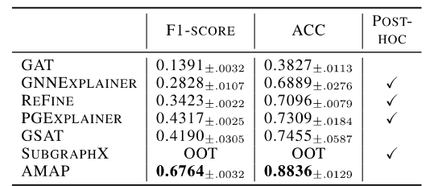

비교 방법에 따라 예측 결과가 다를 수 있으므로 테스트 ML 거래 세트를 다시 샘플링하고 공정한 비교를 위해 모든 모델 예측이 올바른 샘플만 보존합니다.

예측 결과를 제공하기 위해 임계값 β 또는 선택 비율 ρ를 사용하는 것이 설명 방법의 표준 방법이라는 점을 언급할 가치가 있습니다(Ying et al. 2019). β 또는 ρ의 선택은 성능에 매우 중요합니다. 검증 세트에서 최고의 F1 점수를 달성하는 임계값 β⋆또는 선택 비율 ρ⋆을 찾기 위해 그리드 검색을 적용하고 이러한 방법에 대해 β⋆또는 ρ⋆로 결과를 보고합니다. 본 연구에서는 다양한 무작위 시드를 사용하여 10 번 테스트에 대한 평균 결과를 보고합니다.

결과 비교 및 분석 표 2에서 볼 수 있듯이 우리의 방법은 기준선보다 큰 차이로 기준선보다 훨씬 뛰어납니다(F1 점수에서는 56.68%↑, ACC에서는 18.52%↑). 이는 ML 하위 네트워크 검색에 대한 적응형 네트워크 제안자의 효율성을 보여줍니다. 이러한 개선 사항은 명시적 ML 하위 네트워크 모델링(1)에 기인합니다. ML 하위 네트워크를 명시적 감독 정보로 사용함으로써 AMAP는 ML 하위 네트워크의 기본 패턴을 캡처할 수 있는 반면 기준 방법은 예측 결과에서 ML 하위 네트워크를 암시적으로 추론할 수 있습니다. 그러나 예측 모델이 노드가 ML 거래에 속한다고 결정하는 방식에 따라 불가지론적일 수 있습니다. 및 2) ML 거래 노드와 양성 노드 간의 대조 학습을 수행하면 AMAP가 ML과 양성 거래 간의 식별 정보를 더 효과적으로 계층화할 수 있습니다. 또한 그림 5에서 AMAP에서 발견한 ML 하위 네트워크 및 차점 방법의 시각화를 제공합니다. 본 연구에서는 AMAP가 준우승 방법보다 예제에서 거짓양성(false positive)의 수를 크게 줄이는 것을 관찰했습니다. 또한 AMAP는 초기 노드에서 반복적으로 확장되므로 연결된 ML 하위 네트워크를 생성하는 반면 차점 방법은 연결이 끊긴 결과를 제공할 수 있습니다.

### 4.4 절제 연구 (Q3)

본 연구에서는 두 가지 측면에서 절제 연구를 수행합니다. 첫째, 전역 임계값에 대한 가상 임계값 노드(Eq. (7))의 우월성입니다. 둘째, Dual-fusion 모듈의 효율성입니다.

- AMAP-NO-V: 가상 임계값 노드를 검증 세트에서 검색된 전역 임계값으로 대체합니다. Eq.의 손실 함수를 사용하여 적응형 하위 네트워크 제안자를 훈련합니다. (5) 가상 임계값 노드가 없습니다. • AMAP-NO-F: 주의 융합 모듈을 제거합니다.

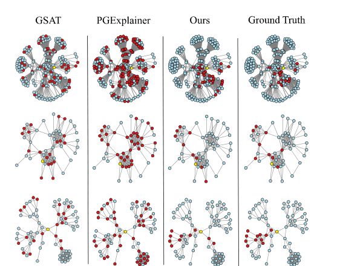

**그림 5: ML 하위 네트워크 검색 시각화. ()는 테스트 노드를 나타낸다.**

**표 3: M6에 대한 절제 연구. ML 거래 감지 및 ML 하위 네트워크 검색에 대한 측정항목을 보고합니다.**

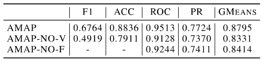

## AMAP 0.6764 0.8836 0.9513 0.7724 0.8795 AMAP-NO-V 0.4919 0.7911 0.9128 0.7370 0.8331 AMAP-NO-F - - 0.9244 0.7411 0.8414

식 (9)에 해당합니다. 이는 잠재적 자금세탁 하위 네트워크만 자금세탁 거래 탐지에 사용한다는 뜻입니다.

표 3에 표시된 것처럼 가상 임계값 노드를 전역 임계값으로 교체하면 ML 하위 네트워크 검색 성능이 크게 떨어집니다. 이는 가상 임계값 노드를 적용하면 전역 임계값 사용의 적응성 부족을 효과적으로 완화할 수 있음을 의미합니다. 또한 주의 융합 모듈을 제거하면 ML 거래 감지 성능이 저하됩니다. AMAP-NO-F가 표 1의 기본 방법과 비교하여 경쟁력 있는 결과를 산출한다는 점은 주목할 가치가 있습니다. 이는 적응형 하위 네트워크 제안자만 사용하면 ML 거래 감지 성능이 크게 향상됨을 나타냅니다.

## 5 결론

본 논문에서는 새로운 AML 프레임워크 AMAP를 제시합니다. 이는 ML 하위 네트워크 발견 문제에 신경망 기반 접근 방식을 사용한 최초의 작업입니다. 당사의 AMAP는 ML 거래를 대규모 양성 거래과 구별하고 ML 하위 네트워크의 멀티 홉 기본 패턴을 캡처하도록 특별히 설계되었습니다. 제안된 프레임워크는 실제 데이터셋에서 광범위하게 평가됩니다. 결과는 자금세탁 거래 탐지 및 자금세탁 하위 네트워크 발견 모두에서 AMAP의 효율성을 입증합니다. 본 연구에서는 이 작업이 더욱 강력한 AML 시스템에 대한 통찰력을 제공할 수 있기를 바랍니다.

<!-- 원문 8쪽 -->

감사의 글 이 작업은 Zhejiang NSF(LR22F020005), 중국 국가 핵심 연구 개발 프로젝트(2018AAA0101900) 및 중앙 대학을 위한 기초 연구 기금에 의해 부분적으로 지원되었습니다.

## 참고문헌

Bo, D.; Wang, X.; Shi, C.; and Shen, H. 2021. Beyond Lowfrequency Information in Graph Convolutional Networks. In AAAI. Chang, C.-C.; and Lin, C.-J. 2011. LIBSVM: A library for support vector machines. ACM Trans. Intell. Syst. Technol., 2: 27:1–27:27. Chen, Z.; Khoa, L. D.; Teoh, E. N.; Nazir, A.; Karuppiah, E. K.; and Lam, K. S. 2018. Machine Learning Techniques for Anti-Money Laundering (AML) Solutions in Suspicious Transaction Detection: A Review. Knowl. Inf. Syst., 57(2): 245–285. Deng, X.; Joseph, V. R.; Sudjianto, A.; and Wu, C. J. 2009. Active learning through sequential design, with applications to detection of money laundering. Journal of the American Statistical Association, 104(487): 969–981. Dou, Y.; Liu, Z.; Sun, L.; Deng, Y.; Peng, H.; and Yu, P. S. 2020. Enhancing Graph Neural Network-based Fraud Detectors against Camouflaged Fraudsters. In CIKM. Dre˙zewski, R.; Sepielak, J.; and Filipkowski, W. 2015. The application of social network analysis algorithms in a system supporting money laundering detection. Inf. Sci., 295: 18– 32. Force, F. A. T. 1999. What is money laundering. Policy Brief July 1999. Forman, G.; and Scholz, M. 2010. Apples-to-apples in cross-validation studies: pitfalls in classifier performance measurement. SIGKDD Explor., 12: 49–57. Friedman, J. H. 2001. Greedy function approximation: A gradient boosting machine. Annals of Statistics, 29: 1189– 1232. Hamilton, W. L.; Ying, Z.; and Leskovec, J. 2017. Inductive Representation Learning on Large Graphs. In NIPS. Khosla, P.; Teterwak, P.; Wang, C.; Sarna, A.; Tian, Y.; Isola, P.; Maschinot, A.; Liu, C.; and Krishnan, D. 2020. Supervised Contrastive Learning. In Larochelle, H.; Ranzato, M.; Hadsell, R.; Balcan, M.; and Lin, H., eds., Advances in Neural Information Processing Systems, volume 33, 18661– 18673. Curran Associates, Inc. Kingdon, J. 2004. AI fights money laundering. IEEE Intelligent Systems, 19(3): 87–89. Kipf, T. N.; and Welling, M. 2017. Semi-Supervised Classification with Graph Convolutional Networks. In ICLR. Kute, D. V.; Pradhan, B.; Shukla, N.; and Alamri, A. 2021. Deep Learning and Explainable Artificial Intelligence Techniques Applied for Detecting Money Laundering–A Critical Review. IEEE Access, 9: 82300–82317. Li, X.; Cao, X.; Qiu, X.; Zhao, J.; and Zheng, J. 2017. Intelligent Anti-Money Laundering Solution Based upon Novel

Community Detection in Massive Transaction Networks on Spark. 2017 Fifth International Conference on Advanced Cloud and Big Data (CBD), 176–181. Liu, Y.; Ao, X.; Qin, Z.; Chi, J.; Feng, J.; Yang, H.; and He, Q. 2021a. Pick and Choose: A GNN-Based Imbalanced Learning Approach for Fraud Detection. In WWW. Liu, Y.; Ao, X.; Qin, Z.; Chi, J.; Feng, J.; Yang, H.; and He, Q. 2021b. Pick and Choose: A GNN-based Imbalanced Learning Approach for Fraud Detection. In WWW. Liu, Z.; Chen, C.; Li, L.; Zhou, J.; Li, X.; Song, L.; and Qi, Y. 2019. GeniePath: Graph Neural Networks with Adaptive Receptive Paths. In AAAI. Liu, Z.; Dou, Y.; Yu, P. S.; Deng, Y.; and Peng, H. 2020. Alleviating the Inconsistency Problem of Applying Graph Neural Network to Fraud Detection. In SIGIR. Luo, D.; Cheng, W.; Xu, D.; Yu, W.; Zong, B.; Chen, H.; and Zhang, X. 2020. Parameterized Explainer for Graph Neural Network. In Larochelle, H.; Ranzato, M.; Hadsell, R.; Balcan, M. F.; and Lin, H., eds., Advances in Neural Information Processing Systems, volume 33, 19620–19631. Curran Associates, Inc. Miao, S.; Liu, M.; and Li, P. 2022. Interpretable and Generalizable Graph Learning via Stochastic Attention Mechanism. In ICML. Shi, F.; Cao, Y.; Shang, Y.; Zhou, Y.; Zhou, C.; and Wu, J. 2022. H2-FDetector: A GNN-based Fraud Detector with Homophilic and Heterophilic Connections. In WWW. Veliˇckovi´c, P.; Cucurull, G.; Casanova, A.; Romero, A.; Li`o, P.; and Bengio, Y. 2018. Graph Attention Networks. In ICLR. Wang, X.; Wu, Y.; Zhang, A.; He, X.; and Chua, T.-S. 2021. Towards Multi-Grained Explainability for Graph Neural Networks. In NeurIPS. Weber, M.; Domeniconi, G.; Chen, J.; Weidele, D. K. I.; Bellei, C.; Robinson, T.; and Leiserson, C. E. 2019. Anti- Money Laundering in Bitcoin: Experimenting with Graph Convolutional Networks for Financial Forensics. KDD Workshop on Anomaly Detection in Finance. Xu, K.; Hu, W.; Leskovec, J.; and Jegelka, S. 2018. How Powerful are Graph Neural Networks. In ICLR. Ying, Z.; Bourgeois, D.; You, J.; Zitnik, M.; and Leskovec, J. 2019. Gnnexplainer: Generating explanations for graph neural networks. In Advances in neural information processing systems, 9244–9255. Yuan, H.; Yu, H.; Wang, J.; Li, K.; and Ji, S. 2021. On Explainability of Graph Neural Networks via Subgraph Explorations. In ICML.
