# 자금세탁방지 시스템을 위한 지속적 그래프 학습의 발전: 종합적 검토

> **원문 제목:** Advances in Continual Graph Learning for Anti-Money Laundering Systems: A Comprehensive Review  
> **저자:** Bruno Deprez · Wei Wei · Wouter Verbeke · Bart Baesens · Kevin Mets · Tim Verdonck  
> **게재 정보:** WIREs Computational Statistics, 2025  
> **DOI:** [https://doi.org/10.1002/wics.70040](https://doi.org/10.1002/wics.70040)

> **번역 안내:** 본문과 부록은 문단 문맥을 기준으로 한국어로 옮겼습니다. 수식과 참고문헌은 정확성을 위해 원문 표기를 유지했습니다. 원문의 그림과 표는 개별 이미지로 잘라 해당 본문 위치에 바로 배치했습니다.

---

<!-- 원문 1쪽 -->

## 초록

금융 기관은 규정에 따라 자금세탁과 관련된 의심스러운 금융 거래를 보고해야 합니다. 따라서 그들은 방대한 양의 들어오고 나가는 거래를 지속적으로 모니터링해야 합니다. 자금세탁을 탐지할 때 특히 어려운 점은 자금세탁 행위자가 탐지를 회피하기 위해 지속적으로 전술을 조정한다는 것입니다. 따라서 탐지 방법에는 지속적인 미세 조정이 필요합니다. 기존 기계 학습 모델은 새로운 데이터에 대해 모델을 미세 조정할 때 치명적인 망각 문제를 겪게 되어 동적 환경에서 효율성이 제한됩니다. 지속적인 학습 방법은 모델이 사전 지식을 유지하면서 새로운 정보를 통합할 수 있도록 함으로써 이 문제를 해결하고 현재의 자금세탁방지(AML) 관행을 강화할 수 있습니다. 그러나 AML에 대한 지속적인 그래프 학습에 대한 연구는 여전히 부족합니다. 이 리뷰에서는 AML 애플리케이션에 대한 최첨단 연속 그래프 학습 접근 방식을 비판적으로 평가합니다. 본 연구에서는 그래프 신경망(GNN) 프레임워크 내에서 방법을 재생 기반, 정규화 기반 및 아키텍처 기반 전략으로 분류하고 다양한 하이퍼 매개변수의 효과를 보여주는 합성 및 실제 AML 데이터셋에 대한 심층적인 실험 평가를 제공합니다. 우리의 분석에 따르면 극심한 계층 불균형과 진화하는 사기 패턴에 직면하여 지속적인 학습이 모델 적응성과 견고성을 향상시키는 것으로 나타났습니다. 마지막으로, 주요 과제를 설명하고 향후 연구 방향을 제안합니다.

## 핵심어

지속적인 학습 · 자금세탁방지 · 그래프 신경망 · 사기 탐지 · 치명적인 망각

## 1 서론

범죄 기업 활동은 불법적인 출처로 인해 직접 사용할 수 없는 수입원을 창출합니다. 따라서 범죄자들은 ​​불법적으로 획득한 자금이 합법적인 것처럼 보이도록 돈을 세탁합니다. [25]. 유엔마약범죄사무소(UNOCD) [54]는 매년 전 세계 GDP의 약 2% ~ 5%에 해당하는 금액이 세탁되어 미화 2조 달러에 달하는 것으로 추정했습니다. 이 돈은 범죄 활동을 확대하고 테러 자금 조달 [25]에 사용되어 막대한 사회 경제적 압박을 초래합니다.

일반적으로 자금세탁 접근 방식에는 세 가지 주요 단계 [54, 25]가 포함됩니다. 배치하는 동안 불법 자금은 규제와 집행이 덜 엄격한 관할권에서 금융 시스템에 유입되는 경우가 많습니다. 계층화에는 여러 거래를 통해 불법 자금과 합법적으로 획득한 자금을 혼합하는 작업이 포함됩니다. 이로 인해 자금의 초기 출처가 모호해지고 불법 출처를 밝혀내기가 더 어려워집니다. 통합 시 돈은 합법적인 구매에 사용됩니다. *교신 작성자: bruno.deprez@kuleuven.be 자금세탁방지 시스템을 위한 연속 그래프 학습의 발전: 종합 검토가 이 마지막 단계를 완료하면 자금이 성공적으로 세탁됩니다. 실제 자금세탁 접근 방식에는 더 적거나 더 많은 단계가 포함될 수도 있습니다.

<!-- 원문 2쪽 -->

위에 제공된 프레임워크는 자금세탁에 여러 계정을 통한 많은 지불이 포함되어 네트워크 분석 [47]의 사용을 보장한다는 것을 보여줍니다. 네트워크 분석을 채택하는 인기 있는 방법은 그래프 신경망(GNN)을 이용하는 것입니다. GNN은 신용 카드 사기 탐지 [55, 57, 56], 보험 사기 탐지 [44, 11] 및 자금세탁방지 [10]를 채택하여 금융 범죄 [42] 퇴치에 대한 유망한 결과를 보여주었습니다. GNN은 네트워크 데이터 [42]에서 복잡한 비선형 패턴을 학습하여 사기 행위를 탐지할 수 있습니다.

금융 네트워크 및 사기 특성은 시간이 지남에 따라 진화하므로 새로운 데이터가 들어올 때 이러한 GNN을 미세 조정해야 합니다. 이러한 미세 조정으로 인해 모델이 [15, 8, 9]를 망각하는 치명적인 문제를 겪을 수 있습니다. 여기서 이전 데이터를 삭제하면서 새 데이터를 순차적으로 학습하면 이전 관찰에서 상당한 성능 손실이 발생합니다.

점진적 학습 또는 평생 학습으로도 알려진 지속적인 학습은 [16]의 치명적인 망각 문제를 완화하는 것을 목표로 합니다. 이 분야의 연구는 일반적으로 일반적인 딥 러닝 방법을 적용하거나 지식을 축적하고 통합할 수 있는 새로운 방법을 개발하는 것을 목표로 합니다. 지속적인 학습의 기초가 되는 주요 가정 중 하나는 모델이 훈련된 후에는 더 이상 데이터에 (완전히) 접근할 수 없다는 것입니다.

효과적이고 역동적인 자금세탁방지(AML)를 위해서는 지속적인 학습이 핵심입니다. 금융 기관은 지속적인 모니터링이 필요한 막대한 거래량에 직면하는 경우가 많습니다. 그러나 실제로 AML 방법을 구현할 때 계산상의 제약에 직면합니다. 첫째, AML 모델을 업데이트하기 위한 컴퓨팅 성능과 예산이 제한되어 있어 처음부터 정기적인 재교육이 불가능합니다. 둘째, 저장할 수 있는 데이터의 양과 기간에 대한 규제 제약이 있습니다. 마지막으로, 다른 유형의 사기와 마찬가지로 자금세탁 방법도 지속적으로 진화하고 있으므로 불법 거래의 분포는 시간이 지남에 따라 변화합니다. 그러나 이러한 새로운 전술을 탐지하기 위해 훈련할 때 모델은 이러한 전술이 다시 사용될 경우를 대비해 이전 전술에 대한 지식을 유지할 수 있어야 합니다. 그렇지 않으면 사기꾼은 탐지를 회피하기 위해 전술을 번갈아 가며 사용할 수 있습니다.

지속적인 학습은 이러한 제약 조건 하에서 잘 수행됩니다. 첫째, 기존 모델을 업데이트하므로 제한된 추가 교육이 필요합니다. 둘째, 최신 데이터만 사용하여 모델 업데이트를 수행할 수 있으므로 모든 과거 데이터를 무기한 저장할 필요가 없습니다. 마지막으로, 지속적인 학습은 새로운 데이터에서 학습할 때 이전 지식을 유지하도록 특별히 설계되었으므로 오래된 방식도 계속 감지되어야 합니다.

그럼에도 불구하고 AML에 대한 지속적인 그래프 학습에 대한 연구는 거의 없습니다. 더욱이 현재의 실험과 문헌 벤치마크에는 적용된 지속적인 학습 프레임워크의 근간이 되는 다양한 선택의 효과에 대한 심층적인 논의가 부족합니다. 따라서 본 연구에서는 다음과 같은 연구 질문에 답하고자 합니다.

RQ1 자금세탁방지를 위한 지속적인 그래프 학습에 관한 문헌의 현재 상태는 무엇입니까?

RQ2 GNN의 하이퍼파라미터와 지속적인 학습 방법이 성과와 망각에 미치는 영향은 무엇입니까?

RQ3 GNN의 깊이와 너비가 성능과 망각에 미치는 영향은 무엇입니까?

RQ4 자금세탁방지를 위한 치명적인 망각을 극복하는 데 가장 적합한 방법은 무엇입니까?

이러한 질문에 답하기 위해 우리는 AML에 대한 GNN에 대한 현재 연구, 금융 사기 탐지를 위한 지속적인 학습 및 관련 하이퍼 매개변수의 효과에 대한 이전 작업을 요약하는 심층적인 문헌 검토를 수행합니다. 이 문헌 검토는 두 개의 오픈 소스 데이터셋에서 AML 네트워크 방법의 성능과 망각을 분석하기 위한 광범위한 실험 연구로 보완됩니다. 따라서 우리 작업의 기여는 다음과 같습니다.

- 우리는 사기 탐지를 위한 지속적인 그래프 학습의 현재 최첨단 기술에 대한 심층적인 검토를 제시합니다.

- 에지 및 노드 분류를 위한 자금세탁방지에 대한 지속적인 그래프 학습의 의미를 소개하고 조사합니다.

- 두 개의 오픈 소스 AML 데이터셋에 대한 광범위한 실험 결과를 제시하고 다양한 선택이 성능에 미치는 영향을 분석합니다.

제시된 실험의 코드는 동료 연구원 및 실무자가 보고된 결과를 복제하고 확장할 수 있도록 github2에 공개적으로 제공됩니다.

본 논문의 나머지 부분은 다음과 같이 구성된다. 그래프, 그래프 신경망 및 연속 학습에 대한 예비 이론은 섹션 2에서 논의됩니다. 문헌 검토는 섹션 3에 제시되어 있습니다. 4 섹션은 5 섹션에 제공된 결과와 논의와 함께 실험 방법을 제시합니다. 6 섹션에서는 이 작업을 마무리하고 향후 연구 방향을 제시합니다.

2https://github.com/VerbekeLab 자금세탁방지 시스템을 위한 연속 그래프 학습의 발전: 종합적인 검토

<!-- 원문 3쪽 -->

## 2 사전 지식

### 2.1 그래프

그래프 G(V, E)는 두 세트 V와 E를 통해 정의됩니다. 세트 V = {v1,..., vn}은 그래프의 노드를 나타내고 집합 E ⊂V × V는 노드를 연결하는 간선을 나타냅니다. 노드 i와 j 사이의 간선을 eij로 표시합니다. 본 연구에서는 동종 네트워크를 고려합니다. 노드에는 특징 값이 포함된 벡터 xi ∈Rm가 할당된다고 가정합니다. 모든 특징 벡터를 포함하는 행렬은 X ∈Rn×m.로 표시됩니다.

### 2.2 그래프 신경망

그래프에 대한 딥러닝의 초기 아이디어는 Scarselli et al.에 의해 소개되었습니다. [50] 및 Scarselli et al. 메시지 전달을 기반으로 하는 [51]. 메시지 전달에 대한 아이디어는 여전히 GNN에 존재하며, 노드의 표현은 노드의 이웃을 기반으로 반복적으로 업데이트됩니다.

공식적으로 그래프 G(V, E)가 주어지면 그래프 신경망(GNN)은 h(l) i 로 표시되는 레이어 l의 노드 i 표현을 다음과 같이 구성합니다.

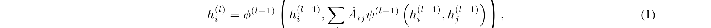

> **주:** ˆAijψ(l−1)

여기서 ψ(l) 및 ψ(l)은 레이어 종속 함수이고 ˆAij는 자체 루프를 포함한 정규화된 인접 행렬입니다. 대부분의 경우 초기 임베딩은 노드 특성 h(0) i = xi와 동일하게 설정됩니다.

가장 널리 채택되는 그래프 신경망은 Graph Convolutional Networks(GCN) [20], Graph SAmple 및 aggreGatE(GraphSAGE) [17], Graph ATtention network(GAT) [60] 및 Graph Isomorphism Networks(GIN) [67]입니다. Kipf와 Welling [20]가 도입한 GCN은 컨볼루션을 기반으로 동네 정보를 집계합니다. 해밀턴 등. [17]는 GraphSAGE를 유도 방식으로 도입하여 이 아이디어를 확장합니다. Velißockovic et al. [60]는 GAT를 사용하는 주의 메커니즘을 도입하여 네트워크에서 중요한 이웃과 덜 중요한 이웃을 구별할 수 있습니다. 마지막으로 Xu et al. [67]는 ​​Weisfeiler-Lehman 그래프 동형성 테스트를 사용하여 보다 다양한 버전의 GNN을 제공하는 GIN을 도입했습니다.

### 2.3 지속적인 학습

연속 학습에서 모델은 분리된 작업 T = {T1,..., TK} [21, 1]. 각 작업 Ti에는 특정 관찰이 제공되는 반면, 이전 작업의 데이터에 대한 액세스는 종종 제한되거나 금지됩니다. 각 작업에는 해당 특성 세트 Xi가 있고 작업별 레이블 yl ∈Yi,와 레이블 세트 Yi = {y1,..., yci}, 여기서 ci는 태스크 Ti의 클래스 수를 나타냅니다. 때로는 작업 데이터가 기본 분포인 DC와 함께 (X, Y, DC)로 제공되며 컨텍스트 세트 [9]라고도 하는 특정 가정이 이루어집니다.

사용 가능한 정보와 제공된 작업 형식에 따라 작업 증분, 도메인 증분, 클래스 증분 및 시간 증분 학습 [58, 22]의 네 가지 연속 학습 설정이 식별됩니다. 처음 세 개는 지속적인 학습 [58]에서 잘 확립되었습니다. 작업 증분 학습은 학습할 일련의 고유한 작업으로 구성되며, 여기서 모델은 테스트 중에도 현재 어떤 작업이 제시되는지 알고 있습니다. 도메인 증분 학습은 문제는 동일하지만 작업 분포가 바뀌는 시나리오를 설명합니다. 여기서는 테스트 시 작업에 대한 정보가 제공되지 않습니다. 클래스 단위 학습에서는 새로운 과제가 나올 때마다 점점 더 많은 클래스가 제공되지만 과제 정보는 제공되지 않습니다. 따라서 메소드는 제공된 현재 작업을 구별하는 방법도 학습할 수 있어야 합니다. 시간 증분 학습에는 데이터가 스트리밍 형식으로 제공되는 문제와 시간이 지남에 따라 분포가 바뀔 수 있는 문제가 포함됩니다. 일부 연구에서는 이를 별도의 설정 [22]로 간주하기도 하지만, domain-IL의 특정 사례로 볼 수도 있습니다.

치명적인 망각을 완화하기 위해 다양한 방법이 개발되었으며 크게 세 가지 범주, 즉 재생, 정규화 기반 및 매개변수 격리 [9]로 분류됩니다. 재생 방법은 새로운 작업을 훈련할 때 다시 방문할 수 있도록 실제 또는 합성의 일부 역사적 관찰을 보존합니다. 정규화 기반 방법은 휴리스틱을 사용하여 신경망의 중요한 가중치를 결정하고 새로운 작업을 학습할 때 이러한 가중치 변경에 더 많은 페널티를 적용합니다. 마지막으로 아키텍처 기반이라고도 하는 매개변수 격리는 특정 작업에 대해 업데이트할 특정 가중치를 예약합니다. 이는 네트워크의 일부를 동결하거나 새로운 작업을 위해 신경망을 확장하여 수행할 수 있습니다.

지속적인 학습 방법을 평가하기 위해 특정 평가 지표가 사용됩니다. 가장 널리 사용되는 것은 평균 정확도, 평균 망각 및 순방향 전송 [22, 1]입니다. 모든 과제를 학습한 후 성과를 평가합니다. 평균 정확도는 작업에 대한 정확도의 평균이고, 평균 망각은 정확도 저하를 평가합니다. 자금세탁방지 시스템을 위한 연속 그래프 학습의 발전: 종합적인 검토

<!-- 원문 4쪽 -->

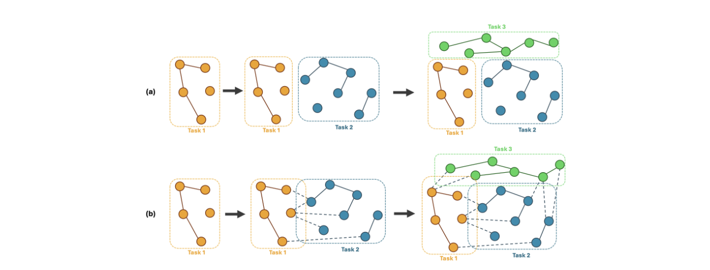

**그림 1: 노드 기반 학습을 위한 연속 그래프 학습의 두 가지 가정. 각 작업마다 별도의 네트워크가 제공되거나(a), 시간이 지남에 따라 네트워크가 확장됩니다(b).**

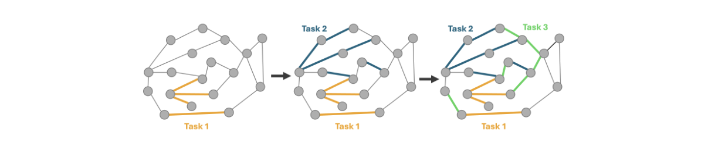

**그림 2: 네트워크는 고정되어 있지만 에지 레이블은 점차 알려지는 에지 기반 연속 학습의 시각화입니다.**

작업에 대해. 평균 망각은 해당 작업에 대해 훈련한 후의 작업 정확도를 모든 작업에 대해 학습한 후의 정확도와 비교합니다. 부정적 망각은 때때로 역전이(backward transfer)라고도 불립니다. 제로샷 학습이라고도 불리는 순방향 전송은 무작위 초기화 [35, 1]에 비해 이전 작업에 대해 훈련된 모델을 사용할 때 정확도가 증가하는 것입니다.

### 2.4 연속 그래프 학습

네트워크 데이터를 사용할 때 다양한 작업에 대한 관찰이 네트워크에서 연결될 수 있으므로 지속적인 그래프 학습을 위해 추가 고려 사항이 필요합니다. 결과적으로 이러한 작업 간 연결로 인해 현재 작업을 교육할 때 이전 작업의 정보를 계속 활용할 수 있습니다. 각 노드가 단 하나의 작업 [22]의 일부인 분류 문제를 가정해 보겠습니다. 작업 간 연결은 그림 1에 시각화된 것처럼 종종 두 가지 범주 중 하나에 속합니다.

첫 번째 범주는 각 작업이 이전 작업 [28, 22]의 노드에 대한 링크가 없는 독립적인 네트워크로 구성되어 작업 간 연결이 존재하지 않는 경우입니다. 이는 두 가지 이유로 발생할 수 있습니다. 첫째, 본질적으로 작업 간 연결이 없는 작업이 있습니다. 이는 그래프 분류 [8]의 경우인 경우가 많지만 작업의 모든 샘플이 별도의 네트워크인 경우에도 발생합니다. 둘째, 설계에 따라 별도의 작업이 발생할 수도 있으며, 여기서 작업 간 연결을 제거하여 네트워크에 추가 제한이 적용됩니다.

두 번째 유형의 상호 작용은 더 널리 퍼져 있으며 시간이 지남에 따라 성장하는 네트워크 [61, 74, 14, 68, 73, 78]를 포함합니다. 새로운 작업이 있을 때마다 새로운 노드가 네트워크에 추가됩니다. 새 작업의 일부 노드는 이전 작업의 노드에 연결되어 있습니다. 따라서 이전 작업에서 모든 데이터를 사용할 수 없다고 가정하면 특별한 주의가 필요합니다.

이 작업에서는 그림 2와 같이 네트워크가 고정되어 있지만 시간이 지남에 따라 레이블이 변경되는 연속 학습 설정도 평가합니다. 여기서 노드는 작업 간에 공유됩니다. 이는 클라이언트가 지속적으로 모니터링되는 실제 AML 설정과 밀접하게 일치합니다. 은행 고객은 은행에 몇 년 동안 계좌를 보유하고 있어야만 자금세탁을 시작할 수 있습니다.

<!-- 원문 5쪽 -->

자금세탁방지 시스템을 위한 연속 그래프 학습의 발전: 종합적인 검토

## 3 문헌 검토

지난 몇 년간 [10]는 아직 충분히 탐구되지 않았지만 심층 표현 학습은 AML에 대한 채택이 증가했습니다. 같은 맥락에서 연속 학습 분야는 성숙해졌으나 연속 그래프 학습 [73, 22]에 대한 관심은 적었습니다. RQ1에 답하기 위해 이 섹션에서는 해당 문헌의 개요를 제공합니다. 지속적인 학습에 관한 관련 문헌의 개요는 표 1에 나와 있습니다.

### 3.1 자금세탁방지를 위한 그래프 신경망

Alarabet al. [2]는 AML에 대한 의미 있는 네트워크 임베딩을 구성하기 위해 GCN [20]를 사용한 실험을 제시합니다. 임베딩과 원래 거래 특성을 결합하여 사례를 분류합니다. Loet al. [34]는 GIN [67]를 적용하고 Deep graph infomax를 사용하여 실제 네트워크의 임베딩과 손상된 네트워크의 임베딩을 비교하여 예측 노드 임베딩을 찾는 검사-L을 도입했습니다. GNN의 적용은 Jin et al.에 의해 확장되었습니다. [19]. 먼저, 추가적인 특징을 추출하기 위해 이종 상호작용 네트워크를 구축한다. 그런 다음 저자는 동종 네트워크에 GCN [20], GraphSAGE [17] 및 GIN [67]를 적용하여 이종 네트워크의 특성으로 보강된 네트워크 임베딩에 도달하여 최종 예측을 얻습니다.

자금세탁은 일반적으로 장기간에 걸쳐 발생하므로 연구에서는 GNN을 시공간적 환경으로 확장하는 것을 목표로 삼았습니다. 이는 시계열 분석을 위한 딥 러닝 방법에 입력되는 스냅샷에 임베딩을 구성하여 수행되는 경우가 많습니다. [66]의 작업은 GCN [20]에서 나오는 임베딩을 LSTM에 공급하는 반면, [72]는 다양한 스냅샷의 임베딩 벡터에 변환기 모델을 적용합니다.

또한 GNN은 AML 이상 탐지에 사용되었습니다. Cardosoet al. [7]는 네트워크의 노드 간 링크 예측을 위해 GAT [60]를 사용합니다. 이러한 예측은 네트워크의 실제 링크와 비교되어 의심 거래를 나타내는 이상 점수로 이어집니다.

### 3.2 연속(그래프) 학습 방법

전통적인 방식으로 신경망을 훈련(그래프)할 때 데이터가 동일하게 분포되어 있다고 가정하며 모델 [45]를 훈련하는 데 사용하기 전에 섞을 가능성이 있는 경우가 많습니다. 그러나 시간이 지남에 따라 데이터를 스트림으로 사용할 수 있게 되는 많은 실제 애플리케이션에서는 일반적으로 데이터가 동일하게 분산되지 않습니다. 학습해야 할 과제에 분포상의 변화가 있을 때 추가적인 어려움이 발생합니다. 이로 인해 [15, 39, 16]를 망각하는 치명적인 결과가 발생할 수 있으며, 새로운 정보로 모델을 업데이트하면 이전에 획득한 지식에 간섭이 발생하게 됩니다. 오래된 지식을 유지하는 동시에 새로운 정보를 처리하는 능력 간의 균형을 안정성-가소성 딜레마 [9, 77, 62]라고 합니다.

치명적인 망각을 완화하기 위해 도입된 지속적 학습은 이미지 분류 [31]에 주로 적용되었습니다. 예를 들어 고양이 대 개 등을 분류하기 위한 두 개의 이미지로 시작합니다. 그런 다음 모델이 자동차와 비행기 등을 구별할 수 있어야 하는 경우 클래스가 확장됩니다. 이 두 번째 작업을 학습할 때 모델은 고양이와 개를 구별하는 능력을 유지해야 합니다.

해당 필드의 출처를 고려하여 제안된 방법 중 다수는 이미지 분류 [48, 35, 21, 69, 29, 36, 9]에서도 평가됩니다. 가장 자주 사용되는 데이터셋는 MNIST, CIFAIS100 및 ImageNet이며 벤치마킹 연구 [9, 8, 58, 77]의 주요 데이터셋로도 사용됩니다.

지속적인 학습 방법은 재생, 정규화 기반 및 아키텍처 기반 [9, 31]의 세 가지 범주로 분류되는 반면 하이브리드 방법도 존재합니다.

재생 방법은 예시라고 불리는 이전 작업의 데이터 하위 집합을 유지하기 위해 메모리 버퍼에 의존합니다. 이러한 방법에서는 이전 데이터를 저장하는 데 리소스를 사용할 수 있다고 가정합니다. 재생은 강화 학습 [49]에서 나타났습니다. 단일 작업에 대한 더 나은 학습을 위해 과거 전환이 재생되는 반면 지속적인 학습의 재생은 작업 전반에 걸쳐 정보를 유지하는 데 사용됩니다. 규제와 관련하여 이러한 방법을 채택할 때는 주의를 기울여야 합니다. 개인 정보 보호 문제로 인해 모든 데이터를 무기한 저장하는 것은 허용되지 않습니다. 또한 이러한 방법은 메모리 [61]에 보관된 몇 가지 예시에 과도하게 적합할 수 있습니다.

순수한 재생 방법은 버퍼 크기 B만 지정하고 현재 작업의 B/k 관측값을 무작위로 할당하여 새 작업 중에 재생할 수 있습니다. 이 무작위 선택은 GEM [35]에서도 적용되어 예시 세트를 선택합니다. 반면에 iCarl [48]는 해당 작업의 평균 특징 벡터를 가장 잘 보존하는 예시를 선택하여 스마트 할당을 사용합니다.

또한 재생 데이터를 종합적으로 생성할 수도 있습니다. 이를 수행하는 한 가지 방법은 작업 IL 설정에서 LwF(Learning Without Forgetting) 방법에 대해 Li와 Hoiem [29]가 제안한 것입니다. 저자는 각 작업에 자체 출력 헤드가 있다고 가정합니다. 이전 작업에 대한 데이터를 사용할 수 없기 때문에 LwF는 현재 작업의 데이터를 가져와 이전 작업의 출력 헤드에 대해서도 예측합니다. 이는 이전 작업의 출력을 안정적으로 유지하기 위해 훈련 중에 출력을 비교하는 이전 작업에 대한 새로운 '실측 진실'을 제공합니다.

<!-- 원문 6쪽 -->

자금세탁방지 시스템을 위한 지속적인 그래프 학습의 발전: 종합적인 검토 재생 방법도 그래프 학습으로 확장되었습니다. Zhou와 Cao [78]는 표본 선택 특성의 평균을 사용하고 평균 임베딩, 적용 범위 최대화 및 영향 최대화를 기반으로 표본을 선택하여 그래프 데이터로 확장합니다. 왕 외. [61]는 먼저 네트워크를 클러스터로 나눈 다음 중요도 측정 기준에 따라 각 클러스터 내에서 노드를 선택하는 2단계 샘플링 접근 방식을 사용합니다.

클래스 IL 설정의 경우 Liu et al. [33]는 먼저 노드의 하위 집합을 무작위로 선택한 다음 구조 없는 그래프 압축 방법 [76]를 사용하여 입력 노드 특성을 가중치로 훈련하여 노드 하위 집합의 잠재 특성의 평균을 정렬하는 CaT를 제안합니다.

정규화 기반 방법은 (그래프) 신경망의 가중치 업데이트를 제한합니다. 어떤 중량이 얼마나 변경될 수 있는지 결정하면 모델 [45]의 안정성과 가소성 사이의 균형이 유지됩니다.

정규화 기반 방법은 종종 이전 작업에 중요한 가중치를 포착하고 변경 가능한 정도를 제한합니다. 이는 손실 함수에 추가 항을 도입하여 수행됩니다. EWC [21]는 Fisher 정보 매트릭스의 요소를 사용하여 이전 작업에 중요한 가중치를 표현합니다. Zenke 등이 언급한 바와 같이. [69], EWC는 Fisher 정보 매트릭스의 대각선 요소를 사용하여 중요도에 대한 점 추정만 수행합니다. 그들은 훈련 과정 전반에 걸쳐 가중치의 중요성이 지속적으로 계산되는 SI [69]를 제시했습니다.

반면 MAS [3]는 학습 함수 출력의 제곱된 l2-norm의 기울기를 기반으로 하므로 레이블이 없는 데이터에도 적용할 수 있습니다. 모든 레이어가 ReLU 활성화 함수를 사용하는 경우 중요도 계산이 단순화됩니다.

가중치를 업데이트하기 전에 기울기를 변경하여 정규화에 접근할 수도 있습니다. GEM의 예제를 사용하여 Lopez-Paz 및 Ranzato [35]는 이전 작업의 그라데이션 범위에 그라데이션을 투영합니다. 저자는 이것이 새 작업의 가중치를 업데이트할 때 이전 작업의 손실을 증가시키지 않는다고 주장합니다.

Liu et al. [32]는 TWP를 사용하여 정규화를 네트워크 데이터로 확장합니다. 두 가지 중요도 점수, 즉 EWC와 유사한 작업 관련 점수와 GAT(Graph Attention Network) [60]의 주의 메커니즘을 기반으로 하는 토폴로지 관련 점수가 포함됩니다. 마찬가지로, 표본에 대한 과적합 문제를 완화하기 위해 Wang et al. [61]는 EWC와 동일한 아이디어를 GNN에 적용합니다. 저자는 Fisher 정보 매트릭스의 대각선 요소를 사용하여 GNN의 중요한 가중치 업데이트를 정규화합니다.

아키텍처 기반 방법은 이름에서 알 수 있듯이 작업에 따라 (그래프) 신경망의 아키텍처를 변경합니다. 특정 매개변수를 격리하여 미세 조정하거나 아키텍처 자체를 새로운 클래스에 맞게 확장할 수 있습니다(예: 각 작업 [29]에 대해 별도의 출력 헤드를 가짐). 여기에서는 현재 작업에 대한 지식이 제공되어야 합니다. 일부 방법에서는 총 작업 수가 미리 알려져 있다고 가정합니다. 이로 인해 실제로 채택이 제한됩니다. van de Venet al. [58]에서는 각 작업을 학습하기 위해 완전히 별도의 출력 레이어 또는 네트워크를 사용한다고 언급합니다. task-IL 설정에서 Li와 ​​Hoiem [29]는 각각의 새 작업에 대해 새 출력 계층을 초기화합니다. 다른 방법으로는 게이팅(Gating)을 사용하는 방법이 있습니다. XdG [38]는 다양한 작업에 대해 훈련된 네트워크의 대부분 겹치지 않는 부분을 드물게 연결하기 위해 상황에 따른 게이팅 신호를 도입했습니다.

게이팅과 유사하게 PackNet [36] 및 피기백 [37]는 작업별 마스크를 적용하여 신경망의 일부 가중치를 0와 동일하게 설정합니다. 작업을 학습할 때 Mallya와 Lazebnik [36]는 네트워크를 훈련한 다음 정리합니다. 그런 다음 나머지 가중치는 더 짧은 두 번째 훈련 라운드에서 미세 조정됩니다. 이러한 가중치는 고정되어 있으며 정리된 가중치는 다음 작업에 사용할 수 있습니다. 가장 큰 단점은 다음 작업에 대한 교육에 사용할 수 있는 용량이 적다는 것입니다. 즉, PackNet은 제한된 수의 작업만 학습할 수 있습니다. 이는 Mallya et al.의 연구에서 완화되었습니다. [37]. 여기서는 네트워크 가중치가 고정되고 작업별 마스크가 학습됩니다. 저자는 그라디언트 기반 학습을 사용하여 실수 값 마스크를 얻은 다음 고정 임계값을 사용하여 이진 마스크로 변환합니다. 여기서 가장 큰 단점은 어떤 작업이 고려되는지 알아야 한다는 점 외에 피기백에는 사전 훈련된 네트워크가 필요하다는 것입니다. 피기백의 성능은 이 사전 훈련 단계 [37]에 크게 의존하며 애플리케이션에 따라 사용하지 못할 수도 있습니다.

### 3.3 금융 사기에 대한 지속적인 학습

실제로 사기 탐지를 구현할 때 이 방법은 수백만 건의 거래를 지속적으로 모니터링해야 하며 이로 인해 세 가지 주요 과제가 발생합니다. 첫 번째는 사기 행위가 끊임없이 진화하고 있다는 점을 고려할 때 [5, 59], AML 모델을 업데이트하여 새로운 방식을 포착해야 한다는 것입니다. 두 번째는 계산 자원의 제약입니다. 거래량이 많기 때문에 제한된 시간과 리소스를 고려할 때 처음부터 모델을 재교육하는 것이 항상 가능하지는 않습니다. 세 번째 과제는 이전에 적용한 사기 전술에 대한 지식을 유지하려는 욕구에서 비롯됩니다. 그렇지 않으면 세탁자가 탐지를 피하기 위해 이전 작업 방식으로 되돌아갈 수 있기 때문입니다. 그러나 자금세탁방지 시스템을 위한 연속 그래프 학습의 발전을 미세 조정할 때: 종합적인 검토

<!-- 원문 7쪽 -->

**표 1: 연속(그래프) 학습에 관한 주요 문헌을 요약한 표입니다.**

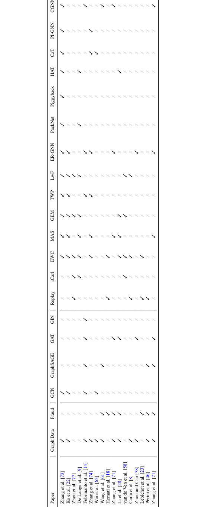

<!-- 원문 8쪽 -->

자금세탁방지 시스템을 위한 지속적인 그래프 학습의 발전: 종합적인 검토 모델에서 이러한 전략이 사용 가능한 최신 데이터에 적용되지 않으면 이 정보가 손실되어 [15, 39, 16]를 망각하는 치명적인 결과를 초래합니다.

지속적인 학습을 사용하여 이러한 과제를 완화할 수 있지만 사기 탐지를 위한 지속적인 학습 채택에 대한 연구는 거의 없습니다. 지속적인 학습에 관한 연구는 주로 이미지 인식 [31]와 관련이 있습니다. 사기 탐지를 핵심 문제 [18, 71, 23, 28]로 제시하는 연구는 거의 없습니다. 연속 학습 방법이 적용된 많은 데이터셋 중 하나로만 나타나는 경우가 많습니다. [61, 46, 22].

Lebichotet al. [23]는 신용카드 사기 탐지를 위한 치명적인 망각을 최초로 정량화한 제품 중 하나입니다. 그들은 모델을 미세 조정하기 위해 다양한 재생 전략과 EWC를 테스트했습니다. 그들의 경우에는 새로운 데이터에 대해 모델을 미세 조정하는 것이 망각을 피하는 데 가장 좋은 것 같았습니다.

Hematiet al. [18]는 금융 결제 기록 감사를 위해 순차적 미세 조정, EWC 및 경험 재생이라는 세 가지 전략을 적용했습니다. 그들은 이상 탐지를 위해 자동 인코더를 훈련시켰고 지속적인 학습이 분포 변화를 탐지하는 능력을 가지고 있음을 입증했습니다.

Zhang et al. [71]는 의료보험 사기 탐지에 POCL이라는 새로운 방법을 도입하고 적용했습니다. 저자는 GNN의 가중치를 업데이트하기 위해 Temporal MAS를 사용합니다.

Li et al. [28]는 HTG-CFD를 도입하여 연속 그래프 학습을 이종 네트워크에 대한 사례 연구로 확장했습니다. 평균 속성을 사용하여 프로토타입을 구성하고 EWC에서 영감을 받은 Fisher 정보를 사용하여 정규화를 수행하는 재생 및 정규화 기반 방법을 적용합니다. HTG-CFD는 무역 네트워크에서 사기 거래를 탐지하기 위해 여러 지역에 걸쳐 사기 탐지 모델을 전송하도록 구성되었습니다.

ContinualGNN [61]는 스트리밍 그래프를 통해 시간이 지남에 따라 새로운 패턴을 발견하도록 개발되었습니다. 저자는 Elliptic 데이터셋에서 자신의 방법을 테스트했습니다. ContinualGNN이 가장 좋은 성능을 발휘하지는 못했지만 이 방법은 경쟁력 있는 성능을 가지고 있습니다. 이 방법의 주요 강점은 새로운 데이터로 GNN을 완전히 재교육하는 것에 비해 교육 시간이 크게 단축된다는 것입니다.

### 3.4 지속적인(그래프) 학습의 벤치마크 및 평가

De Langeet al. [9]는 최초로 광범위한 벤치마크 연구를 수행한 제품 중 하나입니다. 전통적인 연속 학습에서는 작업 증분 학습에만 초점을 맞추면서 방법과 데이터셋 측면에서 포괄적인 벤치마크를 구현합니다. 이러한 데이터셋에는 모두 이미지 분류가 포함됩니다. 그들은 아키텍처 기반 방법, 특히 PackNet [36]가 가장 잘 수행되고 메모리 재생이 그 뒤를 이었다는 결론을 내렸습니다. 그러나 메모리 재생에 비해 아키텍처 기반 방법은 원시 데이터를 저장할 필요가 없기 때문에 개인 정보 보호 문제가 발생하지 않습니다.

연속 그래프 학습에 대한 최초의 벤치마크 연구 중 하나는 Carta et al.에 의해 발표되었습니다. [8]. 본 연구에서는 그래프 분류만 고려하므로 노드 수준에서는 테스트가 수행되지 않습니다. 이는 입문용 벤치마크 실험으로 제시되며 범위가 상당히 제한되어 있습니다. 여기에는 세 가지 데이터셋와 세 가지 지속적인 학습 전략이 포함됩니다. 이들은 순진한 재생, EWC [21] 및 LwF [29]입니다. 따라서 이 문서는 네트워크에 대한 벤치마크로 작성되었지만 네트워크용으로 특별히 개발된 전략은 테스트되지 않았습니다.

연속 그래프 학습에 대한 두 가지 주목할만한 벤치마크 연구는 Zhang et al의 CGLB(Continual Graph Learning Benchmark)입니다. Ko et al.의 [73] 및 벤치마킹 그래프 연속 학습(BeGin) [22]는 둘 다 재현을 용이하게 하기 위해 전체 코드 제품군을 제공합니다. Zhang et al.이 비교한 초기 방법. [73]는 EWC [21], MAS [3], GEM [35], TWP [32], LwF [29] 및 ER-GNN [78]입니다. CGLB는 작업 IL과 클래스 IL에서 연속 그래프 학습을 분할하고 노드 수준 및 그래프 수준 예측을 위한 실험을 제공합니다.

BeGin [22]는 보다 광범위한 벤치마크를 구현합니다. 작업 IL, 클래스 IL, 도메인 IL 및 시간 IL을 고려하여 증분 설정을 세밀하게 구분합니다. 이러한 설정은 이전에 소개된 노드 수준 및 그래프 수준 예측 외에 링크 수준 예측에도 도입되었습니다. 지속적인 학습 방법도 확장됩니다. CGLB와 비교된 방법 외에도 BeGin에는 PackNet [36], Piggyback [37], HAT [52], CaT [33], PI-GNN [70] 및 CGNN [61]가 포함되어 있습니다.

두 벤치마크 모두 다양한 방법의 성능을 분석하지만 하이퍼파라미터의 영향에는 덜 주의를 기울입니다. CGLB와 BeGin의 주요 단점 중 하나는 모든 실험이 백본 GNN인 GCN [20]로만 수행된다는 것입니다.

### 3.5 하이퍼파라미터에 대한 민감도

모든 모델의 기본은 모델 성능에 영향을 미치는 하이퍼파라미터 선택 모음입니다. 이는 하이퍼파라미터 튜닝에서 간략하게만 언급되는 경우가 많으며, 가장 좋은 경우에는 논문에서 제한된 파라미터 민감도 테스트를 적용합니다. 이 연구에서는 하이퍼파라미터의 효과를 명시적으로 설명합니다.

<!-- 원문 9쪽 -->

자금세탁방지 시스템을 위한 연속 그래프 학습의 발전: 종합적인 검토

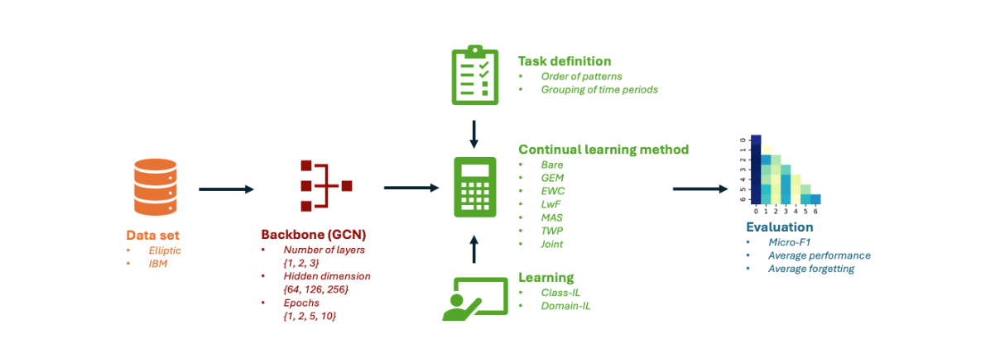

**그림 3: 실험 파이프라인의 시각화 및 평가를 위한 하이퍼파라미터 선택.**

핵심 선택은 백본 GNN 모델입니다. 문헌에서 Yuan et al이 지적한 바와 같이 GCN [20] 및 GAT [60]는 널리 사용되는 백본입니다. [68] 및 표 1의 관찰을 통해 확증되었습니다. 대부분의 연속 그래프 학습 방법은 백본에 구애받지 않도록 구성됩니다. 주목할만한 예외 중 하나는 GAT를 염두에 두고 특별히 개발된 TWP [32]입니다. 그러나 저자는 주의 메커니즘이 없는 경우를 대비해 프록시를 제공합니다.

백본 GNN 자체의 아키텍처(히든 레이어의 깊이와 너비 측면 모두)도 캡처할 수 있는 거래 체인의 학습 용량과 길이에 영향을 미치기 때문에 중요합니다. 그러나 이러한 선택의 구체적인 영향은 문헌에서 많은 관심을 받지 못했습니다. De Lange et al.의 일반적인 연속 학습에 관한 연구. [9] 및 Mirzadeh et al. [40]는 넓고 얕은 모델이 일반적으로 더 나은 성능을 발휘한다는 것을 보여주었습니다. 그러나 지속적인 그래프 학습으로 전환할 때 Wei et al. [64]는 스켈레톤 기반 동작 인식의 경우 이것이 항상 유지되는 것은 아니라는 것을 보여주었습니다.

백본 옆에 있는 또 다른 가져오기 선택은 작업 정의입니다. 인간의 학습을 고려할 때, 지속적인 학습을 위해서는 작업 순서가 중요하다고 가정됩니다. Bengio 등이 만든 커리큘럼 학습. [6]는 작업을 난이도의 오름차순으로 학습하면 지식을 최적으로 획득할 수 있다고 판단합니다.

이전 작업에서는 연속 학습에서 작업 순서 민감도 분석을 수행했습니다. De Langeet al. [9]는 Nguyen et al.의 초기 작업을 확증했습니다. [43]는 일반적인 연속 학습 설정에서 방법이 순서에 구애받지 않는 동작을 나타낸다는 것을 보여줍니다. 저자는 쉬운 것부터 어려운 것, 어려운 것부터 쉬운 것, 무작위 작업 순서 등 다양한 설정을 테스트합니다.

반면에 Mallya와 Lazebnik [36]의 작업에서는 PackNet 방법의 경우 순서가 중요하다는 것을 보여주었습니다. 그들은 가장 어려운 것부터 쉬운 것까지 학습 과제가 실제로 더 나은 결과를 가져온다는 것을 발견했습니다. 그러나 이 결과는 방법별로 다르기 때문에 일반화할 수 없습니다. 각 작업마다 사용 가능한 무료 매개변수가 감소함에 따라 새로운 정보를 통합하는 PackNet의 용량이 감소합니다.

연속 그래프 학습 분야에서는 Zhao et al. [75]는 다중 레이블 연속 그래프 학습을 위해 현실 세계에서 무작위 클래스 출현을 시뮬레이션하기 위해 무작위로 생성된 클래스 출현 순서를 도입했습니다. Weiet al. [64]는 골격 기반 동작 인식을 위한 연속 그래프 학습의 맥락에서 작업 순서 및 클래스 순서 민감도를 평가하는 데 중점을 두었습니다. 저자는 작업 순서 견고성이 반드시 클래스 순서 견고성을 의미하지는 않는다는 것을 보여줍니다.

## 4 방법론

연구 질문에 답하기 위해 우리는 다양한 하이퍼파라미터(RQ2), GNN 아키텍처(RQ3) 및 지속적인 학습 방법(RQ4)을 변경하여 성능과 망각에 미치는 영향을 확인하는 파이프라인을 설정했습니다. 그림 3는 하이퍼파라미터의 값을 포함하여 실험의 전체 파이프라인을 보여줍니다.

본 논문에 제시된 실험은 Ko et al.에 의해 소개된 BeGin 프레임워크의 확장입니다. [22]. 확장 저장소는 github3에서 사용할 수 있습니다.

3https://github.com/VerbekeLab 자금세탁방지 시스템을 위한 연속 그래프 학습의 발전: 종합적인 검토

<!-- 원문 10쪽 -->

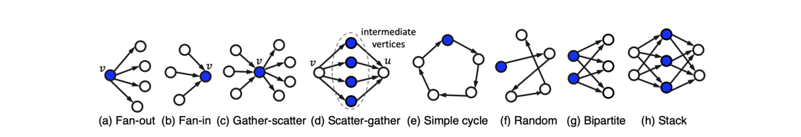

**그림 4: Altman et al.이 정의한 다양한 자금세탁 패턴 [4].**

패턴 유형 거래 팬아웃 342 팬인 318 수집-분산 716 분산-수집 626 주기 287 무작위 191 이분형 263 스택 466 분류되지 않음 1 968 총 자금세탁 5 177 총 거래 수 5 078 345 표 2: HI-Small 데이터셋에 대한 다양한 유형의 자금세탁 거래 패턴 분포.

### 4.1 데이터

AML [10]에서 널리 사용되는 실험에는 두 개의 데이터셋, 즉 IBM AML 데이터셋 [4]와 Elliptic 데이터셋 [13, 63]가 사용되었습니다. 아래에서 설명하는 것처럼 이 작업은 AML를 IBM(에지 분류) 문제와 노드 분류(타원) 문제로 제시합니다.

IBM AML 데이터셋 [4]에는 합성 거래 데이터가 포함되어 있습니다. 시뮬레이션은 가상 다중에이전트 가상 세계를 통해 수행됩니다. 이러한 대리인은 은행, 개인 또는 회사일 수 있으며 개인과 회사가 지불합니다. 이 가상 세계에서는 일부 에이전트가 악의적이라고 합니다. 해당 에이전트의 경우 시뮬레이션에는 자금세탁 거래가 포함됩니다. Altmanet al. [4]는 그림 4에 표시된 대로 팬인(fan-in), 팬아웃(fan-out), 이분형(bipartite), 스택(stack), 랜덤(random), 순환(scatter-gather), 수집-분산(gather-scatter) 등 8가지 자금세탁 패턴을 모델링합니다.

에이전트를 노드로, 거래를 에지로 사용하여 평가에 사용할 HI-Small 데이터셋를 선택합니다. 그 결과 515 080 노드와 5 078 345 에지가 있는 네트워크가 생성됩니다. 이 데이터셋에 대해 가장자리 분류를 수행합니다. 대부분의 사기 데이터셋와 마찬가지로 클래스 분포는 매우 불균형하며 자금세탁과 관련된 거래의 0.1%만 포함됩니다. 그러나 대부분의 자금세탁 거래는 특정 패턴으로 분류되지 않습니다. 표 2는 클래스 레이블 분포에 대한 자세한 보기를 제공합니다. 본 연구에서는 분류되지 않은 라벨을 구성하는 특정 패턴을 제어할 수 없기 때문에 실험에서 분류되지 않은 라벨을 삭제할 것입니다. 이는 특정 패턴이 [4, 12]로 분류될 때 다른 연구에서도 관찰되는 관행이기도 합니다.

Elliptic 데이터셋 [13, 63]에는 49 다양한 시간 간격으로 그룹화된 실제 비트코인 ​​거래가 포함되어 있습니다. 네트워크는 20 3769 노드와 234 355 에지로 구성됩니다. 여기서 노드는 거래를 나타내고 에지는 첫 번째 거래의 수신자가 두 번째 거래의 발신자임을 나타냅니다. 이 데이터셋에 대해 노드 분류를 수행합니다. 데이터셋에는 166 사전 계산된 수치 특성(94 거래별 특성 및 노드의 이웃을 요약하는 72 집계 특성)이 포함됩니다. 데이터에는 4 545 불법 거래(2%)만 포함되어 있어 레이블 분포가 매우 불균형해집니다. 이러한 라벨은 특별히 자금세탁과 관련이 없지만 AML 문헌 [63, 10, 2, 66, 41, 53, 26, 30]에서 널리 채택되어 이전 실험 결과와의 비교를 용이하게 하므로 이 데이터셋를 사용합니다.

또한 Elliptic 데이터셋는 지속적인 학습 [46, 61]에 적합한 사례 연구를 제공합니다. Weber et al. [63], 43 시간 단계에서 암시장이 갑자기 폐쇄되었습니다. 이로 인해 불법 사례의 특징 분포가 갑자기 바뀌기 때문에 모든 방법의 성능이 저하되었습니다. 실제 데이터셋의 이러한 갑작스러운 변화는 지속적인 학습 방법에 대한 더 깊은 이해를 얻는 데 이상적입니다.

<!-- 원문 11쪽 -->

자금세탁방지 시스템을 위한 연속 그래프 학습의 발전: 종합적인 검토

### 4.2 백본 그래프 신경망

이전 벤치마크 [73, 22]에 따라 GCN [20]를 백본으로 사용합니다. GCN 계층별 전파는 전체 네트워크에 대해 동시에 다음과 같이 정의됩니다.

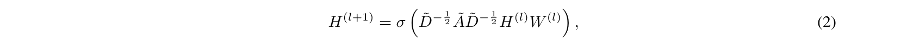

σ는 활성화 함수이고, W(l)는 계층별 훈련 가능한 가중치입니다. 현재 BeGin [22]에 구현된 유일한 백본이기 때문에 이 연구를 GCN으로 제한합니다. 다른 인기 있는 백본으로는 GraphSAGE 및 GAT가 있을 수 있지만 BeGin의 광범위한 확장은 이 작업의 범위를 벗어납니다. 또한 GAT에는 학습해야 할 매개변수가 더 많아 계산 시간이 크게 늘어납니다.

백본의 주요 선택은 레이어 [9, 40, 64]의 깊이와 너비입니다. 레이어 수는 1부터 3까지 다양합니다. 여기서는 트레이드오프(trade-off)가 이루어져야 합니다. 한편, 자금세탁 패턴에는 네트워크에서 몇 홉 떨어진 노드가 포함되는 경우가 많으며, 이 정보를 캡처하려면 더 많은 레이어가 필요합니다. 반면에 GNN에 레이어가 너무 많으면 [27]가 과도하게 스무딩되어 모델의 예측력이 낮아집니다. GCN의 모든 숨겨진 레이어에 대한 차원은 동일합니다. 본 연구에서는 세 가지 값, 즉 64, 128 및 256를 테스트합니다.

또 다른 선택은 1, 2, 5 및 10로 설정한 작업당 에포크 수와 관련이 있습니다. 모델이 단일 작업을 훈련하는 데 더 많은 시간을 제공할수록 가중치가 변경되고 이전 지식이 손실될 가능성이 높아집니다. 반면에 사용되는 Epoch가 적을수록 모델이 현재 작업에 대한 성능을 학습하고 개선하는 것이 더 어려워집니다.

GCN의 일부 하이퍼파라미터가 수정되었습니다. 모든 실험에서는 학습률이 0.001이고 가중치 감소 및 교차 엔트로피 손실이 없는 Adam 최적화 프로그램을 사용합니다. GCN의 활성화 함수는 ReLU이고 드롭아웃 비율은 0.5로 설정됩니다.

### 4.3 작업 정의

타원 데이터셋에는 사기/비사기 라벨이 포함되어 있으므로 이진 분류를 적용합니다. 각 시간 단계를 개별 작업으로 취하여 49 작업을 수행할 수 있습니다. 이렇게 많은 작업이 지속적인 학습 방법에 문제를 일으킬 수 있으므로 작업별로 서로 다른 시간 단계를 그룹화합니다. 따라서 우리는 작업당 7개의 시간 단계를 갖기로 선택했습니다. 후자는 각 작업에서 동일한 수의 시간 단계를 갖도록 선택됩니다.

IBM 데이터셋의 패턴에는 각각 고유한 별도 레이블이 있으므로 다중 클래스 분류가 가능합니다. IBM 데이터셋의 경우 작업은 데이터셋에 있는 다양한 패턴을 사용하여 정의됩니다. 첫 번째 작업은 합법적인 거래와 첫 번째 자금세탁 패턴이라는 두 가지 레이블로 구성됩니다. 후속 작업은 한 번에 하나의 새로운 패턴을 추가하여 정의됩니다. 본 연구에서는 과제가 제시되는 순서에 대한 민감도를 분석합니다. 다양한 방법은 실제로 AML에 대한 연속 학습을 적용할 때 발생할 수 있는 다양한 시나리오를 나타냅니다.

첫 번째 방법은 난이도의 오름차순으로 패턴을 제시하는 것입니다. 은행이 AML 절차를 구현하기 시작하면 조사관은 아직 모든 패턴의 전문가가 아닙니다. 그들은 단순한 패턴을 익히는 것부터 시작하여 점점 더 복잡한 자금세탁 패턴에 익숙해집니다. 이는 기관과 범죄자 사이의 고양이와 쥐 게임의 결과이기도 합니다. 금융 기관이 특정 패턴을 탐지하는 능력이 향상되면 세탁업체는 보다 복잡한 작업에 적응하고 의지하게 되며 기관은 이러한 보다 복잡한 패턴을 탐지하는 방법을 배우게 됩니다. 패턴의 복잡성이 중요한 역할을 하는지 확인하기 위해 난이도가 낮아지는 순서로 패턴을 제시합니다.

어떤 패턴이 다른 패턴보다 더 어려운지에 대한 결정은 Egressy et al.의 연구에서 영감을 받았습니다. [12]. 저자는 확장된 GNN이 더 많은 패턴을 포착할 수 있음을 증명하기 위해 메시지 전달 GNN을 단계별로 확장합니다. 본 연구에서는 이러한 통찰력을 사용하여 팬인(fan-in), 팬아웃(fan-out), 이분형(bipartite), 수집-분산(gather-scatter), 분산-수집(scatter-gather), 스택(stack), 순환(cycle) 및 무작위(random)와 같이 가장 복잡한 것부터 가장 복잡한 것까지 패턴을 정렬합니다.

패턴을 표현하는 두 번째 방법은 빈도의 내림차순, 즉 수집-분산, 분산-수집, 스택, 팬아웃, 팬인, 주기, 이분, 무작위입니다. 더 빈번한 패턴이 더 빨리 발견될 것이라는 가설이 있습니다. 이는 또한 매번 학습할 관찰 수가 적기 때문에 후속 작업을 학습하기 더 어렵게 만듭니다. 반면에 모델은 이전 작업의 지식을 이전하여 이러한 새로운 작업에서 더 나은 성능을 달성할 수 있습니다. 또한 가장 빈도가 낮은 것부터 가장 빈번한 것까지 역순으로 작업을 제시할 것입니다.

마지막으로 기본 접근 방식으로 패턴을 무작위 순서로 제시합니다. 실험에서는 팬아웃, 팬인, 수집-분산, 분산-수집, 주기, 무작위, 이분 및 스택 등이 있습니다.

IBM 데이터셋의 경우 거래 네트워크는 정적입니다. 본 연구에서는 모든 노드와 에지를 동일하게 유지하면서 새로운 패턴을 점진적으로 학습합니다.

<!-- 원문 12쪽 -->

자금세탁방지 시스템을 위한 연속 그래프 학습의 발전: 종합적인 검토

### 4.4 지속적인 학습 방법

망각을 방지하는 다양한 방법은 사용할 증분 학습 유형부터 시작하여 연속 그래프 학습 문헌에 나와 있습니다. IBM 데이터셋의 경우 각각의 새로운 패턴이 자체 클래스로 표시되므로 클래스 증분 학습을 사용합니다. 문헌에 표시된 주요 문제는 클래스 증분 설정의 이러한 다양한 작업이 매우 유사하여 작업 [62, 24] 전반에 걸쳐 강한 망각을 초래할 수 있다는 것입니다.

Domain-IL은 자금세탁 패턴의 분포가 바뀔 수 있음을 인식하는 타원 데이터셋에 사용됩니다. 이는 금융 기관도 이진 분류(예: 합법 대 자금세탁)를 사용하기 때문에 현실에서 일어나는 일을 모방하지만 사기꾼의 작업 방식은 시간이 지남에 따라 진화한다는 점을 고려해야 합니다.

사용되는 지속적인 학습 방법은 GEM(Gradient Episodic Memory) [35], EWC(Elastic Weight Consolidation) [21], LWF(Learning Without Forgetting) [29], MAS(Memory Aware Synapses) [3] 및 TWP(Topology-aware Weight Preserving) [32]입니다. 섹션 3.3에 제시된 문헌도 사기 탐지를 위해 이러한 방법을 사용하기 때문에 이러한 선택이 이루어졌습니다. 이러한 방법은 베어 모델과 조인트 모델과 비교됩니다.

- Bare: 현재 작업의 데이터만을 토대로 모델을 반복적으로 미세 조정합니다. 지속적인 학습에서는 이것이 성능의 하한으로 간주됩니다. • GEM(Gradient Episodic Memory) [35]: GEM은 메모리 할당에 고정 예산을 사용하며 이 메모리는 재생의 스마트 할당 없이 채워집니다. 현재 작업의 기울기는 재생 예제를 사용하여 계산된 기울기에 의해 확장된 공간에 투영되어 이전 작업의 손실이 증가하는 것을 방지합니다. • EWC(Elastic Weight Consolidation) [21]: EWC는 손실 기울기를 기반으로 Fisher 정보 매트릭스를 사용하여 이전 작업에 중요한 가중치를 찾습니다. 더 중요한 가중치를 업데이트할 때 더 무거운 처벌을 도입하여 손실 함수를 변경합니다. • LWF(잊지 않고 학습) [29]: LwF는 모델의 일부가 공유되고 각 특정 작업에 대해 일부가 미세 조정되는 다중 작업 아키텍처를 사용하여 도입되었습니다. 이전 작업의 데이터를 사용할 수 없다고 가정합니다. LwF는 현재 작업의 데이터를 사용하여 이전 작업의 일부에 대한 출력을 보고 새로운 '지상 진실' 레이블을 구성하는 것부터 시작합니다. 새로운 작업에 대해 훈련하는 동안 이러한 출력을 그대로 유지하려고 하면 원래 특성이 보존됩니다. • 메모리 인식 시냅스(MAS) [3]: MAS는 학습된 함수 출력의 제곱된 l2-norm의 기울기를 사용하여 가중치 중요도를 표현합니다. EWC와 달리 MAS에서 결정되는 가중치 중요도는 비지도 방식으로 수행됩니다. • TWP(토폴로지 인식 가중치 보존) [32]: TWP는 두 개의 하위 모듈을 사용합니다. 하나는 작업 관련 목표용이고 다른 하나는 토폴로지 관련 목표용입니다. 작업 관련 목표는 손실의 기울기를 통해 가중치 중요도를 측정하는 EWC와 유사합니다. 토폴로지 관련 목표는 네트워크 토폴로지를 통합하기 위해 GAT의 주의 계수의 기울기 벡터에 의존합니다. 저자는 GNN 백본에 주의 메커니즘이 포함되지 않은 경우 주의를 위한 비모수적 프록시를 포함합니다. • 조인트: 조인트 모델은 누적 접근 방식을 취합니다. 베어 모델과 유사하게 이전 작업의 모델이 현재 작업에 맞게 미세 조정됩니다. 베어 모델과 달리 공동 모델은 현재 및 과거 작업의 모든 데이터를 사용하여 미세 조정됩니다. 지속적인 학습에서는 이것이 성능의 상한으로 간주됩니다.

### 4.5 평가

본 연구에서는 평균 망각과 평균 수행에 중점을 둡니다. 이전 연구에서는 주로 정확성을 사용하여 성능 [1]를 평가했습니다. 그러나 AML은 강력한 클래스 레이블 불균형을 처리하여 두 데이터셋 모두에 대해 micro-F1 점수를 사용하여 성능 평가에 동기를 부여합니다.

지속적인 학습에서는 모델이 작업에 대해 순차적으로 미세 조정된다는 점을 반영하기 위해 특별한 평가 지표가 개발됩니다. 작업 j에 대해 조정된 모델을 사용하고 이전 작업 i의 테스트 데이터에서 이를 평가합니다. ≤j. 이를 통해 작업 j에 대한 모델을 미세 조정한 후 발생한 망각을 정량화할 수 있습니다.

이 원리를 사용하여 작업 수 k로 성능 매트릭스 [73], M ∈Rk×k,를 정의합니다. 성과 매트릭스의 요소는 다음과 같이 정의됩니다.

Mi,j = 작업 j에 대한 훈련 후 작업 i에 대한 성능 if i ≤j 0 그렇지 않으면 성능 행렬은 하삼각 행렬입니다. 히트맵을 사용한 성능 매트릭스의 시각화는 방법에 대한 첫 번째 정성적 평가입니다.

<!-- 원문 13쪽 -->

자금세탁방지 시스템을 위한 연속 그래프 학습의 발전: 종합적인 검토

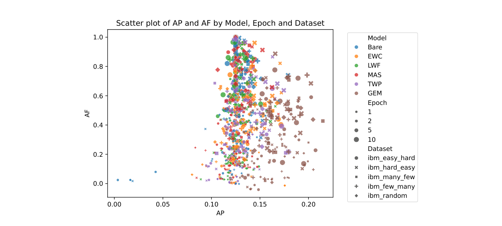

**그림 5: IBM 데이터셋의 평균 성능에 대해 표시된 평균 망각의 산점도입니다.**

성과 매트릭스 항목은 정량적 평가 지표, 즉 평균 성과(AP) 및 평균 망각(AF)을 계산하는 데 사용됩니다. 평균 성과는 모든 작업에 대한 훈련 후 작업에 대한 평균 micro-F1입니다. 평균 망각은 해당 작업에 대한 훈련 후 작업의 micro-F1을 모든 작업에 대한 학습 후의 정확도와 비교합니다. 성능 매트릭스를 사용하여 이러한 측정항목을 [22]로 정의했습니다.

AP =

MK, 나는

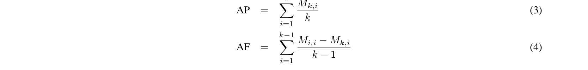

AF =

Mi,i -Mk,i

결국 우리는 모든 작업에 대한 최종 모델의 성능에도 관심이 있습니다. 따라서 최종 작업에서 모델을 미세 조정한 후 모든 데이터에 micro-F1 점수를 포함합니다.

## 5 결과 및 토론

그림 3의 파이프라인에 표시된 것처럼 이 작업에서는 다양한 하이퍼 매개변수 선택이 테스트됩니다. 아래에서는 일부 추세가 이미 명확한 모든 결과에 대한 일반적인 개요부터 시작합니다. 그 후, 각 선택에 대한 자세한 토론이 제공됩니다.

본 연구에서는 아래 그림에서 평균 망각과 평균 수행에 대한 전체 결과 세트를 제공합니다. 그림 5에는 IBM 데이터셋에 대한 모든 다른 (하이퍼) 매개변수에 대한 결과의 산점도가 포함되어 있습니다. 본 연구에서는 실험 전반에 걸쳐 강한 망각을 보는데, 이는 아마도 다양한 작업 [62] 간의 강한 유사성으로 인해 발생했을 것입니다.

본 연구에서는 일반적으로 더 많은 시대가 더 많은 망각으로 이어지는 반면, 모델이 얻을 수 있는 성능에는 한계가 있음을 알 수 있습니다. 또한 GEM은 망각을 많이 겪지 않고 좋은 성능을 달성하는 것 같습니다.

Elliptic 데이터셋에 대해서도 유사한 수치가 제공됩니다. 그림 6의 결과는 다릅니다. Elliptic 데이터셋의 경우 망각이 문제가 되지 않는 것처럼 보이지만 Epoch 횟수에 따라 평균 성능이 확실히 증가합니다. 일반적으로 결과는 7로 설정한 경우와 49 작업으로 설정한 경우 모두 유사합니다. 망각이 부족한 이유는 이 데이터셋에서 분포 이동이 덜 심각하기 때문일 수 있습니다.

방법을 살펴보면 GEM은 평균적으로 망각이 가장 낮은 반면 LwF와 Bare는 망각이 더 높은 것으로 보입니다. 그러나 Elliptic 데이터셋의 방법 간 망각의 차이는 IBM 데이터셋의 경우보다 훨씬 덜 두드러집니다.

<!-- 원문 14쪽 -->

자금세탁방지 시스템을 위한 연속 그래프 학습의 발전: 종합적인 검토

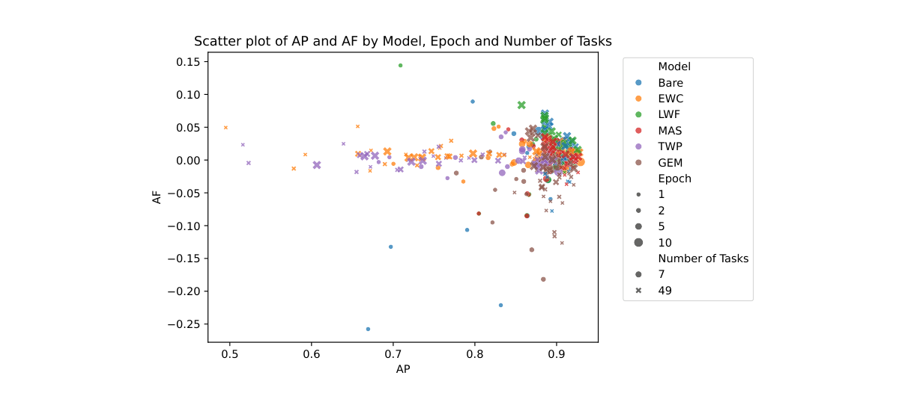

**그림 6: Elliptic 데이터셋의 평균 성능에 대해 표시된 평균 망각의 산점도.**

IBM 데이터셋에 대한 보다 세분화된 시각화가 그림 7에 제공됩니다. 결과는 모델의 깊이와 너비에 따라 서로 다른 플롯으로 분할됩니다. 차원이 높을수록 성능이 향상되지만 망각이 강해지는 것과도 상관관계가 있음을 알 수 있습니다. 또한 Bare 모델은 특히 3개 레이어로 구성된 GCN의 경우 강한 망각을 겪는다는 점에 주목합니다. 다른 레이어의 경우 Bare, MAS 및 LwF는 다른 방법에 비해 비슷한 성능으로 망각으로 인해 지속적으로 더 많은 고통을 받는 것으로 보입니다.

### 5.1 에포크 수

Epoch 수를 신중하게 선택하는 것의 중요성을 설명하기 위해 IBM 데이터셋에 대한 그림 8에 Epoch 수에 따른 평균 망각의 진화가 표시됩니다. 본 연구에서는 평균 망각이 몇 epoch 동안 상대적으로 낮게 유지되다가 갑자기 급증하는 것을 분명히 볼 수 있습니다. 이는 이 경우 이전 작업의 지식이 점진적으로 손실되는 것이 아니라 갑자기 손실된다는 것을 보여줍니다.

본 연구에서는 매 5번의 에포크 후에 새로운 작업을 시작할 때 평균 망각이 감소한다는 점에 주목합니다. 이는 평균 망각 계산에 새로운 작업이 추가되기 때문입니다. 모델이 해당 작업의 데이터를 미세 조정했기 때문에 망각은 여전히 ​​낮을 것으로 예상됩니다. 이로 인해 평균이 낮아지고 다음 작업을 고려할 때 잊어버리는 현상이 줄어듭니다.

IBM 데이터셋의 평균 망각, 평균 성능 및 최종 성능은 작업당 다양한 에포크 수에 걸쳐 표 3에 보고됩니다. Epoch 수를 늘리면 성능이 향상되는 것을 볼 수 있습니다. 그러나 망각의 정도는 Epoch 수가 많을수록 중요한 문제가 됩니다. 낮은 수준에서는 GEM만이 망각을 계속할 수 있는 것 같습니다.

작업당 에포크 수가 증가하면 최종 성능이 상당히 저하되는 것을 볼 수 있습니다. 이는 이러한 경우에 대한 망각이 높기 때문에 발생합니다. 특히 첫 번째 작업에 대한 망각은 다수 클래스를 포함한다는 점에서 문제가 됩니다.

모든 데이터에 대한 평균 망각, 평균 성능 및 최종 성능은 작업당 다양한 에포크 수에 걸쳐 7개 작업에 대해 표 ​​4에, 49 작업에 대해 표 ​​5에 있는 Elliptic 데이터셋에 대해 보고됩니다. 이전과 마찬가지로 작업당 에포크 수에 따라 성능이 증가하는 반면 망각은 증가하지만 IBM 데이터셋만큼 급격하지는 않습니다. 여기서 TWP와 GEM은 모두 부정적인 망각과 결합하여 높은 성능을 달성할 수 있는 것으로 보입니다. 즉, 모델이 새로운 작업을 미세 조정할 때 이전 작업에 대한 성능도 향상된다는 의미입니다.

모델의 최종 성능은 에포크 수의 영향을 덜 받는 것으로 보입니다. 이는 작업에 대한 데이터 이동이 제한되어 있기 때문에 망각이 거의 없기 때문에 발생하는 것 같습니다. 따라서 모델은 작업당 에포크 수가 적더라도 모든 작업에 대한 미세 조정이 끝나면 충분한 훈련 시간을 가졌습니다.

그림 8 및 표 3의 IBM 데이터셋에서 알 수 있는 점은 Bare 모델이 하한으로 간주되기는 하지만 모든 모델 중에서 가장 강한 망각을 겪지 않는다는 것입니다. 여기에는 몇 가지 이유가 있을 수 있습니다. 첫 번째 이유는 작업 간 연결을 통한 네트워크 구조가 베어 모델이 지식을 유지하는 데 유익하다는 것입니다. 자금세탁방지 시스템을 위한 연속 그래프 학습의 발전: 종합적인 검토

<!-- 원문 15쪽 -->

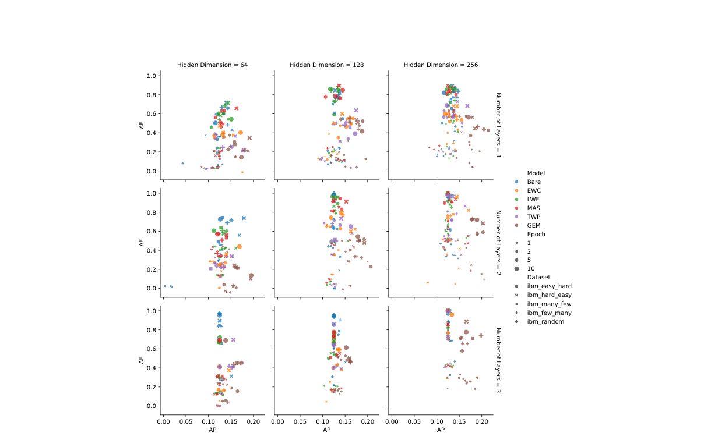

**그림 7: 평균 성능(높을수록 좋음)에 대해 표시된 평균 망각(낮을수록 좋음)의 산점도는 GCN의 폭과 너비에 따라 분할됩니다.**

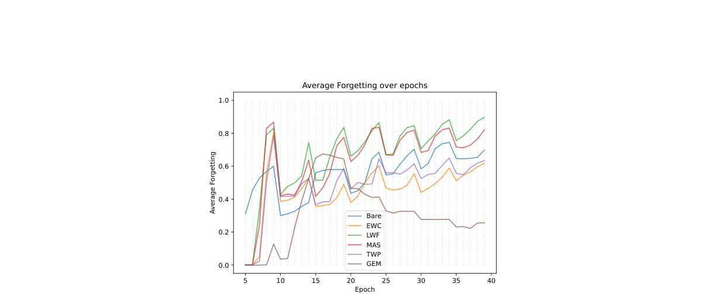

**그림 8: IBM 데이터셋의 다양한 방법에 대한 평균 망각. 여기서 백본은 각각 128 차원을 갖는 두 개의 레이어가 있는 GCN이며 작업당 5개의 에포크를 사용합니다.**

<!-- 원문 16쪽 -->

자금세탁방지 시스템을 위한 지속적인 그래프 학습의 발전: 종합적인 검토 Epochs Bare EWC LWF MAS TWP GEM AP: 0.1250 AP: 0.1353 AP: 0.1095 AP: 0.1084 AP: 0.1272 AP: 0.1444 1 AF: 0.0000 AF: 0.4036 AF: 0.0394 AF: 0.0606 AF: 0.0171 AF: -0.0100 핀.: 0.0004 핀.: 0.0003 핀.: 0.7800 핀.: 0.7431 핀.: 0.6529 핀.: 0.6372 AP: 0.1385 AP: 0.1259 AP: 0.1253 AP: 0.1265 AP: 0.1250 AP: 0.1588 2 AF: 0.3340 AF: 0.3501 AF: 0.4897 AF: 0.4569 AF: 0.3574 AF: 0.2823 핀.: 0.0001 핀.: 0.0076 핀.: 0.0001 핀.: 0.0001 핀.: 0.0002 핀.: 0.0339 AP: 0.1220 AP: 0.1393 AP: 0.1336 AP: 0.1425 AP: 0.1389 AP: 0.2072 5 AF: 0.6489 AF: 0.6274 AF: 0.8924 AF: 0.8318 AF: 0.6642 AF: 0.2277 핀.: 0.0001 핀.: 0.0002 핀.: 0.0001 핀.: 0.0001 핀.: 0.0002 핀.: 0.2783 AP: 0.1250 AP: 0.1192 AP: 0.1222 AP: 0.1250 AP: 0.1627 AP: 0.1783 10 AF: 0.9804 AF: 0.7433 AF: 0.9657 AF: 0.9576 AF: 0.6503 AF: 0.5456 핀.: 0.0001 핀.: 0.0001 Fin.: 0.0001 Fin.: 0.0001 Fin.: 0.0003 Fin.: 0.2337 표 3: IBM 데이터셋의 다양한 모델 및 시대에 대한 성능 지표(AP 및 AF) 및 모든 데이터(Fin.)에 대한 최종 성능. 백본은 각각 128 차원을 갖는 두 개의 레이어로 구성된 GCN입니다.

Epochs 베어 EWC LWF MAS TWP GEM AP: 0.8318 AP: 0.8903 AP: 0.8908 AP: 0.8922 AP: 0.8900 AP: 0.8860 1 AF: -0.2213 AF: -0.0010 AF: 0.0012 AF: 0.0000 AF: -0.0018 AF: -0.0196 핀.: 0.8284 핀.: 0.9019 핀.: 0.9029 핀.: 0.9041 핀.: 0.9020 핀.: 0.8930 AP: 0.8971 AP: 0.8936 AP: 0.8946 AP: 0.8973 AP: 0.8936 AP: 0.8696 2 AF: -0.0012 AF: -0.0035 AF: 0.0012 AF: -0.0026 AF: -0.0011 AF: -0.1368 핀.: 0.9074 핀.: 0.9028 핀.: 0.9057 핀.: 0.9077 핀.: 0.9050 핀.: 0.8771 AP: 0.9004 AP: 0.9037 AP: 0.9040 AP: 0.8978 AP: 0.9063 AP: 0.9097 5 AF: 0.0156 AF: 0.0045 AF: 0.0158 AF: 0.0166 AF: -0.0093 AF: -0.0107 핀.: 0.9102 핀.: 0.9113 핀.: 0.9133 핀.: 0.9085 핀.: 0.9150 핀.: 0.9168 AP: 0.9084 AP: 0.9156 AP: 0.9091 AP: 0.8996 AP: 0.9162 AP: 0.9175 10 AF: 0.0287 AF: 0.0116 AF: 0.0248 AF: 0.0275 AF: -0.0026 AF: -0.0023 핀.: 0.9149 핀.: 0.9204 핀.: 0.9157 핀.: 0.9099 Fin.: 0.9229 Fin.: 0.9227 표 4: Elliptic 데이터셋에 대한 다양한 모델 및 시대에 대한 모든 데이터(Fin.)에 대한 성능 메트릭(AP 및 AF) 및 최종 성능(7개 작업 포함). 백본은 각각 128 차원을 갖는 두 개의 레이어로 구성된 GCN입니다.

Epochs 베어 EWC LWF MAS TWP GEM AP: 0.9146 AP: 0.7328 AP: 0.8978 AP: 0.9129 AP: 0.7927 AP: 0.8756 1 AF: -0.0173 AF: 0.0060 AF: 0.0105 AF: -0.0081 AF: 0.0033 AF: -0.0155 핀.: 0.9229 핀.: 0.7200 핀.: 0.9100 핀.: 0.9213 핀.: 0.7821 핀.: 0.8778 AP: 0.9144 AP: 0.7584 AP: 0.9157 AP: 0.9203 AP: 0.7557 AP: 0.8798 2 AF: 0.0023 AF: 0.0215 AF: -0.0014 AF: -0.0107 AF: 0.0204 AF: -0.0316 핀.: 0.9236 핀.: 0.7431 핀.: 0.9250 핀.: 0.9269 핀.: 0.7472 핀.: 0.8824 AP: 0.8870 AP: 0.8764 AP: 0.8913 AP: 0.9133 AP: 0.8766 AP: 0.9168 5 AF: 0.0507 AF: 0.0024 AF: 0.0372 AF: -0.0058 AF: 0.0005 AF: -0.0035 핀.: 0.9031 핀.: 0.8707 핀.: 0.9058 핀.: 0.9225 핀.: 0.8860 핀.: 0.9211 AP: 0.8913 AP: 0.7977 AP: 0.8849 AP: 0.8897 AP: 0.7362 AP: 0.8947 10 AF: 0.0583 AF: 0.0100 AF: 0.0617 AF: 0.0316 AF: -0.0010 AF: 0.0009 핀.: 0.9050 핀.: 0.7794 핀.: 0.9020 핀.: 0.9044 핀.: 0.7182 Fin.: 0.8961 표 5: 49 작업을 사용한 Elliptic 데이터셋의 다양한 모델 및 시대에 대한 모든 데이터(Fin.)의 성능 메트릭(AP 및 AF) 및 최종 성능. 백본은 각각 128 차원을 갖는 두 개의 레이어로 구성된 GCN입니다. 이전 작업에서. 이러한 이유는 표 4에 있는 Elliptic 데이터셋의 결과에 의해 뒷받침되는 것으로 보입니다. 여기서 Bare 모델은 모든 경우는 아니지만 성능이 더 나쁜 것으로 보입니다. Elliptic 데이터셋에는 작업 간 연결이 없습니다. IBM 데이터셋에서 Bare 모델의 비정상적인 성능에 대한 두 번째 이유는 그림 9의 성능 매트릭스에서 볼 수 있습니다. 일부 작업의 경우 베어 모델은 좋은 성능을 얻는 데 어려움을 겪어 덜 학습된 정보를 잊어버리는 것으로 보입니다.

그림 9-11의 성능 매트릭스에 대한 추가 분석은 성능과 망각 사이에 균형을 맞춰야 함을 보여줍니다. 모델이 자금세탁방지 시스템을 위한 연속 그래프 학습의 발전: 종합 검토

<!-- 원문 17쪽 -->

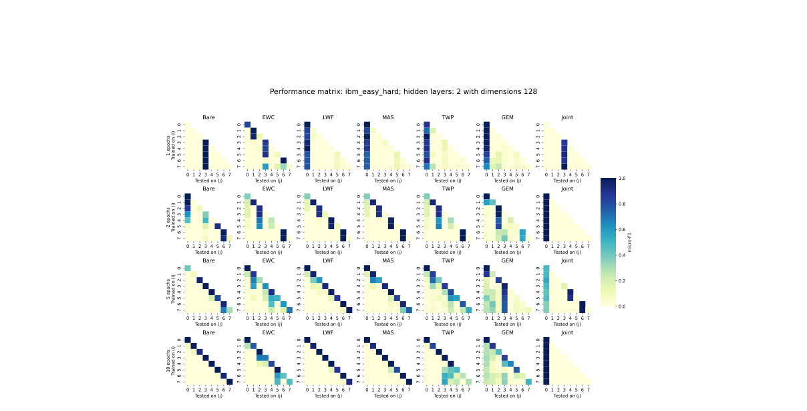

**그림 9: IBM 데이터셋의 다양한 시대 수에 대한 다양한 방법에 대한 성능 매트릭스.**

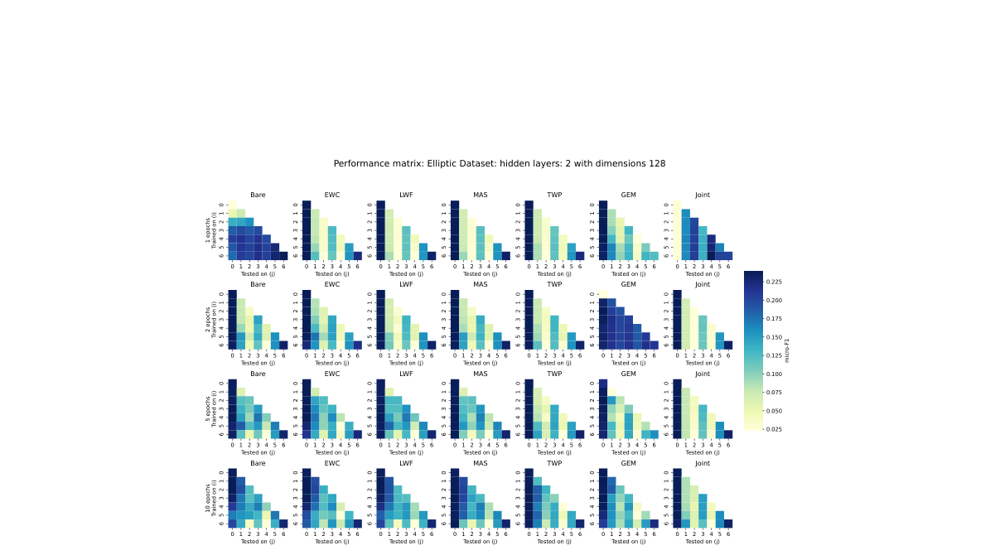

**그림 10: 작업당 7 시간 단계를 사용하는 Elliptic 데이터셋에 대해 다양한 시대 수에 대한 다양한 방법에 대한 성능 매트릭스입니다.**

<!-- 원문 18쪽 -->

자금세탁방지 시스템을 위한 연속 그래프 학습의 발전: 종합적인 검토

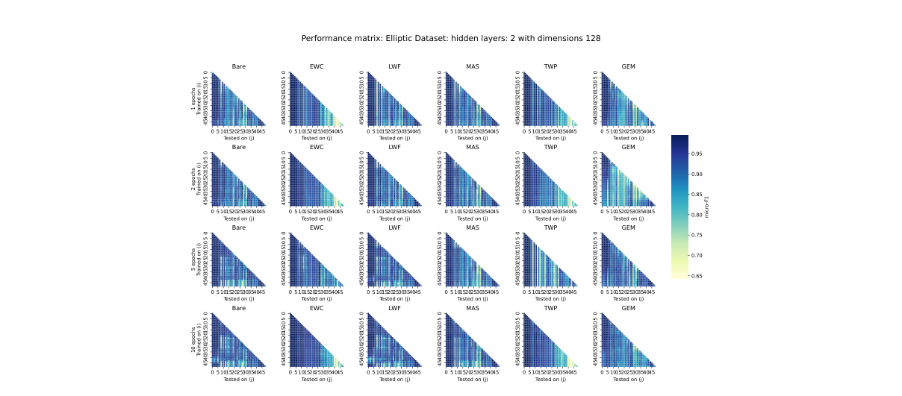

**그림 11: 각 시간 단계가 별도의 작업인 Elliptic 데이터셋에 대한 다양한 시대 수에 대한 다양한 방법에 대한 성능 매트릭스입니다.**

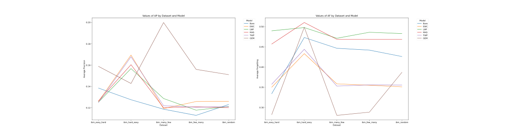

**그림 12: 패턴의 다양한 순열에 대한 방법에 대한 평균 성능(왼쪽)과 평균 망각(오른쪽)의 전체 평균입니다.**

새로운 작업을 통해 지식을 배우는 것 같습니다. 반면, Epoch가 너무 높게 설정된 경우 모델은 IBM 데이터셋의 최신 작업에 과적합되는 경향이 있습니다.

성능 매트릭스의 전체 컬렉션은 Github4에서 온라인 보충 자료로 제공됩니다.

### 5.2 패턴의 순서

패턴 순서 분석은 IBM 데이터셋에만 해당됩니다. 이전과 동일한 아키텍처의 경우 그림 12에서 망각과 정밀도가 다양한 패턴 순서에 걸쳐 다소 안정적이라는 것을 알 수 있습니다. 어려운 것부터 쉬운 것까지만 우리는 몇 가지 방법에서 망각이 급증한다는 것을 알 수 있습니다. 여기서 평균 성능도 더 높습니다.

그림 13에 표시된 것처럼 모든 실험을 집계하면 평균적으로 패턴의 순서가 성능이나 망각에 큰 영향을 미치지 않는 것으로 보입니다. 이는 이전 연구 [9, 43]와 일치합니다.

EWC를 기반으로 하는 EWC 및 TWP 상자는 다른 상자보다 어려운 설정에서 성능 측면에서 약간 더 높은 것으로 나타났습니다. 이는 이러한 정규화 기반 방법이 이 설정에서 약간 더 나은 성능을 발휘한다는 것을 나타낼 수 있지만 차이점은 미미합니다.

4https://github.com/VerbekeLab 자금세탁방지 시스템을 위한 연속 그래프 학습의 발전: 종합적인 검토

<!-- 원문 19쪽 -->

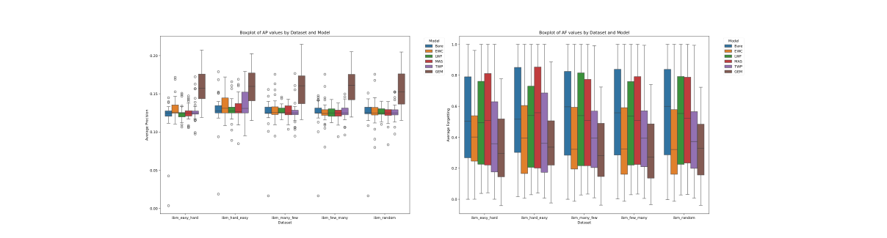

**그림 13: 패턴의 다양한 순열에 대한 방법에 대한 평균 성능(왼쪽)과 평균 망각(오른쪽)의 상자 그림입니다.**

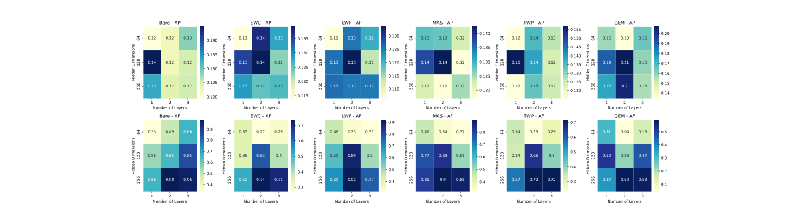

**그림 14: IBM 데이터셋에서 작업당 5개의 에포크 동안 훈련할 때 GCN의 다양한 깊이와 너비에 걸친 평균 성능과 평균 망각입니다.**

### 5.3 백본 아키텍처

이 섹션에서는 GCN 모델의 깊이와 너비의 영향을 분석하여 RQ3에 대한 답을 제시합니다. 그림 7의 결과는 깊이와 너비 측면에서 GCN 아키텍처가 성능과 망각에 영향을 미친다는 것을 이미 보여줍니다. 본 연구에서는 평균 성능에 대한 히트맵을 제공하며 모든 방법을 통해 결과를 자세히 볼 수 있습니다. 그림 14의 5개 시대에 대한 하드하기 쉬운 데이터셋에 대한 IBM 데이터셋의 결과입니다. 각각 그림 15 및 그림 16에서 5개 에포크에 대한 7개 및 49 작업이 포함된 Elliptic 데이터셋의 결과입니다.

평균 성능 측면에서는 직관적으로 더 많은 레이어가 더 좋아야 하지만, 결과는 GCN에서 한 레이어에 대해 2~3개 레이어의 명확한 지배력을 보여주지 않습니다. 반면에 GCN에 매개변수가 많을수록 망각이 더 심각하다는 것을 분명히 알 수 있습니다. 더 깊고 넓은 GCN은 최신 작업에 더 많이 과적합되는 경향이 있습니다.

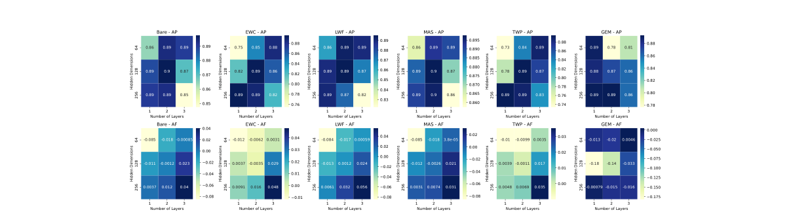

**그림 15: 7개의 작업이 포함된 타원 데이터셋에서 작업당 5개의 에포크 동안 훈련할 때 GCN의 다양한 깊이와 너비에 걸친 평균 성능과 평균 망각입니다.**

<!-- 원문 20쪽 -->

자금세탁방지 시스템을 위한 연속 그래프 학습의 발전: 종합적인 검토

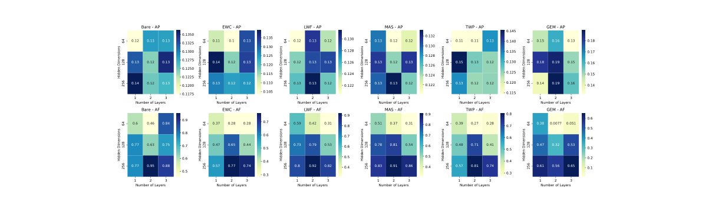

**그림 16: 49 작업을 사용하여 타원 데이터셋에 대해 작업당 5개의 에포크 동안 훈련할 때 GCN의 다양한 깊이와 너비에 걸친 평균 성능과 평균 망각입니다.**

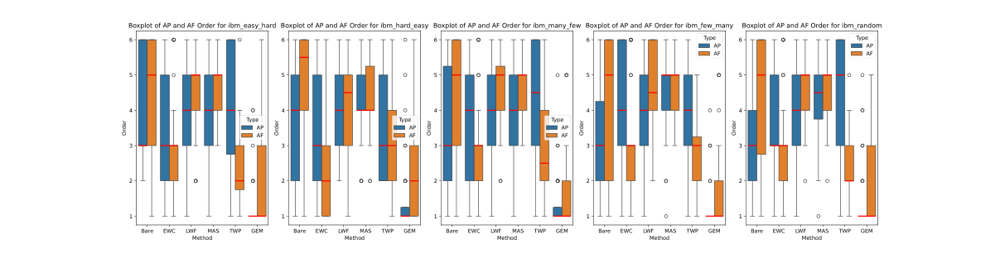

**그림 17: IBM 데이터셋의 패턴 순열당 다양한 방법의 순서에 대한 상자 그림.**

### 5.4 지속적인 학습 방법

RQ4에 대한 지속적인 학습 방법의 효과를 평가하기 위해 먼저 그림 8의 성능 매트릭스를 살펴봅니다. 시각적으로 GEM은 새로운 작업을 학습하는 동시에 낮은 에포크와 높은 에포크 모두에 대해 이전 지식을 가장 자주 유지하는 것으로 보입니다.

IBM 및 Elliptic 데이터셋에 대해 각각 그림 17 및 그림 18의 모델 순위에 대한 상자 그림을 평가하여 이를 확인합니다. 평균적으로 GEM 점수는 두 데이터셋 모두에 대해 낮은 평균 망각과 높은 평균 성능 측면에서 가장 좋습니다.

IBM 결과를 살펴보면 EWC와 그 정도는 덜하지만 TWP도 매우 강력한 성능을 보이는 것으로 보입니다. 다른 방법의 경우 망각과 수행 사이에 트레이드오프가 있는 것으로 보입니다.

Elliptic 데이터셋의 경우 결과가 약간 다릅니다. 여기서는 MAS가 잘 수행되는 반면 EWC는 매우 열악하게 수행됩니다. 다른 방법의 경우 망각과 성능 사이의 균형을 다시 확인합니다.

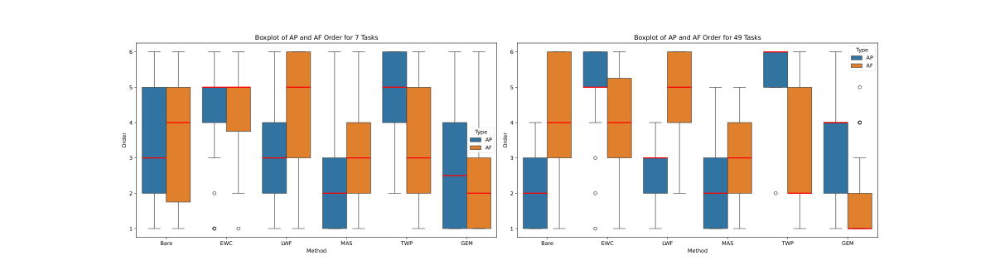

**그림 18: 타원 데이터셋의 다양한 작업 수에 대한 다양한 방법의 순서에 대한 상자 그림.**

<!-- 원문 21쪽 -->

자금세탁방지 시스템을 위한 연속 그래프 학습의 발전: 종합적인 검토

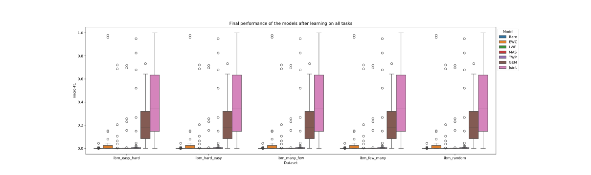

**그림 19: IBM 데이터셋의 모든 테스트 데이터에 대한 최종 모델 성능의 상자 그림.**

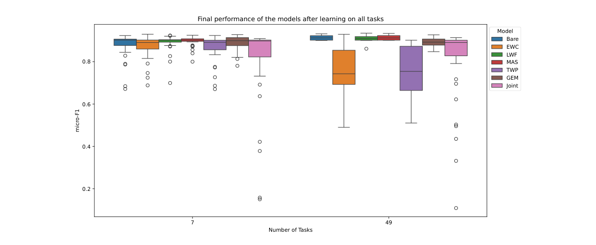

**그림 20: IBM 데이터셋의 모든 테스트 데이터에 대한 최종 모델 성능의 상자 그림.**

모든 반복에 대한 관찰은 지속적인 학습 방법이 기본 및 결합 모델보다 더 나은 AML 감지 방법을 가져오는 것으로 보인다는 것입니다. 공동 모델의 성능 매트릭스를 보면 다수 클래스에 관한 첫 번째 작업에 대한 성능이 우수하지만 다른 작업에서는 낮은 성능을 볼 수 있습니다. 이는 AML의 극단적인 클래스 불균형으로 인해 발생합니다. 결합 GCN 모델은 손실 함수를 최소화할 때 항상 다수 클래스를 예측하는 방법을 학습하는 것으로 보입니다.

또한 모든 작업을 확인한 후 전체 테스트 세트에서 모델의 성능을 고려합니다. IBM 데이터셋의 결과는 그림 19에 나와 있습니다. 예상한 대로 공동 모델은 모든 데이터에 대해 훈련되었기 때문에 다른 모든 모델보다 성능이 뛰어납니다. 또한 GEM이 다른 지속적 학습 및 베어 모델보다 성능이 더 우수하다는 것을 알 수 있습니다. 이는 높은 평균 수행 능력과 낮은 평균 망각이 결합된 결과입니다.

그림 20의 Elliptic 데이터셋에 대해서도 유사한 결과가 제공됩니다. 여기서 사진은 이전보다 덜 뚜렷합니다. Bare, LwF, MAS 및 GEM에 대한 지속적으로 강력한 결과를 확인했습니다. 놀랍게도 공동 모델은 이들 모델보다 성능이 약간 떨어지는 것 같습니다. 모든 데이터에 대해 동시에 훈련된다는 점을 감안할 때, 공동 모델은 43 [63] 시간 단계에서 암흑 시장의 갑작스러운 폐쇄가 포함되어 어려움을 겪을 수 있습니다.

## 6 결론

(1) 수백만 건의 거래를 지속적으로 모니터링해야 하고, (2) 사기 전술이 지속적으로 진화하여 기본 데이터 배포가 이동하고, (3) 규제 제약으로 인해 저장할 수 있는 기록 데이터의 양이 제한되는 경우가 많기 때문에 AML에서는 지속적인 학습이 필수적입니다. 따라서 이 연구는 네 가지 핵심 연구 질문을 다룬다.

<!-- 원문 22쪽 -->

자금세탁방지 시스템을 위한 연속 그래프 학습의 발전: 종합적인 검토 우리는 AML(RQ1)에 대한 연속 그래프 학습 문헌의 현재 상태를 검토하는 것부터 시작했습니다. 본 연구에서는 이러한 과제를 해결할 수 있는 능력에도 불구하고 AML에 대한 지속적인 학습이 과학 문헌에서 제한적인 관심을 받았다고 결론지었습니다.

현재 지식을 확장하기 위해 두 개의 AML 데이터셋에 대한 연속 그래프 학습에 대한 포괄적인 실험 결과를 제시합니다. 본 연구에서는 노드와 에지 분류에 대한 실험을 제시했습니다. 본 연구에서는 작업 순서(RQ2), GNN 아키텍처의 효과(RQ3) 및 다양한 연속 학습 방법(RQ4)을 포함한 하이퍼파라미터의 효과를 조사했습니다.

본 연구에서는 작업당 op epoch 수를 너무 많이 늘리면 현재 작업에 과적합이 발생하여 망각될 수 있다고 결론지었습니다. 작업 순서와 관련하여 우리의 실험은 이전 작업과 일치하며 작업 순서가 성능에 큰 영향을 미치지 않음을 확인합니다.

실험 결과를 바탕으로 우리는 와이드 모델이 망각에 더 취약하다는 결론을 내렸습니다. GNN의 깊이를 설정할 때 더 긴 자금세탁 체인을 포착하는 것과 과도한 평활화 및 망각을 피하는 것 사이에 균형을 맞춰야 합니다.

실험 전반에 걸쳐 GEM은 최소한의 망각으로 좋은 성능을 보였습니다. 이는 AML의 경우 재생 방법이 가장 좋음을 나타냅니다. 언급한 바와 같이, 거래 데이터의 저장을 제한하는 규정으로 인해 실제 적용이 방해받을 수 있습니다.

관절 모델에 관해 놀라운 결과가 얻어졌습니다. 실험은 모델이 다양한 사기 패턴을 학습할 수 있도록 하는 데 지속적인 학습 방법이 더 낫다는 것을 보여줍니다. 모든 데이터가 제공되면 공동 모델은 다수 클래스를 일관되게 예측하는 방법을 학습합니다.

제시된 문헌 검토와 실험적 평가를 바탕으로 우리는 향후 작업에 대한 일련의 방향을 식별합니다. 우선, 사기 탐지의 특정 과제와 지속적인 학습 방법을 통해 이러한 문제를 해결할 수 있는 방법에 대한 심층 분석이 필요합니다. 향후 연구에서는 지속적인 학습 환경에서 패턴 간 순환 효과와 사기 사례가 없는 기간의 효과를 조사해야 합니다.

둘째, IBM 데이터셋의 확장 분석에 필요한 에지 분류를 위한 도메인 증분 학습을 통합하고 더 많은 백본 아키텍처를 포함하도록 BeGin 프레임워크를 확장해야 합니다. 이로 인해 이 작업에서 수행된 분석을 보완하기 위한 확장된 실험이 수행됩니다.

마지막으로, AML에 존재하는 일부 문제는 다른 도메인, 특히 높은 클래스 불균형에도 존재합니다. 불균형 정도와 지속적인 학습 성과 사이의 상호작용에 대한 질적, 양적 연구는 여전히 부족한 실정이다.

## 저자 기여

Bruno Deprez: 개념화, 데이터 큐레이션, 방법론, 소프트웨어, 시각화, 글쓰기 – 원본 초안 준비. Wei Wei: 개념화, 방법론, 소프트웨어, 글쓰기 – 검토 및 편집. Wouter Verbeke: 개념화, 감독, 작문 – 검토 및 편집. Bart Baesens: 개념화, 감독, 작문 – 검토 및 편집. 케빈 메츠: 개념화, 방법론, 감독, 작문 – 검토 및 편집. Tim Verdonck: 개념화, 방법론, 감독, 작문 – 검토 및 편집.

## 경쟁적 이해관계 선언

저자는 이 문서에 보고된 작업에 영향을 미칠 수 있는 경쟁적인 금전적 이해관계나 개인적인 관계가 없다고 선언합니다.

## 감사의 글

이 작업은 Flanders 연구 재단(FWO 연구 프로젝트 1SHEN24N), BNP Paribas Fortis 사기 분석 의장 및 "Onderzoeksprogramma Artificiële Intelligentie(AI) Vlaanderen" 프로그램에 따라 플란더스 정부의 지원을 받았습니다. 이 작업에 사용된 리소스와 서비스는 연구 재단에서 자금을 지원한 VSC(Flemish Supercomputer Center)에서 제공되었습니다. 플랑드르(FWO)와 플랑드르 정부.

<!-- 원문 23쪽 -->

자금세탁방지 시스템을 위한 연속 그래프 학습의 발전: 종합적인 검토

## 참고문헌

[1] Muhammad Abulaish, Nesar Ahmad Wasi, and Shachi Sharma. The role of lifelong machine learning in bridging

the gap between human and machine learning: A scientometric analysis. WIREs Data Mining and Knowledge Discovery, 14(2):e1526, 2024. doi:https://doi.org/10.1002/widm.1526. URL https://wires.onlinelibrary. wiley.com/doi/abs/10.1002/widm.1526. [2] Ismail Alarab, Simant Prakoonwit, and Mohamed Ikbal Nacer. Competence of graph convolutional networks for

anti-money laundering in bitcoin blockchain. In Proceedings of the 2020 5th International Conference on Machine Learning Technologies, ICMLT '20, page 23–27, Beijing, China, 2020. Association for Computing Machinery. ISBN 9781450377645. doi:10.1145/3409073.3409080. URL https://doi.org/10.1145/3409073.3409080. [3] Rahaf Aljundi, Francesca Babiloni, Mohamed Elhoseiny, Marcus Rohrbach, and Tinne Tuytelaars. Memory aware

synapses: Learning what (not) to forget. In Proceedings of the European Conference on Computer Vision (ECCV), September 2018. [4] Erik Altman, Jovan Blanuša, Luc von Niederhäusern, Beni Egressy, Andreea Anghel, and Kubilay Atasu. Realistic

synthetic financial transactions for anti-money laundering models. In A. Oh, T. Naumann, A. Globerson, K. Saenko, M. Hardt, and S. Levine, editors, Advances in Neural Information Processing Systems, volume 36, pages 29851– 29874. Curran Associates, Inc., 2023. URL https://proceedings.neurips.cc/paper_files/paper/ 2023/file/5f38404edff6f3f642d6fa5892479c42-Paper-Datasets_and_Benchmarks.pdf. [5] Bart Baesens, Veronique Van Vlasselaer, and Wouter Verbeke. Fraud analytics using descriptive, predictive, and

social network techniques: a guide to data science for fraud detection. John Wiley & Sons, Inc, 2015. ISBN 9781119133124. doi:10.1002/9781119146841. [6] Yoshua Bengio, Jérôme Louradour, Ronan Collobert, and Jason Weston. Curriculum learning. In Proceedings of

the 26th Annual International Conference on Machine Learning, ICML '09, page 41–48, New York, NY, USA, 2009. Association for Computing Machinery. ISBN 9781605585161. doi:10.1145/1553374.1553380. URL https://doi.org/10.1145/1553374.1553380. [7] Mário Cardoso, Pedro Saleiro, and Pedro Bizarro. Laundrograph: Self-supervised graph representation learning

for anti-money laundering. In Proceedings of the Third ACM International Conference on AI in Finance, ICAIF '22, pages 130–138, New York, NY, USA, 2022. Association for Computing Machinery. ISBN 9781450393768.

doi:10.1145/3533271.3561727. URL https://doi.org/10.1145/3533271.3561727. [8] Antonio Carta, Andrea Cossu, Federico Errica, and Davide Bacciu. Catastrophic forgetting in deep graph networks:

an introductory benchmark for graph classification, 2021. URL https://arxiv.org/abs/2103.11750. [9] Matthias De Lange, Rahaf Aljundi, Marc Masana, Sarah Parisot, Xu Jia, Aleš Leonardis, Gregory Slabaugh, and

Tinne Tuytelaars. A continual learning survey: Defying forgetting in classification tasks. IEEE Transactions on Pattern Analysis and Machine Intelligence, 44(7):3366–3385, 2022. doi:10.1109/TPAMI.2021.3057446. [10] Bruno Deprez, Toon Vanderschueren, Bart Baesens, Tim Verdonck, and Wouter Verbeke. Network analytics

for anti-money laundering – a systematic literature review and experimental evaluation, 2024. URL https: //arxiv.org/abs/2405.19383. [11] Bruno Deprez, Félix Vandervorst, Wouter Verbeke, Tim Verdonck, and Bart Baesens. Network analytics for insur-

ance fraud detection: a critical case study. European Actuarial Journal, 14(3):965–990, 2024. doi:10.1007/s13385- 024-00384-6. URL https://doi.org/10.1007/s13385-024-00384-6. [12] Béni Egressy, Luc von Niederhäusern, Jovan Blanuša, Erik Altman, Roger Wattenhofer, and Kubilay Atasu.

Provably powerful graph neural networks for directed multigraphs. Proceedings of the AAAI Conference on Artificial Intelligence, 38(10):11838–11846, Mar. 2024. doi:10.1609/aaai.v38i10.29069. URL https://ojs.

aaai.org/index.php/AAAI/article/view/29069. [13] Elliptic. Elliptic. www.elliptic.co. Accessed: 2024-01-31. [14] Falih Gozi Febrinanto, Feng Xia, Kristen Moore, Chandra Thapa, and Charu Aggarwal. Graph lifelong learning:

A survey. IEEE Computational Intelligence Magazine, 18(1):32–51, 2023. doi:10.1109/MCI.2022.3222049. [15] Robert M. French. Catastrophic forgetting in connectionist networks. Trends in Cognitive Sciences, 3(4):128–135,

2025/02/25 1999. doi:10.1016/S1364-6613(99)01294-2. URL https://doi.org/10.1016/S1364-6613(99) 01294-2. [16] Ian J. Goodfellow, Mehdi Mirza, Da Xiao, Aaron Courville, and Yoshua Bengio. An empirical investigation of

catastrophic forgetting in gradient-based neural networks, 2015. URL https://arxiv.org/abs/1312.6211. [17] Will Hamilton, Zhitao Ying, and Jure Leskovec. Inductive representation learning on large graphs. In I. Guyon,

### U. Von Luxburg, S. Bengio, H. Wallach, R. Fergus, S. Vishwanathan 및 R. Garnett, 편집자, Advances in Neural

<!-- 원문 24쪽 -->

자금세탁방지 시스템을 위한 연속 그래프 학습의 발전: 정보 처리 시스템 종합 검토, 볼륨 30. 커란 어소시에이츠, Inc., 2017. URL https://proceedings. neurips.cc/paper_files/paper/2017/file/5dd9db5e033da9c6fb5ba83c7a7ebea9-Paper.pdf. [18] Hamed Hemati, Marco Schreyer 및 Damian Borth. 재무회계 데이터의 지속적인 감사에서 비지도 이상 탐지를 위한 지속적인 학습, 2022. URL https://arxiv.org/abs/2112.13215. [19] Chengxiang Jin, Jie Jin, Jiajun Zhou, Jiajing Wu 및 Qi Xuan. 이더리움에서 폰지 탐지를 위한 이종 특성 강화. 회로 및 시스템에 대한 IEEE 거래 II: Express Briefs, 69(9):3919–3923, 2022. doi:10.1109/TCSII.2022.3177898. [20] Thomas N. Kipf와 Max Welling. 그래프 컨벌루션 네트워크 2017를 사용한 준지도 분류. [21] James Kirkpatrick, Razvan Pascanu, Neil Rabinowitz, Joel Veness, Guillaume Desjardins, Andrei A. Rusu, Kieran Milan, John Quan, Tiago Ramalho, Agnieszka Grabska-Barwinska, Demis Hassabis, Claudia Clopath, Dharshan Kumaran 및 Raia Hadsell. 신경망에서 치명적인 망각을 극복합니다. 국립과학원 간행물, 114(13):3521–3526, 2017. doi:10.1073/pnas.1611835114. URL https: //www.pnas.org/doi/abs/10.1073/pnas.1611835114. [22] 고지훈, 강신환, 권태형, 문희찬, 신기정. 시작: 그래프 연속 학습을 위한 광범위한 벤치마크 시나리오 및 사용하기 쉬운 프레임워크인 2024. URL https://arxiv.org/abs/ 2211.14568. [23] B. Lebichot, W. Siblini, G.M. 팔디노, Y.-A. 르 보그네, F. 오블레, G. 본템피. 지속적인 신용 카드 사기 탐지에서 치명적인 망각에 대한 평가. 애플리케이션이 포함된 전문가 시스템, 249:123445, 2024. ISSN 0957-4174. doi:https://doi.org/10.1016/j.eswa.2024.123445. URL https://www.sciencedirect.com/ 과학/기사/pii/S0957417424003105. [24] 세바스찬 리, 세바스찬 골트, 앤드류 색스. 교사-학생 설정의 지속적인 학습: 작업 유사성의 영향. 기계 학습에 관한 국제 컨퍼런스의 페이지 6109–6119. PMLR, 2021. [25] 마이클 레비와 피터 로이터. 자금세탁. 범죄와 정의, 34(1):289–375, 2006. doi:10.1086/501508. [26] 안리(An Li), 왕중슈아이(Zhongshuai Wang), 유밍하오(Minghao Yu), 디첸(Di Chen). 가중치 샘플링 인접 노드 기반의 블록체인 비정상 거래 탐지 방법. 2022 빅 데이터, 인공 지능 및 사물 인터넷 엔지니어링(ICBAIE)에 관한 제3차 국제 컨퍼런스에서 746–752 페이지를 참조하세요. IEEE, 2022. doi:10.1109/ICBAIE56435.2022.9985815. [27] Qimai Li, Zhichao Han, Xiao-ming Wu. 준지도 학습을 위한 그래프 컨벌루션 네트워크에 대한 더 깊은 통찰력. 인공 지능에 관한 AAAI 회의 간행물, 32(1), 4월 2018. doi:10.1609/aaai.v32i1.11604. URL https://ojs.aaai.org/index.php/AAAI/article/view/11604. [28] Yujie Li, Yuxuan Yang, Xin Yang, Qiang Gao 및 Fan Zhou. 이종 거래 그래프 2022를 통한 지역간 사기 탐지 망각 방지 URL https://arxiv.org/abs/2204.10085. [29] Zhizhong Li 및 Derek Hoiem. 잊지 않고 학습합니다. 패턴 분석 및 기계 지능에 대한 IEEE 거래, 40(12):2935–2947, 2018. doi:10.1109/TPAMI.2017.2773081. [30] Ziyu Li, Yanmei Zhang, Qian Wang 및 Shiping Chen. 중국 중앙은행 디지털 화폐의 거래 네트워크 분석 및 자금세탁 행위 식별. 소셜 컴퓨팅 저널, 3(3):219–230, 2022. doi:10.23919/JSC.2022.0011. [31] J. Lian, K. Choi, B. Veeramani, A. Hu, S. Murli, L. Freeman, E. Bowen 및 X. Deng. 지속적인 학습과 산업적 응용: 선택적 검토. WIREs 데이터 마이닝 및 지식 검색, 14(6):e1558, 2024. doi:https://doi.org/10.1002/widm.1558. URL https://wires.onlinelibrary.wiley.com/doi/abs/ 10.1002/widm.1558. [32] Huihui Liu, Yiding Yang, Xinchao Wang. 그래프 신경망의 치명적인 망각을 극복합니다. 인공 지능에 관한 AAAI 회의 간행물, 35(10):8653–8661, 5월 2021. doi:10.1609/aaai.v35i10.17049. URL https://ojs.aaai.org/index.php/AAAI/article/view/17049. [33] Yilun Liu, Ruihong Qiu 및 Zi Huang. Cat: 그래프 압축을 통한 균형 잡힌 연속 그래프 학습. 2023 IEEE ICDM(International Conference on Data Mining), 페이지 1157–1162, 2023. doi:10.1109/ICDM58522.2023.00141. [34] Wai Weng Lo, Gayan K. Kulatilleke, Mohanad Sarhan, Siamak Layeghy 및 Marius Portmann. 검사-l: 비트코인의 자금세탁 감지를 위한 자체 감독 gnn 노드 임베딩. 응용 지능, 53(16):19406– 19417, 2023. doi:10.1007/s10489-023-04504-9. URL https://doi.org/10.1007/s10489-023-04504-9. [35] David Lopez-Paz 및 Marc' Aurelio Ranzato. 지속적인 학습을 위한 그라데이션 에피소드 메모리입니다. I. Guyon, U. Von Luxburg, S. Bengio, H. Wallach, R. Fergus, S. Vishwanathan 및 R. Garnett, 편집자, 신경 정보 처리 시스템의 발전, 볼륨 30. 커란 어소시에이츠, Inc., 2017. URL https://proceedings. neurips.cc/paper_files/paper/2017/file/f87522788a2be2d171666752f97ddebb-Paper.pdf.

<!-- 원문 25쪽 -->

자금세탁방지 시스템을 위한 연속 그래프 학습의 발전: 종합적인 검토 [36] Arun Mallya 및 Svetlana Lazebnik. Packnet: 반복적인 가지치기를 통해 단일 네트워크에 여러 작업을 추가합니다. 컴퓨터 비전 및 패턴 인식에 관한 2018 IEEE/CVF 회의에서 7765–7773, 2018 페이지를 참조하세요. doi:10.1109/CVPR.2018.00810.

[37] Arun Mallya, Dillon Davis, Svetlana Lazebnik. 피기백: 가중치를 마스크하는 방법을 학습하여 단일 네트워크를 여러 작업에 적용합니다. Vittorio Ferrari, Martial Hebert, Cristian Sminchisescu 및 Yair Weiss 편집자, Computer Vision – ECCV 2018, 페이지 72–88, Cham, 2018. 스프링거 국제 출판. ISBN 978-3-030-01225-0.

[38] Nicolas Y. Masse, Gregory D. Grant, David J. Freedman. 상황에 따른 게이팅 및 시냅스 안정화를 사용하여 치명적인 망각을 완화합니다. 국립과학원 간행물, 115(44): E10467–E10475, 2018. doi:10.1073/pnas.1803839115. URL https://www.pnas.org/doi/abs/10.1073/ pnas.1803839115.

[39] 마이클 맥클로스키와 닐 J. 코헨. 연결주의 네트워크의 치명적인 간섭: 순차적 학습 문제. 학습 및 동기 부여 심리학의 24 권, 페이지 109–165. 학술 출판사, 1989. doi:https://doi.org/10.1016/S0079-7421(08)60536-8. URL https://www.sciencedirect.com/ 과학/기사/pii/S0079742108605368.

[40] Seyed Iman Mirzadeh, Arslan Chaudhry, Dong Yin, Timothy Nguyen, Razvan Pascanu, Dilan Gorur 및 Mehrdad Farajtabar. 지속적인 학습에서는 아키텍처가 중요합니다, 2022. URL https://arxiv.org/abs/2202.00275.

[41] Anuraj Mohan, Karthika P. V., Parvathi Sankar, K. Maya Manohar 및 Amala Peter. 진화하는 그래프 컨볼루션과 심층 신경 결정 포레스트를 사용하여 비트코인의 자금세탁방지를 개선합니다. 데이터 기술 및 애플리케이션, 57(3):313–329, 2023. doi:10.1108/DTA-06-2021-0167. URL https://doi.org/10.1108/ DTA-06-2021-0167.

[42] 소로르 모티(Soroor Motie)와 비잔 라헤미(Bijan Raahemi). 그래프 신경망을 이용한 금융사기 탐지: 체계적 검토. 애플리케이션이 포함된 전문가 시스템, 240:122156, 2024. ISSN 0957-4174. doi:https://doi.org/10.1016/j.eswa.2023.122156. URL https://www.sciencedirect.com/science/ 기사/pii/S0957417423026581.

[43] Cuong V. Nguyen, Alessandro Achille, Michael Lam, Tal Hassner, Vijay Mahadevan 및 Stefano Soatto. 지속적인 학습에서 발생하는 치명적인 망각을 이해하기 위한 2019. URL https://arxiv.org/abs/1908.01091.

[44] María Óskarsdóttir, Waqas Ahmed, Katrien Antonio, Bart Baesens, Rémi Dendievel, Tom Donas 및 Tom Reynkens. 보험 분야의 감독된 사기 탐지를 위한 소셜 네트워크 분석입니다. 위험 분석, 42(8):1872–1890, 2022. doi:10.1111/risa.13693.

[45] 독일 I. Parisi, Ronald Kemker, Jose L. Part, Christopher Kanan 및 Stefan Wermter. 신경망을 이용한 지속적인 평생 학습: 검토. 신경망, 113:54–71, 2019. ISSN 0893-6080. doi:https://doi.org/10.1016/j.neunet.2019.01.012. URL https://www.sciencedirect.com/science/ 기사/pii/S0893608019300231.

[46] 마시모 페리니, 조르지아 람포니, 파리 카르본, 바실리키 칼라브리. 재생 경험을 통해 스트리밍 그래프에 대해 학습합니다. 응용 컴퓨팅에 관한 제37회 ACM/SIGAPP 심포지엄 진행 중, SAC '22, 페이지 470–478, New York, NY, USA, 2022. 컴퓨팅 기계 협회. ISBN 9781450387132. doi:10.1145/3477314.3507113. URL https://doi.org/10.1145/3477314.3507113.

[47] M.I. 프라마닉, 레이먼드 Y.K. Lau, Wei T. Yue, Yunming Ye, Chunping Li. 보안 및 범죄 수사를 위한 빅데이터 분석. WIREs 데이터 마이닝 및 지식 검색, 7(4):e1208, 2017. doi:https://doi.org/10.1002/widm.1208. URL https://wires.onlinelibrary.wiley.com/doi/abs/10. 1002/widm.1208.

[48] Sylvestre-Alvise Rebuffi, Alexander Kolesnikov, Georg Sperl 및 Christoph H. Lampert. icarl: 증분 분류기 및 표현 학습. 컴퓨터 비전 및 패턴 인식(CVPR)에 관한 IEEE 컨퍼런스 진행 중, 7월 2017.

[49] David Rolnick, Arun Ahuja, Jonathan Schwarz, Timothy Lillicrap 및 Gregory Wayne. 지속적인 학습을 위한 Replay를 경험해 보세요. H. Wallach, H. Larochelle, A. Beygelzimer, F. d'Alché-Buc, E. Fox 및 R. Garnett, 편집자, 신경 정보 처리 시스템의 발전, 볼륨 32. 커란 어소시에이츠, Inc., 2019. URL https://proceedings.neurips.cc/paper_files/paper/2019/file/ fa7cdfad1a5aaf8370ebeda47a1ff1c3-Paper.pdf.

[50] Franco Scarselli, Sweah Liang Yong, Marco Gori, Markus Hagenbuchner, Ah Chung Tsoi 및 Marco Maggini.

웹페이지 순위를 매기기 위한 그래프 신경망. 2005 IEEE/WIC/ACM International Conference on Web Intelligence(WI'05)의 페이지 666–672. IEEE, 2005. doi:10.1109/WI.2005.67.

<!-- 원문 26쪽 -->

자금세탁방지 시스템을 위한 연속 그래프 학습의 발전: 종합적인 검토 [51] Franco Scarselli, Marco Gori, Ah Chung Tsoi, Markus Hagenbuchner 및 Gabriele Monfardini. 그래프 신경망 모델. 신경망의 IEEE 거래, 20(1):61–80, 2008. doi:10.1109/TNN.2008.2005605. [52] Joan Serra, Didac Suris, Marius Miron 및 Alexandros Karatzoglou. 과제에 집중하여 치명적인 망각을 극복합니다. 편집자인 Jennifer Dy와 Andreas Krause의 제35차 기계 학습 국제 컨퍼런스 논문집, 기계 학습 연구 논문의 80권, 페이지 4548–4557. PMLR, 10–15 7월 2018. URL https://proceedings.mlr.press/v80/serra18a.html. [53] Kai Sun, Kun Meng 및 Ziqiang Zheng. Game-bc: 비트코인 ​​범죄를 조사하기 위한 그래프 주의 모델입니다. 2022에서

제6회 컴퓨터 과학 및 지능형 제어에 관한 국제 심포지엄(ISCSIC), 페이지 342–346. IEEE, 2022. doi:10.1109/ISCSIC57216.2022.00077. [54] 유엔마약범죄사무소(UNOCD). 자금세탁. https://www.unodc.org/unodc/

en/money-laundering/overview.html. 액세스됨: 2023-04-07. [55] Rafaël Van Belle, Sandra Mitrovi´c, Jochen De Weerdt. 신용카드 사기 탐지를 위한 그래프 표현 학습. Valerio Bitetta, Ilaria Bordino, Andrea Ferretti, Francesco Gullo, Stefano Pascolutti 및 Giovanni Ponti의 편집자, 금융 애플리케이션용 마이닝 데이터, 페이지 32–46, Cham, 2020. 스프링거 국제 출판. ISBN 978-3-030-37720-5. [56] 라파엘 반 벨(Rafaël Van Belle)과 요헨 드 베르트(Jochen De Weerdt). Shine: 대규모 불균형 데이터셋를 위한 확장 가능한 이종 유도 그래프 신경망입니다. IEEE 지식 및 데이터 엔지니어링 거래, 36(9):4904–4915, 2024. doi:10.1109/TKDE.2024.3381240. [57] Rafaël Van Belle, Charles Van Damme, Hendrik Tytgat 및 Jochen De Weerdt. 사기 탐지를 위한 유도적 그래프 표현 학습. 애플리케이션이 포함된 전문가 시스템, 193:116463, 2022. ISSN 0957- 4174. doi:https://doi.org/10.1016/j.eswa.2021.116463. URL https://www.sciencedirect.com/science/ 기사/pii/S0957417421017449. [58] Gido M. van de Ven, Tinne Tuytelaars 및 Andreas S. Tolias. 세 가지 유형의 점진적 학습. 자연 기계 지능, 4(12):1185–1197, 2022. doi:10.1038/s42256-022-00568-3. URL https://doi.org/10. 1038/s42256-022-00568-3. [59] Véronique Van Vlasselaer, Cristián Bravo, Olivier Caelen, Tina Eliassi-Rad, Leman Akoglu, Monique Snoeck 및 Bart Baesens. Apate: 네트워크 기반 확장을 사용하여 자동화된 신용 카드 거래 사기 탐지를 위한 새로운 접근 방식입니다. 의사결정 지원 시스템, 75:38–48, 2015. ISSN 0167-9236. doi:https://doi.org/10.1016/j.dss.2015.04.013. URL https://www.sciencedirect.com/science/article/ pii/S0167923615000846. [60] Petar Veliůckovic, Guillem Cucurull, Arantxa Casanova, Adriana Romero, Pietro Liò 및 Yoshua Bengio. 그래프 주의 네트워크, 2018. [61] Junshan Wang, Guojie Song, Yi Wu 및 Liang Wang. 지속적인 학습을 통한 스트리밍 그래프 신경망. 정보 및 지식 관리에 관한 제29차 ACM 국제 컨퍼런스 진행 중, CIKM '20, 페이지 1515–1524, New York, NY, USA, 2020. 컴퓨팅 기계 협회. ISBN 9781450368599. doi:10.1145/3340531.3411963. URL https://doi.org/10.1145/3340531.3411963. [62] Liyuan Wang, Xingxing Zhang, Hang Su 및 Jun Zhu. 지속적인 학습에 대한 포괄적인 조사: 이론, 방법 및 적용. 패턴 분석 및 기계 지능에 대한 IEEE 거래, 46(8):5362–5383, 2024. doi:10.1109/TPAMI.2024.3367329. [63] Mark Weber, Giacomo Domeniconi, Jie Chen, Daniel Karl I. Weidele, Claudio Bellei, Tom Robinson 및 Charles E. Leiserson. 비트코인의 자금세탁방지: 금융 포렌식을 위한 그래프 컨벌루션 네트워크 실험, 2019. URL https://arxiv.org/abs/1908.02591. [64] 웨이 웨이(Wei Wei), 톰 드 셰퍼(Tom De Schepper), 케빈 메츠(Kevin Mets). 뼈대 기반 행동 인식을 위한 연속 그래프 학습의 민감도 벤치마킹. 컴퓨터 비전, 이미징, 컴퓨터 그래픽 이론 및 응용에 관한 제19차 국제 합동 컨퍼런스 진행 중, 페이지 639–651. SCITEPRESS - 과학 기술 간행물, 2024. 도이:10.5220/0012394400003660. URL http://dx.doi.org/10.5220/0012394400003660. [65] 웨이 웨이, 톰 드 셰퍼, 케빈 메츠. 잠재 분위수 일치를 통한 데이터셋 압축. 컴퓨터 비전 및 패턴 인식(CVPR) 워크숍에 관한 IEEE/CVF 컨퍼런스 진행 중, 페이지 7703–7712, 6월 2024. [66] Pingfan Xia, Zhiwei Ni, Hongwang Xiao, Xuhui Zhu 및 Peng Peng. 자금세탁 사기에 대한 그래프 컨볼루션 신경망과 장단기 기억을 기반으로 한 새로운 시공간 예측 접근 방식입니다. 아라비아 과학 및 공학 저널, 47(2):1921–1937, 2022. doi:10.1007/s13369-021-06116-2. URL https://doi.org/10.1007/s13369-021-06116-2. [67] Keyulu Xu, Weihua Hu, Jure Leskovec 및 Stefanie Jegelka. 그래프 신경망은 얼마나 강력합니까?, 2019.

<!-- 원문 27쪽 -->

자금세탁방지 시스템을 위한 연속 그래프 학습의 발전: 종합적인 검토 [68] Qiao Yuan, Sheng-Uei Guan, Pin Ni, Tianlun Luo, Ka Lok Man, Prudence Wong 및 Victor Chang. 지속적인 그래프 학습: 설문 조사, 2023. URL https://arxiv.org/abs/2301.12230. [69] Friedemann Zenke, Ben Poole 및 Surya Ganguli. 시냅스 지능을 통한 지속적인 학습. 편집자인 Doina Precup과 Yee Whye Teh에서는 기계 학습에 관한 제34차 국제 컨퍼런스의 논문집, 기계 학습 연구 논문의 70권, 페이지 3987–3995. PMLR, 06–11 8월 2017. URL https://proceedings.mlr.press/v70/zenke17a.html. [70] Peiyan Zhang, Yuchen Yan, Chaozhuo Li, Senzhang Wang, Xing Xie, Guojie Song 및 Sunghun Kim. 매개변수 격리를 통한 동적 그래프에 대한 지속적인 학습. 정보 검색 연구 및 개발에 관한 제46차 국제 ACM SIGIR 회의 진행 중, SIGIR '23, 페이지 601–611, New York, NY, USA, 2023. 컴퓨팅 기계 협회. ISBN 9781450394086. doi:10.1145/3539618.3591652. URL https://doi.org/10.1145/3539618.3591652. [71] Rui Zhang, Dawei Cheng, Jie Yang, Yi Ouyang, Xian Wu, Yefeng Zheng 및 Changjun Jiang. 보험 사기 탐지를 위해 사전 훈련된 온라인 대조 학습입니다. 인공 지능에 관한 AAAI 회의 간행물, 38(20):22511–22519, 3월 2024. doi:10.1609/aaai.v38i20.30259. URL https://ojs.aaai.org/index.php/ AAAI/article/view/30259. [72] Shilei Zhang, Toyotaro Suzumura 및 Li Zhang. Dyngraphtrans: 금융 거래 데이터를 위해 수정된 범용 변압기 네트워크를 통한 동적 그래프 임베딩. 2021 IEEE 스마트 데이터 서비스(SMDS)에 관한 국제 회의, 페이지 184–191, 2021. doi:10.1109/SMDS53860.2021.00032. [73] Xikun Zhang, Dongjin Song 및 Dacheng Tao. Cglb: 지속적인 그래프 학습을 위한 벤치마크 작업입니다. S. Koyejo, S. Mohamed, A. Agarwal, D. Belgrave, K. Cho 및 A. Oh, 편집자, 신경 정보 처리 시스템의 발전, 볼륨 35, 페이지 13006–13021. 커란 어소시에이츠, Inc., 2022. URL https://proceedings.neurips.cc/paper_files/paper/2022/file/ 548a41b9cac6f50dccf7e63e9e1b1b9b-Paper-Datasets_and_Benchmarks.pdf. [74] Xikun Zhang, Dongjin Song 및 Dacheng Tao. 그래프를 통한 지속적인 학습: 과제, 솔루션 및 기회, 2024. URL https://arxiv.org/abs/2402.11565. [75] Tianqi Zhao, Alan Hanjalic 및 Megha Khosla. AGALE: 그래프 인식 지속적인 학습 평가 프레임워크입니다.

기계 학습 연구에 대한 거래, 2024. ISSN 2835-8856. URL https://openreview.net/forum? id=xDTKRLyaNN. [76] Xin Zheng, Miao Zhang, Chunyang Chen, Quoc Viet Hung Nguyen, Xingquan Zhu 및 Shirui Pan. 구조 없는 그래프 응축: 대규모 그래프부터 응축된 그래프 없는 데이터까지. 신경 정보 처리 시스템의 발전, 36:6026–6047, 2023. [77] Da-Wei Zhou, Qi-Wei Wang, Zhi-Hong Qi, Han-Jia Ye, De-Chuan Zhan 및 Ziwei Liu. 수업 단위 학습: 설문조사. 패턴 분석 및 기계 지능에 대한 IEEE 거래, 46(12):9851–9873, 2024. doi:10.1109/TPAMI.2024.3429383. [78] 팬 저우(Fan Zhou)와 청타이 카오(Chengtai Cao). 경험 재생을 통해 그래프 신경망의 치명적인 망각을 극복합니다. 인공 지능에 관한 AAAI 회의 간행물, 35(5):4714–4722, 5월 2021. doi:10.1609/aaai.v35i5.16602. URL https://ojs.aaai.org/index.php/AAAI/article/view/16602.
