# 그래프 특성 전처리기: 금융범죄 탐지를 위한 실시간 부분그래프 기반 특성 추출

> **원문 제목:** Graph Feature Preprocessor: Real-time Subgraph-based Feature Extraction for Financial Crime Detection  
> **저자:** Jovan Blanuša · Maximo Cravero Baraja · Andreea Anghel · Luc von Niederhäusern · Erik Altman · Haris Pozidis · Kubilay Atasu  
> **게재 정보:** ACM International Conference on AI in Finance (ICAIF), 2024  
> **DOI:** [https://doi.org/10.48550/arXiv.2402.08593](https://doi.org/10.48550/arXiv.2402.08593)

> **번역 안내:** 본문과 부록은 문단 문맥을 기준으로 한국어로 옮겼습니다. 수식과 참고문헌은 정확성을 위해 원문 표기를 유지했습니다. 원문의 그림과 표는 개별 이미지로 잘라 해당 본문 위치에 바로 배치했습니다.

---

<!-- 원문 1쪽 -->

## 초록

본 논문에서는 금융 거래 그래프에서 일반적인 자금세탁 패턴을 실시간으로 탐지하기 위한 소프트웨어 라이브러리인 그래프 특성 전처리기를 제시합니다. 이러한 패턴은 다운스트림 기계 학습 교육 및 사기 금융 거래 감지와 같은 추론 작업을 위한 풍부한 거래 특성 세트를 생성하는 데 사용됩니다. 본 연구에서는 강화된 거래 특성이 그래디언트 부스팅 기반 기계 학습 모델의 예측 정확도를 획기적으로 향상한다는 것을 보여줍니다. 우리 라이브러리는 멀티코어 병렬성을 활용하고, 동적 인 메모리 그래프를 유지하며, 들어오는 거래 스트림에서 하위 그래프 패턴을 효율적으로 마이닝하여 스트리밍 방식으로 작동할 수 있도록 합니다. 그래프 특성 전처리기와 그래디언트 부스팅 기반 기계 학습 모델을 결합한 당사의 솔루션은 자금세탁방지 및 피싱 데이터셋에서 표준 그래프 신경망보다 더 높은 소수 클래스 F1 점수로 불법 거래를 탐지할 수 있습니다. 또한 멀티코어 CPU에서 실행되는 당사 솔루션의 엔드 투 엔드 처리 속도는 강력한 V100 GPU에서 실행되는 그래프 신경망 기준보다 성능이 뛰어납니다. 전반적으로 우리 솔루션의 높은 정확성, 높은 처리 속도 및 낮은 대기 시간의 조합은 실제 응용 프로그램에서 우리 라이브러리의 실질적인 가치를 보여줍니다. ACM ICAIF'24에 컨퍼런스 논문으로 게재됩니다.

## 1 서론

금융거래는 계좌 간 금융자금의 이동을 기록하는 기록의 역할을 합니다. 일반적으로 이러한 거래는 표 형식으로 캡처됩니다. 여기서 각 행은 고유한 금융 거래를 나타내고 열은 타임스탬프, 원본 계정, 대상 계정, 이체 금액, 통화 및 지불 유형 [1]와 같은 기본 거래 특성을 나타냅니다. 이 표 형식 표현은 데이터의 구조화된 보기를 제공하지만, 그림 1에 설명된 것처럼 거래를 모서리로, 계정을 그래프의 정점으로 처리하여 금융 거래를 그래프로 표시할 때 더욱 통찰력 있는 접근 방식이 나타납니다. 이러한 그래프 표현을 통해 분석가는 표 형식에서는 즉시 명확하지 않을 수 있는 통찰력을 발견할 수 있습니다. 결과적으로, 금융거래 그래프는 복잡한 금융데이터의 효율적인 분석과 해석을 용이하게 하여 금융범죄 탐지에 도움을 줍니다. [21, 54].

> **주:** 이 작업은 Maximo Cravero Baraja와 Kubilay Atasu가 스위스 취리히의 IBM Research Europe에 근무할 때 수행되었습니다.

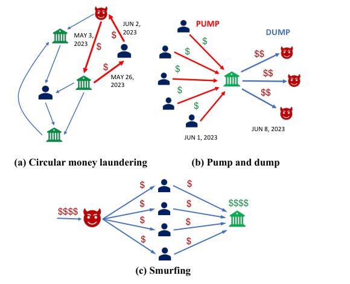

**그림 1: 금융 거래 그래프의 범죄 패턴.**

금융 거래 그래프의 하위 그래프 패턴은 종종 금융 범죄의 지표로 사용될 수 있습니다. 그림 1a에 표시된 간단한 주기 [53]는 그러한 패턴 중 하나이며 한 은행 계좌에서 동일한 계좌로 자금을 이체하는 일련의 거래를 나타냅니다. 이러한 순환은 자금세탁, 조세회피 [32, 74], 신용카드 사기 [54, 61], 주가조작에 이용되는 순환거래 [38, 41, 57] 등 금융범죄의 지표가 될 수 있습니다. 또한 그림 1b에 표시된 수집-산란 패턴은 펌프 및 덤프 재고 조작 방식 [54]를 제안할 수 있습니다. 이 계획에서는 투자를 위해 다른 거래자를 유인하기 위해 소셜 미디어를 사용하여 회사의 주가를 인위적으로 높입니다. 주가가 충분히 오르면 악의적인 거래자는 해당 주식을 매도합니다. 인위적으로 주가가 부풀려져 주가가 하락하고, 다른 거래자들도 금전적 손실을 입는다. 또한 그림 1c에 설명된 분산 수집 패턴은 스머핑 [21, 44, 47, 48, 67, 72]라는 자금세탁 전술을 나타낼 수 있습니다. 이 전술에서는 악의적인 행위자가 여러 중개 계정(그림 1c의 파란색 노드)을 사용하여 소액의 불법 자금을 합법적인 은행 시스템에 통합합니다. 마찬가지로 암호화폐 거래 네트워크에서 범죄자는 정교한 혼합 및 섞기 방식을 사용하여 활동 [49]의 추적을 난독화합니다. 이러한 계획은 일반적으로 다음과 같이 나타낼 수 있습니다.

<!-- 원문 2쪽 -->

### J. Blanuša, M. Cravero Baraja, A. Anghel, L. von Niederhäusern, E. Altman, H. Pozidis 및 K. Atasu

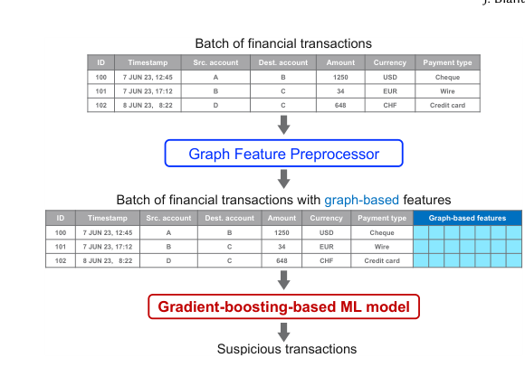

**그림 2: 의심스러운 금융 거래 탐지를 위한 그래프 ML 파이프라인의 개요입니다.**

하위 그래프 구조 [17, 69, 78, 81]. 이러한 의심스러운 하위 그래프 패턴을 발견하면 범죄 활동과 그 가해자를 찾아서 중지할 수 있습니다.

재정적 손실을 방지하려면 의심스러운 금융 거래를 신속하게 탐지하고 처리하는 것이 중요합니다. 재무 데이터는 표 형식 [1]로 표시되는 경우가 많으므로 이 입력 형식에 대한 가장 빠르고 정확한 기계 학습 모델 [31]는 그래디언트 부스팅 기반 모델 [16, 43]입니다. 그러나 이러한 모델은 기본 그래프 구조를 고려할 수 없으며 금융 범죄와 연관될 수 있는 그래프 패턴을 발견할 수 없습니다. 더욱이 금융 거래와 관련된 제한된 기본 특성 세트(그림 2 참조)는 의심 거래를 충분히 정확하게 탐지하기 위한 그래디언트 부스팅 기반 모델에 충분한 정보를 제공하지 않습니다. 결과적으로 이러한 방법을 사용하여 의심 거래를 탐지하는 것은 어려운 일입니다.

앞서 언급한 한계를 극복하기 위해 그림 2에 표시된 솔루션을 제안합니다. 특히 우리는 금융 거래를 위한 풍부한 그래프 기반 특성 세트를 생성하기 위해 GFP(Graph Feature Preprocessor) 라이브러리를 개발합니다. 우리 라이브러리는 자금세탁 주기 및 분산 수집 패턴과 같은 일반적인 금융 범죄 패턴을 검색하고(그림 1 참조) 이러한 그래프 패턴을 거래 테이블의 추가 열(예: 특성)에 인코딩합니다. 그래프 기반 특성으로 강화된 거래 테이블은 금융 거래 분류를 수행하고 의심 거래를 탐지하는 사전 훈련된 그래디언트 부스팅 기반 기계 학습 모델로 전달됩니다. 결과적으로 머신러닝 모델에는 금융거래 그래프에서 추가적인 거래특징을 추출하여 제공함으로써 금융범죄와 관련된 거래의 탐지를 용이하게 한다.

우리의 기여는 다음과 같이 요약될 수 있습니다.

- 그래프에서 의심스러운 하위 그래프 패턴을 열거하고 그래프 정점의 다양한 통계 속성을 계산하여 금융 거래 그래프의 모서리 특성 세트를 강화하기 위한 그래프 특성 전처리기라는 그래프 기반 특성 추출 라이브러리를 제시합니다. 그런 다음 이 라이브러리를 사용하여 금융 거래 네트워크를 모니터링하기 위한 그래프 기계 학습(그래프 ML) 파이프라인을 개발합니다. 2 섹션에서는 이 라이브러리를 소개합니다.

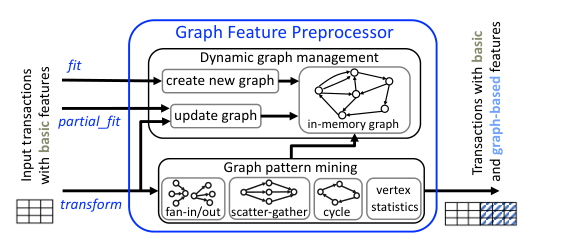

**그림 3: 그래프 특성 전처리기는 맞춤 및 변환 방법을 갖춘 scikit-learn 전처리기로 제공됩니다.**

- 자금세탁 탐지 작업에 대해 그래프 신경망(GNN) 기준 [12, 22, 35]와 비교하여 소수 클래스 F1 점수가 최대 36% 향상되는 것을 입증하는 실험을 수행합니다. 또한 Intel Xeon 프로세서의 32 코어를 사용하여 실행된 그래프 ML 파이프라인이 NVIDIA Tesla V100 GPU에서 실행된 GNN 기준선에 비해 더 높은 처리량 속도를 달성한다는 것을 보여줍니다. 우리의 실험 평가는 섹션 4에 나와 있습니다. GFP 라이브러리는 Snap ML [64–66]의 일부로 PyPI에서 공개적으로 사용할 수 있습니다. 또한 IBM1 메인프레임 소프트웨어 제품인 Cloud Pak for Data on Z [37], AI Toolkit for IBM Z 및 LinuxONE [36]와 함께 제공됩니다. 또한, IBM Z 환경을 사용하여 GFP로 그래프 ML 파이프라인을 개발하고 배포하는 방법을 보여주는 IBM Z 자금세탁방지 솔루션 템플릿 [68]의 AI는 오픈 소스로 공개적으로 사용 가능합니다2.

## 2 그래프 특성 전처리기

그래프 특성 전처리기(GFP)의 개요는 그림 3에 나와 있습니다. 스트리밍 방식으로 작동하여 그림 2와 같은 기본 특성만 포함된 일괄 거래를 입력으로 수신하고 추가 그래프 기반 특성을 출력으로 생성합니다. GFP는 과거 금융 거래를 메모리 내 그래프에 저장하며, 새 거래가 수신되면 동적으로 업데이트됩니다. 그래프 기반 특성은 그래프의 하위 그래프 패턴을 열거하고 해당 그래프에 저장된 계정의 통계 속성을 생성하여 계산됩니다. GFP는 여러 CPU 코어에서 그래프 기반 특성을 병렬로 계산할 수 있으며, 이는 동적 그래프 표현과 함께 실시간 특성 추출을 가능하게 합니다.

본 연구에서는 맞춤/변환 인터페이스 [71]를 사용하여 scikit-learn 전처리기로 GFP를 구현했으며 이를 Snap ML 패키지 [64–66]의 일부로 PyPI에서 공개적으로 사용할 수 있도록 했습니다. GFP의 주요 특성은 그림 3에 설명된 변환 특성으로 구현됩니다. 이 함수는 입력 거래 배치를 메모리 내 그래프에 삽입하고 이러한 거래에 대한 그래프 기반 특성을 계산합니다. 초기 인메모리 그래프 생성은 일부 과거 거래를 맞춤 함수에 대한 입력으로 제공하여 수행됩니다. Partial_fit 함수를 사용하면 그래프 특성을 계산하지 않고도 기존 인메모리 그래프를 업데이트할 수 있습니다. GFP가 지원하는 다른 표준 전처리기 특성은 공개적으로 사용 가능한 문서 [65]에 설명되어 있습니다. 이 섹션의 나머지 부분에서는 동적 그래프 관리 및 그래프 패턴에 대해 설명합니다. 1IBM, IBM 로고 및 IBM Cloud Pak은 미국 및/또는 기타 국가에서 International Business Machines Corporation의 상표 또는 등록 상표입니다. 2https://github.com/ambitus/aionz-st-anti-money-laundering

<!-- 원문 3쪽 -->

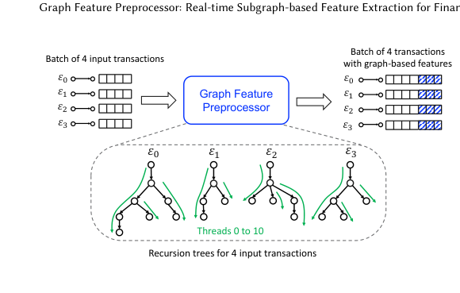

**그림 4: GFP가 활용하는 세분화된 병렬 처리. 라이브러리는 거래 그래프를 재귀적으로 탐색하여 각 입력 거래에 대해 독립적으로 주기를 검색합니다. 대략적인 접근 방식은 4개의 스레드만 사용하는 반면, 세분화된 접근 방식은 11개의 스레드를 사용합니다.**

GFP의 마이닝 구성 요소(그림 3 참조)를 살펴보고 라이브러리에서 생성된 그래프 기반 특성이 인코딩되는 방법을 설명합니다.

### 2.1 동적 그래프 관리

GFP의 동적 그래프 관리 구성 요소는 인메모리 그래프를 사용하여 금융 거래 네트워크를 나타냅니다. 이 시나리오에서 각 계정은 그래프 정점으로 처리되며 각 거래은 원본 계정에서 대상 계정까지의 가장자리를 나타냅니다. 금융 거래에는 일반적으로 거래가 생성된 시기를 나타내는 타임스탬프가 포함되므로(그림 2 참조) 금융 거래 그래프는 시간 그래프 [34]로 간주됩니다. 또한 금융 거래 그래프는 다중 그래프 [3]이기도 합니다. 여러 개의 병렬 간선, 즉 동일한 소스 및 대상 정점 쌍을 연결하는 간선이 있을 수 있기 때문입니다. 따라서 우리의 메모리 내 그래프는 시간적 다중 그래프를 나타낼 수 있어야 합니다.

스트리밍 방식으로 거래를 원활하게 처리하려면 인메모리 그래프가 새 거래 삽입과 오래된 거래 제거를 지원해야 합니다. 본 연구에서는 현재 인메모리 그래프에 있는 거래의 타임스탬프보다 더 큰 타임스탬프를 가진 거래으로 새 거래를 정의합니다. 오래된 거래은 𝑡now −𝛿 값보다 작은 타임스탬프를 가진 거래으로 식별됩니다. 여기서 𝑡now는 인 메모리 그래프의 거래 중 가장 큰 타임스탬프를 나타내고 𝛿는 사용자 정의 기간을 나타냅니다. 결과적으로 인메모리 그래프는 시간 창[𝑡now −𝛿: 𝑡now] 내에 속하는 거래만 유지하여 메모리 사용량을 효과적으로 제한합니다.

인메모리 그래프는 거래 로그와 인덱스라는 두 가지 주요 데이터 구조로 구성됩니다. 양방향 대기열로 구현된 거래 로그는 타임스탬프의 오름차순으로 정렬된 에지 목록을 유지 관리합니다. 이 데이터 구조는 가장 작은 타임스탬프가 있는 가장자리를 제거하기 위한 𝑂(1) 작업을 지원하여 오래된 가장자리의 감지 및 제거를 용이하게 합니다. 인덱스 데이터 구조는 인접 목록 표현을 사용하여 정점 [20]의 이웃에 빠르게 액세스할 수 있습니다. 해시 맵 [63]의 벡터로 구현되며 벡터의 각 항목은 정점 𝑣을 나타내고 해당 정점 𝑣과 연결된 해시 맵은 𝑣의 인접 목록을 나타냅니다. 꼭지점은 내부적으로 정수로 매핑됩니다.

**알고리즘 1: ScatterGatherStream**

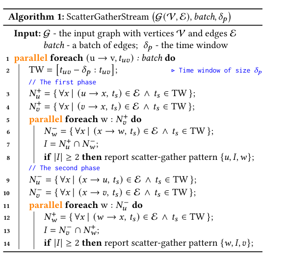

0, 1,...,𝑛−1, 여기서 𝑛는 그래프의 정점 수입니다. 이러한 정수는 이 벡터에 있는 정점 𝑣의 인접 목록에 액세스하는 데 사용됩니다. 또한 인덱스를 사용하여 𝑂(1) 시간 내에 각 에지에 액세스할 수 있으므로 그래프 패턴 마이닝 구성 요소에서 요구하는 대로 그래프를 통한 순회가 용이해집니다.

인덱스에서 평행 모서리의 유지 관리를 지원하기 위해 꼭지점 𝑣의 이웃 𝑢을 나타내는 꼭지점 𝑣의 인접 목록에 있는 각 항목에는 평행 모서리 목록이라고 하는 𝑣와 𝑢를 연결하는 모서리 목록도 포함됩니다. 양방향 대기열로도 구현되는 이 목록의 에지는 해당 ID와 타임스탬프로 표시되며 타임스탬프의 오름차순으로 정렬됩니다. 이러한 이유로 새로운 Edge를 삽입하고 오래된 Edge를 제거하는 작업은 𝑂(1) 시간 내에 수행될 수 있습니다.

### 2.2 그래프 패턴 마이닝

그래프 패턴 마이닝 구성 요소의 작업은 변환 함수를 통해 라이브러리로 전달되는 에지에 대한 그래프 기반 특성을 생성하는 것입니다. i) 그래프 패턴 기반 특성과 ii) 정점 통계 기반 특성의 두 가지 유형의 그래프 기반 특성이 지원됩니다.

그래프 패턴 기반 특성은 전달된 가장자리 중 하나를 포함하는 메모리 내 그래프에서 그래프 패턴을 추출하여 계산됩니다. 우리 라이브러리는 팬인(fan-in), 팬아웃(fan-out), 분산-수집(scatter-gather), 수집-분산(gather-scatter), 단순 주기, 시간 주기 등의 그래프 패턴을 추출합니다. 팬인(Fan-in) 및 팬아웃(Fan-out) 패턴은 정점𝑣과 모든 들어오는 가장자리와 나가는 가장자리에 의해 각각 정의된 패턴을 나타냅니다. 수집-산란 패턴은 그림 1b [72]에 표시된 것처럼 정점 𝑣의 팬인 패턴과 동일한 정점 𝑣의 팬아웃 패턴을 결합합니다. 팬아웃 패턴과 팬인 패턴이 각각 정점 𝑣 및 𝑢를 동일한 중간 정점 [72] 세트(그림 1c의 파란색 정점)에 연결하는 경우 정점 𝑣의 팬아웃 패턴과 정점 𝑢의 팬인 패턴은 그림 1c에 표시된 분산 수집 패턴을 형성합니다. 단순 순환은 첫 번째와 첫 번째 정점을 제외하고 반복되는 정점 없이 정점 𝑣에서 동일한 정점 𝑣까지의 경로입니다.

<!-- 원문 4쪽 -->

### J. Blanuša, M. Cravero Baraja, A. Anghel, L. von Niederhäusern, E. Altman, H. Pozidis 및 K. Atasu

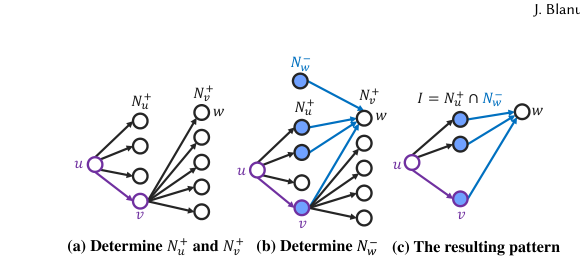

**그림 5: 중간 정점인 가장자리 𝑢→𝑣with 𝑣를 포함하는 산란-수집 패턴의 열거입니다.**

마지막 정점. 마지막으로, 시간 주기는 시간에 따라 가장자리가 정렬된 단순한 주기입니다.

스트리밍 방식으로 그래프 패턴 기반 특성을 계산하기 위해 우리 라이브러리는 입력된 가장자리 배치를 그래프에 삽입한 후 형성된 새로운 패턴을 열거합니다. 입력 배치에 속하는 정점 𝑣의 팬인 및 팬아웃 패턴 특성은 각각 𝑣의 나가는 정점과 들어오는 정점의 수를 계산하여 결정됩니다. 이러한 특성은 인덱스 데이터 구조에서 정점 𝑣의 인접 목록을 구현하는 해시 맵의 크기를 쿼리하여 𝑂(1) 시간 내에 확인할 수 있습니다(섹션 2.1 참조). 정점 𝑣의 팬인과 팬아웃이 둘 이상인 경우 수집-분산 패턴이 암시적으로 감지됩니다. 공간 제약으로 인해 스트리밍 방식으로 분산-수집 패턴을 찾는 알고리즘에 대한 설명을 생략합니다.

스트리밍 방식으로 간단한 주기와 시간 주기를 열거하기 위해 Blanuša et al.에서 소개된 세분화된 병렬 알고리즘을 사용합니다. [6, 7]. 이러한 알고리즘을 사용하면 여러 스레드를 사용하여 단일 에지 또는 소규모 에지 배치에서 시작하는 사이클을 병렬로 검색할 수 있습니다. 이러한 알고리즘의 장점은 높은 처리량으로 작은 배치로 거래를 처리할 수 있다는 것입니다. 예를 들어, 대략적인 병렬 접근 방식을 채택하여 사이클 계산을 병렬화하는 경우 배치의 각 가장자리에 대한 재귀 사이클 검색은 다른 스레드에 의해 수행됩니다. 그러나 Blanuša et al [6, 7]에서 볼 수 있듯이 대략적인 접근 방식을 사용하면 스레드 간 잠재적인 작업 부하 불균형으로 인해 차선책이 될 수 있습니다. 대조적으로, 세분화된 열거 알고리즘은 그림 4에 설명된 것처럼 여러 스레드를 사용하여 단일 에지에서 재귀 주기 검색을 실행할 수 있으므로 병렬성을 높일 수 있습니다. 결과적으로 입력 배치에 하나의 거래이 포함되어 있어도 우리 라이브러리는 주기 검색을 병렬화할 수 있습니다.

스트리밍 방식으로 분산 수집 패턴을 계산하기 위해 그림 5에 설명되어 있고 알고리즘 1에 제시된 알고리즘을 사용합니다. 이 알고리즘에서 (u →v,𝑡𝑢𝑣)는 소스 정점 𝑢, 대상 정점 𝑣 및 타임스탬프 𝑡𝑢𝑣가 있는 시간적 에지를 나타냅니다. 이 알고리즘은 해당 에지를 포함하는 모든 산란-수집 패턴을 검색하여 입력 배치의 각 에지(u →v,𝑡𝑢𝑣))를 처리합니다. 이 알고리즘의 첫 번째 및 두 번째 단계는 다음을 포함하는 산란-수집 패턴을 검색합니다. 첫 번째 단계에서는 먼저 그림 5a와 같이 각각 𝑁+𝑢 및 𝑁+𝑣로 표시된 𝑣 및 𝑢의 나가는 이웃을 결정합니다. 그런 다음 𝑣의 각 나가는 이웃 𝑤에 대해 정점의 들어오는 이웃 𝑁−𝑤을 검색합니다. 그림 5b에서 채워진 원으로 표시된 𝑤 이후에 𝑁+𝑢와 𝑁−𝑤 사이에 집합 교차를 수행하여 분산 수집 패턴의 중간 정점 𝐼을 찾습니다.

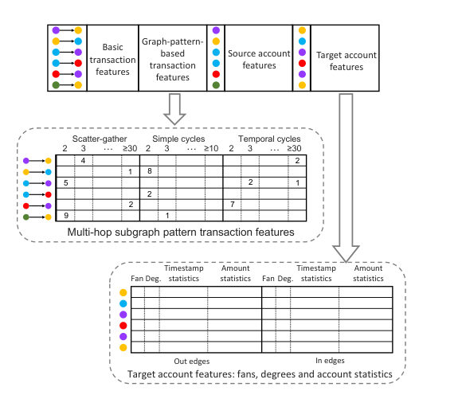

**그림 6: 특성 인코딩: 분산 수집 패턴은 중간 꼭지점 수에 따라 비닝되고, 주기는 길이에 따라 비닝됩니다.**

알고리즘은 그림 5c에 표시된 것처럼 정점 𝑢, 𝑤 및 𝐼로 정의된 결과 분산 수집 패턴을 보고합니다. 알고리즘 1의 라인 9–14에 표시된 이 알고리즘의 두 번째 단계는 첫 번째 단계와 유사하므로 간결성을 위해 설명을 생략합니다. 이 알고리즘은 알고리즘 1에 표시된 것처럼 루프를 병렬화하여 세분화된 방식으로 병렬화할 수 있습니다.

병렬화 외에도 그래프 패턴을 찾는 데 필요한 시간을 줄이는 또 다른 방법은 시간 창 제약 조건을 적용하는 것입니다. 이 경우 각 그래프 패턴에 대해 시간 창 매개변수 𝛿𝑝를 지정할 수 있습니다. 이 경우 라이브러리는 가장자리의 타임스탬프가 𝑡now −𝛿𝑝보다 크거나 같은 패턴만 검색합니다. 여기서 𝑡now는 메모리 내 그래프의 가장자리 중에서 가장 큰 타임스탬프를 나타냅니다. 또한 최대 길이를 제한하여 단순 사이클 검색을 제한할 수 있습니다.

정점 통계 기반 특성은 입력 가장자리 배치에 나타나는 정점에 대해 계산됩니다. 이러한 각 정점 𝑣에 대해 일부 미리 정의된 통계 속성은 𝑣의 나가는 가장자리 및 들어오는 가장자리와 연관된 선택된 기본 특성을 사용하여 계산될 수 있습니다. 현재 라이브러리에서 지원되는 통계 속성은 합계, 평균, 최소값, 최대값, 중앙값, 분산, 왜곡 및 첨도 [46]입니다. 예를 들어, 통계 속성 계산을 위해 기본 특성을 '금액'으로 선택한 경우 통계 특성에는 계정에서 받거나 보낸 평균 금액과 총액이 포함됩니다. 이러한 방식으로 다양한 통계 특성 유형을 다양한 사용자 주도 기본 특성과 결합하면 특성 공간이 크게 확장됩니다.

정점 통계 기반 특징은 증분 계산을 통해 스트리밍 방식으로 결정될 수 있습니다. 이를 위해 우리 라이브러리는 그래프의 각 정점과 계정 통계 계산에 사용되는 각 기본 특성(예: "금액")에 대해 두 번째, 세 번째 및 네 번째 중심 모멘트를 유지합니다. 모서리 𝑢→𝑣,를 삽입하거나 제거한 후 𝑢 및 𝑣에 대한 모든 중심 모멘트는 [28, 75]만큼 점진적으로 업데이트됩니다. 이러한 중심 순간은 다음과 같습니다.

<!-- 원문 5쪽 -->

> **주:** 그래프 특징 전처리기: 금융 범죄 탐지를 위한 실시간 하위 그래프 기반 특징 추출

**표 1: 실험에 사용된 데이터셋.**

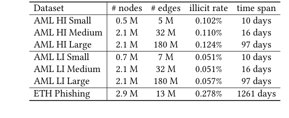

합계, 평균, 분산, 왜곡 및 첨도 [46]와 같은 통계 특성을 계산하는 데 사용됩니다. 앞서 언급한 각 통계 특징의 계산은 𝑂(1) 시간에 수행될 수 있습니다. 다른 통계적 특징, 즉 최소값, 최대값, 중앙값은 정점의 입사 가장자리를 반복하여 간단히 계산되며, 이는 통계적 특징당 𝑂(Δ) 시간으로 실행됩니다. 여기서 Δ는 그래프에서 정점의 최대 각도입니다.

### 2.3 특성 인코딩

GFP의 변환 특성에 의해 생성된 특징의 인코딩은 그림 6에 나와 있습니다. 출력 특성 테이블의 각 행은 단일 거래의 특성 벡터를 저장합니다. 특징 벡터의 여러 열에는 기본 거래 특성, 그래프 패턴 기반 거래 특성, 거래의 원본 및 대상 계정의 계정 특성이 있습니다. 계정 특성은 정점 통계 기반 특성과 팬인 및 팬아웃 패턴 기반 특성으로 구성되며, 둘 다 단일 홉 패턴입니다. 팬인 및 팬아웃 패턴을 기반으로 하는 특성은 각 계정에 대해 계산되며 𝑣해당 패턴에서 𝑣연결된 계정 수를 나타냅니다. 그래프 패턴 기반 거래 특성은 분산 수집, 홉 제한 단순 주기 및 시간 주기와 같은 다중 홉 하위 그래프 패턴을 사용하여 계산됩니다. 각 거래에 대해 우리 라이브러리는 이 거래이 포함된 다양한 크기의 다중 홉 하위 그래프 패턴 수를 보고합니다. 다중 홉 하위 그래프 패턴을 기반으로 한 예제 특성은 그림 6에 나와 있습니다. 여기서 첫 번째 거래은 3 중간 정점이 있는 4 분산 수집 패턴과 30 이상의 가장자리가 있는 2 시간 주기에 참여합니다. 이러한 다중 홉 하위 그래프 패턴을 사용하여 계정 특성을 계산할 수도 있지만 이를 거래 특성으로 계산하면 보다 컴팩트한 특성 벡터가 제공됩니다.

## 3 실험 설정

데이터셋. 표 1는 평가에 사용된 데이터셋를 나타냅니다. AML 데이터셋는 AMLworld 생성기 [1]에서 생성된 공개적으로 사용 가능한 합성 AML 데이터셋입니다. 이러한 데이터셋에는 합법 또는 불법으로 표시된 거래가 포함되어 있으므로 거래 분류를 수행하는 그래프 ML 파이프라인과 함께 직접 사용할 수 있습니다. 데이터셋는 두 가지 변형으로 제공됩니다. 하나는 더 높은 불법 비율(AML HI)이고 다른 하나는 더 낮은 불법 비율(AML LI)입니다. 또한 우리는 피싱으로 표시된 1, 165 계정이 있는 실제 Ethereum 데이터셋 [15, 82]인 ETH 피싱 데이터셋를 사용합니다. ETH 피싱 데이터세트를 사용하여 거래 분류를 활성화하기 위해 대상 계정이 피싱으로 라벨이 지정된 경우 이 데이터세트의 거래에 피싱 라벨을 지정합니다. 그 결과 이더리움 거래의 0.278%가 피싱으로 분류되었습니다.

**표 2: LightGBM 및 XGBoost 모델 모두의 하이퍼파라미터 조정에 사용되는 연속적인 절반 구성.**

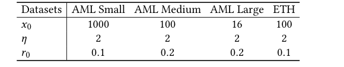

**표 3: 튜닝 시 사용되는 모델 매개변수 범위.**

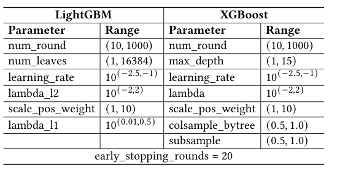

기준선. 본 연구에서는 그래프 ML 파이프라인의 기계 학습 모델로 표 형식 데이터에 널리 사용되는 ML 모델인 LightGBM(버전 3.1.1) [43] 및 XGBoost(버전 1.7.5) [16] 부스팅 머신을 사용합니다. 그래프 ML 파이프라인을 그래프 특성 전처리기에 의해 생성된 특성을 통합하지 않고 기본 특성만을 사용하여 훈련된 LightGBM 및 XGBoost 모델과 비교합니다. 이러한 모델의 초매개변수 조정을 수행하기 위해 우리는 연속적인 절반 모델 조정 접근 방식 [40]를 사용합니다. 추가 기준으로 우리는 GIN(Graph Isomorphism Network) [35, 83], 에지 업데이트(GIN+EU) [4, 12] 및 PNA(Principal Neighborhood Aggregation) [22, 77]와 같은 그래프 신경망(GNN)을 사용합니다. GIN+EU 기준선은 자금세탁방지를 위해 특별히 설계된 GNN인 LaundroGraph [12]와 유사합니다. AML 데이터셋에서 이러한 GNN의 정확도 결과는 Altman et al. [1]. 또한 모든 기준과 그래프 ML 파이프라인은 거래의 소스 및 대상 계정 ID 없이 학습됩니다. 이는 모델이 계정 ID 기억을 기반으로 자금세탁 거래를 식별하는 것을 방지합니다.

그래프 특성 전처리기 설정. 그래프 기반 특징을 추출하기 위해 다음과 같은 방법으로 GFP를 구성합니다. 특징은 분산-수집 패턴에 대해 6시간의 시간 창을 사용하고 나머지 그래프 기반 특성에 대해 1일의 시간 창을 사용하여 AML 데이터셋에서 추출됩니다. 간단한 사이클 열거를 위해 10의 사이클 길이 제약 조건을 지정합니다. 정점 통계 기반 특성을 생성하기 위해 기본 거래 특성의 "Amount" 및 "Timestamp" 필드를 사용합니다. ETH 피싱 데이터셋에서 특성 추출은 모든 그래프 기반 특성에 대해 20-일 시간 창을 사용하여 수행됩니다. 또한, 시간 주기 생성을 비활성화하고 간단한 주기 열거를 위해 5의 홉 제약 조건을 지정합니다. 본 연구에서는 "Amount", "Timestamp" 및 "Block Nr"을 사용합니다. 계정 통계를 생성하기 위한 기본 거래 특성의 필드입니다. 본 연구에서는 GFP의 처리량과 채점에 사용되는 ML 모델의 정확성 사이의 최상의 균형점을 찾는 것을 목표로 하는 신중한 탐색 후에 이러한 매개변수를 선택했습니다.

ML 파이프라인 훈련을 그래프로 작성합니다. 그래프 ML 파이프라인의 훈련 단계는 그림 7a에 설명되어 있습니다. 첫째, 거래 가능

<!-- 원문 6쪽 -->

### J. Blanuša, M. Cravero Baraja, A. Anghel, L. von Niederhäusern, E. Altman, H. Pozidis 및 K. Atasu

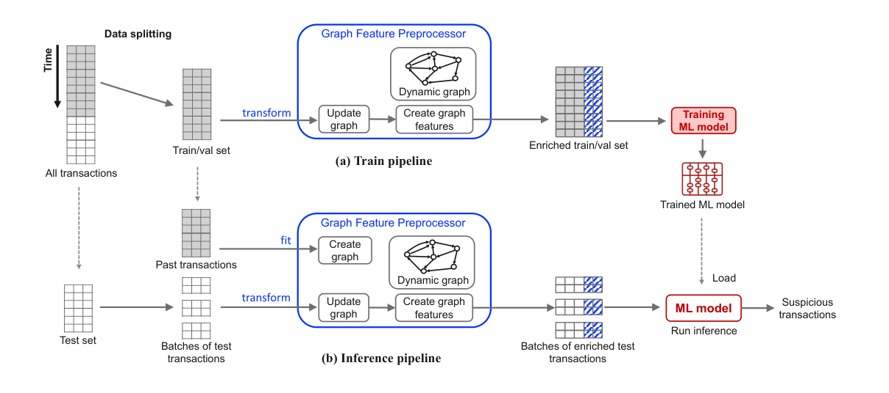

**그림 7: 의심 거래 탐지를 위한 그래프 ML 파이프라인의 훈련 및 추론 구성 요소.**

훈련용은 타임스탬프의 오름차순으로 정렬되며 훈련, 검증 및 테스트 세트로 분할됩니다. 이 분할은 열차 세트의 거래이 가장 낮은 타임스탬프를 갖고 테스트 세트의 거래이 가장 높은 방식으로 수행됩니다. 그런 다음 열차 및 검증 세트의 거래이 GFP로 전달되어 이 두 세트의 거래에 대한 강화된 그래프 기반 특성을 생성합니다. 훈련 시 정보 유출을 방지하기 위해 훈련 세트는 검증 세트보다 먼저 처리됩니다. 이 경우 열차 세트의 거래에 대한 그래프 기반 특징은 해당 거래만을 사용하여 생성된 그래프에서 계산되므로 검증 세트의 정보는 사용되지 않습니다. 마지막으로, 강화된 특성을 갖춘 학습 및 검증 세트를 사용하여 그래디언트 부스팅 모델 [16, 43]를 학습합니다.

기계 매개변수 튜닝 강화. 그래디언트 부스팅 기반 모델을 훈련하는 과정의 일환으로, 연속적인 반감기 접근 방식인 [40]를 사용하여 하이퍼 매개변수 조정을 수행합니다. 이 접근 방식은 열차 세트의 분수 𝑟0 ≤1를 사용하여 𝑥0 모델 매개변수 조합을 무작위로 샘플링하는 것으로 시작됩니다. 그런 다음 주어진 𝜂> 1 매개변수에 대해 알고리즘은 열차 세트의 𝜂× 𝑟0을 사용하는 다음 연속 절반 라운드에 사용되는 최상의 𝑥0/𝜂 구성을 찾습니다. 이 프로세스는 평가에 사용된 훈련 세트의 일부가 1에 도달할 때까지 계속됩니다. 실험에 사용된 연속적인 절반 매개변수는 표 2에 나와 있으며 하이퍼 매개변수 튜닝에 사용된 LightGBM 및 XGBoost 모델의 매개변수 범위는 표 3에 나와 있습니다.

그래프 ML 추론. 그래프 ML 파이프라인의 추론 단계는 그림 7b에 나와 있습니다. 먼저 그림 7a에 표시된 설정을 사용하여 훈련된 모델을 로드합니다. 그런 다음 fit 함수를 사용하여 과거 금융 거래를 로드하여 GFP를 초기화합니다. 이러한 과거 금융 거래는 초기 인메모리 그래프를 생성하는 데 사용됩니다. 다음으로, 테스트 세트의 거래은 배치로 그룹화되고 변환 특성을 사용하여 GFP로 전달됩니다. 이 특성은 전달된 거래를 사용하여 기존 동적 그래프를 업데이트하고 열차 설정에서 생성된 것과 동일한 유형의 그래프 기반 특성으로 해당 거래를 강화합니다(그림 7a 참조). 마지막으로, 강화된 테스트 거래는 금융 범죄와 관련된 거래 탐지를 위해 사전 훈련된 기계 학습 모델로 전송됩니다.

데이터 분할. 모델의 매개변수를 조정하고 모델 일반화 성능을 테스트하기 위해 입력 데이터를 학습, 검증 및 테스트 세트로 분할했습니다. 학습 세트와 검증 세트는 연속적인 반감기 방식에서 모델을 조정하는 데 사용되며, 테스트 세트는 모델의 최종 평가에 사용됩니다. AML 데이터셋의 경우 가장 작은 타임스탬프를 가진 거래의 60%가 훈련 세트로 선택되고 훈련 세트에서 제외된 가장 작은 타임스탬프를 가진 다음 20% 거래이 검증 세트로 선택되고 나머지는 테스트 세트로 선택되는 방식으로 분할이 수행됩니다. ETH 데이터세트의 경우 계정의 타임스탬프를 이 계정과 관련된 거래 중 최소 타임스탬프로 정의하고 가장 작은 타임스탬프를 가진 계정의 65%가 훈련 세트에만 존재하고 다음 15% 계정이 검증 데이터세트에만 존재하며 나머지는 테스트 세트에 있도록 데이터세트의 계정을 분할합니다. 앞서 언급한 방식으로 데이터셋를 분할하면 실험에서 데이터 유출을 방지할 수 있습니다.

## 4 결과

이 섹션에서는 그래프 ML 파이프라인의 정확성과 표 1의 데이터셋에서 훈련된 기타 기준을 평가합니다. LightGBM 및 XGBoost를 각각 GFP+LightGBM 및 GFP+XGBoost로 사용하는 그래프 ML 파이프라인을 참조합니다. 정확성을 측정하기 위해 소수 클래스 F1 점수를 사용합니다. 보고된 F1 점수는 5개의 서로 다른 실행에 대한 평균입니다. F1 점수의 표준 편차도 각 실험에 대해 보고됩니다.

그래프 ML 파이프라인에서는 거래이 일괄적으로 도착해야 합니다. AML 데이터셋의 경우 그래프 ML 파이프라인은 128 및 2048의 배치 크기를 사용합니다. 또한, ETH 피싱 데이터세트의 경우 그래프

<!-- 원문 7쪽 -->

> **주:** 그래프 특징 전처리기: 금융 범죄 탐지를 위한 실시간 하위 그래프 기반 특징 추출

**표 4: AML 데이터세트를 사용한 자금세탁 탐지 작업과 ETH 피싱 데이터세트를 사용한 피싱 탐지 작업의 소수 클래스 F1 점수(%)입니다. NA는 사용할 수 없음을 나타냅니다.**

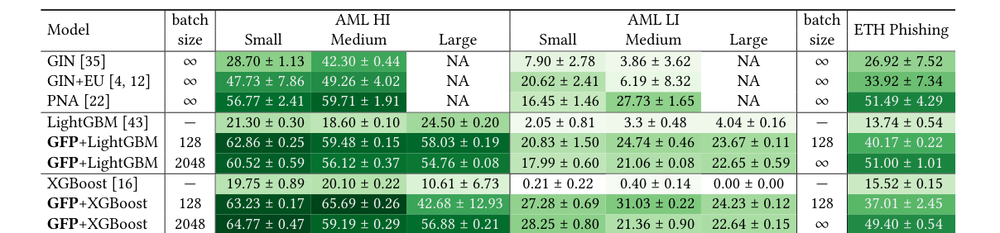

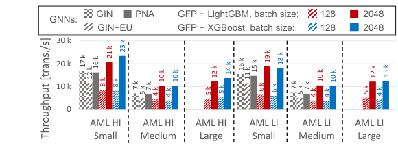

**그림 8: 그래프 ML 파이프라인은 V100 GPU에서 실행되는 GNN 기준선에 비해 처리량이 더 높습니다.**

특징 추출은 128 및 의 배치 크기를 사용하여 수행됩니다. 배치 크기가 무한대인 경우 테스트 세트의 모든 거래를 단일 배치로 GFP에서 사용할 수 있습니다. 의 배치 크기를 사용하는 것은 본질적으로 오프라인 솔루션에 해당하며 원칙적으로 더 나은 정확도로 이어질 수 있습니다. 이 경우 특징 추출 중에 향후 거래도 볼 수 있기 때문입니다. 그러나 애플리케이션에 실시간 처리 특성이 필요한 경우 배치 크기를 제한해야 합니다. GNN 기준선에서는 전체 데이터세트를 메모리에서 사용할 수 있어야 하므로 배치 크기가 인 오프라인 솔루션을 효과적으로 만들 수 있습니다.

AML 결과. AML 데이터셋를 사용하여 세탁 감지를 수행하는 ML 모델의 소수 클래스 F1 점수는 표 4에 나와 있습니다. 분명히 우리의 그래프 기반 특성은 그래디언트 부스팅 모델로 얻은 F1 점수를 크게 향상시킵니다. 그래프 기반 특성이 없으면 LightGBM 및 XGBoost가 달성하는 최대 F1 점수는 AML HI 데이터셋의 경우 24.5%이고 AML LI 데이터셋의 경우 4.04%입니다. 이렇게 정확도가 낮은 이유는 AML 데이터세트의 레이블이 매우 불균형하고 이러한 데이터세트의 불법 거래 수가 최대 전체 거래 수의 0.13%이기 때문입니다(표 1 참조). LightGBM 및 XGBoost 모델이 기본 특성 외에 그래프 기반 특성을 사용하는 그래프 ML 파이프라인은 기본 특성만 사용하는 모델보다 최대 46% 더 높은 F1 점수를 달성합니다. 또한 XGBoost 모델을 사용하는 그래프 ML 파이프라인은 GNN 기준보다 지속적으로 더 높은 F1 점수를 달성합니다. 가장 높은 정확도의 GNN 기준선인 PNA와 비교하여 XGBoost를 사용하는 그래프 ML 파이프라인은 AML HI 데이터셋에 대해 최대 8% 더 높은 F1 점수를 달성하고 LI 데이터셋에 대해 최대 11.8% 더 높은 F1 점수를 달성합니다.

AML 작업에 대한 그래프 ML 파이프라인의 정확성에 대한 GFP에서 생성된 다양한 유형의 그래프 기반 특성의 효과는 다음과 같습니다.

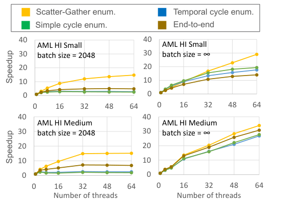

**그림 9: GFP 라이브러리의 다양한 부분 실행과 엔드투엔드 실행의 확장성. 속도 향상은 단일 스레드 실행에 상대적입니다.**

표 5에 나와 있습니다. 팬인 및 팬아웃 패턴을 기반으로 한 그래프 특성을 포함하면 기본 거래 특성만 사용하는 경우에 비해 이미 소수 클래스 F1 점수가 30% 이상 향상되는 것으로 나타났습니다. 다중 홉 그래프 패턴 특성(예: 주기 및 분산-수집 패턴 기반 특성)을 포함하면 F1 점수가 최대 4%까지 향상됩니다. 마지막으로, GFP에서 생성된 정점 통계 기반 특성을 통합함으로써 그래프 ML 파이프라인은 PNA 기준선에 비해 더 높은 정확도를 달성할 수 있습니다(표 4 참조). 따라서 각 유형의 그래프 기반 특성은 그래프 ML 파이프라인의 전반적인 정확성에 기여합니다.

**그림 8는 그래프 ML 파이프라인과 GNN 기준선의 처리량을 보여줍니다. 그래프 ML 파이프라인의 성능은 IBM Cloud [19]에서 사용 가능한 Cascade Lake Intel Xeon 프로세서의 64 소프트웨어 스레드를 사용하여 평가되었으며, GNN 기준선의 성능은 NVIDIA Tesla V100 GPU에서 평가되었습니다. 본 연구에서는 그래프 ML 파이프라인이 2048 일괄 처리로 거래를 수신할 때 GNN 기준보다 더 높은 처리량을 달성할 수 있음을 관찰했습니다. 이 처리량은 그림 9에 표시된 것처럼 GFP가 사용하는 확장 가능한 병렬 그래프 패턴 마이닝 알고리즘의 결과입니다. 이 그림은 또한 2.2 섹션에 소개된 스트리밍 분산 수집 알고리즘이 배치 크기가 무한대일 때 소프트웨어 스레드 수에 따라 거의 선형적으로 확장된다는 것을 보여줍니다. 결과적으로**

<!-- 원문 8쪽 -->

### J. Blanuša, M. Cravero Baraja, A. Anghel, L. von Niederhäusern, E. Altman, H. Pozidis 및 K. Atasu

**표 5: 그래프 ML 파이프라인의 소수 클래스 F1 점수(%)는 GFP에서 생성된 다양한 그래프 기반 특성이 자금세탁 감지의 정확성에 미치는 영향을 보여줍니다. 멀티 홉 패턴 특징에는 단순 주기, 시간 주기 및 분산-수집 패턴을 기반으로 하는 특징이 포함됩니다.**

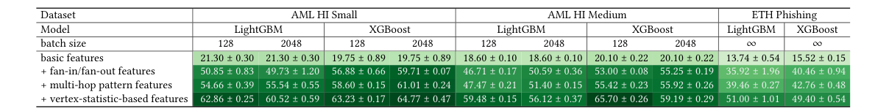

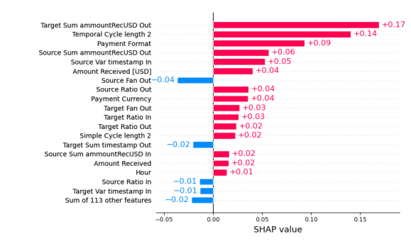

**그림 10: AML HI Small 거래를 불법으로 표시하기 위해 GFP+LightGBM 설정에서 사용하는 특성의 중요성.**

이러한 확장성으로 인해 AML 데이터셋의 128 및 2048 거래 일괄 처리의 평균 대기 시간은 각각 30 ms 및 148 ms입니다. 짧은 대기 시간으로 일괄 거래를 처리할 수 있다는 점에서 GFP는 실시간 처리에 적합합니다.

설명 가능성. 그래프 ML 파이프라인의 이점은 설명 가능한 결과를 생성한다는 것입니다. SHAP 라이브러리 [52]를 사용하면 거래를 불법으로 표시하는 데 사용되는 그래디언트 부스팅 기반 모델 특성의 중요성을 얻을 수 있습니다. 예를 들어, 그림 10에서 거래를 불법으로 표시하는 데 사용되는 가장 중요한 두 가지 특성은 2홉 시간 주기 수(시간 주기 길이 2)와 대상 계정이 받은 금액의 합계(Target Sum ammountRecUSD Out)를 나타내는 정점 통계 특성입니다. 결정을 설명하는 것은 분석가가 필요에 따라 시스템의 결정을 확인할 수 있기 때문에 사기 탐지 시스템에 대한 신뢰를 높이는 데 매우 중요합니다.

ETH 피싱 결과. 표 4는 또한 피싱 탐지를 수행하기 위해 ETH 피싱 데이터셋에서 훈련한 ML 모델로 달성한 소수 클래스 F1 점수를 보여줍니다. 128의 배치 크기를 사용할 때 그래프 기반 특성을 사용하면 LightGBM 및 XGBoost 모두에 대해 20%를 초과하는 F1 점수 향상이 가능합니다. 배치 크기를 로 설정하면 LightGBM의 F1 점수가 51%로 더욱 향상됩니다. 이 경우 그래프 기반 특성을 갖춘 LightGBM은 GIN+EU 기준을 10%만큼 능가하고 PNA를 통해 경쟁력 있는 정확도를 달성합니다. 그러나 배치 크기를 128에서 ≥로 효과적으로 늘리면 그래프 ML 파이프라인이 오프라인 솔루션이 됩니다. 일반적으로 GFP의 최적 구성은 최종 애플리케이션의 요구 사항에 따라 다르며 정확성을 위해 성능을 절충해야 할 수도 있습니다.

## 5 관련 연구

그래프 기계 학습은 금융 거래 네트워크 분석 [14, 49, 55, 79], 사기 탐지 [2, 11, 23, 24, 50, 86], 약물 발견 [30], 분자 특성 예측 [84], 유전체학 [70], 추천 시스템 [26], 소셜 네트워크 분석 [5, 27] 및 지식 그래프의 관계 예측을 포함한 다양한 분야에 적용됩니다. [60]. 사기 탐지 시스템 TitAnt [11] 및 Eddin et al. [24]는 노드 임베딩 [58]를 생성하거나 그래프에서 랜덤 워크 [56]를 수행하여 거래 그래프에서 특성을 추출하는 그래프 기계 학습 시스템입니다. 그런 다음 이러한 특성은 기계 학습 모델에서 수신 거래가 사기인지 여부를 예측하는 데 사용됩니다.

그래프 신경망(GNN) [8, 12, 33, 45, 50, 76, 79, 83]는 금융 범죄 탐지 목적으로 사용할 수 있는 강력한 도구입니다. Cardosoet al. [12] 및 Weber et al. [80]는 자금세탁방지 문제에 GNN을 적용합니다(Kanezashi et al.). [42]는 Ethereum 블록체인의 피싱 탐지 문제에 GNN을 적용했으며 Rao et al. [62]는 GNN을 사용하여 사기 거래를 탐지합니다. Bouritsas et al.이 제안한 그래프 하위 구조 네트워크. [8]는 사전 계산된 하위 그래프 패턴 수를 활용하여 GNN의 표현성을 향상시킵니다. GNN은 Chen et al.과 같이 하위 그래프 패턴을 계산하는 데 사용될 수도 있습니다. [18]는 금융 범죄와 관련된 패턴을 탐지할 수 있습니다. 우리 작업과 달리 GNN은 스트리밍 방식으로 직접 작동할 수 없으며 테스트 시 전체 데이터셋를 사용할 수 있어야 합니다.

금융 거래의 실시간 처리에는 동적 그래프 관리가 필요한 경우가 많습니다. STINGER [25], GraphTinker [39] 및 Sortledton [29]와 같은 동적 그래프 데이터 구조를 사용하면 그래프에서 간선을 동적으로 삽입하거나 제거할 수 있습니다. 그러나 STINGER 및 GraphTinker는 동일한 소스 및 대상 정점을 가진 다중 가장자리의 유지 관리를 지원하지 않기 때문에 금융 거래 그래프를 나타내는 데 직접 사용할 수 없습니다. 인메모리 그래프 데이터베이스 [10, 13, 85]는 동적 그래프 관리에도 사용할 수 있습니다. Bing의 분산형 인메모리 그래프 데이터베이스 A1 [10]는 고속 원격 직접 메모리 액세스를 활용하여 수십억 개의 정점과 가장자리가 포함된 진화하는 그래프를 유지합니다. Linkedin의 인 메모리 그래프 데이터베이스 [13]는 그래프에 대한 짧은 대기 시간 읽기 및 쓰기 작업을 가능하게 하며 그래프에서 N-ary 관계 표현을 지원합니다. 우리의 동적 그래프 데이터 구조는 N-ary 관계에 대한 지원을 필요로 하지 않으므로 더 간단한 방식으로 구현할 수 있습니다.

## 6 결론

본 연구에서는 동적으로 변화하는 거래 그래프에서 빠르게 특징을 추출하기 위한 소프트웨어 라이브러리인 GFP(Graph Feature Preprocessor)를 선보였습니다. 빠른 특징 추출을 달성하기 위해 우리 라이브러리는 메모리 내 동적 다중 그래프 표현과 세밀한 병렬 하위 그래프 열거 알고리즘을 활용합니다. GFP를 사용하면

<!-- 원문 9쪽 -->

> **주:** 그래프 특징 전처리기: 금융 범죄 탐지를 위한 실시간 하위 그래프 기반 특징 추출

우리의 그래프 ML 파이프라인은 실험에 제시된 GNN 기준선에 비해 배치당 대기 시간이 낮고 처리량이 더 높은 스트리밍 방식으로 작동합니다. 이 특성을 통해 GFP는 실시간 처리가 필요한 시나리오에 적합합니다.

또한 GFP에서 생성된 그래프 기반 특성이 그래디언트 부스팅 기반 기계 학습 모델의 정확도를 크게 향상시킬 수 있음을 보여주었습니다. 그래프 기반 특성은 그래디언트 부스팅 기반 기계 학습 모델의 소수 클래스 F1 점수를 합성 AML 데이터셋의 경우 최대 46%까지, 이더리움에서 추출된 실제 피싱 탐지 데이터셋의 경우 최대 35%까지 향상시킵니다. 또한 우리 솔루션은 AML 작업에 대한 GNN 기준선보다 최대 36% 더 높은 F1 점수를 달성한다는 것을 보여줍니다. 특히, 우리의 그래프 ML 파이프라인은 자금세탁방지를 위해 특별히 설계된 GNN인 LaundroGraph [12]와 유사한 아키텍처를 사용하여 GIN+EU 기준에 비해 최대 24% 더 높은 소수 클래스 F1 점수를 달성합니다.

GFP 라이브러리의 적용 범위는 자금세탁 탐지에만 국한되지 않습니다. 그래프의 주기가 조세 회피 [32], 순환 거래 [38, 41, 57] 및 신용 카드 사기 [54, 61]의 지표가 될 수 있다는 점을 고려하면 GFP는 이러한 유형의 사기를 탐지하는 데도 도움이 될 수 있습니다. 그러나 주기와 같은 사전 정의된 하위 그래프 패턴에 대한 의존은 이 라이브러리의 한 가지 단점이며, GFP [73]에서 사용자 정의 하위 그래프 패턴을 사용하여 하위 그래프 일치에 대한 지원을 추가하여 향후 작업의 일부로 해결할 계획입니다. 또한, cliques [9] 및 bicliques [59]와 같은 추가 하위 그래프 패턴을 기반으로 특징 추출에 대한 지원을 추가할 계획입니다. 이러한 패턴을 열거할 수 있으면 긴밀하게 연결된 커뮤니티 [51]뿐만 아니라 다양한 금융 범죄 시나리오에서 직면하는 누적 자금세탁 패턴 [1]을 탐지할 수 있습니다.

## 감사의 글

이 작업에 대한 스위스 국립과학재단(프로젝트 번호 172610)의 지원에 감사드립니다. 저자는 이 작업 과정에서 지원, 피드백 및 제안을 해준 IBM의 Donna Eng Dillenberger, Thomas Parnell, Martin Petermann, Evan Rivera 및 Elpida Tzortzatos에게 감사의 말씀을 전하고 싶습니다.

## 참고문헌

[1] Erik Altman, Jovan Blanuša, Luc von Niederhäusern, Béni Egressy, Andreea

Anghel, and Kubilay Atasu. 2023. Realistic Synthetic Financial Transactions for Anti-Money Laundering Models. In NeurIPS'23, Datasets and Benchmarks Track. [2] Amazon. 2023. Amazon Fraud Detector. https://aws.amazon.com/fraud-detector/

Accessed: 2023-01-10. [3] V K Balakrishnan. 1997. Graph Theory. McGraw-Hill Professional, New York,

NY. [4] Peter W Battaglia, Jessica B Hamrick, Victor Bapst, Alvaro Sanchez-Gonzalez,

Vinicius Zambaldi, Mateusz Malinowski, Andrea Tacchetti, David Raposo, Adam Santoro, Ryan Faulkner, et al. 2018. Relational inductive biases, deep learning, and graph networks. arXiv preprint arXiv:1806.01261 (2018). [5] Austin R. Benson, David F. Gleich, and Jure Leskovec. 2016. Higher-order or-

ganization of complex networks. Science 353, 6295 (2016), 163–166. https: //doi.org/10.1126/science.aad9029 [6] Jovan Blanuša, Paolo Ienne, and Kubilay Atasu. 2022. Scalable Fine-Grained

Parallel Cycle Enumeration Algorithms. In Proceedings of the 34th ACM Symposium on Parallelism in Algorithms and Architectures. ACM, Philadelphia PA USA, 247–258. https://doi.org/10.1145/3490148.3538585 [7] Jovan Blanuša, Kubilay Atasu, and Paolo Ienne. 2023. Fast Parallel Algorithms

for Enumeration of Simple, Temporal, and Hop-constrained Cycles. ACM Trans. Parallel Comput. 10, 3 (Sept. 2023), 1–35. https://doi.org/10.1145/3611642 [8] Giorgos Bouritsas, Fabrizio Frasca, Stefanos Zafeiriou, and Michael M. Bronstein.

2023. Improving Graph Neural Network Expressivity via Subgraph Isomorphism Counting. IEEE Trans. Pattern Anal. Mach. Intell. 45, 1 (Jan. 2023), 657–668. https://doi.org/10.1109/TPAMI.2022.3154319

[9] Coen Bron and Joep Kerbosch. 1973. Algorithm 457: finding all cliques of an

undirected graph. Commun. ACM 16, 9 (Sept. 1973), 575–577. https://doi.org/10. 1145/362342.362367 [10] Chiranjeeb Buragohain, Knut Magne Risvik, Paul Brett, Miguel Castro, Wonhee

Cho, Joshua Cowhig, Nikolas Gloy, Karthik Kalyanaraman, Richendra Khanna, John Pao, Matthew Renzelmann, Alex Shamis, Timothy Tan, and Shuheng Zheng. 2020. A1: A Distributed In-Memory Graph Database. In Proceedings of the 2020 ACM SIGMOD International Conference on Management of Data. ACM, Portland OR USA, 329–344. https://doi.org/10.1145/3318464.3386135 [11] Shaosheng Cao, XinXing Yang, Cen Chen, Jun Zhou, Xiaolong Li, and Yuan

Qi. 2019. TitAnt: online real-time transaction fraud detection in Ant Financial. PVLDB 12, 12 (Aug. 2019), 2082–2093. https://doi.org/10.14778/3352063.3352126 [12] Mário Cardoso, Pedro Saleiro, and Pedro Bizarro. 2022. LaundroGraph: Self-

Supervised Graph Representation Learning for Anti-Money Laundering. In Proceedings of the Third ACM International Conference on AI in Finance. 130–138. [13] Andrew Carter, Andrew Rodriguez, Yiming Yang, and Scott Meyer. 2019. Nanosec-

ond Indexing of Graph Data With Hash Maps and VLists. In Proceedings of the 2019 International Conference on Management of Data. ACM, Amsterdam Netherlands, 623–635. https://doi.org/10.1145/3299869.3314044 [14] Tao-Hung Chang and Davor Svetinovic. 2020. Improving Bitcoin Ownership

Identification Using Transaction Patterns Analysis. IEEE Transactions on Systems, Man, and Cybernetics: Systems 50, 1 (2020), 9–20. https://doi.org/10.1109/TSMC. 2018.2867497 [15] Liang Chen, Jiaying Peng, Yang Liu, Jintang Li, Fenfang Xie, and Zibin Zheng.

2019. XBLOCK Blockchain Datasets: InPlusLab Ethereum Phishing Detection Datasets. http://xblock.pro/ethereum/. [16] Tianqi Chen and Carlos Guestrin. 2016. XGBoost: A Scalable Tree Boosting

System. In Proceedings of the 22nd ACM SIGKDD International Conference on Knowledge Discovery and Data Mining (San Francisco, California, USA) (KDD '16). ACM, New York, NY, USA, 785–794. https://doi.org/10.1145/2939672.2939785 [17] Xucan Chen, Mohammad Al Hasan, Xintao Wu, Pavel Skums, Mohammad Javad

Feizollahi, Marie Ouellet, Eric L. Sevigny, David Maimon, and Yubao Wu. 2019. Characteristics of Bitcoin Transactions on Cryptomarkets. In Security, Privacy, and Anonymity in Computation, Communication, and Storage, Guojun Wang, Jun Feng, Md Zakirul Alam Bhuiyan, and Rongxing Lu (Eds.). Vol. 11611. Springer International Publishing, Cham, 261–276. https://doi.org/10.1007/978-3-030- 24907-6_20 Series Title: Lecture Notes in Computer Science. [18] Zhengdao Chen, Lei Chen, Soledad Villar, and Joan Bruna. 2020. Can Graph

Neural Networks Count Substructures?. In NeurIPS 2020, December 6-12, 2020, virtual, Hugo Larochelle, Marc'Aurelio Ranzato, Raia Hadsell, Maria-Florina Balcan, and Hsuan-Tien Lin (Eds.). [19] IBM Cloud. 2024. IBM Cloud Docs - Virtual Private Cloud (VPC). https: //cloud.ibm.com/docs/vpc Accessed: 2024-02-08. [20] Thomas H. Cormen (Ed.). 2009. Introduction to algorithms (3rd ed ed.). MIT Press,

Cambridge, Mass. OCLC: ocn311310321. [21] Livio Corselli. 2023. Italy: money transfer, money laundering and intermediary

liability. JFC 30, 2 (Feb. 2023), 377–388. https://doi.org/10.1108/JFC-10-2019-0137 [22] Gabriele Corso, Luca Cavalleri, Dominique Beaini, Pietro Liò, and Petar

Veličković. 2020. Principal Neighbourhood Aggregation for Graph Nets. In Advances in Neural Information Processing Systems, H. Larochelle, M. Ranzato, R. Hadsell, M.F. Balcan, and H. Lin (Eds.), Vol. 33. Curran Associates, Inc., 13260– 13271. [23] Andras Cser, Merritt Maxix, Caroline Provost, and Peggy Dostie. 2022. The

Forrester Wave™: Anti-Money-Laundering Solutions, Q3 2022. Technical Report. Forrester. 1–10 pages. https://www.forrester.com/report/the-forrester-wavetm-anti-money-laundering-solutions-q3-2022/RES176346 Accessed: 2023-01-10. [24] Ahmad Naser Eddin, Jacopo Bono, David Aparício, David Polido, João Tiago

Ascensão, Pedro Bizarro, and Pedro Ribeiro. 2022. Anti-Money Laundering Alert Optimization Using Machine Learning with Graphs. arXiv:2112.07508 [cs]. [25] David Ediger, Rob McColl, Jason Riedy, and David A. Bader. 2012. STINGER:

High performance data structure for streaming graphs. In 2012 IEEE Conference on High Performance Extreme Computing. IEEE, Waltham, MA, USA, 1–5. https: //doi.org/10.1109/HPEC.2012.6408680 [26] Chantat Eksombatchai, Pranav Jindal, Jerry Zitao Liu, Yuchen Liu, Rahul Sharma,

Charles Sugnet, Mark Ulrich, and Jure Leskovec. 2018. Pixie: A System for Recommending 3+ Billion Items to 200+ Million Users in Real-Time. In Proceedings of the 2018 World Wide Web Conference (Lyon, France) (WWW '18). 1775–1784. https://doi.org/10.1145/3178876.3186183 [27] Wenqi Fan, Yao Ma, Qing Li, Yuan He, Yihong Eric Zhao, Jiliang Tang, and Dawei

Yin. 2019. Graph Neural Networks for Social Recommendation. In The World Wide Web Conference, WWW 2019, San Francisco, CA, USA, May 13-17, 2019. ACM, 417–426. https://doi.org/10.1145/3308558.3313488 [28] Tony Finch. 2009. Incremental calculation of weighted mean and variance. (01

2009), 1–8. [29] Per Fuchs, Domagoj Margan, and Jana Giceva. 2022. Sortledton: a universal,

transactional graph data structure. Proc. VLDB Endow. 15, 6 (Feb. 2022), 1173–1186. https://doi.org/10.14778/3514061.3514065

<!-- 원문 10쪽 -->

### J. Blanuša, M. Cravero Baraja, A. Anghel, L. von Niederhäusern, E. Altman, H. Pozidis 및 K. Atasu

[30] Thomas Gaudelet, Ben Day, Arian R Jamasb, Jyothish Soman, Cristian Regep, Gertrude Liu, Jeremy B R Hayter, Richard Vickers, Charles Roberts, Jian Tang, David Roblin, Tom L Blundell, Michael M Bronstein 및 Jake P Taylor-King. 2021. 약물 발견 및 개발에 그래프 머신러닝을 활용합니다. 생물정보학 22, 6(05 2021) 브리핑. https://doi.org/10.1093/bib/bbab159 [31] Leo Grinsztajn, Edouard Oyallon 및 Gael Varoquaaux. 2022. 트리 기반 모델이 일반적인 표 형식 데이터에 대한 딥 러닝보다 여전히 뛰어난 성능을 보이는 이유는 무엇입니까? 제36회 신경 정보 처리 시스템 컨퍼런스(NeurIPS 2022) 데이터셋 및 벤치마크 추적, S. Koyejo, S. Mohamed, A. Agarwal, D. Belgrave, K. Cho 및 A. Oh(Eds.), Vol. 35. 커란 어소시에이츠, Inc., 507–520. [32] László Hajdu와 Miklós Krész. 2020. 은행 부문의 사기 탐지를 위한 임시 네트워크 분석. ADBIS, TPDL 및 EDA 2020 공통 워크샵 및 박사 컨소시엄. Vol. 1260. Springer International Publishing, Cham, 145–157. https://doi.org/10.1007/978-3-030-55814-7_12 시리즈 제목: 컴퓨터 및 정보 과학 커뮤니케이션. [33] 윌리엄 L. 해밀턴, 렉스 잉, Jure Leskovec. 2017. 귀납적 표현

> **주:** 큰 그래프에 대한 학습. NIPS에서. [34] 페터 홈(Petter Holme)과 야리 사라매키(Jari Saramäki). 2012. 시간적 네트워크. 물리학 보고서 519,

3(10월 2012), 97–125. https://doi.org/10.1016/j.physrep.2012.03.001 [35] Weihua Hu, Bowen Liu, Joseph Gomes, Marinka Zitnik, Percy Liang, Vijay Pande,

> **주:** 그리고 Jure Leskovec. 2019. 그래프 신경망 사전 훈련 전략. arXiv 사전 인쇄 arXiv:1905.12265(2019). [36] IBM. 2023. IBM Z 및 LinuxONE용 AI 툴킷. https://www.ibm.com/products/

> **주:** ai-toolkit-for-z-and-linuxone 액세스됨: 2024-01-25. [37] IBM. 2023. 데이터용 Cloud Pak. https://www.ibm.com/products/cloud-pak-for-

> **주:** 액세스된 데이터: 2023-02-21. [38] Md. Nazrul Islam, S. M. Rafizul Haque, Kaji Masudul Alam 및 Md. Tarikuzzaman.

2009. MCL 알고리즘을 사용하여 공모 세트 탐지를 개선하는 접근 방식입니다. 2009 12차 컴퓨터 및 정보 기술 국제 컨퍼런스에서. IEEE, 다카, 방글라데시, 237–242. https://doi.org/10.1109/ICCIT.2009.5407133 [39] Wole Jaiyeoba와 Kevin Skadron. 2019. GraphTinker: 고성능 데이터

> **주:** 동적 그래프 처리를 위한 구조. 2019 IEEE 국제 병렬 및 분산 처리 심포지엄(IPDPS)에서. IEEE, 브라질 리우데자네이루, 1030–1041. https://doi.org/10.1109/IPDPS.2019.00110 [40] 케빈 제이미슨과 로버트 노왁. 2014. 최고의 팔 식별 알고리즘

고정 신뢰도 설정에서 다중 무장 도적의 경우. 2014 48차 정보 과학 및 시스템 연례 컨퍼런스(CISS)에서. IEEE, 미국 뉴저지주 프린스턴, 1–6. https://doi.org/10.1109/CISS.2014.6814096 [41] Zhi-Qiang Jiang, Wen-Jie Xie, Xiong Xiong, Wei Zhang, Yong-Jie Zhang 및 Wei-Xing Zhou. 2013. 거래 네트워크, 비정상적인 모티프 및 주식 조작. 정량 금융 편지 1, 1 (12월 2013), 1–8. 도이: 10.1080/21649502.2013.802877. [42] 카네자시 히로키, 스즈무라 토요타로, 리우 신, 히로후치 타카히로.

2022. 이기종 그래프 신경망을 사용한 이더리움 사기 탐지. arXiv:2203.12363 [cs]. [43] Guolin Ke, Qi Meng, Thomas Finley, Taifeng Wang, Wei Chen, Weidong Ma,

Qiwei Ye, Tie-Yan Liu. 2017. LightGBM: 매우 효율적인 그래디언트 부스팅 의사결정 트리. 신경 정보 처리 시스템의 발전, Vol. 30. Curran Associates, Inc. https://proceedings.neurips.cc/paper_files/paper/2017/ file/6449f44a102fde848669bdd9eb6b76fa-Paper.pdf [44] Nancy Kinnison 및 John Madinger(Eds.). 2011. 자금세탁: 다음에 대한 가이드

> **주:** 범죄 수사관, 제3판. 루트리지, 보스턴, 매사추세츠. [45] Thomas N. Kipf와 Max Welling. 2017. 준감독 분류

> **주:** 그래프 컨벌루션 네트워크. 학습 표현에 관한 국제 회의에서. [46] 스티븐 코코스카와 다니엘 즈윌링거. 2000. CRC 표준 확률 및

통계표 및 공식, 학생용(0 에디션). CRC 프레스. https://doi. org/10.1201/b16923 [47] Meng-Chieh Lee, Yue Zhao, Aluna Wang, Pierre Jinghong Liang, Leman Akoglu, Vincent S. Tseng 및 Christos Faloutsos. 2020. 자동 감사: 채굴 회계 및 시간 변화 그래프. 2020 IEEE 빅 데이터(빅 데이터) 국제 컨퍼런스에서. IEEE, 미국 조지아주 애틀랜타, 950–956. https://doi.org/10.1109/BigData50022. 2020.9378346 [48] Xiangfeng Li, Shenghua Liu, Zifeng Li, Xiaotian Han, Chuan Shi, Bryan Hooi,

> **주:** He Huang 및 Xueqi Cheng. 2020. FlowScope: 그래프를 기반으로 자금세탁 탐지. AAAI 34, 04(4월 2020), 4731–4738. https://doi.org/10.1609/ aaai.v34i04.5906 [49] Xiao Fan Liu, Xin-Jian Jiang, Si-Hao Liu 및 Chi Kong Tse. 2021. 지식

암호화폐 거래의 발견: 설문조사. IEEE 9(2021), 37229–37254에 액세스합니다. https://doi.org/10.1109/ACCESS.2021.3062652 [50] Yang Liu, Xiang Ao, Zidi Qin, Jianfeng Chi, Jinghua Feng, Hao Yang 및 Qing He.

2021. 고르고 선택하기: 사기 탐지를 위한 GNN 기반 불균형 학습 접근 방식. 웹 컨퍼런스 2021 간행물(슬로베니아 류블랴나)(WWW '21). 컴퓨팅 기계 협회, 뉴욕, 뉴욕, 미국, 3168–3177.

https://doi.org/10.1145/3442381.3449989 [51] Zhenqi Lu, Johan Wahlström 및 Arye Nehorai. 2018. Clique Conductance를 통한 복잡한 네트워크의 커뮤니티 탐지. Sci Rep 8, 1 (12월 2018), 5982.

> **주:** https://doi.org/10.1038/s41598-018-23932-z [52] Scott M Lundberg 및 이수인. 2017. 해석 모델에 대한 통합 접근 방식

예측. 신경 정보 처리 시스템 30의 발전. 커란 어소시에이츠, Inc., 4765–4774. [53] Prabhaker Mateti와 Narsingh Deo. 1976. 그래프의 모든 회로를 열거하는 알고리즘. SIAM J. 컴퓨팅. 5, 1(3월 1976), 90–99. https: //doi.org/10.1137/0205007 [54] Jack Nicholls, Aditya Kuppa 및 Nhien-An Le-Khac. 2021. 금융 사이버 범죄:

진화하는 금융 범죄 환경을 해결하기 위한 딥 러닝 접근 방식에 대한 종합적인 조사입니다. IEEE 9(2021), 163965–163986에 액세스합니다. https://doi. org/10.1109/ACCESS.2021.3134076 [55] Jack Nicholls, Aditya Kuppa 및 Nhien-An Le-Khac. 2021. 금융 사이버 범죄:

진화하는 금융 범죄 환경을 해결하기 위한 딥 러닝 접근 방식에 대한 종합적인 조사입니다. IEEE 9(2021), 163965–163986에 액세스합니다. https://doi. org/10.1109/ACCESS.2021.3134076 [56] 카타리나 올리베이라, 주앙 토레스, 마리아 이네스 실바, 다비드 아파리시오, 주앙 티아고

> **주:** Ascensão, Pedro Bizarro. 2021. GuiltyWalker: 비트코인 ​​네트워크의 불법 노드까지의 거리. arXiv:2102.05373 [cs]. [57] Girish Keshav Palshikar 및 Manoj M. Apte. 2008. 다음을 사용한 공모 세트 탐지

그래프 클러스터링. 데이터 Min Knowl 디스크 16, 2(4월 2008), 135–164. https: //doi.org/10.1007/s10618-007-0076-8 [58] Bryan Perozzi, Rami Al-Rfou 및 Steven Skiena. 2014. DeepWalk: 온라인 학습

> **주:** 사회적 표현의 지식 발견 및 데이터 마이닝에 관한 제20차 ACM SIGKDD 국제 컨퍼런스 진행 중. ACM, 뉴욕 미국 뉴욕, 701–710. https://doi.org/10.1145/2623330.2623732 [59] 에리히 프리스너. 2000. 그래프 I의 Bicliques: 숫자의 한계. 콤비나-

> **주:** 토리카 20, 1(1월 2000), 109–117. https://doi.org/10.1007/s004930070035 [60] Xiao Qin, Nasrullah Sheikh, Berthold Reinwald 및 Lingfei Wu. 2021. 관계-

적응형 자기 적대적 훈련을 통한 인지 그래프 주의 모델. AAAI'21에서. AAAI 프레스, 9368–9376. [61] Xiafei Qiu, Wubin Cen, Zhengping Qian, You Peng, Ying Zhang, Xuemin Lin,

> **주:** 그리고 저우징렌. 2018. 대규모 동적 그래프에서 실시간으로 제한된 사이클을 감지합니다. PVLDB 11, 12(8월 2018), 1876–1888. 도이: 10.14778/3229863.3229874. [62] Susie Xi Rao, Shuai Zhang, Zhichao Han, Zitao Zhang, Wei Min, Zhiyao Chen,

Yinan Shan, Yang Zhao, Ce Zhang. 2021. xFraud: 설명 가능한 사기 거래 감지. PVLDB 15, 3(11월 2021), 427–436. https://doi.org/10.14778/ 3494124.3494128 [63] C++ 참조. 2023. std::순서가 없는_맵. https://en.cppreference.com/w/cpp/ 컨테이너/unordered_map 액세스됨: 2023-02-21. [64] IBM 리서치. 2022. 그래프 특성 전처리기 공개 예제. https://github.com/IBM/snapml-examples/blob/main/examples/graph_ feature_preprocessor/graph_feature_preprocessor.ipynb 액세스됨: 2023-03-3. [65] IBM 리서치. 2022. 그래프 특성 전처리기 문서. https://snapml.

> **주:** readthedocs.io/en/latest/graph_preprocessor.html 액세스: 2023-01-10. [66] IBM 리서치. 2022. Snap ML PyPI 패키지. https://pypi.org/project/snapml/

액세스됨: 2023-01-10. [67] 피터 로이터와 에드윈 M. 트루먼. 2004. 더러운 돈을 쫓아: 싸움

> **주:** 자금세탁에 반대합니다. 국제 경제 연구소(워싱턴 DC), 자금세탁: 방법 및 시장 장. [68] 에반 리베라, 요반 블라누샤, 자와할랄 라잔, 알렉시스 랜디스, 하리스 포지디스.

2024. IBM Z 자금세탁방지 솔루션 템플릿의 AI. https://github. com/ambitus/aionz-st-anti-money-laundering 액세스됨: 2024-10-02. [69] 빅토리아 론지, 크리스토프 에거, 러셀 W. F. 라이, 도미니크 슈뢰더,

후버 H. F. 인. 2021. 링 샘플링의 기초. 개인정보 보호 강화 기술 2021, 3(7월 2021), 265–288에 관한 소송. https://doi.org/10.2478/ popets-2021-0047 [70] Roman Schulte-Sasse, Stefan Budach, Denes Hnisz 및 Annalisa Marsico. 2021.

새로운 암 유전자 및 관련 분자 메커니즘을 식별하기 위해 멀티오믹스 데이터와 그래프 컨볼루션 네트워크를 통합합니다. 자연 기계 지능 3, 6(2021), 513–526. https://doi.org/10.1038/s42256-021-00325-y [71] scikit-learn 개발자입니다. 2022. Scikit-learn: 데이터 전처리. https://scikit-

> **주:** learn.org/stable/modules/preprocessing.html 액세스: 2023-01-16. [72] Michele Starnini 및 Charalampos E. Tsourakakis 외. 2021. 스머프 기반 안티

시간이 지남에 따라 변화하는 거래 네트워크에서의 자금세탁. 데이터베이스의 기계 학습 및 지식 발견. 응용 데이터 과학 트랙. Vol. 12978. Springer International Publishing, Cham, 171–186. https://doi.org/10.1007/978- 3-030-86514-6_11 [73] Shixuan Sun과 Qiong Luo. 2020. 메모리 내 하위 그래프 일치: 심층 연구. 데이터 관리에 관한 2020 ACM SIGMOD 국제 회의 진행 중. ACM, 포틀랜드 또는 미국, 1083–1098. https://doi.org/10. 1145/3318464.3380581 [74] 토요타로 스즈무라와 히로키 가네자시. 2021. 자금세탁방지 데이터세트: InPlusLab 자금세탁방지 데이터세트. http://github.com/ IBM/AMLSim/. [75] Katharina Tschumitschew와 Frank Klawonn. 2012. 증분 통계 측정. 비고정 환경에서의 학습에서 Moamar Sayed-Mouchaweh 및 Edwin Lughofer(Eds.). 스프링거 뉴욕, 뉴욕, 뉴욕, 21–55. https://doi.org/10.1007/978-1-4419-8020-5_2

<!-- 원문 11쪽 -->

> **주:** 그래프 특징 전처리기: 금융 범죄 탐지를 위한 실시간 하위 그래프 기반 특징 추출

> **주:** [76] 페타르 벨리코비치, 길렘 쿠쿠룰, 아란차 카사노바, 아드리아나 로메로, 피에트로

> **주:** Liò, 요슈아 벤지오. 2018. 그래프 주의 네트워크. 학습 표현에 관한 국제 회의(2018). [77] 페타르 벨리코비치, 윌리엄 페더스, 윌리엄 L 해밀턴, 피에트로 리오, 요슈아 벤지오,

및 R Devon Hjelm. 2019. 딥 그래프 Infomax. ICLR(포스터) 2, 3(2019), 4. [78] 사무라이 지갑. 2021. 월풀 코인조인. https://samouraiwallet.com/ 소용돌이 [79] Jianian Wang, Sheng Zhang, Yanghua Xiao 및 Rui Song. 2021. 에 대한 검토

> **주:** 금융 애플리케이션의 그래프 신경망 방법. CoRR 절대/2111.15367(2021). arXiv:2111.15367 [80] Mark Weber, Giacomo Domeniconi, Jie Chen, Daniel Karl I Weidele, Claudio

> **주:** 벨레이, 톰 로빈슨, 찰스 E 레이저슨. 2019. 비트코인의 자금세탁방지: 금융 포렌식을 위한 그래프 컨벌루션 네트워크 실험. arXiv 사전 인쇄 arXiv:1908.02591(2019). [81] Jiajing Wu, Jieli Liu, Weili Chen, Huawei Huang, Zibin Zheng 및 Yan Zhang.

2021. 하이브리드 모티브를 사용한 비트코인 ​​거래 네트워크 채굴을 통한 혼합 서비스 감지. IEEE 트랜스. 시스템. Man Cybern, Syst. (2021), 1–13. https://doi.org/ 10.1109/TSMC.2021.3049278

[82] X블록. 2024. 이더리움 피싱 거래 네트워크. https://www.kaggle.

> **주:** com/datasets/xblock/ethereum-phishing-transaction-network 액세스됨: 2023- 01-27. [83] Keyulu Xu, Weihua Hu, Jure Leskovec 및 Stefanie Jegelka. 2018. 얼마나 강력한가

> **주:** 그래프 신경망은 무엇입니까? arXiv 사전 인쇄 arXiv:1810.00826 (2018). [84] Zaixi Zhang, Qi Liu, Hao Wang, Chengqiang Lu 및 Cheekong Lee. 2021. 주제-

> **주:** 분자특성 예측을 위한 그래프 기반 자기지도 학습. CoRR 절대/2110.00987(2021). arXiv:2110.00987 [85] Xiaowei Zhu, Guanyu Feng, Marco Serafini, Xiaosong Ma, Jiping Yu, Lei Xie,

Ashraf Aboulnaga 및 Wenguang Chen. 2020. LiveGraph: 순수 순차 인접 목록 스캔 특성을 갖춘 거래 그래프 저장 시스템입니다. 진행 VLDB 기부. 13, 7(3월 2020), 1020–1034. https://doi.org/10.14778/3384345.3384351 [86] Yongchun Zhu, Dongbo Xi, Bowen Song, Fuzhen Zhuang, Shuai Chen, Xi Gu 및 Qing He. 2020. 도메인 간 사기 탐지를 위한 계층적 설명 가능 네트워크를 사용한 사용자 행동 시퀀스 모델링. 웹 컨퍼런스 2020 진행 중. ACM, 대만 타이페이, 928–938. https://doi.org/10.1145/ 3366423.3380172
