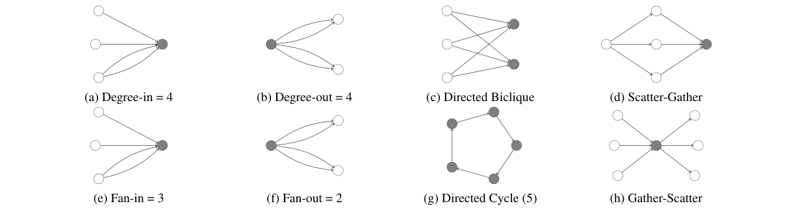
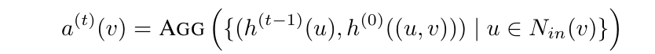
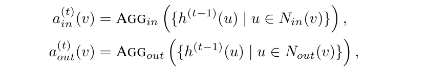
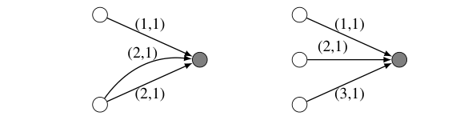
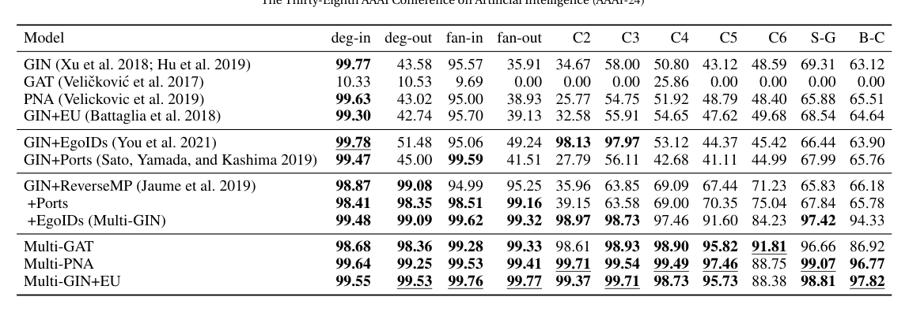
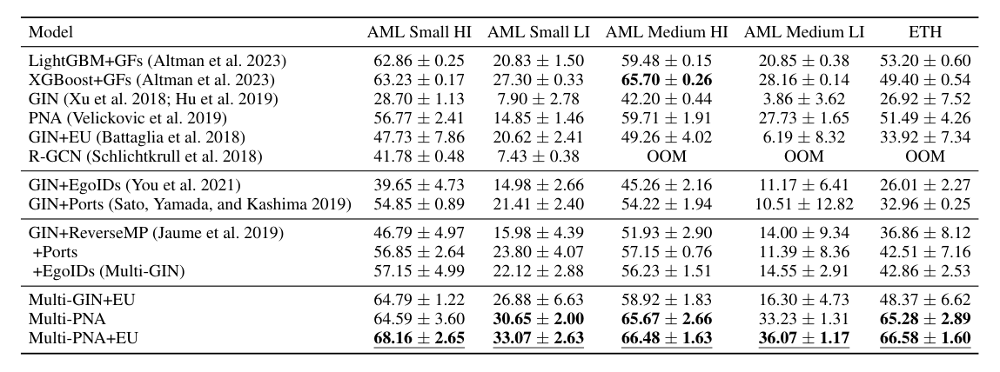

# 방향성 멀티그래프를 위한 이론적으로 강력한 그래프 신경망

> **원문 제목:** Provably Powerful Graph Neural Networks for Directed Multigraphs  
> **저자:** Béni Egressy · Luc von Niederhäusern · Jovan Blanuša · Erik Altman · Roger Wattenhofer · Kubilay Atasu  
> **게재 정보:** AAAI Conference on Artificial Intelligence, 2024  
> **DOI:** [https://doi.org/10.48550/arXiv.2306.11586](https://doi.org/10.48550/arXiv.2306.11586)

> **번역 안내:** 본문과 부록은 문단 문맥을 기준으로 한국어로 옮겼습니다. 수식과 참고문헌은 정확성을 위해 원문 표기를 유지했습니다. 원문의 그림과 표는 개별 이미지로 잘라 해당 본문 위치에 바로 배치했습니다.

---

<!-- 원문 1쪽 -->

## 초록

본 논문에서는 표준 메시지 전달 그래프 신경망(GNN)을 강력한 방향성 다중 그래프 신경망으로 변환하는 일련의 간단한 적응을 분석합니다. 적응에는 다중 그래프 포트 번호 지정, 자아 ID 및 역방향 메시지 전달이 포함됩니다. 본 연구에서는 이들의 조합이 이론적으로 방향성 하위 그래프 패턴을 탐지할 수 있음을 증명합니다. 실제로 제안된 적응의 효율성을 검증하기 위해 거의 완벽한 결과로 뛰어난 성능을 보여주는 합성 하위 그래프 감지 작업에 대한 실험을 수행합니다. 또한 우리는 제안된 적응을 두 가지 금융 범죄 분석 작업에 적용합니다. 본 연구에서는 자금세탁 거래 탐지, 표준 메시지 전달 GNN의 소수 클래스 F1 점수를 최대 30%까지 향상, 트리 기반 및 GNN 기준과 거의 일치하거나 그보다 뛰어난 성능을 발휘하는 극적인 개선을 관찰했습니다. 마찬가지로 실제 피싱 탐지 데이터셋에서도 인상적인 결과가 관찰되어 3개의 표준 GNN의 F1 점수가 약 15% 증가하고 모든 기준을 능가했습니다. 부록이 포함된 확장 버전은 arXiv: https://arxiv.org/abs/2306.11586.에서 찾을 수 있습니다.

소개 그래프 신경망(GNN)은 관계형 데이터 학습을 위한 최고의 기계 학습 모델이 되었습니다. GNN은 생물학, 물리학, 화학에서 소셜 네트워크, 교통, 일기 예보에 이르기까지 다양한 분야에서 사용됩니다(Bongini, Bianchini, and Scarselli 2021; Zhou et al. 2020; Derrow-Pinion et al. 2021; Shu, Wang, and Liu 2019; Wu et al. 2020; Zhang 외 2016; 최근에는 GNN을 사용하여 금융 범죄를 식별하는 데 대한 관심이 높아지고 있습니다(Cardoso, Saleiro, Bizarro 2022; Kanezashi 외 2022; Weber 외 2019, 2018; Nicholls, Kuppa 및 Le-Khac 2021). 우리의 동기 부여 임무는 거래 네트워크에서 하위 그래프 패턴으로 나타나는 금융 범죄를 탐지하는 것입니다. 예를 들어, 확립된 자금세탁 패턴을 묘사하는 그림 1를 참조하십시오. 그러나 유사한 패턴은 화학에서 교통 예측에 이르기까지 다양한 영역의 그래프 작업과 관련이 있습니다. 이 작업은 GNN을 사용하는 데 적합해 보입니다. 불행하게도 현재의 GNN은 금융 거래 네트워크를 효과적으로 처리하기에는 부족합니다.

첫째, 금융 거래 네트워크는 실제로 방향성 다중 그래프입니다. 즉, 에지(또는 거래)에는 방향이 있고 두 노드(또는 계정) 사이에 여러 에지가 있을 수 있습니다. 둘째, 대부분의 GNN은 주기와 같은 일부 하위 그래프 패턴을 감지할 수 없습니다(Chen et al. 2020, 2019). 이러한 한계를 극복하기 위한 많은 노력이 있어 왔습니다(You et al. 2021; Huang et al. 2022; Papp and Wattenhofer 2022; Zhang and Li 2021; Loukas 2019; Sato, Yamada, and Kashima 2019). 그래프. 그러나 단순한 그래프에서도 문제는 해결되지 않습니다. 예를 들어 아주 최근까지 6 주기를 계산할 수 있는 선형 시간 순열 등변 GNN이 없었습니다(Huang et al. 2022).

이 문서에서는 이 두 가지 문제를 모두 다루고 있습니다. 우리가 아는 바로는 이는 방향성 다중 그래프를 위해 특별히 설계된 최초의 GNN 아키텍처입니다. 두 번째로, 우리는 제안된 아키텍처가 이론적으로 방향성 다중 그래프에서 모든 하위 그래프 패턴을 감지할 수 있음을 먼저 증명하고 제안한 아키텍처가 그림 1에 표시된 패턴을 감지할 수 있음을 경험적으로 확인합니다. 우리가 제안한 아키텍처는 표준 GNN 아키텍처를 방향성 다중 그래프 GNN으로 변환할 수 있는 일련의 간단한 적응을 기반으로 합니다. 적응은 역방향 메시지 전달(Jaume et al. 2019), 포트 번호 지정(Sato, Yamada 및 Kashima 2019) 및 ego ID(You et al. 2021)입니다. 이러한 개별 빌딩 블록은 기존 문헌에 존재하지만 이를 결합하는 이론적, 경험적 힘은 탐구되지 않았습니다. 이 작업에서 우리는 이 격차를 메웁니다. 본 연구에서는 이들을 결합하고 방향성 다중 그래프에 적용하며 이를 함께 사용하는 이론적, 경험적 이점을 보여줍니다.

우리의 기여. (1) 우리는 메시지 전달 GNN을 강력한 지향성 다중 그래프 신경망으로 변환할 수 있는 간단하고 직관적인 적응 세트를 제안합니다. (2) 우리는 ego ID, 포트 번호 지정 및 역방향 메시지 전달 특성을 갖춘 적절하게 강력한 GNN이 모든 방향성 하위 그래프 패턴을 식별할 수 있음을 증명합니다. (3) 이론은 합성 그래프에서 테스트되었으며, 이러한 적응을 사용하는 GNN이 최대 길이 6의 방향성 주기, 분산-수집 패턴 및 방향성 바이리크를 포함하여 다양한 하위 그래프 패턴을 감지할 수 있음을 확인하여 이전 GNN 아키텍처와 차별화됩니다. (4) 이러한 개선 사항은 두 개의 금융 데이터셋에서 상당한 이득을 가져옵니다. 이러한 적응은 자금세탁 및 피싱 데이터셋에서 GNN 성능을 극적으로 향상시켜 시뮬레이션 데이터와 실제 데이터 모두에서 최첨단 금융 범죄 탐지 모델과 일치하거나 능가합니다.

> **주:** 제38차 AAAI 인공지능 컨퍼런스(AAAI-24)

<!-- 원문 2쪽 -->

**그림 1: 자금세탁 패턴. 회색 채우기는 합성 패턴 감지 작업에서 감지할 노드를 나타냅니다. 여기의 정확한 각도/팬 패턴 크기는 설명 목적으로만 제공됩니다.**

## 관련 연구

Xu et al. (2018)는 표준 MPNN이 Weisfeiler-Lehman(WL) 동형성 테스트만큼 강력하다는 것을 보여주었으며 이론적으로 WL 테스트의 성능과 일치하는 GNN 아키텍처인 GIN을 제공했습니다. WL 테스트는 두 개의 비동형 그래프(Babai, Erdos 및 Selkow 1980)를 점근적으로 거의 확실하게 구별할 수 있지만, 표준 MPNN은 특정 그래프에서 주기와 같은 단순한 하위 구조를 감지할 수 없습니다(Chen et al. 2020, 2019). 이는 연구자들이 표준 MPNN을 뛰어넘도록 동기를 부여했습니다.

한 방향에서는 k-튜플 간 메시지 전달을 수행하거나 텐서 기반 모델(Maron et al. 2019; Morris et al. 2019)을 사용하여 보다 강력한 k-WL 동형성 테스트를 에뮬레이션하는 것을 고려합니다. 불행하게도 이러한 모델은 복잡성이 높으며 대부분의 응용 프로그램에 적합하지 않습니다. 또 다른 작업 라인은 미리 계산된 특성을 사용하여 GNN을 강화합니다. 이 연구에서는 하위 그래프 수 추가(Bouritsas et al. 2022; Barceló et al. 2021), 위치 노드 임베딩(Egressy 및 Wattenhofer 2022; Dwivedi et al. 2021), 임의 ID(Abboud et al. 2020; Sato, Yamada, Kashima 2021) 및 노드 ID(Loukas 2019).

하위 그래프 GNN이라고 불리는 표현형 GNN의 최근 클래스는 하위 그래프 모음인 모델 그래프입니다(Frasca et al. 2022; Zhao et al. 2021). Papp et al. (2021)는 입력에서 임의의 노드를 삭제하고 GNN을 여러 번 실행하여 각 실행에서 더 많은 정보를 수집합니다. Zhang과 Li(2021)는 대신 각 노드 주변의 하위 그래프를 추출하고 이에 대해 GNN을 실행합니다. 또한 이 범주에 속하는 ID-GNN은 ego ID(You et al. 2021)를 사용하여 각 노드가 이웃과 함께 샘플링되고 이웃과 구별하기 위한 식별자가 제공됩니다. 저자는 ID-GNN이 주기를 계산할 수 있다고 주장하지만 그 증명은 잘못된 것으로 판명되었습니다. 실제로 Huang et al. (2022)는 Subgraph GNN의 전체 제품군이 4보다 긴 길이의 사이클을 계산할 수 없음을 보여주고 최대 6 길이의 사이클을 계산할 수 있는 I2-GNN을 제안합니다.

방향성 그래프에 대한 GNN 작업은 훨씬 적습니다. Zhang et al. (2021)은 방향성 그래프를 위한 스펙트럼 네트워크를 제안하지만 이 네트워크의 성능을 분석하거나 더 큰 데이터셋에 적용하기가 어렵습니다. 유사한 접근법은 (Tong et al. 2020) 및 (Ma et al. 2019)에서 찾을 수 있습니다. Jaumeet al. (2019) 그래프를 방향이 없는 것으로 순진하게 처리하는 대신 메시지 전달을 확장하여 들어오고 나가는 이웃을 개별적으로 집계합니다. 방향성 다중 그래프는 특별히 고려되지 않았습니다.

GNN은 다양한 금융 애플리케이션에 사용되었습니다(Li 외 2021; Feng 외 2019; Chen, Wei, and Huang 2018; Zhang 외 2019; Li 외 2019; Xu 외 2021; Yang 외. 2021). 우리 작업과 가장 가까운 GNN은 사기 탐지에 사용되었습니다. Lianget al. (2019) 및 Rao et al. (2021)는 보험 및 신용카드 사기를 각각 적발하기 위해 고객-제품 간 그래프를 연구합니다. Liu et al. (2018)는 이종 GNN을 사용하여 온라인 결제 플랫폼의 장치 활동 이분 그래프에서 악성 계정을 탐지합니다. Weberet al. (2019)는 자금세탁방지(AML)를 위해 표준 GNN을 최초로 적용했으며, 최근에는 Cardoso, Saleiro 및 Bizarro(2022)가 거래 네트워크를 이분 계정 거래 그래프로 표현하는 것을 제안했으며 반 감독 AML 설정에서 유망한 결과를 보여주었습니다. 그러나 이러한 접근 방식이 일반적인 사기 패턴을 탐지하는 데 어떻게 도움이 되는지 명확하지 않습니다.

배경 그래프 및 금융 거래 그래프 방향성 다중 그래프 G를 고려합니다. 여기서 노드 v ∈V(G)는 계정을 나타내고 방향성 간선 e =(u, v) ∈E(G)는 u에서 v로의 거래를 나타냅니다. 각 노드 u(선택 사항)에는 계정 특성 세트 h(0)(u)가 있습니다. 여기에는 계좌 번호, 은행 ID 및 계좌 잔액이 포함될 수 있습니다. 각 거래 e = (u, v)에는 연관된 거래 특성 세트 h(0) (u,v)가 있습니다. 여기에는 거래 금액, 통화, 타임스탬프가 포함됩니다. u의 들어오는 이웃과 나가는 이웃은 각각 Nin(u)와 Nout(u)로 표시됩니다. 동일한 두 계정 간의 다중 거래가 가능하므로 G는 다중 그래프가 됩니다. 노드(또는 에지) 예측 작업에서 각 노드(또는 에지)에는 계정(또는 거래)이 불법인지 여부를 나타내는 이진 레이블이 있습니다. 금융 범죄 패턴. 그림 1는 자금세탁을 나타내는 하위 그래프 패턴의 선택을 보여줍니다(Granados 및 Vargas 2022; He 외 2021; Suzumura 2022; Weber 외 2018; Starnini 외 2021). 불행하게도 이러한 패턴은 다소 일반적인 패턴으로, 여러 유형의 사용자들 사이에서도 광범위하게 나타납니다.

> **주:** 제38차 AAAI 인공지능 컨퍼런스(AAAI-24)

<!-- 원문 3쪽 -->

완전히 무고한 거래. 결과적으로, 금융범죄 탐지는 개별 패턴 탐지뿐만 아니라 관련 조합 학습에도 의존합니다. 이로 인해 신경망이 해당 작업에 대한 유망한 후보가 됩니다. 그러나 표준 메시지 전달 GNN은 일반적으로 학위를 제외하고 묘사된 패턴을 감지하지 못합니다. 다음 섹션에서는 GNN이 이러한 패턴을 각각 감지할 수 있도록 하는 아키텍처 적응에 대해 설명합니다. 하위 그래프 감지. 하위 그래프 패턴 H가 주어지면 그래프의 각 노드가 H와 동형인 하위 그래프의 일부인지 여부를 결정하는 것으로 노드에 대한 하위 그래프 감지를 정의합니다. 즉, 노드 v ∈V (G)가 주어지면 E(G') ⊆E(G) 및 V (G') ⊆V (G)인 그래프 G'가 존재하는지 여부를 결정하여 v ∈V (G') 및 G' ∼= H가 됩니다.

메시지 전달 신경망 일반적으로 MPNN(메시지 전달 신경망)이라고 하는 메시지 전달 GNN은 가장 유명한 GNN 제품군을 구성합니다. 여기에는 GCN(Kipf 및 Welling 2016), GIN(Xu 외 2018), GAT(Veli¡ckovi´c 외 2017), GraphSAGE(Hamilton, Ying 및 Leskovec 2017) 및 더 많은 아키텍처가 포함됩니다. 이는 세 단계로 작동합니다: (1) 각 노드는 현재 상태 h(v)가 포함된 메시지를 이웃에게 보냅니다. (2) 각 노드는 a(v) 임베딩의 이웃으로부터 받은 모든 메시지를 집계합니다. (3) 각 노드는 h(v) 및 a(v)를 기반으로 상태를 업데이트하여 새로운 상태를 생성합니다. 이러한 3 단계는 GNN의 레이어를 구성하며 반복되어 그래프의 더 많은 범위에서 정보를 수집할 수 있습니다. 보다 공식적으로: a(t)(v) = AGGREGATE

h(t)(v) = 업데이트

여기서 {{.}}는 다중 집합을 나타내고 AGGREGATE는 순열 불변 함수입니다. AGGREGATE를 AGG로 단축하고 가독성을 위해 다중 집합을 나타내기 위해 {{.}} 대신 {.}를 사용합니다.

유향 그래프의 경우 노드 u의 들어오는 이웃과 나가는 이웃을 구별해야 합니다. 표준 MPNN에서 메시지는 표시된 방향의 방향이 있는 가장자리를 따라 전달됩니다. 따라서 집계 단계에서는 들어오는 이웃의 메시지만 고려합니다. a(t)(v) = AGG

여기서 우리는 들어오는 이웃 Nin(v)에 대해 집계합니다.

입력 그래프의 가장자리에도 입력 특징이 있을 수 있습니다. 지향성 에지 e =(u, v)의 입력 특징을 h(0)((u, v))로 나타냅니다. 메시지 전달 중에 에지 특성을 사용하는 경우 집계 단계는 다음과 같습니다. a(t)(v) = AGG

나머지 부분에서는 간결성을 위해 불필요한 경우 수식에서 가장자리 특성을 생략합니다.

이 섹션에서는 표준 MPNN(메시지 전달 신경망)에 대한 간단한 적응을 소개합니다.

**그림 2: 아웃 등급이 다른 노드(a 및 b)는 직접 메시지 전달을 사용하는 표준 MPNN으로 구별할 수 없습니다. 반면에 순진한 양방향 메시지 전달은 노드 a와 d를 구별할 수 없습니다.**

그림 1에서 사기 패턴 탐지. 본 연구에서는 감지하는 데 도움이 되는 패턴 측면에서 복잡성이 증가하는 순서로 적응을 고려합니다. 본 연구에서는 적응에 동기를 부여하기 위해 이론 결과를 제공하고 이론을 경험적으로 뒷받침하기 위해 결과 섹션의 합성 하위 그래프 감지 데이터셋에 대한 해당 실험을 포함합니다.

역방향 메시지 전달 방향성 에지가 있는 표준 MPNN을 사용할 때 노드는 나가는 이웃으로부터 메시지를 수신하지 않으므로(들어오는 이웃이 아닌 한) 나가는 가장자리를 계산할 수 없습니다. 예를 들어, 표준 MPNN은 그림 2에서 노드 a와 b를 구별할 수 없습니다. 또한 가장자리가 방향이 지정되지 않은 것으로 처리되고 메시지가 양방향으로 이동하는 순진한 양방향 메시지 전달은 문제를 해결하지 못합니다. 노드가 들어오는 가장자리와 나가는 가장자리를 구별할 수 없기 때문입니다. 따라서 이는 동일한 그림에서 노드 a와 d를 구별하지 못할 것입니다.

이 문제를 극복하려면 어떤 방식으로든 가장자리의 방향을 표시해야 합니다. 본 연구에서는 들어오는 에지와 나가는 에지에 각각 별도의 메시지 전달 계층을 사용하는 것을 제안합니다. 즉, 역방향 메시지 전달을 추가하는 것입니다. 이는 두 가지 에지 유형이 있는 관계형 GNN을 사용하는 것과 유사합니다(Schlichtkrull et al. 2018). 보다 공식적으로 집계 및 업데이트 메커니즘은 다음과 같습니다.

(v) = AGGin에서

아웃(v) = AGG아웃

h(t)(v) = 업데이트

아웃(v)

여기서 ain은 이제 들어오는 이웃과 나가는 이웃의 집합입니다. 이제 우리는 역방향 MP를 사용하는 메시지 전달 GNN이 차수를 해결할 수 있음을 증명합니다. 제안 0.1. 합계 집계 및 역 MP를 갖춘 MPNN은 차수를 해결할 수 있습니다.

제안 0.1의 증거는 부록에서 확인할 수 있습니다. 본 연구에서는 이론이 실제로 적용되는지 확인하기 위해 논문 뒷부분에서 합성 패턴 감지 작업을 사용합니다.

Directed Multigraph Port Numbering 사람들은 종종 동일한 계좌에 여러 거래를 합니다. 거래 네트워크에서 이는 병렬 에지로 표시됩니다. 팬인(또는 팬아웃) 패턴을 감지하려면 모델은 동일한 이웃의 가장자리와 가장자리를 구별해야 합니다.

> **주:** 제38차 AAAI 인공지능 컨퍼런스(AAAI-24)

<!-- 원문 4쪽 -->

**그림 3: 표준 MPNN으로 구별할 수 없는 다양한 팬인이 있는 노드(회색). 에지 레이블은 각각 ​​들어오는 포트 번호와 나가는 포트 번호를 나타냅니다.**

다른 이웃으로부터. 고유한 계정 번호(또는 일반 노드 ID)를 사용하면 자연스럽게 이를 허용할 수 있습니다. 그러나 계좌번호를 사용하는 것은 일반화되지 않습니다. 훈련 중에 모델은 사기 패턴을 식별하는 방법을 학습하지 않고도 사기 계좌 번호를 기억할 수 있지만, 이는 보이지 않는 계좌로 일반화되지는 않습니다.

대신 방향성 다중 그래프에 포트 번호 지정(Sato, Yamada 및 Kashima 2019)을 적용합니다. 포트 번호 지정은 노드의 각 이웃에 로컬 ID를 할당합니다. 이를 통해 노드는 연속적인 메시지 전달 라운드에서 동일한 이웃으로부터 오는 메시지를 식별할 수 있습니다. 방향성 다중 그래프에 포트 번호 지정을 적용하기 위해 각 방향성 에지에 들어오는 포트 번호와 나가는 포트 번호를 할당하고 동일한 노드에서 오는(또는 가는) 에지는 동일한 들어오는(또는 나가는) 포트 번호를 받습니다. 수신된 메시지에 노드의 로컬 포트 ​​번호만 첨부하는 Sato, Yamada 및 Kashima(2019)와 달리 우리는 포트 번호를 양방향으로 첨부합니다. 즉, 노드는 이웃에 할당한 포트 번호와 이웃이 할당한 포트 번호를 모두 볼 수 있습니다. 이는 우리의 표현성 주장에 매우 중요한 것으로 밝혀졌습니다.

포트 번호는 간단한 그래프에서 GNN의 표현성을 높이는 것으로 나타났지만, 포트 번호만으로는 메시지 전달 GNN은 일부 경우(Garg, Jegelka 및 Jaakkola 2020) 3 주기를 감지할 수도 없습니다.

일반적으로 노드 주변의 포트 번호 할당은 임의적입니다. d개의 수신 이웃이 있는 노드는 d!에 수신 포트 번호를 할당할 수 있습니다. 방법. 데이터세트에서 이러한 대칭성을 깨기 위해 거래 타임스탬프를 사용하여 들어오는(또는 나가는) 이웃의 순서를 지정합니다. 평행 에지의 경우 가장 빠른 타임스탬프를 사용하여 이웃의 순서를 결정합니다. 타임스탬프는 금융 범죄 탐지에 의미가 있으므로 순서 선택에 동기가 부여됩니다. 실제로 타임스탬프가 서로 다른 두 개의 동일한 하위 그래프 패턴은 서로 다른 의미를 가질 수 있습니다.

이러한 방식으로 포트 번호를 계산하는 것은 시간이 많이 걸리는 단계일 수 있으며, 런타임 복잡성은 타임스탬프를 기준으로 모든 에지를 정렬하여 지배됩니다. O(m log m), 여기서 m = |E(G)|. 그러나 포트 번호를 미리 계산할 수 있으므로 훈련 및 추론 시간은 영향을 받지 않습니다. 각 에지는 추가 에지 특성으로 수신 및 발신 포트 번호를 받습니다. 그림 3는 포트 번호가 포함된 그래프의 예를 보여줍니다. 이제 포트 번호를 사용하는 GNN이 팬인 및 팬아웃 패턴을 올바르게 식별할 수 있음을 증명합니다.

다음 증명과 포트 번호를 사용한 이후 증명은 정확성을 위해 타임스탬프에 의존하지 않습니다. 그러나 포트를 고유하게 식별하는 타임스탬프를 사용할 수 있는 경우 GNN의 순열 불변/등분성이 유지됩니다. 제안 0.2. 최대 집계 및 다중 그래프 포트 번호 지정 특성을 갖춘 MPNN은 팬인(fan-in) 문제를 해결할 수 있습니다.

부록에 증거가 제공됩니다. 역방향 MP를 추가하면 팬아웃도 해결될 수 있다고 유사하게 주장할 수 있습니다. 두 제안 모두 결과 섹션에서 경험적으로 확인되었습니다. 제안 0.3. 최대 집계, 다중 그래프 포트 번호 지정 및 역방향 MP를 갖춘 MPNN은 팬아웃을 해결할 수 있습니다.

Ego ID 역방향 MP 및 다중 그래프 포트 번호 지정은 그림 1에서 의심스러운 패턴 중 일부를 탐지하는 데 도움이 되지만 방향성 주기, 분산-수집 패턴 및 방향성 바이리크를 탐지하는 데는 충분하지 않습니다. 당신 외. (2021)는 특히 그래프에서 주기를 감지하는 데 도움이 되는 ego ID를 도입했습니다. 아이디어는 고유한(이진) 특성을 사용하여 "중앙" 노드를 "표시"함으로써 이 노드가 메시지 시퀀스가 ​​다시 순환할 때 이를 인식할 수 있고 이를 통해 해당 노드가 속한 주기를 감지할 수 있다는 것입니다. 그러나 논문에 나온 Proposition 2의 증명은 잘못된 것으로 밝혀졌으며, 자아 ID만으로는 주기 감지가 가능하지 않습니다. 부록에 반례를 제시합니다. 실제로 Huang et al. (2022) 또한 이 증거는 "걷기와 길을 혼동한다"는 점에 주목합니다.

이는 표 1의 개별 결과에 반영되어 있습니다. ego ID는 짧은 주기를 감지하는 데 도움이 되지만 더 긴 주기를 감지하는 기준(GIN)에는 도움이 되지 않습니다. 이는 이론적으로도 설명할 수 있습니다. 그래프에 루프(노드에서 자체까지의 간선)가 없다고 가정하면 시작 노드로 돌아가는 길이 2와 3의 이동도 중간 노드를 반복할 가능성이 없기 때문에 사이클입니다. 따라서 You et al.의 제안 2. (2021)가 이러한 경우에 적용되며 GIN+EgoID가 2- 및 3-주기 감지에 대해 인상적인 F1 점수를 얻을 수 있다는 것은 놀라운 일이 아닙니다.

그러나 역방향 MP 및 포트 번호 지정과 함께 ego ID는 주기, 분산 수집 패턴 및 이분 하위 그래프를 감지하여 의심스러운 패턴 목록을 완성할 수 있습니다. 실제로 이러한 적응을 갖춘 적절하게 강력한 표준 MPNN은 두 개의 비동형(하위) 그래프를 구별할 수 있으며, 포트 번호 지정을 일관되게 사용하면 두 개의 동형(하위) 그래프를 실수로 구별하지 않는다는 것을 알 수 있습니다. 이 두 가지 속성을 충족하는 GNN은 종종 보편적이라고 불립니다. 증명의 핵심은 ego ID, 포트 번호 및 역 MP를 사용하여 그래프의 각 노드에 고유 ID를 할당하는 방법을 보여주는 것입니다. 고유한 노드 ID가 주어지면 충분히 강력한 표준 MPNN이 보편적인 것으로 알려져 있습니다(Loukas 2019; Abboud et al. 2020). 정리 0.4. 포트 번호 지정 및 역방향 MP와 결합된 Ego ID를 사용하여 연결된 방향성 다중 그래프에서 고유한 노드 ID를 할당할 수 있습니다.

증명의 아이디어는 GNN이 에고 노드 인근의 각 노드에 고유 ID를 할당하는 라벨링 알고리즘을 복제할 수 있는 방법을 보여주는 것입니다. 라벨링 알고리즘과 전체 증명은 부록에 제공됩니다. 적응의 보편성은 이 정리에서 나옵니다. 추론 0.4.1. ego ID, 포트 번호 지정 및 역방향 MP가 있는 GIN은 이론적으로 방향성 하위 그래프 패턴을 감지할 수 있습니다.

> **주:** 제38차 AAAI 인공지능 컨퍼런스(AAAI-24)

<!-- 원문 5쪽 -->

증명은 위의 정리 0.4와 Loukas의 추론 3.1(2019)를 따릅니다. 단순한 무방향 그래프에 대해서도 비슷한 설명을 할 수 있습니다. 가정에서 역방향 MP를 제거할 수 있습니다. 이는 방향이 지정된 모서리에 대한 증명 작업을 수행하는 데에만 필요하기 때문입니다.

정리 0.5. Ego ID와 포트 번호 지정을 사용하여 연결된 무방향 그래프에 고유한 노드 ID를 할당할 수 있습니다.

추론 0.5.1. ego ID와 포트 번호가 있는 GIN은 이론적으로 방향이 지정되지 않은 그래프의 모든 하위 그래프를 감지할 수 있습니다.

결과의 표 1에 있는 절제 연구는 이론적 분석을 다시 뒷받침합니다. 세 가지 적응의 조합은 모든 하위 그래프 패턴에 대해 인상적인 점수를 달성합니다.

고유한 노드 ID를 유추하려면 에지의 두 인시던트 노드 모두의 포트 번호를 전달하는 것이 중요합니다. 부록의 간단한 예를 통해 이를 설명합니다. 특히 Sato, Yamada 및 Kashima(2019)가 도입한 포트 번호 지정만으로는 충분하지 않습니다.

복잡성 및 런타임 우리는 일련의 적응을 제안하므로 최종 모델 복잡성은 기본 GNN의 선택에 따라 달라집니다. 부록에서는 적응으로 인해 발생하는 추가 런타임 비용을 설명합니다. 전체적으로, 적응은 O(m log(m))의 일회성 사전 계산 비용 외에도 런타임 복잡성에 일정한 요소를 추가합니다. GIN을 사용하는 AML Small HI의 경험적 런타임은 부록에서 볼 수 있습니다.

데이터세트 합성 패턴 탐지 작업. 그림 1에 표시된 AML 하위 그래프 패턴은 합성 패턴 감지 작업의 제어 가능한 테스트베드를 만드는 데 사용됩니다. 핵심 디자인 원칙은 사후에 그래프에 삽입되는 것이 아니라 원하는 하위 그래프 패턴이 무작위로 나타나도록 하는 것입니다. 패턴 삽입의 문제점은 무작위 분포가 왜곡된다는 것이며 간단한 지표(예: 노드의 정도)만으로도 작업을 대략적으로 해결할 수 있다는 것입니다. 예를 들어 무작위 k-정규 그래프를 생성한 후 패턴을 삽입하는 극단적인 경우를 생각해 보세요. 패턴에 속하는 노드는 해당 노드의 차수가 k를 초과하는지 확인하여 식별할 수 있습니다. 또한 삽입된 패턴에만 레이블을 지정하면 무작위로 발생하는 패턴이 간과됩니다.

원하는 하위 그래프 패턴이 무작위로 나타나도록 하기 위해 무작위 순환 그래프 생성기를 도입합니다. 생성기와 의사코드에 대한 자세한 내용은 부록에서 확인할 수 있습니다. 패턴 감지 작업에는 각도 입력/출력(입력/출력 가장자리 수), 팬인/아웃(고유한 입력/출력 이웃 수), 산란 수집, 방향성 바이리크 및 최대 6개 길이의 방향성 사이클이 포함됩니다. 자세한 설명은 부록에서 확인하실 수 있습니다. 자금세탁방지(AML). 금융 데이터에 대한 엄격한 개인 정보 보호 규정을 고려할 때 실제 데이터셋를 쉽게 사용할 수 없습니다. 대신에 우리는 시뮬레이션된 자금세탁 데이터(Altman et al. 2023)를 사용합니다. 이러한 데이터셋 뒤에 있는 시뮬레이터는 가상 세계에서 에이전트(은행, 회사 및 개인)를 모델링하여 금융 거래 네트워크를 생성합니다. 생성기는 잘 확립된 세탁 패턴을 사용하여 현실적인 자금세탁(불법) 거래를 추가합니다.

본 연구에서는 2개의 소형 및 2개의 중간 크기 데이터셋를 사용하는데, 각각 하나는 불법 비율(HI)이 더 높고 불법 비율(LI)이 더 낮습니다. 데이터셋 크기와 불법 비율은 부록에 제공됩니다. 본 연구에서는 60-20-20 임시 열차-검증 테스트 분할을 사용합니다. 즉, 타임스탬프별로 정렬한 후 거래를 분할합니다. 자세한 내용은 부록에서 확인하실 수 있습니다. 이더리움 피싱 탐지(ETH). 은행은 데이터를 공개하지 않기 때문에 실제 데이터셋를 암호화폐로 전환합니다. 본 연구에서는 Kaggle(Chen et al. 2021)에 게시된 Ethereum 거래 네트워크를 사용합니다. 여기서 일부 노드는 피싱 계정으로 표시됩니다. 본 연구에서는 임시 열차-검증-테스트 분할을 사용하지만 이번에는 노드를 분할합니다. 불법 계정이 데이터셋 끝으로 치우쳐 있기 때문에 65-15-20 분할을 사용합니다. 자세한 내용과 데이터셋 통계는 부록에서 확인할 수 있습니다. 실제 방향성 그래프 데이터세트. 이론 결과와 하위 그래프 감지 작업은 아키텍처 적응의 범용 잠재력을 보여줍니다. 그러나 실제 벤치마크 데이터셋에서 모델을 테스트하는 것은 이러한 주장을 더욱 뒷받침하는 데 중요합니다. 확립된 방향성 다중 그래프 벤치마크가 부족하기 때문에 우리는 Chameleon, Squirrel(Pei et al. 2020) 및 Arxiv-Year(Hu et al. 2020)의 세 가지 방향성 그래프 데이터셋를 선택하고 이러한 벤치마크에 대한 최신 모델(Rusch et al. 2022)과 우리의 접근 방식을 비교했습니다. 이러한 데이터셋는 이 논문의 초점이 아니므로 실험 세부 사항과 결과는 부록에 남겨 둡니다. 부록 G를 참조하세요.

## 실험 설정

기본 GNN 및 기준선. 가장자리 특성을 갖춘 GIN(Hu et al. 2019)은 상단에 적응이 추가된 기본 GNN 기본 모델로 사용됩니다. GAT(Velißckovi´c et al. 2017) 및 PNA(Velickovic et al. 2019)도 기본 모델로 사용되며, 각 버전을 Multi-GAT 및 Multi-PNA라고 합니다. 세 가지 모두 기준선으로 간주됩니다. 또한 ego ID가 있는 GIN은 ID-GNN(You et al. 2021) 기준으로 간주될 수 있으며 포트 번호가 지정된 GIN은 CPNGNN(Sato, Yamada 및 Kashima 2019) 기준으로 간주될 수 있습니다. AML은 에지 분류 문제이므로 GIN+EU로 표시되는 에지 업데이트(Battaglia et al. 2018)를 사용하는 기준선도 포함합니다. 이 접근 방식은 가장자리를 노드로 교체하고 해당 선 그래프에서 GNN을 실행하는 것과 유사합니다. 이는 최근 SOTA(자율 감독형 자금세탁 탐지) 결과를 달성했습니다(Cardoso, Saleiro 및 Bizarro 2022). 또한 R-GCN(Schlichtkrull et al. 2018)을 기준선으로 포함합니다. 본 연구에서는 (제안된) 적응 없이는 방향성 다중 그래프를 처리할 수 없다는 단순한 이유 때문에 보다 광범위한 GNN 기준선을 포함하는 데 초점을 맞추지 않습니다. 그러나 "더 표현력이 뛰어난" GNN을 사용한 일부 추가 결과는 부록에서 확인할 수 있습니다. 우리가 아는 한, 방향성 다중 그래프에서 SOTA 결과를 얻을 것으로 기대할 수 있는 다른 GNN은 없습니다.

본 연구에서는 사전 계산된 그래프 기반 특징(GF)과 트리 기반 분류자를 사용하여 노드나 에지를 개별적으로 분류하는 금융 범죄 탐지의 병렬 작업 라인을 나타내는 기준선을 포함합니다. 본 연구에서는 XGBoost(Chen 및 Guestrin 2016) 및 LightGBM(Ke et al. 2017) 모델을 훈련합니다.

> **주:** 제38차 AAAI 인공지능 컨퍼런스(AAAI-24)

<!-- 원문 6쪽 -->

추가 그래프 기반 특성과 결합된 원본 원시 특성을 사용하여 개별 모서리(또는 노드)를 생성합니다. 이 접근 방식은 금융 애플리케이션에서 SOTA 결과를 만들어냈습니다(Weber et al. 2019; Lo, Layeghy 및 Portmann 2022).

AML 및 ETH 데이터셋의 크기를 고려하여 모든 GNN 기반 모델에 대해 이웃 샘플링(Hamilton, Ying 및 Leskovec 2017)을 사용합니다. 다양한 데이터셋에 대한 실험 설정에 대한 자세한 내용은 부록에서 확인할 수 있습니다.

득점. 데이터셋의 불균형이 매우 심하기 때문에 정확도 및 기타 널리 사용되는 측정항목은 적합하지 않습니다. 대신 소수 클래스 F1 점수를 사용합니다. 이는 은행과 규제 기관이 실제 시나리오에서 사용하는 것과 잘 일치합니다.

결과 합성 패턴 탐지 결과 합성 패턴 탐지 결과는 표 1에서 볼 수 있습니다. 학위 아웃 결과는 표준 메시지 전달 GNN이 학위 아웃 작업을 해결할 수 없어 44% 미만의 F1 점수를 달성한다는 것을 보여줍니다. 그러나 98% 이상의 역 MP 점수를 갖춘 모든 GNN은 제안 0.1를 지원합니다. 다음 열은 F1 점수가 기본 GIN에 대해서도 상당히 높음에도 불구하고 포트 번호 지정이 팬인 문제를 해결하는 데 중요한 적응임을 보여줍니다. 반면, 팬아웃 작업의 경우 99% 이상의 점수를 얻으려면 역방향 MP와 포트 번호 지정의 조합이 필요합니다. 이번에도 이 결과는 명제 0.2 및 0.3를 뒷받침합니다. GIN 위에 누적된 적응에 대한 절제 연구는 Corollary 0.4.1도 지원합니다. 역방향 MP, 포트 번호 지정 및 자아 ID의 조합은 모든 하위 작업에서 높은 점수를 얻었으며 6 주기 감지만 90% 미만으로 나타납니다. Multi-PNA를 사용하여 다른 기본 GNN 모델을 사용할 때 비슷한 결과가 가장 좋은 전체 결과를 얻었습니다. 더욱이 더 복잡한 작업(지정 주기, 산란 수집 및 이중 감지)에서 이 세 가지를 조합하면 F1 점수가 크게 향상됩니다. 가장 극단적인 경우인 분산 수집 감지의 경우 소수 클래스 F1 점수는 ego ID가 추가되면 역 MP 및 포트 번호만 있는 67.84%에서 97.42%로 점프합니다. 적응만으로는 이 점수에 근접하지 않으므로 조합이 필요하다는 것이 분명합니다. 방향성 4-, 5-, 6-주기 및 이중 감지에서도 유사한 점프를 볼 수 있습니다. 데이터셋 크기를 늘리고 작업을 "복잡한" 하위 작업으로만 제한하면 점수가 더욱 높아지며 6 주기 감지도 97% 이상에 도달합니다. 추가 절제와 함께 자세한 내용은 부록에서 확인할 수 있습니다. 특히, 임의의 고유 노드 ID를 입력 특성으로 사용하여 실험을 다시 실행하고 실제로 노드 ID가 포트 번호와 자아 ID를 대체할 수 없음을 확인합니다.

AML 결과 AML 데이터세트의 결과는 표 2에서 볼 수 있습니다. AML Small HI의 경우 우리의 적응으로 인해 GIN의 소수 클래스 F1 점수가 28.7%에서 57.2%로 향상되어 거의 30%의 이득을 얻었습니다. 가장 큰 개선은 역방향 MP 및 포트 번호 지정을 통해 이루어지며, F1 점수는 28.7%에서 56.9%로 가져오며, 여기서는 ego ID가 큰 차이를 만들지 않습니다. 다른 AML 데이터셋의 결과는 GIN에 대한 14.2%, 14.0% 및 10.7%의 전반적인 이득과 유사한 추세를 보여 주며, 더 많은 적응이 추가됨에 따라 수익이 감소합니다. 포트 번호 지정에 해당하는 두 행(GIN+Ports 및 +Ports)은 단독으로 사용하거나 역방향 MP 위에 사용할 때 모두 포트 번호 지정을 사용하여 얻을 수 있는 명확한 이점을 나타냅니다. ego ID에 대한 지원은 덜 명확합니다. 개별 적응으로 사용하면 명확한 이점이 있지만 역방향 MP 및 포트 번호 지정에 추가하면 큰 이점이 없습니다.

전체 적응 세트는 세 가지 다른 기본 모델인 GIN+EU(에지 업데이트가 포함된 GIN), PNA 및 PNA+EU를 사용하여 테스트되었습니다. 각각의 경우와 거의 모든 AML 데이터셋에서 적응을 사용하여 명확한 이점을 얻을 수 있으며 접근 방식의 효율성과 다양성을 강조합니다. 또한 Multi-PNA+EU는 모든 AML 데이터세트의 모든 기준선보다 성능이 뛰어납니다. 이는 그래프 기반 특성(XGBoost+GF 및 LightGBM+GF)을 사용하는 트리 기반 방법과 비교할 때 특히 인상적입니다. 손으로 만든 특성이 시뮬레이터에서 사용되는 불법 자금세탁 패턴과 완벽하게 일치하기 때문입니다. 더욱이 이러한 트리 기반 방법은 이전 금융 애플리케이션에서 SOTA였습니다(Weber et al. 2019; Lo, Layeghy 및 Portmann 2022).

개별 자금세탁 패턴에 대한 회상 점수는 부록에서 확인할 수 있습니다. 자금세탁 패턴에 속하는 대부분의 불법 거래가 식별되고 전체 데이터셋 점수는 데이터셋에서 단독(자금세탁 패턴에 속하지 않음) 불법 거래의 비율에 의해 크게 영향을 받는다는 점에 주목할 가치가 있습니다. 단독 불법 거래는 식별하기가 매우 어렵습니다.

GIN 기반 모델의 훈련 시간과 추론 처리율은 부록을 참조하세요. 특히 모든 조정을 통해 Multi-GIN의 추론 속도는 여전히 단일 GPU에서 초당 18,000건의 거래를 초과합니다.

## ETH 결과

마지막으로 실제 금융 범죄 데이터셋인 이더리움 피싱 계정 분류에 대한 적응을 테스트합니다. 결과는 표 2에 제공됩니다. AML 데이터셋와 유사하게 적응을 추가함에 따라 최종 점수가 지속적으로 향상되는 것을 볼 수 있습니다. 전체적으로 소수 클래스 F1 점수는 역방향 MP, 포트 번호 지정 및 ego ID를 사용하여 조정 없이 26.9%에서 42.9%로 점프합니다. 다시 말하지만, 가장 큰 단일 개선은 역 MP 때문입니다. 이 경우 Multi-GIN은 모든 기준을 능가하지는 않지만 적응을 통해 PNA 성능도 크게 향상되었으며 Multi-PNA 및 Multi-PNA+EU는 모든 기준을 12% 이상 능가했습니다.

## 결론

이 작업은 기존의 메시지 전달 GNN을 강력한 방향성 다중 그래프 학습기로 변환할 수 있는 일련의 간단한 적응을 조사했습니다. 그래프 신경망 분야에 대한 우리의 기여는 세 가지입니다. 첫째, 우리의 이론적 분석은 다양한 GNN 적응/증강 결합의 힘에 관한 기존 문헌의 주목할만한 격차를 다룹니다. 특히 포트 번호 지정 및 역방향 메시지 전달과 결합된 ego ID를 사용하면 GIN과 같은 적절하게 강력한 메시지 전달 GNN이 고유한 노드 ID를 계산하여 모든 방향성 하위 그래프 패턴을 감지할 수 있음을 증명합니다. 둘째, 우리의 이론적 발견은 범위를 통해 경험적으로 검증되었습니다.

> **주:** 제38차 AAAI 인공지능 컨퍼런스(AAAI-24)

<!-- 원문 7쪽 -->

**표 1: 합성 하위 그래프 감지 작업에 대한 소수 클래스 F1 점수(%). 맨 위에서 첫 번째는 표준 MPNN 기준선입니다. 그런 다음 각 적응의 결과가 별도로 GIN에 추가됩니다. 그 다음에는 GIN에 적응이 누적적으로 추가됩니다. 마지막으로 적응(다중 GNN)이 포함된 다른 GNN 기준선에 대한 결과입니다. Ck 약어는 지향성 k-주기 감지를 나타내고, S-G는 산란 수집을 나타내고, B-C는 이중 감지를 나타냅니다. 본 연구에서는 5번 이상의 평균 소수 클래스 F1 점수를 보고합니다. 가독성을 위해 표준편차를 생략했습니다. 최고 점수(밑줄) 중 2% 이내의 점수는 굵은 글씨로 표시됩니다.**

**표 2: AML 및 ETH 작업에 대한 소수 클래스 F1 점수(%). HI는 불법 비율이 높음을 나타내고 LI는 불법 비율이 낮다는 것을 나타냅니다. 모델은 표 1와 같이 구성됩니다. "OOM"은 모델에 GPU 메모리가 부족함을 나타냅니다. 최고 점수(밑줄)의 1 표준편차 이내의 점수는 굵은 글씨로 표시됩니다.**

합성 하위 그래프 감지 작업. 실제 결과는 이론적 기대치를 밀접하게 반영하여 더 복잡한 하위 그래프를 감지하려면 세 가지 적응의 조합이 필요하다는 것을 확인했습니다. 마지막으로 우리의 적응이 두 가지 중요한 금융 범죄 문제인 자금세탁 거래 탐지와 피싱 계정에 어떻게 적용될 수 있는지 보여줍니다. 우리가 제안한 적응으로 강화된 GNN은 두 작업 모두에서 관련 기준과 일치하거나 이를 능가하는 인상적인 결과를 달성합니다. 역방향 메시지 전달 및 포트 번호 지정은 최고 점수에 도달하는 데 다시 한 번 중요한 것으로 입증되었지만 ego ID는 이러한 데이터셋에 많은 추가 이점을 제공하지 않는다는 것을 알았습니다.

본 연구는 금융범죄 적용에 중점을 두었지만 이론과 실제 결과는 더 폭넓은 관련성을 갖고 있습니다. 즉각적인 미래 작업에는 다른 방향성 다중 그래프 문제에 대한 우리 방법의 적용을 탐구하는 것이 포함될 수 있습니다. 세 가지 실제 데이터셋에 대한 유망한 결과를 보여주는 초기 탐색은 부록에서 찾을 수 있습니다. 그러나 다양한 영역에서 일반적인 적용 가능성을 확인하려면 추가 실험이 필요합니다. 또한 향후 작업에서는 다양한 하위 그래프 감지 문제의 계산 복잡성과 GNN 성능 간의 관계를 탐색할 수 있습니다.

감사의 글 이 작업에 대한 스위스 국립과학재단(프로젝트 번호: 172610 및 212158)의 지원에 감사드립니다.

## 참고문헌

Abboud, R.; Ceylan, I. I.; Grohe, M.; and Lukasiewicz, T. 2020. The surprising power of graph neural networks with random node initialization. arXiv preprint arXiv:2010.01179.

<!-- 원문 8쪽 -->

Altman, E.; Blanuša, J.; Von Niederhäusern, L.; Egressy, B.; Anghel, A.; and Atasu, K. 2023. Realistic Synthetic Financial Transactions for Anti-Money Laundering Models. In Thirty-seventh Conference on Neural Information Processing Systems Datasets and Benchmarks Track. Babai, L.; Erdos, P.; and Selkow, S. M. 1980. Random graph isomorphism. SIaM Journal on computing, 9(3): 628–635. Barceló, P.; Geerts, F.; Reutter, J.; and Ryschkov, M. 2021. Graph neural networks with local graph parameters. Advances in Neural Information Processing Systems, 34: 25280–25293. Battaglia, P.; Pascanu, R.; Lai, M.; Jimenez Rezende, D.; et al. 2016. Interaction networks for learning about objects, relations and physics. Advances in neural information processing systems, 29. Battaglia, P. W.; Hamrick, J. B.; Bapst, V.; Sanchez-Gonzalez, A.; Zambaldi, V.; Malinowski, M.; Tacchetti, A.; Raposo, D.; Santoro, A.; Faulkner, R.; et al. 2018. Relational inductive biases, deep learning, and graph networks. arXiv preprint arXiv:1806.01261. Bongini, P.; Bianchini, M.; and Scarselli, F. 2021. Molecular generative graph neural networks for drug discovery. Neurocomputing, 450: 242–252. Bouritsas, G.; Frasca, F.; Zafeiriou, S. P.; and Bronstein, M. 2022. Improving graph neural network expressivity via subgraph isomorphism counting. IEEE Transactions on Pattern Analysis and Machine Intelligence. Cardoso, M.; Saleiro, P.; and Bizarro, P. 2022. LaundroGraph: Self-Supervised Graph Representation Learning for Anti-Money Laundering. In Proceedings of the Third ACM International Conference on AI in Finance, 130–138. Chen, L.; Peng, J.; Liu, Y.; Li, J.; Xie, F.; and Zheng, Z. 2021. Phishing scams detection in Ethereum transaction network. ACM Trans. Internet Technol., 21(1): 1–16.

Chen, T.; and Guestrin, C. 2016. Xgboost: A scalable tree boosting system. In Proceedings of the 22nd acm sigkdd international conference on knowledge discovery and data mining, 785–794. Chen, Y.; Wei, Z.; and Huang, X. 2018. Incorporating corporation relationship via graph convolutional neural networks for stock price prediction. In Proceedings of the 27th ACM International Conference on Information and Knowledge Management, 1655–1658. Chen, Z.; Chen, L.; Villar, S.; and Bruna, J. 2020. Can graph neural networks count substructures? Advances in neural information processing systems, 33: 10383–10395. Chen, Z.; Villar, S.; Chen, L.; and Bruna, J. 2019. On the equivalence between graph isomorphism testing and function approximation with gnns. Advances in neural information processing systems, 32. Derrow-Pinion, A.; She, J.; Wong, D.; Lange, O.; Hester, T.; Perez, L.; Nunkesser, M.; Lee, S.; Guo, X.; Wiltshire, B.; et al. 2021. Eta prediction with graph neural networks in google maps. In Proceedings of the 30th ACM International Conference on Information & Knowledge Management, 3767–3776. Dwivedi, V. P.; Luu, A. T.; Laurent, T.; Bengio, Y.; and Bresson, X. 2021. Graph neural networks with learnable structural and positional representations. arXiv preprint arXiv:2110.07875. Egressy, B.; and Wattenhofer, R. 2022. Graph Neural Networks with Precomputed Node Features. arXiv preprint arXiv:2206.00637. Feng, F.; He, X.; Wang, X.; Luo, C.; Liu, Y.; and Chua, T.-S. 2019. Temporal relational ranking for stock prediction. ACM Transactions on Information Systems (TOIS), 37(2): 1–30. Frasca, F.; Bevilacqua, B.; Bronstein, M. M.; and Maron, H. 2022. Understanding and extending subgraph gnns by rethinking their symmetries. arXiv preprint arXiv:2206.11140.

Garg, V.; Jegelka, S.; and Jaakkola, T. 2020. Generalization and representational limits of graph neural networks. In International Conference on Machine Learning, 3419–3430. PMLR.

Granados, O. M.; and Vargas, A. 2022. The geometry of suspicious money laundering activities in financial networks. EPJ Data Science, 11(1): 6.

Hamilton, W.; Ying, Z.; and Leskovec, J. 2017. Inductive representation learning on large graphs. Advances in neural information processing systems, 30. He, J.; Tian, J.; Wu, Y.; Cia, X.; Zhang, K.; Guo, M.; Zheng, H.; Wu, J.; and Ji, Y. 2021. An efficient solution to detect common topologies in money launderings based on coupling and connection. IEEE Intelligent Systems, 36(1): 64–74. Hu, W.; Fey, M.; Zitnik, M.; Dong, Y.; Ren, H.; Liu, B.; Catasta, M.; and Leskovec, J. 2020. Open graph benchmark: Datasets for machine learning on graphs. Advances in neural information processing systems, 33: 22118–22133. Hu, W.; Liu, B.; Gomes, J.; Zitnik, M.; Liang, P.; Pande, V.; and Leskovec, J. 2019. Strategies for pre-training graph neural networks. arXiv preprint arXiv:1905.12265. Huang, Y.; Peng, X.; Ma, J.; and Zhang, M. 2022. Boosting the Cycle Counting Power of Graph Neural Networks with I2-GNNs. arXiv preprint arXiv:2210.13978. Jaume, G.; Nguyen, A.-p.; Martínez, M. R.; Thiran, J.-P.; and Gabrani, M. 2019. edGNN: a Simple and Powerful GNN for Directed Labeled Graphs. arXiv preprint arXiv:1904.08745. Kanezashi, H.; Suzumura, T.; Liu, X.; and Hirofuchi, T. 2022. Ethereum Fraud Detection with Heterogeneous Graph Neural Networks. arXiv preprint arXiv:2203.12363. Ke, G.; Meng, Q.; Finley, T.; Wang, T.; Chen, W.; Ma, W.; Ye, Q.; and Liu, T.-Y. 2017. Lightgbm: A highly efficient gradient boosting decision tree. Advances in neural information processing systems, 30. Keisler, R. 2022. Forecasting global weather with graph neural networks. arXiv preprint arXiv:2202.07575.

Kipf, T. N.; and Welling, M. 2016. Semi-Supervised Classification with Graph Convolutional Networks. In International Conference on Learning Representations. Li, C.; Jia, K.; Shen, D.; Shi, C.-J. R.; and Yang, H. 2019. Hierarchical Representation Learning for Bipartite Graphs. In IJCAI, volume 19, 2873–2879. Li, W.; Bao, R.; Harimoto, K.; Chen, D.; Xu, J.; and Su, Q. 2021. Modeling the stock relation with graph network for overnight stock movement prediction. In Proceedings of the twenty-ninth international conference on international joint conferences on artificial intelligence, 4541–4547. Liang, C.; Liu, Z.; Liu, B.; Zhou, J.; Li, X.; Yang, S.; and Qi, Y. 2019. Uncovering insurance fraud conspiracy with network learning. In Proceedings of the 42nd international ACM SIGIR conference on research and development in information retrieval, 1181–1184. Liu, Z.; Chen, C.; Yang, X.; Zhou, J.; Li, X.; and Song, L. 2018. Heterogeneous graph neural networks for malicious account detection. In Proceedings of the 27th ACM international conference on information and knowledge management, 2077–2085. Lo, W. W.; Layeghy, S.; and Portmann, M. 2022. Inspection-L: Practical GNN-based money laundering detection system for bitcoin. arXiv preprint arXiv:2203.10465.

Loukas, A. 2019. What graph neural networks cannot learn: depth vs width. arXiv preprint arXiv:1907.03199.

The Thirty-Eighth AAAI Conference on Artificial Intelligence (AAAI-24)

<!-- 원문 9쪽 -->

Ma, Y.; Hao, J.; Yang, Y.; Li, H.; Jin, J.; and Chen, G. 2019. Spectralbased graph convolutional network for directed graphs. arXiv preprint arXiv:1907.08990. Maron, H.; Ben-Hamu, H.; Serviansky, H.; and Lipman, Y. 2019. Provably powerful graph networks. Advances in neural information processing systems, 32. Morris, C.; Ritzert, M.; Fey, M.; Hamilton, W. L.; Lenssen, J. E.; Rattan, G.; and Grohe, M. 2019. Weisfeiler and leman go neural: Higher-order graph neural networks. In Proceedings of the AAAI conference on artificial intelligence, volume 33, 4602–4609. Nicholls, J.; Kuppa, A.; and Le-Khac, N.-A. 2021. Financial cybercrime: A comprehensive survey of deep learning approaches to tackle the evolving financial crime landscape. Ieee Access, 9: 163965–163986. Papp, P. A.; Martinkus, K.; Faber, L.; and Wattenhofer, R. 2021. DropGNN: Random dropouts increase the expressiveness of graph neural networks. Advances in Neural Information Processing Systems, 34: 21997–22009. Papp, P. A.; and Wattenhofer, R. 2022. A theoretical comparison of graph neural network extensions. In International Conference on Machine Learning, 17323–17345. PMLR. Pei, H.; Wei, B.; Chang, K. C.-C.; Lei, Y.; and Yang, B. 2020. Geom-gcn: Geometric graph convolutional networks. arXiv preprint arXiv:2002.05287. Rao, S. X.; Zhang, S.; Han, Z.; Zhang, Z.; Min, W.; Chen, Z.; Shan, Y.; Zhao, Y.; and Zhang, C. 2021. xFraud: explainable fraud transaction detection. Proceedings of the VLDB Endowment, 15: 427–436. Rusch, T. K.; Chamberlain, B. P.; Mahoney, M. W.; Bronstein, M. M.; and Mishra, S. 2022. Gradient gating for deep multi-rate learning on graphs. arXiv preprint arXiv:2210.00513. Sato, R.; Yamada, M.; and Kashima, H. 2019. Approximation ratios of graph neural networks for combinatorial problems. Advances in Neural Information Processing Systems, 32. Sato, R.; Yamada, M.; and Kashima, H. 2021. Random features strengthen graph neural networks. In Proceedings of the 2021 SIAM International Conference on Data Mining (SDM), 333–341. SIAM. Schlichtkrull, M.; Kipf, T. N.; Bloem, P.; Berg, R. v. d.; Titov, I.; and Welling, M. 2018. Modeling relational data with graph convolutional networks. In Extended Semantic Web Conference, 593–607. Springer. Shu, K.; Wang, S.; and Liu, H. 2019. Beyond news contents: The role of social context for fake news detection. In Proceedings of the twelfth ACM international conference on web search and data mining, 312–320. Starnini, M.; Tsourakakis, C. E.; Zamanipour, M.; Panisson, A.; Allasia, W.; Fornasiero, M.; Puma, L. L.; Ricci, V.; Ronchiadin, S.; Ugrinoska, A.; et al. 2021. Smurf-Based Anti-money Laundering in Time-Evolving Transaction Networks. In Joint European Conference on Machine Learning and Knowledge Discovery in Databases, 171–186. Springer. Suzumura, T. 2022. AMLSIM library wiki. https://github.com/ IBM/AMLSim/wiki/Transaction-Model:-Alert-Model. Accessed: 30-11-2022. Tong, Z.; Liang, Y.; Sun, C.; Li, X.; Rosenblum, D.; and Lim, A. 2020. Digraph inception convolutional networks. Advances in neural information processing systems, 33: 17907–17918. Veliˇckovi´c, P.; Cucurull, G.; Casanova, A.; Romero, A.; Lio, P.; and Bengio, Y. 2017. Graph attention networks. arXiv preprint arXiv:1710.10903.

Velickovic, P.; Fedus, W.; Hamilton, W. L.; Liò, P.; Bengio, Y.; and Hjelm, R. D. 2019. Deep Graph Infomax. ICLR (Poster), 2(3): 4. Weber, M.; Chen, J.; Suzumura, T.; Pareja, A.; Ma, T.; Kanezashi, H.; Kaler, T.; Leiserson, C. E.; and Schardl, T. B. 2018. Scalable graph learning for anti-money laundering: A first look. arXiv preprint arXiv:1812.00076. Weber, M.; Domeniconi, G.; Chen, J.; Weidele, D. K. I.; Bellei, C.; Robinson, T.; and Leiserson, C. E. 2019. Anti-money laundering in bitcoin: Experimenting with graph convolutional networks for financial forensics. arXiv preprint arXiv:1908.02591. Wu, Z.; Pan, S.; Chen, F.; Long, G.; Zhang, C.; and Philip, S. Y. 2020. A comprehensive survey on graph neural networks. IEEE transactions on neural networks and learning systems, 32(1): 4–24. Xu, B.; Shen, H.; Sun, B.; An, R.; Cao, Q.; and Cheng, X. 2021. Towards consumer loan fraud detection: Graph neural networks with role-constrained conditional random field. In Proceedings of the AAAI Conference on Artificial Intelligence, volume 35, 4537–4545.

Xu, K.; Hu, W.; Leskovec, J.; and Jegelka, S. 2018. How powerful are graph neural networks? arXiv preprint arXiv:1810.00826. Yang, S.; Zhang, Z.; Zhou, J.; Wang, Y.; Sun, W.; Zhong, X.; Fang, Y.; Yu, Q.; and Qi, Y. 2021. Financial risk analysis for SMEs with

graph-based supply chain mining. In Proceedings of the Twenty- Ninth International Conference on International Joint Conferences on Artificial Intelligence, 4661–4667. You, J.; Gomes-Selman, J. M.; Ying, R.; and Leskovec, J. 2021. Identity-aware graph neural networks. In Proceedings of the AAAI conference on artificial intelligence, volume 35, 10737–10745. Zhang, M.; and Li, P. 2021. Nested graph neural networks. Advances in Neural Information Processing Systems, 34: 15734–15747. Zhang, S.; Yao, L.; Sun, A.; and Tay, Y. 2019. Deep learning based recommender system: A survey and new perspectives. ACM computing surveys (CSUR), 52(1): 1–38. Zhang, X.; He, Y.; Brugnone, N.; Perlmutter, M.; and Hirn, M. 2021. Magnet: A neural network for directed graphs. Advances in neural information processing systems, 34: 27003–27015. Zhao, L.; Jin, W.; Akoglu, L.; and Shah, N. 2021. From stars to subgraphs: Uplifting any GNN with local structure awareness. arXiv preprint arXiv:2110.03753. Zhou, J.; Cui, G.; Hu, S.; Zhang, Z.; Yang, C.; Liu, Z.; Wang, L.; Li, C.; and Sun, M. 2020. Graph neural networks: A review of methods and applications. AI open, 1: 57–81.

The Thirty-Eighth AAAI Conference on Artificial Intelligence (AAAI-24)
