# 자금세탁방지 모델을 위한 현실적인 합성 금융거래

> **원문 제목:** Realistic Synthetic Financial Transactions for Anti-Money Laundering Models  
> **저자:** Erik Altman · Jovan Blanuša · Luc von Niederhäusern · Béni Egressy · Andreea Anghel · Kubilay Atasu  
> **게재 정보:** NeurIPS 2023 Datasets and Benchmarks Track  
> **DOI:** [https://doi.org/10.48550/arXiv.2306.16424](https://doi.org/10.48550/arXiv.2306.16424)

> **번역 안내:** 본문과 부록은 문단 문맥을 기준으로 한국어로 옮겼습니다. 수식과 참고문헌은 정확성을 위해 원문 표기를 유지했습니다. 원문의 그림과 표는 개별 이미지로 잘라 해당 본문 위치에 바로 배치했습니다.

---

<!-- 원문 1쪽 -->

## 초록

금융이 널리 디지털화되고 암호화폐의 인기가 높아짐에 따라 사이버 범죄자가 고안한 사기 계획의 교묘함이 점점 더 정교해지고 있습니다. 출처를 숨기기 위해 불법 자금을 이동시키는 자금세탁은 은행과 국가의 경계를 넘나들며 복잡한 거래 패턴을 낳을 수 있습니다.

UN은 전 세계 GDP의 2-5% 또는 $0.8 - $2.0조 달러가 매년 전 세계적으로 세탁되는 것으로 추정합니다. 불행하게도 세탁을 감지하기 위해 기계 학습 모델을 훈련하는 실제 데이터는 일반적으로 사용할 수 없으며 이전 합성 데이터 생성기는 심각한 단점을 가지고 있었습니다. 모델을 비교하고 해당 분야의 발전을 위해서는 현실적이고 표준화되었으며 공개적으로 이용 가능한 벤치마크가 필요합니다. 이를 위해 본 논문에서는 합성 금융 거래 데이터셋 생성기와 합성적으로 생성된 AML(자금세탁방지) 데이터셋 세트를 제공합니다. 본 연구에서는 실제 거래와 최대한 일치하도록 이 에이전트 기반 생성기를 보정하고 데이터셋를 공개했습니다. 생성기에 대해 자세히 설명하고 생성된 데이터셋가 AML 특성 측면에서 다양한 기계 학습 모델을 비교하는 데 어떻게 도움이 될 수 있는지 보여줍니다. 중요한 점은 이러한 비교에서 합성 데이터를 사용하는 것이 실제 데이터를 사용하는 것보다 훨씬 더 나을 수 있다는 것입니다. 즉, 실제 데이터의 많은 세탁 거래가 감지되지 않는 반면 실제 데이터 라벨은 완전합니다.

## 1 서론

자금세탁이란 불법 자금의 출처를 숨기고 합법적인 출처에서 나온 것처럼 보이게 하기 위해 자금을 이동시키는 행위를 말합니다. 세탁 계획은 은행과 국가의 경계를 넘나들며 복잡한 거래 패턴을 만들어내는 경우가 많습니다. 세탁량을 정확하게 추산하기는 어렵지만, UN에서는 요약에 언급된 바와 같이 전 세계 규모를 연간 최대 $2조([6])로 추정합니다.

더 좁은 범위의 다른 수치는 세탁량을 설명하는 데 도움이 됩니다. Danske Bank의 CEO는 에스토니아 지점에서만 $230 billion [1]를 세탁했을 수 있다는 사실이 밝혀진 후 2019에 사임했습니다. Finextra는 2017에서 미국 온라인 판매 [4]에서만 세탁에 $200 billion가 있을 수 있다고 추정합니다. [2] 세탁에 대한 엄격한 기준을 따르지 않아 은행 벌금이 수십억 달러에 이를 수 있습니다. 따라서 세탁을 감지하는 모델을 구축하는 데 도움이 되는 고품질 데이터를 보유하는 것이 중요합니다. 아쉽게도 법적 및 개인 정보 보호상의 이유로 실제 데이터는 일반적으로 제공되지 않습니다. 실제 데이터를 사용할 수 있더라도 대부분의 세탁이 감지되지 않는 경우가 많기 때문에 라벨 표시는 본질적으로 좋지 않습니다. [7, 5].

합성 금융 데이터는 실제 데이터와 분석에 사용되는 알고리즘의 다양한 문제를 해결하는 데 도움이 되는 새로운 영역입니다. 이러한 과제에는 개인 정보 보호 및 차등 개인 정보 보호, 경쟁 우위, 작은 표본 크기, 가정 시나리오, 잘못 표시된 실제 데이터, 편견, 일관성이 포함됩니다. *이 작업은 Béni Egressy가 IBM Research Europe에 있을 때 수행되었습니다.

제37회 신경 정보 처리 시스템 컨퍼런스(NeurIPS 2023) 데이터셋 및 벤치마크 추적.

<!-- 원문 2쪽 -->

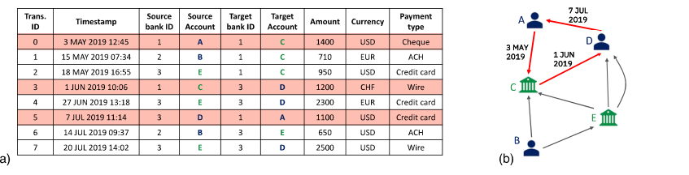

**그림 1: (a) 표 형식 및 (b) 그래프 형식으로 표현한 금융 거래.**

규제 기관을 위한 기준 데이터 등 현실적인 합성 데이터는 이러한 많은 문제를 해결하는 데 도움이 되지만 고유한 과제도 있습니다. 예를 들어 합성 데이터가 실제 데이터와 원하는 시나리오와 일치합니까? 모방된 실제 데이터의 인스턴스에 접근하지 않고도 합성 데이터를 구축할 수 있습니까? 본 연구에서는 섹션 2 및 3에서 이러한 질문을 다룹니다.

관계형 테이블은 재무 데이터를 저장하는 가장 일반적인 방법입니다. 그림 1a는 표 형식으로 저장된 금융 거래를 보여줍니다. 여기서 각 행은 잠재적으로 다른 은행에 보관되어 있는 원본 계좌에서 대상 계좌로 금융 자산을 이체하는 거래입니다. 각 거래마다 금액, 타임스탬프, 결제 통화, 결제 유형도 표시됩니다.

그래프는 금융 거래 데이터를 자연스럽게 표현합니다. 그래프 기반 데이터 표현은 기본 데이터 객체의 연결성을 노출하고 객체 간의 복잡한 상호 작용 패턴을 추출할 수 있게 해줍니다. 그림 1a에 표시된 거래의 그래프 기반 표현은 그림 1b에 설명되어 있습니다. 금융 거래 그래프에서 노드는 일반적으로 계정을 나타내고 계정 간의 방향성 간선은 금융 거래를 나타냅니다. 그림 1b에 설명된 것처럼 동일한 두 계정 간에 여러 가지 다른 거래가 서로 다른 시점에 발생할 수 있습니다. 따라서 금융거래 그래프는 본질적으로 방향성 다중그래프 [10]이다. 이 일반적인 그래프 구조는 많은 금융 범죄 분석 기술 [63, 43]의 기초가 됩니다.

금융범죄란 금전적 이득을 얻기 위해 행해진 불법행위를 말한다. 금융 범죄는 종종 의심스러운 계정 활동과 연관되어 있습니다. 예를 들어, 금융 거래 그래프에서 주기는 처음에 한 은행 계좌에서 보낸 돈이 동일한 계좌로 다시 반환되는 일련의 거래를 나타냅니다. 그러한 주기의 존재는 자금세탁 [58]의 강력한 지표입니다. 그림 1b는 그림 1a에서 강조 표시된 거래로 구성된 자금세탁 주기를 시각적으로 명확하게 보여줍니다. 마찬가지로, 암호화폐 거래 네트워크에서 범죄자는 정교한 혼합 및 섞기 방식을 사용하여 활동 흔적을 은폐합니다. [34]. 이러한 계획은 일반적으로 분산 수집 및 이분 패턴과 같은 하위 그래프 구조로 표현될 수 있습니다.

## 우리의 기여는 다음과 같이 나열될 수 있습니다

- 에이전트 중 일부가 불법 소득을 세탁할 수 있는 범죄자인 다중에이전트 가상 세계를 구축하는 합성 금융 거래 생성기입니다. 이러한 종합적 접근 방식은 어떤 거래가 세탁되고 있는지, 그리고 각 인스턴스에서 사용되는 특정 패턴(예: 주기)에 대한 완벽한 정보를 제공합니다. 이 완벽한 정보는 실제 데이터에서는 사용할 수 없습니다. 3 섹션에서는 추가 세부정보를 제공합니다. • 새로운 자금세탁 탐지 모델을 개발하고 벤치마킹하는 데 사용할 수 있는 현실적이고 표준화된 AML 데이터세트 세트입니다. 데이터셋는 다양한 규모와 어려움을 다루며 모두 공개적으로 제공됩니다. • 데이터셋의 사용을 보여주고 향후 작업을 위한 기준을 제공하는 GNN(Graph Neural Network) 및 GBT(Gradient Boosted Tree)를 사용한 일련의 초기 실험. 중요한 것은 우리의 GNN 코드가 오픈 소스라는 것입니다. 또한 공개적으로 사용 가능한 도구를 사용하여 GBT 결과를 재현할 수 있습니다. 우리의 실험 평가는 섹션 4에 나와 있습니다. • 우리의 데이터 공개가 어떻게 윤리적으로 건전하고 자금세탁 및 기타 형태의 금융 범죄와의 싸움을 지원하는지에 대한 7 섹션의 관찰입니다.

## 2 관련 연구

자금세탁 탐지를 위한 좋은 데이터의 중요성에도 불구하고 법률, 개인 정보 보호 및 경쟁 문제로 인해 실제 금융 거래 데이터는 일반적으로 이용 가능하지 않습니다. [52, 31]. 에서도

<!-- 원문 3쪽 -->

**표 1: 이전의 주요 합성 AML 데이터와의 비교.**

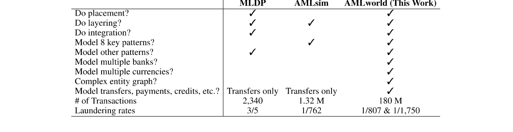

익명화된 데이터를 사용할 수 있는 제한적인 경우에는 실제 라벨을 알 수 없으며 세탁이 종종 감지되지 않기 때문에 데이터 라벨링이 본질적으로 좋지 않습니다. [7, 5, 6].

예를 들어, "실제" 데이터를 사용하는 몇 안 되는 연구 중 하나는 Starnini et al. [56]는 1억 8천만 건의 거래가 포함된 주요 이탈리아 은행의 6개월 데이터를 보고합니다. 무수히 많은 세탁 패턴이 가능하지만, 이 작업에서는 두 가지 패턴(일명 스머프 또는 모티브)만 찾고 있으며, 이 두 패턴이 모두 감지된다는 보장은 없습니다. 또한 이 데이터는 Starnini et al.에게만 제공되었습니다. 다른 조사자가 사용할 수 없는 것으로 보입니다.

더 작은 규모에서는 Harris et al. [24]는 어떤 고객이 세탁 위험이 높은지 평가하는 것을 목표로 캐나다 Scotia Bank의 4,469 고객에 대한 2,827 거래 내역 요약을 받았습니다.

이러한 데이터 가용성 문제를 해결하기 위해 여러 도메인에서 합성 데이터 [53, 45, 44, 32, 40, 61, 37]를 생성하라는 제안이 있었습니다. 그러나 우리가 아는 한, 기존 AML 노력은 다음과 같은 단점 중 하나 이상으로 인해 어려움을 겪고 있습니다. (i) 합성 데이터 생성기는 실제 데이터에 액세스해야 하며 이를 모방할 수 있습니다. (ii) AML 데이터에는 권위 있는 섬세탁 라벨이 없습니다. 또는 (iii) 생성된 데이터에는 실제 데이터의 중요한 속성이 부족합니다.

이전 합성 AML 노력의 작은 세트는 우리와 마찬가지로 에이전트 기반입니다. 그러나 에이전트 기반 시뮬레이션은 접근 방식이 크게 다를 수 있습니다. 다소 세부적인 모델링 또는 더 많거나 적은 수의 에이전트 사용. 불법 거래(예: 소수 클래스 거래)가 극히 일부에 불과한 자금세탁과 같은 활동의 경우 모델링 충실도와 규모가 중요합니다. 표 1에는 자금세탁 데이터의 주요 측면이 요약되어 있습니다. 표 1는 또한 섹션 3에 자세히 설명된 당사의 접근 방식 AMLworld와 합성 세탁 데이터를 생성하기 위한 가장 두드러진 이전 노력 중 두 가지인 자금세탁 데이터 생산(MLDP) [38, 39] 및 AMLsim [63, 57, 9] 간의 특성 및 차이점을 명시합니다. 표 1에서 알 수 있듯이 AMLworld의 특성은 이전 제품보다 훨씬 더 발전하여 더욱 강력한 데이터셋를 만듭니다. (배치, 계층화 및 통합과 같은 용어는 "8 주요 패턴"과 마찬가지로 3 섹션에 정의됩니다.) 일반적으로 거래 수가 많고 세탁 비율이 낮을수록 더 현실적이므로 더 유용합니다. MLDP의 2,340 거래와 60% 세탁율은 작고 비현실적인 시나리오를 제시합니다. 섹션 3.3는 AMLworld 및 AMLSim에 대한 추가 세부 정보와 현실성을 향상하기 위해 AMLworld에서 사용되는 기술에 대해 설명합니다.

GNN [65, 59, 14, 30, 23, 15, 35, 62]는 관계형 데이터(그래프)용으로 특별히 설계된 강력한 기계 학습 모델입니다. 특히 거래 네트워크에서 금융 범죄를 탐지하는 데에도 사용될 수 있습니다. Cardosoet al. [15] 및 Weber et al. [64]는 자금세탁 탐지를 위해 GNN을 사용합니다(Kanezashi et al.). [28]는 Ethereum 블록체인에서 피싱 탐지를 위해 GNN을 사용하며 Rao et al. [47]는 GNN을 사용하여 사기 거래를 탐지합니다. Bouritsas et al.이 제안한 그래프 하위 구조 네트워크. [14]는 사전 계산된 하위 그래프 패턴 수를 활용하여 GNN의 표현성을 향상시킵니다. GNN은 Chen et al.과 같이 하위 그래프 패턴을 계산하는 데 사용될 수도 있습니다. [17]는 금융 범죄와 관련된 패턴을 탐지할 수 있습니다.

## 3 합성 데이터세트

이미지, 음성, 자연어 처리, 추천 엔진 등 주요 도메인에 대해 풍부한 레이블 데이터를 사용할 수 있습니다. 그러나 개인 정보 보호, 법률 및 경쟁에 대한 우려로 인해

<!-- 원문 4쪽 -->

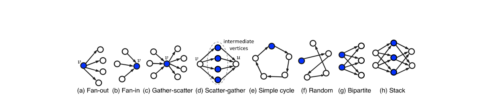

**그림 2: 모델링된 세탁 패턴**

장점은 금융 거래 데이터가 거의 또는 전혀 없다는 점입니다. 이를 위해 (1) 상세한 AMLworld 생성기를 소개하고 (2) AMLworld에서 생성된 여러 데이터셋를 공개합니다.

### 3.1 합성 데이터에 대한 동기

세탁 거래를 통해 실제 금융 데이터에 접근하기 어렵다는 점 외에도, 실제 데이터에는 합성 데이터가 극복하는 데 도움이 될 수 있는 단점이 있습니다.

- 개별 은행은 자신의 거래만 볼 수 있으며 은행 고객이 거래하는 다른 기관의 거래는 볼 수 없습니다. • Ground Truth 라벨은 일반적으로 불완전하며 세탁이 누락되는 경우가 많습니다. 결과적으로 많은 AML 모델에서는 세탁 거래에 대한 라벨이 잘못 지정되었습니다(거짓 부정). • 실제 데이터에서 복잡한 자금세탁 패턴을 식별하려면 추가 작업이 필요합니다. 개별 은행에서 가능하더라도(첫 번째 항목 참조).

합성 데이터의 결정적인 실측 라벨을 통해 다양한 모델을 정확하게 비교할 수 있습니다. 또한 합성 데이터의 여러 은행을 통해 은행이 연합 학습 설정에서 데이터를 공유할 수 있다면 성능이 얼마나 향상될지 측정할 수 있습니다. 개별 은행의 시나리오는 합성 데이터를 필터링하여 쉽게 시뮬레이션할 수 있습니다.

### 3.2 AML 패턴

AMLSim 생성기에서 Suzumura와 Kanezashi [57]는 자금세탁에 자주 사용되는 8 패턴 2 세트를 도입했습니다. 이러한 8 패턴은 그림 2에 설명되어 있습니다. 섹션 3.3에 설명된 많은 특성 중에서 AMLworld는 이러한 8 패턴도 생성합니다.

더 정확하게 말하면, 그림 2a에 표시된 정점 v의 팬아웃 패턴은 v를 최소 k ≥2개의 서로 다른 정점 [58]에 연결하는 v의 나가는 가장자리로 정의됩니다. 마찬가지로, 그림 2b에 표시된 팬인 패턴의 경우 v는 들어오는 가장자리를 통해 k ≥2 다른 정점에 연결됩니다. 수집-산란 패턴은 그림 2c [55]에 표시된 것처럼 팬인 패턴과 동일한 정점의 팬아웃 패턴을 결합합니다. 팬아웃 패턴과 팬인 패턴이 각각 정점 v와 u를 동일한 중간 정점 집합 [55]에 연결하면 정점 v의 팬아웃 패턴과 정점 u의 팬인 패턴이 산란-수집 패턴을 형성합니다. 그림 2d는 4개의 중간 정점이 있는 분산-수집 패턴의 예를 보여줍니다.

그림 2e에 표시된 간단한 사이클 패턴은 동일한 정점으로 시작하고 끝나며 최대 한 번 [27, 12]로 다른 정점을 방문하는 일련의 에지입니다. 그림 1는 금융 거래 그래프의 주기를 보여줍니다. 여기서 노드 A는 노드 C와 D를 통해 돈을 세탁합니다. 그림 2f에 표시된 무작위 패턴은 그림 2e의 주기 패턴과 유사합니다. 단, 무작위 자금이 원래 계좌로 반환되지 않습니다. 따라서 무작위는 소유하거나 통제하는 계정(예: 페이퍼 컴퍼니를 통해) 간의 무작위 이동으로 볼 수 있습니다. 그림 2g의 이분 패턴은 자금을 입력 계정 세트에서 출력 계정 세트로 이동합니다. 마지막으로, 그림 2h의 스택 패턴은 추가적인 이분 레이어를 추가하여 이분 패턴을 확장합니다.

이러한 경우 모든 세탁 패턴과 마찬가지로 세탁 주체는 사용된 모든 계정(노드)을 소유하거나 제어합니다. 예를 들어, 기업은 계정을 "소유"한 것처럼 보이는 위장 회사를 "통제"할 수 있습니다. 수년에 걸쳐 계정의 UBO(Ultimate Beneficial Owner)가 누구인지에 대한 규칙이 더욱 엄격해졌습니다. 그러나 정확한 UBO 지정은 시행하거나 탐지하기 어려울 수 있습니다. 또한 일부 엔터티는 다른 엔터티보다 더 많은 노드를 소유하거나 제어하므로 노드 선택에 더 큰 패턴이나 변형이 있을 수 있습니다.

<!-- 원문 5쪽 -->

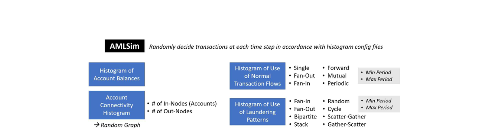

**그림 3: AMLSim 개요.**

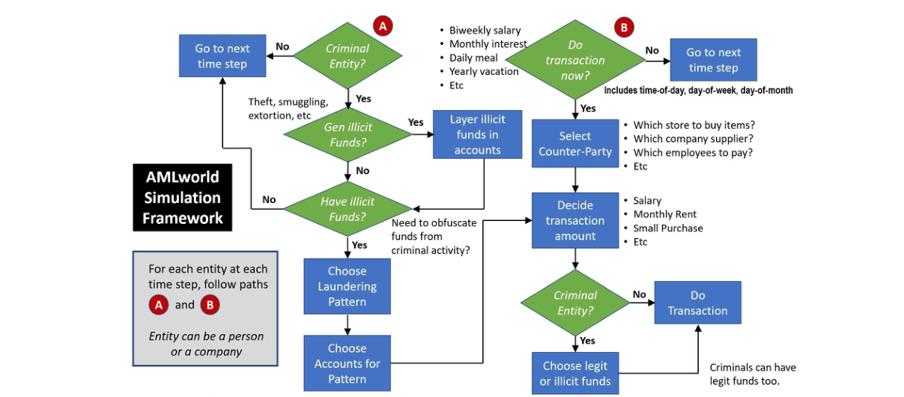

**그림 4: AMLworld 시뮬레이션 개요.**

### 3.3 AMLworld 생성기의 새로운 특성은 무엇입니까?

당사의 AMLworld 생성기는 AMLSim [57]의 선구적인 노력을 개선하려고 시도합니다. 2 섹션의 표 1는 차이점을 자세히 설명합니다. 자세한 내용은 그림 3가 AMLSim을 묘사하고 그림 4가 AMLworld를 묘사합니다. 그림에서 알 수 있듯이 AMLworld는 훨씬 더 풍부한 특성 세트를 모델링합니다.

예를 들어, AMLworld는 전체 자금세탁 주기를 모델링합니다. [19]: (1) 배치: 불법 자금 밀수와 같은 소스; (2) 계층화: 불법 자금을 금융 시스템에 혼합합니다. (3) 통합: 불법 자금 지출.

AMLSim은 (2) 레이어링에만 초점을 맞춥니다. 따라서 패턴은 3.2 섹션에 설명되어 있습니다. AMLworld에 배치되는 것은 강탈, 대출 공유, 도박, 매춘, 납치, 강도, 횡령, 마약 및 밀수와 같은 범죄 활동의 9 소스에서 비롯될 수 있습니다. 이러한 범죄 행위의 수취 금액과 빈도는 활동 및 행위 주체에 따라 다릅니다. 그러면 불법 자금이 금융 시스템에 계층화됩니다(그림 4의 A 아래). 범죄 단체가 자금 배치 방법을 결정할 때 그림 4의 오른쪽 하단에 있는 B 아래에서 통합이 발생합니다. 대조적으로 AMLSim은 레이어링만 처리합니다. 이 세부 세탁 모델을 지원하기 위해 AMLworld는 해당 자금을 세탁하는 데 사용되는 모든 거래를 통해 출처의 불법 자금(예: 밀수 수익)에 태그를 지정합니다.

AMLworld는 또한 인구 및 거래 특성에 대한 보다 상세한 모델링을 갖추고 있으며 세탁 활동은 특정 패턴에 국한되지 않습니다. 3.4 섹션에서는 그림 4의 오른쪽 상단에 있는 "상대방 선택"을 지원하는 AMLworld 메커니즘을 포함하여 AMLworld의 기타 주요 속성을 간략하게 설명합니다.

2일부 AML 논문에서는 패턴을 스머프 또는 모티프라고 부릅니다.

<!-- 원문 6쪽 -->

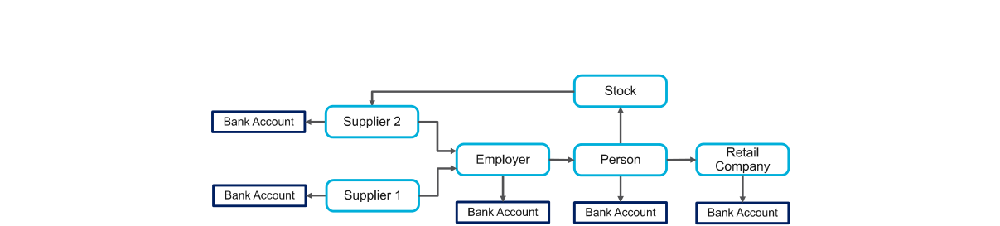

**그림 5: 가상 세계 모델을 나타내는 엔터티/원형 흐름 그래프의 그림.**

### 3.4 가상 세계 모델

AMLworld는 기본적으로 은행, 개인 및 회사의 다중에이전트 가상 세계를 구축합니다. 개인과 회사는 물품을 구입하고 은행 이체를 통해 물품을 받고 급여를 지불하고 연금을 지불합니다. 기본 모델에는 좋은 행위자와 나쁜 행위자가 있으며, 나쁜 행위자는 섹션 3.3에 명시된 대로 밀수와 같은 일을 합니다.

악의적인 행위자가 불법 자금을 세탁하려는 시도는 자금세탁 거래로 이어집니다. 위에서 설명한 세탁 패턴 외에도 AMLworld는 일부 세탁 전송이 "자연스럽게" 발생하도록 합니다. 범죄 상사는 직원에게 급여를 지급하고 물품을 구매하는 등의 방법으로 돈을 세탁합니다.

생성된 데이터는 그림 1에 표시된 대로 일련의 거래로, 각 거래에는 세탁(불법) 여부가 표시되어 있습니다. AMLworld는 달러, 유로, 위안, 엔, 비트코인 ​​등을 포함한 다양한 통화로 수십억 건의 거래를 생성하는 데 사용되었습니다.

가상 세계의 모든 에이전트의 행동은 통계적 분포에 의해 관리됩니다. 따라서 모델과 데이터는 실제 개인을 난독화하거나 익명화하는 데 기반을 두지 않고 실제 통계를 기반으로 합니다. 마찬가지로, 우리 모델은 확장할 실제 거래의 시드를 사용하지 않습니다. 모든 것이 합성입니다. 보다 구체적으로 그림 5에 표시된 것처럼 AMLworld의 기본 가상 세계 모델은 다양한 엔터티가 다양한 방식으로 연결된 복잡한 엔터티 그래프를 사용합니다. 예를 들어, 회사는 고용주 역할을 하지만 소매 판매를 제공하거나 다른 회사나 개인에게 제품이나 서비스를 공급할 수도 있습니다. 개인이나 회사는 다른 회사나 회사의 일부(주)를 소유할 수도 있습니다. 각 법인(개인 또는 회사)은 직접 또는 자회사를 통해 하나 이상의 은행 계좌를 소유합니다.

그림 5의 엔터티 그래프는 본질적으로 GDP(국내총생산) [3]를 측정하는 데 사용되는 순환 흐름 그래프의 변형입니다. 따라서 모든 금융 행위자(개인 또는 회사)는 (파란색) 주요 노드가 될 수 있으며, 각 주요 노드는 하나 이상의 은행 계좌를 소유할 수 있습니다. 그래프의 모서리는 이러한 노드 간의 금융 흐름을 반영합니다. (흐름은 종종 양방향이지만 단순화를 위해 그림 5에는 중요한 흐름 방향의 하위 집합만 표시됩니다.) 거래은 이러한 관계를 기반으로 적절한 빈도로 생성됩니다. 예를 들어 급여는 일반적으로 주별, 격주 또는 월별로 지급됩니다(그림 4에 표시된 대로). 이자는 거의 매달 지급됩니다. 또한 불법 활동으로 얻은 자금을 사용하여 소수의 세탁 거래가 수행되는 경우도 있습니다. 생성자는 모든 자금의 출처를 알고 있으므로 어떤 이체가 세탁되고 있는지 알고 있습니다.

그림 5로 돌아가서 가상 세계를 나타내는 원형 흐름 그래프는 우리 접근 방식의 몇 가지 다른 중요한 측면을 보여줍니다.

- 순환 흐름 그래프를 사용하면 시뮬레이션 기간 동안 엔터티 간의 모든 거래 목록이 포함된 금융 거래 그래프(그림 1 참조)를 생성할 수 있습니다. • 이 모델에는 개인, 기업, 파트너십, 개인 사업자 등 다양한 유형의 개체가 있습니다. 은행은 다른 유형 중에서 대부분의 금융 거래가 이루어지는 곳이므로 모델에서 특별한 유형의 엔터티입니다. • 사람이나 회사와 같은 개체는 거래가 수행되는 은행 계좌를 가지고 있습니다. 각 개인과 각 회사는 여러 은행에 걸쳐 여러 은행 계좌를 가질 수 있습니다. 이러한 확산은 저축, 지출 등 합법적인 활동을 더욱 촉진할 수 있지만, 세탁 과정에서 자금 출처를 난독화하는 등 불법적인 활동을 조장할 수도 있습니다. • 회사의 소유권은 상호 연결되어 있습니다. X 회사는 Y 회사의 전체 또는 일부를 소유할 수 있습니다(예: 주식을 통해). 개인은 회사 전체 또는 일부를 소유할 수도 있습니다. 이 소유권 패턴은 AMLworld에 두 가지 특성을 제공합니다. (1) 이는 세상의 합법적인 복잡성을 나타내며 (2) 이를 통해 페이퍼컴퍼니 계층을 만들 수 있습니다.

<!-- 원문 7쪽 -->

악의적인 행위자가 부당하게 얻은 자금을 세탁할 수 있습니다. 이러한 페이퍼컴퍼니는 임의의 은행에 계좌를 보유할 수 있습니다. 이들의 계좌는 지배 주체의 기본 은행 계좌와 다른 은행에 있을 수 있습니다. • 그림 5의 그래프 구조는 임의적입니다. 신용카드 거래 모델링 [8]의 경우처럼 그래프는 판매자와 소비자 사이의 이분법이 아닙니다.

AMLworld 시뮬레이터는 다음을 촉진하기 위해 인구 및 거래 정보를 매개변수화합니다. (b) 행동의 미래 변화를 모델링하고; (c) 실제 행동과 더 잘 일치하도록 업데이트합니다. (c)의 경우 신뢰할 수 있는 실제 데이터를 항상 사용할 수 있는 것은 아닙니다. AMLworld의 피드백 루프는 관찰된 동작과 일치하는 통계를 만들기 위해 어느 정도 조정을 적용합니다. 예를 들어, 결과에 월별 1인당 거래 수가 너무 많은 것으로 표시되면 매개변수가 조정될 수 있습니다. 일부 이벤트는 다른 이벤트보다 더 중요합니다. 대부분의 경우 은행 계좌 잔고가 마이너스가 되는 것을 피하기 위해 돈을 옮기는 것이 더 높은 이자율을 얻기 위해 돈을 옮기는 것보다 우선합니다. 매개변수가 모두 독립적인 것은 아니기 때문에 일관된 매개변수 세트에 도달하려면 일정량의 반복이 필요합니다.

이전 단락의 (b) 지점에서 제안한 것처럼 매개변수화는 what-if 시나리오를 확인하는 데에도 유용합니다. 세탁이 더 많아지거나 은행법이 변경되면 어떻게 될까요? 합성 데이터를 사용하면 실제 데이터에서는 불가능한 이러한 탐색이 가능해집니다.

마지막으로 AMLworld에서는 금융 이체에 대한 세탁 태그가 전이적이라는 점에 주목합니다. A가 B에게 불법 자금으로 $100를 지불하고 B가 해당 자금 중 $50를 C에게 지불하고 C가 $50 중 $25를 D에게 지불하는 경우 초기 $100뿐만 아니라 $50와 해당 자금도 세탁으로 간주됩니다. $25도 있습니다. 이 전이성은 상세한 추적을 통해 지원됩니다. AMLworld는 합법적인 소스와 비합법적인 소스의 자금 혼합을 포함하여 모든 거래를 통해 이 태그를 전파합니다. AMLworld의 세탁에 대한 완전한 라벨링은 실제 데이터로는 거의 불가능합니다.

### 3.5 합성 데이터의 공개 가용성

본 연구에서는 AMLworld를 사용하여 Kaggle [50]에서 사용할 수 있는 여러 합성 AML 데이터셋를 만들었습니다. 데이터는 두 개의 상위 그룹인 HI와 LI로 나누어지며, 각각 불법 비율(세탁)이 더 높고 더 낮습니다. HI와 LI는 모두 소형, 중형, 대형 데이터세트로 세분화되며 대형 데이터세트는 1억 7천 5백만~1억 8천만 건의 거래를 포함합니다. 공간 제약으로 인해 부록의 표 4는 데이터셋에 대한 세부 정보를 제공합니다.

그러나 AMLworld의 현실성을 입증하기 위해 LI-Large 데이터셋에 대한 몇 가지 통계를 논의합니다. LI-Large는 3개월이 조금 넘는 기간 동안 1억 7,600만 건의 거래를 보유하고 있습니다. 본 연구에서는 LI-Large에 중점을 두지만 크기와 세탁 비율을 제외하면 다른 5개 데이터셋는 비슷한 특성을 가지고 있습니다. 부록의 여러 수치는 우리 데이터의 현실성에 대한 근거를 제공합니다. 그림 7는 계정당 연간 거래를 히스토그램으로 표시하며 그 분포는 대략 미국 연방준비은행 데이터 [51]와 일치합니다. 표 5는 ACH, 전신환, 수표와 같은 거래 형식의 분포를 보여줍니다. 이번에도 수치는 연방준비은행 통계 [41]와 대략적으로 일치합니다.

1,750 거래의 전체 1는 LI-Large에서 세탁됩니다. 비교를 위해 Starnini et al. [56]는 이탈리아의 주요 은행에서 6개월 동안 1억 8천만 건의 거래에 대한 실제 데이터를 보고합니다. 그들은 각각 "총 20 [노드] 미만"을 갖는 855 세탁 모티프(Gather-Scatter 및 Scatter-Gather 패턴과 동일)를 발견했습니다. 이는 21,000당 약 1 세탁 거래에 해당합니다. 비교해 보면 부록 표 7는 LI-Large에 Gather-Scatter 및 Scatter-Gather 거래이 결합된 8,212가 있음을 나타냅니다. 이러한 패턴에서 21,440 거래마다 매우 유사한 1 세탁 거래이 생성됩니다.

## 4 머신러닝 모델의 성능 평가

이 섹션에서는 효과적인 기계 학습 모델을 생성하기 위한 합성 데이터셋의 적합성에 대한 예비 평가를 제공합니다. 더 깊은 처리 및 평가는 이 "데이터세트 및 벤치마크" 제출 범위를 벗어나지만 Egressy et. 알. [20]. 핵심적인 측면에서 이러한 측정은 실제 데이터를 사용하는 것보다 훨씬 더 좋습니다. 즉, 실제 데이터의 많은 세탁 거래가 감지되지 않는 반면 실제 데이터 라벨은 완전합니다.

본 연구에서는 각각 표 기반 데이터 표현과 그래프 기반 데이터 표현을 사용하여 섹션 3.5에 소개된 데이터셋에서 GBT(Gradient Boosted Tree) 및 인기 있는 메시지 전달 그래프 신경망(GNN) 모델을 훈련합니다. GBT 및 GNN에 대한 매개변수 조정은 부록 C 섹션에 설명되어 있습니다.

<!-- 원문 8쪽 -->

거래의 소스 및 대상 계정 ID는 실험의 특성으로 사용되지 않으므로 모델이 단순히 계정 ID를 학습하는 것만으로는 세탁 거래를 인식할 수 없습니다.

GBT 기준선 우리는 표 형식 데이터에 널리 사용되는 기계 학습 모델인 LightGBM [29] 및 XGBoost [16]를 GBT 기준선으로 사용합니다. GBT 기본 실험은 LightGBM의 3.1.1 버전과 XGBoost의 1.7.6 버전을 사용하여 수행되었습니다. 이러한 GBT 모델의 성능을 향상시키기 위해 데이터셋에 대한 추가 특성을 생성하는 GFP(Graph Feature Preprocessor) [48, 49]를 사용합니다. 이를 달성하기 위해 GFP는 입력 데이터를 그래프로 해석하고 이 그래프에서 정점 통계 및 단순 사이클 수 [13, 12]와 같은 다양한 그래프 기반 특성을 추출합니다. 결과적으로 GBT 모델은 데이터셋의 기본 그래프 구조를 활용할 수 있습니다. 부록의 섹션 D에서는 실험 평가를 위해 GFP가 어떻게 구성되었는지에 대한 세부 정보를 제공합니다.

GNN 기준선 에지 특성 [65, 25] 및 PNA(Principal Neighborhood Aggregation) [60, 18]를 갖춘 GIN(Graph Isomorphism Network)이 GNN 기준선으로 사용됩니다. AML은 거래 분류 문제이므로 에지 업데이트(GIN+EU) [11]를 사용하는 기준선도 포함합니다. 이 접근 방식은 Cardoso 등이 사용한 아키텍처와 유사합니다. [15]는 최근 자체 감독 자금세탁 탐지에 사용되었습니다. 대규모 데이터셋에 대한 GNN 결과는 이러한 데이터셋에 대한 교육 모델에 훨씬 더 많은 컴퓨팅 리소스가 필요하기 때문에 사용할 수 없습니다.

금융 거래 그래프 표현에서 정점은 계정이고 가장자리는 거래이기 때문에 불법 거래 탐지는 가장자리 분류 문제입니다. 모든 GNN은 에지 임베딩과 해당 엔드포인트 노드 임베딩을 입력으로 사용하여 분류를 수행하는 최종 에지 판독 레이어를 사용합니다. 복잡성을 줄이기 위해 GNN 모델을 훈련하고 테스트할 때 이웃 샘플링 [23]를 사용합니다. 100 1홉 및 100 2홉 이웃을 샘플링합니다.

데이터 분할 우리는 60-20-20 임시 열차-검증-테스트 분할을 사용합니다. 즉, 타임스탬프별로 정렬한 후 거래 인덱스를 분할합니다. 데이터 분할은 두 개의 타임스탬프 t1과 t2로 정의됩니다. Train 인덱스는 t1 시간 이전의 거래에 해당하고, 유효성 검사 인덱스는 t1~t2 시간 사이의 거래에 해당하며, 테스트 인덱스는 t2 이후 거래에 해당합니다. 그러나 GNN의 경우 검증 및 테스트 세트 거래은 패턴을 식별하기 위해 이전 거래에 액세스해야 합니다. 그래서 우리는 훈련, 검증, 테스트 그래프를 구성합니다. 이는 금융 거래 그래프를 동적 그래프로 간주하고 t1, t2, t3 = tmax 시간에 3개의 스냅샷을 찍는 것과 같습니다. 기차 그래프에는 훈련 거래(및 해당 노드)만 포함됩니다. 검증 그래프에는 훈련 및 검증 거래이 포함되어 있지만 평가에는 검증 지수만 사용됩니다. 테스트 그래프에는 모든 거래이 포함되지만 평가에는 테스트 지수만 사용됩니다. 이는 은행과 금융 당국이 보이지 않는 거래 묶음을 분류할 때 직면할 가능성이 가장 높은 시나리오입니다.

GBT 및 GNN 기준선 평가 우리가 제안한 데이터셋는 본질적으로 매우 불균형하기 때문에 정확도와 같은 기존 지표는 모델 성능에 대한 신뢰할 수 있는 척도를 제공하지 않습니다. 이러한 맥락에서 우리는 소수 클래스의 F1 점수를 강조하기로 결정했습니다. GNN 기준선에 대한 자세한 정밀도 및 재현율 점수는 부록 E 섹션에서 확인할 수 있습니다. 표 2는 평가된 모델 범위에 대한 추론 성능을 보여줍니다. 이러한 결과는 계정 간 연결을 활용하는 메시지 전달 GNN이 세탁 거래를 포착하는 데 효과적이라는 것을 보여줍니다. 확장된 메시지 집계 및 에지 업데이트 메커니즘을 각각 구현하는 PNA 및 GIN+EU와 같은 고급 GNN 아키텍처는 GNN 성능을 크게 향상시킵니다. 또한 GFP와 그래디언트 부스팅 기술, 특히 LightGBM 및 XGBoost의 조합은 다양한 데이터셋에서 강력한 성능을 보여줍니다. 흥미로운 관찰은 직접 만든 특성에 의존하지 않고도 GBT 기준을 사용하는 PNA의 성능이 거의 비슷하다는 것입니다.

LI 데이터셋는 HI 데이터셋에 비해 더 중요한 예측 문제를 제시합니다. 이는 주로 불법 비율이 낮고 세탁 패턴의 기간이 길기 때문입니다. LI 데이터세트와 HI 데이터세트의 주요 차이점은 LI에서는 범죄자의 세탁 빈도가 낮아 세탁 패턴을 발견하기가 더 어렵다는 것입니다. 이 문제를 해결하기 위해 우리 모델은 손실 함수에서 소수 클래스의 예측에 더 높은 가중치를 부여하는 측정값을 통합합니다. 그러나 LI 데이터셋 처리의 복잡성을 고려하여 레이블 균형 샘플러를 사용하는 Pick and Chose 방법 [36] 또는 임베딩 공간에 합성 소수 클래스 샘플을 도입하는 GraphSMOTE [66]와 같은 다른 전략을 탐색하는 것이 필수적일 수 있습니다.

HI 데이터셋에 사전 훈련된 모델을 재사용하거나 미세 조정하면 보다 까다로운 LI 데이터셋에 대한 예측 정확도를 향상시킬 수 있습니다. 표 3는 HI-Medium 및 -Large 데이터셋에서 사전 훈련된 LightGBM 및 PNA 모델을 재사용하면 해당 LI 데이터셋에서 훈련된 XGBoost 모델의 F1 점수보다 더 높은 F1 점수가 가능함을 보여줍니다(표 2 참조). 게다가 분류는

<!-- 원문 9쪽 -->

**표 2: 소수 클래스 F1 점수(%). HI는 불법 비율이 높다는 것을 나타냅니다. LI는 더 낮은 비율을 나타냅니다.**

**표 3: HI 데이터셋로 훈련되고 LI 데이터셋로 평가된 모델의 소수 클래스 F1 점수(%).**

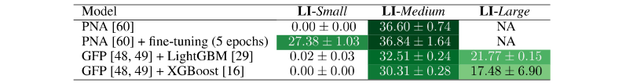

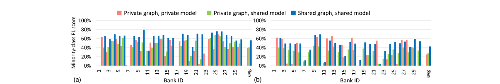

**그림 6: (a) HI-Medium 및 (b) HI-Large 데이터셋에 대한 은행 간 데이터 및 모델 공유의 효과.**

LI 데이터셋를 사용하여 HI PNA 모델을 미세 조정하면 HI 데이터셋에 대해 훈련된 모델을 직접 사용하는 것이 효과적이지 않은 LI-Small 데이터셋의 경우 LI 데이터 성능이 더욱 향상될 수 있습니다.

그림 6에서는 GFP를 사용하여 특성을 생성하고 LightGBM을 사용하여 모델을 구축하는 개별 은행의 HI-Medium 및 HI-Large 데이터셋에 대한 결과를 보고합니다. LI-Medium 및 LI-Large 데이터셋에서 수행된 관련 실험은 부록의 섹션 F에서 확인할 수 있습니다. 간결성을 위해 각 데이터셋에서 가장 많은 거래에 참여하는 상위 30 은행에 중점을 둡니다. 본 연구에서는 세 가지 설정을 평가합니다.

- 공유 그래프, 공유 모델 설정에서는 은행들이 모든 거래를 서로 공유하여 공유 금융 거래 그래프를 생성합니다. GFP는 이 공유 그래프에 적용되어 역시 공유되는 그래프 특징을 추출합니다. 공유 LightGBM 모델은 은행이 자체 거래에 점수를 매기는 데 사용하는 공유 데이터를 사용하여 구축됩니다. 표 2에 제공된 결과는 동일한 설정을 사용하여 생산된 모든 뱅크의 총 F1 점수를 보여줍니다. • 개인 그래프, 개인 모델 설정은 개인 데이터에 대해 각 은행이 별도로 훈련한 LightGBM 모델을 사용하여 F1 점수를 계산합니다. 이 설정에서 은행은 자체 계좌 보유자가 수행한 거래만 볼 수 있습니다. 이러한 거래를 이용하여 프라이빗 그래프를 구성하고, 이 프라이빗 그래프에서 GFP를 실행하여 특징을 추출합니다. 또한 각 은행은 자체 데이터를 바탕으로 자체 모델을 학습하므로 모델 공유도 없습니다. • 프라이빗 그래프 공유 모델 설정에서는 각 은행이 프라이빗 거래 그래프를 생성하고 앞의 경우와 마찬가지로 GFP를 이용하여 그래프 특징을 추출한다. 은행은 소스 및 대상 계정 ID를 서로 공유하지 않지만 그래프 특성을 포함한 나머지 거래 특성을 공유합니다. 공유 LightGBM 모델은 이 데이터를 사용하여 학습됩니다.

**그림 6는 일반적으로 금융 기관이 공유 기계 학습 모델을 구축하여 더 높은 F1 점수를 달성할 수 있음을 보여줍니다. 그러나 공유된 금융 거래 그래프 위에 공유 모델을 구축하면 훨씬 더 중요한 개선이 가능합니다. 개인정보를 보호하면서 이러한 정확성 향상을 달성하기 위해 금융 기관은 차등 개인정보 보호 모델과 토폴로지 공유 기술을 사용할 수 있습니다. 그러한 기술에 대한 평가가 우리 작업 범위를 벗어나더라도 우리는 우리가 제공한 데이터셋가 그러한 접근 방식을 구축하기 위한 귀중한 테스트 기반을 제공한다고 믿습니다.**

## 5 미래 연구 및 연구 분야

본 백서의 초점은 고품질 데이터셋의 생성과 이를 사용하여 효과적인 자금세탁방지 모델을 구축하는 것입니다. 다음은 자연스럽게 따라오는 몇 가지 추가 연구 기회입니다.

1. 역사적으로 AML 모델은 한 은행의 거래에 중점을 두었습니다. 이는 거래 세탁을 검토하는 개별 은행에서 사용할 수 있는 유일한 데이터이기 때문입니다. 우리의 합성 데이터는 그림 6에 표시된 것처럼 여러 은행에 걸쳐 분석을 가능하게 합니다. 따라서 개인 정보를 보호하는 기계 학습 모델과 그래프 토폴로지 공유 기술을 구축해야 합니다. 2. 한 은행의 거래를 고려하든 은행 전체의 거래를 고려하든 관계없이 그래프 데이터셋에서 복잡한 AML 패턴을 감지할 수 있는 기계 학습 및 딥 러닝 모델이 필요합니다. 3. 심층 신경망을 사용하여 포인트(1) 및 (2)를 기반으로 실제 데이터로 미세 조정하기 전에 사전 훈련을 위해 합성 교차 은행 데이터를 사용할 수 있습니다. 표 3에 제시된 초기 실험은 전이 학습이 실행 가능한 접근 방식임을 보여줍니다. 4. 새로운 모델과 알고리즘이 개발됨에 따라 시간, 메모리 소비, CPU 및 GPU 사용 등의 측면에서 효율적으로 실행되는 것이 중요합니다. 금융 거래를 분석할 때 이러한 효율성을 달성하는 기술은 다른 영역에서 필요한 기술과 다릅니다. 5. 다른 사람들은 우리의 데이터 생성 방법을 개선하는 방법을 찾을 수도 있습니다. 예를 들어 에이전트 기반 접근 방식을 사용하면 데이터 생성의 안정성과 관련된 문제가 발생할 수 있습니다. 사소한 매개변수 조정으로 세탁률과 같은 집계 결과에 상당한 변화가 발생할 수 있습니다. 그래프의 생성 모델은 유망한 연구 방법이 될 수 있습니다.

<!-- 원문 10쪽 -->

## 6 결론

본 연구에서는 자금세탁 라벨이 붙은 합성 금융 데이터를 생성하기 위한 상세한 다중에이전트, 가상 세계 접근 방식인 AMLworld의 개요를 설명했습니다. 본 연구에서는 생성된 데이터가 주요 측면에서 실제 데이터와 일치한다는 것을 확인했습니다. AMLworld 데이터는 또한 세탁 활동을 위한 완벽한 태그 특성을 갖추고 있습니다. 이는 태그가 일반적으로 많은 세탁 활동을 놓치는 실제 데이터에서는 본질적으로 불가능한 일입니다. 현실적인 태그가 지정된 데이터를 제공함으로써 AMLworld는 자금세탁 탐지 모델 개발을 촉진하고 우리의 실험은 기본 점수를 제공하여 기계 학습 모델의 유용성과 효율성을 입증합니다. 마지막으로, AMLworld는 실제 데이터에서 아직 관찰되지 않은 가정 세탁 패턴을 감지하는 모델 생성을 가능하게 합니다. 이제 6개의 AMLworld 데이터셋가 Kaggle [50]에서 공개적으로 제공됩니다. 이러한 데이터셋에 대한 초기 평가에서는 GNN과 GBT가 세탁 거래를 식별하는 데 효과적인 솔루션이 될 수 있음을 보여줍니다. GBT는 복잡한 세탁 패턴을 포착하기 위해 일부 특성 엔지니어링이 필요하지만 GNN은 특성 엔지니어링 없이 경쟁력 있는 결과를 생성하는 경우가 많습니다. 차등 개인 정보 보호 그래프 토폴로지 및 모델 공유 기술을 사용하여 금융 기관 간의 협업 및 협력을 가능하게 하기 위한 추가 연구가 필요합니다.

## 7 윤리학

본 연구에서는 이 합성 세탁 데이터 공개가 AML 싸움에 도움이 된다고 믿습니다.

서문에서 언급했듯이 현재 대부분의 세탁 활동은 감지되지 않습니다. 이는 대부분의 사기가 신속하게 감지되는 신용 카드 사기와 같은 영역과 달리 범죄자가 우위를 점하고 있음을 의미합니다. 이 데이터를 공개하는 주요 목표 중 하나는 세탁 감지 개선을 촉진하여 신용카드 사기 감지에 더 가까운 결과를 제공하는 것입니다.

신용 카드 사기 탐지의 주요 이점은 구매하지 않은 품목에 대한 고객 피드백을 통해 긴밀한 실제 정보를 잘 이해할 수 있다는 것입니다. 불행하게도 실제 금융 데이터의 세탁 활동에 대한 확실한 근거 진실은 존재하지 않으므로 오류율이 높고 사기 행위를 놓치는 경우가 많습니다. 대조적으로, 우리의 합성 데이터에는 신용 카드 사기에 매우 도움이 되는 근거 진실이 있습니다.

본 연구에서는 좋은 면을 돕는 것 외에도 우리의 데이터가 나쁜 면을 도울 수 있는 잠재력이 제한되어 있다고 믿습니다. 이를 수행할 수 있는 확실한 방법은 X 은행에서 세탁을 감지하는 데 사용하는 알고리즘을 게시하는 것입니다. 그런 다음 세탁자는 알고리즘에 의해 표시되는 것을 피하기 위해 행동을 변경할 수 있습니다. 정적인 데이터셋만으로는 세탁자가 탐지를 피하기 위해 행동을 바꾸는 것이 훨씬 더 어렵습니다.

지금까지 우리가 오픈 소스로 제공한 것은 데이터를 생성하는 코드가 아니라 데이터 집합이라는 점을 강조합니다. 세탁자가 우리 소스 코드를 가지고 있다면 생성된 데이터를 조정하고 결과를 확인하는 것이 그들이 손에 넣을 수 있는 모든 탐지 알고리즘보다 더 쉬울 것입니다.

본 연구에서는 부록 B에서 윤리에 관한 몇 가지 추가 관찰 사항을 제공합니다.

## 자금 승인 및 공개

이 작업에 대한 스위스 국립과학재단(프로젝트 번호: 172610 및 212158)의 지원에 감사드립니다.

<!-- 원문 11쪽 -->

## 참고문헌

[1] [n.d.]. Money Laundering. https://en.wikipedia.org/wiki/Danske_Bank_money_ laundering_scandal

[2] [n.d.]. Money laundering. https://en.wikipedia.org/wiki/Money_laundering

[3] 2015. Measuring the Economy: A Primer on GDP and the National Income and Product

Accounts. , 2 pages. https://www.bea.gov/sites/default/files/methodologies/ nipa_primer.pdf

[4] 2017. Blind Spot in the AML Regime. https://www.finextra.com/blogposting/ 14298/online-payments-the-blind-spot-in-the-aml-regime

[5] 2017. From Suspicion to Action: Converting financial intelligence into greater operational

impact. , 4 pages. https://www.europol.europa.eu/cms/sites/default/files/ documents/ql-01-17-932-en-c_pf_final.pdf

[6] 2022. Money Laundering. https://www.unodc.org/unodc/en/money-laundering/ overview.html

[7] 2022. National Money Laundering Risk Assessment. , 21 pages. https://home.treasury.

gov/system/files/136/2022-National-Money-Laundering-Risk-Assessment.pdf

[8] Erik Altman. 2021. Synthesizing Credit Card Transactions. In Proceedings of the Second ACM

International Conference on AI in Finance (ICAIF'21), Anisoara Calinescu and Lukasz Szpruch (Ed.). ACM, Virtual Event. https://doi.org/10.1145/3490354.3494378

[9] Ansh Ankul. 2021. IBM AMLSim Example Dataset. (2021). https://www.kaggle.com/datasets/anshankul/ibm-amlsim-example-dataset.

[10] V K Balakrishnan. 1997. Graph Theory. McGraw-Hill Professional, New York, NY.

[11] Peter W Battaglia, Jessica B Hamrick, Victor Bapst, Alvaro Sanchez-Gonzalez, Vinicius Zam-

baldi, Mateusz Malinowski, Andrea Tacchetti, David Raposo, Adam Santoro, Ryan Faulkner, et al. 2018. Relational inductive biases, deep learning, and graph networks. arXiv preprint arXiv:1806.01261 (2018).

[12] Jovan Blanuša, Paolo Ienne, and Kubilay Atasu. 2022. Scalable Fine-Grained Parallel Cy-

cle Enumeration Algorithms. In Proceedings of the 34th ACM Symposium on Parallelism in Algorithms and Architectures (SPAA). ACM, Philadelphia PA USA, 247–258. https: //doi.org/10.1145/3490148.3538585

[13] Jovan Blanuša, Kubilay Atasu, and Paolo Ienne. 2023. Fast Parallel Algorithms for Enumeration

of Simple, Temporal, and Hop-constrained Cycles. ACM Trans. Parallel Comput. 10, 3 (Sept. 2023), 1–35. https://doi.org/10.1145/3611642

[14] Giorgos Bouritsas, Fabrizio Frasca, Stefanos Zafeiriou, and Michael M. Bronstein. 2023.

Improving Graph Neural Network Expressivity via Subgraph Isomorphism Counting. IEEE Trans. Pattern Anal. Mach. Intell. 45, 1 (Jan. 2023), 657–668. https://doi.org/10.1109/ TPAMI.2022.3154319

[15] Mário Cardoso, Pedro Saleiro, and Pedro Bizarro. 2022. LaundroGraph: Self-Supervised

Graph Representation Learning for Anti-Money Laundering. In Proceedings of the Third ACM International Conference on AI in Finance. 130–138.

[16] Tianqi Chen and Carlos Guestrin. 2016. XGBoost: A Scalable Tree Boosting System. In

Proceedings of the 22nd ACM SIGKDD International Conference on Knowledge Discovery and Data Mining (San Francisco, California, USA) (KDD '16). ACM, New York, NY, USA, 785–794. https://doi.org/10.1145/2939672.2939785

<!-- 원문 12쪽 -->

[17] Zhengdao Chen, Lei Chen, Soledad Villar, and Joan Bruna. 2020. Can Graph Neural Networks

Count Substructures?. In Advances in Neural Information Processing Systems 33: Annual Conference on Neural Information Processing Systems 2020, NeurIPS 2020, December 6-12, 2020, virtual, Hugo Larochelle, Marc'Aurelio Ranzato, Raia Hadsell, Maria-Florina Balcan, and Hsuan-Tien Lin (Eds.). https://proceedings.neurips.cc/paper/2020/hash/ 75877cb75154206c4e65e76b88a12712-Abstract.html

[18] Gabriele Corso, Luca Cavalleri, Dominiique Beaini, Pietro Lio, and Petar Velick-

ovic. 2020. Principal Neighbourhood Aggregation for Graph Nets. NeurIPS abs/2111.15367 (2020). https://proceedings.neurips.cc/paper/2020/file/ 99cad265a1768cc2dd013f0e740300ae-Paper.pdf

[19] Kevin Dolan. 2022. AML Trends in 2022: What You Need to Know. Technical Report. IDC.

1–10 pages. https://www.idc.com/getdoc.jsp?containerId=US48661022 Accessed: 2023-01-10.

[20] Beni Egressy, Luc von Niederhäusern, Jovan Blanusa, Erik Altman, Roger Wattenhofer, and

Kubilay Atasu. 2023. Provably Powerful Graph Neural Networks for Directed Multigraphs. arXiv preprint arXiv:2306.11586 (2023). https://arxiv.org/abs/2306.11586

[21] Matthias Fey and Jan Eric Lenssen. 2019. Fast graph representation learning with PyTorch

Geometric. arXiv preprint arXiv:1903.02428 (2019).

[22] Timnit Gebru, Jamie Morgenstern, Briana Vecchione, Jennifer Wortman Vaughan, Hanna

Wallach, Hal Daumé III au2, and Kate Crawford. 2021. Datasheets for Datasets. arXiv:1803.09010 [cs.DB]

[23] William L. Hamilton, Rex Ying, and Jure Leskovec. 2017. Inductive Representation Learning

on Large Graphs. In NIPS.

[24] Daniel A. Harris, Kyla L. Pyndiura, Shelby L. Sturrock, and Rebecca A.G. Chris-

tensen. 2021. Using real-world transaction data to identify money laundering: Leveraging traditional regression and machine learning techniques. (Dec. 2021). https://journal.stemfellowship.org/doi/pdf/10.17975/sfj-2021-006.

[25] Weihua Hu, Bowen Liu, Joseph Gomes, Marinka Zitnik, Percy Liang, Vijay Pande, and

Jure Leskovec. 2019. Strategies for pre-training graph neural networks. arXiv preprint arXiv:1905.12265 (2019).

[26] Kevin Jamieson and Robert Nowak. 2014. Best-arm identification algorithms for multi-armed

bandits in the fixed confidence setting. In 2014 48th Annual Conference on Information Sciences and Systems (CISS). IEEE, Princeton, NJ, USA, 1–6. https://doi.org/10.1109/CISS. 2014.6814096

[27] Donald B. Johnson. 1975. Finding All the Elementary Circuits of a Directed Graph. SIAM J.

Comput. 4, 1 (March 1975), 77–84. doi: 10.1137/0204007.

[28] Hiroki Kanezashi, Toyotaro Suzumura, Xin Liu, and Takahiro Hirofuchi. 2022. Ethereum Fraud

Detection with Heterogeneous Graph Neural Networks. http://arxiv.org/abs/2203. 12363 arXiv:2203.12363 [cs].

[29] Guolin Ke, Qi Meng, Thomas Finley, Taifeng Wang, Wei Chen, Weidong Ma, Qiwei Ye, and

Tie-Yan Liu. 2017. Lightgbm: A highly efficient gradient boosting decision tree. Advances in neural information processing systems 30 (2017), 3146–3154.

[30] Thomas N. Kipf and Max Welling. 2017. Semi-Supervised Classification with Graph Con-

volutional Networks. In International Conference on Learning Representations. https: //openreview.net/forum?id=SJU4ayYgl

[31] Manish Kumar and et al. 2018. What are some good sources of data for Anti Money Laundering research? https://www.quora.com/ What-are-some-good-sources-of-data-for-Anti-Money-Laundering-research

<!-- 원문 13쪽 -->

[32] Xuan Li, Kunfeng Wang, Yonglin Tian, Lan Yan, and Fei-Yue Wang. 2017. The ParallelEye Dataset: Constructing Large-Scale Artificial Scenes for Traffic Vision Research. https://arxiv.org/abs/1712.08394 (December 2017).

[33] Guimei Liu, Kelvin Sim, and Jinyan Li. 2006. Efficient Mining of Large Maximal Bicliques. In

Data Warehousing and Knowledge Discovery. Vol. 4081. Springer Berlin Heidelberg, Berlin, Heidelberg, 437–448. https://doi.org/10.1007/11823728_42 Series Title: Lecture Notes in Computer Science.

[34] Xiao Fan Liu, Xin-Jian Jiang, Si-Hao Liu, and Chi Kong Tse. 2021. Knowledge Discovery

in Cryptocurrency Transactions: A Survey. IEEE Access 9 (2021), 37229–37254. https: //doi.org/10.1109/ACCESS.2021.3062652

[35] Yang Liu, Xiang Ao, Zidi Qin, Jianfeng Chi, Jinghua Feng, Hao Yang, and Qing He. 2021.

Pick and Choose: A GNN-Based Imbalanced Learning Approach for Fraud Detection. In Proceedings of the Web Conference 2021 (Ljubljana, Slovenia) (WWW '21). Association for Computing Machinery, New York, NY, USA, 3168–3177. https://doi.org/10.1145/ 3442381.3449989

[36] Yang Liu, Xiang Ao, Zidi Qin, Jianfeng Chi, Jinghua Feng, Hao Yang, and Qing He. 2021. Pick

and choose: a GNN-based imbalanced learning approach for fraud detection. In Proceedings of the web conference 2021. 3168–3177.

[37] Edgar Alonso Lopez-Rojas, Ahmad Elmir, and Stefan Axelsson. 2016. Paysim: A Financial

Mobile Money Simulator for Fraud Detection. In 28th European Modeling and Simulation Conference (EMSS), (Ed.). , Larnaca, Cyprus.

[38] Maryam Mahootiha. 2020. money laundering data. (2020). https://www.kaggle.com/datasets/maryam1212/money-laundering-data.

[39] Maryam Mahootiha. 2020. money laundering data production. (2020). https://web.archive.org/web/20200916200819/https://github.com/mahootihamaryam/moneylaundering-data-production.

[40] Neuromation. 2019. https://neuromation.io/marketplace. (2019).

[41] Board of Governors of the Federal Reserve System. 2018. Changes in U.S. Payments Fraud from 2012 to 2016: Evidence from the Federal Reserve Payments Study. (2018). https://www.federalreserve.gov/publications/files/changes-in-us-payments-fraud-from- 2012-to-2016-20181016.pdf.

[42] U.S. Bureau of Labor Statistics. 2023. Civilian labor force participation rate. (2023). https://www.bls.gov/charts/employment-situation/civilian-labor-force-participation-rate.htm.

[43] Aldo Pareja, Giacomo Domeniconi, Jie Chen, Tengfei Ma, Toyotaro Suzumura, Hiroki Kaneza-

shi, Tim Kaler, Tao B. Schardl, and Charles E. Leiserson. 2020. EvolveGCN: Evolving Graph Convolutional Networks for Dynamic Graphs. (2020). https://arxiv.org/abs/1902.10191.

[44] Patki_et_al. 2016. The Synthetic Data Vault. IEEE International Conference on Data Science

and Advanced Analytics (October 2016).

[45] Peng_et_al. 2015. Learning Deep Object Detectors from 3D Models. https://arxiv.org/abs/1412.7122 (October 2015).

[46] Erich Prisner. 2000. Bicliques in Graphs I: Bounds on Their Number. Combinatorica 20, 1 (Jan.

2000), 109–117. https://doi.org/10.1007/s004930070035

[47] Susie Xi Rao, Shuai Zhang, Zhichao Han, Zitao Zhang, Wei Min, Zhiyao Chen, Yinan Shan,

Yang Zhao, and Ce Zhang. 2021. xFraud: explainable fraud transaction detection. PVLDB 15,

3 (Nov. 2021), 427–436. https://doi.org/10.14778/3494124.3494128

[48] IBM Research. 2022. Graph Feature Preprocessor PyPI Documentation. https://snapml.

readthedocs.io/en/latest/graph_preprocessor.html Accessed: 2023-01-10.

<!-- 원문 14쪽 -->

[49] IBM Research. 2022. Snap ML PyPI package. https://pypi.org/project/snapml/ Accessed: 2023-01-10.

[50] IBM Research. 2023. IBM Transactions for Anti Money Laundering (AML). https://www.kaggle.com/datasets/ealtman2019/ ibm-transactions-for-anti-money-laundering-aml Accessed: 2023-02-28.

[51] Atlanta Federal Reserve. 2019. 2019 Survey of Consumer Payment Choice. (2019).

[52] Ben Roshan. 2021. Transaction Fraud Detection: Automating money laundering alerts. https://medium.com/analytics-vidhya/transaction-fraud-detection-% EF%B8%8F-%EF%B8%8F-automating-money-laundering-alerts-8d7d265befa9

[53] Donald Rubin. 1993. Discussion: Statistical Disclosure Limitation. Journal of Official Statistics

9, 2 (January 1993).

[54] United States Internal Revenue Service. 2018. 2018 Salary, Pension, and Other Data. (2018).

https://www.irs.gov/pub/irs-soi/18in14ar.xls.

[55] Michele Starnini, Charalampos E. Tsourakakis, Maryam Zamanipour, André Panisson, Walter

Allasia, Marco Fornasiero, Laura Li Puma, Valeria Ricci, Silvia Ronchiadin, Angela Ugrinoska, Marco Varetto, and Dario Moncalvo. 2021. Smurf-Based Anti-money Laundering in Time- Evolving Transaction Networks. In Machine Learning and Knowledge Discovery in Databases. Applied Data Science Track. Vol. 12978. Springer International Publishing, Cham, 171–186.

https://doi.org/10.1007/978-3-030-86514-6_11

[56] Michele Starnini, Charaalampos E. Tsourakakis, Maryam Zamanipour, André Panisson, Walter

Allasia, Marco Fornasiero, Laura Li Puma, Valeria Ricci, Silvia Ronchiadin, Angela Ugrinoska, Marco Varetto, and Dario Moncalvo. 2021. Smurf-based Anti-Money Laundering in Time- Evolving Transaction Networks. In Joint European Conference on Machine Learning and Knowledge Discovery in Databases (ECML PKDD), (Ed.). ACM, Bilbao, Spain, 171–186. https://doi.org/10.1007/978-3-030-86514-6_11

[57] Toyotaro Suzumura and Hiroki Kanezashi. 2021. Anti-Money Laundering Datasets. (2021).

https://github.com/IBM/AMLSim.

[58] Toyotaro Suzumura and Hiroki Kanezashi. 2021. Anti-Money Laundering Datasets: InPlusLab

Anti-Money Laundering DataDatasets. http://github.com/IBM/AMLSim/.

[59] Petar Veliˇckovi´c, Guillem Cucurull, Arantxa Casanova, Adriana Romero, Pietro Liò, and

Yoshua Bengio. 2018. Graph Attention Networks. International Conference on Learning Representations (2018). https://openreview.net/forum?id=rJXMpikCZ

[60] Petar Velickovic, William Fedus, William L Hamilton, Pietro Liò, Yoshua Bengio, and R Devon

Hjelm. 2019. Deep Graph Infomax. ICLR (Poster) 2, 3 (2019), 4.

[61] Austin Walters. 2018. Why You Don't Necessarily Need Data for Data Science. (2018). https://medium.com/capitalonetech/whyyoudontnecessarilyneeddatafordatascience- 48d7bf503074.

[62] Jianian Wang, Sheng Zhang, Yanghua Xiao, and Rui Song. 2021. A Review on Graph Neural

Network Methods in Financial Applications. CoRR abs/2111.15367 (2021). arXiv:2111.15367 https://arxiv.org/abs/2111.15367

[63] Mark Weber, Jie Chen, Toyotaro Suzumura, Aldo Pareja, Tengfei Ma, Hiroki Kanezashi, Tim

Kaler, Charles E. Leiserson, and Tao B. Schardl. 2018. Scalable Graph Learning for Anti-Money Laundering: A First Look. (2018). https://arxiv.org/abs/1812.00076.

[64] Mark Weber, Giacomo Domeniconi, Jie Chen, Daniel Karl I Weidele, Claudio Bellei, Tom

Robinson, and Charles E Leiserson. 2019. Anti-money laundering in bitcoin: Experimenting with graph convolutional networks for financial forensics. arXiv preprint arXiv:1908.02591 (2019).

<!-- 원문 15쪽 -->

[65] Keyulu Xu, Weihua Hu, Jure Leskovec, and Stefanie Jegelka. 2018. How powerful are graph

neural networks? arXiv preprint arXiv:1810.00826 (2018).

[66] Tianxiang Zhao, Xiang Zhang, and Suhang Wang. 2021. Graphsmote: Imbalanced node classi-

fication on graphs with graph neural networks. In Proceedings of the 14th ACM international conference on web search and data mining. 833–841.

<!-- 원문 16쪽 -->

Supplementary Material

### A. 데이터 생성 16의 현실감

### B. 데이터 18의 윤리적 사용

### C. 머신러닝 모델 18의 하이퍼파라미터 튜닝

### D. 그래프 특성 전처리기 구성 19

### E. 추가 GNN 실험 20

### F. 추가 GBT 실험 20

### G. 데이터시트 23

G.3 수집 프로세스, 사용, 배포 및 유지 관리............... 24

### A. 데이터 생성의 현실성

3.5 섹션에 설명된 대로 AMLworld를 사용하여 여러 합성 AML 데이터셋를 만들었습니다. 데이터셋는 커뮤니티 데이터 라이센스 계약에 따라 Kaggle [50]에 게시됩니다. 앞서 언급했듯이 데이터는 HI와 LI라는 두 개의 상위 그룹으로 나뉩니다. HI 데이터셋는 LI보다 불법 비율(더 많은 세탁)이 약간 더 높습니다. HI와 LI는 모두 소형, 중형, 대형 데이터세트로 세분화되며 대형 데이터세트는 1억 7천 5백만~1억 8천만 건의 거래를 포함합니다. 표 4는 6개 Kaggle 데이터세트 모두에 대한 여러 기본 통계를 제공합니다. 아래에 더 자세한 분석이 포함되어 있습니다.

**표 4: 공개 합성 데이터 통계. HI = 더 높은 불법(더 많은 세탁). LI = 낮은 불법.**

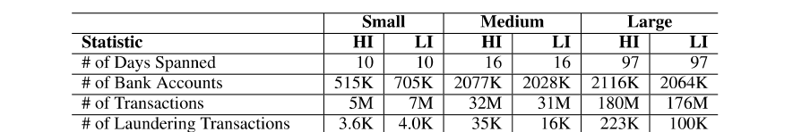

**그림 7 히스토그램은 계정당 연간 거래를 보여줍니다. 이는 표 4에 있는 전체 거래 수를 다양한 엔터티가 어떻게 구동하는지에 대한 미시적인 보기를 제공합니다. 그림 7는 또한 실제 데이터에 대한 접점을 제공합니다. 숫자는 미국 연방 준비 은행 데이터 [51]와 대략적으로 일치합니다. 표 5는 ACH, 전신환, 수표 등 데이터세트에 사용되는 거래 형식의 분포를 보여줍니다. 이번에도 수치는 연방준비은행 통계 [41]와 대략적으로 일치합니다.**

**표 8는 (a) 섹션 3.2에서 논의된 8 표준 패턴 중 하나를 따르는 거래, 특히 그림 2; (b) 다른 활동(예: 직원 급여 또는 회사 공급품)으로 위장한 통합 거래.**

다른 데이터와 마찬가지로 급여와 연금 금액은 실제 데이터(이 경우 미국 국세청 [54])를 기반으로 합니다. 그림 8는 2018 과세 연도에 급여 소득 및 연금 소득 금액별로 제출된 신고 건수를 보여줍니다. 급여와 연금을 적절하게 분배하면 위에서 설명한 것처럼 거래 규모와 빈도에 대한 정확한 모델링과 통계를 얻는 데 도움이 됩니다. 그림 8의 $0 상단 빈은 일부 사람들이 급여 소득이나 연금 소득이 없다는 사실을 반영합니다. 급여와 연금 외에도 사람들은 이자나 배당금과 같은 다른 출처로부터 소득을 얻을 수 있습니다.

<!-- 원문 17쪽 -->

**표 5: LI-Large의 형식별 거래 수 분포.**

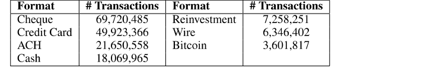

**표 6: LI-Large 세탁 패턴의 노드(계정) 수에 대한 히스토그램. Gather Scatter에는 2 개수가 있습니다. (a) 초기 자금이 들어오는 노드 수; (b) 자금이 최종적으로 이동하는 노드 수.**

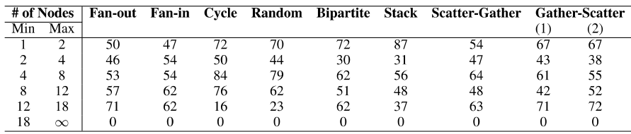

**표 7: LI-Large의 각 세탁 패턴에 대한 발생 횟수입니다. 패턴 패턴 카운트 # 트랜스 인 패턴 패턴 패턴 카운트 # 트랜스 인 패턴 팬아웃 277 2,014 스택 259 3,239 팬인 279 2,003 무작위 278 1,831 사이클 298 2,326 분산-수집 276 4,202 이분형 277 1,858 수집-분산 284 4,010**

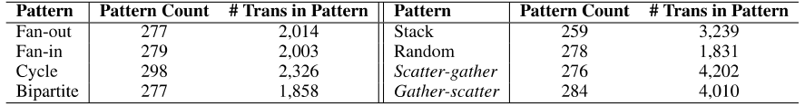

**표 8: LI-Large의 세탁 비율. 비율은 전체 거래 건수를 세탁 거래 건수로 나눈 값입니다.**

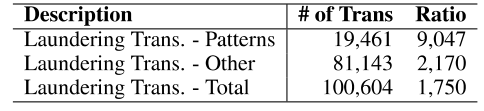

**그림 8는 급여 소득과 연금 소득을 나타내는 보고서가 약 3.4×만큼 있다는 것을 나타냅니다. 그러나 보고서에는 3가 모두 표시될 수 있습니다. 본 연구에서는 모델에 포함된 사람들 중 약 62.5%가 급여를 받고 있다고 가정합니다. 이는 성인 인력 [42]의 노동 참여에 대한 미국 노동부의 가치와 일치합니다. IRS 비율에 따르면 데이터셋에 있는 인구의 약 18.3%가 연금 소득을 갖고 있으며 연금 수령자의 약 절반도 급여를 받습니다.**

3미국 소득세 목적상 급여 소득에는 시간제 근로자의 총 임금도 포함됩니다.

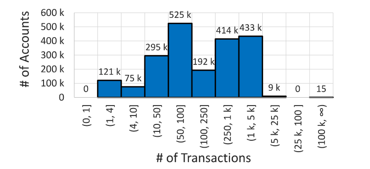

**그림 7: LI-Large 계정 전체의 연간 거래율.**

<!-- 원문 18쪽 -->

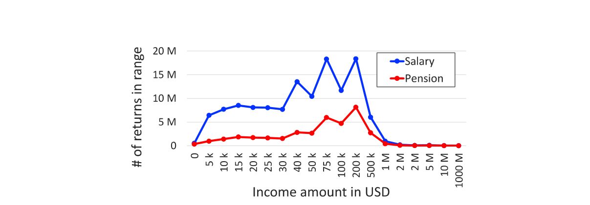

**그림 8: 2018에 대한 미국 세금 신고서의 급여 소득 및 연금 소득 분포.**

**표 9: 데이터세트의 모든 뱅크를 사용하여 학습된 공유 모델(다중 뱅크 모델) 및 단일 뱅크의 데이터를 사용하여 학습된 프라이빗 모델(단일 뱅크 모델)의 하이퍼파라미터 튜닝에 사용되는 연속적인 절반 매개변수 구성입니다.**

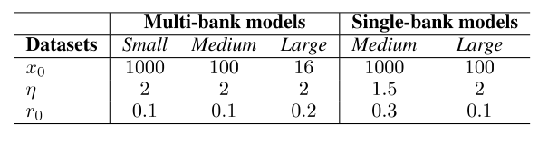

가상 세계에 대한 추가 통계는 3.5 섹션에 제공되었습니다.

### B. 데이터의 윤리적인 사용

본 연구에서는 7 섹션에서 다양한 윤리 문제를 다루었습니다. 본 연구에서는 여기서 몇 가지 추가 관찰을 제공합니다.

데이터의 윤리적 사용에는 자금세탁 활동 탐지를 위한 모델을 벤치마킹하고 개선하는 데 사용하는 것이 포함됩니다. 본 연구에서는 이러한 데이터 사용으로 인해 사회적으로 상당히 긍정적인 영향을 미칠 것으로 예상합니다. 자금세탁은 그 자체로 사회에 막대한 비용을 초래하지만, 더 중요한 것은 자금세탁으로 인해 피싱 공격부터 인신매매에 이르기까지 광범위한 범죄 활동이 계속될 수 있다는 것입니다. 자금세탁 거래를 적발하면 당국이 그러한 활동을 적발하고 그 배후에 있는 범죄자를 식별하는 데 도움이 될 수 있습니다. 또한 실제 데이터를 미세 조정하기 전에 감지 모델을 사전 훈련하는 데 데이터를 사용할 수 있습니다.

데이터셋가 합성이라는 점을 고려하면 개인 식별 정보나 공격적인 콘텐츠가 포함될 위험이 없습니다. 더욱이, 연구자들은 이를 사용할 때 특별한 주의를 기울일 필요가 없지만, 성능이 실제 데이터에 일대일로 변환되지 않을 수도 있다는 점을 명심해야 합니다.

### C. 머신러닝 모델의 하이퍼파라미터 튜닝

GBT 기준선. LightGBM 및 XGBoost 모델의 하이퍼파라미터 조정을 위해 연속적인 반감기 [26]를 사용합니다. 연속적인 반감기는 x0 모델 매개변수 구성을 무작위로 샘플링하여 시작됩니다. 모델 매개변수의 각 구성은 초기 훈련 세트의 분수 r0 ≤1를 사용하여 평가됩니다. 그런 다음 알고리즘은 eta > 1를 사용하여 최상의 x0/eta 구성을 찾습니다. 이러한 최상의 구성은 열차 세트의 분수 θ × r0를 사용하여 다음 연속 반감기 라운드에서 사용됩니다. 이 프로세스는 평가에 사용된 훈련 세트의 일부가 1에 도달할 때까지 계속됩니다. 표 9에 표시된 것처럼 다양한 데이터셋에 대해 서로 다른 연속 절반 구성을 사용합니다. 또한 x0 초기 매개변수 구성이 샘플링되는 매개변수 범위는 표 10에 나와 있습니다.

GNN 기준선. 본 연구에서는 좋은 범위의 GNN 하이퍼파라미터를 식별하기 위해 무작위 샘플링을 사용했습니다. 최종 하이퍼파라미터 세트를 선택하기 위해 이 더 좁은 범위를 사용하여 두 번째 무작위 샘플링이 수행되었습니다. 본 연구에서는 GNN 레이어 수, 숨겨진 임베딩 크기, 학습률, 드롭아웃, 소수 클래스 가중치(가중 손실 함수의 경우) 등 하이퍼파라미터를 다양하게 변경했습니다.

<!-- 원문 19쪽 -->

**표 10: GBT 모델의 초매개변수 조정에 사용되는 모델 매개변수 범위. Range-small로 표시된 작은 매개변수 범위는 HI-Large 및 LI-Large 데이터셋와 관련된 LightGBM 모델의 하이퍼 매개변수 조정에만 사용됩니다. Range-large 열에 표시된 큰 매개변수 범위는 다른 데이터세트에 사용됩니다.**

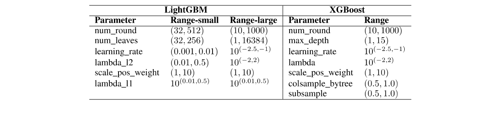

우리가 사용한 정확한 범위는 11에 나열되어 있습니다. 무작위 샘플 수는 특정 데이터셋에 대한 모델 교육 시간에 따라 10에서 50 사이로 설정되었습니다. 최종 결과를 얻기 위해 검증 점수가 가장 높은 하이퍼파라미터를 사용하여 서로 다른 무작위 시드로 초기화된 4개의 모델을 훈련합니다.

**표 11: GNN 모델의 하이퍼파라미터 튜닝에 사용되는 모델 매개변수 범위. 하이퍼파라미터는 소규모 데이터셋에 최적화되었으며 모든 GNN 모델에 사용되었습니다.**

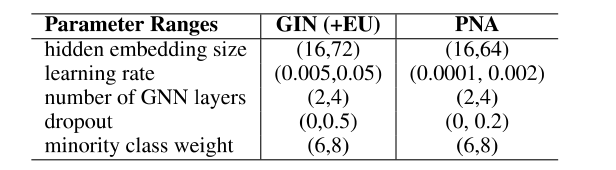

### D. 그래프 특성 전처리기 구성

GFP(Graph Feature Preprocessor)는 스트리밍 방식으로 시간적 에지로 표현되는 거래를 처리합니다. 이 전처리기의 입력은 전처리기가 메모리 내 동적 그래프에 삽입하고 이 그래프에서 분산 수집 패턴, 단순 주기 및 정점 통계와 같은 다양한 그래프 특성을 추출하는 시간적 에지 배치입니다. 전처리기의 출력은 이러한 추가 그래프 기반 특성을 갖춘 동일한 모서리 배치입니다. 이 라이브러리는 Snap ML 라이브러리 [49]의 일부로 제공되며, 본 문서의 실험은 Snap ML 1.14 버전을 사용하여 수행되었습니다. GFP에 대한 자세한 내용은 [48] 문서에서 확인할 수 있습니다.

실험을 위한 그래프 기반 특징은 128의 배치 크기를 사용하여 추출되었습니다. GFP는 분산 수집 패턴, 시간 주기, 최대 10 길이의 단순 주기 및 정점 통계를 기반으로 특성을 생성하도록 구성됩니다. 본 연구에서는 분산 수집 패턴에 대해 6시간의 시간 창을 사용하고 나머지 그래프 기반 특성에 대해 하루의 시간 창을 사용하도록 GFP를 설정했습니다. 정점 통계 특성은 기본 거래 특성의 "Amount" 및 "Timestamp" 필드를 사용하여 계산됩니다(그림 1a 참조). 이 구성은 본 논문에서 GFP를 사용하는 모든 데이터셋 및 실험에 사용됩니다.

각 데이터셋에 대해 GFP는 타임스탬프의 오름차순으로 거래를 처리합니다. 이 순서를 사용하면 과거 데이터를 사용하여 각 거래에 대한 그래프 기반 특성을 추출할 수 있습니다. 결과적으로 훈련 세트의 거래에는 검증 또는 테스트 세트를 사용하여 계산된 그래프 기반 특성이 포함되지 않습니다. 이러한 방식으로 거래를 처리하면 데이터 유출을 방지할 수 있습니다.

<!-- 원문 20쪽 -->

### E. 추가 GNN 실험

우리의 GNN 코드는 보충 자료에 포함되어 있으며 Apache 라이선스에 따라 GitHub 4에서 공개적으로 사용할 수 있습니다. GNN은 PyTorch 기하학적 버전 2.3.1 [21] 및 PyTorch 버전 2.0.1를 사용하여 구현됩니다.

모든 기본 GNN 실험은 Nvidia Tesla V100 GPU의 내부 클러스터에서 실행되었습니다. 표 12는 AML 소형 및 중형 데이터세트에서 다양한 GNN 기준선을 훈련할 때의 런타임을 보여줍니다. GNN 모델의 크기는 2 GNN 레이어와 64의 숨겨진 임베딩 크기로 동일하게 유지되었습니다. 초기 실험과 하이퍼파라미터 최적화를 포함한 총 GPU 시간은 약 1000 GPU 시간인 것으로 추정됩니다.

**표 12: Nvidia Tesla V100 GPU를 사용하는 AML 소규모 및 중간 규모 데이터셋의 모든 GNN 기준에 대한 총 훈련 시간(TTT) 및 초당 거래(TPS)의 추론 성능.**

표 2의 소수 클래스 F1 점수 외에도 GNN 기반 모델의 정밀도와 재현율을 자세히 설명하는 보다 세부적인 결과가 포함되어 있습니다. 정밀도는 세탁 예측의 정확성을 평가하고, 재현율은 모든 세탁 인스턴스를 식별하는 모델의 능력을 측정하며, F1 점수는 정밀도와 재현율의 조화 평균입니다. 표 13는 세탁 회수율을 보여주고, 표 14는 해당 정밀도 점수를 보여줍니다. 그림 9에는 다양한 결정 임계값에 걸쳐 정밀도와 재현율 간의 균형을 시각적으로 포착하는 정밀도-재현율 곡선의 예가 나와 있습니다. 예제는 모든 중소형 AML 데이터셋에서 최고 성능 모델(PNA)의 최고 성능 시드에서 가져왔습니다.

**표 13: GNN 기반 모델의 소수 클래스 재현율(%). HI는 불법 비율이 높다는 것을 나타냅니다. LI는 불법 비율이 낮다는 것을 나타냅니다.**

**표 14: GNN 기반 모델의 소수 클래스 정밀도(%). HI는 불법 비율이 높다는 것을 나타냅니다. LI는 불법 비율이 낮다는 것을 나타냅니다.**

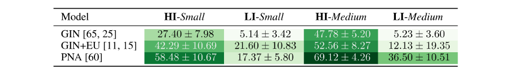

### F. 추가 GBT 실험

**그림 11는 Graph Feature Preprocessor로 생성된 그래프 기반 특성을 사용하여 모든 AML 데이터셋에서 훈련된 XGBoost 모델의 정밀도-재현율 곡선을 보여줍니다. 이 곡선은 표 2에 표시된 "GFP+XGBoost" 행의 결과에 해당합니다. 0.5의 예측 임계값을 사용하여 얻은 데이터 포인트를 나타내는 빨간색 점 뒤의 각 곡선의 가파른 기울기는 정밀도를 크게 저하시키지 않고 더 높은 재현율을 얻는 것이 어렵다는 것을 나타냅니다. 단순히 재현율을 몇 퍼센트만 줄여도 이러한 XGBoost 모델의 더 높은 정밀도를 달성할 수 있습니다.**

4https://github.com/IBM/Multi-GNN

<!-- 원문 21쪽 -->

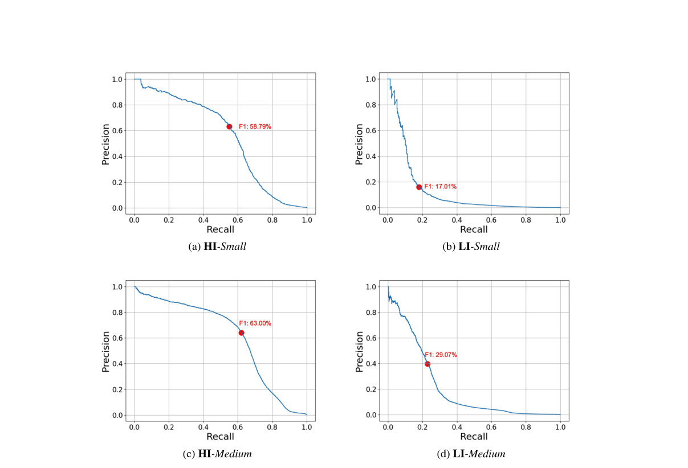

**그림 9: 모든 AML 데이터세트에 대해 최고 성능의 PNA 모델에 대한 정밀-재현율 곡선. 빨간색 점은 0.5의 예측 임계값을 사용하여 얻은 F1 점수를 나타냅니다.**

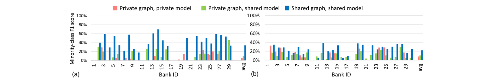

**그림 10: (a) LI-Medium 및 (b) LI-Large 데이터셋에 대해 은행 전체에서 데이터 및 LightGBM 모델을 공유하는 효과.**

**그림 10는 LI 데이터세트를 사용한 은행별 성능을 보여줍니다. 실험은 섹션 4에 설명되어 있으며 플롯은 그림 6와 유사하지만 여기서는 LI-Medium 및 LI-Large 데이터셋를 사용합니다. 이러한 데이터셋에는 HI-Medium 및 HI-Large 데이터셋에 비해 불법 거래가 더 적습니다(표 4 참조). 따라서 HI 데이터셋의 은행에 비해 이러한 LI 데이터셋의 로컬 데이터만 사용하여 은행을 위한 기계 학습 모델을 구축하는 것이 더 어렵습니다. 이 경우 그림 10에 표시된 30 은행 전체의 평균 소수 클래스 F1 점수는 LI-Medium의 경우 4.9%이고 LI-Large의 경우 8.7%입니다. 그럼에도 불구하고 공유 그래프, 공유 모델 사례의 소수등급 F1 점수는 프라이빗 그래프, 프라이빗 모델 사례에 비해 여전히 유의미한 향상을 보였다. 은행 전체에서 거래 그래프와 글로벌 모델을 공유하면 평균 소수 클래스 F1 점수가 LI-Medium의 경우 20.8%, LI-Large의 경우 22.1%로 높아집니다.**

<!-- 원문 22쪽 -->

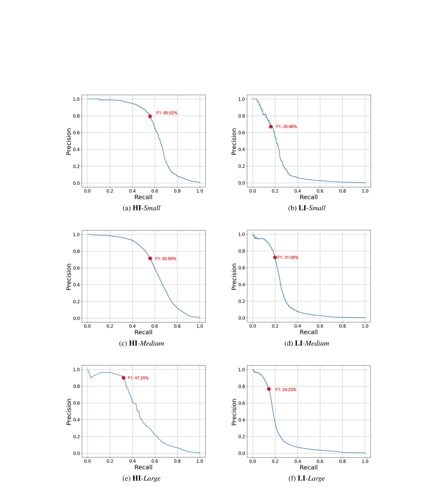

**그림 11: GFP의 그래프 기반 특성을 사용하여 훈련된 모든 AML 데이터셋에 대한 XGBoost 모델의 정밀 리콜 곡선. 빨간색 점은 0.5의 예측 임계값을 사용하여 얻은 F1 점수를 나타냅니다.**

<!-- 원문 23쪽 -->

### G. 데이터시트

Gebru et al.이 제시한 프레임워크를 기반으로 한 데이터시트가 포함되어 있습니다. [22]. 제안된 데이터시트의 일부는 합성된 데이터세트이므로 생략되었습니다.

### G.1. 동기 부여

데이터세트는 어떤 목적으로 만들어졌나요? 이 데이터셋는 금융 범죄 탐지를 위한 기계 학습 모델을 테스트, 개발 및 개선하기 위해 만들어졌습니다. 특히 데이터세트는 자금세탁 거래를 식별하는 데 중점을 둡니다.

데이터세트는 누가, 어떤 주체를 대신하여 만들었나요? IBM을 대표하는 Erik Altman.

## 데이터셋 생성에 자금을 지원한 사람은 누구입니까? IBM

### G.2. 구성

데이터셋를 구성하는 인스턴스는 무엇을 나타냅니까? 데이터셋는 합성 금융 거래 네트워크입니다. 네트워크의 각 노드는 계정/엔티티를 나타내며 각 방향 가장자리는 한 계정에서 다른 계정으로의 거래를 나타냅니다. Edge 특성은 다른 속성 간의 거래 금액, 통화 및 유형을 자세히 설명합니다. 데이터세트에는 자금세탁으로 분류된 거래도 포함되어 있습니다. 모든 정보는 시뮬레이션됩니다. 데이터셋를 생성하는 데 실제 계정이나 거래 세부 정보가 사용되지 않았습니다.

총 몇 개의 인스턴스가 있습니까? 6 데이터셋가 있습니다. 각 데이터셋는 하나의 그래프로 구성됩니다. 거래(샘플) 수는 5M부터 180M까지입니다.

데이터셋에 가능한 모든 인스턴스가 포함되어 있습니까? 아니면 더 큰 세트의 인스턴스 샘플(반드시 무작위일 필요는 없음)입니까? 데이터셋는 합성입니다. 원하는 만큼의 거래이 생성될 수 있습니다.

각 인스턴스는 어떤 데이터로 구성됩니까? 거래 분류에 사용되는 경우 에지는 인스턴스로 간주될 수 있습니다. 각 인스턴스는 일련의 거래 특성(포함, 금액, 통화, 날짜, 시간 및 유형)으로 구성됩니다. 또한, 각 거래은 전체 거래 네트워크의 일부이며, 네트워크 토폴로지가 중요한 역할을 하기 때문에 전체 네트워크에서 인스턴스의 위치는 인스턴스의 "일부"라고 볼 수 있습니다.

각 인스턴스와 연결된 레이블이나 대상이 있나요? 예.

개별 인스턴스에서 누락된 정보가 있습니까? 아니요.

권장되는 데이터 분할(예: 교육, 개발/검증, 테스트)이 있습니까? 예.

데이터셋에 오류, 노이즈 소스 또는 중복이 있습니까? 저자의 지식이 아닙니다.

데이터셋가 자체적으로 포함되어 있습니까? 아니면 외부 리소스(예: 웹 사이트, 트윗, 기타 데이터셋)에 연결되거나 의존합니까? 데이터셋는 독립적입니다.

데이터셋에 기밀로 간주될 수 있는 데이터(예: 법적 특권 또는 의사-환자 기밀로 보호되는 데이터, 개인의 비공개 통신 내용이 포함된 데이터)가 포함되어 있습니까? 아니요.

데이터세트에 직접 보면 공격적이거나 모욕적이거나 위협적이거나 불안감을 유발할 수 있는 데이터가 포함되어 있나요? 아니요.

<!-- 원문 24쪽 -->

### G.3. 수집 프로세스, 사용, 배포 및 유지 관리

생성 프로세스에 대한 자세한 내용은 섹션 4 및 부록 A를 참조하세요. 현재 사용법은 문서에 자세히 설명되어 있으며 잠재적인 용도는 부록 B에 설명되어 있습니다. Kaggle 페이지는 [50] 배포의 단일 소스 역할을 합니다. 데이터셋는 거기에 유지됩니다.
