# TransXion: 현실적인 자금세탁방지를 위한 고충실도 그래프 벤치마크

> **원문 제목:** TransXion: A High-Fidelity Graph Benchmark for Realistic Anti-Money Laundering  
> **저자:** Keyang Chen · Mingxuan Jiang · Yongsheng Zhao · Zeping Li · Zaiyuan Chen · Weiqi Luo · Zhixin Li · Sen Liu · Yinan Jing · Guangnan Ye · Xihong Wu · Hongfeng Chai  
> **게재 정보:** ACM SIGKDD Conference on Knowledge Discovery and Data Mining (KDD), 2026  
> **DOI:** [https://doi.org/10.1145/3770855.3817550](https://doi.org/10.1145/3770855.3817550)

> **번역 안내:** 본문과 부록은 문단 문맥을 기준으로 한국어로 옮겼습니다. 수식과 참고문헌은 정확성을 위해 원문 표기를 유지했습니다. 원문의 그림과 표는 개별 이미지로 잘라 해당 본문 위치에 바로 배치했습니다.

---

<!-- 원문 1쪽 -->

## 초록

자금세탁은 글로벌 금융 시스템에 심각한 위험을 초래하며 거래 모니터링을 위한 머신러닝의 광범위한 채택을 촉진합니다. 그러나 현실적인 벤치마크가 부족하여 진전이 여전히 정체되고 있습니다. 기존 거래 그래프 데이터셋는 두 가지 광범위한 제한 사항으로 인해 어려움을 겪고 있습니다. (i) 익명화된 식별자를 넘어서는 희박한 노드 수준 의미 체계를 제공하고, (ii) 벤치마크를 정적 구조 모티프에 편향시키고 모델 견고성에 대해 지나치게 낙관적인 평가를 산출하는 템플릿 기반 변칙 주입에 의존합니다. 본 연구에서는 정상 활동에 대한 프로파일 인식 시뮬레이션과 불법 하위 그래프의 확률론적, 비템플릿 합성을 통합하는 자금세탁방지(AML) 연구를 위한 벤치마크 생태계인 TransXion을 제안합니다. TransXion은 지속적인 엔터티 프로필과 조건부 거래 동작을 공동으로 모델링하여 관찰된 활동이 엔터티의 사회 경제적 맥락과 모순되는 "특수" 이상 현상을 평가할 수 있도록 합니다. 결과 데이터셋는 50,000 엔터티 간의 약 3 million 거래으로 구성되며, 각 엔터티에는 풍부한 인구 통계 및 행동 속성이 부여됩니다. 경험적 분석에 따르면 TransXion은 꼬리가 두꺼운 활동 분포 및 지역화된 하위 그래프를 포함하여 결제 네트워크의 주요 구조적 속성을 재현하는 것으로 나타났습니다.

> **주:** *두 저자 모두 본 연구에 동등하게 기여했습니다. †교신저자들.

구조. 여러 알고리즘 패러다임을 포괄하는 다양한 탐지 모델 전반에 걸쳐 TransXion은 널리 사용되는 벤치마크보다 탐지 성능이 상당히 낮으며 난이도와 현실성이 증가했음을 보여줍니다. TransXion은 상황을 인식하고 강력한 AML 감지 방법을 개발하기 위한 보다 충실한 테스트베드를 제공합니다. 데이터셋와 코드는 https://github.com/chaos-max/TransXion.에서 공개적으로 제공됩니다.

## CCS 개념

- 컴퓨팅 방법론 →Modeling 및 시뮬레이션; 인공지능; • 응용컴퓨팅 →Economics.

## 핵심어

자금세탁방지, 거래 모니터링, 합성 데이터 생성, 금융 네트워크, 이상 탐지.

ACM 참조 형식: Keyang Chen, Mingxuan Jiang, Yongsheng Zhao, Zeping Li, Zaiyuan Chen, Weiqi Luo, Zhixin Li, Sen Liu, Yinan Jing, Guangnan Ye, Xihong Wu 및 Hongfeng Chai. 2026. TransXion: 현실적인 자금세탁방지를 위한 충실도가 높은 그래프 벤치마크. 지식 발견 및 데이터 마이닝에 관한 제32회 ACM SIGKDD 컨퍼런스 진행 중 V.2(KDD '26), 8월 09–13, 2026, 대한민국 제주도. ACM, 뉴욕, NY, 미국, 12 페이지. https://doi.org/10.1145/3770855.3817550

## 1 서론

자금세탁은 불법적으로 취득한 자금의 출처를 위장하여 이를 글로벌 경제에 원활하게 통합시키는 과정입니다[25]. 광범위한 규제 개입에도 불구하고 전 세계 자금세탁 규모는 여전히 어마어마합니다. 보수적으로 추정하면 전 세계 GDP [22]의 2%~5% 사이에 해당하는 규모입니다. 이러한 엄청난 규모는 개인의 범죄를 넘어 시스템적 위험을 야기하고,

<!-- 원문 2쪽 -->

> **주:** KDD '26, 8월 09–13, 2026, 제주도, 대한민국 Keyang Chen et al.

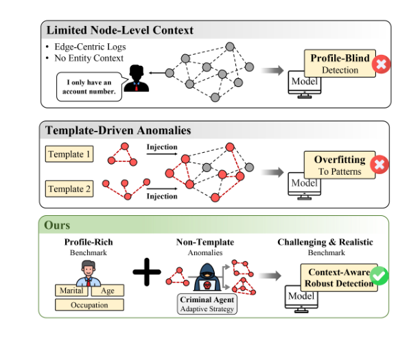

**그림 1: TransXion과 비교한 이전 AML 벤치마크의 제한 사항. 이전 벤치마크는 에지 전용 로그와 모티프 기반 주입을 사용하는 반면, TransXion은 상황별 탐지를 위해 프로파일이 풍부한 엔터티와 적응형 이상 합성을 결합합니다.**

이는 재정적 건전성을 훼손하고, 투자 결정을 왜곡하며, 거시 경제 상황을 불안정하게 만들 수 있습니다.

이러한 체계적인 위협에 대응하기 위해 규제 기관과 금융 기관은 기계 학습 기반 거래 모니터링으로 기존 규칙 기반 프레임워크를 강화하여 자금세탁방지(AML) 노력을 강화하고 있습니다. 그러나 실제 거래 데이터는 법률, 개인 정보 보호 및 기밀 유지 제약으로 인해 대규모로 공유할 수 있는 경우가 거의 없으며, 많은 세탁 활동이 감지되지 않고 검증에는 전문가 조사가 필요하기 때문에 레이블이 희박하고 불완전합니다. 결과적으로, 데이터 기반 AML 방법 [3, 17]를 개발하고 벤치마킹하려면 충실도가 높은 데이터 합성이 필수적입니다. 실제로 기존 벤치마크는 거래이 기본적으로 관계형 이벤트 로그로 기록되는 공통 데이터 구성을 공유합니다. 이러한 로그는 방향성 다중 그래프로 캐스팅되어 시간적 계단식 및 지역화된 하위 그래프 모티프 [21]로 예시되는 고차 행동 패턴을 노출할 수 있습니다. 그러나 기존 벤치마크는 주로 두 가지 광범위한 제한으로 인해 금융 네트워크에 내재된 의미론적 컨텍스트와 거래 토폴로지의 복잡한 통합을 포착하지 못했습니다. (i) 제한된 노드 수준 컨텍스트: 운영 AML에서 효과적인 탐지는 거래 토폴로지뿐만 아니라 행동이 KYC(Know Your Customer) 표준 [5, 15]에 따른 고객 프로필과 일치하는지 여부에 따라 달라집니다. 그러나 대부분의 공개 벤치마크는 노드가 익명화되거나 범주형 식별자 [3]로 제한되는 에지 중심 이벤트 로그로 구성됩니다. 드물게 노드 특성이 존재하는 경우 의미론적 해석 가능성이 부족한 내장 표현으로 인해 규정 준수 감사 및 모델 책임이 어려워지는 경우가 많습니다. [24]. 구조화된 엔터티 컨텍스트가 없으면 모델은 엔터티의 예상 사회경제적 프로필에서 벗어나지만 단독으로는 그럴듯해 보이는 거래인 "특성에 맞지 않는" 동작을 간과하기 쉽습니다. (ii) 템플릿 기반 이상 항목 삽입: 기존 벤치마크의 불법 활동은 제한된 사전 정의 템플릿 세트를 인스턴스화하여 생성되는 경우가 많습니다. 이 패러다임에서 이전 작업은 일반적으로 순차적 세탁 단계를 명시적으로 수동으로 규정하거나 열거된 정적 그래프 모티프 [3, 21] 세트를 복제하여 의심스러운 흐름을 합성합니다. 실용적이긴 하지만 고정된 템플릿에 대한 이러한 의존은 벤치마크를 예측 가능한 패턴으로 제한합니다. 이는 모델의 견고성을 과대평가할 수 있습니다. 모델은 이러한 벤치마크에서 강력한 성능을 발휘할 수 있지만 실제 AML에서 접하는 다양하고 적응형 세탁 전략을 포착하지 못할 수 있습니다.

이러한 제한 사항을 해결하기 위해 엔드투엔드 합성 및 평가 생태계로 구축된 프로필이 풍부한 거래 그래프 벤치마크인 TransXion을 소개합니다. TransXion은 간단한 3단계 파이프라인을 따릅니다. (i) 구조화된 엔터티 프로필과 시간 순서에 따른 거래 스트림을 공동으로 생성하는 일반 백본; (ii) 예산 한도 내에서 실제 불법 하위 그래프에 대한 통제된 구조적 및 시간적 편집을 통해 불법 클러스터를 파생시키는 변칙적 합성; (iii) 비정상적인 역할을 호환 가능한 엔터티 및 가능한 시간 창에 정렬하여 각 불법 클러스터를 손상되지 않은 하위 그래프로 삽입하는 프로필 조건 삽입. 결과 데이터셋에는 50,000개 엔터티 간의 대략 300만 개의 거래이 포함되어 있으며, 프로필 위반 동작 감지를 포함하여 에지 전용 로그 이상의 평가를 지원하기 위해 엔터티당 의미상 의미 있는 메타데이터가 포함되어 있습니다. 본 연구에서는 결제 네트워크의 주요 양식화된 속성을 일치시키고, 극단적인 클래스 불균형을 유지하며, 템플릿 기반 기준이 성능 격차를 가릴 수 있음을 입증함으로써 TransXion을 검증합니다. 전반적으로 TransXion은 현실적인 제약 조건 하에서 배포 및 감사 가능한 AML 모니터링을 개발하고 스트레스 테스트하기 위한 실용적인 벤치마크를 제공합니다. 우리의 기여는 다음과 같이 요약될 수 있습니다.

- 최초의 프로필이 풍부한 거래 벤치마크: 약 3 million 거래과 의미상 의미가 풍부한 엔터티 프로필을 통합하는 최초의 대규모 거래 그래프 벤치마크인 TransXion을 소개합니다. 구조화된 인구통계 및 행동 메타데이터를 제공함으로써 TransXion은 현실적인 고객 상황에 맞춰 AML 모델을 평가할 수 있게 하여 기존 엣지 전용 데이터셋의 중요한 격차를 메웁니다. • 비템플릿 이상 합성: 우리는 엄격한 템플릿 기반 모티프를 섭동 기반 합성으로 대체하는 새로운 생성 프레임워크를 제안합니다. 예산 제약 하에서 실제 불법 하위 그래프에서 파생된 다양한 이상 현상을 주입함으로써 우리 프레임워크는 사전 정의된 템플릿 세트에 대한 벤치마크 편향을 완화하여 감지기에 대한 더 강력한 스트레스 테스트를 제공합니다. • 다차원 충실도 및 효용 분석: 우리는 두 축, 즉 구조 및 분포 진단을 통한 충실도와 다운스트림 불법 거래 감지를 통한 효용성을 기준으로 TransXion을 평가합니다. 결과는 TransXion이 기존 대안보다 더 까다로운 벤치마크를 제공하면서 현실적인 그래프 서명을 유지한다는 것을 보여줍니다.

## 2 관련 연구

공개 AML 데이터셋 및 벤치마크. 실제 금융 거래 데이터는 개인정보 보호, 규제, 상업적 제약으로 인해 대규모 공유가 거의 불가능하며 익명 처리된 기록도 종종 있습니다.

<!-- 원문 3쪽 -->

> **주:** TransXion: 현실적인 자금세탁방지를 위한 고충실도 그래프 벤치마크 KDD '26, August 09–13, 2026, 제주도, 대한민국

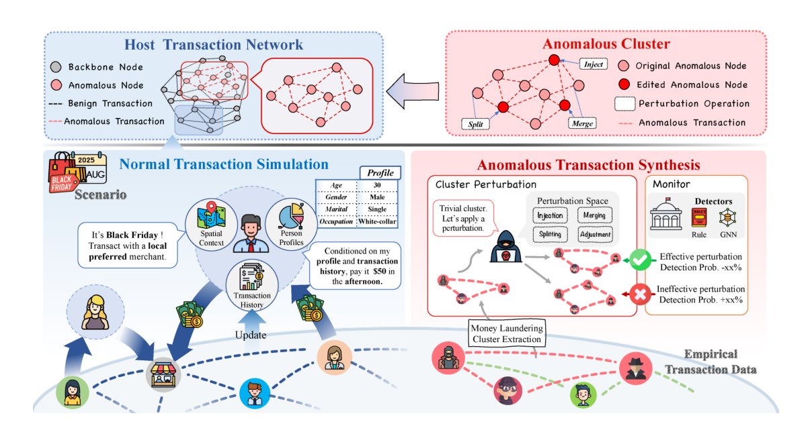

**그림 2: TransXion 생성 프레임워크 개요. 일반 거래은 폐쇄 루프에서 엔터티 프로필, 임시 활동 및 네트워크 상호 작용을 공동으로 시뮬레이션하는 에이전트 기반 백본에 의해 생성됩니다. 그런 다음 추출된 세탁 하위 그래프에 대한 해석 가능한 교란을 통해 현실적인 불법 행위가 합성되고, 적대적 모니터에 의해 안내되며, 구조적, 프로필 및 시간적 제약에 따라 정상 백본에 다시 포함됩니다.**

많은 불법 활동이 발견되지 않은 상태로 남아 있기 때문에 완전하고 신뢰할 수 있는 근거 진실이 부족합니다. 이전 작업에서 언급한 바와 같이 "은행의 자금세탁방지(AML) 방법을 조사하고 비교하는 데 사용할 수 있는 실제 공개 데이터셋가 없습니다." 이러한 심각한 기밀 장벽은 극단적인 계급 불균형 및 모델 해석 가능성 [17]와 같은 핵심 AML 문제에 대한 연구를 제한합니다. 결과적으로 방법 개발 및 평가에 사용할 수 있는 공개 벤치마크는 소수에 불과합니다.

약 200,000개의 노드와 수작업 특성을 갖춘 부분적으로 레이블이 지정된 비트코인 ​​거래 그래프인 Elliptic 데이터셋는 AML 연구에서 널리 사용되는 벤치마크가 되었습니다. 그러나 거래 중 소수만이 합법 또는 불법으로 주석을 달고 있으며 불법 부분이 극히 적기 때문에 감독 평가 [30]의 신뢰성이 제한됩니다. 전통적인 금융의 경우 T-Finance와 같은 벤치마크는 제한된 행동 속성 세트 [24]로 설명되는 익명 계정 노드를 사용하여 은행 거래 네트워크를 시뮬레이션합니다. 이러한 데이터셋는 통제된 실험을 가능하게 하지만 기본 엔터티와 해당 사회 경제적 역할에 대한 의미 정보를 거의 제공하지 않습니다.

최근 공개 벤치마크에서는 규모와 라벨링 적용 범위를 늘리기 위해 완전 합성 거래 데이터에 의존하기 시작했습니다. 예를 들어, SAML-D는 이전 데이터셋 [21]의 제한된 레이블 범위를 넘어 다양한 세탁 유형에 걸쳐 생성된 수백만 개의 거래를 제공합니다. 그럼에도 불구하고 규모와 구성의 차이에도 불구하고 공개 벤치마크는 주로 거래 수준 또는 토폴로지 정보를 노출하고, 엔터티 수준의 의미론적 컨텍스트를 희박하거나 제공하지 않으며, 운영 AML 시스템에서 직면하는 장기 모니터링 설정을 추상화한다는 한계를 공유합니다. 결과적으로 이러한 벤치마크는 알고리즘 타당성을 입증하는 데 유용하지만 현실적인 AML 위험 평가에 필요한 풍부한 엔터티 컨텍스트와 진화하는 행동 의미를 표현하기에는 여전히 불충분합니다. AML에 대한 합성 데이터 생성. 공유 가능한 거래 데이터의 제한된 가용성과 신뢰할 수 있는 라벨의 부족을 극복하기 위해 AML 연구는 제어 가능하고 완전히 주석이 달린 거래 네트워크를 구축하기 위해 시뮬레이션 및 합성 프레임워크에 점점 더 의존해 왔습니다. PaySim [19] 및 AMLSim [29]와 같은 초기 벤치마크는 에이전트 기반 시뮬레이션을 채택합니다. 사전 정의된 행동 규칙에 따라 일상적인 고객 활동을 생성하고 정식 세탁 모티프(예: 팬인/팬아웃 또는 스머핑)를 주입하여 레이블이 지정된 이상 현상을 생성합니다. 이 패러다임은 알려진 실제 사실 하에서 재현 가능한 실험을 가능하게 하며 초기 기준선을 설정하는 데 중요한 역할을 했습니다.

그러나 이러한 초기 생성자는 일반적으로 수동으로 지정된 소수의 템플릿, 제한된 거래 유형 및 단순화된 제도적 가정에 의존합니다. 이러한 설계 선택은 세탁 전략이 고정되지 않고 이질적이고 적응성이 있는 운영 은행 환경에서 출발하는 긴급하고 비정상적인 패턴의 다양성을 제한합니다. 결과적으로 이러한 벤치마크의 성능 향상은 보이지 않거나 진화하는 불법 동작을 일반화하는 능력보다는 주입된 모티프를 인식하는 모델의 능력을 주로 반영할 수 있습니다.

<!-- 원문 4쪽 -->

> **주:** KDD '26, 8월 09–13, 2026, 제주도, 대한민국 Keyang Chen et al.

최근 연구에서는 합성 영역을 확장하거나 경험적 분포를 통합하여 현실성을 향상시키려고 노력했습니다. 예를 들어, AMLWorld [3]는 다중 은행, 다중 통화 가상 환경을 구축하고 실제로 관찰되는 극단적인 계층 불균형을 유지하면서 더 광범위한 세탁 단계를 시뮬레이션합니다. SynthAML [17]와 같은 데이터 기반 접근 방식은 확률 모델을 실제 은행 통계에 맞춰 레이블이 지정된 경고를 통해 대규모 거래 스트림을 생성합니다. 이러한 발전은 한계 토폴로지 및 시간적 패턴 수준에서 충실도를 크게 향상시키고 합성 거래 역학과 실제 거래 역학 간의 격차를 줄입니다.

향상된 현실성에도 불구하고 많은 합성 벤치마크는 템플릿 중심을 유지하고 예측 가능한 주입 모티프에 대한 모델을 평가하므로 견고성이 과장될 수 있습니다. 또한 엔터티 컨텍스트와 시간적 행동 전반에 걸쳐 공동 일관성을 거의 적용하지 않아 캐릭터 세탁에 대한 연구를 제한합니다. 이는 풍부한 엔터티 프로필을 비템플릿, 제어 가능한 이상 현상 및 운영 모니터링과 일치하는 평가 프로토콜과 통합하는 벤치마크에 동기를 부여합니다.

## 3 생성적 프레임워크 3.1 일반 거래 시뮬레이션 백본

대부분의 거래 그래프 벤치마크는 활동이 엔터티 프로필에서 벗어나는지 평가하는 데 필요한 엔터티 컨텍스트를 제거하는 에지 전용 로그를 릴리스합니다. 사후 속성은 상호작용 기록을 통해 정체성과 행동이 함께 진화하기 때문에 이러한 결합을 복구할 수 없습니다. 따라서 우리는 폐쇄 루프에서 프로필과 거래를 공동으로 생성하는 에이전트 기반 백본을 구축합니다. 구체적으로 말하면, 각 1시간 창에서 (i) 개시자 샘플, (ii) 상대방 샘플, (iii) 이벤트 속성 샘플, (iv) 다음 창에 대한 상호 작용 상태를 업데이트합니다.

개인의 일관성을 위한 프로필 기반 행동. 각 엔터티는 활동 성향과 속성 범위를 모두 제한하는 지속적이고 의미상 의미 있는 프로필로 초기화됩니다. 계정의 경우 프로필에는 일일 강도, 일반적인 금액 규모 및 일일 리듬과 같은 사회 경제적 속성 및 행동 사전 정보가 포함됩니다. 판매자의 경우 비즈니스 유형 및 운영 규모가 포함됩니다. 운영상 프로필은 창별 활성화 확률과 특성 샘플러를 매개 변수화하므로 엔터티별 동작은 안정적이고 감사 가능한 상태로 유지되는 동시에 프로필 기대치에 따라 문자에서 벗어난 편차를 정의할 수 있습니다.

거시적 수준의 변화를 위한 시나리오 변조. 휴일이나 지역 수요 변화 등 빈도가 낮은 변화를 포착하기 위해 고정된 일일 주기로 업데이트되는 경량 시나리오 컨트롤러를 추가합니다. 매일 전역 강도 계수 및 지역 수준 혼합 가중치를 포함하는 작은 곱셈 수정자 세트를 출력합니다. 이러한 수정자는 총량과 지역 구성에만 영향을 미칩니다. 개별 이벤트를 지정하거나 프로필 기반 미세 동작을 재정의하지 않습니다. 업데이트 세분성 및 영향을 받는 변수를 수정하면 매크로 레이어가 재현 가능해지며 무제한 조정이 방지됩니다.

현실적인 그래프 토폴로지를 위한 사회적으로 구조화된 샘플링. 각 시간별 창 내에서 개시자는 이질적인 참여를 반영하기 위해 프로필에서 파생된 활동 가중치에 비례하여 샘플링됩니다. 그런 다음 지역 선호도, 시간에 따른 상호작용 기억, 상인 매력, 새로운 관계에 대한 제한된 탐색이라는 네 가지 용어를 결합하여 상대방을 선택합니다. 최소한의 형태로 이는 후보 상대방에 대한 가중치 혼합으로, 메모리 용어는 과거 상호 작용에서 업데이트되고 시간이 지남에 따라 감소합니다. 이를 통해 양과 기타 속성을 개시자 프로필과 일관되게 유지하면서 두꺼운 참여와 중요하지 않은 클러스터링 패턴을 생성합니다.

시간적 안정성을 위한 진화하는 상호작용 상태. 본 연구에서는 최근 기록을 요약하고 향후 샘플링에 다시 피드백하는 상호 작용 상태를 유지합니다. 상태는 시간이 지남에 따라 소멸된 파트너 기본 설정 및 지역 핫스팟을 저장하며 매 시간마다 업데이트됩니다. 이로 인해 경로 의존성이 발생합니다. 즉, 반복적인 연결 가능성이 높아지지만 여전히 확률적으로 새로운 연결이 나타납니다. 결과적으로 생성된 그래프는 경험적 금융 네트워크 및 은행 간 거래 시스템 [3]에서 관찰된 두꺼운 꼬리 활동 패턴과 함께 시간적 지속성과 안정적인 일별 구조를 나타냅니다.

### 3.2 비정상적인 거래 합성

다양하고 적응력이 뛰어난 자금세탁 행위를 생성하기 위해 우리는 현실적인 불법 거래 하위 그래프에 통제되고 해석 가능한 편집을 적용하여 이상 현상을 합성합니다. 각 편집은 유효한 끝점, 음수가 아닌 금액 및 일관된 시간 순서를 포함하여 기본 거래 온전성을 유지합니다. 본 연구에서는 네 가지 작업 계열로 컴팩트한 작업 공간을 정의합니다. 중개자 주입은 추가 중간 계정을 삽입하여 거래 체인을 늘리고 직접 자금 출처를 모호하게 합니다. 계정 병합은 행동이 유사한 계정을 통합하여 중복 구조를 줄이고 반복 패턴을 마스킹합니다. 계정 분할은 여러 수신자에게 거래 흐름을 분산시켜 일반적으로 탐지 휴리스틱을 트리거하는 집중된 신호를 희석시킵니다. 거래 조정은 주변 활동과의 일관성을 유지하면서 악용 가능한 규칙성을 깨기 위해 실행 가능한 범위 내에서 거래 금액이나 타임스탬프를 교란합니다.

이러한 작업은 필요한 도구를 제공하지만 핵심 과제는 감지를 우회하기 위한 최적의 편집 순서를 선택하는 것입니다. 이 문제를 해결하기 위해 사전 훈련된 모니터에 의해 안내되는 적대적 프로세스로 합성을 구성합니다. 합성 에이전트는 각 불법 클러스터에 대한 편집을 제안하는 반면, 모니터는 작동 타당성을 희생하지 않고 탐지 가능성을 줄이는 수정을 장려하기 위해 결과에 점수를 매깁니다. 정적 편집과 동적 전략 사이의 격차를 해소하기 위해 작업 선택을 제한된 순차적 결정 프로세스로 공식화하고 모니터의 피드백에 따라 구동되는 가벼운 반복 최적화 루프를 통해 에이전트를 개선합니다. 이를 통해 에이전트는 단순한 휴리스틱 규칙으로는 포착하기 어려운 정교하고 다단계 회피 패턴을 발견할 수 있습니다. 자세한 내용은 부록 A에 나와 있습니다.

### 3.3 이상-정상 임베딩

주입 아티팩트를 방지하기 위해 순진한 배치를 피하고 대신 합성된 클러스터를 일반 백본에 손상되지 않은 하위 그래프로 포함합니다. 우리의 목표는 내부 흐름 토폴로지와 시간적 순서로 특징지어지는 불법적인 의미를 보존하는 동시에 정상적인 계정 공간 내에서 운영 가능성을 보장하는 것입니다. 결정적으로, 라벨은 삽입 중에 자금 흔적을 따라 전송되므로 구성을 통해 불법성이 보존됩니다.

임베딩은 세 가지 제약 조건을 충족하는 경우에만 허용됩니다. (i) 구조적 보존: 클러스터 참가자의 일대일 매핑에서 모든 발신자-수신자 쌍을 보존합니다. (ii) 프로필

<!-- 원문 5쪽 -->

> **주:** TransXion: 현실적인 자금세탁방지를 위한 고충실도 그래프 벤치마크 KDD '26, August 09–13, 2026, 제주도, 대한민국

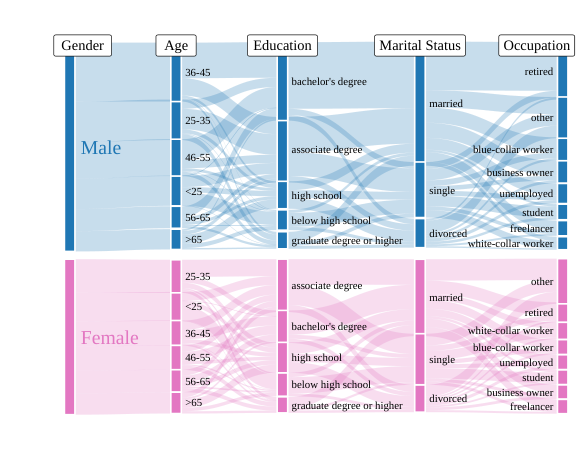

**그림 3: TransXion에서 엔터티 프로필 동시 발생. 계정 소유자 속성의 공동 배포에 대한 Sankey 다이어그램.**

정렬: 각 변칙적 역할을 프로필과 일치하는 활동 체제가 역할의 필수 범위 내에 속하는 일반 계정과 일치시킵니다. (iii) 시간적 일관성: 모든 클러스터 내 시퀀싱을 유지하면서 클러스터를 실행 가능한 시간 창에 배치합니다.

본 연구에서는 의미론적 무결성을 유지하기 위해 이러한 제약 조건을 위반하는 모든 클러스터를 거부하는 원자 주입 정책을 채택합니다. 데이터셋 수준에서 증강된 백본이 두꺼운 꼬리 활동 통계와 같은 주요 양식화된 속성을 유지하는지 확인합니다. 이러한 속성은 실험에서 경험적으로 검증되었습니다. 전반적으로 이 임베딩은 구조적 보존과 상황별 타당성의 균형을 유지하여 벤치마크가 주입 아티팩트가 아닌 구조 인식 불법 패턴을 평가하도록 보장합니다.

## 4 제안된 데이터세트

TransXion 데이터세트. 50,000 엔터티 간의 3 million 거래를 포함하고 개인, 판매자 및 거래으로 구성되는 프레임워크에서 생성된 관계형 데이터셋인 TransXion을 소개합니다. TransXion은 거래 네트워크 토폴로지를 풍부한 의미 컨텍스트와 긴밀하게 결합합니다. 엔터티 테이블은 고유한 계정에 연결된 구조화된 프로필을 제공합니다. 그림 3는 이러한 프로필 속성의 동시 발생 구조를 시각화하여 학습에 사용할 수 있는 계정 컨텍스트의 풍부하고 이질적인 다양성을 보여줍니다. 자세한 통계 특성화 및 분포 분석은 부록 B에 제공됩니다.

## 5 실험

이 섹션에서는 두 가지 보완적인 관점, 즉 거래 네트워크의 양식화된 사실에 대한 구조적 충실도와 불법 활동 탐지를 위한 도전적인 벤치마크로서의 유용성에서 TransXion에 대한 포괄적이고 실증적인 평가를 제공합니다. 따라서 우리는 두 가지 연구 질문을 중심으로 분석을 구성합니다. RQ1(충실도). TransXion의 통계적 속성과 그래프 불변성은 실제 결제 시스템에 문서화된 패턴과 어느 정도 일치합니까?

RQ2(검출 경도). TransXion은 확립된 벤치마크 데이터세트에 비해 불법 거래 탐지의 난이도를 어느 정도까지 높입니까?

### 5.1 실험 설정

실험 프로토콜. 생성적 충실도와 벤치마크 유틸리티를 모두 평가하기 위해 거래 데이터를 두 가지 보완적인 형식으로 표현합니다. 구조적 불변성(RQ1)의 경우 거래를 방향이 없는 단순 그래프로 투영하여 연결성, 전이성 및 코어-주변 구조와 같은 안정적인 토폴로지 서명을 측정할 수 있습니다. 불법 탐지 작업(RQ2)의 경우 방향성과 가중치가 부여된 시간적 다중 그래프를 사용하여 데이터의 전체 세분성을 유지하므로 모델이 흐름 방향성과 시간적 역학 모두에서 학습할 수 있습니다.

기준선. 본 연구에서는 각각 서로 다른 세대의 모델링 접근 방식을 나타내는 세 가지 확립된 합성 거래 데이터셋에 대해 벤치마크를 평가합니다. AMLSim [29]: 다중에이전트 시뮬레이션 프레임워크에 의해 생성된 합성 거래 데이터셋입니다. 이는 주입된 불법 활동 패턴과 함께 계정 수준 거래를 제공하며 이전 작업에서 표준 합성 벤치마크로 사용되었습니다. AMLWorld [3]: 합법적 에이전트와 범죄 에이전트가 모두 포함된 다중에이전트 가상 세계를 구축하고, 현실적이고 표준화된 AML 데이터셋를 대규모로 생성하고, AML 탐지 모델 벤치마킹을 위한 완전한 세탁 레이블 및 패턴 주석을 제공하는 에이전트 기반 합성 금융 거래 생성기입니다. SAML-D [21]: 향상된 거래 시뮬레이션 프레임워크에 의해 생성된 합성 AML 거래 모니터링 데이터셋입니다. 여기에는 11 일반 거래 유형 및 17 의심스러운 유형으로 주석이 달린 수백만 개의 표 형식 거래 기록이 포함되어 있습니다.

### 5.2 통계적 속성과 그래프 불변성의 충실도

Soramäki et al. [23]는 일일 방향성 거래 네트워크를 구축하고 TransXion이 글로벌 토폴로지 레벨과 분산 테일 레벨 모두에서 거래 그래프의 안정적인 규칙성을 재현하는지 확인하여 충실도를 평가합니다. 데이터셋 간 비교를 위해 일일 무향 예측에 대한 그래프 불변량을 계산하고 결과를 평균 ± 표준으로 보고합니다. 또한 꼬리 진단은 일관된 선택 규칙을 사용하여 집계된 분포에 대해 보고됩니다.

매크로 토폴로지: 백본 연결 및 단편화. 경험적 문헌에 따르면 결제 네트워크는 드물지만 연결된 대규모 백본 [7, 12]가 지배하고 있습니다. 이 증거에 동기를 부여하여 거대한 연결 구성 요소 비율을 사용하여 거시적 수준 통합을 정량화합니다. 표 1에 표시된 것처럼 TransXion은 평균 GCC 비율 0.8924 ± 0.0321로 통합 일일 토폴로지를 유지하여 일부 기준선에서 관찰되는 과도한 조각화를 방지합니다. 이러한 구조적 무결성은 현실적인 결제 백본 [1, 2]를 통해 대규모 정보 확산 및 전염 방식 전파를 가능하게 하기 때문에 다운스트림 유틸리티에 중요합니다. 따라서 TransXion은 모델이 단편화된 구성 요소가 아닌 전 세계적으로 연결된 거래 네트워크에서 작동하는 그래프 학습을 위한 보다 충실한 기반을 제공합니다.

<!-- 원문 6쪽 -->

> **주:** KDD '26, 8월 09–13, 2026, 제주도, 대한민국 Keyang Chen et al.

**표 1: 그래프 불변성과 꼬리 진단의 비교. 불변량은 일일 예측에 대한 평균 ± 표준으로 보고됩니다. 테일 진단은 자동으로 선택된 𝑥min [10]와 함께 MLE 기반 피팅을 사용합니다. Strength와 Amount는 각각 노드 거래량과 개별 거래 가치를 나타냅니다. 괄호 안의 값은 (𝑥min | 𝑛tail)을 나타냅니다.**

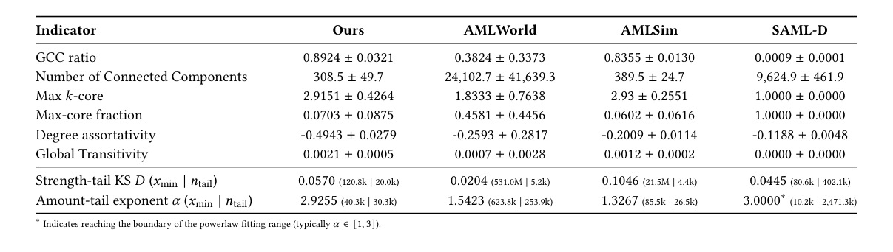

삼극 폐쇄 및 국부화된 구조. 실제 은행 간 및 화폐 시장 네트워크는 일반적으로 낮은 클러스터링을 나타내지만 여전히 반복적인 관계 및 시장 분할 [7, 8]로 인해 사소한 로컬 폐쇄를 보여줍니다. 본 연구에서는 연결된 모든 삼중항 중 닫힌 삼중항의 비율을 나타내는 무방향 전이성을 통해 이를 정량화합니다. 일일 그래프 예측에서 TransXion은 일반적인 벤치마크의 희소 종결과 일치하는 0.0021 ± 0.0005의 전이성을 산출합니다. 이는 TransXion이 실제 금융 상호 작용에서 볼 수 있는 결속력 있는 커뮤니티 구조를 유지하면서 미묘하면서도 필수적인 국지적 폐쇄의 특징을 포착한다는 것을 보여줍니다. 이러한 구조적 충실도는 그래프 기반 모델이 로컬 관계 패턴을 학습할 수 있는 의미 있는 토폴로지를 생성하는 반면, 과도하게 단편화된 환경은 종종 이러한 폐쇄 신호를 제거하고 이러한 학습을 ​​비효율적으로 만듭니다.

계층화, 혼합 패턴 및 구조적 계층. 금융 네트워크의 정의적인 특징은 중앙 기관이 넓은 주변 [4]에 대한 흐름을 중간하는 계층형 아키텍처입니다. 이러한 구조는 일반적으로 높은 수준의 허브가 낮은 수준의 주변 노드에 불균형적으로 연결되는 비분류적 혼합을 특징으로 합니다. 표 1는 TransXion이 허브-스포크 중개 [20]와 일치하는 -0.4943의 뚜렷한 음의 분류 계수를 나타냄을 보여줍니다. 본 연구에서는 𝑘-코어 분해를 통해 계층적 깊이를 더 조사합니다. TransXion은 2.9151의 최대 코어 수를 달성하며, 이는 더 얕은 기준선에 비해 다층 코어 구조를 나타냅니다. 더 간단한 기준선에서 발견되는 퇴화된 1 코어 구조와 달리 TransXion은 정교한 다단계 금융 상호 작용에 대해 탐지 모델을 평가하는 데 필요한 토폴로지 깊이를 제공합니다.

두꺼운 꼬리와 흐름의 경제적 타당성. 두꺼운 꼬리 분포는 금융 시스템 어디에나 존재하며, 특히 노드 거래량 및 전송 금액 [16]와 같은 노출 프록시의 경우 더욱 그렇습니다. 본 연구에서는 표준 관행 [10]에 따라 자동으로 선택된 낮은 컷오프 𝑥min을 갖춘 MLE 기반 피팅을 사용하여 꼬리를 평가합니다. 이 프로토콜에서 TransXion은 낮은 강도-꼬리 KS 거리와 타당한 범위의 양-꼬리 지수를 나타냅니다. 이는 꼬리 동작이 꼬리가 두껍고 통계적으로 일관성이 있음을 나타냅니다. 전반적으로 이러한 진단은 TransXion이 더 나은 것을 지원합니다.

**표 2: GBT 기준을 사용한 불법 거래 탐지 성능. 각 검출기에 대해 가장 낮은 값은 굵게 표시되고 두 번째로 낮은 값은 밑줄로 표시됩니다.**

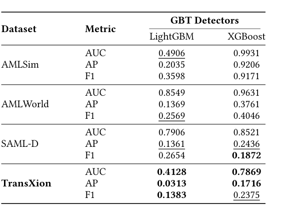

병리학적 꼬리 거동을 피하면서 경제적으로 기반을 둔 흐름 이질성을 포착합니다.

RQ1에 대한 요약입니다. 거시적 연결성, 중규모 계층화 및 테일 동작 전반에 걸쳐 TransXion은 운영 결제 네트워크의 여러 정형화된 사실과 일치하는 일관되고 현실적인 구조 프로필을 보여줍니다. 비교된 벤치마크 전체에서 우리는 연결성, 핵심-주변 조직 및 꼬리 체제에서 다양한 강조점과 절충점을 관찰합니다. 대조적으로 TransXion은 백본 연결성, 계층적 깊이 및 경제적으로 타당한 흐름 이질성의 균형 잡힌 조합을 유지합니다. 이러한 균형 하에서 TransXion은 효과적인 그래프 기반 학습에 필요한 토폴로지 풍부함을 유지하면서 의미 있는 탐지 평가를 가능하게 하는 거래 그래프를 제공합니다.

### 5.3 검출 경도 및 벤치마크 유틸리티

이 섹션에서는 불법 활동 탐지를 위한 엄격한 테스트베드로서 TransXion의 다운스트림 유틸리티를 평가합니다. 강력한 벤치마크

<!-- 원문 7쪽 -->

> **주:** TransXion: 현실적인 자금세탁방지를 위한 고충실도 그래프 벤치마크 KDD '26, August 09–13, 2026, 제주도, 대한민국

**표 3: 불법 거래 탐지 성능 비교. 각 감지기에 대해 가장 낮은 값은 굵게 표시되고 두 번째로 낮은 값은 밑줄로 표시되어 벤치마크 전체의 상대적 난이도를 강조합니다.**

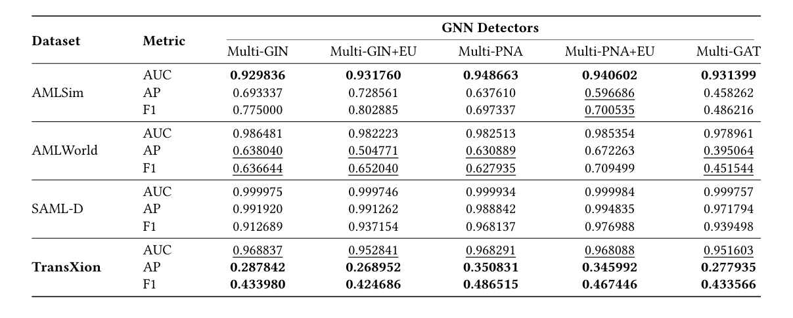

탐지 모델은 실제 세탁 복잡성을 반영하지 않는 단순한 구조적 단서를 통해 높은 점수를 얻을 수 없는 중요한 환경을 제시해야 합니다.

대표적인 검출기를 이용한 5.3.1 경도 평가. 본 연구에서는 감독된 에지 수준 분류 작업으로 불법 활동 탐지를 공식화합니다. 각 데이터셋에 대해 원래 이벤트 세분성을 방향성 시간 다중 그래프로 유지합니다. 여기서 노드는 계정이고 가장자리는 관련 금액이 있는 타임스탬프가 있는 거래입니다. 본 연구에서는 반복되는 상호 작용과 시간적 역학을 포착하기 위해 동일한 주문 계정 쌍 사이의 평행 가장자리를 유지합니다. 여러 벤치마크는 노드 속성을 제공하지 않으므로 공정한 비교를 보장하기 위해 에지 특성만 사용하여 모든 모델을 훈련하고 평가합니다. 각 데이터셋는 타임스탬프별로 6:2:2 비율을 사용하여 훈련, 검증 및 테스트 세트로 시간순으로 분할되어 모델이 이전 거래에서 훈련되고 이후 거래에서 평가되도록 보장합니다. 본 연구에서는 보류 테스트 세트에 대해 AUC, AP 및 F1을 보고합니다.

탐지 모델. TransXions 경도를 평가하기 위해 GBT(Gradient Boosted Trees) 및 GNN(Graph Neural Networks)을 포함한 다양한 대표적인 감지 패러다임을 평가합니다.

GBT 탐지기. LightGBM [18] 및 XGBoost [9]를 평가하는 강력한 표 형식 기준으로 그래디언트 부스트 트리 모델을 포함합니다. 둘 다 이벤트 로그의 거래별 속성에 대해 직접 표준 이진 분류자로 훈련됩니다. 그래프 구조를 활용하지 않기 때문에 관계형 및 다중 홉 신호의 가치를 평가하기 위한 비그래프 기준점 역할을 합니다.

GNN 탐지기. 방향성 시간 다중 그래프의 에지 수준 분류를 위해 그래프 신경망을 평가합니다. 본 연구에서는 Egressy et al.의 방향성 다중 그래프 프레임워크를 채택합니다. [13]를 생성하고 Multi-GIN [31] 및 Multi-PNA [11] 백본을 인스턴스화하여 들어오고 나가는 이웃을 집계하고 병렬 에지를 지원합니다. 방향별 주의를 위해 에지 업데이트 변형(+EU) [6] 및 다중 GAT [27] 기준선을 추가로 고려합니다. 공정한 비교를 위해 모든 GNN은 에지 수준 속성만 사용하여 학습됩니다.

주요 벤치마크 결과. 표 2 및 3에는 모든 벤치마크에 대한 표 형식 및 그래프 기반 패러다임의 탐지 성능이 요약되어 있습니다. 본 연구에서는 두 가지 보완적인 관찰을 강조합니다. 특성 전용 표 형식 감지기는 TransXion에서 가장 성능이 저하되고, 그래프 기반 감지기는 TransXion에서 실제 작동 성능이 가장 크게 저하됩니다. 아래에서는 GBT 및 GNN 모델에 대해 각각 이러한 패턴을 분석합니다.

GBT: 이벤트 수준 특성만으로는 프로필 조건 동작에서 안정적인 감지를 지원하지 않습니다. 표 2는 거래별 속성에 대해서만 훈련된 그래디언트부스트 트리 기준선이 TransXion에서 가장 심각하게 저하된다는 것을 보여줍니다. 특히 LightGBM과 XGBoost는 AP가 0.0313 및 0.1716로 떨어지면서 TransXion에서 가장 약한 성능을 얻었습니다. 이는 이전 벤치마크에서 잘 작동했던 이벤트 로그 필드와 타임스탬프 파생 단서가 실질적으로 덜 차별적임을 나타냅니다. 특성 전용 모델은 여전히 ​​다른 벤치마크의 지표 전반에서 좋은 성능을 발휘하므로 이러한 하락은 규모나 클래스 불균형으로만 설명될 가능성이 없습니다.

이러한 관찰은 프로필 조건 합성의 목표와 일치합니다. 이벤트 수준에서 유사해 보이는 거래는 참여 계정에 따라 다른 위험을 초래할 수 있습니다. 결과적으로 이벤트 수준 특성만으로는 덜 차별적이며 Sec에 프로필 정보가 도입될 때 관찰된 이득에 반영된 것처럼 더 넓은 상황 신호에서 탐지 이점이 있습니다. 5.3.2.

GNN: 경도는 글로벌 순위보다는 운영 포인트 성과에 중점을 둡니다. 표 3는 모든 GNN 탐지기에서 일관된 패턴을 보여줍니다. TransXion은 가장 낮은 AP와 가장 낮은 F1을 생성하는 반면 AUC는 벤치마크 중 두 번째로 낮습니다. 이는 AUC가 모든 양성-음성 쌍에 대한 쌍별 순위를 평가하고 전체 점수 분포에 대한 분리성의 영향을 받기 때문에 예상됩니다. 대조적으로, AP와 F1은 최고 점수 영역과 임계 작동 지점에 의해 지배되며, 이는 극심한 클래스 불균형 하에서 실제 경고를 더 잘 반영합니다.

이 관점은 AMLSim이 상대적으로 강력한 AP와 F1을 유지하면서 가장 낮은 AUC를 달성하는 이유도 명확하게 보여줍니다. AUC는 페널티를 부과합니다.

<!-- 원문 8쪽 -->

> **주:** KDD '26, 8월 09–13, 2026, 제주도, 대한민국 Keyang Chen et al.

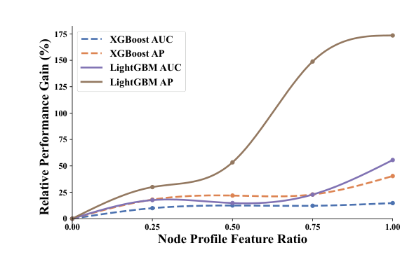

**그림 4: TransXion 교육 중에 사용된 노드 프로필의 일부에 대한 XGBoost 및 LightGBM 성능의 민감도는 상대적인 AUC 및 AP 변경으로 보고됩니다.**

전체 순위에 걸쳐 긍정적인 점수 분포와 부정적인 점수 분포 사이의 광범위한 중복으로 인해 무작위로 샘플링된 쌍 사이에서 빈번한 잘못된 순서가 발생합니다. 한편 AP와 F1은 중간 및 낮은 점수 영역에서 상당한 인터리빙이 지속되더라도 최고 점수 사이에 긍정이 충분히 집중되어 고정밀 영역과 실행 가능한 작동 임계값을 생성할 때 유리한 상태를 유지할 수 있습니다. 따라서 AMLSim은 전체 점수 분포가 상당한 중복을 보이는 경우에도 합리적인 임계값 성능을 인정할 수 있습니다.

이에 비해 TransXion은 어려움을 결정이 중요한 영역으로 전환합니다. 즉, 불법적인 에지가 행동적으로 그럴듯하고 상황에 일관성이 있도록 합성되어 고득점 후보자 간의 모호성이 증가하고 초기 정밀도가 억제됩니다. 결과적으로, 이웃 집계만으로는 안정적인 운영 지점 성능을 복구할 수 없습니다. 전반적으로 이러한 결과는 TransXion이 템플릿과 같은 모티프에서 바로가기 학습을 줄이고 보다 까다로운 평가 설정을 제공한다는 것을 나타냅니다.

노드 수준 컨텍스트의 5.3.2 효과. 본 연구에서는 TransXion과 AMLWorld 모두에서 표 형식 탐지기의 프로필 블라인드 및 프로필 인식 변형을 비교하여 노드 수준 의미론적 컨텍스트가 불법 거래 탐지에 측정 가능한 유틸리티를 제공하는지 여부를 조사합니다. Profileaware 모델은 엔터티 프로필 속성으로 거래 특성을 강화하는 반면, 프로필 블라인드 모델은 에지 수준 통계에만 의존합니다. 프로필이 다양한 결정 임계값 하에서 탐지기의 순위 및 불법 거래 검색을 향상시키는지 평가하기 위해 이 섹션 전체에서 AUC 및 AP를 기본 기준으로 중점을 둡니다.

점진적인 노드 컨텍스트 제거. 먼저 훈련 중에 사용 가능한 프로필 속성의 수를 점진적으로 늘려 TransXion에서 제거를 수행합니다. 그림 4에서 볼 수 있듯이 XGBoost와 LightGBM은 모두 더 많은 노드 속성이 유지됨에 따라 일관된 성능 향상을 나타냅니다. 이는 노드 컨텍스트가 거래 수준 특성을 넘어서는 보완 신호를 제공한다는 것을 나타냅니다.

크로스 벤치마크 이득 비교. 벤치마크 전반에 걸쳐 노드 수준 컨텍스트를 추가하는 데 따른 한계 이점을 비교합니다. 그림 5는 프로필 블라인드에 비해 ΔAUC 및 ΔAP로 측정된 프로필 특성을 활성화한 후 순위 및 검색 성능의 변화를 보고합니다.

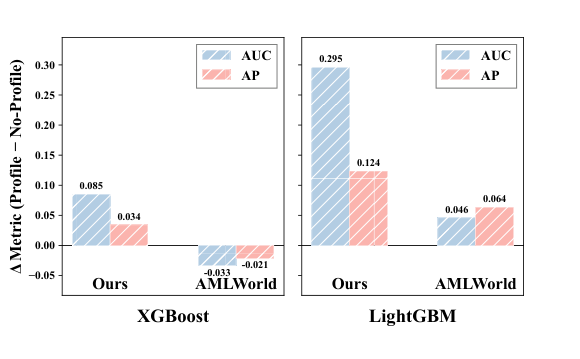

**그림 5: TransXion 및 AMLWorld의 GBT 탐지기에 노드 프로필 특성을 추가한 후 AUC 및 AP의 변화.**

**표 4: TransXion의 GNN 탐지기에 대한 프로필 인식 노드 특성의 효과.**

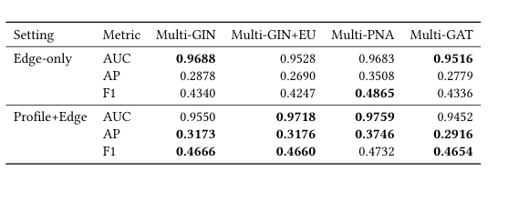

TransXion 및 AMLWorld의 기준선. XGBoost의 경우 ΔAUC = 0.085 및 ΔAP = 0.034, XGBoost의 경우 ΔAUC = 0.295 및 ΔAP = 0.124를 사용하여 TransXion에서 이득은 지속적으로 더 큽니다. LightGBM. 이와 대조적으로 AMLWorld는 XGBoost의 약간의 저하를 포함하여 더 작고 모델에 따른 효과를 나타냅니다. 이러한 격차는 TransXion의 엔터티 프로필이 더 풍부하고 예측 가능한 의미론적 컨텍스트를 제공하여 감지기가 이벤트 수준에서 유사해 보이는 거래를 더 잘 명확하게 하고 의미론적 일관성 추론에 대한 보다 엄격한 평가를 지원할 수 있음을 나타냅니다.

프로필 인식 GNN 감지. 본 연구에서는 의미론적 프로필이 그래프 기반 탐지기에 도움이 되는지 여부를 추가로 평가합니다. 프로필 인식 설정에서 노드 속성은 에지 분류 전에 에지 수준 거래 특성과 융합됩니다. 표 4에 표시된 것처럼 프로필 정보를 추가하면 평가된 모든 GNN 백본에 대한 AP가 향상되고 백본 4개 중 3개에 대한 F1이 향상됩니다. 이는 TransXion의 엔터티 프로필이 표 형식 탐지기뿐만 아니라 거래 토폴로지와 노드 컨텍스트를 공동으로 인코딩하는 관계형 모델에도 유용한 의미 신호를 제공한다는 것을 확인합니다.

5.3.3 변칙 합성 메커니즘의 효과. 벤치마크의 감지 난이도 증가가 확률적 노이즈나 구조적 저하로 인해 발생하지 않는지 확인하기 위해 AMLWorld를 고정 토폴로지 기판으로 사용하여 제어된 강화 실험을 수행합니다. 기본 그래프 백본을 일정하게 유지함으로써 이 디자인은 합성 에이전트의 영향을 격리하고 데이터셋 규모 및 고유 메타데이터 분포와 같은 교란 요소로부터 적대적 최적화의 효과를 분리합니다.

특히, 우리는 공정성을 보장하기 위해 자체 TransXion 백본이 아닌 이 검증을 위해 의도적으로 AMLWorld를 선택했습니다.

<!-- 원문 9쪽 -->

> **주:** TransXion: 현실적인 자금세탁방지를 위한 고충실도 그래프 벤치마크 KDD '26, August 09–13, 2026, 제주도, 대한민국

**표 5: AMLWorld 데이터세트의 합성 전략 제거. 각 검출기에 대해 가장 낮은 값은 굵게 표시되고 두 번째로 낮은 값은 밑줄로 표시됩니다.**

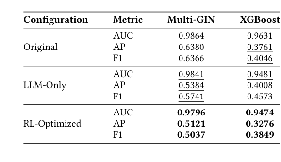

그리고 객관적인 평가. 우리의 합성 에이전트가 잘 확립된 제3자 벤치마크를 성공적으로 "강화"할 수 있음을 입증함으로써 우리는 TransXion의 관찰된 경도가 특정 합성 데이터 분포의 인공물이 아니라 적대적 프레임워크의 보편적인 속성임을 증명합니다. AMLWorld 백본이 고정된 이 제어된 설계를 통해 최적화 절차가 감지 경계를 어떻게 재구성하는지 직접 관찰할 수 있습니다.

벤치마크가 수정되었는지 여부와 방법만 다른 세 가지 그래프 수준 구성을 평가합니다. 원본은 수정되지 않은 형태로 출시된 AMLWorld 그래프입니다. LLM-Only는 모니터 기반 최적화 없이 LLM 기반 합성 에이전트에 의해 생성된 강화된 변형입니다. RL-Optimized는 모니터 기반 교육을 통해 결정 정책을 얻은 에이전트를 사용하여 동일한 합성 파이프라인에서 생성된 강화된 변형이며, 이후 학습된 정책을 사용하여 편집을 생성합니다.

표 5에 요약된 것처럼 세 가지 구성은 감지 난이도에서 명확한 진행을 보여줍니다. LLM 전용 강화는 혼합된 효과를 생성합니다. 측정 항목 전체에서 Multi-GIN 성능을 감소시키지만 XGBoost에 대한 일부 작동 지점 측정 항목을 개선할 수 있습니다. 이는 비유도 강화가 감지기 제품군 전체에서 지속적으로 난이도를 증가시키지 않음을 나타냅니다. 대조적으로, RL 최적화 변형은 Multi-GIN 및 XG-Boost 모두에 대해 일관된 성능 저하를 나타내며 원본 설정에 비해 보고된 모든 지표에서 더 낮은 점수를 나타냅니다. 이러한 대조는 체계적인 강화를 생성하기 위해 모니터 기반 최적화가 필요한 반면, LLM 전용 편집은 다른 모델 클래스에 균일하게 적대적이지 않은 방식으로 데이터 분포를 이동할 수 있음을 시사합니다. 전반적으로 이러한 결과는 TransXion의 높은 탐지 난이도가 확률적 노이즈나 구조적 저하보다는 적응형 적대 최적화의 의도적인 결과임을 강조합니다.

가족 간 양도 가능성. 모니터 유도 경화가 특정 검출기 제품군에 과적합되는지 여부를 조사하기 위해 제품군 간 전송 실험을 추가로 수행합니다. 합성 프로세스는 GBT 기반 모니터에 의해 안내되고 평가는 Multi-GIN을 사용하여 수행됩니다. 표 6에 표시된 것처럼 GBT 유도 강화는 여전히 Multi-GIN 성능을 크게 저하시켜 AP를 0.6380에서 0.4297로, F1을 0.6366에서 0.4807로 줄입니다. 이러한 저하는 LLM 전용 변형보다 더 강하며, 이는 생성된 이상 현상이 단순히 특정 GNN 모니터에 맞게 조정된 것이 아니라 검출기 제품군 전체에 전송 가능한 까다로운 패턴을 인코딩한다는 것을 의미합니다.

**표 6: 강화된 변칙의 제품군 간 전송. 합성은 GBT 모니터에 의해 안내되고 Multi-GIN에 의해 ​​평가됩니다.**

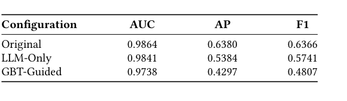

RQ2에 대한 요약입니다. TransXion은 표 형식 및 그래프 기반 감지기 전반에 걸쳐 이전 공개 데이터셋보다 더 까다롭고 유익한 AML 벤치마크를 제공합니다. 통합된 에지 특성 전용 프로토콜에서 TransXion은 GBT 및 GNN 감지기 모두, 특히 AP 및 F1에서 가장 약한 실제 감지 성능을 제공하며 이는 극단적인 클래스 불균형 하에서 경고와 더 관련이 있습니다. 엔터티 프로필을 추가하면 탐지 성능이 지속적으로 향상됩니다. 이는 TransXion이 에지 수준 거래 통계를 뛰어넘는 예측 의미론적 컨텍스트를 제공한다는 것을 나타냅니다. 마지막으로, AMLWorld의 제어된 강화 실험에서는 증가된 난이도가 단순히 무작위 노이즈나 데이터셋 규모로 인해 발생하는 것이 아니라 모니터 기반 비템플릿 변칙 합성 프로세스에 의해 체계적으로 유도된다는 것을 보여줍니다. 이러한 결과는 TransXion이 AML 평가를 고정 모티프의 지름길 인식에서 프로필, 시간적 동작 및 거래 토폴로지에 대한 상황 인식 추론으로 전환한다는 것을 보여줍니다.

## 6 결론

기존 AML 데이터셋의 두 가지 근본적인 한계, 즉 풍부한 엔터티 수준 컨텍스트가 부족하고 템플릿 기반 이상 항목 주입에 대한 의존성을 해결하기 위해 설계된 고충실도 거래 그래프 벤치마크인 TransXion을 소개합니다. TransXion은 영구 엔터티 프로필, 프로필 조건에 따른 정상 동작 및 적응형 비템플릿 변칙 합성을 공동으로 모델링함으로써 운영 AML의 핵심인 거래 토폴로지와 의미론적 컨텍스트 간의 현실적인 상호 작용을 포착합니다.

광범위한 충실도 분석에 따르면 TransXion은 연결된 백본, 계층적 핵심-주변 구조, 비분리적 혼합 및 경제적으로 타당한 두꺼운 꼬리 동작을 포함하여 실제 지불 네트워크의 주요 양식화된 속성을 보존하는 것으로 나타났습니다. 동시에 탐지 실험은 TransXion이 그래프 기반 모델과 특성 기반 모델 모두에서 널리 사용되는 벤치마크보다 훨씬 더 어렵다는 것을 보여줍니다. 관찰된 성능 저하는 잡음이나 합성 복잡성으로 인한 인공물보다는 단축 학습 감소와 상황적 추론에 대한 의존도 증가를 반영합니다.

전반적으로 TransXion은 AML 탐지 방법을 개발, 평가 및 스트레스 테스트하기 위한 보다 충실하고 까다로운 테스트베드를 제공합니다. 본 연구에서는 이 벤치마크가 금융 범죄 탐지의 현실을 더 잘 반영하는 상황 인식, 강력하고 감사 가능한 거래 모니터링 시스템에 대한 향후 연구를 지원하기를 바랍니다.

## 감사의 글

이 작품은 중국 국가 핵심 R&D 프로그램(No. 2023YFC3304800)과 중국 국립자연과학재단(No. 72595845, No. 72595840)의 지원을 받았습니다.

<!-- 원문 10쪽 -->

> **주:** KDD '26, 8월 09–13, 2026, 제주도, 대한민국 Keyang Chen et al.

## 참고문헌

[1] Daron Acemoglu, Asuman Ozdaglar, and Alireza Tahbaz-Salehi. 2015. Systemic

risk and stability in financial networks. American Economic Review 105, 2 (2015), 564–608. [2] Franklin Allen and Douglas Gale. 2000. Financial contagion. Journal of political

economy 108, 1 (2000), 1–33. [3] Erik Altman, Jovan Blanuša, Luc Von Niederhäusern, Béni Egressy, Andreea

Anghel, and Kubilay Atasu. 2023. Realistic synthetic financial transactions for anti-money laundering models. Advances in Neural Information Processing Systems 36 (2023), 29851–29874. [4] Kartik Anand, Iman Van Lelyveld, Ádám Banai, Soeren Friedrich, Rodney Garratt,

Grzegorz Hałaj, Jose Fique, Ib Hansen, Serafín Martínez Jaramillo, Hwayun Lee, et al. 2018. The missing links: A global study on uncovering financial network structures from partial data. Journal of Financial Stability 35 (2018), 107–119. [5] Robert M. Arasa. 2015. Determinants of Know Your Customer (KYC) Compliance

among Commercial Banks in Kenya. Journal of Economics and Behavioral Studies 7 (2015), 162–175. https://api.semanticscholar.org/CorpusID:15673285 [6] Peter W Battaglia, Jessica B Hamrick, Victor Bapst, Alvaro Sanchez-Gonzalez,

Vinicius Zambaldi, Mateusz Malinowski, Andrea Tacchetti, David Raposo, Adam Santoro, Ryan Faulkner, et al. 2018. Relational inductive biases, deep learning, and graph networks. arXiv preprint arXiv:1806.01261 (2018). [7] Morten L Bech and Enghin Atalay. 2010. The topology of the federal funds market.

Physica A: Statistical mechanics and its applications 389, 22 (2010), 5223–5246. [8] Michael Boss, Helmut Elsinger, Martin Summer, and Stefan Thurner 4. 2004.

Network topology of the interbank market. Quantitative finance 4, 6 (2004), 677–684. [9] Tianqi Chen and Carlos Guestrin. 2016. Xgboost: A scalable tree boosting system.

(2016), 785–794. [10] Aaron Clauset, Cosma Rohilla Shalizi, and Mark EJ Newman. 2009. Power-law

distributions in empirical data. SIAM review 51, 4 (2009), 661–703. [11] Gabriele Corso, Luca Cavalleri, Dominique Beaini, Pietro Liò, and Petar Veličković.

2020. Principal neighbourhood aggregation for graph nets. Advances in neural information processing systems 33 (2020), 13260–13271. [12] Ben Craig and Goetz Von Peter. 2014. Interbank tiering and money center banks.

Journal of Financial Intermediation 23, 3 (2014), 322–347. [13] Béni Egressy, Luc Von Niederhäusern, Jovan Blanuša, Erik Altman, Roger Wat-

tenhofer, and Kubilay Atasu. 2024. Provably powerful graph neural networks for directed multigraphs. In Proceedings of the AAAI Conference on Artificial Intelligence, Vol. 38. 11838–11846. [14] Joras Ferwerda. 2013. The effects of money laundering. In Research handbook on

money laundering. Edward Elgar Publishing, 35–46. [15] Financial Crimes Enforcement Network (FinCEN). 2016. Frequently Asked Ques-

tions Regarding Customer Due Diligence Requirements for Financial Institutions. Guidance FIN-2016-G003. U.S. Department of the Treasury. https://www.fincen. gov/system/files/2016-09/FAQs_for_CDD_Final_Rule_%287_15_16%29.pdf Issued July 19, 2016. Interprets the CDD Final Rule and clarifies ongoing monitoring and customer risk profile requirements. [16] Xavier Gabaix. 2016. Power laws in economics: An introduction. Journal of

Economic Perspectives 30, 1 (2016), 185–206. [17] Rasmus Ingemann Tuffveson Jensen, Joras Ferwerda, Kristian Sand Jørgensen,

Erik Rathje Jensen, Martin Borg, Morten Persson Krogh, Jonas Brunholm Jensen, and Alexandros Iosifidis. 2023. A synthetic data set to benchmark anti-money laundering methods. Scientific data 10, 1 (2023), 661. [18] Guolin Ke, Qi Meng, Thomas Finley, Taifeng Wang, Wei Chen, Weidong Ma,

Qiwei Ye, and Tie-Yan Liu. 2017. Lightgbm: A highly efficient gradient boosting decision tree. Advances in neural information processing systems 30 (2017). [19] Edgar Lopez-Rojas, Ahmad Elmir, and Stefan Axelsson. 2016. PaySim: A financial

mobile money simulator for fraud detection. In 28th European Modeling and Simulation Symposium, EMSS, Larnaca. Dime University of Genoa, 249–255. [20] Mark EJ Newman. 2002. Assortative mixing in networks. Physical review letters

89, 20 (2002), 208701. [21] Berkan Oztas, Deniz Cetinkaya, Festus Adedoyin, Marcin Budka, Huseyin Dogan,

and Gokhan Aksu. 2023. Enhancing anti-money laundering: Development of a synthetic transaction monitoring dataset. In 2023 IEEE International Conference on e-Business Engineering (ICEBE). IEEE, 47–54. [22] Peter Reuter. 2013. Are estimates of the volume of money laundering either

feasible or useful? In Research handbook on money laundering. Edward Elgar Publishing, 224–231. [23] Kimmo Soramäki, Morten L Bech, Jeffrey Arnold, Robert J Glass, and Walter E

Beyeler. 2007. The topology of interbank payment flows. Physica A: Statistical Mechanics and its Applications 379, 1 (2007), 317–333. [24] Jianheng Tang, Jiajin Li, Ziqi Gao, and Jia Li. 2022. Rethinking graph neural

networks for anomaly detection. In International conference on machine learning. PMLR, 21076–21089. [25] Mr Vito Tanzi. 1996. Money laundering and the international financial system.

International Monetary Fund. [26] Brigitte Unger, Melissa Siegel, Joras Ferwerda, Wouter De Kruijf, Madalina

Busuioic, Kristen Wokke, and Greg Rawlings. 2006. The amounts and the effects

of money laundering. Report for the Ministry of Finance 16, 2020.08 (2006), 22. [27] Petar Veličković, Guillem Cucurull, Arantxa Casanova, Adriana Romero, Pietro

Lio, and Yoshua Bengio. 2017. Graph attention networks. arXiv preprint arXiv:1710.10903 (2017). [28] John Walker. 1999. How big is global money laundering? Journal of Money

Laundering Control 3, 1 (1999), 25–37. [29] Mark Weber, Jie Chen, Toyotaro Suzumura, Aldo Pareja, Tengfei Ma, Hiroki

Kanezashi, Tim Kaler, Charles E Leiserson, and Tao B Schardl. 2018. Scalable graph learning for anti-money laundering: A first look. arXiv preprint arXiv:1812.00076 (2018). [30] Mark Weber, Giacomo Domeniconi, Jie Chen, Daniel Karl I Weidele, Claudio

Bellei, Tom Robinson, and Charles E Leiserson. 2019. Anti-money laundering in bitcoin: Experimenting with graph convolutional networks for financial forensics. arXiv preprint arXiv:1908.02591 (2019). [31] Keyulu Xu, Weihua Hu, Jure Leskovec, and Stefanie Jegelka. 2018. How powerful

are graph neural networks? arXiv preprint arXiv:1810.00826 (2018).

### A. 이상 거래 종합 A.1 범위 및 공개 정책의 세부 사항

이 부록에서는 모니터 기반 피드백, 그룹 상대 최적화, 재현성을 위한 주요 훈련 설정을 포함하여 이상 현상 합성에 사용되는 강화 학습(RL) 훈련 파이프라인에 대해 설명합니다. 오용 위험을 줄이기 위해 벤치마크 구성에 사용된 모델 독립적인 최적화 설정을 보고하는 동시에 기관별 운영 규칙이나 사례 식별 세부 정보를 공개하지 않습니다. GRPO 기반 합성의 경우 학습률 1 × 10−5 및 가중치 감소 0.01, 기울기 누적 단계 4 및 최대 기울기 표준 1.0를 사용하여 AdamW를 사용합니다. 정책은 순위 𝑟= 8, 𝛼= 16 및 드롭아웃 0.05를 사용하여 LoRA에 적용됩니다. 우리의 구현에서 LoRA는 기본 모델 매개변수의 약 0.07%를 업데이트합니다. 이 합성 비용은 벤치마크 구축 중에 한 번만 발생합니다. 다운스트림 사용자는 탐지 평가를 위해 출시된 고정 벤치마크를 직접 사용할 수 있습니다.

### A.2. 시스템 개요

시스템은 (i) 후보 그래프 편집 작업을 생성하는 정책과 (ii) 거래 하위 그래프를 평가하고 탐지 관련 성능 메트릭을 출력하는 외부 탐지기 모니터라는 두 가지 구성 요소로 구성됩니다. 이러한 측정항목은 정책 최적화를 위한 학습 신호 역할을 하는 스칼라 점수로 집계됩니다. 훈련은 명시적인 가치 함수 대신 그룹 내 통계를 사용하여 이점을 추정하는 GRPO(그룹 상대 정책 최적화) 패러다임을 따릅니다.

### A.3. 환경 상호 작용 및 그룹 샘플링

𝐶는 하위 그래프로 표현되는 거래 클러스터를 나타냅니다. 각 클러스터에 대해 정책은 𝜋𝜃샘플 𝐾궤적,

각 궤적𝜏𝑖은 일련의 상호작용 단계로 구성됩니다. 𝑡단계에서 에이전트는 현재 그래프에서 파생된 상태를 관찰하고 그래프 편집을 제안하는 구조화된 작업을 내보내고 환경은 이 편집을 적용하여 다음 그래프 상태를 얻습니다.

### A.4. 피드백 모니터링 및 보상 구성

각 상호 작용 단계 𝑡에서 모니터는 사전 작업 그래프 𝐺𝑡와 사후 작업 그래프 𝐺𝑡+1 모두에 적용되어 스칼라를 생성합니다.

<!-- 원문 11쪽 -->

> **주:** TransXion: 현실적인 자금세탁방지를 위한 고충실도 그래프 벤치마크 KDD '26, August 09–13, 2026, 제주도, 대한민국

**표 7: 데이터셋 요약 통계**

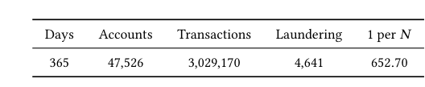

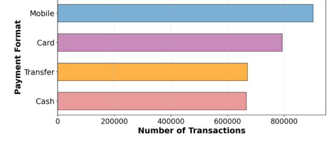

**그림 6: 결제 형식별 거래 수. 막대는 각 지불 형식 범주의 거래 수를 보고합니다.**

점수:

𝑆pre = 𝑆(𝐺𝑡), 𝑆post = 𝑆(𝐺𝑡+1). 점수는 F1 점수, ROC 곡선 아래 면적(AUC) 및 평균 정밀도(AP)와 같이 모니터에서 생성된 여러 탐지 지표의 가중치 조합으로 계산됩니다. 공식적으로,

여기서 𝑤1,𝑤2,𝑤3은 실험 구성에 의해 결정된 음수가 아닌 가중치입니다.

단계 보상은 두 가지 용어로 구성됩니다.

𝑅𝑡= 𝑅validity(𝑎𝑡) + 𝜆mon · Δ𝑆𝑡, with Δ𝑆𝑡= 𝑆pre −𝑆post. 유효 기간𝑅validity(𝑎𝑡)은 잘못된 형식 또는 실행할 수 없는 구조적 동작에 페널티를 부여하고 심각한 위반이 있는 경우 궤적을 종료할 수 있습니다. 모니터 차이 항 Δ𝑆𝑡은 계수 𝜆mon으로 조정된 적용된 편집으로 인해 유발된 모니터의 감지 성능 감소에 비례하는 피드백을 제공합니다.

### A.5. 그룹 상대 우위 추정

GRPO는 그룹 수준 통계를 사용하여 이점을 추정합니다. 𝐽𝑖는 궤적 𝜏𝑖의 누적 반환을 나타냅니다. 그룹 평균과 표준 편차는 다음과 같이 계산됩니다.

그러면 궤적 𝑖의 표준화된 이점은 다음과 같이 정의됩니다.

여기서 𝜖> 0는 수치 안정성을 위한 작은 상수입니다.

### A.6. 정책 최적화 목표

정책은 더 높은 상대적 이점과 관련된 행동이나 토큰의 가능성을 최대화하여 최적화됩니다. 결과 목표는 다음과 같이 작성할 수 있습니다.

이 공식은 별도의 크리티컬 네트워크를 훈련하지 않고도 안정적인 최적화를 가능하게 하는 동시에 각 그룹 내에서 상대적인 성능 기준을 유지합니다.

### B. 자세한 데이터셋 정보 B.1 데이터셋 개요

본 연구에서는 AML 관련 실험을 위해 합성으로 생성된 거래 데이터셋를 사용합니다. 각 행은 특정 타임스탬프에서 보낸 사람이 받는 사람에게 전달된 거래를 나타냅니다. 발신자 엔드포인트는 From Bank 및 From Account로 식별되고 수신자 엔드포인트는 To Bank 및 To Account로 식별됩니다. 거래 금액은 양쪽에 기록됩니다. 지급인 측에서는 지급 통화로 지급된 금액, 수취인 측에서는 수취 통화로 수령한 금액이 기록되므로 통화 환산에 따라 지급 금액과 수령 금액이 다를 수 있습니다. 거래 채널은 결제 형식으로 캡처됩니다. 바이너리 레이블인 is_laundering은 거래가 세탁(1)인지 아니면 양성(0)인지를 나타냅니다.

후속 통계를 위해 우리는 은행 간 식별자 충돌을 피하기 위해 은행과 계좌 식별자를 결합하여 고유한 계좌 키를 구성합니다. 계정 활동을 계산할 때 각 거래는 보낸 사람과 받는 사람 계정 모두에 하나의 카운트를 제공합니다. 데이터셋는 거래 수준 세탁 레이블을 제공하지만 패턴 수준 유형 식별자는 제공하지 않으므로 패턴별 분류 없이 집계된 세탁 확산과 분포 특성을 보고합니다.

### B.2. 데이터세트 규모 및 라벨 통계

**표 7는 데이터세트 규모와 세탁 라벨 보급률을 보고합니다. 데이터셋는 365일에 걸쳐 있으며 47,526 고유 은행 계좌와 3,029,170 거래를 포함합니다. 그 중 4,641 거래는 세탁으로 분류됩니다. 이는 0.153%(653 거래에서 약 1)의 보급률에 해당합니다. 결과적으로 클래스 불균형이 상당하므로 다운스트림 평가에서는 정확도보다는 순위 및 정밀도 중심 측정항목(예: PR-AUC, 정밀도@K)을 강조해야 합니다.**

### B.3. 거래 수준 특성

**그림 6는 결제 형식별 거래 구성을 요약한 것입니다. 모바일 결제가 가장 많은 비중을 차지하고 카드 결제가 그 뒤를 따르고 있으며 이체와 현금 결제는 빈도가 낮습니다. 이러한 왜곡된 혼합은 채널 정보가 모델링에서 강력한 단서가 될 수 있음을 의미합니다. 사소한 지름길을 학습하는 것을 피하기 위해 나중에 클래스 불균형에 강력한 측정항목을 사용하여 결과를 보고하고 방법을 비교할 때 결제 형식별로 계층화된 분석을 권장합니다.**

<!-- 원문 12쪽 -->

> **주:** KDD '26, 8월 09–13, 2026, 제주도, 대한민국 Keyang Chen et al.

**표 8: 자동 𝑥min 선택 시 테일핏 진단. 𝐷는 KS 거리입니다. (𝑥min | 𝑛tail)은 선택된 임계값과 꼬리 크기를 보고합니다. (𝑅, 𝑝)은 거듭제곱법칙과 로그정규를 비교합니다.**

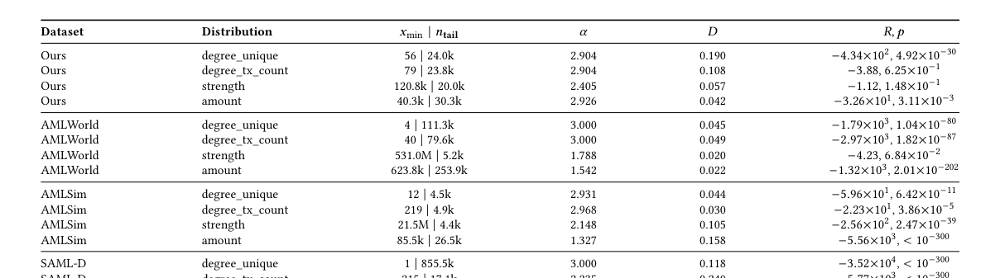

SAML-D 강도 80.6k | 402.1k 2.228 0.045 1.57×101, 7.05×10−308 SAML-D 금액 10.2k | 2471.3k 3.000 0.030 −2.19×102, 4.54×10−23

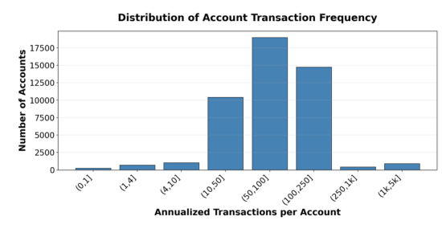

**그림 7: 계정당 연간 거래 빈도. 각 계정의 들어오고 나가는 거래는 연간 요율로 계산되고 조정됩니다. 막대는 각 저장소의 계정 수를 보고합니다.**

### B.4. 계정 수준 특성

**그림 7는 계정당 연간 거래 빈도 분포를 보고합니다. 본 연구에서는 계좌를 은행-계좌 쌍으로 정의하고 들어오고 나가는 거래를 모두 계산합니다. 대부분의 계정은 중간 빈도 구간(연간 10–250 거래)에 속하며, 일부 계정은 거의 활성화되지 않거나 매우 활성화됩니다. 이러한 이질성은 유도된 거래 그래프의 왜곡된 정도 분포를 의미하며, 이는 샘플링과 평가 모두에 영향을 미칠 수 있습니다. 따라서 우리는 나중에 모든 계정을 동일한 정보로 취급하기보다는 활동 중심 편견에 주의하여 성과를 해석합니다.**

### C. 충실도에 대한 자세한 증거

**표 8는 자동 𝑥min 선택 하에서 tail-fit 진단을 보고합니다. 이러한 진단은 단일 측정항목이 현실성을 보편적으로 결정한다고 주장하기보다는 주요 그래프 불변 분석을 보완하기 위한 것입니다. 특히, 우리는 꼬리 영역이 퇴화되지 않았는지 여부, 적합 지수가 다양한 관찰 가능 항목에 따라 달라지는지 여부, 구조적 변수와 화폐 변수가 뚜렷한 체제를 나타내는지 여부를 조사합니다. 이러한 기준에 따른 결과는 다음과 같습니다.**

구조적 변수와 금전적 변수 모두에서 일관되고 퇴화되지 않은 꼬리 행동을 보이는 우리의 것과 가장 일치합니다.

일관성 있고 템플릿화되지 않은 꼬리. 핵심 현실주의 신호는 다양한 관찰 가능 항목이 단일 범용 지수로 축소되어서는 안 된다는 것입니다. 우리의 경우 적합 𝛼은 구조적 및 화폐적 변수에 따라 다릅니다. Degree_tx_count 및 강도와 같은 구조적 양은 그럴듯한 무거운 꼬리 체제에 남아 있는 반면 화폐량은 다른 꼬리 패턴을 따릅니다. 대조적으로, 몇몇 기준 설정은 𝛼= 3.0000와 같은 경계 값을 반복적으로 반환하며, 이는 유기적으로 나타나는 이질성보다는 더 엄격하거나 과도하게 정규화된 꼬리 동작을 제안합니다.

자동 테일 선택. 자동 𝑥min 선택에서 우리는 Degree_tx_count (𝐷= 0.1083), 강도 (𝐷= 0.0570) 및 금액 (𝐷= 0.0418)에 대해 작은 KS 거리를 달성합니다. 이러한 값은 일단 데이터 적응형 방식으로 꼬리 영역이 선택되면 우리의 경험적 꼬리가 적합 모델에 의해 잘 포착된다는 것을 나타냅니다. 본 연구에서는 가장 작은 KS 값만을 사실주의의 유일한 기준으로 해석하지 않습니다. 대신에 우리는 이를 지수 안정성, 비퇴화 꼬리 크기, 구조적 변수와 화폐적 변수 간의 구별과 함께 고려합니다.

비퇴화 꼬리 정의. 일부 기준선은 퇴화되거나 정보가 약한 꼬리 영역을 생성합니다. 예를 들어 SAML-D Degree_unique는 𝑛tail = 𝑛와 함께 𝑥min = 1를 선택하여 꼬리가 전체 분포와 효과적으로 동일하게 만듭니다. 이는 몸체와 꼬리 사이에 의미 있는 분리가 존재하지 않기 때문에 피팅된 꼬리의 해석 가능성을 약화시킵니다. 대조적으로, Ours는 전체 지지대도 극히 작은 잔여 하위 집합도 포함하지 않는 선택된 꼬리를 사용하여 변수 전반에 걸쳐 의미 있는 꼬리 크기를 유지합니다.

혼합 통화 체제와 구조적 체제. 금전적 금액의 경우, Ours는 엄격한 멱법칙보다 로그 정규식 체제를 선호하는 반면, 구조적 변수는 신뢰할 수 있는 헤비테일 서명을 유지합니다. 이러한 혼합된 행동은 결제 시스템에서 그럴듯합니다. 계정 활동과 거래량은 무거운 꼬리 참여를 나타낼 수 있는 반면, 거래 금액은 순수 멱함수 법칙보다는 곱셈 또는 혼합 메커니즘에서 발생하는 경우가 많습니다. 따라서 충실도 증거는 모든 관찰 가능 항목이 동일한 분포 법칙을 따르는 것이 아니라 TransXion이 의미상으로 다른 변수에 걸쳐 이질적인 꼬리 동작을 유지한다는 것입니다.
