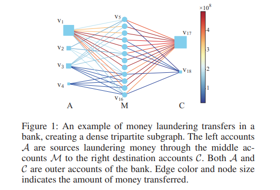
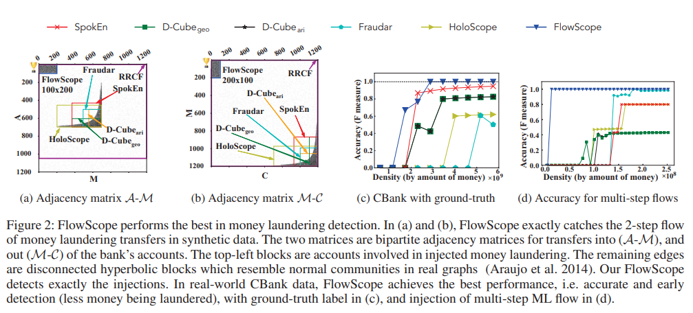
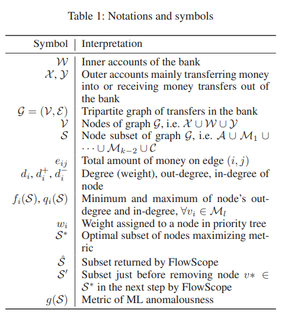
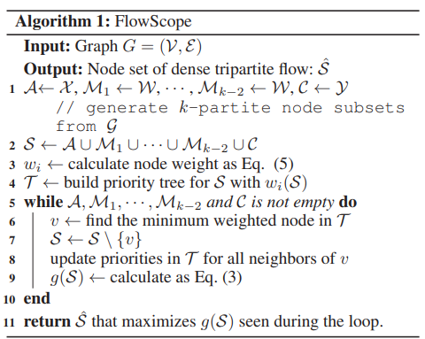
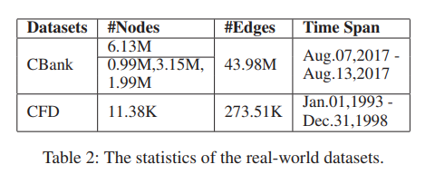
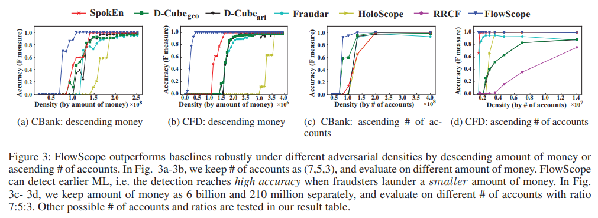
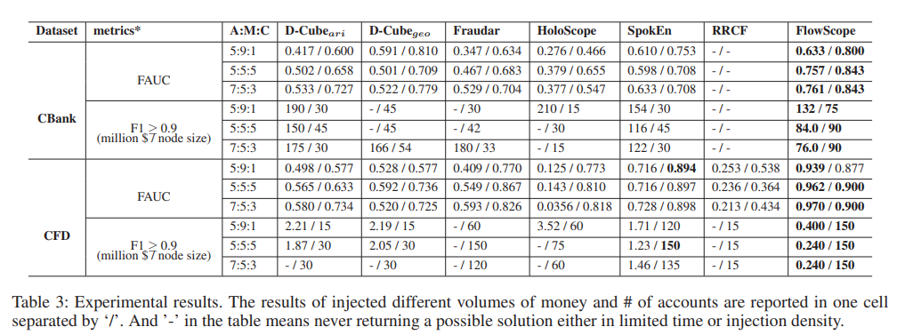
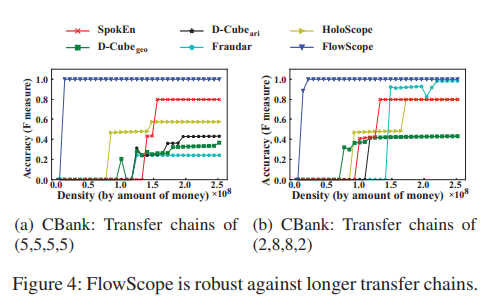
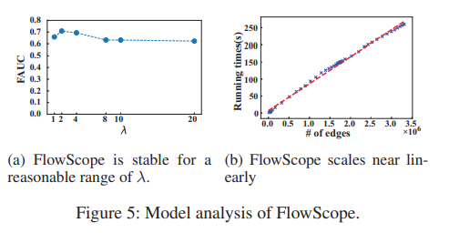

# FlowScope: Spotting Money Laundering Based on Graphs

[원문 링크](https://ojs.aaai.org/index.php/AAAI/article/view/5906)
[공개 코드](https://github.com/aplaceof/FlowScope)

저자: Xiangfeng Li, Shenghua Liu, Zifeng Li, Xiaotian Han, Chuan Shi, Bryan Hooi, He Huang, Xueqi Cheng  
학회: AAAI 2020

## 초록 (Abstract)

은행 계좌 사이의 자금 이체 그래프가 주어졌을 때 자금세탁을 어떻게 탐지할 수 있을까? 자금세탁은 범죄자가 은행 서비스를 이용하여 대량의 불법 자금을 추적하기 어려운 목적지 계좌로 이동시키고, 이를 합법적인 금융 시스템 안으로 주입하는 행위를 말한다.

기존의 그래프 기반 사기 탐지 방법은 주로 조밀한 서브그래프를 찾는 데 집중한다. 그러나 자금세탁은 여러 은행 계좌로 이루어진 체인을 따라 대규모 자금이 흐른다는 특징을 가지며, 기존 방법은 이러한 전체 흐름을 충분히 고려하지 않아 탐지 정확도가 낮아질 수 있다.

본 논문은 거래를 다분 그래프(multipartite graph)로 모델링하고, 출발 계좌에서 목적지 계좌까지 이어지는 전체 자금 흐름을 탐지하는 확장 가능한 알고리즘 **FlowScope**를 제안한다. 이론 분석을 통해 사기범이 탐지를 피하면서 이체할 수 있는 자금 규모에 대한 경계를 제공한다. 또한 주입 데이터와 실제 은행 데이터 모두에서 자금세탁에 관여한 계좌를 탐지하는 성능이 기존 최신 방법보다 우수함을 보인다.

## 1. 서론 (Introduction)

이 논문의 핵심 질문은 다음과 같다.

> 대규모 3분 그래프 또는 다분 그래프에서 가장 의심스러운 조밀한 자금 흐름을 어떻게 찾을 것인가?

이러한 흐름은 출발 계좌에서 시작해 여러 중간 계좌와 거래를 거쳐 추적하기 어려운 목적지 계좌로 이동하는 불법 자금세탁 과정일 수 있다.

### 기존 접근 방식의 한계

기존 자금세탁 탐지 방법은 다음과 같은 한계가 있다.

- 개별 거래 또는 단일 단계의 거래만 분석하는 경우가 많다.
- 여러 거래 사이의 복잡한 의존 관계와 연속적인 자금 흐름을 놓친다.
- 밀집 서브그래프나 밀집 서브텐서를 찾더라도, 자금이 출발지에서 중간 계좌를 거쳐 목적지까지 흐르는 방향성과 연속성을 직접 모델링하지 않는다.
- 지도학습 방식은 실제 자금세탁 라벨이 매우 적고 불균형하다는 문제를 가진다.
- 특정 데이터셋의 라벨로 학습한 모델은 다른 은행이나 거래 환경으로 일반화하기 어려울 수 있다.
- 규칙 기반 시스템은 범죄자가 거래 금액이나 횟수를 조절하여 우회하기 쉽다.

FlowScope는 개별 거래가 아니라 다음과 같은 **다단계 자금 흐름 전체**를 탐지 대상으로 삼는다.

```text
출발 계좌 집합 A
        ↓
중간 계좌 집합 M₁
        ↓
중간 계좌 집합 M₂
        ↓
목적지 계좌 집합 C
```

3분 그래프인 경우에는 다음과 같은 2단계 흐름이 된다.

```text
A → M → C
```



> **[Figure 1]** 은행의 자금세탁 거래 예시. 출발 계좌 집합 $\mathcal{A}$에서 중간 계좌 집합 $\mathcal{M}$을 거쳐 목적지 계좌 집합 $\mathcal{C}$로 자금이 이동하여 조밀한 3분 서브그래프를 만드는 그림.


### FlowScope의 핵심 아이디어

FlowScope는 다음 두 가지 성질을 동시에 갖는 계좌 집합을 의심스러운 자금세탁 흐름으로 본다.

1. 적은 수의 계좌 사이에서 많은 돈이 이동한다.
2. 중간 계좌가 받은 돈을 거의 남기지 않고 다시 내보낸다.

정상 계좌는 항상 특정 계좌에만 돈을 보내지 않고, 입금된 돈을 즉시 모두 비우지도 않는다. 반면 자금세탁 중간 계좌는 받은 돈을 신속하게 다음 계좌로 전달하는 경향이 있으므로 가중 진입 차수와 가중 진출 차수가 비슷해진다.

논문은 이러한 특성을 하나의 이상도 함수로 정의하고, 출발 계좌·중간 계좌·목적지 계좌의 부분집합을 동시에 탐색하여 이 함수가 최대가 되는 흐름을 찾는다.

### 주요 기여

- **새로운 자금세탁 흐름 이상도:** 조밀하고 다단계인 자금 흐름을 평가하는 새로운 이상도 지표를 제안한다.
- **이론적 보장:** FlowScope가 찾은 해가 최적해에 얼마나 가까운지에 대한 경계와, 사기범이 탐지를 피하면서 계좌당 이동시킬 수 있는 자금 규모의 상한을 제시한다.
- **효과성과 강건성:** 다양한 그래프 구조, 더 많은 사기 계좌, 더 긴 거래 체인에서도 기존 방법보다 빠르고 정확하게 자금세탁을 탐지한다.
- **확장성:** 시간복잡도가 엣지 수에 거의 선형적으로 증가하므로 대규모 은행 거래 그래프에 적용할 수 있다.



> **[Figure 2]** 합성 데이터와 실제 CBank 데이터에서 FlowScope와 비교 방법들의 탐지 결과를 보여주는 종합 그림. 합성 데이터의 $\mathcal{A}\!\rightarrow\!\mathcal{M}$, $\mathcal{M}\!\rightarrow\!\mathcal{C}$ 인접 행렬과 실제·주입 자금세탁 탐지 정확도를 포함.

## 2. 관련 연구 (Related Work)

### 규칙 기반 및 지도학습 방식

기존 자금세탁 방지 시스템에서는 전문가 규칙, 온톨로지, 의심 거래 기준 등을 이용한 분류가 흔히 사용되었다. 그러나 고정된 규칙은 범죄자가 거래를 여러 개로 분할하거나 금액을 조정함으로써 우회할 수 있다.

SVM, RBF 신경망, 딥러닝, 퍼지 매칭 같은 기계학습 방법도 적용되었지만 대부분 지도학습 방식이다. 실제 자금세탁 라벨은 매우 희소하고 양성·음성 비율이 심하게 불균형하며, 공격자가 의도적으로 패턴을 바꾸는 적대적 환경에서는 학습된 모델의 강건성이 떨어질 수 있다.

FlowScope는 라벨 없이 거래 그래프의 구조와 자금 흐름만으로 의심스러운 계좌 집합을 찾는 비지도 방식이다.

### 그래프 이상 탐지 방식

SpokEn, Fraudar, EigenPulse, D-Cube, CatchCore, D-Spot, HoloScope, RRCF 등은 그래프 또는 텐서에서 구조적으로 이상하거나 조밀한 부분을 탐지한다.

하지만 이러한 방법은 범용 이상 탐지에 초점을 두므로 여러 노드를 연속해서 통과하는 자금 흐름을 직접 추적하지 않는다. 정상적인 커뮤니티도 연결 밀도가 높을 수 있기 때문에 단순히 조밀한 블록만 찾으면 정상 집단을 자금세탁으로 잘못 탐지할 수 있다.

FlowScope는 단순 연결 밀도뿐 아니라 다음을 함께 본다.

- 거래 방향
- 거래 금액
- 여러 계층을 통과하는 흐름
- 중간 계좌의 입금액과 출금액 균형

## 3. 문제 정의 (Problem Formulation)

자금세탁자는 자금을 숨기기 위해 출발 계좌에서 하나 이상의 중간 계좌 계층을 거쳐 목적지 계좌로 자금을 이체한다. 논문에서 말하는 은행은 하나의 은행일 수도 있고, 탐지를 공동으로 수행하는 여러 은행의 집합일 수도 있다.

### 자금세탁의 두 가지 특성

#### 특성 1: 조밀하고 고액인 거래

사기 계좌의 수는 제한되어 있지만 짧은 시간 안에 많은 자금을 은행 안으로 들여오고 다시 밖으로 보내야 한다. 따라서 자금세탁 과정은 거래 금액 기준으로 고액이며 조밀한 서브그래프를 형성한다.

#### 특성 2: 중간 계좌 비우기

중간 계좌는 자금을 전달하는 다리 역할을 한다. 받은 돈의 대부분을 다음 계좌로 보내므로 중간 계좌의 가중 진입 차수와 가중 진출 차수가 비슷해진다.

중간 계좌에 큰 금액을 남겨두면 탐지와 동결 위험이 커지므로, 자금세탁자는 잔액을 가능한 한 적게 남기려고 한다.

### 탐지 문제

자금 이체 그래프를 다음과 같이 정의한다.

$$
\mathcal{G}=(\mathcal{V},\mathcal{E})
$$

- $\mathcal{V}$: 계좌 노드 집합
- $\mathcal{E}$: 방향이 있는 자금 이체 엣지 집합

FlowScope의 목적은 그래프 $\mathcal{G}$에서 다음 조건을 만족하는 조밀한 자금 흐름 서브그래프를 찾는 것이다.

1. 은행 안으로 들어오는 자금과 목적지로 나가는 자금의 규모가 크다.
2. 논문에서 정의한 자금세탁 이상도 지표가 최대가 된다.

개별 거래를 정상적으로 보이게 조작하는 것은 비교적 쉽지만, 고액의 자금을 여러 계좌를 통해 완전히 이동시키면서 전체 흐름까지 숨기는 것은 더 어렵다는 가정이 바탕에 있다.

### 계좌의 역할

전체 노드 집합은 다음 세 역할로 구분된다.

$$
\mathcal{V}=\mathcal{X}\cup\mathcal{W}\cup\mathcal{Y}
$$

- $\mathcal{W}$: 은행 내부 계좌
- $\mathcal{X}$: 순자금이 은행 안으로 들어오게 하는 외부 출발 계좌
- $\mathcal{Y}$: 순자금이 은행 밖으로 나가게 하는 외부 목적지 계좌

엣지 $(i,j)\in\mathcal{E}$는 계좌 $v_i$가 계좌 $v_j$로 돈을 보냈다는 뜻이며, $e_{ij}$는 해당 엣지를 통해 이동한 총금액이다.




> **[Table 1]** FlowScope에서 사용하는 주요 기호와 의미. $\mathcal{W}$, $\mathcal{X}$, $\mathcal{Y}$, $S$, $e_{ij}$, $d_i^{+}$, $d_i^{-}$, $f_i(S)$, $q_i(S)$, $w_i$, $S^{*}$, $\widehat{S}$, $S'$, $g(S)$의 정의를 정리한 표.

FlowScope가 탐지하려는 노드 부분집합은 다음과 같다.

$$
S=\mathcal{A}\cup\mathcal{M}_1\cup\cdots\cup\mathcal{M}_{k-2}\cup\mathcal{C}
$$

여기서:

- $\mathcal{A}\subseteq\mathcal{X}$: 의심스러운 출발 계좌
- $\mathcal{M}_l\subseteq\mathcal{W}$: $l$번째 중간 계좌 계층
- $\mathcal{C}\subseteq\mathcal{Y}$: 의심스러운 목적지 계좌
- $k$: 전체 계층의 수

$k=3$이면 $\mathcal{A}\rightarrow\mathcal{M}\rightarrow\mathcal{C}$ 형태의 3분 그래프이고, 실제 거래 단계는 두 번이다. 일반적인 $k$분 그래프에서는 중간 계층이 $k-2$개이고 거래 단계는 $k-1$개이다.

중간 계좌 집합 $\mathcal{M}_1,\ldots,\mathcal{M}_{k-2}$은 서로 겹칠 수 있다. 동일한 계좌가 여러 계층에 등장하도록 허용함으로써 위장 목적으로 만들어진 순환 거래도 표현할 수 있다.

## 4. 제안하는 자금세탁 이상도 (Proposed Metric)

FlowScope는 원래의 내부 계좌 집합 $\mathcal{W}$를 각 중간 계층에 복제하여 $k$분 그래프를 구성한다.

$$
\mathcal{V}^{k}
=\mathcal{X}\cup
\mathcal{W}_1\cup\cdots\cup\mathcal{W}_{k-2}
\cup\mathcal{Y}
$$

편의를 위해 $\mathcal{W}_0=\mathcal{X}$, $\mathcal{W}_{k-1}=\mathcal{Y}$로 둔다.

### 중간 계좌의 가중 진입·진출 차수

$l$번째 중간 계층의 계좌 $v_i\in\mathcal{M}_l$에 대해, 선택된 부분집합 $S$ 안에서 다음 계층으로 보낸 총금액은 다음과 같다.

$$
d_i^{+}(S)
=\sum_{\substack{v_j\in\mathcal{M}_{l+1}\\(i,j)\in\mathcal{E}}}
e_{ij}
$$

이전 계층에서 받은 총금액은 다음과 같다.

$$
d_i^{-}(S)
=\sum_{\substack{v_h\in\mathcal{M}_{l-1}\\(h,i)\in\mathcal{E}}}
e_{hi}
$$

두 값의 최솟값과 최댓값을 다음과 같이 정의한다.

$$
f_i(S)=\min\left\{d_i^{+}(S),d_i^{-}(S)\right\}
$$

$$
q_i(S)=\max\left\{d_i^{+}(S),d_i^{-}(S)\right\}
$$

### $f_i(S)$와 $q_i(S)$의 의미

$f_i(S)$는 중간 계좌 $v_i$를 실제로 통과할 수 있는 최대 자금량이다. 예를 들어 100을 받았지만 70만 보냈다면 해당 계좌를 완전히 통과한 흐름은 최대 70이다.

$$
f_i(S)=\min(100,70)=70
$$

$q_i(S)-f_i(S)$는 입금액과 출금액 사이의 불균형이다.

$$
q_i(S)-f_i(S)=|d_i^{+}(S)-d_i^{-}(S)|
$$

이 값은 중간 계좌에 남은 금액일 수도 있고, 선택된 출발·목적지 계좌 이외의 계좌에서 들어오거나 나간 부족분일 수도 있다. 논문은 이러한 불균형을 자금세탁 탐지를 피하기 위한 위장 비용으로 해석한다.

### $k$분 흐름의 이상도

노드 부분집합 $S$에 대한 자금세탁 이상도는 다음과 같다.

$$
g^{k}(S)
=\frac{1}{|S|}
\sum_{l=1}^{k-2}
\sum_{v_i\in\mathcal{M}_l}
\left[
f_i(S)-\lambda\left(q_i(S)-f_i(S)\right)
\right]
$$

동일한 식을 다음처럼 쓸 수도 있다.

$$
g^{k}(S)
=\frac{1}{|S|}
\sum_{l=1}^{k-2}
\sum_{v_i\in\mathcal{M}_l}
\left[
(1+\lambda)f_i(S)-\lambda q_i(S)
\right],
\qquad k\geq3
$$

여기서 $\lambda$는 입금액과 출금액의 불균형에 부과하는 비용 계수이다.

- $f_i(S)$가 크면 많은 돈이 해당 중간 계좌를 통과했으므로 이상도가 증가한다.
- $q_i(S)-f_i(S)$가 크면 입출금 불균형이 크므로 이상도가 감소한다.
- $|S|$로 나누므로 너무 많은 계좌를 무작정 포함하는 해는 불리해진다.
- $\lambda$가 클수록 중간 계좌에 돈을 남기거나 외부 거래로 위장하는 행위를 더 강하게 벌점 처리한다.

따라서 $g^k(S)$는 사기 계좌 집합이 계좌 하나당 얻을 수 있는 잠재적 이익, 즉 통과 자금에서 위장 비용을 뺀 값으로 해석할 수 있다.

### 단순 연결 밀도와의 차이

이 지표는 엣지 개수만 세는 위상적 밀도가 아니다. 엣지 가중치인 실제 거래 금액을 사용한다. 따라서 연결 수가 많지 않더라도 소수의 엣지를 통해 매우 큰 금액이 연속적으로 이동하면 높은 이상도를 얻을 수 있다.

이 점은 정상적인 커뮤니티와 고액의 자금세탁 흐름을 구분하는 데 중요하다. 정상 커뮤니티도 연결은 조밀할 수 있지만, 중간 노드의 고액 입출금이 균형을 이루며 다음 단계로 빠르게 전달되는 특성까지 동시에 만족하지는 않을 수 있기 때문이다.

## 5. 제안 알고리즘: FlowScope

FlowScope의 목표는 $g^k(S)$를 최대화하는 노드 부분집합 $S$를 찾는 것이다. 가능한 모든 부분집합을 탐색하면 계산량이 너무 크므로, 우선순위 트리를 사용하는 준탐욕적(near-greedy) 알고리즘을 사용한다.

### 노드 우선순위

각 노드 $v_i$의 우선순위 가중치는 다음과 같이 정의한다.

$$
w_i(S)=
\begin{cases}
f_i(S)-\dfrac{\lambda}{1+\lambda}q_i(S),
& v_i\in\mathcal{M}_l\\
d_i(S),
& v_i\in\mathcal{A}\cup\mathcal{C}
\end{cases}
$$

중간 계좌는 통과 자금과 입출금 불균형을 함께 반영하고, 출발·목적지 계좌는 해당 부분집합 안에서의 가중 차수 $d_i(S)$를 사용한다. 실제 적용에서는 사전에 알고 있는 계좌 위험도나 이상 점수를 이 가중치에 추가할 수도 있다.

### 알고리즘 흐름

1. 출발 계층을 $\mathcal{X}$, 각 중간 계층을 $\mathcal{W}$, 목적지 계층을 $\mathcal{Y}$로 초기화한다.
2. 모든 계층의 노드를 합쳐 초기 부분집합 $S$를 만든다.
3. 각 노드의 우선순위 $w_i(S)$를 계산하고 우선순위 트리를 만든다.
4. 현재 우선순위가 가장 낮은 노드를 제거한다.
5. 제거된 노드와 연결된 이웃 노드의 우선순위를 갱신한다.
6. 현재 부분집합의 이상도 $g^k(S)$를 계산한다.
7. 출발·중간·목적지 계층 중 하나가 빌 때까지 4~6단계를 반복한다.
8. 반복 과정에서 관찰한 부분집합 중 이상도가 가장 높았던 $\widehat{S}$를 반환한다.



> **[알고리즘 삽입 위치 - Algorithm 1]** FlowScope 의사코드. $k$분 노드 집합 초기화, 노드 우선순위 계산, 최소 가중치 노드 제거, 이웃 우선순위 갱신, 최대 이상도 부분집합 반환 과정을 보여주는 알고리즘.

직관적으로는 전체 그래프에서 시작해 자금 흐름에 가장 적게 기여하는 노드를 하나씩 벗겨내면서, 가장 응집된 고액 흐름이 남는 순간을 찾는 방식이다.

추가로 다른 의심 서브그래프를 찾으려면 앞에서 발견한 서브그래프를 제거한 뒤 알고리즘을 다시 실행할 수 있다.

### 시간복잡도

$k$분 그래프에 대한 FlowScope의 시간복잡도는 다음과 같다.

$$
O\!\left(k|\mathcal{E}|\log|\mathcal{V}|\right)
$$

$k$가 작은 상수라면 엣지 수에 대해 거의 선형적으로 증가한다. 논문은 이 성질을 대규모 은행 거래 그래프에 적용할 수 있는 근거로 제시한다.

### 중간 계층 수를 모를 때

실제 환경에서는 자금세탁자가 몇 개의 중간 계층을 사용하는지 알 수 없다. 다만 거래 단계가 지나치게 많으면 사기범의 비용과 감사 위험도 커진다고 가정하여 최대 계층 수 $K$를 정한다.

그런 다음 가능한 모든 $k\leq K$에 대해 FlowScope를 실행하고 이상도가 가장 높은 결과를 선택한다.

$$
S^{*},k^{*}
=\underset{S,\,k\leq K}{\mathrm{argmax}}\;g^{k}(S)
$$

## 6. 이론적 분석 (Theoretical Analysis)

논문은 설명을 단순화하기 위해 3분 그래프, 즉 $\mathcal{A}\rightarrow\mathcal{M}\rightarrow\mathcal{C}$인 경우를 중심으로 이론적 경계를 분석한다.

### 최적해와 FlowScope의 해

- $S^{*}$: 이상도 $g(S)$를 최대화하는 실제 최적 부분집합
- $\widehat{S}$: FlowScope가 반환한 부분집합
- $S'$: FlowScope가 최적해에 포함된 첫 번째 노드를 제거하기 직전의 부분집합

위장 거래의 최대 규모를 다음과 같이 정의한다.

$$
\epsilon
=\max_{v_i\in S^{*}}
\left\{q_i(\mathcal{V})-q_i(S^{*})\right\}
$$

$\epsilon$은 자금세탁 계좌가 정상 계좌와 주고받은 거래 중 위장으로 볼 수 있는 최대 금액이다.

### 정리 1: 근사 성능 경계

FlowScope가 반환한 결과는 다음을 만족한다.

$$
g(\widehat{S})
\geq
\frac{|\mathcal{M}'|}{|S'|}
\left(g(S^{*})-\lambda\epsilon\right)
$$

이 식은 FlowScope가 반환한 이상도가 최적 이상도의 일정 비율 이상임을 의미한다. 다만 정상 계좌와의 위장 거래 $\epsilon$이 커질수록 보장은 약해진다.

즉, 이론적 보장은 공격자가 아무 비용 없이 무한한 위장 거래를 만들 수 있다는 상황을 가정하지 않는다. 논문은 위장 금액이 실제 세탁 금액만큼 커지면 범죄자의 비용과 위험도 함께 커지므로 일반적으로 제한적이라고 본다.

### 정리 2: 탐지를 피할 수 있는 자금 규모의 상한

사기범이 사용하는 계좌 수를 $n_0$라고 할 때, 탐지되지 않고 계좌당 세탁할 수 있는 금액은 다음 상한을 갖는다.

$$
\frac{\sum_{v_i\in S^{*}}f_i(S^{*})}{n_0}
\leq
\frac{1}{1-\lambda\eta}
\left(
\frac{|S'|}{|\mathcal{M}'|}g(\widehat{S})
+\lambda\epsilon
\right)
$$

여기서 $\eta$는 전체 세탁 금액 대비 중간 계좌의 잔류액 또는 부족분 비율이다.

$$
\eta
=\frac{
\sum_{v_i\in S^{*}}\left(q_i(S^{*})-f_i(S^{*})\right)
}{
\sum_{v_i\in S^{*}}f_i(S^{*})
},
\qquad
\eta\in\left[0,\frac{1}{\lambda}\right]
$$

정리 2는 사기범이 더 많은 위장 거래를 만들거나 중간 계좌에 더 많은 금액을 남기면 탐지가 어려워질 수 있지만, 그만큼 자금세탁 효율이 떨어지고 위험과 비용이 커진다는 상충 관계를 수식으로 표현한다.

### 이론적 결과를 해석할 때의 주의점

이 정리들이 모든 실제 자금세탁을 반드시 탐지한다는 뜻은 아니다. 보장의 강도는 다음 가정과 값에 영향을 받는다.

- 자금세탁이 고액의 다단계 흐름을 만든다는 가정
- 중간 계좌가 받은 돈을 대부분 다시 내보낸다는 가정
- 위장 거래 규모 $\epsilon$
- 잔류 또는 부족 비율 $\eta$
- 최대 계층 수 $K$

## 7. 실험 (Experiments)

### 데이터셋

실험에는 두 개의 실제 금융 거래 데이터셋을 사용한다.

- **CBank:** 비밀유지계약 아래 제공된 익명 은행의 실제 거래 데이터다. 약 613만 개의 노드와 4,398만 개의 엣지를 포함하며, 기간은 2017년 8월 7일부터 8월 13일까지다. 외부 출발·내부·외부 목적지 계좌의 수는 각각 약 99만, 315만, 199만 개다. 일부 자금세탁 계좌와 다른 은행에 개설된 외부 계좌의 역할 라벨이 제공된다.
- **Czech Financial Dataset(CFD):** PKDD 1999 Discovery Challenge를 위해 공개된 체코 은행의 익명 거래 데이터다. 약 1만 1,380개 노드와 27만 3,510개 엣지를 포함하며, 기간은 1993년 1월 1일부터 1998년 12월 31일까지다.



> **[Table 2]** CBank와 CFD의 노드 수, 엣지 수, 관측 기간을 정리한 실제 데이터셋 통계표.

### 자금세탁 패턴 주입 방법

다양한 자금세탁 조건에서 FlowScope를 평가하기 위해 실제 거래 그래프에 합성 자금세탁 흐름을 주입한다.

1. 전체 노드에서 사기 계좌를 무작위로 선택하여 $\mathcal{A}$, $\mathcal{M}$, $\mathcal{C}$ 계층을 구성한다.
2. 각 계층 사이의 엣지를 확률 $p$로 생성한다.
3. 전체 세탁 금액 $D$를 $\mathcal{A}$에서 $\mathcal{M}$을 거쳐 $\mathcal{C}$로 흐르게 한다.
4. 개별 엣지의 금액 비중은 평균 10, 표준편차 1인 가우시안 분포에 비례하도록 생성한다.
5. 중간 계좌의 출금액은 각 노드의 총입금액에 맞춰 잔액이 거의 남지 않도록 구성한다.
6. 정상 계좌와 연결되는 위장 엣지도 무작위로 추가하며, 각 위장 엣지 금액은 100에서 1,000 사이의 균등분포로 생성한다.

CBank에서 주입 실험을 수행할 때는 원래 라벨이 붙은 사기 계좌를 제거하여, 기존 정답과 새로 주입한 패턴이 섞이지 않도록 한다.

### 비교 방법

FlowScope는 다음 그래프·텐서 이상 탐지 방법과 비교된다.

- SpokEn
- D-Cube geometric mean 버전
- D-Cube arithmetic mean 버전
- Fraudar
- HoloScope
- RRCF

이들 방법은 주로 조밀한 블록이나 이상 구조를 탐지하지만, FlowScope처럼 다단계 자금 흐름과 중간 계좌의 입출금 균형을 동시에 목적함수로 사용하지는 않는다.

### 평가 지표

#### F-measure

탐지된 계좌 집합과 주입하거나 실제로 라벨된 사기 계좌 집합을 비교하여 정밀도와 재현율의 조화평균인 F-measure를 계산한다.

#### FAUC

세탁 금액이나 계좌 수에 따른 F-measure 곡선 아래 면적을 사용한다. 가로축의 밀도를 정규화하여 FAUC가 0과 1 사이가 되도록 한다. 값이 높을수록 다양한 공격 강도에서 안정적으로 높은 정확도를 유지했다는 뜻이다.

#### $F1\geq0.9$ 경계

F-measure가 0.9 이상 유지되는 최소 세탁 금액 또는 최대 사기 계좌 수를 측정한다.

- 더 적은 금액에서도 $F1\geq0.9$이면 자금세탁을 더 이른 단계에서 탐지한 것이다.
- 더 많은 사기 계좌에서도 $F1\geq0.9$이면 자금을 여러 계좌로 분산하는 공격에 더 강건한 것이다.

### Q1. 하나의 중간 계층에서 효과적인가?

먼저 합성 데이터에서 $\mathcal{A}\rightarrow\mathcal{M}$과 $\mathcal{M}\rightarrow\mathcal{C}$의 두 인접 행렬을 만든다. 정상 커뮤니티를 닮은 서로 분리된 쌍곡선형 블록과, 자금세탁을 나타내는 사각형 블록을 함께 포함한다.

FlowScope는 주입된 자금세탁 블록을 정확히 찾은 반면, 기존 방법은 정상 커뮤니티와 유사한 쌍곡선형 블록 일부를 탐지했다.

세탁 금액을 단계적으로 늘리는 실험에서도 FlowScope는 더 적은 금액이 주입된 이른 시점부터 높은 정확도를 보였다. 반면 2분 그래프만을 분석하는 방법은 3분 구조의 연속적인 자금 흐름을 제대로 찾지 못했다.

사기범 수를 늘려 동일한 총금액을 더 많은 계좌로 분산하는 실험에서도 FlowScope가 대부분의 설정에서 가장 높은 성능을 기록했다. 이는 다수 계좌를 이용한 분산 위장에 대한 강건성을 보여준다.



> **[Figure 3]** CBank와 CFD에서 세탁 금액을 변화시키거나 사기 계좌 수를 증가시켰을 때 각 알고리즘의 F-measure 변화를 비교한 그림.




> **[Table 3]** 여러 $\mathcal{A}:\mathcal{M}:\mathcal{C}$ 비율에서 D-Cube, Fraudar, HoloScope, SpokEn, RRCF, FlowScope의 FAUC와 $F1\geq0.9$ 경계를 비교한 전체 실험 결과표.

### Q2. 실제 자금세탁 라벨에서도 작동하는가?

CBank에는 실제로 라벨된 $\mathcal{A}\rightarrow\mathcal{M}\rightarrow\mathcal{C}$ 자금세탁 사례가 있으며, 각 역할의 계좌 수는 4개, 12개, 2개다.

저자들은 실제 세탁 금액의 비율을 낮춘 뒤 원래 금액까지 선형적으로 증가시키면서 각 알고리즘이 언제 정확하게 패턴을 찾는지 평가했다.

FlowScope는 동일한 정확도 기준에서 다른 방법보다 약 10% 적은 총 세탁 금액만 관찰하고도 자금세탁을 탐지했다. 또한 비교 방법 중 실제 자금세탁 계좌 집합을 정확히 찾아낸 유일한 알고리즘이었다.

### Q3. 더 긴 거래 체인에도 강건한가?

중간 계좌 계층을 두 개로 늘린 다음 구조도 평가했다.

```text
A → M₁ → M₂ → C
```

CBank에서 계층별 계좌 수를 $(3,7,7,3)$, 계층 사이 엣지 생성 확률을 $p=0.6$으로 설정한 실험을 포함하여 여러 크기의 거래 그룹을 주입했다.

거래 체인이 길어진 경우에도 FlowScope는 비교 방법보다 높은 성능을 보였다. 이는 단일 조밀 블록이 아니라 여러 계층을 통과하는 의심스러운 자금 흐름을 탐지하도록 목적함수를 설계한 효과다.



> **[Figure 4]** $\mathcal{A}\!\rightarrow\!\mathcal{M}_1\!\rightarrow\!\mathcal{M}_2\!\rightarrow\!\mathcal{C}$ 형태의 더 긴 거래 체인에서 FlowScope와 비교 방법의 탐지 정확도를 비교한 그림.

### Q4. 하이퍼파라미터와 데이터 크기에 민감한가?

#### $\lambda$ 민감도

합리적인 범위 안에서는 $\lambda$ 변화에 성능이 크게 민감하지 않았다. 모든 주요 실험에서는 $\lambda=4$를 사용했다.

$$
\frac{1}{\lambda}=0.25
$$

이는 사기범이 위장 목적으로 감수할 수 있는 중간 계좌의 최대 잔류 또는 부족 비율을 25%로 가정한 것이다.

#### 확장성

CBank 데이터를 시간 단위로 누적하여 그래프 크기를 점차 키운 결과, 실행시간은 엣지 수에 거의 선형적으로 증가했다. 이는 앞에서 제시한 $O(k|\mathcal{E}|\log|\mathcal{V}|)$ 복잡도 분석과 일치하며, 수천만 개의 거래 엣지를 다루는 데 적합함을 보여준다.



> **[Figure 5]** 왼쪽은 $\lambda$ 변화에 따른 FAUC 민감도, 오른쪽은 엣지 수 증가에 따른 FlowScope 실행시간을 보여주는 모델 분석 그림.

## 8. 결론 (Conclusion)

FlowScope는 자금세탁 문제를 **가장 조밀한 다단계 자금 흐름을 찾는 문제**로 모델링한다. 연결 구조만 보는 것이 아니라 거래 금액과 중간 계좌의 입출금 균형을 함께 반영하는 이상도 지표를 정의하고, 이 값을 크게 만드는 계좌 부분집합을 준탐욕적으로 탐색한다.

알고리즘은 최적해에 대한 이론적 근사 경계를 제공하며, 사기범이 탐지를 피하면서 계좌당 세탁할 수 있는 금액의 상한도 분석한다. 합성 주입과 실제 은행 라벨 실험에서 기존 그래프 이상 탐지 방법보다 정확하고 이른 탐지를 보였으며, 실행시간은 거래 수에 거의 선형적으로 증가했다.

## 9. 현재 자금세탁 탐지 프로젝트에서의 의미

### GNN과의 차이

FlowScope는 GNN이 아니다. 노드 임베딩이나 신경망 가중치를 학습하지 않고, 사람이 정의한 자금 흐름 이상도 함수를 직접 최적화한다.

```text
GNN 기반 탐지
거래 그래프 + 라벨 → 모델 학습 → 각 거래·노드의 세탁 확률

FlowScope
거래 그래프 → 이상도 최적화 → 의심스러운 계좌 서브그래프
```

따라서 FlowScope는 라벨이 거의 없더라도 실행할 수 있고, 결과가 출발·중간·목적지 계좌 집합으로 나오기 때문에 조사자가 패턴을 이해하기 쉽다.

### 우리 파이프라인에서 사용할 수 있는 방법

FlowScope를 GNN의 경쟁 모델로만 볼 필요는 없다. 다음과 같은 하이브리드 구성이 가능하다.

1. 시간창 안의 거래 그래프에 FlowScope를 실행한다.
2. 의심스러운 다단계 흐름 후보를 추출한다.
3. FlowScope 이상도, 통과 금액, 입출금 불균형, 계층별 계좌 수를 피처로 만든다.
4. 후보 엣지 또는 후보 서브그래프를 GNN으로 다시 분류한다.

즉 FlowScope는 **후보 서브그래프 생성기** 또는 **구조적 피처 추출기**로 사용할 수 있다.

### 현재 데이터에 바로 적용하기 전에 확인할 점

- 논문은 은행 내부 계좌 $\mathcal{W}$와 외부 출발·목적지 계좌 $\mathcal{X},\mathcal{Y}$를 구분할 수 있다고 가정한다. 현재 데이터에 이런 은행 경계나 계좌 역할 정보가 없다면 역할을 새로 정의해야 한다.
- 원 논문은 선택한 기간의 거래를 금액 가중 그래프로 집계한다. 개별 거래의 정확한 시간 순서를 목적함수에 직접 넣지는 않는다.
- 시간창이 너무 길면 서로 무관한 거래가 하나의 흐름으로 합쳐질 수 있고, 너무 짧으면 여러 날에 걸친 자금세탁 체인이 끊길 수 있다.
- 중간 계좌가 잔액을 거의 남기지 않는 패턴에 강하지만, 장기간 보유하거나 다른 정상 거래와 섞는 세탁 방식에는 점수가 약해질 수 있다.
- 결과는 개별 엣지 라벨이 아니라 계좌 집합과 흐름 서브그래프다. 현재의 엣지 분류 평가와 비교하려면 FlowScope가 반환한 서브그래프의 엣지에 점수를 전파하는 규칙이 필요하다.

### 핵심 한 줄

> FlowScope는 “연결이 많은 곳”이 아니라 “적은 중간 계좌를 통해 큰돈이 거의 남지 않고 연속적으로 통과하는 곳”을 찾는 비지도 자금세탁 흐름 탐지 알고리즘이다.
