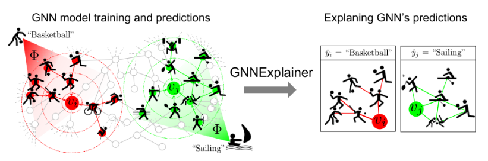
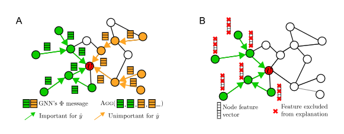
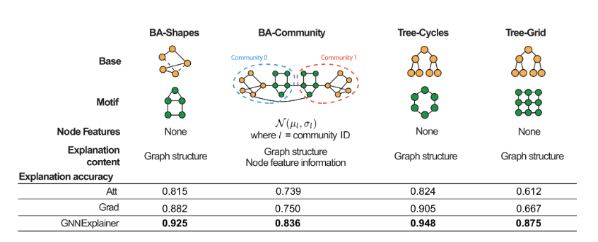
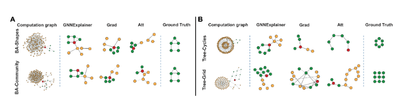
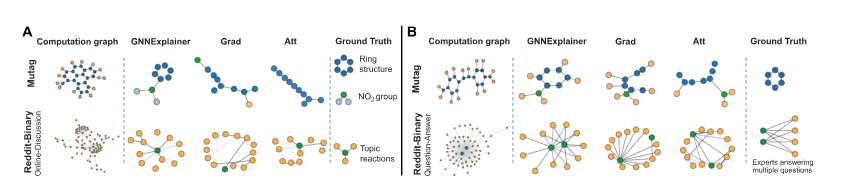
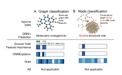

# GNNExplainer: Generating Explanations for Graph Neural Networks
> GNNExplainer: 그래프 신경망에 대한 설명 생성

원문 링크: [원문 링크](https://arxiv.org/abs/1903.03894)

## Abstract
그래프 구조와 특징 정보를 모두 통합하면 모델이 복잡해지고, GNN의 예측을 설명하는 문제는 여전히 해결되지 않은 과제이다. 본 논문에서는 모든 그래프 기반 머신러닝 작업에서 모든 GNN 기반 모델의 예측에 대한 해석 가능한 설명을 제공하는 최초의 일반적이고 모델에 구애받지 않는 접근 방식인 GnnExplainer를 제안한다. GnnExplainer는 주어진 인스턴스에 대해 간결한 부분 그래프 구조와 GNN 예측에 중요한 역할을 하는 소수의 노드 특징 집합을 식별한다. 나아가 GnnExplainer는 전체 인스턴스 클래스에 대해 일관되고 간결한 설명을 생성할 수 있다. 본 논문에서는 GnnExplainer를 GNN 예측과 가능한 부분 그래프 구조 분포 간의 상호 정보를 최대화하는 최적화 문제로 정식화한다. 
합성 그래프와 실제 그래프에 대한 실험 결과, 본 연구에서 제안하는 접근 방식은 중요한 그래프 구조와 노드 특징을 식별할 수 있으며, 설명 정확도 측면에서 기존 기준 접근 방식보다 최대 43.0% 높은 성능을 보였다. GnnExplainer는 의미적으로 관련된 구조를 시각화하는 기능부터 해석 가능성 향상, 그리고 결함이 있는 GNN의 오류에 대한 통찰력 제공에 이르기까지 다양한 이점을 제공한다.

## Introduction
사회, 정보, 화학, 생물학 분야를 포함한 많은 실제 응용 분야에서 데이터는 자연스럽게 그래프로 모델링될 수 있다.
그래프는 강력한 데이터 표현 방식이지만, 노드 특징 정보뿐 아니라 풍부한 관계형 정보까지 모델링해야 하므로 다루기가 어렵다.
이러한 문제를 해결하기 위해 그래프 신경망(GNN)은 그래프에서 인접한 노드의 정보를 재귀적으로 통합하여 그래프 구조와 노드 특징을 자연스럽게 포착하는 능력 덕분에 그래프 기반 머신러닝 분야에서 최첨단 기술로 부상함

GNN은 여러 장점에도 불구하고 예측 결과를 사람이 이해하기 쉽게 설명하기 어렵다는 점에서 투명성이 부족하다. 그러나 GNN의 예측을 이해하는 것은 다음과 같은 여러 가지 이유로 중요하고 유용하다.
1. GNN 모델에 대한 신뢰도를 높일 수 있다
2. 공정성, 개인정보 보호 및 기타 안전 문제와 관련된 의사 결정에 중요한 응용 분야에서 모델의 투명성을 향상시킬 수 있다.
3. 이를 통해 실무자는 네트워크 특성을 이해하고, 모델을 실제 세계에 배포하기 전에 모델이 저지르는 체계적인 오류 패턴을 식별하고 수정할 수 있다.

현재 GNN을 설명하는 방법은 없지만, 다른 유형의 신경망을 설명하기 위한 최근 접근 방식은 크게 두 가지 방향으로 나아가고 있다. 한 가지 연구 방향은 더 간단한 대리 모델을 사용하여 모델을 국소적으로 근사화한 다음, 이러한 대리 모델을 통해 설명을 검증하는 것이다. 다른 방법들은 관련 특징에 대해 모델을 신중하게 검토 하고 고수준 특징에 대한 질적 해석을 잘 찾아내거나 영향력 있는 입력 사례를 식별한다. 
하지만 이러한 접근 방식들은 그래프의 핵심 관계 정보를 통합하는데 한계가 있다. 그래프 기반 머신러닝의 성공에 있어 관계 정보는 매우 중요하므로, GNN 예측에 대한 설명은 그래프가 제공하는 풍부한 관계 정보와 노드 특징을 모두 활용해야 한다.

본 논문에서는 GNN(그래프 신경망)의 예측을 설명하는 접근 방식인 GnnExplainer를 제안합니다 . GnnExplainer는 학습된 GNN과 그 예측 결과를 입력으로 받아, 입력 그래프의 작은 부분 그래프와 예측에 가장 큰 영향을 미치는 노드 특징들의 작은 부분 집합 형태로 설명을 반환한다.

이 접근 방식은 모델에 구애받지 않으며, 노드 분류, 링크 예측, 그래프 분류를 포함한 모든 그래프 기반 머신러닝 작업에서 모든 GNN의 예측을 설명할 수 있다. 또한 단일 인스턴스 설명과 다중 인스턴스 설명을 모두 지원다. 단일 인스턴스 설명의 경우, GnnExplainer는 특정 인스턴스(예 : 노드 레이블, 새 링크, 그래프 레벨 레이블)에 대한 GNN의 예측을 설명합니다. 다중 인스턴스 설명의 경우, GnnExplainer는 여러 인스턴스( 예 : 특정 클래스의 노드)에 대해 일관되게 설명하는 설명을 제공한다 .

GNNExplainer는 GNN이 학습된 전체 그래프에서 풍부한 정보를 담는 부분 그래프를 설명으로 정의하며, 이 부분 그래프가 GNN의 예측과 갖는 상호 정보를 최대화하도록 한다. 이를 위해 평균장 변분 근사를 정식화하고, GNN 계산 그래프에서 중요한 부분 그래프를 선택하는 실수값 그래프 마스크를 학습한다. 동시에 중요하지 않은 노드 특징을 가리는 특징 마스크도 학습한다(그림 1).

본 연구에서는 합성 그래프와 실제 그래프 모두에서 GNNExplainer를 평가한다. 실험 결과, GNNExplainer는 GNN 예측에 대해 일관되고 간결한 설명을 제공한다. 노드 레이블을 결정하는 데 관여하는 네트워크 모티프를 심어 놓은 합성 그래프에서는 GNNExplainer가 노드 레이블을 결정하는 부분 그래프·모티프와 노드 특징을 정확히 찾아냈으며, 설명 정확도에서 비교 기준보다 최대 43.0% 높은 성능을 보였다.

또한 두 개의 실제 데이터셋을 사용하여, GNNExplainer가 GNN 예측에 영향을 미치는 중요한 그래프 구조와 노드 특징을 안정적으로 식별함으로써 의미 있는 도메인 지식을 제공할 수 있음을 보인다. 구체적으로 분자 그래프와 사회적 상호작용 네트워크에서 분자의 $NO_{2}$ 화학 작용기나 고리 구조, Reddit 스레드의 별 모양 구조처럼 도메인에 중요한 그래프 구조를 찾아낼 수 있었다. 전반적으로 실험 결과는 GNNExplainer가 다양한 그래프 기반 머신러닝 작업의 GNN 모델에 대해 일관되고 간결한 설명을 제공함을 보여준다.

## 2. 관련 연구

GNN 설명 문제 자체는 충분히 연구되지 않았지만, 이와 관련된 해석 가능성과 신경망 디버깅 문제는 머신러닝 분야에서 상당한 관심을 받아 왔다. 그래프가 아닌 일반 신경망을 위한 해석 방법은 크게 두 계열로 나눌 수 있다.

첫 번째 계열은 전체 신경망을 대신하는 단순한 대리 모델을 구성한다. 일반적으로 예측 주변에서 국소적으로 충실한 근사 모델을 학습하는 방식으로 모델에 구애받지 않게 구현할 수 있다. 예를 들어 선형 모델 [29]이나, 해당 예측이 성립하기 위한 충분조건을 나타내는 규칙 집합 [3, 25, 47]을 사용할 수 있다.

두 번째 계열은 계산 과정에서 중요한 요소를 식별한다. 예를 들어 특징 기울기 [13, 43], 뉴런이 입력 특징에 기여한 정도를 역전파하는 방법 [6, 31, 32], 반사실적 추론 [19] 등이 있다. 그러나 이러한 방법이 생성하는 현저성 지도(saliency map) [43]는 일부 사례에서 오해를 일으킬 수 있고 [2], 기울기 포화 같은 문제에도 취약한 것으로 알려졌다 [31, 32]. 그래프 인접 행렬처럼 입력이 이산적이면 기울기 값이 매우 좁은 구간에서만 매우 커질 수 있으므로 이러한 문제가 더욱 심해진다. 따라서 이와 같은 접근 방식은 그래프 신경망의 예측을 설명하는 데 적합하지 않다.

본질적으로 해석 가능한 새 모델을 설계하는 대신, 사후 해석 방법 [1, 14, 15, 17, 23, 38]은 모델을 블랙박스로 간주한 뒤 관련 정보를 탐색한다. 하지만 그래프와 같은 관계 구조를 활용한 연구는 이루어지지 않았다. 그래프 구조 데이터의 예측은 흔히 노드와 노드 사이의 엣지 경로가 복잡하게 결합되어 만들어지므로, 이를 설명할 방법이 없다는 것은 중요한 문제다.

예를 들어 일부 작업에서는 다른 대체 경로가 존재해 사이클을 이룰 때에만 특정 엣지가 중요해지며, 이 두 특징을 함께 고려해야만 노드 레이블을 정확히 예측할 수 있다 [10, 12]. 따라서 이들의 공동 기여도는 개별 기여도의 단순한 선형 결합으로 모델링할 수 없다.

최근에는 어텐션 메커니즘으로 해석 가능성을 높인 GNN 모델도 제안되었다 [28, 33, 34]. 학습된 엣지 어텐션 값은 중요한 그래프 구조를 나타낼 수 있지만, 모든 노드의 예측에 동일한 값이 사용된다. 이는 동일한 엣지가 한 노드의 레이블 예측에는 중요하지만 다른 노드의 레이블 예측에는 중요하지 않을 수 있는 많은 응용 사례와 맞지 않는다. 더구나 이러한 접근 방식은 특정 GNN 구조에만 적용되거나, 그래프 구조와 노드 특징 정보를 함께 고려하여 예측을 설명하지 못한다.

## 3. 그래프 신경망 설명의 정식화

> **그림 2 설명.** A. 노드 $v$에서 예측 $\hat{y}$를 생성하는 GNN 계산 그래프 $G_c$(초록색과 주황색). $G_c$의 일부 엣지는 중요한 신경 메시지 전달 경로(초록색)를 형성해 유용한 노드 정보가 $G_c$를 따라 전파되고 예측을 위해 $v$에서 집계되도록 하지만, 나머지 엣지(주황색)는 그렇지 않다. GNN은 예측을 만들기 위해 중요한 메시지와 중요하지 않은 메시지를 모두 집계해야 하므로 $v$의 이웃에서 축적된 신호가 희석될 수 있다. GNNExplainer의 목표는 예측에 핵심적인 소수의 특징과 경로(초록색)를 식별하는 것이다. B. GNNExplainer는 $G_S$(초록색)뿐 아니라 노드 특징 마스크를 학습하여 $G_S$에 속한 노드들의 특징 차원 중 어떤 것이 예측에 중요한지도 식별한다.

$G$를 엣지 집합 $E$와 노드 집합 $V$로 구성된 그래프라고 하자. 각 노드에는 $d$차원 노드 특징이 연결되어 있으며, 이를 $\mathcal{X}=\{x_1,\ldots,x_n\}$, $x_i\in\mathbb{R}^d$로 나타낸다. 일반성을 잃지 않고 노드 분류 작업을 설명하는 문제를 고려한다. 다른 작업은 4.4절에서 다룬다. $f$는 노드의 레이블 함수 $f:V\mapsto\{1,\ldots,C\}$로서, $V$의 각 노드를 $C$개 클래스 중 하나에 대응시킨다. GNN 모델 $\Phi$는 학습 집합의 모든 노드에서 최적화된 뒤 새로운 노드에 대한 $f$를 근사하는 예측에 사용된다.

### 3.1. 그래프 신경망 배경

계층 $l$에서 GNN 모델 $\Phi$의 갱신은 세 가지 핵심 계산으로 이루어진다 [4, 45, 46].

1. 먼저 모델은 모든 노드 쌍 사이에서 신경 메시지를 계산한다. 노드 쌍 $(v_i,v_j)$의 메시지는 이전 계층에서 두 노드가 갖는 표현 $\mathbf{h}_i^{l-1}$, $\mathbf{h}_j^{l-1}$과 두 노드 사이의 관계 $r_{ij}$를 입력으로 받는 함수 $\operatorname{Msg}$로 정의된다.

$$
m_{ij}^{l}=\operatorname{Msg}\!\left(\mathbf{h}_{i}^{l-1},\mathbf{h}_{j}^{l-1},r_{ij}\right)
$$

2. 다음으로 각 노드 $v_i$에 대해 GNN은 $v_i$의 이웃 $\mathcal{N}_{v_i}$에서 온 메시지를 집계하고, 집계 함수 $\operatorname{Agg}$를 사용해 집계 메시지 $M_i$를 계산한다 [16, 35].

$$
M_i^l=\operatorname{Agg}\!\left(\left\{m_{ij}^l\mid v_j\in\mathcal{N}_{v_i}\right\}\right)
$$

여기서 $\mathcal{N}_{v_i}$는 노드 $v_i$의 이웃이며, 구체적인 정의는 GNN 변형에 따라 달라진다.

3. 마지막으로 GNN은 집계 메시지 $M_i^l$와 이전 계층의 $v_i$ 표현 $\mathbf{h}_i^{l-1}$을 함께 받아 비선형 변환을 적용하고, 계층 $l$에서의 표현 $\mathbf{h}_i^l$을 얻는다.

$$
\mathbf{h}_i^l=\operatorname{Update}\!\left(M_i^l,\mathbf{h}_i^{l-1}\right)
$$

$L$개 계산 계층을 거친 뒤 노드 $v_i$의 최종 임베딩은 $\mathbf{z}_i=\mathbf{h}_i^L$이다. GNNExplainer는 $\operatorname{Msg}$, $\operatorname{Agg}$, $\operatorname{Update}$ 계산으로 정식화할 수 있는 모든 GNN을 설명할 수 있다.

### 3.2. GNNExplainer: 문제 정식화

핵심 통찰은 GNN의 이웃 기반 집계로 정의되는 노드 $v$의 계산 그래프가, GNN이 노드 $v$에서 예측 $\hat{y}$를 생성할 때 사용하는 모든 정보를 완전히 결정한다는 점이다(그림 2). 특히 $v$의 계산 그래프는 GNN이 $v$의 임베딩 $\mathbf{z}$를 어떻게 생성해야 하는지를 알려준다.

이 계산 그래프를 $G_c(v)$, 관련 이진 인접 행렬을 $A_c(v)\in\{0,1\}^{n\times n}$, 관련 특징 집합을 $X_c(v)=\{x_j\mid v_j\in G_c(v)\}$라고 하자. GNN 모델 $\Phi$는 조건부 분포 $P_\Phi(Y\mid G_c,X_c)$를 학습한다. 여기서 $Y$는 레이블 $\{1,\ldots,C\}$를 나타내는 확률 변수이며, 노드가 각 클래스에 속할 확률을 나타낸다.

GNN의 예측은 다음과 같다.

$$
\hat{y}=\Phi\!\left(G_c(v),X_c(v)\right)
$$

즉 예측은 모델 $\Phi$, 그래프 구조 정보 $G_c(v)$, 노드 특징 정보 $X_c(v)$에 의해 완전히 결정된다. 따라서 $\hat{y}$를 설명하기 위해서는 그래프 구조 $G_c(v)$와 노드 특징 $X_c(v)$만 고려하면 된다(그림 2A).

형식적으로 GNNExplainer는 예측 $\hat{y}$에 대한 설명을 $(G_S,X_S^F)$로 생성한다. 여기서 $G_S$는 계산 그래프의 작은 부분 그래프이고, $X_S$는 $G_S$에 연결된 특징이다. $X_S^F$는 마스크 $F$로 선택된 소수의 노드 특징 집합, 즉 $X_S^F=\{x_j^F\mid v_j\in G_S\}$이며 $\hat{y}$를 설명하는 데 가장 중요하다(그림 2B).

## 4. GNNExplainer

이제 GNNExplainer의 동작을 설명한다. 학습된 GNN 모델 $\Phi$와 하나의 예측(단일 인스턴스 설명, 4.1절과 4.2절) 또는 예측 집합(다중 인스턴스 설명, 4.3절)이 주어지면, GNNExplainer는 계산 그래프의 부분 그래프와 모델 $\Phi$의 예측에 가장 큰 영향을 미치는 노드 특징의 부분 집합을 식별하여 설명을 생성한다.

여러 예측을 설명하는 경우에는 집합 안의 개별 설명을 집계하고 프로토타입으로 자동 요약한다. 마지막으로 링크 예측과 그래프 분류를 포함한 모든 그래프 머신러닝 작업에서 GNNExplainer를 사용하는 방법을 4.4절에서 설명한다.

### 4.1. 단일 인스턴스 설명

노드 $v$가 주어졌을 때 목표는 GNN의 예측 $\hat{y}$에 중요한 부분 그래프 $G_S\subseteq G_c$와 관련 특징 $X_S=\{x_j\mid v_j\in G_S\}$를 식별하는 것이다. 우선 $X_S$가 $d$차원 노드 특징의 작은 부분 집합이라고 가정한다. 설명에 포함해야 할 노드 특징 차원을 자동으로 정하는 방법은 4.2절에서 다룬다.

중요도의 개념을 상호 정보량 $MI$로 정식화하면 GNNExplainer의 최적화 문제는 다음과 같다.

$$
\max_{G_S} MI\!\left(Y,(G_S,X_S)\right)
=H(Y)-H\!\left(Y\mid G=G_S,X=X_S\right)
\tag{1}
$$

노드 $v$에 대해 $MI$는 $v$의 계산 그래프를 설명 부분 그래프 $G_S$로, 노드 특징을 $X_S$로 제한했을 때 예측 $\hat{y}=\Phi(G_c,X_c)$의 확률이 얼마나 변하는지를 정량화한다.

예를 들어 $v_j\in G_c(v_i)$이고 $v_j\neq v_i$인 상황을 생각해 보자. $G_c(v_i)$에서 $v_j$를 제거했을 때 예측 $\hat{y}_i$의 확률이 크게 감소한다면, 노드 $v_j$는 $v_i$의 예측에 대한 좋은 반사실적 설명이다. 마찬가지로 $(v_j,v_k)\in G_c(v_i)$이고 $v_j,v_k\neq v_i$인 상황에서 $v_j$와 $v_k$ 사이의 엣지를 제거했을 때 $\hat{y}_i$의 확률이 크게 감소한다면, 그 엣지가 없어진 상황은 $v_i$의 예측에 대한 좋은 반사실적 설명이다.

식 (1)에서 엔트로피 항 $H(Y)$는 학습된 GNN의 $\Phi$가 고정되어 있으므로 상수이다. 따라서 예측 레이블 분포 $Y$와 설명 $(G_S,X_S)$ 사이의 상호 정보를 최대화하는 것은 조건부 엔트로피 $H(Y\mid G=G_S,X=X_S)$를 최소화하는 것과 같다.

$$
H\!\left(Y\mid G=G_S,X=X_S\right)
=-\mathbb{E}_{Y\mid G_S,X_S}
\left[\log P_\Phi\!\left(Y\mid G=G_S,X=X_S\right)\right]
\tag{2}
$$

따라서 예측 $\hat{y}$에 대한 설명은 GNN 계산을 $G_S$로 제한했을 때 $\Phi$의 불확실성을 최소화하는 부분 그래프 $G_S$이다. 다시 말해 $G_S$는 $\hat{y}$의 확률을 최대화한다(그림 2). 간결한 설명을 얻기 위해 $G_S$의 크기에 $|G_S|\leq K_M$이라는 제약을 두어, $G_S$가 최대 $K_M$개의 노드를 갖도록 한다. 이는 GNNExplainer가 예측과 상호 정보량이 가장 큰 $K_M$개의 엣지를 선택해 $G_c$의 잡음을 제거하는 것을 목표로 한다는 뜻이다.

#### GNNExplainer의 최적화 프레임워크

$G_c$에는 $\hat{y}$의 설명 후보가 될 수 있는 부분 그래프 $G_S$가 지수적으로 많이 존재하므로 목적 함수를 직접 최적화하기는 어렵다. 이에 부분 그래프 $G_S$에 대해 분수값 인접 행렬 $A_S\in[0,1]^{n\times n}$을 사용하고, 모든 $j,k$에 대해 다음 부분 그래프 제약을 둔다.

$$
A_S[j,k]\leq A_c[j,k]
$$

엣지 유형이 있는 경우에는 엣지 유형 수를 $C_e$라 할 때 $G_S\in[0,1]^{C_e\times n\times n}$으로 정의한다. 이 연속 완화는 $G_c$의 부분 그래프 분포에 대한 변분 근사로 해석할 수 있다. 특히 $G_S\sim\mathcal{G}$를 랜덤 그래프 변수로 보면 식 (2)의 목적 함수는 다음과 같이 바뀐다.

$$
\min_{\mathcal{G}}\mathbb{E}_{G_S\sim\mathcal{G}}
H\!\left(Y\mid G=G_S,X=X_S\right)
\tag{3}
$$

볼록성을 가정하면 옌센 부등식에 의해 다음 상한을 얻는다.

$$
\min_{\mathcal{G}}
H\!\left(Y\mid G=\mathbb{E}_{\mathcal{G}}[G_S],X=X_S\right)
\tag{4}
$$

실제 신경망은 복잡하므로 볼록성 가정이 성립하지 않는다. 하지만 실험 결과, 정규화와 함께 이 목적 함수를 최소화하면 고품질 설명에 해당하는 국소 최솟값에 도달하는 경우가 많았다.

$\mathbb{E}_{\mathcal{G}}$를 다루기 쉬운 형태로 추정하기 위해 평균장 변분 근사를 사용하고, $\mathcal{G}$를 다변량 베르누이 분포로 분해한다.

$$
P_{\mathcal{G}}(G_S)=\prod_{(j,k)\in G_c} A_S[j,k]
$$

이를 통해 평균장 근사에 대한 기댓값을 추정할 수 있으며, $A_S$의 $(j,k)$번째 원소는 엣지 $(v_j,v_k)$가 존재하는지에 대한 기댓값을 나타낸다. 경험적으로 이 근사에 이산성을 촉진하는 정규화 항 [40]을 함께 사용하면 GNN의 비볼록성에도 불구하고 좋은 국소 최솟값으로 수렴했다.

식 (4)의 조건부 엔트로피는 최적화 대상 $\mathbb{E}_{\mathcal{G}}[G_S]$를 계산 그래프 인접 행렬에 대한 마스킹 $A_c\odot\sigma(M)$으로 바꾸어 최적화할 수 있다. 여기서 $M\in\mathbb{R}^{n\times n}$은 학습해야 할 마스크이고, $\odot$는 원소별 곱셈, $\sigma$는 마스크 값을 $[0,1]^{n\times n}$로 사상하는 시그모이드 함수다.

일부 응용에서는 모델의 신뢰도 관점의 설명보다 “학습된 모델이 왜 특정 클래스를 예측했는가?” 또는 “학습된 모델이 원하는 클래스를 예측하게 하려면 어떻게 해야 하는가?”가 더 중요할 수 있다. 이 경우 식 (4)의 조건부 엔트로피 목적 함수를 레이블 클래스와 모델 예측 사이의 교차 엔트로피 목적 함수로 바꿀 수 있다. 첫 번째 질문에는 설명 대상 GNN의 예측 레이블을 사용하고, 두 번째 질문에는 정답 레이블을 사용한다.

이러한 질문에 답하기 위해 경사 하강법으로 최적화하는 GNNExplainer 목적 함수의 계산 효율적인 형태는 다음과 같다.

$$
\min_M -\sum_{c=1}^{C}\mathbf{1}[y=c]
\log P_\Phi\!\left(Y=y\mid G=A_c\odot\sigma(M),X=X_c\right)
\tag{5}
$$

이 마스킹 방식은 동기와 목적 함수는 다르지만 Neural Relational Inference [22]에서도 사용된다. 마지막으로 $\sigma(M)$과 $A_c$를 원소별로 곱하고, 임계값을 적용해 $M$의 작은 값을 제거함으로써 노드 $v$에서 GNN 모델의 예측 $\hat{y}$를 설명하는 $G_S$를 얻는다.

### 4.2. 그래프 구조와 노드 특징 정보의 공동 학습

예측 $\hat{y}$에 가장 중요한 노드 특징을 식별하기 위해 GNNExplainer는 설명 $G_S$의 노드에 대한 특징 선택기 $F$를 학습한다. $X_S$를 모든 노드 특징으로 정의하는 대신, 이진 특징 선택기 $F\in\{0,1\}^d$를 통해 $G_S$에 속한 노드 특징의 부분 집합 $X_S^F$를 고려한다(그림 2B).

$$
X_S^F=\{x_j^F\mid v_j\in G_S\},\qquad
x_j^F=[x_{j,t_1},\ldots,x_{j,t_k}]
\quad\text{for}\quad F_{t_i}=1
\tag{6}
$$

여기서 $x_j^F$는 $F$에 의해 가려지지 않은 노드 특징을 담는다. 이후 설명 $(G_S,X_S)$는 다음 상호 정보량 목적 함수를 최대화하도록 공동 최적화된다.

$$
\max_{G_S,F} MI\!\left(Y,(G_S,F)\right)
=H(Y)-H\!\left(Y\mid G=G_S,X=X_S^F\right)
\tag{7}
$$

이는 구조 정보와 노드 특징 정보를 모두 고려해 예측 $\hat{y}$에 대한 설명을 생성하도록 식 (1)을 수정한 목적 함수다.

#### 이진 특징 선택기 $F$ 학습

$X_S^F$를 $X_S\odot F$로 두며, $F$는 학습해야 하는 특징 마스크로 작동한다. 직관적으로 특정 특징이 중요하지 않다면 GNN 가중치 행렬에서 그 특징에 해당하는 가중치는 0에 가까운 값을 갖는다. 그러므로 해당 특징을 가려도 $\hat{y}$의 예측 확률은 감소하지 않는다. 반대로 중요한 특징을 가리면 예측 확률이 감소한다.

그러나 이 접근 방식은 예측에는 중요하지만 값 자체는 0에 가까운 특징을 무시할 수 있다. 이를 해결하기 위해 모든 특징 부분 집합에 대해 주변화하고, 학습 중 $X_S$의 노드에 대한 경험적 주변 분포에서 표본을 뽑는 몬테카를로 추정치를 사용한다 [48]. 또한 재매개변수화 기법 [20]을 사용해 식 (7)의 기울기를 특징 마스크 $F$까지 역전파한다.

구체적으로 $d$차원 확률 변수 $X$를 통해 역전파하기 위해 다음과 같이 재매개변수화한다.

$$
X=Z+(X_S-Z)\odot F,
\qquad \text{s.t.}\quad \sum_j F_j\leq K_F
$$

여기서 $Z$는 경험적 분포에서 표본화한 $d$차원 확률 변수이며, $K_F$는 설명에 남길 특징의 최대 개수를 나타내는 매개변수다.

#### 설명에 추가 제약 통합

설명에 다른 속성을 부여하려면 식 (7)의 GNNExplainer 목적 함수에 정규화 항을 추가할 수 있다. 예를 들어 원소별 엔트로피를 사용하여 구조 마스크와 노드 특징 마스크가 이산적인 값을 갖도록 유도한다. 또한 제약 조건의 라그랑주 승수나 추가 정규화 항 같은 방법을 사용하여 도메인별 제약도 인코딩할 수 있다.

원하는 속성을 갖는 설명을 만들기 위해 여러 정규화 항을 포함한다. 특히 마스크 매개변수의 모든 원소 합을 정규화 항으로 추가하여 지나치게 큰 설명에 페널티를 준다.

마지막으로 각 설명은 유효한 계산 그래프여야 한다. 즉 설명 $(G_S,X_S)$는 GNN이 예측 $\hat{y}$를 생성할 수 있도록 신경 메시지가 노드 $v$ 방향으로 흐르게 해야 한다. GNNExplainer는 전체 계산 그래프에 걸쳐 구조 마스크를 최적화하기 때문에 유효한 계산 그래프 형태의 설명을 자동으로 제공한다. 연결되지 않은 엣지가 신경 메시지 전달에 중요하더라도 GNN의 예측에 영향을 줄 수 없으므로 설명으로 선택되지 않는다. 따라서 설명 $G_S$는 작은 연결 부분 그래프가 되는 경향이 있다.

### 4.3. 그래프 프로토타입을 통한 다중 인스턴스 설명

단일 인스턴스 설명(4.1절과 4.2절)의 출력은 입력 그래프의 작은 부분 그래프와 단일 예측에 가장 큰 영향을 미치는 노드 특징의 작은 부분 집합이다. “GNN은 왜 주어진 노드 집합을 모두 클래스 $c$로 예측했는가?”와 같은 질문에 답하려면 클래스 $c$에 대한 전역 설명이 필요하다.

여기서 목표는 특정 노드에 대해 식별된 부분 그래프가 전체 클래스를 설명하는 그래프 구조와 어떻게 관련되는지 이해하는 것이다. GNNExplainer는 그래프 정렬과 프로토타입을 바탕으로 다중 인스턴스 설명을 제공하며, 접근 방식은 두 단계로 구성된다.

첫째, 주어진 클래스 $c$(또는 설명하려는 임의의 예측 집합)에 대해 기준 노드 $v_c$를 선택한다. 예를 들어 클래스 $c$에 할당된 모든 노드 임베딩의 평균을 계산하고, 그 평균에 가장 가까운 노드를 선택할 수 있다. 그런 다음 기준 노드 $v_c$의 설명 $G_S(v_c)$를 클래스 $c$에 속하는 다른 노드의 설명과 정렬한다. 큰 그래프의 최적 매칭을 찾는 것은 실제로 어려운 문제지만, 단일 인스턴스 GNNExplainer는 작은 그래프를 생성하므로 거의 최적인 쌍별 그래프 매칭을 효율적으로 계산할 수 있다.

둘째, 정렬된 인접 행렬을 집계하여 그래프 프로토타입 $A_{\mathrm{proto}}$을 만든다. 예를 들어 이상치에 강건한 중앙값 기반 방법을 사용할 수 있다. 프로토타입 $A_{\mathrm{proto}}$은 같은 클래스의 노드들이 공유하는 그래프 패턴을 보여준다. 특정 노드의 예측은 그 노드에 대한 단일 인스턴스 설명과 프로토타입을 비교해 분석할 수 있다. 자세한 내용은 부록 A를 참조한다.

### 4.4. GNNExplainer 모델 확장

#### 모든 그래프 머신러닝 작업

GNNExplainer는 최적화 알고리즘을 바꾸지 않고도 노드 분류뿐 아니라 링크 예측과 그래프 분류를 설명할 수 있다. 링크 $(v_j,v_k)$를 예측할 때에는 링크 양 끝점에 대해 두 마스크 $X_S(v_j)$와 $X_S(v_k)$를 학습한다. 그래프를 분류할 때 식 (5)의 인접 행렬은 레이블을 설명하려는 그래프의 모든 노드에 대한 인접 행렬의 합집합이다.

다만 그래프 분류에서는 노드 임베딩을 집계하므로, 노드 분류와 달리 설명 $G_S$가 반드시 연결 부분 그래프가 되지는 않는다. 화학에서 설명이 연결된 작용기여야 하는 경우처럼 응용 분야에서 연결성이 필요하다면 가장 큰 연결 성분을 설명으로 추출할 수 있다.

#### 모든 GNN 모델

현대적인 GNN은 입력 그래프에서의 메시지 전달 구조를 기반으로 한다. 메시지 전달 계산 그래프는 여러 방식으로 구성될 수 있으며 GNNExplainer는 이 모두를 처리할 수 있다. 따라서 GNNExplainer는 그래프 합성곱 신경망 [21], Gated Graph Sequence Neural Network [26], Jumping Knowledge Network [36], Attention Network [33], Graph Network [4], 다양한 노드 집계 방식을 갖는 GNN [5, 7, 16, 18, 35, 39, 40], Line-Graph Neural Network [8], 위치 인식 GNN [42] 및 그 밖의 여러 GNN 구조에 적용할 수 있다.

#### 계산 복잡도

GNNExplainer 최적화의 매개변수 수는 설명하려는 노드 $v$의 계산 그래프 $G_c$ 크기에 따라 달라진다. 구체적으로 $G_c(v)$의 인접 행렬 $A_c(v)$의 크기는 GNNExplainer가 학습해야 하는 마스크 $M$의 크기와 같다. 하지만 계산 그래프는 보통 완전한 $L$-홉 이웃보다 상대적으로 작다. 예를 들어 2~3홉 이웃 [21], 표본화 기반 이웃 [39], 어텐션 기반 이웃 [33] 등이 사용된다. 따라서 입력 그래프가 크더라도 GNNExplainer는 설명을 효율적으로 생성할 수 있다.

## 5. 실험

먼저 그래프 데이터셋, 비교 기준 방법, 실험 설정을 설명한다. 이어서 노드 분류와 그래프 분류 작업의 GNN을 설명하는 실험을 제시한다. 정성적·정량적 분석을 통해 GNNExplainer가 그래프 구조와 노드 특징 모두에서 설명을 정확하고 효과적으로 식별함을 보인다.

### 5.1. 데이터셋

#### 합성 데이터셋

네 종류의 노드 분류 데이터셋을 구성한다(표 1).

1. **BA-Shapes:** 300개 노드로 구성된 Barabási-Albert(BA) 기본 그래프에서 시작하여, 무작위로 선택한 기본 그래프 노드에 5개 노드의 “집(house)” 구조 네트워크 모티프 80개를 연결한다. 이후 $0.1N$개의 무작위 엣지를 추가하여 그래프를 교란한다. 노드는 구조적 역할에 따라 4개 클래스로 할당된다. 집 구조 모티프에는 지붕, 중간, 아래쪽이라는 세 역할이 있으므로 집의 지붕·중간·아래쪽 노드와 집에 속하지 않는 노드에 대응하는 네 클래스가 만들어진다.
2. **BA-Community:** 두 BA-Shapes 그래프의 합집합이다. 노드는 정규분포를 따르는 특징 벡터를 가지며, 구조적 역할과 커뮤니티 소속에 따라 8개 클래스 중 하나로 할당된다.
3. **Tree-Cycles:** 깊이 8의 균형 이진 트리를 기본 그래프로 사용하고, 무작위로 선택한 기본 그래프 노드에 6개 노드로 이루어진 사이클 모티프 80개를 연결한다.
4. **Tree-Grid:** 사이클 모티프 대신 $3\times3$ 격자 모티프를 기본 트리에 연결한다는 점을 제외하면 Tree-Cycles와 같다.

#### 실제 데이터셋

두 가지 그래프 분류 데이터셋을 사용한다.

1. **Mutag:** 그람 음성균 *S. typhimurium*에 대한 돌연변이 유발 효과에 따라 레이블이 붙은 $4{,}337$개의 분자 그래프로 구성된다 [10].
2. **Reddit-Binary:** Reddit의 온라인 토론 스레드 하나를 각각 나타내는 $2{,}000$개의 그래프로 구성된다. 그래프의 노드는 스레드 참여자이고, 한 사용자가 다른 사용자의 댓글에 답글을 달면 두 노드 사이에 엣지가 생긴다. 그래프는 스레드의 사용자 상호작용 유형에 따라 레이블링된다. r/IAmA와 r/AskReddit에는 질문-답변 상호작용이 포함되고, r/TrollXChromosomes와 r/atheism에는 온라인 토론 상호작용이 포함된다 [37].

> **표 1 설명.** 합성 데이터셋의 예시와 GNNExplainer 및 비교 기준 설명 방법의 성능 평가. 자세한 내용은 “합성 데이터셋”을 참조한다.

### 5.2. 비교 기준 방법

많은 설명 가능성 방법은 그래프에 직접 적용할 수 없다(2절). 그래도 GNN 예측에 대한 통찰을 제공할 수 있는 다음 두 방법과 비교한다.

1. **Grad:** 기울기 기반 방법이다. 현저성 지도와 유사하게 GNN 손실 함수를 인접 행렬과 관련 노드 특징에 대해 미분하여 기울기를 계산한다.
2. **Att:** 계산 그래프의 엣지에 대한 어텐션 가중치를 학습하는 그래프 어텐션 GNN(GAT) [33]이다. 이 가중치를 엣지 중요도의 대리 척도로 사용한다. Att는 그래프 구조를 고려하지만 노드 특징을 이용해 설명하지 못하고 GAT 모델만 설명할 수 있다. 또한 사이클이 있으면 어떤 노드의 1홉 이웃이 동시에 같은 노드의 2홉 이웃일 수 있으므로, 어떤 어텐션 가중치를 엣지 중요도로 사용해야 하는지도 명확하지 않다. 따라서 각 엣지의 중요도는 모든 계층에 걸친 어텐션 가중치의 평균으로 계산한다.

### 5.3. 설정 및 구현 세부사항

각 데이터셋마다 먼저 하나의 GNN을 학습한 후 Grad와 GNNExplainer를 사용해 해당 GNN의 예측을 설명한다. Att 기준선에는 GAT [33] 같은 그래프 어텐션 구조가 필요하므로 같은 데이터셋에 별도의 GAT 모델을 학습하고, 학습된 엣지 어텐션 가중치를 설명에 사용한다.

하이퍼파라미터 $K_M$과 $K_F$는 각각 부분 그래프 설명과 특징 설명의 크기를 제어하며, 데이터셋에 대한 사전 지식을 이용해 정한다. 합성 데이터셋에서는 $K_M$을 정답 설명의 크기로 설정한다. 실제 데이터셋에서는 $K_M=10$으로 설정하며, 모든 데이터셋에서 $K_F=5$를 사용한다. 가중치 정규화 하이퍼파라미터는 모든 노드 분류 및 그래프 분류 실험에서 동일하게 고정한다. 추가 학습 세부사항은 부록 C에 제시한다. 코드와 데이터셋은 [공개 저장소](https://github.com/RexYing/gnn-model-explainer)에서 확인할 수 있다.

### 5.4. 결과

다음 질문을 중심으로 분석한다.

- GNNExplainer는 타당한 설명을 제공하는가?
- 생성된 설명은 정답 지식과 비교했을 때 어떠한가?
- GNNExplainer는 다양한 그래프 기반 예측 작업에서 어떤 성능을 보이는가?
- 서로 다른 GNN이 생성한 예측도 설명할 수 있는가?

> **그림 3 설명.** 단일 인스턴스 설명 평가. 네 가지 합성 데이터셋의 노드 분류 작업에 대한 대표적인 설명 부분 그래프를 보여준다. 각 방법은 빨간색 노드의 예측을 설명한다.

> **그림 4 설명.** 단일 인스턴스 설명 평가. Mutag와 Reddit-Binary 데이터셋의 그래프 분류 작업에 대한 대표적인 설명 부분 그래프를 보여준다.

#### 1) 정량적 분석

노드 분류 데이터셋의 결과는 표 1에 제시한다. 합성 데이터셋에는 정답 설명이 있으므로 모든 설명 방법의 설명 정확도를 계산할 수 있다. 설명 문제를 이진 분류 작업으로 정식화한다. 정답 설명에 포함된 엣지를 레이블로 보고, 설명 방법이 부여한 중요도 가중치를 예측 점수로 본다.

더 좋은 설명 방법은 정답 설명에 속하는 엣지에 높은 점수를 부여하므로 더 높은 설명 정확도를 달성한다. 실험 결과, GNNExplainer는 비교 방법보다 평균 17.1% 높은 성능을 보였다. 가장 어려운 Tree-Grid 데이터셋에서는 최대 43.0% 더 높은 정확도를 달성했다.

#### 2) 정성적 분석

결과는 그림 3~5에 제시한다. BA-Shapes와 Tree-Cycles처럼 노드 특징이 없고 토폴로지만으로 예측하는 작업에서 GNNExplainer는 노드 레이블, 즉 구조적 레이블을 설명하는 네트워크 모티프를 정확히 식별한다(그림 3). 그림에서 볼 수 있듯이 GNNExplainer는 집, 사이클, 트리 모티프를 식별하지만 비교 기준 방법은 그렇지 못한다.

그림 4에서는 그래프 분류 작업에 대한 설명을 조사한다. Mutag 예시에서 색상은 수소(H), 탄소(C) 같은 원자를 나타내는 노드 특징이다. GNNExplainer는 탄소 고리와 돌연변이 유발성이 있는 것으로 알려진 $NH_2$, $NO_2$ 화학 작용기를 정확히 식별한다 [10].

Reddit-Binary 예시를 보면, 질문-답변 그래프(그림 4B의 두 번째 행)에는 다수의 낮은 차수 노드에 동시에 연결된 높은 차수 노드가 2~3개 있다. 이는 Reddit의 질문-답변 스레드에서 보통 2~3명의 전문가가 여러 질문에 답한다는 점에서 타당하다 [24]. 반대로 토론 패턴은 흔히 트리와 같은 구조를 보인다(그림 4A의 두 번째 행). Reddit 스레드는 일반적으로 하나의 주제에 대한 반응으로 형성되기 때문이다 [24].

한편 Grad와 Att는 잘못되거나 불완전한 설명을 제공한다. 예를 들어 두 기준 방법 모두 Mutag의 사이클 모티프와 Tree-Grid의 더 복잡한 격자 모티프를 놓친다. 또한 Att의 엣지 어텐션 가중치를 메시지 전달의 중요도 점수로 해석할 수는 있지만, 이 값이 입력 그래프의 모든 노드에서 공유되기 때문에 Att는 고품질 단일 인스턴스 설명을 제공하지 못한다.

설명은 해석 가능해야 한다. 즉 입력 노드와 예측 사이의 관계를 정성적으로 이해할 수 있게 해야 한다. 이를 위해서는 설명이 충분한 정보를 포함하면서도 이해하기 쉬워야 한다. 따라서 GNN 설명기는 기반 그래프 구조뿐 아니라 관련 특징이 존재할 때 그 특징도 함께 고려해야 한다.

그림 5의 실험에서 GNNExplainer는 구조 정보와 소수의 특징 차원 정보를 함께 고려한다. 특징 설명은 노드 특징이 있는 두 데이터셋인 Mutag와 BA-Community에 대해 제시한다. GNNExplainer는 그림 5에서 간결한 특징 표현을 강조하지만, 기울기 기반 접근 방식은 추가된 잡음에 제대로 대응하지 못해 관련 없는 특징 차원에도 높은 중요도 점수를 부여한다. 그래프 프로토타입을 사용하는 다중 인스턴스 설명의 추가 실험은 부록 B에 제시한다.

> **그림 5 설명.** GNN 예측에 중요한 특징의 시각화. A. Mutag 데이터셋의 대표 분자 그래프(위)와 관련 그래프 특징의 중요도를 나타낸 히트맵(아래). GNNExplainer는 기준 방법과 달리 분자의 돌연변이 유발성을 예측하는 데 중요한 C, O, H, N 원자 특징을 정확히 식별한다. B. BA-Community 데이터셋의 빨간색 노드에 대한 계산 그래프(위). 여기서도 GNNExplainer는 노드의 구조적 역할을 예측하는 데 중요한 노드 특징을 성공적으로 식별하지만 기준 방법은 실패한다.

## 6. 결론

본 논문에서는 기반 GNN 구조를 수정하거나 재학습하지 않고도 모든 그래프 기반 머신러닝 작업에서 임의의 GNN 예측을 설명할 수 있는 새로운 방법 GNNExplainer를 제시했다. GNNExplainer가 그래프 신경망의 재귀적 이웃 집계 방식을 활용하여 중요한 그래프 경로를 식별하고, 그 경로의 엣지를 따라 전달되는 관련 노드 특징 정보를 강조할 수 있음을 보였다.

최근 연구에서 머신러닝 예측의 설명 가능성 문제는 상당한 관심을 받았지만, 본 연구는 풍부한 노드 특징을 갖는 그래프라는 관계 구조에 직접 작동하는 접근 방식을 제시한다는 점에서 독창적이다. 또한 GNN 예측을 이해하고, GNN 모델을 디버깅하며, 체계적인 오류 패턴을 식별하기 위한 간단한 인터페이스를 제공한다.

### 감사의 글

Jure Leskovec은 Chan Zuckerberg Biohub 연구자이다. 본 연구는 DARPA FA865018C7880(ASED) 및 MSC, NIH U54EB020405(Mobilize), ARO 38796-Z8424103(MURI), IARPA 2017-17071900005(HFC), NSF OAC-1835598(CINES) 및 HDR, Stanford Data Science Initiative, Chan Zuckerberg Biohub, JD.com, Amazon, Boeing, Docomo, Huawei, Hitachi, Observe, Siemens, UST Global의 지원을 받았다. 미국 정부는 저작권 표기와 관계없이 정부 목적을 위해 재인쇄물을 복제하고 배포할 권한을 가진다. 본 자료에 제시된 의견, 발견, 결론 또는 권고는 저자의 견해이며 DARPA, NIH, ONR 또는 미국 정부의 명시적·묵시적 견해, 정책, 보증을 반드시 반영하는 것은 아니다.

## 참고문헌

> 논문 제목과 서지정보는 검색 및 인용의 정확성을 위해 원문 표기를 유지한다.

1. A. Adadi and M. Berrada. “Peeking Inside the Black-Box: A Survey on Explainable Artificial Intelligence (XAI).” *IEEE Access*, 6:52138–52160, 2018.
2. J. Adebayo, J. Gilmer, M. Muelly, I. Goodfellow, M. Hardt, and B. Kim. “Sanity checks for saliency maps.” In *NeurIPS*, 2018.
3. M. Gethsiyal Augasta and T. Kathirvalavakumar. “Reverse Engineering the Neural Networks for Rule Extraction in Classification Problems.” *Neural Processing Letters*, 35(2):131–150, 2012.
4. P. W. Battaglia et al. “Relational inductive biases, deep learning, and graph networks.” arXiv:1806.01261, 2018.
5. J. Chen, J. Zhu, and L. Song. “Stochastic training of graph convolutional networks with variance reduction.” In *ICML*, 2018.
6. J. Chen, L. Song, M. J. Wainwright, and M. I. Jordan. “Learning to explain: An information-theoretic perspective on model interpretation.” arXiv:1802.07814, 2018.
7. J. Chen, T. Ma, and C. Xiao. “FastGCN: Fast learning with graph convolutional networks via importance sampling.” In *ICLR*, 2018.
8. Z. Chen, L. Li, and J. Bruna. “Supervised community detection with line graph neural networks.” In *ICLR*, 2019.
9. E. Cho, S. Myers, and J. Leskovec. “Friendship and mobility: User movement in location-based social networks.” In *KDD*, 2011.
10. A. Debnath et al. “Structure-activity relationship of mutagenic aromatic and heteroaromatic nitro compounds: Correlation with molecular orbital energies and hydrophobicity.” *Journal of Medicinal Chemistry*, 34(2):786–797, 1991.
11. F. Doshi-Velez and B. Kim. “Towards A Rigorous Science of Interpretable Machine Learning.” arXiv:1702.08608, 2017.
12. D. Duvenaud et al. “Convolutional networks on graphs for learning molecular fingerprints.” In *NIPS*, 2015.
13. D. Erhan, Y. Bengio, A. Courville, and P. Vincent. “Visualizing higher-layer features of a deep network.” University of Montreal, 1341(3):1, 2009.
14. A. Fisher, C. Rudin, and F. Dominici. “All Models are Wrong but many are Useful: Variable Importance for Black-Box, Proprietary, or Misspecified Prediction Models, using Model Class Reliance.” arXiv:1801.01489, 2018.
15. R. Guidotti et al. “A Survey of Methods for Explaining Black Box Models.” *ACM Computing Surveys*, 51(5):93:1–93:42, 2018.
16. W. Hamilton, Z. Ying, and J. Leskovec. “Inductive representation learning on large graphs.” In *NIPS*, 2017.
17. G. Hooker. “Discovering additive structure in black box functions.” In *KDD*, 2004.
18. W. B. Huang, T. Zhang, Y. Rong, and J. Huang. “Adaptive sampling towards fast graph representation learning.” In *NeurIPS*, 2018.
19. B. Kang, J. Lijffijt, and T. De Bie. “Explaine: An approach for explaining network embedding-based link predictions.” arXiv:1904.12694, 2019.
20. D. P. Kingma and M. Welling. “Auto-encoding variational bayes.” In *NeurIPS*, 2013.
21. T. N. Kipf and M. Welling. “Semi-supervised classification with graph convolutional networks.” In *ICLR*, 2016.
22. T. Kipf, E. Fetaya, K.-C. Wang, M. Welling, and R. Zemel. “Neural relational inference for interacting systems.” In *ICML*, 2018.
23. P. W. Koh and P. Liang. “Understanding black-box predictions via influence functions.” In *ICML*, 2017.
24. S. Kumar, W. L. Hamilton, J. Leskovec, and D. Jurafsky. “Community interaction and conflict on the web.” In *WWW*, pp. 933–943, 2018.
25. H. Lakkaraju, E. Kamar, R. Caruana, and J. Leskovec. “Interpretable & Explorable Approximations of Black Box Models.” 2017.
26. Y. Li, D. Tarlow, M. Brockschmidt, and R. Zemel. “Gated graph sequence neural networks.” arXiv:1511.05493, 2015.
27. S. Lundberg and S.-I. Lee. “A Unified Approach to Interpreting Model Predictions.” In *NIPS*, 2017.
28. D. Neil et al. “Interpretable Graph Convolutional Neural Networks for Inference on Noisy Knowledge Graphs.” In *ML4H Workshop at NeurIPS*, 2018.
29. M. Ribeiro, S. Singh, and C. Guestrin. “Why should I trust you?: Explaining the predictions of any classifier.” In *KDD*, 2016.
30. G. J. Schmitz, C. Aldrich, and F. S. Gouws. “ANN-DT: An algorithm for extraction of decision trees from artificial neural networks.” *IEEE Transactions on Neural Networks*, 1999.
31. A. Shrikumar, P. Greenside, and A. Kundaje. “Learning Important Features Through Propagating Activation Differences.” In *ICML*, 2017.
32. M. Sundararajan, A. Taly, and Q. Yan. “Axiomatic Attribution for Deep Networks.” In *ICML*, 2017.
33. P. Veličković, G. Cucurull, A. Casanova, A. Romero, P. Liò, and Y. Bengio. “Graph attention networks.” In *ICLR*, 2018.
34. T. Xie and J. Grossman. “Crystal graph convolutional neural networks for an accurate and interpretable prediction of material properties.” *Physical Review Letters*, 2018.
35. K. Xu, W. Hu, J. Leskovec, and S. Jegelka. “How powerful are graph neural networks?” In *ICLR*, 2019.
36. K. Xu, C. Li, Y. Tian, T. Sonobe, K. Kawarabayashi, and S. Jegelka. “Representation learning on graphs with jumping knowledge networks.” In *ICML*, 2018.
37. P. Yanardag and S. V. N. Vishwanathan. “Deep graph kernels.” In *KDD*, pp. 1365–1374, 2015.
38. C. Yeh, J. Kim, I. Yen, and P. Ravikumar. “Representer point selection for explaining deep neural networks.” In *NeurIPS*, 2018.
39. R. Ying, R. He, K. Chen, P. Eksombatchai, W. Hamilton, and J. Leskovec. “Graph convolutional neural networks for web-scale recommender systems.” In *KDD*, 2018.
40. Z. Ying, J. You, C. Morris, X. Ren, W. Hamilton, and J. Leskovec. “Hierarchical graph representation learning with differentiable pooling.” In *NeurIPS*, 2018.
41. J. You, B. Liu, R. Ying, V. Pande, and J. Leskovec. “Graph convolutional policy network for goal-directed molecular graph generation.” 2018.
42. J. You, R. Ying, and J. Leskovec. “Position-aware graph neural networks.” In *ICML*, 2019.
43. M. Zeiler and R. Fergus. “Visualizing and Understanding Convolutional Networks.” In *ECCV*, 2014.
44. M. Zhang and Y. Chen. “Link prediction based on graph neural networks.” In *NIPS*, 2018.
45. Z. Zhang, C. Peng, and W. Zhu. “Deep Learning on Graphs: A Survey.” arXiv:1812.04202, 2018.
46. J. Zhou, G. Cui, Z. Zhang, C. Yang, Z. Liu, and M. Sun. “Graph Neural Networks: A Review of Methods and Applications.” arXiv:1812.08434, 2018.
47. J. Zilke, E. Loza Mencia, and F. Janssen. “DeepRED—Rule Extraction from Deep Neural Networks.” In *Discovery Science*. Springer, 2016.
48. L. Zintgraf, T. Cohen, T. Adel, and M. Welling. “Visualizing deep neural network decisions: Prediction difference analysis.” In *ICLR*, 2017.
49. M. Zitnik, M. Agrawal, and J. Leskovec. “Modeling polypharmacy side effects with graph convolutional networks.” *Bioinformatics*, 34, 2018.

## 부록 A. 다중 인스턴스 설명

그래프 신경망의 다중 인스턴스 설명은 어렵지만 중요한 연구 문제다. 여기서는 같은 레이블 클래스에 속한 서로 다른 인스턴스 10개에 대한 설명 10개에서 공통 구성 요소를 찾는 GNNExplainer 기반 해법을 제안한다. 효율적인 다중 인스턴스 설명 방법을 설계하려면 추가 연구가 필요하다. 실무상의 핵심 어려움은 같은 클래스 노드라도 이웃 구조가 서로 다르고 잡음이 존재하기 때문에 그래프 정렬이 어렵다는 데 있다.

이 문제는 설명 그래프들의 최대 공통 부분 그래프를 찾는 문제와 밀접하게 관련되며, 이는 NP-hard 문제다. 아래에서는 이 문제를 위한 신경망 기반 접근 방식을 소개한다. 다만 프로토타입을 식별하고 정렬할 때에는 휴리스틱이나 정수계획 완화를 사용하는 기존 그래프 라이브러리의 최대 공통 부분 그래프 탐색 기능으로 아래 절차의 신경망 구성 요소를 대체할 수도 있다.

단일 인스턴스 GNNExplainer의 출력은 특정 예측에 어떤 그래프 구조와 노드 특징 정보가 중요한지를 나타낸다. “주어진 노드 집합이 왜 레이블 $y$로 분류되었는가?”를 이해하려면 클래스 전체에 대한 전역 설명도 필요하다. 이를 통해 특정 노드에서 식별된 구조가 해당 레이블에 고유한 전형적 구조와 어떤 관계가 있는지 알 수 있다. 이를 위해 정렬 기반 다중 인스턴스 GNNExplainer를 제안한다.

주어진 각 클래스에 대해 먼저 기준 노드를 선택한다. 직관적으로 이 노드는 해당 클래스의 전형적인 노드여야 한다. 클래스에 속한 모든 노드 임베딩의 평균을 계산하고, 임베딩이 그 평균과 가장 가까운 노드를 선택할 수 있다. 또는 중요한 계산 부분 그래프에 관한 사전 지식이 있다면 그 지식과 가장 잘 일치하는 노드를 선택할 수 있다.

클래스 $c$의 기준 노드 $v_c$와 관련 중요 계산 부분 그래프 $G_S(v_c)$가 주어지면, 클래스 $c$의 모든 노드에서 식별된 계산 부분 그래프를 기준 그래프 $G_S(v_c)$에 정렬한다. 미분 가능한 풀링 [40]의 아이디어를 이용하여 완화된 정렬 행렬로 계산 부분 그래프 $G_S(v)$의 노드와 기준 계산 부분 그래프 $G_S(v_c)$의 노드 사이 대응 관계를 찾는다.

정렬할 계산 부분 그래프의 인접 행렬과 관련 특징 행렬을 각각 $A_v$, $X_v$라고 하자. 마찬가지로 기준 계산 부분 그래프의 인접 행렬과 관련 특징 행렬을 각각 $A^*$, $X^*$라고 하자. 그러면 완화된 정렬 행렬 $P\in\mathbb{R}^{n_v\times n^*}$를 다음과 같이 최적화한다. 여기서 $n_v$는 $G_S(v)$의 노드 수이고, $n^*$는 $G_S(v_c)$의 노드 수다.

$$
\min_P
\left\lVert P^T A_v P-A^*\right\rVert
+\left\lVert P^T X_v-X^*\right\rVert
\tag{8}
$$

식 (8)의 첫 번째 항은 정렬된 $G_S(v)$의 인접 행렬이 $A^*$에 최대한 가까워야 함을 뜻한다. 두 번째 항은 서로 대응된 노드의 특징 역시 가까워야 함을 뜻한다. 실제로 완화된 그래프 매칭만으로 큰 그래프 두 개 사이의 좋은 최적점을 찾는 것은 쉽지 않다. 그러나 단일 인스턴스 설명기가 중요한 메시지 전달과 관련된 간결한 부분 그래프를 생성하므로 최적 정렬에 가까운 매칭을 효율적으로 계산할 수 있다.

### 정렬을 이용한 프로토타입 생성

클래스 $c$에 속한 모든 노드의 인접 행렬을 기준 인접 행렬이 정의한 순서에 맞게 정렬한다. 그런 다음 이상치에 강건한 프로토타입을 만들기 위해 중앙값을 사용한다.

$$
A_{\mathrm{proto}}=\operatorname{median}(A_i)
$$

여기서 $A_i$는 클래스 $c$의 $i$번째 노드에 대한 설명을 나타내는 정렬된 인접 행렬이다. 프로토타입 $A_{\mathrm{proto}}$은 같은 클래스의 노드들이 공유하는 구조적 그래프 패턴을 파악하게 해준다. 사용자는 특정 노드의 설명을 클래스 프로토타입과 비교하여 해당 노드를 조사할 수 있다.

## 부록 B. 다중 인스턴스 설명과 프로토타입 실험

다중 인스턴스 설명에서 설명기는 특정 예측에 국소적으로 관련된 정보를 강조할 뿐 아니라 인스턴스 전반의 상위 수준 상관관계도 드러내야 한다. 인스턴스 사이에는 임의의 관계가 있을 수 있지만 가장 명확한 관계는 클래스 소속이다. 같은 클래스의 구성원은 공통 특성을 공유하며, 모델은 이를 강조할 수 있어야 한다.

예를 들어 돌연변이 유발 화합물에는 질소 원자 하나와 산소 원자 두 개로 이루어진 $NO_2$ 같은 특징적인 작용기가 흔히 존재한다. 숙련된 관찰자라면 그림 6에서 이미 그 존재의 단서를 발견할 수 있다. 그림 6처럼 GNNExplainer가 프로토타입을 생성하면 그 증거가 더 분명해진다. 모델은 이 작용기 구조를 포착하고 돌연변이 유발 화합물을 대표하는 전형적인 구조로 제시한다.

> **그림 6 설명.** GNNExplainer는 주어진 노드 클래스에 대한 프로토타입을 제공하며, 이를 통해 Mutag 데이터셋의 돌연변이 유발 화합물과 같은 기능적 부분 그래프를 식별할 수 있다.

## 부록 C. 추가 구현 세부사항

### 학습 세부사항

GNN과 설명 방법은 모두 Adam 옵티마이저로 학습한다. 모든 GNN 모델은 학습률 $0.001$로 1,000 에포크 동안 학습한다. 그래프 분류 데이터셋에서는 최소 85%, 노드 분류 데이터셋에서는 최소 95%의 정확도에 도달한다. 모든 데이터셋에서 학습·검증·테스트 분할 비율은 $80/10/10\%$이다. GNNExplainer에도 같은 옵티마이저와 학습률을 사용하며 100~300 에포크 동안 학습한다. GNNExplainer는 노드 수가 100개 미만인 국소 계산 그래프에서만 학습하면 되므로 효율적이다.

### 정규화

그래프 크기 제약과 그래프 라플라시안 제약 외에, 가려지지 않은 특징의 수가 임계값을 넘지 않도록 하는 특징 크기 제약도 적용한다. 부분 그래프 크기의 정규화 하이퍼파라미터는 $0.005$, 라플라시안은 $0.5$, 특징 설명은 $0.1$이다. 모든 실험에서 동일한 하이퍼파라미터 값을 사용한다.

### 부분 그래프 추출

설명 부분 그래프 $G_S$를 추출하기 위해 먼저 엣지 중요도 가중치를 계산한다. Grad 기준선에서는 기울기, Att 기준선에서는 어텐션 가중치, GNNExplainer에서는 마스킹된 인접 행렬을 사용한다. 임계값을 적용해 가중치가 낮은 엣지를 제거하고 설명 부분 그래프 $G_S$를 식별한다.

모든 데이터셋의 정답 설명은 연결 부분 그래프다. 따라서 $G_S$에서 설명 대상 노드를 포함하는 연결 성분을 설명으로 선택한다. 그래프 분류에서는 $G_S$의 최대 연결 성분을 설명으로 선택한다. 모든 방법에 대해 설명의 크기가 최소 $K_M$이 되도록 하는 가장 큰 임계값을 탐색한다. 여러 엣지의 중요도 가중치가 같으면 해당 엣지를 모두 설명에 포함한다.
