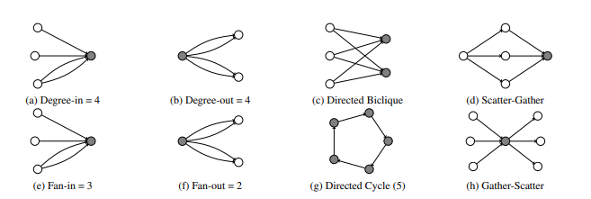
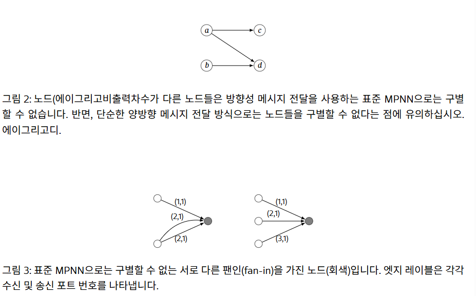
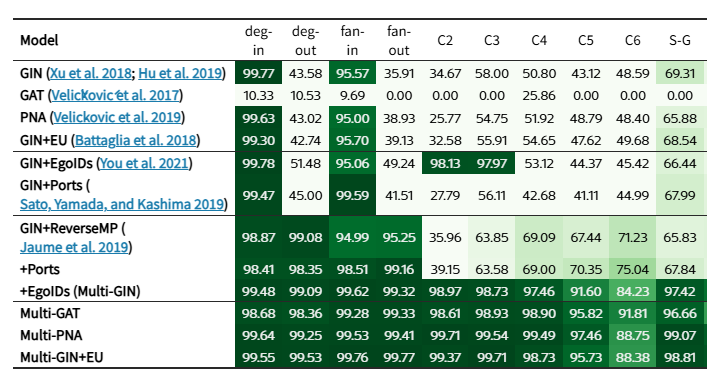
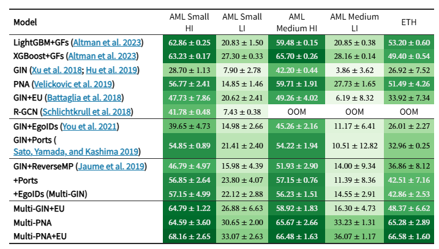

# Provably Powerful Graph Neural Networks for Directed Multigraphs

코드 : [IBM/Multi-GNN](https://github.com/ibm/multi-gnn)
주요 내용: 방향 멀티그래프에서 패턴 탐지 가능한 GNN(reverse MP, ego ID, 포트)

첫째, 금융 거래 네트워크는 실제로 방향성 다중 그래프이다. 즉, 에지(또는 거래)는 방향을 가지며, 두 노드(또는 계정) 사이에 여러 개의 에지가 존재할 수 있다. 
둘째, 대부분의 GNN은 사이클과 같은 일부 부분 그래프 패턴을 감지할 수 없습니다 

본 논문은 이러한 두 가지 문제를 모두 다룬다. 필자가 아는 한, 이는 방향성 다중 그래프를 위해 특별히 설계된 최초의 GNN 아키텍처이다. 
둘째, 제안된 아키텍처가 방향성 다중 그래프에서 모든 부분 그래프 패턴을 이론적으로 감지할 수 있음을 먼저 증명하고, 그림1 에 나타낸 패턴을 감지할 수 있음을 실험적으로 확인한다. 제안된 아키텍처는 모든 표준 GNN 아키텍처를 방향성 다중 그래프 GNN으로 변환할 수 있는 일련의 간단한 적응을 기반으로 한다.

> 그림 1:자금세탁 패턴. 회색으로 채워진 부분은 합성 패턴 탐지 작업에서 탐지될 노드를 나타냅니다. 여기에 표시된 정확한 차수/팬 패턴 크기는 설명 목적으로만 사용되었습니다.

본 논문의 기여는 다음과 같다.
1. 메시지 전달 방식의 GNN을 강력한 방향성 다중 그래프 신경망으로 변환할 수 있는 간단하고 직관적인 일련의 적응 기법을 제안합니다.
2. 에고 ID, 포트 번호 지정, 역방향 메시지 전달 기능을 갖춘 충분히 강력한 GNN이 모든 방향성 부분 그래프 패턴을 식별할 수 있음을 증명합니다. 
3. 합성 그래프를 사용하여 이론을 검증한 결과, 이러한 적응 기법을 사용하는 GNN이 최대 6 길이의 방향성 순환, 산포-모집 패턴, 방향성 이중 클리크를 포함한 다양한 부분 그래프 패턴을 탐지할 수 있음을 확인하여 기존 GNN 아키텍처와 차별화되는 성능을 보여줍니다.
4. 이러한 개선 사항은 두 가지 금융 데이터셋에서 상당한 성능 향상으로 이어집니다. 자금 세탁 및 피싱 데이터셋에서 GNN의 성능이 크게 향상되어 시뮬레이션 데이터와 실제 데이터 모두에서 최첨단 금융 범죄 탐지 모델과 동등하거나 그 이상의 성능을 보여줍니다.

## 2. 관련 작업

그럼 WL의 한계를 뛰어 넘을려고 뭘했나?

### 2.1 k-WL (기계 자체를 세게 만들기)
WL이 노드 하나씩 색을 칠한다면, k-WL은 노드 k개 묶음(쌍, 삼중쌍…)에 색을 칠하고 묶음끼리 메시지를 주고받는다. 훨씬 많이 구분하지만 노드 n개면 묶음이 n^k개라 메모리와 시간이 폭발함. 계좌 220만 개면 쌍만 해도 4조 개니까 우리 규모에선 아예 불가능이고, 논문이 "impractical"이라고 한 줄로 치우는 이유가 이거다.

### 2.2 GNN이 스스로 못 구하는 걸 미리 계산해서 피처로 넣어주기
GNN은 건드리지 않고 입력에 힌트를 얹는 싼 방법으로 종류가 네 가지로 나온다. 
서브그래프 카운트는 고전 알고리즘으로 "이 노드가 삼각형 몇 개에 속하나" 같은 걸 세서 피처로 넣는 것(우리 베이스라인인 GFP+LightGBM이 이 정신이야). 위치 임베딩은 노드가 그래프 어디쯤 있는지 좌표 같은 걸 주는 것. 랜덤 ID는 노드마다 아무 숫자나 명찰로 붙여주는 것인데, 이러면 "돌아온 메시지가 내 것인지" 문제가 풀린다. 다만 학습할 때 본 숫자를 외워버려서 일반화가 흔들리는 대가가 있다. 노드 ID도 비슷한데. 이 논문의 port numbering이 바로 이거다. 엣지에 미리 번호를 계산해서 붙이는 거니까.

### 2.3 그래프 하나를 여러 서브그래프 묶음으로 보기 (Subgraph GNN)
전체 그래프에 GNN을 한 번 돌리는 대신, 그래프를 조금씩 다르게 잘라서 여러 번 돌리고 그 차이에서 정보를 얻는 방식. Papp et al.은 노드를 무작위로 몇 개 빼고 돌리기를 반복(DropGNN). 육각형에서 노드 하나를 빼면 길이 5짜리 길이 남고, 삼각형 둘에서 빼면 삼각형 하나와 짧은 길이 남으니까 여러 번 찍어보면 구분이 돼. Zhang & Li는 노드마다 주변 서브그래프를 잘라내서 그 안에서 GNN을 돌려. ID-GNN은 그 서브그래프의 중심 노드에 "나야" 표시를 붙이는 방식이고, 이게 이 논문이 가져다 쓰는 ego ID이다.

다만 ID-GNN 논문은 "우리는 사이클을 셀 수 있다"고 주장했는데 그 증명이 틀렸고, Huang et al.이 전체가 길이 5 이상 사이클은 못 센다는 걸 보임. 그래서 중심 노드 하나 대신 "중심 + 이웃 하나"까지 두 개를 표시하는 I²-GNN을 내서 길이 6까지 세게 만들었고. 여기서 "센다(count)"는 "이 노드를 지나는 길이 k 사이클이 몇 개인가"고, "찾는다(detect)"는 "하나라도 있는가"라서 서로 다른 요구야.

## 3. 배경 (Background)

### 3.1 그래프와 금융 거래 그래프

**그래프 정의**
- 방향 다중그래프(directed multigraph) G를 다룬다.
- 노드 v ∈ V(G) = 계좌, 방향 엣지 e = (u, v) ∈ E(G) = u가 v에게 보낸 거래.
- 노드 피처 h⁽⁰⁾(u): 선택 사항. 계좌번호, 은행 ID, 잔액 등.
- 엣지 피처 h⁽⁰⁾(u, v): 금액, 통화, 타임스탬프 등.
- N_in(u) = u에게 돈을 보낸 계좌들, N_out(u) = u가 돈을 보낸 계좌들.
- 같은 두 계좌 사이에 거래가 여러 건 있을 수 있음 → 그래서 "다중"그래프.
- 예측 과제: 노드(계좌) 또는 엣지(거래)마다 불법 여부 이진 라벨.
- → 우리 기준: 노드 = accounts, 엣지 = Trans.csv 한 행, 엣지 피처 = 금액·통화·시각·결제수단, 라벨 = Is Laundering. 공개 코드(Multi-GNN)는 계좌 피처 없이 상수 1만 넣는 걸로 기억함(돌릴 때 확인).

**금융 범죄 패턴 (Fig. 1)**
- 자금세탁을 시사하는 서브그래프 모양들: degree-in/out, fan-in/out, cycle, scatter-gather, gather-scatter, bipartite(biclique) 계열.
- 문제: 이 모양들은 너무 일반적이라 정상 거래에도 흔하게 나타남.
- 따라서 패턴 하나를 찾는 게 아니라 "패턴들의 조합"을 학습해야 함 → 신경망이 적합한 이유.
- 그런데 표준 MPNN은 이 패턴들을 degree-in 빼고는 못 잡음 → 4장에서 이를 고치는 장치들을 소개.
- → 우리 기준: degree-in만 되는 이유는 sum aggregation이 "들어온 엣지 수"는 셀 수 있기 때문. degree-out은 역방향이 없어서, fan-in은 다중 엣지 때문에("상대 몇 명"이 아니라 "엣지 몇 개"만 셈), cycle은 정체성이 없어서 못 잡음.

**서브그래프 탐지(subgraph detection)의 정의**
- 패턴 H가 주어졌을 때, 각 노드 v에 대해 "v가 H와 같은 모양(동형, ≅)인 서브그래프에 속하는가"를 판정하는 것.
- 형식적으로: E(G') ⊆ E(G), V(G') ⊆ V(G)인 G'가 존재해서 v ∈ V(G')이고 G' ≅ H이면 예.
- → 주의: 엣지의 "부분집합"이면 되므로, 패턴 주변에 다른 엣지가 더 있어도 상관없음(induced subgraph가 아님). 또 "존재 여부"만 묻지 "몇 개"인지는 묻지 않음(detect ≠ count).

### 3.2 메시지 패싱 신경망 (MPNN)

- GCN, GIN, GAT, GraphSAGE 등 대부분의 GNN이 이 틀에 속함.
- 한 층(layer) = 세 단계
  1. Message: 각 노드가 현재 상태 h(v)를 이웃에게 보냄
  2. Aggregate: 받은 메시지들을 하나로 합쳐 a(v)를 만듦
  3. Update: h(v)와 a(v)로 새 상태를 만듦
- 층을 반복하면 점점 먼 노드의 정보가 들어옴 (L층 = L-hop).

**수식**
- a⁽ᵗ⁾(v) = Agg({ h⁽ᵗ⁻¹⁾(u) | u ∈ N(v) })
- h⁽ᵗ⁾(v) = Update(h⁽ᵗ⁻¹⁾(v), a⁽ᵗ⁾(v))
- 기호: h⁽ᵗ⁾(v) = t층 지난 뒤 v의 상태(임베딩), a⁽ᵗ⁾(v) = t층에서 모은 이웃 정보.
- {{ }} = 멀티셋: 순서는 없지만 중복은 허용하는 집합. 논문은 편의상 { }로 씀.
- Agg는 순서 불변(permutation-invariant) 함수여야 함 = 이웃 순서를 바꿔도 결과가 같아야 함 (sum, mean, max 등).

**방향 그래프에서**
- 메시지는 엣지 방향대로만 흐름. 즉 표준 MPNN은 "들어오는 이웃"만 모음:
  a⁽ᵗ⁾(v) = Agg({ h⁽ᵗ⁻¹⁾(u) | u ∈ N_in(v) })
- → 이게 뒤에서 reverse MP가 필요해지는 출발점. 보내는 쪽 u는 자기 N_out 소식을 전혀 못 들음.

**엣지 피처를 쓸 때**
- 메시지를 (이웃 상태, 그 엣지의 피처) 쌍으로 묶어서 모음:
  a⁽ᵗ⁾(v) = Agg({ (h⁽ᵗ⁻¹⁾(u), h⁽⁰⁾(u, v)) | u ∈ N_in(v) })
- 이후 수식에서는 간결하게 엣지 피처를 생략하고 씀.
- → 우리 기준: 거래 금액·시각이 여기로 들어감. 뒤에 나올 port number도 결국 h⁽⁰⁾(u, v)에 열 하나 더 붙이는 방식.

## 4. 방법 (Methods)

- 표준 MPNN에 붙이는 "간단한 장치" 세 개를 소개. Fig. 1 패턴을 쉬운 것부터 어려운 것 순으로 하나씩 잡을 수 있게 함.
- 장치마다 이론(명제/정리)으로 근거를 대고, 7.1절 합성 데이터 실험으로 확인.
- 순서: reverse MP (degree-out) → port numbering (fan-in/out) → ego ID (cycle, scatter-gather, biclique 등 나머지 전부)

### 4.1 Reverse Message Passing (역방향 메시지 패싱)

**문제**
- 표준 MPNN은 엣지 방향대로만 메시지가 가므로, 노드는 자기가 돈을 보낸 상대(N_out)에게서 아무 메시지도 못 받음 → 자기 out-edge 수를 셀 수 없음.
- Fig. 2: out-degree가 다른 노드 a와 b를 표준 MPNN은 구분 못 함.
- 엣지를 그냥 무방향으로 만들어 양쪽으로 흘리는 "naive bidirectional"도 해결이 아님. 이번엔 들어온 엣지와 나간 엣지를 구분 못 해서 a와 d(방향만 다른 노드)를 구분 못 함.

**해결**
- 들어오는 엣지용 aggregation과 나가는 엣지용 aggregation을 따로 둔다 (가중치도 별도).
- 엣지 타입이 2개(정방향, 역방향)인 relational GNN(R-GCN 계열)과 같은 구조.
- 수식:
  a_in⁽ᵗ⁾(v)  = Agg_in({ h⁽ᵗ⁻¹⁾(u) | u ∈ N_in(v) })
  a_out⁽ᵗ⁾(v) = Agg_out({ h⁽ᵗ⁻¹⁾(u) | u ∈ N_out(v) })
  h⁽ᵗ⁾(v) = Update(h⁽ᵗ⁻¹⁾(v), a_in⁽ᵗ⁾(v), a_out⁽ᵗ⁾(v))
- **명제 4.1**: sum aggregation + reverse MP를 쓰는 MPNN은 degree-out을 풀 수 있다. (sum이면 나간 엣지 수가 그대로 세어짐)
- → 우리 기준: 우리 소규모 코드는 src→dst 한 방향뿐이라 fan-out을 src 쪽에서 못 봄. 고칠 때 edge_index를 뒤집어서 그냥 이어 붙이면 논문이 경고한 naive bidirectional이 됨. Multi-GNN 코드는 `--reverse_mp`로 HeteroData('to', 'rev_to' 두 엣지 타입) + `to_hetero`로 방향별 가중치를 분리함. 이 방식을 따라야 함.

### 4.2 Directed Multigraph Port Numbering (방향 다중그래프 포트 번호)

**문제**
- 같은 계좌에 여러 번 송금 = 평행 엣지. fan-in/out을 잡으려면 "같은 상대에게서 온 엣지들"과 "다른 상대에게서 온 엣지들"을 구분해야 함.
- 계좌번호(노드 ID)를 피처로 넣으면 구분은 되지만 일반화가 안 됨. 학습 때 불법 계좌번호를 외워버리고, 처음 보는 계좌에는 못 씀.

**해결: 포트 번호**
- Sato et al. (2019)의 port numbering을 방향 다중그래프용으로 고침.
- 포트 번호 = 각 노드가 자기 이웃들에게 붙이는 "로컬 번호". 전역 ID가 아니라 노드마다 0, 1, 2… 새로 매김.
- 각 방향 엣지에 incoming port와 outgoing port를 하나씩 부여. 같은 노드에서 오는(가는) 엣지들은 같은 incoming(outgoing) 포트 번호를 받음.
- 원래 Sato 방식과 다른 점: 엣지 양 끝의 포트 번호를 둘 다 메시지에 붙임. 즉 노드는 "내가 이웃에게 붙인 번호"와 "이웃이 나에게 붙인 번호"를 모두 봄. 이게 뒤 정리(4.4)의 핵심.
- 주의: 포트 번호만으로는 3-cycle조차 못 잡는 경우가 있음 (Garg et al. 2020) → 그래서 ego ID가 필요.

**번호 매기는 순서**
- 원래 포트 배정은 임의적(이웃 d명이면 d!가지). 논문은 타임스탬프로 이웃을 정렬해 순서를 정함. 평행 엣지는 가장 이른 거래 시각 기준.
- 금융에서는 시각이 의미가 있으므로 이 선택이 자연스러움. 같은 모양이라도 시각이 다르면 의미가 다를 수 있음.
- 비용: 엣지 정렬 O(m log m). 미리 계산해 두면 학습·추론 시간은 영향 없음.
- 결과: 엣지마다 (incoming port, outgoing port) 두 값을 엣지 피처로 추가. Fig. 3 참고 (회색 노드들은 degree-in은 같지만 fan-in이 다른 경우).
- 증명 자체는 타임스탬프에 의존하지 않음. 다만 타임스탬프가 포트를 유일하게 정해 주면 GNN의 순서 불변성이 유지됨.

**명제**
- **명제 4.2**: max aggregation + multigraph port numbering을 쓰는 MPNN은 fan-in을 풀 수 있다.
- **명제 4.3**: 여기에 reverse MP를 더하면 fan-out도 풀 수 있다.
- → 왜 max인가: 서로 다른 상대에게 0, 1, …, k−1 번호가 붙으므로 incoming port의 최댓값 + 1 = 서로 다른 송금자 수. 평행 엣지가 몇 개든 같은 번호라 중복으로 안 셈.
- → 우리 기준: 코드에서는 `--ports`. 노드별로 이웃을 첫 거래 시각순으로 정렬해 고유 이웃 인덱스를 포트로 쓰고, in/out 두 열을 edge_attr에 붙임. 포트는 "그 그래프 안에서" 정해지므로 시간창을 잘라 그래프를 만들면 창마다 다시 계산해야 함(싸니까 문제 없음).

### 4.3 Ego IDs

**문제**
- reverse MP + 포트 번호로도 directed cycle, scatter-gather, directed biclique는 못 잡음.
- You et al. (2021, ID-GNN)의 ego ID: "중심" 노드에 이진 피처(1)로 표시를 해 두면, 메시지가 한 바퀴 돌아 자기에게 오는 걸 알아채서 자기가 속한 cycle을 잡는다는 아이디어.
- 그런데 그 논문의 명제 2 증명이 틀림. ego ID만으로는 cycle 탐지가 안 됨 (반례: 부록 Fig. 6). Huang et al.: "walk와 path를 혼동했다".
- Table 1에서도 확인됨: GIN + ego ID는 짧은 cycle은 잘 잡지만 긴 cycle에는 도움이 안 됨.
- 이유: self-loop가 없으면 길이 2, 3짜리 "돌아오는 walk"는 중간 노드가 반복될 수 없으므로 곧 cycle임 → 2-, 3-cycle에서는 ID-GNN 주장이 맞음. 길이 4부터는 a→b→a→b→a처럼 왔다갔다 하는 walk가 cycle로 오인됨.
- → 우리 기준: walk = 노드를 다시 밟아도 되는 경로, path/cycle = 다시 안 밟는 경로. "표시가 돌아왔다"는 walk가 닫혔다는 것이지 cycle이 있다는 뜻이 아님.

**해결: 세 장치의 조합**
- ego ID + reverse MP + 포트 번호를 같이 쓰면 cycle, scatter-gather, bipartite까지 전부 잡을 수 있음 → Fig. 1 목록 완성.
- 더 강하게: 이 세 장치를 단 충분히 강한 MPNN은 서로 다른 모양(비동형)의 (서브)그래프는 다르게, 같은 모양은 (포트 번호를 일관되게 매기면) 같게 구분함 = "universal".
- 증명의 핵심: 세 장치로 ego 노드 주변의 모든 노드에 유일한 ID를 붙일 수 있음. 유일한 노드 ID가 있으면 충분히 강한 MPNN은 universal이라는 기존 결과(Loukas 2019, Abboud 2020)에 연결.
- **정리 4.4**: ego ID + 포트 번호 + reverse MP로 연결된 방향 다중그래프의 노드들에 유일한 ID를 부여할 수 있다. (GNN이 ID 부여 알고리즘을 흉내 낼 수 있음을 보임, 부록 B)
- **따름정리 4.4.1**: GIN + ego ID + 포트 번호 + reverse MP는 이론상 어떤 방향 서브그래프 패턴이든 탐지할 수 있다.
- **정리 4.5 / 따름정리 4.5.1**: 무방향 그래프 버전. reverse MP는 방향 처리용이라 빠져도 됨.
- 엣지 양 끝 포트 번호를 둘 다 넘기는 게 유일 ID 부여에 필수 (부록 Fig. 5). Sato 원래 방식으로는 부족.
- Table 1 ablation: 세 장치 조합이 모든 패턴에서 높은 점수.
- → 우리 기준 (읽을 때 주의): "이론상 잡을 수 있다"는 표현력(capacity) 얘기지 "학습이 잘 된다"가 아님. 실제 성능은 층 수·데이터·클래스 불균형에 달림. 또 ID 부여는 ego 노드 "주변"에서 되므로, 층 수 L이 곧 볼 수 있는 패턴 크기의 한계(2층이면 시드 거래에서 2-hop 안).
- → 우리 기준 (엣지 분류에서 ego가 누구냐): 코드의 `AddEgoIds`는 미니배치의 시드 엣지(채점 대상 거래) 양 끝 노드에 1을 붙임. 즉 "이 거래의 두 계좌"가 중심. 한 배치 안의 시드 엣지 끝점이 전부 표시되므로 이론의 "ego 하나"를 배치 단위로 근사한 것.

### 4.4 복잡도·실행 시간

- 최종 복잡도는 베이스 GNN(GIN, PNA 등)이 결정.
- 장치들이 추가하는 비용: 실행 시간에 상수 배 + 한 번짜리 전처리 O(m log m)(포트 번호 정렬).
- 실제 측정치는 부록 F.5 (AML Small HI, GIN).
- → 우리 기준: HI-Large(1.8억 엣지)에서도 포트 계산은 정렬 한 번이라 감당 가능. 진짜 병목은 reverse MP로 엣지 타입이 2배가 되는 메시지 패싱과 이웃 샘플링 쪽.

## 5. 데이터셋 (Datasets)

### 합성 패턴 탐지 과제 (Synthetic Pattern Detection)

- Fig. 1의 AML 패턴들로 "통제 가능한 실험대"를 만든 것. 4장 이론이 실제로 맞는지 확인하는 용도.
- 설계 원칙: 패턴이 그래프 안에서 **저절로(무작위로) 생겨야** 하고, 나중에 억지로 끼워 넣으면 안 됨.
- 끼워 넣기의 문제 두 가지
  1. 분포가 왜곡됨. degree 같은 단순 지표만으로 대충 풀려 버림. 극단 예: 모든 노드가 degree k인 랜덤 그래프에 패턴을 삽입하면 "degree > k"만 보면 패턴 노드가 나옴 → 모델이 구조를 배운 게 아님.
  2. 삽입한 패턴에만 라벨을 달면, 우연히 생긴 진짜 패턴은 라벨이 없어서 무시됨(라벨 노이즈).
- 그래서 random circulant graph generator를 새로 만듦 (부록 D.1).
- 과제 목록: degree-in/out(들어온/나간 엣지 수), fan-in/out(서로 다른 이웃 수), scatter-gather, directed biclique, 길이 6까지의 directed cycle (부록 D.2).
- → 우리 기준: degree와 fan의 정의 차이를 여기서 확정. degree = 엣지 개수, fan = 상대 계좌 수. 평행 엣지가 있으면 둘이 달라짐.
- → 우리 기준: "삽입된 패턴은 단순 지표로 풀린다"는 경고는 AMLworld에도 그대로 적용됨. 세탁 attempt도 생성기가 삽입한 것이므로, 모델이 구조가 아니라 삽입 흔적(금액·통화·결제수단 분포 등)을 배우고 있지 않은지 EDA/feature ablation으로 확인할 것.

### 자금세탁 방지 (AML)

- 금융 데이터는 규제 때문에 실제 데이터를 못 구함 → 시뮬레이션 데이터 사용 (Altman et al. 2023 = AMLworld).
- 시뮬레이터: 가상 세계에 은행·기업·개인 에이전트를 두고 거래망을 생성하고, 알려진 세탁 패턴으로 불법 거래를 추가.
- Small 2개 + Medium 2개. HI = 불법 비율 높음, LI = 낮음. 크기·비율은 부록 Table 4.
- 분할: 거래를 타임스탬프순으로 정렬한 뒤 60/20/20 시간순 train/val/test. 세부는 부록 E.
- → 우리 기준: 논문은 Large는 안 돌림. HI-Large는 논문이 쓴 가장 큰 Medium보다 5배 이상 크므로 하이퍼파라미터(이웃 샘플링 수, 배치)는 그대로 못 가져옴.
- → 우리 기준: 공개 코드는 날짜 단위로 자름(하루 전체가 한 split에 속함). train 그래프 = train 엣지만, val 그래프 = train+val 엣지, test 그래프 = 전체 엣지, 채점은 새 구간 엣지만. 우리 "슬라이딩 창 + 오늘 엣지만 감독" 설계의 원형이 이것.

### 이더리움 피싱 탐지 (ETH)

- 실제 데이터를 쓰기 위해 암호화폐로 감. Kaggle의 이더리움 거래망 (Chen et al. 2019a), 일부 노드가 피싱 계좌로 라벨됨.
- 노드 분류 과제. 시간순 분할이되 이번엔 노드를 자름. 불법 계좌가 뒤쪽에 몰려 있어 65/15/20 사용.
- → 우리 기준: 우리는 엣지(거래) 분류라 직접 비교 대상은 아님. "실제 데이터에서도 장치가 통한다"는 근거로만 보면 됨.

### 실제 방향 그래프 벤치마크

- Chameleon, Squirrel, Arxiv-Year 세 개 방향 그래프에서 SOTA(Rusch et al. 2022)와 비교. 결과는 부록 G.
- → 우리 기준: 범용성 주장용. 건너뛰어도 됨.

## 6. 실험 설정 (Experimental Setup)

### 베이스 GNN과 비교 대상

**베이스 모델 (여기에 장치를 얹음)**
- 주 베이스: 엣지 피처를 쓰는 GIN (Hu et al. 2019, PyG의 GINEConv에 해당). 장치 세 개를 얹은 버전이 Multi-GIN.
- GAT, PNA도 베이스로 사용 → Multi-GAT, Multi-PNA.
- 장치를 안 얹은 GIN, GAT, PNA 자체가 1차 비교 대상(baseline).

**기존 연구와의 대응**
- GIN + ego ID ≈ ID-GNN (You et al. 2021) baseline
- GIN + port numbering ≈ CPNGNN (Sato et al. 2019) baseline
- R-GCN (Schlichtkrull et al. 2018)도 baseline. (reverse MP가 "엣지 타입 2개짜리 R-GCN"과 같다는 4.1절 언급과 연결)

**엣지 분류용 baseline: GIN+EU (Edge Updates)**
- AML은 엣지 분류이므로 엣지 자체의 상태를 층마다 갱신하는 edge update (Battaglia et al. 2018)를 추가한 GIN+EU를 넣음.
- 엣지를 노드로 바꿔 돌리는 line graph 방식과 비슷하고, 그 방식이 자기지도 세탁 탐지에서 SOTA를 냈음 (Cardoso et al. 2022).
- → 우리 기준: 보통 MPNN에서 엣지는 노드 갱신에 재료로만 쓰이고 자기 임베딩은 초기 피처 그대로임. 거래를 분류하려면 거래 임베딩이 층을 지나며 발전해야 하므로, 층마다 (src 임베딩, dst 임베딩, 이전 엣지 임베딩) → MLP → 새 엣지 임베딩으로 갱신하는 게 EU. 코드에서는 `--emlps`. 우리 엣지 분류 파이프라인에도 사실상 필수 부품.

**다른 GNN을 더 안 넣은 이유**
- 장치 없이는 어떤 GNN도 방향 다중그래프를 제대로 못 다루므로 폭넓은 비교는 의미가 적다고 봄. "더 표현력 있는" GNN 몇 개 결과는 부록 H.1.

**트리 모델 baseline (GF + XGBoost / LightGBM)**
- 금융 범죄 탐지의 다른 큰 흐름: 그래프 기반 피처(GF)를 미리 계산해 원본 피처와 합친 뒤, 트리 모델로 엣지(노드)를 개별 분류.
- XGBoost, LightGBM 사용. 금융 응용에서 SOTA를 낸 방식 (Weber et al. 2019; Lo et al. 2022).
- → 우리 기준: 이게 우리 팀의 "GNN 임베딩 + LightGBM" 후보와 가장 가까운 비교 대상. 여기서 GF는 학습된 임베딩이 아니라 degree·fan-in/out·cycle 개수 같은 수작업 그래프 통계(IBM의 Graph Feature Preprocessor 계열). 7장 결과 볼 때 이 baseline이 얼마나 강한지가 우리 설계 결정에 직결됨.

**이웃 샘플링**
- AML·ETH는 커서 모든 GNN에 neighborhood sampling (GraphSAGE 방식) 적용. 세부 수치는 부록 F.
- → 우리 기준: 시드 거래마다 전체 이웃 대신 hop별로 정해진 수만 뽑아 미니배치를 만드는 것. 코드는 PyG `LinkNeighborLoader`, 다른 세션 메모대로 1-hop 100·2-hop 100. HI-Large에서는 이 숫자와 배치 크기가 메모리를 결정함.

### 평가 지표 (Scoring)

- 데이터가 극도로 불균형이라 accuracy 등은 부적합 → **소수 클래스(불법) F1**을 사용. 은행·규제기관 관행과도 맞음.
- → 우리 기준: 우리 팀의 AP 0.63과는 다른 지표라 직접 비교 불가. F1은 임계값을 정해야 나오고 AP는 임계값과 무관. 논문 코드는 2-클래스 출력의 argmax(= 0.5 컷)에 클래스 가중 CE로 불균형을 보정해 F1을 냄. 논문 수치와 비교하려면 우리도 minority F1을 같은 방식으로 뽑아야 함.
- → 생각해볼 점: 명제 4.2는 fan-in에 max aggregation을 요구하는데 GIN은 sum만 씀. PNA는 mean/max/min/std를 같이 쓰므로 7장에서 Multi-PNA가 Multi-GIN보다 잘 나오면 이게 한 가지 설명 후보(논문이 명시한 건 아님).

## 7. 결과 (Results)

### 7.1 합성 패턴 탐지 결과 (Table 1)

**장치 하나짜리 과제 — 명제 4.1~4.3 확인**
- degree-out: 표준 MPNN은 전부 실패 (F1 < 44%). reverse MP를 단 모델은 전부 98% 이상 → 명제 4.1 확인.
- fan-in: 포트 번호가 결정적 장치. 다만 장치 없는 GIN도 이미 꽤 높음.
- fan-out: reverse MP + 포트 번호를 둘 다 써야 99% 이상 → 명제 4.2, 4.3 확인.
- → 우리 기준 (해석): fan-in에서 기본 GIN이 높은 이유는 sum이 degree-in을 세고, 평행 엣지가 드문 곳에선 degree-in ≈ fan-in이기 때문. 포트는 "같은 상대와 여러 번 거래"가 많은 경우에만 차이를 만듦. 실제 거래망은 그런 경우가 많으므로 우리에겐 합성보다 더 중요할 수 있음.

**장치 셋 조합 — 따름정리 4.4.1 확인**
- GIN에 장치를 하나씩 누적(reverse MP → 포트 → ego ID)한 ablation: 셋 다 얹으면 모든 하위 과제에서 높은 점수. 6-cycle만 90% 미만.
- 다른 베이스(GAT, PNA)도 같은 경향이고, Multi-PNA가 전체 최고.
- 어려운 과제(directed cycle, scatter-gather, biclique)에서는 셋을 다 합쳤을 때 처음으로 큰 점프가 남.
  - 가장 극단적인 예 scatter-gather: reverse MP + 포트만으로 67.84% → ego ID 추가 시 97.42%.
  - 장치 하나만으로는 어느 것도 근처에 못 감 → "조합"이 필요하다는 증거.
  - 4-, 5-, 6-cycle과 biclique에서도 비슷한 점프.
- 데이터를 키우고 어려운 과제만 따로 학습하면 더 오름. 6-cycle도 97% 이상 (부록 H.2).
- → 우리 기준: 4.3절의 "ego ID는 나머지 둘과 합쳐질 때만 cycle 이상을 푼다"가 숫자로 나온 것. 우리 실험에서 장치를 하나씩만 붙여 보고 "효과 없다"고 결론 내리면 안 됨. ablation은 논문처럼 누적 순서로.
- → 우리 기준: 합성 과제 목록에 gather-scatter는 없음(scatter-gather만). AMLworld의 gather-scatter는 따름정리 4.4.1로 이론상 커버되지만 합성 실험으로 직접 확인된 건 아님.
- → 우리 기준: 긴 cycle이 어려운 건 표시가 돌아오려면 층 수가 cycle 길이 이상이어야 하고, 길수록 cycle로 오인될 walk도 많아지기 때문. 우리 2층 모델은 짧은 구조 위주로 본다는 뜻.

**추가 ablation — 랜덤 노드 ID는 대체재가 못 됨**
- 노드마다 랜덤한 고유 ID를 피처로 넣어 다시 돌려 봄. 이론상(Loukas 2019)으로는 고유 ID만 있으면 universal이지만, 실제로는 포트 번호와 ego ID를 대체하지 못함.
- → 우리 기준: "표현력이 있다"와 "학습이 된다"는 다르다는 4.3절 주의사항의 실증. 랜덤 ID는 값 자체에 의미가 없어서 모델이 그 값에 불변하도록 배우기 어렵고, 포트·ego ID는 로컬하고 일관된 구조 정보라 배우기 쉬움. 4.2절의 "계좌번호를 넣으면 일반화가 안 된다"와 같은 얘기.

**Table 1 읽는 법**
- 값: 소수 클래스 F1 (%), 5회 평균. 표준편차는 생략됐으므로 1~2점 차이는 노이즈로 보고, 큰 점프만 읽을 것.
- 열 = 과제: degree-in/out, fan-in/out, C2~C6(길이 k directed cycle), S-G(scatter-gather), B-C(biclique). 왼쪽이 쉬운 과제, 오른쪽으로 갈수록 어려움.
- 행 = 4개 블록
  1. 표준 MPNN baseline (GIN, GAT, PNA 등): 장치 없음
  2. GIN + 장치 하나씩 따로 (reverse MP만 / 포트만 / ego ID만)
  3. GIN + 장치 누적 (reverse MP → +포트 → +ego ID): 마지막 행이 Multi-GIN
  4. 다른 베이스 + 장치 셋 (Multi-GAT, Multi-PNA)
- 열마다 "어느 행에서 처음 98% 근처로 올라가나"를 보면 됨
  - degree-in: 모든 행이 높음 (표준 MPNN도 됨 → 3장 "degree-in 빼고 못 잡음"의 확인)
  - degree-out: 블록 1은 낮고, reverse MP가 들어간 행부터 높음 (명제 4.1)
  - fan-in: 포트가 들어간 행에서 오름. baseline도 꽤 높음 (명제 4.2)
  - fan-out: 블록 2에서는 어느 행도 안 되고, 블록 3의 "reverse MP + 포트" 행부터 됨 (명제 4.3)
  - C2, C3: ego ID만 넣은 행에서도 높음 → 짧은 cycle에선 ID-GNN 주장이 맞다는 4.3절 설명의 확인
  - C4~C6, S-G, B-C: 블록 2의 어떤 행도 낮고, 블록 3의 마지막 행(셋 다)에서만 점프 → 따름정리 4.4.1. C6는 여기서도 90% 미만
  - 블록 4: Multi-PNA가 대체로 최고

### 7.2 AML 결과 (Table 2)

**표 구조**
- 값: 소수 클래스 F1 (%). 행 배치는 Table 1과 같음(표준 baseline → GIN+장치 하나씩 → GIN 누적 → 다른 베이스+장치 셋). 열은 AML Small/Medium × HI/LI + ETH. OOM = GPU 메모리 부족.

**GIN 기준 효과**
- AML Small HI: GIN 28.7% → 장치 셋 57.2% (약 +28.5%p, 논문 표현으로 "almost 30%").
- 그중 reverse MP + 포트만으로 28.7% → 56.9%. ego ID는 여기서 거의 차이 없음.
- 다른 AML 셋도 같은 경향: GIN 기준 총 +14.2, +14.0, +10.7%p. 장치를 더할수록 증가폭은 줄어듦(diminishing returns).
- 포트 번호: 단독(GIN+Ports)으로도, reverse MP 위에 얹어도(+Ports) 분명한 이득.
- ego ID: 단독으로는 이득이 있지만 reverse MP + 포트 위에서는 유의한 추가 이득 없음.
  - 단, GNN 층을 2개만 썼음. 층을 늘려 긴 cycle을 볼 수 있게 되면 결론이 바뀔 수 있다고 논문이 명시.

**다른 베이스**
- GIN+EU, PNA, PNA+EU에도 장치 셋을 얹으면 거의 모든 AML 셋에서 분명한 이득.
- **Multi-PNA+EU가 모든 AML 셋에서 모든 baseline을 이김.** XGBoost+GF, LightGBM+GF까지 이긴 게 특히 의미 있음 — 그 수작업 피처는 시뮬레이터가 쓰는 세탁 패턴에 딱 맞춰 설계된 것이고, 이전 금융 응용에서 SOTA였기 때문.

**패턴별 recall (부록 I)**
- 세탁 패턴에 속한 불법 거래는 대부분 잡힘.
- 전체 점수는 "패턴에 속하지 않은 단독(lone) 불법 거래" 비율에 크게 좌우됨. 단독 불법 거래는 매우 어려움.

**속도 (부록 Table 5)**
- 장치를 다 얹은 Multi-GIN도 단일 GPU에서 추론 18k 거래/초 이상.

- → 우리 기준: "ego ID가 안 통했다"와 Table 1의 "ego ID가 cycle·S-G에 필수"는 모순이 아님. 2층 모델은 긴 cycle을 원래 못 보고, AML 점수는 fan-in/out·gather-scatter 같은 짧은 구조와 lone 거래에 지배되므로 reverse MP + 포트로 얻을 건 다 얻은 상태. 우리도 2층이면 ego ID는 후순위.
- → 우리 기준: HI-Large에서 Patterns.txt에 속한 불법 거래 vs lone 불법 거래 비율을 먼저 재야 함. 이게 minority F1의 사실상 상한을 정하고, 우리가 논의한 attempt 단위 평가(부록 I 방식의 패턴별 recall)와도 직결.
- → 우리 기준: 18k/초면 HI-Large 1.8억 건 전체 추론이 대략 3시간, 하루치는 훨씬 적으므로 일 배치 추론은 속도 문제 없음. 병목은 학습과 그래프 구성.

### 7.3 ETH 결과

- 실제 데이터(이더리움 피싱 계좌 분류)에서도 장치를 더할수록 일관되게 상승: 26.9% → 42.9%.
- 가장 큰 단일 개선은 여기서도 reverse MP.
- Multi-GIN은 모든 baseline을 이기진 못했지만, Multi-PNA와 Multi-PNA+EU는 모든 baseline을 12%p 이상 앞섬.
- → 우리 기준: 노드 분류라 직접 비교는 아니지만 "시뮬레이션이 아닌 데이터에서도 장치가 통한다"는 근거.

## 8. 결론

- 기여 세 가지
  1. 이론: ego ID + 포트 번호 + reverse MP를 쓰면 GIN 같은 충분히 강한 MPNN이 유일한 노드 ID를 계산할 수 있고, 따라서 어떤 방향 서브그래프 패턴이든 탐지 가능. 여러 장치를 "조합"했을 때의 능력을 분석한 게 기존 문헌의 빈틈.
  2. 합성 과제로 이론 검증: 복잡한 서브그래프에는 셋의 조합이 필요하다는 게 실험과 일치.
  3. 금융 범죄 두 과제(세탁 거래, 피싱 계좌)에 적용해 baseline과 대등하거나 능가.
- 실전에서는 reverse MP와 포트 번호가 결정적이었고, ego ID는 이 데이터셋들에서 추가 이득이 크지 않았음.
- 향후 과제: 다른 방향 다중그래프 문제(부록에 3개 실제 데이터 초기 결과), 서브그래프 탐지 문제의 계산 복잡도와 GNN 성능의 관계.

## 이 논문이 우리 파이프라인에서 바꾸게 하는 것

1. 팀 베이스라인 기준점은 Multi-PNA+EU (속도가 급하면 Multi-GIN+EU). 우선순위는 reverse MP → 포트 번호 → EU이고, ego ID는 층을 3개 이상으로 늘릴 때 다시 검토.
2. reverse MP는 edge_index를 뒤집어 붙이는 게 아니라 방향별 가중치 분리(코드의 HeteroData + to_hetero).
3. 포트 번호는 시간창 그래프를 만들 때마다 전처리로 계산(첫 거래 시각순, 평행 엣지는 같은 번호). 비용은 정렬 한 번.
4. 분할·채점은 시간순 + 과거 그래프는 문맥 + 새 엣지만 채점. 지금 팀의 일 단위 노드·엣지 재생성과 다름.
5. 지표는 minority F1(논문과 비교용) + 패턴별 recall(부록 I) + lone 불법 거래 비율. AP 0.63은 이 표와 직접 비교 불가.
6. GF+LightGBM 베이스라인은 유지. 논문에서도 GNN이 겨우 이긴 강한 상대라, "GNN 임베딩 + LightGBM" 후보를 검토할 때 비교 기준이 됨.

### 용어 정리

**MPNN (Message Passing Neural Network) - 메시지 전달형 신경망**
GCN, GraphSAGE, GAT, GIN, PNA 전부 이 틀 안에 있다. 노드마다 벡터(임베딩) 하나를 두고, 층마다 같은 일을 반복한다. 
이웃들이 자기 벡터를 나한테 보내고(message), 받은 것들을 하나로 합치고(aggregate: sum·mean·max 중 하나), 내 벡터와 섞어서 새 벡터로 갱신(update). 층을 L번 쌓으면 L단계 떨어진 노드 정보까지 들어온다. 우리 그래프로 치면 계좌가 노드, 거래가 엣지, 2층이면 "거래 상대의 거래 상대"까지 보는 것임. 
그러니까 논문에서 "표준 MPNN"이라고 하면 "이 세 단계만 하는 보통 GNN"이라는 뜻이고, 이 논문이 붙이는 장치들은 이 틀에 정보를 더 얹는 것이다.

**WL 테스트 (Weisfeiler-Lehman)**
원래는 GNN이랑 상관없는 1968년 알고리즘임. 두 그래프가 같은 모양인지(동형인지) 판별하려고 노드에 색을 칠한다. 처음엔 전부 같은 색. 매 라운드마다 각 노드가 (내 색, 이웃 색들의 목록)을 모아서 그 조합으로 새 색을 배정해(해시). 몇 라운드 돌린 뒤 두 그래프의 색 분포가 다르면 "확실히 다른 그래프" 같으면 "모름"이다. 이 절차가 MPNN이랑 똑같다는게 핵심이다. 색이 임베딩이고, 해시가 신경망일 뿐이다. 그래서 Xu et al.의 결론이 "MPNN은 아무리 잘 만들어도 WL이 구분 못 하는 걸 구분 못 한다"는 것이다.

WL이 못하는 걸 왜 하나 보면 왜 이게 문제인지 보인다. 삼각형 두개(노드 6개)와 육각형 하나(노드 6개)를 비교해보자. 모든 노드가 이웃이 2명이고, 그 이웃들도 이웃이 2명이고, 어느 라우드에서도 모든 색이 같다. 그래서 WL도, 어떤 표준 MPNN도 이 둘을 구분 못하고, 곧 "내가 길이 3짜리 고리 안에 있나 6짜리 고리 안에 있나"를 노드가 알 수 가 없다는 뜻이다. 인용된 Chen et al. 2020이 이걸 일반화해서 "표준 MPNN은 사이클을 셀 수 없다"고 보았고, AML의 cycle 패턴이 정확히 그 경우라서 이 논문이 **ego ID**를 넣는 것이다. 바바이 논문 인용은 "랜덤 그래프는 WL이 거의 다 구분한다, 문제는 규칙적인 구조에서 터진다"는 맥락이고.

**GIN (Graph Isomorphism Network)**
Xu et al.이 "그럼 WL 상한에 실제로 닿는 GNN을 만들자"고 낸 모델. 요점은 두 가지이다. 합칠 때 `sum`을 써야 한다. `mean`이나 `max`는 이웃 {A, A}와 {A}를 같게 보지만 sum은 다르게 보니까 이웃 목록(멀티셋)을 잃지 않아. 그리고 합친 결과를 MLP에 통과시킨다. 식으로는 h_v' = MLP((1+ε)·h_v + Σ_{u∈N(v)} h_u)가 전부야. 이 논문이 GIN을 베이스로 쓰는 이유도 이것이다. "이론상 가장 강한 표준 MPNN조차 fan-out·cycle을 못 잡는다"를 보여준 다음 거기에 세 장치를 얹어야 논지가 깔끔하니까.

정리하면 그 문단은 "GNN의 능력은 WL이라는 자로 잰다, 그 자로 재면 사이클도 못 본다, 그래서 표준을 넘어서는 연구가 나왔다"는 배경 설명이고, 이 논문은 그 연구 중 방향 있는 다중그래프 쪽이다.

**GAT (Graph Attention Network, 2017)**
이웃마다 "얼마나 중요한지" 가중치를 학습해서 가중합을 해. 내 상태와 이웃 상태를 나란히 놓고 작은 신경망으로 점수를 매기고, 그 점수를 softmax로 정규화해서 이웃 임베딩에 곱해 더하는 식이야. Transformer의 attention을 그래프에 옮긴 거라고 보면 돼. 여러 개의 attention head를 병렬로 두는 것도 같아. 우리 상황으로 치면 "이 계좌한테 들어온 200건 중 어떤 거래 상대를 더 주의 깊게 볼지"를 모델이 스스로 정하는 거야. 약점이 하나 있는데, softmax 가중치는 합이 1이라 결국 가중 평균이야. 평균은 "이웃이 몇 명인지"를 잃으니까 WL 관점에서는 sum을 쓰는 GIN보다 약해. 그래서 이 논문에서도 GAT 계열은 보통 GIN·PNA보다 낮게 나와.

**PNA (Principal Neighbourhood Aggregation, 2020)**
"aggregator 하나로는 뭘 써도 정보를 잃는다"에서 출발해. mean은 개수를 잃고, max는 분포를 잃고, sum은 이웃 수에 따라 크기가 폭발해. 그래서 mean·max·min·std를 전부 동시에 계산해서 이어 붙이고, 거기에 이웃 수(log degree)에 따라 값을 키우거나 줄이는 스케일러까지 곱한 뒤 MLP로 넘겨. 무겁지만 셋 중 제일 많은 정보를 보존해서 보통 가장 잘 나오고, 이 논문에서도 Multi-PNA가 최상위야. 4.2절의 명제가 fan-in에 max를 요구했던 거 기억나지? PNA는 max를 기본으로 들고 있어서 그 조건을 자연스럽게 만족해. 참고로 논문이 "Velickovic et al. 2019"로 인용했는데, 보통 Corso et al., NeurIPS 2020으로 알려진 논문이야.
