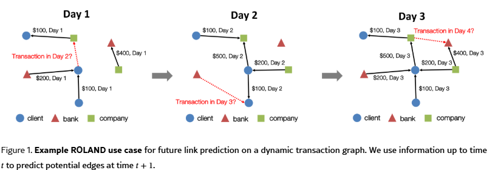
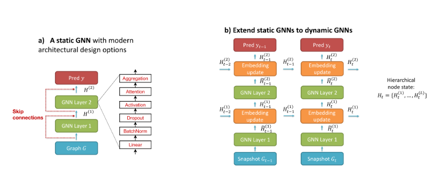
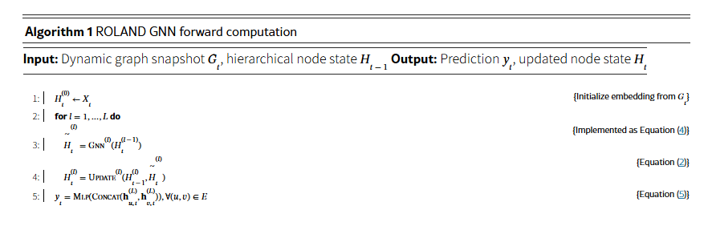
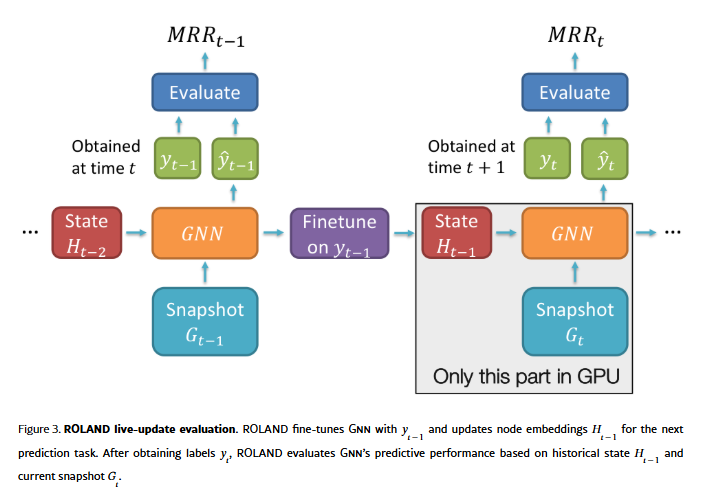
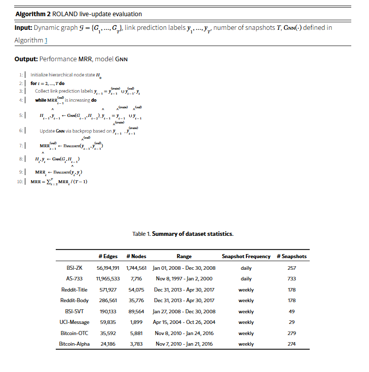
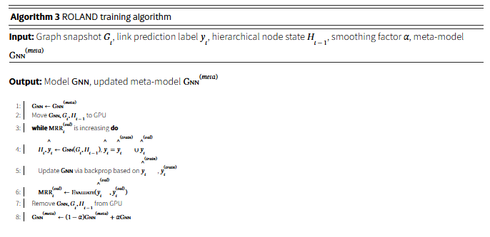
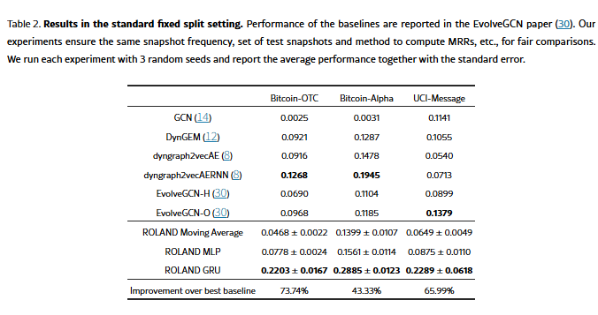
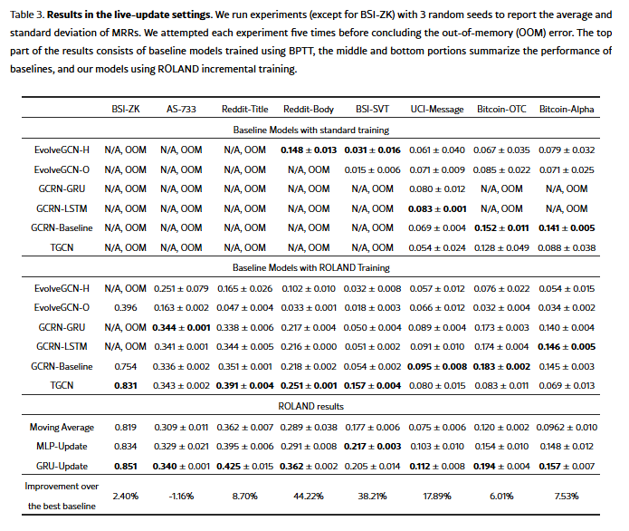
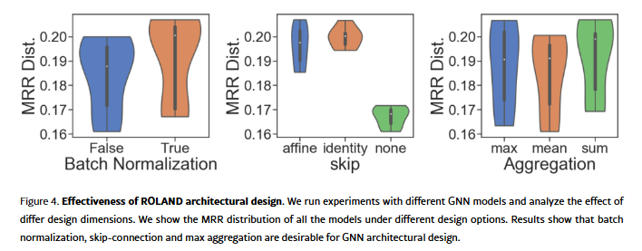
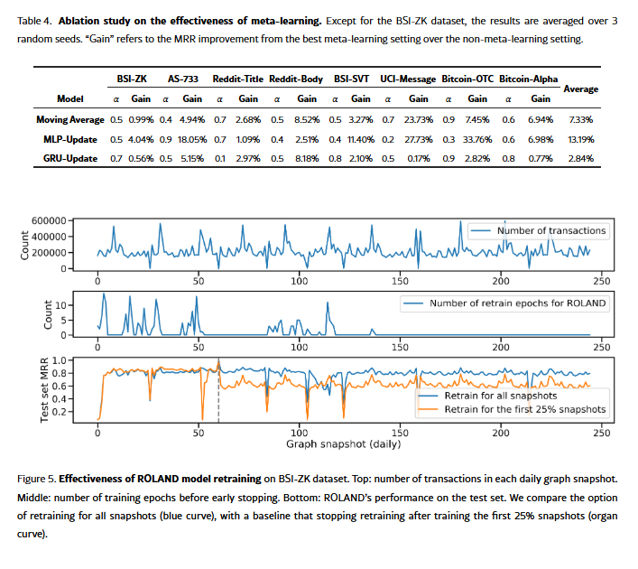

# ROLAND: Graph Learning Framework for Dynamic Graphs
[원문 링크](https://arxiv.org/html/2208.07239v1)

## 추상적인

그래프 신경망(GNN)은 다양한 실제 정적 그래프에 성공적으로 적용되어 왔다. 그러나 정적 그래프에서의 성공이 동적 그래프로 완전히 이어지지는 못했는데, 이는 모델 설계, 평가 설정 및 학습 전략의 한계 때문이다. 구체적으로, 기존의 동적 GNN은 정적 GNN의 최첨단 설계 방식을 반영하지 못하여 성능이 제한적이었다. 또한, 동적 GNN의 현재 평가 설정은 동적 그래프의 변화하는 특성을 충분히 반영하지 못한다. 마지막으로, 동적 GNN에 일반적으로 사용되는 학습 방법은 확장성이 부족하다. 본 논문에서는 실제 동적 그래프에 효과적인 그래프 표현 학습 프레임워크인 ROLAND를 제안한다. 
ROLAND 프레임워크는 연구자들이 기존의 정적 GNN을 동적 그래프에 쉽게 적용할 수 있도록 지원한다. 핵심 아이디어는 GNN의 각 레이어에 있는 노드 임베딩을 계층적 노드 상태로 간주하고 시간에 따라 반복적으로 업데이트하는 것이다. 
또한, GNN이 예측을 수행하고 지속적으로 업데이트되는 실제 사용 사례를 모방한 동적 그래프용 실시간 업데이트 평가 설정을 제안한다. 마지막으로, 본 논문에서는 증분 학습과 메타 학습을 통해 확장 가능하고 효율적인 동적 GNN 학습 접근법을 제안한다. 미래 링크 예측 작업에 대한 8개의 서로 다른 동적 그래프 데이터셋을 사용하여 실험을 수행했다. 
ROLAND 프레임워크를 사용하여 구축된 모델은 세 가지 데이터셋에 대한 표준 평가 설정에서 최첨단 기준 모델 대비 평균 62.7%의 상대적 평균 역순위(MRR) 향상을 달성했습니다. 최첨단 기준 모델은 대규모 데이터셋에서 메모리 부족 오류를 경험하는 반면, ROLAND는 5,600만 개의 엣지를 가진 동적 그래프에서도 쉽게 확장할 수 있음을 확인했다. ROLAND 학습 전략을 사용하여 이러한 기준 모델을 재구현한 후에도 ROLAND 모델은 기준 모델 대비 평균 15.5%의 상대적 MRR 향상을 달성했다.

## 1. 서론 및 관련 연구
동적 네트워크로부터의 학습 문제는 사기 탐지와 같은 다양한 응용 분야에서 발생한다. GNN은 정적 그래프 학습에서 엄청난 성공을 거두었다.동적 그래프를 위한 다양한 GNN이 제안되었지만, 이러한 접근 방식에는 모델 설계, 평가 설정 및 훈련 전략 측면 에서 한계가 있다. 이러한 한계를 극복하는 것은 실제 동적 그래프 응용 프로그램에 매우 중요하다.




### 모델 설계의 한계
기존 접근 방식은 성공적인 정적 GNN설계/아키텍처를 동적 그래프 응용 프로그램으로 이전하는 데 실패한다. 많은 기존 연구에서는 GNN을 특징 인코더로 취급한 다음 GNN 위에 시퀀스 모델을 구축한다. 다른 연구에서는 순환 신경망(RNN)을 사용하고, RNN 셀의 선형 레이어를 그래프 합성곱 레이어로 대체한다. 이러한 접근 방식은 직관적이지만, 정적 GNN의 최첨단 설계를 통합하지 않는다. 예를 들어, 스킵 연결(skip-connections)의 통합이 그렇다. 배치 정규화, 엣지 임베딩 같은 설계 방식은 GNN 메시지 전달에는 유용했지만, 동적 GNN에는 적용되지 않았다. 동적 GNN을 처음부터 구축하는 대신, 기존의 성숙한 정적 GNN 설계를 기반으로 하여 동적 그래프에 적용하느 것이 더 나은 설계 원칙이 될 것이다. 

### 이게 무슨 소리냐?

#### 기존 방식 1: GNN 위에 시퀀스 모델 올리기
동적 그래프를 날짜별 스냅샷으로 나누면 다음과 같다.

```
1일 차 그래프 G₁ → GNN → 노드 임베딩 H₁
2일 차 그래프 G₂ → GNN → 노드 임베딩 H₂
3일 차 그래프 G₃ → GNN → 노드 임베딩 H₃

H₁, H₂, H₃ → RNN/LSTM → 시간 변화 학습
```
여기서 GNN은 각 날짜의 그래프를 벡터로 바꾸는 **특징 추출기(feature encoder)** 역할만 합니다. 시간 변화는 그 위의 RNN이나 LSTM이 담당한다.
문제는 보통 최종 GNN 계층의 임베딩 `H⁽ᴸ⁾`만 시간 모델에 전달한다는 점입니다. 논문 표현대로라면 낮은 계층의 상태들은 다음 스냅샷마다 다시 계산됩니다.

예를 들어 2계층 GNN이라면:
- `H⁽¹⁾`: 직접 연결된 1-hop 이웃 정보
- `H⁽²⁾`: 이웃의 이웃까지 포함한 2-hop 정보
기존 방식은 주로 마지막 `H⁽²⁾`만 시간에 따라 유지하고, `H⁽¹⁾`은 매일 새로 계산합니다. 그러면 각 계층에 담긴 서로 다른 범위의 과거 정보가 충분히 보존되지 않을 수 있습니다

####  기존 방식 2: RNN 내부 연산을 그래프 합성곱으로 교체하기
일반적인 RNN은 대략 다음과 같이 현재 입력과 이전 상태를 결합한다.
```
현재 상태 = RNN(이전 상태, 현재 입력)
```
일부 연구는 RNN 내부의 일반적인 선형변환을 GCN 같은 그래프 합성곱으로 바꿨다.
```
현재 상태 = Graph-RNN(이전 상태, 현재 그래프)
```
아이디어 자체는 자연스럽지만 그래프 연산이 특정 RNN 구조 안에 깊이 묶이기 때문에, 새로운 정적 GNN 구조를 그대로 가져다 쓰기 어렵다.
예를 들어 기존 정적 GNN에 다음 기능이 있다고 해도, 동적 모델의 RNN 셀에 맞게 다시 설계하고 검증해야 한다.
- GAT의 어텐션
- GraphSAGE의 이웃 집계
- skip connection
- batch normalization
- 거래 속성을 반영하는 edge embedding
즉, 정적 GNN 기술과 동적 학습 구조가 잘 분리되어 있지 않다는 문제이다.

#### 정적 GNN의 좋은 설계란
- Skip connection
  - 이전 계층의 노드 표현을 다음 계층에 직접 더해준다.
  - 여러 계층을 통과하면서 원래 정보가 사라지는 것을 줄이고, 깊은 GNN 학습을 안정화한다.
- Batch normalization
  - 계층에서 생성된 값의 분포를 정규화해 학습을 안정시키고 수렴을 돕는다.
- Edge embedding
  - 메시지를 계산할 때 두 노드의 정보만 보지 않고 엣지 정보도 사용한다.
  - 특히 거래 그래프에서는 같은 두 계좌가 연결되어 있더라도 거래 금액과 시점에 따라 의미가 완전히 달라지므로 매우 중요함.

논문의 “동적 GNN에는 적용되지 않았다”는 표현은 이런 기능을 동적 GNN에 넣을 수 없다는 뜻이 아니라, 당시 기존 연구에서 체계적으로 활용되지 않았다는 주장에 가깝다.

#### ROLAND의 해결 방법 
ROLAND는 새로운 동적 GNN을 처음부터 만드는 대신, 잘 만들어진 정적 GNN에 시간 상태 갱신 모듈을 끼워 넣습니다.

각 계층에서 두 단계로 계산합니다.
1. 먼저 현재 시점의 그래프로 새로운 임베딩을 계산하고
2. 그 결과를 이전 시점에 보관했던 동일 계층의 상태와 결합한다.
    - Update에는 다음과 같은 비교적 단순한 방법을 사용할 수 있습니다.
        - 이동평균
        - MLP
        - GRU

#### 자금세탁 그래프로 생각해보기
일별 거래 그래프를 처리한다고 해보자
```
1일 차: A, C → B로 돈이 모임
2일 차: B → D, E, F로 돈이 흩어짐
```

2일 차 그래프만 보면 B → D, E, F라는 fan-out만 보인다. 그러나 B의 이전 노드 상태에 1일 차의 입금 정보가 남아 있다면, 2일 차의 출금 정보와 결합해 여러 날에 걸친 gather-scatter 징후를 표현할 가능성이 생긴다.

계층별로 보면:
```
- 1계층 상태는 B 주변의 직접적인 입출금 변화
- 2계층 상태는 송금자와 수취인의 주변까지 포함한 패턴
- 더 높은 계층은 더 넓은 거래 구조
```
를 시간에 따라 이어받는다.

단, ROLAND가 과거 거래 엣지를 그대로 모두 기억하는 것은 아닙니다. 과거 그래프 정보를 노드 상태 벡터에 압축해 보존하는 방식이다. 따라서 정확한 과거 거래 내역이 필요하다면 슬라이딩 시간창이나 별도의 거래 저장 구조가 여전히 필요합니다.

결국 이 문단은 이런 설계 원칙을 제안하는 부분입니다.

>정적 GNN의 좋은 메시지 전달 구조는 그대로 사용하고, 각 계층의 노드 임베딩을 이전 시점과 결합하는 갱신 모듈만 추가하여 동적 GNN으로 만들자.


### 평가 설정의 한계
동적 GNN을 평가할 때 기존 문헌에서는 데이터와 모델의 진화하는 특성을 간과하는 경우가 많다. 구체적으로, 동적 그래프 데이터셋은 종종 시간 축을 기준으로 확정적으로 분할된다. 예를 들어, 10개월 분량의 데이터가 있는 경우 처음 8개월은 훈련 세트로, 1개월은 검증 세트로, 마지막 1개월은 테스트 세트로 사용된다. 이러한 프로토콜은 사용 가능한 데이터 세트의 마지막 달에 해당하는 엣지만을 사용 하여 모델을 평가하므로 **장기적인 패턴 변화가 존재할 경우 모델 성능을 과대평가하는 경향**이 있습니다. 또한 대부분의 문헌에서는 평가 시점의 기간 내 예측에 업데이트되지 않은 모델을 사용하므로 모델이 시간이 지남에 따라 노후화됩니다. 하지만 실제 응용 프로그램에서는 사용자가 새로운 데이터를 기반으로 모델을 업데이트하고 미래를 예측할 수 있다.


### 훈련 전략의 한계
동적 GNN에 대한 일반적인 훈련 방법은 확장성과 효율성 측면에서 개선될 수 있다. 
첫째, 기존의 동적 GNN 학습 방법 대부분은 그래프 전체 또는 상당 부분을 GPU 메모리에 유지해야 한다. 이는 과거 연결의 전부 또는 상당 부분이 메시지 전달에 사용되기 때문이다. 따라서 동적 GNN은 종종 노드 수가 수백 개에 불과한 소규모 네트워크에서 평가된다. 또는 2백만 개 미만의 엣지를 가진 소규모 거래 그래프 5더욱이 , 동적 GNN이 새로운 데이터에 빠르게 일반화하고 적응하도록 하는 연구는 거의 없다.


**본 연구** 에서는 실제 동적 그래프에 효과적인 그래프 표현 학습 프레임워크인 ROLAND를 제안한다. 특히 노드와 에지가 배치(예 : 일별, 주별)로 유입되는 동적 그래프의 스냅샷 기반 표현에 초점을 맞춘다. ROLAND 프레임워크는 기존의 정적 GNN 모델을 동적 그래프 학습 작업에 적용할 수 있도록 지원하며, 이를 통해 정적 GNN의 최첨단 설계를 동적 그래프 학습에 적용하고 학습 진입 장벽을 크게 낮출 수 있다.

**ROLAND 모델을** 기반으로, 정적 그래프용 GNN은 동적 그래프 사용 사례로 확장될 수 있다는 통찰력을 제시한다. 본 논문에서는 정적 GNN에 대한 새로운 관점을 제안하는데, 여기서는 GNN의 각 레이어에 있는 노드 임베딩을 계층 적 노드 상태 로 간주한다. 정적 GNN을 동적 환경으로 일반화하기 위해서는 새롭게 관찰된 노드와 엣지를 기반으로 이러한 계층적 노드 상태를 업데이트하는 방법만 정의하면 됩니다. 이동 평균, 다층 퍼셉트론(MLP), 게이트 순환 유닛(GRU) 등 다양한 업데이트 모듈을 살펴본다. 이러한 방식으로 동적 GNN을 구축하는 것은 간단하고 효과적이며, 더 중요한 것은 기존의 정적 GNN 설계를 그대로 유지하면서 동적 그래프에 적용할 수 있다는 점입니다.

**ROLAND 평가**를 수행 한 후, 동적 그래프에 대한 실시간 업데이트 평가 환경을 도입한다. 이 환경에서는 GNN(그래핀 신경망)을 사용하여 지속적으로(예 : 일별, 주별) 예측을 수행한다. 각 예측을 수행할 때, 모델이 과거 데이터만을 사용하여 학습되었는지 확인하여 미래 정보가 과거로 유출되지 않도록 한다. 또한, 새로운 그래프 스냅샷을 사용하여 모델을 미세 조정할 수 있도록 하여, 변화하는 데이터에 맞춰 모델이 지속적으로 업데이트되는 실제 사용 사례를 모방한다.

**ROLAND 훈련** 
마지막으로, 동적 GNN을 위한 확장 가능하고 효율적인 훈련 접근 방식을 제안한다. 우리는 시간 역전파(BPTT)의 축소 버전을 수행하는 증분 훈련 전략을 제안한다. 이 기술 은 GPU 메모리 비용을 크게 절감한다. 구체적으로, GPU 메모리에는 새로 들어오는 그래프 스냅샷과 과거 노드 상태만 저장한다. 이 기술을 사용하여 5,600만 개의 엣지를 가진 동적 트랜잭션 네트워크에서 GNN을 학습시킬 수 있는데, 이는 스냅샷당 엣지 수 기준으로 기존 벤치마크보다 약 13배 더 큰 규모이다. 또한, 동적 그래프에 대한 예측 작업을 메타 학습 문제로 정식화하여, 서로 다른 기간(예 : 매일)에 수행되는 예측을 순차적으로 발생하는 서로 다른 작업으로 취급한다. 이를 통해 우수한 초기화 역할을 하는 메타 모델을 도출하고, 향후 미지의 예측 작업에 특화된 모델을 신속하게 생성할 수 있다.


### 주요 결과 
최대 5,600만 개의 엣지와 733개의 그래프 스냅샷을 포함하는 8개의 서로 다른 동적 그래프 데이터셋에서 실험을 수행했다. 먼저 기존 문헌의 평가 설정에서 3개의 데이터셋을 사용하여 ROLAND를 6개의 기준 모델과 비교했다. ROLAND는 기준 모델 중 가장 성능이 좋은 모델 대비 평균 62.7%의 성능 향상을 달성하여 ROLAND 설계 프레임워크의 효과를 입증했다. 다음으로, 동적 그래프에 대한 보다 현실적인 평가 환경을 제공하는 제안된 실시간 업데이트 설정에서 ROLAND 모델과 기준 모델을 평가했다. 기존의 BPTT 기반 동적 GNN 학습 방법은 대규모 데이터셋에 적용하는 데 어려움을 겪는다는 것을 발견했다. 의미 있는 비교를 위해 GPU 메모리 사용량을 크게 줄인 ROLAND 학습을 사용하여 기준 모델을 재구현했다. 그럼에도 불구하고 ROLAND는 기준 모델의 ROLAND 버전 대비 평균 15.5%의 성능 향상을 달성했습니다.

기여 사항 . ROLAND의 혁신은 다음과 같이 요약된다
1. 모델 설계 : ROLAND는 정적 GNN을 동적 환경에 효과적으로 적용하는 방법을 설명한다. 나아가, ROLAND는 성공적인 정적 GNN 설계가 동적 예측 작업에서 상당한 성능 향상을 가져온다는 것을 보여준다.
2. 학습 : ROLAND는 5,600만 개의 엣지를 가진 동적 그래프까지 확장 가능하며, 이는 기존 벤치마크보다 최소 13배 더 큰 규모이다. 또한, 동적 그래프에서의 예측을 메타 학습 문제로 혁신적으로 정식화하여 모델의 빠른 적응을 달성했다.
2. 평가 : 일반적인 결정론적 데이터셋 분할 방식과 비교했을 때, ROLAND의 실시간 업데이트 평가는 데이터와 모델의 변화하는 특성을 반영할 수 있다.

## 2. 사전 지식 (Preliminaries)


그림 2 .ROLAND 모델 설계 원칙 . (a) 배치 정규화(BatchNorm) 및 어텐션(attention)과 같은 계층 내 설계와 스킵 연결(skip-connections)과 같은 계층 간 설계를 포함하는 최신 아키텍처 설계를 적용한 정적 GNN의 예시. (b) ROLAND는 계층적 노드 상태를 업데이트하는 임베딩 업데이트 모듈을 삽입하여 모든 정적 GNN을 동적 그래프로 쉽게 확장할 수 있습니다

### 그래프와 동적 그래프

그래프는 $G=(V,E)$로 나타낼 수 있다. 여기서 $V=\{v_1,\ldots,v_n\}$은 노드 집합이고, $E\subseteq V\times V$는 엣지의 다중집합(multiset)이다. 다중집합이라는 것은 같은 두 노드 사이에 여러 엣지가 존재할 수 있다는 뜻으로, 동일한 두 계좌 사이에서 거래가 여러 번 발생할 수 있는 거래 그래프에 적합한 표현이다.

노드에는 다음과 같은 특징이 주어질 수 있다.

$$
X=\{\mathbf{x}_v\mid v\in V\}
$$

마찬가지로 엣지도 다음과 같은 특징을 가질 수 있다.

$$
F=\{\mathbf{f}_{uv}\mid (u,v)\in E\}
$$

동적 그래프에서는 각 노드 $v$가 추가로 타임스탬프 $\tau_v$를 가지며, 각 엣지 $e$도 타임스탬프 $\tau_e$를 가진다.

본 연구에서는 동적 그래프를 **스냅샷 기반**으로 표현하는 방법에 초점을 맞춘다. 동적 그래프

$$
\mathcal{G}=\{G_t\}_{t=1}^{T}
$$

는 그래프 스냅샷들의 시퀀스로 나타낼 수 있다. 각각의 스냅샷은 다음과 같은 정적 그래프이다.

$$
G_t=(V_t,E_t)
$$

여기서 시점 $t$에 해당하는 노드 집합과 엣지 집합은 다음과 같다.

$$
V_t=\{v\in V\mid \tau_v=t\}
$$

$$
E_t=\{e\in E\mid \tau_e=t\}
$$

서로 다른 그래프 스냅샷은 서로 다른 노드 집합을 가질 수 있다. 따라서 ROLAND는 그래프 스냅샷을 기반으로 모델링함으로써 노드의 추가와 삭제를 자연스럽게 처리할 수 있다.

### 그래프 신경망

GNN의 목적은 로컬 네트워크 이웃으로부터 전달되는 메시지를 반복적으로 집계하여 노드 임베딩을 학습하는 것이다.

$L$계층 GNN을 적용한 후 모든 노드의 임베딩을 나타내기 위해 다음과 같은 임베딩 행렬을 사용한다.

$$
H^{(L)}=\{\mathbf{h}_v^{(L)}\}_{v\in V}
$$

GNN의 $l$번째 계층은 다음과 같이 나타낼 수 있다.

$$
H^{(l)}=\mathrm{GNN}^{(l)}\!\left(H^{(l-1)}\right)
$$

이를 메시지 계산과 집계 과정으로 나누면 다음과 같다.

$$
\mathbf{m}_{u\rightarrow v}^{(l)}
=\mathrm{Msg}^{(l)}\!\left(
\mathbf{h}_u^{(l-1)},
\mathbf{h}_v^{(l-1)}
\right)
$$

$$
\mathbf{h}_v^{(l)}
=\mathrm{Agg}^{(l)}\!\left(
\left\{
\mathbf{m}_{u\rightarrow v}^{(l)}
\mid u\in\mathcal{N}(v)
\right\},
\mathbf{h}_v^{(l-1)}
\right)
$$

여기서 $\mathbf{h}_v^{(l)}$은 노드 $v\in V$가 $l$개의 계층을 통과한 뒤 얻은 노드 임베딩이다. 초기 노드 임베딩은 입력 특징과 같으므로 $\mathbf{h}_v^{(0)}=\mathbf{x}_v$로 정의한다. $\mathbf{m}_{u\rightarrow v}^{(l)}$은 노드 $u$에서 노드 $v$로 전달되는 메시지의 임베딩이고, $\mathcal{N}(v)$는 노드 $v$에 직접 연결된 이웃 노드의 집합이다.

GNN의 종류에 따라 메시지 전달 함수 $\mathrm{Msg}^{(l)}(\cdot)$와 집계 함수 $\mathrm{Agg}^{(l)}(\cdot)$는 다양하게 정의될 수 있다. 본 논문에서는 위와 같이 정의되는 GNN을 **정적 GNN**이라고 부른다. 이러한 GNN은 정적 그래프에서 학습하도록 설계되었으며, 그래프의 시간에 따른 동적 변화는 직접 포착하지 못하기 때문이다.

## 3. 제안하는 ROLAND 프레임워크

### 3.1. 정적 GNN에서 동적 GNN으로

여기서는 정적 GNN을 동적 환경으로 일반화하는 ROLAND 프레임워크를 제안한다. 전체 구조는 그림 2에 제시되어 있으며, ROLAND 모델의 순전파 계산 과정은 알고리즘 1에 요약되어 있다.

#### 정적 GNN 다시 살펴보기

정적 GNN은 일반적으로 $L$개의 GNN 계층을 쌓은 구조로 이루어지며, 각각의 계층은 앞에서 설명한 메시지 전달과 집계 형식을 따른다.

$l$번째 GNN 계층을 통과한 뒤의 노드 임베딩 행렬은 다음과 같다.

$$
H^{(l)}=\{\mathbf{h}_v^{(l)}\}_{v\in V}
$$

각 계층에서 계산된 노드 임베딩은 주어진 노드를 **계층적인 방식으로 표현**한다. 구체적으로 $H^{(l)}$은 특정 노드로부터 $l$-hop 범위에 있는 이웃 노드들의 정보를 요약한다.

- $H^{(1)}$: 직접 연결된 1-hop 이웃 정보
- $H^{(2)}$: 이웃의 이웃까지 포함한 2-hop 정보
- $H^{(L)}$: $L$-hop 범위까지 반영한 최종 계층 정보

모든 GNN 계층에서 계산된 임베딩은 다음과 같이 나타낸다.

$$
H=\{H^{(1)},\ldots,H^{(L)}\}
$$

#### 정적 임베딩에서 동적 상태로

ROLAND는 $H$의 의미를 정적인 임베딩에서 **동적인 노드 상태**로 확장한다. 이에 따라 $H_t$를 시점 $t$의 계층적 노드 상태로 간주하며, 각각의 $H_t^{(l)}$은 서로 다른 hop 범위의 이웃 정보를 담는다.

입력 그래프 $G$가 시간에 따라 변하면 그래프로부터 계산되는 임베딩 $H$도 변한다. 따라서 어떤 정적 GNN이든 동적 그래프로 일반화하기 위한 핵심은 다음과 같다.

> 계층적 노드 상태 $H$를 시간의 흐름에 따라 어떻게 갱신할 것인가?

#### 기존 연구와의 차이점

GNN 위에 시퀀스 모델을 쌓는 일반적인 접근 방식에서는 최상위 계층의 정보인 $H_t^{(L)}$만 시퀀스 모델의 상태에 반영되어 유지되고 갱신된다. 반면 낮은 계층의 노드 상태인 $H_t^{(1)},\ldots,H_t^{(L-1)}$은 새로운 그래프 스냅샷 $G_t$이 들어올 때마다 다시 계산된다.

ROLAND에서는 최상위 계층만 유지하는 대신 전체 계층적 노드 상태를 모든 계층에서 유지하고 갱신한다.

$$
H_t=\{H_t^{(1)},\ldots,H_t^{(L)}\}
$$

즉, 기존 방식이 최종 GNN 계층의 정보를 중심으로 시간 변화를 기억했다면, ROLAND는 1-hop 정보가 담긴 첫 번째 계층부터 더 넓은 이웃 정보가 담긴 마지막 계층까지 각 계층의 과거 상태를 별도로 이어서 갱신한다.

이를 2계층 GNN으로 나타내면 다음과 같다.

```text
기존 방식
1일 차: G₁ → H₁⁽¹⁾ → H₁⁽²⁾ → 시퀀스 모델
2일 차: G₂ → H₂⁽¹⁾ → H₂⁽²⁾ → 시퀀스 모델
        └─ 낮은 계층 상태는 현재 스냅샷으로 다시 계산

ROLAND
1계층 상태: 어제의 Hₜ₋₁⁽¹⁾ + 오늘 계산한 1-hop 정보 → 오늘의 Hₜ⁽¹⁾
2계층 상태: 어제의 Hₜ₋₁⁽²⁾ + 오늘 계산한 2-hop 정보 → 오늘의 Hₜ⁽²⁾
```

여기서 상태를 유지한다는 것은 과거 거래 엣지 전체를 저장한다는 뜻이 아니다. 과거 그래프에서 얻은 정보를 각 계층의 노드 상태 벡터에 압축하여 다음 시점으로 전달한다는 의미이다.



#### 동적 GNN의 계층적 갱신 모듈

ROLAND에서는 노드 임베딩을 계층별로, 그리고 시간의 흐름에 따라 갱신하는 **업데이트 모듈(update-module)**을 제안한다. 이 업데이트 모듈은 어떤 정적 GNN에도 삽입할 수 있다.

시점 $t$에서 새로운 $l$번째 계층의 노드 상태 $H_t^{(l)}$은 다음 두 정보에 의해 결정된다.

- 현재 스냅샷에서 계산한 새 노드 임베딩 $\widetilde{H}_t^{(l)}$
- 직전 시점에 저장된 동일 계층의 과거 노드 상태 $H_{t-1}^{(l)}$

이를 수식으로 나타내면 다음과 같다.

$$
H_t^{(l)}
=\mathrm{Update}^{(l)}\!\left(
H_{t-1}^{(l)},
\widetilde{H}_t^{(l)}
\right),
\qquad
\widetilde{H}_t^{(l)}
=\mathrm{GNN}^{(l)}\!\left(H_t^{(l-1)}\right)
$$

먼저 현재 스냅샷의 하위 계층 상태 $H_t^{(l-1)}$로부터 새로운 임베딩 $\widetilde{H}_t^{(l)}$을 계산한다. 그런 다음 이를 과거 상태 $H_{t-1}^{(l)}$과 결합하여 현재 상태 $H_t^{(l)}$을 만든다.

ROLAND는 간단하면서도 효과적인 세 가지 임베딩 갱신 방법을 살펴본다.

##### 1. 이동평균 (Moving Average)

시점 $t$에서 노드 $v$의 $l$번째 계층 상태를 다음과 같이 갱신한다.

$$
H_{t,v}^{(l)}
=\kappa_{t,v}H_{t-1,v}^{(l)}
+\left(1-\kappa_{t,v}\right)\widetilde{H}_{t,v}^{(l)}
$$

이동평균은 별도의 학습 파라미터 없이 과거 상태와 현재 임베딩을 가중 평균한다. 이동평균 가중치 $\kappa_{t,v}$는 다음과 같이 정의한다.

$$
\kappa_{t,v}
=\frac{\sum_{\tau=1}^{t-1}|E_{\tau}|}
{\sum_{\tau=1}^{t-1}|E_{\tau}|+|E_t|}
\in[0,1]
$$

분자의 $\sum_{\tau=1}^{t-1}|E_{\tau}|$는 이전 시점까지 관찰한 엣지 수이고, $|E_t|$는 현재 스냅샷의 엣지 수이다. 따라서 과거에 관찰한 엣지가 많을수록 기존 상태의 비중이 커지고, 현재 스냅샷의 엣지가 많을수록 새 임베딩의 비중이 커진다.

##### 2. 다층 퍼셉트론 (MLP)

과거 상태와 현재 스냅샷에서 계산한 정보를 연결(concatenation)한 뒤 2계층 MLP에 입력하여 새로운 노드 상태를 계산한다.

$$
H_t^{(l)}
=\mathrm{MLP}\!\left(
\mathrm{Concat}\!\left(
H_{t-1}^{(l)},
\widetilde{H}_t^{(l-1)}
\right)
\right)
$$

> 원문의 MLP 수식에는 $\widetilde{H}_t^{(l-1)}$이 사용되어 있다. 바로 앞의 일반 갱신식과 뒤의 GRU 수식에서는 $\widetilde{H}_t^{(l)}$을 사용하므로, 구현할 때는 저자의 코드와 함께 확인할 필요가 있다.

##### 3. 게이트 순환 유닛 (GRU)

GRU 셀을 사용해 노드 임베딩을 다음과 같이 갱신한다.

$$
H_t^{(l)}
=\mathrm{GRU}\!\left(
H_{t-1}^{(l)},
\widetilde{H}_t^{(l)}
\right)
$$

여기서 $H_{t-1}^{(l)}$은 GRU의 은닉 상태(hidden state)이고, $\widetilde{H}_t^{(l)}$은 GRU 셀에 들어가는 현재 입력이다. GRU의 게이트가 과거 정보를 얼마나 유지하고 현재 정보를 얼마나 반영할지 학습한다.

#### ROLAND의 GNN 아키텍처 설계

ROLAND는 정적 GNN에서 성능이 검증된 설계를 포함할 수 있도록 앞의 GNN 계층 정의를 확장한다. 구체적인 메시지 계산과 집계 과정은 다음과 같다.

$$
\mathbf{m}_{u\rightarrow v}^{(l)}
=\mathbf{W}^{(l)}
\mathrm{Concat}\!\left(
\mathbf{h}_u^{(l-1)},
\mathbf{h}_v^{(l-1)},
\mathbf{f}_{uv}
\right)
$$

$$
\mathbf{h}_v^{(l)}
=\mathrm{Agg}^{(l)}\!\left(
\left\{
\mathbf{m}_{u\rightarrow v}^{(l)}
\mid u\in\mathcal{N}(v)
\right\}
\right)
+\mathbf{h}_v^{(l-1)}
$$

메시지를 계산할 때 송신 노드의 표현 $\mathbf{h}_u^{(l-1)}$, 수신 노드의 표현 $\mathbf{h}_v^{(l-1)}$, 엣지 특징 $\mathbf{f}_{uv}$를 함께 사용한다.

- **엣지 특징 사용:** 동적 그래프의 엣지는 일반적으로 타임스탬프를 가지며, 거래 그래프에서는 거래 시각뿐 아니라 금액·통화·거래 유형 등도 포함할 수 있다.
- **양방향 정보 반영:** 송신 노드와 수신 노드의 표현을 모두 메시지 계산에 포함한다.
- **다양한 집계 함수:** 합계(Sum), 최댓값(Max), 평균(Mean) 등의 집계 함수를 비교한다.
- **스킵 연결:** 메시지 집계 결과에 이전 계층의 노드 표현 $\mathbf{h}_v^{(l-1)}$을 더하여 기존 정보를 보존한다.

논문은 이러한 설계들이 실제로 성능을 향상시킨다는 것을 4.4절의 제거 실험(ablation study)에서 보여준다.

#### 미래 엣지 예측

계산된 최종 노드 임베딩을 바탕으로, ROLAND는 노드 $u$에서 노드 $v$로 향하는 미래 엣지가 생성될 확률을 MLP 예측 헤드로 계산한다.

$$
y_t
=\mathrm{MLP}\!\left(
\mathrm{Concat}\!\left(
\mathbf{h}_{u,t}^{(L)},
\mathbf{h}_{v,t}^{(L)}
\right)
\right),
\qquad \forall (u,v)\in V\times V
$$

즉, 후보 노드 쌍 $(u,v)$의 최종 계층 임베딩을 이어 붙인 뒤 MLP에 입력하여 두 노드 사이에 미래 엣지가 생길 가능성을 예측한다.



### 3.2. 실시간 갱신 평가 (Live-update Evaluation)

#### 표준 고정 분할 평가 방식

기존 연구의 평가 절차에서는 사용 가능한 그래프 스냅샷을 시간순으로 나누어 훈련 세트와 테스트 세트를 구성한다. 예를 들어 전체 스냅샷의 처음 90%를 훈련과 교차 검증에 사용하고, 마지막 10%에 포함된 모든 엣지로 모델을 평가한다.

하지만 실제 동적 그래프의 데이터 분포는 계속 변한다. 예를 들어 연말이나 명절과 같은 특정 기간에는 평소보다 구매 거래가 증가할 수 있다. 따라서 마지막 10%의 스냅샷에 포함된 엣지만으로 모델을 평가하면 특정 기간의 분포에 결과가 지나치게 좌우되어 모델 성능을 잘못 판단할 수 있다.

```text
표준 고정 분할

과거                                                최근
├──────────────────── 훈련·검증 90% ────────────────────┼─ 테스트 10% ─┤
                                                       마지막 구간만 평가
```

또한 이 방식은 테스트 기간 동안 모델을 갱신하지 않는 경우가 많다. 시간이 지나며 그래프의 패턴이 바뀌어도 과거 데이터로 학습한 하나의 고정된 모델을 계속 평가하기 때문에, 실제 운영 환경에서 모델이 주기적으로 갱신되는 상황을 충분히 반영하지 못한다.

#### 실시간 갱신 평가 방식

ROLAND는 모든 스냅샷을 평가에 활용하기 위해 **실시간 갱신 평가(live-update evaluation)** 절차를 제안한다. 이 절차는 크게 다음 세 단계로 이루어진다.

1. 새롭게 관찰된 데이터로 GNN 모델을 미세 조정한다.
2. 새 데이터에 대한 예측 성능을 평가한다.
3. 미래를 예측할 때는 과거와 현재까지 관찰된 정보만 사용한다.

구체적으로 시점 $t$에서는 직전 시점에 예측 대상으로 만들었던 링크의 실제 정답 $y_{t-1}$을 확인할 수 있다. ROLAND는 이를 훈련용 라벨과 검증용 라벨로 나눈다.

$$
y_{t-1}=y_{t-1}^{(\mathrm{train})}\cup y_{t-1}^{(\mathrm{val})}
$$

훈련용 라벨 $y_{t-1}^{(\mathrm{train})}$로 GNN을 미세 조정하고, 검증용 라벨 $y_{t-1}^{(\mathrm{val})}$에서 측정한 성능을 조기 종료 기준으로 사용한다.

$$
\mathrm{MRR}_{t-1}^{(\mathrm{val})}
$$

그런 다음 과거 노드 상태 $H_{t-1}$과 현재까지 관찰한 그래프 스냅샷 $G_t$를 사용하여 미래 링크 $y_t$를 예측한다. 실제 라벨 $y_t$는 시점 $t+1$이 되어야 알 수 있으며, 그때 예측 성능 $\mathrm{MRR}_t$를 계산한다.

```text
시점 t-1                       시점 t                         시점 t+1
링크 yₜ₋₁ 예측 ──────────────→ 정답 yₜ₋₁ 확인
                                │
                                ├─ yₜ₋₁로 모델 미세 조정
                                ├─ Hₜ₋₁과 Gₜ로 yₜ 예측
                                │
                                └──────────────────────────→ 정답 yₜ 확인 및 평가
```

이때 $y_t$를 예측하는 과정에서는 시점 $t+1$에 알게 될 실제 정답을 사용하지 않는다. 학습과 평가 모두 예측 시점까지 관찰할 수 있었던 정보만 사용하므로 미래 정보가 과거로 유출되는 **정보 누수(data leakage)**가 발생하지 않는다.

#### MRR을 사용하는 이유

ROLAND는 링크 예측 평가에 ROC AUC 대신 평균 역순위(Mean Reciprocal Rank, MRR)를 사용한다. 링크 예측에서는 실제로 생성되는 양성 엣지보다 생성되지 않는 음성 후보 엣지가 훨씬 많기 때문이다.

각 정답 링크의 순위를 $r_i$라고 하면 MRR은 다음과 같다.

$$
\mathrm{MRR}=\frac{1}{N}\sum_{i=1}^{N}\frac{1}{r_i}
$$

정답 링크를 1위로 예측하면 역순위는 1이고, 10위로 예측하면 역순위는 $1/10$이다. 따라서 MRR이 높을수록 모델이 실제로 생성될 링크를 후보 목록의 상위에 배치했다는 뜻이다.

ROLAND는 모든 예측 시점에서 계산한 $\mathrm{MRR}_t$의 평균을 최종 모델 성능으로 보고한다. 즉 마지막 일부 기간만 평가하는 것이 아니라, 모델이 시간에 따라 계속 갱신되고 예측하는 전체 과정을 평가한다.



### 3.3. 학습 전략 (Training Strategies)

#### 확장성: 증분 학습 (Incremental Training)

ROLAND는 동적 GNN을 위한 확장 가능하고 효율적인 학습 방법을 제안한다. 이 방법은 RNN 학습에서 널리 사용되는 **절단된 시간 역전파(truncated back-propagation through time, truncated BPTT)**의 아이디어를 활용한다.

일반적인 전체 BPTT에서는 현재 시점의 손실로부터 과거의 모든 시점까지 계산 그래프를 연결해 역전파해야 한다. 그래프 스냅샷이 계속 쌓이면 과거 스냅샷과 중간 계산 결과도 GPU 메모리에 보관해야 하므로 메모리 사용량이 매우 커진다.

```text
전체 BPTT

G₁ → H₁ → G₂ → H₂ → ··· → Gₜ → 예측 yₜ
└──────────────── 과거 전체로 역전파 ────────────────┘
```

ROLAND는 GPU 메모리에 다음 세 가지만 유지한다.

- 현재 학습할 GNN 모델
- 새로 들어온 그래프 스냅샷 $G_t$
- 직전 시점까지의 과거 정보를 압축한 노드 상태 $H_{t-1}$

과거 노드 상태 $H_{t-1}$에는 이미 시점 $t-1$까지의 정보가 인코딩되어 있다. 따라서 전체 그래프 시퀀스 $\{G_1,\ldots,G_{t-1}\}$를 다시 처리하여 $y_t$를 예측할 필요 없이 다음 두 입력만 사용하면 된다.

$$
\left\{H_{t-1},G_t\right\}
$$

```text
ROLAND의 증분 학습

과거 G₁, ···, Gₜ₋₁
        ↓ 압축
      Hₜ₋₁  +  새 스냅샷 Gₜ
              ↓
             GNN
              ↓
       예측 yₜ, 새 상태 Hₜ
```

이 방식에서는 역전파가 과거의 모든 스냅샷까지 이어지지 않고 현재 학습 구간에서 끊어진다. 그 결과 메모리 사용량이 누적 스냅샷 수 $T$에 따라 계속 증가하지 않는다. ROLAND는 이 증분 학습 방식으로 5,600만 개의 엣지와 733개의 그래프 스냅샷을 가진 동적 그래프에서도 GNN을 학습할 수 있었다.

> 메모리 사용량이 스냅샷 수와 무관하다는 말은 메모리가 항상 일정하다는 뜻은 아니다. 현재 스냅샷의 크기, 전체 노드 수, 임베딩 차원, GNN 계층 수에 필요한 메모리는 여전히 사용한다. 다만 오래된 모든 스냅샷의 계산 그래프를 GPU에 계속 쌓아두지 않는다는 뜻이다.




#### 빠른 적응: 메타 학습 (Meta-training)

ROLAND는 동적 그래프의 예측 문제를 **메타 학습 문제**로 정식화한다. 서로 다른 기간에 수행되는 예측을 순차적으로 도착하는 서로 다른 작업(task)으로 간주하는 것이다.

예를 들어 매일 미래 거래를 예측한다면 다음과 같이 볼 수 있다.

```text
월요일 데이터에서의 예측 = 작업 1
화요일 데이터에서의 예측 = 작업 2
수요일 데이터에서의 예측 = 작업 3
···
```

일반적인 방법은 직전 시점의 모델을 새로운 데이터로 계속 미세 조정하는 것이다. 그러나 직전 시점에 최적이었던 모델이 다음 시점에도 좋은 출발점이라는 보장은 없다. 주간 패턴을 가진 동적 그래프에서는 금요일의 최적 모델과 토요일의 최적 모델이 크게 다를 수 있기 때문이다. 이 경우 금요일에 특화된 모델을 그대로 토요일 데이터에 미세 조정하면 오히려 좋지 않은 모델로 수렴할 수 있다.

ROLAND는 이를 해결하기 위해 미래의 새로운 예측 작업에 빠르게 적응할 수 있는 좋은 초기값인 **메타 모델** $\mathrm{GNN}^{(\mathrm{meta})}$을 학습한다. 새로운 시점이 오면 메타 모델에서 시작하여 해당 시점의 데이터에 특화된 모델을 빠르게 만든다.

논문에서는 간단하고 효과적인 Reptile 메타 학습 알고리즘을 사용하며, 과정은 다음과 같다.

1. 메타 모델 $\mathrm{GNN}^{(\mathrm{meta})}$로 현재 GNN을 초기화한다.
2. 새 시점의 훈련 데이터로 GNN을 역전파하며 미세 조정한다.
3. 검증 성능을 이용한 조기 종료로 해당 시점의 특화 모델을 얻는다.
4. 학습된 특화 모델 방향으로 메타 모델을 조금 이동시킨다.

메타 모델은 다음 이동평균으로 갱신한다.

$$
\mathrm{GNN}^{(\mathrm{meta})}
\leftarrow
(1-\alpha)\mathrm{GNN}^{(\mathrm{meta})}
+\alpha\mathrm{GNN},
\qquad \alpha\in[0,1]
$$

여기서 $\alpha$는 평활 계수(smoothing factor)이다.

- $\alpha$가 작으면 기존 메타 모델을 많이 유지한다.
- $\alpha$가 크면 최근에 학습한 특화 모델을 더 많이 반영한다.

이 과정을 반복하면 메타 모델은 어느 한 날짜에만 지나치게 특화되기보다, 다양한 시점의 작업에 적은 횟수의 미세 조정만으로 빠르게 적응할 수 있는 공통 초기값이 된다.

#### 노드 상태와 메타 모델의 차이

두 개념은 서로 다른 것을 기억한다.

| 구분 | 기억하는 것 | 역할 |
|---|---|---|
| 과거 노드 상태 $H_{t-1}$ | 시점 $t-1$까지의 그래프 구조와 노드 정보 | 과거 그래프 전체를 다시 읽지 않고 현재 예측에 문맥을 제공 |
| 메타 모델 $\mathrm{GNN}^{(\mathrm{meta})}$ | 여러 시점에서 학습한 모델 파라미터의 좋은 초기값 | 새로운 시점의 데이터에 빠르게 미세 조정되도록 지원 |

즉, 증분 학습은 주로 **메모리 확장성**을 해결하고, 메타 학습은 시점별 분포 변화에 대한 **빠른 적응**을 해결한다.



## 4. 실험 (Experiments)

### 4.1. 실험 설정 (Experimental Setup)

#### 데이터셋

ROLAND는 서로 다른 8개의 동적 그래프 데이터셋으로 실험을 수행한다.

| 데이터셋 | 그래프의 의미 | 특징 |
|---|---|---|
| BSI-ZK | 슬로베니아 은행의 한 결제 시스템을 이용한 기업 간 금융 거래 | 각 노드는 5개의 범주형 특징을 가지며, 각 엣지는 거래 금액을 특징으로 가짐 |
| BSI-SVT | 슬로베니아 은행의 다른 결제 시스템을 이용한 기업 간 금융 거래 | BSI-ZK와 마찬가지로 기업은 노드, 금융 거래는 엣지로 표현 |
| Bitcoin-OTC | Bitcoin OTC 플랫폼 이용자 사이의 신뢰 관계 | 누가 누구를 신뢰하는지를 나타내는 네트워크 |
| Bitcoin-Alpha | Bitcoin Alpha 플랫폼 이용자 사이의 신뢰 관계 | 거래 참여자 사이의 신뢰 관계를 엣지로 표현 |
| AS-733 | 인터넷을 구성하는 자율 시스템의 라우터 간 트래픽 흐름 | 네트워크 장비 사이의 연결과 트래픽을 표현 |
| UCI-Message | 학생 온라인 소셜 네트워크에서 전송된 비공개 메시지 | 학생은 노드, 메시지 전송은 엣지로 표현 |
| Reddit-Title | Reddit 게시물 제목에 포함된 하이퍼링크 네트워크 | 각 하이퍼링크는 두 서브레딧 사이의 방향성 엣지 |
| Reddit-Body | Reddit 게시물 본문에 포함된 하이퍼링크 네트워크 | 각 하이퍼링크는 두 서브레딧 사이의 방향성 엣지 |

각 데이터셋의 구체적인 통계는 논문의 표 1에 제시되어 있다.

#### 과제: 미래 링크 예측

ROLAND는 **미래 링크 예측(future link prediction)** 과제에서 평가된다. 각 시점 $t$에서 모델은 시점 $t$까지 누적된 정보만 사용하여 다음 스냅샷 $t+1$에 생성될 엣지를 예측한다.

$$
G_1,\ldots,G_t
\quad\longrightarrow\quad
\widehat{E}_{t+1}
$$

예를 들어 현재까지 관찰한 거래 기록을 바탕으로 다음 날 어느 노드 쌍 사이에 거래가 발생할지를 예측하는 문제이다.

#### MRR 평가를 위한 음성 엣지 샘플링

후보 모델의 성능은 평균 역순위(MRR)로 평가한다. 시점 $t+1$에 실제 양성 엣지 $(u,v)$를 가진 각 출발 노드 $u$에 대해 다음 절차를 수행한다.

1. 평가 대상인 실제 양성 엣지 $(u,v)$를 선택한다.
2. 동일한 출발 노드 $u$에서 시작하지만 실제로는 존재하지 않는 음성 엣지 1,000개를 무작위로 샘플링한다.
3. 양성 엣지의 점수와 1,000개 음성 엣지의 점수를 함께 정렬한다.
4. 양성 엣지 $(u,v)$가 몇 위에 위치하는지 계산한다.
5. 모든 출발 노드 $u$에 대한 역순위의 평균을 구한다.

```text
출발 노드 u
├─ 실제 미래 엣지 (u, v)       ← 양성 1개
├─ 가짜 후보 엣지 (u, n₁)
├─ 가짜 후보 엣지 (u, n₂)      ← 음성 1,000개
└─ ···

모델 점수로 1,001개 후보를 정렬 → 실제 엣지의 순위 측정
```

실제 엣지가 1위이면 역순위는 1이고, 10위이면 역순위는 $1/10$이다. 따라서 실제 링크를 음성 후보보다 높은 위치에 배치할수록 MRR이 높아진다.

#### 두 가지 훈련·테스트 분할 방식

논문은 다음 두 가지 방식으로 모델을 평가한다.

1. **고정 분할(Fixed-split)**
   - 전체 스냅샷 중 마지막 10%에 포함된 모든 엣지로 모델을 평가한다.
   - 하지만 실제 거래 패턴은 계속 변하므로, 마지막 몇 주의 엣지만으로 평가하면 오해를 일으킬 수 있는 결과가 나올 수 있다.

2. **실시간 갱신(Live-update)**
   - 사용 가능한 모든 스냅샷에 걸쳐 모델의 성능을 평가한다.
   - 각 스냅샷에서 엣지의 10%를 무작위로 선택하여 조기 종료 조건을 결정하는 검증 데이터로 사용한다.
   - 모델이 매 시점 새로운 데이터를 반영해 갱신되는 실제 운영 상황을 모방한다.

#### 비교 모델 (Baselines)

ROLAND는 당시 최신 동적 GNN 6개와 비교된다.

##### 1. EvolveGCN-H와 EvolveGCN-O

EvolveGCN-H와 EvolveGCN-O는 RNN을 이용해 내부 GNN의 가중치를 시간에 따라 동적으로 갱신한다. 따라서 테스트 기간에도 그래프가 변하면 GNN 모델의 파라미터가 함께 변할 수 있다.

##### 2. T-GCN

T-GCN은 GRU 셀 내부의 선형변환을 그래프 합성곱 연산으로 교체하여 GNN을 GRU 안에 통합한다. 그래프 구조의 공간적 정보와 시간 변화를 하나의 순환 구조에서 처리한다.

##### 3. GCRN-GRU와 GCRN-LSTM

GCRN-GRU와 GCRN-LSTM은 각각 GRU 또는 LSTM을 이용해 시간 정보를 포착함으로써 T-GCN을 일반화한다. 일반적인 GCN 대신 ChebNet을 이용해 공간 정보를 처리한다.

또한 RNN의 서로 다른 게이트를 계산하기 위해 별도의 GNN을 사용하므로, 다른 모델보다 훨씬 많은 파라미터를 가진다.

##### 4. GCRN-Baseline

GCRN-Baseline은 먼저 Chebyshev 스펙트럴 그래프 합성곱 계층으로 노드 특징을 만들어 공간 정보를 포착한다. 그런 다음 생성된 노드 특징을 LSTM 셀에 입력하여 시간 정보를 학습한다.

#### ROLAND 아키텍처와 하이퍼파라미터

ROLAND는 어떤 정적 GNN이든 동적 GNN으로 재활용할 수 있도록 설계되었다. 따라서 ROLAND의 하이퍼파라미터 탐색 공간은 기반이 되는 정적 GNN의 탐색 공간과 유사하다.

실험에서 사용한 공통 설정은 다음과 같다.

- 노드 상태의 은닉 차원: 128
- GNN 계층 사이의 스킵 연결 사용
- 이웃 메시지 집계: 합계(Sum)
- 배치 정규화 사용
- 실시간 갱신의 각 시점에서 조기 종료 전까지 최대 100 epoch 학습

각 업데이트 모듈과 데이터셋 조합에 대해 다음 하이퍼파라미터를 탐색한다.

1. 전처리, 메시지 전달, 후처리 계층의 수: 1~5개 계층
2. 실시간 갱신 학습률: 0.001~0.01
3. 단방향 또는 양방향 메시지 사용 여부
4. 메타 학습에 사용하는 평활 계수 $\alpha$

검증 MRR이 가장 높을 때의 테스트 MRR을 최종 성능으로 보고한다. 실험에는 NVIDIA RTX 8000 GPU를 사용했으며, ROLAND는 GraphGym 라이브러리를 기반으로 구현되었다.

#### 이 실험 설정에서 주의할 점

이 논문의 실험 과제는 **미래 링크 예측**이다. 즉, 다음 시점에 거래가 발생할 노드 쌍을 맞히는 것이 목표이며, 특정 거래가 자금세탁인지 판별하는 엣지 분류 문제와는 직접적으로 동일하지 않다.

따라서 자금세탁 탐지에 ROLAND를 적용한다면 계층적 노드 상태, 증분 학습, 실시간 갱신 평가 같은 프레임워크는 활용할 수 있지만, 예측 헤드와 음성 샘플링 방식, 평가 지표는 자금세탁 라벨에 맞게 별도로 설계해야 한다.

### 4.2. 표준 평가 설정에서의 결과

먼저 표준 고정 분할 설정에서 ROLAND 모델과 비교 모델들의 성능을 비교한다. 공정한 비교를 위해 EvolveGCN 논문의 실험 설정을 따랐으며, 구체적으로 다음 조건을 동일하게 사용했다.

- 그래프 스냅샷의 생성 주기
- 테스트에 사용하는 스냅샷 집합
- MRR을 계산하는 방법

표 2의 결과에 따르면, **GRU 업데이트 모듈을 사용하는 ROLAND**는 모든 비교 모델보다 일관되게 높은 성능을 보였으며 평균적으로 **62.69%의 상대적 성능 향상**을 달성했다.

GRU 업데이트 모듈이 이동평균이나 MLP 업데이트 모듈보다 더 높은 성능을 보인 것은 GRU가 과거 상태와 새로운 정보 사이에서 무엇을 유지하고 무엇을 갱신할지를 게이트를 통해 더 유연하게 학습할 수 있기 때문이라고 해석할 수 있다.

이 실험 결과는 정적 GNN에서 성공적으로 사용된 다음과 같은 설계 요소를 동적 그래프 작업으로 효과적으로 이전할 수 있다는 ROLAND의 주장을 뒷받침한다.

- 스킵 연결
- 배치 정규화
- 엣지 특징을 포함한 메시지 전달
- 다양한 이웃 집계 방식

논문은 이러한 요소들이 ROLAND의 성능에 얼마나 기여하는지를 4.4절의 제거 실험에서 더 자세히 분석한다.

> 여기서 62.69%는 MRR이 62.69 percentage point 증가했다는 뜻이 아니라, 가장 좋은 비교 모델의 MRR을 기준으로 계산한 평균 상대 향상률이다.

### 4.3. 실시간 갱신 설정에서의 결과

#### BPTT로 학습한 비교 모델과 ROLAND의 비교

기본적으로 기존 비교 모델들은 시간 역전파(BPTT)를 이용해 학습한다. BPTT는 현재 시점의 손실을 과거 시점까지 역전파하기 위해 모든 과거 노드 임베딩과 중간 계산 결과를 GPU 메모리에 저장해야 한다.

이 방식은 그래프가 커지거나 스냅샷 수가 많아지면 GPU 메모리 사용량이 급격하게 증가하므로 대규모 그래프에 확장하기 어렵다. 표 3의 위쪽 부분은 기본 BPTT 방식으로 비교 모델을 학습한 결과를 요약한다.

- BSI-ZK와 AS-733처럼 큰 데이터셋에서는 기본 BPTT 학습 자체가 실패했다.
- 파라미터가 많은 GCRN 계열 모델에서도 학습이 실패했다.
- 상대적으로 엣지와 스냅샷이 적은 BSI-SVT에서도 GCRN과 T-GCN 같은 큰 모델은 GPU 메모리 부족(OOM)이 발생했다.
- 작은 데이터셋에서 BPTT 학습이 가능하더라도, 가장 좋은 모델의 성능은 ROLAND의 증분 학습으로 학습한 비교 모델보다 약 10% 낮았다.

따라서 이 비교에서는 **모델 아키텍처의 성능 차이**뿐 아니라 **학습 방식의 확장성 차이**도 함께 나타난다.

```text
기존 BPTT
과거의 모든 상태를 GPU에 보관
→ 그래프와 스냅샷이 많아질수록 메모리 증가
→ 대규모 데이터셋에서 OOM 또는 학습 실패

ROLAND 증분 학습
직전 노드 상태 Hₜ₋₁과 현재 스냅샷 Gₜ만 GPU에 보관
→ 누적 스냅샷 수에 따른 메모리 증가 억제
→ 대규모 그래프에서도 학습 가능
```

#### ROLAND 학습 방식으로 재학습한 비교 모델과 ROLAND의 비교

ROLAND 모델과 비교 모델을 정량적으로 더 공정하게 비교하기 위해, 저자들은 기존 비교 모델들을 다시 구현하고 ROLAND의 증분 학습 방식으로 학습할 수 있도록 수정했다.

표 3의 가운데와 아래 부분은 8개 데이터셋 전체에서 다음 두 대상을 비교한다.

1. ROLAND 학습 파이프라인으로 학습한 기존 동적 GNN
2. 동일한 학습 파이프라인으로 학습한 ROLAND 모델

모든 비교 모델이 ROLAND 학습 방식을 사용했을 때 성공적으로 학습되었다. 이는 ROLAND의 증분 학습 전략을 ROLAND 모델에만 사용할 수 있는 것이 아니라 다른 동적 GNN에도 적용할 수 있음을 보여준다.

그러나 학습 조건을 맞춘 뒤에도 **GRU 업데이트 모듈을 사용하는 ROLAND는 가장 좋은 비교 모델보다 평균 15.48% 높은 성능**을 보였다. AS-733을 제외한 데이터셋에서 ROLAND가 비교 모델보다 일관되게 높은 성능을 기록했다.

데이터셋별 상대 성능 향상 폭은 다음과 같다.

- BSI-ZK: 2.40%
- Reddit-Title: 38.21%
- Reddit-Body: 44.22%
- 전체 평균: 15.48%

특히 Reddit 하이퍼링크 그래프처럼 엣지 특징이 풍부한 데이터셋에서 성능 향상이 크게 나타났다. 저자들은 이를 ROLAND가 메시지 전달 과정에서 엣지 특징을 효과적으로 활용할 수 있다는 근거로 해석한다.

#### 결과를 분리해서 해석하기

실험 결과는 다음 두 효과를 분리해서 봐야 한다.

| 비교 | 확인하려는 효과 | 결과 |
|---|---|---|
| 기본 BPTT 비교 모델 vs. ROLAND 증분 학습 | 학습 전략의 확장성과 효율성 | BPTT는 대규모 그래프에서 OOM이 발생하지만 ROLAND 방식은 학습 가능 |
| ROLAND 방식으로 학습한 비교 모델 vs. ROLAND 모델 | 동일한 학습 조건에서 모델 구조 자체의 효과 | ROLAND-GRU가 평균 15.48% 우수 |

즉, ROLAND의 높은 성능이 단순히 더 효율적인 학습 파이프라인만 사용했기 때문은 아니다. 모든 모델에 동일한 ROLAND 학습 방식을 적용한 뒤에도 ROLAND의 계층적 노드 상태와 GNN 아키텍처가 추가적인 성능 향상을 만들었다.



### 4.4. 제거 실험 (Ablation Study)

제거 실험은 모델의 특정 구성 요소를 추가하거나 제거하면서 성능 변화를 측정하는 실험이다. 전체 모델의 성능만 비교하는 것이 아니라, 어떤 설계가 실제 성능 향상에 기여했는지를 확인하기 위해 사용한다.

ROLAND는 다음 세 가지를 대상으로 제거 실험을 수행한다.

1. 정적 GNN에서 가져온 아키텍처 설계
2. 메타 학습
3. 새로운 스냅샷을 이용한 모델 재학습

#### ROLAND 아키텍처 설계의 효과

ROLAND는 정적 GNN에서 성공적으로 사용된 여러 설계 요소를 동적 그래프에서도 사용할 수 있도록 도입했다. 저자들은 이러한 아키텍처 설계가 실제 성능을 높이는지 확인하기 위해, BSI-SVT 데이터셋의 실시간 갱신 설정에서 실험을 수행했다. 나머지 실험 조건은 표 3의 주요 실험과 유사하게 설정했다.

실험 결과 다음 요소들이 GNN 아키텍처의 성능 향상에 도움이 되는 것으로 나타났다.

- 배치 정규화(Batch Normalization)
- 스킵 연결(Skip Connection)
- 최댓값 집계(Max Aggregation)

특히 스킵 연결을 도입했을 때 성능이 20% 이상 향상되었다.

스킵 연결은 현재 계층에서 집계한 이웃 정보에 이전 계층의 노드 표현을 직접 더한다.

$$
\mathbf{h}_v^{(l)}
=\mathrm{Agg}^{(l)}\!\left(
\left\{\mathbf{m}_{u\rightarrow v}^{(l)}\right\}
\right)
+\mathbf{h}_v^{(l-1)}
$$

따라서 여러 GNN 계층을 통과하는 동안 기존 노드 정보가 지나치게 희석되는 것을 줄이고, 깊은 모델의 학습을 안정화할 수 있다.

> 최댓값 집계가 좋았다는 결과는 BSI-SVT 데이터셋의 해당 제거 실험에서 얻은 결과이다. 모든 데이터셋과 과제에서 항상 Max가 Sum이나 Mean보다 우수하다는 의미는 아니다.




#### 메타 학습의 효과

저자들은 메타 학습이 성능에 미치는 영향을 확인하기 위해 세 가지 임베딩 업데이트 방식과 각 데이터셋 조합에서 실험을 수행했다.

- 임베딩 업데이트 방식: 이동평균, MLP, GRU
- 평활 계수: $\alpha\in\{0.1,0.2,\ldots,1.0\}$
- 각 조건에서 수행한 실험 횟수: 10회

$\alpha=1$인 경우 메타 모델에 최근 학습된 모델을 그대로 반영한다.

$$
\mathrm{GNN}^{(\mathrm{meta})}
\leftarrow
(1-1)\mathrm{GNN}^{(\mathrm{meta})}
+1\cdot\mathrm{GNN}
=\mathrm{GNN}
$$

따라서 $\alpha=1$은 이전 시점에서 학습한 모델을 다음 시점 학습의 초기값으로 직접 사용하는 일반적인 순차 미세 조정 방식에 해당하며, 논문에서는 이를 메타 학습 효과를 비교하기 위한 기준선으로 사용한다.

메타 학습을 적용했을 때 데이터셋과 모델에 따라 서로 다른 수준의 MRR 향상이 나타났다. 임베딩 업데이트 방식별 평균 성능 향상은 **2.84%에서 13.19%** 사이였다.

메타 학습은 평균 MRR만 높인 것이 아니라 성능의 안정성도 전반적으로 향상시켰다. 여러 번 실행했을 때 MRR의 표준편차가 더 낮게 나타났으며, 이는 초기화나 학습 과정의 무작위성에 따른 성능 변동이 줄어들었다는 의미이다. 전체 결과는 논문의 부록에 제시되어 있다.

#### 모델 재학습의 효과

저자들은 그림 5를 통해 모델을 새로운 데이터로 계속 재학습하는 것이 얼마나 중요한지도 분석한다.

그림 5의 위쪽 그래프에 따르면, 시간에 따른 거래 수로 측정한 거래 패턴은 시점마다 크게 변한다. 즉 동적 거래 그래프의 데이터 분포는 고정되어 있지 않다.

ROLAND는 알고리즘 2의 실시간 갱신 절차에 따라 새로운 스냅샷이 들어올 때 모델을 데이터에 맞게 자동으로 재학습한다. 메타 모델이 좋은 초기값을 제공하므로, 대부분의 스냅샷에서 적은 수의 epoch만으로 새로운 시점에 적응할 수 있다.

논문은 다음 두 전략을 비교한다.

1. **지속 재학습:** 모든 스냅샷에서 새 데이터를 이용해 모델을 갱신한다.
2. **초기 구간만 재학습:** 처음 25%의 스냅샷까지만 모델을 갱신하고, 이후에는 고정된 모델로 예측한다.

처음 25% 이후 재학습을 중단한 기준 모델은 모든 스냅샷에서 계속 재학습한 모델보다 성능이 크게 낮았다. 이는 그래프의 분포가 시간에 따라 변하는 상황에서 과거에 학습한 모델을 고정해 사용하면 모델이 점차 오래되어(stale) 현재 패턴을 제대로 반영하지 못한다는 것을 보여준다.

#### 제거 실험의 결론

| 분석 대상 | 관찰된 효과 |
|---|---|
| 배치 정규화·스킵 연결·Max 집계 | 정적 GNN의 검증된 설계가 동적 GNN에서도 성능을 향상시킴 |
| 메타 학습 | 평균 MRR을 높이고 실행 간 성능 변동을 줄임 |
| 지속적인 모델 재학습 | 시간에 따라 변화하는 거래 패턴에 적응하여 모델 노후화를 방지함 |

따라서 ROLAND의 성능 향상은 하나의 요소에서만 발생한 것이 아니다. 정적 GNN의 아키텍처 설계, 빠른 적응을 위한 메타 학습, 새로운 데이터에 대한 지속적인 재학습이 함께 작동한 결과이다.



## 5. 추가 관련 연구 (Additional Related Work)

### 동적 GNN

많은 연구가 GNN과 GRU 셀 같은 순환 모델을 결합하지만, 저자들은 ROLAND의 접근 방식이 기존 방법과 상당히 다르다고 강조한다.

기존 연구의 대부분은 RNN이나 Transformer 같은 순환·시퀀스 모델을 전체 구조의 중심으로 사용하고 다음 두 방식 중 하나로 GNN을 결합한다.

1. 순환 모델에 입력할 특징을 만드는 특징 인코더를 GNN으로 교체한다.
2. RNN 셀 내부의 선형 계층을 GNN 계층으로 교체한다.

첫 번째 방식은 일반적으로 최상위 GNN 계층의 임베딩만 시간 모델에 전달하기 때문에 낮은 계층의 노드 임베딩이 시간에 따라 어떻게 변하는지를 직접 유지하지 않는다. 두 번째 방식은 특정 GNN 계층을 RNN 내부에 넣는 데 그치므로, 이미 정적 GNN에서 검증된 완성도 높은 전체 아키텍처를 그대로 활용하기 어렵다.

#### EvolveGCN과 ROLAND의 차이

EvolveGCN은 GNN의 **가중치**를 시간에 따라 순환적으로 갱신한다. 반면 ROLAND는 각 GNN 계층에서 만들어진 **계층적 노드 임베딩**을 시간에 따라 갱신한다.

| 방법 | 시간에 따라 갱신하는 대상 | 과거 정보를 담는 위치 |
|---|---|---|
| GNN 위에 RNN을 쌓는 방식 | 주로 최상위 GNN 표현 | RNN의 최종 은닉 상태 |
| RNN 내부 선형 계층을 GNN으로 교체 | RNN 은닉 상태 | 그래프 연산이 포함된 RNN 셀 |
| EvolveGCN | GNN 모델의 가중치 | 시간에 따라 변한 모델 파라미터 |
| ROLAND | 모든 계층의 노드 임베딩 | 계층별 노드 상태 $H_t^{(1)},\ldots,H_t^{(L)}$ |

EvolveGCN은 과거 그래프 전체를 GPU 메모리에 보관하지 않아도 되므로 메모리 효율적이다. 하지만 과거 거래처럼 노드별로 관찰된 구체적인 이력은 GNN 가중치에 간접적으로만 반영되고, 명시적인 노드 상태로 유지되지 않는다. 저자들의 실험에서는 그래프 스냅샷 수가 많을 때 이러한 정보 손실이 성능에 불리하게 작용했다.

또한 기존 동적 GNN 연구에서는 다음과 같이 정적 GNN에서 성능이 검증된 설계를 충분히 탐구하지 않은 경우가 많았다.

- 엣지 특징 사용
- 배치 정규화
- 스킵 연결
- 성숙한 메시지 전달 및 집계 구조

ROLAND는 이러한 정적 GNN 설계를 활용함으로써 기존 동적 GNN보다 높은 성능을 낼 수 있음을 보였다.

### 확장 가능한 학습

기존 동적 그래프 벤치마크는 크기가 작은 경우가 많아 전체 그래프를 GPU 메모리에 올릴 수 있었다. 이 때문에 많은 기존 연구는 대규모 그래프에서의 학습 확장성을 주요 문제로 다루지 않았다.

하지만 일부 동적 GNN 구조는 본질적으로 대규모 그래프에 확장하기 어렵다. 예를 들어 Transformer를 시퀀스 모델로 사용하는 경우, 시간에 걸친 어텐션을 계산하기 위해 전체 과거 그래프를 GPU 메모리에 유지해야 할 수 있다.

일부 연구는 이 문제를 해결하기 위해 현재 스냅샷을 예측할 때 사용하는 과거 스냅샷의 수를 제한한다.

```text
최근 K개 스냅샷만 사용
Gₜ₋ₖ₊₁, ···, Gₜ₋₁, Gₜ → 현재 예측
```

이 방법은 메모리를 줄일 수 있지만 $K$보다 오래된 과거 정보는 입력에서 제외된다.

반면 ROLAND의 증분 학습은 과거 정보를 노드 은닉 상태 $H_{t-1}$에 압축하여 유지하고, 현재 스냅샷 안에서만 역전파한다.

```text
과거의 모든 스냅샷
        ↓ 노드 상태로 압축
      Hₜ₋₁ + Gₜ
        ↓ 현재 스냅샷 범위에서만 역전파
      Hₜ, 예측 yₜ
```

여기서 논문이 말하는 “전체 과거 정보 유지”는 과거 엣지를 원형 그대로 모두 보존한다는 의미가 아니다. 과거 그래프에서 계산된 정보가 고정 길이의 노드 상태에 요약되어 전달된다는 뜻이다. 따라서 메모리 효율성은 높지만, 오래된 개별 거래를 정확하게 복원할 수 있는 무손실 기억 방식은 아니다.

### 비스냅샷 동적 그래프 표현

동적 그래프는 반드시 스냅샷의 시퀀스로만 표현해야 하는 것은 아니다. 하나의 큰 그래프에 모든 노드와 엣지를 넣고 각각에 타임스탬프를 부여하는 방식으로도 표현할 수 있다.

```text
단일 동적 그래프
노드 v → 생성 시각 τᵥ
엣지 e → 발생 시각 τₑ
```

2절에서 설명한 것처럼, 일정 기간 안에 속한 노드와 엣지를 묶으면 이러한 비스냅샷 표현을 그래프 스냅샷으로 쉽게 변환할 수 있다.

예를 들어 날짜 $t$에 해당하는 시간 구간을 $I_t$라고 하고 거래 데이터를 날짜 단위로 묶으면 다음과 같은 스냅샷을 만들 수 있다.

$$
V_t=\{v\mid \tau_v\in I_t\},
\qquad
E_t=\{e\mid \tau_e\in I_t\},
\qquad
G_t=(V_t,E_t)
$$

와 같은 일별 그래프 스냅샷을 만들 수 있고, 변환한 스냅샷 시퀀스에 ROLAND를 적용할 수 있다.

### 동적 그래프를 위한 다른 학습 방법

동적 그래프 연구에는 GNN 이외에도 다음과 같은 방법들이 사용되어 왔다.

- 행렬 분해 기반 방법(Matrix Factorization)
- 랜드마크 기반 모델(Landmark-based Models)
- 프로세스 기반 접근법(Process-based Approaches)

이 논문은 GNN의 높은 성능과 귀납적 학습 능력(inductive learning capability)에 주목하여 GNN 기반 방법의 설계에 초점을 맞춘다. 귀납적 학습 능력이란 학습할 때 보지 못했던 새로운 노드나 변화한 그래프 구조에도 학습한 메시지 전달 규칙을 적용할 수 있는 능력을 의미한다.

## 감사의 글 (Acknowledgements)

저자들은 논문에 관해 유익한 논의를 제공한 Rok Sosič, Daniel Borrajo, Vamsi Potluru, Naren Chittar, Pranjal Patil, Hao Yang, Yuhang Wu, Das Mahashweta에게 감사를 표한다. 또한 Stanford Data Science Initiative와 JPMorgan Chase의 지원에 감사를 표한다.

## 6.결론
본 논문에서는 동적 그래프 신경망(GNN)의 구축, 학습 및 평가를 위한 효과적인 그래프 표현 학습 시스템인 ROLAND를 제안한다. ROLAND는 연구자들이 기존의 정적 GNN 설계의 장점을 유지하면서 동적 그래프에 맞게 정적 GNN을 재활용할 수 있도록 지원한다. ROLAND는 실제 사용 환경을 모방한 실시간 업데이트 파이프라인을 제공하여 모델 평가 중에도 동적으로 업데이트할 수 있도록 한다. 실험 결과, ROLAND 프레임워크를 사용하여 구축된 동적 GNN은 대규모 데이터셋에서도 성공적으로 확장되며 기존의 최첨단 모델보다 우수한 성능을 보여준다. ROLAND를 통해 동적 그래프 기반의 대규모 실제 응용 프로그램이 더욱 많이 개발될 수 있기를 기대함요
