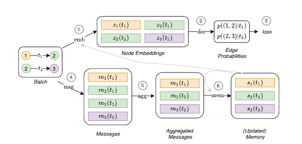
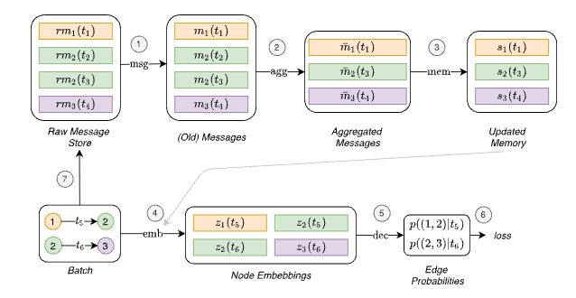
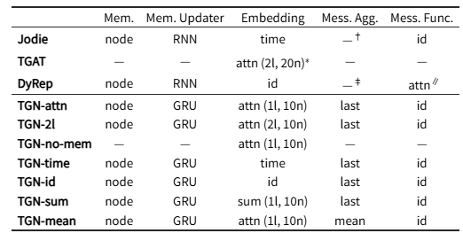
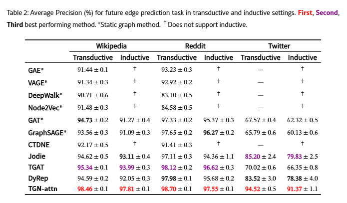
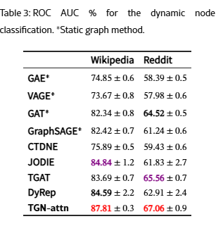
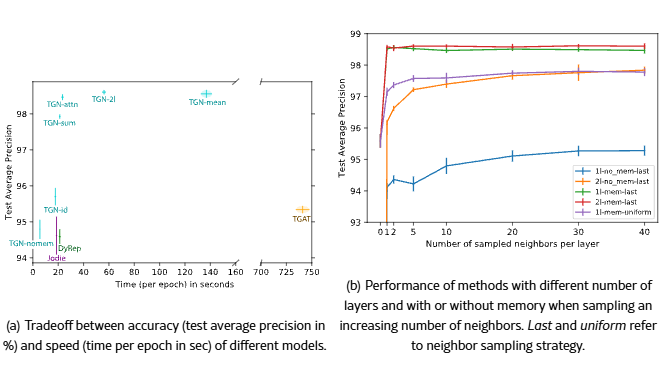

# Temporal Graph Networks for Deep Learning on Dynamic Graphs
> 동적 그래프 기반 딥러닝을 위한 시간적 그래프 네트워크

## 읽는 눈
- Multi-GNN이 "그래프 한 장을 어떻게 잘 보느냐"였다면, TGN은 "거래가 시간순으로 계속 들어올 때 과거를 어떻게 기억하느냐"의 논문.
- 우리가 뽑을 것: 3장의 memory / message / aggregator / embedding 개념과, 3.2절의 학습 트릭(누수 없이 배치 처리). 실험 세팅은 링크 예측이라 우리와 다르므로 가볍게.
- 읽는 목적: "슬라이딩 창 + 오늘 엣지만 감독"이 왜 TGN의 단순화 버전인지 이해하고, 나중에 TGN으로 갈지 판단할 기준 만들기.

## Abstract
그래프 신경망(GNN)은 복잡한 관계 또는 상호작용 시스템을 학습하는 능력 덕분에 최근 점점 더 인기를 얻고 있다. 이러한 시스템은 생물학, 입자 물리학에서부터 소셜 네트워크, 추천 시스템에 이르기까지 광범위한 문제에서 활용된다. 그래프 기반 딥러닝을 위한 다양한 모델들이 존재하지만, 시간에 따라 변화하는 특징이나 연결성 등 동적인 특성을 가진 그래프를 처리하는 데 적합한 접근 방식은 드물다. 
본 논문에서는 시간적 이벤트 시퀀스로 표현되는 동적 그래프에 대한 딥러닝을 위한 일반적이고 효율적인 프레임워크인 시간 그래프 네트워크(TGN)를 제안한다. 새로운 메모리 모듈과 그래프 기반 연산자의 조합 덕분에 TGN은 기존 접근 방식보다 계산 효율성이 뛰어나면서도 성능이 크게 향상된다. 
또한, 동적 그래프 학습을 위한 여러 기존 모델들을 본 프레임워크의 특정 인스턴스로 구현할 수 있음을 보여준다. 본 프레임워크의 다양한 구성 요소에 대한 상세한 어블레이션 연구를 수행하고, 동적 그래프에 대한 여러 귀납적 및 전이적 예측 작업에서 최첨단 성능을 달성하는 최적의 구성을 도출한다.

## Introduction

**배경**
- 그래프 표현 학습이 여러 분야(사회과학, 생물학 등)에서 성공. GNN은 메시지 패싱으로 이웃 정보를 모아 노드 임베딩을 만들고, 이를 노드 분류·그래프 분류·엣지 예측에 씀.
- 대부분의 GNN은 그래프가 **정적(static)**이라고 가정. 그러나 실제 시스템(SNS, 생물 상호작용망)은 **동적(dynamic)**.
- 시간을 무시하고 정적 모델을 쓰는 건 가능하지만 성능이 떨어지고(Xu et al. 2020 = TGAT), 어떤 경우엔 동적 구조 자체가 핵심 정보.

**기존 동적 그래프 연구의 한계**
- 대부분 **이산 시간(discrete-time)** 방식 = 그래프를 일정 간격의 스냅샷 시퀀스로 봄.
- 이 방식은 엣지가 아무 때나 생기고(continuous) 새 노드가 계속 들어오는(evolving) 현실에 안 맞음.
- **연속 시간(continuous-time)** 방식은 최근에야 등장: TGAT(Xu 2020), DyRep(Trivedi 2019), JODIE(Kumar 2019) 등. 이들이 뒤에서 "TGN의 특수 사례"로 다시 나옴.

**기여 4가지**
1. 연속 시간 동적 그래프를 "이벤트의 시퀀스"로 보고 처리하는 범용·귀납적(inductive) 프레임워크 TGN 제안. 기존 방법 다수가 TGN의 특수 사례임을 보임.
2. 데이터의 순차성을 학습하면서도 배치 병렬 처리를 유지하는 새 학습 전략.
3. 구성 요소별 ablation과 속도–정확도 트레이드오프 분석.
4. 여러 과제·데이터셋에서 transductive/inductive 모두 SOTA, 기존보다 훨씬 빠름.

**용어**
- 이벤트(event): 시각 t에 일어난 한 건의 변화. 우리에겐 거래 한 건 = (src, dst, t, 금액 등).
- 이산 시간 동적 그래프: 하루치·한 달치를 스냅샷으로 뭉쳐 그래프 시퀀스로 봄 (ROLAND, EvolveGCN 계열).
- 연속 시간 동적 그래프: 이벤트를 시각 그대로 하나씩 흘려보냄 (TGN, TGAT, JODIE, DyRep).
- transductive: 학습 때 본 노드에 대해 예측. inductive: 학습 때 없던 새 노드에 대해서도 예측.

- → 우리 기준: Trans.csv는 정확히 "이벤트 시퀀스"임. 팀의 일 배치 파이프라인은 이산 시간(하루 스냅샷) 방식이고, 그래서 27일짜리 패턴이 잘림. TGN은 노드마다 과거를 압축한 상태(memory)를 들고 있어서 하루치만 흘려도 과거 문맥이 남는 게 핵심 차이.
- → 우리 기준: inductive가 중요함. 운영 중엔 매일 새 계좌가 생기므로, 학습 때 없던 계좌에도 동작해야 함. Multi-GNN은 노드 피처가 상수 1이라 자연히 inductive였고, TGN도 memory를 0으로 초기화해 새 노드를 받음.
- → 우리 기준 (미리 적어둘 주의점): TGN은 링크 예측·노드 분류용으로 설계됨. 우리는 엣지 분류라 decoder를 바꿔야 하고, Multi-GNN의 reverse MP·포트 같은 방향/다중엣지 장치는 TGN에 없음. 공개 코드의 이웃 탐색이 무방향으로 알고 있어서(확인 필요) 이 부분은 3장 볼 때 같이 점검.

## 2. 배경 (Background)

### 정적 그래프에서의 딥러닝

- 정적 그래프 G = (V, E). 노드 V = {1, …, n}, 엣지 E ⊆ V × V. 노드 피처 v_i, 엣지 피처 e_ij.
- 보통의 GNN은 노드 임베딩 z_i를 "지역 집계 규칙"으로 만듦:
  z_i = Σ_{j ∈ N_i} h(m_ij, v_i),   m_ij = msg(v_i, v_j, e_ij)
- 해석: 이웃 j가 i에게 메시지 m_ij를 보내고(msg), i가 그것들을 합쳐 자기 피처와 섞음(h). N_i = i의 이웃 집합. msg와 h는 학습되는 함수.
- → 우리 기준: Multi-GNN 3.2절의 MPNN과 같은 것. 메시지에 엣지 피처 e_ij(금액·통화 등)가 들어가는 것도 같음. 여기서는 방향(N_in/N_out)을 구분하지 않고 대충 N_i로 씀 → 방향·다중엣지 처리는 TGN의 관심사가 아니라는 신호.

### 동적 그래프

**두 가지 모델**
- 이산 시간 동적 그래프(DTDG): 일정 간격으로 찍은 정적 스냅샷의 시퀀스.
- 연속 시간 동적 그래프(CTDG): 더 일반적. 시각이 붙은 이벤트 목록. 엣지 추가/삭제, 노드 추가/삭제, 노드·엣지 피처 변경이 모두 이벤트.

**TGN의 시간 (다중)그래프 정의**
- G = {x(t₁), x(t₂), …}, 0 ≤ t₁ ≤ t₂ ≤ … : 시각순으로 정렬된 이벤트의 시퀀스. 각 이벤트 = 노드 하나의 변화 또는 노드 쌍의 상호작용.
- 이벤트 두 종류
  1. 노드 이벤트 v_i(t): 노드 i에 피처 벡터 v가 붙는 사건. i가 처음 보는 인덱스면 노드 생성, 아니면 피처 갱신.
  2. 상호작용 이벤트 e_ij(t): i→j 방향의 시간 엣지. 같은 쌍 사이에 여러 엣지 가능 → 기술적으로 다중그래프.
- 시간 구간 T에 대한 집합
  - V(T) = 구간 T 안에 이벤트가 있는 노드들
  - E(T) = 구간 T 안에 상호작용이 있는 노드 쌍들
  - N_i(T) = 구간 T 안에서 i의 이웃, N_i^k(T) = k-hop 이웃
- 시각 t의 스냅샷 G(t) = (V[0, t], E[0, t]): 시작부터 t까지 쌓인 전부. 노드 수 n(t).
- 삭제 이벤트는 부록 A.1.

- → 우리 기준 (데이터 매핑): 상호작용 이벤트 = Trans.csv 한 행 (src → dst, 시각, 금액·통화·결제수단). 노드 이벤트 = 계좌 생성·KYC 정보 갱신에 해당하지만 AMLworld엔 시각이 붙은 계좌 이벤트가 없으므로 "첫 거래 시점에 피처 0으로 생성"으로 두면 됨. 삭제 이벤트는 우리 데이터에 없음.
- → 우리 기준 (용어 주의): TGN이 말하는 "스냅샷 G(t)"는 t까지의 누적 그래프지, 팀 파이프라인의 "그날 하루 그래프"가 아님. 같은 단어를 다른 뜻으로 쓰니 대화할 때 구분할 것.
- → 우리 기준 (연결 고리): N_i(T)가 곧 우리의 슬라이딩 창. T = [오늘 − L일, 오늘]로 두면 E(T)가 창 안의 엣지, N_i^2(T)가 2층 모델이 보는 이웃. TGN의 임베딩 모듈도 결국 t 이전의 N_i(T)에서 최근 이웃을 골라 쓰는 구조라, "창 그래프 + 오늘 엣지 감독"은 memory를 뺀 TGN이라고 볼 수 있음(3장에서 확인).

## 3. Temporal Graph Networks

### 큰 그림: 인코더–디코더
- 동적 그래프 모델 = 인코더 + 디코더 (Kazemi et al. 2020 용어).
  - 인코더: 동적 그래프 → 각 시각 t의 노드 임베딩 Z(t) = (z₁(t), …, z_n(t)(t))
  - 디코더: 임베딩 한두 개 → 과제별 예측 (노드 분류, 엣지 예측 등)
- 이 논문의 기여는 인코더(TGN). 디코더는 과제에 맞게 갈아 끼움.
- → 우리 기준: 논문의 디코더는 링크 예측 p((i, j) | t) = "i→j 거래가 일어날 확률". 우리는 디코더를 (z_src(t), z_dst(t), 거래 피처) → 세탁 확률로 바꾸면 됨. 인코더는 그대로 쓸 수 있다는 게 이 구조의 장점.

### Figure 1 흐름 (배치: 1→2 at t₁, 2→3 at t₂)
- 위쪽 (예측): (1) emb가 현재 memory + 시간 그래프로 노드 임베딩 생성 → (2) dec가 엣지 확률 계산 → (3) loss
- 아래쪽 (기억 갱신): (4) msg가 이벤트마다 메시지 생성 (노드 2는 두 이벤트에 걸려 메시지 2개) → (5) agg가 같은 노드의 메시지를 하나로 합침 → (6) mem이 memory 갱신
- 주의: 이 단순 흐름은 아래쪽 모듈(msg, agg, mem)이 loss에 영향을 못 줘서 gradient를 못 받음 → 학습 안 됨. 3.2절에서 순서를 바꿔 해결.
- → 우리 기준: 우리 일 배치를 여기에 넣으면 "오늘 거래들"이 하나의 배치. 위쪽이 오늘 거래 채점, 아래쪽이 오늘 거래로 계좌 상태 갱신. 우리가 원하던 "일 배치 + 상태 유지"가 이 그림 그 자체.

### 3.1 핵심 모듈

**Memory (기억)**
- 지금까지 본 노드마다 벡터 s_i(t) 하나. 노드 관련 이벤트가 있을 때마다 갱신.
- 목적: 노드의 이력을 압축해 저장 → 장기 의존성을 기억.
- 새 노드는 0 벡터로 시작. 학습이 끝난 뒤(운영 중)에도 이벤트마다 계속 갱신됨.
- 그래프 전체 memory는 향후 과제.
- → 우리 기준: 계좌별 "거래 이력 요약 벡터". 20일간 10개 계좌에서 돈을 모은 계좌 A가 21일째 큰돈을 뿌리면, 20일치 그래프를 다시 안 만들어도 A의 memory에 "모았다"가 남아 있어서 오늘 거래 하나만 봐도 gather→scatter 문맥이 생김. 이게 memory 없는 슬라이딩 창과의 본질적 차이.

**Message Function (메시지 함수)**
- 상호작용 e_ij(t) 하나에서 메시지 두 개:
  m_i(t) = msg_s(s_i(t⁻), s_j(t⁻), Δt, e_ij(t))   (보낸 쪽 i용)
  m_j(t) = msg_d(s_j(t⁻), s_i(t⁻), Δt, e_ij(t))   (받은 쪽 j용)
- 노드 이벤트 v_i(t)는 메시지 하나: m_i(t) = msg_n(s_i(t⁻), t, v_i(t))
- s_i(t⁻) = t 직전의 memory (그 노드의 이전 이벤트 시점 상태). Δt = 그 노드의 마지막 이벤트 이후 경과 시간.
- msg_s, msg_d, msg_n은 학습 가능(MLP)하지만, 실험에서는 전부 identity = 입력을 그냥 이어 붙임.
- 이웃 정보까지 넣는 더 복잡한 메시지 함수는 향후 과제.
- → 우리 기준: 거래 한 건이 양쪽 계좌의 memory를 다 갱신함 → memory 차원에서는 reverse MP가 기본으로 들어 있는 셈.
- → 우리 기준 (주의, 코드로 확인 필요): 실험 설정대로 msg가 identity이고 mem을 양쪽이 공유하면, 보낸 쪽 메시지 [s_i, s_j, Δt, e]와 받은 쪽 메시지 [s_j, s_i, Δt, e]가 "내 memory, 상대 memory" 순으로 같은 꼴이라 memory가 "내가 보냈는지 받았는지"를 구분 못 함. AML에선 fan-in과 fan-out 구분이 핵심이므로 msg_s/msg_d를 따로 학습시키거나 방향 플래그를 e_ij에 넣어야 함. Multi-GNN의 reverse MP 교훈("양쪽 다 듣되 어느 쪽인지 구분")이 여기서도 적용됨.

**Message Aggregator (메시지 집계)**
- 효율을 위해 배치 처리하면 같은 노드 i의 이벤트가 한 배치에 여러 개 → 메시지 m_i(t₁), …, m_i(t_b)를 하나로 합쳐야 함:
  m̄_i(t) = agg(m_i(t₁), …, m_i(t_b))
- RNN이나 attention도 가능하지만 실험은 학습 없는 두 가지: 가장 최근 메시지만 유지(most recent), 평균(mean). 학습 가능한 집계는 향후 과제.
- → 우리 기준 (설계에 직결): 배치 = 하루로 잡으면, 하루에 30건을 받은 계좌는 메시지 30개가 마지막 1개나 평균 1개로 눌림 → "하루에 30명에게서 받았다"는 fan-in 정보가 memory에서 사라짐. 배치를 작게 하면 살아나지만 느려짐. 논문이 속도–정확도 트레이드오프라고 한 게 이것. 우리는 배치 크기를 "하루"가 아니라 "거래 N건"으로 잡고 N을 실험해야 함.

**Memory Updater (기억 갱신)**
- s_i(t) = mem(m̄_i(t), s_i(t⁻))
- 상호작용이면 양쪽 노드 memory 갱신, 노드 이벤트면 그 노드만.
- mem은 학습 가능한 함수, 예: LSTM, GRU. (이전 상태 + 새 입력 → 새 상태이니 RNN이 자연스러움)
- → 우리 기준: 계좌마다 GRU 셀 하나가 시간순으로 돌아가는 그림. 운영 시 하루치 거래를 흘리면 GRU가 상태를 이어감.

**Embedding (임베딩)**
- 임의의 시각 t에 노드 i의 임베딩 z_i(t)를 만드는 모듈.
- 존재 이유: memory 노후화(staleness) 문제. memory는 그 노드에 이벤트가 있을 때만 갱신되므로, 오래 조용했던 노드의 memory는 낡음. 이웃들의 최신 memory를 모아서 보완.
- 일반형: z_i(t) = Σ_{j ∈ N_i^k([0,t])} h(s_i(t), s_j(t), e_ij, v_i(t), v_j(t))
  (t까지의 k-hop 이웃 j에 대해, 내 memory·이웃 memory·엣지 피처·노드 피처를 h로 섞어 합침)
- 특수 사례 4개
  1. identity: z_i(t) = s_i(t). memory를 그대로 임베딩으로.
  2. time projection: z_i(t) = (1 + Δt·w) ∘ s_i(t). 마지막 이벤트 이후 경과 시간에 따라 memory를 선형으로 흘려보냄 (JODIE 방식). ∘ = 원소별 곱.
  3. temporal graph attention: L층의 그래프 attention으로 L-hop 시간 이웃을 집계 (TGAT 방식).
     - 입력: 내 표현 h_i^(l−1)(t), 현재 시각 t, 이웃 표현들과 그 상호작용의 시각 t₁…t_N, 엣지 피처 e_i1…e_iN
     - 식 (5)~(9): query = [내 표현 ‖ φ(0)], key = value = [이웃 표현 ‖ 엣지 피처 ‖ φ(t − t_j)] 를 나열한 C, multi-head attention으로 h̃ 계산, 마지막에 MLP([h_i ‖ h̃])
     - φ(·) = 시간 인코딩 (Time2Vec). "얼마나 오래된 상호작용인가"를 벡터로 바꿔 모델이 최근/오래된 이웃을 구분하게 함.
     - TGAT과의 차이: 각 노드의 0층 입력이 h_j^(0)(t) = s_j(t) + v_j(t) → memory와 노드 피처를 같이 씀.
  4. temporal graph sum: 더 단순·빠른 버전. 식 (10)~(11): 이웃마다 [h_j ‖ e_ij ‖ φ(t − t_j)]에 W₁을 곱해 합치고 ReLU, 그다음 W₂[h_i ‖ h̃].
- 임베딩 모듈이 노후화를 완화하는 원리: 내가 오래 조용했어도 이웃 중 최근에 활동한 노드가 있을 확률이 높고, 그들의 memory를 모으면 내 임베딩이 최신화됨. attention 버전은 피처와 시각을 보고 어떤 이웃이 중요한지 고를 수 있음.
- → 우리 기준: attention은 시간 이웃 위의 GAT, sum은 GIN 계열이라고 보면 됨. Multi-GNN에서 본 베이스 선택과 같은 구도.
- → 우리 기준 (핵심 연결): 이웃 집합이 N_i([0, t]) = "t 이전의 모든 이웃"이지만 실제로는 최근 이웃 몇 개만 샘플링함(실험 세팅 확인). 그러면 임베딩 모듈 = "최근 창의 이웃을 모으는 2층 GNN" = 우리 슬라이딩 창 모델. 즉 우리 설계는 TGN에서 memory를 뺀 것이고, memory가 더해 주는 건 창 밖의 압축된 과거와 Δt 정보.
- → 우리 기준: 휴면 계좌(오래 조용하다가 갑자기 활동)는 세탁에서 흔한 신호. staleness 처리와 Δt(마지막 거래 후 경과 시간)가 정확히 그 신호를 표현할 수 있으므로, 슬라이딩 창만 쓰더라도 "마지막 거래 후 며칠" 피처는 흉내 낼 가치가 있음.
- → 우리 기준 (확인 항목): 임베딩 모듈의 이웃 탐색이 방향을 구분하는지 코드에서 확인. 무방향이면 Multi-GNN이 경고한 naive bidirectional이라 fan-in/out이 섞임.

### 3.2 학습 (Training)

**과제 예시**
- TGN은 엣지 예측(자기지도)이나 노드 분류(준지도) 등 여러 과제에 쓸 수 있음. 논문은 링크 예측을 예로 듦: 시간순 상호작용 목록이 주어지면, 과거를 보고 미래 상호작용을 맞히기.

**문제 1: memory 쪽 모듈이 gradient를 못 받음**
- Figure 1의 단순 흐름에서는 msg, agg, mem이 loss에 직접 관여하지 않음. loss는 임베딩에서 나오는데, 이 배치의 memory 갱신은 loss 계산 뒤에 일어나므로 역전파가 닿지 않음 → 세 모듈이 학습되지 않음.
- 해결 방향: 배치를 예측하기 "전에" memory를 갱신해야 함.

**문제 2: 그렇다고 이 배치의 이벤트로 갱신하면 누수**
- 상호작용 e_ij(t)를 memory에 넣은 다음 그 e_ij(t)를 예측하면, 답을 보고 답을 맞히는 꼴 → 정보 누수.

**해결: Raw Message Store (원시 메시지 저장소)**
- 이번 배치를 처리할 때는 "이전 배치들"의 이벤트로 memory를 갱신하고, 그다음 이번 배치를 예측.
- 원시 메시지 = 메시지 함수의 입력이 되는 원재료(양쪽 memory, Δt, 엣지 피처 등). 저장소는 이미 모델이 처리한 과거 상호작용의 원시 메시지를 보관.
- 즉 "어떤 상호작용이 memory에 반영되는 시점"을 다음 배치로 미룸.

**Figure 2 흐름**
1. 저장소의 원시 메시지에서 메시지 계산 (msg)
2. 노드별로 집계 (agg)
3. memory 갱신 (mem)
4. 갱신된 memory로 임베딩 계산 (회색 화살표)
5. 디코더 예측 → loss. 이제 1~3이 loss에 영향을 주므로 gradient를 받음
6. 이번 배치의 원시 메시지를 저장소에 넣어 다음 배치에서 사용
- 의사코드는 부록 A.2.

- → 우리 기준 (누수 관점): 링크 예측에서의 누수는 "엣지의 존재" 자체가 정답이라서 생김. 우리 엣지 분류는 거래가 일어난 건 이미 아는 사실이고 정답은 세탁 여부이므로, 거래 피처가 memory에 들어가는 건 누수가 아님. 우리가 지켜야 할 누수 규칙은 "t 시점 채점에 t 이후 사건이 들어가면 안 된다"이고, 배치를 시간순으로 돌리며 memory를 이전 배치로만 갱신하면 자동으로 지켜짐. 라벨은 어디에도 안 들어감.
- → 우리 기준 (운영 그림): 원시 메시지 저장소 = "어제 거래 테이블". 일 배치 작업은 (1) 어제 거래로 계좌 memory 갱신 → (2) 오늘 거래 채점 → (3) 오늘 거래를 저장소에 적재. 지금 팀 파이프라인에 memory 테이블 하나 추가하는 구조로 옮길 수 있음.
- → 우리 기준 (한계): memory는 항상 한 배치만큼 늦음. 배치 = 하루면 오늘 오전의 거래는 오늘 오후 거래를 채점할 때 memory에 없음. 하루 안에 완결되는 fan-in은 memory가 아니라 임베딩 모듈(t 이전 이웃을 직접 봄)에 기대야 하고, 이 점에서도 배치를 하루보다 작게 잡을 이유가 있음. 3.1의 집계 문제와 같은 결론.
- → 우리 기준 (학습 절차, 코드 기준 확인): 학습은 매 epoch 시작에 memory를 0으로 초기화하고 시간순으로 처음부터 다시 흘림. val/test는 train 끝난 시점의 memory를 이어받아 계속 흘림. 즉 데이터를 무작위로 섞으면 안 되고, 우리 시간순 60/20/20 분할과 잘 맞음. 링크 예측용 negative sampling은 우리에겐 불필요(라벨이 있으므로).

**Raw Message Store의 정확한 정의**
- 임의의 시각 t에 저장소는 노드 i마다 원시 메시지 rm_i를 최대 하나 가짐. i가 관여한 "마지막" 상호작용(t 이전)에서 만든 것. (각주: 한 번도 이벤트에 관여한 적 없는 노드만 메시지가 없음)
- 다음에 i가 관여하는 상호작용을 처리할 때: rm_i로 memory 갱신 (화살표 1, 2, 3) → 갱신된 memory로 임베딩과 배치 loss 계산 (4, 5, 6) → 새 상호작용의 원시 메시지를 저장소에 넣음 (7).
- → 우리 기준: "노드당 최대 하나"는 3.1의 most recent 집계를 전제한 설명. 코드는 노드별로 원시 메시지를 리스트로 쌓고 집계 함수(last/mean)로 하나로 만드는 걸로 기억함. 어느 쪽이든 "배치 안에서 같은 노드에 여러 건이 있으면 하나로 눌린다"는 결론은 같음.

**배치 안의 모든 예측은 같은 memory 상태를 봄**
- 한 배치의 예측 전부가 배치 시작 시점의 memory를 사용.
- 배치의 첫 상호작용 입장에서는 memory가 최신(이전 상호작용이 전부 반영됨).
- 배치의 마지막 상호작용 입장에서는 낡음(같은 배치 안의 앞선 상호작용이 빠져 있음).
- 그래서 큰 배치는 손해. 극단적으로 배치 = 데이터셋 전체면 모든 예측이 초기 0 memory로 이뤄짐.
- 논문은 배치 200이 속도와 갱신 세밀도 사이의 좋은 절충이라고 보고.

- → 우리 기준 (규모 계산): 배치 200이면 HI-Large 1.8억 건은 epoch당 약 90만 스텝. 다른 세션에서 "이 규모에서 TGN 학습은 무겁다"고 한 근거가 이 숫자. 배치를 키우면 스텝은 줄지만 memory 신선도가 떨어지는 트레이드오프라서 공짜로 못 줄임.
- → 우리 기준 (일 배치와의 관계): "하루"는 운영 스케줄 단위고, 학습·추론의 memory 갱신 배치는 그 안에서 200~수천 건씩 시간순으로 잘게 흘리면 됨. 즉 일 배치 운영과 작은 memory 배치는 양립함. 하루치를 통째로 한 배치로 넣는 건 논문이 경고한 "큰 배치"에 해당.
- → 우리 기준 (임베딩 모듈의 보완, 코드 확인 필요): memory는 배치 시작 상태로 고정되지만 임베딩 모듈은 t 이전 이웃을 직접 보므로, 같은 배치 안의 앞선 거래도 이웃으로는 볼 수 있음(그 이웃의 memory는 낡은 채로). 하루 안에 완결되는 fan-in을 잡는 건 이 경로에 달려 있음.

## 4. 관련 연구 (Related Work)

**이산 시간(DTDG, 스냅샷) 계열 — 초기 연구 대부분**
- 방법 유형: 스냅샷들을 합쳐서 정적 방법 적용 / 스냅샷을 텐서로 쌓아 분해 / 스냅샷마다 임베딩을 만든 뒤 가중합·시계열 모델·RNN으로 잇기(EvolveGCN, DySAT 등) / 시간에 따라 부드럽게 변하도록 제약 / 초기 스냅샷의 랜덤워크를 이후 스냅샷에서 수정.
- 시공간 그래프(교통 예측처럼 토폴로지가 고정된 경우)는 동적 그래프의 특수 사례.
- → 우리 기준: 팀의 일 단위 노드·엣지 재생성 파이프라인이 정확히 이 계열(하루 = 스냅샷). ROLAND도 여기. 논문의 비판은 "엣지가 아무 때나 생기고 새 노드가 계속 들어오는 상황에는 안 맞는다"는 것.

**연속 시간(CTDG) 계열 — 최근**
- 랜덤워크에 연속 시간 제약을 넣는 방법들.
- 시퀀스 기반: 새 엣지가 올 때마다 RNN으로 src·dst 노드 표현을 갱신 (JODIE, DyRep, Know-Evolve 등).
- 동적 지식 그래프 연구들.
- 공통 한계: 대부분 "노드별 memory를 RNN으로 갱신"까지만 있고, 임베딩을 만들 때 이웃을 모으는 GNN식 집계가 없음 → 노후화(staleness)에 취약하고 표현력도 제한됨.
- → 우리 기준: TGN의 자기 위치는 "memory 계열(RNN)에 GNN 집계를 얹은 것". 3.1의 임베딩 모듈이 그 차이.

**기존 모델 = TGN의 특수 사례 (Table 1)**
- JODIE: time projection 임베딩 emb(i, t) = (1 + Δt·w) ∘ s_i(t)
- TGAT: memory 관련 모듈이 전부 없고, 임베딩만 graph attention
- DyRep: 메시지 함수에 dst 노드 이웃의 attention 요약을 추가로 넣음, 임베딩은 id
- TGN은 정적 그래프의 Graph Networks(Battaglia 2018)도 일반화함(global block 제외) → 대부분의 메시지 패싱 구조를 포함.
- → 우리 기준: Multi-GNN 3.2절의 MPNN이 TGN 안에서는 "임베딩 모듈" 자리에 들어감. 즉 TGN = (memory + 시간 인코딩)이라는 시간 껍데기 + 그 안의 MPNN. 두 논문은 서로 직교하므로 reverse MP·포트·ego ID를 TGN 임베딩 모듈 안에 넣는 조합이 원리상 가능함(논문이 말한 건 아니고 우리 아이디어).

**Table 1 읽는 법**
- 열 = 3.1의 모듈 다섯 개: Memory 유무 / Memory Updater / Embedding / Message Aggregator / Message Function.
- 표기: attn(l, n) = attention 임베딩을 l층, 이웃 n개로. 기본 이웃 샘플링은 "가장 최근 n개", *는 균등 샘플링, †는 t-batch 사용, ‡는 논문에 집계 방식 설명 없음.
- 기본형 TGN-attn = node memory, GRU, attn(1층, 10이웃), last 집계, identity 메시지.
- 나머지 TGN-* 행은 기본형에서 열 하나씩만 바꾼 ablation 변형:
  - TGN-2l: 층 2개 (attn(2l, 10n))
  - TGN-no-mem: memory 제거 (= TGAT와 거의 같음, 샘플링만 다름)
  - TGN-time / TGN-id: 임베딩을 time projection / identity로
  - TGN-sum: 임베딩을 sum으로
  - TGN-mean: 메시지 집계를 mean으로
- 5장 ablation은 이 행들을 그대로 비교하는 것이므로, 이 표를 옆에 두고 읽으면 됨.

- → 우리 기준 (중요): 기본 TGN은 1층·최근 이웃 10개로 임베딩을 만듦. Multi-GNN의 2층·100/100 샘플링에 비하면 그래프를 아주 얕고 좁게 봄. TGN은 깊이를 memory로 대신하는 설계라는 뜻. 20명 이상 모이는 fan-in이나 2-hop 구조(gather-scatter)를 임베딩 모듈이 직접 보게 하려면 n과 l을 키워야 하고, 그 비용·효과는 5장의 TGN-2l 결과로 판단.
- → 우리 기준: "가장 최근 n개 이웃" 샘플링은 우리 슬라이딩 창의 개수 기반 버전. 창을 "최근 L일"로 자를지 "최근 n건"으로 자를지는 계좌별 거래 빈도 편차가 크면 결과가 꽤 다름. 대형 은행 계좌는 n건이 반나절이고 개인 계좌는 n건이 반년일 수 있음.
- → 우리 기준: 팀의 KYC-TGNN 파이프라인을 이 표의 다섯 열에 채워 넣어 보면 어떤 변형인지 바로 자리가 잡힘.

## 5. 실험 (Experiments)

### 실험 설정
- 데이터셋 3개: Wikipedia, Reddit (JODIE 논문 것), Twitter (부록 A.3).
- 과제 2개
  1. 미래 엣지(링크) 예측: "시각 t에 두 노드 사이에 엣지가 생길 확률". 디코더 = 두 노드 임베딩을 이어 붙여 MLP.
     - transductive: 학습 때 본 노드들의 미래 링크 / inductive: 학습 때 없던 노드들의 미래 링크
  2. 동적 노드 분류 (transductive만)
- 분할: TGAT과 같은 70/15/15 시간순. 10회 평균. 하이퍼파라미터는 부록 A.4.
- baseline: CTDG SOTA(CTDNE, Jodie, DyRep, TGAT) + 정적 그래프 모델(GAE, VGAE, DeepWalk, Node2Vec, GAT, GraphSAGE).
- → 우리 기준 (전제 주의): Wikipedia·Reddit는 "사용자–페이지/서브레딧" 상호작용, 즉 이분(bipartite) 그래프. 계좌–계좌 거래망처럼 cycle이나 다단계 gather-scatter 같은 구조가 없음. 노드 분류 라벨도 "사용자 정지 여부". 그래서 이 장의 결론(특히 "1층이면 충분")은 우리 데이터에 그대로 옮기면 안 되고 검증이 필요함.

### 5.1 성능

**Table 2: 미래 엣지 예측 AP(%)**
- TGN-attn이 모든 데이터셋, 두 설정 모두 1위.
  - Wikipedia: transductive 98.46 (2위 TGAT 95.34), inductive 97.81 (2위 TGAT 93.99)
  - Reddit: transductive 98.70 (2위 TGAT 98.12), inductive 97.55 (2위 TGAT 96.62)
  - Twitter: transductive 94.52 (2위 Jodie 85.20), inductive 91.37 (2위 Jodie 79.83)
- Twitter에서 격차가 특히 큼: 2위(논문은 DyRep 기준)보다 transductive 4%p 이상, inductive 10%p 이상.
- 정적 모델(*)은 inductive를 지원 못 하는 게 많고, 지원해도 크게 뒤짐.

**Table 3: 동적 노드 분류 ROC AUC(%)**
- Wikipedia 87.81 (2위 JODIE 84.84), Reddit 67.06 (2위 TGAT 65.56). 역시 1위.
**속도**
- 병렬 처리 + attention 1층만 필요 → TGAT보다 epoch당 최대 30배 빠름, 수렴 epoch 수는 비슷.
- → 우리 기준: 여기 AP는 링크 예측을 negative sampling으로 1:1 균형 맞춘 뒤 잰 것. 극도 불균형 엣지 분류의 우리 AP 0.63과는 다른 문제·다른 스케일이라 숫자를 나란히 놓으면 안 됨.

### 5.2 모듈 선택 (ablation, Wikipedia transductive, Figure 3)

**Figure 3(a): 정확도(AP) vs epoch 시간**
- 대략: TGN-nomem ~94.5 (가장 빠름) / Jodie·DyRep ~94 / TGN-id ~95.3 / TGN-sum ~98 / TGN-attn ~98.5 (~25초) / TGN-2l ~98.6 (~50초) / TGN-mean ~98.5 (~135초) / TGAT ~95.3 (~740초)
**Memory**
- TGN-attn vs TGN-no-mem: memory 있으면 약 3배 느리지만 AP 약 4%p 높음. 노드의 장기 정보를 저장하는 능력 때문.
- Figure 3(b): 이웃 샘플 수를 0~40으로 늘려도 memory 있는 모델(1l-mem, 2l-mem)은 이웃 몇 개부터 ~98.5로 포화. memory 없는 모델은 1층이면 ~95 언저리, 2층이어도 ~98에 못 미침. 즉 memory + 최근 이웃 샘플링은 필요한 이웃 수를 줄여 줌.
- 균등 샘플링(1l-mem-uniform)은 최근 우선 샘플링보다 낮음.
**Embedding 모듈**
- TGN-time이 TGN-id보다 살짝 낮음 → 시간 투영은 오히려 약간 해로움.
- 그래프를 쓰는 임베딩(attn, sum)이 그래프 없는 id보다 큰 폭으로 우수. attn이 최고, sum은 약간 낮지만 더 빠름.
- 결론: "그래프를 통해 더 최근 정보를 얻는 것"과 "중요한 이웃을 고르는 것"이 핵심.
**Message Aggregator**
- mean이 last보다 살짝 좋지만 3배 이상 느림.
**층 수**
- TGAT은 2층이 필수(1층과 10%p 이상 차이). TGN은 memory 덕에 1층으로 충분(TGN-attn ≈ TGN-2l). 1-hop 이웃의 memory를 읽으면 그 너머 hop 정보가 간접적으로 들어오기 때문. 1층이라 속도도 크게 빨라짐.

### → 우리 기준 (이 장에서 가져갈 것)
- Figure 3(b)의 "memory 없는 곡선"이 곧 우리 슬라이딩 창 모델의 처지. memory가 없으면 2층 + 넓은 이웃이 필요하다는 게 이 그림의 메시지고, Multi-GNN의 2층·100/100 샘플링과 맞아떨어짐.
- 창 안에서 이웃을 뽑을 때 "최근 우선"이 균등보다 좋다는 결과는 바로 적용 가능. PyG LinkNeighborLoader에 time_attr + temporal_strategy='last' 옵션이 있는 걸로 기억함(확인). Multi-GNN 코드는 균등 샘플링이라 이 한 줄이 개선 포인트가 될 수 있음.
- "1층이면 충분"은 이분 그래프 결과. AML의 2-hop 구조(gather-scatter, cycle)는 1-hop memory 우회로 잡힌다는 보장이 없으므로, TGN을 쓰더라도 2층(TGN-2l, 비용 약 2배)을 기본 후보로 두고 비교해야 함.
- memory의 +4%p는 "창 밖의 과거"의 가치. 우리에겐 27일짜리 패턴과 휴면 계좌가 그 과거에 해당하므로 효과가 이보다 클 수도, 작을 수도 있음. 값싼 대체 실험: 계좌별 롤링 통계(최근 7/30/90일 송수신 건수·금액, 마지막 거래 후 경과일)를 노드 피처로 창 그래프에 넣는 "수작업 memory"로 먼저 재 보고, 이득이 크면 TGN memory로 감(우리 아이디어).
- 비용 정리: memory 3배, mean 집계 3배, 2층 2배가 곱으로 붙음. HI-Large에서 TGN-2l + mean이면 기본 TGN-attn 대비 6배 이상. 배치 200 × 90만 스텝과 합치면 다음 단계로 미룬 이유가 숫자로 나옴.
