# A Gentle Introduction to Graph Neural Networks (그래프 신경망에 대한 쉬운 소개)

출처: [A Gentle Introduction to Graph Neural Networks](https://distill.pub/2021/gnn-intro/)

이 글에서는 그래프 신경망에 필요한 구성 요소를 살펴보고, 그 설계 선택에 대한 근거를 제시한다.

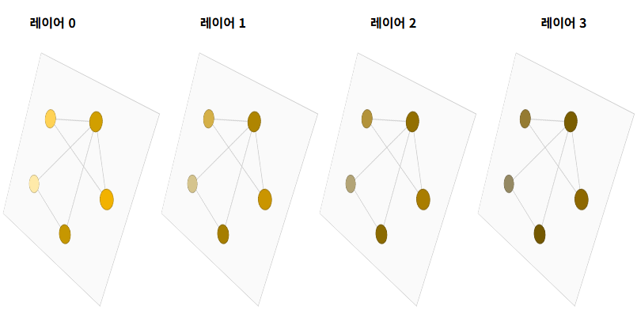

그래프는 우리 주변 어디에나 있다. 현실 세계의 사물은 다른 사물과의 연결 관계를 통해 정의되는 경우가 많으며, 사물의 집합과 그 연결 관계는 자연스럽게 **그래프**로 표현할 수 있다. 연구자들은 10년 넘게 그래프 데이터를 처리하는 그래프 신경망(Graph Neural Network, GNN)을 개발해 왔으며, 최근에는 그 기능과 표현력이 크게 향상되었다. GNN은 물리 시뮬레이션, 가짜 뉴스 탐지, 교통량 예측, 추천 시스템 등 다양한 분야에 활용된다.

이 글에서는 최신 그래프 신경망(GNN)을 탐구하고 설명한다. 내용은 다음 네 부분으로 구성된다.

1. 그래프로 표현하기에 가장 적합한 데이터 유형과 몇 가지 일반적인 예시
2. 그래프가 다른 데이터 유형과 어떻게 다른지, 그리고 그래프를 사용할 때 고려해야 할 몇 가지 특수한 사항
3. 역사적인 모델링 발전을 바탕으로 최신 GNN의 구성 요소를 단계별로 구축하는 방법
4. 실제 작업과 데이터셋을 통해 각 구성 요소가 예측에 어떻게 기여하는지 직관적으로 확인하는 GNN 플레이그라운드

## 그래프의 정의

그래프는 여러 개체인 노드(Node)와 노드 사이의 관계인 엣지(Edge)를 나타낸다.

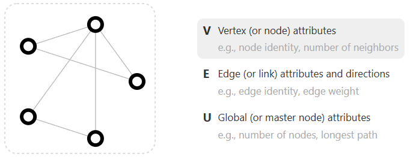
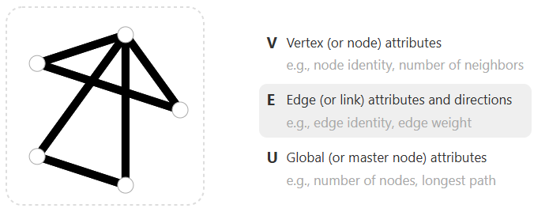
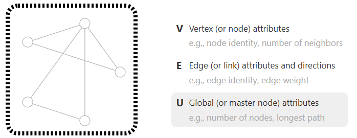

각 노드, 엣지 또는 전체 그래프를 더 자세히 설명하기 위해 그래프의 각 부분에 정보를 저장할 수 있다.

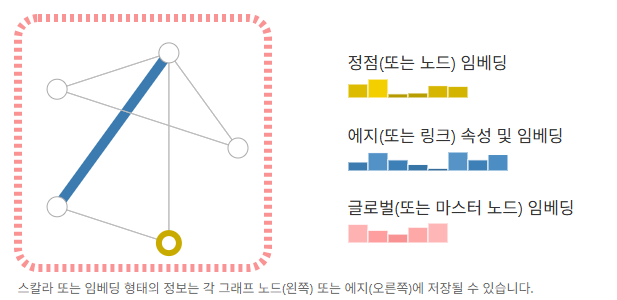

또한 엣지에 방향성을 부여하여 그래프를 더 구체적으로 표현할 수 있다.
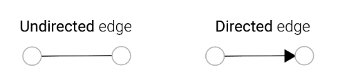

## 그래프를 찾는 방법

우리는 소셜 네트워크와 같은 그래프 데이터에 이미 익숙하다. 그래프는 데이터를 표현하는 강력하고 보편적인 방식이다. 이 글에서는 일반적으로 그래프로 생각하지 않는 이미지와 텍스트도 그래프로 표현해 본다. 이를 통해 이미지와 텍스트의 대칭적 구조를 이해하고, 격자형이 아닌 다양한 그래프 데이터를 이해하는 데 필요한 직관을 기를 수 있다.

### 이미지를 그래프로 표현하기

일반적으로 이미지는 여러 채널을 가진 직사각형 격자이며, 배열로 표현된다. 예를 들어 RGB 이미지는 `244 × 244 × 3` 크기의 배열로 나타낼 수 있다. **이미지를 이해하는 또 다른 방법은 규칙적인 구조를 가진 그래프로 생각하는 것**이다. 여기서 각 픽셀은 노드가 되고, 인접한 픽셀은 엣지로 연결된다.

경계 부분을 제외한 각 픽셀은 8개의 이웃 픽셀을 가지며, 각 노드에는 픽셀의 RGB 값을 나타내는 3차원 벡터가 저장된다.

그래프의 연결성을 표현하는 방법 중 하나는 **인접 행렬(Adjacency Matrix)**을 사용하는 것이다. `5 × 5` 크기의 이미지에는 25개의 픽셀 노드가 있으므로 인접 행렬의 크기는 `25 × 25`가 된다. 두 픽셀이 서로 인접하면 행렬의 해당 위치에 연결 정보를 기록한다. 아래의 세 가지 표현 방식은 동일한 데이터를 서로 다른 관점에서 나타낸 것이다.

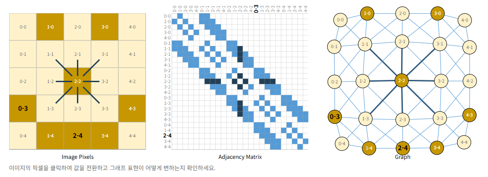

### 텍스트를 그래프로 표현하기

텍스트를 디지털화하려면 각 문자, 단어 또는 토큰에 인덱스를 부여하고, 인덱스의 시퀀스로 텍스트를 표현하면 된다. 이때 각 문자나 토큰을 노드로 보고 바로 다음 노드와 엣지로 연결하면 간단한 방향 그래프가 생성된다.
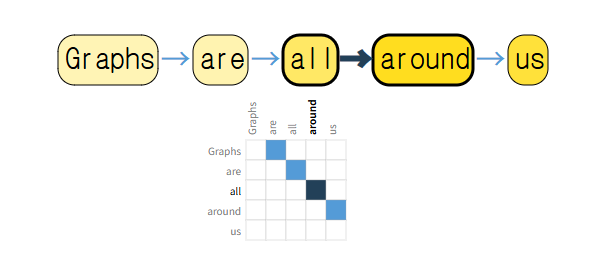

물론 실제로 텍스트와 이미지를 인코딩하는 방식이 항상 이와 같지는 않다. 이미지와 텍스트는 매우 규칙적인 구조를 가지므로 일반적으로 별도의 그래프 표현이 필요하지 않다. 예를 들어 이미지의 인접 행렬은 픽셀이 격자 형태로 연결되므로 띠 모양의 구조를 나타낸다. 텍스트의 인접 행렬은 각 단어가 바로 앞뒤 단어와 연결되므로 주로 대각선 주변에 값이 나타난다.

### 실제 환경의 그래프 데이터

더 이질적인 구조를 가진 데이터에서는 각 노드의 이웃 수가 서로 다를 수 있다. 이러한 데이터는 그래프가 아니면 표현하기 어렵다.

**분자 그래프:** 분자는 3차원 공간에서 원자와 전자로 이루어진 물질의 기본 구성 요소이다. 두 원자가 일정한 거리를 유지하며 결합된 상태를 공유 결합이라고 하며, 단일 결합과 이중 결합 등 여러 유형이 존재한다. 이러한 구조를 그래프로 표현할 때 노드는 원자, 엣지는 공유 결합을 나타낸다. 다음은 흔히 볼 수 있는 두 가지 분자와 이에 대응하는 그래프이다.

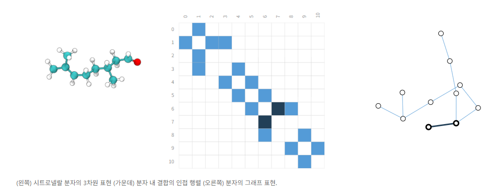

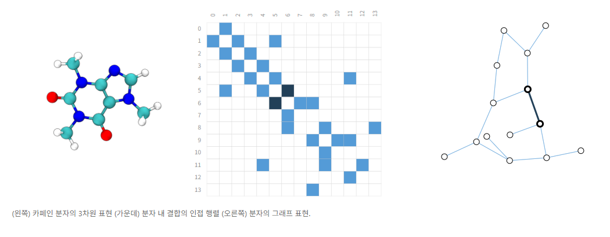

**소셜 네트워크 그래프:** 소셜 네트워크는 개인, 기관, 조직의 집단 행동 패턴을 연구하는 데 활용된다. 개인을 노드로, 개인 사이의 관계를 엣지로 모델링하여 집단의 관계를 나타내는 그래프를 구축할 수 있다.

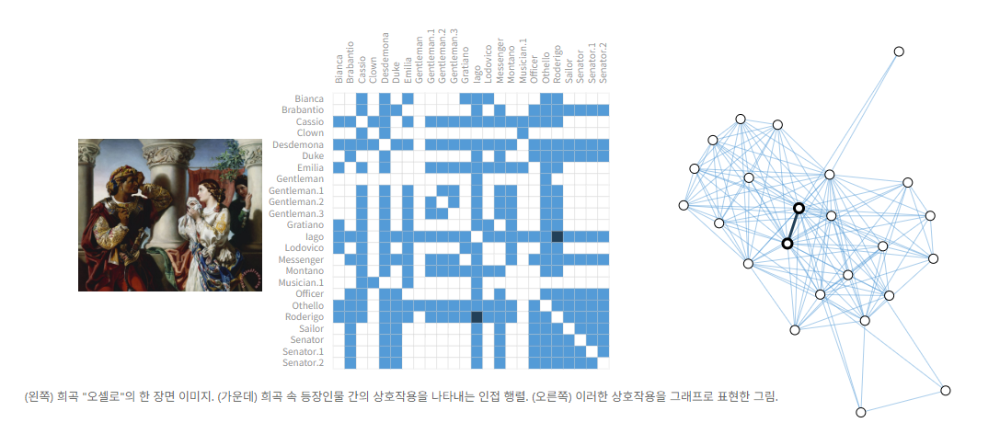

이미지나 텍스트처럼 규칙적인 데이터와 달리, 소셜 네트워크마다 노드 수와 연결 관계가 다르므로 동일한 형태의 인접 행렬을 공유하지 않는다.
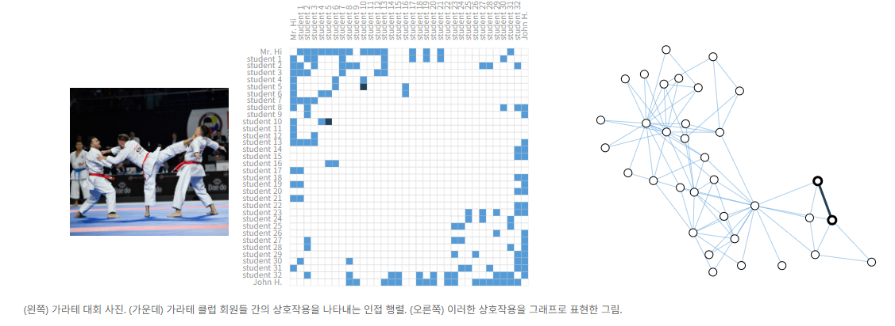

**인용 네트워크 그래프:** 논문을 발표할 때 다른 연구를 인용하는 관계를 그래프로 시각화할 수 있다. 각 논문을 노드로 두고 방향이 있는 엣지로 논문 간 인용 관계를 나타낸다. 각 노드에는 초록의 단어 임베딩과 같은 논문 정보도 추가할 수 있다.

실제 그래프의 구조는 데이터 유형에 따라 크게 다를 수 있다. 어떤 그래프는 노드는 많지만 노드 간 연결은 적은 반면, 그 반대의 경우도 있다. 그래프 데이터셋은 노드 수, 엣지 수, 노드 간 연결성 측면에서 데이터셋 내부와 데이터셋 사이 모두 큰 차이를 보일 수 있다.

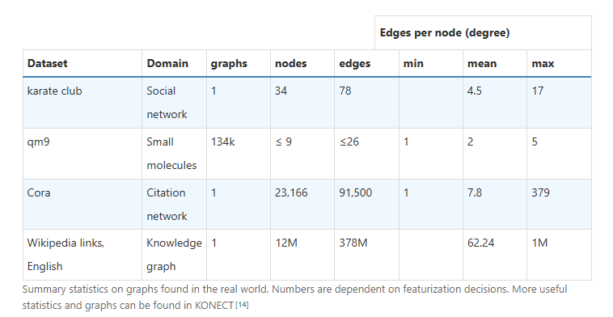

## 그래프에서는 어떤 유형의 예측 문제를 다루는가?

그래프 예측 작업은 크게 **그래프 수준**, **노드 수준**, **엣지 수준**의 세 가지 유형으로 나눌 수 있다.
**그래프 수준 작업**에서는 전체 그래프에 대한 단일 속성을 예측한다. **노드 수준 작업**에서는 그래프의 각 노드에 대한 속성을 예측한다. **엣지 수준 작업**에서는 그래프에서 엣지의 속성 또는 존재 여부를 예측하고자 한다.

세 가지 수준의 예측 문제는 모두 GNN이라는 하나의 모델 계열로 다룰 수 있다. 아래에서는 각 유형을 구체적인 예시와 함께 살펴본다.

### 그래프 수준 작업

그래프 수준 작업의 목표는 전체 그래프의 속성을 예측하는 것이다. 예를 들어 그래프로 표현된 분자가 어떤 냄새를 내는지, 또는 특정 질병과 관련된 수용체에 결합하는지를 예측할 수 있다.

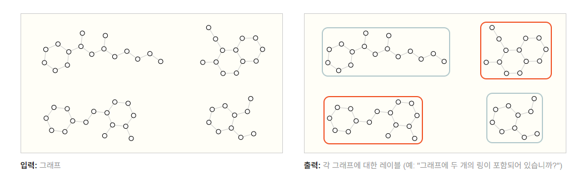

이는 MNIST 및 CIFAR 데이터셋을 사용한 이미지 분류 문제와 유사하다. 이미지 분류에서는 전체 이미지에 레이블을 지정해야 한다. 텍스트의 경우, 비슷한 문제로는 문장 전체의 분위기나 감정을 한 번에 파악하려는 감정 분석이 있다.

### 노드 수준 작업

노드 수준 작업은 그래프 내 각 노드의 정체 또는 역할을 예측하는 것과 관련이 있다.

노드 수준 예측 문제의 대표적인 예는 재커리의 가라테 클럽(Zachary's Karate Club)이다. 이 데이터셋은 갈등 이후 두 집단 중 하나에 속하게 된 구성원으로 이루어진 단일 네트워크 그래프이다. 노드는 개별 구성원을 나타내고, 엣지는 구성원 사이의 상호작용을 나타낸다. 예측 문제는 특정 구성원이 어느 집단에 속하게 되는지를 분류하는 것이다. 이 경우 각 노드와 두 중심 인물 사이의 거리는 레이블과 높은 상관관계를 가진다.

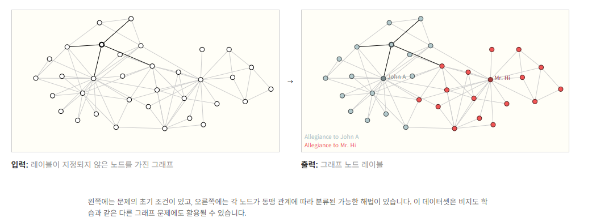

이미지에 비유하면 **노드 수준 예측 문제**는 이미지 분할과 유사하다.
이미지 분할에서는 이미지의 각 픽셀의 역할을 판별하려고 한다. 텍스트의 경우, 이와 유사한 작업은 문장의 각 단어의 품사(예: 명사, 동사, 부사 등)를 예측하는 것이다.

### 엣지 수준 작업

엣지 수준 추론의 한 예는 이미지 장면 이해이다. 딥러닝 모델은 이미지에서 객체를 식별하는 것뿐 아니라 객체 사이의 관계를 예측하는 데에도 사용할 수 있다. 이미지 속 객체를 나타내는 노드가 주어졌을 때, 어떤 노드들이 엣지를 공유하는지 또는 해당 엣지가 어떤 관계를 나타내는지 예측하는 작업이다.

엔티티 간의 연결을 찾고자 할 때, 그래프를 완전 연결 그래프로 간주하고 예측된 값을 기반으로 엣지를 가지치기하여 희소 그래프를 얻을 수 있다.

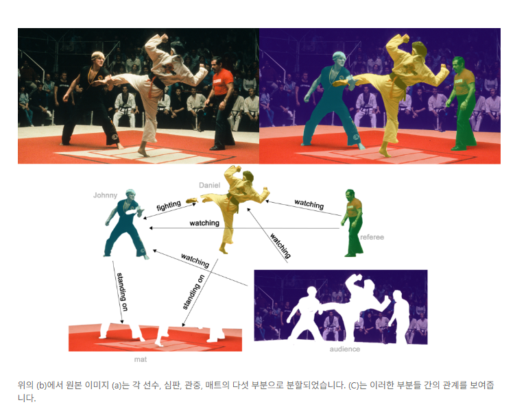

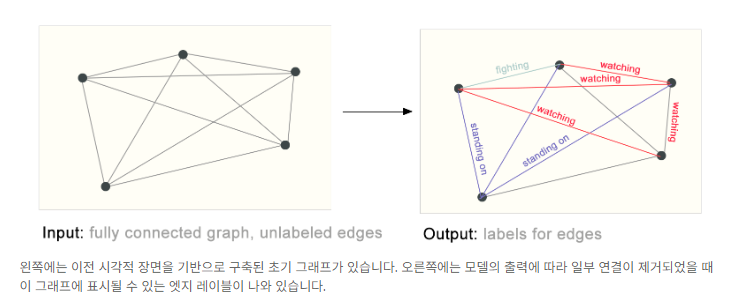

## 머신러닝에서 그래프를 사용하는 데 따르는 어려움

그렇다면 신경망을 이용해 이러한 다양한 그래프 문제를 어떻게 해결할까? 첫 번째 단계는 신경망과 호환되도록 그래프를 어떻게 표현할지 고민하는 것이다.

머신러닝 모델은 일반적으로 직사각형 또는 격자 형태의 배열을 입력으로 받는다. 반면 그래프를 딥러닝과 호환되는 형식으로 표현하는 방법은 상대적으로 직관적이지 않다. 그래프에는 예측에 활용할 수 있는 네 가지 유형의 정보인 노드, 엣지, 전역 컨텍스트, 연결성이 포함될 수 있다.

앞의 세 가지는 비교적 간단하게 표현할 수 있다. 예를 들어 각 노드에 인덱스 \(i\)를 부여하고 노드 \(i\)의 특징을 \(X_i\)에 저장하면 노드 특징 행렬 \(X\)를 구성할 수 있다. 그래프마다 노드 수가 달라 행의 개수는 달라질 수 있지만, 이러한 특징 행렬 자체는 별도의 특별한 기법 없이 처리할 수 있다.

그래프의 연결 관계를 표현하는 것은 조금 더 복잡하다. 가장 직관적인 방법은 텐서로 쉽게 변환할 수 있는 인접 행렬(Adjacency Matrix)을 사용하는 것이다. 그러나 [예제 데이터셋 표](https://distill.pub/2021/gnn-intro/#table)를 보면 하나의 그래프가 수백만 개의 노드를 가질 수 있으며, 노드마다 연결된 엣지 수도 크게 다르다. 이 때문에 인접 행렬의 대부분이 0으로 채워지는 희소 행렬(Sparse Matrix)이 만들어지는 경우가 많으며, 저장 공간 측면에서 비효율적이다.

또 다른 문제는 동일한 연결성을 나타내는 인접 행렬이 여러 개 존재하며, 서로 다른 배열 순서가 심층 신경망에서 동일한 결과를 생성한다는 보장이 없다는 점이다. 즉, 일반적인 행렬 처리만으로는 순열 불변성이 보장되지 않는다.

예를 들어 앞서 언급한 오셀로 그래프는 이 두 인접 행렬을 사용하여 동일하게 표현할 수 있다.
또한 노드의 가능한 모든 순열을 사용해서도 표현할 수 있다.

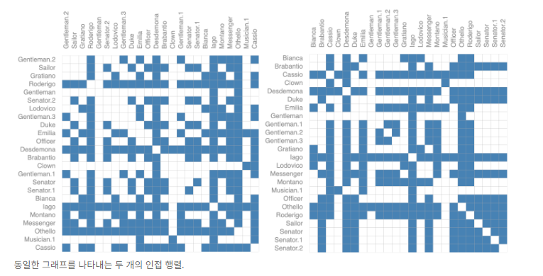

아래 예시는 노드가 4개인 작은 그래프를 설명할 수 있는 모든 인접 행렬을 보여준다. 이는 이미 상당한 수의 인접 행렬이며, 오셀로와 같은 더 큰 그래프의 경우에는 그 수가 너무 많아 감당하기 어렵다.
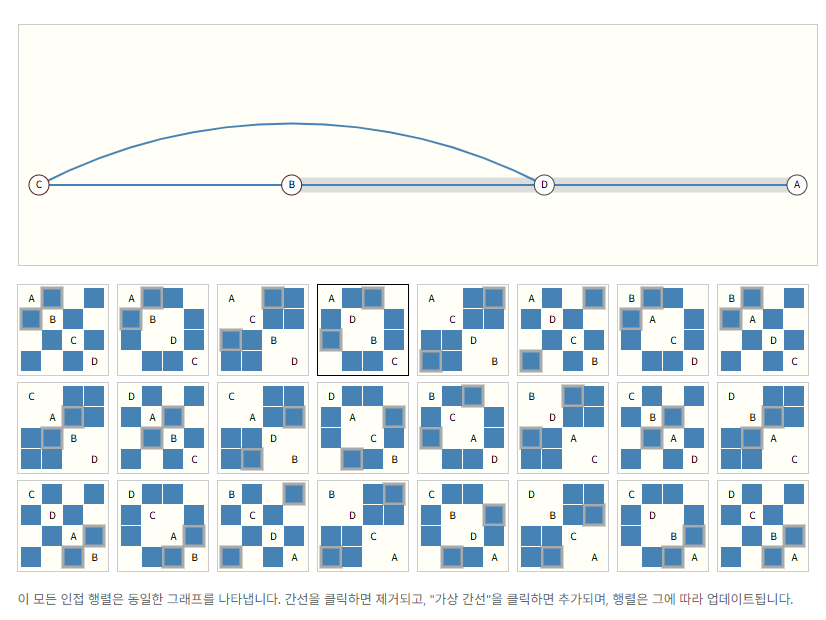


희소한 연결 관계를 메모리 효율적으로 표현하는 방법 중 하나는 인접 리스트(Adjacency List)를 사용하는 것이다.

인접 리스트(Adjacency List)는 노드 \(n_i\)와 \(n_j\)를 연결하는 엣지 \(e_k\)를 \(k\)번째 항목의 순서쌍 \((i, j)\)로 표현한다.

일반적으로 엣지 수 \(M\)은 인접 행렬의 전체 원소 수 \(N^2\)보다 훨씬 적다고 가정할 수 있다(\(M \ll N^2\)). 따라서 인접 리스트를 사용하면 서로 연결되지 않은 그래프 영역에 대한 불필요한 계산과 저장을 피할 수 있다.

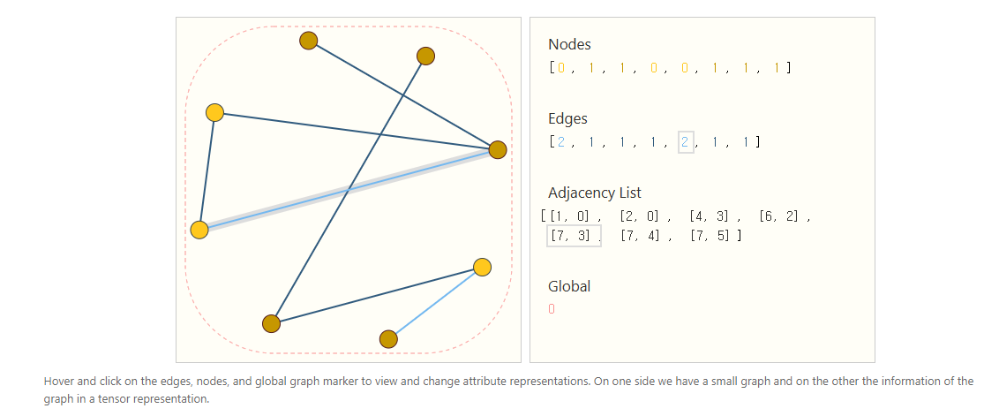

그림에서는 각 노드·엣지·전역 그래프 속성을 하나의 스칼라 값으로 표현했지만, 실제 텐서 표현에서는 일반적으로 각 그래프 속성을 벡터 형태로 사용한다.

따라서 크기가 \([n_{nodes}]\)인 노드 텐서 대신, 실제로는 다음과 같은 크기의 노드 특징 텐서를 사용한다.

$$
[n_{nodes},\ node_{dim}]
$$

여기서 \(n_{nodes}\)는 노드 수이고, \(node_{dim}\)은 각 노드가 가지는 특징의 개수이다. 엣지 및 전역 그래프 속성도 이와 동일한 방식으로 벡터 형태로 표현한다.

## 그래프 신경망

이제 그래프가 순열 불변성을 고려한 행렬 형식으로 표현되었으므로, 그래프 신경망(GNN)을 사용하여 그래프 예측 문제를 해결하는 방법을 살펴본다. **GNN은 그래프의 모든 속성(노드, 엣지, 전역 컨텍스트)에 적용되는 최적화 가능한 변환이며, 그래프의 대칭성인 순열 불변성을 보존한다.**

우리는 Gilmer 등이 제안한 "메시지 전달 신경망" 프레임워크를 사용하여 GNN을 구축할 것이다.
Battaglia 등이 소개한 그래프 넷 아키텍처 개략도를 사용하여 GNN은 "그래프 입력, 그래프 출력" 아키텍처를 채택한다. 즉, 이러한 모델 유형은 노드, 엣지 및 전역 컨텍스트에 정보가 로드된 그래프를 입력으로 받아들이고 입력 그래프의 연결성을 변경하지 않고 이러한 임베딩을 점진적으로 변환한다.

### 가장 간단한 GNN

위에서 구성한 그래프의 수치적 표현을 바탕으로 가장 간단한 GNN 아키텍처부터 살펴보자. 이 아키텍처에서는 그래프의 모든 속성(노드, 엣지, 전역 변수)에 대한 새로운 임베딩을 학습하지만, 아직 그래프의 연결성은 사용하지 않는다.

이 GNN은 그래프의 각 구성 요소에 별도의 다층 퍼셉트론(MLP) 또는 다른 미분 가능한 모델을 사용한다. 이를 GNN 레이어라고 한다. 각 노드 벡터에 MLP를 적용하여 학습된 노드 벡터를 얻는다. 각 엣지에도 같은 과정을 적용해 엣지별 임베딩을 학습하며, 전역 컨텍스트 벡터에는 전체 그래프를 나타내는 하나의 임베딩을 학습한다.

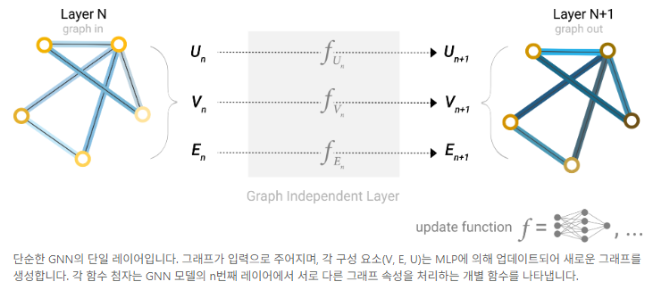

신경망 모듈이나 레이어에서 볼 수 있듯이, 이러한 GNN 레이어들을 함께 쌓을 수 있다.
GNN은 입력 그래프의 연결성을 업데이트하지 않기 때문에 출력 그래프도 입력 그래프와 동일한 인접 리스트와 동일한 개수의 특징 벡터를 가진다.

여기서 **GNN 레이어를 쌓는다**는 것은 노드, 엣지, 전역 컨텍스트의 특징 벡터를 여러 단계에 걸쳐 반복해서 변환한다는 의미이다. 예를 들어 노드 \(i\)의 입력 특징 벡터를 \(h_i^{(0)}\)라고 하면 첫 번째 레이어는 이를 다음과 같이 새로운 임베딩으로 변환한다.

$$
h_i^{(1)} = MLP_V^{(1)}\left(h_i^{(0)}\right)
$$

두 번째 레이어는 첫 번째 레이어가 만든 임베딩을 다시 입력으로 받아 변환한다.

$$
h_i^{(2)} = MLP_V^{(2)}\left(h_i^{(1)}\right)
$$

따라서 레이어를 여러 개 쌓으면 원본 특징은 다음과 같이 점진적으로 가공된다.

```text
원본 특징 벡터 → 1차 임베딩 → 2차 임베딩 → 최종 임베딩
```

**연결성을 업데이트하지 않는다**는 것은 GNN이 기존 그래프에 새로운 노드나 엣지를 추가하거나, 기존 연결을 삭제하지 않는다는 의미이다. 예를 들어 입력 그래프의 연결 관계가 다음과 같다고 가정해 보자.

```text
A → B → C
```

이 그래프의 인접 리스트가 `[(A, B), (B, C)]`라면 여러 GNN 레이어를 통과한 후에도 인접 리스트는 동일하다. 계좌 A, B, C와 거래 A→B, B→C의 존재 및 연결 관계는 유지되고, 각 계좌와 거래에 저장된 특징 벡터만 학습된 임베딩으로 변경된다.

| 구분 | 입력 그래프 | 출력 그래프 |
| --- | --- | --- |
| 노드 수 | 동일 | 동일 |
| 엣지 수 | 동일 | 동일 |
| 인접 리스트 | `[(A, B), (B, C)]` | `[(A, B), (B, C)]` |
| 노드·엣지 특징값 | 원본 특징 | 학습된 임베딩 |

또한 **동일한 개수의 특징 벡터를 가진다**는 것은 노드 3개와 엣지 2개가 입력되었다면 출력에도 노드 임베딩 3개와 엣지 임베딩 2개가 존재한다는 의미이다. 다만 각 벡터의 값은 달라지며, 모델 설계에 따라 벡터의 차원도 달라질 수 있다.

예를 들어 계좌 노드의 입력 특징이 다음과 같을 수 있다.

```text
[최근 거래 횟수, 총거래금액, 고유 상대 계좌 수]
```

GNN 레이어를 통과한 후에는 모델이 학습한 다음과 같은 임베딩으로 변환될 수 있다.

```text
[0.31, -0.82, 1.24, 0.17, ...]
```

여기서 설명하는 **가장 간단한 GNN**은 아직 그래프의 연결 관계를 특징 변환에 사용하지 않는다. 따라서 계좌 A의 임베딩을 갱신할 때 계좌 A의 특징만 사용하며, 연결된 계좌 B나 거래 A→B의 정보는 전달받지 않는다. 이 상태에서 레이어를 여러 개 쌓는 것은 각 노드와 엣지에 독립적으로 더 깊은 MLP를 적용하는 것과 유사하다.

이후에 설명하는 메시지 전달(Message Passing) GNN에서는 기존 연결 관계를 따라 이웃 노드와 엣지의 정보를 전달받아 임베딩을 갱신한다. 일반적으로 한 개의 메시지 전달 레이어는 1-hop 이웃의 정보를 반영하고, 두 개의 레이어를 쌓으면 최대 2-hop 이웃의 정보까지 반영할 수 있다. 이 경우에도 입력 그래프의 연결 자체는 유지되며, 기존 연결을 정보 전달 경로로 사용하여 노드와 엣지의 임베딩을 업데이트한다.

정리하면, GNN 레이어를 쌓는다는 것은 동일한 그래프 구조 위에서 노드·엣지·전역 특징을 여러 단계에 걸쳐 새로운 임베딩으로 변환하는 것이다. 이 과정에서 노드와 엣지의 개수 및 연결 관계는 그대로 유지되고, 각 구성 요소가 가지는 표현값만 학습을 통해 변경된다.

### 정보 풀링을 통한 GNN 예측

우리는 간단한 GNN을 구축했지만, 위에서 설명한 작업들에 대해 어떻게 예측을 할 수 있을까?

이 프레임워크에서는 이진 분류의 경우를 살펴보겠지만, 다중 클래스 분류나 회귀 분석에도 쉽게 확장할 수 있다. 노드에 대한 이진 예측을 수행하는 것이 목표이고 그래프에 이미 노드 정보가 포함되어 있다면, 각 노드 임베딩에 선형 분류기를 적용하면 되므로 접근 방식은 간단하다.

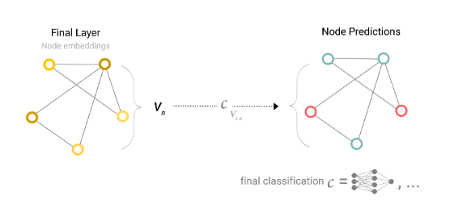

하지만 항상 그렇게 간단한 것은 아니다. 예를 들어 그래프의 엣지에는 정보가 있지만 노드에는 정보가 없는 상태에서 노드를 예측해야 할 수 있다. 이때는 엣지의 정보를 수집해 노드로 전달해야 한다. 이를 위해 풀링(Pooling)을 사용할 수 있으며, 풀링은 다음 두 단계로 진행된다.

1. 통합할 각 항목에 대해 해당 항목의 임베딩을 모두 모아서 행렬로 연결한다.
2. 수집된 임베딩은 일반적으로 합산 연산을 통해 집계된다.

풀링 연산은 \(\rho\)로 나타낸다. 엣지에서 노드로 정보를 모으는 풀링 연산은 \(\rho_{E_n \rightarrow V_n}\)으로 표기할 수 있다.
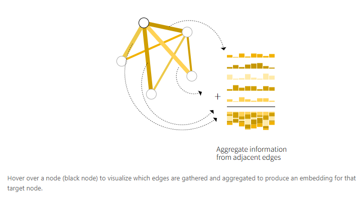

따라서 엣지 레벨 특징만 있고 이진 노드 정보를 예측하려는 경우, 풀링을 사용하여 필요한 곳으로 정보를 전달할 수 있다. 모델은 다음과 같다.

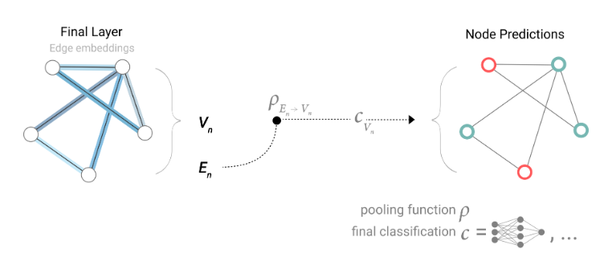

노드 수준의 특징만 있고 이진 엣지 수준 정보를 예측하려는 경우 모델은 다음과 같다.

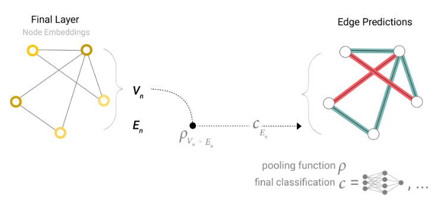

노드 수준의 특징만 있고 이진적인 전역 속성을 예측해야 하는 경우, 사용 가능한 모든 노드 정보를 수집하여 통합해야 한다. 이는 CNN의 전역 평균 풀링 레이어와 유사하다. 엣지에도 동일한 방식을 적용할 수 있다.

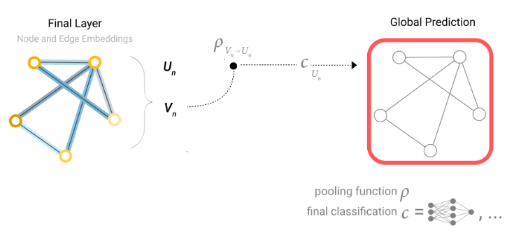

예시에서 분류 모델은 미분 가능한 다른 모델로 쉽게 대체하거나 일반화 선형 모델을 사용하여 다중 클래스 분류에 적용할 수 있다.

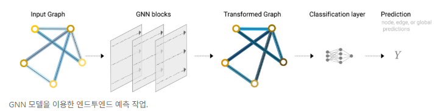

이제 우리는 간단한 GNN 모델을 구축하고 그래프의 여러 부분 간에 정보를 전달함으로써 이진 예측을 수행할 수 있음을 보여주었다. 이러한 풀링 기법은 더욱 정교한 GNN 모델을 구축하는 데 있어 핵심적인 구성 요소가 될 것이다. 새로운 그래프 속성이 추가될 경우, 한 속성에서 다른 속성으로 정보를 전달하는 방법을 정의하기만 하면 된다.

가장 간단한 GNN 구성에서는 GNN 레이어 내부에서 그래프의 연결성을 사용하지 않는다. 각 노드와 엣지, 전역 컨텍스트는 독립적으로 처리되며, 연결성은 예측을 위해 정보를 풀링할 때만 사용된다.

### 그래프의 각 부분 간에 메시지 전달하기

그래프 연결성을 학습된 임베딩에 반영하기 위해 GNN 레이어 내에서 풀링을 사용하면 더욱 정교한 예측이 가능하다. 이를 위해서는 메시지 전달 방식을 활용할 수 있다.
이 과정에서 인접한 노드 또는 엣지는 정보를 교환하고 서로의 갱신된 임베딩에 영향을 미친다.

메시지 전달은 세 단계로 진행된다.

1. 그래프의 각 노드에 대해 모든 인접 노드 임베딩(또는 메시지)을 수집한다.
2. 수집한 메시지를 합계 함수와 같은 집계 함수로 통합한다.
3. 집계 결과를 업데이트 함수(일반적으로 학습된 신경망)에 통과시켜 표현을 갱신한다.

풀링을 노드 또는 엣지에 적용할 수 있는 것처럼 메시지 전달도 노드 또는 엣지 사이에서 수행할 수 있다.
이러한 단계는 그래프의 연결성을 활용하는 데 핵심적이다. 우리는 GNN 레이어에서 메시지 전달 방식을 더욱 정교하게 변형하여 표현력과 성능이 향상된 GNN 모델을 구축할 것이다.

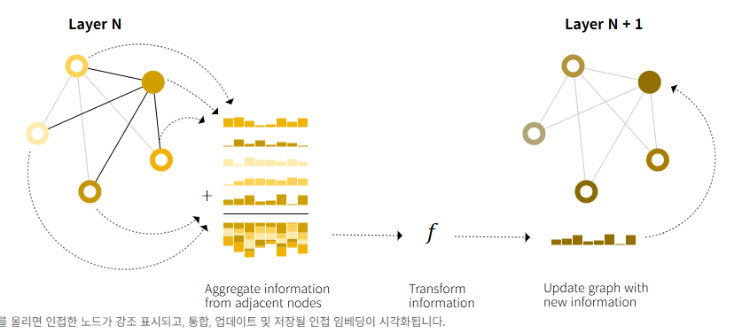

이러한 일련의 연산은 한 번만 적용될 경우 가장 간단한 유형의 메시지 전달 GNN 레이어가 된다.

이는 일반적인 합성곱 연산과 유사하다. 메시지 전달과 합성곱은 모두 대상의 값을 갱신하기 위해 이웃의 정보를 집계하고 처리한다. 그래프에서 대상은 노드이고 이미지에서는 픽셀이다. 그래프에서는 이웃 노드 수가 달라질 수 있지만, 이미지에서는 각 픽셀이 일반적으로 고정된 수의 이웃을 가진다.

메시지 전달 GNN 레이어를 쌓아 올리면 노드는 점차 더 넓은 범위의 정보를 통합할 수 있다. 세 레이어를 거치면 노드는 자신으로부터 세 단계 떨어진 노드의 정보까지 반영할 수 있다. 이러한 이웃 정보의 흐름을 포함하도록 아키텍처 다이어그램을 확장할 수 있다.

### 엣지 표현 학습

데이터셋에 모든 유형의 정보(노드, 엣지, 전역 컨텍스트)가 항상 포함되어 있는 것은 아니다. 노드를 예측해야 하지만 데이터셋에 엣지 정보만 있다면, 위에서 설명한 것처럼 풀링을 사용하여 엣지에서 노드로 정보를 전달할 수 있다. 하지만 이는 모델의 최종 예측 단계에서만 가능하다. 메시지 전달을 사용하면 GNN 레이어 내부에서도 노드와 엣지가 정보를 공유할 수 있다.

이전 절에서 인접 노드 정보를 사용한 것과 같은 방식으로 인접 엣지 정보도 통합할 수 있다. 먼저 엣지 정보를 모은 뒤 업데이트 함수로 변환하여 저장한다.

하지만 그래프에 저장된 노드와 엣지 정보는 크기나 형태가 반드시 같지 않으므로 결합 방법을 정해야 한다. 한 가지 방법은 엣지 공간에서 노드 공간으로, 또는 그 반대 방향으로 선형 매핑을 학습하는 것이다. 업데이트 함수를 실행하기 전에 두 표현을 연결(Concatenation)할 수도 있다.

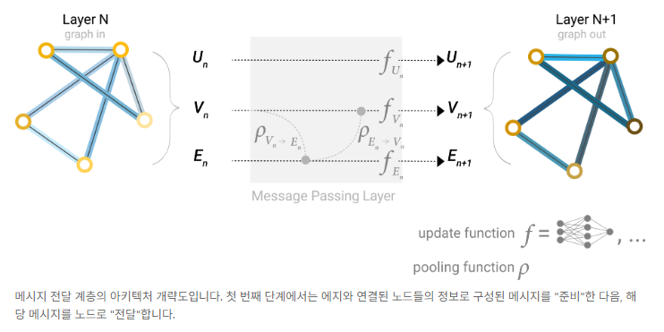

그래프 속성을 어떤 순서로 갱신할지는 GNN을 구축할 때 중요한 설계 사항이다. 예를 들어 노드 표현을 먼저 갱신한 뒤 엣지 표현을 갱신할 수도 있다. 또한 노드→노드와 엣지→엣지의 선형 변환, 노드→엣지와 엣지→노드의 메시지 전달 결과를 결합하여 새로운 노드 및 엣지 표현을 만들 수 있다.

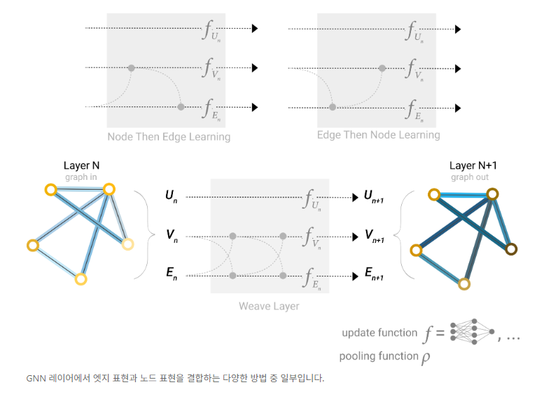

### 전역 표현 추가

지금까지 설명한 네트워크에는 한 가지 단점이 있다. 그래프에서 서로 멀리 떨어진 노드는 여러 번의 메시지 전달이 필요하다. 예를 들어 (k)개의 레이어가 있다면 정보는 최대 (k)-hop까지만 전달된다.

이는 예측이 서로 멀리 떨어진 노드 또는 노드 집합의 관계에 의존할 때 문제가 될 수 있다. 모든 노드를 서로 연결하는 방법도 있지만, 대규모 그래프에서는 계산 비용이 빠르게 증가한다. 이러한 '가상 엣지' 방식은 분자 그래프와 같은 소규모 그래프에서 사용되기도 한다.
이 문제를 해결하는 한 가지 방법은 그래프의 전역 표현 \(U\)를 사용하는 것이다. 이를 **마스터 노드** 또는 **컨텍스트 벡터**라고 한다. 전역 컨텍스트 벡터는 네트워크의 모든 노드와 엣지에 연결되어 정보 전달의 다리 역할을 하고, 그래프 전체에 대한 표현을 구축한다. 이를 통해 더 풍부하고 복잡한 그래프 표현을 만들 수 있다.

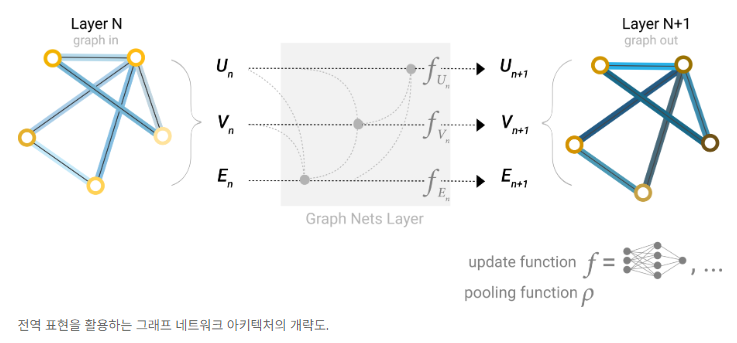

이러한 관점에서 모든 그래프 속성은 학습된 표현을 가지므로, 관심 있는 속성의 정보를 나머지 속성에 대해 조건화함으로써 풀링 과정에서 활용할 수 있다. 예를 들어, 한 노드에 대해 이웃 노드, 연결된 엣지 및 전역 정보를 고려할 수 있다. 이러한 모든 가능한 정보 소스를 기반으로 새로운 노드 임베딩을 조건화하려면 단순히 이들을 연결하면 된다.
또한 선형 매핑을 통해 동일한 공간에서 매핑한 후 더하거나, 특징별 변조 레이어를 적용할 수 있다. 이는 일종의 특징별 주의 메커니즘으로 볼 수 있다.

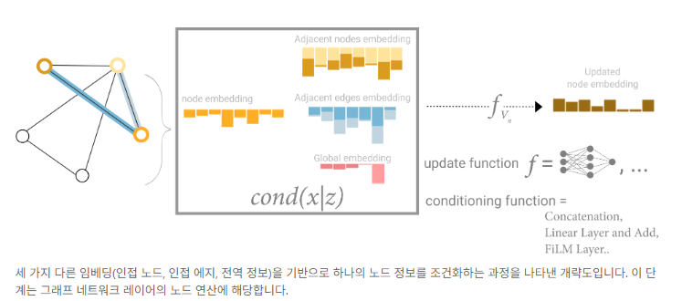

GNN 연구의 핵심 과제 중 하나는 새로운 모델이나 아키텍처를 만드는 것이 아니라, 더 정확히 말하면 "그래프를 구성하는 방법", 즉 그래프에 활용 가능한 추가적인 구조나 관계를 부여하는 것이다.

### 다른 유형의 그래프: 멀티그래프, 하이퍼그래프, 하이퍼노드

이 글에서는 각 속성에 대한 벡터화된 정보를 가진 그래프를 중심으로 설명했지만, 그래프 구조는 훨씬 유연하며 다른 유형의 정보도 수용할 수 있다. 메시지 전달 프레임워크는 새로운 그래프 속성 사이에서 정보가 전달되고 갱신되는 방식을 정의함으로써 더 복잡한 그래프 구조에도 적용할 수 있다.

예를 들어 다중 엣지 그래프 또는 멀티그래프를 생각할 수 있다. 한 쌍의 노드는 여러 유형의 엣지를 공유할 수 있으며, 관계 유형에 따라 노드 사이의 상호작용을 다르게 모델링할 수 있다. 예를 들어 소셜 네트워크에서는 지인, 친구, 가족과 같은 관계에 따라 엣지 유형을 지정할 수 있다.

GNN은 엣지 유형마다 서로 다른 메시지 전달 단계를 사용하도록 구성할 수 있다. 또한 하나의 노드가 다시 그래프를 나타내는 중첩 그래프, 즉 하이퍼노드 그래프도 고려할 수 있다. 중첩 그래프는 계층적 정보를 표현하는 데 유리하다. 예를 들어 분자 네트워크에서는 노드가 분자를 나타내고, 두 분자를 연결하는 엣지가 한 분자를 다른 분자로 변환하는 반응을 나타낼 수 있다. 이 경우 분자 수준의 표현을 학습하는 GNN과 반응 네트워크 수준의 표현을 학습하는 GNN을 함께 사용하고, 훈련 중에 두 수준을 번갈아 학습할 수 있다.

또 다른 유형으로 하이퍼그래프가 있다. 하이퍼그래프에서는 하나의 하이퍼엣지가 두 개 이상의 노드에 연결될 수 있다. 예를 들어 그래프에서 노드 커뮤니티를 식별한 뒤, 각 커뮤니티의 모든 노드에 연결되는 하이퍼엣지를 할당하여 하이퍼그래프를 구성할 수 있다.

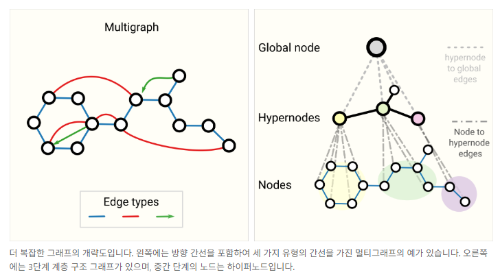

### GNN의 그래프 샘플링과 배치 처리

신경망은 일반적으로 훈련 데이터에서 일정한 크기의 미니배치를 추출하고, 여기서 계산한 기울기로 매개변수를 갱신한다. 그러나 그래프는 노드마다 이웃 수가 다르므로 일정한 크기의 배치를 구성하기 어렵다. 따라서 큰 그래프의 핵심 구조를 보존하는 서브그래프를 추출하여 배치로 사용하는 방법이 필요하다. 샘플링 방식은 데이터의 성격에 따라 달라진다. 예를 들어 인용 네트워크에서는 일부 노드와 엣지를 추출하는 방식이 적절할 수 있지만, 분자 그래프에서는 서브그래프가 원래와 다른 작은 분자를 의미할 수 있으므로 주의해야 한다.
그래프 샘플링 방법은 여전히 연구가 필요한 과제이다. 이웃 수준의 구조를 보존하는 것이 중요하다면, 일정한 수의 노드를 무작위로 뽑아 초기 노드 집합을 만들 수 있다. 그런 다음 이 집합으로부터 거리 \(k\) 이내의 이웃 노드와 엣지를 추가한다. 각 이웃 영역을 개별 그래프로 간주하면 GNN을 이러한 서브그래프의 배치로 학습할 수 있다. 모든 이웃 노드의 주변 구조가 완전하게 포함되지는 않으므로, 손실은 초기 노드 집합만 고려하도록 마스킹할 수 있다. 더 효율적인 전략으로는 단일 노드를 무작위로 선택하고 그 이웃을 거리 \(k\)까지 확장한 뒤, 확장된 집합 안에서 다른 노드를 선택하는 방법이 있다. 필요한 수의 노드, 엣지 또는 서브그래프를 확보하면 샘플링을 종료한다. 상황에 따라 무작위 선택, 랜덤 워크, 메트로폴리스 알고리즘 등을 사용해 일정한 크기의 이웃을 구성할 수 있다.

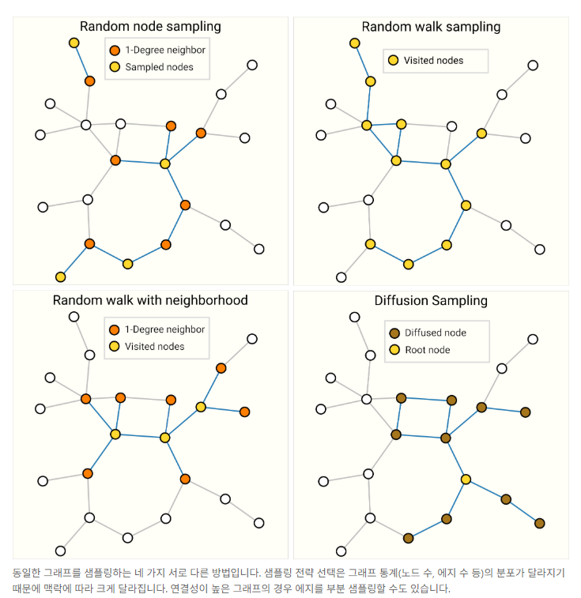

그래프 샘플링은 그래프가 메모리에 담을 수 없을 정도로 클 때 특히 중요하다. 이러한 문제는 Cluster-GCN과 GraphSAINT 같은 학습 전략의 개발로 이어졌다. 그래프 데이터셋의 규모는 앞으로도 계속 증가할 것으로 예상된다.

### 귀납적 편향

특정 유형의 데이터에 대한 문제를 해결하기 위한 모델을 구축할 때, 해당 데이터의 특성을 활용할 수 있도록 모델을 특화하는 것이 중요하다. 이렇게 하면 예측 성능 향상, 학습 시간 단축, 매개변수 감소, 일반화 성능 개선 등의 효과를 얻을 수 있다.

예를 들어 이미지에 레이블을 지정할 때는 개가 이미지의 어느 위치에 있더라도 여전히 개라는 성질을 활용하고 싶다. 따라서 대부분의 이미지 모델은 이동 등변성 또는 불변성을 활용하는 합성곱 연산을 사용한다.

텍스트에서는 토큰의 순서가 중요하므로 순환 신경망은 데이터를 순차적으로 처리한다. 또한 하나의 토큰(예: `not`)이 문장 전체의 의미에 영향을 줄 수 있으므로 텍스트의 다른 부분에 주의를 기울이는 구성 요소가 필요하다. BERT나 GPT 계열의 트랜스포머 모델이 이러한 방식을 사용한다. 이는 데이터의 대칭성이나 규칙성을 모델에 반영하는 귀납적 편향의 예이다.

그래프에서는 각 구성 요소(노드, 엣지, 전역 변수)가 서로 어떻게 관련되는지가 중요하므로 관계적 귀납적 편향을 가진 모델을 사용한다. 모델은 엔티티 사이의 명시적인 관계와 그래프의 순열 불변성을 보존해야 한다. 구체적으로는 집합에 대한 변환을 설계해야 한다. 즉, 노드나 엣지의 입력 순서는 결과에 영향을 주지 않아야 하며, 연산은 가변적인 수의 입력을 처리할 수 있어야 한다.

### 집계 연산 비교

인접 노드와 엣지의 정보를 통합하는 것은 GNN에서 매우 중요한 단계이다. 각 노드는 서로 다른 수의 이웃을 가질 수 있으므로, 입력 순서에 영향을 받지 않고 가변적인 수의 입력을 처리할 수 있는 미분 가능한 집계 연산이 필요하다.

최적의 집계 연산을 선택하고 설계하는 것은 여전히 연구가 진행 중인 주제이다. 바람직한 집계 연산은 유사한 입력에 유사한 결과를 제공하고, 서로 다른 입력은 가능하면 구분할 수 있어야 한다. 순열에 관계없이 동일한 결과를 제공하는 대표적인 연산으로 합계, 평균, 최댓값과 분산 등의 요약 통계가 있다. 이러한 연산은 가변적인 수의 입력을 처리하며, 입력 순서와 관계없이 동일한 출력을 제공한다.

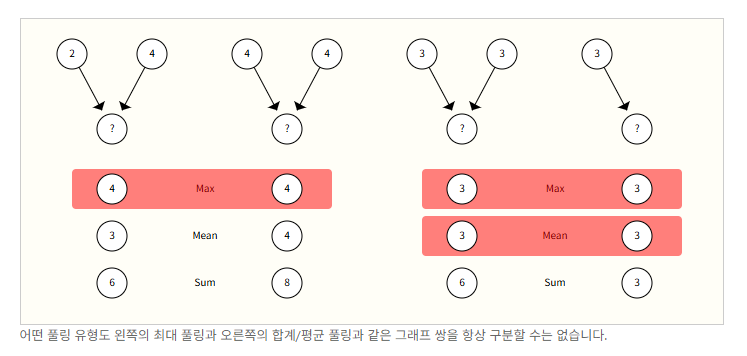

모든 경우에 가장 좋은 연산은 없다. **평균 연산**은 노드마다 이웃 수가 크게 다르거나, 이웃 특징을 정규화해 보고 싶을 때 유용하다. **최댓값 연산**은 이웃 가운데 두드러진 특징을 강조할 때 유용하다. **합계 연산**은 이웃의 수와 특징을 함께 반영하지만, 정규화되지 않으므로 큰 값이나 이상치의 영향을 많이 받을 수 있다. 실제 GNN에서는 합계 연산이 널리 사용된다.

집계 연산(Aggregation Operation)을 설계하는 것은 집합 기반 머신러닝과도 연결되는 미해결 연구 문제이다.

PNA(Principal Neighbourhood Aggregation)와 같은 새로운 접근법은 합계(Sum), 평균(Mean), 최댓값(Max) 등 여러 집계 연산의 결과를 연결(Concatenation)하여 함께 사용한다. 또한 정보를 집계하는 대상 노드의 연결 정도, 즉 차수(Degree)에 따라 결과를 조정하는 스케일링 함수도 적용한다.

한편, 특정 도메인의 특성을 반영한 전용 집계 연산을 설계할 수도 있다. 대표적인 예로 분자의 입체적인 방향성과 구조를 반영하기 위한 Tetrahedral Chirality 집계 연산이 있다.

### 서브그래프 함수 근사기로서의 GCN

각 레이어에서 1-hop 이웃을 조회하는 \(k\)개 레이어의 GCN 또는 MPNN은, \(k\)-hop 범위의 서브그래프에서 학습된 임베딩을 처리하는 신경망으로 볼 수 있다.

특정 노드 하나를 중심으로 살펴보면, \(k\)개의 레이어를 통과한 노드 표현에는 해당 노드로부터 최대 \(k\)-hop 거리에 있는 이웃 정보가 반영된다. 따라서 최종적으로 갱신된 노드 표현은 해당 노드를 중심으로 한 서브그래프의 표현이라고 볼 수 있다. 이러한 원리는 엣지 표현에도 동일하게 적용된다.

예를 들어 각 레이어에서 1-hop 이웃의 정보를 전달받는 경우에는 다음과 같다.

- 1개 레이어: 직접 연결된 1-hop 이웃 정보 반영
- 2개 레이어: 최대 2-hop 이웃 정보 반영
- 3개 레이어: 최대 3-hop 이웃 정보 반영
- \(k\)개 레이어: 최대 \(k\)-hop 이웃 정보 반영

따라서 GCN은 각 노드 또는 엣지를 중심으로 형성되는 여러 \(k\)-hop 서브그래프의 정보를 수집하고, 이를 벡터 표현으로 학습한다고 볼 수 있다.

가능한 서브그래프의 수는 그래프 크기와 연결 수가 증가함에 따라 조합적으로 증가할 수 있다. 따라서 모든 서브그래프를 학습 전에 직접 찾아 나열하는 방식은 계산량과 저장 공간 측면에서 감당하기 어려울 수 있다.

GCN은 모든 서브그래프를 미리 열거하지 않고, 여러 레이어에 걸쳐 이웃 정보를 전달하고 집계함으로써 필요한 서브그래프 표현을 학습 과정에서 동적으로 구성한다.

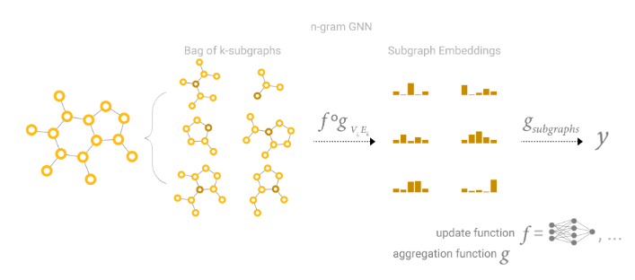

### 엣지와 쌍대 그래프

엣지 예측과 노드 예측은 서로 다른 문제처럼 보이지만, 두 문제를 동일한 형태로 변환할 수 있는 경우가 많다. 그래프 \(G\)에서 수행하는 엣지 예측 문제를 \(G\)의 쌍대 그래프(Dual Graph)에서 수행하는 노드 수준 예측 문제로 표현할 수 있다.

그래프 \(G\)의 쌍대 그래프를 만들 때는 원래 그래프의 노드를 엣지로, 엣지를 노드로 변환한다. 즉, 원래 그래프의 거래 엣지 하나가 쌍대 그래프에서는 하나의 노드가 된다.

예를 들어 원래 그래프가 다음과 같다고 가정해 보자.

```text
원래 그래프 G

계좌 A ──거래 e1──> 계좌 B ──거래 e2──> 계좌 C
```
이를 쌍대 그래프로 변환하면 원래 그래프의 거래 \(e_1\)과 \(e_2\)가 각각 노드가 된다. 두 거래가 계좌 B를 공유하므로 쌍대 그래프에서는 두 노드가 연결된다.

```text
쌍대 그래프

거래 e1 ──공유 계좌 B── 거래 e2
```

원래 그래프와 쌍대 그래프는 동일한 관계 정보를 서로 다른 방식으로 표현한다. 푸리에 변환을 통해 데이터를 주파수 공간에서 표현하면 특정 문제를 더 쉽게 해결할 수 있는 것처럼, 그래프도 표현 방법을 바꾸면 특정 예측 문제를 더 쉽게 다룰 수 있다.

따라서 그래프 \(G\)의 엣지를 분류하려는 문제는 다음과 같이 해석할 수 있다.

1. 그래프 \(G\)를 쌍대 그래프로 변환한다.
2. 원래 그래프의 각 엣지를 쌍대 그래프의 노드로 표현한다.
3. 쌍대 그래프에서 그래프 합성곱을 수행한다.
4. 변환된 노드를 분류하여 원래 그래프의 엣지를 분류한다.

이는 원래 그래프 \(G\)에서 엣지 표현을 학습하는 것과 유사하다. 이러한 아이디어는 Dual-Primal Graph Convolutional Networks에서 발전되었다.
AML 거래 그래프에 적용하면 계좌는 원래 그래프의 노드이고 거래는 엣지이다. 쌍대 그래프에서는 각 거래가 노드가 되므로, 자금세탁 거래 여부를 판단하는 엣지 분류 문제를 거래 노드 분류 문제로 변환할 수 있다.

### 행렬 곱셈으로서의 그래프 합성곱과 그래프 탐색

지금까지 그래프 합성곱과 메시지 전달에 관해 살펴보았다. 그렇다면 이러한 연산을 실제로 어떻게 구현할 수 있을까? 이 절에서는 행렬 곱셈과 메시지 전달의 특성을 살펴보고, 이들이 그래프 탐색과 어떻게 연결되는지 알아본다.

#### 인접 행렬과 노드 특징 행렬의 곱셈

노드가 \(n_{nodes}\)개인 그래프의 인접 행렬 \(A\)는 다음과 같은 크기를 가진다.

$$
A \in \mathbb{R}^{n_{nodes} \times n_{nodes}}
$$

각 노드가 \(node_{dim}\)개의 특징을 가지는 경우, 노드 특징 행렬 \(X\)의 크기는 다음과 같다.

$$
X \in \mathbb{R}^{n_{nodes} \times node_{dim}}
$$

인접 행렬 \(A\)와 노드 특징 행렬 \(X\)를 곱하면 합계 집계(Sum Aggregation)를 사용하는 간단한 메시지 전달을 구현할 수 있다.

$$
B = AX
$$

결과 행렬 \(B\)의 크기는 다음과 같다.

$$
B \in \mathbb{R}^{n_{nodes} \times node_{dim}}
$$

결과 행렬의 원소 \(B_{ij}\)는 인접 행렬 \(A\)의 \(i\)번째 행과 노드 특징 행렬 \(X\)의 \(j\)번째 열의 내적으로 계산된다.

$$
B_{ij}
=
\left\langle A_{\text{row}_i}, X_{\text{column}_j} \right\rangle
$$

이를 전개하면 다음과 같다.

$$
B_{ij}
=
A_{i1}X_{1j}
+
A_{i2}X_{2j}
+
\cdots
+
A_{in}X_{nj}
$$

인접한 노드만 표현하면 다음과 같이 작성할 수 있다.

$$
B_{ij}
=
\sum_{k:A_{ik}>0}X_{kj}
$$

\(A_{ik}\)는 노드 \(i\)와 노드 \(k\) 사이에 엣지가 존재할 때만 1 또는 양수 값을 가진다. 따라서 위의 내적은 노드 \(i\)와 연결된 모든 이웃 노드에서 \(j\)번째 특징값을 가져와 합산하는 과정이라고 볼 수 있다.

예를 들어 노드 \(i\)가 노드 1과 노드 3에 연결되어 있다면 다음과 같이 계산된다.

$$
B_{ij}=X_{1j}+X_{3j}
$$

즉, 행렬 곱셈 \(AX\)는 다음 과정을 수행한다.

1. 노드 \(i\)의 이웃을 찾는다.
2. 이웃 노드들의 특징을 가져온다.
3. 특징별로 값을 합산한다.
4. 노드 \(i\)의 집계 결과를 생성한다.

다만 이 연산은 이웃 노드의 특징을 합산할 뿐, 특징 표현 자체를 학습 가능한 방식으로 변환하지는 않는다. 특징을 학습 가능한 표현으로 갱신하려면 \(X\)에 MLP와 같은 미분 가능한 변환을 행렬 곱셈 전후에 적용할 수 있다.

예를 들면 다음과 같다.

$$
H^{(l+1)}
=
\sigma\left(AH^{(l)}W^{(l)}\right)
$$

각 기호의 의미는 다음과 같다.

- \(H^{(l)}\): \(l\)번째 레이어의 노드 표현
- \(W^{(l)}\): 학습 가능한 가중치 행렬
- \(A\): 노드 연결 관계를 나타내는 인접 행렬
- \(\sigma\): ReLU 등의 활성화 함수
- \(H^{(l+1)}\): 다음 레이어에서 갱신된 노드 표현

#### 인접 리스트를 사용하는 이유

인접 행렬 \(A\)는 대부분의 원소가 0인 희소 행렬인 경우가 많다. 따라서 \(A_{ij}=0\)인 모든 원소에 대해 곱셈과 덧셈을 수행할 필요는 없다.

인접 리스트를 사용하면 실제로 엣지가 존재하는 위치만 저장할 수 있다.

```text
A의 이웃: [B, E]
```

인덱스를 기반으로 필요한 노드 특징만 가져오면 인접 행렬 전체를 직접 곱하지 않고도 메시지 전달을 수행할 수 있다.

이 방식에는 다음과 같은 장점이 있다.

- 연결되지 않은 노드에 대한 불필요한 계산을 줄인다.
- 희소 그래프의 저장 공간을 절약한다.
- 합계뿐만 아니라 평균, 최댓값, 최솟값 등의 집계 연산을 사용할 수 있다.
- 인접 행렬 전체를 메모리에 올리지 않아도 된다.

#### 행렬 곱셈과 그래프 탐색

인접 행렬을 여러 번 곱하면 더 멀리 떨어진 노드까지 정보를 전달할 수 있다. 이러한 관점에서 인접 행렬의 곱셈은 그래프를 따라 이동하는 탐색 과정으로 볼 수 있다.

인접 행렬 \(A\)에서 \(A_{ij}>0\)이면 노드 \(i\)와 노드 \(j\) 사이에 길이 1의 연결이 존재한다는 뜻이다.

인접 행렬의 제곱 \(A^2\)을 생각해 보면, 원소 \((A^2)_{ij}\)는 노드 \(i\)에서 노드 \(j\)까지 이동하는 길이 2의 워크(Walk) 수를 나타낸다.

$$
(A^2)_{ij}
=
\sum_k A_{ik}A_{kj}
$$

이를 전개하면 다음과 같다.

$$
(A^2)_{ij}
=
A_{i1}A_{1j}
+
A_{i2}A_{2j}
+
\cdots
+
A_{in}A_{nj}
$$

예를 들어 다음 항이 양수가 되려면 두 조건이 모두 충족되어야 한다.

$$
A_{i1}A_{1j}>0
$$

- 노드 \(i\)와 노드 1 사이에 엣지가 존재한다.
- 노드 1과 노드 \(j\) 사이에 엣지가 존재한다.

따라서 두 엣지는 다음과 같은 길이 2의 이동 경로를 형성한다.

```text
노드 i → 노드 1 → 노드 j
```

합계 연산은 노드 \(i\)와 노드 \(j\) 사이에 존재할 수 있는 모든 중간 노드 \(k\)를 확인한다. 따라서 \((A^2)_{ij}\)는 가능한 길이 2의 워크 수를 계산한다.

여기서 워크는 동일한 노드를 여러 번 방문할 수 있는 이동 경로를 의미한다. 이는 각 노드를 최대 한 번만 방문하는 단순 경로(Simple Path)와 다르다.

이러한 원리는 더 높은 차수의 행렬에도 동일하게 적용된다.

$$
A^3 = A A^2
$$

\(A^3\)의 원소는 길이가 3인 워크의 수를 나타낸다. 일반적으로 \(A^k\)의 원소는 길이가 \(k\)인 워크의 수를 나타낸다.

$$
(A^k)_{ij}
=
\text{노드 } i \text{에서 노드 } j \text{까지 길이가 } k \text{인 워크의 수}
$$

이 관계는 GNN에서 레이어를 여러 개 쌓았을 때 더 멀리 떨어진 노드의 정보가 전달되는 이유를 설명한다.

- GNN 1개 레이어: 1-hop 이웃 정보 반영
- GNN 2개 레이어: 최대 2-hop 이웃 정보 반영
- GNN 3개 레이어: 최대 3-hop 이웃 정보 반영
- GNN \(k\)개 레이어: 최대 \(k\)-hop 이웃 정보 반영

따라서 행렬 곱셈은 단순한 수치 계산을 넘어, 그래프의 연결을 따라 이동하면서 주변 정보를 수집하는 과정으로 이해할 수 있다.

> 방향 그래프에서는 인접 행렬을 정의하는 방식에 따라 메시지가 전달되는 방향이 달라질 수 있다. 따라서 구현할 때 송신 노드와 수신 노드의 방향을 명확하게 정의해야 한다.

### 그래프 어텐션 네트워크

그래프의 구성 요소 사이에서 정보를 전달하는 또 다른 방법은 어텐션(Attention)을 사용하는 것이다.

예를 들어 중심 노드와 1-hop 이웃 노드의 정보를 합계 방식으로 집계할 때, 모든 이웃의 정보를 동일하게 더하는 대신 각각 다른 가중치를 적용한 가중합(Weighted Sum)을 사용할 수 있다.

이때 해결해야 할 문제는 노드의 순서가 바뀌어도 결과가 달라지지 않도록, 즉 순열 불변성을 유지하면서 각 이웃 노드에 적절한 가중치를 부여하는 것이다.

한 가지 방법은 두 노드의 특징을 입력받아 가중치를 계산하는 스칼라 점수 함수를 사용하는 것이다.

$$
f(node_i, node_j)
$$

여기서 \(node_i\)는 정보를 집계하는 중심 노드이고, \(node_j\)는 중심 노드와 연결된 이웃 노드이다. 점수 함수는 이웃 노드 \(node_j\)가 중심 노드 \(node_i\)와 현재 작업에 얼마나 관련이 있는지를 측정한다.

계산된 점수는 Softmax 함수 등을 사용해 정규화할 수 있다.

$$
\alpha_{ij}
=
\frac{\exp(e_{ij})}
{\sum_{k \in \mathcal{N}(i)}\exp(e_{ik})}
$$

여기서 \(e_{ij}\)는 노드 \(i\)와 노드 \(j\) 사이에서 계산된 어텐션 점수이고, \(\alpha_{ij}\)는 정규화된 어텐션 가중치이다.

중심 노드의 새로운 표현은 이웃 노드의 특징에 어텐션 가중치를 적용한 가중합으로 계산할 수 있다.

$$
h_i'
=
\sum_{j \in \mathcal{N}(i)}
\alpha_{ij}Wh_j
$$

이를 통해 모델은 현재 작업과 더 관련 있는 이웃 노드에 더 큰 가중치를 부여할 수 있다. 이러한 개념은 그래프 어텐션 네트워크(Graph Attention Network, GAT)와 Set Transformer의 기반이 된다.

점수는 노드의 위치나 입력 순서가 아니라 두 노드의 특징을 기반으로 계산되므로 순열 불변성을 유지할 수 있다.

대표적인 점수 계산 방식으로 두 노드 벡터의 내적을 사용할 수 있다. 모델의 표현력을 높이기 위해 점수를 계산하기 전에 선형 변환을 통해 노드 특징을 Query 벡터와 Key 벡터로 변환하기도 한다.

$$
q_i=W_Qh_i
$$

$$
k_j=W_Kh_j
$$

$$
e_{ij}=q_i^\top k_j
$$

또한 어텐션 가중치는 특정 예측 작업에서 어떤 이웃 노드나 엣지가 상대적으로 중요하게 사용되었는지 확인하는 보조적인 지표로 활용할 수 있다.

다만 어텐션 가중치가 높다는 사실만으로 해당 노드나 엣지가 모델 예측의 확정적인 원인이라고 해석해서는 안 된다. 설명 가능한 결과가 필요하다면 GNNExplainer 등의 별도 설명 기법이나 구조 기반 규칙을 함께 사용하는 것이 좋다.

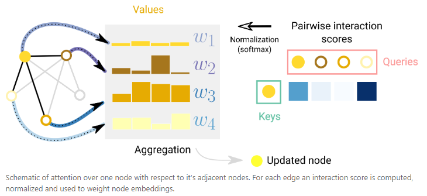

또한 트랜스포머는 어텐션 메커니즘을 사용하는 GNN으로 해석할 수 있다. 이러한 관점에서 트랜스포머는 여러 요소(예: 문자 토큰)를 완전 연결 그래프의 노드로 모델링하고, 어텐션 메커니즘은 각 노드 쌍에 엣지 임베딩을 할당하여 어텐션 가중치를 계산한다. 차이는 엔티티 사이의 연결 패턴에 있다. 일반적인 GNN은 희소한 연결을 가정하는 반면, 트랜스포머는 모든 노드 쌍의 연결을 모델링한다.

