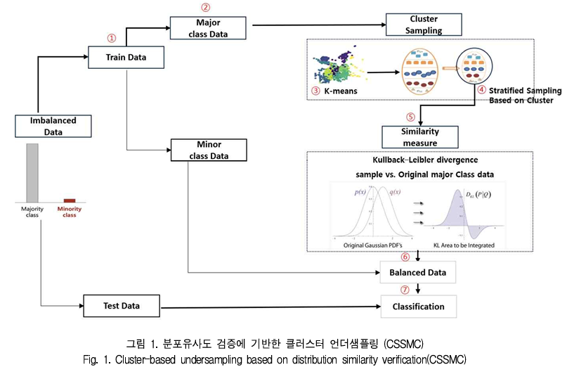
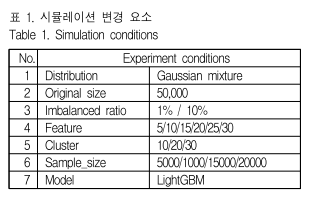
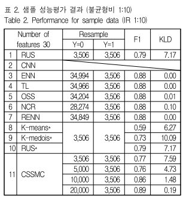
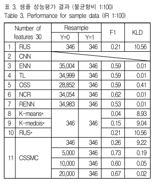
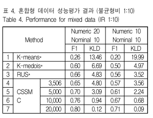
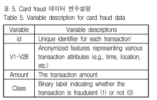
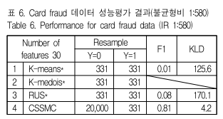

# 클래스 불균형 데이터 분류 예측을 위한 클러스터 기반 언더샘플링 기법

데이터 불균형문제는 크게 두가지 접근법으로 해결함
1. 알고리즘 수준방법
  - 기존 기계학습 알고리즘의 오차함수를 수정, 비용함수를 사용해 소수 클래스에 더 큰 중요도를 주어 성능을 높이는 방법
2. 데이터 수준 방법
  - 데이터의 일부를 제거하거나 증폭시켜 데이터의 불균형성을 해소
  - 오버 or 언더 샘플링 아니면 두개를 결합한 앙상블
  - 오버 샘플링은 빅데이터 처리를 위한 처리시간과 저장공간 등 경제적 비용이 발생하기 때문에 언더 샘플링을 활용해 문제해결에 초점을 맞춤

전통적인 언더샘플링 방법은 데이터 제거로 인한 정보 손실과 샘플 크기 선택을 위한 자유도의 한계가 있었음
본 논문은 다수클래스의 정보력을 잃지 않으면서 분류예측 성능을 향상 시킬 수 있는 클러스터 기반 최적 언더샘플링 방법을 제안

클래스의 정보를 보존하는 샘플링을 위해 **쿨백-라이블러 발산(KLD, Kullback-Leibler Divergence) 함수**를 추출된 샘플과   모집단과의 유사성 검증 지표로 활용

언더 샘플링은 다수클래스를 삭제하여 클래스간 분류 경계면을 조절하는 방법

다양한 언데샘플링 방법
CNN(Condenced Nearest Neibour)
- P. E. Hart(1968)에 의해 제시
- 무작위로 다수 클래스를 제거하는 RUS와는 달리 다수 클래스 데이터 포인트와 가장 가까운 데이터가 소수클래스가 아니면 모두 삭제하는 방법
- 두 클래스 경계가 명확할 때 경계 부분 데이터만 남겨 최소한의 부분집합을 찾는 게 목적인 샘플링 방법으로 데이터 축소 효과가 크다.
- 하지만 표본의 숫자가 커지면 시간이 많이 걸린다.

ENN(Editetd Nearest Neighbours)
- D. L. Wilson(1972)에 의해 제시
- 이상치와 결정 경계의 데이터를 제거할 수 있는 방법
- 다수클래스 포인트를 기준으로 KNN을 적용하는데 일반적으로 K=3를 사용하게 된다.
- 소수클래스의 자료가 굉장히 적은 경우 제거되는 다수클래스의 자료가 거의 없을 수 있다. 

Repeated ENN(RENN)
- I. Tomek이 1976년 발표
- 리샘플링된 데이터의 집합의 변화가 없을 때까지 ENN을 받복적으로 수행하는 방식

ALL_KNN
- ENN을 변형한 방식으로 k값을 설정하여 1 ≤ i≤ k 범위의 모든 i-NN을 수행


NCR(Neighborhood Cleaning Rule)
-  J. Laurikkala(2001) 에 의해 제시
- 두단계를 치는데 먼저, ENN을 통해 일부 다수 클래스를 제거한 뒤 소수클래스를 기준으로 KNN(k=3)을 수행했을 때 2개 이상의 자료가 다수클래스로 분류되는 경우 다수 클래스를 삭제
- ENN과 마찬가지로 소수의 클래스가 굉장히 적거나 클래스간 데이터 중첩이 적은 경우 많은 데이터를 제거할 수 없다.

TL(Tomek’s Link)
- I. Tomek(1976)에 의해 제시
- 불균형 자료의 이상치와 결정 경계의 자료를 제거하기 위한 방법
- **Tomek's link**란 서로 다른 클래스를 갖는 두 표본 (xᵢ, xⱼ)에 대해, d(xᵢ, xₖ) < d(xᵢ, xⱼ) 또는 d(xₖ, xⱼ) < d(xᵢ, xⱼ)를 만족하는 표본 xₖ가 존재하지 않을 때의 표본 쌍 (xᵢ, xⱼ)을 의미한다.
- Tomek’s link가 성립하는 자료들을 찾은 뒤 해당 자료 중 다수클래스의 자료를 제거하여 샘플링 하는 방법

OSS(One Side Selection)
- K. Miroslav and S. Matwin (1997)에 의해 제안
- Tomek’s link를 수행한 뒤 추가로 CNN을 수행한다
- 구체적으로는 중복된 데이터를 제거하는 방법으로 CNN을 사용하고 이후 노이즈 데이터와 결정 경계 근처 데이터를 제거하는 방법으로 Tomek’s link를 사용하는 방식

NearMiss-1
- I. Mani(2003)
- 다수 클래스 데이터 포인트와 가장 가까운 소수 클래스 데이터 3개 와의 평균 거리를 계산하고 평균 거리가 가장 작은 데이터를 비율에 맞게 남기고 그 외에는 삭제하는 방법이

NearMiss-2 
- NearMiss-1과는 반대로 가장 먼 데이터를 3개 뽑도록 변형한 방식

NearMiss-3
- NearMiss-1 방법과 동일하게 작동하지만 소수클래스 데이터 N개를 사용자가 지정해 주는 방법

RUS(Random Under Sampling)
- 다수 클래스 데이터를 소수 클래스 수 만큼 샘플링하는 방법

결국 모집단의 특성을 반영하는 언더샘플링을 하는 것이 중요한데 2017년 W.-C. Lin은 k-means 알고리즘을 사용하
여 다수클래스의 데이터를 소수클래스 데이터 만큼 군집화하고 군집의 평균값을 다수클래스의 데이터로 대체시키는 군집화 기반 언더샘플링(이하 k-means*)을 제안하였다.

이 방법은 다수클래스의 특징을 잘 나타내는 데이터를 골고루 추출할 수 있는 장점이 있다
그러나 실제 데이터가 아닐 수 있는 군집의 평균값을 대표 데이터로 사용하기 때문에 정보의 왜곡이 발생할 수 있다.
이를 해결하기 위한 방법으로 군집의 중심을 실제 데이터로 대체하는 언더샘플링(이하 k-medois*) 알고리즘을 사용
하여 기존의 k-means를 사용한 언더샘플링의 단점을 극복하였다.

2023년 두 단계로 구성된 접근 방식을 활용한 불균형 데이터의 클러스터 기반 언더 샘플링 방법이 제안되었다
이 방법의 주요 특징은 
첫 번째 단계에서 클러스터링 기법을 사용하여 다수 클래스의 샘플을 클러스터로 분할하고, 두 번째 단계에서는 
언더 샘플링을 통해 각 클러스터에서 소수클래스 샘플을 제거하는 방식

이렇게 함으로써 데이터의 불균형을 줄이고 분류 모델의 성능을 향상 시킬 수 있다고 함

기존의 언더샘플링 연구 방법은 대부분 분류예측 성능을 높이기 위해 다양한 알고리즘을 활용하고 데이터를 축약하는 것에 중심을 두고 진행되어 왔는데 샘플링 데이터가 전체 모집단을 대표한다고 주장할 수 있는 검증단계가 없었으므로 테스트 데이터를 통해서만 성능 확인이 가능 했던 것이 사실이다.
이에 검증단계가 추가된 논문이 2019년에 발표됬는데 내용을 보면 
1. 다수 클래스에서 소수클래스 수만큼 RUS로 추출
2. 나머지 다수클래스 데이터를 균등하게 두개로 나누고 이 중 한계만 사용해서 새로 라벨링 후 분류 모델 생성
3. 추출한 데이터와 사용하지 않은 나머지 데이터를 정확히 구분할 수 있는지 성능 검증
4. 랜덤 확률이 0.5 근처로 측정된다면 데이터 차이가 없다고 간주하고 추출한 데이터를 최종 샘플로 결정


샘플링 전 후의 데이터 유사성을 검증하는 값으로 쿨백-라이블러 발산을 사용 정확한 원리는 모르겠음 그냥 저 식이 유도가 됨일단

기존의 언더샘플링 기법은 다수클래스와 소수클래스 분포에 따라 데이터 축약의 효과가 미미한 경우가 많아서 
본 연구에서는 다수 클래스를 축약하는 시간과 비용을 줄이면서 분류 성능을 높이는 언더샘플링 기법인 CSSMC(Cluster Subset Similar to the Major Class)를 제안
특히 정보 손실을 최소화하고 불균형 데이터의 분류 예측 성능을 높이는데 우수한 방법인 클러스터 기반의 알고리즘을 + 층화추출법으로 샘플링하여 표본의 대표성을 향상시키고자함

분석 시간을 줄이기 위해서는 도출된 샘플이 최종 테스트 데이터를 통한 성능평가 단계 이전에 높은 확률로 모집단을 대표한다고 판단 할 수 있어야 한다. 따라서 샘플의 분포가 다수클래스의 분포를 잘 축약하는지를 판단하는 **유사성 검증** 을 통해 검토 시간을 감소시켜 빠른 모델 적합이 가능할 수 있게 하고 이를 위해 두 데이터 집단의 확률 분포 차이를 계산하는 함수인 쿨백-라이블러 발산 값을 분포유사도 개념으로 사용



1. Original 불균형 데이터에서 train 데이터를    
분리하고 이 중 다수클래스(y=0) 만으로      
k-means cluster를 수행한다. (①-③)
2. (1)에서 얻어진 cluster를 기준으로 층화추출
샘플링을 진행하여 여러 subset을 얻는다. (④)
3. (2)의 subset 중 train 데이터의 쿨백-라이블러  
발산 값을 계산하고 가장 작은 값을 갖는   
subset을 최종 샘플로 결정한다. (⑤)
4. 소수클래스 데이터와 (3)으로부터 얻은 최종 
샘플을 결합하여 균형데이터를 만든다 (⑥)
5.  분류모델에 적합시킨 후 Test 데이터를 통해  
성능을 평가한다. (⑦) 

데이터의 불균형이 심할수록 신경망모형보다 머신러닝모형의 예측력이 더 높다는 것은 여러 연구
에서 증명된 바가 있다. 이에 본 연구에서는 예측력을 높이고자 LightGBM을 분류예측 성능 평가 모델로 사용

### 실험설계

#### 두 데이터 집단 생성
X1: 다변량 정규분포에서 생성한 다수 클래스 데이터
X2: 다른 다변량 정규분포에서 생성한 소수 클래스 데이터
- 변수 개수: 5, 10, 15, 20, 25, 30



### 성능평가
- Train 데이터에서의 불균형 비율 1:10 하에서 feature 30개 생성 후 각 알고리즘대로 샘플을 추출하고 LightGBM을 사용하여 성능을 평가한 결과
- 1번부터 7번까지는 기존의 연구방법론
- 8~10번 모집단을 반영하는 언더 샘플링
- 마지막 논문에서 제안하는 샘플링

#### K-means* 
- K-means 군집의 중심접 사용 -> 여러 표본의 평균인 가상 중심점
- 다수 클래스 34,994건을 3,506개 군집으로 나누고, 각 군집의 평균 위치인 중심점 Centroid를 하나씩 사용
- 중심점은 여러 실제 표본의 평균으로 만든 값이므로 원본에 실제로 존재하지 않는 가상 표본일 수 있다
```
다수 클래스 34,994건
        ↓ K-means, K=3,506
3,506개 군집
        ↓ 각 군집 중심점 1개
Y=0 표본 3,506개
```

#### K-medoids*
- 군집의 실제 대표 표본 사용 -> 원본에 존재하는 실제 표본
- K-means와 비슷하게 군집화하지만 평균 중심점을 만들지 않고, 각 군집에서 중심에 가장 가까운 실제 데이터 한 건을 대표로 선택
```
Cluster 1 → 실제 표본 A 선택
Cluster 2 → 실제 표본 B 선택
Cluster 3 → 실제 표본 C 선택
```

#### RUS*
RUS*도 기본적으로는 무작위 추출, 차이는 추출한 표본이 원래 모집단을 잘 대표하는지 별도의 분류모델로 검증하는 절차가 추가된다는 것임

```
추출 표본과 원래 모집단을
분류모델이 구분할 수 없음
        ↓
두 분포가 유사하다고 판단
        ↓
추출 표본 채택
```

### 결과
- 3번에서 7번까지 RUS를 제외한 모든 언데 샘플링 방법은 다수 클래스 모집단 축약 효과가 거의 없다. 
  - KLD가 작은건 그래서임
  - ENN은 소수클래스 주변 다수 클래스를 삭제시키는 방식이기 때문에 클래스 경계에 있는 데이터에만 초점을 맞추는 방식이기 때문
  - 불균형 데이터처럼 소수 클래스가 상당히 적은 경우에는 데이터 축소 효과를 낼 수 없다.
  - Tomek’s link는 데이터 불균형 환경에서 묶이는 샘플 쌍의 조합이 한정적이므로 데이터의 실제 크기를 축소하지 못함
- 기존의 언더샘플링 방식은 클래스 간 분류 경계면을 명확하게 방식으로 작동하기 때문에 데이터 불균형 환경에서는 언더 샘플링 효과가 떨어지는 한계가 있음

#### 샘플 성능평가 결과 (불균형비 1:10)


#### 샘플 성능평가 결과 (불균형비 1:100)
- SSMC사용 모형의 F1 Score는 샘플 크기 10,000기준 0.60으로 앞서 실험한 1:10의 불균형 환경에서의 F1 Score값인 0.86보다는 작지만 다른 방법론과의 성능 차이가 더 뚜렷함을 확인했다.



### 데이터 형태에 따른 성능 비교
- 데이터 축약효과가 없는 기존 방법은 제외하고
- 논문에서 제안한 (K-means*, K-medois*, RUS*, CSSMC)로만 성능 비교

- 이때 평균 백터 거리를 3으로 제한
  - x1과 x2는 서로 다운 가우시안 분포에서 생성되는데, 만약 두 클래스의 평균이 너무 멀리 떨어져 있으면 데이터가 완전히 분리되어 어떤 언더샘플링을 사용해도 분류모델을 쉽게 맞출 수 있기 때문에
  - 그렇게 되면 애초에 두 클래스가 너무 쉽게 구분되기 때문에 방법의 차이를 비교할 수 없다.

- 앞선 실험에서는 모든 변수를 수치형으로 구성하였는데 현실세게는 수치형 + 범주형인 경우가 많아 혼합데이터에서도 성능 평가를 확인하는 실험을 추가함
- 이때 K-means를 그대로 사용하면 범주형데이터의 정보를 손실할 수 있기 때문에 K-prototype를 사용
- K-prototypes는 수치형과 범주형 변수를 서로 다른 방법으로 처리하고 그 결과를 합쳐 군집화
  - 수치형 변수 → K-means 방식(유클리드 거리 사용)
  - 범주형 변수 → K-modes 방식(값을 결합하여 군집 결정)

- CSSMC 방법은 주어진 환경에서 기존 방식보다우위의 예측 성능을 보임


### 실증 데이터 분석
- kaggle의 ‘creditcard’ 데이터를 활용
- 유럽 카드 소지자의 2013년 신용카드 거래를 포함하는 28만 건 이상의 레코드로 구성되어 있으며 카드 소지자의 개인정보
를 보호하기 위해 익명화 처리되었다. 이 중 학습에 사용한 데이터는 정상 199,020, 사고 344개로 불균형비는 약 1:580



- 알고리즘과 미세조정 등의 영향을 통제한 상황에서의 샘플링 성능을 평가하고자 하는 것이 목적이므로 앞서 시뮬레이션에서 활용한 LGB모형과 하이퍼파라미터를 동일하게 사용

- CSSMC의 cluster와 샘플 수는 각각 15, 20,000으로 설정

- K-medoids 값은 메모리 문제로 못얻음
- 중앙값은 평균에 비해 이상치에 영향을 덜 받기 때문에 K-medoids 방법론은 K--means방법에 비해 안정적인 장점이 있으나
계산복잡도가 훨씬 높기에 속도가 상당히 느림


### 결론 
CSSMC의 성능이 우수함을 확인할 수 있어지만 범주형 변수가 전체 데이터에서 차지하는 비중이 커질수록 수치형 데이터
로만 이루어진 샘플에 비해 예측 성능이 전반적으로 낮은 수치를 기록했다는 점 등에서 본 연구의 한계라고 할 수 있다.