# 모델 예측 해석을 위한 통합 접근법

> **원문 제목:** A Unified Approach to Interpreting Model Predictions  
> **저자:** Scott M. Lundberg · Su-In Lee  
> **게재 정보:** Advances in Neural Information Processing Systems 30 (NeurIPS 2017)  
> **DOI:** [https://doi.org/10.48550/arXiv.1705.07874](https://doi.org/10.48550/arXiv.1705.07874)

> **번역 안내:** 본문과 부록은 문단 문맥을 기준으로 한국어로 옮겼습니다. 수식과 참고문헌은 정확성을 위해 원문 표기를 유지했습니다. 원문의 그림과 표는 개별 이미지로 잘라 해당 본문 위치에 바로 배치했습니다.

---

<!-- 원문 1쪽 -->

## 초록

모델이 특정 예측을 하는 이유를 이해하는 것은 많은 애플리케이션에서 예측의 정확성만큼 중요할 수 있습니다. 그러나 대규모 최신 데이터셋의 가장 높은 정확도는 앙상블이나 딥 러닝 모델과 같이 전문가조차 해석하기 어려운 복잡한 모델에 의해 달성되는 경우가 많아 정확성과 해석 가능성 사이에 긴장이 발생합니다. 이에 대응하여 최근 사용자가 복잡한 모델의 예측을 해석하는 데 도움이 되는 다양한 방법이 제안되었지만 이러한 방법이 어떻게 관련되어 있는지, 어떤 방법이 다른 방법보다 선호되는지는 종종 불분명합니다. 이 문제를 해결하기 위해 우리는 예측 해석을 위한 통합 프레임워크인 SHAP(SHapley Additive exPlanations)를 제시합니다. SHAP는 각 특성에 특정 예측에 대한 중요도 값을 할당합니다. 새로운 구성 요소에는 (1) 새로운 클래스의 추가 특성 중요도 측정 식별 및 (2) 바람직한 속성 집합을 갖춘 이 클래스에 고유한 솔루션이 있음을 보여주는 이론적 결과가 포함됩니다. 새 클래스는 6개의 기존 메서드를 통합합니다. 이는 클래스의 최근 메서드 중 일부에 제안된 바람직한 속성이 부족하기 때문에 주목할 만합니다. 이러한 통합을 통해 얻은 통찰력을 바탕으로 우리는 이전 접근 방식보다 향상된 계산 성능 및/또는 인간 직관과의 더 나은 일관성을 보여주는 새로운 방법을 제시합니다.

## 1 서론

예측 모델의 출력을 올바르게 해석하는 능력은 매우 중요합니다. 이는 적절한 사용자 신뢰를 창출하고, 모델이 어떻게 개선될 수 있는지에 대한 통찰력을 제공하며, 모델링되는 프로세스에 대한 이해를 지원합니다. 일부 응용 분야에서는 단순한 모델(예: 선형 모델)이 복잡한 모델보다 정확도가 떨어지더라도 해석의 용이성 때문에 선호되는 경우가 많습니다. 그러나 빅 데이터의 가용성이 높아짐에 따라 복잡한 모델 사용의 이점이 증가하여 모델 출력의 정확성과 해석 가능성 간의 균형이 가장 중요해졌습니다. 최근 이 문제를 해결하기 위해 다양한 방법이 제안되었습니다. 그러나 이러한 방법이 어떻게 관련되어 있는지, 그리고 한 방법이 다른 방법보다 선호되는 경우에 대한 이해가 여전히 부족합니다.

여기에서는 모델 예측을 해석하기 위한 새로운 통합 접근 방식을 제시합니다. 1 우리의 접근 방식은 성장하는 방법의 공간을 명확하게 하는 세 가지 잠재적으로 놀라운 결과로 이어집니다.

1. 모델 예측에 대한 모든 설명을 모델 자체로 보는 관점을 소개합니다. 이를 설명 모델이라고 합니다. 이를 통해 6가지 현재 방법을 통합하는 추가 특성 속성 방법(섹션 2) 클래스를 정의할 수 있습니다.

1https://github.com/slundberg/shap 제31차 신경정보처리시스템 컨퍼런스(NIPS 2017), 미국 캘리포니아주 롱비치. arXiv:1705.07874v2 [cs.AI] 25 11월 2017

<!-- 원문 2쪽 -->

2. 그런 다음 고유한 솔루션을 보장하는 게임 이론 결과가 추가 특성 귀속 방법의 전체 클래스에 적용된다는 것을 보여주고(섹션 3) 다양한 방법이 근사하는 특성 중요도의 통합 척도로 SHAP 값을 제안합니다(섹션 4).

3. 본 연구에서는 새로운 SHAP 값 추정 방법을 제안하고 이 방법이 사용자 연구를 통해 측정된 인간의 직관과 더 잘 일치하고 기존의 여러 방법보다 모델 출력 클래스를 더 효과적으로 식별한다는 것을 보여줍니다(5 섹션).

## 2 추가 특성 기여 방법

단순한 모델에 대한 가장 좋은 설명은 모델 자체입니다. 그것은 그 자체를 완벽하게 표현하고 이해하기 쉽습니다. 앙상블 방법이나 심층 네트워크와 같은 복잡한 모델의 경우 원래 모델을 이해하기 쉽지 않기 때문에 최상의 설명으로 사용할 수 없습니다. 대신, 원래 모델의 해석 가능한 근사치로 정의하는 더 간단한 설명 모델을 사용해야 합니다. 본 연구에서는 문헌의 6가지 현재 설명 방법이 모두 동일한 설명 모델을 사용한다는 것을 아래에 보여줍니다. 이전에 인정받지 못했던 이 통일성은 흥미로운 의미를 가지며, 이에 대해서는 이후 섹션에서 설명합니다.

f를 설명할 원래 예측 모델로 설정하고 g를 설명 모델로 설정합니다. 여기서는 LIME [5]에서 제안한 것처럼 단일 입력 x를 기반으로 예측 f(x)를 설명하기 위해 설계된 로컬 방법에 중점을 둡니다. 설명 모델은 매핑 함수 x = hx(x′)를 통해 원래 입력에 매핑되는 단순화된 입력 x′를 사용하는 경우가 많습니다. 로컬 방법은 z′ ≒x′일 때마다 g(z′) ≒f(hx(z′))를 보장하려고 합니다. (hx는 현재 입력 x에 특정하기 때문에 x'가 x보다 적은 정보를 포함할 수 있더라도 hx(x') = x에 유의하세요.) 정의 1 추가 특성 기여 방법에는 이진 변수의 선형 함수인 설명 모델이 있습니다.

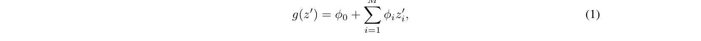

∅iz′

여기서 z′ ∈{0, 1}M, M은 단순화된 입력 특성의 수이고 ψi ∈R.

정의 1와 일치하는 설명 모델을 사용하는 방법은 각 특성에 효과 ψpi를 부여하고 모든 특성 속성의 효과를 합산하면 원래 모델의 출력 f(x)에 가까워집니다. 현재의 많은 방법은 정의 1와 일치하며 그 중 몇 가지가 아래에 설명되어 있습니다.

### 2.1 라임

LIME 방법은 주어진 예측 [5]를 중심으로 모델을 국부적으로 근사하는 것을 기반으로 개별 모델 예측을 해석합니다. LIME이 사용하는 로컬 선형 설명 모델은 방정식 1를 정확하게 준수하므로 추가 특성 기여 방법입니다. LIME은 단순화된 입력 x′를 "해석 가능한 입력"으로 지칭하며 x = hx(x′) 매핑은 해석 가능한 입력의 이진 벡터를 원래 입력 공간으로 변환합니다. 다양한 입력 공간에 다양한 유형의 hx 매핑이 사용됩니다. Bag of Words 텍스트 특성의 경우 hx는 단순화된 입력이 1인 경우 1 또는 0(존재 여부)의 벡터를 원래 단어 수로 변환하고, 단순화된 입력이 0인 경우 0으로 변환합니다. 이미지의 경우, hx는 이미지를 슈퍼 픽셀 세트로 처리합니다. 그런 다음 1를 매핑하여 슈퍼 픽셀을 원래 값으로 유지하고 0를 매핑하여 슈퍼 픽셀을 인접 픽셀의 평균으로 대체합니다(이는 누락되었음을 나타냄).

Φ를 찾기 위해 LIME은 다음 목적 함수를 최소화합니다.

ξ = 인수 최소

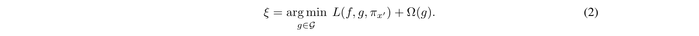

원래 모델 f(hx(z'))에 대한 설명 모델 g(z')의 충실성은 로컬 커널 πx'에 의해 가중치가 부여된 단순화된 입력 공간의 샘플 세트에 대한 손실 L을 통해 시행됩니다. Ω은 g의 복잡성에 불이익을 줍니다. LIME에서 g는 방정식 1를 따르고 L은 제곱 손실이므로 방정식 2는 페널티 선형 회귀를 사용하여 풀 수 있습니다.

<!-- 원문 3쪽 -->

### 2.2 딥리프트

DeepLIFT는 최근 딥러닝 [8, 7]를 위한 재귀적 예측 설명 방법으로 제안되었습니다. 이는 각 입력 xi에 해당 입력이 원래 값이 아닌 참조 값으로 설정되는 효과를 나타내는 CΔxiΔy 값을 부여합니다. 즉, DeepLIFT의 경우 x = hx(x′) 매핑은 이진 값을 원래 입력으로 변환합니다. 여기서 1는 입력이 원래 값을 사용함을 나타내고 0는 참조 값을 사용함을 나타냅니다. 참조 값은 사용자가 선택했지만 해당 특성에 대해 일반적으로 정보가 없는 배경 값을 나타냅니다.

DeepLIFT는 다음과 같은 "합계-델타" 속성을 사용합니다.

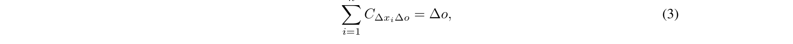

여기서 o = f(x)는 모델 출력, Δo = f(x) −f(r), Δxi = xi −ri, r은 기준 입력입니다. ψi = CΔxiΔo 및 ψ0 = f(r)로 두면 DeepLIFT의 설명 모델은 방정식 1와 일치하므로 또 다른 추가 특성 특성 기여 방법입니다.

### 2.3 레이어별 관련성 전파

레이어별 관련성 전파 방법은 딥 네트워크 [1]의 예측을 해석합니다. Shrikumar 등이 언급한 바와 같이, 이 방법은 모든 뉴런의 참조 활성화가 0으로 고정된 DeepLIFT와 동일합니다. 따라서 x = hx(x′)는 이진 값을 원래 입력 공간으로 변환합니다. 여기서 1는 입력이 원래 값을 취함을 의미하고 0는 입력이 0 값을 취함을 의미합니다. DeepLIFT와 같은 레이어별 관련성 전파의 설명 모델은 방정식 1와 일치합니다.

### 2.4 고전적인 Shapley 가치 추정

세 가지 이전 방법은 협력 게임 이론의 고전 방정식을 사용하여 모델 예측에 대한 설명을 계산합니다. Shapley 회귀 값 [4], Shapley 샘플링 값 [9] 및 정량적 입력 영향 [3].

Shapley 회귀 값은 다중 공선성이 있는 선형 모델의 특성 중요도입니다. 이 방법을 사용하려면 모든 특성 하위 집합 S ⊆F에 대해 모델을 재교육해야 합니다. 여기서 F는 모든 특성의 집합입니다. 해당 특성을 포함하는 모델 예측에 대한 효과를 나타내는 각 특성에 중요도 값을 할당합니다. 이 효과를 계산하기 위해 모델 fS∪{i}는 해당 특성이 있는 상태로 학습되고, 다른 모델 fS는 해당 특성이 보류된 상태로 학습됩니다. 그런 다음 두 모델의 예측은 현재 입력 fS∪{i}(xS∪{i}) −fS(xS)에서 비교됩니다. 여기서 xS는 집합 S의 입력 특성 값을 나타냅니다. 특성 보류의 효과는 모델의 다른 특성에 따라 달라지므로 이전 차이는 가능한 모든 하위 집합 S ⊆F \ {i}에 대해 계산됩니다. 그런 다음 Shapley 값이 계산되어 특성 속성으로 사용됩니다. 이는 가능한 모든 차이의 가중 평균입니다.

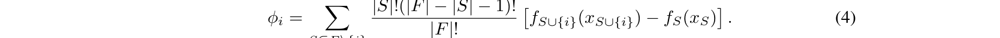

fS∪{i}(xS∪{i}) −fS(xS)

Shapley 회귀 값의 경우 hx는 1 또는 0를 원래 입력 공간에 매핑합니다. 여기서 1는 입력이 모델에 포함됨을 나타내고 0는 모델에서 제외됨을 나타냅니다. Φ0 = f∅(∅)를 두면 Shapley 회귀 값은 방정식 1와 일치하므로 추가 특성 귀속 방법이 됩니다.

Shapley 샘플링 값은 (1) 방정식 4에 샘플링 근사치를 적용하고 (2) 교육 데이터셋의 샘플을 통합하여 모델에서 변수를 제거하는 효과를 근사함으로써 모든 모델을 설명하기 위한 것입니다. 이렇게 하면 모델을 재교육할 필요가 없으며 2|F | 계산할 차이. Shapley 샘플링 값의 설명 모델 형식은 Shapley 회귀 값의 설명 모델 형식과 동일하므로 추가 특성 귀인 방법이기도 합니다.

정량적 입력 영향은 특성 속성 이상의 것을 다루는 더 광범위한 프레임워크입니다. 그러나 방법의 일부로 Shapley 샘플링 값과 거의 동일한 Shapley 값에 대한 샘플링 근사치를 독립적으로 제안합니다. 따라서 이는 또 다른 추가 특성 속성 방법입니다.

<!-- 원문 4쪽 -->

## 3 간단한 속성으로 추가 특성 속성을 고유하게 결정

가산 특성 속성 방법 클래스의 놀라운 속성은 이 클래스에 세 가지 바람직한 속성(아래 설명)을 가진 단일 고유 솔루션이 존재한다는 것입니다. 이러한 속성은 기존 Shapley 값 추정 방법에 익숙하지만 이전에는 다른 추가 특성 기여 방법에 대해서는 알려지지 않았습니다.

첫 번째로 바람직한 특성은 지역적 정확성입니다. 특정 입력 x에 대해 원래 모델 f를 근사할 때 로컬 정확도에서는 설명 모델이 최소한 단순화된 입력 x'(원래 입력 x에 해당)에 대한 f의 출력과 일치해야 합니다.

## 속성 1(로컬 정확도)

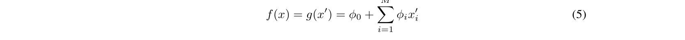

∨픽스'

설명 모델 g(x′)는 x = hx(x′)일 때 원래 모델 f(x)와 일치합니다.

두 번째 속성은 누락(missing)이다. 단순화된 입력이 특성 존재를 나타내는 경우 누락으로 인해 원래 입력에 누락된 특성이 영향을 미치지 않아야 합니다. 2 섹션에 설명된 모든 방법은 누락 속성을 따릅니다.

## 속성 2(실종)

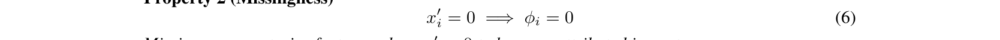

누락은 x′ i = 0가 영향을 미치지 않는 특성을 제한합니다.

세 번째 속성은 일관성이다. 일관성이란 일부 단순화된 입력의 기여도가 증가하거나 다른 입력에 관계없이 동일하게 유지되도록 모델이 변경되는 경우 해당 입력의 속성이 감소해서는 안 된다는 것을 의미합니다.

## 속성 3 (일관성) fx(z′) = f(hx(z′)) 및 z′ \ i는 z′ 설정을 나타냅니다.

나는 = 0. 임의의 두 모델 f와 f'에 대해 다음과 같은 경우

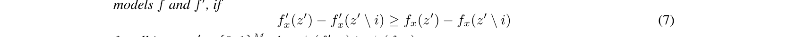

모든 입력 z′ ∈{0, 1}M에 대해, Φi(f ′, x) ≥φi(f, x).

## 정리 1 오직 하나의 가능한 설명 모델 g만이 정의 1를 따르고 속성 1, 2 및 3를 만족합니다.

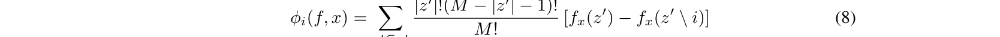

여기서 |z′| 는 z'에 있는 0이 아닌 항목의 수이고, z' ⊆x'는 0이 아닌 항목이 x'에 있는 0이 아닌 항목의 하위 집합인 모든 z' 벡터를 나타냅니다.

정리 1는 결합된 협력 게임 이론 결과에서 따르며, 여기서 값 Φi는 Shapley 값 [6]로 알려져 있습니다. Young(1985)은 Shapley 값이 속성 1, 속성 3 및 이 설정에서 중복되는 것으로 표시된 최종 속성과 유사한 세 가지 공리를 충족하는 유일한 값 집합임을 입증했습니다(보충 자료 참조). Shapley 증명을 추가 특성 귀속 방법 클래스에 적용하려면 속성 2가 필요합니다.

속성 1-3 아래에서 지정된 단순화된 입력 매핑 hx에 대해 정리 1는 가능한 추가 특성 속성 방법이 하나만 있음을 보여줍니다. 이 결과는 Shapley 값을 기반으로 하지 않는 방법이 로컬 정확도 및/또는 일관성을 위반한다는 것을 의미합니다(2 섹션의 방법은 이미 누락을 존중합니다). 다음 섹션에서는 이전 방법을 개선하여 의도하지 않게 속성 1 및 3를 위반하는 것을 방지하는 통합 접근 방식을 제안합니다.

## 4 SHAP(SHapley Additive exPlanation) 값

본 연구에서는 특성 중요도에 대한 통합된 척도로 SHAP 값을 제안합니다. 이는 원래 모델의 조건부 기대 함수의 Shapley 값입니다. 따라서 방정식의 해가 됩니다.

<!-- 원문 5쪽 -->

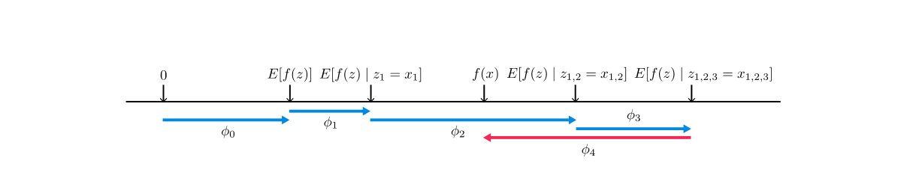

**그림 1: SHAP(SHapley Additive exPlanation) 값은 각 특성에 해당 특성을 조건화할 때 예상되는 모델 예측의 변화에 ​​영향을 미칩니다. 현재 출력 f(x)에 대한 특징을 모르는 경우 예측할 기본 값 E[f(z)]에서 얻는 방법을 설명합니다. 이 다이어그램은 단일 순서를 보여줍니다. 그러나 모델이 비선형이거나 입력 특성이 독립적이지 않은 경우 특성이 기대값에 추가되는 순서가 중요하며 SHAP 값은 가능한 모든 순서에 걸쳐 Φi 값을 평균화하여 발생합니다.**

8, 여기서 fx(z′) = f(hx(z′)) = E[f(z) | zS], S는 z'의 0이 아닌 인덱스 집합입니다(그림 1). 섹션 2 및 3를 기반으로 SHAP 값은 속성 1-3를 준수하고 조건부 기대치를 사용하여 단순화된 입력을 정의하는 고유한 추가 특성 중요도 측정을 제공합니다. SHAP 값의 정의에는 단순화된 입력 매핑 hx(z′) = zS가 내재되어 있습니다. 여기서 zS는 집합 S에 없는 특성에 대한 누락된 값을 갖습니다. 대부분의 모델은 누락된 입력 값의 임의 패턴을 처리할 수 없으므로 f(zS)를 E[f(z) | zS]. SHAP 값에 대한 이러한 정의는 Shapley 회귀, Shapley 샘플링 및 정량적 입력 영향 특성 속성과 긴밀하게 일치하는 동시에 LIME, DeepLIFT 및 레이어별 관련성 전파와의 연결을 허용하도록 설계되었습니다.

SHAP 값을 정확하게 계산하는 것은 어렵습니다. 그러나 현재의 추가 특성 기여 분석 방법의 통찰력을 결합하여 이를 근사화할 수 있습니다. 본 연구에서는 모델에 구애받지 않는 두 가지 근사 방법을 설명합니다. 하나는 이미 알려진 것(Shapley 샘플링 값)이고 다른 하나는 새로운 것(Kernel SHAP)입니다. 또한 네 가지 모델 유형별 근사 방법을 설명하며 그 중 두 가지는 새로운 것입니다(Max SHAP, Deep SHAP). 이러한 방법을 사용할 때 특성 독립성과 모델 선형성은 예상 값 계산을 단순화하는 두 가지 선택적 가정입니다(̅S는 S에 없는 특성 집합임). f(hx(z′)) = E[f(z) | zS] SHAP 설명 모델 단순화된 입력 매핑(9) = Ez ̅ S|zS[f(z)] z ̅S에 대한 기대 | zS (10) ≒Ez ̅ S[f(z)]는 ([9, 5, 7, 3]에서와 같이) 특징 독립성을 가정합니다 (11) ≒f([zS, E[z̅S]]). 모델 선형성 가정(12)

### 4.1 모델에 구애받지 않는 근사

[9, 5, 7, 3]에서와 같이 조건부 기대값(수식 11)을 근사할 때 특성 독립성을 가정하면 SHAP 값은 Shapley 샘플링 값 방법 [9] 또는 이와 동등한 정량적 입력 영향 방법 [3]를 사용하여 직접 추정할 수 있습니다. 이러한 방법은 전통적인 Shapley 값 방정식(방정식 8)의 순열 버전의 샘플링 근사치를 사용합니다. 각 특성 속성에 대해 별도의 샘플링 추정이 수행됩니다. 적은 수의 입력에 대해 계산하는 것이 합리적이지만 다음에 설명된 커널 SHAP 방법은 유사한 근사 정확도를 얻기 위해 원래 모델에 대한 더 적은 평가가 필요합니다(5 섹션).

## 커널 SHAP(선형 LIME + Shapley 값)

선형 LIME은 선형 설명 모델을 사용하여 f를 국소적으로 근사합니다. 여기서 국소는 단순화된 이진 입력 공간에서 측정됩니다. 언뜻 보면 방정식 2에서 LIME의 회귀 공식은 방정식 8의 고전적인 Shapley 값 공식과 매우 다른 것처럼 보입니다. 그러나 선형 LIME은 추가 특성 속성 방법이므로 Shapley 값은 속성 1-3(지역적 정확성, 누락 및 일관성)를 충족하는 방정식 2에 대한 유일한 솔루션이라는 것을 알고 있습니다. 제기할 자연스러운 질문은 방정식 2의 솔루션이 이러한 값을 복구하는지 여부입니다. 대답은 손실 함수 L, 가중치 커널 πx' 및 정규화 항 Ω의 선택에 따라 달라집니다. 이러한 매개변수에 대한 LIME 선택은 경험적으로 이루어집니다. 이러한 선택을 사용하면 방정식 2는 Shapley 값을 복구하지 않습니다. 한 가지 결과는 지역적 정확성 및/또는 일관성이 위반되어 특정 상황에서 직관적이지 않은 동작으로 이어진다는 것입니다(섹션 5 참조).

<!-- 원문 6쪽 -->

아래에서는 방정식 2에서 매개변수를 경험적으로 선택하지 않는 방법과 손실 함수 L, 가중치 커널 πx' 및 Shapley 값을 복구하는 정규화 항 Ω을 찾는 방법을 보여줍니다.

정리 2(Shapley 커널) 정의 1에 따라 방정식 2의 해를 속성 1부터 3까지와 일치시키는 πx′, L 및 Ω의 특정 형태는 다음과 같습니다.

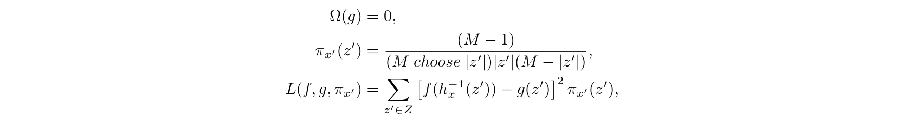

여기서 |z′| z'에 있는 0이 아닌 요소의 개수입니다.

정리 2의 증명은 보충 자료에 나와 있습니다.

|z′|가 πx′(z′) = 라 ∈{0, M}, 이는 Φ0 = fx(∅) 및 f(x) = M i=0 ψpi를 적용합니다. 실제로 이러한 제약 조건을 사용하여 두 변수를 분석적으로 제거함으로써 최적화 중에 이러한 무한 가중치를 피할 수 있습니다.

정리 2의 g(z′)는 선형 형태를 따르는 것으로 가정하고 L은 제곱 손실이므로 방정식 2는 여전히 선형 회귀를 사용하여 풀 수 있습니다. 결과적으로 게임 이론의 Shapley 값은 가중 선형 회귀를 사용하여 계산할 수 있습니다. 2 LIME은 방정식 12에 제공된 SHAP 매핑의 근사치와 동일한 단순화된 입력 매핑을 사용하므로 이를 통해 회귀 기반, 모델에 구애받지 않는 SHAP 값 추정이 가능합니다. 회귀를 사용하여 모든 SHAP 값을 공동으로 추정하면 기존 Shapley 방정식을 직접 사용하는 것보다 더 나은 샘플 효율성을 제공합니다(섹션 5 참조).

선형 회귀와 Shapley 값 사이의 직관적인 연결은 방정식 8가 평균의 차이라는 것입니다. 평균은 또한 일련의 데이터 포인트에 대한 최적의 최소 제곱 점 추정치이므로 선형 최소 제곱 회귀를 통해 Shapley 값을 요약하는 가중치 커널을 검색하는 것이 당연합니다. 이는 이전에 경험적으로 선택된 커널과 뚜렷하게 다른 커널로 이어집니다(그림 2A).

### 4.2 모델별 근사

커널 SHAP는 SHAP 값의 모델 독립적 추정의 샘플 효율성을 향상시키는 반면, 특정 모델 유형에 대한 관심을 제한함으로써 더 빠른 모델별 근사 방법을 개발할 수 있습니다.

## 선형 SHAP

선형 모델의 경우 입력 특성 독립성을 가정하면(수식 11) SHAP 값은 모델의 가중치 계수에서 직접 근사화될 수 있습니다.

## 추론 1 (선형 SHAP) 주어진 선형 모델 f(x) = M

j=1 wjxj + b: Φ0(f, x) = b 및 Φi(f, x) = wj(xj −E[xj]) 이는 정리 2 및 방정식 11에서 따르며 이전에 Štrumbelj 및 Kononenko에 의해 언급되었습니다. [9].

## 저차 SHAP

정리 2를 사용한 선형 회귀는 복잡도가 O(2M + M 3)이므로 조건부 기대치(수식 11 또는 12)의 근사치를 선택하면 M의 작은 값에 효율적입니다.

2이 원고를 준비하는 동안 우리는 이것이 계량 경제학 [2]에서 제안된 Shapley 값의 등가 제약 이차 최소화 공식과 유사하다는 것을 발견했습니다.

<!-- 원문 7쪽 -->

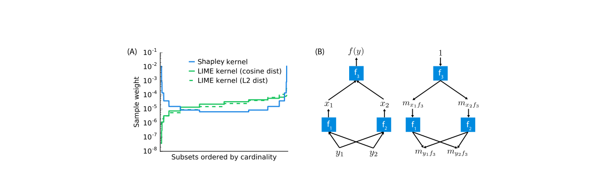

**그림 2: (A) 가능한 모든 z' 벡터가 카디널리티에 따라 정렬될 때 Shapley 커널 가중치는 대칭입니다. 이 예에서는 215 벡터가 있습니다. 이는 이전의 경험적으로 선택된 커널과 확연히 다릅니다. (B) 심층 신경망과 같은 구성 모델은 많은 간단한 구성 요소로 구성됩니다. 구성 요소의 Shapley 값에 대한 분석 솔루션이 제공되면 DeepLIFT의 역전파 스타일을 사용하여 전체 모델에 대한 빠른 근사치를 만들 수 있습니다.**

## 최대 SHAP

Shapley 값의 순열 공식을 사용하여 각 입력이 다른 모든 입력에 비해 최대값을 증가시킬 확률을 계산할 수 있습니다. 입력 값의 정렬된 순서로 이 작업을 수행하면 O(M2M) 대신 O(M 2) 시간에 M 입력을 사용하여 최대 함수의 Shapley 값을 계산할 수 있습니다. 전체 알고리즘은 보충 자료를 참조하세요.

## Deep SHAP(DeepLIFT + Shapley 값)

커널 SHAP는 심층 모델을 포함한 모든 모델에서 사용할 수 있지만, 계산 성능을 향상시키기 위해 심층 네트워크의 구성 특성에 대한 추가 지식을 활용할 수 있는 방법이 있는지 묻는 것이 당연합니다. 본 연구에서는 Shapley 가치와 DeepLIFT [8] 사이의 이전에 인정받지 못했던 연결을 통해 이 질문에 대한 답을 찾습니다. 방정식 3의 참조 값을 방정식 12의 E[x]를 나타내는 것으로 해석하면 DeepLIFT는 입력 특성이 서로 독립적이고 심층 모델이 선형이라는 가정 하에 SHAP 값을 근사화합니다. DeepLIFT는 신경망의 비선형 구성요소를 선형화하는 것과 동일한 선형 합성 규칙을 사용합니다. 각 구성요소가 선형화되는 방식을 정의하는 역전파 규칙은 직관적이지만 경험적으로 선택되었습니다. DeepLIFT는 Local Accuracy와 Missingness를 만족하는 Additive Feature Attribution 방법이므로 Shapley 값이 일관성을 만족하는 유일한 Attribution 값임을 알 수 있습니다. 이는 우리가 DeepLIFT를 SHAP 값의 구성적 근사치가 되도록 적용하여 Deep SHAP로 이어지는 동기를 부여합니다.

Deep SHAP은 네트워크의 더 작은 구성 요소에 대해 계산된 SHAP 값을 전체 네트워크의 SHAP 값으로 결합합니다. 이는 그림 2B와 같이 SHAP 값으로 정의된 DeepLIFT의 승수를 네트워크를 통해 역방향으로 재귀적으로 전달함으로써 수행됩니다.

> **주:** ∀j∈{1,2} myifj = Φi(fj, y)

yi -E[yi] (14)

> **주:** myif3 =

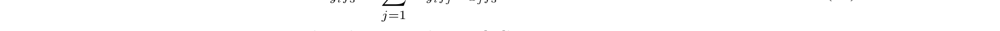

> **주:** myifjmxjf3 체인 규칙(15)

ψi(f3, y) ≒myif3(yi −E[yi]) 선형 근사(16) 단순 네트워크 구성 요소에 대한 SHAP 값은 선형, 최대 풀링 또는 입력이 하나만 있는 활성화 함수인 경우 분석적으로 효율적으로 풀 수 있으므로 이 구성 규칙을 사용하면 전체 모델에 대한 값을 빠르게 근사할 수 있습니다. Deep SHAP을 사용하면 구성 요소를 선형화하는 방법을 경험적으로 선택할 필요가 없습니다. 대신, 각 구성 요소에 대해 계산된 SHAP 값에서 효과적인 선형화를 도출합니다. max 함수는 이것이 향상된 속성으로 이어지는 한 가지 예를 제공합니다(섹션 5 참조).

<!-- 원문 8쪽 -->

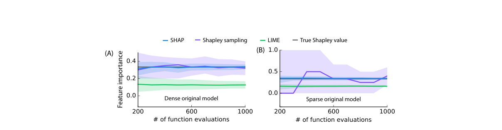

**그림 3: 커널 SHAP(편향성 제거 올가미 사용), Shapley 샘플링 값 및 LIME(오픈 소스 구현 사용)의 세 가지 추가 특성 속성 방법 비교. 원래 모델 특성의 평가 횟수가 증가함에 따라 두 모델의 한 특성에 대한 특성 중요도 추정치가 표시됩니다. 10번째 및 90번째 백분위수는 각 표본 크기에서 200 반복 추정치에 대해 표시됩니다. (A) 모든 10 입력 특성을 사용하는 의사결정 트리 모델이 단일 입력에 대해 설명됩니다. (B) 단일 입력에 대해 100 입력 특성 중 3만을 사용한 의사결정 트리를 설명합니다.**

## 5 전산 및 사용자 연구 실험

커널 SHAP 및 Deep SHAP 근사 방법을 사용하여 SHAP 값의 이점을 평가했습니다. 먼저, 커널 SHAP와 LIME 및 Shapley 샘플링 값의 계산 효율성과 정확성을 비교했습니다. 둘째, SHAP 값을 DeepLIFT 및 LIME으로 대표되는 대체 특성 중요도 할당과 비교하기 위한 사용자 연구를 설계했습니다. 예상할 수 있듯이 SHAP 값은 속성 1-3(섹션 2)를 충족하지 못하는 다른 방법보다 인간의 직관과 더 일치하는 것으로 입증되었습니다. 마지막으로 MNIST 숫자 이미지 분류를 사용하여 SHAP를 DeepLIFT 및 LIME과 비교합니다.

### 5.1 계산 효율성

정리 2는 게임 이론의 Shapley 값을 가중 선형 회귀와 연결합니다. Kernal SHAP은 이 연결을 사용하여 특성 중요도를 계산합니다. 이는 특히 선형 모델에 정규화가 추가된 경우 이전의 샘플링 기반 방정식 8 추정보다 원래 모델에 대한 더 적은 평가로 더 정확한 추정을 가능하게 합니다(그림 3). 조밀한 결정 트리 모델과 희소한 결정 트리 모델 모두에서 Shapley 샘플링, SHAP 및 LIME을 비교하면 커널 SHAP의 향상된 샘플 효율성과 LIME의 값이 로컬 정확도 및 일관성을 충족하는 SHAP 값과 크게 다를 수 있음을 보여줍니다.

### 5.2 인간 직관과의 일관성

정리 1는 SHAP 값을 사용하는 모든 추가 특성 속성 방법에 대한 강력한 인센티브를 제공합니다. LIME과 DeepLIFT는 처음에 설명한 대로 서로 다른 특징 중요도 값을 계산합니다. 정리 1의 중요성을 검증하기 위해 LIME, DeepLIFT 및 SHAP의 설명을 단순 모델(Amazon Mechanical Turk 사용)에 대한 사용자 설명과 비교했습니다. 우리의 테스트에서는 좋은 모델 설명이 해당 모델을 이해하는 사람의 설명과 일치해야 한다고 가정합니다.

본 연구에서는 두 가지 설정에 대해 LIME, DeepLIFT 및 SHAP를 인간의 설명과 비교했습니다. 첫 번째 설정에서는 두 가지 증상 중 하나만 존재할 때 더 높은 질병 점수를 사용했습니다(그림 4A). 두 번째는 DeepLIFT를 적용할 수 있는 최대 할당 문제를 사용했습니다. 참가자들은 세 명의 남성이 달성한 최대 점수를 기준으로 어떻게 돈을 벌었는지에 대한 짧은 이야기를 들었습니다(그림 4B). 두 경우 모두 참가자들은 입력(즉, 증상 또는 플레이어) 중에서 출력(질병 점수 또는 획득한 돈)에 대한 크레딧을 할당하도록 요청 받았습니다. 본 연구에서는 다른 방법보다 인간 설명과 SHAP 간에 훨씬 더 강력한 일치를 발견했습니다. 최대 함수에 대한 SHAP의 향상된 성능은 DeepLIFT [7]에서 최대 풀링 함수의 공개 문제를 해결합니다.

### 5.3 클래스 차이 설명

섹션 4.2에서 논의된 것처럼 DeepLIFT의 구성적 접근 방식은 SHAP 값(Deep SHAP)의 구성적 근사치를 제안합니다. 이러한 통찰력은 결과적으로 DeepLIFT와 새 버전을 개선합니다.

<!-- 원문 9쪽 -->

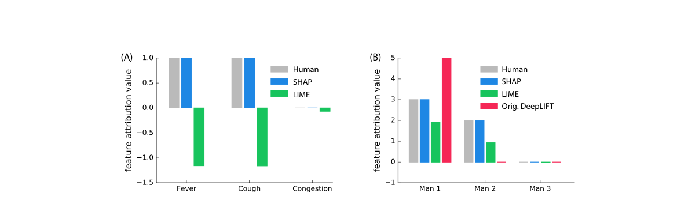

**그림 4: 인간 특성 영향 추정치는 각각 30(A) 및 52(B) 무작위 개인 사이에서 주어진 가장 일반적인 설명으로 표시됩니다. (A) 2의 모델 출력 값(질병 점수)에 대한 특징 속성. 모델 출력은 발열과 기침이 모두 있는 경우 2이고, 발열과 기침 중 하나만 있는 경우 5이며, 그렇지 않은 경우 0입니다. (B) 세 사람 사이의 이익 귀속은 한 사람이 정답을 맞춘 최대 질문 수에 따라 주어집니다. 첫 번째 남자는 5 문제를 맞혔고, 두 번째 남자는 4 문제를 맞췄으며, 세 번째 남자는 하나도 맞히지 못했으므로 이익은 $5입니다.**

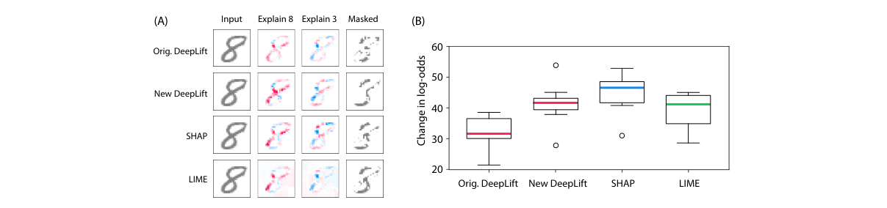

**그림 5: MNIST 숫자 데이터세트에서 훈련된 컨벌루션 네트워크의 출력을 설명합니다. 원본 DeepLIFT에는 명시적인 Shapley 근사값이 없지만 New DeepLIFT는 Shapley 값에 대한 더 나은 근사값을 추구합니다. (A) 빨간색 영역은 해당 클래스의 확률을 높이고, 파란색 영역은 확률을 감소시킵니다. Masked는 8에서 3로 이동하기 위해 픽셀을 제거합니다. (B) 20 무작위 이미지를 마스킹할 때 로그 확률의 변경은 SHAP 값의 더 나은 추정 사용을 지원합니다.**

Shapley 값 [7]와 더 잘 일치하도록 업데이트가 포함되어 있습니다. 그림 5는 DeepLIFT의 컨벌루션 네트워크 예제를 확장하여 SHAP 값에 더 가까운 추정치의 향상된 성능을 강조합니다. 사전 훈련된 모델과 그림 5 예제는 [7]에서 사용된 것과 동일하며 입력은 0와 1 사이에서 정규화됩니다. 두 개의 컨볼루션 레이어와 2 Dense 레이어 뒤에는 10 방향 소프트맥스 출력 레이어가 옵니다. 두 DeepLIFT 버전 모두 선형 레이어의 정규화된 버전을 설명하는 반면, SHAP(커널 SHAP를 사용하여 계산) 및 LIME은 모델의 출력을 설명합니다. SHAP와 LIME은 모두 50k 샘플로 실행되었습니다(보조 그림 1). 성능을 향상시키기 위해 LIME은 숫자 픽셀에 대해 단일 픽셀 분할을 사용하도록 수정되었습니다. [7]와 일치시키기 위해 각 방법에서 제공하는 특징 속성에 따라 예측 클래스를 8에서 3로 전환하기 위해 선택한 픽셀의 20%를 마스킹했습니다.

## 6 결론

모델 예측의 정확성과 해석 가능성 사이의 긴장이 커지면서 사용자가 예측을 해석하는 데 도움이 되는 방법이 개발되었습니다. SHAP 프레임워크는 추가 특성 중요도 방법(6개의 이전 방법 포함) 클래스를 식별하고 이 클래스에 바람직한 속성을 준수하는 고유한 솔루션이 있음을 보여줍니다. SHAP이 문헌을 통해 엮어내는 통일성의 실은 모델 해석에 대한 공통 원칙이 미래 방법의 개발에 영향을 미칠 수 있다는 고무적인 신호입니다.

본 연구에서는 SHAP 값에 대한 여러 가지 추정 방법과 이러한 값이 바람직하다는 것을 보여주는 증거 및 실험을 제시했습니다. 유망한 다음 단계에는 더 적은 가정을 하는 더 빠른 모델 유형별 추정 방법을 개발하고, 게임 이론에서 상호 작용 효과를 추정하는 작업을 통합하고, 새로운 설명 모델 클래스를 정의하는 것이 포함됩니다.

<!-- 원문 10쪽 -->

## 감사의 글

이 작품은 국립과학재단(NSF) DBI-135589, NSF CAREER DBI-155230, 미국 암학회 127332-RSG-15-097-01-TBG, 국립보건원(NIH) AG049196의 지원을 받았습니다. NSF 대학원 연구 펠로우십. 이 작업을 크게 개선하는 데 피드백을 주신 Marco Ribeiro, Erik Štrumbelj, Avanti Shrikumar, Yair Zick, Lee Lab 및 NIPS 검토자에게 감사드립니다.

## 참고문헌

[1] Sebastian Bach et al. "On pixel-wise explanations for non-linear classifier decisions by layerwise relevance propagation". In: PloS One 10.7 (2015), e0130140. [2] A Charnes et al. "Extremal principle solutions of games in characteristic function form: core, Chebychev and Shapley value generalizations". In: Econometrics of Planning and Efficiency 11 (1988), pp. 123–133. [3] Anupam Datta, Shayak Sen, and Yair Zick. "Algorithmic transparency via quantitative input influence: Theory and experiments with learning systems". In: Security and Privacy (SP), 2016 IEEE Symposium on. IEEE. 2016, pp. 598–617. [4] Stan Lipovetsky and Michael Conklin. "Analysis of regression in game theory approach". In: Applied Stochastic Models in Business and Industry 17.4 (2001), pp. 319–330. [5] Marco Tulio Ribeiro, Sameer Singh, and Carlos Guestrin. "Why should i trust you?: Explaining the predictions of any classifier". In: Proceedings of the 22nd ACM SIGKDD International Conference on Knowledge Discovery and Data Mining. ACM. 2016, pp. 1135–1144. [6] Lloyd S Shapley. "A value for n-person games". In: Contributions to the Theory of Games 2.28 (1953), pp. 307–317. [7] Avanti Shrikumar, Peyton Greenside, and Anshul Kundaje. "Learning Important Features Through Propagating Activation Differences". In: arXiv preprint arXiv:1704.02685 (2017). [8] Avanti Shrikumar et al. "Not Just a Black Box: Learning Important Features Through Propagating Activation Differences". In: arXiv preprint arXiv:1605.01713 (2016). [9] Erik Štrumbelj and Igor Kononenko. "Explaining prediction models and individual predictions with feature contributions". In: Knowledge and information systems 41.3 (2014), pp. 647–665. [10] H Peyton Young. "Monotonic solutions of cooperative games". In: International Journal of Game Theory 14.2 (1985), pp. 65–72.
