# 이상 탐지: 개관

> **원문 제목:** Anomaly Detection: A Survey  
> **저자:** Varun Chandola · Arindam Banerjee · Vipin Kumar  
> **게재 정보:** University of Minnesota Technical Report TR 07-017, 2007  
> **DOI:** 별도 표기 없음

> **번역 안내:** 본문과 부록은 문단 문맥을 기준으로 한국어로 옮겼습니다. 수식과 참고문헌은 정확성을 위해 원문 표기를 유지했습니다. 원문의 그림과 표는 개별 이미지로 잘라 해당 본문 위치에 바로 배치했습니다.

---

<!-- 원문 1쪽 -->

<!-- 원문 2쪽 -->

<!-- 원문 3쪽 -->

이상 징후 탐지는 다양한 연구 분야와 응용 분야에서 연구되어 온 중요한 문제입니다. 많은 이상 탐지 기술은 특정 응용 프로그램 도메인을 위해 특별히 개발되었지만 다른 기술은 보다 일반적입니다. 이 설문조사는 이상 탐지에 관한 연구에 대한 체계적이고 포괄적인 개요를 제공하려고 합니다. 본 연구에서는 기존 기술을 각 기술에서 채택한 기본 접근 방식을 기반으로 다양한 범주로 그룹화했습니다. 각 범주에 대해 우리는 정상 동작과 변칙 동작을 구별하는 기술에서 사용되는 주요 가정을 식별했습니다. 특정 기술을 특정 영역에 적용할 때 이러한 가정은 해당 영역에서 기술의 효율성을 평가하기 위한 지침으로 사용될 수 있습니다. 각 카테고리에 대해 기본 이상 탐지 기술을 제공한 다음 해당 카테고리의 다양한 기존 기술이 어떻게 기본 기술의 변형인지 보여줍니다. 이 템플릿을 사용하면 각 카테고리에 속하는 기술을 더 쉽고 간결하게 이해할 수 있습니다. 또한 각 범주에 대해 해당 범주에 있는 기술의 장점과 단점을 식별합니다. 또한 실제 응용 분야에서 중요한 문제인 기술의 계산 복잡성에 대한 논의도 제공합니다. 본 연구에서는 이 설문조사를 통해 이 주제에 대한 연구가 진행된 다양한 방향과 한 분야에서 개발된 기술이 처음부터 의도하지 않았던 영역에 어떻게 적용될 수 있는지에 대한 더 나은 이해를 제공할 수 있기를 바랍니다.

카테고리 및 주제 설명: H.2.8 [데이터베이스 관리]: 데이터베이스 애플리케이션 - 데이터 마이닝 일반 용어: 알고리즘 추가 핵심 단어 및 문구: 이상 탐지, 이상치 탐지

## 1 서론

이상 탐지란 데이터에서 예상되는 동작과 일치하지 않는 패턴을 찾는 문제를 말합니다. 이러한 부적합 패턴은 종종 다양한 응용 분야에서 이상치, 특이치, 일치하지 않는 관찰, 예외, 이상, 놀라움, 특이성 또는 오염물로 지칭됩니다. 이 중에서 이상치와 이상값은 이상치 탐지와 관련하여 가장 일반적으로 사용되는 두 가지 용어입니다. 때로는 상호 교환적으로. 이상 탐지는 신용 카드, 보험 또는 의료에 대한 사기 탐지, 사이버 보안을 위한 침입 탐지, 안전에 중요한 시스템의 결함 탐지, 적 활동에 대한 군사 감시 등 다양한 응용 분야에서 광범위하게 사용됩니다.

이상 탐지의 중요성은 데이터의 이상이 다양한 애플리케이션 도메인에서 중요한(종종 중요한) 실행 가능한 정보로 변환된다는 사실에 기인합니다. 예를 들어, 컴퓨터 네트워크의 비정상적인 트래픽 패턴은 해킹된 컴퓨터가 승인되지 않은 대상[Kumar 2005]으로 중요한 데이터를 전송하고 있음을 의미할 수 있습니다. 비정상적인 MRI 이미지는 악성 종양의 존재를 나타낼 수 있습니다[Spence et al. 2001]. 신용 카드 거래 데이터의 이상은 신용 카드 또는 신원 도용을 나타낼 수 있습니다 [Aleskerov et al. 1997] 또는 우주선 센서의 비정상적인 판독값은 우주선의 일부 구성 요소에 결함이 있음을 나타낼 수 있습니다[Fujimaki et al. 2005].

<!-- 원문 4쪽 -->

데이터의 이상치나 이상치를 탐지하는 것은 이미 19세기부터 통계 커뮤니티에서 연구되어 왔습니다[Edgeworth 1887]. 시간이 지남에 따라 여러 연구 커뮤니티에서 다양한 이상 탐지 기술이 개발되었습니다. 이러한 기술 중 다수는 특정 응용 프로그램 도메인을 위해 특별히 개발된 반면 다른 기술은 보다 일반적입니다.

이 설문조사는 이상 탐지에 관한 연구에 대한 체계적이고 포괄적인 개요를 제공하려고 합니다. 본 연구에서는 이 주제에 대한 연구가 진행된 다양한 방향과 한 분야에서 개발된 기술이 처음부터 의도하지 않았던 영역에 어떻게 적용될 수 있는지에 대한 더 나은 이해를 촉진하기를 바랍니다.

1.1 이상 현상이란 무엇입니까?

이상 현상은 잘 정의된 정상적인 동작 개념을 따르지 않는 데이터의 패턴입니다. 그림 1는 간단한 2 차원 데이터셋의 변칙을 보여줍니다. 대부분의 관측치가 이 두 영역에 있으므로 데이터에는 N1과 N2라는 두 개의 정규 영역이 있습니다. 영역에서 충분히 멀리 떨어져 있는 점(예: o1 및 o2 지점, O3 영역의 지점)은 이상입니다.

**그림 1. 2 차원 데이터셋의 변칙에 대한 간단한 예입니다.**

신용 카드 사기, 사이버 침입, 테러 활동 또는 시스템 고장과 같은 악의적 활동과 같은 다양한 이유로 데이터에 이상 현상이 유발될 수 있지만 모든 이유는 분석가가 관심을 갖는다는 공통 특성을 가지고 있습니다. 이상 징후의 "흥미로움" 또는 실제 생활 관련성은 이상 징후 탐지의 핵심 특성입니다.

이상 탐지는 노이즈 제거와 관련이 있지만 별개입니다 [Teng et al. 1990] 및 잡음 조절 [Rousseeuw and Leroy 1987]은 둘 다 데이터에서 원치 않는 잡음을 처리합니다. 노이즈는 분석가에게 관심이 없지만 데이터 분석에 방해가 되는 데이터 현상으로 정의할 수 있습니다. 노이즈 제거는 데이터에 대한 데이터 분석이 수행되기 전에 원치 않는 개체를 제거해야 하는 필요성에 따라 이루어집니다. 소음 조절은 변칙적 관찰에 대한 통계적 모델 추정을 면역화하는 것을 의미합니다[Huber 1974].

<!-- 원문 5쪽 -->

이상 탐지와 관련된 또 다른 주제는 신규성 감지입니다[Markou and Singh 2003a; 2003b; Saunders and Gero 2000]는 데이터에서 이전에 관찰되지 않은(창발하고 새로운) 패턴(예: 뉴스 그룹의 새로운 토론 주제)을 탐지하는 것을 목표로 합니다. 새로운 패턴과 이상 현상의 차이점은 새로운 패턴이 일반적으로 감지된 후 정상 모델에 통합된다는 것입니다.

위에서 언급한 관련 문제에 대한 솔루션은 종종 이상 탐지에 사용되거나 그 반대의 경우도 있으므로 이 리뷰에서도 논의된다는 점에 유의해야 합니다.

### 1.2 도전과제

추상적인 수준에서 이상 현상은 예상되는 정상적인 동작을 따르지 않는 패턴으로 정의됩니다. 따라서 간단한 이상 탐지 접근 방식은 정상적인 동작을 나타내는 영역을 정의하고 이 정상 영역에 속하지 않는 데이터의 모든 관찰을 이상으로 선언하는 것입니다. 그러나 몇 가지 요인으로 인해 단순해 보이는 이 접근 방식이 매우 어려워지고 있습니다.

—가능한 모든 정상적인 행동을 포괄하는 정상 영역을 정의하는 것은 매우 어렵습니다. 게다가 정상 행동과 변칙 행동 사이의 경계가 정확하지 않은 경우도 많습니다. 따라서 경계에 가까운 변칙적 관측은 실제로 정상일 수 있고 그 반대의 경우도 마찬가지입니다. —악의적인 행동의 결과로 변칙이 발생하는 경우, 악의적인 공격자는 변칙적인 관찰이 정상적인 것처럼 보이도록 적응하는 경우가 많으며, 이로 인해 정상적인 행동을 정의하는 작업이 더욱 어려워집니다. —많은 영역에서 정상적인 행동은 계속 진화하고 있으며 현재의 정상적인 행동 개념은 미래에는 충분히 대표되지 않을 수 있습니다. —이상 현상의 정확한 개념은 애플리케이션 도메인마다 다릅니다. 예를 들어, 의료 영역에서는 정상과의 작은 편차(예: 체온 변동)가 비정상일 수 있는 반면, 주식 시장 영역에서는 유사한 편차(예: 주식 가치 변동)가 정상으로 간주될 수 있습니다. 따라서 한 영역에서 개발된 기술을 다른 영역에 적용하는 것은 간단하지 않습니다. —이상 탐지 기술에 사용되는 모델의 훈련/검증을 위한 레이블이 지정된 데이터의 가용성은 일반적으로 주요 문제입니다. —종종 데이터에는 실제 이상 현상과 유사한 경향이 있어 구별 및 제거가 어려운 노이즈가 포함되어 있습니다.

위의 과제로 인해 가장 일반적인 형태의 이상 탐지 문제는 해결하기 쉽지 않습니다. 실제로 기존 이상 탐지 기술의 대부분은 문제의 특정 공식을 해결합니다. 공식화는 데이터의 성격, 레이블이 지정된 데이터의 가용성, 감지할 변칙 유형 등과 같은 다양한 요인에 의해 유도됩니다. 종종 이러한 요인은 변칙을 감지해야 하는 응용 프로그램 도메인에 의해 결정됩니다. 연구자들은 통계, 기계 학습, 데이터 마이닝, 정보 이론, 스펙트럼 이론과 같은 다양한 분야의 개념을 채택하여 특정 문제 공식화에 적용했습니다. 그림 2는 위에서 언급한 모든 이상 탐지 기술과 관련된 주요 구성 요소를 보여줍니다.

<!-- 원문 6쪽 -->

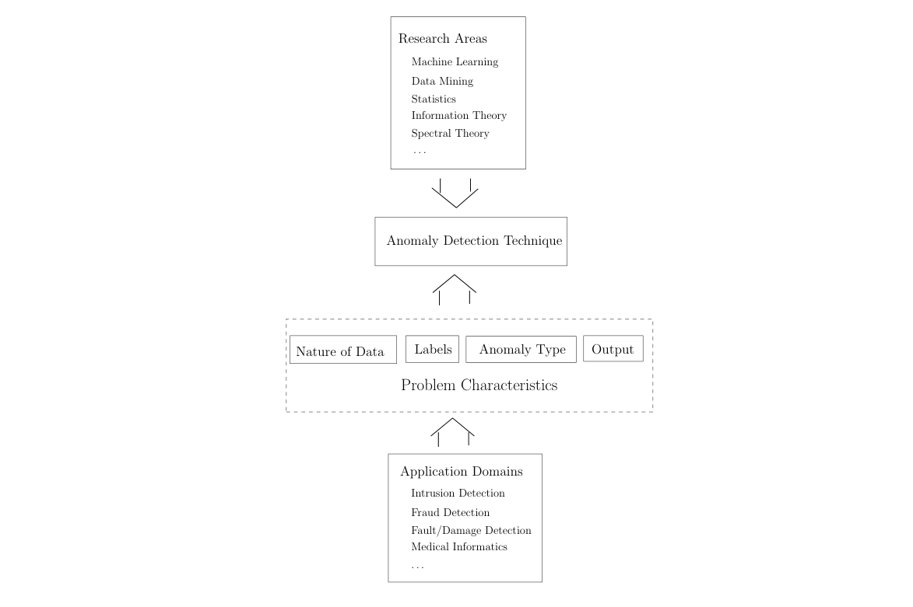

**그림 2. 이상 탐지 기술과 관련된 주요 구성 요소입니다.**

### 1.3 관련 연구

이상 탐지는 책뿐만 아니라 수많은 설문 조사, 리뷰 기사의 주제였습니다. Hodge와 Austin [2004]는 기계 학습 및 통계 영역에서 개발된 이상 탐지 기술에 대한 광범위한 조사를 제공합니다. 숫자 및 기호 데이터에 대한 이상 탐지 기술에 대한 광범위한 검토가 Agyemang et al.에 의해 제시되었습니다. [2006]. 신경망과 통계적 접근 방식을 사용한 신규성 탐지 기술에 대한 광범위한 검토가 Markou 및 Singh [2003a] 및 Markou 및 Singh [2003b]에 각각 제시되었습니다. Patcha와 Park [2007] 및 Snyder [2001]는 특히 사이버 침입 탐지에 사용되는 이상 탐지 기술에 대한 조사를 제시합니다. 이상값 탐지에 대한 상당한 양의 연구가 통계 분야에서 수행되었으며 여러 책에서 검토되었습니다 [Rousseeuw and Leroy 1987; 바넷과 루이스 1994; Hawkins 1980] 및 기타 설문조사 기사[Beckman 및 Cook 1983; Bakaret al. 2006].

<!-- 원문 7쪽 -->

**표 I은 우리 설문조사와 위에서 언급한 다양한 관련 설문조사 기사에서 다루는 일련의 기술과 응용 분야를 보여줍니다.**

**표 I. 설문조사와 다른 관련 설문조사 기사 비교. 1 - 설문조사 2 - Hodge 및 Austin [2004], 3 - Agyemang et al. [2006], 4 - Markou 및 Singh [2003a], 5 - Markou 및 Singh [2003b], 6 - Patcha 및 Park [2007], 7 - Beckman 및 Cook [1983], 8 - Bakar 외 [2006]**

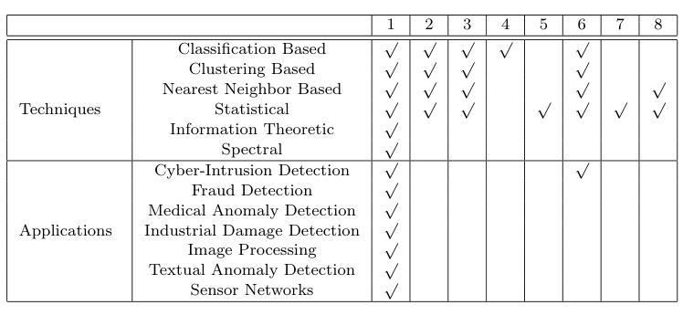

### 1.4 우리의 기여

이 설문조사는 여러 연구 영역과 응용 분야에 걸친 이상 탐지 기술에 대한 광범위한 연구에 대한 체계적이고 광범위한 개요를 제공하기 위한 시도입니다.

이상 탐지에 대한 기존 설문 조사의 대부분은 특정 응용 프로그램 도메인이나 단일 연구 영역에 중점을 둡니다. [아계망 외. 2006]와 [Hodge and Austin 2004]는 이상 탐지를 여러 범주로 그룹화하고 각 범주에서 기술을 논의하는 두 가지 관련 작업입니다. 본 설문조사는 여러 방향으로 논의를 크게 확장하여 이 두 연구를 기반으로 합니다.

본 연구에서는 [Agyemang et al. 2006] 및 [호지와 오스틴 2004]. 6개 범주 각각에 대해 우리는 기술을 논의할 뿐만 아니라 해당 범주의 기술로 인해 발생하는 이상 현상의 특성에 관한 고유한 가정도 식별합니다. 이러한 가정은 해당 범주의 기술이 변칙을 탐지할 수 있는 시기와 실패할 시기를 결정하는 데 중요합니다. 각 카테고리에 대해 기본 이상 탐지 기술을 제공한 다음 해당 카테고리의 다양한 기존 기술이 어떻게 기본 기술의 변형인지 보여줍니다. 이 템플릿을 사용하면 각 카테고리에 속하는 기술을 더 쉽고 간결하게 이해할 수 있습니다. 또한 각 범주에 대해 해당 범주에 있는 기술의 장점과 단점을 식별합니다. 또한 실제 응용 분야에서 중요한 문제인 기술의 계산 복잡성에 대한 논의도 제공합니다.

<!-- 원문 8쪽 -->

기존 설문조사 중 일부에서는 변칙 탐지의 다양한 애플리케이션을 언급하고 있지만 우리는 변칙 탐지 기술이 사용된 애플리케이션 도메인에 대한 자세한 논의를 제공합니다. 각 영역에 대해 이상 징후의 개념, 이상 탐지 문제의 다양한 측면, 이상 탐지 기술이 직면한 과제에 대해 논의합니다. 또한 각 응용 분야에 적용된 기술 목록도 제공합니다.

기존 설문조사에서는 가장 단순한 형태의 이상을 탐지하는 이상 탐지 기술을 논의합니다. 본 연구에서는 단순한 이상과 복잡한 이상을 구별합니다. 이상 탐지의 응용에 대한 논의는 대부분의 응용 분야에서 흥미로운 이상은 본질적으로 복잡한 반면, 대부분의 알고리즘 연구는 단순한 이상에 초점을 맞추고 있음을 보여줍니다.

### 1.5 조직

본 설문조사는 세 부분으로 구성되어 있으며 그 구조는 그림 2와 매우 유사합니다. 2 섹션에서는 문제의 공식화를 결정하는 다양한 측면을 식별하고 이상 탐지와 관련된 풍부함과 복잡성을 강조합니다. 본 연구에서는 단순 이상과 복합 이상을 구별하고 두 가지 유형의 복합 이상, 즉 맥락적 이상과 집단적 이상을 정의합니다. 3 섹션에서는 이상 탐지가 적용된 다양한 애플리케이션 도메인을 간략하게 설명합니다. 후속 섹션에서는 해당 기술이 속한 연구 영역을 기반으로 이상 탐지 기술을 분류합니다. 대부분의 기술은 분류 기반(섹션 4), 최근접 이웃 기반(섹션 5), 클러스터링 기반(섹션 6) 및 통계 기술(섹션 7)로 분류될 수 있습니다. 일부 기술은 정보 이론(섹션 8) 및 스펙트럼 이론(섹션 9)과 같은 연구 영역에 속합니다. 각 기술 범주에 대해 훈련 및 테스트 단계의 계산 복잡성에 대해서도 논의합니다. 10 섹션에서는 다양한 상황별 이상 탐지 기술에 대해 논의합니다. 11 섹션에서 다양한 집단적 이상 탐지 기술을 논의합니다. 본 연구에서는 섹션 12에서 다양한 기존 기술의 한계와 상대적 성능에 대한 논의를 제시합니다. 13 섹션에는 결론이 포함되어 있습니다.

## 2 이상 탐지 문제의 다양한 측면

이 섹션에서는 이상 탐지의 다양한 측면을 식별하고 논의합니다. 앞서 언급했듯이 문제의 구체적인 공식화는 입력 데이터의 성격, 레이블의 가용성(또는 비가용성)은 물론 애플리케이션 도메인에 의해 유발된 제약 조건 및 요구 사항과 같은 여러 가지 요소에 의해 결정됩니다. 이 섹션에서는 문제 영역의 풍부함을 소개하고 광범위한 이상 탐지 기술의 필요성을 정당화합니다.

### 2.1 입력 데이터의 성격

이상 탐지 기술의 핵심 측면은 입력 데이터의 특성입니다. 입력은 일반적으로 데이터 인스턴스(객체, 레코드, 포인트, 벡터, 패턴, 이벤트, 케이스, 샘플, 관찰, 엔터티라고도 함)의 모음입니다 [Tan et al. 2005, 장 2]. 각 데이터 인스턴스는 일련의 속성(변수, 특성, 특성, 필드, 차원이라고도 함)을 사용하여 설명할 수 있습니다. 속성은 이진형, 범주형, 연속형 등 다양한 유형일 수 있습니다. 각 데이터 인스턴스는 단 하나의 속성(일변량) 또는 여러 속성(다변량)으로 구성될 수 있습니다. 다변량 데이터 인스턴스의 경우 모든 속성은 동일한 유형이거나 다양한 데이터 유형이 혼합되어 있을 수 있습니다.

<!-- 원문 9쪽 -->

속성의 특성에 따라 이상 탐지 기술의 적용 가능성이 결정됩니다. 예를 들어, 통계 기법의 경우 연속형 데이터와 범주형 데이터에 대해 다양한 통계 모델을 사용해야 합니다. 마찬가지로, 가장 가까운 이웃 기반 기술의 경우 속성의 특성에 따라 사용할 거리 측정값이 결정됩니다. 종종 실제 데이터 대신 인스턴스 간의 쌍별 거리는 거리(또는 유사성) 행렬의 형태로 제공될 수 있습니다. 이러한 경우 원본 데이터 인스턴스가 필요한 기술(예: 많은 통계 및 분류 기반 기술)을 적용할 수 없습니다.

입력 데이터는 데이터 인스턴스 사이에 존재하는 관계에 따라 분류될 수도 있습니다 [Tan et al. 2005]. 기존 이상탐지 기법은 대부분 기록 데이터(또는 포인트 데이터)를 다루며, 데이터 인스턴스 간 관계가 가정되지 않는다.

일반적으로 데이터 인스턴스는 서로 관련될 수 있습니다. 몇 가지 예로는 시퀀스 데이터, 공간 데이터 및 그래프 데이터가 있습니다. 서열 데이터에서 데이터 인스턴스는 시계열 데이터, 게놈 서열, 단백질 서열과 같이 선형적으로 정렬됩니다. 공간 데이터에서 각 데이터 인스턴스는 차량 교통 데이터, 생태 데이터 등 인접 인스턴스와 관련됩니다. 공간 데이터에 시간적(순차적) 구성요소가 있는 경우 이를 시공간 데이터(예: 기후 데이터)라고 합니다. 그래프 데이터에서 데이터 인스턴스는 그래프 내 꼭지점으로 표시되며 모서리를 통해 다른 꼭지점과 연결됩니다. 이 섹션의 뒷부분에서는 데이터 인스턴스 간의 이러한 관계가 이상 탐지와 관련되는 상황에 대해 논의할 것입니다.

### 2.2 이상 징후 유형

이상 탐지 기술의 중요한 측면은 원하는 이상 징후의 특성입니다. 이상 현상은 다음 세 가지 범주로 분류될 수 있습니다.

2.2.1 포인트 이상. 개별 데이터 인스턴스가 나머지 데이터와 관련하여 변칙적인 것으로 간주될 수 있는 경우 해당 인스턴스를 포인트 변칙이라고 합니다. 이는 가장 단순한 유형의 이상이며 이상 탐지에 대한 대다수 연구의 초점입니다.

예를 들어, 그림 1에서 o1 및 o2 지점과 O3 영역의 지점은 정상 영역의 경계 외부에 있으므로 정상 데이터 지점과 다르기 때문에 지점 이상입니다.

실제 사례로 신용카드 사기 탐지를 생각해 보세요. 데이터셋를 개인의 신용 카드 거래에 대응시키십시오. 단순화를 위해 데이터가 지출 금액이라는 하나의 특성만 사용하여 정의된다고 가정하겠습니다. 해당 개인의 일반적인 지출 범위에 비해 지출 금액이 매우 높은 거래는 포인트 예외가 됩니다.

2.2.2 상황별 이상 현상. 데이터 인스턴스가 특정 컨텍스트에서 변칙적인 경우(그렇지 않은 경우) 이를 컨텍스트 변칙이라고 합니다(조건부 변칙이라고도 함[Song et al. 2007]).

맥락의 개념은 데이터셋의 구조에 의해 유도되며 문제 공식화의 일부로 지정되어야 합니다. 각 데이터 인스턴스는 다음 두 가지 속성 세트를 사용하여 정의됩니다. (1) 컨텍스트 속성. 컨텍스트 속성은 해당 인스턴스의 컨텍스트(또는 이웃)를 결정하는 데 사용됩니다. 예를 들어, 공간 데이터셋에서 위치의 경도와 위도는 상황별 속성입니다. 시계열 데이터에서 시간은 전체 시퀀스에서 인스턴스의 위치를 ​​결정하는 상황별 속성입니다. (2) 동작 속성. 행동 속성은 인스턴스의 비맥락적 특성을 정의합니다. 예를 들어, 전 세계의 평균 강수량을 설명하는 공간 데이터셋에서 모든 위치의 강우량은 행동 속성입니다.

<!-- 원문 10쪽 -->

비정상적인 행동은 특정 상황 내의 행동 속성 값을 사용하여 결정됩니다. 데이터 인스턴스는 주어진 컨텍스트에서 문맥상 변칙일 수 있지만, 동일한 데이터 인스턴스(행동 속성 측면에서)는 다른 컨텍스트에서는 정상으로 간주될 수 있습니다. 이 속성은 상황별 이상 탐지 기술에 대한 상황별 및 행동 속성을 식별하는 데 핵심입니다.

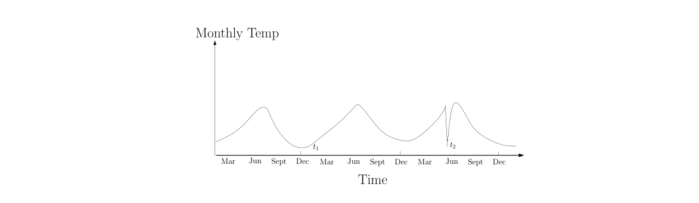

**그림 3. 온도 시계열의 상황별 이상 t2입니다. 시간 t1의 온도는 시간 t2의 온도와 동일하지만 다른 맥락에서 발생하므로 이상 현상으로 간주되지 않습니다.**

상황에 따른 이상 현상은 시계열 데이터에서 가장 일반적으로 탐색되었습니다[Weigend et al. 1995; Salvador and Chan 2003] 및 공간 데이터 [Kou et al. 2006; Shekharet al. 2001]. 그림 3는 지난 몇 년간 한 지역의 월별 온도를 보여주는 온도 시계열에 대한 그러한 예를 보여줍니다. 해당 장소에서 겨울(t1 시간) 동안 35F의 온도는 정상일 수 있지만 여름(t2 시간) 동안 동일한 값은 예외입니다.

신용카드 사기 탐지 분야에서도 비슷한 예를 찾을 수 있습니다. 신용카드 도메인의 상황별 속성은 구매 시간이 될 수 있습니다. 개인이 $1000에 도달하는 크리스마스 주간을 제외하고 일반적으로 주간 쇼핑 청구서가 $100라고 가정해 보겠습니다. 7월 한 주에 $1000를 새로 구매하는 것은 시간적 맥락에서 개인의 정상적인 행동과 일치하지 않기 때문에 상황적 이상으로 간주됩니다(크리스마스 주간에 동일한 금액을 지출한 경우에도 정상으로 간주됨).

상황별 이상 탐지 기술을 적용하는 선택은 대상 애플리케이션 도메인에서 상황상의 이상 징후의 의미에 따라 결정됩니다.

<!-- 원문 11쪽 -->

또 다른 핵심 요소는 상황별 속성의 가용성입니다. 몇몇 경우에는 컨텍스트를 정의하는 것이 간단하므로 컨텍스트 이상 탐지 기술을 적용하는 것이 합리적입니다. 다른 경우에는 컨텍스트를 정의하는 것이 쉽지 않아 이러한 기술을 적용하기가 어렵습니다.

2.2.3 집단 변칙. 관련된 데이터 인스턴스의 집합이 전체 데이터셋에 대해 비정상적인 경우 이를 집합적 이상이라고 합니다. 집합적 변칙의 개별 데이터 인스턴스는 그 자체로는 변칙이 아닐 수 있지만, 집합적으로 함께 발생하면 변칙이 됩니다. 그림 4는 인간의 심전도 출력을 보여주는 예를 보여줍니다[Goldberger et al. 2000]. 강조 표시된 영역은 비정상적으로 오랜 시간 동안 동일한 낮은 값이 존재하기 때문에(심방 조기 수축에 해당) 이상을 나타냅니다. 낮은 값 자체는 예외가 아닙니다.

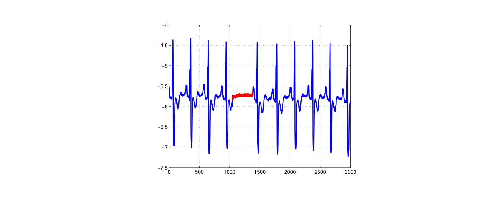

**그림 4. 인간 심전도 출력에서 ​​심방 조기 수축에 해당하는 집합적 이상입니다.**

또 다른 예시적인 예로, 아래와 같이 컴퓨터에서 발생하는 일련의 작업을 생각해 보세요... http-web, 버퍼 오버플로, http-web, http-web, smtp-mail, ftp, http-web, ssh, smtpmail, http-web, ssh, 버퍼 오버플로, ftp, http-web, ftp, smtp-mail,http-web...

강조 표시된 일련의 이벤트(버퍼 오버플로, ssh, ftp)는 원격 시스템에 의한 일반적인 웹 기반 공격에 이어 FTP를 통해 호스트 컴퓨터에서 원격 대상으로 데이터를 복사하는 것에 해당합니다. 이러한 일련의 사건은 변칙적이지만 개별 사건은 연속된 다른 위치에서 발생할 때 변칙적이지 않다는 점에 유의해야 합니다.

서열 데이터에 대해 집합적 이상 현상이 조사되었습니다 [Forrest et al. 1999; Sunet al. 2006], 그래프 데이터[Noble and Cook 2003], 공간 데이터[Shekhar et al. 2001].

<!-- 원문 12쪽 -->

포인트 이상은 모든 데이터셋에서 발생할 수 있지만 집합적 이상은 데이터 인스턴스가 관련된 데이터셋에서만 발생할 수 있다는 점에 유의해야 합니다. 대조적으로, 맥락적 이상 현상의 발생은 데이터의 맥락 속성의 가용성에 따라 달라집니다. 점적 이상이나 집합적 이상은 맥락에 따라 분석될 경우 맥락적 이상일 수도 있습니다. 따라서 점 이상 탐지 문제나 집합적 이상 탐지 문제는 맥락 정보를 통합하여 맥락 이상 탐지 문제로 변환될 수 있다.

### 2.3 데이터 라벨

데이터 인스턴스와 관련된 레이블은 해당 인스턴스가 정상인지 변칙인지를 나타냅니다1. 모든 유형의 행동을 대표할 뿐만 아니라 정확하고 라벨이 붙은 데이터를 얻는 것은 종종 엄청나게 비용이 많이 든다는 점에 유의해야 합니다. 라벨링은 인간 전문가가 수동으로 수행하는 경우가 많으므로 라벨이 지정된 훈련 데이터셋를 얻으려면 상당한 노력이 필요합니다. 일반적으로 가능한 모든 유형의 변칙적 행동을 포괄하는 변칙적 데이터 인스턴스의 레이블이 지정된 세트를 얻는 것은 정상적인 행동에 대한 레이블을 얻는 것보다 더 어렵습니다. 더욱이 변칙적인 행동은 본질적으로 동적인 경우가 많습니다. 예를 들어 레이블이 지정된 훈련 데이터가 없는 새로운 유형의 변칙이 발생할 수 있습니다. 항공 교통 안전과 같은 특정 경우에는 변칙적인 사례가 재앙적인 사건으로 해석될 수 있으므로 매우 드뭅니다.

레이블을 사용할 수 있는 정도에 따라 변칙 검색 기술은 다음 세 가지 모드 중 하나로 작동할 수 있습니다.

2.3.1 감독된 이상 탐지. 감독 모드에서 훈련된 기술은 정상 및 이상 클래스에 대한 인스턴스 레이블이 지정된 훈련 데이터셋의 가용성을 가정합니다. 이러한 경우 일반적인 접근 방식은 정상 및 이상 클래스에 대한 예측 모델을 구축하는 것입니다. 보이지 않는 데이터 인스턴스는 모델과 비교되어 해당 인스턴스가 속한 클래스를 결정합니다. 감독된 이상 탐지에는 두 가지 주요 문제가 발생합니다. 첫째, 훈련 데이터의 정상적인 인스턴스에 비해 변칙적인 인스턴스가 훨씬 적습니다. 불균형한 클래스 분포로 인해 발생하는 문제는 데이터 마이닝 및 기계 학습 문헌에서 다루어졌습니다[Joshi et al. 2001; 2002; Chawlaet al. 2004; Phuaet al. 2004; 와이즈(Weiss) 및 허쉬(Hirsh) 1998; Vilalta 및 Ma 2002]. 둘째, 특히 이상 징후 클래스에 대해 정확하고 대표적인 라벨을 얻는 것이 일반적으로 어렵습니다. 레이블이 지정된 훈련 데이터셋를 얻기 위해 정상 데이터셋에 인위적인 이상 현상을 주입하는 여러 기술이 제안되었습니다 [Theiler and Cai 2003; Abeet al. 2006; Steinwartet al. 2005]. 이 두 가지 문제를 제외하면 감독된 이상 탐지 문제는 예측 모델 구축과 유사합니다. 따라서 우리는 이 조사에서 이 기술 범주를 다루지 않을 것입니다.

2.3.2 반감시형 이상 탐지. 준지도 모드에서 작동하는 기술은 훈련 데이터에 일반 클래스에 대한 인스턴스만 레이블이 지정되어 있다고 가정합니다. 이상 클래스에 대한 레이블이 필요하지 않으므로 지도 기술보다 더 광범위하게 적용할 수 있습니다. 예를 들어, 우주선 결함 탐지에서 [Fujimaki et al. 2005], 이상 시나리오는 사고를 의미하므로 모델링이 쉽지 않습니다. 이러한 기술에 사용되는 일반적인 접근 방식은 다음과 같습니다.

1정상 클래스와 변칙 클래스라고도 합니다. 정상적인 동작에 해당하는 클래스에 대한 모델을 구축하고, 이 모델을 사용하여 테스트 데이터의 이상 현상을 식별합니다.

<!-- 원문 13쪽 -->

훈련을 위한 이상 인스턴스만 사용할 수 있다고 가정하는 제한된 이상 탐지 기술 세트가 존재합니다[Dasgupta 및 Nino 2000; 다스굽타(Dasgupta) 및 마줌다르(Majumdar) 2002; Forrestet al. 1996]. 이러한 기술은 데이터에서 발생할 수 있는 모든 가능한 변칙적 동작을 포괄하는 훈련 데이터셋를 얻는 것이 어렵기 때문에 일반적으로 사용되지 않습니다.

2.3.3 감독되지 않은 이상 탐지. 비지도 모드에서 작동하는 기술은 훈련 데이터가 필요하지 않으므로 가장 널리 적용 가능합니다. 이 범주의 기술은 정상적인 인스턴스가 테스트 데이터의 변칙적인 인스턴스보다 훨씬 더 자주 발생한다는 암묵적인 가정을 합니다. 이 가정이 사실이 아닌 경우 이러한 기술은 높은 잘못된 경고 비율로 인해 어려움을 겪게 됩니다.

많은 준지도 기술은 레이블이 지정되지 않은 데이터셋의 샘플을 훈련 데이터로 사용하여 비지도 모드에서 작동하도록 조정할 수 있습니다. 이러한 적응은 테스트 데이터에 아주 적은 변칙이 포함되어 있고 훈련 중에 학습된 모델이 이러한 몇 가지 변칙에 대해 강력하다고 가정합니다.

### 2.4 이상 탐지 출력

이상 탐지 기술의 중요한 측면은 이상이 보고되는 방식입니다. 일반적으로 이상 탐지 기술로 생성되는 출력은 다음 두 가지 유형 중 하나입니다.

2.4.1 점수. 채점 기술은 해당 인스턴스가 이상으로 간주되는 정도에 따라 테스트 데이터의 각 인스턴스에 이상 점수를 할당합니다. 따라서 그러한 기술의 결과는 순위가 매겨진 변칙 목록입니다. 분석가는 상위 몇 가지 이상 항목을 분석하거나 컷오프 임계값을 사용하여 이상 항목을 선택하도록 선택할 수 있습니다.

2.4.2 라벨. 이 범주의 기술은 각 테스트 인스턴스에 레이블(정상 또는 변칙)을 할당합니다.

점수 기반 이상 징후 탐지 기술을 통해 분석가는 도메인별 임계값을 사용하여 가장 관련성이 높은 이상 징후를 선택할 수 있습니다. 테스트 인스턴스에 이진 레이블을 제공하는 기술은 분석가가 그러한 선택을 직접적으로 허용하지 않지만 각 기술 내의 매개변수 선택을 통해 간접적으로 제어할 수 있습니다.

## 3 이상 탐지의 응용

이 섹션에서는 이상 탐지의 여러 응용 프로그램에 대해 설명합니다. 각 애플리케이션 도메인에 대해 다음 네 가지 측면을 논의합니다.

- 이상현상의 개념.

—데이터의 성격.

- 이상 징후 감지와 관련된 문제.

—기존 이상 탐지 기술.

<!-- 원문 14쪽 -->

### 3.1 침입 탐지

침입 탐지란 컴퓨터 관련 시스템[Phoha 2002]에서 악의적인 활동(침입, 침투 및 기타 형태의 컴퓨터 남용)을 탐지하는 것을 의미합니다. 이러한 악의적인 활동이나 침입은 컴퓨터 보안 측면에서 흥미롭습니다. 침입은 시스템의 정상적인 동작과 다르므로 이상 탐지 기술은 침입 탐지 영역에 적용 가능합니다.

이 영역에서 이상 탐지의 주요 과제는 엄청난 양의 데이터입니다. 이상 탐지 기술은 이러한 대규모 입력을 처리하기 위해 계산적으로 효율적이어야 합니다. 게다가 데이터는 일반적으로 스트리밍 방식으로 제공되므로 온라인 분석이 필요합니다. 큰 크기의 입력으로 인해 발생하는 또 다른 문제는 잘못된 경고 비율입니다. 데이터는 수백만 개의 데이터 개체에 달하기 때문에 몇 퍼센트의 잘못된 경보만으로도 분석가의 분석을 압도할 수 있습니다. 일반적으로 정상적인 동작에 해당하는 레이블이 지정된 데이터를 사용할 수 있지만 침입에 대한 레이블은 사용할 수 없습니다. 따라서 이 영역에서는 준지도 및 비지도 이상 탐지 기술이 선호됩니다.

Denning [1987]는 침입 탐지 시스템을 호스트 기반 및 네트워크 기반 침입 탐지 시스템으로 분류합니다.

3.1.1 호스트 기반 침입 탐지 시스템. 이러한 시스템(시스템 호출 침입 탐지 시스템이라고도 함)은 운영 체제 호출 추적을 처리합니다. 침입은 흔적의 변칙적인 하위 순서(집단 변칙)의 형태로 이루어집니다. 비정상적인 하위 시퀀스는 악성 프로그램, 무단 동작 및 정책 위반으로 해석됩니다. 모든 추적에는 동일한 알파벳에 속하는 이벤트가 포함되어 있지만 정상 동작과 변칙 동작을 구별하는 핵심 요소는 이벤트의 동시 발생입니다.

데이터는 본질적으로 순차적이며 알파벳은 그림 5에 표시된 것처럼 개별 시스템 호출로 구성됩니다. 이러한 호출은 프로그램 [Hofmeyr et al. 1998] 또는 사용자 [Lane 및 Brodley 1999]. 알파벳은 일반적으로 큽니다(183 시스템은 SunOS 4.1x 운영 체제를 호출합니다). 다양한 프로그램은 이러한 시스템 호출을 다양한 순서로 실행합니다. 각 프로그램의 시퀀스 길이는 다양합니다. 그림 5는 운영 체제 호출 시퀀스의 샘플 세트를 보여줍니다. 이 영역에 있는 데이터의 주요 특징은 데이터가 일반적으로 프로그램 수준이나 사용자 수준과 같은 다양한 수준에서 프로파일링될 수 있다는 것입니다. 이상 탐지 기술

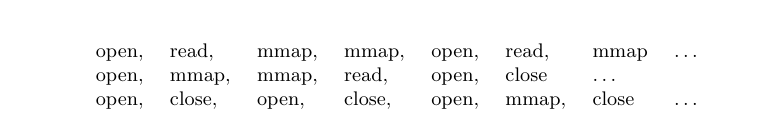

**그림 5. 세 가지 운영 체제 호출 추적으로 구성된 샘플 데이터셋입니다.**

호스트 기반 침입 탐지에 적용되는 것은 데이터의 순차적 특성을 처리하는 데 필요합니다. 또한 이 영역에서는 포인트 이상 탐지 기술을 적용할 수 없습니다. 기술은 시퀀스 데이터를 모델링하거나 시퀀스 간의 유사성을 계산해야 합니다. 이 문제에 사용된 다양한 기술에 대한 조사가 Snyder [2001]에 의해 발표되었습니다. Forrest et al.에서 제시된 호스트 기반 침입 탐지에 대한 이상 탐지의 비교 평가. [1996] 및 다스굽타 및

<!-- 원문 15쪽 -->

**표 2. 호스트 기반 침입 탐지에 사용되는 이상 탐지 기술의 예입니다.**

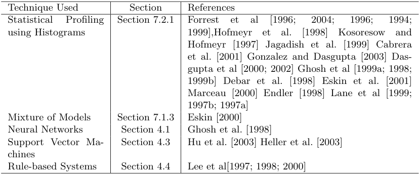

니노 [2000]. 이 영역에서 사용되는 일부 이상 탐지 기술은 표 II에 나와 있습니다.

3.1.2 네트워크 침입 탐지 시스템. 이러한 시스템은 네트워크 데이터에 대한 침입 탐지를 처리합니다. 침입은 일반적으로 특정 기술이 순차적 방식으로 데이터를 모델링하고 비정상적인 하위 시퀀스(집단 이상)를 감지하지만 비정상적인 패턴(점 이상)으로 발생합니다[Gwadera et al. 2005b; 2004]. 이러한 변칙적인 현상이 발생하는 주된 이유는 정보를 도용하거나 네트워크를 방해하기 위해 네트워크에 무단으로 액세스하려는 외부 해커가 실행한 공격 때문입니다. 일반적인 설정은 인터넷을 통해 전 세계와 연결되는 대규모 컴퓨터 네트워크입니다.

침입 탐지 시스템에 사용할 수 있는 데이터는 패킷 수준 추적, CISCO 네트 플로우 데이터 등 다양한 세분성 수준에 있을 수 있습니다. 데이터에는 이와 관련된 시간적 측면이 있지만 대부분의 기술은 일반적으로 순차적 측면을 명시적으로 처리하지 않습니다. 데이터는 일반적으로 범주형 속성과 연속형 속성이 혼합된 고차원적입니다.

이 영역에서 이상 탐지 기술이 직면한 과제는 침입자가 기존 침입 탐지 솔루션을 회피하기 위해 네트워크 공격을 조정함에 따라 시간이 지남에 따라 이상 현상의 특성이 계속 변한다는 것입니다.

이 영역에서 사용되는 일부 이상 탐지 기술은 표 III에 나와 있습니다.

### 3.2 사기 탐지

사기탐지란 은행, 신용카드사, 보험대리점, 휴대전화회사, 주식시장 등 상업조직에서 발생하는 범죄행위를 탐지하는 것을 말합니다. 악의적인 사용자는 해당 조직의 실제 고객일 수도 있고 고객사칭(신원도용이라고도 함)할 수도 있습니다. 사기는 이러한 사용자가 조직에서 제공한 리소스를 무단으로 소비할 때 발생합니다. 조직은 경제적 손실을 방지하기 위해 이러한 사기를 즉시 감지하는 데 관심이 있습니다.

Fawcett 및 Provost [1999]는 이러한 영역에서 사기 탐지에 대한 일반적인 접근 방식으로 활동 모니터링이라는 용어를 소개합니다. 이상현상의 전형적인 접근방식

<!-- 원문 16쪽 -->

**표 III. 네트워크 침입 탐지에 사용되는 이상 탐지 기술의 예입니다.**

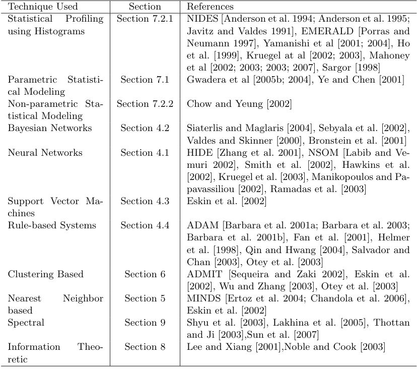

**표 4. 신용카드 사기 탐지에 사용되는 이상 탐지 기술의 예.**

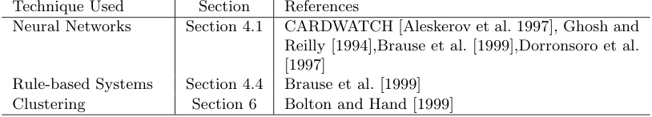

탐지 기술은 각 고객의 사용 프로필을 유지하고 프로필을 모니터링하여 편차를 탐지하는 것입니다. 사기 탐지의 구체적인 적용 사례 중 일부는 아래에 설명되어 있습니다.

3.2.1 신용카드 사기 탐지. 이 영역에서는 사기성 신용 카드 신청 또는 사기성 신용 카드 사용(신용 카드 도난과 관련)을 탐지하기 위해 이상 탐지 기술이 적용됩니다. 사기성 신용카드 신청을 탐지하는 것은 보험 사기를 탐지하는 것과 유사합니다[Ghosh and Reilly 1994].

<!-- 원문 17쪽 -->

**표 V. 휴대폰 사기 탐지에 사용되는 이상 탐지 기술의 예.**

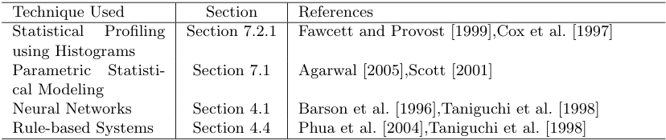

데이터는 일반적으로 사용자 ID, 지출 금액, 연속 카드 사용 사이의 시간 등과 같은 여러 차원에 걸쳐 정의된 기록으로 구성됩니다. 사기는 일반적으로 거래 기록(포인트 이상)에 반영되며 높은 지불금, 사용자가 이전에 구매한 적이 없는 품목의 구매, 높은 구매율 등에 해당합니다. 신용 회사는 사용 가능한 완전한 데이터를 보유하고 있으며 레이블이 지정된 기록도 가지고 있습니다. 또한 데이터는 신용 카드 사용자를 기반으로 하는 고유한 프로필에 속합니다. 따라서 프로파일링 및 클러스터링 기반 기술이 일반적으로 이 영역에서 사용됩니다.

승인되지 않은 신용 카드 사용을 탐지하는 것과 관련된 문제는 사기 거래가 발생하는 즉시 온라인으로 사기를 탐지해야 한다는 것입니다.

이 문제를 해결하기 위해 이상 탐지 기술이 두 가지 방법으로 적용되었습니다. 첫 번째는 소유자별(by-owner)로 알려져 있으며 각 신용 카드 사용자는 신용 카드 사용 내역을 기반으로 프로파일링됩니다. 모든 새로운 거래는 사용자의 프로필과 비교되어 프로필과 일치하지 않는 경우 이상으로 표시됩니다. 이 접근 방식은 사용자가 거래를 수행할 때마다 중앙 데이터 저장소를 쿼리해야 하기 때문에 일반적으로 비용이 많이 듭니다. By-Operation으로 알려진 또 다른 접근 방식은 특정 지리적 위치에서 발생하는 거래 중에서 이상 현상을 감지합니다. 사용자별 및 작업별 기술 모두 상황에 따른 이상 현상을 감지합니다. 첫 번째 경우 컨텍스트는 사용자이고, 두 번째 경우 컨텍스트는 지리적 위치입니다.

이 영역에서 사용되는 일부 이상 탐지 기술은 표 IV에 나열되어 있습니다.

3.2.2 휴대폰 사기 탐지. 모바일/셀룰러 사기 탐지는 일반적인 활동 모니터링 문제입니다. 이 작업은 대규모 계정 세트를 스캔하여 각 계정의 통화 동작을 조사하고 계정이 오용된 것으로 나타날 때 경보를 발령하는 것입니다.

통화 활동은 다양한 방식으로 표시될 수 있지만 일반적으로 통화 기록으로 설명됩니다. 각 통화 기록은 연속(예: CALL-DURATION) 및 불연속(예: CALLING-CITY) 특성의 벡터입니다. 그러나 이 영역에는 고유한 원시 표현이 없습니다. 통화는 시간별로 집계될 수 있습니다. 예를 들어 원하는 세분성에 따라 통화 시간, 통화 날짜, 사용자 또는 영역 등이 있습니다. 이상 현상은 전화량이 많거나 예상치 못한 목적지로 걸려온 전화에 해당합니다.

휴대폰 사기 탐지에 적용되는 일부 기술은 표 V에 나열되어 있습니다.

3.2.3 보험 청구 사기 탐지. 재산 손해 보험 업계에서 중요한 문제는 청구 사기입니다. 자동차 보험 사기. 청구인과 제공자의 개인과 공모자들은 무단 및 불법 청구에 대한 청구 처리 시스템을 조작합니다. 이러한 사기를 탐지하는 것은 관련 회사가 금전적 손실을 방지하는 데 매우 중요합니다.

<!-- 원문 18쪽 -->

이 도메인에서 사용 가능한 데이터는 청구인이 제출한 문서입니다. 이 기술은 이러한 문서에서 다양한 특징(범주형 및 연속형 모두)을 추출합니다. 일반적으로 청구 조정인과 조사관은 사기 여부에 대한 청구를 평가합니다. 이러한 수동으로 조사된 사례는 보험 사기 탐지를 위한 지도 및 준지도 기술에 의해 레이블이 지정된 인스턴스로 사용됩니다.

보험 청구 사기 탐지는 일반적인 활동 모니터링 문제로 처리되는 경우가 많습니다[Fawcett 및 Provost 1999]. 비정상적인 보험 청구를 식별하기 위해 신경망 기반 기술도 적용되었습니다 [He et al. 2003; Brockettet al. 1998].

3.2.4 내부자 거래 탐지. 최근에 이상 탐지 기술을 적용한 또 다른 분야는 내부자 거래의 조기 탐지입니다. 내부자 거래는 주식시장에서 발견되는 현상으로, 내부 정보가 공개되기 전에 사람들이 내부 정보를 조작(또는 유출)하여 불법적인 이익을 얻는 현상입니다. 내부 정보는 다양한 형태로 제공될 수 있습니다[Donoho 2004]. 이는 보류 중인 인수/합병, 특정 산업에 영향을 미치는 테러 공격, 특정 산업에 영향을 미치는 계류 중인 법안 또는 특정 산업의 주가에 영향을 미칠 수 있는 모든 정보에 대한 지식을 의미할 수 있습니다. 내부자 거래는 시장에서 비정상적인 거래 활동을 식별하여 탐지할 수 있습니다.

사용 가능한 데이터는 옵션 거래 데이터, 주식 거래 데이터, 뉴스 등 여러 이기종 소스에서 가져온 것입니다. 데이터는 지속적으로 수집되기 때문에 시간적 연관성을 가지고 있습니다. 시간적 및 스트리밍 특성은 특정 기술[Aggarwal 2005]에서도 활용되었습니다.

이 영역의 이상 탐지 기술은 사람/조직이 불법적인 이익을 얻는 것을 방지하기 위해 온라인 방식으로 가능한 한 조기에 사기를 탐지해야 합니다.

이 영역에서 사용되는 일부 이상 탐지 기술은 표 VI에 나열되어 있습니다.

**표 6. 내부자 거래 탐지에 사용되는 다양한 이상 탐지 기술의 예.**

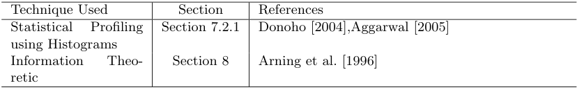

### 3.3 의료 및 공중 보건 이상 탐지

의료 및 공중 보건 영역의 이상 탐지는 일반적으로 환자 기록을 사용하여 작동합니다. 비정상적인 환자 상태나 기기 오류, 기록 오류 등 여러 가지 이유로 인해 데이터에 이상이 있을 수 있습니다. 몇몇 기술은 또한 특정 지역에서 질병 발생을 탐지하는 데 중점을 두었습니다[Wong et al. 2003]. 따라서 이상 징후 탐지는 이 영역에서 매우 중요한 문제이며 높은 수준의 정확성이 필요합니다.

데이터는 일반적으로 환자 연령, 혈액형, 체중과 같은 여러 가지 유형의 특징을 가질 수 있는 기록으로 구성됩니다. 데이터에는 다음이 있을 수도 있습니다.

<!-- 원문 19쪽 -->

**표 Ⅶ. 의료 및 공중 보건 영역에서 사용되는 다양한 이상 탐지 기술의 예입니다.**

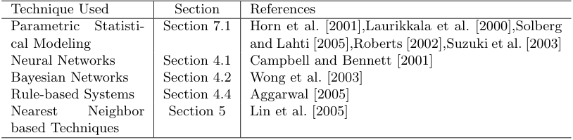

시간적 측면뿐만 아니라 공간적 측면도 마찬가지다. 이 영역에서 현재 이상 탐지 기술의 대부분은 비정상적인 기록(포인트 이상)을 탐지하는 것을 목표로 합니다. 일반적으로 레이블이 지정된 데이터는 건강한 환자에 속하므로 대부분의 기술은 준지도 방식을 채택합니다. 이 영역에서 이상 탐지 기술로 처리되는 또 다른 형태의 데이터는 심전도(ECG)(그림 4) 및 뇌전도(EEG)와 같은 시계열 데이터입니다. 이러한 데이터에서 이상을 탐지하기 위해 집단적 이상 탐지 기술이 적용되었습니다 [Lin et al. 2005].

이 영역에서 이상 탐지 문제의 가장 어려운 측면은 이상을 정상으로 분류하는 데 드는 비용이 매우 높을 수 있다는 것입니다.

이 영역에서 사용되는 일부 이상 탐지 기술은 표 VII에 나열되어 있습니다.

### 3.4 산업 피해 감지

산업용 장치는 지속적인 사용과 일반적인 마모로 인해 손상을 입습니다. 이러한 피해를 조기에 감지하여 추가 확대와 손실을 방지해야 합니다. 이 영역의 데이터는 다양한 센서를 사용하여 기록되고 분석을 위해 수집되므로 일반적으로 센서 데이터라고 합니다. 이러한 손상을 감지하기 위해 이 영역에서는 이상 탐지 기술이 광범위하게 적용되었습니다. 산업 피해 감지는 모터, 엔진 등 기계 부품의 결함을 다루는 영역과 물리적 구조의 결함을 다루는 영역으로 더 분류될 수 있습니다. 이전 도메인은 시스템 상태 관리라고도 합니다.

기계 장치의 3.4.1 오류 감지. 이 영역의 이상 탐지 기술은 모터, 터빈, 파이프라인의 오일 흐름 또는 기타 기계 구성 요소와 같은 산업 구성 요소의 성능을 모니터링하고 마모 또는 기타 예상치 못한 상황으로 인해 발생할 수 있는 결함을 감지합니다.

이 영역의 데이터는 일반적으로 시간적 측면을 가지며 시계열 분석은 일부 기술에서도 사용됩니다 [Keogh et al. 2002; Keoghet al. 2006; Basu 및 Meckesheimer 2007]. 이상 현상은 주로 특정 맥락의 관찰(맥락 이상 현상)로 인해 발생하거나 일련의 관측 결과(집단 이상 현상)로 발생합니다.

일반적으로 일반 데이터(결함이 없는 구성 요소와 관련된)는 쉽게 사용할 수 있으므로 준지도 기법을 적용할 수 있습니다. 이상 징후가 발생하는 즉시 예방 조치를 취해야 하므로 온라인 방식으로 이상 징후를 탐지해야 합니다.

이 영역에서 사용되는 일부 이상 탐지 기술은 표 VIII에 나열되어 있습니다.

<!-- 원문 20쪽 -->

**표 8. 기계 장치의 결함 감지에 사용되는 이상 탐지 기술의 예입니다.**

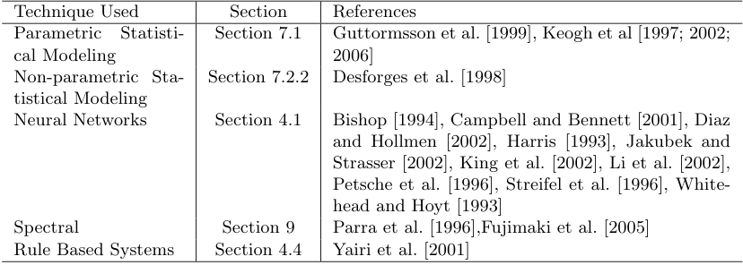

**표 9. 구조적 손상 감지에 사용되는 이상 탐지 기술의 예입니다.**

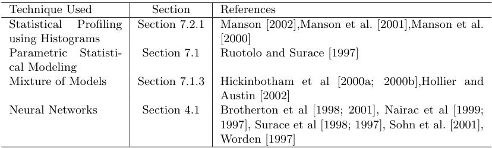

3.4.2 구조적 결함 감지. 구조적 결함 및 손상 감지 기술은 빔의 균열, 기체의 변형 등 구조물의 구조적 이상을 감지합니다.

이 영역에서 수집된 데이터는 시간적인 측면을 가지고 있습니다. 이상 탐지 기술은 구조에서 수집된 데이터의 변화를 탐지한다는 점에서 신규성 탐지 또는 변화점 탐지 기술과 유사합니다. 일반 데이터와 학습된 모델은 일반적으로 시간이 지남에 따라 정적입니다. 데이터에는 공간 상관관계가 있을 수 있습니다.

이 영역에서 사용되는 일부 이상 탐지 기술은 표 IX에 나열되어 있습니다.

### 3.5 이미지 처리

이미지를 다루는 이상 탐지 기술은 시간에 따른 이미지의 변화(모션 감지)나 정적 이미지에서 비정상적으로 나타나는 영역에 관심이 있습니다. 이 도메인에는 위성 이미지 [Augusteijn 및 Folkert 2002; 바이어스 앤 래프터리 1998; Moyaet al. 1993; 토르 및 머레이 1993; Theiler 및 Cai 2003], 숫자 인식 [Cun et al. 1990], 분광학 [Chen et al. 2005; 데이비와 Godsill 2002; 헤이젤 2000; Scarthet al. 1995], 유방촬영 영상분석[Spence et al. 2001; Tarassenko 1995] 및 비디오 감시 [Diehl 및 Hampshire 2002; Singh 및 Markou 2004; Pokrajacet al. 2007]. 이상 현상은 이물질의 움직임이나 삽입 또는 계측 오류로 인해 발생합니다. 데이터에는 공간적 특성과 시간적 특성이 있습니다. 각 데이터 포인트에는 몇 가지 연속된 데이터 포인트가 있습니다.

<!-- 원문 21쪽 -->

**표 X. 이미지 처리 영역에서 사용되는 이상 탐지 기술의 예.**

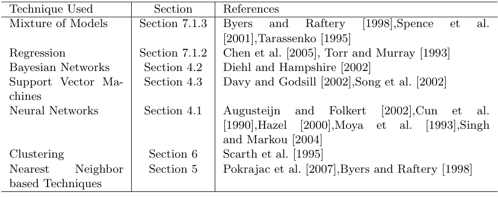

**표 11. 텍스트 데이터에서 변칙 주제 탐지에 사용되는 변칙 탐지 기술의 예입니다.**

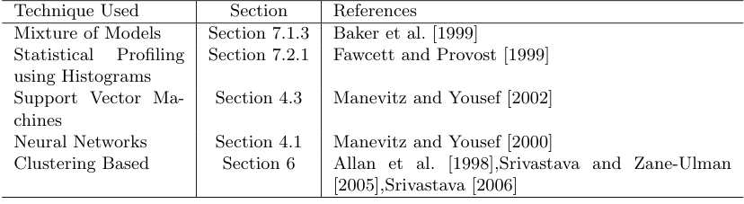

색상, 밝기, 질감 등과 같은 속성. 흥미로운 이상 현상은 이미지의 비정상적인 점 또는 영역(점 및 상황적 이상)입니다.

이 영역의 주요 과제 중 하나는 입력 크기가 크다는 것입니다. 영상 데이터를 다룰 때에는 온라인 이상 탐지 기술이 필요하다.

이 영역에서 사용되는 일부 이상 탐지 기술은 표 X에 나열되어 있습니다.

### 3.6 텍스트 데이터의 이상 탐지

이 영역의 이상 탐지 기술은 주로 문서나 뉴스 기사 모음에서 새로운 주제나 이벤트, 뉴스 기사를 탐지합니다. 새로운 흥미로운 사건이나 변칙적인 주제로 인해 변칙 현상이 발생합니다.

이 영역의 데이터는 일반적으로 고차원적이고 매우 희박합니다. 문서는 시간이 지남에 따라 수집되므로 데이터에는 시간적 측면도 있습니다.

이 영역에서 이상 탐지 기술의 과제는 하나의 카테고리나 주제에 속하는 문서의 큰 변화를 처리하는 것입니다.

이 영역에서 사용되는 일부 이상 탐지 기술은 표 XI에 나열되어 있습니다.

### 3.7 센서 네트워크

센서 네트워크는 최근 중요한 연구 주제가 되었습니다. 다양한 무선 센서로부터 수집된 센서 데이터는 몇 가지 고유한 특성을 가지고 있기 때문에 데이터 분석 관점에서 더 많은 정보를 얻을 수 있습니다. 센서에서 수집된 데이터의 이상 현상

<!-- 원문 22쪽 -->

**표 12. 센서 네트워크의 이상 탐지에 사용되는 이상 탐지 기술의 예입니다.**

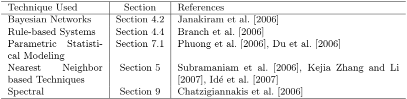

네트워크는 하나 이상의 센서에 결함이 있거나 분석가에게 흥미로운 이벤트(예: 침입)를 감지하고 있음을 의미할 수 있습니다. 따라서 센서 네트워크의 이상 탐지는 센서 결함 감지나 침입 감지 또는 둘 다를 포착할 수 있습니다.

단일 센서 네트워크는 바이너리, 이산, 연속, 오디오, 비디오 등과 같은 다양한 유형의 데이터를 수집하는 센서로 구성될 수 있습니다. 데이터는 스트리밍 모드에서 생성됩니다. 다양한 센서가 배치된 환경과 통신 채널로 인해 수집된 데이터에 노이즈와 누락된 값이 발생하는 경우가 많습니다.

센서 네트워크의 이상 탐지에는 일련의 고유한 과제가 있습니다. 온라인 접근 방식으로 작동하려면 이상 탐지 기술이 필요합니다. 심각한 자원 제약으로 인해 이상 탐지 기술은 경량화되어야 ​​합니다. 또 다른 과제는 데이터가 분산 방식으로 수집되므로 데이터를 분석하려면 분산 데이터 마이닝 접근 방식이 필요하다는 것입니다 [Chatzigiannakis et al. 2006]. 더욱이, 센서에서 수집된 데이터에 노이즈가 있으면 흥미로운 이상과 원치 않는 노이즈/누락 값을 구별해야 하므로 이상 탐지가 더욱 어려워집니다.

**표 XII에는 이 영역에서 사용되는 몇 가지 이상 탐지 기술이 나열되어 있습니다.**

### 3.8 기타 도메인

이상 탐지는 음성 인식과 같은 다른 여러 영역에도 적용되었습니다[Albrecht et al. 2000; Emamianet al. 2000], 로봇 행동의 참신함 탐지 [Crook and Hayes 2001; Crooket al. 2002; Marslandet al. 1999; 2000b; 2000a], 트래픽 모니터링 [Shekhar et al. 2001], 클릭스루 보호 [Ihler et al. 2006], 웹 애플리케이션의 오류 감지 [Ide 및 Kashima 2004; Sunet al. 2005], 생물학적 데이터의 이상 징후 탐지 [Kadota et al. 2003; Sunet al. 2006; Gwaderaet al. 2005a; 맥도날드와 고쉬 2007; Tomlinset al. 2005; Tibshirani 및 Hastie 2007], 인구 조사 데이터의 변칙 감지 [Lu et al. 2003], 범죄 활동 간의 연관성 탐지 [Lin 및 Brown 2003], 고객 관계 관리(CRM) 데이터의 이상 탐지 [He et al. 2004b], 천문학적 데이터에서 이상 징후 탐지 [Dutta et al. 2007; 에스칼란테 2005; Protopapaset al. 2006] 및 생태계 교란 감지 [Blender et al. 1997; Kou et al. 2006; Sun 및 Chawla 2004].

## 4 분류 기반 이상 탐지 기술

분류 [Tan et al. 2005; Dudaet al. 2000]는 레이블이 지정된 데이터 인스턴스 집합에서 모델(분류자)을 학습(훈련)한 다음 학습된 모델을 사용하여 테스트 인스턴스를 클래스 중 하나로 분류(테스트)하는 데 사용됩니다. 분류 기반 이상 탐지 기술은 유사한 2단계 방식으로 작동합니다. 훈련 단계에서는 사용 가능한 레이블이 지정된 훈련 데이터를 사용하여 분류기를 학습합니다. 테스트 단계에서는 분류자를 사용하여 테스트 인스턴스를 정상 또는 비정상으로 분류합니다.

<!-- 원문 23쪽 -->

분류 기반 이상 탐지 기술은 다음과 같은 일반적인 가정에 따라 작동합니다.

가정: 정상 클래스와 변칙 클래스를 구별할 수 있는 분류기는 주어진 특징 공간에서 학습될 수 있습니다.

훈련 단계에 사용 가능한 레이블을 기반으로 분류 기반 이상 탐지 기술은 다중 클래스 및 단일 클래스 이상 탐지 기술이라는 두 가지 광범위한 범주로 그룹화될 수 있습니다.

다중 클래스 분류 기반 이상 탐지 기술은 학습 데이터에 여러 일반 클래스에 속하는 레이블이 지정된 인스턴스가 포함되어 있다고 가정합니다 [Stefano et al. 2000; Barbaraet al. 2001b]. 이러한 이상 탐지 기술은 각 정상 클래스를 나머지 클래스와 구별하는 분류기를 학습합니다. 그림은 그림 6(a)를 참조하세요. 테스트 인스턴스는 분류자에 의해 정상으로 분류되지 않은 경우 변칙적인 것으로 간주됩니다. 이 하위 범주의 일부 기술은 신뢰도 점수를 분류자가 수행한 예측과 연결합니다. 분류자 중 누구도 테스트 인스턴스를 정상으로 분류하는 데 확신을 갖지 못하는 경우 해당 인스턴스는 비정상으로 선언됩니다.

단일 클래스 분류 기반 이상 탐지 기술은 모든 교육 인스턴스에 클래스 레이블이 하나만 있다고 가정합니다. 이러한 기술은 단일 클래스 분류 알고리즘, 예를 들어 단일 클래스 SVM [Sch¨olkopf et al. 2001], 단일 클래스 커널 피셔 판별기 [Roth 2004; 2006], 그림 6(b)와 같습니다. 학습된 경계에 속하지 않는 모든 테스트 인스턴스는 비정상으로 선언됩니다.

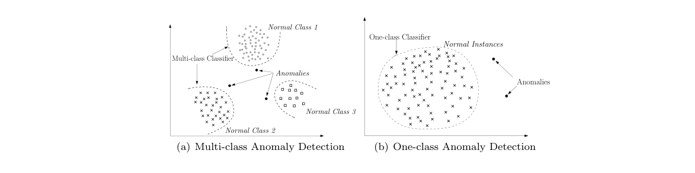

**그림 6. 이상 탐지를 위해 분류를 사용합니다.**

다음 하위 섹션에서는 다양한 분류 알고리즘을 사용하여 분류자를 구축하는 다양한 이상 탐지 기술에 대해 설명합니다.

### 4.1 신경망 기반

단일 클래스 설정은 물론 다중 클래스의 이상 탐지에도 신경망을 적용했습니다.

<!-- 원문 24쪽 -->

**표 13. 신경망을 사용한 분류 기반 이상 탐지 기술의 몇 가지 예입니다.**

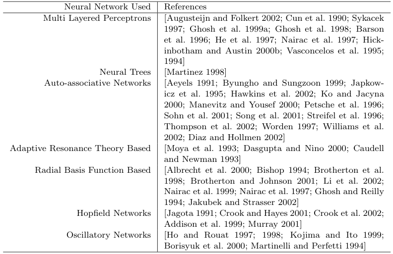

신경망을 이용한 기본적인 다중 클래스 이상 탐지 기술은 두 단계로 동작합니다. 먼저, 신경망은 다양한 정규 클래스를 학습하기 위해 정규 훈련 데이터로 훈련됩니다. 둘째, 각 테스트 인스턴스는 신경망에 대한 입력으로 제공됩니다. 네트워크가 테스트 입력을 수락하면 정상이고 네트워크가 테스트 입력을 거부하면 비정상입니다 [Stefano et al. 2000; 오딘과 애디슨 2000]. 표 XIII에 요약된 것처럼 다양한 유형의 신경망을 사용하는 기본 신경망 기술의 여러 변형이 제안되었습니다.

Replicator Neural Networks는 단일 클래스 이상 탐지에 사용되었습니다[Hawkins et al. 2002; Williamset al. 2002]. 동일한 수의 입력 및 출력 뉴런(데이터의 특징에 해당)을 갖는 다층 피드포워드 신경망이 구성됩니다. 훈련에는 데이터를 3개의 숨겨진 레이어로 압축하는 작업이 포함됩니다. 테스트 단계에는 재구성된 출력 oi를 얻기 위해 학습된 네트워크를 사용하여 각 데이터 인스턴스 xi를 재구성하는 작업이 포함됩니다. 테스트 인스턴스 xi에 대한 재구성 오류 δi는 다음과 같이 계산됩니다.

(xij −oij)2 여기서 n은 데이터가 정의된 특성의 수입니다. 재구성 오류 δi는 테스트 인스턴스의 이상 점수로 직접 사용됩니다.

### 4.2 베이지안 네트워크 기반

다중 클래스 설정에서 이상 탐지를 위해 베이지안 네트워크가 사용되었습니다.

순진한 베이지안 네트워크를 사용하는 일변량 범주형 데이터셋에 대한 기본 기술은 테스트 데이터 인스턴스가 주어졌을 때 클래스 레이블(정상 클래스 레이블 집합과 변칙 클래스 레이블 집합)을 관찰할 사후 확률을 추정합니다. 가장 큰 사후값을 갖는 클래스 레이블이 지정된 테스트 인스턴스에 대한 예측 클래스로 선택됩니다. 클래스가 주어진 테스트 인스턴스를 관찰할 가능성과 클래스 확률에 대한 사전 확률은 훈련 데이터셋에서 추정됩니다. 특히 이상 클래스에 대한 확률 0은 Laplace Smoothing을 사용하여 평활화됩니다.

<!-- 원문 25쪽 -->

기본 기술은 각 테스트 인스턴스에 대한 속성별 사후 확률을 집계하고 집계된 값을 사용하여 테스트 인스턴스에 클래스 레이블을 할당함으로써 다변량 범주형 데이터셋로 일반화될 수 있습니다.

네트워크 침입 탐지를 위해 기본 기술의 여러 변형이 제안되었습니다 [Barbara et al. 2001b; Sebyalaet al. 2002; 발데스와 스키너 2000; 밍밍 2000; Bronsteinet al. 2001], 비디오 감시의 신규성 감지용 [Diehl 및 Hampshire 2002], 텍스트 데이터의 이상 탐지용 [Baker et al. 1999], 질병 발생 탐지를 위한 [Wong et al. 2002; 2003].

위에 설명된 기본 기술은 다양한 속성 간의 독립성을 가정합니다. 보다 복잡한 베이지안 네트워크를 사용하여 서로 다른 속성 간의 조건부 종속성을 캡처하는 기본 기술의 여러 변형이 제안되었습니다 [Siaterlis and Maglaris 2004; Janakiramet al. 2006; 다스와 슈나이더 2007].

### 4.3 서포트 벡터 머신 기반

지원 벡터 머신(SVM) [Vapnik 1995]이 단일 클래스 설정의 이상 탐지에 적용되었습니다. 이러한 기술은 SVM에 대한 단일 클래스 학습 기술을 사용합니다 [Ratsch et al. 2002] 훈련 데이터 인스턴스(경계)가 포함된 영역을 학습합니다. RBF(방사형 기초 함수) 커널과 같은 커널을 사용하여 복잡한 영역을 학습할 수 있습니다. 각 테스트 인스턴스에 대해 기본 기술은 테스트 인스턴스가 학습된 영역에 속하는지 확인합니다. 테스트 인스턴스가 학습된 영역에 속하면 정상으로 선언되고, 그렇지 않으면 비정상으로 선언됩니다.

오디오 신호 데이터의 이상 탐지[Davy 및 Godsill 2002], 발전소의 신규성 탐지[King et al. 2002] 및 시스템 호출 침입 탐지 [Eskin et al. 2002; Helleret al. 2003; Lazarevicet al. 2003]. 기본 기술은 또한 시간 순서의 변칙을 탐지하기 위해 확장되었습니다[Ma and Perkins 2003a; 2003b].

기본 기술의 변형 [Tax and Duin 1999a; 1999b; Tax 2001]는 모든 훈련 인스턴스를 포함하는 커널 공간에서 가장 작은 하이퍼 스피어를 찾은 다음 해당 하이퍼 스피어의 어느 쪽에 테스트 인스턴스가 있는지 결정합니다. 테스트 인스턴스가 하이퍼스피어 외부에 있는 경우 변칙적인 것으로 선언됩니다.

Songet al. [2002]는 훈련 데이터의 변칙 존재에 강력한 RSVM(강력한 지원 벡터 머신)을 사용합니다. RSVM은 시스템 호출 침입 탐지에 적용되었습니다 [Hu et al. 2003].

### 4.4 규칙 기반

규칙 기반 이상 탐지 기술은 시스템의 정상적인 동작을 포착하는 규칙을 학습합니다. 그러한 규칙이 적용되지 않는 테스트 인스턴스는 예외로 간주됩니다. 규칙 기반 기술은 단일 클래스 설정뿐만 아니라 다중 클래스 설정에도 적용되었습니다.

기본적인 다중 클래스 규칙 기반 기술은 두 단계로 구성됩니다. 첫 번째 단계는 RIPPER, 의사결정 트리 등과 같은 규칙 학습 알고리즘을 사용하여 훈련 데이터에서 규칙을 학습하는 것입니다. 각 규칙에는 규칙에 의해 올바르게 분류된 훈련 인스턴스 수와 규칙에 의해 적용되는 총 훈련 인스턴스 수 사이의 비율에 비례하는 연관된 신뢰도 값이 있습니다. 두 번째 단계는 각 테스트 인스턴스에 대해 테스트 인스턴스를 가장 잘 포착하는 규칙을 찾는 것입니다. 최상의 규칙과 관련된 신뢰도의 역수는 테스트 인스턴스의 변칙 점수입니다. 기본 규칙 기반 기술의 몇 가지 사소한 변형이 제안되었습니다 [Fan et al. 2001; Helmeret al. 1998; Lee et al. 1997; 살바도르와 찬 2003; Tenget al. 1990]. 연관 규칙 마이닝 [Agrawal 및 Srikant 1995]은 감독되지 않은 방식으로 데이터에서 규칙을 생성하여 단일 클래스 이상 탐지에 사용되었습니다. 연관 규칙은 범주형 데이터셋에서 생성됩니다. 규칙이 강력한 패턴과 일치하는지 확인하기 위해 지원 임계값을 사용하여 지원이 낮은 규칙을 제거합니다[Tan et al. 2005]. 네트워크 침입 탐지를 위해 연관 규칙 마이닝 기반 기술이 사용되었습니다[Mahoney 및 Chan 2002; 2003; Mahoneyet al. 2003; Tandon 및 Chan 2007; Barbaraet al. 2001a; Oteet al. 2003], 시스템 호출 침입 탐지 [Lee et al. 2000; Lee 및 Stolfo 1998; Qin and Hwang 2004], 신용카드 사기 적발 [Brause et al. 1999], 우주선 하우스 키핑 데이터의 사기 탐지 [Yairi et al. 2001]. 연관규칙 마이닝 알고리즘의 중간단계에서 빈발항목집합이 생성된다. 그 외 여러분. [2004a]는 테스트 인스턴스의 이상 점수가 해당 항목이 발생하는 빈발 항목 집합의 수와 동일한 범주형 데이터셋에 대한 이상 탐지 알고리즘을 제안합니다.

<!-- 원문 26쪽 -->

계산 복잡도 분류 기반 기술의 계산 복잡도는 사용되는 분류 알고리즘에 따라 달라집니다. 훈련 분류기의 복잡성에 대한 논의는 Kearns [1990]를 참조하세요. 일반적으로 훈련 결정 트리는 더 빠른 경향이 있고 SVM과 같은 2차 최적화를 포함하는 기술은 더 비싸지만 선형 훈련 시간을 갖는 선형 시간 SVM[Joachims 2006]이 제안되었습니다. 분류 기술의 테스트 단계는 테스트 단계에서 분류를 위해 학습된 모델을 사용하므로 일반적으로 매우 빠릅니다.

분류 기반 기술의 장점 및 단점 분류 기반 기술의 장점은 다음과 같습니다. (1) 분류 기반 기술, 특히 다중 클래스 기술은 서로 다른 클래스에 속하는 인스턴스를 구별할 수 있는 강력한 알고리즘을 사용할 수 있습니다. (2) 분류 기반 기술의 테스트 단계는 각 테스트 인스턴스를 사전 계산된 모델과 비교해야 하기 때문에 빠릅니다.

분류 기반 기술의 단점은 다음과 같습니다. (1) 다중 클래스 분류 기반 기술은 다양한 일반 클래스에 대한 정확한 레이블의 가용성에 의존하며 이는 종종 불가능합니다. (2) 분류 기반 기술은 각 테스트 인스턴스에 레이블을 할당합니다. 이는 테스트 인스턴스에 대해 의미 있는 이상 점수가 필요할 때 단점이 될 수도 있습니다. 분류기의 출력에서 ​​확률적 예측 점수를 얻는 일부 분류 기술을 사용하여 이 문제를 해결할 수 있습니다[Platt 2000].

<!-- 원문 27쪽 -->

## 5 가장 가까운 이웃 기반 이상 탐지 기술

가장 가까운 이웃 분석의 개념은 여러 이상 탐지 기술에 사용되었습니다. 이러한 기술은 다음과 같은 주요 가정을 기반으로 합니다.

가정: 정상적인 데이터 인스턴스는 밀집된 이웃에서 발생하는 반면 변칙은 가장 가까운 이웃에서 멀리 떨어져 발생합니다.

가장 가까운 이웃 기반 이상 탐지 기술에는 두 데이터 인스턴스 간에 정의된 거리 또는 유사성 측정이 필요합니다. 두 데이터 인스턴스 간의 거리(또는 유사성)는 다양한 방법으로 계산할 수 있습니다. 연속 속성의 경우 유클리드 거리가 널리 선택되지만 다른 척도를 사용할 수도 있습니다 [Tan et al. 2005, 장 2]. 범주형 속성의 경우 단순 매칭 계수가 자주 사용되지만 더 복잡한 거리 측정을 사용할 수도 있습니다 [Boriah et al. 2008; Chandolaet al. 2008]. 다변량 데이터 인스턴스의 경우 일반적으로 각 속성에 대해 거리 또는 유사성을 계산한 다음 결합합니다 [Tan et al. 2005, 장 2].

이 섹션에서 논의할 대부분의 기술과 클러스터링 기반 기술(6 섹션)에서는 거리 측정이 엄격하게 미터법일 것을 요구하지 않습니다. 측정값은 일반적으로 양의 정부호 및 대칭형이어야 하지만 삼각형 부등식을 충족할 필요는 없습니다.

가장 가까운 이웃 기반 이상 탐지 기술은 크게 두 가지 범주로 그룹화될 수 있습니다. (1) 데이터 인스턴스에서 k번째 가장 가까운 이웃까지의 거리를 이상 점수로 사용하는 기술입니다. (2) 각 데이터 인스턴스의 상대 밀도를 계산하여 변칙 점수를 계산하는 기술입니다.

또한 데이터 인스턴스 간의 거리를 다양한 방식으로 사용하여 이상 현상을 감지하는 몇 가지 기술이 있으며 나중에 간략하게 설명하겠습니다.

### 5.1 k번째 가장 가까운 이웃까지의 거리 사용

기본적인 최근접 이웃 이상 탐지 기술은 다음 정의를 기반으로 합니다. 데이터 인스턴스의 이상 점수는 주어진 데이터셋에서 k번째 가장 가까운 이웃까지의 거리로 정의됩니다. 이 기본 기술은 위성 지상 이미지에서 지뢰를 탐지하고[Byers 및 Raftery 1998] 대형 동기 터빈 발전기의 DC 계자 권선에서 단락된 회전(이상)을 탐지하는 데 적용되었습니다[Guttormsson et al. 1999]. 후자의 논문에서 저자는 k = 1를 사용합니다. 일반적으로 테스트 인스턴스가 비정상적인지 여부를 결정하기 위해 이상 점수에 임계값이 적용됩니다. Ramaswamyet al. 반면 [2000]는 이상 점수가 가장 높은 n개의 인스턴스를 이상 항목으로 선택합니다.

기본 기술은 연구원들에 의해 세 가지 다른 방식으로 확장되었습니다. 첫 번째 변형 세트는 위의 정의를 수정하여 데이터 인스턴스의 변칙 점수를 얻습니다. 두 번째 변형 세트는 다양한 거리/유사성 측정값을 사용하여 다양한 데이터 유형을 처리합니다. 세 번째 변형 세트는 다양한 방식으로 기본 기술의 효율성(기본 기술의 복잡성은 O(N 2), 여기서 N은 데이터 크기)을 개선하는 데 중점을 둡니다.

<!-- 원문 28쪽 -->

Eskinet al. [2002], Angiulli 및 Pizzuti [2002] 및 Zhang 및 Wang [2006]는 데이터 인스턴스의 이상 점수를 k개의 가장 가까운 이웃과의 거리의 합으로 계산합니다. 신용카드 사기를 탐지하기 위해 [Bolton and Hand 1999]에 의해 피어 그룹 분석(Peer Group Analysis)이라는 유사한 기술이 적용되었습니다.

데이터 인스턴스의 이상 점수를 계산하는 다른 방법은 주어진 데이터 인스턴스로부터 d 이하의 거리에 있는 최근접 이웃(n)의 수를 계산하는 것입니다[Knorr and Ng 1997; 1998; 1999; Knorret al. 2000]. 이 방법은 반경 d의 초구에서 이웃의 수를 계산하는 작업을 포함하므로 각 데이터 인스턴스의 전역 밀도를 추정하는 것으로 볼 수도 있습니다. 예를 들어, 2-D 데이터셋에서 데이터 인스턴스 = n πd2의 밀도입니다. 밀도의 역수는 데이터 인스턴스의 이상 점수입니다. 실제 밀도를 계산하는 대신 여러 기술은 반경 d를 고정하고 1 n을 이상 점수로 사용하는 반면, 여러 기술은 n을 고정하고 1 d를 이상 점수로 사용합니다. 지금까지 이 범주에서 논의된 대부분의 기술은 연속 속성을 처리하기 위해 제안되었지만 다른 데이터 유형을 처리하기 위해 몇 가지 변형이 제안되었습니다. 하이퍼 그래프 기반 기술은 [Wei et al. 2003]는 저자가 하이퍼 그래프를 사용하여 범주형 값을 모델링하고 그래프의 연결성을 분석하여 두 데이터 인스턴스 간의 거리를 측정하는 HOT라고 합니다. 범주형 특성과 연속형 특성이 혼합된 데이터에 대한 거리 측정이 이상 탐지를 위해 제안되었습니다[Otey et al. 2006]. 저자는 범주형 속성과 연속형 속성에 대한 거리를 별도로 추가하여 두 인스턴스 간의 링크를 정의합니다. 범주형 속성의 경우 두 인스턴스가 동일한 값을 갖는 속성의 수가 인스턴스 간의 거리를 정의합니다. 연속 속성의 경우 연속 값 간의 종속성을 캡처하기 위해 공분산 행렬이 유지됩니다. Palshikar [2005]는 [Knorr and Ng 1999]에서 제안된 기술을 연속 시퀀스에 적용합니다. Kou et al. [2006]는 [Ramaswamy et al. 2000]를 공간 데이터로 변환합니다.

효율성을 향상시키기 위해 기본 기술의 여러 변형이 제안되었습니다. 일부 기술은 변칙적이지 않은 인스턴스를 무시하거나 변칙적일 가능성이 가장 높은 인스턴스에 집중하여 검색 공간을 정리합니다. Bay와 Schwabacher [2003]는 충분히 무작위화된 데이터의 경우 간단한 가지치기 단계로 인해 가장 가까운 이웃 검색의 평균 복잡도가 거의 선형이 될 수 있음을 보여줍니다. 데이터 인스턴스에 대한 가장 가까운 이웃을 계산한 후 알고리즘은 모든 데이터 인스턴스에 대한 이상 임계값을 지금까지 발견된 가장 약한 이상 항목의 점수로 설정합니다. 이 가지치기 절차를 사용하면 이 기술은 가깝고 따라서 흥미롭지 않은 인스턴스를 삭제합니다.

Ramaswamyet al. [2000]는 먼저 인스턴스를 클러스터링하고 각 파티션의 인스턴스에 대해 k번째로 가까운 이웃으로부터 인스턴스 거리의 하한 및 상한을 계산하는 파티션 기반 기술을 제안합니다. 그런 다음 이 정보는 상위 k개의 이상 항목을 포함할 수 없는 파티션을 식별하는 데 사용됩니다. 그러한 파티션은 정리됩니다. 그런 다음 최종 단계에서 나머지 인스턴스(정리되지 않은 파티션에 속함)에서 이상 항목이 계산됩니다. 유사한 클러스터 기반 가지치기가 Eskin et al.에 의해 제안되었습니다. [2002],McCallum 외. [2000], Ghoting 외 여러분. [2006] 및 Tao et al. [2006].

Wu와 Jermaine [2006]는 샘플링을 사용하여 최근접 이웃 기반 기술의 효율성을 향상합니다. 저자는 데이터셋의 더 작은 샘플 내에서 모든 인스턴스의 가장 가까운 이웃을 계산합니다. 따라서 제안된 기법의 복잡성은 O(MN)으로 감소됩니다. 여기서 M은 선택된 샘플 크기입니다.

<!-- 원문 29쪽 -->

가장 가까운 이웃에 대한 검색 공간을 정리하기 위해 여러 기술이 속성 공간을 고정된 크기의 하이퍼큐브로 구성된 하이퍼 그리드로 분할합니다. 이러한 기술의 이면에 있는 직관은 하이퍼큐브에 많은 인스턴스가 포함된 경우 해당 인스턴스가 정상일 가능성이 높다는 것입니다. 또한 특정 인스턴스에 대해 해당 인스턴스를 포함하는 하이퍼큐브와 그에 인접한 하이퍼큐브에 매우 적은 수의 인스턴스가 포함되어 있는 경우 해당 인스턴스가 비정상일 가능성이 높습니다. 이러한 직관에 기초한 기술은 Knorr와 Ng [1998]에 의해 제안되었습니다. Angiulli와 Pizzuti [2002]는 힐베르트 공간 채우기 곡선을 통해 검색 공간을 선형화하여 확장합니다. d차원 데이터셋는 하이퍼큐브 D = [0, 1]d에 맞춰집니다. 그런 다음 이 하이퍼큐브는 힐베르트 공간 채우기 곡선을 사용하여 간격 I = [0, 1]에 매핑되고 데이터 인스턴스의 k-최근접 이웃은 I의 후속 항목과 선행 항목을 검사하여 얻습니다.

### 5.2 상대 밀도 사용

밀도 기반 이상 탐지 기술은 각 데이터 인스턴스 주변의 밀도를 추정합니다. 밀도가 낮은 동네에 있는 인스턴스는 비정상으로 선언되고 밀도가 높은 동네에 있는 인스턴스는 정상으로 선언됩니다.

주어진 데이터 인스턴스에 대해 k번째 가장 가까운 이웃까지의 거리는 k개의 다른 인스턴스를 포함하는 주어진 데이터 인스턴스를 중심으로 하는 초구의 반경과 동일합니다. 따라서 주어진 데이터 인스턴스에 대한 k번째 최근접 이웃까지의 거리는 데이터셋에서 인스턴스 밀도의 역의 추정치로 볼 수 있으며 이전 하위 섹션에서 설명한 기본 최근접 이웃 기반 기술은 밀도 기반 이상 탐지 기술로 간주될 수 있습니다.

데이터에 다양한 밀도의 영역이 있는 경우 밀도 기반 기술의 성능이 저하됩니다. 예를 들어, 그림 7에 표시된 2 차원 데이터셋를 생각해 보세요. 클러스터 C1의 밀도가 낮기 때문에 클러스터 C1 내부의 모든 인스턴스 q에 대해 인스턴스 q와 가장 가까운 이웃 사이의 거리가 인스턴스 p2와 클러스터 C2의 가장 가까운 이웃 사이의 거리보다 크다는 것이 명백하며 인스턴스 p2는 이상으로 간주되지 않습니다. 따라서 기본 기술은 p2와 C1의 인스턴스를 구별하지 못합니다. 그러나 인스턴스 p1이 감지될 수 있습니다.

데이터셋의 다양한 밀도 문제를 처리하기 위해 이웃 밀도를 기준으로 인스턴스 밀도를 계산하는 일련의 기술이 제안되었습니다.

Breunig 등의 [1999; 2000]는 LOF(Local Outlier Factor)라고 알려진 특정 데이터 인스턴스에 이상 점수를 할당합니다. 주어진 데이터 인스턴스에 대해 LOF 점수는 인스턴스의 가장 가까운 이웃 k개의 평균 로컬 밀도와 데이터 인스턴스 자체의 로컬 밀도의 비율과 같습니다. 데이터 인스턴스의 로컬 밀도를 찾기 위해 저자는 먼저 k개의 최근접 이웃을 포함하는 데이터 인스턴스를 중심으로 하는 가장 작은 초구의 반경을 찾습니다. 그런 다음 k를 이 초구체의 부피로 나누어 국소 밀도를 계산합니다. 밀도가 높은 지역에 있는 정상적인 인스턴스의 경우 로컬 밀도는 이웃 인스턴스의 로컬 밀도와 비슷하지만, 변칙적인 인스턴스의 경우 로컬 밀도는 가장 가까운 인스턴스의 로컬 밀도보다 낮습니다.

<!-- 원문 30쪽 -->

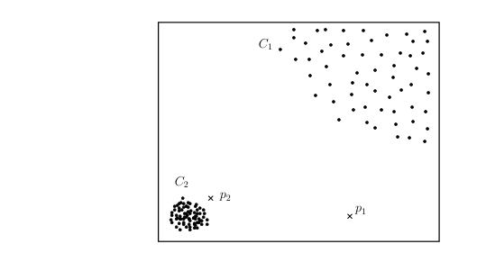

**그림 7. 전역 밀도 기반 기술에 비해 국부 밀도 기반 기술의 장점.**

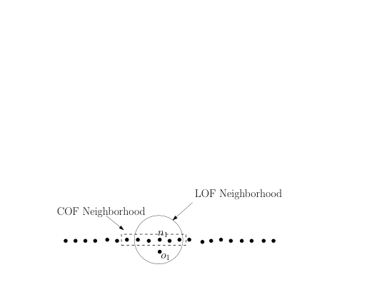

**그림 8. LOF와 COF로 계산된 이웃 간의 차이입니다.**

이웃. 따라서 비정상적인 인스턴스는 더 높은 LOF 점수를 얻습니다.

그림 7에 표시된 예에서 LOF는 데이터 인스턴스 주변의 밀도를 고려한다는 사실로 인해 두 가지 이상(p1 및 p2)을 모두 캡처할 수 있습니다.

몇몇 연구자들은 LOF 기술의 변형을 제안했습니다. 이러한 변형 중 일부는 인스턴스의 로컬 밀도를 다른 방식으로 추정합니다. 일부 변형은 원래 기술을 더 복잡한 데이터 유형에 적용했습니다. 원래 LOF 기법은 O(N 2)(N은 데이터 크기)이므로 LOF의 효율성을 향상시키는 여러 기법이 제안되었다.

Tanget al. [2002]는 COF(Connectivitybased Outlier Factor)라고 하는 LOF의 변형에 대해 논의합니다. LOF와 COF의 차이점은 인스턴스의 k 이웃이 계산되는 방식입니다. COF에서는 인스턴스의 이웃이 증분 모드로 계산됩니다. 시작하려면 주어진 인스턴스에 가장 가까운 인스턴스가 이웃 세트에 추가됩니다. 이웃 집합에 추가되는 다음 인스턴스는 기존 이웃 집합과의 거리가 나머지 모든 데이터 인스턴스 중에서 최소가 되는 것입니다. 인스턴스와 인스턴스 집합 사이의 거리는 지정된 인스턴스와 지정된 집합에 속하는 인스턴스 사이의 최소 거리로 정의됩니다. 이웃은 크기 k에 도달할 때까지 이런 방식으로 성장합니다. 이웃이 계산되면 LOF와 동일한 방식으로 이상 점수(COF)가 계산됩니다. COF는 그림 8에 표시된 것처럼 직선과 같은 영역을 캡처할 수 있습니다.

Hautamaki 등은 LOF의 간단한 버전을 제안했습니다. 각 데이터 인스턴스에 대해 ODIN(In-degree Number)을 사용하여 이상치 탐지라는 수량을 계산하는 [2004]입니다. 주어진 데이터 인스턴스에 대해, ODIN은 k개의 최근접 이웃 목록에 주어진 데이터 인스턴스를 갖는 데이터 인스턴스의 k개의 최근접 이웃의 수와 같습니다. ODIN의 반대는 데이터 인스턴스의 이상 점수입니다. 유사한 기술이 Brito et al.에 의해 제안되었습니다. [1997].

Papadimitriouet al. [2002]는 LOF의 변형인 MDEF(Multi-granularity Deviation Factor)라는 측정값을 제안합니다. 주어진 데이터 인스턴스에 대한 MDEF는 주어진 데이터 인스턴스(데이터 인스턴스 자체 포함)의 가장 가까운 이웃의 국부 밀도의 표준 편차와 같습니다. 표준 편차의 역수는 데이터 인스턴스의 이상 점수입니다. 논문에서 제시하는 이상 탐지 기술은 LOCI라고 하는데, 이는 이상 사례뿐만 아니라 이상 마이크로 클러스터까지 찾아낸다.

<!-- 원문 31쪽 -->

다양한 데이터 유형을 처리하기 위해 LOF의 여러 변형이 제안되었습니다. Sun과 Chawla [2004; 2006]는 기후 데이터에서 공간 이상 현상을 감지하기 위해 LOF 변형을 적용했습니다. Yu et al. [2006]는 거리 대신 유사성 측정을 사용하여 범주형 속성을 처리합니다. Sun et al.은 단백질 서열의 순차적 이상을 탐지하기 위해 유사한 기술을 제안했습니다. [2006]. 이 기술은 확률적 접미사 트리(PST)를 사용하여 주어진 시퀀스에 대해 가장 가까운 이웃을 찾습니다. Pokrajacet al. [2007]는 LOF를 확장하여 증분 방식으로 작동하여 비디오 센서 데이터의 이상 현상을 감지합니다.

효율성을 향상시키기 위해 LOF 기술의 일부 변형이 제안되었습니다. Jinet al. [2001]는 모든 데이터 인스턴스에 대한 LOF 점수를 찾는 대신 상위 n개 이상만 발견되는 변형을 제안합니다. 이 기술에는 데이터에서 마이크로 클러스터를 찾은 다음 각 마이크로 클러스터에 대한 LOF의 상한 및 하한을 찾는 것이 포함됩니다. Chiu와 chee Fu [2003]는 상위 n개의 "이상 목록"에 포함될 인스턴스를 확실히 포함하지 않는 모든 클러스터를 제거하는 문제에 대한 특정 가정을 함으로써 성능을 향상시키는 LOF의 세 가지 변형을 제안했습니다. 나머지 클러스터의 경우 해당 클러스터의 각 인스턴스에 대한 LOF 점수를 찾기 위해 자세한 분석이 수행됩니다.

계산 복잡도 기본적인 최근접 이웃 기반 기술과 LOF 기술의 단점은 O(N 2) 복잡도가 필요하다는 것입니다. 이러한 기술에는 k-d 트리 [Bentley 1975] 및 R-트리 [Roussopoulos et al. 1995]를 사용할 수 있습니다. 그러나 이러한 기술은 속성 수가 증가함에 따라 확장이 잘 되지 않습니다. 몇몇 기술은 상위 몇 가지 예외만이 흥미롭다는 가정하에 이상 탐지 기술을 직접 최적화했습니다. 모든 테스트 인스턴스에 대해 이상 점수가 필요한 경우 이러한 기술은 적용할 수 없습니다. 속성 공간을 하이퍼 그리드로 분할하는 기술은 데이터 크기는 선형이지만 속성 수는 기하급수적으로 늘어나므로 많은 수의 속성에는 적합하지 않습니다. 샘플링 기술은 데이터셋의 작은 샘플 내에서 가장 가까운 이웃을 결정하여 O(N 2) 복잡성 문제를 해결하려고 합니다. 그러나 표본 크기가 매우 작은 경우 표본 추출로 인해 잘못된 변칙 점수가 나올 수 있습니다.

최근접 이웃 기반 기술의 장점과 단점 최근접 이웃 기반 기술의 장점은 다음과 같습니다: (1) 최근접 이웃 기반 기술의 주요 장점은 본질적으로 감독되지 않으며 데이터의 생성 분포에 관해 어떤 가정도 하지 않는다는 것입니다. 대신 순전히 데이터 기반입니다. (2) 준지도 기법은 비지도 기법보다 누락된 변칙 측면에서 더 나은 성능을 발휘합니다. 변칙이 훈련 데이터셋에서 가까운 이웃을 형성할 가능성이 매우 낮기 때문입니다. (3) 가장 가까운 이웃 기반 기술을 다양한 데이터 유형에 적용하는 것은 간단하며 기본적으로 주어진 데이터에 대한 적절한 거리 측정값을 정의해야 합니다.

최근접 이웃 기반 기법의 단점은 다음과 같습니다. (1) 비지도 기법의 경우, 데이터에 가까운 이웃이 충분하지 않은 정상적인 인스턴스가 있거나 데이터에 가까운 이웃이 충분히 있는 변칙 항목이 있는 경우 기술이 해당 항목에 올바르게 레이블을 지정하지 못하여 이상 항목이 누락됩니다. (2) 준지도 기술의 경우 테스트 데이터의 일반 인스턴스에 훈련 데이터의 유사한 일반 인스턴스가 충분하지 않은 경우 해당 기술에 대한 거짓 긍정 비율이 높습니다. (3) 가장 가까운 이웃을 계산하기 위해 테스트 데이터 자체 또는 훈련 데이터에 속하는 모든 인스턴스를 사용하여 각 테스트 인스턴스의 거리를 계산해야 하기 때문에 테스트 단계의 계산 복잡성도 중요한 과제입니다. (4) 최근접 이웃 기반 기술의 성능은 정상 인스턴스와 변칙 인스턴스를 효과적으로 구별할 수 있는 데이터 인스턴스 쌍 간에 정의된 거리 측정에 크게 의존합니다. 데이터가 복잡한 경우 인스턴스 간 거리 측정값을 정의하는 것이 어려울 수 있습니다. 그래프, 시퀀스 등

<!-- 원문 32쪽 -->

## 6 클러스터링 기반 이상 탐지 기술

클러스터링 [Jain 및 Dubes 1988; Tanet al. 2005]는 유사한 데이터 인스턴스를 클러스터로 그룹화하는 데 사용됩니다. 클러스터링은 준지도 클러스터링이지만 기본적으로 비지도 기법입니다 [Basu et al. 2004]도 최근에 연구되었습니다. 클러스터링과 이상 탐지는 근본적으로 서로 다른 것처럼 보이지만 여러 클러스터링 기반 이상 탐지 기술이 개발되었습니다. 클러스터링 기반 이상 탐지 기술은 세 가지 범주로 분류할 수 있습니다.

클러스터링 기반 기술의 첫 번째 범주는 다음 가정에 의존합니다.

가정: 정상적인 데이터 인스턴스는 데이터의 클러스터에 속하지만 변칙은 어떤 클러스터에도 속하지 않습니다.

위의 가정에 기초한 기술은 알려진 클러스터링 기반 알고리즘을 데이터셋에 적용하고 어떤 클러스터에도 속하지 않는 모든 데이터 인스턴스를 비정상으로 선언합니다. DBSCAN과 같이 모든 데이터 인스턴스가 클러스터에 속하도록 강제하지 않는 여러 클러스터링 알고리즘 [Ester et al. 1996], ROCK [Guha et al. 2000] 및 SNN 클러스터링 [Ert¨oz et al. 2003]를 사용할 수 있습니다. FindOut 알고리즘 [Yu et al. 2002]는 WaveCluster 알고리즘[Sheikholeslami et al. 1998] 감지된 클러스터는 데이터에서 제거되고 잔여 인스턴스는 이상으로 선언됩니다.

이러한 기술의 단점은 기본 클러스터링 알고리즘의 주요 목표가 클러스터를 찾는 것이기 때문에 이상 현상을 찾기 위해 최적화되지 않았다는 것입니다.

클러스터링 기반 기술의 두 번째 범주는 다음 가정에 의존합니다.

가정: 정상적인 데이터 인스턴스는 가장 가까운 클러스터 중심에 가까이 있는 반면, 변칙 데이터 인스턴스는 가장 가까운 클러스터 중심에서 멀리 떨어져 있습니다.

위의 가정을 기반으로 한 기술은 두 단계로 구성됩니다. 첫 번째 단계에서는 클러스터링 알고리즘을 사용하여 데이터를 클러스터링합니다. 두 번째 단계에서는 각 데이터 인스턴스에 대해 가장 가까운 클러스터 중심까지의 거리가 이상 점수로 계산됩니다.

<!-- 원문 33쪽 -->

이 2단계 접근 방식을 따르는 여러 가지 이상 탐지 기술이 다양한 클러스터링 알고리즘을 사용하여 제안되었습니다. Smithet al. [2002]는 SOM(Self-Organizing Map), K-평균 클러스터링 및 EM(기대 최대화)을 연구하여 훈련 데이터를 클러스터링한 다음 클러스터를 사용하여 테스트 데이터를 분류했습니다. 특히, SOM[Kohonen 1997]은 침입 탐지[Labib 및 Vemuri 2002; Smithet al. 2002; Ramadaset al. 2003], 오류 감지 [Harris 1993; Ypma 및 Duin 1998; Emamianet al. 2000], 사기 탐지 [Brockett et al. 1998]. Barbaraet al. [2003]는 훈련 데이터의 이상 현상에 강력한 기술을 제안합니다. 저자는 먼저 빈번한 항목 집합 마이닝을 사용하여 훈련 데이터에서 정상 인스턴스와 이상 항목을 분리한 다음 클러스터링 기반 기술을 사용하여 이상 항목을 탐지합니다. 시퀀스 데이터를 처리하기 위한 여러 기술도 제안되었습니다[Blender et al. 1997; 베헤라노(Bejerano) 및 요나(Yona) 2001; Vinueza 및 Grudic 2004; Budalakotiet al. 2006].

두 번째 가정에 기초한 기술은 훈련 데이터가 클러스터링되고 테스트 데이터에 속하는 인스턴스가 클러스터와 비교되어 테스트 데이터 인스턴스에 대한 이상 점수를 얻는 반 감독 모드에서도 작동할 수 있습니다 [Marchette 1999; 우(Wu) 및 장(Zhang) 2003; Vinueza 및 Grudic 2004; Allanet al. 1998]. 훈련 데이터에 여러 클래스에 속하는 인스턴스가 있는 경우 준지도 클러스터링을 적용하여 클러스터를 개선할 수 있습니다. 그 외 여러분. [2002]는 비지도 클러스터링 기반 이상 탐지 기술을 개선하기 위해 레이블에 대한 지식을 통합합니다[He et al. 2003] 클러스터에 있는 개체의 클래스 레이블이 해당 클러스터에 있는 대부분의 클래스 레이블과 다를 경우 높은 의미 이상 인자라는 측정값을 계산합니다.

데이터 형태의 변칙이 그 자체로 클러스터되는 경우 위에서 설명한 기술로는 이러한 변칙을 감지할 수 없습니다. 이 문제를 해결하기 위해 다음 가정에 의존하는 세 번째 범주의 클러스터링 기반 기술이 제안되었습니다.

가정: 정상적인 데이터 인스턴스는 크고 밀집된 클러스터에 속하지만, 변칙은 작거나 희박한 클러스터에 속합니다.

위의 가정에 기초한 기술은 크기 및/또는 밀도가 임계값 미만인 클러스터에 속하는 인스턴스를 비정상으로 선언합니다.

기술의 세 번째 범주의 여러 변형이 제안되었습니다 [Pires and Santos-Pereira 2005; Oteet al. 2003; Eskinet al. 2002; Mahoneyet al. 2003; Jianget al. 2001; 그 외 여러분. 2003]. [He et al. FindCBLOF라고 불리는 2003]는 각 데이터 인스턴스에 대해 CBLOF(Cluster-Based Local Outlier Factor)라는 이상 점수를 할당합니다. CBLOF 점수는 데이터 인스턴스가 속한 클러스터의 크기와 데이터 인스턴스에서 클러스터 중심까지의 거리를 캡처합니다.

위에서 논의한 기존 기술의 효율성을 향상시키기 위해 여러 가지 클러스터링 기반 기술이 제안되었습니다. 고정 폭 클러스터링은 다양한 이상 탐지 기술에 사용되는 선형 시간(O(Nd)) 근사 알고리즘입니다[Eskin et al. 2002; Portnoyet al. 2001; Mahoneyet al. 2003; 그 외 여러분. 2003]. 인스턴스는 해당 인스턴스로부터 미리 지정된 거리 내에 중심이 있는 클러스터에 할당됩니다. 그러한 클러스터가 존재하지 않으면 인스턴스를 중심으로 하는 새 클러스터가 생성됩니다. 그런 다음 밀도와 다른 클러스터와의 거리를 기반으로 어떤 클러스터가 변칙인지 확인합니다. 너비는 사용자가 지정한 매개변수일 수 있습니다[Eskin et al. 2002; Portnoyet al. 2001] 또는 데이터 [Mahoney et al. 2003]. Chaudharyet al. [2002]는 ​​선형 시간에 따라 데이터를 분할하는 k-d 트리를 사용하여 이상 탐지 기술을 제안합니다. 그들은 계산 효율성이 중요한 요구 사항인 천문학 데이터셋에서 이상 현상을 탐지하기 위해 기술을 적용합니다. 이 문제를 해결하는 또 다른 기술은 Sun et al.에 의해 제안되었습니다. [2004]. 저자는 데이터를 효율적으로 클러스터로 분할하기 위해 CD-트리라는 인덱싱 기술을 제안합니다. 희소 클러스터에 속하는 데이터 인스턴스는 이상 항목으로 선언됩니다.

<!-- 원문 34쪽 -->

### 6.1 클러스터링 기반 기술과 최근접 이웃 기반 기술의 차이점

여러 클러스터링 기반 기술에는 한 쌍의 인스턴스 간의 거리 계산이 필요합니다. 따라서 이러한 점에서는 최근접 이웃 기반 기술과 유사합니다. 거리 측정값의 선택은 기술 성능에 매우 중요합니다. 따라서 클러스터링 기반 기술에 대한 거리 측정값에 관한 이전 섹션의 논의도 마찬가지입니다. 그러나 두 기술의 주요 차이점은 클러스터링 기반 기술은 각 인스턴스가 속한 클러스터를 기준으로 평가하는 반면, 최근접 이웃 기반 기술은 로컬 이웃을 기준으로 각 인스턴스를 분석한다는 것입니다.

계산 복잡도 클러스터링 기반 이상 탐지 기술 훈련의 계산 복잡도는 데이터에서 클러스터를 생성하는 데 사용되는 클러스터링 알고리즘에 따라 달라집니다. 따라서 클러스터링 기술이 모든 데이터 인스턴스에 대한 쌍별 거리 계산을 요구하는 경우 이러한 기술은 2차 복잡성을 가질 수 있으며, k-평균[Hartigan 및 Wong 1979] 또는 근사 클러스터링 기술[Eskin et al. 2002]. 클러스터링 기반 기술의 테스트 단계는 테스트 인스턴스를 적은 수의 클러스터와 비교하기 때문에 빠릅니다.

클러스터링 기반 기술의 장점과 단점 클러스터링 기반 기술의 장점은 다음과 같습니다. (1) 클러스터링 기반 기술은 비감독 모드에서 작동할 수 있습니다. (2) 이러한 기술은 특정 데이터 유형을 처리할 수 있는 클러스터링 알고리즘을 연결하기만 하면 다른 복잡한 데이터 유형에 적용할 수 있는 경우가 많습니다. (3) 모든 테스트 인스턴스를 비교해야 하는 클러스터 수가 작은 상수이기 때문에 클러스터링 기반 기술의 테스트 단계는 빠릅니다.

클러스터링 기반 기술의 단점은 다음과 같습니다. (1) 클러스터링 기반 기술의 성능은 일반 인스턴스의 클러스터 구조를 캡처하는 클러스터링 알고리즘의 효율성에 크게 의존합니다. (2) 많은 기술은 클러스터링의 부산물로 이상 현상을 감지하므로 이상 현상 감지에 최적화되어 있지 않습니다. (3) 여러 클러스터링 알고리즘은 모든 인스턴스가 일부 클러스터에 할당되도록 강제합니다.

<!-- 원문 35쪽 -->

이로 인해 이상이 큰 클러스터에 할당되어 이상이 어떤 클러스터에도 속하지 않는다는 가정하에 작동하는 기술에 의해 정상적인 인스턴스로 간주될 수 있습니다. (4) 여러 클러스터링 기반 기술은 이상이 서로 중요한 클러스터를 형성하지 않는 경우에만 효과적입니다. (5) 데이터 클러스터링을 위한 계산 복잡성으로 인해 병목 현상이 발생하는 경우가 많으며, 특히 O(N 2d) 클러스터링 알고리즘을 사용하는 경우 더욱 그렇습니다.

## 7 통계적 이상 탐지 기술

모든 통계적 이상 탐지 기술의 기본 원칙은 다음과 같습니다. "이상은 가정된 확률론적 모델에 의해 생성되지 않기 때문에 부분적으로 또는 전체적으로 관련이 없다고 의심되는 관찰입니다."[Anscombe 및 Guttman 1960]. 통계적 이상 탐지 기술은 다음과 같은 주요 가정을 기반으로 합니다.

가정: 확률론적 모델의 확률이 높은 영역에서 정상적인 데이터 인스턴스가 발생하는 반면, 확률론적 모델의 확률이 낮은 영역에서 이상 현상이 발생합니다.

통계 기술은 주어진 데이터에 통계 모델(일반적으로 정상적인 동작)을 적용한 다음 통계 추론 테스트를 적용하여 보이지 않는 인스턴스가 이 모델에 속하는지 여부를 결정합니다. 적용된 테스트 통계를 기반으로 학습된 모델에서 생성될 확률이 낮은 인스턴스는 이상 항목으로 선언됩니다. 통계 모델에 적합하도록 모수적 기법과 비모수적 기법이 모두 적용되었습니다. 모수적 기법은 기본 분포에 대한 지식을 가정하고 주어진 데이터로부터 모수를 추정하는 반면[Eskin 2000], 비모수적 기법은 일반적으로 기본 분포에 대한 지식을 가정하지 않습니다[Desforges et al. 1998]. 다음 두 하위 섹션에서는 매개변수적 및 비모수적 이상 탐지 기술에 대해 설명합니다.

### 7.1 파라메트릭 기법

앞서 언급한 바와 같이, 모수적 기법은 정규 데이터가 모수 Θ와 확률 밀도 함수 f(x, Θ)를 갖는 모수 분포에 의해 생성된다고 가정합니다. 여기서 x는 관측값입니다. 테스트 인스턴스(또는 관찰) x의 이상 점수는 확률 밀도 함수 f(x, Θ)의 역수입니다. 매개변수 Θ는 주어진 데이터로부터 추정됩니다.

대안적으로, 통계적 가설 검정(통계적 이상치 검출 문헌[Barnett 및 Lewis 1994]에서는 불일치 검정이라고도 함)이 사용될 수 있습니다. 이러한 테스트에 대한 귀무가설(H0)은 데이터 인스턴스 x가 추정된 분포(매개변수 Θ 포함)를 사용하여 생성되었다는 것입니다. 통계 테스트가 H0를 거부하면 x는 이상으로 선언됩니다. 통계적 가설 검정은 데이터 인스턴스 x에 대한 확률적 변칙 점수를 얻는 데 사용할 수 있는 검정 통계량과 연관되어 있습니다.

가정된 분포 유형에 따라 모수적 기법은 다음과 같이 더 분류될 수 있습니다.

<!-- 원문 36쪽 -->

**그림 9. 일변량 데이터셋에 대한 상자 그림.**

7.1.1 가우스 모델 기반. 이러한 기술은 데이터가 가우스 분포에서 생성된다고 가정합니다. 매개변수는 MLE(최대 가능성 추정)를 사용하여 추정됩니다. 데이터 인스턴스와 추정 평균의 거리가 해당 인스턴스의 이상 점수입니다. 이상을 판별하기 위해 이상 점수에 임계값이 적용됩니다. 이 범주의 다양한 기술은 다양한 방식으로 평균과 임계값까지의 거리를 계산합니다.

공정 품질 관리 영역 [Shewhart 1931]에서 자주 사용되는 간단한 이상치 탐지 기술은 분포 평균 µ에서 3σ 이상 떨어진 모든 데이터 인스턴스를 선언하는 것입니다. 여기서 σ는 분포의 표준 편차입니다. µ ± 3σ 영역에는 데이터 인스턴스의 99.7%가 포함되어 있습니다.

[Barnett and Lewis 1994; 바넷 1976; Beckman 및 Cook 1983]. 여기서는 몇 가지 테스트에 대해 설명하겠습니다.

상자 그림 규칙(그림 9)은 의료 영역 데이터에서 단변량 및 다변량 변칙을 탐지하는 데 적용된 가장 간단한 통계 기법입니다[Laurikkala et al. 2000; Hornet al. 2001; Solberg 및 Lahti 2005] 및 터빈 로터 데이터 [Guttormsson et al. 1999]. 상자 그림은 최소 비변칙 관측치(최소), 하위 사분위수(Q1), 중앙값, 상위 사분위수(Q3) 및 최대 비변칙 관측치(최대)와 같은 요약 속성을 사용하여 데이터를 그래픽으로 나타냅니다. Q3 −Q1이라는 양을 사분위간 범위(IQR)라고 합니다. 상자 그림은 관찰이 이상치로 처리되는 한계도 나타냅니다. Q1보다 낮은 1.5*IQR 또는 Q3보다 높은 1.5*IQR보다 큰 데이터 인스턴스는 이상으로 선언됩니다. Q1 −1.5IQR과 Q3 + 1.5IQR 사이의 영역에는 관측값의 99.3%가 포함되므로 1.5IQR 경계를 선택하면 상자 그림 규칙이 가우스 데이터에 대한 3σ 기법과 동일해집니다.

Grubb의 테스트(최대 정규 잔차 테스트라고도 함)는 일변량 데이터셋에서 이상 현상을 감지하는 데 사용됩니다[Grubbs 1969; 스테판스키 1972; Anscombe and Guttman 1960] 데이터가 가우스 분포에 의해 생성된다는 가정하에. 각 테스트 인스턴스 x에 대해 z 점수는 다음과 같이 계산됩니다.

여기서 ̅x와 s는 각각 데이터 샘플의 평균과 표준편차입니다.

<!-- 원문 37쪽 -->

다음과 같은 경우 테스트 인스턴스가 비정상적인 것으로 선언됩니다.

여기서 N은 데이터 크기이고 tα/(2N),N−2는 인스턴스를 비정상 또는 정상으로 선언하는 데 사용되는 임계값입니다. 이 임계값은 α 2N 유의 수준에서 t-분포에 의해 취해진 값입니다. 유의 수준은 임계값과 관련된 신뢰도를 반영하고 비정상으로 선언된 인스턴스 수를 간접적으로 제어합니다.

다변량 데이터에 대한 Grubb 테스트의 변형이 Laurikkala et al.에 의해 제안되었습니다. [2000]는 테스트 인스턴스 x의 Mahalanobis 거리를 표본 평균 ̅x로 사용하여 다변량 관측치를 단변량 스칼라로 줄입니다.

여기서 S는 표본 공분산 행렬입니다. 일변량 Grubb의 테스트는 인스턴스 x가 변칙적인지 여부를 확인하기 위해 y에 적용됩니다. 다변량 데이터셋를 처리하기 위해 Grubb 테스트의 여러 다른 변형이 제안되었습니다 [Aggarwal 및 Yu 2001; 2008; Laurikkalaet al. 2000], 그래프 구조 데이터 [Shekhar et al. 2001], 온라인 분석 처리(OLAP) 데이터 큐브 [Sarawagi et al. 1998].

학생의 t-검정은 [Surace and Worden 1998; Suraceet al. 1997] 구조용 빔의 손상을 감지합니다. t-검정을 사용하여 정규 표본 N1과 검정 표본 N2를 비교합니다. 테스트 결과 둘 사이에 상당한 차이가 나타나면 N2에 이상이 있음을 의미합니다. Hotelling t2-test라고 불리는 학생 t-검정의 다변량 버전은 [Liu and Weng 1991]에서 생체 이용률/생물학적 동등성 연구에서 이상 현상을 탐지하는 이상 탐지 테스트 통계로도 사용됩니다.

Ye와 Chen [2001]는 χ2 통계를 사용하여 운영 체제 호출 데이터의 변칙을 확인합니다. 훈련 단계에서는 정규 데이터가 다변량 정규 분포를 갖는다고 가정합니다. χ2 통계값은 다음과 같이 결정됩니다.

(Xi-Ei)2 Ei

여기서 Xi는 i번째 변수의 관측값이고, Ei는 i번째 변수의 기대값(훈련 데이터에서 얻은 값)이며, n은 변수의 개수입니다. X2 값이 크면 관찰된 샘플에 이상이 포함되어 있음을 나타냅니다.

데이터가 가우스 분포를 따른다고 가정하는 몇 가지 다른 통계적 이상 탐지 기술은 Rosner 테스트 [Rosner 1983], Dixon 테스트 [Gibbons 1994], 미끄러짐 감지 테스트 [Hawkins 1980] 등과 같은 다른 통계 테스트를 사용하여 제안되었습니다.

7.1.2 회귀 모델 기반. 회귀를 이용한 이상 탐지는 시계열 데이터에 대해 광범위하게 조사되었습니다 [Abraham and Chuang 1989; 아브라함과 상자 1979; 폭스 1972].

기본적인 회귀모델 기반 이상탐지 기법은 두 단계로 구성된다. 첫 번째 단계에서는 회귀 모델이 데이터에 맞춰집니다. 두 번째 단계에서는 각 테스트 인스턴스에 대해 테스트 인스턴스의 잔차를 사용하여 이상 점수를 결정합니다. 잔차는 회귀 모델로 설명되지 않는 인스턴스의 일부입니다. 잔차의 크기는 테스트 인스턴스에 대한 이상 점수로 사용될 수 있지만 확실한 신뢰도를 가지고 이상 현상을 결정하기 위한 통계 테스트가 제안되었습니다[Anscombe 및 Guttman 1960; Beckman 및 Cook 1983; 호킨스 1980; 토르와 머레이 1993]. 특정 기술은 모델 피팅 중에 AIC(Akaike 정보 콘텐츠)를 분석하여 데이터셋에서 변칙의 존재를 감지합니다[Kitagawa 1979; Kadotaet al. 2003].

<!-- 원문 38쪽 -->

훈련 데이터에 이상이 있으면 회귀 매개변수에 영향을 줄 수 있으므로 회귀 모델이 정확한 결과를 생성하지 못할 수 있습니다. 회귀 모델을 피팅하면서 이러한 이상 현상을 처리하는 널리 사용되는 기술을 강력한 회귀 [Rousseeuw 및 Leroy 1987](이상 현상을 수용하면서 회귀 매개변수 추정)라고 합니다. 저자들은 로버스트 회귀 기법이 이상치를 숨길 뿐만 아니라 이상치를 탐지할 수도 있다고 주장합니다. 이상치는 로버스트 피팅에서 더 큰 잔차를 갖는 경향이 있기 때문입니다. 유사한 강력한 이상 탐지 접근 방식이 ARIMA(Autoregressive Integrated Moving Average) 모델에 적용되었습니다[Bianco et al. 2001; Chenet al. 2005].

다변량 시계열 데이터를 처리하기 위해 기본 회귀 모델 기반 기술의 변형이 제안되었습니다. Tsayet al. [2000]는 단변량 시계열에 비해 다변량 시계열의 추가적인 복잡성에 대해 논의하고 다변량 ARIMA 모델에서 이상치를 감지하는 데 적용할 수 있는 통계를 제시합니다. 이는 앞서 Fox [1972]가 제안한 통계를 일반화한 것입니다.

ARMA(Autoregressive Moving Average) 모델에 의해 생성된 다변량 시계열 데이터에서 이상 현상을 탐지하는 또 다른 변형은 Galeano et al.에 의해 제안되었습니다. [2004]. 이 기술에서 저자는 다변량 시계열의 구성요소를 선형적으로 결합하여 다변량 시계열을 단변량 시계열로 변환합니다. 흥미로운 선형 조합(1-d 공간의 투영)은 시계열 데이터의 첨도 계수(변수 분포의 정점/평탄도에 대한 척도)를 최대화하는 투영 추적 기법[Huber 1985]을 사용하여 얻습니다. 각 투영의 이상 탐지는 Fox [1972]가 제안한 단변량 테스트 통계를 사용하여 수행됩니다.

7.1.3 모수적 분포의 혼합 기반. 이러한 기술은 데이터를 모델링하기 위해 모수적 통계 분포를 혼합하여 사용합니다. 이 범주의 기술은 두 개의 하위 범주로 그룹화될 수 있습니다. 기술의 첫 번째 하위 범주는 정상적인 사례와 이상 현상을 별도의 모수적 분포로 모델링하는 반면, 기술의 두 번째 하위 범주는 정상적인 사례만 모수적 분포의 혼합으로 모델링합니다.

기술의 첫 번째 하위 범주의 경우 테스트 단계에서는 테스트 인스턴스가 어떤 분포(정상 또는 변칙)에 속하는지 결정합니다. Abraham과 Box [1979]는 정규 데이터가 가우스 분포(N(0,σ2))에서 생성되고 이상치도 평균은 동일하지만 분산이 더 큰 가우스 분포(N(0,k2σ2))에서 생성된다고 가정합니다. 테스트 인스턴스는 두 배포판 모두에서 Grubb의 테스트를 사용하여 테스트되고 그에 따라 정상 또는 변칙으로 레이블이 지정됩니다. 유사한 기술이 [Lauer 2001; 에스킨 2000; 아브라함과 상자 1979; 박스 앤 티아오 1968; 아가르왈 2005]. Eskin [2000]는 EM(기대 최대화) 알고리즘을 사용하여 두 클래스에 대한 혼합 모델을 개발합니다. 이때 각 데이터 포인트는 선험적 확률 λ의 변칙이고 선험적 확률 1 −λ의 정상이라고 가정합니다. 따라서 D가 전체 데이터의 실제 확률 분포를 나타내고, M과 A가 각각 정상 데이터와 변칙 데이터의 분포를 나타낸다면 D = λA + (1 -)M입니다. M은 분포 추정 기술을 사용하여 학습되는 반면 A는 균일하다고 가정됩니다. 처음에는 모든 포인트가 M에 있는 것으로 간주됩니다. 이상 점수는 해당 포인트가 M에서 제거되고 A에 추가되는 경우 분포가 변경되는 정도를 기준으로 해당 포인트에 할당됩니다.

<!-- 원문 39쪽 -->

기술의 두 번째 하위 범주는 일반 인스턴스를 매개변수 분포의 혼합으로 모델링합니다. 학습된 모델에 속하지 않는 테스트 인스턴스는 이상으로 선언됩니다. 가우스 혼합 모델은 Agarwal [2006] 기술에 주로 사용되었으며 기체 데이터에서 변형을 감지하는 데 사용되었습니다 [Hickinbotham 및 Austin 2000a; Hollier 및 Austin 2002], 유방조영술 이미지 분석에서 이상 징후 감지 [Spence et al. 2001; Tarassenko 1995] 및 네트워크 침입 탐지용 [Yamanishi 및 ichi Takeuchi 2001; Yamanishiet al. 2004]. 생체의학 신호 데이터에서 이상 징후를 탐지하는 데 유사한 기술이 적용되었습니다[Roberts and Tarassenko 1994; 로버츠 1999; 2002], 여기서 극단값 통계2는 테스트 포인트가 학습된 모델 혼합과 관련하여 이상인지 여부를 결정하는 데 사용됩니다. Byers와 Raftery [1998]는 포아송 분포의 혼합을 사용하여 정규 데이터를 모델링한 다음 변칙을 검색합니다.

### 7.2 비모수적 기법

이 범주의 이상 탐지 기술은 모델 구조가 선험적으로 정의되지 않고 대신 주어진 데이터로부터 결정되는 비모수적 통계 모델을 사용합니다. 이러한 기술은 일반적으로 파라메트릭 기술과 비교할 때 밀도의 매끄러움과 같은 데이터에 대한 가정이 더 적습니다.

7.2.1 히스토그램 기반. 가장 간단한 비모수적 통계 기법은 히스토그램을 사용하여 정규 데이터의 프로필을 유지하는 것입니다. 이러한 기술은 빈도 기반 또는 계수 기반이라고도 합니다. 히스토그램 기반 기술은 침입 탐지 커뮤니티 [Eskin 2000; Eskinet al. 2001; Denning 1987] 및 사기 탐지 [Fawcett 및 Provost 1999]. 데이터의 동작은 히스토그램 모델을 사용하여 효율적으로 캡처할 수 있는 특정 프로필(사용자, 소프트웨어 또는 시스템)에 의해 제어되기 때문입니다.

일변량 데이터에 대한 기본 히스토그램 기반 이상 탐지 기술은 두 단계로 구성됩니다. 첫 번째 단계에서는 훈련 데이터의 해당 특성이 취한 다양한 값을 기반으로 히스토그램을 작성하는 것입니다. 두 번째 단계에서 기술은 테스트 인스턴스가 히스토그램의 저장소 중 하나에 속하는지 확인합니다. 그렇다면 테스트 인스턴스는 정상이고, 그렇지 않으면 비정상입니다. 기본 히스토그램 기반 기술의 변형은 해당 항목이 속하는 저장소의 높이(빈도)를 기반으로 각 테스트 인스턴스에 이상 점수를 할당하는 것입니다.

2극값 이론(EVT) [Pickands 1975]은 이상 탐지와 유사한 개념으로 확률 분포의 극단적인 편차를 다룹니다. EVT는 극한 위험을 모델링하고 측정하는 방법으로 위험 관리[McNeil 1999]에 적용되었습니다. 극단값과 통계적 이상치 사이의 주요 차이점은 극단값은 확률 분포의 극단에서 발생하는 것으로 알려져 있는 반면, 이상치는 더 일반적이라는 것입니다. 또한 완전히 다른 분포에서 이상 현상이 생성될 수도 있습니다.

<!-- 원문 40쪽 -->

히스토그램을 작성할 때 사용되는 빈의 크기는 이상 탐지의 핵심입니다. 빈이 작으면 많은 일반 테스트 인스턴스가 비어 있거나 희귀한 빈에 들어가므로 잘못된 경보 비율이 높아집니다. 빈이 크면 많은 변칙적인 테스트 인스턴스가 빈번한 빈에 포함되어 위음성 비율이 높아집니다. 따라서 히스토그램 기반 기술의 주요 과제는 낮은 허위 경보 비율과 낮은 허위 음성 비율을 유지하는 히스토그램을 구성하기 위해 빈의 최적 크기를 결정하는 것입니다.

히스토그램 기반 기술은 히스토그램을 구축하기 위해 일반 데이터가 필요합니다 [Anderson et al. 1994; Javitz 및 Valdes 1991; Helman 및 Bhangoo 1997]. 일부 기술은 레이블이 지정된 변칙 인스턴스가 있는 경우 변칙[Dasgupta 및 Nino 2000]에 대한 히스토그램을 구성하기도 합니다.

다변량 데이터의 경우 기본 기술은 속성별 히스토그램을 구성하는 것입니다. 테스트하는 동안 각 테스트 인스턴스에 대해 테스트 인스턴스의 각 속성 값에 대한 이상 점수는 속성 값이 포함된 저장소의 높이로 계산됩니다. 속성별 이상 점수가 집계되어 테스트 인스턴스에 대한 전체 이상 점수를 얻습니다.

다변량 데이터에 대한 기본 히스토그램 기반 기술은 시스템 호출 침입 탐지 Endler [1998], 네트워크 침입 탐지 [Ho et al. 1999; 야마니시 및 이치 타케우치 2001; Yamanishiet al. 2004], 사기 감지 [Fawcett 및 Provost 1999], 구조물 손상 감지 [Manson 2002; Mansonet al. 2001; Mansonet al. 2000], 웹 기반 공격 탐지 [Kruegel 및 Vigna 2003; Kruegelet al. 2002], 텍스트 데이터의 변칙 주제 탐지 [Allan et al. 1998]. 간단한 기술의 변형이 PHAD(패킷 헤더 이상 탐지) 및 ALAD(애플리케이션 계층 이상 탐지)[Mahoney and Chan 2002]에 사용되어 네트워크 침입 탐지에 적용됩니다.

SRI International의 실시간 네트워크 침입 탐지 시스템(NIDES) [Anderson et al. 1994; Andersonet al. 1995; Porras and Neumann 1997]에는 컴퓨터 시스템의 정상적인 동작을 캡처하기 위해 장기 통계 프로필을 유지하는 하위 시스템이 있습니다[Javitz and Valdes 1991]. 저자는 장기 프로파일과 단기 프로파일(관찰)을 비교하기 위해 Q 통계를 제안합니다. 통계는 특정 특성의 동작이 과거 프로필에 비해 변칙적인 정도를 반영하는 S 통계라는 또 다른 측정값을 결정하는 데 사용됩니다. 특성별 S 통계는 결합되어 테스트 인스턴스가 비정상적인지 여부를 결정하는 IS 통계라는 단일 값을 얻습니다. 링크 상태 라우팅 프로토콜의 이상 탐지를 위해 Sargor [1998]에 의해 변형이 제안되었습니다.

7.2.2 커널 특성 기반. 확률 밀도 추정을 위한 비모수적 기법은 파젠 윈도우 추정 [Parzen 1962]입니다. 여기에는 커널 함수를 사용하여 실제 밀도를 근사화하는 작업이 포함됩니다. 커널 특성을 기반으로 하는 이상 탐지 기술은 앞서 설명한 매개변수적 방법과 유사합니다. 유일한 차이점은 사용된 밀도 추정 기술입니다. Desforgeset al. [1998]는 커널 함수를 사용하여 정상 인스턴스에 대한 확률 분포 함수(pdf)를 추정하는 이상 현상을 탐지하는 반지도 통계 기법을 제안했습니다. 이 pdf의 낮은 확률 영역에 있는 새로운 인스턴스는 변칙적인 것으로 선언됩니다.

네트워크 침입 감지[Chow and Yeung 2002], 오일 흐름 데이터의 신규성 감지[Bishop 1994] 및 유방 조영술 이미지 분석[Tarassenko 1995]을 위해 parzen 창의 유사한 응용 프로그램이 제안되었습니다.

<!-- 원문 41쪽 -->

계산 복잡성 통계적 이상 탐지 기술의 계산 복잡성은 데이터에 적용해야 하는 통계 모델의 특성에 따라 달라집니다. Gaussian, Poisson, Multinomial 등과 같은 지수족의 단일 매개변수 분포를 피팅하는 것은 일반적으로 데이터 크기와 속성 수에 있어서 선형입니다. 기대 최대화(EM)와 같은 반복 추정 기술을 사용하여 복잡한 분포(예: 혼합 모델, HMM 등)를 피팅하는 것도 일반적으로 반복당 선형이지만 문제 및/또는 수렴 기준에 따라 수렴 속도가 느릴 수 있습니다. 커널 기반 기술은 데이터 크기 측면에서 잠재적으로 2차 시간 복잡도를 가질 수 있습니다.

## 통계 기법의 장점과 단점 통계 기법의 장점은 다음과 같습니다.

(1) 기본 데이터 분포에 관한 가정이 사실이라면 통계 기법은 이상 탐지를 위한 통계적으로 타당한 솔루션을 제공합니다. (2) 통계 기법을 통해 제공되는 이상 징후 점수는 신뢰 구간과 연관되어 있으며, 이는 테스트 인스턴스에 대한 결정을 내릴 때 추가 정보로 사용될 수 있습니다. (3) 분포 추정 단계가 데이터의 이상치에 대해 강력한 경우 통계 기법은 레이블이 지정된 훈련 데이터가 필요 없이 감독되지 않은 설정에서 작동할 수 있습니다.

통계 기법의 단점은 다음과 같습니다. (1) 통계 기법의 주요 단점은 데이터가 특정 분포에서 생성된다는 가정에 의존한다는 것입니다. 이 가정은 특히 고차원 실제 데이터셋의 경우 사실이 아닌 경우가 많습니다. (2) 통계적 가정이 합리적으로 정당화될 수 있는 경우에도 이상 징후를 탐지하는 데 적용할 수 있는 여러 가지 가설 검정 통계가 있습니다. 최상의 통계를 선택하는 것은 종종 간단한 작업이 아닙니다[Motulsky 1995]. 특히, 고차원 데이터셋를 맞추는 데 필요한 복잡한 분포에 대한 가설 검정을 구성하는 것은 쉽지 않습니다. (3) 히스토그램 기반 기술은 구현하기가 상대적으로 간단하지만 다변량 데이터에 대한 이러한 기술의 주요 단점은 서로 다른 속성 간의 상호 작용을 포착할 수 없다는 것입니다. 이상은 개별적으로 매우 빈번한 속성 값을 가질 수 있지만 이들의 조합은 매우 드물지만 속성별 히스토그램 기반 기술은 이러한 이상을 감지할 수 없습니다.

## 8 정보이론적 이상 탐지 기법

정보 이론 기술은 콜로모고로프 복잡도(Kolomogorov Complexity), 엔트로피, 상대 엔트로피 등과 같은 다양한 정보 이론 척도를 사용하여 데이터셋의 정보 내용을 분석합니다. 이러한 기술은 다음과 같은 주요 가정을 기반으로 합니다.

가정: 데이터의 이상은 데이터셋의 정보 내용에 불규칙성을 유발합니다.

<!-- 원문 42쪽 -->

C(D)가 주어진 데이터셋 D의 복잡도를 나타낸다고 가정합니다. 기본 정보 이론 기술은 다음과 같이 설명할 수 있습니다. 데이터셋 D가 주어지면 C(D)−C(D−I)가 최대가 되는 인스턴스의 최소 하위 세트 I를 찾습니다. 이렇게 얻은 하위 집합의 모든 인스턴스는 변칙적인 것으로 간주됩니다. 이 기본 기법으로 해결되는 문제는 최적화해야 하는 서로 다른 두 가지 목표가 있기 때문에 단일 최적점이 없는 파레토 최적 솔루션을 찾는 것입니다.

위에 설명된 기술에서 데이터셋(C)의 복잡성은 다양한 방식으로 측정될 수 있습니다. Kolomogorov 복잡성[Li 및 Vitanyi 1993]은 여러 기술에 의해 사용되었습니다[Arning et al. 1996; Keoghet al. 2004]. Arninget al. [1996]는 정규식의 크기를 사용하여 이상 탐지를 위한 데이터(문자열로 표시)의 Kolomogorov 복잡도를 측정합니다. Keoghet al. [2004]는 데이터셋의 Kolomogorov 복잡성을 측정하기 위해 압축된 데이터 파일의 크기(표준 압축 알고리즘 사용)를 사용합니다. 엔트로피, 상대 불확실성 등과 같은 기타 정보 이론적 척도도 범주형 데이터셋의 복잡성을 측정하는 데 사용되었습니다[Lee and Xiang 2001; 그 외 여러분. 2005; 그 외 여러분. 2006; 안도 2007].

위에서 설명한 기본 기술에는 데이터셋의 복잡성 감소를 최대화하면서 하위 세트 크기를 최소화하는 이중 최적화가 포함됩니다. 따라서 데이터셋의 가능한 모든 하위 집합을 고려하는 철저한 접근 방식은 기하급수적인 시간 내에 실행됩니다. 가장 변칙적인 부분 집합에 대한 대략적인 검색을 수행하는 여러 기술이 제안되었습니다. 그 외 여러분. [2006]는 LSA(Local Search Algorithm)라는 근사 알고리즘을 사용합니다[He et al. 2005] 복잡성 측정으로 엔트로피를 사용하여 선형 방식으로 이러한 하위 집합을 대략적으로 결정합니다. 정보 병목 현상 측정을 사용하는 유사한 기술이 [Ando 2007]에 의해 제안되었습니다.

정보 이론 기술은 데이터 인스턴스가 자연스럽게 정렬되는 데이터셋(예: 순차 데이터, 공간 데이터)에도 사용되었습니다. 이러한 경우 데이터는 하위 구조(시퀀스의 세그먼트, 그래프의 하위 그래프 등)로 분할되고 이상 탐지 기술은 C(D)-C(D-I)가 최대가 되도록 하위 구조 I를 찾습니다. 이 기술은 시퀀스에 적용되었습니다 [Lin et al. 2005; Chakrabartiet al. 1998; Arninget al. 1996], 그래프 데이터 [Noble and Cook 2003], 공간 데이터 [Lin and Brown 2003]. 이러한 기술의 주요 과제는 이상 현상을 감지할 수 있는 하부 구조의 최적 크기를 찾는 것입니다.

계산 복잡도(Computational Complexity) 앞서 언급한 바와 같이 기본 정보이론적 이상 탐지 기법은 지수적 시간 복잡도를 가지지만, 선형적 시간 복잡도를 갖는 근사 기법들이 제안되었다.

정보 이론 기법의 장점과 단점 정보 이론 기법의 장점은 다음과 같습니다. (1) 감독되지 않은 환경에서 작동할 수 있습니다. (2) 데이터의 기본 통계 분포에 대해 어떠한 가정도 하지 않습니다.

정보 이론 기법의 단점은 다음과 같습니다. (1) 이러한 기법의 성능은 정보 이론 척도의 선택에 따라 크게 달라집니다. 종종 이러한 조치는 데이터에 상당히 많은 수의 변칙이 존재하는 경우에만 변칙의 존재를 감지할 수 있습니다. (2) 시퀀스 및 공간 데이터셋에 적용되는 정보 이론 기술은 종종 획득하기 어려운 하위 구조의 크기에 의존합니다. (3) 정보 이론 기술을 사용하여 이상 징후 점수를 테스트 인스턴스와 연관시키는 것은 어렵습니다.

<!-- 원문 43쪽 -->

## 9 스펙트럼 이상 탐지 기술

스펙트럼 기술은 데이터의 변동성을 대부분 포착하는 속성의 조합을 사용하여 데이터의 근사치를 찾으려고 합니다. 이러한 기술은 다음과 같은 주요 가정을 기반으로 합니다.

가정: 데이터는 정상적인 인스턴스와 변칙이 상당히 다르게 나타나는 저차원 하위 ​​공간에 포함될 수 있습니다.

따라서 스펙트럼 이상 탐지 기술이 채택하는 일반적인 접근 방식은 이상 인스턴스를 쉽게 식별할 수 있는 하위 공간(임베딩, 투영 등)을 결정하는 것입니다[Agovic et al. 2007]. 이러한 기술은 비지도 환경뿐만 아니라 준지도 환경에서도 작동할 수 있습니다.

여러 기술은 데이터를 더 낮은 차원 공간에 투영하기 위해 주성분 분석(PCA) [Jolliffe 2002]을 사용합니다. 그러한 기술 중 하나 [Parra et al. 1996]는 분산이 낮은 주성분을 따라 각 데이터 인스턴스의 투영을 분석합니다. 데이터의 상관 구조를 만족하는 정상적인 인스턴스는 그러한 예측에 대해 낮은 값을 가지게 되고, 상관 구조에서 벗어나는 변칙적인 인스턴스는 큰 값을 갖게 됩니다. Duttaet al. [2007]는 천문학 카탈로그에서 이상 현상을 감지하기 위해 이 접근 방식을 채택합니다.

Ide와 Kashima [2004]는 시계열 그래프에서 이상 현상을 감지하는 스펙트럼 기술을 제안합니다. 각 그래프는 주어진 시간에 대한 인접 행렬로 표시됩니다. 매 순간마다 매트릭스의 주요 구성 요소가 주어진 그래프의 활동 벡터로 선택됩니다. 활동 벡터의 시계열은 행렬로 간주되며 주요 왼쪽 특이 벡터는 데이터의 시간 경과에 따른 일반적인 종속성을 캡처하기 위해 획득됩니다. 새로운 (테스트) 그래프의 경우 활동 벡터와 이전 그래프에서 얻은 주요 왼쪽 특이 벡터 사이의 각도가 계산되어 테스트 그래프의 이상 점수를 결정하는 데 사용됩니다. 유사한 접근 방식으로 Sun et al. [2007]는 각 그래프의 인접 행렬에 대해 CMD(Compact Matrix Decomposition)를 수행하여 원본 행렬의 근사치를 구함으로써 일련의 그래프에 대한 이상 탐지 기술을 제안합니다. 시퀀스의 각 그래프에 대해 작성자는 CMD를 수행하고 원래 인접 행렬과 근사 행렬 간의 근사 오차를 계산합니다. 저자는 근사 오류의 시계열을 구성하고 오류의 시계열에서 이상 현상을 감지합니다. 비정상적인 근사 오류에 해당하는 그래프는 비정상적인 것으로 선언됩니다.

Shyuet al. [2003]는 저자가 강력한 PCA[Huber 1974]를 수행하여 정규 훈련 데이터의 공분산 행렬에서 주성분을 추정하는 이상 탐지 기술을 제시합니다. 테스트 단계에는 각 포인트를 구성 요소와 비교하고 주요 구성 요소로부터 포인트의 거리를 기반으로 이상 점수를 할당하는 작업이 포함됩니다. 따라서 주성분에 대한 x의 투영이 y1, y2,..., yp 및 해당 고유값은 λ1, λ2,..., λp, 그 다음

<!-- 원문 44쪽 -->

카이제곱 분포[Hawkins 1974]가 있습니다. 이 결과를 사용하여 저자는 주어진 유의 수준 α에 대해 다음과 같은 경우 관측치 x가 변칙이라고 제안합니다.

방정식 5에서 계산된 양은 q = p [Shyu et al. 2003]. 따라서 강력한 PCA 기반 기술은 더 작은 부분 공간에서 섹션 7.1.1에서 논의된 통계 기술과 동일합니다.

강력한 PCA 기반 기술은 네트워크 침입 탐지 도메인에 적용되었습니다 [Shyu et al. 2003; Lakhinaet al. 2005; Thottan 및 Ji 2003] 및 우주선 구성 요소의 이상 현상 감지 [Fujimaki et al. 2005].

계산 복잡성 표준 PCA 기반 기술은 일반적으로 데이터 크기가 선형이지만 차원 수가 2차인 경우가 많습니다. 비선형 기술은 시간 복잡도를 차원 수에 있어서 선형이 되도록 개선할 수 있지만 주성분 수에 있어서는 다항식으로 개선할 수 있습니다 [Gunter et al. 2007]. 일반적으로 데이터 크기가 2차인 데이터에 대해 SVD를 수행하는 기술입니다.

스펙트럼 기법의 장점과 단점 스펙트럼 이상 탐지 기법의 장점은 다음과 같습니다. (1) 스펙트럼 기법은 자동으로 차원 축소를 수행하므로 고차원 데이터셋를 처리하는 데 적합합니다. 또한 변환된 공간에서 기존 이상 탐지 기술을 적용한 후 전처리 단계로 사용할 수도 있습니다. (2) 스펙트럼 기술은 감독되지 않은 설정에서 사용할 수 있습니다.

스펙트럼 이상 탐지 기술의 단점은 다음과 같습니다. (1) 스펙트럼 기술은 데이터의 낮은 차원 임베딩에서 정상 인스턴스와 비정상적인 인스턴스가 분리 가능한 경우에만 유용합니다. (2) 스펙트럼 기술은 일반적으로 계산 복잡도가 높습니다.

## 10 문맥적 이상 처리

이전 섹션에서 설명한 이상 탐지 기술은 주로 지점 이상 탐지에 중점을 둡니다. 이 섹션에서는 상황별 이상을 처리하는 이상 탐지 기술에 대해 설명합니다.

섹션 2.2.2에서 논의된 바와 같이, 맥락적 이상은 데이터에 일련의 맥락적 속성(맥락을 정의하기 위해)과 일련의 행동 속성(맥락 내에서 이상치를 탐지하기 위해)이 필요합니다. Songet al. [2007]는 당사 용어와 유사한 환경 및 지표 속성이라는 용어를 사용합니다. 상황별 속성을 정의할 수 있는 몇 가지 방법은 다음과 같습니다. (1) 공간: 데이터에는 데이터 인스턴스의 위치와 그에 따른 공간적 이웃을 정의하는 공간 속성이 있습니다. 다양한 상황 기반 이상 탐지 기술 [Lu et al. 2003; Shekharet al. 2001; Kou et al. 2006; Sun과 Chawla 2004]는 공간 데이터가 포함된 데이터에 대해 제안되었습니다. (2) 그래프: 노드(데이터 인스턴스)를 연결하는 가장자리는 각 노드의 이웃을 정의합니다. Sun 등은 상황별 이상 탐지 기술을 그래프 기반 데이터에 적용했습니다. [2005]. (3) 순차: 데이터는 순차적입니다. 즉, 데이터 인스턴스의 컨텍스트 속성은 시퀀스에서의 위치입니다. 시계열 데이터는 상황별 이상 탐지 범주 [Abraham and Chuang 1989; 아브라함과 상자 1979; Rousseeuw 및 Leroy 1987; Biancoet al. 2001; 폭스 1972; 살바도르와 찬 2003; Tsayet al. 2000; Galeanoet al. 2004; Zeeviet al. 1997]. 이상 탐지 기술이 개발된 순차 데이터의 또 다른 형태는 각 이벤트에 타임스탬프가 있는 이벤트 데이터입니다(예: 운영 체제 호출 데이터 또는 웹 데이터 [Ilgun et al. 1995; Vilalta and Ma 2002; Weiss and Hirsh 1998; Smyth 1994]). 시계열 데이터와 이벤트 시퀀스의 차이점은 후자의 경우 연속 이벤트 간의 도착 간격 시간이 균일하지 않다는 것입니다. (4) 프로필: 데이터가 명시적인 공간 또는 순차적 구조를 갖지 않을 수 있지만 일련의 상황별 속성을 사용하여 여전히 구성 요소로 분할되거나 클러스터링될 수 있는 경우가 많습니다. 이러한 속성은 일반적으로 휴대폰 사기 탐지와 같은 활동 모니터링 시스템에서 사용자를 프로파일링하고 그룹화하는 데 사용됩니다[Fawcett 및 Provost 1999; Tenget al. 1990], CRM 데이터베이스 [He et al. 2004b] 및 신용카드 사기 적발 [Bolton and Hand 1999]. 그런 다음 사용자는 그룹 내에서 이상 징후를 분석합니다.

<!-- 원문 45쪽 -->

포인트 이상 탐지 기술에 대한 풍부한 문헌에 비해 상황별 이상 탐지에 대한 연구는 제한적이었습니다. 대체로 이러한 기술은 두 가지 범주로 분류될 수 있습니다. 첫 번째 범주의 기술은 상황별 이상 탐지 문제를 포인트 이상 탐지 문제로 축소하는 반면, 두 번째 범주의 기술은 데이터의 구조를 모델링하고 모델을 사용하여 이상을 탐지합니다.

### 10.1 포인트 이상 탐지 문제의 감소

문맥 이상은 개별 데이터 인스턴스(예: 포인트 이상)이지만 컨텍스트에 대해서만 이상이 있기 때문에 한 가지 접근 방식은 컨텍스트 내에서 알려진 포인트 이상 탐지 기술을 적용하는 것입니다.

일반적인 감소 기반 기술은 두 단계로 구성됩니다. 먼저, 컨텍스트 속성을 사용하여 각 테스트 인스턴스에 대한 컨텍스트를 식별합니다. 둘째, 알려진 포인트 이상 탐지 기술을 사용하여 컨텍스트 내에서 테스트 인스턴스에 대한 이상 점수를 계산합니다.

<!-- 원문 46쪽 -->

상황을 식별하는 것이 간단하지 않은 시나리오를 위해 일반 축소 기반 기술의 예가 제안되었습니다 [Song et al. 2007]. 저자는 속성이 이미 상황별 속성과 행동 속성으로 분할되어 있다고 가정합니다. 따라서 각 데이터 인스턴스 d는 [x, y]로 표시될 수 있습니다. 상황별 데이터는 가우스 모델의 혼합(예: U)을 사용하여 분할됩니다. 행동 데이터는 또한 또 다른 가우스 모델 혼합(예: V)을 사용하여 분할됩니다. 매핑 함수 p(Vj|Ui)도 학습됩니다. 이 매핑은 환경 부분 x가 Ui에 의해 생성될 때 데이터 포인트 y의 지표 부분이 혼합 성분 Vj에서 생성될 확률을 나타냅니다. 따라서 주어진 테스트 인스턴스 d = [x, y]에 대해 이상 점수는 다음과 같이 지정됩니다.

변칙 점수 =

> **주:** 뉴

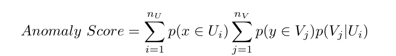

피(x ∈Ui)

> **주:** nV

p(y ∈Vj)p(Vj|Ui) 여기서 nU는 U의 혼합 성분 수이고 NV는 V의 혼합 성분 수입니다. p(x ∈Ui)는 혼합 성분 Ui에서 샘플 포인트 x가 생성될 확률을 나타내고, p(y ∈Uj)는 혼합물 성분 Vj에서 생성될 샘플 포인트 y의 확률을 나타냅니다.

일반 기술의 또 다른 예는 휴대폰 사기 탐지에 적용됩니다[Fawcett 및 Provost 1999]. 이 경우 데이터는 휴대폰 사용 기록으로 구성됩니다. 데이터의 속성 중 하나는 상황별 속성으로 사용되는 휴대폰 사용자입니다. 그런 다음 각 사용자의 활동을 모니터링하여 다른 속성을 사용하여 이상 현상을 감지합니다. 컴퓨터 보안에도 유사한 기술이 채택되었습니다 [Teng et al. 1990], 여기서 컨텍스트 속성은 사용자 ID, 하루 중 시간입니다. 나머지 속성은 정상적인 동작을 나타내는 기존 규칙과 비교되어 이상 현상을 감지합니다. 피어 그룹 분석[Bolton and Hand 1999]은 사용자를 피어로 그룹화하고 그룹 내에서 사기를 분석하는 또 다른 유사한 기술입니다. 그 외 여러분. [2004b]는 클래스 레이블을 사용하여 데이터를 분할한 후 기존의 클러스터링 기반 이상 탐지 기술을 적용하는 클래스 이상 탐지 개념을 제안합니다 [He et al. 2002] 이 하위 집합 내에서 이상 현상을 감지합니다.

공간 데이터의 경우 이웃은 위치 좌표를 사용하여 [Ng 및 Han 1994]를 직관적이고 간단하게 감지합니다. 그래프 기반 이상 탐지 [Shekhar et al. 2001; Luet al. 2003; Kou et al. 2006]는 Grubb의 점수[Grubbs 1969] 또는 유사한 통계적 포인트 이상 탐지 기술을 사용하여 공간적 이웃 내의 이상을 탐지합니다. Sun과 Chawla [2004]는 SLOM(Spatial Local Outlier Measure [Sun and Chawla 2006])이라는 거리 기반 측정을 사용하여 동네 내의 공간 이상 현상을 감지합니다.

시계열 데이터에 적용되는 일반 기법의 또 다른 예는 Basu와 Meckesheimer [2007]가 제안한 것입니다. 시계열의 특정 인스턴스에 대해 저자는 관측된 값을 이웃 값의 중앙값과 비교합니다. 위상 공간을 이용한 시계열 데이터 변환 기법이 제안되었다[Ma and Perkins 2003b]. 이 기술은 시간 지연 임베딩 프로세스를 사용하여 시계열을 위상 공간으로 전개하여 시계열을 벡터 세트로 변환합니다. 언제든지 시간적 관계는 해당 인스턴스의 위상 벡터에 포함됩니다. 저자는 이 기술을 사용하여 시계열을 특징 공간으로 변환한 다음 단일 클래스 SVM을 사용하여 이상 현상을 감지합니다. 각 이상은 원래 시계열의 특정 시간 인스턴스의 값으로 변환될 수 있습니다.

<!-- 원문 47쪽 -->

### 10.2 데이터의 구조 활용

여러 시나리오에서 데이터를 컨텍스트로 나누는 것은 간단하지 않습니다. 이는 일반적으로 시계열 데이터 및 이벤트 시퀀스 데이터에 해당됩니다. 이러한 경우 시계열 모델링 및 시퀀스 모델링 기술이 확장되어 데이터의 문맥적 이상을 감지합니다.

이 범주의 일반적인 기술은 다음과 같이 설명할 수 있습니다. 주어진 상황에 대해 예상되는 행동을 예측할 수 있는 모델은 훈련 데이터로부터 학습됩니다. 예상되는 동작이 관찰된 동작과 크게 다른 경우 예외가 선언됩니다. 이 일반적인 기술의 간단한 예는 상황별 속성을 사용하여 데이터에 회귀선을 맞춰 행동 속성을 예측할 수 있는 회귀입니다.

시계열 데이터의 경우, 견고한 회귀 [Rousseeuw 및 Leroy 1987], 자동 회귀 모델 [Fox 1972], ARMA 모델 [Abraham 및 Chuang 1989; 아브라함과 상자 1979; Galeanoet al. 2004; Zeeviet al. 1997] 및 ARIMA 모델 [Bianco et al. 2001; Tsayet al. 2000]는 상황별 이상 탐지를 위해 개발되었습니다. 회귀 기반 기술은 회귀 분석과 시퀀스 간의 상관 관계를 모델링하여 공동 진화 시퀀스 세트에서 문맥적 이상을 탐지하도록 확장되었습니다[Yi et al. 2000].

시계열 이상 탐지의 초기 작업 중 하나는 Fox [1972]에 의해 제안되었으며, 여기서 시계열은 고정 자동 회귀 프로세스로 모델링되었습니다. 모든 관찰은 자기회귀 과정의 공분산 행렬과 비교하여 이상 여부를 테스트합니다. 관측값이 프로세스에 대한 모델링된 오류를 벗어나면 이상으로 선언됩니다. 이 기술의 확장은 회귀 매개변수를 추정하기 위해 지원 벡터 회귀(Support Vector Regression)를 사용한 다음 학습된 모델을 사용하여 데이터에서 새로운 점을 탐지함으로써 이루어집니다[Ma and Perkins 2003a].

Keogh 등은 알파벳 순서에서 단일 이상(불일치)을 탐지하는 기술을 제안했습니다. [2004]. 이 기술은 분할 및 정복 접근 방식을 채택합니다. 시퀀스는 두 부분으로 나뉘며 각각에 대해 Kolmogorov 복잡도가 계산됩니다. 복잡성이 더 높은 것은 변칙을 포함합니다. 시퀀스는 시퀀스의 변칙으로 선언된 단일 이벤트가 남을 때까지 반복적으로 나뉩니다.

Weiss와 Hirsh [1998]는 순차 데이터에서 희귀한 이벤트를 감지하는 기술을 제안합니다. 여기서는 특정 시간 이전에 발생한 이벤트를 사용하여 해당 시간에 발생하는 이벤트를 예측합니다. 예측이 실제 사건과 일치하지 않으면 드문 것으로 선언됩니다. 이 아이디어는 저자가 빈번한 항목 집합 마이닝(Vilalta 및 Ma 2002), FSA(Finite State Automaton) [Ilgun et al. 1995; Salvador and Chan 2003] 및 Markov 모델 [Smyth 1994]은 이벤트 기록을 기반으로 이벤트에 대한 조건부 확률을 결정합니다. Marceau [2000]는 FSA를 사용하여 이전 n개 이벤트를 기반으로 시퀀스의 다음 이벤트를 예측합니다. 그들은 이 기술을 시스템 호출 침입 탐지 영역에 적용합니다. Hollmen과 Tresp [1999]는 휴대폰 사기 탐지를 위해 HMM을 사용합니다. 저자는 사용자의 휴대폰 활동을 모델링하기 위해 계층적 체제 전환 통화 모델을 사용합니다. 모델은 학습된 모델을 사용하여 통화에 대해 사기가 발생할 확률을 예측합니다. 매개변수 추정은 EM 알고리즘을 사용하여 수행됩니다.

<!-- 원문 48쪽 -->

Scott [2001]는 전화 네트워크 침입을 탐지하는 모델을 제안했고 Ihler 등은 웹 클릭 데이터 모델링을 위해 제안했습니다. [2006]. 두 논문 모두 시계열의 정상적인 동작은 비정상 포아송 과정에 의해 생성되고 이상 현상은 동질 포아송 과정에 의해 생성된다고 가정하는 기술을 따릅니다. 정상 동작과 비정상적인 동작 사이의 전환은 Markov 프로세스를 사용하여 모델링됩니다. 각 논문에서 제안된 기법은 MCMC(Markov Chain Monte Carlo) 추정 기법을 사용하여 이러한 프로세스의 매개변수를 추정합니다. 테스트를 위해 이 프로세스를 사용하여 시계열을 모델링하고 비정상적인 동작이 활성화된 시간 인스턴스를 이상으로 간주합니다.

P2P 네트워크의 이분 그래프 구조는 먼저 그래프의 모든 노드에 대한 이웃을 식별하는 데 사용되었습니다[Sun et al. 2005], 그런 다음 이웃 내에서 해당 노드의 관련성을 감지합니다. 관련성 점수가 낮은 노드는 이상 항목으로 처리됩니다. 저자는 또한 METIS [Karypis and Kumar 1998]와 같은 그래프 분할 알고리즘을 사용하여 그래프가 먼저 겹치지 않는 하위 그래프로 분할되는 대략적인 기술을 제안합니다. 그러면 노드의 이웃이 해당 파티션 내에서 계산됩니다.

계산 복잡도 축소 기반 상황 이상 탐지 기술에서 훈련 단계의 계산 복잡도는 축소 기술과 각 상황 내에서 사용되는 포인트 이상 탐지 기술에 따라 달라집니다. 분할/분할 기술은 축소 단계가 빠른 반면, 클러스터링 또는 모델 추정 혼합을 사용하는 기술은 상대적으로 느립니다. 감소를 통해 이상 탐지 문제가 단순화되므로 빠른 지점 이상 탐지 기술을 사용하여 두 번째 단계의 속도를 높일 수 있습니다. 테스트 단계는 각 테스트 인스턴스에 대해 해당 컨텍스트가 결정된 다음 포인트 이상 탐지 기술을 사용하여 이상 라벨 또는 점수가 할당되기 때문에 상대적으로 비용이 많이 듭니다.

모델을 구축하기 위해 데이터의 구조를 활용하는 상황별 이상 탐지 기술에서 훈련 단계의 계산 복잡성은 일반적으로 문제를 지점 이상 탐지로 줄이는 기술의 복잡성보다 높습니다. 이러한 기술의 장점은 각 인스턴스를 단일 모델과 비교하고 변칙 점수 또는 변칙 레이블을 할당하기 때문에 테스트 단계가 상대적으로 빠르다는 것입니다.

상황별 이상 탐지 기술의 장점과 단점 상황별 이상 탐지 기술의 주요 장점은 데이터 인스턴스가 컨텍스트 내에서 유사한 경향이 있는 많은 실제 응용 프로그램에서 이상 현상을 자연스럽게 정의할 수 있다는 것입니다. 이러한 기술은 데이터의 전체적 관점을 취하는 포인트 변칙 탐지 기술로 탐지할 수 없는 변칙을 탐지할 수 있습니다.

문맥 이상 탐지 기술의 단점은 문맥을 정의할 수 있는 경우에만 적용할 수 있다는 것입니다.

<!-- 원문 49쪽 -->

## 11 집단적 이상 현상 처리

이 섹션에서는 집단적 이상 탐지에 중점을 둔 이상 탐지 기술에 대해 설명합니다. 앞에서 언급한 바와 같이 집단적 이상은 집합으로 함께 발생하고 정상적인 동작과 관련하여 발생이 정상적이지 않은 인스턴스의 하위 집합입니다. 이 컬렉션에 속하는 개별 개체는 반드시 그 자체로 변칙적인 것은 아니지만, 특정 형태로 동시에 발생하면 변칙이 됩니다. 집단적 이상 탐지 문제는 이상 영역에 대한 데이터 구조 탐색을 포함하기 때문에 지점 및 상황별 이상 탐지보다 더 까다롭습니다.

집단적 이상 탐지를 위한 기본 데이터 요구 사항은 데이터 인스턴스 간의 관계가 존재하는 것입니다. 가장 자주 활용되는 세 가지 유형의 관계는 순차, 공간 및 그래프입니다.

— 순차 이상 탐지 기술: 이 기술은 순차 데이터를 사용하여 하위 시퀀스를 이상(순차 이상이라고도 함)으로 찾습니다. 일반적인 데이터셋에는 시스템 호출 데이터와 같은 이벤트 시퀀스 데이터가 포함됩니다 [Forrest et al. 1999] 또는 숫자 시계열 데이터 [Chan and Mahoney 2005].

—공간 이상 탐지 기술: 이 기술은 공간 데이터를 사용하여 데이터 내에서 연결된 하위 영역을 이상(공간 이상이라고도 함)으로 찾습니다. 이상 탐지 기술은 다중 스펙트럼 이미지 데이터 [Hazel 2000]에 적용되었습니다.

—그래프 이상 탐지 기술: 이 기술은 그래프 데이터를 사용하여 데이터 내에서 연결된 하위 그래프를 이상(그래프 이상이라고도 함)으로 찾습니다. 그래프 데이터에는 이상 탐지 기술이 적용되었습니다[Noble and Cook 2003].

순차적 이상 탐지 분야에서 상당한 연구가 수행되었습니다. 이는 여러 중요한 애플리케이션 도메인에 순차 데이터가 존재하기 때문일 수 있습니다. 공간 이상 탐지는 주로 이미지 처리 영역에서 연구되었습니다. 다음 하위 섹션에서는 이러한 각 범주에 대해 자세히 설명합니다.

### 11.1 순차적 이상 처리

앞서 언급했듯이 시퀀스 데이터의 집단적 이상 탐지에는 정상적인 동작의 정의와 관련하여 비정상적인 시퀀스를 탐지하는 작업이 포함됩니다. 시퀀스 데이터는 시간이나 위치에 따라 데이터 인스턴스에 자연스러운 순서가 적용되는 광범위한 도메인에서 매우 일반적입니다. 이상 탐지 문헌에서는 두 가지 유형의 시퀀스를 다룹니다. 첫 번째 유형의 시퀀스는 운영 체제 호출 시퀀스 또는 생물학적 엔터티 시퀀스와 같은 상징적입니다. 두 번째 유형의 시퀀스는 연속형 또는 시계열입니다. 시퀀스는 시퀀스의 각 이벤트가 단변량 관측인 일변량일 수도 있고, 시퀀스의 각 이벤트가 다변량 관측인 다변량일 수도 있습니다.

시퀀스에 대한 이상 탐지 문제는 다양한 방식으로 정의될 수 있으며 아래에서 설명합니다.

11.1.1 일련의 시퀀스에서 비정상적인 시퀀스를 감지합니다. 이 범주에 속하는 기술의 목적은 주어진 시퀀스 집합에서 변칙적인 시퀀스를 탐지하는 것입니다. 이러한 기술은 준감독 모드 또는 비감독 모드에서 작동할 수 있습니다.

<!-- 원문 50쪽 -->

이 범주의 기술이 직면한 주요 과제는 다음과 같습니다.

- 시퀀스의 길이가 동일하지 않을 수 있습니다. - 테스트 시퀀스는 서로 또는 일반 시퀀스와 정렬되지 않을 수 있습니다.

예를 들어, 한 시퀀스의 첫 번째 이벤트는 다른 시퀀스의 세 번째 이벤트에 해당할 수 있습니다. 이러한 서열을 비교하는 것은 다양한 서열 정렬 및 서열 매칭 기술을 탐구하는 생물학적 서열[Gusfield 1997]의 근본적인 문제입니다.

이 문제를 해결하는 기술은 다음 두 가지 접근 방식 중 하나를 따릅니다.

포인트 이상 탐지 문제 감소 위의 문제를 해결하기 위한 일반적인 접근 방식은 시퀀스를 유한 특징 공간으로 변환한 다음 새로운 공간에서 포인트 이상 탐지 기술을 사용하여 이상을 탐지하는 것입니다.

특정 기술에서는 모든 시퀀스의 길이가 동일하다고 가정합니다. 따라서 그들은 각 시퀀스를 속성의 벡터로 취급하고 포인트 이상 탐지 기술을 사용하여 이상을 감지합니다. 예를 들어, 데이터셋에 길이 10 시퀀스가 ​​포함된 경우 10 특성이 있는 데이터 레코드로 처리될 수 있습니다. 한 쌍의 시퀀스 간에 유사성 또는 거리 측정값을 정의할 수 있으며 모든 지점 이상 탐지 기술을 이러한 데이터셋에 적용할 수 있습니다. 이 접근 방식은 시계열 데이터셋에 채택되었습니다 [Caudel 및 Newman 1993; Blenderet al. 1997]. 전자의 논문에서는 ART(Adaptive Resonance Theory) 신경망 기반 이상 탐지 기법을 적용하여 시계열 데이터셋에서 이상 징후를 탐지하고, 후자의 논문에서는 클러스터링 기반 이상 탐지 기법을 사용하여 기상 데이터에서 사이클론 영역(이상 현상)을 식별합니다.

앞서 언급했듯이 주어진 시퀀스의 길이는 동일하지 않을 수 있습니다. 특정 기술은 각 시퀀스를 동일한 수의 속성 레코드로 변환하여 이 문제를 해결합니다. Box Modeling으로 알려진 다중 시계열 데이터 [Chan and Mahoney 2005]에 대한 변환 기술이 제안되었습니다. 상자 모델에서는 각 시계열에 대해 이 시계열의 각 인스턴스가 해당 값에 따라 상자에 할당됩니다. 그런 다음 이러한 상자는 특성으로 처리됩니다(상자 수는 변환된 특성 공간의 특성 수입니다). 그런 다음 저자는 데이터에서 변칙적인 시계열을 탐지하기 위해 RIPPER를 사용하는 유클리드 거리 기반 기술과 분류 기반 기술인 포인트 변칙 탐지 기술을 적용합니다.

여러 기술에서는 길이가 동일하지 않은 두 시퀀스 간의 유사성 또는 거리를 계산할 수 있는 유사성 또는 거리 측정법을 사용하여 시퀀스의 길이가 동일하지 않은 문제를 해결합니다. 예를 들어, [Budalakoti et al. 2006]는 기호 시퀀스에 대한 유사성 척도로 가장 긴 공통 부분 시퀀스의 길이를 사용합니다. 이후 저자는 이 유사성 척도를 사용하여 클러스터링 기반 이상 탐지 기술을 적용했습니다.

11.1.1.1 모델링 시퀀스. 이전 섹션에서 설명한 변환은 모든 시퀀스가 ​​제대로 정렬되었을 때 적합합니다. 종종 정렬 가정이 너무 엄격해집니다. 시스템 호출 데이터, 생물학적 데이터 등을 다루는 연구에서는 집단적 이상 징후를 탐지하기 위한 다른 대안을 모색합니다.

<!-- 원문 51쪽 -->

이러한 기술은 준감독 모드에서 작동하므로 정규 시퀀스 훈련 세트가 필요합니다.

순차적 연관 모델링은 시퀀스로부터 순차적 규칙을 생성하는 데 사용되었습니다[Teng et al. 1990]. 저자는 시간 기반 귀납 학습이라는 접근 방식을 사용하여 일련의 정규 시퀀스에서 규칙을 생성합니다. 테스트 시퀀스는 이러한 규칙과 비교되며 규칙이 생성되지 않은 패턴이 포함된 경우 변칙으로 선언됩니다.

시퀀스의 Markovian 모델링은 이 범주에서 가장 널리 사용되는 접근 방식이었습니다. 이 범주에 사용되는 모델링 기술은 FSA(Finite State Automatons)부터 Markov 모델까지 다양합니다. FSA는 네트워크 프로토콜 데이터의 이상을 탐지하는 데 사용되었습니다[Sekar et al. 2002; Sekaret al. 1999]. 주어진 일련의 이벤트가 최종 상태 중 하나에 도달하지 못할 때 이상 현상이 감지됩니다. 저자는 또한 운영 체제 호출 침입 탐지에 자신의 기술을 적용합니다 [Sekar et al. 2001].

Ye [2004]는 주어진 시퀀스 S가 이상인지 감지하기 위해 간단한 1 순서 마르코프 체인 모델링 접근 방식을 제안합니다. 저자는 다음 방정식 P(S) = qS1을 사용하여 S, P(S)의 우도를 결정합니다.

> **주:** pSt−1St

여기서 qS1은 트레이닝 세트에서 심볼 S1을 관찰할 확률이고, pSt−1St는 트레이닝 세트에서 심볼 St−1 다음에 심볼 St를 관찰할 확률입니다. P(S)의 역은 S에 대한 변칙 점수입니다. 이 기술의 단점은 단일 순서 마르코프 체인이 시퀀스에서 더 높은 순서 종속성을 모델링할 수 없다는 것입니다.

Forrestet al. [1999]는 운영 체제 호출 데이터에서 비정상적인 프로그램 추적을 탐지하기 위해 HMM(Hidden Markov Model) 기반 기술을 제안합니다. 저자는 훈련 시퀀스를 사용하여 HMM을 훈련합니다. 저자는 두 가지 테스트 기술을 제안합니다. 첫 번째 기술에서는 Viterbi 알고리즘을 사용하여 학습된 HMM에 의해 생성될 테스트 시퀀스 S의 가능성을 계산합니다. 두 번째 기술은 HMM의 기본 FSA(Finite State Automaton)를 사용하는 것입니다. 테스트 시퀀스를 생성하기 위해 HMM에서 수행한 상태 전환 및 출력이 기록됩니다. 저자는 HMM이 있을 법하지 않은 상태 전환을 수행하거나 (사용자 정의 임계값을 사용하여) 있을 법하지 않은 기호를 출력해야 했던 횟수를 불일치로 계산합니다. 총 불일치 수는 해당 시퀀스의 이상 점수를 나타냅니다.

PST(Probabilistic Suffix Trees)는 순차 데이터베이스에서 집합적 이상 현상을 탐지하는 데 적용되는 또 다른 모델링 도구입니다. PST는 가변 순서 마르코프 체인을 간략하게 표현한 것입니다. Yang과 Wang [2003]는 PST를 사용하여 시퀀스를 클러스터링하고 부산물로 변칙적인 시퀀스를 감지합니다. 마찬가지로 Smyth [1997] 및 Cadez et al. [2000]는 HMM을 사용하여 시퀀스 세트를 클러스터링하고 어떤 클러스터에도 속하지 않는 모든 시퀀스를 이상 현상으로 감지합니다.

순차적 이상 탐지에 사용되는 또 다른 모델링 도구는 SMT(Sparse Markov Trees)입니다. 이는 경로 내에서 와일드카드 기호를 허용한다는 차이점이 있는 PST와 유사합니다. 이 기술은 Eskin et al.에 의해 사용되었습니다. 훈련 세트를 사용하여 SMT 혼합을 훈련시키는 [2001]. 각 SMT에는 서로 다른 와일드카드 위치가 있습니다. 테스트 단계에는 혼합물에서 가장 좋은 SMT를 사용하여 확률 P(Sn|Sn−1...S1)을 예측하는 작업이 포함됩니다. 이 확률이 특정 임계값보다 낮으면 테스트 시퀀스가 ​​이상으로 선언됩니다.

<!-- 원문 52쪽 -->

11.1.2 긴 시퀀스에서 비정상적인 하위 시퀀스를 감지합니다. 이 범주에 속하는 기술의 목적은 주어진 시퀀스 내에서 시퀀스의 나머지 부분에 비해 변칙적인 하위 시퀀스를 탐지하는 것입니다. 이러한 변칙적인 하위 서열은 불일치라고도 불립니다 [Bu et al. 2007; Fuet al. 2006; Keoghet al. 2005; Yankovet al. 2007].

이 문제 공식화는 데이터가 긴 시퀀스 형태이고 비정상적인 영역을 포함하는 이벤트 및 시계열 데이터셋에서 발생합니다. 이 문제를 해결하는 기술은 훈련 데이터가 부족하기 때문에 일반적으로 비지도 모드에서 작동합니다. 기본 가정은 시계열의 정상적인 동작이 정의된 패턴을 따른다는 것입니다. 이 패턴을 따르지 않는 긴 시퀀스 내의 하위 시퀀스는 예외입니다.

이 범주의 기술이 직면한 주요 과제는 다음과 같습니다.

- 탐지할 변칙적인 부분 서열의 길이는 일반적으로 정의되지 않습니다.

긴 시퀀스에는 다양한 길이의 변칙적인 영역이 포함될 수 있습니다. 따라서 시퀀스의 고정 길이 분할은 종종 유용하지 않습니다. - 입력 시퀀스에 변칙적인 영역이 포함되어 있기 때문에 강력한 정상 모델을 만드는 것이 어려워집니다.

Chakrabartiet al. [1998]는 장바구니 거래에서 예상치 못한 감지 기술을 제안합니다. 데이터는 시간별로 정렬된 일련의 항목 집합입니다. 저자는 각 세그먼트를 인코딩하는 데 필요한 비트 수의 합(Shannon의 고전 정보 정리 사용)이 최소화되도록 항목 집합 시퀀스를 분할할 것을 제안합니다. 저자는 이러한 분할을 찾기 위한 최적의 솔루션이 존재함을 보여줍니다. 인코딩을 위해 가장 높은 비트 수가 필요한 세그먼트는 이상 항목으로 처리됩니다.

Keoghet al. [2004]는 WCAD(창 비교 이상 탐지)라는 알고리즘을 제안합니다. 여기서 저자는 슬라이딩 창을 사용하여 주어진 연속 관측 시퀀스에서 하위 시퀀스를 추출합니다. 저자는 압축 기반 비유사성 측정을 사용하여 각 하위 시퀀스를 전체 시퀀스와 비교합니다. 각 하위 시퀀스의 이상 점수는 전체 시퀀스와의 차이점입니다.

Keogh et al [2005; 2006]는 연속 시계열에 대한 위의 문제를 해결하기 위해 관련 기술(HOT SAX)을 제안합니다. 저자가 따르는 기본 접근 방식은 슬라이딩 윈도우를 사용하여 주어진 시퀀스에서 하위 시퀀스를 추출한 다음 원본 시퀀스 내에서 가장 가깝고 겹치지 않는 하위 시퀀스까지 각 하위 시퀀스의 거리를 계산하는 것입니다. 하위 시퀀스의 이상 점수는 가장 가까운 이웃과의 거리에 비례합니다. 두 시퀀스 사이의 거리는 유클리드 측정을 사용하여 측정됩니다. Lin 등의 의료 데이터 영역에도 유사한 접근 방식이 적용됩니다. [2005]. 동일한 저자는 이전 기술을 보다 효율적으로 만들기 위해 Haar Wavelet 기반 변환의 사용을 제안합니다 [Fu et al. 2006; Buet al. 2007].

최대 엔트로피 마르코프 모델(Maxent) [McCallum et al. 2000; 파블로프(Pavlov) 및 페녹(Pennock) 2002; Pavlov 2003] 및 조건부 무작위 필드(CRF) [Lafferty et al. 2001]는 텍스트 데이터를 분할하는 데 사용되었습니다. 문제 공식화는 주어진 관찰 시퀀스에 대해 가장 가능성이 높은 상태 시퀀스를 예측하는 것입니다. 관찰 시퀀스 내의 모든 변칙적 세그먼트는 모든 상태 시퀀스에 대해 낮은 조건부 확률을 갖습니다.

<!-- 원문 53쪽 -->

11.1.3 주어진 시퀀스의 쿼리 패턴 빈도가 예상 빈도에 비해 비정상적인지 확인합니다. 이상 탐지 문제의 이러한 공식화는 데이터의 사례 대 제어 유형에서 동기가 부여됩니다 [Helman 및 Bhangoo 1997; Gwaderaet al. 2005b; 2004]. 아이디어는 주어진 테스트 데이터셋(케이스)에서 발생하는 패턴이 일반 데이터셋(대조군)에서 발생하는 것과 다른 패턴을 감지하는 것입니다. Keoghet al. [2002]는 슬라이딩 윈도우를 사용하여 주어진 알파벳 문자열에서 부분 문자열을 추출합니다. 이러한 각 하위 문자열에 대해 이 하위 문자열이 일반 문자열 데이터베이스와 관련하여 변칙적인지 확인합니다. 저자는 일반 문자열 데이터베이스에서 하위 문자열의 예상 빈도를 추정하기 위해 접미사 트리를 사용합니다. 유사한 접근법으로 [Gwadera et al. 2005a], 저자는 IMM(Interpolated Markov Model)을 사용하여 예상 빈도를 추정합니다.

### 11.2 공간 이상 처리

공간 데이터의 집단적 이상 탐지에는 데이터에서 비정상적인 하위 그래프 또는 하위 구성 요소를 찾는 작업이 포함됩니다. 이 범주에 대해서는 제한된 양의 연구가 수행되었으므로 개별적으로 논의하겠습니다.

Hazel [2000]는 이미지의 나머지 부분과 관련하여 비정상적인 영역을 감지하는 기술을 제안합니다. 제안된 기법은 MGMRF(Multivariate Gaussian Random Markov Fields)를 사용하여 주어진 이미지를 분할합니다. 저자는 이미지의 변칙적인 영역에 속하는 각 픽셀이 해당 세그먼트 내의 문맥적 변칙이기도 하다고 가정합니다. 이러한 픽셀은 각 픽셀의 조건부 확률을 추정하여 세그먼트에 대한 문맥적 이상으로 감지된 후 사용 가능한 공간 구조를 사용하여 연결되어 집합적 이상을 찾습니다.

그래프에 대한 이상 탐지는 데이터를 그래프로 모델링할 수 있는 애플리케이션 도메인에서 탐색되었습니다. Noble과 Cook [2003]는 그래프 데이터에 대한 두 가지 집단적 이상 탐지 문제를 해결합니다. 첫 번째 문제는 주어진 큰 그래프에서 비정상적인 하위 그래프를 탐지하는 것입니다. 저자는 상향식 하위 그래프 열거 기술을 사용하고 주어진 그래프에서 하위 그래프의 빈도를 분석하여 그것이 변칙인지 아닌지를 결정합니다. 하위 그래프의 크기도 고려됩니다. 큰 하위 그래프(예: 그래프 자체)는 그래프에서 매우 드물게 발생하는 반면 작은 하위 그래프(예: 개별 노드)는 더 자주 발생하기 때문입니다. 두 번째 문제는 주어진 하위 그래프가 큰 그래프와 관련하여 이상인지 여부를 감지하는 것입니다. 저자는 전체 그래프의 맥락에서 하위 그래프의 규칙성 또는 엔트로피를 측정하여 변칙 점수를 결정합니다.

## 12 이상 탐지 기술의 상대적인 강점과 약점

이전 섹션에서 논의된 수많은 이상 탐지 기술 각각에는 고유한 장점과 단점이 있습니다. 주어진 변칙 탐지 문제에 어떤 변칙 탐지 기술이 가장 적합한지 아는 것이 중요합니다. 문제 공간의 복잡성을 고려할 때 모든 이상 탐지 문제에 대해 이러한 이해를 제공하는 것은 불가능합니다. 이 섹션에서는 몇 가지 간단한 문제 설정에 대해 다양한 기술 범주의 상대적인 강점과 약점을 분석합니다.

<!-- 원문 54쪽 -->

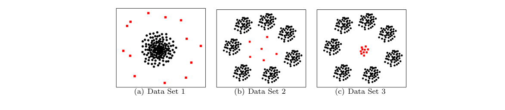

**그림 10. 2-D 데이터셋. 정상적인 인스턴스는 원으로 표시되고 변칙적인 인스턴스는 사각형으로 표시됩니다.**

예를 들어 다음과 같은 이상 탐지 문제를 고려해 보겠습니다. 입력은 2D 연속 데이터입니다(그림 10(a)). 일반 데이터 인스턴스는 가우스 분포에서 생성되며 2D 공간의 밀집된 클러스터에 위치합니다. 이상 현상은 평균이 첫 번째 분포와 매우 다른 또 다른 가우스 분포에서 생성된 극소수의 인스턴스입니다. 일반 데이터셋의 인스턴스를 포함하는 대표적인 훈련 데이터셋도 사용할 수 있습니다. 따라서 섹션 4–9의 기술에 의해 만들어진 가정은 이 데이터셋에 적용되며, 따라서 이러한 범주에 속하는 모든 이상 탐지 기술은 그러한 시나리오에서 이상을 탐지합니다.

이제 또 다른 2D 데이터셋(그림 10(b))를 고려해 보겠습니다. 일반 인스턴스는 평균이 원에 배열되고 분산이 매우 낮은 수많은 서로 다른 가우스 분포에 의해 생성되도록 합니다. 따라서 일반 데이터는 원 위에 배열된 촘촘한 클러스터 집합이 됩니다. 단일 클래스 분류 기반 기술은 전체 데이터셋 주위의 원형 경계를 학습할 수 있으므로 클러스터 원 내에 있는 이상 현상을 감지할 수 없습니다. 반면에 각 클러스터가 다른 클래스로 레이블이 지정된 경우 다중 클래스 분류 기반 기술은 각 클러스터 주변의 경계를 학습할 수 있으므로 중앙의 이상을 감지할 수 있습니다. 데이터를 모델링하기 위해 혼합 모델 접근 방식을 사용하는 통계 기법을 사용하면 이상 현상을 감지할 수 있습니다. 마찬가지로 클러스터링 기반 및 최근접 이웃 기반 기술은 다른 모든 인스턴스와 멀리 떨어져 있기 때문에 이상 현상을 감지할 수 있습니다. 유사한 예(그림 10(c))에서 비정상적인 인스턴스가 원의 중심에 상당한 크기의 촘촘한 클러스터를 형성하는 경우 클러스터링 기반 및 최근접 이웃 기반 기술 모두 이러한 인스턴스를 정상으로 처리하므로 성능이 저하됩니다.

더 복잡한 데이터셋의 경우 다양한 유형의 기술이 다양한 문제에 직면합니다. 가장 가까운 이웃 및 클러스터링 기반 기술은 차원 수가 높을 때 문제가 발생합니다. 왜냐하면 많은 차원의 거리 측정값이 정상 인스턴스와 변칙 인스턴스를 구별할 수 없기 때문입니다. 스펙트럼 기술은 데이터를 저차원 투영에 매핑하여 고차원 문제를 명시적으로 해결합니다. 그러나 이들의 성능은 투영된 공간에서 정상적인 인스턴스와 변칙적인 인스턴스를 구별할 수 있다는 가정에 크게 의존합니다. 이러한 시나리오에서는 분류 기반 기술이 더 나은 선택이 될 수 있습니다. 그러나 가장 효과적인 분류 기반 기술을 사용하려면 정상 인스턴스와 변칙 인스턴스 모두에 대한 레이블이 필요하지만 이는 자주 사용할 수 없습니다. 정상 인스턴스와 변칙 인스턴스에 대한 레이블을 모두 사용할 수 있더라도 두 레이블 분포의 불균형으로 인해 분류기를 학습하는 것이 매우 어려운 경우가 많습니다. 정규 레이블만 사용하는 준감독 최근접 이웃 및 클러스터링 기술은 분류 기반 기술보다 더 효과적일 수 있습니다. 비록 지도되지 않더라도 통계 기법은 데이터의 차원이 낮고 통계적 가정이 유지되는 경우에만 효과적입니다. 정보 이론 기술에는 단일 변칙의 영향도 감지할 수 있을 만큼 민감한 측정이 필요합니다. 그렇지 않은 경우 이러한 기술은 변칙 개수가 상당히 많은 경우에만 변칙을 검색할 수 있습니다.

<!-- 원문 55쪽 -->

최근접 이웃 및 클러스터링 기반 기술에는 한 쌍의 데이터 인스턴스 간의 거리 계산이 필요합니다. 따라서 이러한 기술은 거리 측정이 이상치와 정상 사례를 충분히 잘 구별할 수 있다고 가정합니다. 적절한 거리 측정값을 식별하는 것이 어려운 상황에서는 분류 기반 또는 통계 기법을 사용하는 것이 더 나은 선택일 수 있습니다.

이상 탐지 기술의 계산 복잡성은 특히 해당 기술이 실제 도메인에 적용될 때 중요한 측면입니다. 분류 기반, 클러스터링 기반 및 통계 기술은 훈련 시간이 많이 소요되지만 테스트는 일반적으로 빠릅니다. 테스트는 실시간으로 수행되어야 하는 반면 모델은 오프라인 방식으로 훈련될 수 있기 때문에 이는 종종 허용됩니다. 대조적으로, 훈련 단계가 없는 최근접 이웃 기반, 정보 이론, 스펙트럼 기술과 같은 기술은 실제 설정에서 제한이 될 수 있는 비용이 많이 드는 테스트 단계를 갖습니다.

이상 탐지 기술은 일반적으로 정상적인 인스턴스와 비교할 때 데이터의 이상이 거의 없다고 가정합니다. 이 가정은 일반적으로 사실이지만 변칙이 항상 드문 것은 아닙니다. 예를 들어, 컴퓨터 네트워크에서 웜 탐지를 처리할 때 비정상적인(웜) 트래픽은 실제로 정상적인 트래픽보다 더 자주 발생합니다. 비지도 기술은 이러한 대량 이상 탐지에 적합하지 않습니다. 감독 또는 반 감독 모드에서 작동하는 기술을 적용하여 대량 이상 현상을 감지할 수 있습니다[Sun et al. 2007; Souleet al. 2005].

## 13 결론 및 향후 작업

이 설문 조사에서 우리는 이상 탐지 문제가 문헌에서 공식화되는 다양한 방식을 논의했으며, 다양한 기술에 대한 거대한 문헌의 개요를 제공하려고 시도했습니다. 이상 탐지 기술의 각 범주에 대해 정상 데이터와 이상 데이터의 개념에 관한 고유한 가정을 식별했습니다. 특정 기술을 특정 영역에 적용할 때 이러한 가정은 해당 영역에서 기술의 효율성을 평가하기 위한 지침으로 사용될 수 있습니다. 이상적으로는 이상 탐지에 대한 포괄적인 조사를 통해 독자가 특정 이상 탐지 기술을 사용하는 동기를 이해할 수 있을 뿐만 아니라 다양한 기술에 대한 비교 분석도 제공할 수 있어야 합니다. 그러나 현재의 연구는 이상 현상에 대한 통일된 개념에 의존하지 않고 구조화되지 않은 방식으로 수행되어 이상 현상 탐지 문제에 대한 이론적 이해를 제공하는 작업을 매우 어렵게 만듭니다. 가능한 미래 작업은 정상 및 변칙적 행동에 관한 다양한 기술의 가정을 통계 또는 기계 학습 프레임워크로 통합하는 것입니다. 이 방향에 대한 제한된 시도는 Knorr와 Ng [1997]에 의해 제공되었으며, 여기서 저자는 2차원 데이터셋에 대한 거리 기반과 통계적 이상 사이의 관계를 보여줍니다.

<!-- 원문 56쪽 -->

이상 탐지에 대한 추가 연구를 위한 몇 가지 유망한 방향이 있습니다. 상황별 및 집단적 이상 탐지 기술은 여러 영역에서 적용 가능성이 증가하기 시작했으며 이 영역에서 새로운 기술을 개발할 수 있는 여지가 많습니다. 다양한 분산 위치에 데이터가 존재하므로 분산 이상 탐지 기술이 필요하게 되었습니다[Zimmermann 및 Mohay 2006]. 이러한 기술은 여러 사이트에서 사용 가능한 정보를 처리하는 반면, 각 사이트에 존재하는 정보를 동시에 보호해야 하는 경우가 많으므로 개인 정보를 보호하는 변칙 검색 기술이 필요합니다[Vaidya 및 Clifton 2004]. 센서 네트워크의 출현으로 데이터가 도착하는 대로 처리하는 것이 필수가 되었습니다. 이 설문 조사에서 논의된 많은 기술에는 이상 현상을 감지하기 전에 전체 테스트 데이터가 필요합니다. 최근에는 온라인 방식으로 작동할 수 있는 기술이 제안되었습니다[Pokrajac et al. 2007]; 이러한 기술은 테스트 인스턴스가 도착할 때 변칙 점수를 할당할 뿐만 아니라 모델을 점진적으로 업데이트합니다. 이상 탐지가 점점 더 많이 적용되는 또 다른 향후 영역은 복잡한 시스템입니다. 이러한 시스템의 예로는 여러 구성 요소가 있는 항공기 시스템이 있습니다. 이러한 시스템의 이상 탐지에는 다양한 구성 요소 간의 상호 작용 모델링이 포함됩니다 [Bronstein et al. 2001].

감사의 글 저자들은 논문의 최종 초안에 대해 폭넓은 논평을 해주신 Shyam Boriah와 Gang Fang에게 감사드립니다.

이 작업은 수상 NNX08AC36A, NSF 부여 번호 CNS-0551551, NSF ITR 부여 ACI-0325949, NSF IIS-0713227 및 NSF 부여 IIS-0308264에 따라 NASA에서 지원되었습니다. 디지털 기술 컨소시엄(Digital Technology Consortium)이 컴퓨팅 시설에 대한 액세스를 제공했습니다.

## 참고문헌

Abe, N., Zadrozny, B., and Langford, J. 2006. Outlier detection by active learning. In Proceedings of the 12th ACM SIGKDD International Conference on Knowledge Discovery and Data Mining. ACM Press, New York, NY, USA, 504–509. Abraham, B. and Box, G. E. P. 1979. Bayesian analysis of some outlier problems in time series.

Biometrika 66, 2, 229–236. Abraham, B. and Chuang, A. 1989. Outlier detection and time series modeling. Technomet-

rics 31, 2, 241–248. Addison, J., Wermter, S., and MacIntyre, J. 1999. Effectiveness of feature extraction in neural

network architectures for novelty detection. In Proceedings of the 9th International Conference on Artificial Neural Networks. Vol. 2. 976–981. Aeyels, D. 1991. On the dynamic behaviour of the novelty detector and the novelty filter. In

Analysis of Controlled Dynamical Systems- Progress in Systems and Control Theory, B. Bonnard, B. Bride, J. Gauthier, and I. Kupka, Eds. Vol. 8. Springer, Berlin, 1–10. Agarwal, D. 2005. An empirical bayes approach to detect anomalies in dynamic multidimen-

sional arrays. In Proceedings of the 5th IEEE International Conference on Data Mining. IEEE Computer Society, Washington, DC, USA, 26–33. Agarwal, D. 2006. Detecting anomalies in cross-classified streams: a bayesian approach. Knowl-

edge and Information Systems 11, 1, 29–44.

<!-- 원문 57쪽 -->

Aggarwal, C. 2005. On abnormality detection in spuriously populated data streams. In Pro-

ceedings of 5th SIAM Data Mining. 80–91. Aggarwal, C. and Yu, P. 2001. Outlier detection for high dimensional data. In Proceedings of

the ACM SIGMOD International Conference on Management of Data. ACM Press, 37–46. Aggarwal, C. C. and Yu, P. S. 2008. Outlier detection with uncertain data. In SDM. 483–493. Agovic, A., Banerjee, A., Ganguly, A. R., and Protopopescu, V. 2007. Anomaly detection

in transportation corridors using manifold embedding. In First International Workshop on Knowledge Discovery from Sensor Data. ACM Press. Agrawal, R. and Srikant, R. 1995. Mining sequential patterns. In Proceedings of the 11th

International Conference on Data Engineering. IEEE Computer Society, Washington, DC, USA, 3–14. Agyemang, M., Barker, K., and Alhajj, R. 2006. A comprehensive survey of numeric and

symbolic outlier mining techniques. Intelligent Data Analysis 10, 6, 521–538. Albrecht, S., Busch, J., Kloppenburg, M., Metze, F., and Tavan, P. 2000. Generalized radial

basis function networks for classification and novelty detection: self-organization of optional bayesian decision. Neural Networks 13, 10, 1075–1093. Aleskerov, E., Freisleben, B., and Rao, B. 1997. Cardwatch: A neural network based database

mining system for credit card fraud detection. In Proceedings of IEEE Computational Intelligence for Financial Engineering. 220–226. Allan, J., Carbonell, J., Doddington, G., Yamron, J., and Yang, Y. 1998. Topic detec-

tion and tracking pilot study. In Proceedings of DARPA Broadcast News Transcription and Understanding Workshop. 194–218. Anderson, Lunt, Javitz, Tamaru, A., and Valdes, A. 1995. Detecting unusual program behav-

ior using the statistical components of NIDES. Tech. Rep. SRI–CSL–95–06, Computer Science Laboratory, SRI International. may. Anderson, D., Frivold, T., Tamaru, A., and Valdes, A. 1994. Next-generation intrusion detection expert system (nides), software users manual, beta-update release. Tech. Rep. SRI– CSL–95–07, Computer Science Laboratory, SRI International. may. Ando, S. 2007. Clustering needles in a haystack: An information theoretic analysis of minority

and outlier detection. In Proceedings of 7th International Conference on Data Mining. 13–22. Angiulli, F. and Pizzuti, C. 2002. Fast outlier detection in high dimensional spaces. In Proceed-

ings of the 6th European Conference on Principles of Data Mining and Knowledge Discovery. Springer-Verlag, 15–26. Anscombe, F. J. and Guttman, I. 1960. Rejection of outliers. Technometrics 2, 2, 123–147. Arning, A., Agrawal, R., and Raghavan, P. 1996. A linear method for deviation detection in

large databases. In Proceedings of 2nd International Conference of Knowledge Discovery and Data Mining. 164–169. Augusteijn, M. and Folkert, B. 2002. Neural network classification and novelty detection. International Journal on Remote Sensing 23, 14, 2891–2902. Bakar, Z., Mohemad, R., Ahmad, A., and Deris, M. 2006. A comparative study for outlier de-

tection techniques in data mining. Cybernetics and Intelligent Systems, 2006 IEEE Conference on, 1–6. Baker, D., Hofmann, T., McCallum, A., and Yang, Y. 1999. A hierarchical probabilistic model for novelty detection in text. In Proceedings of International Conference on Machine Learning. Barbara, D., Couto, J., Jajodia, S., and Wu, N. 2001a. Adam: a testbed for exploring the

use of data mining in intrusion detection. SIGMOD Rec. 30, 4, 15–24. Barbara, D., Couto, J., Jajodia, S., and Wu, N. 2001b. Detecting novel network intrusions

using bayes estimators. In Proceedings of the First SIAM International Conference on Data Mining. Barbara, D., Li, Y., Couto, J., Lin, J.-L., and Jajodia, S. 2003. Bootstrapping a data mining

intrusion detection system. In Proceedings of the 2003 ACM symposium on Applied computing. ACM Press, 421–425.

<!-- 원문 58쪽 -->

Barnett, V. 1976. The ordering of multivariate data (with discussion). Journal of the Royal

Statistical Society. Series A 139, 318–354. Barnett, V. and Lewis, T. 1994. Outliers in statistical data. John Wiley and sons. Barson, P., Davey, N., Field, S. D. H., Frank, R. J., and McAskie, G. 1996. The detection

of fraud in mobile phone networks. Neural Network World 6, 4. Basu, S., Bilenko, M., and Mooney, R. J. 2004. A probabilistic framework for semi-supervised

clustering. In Proceedings of the tenth ACM SIGKDD international conference on Knowledge discovery and data mining. ACM Press, New York, NY, USA, 59–68. Basu, S. and Meckesheimer, M. 2007. Automatic outlier detection for time series: an application

to sensor data. Knowledge and Information Systems 11, 2 (February), 137–154. Bay, S. D. and Schwabacher, M. 2003. Mining distance-based outliers in near linear time with randomization and a simple pruning rule. In Proceedings of the ninth ACM SIGKDD international conference on Knowledge discovery and data mining. ACM Press, 29–38. Beckman, R. J. and Cook, R. D. 1983. Outlier...s. Technometrics 25, 2, 119–149. Bejerano, G. and Yona, G. 2001. Variations on probabilistic suffix trees: statistical modeling

and prediction of protein families . Bioinformatics 17, 1, 23–43. Bentley, J. L. 1975. Multidimensional binary search trees used for associative searching. Com-

munications of the ACM 18, 9, 509–517. Bianco, A. M., Ben, M. G., Martinez, E. J., and Yohai, V. J. 2001. Outlier detection in

regression models with arima errors using robust estimates. Journal of Forecasting 20, 8, 565–579. Bishop, C. 1994. Novelty detection and neural network validation. In Proceedings of IEEE Vision, Image and Signal Processing. Vol. 141. 217–222. Blender, R., Fraedrich, K., and Lunkeit, F. 1997. Identification of cyclone-track regimes in

the north atlantic. Quarterly Journal of the Royal Meteorological Society 123, 539, 727–741. Bolton, R. and Hand, D. 1999. Unsupervised profiling methods for fraud detection. In Credit

Scoring and Credit Control VII. Boriah, S., Chandola, V., and Kumar, V. 2008. Similarity measures for categorical data: A

comparative evaluation. In Proceedings of the eighth SIAM International Conference on Data Mining. 243–254. Borisyuk, R., Denham, M., Hoppensteadt, F., Kazanovich, Y., and Vinogradova, O. 2000.

An oscillatory neural network model of sparse distributed memory and novelty detection. Biosystems 58, 265–272. Box, G. E. P. and Tiao, G. C. 1968. Bayesian analysis of some outlier problems. Biometrika 55, 1, 119–129. Branch, J., Szymanski, B., Giannella, C., Wolff, R., and Kargupta, H. 2006. In-network

outlier detection in wireless sensor networks. In 26th IEEE International Conference on Distributed Computing Systems. Brause, R., Langsdorf, T., and Hepp, M. 1999. Neural data mining for credit card fraud de-

tection. In Proceedings of IEEE International Conference on Tools with Artificial Intelligence. 103–106. Breunig, M. M., Kriegel, H.-P., Ng, R. T., and Sander, J. 1999. Optics-of: Identifying local

outliers. In Proceedings of the Third European Conference on Principles of Data Mining and Knowledge Discovery. Springer-Verlag, 262–270. Breunig, M. M., Kriegel, H.-P., Ng, R. T., and Sander, J. 2000. Lof: identifying density-based

local outliers. In Proceedings of 2000 ACM SIGMOD International Conference on Management of Data. ACM Press, 93–104. Brito, M. R., Chavez, E. L., Quiroz, A. J., and Yukich, J. E. 1997. Connectivity of the mutual k-nearest-neighbor graph in clustering and outlier detection. Statistics and Probability Letters 35, 1, 33–42. Brockett, P. L., Xia, X., and Derrig, R. A. 1998. Using kohonen's self-organizing feature map

to uncover automobile bodily injury claims fraud. Journal of Risk and Insurance 65, 2 (June), 245–274.

<!-- 원문 59쪽 -->

Bronstein, A., Das, J., Duro, M., Friedrich, R., Kleyner, G., Mueller, M., Singhal, S.,

and Cohen, I. 2001. Bayesian networks for detecting anomalies in internet-based services. In International Symposium on Integrated Network Management,. Brotherton, T. and Johnson, T. 2001. Anomaly detection for advance military aircraft using

neural networks. In Proceedings of 2001 IEEE Aerospace Conference. Brotherton, T., Johnson, T., and Chadderdon, G. 1998. Classification and novelty detec-

tion using linear models and a class dependent– elliptical basis function neural network. In Proceedings of the IJCNN Conference. Anchorage AL. Bu, Y., Leung, T.-W., Fu, A., Keogh, E., Pei, J., and Meshkin, S. 2007. Wat: Finding top-k

discords in time series database. In Proceedings of 7th SIAM International Conference on Data Mining. Budalakoti, S., Srivastava, A., Akella, R., and Turkov, E. 2006. Anomaly detection in large

sets of high-dimensional symbol sequences. Tech. Rep. NASA TM-2006-214553, NASA Ames Research Center. Byers, S. D. and Raftery, A. E. 1998. Nearest neighbor clutter removal for estimating features

in spatial point processes. Journal of the American Statistical Association 93, 577–584. Byungho, H. and Sungzoon, C. 1999. Characteristics of autoassociative mlp as a novelty de-

tector. In Proceedings of IEEE International Joint Conference on Neural Networks. Vol. 5. 3086–3091. Cabrera, J. B. D., Lewis, L., and Mehra, R. K. 2001. Detection and classification of intrusions

and faults using sequences of system calls. SIGMOD Records 30, 4, 25–34. Cadez, I., Heckerman, D., Meek, C., Smyth, P., and White, S. 2000. Visualization of navi-

gation patterns on a web site using model-based clustering. In Proceedings of the sixth ACM SIGKDD international conference on Knowledge discovery and data mining. ACM Press, New York, NY, USA, 280–284. Campbell, C. and Bennett, K. 2001. A linear programming approach to novelty detection. In

Proceedings of Advances in Neural Information Processing. Vol. 14. Cambridge Press. Caudell, T. and Newman, D. 1993. An adaptive resonance architecture to define normality and

detect novelties in time series and databases. In IEEE World Congress on Neural Networks. IEEE, Portland, OR, 166–176. Chakrabarti, S., Sarawagi, S., and Dom, B. 1998. Mining surprising patterns using temporal

description length. In Proceedings of the 24rd International Conference on Very Large Data Bases. Morgan Kaufmann Publishers Inc., San Francisco, CA, USA, 606–617. Chan, P. K. and Mahoney, M. V. 2005. Modeling multiple time series for anomaly detection.

In Proceedings of the Fifth IEEE International Conference on Data Mining. IEEE Computer Society, Washington, DC, USA, 90–97. Chandola, V., Boriah, S., and Kumar, V. 2008. Understanding categorical similarity measures

for outlier detection. Tech. Rep. 08-008, University of Minnesota. Mar. Chandola, V., Eilertson, E., Ertoz, L., Simon, G., and Kumar, V. 2006. Data mining for

cyber security. In Data Warehousing and Data Mining Techniques for Computer Security, A. Singhal, Ed. Springer. Chatzigiannakis, V., Papavassiliou, S., Grammatikou, M., and Maglaris, B. 2006. Hierar-

chical anomaly detection in distributed large-scale sensor networks. In ISCC '06: Proceedings of the 11th IEEE Symposium on Computers and Communications. IEEE Computer Society, Washington, DC, USA, 761–767. Chaudhary, A., Szalay, A. S., and Moore, A. W. 2002. Very fast outlier detection in large

multidimensional data sets. In Proceedings of ACM SIGMOD Workshop in Research Issues in Data Mining and Knowledge Discovery (DMKD). ACM Press. Chawla, N. V., Japkowicz, N., and Kotcz, A. 2004. Editorial: special issue on learning from

imbalanced data sets. SIGKDD Explorations 6, 1, 1–6. Chen, D., Shao, X., Hu, B., and Su, Q. 2005. Simultaneous wavelength selection and outlier

detection in multivariate regression of near-infrared spectra. Analytical Sciences 21, 2, 161–167. Chiu, A. and chee Fu, A. W. 2003. Enhancements on local outlier detection. In Proceedings of

7th International Database Engineering and Applications Symposium. 298–307.

<!-- 원문 60쪽 -->

Chow, C. and Yeung, D.-Y. 2002. Parzen-window network intrusion detectors. In Proceedings

of the 16th International Conference on Pattern Recognition. Vol. 4. IEEE Computer Society, Washington, DC, USA, 40385. Cox, K. C., Eick, S. G., Wills, G. J., and Brachman, R. J. 1997. Visual data mining: Rec-

ognizing telephone calling fraud. Journal of Data Mining and Knowledge Discovery 1, 2, 225–231. Crook, P. and Hayes, G. 2001. A robot implementation of a biologically inspired method for

novelty detection. In Proceedings of Towards Intelligent Mobile Robots Conference. Manchester, UK. Crook, P. A., Marsland, S., Hayes, G., and Nehmzow, U. 2002. A tale of two filters - on-line

novelty detection. In Proceedings of International Conference on Robotics and Automation. 3894–3899. Cun, Y. L., Boser, B., Denker, J. S., Howard, R. E., Habbard, W., Jackel, L. D., and Hen-

derson, D. 1990. Handwritten digit recognition with a back-propagation network. Advances in neural information processing systems, 396–404. Das, K. and Schneider, J. 2007. Detecting anomalous records in categorical datasets. In Proceedings of the 13th ACM SIGKDD international conference on Knowledge discovery and data mining. ACM Press. Dasgupta, D. and Majumdar, N. 2002. Anomaly detection in multidimensional data using nega-

tive selection algorithm. In Proceedings of the IEEE Conference on Evolutionary Computation. Hawaii, 1039–1044. Dasgupta, D. and Nino, F. 2000. A comparison of negative and positive selection algorithms

in novel pattern detection. In Proceedings of the IEEE International Conference on Systems, Man, and Cybernetics. Vol. 1. Nashville, TN, 125–130. Davy, M. and Godsill, S. 2002. Detection of abrupt spectral changes using support vector machines. an application to audio signal segmentation. In Proceedings of IEEE International Conference on Acoustics, Speech, and Signal Processing. Orlando, USA. Debar, H., Dacier, M., Nassehi, M., and Wespi, A. 1998. Fixed vs. variable-length patterns

for detecting suspicious process behavior. In Proceedings of the 5th European Symposium on Research in Computer Security. Springer-Verlag, London, UK, 1–15. Denning, D. E. 1987. An intrusion detection model. IEEE Transactions of Software Engineer-

ing 13, 2, 222–232. Desforges, M., Jacob, P., and Cooper, J. 1998. Applications of probability density estimation

to the detection of abnormal conditions in engineering. In Proceedings of Institute of Mechanical Engineers. Vol. 212. 687–703. Diaz, I. and Hollmen, J. 2002. Residual generation and visualization for understanding novel

process conditions. In Proceedings of IEEE International Joint Conference on Neural Networks. IEEE, Honolulu, HI, 2070–2075. Diehl, C. and Hampshire, J. 2002. Real-time object classification and novelty detection for collaborative video surveillance. In Proceedings of IEEE International Joint Conference on Neural Networks. IEEE, Honolulu, HI. Donoho, S. 2004. Early detection of insider trading in option markets. In Proceedings of the

tenth ACM SIGKDD international conference on Knowledge discovery and data mining. ACM Press, New York, NY, USA, 420–429. Dorronsoro, J. R., Ginel, F., Sanchez, C., and Cruz, C. S. 1997. Neural fraud detection in

credit card operations. IEEE Transactions On Neural Networks 8, 4 (July), 827–834. Du, W., Fang, L., and Peng, N. 2006. Lad: localization anomaly detection for wireless sensor

networks. J. Parallel Distrib. Comput. 66, 7, 874–886. Duda, R. O., Hart, P. E., and Stork, D. G. 2000. Pattern Classification (2nd Edition). Wiley-

Interscience. Dutta, H., Giannella, C., Borne, K., and Kargupta, H. 2007. Distributed top-k outlier detec-

tion in astronomy catalogs using the demac system. In Proceedings of 7th SIAM International Conference on Data Mining. Edgeworth, F. Y. 1887. On discordant observations. Philosophical Magazine 23, 5, 364–375.

<!-- 원문 61쪽 -->

Emamian, V., Kaveh, M., and Tewfik, A. 2000. Robust clustering of acoustic emission signals

using the kohonen network. In Proceedings of the IEEE International Conference of Acoustics, Speech and Signal Processing. IEEE Computer Society. Endler, D. 1998. Intrusion detection: Applying machine learning to solaris audit data. In Proceedings of the 14th Annual Computer Security Applications Conference. IEEE Computer Society, 268. Ertoz, L., Eilertson, E., Lazarevic, A., Tan, P.-N., Kumar, V., Srivastava, J., and Dokas,

P. 2004. MINDS - Minnesota Intrusion Detection System. In Data Mining - Next Generation Challenges and Future Directions. MIT Press. Ert¨oz, L., Steinbach, M., and Kumar, V. 2003. Finding topics in collections of documents: A

shared nearest neighbor approach. In Clustering and Information Retrieval. 83–104. Escalante, H. J. 2005. A comparison of outlier detection algorithms for machine learning. In

Proceedings of the International Conference on Communications in Computing. Eskin, E. 2000. Anomaly detection over noisy data using learned probability distributions. In

Proceedings of the Seventeenth International Conference on Machine Learning. Morgan Kaufmann Publishers Inc., 255–262. Eskin, E., Arnold, A., Prerau, M., Portnoy, L., and Stolfo, S. 2002. A geometric frame-

work for unsupervised anomaly detection. In Proceedings of Applications of Data Mining in Computer Security. Kluwer Academics, 78–100. Eskin, E., Lee, W., and Stolfo, S. 2001. Modeling system call for intrusion detection using

dynamic window sizes. In Proceedings of DISCEX. Ester, M., Kriegel, H.-P., Sander, J., and Xu, X. 1996. A density-based algorithm for dis-

covering clusters in large spatial databases with noise. In Proceedings of Second International Conference on Knowledge Discovery and Data Mining, E. Simoudis, J. Han, and U. Fayyad, Eds. AAAI Press, Portland, Oregon, 226–231. Fan, W., Miller, M., Stolfo, S. J., Lee, W., and Chan, P. K. 2001. Using artificial anomalies to

detect unknown and known network intrusions. In Proceedings of the 2001 IEEE International Conference on Data Mining. IEEE Computer Society, 123–130. Fawcett, T. and Provost, F. 1999. Activity monitoring: noticing interesting changes in behav-

ior. In Proceedings of the 5th ACM SIGKDD International Conference on Knowledge Discovery and Data Mining. ACM Press, 53–62. Forrest, S., D'haeseleer, P., and Helman, P. 1996. An immunological approach to change

detection: Algorithms, analysis and implications. In Proceedings of the 1996 IEEE Symposium on Security and Privacy. IEEE Computer Society, 110. Forrest, S., Esponda, F., and Helman, P. 2004. A formal framework for positive and negative

detection schemes. In IEEE Transactions on Systems, Man and Cybernetics, Part B. IEEE, 357–373. Forrest, S., Hofmeyr, S. A., Somayaji, A., and Longstaff, T. A. 1996. A sense of self for

unix processes. In Proceedinges of the ISRSP96. 120–128. Forrest, S., Perelson, A. S., Allen, L., and Cherukuri, R. 1994. Self-nonself discrimination

in a computer. In Proceedings of the 1994 IEEE Symposium on Security and Privacy. IEEE Computer Society, Washington, DC, USA, 202. Forrest, S., Warrender, C., and Pearlmutter, B. 1999. Detecting intrusions using system

calls: Alternate data models. In Proceedings of the 1999 IEEE ISRSP. IEEE Computer Society, Washington, DC, USA, 133–145. Fox, A. J. 1972. Outliers in time series. Journal of the Royal Statistical Society. Series B(Methodological) 34, 3, 350–363. Fu, A. W.-C., Leung, O. T.-W., Keogh, E. J., and Lin, J. 2006. Finding time series discords

based on haar transform. In Proceeding of the 2nd International Conference on Advanced Data Mining and Applications. Springer Verlag, 31–41. Fujimaki, R., Yairi, T., and Machida, K. 2005. An approach to spacecraft anomaly detection

problem using kernel feature space. In Proceeding of the eleventh ACM SIGKDD international conference on Knowledge discovery in data mining. ACM Press, New York, NY, USA, 401–410.

<!-- 원문 62쪽 -->

Galeano, P., Pea, D., and Tsay, R. S. 2004. Outlier detection in multivariate time series via

projection pursuit. Statistics and Econometrics Working Papers ws044211, Universidad Carlos III, Departamento de Estad¨ıstica y Econometr¨ıca. Sep. Ghosh, A. K., Schwartzbard, A., and Schatz, M. 1999a. Learning program behavior profiles

for intrusion detection. In Proceedings of 1st USENIX Workshop on Intrusion Detection and Network Monitoring. 51–62. Ghosh, A. K., Schwartzbard, A., and Schatz, M. 1999b. Using program behavior profiles for

intrusion detection. In Proceedings of SANS Third Conference and Workshop on Intrusion Detection and Response. Ghosh, A. K., Wanken, J., and Charron, F. 1998. Detecting anomalous and unknown intru-

sions against programs. In Proceedings of the 14th Annual Computer Security Applications Conference. IEEE Computer Society, 259. Ghosh, S. and Reilly, D. L. 1994. Credit card fraud detection with a neural-network. In Proceedings of the 27th Annual Hawaii International Conference on System Science. Vol. 3. Los Alamitos, CA. Ghoting, A., Parthasarathy, S., and Otey, M. 2006. Fast mining of distance-based outliers

in high dimensional datasets. In Proceedings of the SIAM International Conference on Data Mining. Gibbons, R. D. 1994. Statistical Methods for Groundwater Monitoring. John Wiley & Sons, Inc. Goldberger, A. L., Amaral, L. A. N., Glass, L., Hausdorff, J. M., Ivanov, P. C., Mark,

R. G., Mietus, J. E., Moody, G. B., Peng, C.-K., and Stanley, H. E. 2000. PhysioBank, PhysioToolkit, and PhysioNet: Components of a new research resource for complex physiologic signals. Circulation 101, 23, e215–e220. Circulation Electronic Pages: http://circ.ahajournals.org/cgi/content/full/101/23/e215. Gonzalez, F. A. and Dasgupta, D. 2003. Anomaly detection using real-valued negative selection.

Genetic Programming and Evolvable Machines 4, 4, 383–403. Grubbs, F. 1969. Procedures for detecting outlying observations in samples. Technometrics 11, 1,

1–21. Guha, S., Rastogi, R., and Shim, K. 2000. ROCK: A robust clustering algorithm for categorical

attributes. Information Systems 25, 5, 345–366. Gunter, S., Schraudolph, N. N., and Vishwanathan, S. V. N. 2007. Fast iterative kernel

principal component analysis. J. Mach. Learn. Res. 8, 1893–1918. Gusfield, D. 1997. Algorithms on strings, trees, and sequences: computer science and computa-

tional biology. Cambridge University Press, New York, NY, USA. Guttormsson, S., II, R. M., and El-Sharkawi, M. 1999. Elliptical novelty grouping for on-line

short-turn detection of excited running rotors. IEEE Transactions on Energy Conversion 14, 1 (March). Gwadera, R., Atallah, M. J., and Szpankowski, W. 2004. Detection of significant sets of episodes in event sequences. In Proceedings of the Fourth IEEE International Conference on Data Mining. IEEE Computer Society, Washington, DC, USA, 3–10. Gwadera, R., Atallah, M. J., and Szpankowski, W. 2005a. Markov models for identification

of significant episodes. In Proceedings of 5th SIAM International Conference on Data Mining. Gwadera, R., Atallah, M. J., and Szpankowski, W. 2005b. Reliable detection of episodes in

event sequences. Knowledge and Information Systems 7, 4, 415–437. Harris, T. 1993. Neural network in machine health monitoring. Professional Engineering. Hartigan, J. A. and Wong, M. A. 1979. A k-means clustering algorithm. Applied Statistics 28,

100–108. Hautamaki, V., Karkkainen, I., and Franti, P. 2004. Outlier detection using k-nearest neigh-

bour graph. In Proceedings of 17th International Conference on Pattern Recognition. Vol. 3. IEEE Computer Society, Washington, DC, USA, 430–433. Hawkins, D. 1980. Identification of outliers. Monographs on Applied Probability and Statistics. Hawkins, D. M. 1974. The detection of errors in multivariate data using principal components.

Journal of the American Statistical Association 69, 346 (june), 340–344.

<!-- 원문 63쪽 -->

Hawkins, S., He, H., Williams, G. J., and Baxter, R. A. 2002. Outlier detection using replicator

neural networks. In Proceedings of the 4th International Conference on Data Warehousing and Knowledge Discovery. Springer-Verlag, 170–180. Hazel, G. G. 2000. Multivariate gaussian mrf for multispectral scene segmentation and anomaly

detection. GeoRS 38, 3 (May), 1199–1211. He, H., Wang, J., Graco, W., and Hawkins, S. 1997. Application of neural networks to detection

of medical fraud. Expert Systems with Applications 13, 4, 329–336. He, Z., Deng, S., and Xu, X. 2002. Outlier detection integrating semantic knowledge. In Proceed-

ings of the Third International Conference on Advances in Web-Age Information Management. Springer-Verlag, London, UK, 126–131. He, Z., Deng, S., Xu, X., and Huang, J. Z. 2006. A fast greedy algorithm for outlier mining.

In Proceedings of 10th Pacific-Asia Conference on Knowledge and Data Discovery. 567–576. He, Z., Xu, X., and Deng, S. 2003. Discovering cluster-based local outliers. Pattern Recognition

Letters 24, 9-10, 1641–1650. He, Z., Xu, X., and Deng, S. 2005. An optimization model for outlier detection in categorical

data. In Proceedings of International Conference on Intelligent Computing. Vol. 3644. Springer. He, Z., Xu, X., Huang, J. Z., and Deng, S. 2004a. A frequent pattern discovery method for

outlier detection. 726–732. He, Z., Xu, X., Huang, J. Z., and Deng, S. 2004b. Mining class outliers: Concepts, algorithms

and applications. 588–589. Heller, K. A., Svore, K. M., Keromytis, A. D., and Stolfo, S. J. 2003. One class support

vector machines for detecting anomalous windows registry accesses. In Proceedings of the Workshop on Data Mining for Computer Security. Helman, P. and Bhangoo, J. 1997. A statistically based system for prioritizing information

exploration under uncertainty. In IEEE International Conference on Systems, Man, and Cybernetics. Vol. 27. IEEE, 449–466. Helmer, G., Wong, J., Honavar, V., and Miller, L. 1998. Intelligent agents for intrusion detection. In Proceedings of IEEE Information Technology Conference. 121–124. Hickinbotham, S. J. and Austin, J. 2000a. Novelty detection in airframe strain data. In Proceedings of 15th International Conference on Pattern Recognition. Vol. 2. 536–539. Hickinbotham, S. J. and Austin, J. 2000b. Novelty detection in airframe strain data. In Proceedings of the IEEE-INNS-ENNS International Joint Conference on Neural Networks. Vol. 6. 24–27. Ho, L. L., Macey, C. J., and Hiller, R. 1999. A distributed and reliable platform for adap-

tive anomaly detection in ip networks. In Proceedings of the 10th IFIP/IEEE International Workshop on Distributed Systems: Operations and Management. Springer-Verlag, London, UK, 33–46. Ho, T. V. and Rouat, J. 1997. A novelty detector using a network of integrate and fire neurons.

Lecture Notes in Computer Science 1327, 103–108. Ho, T. V. and Rouat, J. 1998. Novelty detection based on relaxation time of a network of integrate-and-fire neurons. In Proceedings of Second IEEE World Congress on Computational Intelligence. Anchorage, AK, 1524–1529. Hodge, V. and Austin, J. 2004. A survey of outlier detection methodologies. Artificial Intelli-

gence Review 22, 2, 85–126. Hofmeyr, S. A., Forrest, S., and Somayaji, A. 1998. Intrusion detection using sequences of

system calls. Journal of Computer Security 6, 3, 151–180. Hollier, G. and Austin, J. 2002. Novelty detection for strain-gauge degradation using maxi-

mally correlated components. In Proceedings of the European Symposium on Artificial Neural Networks. 257–262–539. Hollmen, J. and Tresp, V. 1999. Call-based fraud detection in mobile communication networks

using a hierarchical regime-switching model. In Proceedings of the 1998 conference on Advances in neural information processing systems II. MIT Press, Cambridge, MA, USA, 889–895. Horn, P. S., Feng, L., Li, Y., and Pesce, A. J. 2001. Effect of outliers and nonhealthy individuals

on reference interval estimation. Clinical Chemistry 47, 12, 2137–2145.

<!-- 원문 64쪽 -->

Hu, W., Liao, Y., and Vemuri, V. R. 2003. Robust anomaly detection using support vector machines. In Proceedings of the International Conference on Machine Learning. Morgan Kaufmann Publishers Inc., San Francisco, CA, USA, 282–289. Huber, P. 1974. Robust Statistics. Wiley, New York. Huber, P. J. 1985. Projection pursuit (with discussions). The Annals of Statistics 13, 2 (June),

435–475. Ide, T. and Kashima, H. 2004. Eigenspace-based anomaly detection in computer systems. In

Proceedings of the 10th ACM SIGKDD international conference on Knowledge discovery and data mining. ACM Press, New York, NY, USA, 440–449. Id´e, T., Papadimitriou, S., and Vlachos, M. 2007. Computing correlation anomaly scores using stochastic nearest neighbors. In Proceedings of International Conference Data Mining. 523–528. Ihler, A., Hutchins, J., and Smyth, P. 2006. Adaptive event detection with time-varying poisson

processes. In Proceedings of the 12th ACM SIGKDD international conference on Knowledge discovery and data mining. ACM Press, New York, NY, USA, 207–216. Ilgun, K., Kemmerer, R. A., and Porras, P. A. 1995. State transition analysis: A rule-based

intrusion detection approach. IEEE Transactions on Software Engineering 21, 3, 181–199. Jagadish, H. V., Koudas, N., and Muthukrishnan, S. 1999. Mining deviants in a time series

database. In Proceedings of the 25th International Conference on Very Large Data Bases. Morgan Kaufmann Publishers Inc., 102–113. Jagota, A. 1991. Novelty detection on a very large number of memories stored in a hopfield-style

network. In Proceedings of the International Joint Conference on Neural Networks. Vol. 2. Seattle, WA, 905. Jain, A. K. and Dubes, R. C. 1988. Algorithms for Clustering Data. Prentice-Hall, Inc. Jakubek, S. and Strasser, T. 2002. Fault-diagnosis using neural networks with ellipsoidal basis

functions. In Proceedings of the American Control Conference. Vol. 5. 3846–3851. Janakiram, D., Reddy, V., and Kumar, A. 2006. Outlier detection in wireless sensor networks

using bayesian belief networks. In First International Conference on Communication System Software and Middleware. 1–6. Japkowicz, N., Myers, C., and Gluck, M. A. 1995. A novelty detection approach to classifica-

tion. In Proceedings of International Joint Conference on Artificial Intelligence. 518–523. Javitz, H. S. and Valdes, A. 1991. The sri ides statistical anomaly detector. In Proceedings of

the 1991 IEEE Symposium on Research in Security and Privacy. IEEE Computer Society. Jiang, M. F., Tseng, S. S., and Su, C. M. 2001. Two-phase clustering process for outliers detection. Pattern Recognition Letters 22, 6-7, 691–700. Jin, W., Tung, A. K. H., and Han, J. 2001. Mining top-n local outliers in large databases. In

Proceedings of the seventh ACM SIGKDD international conference on Knowledge discovery and data mining. ACM Press, 293–298. Joachims, T. 2006. Training linear svms in linear time. In KDD '06: Proceedings of the 12th

ACM SIGKDD international conference on Knowledge discovery and data mining. ACM, New York, NY, USA, 217–226. Jolliffe, I. T. 2002. Principal Component Analysis, 2nd ed. Springer. Joshi, M. V., Agarwal, R. C., and Kumar, V. 2001. Mining needle in a haystack: classifying rare

classes via two-phase rule induction. In Proceedings of the 2001 ACM SIGMOD international conference on Management of data. ACM Press, New York, NY, USA, 91–102. Joshi, M. V., Agarwal, R. C., and Kumar, V. 2002. Predicting rare classes: can boosting make

any weak learner strong? In Proceedings of the eighth ACM SIGKDD international conference on Knowledge discovery and data mining. ACM, New York, NY, USA, 297–306. Kadota, K., Tominaga, D., Akiyama, Y., and Takahashi, K. 2003. Detecting outlying samples

in microarray data: A critical assessment of the effect of outliers on sample classification. Chem- Bio Informatics 3, 1, 30–45. Karypis, G. and Kumar, V. 1998. Multilevel k-way partitioning scheme for irregular graphs.

Journal of Parallel and Distributed Computing 48, 1, 96–129.

<!-- 원문 65쪽 -->

Kearns, M. J. 1990. Computational Complexity of Machine Learning. MIT Press, Cambridge,

MA, USA. Kejia Zhang, Shengfei Shi, H. G. and Li, J. 2007. Unsupervised outlier detection in sensor

networks using aggregation tree. Advanced Data Mining and Applications 4632, 158–169. Keogh, E., Lin, J., and Fu, A. 2005. Hot sax: Efficiently finding the most unusual time series

subsequence. In Proceedings of the Fifth IEEE International Conference on Data Mining. IEEE Computer Society, Washington, DC, USA, 226–233. Keogh, E., Lin, J., Lee, S.-H., and Herle, H. V. 2006. Finding the most unusual time series

subsequence: algorithms and applications. Knowledge and Information Systems 11, 1, 1–27. Keogh, E., Lonardi, S., and chi' Chiu, B. Y. 2002. Finding surprising patterns in a time series

database in linear time and space. In Proceedings of the eighth ACM SIGKDD international conference on Knowledge discovery and data mining. ACM Press, New York, NY, USA, 550– 556. Keogh, E., Lonardi, S., and Ratanamahatana, C. A. 2004. Towards parameter-free data mining. In Proceedings of the 10th ACM SIGKDD international conference on Knowledge discovery and data mining. ACM Press, New York, NY, USA, 206–215. Keogh, E. and Smyth, P. 1997. A probabilistic approach to fast pattern matching in time series databases. In Proceedings of Third International Conference on Knowledge Discovery and Data Mining, D. Heckerman, H. Mannila, D. Pregibon, and R. Uthurusamy, Eds. AAAI Press, Menlo Park, California., Newport Beach, CA, USA, 24–30. King, S., King, D., P. Anuzis, K. A., Tarassenko, L., Hayton, P., and Utete, S. 2002. The

use of novelty detection techniques for monitoring high-integrity plant. In Proceedings of the 2002 International Conference on Control Applications. Vol. 1. Cancun, Mexico, 221–226. Kitagawa, G. 1979. On the use of aic for the detection of outliers. Technometrics 21, 2 (may),

193–199. Knorr, E. M. and Ng, R. T. 1997. A unified approach for mining outliers. In Proceedings of the

1997 conference of the Centre for Advanced Studies on Collaborative research. IBM Press, 11. Knorr, E. M. and Ng, R. T. 1998. Algorithms for mining distance-based outliers in large datasets. In Proceedings of the 24rd International Conference on Very Large Data Bases. Morgan Kaufmann Publishers Inc., 392–403. Knorr, E. M. and Ng, R. T. 1999. Finding intensional knowledge of distance-based outliers. In

The VLDB Journal. 211–222. Knorr, E. M., Ng, R. T., and Tucakov, V. 2000. Distance-based outliers: algorithms and applications. The VLDB Journal 8, 3-4, 237–253. Ko, H. and Jacyna, G. 2000. Dynamical behavior of autoassociative memory performing novelty

filtering. In IEEE Transactions on Neural Networks. Vol. 11. 1152–1161. Kohonen, T., Ed. 1997. Self-organizing maps. Springer-Verlag New York, Inc., Secaucus, NJ,

USA. Kojima, K. and Ito, K. 1999. Autonomous learning of novel patterns by utilizing chaotic dy-

namics. In IEEE International Conference on Systems, Man, and Cybernetics. Vol. 1. IEEE, Tokyo, Japan, 284–289. Kosoresow, A. P. and Hofmeyr, S. A. 1997. Intrusion detection via system call traces. IEEE

Software 14, 5, 35–42. Kou, Y., Lu, C.-T., and Chen, D. 2006. Spatial weighted outlier detection. In Proceedings of

SIAM Conference on Data Mining. Kruegel, C., Mutz, D., Robertson, W., and Valeur, F. 2003. Bayesian event classification

for intrusion detection. In Proceedings of the 19th Annual Computer Security Applications Conference. IEEE Computer Society, 14. Kruegel, C., Toth, T., and Kirda, E. 2002. Service specific anomaly detection for network

intrusion detection. In Proceedings of the 2002 ACM symposium on Applied computing. ACM Press, 201–208. Kruegel, C. and Vigna, G. 2003. Anomaly detection of web-based attacks. In Proceedings of

the 10th ACM conference on Computer and communications security. ACM Press, 251–261.

<!-- 원문 66쪽 -->

Kumar, V. 2005. Parallel and distributed computing for cybersecurity. Distributed Systems Online, IEEE 6, 10. Labib, K. and Vemuri, R. 2002. Nsom: A real-time network-based intrusion detection using

self-organizing maps. Networks and Security. Lafferty, J. D., McCallum, A., and Pereira, F. C. N. 2001. Conditional random fields: Probabilistic models for segmenting and labeling sequence data. In Proceedings of the Eighteenth International Conference on Machine Learning. Morgan Kaufmann Publishers Inc., San Francisco, CA, USA, 282–289. Lakhina, A., Crovella, M., and Diot, C. 2005. Mining anomalies using traffic feature distribu-

tions. In Proceedings of the 2005 conference on Applications, technologies, architectures, and protocols for computer communications. ACM Press, New York, NY, USA, 217–228. Lane, T. and Brodley, C. E. 1997a. An application of machine learning to anomaly detection. In

Proceedings of 20th NIST-NCSC National Information Systems Security Conference. 366–380. Lane, T. and Brodley, C. E. 1997b. Sequence matching and learning in anomaly detection for

computer security. In Proceedings of AI Approaches to Fraud Detection and Risk Management, Fawcett, Haimowitz, Provost, and Stolfo, Eds. AAAI Press, 43–49. Lane, T. and Brodley, C. E. 1999. Temporal sequence learning and data reduction for anomaly

detection. ACM Transactions on Information Systems and Security 2, 3, 295–331. Lauer, M. 2001. A mixture approach to novelty detection using training data with outliers. In

Proceedings of the 12th European Conference on Machine Learning. Springer-Verlag, London, UK, 300–311. Laurikkala, J., Juhola1, M., and Kentala., E. 2000. Informal identification of outliers in medical data. In Fifth International Workshop on Intelligent Data Analysis in Medicine and Pharmacology. 20–24. Lazarevic, A., Ertoz, L., Kumar, V., Ozgur, A., and Srivastava, J. 2003. A comparative

study of anomaly detection schemes in network intrusion detection. In Proceedings of SIAM International Conference on Data Mining. SIAM. Lee, W. and Stolfo, S. 1998. Data mining approaches for intrusion detection. In Proceedings

of the 7th USENIX Security Symposium. San Antonio, TX. Lee, W., Stolfo, S., and Chan, P. 1997. Learning patterns from unix process execution traces

for intrusion detection. In Proceedings of the AAAI 97 workshop on AI methods in Fraud and risk management. Lee, W., Stolfo, S. J., and Mok, K. W. 2000. Adaptive intrusion detection: A data mining

approach. Artificial Intelligence Review 14, 6, 533–567. Lee, W. and Xiang, D. 2001. Information-theoretic measures for anomaly detection. In Pro-

ceedings of the IEEE Symposium on Security and Privacy. IEEE Computer Society, 130. Li, M. and Vitanyi, P. M. B. 1993. An Introduction to Kolmogorov Complexity and Its Appli-

cations. Springer-Verlag, Berlin. Li, Y., Pont, M. J., and Jones, N. B. 2002. Improving the performance of radial basis function

classifiers in condition monitoring and fault diagnosis applications where unknown faults may occur. Pattern Recognition Letters 23, 5, 569–577. Lin, J., Keogh, E., Fu, A., and Herle, H. V. 2005. Approximations to magic: Finding unusual

medical time series. In Proceedings of the 18th IEEE Symposium on Computer-Based Medical Systems. IEEE Computer Society, Washington, DC, USA, 329–334. Lin, S. and Brown, D. E. 2003. An outlier-based data association method for linking criminal

incidents. In Proceedings of 3rd SIAM Data Mining Conference. Liu, J. P. and Weng, C. S. 1991. Detection of outlying data in bioavailability/bioequivalence

studies. Statistics Medicine 10, 9, 1375–89. Lu, C.-T., Chen, D., and Kou, Y. 2003. Algorithms for spatial outlier detection. In Proceedings

of 3rd International Conference on Data Mining. 597–600. Ma, J. and Perkins, S. 2003a. Online novelty detection on temporal sequences. In Proceedings

of the 9th ACM SIGKDD international conference on Knowledge discovery and data mining. ACM Press, New York, NY, USA, 613–618.

<!-- 원문 67쪽 -->

Ma, J. and Perkins, S. 2003b. Time-series novelty detection using one-class support vector machines. In Proceedings of the International Joint Conference on Neural Networks. Vol. 3. 1741– 1745. MacDonald, J. W. and Ghosh, D. 2007. Copa–cancer outlier profile analysis. Bioinformat-

ics 22, 23, 2950–2951. Mahoney, M. V. and Chan, P. K. 2002. Learning nonstationary models of normal network traffic

for detecting novel attacks. In Proceedings of the 8th ACM SIGKDD international conference on Knowledge discovery and data mining. ACM Press, 376–385. Mahoney, M. V. and Chan, P. K. 2003. Learning rules for anomaly detection of hostile net-

work traffic. In Proceedings of the 3rd IEEE International Conference on Data Mining. IEEE Computer Society, 601. Mahoney, M. V., Chan, P. K., and Arshad, M. H. 2003. A machine learning approach to

anomaly detection. Tech. Rep. CS–2003–06, Department of Computer Science, Florida Institute of Technology Melbourne FL 32901. march. Manevitz, L. M. and Yousef, M. 2000. Learning from positive data for document classification

using neural networks. In Proceedings of Second Bar-Ilan Workshop on Knowledge Discovery and Learning. Jerusalem. Manevitz, L. M. and Yousef, M. 2002. One-class svms for document classification. Journal of

Machine Learning Research 2, 139–154. Manikopoulos, C. and Papavassiliou, S. 2002. Network intrusion and fault detection: a statis-

tical anomaly approach. IEEE Communication Magazine 40. Manson, G. 2002. Identifying damage sensitive, environment insensitive features for damage detection. In Proceedings of the IES Conference. Swansea, UK. Manson, G., Pierce, G., and Worden, K. 2001. On the long-term stability of normal condition

for damage detection in a composite panel. In Proceedings of the 4th International Conference on Damage Assessment of Structures. Cardiff, UK. Manson, G., Pierce, S. G., Worden, K., Monnier, T., Guy, P., and Atherton, K. 2000.

Long-term stability of normal condition data for novelty detection. In Proceedings of Smart Structures and Integrated Systems. 323–334. Marceau, C. 2000. Characterizing the behavior of a program using multiple-length n-grams. In

Proceedings of the 2000 workshop on New Security Paradigms. ACM Press, New York, NY, USA, 101–110. Marchette, D. 1999. A statistical method for profiling network traffic. In Proceedings of 1st

USENIX Workshop on Intrusion Detection and Network Monitoring. Santa Clara, CA, 119– 128. Markou, M. and Singh, S. 2003a. Novelty detection: a review-part 1: statistical approaches.

Signal Processing 83, 12, 2481–2497. Markou, M. and Singh, S. 2003b. Novelty detection: a review-part 2: neural network based

approaches. Signal Processing 83, 12, 2499–2521. Marsland, S., Nehmzow, U., and Shapiro, J. 1999. A model of habituation applied to mobile

robots. In Proceedings of Towards Intelligent Mobile Robots. Department of Computer Science, Manchester University, Technical Report Series, ISSN 1361-6161, Report UMCS-99-3-1. Marsland, S., Nehmzow, U., and Shapiro, J. 2000a. Novelty detection for robot neotaxis. In

Proceedings of the 2nd International Symposium on Neural Compuatation. 554 – 559. Marsland, S., Nehmzow, U., and Shapiro, J. 2000b. A real-time novelty detector for a mobile

robot. In Proceedings of the EUREL Conference on Advanced Robotics Systems. Martinelli, G. and Perfetti, R. 1994. Generalized cellular neural network for novelty detection.

IEEE Transactions on Circuits Systems I: Fundamental Theory Application 41, 2, 187–190. Martinez, D. 1998. Neural tree density estimation for novelty detection. IEEE Transactions on

Neural Networks 9, 2, 330–338. McCallum, A., Freitag, D., and Pereira, F. C. N. 2000. Maximum entropy markov models for

information extraction and segmentation. In Proceedings of the 17th International Conference on Machine Learning. Morgan Kaufmann Publishers Inc., San Francisco, CA, USA, 591–598.

<!-- 원문 68쪽 -->

McCallum, A., Nigam, K., and Ungar, L. H. 2000. Efficient clustering of high-dimensional

data sets with application to reference matching. In Proceedings of the 6th ACM SIGKDD international conference on Knowledge discovery and data mining. ACM Press, 169–178.

McNeil, A. 1999. Extreme value theory for risk managers. Internal Modelling and CAD II,

93–113.

Mingming, N. Y. 2000. Probabilistic networks with undirected links for anomaly detection. In Proceedings of IEEE Systems, Man, and Cybernetics Information Assurance and Security Workshop. 175–179.

Motulsky, H. 1995. Intuitive Biostatistics: Choosing a statistical test. Oxford University Press,

Chapter 37.

Moya, M., Koch, M., and Hostetler, L. 1993. One-class classifier networks for target recogni-

tion applications. In Proceedings on World Congress on Neural Networks, International Neural Network Society. Portland, OR, 797–801.

Murray, A. F. 2001. Novelty detection using products of simple experts - a potential architecture

for embedded systems. Neural Networks 14, 9, 1257–1264.

Nairac, A., Corbett-Clark, T., Ripley, R., Townsend, N., and Tarassenko, L. 1997. Choos-

ing an appropriate model for novelty detection. In Proceedings of the 5th IEEE International Conference on Artificial Neural Networks. 227–232.

Nairac, A., Townsend, N., Carr, R., King, S., Cowley, P., and Tarassenko, L. 1999. A sys-

tem for the analysis of jet engine vibration data. Integrated Computer-Aided Engineering 6, 1, 53–56.

Ng, R. T. and Han, J. 1994. Efficient and effective clustering methods for spatial data mining. In

Proceedings of the 20th International Conference on Very Large Data Bases. Morgan Kaufmann Publishers Inc., San Francisco, CA, USA, 144–155.

Noble, C. C. and Cook, D. J. 2003. Graph-based anomaly detection. In Proceedings of the

9th ACM SIGKDD international conference on Knowledge discovery and data mining. ACM Press, 631–636.

Odin, T. and Addison, D. 2000. Novelty detection using neural network technology. In Proceed-

ings of the COMADEN Conference. Houston, TX.

Otey, M., Parthasarathy, S., Ghoting, A., Li, G., Narravula, S., and Panda, D. 2003.

Towards nic-based intrusion detection. In Proceedings of the 9th ACM SIGKDD international conference on Knowledge discovery and data mining. ACM Press, New York, NY, USA, 723– 728.

Otey, M. E., Ghoting, A., and Parthasarathy, S. 2006. Fast distributed outlier detection in

mixed-attribute data sets. Data Mining and Knowledge Discovery 12, 2-3, 203–228.

Palshikar, G. K. 2005. Distance-based outliers in sequences. Lecture Notes in Computer Sci-

ence 3816, 547–552.

Papadimitriou, S., Kitagawa, H., Gibbons, P. B., and Faloutsos, C. 2002. Loci: Fast out-

lier detection using the local correlation integral. Tech. Rep. IRP-TR-02-09, Intel Research Laboratory, Pittsburgh, PA. July.

Parra, L., Deco, G., and Miesbach, S. 1996. Statistical independence and novelty detection

with information preserving nonlinear maps. Neural Computing 8, 2, 260–269.

Parzen, E. 1962. On the estimation of a probability density function and mode. Annals of Mathematical Statistics 33, 1065–1076.

Patcha, A. and Park, J.-M. 2007. An overview of anomaly detection techniques: Existing solutions and latest technological trends. Comput. Networks 51, 12, 3448–3470.

Pavlov, D. 2003. Sequence modeling with mixtures of conditional maximum entropy distribu-

tions. In Proceedings of the Third IEEE International Conference on Data Mining. IEEE Computer Society, Washington, DC, USA, 251.

Pavlov, D. and Pennock, D. 2002. A maximum entropy approach to collaborative filtering in

dynamic, sparse, high-dimensional domains. In Proceedings of Advances in Neural Information Processing. MIT Press.

<!-- 원문 69쪽 -->

Petsche, T., Marcantonio, A., Darken, C., Hanson, S., Kuhn, G., and Santoso, I. 1996.

A neural network autoassociator for induction motor failure prediction. In Proceedings of Advances in Neural Information Processing. Vol. 8. 924–930. Phoha, V. V. 2002. The Springer Internet Security Dictionary. Springer-Verlag. Phua, C., Alahakoon, D., and Lee, V. 2004. Minority report in fraud detection: classification

of skewed data. SIGKDD Explorer Newsletter 6, 1, 50–59. Phuong, T. V., Hung, L. X., Cho, S. J., Lee, Y., and Lee, S. 2006. An anomaly detection

algorithm for detecting attacks in wireless sensor networks. Intelligence and Security Informatics 3975, 735–736. Pickands, J. 1975. Statistical inference using extreme order statistics. The Annals of Statis-

tics 3, 1 (Jan), 119–131. Pires, A. and Santos-Pereira, C. 2005. Using clustering and robust estimators to detect outliers

in multivariate data. In Proceedings of International Conference on Robust Statistics. Finland. Platt, J. 2000. Probabilistic outputs for support vector machines and comparison to regularized

likelihood methods. A. Smola, P. Bartlett, B. Schoelkopf, and D. Schuurmans, Eds. 61–74. Pokrajac, D., Lazarevic, A., and Latecki, L. J. 2007. Incremental local outlier detection for

data streams. In Proceedings of IEEE Symposium on Computational Intelligence and Data Mining. Porras, P. A. and Neumann, P. G. 1997. EMERALD: Event monitoring enabling responses

to anomalous live disturbances. In Proceedings of 20th NIST-NCSC National Information Systems Security Conference. 353–365. Portnoy, L., Eskin, E., and Stolfo, S. 2001. Intrusion detection with unlabeled data using

clustering. In Proceedings of ACM Workshop on Data Mining Applied to Security. Protopapas, P., Giammarco, J. M., Faccioli, L., Struble, M. F., Dave, R., and Alcock, C.

2006. Finding outlier light curves in catalogues of periodic variable stars. Monthly Notices of the Royal Astronomical Society 369, 2, 677–696. Qin, M. and Hwang, K. 2004. Frequent episode rules for internet anomaly detection. In Pro-

ceedings of the 3rd IEEE International Symposium on Network Computing and Applications. IEEE Computer Society. Ramadas, M., Ostermann, S., and Tjaden, B. C. 2003. Detecting anomalous network traffic

with self-organizing maps. In Proceedings of Recent Advances in Intrusion Detection. 36–54. Ramaswamy, S., Rastogi, R., and Shim, K. 2000. Efficient algorithms for mining outliers from large data sets. In Proceedings of the 2000 ACM SIGMOD international conference on Management of data. ACM Press, 427–438. Ratsch, G., Mika, S., Scholkopf, B., and Muller, K.-R. 2002. Constructing boosting algo-

rithms from svms: An application to one-class classification. IEEE Transactions on Pattern Analysis and Machine Intelligence 24, 9, 1184–1199. Roberts, S. 1999. Novelty detection using extreme value statistics. In Proceedings of IEEE -

Vision, Image and Signal processing. Vol. 146. 124–129. Roberts, S. 2002. Extreme value statistics for novelty detection in biomedical signal processing. In

Proceedings of the 1st International Conference on Advances in Medical Signal and Information Processing. 166–172. Roberts, S. and Tarassenko, L. 1994. A probabilistic resource allocating network for novelty

detection. Neural Computing 6, 2, 270–284. Rosner, B. 1983. Percentage points for a generalized esd many-outlier procedure. Technomet-

rics 25, 2 (may), 165–172. Roth, V. 2004. Outlier detection with one-class kernel fisher discriminants. In NIPS. Roth, V. 2006. Kernel fisher discriminants for outlier detection. Neural Computation 18, 4, 942–960. Rousseeuw, P. J. and Leroy, A. M. 1987. Robust regression and outlier detection. John Wiley

& Sons, Inc., New York, NY, USA. Roussopoulos, N., Kelley, S., and Vincent, F. 1995. Nearest neighbor queries. In Proceedings

of ACM-SIGMOD International Conference on Management of Data.

<!-- 원문 70쪽 -->

Ruotolo, R. and Surace, C. 1997. A statistical approach to damage detection through vibration

monitoring. In Proceedings of the 5th Pan American Congress of Applied Mechanics. Puerto Rico. Salvador, S. and Chan, P. 2003. Learning states and rules for time-series anomaly detection.

Tech. Rep. CS–2003–05, Department of Computer Science, Florida Institute of Technology Melbourne FL 32901. march. Sarawagi, S., Agrawal, R., and Megiddo, N. 1998. Discovery-driven exploration of olap data

cubes. In Proceedings of the 6th International Conference on Extending Database Technology. Springer-Verlag, London, UK, 168–182. Sargor, C. 1998. Statistical anomaly detection for link-state routing protocols. In Proceedings of

the Sixth International Conference on Network Protocols. IEEE Computer Society, Washington, DC, USA, 62. Saunders, R. and Gero, J. 2000. The importance of being emergent. In Proceedings of Artificial

Intelligence in Design. Scarth, G., McIntyre, M., Wowk, B., and Somorjai, R. 1995. Detection of novelty in func-

tional images using fuzzy clustering. In Proceedings of the 3rd Meeting of International Society for Magnetic Resonance in Medicine. Nice, France, 238. Sch¨olkopf, B., Platt, J. C., Shawe-Taylor, J. C., Smola, A. J., and Williamson, R. C. 2001.

Estimating the support of a high-dimensional distribution. Neural Comput. 13, 7, 1443–1471. Scott, S. L. 2001. Detecting network intrusion using a markov modulated nonhomogeneous poisson process. Submitted to the Journal of the American Statistical Association. Sebyala, A. A., Olukemi, T., and Sacks, L. 2002. Active platform security through intrusion

detection using naive bayesian network for anomaly detection. In Proceedings of the 2002 London Communications Symposium. Sekar, R., Bendre, M., Dhurjati, D., and Bollineni, P. 2001. A fast automaton-based method

for detecting anomalous program behaviors. In Proceedings of the IEEE Symposium on Security and Privacy. IEEE Computer Society, 144. Sekar, R., Guang, Y., Verma, S., and Shanbhag, T. 1999. A high-performance network intru-

sion detection system. In Proceedings of the 6th ACM conference on Computer and communications security. ACM Press, 8–17. Sekar, R., Gupta, A., Frullo, J., Shanbhag, T., Tiwari, A., Yang, H., and Zhou, S. 2002.

Specification-based anomaly detection: a new approach for detecting network intrusions. In Proceedings of the 9th ACM conference on Computer and communications security. ACM Press, 265–274. Sequeira, K. and Zaki, M. 2002. Admit: anomaly-based data mining for intrusions. In Pro-

ceedings of the 8th ACM SIGKDD international conference on Knowledge discovery and data mining. ACM Press, 386–395. Sheikholeslami, G., Chatterjee, S., and Zhang, A. 1998. Wavecluster: A multi-resolution clustering approach for very large spatial databases. In Proceedings of the 24rd International Conference on Very Large Data Bases. Morgan Kaufmann Publishers Inc., San Francisco, CA, USA, 428–439. Shekhar, S., Lu, C.-T., and Zhang, P. 2001. Detecting graph-based spatial outliers: algorithms

and applications (a summary of results). In Proceedings of the 7th ACM SIGKDD international conference on Knowledge discovery and data mining. ACM Press, New York, NY, USA, 371– 376. Shewhart, W. A. 1931. Economic Control of Quality of Manufactured Product. D. Van Nostrand

Company, New York NY. Shyu, M.-L., Chen, S.-C., Sarinnapakorn, K., and Chang, L. 2003. A novel anomaly detection

scheme based on principal component classifier. In Proceedings of 3rd IEEE International Conference on Data Mining. 353–365. Siaterlis, C. and Maglaris, B. 2004. Towards multisensor data fusion for dos detection. In

Proceedings of the 2004 ACM symposium on Applied computing. ACM Press, 439–446. Singh, S. and Markou, M. 2004. An approach to novelty detection applied to the classification

of image regions. IEEE Transactions on Knowledge and Data Engineering 16, 4, 396–407.

<!-- 원문 71쪽 -->

Smith, R., Bivens, A., Embrechts, M., Palagiri, C., and Szymanski, B. 2002. Clustering approaches for anomaly based intrusion detection. In Proceedings of Intelligent Engineering Systems through Artificial Neural Networks. ASME Press, 579–584.

Smyth, P. 1994. Markov monitoring with unknown states. IEEE Journal on Selected Areas in Communications, Special Issue on Intelligent Signal Processing for Communications 12, 9 (december), 1600–1612.

Smyth, P. 1997. Clustering sequences with hidden markov models. In Advances in Neural Information Processing. Vol. 9. MIT Press.

Snyder, D. 2001. Online intrusion detection using sequences of system calls. M.S. thesis, De-

partment of Computer Science, Florida State University.

Sohn, H., Worden, K., and Farrar, C. 2001. Novelty detection under changing environmen-

tal conditions. In Proceedings of Eighth Annual SPIE International Symposium on Smart Structures and Materials. Newport Beach, CA.

Solberg, H. E. and Lahti, A. 2005. Detection of outliers in reference distributions: Performance

of horn's algorithm. Clinical Chemistry 51, 12, 2326–2332.

Song, Q., Hu, W., and Xie, W. 2002. Robust support vector machine with bullet hole image

classification. IEEE Transactions on Systems, Man, and Cybernetics – Part C:Applications and Reviews 32, 4.

Song, S., Shin, D., and Yoon, E. 2001. Analysis of novelty detection properties of autoassociators. In Proceedings of Condition Monitoring and Diagnostic Engineering Management. 577–584.

Song, X., Wu, M., Jermaine, C., and Ranka, S. 2007. Conditional anomaly detection. IEEE

Transactions on Knowledge and Data Engineering 19, 5, 631–645.

Soule, A., Salamatian, K., and Taft, N. 2005. Combining filtering and statistical methods

for anomaly detection. In IMC '05: Proceedings of the 5th ACM SIGCOMM conference on Internet measurement. ACM, New York, NY, USA, 1–14.

Spence, C., Parra, L., and Sajda, P. 2001. Detection, synthesis and compression in mammo-

graphic image analysis with a hierarchical image probability model. In Proceedings of the IEEE Workshop on Mathematical Methods in Biomedical Image Analysis. IEEE Computer Society, Washington, DC, USA, 3.

Srivastava, A. 2006. Enabling the discovery of recurring anomalies in aerospace problem reports

using high-dimensional clustering techniques. Aerospace Conference, 2006 IEEE, 17–34.

Srivastava, A. and Zane-Ulman, B. 2005. Discovering recurring anomalies in text reports regarding complex space systems. Aerospace Conference, 2005 IEEE, 3853–3862.

Stefano, C., Sansone, C., and Vento, M. 2000. To reject or not to reject: that is the question–

an answer in case of neural classifiers. IEEE Transactions on Systems, Management and Cybernetics 30, 1, 84–94.

Stefansky, W. 1972. Rejecting outliers in factorial designs. Technometrics 14, 2, 469–479.

Steinwart, I., Hush, D., and Scovel, C. 2005. A classification framework for anomaly detection.

Journal of Machine Learning Research 6, 211–232.

Streifel, R., Maks, R., and El-Sharkawi, M. 1996. Detection of shorted-turns in the field of

turbine-generator rotors using novelty detectors–development and field tests. IEEE Transactions on Energy Conversations 11, 2, 312–317.

Subramaniam, S., Palpanas, T., Papadopoulos, D., Kalogeraki, V., and Gunopulos, D.

2006. Online outlier detection in sensor data using non-parametric models. In VLDB '06: Proceedings of the 32nd international conference on Very large data bases. VLDB Endowment, 187–198.

Sun, H., Bao, Y., Zhao, F., Yu, G., and Wang, D. 2004. Cd-trees: An efficient index structure

for outlier detection. 600–609.

Sun, J., Qu, H., Chakrabarti, D., and Faloutsos, C. 2005. Neighborhood formation and anomaly detection in bipartite graphs. In Proceedings of the 5th IEEE International Conference on Data Mining. IEEE Computer Society, Washington, DC, USA, 418–425.

<!-- 원문 72쪽 -->

Sun, J., Xie, Y., Zhang, H., and Faloutsos, C. 2007. Less is more: Compact matrix represen-

tation of large sparse graphs. In Proceedings of 7th SIAM International Conference on Data Mining. Sun, P. and Chawla, S. 2004. On local spatial outliers. In Proceedings of 4th IEEE International

Conference on Data Mining. 209–216. Sun, P. and Chawla, S. 2006. Slom: a new measure for local spatial outliers. Knowledge and

Information Systems 9, 4, 412–429. Sun, P., Chawla, S., and Arunasalam, B. 2006. Mining for outliers in sequential databases. In

In SIAM International Conference on Data Mining. Surace, C. and Worden, K. 1998. A novelty detection method to diagnose damage in structures:

an application to an offshore platform. In Proceedings of Eighth International Conference of Off-shore and Polar Engineering. Vol. 4. Colorado, USA, 64–70. Surace, C., Worden, K., and Tomlinson, G. 1997. A novelty detection approach to diagnose

damage in a cracked beam. In Proceedings of SPIE. Vol. 3089. 947–953. Suzuki, E., Watanabe, T., Yokoi, H., and Takabayashi, K. 2003. Detecting interesting ex-

ceptions from medical test data with visual summarization. In Proceedings of the 3rd IEEE International Conference on Data Mining. 315–322. Sykacek, P. 1997. Equivalent error bars for neural network classifiers trained by bayesian infer-

ence. In Proceedings of the European Symposium on Artificial Neural Networks. 121–126. Tan, P.-N., Steinbach, M., and Kumar, V. 2005. Introduction to Data Mining. Addison-Wesley. Tandon, G. and Chan, P. 2007. Weighting versus pruning in rule validation for detecting network

and host anomalies. In Proceedings of the 13th ACM SIGKDD international conference on Knowledge discovery and data mining. ACM Press. Tang, J., Chen, Z., chee Fu, A. W., and W.Cheung, D. 2002. Enhancing effectiveness of outlier detections for low density patterns. In Proceedings of the Pacific-Asia Conference on Knowledge Discovery and Data Mining. 535–548. Taniguchi, M., Haft, M., Hollmn, J., and Tresp, V. 1998. Fraud detection in communications

networks using neural and probabilistic methods. In Proceedings of IEEE International Conference in Acoustics, Speech and Signal Processing. Vol. 2. IEEE Computer Society, 1241–1244. Tao, Y., Xiao, X., and Zhou, S. 2006. Mining distance-based outliers from large databases in any metric space. In Proceedings of the 12th ACM SIGKDD international conference on Knowledge discovery and data mining. ACM Press, New York, NY, USA, 394–403. Tarassenko, L. 1995. Novelty detection for the identification of masses in mammograms. In

Proceedings of the 4th IEEE International Conference on Artificial Neural Networks. Vol. 4. Cambridge, UK, 442–447. Tax, D. and Duin, R. 1999a. Data domain description using support vectors. In Proceedings of

the European Symposium on Artificial Neural Networks, M. Verleysen, Ed. Brussels, 251–256. Tax, D. and Duin, R. 1999b. Support vector data description. Pattern Recognition Letters 20, 11-

13, 1191–1199. Tax, D. M. J. 2001. One-class classification; concept-learning in the absence of counter-examples.

Ph.D. thesis, Delft University of Technology. Teng, H., Chen, K., and Lu, S. 1990. Adaptive real-time anomaly detection using inductively

generated sequential patterns. In Proceedings of IEEE Computer Society Symposium on Research in Security and Privacy. IEEE Computer Society Press, 278–284. Theiler, J. and Cai, D. M. 2003. Resampling approach for anomaly detection in multispectral

images. In Proceedings of SPIE 5093, 230-240, Ed. Thompson, B., II, R. M., Choi, J., El-Sharkawi, M., Huang, M., and Bunje, C. 2002. Implicit

learning in auto-encoder novelty assessment. In Proceedings of International Joint Conference on Neural Networks. Honolulu, 2878–2883. Thottan, M. and Ji, C. 2003. Anomaly detection in ip networks. IEEE Transactions on Signal

Processing 51, 8, 2191–2204. Tibshirani, R. and Hastie, T. 2007. Outlier sums for differential gene expression analysis. Biostatistics 8, 1, 2–8.

<!-- 원문 73쪽 -->

Tomlins, S. A., Rhodes, D. R., Perner, S., Dhanasekaran, S. M., Mehra, R., Sun, X. W.,

Varambally, S., Cao, X., Tchinda, J., Kuefer, R., Lee, C., Montie, J. E., Shah, R., Pienta, K. J., Rubin, M., and Chinnaiyan, A. M. 2005. Recurrent fusion of tmprss2 and ets transcription factor genes in prostate cancer. Science 310, 5748, 603–611. Torr, P. and Murray, D. 1993. Outlier detection and motion segmentation. In Proceedings of

SPIE, Sensor Fusion VI, Paul S. Schenker; Ed. Vol. 2059. 432–443. Tsay, R. S., Pea, D., and Pankratz, A. E. 2000. Outliers in multivariate time series. Biometrika 87, 4, 789–804. Vaidya, J. and Clifton, C. 2004. Privacy-preserving outlier detection. In Proceedings of the 4th

IEEE International Conference on Data Mining. 233–240. Valdes, A. and Skinner, K. 2000. Adaptive, model-based monitoring for cyber attack detection.

In Proceedings of the 3rd International Workshop on Recent Advances in Intrusion Detection. Springer-Verlag, 80–92. Vapnik, V. N. 1995. The nature of statistical learning theory. Springer-Verlag New York, Inc.,

New York, NY, USA. Vasconcelos, G., Fairhurst, M., and Bisset, D. 1994. Recognizing novelty in classification

tasks. In Proceedings of Neural Information Processing Systems Workshop on Novelty Detection and Adaptive Systems monitoring. Denver, CO. Vasconcelos, G. C., Fairhurst, M. C., and Bisset, D. L. 1995. Investigating feedforward neural

networks with respect to the rejection of spurious patterns. Pattern Recognition Letters 16, 2, 207–212. Vilalta, R. and Ma, S. 2002. Predicting rare events in temporal domains. In Proceedings of the

2002 IEEE International Conference on Data Mining. IEEE Computer Society, Washington, DC, USA, 474. Vinueza, A. and Grudic, G. 2004. Unsupervised outlier detection and semi-supervised learning.

Tech. Rep. CU-CS-976-04, Univ. of Colorado at Boulder. May. Wei, L., Qian, W., Zhou, A., and Jin, W. 2003. Hot: Hypergraph-based outlier test for categori-

cal data. In Proceedings of the 7th Pacific-Asia Conference on Knowledge and Data Discovery. 399–410. Weigend, A. S., Mangeas, M., and Srivastava, A. N. 1995. Nonlinear gated experts for time-series - discovering regimes and avoiding overfitting. International Journal of Neural Systems 6, 4, 373–399. Weiss, G. M. and Hirsh, H. 1998. Learning to predict rare events in event sequences. In Proceed-

ings of 4th International Conference on Knowledge Discovery and Data Mining, R. Agrawal, P. Stolorz, and G. Piatetsky-Shapiro, Eds. AAAI Press, Menlo Park, CA, New York, NY, 359–363. Whitehead, B. and Hoyt, W. 1993. A function approximation approach to anomaly detection

in propulsion system test data. In In Proceedings of 29th AIAA/SAE/ASME/ASEE Joint Propulsion Conference. IEEE Computer Society, Monterey, CA, USA. Williams, G., Baxter, R., He, H., Hawkins, S., and Gu, L. 2002. A comparative study of rnn

for outlier detection in data mining. In Proceedings of the 2002 IEEE International Conference on Data Mining. IEEE Computer Society, Washington, DC, USA, 709. Wong, W.-K., Moore, A., Cooper, G., and Wagner, M. 2002. Rule-based anomaly pattern detection for detecting disease outbreaks. In Proceedings of the 18th National Conference on Artificial Intelligence. MIT Press. Also available online from http://www.cs.cmu.edu/simawm/antiterror. Wong, W.-K., Moore, A., Cooper, G., and Wagner, M. 2003. Bayesian network anomaly

pattern detection for disease outbreaks. In Proceedings of the 20th International Conference on Machine Learning. AAAI Press, Menlo Park, California, 808–815. Worden, K. 1997. Structural fault detection using a novelty measure. Journal of Sound Vibra-

tion 201, 1, 85–101. Wu, M. and Jermaine, C. 2006. Outlier detection by sampling with accuracy guarantees. In

Proceedings of the 12th ACM SIGKDD international conference on Knowledge discovery and data mining. ACM, New York, NY, USA, 767–772.

<!-- 원문 74쪽 -->

Wu, N. and Zhang, J. 2003. Factor analysis based anomaly detection. In Proceedings of IEEE

Workshop on Information Assurance. United States Military Academy, West Point, NY, USA. Yairi, T., Kato, Y., and Hori, K. 2001. Fault detection by mining association rules from house-

keeping data. In In Proceedings of International Symposium on Artificial Intelligence, Robotics and Automation in Space. Yamanishi, K. and ichi Takeuchi, J. 2001. Discovering outlier filtering rules from unlabeled

data: combining a supervised learner with an unsupervised learner. In Proceedings of the 7th ACM SIGKDD international conference on Knowledge discovery and data mining. ACM Press, 389–394. Yamanishi, K., Takeuchi, J.-I., Williams, G., and Milne, P. 2004. On-line unsupervised outlier detection using finite mixtures with discounting learning algorithms. Data Mining and Knowledge Discovery 8, 275–300. Yang, J. and Wang, W. 2003. Cluseq: Efficient and effective sequence clustering. In Proceddings

of International Conference on Data Engineering. 101–112. Yankov, D., Keogh, E. J., and Rebbapragada, U. 2007. Disk aware discord discovery: Finding

unusual time series in terabyte sized datasets. In Proceedings of International Conference on Data Mining. 381–390. Ye, N. 2004. A markov chain model of temporal behavior for anomaly detection. In Proceedings

of the 5th Annual IEEE Information Assurance Workshop. IEEE. Ye, N. and Chen, Q. 2001. An anomaly detection technique based on a chi-square statistic for

detecting intrusions into information systems. Quality and Reliability Engineering International 17, 105–112. Yi, B.-K., Sidiropoulos, N., Johnson, T., Jagadish, H. V., Faloutsos, C., and Biliris, A.

2000. Online data mining for co-evolving time sequences. In Proceedings of the 16th International Conference on Data Engineering. IEEE Computer Society, Washington, DC, USA, 13. Ypma, A. and Duin, R. 1998. Novelty detection using self-organizing maps. In Progress in Connectionist Based Information Systems. Vol. 2. Springer, 1322–1325. Yu, D., Sheikholeslami, G., and Zhang, A. 2002. Findout: finding outliers in very large datasets.

Knowledge And Information Systems 4, 4, 387–412. Yu, J. X., Qian, W., Lu, H., and Zhou, A. 2006. Finding centric local outliers in categori-

cal/numerical spaces. Knowledge and Information Systems 9, 3, 309–338. Zeevi, A. J., Meir, R., and Adler, R. 1997. Time series prediction using mixtures of experts.

In Advances in Neural Information Processing. Vol. 9. MIT Press. Zhang, J. and Wang, H. 2006. Detecting outlying subspaces for high-dimensional data: the new

task, algorithms, and performance. Knowledge and Information Systems 10, 3, 333–355. Zhang, Z., Li, J., Manikopoulos, C., Jorgenson, J., and Ucles, J. 2001. Hide: a hierarchical

network intrusion detection system using statistical preprocessing and neural network classification. In Proceedings of IEEE Workshop on Information Assurance and Security. West Point, 85–90. Zimmermann, J. and Mohay, G. 2006. Distributed intrusion detection in clusters based on non-interference. In ACSW Frontiers '06: Proceedings of the 2006 Australasian workshops on Grid computing and e-research. Australian Computer Society, Inc., Darlinghurst, Australia, Australia, 89–95.
