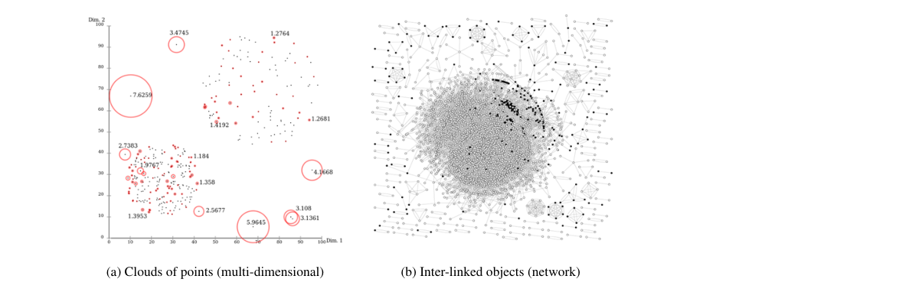
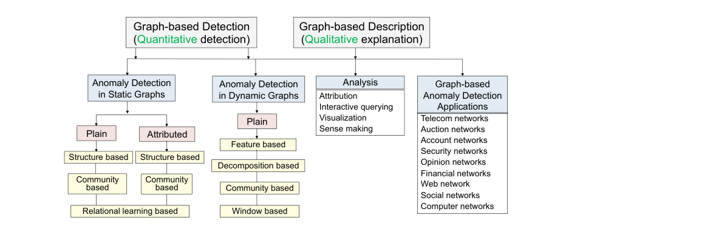
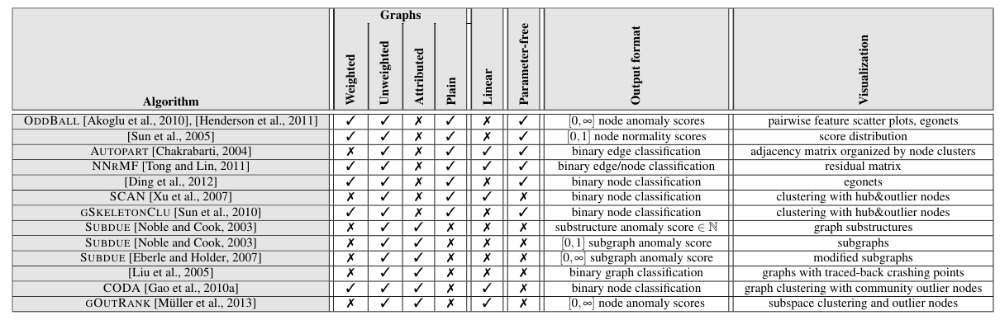
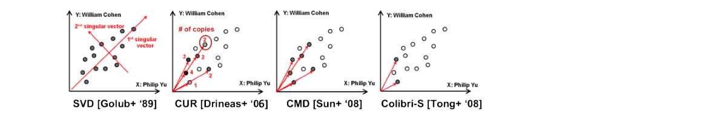
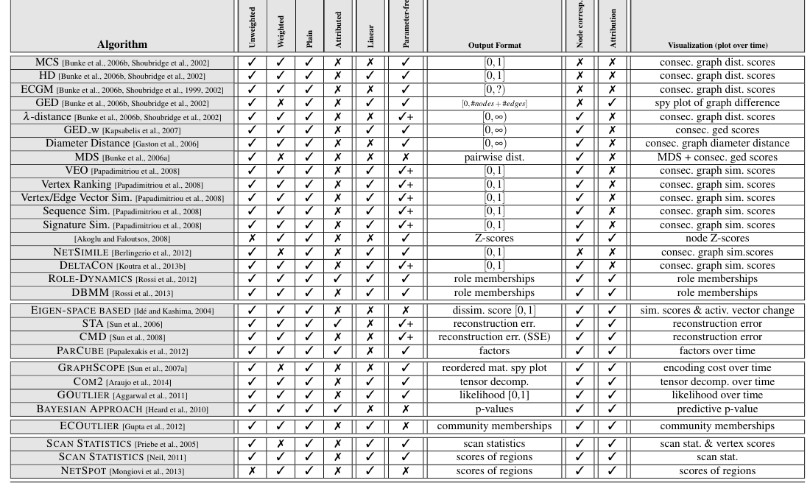
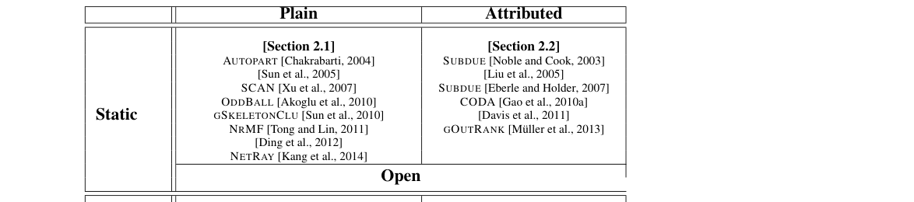
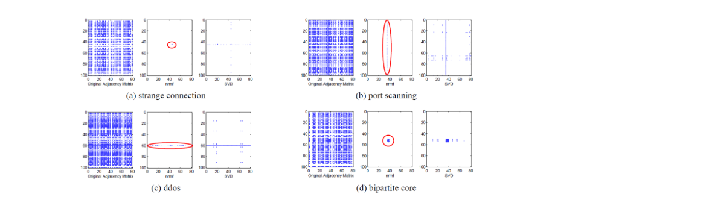
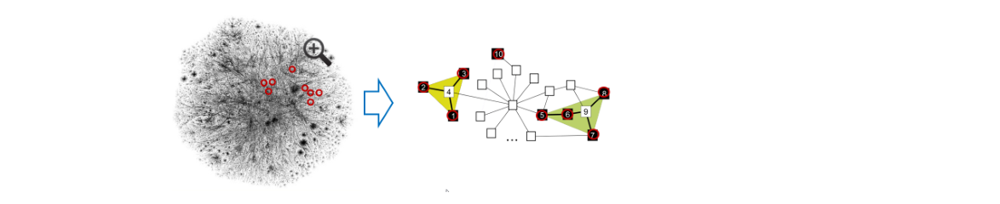

# 그래프 기반 이상 탐지 및 설명: 개관

> **원문 제목:** Graph-based Anomaly Detection and Description: A Survey  
> **저자:** Leman Akoglu · Hanghang Tong · Danai Koutra  
> **게재 정보:** Data Mining and Knowledge Discovery, Vol. 29, 2015, pp. 626-688  
> **DOI:** [https://doi.org/10.1007/s10618-014-0365-y](https://doi.org/10.1007/s10618-014-0365-y)

> **번역 안내:** 본문과 부록은 문단 문맥을 기준으로 한국어로 옮겼습니다. 수식과 참고문헌은 정확성을 위해 원문 표기를 유지했습니다. 원문의 그림과 표는 개별 이미지로 잘라 해당 본문 위치에 바로 배치했습니다.

---

<!-- 원문 1쪽 -->

## 초록

보안, 금융, 의료, 법 집행 등의 분야에서 영향력이 큰 수많은 애플리케이션을 사용하면 데이터의 이상 징후를 탐지하는 것이 매우 중요한 작업입니다. 그래프 데이터가 보편화되면서 구조화되지 않은 다차원 점 집합에서 이상치와 이상치를 발견하기 위해 지난 몇 년 동안 수많은 기술이 개발되었지만 최근에는 구조화된 그래프 데이터에 대한 기술이 주목을 받고 있습니다. 그래프의 객체는 장거리 상관 관계를 가지므로 그래프 데이터의 이상 징후를 탐지하기 위한 새로운 기술 제품군이 개발되었습니다.

이 설문조사의 목적은 그래프로 표현된 데이터의 이상 징후 탐지를 위한 최첨단 방법에 대한 일반적이고 포괄적이며 구조화된 개요를 제공하는 것입니다. 주요 기여로 우리는 비지도 대 (반)지도 접근 방식, 정적 그래프와 동적 그래프, 속성 그래프와 일반 그래프 등 다양한 설정으로 분류된 알고리즘에 대한 일반적인 프레임워크를 제공합니다. 본 연구에서는 방법의 효율성, 확장성, 일반성 및 견고성 측면을 강조합니다. 또한 이상 징후의 중요성을 강조하고 추가 분석 및 이해를 위해 감지된 이상 현상의 근본 원인 또는 '이유'를 쉽게 찾아내는 주요 기술을 강조합니다. 마지막으로 금융, 경매, 컴퓨터 트래픽, 소셜 네트워크 등 다양한 영역에서 그래프 기반 이상 탐지를 실제로 적용하는 방법을 제시합니다. 본 연구에서는 해당 분야의 개방형 이론 및 실제 과제에 대한 토론으로 설문 조사를 마무리합니다.

Leman Akoglu Stony Brook University, Stony Brook, NY 11794 컴퓨터 공학과. 전화: +1-631-632-9801, 팩스: +1-631-632-2303. 이메일: leman@cs.stonybrook.edu Hanghang Tong 뉴욕시립대학교 시립대학 컴퓨터과학과, 뉴욕주 뉴욕 10031 USA. 이메일: tong@cs.ccny.cuny.edu Danai Koutra 컴퓨터 과학부, Carnegie Mellon University, Pittsburgh, PA 15217 USA. 이메일: danai@cs.cmu.edu arXiv:1404.4679v2 [cs.SI] 28 4월 2014

<!-- 원문 2쪽 -->

## 핵심어

이상탐지·그래프 마이닝·네트워크 이상치 탐지, 이벤트 감지, 변경 감지, 사기 감지, 이상 설명, 시각적 분석

## 1 서론

크고 복잡한 데이터셋를 분석할 때 데이터에서 눈에 띄는 것이 무엇인지 아는 것이 일반적인 구조를 배우는 것보다 적어도, 또는 훨씬 더 중요하고 흥미롭습니다. 데이터셋에서 드물게 발생하는 현상을 발견하는 것과 관련된 데이터 마이닝 분야를 이상 탐지라고 합니다. 이 문제 영역에는 보안, 금융, 의료, 법 집행 등 여러 분야에 영향력이 큰 수많은 응용 프로그램이 있습니다.

예를 들어 네트워크 침입 또는 네트워크 장애 감지[Ding 외, 2012, Id'e and Kashima, 2004, Sun 외, 2008], 신용 카드 사기 감지[Bolton and Hand, 2001], 전화 카드 및 통신 사기 감지[Cortes 외, 2002, Taniguchi et al., 1998], 자동차 보험 사기[Phua et al., 2004], 건강 보험 청구 오류[Kumar et al., 2010], 회계 비효율성[McGlohon et al., 2009], 이메일 및 웹 스팸[Castillo et al., 2007], 의견 사기 및 리뷰 스팸[Ott et al., 2012], 경매 사기[Pandit et al., 2007], 탈세[Abe et al., 2010, Wu et al., 2012], 고객 활동 모니터링 및 사용자 프로파일링[Fawcett and Provost, 1996, 1999], 클릭 사기[Jansen, 2008, Kshetri, 2010], 증권 사기[Neville et al., 2005], 악성 화물 운송[Das and Schneider, 2007, Eberle and 홀더, 2007] 악성코드/스파이웨어 탐지[Invernizzi and Comparetti, 2012, Ma et al., 2009, Provos et al., 2007], 허위 광고[Lee et al., 2010], 데이터 센터 모니터링[Li et al., 2011b], 내부자 위협[Eberle and Hold, 2009], 이미지/비디오 감시 [Damnjanovic et al., 2008, Krausz 및 Herpers, 2010] 및 기타 다수.

의심스러운 행동을 밝혀내는 것 외에도 이상 탐지는 의료 진단에 중요한 적용을 통해 의료 영역에서 희귀 질병 발생이나 부작용과 같은 희귀한 사건을 발견하는 데 필수적입니다. "한 사람의 신호는 다른 사람의 노이즈"이므로 이상 탐지의 또 다른 응용 분야는 데이터 정리입니다. 즉, 보다 정확한 데이터 모델을 학습하기 위한 전처리 단계로서 데이터에서 잘못된 값이나 노이즈를 제거하는 것입니다.

### 1.1 특이치 대 그래프 이상치

이상 탐지 문제를 해결하기 위해 지난 수십 년 동안 특히 다차원 데이터 포인트의 구조화되지 않은 컬렉션에서 이상치와 이상치를 찾아내기 위한 많은 기술이 개발되었습니다. 반면, 데이터 객체는 항상 다차원 공간에 독립적으로 존재하는 점으로 취급될 수는 없습니다. 대조적으로, 이들은 이상 탐지 프로세스 중에 설명되어야 하는 상호 의존성을 나타낼 수 있습니다(그림 1 참조). 실제로 물리학, 생물학, 사회과학, 정보 시스템 등 광범위한 분야의 데이터 인스턴스는 본질적으로 서로 관련되어 있습니다. 그래프는 상호 의존적인 데이터 개체 간의 이러한 장거리 상관 관계를 효과적으로 캡처하기 위한 강력한 메커니즘을 제공합니다.

예시를 들자면, 리뷰어-제품 리뷰 그래프 데이터에서 리뷰어가 어떤 제품에 어떤 평점을 주었는지에 따라 리뷰어의 사기 정도가 달라집니다.

<!-- 원문 3쪽 -->



**그림 1 (a) 포인트 기반 이상치 탐지 vs. (b) 그래프 기반 이상치 탐지.**

다른 리뷰어가 동일한 제품을 어떻게 평가했는지, 평가가 얼마나 신뢰할 수 있는지, 이는 다시 평가한 다른 제품에 따라 달라집니다. 볼 수 있듯이 실제 데이터셋의 이러한 장거리 상관 관계로 인해 그래프 데이터의 이상을 감지하는 것은 다차원 특징 공간에 있는 외곽 지점을 감지하는 작업과 상당히 다른 작업입니다. 이에 따라 최근 연구자들은 구조화된 그래프 데이터에서 이상 징후를 탐지하는 방법에 대한 연구를 강화하고 있습니다.

왜 그래프인가? 본 연구에서는 이상 탐지에 대한 그래프 기반 접근 방식이 중요하고 필요한 네 가지 주요 이유를 강조합니다.

## – 데이터의 상호의존적 성격: 위에서 간략하게 언급했듯이 데이터 객체는

종종 서로 관련되어 있으며 종속성을 나타냅니다. 실제로 대부분의 관계형 데이터는 상호 의존적인 것으로 간주될 수 있으며, 이는 변칙을 찾는 데 관련 개체를 설명해야 합니다. 더욱이 이러한 유형의 데이터세트는 먹이그물, 단백질-단백질 상호작용(PPI) 네트워크, 테러리스트 네트워크, 이메일 및 전화 통화 네트워크, 블로그 네트워크, 소매 네트워크, 소셜 네트워크 등의 생물학적 데이터를 포함하여 풍부합니다. – 강력한 표현: 그래프는 관련 개체 간의 링크(또는 가장자리)를 도입하여 상호 종속성을 자연스럽게 표현합니다. 이러한 관련 개체 사이에 있는 여러 경로는 장거리 상관 관계를 효과적으로 포착합니다. 또한 그래프 표현을 통해 노드 및 에지 속성/유형을 통합할 수 있는 풍부한 데이터셋를 쉽게 표현할 수 있습니다. – 문제 영역의 관계형 특성: 변칙의 특성은 관계형으로 나타날 수 있습니다. 예를 들어 사기 분야에서는 두 가지 유형의 시나리오를 상상할 수 있습니다. (1) 입소문을 통해 퍼지는 기회주의적 사기(사기 행위를 하면 지인도 그렇게 할 가능성이 높습니다)와 관련 주체의 긴밀한 협력에 의해 발생하는 (2) 조직적 사기입니다. 이 두 시나리오 모두 이상 현상의 관계형 처리를 가리킵니다. 성능 모니터링 영역에서 또 다른 예를 들 수 있습니다. 여기서는 시스템 오류로 인해 해당 시스템에 종속된 시스템의 오작동이 발생할 수 있습니다. 마찬가지로, 기계의 고장은 기계와 가까운 공간에 있는 기계의 다른 고장 가능성을 나타내는 좋은 지표가 될 수 있습니다(예: 창고의 특정 지역의 과도한 습도 증가로 인해). – 강력한 기계: 마지막으로 그래프가 보다 적대적으로 강력한 도구 역할을 한다고 주장할 수 있습니다. 예를 들어 사기 탐지 시스템에서는 로그인 시간 및 위치(예: IP 주소)와 같은 행동 단서가 고급 사기꾼에 의해 쉽게 변경되거나 위조될 수 있습니다. 반면, 사기꾼은 자신이 운영하고 있는 전체 네트워크(예: 송금, 통신, 이메일, 리뷰 네트워크)에 대한 전체적인 시각을 가질 수 없다고 주장하는 것이 합리적일 수 있습니다. 따라서 사기꾼이 전체 특성 구조와 동적 운영을 알지 못한 채 이 네트워크에 최대한 잘 적응하는 것은 더 어려울 것입니다.

<!-- 원문 4쪽 -->

### 1.2 도전과제

먼저 관심 있는 문제와 관련된 매우 즉각적인 문제에 대해 논의합니다. 이는 이상 탐지 문제에 대한 고유한 정의가 존재하지 않는다는 사실에서 비롯됩니다. 그 이유는 이상치 또는 특이치의 일반적인 정의가 모호하기 때문입니다. 정의는 주어진 상황이나 적용에서만 의미가 있습니다. 이상치에 대한 최초의 정의는 1980로 거슬러 올라가며 Douglas M. Hawkins [Hawkins, 1980]가 제공합니다.

정의 1 (Hawkins의 이상값 정의, 1980) "이상값은 다른 관측값과 너무 많이 달라서 다른 메커니즘에 의해 생성되었다는 의혹을 불러일으키는 관측값입니다." 알 수 있듯이 위의 정의는 매우 일반적이므로 탐지 문제를 개방형으로 만듭니다. 결과적으로 이상 탐지 문제는 다양한 맥락에서 다양한 방식으로 정의되어 왔습니다. 즉, 문제는 종종 특정 애플리케이션 도메인에 맞게 조정된 많은 정의를 가지며 이상값, 이상, 발생, 이벤트, 변경, 사기, 탐지 등과 같은 다양한 이름을 나타냅니다. 데이터 정리와 같은 일부 애플리케이션에서는 이상값을 노이즈라고도 합니다. 즉, "한 사람의 신호는 다른 사람의 노이즈입니다." 그럼에도 불구하고 이상 탐지는 수많은 애플리케이션이 있는 데이터 마이닝에서 가장 명백한 문제 중 하나이며, 이상 탐지 분야 자체가 잘 확립되어 있습니다.

위에 주어진 Hawkins의 이상값에 대한 일반적인 정의에 따라 그래프 이상 탐지 문제에 대한 일반적인 정의를 다음과 같이 제공합니다.

## 정의 2 (일반 그래프 이상 탐지 문제)

(일반/속성, 정적/동적) 그래프 데이터베이스가 주어지면 드물고 그래프에 있는 대부분의 참조 개체와 크게 다른 그래프 개체(노드/가장자리/하위 구조)를 찾습니다.

실제적인 목적을 위해 희귀성/가능성/이상점 점수가 사용자 정의 또는 추정 임계값을 초과하는 경우 기록/포인트/그래프 개체는 변칙적인 것으로 표시됩니다. 즉, 이상 현상은 드물거나(예: 범주형 속성 값의 드문 조합), 고립되거나(예: n차원 공간에서 멀리 떨어진 지점) 및/또는 놀라운(예: 정신/통계 모델에 잘 맞지 않거나 최소 설명 길이 원칙[Rissanen, 1999]에 따라 설명하기에는 너무 많은 비트가 필요한 데이터 인스턴스) 데이터 개체 또는 개체 그룹으로 처리됩니다.

<!-- 원문 5쪽 -->

다음으로, 이상 탐지 및 속성과 관련된 과제에 대해 논의합니다. 이는 (1) 데이터 관련 과제와 (2) 문제 관련 과제의 두 가지로 그룹화될 수 있습니다. 또한 그래프 기반 이상 탐지와 관련된 문제를 구체적으로 강조합니다.

데이터 관련 과제: 간단히 말해서 데이터와 관련된 과제는 빅 데이터 작업의 과제입니다. 즉, 볼륨, 속도 및 다양한 대규모 스트리밍 및 복잡한 데이터셋입니다. 동일한 문제가 그래프 데이터에도 일반화됩니다.

규모와 역동성: 기술의 발전으로 인해 매우 큰 데이터셋를 수집하고 분석하는 것이 과거보다 훨씬 쉬워졌습니다. 현재 Facebook(그래프)은 10억 명 이상의 사용자1(즉, 노드)로 구성되어 있고, 웹(그래프)에는 40 billion 이상의 페이지2가 포함되어 있으며, 6 billion 이상의 사용자가 휴대전화3를 소유하고 있어 통신 네트워크를 수십억 규모의 그래프로 만듭니다. 실제 데이터의 크기는 테라바이트에서 페타바이트 단위일 뿐만 아니라 데이터가 도착하는 속도도 빠릅니다. Facebook 사용자는 수십억 개의 개체(예: 게시물, 이미지/동영상 업로드 등)를 생성하고, 매일 수십억 건의 신용 카드 거래가 수행되며, 웹 사용자의 클릭 흔적이 매일 수십억 건 생성됩니다. 이러한 종류의 데이터 생성은 스트리밍 그래프 데이터로 생각할 수 있습니다.

복잡성: (그래프) 데이터 크기와 역동성 외에도 데이터세트의 내용은 풍부하고 복잡합니다. 예를 들어 사용자 인구통계, 관심사, 역할은 물론 다양한 유형의 관계도 포함됩니다. 따라서 이러한 추가 정보 소스를 통합하면 그래프 표현이 노드와 에지를 입력할 수 있고 이와 관련된 긴 속성 목록을 갖게 되는 복잡한 표현이 됩니다.

결과적으로 매우 큰 그래프로 확장할 수 있고, 시간이 지남에 따라 그래프가 변경될 때 추정치를 업데이트할 수 있으며, 사용 가능하고 유용한 모든 데이터 소스를 효과적으로 통합할 수 있는 방법은 그래프 기반 이상 탐지에 필수적입니다.

문제별 과제: 이상 탐지 작업 자체와 관련하여 추가적인 과제가 발생합니다.

레이블 부족 및 노이즈: 한 가지 주요 과제는 데이터가 클래스 레이블 없이 제공되는 경우가 많다는 것입니다. 즉, 데이터 인스턴스가 변칙적이거나 비변칙적이라는 사실이 존재하지 않는다는 것입니다. 중요한 것은 데이터의 크기를 고려할 때 수동 라벨링 작업이 매우 어렵다는 것입니다. 설상가상으로, 무한한 인력을 사용할 수 있음에도 불구하고 특정 라벨링 작업의 복잡성으로 인해 라벨은 주석 작성자에 따라 시끄럽고 품질이 다양할 것으로 예상됩니다. 노벨상 수상자인 다니엘 카너먼(Daniel Kahneman)에 따르면 "인간은 복잡한 정보에 대해 요약 판단을 내리는 데 있어서 수정 불가능할 정도로 일관성이 없습니다." Kahneman [2011]입니다. 놀랍게도 그들은 동일한 정보를 두 번 평가하라는 요청을 받으면 종종 다른 대답을 합니다. 예를 들어, 흉부 엑스레이를 정상 및 비정상으로 평가하는 숙련된 방사선 전문의

```text
1 http://newsroom.fb.com/Key-Facts
2 http://www.worldwidewebsize.com/
3 http://huff.to/Rc2vbU
```

<!-- 원문 6쪽 -->

정상적인 사람들은 서로 다른 경우에 동일한 사진을 볼 때 20%의 시간 동안 모순되는 것으로 밝혀졌습니다.

레이블을 얻는 데 어려움이 있기 때문에 지도형 기계 학습 알고리즘은 이상 탐지 작업에 덜 매력적입니다. 인간은 단지 텍스트를 보는 것만으로 리뷰를 가짜인지 아닌지 분류하는 데 있어 기껏해야 무작위로 좋은 결과를 얻을 수 있지만[Ott et al., 2011] 잠재적으로 리뷰 작성자와 같은 다른 관련 정보를 분석함으로써 더 나은 결과를 얻을 수 있다는 것이 나타났습니다. 마찬가지로 단일 거래는 이전 거래 내역과 관련해서만 비정상으로 처리될 수 있습니다. 이는 휴먼 라벨을 얻으려면 추가 리소스와 정보가 필요하다는 것을 의미하며, 이로 인해 이를 획득하는 데 비용이 많이 들고 휴먼 애노테이터가 분류하는 데 더 많은 시간과 노력이 소요됩니다. 게다가 실제 레이블, 즉 실제 데이터가 부족하여 이상 탐지 기술을 평가하는 것도 어려워집니다.

클래스 불균형 및 비대칭 오류: 두 번째 문제는 데이터의 불균형 특성으로 인해 발생합니다. 변칙은 드물기 때문에 데이터의 아주 작은 부분만이 비정상일 것으로 예상됩니다. 더욱이, 좋은 데이터 인스턴스와 나쁜 인스턴스의 레이블을 잘못 지정하는 비용은 애플리케이션에 따라 달라질 수 있으며 사전에 추정하기 어려울 수도 있습니다. 예를 들어, 암 환자를 건강하다고 잘못 표시하면 치명적인 결과를 초래할 수 있고, 정직한 고객을 사기꾼으로 잘못 표시하면 고객 충실도가 상실될 수 있습니다. 학습 기반 기술을 사용하려면 클래스 불균형 및 비대칭 오류 비용과 관련된 문제를 신중하게 고려해야 합니다.

새로운 변칙: 세 번째 요점은 특히 사기 탐지 영역에서 문제 설정의 손목 싸움 특성입니다. 사기꾼은 탐지 알고리즘의 작동 방식을 더 많이 이해할수록 탐지를 우회하고 표준에 맞추는 방식으로 기술을 더 많이 변경합니다. 결과적으로, 알고리즘은 시간이 지남에 따라 데이터가 변경되고 증가하는 데 적응할 수 있어야 할 뿐만 아니라 적에 직면한 새로운 이상 현상에도 적응하고 이를 감지할 수 있어야 합니다.

이상 현상을 "설명": 탐지 후 단계에서 이상 현상을 설명하는 데 추가적인 과제가 있습니다. 여기에는 이상 현상의 근본 원인을 찾아내고, 이상 현상의 '이유'와 '어떻게'에 대한 일관된 이야기를 전달하고, 추가 분석을 위해 결과를 사용자 친화적인 형식으로 제시하는 작업이 포함됩니다. 대부분의 기존 탐지 기술은 이상 현상을 탐지하는 데 합리적으로 좋은 작업을 수행하지만 이러한 설명이나 속성 단계를 완전히 생략하여 인간이 결과를 이해하기 어렵게 만듭니다.

그래프 관련 과제: 이상 탐지 문제와 관련된 위의 모든 과제는 그래프 데이터로 일반화됩니다. 반면, 그래프 기반 이상 탐지에는 추가적인 과제도 있습니다.

상호 의존적 개체: 첫째, 데이터의 관계형 특성으로 인해 그래프 개체의 변칙성을 정량화하기가 어렵습니다. 기존의 이상치 탐지에서는 개체나 데이터 포인트가 서로 독립적이고 동일하게 분포(i.i.d.)된 것으로 처리되는 반면, 그래프 데이터의 개체는 장거리 상관 관계를 갖습니다. 따라서 변칙성의 "확산 활성화" 또는 "연좌에 의한 죄책감"을 주의 깊게 설명할 필요가 있습니다.

다양한 정의: 둘째, 그래프의 풍부한 표현을 고려할 때 그래프의 이상치 정의는 기존 이상치 탐지보다 훨씬 더 다양합니다. 예를 들어, 그래프 하위 구조와 관련된 새로운 유형의 변칙은 거래 네트워크의 자금세탁 고리와 같은 많은 응용 프로그램에서 관심을 끌고 있습니다.

<!-- 원문 7쪽 -->

검색 공간의 크기: 그래프 하위 구조와 같은 보다 복잡한 이상과 관련된 주요 과제는 그래프 검색과 관련된 많은 그래프 이론적 문제에서와 같이 검색 공간이 크다는 것입니다. 가능한 하위 구조의 열거는 조합적이므로 이상 현상을 찾는 문제가 훨씬 더 어려워집니다. 이 검색 공간은 가능성이 그래프 구조와 속성 공간 모두에 걸쳐 있기 때문에 그래프가 속성화될 때 더욱 확대됩니다. 따라서 그래프 기반 이상 탐지 알고리즘은 효율성뿐만 아니라 효율성과 확장성을 고려하여 설계되어야 합니다.

### 1.3 이전 설문조사 및 기여

다차원 데이터 인스턴스의 지점에 초점을 맞춘 일반적으로 이상치 및 이상치 탐지에 대한 매우 포괄적인 조사 기사가 있습니다. 특히, [Chandola et al., 2009]는 이상치 검출 기법을 다루고, [Zimek et al., 2012]는 고차원의 이상치 검출에 초점을 맞추고, [Schubert et al., 2012]는 국소 이상치 검출 기법을 다루고 있습니다. 또한 이상 현상, 이벤트 및 변경 감지를 다루는 조사 및 특별 이슈 저널 기사에는 [Chandola et al., 2012, Margineantu et al., 2010, Radke et al., 2005]가 포함됩니다. 마지막으로, 광범위한 애플리케이션 도메인으로 인해 사기 탐지는 많은 설문 조사를 유치했습니다[Edge and Sampaio, 2009, Flegel et al., 2010, Phua et al., 2010]. 그러나 이전 설문 조사 중 어느 것도 대규모 그래프 데이터셋에 직면했을 때 특정 맥락에서 이상 탐지 문제를 논의하지 않았습니다. 또한 그들은 그래프 기반 탐지 기술에 적어도 직접적으로 초점을 맞추지 않습니다. 따라서 본 설문조사에서는 그래프로 표현된 데이터에서 이상 징후, 이벤트 및 사기 탐지를 위한 최첨단 기술에 대한 포괄적이고 구조화된 개요를 제공하는 것을 목표로 합니다. 따라서 우리의 초점은 이전 설문조사와 눈에 띄게 다르며, 이전 설문조사를 보완합니다. 구체적으로 우리가 기여한 내용은 다음과 같습니다.

1. 이상치 및 이상치 탐지에 대한 이전 조사와 달리 그래프 기반 기술을 사용하여 (대형) 그래프 데이터셋의 이상치 탐지에 중점을 둡니다. 2. 본 연구에서는 그래프 구조를 활용하는 비지도 기술과 관계형 학습을 사용하는 (반)지도 방법을 포괄적으로 탐구합니다. 3. 본 연구에서는 이상(이상, 이벤트, 사기) 탐지 방법을 통합 렌즈 아래에 놓고 연결, 장단점(예: 확장성, 견고성, 일반성 등) 및 다양한 실제 작업에 대한 적용을 지적합니다. 4. 이상 징후 탐지 외에도 탐지된 이상 징후를 설명하는 것의 중요성을 강조하고 탐지 후 탐색 및 감지를 위한 분석 도구 및 기법에 대한 조사를 제공합니다.

### 1.4 개요 및 조직

본 연구에서는 설문조사를 네 가지 주요 부분으로 나누어 제시합니다. 우리가 다루는 일반적인 개요와 주제 목록은 다음과 같습니다.

<!-- 원문 8쪽 -->

### I. 정적 그래프에서 이상 탐지(2 섹션)

(a) 일반(레이블이 지정되지 않은) 그래프의 변칙(b) 특성이 있는(노드/에지 레이블이 지정된) 그래프의 변칙 II. 동적 그래프의 이상 탐지(3 섹션) (a) 특징 기반 이벤트 (b) 분해 기반 이벤트

## (c) 커뮤니티 또는 클러스터링 기반 이벤트 (d) 창 기반 이벤트 III. 그래프 기반 이상 설명(4 섹션)

(a) 해석하기 쉬운 그래프 이상 탐지 (b) 인터랙티브 그래프 쿼리 및 센스메이킹 IV. 실제 애플리케이션의 그래프 기반 이상 탐지(섹션 5) (a) 통신 네트워크의 이상 (f) 의견 네트워크의 이상 (b) 경매 네트워크의 이상 (g) 웹 네트워크의 이상 (c) 계정 네트워크의 이상 (h) 소셜 네트워크의 이상 (d) 보안 네트워크의 이상 (i) 컴퓨터 네트워크의 이상 (e) 금융 네트워크의 이상 첫 번째 부분은 이상에 초점을 맞춥니다. 정적 그래프 데이터에 대한 감지 방법을 다루고 있으며 레이블이 지정되지 않은(일반) 그래프와 레이블이 지정된(속성이 있는) 그래프 모두에 대해 다룹니다. 두 번째 부분은 편집 거리와 연결 구조를 기반으로 시변 또는 동적 그래프 데이터에 대한 변경 또는 이벤트 감지 접근 방식에 중점을 둡니다. 처음 두 섹션의 개요와 미해결 문제 및 과제가 있는 영역이 표 1에 나와 있습니다. 세 번째 부분에서는 감지된 이상 현상의 근본 원인을 밝히고 이상 현상을 사용자에게 친숙한 형식으로 제시하는 데 있어 이상 현상 속성의 중요성을 강조합니다. 본 연구에서는 감지라는 중요한 작업을 위해 감지된 이상 징후의 사후 분석을 용이하게 할 수 있는 최첨단 도구를 제공합니다. 마지막으로 네 번째이자 마지막 부분에서는 실제 그래프 기반 이상 탐지 기술을 시연하며 다양한 도메인의 여러 실제 응용 프로그램에 대해 논의합니다.

**표 1 섹션 2 및 섹션 3의 그래프 기반 기술 분류.**


분류법의 개요를 보여주는 그림 2에 설문 조사의 일반적인 개요가 나와 있습니다. 처음 두 부분, 즉 정적 및 동적 그래프 이상에서는 관계형 분류에 기반한 (반)지도 방식뿐만 아니라 비지도 기법에 중점을 둡니다. 세 번째 부분 후반부에서는 발견된 이상 현상의 의미를 파악하기 위한 정성적 분석 기술에 중점을 둡니다. 마지막으로 4부에서는 금융, 보안, 회계 등을 포함한 광범위한 네트워크에서 그래프 기반 이상 탐지를 적용하는 긴 목록을 제시합니다.

<!-- 원문 9쪽 -->



**그림 2 그래프 이상 탐지: 조사 개요.**

## 2 정적 그래프의 이상 탐지

이 섹션에서는 그래프의 정적 스냅샷에서 이상 탐지에 대해 설명합니다. 즉, 여기서 주요 작업은 전체 그래프 구조에서 변칙적인 네트워크 개체(예: 노드, 에지, 하위 그래프)를 찾아내는 것입니다. 본 연구에서는 데이터 포인트의 정적 클라우드에서 이상치 탐지 기술에 대한 매우 간략한 개요부터 시작하고 추가 읽기를 위한 포인터를 제공합니다. 다음으로 정적 그래프에 대한 이상 탐지 기법을 조사한다.

## 개요: 데이터 포인트 클라우드의 이상값

이상치 탐지는 데이터 포인트의 (고차원) 특징 공간에서 외부 포인트를 찾아내는 문제를 다룹니다. 직접적인 관련은 없지만 이상값 감지 기술은 그래프 기반 이상 탐지에 사용됩니다(예: 이 섹션에서 설명하는 그래프 특징 추출 단계 이후). 따라서 그래프 이상을 발견하기 위한 일반적인 이상치 탐지 방법을 아는 것이 유익합니다.

이상치 탐지에서 일부 방법은 데이터 포인트의 이진 0/1 분류(예: 이상치 대 비이상치)를 제공하는 반면, 대부분의 방법은 객체의 이상치 수준을 정량화하고 그에 따라 객체의 순위를 매길 수 있는 이상치 점수를 할당하려고 시도합니다. 그림은 그림 1(a)를 참조하세요.

다차원 이상값을 탐지하는 방법에는 여러 가지가 있습니다. 기술은 밀도 기반[Breunig et al., 2000, Papadimitriou et al., 2003], 거리 기반[Aggarwal and Yu, 2001, Chaudhary et al., 2002, Ghoting et al., 2008, Knorr and Ng, 1998, Orair et al., 2010, Wang et al., 2011b], 깊이 기반[Ruts and Rousseeuw, 1996], 분포 기반[Saltenis, 2004], 클러스터링 기반[He et al., 2003, Lieto et al., 2008, Miller and Browning, 2003, Wang et al., 2012c], 분류 기반 [Abe et al., 2006, Hempstalk et al., 2008, Janssens et al., 2009], 정보 이론 기반 [Ando, 2007, B¨ohm et al., 2009, Smets and Vreeken, 2011], 스펙트럼 기반[Liu et al., 2013], 부분공간 기반[Keller et al., 2012, Kriegel et al., 2012, M¨uller et al., 2010, 2012] 기술. 또한 Janssens et al.의 One-class 분류 기반 접근 방식 외에도 범주형 특성[Akoglu et al., 2012c, Das and Schneider, 2007, Smets and Vreeken, 2011] 또는 두 유형의 특성을 혼합한 특성[Otey et al., 2006]을 사용할 수 있는 이상치 탐지 기술이 있습니다. 알. [2009], Pauwels 및 Ambekar [2011].

<!-- 원문 10쪽 -->

본 연구에서는 독자들에게 더 많은 논의와 세부 사항을 위한 이상치 탐지에 대한 포괄적인 설문 조사를 참조할 것을 권장합니다. [Chandola et al., 2012] 뿐만 아니라 이러한 기술에 대한 포괄적인 세부 사항이 포함된 이상치 분석에 대한 최근 저서 [Aggarwal, 2013]도 참조하십시오.

## 정적 그래프 데이터의 이상 현상

```text
…
```

12 두 가지 설정, 즉 1) 일반 그래프와 2) 속성 그래프에서 그래프 데이터의 이상 탐지를 연구합니다. 속성 그래프는 노드 및/또는 간선에 연관된 특성이 있는 그래프입니다. 예를 들어 소셜 네트워크에서 사용자는 다양한 관심사를 갖고 있고, 서로 다른 위치에서 일하고 있으며, 다양한 교육 수준을 갖고 있을 수 있으며, 관계형 링크는 다양한 강도, 유형, 빈도 등을 가질 수 있습니다. 반면에 일반 그래프는 노드와 해당 노드 간의 간선, 즉 그래프 구조로만 구성됩니다.

그래프 이상에 대한 구체적인 정의는 다양할 수 있지만 정적 그래프의 이상 탐지 문제에 대한 일반적인 정의는 다음과 같이 설명할 수 있습니다.

## 정의 3(정적 그래프 이상 탐지 문제)

(일반 또는 속성이 있는) 그래프 데이터베이스의 스냅샷이 주어지면 그래프에서 관찰된 패턴에서 "적고 다르거나" 크게 벗어나는 노드 및/또는 가장자리 및/또는 하위 구조를 찾습니다.

### 2.1 정적 일반 그래프의 이상 현상

주어진 일반 그래프에 대한 유일한 정보는 구조입니다. 따라서 이 범주의 이상 탐지 방법은 그래프의 구조를 활용하여 패턴을 찾고 이상을 찾아냅니다. 이러한 구조적 패턴은 구조 기반 패턴과 커뮤니티 기반 패턴이라는 두 가지 범주로 더 분류될 수 있습니다.

#### 2.1.1 구조 기반 방법

본 연구에서는 구조 기반 접근 방식을 특성 기반과 근접 기반의 두 가지로 구성합니다. 첫 번째 그룹은 그래프 구조를 활용하여 노드 차수 및 하위 그래프 중심성과 같은 그래프 중심 특성을 추출하고, 두 번째 그룹은 그래프 구조를 사용하여 그래프에서 노드의 근접성을 정량화하여 연관성을 식별합니다.

## 특성 기반 접근 방식

주요 아이디어: 이 접근 방식 그룹은 그래프 표현을 사용하여 구성된 특징 공간에서 이상치 탐지를 위해 추가 정보 소스에서 추출된 다른 특징과 함께 때때로 사용되는 구조적 그래프 중심 특징을 추출합니다. 본질적으로 이러한 방법은 그래프 이상 탐지 문제를 잘 알려지고 이해되는 이상치 탐지 문제로 변환합니다.

<!-- 원문 11쪽 -->

그래프 중심 특성: 주어진 그래프 구조를 사용하여 노드, 쌍결합, 삼중결합, 자아넷, 공동체 및 글로벌 그래프 구조와 관련된 다양한 측정값을 계산할 수 있습니다[Henderson et al., 2010]. 이러한 특성은 섹션 5에서 자세히 논의할 웹 스팸[Becchetti et al., 2006] 및 네트워크 침입[Ding et al., 2012]을 포함한 여러 이상 탐지 애플리케이션에 사용되었습니다.

노드 수준 특성에는 (in/out) 정도, 고유 벡터 [Bonacich and Lloyd, 2001], 근접성 [Noh and Rieger, 2004], 사이의 중심성 [Freeman, 1977] 중심성, 로컬 클러스터링 계수 [Watts and Strogatz, 1998], 반경과 같은 중심성 측정값이 포함됩니다. [Kang et al., 2011c], 정도 분류성, 그리고 가장 최근에는 역할 [Henderson et al., 2012]. 이중 특성에는 상호성[Akoglu et al., 2012a], 경계 간, 공통 이웃 수 및 기타 여러 로컬 네트워크 중첩 측정[Gupte 및 Eliassi-Rad, 2012, Liben-Nowell 및 Kleinberg, 2003]이 포함됩니다. [Akoglu et al., 2010]는 삼각형 수, 총 중량, 주요 고유값 등과 같은 egonet 특성과 쌍별 상관 패턴을 소개합니다. [Henderson et al., 2011] 기존 특성을 재귀적으로 집계하여 가능한 그래프 기반 특성을 풍부하게 하고 확장합니다. 노드 그룹 수준 특성은 밀도, 모듈성[Newman, 2006] 및 컨덕턴스[Andersen et al., 2006]와 같은 소형화 측정으로 나열될 수 있습니다. 마지막으로 전역 측정값의 예로는 연결된 구성요소 수, 구성요소 크기 분포[Kang et al., 2010], 주요 고유값, 최소 스패닝 트리 가중치, 평균 노드 차수, 전역 클러스터링 계수 등이 있습니다.

접근법: ODDBALL이라는 특징 기반 이상 탐지 기술은 [Akoglu et al., 2010]에 의해 제안되었으며, 이는 egonet 기반 특징을 추출하고 그래프의 대부분의 egonet이 해당 특징과 관련하여 따르는 패턴을 찾는 것입니다. 따라서 이 방법은 관찰된 패턴을 따르지 않는 변칙적인 자아넷(따라서 변칙적인 노드)을 발견할 수 있습니다.

egonet은 노드 주변의 1 단계 이웃으로 정의됩니다. 노드, 직접 이웃 및 이러한 노드 간의 모든 연결을 포함합니다(예는 오른쪽 그림에 표시됨). 보다 공식적으로 egonet은 각 노드에 대해 유도된 1 단계 하위 그래프입니다. egonet이 주어지면 주요 질문이자 과제는 egonet 특성으로 추출할 수 있는 가능한 그래프 기반 측정값의 긴 목록이 있기 때문에 어떤 특성을 살펴봐야 하는지입니다. 이 논문은 광범위한 실제 그래프에서 패턴을 생성하는 것으로 관찰되고 (2) 계산이 빠르고 해석하기 쉬운 (2) 신중하게 선택된 특성 하위 집합(예: 삼각형 수, 모서리의 총 무게 등)을 제안합니다.

그런 다음 egonet 특성은 쌍으로 연구되고 강력하게 관련된 특성(예: 이웃 수 및 삼각형 수) 중에서 거듭제곱 법칙 형태의 여러 패턴이 관찰됩니다. 주어진 egonet의 경우 특정 패턴과의 편차는 관련 거듭제곱 법칙 분포에 대한 "거리"를 기반으로 계산됩니다. 그런 다음 각 egonet은 각 패턴과 관련하여 별도의 편차 또는 이상치 점수를 받습니다.

관찰된 다양한 패턴에서 노드가 받는 여러 점수는 최종 점수 또는 최종 순위를 얻기 위해 이를 결합하는 방법에 대한 질문을 제기합니다. 여러 연구[Gao and Tan, 2006, Lazarevic and Kumar, 2005]는 여러 특이점 점수를 통합하는 방법에 대한 솔루션을 제안했습니다. 이 문제는 Aggarwal [2012], Zimek et al.에서 논의된 바와 같이 이상치 앙상블에 대한 연구에서 해결되었습니다. [2014].

<!-- 원문 12쪽 -->

egonet 특징을 결합보다는 쌍으로 분석하면 몇 가지 장점이 있습니다. 첫째, 이는 사후 분석을 위해 2-d의 패턴과 이상값의 시각화를 용이하게 합니다. 둘째, 특징 공간의 낮은 차원성은 결과의 해석 가능성에 도움이 됩니다. 즉, 특정 패턴 또는 "법칙"으로부터의 편차를 기반으로 노드가 어떤 유형의 변칙에 속하는지 알 수 있습니다. 예를 들어, [Kang et al., 2014]에서 저자는 상관 플롯(쌍으로 구성된 노드 특징)과 다양한 특징에 대한 스파이 플롯 및 분포 플롯에 중점을 두어 10억 규모 그래프의 시각화를 위한 패키지를 제안합니다. 시각화 도구는 간단한 검사로도 이상값을 뚜렷하게 볼 수 있도록 세심하게 설계되었습니다.

[Henderson et al., 2011]의 이후 작업에서는 노드 기반("로컬") 및 egonet 기반(이웃) 특성을 재귀적으로 결합하여 특성 기반을 확장합니다. 재귀적 특성은 노드의 이웃 사이에서 기존 특성 값(재귀적 특성 포함)에 대해 계산된 일부 집계 값(예: 평균, 최소, 최대)으로 정의됩니다. 직관적으로 로컬 및 egonet 특성은 이웃 정보를 캡처하는 반면, 재귀 특성은 직접적인 이웃을 넘어 더 많은 "지역" 또는 행동 정보를 캡처할 수 있습니다. 그래프 크기에 선형적인 런타임 복잡성을 갖는 반복 절차는 재귀 특성을 계산하고 이동 중에도 상관 관계가 높은 특성을 정리하기 위해 문서에 자세히 설명되어 있습니다.

## 근접 기반 접근 방식

주요 아이디어: 이 기술 그룹은 그래프 구조를 활용하여 그래프에 있는 개체의 근접성을 측정합니다. 이러한 방법은 가까운 개체가 동일한 클래스(예: 악성/양성 또는 감염/건강)에 속할 가능성이 있는 것으로 간주되는 이러한 개체 간의 간단한 자기 상관을 캡처합니다.

접근법: 그래프에서 노드의 중요성을 측정하는 것은 가장 널리 연구된 그래프 문제 중 하나입니다. PageRank [Brin and Page, 1998]는 Random Walk를 기반으로 하는 가장 널리 사용되는 알고리즘 중 하나입니다. (비가중) 그래프의 랜덤 워크는 노드에서 노드로 무작위로 이동합니다. 현재 노드 u에 존재하는 경우 다음 단계의 랜덤 워크는 동일한 확률 1/du로 이웃 중 하나로 점프합니다. 여기서 du는 노드 u의 차수입니다. 그런 다음 그래프에서 무작위 보행의 고정 확률 분포를 고려하여 "중요도"에 따라 노드 순위를 매깁니다.

이 보행은 이웃 노드 사이의 점프 확률을 나타내는 항목인 전이 행렬이 확률론적, 비주기적, 환원 불가능한 경우 수렴하는 것으로 알려져 있습니다 [Feller, 1968]. 무방향 그래프에서 노드 u에서 랜덤 워크의 고정 확률은 해당 차수 du에 정비례하고 시작 노드와 독립적입니다. 유향 그래프에서는 한 노드에서 다른 노드로 이동할 확률이 0이 아니라는 비환원성 조건이 충족되지 않을 가능성이 높습니다(예: 싱크 노드와 여러 개의 강하게 연결된 구성 요소가 있는 경우). 이러한 문제를 해결하기 위해 무작위로 걷기를 다시 시작하는 것은 특정 확률 α ∈(0,1)(댐핑 팩터라고도 함)로 수행되며, 여기서 다시 시작 노드는 무작위로 선택됩니다.

<!-- 원문 13쪽 -->

Random Walk를 기반으로 하지만 특정 노드에 대한 재시작을 확장하는 널리 사용되는 그래프 근접성 측정은 Personalized PageRank(PPR) [Haveliwala, 2003]입니다. 재시작 노드 q와 매개변수 α가 주어지면 노드 q에서 시작하여 재시작과 함께 랜덤 워크를 고려합니다. 즉, 현재 노드 u에 존재할 때 모든 단계에서 동일한 확률(1 -α)/du로 이웃 중 하나를 선택하고 확률 α로 재시작 노드 q로 돌아갑니다. 재시작을 통한 랜덤 워크의 모든 노드 v에서의 고정 확률은 재시작 노드 q에 대한 v의 PPR 점수로 정의됩니다. 이 측정값의 보다 일반적인 버전은 재시작 노드의 Q 세트에 대해 주어질 수 있으며, 여기서 재시작 확률의 합은 α입니다. 이러한 유형의 PageRank 계산을 종종 편향된 PageRank라고 합니다. 확률의 고정 분포는 재시작 노드(들)에 대한 그래프의 각 노드의 근접성(또는 근접성)을 나타내며, 재시작 노드에 대한 가중치가 높고 짧고 높은 경로가 많은 노드의 경우 더 높습니다.

그래프에서 두 노드의 근접성을 정량화하는 또 다른 그래프 근접성 측정값은 SimRank[Jeh and Widom, 2002]이며, 이는 다른 개체와의 관계를 기반으로 그래프 개체가 발생하는 구조적 컨텍스트의 유사성을 계산합니다. 이는 두 노드에서 출발하는 두 명의 무작위 서퍼가 그래프에서 무작위로 "뒤로" 걸어가면서 얼마나 빨리 서로 만날 것으로 예상되는지를 측정하는 것으로 흔히 생각됩니다. SimRank의 여러 변형도 [Antonellis et al., 2008, Chen 및 Giles, 2013, Zhao et al., 2009]에 의해 제안되었습니다.

마지막으로, 많은 링크 예측 접근 방식은 본질적으로 그래프에서 노드 쌍의 유사성 또는 근접성을 수량화합니다. 다양한 계산 복잡성에 대한 여러 가지 측정 방법이 존재합니다. 간단한 것에는 두 노드의 공통 이웃의 정규화된 수인 Jaccard 근접성이 포함됩니다. 다른 것에는 총 경로 수 또는 노드 분리 경로가 포함됩니다. 약간 더 복잡한 Katz 측정값 Katz [1953]는 경로 길이에 반비례하여 가중치가 부여된 모든 경로를 계산합니다. 잘 문서화된 목록과 이들 측정값 및 기타 측정값에 대한 평가를 보려면 독자에게 Liben-Nowell 및 Kleinberg [2003]를 참조하십시오.

#### 2.1.2 커뮤니티 기반 방법

주요 아이디어: 그래프 이상 탐지를 위한 클러스터 또는 커뮤니티 기반 방법은 그래프에서 "가까운" 노드의 조밀하게 연결된 그룹과 커뮤니티 전반에 걸쳐 연결되는 지점 노드 및/또는 에지를 찾는 데 의존합니다. 실제로 이 설정에서 이상 현상의 정의는 하나의 특정 커뮤니티에 직접 속하지 않는 "브리지" 노드/에지를 찾는 것으로 생각할 수 있습니다.

접근법: 이분 그래프에서 이상 현상을 발견하기 위해 그래프에서 노드의 커뮤니티나 근접성을 활용하는 방법에는 [Sun et al., 2005]가 포함됩니다. 브리지 노드가 흥미로운 현상을 나타내는 이분 그래프로 여러 실제 데이터를 표현할 수 있습니다. 예를 들면 출판 네트워크: 저자와 다양한 연구 커뮤니티의 저자가 작성한 (비정상적인) 논문; P2P 네트워크: 사용자 대 (국경 간) 파일; 금융 거래 네트워크: 주식 대 (부문 간) 거래자; 고객-제품 네트워크: 사용자 대 ("국경 간") 제품.

[Sun et al., 2005]에서 다루는 두 가지 주요 문제는 (P1) 노드의 "이웃"이라고도 하는 특정 노드의 커뮤니티를 찾는 방법과 (P2) 브리지 노드가 되기 위해 해당 노드의 수준을 정량화하는 방법입니다. (P1)의 경우, 저자는 주어진 노드와 관련하여 모든 노드의 Random-Wal-with-Restart 기반 PPR(Personalized PageRank) 점수[Haveliwala, 2003]를 사용합니다. 여기서 높은 PPR 점수를 가진 노드는 노드의 이웃을 구성합니다. 유사한 라인에서 (P2)의 경우 주어진 노드의 모든 이웃 사이의 쌍별 PPR 점수는 노드의 소위 "정규성" 점수를 계산하기 위해 평균화하여 집계됩니다. 직관적으로 정규성 점수가 낮은 노드에는 서로 쌍별 근접성이 낮은 이웃이 있습니다. 이는 이웃이 서로 다른 별도의 커뮤니티에 있음을 의미하며, 이는 주어진 노드가 커뮤니티 간의 연결 노드와 유사하게 만듭니다.

<!-- 원문 14쪽 -->

AUTOPART [Chakrabarti, 2004]는 유사한 이웃을 가진 노드가 함께 클러스터링되고 어떤 구조에도 속하지 않는 에지가 이상(예: 클러스터 간 브리지 에지)을 구성한다는 개념을 기반으로 합니다. 마찬가지로, 여러 다른 커뮤니티에 대한 교차 연결이 많은 노드는 특정 클러스터에 속하지 않는 것으로 간주되므로 변칙을 구성합니다. 그래프에서 커뮤니티를 찾기 위해 알고리즘은 인접 행렬의 행과 열을 몇 개의 동종 블록(저밀도 또는 고밀도)으로 재구성합니다. 이러한 블록에는 그래프의 나머지 노드보다 더 조밀하게 연결된 노드를 포함하는 속성이 있습니다. 이것이 클러스터링의 기본 아이디어입니다. [Chakrabarti, 2004]는 행과 열을 재배열하고 사용자 입력 없이 자동으로 최적의 블록 또는 노드 그룹 수를 찾기 위한 최소 설명 길이 원칙 [Rissanen, 1999]을 기반으로 매개변수가 없는 반복 알고리즘을 개발합니다.

그래프 커뮤니티[Tong and Lin, 2011]를 기반으로 이상(노드 및 에지)을 찾아내는 것을 목표로 하는 또 다른 방법은 행렬 분해에 의존합니다. 행렬 인수분해는 차원 축소[Ambai et al., 2011, Nikulin and Huang, 2012]부터 (그래프) 클러스터링[Kuang et al., 2012, Wang et al., 2012b]에 이르는 여러 문제를 해결하는 데 사용되었습니다. 데이터 행렬 A의 인수분해는 종종 A = X × Y + R로 공식화됩니다. 여기서 X와 Y는 낮은 순위 인자이고 R은 잔차 행렬을 나타냅니다. 전통적인 비음수 행렬 인수분해(NMF)에는 X와 Y 모두의 비음성에 대한 추가 제약 조건이 존재합니다. 예를 들어 이는 공동체를 결정하는 데 도움이 됩니다. 이러한 전통적인 접근 방식과 달리 이상 현상을 찾는 주요 아이디어는 이러한 원래 제약 조건을 포기하는 대신 해석 가능성을 위해 잔차 행렬에 비음성 제약 조건을 적용하는 것입니다(따라서 NRMF라는 이름). 이 접근 방식은 비음수 잔차 행렬의 도움으로 포트 스캐닝과 같은 또는 DDoS와 같은 활동, 브리징 연결은 물론 이분 코어 구조와 같은 "이상한" 연결을 찾아내는 데 효과적인 것으로 입증되었습니다.

"브리지" 노드 및/또는 에지는 컴퓨터 보안에서 커뮤니티 경계를 넘는 침입 커넥터 및/또는 연결로 볼 수 있습니다. 예를 들어 [Ding et al., 2012]는 침입을 자신이 속하지 않은 커뮤니티에 들어가는 것으로 간주하고 커뮤니티 경계를 존중하지 않는 커뮤니케이션을 찾습니다. 분석에 따르면 절단 꼭지점(제거하면 그래프의 구성 요소 연결이 끊어지는 꼭지점)은 악의적이거나 원치 않는 트래픽을 전송하여 침입을 시도한 실제 트래픽 소스와 잘 일치합니다. 이 작업은 본질적으로 커뮤니티 기반 이상 탐지 방법이 효과적인 것으로 입증된 실제 응용 프로그램 중 하나를 보여줍니다.

<!-- 원문 15쪽 -->

다른 커뮤니티 기반 네트워크 이상값 탐지 방법은 네트워크 클러스터링에 직접 초점을 맞추고 그 과정에서 부산물로서 스팟 허브와 이상값을 발견합니다[Sun et al., 2010, Xu et al., 2007]. 네트워크 클러스터를 찾기 위해 SCAN [Xu et al., 2007]은 인접 정점을 활용합니다. 많은 이웃을 공유하는 정점은 동일한 클러스터로 그룹화됩니다. 따라서 많은 클러스터를 연결하는 정점은 허브로 표시되는 반면 어떤 커뮤니티에도 할당할 수 없는 정점은 이상값으로 표시됩니다. [Xu et al., 2007]의 최소 유사성 임계값 매개변수 선택 문제를 극복하기 위해 [Sun et al., 2010]는 그래프 클러스터링의 부산물로 허브와 이상값을 찾는 것을 목표로 하는 GSKELETONCLU라는 새로운 클러스터링 프레임워크를 제안합니다.

### 2.2 정적 속성 그래프의 이상 현상

특정 종류의 데이터의 경우 노드와 가장자리가 (고유하지 않은) 속성을 나타내는 보다 풍부한 그래프 표현을 가질 수 있습니다. 이러한 그래프의 예로는 사용자 관심 사항을 속성으로 포함하는 소셜 네트워크, 시간, 위치 및 금액을 속성으로 포함하는 거래 네트워크, 방문한 항구가 포함된 화물 운송, 금융 정보, 운송 상품 유형 등을 포함합니다. 4 속성 그래프의 이상 탐지 방법 범주는 그래프 속성의 일관성뿐만 아니라 구조를 활용하여 패턴을 찾고 이상 현상을 찾아냅니다. 이러한 방법은 구조 기반 방법과 커뮤니티 기반 방법의 두 가지로 그룹화될 수도 있습니다. 간단히 말해서, 구조 기반 방법은 빈번한 하위 구조 및 하위 그래프 패턴을 활용하여 이러한 패턴의 변형을 발견하는 반면, 커뮤니티 기반 방법은 동일한 커뮤니티의 다른 패턴과 동일한 특성을 나타내지 않는 커뮤니티 이상값을 발견하는 것을 목표로 합니다.

#### 2.2.1 구조 기반 방법

주요 아이디어: 구조 기반 접근 방식은 주로 그래프에서 구조적으로 보기 드문 하위 구조(예: 연결성 및 속성 측면)를 식별하는 것을 목표로 합니다. 따라서 자주 귀속되는 하위 그래프의 반대가 검색됩니다. 이러한 규범적인 하위 구조와의 차이점은 아래에 설명된 대로 다양한 방식으로 정량화됩니다.

접근 방식: [Noble and Cook, 2003]의 기여 그래프 이상 탐지에 대한 초기 작업 중 하나는 두 가지 관련 문제를 해결합니다. (P1) 주어진 그래프에서 비정상적인 하위 구조를 찾는 문제, (P2) 노드와 가장자리에 (고유하지 않은) 속성이 포함된 주어진 하위 그래프 집합 중에서 비정상적인 하위 그래프를 찾는 문제입니다. 이러한 문제를 해결하기 위한 주요 통찰력은 "최고의 하위 구조"라고 불리는 것과 대략 반대되는, 드물게 발생하는 구조를 찾는 것입니다. 직관적으로 가장 좋은 하위 구조는 그래프에서 자주 발생하여 그래프를 잘 압축할 수 있는 구조입니다. 압축 품질과 그러한 하위 구조의 크기(전체 그래프가 최고의 압축기이기 때문에) 사이에서 균형을 이루는 최소 설명 길이(MDL) 원칙 [Rissanen, 1999]을 기반으로 하는 정보 이론 공식이 목표로 고안되었습니다.

4 텍스트 전반에 걸쳐 '속성'과 '특징'이라는 단어를 같은 의미로 사용합니다.

<!-- 원문 16쪽 -->

비정상적인 하위 구조(P1)를 탐지하기 위한 주요 아이디어는 최상의 하위 구조에 대해 정의된 MDL 기반 측정값과 역으로 관련된 측정값을 정의하고 이 새로운 측정값으로 하위 구조의 순위를 지정하는 것입니다. 마찬가지로, 특이한 하위 그래프(P2)를 찾는 주요 아이디어는 공통(즉, 가장 좋은) 하위 구조가 거의 포함되지 않은 하위 그래프에 불이익을 주어 더 이상하게 만드는 측정값을 정의하는 것입니다.

[Noble and Cook, 2003]의 방법은 기본적으로 범주형 속성이 있는 빈번한 하위 그래프를 기반으로 구축되었습니다. 반면, 대부분의 데이터세트에는 숫자 속성과 범주형 속성이 혼합되어 제공됩니다. 거래 데이터의 달러 금액 및 네트워크 로그 데이터의 요청 수(예: Ping, SYN 등). 각 숫자 값을 고유한 속성으로 처리하면 순서 및 근접성 정보가 손실됩니다. 이 문제를 해결하기 위해 [Davis et al., 2011]는 대부분의 "정상" 값에 동일한 단일 범주형 속성이 할당되고 다른 모든 값에는 "이상치" 점수가 할당되는 수치 속성의 이산화를 제안했습니다. 여러 이산화 메커니즘(예: 피팅 확률 밀도 함수를 기반으로 k-NN, 이상치 탐지(특히 LOF [Breunig et al., 2000]) 및 클러스터링(CbLOF [He et al., 2003])이 연구되었습니다. 또한 SAX [Lin et al., 2003], MDL-binning [Kontkanen and Myllymki, 2007] 및 최소 엔트로피 이산화 [Fayyad and Irani, 1993]와 같이 이 설정에서 적용할 수 있는 다른 이산화 기술도 포함됩니다. [Eberle and Holder, 2007]의 이후 작업은 이전 작업과 이상 현상을 찾기 위한 다른 통찰력을 따릅니다. 드물게 나타나는 하위 구조에 초점을 맞추는 대신 규범적인(즉, 최상의) 하위 구조와 동일하지는 않지만 매우 유사한 하위 구조를 추구합니다. 유엔 마약 범죄 사무소의 성명서는 이러한 통찰을 확증합니다. "자금세탁 기관이 합법적인 거래의 패턴과 행동을 모방할수록 거래가 노출될 가능성은 줄어듭니다." 침입자는 정상적인 데이터 인스턴스와 혼합하기 위해 최대 일정 수의 변경을 수행하고 눈에 띄게 감지될 가능성을 낮추는 통찰력을 사용하여 [Eberle and Holder, 2007]의 작업은 수정, 삽입 및 삭제를 기반으로 세 가지 유형의 변칙 사례를 공식화합니다. 그들은 (in)빈도와 수정 비용(낮을수록 변칙성이 높음)을 모두 사용하는 다양한 변칙 점수를 공식화합니다. 본 연구에서는 변칙이 누락되기 쉬운 한 가지 유형의 변칙(예: 삭제 후 수정)으로만 구성된 것으로 가정한다는 점에 주목합니다.

비슷한 맥락에서 [Liu et al., 2005]는 충돌하지 않는 소프트웨어 버그를 감지하기 위해 속성 그래프의 하위 그래프를 사용합니다. 이러한 유형의 응용 프로그램 도메인에서 소프트웨어 프로그램의 모든 실행은 동작 그래프라는 특성 그래프로 표시됩니다. 여기서 노드는 함수(함수 이름으로 특성 지정)를 나타내고 (방향이 지정된) 에지는 함수 호출 또는 함수 전환을 나타냅니다. 지금까지 논의한 이전 방법과 달리 여기서의 아이디어는 각각 올바른 실행과 잘못된 실행에 대한 긍정적인 행동 그래프와 부정적인 행동 그래프를 입력으로 사용하는 분류 모델을 훈련하는 것입니다. 먼저, 일련의 행동 그래프에서 (닫힌) 빈발 하위 그래프를 추출한 다음 분류 모델 훈련의 특성으로 사용합니다.

위에서 설명한 패턴 기반(예: 빈번한 하위 구조) 이상 탐지 기술을 사용하면 도메인 전문가가 근본 원인을 밝히기 위한 사후 분석을 해석하고 처리할 수 있습니다. 더욱이 이러한 방법은 데이터가 속성 (하위) 그래프(예: 소프트웨어 실행 흐름 그래프)로 표시될 수 있는 다양한 유형의 데이터 및 시나리오에 적용될 수 있도록 매우 일반적으로 정의됩니다.

<!-- 원문 17쪽 -->

반면에 이러한 일반성은 모든 드문 발생이 변칙적 사례에 기인하는 것은 아니기 때문에 높은 긍정 오류율을 초래합니다. 또한 변경 임계값 양이나 하위 그래프 빈도 임계값과 같은 여러 사용자 주도 임계값으로 인해 사용자가 긍정 오류율과 부정 오류율을 상쇄하기가 어렵습니다.

#### 2.2.2 커뮤니티 기반 방법

주요 아이디어: 이러한 접근 방식은 종종 커뮤니티 이상치라고 불리는 그래프에서 해당 노드를 식별하는 것을 목표로 합니다. 이 노드의 속성 값은 해당 노드가 속한 특정 커뮤니티의 다른 구성원과 크게 다릅니다. 예를 들어, 비흡연자 야구 선수가 많은 커뮤니티의 흡연자는 커뮤니티 이상치의 예입니다. 따라서 커뮤니티는 그들이 구성하는 노드의 링크 및 속성 유사성을 기반으로 분석됩니다. 일부 방법은 그래프에서 커뮤니티를 감지하는 동시에 이상값을 감지하는 것을 목표로 하는 반면, 일부 방법은 속성 그래프 클러스터링을 수행한 후 두 번째 단계로 이상값 감지를 수행합니다.

접근법: [Gao et al., 2010a]는 밀접하게 관련된 세 가지 문제로부터 그래프 기반 커뮤니티 이상치 탐지를 차별화합니다. 즉, 노드 속성만 고려하는 전역 이상치 탐지, 링크만 고려하는 구조적 이상치 탐지(예: [Xu et al., 2007])(이전 섹션에서 설명한 대로), 직접 이웃의 속성 값만 고려하는 로컬 이상치 탐지가 있습니다. 그 자체로는 흥미롭지만, 이 세 가지 유형의 방법은 이들 모두에서 이상값(다른 커뮤니티 구성원의 속성과 관련된 이상값)을 놓치는 경향이 있습니다. 이들은 커뮤니티를 찾는 동시에 커뮤니티 이상치를 찾아내는 통합 확률 모델을 개발합니다. CODA라고 하는 비지도 학습 알고리즘은 매개변수 추정(고정 클러스터 할당)과 클러스터 할당에 대한 추론(고정 매개변수)의 두 단계를 번갈아 가며 수행합니다. 이러한 학습 알고리즘의 특성과 마찬가지로 처음에 클러스터를 올바르게 초기화하는 것은 알고리즘이 좋은 솔루션에 도달하는 데 중요한 단계입니다. 또한 알고리즘의 수렴도 보장되지 않습니다. 좋은 초기화를 찾는 데 사용되는 한 가지 방법은 그래프 클러스터링 알고리즘을 사용하여 링크 구조만을 기반으로 첫 번째 컷의 좋은 품질 클러스터링을 찾는 것입니다. 이는 또한 더 빠른 수렴에 도움이 됩니다.

최근 [M¨uller et al., 2013]는 GOUTRANK라는 속성 그래프에서 노드 이상값 순위 지정 기술을 개발했습니다. [Gao et al., 2010a]와는 달리, 커뮤니티 이상값 탐지에 대한 주요 통찰력은 복잡한 이상 현상이 관련 속성의 하위 집합(일명 하위 공간)에서만 드러날 수 있다는 사실입니다. 이는 차원의 저주로 인해 특히 고차원 특징 공간에서 더욱 분명해집니다[Beyer et al., 1999]. 대략적으로 말하자면, 모든 객체는 높은 차원에서 희박하고 서로 다른 것처럼 보입니다. 즉, 객체 쌍 사이의 모든 거리가 유사해 보이며 모든 객체가 서로 동일(비)유사하게 보입니다. 그들은 또한 이진 탐지를 넘어서는 각 노드 이상치에 대한 편차 정도를 정량화하는 것을 고려합니다. 따라서 기여 그래프에서 커뮤니티 이상값 감지와 관련된 두 가지 주요 과제를 해결합니다. 하위 그래프 및 하위 공간 선택, 여러 하위 공간 클러스터의 노드 채점.

다른 관련 연구에서는 [Akoglu et al., 2012b, Boden et al., 2012a,b, G¨unnemann et al., 2010, 2012]를 포함하여 이상값 감지에 초점을 맞추지 않고 속성 그래프 클러스터링 문제를 주로 다루고 있습니다. 이러한 방법은 위에서 설명한 기술과 같이 하나의 알고리즘에서 통합 클러스터링 및 이상값 검색과 달리 사후 처리 단계에서 커뮤니티 이상값 검색을 위한 기초를 형성할 수 있습니다. 사후 처리 중에 "충분히 큰" 커뮤니티(예: 싱글톤 또는 마이크로 클러스터)에 할당할 수 없는 노드를 추가로 분석할 수 있으며, 커뮤니티의 "적합성" 점수가 증가하는 커뮤니티에서 제거된 노드는 비정상으로 표시될 수 있습니다.

<!-- 원문 18쪽 -->

#### 2.2.3 관계 학습 기반 방법

주요 아이디어: 이 그룹은 네트워크 기반 집단 분류 알고리즘으로 구성됩니다. 그 주요 아이디어는 개체 간의 관계를 활용하여 개체를 클래스에 할당하는 것입니다. 여기서 클래스 수는 종종 변칙적 및 정상의 두 가지입니다. 그래프 개체 간의 자동 상관 관계를 정량화하는 것을 목표로 하는 근접성 기반 접근 방식과 달리 이러한 알고리즘은 종종 더 복잡하므로 그래프 개체 간의 더 복잡한 상관 관계를 모델링하고 활용할 수 있습니다.

접근 방식: 분류는 관찰된 속성을 기반으로 데이터 인스턴스에 클래스 레이블을 할당하거나 간단히 레이블을 지정하는 문제입니다. 변칙 검색은 사용 가능한 대표 레이블이 지정된 데이터가 있는 경우 분류 문제로 공식화될 수 있습니다. 예를 들어, 웹 페이지에 나타나는 단어를 기반으로 웹 페이지가 스팸인지 스팸이 아닌지 판단하고, 양성/악성 웹 페이지, 사기/합법적 거래 등을 식별하는 것은 모두 양방향 분류 문제로 간주될 수 있습니다. 레이블이 지정된 데이터 크기가 합리적으로 큰 경우 레이블이 지정된 데이터가 모델 학습에 사용되는 완전 감독 분류를 사용할 수 있습니다. 레이블이 지정된 데이터가 부족하지만 여전히 사용할 수 있는 경우 레이블이 지정된 데이터와 레이블이 지정되지 않은 데이터를 동시에 사용하여 학습이 수행되는 준지도 분류를 사용할 수 있습니다.

전통적인 통계적 기계 학습 접근 방식에서는 인스턴스가 독립적이고 동일하게 분산(i.i.d)되는 것으로 가정되는 경우가 많으며 학습 알고리즘은 데이터 인스턴스 간의 종속성을 무시하는 경우가 많습니다. 반면, 관계형 분류는 객체 네트워크의 클래스 레이블을 동시에 또는 집합적으로 추론하는 작업입니다. 관계형 분류의 기본 가정은 개체 간의 관계가 두 개의 링크된 웹 페이지와 같이 개체를 분류하는 데 중요한 정보를 전달한다는 것입니다. 많은 경우, 연결된 개체가 동일한 레이블을 가질 가능성이 있는 개체 간에는 단순한 자기상관이 있습니다(예: 스팸 페이지가 다른 스팸 페이지에 연결되거나 감염된 사람이 다른 감염된 사람에게 연결됨). 다른 경우에는 더 복잡한 상관 관계가 나타날 수 있습니다(예: 사기꾼은 다른 사기꾼이 아닌 정직한 사람들과 거래합니다).

관계형 분류 방법에 관한 많은 연구가 존재한다 [Friedman et al., 1999, Jensen et al., 2004, Lu and Getoor, 2003, Macskassy and Provost, 2003, Neville and Jensen, 2000, 2003, Neville et al. al., 2003, Taskar 외, 2002]. 일반적으로 이러한 방법은 다음 입력 중 하나 이상을 활용합니다.

1. 이웃 노드의 클래스 레이블
2. 해당 노드의 속성(특성)
3. 이웃 노드의 속성

이 섹션에 설명된 일부 방법은 첫 번째 유형의 정보, 즉 노드의 클래스 레이블만 사용하고 노드 속성을 활용할 필요가 없을 수도 있지만, 대부분의 방법은 가능한 경우 노드 속성 정보를 통합하도록 쉽게 일반화할 수 있습니다. 따라서 우리는 이 섹션에서 속성 그래프의 이상 탐지에 기인하는 이러한 방법을 다루고 일부 방법은 일반 그래프에도 적용된다는 점을 언급합니다.

<!-- 원문 19쪽 -->

관계형 분류 방법은 지역적 방법과 전역적 방법으로 분류될 수 있다[Sen et al., 2008]. 로컬 알고리즘은 네트워크의 노드 클래스에 대한 로컬 예측 모델을 구축하고 종종 반복 추론 절차를 사용하여 레이블이 없는 개체를 집합적으로 분류합니다. 두 번째 그룹의 알고리즘은 클래스 종속성의 전역 공식을 정의하고 추론 알고리즘을 사용하여 공동 확률 분포를 최대화하는 할당을 해결합니다.

로컬 방법에 대한 기술은 로컬 모델과 그들이 사용하는 추론 방법 모두에서 다를 수 있습니다. [Chakrabarti, 2007]는 객체의 로컬 속성과 이웃 객체의 클래스 레이블에 대해 Naive Bayes 모델을 사용합니다. 그런 다음 추론을 위해 평균 필드 완화 라벨링을 사용합니다. [Neville and Jensen, 2000]도 속성에 대해 Naive Bayes 모델을 사용하지만 추론에는 반복 분류 알고리즘(ICA)을 사용합니다. 이후 작업에서는 관계형 종속 네트워크(RDN)의 사용을 조사하고 추론 알고리즘은 Gibbs 샘플링[Neville and Jensen, 2003]을 기반으로 합니다. [Lu and Getoor, 2003]는 로컬 모델로 로지스틱 회귀를 사용하고 추론을 위해 ICA를 사용하지만 관련 개체의 클래스 레이블에 사용할 수 있는 다양한 집계 방법을 탐색합니다. 성기게 레이블이 지정된 네트워크의 경우 [Gallagher et al., 2008]는 분류 성능을 향상시키기 위해 그래프 근접성을 기반으로 "고스트" 에지를 추론하는 방법을 제안합니다.

전역적 방법의 경우 [Friedman et al., 1999]는 확률적 관계형 모델(PRM)을 (풀 조인트) 모델로 사용한 후 추론을 위해 LBP(Loopy Belief Propagation) [Yedidia et al., 2003]를 사용합니다. [Taskar et al., 2002]는 관계형 마르코프 네트워크(RMN)를 (완전 조인트) 모델로 사용하고 추론을 위해 LBP도 사용합니다. [Macskassy 및 Provost, 2003]는 분류를 위해 개체의 클래스 레이블만 사용하는 wv-RN(가중 투표 관계형 네트워크) 분류기라는 간단한 기본 알고리즘을 제안합니다. 관련 객체의 잠재적으로 추론된 클래스 레이블의 가중 평균을 반복적으로 취하여 객체의 클래스 레이블을 추론합니다. 다른 전역 공식은 MLN(Markov 논리 네트워크)을 기반으로 합니다.

전체적으로 위에서 언급한 관계형 추론 알고리즘은 다음과 같이 나열될 수 있습니다. - ICA(반복 분류 알고리즘) - Gibbs 샘플링 - Loopy Belief Propagation - Weighted-Vote 관계형 네트워크 분류기 이러한 모든 알고리즘은 빠르고 반복적이며 근사적인 추론 알고리즘입니다. 왜냐하면 정확한 추론은 임의의 네트워크에서 NP-hard로 알려져 있기 때문입니다[Cooper, 1990]. 게다가 어느 것에도 수렴이 보장되지 않습니다. 업데이트에 대한 노드 순서(예: 무작위, 다양성 기반)는 분류 결과를 변경할 수 있습니다. 로컬 방법의 경우 추가 과제에는 특성 구성 및 로컬 분류가 포함됩니다. 특성 구성을 위해서는 내부, 외부 또는 두 이웃을 고려할지 여부와 이웃 레이블의 집계 방법(예: 최대, 모드, 개수)뿐만 아니라 고려할 이웃 선택(예: 모두, 가장 확실하게 레이블이 지정된 상위 k)을 결정해야 합니다. 로컬 분류와 관련하여 훈련 데이터가 필요하며 분류기 유형(예: Naive Bayes, 로지스틱 회귀, k-NN, SVM)을 선택해야 합니다.

<!-- 원문 20쪽 -->

확장성과 관련하여 이러한 방법은 주로 이웃에 대한 메시지 전달 또는 정보 집계에 의존하므로 그래프의 가장자리 수에 따라 선형적으로 확장됩니다. 최근에는 특히 LBP를 기반으로 하는 대규모 그래프에 대한 추론 속도를 높이는 기술이 [Kang et al., 2011a, Koutra et al., 2011]에 의해 제안되었습니다.

정적 그래프의 그래프 이상 탐지 기술에 대한 이 섹션을 마무리하기 전에 표 2에서 이 섹션에 제시된 탐지 알고리즘에 대한 요약 및 정성적 비교를 제공합니다.

<!-- 원문 21쪽 -->

**표 2 정적 그래프에 대한 이상 탐지 알고리즘의 정성적 및 정량적 비교. 처음 4개 열은 알고리즘이 표시할 수 있는 그래프 유형을 나타냅니다.**



(가장자리에 가중치가 있거나 없거나, 노드에 대한 속성이 있거나 없거나) 적용됩니다. "선형"은 입력 그래프의 가장자리 수에 선형적인 시간 복잡도를 갖는 방법에 적용됩니다. "매개변수 없는" 방법은 사용자가 지정한 입력 매개변수를 기대하지 않는 방법에 해당합니다. "출력 형식"은 방법의 출력 유형/형식에 해당합니다(예: 변칙 점수 및 해당 범위, 이진 출력/분류, 예: 변칙 여부). "시각화"는 사용자에게 변칙적인 사례를 제시하기 위해 사용된 그래픽 수단을 의미합니다(예: 분포도, 변칙적인 노드/가장자리에 주석이 달린 그래프).

<!-- 원문 22쪽 -->

## 3 동적 그래프의 이상 탐지

### 3.1 개요: 데이터 포인트의 시계열에서 이벤트 감지

문헌에는 데이터 시리즈의 이벤트 감지에 대한 풍부한 작업이 있습니다. 통계적 품질 관리 [Montgomery, 1997]; 예측에 사용되는 유명한 자동 회귀 이동 평균 모델 [Box and Jenkins, 1990]; 드리프트 검출 방법[Gama et al., 2004]; 일시적인 의료 데이터를 모니터링하기 위한 차트 기반 접근 방식[Grigg et al., 2003]; 범주형 데이터의 변경 감지 [Bay and Pazzani, 1999]; MDL 기반 알고리즘인 StreamKrimp [Leeuwen and Siebes, 2008]; 질병 발생 감지 [Wong et al., 2005]. 데이터 계열의 이벤트 감지를 다루는 훌륭한 튜토리얼은 [Neill and Wong, 2009]이고 시간 데이터의 이상치 탐지에 대한 설문조사는 [Gupta et al., 2013]입니다.

### 3.2 그래프 데이터의 시계열에서 이벤트 감지

```text
… 
…
```

```text
12 
13 
14 
22 
23
```

이 섹션에서는 동적 또는 시간 변화 그래프(즉, 정적 그래프의 시퀀스)에 대해 제안된 이상 탐지 알고리즘에 대한 개요를 제공합니다. 이 알고리즘의 진화와 커뮤니티는 여러 연구 그룹에서 연구되었습니다[Backstrom 외, 2006, Leskovec 외, 2005]. 또한 [Aggarwal and Subbian, 2014]는 진화 네트워크 분석에 대한 포괄적인 조사를 제공합니다. 본 설문조사의 주요 초점인 동적 그래프의 이상 탐지 문제는 시간적 이상 패턴 탐지, 이벤트 탐지, 변화점 탐지라고도 하며 일반적으로 다음과 같이 정의된다.

## 정의 4(동적 그래프 이상 탐지 문제)

일련의 (일반 또는 속성이 있는) 그래프가 주어지면 (i) 변경 또는 이벤트에 해당하는 타임스탬프와 (ii) 변경(속성)에 가장 많이 기여하는 그래프의 상위 k 노드, 에지 또는 부분을 찾습니다.

애플리케이션 도메인에 따라 알고리즘의 요구 사항은 다양하지만 가장 일반적으로 원하는 속성은 다음과 같습니다.

## – 확장성. 제작되는 그래프의 크기와 양에 따라

매일 이상적으로 알고리즘은 입력 그래프의 크기에 대해 선형 또는 하위 선형이어야 합니다. 동적 설정에서 추가로 원하는 속성은 알고리즘이 입력 그래프 업데이트 크기에 대해 선형이어야 한다는 것입니다. – 구조적, 상황적 변화에 대한 민감성. 이상 탐지 방법은 비교 중인 입력 그래프 간의 구조적 차이(예: 누락/새 에지, 누락/새 노드, 에지 가중치 변경)뿐만 아니라 노드 또는 에지의 레이블과 같은 그래프의 다른 속성 변경도 식별할 수 있어야 합니다. – 변화의 중요성 인식. 알고리즘은 변화의 유형과 정도를 감지할 수 있어야 합니다. "중요한" 노드, 모서리 또는 기타 그래프 속성의 변경은 덜 중요한 구조의 변경보다 더 높은 변칙 점수를 가져옵니다.

<!-- 원문 23쪽 -->

시간 변화 그래프에 대한 이상 탐지 알고리즘에 대한 간략한 개요는 [Bilgin and Yener, 2008]에 나와 있습니다. 그러나 최근 몇 년간 시간에 따른 그래프가 풍부해 이에 대한 관심이 높아지고 있으며, 이에 따라 이 분야에 대한 새로운 연구가 진행되고 있습니다. 다음 하위 섹션에서는 사용하는 "그래프 요약" 또는 "발자국" 유형과 감지하는 이벤트 유형을 기준으로 동적 그래프 이상 탐지 알고리즘을 분류합니다. (i) 특성 기반(예: 노드, 가장자리, 가장자리 가중치), (ii) 분해 기반, (iii) 커뮤니티 또는 클러스터링 기반, (iv) 창 기반.

#### 3.2.1 특성 기반 이벤트

주요 아이디어: 특징 기반 방법의 핵심 아이디어는 유사한 그래프가 차수 분포, 직경, 고유값[Kang et al., 2011b] [Watts, 1999]과 같은 특정 속성을 공유할 수 있다는 것입니다. 동적 그래프의 진화에서 비정상적인 타임스탬프를 탐지하는 일반적인 접근 방식은 다음 단계로 요약될 수 있습니다.

– 입력 그래프의 각 스냅샷에서 "좋은 요약"을 추출합니다. – 거리(또는 이에 상응하는 유사성) 특성을 사용하여 연속 그래프를 비교합니다. 유사성 측정에 대한 좋은 조사는 [Cha, 2007]에 나와 있습니다. – 거리가 수동 또는 자동으로 정의된 임계값보다 큰 경우(또는 반대로 유사도가 임계값보다 작은 경우) 해당 스냅샷을 비정상으로 분류합니다.

연속된 그래프를 비교할 때, 다양한 타임스탬프 중에서 비교해야 할 그래프의 특징에 대해서는 정해진 답이 없습니다. 제안된 각 알고리즘의 참신함은 구성하는 "그래프 요약", 사용하는 거리/유사성 함수, 인스턴스를 이상 징후로 표시하기 위한 임계값을 정의하고 선택하는 방식에 있습니다. 특징 추출 기반 알고리즘의 대부분은 속성을 수행하지 않고 두 입력 그래프 간의 유사성 점수만 도출합니다. 즉, 알고리즘은 일반적으로 가장 많이 변경된 그래프의 노드나 영역을 감지할 수 없습니다.

접근법: [Shoubridge et al., 2002] 및 [Bunke et al., 2006b]는 통신 네트워크 모니터링을 위한 몇 가지 "그래프 공간"과 측정 기준을 제안합니다.

- 인접 행렬의 "2-hop" 행렬((=square)의 최대 공통 하위 그래프(MCS) 거리, • 오류 수정 그래프 일치 거리[Shoubridge et al., 1999], 이는 그래프를 다른 그래프로 변환하는 데 필요한 편집 작업 수를 나타내며 각 작업의 비용은 다를 수 있음을 의미합니다. • 그래프 편집 거리(GED): 토폴로지 변경만 허용되는 이전 거리 단순화(즉, 모서리 가중치 변경 없음)

<!-- 원문 24쪽 -->

- 기본적으로 행렬의 서로 다른 항목 수를 계산하는 그래프의 인접 행렬에 대한 해밍 거리 • 가장자리 가중치 거리의 변형 • 인접성의 λ 거리, "2-hop" 또는 전체 그래프 스펙트럼의 차이로 정의되는 라플라시안 행렬 또는 각 행렬의 상위 k 고유값. [Peabody, 2003]는 또한 정규화된 라플라시안 행렬의 λ 거리를 제안합니다.

이 시점에서 람다 거리를 그래프 특징 기반 이상 탐지 기법으로 간주하지만, 행렬의 고유값 추출이 행렬의 분해(SVD [Golub and Van Loan, 1996], PCA [Pearson, 1901], LSI [Deerwester et al., 1990], CUR [Drineas 외, 2006]). [Shoubridge et al., 2002] 및 [Bunke et al., 2006b]는 성능 모니터링을 위해 통신 네트워크의 갑작스러운 변화를 추적하기 위해 메트릭을 사용합니다. 변화 인식 측면에서 가장 좋은 접근 방식은 GED와 MCS이며 둘 다 NP-완전하지만 전자의 접근 방식은 응용 프로그램에 따라 단순화될 수 있으며 그래프의 노드 및 가장자리 수에 대해 선형이 됩니다. [Shoubridge et al., 2002]에서는 변화 귀속을 위해 그래프 대칭 차이와 꼭지점 인접 하위 그래프의 차이가 제안되었습니다.

[Bunke et al., 2006b]의 저자는 또한 노드, 모서리 및 가중치와 같은 단순한 특성을 넘어 더 복잡한 그래프 거리 함수를 도입했습니다. 양식 거리는 입력 그래프의 페론 벡터 사이의 유클리드 거리로 정의됩니다. 또한 저자는 중앙값 그래프 거리를 제안합니다. 중앙값 그래프는 [Dickinson et al., 2002]에 의해 처음 소개되었으며 시퀀스의 모든 그래프에 대한 편집 거리의 합을 최소화하는 그래프입니다.

입력 그래프의 가중치도 수용하는 허용된 작업에 대한 단순 및 비선형 비용 함수를 갖는 GED의 두 가지 변형이 [Kapsabelis et al., 2007]에 제공되어 있으며 동적 컴퓨터 네트워크의 정확한 모니터링에 사용됩니다. 그래프 편집 거리에 대한 자세한 내용은 설문조사[Gao et al., 2010b]에서 확인할 수 있습니다.

Bunke et al. [2006a], 저자는 연속적인 그래프 인스턴스 사이의 거리뿐만 아니라 모든 쌍별 거리(GED)를 계산한 다음 오프라인 다차원 스케일링(MDS) 절차를 적용합니다. 각 그래프는 2D 평면의 점으로 표시되며 점 사이의 거리는 구조적 거리를 반영합니다. 이런 방식으로 저자는 시간 변화 그래프에서 발생하는 변화를 멋진 그래픽 표현으로 제공합니다. 포인트의 질량에서 벗어난 포인트는 비정상적인 타임스탬프 또는 이벤트에 해당합니다.

[Gaston et al., 2006]는 모든 정점에 대한 가장 긴 최단 경로 중 가장 큰 것으로 정의되는 직경 거리(즉, 그래프 직경의 차이)를 사용하여 시간 변화 통신 그래프의 비정상적인 변화를 감지합니다.

이 카테고리의 초기 작업 중 하나는 [Pincombe, 2005]에서 수행되었습니다. 이 작업의 주요 아이디어는 각 그래프 인스턴스에서 단일 특성을 추출한 다음 적절한 메트릭을 사용하여 이 특성을 연속적인 시간 간격으로 비교하는 것입니다. 다음으로, 특징 거리의 결과 시계열은 자동 회귀 이동 평균 프로세스(ARMA) [Box and Jenkins, 1990]로 모델링되고 잔차(모델로부터의 편차)가 평가됩니다. 잔차가 임계값을 초과하는 인스턴스는 비정상적인 것으로 간주됩니다. 간단히 말해서 ARMA는 두 개의 다항식(첫 번째는 자동 회귀용, 두 번째는 이동 평균용)을 사용하여 시계열을 설명하는 모델입니다. 시계열의 값을 예측하는 데 널리 사용됩니다. Pincombe가 사용한 10 측정항목(가중치, 최대 공통 하위 그래프(MCS) 가중치/가장자리/꼭지점, 그래프/중앙값 편집, 양식, 직경, 엔트로피, 스펙트럼 거리) 중에서 MCS 가장자리, MCS 정점, 편집, 중앙값 및 엔트로피는 시간에 따라 변화하는 IP 트래픽 데이터셋에 도입된 이상 현상을 감지할 수 있었습니다. 최근 Zhu와 Sastry [Zhu and Sastry, 2011]는 시계열(그래프 데이터가 아님)의 이상을 탐지하는 또 다른 작업을 소개했습니다. 그들의 접근 방식은 ARIMA(Auto-regressive Integrated Moving Average)의 매개변수를 추정하기 위해 Kalman 필터를 기반으로 하는 GLR(General Likelihood Ratio) 테스트를 사용합니다. 주요 통찰력은 동일하게 유지됩니다. 이상 징후 탐지는 필터의 잔차를 기반으로 하지만 이 경우 잔차 모니터링은 GLR 테스트를 통해 수행됩니다. 이 작업은 그래프 데이터에 사용되지 않으므로 여기서는 더 자세히 설명하지 않습니다. 그러나 이는 [Pincombe, 2005]에서 사용된 접근 방식에 대한 좋은 대안인 것으로 보입니다.

<!-- 원문 25쪽 -->

같은 맥락에서 [Papadimitriou et al., 2008]의 저자는 방향성, 시간 진화 웹 그래프를 위한 5가지 그래프 유사성 함수인 정점/에지 중첩 유사성, 정점 순위, 정점/에지 벡터 유사성, 시퀀스 유사성 및 시그니처 유사성을 소개합니다. 이러한 지표 중에서 웹 그래프의 변경 감지 측면에서 가장 좋은 성능을 발휘하는 지표는 SimHash 알고리즘을 기반으로 하는 SS(Signature 유사성)입니다. 이 알고리즘은 PageRank에 따라 적절하게 가중치가 부여된 입력 그래프의 노드와 가장자리를 특성으로 사용합니다.

[Berlingerio et al., 2012]는 소셜 네트워크의 일상적인 인스턴스에서 불연속성을 감지하기 위해 그래프 유사성 접근 방식을 사용합니다. 간단히 말해서 NETSIMILE은 (i) 특성 추출의 세 단계로 구성됩니다. 초점은 로컬 및 egonet 기반 특성(예: 이웃 수, 클러스터링 계수, 이웃 등급의 평균)에 있습니다. (ii) 특성 집계. 첫 번째 단계의 노드×특징 행렬은 그래프의 모든 노드에 대해 추출된 각 특징의 중앙값, 평균, 표준 편차, 왜도 및 첨도로 구성된 단일 "서명" 벡터로 변환됩니다. (iii) 비교. 캔버라 거리(Canberra Distance)를 사용하여 시그니처 벡터를 비교하고 그래프 시퀀스의 연속 타임스탬프에 대해 단일 유사성 점수가 생성됩니다. 주변 요일과 유사도 점수가 낮은 날을 비정상으로 분류합니다.

또 다른 최근 연구인 [Koutra et al., 2013b]는 불연속성 탐지를 위한 복잡한 그래프 특성 기반 유사성 접근 방식인 DELTACON을 제안하며, 이는 여러 가지 원하는 속성을 활용합니다. 이 방법의 직관은 그래프 시퀀스의 연속 스냅샷의 쌍별 노드 유사성을 비교하는 것입니다. 이러한 노드 유사성은 이 작업에서 Belief Propagation의 빠른 변형[Koutra et al., 2011]에 의해 계산됩니다. 그런 다음 쌍별 노드 유사성 행렬의 행렬을 Matusita Distance(유클리드 거리와 관련됨)를 사용하여 비교하고 최종적으로 거리는 유사성으로 변환됩니다. 모든 쌍별 유사성 점수 계산을 피하는 더 빠른 알고리즘도 제안되었으며, 이는 각 노드를 개별적으로 찾는 대신 모든 그래프 노드와 겹치지 않는 노드 그룹에 대한 유사성을 찾는 아이디어를 기반으로 합니다. 연속 그래프 유사성의 시계열이 획득되면 개별 이동 범위를 사용한 품질 관리[Montgomery, 1997]를 사용하여 변칙적인 일일 ENRON 그래프 인스턴스를 찾아냅니다.

<!-- 원문 26쪽 -->

비정상적인 그래프 인스턴스를 탐지하는 대부분의 이전 작업과 달리 다음 알고리즘은 그래프 시퀀스에서 비정상적인 노드를 찾아냅니다.

[Akoglu and Faloutsos, 2008]의 핵심 아이디어는 다음과 같습니다. 노드의 "동작"이 과거의 "정상 동작"에서 벗어나면 특정 시간 프레임에서 노드가 변칙적입니다. 저자는 그래프 시퀀스의 각 스냅샷에서 다양한 egonet 노드 특징(예: 가중 및 비가중 입/출력 차수, 이웃 수, 삼각형 수)을 추출하여 노드의 "동작"을 구축하고 Pearson 상관 계수를 사용하여 각 시간 창에서 노드 "동작"의 상관 행렬을 만듭니다. 각 상관 행렬(시간 창당 하나)에 대해 노드당 하나의 항목이 있는 주 고유 벡터가 계산됩니다. 고유 벡터의 해당 항목을 모두 벡터에 배치하면 각 노드의 "고유 동작" 벡터가 얻어지고 과거 시간 창 또는 SVD의 평균을 사용하여 찾은 일반적인 "고유 동작"과 비교됩니다. "행동" 간의 유사성은 유클리드 내적을 사용하여 평가됩니다. 노드의 "동작"과 과거 "동작" 간의 유사성이 낮은 경우 해당 시간 창은 비정상적인 것으로 보고됩니다.

마지막으로, [Rossi et al., 2012]의 작업은 NMF 및 MDL 기반 역할 추출 알고리즘인 ROLX [Henderson et al., 2012]를 기반으로 구조적 전역 및 노드 특징을 반복적으로 추출하고 시간이 지남에 따라 노드의 역할(예: 별의 중심, 브리지 노드)을 결정하는 알고리즘을 개발합니다. 저자는 네트워크 역학 및 진화를 이해하고 추적하는 방법을 사용하지만, 변칙적인 패턴을 탐지하기 위해 시간이 지남에 따라 획득된 노드 특징 벡터를 비교할 것을 제안합니다. ROLX를 기반으로 구축된 또 다른 유사한 접근 방식인 DBMM[Rossi et al., 2013]은 특징 추출, 행렬 분해 및 창 기반 분석을 결합하여 시간 그래프에서 노드 동작을 모델링하고 미래 동작을 예측하며 이상 현상을 찾아냅니다. 먼저 NMF 및 MDL 기반 역할 추출 알고리즘은 노드 그룹 멤버십을 계산합니다. 그런 다음 k개의 이전 시간 단계를 고려하여 노드별 역할 전환 모델이 생성됩니다. 이 접근 방식은 변칙적인 그래프 인스턴스를 탐지하지 않지만 변칙성이 감소하는 순서로 시간 단계당 변칙적인 노드를 탐지합니다. 각 노드의 이상 점수는 추정된 혼합 구성원과 실제 혼합 구성원 간의 차이로 정의됩니다.

#### 3.2.2 분해 기반 이벤트

주요 아이디어: 분해 기반 접근 방식은 시간 변화 그래프의 행렬 또는 텐서 분해를 사용하고 적절하게 선택된 고유 벡터, 고유 값 또는 특이 값을 해석하여 시간적 이상을 감지합니다. 이 방법은 그래프 표현에 따라 행렬과 텐서라는 두 가지 범주로 나눌 수 있습니다.

접근법: 먼저 매트릭스 중심 접근법에 대해 논의하겠습니다. 여기에는 λ-거리[Bunke et al., 2006b, Peabody, 2003, Shoubridge et al., 2002]와 섹션에 제시된 [Akoglu and Faloutsos, 2008] 및 [Rossi et al., 2013]에서 제안된 알고리즘이 포함됩니다. 3.2.1. 이러한 모든 접근 방식은 SVD, 고유값 분해 또는 NMF에 의해 생성된 그래프 특징을 사용하므로 분해 기반 이상 탐지 기술로도 분류될 수 있습니다.

<!-- 원문 27쪽 -->

행렬 표현을 통해 시퀀스의 각 그래프를 개별적으로 처리하는 추가 작업은 다중 계층 웹 기반 시스템 모니터링을 목표로 하는 [Id'e and Kashima, 2004](또한 창 기반 접근 방식)입니다. 개념적으로 이 방법은 먼저 각 그래프의 인접 행렬에서 주요 고유 벡터를 추출합니다. 이를 활동 벡터라고 합니다. 그리고, 시간 윈도우 w 내의 과거 활동 벡터로 구성된 행렬에 SVD를 적용하여 전형적인 활동 벡터를 구하고, 현재 활동 벡터와 일반적인 활동 벡터 사이의 유사도를 그 사이 각도의 코사인으로 계산한다. 알고리즘의 다음 단계는 von Mises-Fisher 확률 분포의 매개변수를 정의하는 것입니다. Fisher et al. 이상 지표의 [1993] 및 그래프를 비정상 또는 정상으로 특성화하기 위한 임계값입니다. 후자는 온라인 알고리즘을 사용하여 발견됩니다. 노드당 활동 벡터를 통해 속성, 즉 특정 그래프 인스턴스의 변경에 가장 크게 기여한 개별 노드를 감지할 수 있다는 점은 언급할 가치가 있습니다. [Id'e and Kashima, 2004]를 기반으로 [Ishibashi et al., 2010]의 저자는 통신 그래프에서 흔하지 않은 트래픽 패턴을 감지합니다. 이들 접근 방식의 참신함은 네트워크의 인접 매트릭스가 생성되는 방식에 있습니다. 즉, 셀은 호스트 간의 연결/통신 패턴을 인코딩하는 대신 대상 호스트 간의 중복을 기반으로 계산되는 속성인 호스트 간의 유사성을 유지합니다.

SVD는 분해 기반 탐지 알고리즘에서 사용되는 유일한 도구는 아닙니다. 반대로 지난 10년 동안 CUR 행렬 근사법[Drineas et al., 2006], Compact Matrix Decomposition(CMD)[Sun et al., 2008] 및 Colibri-S[Tong et al., 2008]를 포함하여 SVD에 대한 여러 개선 사항이 제안되었습니다. 네 가지 방법의 그림 비교는 그림 3에 나와 있습니다. 2-d 데이터 포인트 세트가 주어지면 SVD는 모든 데이터 포인트(완전한 원)를 사용하여 최적의 부분 공간을 구성합니다. CUR은 중복 및 선형 중복(완전한 원)을 허용하는 데이터 포인트를 샘플링하고 이를 기반으로 원래 포인트의 근사치를 계산합니다. CMD는 대체 없이 샘플링하여 CUR을 개선하는 반면 Colibri-S는 샘플링된 데이터 포인트에 선형 중복이 존재하지 않도록 보장합니다. 표 3는 네 가지 접근 방식의 정성적 비교를 제공합니다. SVD는 Norm-2와 Frobenius Norm 모두에서 최적이지만 시간과 공간 측면에서 비효율적입니다. 더욱이, 특이 벡터는 회전된 공간의 데이터를 설명하기 때문에 직관적인 해석이 어렵고, 행렬의 SVD는 동적 또는 스트리밍 그래프에 대해 쉽게 업데이트될 수 없습니다. CUR과 CMD는 SVD보다 훨씬 효율적이며 해석 가능성이 높습니다. 마지막으로 Colibri-S는 시간과 공간 측면에서 훨씬 더 효율적이며 이전 방법의 해석성을 상속하고 동적 그래프에 대한 효율적인 업데이트를 추가로 제공합니다.

CMD [Sun et al., 2008]는 동적 그래프의 이상 탐지에 적용되었습니다. 희소 입력 그래프의 하위 순위 근사치가 요약으로 사용됩니다. 요약에서 각 그래프의 재구성 오류는 시간이 지남에 따라 추적되며 특정 시간 틱에서 크게 변경되면 해당 그래프가 비정상적인 것으로 간주됩니다.

이제 그래프 표현을 위해 행렬 대신 텐서를 사용하는 분해 기반 이벤트 감지 방법의 두 번째 범주로 넘어갑니다. 스트리밍 텐서 분석(STA)[Sun et al., 2006]은 소스-목적지-포트 그래프로 설명되는 컴퓨터 네트워크에 대한 이상 탐지에 적용됩니다. 저자는 단순한 행렬 대신 텐서 데이터 구조를 소개합니다. 왜냐하면 소스와 대상보다 더 많은 엔터티가 있는 네트워크를 설명하기 때문입니다. [Sun et al.,

<!-- 원문 28쪽 -->



**그림 3 동적 그래프에서 이상 탐지에 사용되는 행렬 분해 간의 질적 차이를 보여주는 그림입니다.**

**표 3 행렬 분해 방법의 정성적 비교: SVD, CUR, CMD, Colibri-S.**


2008], 제안된 알고리즘의 기본 아이디어는 텐서 스트림을 투영 행렬(텐서의 각 모드에 대해 하나씩)로 분해하고 시간이 지남에 따라 후자 행렬을 점진적으로 업데이트하는 것입니다. 증분 업데이트로 인해 어느 시점에서 높은 재구성 오류가 발생하면 해당 타임스탬프의 텐서는 비정상적인 것으로 간주됩니다.

최근에는 [Koutra et al., 2012], [Papalexakis et al., 2012] 및 [Araujo et al., 2014]에 의해 세 가지 텐서 기반 접근 방식이 더 제안되었습니다. 첫 번째 작업은 단순히 PARAFAC 텐서 분해를 사용합니다. 두 번째는 희소 텐서에 대한 빠르고 샘플링 기반의 병렬화 가능한 분해 알고리즘을 개발합니다. 세 번째인 COM2는 텐서 분해(PARAFAC)를 사용하여 시간이 변하는 커뮤니티에 대한 점수를 얻은 다음 MDL을 적용하여 "중요한" 커뮤니티를 찾고 확장(커뮤니티 규모)을 제어합니다. 세 논문 모두 시간적 이상 탐지를 위해 텐서의 처음 두 차원은 인접 행렬의 정보를 보유하고 추가 차원은 속성 또는 추가 엔터티에 사용되며 마지막 차원은 시간에 해당합니다. 특정 타임스탬프에서 노드의 이상치 그룹을 탐지하는 것은 분해 요인에서 '일반적인' 행동 패턴과 다른 관찰로 구성됩니다(예: 노드 간 상호 작용의 갑작스러운 증가, 버스트 또는 봇과 같은 행동).

#### 3.2.3 커뮤니티 또는 클러스터링 기반 이벤트

주요 아이디어: 커뮤니티 또는 클러스터링 기반 접근 방식의 주요 아이디어는 전체 네트워크의 변화를 모니터링하는 대신 시간이 지남에 따라 그래프 커뮤니티 또는 클러스터를 모니터링하고 구조적 또는 맥락적 변화가 있는 경우 이벤트를 보고하는 것입니다.

접근 방식: 많은 응용 프로그램의 빌딩 블록이 되는 클러스터링 및 관련되지만 동일하지는 않은 커뮤니티 감지 문제는 데이터 마이닝 및 이론 커뮤니티에서 철저하게 연구되었습니다. METIS [Karypis and Kumar, 1995]는 개발된 최초의 분할 알고리즘 중 하나이며, 병렬 구현 ParMETIS [Karypis and Kumar, 1996]가 이어졌습니다. 빈번한 하위 그래프 마이닝 [Kuramochi 및 Karypis, 2001]; 스펙트럼 클러스터링 [Ng et al., 2001, Shi and Malik, 1997]; 진화적 클러스터링 [Chakrabarti et al., 2006]; 복잡한 시스템에서 커뮤니티 탐지를 위한 Newman 알고리즘 [Newman and Girvan, 2004],[Newman, 2004],[Newman, 2006]; 그래프의 인접 행렬의 행과 열을 동시에 클러스터링하기 위한 공동 클러스터링[Chakrabarti, 2004, Dhillon et al., 2003] 및 해당 분산 변형[Papadimitriou 및 Sun, 2008]; 동적 커뮤니티 감지 알고리즘 Tantipathananandh 및 Berger-Wolf [2009, 2011], Tantipathananandh et al. [2007], 네트워크 커뮤니티 탐지 방법의 경험적 비교 [Leskovec et al., 2010].

<!-- 원문 29쪽 -->

GRAPHSCOPE [Sun et al., 2007a]는 스트리밍, 방향성, 이분 그래프에서 노드 파티션을 발견하고 이벤트나 변경 사항을 감지하기 위해 시간 경과에 따른 노드 파티션의 진화를 모니터링하기 위한 MDL 기반의 매개변수 없는 알고리즘입니다. 파티션을 분할하면 인접 행렬의 인코딩 비용이 높아진다는 점에서 파티션은 "유사한" 노드로 구성됩니다. 알고리즘은 추가 분할로 인해 인코딩 비용이 추가로 감소하지 않을 때까지 각 그래프 스냅샷에서 최상의 소스 및 대상 파티션을 반복적으로 검색합니다. 그런 다음 "유사한" 스냅샷이 세그먼트로 병합되어 함께 압축됩니다. 반면에 "다른" 연속 스냅샷은 새로운 세그먼트를 생성하고 변경 지점을 선언하게 됩니다. 밀접하게 관련된 텐서 및 MDL 기반 접근 방식은 COM2[Araujo et al., 2014]이며, 이는 Sec. 3.2.2. 스트리밍 그래프의 구조적 이상을 식별하기 위해 노드 분할을 사용하는 또 다른 접근 방식은 GOUTLIER[Aggarwal et al., 2011]이며, 여기서 초점은 방향이 없는 단일 그래프에 있습니다. 저수지 샘플링 방법을 적용하여 여러 노드 파티션을 생성하고 파티션당 구조적 가장자리 생성 모델을 개발합니다. 이는 가장자리의 적합도를 설명합니다. 들어오는 그래프의 각 가장자리는 모든 노드 파티션에 대한 중간 우도 적합으로 정의되는 복합 우도 적합으로 특징지어집니다. 그런 다음, 그래프의 이상치 점수는 모든 복합 간선 가능성 적합도의 기하 평균으로 표시되며, 그 점수가 지금까지 본 그래프의 평균 이상치 점수보다 t 표준편차 아래이면 그래프는 비정상으로 보고됩니다.

위에서 설명한 것과 약간 다른 접근 방식은 [Heard et al., 2010]에 제시된 베이지안 이상 탐지 방법입니다. 저자는 2단계 베이지안 접근 방식을 사용하여 소셜 네트워크에서 비정상적인 영역을 탐지하는 데 중점을 둡니다. 방법의 첫 번째 단계에서는 각 노드 쌍 간의 상호 작용을 계산 프로세스로 모델링하여 각 모서리의 변칙성을 계산합니다. 또한 모든 그래프 인스턴스에서 존재하는 모든 가장자리에 대해 베이지안 학습을 기반으로 하는 p-값이 계산되어 변칙적인지 여부를 결정하는 데 사용됩니다. 알고리즘은 그래프 시퀀스를 스트림으로 처리합니다. 기록을 기반으로 새 그래프의 변경 사항을 감지(순차 분석)하고 새 인스턴스를 고려하여 기록을 업데이트합니다(회고 분석). 이 단계는 [Aggarwal et al., 2011]에서 따르는 방법론과 유사합니다. 그러나 [Heard et al., 2010]의 접근 방식의 두 번째이자 마지막 단계는 다릅니다. 이는 기본적으로 첫 번째 단계의 변칙 노드와 가장자리로 구성된 작은 하위 그래프에 클러스터링 기술을 적용하여 국지적 변칙 영역을 발견합니다.

<!-- 원문 30쪽 -->

[Peel and Clauset, 2014]에서 제안된 변화점 탐지에 대한 확률적 모델링 접근 방식은 일반화된 계층적 무작위 그래프(GHRG)를 사용하여 실제 네트워크의 커뮤니티 구조를 모델링합니다. GHRC 모델은 그래프의 노드를 중첩된 그룹 모음으로 분해하며, 그 관계는 덴도그램으로 표시됩니다. 이 표현은 모든 규모의 커뮤니티 구조를 포착합니다. 변화점은 일반화된 우도비 테스트를 통해 적합 모델 매개변수의 중요한 변화로 식별됩니다.

마지막으로 [Gupta et al., 2012]는 시간이 지남에 따라 나머지 커뮤니티 구성원과 다르게 동작하는 노드를 감지하는 새로운 문제를 소개합니다. 이러한 노드를 진화 공동체 이상치라고 합니다. ECOUTLIER 접근 방식은 시간에 따라 변화하는 커뮤니티 일치(최첨단 기술을 적용하여 각 그래프 인스턴스에서 감지됨)와 진화 커뮤니티 이상값 감지의 두 부분으로 구성됩니다. 문제를 해결하기 위해 조정 하강 알고리즘을 적용하는 최적화 프레임워크를 사용하여 이상점 노드의 기여도에 적절한 가중치를 부여하여 시간이 지남에 따라 커뮤니티를 일치시킵니다. 이는 그래프의 연속 타임스탬프 쌍에 대해 작동하고 커뮤니티 이상치의 순위 목록을 반환합니다.

#### 3.2.4 창 기반 이벤트

주요 아이디어: 시간 변화 그래프 이상 탐지 알고리즘의 마지막 범주는 입력 그래프 시퀀스에서 비정상적인 패턴과 동작을 찾아내기 위해 시간 창에 바인딩되는 방법을 포함합니다. 기본적으로 이전 인스턴스의 수는 "정상" 동작을 모델링하는 데 사용되며 수신 그래프는 정상 또는 비정상으로 특성화하기 위해 해당 그래프와 비교됩니다.

접근법: [Priebe et al., 2005]에서 저자는 과거에 비해 비정상적으로 높은 연결성을 갖는 그래프 스냅샷을 탐지하기 위해 스캔 통계("이동 창 분석"이라고도 함)를 적용합니다. 일반적으로 스캔 통계는 시간과 공간에서 이벤트 클러스터를 탐지하는 데 사용됩니다 [Glaz, 2007, Kulldorff, 1997, Naus, 1982]. 기본적으로 지역 통계는 각 시간 창에 대해 계산되며 각 창 내의 최대 통계를 스캔 통계라고 합니다. 스캔 통계가 임계값을 초과하는 경우 해당 시간 프레임은 이상값으로 간주됩니다. 이 연구에서 ENRON 누가-누구에게 이메일을 보내는지 그래프의 분리된 주간 스냅샷에 사용된 지역성 통계는 각 노드의 k-단계 이웃에 있는 모서리 수입니다. 여기서 k = 0,1,2입니다. 이 작업 뒤에는 모델 기반 지역성 통계가 kstep 이웃 대신 경로와 별에서 계산되는 [Neil, 2011]의 유사한 스캔 통계 기반 접근 방식이 따릅니다. 이 방법은 컴퓨터 네트워크에서 이상 현상을 찾아내는 것을 목표로 하며, 고려된 모양은 실제 네트워크에서 볼 수 있는 해커 공격을 모티브로 삼았습니다.

최근에 [Mongiovi et al., 2013]는 HDS(Heaviest Dynamic Subgraph)를 찾는 NP 하드 문제와 연관시켜 시간이 지남에 따라 변칙적인 그래프의 연속 영역을 감지하는 문제를 해결했습니다. 입력 시퀀스의 각 가중치 그래프에 대해 각 가장자리의 변칙성은 가장자리 가중치의 경험적 분포를 사용하여 통계 p-값으로 계산됩니다. 낮은 p-값은 높은 변칙성에 해당합니다. HDS 문제를 대략적으로 해결하는 제안된 반복 알고리즘은 주어진 구간(공간)에 대한 이상 점수를 최대화하는 하위 그래프 탐지와 주어진 하위 그래프(시간)에 대한 점수를 최대화하는 시간 간격 탐지를 번갈아 수행합니다. 이 방법의 출력은 사용자가 정의한 임계값보다 더 변칙적인 영역입니다. 이 연구와 [Heard et al., 2010] 사이에는 흥미로운 연관성이 관찰됩니다. 후자 논문의 접근 방식을 사용하여 각 가장자리의 이상 점수를 계산할 수 있으며 [Mongiovi et al., 2013]의 알고리즘을 적용하여 비정상적인 동작을 나타내는 영역을 감지할 수 있습니다.

<!-- 원문 31쪽 -->

Sec에서 언급했듯이. [Id'e and Kashima, 2004]에 설명된 방법인 3.2.2는 각 노드의 현재 활동이 지난 w 시간 틱의 활동과 비교되므로 창 기반으로 간주될 수도 있습니다. 마찬가지로 [Rossi et al., 2013]도 이 범주에 속합니다. 왜냐하면 이전 여러 시간 단계의 전환을 고려하여 노드의 역할 전환을 모델링하기 때문입니다. 또한 Sec. 3.2.3는 또한 윈도우 기반 테스트로, 일반화된 우도 비율 테스트가 고정 길이 w의 슬라이딩 윈도우에 적용되어 피팅된 모델과 관련하여 변경 사항이 발생했는지 감지합니다.

### 3.3 논의

이전 섹션에서는 시간에 따른 그래프 이상 탐지 문제를 다루는 문헌의 작업을 검토했습니다. 어떤 유형의 이벤트가 감지되더라도 그래프 또는 하위 그래프/커뮤니티/클러스터 유사성 개념은 일반적으로 알고리즘의 일부 단계에서 작동합니다. 다음 자료는 그래프 이상 탐지를 위해 특별히 설계된 것은 아니지만 그래프 간의 유사성 또는 동등하게 인접 행렬을 계산하는 대체 방법을 제공하므로 그래프와 밀접하게 관련되어 있습니다.

## – 거리/그래프 동형성을 편집합니다. 그래프 비교에 대한 한 가지 접근 방식

알려지지 않은 노드 간의 대응은 그래프 동형입니다. 기본 개념은 두 그래프가 동형이거나[Pelillo, 1999], 하나가 다른 그래프의 하위 그래프와 동형이거나[Ullmann, 1976][Chartrand et al., 1998], 또는 동형 하위 그래프가 있는 경우 두 그래프가 유사하다는 것입니다. 이 접근 방식의 단점은 알고리즘의 정확한 버전이 기하급수적이므로 크기와 볼륨이 지속적으로 증가하는 그래프에 쉽게 적용할 수 없다는 것입니다. Sec.에서 언급한 그래프 편집 거리 [Bunke, 1999]. 3.2.1는 그래프 동형 문제의 일반화입니다. – 반복적인 방법. 반복 방법 뒤에 있는 가정은 "두 노드의 이웃도 유사하면 유사하다"는 것입니다. 각 반복에서 노드는 유사성 점수를 교환하고 수렴이 달성되면 이 프로세스가 종료됩니다. 여러 가지 성공적인 알고리즘이 이 범주에 속합니다. 유사성 범람 알고리즘[Melnik et al., 2002]은 데이터베이스 스키마 일치에 적용됩니다. SimRank [Jeh and Widom, 2002]는 그래프의 자기 유사성을 측정합니다. 하나의 그래프에 있는 모든 노드 쌍 간의 유사성을 평가합니다. [Zager and Verghese, 2008]가 제안한 알고리즘은 노드 대응이 알려지지 않은 경우 두 그래프 간의 유사성을 계산하기 위해 노드와 에지의 유사성 점수를 결합하는 아이디어를 도입합니다. [Bayati et al., 2013]는 메시지 전달 알고리즘, 특히 Belief Propagation을 사용하여 두 가지 근사 희소 그래프 일치 알고리즘을 개발합니다. 마지막으로 [Koutra et al., 2013a]는 입력 그래프의 구조적 특성을 활용하여 큰 이분 그래프를 효율적으로 정렬하기 위한 교대 투영 경사하강법 알고리즘을 설계했습니다. – 특징 추출. 그래프 클러스터링, 분류 및 변화점 탐지 이외의 응용을 위해 사용된 다수의 그래프 유사성 함수가 문헌에서 제안되었습니다. 이 범주의 연구 방향에는 다음이 포함됩니다: 철저하게 연구된 스펙트럼 방법인 대수적 연결성 [Fiedler, 1973] [Wilson and Zhu, 2008]); 전역 특징 벡터에 대한 SVM 기반 접근 방식[Li et al., 2011a]; 사회적 관점에서 가치 있는 그래프 특징을 기반으로 하는 소셜 네트워크 유사성[Macindoe and Richards, 2010]; 열 커널 임베딩 하에서 가장자리 곡률 계산 [Elghawalby 및 Hancock, 2008]; 스패닝 트리 수 비교 [Kelmans, 1976]; 레이블이 지정되지 않은 [Kang et al., 2012] 또는 레이블이 지정된 그래프 [Kashima et al., 2003]에 대한 빠른 랜덤 워크 그래프 커널; 그래프 커널[Vishwanathan et al., 2010]은 그래프(노드 아님) 간의 유사성을 계산하는 데 사용됩니다. 그래프 커널은 속성을 수행할 수 없습니다. 즉, 그래프 시퀀스의 변경에 가장 많이 기여하는 노드를 감지합니다.

<!-- 원문 32쪽 -->

섹션 2에서와 마찬가지로 표 4에서 동적 그래프 이상 탐지 알고리즘을 정성적으로 비교하고 정량적으로 비교하여 이 섹션을 마무리합니다.

이상 탐지 애플리케이션을 위해 이전 섹션에 제시된 알고리즘 중 하나를 선택하는 것은 쉬운 작업이 아니며 고유하고 적절한 알고리즘도 없습니다. 알고리즘을 선택할 때 고려해야 할 사항으로는 애플리케이션 유형(예: 트래픽, 통신, 컴퓨터 네트워크), 현재 사용 중인 데이터 유형(예: 가중, 비가중, 속성), 연속 그래프 스냅샷의 노드 간 대응이 알려져 있는지 여부, 시간 및 매개변수 요구 사항, 애플리케이션 대상(비정상적인 그래프 인스턴스, 하위 그래프 또는 노드 감지) 등이 있습니다. 표 4는 각 경우에 적용할 수 있는 알고리즘을 구체화하는 데 도움이 될 수 있습니다. 독자는 많은 경우 다양한 변화 지점 감지 기술을 적용하는 것이 다양한 유형의 이상 현상을 발견하는 데 도움이 되므로 의미가 있다는 점을 명심해야 합니다.

<!-- 원문 33쪽 -->

**표 4 동적 그래프에 대한 이상 탐지 알고리즘의 정성적 및 정량적 비교. 처음 4개 열은 입력 그래프의 유형(포함 또는 제외)을 나타냅니다.**



노드에 대한 속성(또는 레이블)이 있거나 없는 가장자리의 가중치 "선형"은 입력 그래프의 크기에 선형적인 시간 복잡도를 갖는 방법에 대해 true이고 그렇지 않으면 false입니다. "매개변수 없는" 방법은 사용자가 지정한 입력 매개변수를 기대하지 않는 방법에 해당합니다(+: 매개변수를 설정할 수 있지만 필수는 아님). "출력 형식"은 방법의 출력 유형/형식(예: 이상 점수 및 해당 범위)에 해당합니다. "노드 해당." 알고리즘이 그래프 시퀀스의 노드 간의 대응 관계가 알려져 있다고 가정하면 참입니다. "속성"은 알고리즘이 비정상적인 그래프의 노드/가장자리/영역을 발견하면 참이고, 비정상적인 그래프 인스턴스를 발견하면 거짓입니다. "시각화"는 사용자에게 변칙적인 사례를 제시하기 위해 사용된 그래픽 수단을 의미합니다(예: 분포도, 변칙적인 노드/가장자리에 주석이 달린 그래프).

<!-- 원문 34쪽 -->

## 결론: 정적 및 동적 그래프 이상 탐지

평가. 섹션 2 및 3를 마무리하기 위해 지금까지 문헌에서 사용된 그래프 기반 이상 탐지 접근 방식의 평가 방법론을 논의합니다. 변칙 검색 시나리오에는 지상 실제 데이터가 존재하지 않는 경우가 많으므로 문헌의 다양한 방법이 다음에 설명할 여러 가지 방식으로 평가되었습니다.

## – 내부 평가. 이러한 종류의 평가 메커니즘은 변칙성을 사용합니다.

통계적으로 극단을 정량화하기 위해 주어진 방법으로 할당된 객체의 점수. 모든 개체 점수의 경험적 분포에 따라 p-값을 계산합니다. 이 평가는 내부적입니다. 점수는 특정 방법에 따라 달라지며 가능성, 압축 비용, 거리 등 다양할 수 있으며 반드시 이상 탐지의 외부 목적과 직접적으로 연관되지 않을 수도 있기 때문입니다. – 정성적 평가. 정량적 평가인 이전 접근 방식과 달리 정성적 평가는 비공식적 절차를 사용합니다. 한 가지 접근 방식은 실제 시나리오와 관련된 이야기를 통해 감지된 이상 현상을 설명하는 것입니다. 또 다른 접근 방식은 도메인 지식을 통합하여 감지된 이상 현상을 활용하고 이해하는 것입니다. 후자의 방법론은 이상 현상이 지식 발견과 진단에 도움이 될 수 있는 의학에서 자주 사용됩니다. – 합성 그래프 생성. 잘 활용되는 메커니즘은 합성 데이터 생성입니다. 그래프 기반 이상 탐지에서는 우선 첨부 Barab'asi 및 Albert [1999], Forest Fire Leskovec et al.과 같은 그래프 생성기를 사용하여 현실적인 그래프를 생성하는 여러 가지 방법이 있습니다. [2005], 무작위 입력 그래프 Akoglu 및 Faloutsos [2009](멱법칙 그래프) 및 Waxman(인터넷 AS 토폴로지 그래프) Medina et al. [2001] 모델. 종종 이상 징후의 종류가 합성 그래프에 직접 주입됩니다. 때로는 간선을 무작위로 재배선하거나 노드 속성을 교환하여 그래프 구조를 수정할 수도 있습니다. 그런 다음 생성된 이상 현상을 복구할 때 정밀도와 재현율을 기준으로 방법을 평가합니다. 합성 그래프는 또한 크기 및 차수 분포와 같은 변화하는 그래프 특성에 따른 정확도 및 확장성과 같은 제안된 방법의 동작을 평가하는 데 도움이 됩니다. – 이상현상 주입. 합성 이상 현상의 주입은 위에서 논의되었습니다. 이는 유사합니다. 이번에는 예외가 실제 그래프에 주입됩니다. 이 버전의 이상 항목 주입의 한 가지 과제는 정밀도와 재현율을 기반으로 한 평가가 까다로워진다는 것입니다. 원본 그래프에도 동일한 유형의 이상이 포함될 수 있다는 점을 고려할 때 주입된 항목 외에 감지된 이상 항목을 거짓 긍정으로 호출하는 것이 심각하기 때문입니다. – 외부 소스에 의한 검증. 또 다른 평가 접근 방식은 이상 현상을 식별하는 데 있어 서로 일관성이 있는 여러 정보 소스에 의존합니다. 이러한 설정에서는 실제 이상 탐지 작업에 하나 이상의 소스가 사용됩니다. 그런 다음 감지된 이상 현상은 사용되지 않은 나머지 정보 소스를 기반으로 검증되거나 정당화됩니다. 예를 들어, 그래프 구조를 이용하여 스팸 오피니언을 탐지하고 가짜 리뷰어를 찾아낸 후 하루에 작성된 리뷰 수와 같은 일시적 행동 정보를 사용하여 탐지된 리뷰어들도 의심스러운 행동을 보이는지 확인할 수 있습니다.

<!-- 원문 35쪽 -->

요약. 마지막으로 요약하면 정적 및 동적 그래프, 일반 그래프 및 속성 그래프와 같은 다양한 분류 체계에서 지금까지 설명한 다양한 방법을 포함하는 표 5를 생성합니다. 흥미롭게도 우리는 동적으로 변화하는 속성 그래프에서 이상 현상을 찾는 것을 목표로 하는 방법의 예를 찾을 수 없었습니다. 본 연구에서는 이를 위해서는 그러한 환경에서 변칙성에 대한 새로운 정의가 필요할 뿐만 아니라 그러한 정의가 생생하게 나타나는 실제 시나리오의 식별이 필요할 것이라고 예상합니다. 또한 정적 그래프의 메서드는 일반 그래프 버전이나 속성이 지정된 그래프 버전만 엄격하게 처리한다는 점을 알 수 있습니다. 두 가지 모두에서 작동할 수 있는 메서드를 구축하는 것은 흥미로울 것입니다. 일반 그래프에 적용되지만 가능한 경우 측면(속성) 정보도 사용할 수 있습니다. 본 연구에서는 이러한 연구 영역을 분류에서 공개 문제로 분류하고 이를 향후 탐색을 위한 가능한 방법으로 지적합니다.

**표 5 섹션 2 및 3에서 논의된 그래프 기반 기술의 분류입니다.**



## 동적

[섹션 3.2] [섹션 3.2] [Shoubridge 외, 1999] STA [Sun 외, 2006] [Shoubridge 외, 2002] BAYESIAN APP. [Heard 외, 2010] [Dickinson 외, 2002] ROLE-DYNAMICS [Rossi 외, 2012] EIGENSPACE-BASED [Id'e 및 Kashima, 2004] TENSORSPLAT [Koutra 외, 2012]* 스캔 통계[Pincombe, 2005] PARCUBE [Papalexakis 외, 2012]* SCAN STAT. [Priebe 외, 2005] COM2 [Araujo 외, 2014]* [Bunke 외, 2006b] MDS Bunke 외. [2006a]

> **주:** [Gaston 외, 2006] GED W [Kapsabelis 외, 2007] GRAPHSCOPE [Sun 외, 2007a] Many Open [Papadimitriou 외, 2008] 과제 [Akoglu 및 Faloutsos, 2008]

> **주:** CMD [Sun 외, 2008]

> **주:** [Ishibashi 외, 2010] GOUTLIER [Aggarwal 외, 2011]

> **주:** ECOUTLIER [Gupta 외, 2012] NETSIMILE [Berlingerio 외, 2012]

> **주:** DELTACON [Koutra 외, 2013b] NETSPOT [Mongiovi 외, 2013]

> **주:** DBMM [Rossi 외, 2013]

*: 속성 그래프에는 적용되지 않지만, 라벨/속성은 허용 가능합니다.

<!-- 원문 36쪽 -->

## 4 그래프 기반 이상 현상 설명: 해석 및 의미 형성

다른 많은 실제 응용 프로그램과 마찬가지로 그래프 이상 현상에 대한 실측 정보는 존재하지 않거나 얻기가 매우 어렵거나 비용이 많이 듭니다. 결과적으로 최종 분석가는 탐지 결과를 검증하기 위해 많은 후처리 시간을 소비해야 하는 경우가 많습니다. 예를 들어, 최근 DARPA BAA5에 따르면 정보 요원은 소위 내부자 위협 탐지에 대해 평균적으로 60 초기 검토만 수행할 수 있는 것으로 추정됩니다. 이는 많은 그래프 이상 탐지 알고리즘(내부자 위협 탐지 포함)이 여전히 높은 위양성률을 가지고 있다는 사실에 대처하여 이러한 애플리케이션에서 적어도 하나의 참양성을 식별하는 것을 매우 어렵고 시간 소모적으로 만듭니다. 반면, 탐지 알고리즘이 어떤 인스턴스가 비정상인지 뿐만 아니라 왜 그것이 대다수의 정상적인 예와 다르게 보이는지 알 수 있다면 일반 사용자에게는 일반적으로 훨씬 더 설득력이 있습니다.

이러한 문제를 해결하기 위해 최근 몇 년 동안 그래프 이상 속성에 대한 연구 관심이 점점 더 높아지고 있습니다. 이 섹션에서는 두 가지 주요 유형의 기술을 검토합니다. 첫 번째 그룹은 일반적으로 소위 해석 친화적인 속성을 전통적인 그래프 이상 탐지 알고리즘으로 인코딩하여 수행되는 각 개별 인스턴스의 탐지를 보다 '해석 가능'하게 만드는 것을 목표로 합니다. 이 범주에서는 주로 행렬 분해 기반 그래프 이상 접근 방식을 예로 사용합니다. 두 번째 그룹은 다음 질문에 답하려고 합니다. 일련의 초기 의심 항목(예: 그래프 이상 탐지 알고리즘의 최상위 인스턴스)이 주어지면 이러한 이상 현상의 근본 원인을 더 잘 이해할 수 있도록 이들 간의 내부 관계를 어떻게 찾고 특성화할 수 있습니까? 이 카테고리에서는 대화형 그래프 쿼리와 센스메이킹을 소개합니다.

## 정의 5(그래프 기반 이상 설명 문제)

그래프 엔터티(노드 및 에지)의 이상 집합이 주어지면 개별 이상 탐지를 해석하고 설명하며 이상 간의 연관성을 찾아 특성화합니다.

### 4.1 해석하기 쉬운 그래프 이상 탐지

주요 아이디어: 여기서는 각 개별 인스턴스(예: 노드, 에지)의 감지를 보다 해석하기 쉽게 만드는 방법에 대한 첫 번째 문제를 고려합니다. 주요 아이디어는 소위 해석 친화적 속성을 기존 그래프 이상 탐지 알고리즘으로 인코딩하는 것입니다. 행렬 기반 그래프 이상 탐지 방법을 제시합니다.

접근법: 이분 그래프(예: 저자-회의 그래프)가 있고 행은 저자, 열은 회의, 0이 아닌 요소는 해당 회의에서 논문을 출판한 교신 저자를 의미하는 인접 행렬 A로 이를 표현할 수 있다고 가정합니다. 행렬 기반 그래프 이상 접근 방식에서는 인접 행렬을 A = XY′ +R로 인수분해하는 것부터 시작합니다. 이 인수분해에서 두 개의 낮은 순위 행렬 X와 Y는 일반적으로 그래프(예: 클러스터, 커뮤니티 등)의 '정규성'을 캡처합니다. 잔차 R은 이러한 '정상성'으로부터의 편차를 측정하므로 종종 '이상성'을 나타내는 좋은 지표입니다.

```text
5 https://www.fbo.gov/utils/view?id=2f6289e99a0c04942bbd89ccf242fb4c
```

<!-- 원문 37쪽 -->

다양한 행렬 기반 그래프 이상 탐지 접근 방식은 이러한 행렬을 얻는 방식이 다릅니다. SVD/PCA는 가장 널리 사용되는 선택 중 하나입니다. 여기서 X와 Y의 열은 원본 행렬 A의 특이 벡터(특이값에 따른 최대 스칼라)입니다. L2와 Frobenius 표준 모두에서 재구성 오류를 최소화한다는 점에서 수학적으로 최적이지만 해석에 반드시 좋은 것은 아닙니다. 본 연구에서는 이러한 행렬을 덜 추상화하여 최종 분석가가 더 쉽게 해석하고 사용할 수 있도록 하기 위해 아래 두 가지 예를 제공합니다.

첫째, 특이 벡터는 일반적으로 원래 인접 행렬의 모든 열/행의 선형 조합이므로 해석이 항상 쉽지는 않습니다. 최근에는 CX/CUR [Drineas et al., 2006], CMD [Sun et al., 2007b] 및 Colibri [Tong et al., 2008]와 같은 소위 예제 기반 낮은 순위 근사가 나타나기 시작했습니다. 이러한 모든 방법은 인접 행렬 A의 실제 열과 행을 사용하여 X와 Y를 형성합니다. X와 Y가 원래 인접 행렬에서 직접 샘플링되므로 직관적이면서도 희소한 표현을 제공한다는 이점이 있습니다. 이러한 종류의 분해 비용은 근사치가 SVD에 비해 차선책인 경우가 많습니다. 이러한 방법에 대한 자세한 설명은 섹션 3.2.2를 참조하시기 바랍니다. 또한 그림 비교를 위해 그림 3를 참조하십시오.

최근 몇 년 동안 널리 인식된 또 다른 해석 친화적 속성은 음수가 아닌 값입니다. 왜냐하면 음수 값은 일반적으로 해석하기 어렵기 때문입니다. X와 Y의 항목을 음수가 아닌 항목으로 제한하는 NMF(Nonnegative Matrix Factorization) 방법[Lee and Sung, 2000]이 많은 연구 관심을 끌었습니다. NMF는 인수분해된 행렬에 음이 아닌 제약 조건을 부과함으로써 데이터 마이닝 작업(예: 클러스터링, 커뮤니티 감지 등)에 대해 보다 해석하기 쉬운 방법을 제공합니다. NMF는 이러한 응용(예: 클러스터링)의 맥락에서 주로 연구되었지만 그래프 정규성의 해석을 향상시키는 데 도움이 되기 때문에 그래프 이상 탐지에도 도움이 될 것으로 예상됩니다.

그래프 변칙의 맥락에서 그래프의 변칙은 특정 노드의 일부 실제 동작/활동에 해당하는 경우가 많습니다. 예를 들어, IP 소스가 IP 트래픽 네트워크의 많은 대상으로 패키지를 보내는 경우 IP 소스를 의심스러운 포트 스캐너로 표시할 수 있습니다[Sun et al., 2007b]. IP 주소가 다양한 소스로부터 패키지를 수신하는 경우 DDoS(분산 서비스 거부) 공격을 받을 수 있습니다[Sun et al., 2007b]. 저자-회의 네트워크에서 원격으로 관련된 여러 분야의 논문을 출판하는 경우 해당 사람은 '매우 다양한 분야'로 표시됩니다 [Akoglu et al., 2010]. 금융 거래 네트워크에서 특정 공모 유형의 사기에서는 사용자 그룹이 대상 그룹의 평판을 인위적으로 높이기 위해 항상 다른 사용자 그룹에게 좋은 평가를 제공합니다[Chau et al., 2006]. 이러한 행동/활동(예: '패키지 보내기/받기', '논문 출판', '좋은 평가 제공' 등)을 행렬 분해의 언어로 매핑하면 잔차 행렬 R의 해당 항목이 음수가 아니어야 함을 제안합니다. 이러한 활동을 포착하기 위해 [Tong and Lin, 2011, 2012]에서는 음이 아닌 잔차 행렬 분해(NrMF)가 제안되었습니다. 이는 원래 그래프의 실제 링크에 해당하는 경우 잔차 행렬 R의 해당 요소가 음이 아니어야 한다는 것을 명시적으로 요구합니다. 이는 결과적으로 해석의 용이성을 크게 향상시킵니다. 그림 4는 네 가지 일반적인 그래프 이상[Tong and Lin, 2011, 2012]에 대한 NrMF와 표준 SVD 간의 시각적 비교를 보여줍니다.

<!-- 원문 38쪽 -->



**그림 4 NrMF와 SVD의 시각적 비교. 각 유형의 그래프 이상에 대해 첫 번째 열은 원본 그래프의 인접 행렬이고, 두 번째 및 세 번째 열은 각각 NrMF 및 SVD에 의한 잔차 행렬입니다.**



**그림 5 대화형 그래프 쿼리의 주요 아이디어. 왼쪽은 주어진 큰 그래프(검은색)에서 감지된 비정상 노드(빨간색 원) 세트입니다. 맞습니다. 이러한 비정상적인 노드에 대한 간결한 요약을 보여주는 원하는 출력입니다(예: 이들이 몇 개의 클러스터로 추가로 그룹화되는 방법, 각 그룹 내의 비정상적인 노드가 서로 연결되는 방법 등).**

특징 기반 그래프 이상 탐지의 경우, 특징의 (하위)공간에서의 시각화는 그래프 이상 해석을 개선하는 매우 자연스럽고 강력한 도구이기도 합니다[Akoglu et al., 2010, Kang et al., 2014]. 이러한 저차원 플롯에서 비정상적인 그래프 노드를 '돋보이게' 함으로써 최종 사용자는 어떤 그래프 특성이 정상과 다른지 직관적으로 이해할 수 있습니다.

### 4.2 이상 현상의 근본 원인 찾기: 대화형 그래프 쿼리

주요 아이디어: 다음으로, 이러한 변칙의 근본 원인을 더 잘 이해할 수 있도록 변칙 간의 내부 관계를 찾아 특성화하는 두 번째 문제를 고려합니다. 대화형 그래프 쿼리를 소개합니다. 주요 아이디어는 감지된 그래프 이상 현상이 서로 연결된 간결한 맥락을 찾는 것입니다(그림 5 참조). 그래프 이상 탐지에 매우 유용하지만 이러한 기술 자체는 훨씬 광범위하게 적용할 수 있습니다.

접근법: 연결 하위 그래프는 이 라인을 따라 가장 초기 작업 중 하나이며, 소스 노드에서 대상 노드까지의 관계를 가장 잘 포착하는 큰 그래프의 작은 하위 그래프로 정의됩니다[Faloutsos et al., 2004]. [Faloutsos et al., 2004]의 원래 방법은 소위 전달 전류를 기반으로 합니다. 그래프를 전기 네트워크로 해석하여 하나의 쿼리 노드에 +1 전압을 적용하고 다른 쿼리 노드 0 전압을 설정하여 쿼리 노드 간에 최대 전류를 전달하는 하위 그래프를 선택하는 것을 목표로 합니다. [Koren et al., 2006]는 소스에서 대상까지의 상위 단순(즉, 사이클 없는) 경로만 고려하여 이 문제에 대해 사이클 없는 유효 컨덕턴스 기반 방법을 사용할 것을 제안합니다. [Ramakrishnan et al., 2005]는 전달된 전류 기반 방법을 다중 관계형 그래프에 추가로 적용합니다. 이 모든 작업에서는 쌍별 소스-대상 쿼리를 처리합니다. CEPS(Center-Piece Subgraphs) [Tong and Faloutsos, 2006]는 다음 설정을 고려하여 이를 일반화합니다. 소셜 네트워크의 Q 쿼리 노드(예: 공동 저자 네트워크의 최상위 저자 집합)가 주어지면 Q 쿼리 노드의 전부 또는 대부분과 강력한 연결이 있는 노드와 결과 하위 그래프를 찾습니다. 이는 그래프 이상 탐지 결과의 잠재적인 근본 원인을 식별하는 직관적인 도구를 제공합니다. 예를 들어, 법 집행의 맥락에서 초기 용의자 집합이 주어지면 우리는 기존 용의자 전부 또는 대부분과 강력한 연결을 갖고 있는 다른 사람, 즉 주요 범죄 정신이 될 수 있는 다른 사람을 찾고 싶을 수 있습니다. 결과 하위 그래프에서 발견된 경로는 마스터 마인드가 개별 용의자와 연결되는 방법/이유에 대한 직관적인 설명도 제공합니다.

<!-- 원문 39쪽 -->

지금까지 이 하위 섹션에서 소개한 위의 모든 작업은 쿼리 노드 간의 특정 연결 구조를 명시적으로 또는 암시적으로 가정합니다. CePS는 소위 k-SoftAnd를 허용함으로써 어느 정도의 유연성을 제공합니다. 여기서 우리는 중앙 노드만 k-out-of-Q 쿼리 노드에 대한 강력한 연결을 갖기만 하면 됩니다. 그러나 최종 사용자는 여전히 이러한 매개변수 k를 지정해야 하는데 이는 그래프 이상 탐지와 같은 응용 프로그램에서 반드시 쉬운 작업은 아닙니다. 이 문제를 해결하기 위해 DOT2DOT[Akoglu et al., 2013b, Chau et al., 2012]는 쿼리 노드 세트(예: 그래프 이상 탐지에서 상위 k 순위 노드)가 주어지면 '올바른 연결'을 찾을 것을 제안하고 이를 하나 이상의 그룹으로 그룹화하고 각 그룹 내에서 해당 그룹 내의 관계를 특성화하기 위한 간단한 연결을 찾습니다. 이 문제 자체는 NP-Hard이며, 저자는 근사해를 찾기 위해 효율적인 매개변수 없는 알고리즘을 제안합니다. 일부 그래프 이상 탐지 알고리즘의 상위 k 순위 목록의 예에서 DOT2DOT는 감지된 이상을 하나 이상의 그룹으로 자동 그룹화할 뿐만 아니라 각 그룹이 특정 유형의 이상에 해당할 수 있습니다. 또한 동일한 그룹에 속하는 이유와 해당 그룹의 이상 현상에 대한 가능한 근본 원인에 대한 몇 가지 설명도 제공합니다. 또한, 상위 k 순위 목록에 거짓양성 노드(예: 상위 k 순위 목록의 다른 모든 참양성 노드와 멀리 떨어져 있는 노드)가 있는 경우 자동으로 그 자체를 그룹으로 처리합니다.

<!-- 원문 40쪽 -->

## 5 실제 애플리케이션에서 그래프 기반 이상 탐지

다음으로 실제 사기 및 스팸 시나리오에 초점을 맞춥니다. 빈번한 패턴 마이닝[Jindal et al., 2010], 행동 모니터링[Fawcett and Provost, 1999], 지도 학습[Phua et al., 2004] 등을 포함하여 많은 실제 시나리오에서 사기 및 스팸 탐지를 위한 여러 가지 기술이 개발되었습니다. 이 섹션에서는 실제 응용 프로그램을 위한 그래프 기반 탐지 기술에 동기를 부여하고 이에 중점을 두며 특히 그 장점을 강조합니다. 그러나 우리 설문 조사의 목적은 다른 탐지 방법론에 비해 그래프 기반 기술의 우수성을 제안하는 것이 아닙니다. 오히려 그래프를 활용하는 도구에 중점을 두고 사용 가능한 도구를 소개합니다. 서로 다른 접근 방식은 애플리케이션에 따라 서로 다른 성능을 달성할 수 있으므로 자신의 요구에 가장 적합한 도구를 신중하게 선택하는 것은 애플리케이션 개발자의 몫입니다. 다양한 사기 탐지 기술에 대한 일반적인 조사를 위해 독자에게 [Bolton and Hand, 2002] 및 [Phua et al., 2010]를 참조하십시오.

본 연구에서는 섹션 1에서 논의한 그래프 기반 사기 탐지 기술의 두 가지 주요 이점을 강조합니다. 문제 영역의 관계적 성격과 적대적 견고성. 전자는 사기가 종종 두 가지 방식으로 발생한다는 사실을 직관적으로 나타냅니다. (i) 사기꾼의 지인이 사기를 저지를 가능성이 더 높다고 생각할 수 있는 입소문과 (ii) 밀접하게 관련된 당사자가 모여 사기를 저지르는 협력을 통해. 두 시나리오 모두 그래프 기반 탐지 기술을 통해 관계형 "근접성"을 활용할 수 있습니다. 후자인 적에 대한 견고성은 공격자가 탐지 방법을 깨뜨리는 데 어려움을 겪는 것과 관련이 있습니다. 사기가 발생한 도메인에 대한 그래프 기반 표현은 시스템 관리자만이 완전히 사용할 수 있다고 생각할 수 있습니다. 즉, 사기꾼은 자신이 행동하는 운영 그래프에 대해 제한된 시각만을 갖고 있는 경우가 많습니다. 따라서 이 그래프의 전체 행동 패턴에 "맞추기" 위해 자신의 흔적을 주의 깊게 덮는 것이 더 어려워집니다.

이 조사 부분에서는 통신 사기[Cortes et al., 2002], 경매 사기[Pandit et al., 2007], 회계 사기[Mc-Glohon et al., 2009], 증권 사기[Neville et al., 2005], 의견 스팸[Dai et al., 2012, Wang et al., 2011a], 거래 사기[Li et al., 2010], 네트워크 침입[Ding et al., 2012, Id'e and Kashima, 2004], 웹 스팸 및 맬웨어 탐지[Becchetti et al., 2006, Bencz'ur et al. al., 2005, Castillo et al., 2007, Gy¨ongyi et al., 2004, Kang et al., 2011a, Krishnan and Raj, 2006, Wu et al., 2006].

### 5.1 통신 네트워크의 이상

통신 사기에는 다양한 유형이 있지만 가장 널리 퍼진 것 중 하나가 구독 사기입니다. 이러한 유형의 사기에서는 사기꾼이 서비스를 무료로 사용하고 결제를 하지 않을 목적으로 허위 신원을 사용하여 계정을 획득하는 경우가 많습니다.

통신 사기 탐지에 효과적인 그래프 기반 방법을 입증한 초기 연구 중 하나는 시간 및 통화량 정보와 연계 분석을 주로 사용하는 [Cortes et al., 2002]에 의해 수행되었습니다. 특히 그들은 계정의 "관심 커뮤니티"(COI)라고 명명된 각 전화 계정 주위에 하위 그래프를 구축하고 유지 관리합니다. COI에는 주로 시간 경과에 따른 당사자 간의 통화 수량 및 지속 시간을 고려하는 동적 가중치 측정 측면에서 특정 계정과 가장 관련이 있는 다른 전화 계정이 포함됩니다. 매일 업데이트되는 이러한 유익한 하위 그래프를 사용하여 두 가지 차별적 특성이 관찰됩니다. 첫째, 사기 전화 계정이 연결되어 있는 것으로 밝혀졌습니다. 사기꾼들은 서로 직접 전화를 걸거나 동일한 전화번호로 전화를 걸어 COI에서 가까운 위치에 있게 됩니다. 두 번째 관찰은 COI와 이전에 표시된 사기 COI의 유사성을 통해 새로운 사기 계정을 발견하는 것이 가능하다는 것을 보여줍니다. 이는 전화 교환원이 새 계정을 만들고 유사한 통화 습관을 보이는 사기꾼을 감지하고 연결을 끊었기 때문이며, 이는 COI에 의해 효과적으로 포착됩니다.

<!-- 원문 41쪽 -->

이러한 그래프 기반 연결 방법은 이전에 사용된 서명 기반 방법[Cortes and Pregibon, 2001, Cortes et al., 2000] 위에 강력한 메커니즘을 제공합니다. 여기서는 광범위한 심야 활동 및 긴 통화 시간과 같은 몇 가지 간단한 조치가 사기 행위에 대한 지표로 사용되었습니다.

### 5.2 경매 네트워크의 이상

eBay, uBid, bidz, Yahoo! 등의 경매 사이트 쇼핑은 경매 사기의 매력적인 표적이며, 2008[FBI, 2009]에서 미국 연방 인터넷 범죄 신고 센터(IC3)에 접수된 불만 사항의 ​​약 25%를 차지했습니다. 온라인 경매 사기의 대부분은 판매자가 구매한 상품을 구매자에게 배송/배송하지 못하는 배달 불가 사기(~33%)로 발생합니다.

[Chau et al., 2006]는 경매 사기를 저지르는 사기꾼을 찾아내기 위한 최초의 그래프 기반 방법 중 하나를 개발했으며 대규모 eBay 데이터 크롤링에서 해당 방법의 효율성을 보여주었습니다. 해당 영역에서 그래프 기반 방법을 사용하려는 동기는 나이, 지리적 위치, 로그인 시간, 세션 기록 등과 같은 개인의 특성을 기반으로 한 솔루션이 부족하여 위조하기가 "쉽기" 때문입니다. 이 섹션의 앞부분과 섹션 1.1에서 논의한 것처럼 사기꾼은 경매 그래프에 대한 로컬 보기만 갖고 있기 때문에 행동을 변경하는 것이 "더 어렵고" 상호 작용의 모든 패턴을 알지 못한 채 이 그래프에 전체적으로 "적합"할 수 있다는 직관이 있습니다.

사기꾼의 행동을 분석한 결과, 사기꾼은 피드백 및 평판 시스템을 조작하기 위해 공범이라고 불리는 추가 계정 또는 "역할"을 만드는 것으로 나타났습니다. 따라서 사기꾼은 두 가지 역할을 수행합니다.

– 공범자: 정직한 사용자와 거래하고 합법적으로 보입니다. – 사기꾼: 공범자와 거래하여 (저렴한) 품목을 "판매"하고 좋은 피드백을 받아 평판을 높이며 때때로 평판이 충분히 높아서 정직한 사용자를 설득할 만큼 사기를 저지르기도 합니다. 공범자와 사기꾼이 반드시 서로 상호 작용할 필요는 없습니다. 또한, 정직한 사용자는 정직한 사용자처럼 보이는 공범자와는 물론 자기들끼리도 거래합니다. 따라서 이웃 노드의 레이블 간에는 상당한 이종애가 있습니다. 사기꾼은 대부분 공범자와 연결되고 때로는 정직한 사용자와 연결되고, 공범자는 사기꾼과 정직한 사용자 모두와 연결되어 중개자 역할을 하며, 정직한 사용자는 대부분 다른 정직한 사용자 및 공범과 연결됩니다.

<!-- 원문 42쪽 -->

이러한 상호 작용 특성에 대한 통찰력을 사용하여 [Pandit et al., 2007]는 노드 레이블(정직, 공범, 사기꾼) 간의 이러한 복잡한 상관 관계(특히 이종성)를 포착할 수 있는 RMN 기반 관계형 분류 모델을 개발하고 추론에 LBP를 사용했습니다.

### 5.3 회계 네트워크의 이상

회계 사기에는 의심 거래 행위가 있는 고위험 계정을 찾아내는 작업이 포함됩니다. 탐지를 위한 많은 기존 기술은 예를 들어 많은 반품, 많은 지연 게시, 1달러 항목 등을 기반으로 하는 (시끄러운) 도메인 지식 및 규칙 기반 신호에 의존합니다.

거래 관계에 의해 밀접하게 관련된 계정이 동일한 레이블(위험 대 비위험)을 가질 가능성이 더 높다는 통찰력을 기반으로 [McGlohon et al., 2009]는 관계 분류를 사용하여 회계 사기를 탐지합니다. 여기서는 [Chau et al., 2006]의 이종성 관찰과 달리 이웃 클래스 레이블의 동종성(자기 상관)이 가정됩니다. 마찬가지로 RMN 표현이 개발되고 LBP가 추론에 사용됩니다.

복잡한 상관 관계를 포착하는 능력 외에도 RMN과 같은 전역 공동 모델의 표현 능력 중 하나는 가능한 경우 사전 지식을 통합할 수 있다는 사실입니다. 이 특정 응용 프로그램에서 위험한 계정에 대한 사전 지식(확률)은 RMN 표현의 사전 믿음 잠재력으로 변환됩니다. 실제로 [McGlohon et al., 2009]는 규칙 기반 플래그를 기반으로 이전에 사용된(잡음) 도메인 지식을 사용하여 사전 믿음을 추정합니다. 이러한 믿음은 네트워크에 전파되어 그 중 일부는 확증되고 일부는 폐기될 수 있습니다. 그들의 결과는 이러한 유형의 그래프 기반 검증을 통해 동일한(작은) 위양성 비율에 대한 규칙 기반 방법에 비해 탐지(진양성) 비율이 크게 향상되었음을 보여주었습니다.

### 5.4 보안 네트워크의 이상 현상

관계형 학습은 향후 사기 및 기타 증권 규정 위반을 저지를 가능성이 있는 증권 브로커를 찾아내는 증권 사기 탐지에도 사용되었습니다. 이전 방법은 과거 위반 횟수 및 유형과 같은 브로커에 내재된 정보를 기반으로 손으로 만든 규칙을 사용했지만 [Neville et al., 2005]는 브로커 간의 사회적, 직업적, 조직적 관계(예: 과거 동료)와 같은 관계 정보를 활용했습니다. 실제로 이것은 사기를 저지를 가능성이 사회적 현상에 크게 의존하는 응용 프로그램 중 하나입니다. 사기를 저지르고 싶은 사람들의 입소문을 통해 관계형 방법이 탐지에 탁월하다는 사실이 전달되고 권장됩니다.

특히, [Neville et al., 2005]는 각 증권 브로커에 대해 하위 그래프 표현을 사용합니다. 각 하위 그래프에는 대상 브로커 외에도 다양한 유형의 다른 개체(예: 회사, 공개)뿐만 아니라 이러한 개체 간의 관계를 나타내는 링크(예: 브로커와 지점 간의 고용 링크, 브로커에 대한 공개 링크 제출), 이러한 개체 및 링크에 대한 속성이 포함됩니다. 그런 다음 해당 하위 그래프의 (집계된) 관계형 특징을 활용하여 클래스 레이블의 분포를 모델링하는 관계형 확률 트리[Neville et al., 2003]를 학습합니다. 이는 학습된 모델이 숙련된 조사관의 주관적 등급과 일치하는 방식으로, 직접 만든 규칙보다 나은 방식으로 브로커 순위를 매긴다는 것을 보여줍니다.

<!-- 원문 43쪽 -->

### 5.5 의견 네트워크의 변칙: 속임수와 가짜 리뷰

Yelp, TripAdvisor, Amazon 등과 같은 리뷰 사이트는 스팸 의견의 매력적인 표적입니다. 의견 스팸은 과대광고 또는 명예훼손 스팸으로 나타납니다. 여기서 (종종 유료) 사기 검토자가 가짜 리뷰를 작성하여 공급업체의 평판을 허위로 높이거나 손상시키고 향후 고객이 서비스에 대해 부당한 인식을 갖게 만듭니다.

이 문제는 (i) 행동 분석[Feng et al., 2012b, Jindal and Liu, 2008, Jindal et al., 2010, Xie et al., 2012], (ii) 속임수를 찾아내기 위한 언어 스타일로메트리 분석[Feng et al., 2012a, Ott et al. al., 2011], (iii) 사기성 리뷰어 간의 연결을 활용하기 위한 관계 분석 및 네트워크 효과[Akoglu et al., 2013a, Wang et al., 2011a, 2012a]. 보다 구체적으로 (i)와 (ii)에 대해 [Jindal and Liu, 2008, Jindal et al., 2010]는 의심스러운 리뷰어를 찾아내기 위한 규칙 기반 마이닝 외에도 리뷰 길이, 게시 시간, 리뷰 시간 순서(첫 번째 리뷰 게시 여부) 등과 같은 행동 특성을 추출합니다. [Feng et al., 2012b]는 평가 행동의 분포 패턴을 연구하는 반면, [Xie et al., 2012]는 가짜 리뷰를 탐지하기 위해 일시적인 리뷰 행동에 중점을 둡니다. 언어 기반 탐지의 경우 [Ott et al., 2011]는 가짜 리뷰에서 최상급의 과도한 사용, 자기 참조, 철자 오류율, 일치 단어를 중요한 단서로 발굴합니다.

그래프 기반 탐지(iii)와 관련하여 [Wang et al., 2011a]는 리뷰어, 리뷰 및 매장(또는 제품, 서비스) 간의 관계를 포착하기 위한 전파 알고리즘을 개발했습니다. 이 방법은 각 리뷰어의 신뢰도 점수, 각 매장의 신뢰도 점수, 각 리뷰의 정직성 점수를 정의합니다. 이러한 점수는 서로의 관점에서 정의됩니다. 리뷰어 신뢰도는 리뷰 정직성 점수의 (비선형) 함수이고, 매장 신뢰도는 리뷰를 작성하는 리뷰어의 신뢰도에 대한 함수이며, 마지막으로 리뷰 정직성은 리뷰를 작성한 매장의 신뢰도는 물론 동일한 매장에 대한 리뷰도 작성한 리뷰어의 신뢰도에 대한 함수입니다. 알고리즘은 이러한 점수를 무작위로 시작하고 일부 수렴 기준에 도달할 때까지 반복적으로 업데이트합니다. 이는 서로의 선형 함수로 정의된 웹 페이지의 권위성 및 허브성 점수를 반복적으로 업데이트하는 [Kleinberg, 1998]의 HITS 알고리즘과 설계가 유사합니다. 반면, 알고리즘은 수렴을 보장하지 않으며 텍스트 단서나 행동 정보와 같은 추가 지식을 활용할 수 없지만 이러한 이전 방법을 보완합니다.

가장 최근에는 [Akoglu et al., 2013a] 의견 스팸 탐지를 위해 관계형 분류를 활용했습니다. 특히, 리뷰어와 매장 간의 상관관계를 포착할 수 있는 RMN 기반의 관계형 모델을 개발하고 추론에 LBP를 사용했습니다. 이전 네트워크 분류 기반 방법과의 주요 차이점 중 하나는 리뷰어가 리뷰의 감정(예: 좋아요/싫어요)을 포착하는 긍정적(+) 또는 부정적(-) 링크를 통해 매장(또는 제품)에 연결되는 오피니언 네트워크의 서명된 특성입니다. 서명된 링크는 라벨 상관관계에 영향을 미칩니다. 예를 들어, 사기성 리뷰어는 -링크를 사용하여 낮은 품질의 매장에 연결할 가능성이 있지만(부당하게 평판을 높임) + 링크를 사용하여 고품질 매장에 연결할 가능성은 낮습니다. 후자의 경우는 사기성 사용자가 때때로 자신의 사기성 활동을 위장하기 위해 진실한 리뷰를 작성하는 경우에 발생하며 이는 RMN 모델에서 설명됩니다.

<!-- 원문 44쪽 -->

### 5.6 금융 거래 네트워크의 이상 현상

[Li et al., 2010]는 그래프 기반 하위 구조와 효율적인 탐지를 사용하여 거래 네트워크에서 잠재적인 사기 사례를 찾아냅니다. 이러한 사례는 주식 시장을 조작하기 위해 특정 방식으로 서로 거래하는 거래자 그룹으로 구성됩니다. 보다 구체적으로, 거래자 그룹은 일정 시간 동안 특정 주식에 대한 거래를 수행할 수 있으며, 그 동안 거래 계좌의 대상 주식의 전체 지분이 증가하고 결국 해당 주식에 대한 대량의 거래가 발생하게 됩니다. 주가가 오르면 이들 거래자들은 취득한 주식을 대중에게 팔기 시작하여 자신이 아닌 다른 거래자들에게 과도한 거래량이 발생합니다.

연속된 시간 창 내에서 거래자 그룹의 이 두 가지 다른 행동은 그래프 기반 용어로 공식화됩니다. 주식의 과도한 매수가 발생하는 전자에서는 인링크 가중치가 상당히 높을 것으로 예상되며(이를 블랙홀 패턴이라고 함), 후자 매도 단계에서는 아웃링크 가중치가 인링크 가중치를 크게 초과할 것으로 예상됩니다(이를 화산 패턴이라고 함). 이 두 가지 사기 거래 행위는 그래프 이론 용어로 공식적으로 정의되고 공식화되었으며, 매우 크고 역동적으로 변화하는 금융 거래 네트워크에서 이러한 패턴을 신속하게 탐지하기 위해 효율적인 알고리즘이 개발되었습니다.

### 5.7 웹 네트워크의 이상 현상: 스팸 및 악성 코드

웹 스팸을 정의하는 한 가지 적절한 방법은 페이지의 실제 가치를 고려하여 일부 웹 페이지에 대해 부당하게 유리한 관련성 또는 중요도 점수를 얻으려는 시도입니다. 웹에서 스팸 및 맬웨어를 퇴치하는 주요 기술 중 하나는 그래프 구조에 대한 신뢰와 불신 전파를 사용하는 것이었습니다. 이러한 기술은 웹의 두 페이지 사이의 링크가 두 페이지 사이의 신뢰를 의미한다고 가정합니다. 즉, 페이지 i에서 페이지 j로의 링크는 페이지 i에서 페이지 j로 신뢰를 전달하는 것입니다. 또한 대상 페이지가 스팸 페이지로 알려진 경우 원본 페이지의 신뢰 판단이 유효하지 않은 것으로 간주하며, 이 경우 원본 페이지는 신뢰할 수 없는 페이지를 신뢰했다는 이유로 페널티를 받습니다.

웹 스팸에 맞서기 위해 PageRank 알고리즘을 개선하는 가장 초기 방법 중 하나는 TrustRank[Gy¨ongyi et al., 2004]입니다. 이는 신뢰도가 높은 일련의 시드 사이트에서 신뢰를 전파한다는 아이디어를 사용합니다. 처음에는 인간 전문가가 웹에서 잘 알려져 있고 신뢰할 수 있는 시드 사이트 목록을 선택합니다. 이러한 각 시드 사이트에는 초기 신뢰 점수가 할당됩니다. 그런 다음 편향된 PageRank를 사용하여 이러한 신뢰 점수를 해당 사이트의 하위 항목에 전파합니다. 신뢰도는 시드 세트로부터의 거리와 특정 사이트에서 나가는 링크의 수에 따라 감소합니다.

<!-- 원문 45쪽 -->

Anti-TrustRank [Krishnan 및 Raj, 2006]는 알려진 불량 페이지에서 시작하여 전파를 수행하고 신뢰 대신 불신을 전파하는 TrustRank의 이중으로 생각할 수 있습니다. 이 작업에서 사용된 직관은 스팸 페이지를 가리키는 페이지 자체가 스팸 페이지일 가능성이 매우 높다는 것입니다. 독점 금지는 스팸 페이지의 시드 세트에서 시작하여 수신 링크를 따라 반대 방향으로 전파됩니다.

[Wu et al., 2006]는 또한 TrustRank의 가정과 관련된 몇 가지 문제를 지적합니다. 예를 들어 나가는 링크를 살펴보고 하위 항목에 전달된 신뢰를 개수로 나누어 두 개의 동일하게 신뢰된 페이지(그러나 하위 항목 수는 다름)가 하위 항목에 서로 다른 신뢰 점수를 전파한다는 사실을 지적합니다. 더욱이 아이들은 단순히 부모의 신뢰 점수를 합산함으로써 신뢰를 축적합니다. 대신, 그들은 다른 분할 및 축적 기술을 사용합니다. 또한 신뢰와 불신 전파를 모두 사용하고 최종적으로 두 가지에 가중치를 부여합니다.

지금까지 논의된 이러한 방법의 주요 과제 중 하나는 모두 수동으로 레이블이 지정된 양호한 페이지 또는 불량 페이지의 시드 세트를 기대한다는 것입니다. [Bencz'ur et al., 2005]는 이러한 문제를 극복하고 프로세스를 완전히 자동화하는 새로운 방법을 제안합니다. 그들의 아이디어는 각 노드(예: 그래프의 웹 페이지)에 대한 이웃의 PageRank 점수 분포를 살펴보는 것입니다. 이는 전체 PageRank 점수 분포가 거듭제곱 법칙과 웹의 자기 유사성을 고려할 때 거듭제곱 법칙 분포가 될 것으로 예상됩니다. 이웃의 PageRank 분포가 거듭제곱 법칙에서 크게 벗어나는 노드의 경우 "페널티"를 할당합니다. Anti-TrustRank와 유사하게 페널티 점수로 편향된 새로운 PageRank는 스팸 순위 점수를 제공합니다.

링크 기반 스팸 탐지[Becchetti et al., 2006]는 분류 모델을 훈련하기 위한 특성으로 사용되는 다양한 그래프 기반 측정값을 살펴봅니다. 그래프 특성에는 PageRank, TrustRank 점수, 차수, 분류성(즉 차수 상관 관계), 상호 간선 비율, 이웃의 평균 정도 등이 포함됩니다. 이러한 유형의 링크 기반 특성은 단어 수, 하이퍼링크 수, 텍스트 중복성 등과 같은 콘텐츠 기반 특성을 사용하는 다른 기술을 보완합니다. [Canali et al., 2011, Ntoulas et al., 2006], URL 기반 전용 호스트 및 어휘 특성과 같은 컨텐츠 프리 특성 [Ma et al., 2009].

'Know your neighbor'[Castillo et al., 2007]라는 작업은 분류기를 학습하기 위해 다양한 유형의 특성을 함께 사용하고 더 나아가 분류 결과를 "부드럽게" 하기 위해 그래프 구조를 사용합니다. 주요 아이디어는 (a) 링크 기반(에지 상호성, 분류성, TrustRank 점수, Pagerank에 대한 TrustRank 비율, 반경, 홉 수 증가에 대한 이웃 증가율 등); (b) 내용 기반(압축 비율, n-그램의 엔트로피 등). 이러한 특성을 사용하여 분류기(의사결정 트리)를 학습한 다음 그래프 구조를 사용하여 분류기 점수를 평활화합니다. 특히 그들은 웹 그래프를 활용하기 위해 세 가지 다른 방법을 사용합니다. (i) 동일한 클러스터의 모든 노드가 대부분의 초기 레이블 지정에 의해 다시 레이블이 지정되는 클러스터링, (ii) 확률이 분류기의 정규화된 스팸성 점수로 설정되는 무작위 이동 및 재시작(Anti-TrustRank와 유사), (iii) 관련 객체에 대한 예측을 결합하여 각 객체에 대한 추가 특성 세트가 반복을 통해 분류에 추가되는 스태킹입니다. 그래프(이것은 실제로 앙상블 방법입니다).

<!-- 원문 46쪽 -->

### 5.8 소셜 네트워크의 변칙

이전 섹션과 관련하여 또 다른 맬웨어 탐지 방법 그룹은 Facebook과 같은 소셜 네트워크의 소셜 맬웨어에 중점을 둡니다. 이러한 악성 코드를 Socware라고도 합니다. Socware는 (i) 사용자의 기기를 손상시키는 악성 사이트로 사용자를 유도하고, (ii) 거짓 보상을 약속하고 사용자가 잠재적으로 다른 사람의 이익을 위해 특정 작업(예: 설문 조사 작성)을 수행하도록 하고, (iii) 사용자가 특정 페이지를 클릭하거나 '좋아요'를 눌러 평판을 높이도록 만들고, (iv) 사용자를 재배포(예: 공유/재게시)하도록 하는 Facebook 및 Twitter와 같은 소셜 미디어 플랫폼의 뉴스 피드에 나타나는 모든 게시물로 구성됩니다. 등등.

Socware에 맞서기 위해 [Rahman et al., 2012]는 다른 콘텐츠 기반 특성 외에도 특정 게시물을 공유한(또는 위의 (iv)에서와 같이 공유하도록 만든) 여러 사용자 간의 게시물 메시지 유사성, 네트워크에서 게시물의 전파 규모, 게시물에 대한 다른 네트워크 사용자의 총 '좋아요' 및 댓글 수 등과 같은 "사회적 맥락 인식" 특성을 활용하는 분류 프레임워크를 제안합니다. 또 다른 연구에서 [Gao et al., 2012]는 발신자 등급 및 사용자 간의 상호 작용 기록과 같은 네트워크 수준 특성도 포함하는 특성을 기반으로 증분 클러스터링을 사용하여 소셜 네트워크에서 온라인 스팸 필터링을 수행합니다. 이러한 방법은 집합적인 특성 세트(그래프 기반 특성 포함)를 기반으로 하는 학습 분류기에 의존합니다. 한편, 네트워크 내에서 Socware의 전파 기반 전파를 연구함으로써 그래프 마이닝에 직접 초점을 맞춘 비지도 방법이 온라인 Socware를 식별하는 데 도움이 될 수 있는지 알아보는 것도 흥미로울 것입니다.

### 5.9 컴퓨터 네트워크의 이상 현상: 공격 및 침입

대부분의 그래프 기반 네트워크 침입 탐지 방법은 네트워크 그래프의 동적으로 성장하고 변화하는 특성에 중점을 둡니다. 이 그래프에서 노드는 광고/파일/디렉터리 서버 및 클라이언트 노드와 같은 네트워크의 에이전트를 나타내고 가장자리는 네트워크를 통한 통신을 나타냅니다. 가장자리에는 가중치가 부여되어 볼륨이나 빈도를 캡처할 수 있습니다. 네트워크 그래프의 동적 특성을 추적하는 데 필요한 통찰력은 공격을 받을 때 컴퓨팅 노드의 통신 동작이 변경된다는 가정입니다.

대규모 통신 네트워크를 추적하고 관계형 특성을 고려해야 할 필요성과 관련하여 두 가지 주요 과제가 있습니다. (i) 컴퓨팅 노드 수가 많아 개별적으로 모니터링하는 것이 비실용적이며, 더욱이 노드의 동작이 서로 의존할 수 있으므로 별도로 모니터링하면 상관관계가 우회됩니다. (ii) 에지가 많으면 통신량의 매우 동적인 시계열을 동시에 연구하는 것이 비현실적입니다.

이러한 이유로 [Id'e and Kashima, 2004]는 노드의 "활동" 벡터를 모니터링합니다. 노드의 활동 점수는 집합적으로 계산됩니다. 노드가 많은 활성 노드에 연결되면 해당 활동 점수가 높습니다. 이 정의에 따르면 활동 벡터는 본질적으로 통신 그래프를 나타내는 인접 행렬의 주요 고유 벡터가 됩니다. 그들은 방향과 크기의 변화를 측정하여 시간이 지남에 따라 이 벡터를 추적하고 변화를 중요한 이벤트로 표시할 시기를 결정하는 온라인 임계값 기술을 개발합니다. 이러한 이벤트는 네트워크 공격뿐만 아니라 오류 및 기타 네트워크 구성 변경에 해당할 수도 있습니다.

<!-- 원문 47쪽 -->

[Sun et al., 2008]는 행렬 분해를 활용하여 네트워크 활동의 표준을 포착합니다. 이들은 컴팩트 매트릭스 분해(Compact Matrix Decomposition)라는 희박하고 효율적인(시간 및 저장 측면 모두에서) 방법을 사용하여 네트워크 그래프의 인접 매트릭스를 분해하고 재구성의 상대 합 제곱 오류를 변경 측정값으로 사용하여 네트워크 그래프의 새로운 스냅샷을 시간에 따라 추적합니다. 그들은 이 새로운 변화 측정이 전체 볼륨 모니터링에서 놓친 이벤트를 감지한다는 것을 관찰했습니다.

또 다른 그래프 기반 방법[Ding et al., 2012]은 섹션 2.1에서 논의한 것처럼 네트워크 커뮤니티 분석을 고려합니다. 간단히 말하면 커뮤니티 간 통신 동작을 모니터링하여 네트워크 침입을 찾아내는 것이 아이디어입니다. 직관적으로 반사회적이라고 간주되는 커뮤니티 경계를 넘는 통신은 의심스럽고 공격의 신호로 취급될 수 있습니다. ROC 곡선은 이 통찰력을 기반으로 한 방법이 90% 이상의 탐지 정확도를 달성하지만 악의적인 공격이 있는 실제 데이터에서 약 50%의 다소 높은 오경보 비율을 나타냅니다.

마지막으로, 네트워크 침입에 직접 초점을 맞추지는 않지만 [Iliofotou et al., 2007, 2011]는 트래픽 분산 그래프라고 불리는 그래프 기반 네트워크 트래픽 표현을 사용하여 네트워크 트래픽을 분석, 모니터링, 시각화 및 분류합니다.

## 6 결론 및 공개 과제

요약. 이번 설문조사에서 우리의 목표는 이상 징후, 이벤트, 사기 탐지를 위한 그래프 기반 기술에 대한 포괄적인 개요를 제공하고, 탐지된 이상 현상을 설명하는 사후 분석 및 센스메이킹에 대한 사용 방법을 제공하는 것이었습니다. 그림 2의 분류법에 따라 우리는 정량적 탐지와 정성적 설명/속성 기술을 두 가지 주요 부분으로 조사했습니다. 탐지 방법은 세 가지 그룹으로 더 분류됩니다. (i) 정적 그래프의 이상 탐지; (ii) 동적 그래프에서 이벤트 감지; (iii) 실제 시나리오에서 사기 탐지. 처음 두 그룹(이상 및 이벤트)은 데이터 마이닝 커뮤니티에서 주로 제안하는 일반적인 이상 정의와 해당 탐지 기술로 구성됩니다. 세 번째 그룹(사기 시나리오)은 현실 세계에서 관찰되는 특정 사기 유형에 대한 전문 기술로 구성되며 대부분 (기계) 학습 접근 방식을 포함합니다. 또한, 속성 기술은 이상 현상의 분석, 시각화, 모니터링, 탐색 및 감지를 위한 그래프 기반 도구를 강조합니다.

결론. 우리가 전달하고자 하는 주요 메시지 중 하나는 실제 현상을 포착하는 그래프의 표현력이었습니다. 이는 그래프를 이상 탐지를 위한 매우 강력한 도구로 만들어줍니다. 특히, 우리는 (i) 데이터 인스턴스가 종종 상호 의존적이며 장거리 상관 관계를 나타내고, (ii) 이상 탐지 문제가 본질적으로 관계형인 경우가 많으며(예: 기회주의적 또는 조직적 사기), (iii) 강력하고 우회하기 어려운 기계가 사기 시나리오에서 공격자와의 군비 경쟁에 필수적이라는 점을 강조했습니다. 따라서 그래프는 이러한 모든 측면에서 효과적인 것으로 입증되었습니다.

그러나 우리의 목표는 다른 탐지 기술에 비해 그래프 기반 방법의 우수성을 주장하는 것이 아닙니다. 반면, 우리의 목표는 그래프의 장점을 강조하고 그래프를 활용하여 이상 탐지 솔루션을 구축하는 데 사용 가능한 알고리즘 및 도구의 포괄적인 목록을 제공하는 것입니다. 본 연구에서는 이러한 기술이 다른 유형의 기술을 보완할 것이며 더 나은 탐지 성능을 위해 함께 사용해야 한다고 믿습니다. 실제로 어떤 유형의 시나리오가 자신이 다루고 있는 문제를 가장 잘 설명하는지, 어떤 도구가 자신의 요구 사항에 가장 적합한지 결정하는 것은 실무자의 재량에 달려 있습니다.

<!-- 원문 48쪽 -->

오픈 챌린지. 그래프 기반 이상 탐지 및 속성 분석을 위한 그래프 기반 알고리즘과 기계를 개발하는 데 엄청난 양의 작업이 있었지만 아직 해야 할 일이 더 많이 남아 있다고 생각합니다. 이 부분에서는 이론적 및 실제적 연구 과제라는 두 부분으로 그룹화된 공개 과제에 대한 논의를 제공합니다.

이론적 연구 과제. 정적 그래프에 대한 많은 연구가 진행되어 왔지만, 동적 그래프 연구에는 여전히 문제점이 남아있습니다.

## – 속성이 있는 동적 그래프에 대한 이상 탐지. 정적 속성 그래프인 경우

이상 탐지에 활용된 연구는 있지만 동적 속성 그래프를 활용하여 이상을 발견하는 작업은 소수에 불과합니다(표 5 참조). 그러한 환경에서 이상 현상에 대한 정의와 공식을 개발하고 현실 세계에서 응용 프로그램을 찾을 수 있는 곳을 탐색하고 식별하는 것은 확실히 흥미로운 일입니다. – 동적 업데이트의 기록/추적. 동적 그래프에 대한 대부분의 기술은 에지/노드 업데이트를 고려하고 작동하지만 업데이트 기록을 활용하는 작업은 없습니다. 예를 들어, 과거에 악성 웹 페이지에 대한 링크가 있었다가 나중에 제거되는 링크가 있는 웹 페이지를 상상해 보십시오. 변경 관점에서 이는 가장자리 제거이지만, 변경을 단순한 가장자리 제거로 처리하고 커밋하기보다는 향후 평가 시 페이지 기록에 있는 이러한 링크의 존재를 고려해야 합니다. – '올바른' 시간 창/세분성 선택. 시간 변화 그래프를 위한 많은 알고리즘에는 일반 그래프/노드 활동의 특징 추출 또는 계산을 위한 시간 창이 필요합니다. 열린 질문 중 하나는 그래프 시퀀스에서 다양한 유형의 이상값을 발견하기 위해 이 창을 선택하는 방법입니다. 인간 활동/봇넷 공격 등에 대해 보고된 각 주기를 기반으로 하루, 일주일 또는 한 달로 설정하는 것이 합리적일까요? 또 다른 시간 세분화가 기존 이상 현상을 감지하는 데 도움이 됩니까? 아니면 시간 단위를 조합하는 것이 가장 효과적일까요?

더욱이, 이상 탐지에 있어서 알고리즘 관점에서는 상당한 연구가 이루어졌지만, 시스템 관점에서는 여전히 문제가 남아 있습니다.

## – 적대적 견고성. 데이터 마이닝 및 기계 학습의 대부분의 방법

커뮤니티는 적대적 견고성을 무시하면서 탐지 성능에 중점을 둡니다. 실무자의 관점에서 볼 때 새로운 알고리즘의 적대적 견고성을 이해하는 것은 매우 흥미로운 일입니다. 즉, 알고리즘을 깨는 것이 얼마나 쉬운지, 공격자가 자신의 나쁜 활동을 위장하기 위해 액세스해야 하는 최소한의 지식이나 계산 능력은 얼마입니까?

<!-- 원문 49쪽 -->

## – 그래프 이상 탐지 비용. 대부분의 방법은 비용 측면을 무시합니다.

정보. 반면에 이러한 비용은 다양한 수준의 다양한 형태로 나타날 수 있습니다. 예를 들어 시스템에 가해지는 측정 및 모니터링 비용; 사용자에게 가해지는 특정 유형의 공격에 노출되는 데 드는 비용 그리고 적에게 가해지는 알고리즘을 우회하는 데 드는 비용(위 내용과도 관련됨). 이러한 다양한 비용은 알고리즘 개발에서 다르게 설명되어야 합니다. – 확장 가능한 실시간 불연속성 감지. 가장 중요한 미래 과제 중 하나는 실시간 불연속성 감지, 즉 스트리밍 그래프를 위한 확장 가능한 접근 방식을 개발하는 것입니다. 특히, 연구는 입력에 선형적이거나 더 좋게는 하위선형인 알고리즘에 초점을 맞춰야 합니다.

실용적인 연구 과제. 연구 문제로 제기될 수도 있는 실무자의 관점에서 볼 때 다음과 같은 과제가 있습니다.

## – X 팩터 찾기. 무엇이 탐지 능력을 향상시킬지 예측하기 어려운 경우가 많습니다.

gorithm의 성능이 가장 좋습니다. 예를 들어, 학습 알고리즘의 더 나은 사전 또는 더 나은 및/또는 더 많은 (인간) 레이블, 더 나은 매개변수 조정, 병렬 또는 순차적으로 작동하는 여러 알고리즘을 결합하는 프레임워크 생성, 프레임워크에 적합한 알고리즘 선택 또는 단순히 더 많은 데이터 보유 등이 있습니다. - 평가. 비용 및 주석자 노이즈와 관련된 실제 레이블을 수집하는 것과 관련된 문제로 인해 실제 데이터가 존재하지 않는 경우가 많습니다. 따라서 다양한 작업에서는 2 및 3 섹션 이후의 결론에서 논의된 것처럼 변칙 주입 및 정성 분석과 같은 다양한 접근 방식을 사용합니다. 현재까지 이상 징후 탐지 방법을 평가(그래프)하기 위한 표준은 없습니다. – 그래프 구성. 컴퓨터 네트워크의 경우처럼 데이터가 네트워크를 형성하지 않는 경우가 많습니다. 오히려 그래프 기반 기술을 사용하기 위해 데이터의 네트워크 표현을 구축하는 것은 실무자에게 달려 있습니다. 이러한 경우 그래프 구성에 어떤 데이터 소스를 사용하는 것이 가장 좋은지 예측하기 어려운 경우가 많습니다. – 다중 그래프에 대한 이상 탐지. 위와 반대로, 관계의 다양한 측면을 포착하는 하나 이상의 네트워크가 있는 경우가 있을 수 있습니다(예: 동일한 개인 간의 우정 네트워크 및 통신 네트워크). 유익할 수도 있지만, 사용 가능한 모든 네트워크를 활용하고 이상 탐지를 위해 이러한 모든 소스에서 단서를 융합하는 방법은 아직 공개되지 않은 영역입니다. – 속성과 '참신함' 감지 간의 균형. 변칙 귀속을 통해 우리는 기본적으로 탐지된 변칙을 알려진, 인간이 이해할 수 있는 증거(예: 알려진 사기, 알려진 규칙 기반 메타 탐지기 등)에 귀속시키려고 합니다. 이는 사용자가 현재 이해하고 있는 것 이상의 '새로운' 패턴을 찾는 것이 목표인 일부 이상 탐지 작업과 모순될 수 있습니다. '새로움'을 찾는 탐지 알고리즘의 능력과 귀인 간의 균형을 어떻게 맞출 것인지에 대한 방향으로 더 많은 연구가 이루어져야 합니다. – 증강된 그래프 이상 탐지. 명시적인 네트워크 표현이 있는 경우 잠재 에지를 도입/제거하는 것도 가능할 수 있습니다. 예를 들어 (예: 텍스트, 시계열, 상관 관계) 유사성 또는 도메인 지식(예: 알려진 관련 없는 유형의 에지)을 기반으로 하는 에지입니다.

<!-- 원문 50쪽 -->

감사의 글 이 자료는 국방고등연구계획국(Defense Advanced Research Projects Agency) 협력 계약 번호 W911NF-14-1-0029 및 W911NF-09-2-0053에 따라 육군 연구소(ARO)에서 지원한 작업을 기반으로 합니다. (DARPA) 계약 번호 W911NF-11-C-0088, W911NF-11-C-0200 및 W911NF-12-C-0028, 국립 과학 재단(NSF) 보조금 번호 IIS-1217559 및 IIS1017415, 프로젝트 번호 49997-33-25로 지역 II 대학 교통 센터 및 Stony Brook University 연구 담당 부사장.

이 자료에 표현된 모든 연구 결과 및 결론은 저자의 것이며 미국 정부 및 기타 자금 지원 당사자의 입장이나 정책을 반드시 반영하는 것은 아니며 공식적인 승인을 유추해서는 안 됩니다. 미국 정부는 여기에 명시된 저작권 표시에도 불구하고 정부 목적으로 재인쇄물을 복제하고 배포할 권한이 있습니다.

## 참고문헌

Naoki Abe, Bianca Zadrozny, and John Langford. Outlier detection by active learn-

ing. In Proceedings of the 12th ACM International Conference on Knowledge Discovery and Data Mining (SIGKDD), Philadelphia, PA, pages 504–509, 2006. Naoki Abe, Prem Melville, Cezar Pendus, Chandan K. Reddy, David L. Jensen,

Vince P. Thomas, James J. Bennett, Gary F. Anderson, Brent R. Cooley, Melissa Kowalczyk, Mark Domick, and Timothy Gardinier. Optimizing debt collections using constrained reinforcement learning. In Proceedings of the 16th ACM International Conference on Knowledge Discovery and Data Mining (SIGKDD), Washington, DC, pages 75–84. ACM, 2010. Charu Aggarwal and Karthik Subbian. Evolutionary network analysis: A survey.

ACM Computing Surveys, 2014. Charu C. Aggarwal. Outlier ensembles. In ACM SIGKDD Explorations, 2012. Charu C. Aggarwal. Outlier Analysis. Springer-Verlag New York Incorporated, 2013. Charu C. Aggarwal and Philip S. Yu. Outlier detection for high dimensional data. In

Proceedings of the ACM International Conference on Management of Data (SIG- MOD), Santa Barbara, CA, pages 37–46. ACM, 2001. Charu C. Aggarwal, Yuchen Zhao, and Philip S. Yu. Outlier detection in graph streams. In Proceedings of the 27th International Conference on Data Engineering (ICDE), Hannover, Germany, pages 399–409, 2011. Leman Akoglu and Christos Faloutsos. Event detection in time series of mobile communication graphs. Proceedings of Army Science Conference, (1), 2008. Leman Akoglu and Christos Faloutsos. RTG: A recursive realistic graph generator

using random typing. Data Mining and Knowledge Discovery, 19(2):194–209, 2009. Leman Akoglu, Mary McGlohon, and Christos Faloutsos. OddBall: Spotting anoma-

lies in weighted graphs. In Proceedings of the 14th Pacific-Asia Conference on Knowledge Discovery and Data Mining (PAKDD), Hyderabad, India, pages 410– 421, 2010. Leman Akoglu, Pedro O. S. Vaz de Melo, and Christos Faloutsos. Quantifying reciprocity in large weighted communication networks. Proceedings of the 16th Pacific-Asia Conference on Knowledge Discovery and Data Mining (PAKDD), Kuala Lumpur, Malysia, 2012a. Leman Akoglu, Hanghang Tong, Brendan Meeder, and Christos Faloutsos. Pics: Parameter-free identification of cohesive subgroups in large attributed graphs. In

<!-- 원문 51쪽 -->

Proceedings of the 12th SIAM International Conference on Data Mining (SDM), Anaheim, CA, pages 439–450. SIAM / Omnipress, 2012b. Leman Akoglu, Hanghang Tong, Jilles Vreeken, and Christos Faloutsos. Fast and

reliable anomaly detection in categorical data. In Proceedings of the 21st ACM Conference on Information and Knowledge Management (CIKM), Maui, Hawaii, pages 415–424, 2012c. Leman Akoglu, Rishi Chandy, and Christos Faloutsos. Opinion fraud detection in

online reviews using network effects. In Proceedings of the 7th International AAAI Conference on Weblogs and Social Media (ICWSM), 2013a. Leman Akoglu, Jilles Vreeken, Hanghang Tong, Duen Horng Chau Nikolaj Tatti, and

Christos Faloutsos. Mining connection pathways for marked nodes in large graphs. In Proceedings of the 13th SIAM International Conference on Data Mining (SDM), Texas-Austin, TX, 2013b. Mitsuru Ambai, Nugraha P. Utama, and Yuichi Yoshida. Dimensionality reduction for

histogram features based on supervised non-negative matrix factorization. IEICE Transactions on Information and Systems, 94-D(10):1870–1879, 2011. Reid Andersen, Fan Chung, and Kevin Lang. Local graph partitioning using pagerank

vectors. In Proceedings of the 47th Annual IEEE Symposium on Foundations of Computer Science, pages 475–486. IEEE Computer Society, 2006. Shin Ando. Clustering needles in a haystack: An information theoretic analysis of

minority and outlier detection. In Proceedings of the 7th IEEE International Conference on Data Mining (ICDM), Omaha, NE, pages 13–22, 2007. Ioannis Antonellis, Hector Garcia-Molina, and Chi-Chao Chang. Simrank++: Query

rewriting through link analysis of the click graph. In Proceedings of the 34nd International Conference on Very Large Data Bases (VLDB), Auckland, New Zealand, pages 408–421, 2008. Miguel Araujo, Spiros Papadimitriou, Stephan Gnnemann, Christos Faloutsos, Prith-

wish Basu, Ananthram Swami, Evangelos Papalexakis, and Danai Koutra. Com2: Fast automatic discovery of temporal (comet) communities. In Proceedings of the 18th Pacific-Asia Conference on Knowledge Discovery and Data Mining (PAKDD), Tainan, Taiwan, 2014. Lars Backstrom, Dan Huttenlocher, Jon Kleinberg, and Xiangyang Lan. Group for-

mation in large social networks: membership, growth, and evolution. In Proceedings of the 12th ACM SIGKDD international conference on Knowledge discovery and data mining, Proceedings of the 12th ACM International Conference on Knowledge Discovery and Data Mining (SIGKDD), Philadelphia, PA, pages 44– 54. ACM, 2006. Albert-L´aszl´o Barab´asi and R´eka Albert. Emergence of scaling in random networks.

Science, 286:509–512, 1999. Stephen D. Bay and Michael J. Pazzani. Detecting change in categorical data: Min-

ing contrast sets. In Proceedings of the 5th ACM International Conference on Knowledge Discovery and Data Mining (SIGKDD), San Diego, CA, pages 302– 306. ACM Press, 1999. Mohsen Bayati, David F. Gleich, Amin Saberi, and Ying Wang. Message passing

algorithms for sparse network alignment. ACM Transactions on Knowledge Discovery from Data, 7(1):3:1–3:31, March 2013.

<!-- 원문 52쪽 -->

Luca Becchetti, Carlos Castillo, Debora Donato, Stefano Leonardi, and Ricardo

Baeza-Yates. Link-based characterization and detection of Web Spam. In Second International Workshop on Adversarial Information Retrieval on the Web (AIR- Web), August 2006. Andr´as A. Bencz´ur, K´aroly Csalog´any, Tam´as Sarl´os, and M´at´e Uher. Spamrank:

fully automatic link spam detection. In Proceedings of the First International Workshop on Adversarial Information Retrieval on the Web, May 2005. Michele Berlingerio, Danai Koutra, Tina Eliassi-Rad, and Christos Faloutsos. Net-

simile: A scalable approach to size-independent network similarity. CoRR, abs/1209.2684, 2012. Kevin Beyer, Jonathan Goldstein, Raghu Ramakrishnan, and Uri Shaft. When is "nearest neighbor" meaningful? In International Conference on Database Theory, pages 217–235, 1999. Cemal Cagatay Bilgin and Blent Yener. Dynamic network evolution: Models, clus-

tering, anomaly detection. Survey, 2008. Brigitte Boden, Stephan G¨unnemann, Holger Hoffmann, and Thomas Seidl. Mining

coherent subgraphs in multi-layer graphs with edge labels. In Proceedings of the 18th ACM International Conference on Knowledge Discovery and Data Mining (SIGKDD), Beijing, China, pages 1258–1266. ACM, 2012a. Brigitte Boden, Stephan G¨unnemann, and Thomas Seidl. Tracing clusters in evolv-

ing graphs with node attributes. In Proceedings of The 21st ACM Conference on Information and Knowledge Management (CIKM 2012), Maui, USA, 2012b. Christian B¨ohm, Katrin Haegler, Nikola S. M¨uller, and Claudia Plant. CoCo: coding

cost for parameter-free outlier detection. In Proceedings of the 15th ACM International Conference on Knowledge Discovery and Data Mining (SIGKDD), Paris, France, pages 149–158. ACM, 2009. Richard J. Bolton and David J. Hand. Unsupervised profiling methods for fraud detection. In Proceedings of Conference Credit Scoring and Credit Control VII, pages 5–7, 2001. Richard J. Bolton and David J. Hand. Statistical fraud detection: A review. Statistical

Science, 17, 2002. Phillip Bonacich and Paulette Lloyd. Eigenvector-like measures of centrality for asymmetric relations. Social Networks, 23(3):191–201, July 2001. George Edward Pelham Box and Gwilym Jenkins. Time Series Analysis, Forecasting

and Control. Holden-Day, Incorporated, 1990. Markus M. Breunig, Hans-Peter Kriegel, Raymond T. Ng, and J¨org Sander. Lof:

Identifying density-based local outliers. In Proceedings of the ACM International Conference on Management of Data (SIGMOD), Dallas, TX, pages 93–104. ACM, 2000. Sergey Brin and Lawrence Page. The anatomy of a large-scale hypertextual web

search engine. Computer Networks, 30(1-7):107–117, 1998. Horst Bunke. Error correcting graph matching: On the influence of the underlying

cost function. IEEE Transactions on Pattern Analysis and Machine Intelligence, 21(9):917–922, 1999. Horst Bunke, Peter J. Dickinson, Andreas Humm, Christophe Irniger, and Miro

Kraetzl. Computer network monitoring and abnormal event detection using graph

<!-- 원문 53쪽 -->

matching and multidimensional scaling. In Proceedings of 6th Industrial Conference on Data Mining (ICDM), pages 576–590, July 14 - 15 2006a. Horst Bunke, Peter J. Dickinson, Miro Kraetzl, and Walter D. Wallis. A Graph- Theoretic Approach to Enterprise Network Dynamics (PCS). Birkhauser, 2006b. Davide Canali, Marco Cova, Giovanni Vigna, and Christopher Kruegel. Prophiler: a

fast filter for the large-scale detection of malicious web pages. In Proceedings of the 19th International Conference on World Wide Web (WWW), Hyderabad, India, pages 197–206. ACM, 2011. Carlos Castillo, Debora Donato, Aristides Gionis, Vanessa Murdock, and Fabrizio

Silvestri. Know your neighbors: web spam detection using the web topology. In Proceedings of the 30th International Conference on Research and Development in Information Retrieval (SIGIR), Amsterdam, pages 423–430. ACM, 2007. Sung-Hyuk Cha. Comprehensive survey on distance / similarity measures between

probability density functions. International Journal of Mathematical Models and Methods in Applied Sciences, 1(4):300–307, 2007. Deepayan Chakrabarti. Autopart: parameter-free graph partitioning and outlier de-

tection. In Proceedings of the 8th European Conference on Principles and Practice of Knowledge Discovery in Databases (PKDD), Pisa, Italy, pages 112–124. Springer-Verlag New York, Inc., 2004. Deepayan Chakrabarti, Ravi Kumar, and Andrew Tomkins. Evolutionary clustering.

In Proceedings of the 12th ACM SIGKDD international conference on Knowledge discovery and data mining, Proceedings of the 12th ACM International Conference on Knowledge Discovery and Data Mining (SIGKDD), Philadelphia, PA, pages 554–560. ACM, 2006. Soumen Chakrabarti. Dynamic personalized pagerank in entity-relation graphs. In

Proceedings of the 16th International Conference on World Wide Web (WWW), Alberta, Canada, pages 571–580, 2007. Varun Chandola, Arindam Banerjee, and Vipin Kumar. Anomaly detection: A survey.

ACM Computing Surveys, 41:15:1–15:58, 2009. Varun Chandola, Arindam Banerjee, and Vipin Kumar. Anomaly detection for dis-

crete sequences: A survey. IEEE Transactions on Knowledge and Data Engineering, 24(5):823–839, 2012. Gary Chartrand, Grzegorz Kubicki, and Michelle Schulz. Graph similarity and dis-

tance in graphs. Aequationes Mathematicae, 55(1-2):129–145, 1998. Duen Horng Chau, Shashank Pandit, and Christos Faloutsos. Detecting fraudulent

personalities in networks of online auctioneers. In Proceedings of the 10th European Conference on Principles and Practice of Knowledge Discovery in Databases (PKDD), Berlin, Germany, pages 103–114, 2006. Duen Horng Chau, Leman Akoglu, Jilles Vreeken, Hanghang Tong, and Christos

Faloutsos. Tourviz: interactive visualization of connection pathways in large graphs. In Proceedings of the 18th ACM International Conference on Knowledge Discovery and Data Mining (SIGKDD), Beijing, China, pages 1516–1519, 2012. Amitabh Chaudhary, Alexander S. Szalay, and Andrew W. Moore. Very fast outlier

detection in large multidimensional data sets. In Proceedings of the ACM SIGMOD Workshop on Research Issues in Data Mining and Knowledge Discovery (DMKD), Madison, WI, 2002.

<!-- 원문 54쪽 -->

Hung-Hsuan Chen and C. Lee Giles. ASCOS: an asymmetric network structure con-

text similarity measure. In IEEE/ACM International Conference on Advances in Social Networks Analysis and Mining (ASONAM), Niagara Falls, Canada, 2013. Gregory F. Cooper. The Computational Complexity of Probabilistic Inference Using

Bayesian Belief Networks. Artificial Intelligence, 42(2-3):393–405, 1990. Corinna Cortes and Daryl Pregibon. Signature-based methods for data streams. Data

Mining and Knowledge Discovery, 5(3):167–182, 2001. Corinna Cortes, Kathleen Fisher, Daryl Pregibon, and Anne Rogers. Hancock: a lan-

guage for extracting signatures from data streams. In Proceedings of the 6th ACM International Conference on Knowledge Discovery and Data Mining (SIGKDD), Boston, MA, pages 9–17. ACM, 2000. Corinna Cortes, Daryl Pregibon, and Chris Volinsky. Communities of interest. Intel-

ligent Data Analysis, 6(3):211–219, 2002. Hanbo Dai, Feida Zhu, Ee-Peng Lim, and HweeHwa Pang. Detecting anomalies

in bipartite graphs with mutual dependency principles. In Proceedings of the 12th IEEE International Conference on Data Mining (ICDM), Brussels, Belgium, pages 171–180. IEEE Computer Society, 2012. Uros Damnjanovic, Virginia Fernandez Arguedas, Ebroul Izquierdo, and Jos´e M.

Mart´ınez. Event detection and clustering for surveillance video summarization. In 9th International Workshop on Image Analysis for Multimedia Interactive Services, pages 63–66. IEEE Computer Society, 2008. Kaustav Das and Jeff G. Schneider. Detecting anomalous records in categorical datasets. In Proceedings of the 13th ACM International Conference on Knowledge Discovery and Data Mining (SIGKDD), San Jose, CA, pages 220–229. ACM, 2007. Michael Davis, Weiru Liu, Paul Miller, and George Redpath. Detecting anomalies

in graphs with numeric labels. In Proceedings of the 21st ACM Conference on Information and Knowledge Management (CIKM), Glasgow, Scotland, pages 1197– 1202. ACM, 2011. Scott Deerwester, Susan T. Dumais, George W. Furnas, Thomas K. Landauer, and

Richard Harshman. Indexing by latent semantic analysis. Journal of the American Society for Information Science, 41(6):391–407, 1990. Inderjit S. Dhillon, Subramanyam Mallela, and Dharmendra S. Modha. Information-

theoretic co-clustering. In Proceedings of the 9th ACM International Conference on Knowledge Discovery and Data Mining (SIGKDD), Washington, DC, pages 89–98. ACM, 2003. Peter Dickinson, Horst Bunke, Arek Dadej, and Miro Kraetzl. Median graphs and

anomalous change detection in communication networks. In Information, Decision and Control, 2002. Final Program and Abstracts, pages 59–64, 2002. Qi Ding, Natallia Katenka, Paul Barford, Eric D. Kolaczyk, and Mark Crovella. In-

trusion as (anti)social communication: characterization and detection. In Proceedings of the 18th ACM International Conference on Knowledge Discovery and Data Mining (SIGKDD), Beijing, China, pages 886–894. ACM, 2012. Petros Drineas, Ravi Kannan, and Michael W. Mahoney. Fast monte carlo algorithms for matrices iii: Computing a compressed approximate matrix decomposition. SIAM Journal on Computing, 36(1):184–206, 2006.

<!-- 원문 55쪽 -->

William Eberle and Lawrence B. Holder. Discovering structural anomalies in graph-

based data. In Proceedings of the International Workshop on Mining Graphs and Complex Structures at the 7th IEEE International Conference on Data Mining (ICDM), Omaha, NE, pages 393–398. IEEE Computer Society, 2007. William Eberle and Lawrence B. Holder. Graph-based approaches to insider threat

detection. In Proceedings of the 5th Annual Cyber Security and Information Intelligence Research Workshop (CSIIRW), page 44. ACM, 2009. Michael Edward Edge and Pedro R. Falcone Sampaio. A survey of signature based

methods for financial fraud detection. Computers & Security, 28(6):381–394, 2009. Hewayda Elghawalby and Edwin R. Hancock. Measuring graph similarity using spectral geometry. In Proceedings of the 5th international conference on Image Analysis and Recognition (ICIAR), pages 517–526, 2008. Christos Faloutsos, Kevin S. McCurley, and Andrew Tomkins. Fast discovery of

connection subgraphs. In Proceedings of the 10th ACM International Conference on Knowledge Discovery and Data Mining (SIGKDD), Seattle, WA, pages 118– 127, 2004. Tom Fawcett and Foster J. Provost. Combining data mining and machine learning

for effective user profiling. In Proceedings of the 2nd ACM International Conference on Knowledge Discovery and Data Mining (KDD), Portland, OR, pages 8–13. AAAI Press, 1996. Tom Fawcett and Foster J. Provost. Activity monitoring: Noticing interesting changes

in behavior. In Proceedings of the 5th ACM International Conference on Knowledge Discovery and Data Mining (SIGKDD), San Diego, CA, pages 53–62. ACM, 1999. Usama M. Fayyad and Keki B. Irani. Multi-interval discretization of continuous-

valued attributes for classification learning. In Proceedings of the 5th International Joint Conference on Artificial Intelligence (IJCAI), Chambery, France, pages 1022–1029. Morgan Kaufmann, 1993. FBI. Online auction fraud, June 2009. William Feller. An introduction to probability theory and its applications. Wiley,

1968. Song Feng, Ritwik Banerjee, and Yejin Choi. Syntactic stylometry for deception

detection. In Proceedings of the 50th Annual Meeting of the Association for Computational Linguistics (ACL), Jeju Island, Korea, 2012a. Song Feng, Longfei Xing, Anupam Gogar, and Yejin Choi. Distributional footprints

of deceptive product reviews. In Proceedings of the 6th International AAAI Conference on Weblogs and Social Media (ICWSM), 2012b. Miroslav Fiedler. Algebraic connectivity of graphs. Czechoslovak Mathematical Journal, 23(98):298–305, 1973. N. I. Fisher, T. Lewis, and B. J. J. Embleton. Statistical analysis of spherical data.

Cambridge University Press, 1993. Ulrich Flegel, Julien Vayssire, and Gunter Bitz. A state of the art survey of fraud

detection technology. In Insider Threats in Cyber Security, volume 49 of Advances in Information Security, pages 73–84. Springer, 2010.

<!-- 원문 56쪽 -->

Linton C. Freeman. A set of measures of centrality based upon betweenness. So-

ciometry, 40:35–41, 1977. Nir Friedman, Lise Getoor, Daphne Koller, and Avi Pfeffer. Learning probabilistic

relational models. In Proceedings of the 11th International Joint Conference on Artificial Intelligence (IJCAI), Stockholm, Sweden, pages 1300–1309, 1999. Brian Gallagher, Hanghang Tong, Tina Eliassi-Rad, and Christos Faloutsos. Using

ghost edges for classification in sparsely labeled networks. In Proceedings of the 14th ACM International Conference on Knowledge Discovery and Data Mining (SIGKDD), Las Vegas, NV, pages 256–264. ACM, 2008. Joo Gama, Pedro Medas, Gladys Castillo, and Pedro Rodrigues. Learning with drift

detection. In In SBIA Brazilian Symposium on Artificial Intelligence, pages 286– 295. Springer Verlag, 2004. Hongyu Gao, Yan Chen, Kathy Lee, Diana Palsetia, and Alok Choudhary. Towards

Online Spam Filtering in Social Networks. In Proceedings of the 19th Annual Network & Distributed System Security Symposium, 2012. Jing Gao and Pang-Ning Tan. Converting output scores from outlier detection algo-

rithms into probability estimates. In Proceedings of the 6th IEEE International Conference on Data Mining (ICDM), Hong Kong, China, pages 212–221, 2006. Jing Gao, Feng Liang, Wei Fan, Chi Wang, Yizhou Sun, and Jiawei Han. On com-

munity outliers and their efficient detection in information networks. In Proceedings of the 16th ACM International Conference on Knowledge Discovery and Data Mining (SIGKDD), Washington, DC, pages 813–822. ACM, 2010a. Xinbo Gao, Bing Xiao, Dacheng Tao, and Xuelong Li. A survey of graph edit dis-

tance. Journal of Pattern Analysis and Applications, 13(1):113–129, 2010b. Matthew E. Gaston, Miro Kraetzl, and Walter D. Wallis. Using graph diameter for

change detection in dynamic networks. In Australian Journal of Combinatorics, pages 299–311, 2006. Amol Ghoting, Srinivasan Parthasarathy, and Matthew Eric Otey. Fast mining of

distance-based outliers in high-dimensional datasets. Data Mining and Knowledge Discovery, 16(3):349–364, 2008. Joseph Glaz. Scan statistics. Encyclopedia of Statistics in Quality and Reliability,

2007. Gene H. Golub and Charles F. Van Loan. Matrix computations (3rd ed.). Johns

Hopkins University Press, 1996. Olivia A. Grigg, Vern T. Farewell, and David J. Spiegelhalter. Use of risk-adjusted

cusum and rspert charts for monitoring in medial contexts. Statistical Methods in Medical Research, 2003. Stephan G¨unnemann, Ines F¨arber, Brigitte Boden, and Thomas Seidl. Subspace clus-

tering meets dense subgraph mining: A synthesis of two paradigms. In Proceedings of the 10th IEEE International Conference on Data Mining (ICDM), Sydney, Australia, pages 845–850. IEEE Computer Society, 2010. Stephan G¨unnemann, Brigitte Boden, and Thomas Seidl. Finding density-based sub-

space clusters in graphs with feature vectors. Data Mining and Knowledge Discovery, 25(2):243–269, 2012. Manish Gupta, Jing Gao, Yizhou Sun, and Jiawei Han. Integrating community match-

ing and outlier detection for mining evolutionary community outliers. In Proceed-

<!-- 원문 57쪽 -->

ings of the 18th ACM International Conference on Knowledge Discovery and Data Mining (SIGKDD), Beijing, China, pages 859–867. ACM, 2012. Manish Gupta, Jing Gao, Charu C. Aggarwal, and Jiawei Han. Outlier detection for

temporal data: A survey. IEEE Transactions on Knowledge and Data Engineering, 99(PrePrints):1, 2013. ISSN 1041-4347. Mangesh Gupte and Tina Eliassi-Rad. Measuring tie strength in implicit social net-

works. In Proceedings of the ACM Conference on Web Science, Evanston, IL, pages 109–118. ACM, 2012. Zolt´an Gy¨ongyi, Hector Garcia-Molina, and Jan Pedersen. Combating web spam

with trustrank. In Proceedings of the 30th International Conference on Very Large Data Bases (VLDB), Toronto, Canada, pages 576–587, 2004. Taher H. Haveliwala. Topic-sensitive pagerank: A context-sensitive ranking algo-

rithm for web search. IEEE Transactions on Knowledge and Data Engineering, 15(4):784–796, 2003. Douglas Hawkins. Identification of outliers. Chapman and Hall, 1980. Zengyou He, Xiaofei Xu, and Shengchun Deng. Discovering cluster-based local outliers. Pattern Recognition Letters, 24(9-10):1641–1650, 2003. Nicholas A. Heard, David J. Weston, Kiriaki Platanioti, and David J. Hand. Bayesian

anomaly detection methods for social networks. Annals of Applied Statistics, 4: 645–662, January 2010. Kathryn Hempstalk, Eibe Frank, and Ian H. Witten. One-class classification by com-

bining density and class probability estimation. In Proceedings of the European Conference on Machine Learning and Principles and Practice of Knowledge Discovery in Databases (ECML PKDD), Antwerp, Belgium. Springer, 2008. Keith Henderson, Tina Eliassi-Rad, Christos Faloutsos, Leman Akoglu, Lei Li, Koji

Maruhashi, B. Aditya Prakash, and Hanghang Tong. Metricforensics: A multi-level approach for mining volatile graphs. In Proceedings of the 16th ACM International Conference on Knowledge Discovery and Data Mining (SIGKDD), Washington, DC, pages 163–172, 2010. Keith Henderson, Brian Gallagher, Lei Li, Leman Akoglu, Tina Eliassi-Rad, Hang-

hang Tong, and Christos Faloutsos. It's who you know: graph mining using recursive structural features. In Proceedings of the 17th ACM International Conference on Knowledge Discovery and Data Mining (SIGKDD), San Diego, CA, pages 663– 671. ACM, 2011. Keith Henderson, Brian Gallagher, Tina Eliassi-Rad, Hanghang Tong, Sugato Basu,

Leman Akoglu, Danai Koutra, Christos Faloutsos, and Lei Li. RolX: structural role extraction & mining in large graphs. In Proceedings of the 18th ACM International Conference on Knowledge Discovery and Data Mining (SIGKDD), Beijing, China, pages 1231–1239, 2012. Tsuyoshi Id´e and Hisashi Kashima. Eigenspace-based anomaly detection in computer

systems. In Proceedings of the tenth ACM SIGKDD international conference on Knowledge discovery and data mining, Proceedings of the 10th ACM International Conference on Knowledge Discovery and Data Mining (SIGKDD), Seattle, WA, pages 440–449. ACM, 2004. Marios Iliofotou, Prashanth Pappu, Michalis Faloutsos, Michael Mitzenmacher,

Sumeet Singh, and George Varghese. Network monitoring using traffic disper-

<!-- 원문 58쪽 -->

sion graphs. In Proceedings of the 7th ACM SIGCOMM Conference on Internet Measurement, pages 24–26. ACM, 2007. Marios Iliofotou, Hyunchul Kim, Michalis Faloutsos, Michael Mitzenmacher,

Prashanth Pappu, and George Varghese. Graption: A graph-based P2P traffic classification framework for the internet backbone. Computer Networks, 55(8):1909– 1920, 2011. Luca Invernizzi and Paolo Milani Comparetti. Evilseed: A guided approach to finding

malicious web pages. In IEEE Symposium on Security and Privacy, pages 428– 442, 2012. Keisuke Ishibashi, Tsuyoshi Kondoh, Shigeaki Harada, Tatsuya Mori, Ryoichi Kawa-

hara, and Shoichiro Asano. Detecting anomalous traffic using communication graphs. In Telecommunications: The Infrastructure for the 21st Century (WTC), 2010, pages 1–6, 2010. Bernard J. Jansen. Click fraud. IEEE Computer, 40(7):85–86, 2008. Jeroen H. M. Janssens, Ildik´o Flesch, and Eric O. Postma. Outlier detection with

one-class classifiers from ML and KDD. In Proceedings of the 8th International Conference on Machine Learning and Applications (ICMLA), Miami Beach, FL, pages 147–153. IEEE Computer Society, 2009. Glen Jeh and Jennifer Widom. SimRank: a measure of structural-context similarity.

In Proceedings of the 8th ACM International Conference on Knowledge Discovery and Data Mining (SIGKDD), Edmonton, Alberta, pages 538–543, 2002. David Jensen, Jennifer Neville, and Brian Gallagher. Why collective inference im-

proves relational classification. In Proceedings of the 10th ACM International Conference on Knowledge Discovery and Data Mining (SIGKDD), Seattle, WA, pages 593–598, 2004. Nitin Jindal and Bing Liu. Opinion spam and analysis. In Proceeding of the 1st

ACM International Conference on Web Search and Data Mining (WSDM), pages 219–230, 2008. Nitin Jindal, Bing Liu, and Ee-Peng Lim. Finding unusual review patterns using

unexpected rules. In Proceedings of the 19th ACM Conference on Information and Knowledge Management (CIKM), Toronto, Canada, pages 1549–1552. ACM, 2010. Daniel Kahneman. Thinking, fast and slow. Farrar, Straus and Giroux, 2011. U Kang, Mary McGlohon, Leman Akoglu, and Christos Faloutsos. Patterns on the

connected components of terabyte-scale graphs. In Proceedings of the 10th IEEE International Conference on Data Mining (ICDM), Sydney, Australia, pages 875– 880, 2010. U Kang, Duen Horng Chau, and Christos Faloutsos. Mining large graphs: Algo-

rithms, inference, and discoveries. In Proceedings of the 27th International Conference on Data Engineering (ICDE), Hannover, Germany, pages 243–254. IEEE Computer Society, 2011a. U Kang, Spiros Papadimitriou, Jimeng Sun, and Hanghang Tong. Centralities in large

networks: Algorithms and observations. In Proceedings of the 11th SIAM International Conference on Data Mining (SDM), Mesa, AZ, pages 119–130, 2011b. U Kang, Charalampos E. Tsourakakis, Ana Paula Appel, Christos Faloutsos, and Jure

Leskovec. Hadi: Mining radii of large graphs. ACM Transactions on Knowledge

<!-- 원문 59쪽 -->

Discovery from Data, 5:8:1–8:24, February 2011c. ISSN 1556-4681. U Kang, Hanghang Tong, and Jimeng Sun. Fast random walk graph kernel. In Proceedings of the 12th SIAM International Conference on Data Mining (SDM), Anaheim, CA, 2012. U Kang, Jay-Yoon Lee, Danai Koutra, and Christos Faloutsos. Net-Ray: Visualizing

and mining web-scale graphs. In Proceedings of the 18th Pacific-Asia Conference on Knowledge Discovery and Data Mining (PAKDD), Tainan, Taiwan, 2014. Kelly M. Kapsabelis, Peter J. Dickinson, and Kutluyil Dogancay. Investigation of

graph edit distance cost functions for detection of network anomalies. In Proceedings of the 13th Biennial Computational Techniques and Applications Conference, CTAC-2006, volume 48 of ANZIAM Journal, pages C436–C449, October 2007. George Karypis and Vipin Kumar. Metis - unstructured graph partitioning and sparse

matrix ordering system, version 2.0. Technical report, 1995. George Karypis and Vipin Kumar. Parallel multilevel k-way partitioning scheme for

irregular graphs. In Proceedings of the 1996 ACM/IEEE conference on Supercomputing (CDROM), Supercomputing '96. IEEE Computer Society, 1996. Hisashi Kashima, Koji Tsuda, and Akihiro Inokuchi. Marginalized kernels between

labeled graphs. In Proceedings of the Twentieth International Conference on Machine Learning, pages 321–328. AAAI Press, 2003. Leo Katz. A new status index derived from sociometric analysis. Psychometrika, 18

(1):39–43, March 1953. Fabian Keller, Emmanuel M¨uller, and Klemens B¨ohm. Hics: High contrast subspaces

for density-based outlier ranking. In Proceedings of the 28th International Conference on Data Engineering (ICDE), Washington, DC, pages 1037–1048, 2012. Alexander K. Kelmans. Comparison of graphs by their number of spanning trees.

Discrete Mathematics, 16(3):241 – 261, 1976. Jon M. Kleinberg. Authoritative sources in a hyperlinked environment. In Proceed-

ings of the 5th Annual ACM-SIAM Symposium on Discrete Algorithms (SODA), San Francisco, CA, pages 668–677, 1998. Edwin M. Knorr and Raymond T. Ng. Algorithms for mining distance-based outliers

in large datasets. In Proceedings of the 24th International Conference on Very Large Data Bases (VLDB), New York City, NY, pages 392–403, 1998. Petri Kontkanen and Petri Myllymki. Mdl histogram density estimation. Journal of

Machine Learning Research - Proceedings Track, 2:219–226, 2007. Yehuda Koren, Stephen C. North, and Chris Volinsky. Measuring and extracting proximity in networks. In Proceedings of the 12th ACM International Conference on Knowledge Discovery and Data Mining (SIGKDD), Philadelphia, PA, pages 245–255, 2006. Danai Koutra, Tai-You Ke, U Kang, Duen Horng Chau, Hsing-Kuo Kenneth Pao, and

Christos Faloutsos. Unifying guilt-by-association approaches: Theorems and fast algorithms. In Proceedings of the European Conference on Machine Learning and Principles and Practice of Knowledge Discovery in Databases (ECML PKDD), Athens, Greece, pages 245–260, 2011. Danai Koutra, Evangelos Papalexakis, and Christos Faloutsos. Tensorsplat: Spotting

latent anomalies in time. In 16th Panhellenic Conference on Informatics (PCI), 2012.

<!-- 원문 60쪽 -->

Danai Koutra, Hanghang Tong, and David Lubensky. Big-Align: Fast bipartite graph

alignment. In Proceedings of the 13th IEEE International Conference on Data Mining (ICDM), Dallas, Texas, 2013a. Danai Koutra, Joshua Vogelstein, and Christos Faloutsos. Deltacon: A principled

massive-graph similarity function. In Proceedings of the 13th SIAM International Conference on Data Mining (SDM), Texas-Austin, TX, 2013b. Barbara Krausz and Rainer Herpers. MetroSurv: detecting events in subway stations.

Multimedia Tools and Applications, 50(1):123–147, 2010. Hans-Peter Kriegel, Peer Kr¨oger, Erich Schubert, and Arthur Zimek. Outlier detec-

tion in arbitrarily oriented subspaces. In Proceedings of the 12th IEEE International Conference on Data Mining (ICDM), Brussels, Belgium, pages 379–388, 2012. Vijay Krishnan and Rashmi Raj. Web spam detection with anti-trust rank. In Pro-

ceedings of the 2nd International Workshop on Adversarial IR on the Web at the 29th International Conference on Research and Development in Information Retrieval (SIGIR), Seattle, WA, pages 37–40, 2006. Nir Kshetri. The economics of click fraud. IEEE Security & Privacy, 8(3):45–53,

2010. Da Kuang, Haesun Park, and Chris H. Q. Ding. Symmetric nonnegative matrix fac-

torization for graph clustering. In Proceedings of the 12th SIAM International Conference on Data Mining (SDM), Anaheim, CA, pages 106–117, 2012. Martin Kulldorff. A spatial scan statistic. Communications in Statistics: Theory and

Methods, 26:1481–96, 1997. Mohit Kumar, Rayid Ghani, and Zhu-Song Mei. Data mining to predict and prevent

errors in health insurance claims processing. In Proceedings of the 16th ACM International Conference on Knowledge Discovery and Data Mining (SIGKDD), Washington, DC, pages 65–74. ACM, 2010. Michihiro Kuramochi and George Karypis. Frequent subgraph discovery. In Pro-

ceedings of the 2001 IEEE International Conference on Data Mining, Proceedings of the 1st IEEE International Conference on Data Mining (ICDM), San Jose, CA, pages 313–320, Washington, DC, USA, 2001. IEEE Computer Society. Aleksandar Lazarevic and Vipin Kumar. Feature bagging for outlier detection. In

Proceedings of the 11th ACM International Conference on Knowledge Discovery and Data Mining (SIGKDD), Chicago, IL, pages 157–166, 2005. Daniel D. Lee and H. Sebastian Seung. Algorithms for non-negative matrix fac-

torization. In Proceedings of the 14th Annual Conference on Neural Information Processing Systems (NIPS), Denver, CO, pages 556–562, 2000. Kyumin Lee, James Caverlee, and Steve Webb. Uncovering Social Spammers: Social

Honeypots + Machine Learning. In Proceedings of the 33rd International Conference on Research and Development in Information Retrieval (SIGIR), Geneva, Switzerland, pages 435–442, 2010. Matthijs Leeuwen and Arno Siebes. Streamkrimp: Detecting change in data streams.

In Proceedings of the 2008 European Conference on Machine Learning and Knowledge Discovery in Databases - Part I, pages 672–687. Springer-Verlag, 2008.

<!-- 원문 61쪽 -->

Jure Leskovec, Jon Kleinberg, and Christos Faloutsos. Graphs over time: densifica-

tion laws, shrinking diameters and possible explanations. In Proceedings of the eleventh ACM SIGKDD international conference on Knowledge discovery in data mining, Proceedings of the 11th ACM International Conference on Knowledge Discovery and Data Mining (SIGKDD), Chicago, IL, pages 177–187. ACM, 2005. Jure Leskovec, Kevin J. Lang, and Michael Mahoney. Empirical comparison of algo-

rithms for network community detection. In Proceedings of the 19th International Conference on World Wide Web (WWW), Raleigh, NC, pages 631–640, New York, NY, USA, 2010. ACM. Geng Li, Murat Semerci, Bulent Yener, and Mohammed J. Zaki. Graph classifica-

tion via topological and label attributes. In Proceedings of the 9th International Workshop on Mining and Learning with Graphs (MLG), San Diego, USA, Aug 2011a. Lei Li, Chieh-Jan Mike Liang, Jie Liu, Suman Nath, Andreas Terzis, and Christos

Faloutsos. Thermocast: A cyber-physical forecasting model for data centers. In Proceedings of the 17th ACM International Conference on Knowledge Discovery and Data Mining (SIGKDD), San Diego, CA. ACM, 2011b. Zhongmou Li, Hui Xiong, Yanchi Liu, and Aoying Zhou. Detecting blackhole and

volcano patterns in directed networks. In Proceedings of the 10th IEEE International Conference on Data Mining (ICDM), Sydney, Australia, pages 294–303. IEEE Computer Society, 2010. David Liben-Nowell and Jon M. Kleinberg. The link prediction problem for social

networks. In Proceedings of the 12th ACM Conference on Information and Knowledge Management (CIKM), New Orleans, LA, pages 556–559, 2003. Giuseppe Lieto, Fabio Orsini, and Genoveffa Pagano. Cluster analysis for anomaly

detection. volume 53 of Advances in Soft Computing, pages 163–169. Springer, 2008. Jessica Lin, Eamonn Keogh, Stefano Lonardi, and Bill Chiu. A symbolic representa-

tion of time series, with implications for streaming algorithms. In Proceedings of the ACM SIGMOD Workshop on Research Issues in Data Mining and Knowledge Discovery (DMKD), San Diego, CA, pages 2–11. ACM, 2003. Bo Liu, Yanshan Xiao, Longbing Cao, Zhifeng Hao, and Feiqi Deng. Svdd-based

outlier detection on uncertain data. Knowledge and Information Systems, 34(3): 597–618, 2013. Chao Liu, Xifeng Yan, Hwanjo Yu, Jiawei Han, and Philip S. Yu. Mining behav-

ior graphs for "backtrace" of noncrashing bugs. In Proceedings of the 5th SIAM International Conference on Data Mining (SDM), Newport Beach, CA, 2005. Qing Lu and Lise Getoor. Link-based classification. In Proceedings of the 20th

International Conference on Machine Learning (ICML), Washington, DC, 2003. Justin Ma, Lawrence K. Saul, Stefan Savage, and Geoffrey M. Voelker. Beyond blacklists: learning to detect malicious web sites from suspicious urls. In Proceedings of the 15th ACM International Conference on Knowledge Discovery and Data Mining (SIGKDD), Paris, France, pages 1245–1254. ACM, 2009. Owen Macindoe and Whitman Richards. Graph comparison using fine structure analysis. In International Conference on Privacy, Security, Risk and Trust (SocialCom/PASSAT), pages 193–200, 2010.

<!-- 원문 62쪽 -->

Sofus Macskassy and Foster Provost. A simple relational classifier. In Proceedings of

the KDD-Workshop on Multi-Relational Data Mining (MRDM), Washington, DC, pages 64–76, 2003. Dragos D. Margineantu, Weng-Keen Wong, and Denver Dash. Machine learning

algorithms for event detection. Machine Learning, 79(3):257–259, 2010. Mary McGlohon, Stephen Bay, Markus G. Anderle, David M. Steier, and Christos

Faloutsos. Snare: a link analytic system for graph labeling and risk detection. In Proceedings of the 15th ACM International Conference on Knowledge Discovery and Data Mining (SIGKDD), Paris, France, pages 1265–1274, 2009. Alberto Medina, Anukool Lakhina, Ibrahim Matta, and John W. Byers. BRITE: An

approach to universal topology generation. In Proceedings of the IEEE 9th International Symposium on Modeling, Analysis and Simulation of Computer and Telecommunication Systems. IEEE Computer Society, 2001. Sergey Melnik, Hector Garcia-Molina, and Erhard Rahm. Similarity flooding: A versatile graph matching algorithm and its application to schema matching. In Proceedings of the 18th International Conference on Data Engineering (ICDE), San Jose, CA, 2002. David J. Miller and John Browning. A mixture model and em-based algorithm for class discovery, robust classification, and outlier rejection in mixed labeled/unlabeled data sets. IEEE Transactions on Pattern Analysis and Machine Intelligence, 25(11):1468–1483, 2003. Misael Mongiovi, Petko Bogdanov, Razvan Ranca, Ambuj K. Singh, Evangelos E.

Papalexakis, and Christos Faloutsos. Netspot: Spotting significant anomalous regions on dynamic networks. In Proceedings of the 13th SIAM International Conference on Data Mining (SDM), Texas-Austin, TX, 2013. Douglas C. Montgomery. Introduction to statistical quality control. 1997. Emmanuel M¨uller, Matthias Schiffer, and Thomas Seidl. Adaptive outlierness for

subspace outlier ranking. In Proceedings of the 19th ACM Conference on Information and Knowledge Management (CIKM), Toronto, Canada, pages 1629–1632. ACM, 2010. Emmanuel M¨uller, Ira Assent, Patricia Iglesias, Yvonne M¨ulle, and Klemens B¨ohm.

Outlier ranking via subspace analysis in multiple views of the data. In Proceedings of the 12th IEEE International Conference on Data Mining (ICDM), Brussels, Belgium, pages 529–538. IEEE Computer Society, 2012. Emmanuel M¨uller, Patricia Iglesias, Yvonne M¨ulle, and B¨ohm Klemens. Ranking

outlier nodes in subspaces of attributed graphs. In Proceedings of the 4th International Workshop on Graph Data Management: Techniques and Applications, 2013. Joseph I. Naus. Approximations for distributions of scan statistics. Journal of the

American Statistical Association, 77(377):pp. 177–183, 1982. Josh Neil. Scan Statistics for the Online Detection of Locally Anomalous Subgraphs.

PhD thesis, University of New Mexico, July 2011. Daniel B. Neill and Weng-Keen Wong. A tutorial on event detection. Tutorial. ACM

International Conference on Knowledge Discovery and Data Mining (SIGKDD), 2009. Jennifer Neville and David Jensen. Iterative classification in relational data. In Pro-

ceedings of the AAAI Workshop on Learning Statistical Models from Relational

<!-- 원문 63쪽 -->

Data, pages 13–20. AAAI Press, 2000. Jennifer Neville and David Jensen. Collective classification with relational depen-

dency networks. In Proceedings of the 9th ACM International Conference on Knowledge Discovery and Data Mining (SIGKDD), Washington, DC, 2003. Jennifer Neville, David Jensen, Lisa Friedland, and Michael Hay. Learning relational

probability trees. In Proceedings of the 9th ACM International Conference on Knowledge Discovery and Data Mining (SIGKDD), Washington, DC, 2003. Jennifer Neville, Ozgur Simsek, David Jensen, John Komoroske, Kelly Palmer, and

Henry G. Goldberg. Using relational knowledge discovery to prevent securities fraud. In Proceedings of the 11th ACM International Conference on Knowledge Discovery and Data Mining (SIGKDD), Chicago, IL, pages 449–458, 2005. Mark E. J. Newman. Detecting community structure in networks. European Physical

Journal, B 38:321–330, 2004. Mark E. J. Newman. Modularity and community structure in networks. Proceedings

of the National Academy of Sciences, 103(23):8577–8582, 2006. Mark E. J. Newman and Michelle Girvan. Finding and evaluating community struc-

ture in networks. Physical Review E, 69(2):026113+, February 2004. Andrew Y. Ng, Michael I. Jordan, and Yair Weiss. On spectral clustering: Analysis

and an algorithm. In Advances In Neural Information Processing Systems, pages 849–856. MIT Press, 2001. Vladimir Nikulin and Tian-Hsiang Huang. Unsupervised dimensionality reduction

via gradient-based matrix factorization with two adaptive learning rates. Journal of Machine Learning Research - Proceedings Track, 27:181–194, 2012. Caleb C. Noble and Diane J. Cook. Graph-based anomaly detection. In Proceed-

ings of the 9th ACM International Conference on Knowledge Discovery and Data Mining (SIGKDD), Washington, DC, pages 631–636, 2003. Jae Dong Noh and Heiko Rieger. Random walks on complex networks. Physical

Review Letters, 92:118701, March 2004. Alexandros Ntoulas, Marc Najork, Mark Manasse, and Dennis Fetterly. Detecting

spam web pages through content analysis. In Proceedings of the World Wide Web conference, pages 83–92, Edinburgh, Scotland, May 2006. Gustavo Henrique Orair, Carlos H. C. Teixeira, Ye Wang, Wagner Meira Jr., and Srini-

vasan Parthasarathy. Distance-based outlier detection: Consolidation and renewed bearing. Proceedings of the VLDB Endowment, 3(2):1469–1480, 2010. Matthew Eric Otey, Amol Ghoting, and Srinivasan Parthasarathy. Fast distributed

outlier detection in mixed-attribute data sets. Data Mining and Knowledge Discovery, 12(2-3):203–228, 2006. Myle Ott, Yejin Choi, Claire Cardie, and Jeffrey T. Hancock. Finding deceptive opinion spam by any stretch of the imagination. In Proceedings of the 49th Annual Meeting of the Association for Computational Linguistics (ACL), Portland, OR, pages 309–319, 2011. Myle Ott, Claire Cardie, and Jeffrey T. Hancock. Estimating the prevalence of de-

ception in online review communities. In Proceedings of the 21st International Conference on World Wide Web (WWW), Lyon, France, pages 201–210. ACM, 2012.

<!-- 원문 64쪽 -->

Shashank Pandit, Duen Horng Chau, Samuel Wang, and Christos Faloutsos. Net-

probe: a fast and scalable system for fraud detection in online auction networks. In Proceedings of the 16th International Conference on World Wide Web (WWW), Alberta, Canada, 2007. Panagiotis Papadimitriou, Ali Dasdan, and Hector Garcia-Molina. Web graph simi-

larity for anomaly detection. Journal of Internet Services and Applications, 1(1): 1167, 2008. Spiros Papadimitriou and Jimeng Sun. Disco: Distributed co-clustering with map-

reduce: A case study towards petabyte-scale end-to-end mining. In Proceedings of the 2008 Eighth IEEE International Conference on Data Mining, Proceedings of the 8th IEEE International Conference on Data Mining (ICDM), Pisa, Italy, pages 512–521. IEEE Computer Society, 2008. Spiros Papadimitriou, Hiroyuki Kitagawa, Phillip B. Gibbons, and Christos Falout-

sos. Loci: Fast outlier detection using the local correlation integral. In Proceedings of the 19th International Conference on Data Engineering (ICDE), Bangalore, India, pages 315–326. IEEE Computer Society, 2003. Evangelos E. Papalexakis, Christos Faloutsos, and Nicholas D. Sidiropoulos. Par-

cube: Sparse parallelizable tensor decompositions. In Proceedings of the European Conference on Machine Learning and Principles and Practice of Knowledge Discovery in Databases (ECML PKDD), Bristol, UK, pages 521–536, 2012. Eric J. Pauwels and Onkar Ambekar. One class classification for anomaly detection:

Support vector data description revisited. In Proceedings of the 11th IEEE International Conference on Data Mining (ICDM), Vancouver, Canada, volume 6870, pages 25–39, 2011. Mitchell Peabody. Finding groups of graphs in databases. Master's thesis, Drexel

University, 2003. Karl Pearson. On lines and planes of closest fit to systems of points in space. Philo-

sophical Magazine, 2(6):559–572, 1901. Leto Peel and Aaron Clauset. Detecting change points in the large-scale structure of

evolving networks. CoRR, abs/1403.0989, 2014. Marcello Pelillo. Replicator equations, maximal cliques, and graph isomorphism.

Neural Computation, 11(8):1933–1955, 1999. Clifton Phua, Damminda Alahakoon, and Vincent Lee. Minority report in fraud de-

tection: classification of skewed data. SIGKDD Explorations, 6(1):50–59, 2004. Clifton Phua, Vincent C. S. Lee, Kate Smith-Miles, and Ross W. Gayler. A comprehensive survey of data mining-based fraud detection research. CoRR, abs/1009.6119, 2010. Brandon Pincombe. Anomaly detection in time series of graphs using arma processes.

ASOR Bulletin, 2005. Carey E. Priebe, John M. Conroy, David J. Marchette, and Youngser Park. Scan

statistics on enron graphs. Computational and Mathematical Organization Theory, 11(3):229–247, October 2005. ISSN 1381-298X. Niels Provos, Dean McNamee, Panayiotis Mavrommatis, Ke Wang, and Nagendra

Modadugu. The ghost in the browser: Analysis of web-based malware. In Proceedings of the 1st Workshop on Hot Topics in Understanding Botnets (HotBots), 2007.

<!-- 원문 65쪽 -->

Richard J. Radke, Srinivas Andra, Omar Al-Kofahi, and Badrinath Roysam. Image

change detection algorithms: a systematic survey. IEEE Transactions on Image Processing, 14(3):294–307, 2005. Md Sazzadur Rahman, Ting-Kai Huang, Harsha V. Madhyastha, and Michalis Falout-

sos. Efficient and scalable socware detection in online social networks. In Proceedings of the 21st USENIX conference on Security symposium (Security), pages 32–32. USENIX Association, 2012. Cartic Ramakrishnan, William Milnor, Matthew Perry, and Amit Sheth. Discover-

ing informative connection subgraphs in multi-relational graphs. SIGKDD Explorations Special Issue on Link Mining, 2005. Jorma Rissanen. Hypothesis selection and testing by the MDL principle. Computer

Journal, 42:260–269, 1999. Ryan A. Rossi, Brian Gallagher, Jennifer Neville, and Keith Henderson. Roledynamics: fast mining of large dynamic networks. In Proceedings of the 21st International Conference on World Wide Web (WWW), Lyon, France, WWW '12 Companion, pages 997–1006. ACM, 2012. Ryan A. Rossi, Brian Gallagher, Jennifer Neville, and Keith Henderson. Modeling

dynamic behavior in large evolving graphs. In Proceeding of the 6th ACM International Conference on Web Search and Data Mining (WSDM), pages 667–676, 2013. Ida Ruts and Peter J. Rousseeuw. Computing depth contours of bivariate point clouds.

Computational Statistics & Data Analysis, 23(1):153–168, November 1996. Vydunas Saltenis. Outlier detection based on the distribution of distances between

data points. Informatica (Lithuanian Academy of Sciences), 15(3):399–410, 2004. Erich Schubert, Arthur Zimek, and Hans-Peter Kriegel. Local outlier detection re-

considered: a generalized view on locality with applications to spatial, video, and network outlier detection. Data Mining and Knowledge Discovery, 2012. Prithviraj Sen, Galileo Namata, Mustafa Bilgic, Lise Getoor, Brian Gallagher, and

Tina Eliassi-Rad. Collective classification in network data. AI Magazine, 29(3): 93–106, 2008. Jianbo Shi and Jitendra Malik. Normalized cuts and image segmentation. IEEE

Transactions on Pattern Analysis and Machine Intelligence, 22:888–905, 1997. Peter Shoubridge, Miro Kraetzl, and David Ray. Detection of abnormal change in

dynamic networks. In Information, Decision and Control, 1999. IDC 99. Proceedings. 1999, pages 557–562, 1999. Peter Shoubridge, Miro Kraetzl, Walter D. Wallis, and Horst Bunke. Detection of

abnormal change in a time series of graphs. Journal of Interconnection Networks, 3(1-2):85–101, 2002. Koen Smets and Jilles Vreeken. The Odd One Out: Identifying and characterising

anomalies. In Proceedings of the 11th SIAM International Conference on Data Mining (SDM), Mesa, AZ, pages 804–815, 2011. Heli Sun, Jianbin Huang, Jiawei Han, Hongbo Deng, Peixiang Zhao, and Boqin Feng.

gskeletonclu: Density-based network clustering via structure-connected tree division or agglomeration. In Proceedings of the 10th IEEE International Conference on Data Mining (ICDM), Sydney, Australia, pages 481–490. IEEE Computer Society, 2010.

<!-- 원문 66쪽 -->

Jimeng Sun, Huiming Qu, Deepayan Chakrabarti, and Christos Faloutsos. Neighbor-

hood formation and anomaly detection in bipartite graphs. In Proceedings of the 5th IEEE International Conference on Data Mining (ICDM), Houston, TX, pages 418–425. IEEE Computer Society, 2005. Jimeng Sun, Dacheng Tao, and Christos Faloutsos. Beyond streams and graphs: dynamic tensor analysis. In Proceedings of the 12th ACM International Conference on Knowledge Discovery and Data Mining (SIGKDD), Philadelphia, PA, pages 374–383, 2006. Jimeng Sun, Christos Faloutsos, Spiros Papadimitriou, and Philip S. Yu. Graphscope:

parameter-free mining of large time-evolving graphs. In Proceedings of the 13th ACM SIGKDD international conference on Knowledge discovery and data mining, Proceedings of the 13th ACM International Conference on Knowledge Discovery and Data Mining (SIGKDD), San Jose, CA, pages 687–696. ACM, 2007a. Jimeng Sun, Yinglian Xie, Hui Zhang, and Christos Faloutsos. Less is more: Compact

matrix decomposition for large sparse graphs. In Proceedings of the 7th SIAM International Conference on Data Mining (SDM), Minneapolis, MN, 2007b. Jimeng Sun, Yinglian Xie, Hui Zhang, and Christos Faloutsos. Less is more: Sparse

graph mining with compact matrix decomposition. Statistical Analysis and Data Mining, 1(1):6–22, February 2008. ISSN 1932-1864. Michiaki Taniguchi, Michael Haft, Jaakko Hollmen, and Volker Tresp. Fraud de-

tection in communication networks using neural and probabilistic methods. In Acoustics, Speech and Signal Processing, volume 2, pages 1241 –1244 vol.2, may 1998. Chayant Tantipathananandh and Tanya Berger-Wolf. Constant-factor approximation

algorithms for identifying dynamic communities. In Proceedings of the 15th ACM International Conference on Knowledge Discovery and Data Mining (SIGKDD), Paris, France, pages 827–836. ACM, 2009. Chayant Tantipathananandh and Tanya Berger-Wolf. Finding communities in dy-

namic social networks. In Proceedings of the 11th IEEE International Conference on Data Mining (ICDM), Vancouver, Canada, pages 1236–1241. IEEE, 2011. Chayant Tantipathananandh, Tanya Berger-Wolf, and David Kempe. A framework

for community identification in dynamic social networks. In Proceedings of the 13th ACM International Conference on Knowledge Discovery and Data Mining (SIGKDD), San Jose, CA, pages 717–726, New York, NY, USA, 2007. ACM. Benjamin Taskar, Pieter Abbeel, and Daphne Koller. Discriminative probabilistic

models for relational data. In Proceedings of the 22nd International Conference on Uncertainty in Artificial Intelligence (UAI), Cambridge, MA, pages 485–492, 2002. Hanghang Tong and Christos Faloutsos. Center-piece subgraphs: problem definition

and fast solutions. In Proceedings of the 12th ACM International Conference on Knowledge Discovery and Data Mining (SIGKDD), Philadelphia, PA, pages 404– 413, 2006. Hanghang Tong and Ching-Yung Lin. Non-negative residual matrix factorization

with application to graph anomaly detection. In Proceedings of the 11th SIAM International Conference on Data Mining (SDM), Mesa, AZ, pages 143–153, 2011.

<!-- 원문 67쪽 -->

Hanghang Tong and Ching-Yung Lin. Non-negative residual matrix factorization:

problem definition, fast solutions, and applications. Statistical Analysis and Data Mining, 5(1):3–15, 2012. Hanghang Tong, Spiros Papadimitriou, Jimeng Sun, Philip S. Yu, and Christos

Faloutsos. Colibri: fast mining of large static and dynamic graphs. In Proceedings of the 14th ACM International Conference on Knowledge Discovery and Data Mining (SIGKDD), Las Vegas, NV, pages 686–694, 2008. Julian R. Ullmann. An algorithm for subgraph isomorphism. Journal of ACM, 23(1):

31–42, 1976. S. V. N. Vishwanathan, Nicol N. Schraudolph, Risi Imre Kondor, and Karsten M.

Borgwardt. Graph kernels. Journal of Machine Learning Research, 11:1201–1242, 2010. Guan Wang, Sihong Xie, Bing Liu 0001, and Philip S. Yu. Review graph based

online store review spammer detection. In Proceedings of the 11th IEEE International Conference on Data Mining (ICDM), Vancouver, Canada, pages 1242–1247, 2011a. Guan Wang, Sihong Xie, Bing Liu, and Philip S. Yu. Identify online store review

spammers via social review graph. ACM Transactions on Intelligent Systems and Technology, 3(4):61, 2012a. Lijun Wang, Manjeet Rege, Ming Dong, and Yongsheng Ding. Low-rank kernel matrix factorization for large-scale evolutionary clustering. IEEE Transactions on Knowledge and Data Engineering, 24(6):1036–1050, 2012b. Xiaochun Wang, Xiali Wang, and D. Mitchell Wilkes. A minimum spanning tree-

inspired clustering-based outlier detection technique. In Proceedings of the 12th IEEE International Conference on Data Mining (ICDM), Brussels, Belgium, pages 209–223, 2012c. Ye Wang, Srinivasan Parthasarathy, and Shirish Tatikonda. Locality sensitive outlier

detection: A ranking driven approach. In Proceedings of the 27th International Conference on Data Engineering (ICDE), Hannover, Germany, pages 410–421, 2011b. Duncan J. Watts. Small Worlds, volume 19. Princeton University Press, 1999. Duncan J. Watts and Steven H. Strogatz. Collective dynamics of 'small-world' net-

works. Nature, 393(6684):440–442, June 1998. ISSN 00280836. Richard C. Wilson and Ping Zhu. A study of graph spectra for comparing graphs and

trees. Journal of Pattern Recognition, 41(9):2833–2841, 2008. Weng-Keen Wong, Andrew Moore, Gregory Cooper, and Michael Wagner. What's

strange about recent events (wsare): An algorithm for the early detection of disease outbreaks. Journal of Machine Learning Research, 6:1961–1998, December 2005. ISSN 1532-4435. Baoning Wu, Vinay Goel, and Brian D. Davison 0001. Propagating trust and distrust

to demote web spam. In Proceedings of the Workshop Models of Trust for the Web (MTW) at the 15th International World Wide Web Conference (WWW), Edinburgh, Scotland, volume 190 of CEUR Workshop Proceedings, 2006. Roung-Shiunn Wu, Chin-Shyh Ou, Hui ying Lin, She-I Chang, and David C. Yen.

Using data mining technique to enhance tax evasion detection performance. Expert Systems with Applications, 39(10):8769–8777, 2012.

<!-- 원문 68쪽 -->

Sihong Xie, Guan Wang, Shuyang Lin, and Philip S. Yu. Review spam detection

via temporal pattern discovery. In Proceedings of the 18th ACM International Conference on Knowledge Discovery and Data Mining (SIGKDD), Beijing, China, pages 823–831, 2012. Xiaowei Xu, Nurcan Yuruk, Zhidan Feng, and Thomas A. J. Schweiger. Scan: a

structural clustering algorithm for networks. In Proceedings of the 13th ACM International Conference on Knowledge Discovery and Data Mining (SIGKDD), San Jose, CA, pages 824–833. ACM, 2007. Jonathan S. Yedidia, William T. Freeman, and Yair Weiss. Understanding belief prop-

agation and its generalizations. In Exploring AI in the new millennium, pages 239–269. 2003. Laura Zager and George Verghese. Graph similarity scoring and matching. Applied

Mathematics Letters, 21(1):86–94, 2008. Peixiang Zhao, Jiawei Han, and Yizhou Sun. P-rank: a comprehensive structural sim-

ilarity measure over information networks. In Proceedings of the 18th ACM Conference on Information and Knowledge Management (CIKM), Hong Kong, China, pages 553–562. ACM, 2009. Bonnie Zhu and Shankar Sastry. Revisit dynamic arima based anomaly detection. In International Conference on Privacy, Security, Risk and Trust (Social- Com/PASSAT), pages 1263–1268, 2011. Arthur Zimek, Erich Schubert, and Hans-Peter Kriegel. A survey on unsupervised

outlier detection in high-dimensional numerical data. Statistical Analysis and Data Mining, 5(5):363–387, 2012. Arthur Zimek, Ricardo J.G.B. Campello, and J¨org Sander. Ensembles for unsupervised outlier detection: Challenges and research questions. a position paper. SIGKDD Explor. Newsl., 15(1):11–22, 2014.
