# LOF: 밀도 기반 국소 이상치 식별

> **원문 제목:** LOF: Identifying Density-Based Local Outliers  
> **저자:** Markus M. Breunig · Hans-Peter Kriegel · Raymond T. Ng · Jörg Sander  
> **게재 정보:** Proceedings of ACM SIGMOD 2000, pp. 93-104  
> **DOI:** [https://doi.org/10.1145/342009.335388](https://doi.org/10.1145/342009.335388)

> **번역 안내:** 본문과 부록은 문단 문맥을 기준으로 한국어로 옮겼습니다. 수식과 참고문헌은 정확성을 위해 원문 표기를 유지했습니다. 원문의 그림과 표는 개별 이미지로 잘라 해당 본문 위치에 바로 배치했습니다.

---

<!-- 원문 1쪽 -->

## 초록

전자 상거래에서 범죄 활동을 탐지하는 등 많은 KDD 애플리케이션의 경우, 희귀한 사례나 이상값을 찾는 것이 일반적인 패턴을 찾는 것보다 더 흥미로울 수 있습니다. 이상값 탐지에 대한 기존 작업은 이상값을 이진 속성으로 간주합니다. 본 논문에서는 많은 시나리오에서 각 개체에 이상치 정도를 할당하는 것이 더 의미가 있다고 주장합니다. 이 정도를 객체의 LOF(Local Outlier Factor)라고 합니다. 그 정도는 물체가 주변 환경에 대해 얼마나 고립되어 있는지에 따라 달라진다는 점에서 지역적입니다. 본 연구에서는 LOF가 많은 바람직한 속성을 누리고 있음을 보여주는 상세한 공식 분석을 제공합니다. 실제 데이터셋를 사용하여 LOF를 사용하여 의미 있는 것처럼 보이지만 기존 접근 방식으로는 식별할 수 없는 이상값을 찾을 수 있음을 보여줍니다. 마지막으로, 우리 알고리즘의 신중한 성능 평가를 통해 로컬 이상값을 찾는 접근 방식이 실용적일 수 있음을 확인했습니다.

## 핵심어

이상치 탐지, 데이터베이스 마이닝.

## 1 서론

점점 더 많은 양의 데이터가 데이터베이스에 수집되고 저장되므로 데이터에 암시적으로 포함된 정보를 활용하기 위한 효율적이고 효과적인 분석 방법의 필요성이 증가하고 있습니다. 데이터베이스(KDD)의 지식 검색은 데이터 [9]에서 유효하고, 새롭고, 잠재적으로 유용하며, 궁극적으로 이해할 수 있는 지식을 식별하는 중요한 프로세스로 정의되었습니다.

KDD의 대부분 연구는 데이터셋의 상당 부분에 적용 가능한 패턴을 찾는 데 중점을 둡니다. 그러나 다양한 종류의 범죄 행위(예: 전자 상거래)를 탐지하는 등의 응용 분야에서는 드문 사건, 다수로부터의 이탈 또는 예외적인 사건이 일반적인 사건보다 더 흥미롭고 유용할 수 있습니다. 그러나 이러한 예외 및 이상값을 찾는 것은 아직 KDD 커뮤니티에서 다른 주제만큼 많은 관심을 받지 못했습니다. 협회 규칙.

최근 대규모 데이터셋(예: [18], [1], [13], [14])에 대한 이상값 탐지에 대한 몇 가지 연구가 수행되었습니다. 이러한 연구에 대한 보다 자세한 논의는 2 섹션에서 다루겠지만, 여기서는 이러한 연구의 대부분이 이진 속성으로 이상치로 간주된다는 점을 지적하는 것으로 충분합니다. 즉, 데이터셋의 객체가 이상치인지 아닌지입니다. 많은 애플리케이션의 경우 상황이 더 복잡합니다. 그리고 각 개체에 이상값이 되는 정도를 할당하는 것이 더 의미가 있습니다.

또한 이상값 감지와 관련된 클러스터링 알고리즘에 대한 광범위한 작업이 있습니다. 클러스터링 알고리즘의 관점에서 이상값은 일반적으로 노이즈라고 불리는 데이터셋의 클러스터에 위치하지 않는 개체입니다. 그러나 클러스터링 알고리즘에 의해 생성된 노이즈 세트는 특정 알고리즘과 클러스터링 매개변수에 따라 크게 달라집니다. 이상값 감지와 직접적으로 관련된 접근 방식은 몇 가지뿐입니다. 일반적으로 이러한 알고리즘은 보다 전역적인 관점에서 이상값을 고려하지만 여기에는 몇 가지 주요 단점도 있습니다. 이러한 단점은 2 섹션과 3 섹션에서 자세히 설명합니다. 또한 이러한 클러스터링 알고리즘을 기반으로 이상치의 속성은 다시 바이너리입니다.

본 논문에서는 다차원 데이터셋에서 이상치를 찾는 새로운 방법을 소개합니다. 데이터세트의 각 개체에 대해 이상치 정도를 나타내는 로컬 이상치(LOF)를 도입합니다. 이것은 우리가 아는 한, 물체가 얼마나 멀리 떨어져 있는지를 수량화하는 이상치의 첫 번째 개념입니다. 이상치 요인은 각 개체의 제한된 이웃만 고려된다는 점에서 지역적입니다. 우리의 접근 방식은 밀도 기반 클러스터링과 느슨하게 관련되어 있습니다. 그러나 우리의 방법에는 클러스터에 대한 명시적 또는 암시적 개념이 필요하지 않습니다. 구체적으로 본 논문에서 우리가 기여한 기술적 기여는 다음과 같습니다.

- LOF 개념을 소개한 후 LOF의 형식적 특성을 분석한다. 클러스터에 있는 대부분의 개체의 LOF는 대략 1와 동일하다는 것을 보여줍니다. 다른 객체의 경우 LOF에 하한과 상한을 제공합니다. 이러한 경계는 LOF의 로컬 특성을 강조합니다. 또한 이러한 경계가 빡빡한 경우를 분석합니다. 본 연구에서는 경계가 엄격한 객체의 클래스를 식별합니다. 마지막으로 경계가 빡빡하지 않은 개체의 경우 더 선명한 경계를 제공합니다.

- 객체의 LOF는 단일 매개변수 MinPts를 기반으로 합니다. MinPts는 객체의 이웃에 포함될 최소 객체 수를 지정합니다. 본 연구에서는 이 매개변수가 LOF 값에 미치는 영향을 분석하고, 국소 이상치를 찾기 위한 MinPts 값 선택의 실용적인 지침을 제시합니다.

> **저작권 고지:** 이 저작물의 일부 또는 전부를 개인적 또는 교육적 용도로 디지털 또는 인쇄물 형태로 복제할 수 있습니다. 단, 영리 또는 상업적 이익을 목적으로 복제·배포해서는 안 되며, 복제물의 첫 페이지에 이 고지와 전체 서지 정보가 표시되어야 합니다. 그 밖의 방식으로 복제하거나 재출판하거나 서버에 게시하거나 배포 목록에 재배포하려면 사전 허가 및/또는 수수료가 필요합니다. SIGMOD 2000, 미국 텍사스주 댈러스. © ACM 2000. 1-58113-218-2/00/05, $5.00.

<!-- 원문 2쪽 -->

- 마지막으로 로컬 이상값을 찾는 특성과 성능을 모두 보여주는 실험 결과를 제시합니다. 본 연구에서는 LOF를 사용하여 지역 이상값을 찾는 것이 의미 있고 효율적이라는 결론을 내렸습니다.

논문은 다음과 같이 구성되어 있습니다. 2 섹션에서는 이상치 탐지와 그 단점에 대한 관련 작업을 논의합니다. 3 섹션에서는 이상치 개념의 동기, 특히 이상치에 대한 전역적 관점 대신 로컬 관점의 이점에 대해 자세히 논의합니다. 4 섹션에서는 LOF를 소개하고 다른 보조 개념을 정의합니다. 5 섹션에서는 LOF의 형식적 속성을 철저하게 분석합니다. LOF에는 단일 매개변수 MinPts가 필요하므로 6 섹션에서는 매개변수의 영향을 분석하고 LOF 계산을 위해 MinPts 값을 선택하는 방법을 논의합니다. 7 섹션에서는 광범위한 실험 평가를 수행합니다.

## 2 관련 연구

이상치 검출에 관한 기존 연구의 대부분은 통계 분야에서 이루어졌다. 이들 연구는 크게 두 가지 범주로 분류될 수 있다. 첫 번째 범주는 분포 기반으로, 표준 분포(예: 정규, 포아송 등)를 사용하여 데이터를 가장 잘 적합시킵니다. 이상값은 확률 분포를 기반으로 정의됩니다. 불일치 테스트라고 하는 이 범주의 100개 이상의 테스트가 다양한 시나리오에 대해 개발되었습니다([5] 참조). 이 테스트 범주의 주요 단점은 사용되는 대부분의 분포가 일변량이라는 것입니다. 다변량인 일부 테스트가 있습니다(예: 다변량 정규 이상값). 그러나 많은 KDD 애플리케이션의 경우 기본 배포가 알려져 있지 않습니다. 데이터를 표준 분포에 맞추는 것은 비용이 많이 들고 만족스러운 결과를 얻지 못할 수도 있습니다.

통계에서 이상치 연구의 두 번째 범주는 깊이 기반입니다. 각 데이터 개체는 k-d 공간의 점으로 표시되며 깊이가 할당됩니다. 이상값 검색과 관련하여 이상값은 깊이가 더 작은 데이터 개체일 가능성이 높습니다. 제안된 깊이에 대한 정의는 다양합니다(예: [20], [16]). 이론적으로 깊이 기반 접근 방식은 큰 k 값에 대해 작동할 수 있습니다. 그러나 실제로 k = 2 또는 3([16], [18], [12])에 대한 효율적인 알고리즘이 존재하지만, 깊이 기반 접근 방식은 k ≥4.에 대한 대규모 데이터셋에는 비효율적입니다. 이는 깊이 기반 접근 방식이 k-d 계산에 의존하기 때문입니다. n 객체에 대해 하한 복잡도가 Ω(nk/2)인 볼록 껍질.

최근 Knorr와 Ng는 거리 기반 이상값 [13], [14] 개념을 제안했습니다. 그들의 개념은 분포 기반 접근 방식의 많은 개념을 일반화하고 더 큰 k 값에 대한 깊이 기반 접근 방식보다 더 나은 계산 복잡성을 누리고 있습니다. 나중에 섹션 3에서 우리는 그들의 개념이 이 문서에서 제안된 로컬 이상치 개념과 어떻게 다른지 자세히 논의할 것입니다. [17]에서는 거리 기반 이상치의 개념이 k-최근접 이웃까지의 거리를 사용하여 이상치의 순위를 매기는 방식으로 확장됩니다. 이 순위에서 상위 n개의 이상값을 계산하는 매우 효율적인 알고리즘이 제공되지만 이상값에 대한 개념은 여전히 ​​거리 기반입니다.

이 영역의 중요성을 고려할 때 사기 탐지는 일반적인 이상치 탐지 영역보다 더 많은 관심을 받아왔습니다. 애플리케이션 도메인의 세부 사항에 따라 정교한 사기 모델 및 사기 탐지 알고리즘이 개발되었습니다(예: [8], [6]).

사기 탐지와 달리 지금까지 논의된 이상값 탐지 작업의 종류는 본질적으로 더 탐색적입니다. 이상치 탐지는 실제로 사기 모델 구축으로 이어질 수 있습니다.

마지막으로 대부분의 클러스터링 알고리즘, 특히 KDD와 관련하여 개발된 알고리즘(예: CLARANS [15], DBSCAN [7], BIRCH [23], STING [22], WaveCluster [19], DenClue [11], CLIQUE) [3])는 어느 정도 예외를 처리할 수 있습니다. 그러나 클러스터링 알고리즘의 주요 목적은 클러스터를 찾는 것이므로 이상치 탐지를 최적화하는 것이 아니라 클러스터링을 최적화하도록 개발되었습니다. 예외(클러스터링 맥락에서 "노이즈"라고 함)는 일반적으로 클러스터링 결과를 생성할 때 허용되거나 무시됩니다. 이상치가 무시되지 않더라도 이상치의 개념은 본질적으로 이분법적이며 개체가 얼마나 이상치인지에 대한 수량화가 없습니다. 로컬 이상치에 대한 개념은 밀도 기반 클러스터링 접근 방식과 몇 가지 기본 개념을 공유합니다. 그러나 우리의 이상값 탐지 방법에는 클러스터에 대한 명시적 또는 암시적 개념이 필요하지 않습니다.

## 3 기존(비지역) 접근법의 문제점

2 섹션에서 살펴본 것처럼 이상값 탐지에 대한 기존 작업의 대부분은 통계 분야에 있습니다. 직관적으로 이상치는 Hawkins [10]에 의해 정의될 수 있습니다.

## 정의 1: (Hawkins-Outlier)

이상치는 다른 관찰과 너무 많이 벗어나서 다른 메커니즘에 의해 생성되었다는 의심을 불러일으키는 관찰입니다.

이 개념은 Knorr와 Ng [13]에 의해 다음과 같은 이상치 정의로 공식화되었습니다. 이 논문 전체에서 우리는 o, p, q를 사용하여 데이터셋의 개체를 나타냅니다. 객체 p와 q 사이의 거리를 나타내기 위해 d(p, q) 표기법을 사용합니다. 객체 집합의 경우 C를 사용합니다(때로는 C가 클러스터를 형성한다는 직관으로). 표기법을 단순화하기 위해 d(p, C)를 사용하여 C에서 p와 객체 q 사이의 최소 거리를 나타냅니다. 즉, d(p,C) = min{ d(p,q) | q ∈C }.

## 정의 2: (DB(pct, dmin)-아웃라이어)

데이터세트 D의 객체 p는 D에 있는 객체의 최소 백분율이 p로부터의 거리 dmin보다 큰 경우 DB(pct, dmin) 이상값입니다. 즉, 집합의 카디널리티 {q ∈ D | d(p, q) ≤ dmin}은 D 크기의 (100 -pct)%보다 작거나 같습니다.

위의 정의는 특정 종류의 이상값만 포착합니다. 정의는 데이터세트의 전역적 관점을 취하기 때문에 이러한 이상치는 "전역" 이상치로 볼 수 있습니다. 그러나 더 복잡한 구조를 나타내는 많은 흥미로운 실제 데이터셋에는 또 다른 종류의 이상치가 있습니다. 이는 외부에 있는 객체일 수 있습니다.

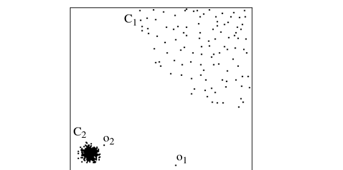

**그림 1: 2-d 데이터셋 DS1**

<!-- 원문 3쪽 -->

특히 인근 지역의 밀도와 관련하여 지역 인근 지역과 관련이 있습니다. 이러한 이상값은 "로컬" 이상값으로 간주됩니다.

설명하기 위해 그림 1에 제공된 예를 고려하십시오. 이는 502 객체를 포함하는 간단한 2 차원 데이터세트입니다. 첫 번째 클러스터 C1에는 400 개체가 있고, 클러스터 C2에는 100 개체가 있으며, 두 개의 추가 개체 o1과 o2가 있습니다. 이 예에서 C2는 C1보다 밀도가 높은 클러스터를 형성합니다. Hawkins의 정의에 따르면 o1과 o2는 모두 이상치라고 할 수 있지만 C1과 C2의 객체는 이상치라고 할 수 없습니다. "로컬" 이상치라는 개념을 사용하여 o1과 o2를 모두 이상치로 표시하려고 합니다. 대조적으로, 거리 기반 이상치의 프레임워크 내에서는 o1만이 다음과 같은 의미에서 합리적인 DB(pct,dmin) 이상치입니다. C1의 모든 객체 q에 대해 q와 가장 가까운 이웃 사이의 거리가 o2와 C2 사이의 거리(즉, d(o2,C2))보다 크다면 실제로 o2는 DB(pct,dmin)-이상치이지만 C1의 객체는 그렇지 않도록 pct와 dmin의 적절한 값이 없다는 것을 보여줄 수 있습니다.

그 이유는 다음과 같습니다. dmin 값이 거리 d(o2,C2)보다 작으면 모든 501 객체(pct = 100*501/502)는 dmin보다 o2에서 더 멀리 떨어져 있습니다. 그러나 C1의 모든 객체 q에 대해서도 동일한 조건이 적용됩니다. 따라서 이 경우 o2와 C1의 모든 개체는 DB(pct, dmin) 이상값입니다.

그렇지 않고, dmin 값이 거리 d(o2, C2)보다 크면 다음을 쉽게 알 수 있습니다. o2는 DB(pct,dmin)-이상치입니다. 이는 q가 DB(pct,dmin)-이상치이기도 하도록 C1에 많은 객체 q가 있음을 의미합니다. 이는 집합의 카디널리티 {p ∈D | d(p,o2) ≤dmin}는 항상 세트 {p ∈D | d(p,q) ≤dmin}. 따라서 이 경우 o2가 DB(pct,dmin) 이상값이면 C1에 있는 많은 개체 q도 마찬가지입니다. 더 나쁜 것은 o2가 이상치가 아니지만 C1의 일부 q가 이상치가 되는 pct 및 dmin 값이 있다는 것입니다.

## 4 지역 이상치의 공식적인 정의

위의 예는 DB(pct, dmin)-이상값이 취한 전역적 관점이 특정 조건에서는 의미 있고 적절하지만 밀도가 다른 클러스터가 존재하는 일반적인 경우에는 만족스럽지 않음을 보여줍니다. 이 섹션에서는 이전 섹션에서 제시된 단점을 방지하는 지역 특이치의 공식적인 정의를 개발합니다. 우리의 개념과 기존의 이상치 개념 사이의 주요 차이점은 이상치가 이진 속성이 아니라는 것입니다. 대신, 우리는 각 객체에 객체가 외곽에 있는 정도를 나타내는 이상값 요인을 할당합니다.

본 연구에서는 객체 p의 k-거리 개념과 그에 상응하는 p의 k-거리 이웃 개념부터 시작합니다.

## 정의 3: (물체 p의 k-거리)

임의의 양의 정수 k에 대해 k-거리(p)로 표시되는 객체 p의 k-거리는 p와 객체 o ∈ D 사이의 거리 d(p,o)로 정의됩니다. (i) 최소 k 객체 o'∈D \ {p}는 d(p,o') ≤d(p,o),를 유지하고 (ii) 최대 k-1 객체 o'∈D \ {p}는 d(p,o') < d(p,o)를 유지합니다.

## 정의 4: (객체 p의 k-거리 이웃)

p의 k-거리가 주어지면 p의 k-거리 이웃에는 p로부터의 거리가 k-거리보다 크지 않은 모든 객체가 포함됩니다. 즉, Nk-distance(p)(p) = { q ∈ D\{p} | d(p, q) ≤ k거리(p) }. 이러한 객체 q를 p의 k-최근접 이웃이라고 합니다.

혼동이 발생하지 않을 때마다 Nk-distance(p)(p)의 약어로 Nk(p)를 사용하도록 표기법을 단순화합니다. 3 정의에서 k-거리(p)는 임의의 양의 정수 k에 대해 잘 정의되어 있지만 객체 o는 고유하지 않을 수 있습니다. 이 경우 Nk(p)의 카디널리티는 k보다 큽니다. 예를 들어, (i) p로부터 거리가 1 단위인 1 객체; (ii) p로부터 거리가 2 단위인 2 객체; (iii) p에서 3 단위 거리를 가진 3 객체. 그러면 2-거리(p)는 3-거리(p)와 동일합니다. 그리고 p로부터 4- 거리(p)의 3 객체가 있습니다. 따라서 N4(p)의 카디널리티는 4(이 경우 6)보다 클 수 있습니다.

## 정의 5: (객체와 객체의 도달 거리

ject o) k를 자연수라 하자. 객체 o에 대한 객체 p의 도달 가능 거리는reach-distk(p, o) = max { k-distance(o), d(p, o) }로 정의됩니다.

**그림 2는 k = 4를 사용한 도달 거리 개념을 보여줍니다. 직관적으로, 객체 p가 o에서 멀리 떨어져 있는 경우(예: 그림의 p2) 두 객체 사이의 도달 가능 거리는 단순히 실제 거리입니다. 그러나 "충분히" 가까운 경우(예: 그림의 p1) 실제 거리는 o의 k-거리로 대체됩니다. 그 이유는 그렇게 하면 o에 가까운 모든 p에 대한 d(p,o)의 통계적 변동이 크게 줄어들 수 있기 때문입니다. 이 스무딩 효과의 강도는 매개변수 k로 제어할 수 있습니다. k 값이 높을수록 같은 동네에 있는 객체의 도달 거리가 더 비슷해집니다.**

지금까지 우리는 임의의 양의 정수 k에 대해 k-distance(p)와reach-distk(p)를 정의했습니다. 그러나 이상값을 정의하기 위해 밀도 기반 클러스터링으로 다시 연결되는 k의 특정 인스턴스화에 중점을 둡니다. [7], [3], [22] 또는 [11]와 같은 일반적인 밀도 기반 클러스터링 알고리즘에는 밀도 개념을 정의하는 두 가지 매개변수가 있습니다. (i) 최소 개체 수를 지정하는 매개변수 MinPts; (ii) 볼륨을 지정하는 매개변수. 이 두 매개변수는 클러스터링 알고리즘이 작동하기 위한 밀도 임계값을 결정합니다. 즉, 주변 밀도가 지정된 밀도 임계값을 초과하면 객체나 영역이 연결됩니다. 밀도를 감지하려면-

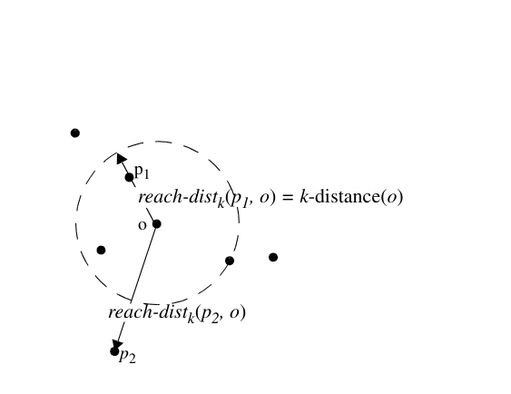

**그림 2: k=4의 경우 도달 거리(p1,o) 및 도달 거리(p2,o)**

<!-- 원문 4쪽 -->

그러나 이상치를 기반으로 하는 경우에는 서로 다른 개체 집합의 밀도를 비교해야 합니다. 이는 개체 집합의 밀도를 동적으로 결정해야 함을 의미합니다. 따라서 우리는 MinPts를 유일한 매개변수로 유지하고 o ∈ NminPts(p)에 대해 도달-distMinPts(p, o) 값을 객체 p 근처의 밀도를 결정하기 위한 볼륨 측정값으로 사용합니다.

## 정의 6: (객체 p의 로컬 도달 밀도)

p의 로컬 도달 가능성 밀도는 다음과 같이 정의됩니다. 직관적으로, 객체 p의 로컬 도달 가능성 밀도는 p의 MinPtsnearest neighbor를 기반으로 한 평균 도달 가능성 거리의 역수입니다. 합산의 모든 도달 가능 거리가 0인 경우 로컬 밀도는 무한대가 될 수 있습니다. 이는 p와 다르지만 동일한 공간 좌표를 공유하는 MinPts개 이상의 개체가 있는 경우, 즉 데이터셋에 p의 MinPts개 중복이 있는 경우 개체 p에 대해 발생할 수 있습니다. 단순화를 위해 이 경우를 명시적으로 처리하지 않고 단순히 중복이 없다고 가정합니다. (중복을 처리하기 위해 3 정의에서 k-거리와 유사하게 정의된 k-고유 거리를 기반으로 이웃 개념을 기반으로 할 수 있으며, 서로 다른 공간 좌표를 가진 최소 k개 객체가 있어야 한다는 추가 요구 사항이 있습니다.)

## 정의 7: (객체 p의 (지역) 이상치 요인)

p의 (로컬) 이상치 인자는 다음과 같이 정의됩니다. 객체 p의 이상치 인자는 p를 이상치라고 부르는 정도를 포착합니다. 이는 p의 로컬 도달 가능성 밀도와 p의 MinPts-최근접 이웃 밀도 비율의 평균입니다. p의 로컬 도달성 밀도가 낮을수록 p의 MinPts-최근접 이웃의 로컬 도달성 밀도가 높을수록 p의 LOF 값이 높다는 것을 쉽게 알 수 있습니다. 다음 섹션에서는 LOF의 형식적 속성을 정확하게 설명합니다. 표기를 단순화하기 위해 혼동이 발생하지 않으면 도달 거리, lrd 및 LOF에서 아래 첨자 MinPt를 삭제합니다.

## 5 지역 특이치의 속성

이번 섹션에서는 LOF의 속성에 대해 자세히 분석해보겠습니다. 목표는 LOF의 정의가 지역적 이상치의 정신을 포착하고 많은 바람직한 특성을 누리고 있음을 보여주는 것입니다. 특히 클러스터에 있는 대부분의 객체 p에 대해 p의 LOF는 대략 1와 동일하다는 것을 보여줍니다. 클러스터 외부의 개체를 포함하여 다른 개체에 대해서는 LOF의 하한 및 상한을 제공하는 일반 정리를 제공합니다. 또한 경계의 견고성을 분석합니다. 본 연구에서는 중요한 객체 클래스에 대한 경계가 엄격하다는 것을 보여줍니다. 그러나 다른 객체 클래스의 경우 경계가 그다지 엄격하지 않을 수 있습니다. 후자의 경우 더 나은 경계를 지정하는 또 다른 정리를 제공합니다.

### 5.1 클러스터에 깊은 객체에 대한 LOF

3 섹션에서는 그림 1를 사용하여 지역 특이치 개념을 설명합니다. 특히, 우리는 o2에 외곽으로 레이블을 지정하고 클러스터 C1의 모든 객체에 외곽에 있지 않은 레이블을 지정하기를 원합니다. 아래에서는 C1에 있는 대부분의 객체에 대해 해당 LOF가 대략 1임을 보여 주며, 이는 외곽으로 레이블을 지정할 수 없음을 나타냅니다.

Lemma 1: C를 객체의 컬렉션으로 둡니다. reach-dist-min은 C에서 객체의 최소 도달 거리를 나타냅니다. 즉,reachdist-min = min {reach-dist(p, q) | p, q ∈ C}. 마찬가지로,reachdist-max는 C에서 객체의 최대 도달 거리를 나타냅니다. ε은 (reach-dist-max/reach-dist-min − 1)로 정의됩니다. 그런 다음 모든 객체 p ∈ C에 대해 (i) p의 모든 MinPts-최근접 이웃 q가 C에 있고 (ii) q의 모든 MinPts-최근접 이웃 o도 C에 있으므로 1/(1 + ε) ≤ LOF(p) ≤를 유지합니다. (1 + ε).

## 증명(스케치): 모든 MinPts-p의 가장 가까운 이웃 q에 대해 도달-

거리(p, q) ≥ 도달거리-분. 그런 다음 정의 6에 따라 p의 로컬 도달 가능성 밀도는 ≤ 1/reach-dist-min입니다. 반면, 도달 거리(p, q) ≤ 도달 거리-최대. 따라서 p의 로컬 도달 밀도는 ≥ 1/reach-dist-max입니다. q를 p의 MinPts-최근접 이웃으로 둡니다. 위의 p에 대한 것과 동일한 인수에 의해 q의 로컬 도달 가능성 밀도도 1/reach-dist-max와 1/reach-dist-min 사이에 있습니다. 따라서 7 정의에 따르면 도달 거리 최소/도달 거리 최대 ≤ LOF(p) ≤ 도달 거리 최대/도달 거리 최소가 됩니다. 따라서 1/(1 + ε) ≤ LOF(p) ≤ (1 + ε)를 설정합니다. I 보조정리 1의 해석은 다음과 같습니다. 직관적으로 C는 "클러스터"에 해당합니다. 클러스터 내부의 "깊은" 객체 p를 고려해 보겠습니다. 이는 p의 모든 MinPts-최근접 이웃 q가 C에 있고, 차례로 q의 모든 MinPts-최근접 이웃도 C에 있음을 의미합니다. 이러한 깊은 객체 p의 경우 p의 LOF는 제한됩니다. C가 "밀집된" 클러스터인 경우 보조정리 1의 ε 값은 매우 작을 수 있으므로 p의 LOF는 1에 매우 가까워집니다.

그림 1의 예로 돌아가려면 보조정리 1를 적용하여 클러스터 C1에 있는 대부분의 개체의 LOF가 1에 가깝다는 결론을 내릴 수 있습니다.

### 5.2 LOF의 일반적인 상한 및 하한

위의 Lemma 1는 LOF의 기본 속성을 보여줍니다. 즉, 클러스터 내부 깊은 곳에 있는 객체의 경우 LOF가 1에 가깝고 로컬 이상값으로 표시되어서는 안 됩니다. 몇 가지 즉각적인 질문이 떠오릅니다. 클러스터 주변 근처에 있는 객체는 어떻습니까? 그리고 그림 1의 o2와 같이 클러스터 외부에 있는 개체는 어떻습니까? 이러한 객체의 LOF에 대한 상한과 하한을 얻을 수 있습니까?

아래의 정리 1는 임의의 객체 p에 대한 LOF(p)의 일반적인 상한 및 하한을 보여줍니다. 따라서 정리 1는 보조정리 1를 2차원으로 일반화합니다. 첫째, 정리 1는 모든 객체 p에 적용되며 클러스터 내부의 객체에만 제한되지 않습니다. 둘째, 클러스터 내부 깊은 객체의 경우에도 정리 1에 의해 주어진 경계는 보조정리 1에 의해 제공되는 경계보다 더 빡빡할 수 있으며 이는 보조정리 1에 정의된 엡실론이 0에 더 가까워질 수 있음을 의미합니다. 이는 보조정리 1에서reach-dist-min 및reach-dist-max 값을 얻기 때문입니다. 더 큰 도달 가능 거리 세트를 기반으로 합니다. 대조적으로, 1 정리에서 이 최소값과 최대값은 고려 중인 객체의 MinPts-가장 가까운 이웃, 즉 lrdMinPts p() 1reach-distMinPts po,()를 기반으로 합니다.

> **주:** o NminPts p () ∈∑

LOFMinPts p()

> **주:** o NminPts p () ∈∑

<!-- 원문 5쪽 -->

더 엄격한 경계를 초래합니다. 5.3 섹션에서는 정리 1에 주어진 경계의 견고성을 더 자세히 분석할 것입니다.

정리 1를 제시하기 전에 다음 용어를 정의합니다. 임의의 객체 p에 대해 directmin(p)는 p와 p의 MinPts-최근접 이웃 사이의 최소 도달 거리를 나타냅니다. 즉, directmin(p) = min {reach-dist(p, q) | q ∈ NminPts(p) }. 마찬가지로 direct_max(p)는 해당 최대값을 나타냅니다. 즉, directmax(p) = max {reach-dist(p, q) | q ∈ NminPts(p) }.

또한 이러한 정의를 p의 MinPts-최근접 이웃 q로 일반화하기 위해 indirectmin(p)는 q와 q의 MinPts-최근접 이웃 사이의 최소 도달 거리를 나타냅니다. 즉, indirectmin(p) = min {reach-dist(q, o) | q ∈ NminPts(p) 및 o ∈ NminPts(q)}. 마찬가지로 indirectmax(p)는 해당 최대값을 나타냅니다. 후속편에서는 p의 MinPts-가장 가까운 이웃을 p의 직접 이웃으로 참조하고, q가 p의 MinPts-가장 가까운 이웃일 때마다 q의 MinPts-가장 가까운 이웃을 p의 간접 이웃으로 참조합니다.

**그림 3는 이러한 정의를 설명하는 간단한 예를 제공합니다. 이 예에서 객체 p는 객체 클러스터에서 어느 정도 떨어져 있습니다. 이해를 쉽게 하기 위해 MinPts = 3를 지정합니다. directmin(p) 값은 그림에서 dmin으로 표시되어 있습니다. directmax(p) 값은 dmax로 표시됩니다. p는 C에서 상대적으로 멀리 떨어져 있기 때문에 C의 모든 객체 q의 3-거리는 p와 q 사이의 실제 거리보다 훨씬 작습니다. 따라서 5 정의에 따르면 p w.r.t.의 도달 가능 거리는 다음과 같습니다. q는 p와 q 사이의 실제 거리로 제공됩니다. 이제 p의 3-가장 가까운 이웃 중에서 우리는 차례로 그들의 3-가장 가까운 이웃에 대한 최소 및 최대 도달 거리를 찾습니다. 그림에서 indirectmin(p)와 indirectmax(p) 값은 각각 imin과 imax로 표시되어 있습니다.**

정리 1: p를 데이터베이스 D의 객체라고 하고 1 ≤MinPts ≤| D |. 그렇다면 그런 경우이다.

## 증명(스케치): (a)

의 정의에 따르면.

의 정의에 따르면.

따라서 (b)도 유사하게 이어집니다. I 그림 3의 예를 사용하여 정리를 설명하기 위해 dmin이 imax의 4 배이고 dmax가 imin의 6 배라고 가정합니다. 그러면 1 정리에 따라 p의 LOF는 4와 6 사이에 있습니다. 또한 정리 1에서 LOF(p)가 이해하기 쉬운 해석을 갖는다는 것이 분명해졌습니다. 이는 단순히 p의 간접 이웃에 대한 p의 직접 이웃에 대한 도달 가능성 거리의 함수입니다.

### 5.3 경계의 견고함

이전에 논의한 바와 같이 정리 1는 모든 객체 p에 적용할 수 있는 LOF에 대해 지정된 상한 및 하한을 갖는 일반적인 결과입니다. 즉각적인 질문이 떠오른다. 이 경계는 얼마나 좋거나 빡빡합니까? 즉, LOFmax를 사용하여 상한 directmax/indirectmax를 나타내고 LOFmin을 사용하여 하한 directmin/indirectmax를 나타내는 경우 LOFmax와 LOFmin 사이의 확산 또는 차이는 얼마나 됩니까? 다음에서는 이 문제를 연구합니다. 다음 분석의 핵심 부분은 LOF-max-LOFmin 확산이 직접/간접 비율에 따라 달라짐을 보여주는 것입니다. 어떤 조건에서는 확산이 작지만 다른 조건에서는 그렇게 작지 않은 것으로 나타났습니다.

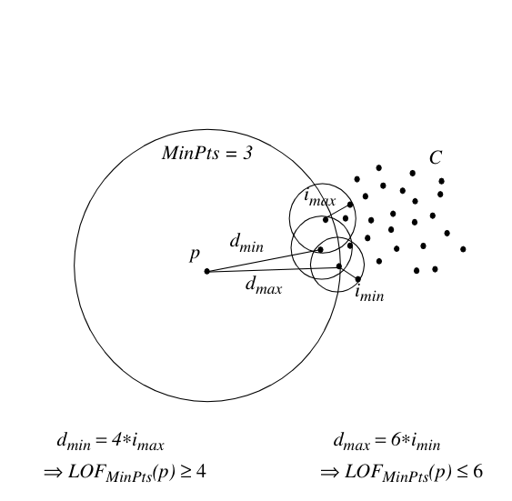

**그림 3: 정리 1의 그림**

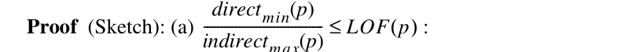

o NminPts p () ∈ ∀ 도달 거리 p o, () directmin p () ≥ directmin p () 도달 거리 p o, ()

> **주:** o NminPts p () ∈∑

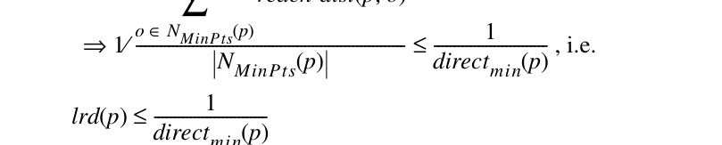

q NminPts o () ∈ ∀ 도달 거리 o q, () 간접 최대 p () ≤ 간접 최대 p () 도달 거리 o q, ()

> **주:** q NMinPts o () ∈∑

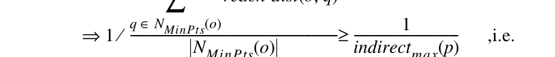

> **주:** o NminPts p () ∈∑

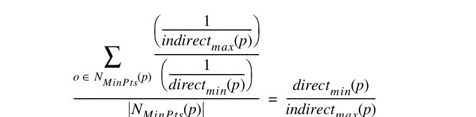

> **주:** o NminPts p () ∈∑

<!-- 원문 6쪽 -->

위에서 정의한 directmin(p)와 directmax(p)가 주어지면 direct(p)를 사용하여 directmin(p)와 directmax(p)의 평균값을 나타냅니다. 마찬가지로 indirect(p)를 사용하여 indirect-min(p)와 indirectmax(p)의 평균값을 나타냅니다. 후속편에서는 혼동이 발생하지 않을 때마다 매개변수 p를 삭제합니다(예: direct(p)의 약칭으로 direct).

이제 다음 분석을 더 쉽게 이해할 수 있도록 (directmax - directmin)/direct =(indirectmax - indirectmin)/indirect를 요구하여 논의를 단순화합니다. 즉, 직접 이웃과 간접 이웃의 도달 거리가 같은 양만큼 변동한다고 가정합니다. 이러한 단순화로 인해 우리는 후속편에서 단일 매개변수 pct를 사용하여 변동을 제어할 수 있습니다. 보다 구체적으로 그림 4에서 pct = x%는 directmax = direct*(1+x%), directmin = direct*(1-x%), indirectmax =가 있는 상황에 해당합니다. 간접*(1+x%) 및 간접min = 간접*(1-x%). 그림 4는 pct가 1%, 5% 및 10%로 설정된 상황을 보여줍니다. LOFmax와 LOFmin 사이의 스프레드는 pct가 증가함에 따라 증가합니다.

더 중요한 것은 그림 4는 고정된 백분율 pct=x%,의 경우 LOFmax와 LOFmin 사이의 확산이 직접/간접 비율에 대해 선형적으로 증가한다는 것을 보여줍니다. 이는 상대 범위(LOFmax - LOFmin)/(직접/간접)가 일정하다는 것을 의미합니다. 다르게 말하면, LOF의 상대적 변동은 기본 도달 거리의 비율에만 의존하며 절대값에는 의존하지 않습니다. 이는 지역 특이치의 정신을 강조합니다.

실제로 더 정확하게 말하면 전체 상황은 (LOFmax - LOFmin), (직접/간접) 및 pct의 세 가지 차원이 있는 3 차원 공간에서 가장 잘 캡처됩니다. 그림 4는 처음 두 차원에 대한 일련의 2-D 투영을 나타냅니다. 그러나 그림 4는 LOF의 상대적 변동과 pct의 상대적 변동 사이의 의존성의 강도를 보여주지 않습니다. 이를 위해 그림 5가 유용합니다. 그림의 y축은 위에서 언급한 3 차원 공간에서 두 차원(LOFmax - LOFmin)과 (직접/간접) 사이의 비율을 나타내며, x축은 다른 차원 pct에 해당합니다. 그림 5의 곡선 모양을 이해하려면 (LOF- 최대 - LOFmin)/(직접/간접) 비율을 자세히 살펴봐야 합니다.

**그림 5는 (LOFmax - LOFmin)/(직접/간접)이 백분율 값 pct에만 의존한다는 것을 보여줍니다. pct가 100에 가까워지면 그 값은 무한대에 가까워지지만 합리적인 pct 값에 비해 매우 작습니다. 이는 또한 그림 4에서 볼 수 있듯이 LOF의 상대적 변동이 고정된 비율(%)에 대해 일정하다는 것을 확인합니다.**

요약하면, 직접 및 간접 이웃에서 평균 도달 거리의 변동이 작은 경우(즉, pct가 낮은 경우) 최소 및 최대 LOF 경계가 서로 가깝기 때문에 정리 1는 LOF를 매우 잘 추정합니다. 이것이 사실인 두 가지 중요한 사례가 있습니다.

- 도달 가능성 거리의 변동이 다소 동질적인 경우, 즉 p의 MinPts-최근접 이웃이 동일한 클러스터에 속하는 경우 객체 p에 대한 백분율 백분율은 매우 낮습니다. 이 경우 directmin, directmax, indirectmin 및 indirectmax 값은 거의 동일하므로 LOF가 1에 가깝습니다. 이는 보조정리 1에 설정된 결과와 일치합니다.

- 위의 인수는 클러스터 내부 깊은 곳에 위치하지 않지만 MinPts-최근접 이웃이 모두 동일한 클러스터에 속하는 객체 p로 일반화될 수 있습니다(그림 3에 설명됨). 이 경우 LOF가 1에 가깝지 않더라도 정리 1에 의해 예측된 LOF의 경계는 엄격합니다.

### 5.4 직접 이웃이 여러 클러스터와 겹치는 객체의 경계

지금까지 우리는 정리 1에 주어진 경계의 견고성을 분석하고 경계가 엄격해지는 두 가지 조건을 제시했습니다. 마음에 떠오르는 즉각적인 질문은 다음과 같습니다.

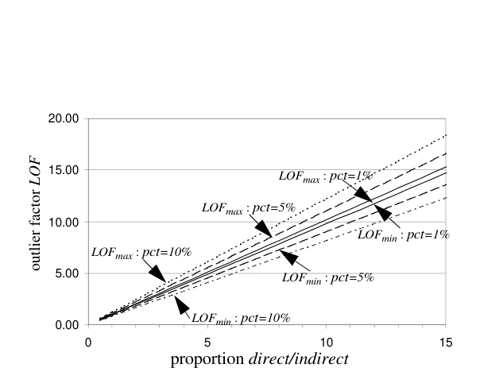

**그림 4: 직접/요구에 따른 LOF의 상한 및 하한**

## 다양한 pct 값에 대해 간접적

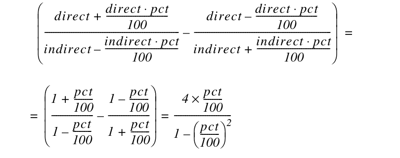

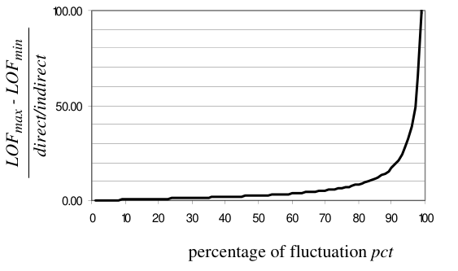

**그림 5: 백분율에 따른 LOF의 상대 범위**

## d와 w의 변동

<!-- 원문 7쪽 -->

조건이 경계가 빡빡하지 않나요? 그림 5에 따르면, 객체 p의 MinPtsnearest neighbor가 서로 다른 밀도를 갖는 서로 다른 클러스터에 속하는 경우 pct 값은 매우 클 수 있습니다. 그런 다음 그림 5를 기준으로 하면 LOFmax와 LOFmin 값 사이의 확산이 클 수 있습니다. 이 경우 정리 1에 주어진 범위는 제대로 작동하지 않습니다.

예를 들어 그림 1에 표시된 상황을 다시 고려해 보겠습니다. 객체 o2의 경우 모든 MinPts-최근접 이웃이 동일한 클러스터 C2에서 나오므로 o2의 LOF에 대한 정리 1에 의해 주어진 경계가 엄격할 것으로 예상됩니다. 대조적으로, o1의 MinPts-최근접 이웃은 클러스터 C1과 C2 모두에서 나옵니다. 이 경우 o1의 LOF에 지정된 경계가 좋지 않을 수 있습니다.

아래의 정리 2는 p의 MinPts-최근접 이웃이 둘 이상의 클러스터와 겹칠 때 객체 p의 LOF에 더 나은 경계를 제공하기 위한 것입니다. 정리 2의 직관적인 의미는 p의 MinPts-최근접 이웃을 여러 그룹으로 분할할 때 각 그룹이 p의 LOF에 비례적으로 기여한다는 것입니다.

MinPts=6.에 대한 예가 그림 6에 나와 있습니다. 이 경우 객체 p의 6-최근접 이웃의 3는 클러스터 C1에서 나오고 다른 3는 클러스터 C2에서 나옵니다. 그런 다음 정리 2에 따라 LOFmin은 (0.5*d1min + 0.5*d2min)/(0.5/i1max + 0.5/i2max)로 제공됩니다. 여기서 d1min 및 d2min은 p와 p 사이의 최소 도달 거리를 제공합니다. 6-C1과 C2에 있는 p의 가장 가까운 이웃, i1max와 i2max는 q와 q의 6-가장 가까운 이웃 사이의 최대 도달 거리를 제공합니다. 여기서 q는 각각 C1과 C2에서 p의 6-가장 가까운 이웃입니다. 단순화를 위해 그림 6에서는 LOFmax 상한에 대한 사례를 표시하지 않습니다.

정리 2: p를 데이터베이스 D의 객체로 두고, 1 ≤MinPts ≤| D |, C1, C2,..., Cn을 NminPts(p)의 파티션, 즉 NminPts(p) = C1 ∪C2 ∪... ∪Cn ∪{p} with Ci ∩Cj = ∅, Ci ≠∅ for 1 ≤i,j ≤n, i ≠j.

게다가 p의 이웃에 있고 역시 Ci에 있는 객체의 백분율을 구해 보겠습니다. 개념을 보자

directmin(p), direct-max(p), indirectmin(p) 및 indirectmax(p)와 유사하게 정의되지만 세트 Ci로 제한됩니다(예를 들어, 세트 Ci에서 p와 MinPts-최근접 이웃 사이의 최소 도달 거리를 나타냄). 그러면 (a)와 (b)가 성립합니다.

부록에는 2 정리의 증명 스케치가 나와 있습니다. 정리 2는 여러 클러스터에서 나오는 MinPts-최근접 이웃의 비율을 고려하여 정리 1를 일반화합니다. 따라서 다음과 같은 결론이 있습니다.

추론 1: 정리 2의 파티션 수가 1인 경우 정리 2에 제공된 LOFmin 및 LOFmax는 정리 1.I에 제공된 해당 경계와 정확히 동일합니다.

## 6 매개변수 Minpts의 영향

이전 섹션에서는 LOF의 형식적 속성을 분석했습니다. 클러스터 내부 깊은 곳에 있는 객체의 경우 LOF가 대략 1와 동일하다는 것을 보여주었습니다. 다른 객체의 경우 MinPts-최근접 이웃이 하나 이상의 클러스터에서 나오는지 여부에 따라 LOF에 두 세트의 상한 및 하한을 설정했습니다. 이전의 모든 결과는 지정된 MinPts 값을 기반으로 한다는 점에 유의하는 것이 중요합니다. 이 섹션에서는 MinPts 값 선택이 LOF 값에 어떤 영향을 미치는지, 그리고 LOF 계산에 적합한 MinPts 값을 결정하는 방법에 대해 설명합니다.

### 6.1 MinPts 값 변경에 따라 LOF가 어떻게 달라지는가

이전 섹션에서 확립된 분석 결과를 고려하면 몇 가지 흥미로운 질문이 떠오릅니다. MinPts 값을 조정하면 LOF 값은 어떻게 변경되나요? MinPts 값의 증가 순서가 주어지면 LOF에 대한 단조로운 변경 순서가 있습니까? 즉, LOF가 단조롭게 감소하거나 증가합니까?

불행하게도 현실은 LOF가 단조롭게 감소하거나 증가하지 않는다는 것입니다. 그림 7는 모든 객체가 가우스 분포에 따라 분포되는 간단한 시나리오를 보여줍니다. 2와 50 사이의 각 MinPts 값에 대해 최소, 최대 및 평균 LOF 값과 표준 편차가 표시됩니다.

최대 LOF를 예로 들어 보겠습니다. 처음에 MinPts 값이 2로 설정되면 정의 5에서 실제 개체 간 거리 d(p,o)를 사용하는 것으로 줄어듭니다. MinPts 값을 늘리면 도달 가능 거리와 LOF의 통계적 변동이 약해집니다. 따라서 최대 LOF 값이 초기에 감소합니다. 그러나 MinPts 값이 계속 증가함에 따라 최대 LOF 값도 오르락내리락하다가 결국 어느 정도 값으로 안정화됩니다.

가우시안 분포와 같은 순수 분포의 경우에도 LOF 값이 단조롭지 않게 변경되면 더 복잡한 상황에서는 LOF 값이 더 격렬하게 변경됩니다. 그림 8는 3개의 클러스터를 포함하는 2차원 데이터세트를 보여줍니다. 여기서 S1은 10로 구성됩니다.

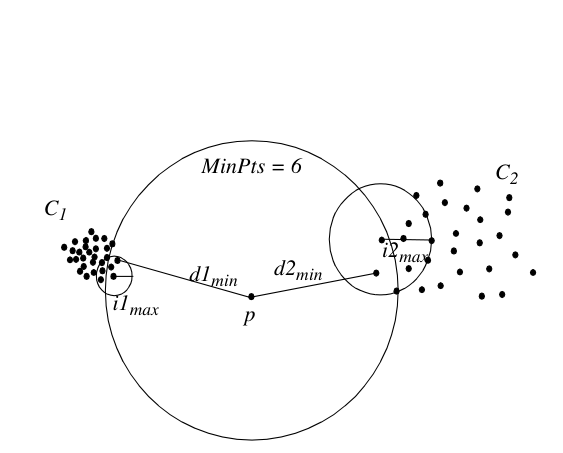

**그림 6: 정리 2의 그림**

ξi Ci NminPts p () ⁄ = directi min p () directi max p () indirecti

간접적으로

지시

LOF p () ξi 방향

간접적으로

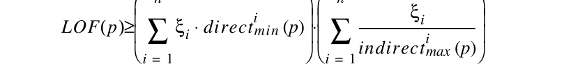

LOF p () ξi 방향

간접적으로

<!-- 원문 8쪽 -->

개체, 35 개체의 S2 및 500 개체의 S3입니다. 오른쪽에는 각 클러스터의 한 개체에 대한 대표적인 플롯이 있습니다. 플롯은 10부터 50까지 범위에 대한 MinPts에 대한 LOF를 보여줍니다. S3에 있는 객체의 LOF는 1 주변에서 매우 안정적인 반면, S1과 S3에 있는 객체의 LOF는 더 격렬하게 변경됩니다.

### 6.2 MinPts 값 범위 결정

LOF 값은 위아래로 움직일 수 있으므로 MinPts 값 범위를 사용하는 경험적 방법을 제안합니다. 다음에서는 이 범위를 선택하는 방법에 대한 지침을 제공합니다. MinPtsLB 및 MinPtsUB를 사용하여 범위의 "하한"과 "상한"을 나타냅니다.

먼저 MinPtsLB의 합리적인 값을 결정해 보겠습니다. 분명히 MinPtsLB는 2만큼 작을 수 있습니다. 그러나 위에서 설명하고 5를 정의하기 전에 MinPt가 너무 작아서 원치 않는 통계적 변동을 제거하는 것이 현명합니다. 예를 들어 그림 7에 표시된 가우스 분포의 경우 LOF의 표준 편차는 MinPtsLB가 10 이상인 경우에만 안정화됩니다. 또 다른 극단적인 예로, 그림 7의 가우스 분포를 균일 분포로 바꾼다고 가정해 보겠습니다. 10보다 작은 MinPt의 경우 LOF가 1보다 훨씬 큰 객체가 있을 수 있다는 것이 밝혀졌습니다. 이는 균등 분포에서는 어떤 객체도 외곽으로 표시되어서는 안 되기 때문에 반직관적입니다. 따라서 MinPtsLB 선택에 대해 우리가 제공하는 첫 번째 지침은 원치 않는 통계적 변동을 제거하려면 최소한 10여야 한다는 것입니다.

MinPtsLB 선택을 위해 우리가 제공하는 두 번째 지침은 보다 미묘한 관찰을 기반으로 합니다. 하나의 객체 p와 객체 세트/클러스터 C의 간단한 상황을 생각해 보세요. C에 MinPtsLB보다 적은 개체가 포함되어 있으면 C에 있는 각 개체의 MinPts-최근접 이웃 집합에 p가 포함되고 그 반대의 경우도 마찬가지입니다. 따라서 정리 1를 적용하면 p의 LOF와 C의 모든 개체가 매우 유사하므로 p를 C의 개체와 구별할 수 없게 됩니다.

반면에 C에 MinPtsLB 개체 이상이 포함되어 있으면 C에 있는 개체의 MinPts-가장 가까운 이웃에는 p가 포함되지 않지만 C의 일부 개체는 p의 이웃에 포함됩니다. 따라서 p와 C 사이의 거리와 C의 밀도에 따라 p의 LOF는 C에 있는 개체의 LOF와 상당히 다를 수 있습니다. 여기서 중요한 관찰은 MinPtsLB가 "클러스터"(위의 C와 같은)가 포함해야 하는 최소 개체 수로 간주될 수 있으므로 다른 개체(위의 p와 같은)가 이 클러스터에 대해 로컬 이상값이 될 수 있다는 것입니다. 이 값은 애플리케이션에 따라 달라질 수 있습니다. 우리가 실험한 대부분의 데이터세트에서 10부터 20까지 선택하는 것이 일반적으로 잘 작동하는 것으로 보입니다.

다음으로, MinPts 값 범위의 상한값인 MinPtsUB의 합리적인 값을 선택합니다. 하한 MinPtsLB와 마찬가지로 상한도 연관된 의미를 갖습니다. C를 "가까운" 개체의 집합/클러스터로 설정합니다. 그런 다음 MinPtsUB는 잠재적으로 로컬 이상값이 될 수 있는 C의 모든 개체에 대한 C의 최대 카디널리티로 간주될 수 있습니다. "가깝다"는 것은 direct-min, directmax, indirectmin 및 indirectmax 값이 모두 매우 유사하다는 것을 의미합니다. 이 경우 MinPtsUB를 초과하는 MinPts 값의 경우 1 정리에서는 C의 모든 개체의 LOF가 1에 가까워야 합니다. 따라서 MinPtsUB 선택을 위해 우리가 제공하는 지침은 잠재적으로 로컬 이상값이 될 수 있는 "가까운" 개체의 최대 수입니다.

예를 들어 그림 8에 표시된 상황을 다시 고려해 보겠습니다. S1은 10 개체, S2는 35 개체, S3은 500 개체로 구성된다는 점을 기억하세요. 플롯에서 S3의 객체는 결코 이상값이 아니며 항상 LOF 값이 1에 가깝다는 것이 분명합니다. 대조적으로, S1의 객체는 10와 35 사이의 MinPts 값에 대한 강력한 이상치입니다. S2의 개체는 MinPts = 45에서 시작하는 이상값입니다. 마지막 두 효과의 이유는 MinPts = 36부터 시작하여 S2에 있는 객체의 MinPts에 가장 가까운 이웃이 S1의 일부 객체를 포함하기 시작하기 때문입니다. 이후부터 S1과 S2의 개체는 거의 동일한 동작을 나타냅니다. 이제 MinPts = 45에서 이 "결합된" 개체 집합 S1과 S2의 구성원은 S3의 개체를 이웃에 포함하기 시작하고 따라서 S3에 비해 이상값이 되기 시작합니다. 애플리케이션 도메인에 따라 35 개체 그룹(예: S2)을 클러스터 또는 "가까운" 로컬 이상값 묶음으로 간주할 수 있습니다. 이를 용이하게 하기 위해 35보다 작거나 35보다 큰 MinPtsUB 값을 선택할 수 있습니다. 다른 개체가 로컬 이상값으로 간주될 수 있는 최소 개체 수와 관련하여 MinPtsLB에 대해서도 유사한 주장을 할 수 있습니다.

MinPtsLB 및 MinPtsUB를 결정한 후 각 개체에 대해 이 범위 내의 LOF 값을 계산할 수 있습니다. 본 연구에서는 지정된 범위 내에서 최대 LOF 값을 기준으로 모든 객체의 순위를 매기는 경험적 방법을 제안합니다. 즉, 객체 p의 순위는 max{LOFMinPts(p) | MinPtsLB ≤MinPts ≤MinPtsUB}.

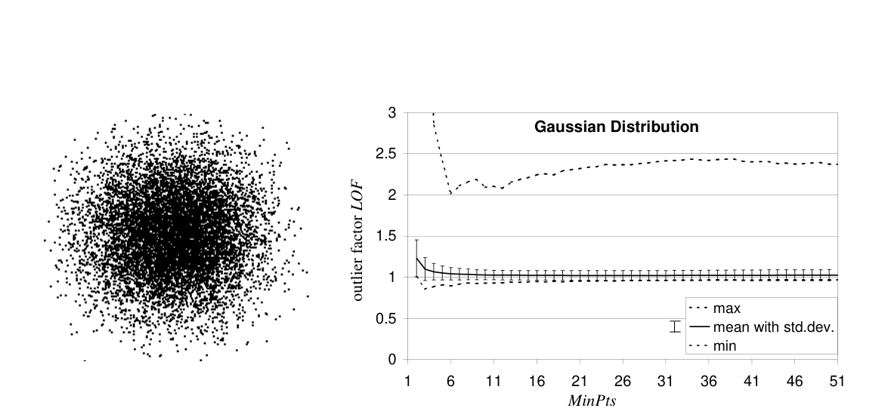

**그림 7: 가우스 클러스터 내 이상값 요인의 변동**

<!-- 원문 9쪽 -->

범위 내의 모든 LOF 값이 주어지면 최대값을 취하는 대신 최소값이나 평균과 같은 다른 집계를 취할 수 있습니다. 그림 8의 상황은 최소값을 취하는 것이 객체의 외부 특성을 완전히 지울 수 있으므로 부적절할 수 있음을 보여줍니다. 중용을 취하는 것은 대상의 외적인 성격을 희석시키는 효과를 가질 수도 있습니다. 본 연구에서는 물체가 가장 멀리 있는 인스턴스를 강조하기 위해 최대한의 노력을 기울일 것을 제안합니다.

## 7 실험

이 섹션에서는 범위 내에서 최대 LOF 값을 취하는 제안된 휴리스틱을 사용하여 의미 있는 것처럼 보이지만 다른 방법으로는 식별할 수 없는 이상값을 성공적으로 식별하는 데 우리의 아이디어를 사용할 수 있음을 보여줍니다. 계산된 LOF 값에 대한 직관적인 개념을 제공하기 위해 모든 개체에 대한 이상값 요인을 표시하는 합성 2 차원 데이터셋로 시작합니다. 두 번째 예에서는 [KN98]에서 사용된 실제 데이터셋를 사용하여 DB(pct, dmin) 이상값을 평가합니다. 본 연구에서는 우리 방법을 검증하기 위해 실험을 반복합니다. 세 번째 예에서는 독일 축구 선수 데이터베이스에서 의미 있는 이상값을 식별합니다. 이를 위해 발견된 이상값의 의미를 확인한 "도메인 전문가"가 있습니다. 마지막 하위 섹션에는 대규모 고차원 데이터셋에 대해서도 우리 접근 방식의 실행 가능성을 보여주는 성능 실험이 포함되어 있습니다.

또한 우리는 64 차원 데이터셋를 사용하여 실험을 수행하여 우리의 정의가 매우 높은 차원 공간에서 합리적이라는 것을 입증했습니다. 사용된 특징 벡터는 TV 스냅샷 [2]에서 추출한 색상 히스토그램입니다. 본 연구에서는 여러 클러스터를 식별했습니다. 테니스 경기의 사진 클러스터와 최대 7의 LOF 값을 갖는 합리적인 로컬 이상값입니다.

### 7.1 합성 예

그림 9의 왼쪽에는 200 개체의 저밀도 가우스 클러스터 하나와 500 개체의 세 개의 큰 클러스터가 각각 포함된 2 차원 데이터 집합이 표시됩니다. 이 세 개 중 하나는 조밀한 가우스 클러스터이고 다른 두 개는 서로 다른 밀도의 균일한 클러스터입니다. 게다가 여기에는 몇 가지 이상치가 포함되어 있습니다. 그림 9의 오른쪽에는 MinPts = 40에 대한 모든 객체의 LOF를 3차원으로 플롯합니다. 균일한 클러스터의 객체는 모두 LOF가 1와 동일하다는 것을 알 수 있습니다. 가우스 클러스터의 대부분의 객체

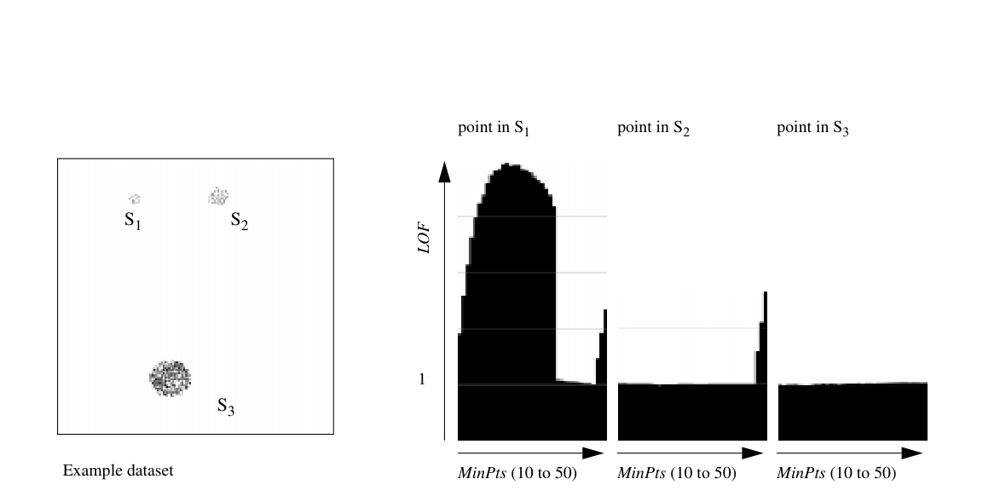

**그림 8: 샘플 데이터세트의 다양한 개체에 대한 LOF 값 범위**

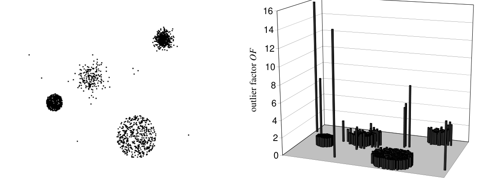

**그림 9: 샘플 데이터세트 (MinPts=40)의 점에 대한 이상값 요인**

<!-- 원문 10쪽 -->

또한 LOF 값으로 1가 있습니다. 가우스 클러스터 외부에는 몇 가지 약한 이상값, 즉 상대적으로 낮지만 1, LOF 값보다 큰 이상값이 있습니다. 나머지 7개 객체는 모두 훨씬 더 큰 LOF 값을 갖습니다. 또한, 각 이상치에 대한 LOF 값은 객체가 이상치인 클러스터의 밀도와 이상치에서 클러스터까지의 거리에 따라 달라짐이 그림에서 분명하게 드러납니다.

### 7.2 하키 데이터

[13]에서 저자는 과거 NHL 플레이어 데이터에 대해 여러 가지 실험을 수행했습니다. 사용된 속성에 대한 자세한 설명은 [13]를 참조하세요. NHL96 데이터셋에 대한 실험을 반복하여 30부터 50까지의 MinPts 범위에서 최대 LOF를 계산합니다.

첫 번째 테스트에서 점수, 플러스-마이너스 통계 및 페널티 시간(분)의 3 차원 하위 ​​공간에서 Vladimir Konstantinov를 유일한 DB(0.998, 26.3044) 이상치로 식별했습니다. 그는 또한 LOF 값이 2.4인 최고 특이치였습니다. LOF가 2.0인 두 번째로 강력한 로컬 특이치는 Matthew Barnaby입니다. 발견된 대부분의 이상값에 대해 여기서는 도메인 전문가의 관점에서 이상값인 이유를 설명하지 않습니다. 관심 있는 독자는 [13]에서 이 정보를 찾을 수 있습니다. 여기서 중요한 점은 최대 LOF 값으로 이상치의 순위를 매기면 거의 동일한 결과를 얻을 수 있다는 것입니다. 다음 하위 섹션에서는 이 접근 방식으로 [13]가 찾을 수 없는 일부 이상값을 식별할 수 있는 방법을 보여줍니다.

두 번째 테스트에서 그들은 플레이한 게임, 득점한 골 및 슈팅 비율의 3 차원 하위 ​​공간에서 DB(0.997, 5) 이상치를 식별하여 Chris Osgood과 Mario Lemieux를 이상치로 찾았습니다. 다시 말하지만, 그들은 LOF가 6.0인 Chris Osgood과 LOF가 2.8인 Mario Lemieux입니다. LOF를 기준으로 한 순위 목록에서 LOF 2.5로 3위를 차지한 Steve Poapst는 3경기만 플레이하고 1득점을 기록했으며 50%의 슈팅 비율을 기록했습니다.

### 7.3 축구 데이터

다음 실험에서는 1998/99 시즌 동안 "Fußball 1. Bundesliga"(독일 축구 국가대표팀)의 축구 선수 정보 데이터베이스에 대한 로컬 이상값을 계산했습니다. 데이터베이스는 이름, 플레이한 게임 수, 득점한 골 수 및 선수의 위치(골키퍼, 수비, 중앙, 공격)를 포함하는 375 선수로 구성됩니다. 이를 통해 우리는 게임당 득점한 평균 골 수를 도출하고 게임 수, 게임당 평균 골 수 및 포지션(정수로 코딩됨)의 3차원 하위 ​​공간에 대한 이상값 탐지를 수행했습니다. 일반적으로 이 데이터셋는 플레이어의 위치에 따라 4개의 클러스터로 분할될 수 있습니다. 30부터 50까지의 MinPts 범위에서 LOF 값을 계산했습니다. 아래에서는 LOF > 1.5(표 3 참조)를 사용하는 모든 로컬 이상값에 대해 논의하고 이들이 예외적인 이유를 설명합니다.

가장 강력한 아웃라이어는 마이클 프리츠(Michael Preetz)로, 최다 경기에 출전하고 최다 득점을 기록해 리그 득점왕 1위에 올랐습니다("Torschützenkönig"). 그는 공격적인 선수 집단에 비해 특이한 존재였습니다. 두 번째로 강력한 특이치는 Michael Schjönberg입니다. 그는 평균적인 경기 수를 뛰었지만 대부분의 다른 수비 선수들이 경기당 평균 득점 수가 훨씬 낮았기 때문에 그는 아웃라이어였습니다. 그 이유는 그가 팀을 위해 페널티킥('엘프미터')을 찼기 때문이다. 3위는 골키퍼 한스외르그 부트(Hans-Jörg Butt)로 최대한 많은 경기에 출전해 7골을 터뜨렸다. 그는 골을 넣은 유일한 골키퍼였습니다. 그도 그의 팀을 위해 페널티 슛을 찼습니다. 4위와 5위에서는 평균 득점이 매우 높은 공격수인 Ulf Kirsten과 ​​Giovane Elber를 발견했습니다.

### 7.4 성능

이 섹션에서는 LOF 계산 성능을 평가합니다. 다음 실험은 Linux 2.2를 실행하는 256 MB 메인 메모리를 갖춘 Pentium III-450 워크스테이션에서 수행되었습니다. 모든 알고리즘은 Java로 구현되었으며 IBM JVM 1.1.8에서 실행되었습니다. 사용된 데이터셋는 무작위로 생성되었으며, 크기와 밀도가 서로 다른 다양한 수의 가우스 클러스터를 포함합니다. 모든 시간은 벽시계 시간입니다. 즉, CPU 시간 및 I/O를 포함합니다.

데이터베이스 D의 모든 n개 개체에 대해 MinPtsLB와 MinPtsUB 사이의 범위 내에서 LOF 값을 계산하기 위해 2단계 알고리즘을 구현했습니다. 첫 번째 단계에서는 MinPtsUB와 가장 가까운 이웃을 찾고, 두 번째 단계에서는 LOF를 계산합니다. 이 두 단계를 자세히 살펴보겠습니다.

첫 번째 단계에서는 모든 점 p에 대한 MinPtsUB-최근접 이웃이 p까지의 거리와 함께 구체화됩니다. 이 단계의 결과는 n*MinPtsUB 거리 크기의 구체화 데이터베이스 M입니다. 이 중간 결과의 크기는 원본 데이터의 차원과 무관합니다. 이 단계의 런타임 복잡성

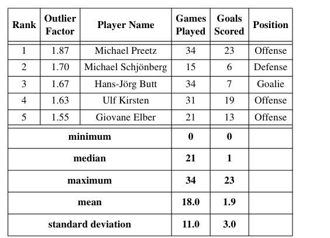

**표 3: 축구 선수 데이터셋의 결과**

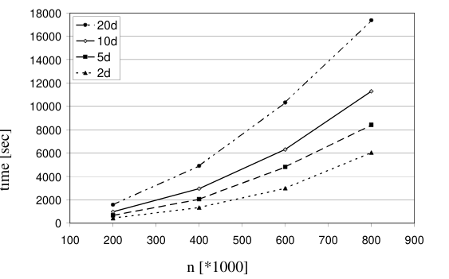

**그림 10: 인덱스를 사용한 다양한 데이터셋 크기와 차원에서의 50-최근접 이웃 쿼리 실행 시간**

<!-- 원문 11쪽 -->

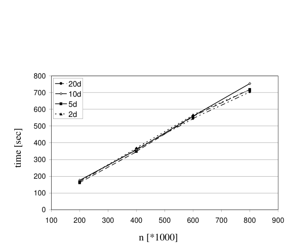

**그림 11: 다양한 데이터셋 크기에서의 LOF 계산 실행 시간**

O(k-nn 쿼리의 경우 n*시간)입니다. k-nn 쿼리의 경우 다양한 방법 중에서 선택할 수 있습니다. 저차원 데이터의 경우 일정한 시간에 k-nn 쿼리에 응답할 수 있는 그리드 기반 접근 방식을 사용할 수 있으므로 구체화 단계에서 O(n)의 복잡성이 발생합니다. 중~중간 고차원 데이터의 경우 k-nn 쿼리에 대해 O(n log n)의 평균 복잡도를 제공하는 인덱스를 사용할 수 있으며 이는 구체화에 대해 O(n log n)의 복잡성으로 이어집니다. 극도로 고차원적인 데이터의 경우 순차 스캔이나 그 변형을 사용해야 합니다. VA 파일([21])의 복잡성은 O(n)이므로 구체화 단계의 복잡성은 O(n2)로 이어집니다. 실험에서 우리는 X-트리의 변형([4])을 사용하여 O(n log n)의 복잡성을 가져왔습니다. 그림 10는 다양한 차원 데이터세트에 대한 성능 실험을 보여주며 MinPtsUB=50. 표시된 시간에는 인덱스 구축 시간이 포함됩니다. 분명히 이 인덱스는 2 차원 및 5 차원 데이터셋에 대해 매우 잘 작동하여 선형에 가까운 성능을 제공하지만 10 차원 및 20 차원 데이터셋에 대해서는 성능이 저하됩니다. 차원이 증가함에 따라 유효성이 감소한다는 것은 인덱스 구조의 잘 알려진 효과입니다.

두 번째 단계에서 LOF 값은 구체화 데이터베이스 M을 사용하여 계산됩니다. M에는 LOF를 계산하는 데 충분한 정보가 포함되어 있으므로 이 단계에는 원본 데이터베이스 D가 필요하지 않습니다. 데이터베이스 M은 MinPtsLB와 MinPtsUB 사이의 모든 MinPts 값에 대해 두 번 스캔됩니다. 첫 번째 스캔에서는 모든 객체의 로컬 도달 가능성 밀도가 계산됩니다. 두 번째 단계에서는 최종 LOF 값이 계산되어 파일에 기록됩니다. 그런 다음 이러한 값을 사용하여 MinPtsLB 및 MinPtsUB 간격의 최대 LOF 값에 따라 개체의 순위를 지정할 수 있습니다. 이 단계의 시간 복잡도는 O(n)입니다. 이는 MinPtsLB=10 ~ MinPtsUB=50에 대한 LOF 값이 계산된 그림 11에 표시된 그래프로 확인됩니다.

## 8 결론

이상값을 찾는 것은 많은 KDD 애플리케이션에서 중요한 작업입니다. 기존 제안은 이진 속성으로 이상값을 고려합니다. 본 논문에서 우리는 많은 상황에서 이상치(outlier)를 이진 속성이 아니라 객체가 주변 이웃과 격리되는 정도에 따라 고려하는 것이 의미가 있음을 보여줍니다. 본 연구에서는 이러한 상대적인 격리 정도를 정확하게 포착하는 로컬 이상치 요인 LOF의 개념을 소개합니다. 본 연구에서는 LOF의 정의가 많은 바람직한 속성을 가지고 있음을 보여줍니다. 클러스터 내부 깊은 곳에 있는 객체의 경우 LOF 값은 대략 1입니다. 다른 객체의 경우 MinPts-최근접 이웃이 하나 이상의 클러스터에서 나오는지 여부에 관계없이 LOF 값에 엄격한 하한 및 상한을 제공합니다. 또한 LOF 값이 MinPts 매개변수에 어떻게 의존하는지 분석합니다. 사용할 MinPts 값 범위를 선택하는 방법에 대한 실용적인 지침을 제공하고, 선택한 범위 내에서 최대 LOF 값을 기준으로 개체 순위를 지정하는 휴리스틱을 제안합니다. 실험 결과는 이전 접근 방식에서는 찾을 수 없었던 의미 있는 로컬 이상값을 식별할 수 있다는 점에서 우리의 휴리스틱이 매우 유망한 것으로 보인다는 것을 보여줍니다. 마지막으로, 로컬 이상값을 찾는 접근 방식이 가장 가까운 이웃 쿼리가 인덱스 구조에 의해 지원되고 매우 큰 데이터셋에 여전히 실용적인 데이터셋에 효율적이라는 것을 보여줍니다.

현재 진행 중인 작업의 방향은 두 가지입니다. 첫 번째는 식별된 로컬 이상값이 예외적인 이유를 설명하거나 설명하는 방법에 관한 것입니다. 이는 고차원 데이터셋의 경우 특히 중요합니다. 왜냐하면 로컬 이상치가 전체 차원이 아닌 일부 차원에서만 벗어날 수 있기 때문입니다([14] 참조). 두 번째는 LOF 계산 성능을 더욱 향상시키는 것입니다. 이 두 가지 방향 모두에서 LOF 계산이 OPTICS [2]와 같은 계층적 클러스터링 알고리즘을 사용하여 "핸드셰이크"할 수 있는 방법을 조사하는 것은 흥미롭습니다. 한편으로, 이러한 알고리즘은 예를 들어 외곽에 있는 클러스터를 분석함으로써 국지적 이상값에 대한 보다 자세한 정보를 제공할 수 있습니다. 반면, LOF 처리와 클러스터링 간에 계산이 공유될 수 있습니다. 공유 계산에는 k-nn 쿼리 및 도달 거리가 포함될 수 있습니다.

## 참고문헌

[1] Arning, A., Agrawal R., Raghavan P.: "A Linear Method for Deviation Detection in Large Databases", Proc. 2nd Int. Conf. on Knowledge Discovery and Data Mining, Portland, OR, AAAI Press, 1996, p. 164-169. [2] Ankerst M., Breunig M. M., Kriegel H.-P., Sander J.: "OPTICS: Ordering Points To Identify the Clustering Structure", Proc. ACM SIGMOD Int. Conf. on Management of Data, Philadelphia, PA, 1999. [3] Agrawal R., Gehrke J., Gunopulos D., Raghavan P.: "Automatic Subspace Clustering of High Dimensional Data for Data Mining Applications", Proc. ACM SIGMOD Int. Conf. on Management of Data, Seattle, WA, 1998, pp. 94-105. [4] Berchthold S., Keim D. A., Kriegel H.-P.: "The X-Tree: An Index Structure for High-Dimensional Data", 22nd Conf. on Very Large Data Bases, Bombay, India, 1996, pp. 28-39. [5] Barnett V., Lewis T.: "Outliers in statistical data", John Wiley, 1994. [6] DuMouchel W., Schonlau M.: "A Fast Computer Intrusion Detection Algorithm based on Hypothesis Testing of Command Transition Probabilities", Proc. 4th Int. Conf. on Knowledge Discovery and Data Mining, New York, NY, AAAI Press, 1998, pp. 189-193. [7] Ester M., Kriegel H.-P., Sander J., Xu X.: "A Density-Based Algorithm for Discovering Clusters in Large Spatial Databases with Noise", Proc. 2nd Int. Conf. on Knowledge Discovery and Data Mining, Portland, OR, AAAI Press, 1996, pp. 226-231. [8] Fawcett T., Provost F.: "Adaptive Fraud Detection", Data Mining and Knowledge Discovery Journal, Kluwer Academic Publishers, Vol. 1, No. 3, 1997, pp. 291-316. [9] Fayyad U., Piatetsky-Shapiro G., Smyth P.: "Knowledge

<!-- 원문 12쪽 -->

Discovery and Data Mining: Towards a Unifying Framework", Proc. 2nd Int. Conf. on Knowledge Discovery and Data Mining, Portland, OR, 1996, pp. 82-88. [10] Hawkins, D.: "Identification of Outliers", Chapman and Hall,

London, 1980. [11] Hinneburg A., Keim D. A.: "An Efficient Approach to

Clustering in Large Multimedia Databases with Noise", Proc. 4th Int. Conf. on Knowledge Discovery and Data Mining, New York City, NY, 1998,pp. 58-65. [12] Johnson T., Kwok I., Ng R.: "Fast Computation of 2-

Dimensional Depth Contours", Proc. 4th Int. Conf. on Knowledge Discovery and Data Mining, New York, NY, AAAI Press, 1998, pp. 224-228. [13] Knorr E. M., Ng R. T.: "Algorithms for Mining Distance-

Based Outliers in Large Datasets", Proc. 24th Int. Conf. on Very Large Data Bases, New York, NY, 1998, pp. 392-403. [14] Knorr E. M., Ng R. T.: "Finding Intensional Knowledge of

Distance-based Outliers", Proc. 25th Int. Conf. on Very Large Data Bases, Edinburgh, Scotland, 1999, pp. 211-222. [15] Ng R. T., Han J.: "Efficient and Effective Clustering Methods

for Spatial Data Mining", Proc. 20th Int. Conf. on Very Large Data Bases, Santiago, Chile, Morgan Kaufmann Publishers, San Francisco, CA, 1994, pp. 144-155. [16] Preparata F., Shamos M.: "Computational Geometry: an

Introduction", Springer, 1988. [17] Ramaswamy S., Rastogi R., Kyuseok S.: "Efficient Algorithms

for Mining Outliers from Large Data Sets", Proc. ACM SIDMOD Int. Conf. on Management of Data, 2000. [18] Ruts I., Rousseeuw P.: "Computing Depth Contours of

Bivariate Point Clouds, Journal of Computational Statistics and Data Analysis, 23, 1996, pp. 153-168. [19] Sheikholeslami G., Chatterjee S., Zhang A.: "WaveCluster: A

Multi-Resolution Clustering Approach for Very Large Spatial Databases", Proc. Int. Conf. on Very Large Data Bases, New York, NY, 1998, pp. 428-439. [20] Tukey J. W.: "Exploratory Data Analysis", Addison-Wesley,

1977. [21] Weber R., Schek Hans-J., Blott S.: "A Quantitative Analysis

and Performance Study for Similarity-Search Methods in High-Dimensional Spaces", Proc. Int. Conf. on Very Large Data Bases, New York, NY, 1998, pp. 194-205. [22] Wang W., Yang J., Muntz R.: "STING: A Statistical

Information Grid Approach to Spatial Data Mining", Proc. 23th Int. Conf. on Very Large Data Bases, Athens, Greece, Morgan Kaufmann Publishers, San Francisco, CA, 1997, pp. 186-195. [23] Zhang T., Ramakrishnan R., Linvy M.: "BIRCH: An Efficient

Data Clustering Method for Very Large Databases", Proc. ACM SIGMOD Int. Conf. on Management of Data, ACM Press, New York, 1996, pp.103-114.

## 부록 정리 2 증명(스케치): p를 데이터베이스 D의 객체, 1 ≤MinPts ≤| D |, C1, C2,..., Cn을 NminPts(p)의 파티션, 즉 NminPts(p) = C1로 둡니다. ∪C2 ∪... ∪Cn ∪{p} with Ci ∩Cj = ∅, Ci ≠∅ for 1 ≤i,j ≤n, i ≠j. 게다가

집합 Ci에 있는 p의 이웃에 있는 객체의 백분율입니다.,, 및 개념을 directmin(p), directmax(p), indirectmin(p) 및 indirectmax(p)와 유사하게 정의하지만 집합 Ci로 제한합니다.

:, 정의에 따르면

.따라서 다음과 같습니다.

: 유사하게. I ξi Ci NminPts p () ⁄ = 방향

직접 최대 p() 간접 최소 p() 간접

LOF p () ξi 방향

간접적으로

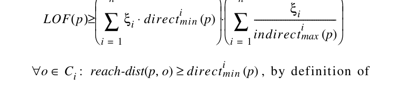

o Ci ∈ ∀ 도달거리 p o, () directi

지시

도달 거리 p o, ()

> **주:** o NminPts p () ∈∑

> **주:** o Ci ∈∑

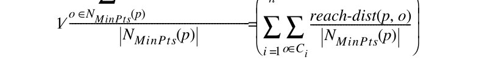

지시

> **주:** o Ci ∈∑

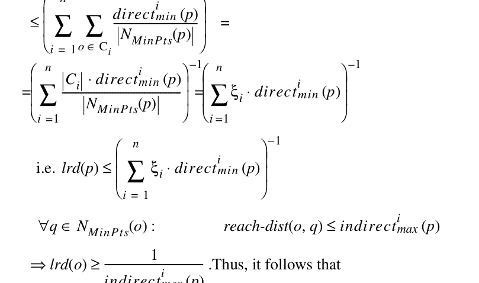

Ci directi

ξi 방향

lrd p () ξi 방향

q NminPts o () ∈ ∀ 도달거리 o q, () 간접i

간접적으로

> **주:** o NminPts p () ∈∑

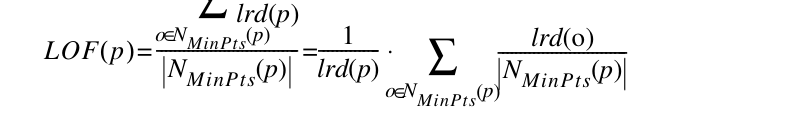

ξi 방향

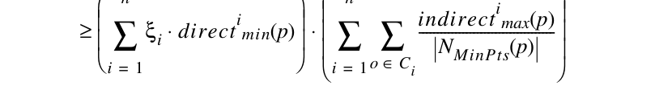

간접적으로

> **주:** o Ci ∈∑

ξi 방향

간접적으로

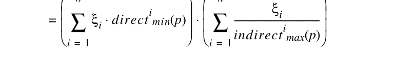

LOF p () ξi 방향

간접적으로

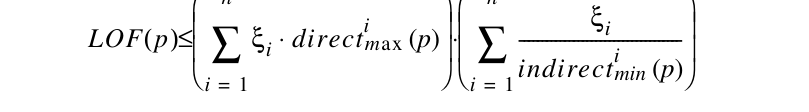
