# 불균형 데이터셋의 이진 분류기 평가에서는 정밀도-재현율 도표가 ROC 도표보다 더 유익하다

> **원문 제목:** The Precision-Recall Plot Is More Informative than the ROC Plot When Evaluating Binary Classifiers on Imbalanced Datasets  
> **저자:** Takaya Saito · Marc Rehmsmeier  
> **게재 정보:** PLOS ONE, Vol. 10, No. 3, 2015  
> **DOI:** [https://doi.org/10.1371/journal.pone.0118432](https://doi.org/10.1371/journal.pone.0118432)

> **번역 안내:** 본문과 부록은 문단 문맥을 기준으로 한국어로 옮겼습니다. 수식과 참고문헌은 정확성을 위해 원문 표기를 유지했습니다. 원문의 그림과 표는 개별 이미지로 잘라 해당 본문 위치에 바로 배치했습니다.

---

<!-- 원문 1쪽 -->

## 초록

이진 분류기는 민감도 및 특이도와 같은 성능 측정을 통해 정기적으로 평가되며 성능은 ROC(수신자 조작 특성) 플롯으로 자주 표시됩니다. PPV(양성 예측값) 및 관련 PRC(정확도/재현율) 플롯과 같은 대체 측정은 덜 자주 사용됩니다. 많은 생물정보학 연구에서는 부정문의 수가 긍정문의 수보다 훨씬 더 많은 불균형이 심한 데이터셋에 적용할 분류기를 개발하고 평가합니다. ROC 플롯은 시각적으로 매력적이며 광범위한 특정성에 걸쳐 분류기 성능에 대한 개요를 제공하지만 불균형 분류 시나리오에 적용될 때 ROC 플롯이 오해의 소지가 있을 수 있는지 여부를 질문할 수 있습니다. 여기서는 불균형 데이터셋의 맥락에서 ROC 플롯의 시각적 해석 가능성이 직관적이지만 특이성에 대한 잘못된 해석으로 인해 분류 성능의 신뢰성에 대한 결론과 관련하여 기만적일 수 있음을 보여줍니다. 반면 PRC 플롯은 긍정적인 예측 중에서 참양성의 비율을 평가하므로 시청자에게 향후 분류 성능에 대한 정확한 예측을 제공할 수 있습니다. 우리의 연구 결과는 불균형 데이터셋에 ROC 플롯을 사용하는 수많은 연구의 해석에 잠재적인 영향을 미칩니다.

## 서론

이진 분류자는 데이터세트를 양성 그룹과 음성 그룹의 두 그룹으로 나누는 통계 및 계산 모델입니다. 이 제품은 최근 [1–3]에서 광범위한 생물학적 및 의학적 문제에 성공적으로 적용되었습니다. 분류기의 예측 성능을 평가하는 것은 경쟁 방법과 비교하여 그 유용성을 판단하는 데 매우 중요합니다. 모델 구성 단계에서 일반적으로 사용되는 분류기 성능 측정값은 정확도, 오류율 및 ROC(수신자 조작 특성) 곡선(AUC) [4] 아래 영역입니다. 다양한 추가 측정값은 최종 모델 평가에 유용하며 여러 플롯은 ROC 및 PRC(Precision-Recall) 플롯 [5]와 같은 시각적 표현을 제공합니다.

플로스원 | DOI:10.1371/journal.pone.0118432 3월 4, 2015 1 / 21

## 오픈 액세스

인용: Saito T, Rehmsmeier M (2015) 불균형 데이터셋에서 이진 분류기를 평가할 때 정밀 재현 도표가 ROC 도표보다 더 많은 정보를 제공합니다. PLoS ONE 10(3): e0118432. doi:10.1371/journal.pone.0118432 학술 편집자: Guy Brock, University of Louisville, 미국 접수: 6월 23, 2014 승인: 1월 16, 2015 출판: 3월 4, 2015 저작권: © 2015 Saito, Rehmsmeier. 이 글은 Creative Commons Attribution License의 조건에 따라 배포되는 오픈 액세스 기사입니다. 이 기사는 원저작자와 출처를 명시하는 경우 모든 매체에서 무제한 사용, 배포 및 복제를 허용합니다.

데이터 가용성 설명: http://dx.doi.org/10.6084/m9.figshare.1245061.에서 데이터를 사용할 수 있습니다.

자금: 저자는 보고할 자금이나 지원이 없습니다.

경쟁적 이해관계: 저자는 경쟁적 이해관계가 존재하지 않는다고 선언했습니다.

<!-- 원문 2쪽 -->

클래스 불균형(긍정 사례 수와 부정 사례 수의 차이, 일반적으로 부정 사례가 긍정 사례보다 많은 경우)은 불평등한 클래스 분포가 자연적으로 발생하는 생명 과학을 포함한 광범위한 과학 분야에서 발생합니다. 불균형 데이터셋의 분류는 기계 학습 [5, 10] 분야에서 비교적 새로운 과제입니다. 불균형 데이터에 대한 이진 분류를 위한 많은 솔루션이 [5, 11]로 제안되었지만 대부분 데이터 리샘플링 [7, 12–14] 또는 모델 훈련 [15–19]와 관련이 있습니다. 불균형 데이터 [5, 11, 20]를 사용하여 분류기를 구축하기 위한 최첨단 솔루션의 개발에도 불구하고 적절한 성능 평가 방법을 선택하는 것이 종종 과소평가됩니다.

훈련 단계의 평가는 최종 모델의 평가와 다르다는 점을 인식하는 것이 중요합니다. 첫 번째 단계는 훈련 중에 가장 효과적이고 견고한 모델을 선택하는 것입니다. 일반적으로 교차 검증 [21]와 같이 훈련 데이터셋를 훈련 및 검증 하위 집합으로 더 나눕니다. 두 번째 단계는 학습 후 최종 모델을 평가하는 것입니다. 이상적으로는 이 단계의 테스트 데이터는 일반적으로 분포가 알려지지 않더라도 원래 모집단의 클래스 분포를 반영합니다. 이 기사에서는 최종 모델의 성능 평가만을 분석합니다.

처리량이 많은 생물학적 실험의 급속한 확장으로 인해 다수의 대규모 데이터셋가 생성되고 이러한 데이터셋의 대부분은 불균형 [8, 22, 23]일 것으로 예상할 수 있습니다. 여기에서는 일반적으로 사용되는 평가 방법, 특히 ROC [24, 25], PRC [26], 집중 ROC(CROC) [27] 및 비용 곡선(CC) [28]의 이론적 배경을 검토합니다. ROC는 이진 분류기에 가장 널리 사용되는 평가 방법이지만 불균형 데이터셋 [29]와 함께 사용할 경우 ROC 곡선 해석에 특별한 주의가 필요합니다. ROC 대안인 PRC, CROC 및 CC는 ROC보다 덜 인기가 있지만 불균형 데이터셋 [26–28]에서도 강력한 것으로 알려져 있습니다. 본 연구에서 우리는 전산 생물학/생명 과학 청중을 대상으로 여러 가지 관점에서 이러한 측정 간의 차이점을 명확히 하는 것을 목표로 합니다. 이 목표를 달성하기 위해 먼저 특이성 및 민감도와 같은 기본 단일 임계값 측정값을 도입한 다음 ROC 및 ROC 대체 플롯을 도입합니다. 그런 다음 불균형 데이터와 정밀도에 기반을 둔 PRC에 대한 정보 측정값으로서의 정밀도에 대해 논의합니다. 시뮬레이션 연구에서는 불균형 데이터셋의 맥락에서 적용될 때 ROC, PRC, CROC 및 CC의 동작과 유용성을 분석합니다. 시뮬레이션에서는 성능 수준이 서로 다른 무작위로 생성된 샘플을 사용합니다. 이어서 불균형 데이터셋에 대한 실제 연구에서 어떤 평가 척도가 사용되는지 조사하는 문헌 분석 결과를 보여줍니다. 문헌 분석은 두 가지 PubMed 검색 결과 세트를 기반으로 합니다. 또한 MiRFinder [30]라는 인기 있는 마이크로RNA 유전자 발견 알고리즘에 대해 이전에 발표된 연구의 분류기 성능을 재분석합니다. 또한 사용 가능한 평가 도구에 대한 간략한 검토도 포함되어 있습니다.

이론적 배경 이론적 배경 섹션을 통해 혼동 행렬의 기본 측정과 ROC 및 PRC와 같은 임계값 없는 측정을 포함한 성능 측정을 검토합니다. 필요한 경우 간단한 예제와 도구에 대한 간략한 소개도 포함되어 있습니다. 섹션을 구성하기 위해 ROC, PRC 및 도구라는 세 가지 고유한 레이블을 사용합니다. 첫 번째 레이블인 ROC는 PRC를 제외한 기본 조치, ROC 및 ROC 대안의 이론적 배경을 나타냅니다. 두 번째 레이블인 PRC는 정밀도와 PRC의 이론적 배경과 ROC와 PRC 간의 비교를 나타냅니다. 마지막으로 세 번째 레이블인 도구는 ROC, ROC 대안 및 PRC용 도구에 대한 간략한 소개를 나타냅니다. 전체 섹션을 쉽게 따라갈 수 있도록 하위 섹션 제목의 시작 부분에 이러한 라벨을 사용합니다.

플로스원 | DOI:10.1371/journal.pone.0118432 March 4, 2015 2 / 21 ROC: 다양한 평가 척도를 형성하는 혼동 행렬의 네 가지 결과 조합 이진 분류에서 데이터는 양성(P)과 음성(N)의 두 가지 클래스로 나뉩니다(참조: 그림 1A, 왼쪽 타원). 그런 다음 이진 분류기는 모든 데이터 인스턴스를 양수 또는 음수로 분류합니다(그림 1A, 오른쪽 타원 참조). 이 분류는 두 가지 유형의 올바른(또는 참) 분류, 참양성(TP) 및 참음성(TN), 두 가지 유형의 잘못된(또는 거짓) 분류, 위양성(FP) 및 위음성(FN)의 네 가지 유형의 결과를 생성합니다(그림 1B 참조). 이러한 네 가지 결과로 구성된 2x2 테이블을 혼동 행렬이라고 합니다. 모든

<!-- 원문 3쪽 -->

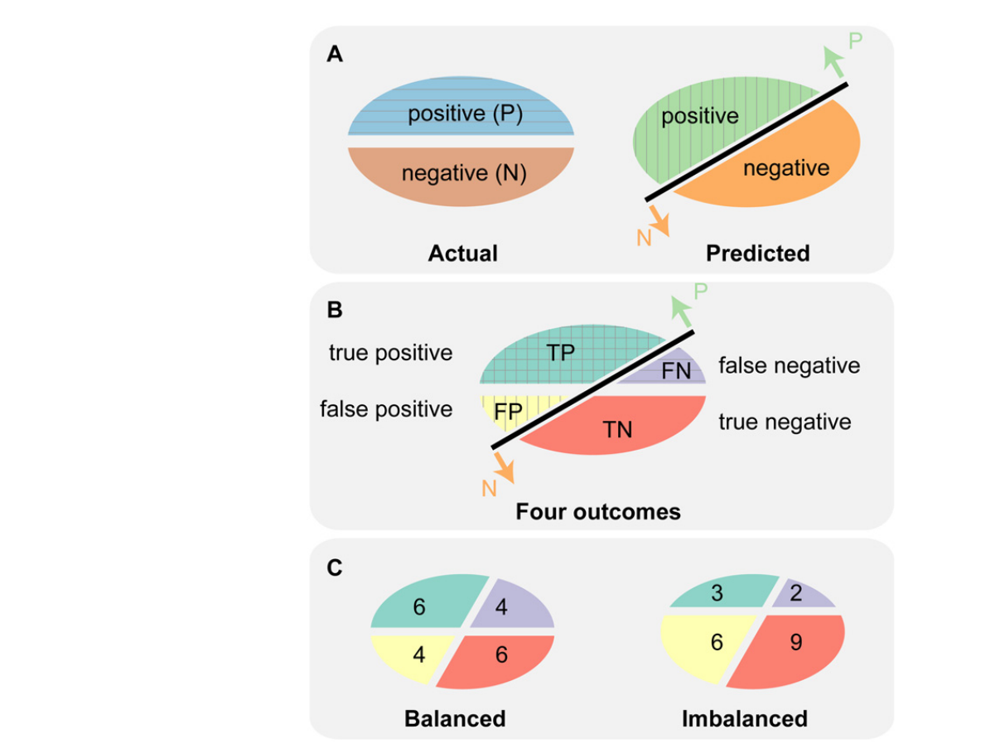

**그림 1. 실제 및 예측 레이블은 혼동 행렬의 네 가지 결과를 생성합니다. (A) 왼쪽 타원에는 양수(P; 파란색; 위쪽 절반)와 음수(N; 빨간색; 아래쪽 절반)의 두 가지 실제 레이블이 표시됩니다. 오른쪽 타원에는 "양성으로 예측됨"(연한 녹색, 왼쪽 상단 절반) 및 "음성으로 예측됨"(주황색, 오른쪽 하단 절반)이라는 두 가지 예측 레이블이 표시됩니다. 검은색 선은 데이터를 위쪽 화살표 "P"로 표시된 "양성으로 예측"과 아래쪽 화살표 "N"으로 표시된 "음성으로 예측"으로 분리하는 분류기를 나타냅니다. (B) 실제 레이블 2개와 예측 레이블 2개를 결합하면 참양성(TP; 녹색), 거짓음성(FN; 보라색), 거짓양성(FP; 노란색) 및 참음성(TN; 빨간색)의 네 가지 결과가 생성됩니다. (C) 두 개의 타원은 균형(왼쪽) 및 불균형(오른쪽) 데이터에 대한 TP, FP, TN 및 FN의 예를 보여줍니다. 두 예제 모두 균형 잡힌 경우에는 10 양수 및 10 음수를 포함하고, 불균형한 경우에는 5 양수 및 15 음수를 포함하는 20 데이터 인스턴스를 사용합니다.** 이진 분류의 기본 평가 측정은 혼동 행렬에서 파생됩니다(표 1 참조).

<!-- 원문 4쪽 -->

분류기 성능에 대해 가장 널리 사용되는 기본 측정값은 정확도(ACC)와 오류율(ERR) [5]입니다. 민감도(SN)와 특이도(SP)도 인기 있는 [31]입니다. 민감도는 참양성률(TPR) 및 재현율(REC)과 동일하며 특이도는 1, 즉 거짓양성률(FPR)과 동일합니다. 또 다른 척도는 정밀도(PREC)이며 PRC는 이를 기반으로 합니다. 정밀도는 PPV(양성 예측값)와도 동일합니다.

Matthews 상관 계수(MCC) [32] 및 Fβ 점수 [33]도 유용하지만 사용 빈도는 낮습니다. MMC는 혼동행렬의 4개 값 모두에서 계산된 상관계수입니다. Fβ 점수는 β가 일반적으로 0.5, 1 또는 2인 재현율과 정밀도의 조화 평균입니다.

이러한 모든 조치에는 서로 다른 장점과 단점이 있습니다. 균형 잡힌 데이터셋와 불균형 데이터셋에서 서로 다르게 동작하기 때문에 현재 데이터의 클래스 분포를 고려하거나 향후 애플리케이션에서 분석하고 의미 있는 성능 평가를 위한 적절한 측정값을 선택하는 것이 중요합니다.

ROC: ROC 플롯은 이진 분류기에 대한 모델 전체 평가를 제공합니다.

표 1에는 분류기 성능 평가를 위한 기본 측정값이 나열되어 있습니다. 이러한 측정값은 모두 단일 임계값 측정값입니다. 즉, 분류자의 개별 점수 임계값(컷오프)에 대해 정의되며 다양한 임계값을 사용하여 성능 범위에 대한 개요를 제공할 수 없습니다. 데이터셋를 긍정적으로 예측된 클래스와 부정적으로 예측된 클래스로 나누는 이러한 임계값은 특정 애플리케이션에서 합리적일 수 있지만 올바른 임계값을 선택하는 방법은 분명하지 않습니다. 강력한 해결책은 ROC 및 PRC 플롯과 같은 임계값 독립적 측정값을 사용하는 것입니다. 이를 위해서는 분류기가 단순한 정적 구분이 아니라 데이터셋를 양성 예측 클래스와 음성 예측 클래스로 나눌 수 있는 점수를 생성해야 합니다. 최근 기계 학습 라이브러리 대부분은 점수 [27, 34, 35]로 사용할 수 있는 판별값 또는 사후확률을 생성하지만, 모든 분류기가 이러한 값을 제공하는 것은 아닙니다.

ROC 플롯은 특이성과 민감도 [24] 사이의 균형을 보여줍니다. 가능한 모든 임계값에서 계산된 특이성과 민감도 값의 쌍을 표시하므로 모델 전체에 적용됩니다.

**표 1. 혼동 행렬의 기본 평가 측정입니다.**

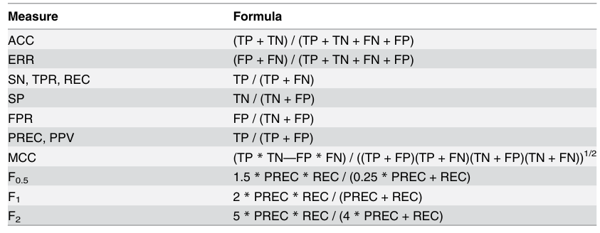

ACC: 정확성; ERR: 오류율; SN: 민감도; TPR: 참양성률; REC: 회상; SP: 특이성; FPR: 위양성률; PREC: 정밀도; PPV: 양성 예측값; MCC: 매튜스 상관계수; F: F 점수; TP: 참양성; TN: 참음성; FP: 거짓 긍정; FN: 거짓 부정 점수. ROC 플롯에서 무작위 성능을 갖는 분류기는 (0, 0)에서 (1, 1) [24]까지 직선 대각선을 나타내며 이 선을 ROC의 기준선으로 정의할 수 있습니다. ROC 곡선은 AUC(ROC 곡선 아래 영역) 점수라는 단일 성능 측정값을 제공합니다. AUC는 무작위의 경우 0.5이고 완벽한 분류기 [4]의 경우 1.0입니다. AUC 점수는 여러 분류기의 성능을 비교하는 데 편리합니다.

<!-- 원문 5쪽 -->

ROC: 집중 ROC(CROC) 플롯은 분류기의 초기 검색 성능을 평가합니다. ROC 플롯의 초기 검색(ER) 영역(그림 2A의 회색 직사각형 영역 참조)은 순위가 높은 인스턴스 [36, 37]가 있는 데이터의 일부를 평가하는 데 유용합니다. 예를 들어, 분류자가 데이터의 상당 부분을 긍정적으로 예측하는 경우, 특히 데이터셋가 큰 경우 긍정적으로 예측된 ​​모든 인스턴스를 검사하는 데 시간과 비용이 많이 걸릴 수 있습니다. 따라서 제한된 수의 최고 점수 인스턴스만을 검사하는 조기 검색의 성능을 확인하는 것이 실용적입니다.

집중 ROC(CROC) 플롯은 조기 검색 성능 [27]의 평가를 용이하게 합니다. CROC 플롯은 x축의 FPR을 변환하는 돋보기 특성으로 구성됩니다. 예를 들어, α = 7(방법 참조)와 함께 지수 함수를 사용하는 경우 이 함수는 FPR [0.0, 0.5, 1.0]를 [0.0, 0.971, 1.0]로 변환합니다. 0와 0.5 사이의 영역은 확장되는 반면, 0.5와 1.0 사이의 영역은 축소됩니다. ROC 플롯과 마찬가지로 CROC 곡선의 AUC(곡선 아래 면적)는 분류기 비교 [27]에도 효과적입니다. 거짓 긍정(FP) 수가 50 [38]에 도달할 때까지 참 긍정(TP)을 합산하는 ROC50과 같은 간단한 단일 임계값 측정은 조기 검색 성능을 평가하는 데 유용할 수 있지만, CROC 플롯은 성능 범위에 대한 시각적 표현을 제공하며 더 높은 수준의 유용성을 제공합니다.

ROC: 비용 곡선(CC)은 잘못된 분류 비용을 고려합니다. 비용 곡선(CC)은 ROC 플롯 [12, 28]의 대안입니다. 비용 곡선은 다양한 작동 지점 [5]에 따라 분류 성능을 분석합니다. 작동점은 클래스 확률과 오분류 비용을 기반으로 합니다. 정규화된 예상 비용 또는 NE[C]는 y축 [28]의 분류 성능을 나타냅니다. 이는 오류율과 유사하므로 NE[C] 값이 낮을수록 더 나은 분류기를 나타냅니다. 확률 비용 함수(+) 또는 PCF(+)는 x축 [28]의 작동 지점을 나타냅니다. PCF(+)는 양성을 올바르게 분류할 확률을 기반으로 하며 클래스 확률과 오분류 비용 [5]로 계산됩니다. PCF(+) 및 NE[C]의 실제 계산은 ROC 및 PRC 플롯과 관련된 계산보다 훨씬 더 복잡합니다(PCF(+) 및 NE [C] 계산에 대한 S1 파일의 보완 방법 참조).

PRC: 정밀도는 불균형 데이터셋에서 이진 분류기를 평가할 때 직관적인 척도입니다. 분류기 성능의 기본 측정이 균형 및 불균형 데이터셋에서 어떻게 작동하는지 조사하기 위해 간단한 예를 만들었습니다(그림 1C 참조). 두 데이터셋 모두 동일한 샘플 크기를 갖습니다. 참, 거짓 긍정 및 부정 예측(TP, FP, TN 및 FN)의 수는 그림 1C에 표시된 대로 정의됩니다. 표 2에는 두 데이터세트에서 파생된 기본 측정값에 대한 결과가 나열되어 있습니다. 정밀도, MMC 및 세 가지 Fβ 점수만 두 데이터세트 간에 달라지며 대부분의 측정값은 변경되지 않습니다(표 2의 균형 및 불균형 열 참조). 더 중요한 것은 이러한 변경되지 않은 측정값이 불균형 샘플에 대한 분류기의 성능 저하를 포착하지 못한다는 것입니다. 예를 들어 정확도(ACC)는 PLOS ONE | DOI:10.1371/journal.pone.0118432 3월 4, 2015 5 / 21

<!-- 원문 6쪽 -->

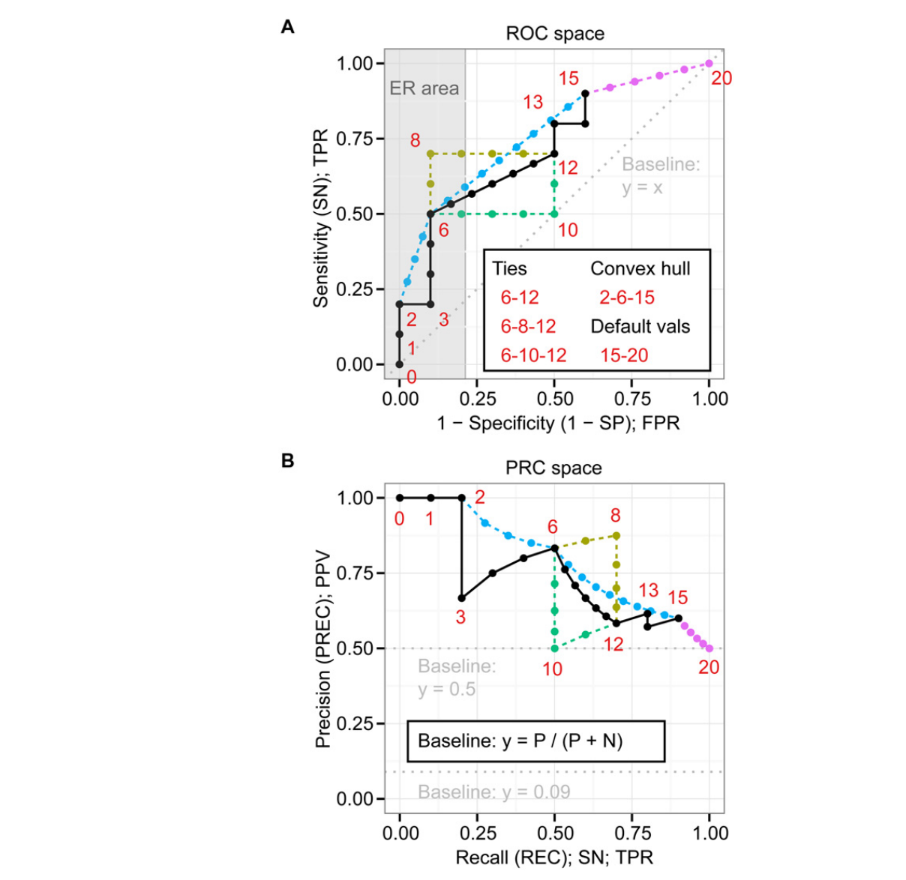

**그림 2. PRC 곡선은 ROC 곡선과 일대일 관계를 갖습니다. (A) ROC 공간에는 하나의 기본 ROC 곡선 및 점(검은색)과 4개의 대체 곡선 및 점이 포함되어 있습니다. 묶인 하한(녹색), 묶인 상한(진한 노란색), 볼록 껍질(연한 파란색) 및 누락된 예측 데이터에 대한 기본값(자홍색). ROC 포인트 옆의 숫자는 10 양성 및 10 음성에서 FPR 및 TPR을 계산하기 위한 점수 순위를 나타냅니다(실제 점수는 S1 파일의 표 A 참조). (B) PRC 공간에는 ROC 공간의 PR 포인트에 해당하는 PR 포인트가 포함됩니다.** 분류기의 성능은 두 샘플(0.6) 모두에 대해 양호합니다. 그러나 정밀도(PREC/PPV)는 분류기의 성능이 균형 잡힌 데이터셋(0.6)에서는 좋지만 불균형 데이터셋(0.33)에서는 상대적으로 좋지 않음을 나타냅니다. 따라서 정밀도는 정확도를 사용할 때 눈에 띄지 않는 성능 차이를 나타냅니다.

<!-- 원문 7쪽 -->

MMC와 세 가지 Fβ 점수도 두 데이터세트 간에 다르지만 정밀도가 해석하기 더 쉽습니다. 예를 들어, 0.33의 정밀도는 긍정적 예측 중 33% 올바른 예측으로 즉시 이해될 수 있습니다. 이러한 이해는 긍정적으로 분류된 인스턴스("예측") 간의 올바른 분류 수에 대한 추정이 매우 중요한 대규모 데이터셋에 분류기를 적용하는 것으로 직접 변환됩니다. 정밀도는 성능의 이러한 측면을 직접적이고 직관적으로 측정하는 것입니다.

PRC: PRC 플롯은 정밀도와 민감도 사이의 관계를 보여 주며 해당 기준선은 클래스 분포에 따라 이동합니다. PRC(정밀도-리콜) 플롯은 해당 민감도(재현율) 값에 대한 정밀도 값을 표시합니다. ROC 플롯과 유사하게 PRC 플롯은 모델 전체에 대한 평가를 제공합니다. AUC(PRC)로 표시되는 PRC의 AUC 점수는 다중 분류자 비교 [26]에서도 마찬가지로 효과적입니다.

기준선은 ROC로 고정되어 있는 반면, PRC의 기준선은 y = P/(P + N)과 같이 양성(P)과 음성(N)의 비율에 따라 결정됩니다. 예를 들어 균형 클래스 분포에 대해서는 y = 0.5가 있지만 P:N 비율이 1:10인 불균형 클래스 분포에 대해서는 y = 0.09가 있습니다(그림 2B 참조). 이러한 이동 기준선으로 인해 AUC(PRC)도 P:N 비율에 따라 변경됩니다. 예를 들어, 무작위 분류기의 AUC(PRC)는 균형 클래스 분포에 대해서만 0.5인 반면, 균형 및 불균형 분포를 포함한 일반적인 경우에는 P/(P + N)입니다. 실제로 AUC(PRC)는 PRC 기준선의 y 위치와 동일합니다.

PRC: PRC 및 ROC 곡선은 점 사이를 보간할 때 서로 다른 처리가 필요합니다. PRC 곡선은 해당 ROC 곡선 [26]와 일대일 관계를 갖습니다. 즉, 두 곡선 중 하나의 각 점이 다른 곡선의 해당 점을 고유하게 결정합니다. 그럼에도 불구하고 PRC 곡선과 ROC 곡선의 보간 방법이 다르기 때문에 점 간 보간을 수행할 때는 주의해야 합니다. ROC 분석은 선형 보간을 사용하고 PRC 분석은 비선형 보간을 사용합니다. PRC 공간에서 두 점 A와 B 사이의 보간

**표 2. 균형 잡힌 데이터와 불균형 데이터셋에 대한 기본 평가 측정의 예입니다.**

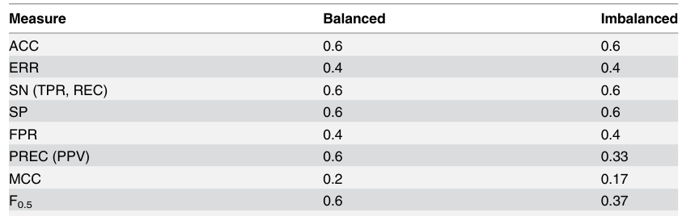

```text
F1
0.6
0.43
```

```text
F2
0.6
0.52
```

두 데이터셋의 참/거짓 긍정 및 부정의 수는 그림 1C를 참조하세요. 는 함수 y = (TPA + x) / {TPA + x + FPA + ((FPB - FPA)로 표현될 수 있습니다. x) / (TPB - TPA)} 여기서 x는 TPA와 TPB [26] 사이의 값일 수 있습니다.

<!-- 원문 8쪽 -->

보간과 관련된 ROC 특성의 세 가지 실제 예는 ROC 볼록 껍질 [39], 동점 처리 및 누락된 점수에 대한 기본값입니다. 이러한 특성을 탐색하기 위해 우리는 동일한 수의 양성 및 음성을 갖는 20 인스턴스의 예를 연구했습니다(그림 2A 참조, 점수 및 레이블은 S1 파일의 표 A 참조).

ROC 볼록 껍질은 분류기 [39]의 가능한 최고 성능에 대한 추정치를 제공합니다. 이는 그림 2A의 0–2–6–13–15–20 의 일부 점만 연결하는 직선의 조합인 반면, 원래 ROC 곡선은 모든 점을 직선으로 연결합니다(0 에서 0 까지의 모든 점). 그림 2A의 20). ROC 볼록 선체에 대해 일부 점을 건너뛰었기 때문에 이 ROC 볼록 선체의 AUC가 원래 ROC 곡선의 AUC보다 우수하다는 것을 쉽게 알 수 있습니다.

분류기는 때때로 예측 부분(그림 2A의 6–12)에 대해 동점(동일 점수)을 생성합니다. 이러한 관계에서 ROC 곡선을 만드는 세 가지 확실한 접근법은 양수 계산을 먼저 사용하는 상한(그림 2A의 6–8–12), 음수 계산을 먼저 사용하는 하한(그림 2A의 6–10–12) 및 평균을 사용하는 것입니다. (그림 2A의 6–12). ROC 플로팅 도구는 일반적으로 평균 및 하한 방법 [27, 40]를 사용합니다.

분류기는 때때로 예측의 일부에 점수를 부여하지 못합니다. 이러한 경우의 예로는 분류 전 필터링을 사용하는 경우가 있습니다. 필터링에 의해 제외된 인스턴스에는 할당된 점수가 없을 가능성이 높습니다. 이 예에서 ROC 플롯은 분류기가 15 인스턴스(그림 2A의 0–15)에 대해서만 점수를 부여하고 나머지 5개 인스턴스(그림 2A의 16–20)에 대해서는 점수를 부여하지 않은 경우를 보여줍니다. 누락된 점수를 보상하기 위한 측정값으로 이러한 5개의 인스턴스에 동일한 기본값이 할당되면 ROC 곡선은 점(1, 1)(그림 2A의 15–20)까지 선형적으로 계속될 수 있습니다.

PRC 분석의 보간에는 ROC 분석보다 더 많은 계산이 필요하지만 그럼에도 불구하고 잘못된 플롯을 피하려면, 특히 보간할 PRC 점의 거리가 매우 큰 경우 올바른 절차를 따르는 것이 중요합니다. 간단한 예에서 개별 포인트의 일대일 관계는 그림 2A 및 B의 0-20 포인트에서 볼 수 있습니다.

도구: ROC 및 PRC 플롯을 만들기 위한 다양한 도구를 무료로 사용할 수 있습니다. ROC 및 PRC 플롯을 만들기 위한 다양한 도구를 무료로 사용할 수 있지만 PRC 특성은 일반적으로 ROC 특성에 비해 부족합니다. ROCR [40]는 ROC, PRC, CC를 포함한 다양한 평가 플롯을 그리는 데 널리 사용되는 R [41] 패키지입니다. 비선형 PRC 보간 계산 특성이 부족합니다. AUCCalculator [26]는 Java 애플리케이션이며 정확한 PRC 및 ROC 보간을 제공합니다. 그러나 그래프 플로팅 특성이 부족합니다. CROC [27]는 CROC 및 ROC 계산을 위한 Python 패키지입니다. WEKA [34] 및 Bioconductor [42, 43]와 같은 여러 통합 기계 학습 및 생물정보학 플랫폼에는 ROC 및 PRC 플롯을 만들기 위한 기본 특성 또는 라이브러리도 있습니다. 전반적으로 정확한 PRC 플롯을 생성하려면 AUCCalculator와 그래프 플롯 프로그램의 조합을 권장할 수 있습니다. ROCR도 권장될 수 있지만 PRC 지점 간 보간이 필요하지 않은 경우에만 가능합니다.

재료 및 방법 기본 평가 척도 혼동행렬로부터 기본 평가 척도를 계산하였다. 이진 분류기의 혼동 행렬에는 참양성(TP), 참음성(TN), 거짓양성(FP), 거짓음성(FN)의 네 가지 결과가 있습니다. 본 연구에서 논의하는 측정값은 정확도(ACC), 오류율 PLOS ONE | DOI:10.1371/journal.pone.0118432 3월 4, 2015 8 / 21 (ERR), 민감도(SN), 특이도(SP), 참양성률(TPR), 재현율(REC), 위양성률(FPR), 정밀도(PREC), 긍정적인 예측 값(PPV), 매튜스 상관 계수(MCC) [32] 및 Fβ 점수 [33], 여기서 β는 0.5, 1 또는 2입니다. 표 1에는 이러한 측정값의 공식이 요약되어 있습니다.

<!-- 원문 9쪽 -->

모델 전체 평가 측정 본 연구에서 분석하는 모델 전체 평가 측정은 ROC, PRC, CROC 및 CC입니다. 본 연구에서는 내부 Python 및 R 스크립트를 사용하여 이를 생성하는 데 필요한 값을 계산했습니다. 스크립트에는 그래프 플로팅 특성도 포함되어 있습니다. ROC 플롯에는 FPR 또는 1(x축에 특이성, y축에 TPR 또는 민감도)가 있습니다. PRC 플롯의 x축에는 민감도/재현율이 있고 y축에는 정밀도/PPV가 있습니다. CROC 플롯은 x축의 FPR과 y축의 TPR을 변환했습니다. FPR을 변환하기 위해 α = 8와 함께 지수 함수 f(x) = (1 - exp(-αx))/(1 - exp(-α))를 사용했습니다. CC 플롯의 x축에는 확률 비용 함수(+) 또는 PCF(+)가 있고 y축 [28]에는 정규화된 예상 비용 또는 NE[C]가 있습니다. PCF(+)는 양성 항목을 올바르게 분류할 확률을 기반으로 하는 반면, NE[C]는 분류 성능을 나타냅니다(PCF(+) 및 NE[C] 계산에 대한 S1 파일의 보완 방법 참조). 본 연구에서는 AUCCalculator [26]와 CROC Python 라이브러리 [27]를 사용하여 곡선 아래 면적을 계산했습니다.

무작위 샘플링을 사용한 시뮬레이션 모델 전반의 평가 측정값을 분석하고 비교하기 위해 긍정적인 점과 부정적인 점에 대한 점수 분포에서 점수를 무작위로 추출하여 분류기 성능의 5가지 수준으로 샘플을 생성했습니다(표 3). 점수가 높은 인스턴스는 양성으로 분류될 가능성이 더 높다는 것을 나타냅니다. 본 연구에서는 정규(N) 또는 베타 분포에서 양성 및 음성을 샘플링하여 무작위(Rand), 불량한 조기 검색(ER-), 양호한 조기 검색(ER+) 및 우수(Excel)의 네 가지 수준을 만들었습니다. 분포에서 샘플링하는 대신 상수 값 1(양수) 및 0(음수)를 사용하여 Perfect(Perf) 점수를 매겼습니다. ER-와 ER+의 점수는 유사한 점수 분포를 기반으로 합니다. ER+는 높은(더 나은) 순위에서 더 많은 긍정적인 경향이 있는 반면, ER-는 낮은(나쁜) 순위에서 더 많은 긍정적인 경향이 있다는 점에서 다릅니다. 생성된 점수를 정렬을 위해 배열에 저장했습니다. 그 후 우리는 가장 낮은 점수부터 가장 높은 점수까지 순위를 매겼습니다. 동점 점수의 경우 원래 배열에서 발생 순서대로 순위를 할당했습니다. 그림 3는 5개 레벨에 대한 점수 분포의 시각화를 보여줍니다. 시뮬레이션에서는 균형 잡힌 데이터셋에 대해 1000 포지티브 및 1000 네거티브를 사용하고 불균형 데이터셋에 대해 1000 포지티브 및 10 000 네거티브를 사용했습니다. 시뮬레이션의 한 라운드에서는 이러한 샘플을 사용하여 ROC, PRC 및 기타 플롯에 필요한 모든 측정값을 계산합니다. 그런 다음 다른 라운드의 데이터 샘플링부터 다시 시작했습니다. 본 연구에서는 전체 과정을 반복했습니다.

**표 3. 성능 시뮬레이션에 대한 긍정적인 점과 부정적인 점의 분포를 점수화합니다.**

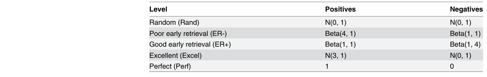

N: 평균과 분산이 있는 정규 분포; 베타: 모양 매개변수가 있는 베타 분포. 완벽한 성능 수준을 위해 고정 값 1 및 0가 사용되었습니다. 1000 번. 곡선을 그리기 위해 x축에 대해 1000 bin을 만들고 y축에 대해 해당 값의 중앙값을 계산했습니다.

<!-- 원문 10쪽 -->

PubMed 검색 생명 과학 연구에서 이진 분류기에 사용되는 평가 측정 방법을 조사하기 위해 두 가지 PubMed 검색을 수행했습니다. 첫 번째 PubMed 검색에서는 일반적으로 ROC가 얼마나 인기가 있는지 알아보는 것을 목표로 "ROC OR(Receiver Operating Characteristics)"라는 용어를 사용했습니다. 결과를 통해 우리는 2002와 2012 사이의 연간 기사 수를 수집했습니다. 두 번째 PubMed 검색에서는 Support Vector Machine 분류자를 사용하여 게놈 차원의 연구를 찾는 것을 목표로 했으며 "((Support Vector Machine) AND Genome-wide) NOT Association"이라는 용어를 사용했습니다. 본 연구에서는 "지원 벡터 머신(Support Vector Machine)"을 사용하여 이진 분류기가 있는 연구를 찾고 "게놈 전체"를 사용하여 불균형 데이터셋가 있는 연구를 찾았습니다. 또한 GWAS(Genome-Wide Association Studies) [44]를 제외하기 위해 "NOT 연관"을 추가했습니다. 검색 결과 5월 2013까지의 63 기사 목록이 나왔습니다(S1 파일의 표 B). 3개의 리뷰 논문과 전문에 액세스할 수 없는 2개의 논문은 추가 분석에서 제외되었습니다.

두 번째 PubMed 검색에 대한 문헌 분석 두 번째 검색에서 검색된 58 기사를 수동으로 분석하고 세 가지 주요 및 13 하위 범주(S1 파일의 표 C 및 D)에 따라 분류했습니다. 세 가지 주요

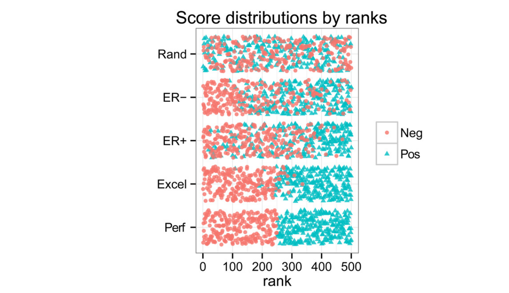

**그림 3. 긍정적인 점수 분포와 부정적인 점수 분포의 조합은 시뮬레이션 분석을 위해 5가지 다른 수준을 생성합니다. Rand, ER-, ER+, Excel 및 Perf에 대해 250 부정 및 250 긍정을 무작위로 샘플링한 다음 점수를 1에서 500까지 순위로 변환했습니다. 빨간색 원은 250 네거티브를 나타내고 녹색 삼각형은 250 포지티브를 나타냅니다.** 항목은 SVM 유형, 데이터 유형 및 평가 방법입니다. 본 연구에서는 SVM 분류기가 이진 분류기인지 여부를 식별하기 위해 SVM 유형 범주를 사용했습니다. 여기에는 BS(바이너리 SVM) 및 OS(기타 SVM)의 두 가지 하위 카테고리가 포함되어 있습니다(S1 파일의 표 C). 성능 평가에 사용되는 데이터셋가 불균형한지 여부를 식별하기 위해 데이터 유형 범주를 사용했습니다. 여기에는 IB1(강한 불균형), IB2(불균형), SS(작은 표본 크기), BD(균형 데이터) 및 OD(기타 유형의 데이터)의 5개 하위 범주가 포함되어 있습니다(S1 파일의 표 C). 평가 방법 범주를 사용하여 분류 모델을 평가하는 데 사용되는 방법을 식별했습니다. 여기에는 ROC, STM1(단일 임계값 측정만, 그룹 1), PRC, pROC(부분 ROC), STM2(단일 임계값 측정만, 그룹 2) 및 OE(기타 평가 방법)의 5개 하위 범주가 포함되어 있습니다(S1 파일의 표 C). 하위 카테고리인 BS, IB1, IB2, SS, ROC, PRC를 선택하고 전체 기사 수에 대한 각 하위 카테고리의 기사 비율을 계산했습니다. 또한 SS가 아닌 "BS 및 (IB1 또는 IB2)" 필터를 사용하여 기사를 필터링했습니다. 결과 33 기사는 대규모 불균형 데이터셋를 사용한 이진 SVM 분류 연구를 나타냅니다.

<!-- 원문 11쪽 -->

ROC 및 PRC를 사용한 MiRFinder 연구 재분석 MiRFinder 연구의 재분석을 위해 두 개의 테스트 데이터셋를 생성하고 이를 T1 및 T2로 표시했습니다(그림 4). 데이터셋 T1은 양성에는 여러 유기체의 실제 miRNA를 사용하고 음성에는 실제 miRNA의 뉴클레오티드를 섞어 생성된 유사 miRNA를 사용합니다. 데이터셋 T2는 RNAz [45]에서 생성된 모든 특성적 RNA 후보를 사용합니다. 후보를 추출하기 위해 우리는 University of California, Santa Cruz(USCS) Genome Bioinformatics 사이트(http://genome.ucsc.edu)에서 5개의 웜(May 2008, ce6/WS190)이 포함된 전체 C. elegans 다중 정렬 데이터를 사용했습니다. 긍정적인 후보는 miRBase [46] 항목과 겹치는 후보입니다.

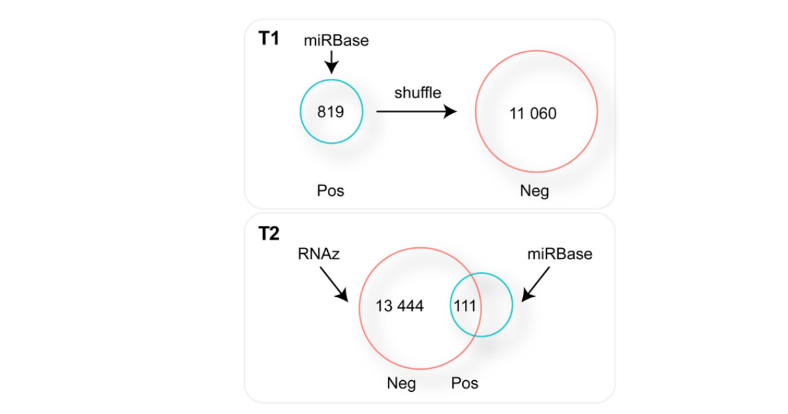

**그림 4. 데이터셋 T1 및 T2 생성에 대한 간단한 구성표. T1에는 miRBase의 miRNA 유전자가 양성으로 포함되어 있습니다. 양성의 뉴클레오티드를 무작위로 섞어 음성을 생성했습니다. T2의 경우 RNAz 도구를 사용하여 miRNA 유전자 후보를 생성했습니다. 양성은 miRBase의 실제 miRNA 유전자와 겹치는 후보 유전자입니다.** 음성은 나머지 특성성 RNA 후보입니다. T1에는 819 포지티브와 11 060 네거티브가 포함되고, T2에는 111 포지티브와 13 444 네거티브가 포함됩니다. miRNA 검색 도구의 점수를 계산하기 위해 MiRFinder [30], miPred [47], RNAmicro [48], ProMir [49] 및 RNAfold [50]의 소스 코드를 다운로드하여 로컬에 설치했습니다. 그런 다음 T1 및 T2의 도구 점수를 계산했습니다(테스트 데이터 및 점수 계산에 대한 자세한 내용은 S1 파일의 보충 방법 참조).

<!-- 원문 12쪽 -->

결과 및 토론 평가 측정에 대한 다양한 관점은 PRC가 데이터셋가 불균형한 ROC보다 더 많은 정보를 제공한다는 것을 보여줍니다. 결과 섹션을 통해 우리는 다양한 관점에서 불균형 데이터셋에서 평가 측정이 어떻게 작동하는지 보여주고자 합니다. 본 연구에서는 시뮬레이션, 문헌 분석, 재분석이라는 세 가지 라벨을 사용하여 결과 섹션을 구성합니다. 첫 번째 레이블인 시뮬레이션은 ROC, CROC, CC 및 PRC에 대해 무작위로 생성된 샘플을 사용한 시뮬레이션 분석을 나타냅니다. 두 번째 레이블인 문헌 분석은 생명 과학 문헌에서 평가 척도의 실제 사용법을 조사하기 위해 두 가지 PubMed 검색 세트의 결과 분석을 나타냅니다. 마지막으로, 세 번째 라벨인 재분석은 실제 적용에서 ROC와 PRC의 차이를 밝히기 위한 MiRFinder 연구의 재분석을 나타냅니다. 전체 결과 섹션을 쉽게 따라갈 수 있도록 하위 섹션 제목의 시작 부분에 이러한 레이블을 사용합니다.

시뮬레이션: 불균형 데이터셋에서 이진 분류기를 평가할 때 PRC 플롯이 ROC, CROC 및 CC 플롯보다 더 많은 정보를 제공합니다. ROC, CROC, CC 및 PRC 플롯 간의 차이점을 조사하기 위해 우리는 균형 및 불균형 사례에서 무작위 샘플링을 사용하여 시뮬레이션을 수행했습니다. 실질적으로 관련된 광범위한 분류기 동작을 다루기 위해 우리는 완벽함, 우수함, 우수한 조기 검색(ER+), 불량한 초기 검색(ER-) 및 무작위의 5가지 성능 수준을 연구하고 긍정적인 것과 부정적인 것에 대해 개별적으로 다양한 점수 분포에서 무작위로 추출하여 점수를 생성했습니다(표 3 참조). 균형 잡힌 샘플은 1 000 포지티브와 1 000 네거티브로 구성되었으며 불균형 샘플은 1 000 포지티브와 10 000 네거티브로 구성되었습니다. 네 가지 다른 유형의 플롯에 대한 우리의 관찰은 다음과 같습니다.

ROC 플롯. ROC 플롯은 균형 잡힌 데이터세트와 불균형한 데이터세트 간에 변경되지 않으며(그림 5A), 모든 AUC(ROC) 점수는 이에 따라 그대로 유지됩니다(S1 파일의 표 E). ER-의 두 점(그림 5A에서 검은색 원이 있는 빨간색 점)은 균형 곡선과 불균형 곡선의 해석 차이를 설명하는 좋은 예입니다. 밸런스 케이스의 포인트는 160 FP 및 500 TP를 나타냅니다. ER-는 이 지점이 성능 평가에 사용되는 경우 좋은 분류자로 간주될 가능성이 높습니다. 반면 불균형 사례의 동일한 지점은 1 600 FP 및 500 TP를 나타내며 이 경우 분류기의 성능이 좋지 않은 것으로 간주될 가능성이 높습니다. ROC 곡선은 이러한 성능 차이를 명시적으로 표시하지 못합니다. 또한, 조기 검색 영역의 ROC 곡선과 AUC(ROC) 간의 잠재적인 불일치를 설명하는 좋은 예이기도 합니다. ER+는 초기 검색 영역에서 ER-보다 분명히 우수하지만 AUC(ROC) 점수는 ER-와 ER+ 모두에 대해 동일하거나 0.8입니다(S1 파일의 표 E). 따라서 AUC(ROC)는 이 경우 조기 검색 성능을 평가하기에 부적절합니다. 또 다른 잠재적인 문제는 두 ROC 곡선이 서로 교차할 때 공정한 비교를 위해 AUC(ROC)가 부정확할 수 있다는 것입니다. 시뮬레이션 결과는 데이터가 불균형하고 조기 검색 영역을 확인해야 하는 경우 ROC 플롯의 해석에 특별한 주의가 필요함을 시사합니다.

플로스원 | DOI:10.1371/journal.pone.0118432 3월 4, 2015 12 / 21 집중 ROC(CROC) 도표. ROC 플롯과 마찬가지로 CROC 플롯(그림 5B)은 균형 잡힌 데이터셋와 불균형 데이터셋 간에 변경되지 않습니다. 따라서 모든 AUC(CROC) 점수도 변경되지 않습니다(S1 파일의 표 E). ER-의 두 점(그림 5B에서 검은색 원이 있는 빨간색 점)은 0.5의 TPR과 0.67의 f(FPR)을 나타냅니다. f(FPR)이 대략 0.67일 때 FPR은 0.16이므로 점은 두 경우 모두 500 TP를 나타내지만 균형 잡힌 경우에는 160 FP를 나타내고 불균형한 경우에는 1 600 FP를 나타냅니다. ROC와 유사하게 CROC 곡선은 이러한 성능 차이를 명시적으로 표시하지 못합니다. 그럼에도 불구하고 ROC에 비해 CROC의 가장 큰 장점은 영역이 넓게 확장되어 초기 검색 영역에서의 성능 차이가 분명하다는 것입니다. 따라서 CROC는 초기 검색 영역에서 분류기의 성능을 비교할 때 유용할 수 있습니다. 그럼에도 불구하고 CROC는 특히 데이터세트가 불균형한 경우 곡선 해석 측면에서 ROC와 동일한 문제를 안고 있습니다. 더욱이 α와 같은 돋보기 특성에 대한 최적화된 매개변수는 일반적으로 알 수 없으며 결정하기 어렵습니다. 특히 여러 CROC 곡선이 서로 교차하는 경우에는 더욱 그렇습니다.

<!-- 원문 13쪽 -->

비용 곡선(CC). CC 플롯은 균형 잡힌 데이터세트와 불균형한 데이터세트 간에도 변경되지 않습니다(그림 5C). CC는 다른 ROC 변형과 상당히 다릅니다.

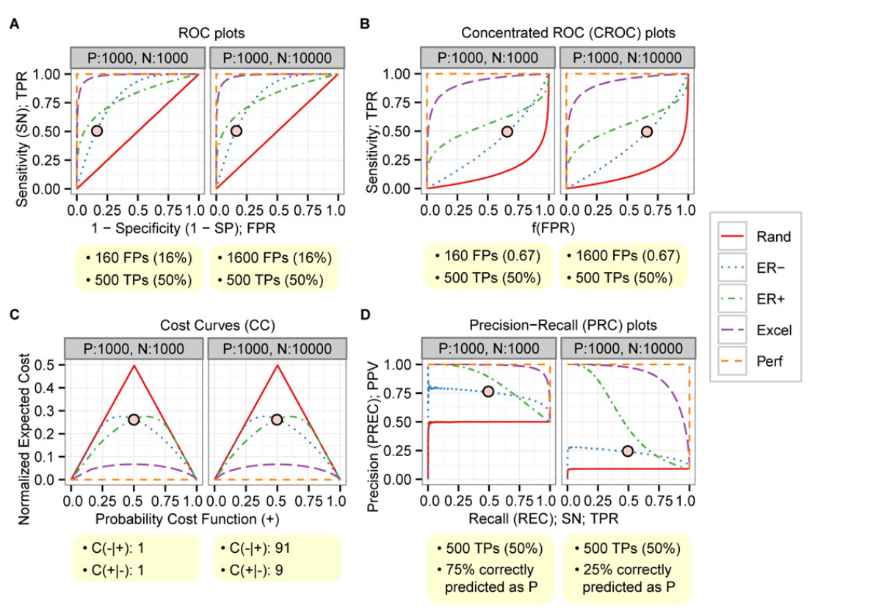

**그림 5. PRC는 변경되었지만 균형 데이터와 불균형 데이터 사이의 다른 플롯은 변경되지 않았습니다. 각 패널에는 (A) ROC, (B) 지수 함수가 있는 CROC: f(x) = (1 - exp(-αx))/(1 - exp(-α))에 대한 균형(왼쪽) 및 불균형(오른쪽)이 있는 두 개의 플롯이 포함되어 있습니다. 여기서 α = 7, (C) CC 및 (D) PRC. 5개의 곡선은 무작위(Rand; 빨간색), 불량한 초기 검색(ER-; 파란색), 양호한 초기 검색(ER+; 녹색), 우수(Excel; 보라색) 및 완벽(Perf; 주황색)의 5가지 성능 수준을 나타냅니다.** 플롯 해석. 이는 오분류 비용 및 클래스 확률을 기반으로 하는 다양한 PCF(+) 값에 대한 분류 성능을 보여줍니다. C(-|+)는 긍정을 부정으로 잘못 분류하는 비용을 나타내고, C(+|-)는 부정을 긍정으로 잘못 분류하는 비용을 나타냅니다. p(+)와 p(-)는 각각 긍정과 부정에 대한 클래스 확률을 나타냅니다. 오분류 비용은 알 수 없는 경우가 많지만 예를 들어 클래스 분포를 통해 추정할 수 있습니다. 예를 들어, 오분류 비용은 균형 잡힌 경우 C(-|+) = 1 및 C(+|-) = 1, C(-|+) = 91 및 C(+|-) =일 수 있습니다. 불균형 데이터셋의 경우 9입니다. 이는 긍정 항목을 부정 항목으로 잘못 분류하는 것이 부정 항목을 긍정 항목으로 잘못 분류하는 것보다 훨씬 더 많은 비용이 든다는 것을 의미합니다. 0.5(그림 5C에서 검은색 원이 있는 빨간색 점)의 PCF(+) 값을 얻으려면 해당 클래스 확률은 균형 잡힌 데이터셋의 경우 p(+) = 0.5 및 p(-) = 0.5이고 p(+) =입니다. 불균형 데이터셋의 경우 0.09 및 p(-) = 0.91입니다. 관심 있는 PCF(+) 값이 결정되면 여러 분류기의 성능을 쉽게 비교할 수 있습니다. 비용 곡선은 다양한 오분류 비용 및 클래스 확률을 테스트해야 할 때 유용하지만 PCF(+) 및 NE[C]에 대한 올바른 이해가 필수입니다.

<!-- 원문 14쪽 -->

정밀-재현율(PRC) 플롯. ROC, CROC 및 CC 플롯과 달리 PRC 플롯은 균형 잡힌 데이터셋와 불균형 데이터셋 간에 변경됩니다(그림 5D). 이에 따라 AUC(PRC) 점수도 변경됩니다(S1 파일의 표 E). ER-의 두 점(그림 5D에서 검은색 원이 있는 빨간색 점)은 75% 및 25%가 각각 균형 및 불균형 사례에서 올바른 긍정적인 예측임을 나타내며 이러한 올바른 긍정적인 예측은 모든 긍정적인 경우의 50%입니다. 따라서 PRC는 ER-의 성능이 균형 잡힌 경우에는 좋지만 불균형한 경우에는 좋지 않음을 올바르게 보여줍니다. AUC(PRC) 점수도 이를 지원합니다(S1 파일의 표 E). 또한 PRC는 균형 및 불균형 사례 모두에서 ER+의 성능이 ER-보다 우수하다는 것을 보여줍니다. AUC(PRC) 점수도 이를 뒷받침합니다(S1 파일의 표 E). 요약하면, PRC는 균형 잡힌 데이터세트와 불균형한 데이터세트 간의 성능 차이를 보여줄 수 있으며, 조기 검색 성능을 밝히는 데 유용할 수 있습니다.

시뮬레이션 요약. 시뮬레이션의 전반적인 결과는 PRC가 불균형 사례에 대한 가장 유익하고 강력한 플롯이며 조기 검색 성능의 차이를 명시적으로 밝힐 수 있음을 시사합니다.

문헌 분석: 불균형 데이터셋와 함께 이진 분류기에 대한 대부분의 연구는 ROC 플롯을 주요 성능 평가 방법으로 사용합니다. 우리의 결과가 실제로 어느 정도 관련되어 있는지 평가하기 위해 두 세트의 PubMed 검색 결과를 분석했습니다(방법 참조). 첫 번째 분석의 목표는 일반적으로 ROC 분석이 얼마나 인기가 있는지 정량적으로 확인하는 것이었습니다. 검색 결과에 따르면 ROC는 실제로 인기 있는 방법이며 지난 10년 동안 그 인기가 꾸준히 증가해 왔습니다(그림 6; 상단 패널).

두 번째 분석의 목표는 추가 분석을 위해 불균형 데이터셋가 있는 이진 분류 연구를 선택하는 것이었습니다. 분류를 위해 SVM(서포트 벡터 머신) [51]를 사용하는 불균형 데이터셋가 포함된 연구를 찾기 위해 PubMed 용어 "((지원 벡터 머신) AND 게놈 전체) NOT 연관"을 사용했습니다. 검색 결과 63 기사가 검색되었으며, 그 중 58는 전문이 제공되는 연구 기사였습니다(그림 6; 하단 패널, 참조가 포함된 전체 기사 목록은 S1 파일의 표 B 참조).

본 연구에서는 이러한 58 기사를 SVM 유형, 데이터 유형 및 평가 방법의 세 가지 범주로 분류했습니다. 요약된 결과(표 4)는 대부분의 연구에서 이진 분류기를 구축하기 위해 SVM을 사용하고(표 4; BS; 96.5%) 연구의 절반 이상이 불균형 데이터셋를 사용한다는 것을 보여줍니다(표 4; B1 및 IB2; 63.8%). 예상대로 ROC는 성능 평가에 가장 널리 사용되는 방법이며(표 4; ROC, All; 60.3%) 그 비율은 PLOS ONE | DOI:10.1371/journal.pone.0118432 March 4, 2015 14 / 21는 불균형 데이터셋가 있는 이진 분류기를 사용한 연구로 필터링한 후 약간 증가했습니다(표 4; ROC, BS AND IB; 66.7%). 또한 이 필터링에서는 작은 크기의 데이터에 대한 불균형 문제를 해결하는 접근 방식이 중대형 데이터 [5, 52]의 접근 방식과 다를 수 있으므로 작은 표본 크기(표 4; SS; 24.1%)를 사용한 연구를 제외합니다. 4개의 논문만이 평가 방법으로 PRC(표 4; PRC; 6.0%)를 사용하는 반면, 22 논문은 ROC(표 4; ROC; 66.7%)를 사용합니다. 그 중 3개 논문에서는 ROC와 PRC를 모두 사용합니다. 나머지 10 논문은 모두 단일 임계값 측정값을 사용합니다.

<!-- 원문 15쪽 -->

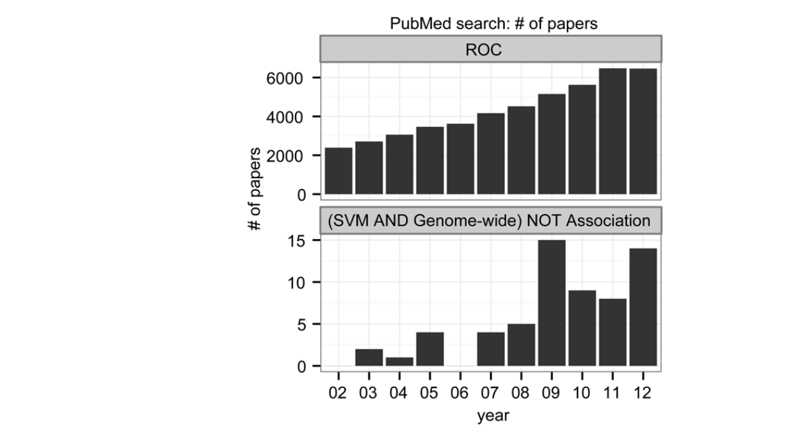

**그림 6. 두 개의 PubMed 검색 결과에는 2002와 2012 사이에 발견된 연간 논문 수가 표시됩니다. 위쪽 막대 그래프는 "ROC"라는 용어로 찾은 논문 수를 표시하는 반면, 아래쪽 막대 그래프는 "((지원 벡터 기계) AND 게놈 전체) NOT 연관"이라는 용어로 찾은 논문 수를 표시합니다.**

**표 4. 문헌분석은 3개의 주요범주와 6개의 하위범주로 요약된다.**

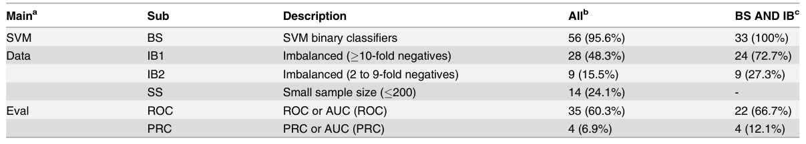

aSVM: SVM 유형, Data: 데이터 유형, Eval: 평가 방법. b총 기사 수는 58입니다. cSVM 바이너리(BS) 및 불균형(IB1 또는 IB2) 및 작은 샘플 크기(SS)가 아닌 기준으로 필터링됩니다. 이 기사의 총 개수는 33입니다. 문헌 분석 결과는 ROC가 불균형 데이터에 대해 가장 널리 사용되는 평가 방법임을 명확하게 나타내며, 이는 주요 평가 방법을 ROC에서 PRC로 변경하면 많은 연구에 영향을 미칠 수 있음을 시사합니다.

<!-- 원문 16쪽 -->

재분석: 이전에 발표된 연구에 대한 재평가를 통해 ROC 플롯에 비해 PRC 플롯의 장점이 확인되었습니다. 불균형 데이터셋에 적용된 이진 분류기에 대한 연구가 ROC에서 PRC로의 주요 평가 방법 변경에 의해 얼마나 강력하게 영향을 받을 수 있는지 추정하기 위해 전체 텍스트가 제공되는 58 연구 기사 목록에서 연구를 선택했습니다.

58 연구는 광범위한 연구 분야에 걸쳐 다양하지만, 5개 연구는 마이크로RNA(miRNA) 유전자 발견 분야에 관한 것입니다(S1 파일의 표 F). miRNA는 식물과 동물 [53]에서 중요한 조절 역할을 하는 작은 RNA 클래스이며, miRNA 유전자의 게놈 위치를 찾는 것은 생물정보학 [54]에서 인기가 있지만 어려운 분야입니다. 본 연구에서는 세 가지 이유로 PRC 재분석을 위해 MiRFinder 연구 [30]를 선택했습니다. 불균형 데이터와 함께 ROC를 사용하고, 테스트 데이터를 사용할 수 있으며, 분류자는 ROC 및 PRC 플롯을 생성하는 데 필요한 점수를 생성할 수 있습니다.

원래 MiRFinder 연구에서는 7가지 추가 도구(S1 파일의 표 G)를 평가했습니다. ROC 곡선은 MiRFinder 분류기 자체에 대해서만 표시되는 반면, ROC 포인트(ROC 공간의 단일 포인트)는 다른 7개 도구에 대해 제공됩니다. MiRFinder 연구에서 평가된 7가지 추가 도구 중에서 점수를 생성할 수 있고 소스 코드를 사용할 수 있는 세 가지 도구인 miPred [47], RNAmicro [48] 및 ProMir [49]를 분석을 위해 선택하고 네 번째 도구로 RNAfold [50]를 추가했습니다. RNAfold는 열역학적 자유에너지를 최소화하여 RNA 2차 구조를 예측합니다. 이는 miRNA 특정 도구는 아니지만 재분석을 위해 선택된 4가지 도구를 포함하여 대부분의 miRNA 유전자 발견 도구는 최소 자유 에너지(MFE) 계산에 크게 의존합니다. 따라서 RNAfold MFE 계산의 기준과 비교할 때 보다 정교한 도구가 얼마나 많은 추가 성능을 제공하는지 결정하는 것은 흥미롭습니다.

다양한 조건에서 성능을 테스트하는 것이 흥미롭기 때문에 추가 테스트 세트를 추가했습니다. 이 테스트 세트는 RNAmicro 연구 [48]에 설명된 방법을 사용하여 C. elegans 게놈에서 생성되었습니다.

전체적으로 우리는 두 개의 독립적인 테스트 세트에서 다섯 가지 도구를 평가했습니다. MiRFinder 연구의 테스트 세트를 T1으로 표시하고 C. elegans 게놈에서 생성한 테스트 세트를 T2로 표시합니다. 평가 결과는 그림 7 및 표 5에 나와 있으며 다음 하위 섹션에서 설명하고 논의합니다.

재분석: ROC가 아닌 PRC는 T1의 T1 ROC에서 테스트했을 때 일부 도구의 성능이 좋지 않은 것으로 나타났습니다. 그림 7A는 모든 분류기가 매우 우수하거나 우수한 예측 성능을 가지고 있음을 나타냅니다. 최고 성능의 분류기인 MiRFinder와 miPred는 비슷한 ROC 곡선을 가지고 있지만, 초기 검색 영역에서는 miPred가 MiRFinder보다 더 나은 성능을 보이는 것으로 보입니다. ROC 플롯은 5개 도구의 예측이 얼마나 신뢰할 수 있는지에 대한 이해로 즉시 변환되지 않으며 표시된 위양성률의 실제 의미에 대해 숙고해야 합니다. AUC(ROC) 점수(표 5)는 전체 FPR 범위에 대해 연구할 때 MiRFinder가 miPred보다 약간 우수하다는 것을 나타내지만 이 차이는 너무 작아서 실제 관련성이 없습니다. AUC(ROC) 점수는 ROC 플롯의 시각적 인상과 잘 일치하지만 실제 의미에 대한 해석성 측면에서는 실패합니다.

플로스원 | DOI:10.1371/journal.pone.0118432 3월 4, 2015 16 / 21 T1의 PRC. 그림 7A의 ROC 플롯과 유사하게 그림 7B의 PRC 플롯은 모든 분류기가 매우 우수하거나 우수한 예측 성능을 가짐을 나타냅니다. 그러나 여기에서 일부 분류기, 특히 RNAmicro의 경우 높은 복구율로 인해 정밀도가 저하되지만 RNAfold 및 ProMiR의 경우에는 그 정도가 더 작다는 것을 알 수 있습니다. 또한 분류기 성능이 더 잘 해결되어 차이점을 더 쉽게 발견할 수 있음을 알 수 있습니다. 전반적으로 중국은

<!-- 원문 17쪽 -->

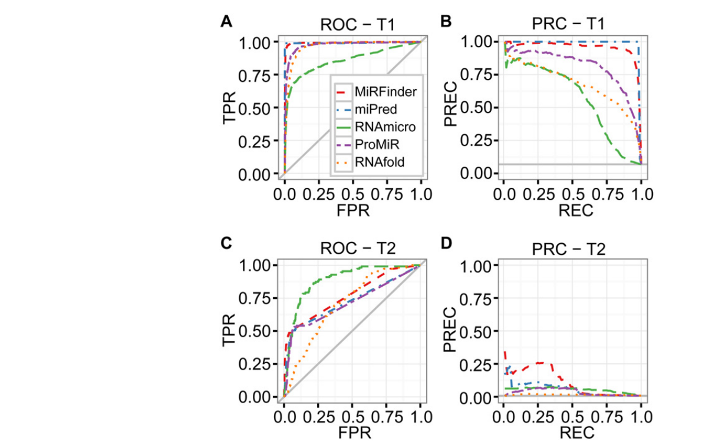

**그림 7. MiRFinder 연구를 재분석한 결과 불균형 데이터에서는 PRC가 ROC보다 더 강력하다는 사실이 밝혀졌습니다. ROC 및 PRC 플롯은 MiRFinder(빨간색), miPred(파란색), RNAmicro(녹색), ProMiR(보라색) 및 RNAfold(주황색) 등 6가지 도구의 성능을 보여줍니다. 회색 실선은 기준선을 나타냅니다. 재분석에서는 두 개의 독립적인 테스트 세트인 T1과 T2를 사용했습니다. 4개의 플롯은 (A) T1의 ROC, (B) T1의 PRC, (C) T2의 ROC, (D) T2의 PRC에 대한 것입니다.**

**표 5. T1 및 T2에 대한 ROC 및 PRC의 AUC 점수.**

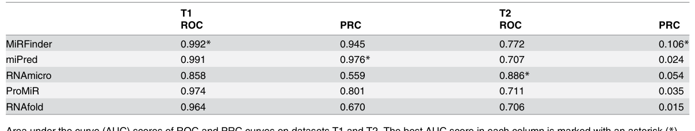

데이터셋 T1 및 T2에 대한 ROC 및 PRC 곡선의 AUC(곡선 아래 면적) 점수입니다. 각 열의 최고 AUC 점수는 별표(*)로 표시됩니다. 플롯을 사용하면 가장 관련성이 높은 측정값, 정밀도 및 재현율 간의 균형을 보여주기 때문에 분류기 성능을 빠르고 직관적으로 판단할 수 있습니다. 그림 7B의 PRC 플롯은 또한 모든 분류기가 회색 가로 기준선으로 표시된 무작위 분류기와 명확하게 구별된다는 것을 보여줍니다. AUC(PRC) 점수(표 5)는 PRC 플롯에 설정된 성능 순서와 일치하지만 전체 곡선의 요약이므로 재현율 값 범위에 대한 성능 변화를 표현할 수 없습니다.

<!-- 원문 18쪽 -->

재분석: PRC는 T2의 T2 ROC에서 테스트했을 때 모든 도구의 성능이 매우 낮은 것으로 나타났습니다. 그림 7C는 그림 7A와 매우 다른 그림을 보여주며 이는 테스트 데이터의 차이로 인한 것입니다. MiRFinder가 초기 검색 영역에서 더 강력하지만 RNAmicro는 이제 광범위한 FPR에서 확실히 선두를 달리고 있습니다. FPR의 중간 영역에서는 모든 방법이 좋은 성능을 보이는 반면, RNAmicro는 매우 좋은 성능을 보이는 반면, 작은 FPR에서는 TPR이 낮습니다. 실제 성능을 판단하는 ROC 플롯의 일반적인 어려움 외에도 그림 7C에서는 FPR의 어느 영역이 관련성이 있고 수용 가능한지에 대한 결정이 필요합니다. 시청자는 데이터의 강한 불균형으로 인해 이러한 FPR이 수많은 거짓 긍정 예측으로 변환될 수 있다는 사실을 깨닫지 못하고 중간 FPR 필드 성능에 만족하고 싶은 유혹을 받을 수 있습니다. AUC(ROC) 점수(표 5)는 RNAmicro가 이번 성능 콘테스트에서 확실한 승자로 입증되었으며, 특히 이 경우 초기 검색 영역에서 FPR 값 범위에 대한 성능 변화를 자연스럽게 표현하지 못했습니다.

T2의 PRC. 그림 7D는 이 테스트 세트에서 분류기 성능이 크게 저하된다는 것을 극적으로 보여줍니다. 전체 복구율 범위에서 MiRFinder를 제외한 모든 방법은 정밀도 값이 매우 낮아 실제 유용성에 의문이 제기됩니다. MiRFinder는 예를 들어 0.25/0.25에서 극도로 낮지 않은 복구 속도에서 극도로 낮지 않은 정밀도로 상대적으로 합리적으로 작동합니다. 그림 7C의 ROC 플롯은 순진한 인상을 주는 반면, 그림 7D의 PRC 플롯은 씁쓸한 진실을 드러냅니다. 실질적으로 관련된 정밀도 측정에서 MiRFinder를 제외한 모든 방법은 회색 수평선으로 표시된 무작위 분류기의 성능에 가까운 성능을 갖습니다. 또한, 그림 7D의 무작위 분류기 기준선은 그림 7B의 것보다 낮으며, 이는 테스트 데이터의 더 강한 불균형과 좋은 분류기를 구성하는 잠재적인 어려움을 나타냅니다. AUC(PRC) 점수(표 5)는 후보 순위에서 PRC ​​플롯과 일치하지만, 당연히 복구율 범위에 걸쳐 MiRFinder 성능의 변화를 포착할 수 없습니다.

재분석: T1, T2 CROC 및 CC에서 테스트할 때 PRC는 다른 측정보다 더 직관적입니다. 또한 T1 및 T2에서 CROC 및 CC를 사용하여 5가지 도구를 다시 평가했습니다(그림 A: S1 파일의 A-D 참조). ROC 플롯과 비교할 때 CROC 플롯(그림 A: S1 파일의 A-B)은 초기 검색 영역에서 더 나은 해상도를 나타내지만 마찬가지로 실제 관련성에 대한 빠른 판단에는 적합하지 않습니다. 원래 FPR 값으로 x축에 주석을 추가하여 문제를 해결할 수 있지만 변환 함수 f를 고려해야 하기 때문에 해석이 훨씬 더 어렵습니다. ROC 플롯과 마찬가지로 CROC 플롯도 T2 테스트 세트에서 성능 저하의 전체 범위를 표시하지 않습니다. NE[C] 및 PCF(+)를 잘 이해하지 않으면 추가로 직관적이지 않은 비용 곡선(그림 A: S1 파일의 CD)의 경우에도 마찬가지입니다.

재평가 요약. 재분석 결과는 ROC에 비해 PRC의 장점을 명확하게 보여줍니다. PRC 플롯은 실질적으로 관련된 측정값, 정밀도 및 재현율을 보여줍니다. 정밀도는 긍정적인 예측 중에서 올바른 예측의 비율을 측정하기 때문에 특히 중요합니다. PRC 플롯은 PLOS ONE | DOI:10.1371/journal.pone.0118432 March 4, 2015 18 / 21 명확한 시각적 단서가 있는 불균형 데이터셋. 무작위 기준선의 위치는 양성 인스턴스와 음성 인스턴스 수의 비율에 따라 달라지므로 PRC 플롯은 좋은 분류기를 만드는 어려움을 추정하는 데도 유용합니다.

<!-- 원문 19쪽 -->

## 결론

ROC는 이진 분류기의 성능을 평가하는 널리 사용되는 강력한 척도입니다. 그러나 불균형 데이터셋와 함께 사용할 때는 특별한 주의가 필요합니다. CROC, CC 및 PRC는 ROC의 대안으로 제안되었지만 덜 자주 사용됩니다. 우리의 포괄적인 연구에서는 여러 관점에서 다양한 측정값 간의 차이점을 보여줍니다. PRC만이 긍정과 부정의 비율에 따라 변화합니다.

고처리량 시퀀싱 기술의 급속한 확장으로 인해 기계 학습 방법에 대한 연구 수가 증가할 것으로 예상됩니다. 우리의 문헌 분석에 따르면 이러한 연구의 대부분은 불균형 데이터셋를 사용하고 ROC를 주요 성능 평가 방법으로 사용합니다. 여기서는 ROC 플롯과 달리 PRC 플롯이 불균형 데이터셋에 대한 분류기의 민감성을 명확한 시각적 단서로 표현하고 실제 분류기 성능을 정확하고 직관적으로 해석할 수 있음을 보여주었습니다. 우리 연구 결과는 가장 유익한 시각적 분석 도구로 PRC 플롯을 강력히 권장합니다.

지원 정보 S1 파일. 보충 방법, 보충 그림 1개, 보충 표 7개, 보충 참고 문헌이 포함되어 있습니다. 보충 방법. 비용 곡선 계산 두 개의 독립적인 테스트 세트인 T1과 T2에 대한 준비; 4개의 miRNA 발견 도구 및 RNAfold 설치; T1 및 T2에 대한 5개 도구의 예측 점수. S1 파일의 그림 A. 테스트 데이터셋 T1 및 T2에 대한 CROC 및 CC 플롯. S1 파일의 표 A. 보간을 계산하기 위해 ROC 및 PRC 곡선을 만들기 위한 관찰된 레이블 및 예측 점수의 예입니다. S1 파일의 표 B. PubMed의 63 논문 목록은 "Support Vector Machine AND Genome-wide AND NOT Association"으로 검색됩니다. S1 파일의 표 C. 세 가지 주요 및 13 하위 범주에 대한 설명입니다. S1 파일의 표 D. 세 가지 주요 그룹과 13 하위 그룹은 PubMed 검색에서 찾은 58 연구 논문을 분류합니다. S1 파일의 표 E. 무작위 샘플링을 사용한 시뮬레이션에서 ROC, PRC 및 CROC의 AUC 점수. S1 파일의 표 F. 문헌 분석에서 선택된 5개의 pre-miRNA 연구. S1 파일의 표 G. MiRFinder 연구에서 비교를 위해 사용된 7가지 도구입니다. 보충 참조. (DOCX)

## 감사의 글

저자는 원고의 이전 버전에 대해 논평해 준 베르겐 대학의 전산 생물학 부서(CBU) 구성원에게 감사의 말씀을 전하고 싶습니다.

작성자 기여 실험 구상 및 설계: TS MR. 실험 수행: TS. 데이터 분석: TS. 논문을 썼습니다: TS MR.

## 참고문헌

1. Tarca AL, Carey VJ, Chen XW, Romero R, Draghici S. Machine learning and its applications to biology. PLoS Comput Biol. 2007; 3: e116. PMID: 17604446

2. Krogh A. What are artificial neural networks? Nat Biotechnol. 2008; 26: 195–197. doi: 10.1038/nbt1386 PMID: 18259176

PLOS ONE | DOI:10.1371/journal.pone.0118432 March 4, 2015 19 / 21

<!-- 원문 20쪽 -->

3. Ben-Hur A, Ong CS, Sonnenburg S, Scholkopf B, Ratsch G. Support vector machines and kernels for computational biology. PLoS Comput Biol. 2008; 4: e1000173. doi: 10.1371/journal.pcbi.1000173 PMID: 18974822

4. Hanley JA, McNeil BJ. The meaning and use of the area under a receiver operating characteristic (ROC) curve. Radiology. 1982; 143: 29–36. PMID: 7063747

5. He H, Garcia E. Learning from Imbalanced Data. IEEE Trans Knowl Data Eng. 2009; 21: 1263–1284.

6. Chawla N, Japkowicz N. Editorial: Special Issue on Learning from Imbalanced Data Sets. SIGKDD Explor. 2004;6.

7. Chawla NV, Bowyer KW, Hall LO, Kegelmeyer WP. SMOTE: synthetic minority over-sampling technique. J Artif Intell Res. 2002; 16: 321–357.

8. Rao RB, Krishnan S, Niculescu RS. Data mining for improved cardiac care. SIGKDD Explor. 2006; 8: 3–10.

9. Kubat M, Holte RC, Matwin S. Machine Learning for the Detection of Oil Spills in Satellite Radar Images. Mach Learn. 1998; 30: 195–215.

10. Provost F. Machine learning from imbalanced data sets 101. Proceedings of the AAAI-2000 Workshop on Imbalanced Data Sets. 2000.

11. Hulse JV, Khoshgoftaar TM, Napolitano A. Experimental perspectives on learning from imbalanced data. Proceedings of the 24th international conference on Machine learning. 2007: 935–942.

12. Guo H, Viktor HL. Learning from imbalanced data sets with boosting and data generation: the Data- Boost-IM approach. SIGKDD Explor. 2004; 6: 30–39.

13. Kubat M, Matwin S. Addressing the curse of imbalanced training sets: one-sided selection. In Proceedings of the Fourteenth International Conference on Machine Learning. 1997: 179–186.

14. Ling C, Li C. Data Mining for Direct Marketing: Problems and Solutions. In Proceedings of the Fourth International Conference on Knowledge Discovery and Data Mining. 1998: 73–79.

15. Elkan C. The foundations of cost-sensitive learning. Proceedings of the 17th international joint conference on Artificial intelligence— Volume 2. 2001: 973–978.

16. Sun Y, Kamel MS, Wong AKC, Wang Y. Cost-sensitive boosting for classification of imbalanced data. Pattern Recognit. 2007; 40: 3358–3378.

17. Japkowicz N, Stephen S. The class imbalance problem: A systematic study. Intell Data Anal. 2002; 6: 429–449.

18. Hong X, Chen S, Harris CJ. A kernel-based two-class classifier for imbalanced data sets. IEEE Trans Neural Netw. 2007; 18: 28–41. PMID: 17278459

19. Wu G, Chang E. Class-Boundary Alignment for Imbalanced Dataset Learning. Workshop on Learning from Imbalanced Datasets in ICML. 2003.

20. Estabrooks A, Jo T, Japkowicz N. A Multiple Resampling Method for Learning from Imbalanced Data Sets. Comput Intell. 2004; 20: 18–36.

21. Ben-Hur A, Weston J. A user's guide to support vector machines. Methods Mol Biol. 2010; 609: 223– 239. doi: 10.1007/978-1-60327-241-4_13 PMID: 20221922

22. Mac Namee B, Cunningham P, Byrne S, Corrigan OI. The problem of bias in training data in regression problems in medical decision support. Artif Intell Med. 2002; 24: 51–70. PMID: 11779685

23. Soreide K. Receiver-operating characteristic curve analysis in diagnostic, prognostic and predictive biomarker research. J Clin Pathol. 2009; 62: 1–5. doi: 10.1136/jcp.2008.061010 PMID: 18818262

24. Fawcett T. An introduction to ROC analysis. Pattern Recognit Lett. 2006; 27: 861–874.

25. Swets JA. Measuring the accuracy of diagnostic systems. Science. 1988; 240: 1285–1293. PMID: 3287615

26. Davis J, Goadrich M. The relationship between Precision-Recall and ROC curves. Proceedings of the 23rd international conference on Machine learning. 2006: 233–240.

27. Swamidass SJ, Azencott CA, Daily K, Baldi P. A CROC stronger than ROC: measuring, visualizing and optimizing early retrieval. Bioinformatics. 2010; 26: 1348–1356. doi: 10.1093/bioinformatics/btq140 PMID: 20378557

28. Drummond C, Holte R. Explicitly Representing Expected Cost: An Alternative to ROC Representation. In Proceedings of the Sixth ACM SIGKDD International Conference on Knowledge Discovery and Data Mining. 2000: 198–207.

29. Berrar D, Flach P. Caveats and pitfalls of ROC analysis in clinical microarray research (and how to avoid them). Brief Bioinform. 2012; 13: 83–97. doi: 10.1093/bib/bbr008 PMID: 21422066

PLOS ONE | DOI:10.1371/journal.pone.0118432 March 4, 2015 20 / 21

<!-- 원문 21쪽 -->

30. Huang TH, Fan B, Rothschild MF, Hu ZL, Li K, Zhao SH. MiRFinder: an improved approach and software implementation for genome-wide fast microRNA precursor scans. BMC Bioinformatics. 2007; 8: 341. PMID: 17868480

31. Altman DG, Bland JM. Diagnostic tests. 1: Sensitivity and specificity. BMJ. 1994; 308: 1552. PMID: 8019315

32. Baldi P, Brunak S, Chauvin Y, Andersen CA, Nielsen H. Assessing the accuracy of prediction algorithms for classification: an overview. Bioinformatics. 2000; 16: 412–424. PMID: 10871264

33. Goutte C, Gaussier E. A probabilistic interpretation of precision, recall and F-score, with implication for evaluation. Advances in Information Retrieval. 2005: 345–359.

34. Hall M, Frank E, Holmes G, Pfahringer B, Reutemann P, Witten IH. The WEKA data mining software: an update. SIGKDD Explor. 2009; 11: 10–18.

35. Chang C-C, Lin C-J. LIBSVM: A library for support vector machines. ACM Trans Intell Syst Technol. 2011; 2: 1–27.

36. Hilden J. The area under the ROC curve and its competitors. Med Decis Making. 1991; 11: 95–101. PMID: 1865785

37. Truchon JF, Bayly CI. Evaluating virtual screening methods: good and bad metrics for the "early recognition" problem. J Chem Inf Model. 2007; 47: 488–508. PMID: 17288412

38. Gribskov M, Robinson NL. Use of receiver operating characteristic (ROC) analysis to evaluate sequence matching. Comput Chem. 1996; 20: 25–33. PMID: 16718863

39. Macskassy S, Provost F. Confidence bands for ROC curves: Methods and an empirical study. Proceedings of the First Workshop on ROC Analysis in AI. 2004.

40. Sing T, Sander O, Beerenwinkel N, Lengauer T. ROCR: visualizing classifier performance in R. Bioinformatics. 2005; 21: 3940–3941. PMID: 16096348

41. Ihaka R, Gentleman R. R: A Language for Data Analysis and Graphics. J Comput Graph Stat. 1996; 5: 299–314.

42. Gentleman RC, Carey VJ, Bates DM, Bolstad B, Dettling M, Dudoit S, et al. Bioconductor: open software development for computational biology and bioinformatics. Genome Biol. 2004; 5: R80. PMID: 15461798

43. Meyer PE, Lafitte F, Bontempi G. minet: A R/Bioconductor package for inferring large transcriptional networks using mutual information. BMC Bioinformatics. 2008; 9: 461. doi: 10.1186/1471-2105-9-461 PMID: 18959772

44. Hirschhorn JN, Daly MJ. Genome-wide association studies for common diseases and complex traits. Nat Rev Genet. 2005; 6: 95–108. PMID: 15716906

45. Gruber AR, Findeiss S, Washietl S, Hofacker IL, Stadler PF. RNAz 2.0: improved noncoding RNA detection. Pac Symp Biocomput. 2010: 69–79. PMID: 19908359

46. Kozomara A, Griffiths-Jones S. miRBase: integrating microRNA annotation and deep-sequencing data. Nucleic Acids Res. 2011; 39: D152–157. doi: 10.1093/nar/gkq1027 PMID: 21037258

47. Jiang P, Wu H, Wang W, Ma W, Sun X, Lu Z. MiPred: classification of real and pseudo microRNA precursors using random forest prediction model with combined features. Nucleic Acids Res. 2007; 35: W339–344. PMID: 17553836

48. Hertel J, Stadler PF. Hairpins in a Haystack: recognizing microRNA precursors in comparative genomics data. Bioinformatics. 2006; 22: e197–202. PMID: 16873472

49. Nam JW, Shin KR, Han J, Lee Y, Kim VN, Zhang BT. Human microRNA prediction through a probabilistic co-learning model of sequence and structure. Nucleic Acids Res. 2005; 33: 3570–3581. PMID: 15987789

50. Hofacker I, Fontana W, Stadler P, Bonhoeffer S, Tacker M, Schuster P. Fast Folding and Comparison of RNA Secondary Structures. Monatsh Chem. 1994; 125: 167–188.

51. Boser B, Guyon I, Vapnik V. A training algorithm for optimal margin classifiers. Proceedings of the fifth annual workshop on Computational learning theory. 1992: 144–152.

52. Raudys SJ, Jain AK. Small Sample Size Effects in Statistical Pattern Recognition: Recommendations for Practitioners. IEEE Trans Pattern Anal Mach Intell. 1991; 13: 252–264.

53. Bartel DP. MicroRNAs: genomics, biogenesis, mechanism, and function. Cell. 2004; 116: 281–297. PMID: 14744438

54. Gomes CP, Cho JH, Hood L, Franco OL, Pereira RW, Wang K. A Review of Computational Tools in microRNA Discovery. Front Genet. 2013; 4: 81. doi: 10.3389/fgene.2013.00081 PMID: 23720668

PLOS ONE | DOI:10.1371/journal.pone.0118432 March 4, 2015 21 / 21
