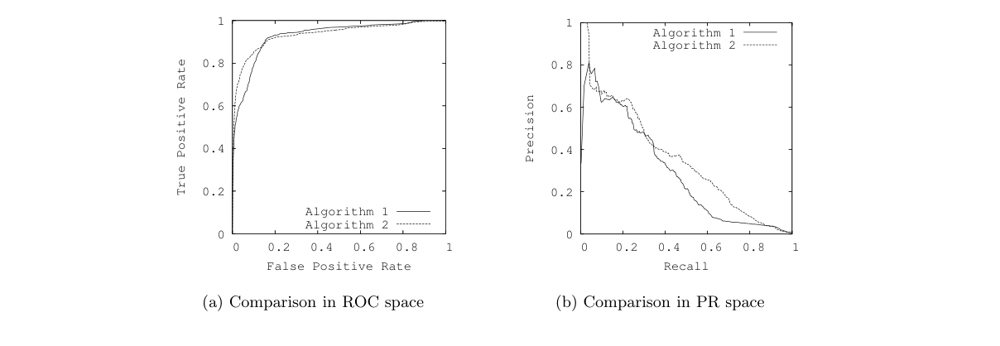
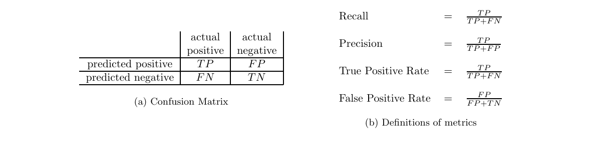
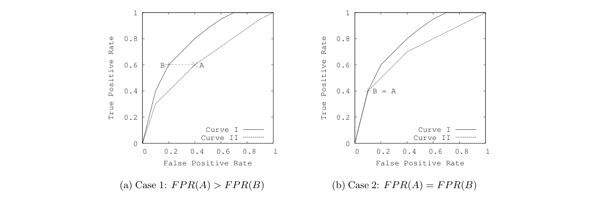
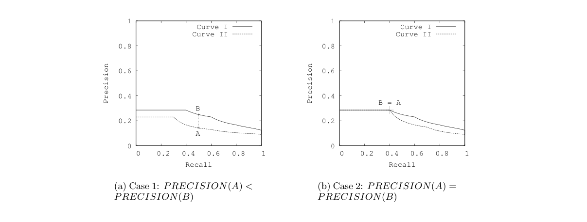
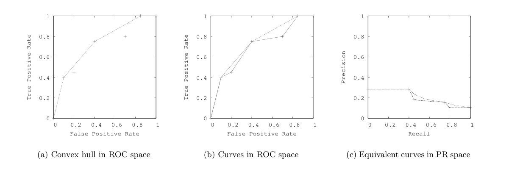
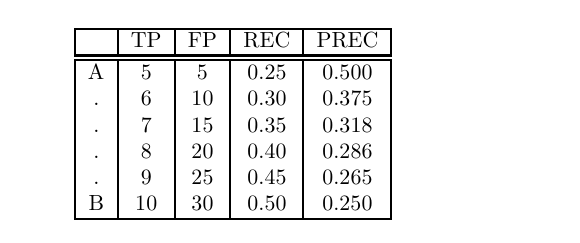
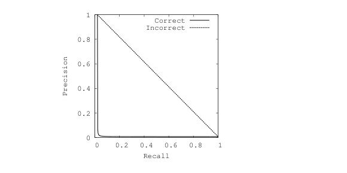
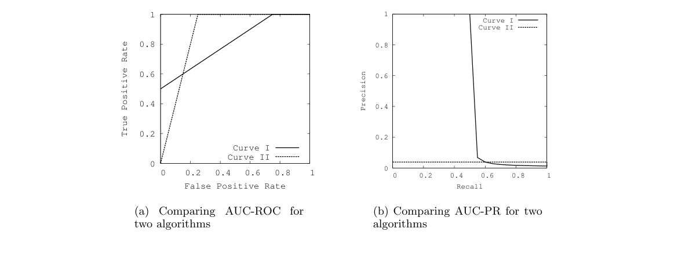

# 정밀도-재현율 곡선과 ROC 곡선의 관계

> **원문 제목:** The Relationship Between Precision-Recall and ROC Curves  
> **저자:** Jesse Davis · Mark Goadrich  
> **게재 정보:** Proceedings of the 23rd International Conference on Machine Learning (ICML 2006), pp. 233-240  
> **DOI:** [https://doi.org/10.1145/1143844.1143874](https://doi.org/10.1145/1143844.1143874)

> **번역 안내:** 본문과 부록은 문단 문맥을 기준으로 한국어로 옮겼습니다. 수식과 참고문헌은 정확성을 위해 원문 표기를 유지했습니다. 원문의 그림과 표는 개별 이미지로 잘라 해당 본문 위치에 바로 배치했습니다.

---

<!-- 원문 1쪽 -->

## 초록

ROC(Receiver Operator Characteristic) 곡선은 일반적으로 기계 학습의 이진 결정 문제에 대한 결과를 표시하는 데 사용됩니다. 그러나 고도로 치우친 데이터셋를 처리할 때 PR(Precision-Recall) 곡선은 알고리즘 성능에 대해 더 많은 정보를 제공합니다. 본 연구에서는 ROC 공간과 PR 공간 사이에 깊은 연결이 존재한다는 것을 보여줍니다. 즉 곡선이 PR 공간을 지배하는 경우에만 ROC 공간을 지배합니다. 결론은 ROC 공간의 볼록 껍질과 매우 유사한 속성을 갖는 달성 가능한 PR 곡선의 개념입니다. 본 연구에서는 이 곡선을 계산하기 위한 효율적인 알고리즘을 보여줍니다. 마지막으로 두 가지 유형의 곡선의 차이점이 알고리즘 설계에 중요하다는 점에도 주목합니다. 예를 들어 PR 공간에서는 점 사이를 선형으로 보간하는 것이 올바르지 않습니다. 또한 ROC 곡선 아래 영역을 최적화하는 알고리즘은 PR 곡선 아래 영역 최적화를 보장하지 않습니다.

1. 소개 기계 학습에서 현재 연구는 새로운 알고리즘의 실증적 검증을 수행할 때 단순히 정확도 결과를 제시하는 것에서 벗어났습니다. 이는 클래스 값의 확률을 출력하는 알고리즘을 평가할 때 특히 그렇습니다. Provostet al. (1998)은 단순히 정확도 결과를 사용하는 것이 오해의 소지가 있을 수 있다고 주장했습니다. 그들은 이진 결정 문제를 평가할 때 ROC(Receiver Operator Characteristic) 곡선을 사용하도록 권장했습니다. 이 곡선은 올바르게 분류된 긍정적 예시의 수가 잘못 분류된 부정적 예시의 수에 따라 어떻게 달라지는지 보여줍니다. 그러나 ROC 곡선은 큰 왜곡이 있는 경우 알고리즘 성능에 대해 지나치게 낙관적인 관점을 제시할 수 있습니다. Proceedings of the 23 rd International Conference on Machine Learning, Pittsburgh, PA, 2006에 나와 있습니다. 저자/소유자에 의한 저작권 2006. 클래스 분포에서. Drummond와 Holte(2000; 2004)는 이 문제를 해결하기 위해 비용 곡선을 사용할 것을 권장했습니다. 비용 곡선은 ROC 곡선의 훌륭한 대안이지만 이에 대해 논의하는 것은 이 백서의 범위를 벗어납니다.

정보 검색에 자주 사용되는 PR(Precision-Recall) 곡선(Manning & Schutze, 1999; Raghavan et al., 1989)은 클래스 분포에서 큰 왜곡이 있는 작업에 대한 ROC 곡선의 대안으로 인용되었습니다(Bockhorst & Craven, 2005; Bunescu et al., 2004; Davis et al. al., 2005; Goadrich 외, 2004; Kok & Domingos, 2005; ROC 공간과 PR 공간의 중요한 차이점은 곡선의 시각적 표현입니다. PR 곡선을 보면 ROC 공간에서는 명확하지 않은 알고리즘 간의 차이가 드러날 수 있습니다. 샘플 ROC 곡선과 PR 곡선은 각각 그림 1(a) 및 1(b)에 표시되어 있습니다. 고도로 치우친 암 탐지 데이터셋의 동일한 학습 모델에서 가져온 이 곡선은 이러한 공간 간의 시각적 차이를 강조합니다(Davis et al., 2005). ROC 공간의 목표는 왼쪽 상단에 있는 것이며 그림 1(a)의 ROC 곡선을 보면 최적에 상당히 가까운 것으로 보입니다. PR 공간에서 목표는 오른쪽 상단에 있는 것이며 그림 1(b)의 PR 곡선은 여전히 ​​개선의 여지가 크다는 것을 보여줍니다.

알고리즘의 성능은 ROC 공간에서는 비슷한 것으로 보이지만 PR 공간에서는 알고리즘 2가 알고리즘 1에 비해 분명한 이점이 있음을 알 수 있습니다. 이러한 차이는 이 영역에서 부정적인 예의 수가 긍정적인 예의 수를 크게 초과하기 때문에 존재합니다. 결과적으로, 위양성지 수의 큰 변화는 ROC 분석에 사용되는 위양성지율의 작은 변화로 이어질 수 있습니다. 반면에 정밀도는 거짓 긍정을 참 부정이 아닌 참 긍정과 비교함으로써 알고리즘 성능에 대한 다수의 부정 사례의 영향을 포착합니다. 2 섹션에서는 이러한 용어에 익숙하지 않은 독자를 위해 정밀도와 재현율을 정의합니다.

본 연구에서는 연결을 연구하는 것이 중요하다고 믿습니다.

<!-- 원문 2쪽 -->

**그림 1. ROC와 PR 공간의 알고리즘 비교 간의 차이점**

이 두 공간 사이에 ROC 공간의 흥미로운 속성 중 일부가 PR 공간에도 적용되는지 여부를 확인합니다. 본 연구에서는 모든 데이터셋에 대해 고정된 수의 긍정적이고 부정적인 예에 ​​대해 주어진 알고리즘에 대한 ROC 곡선과 PR 곡선에 "동일한 점"이 포함되어 있음을 보여줍니다. 따라서 그림 1(b)의 알고리즘 I 및 알고리즘 II에 대한 PR 곡선은 공식적으로 정의한다는 의미에서 각각 그림 1(a)의 알고리즘 I 및 알고리즘 II에 대한 ROC 곡선과 동일합니다. ROC 및 PR 곡선의 이러한 동등성을 기반으로 곡선이 PR 공간에서 지배적인 경우에만 ROC 공간에서 지배적이라는 것을 보여줍니다. 둘째, 달성 가능한 PR 곡선이라고 부르는 ROC 공간의 볼록 껍질과 유사한 PR 공간을 소개합니다. 본 연구에서는 이 두 공간의 동등성으로 인해 달성 가능한 PR 곡선을 효율적으로 계산할 수 있음을 보여줍니다. 세 번째로 우리는 PR 공간에서 점 사이를 선형으로 보간하는 것이 불충분하다는 것을 보여줍니다. 마지막으로 ROC 곡선 아래 영역을 최적화하는 알고리즘이 PR 곡선 아래 영역 최적화를 보장하지 않음을 보여줍니다.

2. ROC 및 Precision-Recall 검토 이항 결정 문제에서 분류자는 사례에 긍정 또는 부정 라벨을 붙입니다. 분류기에 의해 내려진 결정은 혼동 행렬 또는 분할표로 알려진 구조로 표현될 수 있습니다. 혼동 행렬에는 네 가지 범주가 있습니다. 참 긍정(TP)은 긍정으로 올바르게 레이블이 지정된 예입니다. 거짓양성(FP)은 양성으로 잘못 분류된 음성 예시를 나타냅니다. 참음성(TN)은 음수로 올바르게 라벨이 지정된 음화에 해당합니다. 마지막으로 거짓음성(FN)은 음성으로 잘못 표시된 양성 사례를 나타냅니다.

그림 2(a)에는 혼동 행렬이 나와 있습니다. 혼동행렬은 ROC 공간이나 PR 공간에서 점을 구성하는 데 사용될 수 있습니다. 혼동 행렬이 주어지면 그림 2(b)와 같이 각 공간에서 사용되는 메트릭을 정의할 수 있습니다. ROC 공간에서는 x축에 FPR(False Positive Rate), y축에 TPR(True Positive Rate)을 표시합니다. FPR은 긍정적인 것으로 잘못 분류된 부정적인 사례의 비율을 측정합니다. TPR은 올바르게 라벨이 지정된 긍정적인 사례의 비율을 측정합니다. PR 공간에서는 x축에 재현율을, y축에 정밀도를 표시합니다. 재현율은 TPR과 동일하지만 정밀도는 긍정적으로 분류된 사례 중 실제로 긍정적인 사례의 비율을 측정합니다. 그림 2(b)는 각 지표에 대한 정의를 제공합니다. ROC 공간이나 PR 공간의 한 지점을 정의하는 기본 혼동 행렬에 작용하는 함수로 메트릭을 처리합니다. 따라서 혼동 행렬 A가 주어지면 RECALL(A)는 A와 관련된 Recall을 반환합니다.

3. ROC 공간과 PR 공간 간의 관계 ROC 및 PR 곡선은 일반적으로 주어진 데이터셋에서 기계 학습 알고리즘의 성능을 평가하기 위해 생성됩니다. 각 데이터셋에는 고정된 수의 긍정적인 예와 부정적인 예가 포함되어 있습니다. 여기서는 ROC와 PR 공간 사이에 깊은 관계가 존재한다는 것을 보여줍니다.

정리 3.1. 긍정적인 예와 부정적인 예의 주어진 데이터셋에 대해 ROC 공간의 곡선과 PR 공간의 곡선 사이에는 일대일 대응이 존재하므로 Recall̸ = 0인 경우 곡선은 정확히 동일한 혼동 행렬을 포함합니다.

<!-- 원문 3쪽 -->

**그림 2. 일반적인 기계 학습 평가 지표**

증거. ROC 공간의 한 지점은 데이터셋가 고정될 때 고유한 혼동 행렬을 정의합니다. PR 공간에서는 FN을 무시하므로 각 점이 여러 혼동 행렬에 해당할 수 있다는 점을 걱정할 수도 있습니다. 그러나 고정된 수의 긍정 및 부정 예를 사용하면 행렬의 다른 세 항목이 주어지면 FN이 고유하게 결정됩니다. = 0를 호출하면 FP를 복구할 수 없으므로 고유한 혼동 행렬을 찾을 수 없습니다.

결과적으로 우리는 혼동행렬과 PR 공간의 점 사이에 일대일 매핑을 갖게 됩니다. 이는 ROC 공간과 PR 공간의 포인트(각각 혼동 행렬로 정의됨) 간에 일대일 매핑이 있음을 의미합니다. 따라서 ROC 공간의 곡선을 PR 공간으로 또는 그 반대로 변환할 수 있습니다.

다음 정리에 필요한 중요한 정의 중 하나는 하나의 곡선이 다른 곡선을 지배한다는 개념입니다. 즉, "다른 모든 곡선이 그 아래에 있거나 그와 같다는 의미입니다(Provost et al., 1998)." 정리 3.2. 고정된 수의 긍정적이고 부정적인 예의 경우 첫 번째 곡선이 Precision-Recall 공간에서 두 번째 곡선을 지배하는 경우에만 ROC 공간에서 하나의 곡선이 두 번째 곡선을 지배합니다.

증거.

1 주장 (⇒): 곡선이 ROC 공간에서 지배적이라면 PR 공간에서도 지배적입니다. 모순에 의한 증명. 곡선 I가 ROC 공간에서 지배적인 곡선 I과 곡선 II(그림 3 참조)가 있다고 가정합니다. 그러나 PR 공간에서 이러한 곡선을 변환하면 곡선 I이 더 이상 지배하지 않습니다. 곡선 I은 PR 공간에서 지배적이지 않기 때문에 곡선 II에는 동일한 재현율을 갖는 곡선 I의 점 B가 더 낮은 정밀도를 갖는 일부 점 A가 있습니다. 즉, PRECISION(A) > PRECISION(B)은 RECALL(A) = RECALL(B)입니다. RECALL(A) = RECALL(B)과 Recall은 TPR과 동일하므로 TPR(A) = TPR(B)가 있습니다. 곡선 I이 ROC 공간 FPR(A) ≥FPR(B).에서 곡선 II를 지배하므로 총 긍정과 총 부정은 고정되어 있으며 TPR(A) = TPR(B) 이후:

TPR(A) = TPA 총 양성 TPR(B) = TPB 총 양성 이제 TPA = TPB가 있으므로 둘 다 TP로 표시합니다. FPR(A) ≥FPR(B) 및 FPR(A) = FPA 총 음성 FPR(B) = FPB 총 음성 이는 FPA ≥FPB를 의미합니다.

이제 PRECISION(A) ≤ PRECISION(B)이 생겼습니다. 그러나 이는 PRECISION(A) > PRECISION(B)이라는 원래 가정과 모순됩니다.

주장 2(⇐): 어떤 곡선이 PR 공간에서 다른 곡선을 지배하면 ROC 공간에서도 지배합니다. 이를 모순법으로 증명하겠습니다. 곡선 I과 곡선 II(그림 4 참조)가 있고, 곡선 I이 PR 공간에서는 곡선 II를 지배하지만 ROC 공간에서는 더 이상 지배하지 않는다고 가정합니다. 그렇다면 곡선 I의 점 B와 동일한 TPR을 가지면서 `FPR(A) < FPR(B)`를 만족하는 곡선 II의 점 A가 존재합니다. RECALL과 TPR은 같으므로 `RECALL(A) = RECALL(B)`이고, PR 공간에서 곡선 I이 지배하므로 `PRECISION(A) ≤ PRECISION(B)`입니다.

<!-- 원문 4쪽 -->

**그림 3. 정리 3.2의 주장 1에 대한 두 가지 사례**

**그림 4. 정리 3.2의 주장 2의 두 가지 사례**

또한 `RECALL(A) = TP_A / 전체 양성 수`, `RECALL(B) = TP_B / 전체 양성 수`이므로 `TP_A = TP_B`입니다. 두 값을 간단히 TP로 표기하면 다음과 같습니다.

`PRECISION(A) ≤ PRECISION(B)`이므로 `FP_A ≥ FP_B`입니다. 한편 `FPR(A) = FP_A / 전체 음성 수`, `FPR(B) = FP_B / 전체 음성 수`이므로 `FPR(A) ≥ FPR(B)`가 됩니다. 이는 처음의 가정인 `FPR(A) < FPR(B)`와 모순됩니다.

ROC 공간에서는 볼록 선체(Convex Hull)가 중요한 아이디어입니다. ROC 공간의 점 집합이 주어지면 볼록 껍질은 다음 세 가지 기준을 충족해야 합니다.

1. 인접한 점 사이에는 선형 보간이 사용됩니다.

2. 최종 곡선 위에는 점이 없습니다.

<!-- 원문 5쪽 -->

**그림 5. 볼록한 선체와 PR 아날로그는 각 공간의 곡선 구성을 위한 순진한 방법을 지배합니다. 이 달성 가능한 PR 곡선은 비선형 보간으로 인해 실제 볼록 껍질이 아닙니다. PR 공간의 선형 보간은 일반적으로 달성할 수 없습니다.**

3. 곡선을 구성하는 데 사용되는 점 쌍의 경우 이를 연결하는 선분은 곡선과 같거나 그 아래에 있습니다.

**그림 5(a)는 ROC 공간의 볼록 껍질의 예를 보여줍니다. 볼록 껍질을 효율적으로 구성하는 방법에 대한 자세한 알고리즘은 Cormen et al. (1990).**

PR 공간에는 ROC 공간의 볼록 껍질과 유사한 곡선이 존재합니다. 이를 달성 가능한 PR 곡선이라고 부르지만 선형 보간으로는 얻을 수 없습니다. ROC 공간에서의 지배력 문제는 이 볼록 껍질 아날로그와 직접적인 관련이 있습니다.

추론 3.1. PR 공간에 일련의 점들이 주어지면 이러한 점들로 구성될 수 있는 다른 유효한 곡선을 지배하는 달성 가능한 PR 곡선이 존재합니다.

증거. 먼저 점을 ROC 공간(정리 3.1)으로 변환하고 ROC 공간에서 이러한 점의 볼록 껍질을 구성합니다. 정의에 따르면 볼록 껍질은 점 사이의 선형 보간을 사용할 때 해당 점으로 구성할 수 있는 다른 모든 곡선을 지배합니다. 따라서 ROC 볼록 껍질의 점을 다시 PR 공간으로 변환하면 그림 5(b) 및 5(c)에 표시된 것처럼 PR 공간에서 지배적인 곡선이 생성됩니다. 이는 정리 3.2를 따릅니다. 달성 가능한 PR 곡선은 ROC 공간에서 볼록 껍질 아래의 해당 지점을 정확히 제외합니다.

ROC 공간의 볼록 껍질은 주어진 ROC 점 집합으로 구성할 수 있는 최상의 유효 곡선입니다. 우리를 포함한 많은 연구자들은 고도로 치우친 데이터셋가 제시될 때 PR 곡선이 더 바람직하다고 주장합니다. 따라서 먼저 ROC 공간에서 볼록 선체를 계산하고 해당 곡선을 PR 공간으로 변환하여 달성 가능한 PR 곡선(최상의 법적 PR 곡선)을 찾을 수 있다는 것은 놀라운 일입니다. 따라서 한 공간에서 가장 좋은 곡선이 다른 공간에서도 가장 좋은 곡선을 제공합니다.

ROC 공간에서 볼록 선체를 구축하거나 PR 공간에서 달성 가능한 곡선을 구축할 때 중요한 방법론적 문제를 해결해야 합니다. 확률을 출력하는 알고리즘에서 ROC 곡선(또는 PR 곡선)을 구성할 때 일반적으로 다음 접근 방식을 취합니다. 먼저 각 테스트 세트 예제가 양수일 확률을 찾은 다음 이 목록을 정렬하고 정렬된 목록을 오름차순으로 순회합니다. 논의를 단순화하기 위해 class(i)는 배열의 i 위치에 있는 예제의 실제 분류를 나타내고 prob(i)는 i 위치에 있는 예제가 양수일 확률을 나타냅니다. class(i)̸ = class(i + 1) 및 prob(i) < prob(i + 1)와 같은 각 i에 대해 j ≥i + 1가 양수이고 다른 모든 예제가 음수가 되도록 모든 예제 j를 호출하여 분류자를 만듭니다.

따라서 ROC 공간 또는 PR 공간의 각 지점은 예시를 긍정적이라고 부르기 위한 임계값과 함께 특정 분류자를 나타냅니다. 볼록 껍질을 만드는 것은 가장 좋은 점을 선택하므로 새로운 분류기를 만드는 것으로 볼 수 있습니다. 따라서 테스트 데이터의 성능을 살펴본 다음 볼록한 껍질을 구성하여 볼록한 껍질이나 달성 가능한 PR 곡선을 만드는 것은 방법론적으로 올바르지 않습니다. 이 문제를 해결하려면 다음과 같이 튜닝 세트를 사용하여 볼록 껍질을 구성해야 합니다. 먼저 위에서 설명한 방법을 사용하여 튜닝 데이터에서 후보 임계값 세트를 찾습니다. 그런 다음 튜닝 데이터 위에 볼록 껍질을 만듭니다. 마지막으로 테스트 데이터에 대한 ROC 또는 PR 곡선을 작성할 때 튜닝 데이터에서 선택한 임계값을 사용합니다. 이 테스트 데이터 곡선은 볼록 껍질이 보장되지 않지만 훈련 데이터와 테스트 데이터 간의 분할을 유지합니다.

<!-- 원문 6쪽 -->

4. 보간 및 AUC 해결해야 할 주요 실제 문제는 각 공간의 점 간을 보간하는 방법입니다. 두 점을 연결하는 직선을 그리는 것만으로 ROC 공간에서 점 사이를 보간하는 것은 간단합니다. 두 개의 끝점이 나타내는 분류기 사이를 결정하기 위해 가중치가 부여된 동전을 뒤집어 이 선에서 모든 수준의 성능을 달성할 수 있습니다.

그러나 Precision-Recall 공간에서는 보간이 더 복잡합니다. 재현율 수준이 다양함에 따라 정밀도 측정항목의 분모에서 FP가 FN을 대체한다는 사실로 인해 정밀도가 반드시 선형적으로 변경되는 것은 아닙니다. 이러한 경우 선형 보간법은 지나치게 낙관적인 성능 추정치를 산출하는 실수입니다. Corollary 3.1는 유사한 ROC 볼록 선체를 간단히 변환하여 달성 가능한 PR 곡선을 찾는 방법을 보여줍니다. 이는 PR 공간에서 올바른 보간을 생성합니다. 그러나 곡선은 무한히 많은 점으로 구성되므로 실용적이고 대략적인 변환 방법이 필요합니다. 여기에서는 Goadrich et al.이 제안한 방법을 확장합니다. (2004)을 사용하여 PR 공간의 두 점 사이의 보간을 근사화합니다.

Precision-Recall 공간의 모든 지점 A는 기본 참양성(TPA) 및 거짓양성(FPA) 수에서 생성된다는 점을 기억하세요. Precision-Recall 공간에서 멀리 떨어져 있는 두 점 A와 B가 있다고 가정합니다. 일부 중간 값을 찾으려면 해당 개수 TPA와 TPB, FPA와 FPB 사이를 보간해야 합니다. 본 연구에서는 F PB−F PA T PB−T PA 로 정의된 하나의 양수 또는 로컬 스큐와 동일해지려면 얼마나 많은 음수 예가 필요한지 알아봅니다. 이제 1 ≤x ≤TPB−TPA,, 즉 TPA+1, TPA+2,..., TPB−1와 같은 x의 모든 정수 값에 대해 새로운 점 TPA+x를 생성하고 각 새 점에 대한 거짓 긍정을 로컬로 선형적으로 증가시켜 해당 FP를 계산할 수 있습니다. 비뚤어지다. 결과 중간 Precision-Recall 포인트는 TPA + x Total Pos, TPA + x TPA + x + FPA + F PB−F PA입니다.

> **주:** T PB−T PA x

예를 들어 20 긍정적인 예와 2000 부정적인 예가 있는 데이터셋가 있다고 가정합니다. TPA = 5, FPA = 5, TPB = 10 및 FPB = 30를 설정합니다. 표 1는 A와 B 사이의 중간점의 적절한 보간을 보여줍니다.

**표 1. 20 양수 및 2000 음수 예가 있는 데이터셋에 대한 PR 공간의 두 점 사이의 올바른 보간**

**그림 6. PR 공간에서 잘못된 보간이 미치는 영향**

모든 1 긍정적입니다. 결과 정밀 보간이 0.50와 0.25 사이에서 어떻게 선형이 아닌지 확인하십시오.

종종 곡선 아래 영역은 전체 공간에서 알고리즘이 수행되는 방식을 정의하는 간단한 측정 기준으로 사용됩니다(Bradley, 1997; Davis et al., 2005; Goadrich et al., 2004; Kok & Domingos, 2005; Macskassy & Provost, 2005; Singla & 도밍고스, 2005). ROC 곡선 아래 면적(AUC-ROC)은 각 ROC 지점 사이에 생성된 사다리꼴 면적을 이용하여 계산할 수 있으며 Wilcoxon-Mann-Whitney 통계(Cortes & Mohri, 2003)와 동일합니다. 중간 PR 점을 포함함으로써 이제 복합 사다리꼴 방법을 사용하여 PR 곡선 아래 영역(AUC-PR)을 대략적으로 계산할 수 있습니다.

AUC-PR에 대한 잘못된 보간 효과는 재현율 및 정밀도에서 두 점이 멀리 떨어져 있고 로컬 왜곡이 높을 때 특히 두드러집니다. 위에서 설명한 대로 (0.02, 1)의 단일 점에서 구성되고 (0, 1) 및 (1, 0.008)의 끝점으로 확장된 곡선(그림 6)을 고려합니다(이 예의 경우 데이터셋에는 다음이 포함됩니다). 433 포지티브 및 56,164 네거티브). 우리가 설명한 대로 보간하면 0.031의 AUC-PR이 됩니다. 선형 연결은 0.50의 AUC-PR을 사용하여 심각하게 과대평가됩니다.

이제 PR 공간에 대한 보간법을 개발했으므로 찾기에 대한 완전한 알고리즘을 제공할 수 있습니다.

<!-- 원문 7쪽 -->

**그림 7. 공간별 곡선 아래 면적 최적화 차이**

달성 가능한 PR 곡선을 그리는 중입니다. 먼저 ROC 공간에서 볼록 껍질을 찾습니다(Corollary 3.1). 다음으로, 알고리즘에 의해 선택된 각 점을 선체에 포함시키기 위해 해당 점을 정의하는 혼동 행렬을 사용하여 PR 공간에서 해당 점을 구성합니다(정리 3.1). 마지막으로 새로 생성된 PR 포인트 사이에 올바른 보간을 수행합니다.

5. 곡선 아래 영역 최적화.

몇몇 연구자들은 알고리즘의 검색 휴리스틱을 알리기 위해 AUC-ROC를 사용하여 조사했습니다. Ferriet al. (2002)는 AUC-ROC를 분할 기준으로 사용하도록 결정 트리를 변경합니다. Cortes와 Mohri(2003)는 부스팅 알고리즘 Rank-Boost(Freund et al., 1998)가 AUC-ROC를 최적화하는 데에도 적합하다는 것을 보여주고, Joachims(2005)는 지원 벡터 머신의 일반화를 제시합니다. 다른 순위 측정 항목 중에서 AUC-ROC를 최적화할 수 있는 Prati와 Flach(2005)는 규칙 선택 알고리즘을 사용하여 ROC 공간에서 볼록 껍질을 직접 생성하며 Yan et al. (2003)와 Herschtal 및 Raskutti(2004)는 신경망 내에서 AUC-ROC를 최적화하는 방법을 탐색합니다. 또한 Aleph(Srinivasan, 2003)와 같은 ILP 알고리즘은 적어도 개별 규칙과 관련하여 ROC 또는 PR 공간과 관련된 휴리스틱을 사용하도록 변경될 수 있습니다.

ROC 공간의 볼록 외피가 Precision-Recall 공간의 달성 가능한 곡선으로 변환될 수 있다는 것을 알면 또 다른 열린 질문이 생깁니다. AUC-ROC를 최적화하는 알고리즘이 AUC-PR도 최적화합니까? 불행하게도 대답은 일반적으로 '아니오'입니다. 다음 반례를 통해 이를 증명합니다. 그림 7(a)는 20 양의 예와 2000 음의 예가 있는 도메인에 대해 ROC 공간에서 두 개의 겹치는 곡선을 보여줍니다. 여기서 각 곡선은 개별적으로 볼록 껍질입니다. 곡선 I의 AUC-ROC는 0.813이고 곡선 II의 AUC-ROC는 0.875이므로 AUC-ROC를 최적화하고 이 두 순위 중에서 선택하는 알고리즘은 곡선 II를 선택합니다. 그러나 그림 7(b)는 PR 공간으로 변환된 동일한 곡선을 보여주며 여기서의 차이는 극명합니다. 곡선 I의 AUC-PR은 긍정적인 예의 절반 이상이 높은 순위로 인해 이제 0.514인 반면, 곡선 II의 AUC-PR은 0.038에서 훨씬 낮으므로 AUC-PR을 최적화하려면 곡선 I의 정반대 선택이 이루어져야 합니다. 이는 PR 공간에서 더 높은 정밀도로 더 낮은 리콜 범위를 달성하는 데 주요 기여가 있기 때문입니다. 그럼에도 불구하고 3.2 정리를 기반으로 하는 ROC 곡선은 AUC-PR을 최적화하는 알고리즘에 유용합니다. 알고리즘은 ROC 공간에서 볼록 껍질을 찾고, 해당 곡선을 달성 가능한 PR 곡선에 대한 PR 공간으로 변환하고, 이 달성 가능한 PR 곡선 아래 영역으로 분류기의 점수를 매길 수 있습니다.

6. 결론 이 작업은 네 가지 중요한 기여를 합니다. 첫째, 모든 데이터셋에 대해 주어진 알고리즘에 대한 ROC 곡선과 PR 곡선에는 동일한 점이 포함됩니다. 이 등가성은 곡선이 PR 공간에서 지배적인 경우에만 ROC 공간에서 지배한다는 놀라운 정리로 이어집니다. 둘째, 정리에 대한 결과로서 우리는 달성 가능한 PR 곡선이라고 부르는 ROC 공간의 볼록 껍질과 유사한 PR 공간의 존재를 보여줍니다. 놀랍게도, 달성 가능한 PR 곡선을 구성할 때 ROC 공간의 볼록 껍질에서 생략된 점과 정확히 동일한 점을 버립니다. 결과적으로, 달성 가능한 PR 곡선을 효율적으로 계산할 수 있습니다. 셋째, PR 공간의 점 사이에 간단한 선형 보간법이 충분하지 않음을 보여줍니다. 마지막으로 ROC 곡선 아래 영역을 최적화하는 알고리즘이 PR 곡선 아래 영역 최적화를 보장하지 않음을 보여줍니다.

<!-- 원문 8쪽 -->

## 감사의 글

논의된 모든 지표를 계산하기 위한 Java 프로그램은 http://www.cs.wisc.edu/~richm/programs/AUC/.에서 찾을 수 있습니다. USA NLM Grant 5T15LM007359-02 및 USA Air Force Grant F30602-01-2-0571, V'ıtor Santos Costa, Louis의 자금 지원에 감사드립니다. 유용한 의견과 제안을 주신 Oliphant, 고문 David Page, Jude Shavlik 및 익명의 검토자.

## 참고문헌

Bockhorst, J., & Craven, M. (2005). Markov networks for

detecting overlapping elements in sequence data. Neural Information Processing Systems 17 (NIPS). MIT Press.

Bradley, A. (1997). The use of the area under the ROC

curve in the evaluation of machine learning algorithms. Pattern Recognition, 30, 1145–1159.

Bunescu, R., Ge, R., Kate, R., Marcotte, E., Mooney, R.,

Ramani, A., & Wong, Y. (2004). Comparative Experiments on Learning Information Extractors for Proteins and their Interactions. Journal of Artificial Intelligence in Medicine, 139–155.

Cormen, T. H., Leiserson, Charles, E., & Rivest, R. L.

(1990). Introduction to algorithms. MIT Press.

Cortes, C., & Mohri, M. (2003). AUC optimization vs. error rate minimization. Neural Information Processing Systems 15 (NIPS). MIT Press.

Davis, J., Burnside, E., Dutra, I., Page, D., Ramakrishnan,

R., Costa, V. S., & Shavlik, J. (2005). View learning for statistical relational learning: With an application to mammography. Proceeding of the 19th International Joint Conference on Artificial Intelligence. Edinburgh, Scotland.

Drummond, C., & Holte, R. (2000). Explicitly representing

expected cost: an alternative to ROC representation. Proceeding of Knowledge Discovery and Datamining (pp. 198–207).

Drummond, C., & Holte, R. C. (2004). What ROC curves

can't do (and cost curves can). ROCAI (pp. 19–26).

Ferri, C., Flach, P., & Henrandez-Orallo, J. (2002). Learn-

ing decision trees using area under the ROC curve. Proceedings of the 19th International Conference on Machine Learning (pp. 139–146). Morgan Kaufmann.

Freund, Y., Iyer, R., Schapire, R., & Singer, Y. (1998). An

efficient boosting algorithm for combining preferences. Proceedings of the 15th International Conference on Machine Learning (pp. 170–178). Madison, US: Morgan Kaufmann Publishers, San Francisco, US.

Goadrich, M., Oliphant, L., & Shavlik, J. (2004). Learn-

ing ensembles of first-order clauses for recall-precision curves: A case study in biomedical information extraction. Proceedings of the 14th International Conference on Inductive Logic Programming (ILP). Porto, Portugal.

Herschtal, A., & Raskutti, B. (2004). Optimising area un-

der the ROC curve using gradient descent. Proceedings of the 21st International Conference on Machine Learning (p. 49). New York, NY, USA: ACM Press.

Joachims, T. (2005). A support vector method for multi-

variate performance measures. Proceedings of the 22nd International Conference on Machine Learning. ACM Press.

Kok, S., & Domingos, P. (2005). Learning the structure of

Markov Logic Networks. Proceedings of 22nd International Conference on Machine Learning (pp. 441–448). ACM Press.

Macskassy, S., & Provost, F. (2005). Suspicion scoring based on guilt-by-association, collective inference, and focused data access. International Conference on Intelligence Analysis.

Manning, C., & Schutze, H. (1999). Foundations of statis-

tical natural language processing. MIT Press.

Prati, R., & Flach, P. (2005). ROCCER: an algorithm for

rule learning based on ROC analysis. Proceeding of the 19th International Joint Conference on Artificial Intelligence. Edinburgh, Scotland.

Provost, F., Fawcett, T., & Kohavi, R. (1998). The case

against accuracy estimation for comparing induction algorithms. Proceeding of the 15th International Conference on Machine Learning (pp. 445–453). Morgan Kaufmann, San Francisco, CA.

Raghavan, V., Bollmann, P., & Jung, G. S. (1989). A critical investigation of recall and precision as measures of retrieval system performance. ACM Trans. Inf. Syst., 7, 205–229.

Singla, P., & Domingos, P. (2005). Discriminative training

of Markov Logic Networks. Proceedings of the 20th National Conference on Artificial Intelligene (AAAI) (pp. 868–873). AAAI Press.

Srinivasan, A. (2003). The Aleph Manual Version 4. http://web.comlab.ox.ac.uk/ oucl/ research/ areas/ machlearn/ Aleph/.

Yan, L., Dodier, R., Mozer, M., & Wolniewicz, R. (2003).

Optimizing classifier performance via the Wilcoxon- Mann-Whitney statistics. Proceedings of the 20th International Conference on Machine Learning.
