# 딥러닝 기반 그래프 이상 탐지 종합 조사

> **원문 제목:** A Comprehensive Survey on Graph Anomaly Detection with Deep Learning  
> **저자:** Xiaoxiao Ma · Jia Wu · Shan Xue · Jian Yang · Chuan Zhou · Quan Z. Sheng · Hui Xiong · Leman Akoglu  
> **게재 정보:** Journal manuscript, August 2021  
> **DOI:** 별도 표기 없음

> **번역 안내:** 본문과 부록은 문단 문맥을 기준으로 한국어로 옮겼습니다. 수식과 참고문헌은 정확성을 위해 원문 표기를 유지했습니다. 원문의 그림과 표는 개별 이미지로 잘라 해당 본문 위치에 바로 배치했습니다.

---

<!-- 원문 1쪽 -->

## 초록

이상치는 희귀 한 관찰 (예를들면, 데이터 레코드 또는 이벤트) 샘플에서 다른 사람에서 크게 편차. 지난 몇 년 동안, 이상 광업에 대한 연구는 다음과 같은 다양한 분야에서 이러한 발생의 합병으로 인해 이익을 증가했다 - 예를 들어, 보안, 금융, 의약품. 이 이유로, 이 드문 관측을 식별하는 것을 목표로, 세계에서 가장 중요한 작업 중 하나가되고 금융 사기, 네트워크 침입 및 소셜 스팸과 같은 퇴적 사건을 방지하는 데 힘이 나타났습니다. 감지 작업은 일반적으로 특성 공간에서 데이터를 식별하여 해결됩니다. 즉, 실제 데이터의 관계 정보를 볼 수 있습니다. 동시에 그래프는 구조 / 관계 정보를 나타내는 것과 동일하게 사용되었으며, 그래프는 aomaly detection 문제를 제기합니다. aomalous graph object (i.e, nodes, edges 및 sub-graphs)를 단일 그래프 또는 그래프의 set/database에 있는 aomalous graphs를 식별합니다. 전통적인 이상 탐지 기술은 그래프 데이터의 복잡성 때문에이 문제를 잘 해결할 수 없습니다 (예: 불규칙한 구조, 관계 의존성, 노드 / edge 유형 / 특성 / 방향 / 다공성 / 무게, 큰 규모 등). 그러나, 이러한 제한을 끊는 깊은 학습의 모험 덕분에, 깊은 학습을 가진 도표 이상 탐지는 최근에 증가한 관심을 받았습니다. 이 설문 조사에서, 우리는 그래프 이상 탐지에 대한 현대 깊은 학습 기술의 체계적이고 포괄적 인 리뷰를 제공하기 위해 목표로합니다. 구체적으로, 우리는 그들이 검출할 수 있는 anomalous 흑연 목표에 따라 작업 중심의 전략과 분류를 따르는 세무성을 제공합니다. 본 연구에서는 특히이 연구 영역에서 도전에 초점을 맞추고 각 카테고리의 다양한 기술의 핵심 intuitions, 기술 정보뿐만 아니라 상대적인 힘 및 약점을 논의합니다. 설문 조사 결과에서 12 미래 연구 방향을 강조하고 그래프 데이터, 이상 탐지, deep Learning 및 real-world 응용 프로그램에 의해 도입 된 신흥 문제. 또한, 향후 연구에 유용한 자원의 부를 제공하기 위해, 우리는 오픈 소스 구현, 공공 데이터셋 및 통용되는 평가 지표 세트를 컴파일했습니다. 이 설문 조사를 통해, 우리의 목표는 문제 범주와 기존 접근 방식의 통합 이해를 제공하는 "원 스톱 쇼핑"을 만들고, 공개적으로 사용 가능한 손에 자원 및 깊은 학습을 사용하여 그래프 악화 탐지를위한 높은 충격 도전을 만듭니다.

Index Terms-이상 탐지, outlier detection, 사기 탐지, 소박한 탐지, 가짜 뉴스 탐지, spammer detection, misinformation, 그래프 이상 탐지, 딥러닝, 그래프 임베딩, 그래프 표현, 그래프 신경망.

## 1 교육 A

NOMALIES는 1969 [1]의 Grubbs에 의해 처음으로 정의되었습니다. "하나에 표시되어있는 샘플의 다른 구성원에서 나타나는 것은"및 이상 탐지에 대한 연구는 19 세기의 통계 커뮤니티에 의해 시작되었습니다. 이 웹 사이트는 애플 리케이션에 전념. 본 연구에서는 정품 앱과 게임을 제공 할 목적으로이 사이트를 만들었습니다. 4AppsApk 최고의 안드로이드 애플 리케이션을위한 무료 APK 파일 다운로드 서비스, 계략. FBI의 2014 인터넷 범죄 보고서에 따르면, 소셜 미디어에서 범죄로 인한 재정 손실은 $ 60보다 더 많은 도달

- X. Ma, J. Wu, S. Xue, J. Yang, Q. Z. Sheng은 Computing, Macquarie University, Sydney, NSW 2109, Australia 부서와 함께 있습니다. 이메일: {xiaoxiao.ma2@student., jia.wu, emma.xue, jian.yang, michael.sheng}mq.edu.au. • Chuan Zhou는 수학 및 시스템 과학, 중국 과학 아카데미, 베이징, 중국. E-mail: zhouchuan@amss.ac.cn. • H. Xiong은 관리 과학 및 정보 시스템, Rutgers, 미국 뉴저지 주립 대학교와 함께 있습니다. 이메일: hxiong@rutgers.edu. • Leman Akoglu는 Carnegie Mellon University의 Heinz College of Information Systems 및 Public Policy, USA의 Heinz College에서 Heinz College Dean's Associate 교수입니다. 이메일: lakoglu@andrew.cmu.edu. 대응 저자: Jia Wu

1. https://www.fbi.gov/file-repository/2014 ic3report.pdf/view 만 년의 두 번째 절반에 혼자와 더 많은 최신 보고서2는 2020에서 연간 약 $78 billion에 도달 온라인 가짜 뉴스의 글로벌 경제 비용이라고 나타냅니다.

컴퓨터 과학에서, 이상 탐지에 대한 연구는 1980 년대에 다시, 그리고 그래프 데이터에 대한 이상치를 검출하는 것은 시작부터 중요한 데이터 광업 paradigm이었다. 그러나 지난 수십 년 동안 그래픽 데이터 마이닝에서 실제 개체와 진보 사이의 연결의 광범위한 존재는이 연구 분야가 지난 5 년 동안 극적인 증가를 받았다는 그래프 악명 높은 검출 문제의 이해를 혁명화했습니다. 가장 중요한 변화 중 하나는 그래프 이상 탐지가 인간 개입을 제거하는 기계 학습 기술로 인간의 전문가의 도메인 지식에 크게 의존하고, 최근에는 다양한 딥러닝 기술로 진화했습니다. 이 깊은 학습 기술은 지금까지 더 정확하게 그래프에서 잠재적 인 동종을 식별 할뿐만 아니라 실시간에도 할 수 있습니다.

오늘 우리의 목적을 위해, 다른 신청 분야에서 또한 outliers, 예외, peculiarities, rarities, 소설, 등과 같이 알려져 있는 이상치는, 표준, 정상 또는 예상에서 현저하게 다른 이상한 목표를 나타납니다.

2. https://www.zdnet.com/article/online-fake-news-costing-us-78-billionglobally-each-year/ arXiv: 2106.07178v5 [cs.LG] 20 4월 2022

<!-- 원문 2쪽 -->

## LATEX CLASS FILES의 JOURNAL, VOL., 아니., AUGUST 2021 2

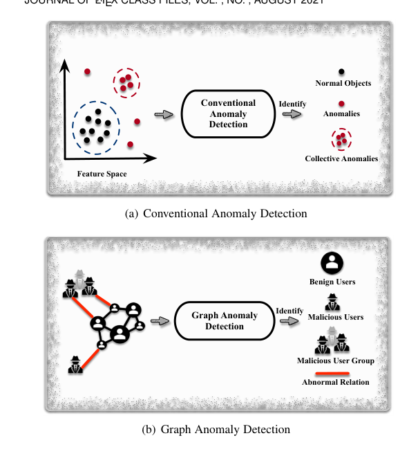

**Fig. 1: 전통적인 이상 탐지와 도표 이상 탐지의 장난감 보기. (b)에 표시된 이상치에서, 도표 이상 탐지는 또한 단면도 8 및 9에서 도표 수준 이상치를, 상세하게 식별합니다.**

Yet, 현실에서, 많은 물체는 이상 탐지를 위한 귀중한 보충 정보를 제공할 수 있는 각 다른과 가진 부유한 관계가 있습니다. 예를 들어, 가짜 사용자는 일반 사용자의 유효한 정보를 사용하여 만들 수 있습니다 또는 그들은 mimicking benign 사용자의 속성 [26], [27]에 의해 스스로 위장 할 수 있습니다. 이러한 상황에서 가짜 사용자와 benign 사용자는 주변 특성을 가지고 있으며, 기존 이상 탐지 기술은 특성 정보를 사용하여 식별 할 수 없습니다. 한편, 가짜 사용자는 항상 자신의 명성과 영향력을 높이기 위해 많은 수의 benign 사용자와 관계를 구축 그래서 그들은 예상치 못한 혜택을 얻을 수 있습니다, 어디 benign 사용자 거의 전시 활동 [28], [29]. Hence, 가짜 사용자에 의해 형성 된이 조밀한 및 예기치 않은 연결은 자비와 더 포괄적인 탐지 기술에 그들의 탈선을 피하기 위하여 계정으로 이 구조적인 정보를 이상치의 탈선 본을 피해야 합니다.

이 지역에서 이전 작업 중, 검색 방법은 도메인 전문가 [38]-[40]에 의해 구축 된 수공 특성 공학 또는 통계 모델에 크게 의존. 이 inherently limits 이러한 기술의 특성을 감지 알 수없는 이상치, 그리고 운동은 매우 노동 집중 될 것입니다. matrix Factorization [41], [42] 및 SVM [43]와 같은 많은 기계 학습 기술은 또한 도표 이상치를 검출하기 위하여 적용되었습니다. 그러나, realworld 네트워크는 종종 매우 높은 치수 및 대규모 데이터에서 결과로 노드 및 가장자리의 수백만을 포함, 이러한 기술은 쉽게 이러한 데이터를 효율적으로 확장하지 않습니다. 실제적으로, 그들은 저장과 실행 시간 [44] 둘 다에 있는 높은 계산 오버 헤드를 전시합니다. 그래프 데이터와 관련된 이러한 일반적인 과제는 감지 기술에 크게 의존하고, 이 설문 조사에서 데이터 별 과제 (Data-CHs)로 분류합니다. 그들에 대한 요약은 Appendix A에서 제공됩니다.

Non-deep 학습 기반 기술도 실제 객체 [24]의 비선형 특성을 캡처 할 수있는 특성이 부족합니다. Hence, 그들에 의해 배운 물체의 표현은 완전히 지원 도표 이상 탐지에 충분히 표현되지 않습니다. 이 문제를 해결하기 위해, 더 최근 연구는 무효 그래프 개체를 식별하기 위해 깊은 학습 기술을 채택의 잠재력을 추구. 데이터 마이닝을위한 강력한 도구로서, 딥러닝은 데이터 표현 및 패턴 인식 [55]-[57]에서 큰 성공을 달성했습니다. 매개 변수와 변화의 층을 가진 그것의 깊은 건축은 aforementioned 문제를 잘 적응시키기 위하여 나타납니다. 더 최근 연구, 깊은 그래프 표현 학습 및 그래프 신경 네트워크 (GNNs)와 같은, 그래프 데이터 마이닝 [58]-[62]에 대한 깊은 학습의 특성을 풍부. 그래프 이상치 및 정상적인 객체와 같은 표현 표현을 추출하여 쉽게 분리 될 수 있습니다, 또는 이상치의 탈선 패턴은 깊은 학습 기술을 통해 직접 배울 수 있습니다, 깊은 학습 (GADL)과 그래프 이상 탐지는 이상 탐지의 최전선에서 리드를 시작. 프론트어 기술로, 딥러닝을 가진 그래프 이상감지기 때문에, 이상치를 검출하고 안전한 결과를 생성 할 것으로 예상됩니다.

<!-- 원문 3쪽 -->

## LATEX CLASS FILES의 JOURNAL, VOL., 아니., AUGUST 2021 3

**TABLE 1: 이상 탐지에 대한 기존 조사의 비교. 본 연구에서는 우리의 설문 조사에서 Edge, sub-graph 및 graph detection를 표시하므로 이전 설문 조사보다 더 깊은 학습 기반 작품을 검토합니다.**

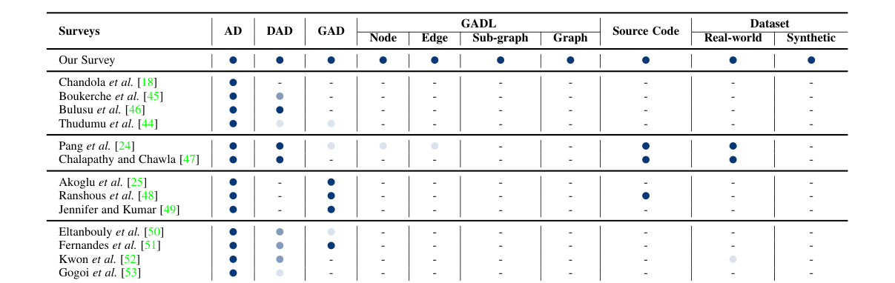

기타. [54] - - - - - - - - - 유 등. [6] - - - - - - - - - Hunkelmann et al. [3] - - - - - - - - - - - Pourhabibi et al. [19] - - - - - - - * 광고: 이상 탐지, DAD: Deep Learning, GAD: 그래프 이상 탐지. * GADL: 딥러닝을 가진 그래프 이상 탐지. * -: 포함되지 않음, (1-2 참조 포함), (3-10 참조 포함), (10+ 참조 포함). 사회의 더 편리한 삶.

### 1.1 딥러닝과 함께 GAD의 도전

Aomaly 검지 및 그래프 데이터 마이닝 [63]-[67]의 복잡성 때문에 사전 언급 된 데이터 별 과제 외에도 그래프 분석을위한 깊은 학습 기술을 채택하여 기술 측면의 여러 과제를 직면합니다. 학습과 관련된 이러한 과제는 기술별 과제(Tech-CH)로 분류되며 다음과 같이 요약됩니다.

기술 CH1. 이상-aware 교육 목표. 딥러닝 모델은 모든 훈련 가능한 매개 변수를 미세 조정하는 교육 목표에 크게 의존합니다. 그래프 이상 탐지를 위해, 이 GADL 모델은 효과적으로 benign과 anomalous 개체의 차이를 캡처 할 수 같은 적절한 교육 목표 또는 손실 특성을 necessitates. Aomaly-aware 객관적인 목적은 지상에 놓는 이상치 뿐 아니라 그들의 탈선 본에 대한 사전 지식이 없기 때문에 매우 도전적입니다. 훈련을 통해 정상적인 개체에서 효과적으로 분리하는 방법은 딥러닝 기반 모델에 대한 중요한 역할을합니다.

기술 CH2. 심리적 해석. 진정한 세계 시나리오에서, 검출 된 이상치의 해석도 우리가 후속 이상 처리 과정을 지원하는 convincing 증거를 제공해야하기 때문에 중요합니다. 예를 들어, 금융 조직의 위험 관리 부서는 식별 된 익명 사용자의 계정을 차단하기 전에 합법적 인 증거를 제공해야합니다. 딥러닝은 해석성 [24], [68]로 제한되어 있으며, 검출된 그래프 분석 방법을 통해 딥러닝 기술에 대한 큰 도전이 남아 있습니다.

기술 CH3. 높은 훈련 비용. D(G)NNs는 소화성 풍부한 정보(예, 구조 정보 및 속성)을 이상 탐지에 대한 그래프 데이터에서 사용할 수 있지만, 이러한 GADL 모델은 이상-aware training 객관적 인 교육 목표 때문에 기존의 깊은 신경 네트워크 또는 기계 학습 방법보다 더 복잡합니다. 이러한 복잡성은 항상 높은 교육 비용과 컴퓨팅 리소스 모두에 리드.

기술 CH4. Hyperparameter 조정. D (G)NNs는 자연적으로 각 신경 네트워크 층의 신경의 수와 같은 hyperparameters의 큰 세트를 전시합니다, 학습 비율, 무게 감퇴 및 훈련 epochs의 수. 그들의 학습 성과는 이러한 hyperparameters의 값에 의해 크게 영향을받습니다. 그러나, 그것은 효과적으로 실제 시나리오에서 라벨 데이터의 부족으로 인해 감지 모델에 대한 최적의/sub-optimal 설정을 선택합니다.

딥러닝 모델은 연관된 하이퍼 파라미터에 민감하기 때문에, 하이퍼 파라미터의 값은 작업의 성공에 필수적입니다. Tuning hyperparameter는 레테르를 붙이는 자료가 유효할 때 감독된 학습에 있는 상대적으로 trivial입니다. 예를 들어, 사용자는 혹독한 검색, 그리드 검색을 통해 hyperparameters (e.g.,)의 최적의/sub-optimal 세트를 찾을 수 있습니다. 그러나, unsupervised 이상 탐지에는 다른 hyperparameter 조정 [69], [70]의 밑에 모형의 성과를 재판하기 위하여 접근 가능한 레테르를 붙이는 자료가 없습니다. 다양한 실제 시나리오에서 적용할 수 있는 중요한 장애로 탁월한 탐지 모델을 위한 이상적인 하이퍼 파라미터 값을 선택합니다.

### 1.2 이상 탐지 Surveys를 경험하십시오.

이 웹 사이트는 애플 리케이션에 전념. 본 연구에서는 정품 앱과 게임을 제공 할 목적으로이 사이트를 만들었습니다. 4AppsApk 최고의 안드로이드 애플 리케이션을위한 무료 APK 파일 다운로드 서비스, 계략.

일반화 된 악화 검출 기술에 대한 일부 대표 조사가있다 - [18], [45] 및 [44]. 그러나 Thudumu et al에서 가장 최신 작업 만. [44]는 그래프 이상 탐지의 주제를 다룹니다. 깊은 학습의 힘을 인식, 세 현대 조사, 퍼프 등. [71], Pang 외. [24]

<!-- 원문 4쪽 -->

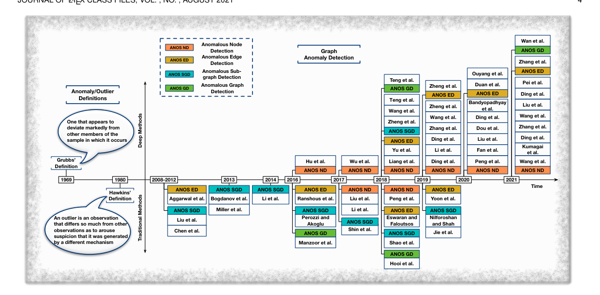

그리고 Chalapathy와 Chawla [47]는 특별히 심층 학습 기반 이상 탐지 기술을 검토합니다.

그래프의 악화 검출, Akoglu 등. [25], Ranshous 외. [48], 제니퍼 및 쿠마르 [49]는 그래프의 분석에 대한 농도를 넣었으며 통계 모델과 기계 학습 기술을 포함한이 지역에 많은 기존 접근 방식을 검토했습니다. 다른 설문 조사는 컴퓨터 네트워크 침입 탐지와 온라인 소셜 네트워크, 예를들면 [3], [6], [6], [19] 및 [50]-[54]에 있는 이상 탐지의 특정 신청에 전념하고 있습니다. 이 작품은 이 고가 및 중요한 영역에서 이상 탐지/graph 이상 탐지 기법의 응용 프로그램의 솔리드 리뷰를 제공. 그러나 언급 된 설문 조사의 아무도는 표 1에서 표시된 것처럼 심 학습과 그래프 이상 탐지에 대한 기술에 전념하고, 따라서 이러한 기법의 체계적이고 포괄적 인 리뷰를 제공하지 않습니다.

### 1.3 기여는 다음과 같이 요약됩니다.

- 딥러닝을 통한 그래프의 첫 번째 설문 조사. 우리의 지식의 가장 좋은 점은, 우리의 조사는 도표 이상 탐지를 위한 최첨단 깊은 학습 기술을 검토하는 첫번째입니다. 관련 조사의 대부분은 비 딥 학습 기술을 사용하여 기존의 그래프 분석 방법 또는 일반화 된 이상 검출 기술 (문자 / 포인트 데이터, 시간 시리즈 등)에 초점을 맞추고 있습니다. 지금까지, 그래프의 독감과 깊은 학습을 통해 독감과 종합적인 조사가 없었다. 우리의 작업은이 간격을 브릿지, 우리는 조직 및 체계적인 조사가이 지역에 있는 연구를 밀어줄 것을 기대할 것입니다.

- 체계적이고 종합적인 검토. 이 설문 조사에서 우리는 딥러닝, 데이터 마이닝, 웹 서비스 및 인공 지능의 영역에서 영향력있는 국제 회의 및 저널에 출판 된 그래프 이상 탐지를위한 최신 딥러닝 기술을 검토합니다.

포함: TKDE, TKDD, TPAMI, NeurIPS, SIGKDD, ICDM, WSDM, SDM, SIGMOD, IJCAI, AAAI, ICDE, CIKM, ICML, WW, CVPR 및 다른 사람. 본 연구에서는 첫 번째 7 데이터 별과 4 가지 기술 별 과제를 요약하여 깊은 학습을 통해 분석합니다. 1는 기존의 비 딥러닝 기법을 통해 동기 부여를 갖는 2의 관점에서 기존의 작품을 종합적으로 검토합니다. 3는 기존의 비 딥러닝 기술에 대한 간단한 소개와 4)는 딥러닝 알고리즘의 기술적인 세부 사항을 제공합니다. 그래프의 간략한 시각표는 독감과 검토 된 작품은 Fig에서 제공됩니다. 2. - 비디오

- 미래 방향. 설문조사 결과에서, 그래프 데이터, 분석, 심층 학습 모델 및 실제 응용 프로그램에 의해 도입된 신생아문제를 다루는 12 미래 연구 방향을 강조합니다. 이 미래 기회는 적절하게 태울 수없는 도전을 나타냅니다. 그리고 더 많은 노력은 미래에 필요합니다.

- Affluent 자원. 우리의 설문 조사는 또한 개방형 무독성 탐지 알고리즘, 공공 데이터셋, 합성 데이터셋 생성 기술뿐만 아니라 일반적으로 사용되는 평가 측정을 제공하여 그래프 무독성 탐지의 최첨단을 추진합니다. 이 출판된 리소스는 향후 연구에 대한 벤치 마크 데이터셋 및 기본 사항을 제공합니다.

- 새로운 세금. 그래프 또는 그래프 데이터베이스에서 존재하는 다른 유형의 분석이 조사 (즉, 노드, 가장자리, 하위 그래프 및 그래프). 본 연구에서는 또한 다른 유형의 그래프 이상치와 유사성을 핀 포인트.

이 설문 조사의 나머지는 다음과 같이 구성됩니다. 섹션 2에서 우리는 설정의 다른 유형에 대해 미리 제공합니다. Section 3에서 Section 9로 부터, 우리는 기존의 기술을 검토하여 anomalous nodes, edge, sub-graphs 및 graph을 검출합니다. 섹션 10에서, 우리는 먼저 출판 된 그래프 이상 검출 알고리즘 및 데이터셋의 수집을 제공하고 그 다음 요약

<!-- 원문 5쪽 -->

## LATEX CLASS FILES의 JOURNAL, VOL., 아니., AUGUST 2021 5

일반적으로 사용되는 평가 미터 및 합성 데이터 생성 전략. 본 연구에서는 섹션 11에서 그래프 분석에 대한 깊은 학습에 관한 12 미래 방향을 강조하고 섹션 12에서 우리의 설문 조사를 요약합니다. 설문 조사의 구체적인 세법은 Appendix B에 적용됩니다.

## 2 사전 지식

이 섹션에서는 노드/지/보내기/보내기(Section 3)에서 7 섹션으로 주로 사용되는 그래프의 다른 유형의 정의를 제공합니다. 일관성을 위해 기존의 작업 [25], [48], [52] 및 정적 그래프, 동적 그래프 및 그래프 데이터베이스로 그래프의 기존 촉매화를 수행했습니다. 그렇지 않으면 지정된 모든 그래프는 다음과 같은 섹션에 언급되어 정적이다. 그래도 그래프 수준의 분석으로 페이지 13에서 멀리 논의되어, 읽기 특성을 향상시키기 위해 그래프 데이터베이스의 정의는 섹션 8의 재료에 더 가까이 주어집니다.

## 정의 1 (플라인 그래프). 정적 일반 그래프 G = {V, E}는 노드 세트 V = {vi}n을 포함한다

1와 가장자리 세트 E = {ei,j} n이 노드와 에이,j = (vi, vj) 노드의 vi와 vj 사이의 가장자리를 나타냅니다. adjacency matrix A = [ai,j]n×n은 ai,j = 1가 노드 vi 및 vj가 연결되면, 그렇지 않으면 ai,j = 0가 있는 그래프 구조를 복원합니다.

정의 2 (아트로바이트 그래프). 정적 특성 그래프 G = {V, E, X}는 노드 세트 V, 가장자리 세트 E 및 속성 세트 X를 구성합니다. 속성 그래프에서 그래프 구조는 정의 1의 정의를 따릅니다. 속성 매트릭스 X = [xi]n×k는 노드의 속성 벡터로 구성되며 노드의 vi와 k와 관련된 속성 벡터는 벡터의 차원입니다. 다음은, 용어 속성과 특성은 교환 할 수 있습니다.

정의 3 (Dynamic 도표). 동적 그래프 G(t) = {V (t), E(t), Xv(t), Xe(t)}는 노드와 가장자리가 과속으로 변합니다. V (t)는 특정 시간 단계 t, E (t)에 그래프에서 설정된 노드는 해당 가장자리 세트, Xv (t) 및 Xe (t)가 존재하는 그래프에서 시간 단계 t에 노드 속성 매트릭스 및 가장자리 속성 매트릭스입니다.

실제로 노드 또는 가장자리는 숫자 또는 카테고리 라벨과 관련이있을 수도 있습니다. 클래스 (예: 일반 또는 이상)를 나타냅니다. 라벨 정보가 사용 가능 / 부분적으로 사용 가능하면, 감독 / 세미 감독 감지 모델은 효과적으로 훈련 될 수 있습니다.

## 3 ANOMALOUS NODE DETECTION (ANOS ND)를

Anomalous 노드는 다른 곳에서 크게 다르는 개별 노드로 일반적으로 인식됩니다. 실제 애플리케이션에서, 이 노드는 종종 컴퓨터 네트워크의 단일 네트워크 인레이더와 같은 개별적으로 나타나는 이상한 개체를 나타냅니다. 온라인 소셜 네트워크의 독립적 인 사기 사용자 또는 소셜 미디어의 특정 가짜 뉴스. 이 섹션에서는 정적 그래프에서 anomalous node detection에 특히 집중합니다. 동적 그래프의 리뷰는 섹션 4에서 찾을 수 있습니다. 4 섹션의 끝에 표 2는 ANOS ND에 대한 검토 된 기술 요약을 제공합니다.

정적 그래프에서 무효 노드를 감지하면, 이상치와 일반 노드 사이의 차이는 그래프 구조 정보 및 노드/지스트의 속성 [41], [72]-[74]에서 주로 그려집니다. 정적 그래프에 대한 우선 지식 (즉, 커뮤니티 구조, 속성)을 부여하면, anomalous 노드는 다음 세 가지 유형으로 분류 될 수 있습니다.

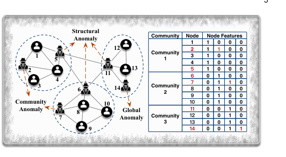

- Global 이상치는 노드 속성을 고려합니다. 그들은 그래프에서 다른 모든 노드에서 두드러지게 다른 속성을 가지고 노드입니다.

- 구조상 이상치는 단지 도표 구조상 정보를 고려합니다. 다른 연결 패턴 (예: 다른 커뮤니티를 연결, 다른 커뮤니티를 연결, 다른 사람들과 dense 링크 형성)가 있는 이상한 노드입니다.

- 커뮤니티는 노드 속성과 그래프 구조 정보를 모두 고려합니다. 노드는 다른 노드와 동일한 커뮤니티에 비해 다른 속성 값이 있는 노드로 정의됩니다.

### 3.1 일반 그래프에서 ANOS ND

일반 그래프는 실제 네트워크의 구조 정보를 나타내는 데 전념합니다. 일반 그래프에서 무효 노드를 감지하려면 그래프 구조가 다양한 각도에서 광범위하게 악화되었습니다. 현재, 우리는 먼저 대표 전통적인 비 딥 학습 접근 방식을 요약하고, 더 최근, 표현 학습을 기반으로 고급 탐지 기술에 따라.

3.1.1 전통 비 딥 학습 기술 이전의 최근 발전에 깊은 학습 및 기타 최첨단 데이터 마이닝 기술, 전통적인 비 딥 학습 기술은 다양한 실제 네트워크에서 널리 사용되어 무효성을 식별합니다. 이 기법의 핵심 아이디어는 기존의 무독성 검출 문제로 그래프를 분석하기 위해, 풍부한 구조 정보로 그래프 데이터가 전통적인 검출 기술 (문자 데이터 전용)에 의해 처리되지 않기 때문에 (문자 데이터 전용) 직접. 갭을 브릿지하려면 [38], [75], [76]는 각 노드와 관련된 통계 특성을 사용했습니다. in/out degree, anomalous nodes를 감지합니다.

예를 들어, OddBall [38]는 통계적 특성 (예를 들어, 1-hop 이웃과 가장자리의 수를 사용하며 각 노드에서 추출한 총 무게와 1-hop 이웃이 특정 구조적 영향을 감지하는 것을 탐지하는 데 사용됩니다. 1)는 가까운 액면 또는 별 모양의 로컬 구조를 형성합니다. ZXZ-hop 이웃은 링크를 가진 매우 큰 링크가 있습니다.

<!-- 원문 6쪽 -->

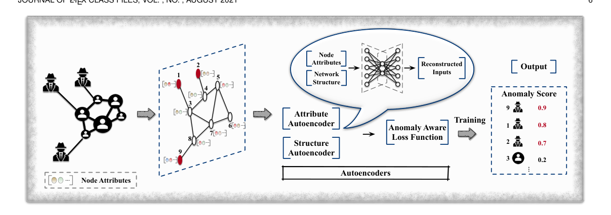

제대로 선택한 통계 특성으로, anomalous 노드는 자신의 탈선 특성 패턴에 대한 존중으로 식별 할 수 있습니다. 그러나, 실제 시나리오에서, 그것은 매우 어려운 많은 후보자에서 가장 적합한 특성을 선택, 및 도메인 전문가는 항상 새로운 통계를 설계 할 수 있습니다, 예를 들어, 가장자리의 최대 / 최소 무게. 결과적으로, 이러한 기술은 종종 가장 중요한 특성을 평가하고 구조적 정보를 효과적으로 캡처하지 않는 비용을 수행 할 수 있습니다.

#### 3.1.2 Network 표현 기반 기술

그래프 구조에서 더 많은 정보를 포착하기 위해 이상 탐지, 네트워크 표현 기술은 널리 악용되었습니다. 일반적으로, 이 기술은 그래프 구조를 임베디드 벡터 공간으로 인코딩하고 더 분석을 통해 anomalous 노드를 식별합니다. 헐리우드 [77], 예를 들어, 많은 커뮤니티와 연결되는 구조적 이상치를 감지하는 효과적인 임베딩 방법을 제안했습니다. 먼저, MSI[78](Graph Partitioning 알고리즘)을 그룹 노드로 d 커뮤니티(d는 user-specified number)로 구성합니다. 그런 다음, 이 방법은 특별히 설계된 임베딩 절차를 사용하여 노드를 학습하는 데 필요한 노드를 학습하여 각 노드와 d 커뮤니티 간의 링크 정보를 캡처 할 수 있습니다. Zi = {z1로 노드에 대한 임의를 정의

i }, 절차는 노드의 회원과 관련하여 각 zc i ∈Zi를 초기화 (내 노드가 커뮤니티에 속한 경우, zc

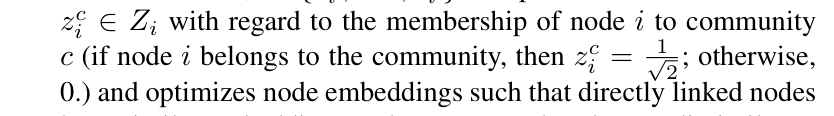

2; 그렇지 않으면 0.) 노드가 직접 연결된 노드와 유사한 임베딩 및 unconnected 노드가 디미아라를 갖는 것을 최적화합니다.

노드를 생성한 후 노드 i와 d 커뮤니티 간의 링크 정보가 더 많은 분석에 할당됩니다. 주어진 노드의 경우, 이러한 정보는 다음과 같습니다.

NB (i) = (y1)

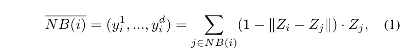

> **주:** 모델 번호: j∈NB(i)

NB(i)는 노드의 이웃을 구성합니다. 나는 커뮤니티 c와 많은 링크가 있다면, 해당 치수 yc의 값은 큰 것입니다.

마지막 단계에서, Hu 외. [77]는 다음과 같이 계산된 무효 점수를 할당하는 득점 특성을 형성합니다:

AScore (i) =

yk의

i = 최대 {y1

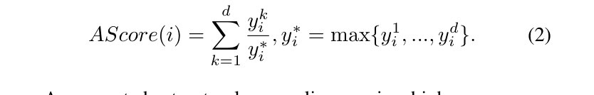

예상대로 구조적 인 이상치는 다른 커뮤니티에 연결하여 더 높은 점수를받습니다. 실제로, predefined 임계값을 주어진, 위의 값 점수를 가진 노드는 이상치로 식별됩니다.

현재까지 Deepwalk [79], Node2Vec [80] 및 LINE [81]와 같은 많은 일반 네트워크 표현 방법은 노드 표현을 생성하고 이상 탐지 성능 검증 [82]-[85]에 사용됩니다. 밀도 기반 기술 [86] 및 거리 기반 기술 [87]와 같은 기존의 무독한 탐지 기술을 결합하여, 무독성 노드는 분리 공간에서 구별 가능한 위치 (즉, 낮은 밀도 영역 또는 훨씬 더 중요한)와 관련하여 식별 할 수 있습니다.

#### 3.1.3 학습 기반 기술

RL(Reinforcement Learning)의 성공은 실제적인 결정을 내릴 수 있는 문제로 인해 이노마리 탐지 커뮤니티에서 실질적인 관심을 끌었습니다. anomalous 노드를 감지하면 노드가 - anomalous 또는 benign에 속한 것을 유도하는 문제로 자연스럽게 간주될 수 있습니다. 일반 선택적 수확 작업의 특수 시나리오로서, anomalous 노드 탐지 문제는 [88]의 최근 작업에 의해 직관적으로 선택적 수확 기술을 보강 학습 및 네트워크 임베딩 결합 할 수 있습니다. 제안한 모형, NAC는 어떤 인간적인 개입 없이 레테르를 붙이는 자료로 훈련됩니다. 특정하게, 그것은 부분적으로 관찰된 노드 및 가장자리로 구성된 씨앗 네트워크를 선택한다. NAC는 파드 네트워크에서 시작된 후, 파드 노드가 발견될 수 있는 파드 노드가 같은 노드 선택 계획을 배우는 보강 학습을 채택한다. 이 보상에 의해 달성된다 선택 계획 라벨을 선택 더 높은 이득. 오프라인 교육을 통해 NAC는 최적의/Suboptimal anomalous 노드 선택 전략을 배우고, 단계별 비독성 그래프 단계에 잠재적인 영향을 발견할 것입니다.

<!-- 원문 7쪽 -->

## LATEX CLASS FILES의 JOURNAL, VOL., 아니., AUGUST 2021 7

### 3.2 Graphs에 ANOS ND

구조 정보 외에도 실제 네트워크는 노드 [89], [90]와 제휴한 풍부한 속성 정보를 포함합니다. 이 속성은 실제 개체에 대한 보완 정보를 제공하고 그래프 구조와 함께, 더 숨겨진 이상치는 이제 비 트리 바이알을 감지 할 수 있습니다.

선명한 경우, 우리는 이 조사에서 심층적 네트워크와 그래프 신경망 사이를 구별합니다. 본 연구에서는 ANOS ND에 대한 심층적 네트워크 (Deep NN) 기반 기술, GCN 기반 기술 및 보강 학습 기반 기술을 다음과 같이 검토합니다. 페이지 제한으로 인해 전통적인 비 딥 학습 기술을 포함한 다른 기존 작품, GAT [91] 기반 기술, GAN 기반 기술 및 네트워크 표현 기반 기술은 Appendix C에서 조사됩니다.

#### 3.2.1 딥 NN 기반 기술

Autoencoder와 깊은 신경망과 같은 깊은 학습 모델은 학습 데이터 표현에 대한 견고한 기초를 제공합니다. 더 효과적인 anomalous 노드 탐지에 대한 이러한 모델을 채택은 최근 상당한 관심을 끌었습니다.

예를 들어, Bandyopadhyay 외. [82]는 탁월한 딥 모델, DONE을 개발하여 글로벌 애니마존, 구조적 인 오노마 및 커뮤니티를 특성화했습니다. 특정하게, 이 작업은 1가 있는 상황의 likelihood를 나타내는 각 노드에 대한 세 가지 이론 점수를 측정합니다. 다른 커뮤니티 (oa i); 또는 2)에 노드와 유사한 속성을 가지고 있으며 다른 커뮤니티 (os i); 또는 3)와 연결됩니다. 그것은 하나의 커뮤니티 구조적으로 속하지만 속성은 다른 커뮤니티 (ocom i)의 패턴을 따릅니다. 특정 노드가 이러한 특성 중 하나를 전시하면 더 높은 점수를 할당하고 무효입니다.

이 점수를 취득하려면, DONE은 두 개의 분리된 Autoencoders (AE), 즉, 구조 AE 및 속성 AE를 Fig에서 표시된 것과 같이 채택한다. 4. - 비디오 두 가지는 재구성 오류를 최소화하고 연결된 노드가 그래프에서 유사한 표현을 가지고있는 균필을 보존함으로써 훈련됩니다. AEs를 훈련할 때, 미리 정의된 특성을 전시하는 노드는 재구성하기 어렵고 따라서 구조 또는 특성 패턴이 표준 행동에 따라하지 않기 때문에 더 재구성 오류를 도입합니다. Hence, 이상치의 불리한 영향은 극소화 된 오류를 달성하기 위해 완화되어야한다. 따라서, DONE 특별히 5개의 기간을 가진 이상 인식 손실 특성 디자인하십시오: LRecs str, LRecs attr, LHom str, LHom attr 및 LCom. LResc str 및 LResc attr는 다음과 같이 쓸 수 있는 구조 재구성 과 속성 재구성 과실입니다:

LRecs는 = 1를 스트로 칩니다

로그 (1 os

## ) − − ˆ2

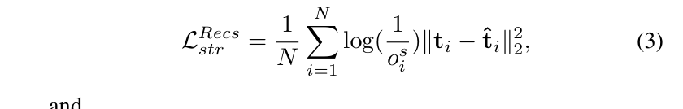

및 LRecs

> **주:** 팟캐스트

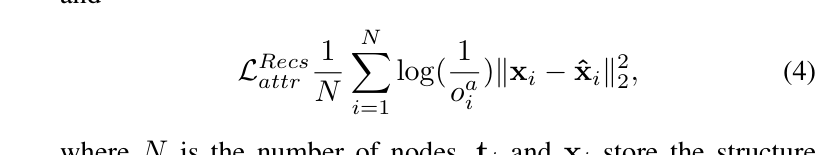

로그 (1 oa

## ) − −2

N은 노드의 수, ti 및 xi는 노드의 구조 정보와 속성을 저장합니다. 즉, xi는 재구성 된 벡터입니다. LHom str 및 LHom attr은 균주를 유지하고 공식화 된 것으로 제안됩니다.

LHom str = 1

로그 (1 os

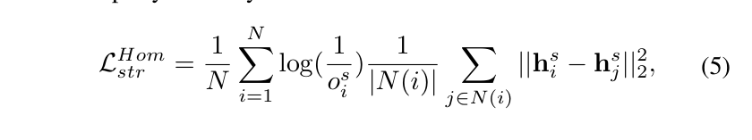

## ||시간

## ₢ 킹

LHom attr = 1

로그 (1 oa

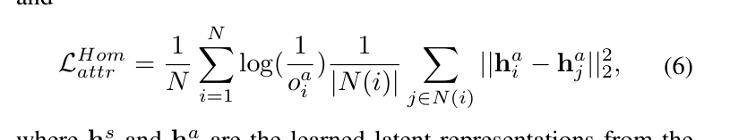

## ||하

## ₢ 킹

## hs를

## 나는 하

나는 구조 AE와 속성 AE에서 배운 후속 표현입니다. LCom은 그래프 구조와 노드 특성이 서로 보완하는 두 개의 AEs에 의해 각 노드의 생성된 표현에 대한 추가 제한을 포즈합니다. 그것은 공식화됩니다:

LCOM = 1를 위해

로그 (1 ocom

## )||시간

## ₢ 킹

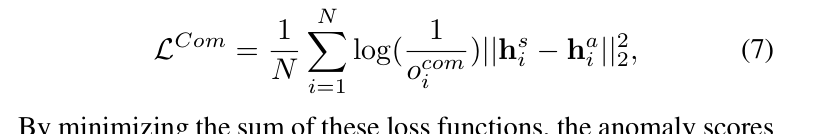

이 손실 함수의 합을 최소화함으로써 각 노드의 동문점은 정량화되고, 점수가 더 높은 상위 노드가 암으로 식별됩니다.

[93]에서, Ding 등. 네트워크 재구성 오류를 사용하여 각 노드의 이상 점수를 측정합니다. 제안 된 방법, DOMINANT, 3 개의 부품, 즉, 그래프 convolutional encoder, 구조 재구성 디코더 및 속성 재구성 디코더를 구성합니다. 그래프 convolutional encoder는 여러 그래프 convolutional 레이어를 통해 노드를 삽입합니다. 구조 재구성 디코더는 배운 노드 임베딩에서 네트워크 구조를 재구성하는 경향이 있지만, 속성 재구성 디코더가 노드 속성 매트릭스를 재구성합니다. 전체 신경 네트워크는 다음의 손실 특성을 최소화하기 위해 훈련됩니다:

LDOMINANT = (1 −α) RS + αRA

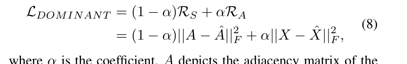

α는 계수이며, 그래프 구조와 노드 특성에 대한 RS 및 RA quantify 재구성 오류의 adjacency matrix를 각각 설명합니다. 훈련이 완료되면, 이상 점수는 총 재구성 오류에 기여하는 각 노드에 할당됩니다. 즉, 계산된:

## 점수(i) = (1 −α)||이이이 −ai||2 + α|xi −xi||2, (9)

ai와 xi는 노드의 구조 벡터와 속성 벡터입니다. 즉, 쾌거와 xi는 해당 재구성된 벡터입니다. 노드는 그 후 후손 순서에 있는 그들의 이상 점수에 따라 순위를 매기고, top-k 노드는 이상치로 인식됩니다.

anomalous 노드 검출의 성능을 향상시키기 위해, Peng et al에 의해 나중에 일. [94]는 여러 속성의 레이아웃에서 노드 속성을 탐구하여 이상치를 감지합니다. 여러 특성의 전망은 객체 [95]-[97]의 다른 관점을 설명하기 위해 고용됩니다. 예를 들어, 온라인 소셜 네트워크에서 사용자의 인구 통계 정보 및 게시 내용은 두 가지 특성의 레이아웃이며, 각각 개인 정보 및 사회 활동을 문자화합니다. 수업료의 부과

<!-- 원문 8쪽 -->

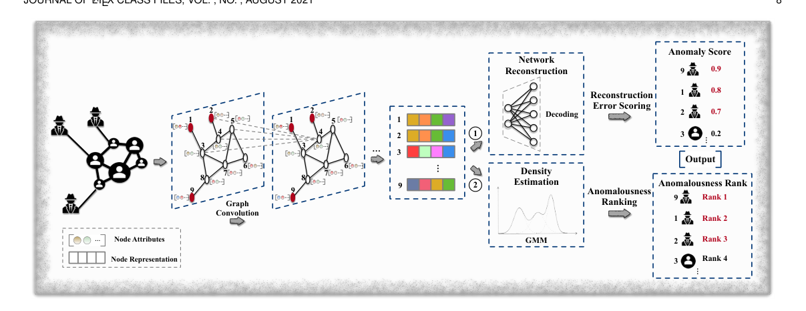

다른 전망의 조사는 이상치가 한 전망에서 정상적일지도 모르지만 다른 전망에서 비정상적인 것일지도 모른다는 것입니다.

이 신호를 캡처하는 목적에 대해 제안 된 방법, ALARM, 여러 GCNs를 적용하여 다양한 전망에 정보를 인코딩하고 노드 표현을 생성하기 위해 그들의 무게를 넣는 집계를 채택합니다. 이 모델의 교육 전략은 네트워크 재구성 손실과 속성 재구성 손실을 최소화하고 공식화 될 수 있도록하는 것을 목표로하는 DOMINANT [93]와 유사합니다.

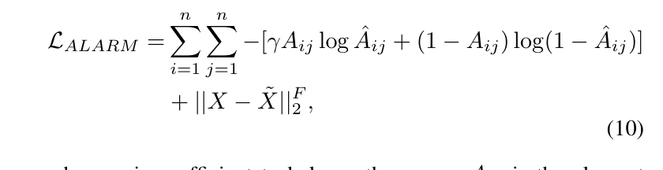

−[γAij 로그 의 Aij + (1 −Aij) 로그 (1 −Aij)]

γ은 오류를 균형으로 계수하는 반면, Aij는 adjacency matrix A에서 좌표 (i, j)의 요소입니다. A은 재구성 된 adjacency matrix A의 대응 요소입니다. X는 원래 노드 특성 매트릭스이며 ーX는 재구성 된 노드 특성 매트릭스입니다. 마지막으로, ALARM은 [93]와 동일한 득점 특성을 채택하고 최고 점수를 가진 노드는 무효합니다.

재건축 오류, Li et al를 사용하여 예상치 못한 노드를 스폿화하는 대신. [98]는 밀도 추정 접근, Gaussian Mixture Model (GMM)을 통해 글로벌 질병 및 지역 사회의 영향을 탐지하기 위해 SpecAE를 제안했습니다. Global 이상치는 노드 속성을 고려하여 식별 할 수 있습니다. 커뮤니티의 영향을 위해, 구조 및 속성은 이웃에 독특한 속성 때문에 공동으로 간주되어야합니다. SpecAE는 노드 표현을 배우고 deconvolution 디코더를 통해 후보 속성을 재구성하는 그래프 convolutional encoder를 조사합니다. GMM의 매개 변수는 노드 표현을 사용하여 추정됩니다. 글로벌 및 커뮤니티의 탈선 특성 패턴으로 인해 일반 노드는 GMM의 더 큰 에너지, 가장 낮은 확률이 가진 k 노드를 전시할 것으로 예상됩니다.

[99], 왕 등. 관련 및 특성을 사용하여 사기를 식별하는 새로운 탐지 모델을 개발. 제안 된 방법, Fdgars, 첫 번째 모델 온라인 사용자 리뷰 및 방문 항목으로 그들의 특성, 그리고 이러한 특성을 기반으로 중요한 사기의 작은 부분을 식별. 마지막으로, GCN은 사용자 네트워크, 사용자 특성 및 라벨 사용자를 사용하여 반 감독 된 방식으로 훈련됩니다. 훈련 후, 모델은 직접 unseen 사용자를 라벨 할 수 있습니다.

최근 작업, GraphRfi[100], 또한 다른 다운스트림 그래프 분석 작업과 이상 탐지를 결합의 잠재력을 탐구. 이 웹 사이트는 귀하가 웹 사이트를 탐색하는 동안 귀하의 경험을 향상시키기 위해 쿠키를 사용합니다. 이 쿠키들 중에서 필요에 따라 분류 된 쿠키는 웹 사이트의 기본적인 특성을 수행하는 데 필수적이므로 브라우저에 저장됩니다. 또한이 웹 사이트의 사용 방식을 분석하고 이해하는 데 도움이되는 제 3 자 쿠키를 사용합니다. 이 쿠키는 귀하의 동의하에 만 브라우저에 저장됩니다. 이러한 쿠키를 거부 할 수도 있습니다. 이러한 쿠키 중 일부를 선택 해제하면 검색 환경에 영향을 미칠 수 있습니다. GCN 프레임 워크는 사용자를 인코딩하고 추천 및 사용자를위한 공유 임베딩 공간으로 항목에 배치됩니다 사기 또는 일반 사용자를 통해 자신의 임베딩를 사용하여 추가 신경 임의 숲을 통해 분류됩니다. 사용자와 항목 사이의 평가 예측을 위해 프레임 워크는 교육 손실에 대한 적은 무게를 할당하여 의심스러운 사용자의 대응 영향을 줄 수 있습니다. 동시에 사용자의 평가 행동은 사기 탐지에 대한 보조 정보를 제공합니다. 이 두 가지 응용 프로그램 (간격 감지 및 권장) 사이의 상호 이익 관계는 여러 그래프 학습 작업 중 정보 공유의 잠재력을 나타냅니다.

3.2.3 보강 학습 기반 기술 NAC, Ding 등과 대비. [101]는 속성 그래프에서 anomalous 노드 탐지를 위한 보강 학습의 사용을 조사했습니다. 제안 된 알고리즘, GraphUCB, 모델 모두 속성 정보 및 구조 정보, 그리고 상황에 따라 다 팔 밴드 기술 [102]의 메모를 상속. 그룹 노드는 k 클러스터에 의해 특성에 따라, GraphUCB는 k-armed Bandit 모델을 형성하고 특정 노드를 전문가 평가를 위해 잠재적으로 선택하는 payoff를 측정합니다. 예측된 동종에 대한 전문가의 의견으로, 의사결정 전략은 지속적으로 최적화되어 있습니다. 결국, 가장 잠재적 인 동종은 선택 될 수있다.

## 4 DYNAMIC GRAPHS에 ANOS ND

Real-world 네트워크는 역전 객체와 그 중의 관계를 나타내는 동적 그래프로 모델링 할 수 있습니다. 구조 정보 및 노드 특성 외에도 동적 그래프

<!-- 원문 9쪽 -->

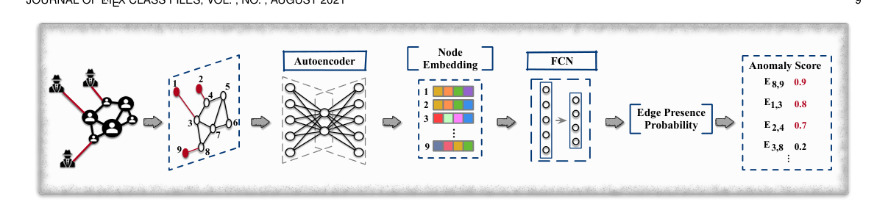

또한 풍부한 임시 신호 [103], 예를 들어 그래프 구조와 노드 속성의 진화 패턴을 포함합니다. 한 손으로이 정보는 역동적인 그래프에서 더 도전적인 노드 탐지를 해 줍니다. 이것은 동적인 도표가 보통 자료의 큰 양을 소개하고 임시 신호는 또한 이상 탐지를 위해 붙잡아야 합니다. 그러나 다른 한편으로는, 그들은 이상치 [25], [48], [104]에 대한 자세한 내용을 제공 할 수 있습니다. 사실, 일부 이상치는 그래프 스냅 샷에서 각 타임 스탬프에 정상 될 수 있으며 그래프의 구조가 고려되면 눈에 띄게됩니다.

이 섹션에서는 다음과 같이 네트워크 표현 기반 기술 및 GAN 기반 기술을 검토합니다. 전통적인 비 딥 학습 접근법의 관련 기술은 Appendix D에 검토됩니다.

### 4.1 Network 표현 기반 기술

그래프를 임베딩 공간으로 인코딩하는 연구 라인에 따라, 이노마이저 감지가 수행 된 후, 동적 네트워크 표현 기술은 최근 작품에 조사되었습니다. [84], Yu 등에서 특히. NetWalk라는 유연한 딥 표현 기법을 제시하여, 동적 (plain) 그래프를 감지하여 구조 정보를 사용하여 무효 노드를 감지합니다. 초기 그래프에서 노드 표현을 배우는 오토엔코더를 채택하고 새로운 가장자리가 추가되거나 기존 가장자리가 삭제될 때 업데이트됩니다. 이노마를 감지하려면 NetWalk는 현재 타임 스탬프에서 다른 클러스터로 구성된 기존 노드를 그룹화하기 위해 k-means 클러스터링 알고리즘 [122]를 스트리밍합니다. 그런 다음 각 노드의 이상 점수는 k 클러스터에 가장 가까운 거리에 따라 측정됩니다. 노드 표현이 업데이트되면 클러스터 센터와 이상 점수가 적절하게 재구성됩니다.

### 4.2 GAN 기반 기술

실습에서, 이상 탐지는 지상의 진정한 동종의 부족으로부터 큰 도전에 직면하고 있습니다. 특히 많은 연구 노력은 이상치가 효과적으로 식별 할 수 있음과 같은 이상치 또는 일반 개체의 특성을 모델링하는 데 투자되었습니다. 이 기술 중, 유전적 adversarial 네트워크 (GAN) [123]는 실제 데이터 배포 및 시뮬레이션 데이터를 캡처하는 인상적인 성능 때문에 광범위한 관심을 받았습니다.

최근 "배우"GAN [124], Zheng 등에서 진보에 의해 동기를 부여. [121]는 관찰 된 benign 사용자의 속성을 사용하여 사기 검사 문제의 해결. 기본 아이디어는 정상적인 활동 패턴을 압착하고 크게 다르게 행동하는 이상치를 검출하는 것입니다. 제안 된 방법, OCAN, 그들의 역사 사회 행동 (예: 역사적인 게시물, 메시지 URL)을 사용하여 benign 사용자의 콘텐츠 특성을 추출하여 시작, 이 방법은 동적 범주로 분류됩니다. Autoencoder [125]를 기반으로 한 장기 기억 (LSTM)는 이를 달성하고 가정 된 것과 같은 행동 사용자 및 악의적 인 사용자가 특성 공간에서 별도의 영역에서 사용됩니다. 차세대 발전기를 비교한 새로운 원클래스 포워사리알 순과 신분화기는 훈련됩니다. 특히 발전기는 비교적 낮은 밀도의 benign 사용자에 위치하는 보완적인 데이터 포인트를 생산합니다. Discriminator, 그러므로, benign 사용자에서 생성 된 샘플을 구별하는 것을 목표로합니다. 훈련 후, benign 사용자의 지역은 신중한 신중한 및 이상치가 그들의 위치에 대해 확인 될 수 있습니다.

NetWalk [84]와 OCAN [121] 모두는 유망한 노드 탐지 문제에 접근하지만, 각각 구조 또는 속성을 고려합니다. 동적 그래프의 구조와 속성 정보를 분석하는 정적 그래프 분석 기법의 성공으로, 향상된 감지 성능은 대문자일 수 있습니다. 따라서이 폭발적인 지역을 강조합니다. 11 섹션에서 미래 작품.

## 5 ANOMALOUS EDGE DETECTION (ANOS ED)를

ANOS ED는 개별 노드를 대상으로 한 anomalous node detection에 대비하여 비정상적인 링크를 식별하는 것을 목표로 합니다. 이 링크는 종종 실제 객체 [126] 사이의 예상치 못한 관계에 대한 비정상적인 상호 작용과 가짜에서 표시된 사용자의 비정상적인 상호 작용과 같은. 1, 또는 컴퓨터 네트워크의 공격자 노드와 benign 사용자 기계 사이의 의심스러운 상호 작용. 이전 세법에 따라, 이 섹션에서, 우리는 정적 그래프에 대한 최첨단 ANOS ED 방법을 검토하고 6는 동적 그래프에 대한 기술을 요약합니다. 요약은 표 3에서 제공됩니다. 이 섹션에는 깊은 NNs, GCNs 및 네트워크 표현을 기반으로하는 방법을 포함합니다. 비딥 학습 기술은 Appendix E.에서 검토됩니다.

### 5.1 딥 NN 기반 기술

ANOS ND 기술을 기반으로 한 깊은 NN과 마찬가지로, 오토엔코더와 완전 연결 네트워크(FCN)은 무례한 가장자리 검출에 사용되었습니다. 예를 들어, Ouyang et al. [127]는 심층적인 모델을 통해 가장자리의 배포를 모델링하여 문제를 접근하여 암종으로 나타나는 것으로 나타나는 기존의 가장자리를 식별합니다. (그림에서 보이는 것과 같이. 6 (주) 각 가장자리의 확률

<!-- 원문 10쪽 -->

## LATEX CLASS FILES의 JOURNAL, VOL., 아니., AUGUST 2021 10

**TABLE 2: Anomalous Node Detection 기술 개요.**

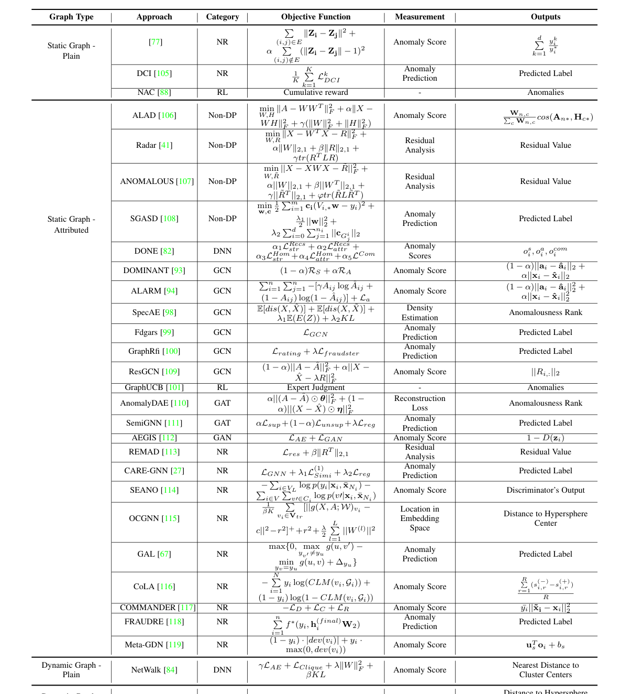

동적 그래프 - 분산 된 MTHL [120] 비 DP minP f (P) Hypersphere Centroid OCAN [121] GAN LLST M−AE + LGAN 이상 점수 Discriminator의 출력 * Non-DP: Non-Deep Learning Techniques, DNN: Deep NN based Techniques, GCN: GCN 기술 기반, RL: 보강 기반 학습 기술. * GAT: GAT 기반 기술, NR: 네트워크 대표 기반 기술, GAN: 유전적 조언 네트워크 기반 기술. eu,v는 P(v|u, N(u))와 P(u|v, N(v))로 결정하여 노드 u를 이웃 N(u)와 노드 v를 사용하여 인접 확률을 측정하는 것이 각각 N(v)로 결정됩니다. P(v|u, N(u))를 계산하기 위해 제안된 방법, UGED, 첫번째 인코딩을 각각 인코딩합니다.

<!-- 원문 11쪽 -->

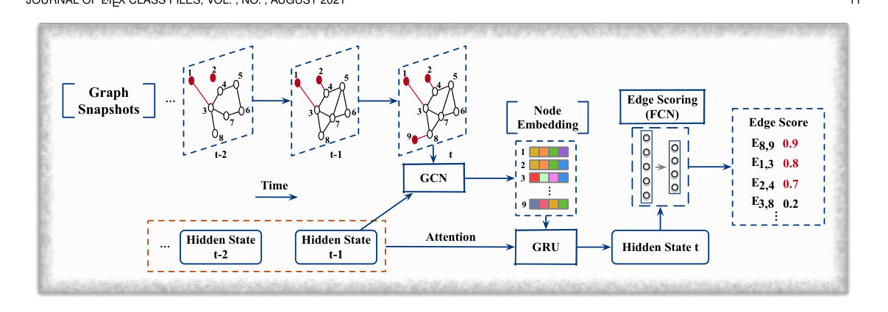

노드는 FCN 레이어를 통해 낮은 치수 벡터로 노드를 생성하고 노드 u의 표현을 자체와 이웃의 벡터의 의미로 생성합니다. 다음 노드 표현은 다른 FCN으로 계산됩니다. P(v|u, N(u))를 추정합니다. 예측은 의 P(v|u, N(u))로 표현됩니다. = Softmax(W · H(u))|v, W가 트레이드 매개 변수를 나타내는 H(u)는 u의 표현입니다. UGED의 교육 계획은 크로스 엔트로피 기반 손실 특성, CE (의 V|u, N (u)), v)을 통해 기존의 가장자리의 예측을 극대화하는 것을 목표로합니다. 훈련 후, 이상 점수는 1 −P(v|u, N(u)) 및 1 −P(u|v, N(v)의 평균을 사용하여 각 가장자리에 할당됩니다. 또한, 더 낮은 확률이 높은 점수를 얻을 것이다 기존의 가장자리와 최고 K 가장자리는 무효로보고된다.

### 5.2 GCN 기반 기술

모델링 가장자리 배포의 선을 따라, 일부 연구는 그래프 구조 정보를 더 잘 캡처하기 위해 GCN을 활용합니다. Duan 외. [128]는 훈련 데이터의 무효 가장자리의 존재가 실제 가장자리 분포를 캡처하여 전통적인 GCN 기반 모델을 방지하여 초래 감지 성능에 리드하는 것으로 나타났습니다. 이 문제는 발생한다. 더 나은 감지 성능을 달성하기 위해 노드 임베딩 프로세스는 무효 가장자리의 부정적인 영향을 완화해야하지만, 이러한 가장자리는 배운 임베딩를 사용하여 감지됩니다. 이 문제를 해결하기 위해 제안 된 방법, AANE, 공동으로 훈련 중에 임베딩 및 detection 결과를 업데이트하여이 두 가지 문제를 고려합니다.

AANE의 총 손실 특성은 두 개의 부품을 포함합니다. 이상-aware loss (Laal) 및 조정 피팅 손실 (Lafl). Laal은 링크 예측 결과와 지표 매트릭스를 덧붙일 수 있도록 제안했습니다. 이는 비례적인 가장자리가 1로 표시될 때 예측 확률이 낮을 것입니다. 이것은 공식화됩니다:

전화 번호: +86 0571-85586753

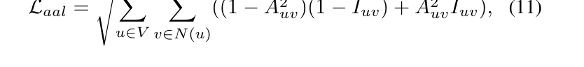

(1 −A2uv) (1 −Iuv) + A2uvIuv), (11)는 노드 세트인 N (u)는 u의 이웃의 세트입니다. Lafl는 잠재적인 무질서 가장자리의 제거와 관련하여 재건축 손실을 정량화, 다음과 같이 denoted:

La La ˆ ˆ A A A A A A A A A A A A A A A A A A A A A A A A A A A A A A A A A A A A A A A A A A A A A A A A A A A A A A A A A A A A A A A A A A A A A A A A A A A A A A A A A A A A A A A A A A A A A A A A A A A A A A A A A A A A A A A A A A A A A A A A A A A A

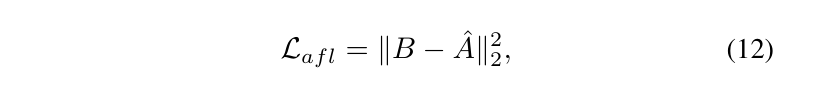

B는 입력 adjacency matrix A에서 모든 예측 된 이상치를 제거하는 조정 된 adjacency matrix입니다. 이 두 손실 최소화로 AANE는 가장 낮은 확률로 최고-K 가장자리를 식별합니다.

### 5.3 Network 표현 기반 기술

ANOS ED에 대한 노드 임베딩 대신, 그래프에서 직접 배운 가장자리 표현은 또한 이상치ing를 구별 할 수 있습니다. 가장자리가 잘 보존하면 그래프 구조와 상호 작용 내용 (예:, 온라인 소셜 네트워크의 메시지, 노드의 인용 네트워크의 공동 저자 용지) 사이에, 향상된 감지 성능이 예상 될 수 있습니다. 날짜에, Xu와 같은 몇몇 학문. [129]는 가장자리 표현을 생성하는 결과를 표출했습니다. 그래도 검출을 위해 특별히 설계되지 않았지만, ANOS ED에 잠재적 인 접근 방식을 지적합니다. 이것은 섹션 11.1의 잠재적 인 미래 방향으로 강조됩니다.

## 6 DYNAMIC GRAPHS에 ANOS ED

동적 그래프는 [130]에 가장자리의 외관 / 디포밍을 반영하는 데 강력합니다. 무성한 가장자리는 도표 구조에 있는 변화를 모델링하고 각 시간 단계에 가장자리 배급을 붙잡기 위하여 구별될 수 있습니다. ANOS ED에 대한 최근 접근은 동적 그래프에 검토됩니다.

<!-- 원문 12쪽 -->

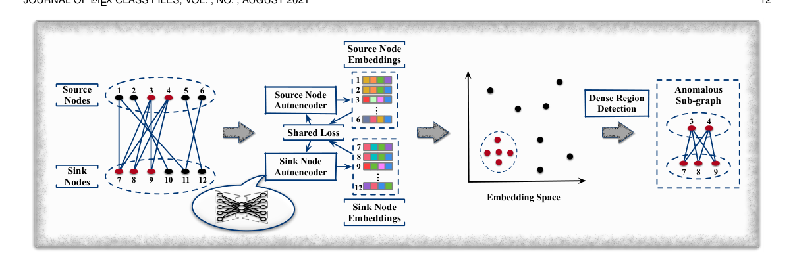

### 6.1 Network 표현 기반 기술

네트워크 표현 기반 기술의 수업은 동적 그래프 구조 정보를 가장자리 표현으로 인코딩하고 불규칙한 가장자리를 강조하는 전통적인 무질서 검출 기술을 적용하는 것입니다. 이것은 매우 간단합니다. 그러나 그래프 구조가 진화 할 때 생성 / 업데이트 정보 가장자리 표현에 중요한 도전이 남아 있습니다. 이 도전을 시작하려면 ANOS ND 모델 NetWalk [84]는 동적 그래프에서 무해한 가장자리를 감지 할 수 있습니다. 거리 기반 무독성 탐지의 선을 따라 NetWalk는 노드 임베딩를 사용하여 공유 된 후속 공간으로 가장자리를 인코딩하고, 이상치는 늦은 공간에서 가장 가까운 가장자리 클러스터 센터에 거리를 기반으로 식별됩니다. 실제로 Netwalk는 소스 및 대상 노드의 Hadamard 제품으로 가장자리 표현을 생성, 다음과 같이 denoted: zu, v = zu ⊙zv. 새로운 가장자리가 도착하거나 기존 가장자리가 사라지면 노드와 가장자리 표현은 각 시간 우표에서 임시 그래프에서 무작위 산책로에서 업데이트되며 가장자리 클러스터 센터 및 가장자리가 소문 점수가 재 계산됩니다. 마지막으로, 가장자리 클러스터에 가장 높은 가장자리는 이상치로보고됩니다.

### 6.2 GCN 기반 기술

NetWalk는 동적 그래프에서 이상치를 탐지 할 수 있지만, 긴/단기 노드 및 그래프의 구조를 고려하지 않고도 가장자리 표현을 업데이트합니다. 더 효과적인 ANOS ED를 위해, Zheng 등. [131]는 직관적으로 온도 조절, 구조 및 특성 정보를 결합하여 동적 그래프의 가장자리의 무해함을 측정합니다. 그들은 [132]주의와 GCN 및 Gated Recurrent Units (GRU)를 구성하는 세미 감독 모델, AddGraph를 제안합니다. 각 시간마다 스탬프의 임시 그래프에서 더 많은 대표자 구조 정보를 캡처하고 각각 사이 종속합니다.

각 타임 스탬프 t에서 GCN은 출력 숨겨진 상태 (Ht−1)을 시간 t−1에서 가져 오기 전에 노드를 생성하는 데 걸리는 노드가 이전 숨겨진 상태 (Fig에서 보여지는 것처럼) 노드에서 현재 숨겨진 상태 Ht를 배웁니다. 7). 모든 노드의 숨겨진 상태 Ht를 얻기 후에 AddGraph는 노드에 연결된 노드에 따라 각 가장자리에 영향을 받지 않습니다. 제안 된 이상 득점 특성은 다음과 같이 공식화됩니다.

## f(u, v, w) = w · σ(β · (||A ⊙hu + b ⊙hv||2

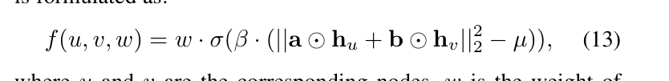

u와 v가 해당 노드 인 w는 가장자리의 무게이며 b는 트레이able 매개 변수이며 β 및 μσ는 hyperparameters이며 σ(·)는 비선형 활성화 특성입니다. 배우기 위해 b, Zheng 등. 더 동적인 도표에 있는 모든 기존하는 가장자리가 훈련 단계에서 정상이고, 이상치로 비 확고한 가장자리를 간색했습니다. 특히, 그들은 손실 특성을 다음과 같이 형성합니다:

LAddGraph = 분

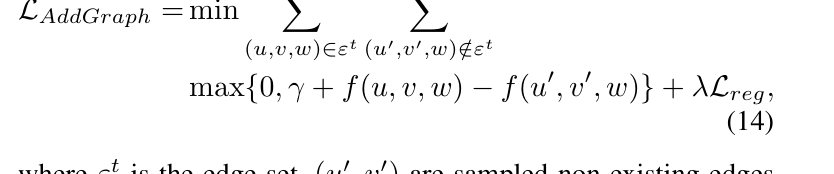

εt는 가장자리 세트, (u ′, v ′)는 시간 우표 t에 비 확고한 가장자리, λ입니다 하이퍼 모수, 및 Lreg는 모형에 있는 모든 trainable 모수를 정규화합니다. 훈련 후, 득점 특성은 Eq에 따라 더 높은 동요 점수를 할당하여 테스트 데이터의 무효 가장자리를 식별합니다. 13. - 비디오

## 7 ANOMALOUS 잠수함 DETECTION (ANOS SGD)

실제 생활에서, 이상치는 또한 콜드를하고 다른 사람들과 함께 garner 혜택을 행동 할 수 있습니다. 예를 들어, Fig에서 보이는 것과 같이 온라인 리뷰 네트워크에서 사기성 사용자 그룹. 1, 홍보 또는 비소 특정 상품을 위해 잘못된 리뷰를 게시 할 수 있습니다. 이 데이터가 그래프로 표현되면, 이상치와 그들의 상호 작용은 보통 의심스러운 하위 그래프를 형성하고 ANOS SGD은 benign에서 구별 할 것으로 제안됩니다.

개별 및 독립적 인 그래프 이상치와 달리, 즉, 단일 노드 또는 가장자리, 의심스러운 하위 그래프의 각 노드 및 가장자리가 정상 일 수 있습니다. 그러나 수집으로 간주 될 때 그들은 무효로 움직입니다. 또한, 이러한 하위 그래프는 크기와 내부 구조에 따라 다양하며, ANOS ND/ED [133]보다 더 많은 도전을 감지합니다. 이 문제를 해결하는 광범위한 노력이 있었지만, Deeplearning 기술은 지난 5 년 동안이 문제를 해결하기 위해 시작되었습니다. 참고를 위해 전통적인 비 딥 학습 기반 기술은 Appendix F에 소개되고 요약됩니다.

<!-- 원문 13쪽 -->

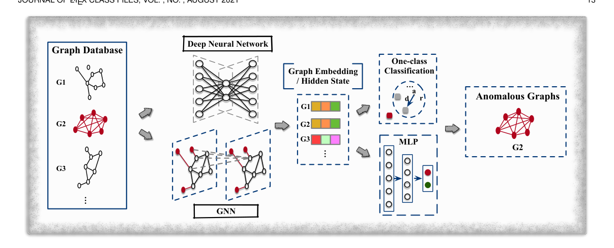

ANOS SGD에 대한 검토 기술의 표 3 섹션 9의 끝에 제공 됩니다.

이진 그래프의 유연성으로 인해 다양한 종류의 실제 객체와 복잡한 관계를 나타내는 것은 최근 몇 가지 작품이 ANOS SGD을 통해 실제 주제를 감지하는 깊은 네트워크 표현 기법을 활용했습니다. 예를 들어, Wang 등. [134]는 온라인 쇼핑 네트워크를 bipartite 그래프로 표현했습니다 (이제이제이제이제이제이제이제이제이제이제이제이제이제이제이제이제이제이제이제이제이제이제이제이제이제이제이제이제이제이제이제이제이제이제이제이제이제이제이제이제이제이제이제이제이제이제이제이제이제이제이제이제이제이제이제이제이제이제이제이제이제이제이제이제이제이제이제이제이제이제이제이제이제이제이제이제이제이제이제이제이제이제이제이제이제이제이제이제이제이제이제이제이제이제이제이제이제이제이제이제이제이제이제이제이제이제이제이제이제이제이제이제이제이제이제이제이제이제이 Fraudulent 그룹은 그런 그래프에서 형태를 의심스러운 디센스 블록을 기반으로 감지됩니다.

왕 등. [134]는 동일한 그룹에 있는 의심스러운 사용자와 같은 사용자의 무독한 표현을 배우는 것을 목적으로 하고 벡터 공간에서 밀접하게 위치할 것입니다, 그러나 benign 사용자는 멀리 떨어져 있을 것입니다 (그림에 있는 임베딩 공간에서 보이는 것과 같이. 8 (주) 1개의 사기성 그룹에 속하는 사용자 노드가 동일한 항목 노드와 연결될 가능성이 더 높은 관측에 따르면, 개발된 모델, DeepFD는, 2명의 사용자의 행동에 있는 유사성을 측정하고, simij는, 그들이 검토한 모든 품목 중 공유된 항목의 백분율로 계산됩니다. 사용자 표현은 전통적인 오토엔코더를 통해 생성되며, 3개의 손실을 사용하여 훈련되고 인코딩 디코딩 프로세스를 따르는 것입니다. 첫 번째 손실은 비파트 흑연 그래프 구조를 보장하는 재건 손실 Lres는 배운 사용자 표현과 아이템 표현을 사용하여 제대로 재구성 될 수 있습니다. 두 번째 용어 Lsim은 배운 사용자 표현에 대한 사용자 유사 정보를 보존합니다. 즉, 두 사용자가 유사한 행동을 가지고 있다면, 그들의 표현도 유사해야합니다. 이 손실은 다음과 같이 공식화됩니다:

Lsim =의 특징

simij · sim −simij sim2

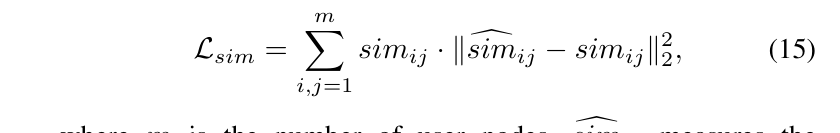

m은 user 노드의 수이며, simij는 RBF 커널 또는 기타 대안을 사용하여 user i와 j의 표현의 유사성을 측정합니다. 세 번째 손실 Lreg은 모든 트레이 가능한 매개 변수를 정기적으로합니다. 마지막으로, 의심스러운 밀도 블록, 벡터 공간에서 디센스 지역을 형성 할 것으로 예상되는, DBSCAN [135]를 사용하여 감지됩니다.

또 다른 작업, FraudNE [136], 또한 온라인 검토 네트워크를 bipartite 그래프로 모델링하고 더 악의적인 사용자를 감지하고 dense 블록 감지 원리를 따르는 관련 조작 된 항목을 감지합니다. DeepFD와 달리 FraudNE는 노드의 두 가지 유형 모두 인코딩 할 수 있으며, 의심스러운 사용자와 같은 디센스 블록에 속하는 항목이 서로 매우 가까이 있으며, 다른 사람들은 획일하게 배포합니다. (그림에서 보이는 것처럼) 8 (주) FraudNE는 두 개의 전통적인 오토엔코드, 즉, 소스 노드 오토엔코더와 싱크 노드 오토엔코더를 채택하여 사용자 표현과 아이템 표현을 배우게 됩니다. 두 개의 autoencoders는 해당 재구성 손실과 공유 손실 특성을 최소화하기 위해 훈련되고 총 손실은 다음과 같이 공식화 될 수 있습니다.

LF raudNE = 자원 자원은 + Lsink res + αLshare + ηLreg, (16) α 및 η는 하이퍼 파라미터이며, 모든 트레이드 가능한 매개 변수를 정기적으로 옮깁니다. 특히, 재구성 손실 (즉, Lsource res 및 Lsink res)는 입력 사용자 / 나이트맨 특성 (Graph 구조에서 추출)과 디코딩 특성 사이의 간격을 측정합니다. 공유된 손실 특성은 사용자와 항목이 유사한 표현을 얻을 수 있도록 각 연결된 쌍과 같은 표현 학습 프로세스를 제한하는 것으로 제안됩니다. DBSCAN [135] 알고리즘은 조밀한 지역 탐지를 위해 적용하기 편리합니다, FraudNE는 또한 의심스러운 사용자 및 품목에 의해 형성된 조밀한 sub-graphs를 구별하기 위하여 그것을 이용합니다.

현재까지 몇 가지 작품만 ANOS SGD에 대한 깊은 학습 기술을 사용하여 노력해 왔습니다. 그러나 하위 graph 표현 학습에 대한 연구 관심을 강화하고있는 것은 ANOS SGD에 대한 더 많은 연구를 격려하고 섹션 11.1의 잠재적 인 미래로 강조합니다.

## 8 ANOMALOUS GRAPH DETECTION (안스 GD)

무효 노드, 가장자리, 하위 그래프를 넘어 그래프는 그래프의 세트/데이터베이스에 비정상적인 그래프로 나타날 수도 있습니다. 일반적으로, 그래프 데이터베이스는 다음과 같이 정의됩니다.

## 정의 4 (그래픽 데이터베이스). 그래프 데이터베이스 G = {Gi = (Vi, Ei, Xv (i), Xe (i))}N

i=1는 N 개별 그래프를 포함합니다. 여기에 각 그래프 Gi는 노드 세트 Vi와 가장자리 세트 Ei로 구성되어 있습니다.

<!-- 원문 14쪽 -->

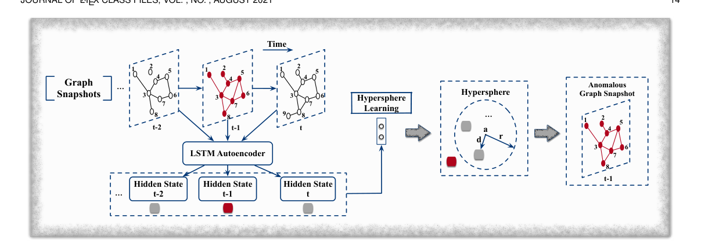

Xv(i)와 Xe(i)는 속성 그래프인 경우 Gi의 노드 속성 매트릭스 및 가장자리 속성 매트릭스입니다.

이 그래프 레벨 ANOS GD는 다른 곳에서 크게 탈선하는 개별 그래프를 감지하는 것을 목표로합니다. ANOS GD의 구체적인 예는 비정상적인 분자 탐지입니다. 화학 화합물이 원자와 채권이 노드와 가장자리로 표현되는 분자 / 화학 그래프로 표현되면 [137], [138], 특정 분자는 해당 그래프가 다른 곳에서 탈선하는 구조 및 / 또는 특성 때문에 식별 할 수 있습니다. 뇌 장애 탐지는 또 다른 예입니다. 뇌 장애는 시퀀스에서 노화의 다른 단계에서 뇌 그래프의 역동적 인 분석을 통해 진단 될 수 있으며 특정 시간 스탬프에서 불변성 스냅 샷을 찾는다.

사전 검토 기법 (즉, ANOS ND/ED/SGD)은 단일 그래프에서 이상치를 검출하기 위해 최선을 다하고 있기 때문에 ANOS GD와 호환되지 않습니다. ANOS GD는 그래프 수준의 응옥을 감지하는 데 사용됩니다. 이 문제는 일반적으로 접근된다: 1) 그래프 커널 [139]를 사용하여 그래프의 쌍방향 근접성을 측정; 2) 노드 [140]의 비정상적인 그룹에 의해 생성 된 무소성 그래프 신호를 검출하는 3; 또는 3) 인코딩 그래프를 사용하여 빈번한 motifs [63]. 그러나 이러한 방법 중 아무도 딥러닝 기반입니다. 쓰기의 시간으로, 딥러닝이 취해있는 ANOS GD에서 매우 몇 가지 연구가 있습니다. 그런대로, 이것은 단면도 11.1에 있는 잠재적인 미래 방향으로 강조됩니다.

### 8.1 GNN 기반 기술

다양한 그래프 분류 작업에서 GNNs의 성공에 의해 동기를 부여, ANOS GD에서 가장 최근 작품은 주어진 그래프 데이터베이스에서 정상 / 평등으로 단일 그래프를 분류하는 GNNs를 고용. 특히, Dou 외. [141]는 태그를 생성하여 ANOS GD 문제로 가짜 뉴스를 분석하여 가짜 뉴스를 분석하여 루트 노드가 뉴스의 기조각을 파악하고, 아이 노드는 루트 뉴스와 상호 작용하는 사용자를 나타냅니다. 최종 업데이트 프레임 워크, UPFD, 뉴스 조각 및 사용자를위한 두 개의 임베딩를 추출, 각각, 텍스트 임베딩 모델 (예를 들어. word2vec, BERT) 및 사용자 참여 임베딩 프로세스. 각 뉴스 그래프의 경우, 그 후반 표현은 이 두 개의 임베딩의 평평한 concatenation이며, 이는 뉴스의 라벨을 사용하여 신경 계급기를 훈련시키는 것입니다.

훈련 된 모델에 의해 가짜로 라벨이 부착 된 응고 그래프는 무례로 간주됩니다.

Zhao와 Akoglu [142]의 또 다른 대표 작업은 GIN 모델과 일류 분류 (즉, DeepSVDD [143])를 사용했습니다. 최종 단계의 그래프 레벨 분석 프레임 워크를 훈련시킵니다. 그래프 데이터베이스의 각 개별 그래프를 위해 그래프 레벨 임베딩은 노드의 노드 레벨 임베딩를 통해 그 의미를 적용함으로써 생성됩니다. 그래프는 결국 Fig에서 보이는 것과 같이 배운 하이퍼구 밖에 있는 경우 무효로 묘사됩니다. 9. - 비디오

### 8.2 Network 표현 기반 기술

ANOS GD에 일반 그래프 수준의 네트워크 표현 기술을 적용 할 수 있습니다. 이러한 방법으로, 감지 문제는 임베딩 공간에서 기존의 아웃 런 탐지 문제로 변환됩니다. D(G)NN 기반의 기술에 따라 최종 단계별 방식으로 그래프의 영향을 감지할 수 있는 기술을 바탕으로, 이 표현 기법을 이상 탐지에 채택하는 것은 두 단계입니다. 데이터베이스의 첫 번째 그래프는 Graph2Vec [144], FGSD [145]와 같은 그래프 수준의 표현 기술을 사용하여 공유 된 후속 공간으로 인코딩됩니다. 그런 다음 각 단일 그래프의 무효는 오프 - 스윙 아웃리터 검출기에 의해 측정됩니다. 이 접근법은 두 단계의 기존 방법을 쌍화하지만, 단계는 서로 분리되어 있으므로, 검출 성능은 무관하게 검출의 술을 위해 반드시 설계되지 않았기 때문에 하위 비교가 될 수 있습니다.

## 9 DYNAMIC GRAPHS에 ANOS GD

동적 그래프 환경을 위해, 그래프 수준의 무독성 검출 내구시간을 통해 비정상적인 그래프 스냅샷/temporal 그래프를 식별합니다. ANOS ND와 ED와 같은 동적 그래프에, 그래프의 순서 주어진, 무효 그래프는 그들의 특이한 진화 패턴, 이상한 그래프 수준의 특성, 또는 다른 특성과 관련 될 수 있습니다.

각 그래프 스냅샷/temporal graph의 특성을 파생하기 위해 일반적으로 사용되는 GNN, LSTM 및 오토엔코더는 적용할 수 있습니다. 예를 들어, Teng 외. [147]는 LSTMautoencoder를 적용하여 비정상적인 그래프 스냅샷을 감지할 수 있습니다.

<!-- 원문 15쪽 -->

## LATEX CLASS FILES의 JOURNAL, VOL., 아니., AUGUST 2021 15

**TABLE 3: 무균 가장자리, Sub-graph 및 도표 탐지 기술의 개요.**

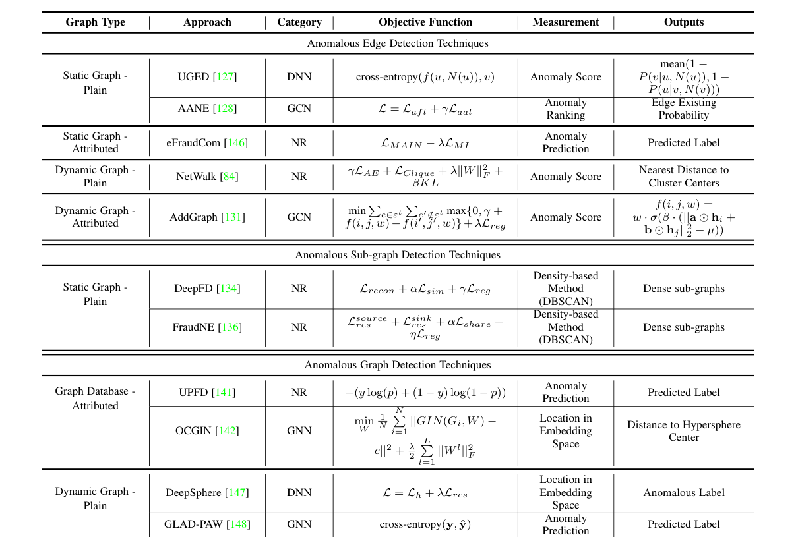

- DNN: 딥 NN 기반 기술, GCN: GCN 기반 기술, NR: 네트워크 대표 기반 기술. * GNN: 그래프 신경 네트워크 기반 기술.

Lh = r2 + γ를 γ으로 하십시오

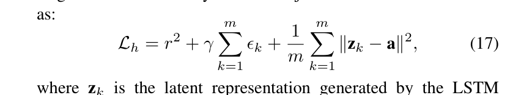

## a −a a2, (17)

Lres가 LSTM 오토엔코더의 재건축 손실인 L = Lh + λLres, (18)를 위한 L= Lh + λLres, (18). 훈련이 완료되면 DeepSphere는 주어진 unseen data X를 무효로 덮어 낸다.

위의 모든 ANOS ND, ED, SGD 및 GD 기술 외에도, 그것은 뚜렷한 모델이 그래프 분류 알고리즘 또는 GNNs [149]-[151]를 공격하기 위해 생성 된 그라프를 멸망하는 것을 언급 할 가치가 있습니다. 또한 (내구) 이상치로 간주 될 수 있습니다. 의 멸망된 그래프에서 노드와 가장자리는 다른 곳에서 탈리하게 수정됩니다. GNN 모델의 주요 목적이 공격하기 때문에이 조사에서 이러한 리뷰를 검토하지 않았습니다. 이 방법 뒤에 중요한 아이디어는 공격/수행 전략이고, 이 구체 seldom 초점에 있는 학문은 탐지 또는 reasoning 단위에 perturbed 도표 또는 그것의 sub 구조, i.e, anomalous 노드, 가장자리, subgraphs, 또는 도표를 식별하기 위하여 측정합니다.

## 10 PUBLISHED ALGORITHMS 및 데이터셋의 특징

개방형 구현 및 실제 세계 분석과 실제 데이터셋를 취득하면 그래프의 분석 연구에서 트리 바이알에서 멀리 있습니다. 여기에서, 우리는 공개적으로 유효한 구현을 가진 간행한 알고리즘을 목록으로 만듭니다, 그 후에 우리는 대중적인 벤치 마크 데이터셋의 수집을 제공하고 통용되는 평가 미터를 요약합니다. 최근, 실제 데이터셋에서 라벨이 있는 아노마리스의 부족으로 인해 기존의 작품에 사용되는 세 가지 합성 데이터셋 세대 전략을 검토합니다.

<!-- 원문 16쪽 -->

## LATEX CLASS FILES의 JOURNAL, VOL., 아니., AUGUST 2021 16

**TABLE 4: 알고리즘 및 모델 게시**

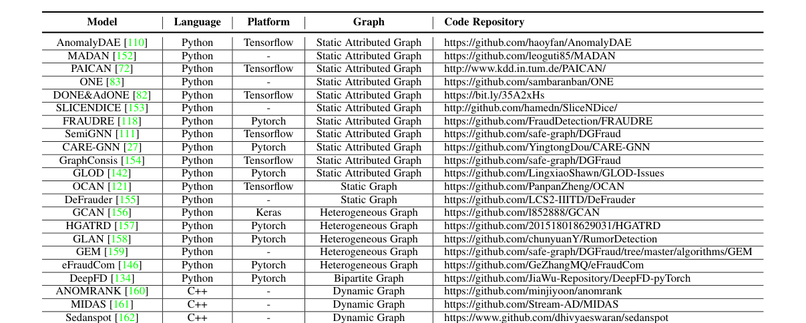

모든 리소스는 https://github.com/XiaoxiaoMa- MQ/Awesome-Deep-Graph-이상-Detection/에서 사용할 수 있습니다.

### 10.1 Algorithms에 게시

알고리즘 및 모델의 출판된 구현은 기본 실험에 기여합니다. Table 4는 언어 및 플랫폼에서 출판된 구현 요약을 제공하며, 등록할 수 있는 그래프와 URL을 사용하여 저장소에 복사합니다.

### 10.2 데이터셋에 대한 의견

**표 5는 가장 일반적으로 사용되는 데이터셋를 요약하여 응용 분야에 관한 다른 그룹으로 분류합니다. 그렇지만, Enron, Twitter Sybil, Disney, Amazon, Elliptic 및 Yelp 데이터셋에서만 제공되는 상표가 붙은 이상 지상 진실의 부족이 있습니다. DBLP, UCI 메시지, Digg, Wikipedia 및 뉴욕시 택시 데이터셋은 이러한 공공 데이터셋만 원시 데이터를 포함하고 기존 작품에서 더 많은 작업을 수행하기 위해 처리됩니다. (예: 균질 그래프, bipartite 그래프). 잘 알려진 인용 네트워크는 종종 합성 데이터셋를 생성하는 데 사용됩니다. 이상치의 수는 연구에서 연구에 따라 다릅니다.**

이러한 이상 검출 데이터셋 외에도 표 5는 8 개의 그래프 분류 데이터셋를 나열합니다. 10.3에서 언급했듯이, downsampling을 통해 이러한 데이터셋는 이상 탐지 성능을 평가하기위한 벤치 마크로 사용될 수 있습니다.

### 10.3 합성 데이터셋 세대

지상 파괴의 강렬을 주면 많은 연구원들은 제안 된 방법 [83], [171], [172]의 효과를 조사하기 위해 합성 데이터셋를 고용했습니다. 일반적으로, 이러한 데이터셋는 다음과 같이 분류 될 수 있습니다:

- 주사된 이상치를 가진 합성 도표. 이 전략을 추구하는 그래프는 실제 네트워크의 시뮬레이션을 위해 만들어졌습니다. 모든 노드와 가장자리는 잘 알려진 벤치 마크 (예: Lanchinetti-Fornunato- Radicchi (LFR) [173], 소형 [174], 스케일없는 그래프 [175])로 수동으로 추가됩니다. 일단 내장되면, 지상의 이상치는 네트워크로 심어 져 있습니다. 네트워크의 예상 규모를 생성하는 가능성에 대한이 전략은 이전 작품에 의해 주로 사용되어 암시적으로 탐지에 대한 학비를 검증합니다.

- 주사 된 이상치를 가진 진짜 세계 자료 세트. 이 데이터셋은 실제 네트워크에 기반을 두고 있습니다. 특히, anomas는 기존 노드/지/보내기/보내기의 위도 또는 비유효한 그래프 객체를 삽입하여 구성하여 구성됩니다.

- Downsampled 도표 분류 자료 세트. 널리 사용되는 그래프 분류 데이터셋 (예: NCI1, IMDB, [142]의 ENZYMES)는 두 단계로 이상 탐지에 적합한 세트로 쉽게 변환 할 수 있습니다. 첫째, 특정 클래스와 데이터 레코드는 일반 개체를 나타내는 것으로 선택됩니다. 그런 다음 다른 데이터 레코드는 지정된 downsam-에 이상치로 downsampled됩니다.

<!-- 원문 17쪽 -->

## LATEX CLASS FILES의 JOURNAL, VOL., 아니., AUGUST 2021 17

**TABLE 5: 자료 세트를 발행하십시오.**

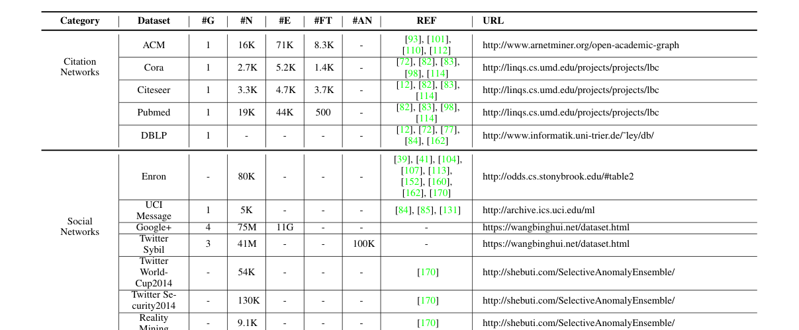

> **주:** 의논하기

> **주:** 네트워크

> **주:** 모델 번호: https://www.ipd.kit.edu/mitarbeiter/muellere/consub/

> **주:** 모델 번호: https://www.ipd.kit.edu/mitarbeiter/muellere/consub/

> **주:** 의 821 11K - 25 821 - https://github.com/dmlc/dgl/blob/master/python/dgl/data/fraud.py 엘립틱 1 203K 234K 166 4.5K - https://www.kaggle.com/ellipticco/elliptic-data-set Yelp 1 45K - 32 ZX4

> **주:** 의정부

> **주:** 네트워크

> **주:** 담당자: Mr. Michel

> **주:** [147] http://www.nyc.gov/html/tlc/html/about/triprecorddata.shtml의 특징

- -: 주어진, #G: 그래프 수, #N: 노드 수, #E: 가장자리 수, #FT: 특징 수, #AN: 이상치의 수, REF: 참고.

핑 비율. 이로 인해 생성 된 그래프는 분석 데이터셋가 실제로 원본 데이터셋의 하위 세트입니다. 이 전략의 가장 중요한 강점은 단일 데이터 레코드가 수정되지 않았습니다.

### 10.4 평가 미터

현재까지, 가장 널리 사용되는 메트릭 메트릭은 불균형 탐지 성능 평가를 포함 정확도, 정밀도, 회위율, F1-score 및 AUC-AP (평균 정밀도). 그들의 공식/문헌은 표 6에서 주어집니다. 그러나, 몇몇 새로운 평가 미터를 가진 더 헌신적인 분석은 이상 탐지가 다른 신청을 위한 다른 필요조건이 [176]-[178], 예를들면, 거짓 부정적인 및 거짓 긍정적인 때문에 더 성과 검사를 위해 필요합니다. 예를 들어, 네트워크 침입 방지 시스템은 거짓 부정적인 오류에 더 민감하며, false 긍정적 인 오류가 상대적으로 무해합니다. 이 위험 연결이 정보를 유출하는 것을 막기 위해 차단되어야 합니다. 대조적으로, 다른 신청은 거짓 긍정적인 것에, 예를들면, 감사 도메인에서, 회사 수시로 파쇄 이상치를 보기 위하여 감사관을 위한 예산을 놓고, 감사의 시간이 제일 사용될 수 있다는 것을 감사의 시간 같이 높은 정밀도/작은 거짓 긍정적인 비율을 원합니다. Hence, 검출 성능을 평가할 때, 우리는 공정하고 적당한 비교를 위한 응용 프로그램의 특정 요구 사항을 검토하는 것을 건의합니다.

**TABLE 6: 평가 미터. tp: true 긍정적인; tn: true 부정적인; fp: false 긍정적인; fn: false 부정적인.**

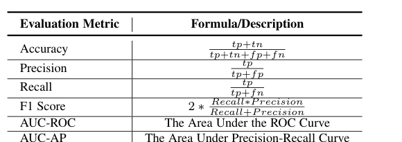

지금까지, 우리는 그래프 이상 탐지에 헌신 한 현대 깊은 학습 기술을 검토했습니다. 우리의 조사에서 명백한 관측은 많은 복잡한 문제로 인해 많은 복잡한 문제로 인해 이상 탐지, graph data, 그리고 그래프 데이터 마이닝을위한 깊은 학습 기술의 몰입도가 있습니다. 또 다른 관찰은 그래프의 심층적 인 탐지 기술이 여전히 비교적 작은 연구에 자신감을 갖는 것이며, 이러한 초점은 무인 노드 탐지에 있습니다. 계기를 위해, 단순히 표 2와 3의 길이를 비교하십시오. Edge, sub-graph 및 graph-level 이상 탐지는 매우 덜 관심을 받았습니다. 틈새를 브릿지하고 앞으로의 일을 밀어 넣기 위해, 우리는 깊은 학습을 가진 그래프 이상 탐지를 위한 미래 연구의 12 방향을 확인했습니다.

<!-- 원문 18쪽 -->

## LATEX CLASS FILES의 JOURNAL, VOL., 아니., AUGUST 2021 18

### 11.1 무성한 가장자리, Sub-graph 및 그래프 탐지

실제 그래프에서, 이상치는 또한 비정상적인 그룹, 또는 비정상적인 도표에 의해 형성된 목표, 이하 구조 사이 특이한 관계로, 분류됩니다, 이는 anomalous 가장자리, sub-graphs 및 각각 도표로 알려져 있습니다. 우리의 검토에 표시된대로 기존의 무효 가장자리 / 하위 / graph 검출 기술과 다양한 응용 분야에서 더 고급 솔루션을 위한 신흥 요구 (예: 소셜 네트워크, 컴퓨터 네트워크, 금융 네트워크). 정상적인 가장자리/sub-graphs/graphs를 검출할 때, 제안한 방법은 특정한 신청에 있는 정상적인 목표 및 이상치를 구별할 수 있는 도표에서 포함된 부유한 정보를 레버리지 수 있어야 합니다. 일반적으로, 이것은 가장자리 / 서브 - graph / graph 레벨 특성을 추출하고, 이러한 특성의 패턴을 모델링하고, 비정상적인 측정을 포함한다. 그러나 현재 딥러닝 기반 그래프 이상 탐지 기술은이 분야에 매우 작은 노력을 기울였습니다.

기회: 우리는 더 많은 연구 노력이 현실 세계 신청에 있는 그들의 중요성에 관하여 그들의 의미와 더불어 무효 가장자리, sub-graph 및 도표 탐지에 행해질 수 있다고 믿습니다. 이 간격에 대한 가능한 솔루션은 애플리케이션 도메인을 고려하고 이러한 문제를 기반으로 보완적인 큐를 찾는 도메인 지식을 탐구 할 수 있습니다. 그런 다음, 최근 가장자리, 하위 - 그래프 및 그래프 수준의 표현 학습 [129], [179], 광범위한 작업에 대한 깊은 학습에 의해 동기를 부여, 이 같은 이상-aware 임베딩 공간을 배울 수 있습니다. 이 같은 이상치의 이상한 패턴을 추출 할 수 있습니다. 이 방향은 매우 똑똑똑하지만, 진정한 도전은 특정 응용 영역에서 거짓말. Hence, 도메인 지식, 무인 패턴 인식 및 무인 인식 깊은 학습 기술은 동시에 시행되어야합니다.

### 11.2 동적 그래프의 이상 탐지

Dynamic graphs는 실제 객체와 속성 사이의 진화 관계를 캡처하는 강력한 기계를 제공합니다. 이 시나리오에서 매우 도전적인 결과를 얻은 결과, 이 작업을 위한 두 가지 주요 문제로 이어지는 것이 특징입니다. 첫 번째는 다른 시간 스탬프에서 각 그래프 스냅 샷에 포함 된 공간 및 임시 정보를 고려하고 두 번째는 노드, 가장자리, 하위 그래프 및 그래프의 진화 패턴을 탐구하는 것입니다, 그리고 시간에 노드 / edge 속성과 상호 작용. 이러한 도전이 성숙해 졌을 때, 검출 기술은 더 나은 결과를 얻을 것이다.

기회: 우리의 관측에서, 깊은 학습에 근거한 동적인 도표 무색 탐지 기술은 DeepWalk [79], GCN [92] 또는 정체되는 도표를 위해 직관적으로 디자인되는 다른 깊은 모형에 건축됩니다. 이것은 다른 정보를 의미한다, 속성 [180]의 진화 패턴과 같은, [181]), 적절하게 감지 작업에 사용되지 않습니다. 본 연구에서는 그러므로 미래 연구에 대한 다음 방향을 식별 할 수 있습니다.

- 동적 그래프 마이닝 도구를 사용하여. 대중적인 연구 주제로, 동적 그래프 데이터 마이닝 [182]를 위한 깊은 학습은, [183]는 노드 클러스터링 및 그래프 분류 [60]와 같은 동적 그래프 분석 지원에 있는 그것의 효율성을 보여주었습니다. 더 많은 미래는 이 기술을 이상 탐지를 채택하는 foreseen 일 수 있습니다.

- 고뇌 검지에 대한 단단한 증거를 촉구. 역동적 인 구조, 특성 및 temporal 정보

그래프는 이상치를 식별하는 귀중한 자원입니다. 현재 작업에서 널리 사용되는 지표와 노드 쌍이나 갑자기 파괴 연결 사이의 연결의 파열과 같은, 우리는 깊이에 구조 및 속성 변경을 탐구 제안한다. 이러한 연구에서, 우리는 이상적 속성의 외관과 같은 감지 성능을 향상시키기 위해 추가 정보를 더 강화 할 수 있습니다.

- 복잡한 동적 처리. Real-world 네트워크는 항상 네트워크 구조와 노드 속성 모두에서 변경을 전시하지만, 매우 몇 가지 연구 주소이 상황. 대부분의 상태의 예술은 이러한 측면 중 하나에서 변화를 고려합니다. 이 ‘double’ 시나리오는 매우 복잡하고 동적 그래프의이 종류의 고독을 감지하는 것은 매우 도전적이지만, 이 그래프가 실제 네트워크 데이터의 매우 반영되기 때문에 공부할 가치가 있습니다.

### 11.3 의 Graphs에 있는 이상 탐지

Heterogeneous graphs는 다양한 종류의 노드와 가장자리를 포함하는 그래프의 특정 유형입니다. 예를 들어, Twitter는 tweets, user, word 등 구성되는 이진 그래프로 직관적으로 모델링 할 수 있습니다.

Opportunities: 이종 그래프의 다른 유형의 노드와 같은 복잡한 관계를 사용하기 위해 HGATRD [157], GCAN [156] 및 GLAN [158]와 같은 대표 작품은 일반적으로 메타 경로에 따라 개별 그래프로 이진 그래프를 디퓨저로 디퓨저로 디퓨저로 디퓨저로 디퓨저로 디퓨저로 디퓨저로 디퓨저로 디퓨저로 디퓨저합니다. 예를 들어, 트윗과 사용자와 다른 단어를 사용합니다. 그들은 그 후에 D (G) NNs를 사용하여 그래프의 악화에 대한 임베딩를 배우게됩니다. 이러한 탈구는 다양한 종류의 노드/지와 패딩의 효과를 내리는 다양한 유형의 상호관계를 갖게 됩니다. 노드와 가장자리의 다른 유형과 복잡한 관계를 밝혀내는 솔루션은, 그리고 그(것)들을 밀어주는 탐지 성능에 대한 독특한 표현으로 인코딩합니다.

### 11.4 대규모 그래프에서 이상 탐지

고차원의 방법의 확장성 및 대규모 데이터는 고차원의 탐지 기술에 대한 지속적인 그리고 중요한 도전입니다. Facebook 및 Twitter와 같은 대규모 네트워크의 얼굴에서 수십억 명의 사용자와 우정 링크를 포함하며, 그래프 크기와 노드 특성의 숫자 모두에 데이터의 크기가 매우 높다. 그러나 기존의 대부분의 작업은 트랜지스터 모델이기 때문에 이러한 대규모 데이터에 대한 영향을 감지 할 수있는 능력이 부족하고 더 많은 분석에 대한 입력으로 전체 그래프를 취할 필요가있다. 컴퓨팅 시간과 메모리 비용 증가는 네트워크 규모로 극적으로 증가, 이 큰 규모의 네트워크에 사용되는 기존 기술을 중지.

기회: 따라서, 확장 가능한 그래프 이상 탐지 기술에 대한 필요. 가능한 접근법은 전체 그래프의 일부에 대한 탐지 모델을 처음 훈련하고 그 결과 unseen 데이터에 대한 이상치를 감지하는 모델을 적용 할 수 있습니다. 그래프SAGE [184]와 같은 일부 인덕티브 학습 모델로, 대규모 그래프의 링크 예측 및 노드 분류에 대한 효과와 같은이 접근법은 대규모 그래프에서 그래프 분석과 유사한 기술을 조사 할 것으로 예상됩니다.

<!-- 원문 19쪽 -->

## LATEX CLASS FILES의 JOURNAL, VOL., 아니., AUGUST 2021 19

### 11.5 멀티 뷰 그래프 이상 탐지

기회: 기본적으로 이 다 전망은 다른 관점에서 실제 물체의 특성을 분석하는 것을 허용합니다. 각 보기는 또한 다른 전망에 보충 정보를 제공하고, 그들은 이상 탐지에 다른 중요성이 있을지도 모릅니다. 예를 들어, 이상치는 한 번의 관점에서 indistinguishable 일 수 있지만 다른 관점에서 대다수로부터 명백하게 분기합니다. 멀티 뷰 학습 [189], [190]에 데이터 마이닝에 다양한 작업이 있습니다. 그러나, 이상 탐지 purpose의 노드에 멀티 뷰 속성과 함께 멀티 뷰 그래프를 수용 할 수있는 작업은 비만입니다. 또한, 여러 전망과 그 중의 불확실한 정보가 이러한 작품에서 내려다 볼 수 있습니다. 이 끝에, 우리는 이 방향에 있는 연구 노력이 필요합니다. 전망 사이의 관계를 소화하면 성공에 활력이 될 것입니다. 두 개의 전망은 무호흡에 대한 금기 / 보충 정보를 제공 할 수 있습니다.

### 11.6 위장/대리학적인 무질서

온라인 플랫폼의 쉬운 접근성은 사기꾼, 공격자 및 기타 남성용 에이전트에 대한 편리한 대상을 만들었습니다. 악의적 인 활동을 수행. 다양한 이상 검출 시스템은 benign 객체를 보호하기 위해 배포되었지만, 이상치는 여전히 evade 검출 [191]에 자신을 은폐 할 수 있습니다. 위장병으로 알려진, 이 entities 일반적으로 일반 개체로 자신을 파괴. 검출 기술은 이러한 경우에 대 한 견고 하지 않는 경우, 즉, 그들은 신속 하 고 효과적으로 증발 기의 진화 행동에 적응할 수 없는 경우, 이상치는 단순히 그들의 손상을 일으킬 왼쪽.

기회: 위장의 얼굴에서, 이상치와 일반 개체 사이의 경계는 blurred, 확인하는 많은 더 열심히. 우리는이 이상치를 검출하기 위해 광범위한 노력이 배치되어야한다고 믿고, 아직, 매우 몇 가지 연구는 그래프 [26], [27], [76]에서 위장 된 이상치를 처리하는 것으로 나타났습니다. 이 간격을 성취하기 위해, 1개의 중요한 방향은 트리아딕, 테트라알, 또는 하이퍼 그래프 [192]-[195]의 목표 사이 고순도 관계와 같은 속성, 공동 관계 분석하기 위하여 일 수 있고, 그래프에서 구성된 다른 정보는. 이로 인해 지역 구조 또는 속성만 효과적으로 식별 할 수 있음을 인정합니다. 기존 기술을 강화하면 다른 방향으로도 할 수 있습니다. 이 특성은 기존의 검출 기술로 위장한 이상치를 구별하기 위해 특별히 디자인된 추가 탐지 기계장치 또는 특성 구획을 통합합니다. 따라서, 이 기술은 대부분의 기존의 작품과 위장 된 무질서 감지를 브릿지합니다.

### 11.7 불균형 그래프 이상 탐지

이상치는 드물게, 이는 이상 탐지는 항상 훈련 데이터의 클래스 불균형과 함께 coexists를 발생합니다. 교육 데이터에 깊은 학습 모델로, 이러한 불균형은 큰 도전을 그래프로 분석하여, 이것은 깊은 학습 기술에 중요한 장애물을 남아있다. 일반적으로, 불균형 클래스 배포는 이상치와 non-이상치 사이의 차이를 캡처하는 검출 기술의 능력을 향상 할 것입니다. 데이터에 너무 몇 가지 영향을 미치기 때문에 무례한 클래스에 과감하게 발생할 수도 있습니다. 검출 모델이 중요한 사실이 내려다 보이는 경우, 즉, 감지 성능은 하위 선택 사항이 될 것입니다.

기회: 실제로, 종류 불균형은 각종 연구 지역 [117], [118]에서 널리 탐구되었습니다. 대부분의 클래스를 감수하거나 임밸런스와 함께 훈련 문제를 해결하는 알고리즘을 수정하는 것과 같은 진보. Yet, 현대 그래프 이상 검출 방법은 거의이 기술을 통합합니다. 더 효과적인 탐지 기술, 양극에 더 많은 관심을 지불하는 비스듬한 모형은, misclassified 이상치에 추가 훈련 손실과 같은 문제를 해결하기 위하여 가능한 방향일 것입니다. 또한, GCN 또는 Graph- SAGE와 같은 타겟 노드에 대한 이웃 정보를 집계하는 그래프 신경망을 채택할 때 연결된 노드의 특성 사이의 과부하가 발생하면 이상치의 구별 가능한 특성이 암시적으로 탐지를 지원하기 위해 보존 될 수 있음을 방지해야합니다.

### 11.8 멀티탭 이상 탐지

그래프 이상 탐지는 커뮤니티 탐지 [58] 및 노드 분류 [196]를 포함한 다른 그래프 광업 작업과의 관계가 있으며, [197]를 예측합니다. 구체적으로 예를 들어, 커뮤니티의 영향을 감지 할 때, 커뮤니티 감지 기술은 일반적으로 이상 탐지 이전에 커뮤니티 구조를 추출하는 데 사용됩니다. 그 사이에, 이상 탐지 결과는 지역 사회 구조를 낙관하기 위하여 사용될 수 있습니다. 이러한 상호적으로 유익한 협업은 이상 탐지와 다른 작업 간의 상호 작용으로 다양한 작업을 동시에 처리하고 작업 중 정보를 공유 할 수있는 멀티 태스크 학습을위한 기회를 제안합니다.

기회: Multi-task 학습은 관련 작업 [198], [199]를 통합하는 효과적인 기계를 제공합니다. 이들의 최대 장점은 다른 작업에서 훈련 신호가 비염으로부터의 동종을 구별하기 위해 보완 정보를 수수할 수 있다는 것입니다. 결과가 향상된 탐지 성능이 될 것입니다. 그러나, 매우 몇 시도는 현재에 초점을 맞추고. 현재 동작을 넘어 [100]와 같은 공동으로 무효 노드 검출 및 개인화 된 권고를 수행하고 그래프 이상 탐지와 다른 학습 작업을 결합하는 탐험은 과일 미래 방향으로 출현 할 가능성이 있습니다.

### 11.9 그래프 이상 Interpretability

이식성 검출 기술은 그 후반의 증상을 치료하는 데 필수적입니다. 이 기술을 적용하면 금융 및 보험 시스템과 같은 실제 응용 프로그램에 적용 할 때, 그것은 검출 결과를 지원하기 위해 설명하고 합법적 인 증거를 제공하기 위해 필수적입니다. 그러나 대부분의 기존의 작품은 이러한 증거를 제공 할 수있는 능력이 부족합니다. 이종을 식별하려면 가장 일반적으로 사용되는 메트릭은 최고 순위와 간단한 악명 높은 득점 특성입니다. 이 메트릭은 무로 또는 무로가 아니라 고형적 설명이 아니라 물체를 라벨에 충분히 유연한 것입니다. 또한 딥러닝 기술로도 낮은 해석성에 비판되어 있으며, 딥러닝을 통해 그래프의 분석이 더 많은 관심을 지불해야 합니다. [200].

기회: 이 간격을 교량하기 위하여, 특별히 디자인된 해석 산법 또는 기계장치 [201], [202]를 검출 기구로 통합하는 것은 가능한 해결책, 그것 아닙니다

<!-- 원문 20쪽 -->

## LATEX CLASS FILES의 JOURNAL, VOL., 아니., AUGUST 2021 20

이것은 더 높은 계산 비용을 유도 할 것입니다. 미래는 그러므로 이상 탐지 성과 및 해석의 비용을 균형을 잡아야 합니다. 비주얼화 기반 접근법, 예를 들어, 대쉬보드, 차트는 인간 환경 친화적 인 방식으로 이상치와 non-이상치 사이의 구별을 보여주는 데도 바람직할 수 있습니다. 이 방향에 있는 더 연구는 해석 가능한 시각화 결과가 [203]를 주어서 좋다면 성공될 것입니다.

기회: 이 전략은 동종의 탈선 데이터 패턴을 캡처 할 수 있지만, 그들은 또한 다른 제한이 있습니다. 특히, 잔여 분석, 일류 분류 및 재건축 손실 전략은 noisy 교육 자료에 과민합니다. Noisy 노드, 가장자리 또는 하위 그래프는 대형 잔여물을 전시하고, 기원/수성 센터 및 높은 재구성 손실에 큰 거리. 그 사이에, 거리 기반 및 밀도 기반 전략은 더 낮은 차원 공간에서 잘 분리 될 때만 적용될 수 있습니다. 탐지 성과 또한 극적으로 이상치와 non-이상치 사이 간격이 퇴색하지 않는 경우에. 이 제한을 깨고 새로운 무형 식별 전략을 탐구하는 광범위한 미래 노력에 대한 전화.

11.11 체계적인 벤치마킹 체계적인 벤치마킹은 그래프 이상 탐지 기술의 성과를 평가하는 열쇠입니다. 섹션 10.4의 분석에 표시된 최근 연구는 지속적으로 [142], [176]- [178]에 대한 더 포괄적이고 효과적인 벤치 마크에 관심을 올리고 있습니다. 일반적으로 벤치 마크 구성표는 벤치 마크 데이터셋, 기본 방법, 평가 미터 및 더 분석 도구로 구성됩니다. 다른 기본으로 기술의 성능을 평가할 때, 평가 데이터셋 및 미터는 각 모델의 성능이 설정에 따라 다를 수 있기 때문에 매우 중요합니다. 공공 데이터셋과 (공유 가능) 기본 방법의 부족은 효과적인 평가에 대한 큰 도전을 부과합니다. 설문 조사의 목적 중 하나는 오픈 소스 구현, 데이터셋 및 평가 미터와 같은이 목적에 대한 광범위한 자료를 제공하지만,이 작업은 체계적인 벤치 마크로 미래의 조사에 대한 기초로만 봉사 할 수 있습니다. 이 중요한 경우, 이상 탐지 커뮤니티에서 더 많은 노력을 초대합니다. 특히, 의제는 다양한 검출 기술의 진보와 단점을 공개하고 이를 위해 행동하고 정확한 진도 기록을 추적하는 데 도움이 될 것입니다.

### 11.12 이상 탐지 Framework A graph 이상는 단일 그래프 또는 원자 그래프에서 aomalous node, edge 및 하위 그래프로 분류 할 수 있습니다.

데이터베이스. 이 이상치는 일반적으로 실제 데이터셋에 coexist. 예를 들어, 개별 사기, 이상 관계, 사기 그룹은 Fig에서 보여지는 것과 같이 온라인 소셜 네트워크에서 동시 존재합니다. 1. - 비디오 또한, 지역 사회의 versus anomalous 커뮤니티 또는 속성 기반 versus 구조적 인 동종과 같은 특정 유형의 동종을 정의하는 다른 방법이있을 수 있습니다. 실제 응용 프로그램에 대한 탐지 기술을 배포 할 때, 모든 종류의 이상치가 최소한의 리소스와 시간을 소비하면서 식별 할 수 있다고 예상됩니다. 스트레이트포워드 접근법은 독립적 인 무인 노드, 가장자리 및 하위 그래프 탐지 기술을 통합 할 것입니다. 이 상대적으로 작은 네트워크에 적용하는 것이 편리하지만, 높은 계산 비용은 확실히 Facebook 및 Twitter와 같은 대형 네트워크에 대한 접근을 방지하기 때문에 동일한 그래프 데이터가로드되고 다른 기술로 한 번 이상 처리되기 때문입니다.

기회: [208]를 함께 이상치의 다양한 유형을 검출할 수 있는 통합 기구는, [209] 간격을 다리를 브릿지에 feasible 해결책을 제공할지도 모릅니다. 이러한 프레임 워크를 구축하려면, 하나의 가능한 방향은 다른 감지 기술에 의해 필요한 모든 정보를 동시에 캡처하는 것입니다 그래서 이러한 기술은 적용 될 수 있습니다. 아이디어는 비 뺨이 될 것 같다, 하지만 깊은 학습, 설계 신경 네트워크 층과 학습 전략의 방법이 필요 광범위한 노력이 요구 될 수 있습니다.

## 12 결론

실제 개체와 최근 딥러닝의 발전과 관련된 복잡한 관계로 인해 특히 그래프 신경 네트워크는 딥러닝과 함께 현재 이상 탐지의 최전선에 있습니다. 우리의 지식의 가장 좋은 점은, 이것은 현대 깊은 학습 기술로 무독성 탐지를 도표에 전적으로 포괄적인 검토를 제시하는 첫번째 조사입니다. 특히, 우리는 그래프 이상치의 유형에 따라 현대 깊은 학습 기술을 검토하고 분류했습니다. (1) anomalous 노드 탐지; (2) anomalous 가장자리 탐지; (3) anomalous sub-graph 탐지; 마지막으로, (4) anomalous 흑연 탐지. 다른 작품과 비교를 취소하고 다른 작품 사이의 비교는 현재 작업의 전체 및 철저한 그림을 제공하고 그래프의 분석은 현장으로 인식됩니다.

또한, 이 지역에 미래 연구를 추진하기 위해, 우리는 일반적으로 사용되는 데이터셋, 오픈 소스 구현 및 합성 데이터셋 생성 기술을 비교하여 체계적인 벤치 마크를 기반으로 제공했습니다. 설문조사 결과에 따라 향후 작업에 대한 12 잠재적 방향을 더 강조합니다. 심층 학습을 통해 심층적인 인식을 그래프로 확고한 믿음은 실제적으로 다양한 도메인의 파열보다 더 많은 것이 수년간의 혜택을 누리고 있습니다.

## 참고문헌

[1] F. E. Grubbs, "Procedures for detecting outlying observations in samples," Technometrics, vol. 11, no. 1, pp. 1–21, 1969. [2] B. Hooi, N. Shah, A. Beutel, S. G¨unnemann, L. Akoglu, M. Kumar, D. Makhija, and C. Faloutsos, "Birdnest: Bayesian inference for ratingsfraud detection," in Proc. SIAM Int. Conf. Data Mining, 2016, pp. 495– 503. [3] S. Ahmed, K. Hinkelmann, and F. Corradini, "Combining machine learning with knowledge engineering to detect fake news in social networks-a survey," in Proc. AAAI Conf. Artif. Intell., vol. 12, 2019, p. 8.

<!-- 원문 21쪽 -->

JOURNAL OF LATEX CLASS FILES, VOL. , NO. , AUGUST 2021 21

[4] V. Nguyen, K. Sugiyama, P. Nakov, and M. Kan, "Fang: Leveraging social context for fake news detection using graph representation," in Proc. ACM 29th Int. Conf. Inf. Knowl. Manage., 2020, pp. 1165–1174. [5] N. T. Tam, M. Weidlich, B. Zheng, H. Yin, N. Q. V. Hung, and B. Stantic, "From anomaly detection to rumour detection using data streams of social platforms," VLDB J., vol. 12, no. 9, pp. 1016–1029, 2019. [6] R. Yu, H. Qiu, Z. Wen, C. Lin, and Y. Liu, "A survey on social media anomaly detection," SIGKDD Explor., vol. 18, no. 1, pp. 1–14, 2016. [7] A. Benamira, B. Devillers, E. Lesot, A. K. Ray, M. Saadi, and F. D. Malliaros, "Semi-supervised learning and graph neural networks for fake news detection," in Int. Conf. Adv. Social Netw. Anal. Mining, 2019, pp. 568–569. [8] S. Kumar, B. Hooi, D. Makhija, M. Kumar, C. Faloutsos, and V. S. Subrahmanian, "Rev2: Fraudulent user prediction in rating platforms," in Proc. ACM Int. Conf. Web Search Data Mining, 2018, pp. 333–341. [9] P. Bogdanov, C. Faloutsos, M. Mongiov`ı, E. E. Papalexakis, R. Ranca, and A. K. Singh, "Netspot: Spotting significant anomalous regions on dynamic networks," in Proc. SIAM Int. Conf. Data Mining, 2013, pp. 28–36. [10] B. A. Miller, N. Arcolano, and N. T. Bliss, "Efficient anomaly detection in dynamic, attributed graphs: Emerging phenomena and big data," in Proc. IEEE Int. Conf. Intell. Secur. Inf., 2013, pp. 179–184. [11] K. Miao, X. Shi, and W. Zhang, "Attack signal estimation for intrusion detection in industrial control system," Comput. Secur., vol. 96, p. 101926, 2020. [12] B. Perozzi and L. Akoglu, "Scalable anomaly ranking of attributed neighborhoods," in Proc. SIAM Int. Conf. Data Mining, 2016, pp. 207– 215. [13] X. Luo, J. Wu, A. Beheshti, J. Yang, X. Zhang, Y. Wang, and S. Xue, "Comga: Community-aware attributed graph anomaly detection," in Proc. ACM Int. Conf. Web Search Data Mining, 2022. [14] B. Branco, P. Abreu, A. S. Gomes, M. S. C. Almeida, J. T. Ascens˜ao, and P. Bizarro, "Interleaved sequence rnns for fraud detection," in Proc. ACM SIGKDD 26th Int. Conf. Knowl. Discov. Data Mining, 2020, pp. 3101–3109. [15] C. Liu, Q. Zhong, X. Ao, L. Sun, W. Lin, J. Feng, Q. He, and J. Tang, "Fraud transactions detection via behavior tree with local intention calibration," in Proc. ACM SIGKDD 26th Int. Conf. Knowl. Discov. Data Mining, 2020, pp. 3035–3043. [16] Q. Guo, Z. Li, B. An, P. Hui, J. Huang, L. Zhang, and M. Zhao, "Securing the deep fraud detector in large-scale e-commerce platform via adversarial machine learning approach," in Proc. Int. Conf. World Wide Web, 2019, pp. 616–626. [17] B. Iglewicz and D. C. Hoaglin, How to detect and handle outliers. Asq Press, 1993, vol. 16. [18] V. Chandola, A. Banerjee, and V. Kumar, "Anomaly detection: A survey," ACM Comput. Surv., vol. 41, no. 3, pp. 15:1–15:58, 2009. [19] T. Pourhabibi, O. Kok-Leong, B. H. Kam, and B. Y. Ling, "Fraud detection: A systematic literature review of graph-based anomaly detection approaches," Decis. Support Syst., p. 113303, 2020. [20] X. Sun, C. Zhang, G. Li, D. Sun, F. Ren, A. Y. Zomaya, and R. Ranjan, "Detecting users' anomalous emotion using social media for business intelligence," J. Comput. Sci., vol. 25, pp. 193–200, 2018. [21] J. Wu, Z. Hong, S. Pan, X. Zhu, Z. Cai, and C. Zhang, "Multi-graphview learning for graph classification," in Proc. IEEE Int. Conf. Data Mining, 2014, pp. 590–599. [22] Z. Wang and C. Lan, "Towards a hierarchical bayesian model of multiview anomaly detection," in Proc. 29th Int. Joint Conf. Artif. Intell., 2020, pp. 2420–2426. [23] G. Pang, L. Cao, L. Chen, and H. Liu, "Learning representations of ultrahigh-dimensional data for random distance-based outlier detection," in Proc. ACM SIGKDD 24th Int. Conf. Knowl. Discov. Data Mining, 2018, pp. 2041–2050. [24] G. Pang, C. Shen, L. Cao, and A. V. D. Hengel, "Deep learning for anomaly detection," ACM Comput. Surv., vol. 54, no. 2, p. 1–38, 2021. [25] L. Akoglu, H. Tong, and D. Koutra, "Graph based anomaly detection and description: A survey," Data Min. Knowl. Discovery, vol. 29, no. 3, pp. 626–688, 2015. [26] B. Hooi, K. Shin, H. A. Song, A. Beutel, N. Shah, and C. Faloutsos, "Graph-based fraud detection in the face of camouflage," ACM Trans. Knowl. Discovery Data, vol. 11, no. 4, pp. 44:1–44:26, 2017. [27] Y. Dou, Z. Liu, L. Sun, Y. Deng, H. Peng, and P. S. Yu, "Enhancing graph neural network-based fraud detectors against camouflaged fraudsters," in Proc. ACM Int. Conf. Inf. Knowl. Manage., 2020, pp. 315–324.

[28] S. Pandit, D. H. Chau, S. Wang, and C. Faloutsos, "Netprobe: fast and scalable system for fraud detection in online auction networks," in Proc. 16th Int. Conf. World Wide Web, 2007, pp. 201–210. [29] K. Shin, B. Hooi, J. Kim, and C. Faloutsos, "Densealert: Incremental dense-subtensor detection in tensor streams," in Proc. ACM SIGKDD 23rd Int. Conf. Knowl. Discov. Data Mining, 2017, pp. 1057–1066. [30] Z. Liu, J. X. Yu, Y. Ke, X. Lin, and L. Chen, "Spotting significant changing subgraphs in evolving graphs," in Proc. IEEE 8th Int. Conf. Data Mining, 2008, pp. 917–922. [31] J. Wu, Z. Hong, S. Pan, X. Zhu, C. Zhang, and Z. Cai, "Multi-graph learning with positive and unlabeled bags," in Proc. SIAM Int. Conf. Data Mining, 2014, pp. 217–225. [32] L. Gao, J. Wu, C. Zhou, and Y. Hu, "Collaborative dynamic sparse topic regression with user profile evolution for item recommendation," in Proc. AAAI Conf. Artif. Intell., vol. 31, no. 1, 2017. [33] C. C. Aggarwal, Y. Zhao, and S. Y. Philip, "Outlier detection in graph streams," in Proc. IEEE 27th Int. Conf. Data Eng., 2011, pp. 399–409. [34] J. Wu, S. Pan, X. Zhu, C. Zhang, and P. S. Yu, "Multiple structureview learning for graph classification," IEEE Trans. Neural Netw. Learn. Syst., vol. 29, no. 7, pp. 3236–3251, 2018. [35] H. Wang, C. Zhou, X. Chen, J. Wu, S. Pan, and J. Wang, "Graph stochastic neural networks for semi-supervised learning," in Proc. Int. Conf. Neural Inf. Process. Syst., 2020. [36] Z. Chen, W. Hendrix, and N. F. Samatova, "Community-based anomaly detection in evolutionary networks," J. Intell. Inf. Syst., vol. 39, no. 1, pp. 59–85, 2012. [37] F. Jie, C. Wang, F. Chen, L. Li, and X. Wu, "Block-structured optimization for anomalous pattern detection in interdependent networks," in Proc. IEEE Int. Conf. Data Mining, 2019, pp. 1138–1143. [38] L. Akoglu, M. McGlohon, and C. Faloutsos, "Oddball: Spotting anomalies in weighted graphs," in Pacific-Asia Conf. Knowl. Discov. Data Mining. Springer, 2010, pp. 410–421. [39] D. Eswaran, C. Faloutsos, S. Guha, and N. Mishra, "Spotlight: Detecting anomalies in streaming graphs," in Proc. ACM SIGKDD 24th Int. Conf. Knowl. Discov. Data Mining, 2018, pp. 1378–1386. [40] N. Li, H. Sun, K. C. Chipman, J. George, and X. Yan, "A probabilistic approach to uncovering attributed graph anomalies," in Proc. SIAM Int. Conf. Data Mining, 2014, pp. 82–90. [41] J. Li, H. Dani, X. Hu, and H. Liu, "Radar: Residual analysis for anomaly detection in attributed networks," in Proc. 26th Int. Joint Conf. Artif. Intell., 2017, pp. 2152–2158. [42] M. W. Mahoney and P. Drineas, "CUR matrix decompositions for improved data analysis," Proc. Natl. Acad. Sci. USA, vol. 106, no. 3, pp. 697–702, 2009. [43] S. M. Erfani, S. Rajasegarar, S. Karunasekera, and C. Leckie, "Highdimensional and large-scale anomaly detection using a linear one-class SVM with deep learning," Pattern Recognit., vol. 58, pp. 121–134, 2016. [44] S. Thudumu, P. Branch, J. Jin, and J. J. Singh, "A comprehensive survey of anomaly detection techniques for high dimensional big data," J. Big Data, vol. 7, no. 1, p. 42, 2020. [45] A. Boukerche, L. Zheng, and O. Alfandi, "Outlier detection: Methods, models, and classification," ACM Comput. Surv., vol. 53, no. 3, pp. 55:1–55:37, 2020. [46] S. Bulusu, B. Kailkhura, B. Li, P. K. Varshney, and D. Song, "Anomalous instance detection in deep learning: A survey," arXiv preprint arXiv:2003.06979, 2020. [47] R. Chalapathy and S. Chawla, "Deep learning for anomaly detection: A survey," arXiv preprint arXiv:1901.03407, 2019. [48] S. Ranshous, S. Shen, D. Koutra, S. Harenberg, C. Faloutsos, and N. F. Samatova, "Anomaly detection in dynamic networks: A survey," Wiley Interdiscip. Rev. Comput. Stat., vol. 7, no. 3, pp. 223–247, 2015. [49] D. J. D'Souza and K. U. K. Reddy, "Anomaly detection for big data using efficient techniques: A review," AIDE, pp. 1067–1080, 2021. [50] S. Eltanbouly, M. Bashendy, N. AlNaimi, Z. Chkirbene, and A. Erbad, "Machine learning techniques for network anomaly detection: A survey," in Int. Conf. Inform. IoT Enabling Technol., 2020, pp. 156–162. [51] G. Fernandes, J. J. Rodrigues, L. F. Carvalho, J. F. Al-Muhtadi, and M. L. Proenc¸a, "A comprehensive survey on network anomaly detection," Telecommun. Syst., vol. 70, no. 3, pp. 447–489, 2019. [52] D. Kwon, H. Kim, J. Kim, S. C. Suh, I. Kim, and K. J. Kim, "A survey of deep learning-based network anomaly detection," Clust. Comput., vol. 22, pp. 949–961, 2019. [53] P. Gogoi, D. K. Bhattacharyya, B. Borah, and J. K. Kalita, "A survey of outlier detection methods in network anomaly identification," Comput. J., vol. 54, no. 4, pp. 570–588, 2011.

<!-- 원문 22쪽 -->

JOURNAL OF LATEX CLASS FILES, VOL. , NO. , AUGUST 2021 22

[54] D. Savage, X. Zhang, X. Yu, P. Chou, and Q. Wang, "Anomaly detection in online social networks," Soc. Networks, vol. 39, pp. 62–70, 2014. [55] R. Wang, K. Nie, T. Wang, Y. Yang, and B. Long, "Deep learning for anomaly detection," in Proc. ACM 13th Int. Conf. Web Search Data Mining, 2020, pp. 894–896. [56] Y. Zhang, J. Wu, Z. Cai, B. Du, and S. Y. Philip, "An unsupervised parameter learning model for rvflneural network," Neural Networks, vol. 112, pp. 85–97, 2019. [57] Q. Wang, W. Zhao, J. Yang, J. Wu, C. Zhou, and Q. Xing, "Atne-trust: Attributed trust network embedding for trust prediction in online social networks," in Proc. IEEE Int. Conf. Data Mining, 2020, pp. 601–610. [58] F. Liu, S. Xue, J. Wu, C. Zhou, W. Hu, C. Paris, S. Nepal, J. Yang, and P. S. Yu, "Deep learning for community detection: progress, challenges and opportunities," in Proc. 29th Int. Joint Conf. Artif. Intell., 2020, pp. 4981–4987. [59] Z. Wu, S. Pan, F. Chen, G. Long, C. Zhang, and P. S. Yu, "A comprehensive survey on graph neural networks," IEEE Trans. Neural Networks Learn. Syst., vol. 32, no. 1, pp. 4–24, 2021. [60] P. Cui, X. Wang, J. Pei, and W. Zhu, "A survey on network embedding," IEEE Trans. Knowl. Data Eng., vol. 31, no. 5, pp. 833–852, 2019. [61] S. Zhu, S. Pan, C. Zhou, J. Wu, Y. Cao, and B. Wang, "Graph geometry interaction learning," in Proc. Int. Conf. Neural Inf. Process. Syst., 2020. [62] X. Su, S. Xue, F. Liu, J. Wu, J. Yang, C. Zhou, W. Hu, C. Paris, S. Nepal, D. Jin et al., "A comprehensive survey on community detection with deep learning," arXiv preprint arXiv:2105.12584, 2021. [63] C. C. Noble and D. J. Cook, "Graph-based anomaly detection," in Proc. ACM SIGKDD 9th Int. Conf. Knowl. Discov. Data Mining, 2003, pp. 631–636. [64] X. Teng, M. Yan, A. M. Ertugrul, and Y. Lin, "Deep into hypersphere: Robust and unsupervised anomaly discovery in dynamic networks," in Proc. 27th Int. Joint Conf. Artif. Intell., 2018, pp. 2724–2730. [65] N. Shah, A. Beutel, B. Hooi, L. Akoglu, S. G¨unnemann, D. Makhija, M. Kumar, and C. Faloutsos, "Edgecentric: Anomaly detection in edgeattributed networks," in Proc. IEEE 16th Int. Conf. Data Mining, 2016, pp. 327–334. [66] B. Wang, N. Z. Gong, and H. Fu, "Gang: Detecting fraudulent users in online social networks via guilt-by-association on directed graphs," in Proc. IEEE Int. Conf. Data Mining, 2017, pp. 465–474. [67] T. Zhao, C. Deng, K. Yu, T. Jiang, D. Wang, and M. Jiang, "Errorbounded graph anomaly loss for gnns," in Proc. ACM Int. Conf. Inf. Knowl. Manage., 2020, pp. 1873–1882. [68] Q. Zhang and S. Zhu, "Visual interpretability for deep learning: a survey," Frontiers Inf. Technol. Electron. Eng., vol. 19, no. 1, pp. 27–39, 2018. [69] L. Akoglu, "Anomaly mining–past, present and future," arXiv preprint arXiv:2105.10077, 2021. [70] Y. Zhao, R. A. Rossi, and L. Akoglu, "Automating outlier detection via meta-learning," arXiv preprint arXiv:2009.10606, 2020. [71] L. Ruff, J. R. Kauffmann, R. A. Vandermeulen, G. Montavon, W. Samek, M. Kloft, T. G. Dietterich, and K.-R. M¨uller, "A unifying review of deep and shallow anomaly detection," IEEE, 2021. [72] A. Bojchevski and S. G¨unnemann, "Bayesian robust attributed graph clustering: Joint learning of partial anomalies and group structure," in Proc. AAAI 32nd Conf. Artif. Intell., 2018. [73] M. Zhu and H. Zhu, "Mixedad: A scalable algorithm for detecting mixed anomalies in attributed graphs," in Proc. AAAI Conf. Artif. Intell., vol. 34, no. 01, 2020, pp. 1274–1281. [74] B. Perozzi, L. Akoglu, P. I. S´anchez, and E. M¨uller, "Focused clustering and outlier detection in large attributed graphs," in Proc. ACM SIGKDD 20th Int. Conf. Knowl. Discov. Data Mining, 2014, pp. 1346–1355. [75] Q. Ding, N. Katenka, P. Barford, E. D. Kolaczyk, and M. Crovella, "Intrusion as (anti)social communication: characterization and detection," in Proc. ACM SIGKDD 18th Int. Conf. Knowl. Discov. Data Mining, 2012, pp. 886–894. [76] B. Hooi, H. A. Song, A. Beutel, N. Shah, K. Shin, and C. Faloutsos, "Fraudar: Bounding graph fraud in the face of camouflage," in Proc. ACM SIGKDD 22nd Int. Conf. Knowl. Discov. Data Mining, 2016, pp. 895–904. [77] R. Hu, C. C. Aggarwal, S. Ma, and J. Huai, "An embedding approach to anomaly detection," in Proc. IEEE 32nd Int. Conf. Data Eng., 2016, pp. 385–396. [78] G. Karypis and V. Kumar, "A fast and high quality multilevel scheme for partitioning irregular graphs," J. Sci. Comput., vol. 20, no. 1, pp. 359–392, 1998. [79] B. Perozzi, R. Al-Rfou, and S. Skiena, "Deepwalk: Online learning of social representations," in Proc. ACM SIGKDD 20th Int. Conf. Knowl. Discov. Data Mining, 2014, pp. 701–710.

[80] A. Grover and J. Leskovec, "Node2vec: Scalable feature learning for metworks," in Proc. ACM SIGKDD 22nd Int. Conf. Knowl. Discov. Data Mining, 2016, pp. 855–864. [81] J. Tang, M. Qu, M. Wang, M. Zhang, J. Yan, and Q. Mei, "Line: Largescale information network embedding," in Proc. 24th Int. Conf. World Wide Web, 2015, pp. 1067–1077. [82] S. Bandyopadhyay, L. N, S. V. Vivek, and M. N. Murty, "Outlier resistant unsupervised deep architectures for attributed network embedding," in Proc. ACM 13th Int. Conf. Web Search Data Mining, 2020, pp. 25–33. [83] S. Bandyopadhyay, N. Lokesh, and M. N. Murty, "Outlier aware network embedding for attributed networks," in Proc. AAAI Conf. Artif. Intell., vol. 33, no. 01, 2019, pp. 12–19. [84] W. Yu, W. Cheng, C. C. Aggarwal, K. Zhang, H. Chen, and W. Wang, "Netwalk: A flexible deep embedding approach for anomaly detection in dynamic networks," in Proc. ACM SIGKDD 24th Int. Conf. Knowl. Discov. Data Mining, 2018, pp. 2672–2681. [85] L. Cai, Z. Chen, C. Luo, J. Gui, J. Ni, D. Li, and H. Chen, "Structural temporal graph neural networks for anomaly detection in dynamic graphs," arXiv preprint arXiv:2005.07427, 2020. [86] M. M. Breunig, H.-P. Kriegel, R. T. Ng, and J. Sander, "Lof: identifying density-based local outliers," in Proc. ACM SIGMOD Int. Conf. Manage. Data, 2000, pp. 93–104. [87] C. C. Aggarwal and P. S. Yu, "Outlier detection for high dimensional data," in Proc. ACM SIGMOD Int. Conf. Manage. Data, 2001, pp. 37– 46. [88] P. Morales, R. S. Caceres, and T. Eliassi-Rad, "Selective network discovery via deep reinforcement learning on embedded spaces," Appl. Network Sci., vol. 6, no. 1, pp. 1–20, 2021. [89] W. L. Hamilton, Z. Ying, and J. Leskovec, "Inductive representation learning on large graphs," in Proc. 31st Int. Conf. Neural Inf. Process. Syst., 2017, pp. 1024–1034. [90] W. L. Hamilton, R. Ying, and J. Leskovec, "Representation learning on graphs: Methods and applications," IEEE Data Eng. Bull., vol. 40, no. 3, pp. 52–74, 2017. [91] P. Velickovic, G. Cucurull, A. Casanova, A. Romero, P. Li`o, and Y. Bengio, "Graph attention networks," arXiv:1710.10903, 2017. [92] T. N. Kipf and M. Welling, "Semi-supervised classification with graph convolutional networks," in Proc. Int. Conf. Learn. Represent., 2017. [93] K. Ding, J. Li, R. Bhanushali, and H. Liu, "Deep anomaly detection on attributed networks," in Proc. SIAM Int. Conf. Data Mining, 2019, pp. 594–602. [94] Z. Peng, M. Luo, J. Li, L. Xue, and Q. Zheng, "A deep multi-view framework for anomaly detection on attributed networks," IEEE Trans. Knowl. Data Eng., 2020. [95] X.-R. Sheng, D.-C. Zhan, S. Lu, and Y. Jiang, "Multi-view anomaly detection: neighborhood in locality matters," in Proc. AAAI Conf. Artif. Intell., vol. 33, no. 01, 2019, pp. 4894–4901. [96] J. Wu, S. Pan, X. Zhu, and Z. Cai, "Boosting for multi-graph classification," IEEE Trans. Cybern., vol. 45, no. 3, pp. 416–429, 2015. [97] J. Wu, X. Zhu, C. Zhang, and Z. Cai, "Multi-instance multi-graph dual embedding learning," in Proc. IEEE 13th Int. Conf. Data Mining, 2013, pp. 827–836. [98] Y. Li, X. Huang, J. Li, M. Du, and N. Zou, "Specae: Spectral autoencoder for anomaly detection in attributed networks," in Proc. ACM 28th Int. Conf. Inf. Knowl. Manage., 2019, pp. 2233–2236. [99] J. Wang, R. Wen, C. Wu, Y. Huang, and J. Xion, "Fdgars: Fraudster detection via graph convolutional networks in online app review system," in Proc. Int. Conf. World Wide Web, 2019, pp. 310–316. [100] S. Zhang, H. Yin, T. Chen, Q. V. H. Nguyen, Z. Huang, and L. Cui,

"Gcn-based user representation learning for unifying robust recommendation and fraudster detection," in Proc. 43rd Int. ACM SIGIR Conf. Res. Develop. Inf. Retrieval, 2020, pp. 689–698. [101] K. Ding, J. Li, and H. Liu, "Interactive anomaly detection on attributed

networks," in Proc. ACM 12th Int. Conf. Web Search Data Mining, 2019, pp. 357–365. [102] J. Langford and T. Zhang, "The epoch-greedy algorithm for multi-armed

bandits with side information," in Proc. Int. Conf. Neural Inf. Process. Syst., 2008, pp. 817–824. [103] R. A. Rossi, B. Gallagher, J. Neville, and K. Henderson, "Modeling

dynamic behavior in large evolving graphs," in Proc. ACM 6th Int. Conf. Web Search Data Mining, 2013, pp. 667–676. [104] H. Wang, J. Wu, W. Hu, and X. Wu, "Detecting and assessing anoma-

lous evolutionary behaviors of nodes in evolving social networks," ACM Trans. Knowl. Discovery Data, vol. 13, no. 1, pp. 12:1–12:24, 2019. [105] Y. Wang, J. Zhang, S. Guo, H. Yin, C. Li, and H. Chen, "Decoupling

representation learning and classification for gnn-based anomaly detec-

<!-- 원문 23쪽 -->

JOURNAL OF LATEX CLASS FILES, VOL. , NO. , AUGUST 2021 23

tion," in Proc. Int. ACM SIGIR 44th Conf. Res. Develop. Inf. Retrieval, 2021, pp. 1239–1248. [106] N. Liu, X. Huang, and X. Hu, "Accelerated local anomaly detection

via resolving attributed networks," in Proc. 26th Int. Joint Conf. Artif. Intell., 2017, pp. 2337–2343. [107] Z. Peng, M. Luo, J. Li, H. Liu, and Q. Zheng, "Anomalous: A joint

modeling approach for anomaly detection on attributed networks," in Proc. 27th Int. Joint Conf. Artif. Intell., 2018, pp. 3513–3519. [108] L. Wu, X. Hu, F. Morstatter, and H. Liu, "Adaptive spammer detection

with sparse group modeling," in Proc. AAAI Int. Conf. Web Soc. Media, 2017, pp. 319–326. [109] Y. Pei, T. Huang, W. van Ipenburg, and M. Pechenizkiy, "Resgcn:

Attention-based deep residual modeling for anomaly detection on attributed networks," Mach. Learn., pp. 1–23, 2021. [110] H. Fan, F. Zhang, and Z. Li, "Anomalydae: Dual autoencoder for

anomaly detection on attributed networks," in Proc. IEEE Int. Conf. Acoustics Speech Signal Processing, 2020, pp. 5685–5689. [111] D. Wang, Y. Qi, J. Lin, P. Cui, Q. Jia, Z. Wang, Y. Fang, Q. Yu, J. Zhou,

and S. Yang, "A semi-supervised graph attentive network for financial fraud detection," in Proc. IEEE Int. Conf. Data Mining, 2019, pp. 598– 607. [112] K. Ding, J. Li, N. Agarwal, and H. Liu, "Inductive anomaly detection on

attributed networks," in Proc. 29th Int. Joint Conf. Artif. Intell., 2020, pp. 1288–1294. [113] L. Zhang, J. Yuan, Z. Liu, Y. Pei, and L. Wang, "A robust embedding

method for anomaly detection on attributed networks," in Proc. Int. Joint Conf. Neural Netw., 2019, pp. 1–8. [114] J. Liang, P. Jacobs, J. Sun, and S. Parthasarathy, "Semi-supervised

embedding in attributed networks with outliers," in Proc. SIAM Int. Conf. Data Mining, 2018, pp. 153–161. [115] X. Wang, B. Jin, Y. Du, P. Cui, Y. Tan, and Y. Yang, "One-class graph

neural networks for anomaly detection in attributed networks," Neural Comput. Appl., pp. 1–13, 2021. [116] Y. Liu, Z. Li, S. Pan, C. Gong, C. Zhou, and G. Karypis, "Anomaly de-

tection on attributed networks via contrastive self-supervised learning," IEEE Trans. Neural Networks Learn. Syst., 2021. [117] K. Ding, K. Shu, X. Shan, J. Li, and H. Liu, "Cross-domain graph

anomaly detection," IEEE Trans. Neural Networks Learn. Syst., 2021. [118] G. Zhang, J. Wu, J. Yang, A. Beheshti, S. Xue, C. Zhou, and Q. Z.

Sheng, "Fraudre: Fraud detection dual-resistant to graph inconsistency and imbalance," in Proc. IEEE Int. Conf. Data Mining, 2021, pp. 66–77. [119] K. Ding, Q. Zhou, H. Tong, and H. Liu, "Few-shot network anomaly

detection via cross-network meta-learning," in Proc. Web Conf., 2021, pp. 2448–2456. [120] X. Teng, Y. Lin, and X. Wen, "Anomaly detection in dynamic networks

using multi-view time-series hypersphere learning," in Proc. ACM Int. Conf. Inf. Knowl. Manage., 2017, pp. 827–836. [121] P. Zheng, S. Yuan, X. Wu, J. Li, and A. Lu, "One-class adversarial nets

for fraud detection," in Proc. AAAI Conf. Artif. Intell., vol. 33, no. 01, 2019, pp. 1286–1293. [122] N. Ailon, R. Jaiswal, and C. Monteleoni, "Streaming k-means approx-

imation," in Proc. Int. Conf. Neural Inf. Process. Syst., vol. 4, 2009, p. 2. [123] I. J. Goodfellow, J. Pouget-Abadie, M. Mirza, B. Xu, D. Warde-Farley,

S. Ozair, A. C. Courville, and Y. Bengio, "Generative adversarial nets," in Proc. Int. Conf. Neural Inf. Process. Syst., 2014. [124] Z. Dai, Z. Yang, F. Yang, W. W. Cohen, and R. Salakhutdinov, "Good

semi-supervised learning that requires a bad gan," in Proc. Int. Conf. Neural Inf. Process. Syst., 2017. [125] N. Srivastava, E. Mansimov, and R. Salakhutdinov, "Unsupervised

learning of video representations using lstms," in Int. Conf. Mach. Learn., vol. 37, 2015, pp. 843–852. [126] Y.-Y. Chang, P. Li, R. Sosic, M. Afifi, M. Schweighauser, and

J. Leskovec, "F-fade: Frequency factorization for anomaly detection in edge streams," in Proc. ACM 14th Int. Conf. Web Search Data Mining, 2021, pp. 589–597. [127] L. Ouyang, Y. Zhang, and Y. Wang, "Unified graph embedding-based

anomalous edge detection," in Proc. Int. Joint Conf. Neural Netw., 2020, pp. 1–8. [128] D. Duan, L. Tong, Y. Li, J. Lu, L. Shi, and C. Zhang, "Aane: Anomaly

aware network embedding for anomalous link detection," in Proc. IEEE Int. Conf. Data Mining, 2020, pp. 1002–1007. [129] L. Xu, X. Wei, J. Cao, and P. S. Yu, "Icane: Interaction content-aware

network embedding via co-embedding of nodes and edges," Int. J. Data Sci. Anal., vol. 9, no. 4, pp. 401–414, 2020. [130] S. Ranshous, S. Harenberg, K. Sharma, and N. F. Samatova, "A scalable

approach for outlier detection in edge streams using sketch-based

approximations," in Proc. SIAM Int. Conf. Data Mining, 2016, pp. 189– 197. [131] L. Zheng, Z. Li, J. Li, Z. Li, and J. Gao, "Addgraph: Anomaly detection

in dynamic graph using attention-based temporal gcn," in Proc. Int. Joint Conf. Artif. Intell., 2019, pp. 4419–4425. [132] Q. Cui, S. Wu, Y. Huang, and L. Wang, "A hierarchical contextual

attention-based network for sequential recommendation," Neurocomputing, vol. 358, pp. 141–149, 2019. [133] M. Shao, J. Li, F. Chen, and X. Chen, "An efficient framework for

detecting evolving anomalous subgraphs in dynamic networks," in Proc. IEEE Conf. Comput. Commun., 2018, pp. 2258–2266. [134] H. Wang, C. Zhou, J. Wu, W. Dang, X. Zhu, and J. Wang, "Deep

structure learning for fraud detection," in Proc. IEEE Int. Conf. Data Mining, 2018, pp. 567–576. [135] M. Ester, H. Kriegel, J. Sander, and X. Xu, "A density-based algorithm

for discovering clusters in large spatial databases with noise," in Proc. ACM Int. Conf. Knowl. Discov. Data Mining, 1996, pp. 226–231. [136] M. Zheng, C. Zhou, J. Wu, S. Pan, J. Shi, and L. Guo, "Fraudne: A

joint embedding approach for fraud detection," in Proc. Int. Joint Conf. Neural Netw., 2018, pp. 1–8. [137] J. Wu, X. Zhu, C. Zhang, and P. S. Yu, "Bag constrained structure

pattern mining for multi-graph classification," IEEE Trans. Knowl. Data Eng., vol. 26, no. 10, pp. 2382–2396, 2014. [138] Q. Sun, J. Li, H. Peng, J. Wu, Y. Ning, P. S. Yu, and L. He,

"Sugar: Subgraph neural network with reinforcement pooling and selfsupervised mutual information mechanism," in Proc. Int. Conf. World Wide Web, 2021, pp. 2081–2091. [139] E. A. Manzoor, S. M. Milajerdi, and L. Akoglu, "Fast memory-efficient

anomaly detection in streaming heterogeneous graphs," in Proc. ACM SIGKDD 22nd Int. Conf. Knowl. Discov. Data Mining, 2016, pp. 1035– 1044. [140] B. Hooi, L. Akoglu, D. Eswaran, A. Pandey, M. Jereminov, L. Pileggi,

and C. Faloutsos, "Changedar: Online localized change detection for sensor data on a graph," in Proc. ACM 27th Int. Conf. Inf. Knowl. Manage., 2018, pp. 507–516. [141] Y. Dou, K. Shu, C. Xia, P. S. Yu, and L. Sun, "User preference-aware

fake news detection," arXiv preprint arXiv:2104.12259, 2021. [142] L. Zhao and L. Akoglu, "On using classification datasets to evaluate

graph outlier detection: Peculiar observations and new insights," arXiv preprint arXiv:2012.12931, 2020. [143] L. Ruff, R. Vandermeulen, N. Goernitz, L. Deecke, S. A. Siddiqui,

A. Binder, E. M¨uller, and M. Kloft, "Deep one-class classification," in Int. Conf. Mach. Learn., 2018, pp. 4393–4402. [144] A. Narayanan, M. Chandramohan, R. Venkatesan, L. Chen, Y. Liu, and

S. Jaiswal, "graph2vec: Learning distributed representations of graphs," arXiv preprint arXiv:1707.05005, 2017. [145] S. Verma and Z.-L. Zhang, "Hunt for the unique, stable, sparse and fast

feature learning on graphs," in Proc. 31st Int. Conf. Neural Inf. Process. Syst., 2017, pp. 87–97. [146] G. Zhang, Z. Li, J. Huang, J. Wu, C. Zhou, J. Yang, and J. Gao,

"efraudcom: An e-commerce fraud detection system via competitive graph neural networks," ACM Trans. Inf. Syst., 2021. [147] X. Teng, M. Yan, A. M. Ertugrul, and Y. Lin, "Deep into hypersphere:

Robust and unsupervised anomaly discovery in dynamic networks," in Proc. 27th Int. Joint Conf. Artif. Intell., 2018, pp. 2724–2730. [148] Y. Wan, Y. Liu, D. Wang, and Y. Wen, "Glad-paw: Graph-based log

anomaly detection by position aware weighted graph attention network," in Pacific-Asia Conf. Knowl. Discov. Data Mining, 2021, pp. 66–77. [149] Z. Zhang, J. Jia, B. Wang, and N. Z. Gong, "Backdoor attacks to graph

neural networks," in Proc. 26th ACM Symp. Access Control Models Technol., 2021, pp. 15–26. [150] H. Dai, H. Li, T. Tian, X. Huang, L. Wang, J. Zhu, and L. Song,

"Adversarial attack on graph structured data," in Int. Conf. Mach. Learn., 2018, pp. 1115–1124. [151] X. Lin, C. Zhou, H. Yang, J. Wu, H. Wang, Y. Cao, and B. Wang,

"Exploratory adversarial attacks on graph neural networks," in Proc. IEEE Int. Conf. Data Mining, 2020, pp. 1136–1141. [152] L. Guti´errez-G´omez, A. Bovet, and J.-C. Delvenne, "Multi-scale

anomaly detection on attributed networks," in Proc. AAAI Conf. Artif. Intell., vol. 34, no. 01, 2020, pp. 678–685. [153] H. Nilforoshan and N. Shah, "Slicendice: Mining suspicious multi-

attribute entity groups with multi-view graphs," in Proc. IEEE Int. Conf. Data Sci. Adv. Anal., 2019, pp. 351–363. [154] Z. Liu, Y. Dou, P. S. Yu, Y. Deng, and H. Peng, "Alleviating the incon-

sistency problem of applying graph neural network to fraud detection," in Proc. 43rd Int. ACM SIGIR Conf. Res. Develop. Inf. Retrieval, 2020, pp. 1569–1572.

<!-- 원문 24쪽 -->

JOURNAL OF LATEX CLASS FILES, VOL. , NO. , AUGUST 2021 24

[155] S. Dhawan, S. C. R. Gangireddy, S. Kumar, and T. Chakraborty,

"Spotting collective behaviour of online frauds in customer reviews," in Proc. Int. Joint Conf. Artif. Intell., 2019, pp. 245–251. [156] Y.-J. Lu and C.-T. Li, "Gcan: Graph-aware co-attention networks for

explainable fake news detection on social media," in Proc. Annu. Meet. Assoc. Comput. Linguist. Proc. Conf., 2020, pp. 505–514. [157] Q. Huang, J. Yu, J. Wu, and B. Wang, "Heterogeneous graph attention

networks for early detection of rumors on twitter," in Proc. Int. Joint Conf. Neural Netw., 2020, pp. 1–8. [158] C. Yuan, Q. Ma, W. Zhou, J. Han, and S. Hu, "Jointly embedding the

local and global relations of heterogeneous graph for rumor detection," in Proc. IEEE Int. Conf. Data Mining, 2019, pp. 796–805. [159] Z. Liu, C. Chen, X. Yang, J. Zhou, X. Li, and L. Song, "Heterogeneous

graph neural networks for malicious account detection," in Proc. ACM 27th Int. Conf. Inf. Knowl. Manage., 2018, pp. 2077–2085. [160] M. Yoon, B. Hooi, K. Shin, and C. Faloutsos, "Fast and accurate

anomaly detection in dynamic graphs with a two-pronged approach," in Proc. ACM SIGKDD 25th Int. Conf. Knowl. Discov. Data Mining, 2019, pp. 647–657. [161] S. Bhatia, B. Hooi, M. Yoon, K. Shin, and C. Faloutsos, "Midas:

Microcluster-based detector of anomalies in edge streams," in Proc. AAAI Conf. Artif. Intell., vol. 34, no. 04, 2020, pp. 3242–3249. [162] D. Eswaran and C. Faloutsos, "Sedanspot: Detecting anomalies in edge

streams," in Proc. IEEE Int. Conf. Data Mining, 2018, pp. 953–958. [163] B. Zong, Q. Song, M. R. Min, W. Cheng, C. Lumezanu, D. Cho, and

H. Chen, "Deep autoencoding gaussian mixture model for unsupervised anomaly detection," in Proc. Int. Conf. Learn. Represent., 2018. [164] G. Pang, C. Shen, and A. van den Hengel, "Deep anomaly detection

with deviation networks," in Proc. ACM SIGKDD 25th Int. Conf. Knowl. Discov. Data Mining, 2019, pp. 353–362. [165] C. Zhou and R. C. Paffenroth, "Anomaly detection with robust deep

autoencoders," in Proc. ACM SIGKDD 23rd Int. Conf. Knowl. Discov. Data Mining, 2017, pp. 665–674. [166] R. Chalapathy, E. Toth, and S. Chawla, "Group anomaly detection

using deep generative models," in European Conf. Mach. Learn. Knowl. Discov. Databases. Springer, 2018, pp. 173–189. [167] L. Ruff, R. A. Vandermeulen, N. G¨ornitz, A. Binder, E. M¨uller,

K. M¨uller, and M. Kloft, "Deep semi-supervised anomaly detection," arXiv preprint arXiv:1906.02694, 2019. [168] S. Kim, Y. Tsai, K. Singh, Y. Choi, E. Ibok, C. Li, and M. Cha, "Date:

Dual attentive tree-aware embedding for customs fraud detection," in Proc. ACM SIGKDD 26th Int. Conf. Knowl. Discov. Data Mining, 2020, pp. 2880–2890. [169] Q. Huang, C. Zhou, J. Wu, L. Liu, and B. Wang, "Deep spatial–temporal

structure learning for rumor detection on twitter," Neural Comput. Appl., 08 2020. [170] S. Rayana and L. Akoglu, "Less is more: Building selective anomaly

ensembles," ACM Trans. Knowl. Discov. Data, vol. 10, no. 4, pp. 1–33, 2016. [171] P. Sen, G. Namata, M. Bilgic, L. Getoor, B. Gallagher, and T. Eliassi-

Rad, "Collective classification in network data," AI Mag., vol. 29, no. 3, pp. 93–106, 2008. [172] P. I. S´anchez, E. M¨uller, F. Laforet, F. Keller, and K. B¨ohm, "Statistical

selection of congruent subspaces for mining attributed graphs," in Proc. IEEE 13th Int. Conf. Data Mining, 2013, pp. 647–656. [173] A. Lancichinetti and S. Fortunato, "Community detection algorithms:

a comparative analysis," Physical review E, vol. 80, no. 5, p. 056117, 2009. [174] D. J. Watts and S. H. Strogatz, "Collective dynamics of ‘small-

world'networks," nature, vol. 393, no. 6684, pp. 440–442, 1998. [175] L. Akoglu and C. Faloutsos, "Rtg: A recursive realistic graph generator

using random typing," in European Conf. Mach. Learn. Knowl. Discov. Databases. Springer, 2009, pp. 13–28. [176] L. Bozarth and C. Budak, "Toward a better performance evaluation

framework for fake news classification," in Proc. AAAI Int. Conf. Web Soc. Media, 2020, pp. 60–71. [177] N. Elmrabit, F. Zhou, F. Li, and H. Zhou, "Evaluation of machine

learning algorithms for anomaly detection," in Cyber Security, 2020, pp. 1–8. [178] A. H. Engly, A. R. Larsen, and W. Meng, "Evaluation of anomaly-based

intrusion detection with combined imbalance correction and feature selection," in Int. Conf. Netw. Secur., vol. 12570, 2020, pp. 277–291. [179] E. Alsentzer, S. G. Finlayson, M. M. Li, and M. Zitnik, "Subgraph

neural networks," in Proc. Int. Conf. Neural Inf. Process. Syst., 2020. [180] H. Wang, Q. Zhang, J. Wu, S. Pan, and Y. Chen, "Time series feature

learning with labeled and unlabeled data," Pattern Recognition, vol. 89, pp. 55–66, 2019.

[181] Q. Zhang, J. Wu, P. Zhang, G. Long, and C. Zhang, "Salient subse-

quence learning for time series clustering," IEEE Trans. Pattern Anal. Mach. Intell., vol. 41, no. 9, pp. 2193–2207, 2018. [182] A. Sankar, Y. Wu, L. Gou, W. Zhang, and H. Yang, "Dysat: Deep neural

representation learning on dynamic graphs via self-attention networks," in Proc. ACM Int. Conf. Web Search Data Mining, 2020, pp. 519–527. [183] S. M. Kazemi, R. Goel, K. Jain, I. Kobyzev, A. Sethi, P. Forsyth, and

P. Poupart, "Representation learning for dynamic graphs: A survey," J. Mach. Learn. Res., vol. 21, pp. 70:1–70:73, 2020. [184] W. L. Hamilton, Z. Ying, and J. Leskovec, "Inductive representation

learning on large graphs," in Proc. 31st Int. Conf. Neural Inf. Process. Syst., 2017, pp. 1024–1034. [185] M. R. Khan and J. E. Blumenstock, "Multi-gcn: Graph convolutional

networks for multi-view networks, with applications to global poverty," in Proc. AAAI Conf. Artif. Intell., vol. 33, no. 01, 2019, pp. 606–613. [186] S. Fan, X. Wang, C. Shi, E. Lu, K. Lin, and B. Wang, "One2multi graph

autoencoder for multi-view graph clustering," in Proc. Int. Conf. World Wide Web, 2020, pp. 3070–3076. [187] J. Cheng, Q. Wang, Z. Tao, D. Xie, and Q. Gao, "Multi-view attribute

graph convolution networks for clustering," in Proc. Int. Joint Conf. Artif. Intell., 2020, pp. 2973–2979. [188] J. Zhang, B. Cao, S. Xie, C. Lu, P. S. Yu, and A. B. Ragin, "Identifying

connectivity patterns for brain diseases via multi-side-view guided deep architectures," in Proc. SIAM Int. Conf. Data Mining, 2016, pp. 36–44. [189] H. Xiao, J. Gao, D. S. Turaga, L. H. Vu, and A. Biem, "Temporal multi-

view inconsistency detection for network traffic analysis," in Proc. 24th Int. Conf. World Wide Web, 2015, pp. 455–465. [190] E. Gujral, R. Pasricha, and E. Papalexakis, "Beyond rank-1: Discovering

rich community structure in multi-aspect graphs," in Proc. Int. Conf. World Wide Web, 2020, pp. 452–462. [191] N. Shah, A. Beutel, B. Gallagher, and C. Faloutsos, "Spotting suspicious

link behavior with fbox: An adversarial perspective," in Proc. IEEE Int. Conf. Data Mining, 2014, pp. 959–964. [192] H. Chen, H. Yin, X. Sun, T. Chen, B. Gabrys, and K. Musial, "Multi-

level graph convolutional networks for cross-platform anchor link prediction," in Proc. ACM SIGKDD 26th Int. Conf. Knowl. Discov. Data Mining, 2020, pp. 1503–1511. [193] A. Guzzo, A. Pugliese, A. Rullo, D. Sacca, and A. Piccolo, "Malevolent

activity detection with hypergraph-based models," IEEE Trans. Knowl. Data Eng., vol. 29, no. 5, pp. 1115–1128, 2017. [194] X. Sun, H. Yin, B. Liu, H. Chen, J. Cao, Y. Shao, and N. Q. Viet Hung,

"Heterogeneous hypergraph embedding for graph classification," in Proc. ACM 14th Int. Conf. Web Search Data Mining, 2021, pp. 725– 733. [195] J. Silva and R. Willett, "Hypergraph-based anomaly detection of high-

dimensional co-occurrences," IEEE Trans. Pattern Anal. Mach. Intell., vol. 31, no. 3, pp. 563–569, 2008. [196] J. Tang, C. C. Aggarwal, and H. Liu, "Node classification in signed

social networks," in Proc. SIAM Int. Conf. Data Mining, 2016, pp. 54– 62. [197] S. Gao, L. Denoyer, and P. Gallinari, "Temporal link prediction by

integrating content and structure information," in Proc. ACM 20th Int. Conf. Inf. Knowl. Manage., 2011, pp. 1169–1174. [198] V. Sanh, T. Wolf, and S. Ruder, "A hierarchical multi-task approach for

learning embeddings from semantic tasks," in Proc. AAAI Conf. Artif. Intell., vol. 33, no. 01, 2019, pp. 6949–6956. [199] M. Hessel, H. Soyer, L. Espeholt, W. Czarnecki, S. Schmitt, and H. van

Hasselt, "Multi-task deep reinforcement learning with popart," in Proc. AAAI Conf. Artif. Intell., vol. 33, no. 01, 2019, pp. 3796–3803. [200] G. Pang, C. Yan, C. Shen, A. v. d. Hengel, and X. Bai, "Self-trained deep

ordinal regression for end-to-end video anomaly detection," in Proc. IEEE/CVF Conf. Comput. Vis. Pattern Recognit., 2020, pp. 12 173– 12 182. [201] B. Sanchez-Lengeling, J. N. Wei, B. K. Lee, E. Reif, P. Wang, W. W.

Qian, K. McCloskey, L. J. Colwell, and A. B. Wiltschko, "Evaluating attribution for graph neural networks," in Proc. Int. Conf. Neural Inf. Process. Syst., 2020. [202] T. Id´e, A. Dhurandhar, J. Navr´atil, M. Singh, and N. Abe, "Anomaly

attribution with likelihood compensation," in Proc. AAAI Conf. Artif. Intell., vol. 35, no. 5, 2021, pp. 4131–4138. [203] F. Hohman, H. Park, C. Robinson, and D. H. P. Chau, "Summit: Scaling

deep learning interpretability by visualizing activation and attribution summarizations," IEEE Trans. Vis. Comput. Graph., vol. 26, no. 1, pp. 1096–1106, 2019. [204] M. Kulldorff, "A spatial scan statistic," Commun. Stat.- Theory Methods,

vol. 26, no. 6, pp. 1481–1496, 1997.

<!-- 원문 25쪽 -->

JOURNAL OF LATEX CLASS FILES, VOL. , NO. , AUGUST 2021 25

[205] D. B. Neill, A. W. Moore, M. Sabhnani, and K. Daniel, "Detection of

emerging space-time clusters," in Proc. ACM SIGKDD 11th Int. Conf. Knowl. Discov. Data Mining, 2005, pp. 218–227. [206] J. L. Sharpnack, A. Krishnamurthy, and A. Singh, "Near-optimal

anomaly detection in graphs using lovasz extended scan statistic," in Proc. 26th Int. Conf. Neural Inf. Process. Syst., 2013, pp. 1959–1967. [207] R. H. Berk and D. H. Jones, "Goodness-of-fit test statistics that domi-

nate the kolmogorov statistics," Wahrsch. Verw. Gebiete., vol. 47, no. 1, pp. 47–59, 1979. [208] T. Babaie, S. Chawla, S. Ardon, and Y. Yu, "A unified approach to

network anomaly detection," in BigData, 2014, pp. 650–655. [209] X. Li, P. Chen, L. Jing, Z. He, and G. Yu, "Swisslog: Robust and unified

deep learning based log anomaly detection for diverse faults," in Proc. IEEE 31st Int. Symp. Software Reliab. Eng., 2020, pp. 92–103.

<!-- 원문 26쪽 -->

JOURNAL OF LATEX CLASS FILES, VOL. , NO. , AUGUST 2021 1

## APPENDIX GRAPH 이상 탐지에 도전

분석 및 분석, 분석, 분석, 분석, 분석, 분석, 분석, 분석, 분석, 분석, 분석, 분석, 분석, 분석, 분석, 분석, 분석, 분석, 분석, 분석, 분석, 분석, 분석, 분석, 분석, 분석, 분석, 분석, 분석, 분석, 분석, 분석, 분석, 분석, 분석, 분석, 분석, 분석, 분석, 분석, 분석, 분석, 분석, 분석, 분석, 분석, 분석, 분석, 분석, 분석, 분석, 분석, 분석, 분석, 분석, 분석, 분석, 분석, 분석, 분석, 분석, 분석, 분석, 분석, 분석, 분석, 분석, 분석, 분석, 분석, 분석, 분석, 분석, 분석, 분석, 분석, 분석, 분석, 분석, 분석, 분석, 분석, 분석, 분석, 분석, 분석, 분석, 분석, 분석, 분석, 분석, 분석, 분석, 분석, 분석, 분석, 분석, 분석, 분석, 분석, 분석, 분석, 분석, 분석, 분석, 분석, 분석, 분석, 분석, 분석, 분석, 분석, 분석, 분석, 분석, 분석, 분석, 분석, 분석, 분석, 분석, 분석, 분석, 분석, 분석, 분석, 분석,

데이터 CH1. 지상 truth는 scarce입니다. 대부분의 경우, 실제 응용 프로그램에 대한 특성이나 증상에 대한 사전 지식이 없습니다. 지상 truth 이상치는 종종 도메인 전문가에 의해 식별되고, 이것은 일반적으로 비용 금지. 결과적으로, 라벨을 붙인 지상-truth 이상치는 종종 다양한 분야의 분석에 사용할 수 없습니다.

데이터 CH2. 다양한 종류의 그래프. 다른 그래프 모델은 실제 데이터의 다른 모델입니다. 예를 들어, 일반 그래프는 구조적 정보만 포함되며, 특성 그래프는 구조적 및 특성 정보를 모두 포함하고, 이질적인 그래프는 다른 유형의 객체 사이의 복잡한 관계를 나타냅니다. 이 그래프는 다른 형태로 실제 데이터를 반영하고 그래프는 다른 유형의 그래프에서 다른 변형 패턴을 보여줍니다.

데이터 CH3. 다양한 종류의 그래프 애니마리스. 그래프의 특정 유형의 그래프를 제공하면 특정 노드, 가장자리, 하위 그래프 또는 전체 그래프로 나타날 수 있으며, 이러한 동종의 각 유형은 다른 사람들과 크게 다릅니다. 이 방법은 검출 방법의 혼동 정의를 포함해야하고 이상치의 탈선 패턴에 대한 구체적인 큐를 식별 할 수 있어야합니다.

데이터 CH4. 높은 차원 및 큰 가늠자. 실제 네트워크의 구조 정보를 나타내는 것은 일반적으로 높은 치수 및 대규모 데이터 [35]에서 결과가 실제 네트워크가 수백만 달러 또는 수십억 개의 노드를 포함했기 때문입니다. 그래프는 분석, 분석, 분석, 분석, 분석, 분석, 분석, 분석, 분석, 분석, 분석, 분석, 분석, 분석, 분석, 분석, 분석, 분석, 분석, 분석, 분석, 분석, 분석, 분석, 분석, 분석, 분석, 분석, 분석, 분석, 분석, 분석, 분석, 분석, 분석, 분석, 분석, 분석, 분석, 분석, 분석, 분석, 분석, 분석, 분석, 분석, 분석, 분석, 분석, 분석, 분석, 분석, 분석, 분석, 분석, 분석, 분석, 분석, 분석, 분석, 분석, 분석, 분석, 분석, 분석, 분석, 분석, 분석, 분석, 분석, 분석, 분석, 분석, 분석, 분석, 분석, 분석, 분석, 분석, 분석, 분석, 분석, 분석, 분석, 분석, 분석, 분석, 분석, 분석, 분석, 분석, 분석, 분석, 분석, 분석, 분석, 분석, 분석, 분석, 분석, 분석, 분석, 분석, 분석, 분석, 분석, 분석, 분석, 분석, 분석, 분석, 분석, 분석, 분석, 분석, 분석, 분석, 분석, 분석, 분석, 분석, 분석, 분석, 분석, 분석, 분석, 분석,

데이터 CH5. 상호 의존성 및 역동성. 실제 객체 사이의 관계는 독립성을 밝혀주며 더 이상 독소 검출을 위해 개별적으로 대우 할 수 없습니다. 즉, 검출 기술은 쌍방향, 삼극, 그리고 기존의 그래프 또는 하이퍼그래프 [192]-[195]에서 복원 된 개체 중 높은 관계에 영향을받는 종양의 탈선 패턴을 고려해야합니다. 또한 realworld 네트워크의 역동적 인 성격은 훨씬 더 도전적인 문제를 만듭니다.

데이터 CH6. 종류 불균형. 동종은 드문 발생으로, 실제 데이터의 매우 작은 비율은 무효일 수 있습니다. 이 자연적으로는 정상적인 개체의 수가 훈련 데이터에 영향을 훨씬 더하기 때문에 이상 탐지에 중요한 클래스 침식 문제를 소개합니다. 이 도전을 촉구하기 위해 더 이상 행동이 없다면, 학습 기반 이상 탐지 기술은 독소의 패턴을 볼 수 있습니다.

데이터 CH7. 불알고 위장의. 현실에서, 인간 전문의에서 주로 줄기에 대한 지식. 다른 응용 영역에서 여전히 많은 알 수없는 증상이 있으며, 새로운 종류의 이상치가 미래에 나타날 수 있습니다. 절대로, 실제적인 이상치는 숨길 수 있고 기존의 검출 시스템을 우회하기 위하여 benign 목표로 위장될 수 있습니다. 그래프에서 이상치는 많은 정상적인 노드와 연결하여 스스로 숨길 수 있습니다. 또는 속성을 mimicking으로. 감지 방법, 따라서, 알 수없는 귀신의 증상과 위장에 강한 적응해야합니다.

**TABLE 7: 도전과 방법.**

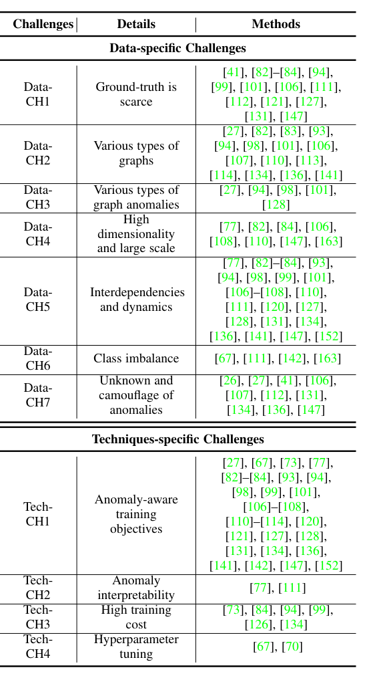

이 데이터에 대한 문제와 기술별 과제(섹션 1.1에서 처리)는 테이블에 요약됩니다. 7, 주소로 지정하는 기사와 함께.

## APPENDIX B 타오미

이 설문 조사의 세율은 Fig에서 표시됩니다. 11. - 비디오

## APPENDIX C ANOS ND ON STATIC GRAPHS에 대한

섹션 3.2의 세분화에 따라 이 섹션은 정적 특성 그래프에서 ANOS ND를 위해 설계된 전통적인 비 딥 학습 기법을 검토하고 GAT, GAN 및 네트워크 표현을 기반으로 한 기술에 따라 수행됩니다.

<!-- 원문 27쪽 -->

## LATEX CLASS FILES의 JOURNAL, VOL., 아니., AUGUST 2021 2

> **주:** 우리의 설문 조사

> **주:** 주요 내용

## 서론

> **주:** 단면도 1 예비 품목

> **주:** 단면도 2

> **주:** ANOS ND에 대하여

> **주:** 정체되는 도표

> **주:** 단면도 3

> **주:** ANOS ND에 대하여

> **주:** 동적인 도표

> **주:** 단면도 4

> **주:** ANOS ED에 대한

> **주:** 정체되는 도표

> **주:** 단면도 5

> **주:** ANOS ED에 대한

> **주:** 동적인 도표

> **주:** 단면도 6

> **주:** Algorithms에 게시

> **주:** 데이터셋 및 데이터셋

> **주:** 단면도 10

## 미래 지향

> **주:** 단면도 11 포함

> **주:** 단면도 12

## 부록

> **주:** 그래프에서 도전

> **주:** 이상 탐지

> **주:** A를 덮어

> **주:** 세금

> **주:** 애버딘 B

> **주:** ANOS ND는 정적에

> **주:** 그래프

> **주:** 애버딘 C

> **주:** ANOS ND(동적)

> **주:** 전통 그래프

> **주:** 비 딥러닝

> **주:** 기술 정보

> **주:** 의붓기 D

> **주:** ANOS ED와 함께

> **주:** 전통 비딥

> **주:** 학습 기술

> **주:** Appendix E에 대한 의견

> **주:** ANOS SGD 와 함께

> **주:** 비교와

> **주:** 연구

> **주:** 의논하기

> **주:** 일반 그래프

> **주:** 귀속됨

> **주:** Graph의

> **주:** 동적

> **주:** Graph의

> **주:** 의약

> **주:** Node 탐지

## (ANOS ND) (안스 ND)

> **주:** 의약

> **주:** Edge 탐지

## (안OS ED)

> **주:** 의령부-

> **주:** 그래프 검출

## (안스 SGD)

> **주:** 단면도 7

> **주:** ANOS ND에 대하여

> **주:** 일반 그래프

> **주:** 단면도 3.1

> **주:** ANOS ND에 대하여

> **주:** Graphs에 기여

> **주:** 단면도 3.2

> **주:** 전통 비-

> **주:** 딥러닝

> **주:** 기술 정보

> **주:** (주)

> **주:** 의논하기

> **주:** - 연혁

> **주:** 기술 정보

> **주:** 딥 NN 기반

> **주:** 기술 정보

> **주:** GCN 기반

> **주:** 기술 정보

> **주:** 관련 상품

> **주:** 학습 기반

> **주:** 기술 정보

> **주:** (주)

> **주:** 의논하기

> **주:** - 연혁

> **주:** 기술 정보

> **주:** GAN 기반

> **주:** 기술 기반 Deep NN

> **주:** 기술 정보

> **주:** GCN 기반

> **주:** 기술 정보

> **주:** (주)

> **주:** 의논하기

> **주:** - 연혁

> **주:** 기술 정보

> **주:** GCN 기반

> **주:** 기술 정보

> **주:** (주)

> **주:** 의논하기

> **주:** - 연혁

> **주:** 기술 정보

> **주:** 의령

> **주:** 데이터셋

> **주:** 평가

> **주:** Anomalous 가장자리 및

> **주:** 서브 그래프

> **주:** 의향 검출

> **주:** 동적 그래프

> **주:** 의향 검출

> **주:** 의의의학

> **주:** 그래프

> **주:** 의향 검출

> **주:** 대형 그래프

> **주:** 멀티 뷰 그래프

> **주:** 이상 탐지

> **주:** 위장병

## ANOS ED ANOS SGD의 경우

> **주:** ANOS ND 무인 노드

> **주:** 의 특징

> **주:** Anomalous 가장자리

> **주:** 의 특징

> **주:** 의령부

> **주:** 의 특징

> **주:** 의논 그래프

> **주:** 의 특징

## (안스 GD)

> **주:** ANOS GD 무수 그래프

> **주:** 의 특징

> **주:** GNN 기반

> **주:** 기술 정보

> **주:** (주)

> **주:** 의논하기

> **주:** - 연혁

> **주:** 기술 정보

> **주:** 그래프에서 ANOS GD

> **주:** 의 특징

> **주:** 단면도 8

> **주:** ANOS GD에

> **주:** 동적인 도표

> **주:** 단면도 9

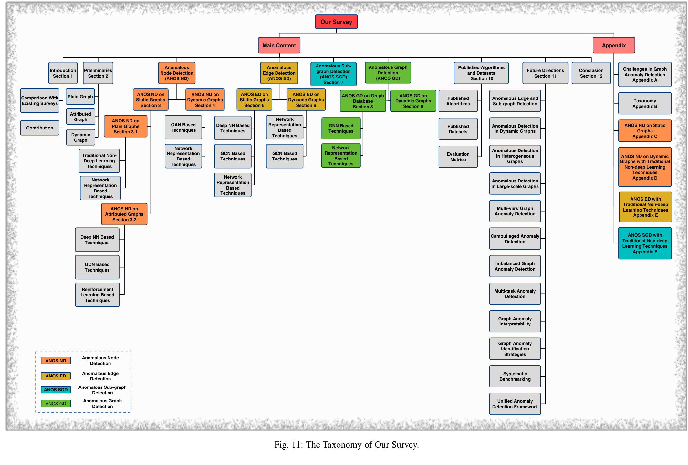

<!-- 원문 28쪽 -->

## LATEX CLASS FILES의 JOURNAL, VOL., 아니., AUGUST 2021 3

### C.1. 전통 비 딥 학습 기술

통계 모델, 매트릭스 계수, KNN과 같은 전통 기술은 이후의 검출 공정에 대한 무효 노드의 구조 / 특성 패턴을 추출하는 데 널리 적용되었습니다.

이러한 중, 매트릭스 Factorization (MF) 기반 기술은 최고 구조와 노드 특성 모두 캡처에 전력을 표시하고, 유망한 탐지 성능을 달성합니다. 이 유형의 방법에서 초기 시도는 Liu et al. [106]. - 비디오 개발 모델인 ALAD를 통해 커뮤니티의 영향을 탐지하는 것을 목표로 합니다. Fig에서 보았듯이. 12(a)는 비 부정적 모체 인자화를 통해 ALAD는 그래프 구조 A와 노드 속성 X를 파생하여 지역 사회 구조 W 및 속성 배포 벡터 H를 통합합니다. 매트릭스가 분해되면, ALAD는 각 노드의 정상적인성을 측정합니다. 이와 커뮤니티의 유사성에 따라. 노드의 정상적인 점수를 획득하여, 상위 노드는 커뮤니티의 영향을 확인한다.

Li 외. [41]는 잔여 분석을 사용하여 다른 관점에서 ANOS ND에 접근했습니다. 가정으로, 이상치는 큰 속성 재건축 잔여 오류로 이어질 것입니다. 따라서 제안 된 모델, 레이더, Fig에서 보이는 것과 같이 잔여 오류 R을 배웁니다. 12(b), 노드 속성 X를 인자화하여 이 오류를 얻기위한 구조적 인 정보를 통합하려면 Radar는 직접 연결된 노드와 같은 배운 잔여물에 명시된 제한을 R (균필 효과로 알려진)의 유사한 잔여 패턴을 가질 것입니다. 마지막으로, R의 더 큰 규범과 함께 상단 K 노드는 이상치로 식별됩니다.

균류 hypothesis는 구조상 정보를 악용하는 강한 지지를, 항상 붙들지 않을지도 모르다. 실제로, 실제 객체는 연결된 이웃과의 구별 속성을 가질 수 있으며, 모든 연결된 개체를 복제하는 것은 특성 공간에서 각 차원의 유사한 값을 공유하는 비 트리 바이알입니다. 이, Peng 등. [107]는 구조적으로 불허한 노드 속성이 균필요 hypothesis를 만족시키지 않는 것으로 나타났습니다. 실제로, 이러한 구조적으로 고위 노드 속성은 이 고위성에 기반한 개발 된 이상 탐지 기법에 대한 부작용을 가지고있을 것입니다. 이 문제를 해결하기 위해, 개발 된 모델, ANOMALOUS, CUR [42] decomposition을 사용하여 네트워크 구조와 밀접한 관련 특성 및 그 후 레이더 (Fig에서 보이는 것과 같이)에 따라 잔여 분석을 통해 이상치를 스폿합니다. 12 (c).

matrix Factorization를 넘어 선형 회귀 모델은 라벨링 교육 데이터를 제공하는 이상 classifiers를 훈련하도록 설계되었습니다. 대표 작품은 Wu 외입니다. [108]. - 비디오 SGASD는 소셜 네트워크 구조, 소셜 미디어 및 사용자 라벨의 콘텐츠 정보와 소셜 네트워크 구조를 사용하여 소셜 스팸을 식별하는 데 대한 사회적 스팸리스트 결과를 산출했습니다.

이 비 딥 학습 기술은 그래프 토폴로지 및 노드 특성에서 귀중한 정보를 캡처 할 수 있지만, 실제 네트워크 (대규량에 일반적으로 있음)에 응용 프로그램과 일반성은 매트릭스 분해 작업 및 회귀 모델의 높은 계산 비용으로 엄격히 제한됩니다.

### C.2. GAT 기반 기술

GCN은 ANOS ND의 노드 속성과 그래프 구조를 통합하는 효과적인 솔루션을 제공합니다 (3.2.2 섹션에서 검토), 가장 관련 정보를 캡처 할 수있는 능력

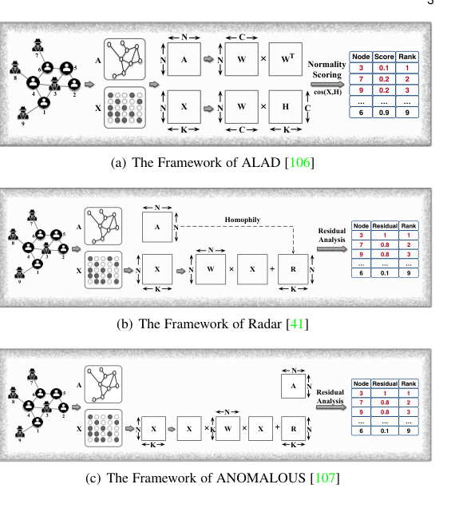

이웃은 subpar입니다. 이 때문에 간단하게 복잡한 작업으로 인해 이웃 정보를 타겟 노드에 동일하게 집계합니다. 최근 그래프 주의 메커니즘 (GAT) [91]는 전통적인 그래프 복잡한 교체를 대체하기 위해 고용됩니다. 예를 들어, 팬 등. [110]는 네트워크 구조 정보를 인코딩하기 위해 그래프 주의 신경 네트워크를 적용했습니다 (구조 인코딩). 이상DAE는 노드 속성을 포함하기 위해 별도의 속성 autoencoder를 채택합니다 (암호화). unsupervised 인코딩 디코딩 프로세스를 통해 각 노드는 해당 재구성 손실에 따라 순위를 매겨지고, 가장 큰 손실을 도입하는 top-k 노드는 이상치로 식별됩니다. 특정한 속성 디코딩 프로세스는 노드가 Fig에 표시된 것처럼 구조와 속성 인코딩 프로세스를 통해 배운 것을 두 가지 노드를 포함합니다. 13는 그래프 토폴로지가 GAT에 의해 출력되는 임베딩를 사용하여만 재구성됩니다. 더 나은 재건축 결과를 얻기 위해, 이상DAE는 전반적인 손실 특성을 극소화하기 위하여 훈련됩니다:

## 충청남도 천안시 서북구 천안대로 173 Tel. 051-974-7736 Fax. 051-974-7736 Fax. 051-974-7736 Fax. 051-974-7205 Fax. 051-974-7205 Fax. 051-974-7205 Fax. 051-974-7205 Fax. 051-974-7205 Fax. 051-974-7205 Fax. 051-974-7205 Fax. 051-974-7205 Fax. 051-974-7205 Fax. 051-974-7205 Fax. 051-974-7205 Fax. 051-974-7205 Fax. 051 Fax. 051 Fax. 051 Fax. 051 F F F F F F F F F F F F F F F F F F F F F F F F F F F F F F F F F F F F F F F F F F F

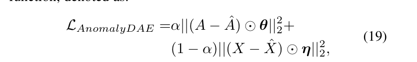

α는 계수, A 및 X는 입력 adjacency matrix 및 속성 matrix, ˆ 및 X는 재구성 된 모조입니다. 각 θi, J ∈θ 및 ηi, J ∈η는 1, 대응 요소 Aij 및 Xij가 0를 동등하면, 그 값은 1보다 더 높은 하이퍼 파라미터에 의해 정의됩니다.

또 다른 괜찮은 일은 반 GNN [111], 왕 등입니다. 온라인 결제 플랫폼에서 사기성 사용자를 탐지하는 데 반 감독의 관심 기반 그래픽 신경 네트워크. 이 작업은 사용자 정보를 수집에서 더 탐구합니다.

<!-- 원문 29쪽 -->

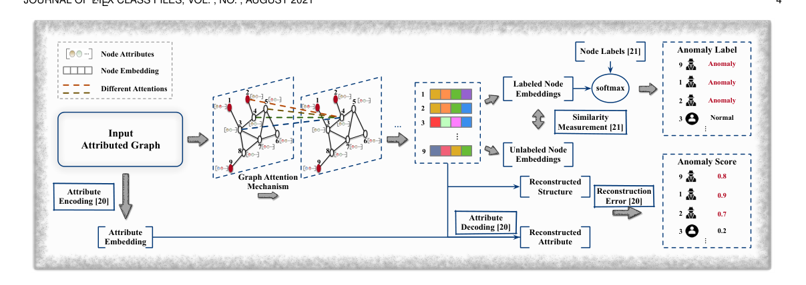

다양한 소스(예, 거래 정보 및 사용자 프로필), 그리고 멀티뷰 그래프로 실시간 네트워크를 나타냅니다. 그래프의 각보기는 사용자 또는 사용자 속성 사이의 상관 관계에 반영하도록 모델링됩니다. 이상 탐지를 위해, SemiGNN는 노드 수준의 관심 메커니즘을 통해 이웃 정보를 집계함으로써 각 보기 v에서 hv u를 삽입하는 노드를 생성합니다. 이때 각 보기에서 겨냥한 노드를 갖는 것으로 주목하고 각 노드의 비정상적인 표현을 생성합니다. 마지막으로 각 노드의 클래스는 softmax classifier를 통해 예측됩니다. 실로, 왕 등. 초시 분류 손실과 unsupervised graph reconstruction 손실이 결합되어 라벨 및 라벨 데이터를 완전히 활용함으로써 모델을 최적화합니다. 분류 손실은 다음과 같이 denoted 할 수 있습니다:

Lsup = −1

## |UL|일본

> **주:** 모델 번호: u∈UL

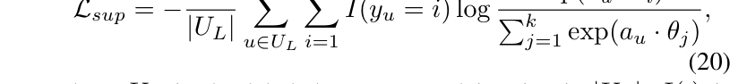

I(yu = i) 로그 exp(au · θi) k j=1 exp(au · θj)

(20) UL이 라벨을 붙은 사용자 세트이며 크기가 |UL|, I(·)는 표시 특성이며, k는 가장 예시되는 라벨의 수입니다 (대부분의 경우, 라벨은 이상치 또는 non-이상치 및 k = 2), θ는 트레이드 변수를 나타냅니다. 그 사이에, unsupervised loss는 유사한 표현과 부 Versa를 얻기 위해 임의 워크를 통해 라벨이 붙은 노드에 도달 할 수있는 unlabeled 노드 (사용자)를 권장합니다. 이 부정적인 샘플링 (임버드 워크에 도달 할 수없는 언 라벨 노드는 부정적인 샘플입니다)과 손실은 다음과 같이 공식화 될 수 있습니다.

루즈업 =

> **주:** 모델 번호: v∈Nu∪Negu

−log(σ(aT u av)) −3 · Eq∼Pneg(u) 로그(σ(aT u aq)),

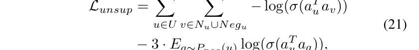

U가 사용자 세트를 바꿉니다. Nu는 u의 이웃 세트를 바꿉니다. Negu는 부정적인 샘플을 나타냅니다. P는 샘플링 배포이며 σ(·)는 sigmoid 특성입니다. 총 손실은 그들의 합이 걸리고 다음과 같이 공식화됩니다.

LSemiGNN = αLsup + (1 −α)Lunsup + λLreg, (22) α는 균형 매개 변수이며 Lreg는 모든 트레이 가능한 변수를 정기적으로 생성합니다.

### C.3. GAN 기반 기술

GAN은 모의 무성/정규 데이터 배포에 효과적이므로 (4.2 섹션에서 검토됨), Ding et al. [112]는 자체 개발 된 모델에서 GAN을 사용했습니다. AEGIS는 무호화 데이터에 대한 무호화적 인 차별성을 향상 시켰습니다. Fig에서 보았듯이. 14, 이 모델은 입력 특성 그래프에서 GNN을 통해 노드를 생성하고, 그 후 생성기와 신디미터는 이상치를 식별하기 위해 훈련됩니다. 첫 번째 단계에서, anomalous 노드 및 일반 노드는 GAN이 그들 사이에 경계를 배울 수 있다는 것을 같은 임의 공간에서 독특한 영역에 맵핑됩니다. 따라서, Ding 등. 각 노드와 k-th 이웃 사이의 속성 차이를 캡처하는 그래프 차별화 레이어와 Autoencoder 네트워크 구축. 이러한 차이 정보는 쉽게 구별 할 수 있습니다. 임베딩는 다음과 같이 인코딩됩니다: hl

> **주:** W1hl - 1

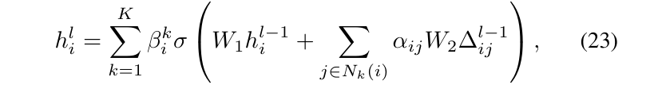

> **주:** 모델 번호: j∈Nk(i)

> **주:** αijW2Δl−1

> **주:** ₢ 킹

hl i는 l-th layer를 통해 노드의 내장된 특성으로, βk는 각 hop, Nk(i)의 주의사항은 k-th order 이웃의 집합이며, αij는 각 이웃에 대한 관심이며, Δl−1 ij는 i와 j, W1과 W2의 차이는 트레이드 변수입니다. autoencoder는 노드 속성이 배운 임베딩를 사용하여 가장 잘 재구성 될 때까지 잘 다루어 져 GAN이 훈련 된 후.

두 번째 단계에서 발전기는 이전 배포 p(àz)를 따르며, 노이즈 데이터에 의해 영향을 생성하는 것을 의미하며, 신분화기는 정상적인 노드와 생성 된 동종의 물질의 임베딩 사이에서 구별하는 것을 투쟁합니다. 교육 과정은 발전기와 신디민터 사이 미니 맥스 게임으로 공식화됩니다. 최소 G 최대

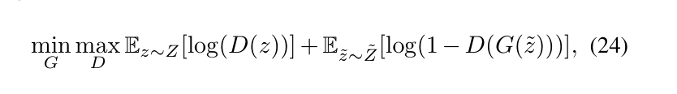

z는 노드가 임의로 인하여 생성된 이상치입니다. AEGIS는 테스트 노드 u를 위해 zu를 삽입하고, 그 결과에 대한 이론적 점수를 할당합니다.

<!-- 원문 30쪽 -->

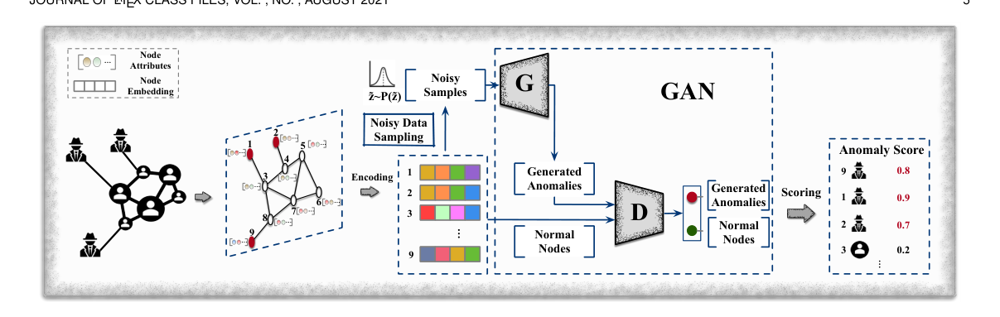

discriminator의 출력, 즉, 노드가 정상적일 가능성이 있습니다. 득점 특성은 다음과 같이 공식화됩니다:

Ascore(u) = 1 −D(zu), (25) 및 최고 K 노드는 무효로 분류됩니다.

### C.4. Network 표현 기반 기술

네트워크 표현으로 그래프는 동문 감지 절차가 진행되기 전에 벡터 공간에 먼저 인코딩됩니다. 섹션 3.1.2에서 설명 된대로, 특성 그래프에서 ANOS ND의 수많은 연구는 깊은 네트워크 표현 기술을 악화했습니다.

예를 들어, 장 외. [113]는 3-layer 신경 네트워크, REMAD 및 잔여 분석을 통해 이웃에서 크게 탈선하는 속성이 있는 이상적 노드를 감지했습니다. 이 웹 사이트는 애플 리케이션에 전념. 본 연구에서는 정품 앱과 게임을 제공 할 목적으로이 사이트를 만들었습니다. 4AppsApk 최고의 안드로이드 애플 리케이션을위한 무료 APK 파일 다운로드 서비스, 계략. 두 가지 매트릭스는 표현 학습 프로세스 전반에 걸쳐 공동으로 업데이트되어 있으며, 인근 노드는 비슷한 표현이 있는 것을 권장합니다. 특정한 노드는 각 노드의 자신의 속성과 함께 이웃 정보를 집계함으로써 생성됩니다. hl

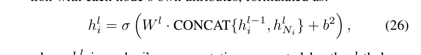

₢ 킹

> **주:** , hl를

₢ 킹

hl i는 l-th layer(h0 i =)에 의해 생성된 노드의 표현입니다. Ni는 i의 이웃, σ()는 활성화 함수, W l 및 b는 트레이드 변수입니다. 마지막으로, 잔여 매트릭스 R은 각 노드의 비정상적인 정보를 포함하고 가장 큰 규범을 가진 top-k 노드는 이상치로 간주됩니다.

부분 노드 레이블, Liang 외. [114]는 반 감독형 모델, SEANO를 개발하여 그래프 구조, 노드 특성 및 라벨 정보를 통합했습니다. NUMX는 NUMX의 NUMX의 NUMX의 NUMX의 NUMX의 NUMX의 NUMX의 NUMX의 NUMX의 NUMX의 NUMX의 NUMX의 NUMX의 NUMX의 NUMX의 NUMX의 NUMX의 NUMX의 NUMX의 NUMX의 NUMX의 NUMX의 NUMX의 NUMX의 NUMX의 NUMX의 NUMX의 NUMX의 NUMX의 NUMX의 NUMX의 NUMX의 NUMX의 NUMX의 NUMX의 NUMX의 NUMX의 NUMX의 NUMX의 NUMX의 NUMX의 NU의 NUMX의 NUMX의 NUMX의 NUMX의 NUMX의 NUMX의 NUMX의 NU의 NU의 NU의 NUMX의 NUMX의 NUMX의 NUMX의 NUMX의 NUMX NUMX의 NUMX의 NUMX NUMX의 NUMX NUMX NUMX 그런 다음, 입력으로 표현을 취하는 감독 된 구성 요소, softmax 클래스터를 통해 노드 레이블을 예측하고, unsupervised 구성 요소는 노드 컨텍스트를 재구성하는 훈련됩니다 (node sequences). 각 노드의 컨텍스트는 그래프에서 무작위 워크를 통해서만 생성되지 않고 동일한 클래스에 속한 라벨이 있는 노드에서 생성됩니다. 훈련 후, SEANO는 노드의 정상적인 점수로 λi를 해석하고, 가장 높은 점수를 가진 최고 K 노드는 이상치로 분류됩니다.

이웃 정보를 집계하는 방식을 통해 노드 표현을 학습하면 그래프 구조와 노드 속성에서 종합 정보를 캡처하는 데 효과적이게 되었습니다. 그러나, Liu 등. [154]는 이러한 접근법을 설명했습니다. 일반 노드에서 이상치 grege 특성을 돕고, 정상을 확인하고 하위 optimal 탐지 성능으로 지도합니다. 그들은 동종 검출을 위해 집계 작업을 적용 할 때 고려해야 할 세 가지 구체적인 문제를 식별: 1) 이상치는 네트워크의 희귀 한 개체입니다. Hence, 직접 집계 이웃 정보는 이상치와 정상적인 인스턴스 사이의 차이를 매끄럽게합니다. 2) 직접 연결된 노드는 독특한 특성과 결합된 노드가 유사한 특성을 공유하는 가정을 가지고 있으며, 이는 특성 집계를 위한 기초로 봉사하며, 이 시나리오에서 더 이상 보유하지 않습니다. 3) Real 개체는 다른 사람들과의 여러 유형의 관계를 형성 할 수 있으며, 이는 다른 유형의 관계에 대한 집계 결과를 의미하는 것이 특이합니다. 이러한 우려와 관련하여, 제안된 방법, GraphConsis, 노드 특성을 통합할 때 잠재적인 이웃을 피하기 위해 샘플링 전략을 따르십시오. 이 방법은 다른 링크에 따라 이웃 정보를 집계하는 주의 메커니즘을 채택합니다. 배운 노드 표현은, 따라서, 더 강력한 이상치입니다. 그래피시스는 라벨을 예측하는 클래스터를 훈련하기 위해 입력을 합니다.

도우 외. [27]는 제안한 모형 CARE-GNN에 있는 사기꾼의 위장 행동을 더 고려했습니다 탐지 성과를 강화하기 위하여. 지정된대로 위장은 특징 위장 또는 관계 위장으로 분류 될 수 있습니다., 이상치는 그들의 특징 정보를 조정하거나 의심스러운 정보를 통해 광택에 많은 benign 개체와 연결 형태. Hence, 직접 집계를 고용하는 것은 위장과 이상한 패턴을 부드럽게 할 것입니다

<!-- 원문 31쪽 -->

## LATEX CLASS FILES의 JOURNAL, VOL., 아니., AUGUST 2021 6

이상치의, 이상치와 정상적인 목표 사이 구별을 제거. CARE-GNN은 GraphConsis와 같은 이웃 샘플링 전략을 채택하여 위장병을 필터링하고 사용자 사이에 형성된 다양한 관계를 탐구합니다. 각 관계, Dou 등에서 구체적으로. MLP를 사용하여 노드 라벨을 예측하고 각 노드와 MLP의 출력에 따라 이웃과 유사한 (l1 거리)를 측정합니다. 그런 다음, 가장 유사한 이웃은 특성 집계에 선정되고, CARE-GNN은 다른 관계에서 배운 후반 표현의 조합을 통해 각 노드의 표현을 생성합니다. classifier는 결국 노드 라벨을 예측하기 위해 표현을 사용하여 훈련됩니다.

본 것처럼, 이러한 네트워크 표현 기반 기법의 성능은 교육 목표 / 손실 특성에 의해 결정됩니다. 향상된 탐지 성능은 손실 특성이 비정상적인 노드에서 정상적인 노드를 분리할 수 있는 경우 유능합니다. [67]의 최근 작업은 이상-aware Loss 특성의 중요성을 강조합니다. 이 문서는 번역을 편집합니다. 이 문서는 번역을 편집합니다. 특히, 이 손실 특성은 아웃리버 노드와 정상적인 노드의 마진 사이에 상대적 스케일을 찾을 수 있도록 설계되었습니다. MLPbased classifier는 마지막으로 이상-aware loss-guided GNNs 및 노드 레이블에 의해 생성된 노드 표현을 사용하여 훈련됩니다. unseen 노드의 경우, classifier는 표현에 표시됩니다.

## TRADI-TIONAL NON-DEEP LEARNING TECHNIQUES를 가진 DYNAMIC GRAPHS에 있는 APPENDIX D ANOS ND

동적 일반 그래프의 무효 노드를 감지하려면 기존의 비 딥 학습 기술은 노드의 구조적 진화 패턴을 모델링하는 데 크게 의존합니다. [103]와 [104]Z는 일반 노드의 진화적인 행동을 가정한다 (즉, 생성하거나 다른 사람들과 연결 제거) 보통 안정된 패턴을 따르고, 그들의 변경은 이상치와 비교된 그래프 구조에 더 적은 영향을 미칩니다. [104], 왕 등에서 특히. 예측 결과와 관련하여 관찰이 크게 충돌하기 때문에, 가장 노드의 진화 패턴에 맞게 새로운 링크 예측 방법을 제안했습니다. 그들은 더 이상 그래픽 adjacency matrix에 부과 된 절망을 평가함으로써 무례한 행동의 영향을 얻었다.

다른 전통은 노드/edge 속성과 그 변경을 악용합니다. 예를 들어, Teng 외. [120]는 노드와 가장자리 속성을 두 개의 다른 레이아웃으로 가져 왔습니다. 각 노드를 설명합니다. 공유된 후속 공간에 대한 정보의 두 유형 모두 인코딩하여, 제안된 모델은 역사적 기록에서 하이퍼 섹터를 배웁니다. 기존 노드의 새로운 관측이 주어지면 모델은 갑상선과 갑상선에 따라 이상치와 구별됩니다. 비구위 밖에서 점은 응집으로 자리 잡았습니다.

임베딩 기술, Nguyen 등. [5]는 익명의 사용자, 트윗, 해시 태그 및 소셜 플랫폼에 대한 링크가 감지 할 수있는 비 매개 변수 방법을 제안했습니다. 특히, 그들은 사용자, 트윗, 해시 태그 및 링크 사이의 친화 관계와 같은 이질적인 소셜 그래프로 소셜 플랫폼을 모델링했습니다. 사용자 등록 정보, tweets 키워드, 같은 특성의 광범위한 분석을 통해

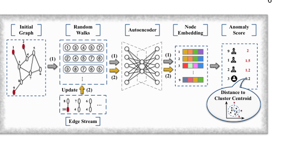

링크의 언어 스타일과 해시 태그의 인기 점수, 무효 개체는 자신의 탈선 특성에 따라 스럽습니다. 이 작품은 또한 개별 객체와 검출 된 동종과의 관계를 사용하고 비정상적인 개체의 그룹을 감지합니다.

## TRADITIONAL NON-DEEP LEARN-ING TECHNIQUES와 함께하는 APPENDIX E ANOS ED

전통적인 비 딥 학습 기반 접근법은 주로 임시 신호 (예를들면 그래프 구조의 변화)를 사용하여 집중하고, 동적 그래프 [33], [130]에 대한 무효 가장자리를 감지하기 위해 특별히 설계된 통계 측정을 적용. 콘크리트 예로서, Eswaran 및 Faloutsos [162]는 가장자리의 스트림으로 동적 그래프를 모델링하고 그래프 구조를 악화뿐만 아니라 구조 진화 패턴을 악화했습니다. 그들은 무해한 가장자리의 두 개의 징후를 확인: 1) 연결 영역의 그래프를 분리; 그리고 2) 연결이 파열에 나타납니다. 들어오는 가장자리를 위해, 그들의 모형은 각 가장자리에 이상 점수를 할당하고, 최고 점수를 가진 최고 K 가장자리는 이상치입니다. Chang et al의 또 다른 가장 최근 작업. [126]는 관찰된 빈도의 그들의 마음에 드는 것에 근거를 둔 무해한 들어오는 가장자리를 점하는 것을 목표로 하는 새로운 빈도 Factorization 알고리즘을 제안합니다. 이 방법은 노드의 임시 및 구조 변경을 캡처하기위한 다 유능한 모델과 매트릭스 요소의 장점을 결합하고보고 된 것과 같은, 그것은 단지 가장자리 스트림을 처리 할 일정한 메모리를 필요로한다.

## APPENDIX F ANOS SGD 와 TRADITIONAL NON-DEEP 의료 기술

### F.1. ANOS SGD 에 정적 그래프

정적 그래프에서 ANOS SGD의 하나의 동기는 무효 하위 그래프가 종종 다른 속성 배포를 전시한다는 것입니다. 따라서, g이상 [40], AMEN [12] 및 SLICENDICE [153]와 같은 전통적인 비 딥 학습 기술, 특성 분포 모델링 및 하위 그래프의 정상적인 측정에 초점. 조사의 또 다른 선은 그래프 잔여입니다.

<!-- 원문 32쪽 -->

## LATEX CLASS FILES의 JOURNAL, VOL., 아니., AUGUST 2021 7

분석. 실제 네트워크에 포함된 풍부한 속성 정보는 객체 사이에 형성된 관계에 대한 통찰력을 제공합니다. 따라서, 몇몇 학문의 동기는 비유적인 이하 도표를 점하는 동기를 측정하기 위하여 이고 예상한 구조 사이 잔여를 측정하고 구조 [10]를 관찰했습니다.

### F.2. ANOS SGD 에 동적 그래프

ANOS SGD의 변형은 많은 전통 작품의 주제였습니다. 예를 들어, Chen 등. [36]는 커뮤니티 기반 질병을 식별하기 위해 여섯 미터를 도입했습니다. 즉, 성장 커뮤니티, 쇄석 커뮤니티, 합병 커뮤니티, 분할 커뮤니티, 태어난 지역 사회 및 사라진 커뮤니티. 이 손으로 만들어진 특성 또는 통계 패턴은 기존의 어떤 특정 유형의 영향을 잘 맞으며, 불충분과 위장병을 감지하는 능력은 제한되어 있으며, 직접적으로 재정적 보안과 같은 응용 프로그램에 최적화되지 않는 높은 거짓 부정적인 비율을 소개 할 수 있습니다. 다른 작품은 Eswaran 외의 SPOTLIGHT와 같은. [39]와 Liu 등. [30]는 동적 그래프에서 급격한 변화를 탐구하고 이러한 변경과 관련된 무효 하위 그래프를 식별합니다.

소셜 스팸 및 사기 그룹이 종종 온라인 소셜 네트워크에서 dense temporal sub-graphs를 형성, [9], [29]를 포함하여 많은 작품을, 포함, 많은 작품에, 수동으로 추출 된 특성과 그래프의 재설정과 크게 다른 진화 한 스폿 무해한 디센스 하위-graphs.

이 연구 외에도, 많은 작품은 Kulldorff 통계 [204], Poisson 통계 [205], 높은 평균 스캔 통계 [206] 및 Berk-Jones 통계 [207]와 같은 다양한 그래프 검사 통계를 사용합니다. 특히 Shao 외. [133]는 네트워크 구조가 일정하지만 노드 속성은 오버타임을 변경하는 동적 그래프에서 무효 하위 그래프를 감지하는 비parametric 방법을 제안했습니다. 이 접근법은 노드의 p-values와 관련하여 각 하위 그래프의 무효 점수를 측정합니다. 더 높은 점수를 가진 하위 그래프는 더 많은 공명입니다. 또 다른 작업, GBGP [37], 대신, 높은 평균 스캔 통계를 채택하여 원자 하위 그래프를 형성하고 미리 정의 된 불규칙한 구조를 따르는 무조직 그룹을 감지 할 수 있습니다.
