# 이종 그래프 신경망을 활용한 자금세탁자 탐지

> **원문 제목:** Finding Money Launderers Using Heterogeneous Graph Neural Networks  
> **저자:** Fredrik Johannessen · Martin Jullum  
> **게재 정보:** The Journal of Finance and Data Science 11 (2025) 100175  
> **DOI:** [https://doi.org/10.1016/j.jfds.2025.100175](https://doi.org/10.1016/j.jfds.2025.100175)

> **번역 안내:** 본문과 부록은 문단 문맥을 기준으로 한국어로 옮겼습니다. 수식과 참고문헌은 정확성을 위해 원문 표기를 유지했습니다. 원문의 그림과 표는 개별 이미지로 잘라 해당 본문 위치에 바로 배치했습니다.

---

<!-- 원문 1쪽 -->

금융 산업은 효과적인 안티 - 돈 세탁 (AML) 시스템에 따라 성능 및 운영 효율성을 유지. 그러나 기존 AML 시스템은 일반적으로 규칙 기반이며, 종종 정확한 돈을 멸균하는 것을 방지하기 위해 투쟁합니다.

특히, 역사 자료와 다양한 고객 행동에 대한 제대로 계정에서 학습 할 수있는 능력은 문제입니다. 또한 매일 생성 된 거래 데이터의 광대 한 양에 대한 회계, 이 큰 데이터 분석 및 고급 기계 학습 기술에 대한 도전 통화.

이 선에서 현재 종이는 그래프 신경 네트워크 (GNN) 접근 방식을 탐구하고 있으며, 최첨단 기계 학습 기술은 DNB, 노르웨이 최대 은행에서 실제 은행 거래 및 비즈니스 역할 데이터로 구성된 대형 이질 네트워크 내에서 돈을 세탁하는 활동을 식별합니다.

이 끝에, 우리는 (균형) 메시지 Passing Neural Network (MPNN) 아키텍처를 확장하여 이질적인 그래프에서 작동하고, 돈 세탁 활동을 감지하는 강력한 성능을 보여줍니다.

GNN 방법론을 활용한 맞춤 서비스를 통해 고급 데이터 과학 기술을 통해 AML에 대한 개척 접근 방식을 분석하고, 전자 감시 시스템을 개선하기 위한 최적의 솔루션을 제공합니다.

우리의 지식의 가장에, 이것은 큰 현실 세계 이질적인 네트워크와 함께 AML 목적을 위한 이질적인 GNNs를 적용하는 첫번째 간행물입니다.

## 1 서론

돈 세탁은 범죄 행위의 진행을 계속하는 활동입니다. 궁극적 인 목표는 합법적 인 소스에서 시작된 진행 상황을 살펴볼 것입니다. 자금세탁은 광범위한 글로벌 문제로서 목표가 수익을 창출하는 범죄의 모든 유형의 수익을 창출할 수 있습니다. 대부분의 돈 세탁은 발견되지 않기 때문에, 그것은 글로벌 경제에 영향을 미칩니다. 그러나 유엔의 연구 보고서 - 마약 및 범죄 (2011)의 사무실은 1-2 조 달러가 매년마다 차선되고 있으며, 이는 전 세계 총생산의 2-5%와 해당합니다. 국가 및 국제 항-자금세탁 (AML) 법은 금융 기관의 의심 거래 활동의 전자 감시 및보고를 규제합니다. 감시의 목적은 돈 세탁과 관련된 높은 확률과 의심 활동을 감지하는 것입니다,

- 응시 저자. 이메일 주소: fredjo89@gmail.com (F. 조한니스엔, jullum@nr.no (M. 줌 (Jullum). KeAi Communications Co., Ltd.의 책임에 따라 Peer 검토

금융 및 데이터 과학의 저널 11 (2025) 100175는 수동으로 조사 할 수 있습니다. 수동 조사는 사건의 몇몇 양상을 검열하는 경험있는 조사에 의해 수행되고, 수시로 다수 간단한 고객을 포함하는, 그 후에 권위에 보고하는 행동 보증을 결정합니다. 이 과정에 대한 자세한 내용은 섹션 2 참조. 현재 논문은 전자적 감시 프로세스에 대한 우려를 갖는 것으로, 이는 불법적인 거래의 광대한 바다에서 상대적으로 작은 수의 의심 활동을 식별할 수 있습니다.

<!-- 원문 2쪽 -->

지난 몇 년 동안 은행의 전자 감시 시스템은 주로 도메인 전문가가 만든 규칙 세트로 구성되었으며 고정 임계값과 경고가 생성되는지 결정하는 경우 / else 문의 온건한 번호를 사용합니다. 일반적으로 규칙은 특정 금액, 빈번한 송금을 초과하는 거래이며, 계정간의 빠른 이동이 가능합니다. 그런 규칙의 설명 예입니다.

규칙과 임계 값은 새로운 트렌드, 태풍, 규제 변경에 따라 정기적으로 검토 및 조정됩니다. 이러한 통치자 시스템은 여전히 큰 부분에서 감시 시스템을 만드는 (Chen et al., 2018b).

그러나 이러한 규칙은 효율성 (Fruth, 2018)을 제공하는 짧은 짧은, 적어도 3 가지 주요 이유: a) 그들은 수동 작업에 의존하고 동적 변경 데이터 (Chen et al., 2018b)와 함께 날짜까지 규칙을 유지. 이 작업은 복잡성과 규칙의 수로 증가합니다. b) 그들은 일반적으로 너무 간단 하 게 높은 정밀도로 돈을 감추, 많은 낮은 품질 경고 발생, 즉. 거짓 긍정적. 1 c) 그들의 단순성은 정교한 돈 세탁자를 위해 쉽게 할 수 있도록, 심한 범죄가 발견 될 가능성이있는 상황에서 발생. 이 세 가지 단점의 결과는 은행은 효율적인 접근에 거대한 리소스를 소비하고 불법적 인 절차의 작은 분수는 복구됩니다 (Pol, 2020).

최근 몇 년 동안 여러 돈 세탁 스캔들에 의해 구동, 2 규칙 기반 시스템의 단점은 규제 기관과 금융 기관과 같은 의제에 높고, 고려 가능한 리소스는 더 효과적인 전자 감시 시스템을 개발하기 위해 헌신. 탐색된 한 가지는 기계 학습 (ML)을 사용하여 경고를 생성 할 때 자동으로 학습하는 것입니다 (예를 들어, 예를 들어,). Jullum 외, 2020; 드 Jesús Rocha-Salazar 외. (2021). ML은 광대한 데이터의 복잡한 패턴을 감지합니다. 결과적으로 ML 기반 시스템은 증가된 정확도와 강력한 돈을 감수하는 더 정교한 방법을 식별하는 특성을 가진 검출 시스템을 제공하는 잠재력을 가지고 있습니다.

돈 세탁은 종종 범죄로 얻은 기원을 은폐하는 여러 당사자가 다른 계정과 엔티티티 (블튼과 손, 2002; Deprez 등, 2025, Sec 4.)에서 은행 거래의 복잡한 체인을 통해 진행합니다. 이 패턴은 격리에서 볼 때 감지하기 어렵지만, 엔티티티티 간의 관계가 레버리지 될 때 명백합니다. 이 반영, 늦게 네트워크 과학에 초점을 증가하고있다 도구로 돈 세탁을 감지, 연구는이 접근이 높은 잠재력을 (Colladon 및 Remondi, 2017; Li 등, 2017; Savage 등, 2017). AML와 관련된 네트워크에서 노드는 개인, 조직 및 주소를 대표할 수 있으며, 가장자리는 인스턴스 송금, 비즈니스 관계 및 공동 소유권을 대표할 수 있습니다.

네트워크 특성을 통합하는 가장 간단한 방법은 네트워크의 노드 역할에 대한 정보를 캡처하는 노드 특성을 만드는 것입니다, 예를 들어. 네트워크 중심의 지표 또는 그 이웃의 특성. 특성은 다운스트림 머신 학습 작업에서 사용할 수 있습니다. 이 접근법은, 그러나, 생성한 특징으로 suboptimal는 그 후에 분류를 위한 가장 통보가 아닐지도 모르고, 관계 자료의 가득 차있는 부유한 것은 법인 기반 기계 학습 일에 통과되지 않는 어떤 경우에 있을 것입니다.

그래프 신경망 (GNN)는 신경 네트워크 데이터를 통해 기계 학습 작업을 직접 적용하여이 drawback을 극복하는 방법의 클래스입니다. GNN은 노드 분류(Kipf and Welling, 2016a), 링크 예측(Zhang and Chen, 2018), 그래프 클러스터링(Wang et al., 2017), 그래프 유사성(Bai et al., 2019) 및 비소적 인 임베딩(Kipf and Welling, 2016b)과 같은 다양한 그래프 관련 작업을 해결할 수 있습니다. GNNs 뒤에 한 가지 아이디어는 일반 탭 데이터에서 네트워크의 인공 신경 네트워크 (ANN)의 현대적이고 성공적인 기술을 확장하는 것입니다. 조직 특성 및 네트워크 특성을 단일으로 통합하는 능력 외에도 동시에 훈련 된 모델, 네트워크의 가장자리 수와 선형으로 가장 GNNs 스케일, 대형 비소 네트워크 (Wu et al., 2020)에 적용 할 수 있도록합니다. GNNs의 또 다른 바람직한 속성은 그들이 유도보다는 유도적 인 것입니다: 트랜지스터 모델 (e.g. Node2Vec (Grover 및 Leskovec, 2016))은 훈련 중에 존재하는 특정 데이터에만 사용될 수 있으며, 유도 모델은 재훈련 없이 완전히 새로운 데이터에 적용할 수 있습니다. AML 응용 프로그램에 대한 중요한 것은 새로운 거래 (edges)가 지속적으로 나타나고, 고객 (nodes)가 매일 입력하고 떠나는 것입니다. 이러한 장점을 제공, GNNs 널리 간주 된 최첨단 기계 학습에 대한 그래프, 경우 – 거래는 $10,000 이상, 그리고 – 그것은 증가 된 AML-risk와 국가로 만든, 그리고 – 거래가 소매 고객으로 분류 된 고객, 그 후 경고를 트리거.

1는 각 경고를 수동으로 검사하기 위하여 노동자를 더 고용합니다 (비교) 해결책은 이 짧은 되기를 위해 보상합니다. 2 예로, 그것은 2018에서 공개되었다는 에스토니아 은행의 지점, 덴마크의 최대 은행, 이상에 대한 의심 거래를 수행 200 billion에서 2007–2015 (Bjerregaard와 Kirchmaier, 2019). 의향적 소송은 €2 billion에 따라 금액이 청구됩니다.

### F. 조안니스엔, M. Jullum 금융 및 데이터 과학 11 (2025) 100175의 저널

<!-- 원문 3쪽 -->

특히 노드 특성의 노드 분류에 대한 (Chami et al., 2022), AML 응용 프로그램에 잘 맞는 것을 만들 수 있습니다.

대부분의 GNNs는 단일 유형의 엔티티티 (노드) 및 단일 유형의 관계 (edge)와 균질 네트워크를 위해 개발되었습니다. 현재 AML 사용 사례에서 관련 네트워크는 노드와 가장자리 모두에서 이행성입니다. 노드는 개인 고객, 회사 및 외부 계정 모두를 대표하며 가장자리는 노드간에 금융 거래 및 전문 비즈니스 관계를 나타냅니다. 이진 네트워크를 처리 할 수있는 문학의 일부 GNNs가 있습니다. RGCN (Schlichtkrull et al., 2018), 한 (Wang et al., 2019), MAGNN (Fu et al., 2020), HGT (Hu et al., 2020) 및 HetXZ (2019). 이 모든 방법을 가진 일반적인 문제는 가장자리 특성을 통합하도록 설계되지 않습니다. AML 사용 사례에서, 이것은 금융 거래의 속성에 해당합니다 (또는 비즈니스 관계) 효과적인 학습 작업에 대한 중요한 정보입니다. 따라서, 우리의 현재 지식과 연구에 근거를 두어, 우리의 AML 사용 케이스를 위한 직접 적용 가능한 GNN 방법이 없습니다.

### 1.1 현재 종이

현재 종이는 노르웨이 최대 은행 DNB의 AML 시나리오를 고려하여 목적이 돈 세탁 활동을 감지하는 것입니다. 데이터는 실제 은행 거래 및 비즈니스 역할 데이터에서 생성 된 대형 이진 네트워크로 구성됩니다. 노드는 은행 고객 및 거래 대행사를 대표하며, 가장자리는 은행 거래와 비즈니스 관계를 나타냅니다. 네트워크는 5 million 노드와 10 million 가장자리의 총을 가지고 있습니다. 은행 고객 중 일부는 돈 세탁과 관련된 의심스러운 행동을 수행 알려져 있습니다. 나머지는 사기가 아니라는 것을 가정하지만, 확실히 그들 중 의심스러운 행동을 발견하지 못합니다. 따라서, 이것은 실제로 반 라벨 데이터셋입니다.

은행 고객의 2 종류가 있습니다: 개인 (휴대일) 고객 및 조직 (대응) 고객. 이 두 그룹과 그들의 사기 행위 사이의 기본 차이로 인해, 그것은 공부하고 그들의 사기 행위를 개별적으로 모델링하는 일반적인 연습입니다. 우리의 설정에서, 따라서, 두 가지 명백한 노드 유형으로, 각각의 고유한 특성 세트로 취급합니다. 이 종이에서는 사기성 개별 고객의 모델링, 예측 및 탐지에 대한 범위를 제한합니다..e... 모든 사기없는 고객 데이터셋은 개별 고객입니다. 본 연구에서는 조직과 비교하여 알려진 사기성 개인의 두드러지게 큰 숫자가 있기 때문에 개인에 대한 분석을 제한하기로 선택한, 더 많은 사기성 행동을 배우기 위해 모델을 제공. 또한, 개인은 조직과 비교하여 더 단순 고객 관계를 가진 더 균질 그룹이며, 그보다 적합한 그룹을 만들기 위해 우리의 방법론을 적용하십시오. 이 웹 사이트는 귀하가 웹 사이트를 탐색하는 동안 귀하의 경험을 향상시키기 위해 쿠키를 사용합니다. 이 쿠키들 중에서 필요에 따라 분류 된 쿠키는 웹 사이트의 기본적인 특성을 수행하는 데 필수적이므로 브라우저에 저장됩니다. 또한이 웹 사이트의 사용 방식을 분석하고 이해하는 데 도움이되는 제 3 자 쿠키를 사용합니다. 이 쿠키는 귀하의 동의하에 만 브라우저에 저장됩니다. 이러한 쿠키를 거부 할 수도 있습니다. 이러한 쿠키 중 일부를 선택 해제하면 검색 환경에 영향을 미칠 수 있습니다. 네트워크 데이터 외에도 노드 및 가장자리는 노드와 가장자리의 유형에 따라 달라지는 특성 세트가 있습니다.

이 데이터셋의 의심스러운 고객 행동을 감지하기 위해, 우리는 이진 GNN 아키텍처를 개발합니다. 본 연구에서는 제안 된 GNN 방법 Heterogeneous Message Passing Neural Network (HMPNN)를 정의하여 (균형) MPNN 방법 (Gilmer et al., 2017)을 이행하는 설정으로 확장합니다. 확장은 기본적으로 연결되고 동시에 여러 MPNN 아키텍처를 훈련하고 노드와 가장자리 유형의 다른 조합을 위해 각 작업. 1는 최종 단계의 노드 엣지 조합의 임베딩을 통합하는 두 가지 독특한 접근법을 고려합니다. 다양한 조합, 2에서 파생된 임베딩 벡터의 간단한 요약과 결합하기 전에 추가 단일 레이어 신경 네트워크 적용을 적용하기 전에 임베딩의 계산을 포함합니다. 이 종이에서 HMPNN은 다른 최첨단 GNN 방법과 비교하여 우리의 데이터를 우수한 결과를 얻을 수 있습니다.

현재 논문의 주요 기여는 실제 AML 사용 사례에서 HMPNN 방법의 응용 프로그램입니다, 이진 GNN 방법론을 사용하여 일반 소송을 민주화하여 돈을 세탁 활동 - 오늘의 금융 부문의 중요한 도전. 우리의 지식의 가장에, 이것은 AML 목적을 위한 그런 큰, 실제 세계 이질적인 네트워크에 도표 신경 네트워크를 이용하기 위하여 첫번째 발행한 일입니다.

이 문서의 나머지는 다음과 같이 구성됩니다: 섹션 2는 AML 도메인 내에서 일부 배경 및 관련 작업의 개요뿐만 아니라 GNN 도메인을 제공합니다. 섹션 3에서는 필요한 수학 프레임 워크와 표기를 도입한 후 HMPNN 모델을 공식화합니다. 4는 AML 사용 사례에 대한 데이터를 제공하며 실험의 설정 및 현재 및 우리가 얻는 결과를 논의합니다. 마지막으로, 섹션 5는 우리의 기여를 요약하고, 더 많은 작업을 위해 일부 논쟁의 말과 방향을 제공합니다. 추가 모델 정보는 Appendix A - D.에서 제공됩니다.

## 2 배경 및 관련 업무

이 섹션에서는 AML 프로세스에 대한 배경을 제공하고 AML의 도메인에 대한 이전, 관련 작업의 개요를 제공합니다. 본 연구에서는 또한 일반적으로 일반적인 경우의 균질 및 이질성 GNNs의 상태-of-the-art를 설명합니다.

### 2.1 AML 과정

### F. 조안니스엔, M. Jullum 금융 및 데이터 과학 11 (2025) 100175의 저널

<!-- 원문 4쪽 -->

이 과정은 다음과 같은 이유로 인해 발생하는 모든 종류의 문제, 또는 다른 사람의 의견, 또는 다른 사람의 의견, 또는 다른 사람의 의견, 또는 다른 사람의 의견, 또는 다른 사람의 의견, 또는 다른 사람의 의견, 또는 다른 사람의 의견, 또는 다른 사람의 의견, 또는 다른 사람의 의견, 또는 다른 사람의 의견, 또는 다른 사람의 의견, 또는 의견, 또는 의견, 또는 의견, 또는 의견, 또는 의견, 또는 의견, 또는 의견, 또는 의견, 또는 의견, 또는 의견 또는 의견, 또는 의견 또는 의견이나 의견이나 의견이나 의견이나 의견이나 의견이나 의견이나 의견이나 의견이나 의견이나 의견이나 의견이 있으면 언제든지 연락 주시기 바랍니다. b) AML 법률은 일반적으로 의심스러운 행동의 자동화 된 보고를 허용하지 않습니다. 경고를 생성하는 전자 감시 성분은 자동화를 위해 적당하, 경고 질에 있는 개선은 가동 비용을 감소시키고 돈 세탁 활동이 발견되지 않는 위험을 낮추는 둘 다 할 수 있습니다. 이 종이가 AML 프로세스의 전자 감시 측면과 관련되었는지 또한이다.

### 2.2 AML 문학

AML 문학에서는 실제 돈 세탁 케이스와 데이터셋가 있고, 대부분의 기사는 10,000 관측 (Chen et al., 2018b)보다 적은으로 구성된 작은 데이터셋에 유효합니다.

감독 (Liu et al.) (2008); Deng 등. (2009); 장과 Trubey (2019); Jullum 외., 2020; 가린과 지신 (2023) 및 비수가 (Lorenz 외. (2020); 드 Jesús Rocha-Salazar 등. (2021) 기계 학습은 AML 사용 사례에 적용되었습니다. 그러나 문학은 특히 관계 데이터를 활용한 종이에 대해 매우 제한적입니다.

일부 AML 종이는 다운 스트림 기계 학습 작업에서 사용되는 네트워크 특성을 생성하는 예측 전략을 적용합니다: Savage et al. (2017)는 호주 FIU (AUSTRAC)에보고 된 현금 및 국제 거래에서 그래프를 만듭니다. 그들은 각 노드의 k 단계 이웃을 필터링하여 정의 된 커뮤니티를 추출하여 감독 학습을 사용하여 지역 사회의 의심을 분류하는 데 사용되는 요약 특성을 만듭니다. Colladon 및 Remondi (2017)는 이탈리아의 인수 회사에 속하는 고객 및 거래 데이터에서 고유 한 측면을 나타내는 여러 그래프를 구성합니다. 이 그래프에서 그들은 전통적인 중앙 미터 사이의 상당한 상관 관계를보고 (예: betweenness centrality) 고 알려진 높은-risk 엔티티티. Elliott 외. (2019)는 네트워크 비교와 스펙트럼 분석의 조합을 사용하여 다운스트림 학습 알고리즘에 적용되어 암을 분류합니다.

GNNs를 돈 세탁 탐지에 적용하는 몇 가지 서류가 있습니다. 간략한 종이, 웹어 등. (2018)는 AML 사용 케이스에 GNN의 사용을 토론합니다. 논문은 합성 데이터셋을 위한 그래프 Convolutional Network (GCN) (Kipf and Welling, 2016a) 및 FastGCN (Chen et al., 2018a)의 확장성에 대한 몇 가지 초기 결과를 제공합니다. 그러나, 방법의 성능에 대한 결과가 제공되었습니다. 웹어 등. (2019)는 GCN을 다른 비-리니얼 ML 방법과 비교하여 비트 코인 거래에서 생성 된 실제 세계 그래프, 203k 노드와 234k 가장자리. 저자는 그래프 데이터의 유용성을 강조하고 GCN이 통용적 회귀를 개혁하는 것을 발견하지만 무작위 숲에 의해 여전히 결과를 냅니다. Elliptic 데이터셋라고 불리는 데이터셋은 종이로 출시되었으며 나중에 몇 가지 다른 것들에 의해 활용되었습니다. Alarab et al. (2020)는 선형 층과 확장된 GCN을 적용하고 Weber 외의 GCN 모델의 성능에 크게 향상합니다. (2019). 롯 외. (2023)는 임의 숲 모델에 입력하여 사용 된 노드를 임의로 삽입하고 좋은 성능을보고 자체 감독 된 GNN 접근 방식을 적용합니다. 다른 사람 (Pareja 외., 2020; Alarab과 Prakoonwit, 2022)는 같은 데이터셋에 성능 증가 그래프의 임시 측면을 악화.

그것은 합성 또는 비트 코인 거래 네트워크에서 결과가 은행 거래의 실시간 응용 프로그램에 전송할 수 있다는 것을 알 수 없습니다. 이 종이에 있는 도표 (단면 4에서 소개될 것입니다)는 또한 Elliptic 데이터셋 보다는 더 큰 25 시간에 관하여 입니다. 또한, 우리는 아래에서 즉시 검토 할 것이므로, 2016의 GCN 도입 이후 GNN의 분야에서 많은 일이 발생했습니다. 마지막으로, 우리의 지식의 가장 좋은, GNN (또는 다른 방법론)을 AML 사용 사례에 적용하지 않는 종이가 이진 그래프.

### 2.3 일반 사례 GNN 문학

GNN의 역사는 20 년 동안 추적 할 수 있지만, GNNs는 인기를 끌고 지난 몇 년 동안 가지고 있습니다. 이 Kipf와 Welling (2016a)가 인기 있는 방법을 소개했다. GCN. GNNs의 핵심 역동성은 이식입니다.

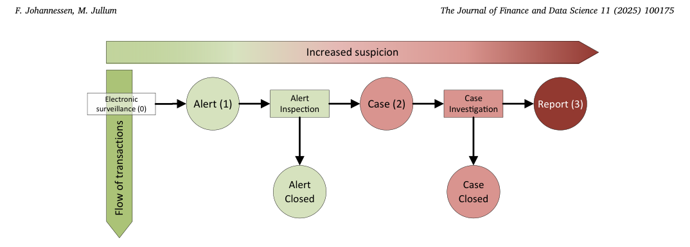

<!-- 원문 5쪽 -->

각 노드가 이웃으로부터 정보를 수신하는 접근, 새로운 표현을 만들기 위해 자신의 표현과 결합, 다음의 반복에 이웃에 전달 될 것이다. 이것은 메시지 전달을 호출합니다. 노드 분류가 관심의 작업일 때 노드 표현은 노드에 대한 인스퍼런스를 만드는 데 사용됩니다.

GNNs, Spatial 기반 Convolutional GNNs의 오늘날 가장 인기있는 그룹에 집중하여, 우리는 아래에 몇 가지 관련 균질 및 이질적인 GNN 방법을 요약합니다.

2.3.1. - 비디오 균질 GNN 문학 GCN 방법 (Kipf and Welling, 2016a)는 원래 그래픽에 세미 감독 학습을위한 스펙트럼적 접근법으로 도입되었으며, 트랜지스터 설정에 직접 공식화되어 그래프의 능력 매트릭스에서 작동합니다. 노드가 노드가 보내는 메시지가 전달되는 경우, 노드가 내부의 노드가 전달되는 메시지가 전달되는 GNN 설정에 따라 유도 및 공간 기반 GNN 설정에서 재구성될 수 있습니다. 이웃 노드의 무게가 줄어들고, 그 결과가 summation을 통해 통합함으로써, 그 결과가 나타날 수 있습니다. GraphSage (Hamilton et al., 2017)는 두 가지 방법으로 GCN에 확장합니다. 그것은 a를 사용합니다) 효율성, b) 중립 네트워크, 풀 레이어 및 LSTM (Hochreiter 및 Schmidhuber, 1997)를 통합하여 간단한 요약 대신 수신 된 메시지를 집계하는 지역 샘플링 전략. 그래피세이지의 단점은 있지만, 가장자리 무게를 통합하지 않습니다. Velickovic et al의 그래프 주의 네트워크 (GAT). (2017)는 GNN 프레임 워크에주의 메커니즘을 도입했습니다. 이 메커니즘은 노드의 이웃의 상대적 중요성을 배웁니다. 가장 중요한 것은 더 많은 무게를 할당합니다. Gilmer 외. (2017)는 다른 GNN 방법의 큰 그룹을 불평화하는 신경 네트워크 (MPNN) 기구를 통과하는 메시지가 표시됩니다. 이 모델의 가장 중요한 기여는 엣지 특성을 활용한 배운 메시지 전달 함수를 적용하는 것으로 우리의 관점에서이다.

Aforementioned GNN 메소드는 그래프 (Wu et al., 2020)의 가장자리 수와 선형으로 시간을 늘리게하는 일반적인 방법입니다. 이 속성은 많은 실제 그래프의 특징 인 큰 스파르 그래프를 위해 잘 추적됩니다. 3의 특징

2.3.2. - 비디오 GNN 문학의 신화 그래프 신경 네트워크는 일반적으로 기존의 균질 그래픽 신경 네트워크의 확장으로 정의됩니다. 예를 들어, 관계 그래픽 Convolutional Network (RGCN) (Schlichtkrull et al., 2018)는 GCN 프레임 워크를 확장하여 여러 종류의 가장자리로 그래프를 지원합니다. RGCN은 이질적인 그래프를 여러 균질 한 하나로 끊어 버리는 것을 이룬다. 각 층에서, GCN은 각 균질 그래프에 적용되며, 결과 노드 임베딩는 최종 출력을 형성하기 위해 원소 현명한 요약이다. RGCN의 단점은 이 노드 생성을 계정으로 사용하지 않는 것입니다. 의인 그래프 주의 네트워크 (한) (Wang et al., 2019)는 이진 그래프에 대한 Graph Attention Network (GAT) 접근을 종합하여 노드 간 연결된 메타 경로에 의해 메시지 고려하여 이진 그래프를 분석합니다. Meta-paths (정의 2의 형식 정의 참조)는 이질적인 그래프의 풍부한 구조 정보를 캡처하는 데 도움이되는 노드 간의 복합 관계입니다. HAN은 관심 메커니즘의 두 세트를 정의합니다. 첫 번째는 GAT에 유사하게 두 개의 다른 노드 사이에 있습니다. 주의 메커니즘의 두 번째 세트는 다른 복합 관계의 중요성 점수를 계산하는 메타 경로의 수준에서 수행됩니다. Metapath Aggregated 그래프 신경망 (MAGNN) (Fu et al., 2020)는 각 메타 경로 (동등, 2017)와 함께 중간 노드를 고려하여 HAN의 접근 방식을 확장합니다. MAGNN은 노드가 특정 노드를 식별하는 데 필요한 모든 노드를 식별하는 데 필요한 모든 노드를 사용합니다.

GNNs에 대한 관심은 빠르게 성장하고 있으며, 이 분야에서 발전은 지속적으로 만들어졌습니다. 여기에 논의되지 않은 몇 가지 다른 방법이 있습니다. 더 포괄적 인 이해를 위해, 우리는 Wu et al에 의해 수행 된 우수한 조사를 참조. (2020)는 일반 GNNs의 개요를 제공합니다. 또한 Heterogeneous GNNs를 포함한 Heterogeneous Network 표현 Learning에 특히 대한 통찰력을 위해 우리는 양 외장, 2020를 좋은 개요를 나타냅니다.

## 3 모형:

이 섹션에서는 Gilmer et al에서 소개된 Message Passing Neural Network (MPNN)의 일반적인 프레임워크를 기반으로 하는 이진 GNN 모델을 정의하고 설명합니다. (2017). 본 연구에서는 우리가 우리의 이질적인 도표 체제를 위한 정확한 정의를 주고 이질적인 네트워크를 위한 MPNN 모형의 우리의 연장을 선물하기 전에 본래 (균질) MPNN 모형과 알고리즘을 소개해서 시작합니다.

### 3.1 메시지 전달 신경 네트워크 (MPNN)

Gilmer 외. (2017)는 GCN, GraphSage 및 GAT를 포함한 다양한 GNN 모델의 대형 그룹을 표현할 수 있는 일반적인 MPNN 프레임 워크를 소개합니다. 이 메시지는 두 배의 특성, M k (⋅), 메시지 함수, U k (⋅), 노드 업데이트 함수라고 불리는 메시지 함수를 호출하여, 나중에 지정할 양식을 작성합니다. 프레임 워크는 K 메시지가 반복 k = 1를 통과,..., K는 노드 사이에 노드를 연결 가장자리를 따라. 노드 표현 벡터는 특성 벡터로 초기화되며, h 0 v = x v, 이전 표현 h (k− 1) v는 각 반복 k에서 전송되는 메시지입니다. K 반복 후, 최종 3 이것은 일반적으로 은행 거래 (Khazane 외, 2019)에서 파생 된 그래프의 경우입니다.

### F. 조안니스엔, M. Jullum 금융 및 데이터 과학 11 (2025) 100175의 저널

<!-- 원문 6쪽 -->

> **주:** 표현 h (k)

v는 e.g를 실행하기 위해 출력층에 전달됩니다. 노드 수준의 예측 작업. 메시지 전달 함수는 정의됩니다.

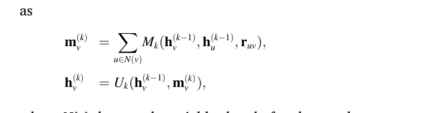

N(v)는 노드 v의 영역을 바꿉니다. r uv는 노드 u와 v 사이의 가장자리에 대한 가장자리 특성을 나타냅니다. U k (⋅)와 M k (⋅)의 특정 형태를 정의함으로써, 특정 GNN 메소드는 공식화됩니다. 이 종이의 관점에서 MPNN 프레임 워크의 필수 속성은 배운 메시지 전달 특성이 가장자리 특성을 활용한다는 것입니다. 다른 많은 제안 GNNs는 그들의 모형에 가장자리 특징을 통합합니다. Gilmer 외. (2017)는 데이터셋의 가장자리 특성의 중요성을 강조합니다. 데이터셋의 경우, 가장자리 특성에는 거래 관련 필수 정보가 포함되어 있으며, 표현형 모델에 활용되어야 합니다.

### 3.2 Formal 정의

이진 MPNN 프레임 워크를 형성하기 전에, 우리는 이진 그래프의 정확한 정의를 설정해야하며, 추가 개념의 몇 가지를 형성합니다.

본 연구에서는 주로 Wu 외에서 통용되는 흑연 표기를 채택합니다. (2020)는 양 외의 사람들에게 약간의 수정 인 이진 그래프 정의를 사용하고 2020와 왕 등. (2019)는 동일한 두 개의 노드 사이에 여러 가지 유형의 가장자리를 허용하기 위해.

이진 메시지 전달을 포괄하기 위해, 우리는 메타 경로의 개념을 사용합니다. Meta-paths는 일반적으로 이진 그래프에 균질에서 방법을 확장하는 데 사용됩니다. 예를 들어, Dong et al. (2017)는 메타 경로를 도입 할 때 메타 경로를 사용합니다. DeepWalk (Perozzi et al., 2014) 및 밀접한 관련 node2vec (Grover 및 Leskovec, 2016)를 이질 그래프에 적용 가능한 방법으로 확장합니다. 왕 등. (2019)는 그래프 주의 네트워크 (Velickovic et al., 2017)의 접근을 일반화하기 위해 메타 경로를 사용합니다. 이진 그래프주의 네트워크 (HAN)를 공식화 할 때 이진 그래프의 그래프. 메타-경로 외에도 아래 정의는 우리의 모델을 공식화 할 때 사용하는 우리의 자신의 용어, 메타-단계를 소개합니다.

정의 2. (Meta-path, meta-step) 이진 그래프 G에 속하는 Meta-path는 특정 노드 유형간에 특정한 가장자리 유형의 순서입니다,

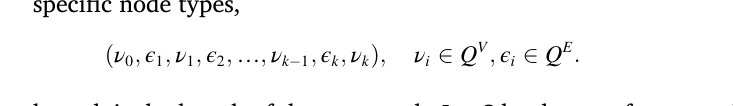

여기 k는 meta-path의 길이입니다. 길이 1의 메타 경로의 설정하자,

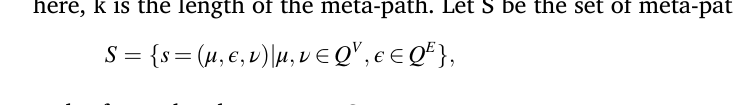

그리고 요소 s ∈ S를 메타 단계로 참조합니다.

노드의 정의를 특정 메타 단계에 소개한다:

정의 3. (Meta-step specific node neighborhood) N ε μ(v)는 type ε 포인팅의 가장자리에 의해 노드 v에 연결되는 type μ의 노드의 설정이 될 수 있습니다.

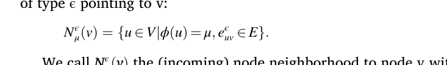

uv ∈ E}:

N ε μ(v)를 호출합니다. (incoming) 노드는 메타 스테이지의 = (μ, ε, φ(v)) ∈ S에 대한 노드 v에 노드의 v에 해당합니다.

### 3.3 의학 MPNN

이제 MPNN 방법의 이종 버전을 공식화 할 준비가되었습니다 (HMPNN). 완전한 알고리즘은 Algorithm 1에서 제공됩니다. 균질 GNN을 확장하는 우리의 접근법은 이진한 것에 한 번 밀접하게 Schlichtkrull et al에 의해 소개된 접근법을 따릅니다. (2018), GCN을 여러 가지 가장자리 유형과 그래프에 적용 가능한 Graph Convolutional Network (RGCN)을 사용하는 방법을 일반화하는 곳.

알고리즘은 (각 반복) 여러 MPNN 메시지를 전달하는 작업을 수행, 각 메타 단계의 ∈ S 그래프에 대한 하나. 각각의 다른 배운 특성 Ms

k (⋅)와 U s의

k (⋅), 각 메타 단계의 컨텍스트를 배울 수 있는 방법을 허용하고, 노드와 각지의 다양한 특성의 숫자를 가진 가장자리를 통과하는 메시지를 허용한다. 이 프로세스의 중간 출력은 각 노드의 여러 표현 벡터입니다. 단일 벡터로 이러한 것을 줄이기 위해, 그들은 배운 골재에 의해 집계된다

### F. 조안니스엔, M. Jullum 금융 및 데이터 과학 11 (2025) 100175의 저널

<!-- 원문 7쪽 -->

각 노드 타입에 특정한 함수 A σ(⋅)를 설정합니다. MPNN의 일반적인 정형화와 함께 라인에서 Algorithm 1의 집계 함수의 특정 형태를 지정하지 않습니다. 실험 중, 우리는 두 가지 대안 옵션을 평가했습니다. 본 연구에서는 곧 논의 할 것입니다.

HMPNN 모델은 Python에서 구현되며 라이브러리 PyTorch Geometric (PyG) (Fey 및 Lenssen, 2019)를 사용하여 고성능 컴퓨팅을 사용하여 GPU를 통해 대규모 병렬화 할 수 있습니다. 소스 코드는 여기에 사용할 수 있습니다: https://github.com/ fredjo89/heterogeneous-mpnn https://github.com/hgnn20/heterogeneous-mpnn.

### 3.4 함수의 특정 형태 선택

우리의 설정은 매우 일반적이므로, 알고리즘 Algorithm 1는 새로운 이질적인 GNN 방법의 전체 범위로 상승합니다. 으로

> **주:** U (μ; ε;)의 특정 형태를 정의

k (⋅), 특정 GNN 메소드가 공식화됩니다. 다른 메타 단계 또는 반복에 대한 이러한 특성의 다른 형태를 선택하여 우리를 방지하는 것은 아무것도 없습니다. 그러나 AML은 섹션 4의 경우를 사용하여 각각 세 가지 특성의 각 단일 형태로 범위를 제한했습니다. 다음은 설명합니다.

Gilmer et al에 설명된 메시지 특성을 활용합니다. (2017):

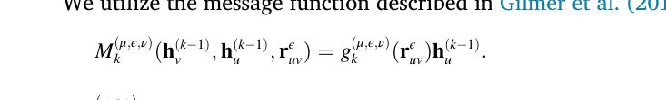

> **주:** uv) h (k - 1)

> **주:** 여기에, g (μ; ε;)

k (⋅)는 uv를 d u 의 d v × d u 의 d v 의 d v 의 u 의 d v 의 uv를 맵핑하는 단일 레이어 신경 네트워크이며, d v는 노드 유형의 전송 및 수신 특성을 위한 수입니다.

업데이트 특성으로 우리는 사용

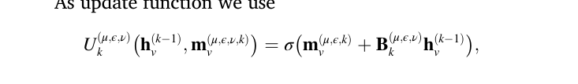

> **주:** B (μ; ε;)를

k는 모체입니다. 균질 그래프의 경우, M(⋅)과 U(⋅)의 선택은 Hamilton et al과 유사합니다. (2017)는 메시지 특성에 적용되는 매트릭스가 모든 가장자리에 동일하 보다는 오히려 가장자리 특징에 조정됩니다.

집계 특성을 위해, 우리는 두 가지 대안을 고려합니다. 첫번째는 (Schlichtkrull 등, 2018)와 같은 유행에서 비선형 변환을 실행하기 전에 각 메타 단계에서 벡터의 합을 가지고 있습니다:

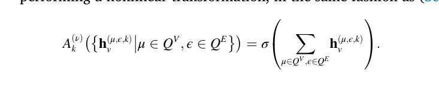

σ(⋅)는 sigmoid 함수입니다. 두 번째 집단 대안에서 벡터 h (μ; ε;k) v는 단일 벡터로 혼동됩니다. 단일 층 Perceptron (네ural network)는 다음 적용되며 새로운 표현을 출력합니다.

### F. 조안니스엔, M. Jullum 금융 및 데이터 과학 11 (2025) 100175의 저널

<!-- 원문 8쪽 -->

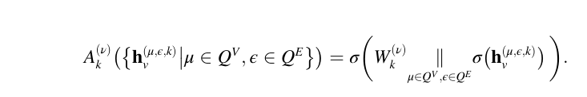

> **주:** k ‖ Z Z Z Z Z Z Z Z Z Z Z Z Z Z Z Z Z Z Z Z Z Z Z Z Z Z Z Z Z Z Z Z Z Z Z Z Z Z Z Z Z Z Z Z Z Z Z Z Z Z Z Z Z Z Z Z Z Z Z Z Z Z Z Z Z Z Z Z Z Z Z Z Z Z Z Z Z Z Z Z Z Z Z Z Z Z Z Z Z Z Z Z Z Z Z Z Z Z Z Z Z Z Z Z Z Z Z Z Z Z Z Z Z Z Z Z Z Z Z Z Z Z Z Z Z Z

## 4 AML 사용 케이스

이 섹션에서는, 우리는 먼저 이진 그래프 데이터를 설명합니다. 그런 다음, 우리는 우리가 결과를 제공하기 전에이 데이터셋에서 수행 한 실험의 설정을 놓습니다.

그래프는 노르웨이 최대 은행 DNB에서 고객 및 거래 데이터를 기반으로 설립되어 2 월 1, 2022, 1 월 31, 2023에서 기간. 그래프의 노드는 보낸 사람과/또는 금융 거래의 수신자인 엔티티티를 나타냅니다. 두 가지 인텐시브가 서로의 거래에 참여한다면, 이것은 2 사이의 가장자리 (유형 거래)에 의해 표현됩니다. 이 인텐시브는 인센티브에서 수신자에게 가장자리 포인트의 방향을 나타냅니다. 그래프에서 5 million 노드 및 10 million 같은 가장자리에 대해 총이 있습니다.

그래프에서 3가지 노드가 있습니다. 첫 번째는 개인이라고하고 은행의 인간 개인의 고객 관계를 나타냅니다. 은행의 모든 개인 계정이 포함되어 있습니다. 4 노드의 두 번째 유형은 조직이라고하며, 노드가 개별 표현하는 것과 같은 방식으로 은행의 조직 또는 회사의 고객 관계를 나타냅니다. 노드의 세 번째 유형은 외부라고하며 은행 밖에 있는 거래의 발신자 또는 수신자를 나타냅니다. 3개의 노드 유형에는 일반 정보에 대한 기본 정보를 포함하는 분리된 특성 세트가 있습니다. 표 1는 3가지 유형의 각 노드와 인트라운스 특성을 보여줍니다.

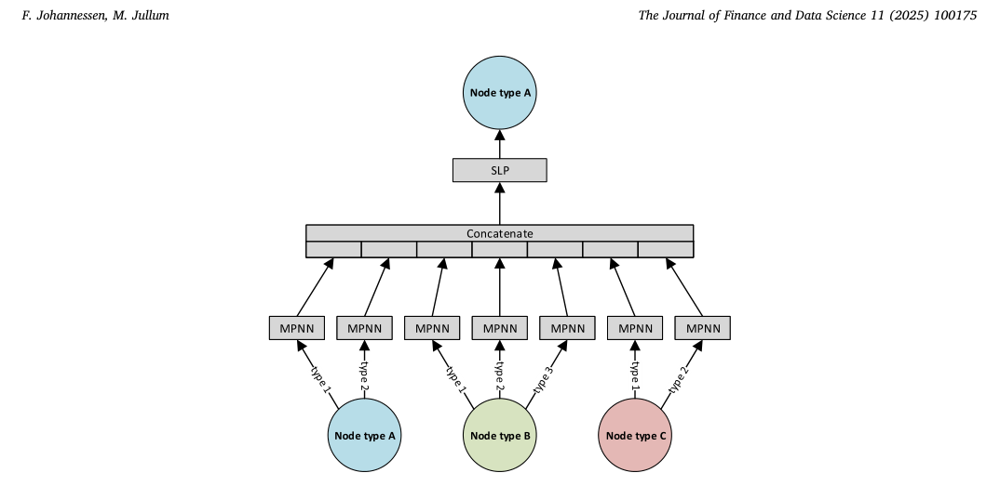

4 거래는 고객에 속하는 은행의 계정 중 하나에서 /로 만든 것은 개인을 나타내는 노드에서 /로 가장자리에 표시됩니다. 역할 유형과 두 번째 소유권 비율 (제공 역할은 조직에서 소유권을 나타냅니다). 각 메타 단계에 대한 가장자리의 수는 표 2에 나열되어 있습니다.

<!-- 원문 9쪽 -->

개인을 나타내는 노드는 일반 개인의 0, 1를 할당하여 의심스러운 행동을 수행하는 것으로 알려져 있습니다. 소개에 언급된 바와 같이, 데이터는 개별 노드에 라벨이 포함되어 있습니다. 의심스러운 개인은 AML 케이스 (Fig의 2 단계)에 따라 얻은 것으로 정의됩니다. 특정 시간 창 도중 1). FIU에 보고되지 않은 경우 고객이 여전히 의심스러운 것으로 정의된다는 점을 주목하십시오. 이 선택은 우리의 목적이 모델 의심 활동에 있기 때문에, 이러한 고객이 확실히 수행, 심지어 의심스러운 가까운 수동 검사에 의해 감소되었다. 총 7732 개인은 데이터셋의 모든 개별 노드의 0.45%에 해당하는 클래스 1로 라벨을 붙입니다.

이 데이터의 민감한 성격 때문에 개인과 아마도 은행에 대한 민감한 정보를 경쟁 할 수 있습니다. 데이터는 공유 할 수 없습니다. 그래프의 더 자세한 내용을 알 수 없습니다. 그리고 모델의 다른 노드와 관련된 정확한 특성을 볼 수 없습니다. 아래에서, 우리는 우리의 권한 제한 내에서 그래프의 특성과 특징의 넓은 개요를 제공합니다. 그래프의 현지 특성의 느낌을 얻으려면 Fig. 4는 시작 노드가 확대된 4개의 임의 노드의 고환을 보여줍니다. 위와 낮은 패널 쇼, 각각, 3-hop 및 9-hop egonets의 (직접) 거래 및 역할 가장자리. 표시된 hops의 수는 현재성과 세부 사항의 양을 균형으로 선택되었습니다. 또한, Fig. 5는 3가지 노드 유형의 학위 중심성을 보여줍니다.

**표 1 노드 수와 그래프의 3가지 유형의 노드에 대한 특성.**

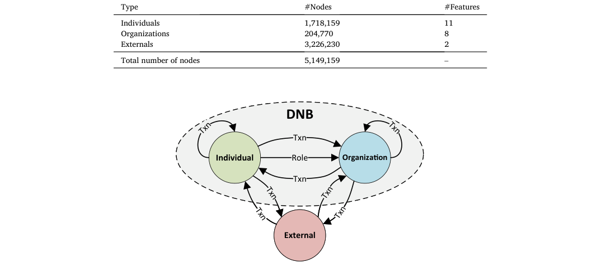

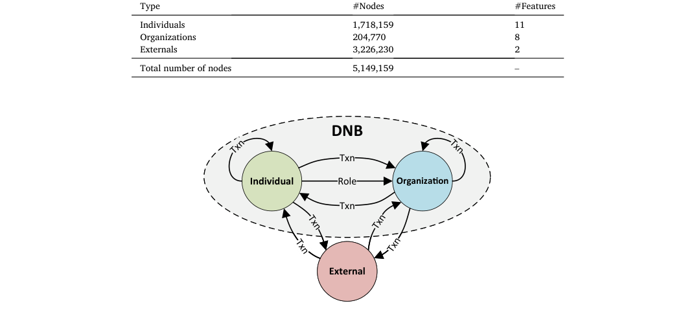

**도표에 있는 각 메타단계를 위한 2 인스턴스의 테이블. 여기에서 거래 가장자리는 txn로 약화되며 노드 유형의 개인, 조직 및 외부는 약화 된 ind, org 및 ext, 존중.**

### F. 조안니스엔, M. Jullum 금융 및 데이터 과학 11 (2025) 100175의 저널

<!-- 원문 10쪽 -->

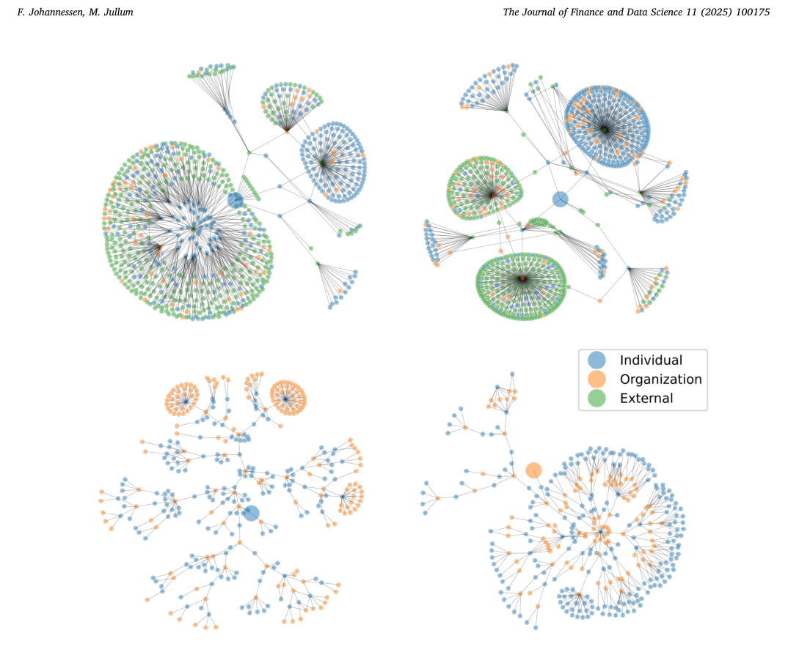

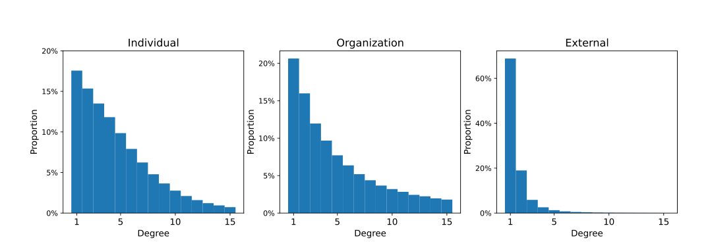

<!-- 원문 11쪽 -->

일부 노드는 많은 이웃이 있습니다. 반면 다른 사람들이 몇 가지가 있습니다. 개인 및 단체의 학위 분포는 유사하지만, 조직의 유통은 더 두꺼운 꼬리를 가지고, 조직에 대한 더 많은 공통이 더 높은 학위를 전시하는 것을 나타냅니다. 외부 노드 사이의 가장자리에 대한 지식이 없으므로, 이 노드 유형은 일반적으로 훨씬 적은 이웃이 있습니다.

### 4.2 Experiment 설정

이 사용 사례와 실험의 목표는 라벨이 모델에 알 수 없는 노드에 라벨(suspicious/regular)을 예측하는 것입니다. 언급했듯이, 우리는 사기성 개별 고객을 감지하기위한 건물 모델에 집중합니다. 즉, 개별 노드만 라벨을 붙입니다. 부분적으로 관찰된 라벨을 가진 현실적인 시나리오를 mimic로, 우리는 개별 노드의 집합을 훈련 세트로 분할하고 시험 세트로 나누었습니다. 전체 그래프는 훈련 및 인스테이션에서 전달하는 메시지에 사용됩니다. 교육 세트의 개인의 라벨은 모델 교육 중에 사용할 수 있습니다. 시험 시간, 예측 및 평가는 교육 중에 사용되지 않는 한, 열린 테스트 세트의 개인에 독점적으로 수행됩니다.

본 연구에서는 80/20% 기차 테스트 분할을 사용, 분할은 2 세트 사이 클래스 균형을 보존하기 위해 원래 클래스 균형으로 할당 된 무작위 샘플링을 사용하여 수행되었다. 이 결과 6185는 테스트 세트에서 훈련 세트 및 1547의 의심스러운 개인. 동일한 분할은 모든 방법을 위해 사용되었습니다.

실제 AML 배포 조건을 반영하려면 모델의 훈련 중에 클래스 배포를 수정하지 않았습니다. 실제 클래스 밸런스를 보존하는 것은 데이터셋의 운영적인 현실을 유지하고 모델 출력을 통해 실제 데이터 생성 프로세스의 확률로 해석할 수 있습니다. 클래스 재중량 또는 손실 조정과 같은 기술을 전형적으로 변경하고 모델 출력의 해석을 준수합니다.

이론에서 무작위 열차 테스트 분할은 임시 누설의 정도를 소개합니다. 그러나, 우리의 설정에서 우리는이 효과를 믿는 여러 가지 이유가 제한됩니다. 고객들은 그들이 보고된 것을 알 수 없습니다. 이는 행동 피드백의 범위를 줄입니다. 또한, 의심 활동은 일반적으로 격리 된 단기 행사보다 더 긴 기간 동안 펼쳐집니다. 마지막으로, 그래프는 데이터 추출 당시의 활성 된 고객을 포함합니다. 이러한 이유로, 우리는 의미있는 운송의 위험이이이 시나리오에서 작다는 것을 믿는다.

HMPNN-models의 성능을 평가하기 위해 벤치 마크를 사용하고 추가 노드 특성으로 공급되는 3개의 비 그래프 방법 및 추가 GNN 방법과 비교합니다. 모델은 여러 모델의 복잡성 구성으로 적용됩니다. 비-graph 메소드를 향상시키기 위해 83 추가 노드 특성을 생성했습니다. 이 노드-neighborhoods의 11 요약을 포함, 즉. 다른 유형의 이웃의 수, 들어오고 나가는 둘 다. 또한 8는 거래 가장자리와 노드 특성의 동기 금액을 위해 노드 이웃의 자력, 특히 무게를 달았습니다. 또한, 우리는 metapath2vec (Dong et al., 2017)를 사용하여 생성 된 64 특성을 추가했습니다. 이 모델은 8의 임베딩에서 조립되어 각 메타 경로에 생성된 치수 2 시작 및 유형 개별 노드에서 종료되었습니다. 11 인트라믹 노드 특성과 함께 94 특성의 총 결과. 추가 노드 특성에 대한 자세한 정보는 Appendix A를 참조하시기 바랍니다. 세 개의 벤치 마크 방법은 다음과 같이 설명됩니다.

XGBoost 이 글래들런-보스트 트리 방법은 강한 비-리머티베이스 라인에 포함되어 있습니다. 순차적 부스트 공정에서 많은 얕은 나무를 결합함으로써, 효과적으로 복잡한 비선형 패턴과 상호 작용을 캡처하고, 이전에 Jullum et al., 2020의 AML 분류 작업에 강한 성능을 보여주었습니다.

Logistic regression 이 고전적인 방법은 네트워크 정보를 직접 활용하지 않고 기본 및 비접촉식 파라메트 형태로 매우 기본적인 벤치 마크로 사용됩니다.

1 및 2 숨겨진 레이어와 함께 적용된 정규 신경 네트워크 이 방법은 논리적 회귀 모델보다 훨씬 유연하지만 네트워크가 직접 사용하지 않습니다.

HGraphSage GraphSage (Hamilton 외, 2017)는 잘 알려진 균질 GNN 방법이며 아래 설명 된 HMPNN과 같은 패션에서 우리의 이질적인 그래프에 적용됩니다. MPNN에 대비하여 GraphSage는 가장자리 특성을 사용하지 않습니다. 따라서, 거래 가장자리의 무게/아웃도도를 유지하는 추가 노드 특성 없이 성능이 모두 테스트하고, 무게는 가장자리에 거래 금액입니다. 6의 추가 노드는 개별 및 조직의 노드에 대한 추가 노드 특성 및 외부 노드의 4를 포함합니다. 본 연구에서는 (2) (HMPNN-sum)에 집계 함수를 테스트합니다. 0, 1 및 2 숨겨진 레이어로 방법을 적용했습니다.

XGBoost, Logistic 회귀 및 일반 신경 네트워크 모델은 모든 네트워크 생성 노드 특성에 액세스 할 수 있습니다. HMPNN-models의 경우, 섹션 3.3에 설명된, 우리는 (2) (HMPNNsum) 및 (3) (HMPNN-ct)에서 두 개의 집계 특성을 가진 방법을 테스트합니다. 0, 1 및 2 숨겨진 레이어를 사용하여 집계 방법의 각을 위해 적용했습니다. 총에서는, 우리의 실험은 16 다른 모형/method 변종을 포함합니다. 각에 포함된 매개 변수의 수는 Appendix의 Table D.6에 나열되어 있습니다.

XGBoost 모델은 mlr3 패키지를 사용하여 R에서 훈련되었습니다. Jullum et al., 2020에서 사용되는 ensemble 전략을 따르십시오, 우리는 CV-mean ensemble 모델을 사용합니다: 자료는 4개의 접으로 분할되고, 분리되는 XGBoost 모형은 각 3/4 쪼개지는에, 초기 정지 검증을 위해 왼쪽 밖으로 겹을 사용하여 훈련됩니다. 최종 모델 예측은 4 개의 크로스 검증 모델의 출력을 평균적으로 계산하여 예측을 안정화시키고 단일 모델을 사용하여 variance를 감소시킵니다. 몇몇은의 선택에 hyperparameters는 Appendix B에서 제공됩니다.

논리적 회귀 및 일반 신경 네트워크 모델은 오픈 소스 딥 학습 라이브러리 PyTorch (Paszke et al., 2019)를 사용하여 훈련되었습니다. 정규 신경 네트워크의 건축 choises는 Appendix C.를 제공합니다.

HMPNN과 HGraphSage는 오픈 소스 라이브러리 PyTorch Geometric (PyG)를 사용하여 훈련되었으며, 이는 PyTorch를 대표하고 훈련 GNNs를 위해 활용합니다.

### F. 조안니스엔, M. Jullum 금융 및 데이터 과학 11 (2025) 100175의 저널

<!-- 원문 12쪽 -->

논리적 회귀, 정기적인 신경 네트워크, 그리고 GNN 모델은 모든 훈련 Adam 낙관 (Kingma 및 Ba, 2014), 이진 크로스 Entropy 손실 특성을 사용하여:

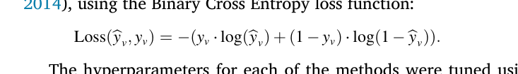

각 방법의 하이퍼 파라미터는 5-fold 크로스 유효성 검사를 사용하여 조정되었습니다. 다음은, 세 가지 하이퍼 파라미터가 결정되었습니다. (1) 정규화 강도, (2) 학습 속도, (3) 훈련 반복의 수, 즉, 일찍 멈추기. 모든 방법을 위해, 학습 속도는 범위 [10 − 4, 10 − 1]에 있었습니다. 정규화에 관해서는, L 2 -constraint는 사용되었습니다, 범위 [10 − 8, 10 − 1]에서 이었습니다. L 2 제약의 최적의 값은 모델의 복잡성에 따라 훈련되었습니다.

실험은 PyTorch 1.12.1 및 PyG 2.2.0와 함께 Python 3.7.0를 사용하여 수행되었습니다. 실험을 실행하는 컴퓨터는 8 CPU를 입력하는 고주파 인텔 Xeon E5-2686 v4 (Broadwell) 프로세서, 61 GB 공유 메모리, 그리고 16 GB 메모리와 NVIDIA Tesla V100 유형의 하나 GPU를 가지고 있었다. 이 GPU에는 5120 CUDA 핵심 및 640 Tensor 핵심이 있습니다.

### 4.3 결과

테스트 세트의 각 노드의 경우, 모든 다른 방법은 0와 1 사이의 점수를 출력하여 노드가 의심스러운 고객임을 반영합니다. 테스트 세트에 다른 방법의 성능을 측정하기 위해, 우리는 우리의 작업 및 데이터의 특성에 의해 동기 부여 된 평가 미터의 세 가지 다른 유형을 사용합니다. 전체 성능은 정밀/반송 곡선 (PR AUC) 및 수신기 연산자 곡선 (ROC AUC)의 영역에서 측정됩니다. PR AUC는 리콜 (TP/(TP + FN))의 특성으로 정밀도 (TP/(TP + FP))를 도형하여 얻어진 곡선의 밑에 지역을 보상하고, PR AUC는 False Positive Rate (FP/(FP + TN)의 특성으로 리콜을 도형하여 얻어진 곡선의 밑에 지역을 보상합니다. TP/FP/TN/FN는 각각, 진실한 긍정적인, 거짓 긍정적인, 진실한 부정적인, 및 거짓 부정적인 분류한 노드의 수를 대표합니다. PR AUC는 우리의 1 차적인 전반적인 평가 미터입니다 가혹한 종류 불균형을 위한 그것의 suitability 때문에, 우리는 또한 ROC AUC를 널리 이용되는, 문턱에 따라서 측정 보고합니다. 본 연구에서는 또한 고정 회고 수준에서 정밀도를보고, 이것은 AML 설정의 직접 조작 해석이 있고 실제 결정을 내릴 수있는 것이 더 쉽습니다.

모든 방법 더 많은 레이어를 포함 하 여 혜택을. 2 숨겨진 레이어와 HMPNN-ct는 PR AUC와 ROC AUC의 관점에서 최고의 방법입니다. HMPNN-ct은 숨겨진 레이어 없이 적용할 때도 매우 잘 작동하며 다른 네트워크 모델은 더 많은 레이어를 필요로 하며, 괜찮은 성능을 달성할 수 있습니다. HMPNN-ct 모델의 효과적인 네트워크 arcitecture를 나타냅니다. 또한, Logistic Regression (0 숨겨진 레이어가있는 재규격 신경 네트워크)는 ROC AUC 및 PR AUC의 관점에서 매우 잘 수행되며 네트워크 요약 특성 외에 네트워크에 대해 아무것도 알지 못하는 것을 고려하고, 아키텍처의 가장 간단한 형태가 있습니다. 참고, 그러나, 정규 신경 네트워크는 논리적 회귀보다 약간 잘 수행. 이것은 Logistic Regression 모델의 간단한 아키텍처가 그 한정된 데이터셋에 대한 중요한 단점이 없다는 것을 나타냅니다. XGBoost 모델은 논리적 회귀와 일반 신경 네트워크보다 약간 더 나은 수행, 특히 가장 낮은 회귀 수준에서, 그것의 비선형 부스트 프레임 워크의 혜택을 강조, 심지어 underlying 그래프를 악용하지 않고. 아직, 그것의 성과는 GNN 모형 (적어도 1개의 숨겨지은 층에)의 밑에 명확하게 남아 있습니다, 관계 구조를 직접 모델링해서 얻는 추가 예측적인 힘을 설명합니다. 따라서, 우리는 다른 네트워크 모델에 대한 성능의 부족이 부적절하고 효율적인 아키텍처와 관련 있다고 생각합니다.

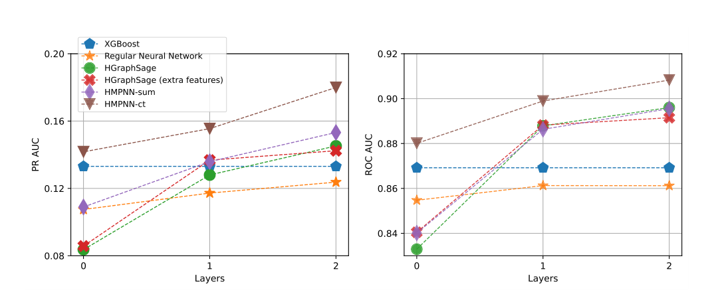

### F. 조안니스엔, M. Jullum 금융 및 데이터 과학 11 (2025) 100175의 저널

<!-- 원문 13쪽 -->

HMPNN-ct의 그것. HMPNN-sum은 HMPNN-ct과 함께 파에서 수행하지 않는 사실은 HMPNN-ct의 성능 향상이 최근 단일 층 신경 네트워크의 건축 트릭으로 인해 주로 나타납니다.

은행에 직면 한 자원의 제한을 고려, 의심스러운 사건의 실질적인 양의 철저한 검사를 실시하는 것은 일반적으로 불연성입니다. 따라서 모델의 기본 목적은 돈 세탁이 발생할 가능성이 높고, 중소형 리콜 수준에 정밀도가 더 높은 것보다 더 관련된다는 것을 의미하는 고품질의 예측의 제한 세트를 생성하는 것입니다. 표 3는 1%, 5%, 10% 및 50%의 상쇄 수준에 대응하는 정밀도를 보여주고, 더 넓은 범위에 더 중대한 깊이에 있는 방법의 성과를 공부할 수 있습니다.

HMPNN-ct에 초점을 맞추고, 분류 임계 값이 설정될 때, 우리는 의심스러운 고객의 1%를 식별하는 것과 같은 것을 볼 수 있습니다 (= 1%) 의심스러운 것으로 분류 된 사람들의 두 번째는 실제로 의심스러운 (정밀 ≈ 67%). 5% 또는 10%에 분류 임계값을 증가시켜 58% 및 51%에 대한 정밀도를 제공합니다. 또한, 의심스러운 고객의 절반과 같은 임계 값을 줄일 경우 (= 50%를 호출하는 고객의 90%는 정말 의심스러운 것은 아닙니다. 이 요금은 첫 눈에 인상적이지 않을 수 있습니다. 그러나 데이터 (0.45%의 총 수의 관측의 심각한 클래스 불균형)을 고려하고, 돈 세탁의 탐지가 악화 된 사실은 매우 어려운 문제이며, 이러한 성능 점수는 매우 유망합니다.

마지막으로 2-layer HMPNN-sum 모델은 HMPNN-ct보다 더 악화되고 더 큰 리콜을 위해 더 큰 리콜을 수행하고, 67% 대 67%의 두드러지게 더 나은 정밀도 (84% 대 67%를 얻습니다. 본질적으로, 이 모델은 돈 세탁의 가장 분명한 인스턴스를 감지하는 것이 좋습니다. 이 측면은 특히 리소스 제한이 잠재적 인 돈 세탁을위한 작은 고객의 수에 대한 조사를 제한하는 경우 모델을 선택할 때 고려해야 할 것입니다.

## 5 요약 및 활용 remarks

현재 종이의 목적은 모델이며 대규모 현실세계 이진 그래프 내에서 돈 세탁과 관련된 의심스러운 행동을 감지합니다. 그래프는 노르웨이 최대 은행의 현실적인 AML 시나리오에서 추출되며 5 million 노드와 10 million 가장자리를 encompasses하고 고객 데이터, 거래 데이터 및 비즈니스 역할 데이터를 구성합니다. 본 연구에서는 Gilmer 외의 MPNN 아키텍처를 확장 (인화)이 데이터를 모델링하는 GNN 접근 방식을 채택한다. (2017)는 이질적인 조정을 수용하기 위하여. 이 수정된 건축, HMPNN (Heterogeneous Message Passing Neural Network)을 용어로 한 HMPNN은 노드와 가장자리 유형의 각 조합에 대한 별도의 메시지 전달 연산자를 사용하여 효과적으로 그래프의 이진성을 관리합니다. 모델의 두 가지 버전은 제안된다: HMPNN-sum 및 HMPNN-ct. HMPNN-ct은 노드 기반 네트워크에 각 노드 기반을 구성하여 최종 노드를 구현하는 것을 구성하며, HMPNN-sum은 노드 기반 연산자에서 임베딩를 합산하는 간단한 접근법을 사용합니다. HMPNN-ct은 HMPNN-sum을 비롯한 모든 대체 모델들을 뜻깊은 마진으로 나뉩니다. HMPNN-sum은 그러나, recall = 1%, i.e에 제일 모형이었습니다. 가장 정확한 고객에 대한 가장 큰 확률을 할당했습니다. 특히, 숨겨진 레이어와 모든 HMPNN 변형은 XGBoost ensemble 모델을 포함하여 비 그래프 기본을 지속적으로 변형시킵니다. 이전에 AML 분류 작업 (Jullum et al., 2020)에서 강력한 성능을 보여주었습니다. 이 underscores는 AML 네트워크의 명시적으로 모델링 관련 정보를 얻을 수 있습니다.

Fig의 전반적인 측정에서 본 것처럼. 6, 모든 모델은 2 숨겨진 레이어를 사용하여 장착 할 때 가장 잘 수행됩니다. 본 연구에서는 더 많은 레이어의 수를 늘리면 더 나은 성능을 얻게 될 수 있습니다. 그러나 2 레이어는 GPU에서 메모리 지붕을 명중하는 곳입니다. 그래서 우리는 연습에서 이것을 탐험 할 수 없었습니다. HMPNN-ct 아키텍처는 1 또는 0에 숨겨진 레이어의 수를 제한 할 때 가장 성공적인 것이 아닙니다. 이 더 큰 네트워크와/또는 더 적은 계산 자원 또는 훈련 시간으로 사용할 수 있습니다, 다른 상황에서는 층의 수에 감소를 요구할 수 있습니다. Appendix의 Table D.6에서 우리는 또한 그것을 볼 수 있습니다

**표 3 정밀도는 다른 모형을 위한 Recall의 특정한 값에. 완전성, PR AUC 및 ROC AUC도 나열되어 있습니다.**

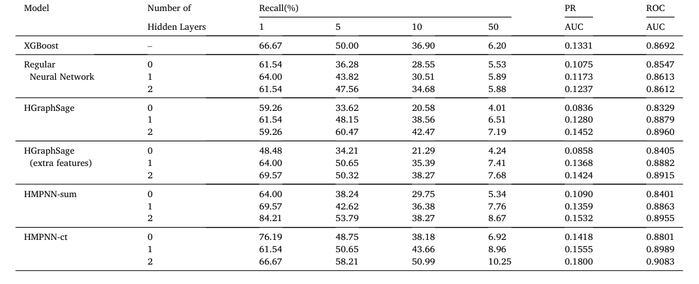

### F. 조안니스엔, M. Jullum 금융 및 데이터 과학 11 (2025) 100175의 저널

<!-- 원문 14쪽 -->

일반 신경 네트워크 모델에서 출발, HMPNN-ct는 2-layer 모델의 모델 매개 변수의 가장 적은 수를 가지고, 이는 효율적인 아키텍처를 나타냅니다.

우리의 모형의 성과를 위한 상황에 따라, 은행의 감시 체계 내의 뒤에 오는 2개의 신청을 고려하십시오: 1% 회귀에 커트오프 문턱으로, 우리의 모형은 높게 의심스러운 고객의 작은 수를 위한 정확한 경고를 생성할 수 있습니다. 우리의 결과는 이러한 경고가 84%까지 정확도를 달성 할 수 있다는 것을 건의합니다. 비교를 위해, PwC (2010); Bakry 등. (2023); Kalra (2023)는 전통적인 감시 체계에 있는 3%와 10% 사이 정확도 비율을 나타냅니다. 또한, 우리의 모델은 관계 데이터 레버리지 때문에, 그것은 일반적으로 엔티티티 기반 정보에 의존하는 전통적인 감시 시스템에서 약점을 해결하는 가능성이 있습니다. 우리의 모형을 통합해서 그러므로 감시 체계에 전반적인 성과 그리고 가까운 간격을 강화할 수 있었습니다. 50% 리콜에 커트오프 임계값으로, 우리의 모형은 높 강하고 낮 강렬 세그먼트로 고객에게 분류하기 위하여 사용될 수 있습니다. 우리의 결과는 이 접근법이 알려진 의심스러운 고객의 2.2%를 모이는 고객의 총 수의 50%를 비교하는 높 강렬 세그먼트에서 결과한다는 것을 건의합니다. 가로적으로, 낮은 리스크 세그먼트는 고객의 나머지 97.8%와 알려진 의심스러운 고객의 50%를 포함 할 것입니다. 이 분대는 고위험 세그먼트에 있는 사람들을 위한 더 빈번한 그리고 엄격한 결심을 실행하기 위하여 사용될 수 있었습니다.

실제 AML 시스템 내에서 의심 거래에 대한 예측 모델을 구현할 때, 몇 가지 중요한 결정이 이루어질 필요가 있습니다. 한 가지 중요한 고려 사항은 프로세스에서 최적의 단계를 결정하는 데 포함 (Fig 참조. 1) 예측을 적용하기위한: 경고 검사를 전반하거나 사례 조사를 전반. 예측이 경고 검사 이전에 사용되면 더 높은 회신으로 분류 임계값을 설정할 수 있습니다. 다른 한편, 예측이 사례 조사 전에 적용되면 더 많은 문자열 임계값을 선택하기 위해 더 적합 할 수 있습니다. 즉. 더 낮은 리콜이 있습니다. 이로 인해 큰 효율성을 이끌어내는 데 도움이되는 중요한 긍정적 인 조사 리소스의 할당을 최소화 할 수 있습니다.

"일반"로 상표를 붙인 고객이 "일반"일 수 있음을 인식하는 것이 중요합니다. 의심스러운 것은 잠재적으로 돈 세탁에 관여합니다. 그들은 단순히 기존 AML 시스템에서 제어되지 않았고 "일반"로 라벨을 붙입니다. 이 시나리오는 실제적으로 모든 인스턴스의 돈 세탁 모델링을 위해 true를 보유합니다. 따라서, 고객이 "일반"로 상표를 붙인 경우 모델에 의해 의심되는 높은 확률을 할당, 그것은 고객이 잘못되어 있었다는 것을 가능하다. 결과적으로, 라벨 테스트 세트와 모델링 테스트 단계로, 여기에서 개요로, 또한 그들의 과거 행동으로 더 조사를 보장하는 고객을 위한 제안을 생성하는 수단으로 봉사할 수 있습니다. 다른 말에서는 모델링 접근법은 모델의 예측에 따라 재발견을 요구할 수 있는 고객의 식별을 허용하며, 초기 "일반"으로 라벨을 붙인 경우에도 가능합니다.

우리의 돈 세탁 모델링 접근의 성능을 증가시키기 위해, 일부 측면은 쉽게 명백하게됩니다. 데이터셋은 노드와 가장자리의 수에 부합하지만, 금융 거래 및 전문 역할에서 네트워크 데이터를 포함하고, 많은 가장자리와 노드 특성을 가지고 있으며, 항상 부유 할 수 있습니다. 우리의 설정에서 거래 가장자리는 1 년 기간에 만들어진 숫자와 총 수익 금액을 포함합니다. 또한, 표준 편차, 미디어, 그리고 Jullum 등 다른 요약 통계를 포함 하 여 세련 될 수 있습니다., 2020. 또한, 고품질 데이터가 획득될 수 있으며, 공유 주소나 전화 번호, 또는 가족 관계와 같은 소셜 미디어 플랫폼, 지리적 정보와 연결하여 고객 링크를 포함할 수 있습니다.

언급했듯이, 조직 고객은 수에 약간의이며 개인과 비교하여 균질성을 전시하고 개인과 비교하여 모델링에 덜 적합했습니다. 그것은 여전히 은행의 조직 고객에게 예측을 만드는 모델을 개발하기 위해 더 많은 일을 위해 자연 후보를 선물합니다. 그러나 그러한 모델의 잠재력을 실제로 볼 수 있기 때문에, 우리는 더 많은 조직과 관련된 데이터를 풍부하게하는 더 많은 사기 조직을 포함 할 때 데이터셋를 확장하는 데 필수적이라고 생각합니다.

우리의 일에 적용하는 중요한 제한, 뿐 아니라 돈 세탁 탐지와 관련있는 대부분의 내구시간은, 단 하나 은행 내의 고객에게 confined 자료의 한정된 본질입니다. 우리의 그래프는 다른 은행에서 "외부"고객을 포함하지만, 외부 은행의 고객 간의 거래 및 전문 역할 링크는 사용할 수 없습니다. 본 은행은 보안 규정이나 경쟁력 있는 고려사항으로 인해 다른 은행과의 고객 정보를 merging 또는 금지하는 은행이 주로 발생하고 있습니다. 이러한 데이터 공유 과제를 저명한 금융 기관 중의 확장으로 인해 거래와 관계의 더 포괄적 인 네트워크를 구축 할 수 있으며, 적은 돈 세탁자를 위해 장소를 숨길 수 있습니다. 이윤은 이러한 공동, 분석 및 모델링 시스템의 관리는 실질적인 자원과 투자를 요구하고, 축적하는 수년간의 과정을 필요로합니다.

어떤 경우, 우리의 지식의 가장에, 과학적 작업은 대규모 실제 세계 그래프에서 돈을 감수하는 검출의 맥락에서 이질적인 그래프 신경 네트워크의 활용에 대해 출판되지 않았습니다. 이 논문은 AML 내의 이진 GNN 아키텍처를 활용하고 유망한 결과를 선보일 수 있는 첫 번째 시도로 볼 수 있어야 합니다. 본 연구에서는 우리의 종이가 인발적인 관점과 학자 및 전문가를위한 방향을 제공 할 것이라고 확신합니다. 궁극적으로, 우리는이 기여는 글로벌 금융 경제의 지속적 노력에 대한 지속적인 노력에 기여를 희망합니다.

코드 가용성 우리의 HMPNN 모델의 구현은 다음과 같은 저장소를 통해 사용할 수 있습니다: https://github.com/fredjo89/ 이질-mpnn.

### F. 조안니스엔, M. Jullum 금융 및 데이터 과학 11 (2025) 100175의 저널

<!-- 원문 15쪽 -->

이해관계 선언문 저자는 잠재적 보상으로 간주 될 수있는 다음 금융 관심사 / 개인 관계 선언: 저자 중 하나 (Fredrik Johannessen) 년 동안 DNB에 의해 고용되었다 2018-2023. 이 작업의 부품은 그 기간 동안 수행되었습니다.

## 감사의 글

이 작업은 노르웨이 연구위원회 (Research Council of Norway), 보조 번호 237718에 의해 지원되었습니다. 본 연구에서는 XGBoost 기본 실험을 실행하는 데 도움이 Daniel Piacek에게 감사하고 싶습니다. 이 연구에서 사용되는 실제 데이터에 대한 액세스를 제공하기위한 DNB에 감사하고이 연구의 출판을 지원하는 것입니다. 마지막으로, 우리는 편집기 인 Chief Jingzhi Huang과이 원고의 개정에 대한 귀중한 피드백과 기여에 대한 두 개의 익명 검토를 감사 합니다.

A.S.A.의 장점 Network features this appendix는 네트워크의 노드 역할에 대한 정보를 캡처하는 추가 노드 특성을 생성하는 방법을 자세히 제공합니다. 이들은 섹션 4에서 벤치 마크에 대한 엔티티티 기반 모델 (HGraphSage)에서 사용되었습니다.

체중을 줄이는 이웃의 개요. 무게가 많은 지역 요약 특성은 거래 가장자리를 포함하는 각 메타 스테이지에 대한 체중을 줄입니다. monetary 양을 나타내는 가장자리 특징은 가장자리 무게로 사용되었습니다. 노드의 개별 특성에 대한 6가지 특성을 제공합니다. 또한 두 가지 요약 특성은 추가됩니다. 1) 총 중량 인도, 2) 총 중량 인도, 총 중량 인도, 총 8 추가 노드 특성을 제공합니다.

Metapath2vec 임베딩. Metapath2Vec은 Table A.4에서 보이는 4개의 메타 경로 각각에 대한 임베딩를 생성하기 위하여 이용됩니다. 이들은 유형의 노드에서 시작 및 종료하는 길이 2의 모든 메타 경로입니다. 각 대사 동요에 대한 임베딩의 차원은 8로 설정되었습니다. 임베딩는 meta-path의 시작과 끝에서 노드 모두에 특성으로 추가되었습니다. 64 추가 노드 특성에 이 금액입니다. 본 연구에서는 PyTorch Geometric의 MetaPath2Vec의 구현을 사용했습니다. Table A.5는 임베딩의 생성에 사용되는 매개 변수를 나열합니다.

A.4 메타 경로

> **주:** →에 의하여

> **주:** txnind →의

> **주:** 뚱 베어

> **주:** →에 의하여

> **주:** txnorg →의

> **주:** 뚱 베어

> **주:** →에 의하여

> **주:** txnext →의 경우

> **주:** 뚱 베어

> **주:** →에 의하여

> **주:** 롤렉스 →

> **주:** 뚱 베어

Meta- Path2Vec-임베딩의 생성을 위한 A.5 Hyperparameters 테이블.

> **주:** 모수 가치

> **주:** 임베딩 dim 8 walk length 20 context size 10 walk per node 10 num negative samples 1

애버딘 B. XGBoost 하이퍼 파라미터 XGBoost 모델의 하이퍼 파라미터는 R의 mlr3 프레임 워크를 통해 구현되는 간단한 임의 검색 절차를 사용하여 조정되었습니다. 후보 모델은 4-fold 크로스 유효성을 사용하여 조기 정지가 홀트 아웃 접이식에 PR AUC를 기반으로 4 개의 모델 각각에 적용됩니다.

### F. 조안니스엔, M. Jullum 금융 및 데이터 과학 11 (2025) 100175의 저널

<!-- 원문 16쪽 -->

애버딘 C. 일반 신경 네트워크 아키텍처 기본 신경 네트워크는 각 숨겨진 계층의 신경의 숫자로 설계되어 입력 특성 (94 단위)의 수를 일치, 이는 자연 시작 지점을 제공. 본 연구에서는 숨겨진 층의 다른 숫자를 포함하여 다양한 대안 구성을 실험하고, 층 폭을 변화시키고, 다수 활성화 특성. 이 변이의 아무도는 예측 성능에 대한 negligible 개선보다 더 많은 생산. 다른 건축 옵션은 dropout 층과 건너뛰기 연결이 탐험되지 않았습니다.

모델 복잡도는 사용할 수 있는 GPU 메모리에 의해 제약. 그러나, 하나의 두 개의 숨겨진 레이어와 네트워크 사이에 관찰 된 작은 성능 차이를 주었다, 이 작업을 위해 중요한 이익을 제공 할 것이다 더 깊은 아키텍처가 작은 증거가있다.

의붓기 D. 네트워크 매개 변수 표 D.6는 섹션 4에서 논의 된 모델의 각 매개 변수의 번호를 보여줍니다.

표 D.6 다른 모형을 위한 모형 모수의 수

> **주:** 모델 번호 Hidden Layers

## 참고문헌

Alarab, I., Prakoonwit, S., 2022. Graph-based LSTM for anti-money laundering: experimenting temporal graph convolutional network with bitcoin data. Neural

Processing Letters 1–19. Alarab, I., Prakoonwit, S., Nacer, M.I., 2020. Competence of graph convolutional networks for anti-money laundering in bitcoin blockchain. In: Proceedings of the

2020 5th International Conference on Machine Learning Technologies, pp. 23–27. Bai, Y., Ding, H., Bian, S., Chen, T., Sun, Y., Wang, W., 2019. Simgnn: a neural network approach to fast graph similarity computation. In: Proceedings of the Twelfth

ACM International Conference on Web Search and Data Mining, pp. 384–392. Bakry, A.N., Alsharkawy, A.S., Farag, M.S., Raslan, K., 2023. Automatic suppression of false positive alerts in anti-money laundering systems using machine learning.

The Journal of Supercomputing 1–21. Bartolozzi, D., Gara, M., Marchetti, D.J., Masciandaro, D., 2022. Designing the anti-money laundering supervisor: the governance of the financial intelligence units.

International Review of Economics & Finance 80, 1093–1109. Bjerregaard, E., Kirchmaier, T., 2019. The Danske Bank Money Laundering Scandal: a Case Study. Available at: SSRN 3446636. Bolton, R.J., Hand, D.J., 2002. Statistical fraud detection: a review. Statistical Science 17, 235–255. Chami, I., Abu-El-Haija, S., Perozzi, B., Re, C., Murphy, K., 2022. Machine learning on graphs: a model and comprehensive taxonomy. Journal of Machine Learning

Research 23, 1–64. Chen, J., Ma, T., Xiao, C., 2018a. FastGCN: fast learning with graph convolutional networks via importance sampling. In: International Conference on Learning

Representations. International Conference on Learning Representations, ICLR. Chen, Z., Van Khoa, L.D., Teoh, E.N., Nazir, A., Karuppiah, E.K., Lam, K.S., 2018b. Machine learning techniques for anti-money laundering (aml) solutions in

suspicious transaction detection: a review. Knowledge and Information Systems 57, 245–285. Colladon, A.F., Remondi, E., 2017. Using social network analysis to prevent money laundering. Expert Systems with Applications 67, 49–58. de Jesús Rocha-Salazar, J., Segovia-Vargas, M.J., del Mar Camacho-Mi~ nano, M., 2021. Money laundering and terrorism financing detection using neural networks and an abnormality indicator. Expert Systems with Applications 169, 114470. Deng, X., Joseph, V.R., Sudjianto, A., Wu, C.J., 2009. Active learning through sequential design, with applications to detection of money laundering. Journal of the

American Statistical Association 104, 969–981. Deprez, B., Vanderschueren, T., Baesens, B., Verdonck, T., Verbeke, W., 2025. Network analytics for anti-money laundering—a systematic literature review and

experimental evaluation. Informs Journal on Data Science 0 (0). https://doi.org/10.1287/ijds.2024.0042. Dong, Y., Chawla, N.V., Swami, A., 2017. metapath2vec: scalable representation learning for heterogeneous networks. In: Proceedings of the 23rd ACM SIGKDD

International Conference on Knowledge Discovery and Data Mining, pp. 135–144. Elliott, A., Cucuringu, M., Luaces, M.M., Reidy, P., Reinert, G., 2019. Anomaly detection in networks with application to financial transaction networks. arXiv preprint

detecting-idUSKCN1GP2NV. (Accessed 14 July 2022). Fu, X., Zhang, J., Meng, Z., King, I., 2020. Magnn: metapath aggregated graph neural network for heterogeneous graph embedding. In: Proceedings of the Web

Conference 2020. Garin, L., Gisin, V., 2023. Machine learning in classifying bitcoin addresses. The Journal of Finance and Data Science 9, 100109. https://doi.org/10.1016/j.

jfds.2023.100109. URL: https://www.sciencedirect.com/science/article/pii/S2405918823000259.

### F. 조안니스엔, M. Jullum 금융 및 데이터 과학 11 (2025) 100175의 저널

<!-- 원문 17쪽 -->

> **주:** 길머, J., Schoenholz, S.S., 리리, P.F., Vinyals, O., Dahl, G.E., 2017. quantum 화학을 통과하는 신경 메시지. In: 기계에 국제 회의

> **주:** 학습. PMLR, PP. 1263-1272. 그로브, A., 레코프, J., 2016. node2vec: 네트워크에 대한 확장 가능한 특성 학습. In: 지식에 대한 22nd ACM SIGKDD 국제 회의의 진행

> **주:** 검색 및 데이터 마이닝, pp. 855-864. 해밀턴, W.L., Ying, R., 레코프, J., 2017. 큰 그래프에서 유도적인 표현 학습. In: Neural에서 제31차 국제회의 진행

정보 처리 시스템, pp. 1025-1035. 호치레터, S., Schmidhuber, J., 1997. 긴 단기 기억. 신경 계산 9, 1735-1780., Z., Dong, Y., 왕, K., 일요일, Y., 2020. 의학적인 도표 변압기. 에서: 웹 회의 2020의 Proceedings., M., Løland, A., Huseby, R.B., Ånonsen, G., Lorentzen, J., 2020. 기계 학습을 통한 자금세탁 거래 탐지 돈 라테링의 저널

> **주:** 23 (1), 173-186를 통제하십시오. 칼라, B.B., 2023. 2023에서, 필요성은 은행업 혁신을 몰을 것입니다. 글로벌 금융 & 금융 검토. URL: https://www.globalbankingandfinance.com/in-2023-

> **주:** necessity-will-drive-banking-innovation/. (액세스 25 6월 2024). 카잔, A., 라이더, J., Serpe, M., Gogoglou, A., Hines, K., 브루스, C.B., Serpe, R., 2019. Deeptrax: 금융 거래의 그래프를 삽입. 에: 2019 18 IEEE

기계 학습 및 응용 프로그램 (ICMLA)의 국제 회의. IEEE, PP. 126-133. 킹마, D.P., 바, J., 2014. Adam: 황체 최적화를위한 방법. arXiv 사전 인쇄 arXiv: 1412.6980. Kipf, T.N., 웰링, M., 2016a. 그래프 convolutional 네트워크와 반 감독 분류. arXiv 사전 인쇄 arXiv: 1609.02907. Kipf, T.N., 웰링, M., 2016b. Variational 도표 자동 암호해독기. arXiv 사전 인쇄 arXiv: 1611.07308. Li, X., Cao, X., Qiu, X., Zhao, J., Zheng, J., 2017. 대규모 거래 네트워크에서 새로운 커뮤니티 탐지를 기반으로 한 지능형 안티 - 돈 세탁 솔루션

> **주:** 스파크 In: 2017 Fifth 국제 컨퍼런스 고급 클라우드 및 빅 데이터 (CBD). IEEE, PP. 176-181. 리우, X., 장, P., Zeng, D., 2008. 항-자금세탁에 의심 활동 탐지에 대 한 일치. In: 국제 컨퍼런스

> **주:** 보안 정보학. 스프링러, PP. 50-61., W.W., Kulatilleke, G.K., Sarhan, M., Layeghy, S., Portmann, M., 2023. Inspection-l: 자체 감독된 GNN 노드는 자금세탁 탐지를 위한 구현

> **주:** 비트 코인. 응용 인텔리전스 1-12. 로렌즈, J., Silva, M.I., Aparício, D., Ascens~ao, J.T., Bizarro, P., 2020. 기계 학습 방법 비트 코인 블록체인에서 돈을 감추는 존재

> **주:** 상표 scarcity의. 에서: 금융에 AI에 최초의 ACM 국제 회의의 Proceedings, pp. 1-8. 파레자, A., 돔니, G., 첸, J., Ma, T., 스즈무라, T., Kanezashi, H., Kaler, T., Schardl, T., Leiserson, C., 2020. Evolvegcn: 진화 그래프 convolutional 네트워크

> **주:** 동적 그래프를 위해. In: 인공 지능, vol.에 AAAI 회의의 약속. 34, PP. 5363-5370. Paszke, A., Gross, S., Massa, F., Lerer, A., Bradbury, J., Chanan, G., Killeen, T., Lin, Z., Gimelshein, N., Antiga, L., Desmaison, A., Kopf, A., 양, E., DeVito, Z.,

레이슨, M., Tejani, A., Chilamkurthy, S., Steiner, B., Fang, L., 바이, J., Chintala, S., 2019. Pytorch: 불완전한 작풍, 고성능 깊은 학습 도서관. 에: Wallach, H., Larochelle, H., Beygelzimer, A., d'Alche-Buc, F., Fox, E., Garnett, R. (Eds.), 신경 정보 처리 시스템의 발전, vol. 32. - 비디오 Curran Associates, Inc., PP.,......... 8024-8035 Perozzi, B., 알 루푸, R., 스키나, S., 2014. Deepwalk: 소셜 표현의 온라인 학습. In: 지식 디스커버리 및 데이터 마이닝, pp에 대한 20th ACM SIGKDD 국제 회의의 진행. 701-710. 폴리, R.F., 2020. 안티 - 돈 세탁: 세계 최소 효과적인 정책 실험? 함께, 우리는 그것을 해결 할 수 있습니다. 정책 디자인 및 연습 3, 73-94. PwC, 2010., L/C, L/C, L/C, L/C, L/C, L/C, L/C, L/C, L/C, L/C, L/C, L/C, L/C, L/C, L/C, L/C, L/C, L/C, L/C, L/C, L/C, L/C, L/C, L/C, L/C, L/C, L/C, L/C, L/C, L/C, L/C, L/C, L/C, L/C, L/C, L/C, L/C, L/C, L/C, L/C, L/C, L/C, L/C, L/C, L/C, L/C, L/C, L/C, L/C, L/C, L/C, L/C, L/C, L/C, L/C, L/C, D/C, D/C, D/C, D/C, D/ 출처에서 감시: AML 모니터링 시스템 최적화에 숨겨진 위험. 기술 보고서 PricewaterhouseCoopers LLP. URL: https://www.pwc.com/us/en/anti-money-laundering/publications/assets/aml-monitoring-system-risks.pdf. Savage, D., 왕, Q., 장, X., Chou, P., Yu, X., 2017. 돈 세탁 그룹의 탐지: 작은 네트워크에서 감독 학습. 에서: AAAI 작업장. Schlichtkrull, M., Kipf, T.N., Bloem, P., 베르가, R.v. d., Titov, I., 웰링, M., 2018. 그래프 convolutional 네트워크와 관련 데이터 모델링. 에서: 유럽 Semantic 웹 회의. 스프링러, PP. 593-607. 유엔 - 마약 및 범죄 사무실, 2011. Illicit Financial Flows는 약물 교통 및 기타 Transnational Organized Crime에서 결과적으로 평가합니다. Velickovic, P., Cucurull, G., 카사노바, A., 로마, A., Lio, P., 베노바, Y., 2017. 그래프 주의 네트워크. arXiv 사전 인쇄 arXiv: 1710.10903., C., 팬, S., 오래, G., 주, X., 장, J., 2017. Mgae: 흑연 클러스터링을 위한 다진 그래프 autoencoder. 에서: 정보와 지식 관리, PP에 회의에 2017 ACM의 시련. 889-898. 왕, X., Ji, H., Shi, C., 왕, B., 예, Y., Cui, P., 유, P.S., 2019. Heterogeneous graph 주의 네트워크. In: 세계 넓은 웹 회의, pp. 2022-2032. 웹어, M., 첸, J., Suzumura, T., Pareja, A., Ma, T., Kanezashi, H., Kaler, T., Leiserson, C.E., Schardl, T.B., 2018. 자금세탁방지에 대한 확장 가능한 그래프 학습:

> **주:** 첫 번째 모습. arXiv preprint arXiv: 1812.00076. 웹어, M., Domeniconi, G., 첸, J., Weidele, D.K.I., Bellei, C., 로빈슨, T., Leiserson, C.E., 2019. 비트 코인에서 안티 - 돈 세탁: 그래프로 실험

> **주:** 금융 법의학에 대한 복잡한 네트워크. arXiv preprint arXiv: 1908.02591. 우, Z., 팬, S., 첸, F., 긴, G., 장, C., 필립, S.Y., 2020. 그래프 신경 네트워크에 대한 종합적인 조사. IEEE는 신경 네트워크와 거래

> **주:** 학습 시스템 32, 4-24. 장, C., 노래, D., Huang, C., Swami, A., Chawla, N., 2019. 의학적인 도표 신경 네트워크. In: 25th ACM SIGKDD 국제 회의의 진행

> **주:** 지식 디스커버리 및 데이터 마이닝에. 양, C., Xiao, Y., 장, Y., 일요일, Y., 한, J., 2020. Heterogeneous network 표현 학습: 설문조사와 벤치 마크를 가진 통합된 프레임워크. IEEE의 특징

지식과 데이터 엔지니어링 34 (10), 4854–4873에 대한 거래. 장, M., 첸, Y., 2018. 그래픽 신경망을 기반으로 한 링크 예측. 신경 정보 처리 시스템 31의 발전. 장, Y., Trubey, P., 2019. 기계 학습 및 샘플링 계획: 돈 세탁 탐지의 empirical 연구. 컴퓨팅 경제 54, 1043-1063.

### F. 조안니스엔, M. Jullum 금융 및 데이터 과학 11 (2025) 100175의 저널
