# 자금세탁방지를 위한 네트워크 분석: 체계적 문헌고찰 및 실험 평가

> **원문 제목:** Network Analytics for Anti-Money Laundering: A Systematic Literature Review and Experimental Evaluation  
> **저자:** Bruno Deprez · Toon Vanderschueren · Bart Baesens · Tim Verdonck · Wouter Verbeke  
> **게재 정보:** arXiv:2405.19383v4, 2025  
> **DOI:** [https://doi.org/10.48550/arXiv.2405.19383](https://doi.org/10.48550/arXiv.2405.19383)

> **번역 안내:** 본문과 부록은 문단 문맥을 기준으로 한국어로 옮겼습니다. 수식과 참고문헌은 정확성을 위해 원문 표기를 유지했습니다. 원문의 그림과 표는 개별 이미지로 잘라 해당 본문 위치에 바로 배치했습니다.

---

<!-- 원문 1쪽 -->

## 초록

자금세탁은 불법 행위를 financing함으로써 침입적 도전, 부담 사회를 제시한다. 네트워크 정보의 사용은 점점 더 효과적으로 돈 세탁을 싸울 것으로, 그것은 연결된 당사자를 포함. 이 연구에 서빙에 anti자금세탁에 대 한 네트워크 분석에 대 한 (AML). 문학은, 그러나, 파편과 기존의 작품의 포괄적인 개요는 누락. 이 결과는 적용 방법과 비교 감지 전력을 제한하는 방법의 이해에 있습니다. 이 논문은 최근 제안된 사기 분석 프레임워크를 따르는 세무제에 따라 97 논문을 기반으로 광범위한 고유의 문학 검토를 제공합니다. 본 연구에서는 가장 연구가 전문가 기반 규칙과 수동 특성에 의존하고, 깊은 학습 방법은 견인을 얻는다. 이 논문은 표준화된 설정에서 탁월한 방법을 평가하고 비교하기 위한 종합적인 프레임워크를 제공합니다. 수동 특성 엔지니어링, 임의 워크 기반 및 두 개의 공개 가능한 데이터셋에 대한 깊은 학습 방법을 비교합니다. 본 연구에서는 (1) 네트워크 분석은 예측 전력을 증가, 그러나 caution는 클래스 불균형 및 네트워크 토폴로지의 얼굴에 GNNs를 적용 할 때 필요, 그 (2) 배려는 합성 자료로 이 지나치게 낙관적인 결과를 줄 수 있습니다. 오픈 소스 구현은 연구자와 실무자를 촉진하여 AML에 대한 네트워크 분석 및 평가에 대한 표준화 된 접근 방식을 촉진하는 독점적 인 데이터에 대한이 작업을 확장 할 수 있습니다.

## 핵심어

Fraud Analytics · 안티 - 돈 세탁 · 네트워크 분석 · 문학 검토

## 1 서론

돈 세탁은 불법적으로 얻은 자금의 과정을 통해 그들을 통과하여 거래의 복잡한 순서, 그래서 돈은 더 범죄 활동, 예를 들어, 마약 교통, 테러 [75]를 자금을 사용할 수 있습니다. 마약 및 범죄 [126]의 유엔 사무소는 2%의 5%의 전 세계 대기하고 있으며, 연간 USD 2 조로 옮겼습니다.

신용 카드 사기에 대비하여, 돈 세탁은 더 긴 기간 동안 발생하며 여러 거래의 분석이 필요합니다. 지속적인 세탁이 필요한 이후로 적극적으로 은폐되어 지속적인 돈 스트림을 처리해야합니다. 다른 한편으로는 신용 카드 사기, 가능한 한 빨리 많은 돈을 얻을 것을 목표로. Hence, 돈 세탁의 특정 특성은 헌신적인 연구 주의.

<!-- 원문 2쪽 -->

돈 라테링은 일반적으로 3 단계 [126, 75]: 배치, 즉, illicit 자금은 금융 시스템을 입력; 층으로, 거래가 자신의 기원을 비난; 그리고 통합, 의 자금을 통해 경제를 다시 입력하는 것은, 라테링 프로세스를 완료.

안티 - 돈 세탁 관행은 고객의 일정한 모니터링과 거래가 필요합니다. 이 관행은, 그러나, 유럽 연합 (EU)의 범죄 이익의 1.1%만이 EU의 [35]를 침수 한 [38]와 함께 크게 효과적인 [35].

효과적인 돈 세탁은 정상적인 [15]를 표시하는 개별 거래와 더불어 여러 당사자를 포함합니다. 따라서 네트워크 분석은 필수 [15, 10]입니다. 이 필요는 이미 Senator et al에 의해 3 십년간 전에 언급했다. [113], 저자가 전문가 투자를 지원하는 시각화를 사용했다.

지난 몇 년 동안의 관심을 증가 시키며, 안티-돈 세탁을 위한 네트워크 분석에 관한 문학의 성장체에 결과가 있지만, 동시에 종합적인 개요의 부족으로 인한. 따라서 첫 번째 단계로이 종이는 네트워크 분석 (NA)의 종합 문학 검토를 제공함으로써 문학을 보완하는 것을 목표로합니다. 안티 - 돈 세탁, 97 종이를 여러 차원에 따라 분석.

문학의 파편 자연에 따라, 이 방법은 가장 잘 수행되는 것이 제한적 통찰력. 이 파편과 비교 부족은 도입 된 방법의 많은 것이 어떤 기본에 대해 테스트되지 않는 사실에 분명합니다. 또한, 연구자들은 안티-돈 세탁에 최신 네트워크 분석 방법 및 그래프 신경 네트워크를 채택하는 것이 느립니다. 따라서, 이 작업의 두 번째 목표는 가장 눈에 띄는 방법을 평가하기 위해 구조화 된 실험 설정.

요약하면, 우리의 주요 기여는 4 배입니다.

- 우리는 광범위한 중요한 문학 검토를 제공합니다. 네트워크 분석에 대한 안티 - 돈 세탁, 포괄적이고 깊은 통찰력을 얻기 위해, 미래 연구에 대한 방향을 제공합니다.

- 우리는 2개의 오픈소스 자료 세트에 성과 비교하는 반대로 돈 laundering를 위한 국가 예술 네트워크 분석 방법의 범위를 벤치 마크.

- 우리는 네트워크의 최고론과 데이터 생성 프로세스를 기반으로 네트워크 방법의 특정 과제에 대한 통찰력을 제공합니다.

- 우리는 균일 한 방식으로 방법을 구현하고 https://github.com/B-Deprez/AML_Network,의 공개 액세스를 제공하는 NA의 분석 및 채택에 대한 표준화 된 접근을 촉진하는 https://github.com/B-Deprez/AML_Network,의 코드를 제공함으로써 발표 된 결과의 복제를 촉진하고 더 많은 연구를 격려합니다.

이 종이는 다음과 같이 구조화됩니다. 본 연구에서는 결과와 분석을 제시하는 섹션 2의 문학 검토를위한 방법론을 제시합니다. 섹션 4는 섹션 5에서 제시된 결과와 비교하여, empirical 평가를 설명합니다. 미래 작업을위한 전반적인 결론과 방향은 섹션 6에서 제시됩니다.

## 2 문헌 검토

이 작품의 첫 부분은 현재 문학을 다룹니다. 요약은 여러 범주에 따라 제공됩니다. Top-cited Papers에 대한 추가 분석이 제공됩니다. 이 목표는 다음과 같은 연구 질문에 대한 답변을 제공하는 것입니다.

- 문학에서 가장 눈에 띄는 학습 방법은 무엇이며, 어떻게 진화 한 시간?

- 데이터셋 및 평가 지표를 사용하여 평가 된 방법은 무엇입니까?

- 상단 인용 용지에 논의 된 설정, 목표 및 도전은 무엇입니까?

### 2.1 방법론

본 연구에서는 "graph Analy*"과 "money launder*"과 "network analy*"와 "money launder*"를 사용하여 문학 검색을 수행하고 "money launder*"는 WoS와 Scopus에서 높은 완전성 및 연구 신뢰성 [96, 14]에 선택했습니다. 검색은 2023 이전에 출판 된 영어 용지에 제한되어 있으며, 최근 출판물은 커뮤니티 평가에 대한 충분한 시간을 보장하기 위해 제한됩니다.

선택 과정은 제목과 요약 검사를 포함, 전체 텍스트 검토에 따라. 종이는 법적 측면에 초점을 맞추거나 안티 - 돈 세탁 (AML)에 네트워크 분석의 실질적 응용 프로그램을 부족한 경우 제외되었습니다. 자금세탁방지의 네트워크 분석 – 체계적인 문학 검토 및 실험적 평가 최종 세트는 표 1에서 요약 한 7 가지 기준에 따라 분류됩니다. 간행 데이터, 방법 유형, 모델링 접근, 평가 지표, 주요 목표, 데이터 유형 및 네트워크 특성.

<!-- 원문 3쪽 -->

우리의 리뷰는 모든 선택된 종이와 최고 인용 작품에 대한 심층적 인 초점 (10% 매년 및 Google Scholar 당 전체적으로 전체적으로)의 추세를 분석합니다. 이 듀얼 접근은 필드의 일반 동향과 최첨단 (SOTA)를 강조합니다. 마지막으로, 우리는 우리의 발견을 해결하기 위해 관련 검토 논문을 검사하고 기존 문학을 어떻게 확장했는지 보여줍니다.

**표 1: 문학의 분류에 대한 설명이있는 (sub-)카테고리. 범주 하위 범주 정의**

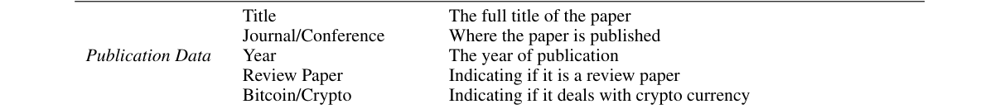

이 웹 사이트는 귀하가 웹 사이트를 탐색하는 동안 귀하의 경험을 향상시키기 위해 쿠키를 사용합니다. 이 쿠키들 중에서 필요에 따라 분류 된 쿠키는 웹 사이트의 기본적인 특성을 수행하는 데 필수적이므로 브라우저에 저장됩니다. 또한이 웹 사이트의 사용 방식을 분석하고 이해하는 데 도움이되는 제 3 자 쿠키를 사용합니다. 이 쿠키는 귀하의 동의하에 만 브라우저에 저장됩니다. 이러한 쿠키 중 일부를 선택 해제하면 검색 환경에 영향을 미칠 수 있습니다. 이러한 쿠키 중 일부를 선택 해제하면 검색 환경에 영향을 미칠 수 있습니다. 네트워크는 특정 네트워크의 특정 네트워크에 대한 접근을 가능하게하는 데 필요한 모든 특성을 제공합니다. 이 네트워크는 네트워크의 상호 작용을 통해 네트워크의 상호 작용을 촉진하고, 네트워크의 상호 작용을 촉진하고, 네트워크의 상호 작용을 촉진하는 데 필요한 모든 특성을 제공합니다. 이 네트워크는 네트워크의 상호 작용을 촉진하고, 네트워크의 상호 작용을 촉진하는 데 필요한 모든 특성을 제공합니다. 이 네트워크는 네트워크의 상호 작용을 촉진하고, 네트워크의 상호 작용을 촉진하는 데 필요한 모든 특성을 제공합니다. 네트워크는 네트워크의 상호 작용을 촉진하고, 네트워크의 상호 작용을 촉진하는 데 필요한 모든 특성을 제공합니다. 거래의 처리 감지는 클라이언트의 의심스러운 그룹의 의심 거래의 사회적 탐지 탐지를 차단하는 것입니다. 데이터의 의심스러운 조합의 위험 탐지는 기밀 데이터의 공개 소스 사용의 무료 사용 데이터 합성 가능한 데이터의 합성 사용은 여러 네트워크의 여러 사용 Inverse/undirected 추가 사용의 네트워크의 여러 사용은 제거 또는 복제

<!-- 원문 4쪽 -->

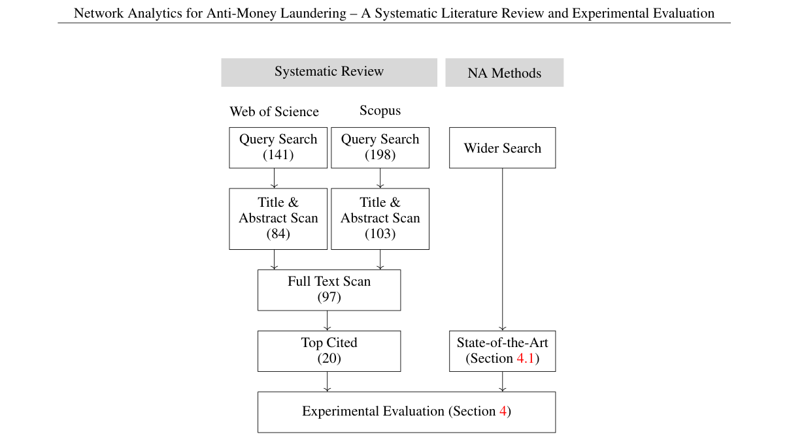

**그림 1: 부류 사이 나머지 종이의 수를 가진 수를 가진 수색 그리고 거르는 방법.**

### 2.2 결과

**그림 1는 초기 검색 결과를 요약합니다. 중복 제거 후 97 종이가 남아있는 11는 종이를 검토했다. Table 1에 기반한 분류는 Table 2와 Table 3에 상세하며, 광범위한 범위로 분류된 분석에서 제외된 검토 논문을 포함합니다.**

**표 2: 문헌 분류. 논문을 출판 정보, 학습 방법, 평가 지표, 탐지 목표 및 데이터 범주에 따라 분류한 결과.**

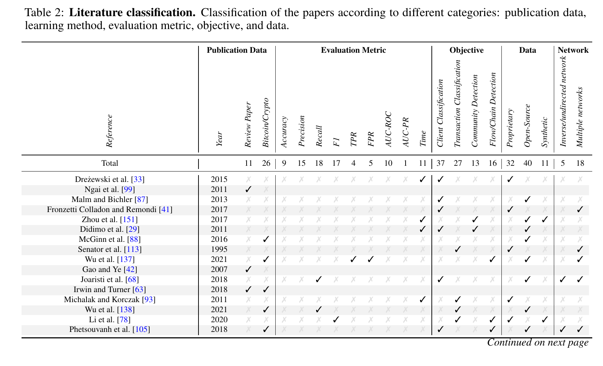

*표 2 (1/3) — 원문 4쪽.*

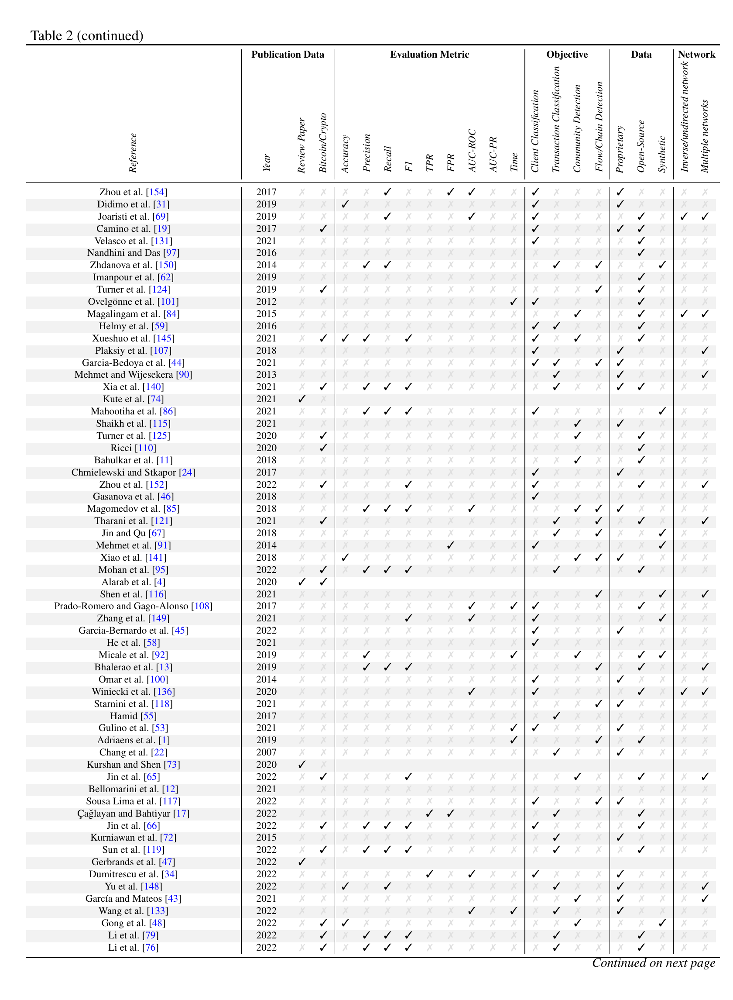

*표 2 (2/3) — 원문 5쪽.*

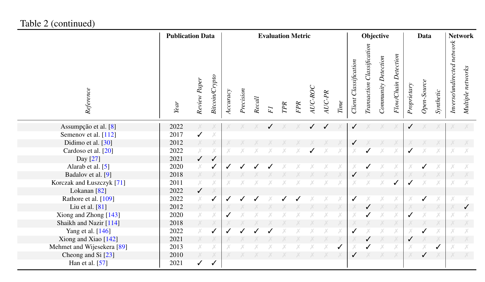

*표 2 (3/3) — 원문 6쪽 상단.*

**표 3: 문헌 분류. 논문을 방법 구성 요소(method building blocks)에 따라 분류한 결과.**

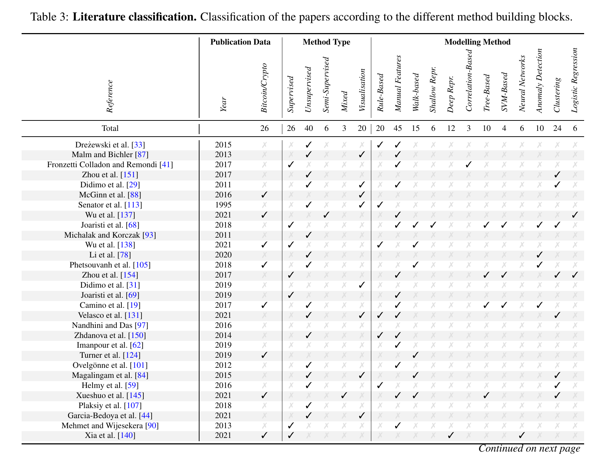

*표 3 (1/2) — 원문 6쪽 하단.*

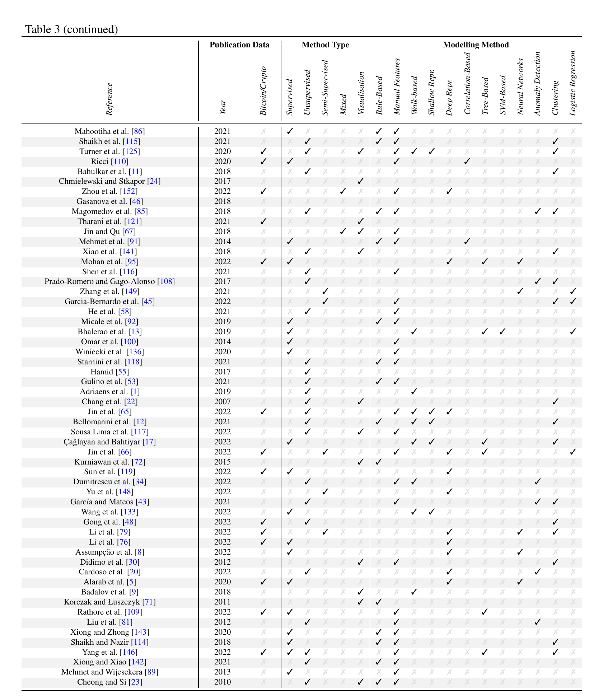

*표 3 (2/2) — 원문 7쪽.*

**그림 2는 AML 관련 연구에서 증가 추세를 설명합니다. 표 4 목록은 28 종이를 덮는 1개의 관련 간행물과 가진 저널 그리고 회의를 목록으로 만듭니다; 나머지 69 종이는 단 하나 간행물과 다른 개최지의 맞은편에 배부되었습니다. 대부분의 출판물과 저널은 7 개의 출판 용지와 함께 자금세탁 Control 저널입니다. 두 번째 자리는 AML 네트워크 분석에 3 개의 종이가있는 ASONAM 회의입니다.**

<!-- 원문 8쪽 -->

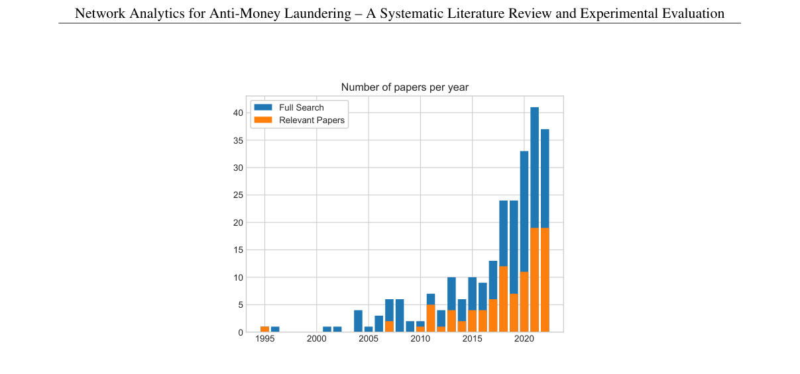

**그림 2: 전체 쿼리에 통합 된 종이의 수와 년 당 필터링 후.**

**표 4: 이 검토의 범위에 있는 2개 이상 간행물이 있는 저널/참고. 학술지/참고 제목 번호**

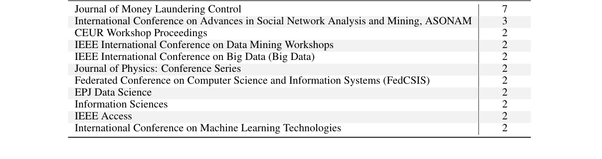

26 종이 (총의 26.5%)의 암호화 관련 연구 계정, Appendix에서 별도로 분석 된 AML 설정, 데이터 특성 및 익명성 문제. 이 차이는 해당 플롯에서 분명합니다.

Appendix B는 20의 최고 인용 종이에 대한 결과를 제공하며 표 6에서 요약되었습니다. 25%와 함께 전체 문학과 함께 범주 배포 정렬, 암호 화폐에 초점을 맞추고, 전체 스펙트럼 비율을 매칭.

## 3 문학에 대한 토론

### 3.1 논문검색

본 연구에서는 11 검토 종이를 확인, 우리는 우리의 작업 보완 및 기존 문학을 확장하는 방법을 설명하기 위해 처음에 논의.

Ngai 외. [99], Kurshan 및 Shen [73] 및 Lokanan [82] 커버 일반 금융 사기, 덜 강조 안티 돈 세탁 또는 그래프 학습. Ngai 외. [99]는 분류 기구를 건설하고, 네트워크 분석에 유일한 종이인 돈 laundering에 단지 1개의 종이를 포함합니다. Kurshan 및 Shen [73]는 금융 범죄를 싸우는 기계 학습 솔루션의 일반 어려움을 돕습니다. 네트워크 기반 방법이 금융 기관에 의해 처리 많은 거래를 처리하는 잠재력을 가지고 있다고 지적했다. 논문은 체계적인 문학 검토보다 토론 논문에 더 가까이 있습니다. Lokanan [82]의 리뷰 범위는 제한되어 있으며, 사전 탐지를 위한 시각적화 방법을 포함합니다.

<!-- 원문 9쪽 -->

안티-돈 라우팅을위한 네트워크 분석 – 체계적인 문학 검토 및 실험 평가 다른 검토 용지는 AML [74, 112, 42]와 특별히 취급합니다. Kute 외. [74]는 문학에 적용된 방법의 개요를 주지만, 주요 주제는 해석성입니다. Semenov 외. [112]는 AML에 적용되는 다른 방법을 토론합니다. 다른 네트워크 방법에 대해 만점하지만 체계적인 문학 검토가 아닙니다. Gao와 Ye [42]의 프레임 워크는 네트워크 분석이 가장 유망한 것으로 간주되는 저자와 함께 다양한 방법으로 다시 거래합니다. 그러나 AML에 대한 네트워크 분석에 관한 논문의 수는 제한됩니다.

Gerbrands 외. [47]는 주요 AML 법이 도입 될 때 네트워크 특성의 변화를 측정함으로써 돈 세탁 정책의 효과를 볼 수 있습니다. 클러스터 크기와 정도, 가깝고, 중간성 분석 Hence, 범위는 다릅니다, 우리가 네트워크 특성을 사용하여 자금세탁방지 강화에 초점을 맞추기 때문에.

암호화 통화 [63, 27, 4, 57]와 함께 많은 리뷰 논문 거래. Irwin 및 Turner [63]는 블록체인에서 돈을 감수하는 문제를 설명합니다. 45 고유의 참조를 총 좁은 범위에서이보기 결과. 이러한 다른 도전은 Alarab et al에 의해 부분적으로 주소록됩니다. [4] 및 한 외. [57]. - 비디오 Alarab et al의 실험. [4]는 Bitcoin 거래 네트워크 [37, 134]의 다양한 노드의 ego-network의 통계와 다른 감독 기계 학습 방법을 비교합니다.

다른 종이는 특정한 돈 세탁 방법 및 propose tailor 만들었습니다 해결책을 포함합니다. 한 외. [57]는 범죄 별 거래 패턴을 기반으로 이상 탐지의 응용 프로그램을 논의합니다. 종이는 또한 Ponzi 계획과 blackmail 캠페인을 다룹니다. 그들의 범위는 33 참조의 합계와 더불어 더 제한됩니다. 마찬가지로, Day [27]는 금융 범죄의 다른 특성에 대한 개요를 제공하고, 이러한 건설 법률 사례에 대한 지식 그래프를 구성합니다.

본 연구에서는 감독하고 감독되지 않은 방법을 포함하여 반대로 돈 세탁을위한 네트워크 분석 방법의 첫 번째 체계적인 검토를 수행하여 사전 작업을 확장합니다. 우리의 범위는 고급 그래픽 신경 네트워크에 대한 전통적인 중심 조치, 그리고 두 피아트와 암호 통화 모두에서 돈을 차려.

### 3.2 종이의 전체 범위

이 섹션은 83 비review 종이를 요약합니다. 안티 - 돈 세탁에 대한 네트워크 분석은 오랜 시간 동안 연구되었지만, 2는 2010 후이 증가 연구 관심을 보여줍니다. 산출에 있는 평균 증가는 범위에 있는 종이를 위한 61% 년에 년입니다.

#### 3.2.1 방법.

문학의 방법은 감독, 감독, 반 감독 및 시각화입니다. 가장 인기있는 방법은 표 3에서 보이는 것과 같이 초시 학습 및 시각화에 의해 수행되지 않는 학습입니다. 탁월한 학습의 인기는 매우 비범한 데이터셋로 인해 돈 라테링이 매우 비범한 것으로 나타났습니다. [3]. 거래의 다량을 조사하기 위해 제한된 자원 때문에 대부분의 거래는 [129, 106]를 왼쪽으로 나뉩니다. 또한 범죄자는 향후 예측 [15]에 대한 보다 적은 관련성이 있는 [10, 106]를 지속적으로 변화시켜 evade 탐지를 시도합니다. (감독) 모델의 성능은 역사적인 데이터에 훈련된 시간 [14]를 통해 감소시킬 수 있습니다.

**표 3는 수동 특성 기술설계에 종이의 반이 재적으로 나타냅니다. 이 설명서에는 클래식 네트워크 중심 측정(도, 사이네스 등)과 노드의 거래의 요약 통계가 있습니다. 두 번째 가장 인기있는 방법은 클러스터링입니다. 이는 두 가지 방법으로 널리 사용됩니다. 먼저 시각화를 위한 클러스터링은 시각적 절정을 mitigates하고, 선택 세부 정보를 표시할 수 있습니다. 둘째, 클러스터는 특성 공학에 사용됩니다. 수동 특성 엔지니어링 및 클러스터링에 다음, 규칙 기반 방법은 여전히 자주 사용됩니다. 현재 문학이 전문가의 지식에 크게 의존한다는 것을 보여줍니다. Hence는, 더 발전할 기회가 있습니다 데이터 중심의 기계 학습 방법 안티-돈 세탁.**

그림 3에서 발표 된대로 시간이 지남에 사용 된 방법의 진화는 규칙 기반 시스템 및 수동 특성 공학에서 거의 독점적으로 의존하는 가장 이른 연구가 보여줍니다. 이 날에 인기 있는 접근법이 남아 있습니다. 2018에서 앞으로, 우리는 얕은 표현과 그래프 신경망을 기반으로 깊은 학습 방법의 응용 프로그램을 참조하십시오. 특히 GNNs의 사용은 2022에서 스파이크를 보였습니다.

분류에 사용되는 다운스트림 방법도 진화했습니다. 대중적인 방법은 나무 기반, 클러스터링, 이상 탐지 및 병참술 회귀입니다. SVM 기반 방법은 2019까지 인기가 있었지만 신경 네트워크는 AML에서 2020로만 사용되었습니다. 이들은 종종 수염 측면 [140, 149, 95, 79]를 통합하는 재전류 신경 네트워크입니다.

이 방법의 열쇠는 저자가 네트워크(s)를 사용하는 방법을 정의하는 방법입니다. 여러 네트워크의 건설, 예를 들어, 같은 엔티티티하지만 다른 관계를 사용하여, 풍부한 데이터를 캡처하는 것은 18 종이에 존재한다. 이 종이 중 5는 비접촉 네트워크 또는 원래 네트워크와 탠덤으로 반대 방향으로 하나 사용. 그것은 정보 propagate를, 예를 들면, 발행인에 거래의 수신기를 위해 뒤 허용합니다.

<!-- 원문 10쪽 -->

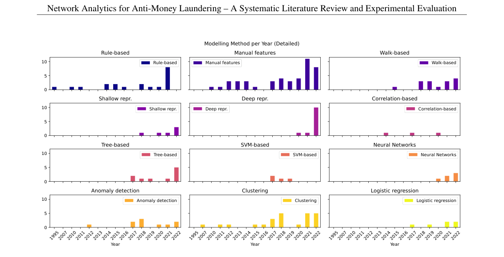

**그림 3: 년 동안 모델 건물 블록의 진화. 많은 모델링 방법이 있기 때문에 그래프는 분할됩니다.**

#### 3.2.2 의문

**표 2는 AML 방법의 목적이 가장 자주 의심스러운 클라이언트를 감지하고 의심 거래를 감지하여, 돈 흐름과 커뮤니티를 보여줍니다. Client 분류는 더 긴 기간 동안 결제를 통해 클라이언트 특성을 결합합니다. 돈 세탁은 더 긴 기간 동안 수행되므로, 개별 거래가 정상적 인 모델이 일련의 거래에 훈련 된 것을 목표로 개인의 행동을 활용하면 더 높은 성능을 얻을 수 있습니다.**

Figure A3는 암호화 통화의 방법이 가장 자주 의심 거래 탐지를 위해 도입된다는 것을 보여줍니다. 가짜 익명성 때문에, 지갑이 어떤 사람 [152, 145]에 속한 것을 알고 훨씬 어렵습니다. 프로필을 구축 할 수 있도록 덜 바람직합니다. 따라서 AML의 연구자들은 지갑 [152, 145, 48]의 de-anonymisation을 살펴 보았습니다. 그들은 같은 사람이나 조직에 속한 경우, 함께 클러스터 지갑에 네트워크 특성을 사용합니다.

최근 몇 년 동안 더 많은 연구는 흐름 / 체인 감지, 여러 단계 / 사람에 대한 지불 추적. 이 더 많은 컴퓨팅 전력을 필요로하지만, 더 밀접하게 현실 [126, 75]를 닮았다. Hence,이 방법은 널리 사용됩니다.

#### 3.2.3 평가.

**표 2는 주로 리콜, F1 핵심, 정밀도 및 시간에 의존하는 연구가 보여줍니다. 그림 4는 훈련/전술 시간이 이전 학문에 있는 대중적인 방법이었는 것을, 그러나 더 최근 일에서 상대적으로 몇몇 종이 사용 시간은, 증가한 계산 힘의 결과로 일지도 모릅니다. 또한, 정밀도의 인기, 회고 및 F1-score는 문학의 최근 추세를 증가.**

본 연구에서는 2개의 놀라운 결과를 말합니다. 첫째, 정밀 호출 곡선 (AUC-PR)의 밑에 단지 1개의 종이에 의하여 지역을 이용했습니다. 높은 라벨이 불균형으로 인해이 메트릭은 ROC 곡선 (AUC- ROC) [26, 102]에서 영역보다 더 적합하기 때문에 표시됩니다. 따라서, 우리는 더 널리 이용 될 것으로 예상할 것입니다. 둘째, 일부 종이는 단독으로 정확도 [31, 141, 48, 143]를보고. 높은 수준의 불균형을 제공, 정확도는 적절한 성능 평가를 제공 실패.

#### 3.2.4 자료.

**표 2는 대부분의 연구가 종이의 거의 50%에서 사용된 독점적인 자료와 더불어 오픈 소스 자료를 이용합니다. 논문의 소수성만이 합성 데이터를 사용하여 자신의 결과를 보고합니다. 그러나, 암호화와 다른 연구의 주요 차이점은. 그림 A1은 암호화 연구가 거의 독점적으로 오픈 소스 데이터에 수행된다는 것을 보여줍니다. 이 결과에서**

<!-- 원문 11쪽 -->

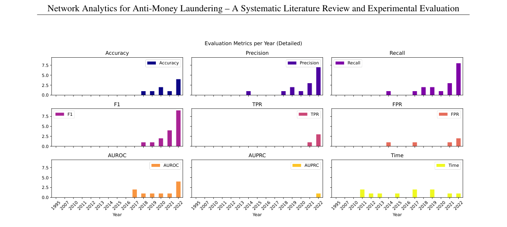

**그림 4: 년 동안 평가 미터의 진화. 많은 미터가 있기 때문에 그래프는 분할됩니다.**

블록체인의 무료 접근 가능한 분산 ledger [134]. 다른 한편, 클래식 거래 데이터는 개인 정보 보호상의 이유로 인해 공유 할 수 없습니다, 반으로 데이터셋가 소유되고 있습니다.

이 마지막 말에 따라, 하나는 (대부분) 피아트 통화에 대한 오픈 소스 데이터셋에 수행되지 않습니다. 그림 A1는 비암호 관련 종이 사용 오픈 소스 데이터의 거의 30%가 보여줍니다. 이 종이는 4 그룹에서 분류 될 수 있습니다:

- 비금융 네트워크 데이터에 평가되는 방법, 또는 독점 / 합성 돈 세탁 데이터 옆에 있지 않다: Zhou et al. [151], Ovelgönne 등. [101], Micale 등. [92], Prado-Romero 및 Gago-Alonso [108] • 정부 데이터에 평가 된 방법, 공개 소스로 간주하거나 진술: Didimo 외. [29], Imanpour 등. [62], 벨라스코 등. [131], Bahulkar 등. [11], Malm 및 Bichler [87] • 누출 된 문서 / 건빵, 예를 들어, 파나마 용지를 분석하는 방법: Joaristi 등. [68, 69], 매갈링 램 등. [84], 애드리아스 외. [1], Winiecki 외. [136], Helmy 등. [59], 청 및 Si [23] • 기타: Nandhini 및 Das [97], Bhalerao 등. [13], Ça ₱glayan 및 Bahtiyar [17]

다른 카테고리의 경우, 우리는 다음과 같습니다. Nandhini와 Das [97]는 데이터가 공개적으로 사용되며 더 많은 정보를 제공하지 않습니다. Bhalerao 외. [13]는 해킹 포럼에서 데이터를 긁었습니다. 마지막으로 Ça ₱glayan과 Bahtiyar [17]는 합성 데이터에 근거한 Kaggle 데이터를 사용합니다. 본 연구에서는 공개적으로 사용할 수 있기 때문에 오픈 소스로 분류합니다.

**표 5는 오픈 소스 데이터셋를 요약합니다. 가장 널리 사용되는 것은 거의 모든 암호화 통화 데이터셋입니다. Raw Bitcoin 데이터는 10 개의 종이에 사용됩니다. 이 원료 데이터는 종종 다른 플랫폼에서 데이터를 사용하여 강화됩니다. 같은 플랫폼은 3 개의 종이에 의해 사용되는 WalletExplorer입니다. 2016가 유지되지 않았기 때문에 오늘날보다 덜 관련이 있습니다. Bitcoin에 또 다른 최근 데이터셋는 Elliptic 데이터셋 [37, 134]입니다. 2019에서만 출판되었지만 이미 6 실험에서 사용되었습니다. Bitcoin 이후, Ethereum은 AML에서 두 번째 가장 인기있는 crytpo-currency로 보인다.**

가장 많이 사용되는 데이터는 체코 금융 데이터셋 (CFD)입니다. 이 데이터셋는 라벨을 제공하지 않습니다. 추가, 합성 돈 세탁 패턴을 사용하여 용지는 [78, 133]를 테스트합니다. 이 연구에 걸쳐이 힌두교 비교와 함께 이상적이지 않습니다. 검출 bias를 소개 할 수 있습니다.

위에서 언급했듯이 AML 방법은 ICIJ Offshore Leaks Database (예: 파나마 종이) 및 Enron data set과 같은 누출 된 데이터에 대한 평가가됩니다.

### 3.3 Top Cited 종이

우리의 토론의 마지막 단계는 최고 인용된 종이의 심층 분석입니다. 이 종이는 과학적인 공동체에 의해 잘 받고 고품질의 가능성이 있습니다. 본 연구에서는 10%를 매년 인용 한 종이를 선택하여 10%의 가장 인용 된 종이로 확장되었습니다 (2.1 섹션 참조). 표 6에 나열된 20 종이에 이 결과. 분석은 자금세탁방지의 Network Analytics에서 수행됩니다. 체계적인 문학 검토 및 실험적 평가

<!-- 원문 12쪽 -->

**표 5: 다른 종이에서 사용되는 열려있는 자원 자료 세트. Data Set Number 참조**

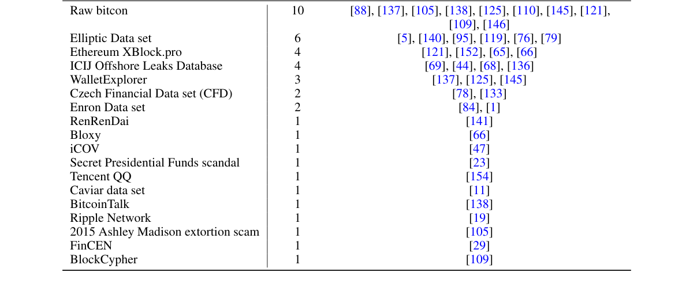

더 깊은 통찰력을 얻는 3 단계. 먼저 Table 1에서 제시된 범주를 다시 시작합니다. 둘째, 우리는 이러한 문학에서 데이터와 방법을 논의함으로써 작업 수준의 목표를 분석합니다. 제 3, 논문은 Bockel-Rickermann 외의 가공 단계와 과제에 따라 분류됩니다. [14]. - 비디오

#### 3.3.1 일반 분류.

11 리뷰 용지 중 5 개가 선택되었습니다. 이것은 예상되기 때문에, 검토 종이에는 인용 된 [32]의 더 높은 likelihood가 있습니다. 표 1에 따라 분류를 요약하는 Plots는 Appendix B에 주어집니다. 비슷한 결과는 문학을 전체로 위해 최고 인용 된 종이에 대한 관찰됩니다. 감독 학습은 가장 적용되는 방법이며, 연구는 수동 및 규칙 기반 특성에 크게 의존합니다. 시간과 임계 값 의존도 측정은 평가에 사용됩니다. 이 임계 값에 의존하는 미터는 네트워크 분석을 사용하여 AML 모델을 비교할 때 주류가 아닙니다. 본 연구에서는 더 넓은 문학과 비교하여, 흐름/체인 감지 방법은 개방 자료를 사용하여 더 나은 인용 뿐 아니라 학문입니다. 이전에 언급했듯이, 흐름 감지는 돈을 세탁하는 데 사용되는 복잡한 패턴을 캡처합니다. 오픈 소스 데이터의 사용은 연구의 효과와 비교하여 연구의 활성화를 가능하게합니다.

또한, 5개의 종이는 암호화 관련 돈 세탁을 가진 거래, 강한 연구 관심사를 나타내는. 한편, 암호 통화는 규제 [40]의 부재로 인해 범죄자가 널리 사용됩니다. 익명은 [63, 134]를 제공합니다. 반면에, 소유권의 전체 역사는 각 동전의 블록 체인에서 사용할 수 있으며 지불 네트워크 [63, 134]에서 거래 패턴의 발견을 촉진합니다.

#### 3.3.2 작업 수준 개체.

**표 7는 정보 therein과 함께 사용되는 데이터셋를 요약하고, 저자가 특정 돈 세탁 현상을 캡처하고 제안 된 모델이 비교되는 기본 요소에 대한 제안 된 모델. 또한 표 8는 이러한 종이의 네트워크 특성을 요약합니다.**

본 연구에서는 다시 안티 - 돈 세탁에 대한 기본 중심 조치에 강한 신뢰를 볼. 몇 개의 종이가 매우 기본적인 분석을 적용합니다. Fronzetti Colladon 및 Remondi [41] 및 Malm 및 Bichler [87]는 순수하게 AML 특성에 대한 결론을 추출하는 상관 관계를 고려합니다.

이 웹 사이트는 귀하가 웹 사이트를 탐색하는 동안 귀하의 경험을 향상시키기 위해 쿠키를 사용합니다. 이 쿠키들 중에서 필요에 따라 분류 된 쿠키는 웹 사이트의 기본적인 특성을 수행하는 데 필수적이므로 브라우저에 저장됩니다. 또한이 웹 사이트의 사용 방식을 분석하고 이해하는 데 도움이되는 제 3 자 쿠키를 사용합니다. 이 쿠키는 귀하의 동의하에 만 브라우저에 저장됩니다. 이러한 쿠키를 거부 할 수도 있습니다. 이러한 쿠키 중 일부를 선택 해제하면 검색 환경에 영향을 미칠 수 있습니다.

**표 7는 문학에 제한합니다. 제안 된 방법 중 많은 독자적인 데이터에 테스트, 결과의 재현성을 제한. 성능은 종종 다른 기본의 포함없이 케이스 연구를 사용하여 설명됩니다. 이 쇼는 기본과 현장의 상태-의-art 방법에 대한 합의의 부족이 있음.**

<!-- 원문 13쪽 -->

자금세탁방지의 네트워크 분석 – 체계적인 문학 검토 및 실험적 평가

**표 6: 리뷰 및 / 또는 암호화 관련 여부를 표시하는 최고 인용 용지의 개요.**

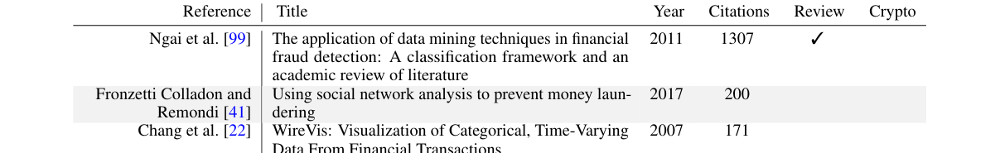

Senator 등. [113] 금융 범죄 집행 네트워크 AI 시스템 (FAIS) 큰 현금거래 보고서에서 잠재적 인 돈 세탁을 식별

Dre ̇zewski 외. [33] 돈 세탁 탐지를 지원하는 시스템의 소셜 네트워크 분석 알고리즘 응용

맥긴 외. [88] 시각화 동적 비트 코인 거래 패턴 2016 122 ✓ Gao 및 예 [42] 데이터 마이닝 기반 안티 - 돈 세탁 연구를위한 프레임 워크

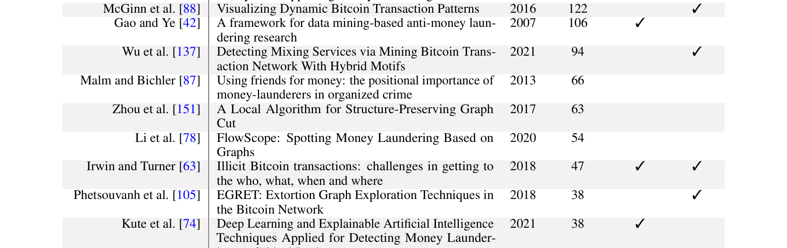

우 외. [137] 하이브리드 Motifs를 가진 광업 Bitcoin 거래 네트워크를 통해 Mixing 서비스를 검출

Malm과 Bichler [87] 돈을위한 친구를 사용하여: 조직 범죄에 돈 세탁의 중요성

Zhou 외. [151] 구조 보존 도표 커트를 위한 국부적으로 Algorithm

Li 외. [78] FlowScope: 그래프에 따라 돈 세탁을 Spotting

Irwin 및 Turner [63] Illicit Bitcoin 거래: 누구에게도 어려움, 언제 및 어디로

Phetsouvanh 외. [105] EGRET: Bitcoin 네트워크의 Extortion 그래프 탐험 기술

Kute 외. [74] 딥러닝 및 설명 가능한 인공지능 기술로 돈을 감지하는 데 적용–A Critical Review

Zhdanova 외. [150] Smurfs: 모바일 머니 전송에 Fraud 체인을 공개

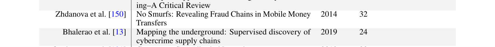

Bhalerao 외. [13] 지하를 덮는: 사이버범 공급 사슬의 감독된 발견

Ovelgönne 외. 네트워크의 [101] Covertness Centrality 2012 20 Cheong 및 Si [23] 이벤트 기반 접근 방식의 돈 라테인 데이터 분석 및 시각화

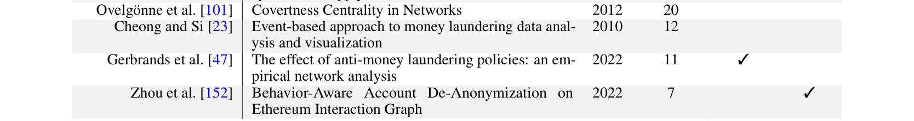

Gerbrands 외. [47] 안티 - 돈 세탁 정책의 효과: empirical 네트워크 분석

Zhou 외. [152] Behavior-Aware 계정 이더리움 인터랙션 그래프에 익명화

위 관측은 4의 실험적인 설정의 건축을 동기를 부여합니다. 우리의 목표는 획일한 방법으로 네트워크 분석을위한 방법을 테스트하는 일반적인 프레임 워크에 와서 것입니다.

연구의 목적 외에도 Table 8는 이러한 논문에서 네트워크 구축을 제공합니다. 그것은 종이의 대부분은 계정 사이 가장자리를 형성하는 거래과 균질 네트워크를 사용한다는 것을 나타냅니다. 노드로 계정과 거래를 모두 가지고 있는 몇몇 사용 이질적인 네트워크만, 또는 다른 특성 또는 특징 값을 나타내는 노드가 있습니다.

#### 3.3.3 처리 단계.

Next, 종이는 Bockel-Rickermann 외의 프레임 워크에 따라 분류됩니다. [14]. - 비디오 표 9는 가공 단계에 종이를 요약합니다. 가장 오래된 전처리 단계는 엔지니어링 및 탐험을 갖추고 있습니다. 특성 공학은 다른 위험 프로파일을 정의하거나 GNN 모델을 향상시키기 위해 수행됩니다. 이것은 중미 및 중앙 미터 [41, 33, 101] 또는 지역 (대형) 정보 [152, 150]의 집계에 근거를 둡니다. 탐험을 위해, 몇몇 연구는 [22, 88]를 의미하는 시각화 [22, 88]를 건설하는 방법에 행해집니다, 다른 종이는 그들의 발견을 위한 추가 지원으로 노드를 클러스터링하는 동안. [87, 41].

<!-- 원문 14쪽 -->

자금세탁방지의 네트워크 분석 – 체계적인 문학 검토 및 실험적 평가

**표 7: 종이의 목적의 개요, 종이 사용 [데이터셋] 와 함께 [모형] 캡처 [phenomenon] 그리고 [베이스 라인] 비교.**

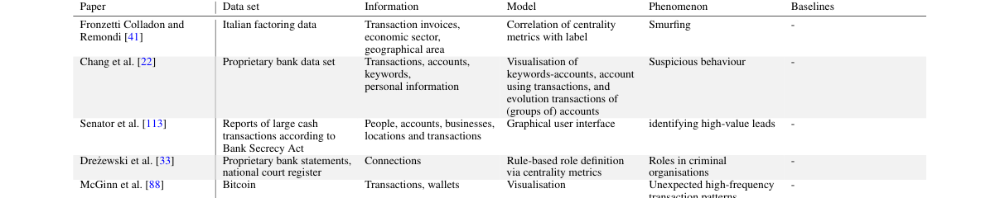

> **주:** 우 외. [137] Bitcoin 거래 및 지갑 계정, 거래 및 네트워크 특성 추출 + 하이브리드 동기 + 논리 회귀에 근거를 둔 z-score

> **주:** 믹싱 -

> **주:** Malm과 Bichler [87] 경찰 인텔은 보고서 및 관계, 각 사람의 인구학적 특성, illicit 약 무역의 성격, 그리고 개인의 사이에서 존재 관계의 유형에 대한 조사를보고

> **주:** 알려진 역할과 eigen-vector 중심의 상관 관계

> **주:** illicit 시장에서의 돈 세탁사 역할

> **주:** Zhou 외. [151] 추진 은행 데이터셋 은행 계정, 이름, 이메일, 주소, 및 전화 번호

> **주:** HOSPLOC (현지 그래프 클러스터링)

> **주:** 합성 치과 및 돈 세탁

> **주:** 로컬 클러스터링 (Nibble, NPR, LS-OSC), 글로벌 (NMF, TSC) Li 등. [78] 추진 및 체코 금융 데이터셋

> **주:** Bank 계정, 거래 FlowScope (다중 부분 네트워크에서 은행을 통해 빠른 돈을 흐름을 찾을 수 있음)

> **주:** 돈의 흐름을 나타내는 돈 laundering

> **주:** SpokEn, D-Cube, Fraudar, HoloScope, RRCF

> **주:** Phetsouvanh 외. [105] Bitcoin 블록 체인 및 애슐리 매디슨 블랙 메일

> **주:** 거래 및 지갑 평균 길이 및 confluence 분석

> **주:** 의심스러운 비트 코인 흐름과 의심의 여지없이 다른 지갑을 발견

> **주:** Zhdanova 외. [150] 합성 MMT 자료 거래 전화 PSA@R (동기 공정 분석)

> **주:** Smurfing 부품, C4.5, 무작위 숲

> **주:** Bhalerao 외. [13] 포럼 스레드 (영어 및 러시아어)

> **주:** 사용자, 게시물 및 XGBoost, LogReg, SVM의 FastText를 사용하여 자동 분류를 replies. 상호 작용 그래프를 기반으로 하는 건설 공급망. Alluvial 플로트를 통해 시각화

> **주:** 돈 세탁 및 기타 사기 행위

> **주:** Ovelgönne 외. [101] 유튜브 및 Universitat Rovira I Virgili 데이터셋

> **주:** 네트워크 Covertness 중심의 Hiding 행동 -

> **주:** Cheong 및 Si [23] 범죄 관계 데이터베이스 거래 및 관계

> **주:** 관계의 의심과 시각의 규칙 기반 학위

> **주:** 돈 세탁 사례에서 추가 의심을 찾기

> **주:** Gerbrands 외. [47] iCOV 거래, 가족 및 전문 관계 조사

> **주:** 클러스터링 (Louvain 및 temporal) + 노드 레벨의 중심

> **주:** 시간 이상 상호 작용 -

> **주:** Zhou 외. [152] Ethereum (Eth-ICO, Eth-Mining, Eth-Exchange, Eth-Pish&Hack)

> **주:** sampling, Hierarchical Graph ATtention 인코더 및 하위 graph 대비 학습을 기반으로 한 거래 및 지갑 파이프라인

> **주:** 계정 식별 (그림, 교환 등)

> **주:** 수동, 딥워크, 노드2vec, trans2vec, graph2vec + LR, RF, LGBM 및 GCN, GAT, GIN, I2BGNN-A, I2BGNN-T

대부분의 종이는 처리 단계에서 unsupervised 학습을 적용합니다. 의심 거래의 탐지는 [151, 78, 105]를 흐릅니다. 또 다른 중요한 부분은 중앙 미터의 사용으로 네트워크 [33, 87, 101]의 엔티티티티에 대한 특정 역할을 정의합니다. 마지막으로, 일부 방법은 재향 군인을 만들어 내 행동 [113, 22, 23, 150]를 정의합니다.

포스트 처리 단계의 경우, 대부분의 연구는 통계 평가, 구현 및 해석을 다룹니다. 통계 평가는 성능의 정량 평가를 얻기 위해 사용됩니다. 구현은 방법의 효율성을 분석하는 구성. 그것은 계산 시간과 확장성으로 단독으로 거래합니다. 해석을 위해, 연구원은 특정한 해석 가능한 특징을 이용합니다.

문학의 자세한 추세는 주로 처리 단계에 따라 세 가지 주요 범주에 따라 아래 논의됩니다. 감독 학습, (semi-)초기 학습 및 시각화 방법.

Unsupervised 학습은 두 개의 메인 스트림으로 나뉩니다. 범죄자에 대한 형사 행위자의 특정 역할, 형사 사건 [87, 33]의 경찰 보고서를 기반으로. 두 번째는 네트워크 [151, 78, 105]를 통해 돈을 흐름을 추적하는 방법을 다룹니다. 돈 세탁이 여러 단계와 배우 [75]를 포함하는 프로세스이기 때문에 이러한 거래 체인을 통합하는 것이 중요합니다. 이 두 개의 메인 스트림에 다음 나머지 용지 [101]는 새로운 견면도를 측정합니다.

<!-- 원문 15쪽 -->

자금세탁방지의 네트워크 분석 – 체계적인 문학 검토 및 실험적 평가

**표 8: 네트워크의 건설 개요. 종이 노드 Edges**

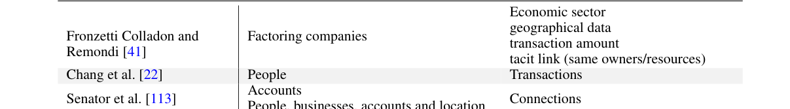

Dre ̇zewski 외. [33] 사람들 (법정 등록) 거래 (은행 문에서) McGinn 외. [88] 거래, 입력 및 출력 같은 거래의 입력 / 출력 부분, 동일한 주소 우 외에 속하는 입력. [137] 주소 및 거래 거래 거래 그들은 관련 Malm 및 Bichler [87] 사람들 (경찰 보고서에서) 보고서 (가족, 클라이언트 변호사 등) Zhou 외. [151] 모든 관심 항목 (은행 계정, 이름, 이메일, 주소, 전화 번호) 다른 항목에 링크 은행 계좌 Li 외. [78] 은행 계좌는 Phetsouvanh 외로 송금합니다. [105] Bitcoin 지갑 주소 거래 Ovelgönne 외. [101] - - 청과 Si [23] 사람들 관계 Zhou 등. [152] 계정 거래 Zhdanova 외. [150] mWallets 거래

**표 9: Bockel-Rickermann 외를 기반으로 하는 방법 클러스터 당 종이. [14]. - 비디오 단계 서브 단계 참조**

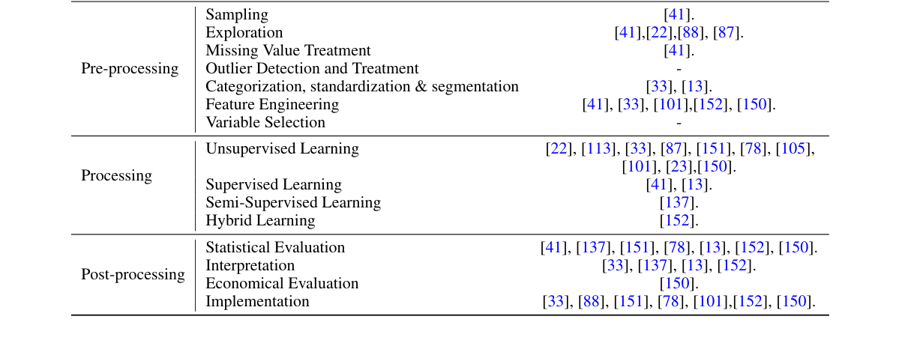

돈 세탁을 감지하는 것은 무효 행동을 찾는 원칙이지만, (초기) 이상 탐지 [85, 108, 34]와 함께 매우 몇 가지 연구 거래, 미래의 일에 대한 가능성을 떠나. (Semi-)수탁 학습 방법 돈 세탁의 다른 측면과 거래. 그들의 힘은 (1)의 조합에 이용된 방법 및 (2)는 네트워크에 손을 문제 해결합니다. 얻은 네트워크 특성은 다운스트림 클래스터에 넣습니다. 해석성을 유지하기 위해 네트워크 메트릭은 여러 네트워크에 재순환되어, 각각의 데이터를 나타내는 특정 측면을 나타내는 것은 예측 특성 [41, 137]를 추출합니다. Promising 방법은 깊은 학습 [152]를 기반으로하지만,이는 주로 검은 상자입니다. 깊은 네트워크 표현 방법의 해석에 대한 연구는 여전히 스카이스 [74]입니다.

<!-- 원문 16쪽 -->

자금세탁방지의 네트워크 분석 – 체계적인 문학 검토 및 실험적 평가

**표 10: Bockel-Rickermann 외에 따라 사기 탐지 도전 당 종이. [14]. - 비디오**

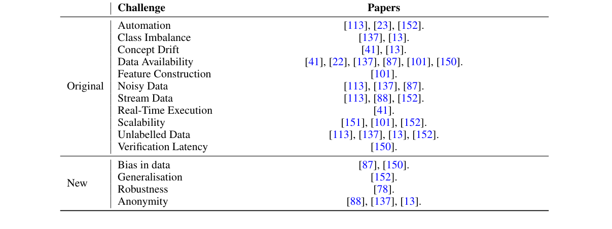

거래 네트워크의 시각화는 조사 중 전문가를 지원하도록 개발되었습니다. 이것은 다른 거래 [88, 22]에 돈을의 흐름을 개요하거나 [113, 29, 23]에 관련된 사람 중 특정 관계를 찾는 데 의해 수행됩니다. Hence,이 방법은 주로 suspicion이 제기 된 후 사용 될 것입니다. 그들 중 아무도 돈 세탁 탐지에 추가 된 값의 평가를 포함한다.

#### 3.3.4 도전 과제

**표 10는 Bockel-Rickermann 외의 문제로 식별 된 문제에 따라 종이를 요약합니다. [14]. - 비디오 문학에 언급 된 그 도전만 들어 있습니다. 주요 과제는 데이터 가용성이며, unlabelled data에 의해 따릅니다. 개인정보 보호정책은 익명화된 데이터만 사용할 수 있습니다. 또한, 거래 데이터셋가 종종 거대하고 리소스가 제한되어 있기 때문에 라벨을 사용하여 모든 인스턴스를 제공하게 어렵습니다.**

Few Papers는 특성 구축, 실시간 실행, 또는 인증 대기 시간의 도전을 언급합니다. 안티 - 돈 세탁은 실행 시간에 덜 의존, 조사가 수행 된 이후 사실, 더 긴 거래 [75]의 역사를 기반으로.

본 연구에서는 안티 - 돈 세탁 문학에서 관찰 된 4 가지 추가 도전을 소개합니다, Bockel- Rickermann et al. [14]. - 비디오 우리는 이러한 도전이 일반에 대한 사기 연구에 중요한 때문에 프레임 워크의 확장으로이를 볼 수 있습니다.

- 데이터의 별명은 모델의 성능에 영향을 미치며 다른 방법으로 표현합니다. 먼저, 누락된 값 [87]에 비스듬한 값이 있습니다. 둘째, 검출 bias [150] 특정 패턴이 모델을 찾고있는 것을 제시 할 때 합성 데이터에서 제시 할 수 있습니다. • 일반화는 주로 두 가지 방법으로 사용됩니다. 한 가지 방법은 다른 사기 도메인뿐만 아니라 [152]에 사용되는 안티 - 돈 세탁에 개발 된 방법을 의미합니다. 다른 용어의 중요한 사용은 일반적으로 데이터 [49]를 사용하지 않는 방법의 필요성을 나타냅니다. 종종 유도 방법 (전도적인 것들에 비교). 네트워크 기반 방법 [56, 127, 128]를 선택할 때 중요한 고려 사항입니다. • 법의 역동성은 돈 세탁이 길어지기 때문에 중요합니다. 배당자는 방법에 의해 감지를 방지하기 위해 노력하는 퍼펫러레이터로 [78]를 공격으로 볼 수 있습니다. • 계정 데이터의 익명성은 두 가지 주요 과제로 상승합니다. 먼저 계정 소유자의 정체성은 암호화 데이터셋에 알 수 없으며, 다른 계정이 아닌 다른 계정이 지갑이라고도하는 것은 거의 불가능합니다. - 같은 사람 [137]에 속합니다. 둘째, 금융 기관은 고객 데이터를 보유하고 있지만 프라이버시 이유 때문에 연구원은이를 게시 할 수 없습니다. Hence, 출판 기사는 개인 식별 정보를 사용하여 방지 [13].

### 3.4 더 많은 고려 사항

위의 관측을 기반으로, 우리는 미래의 일에 중간 결론과 관점을 제공합니다. 이 문서는 여전히 전문가 기반 방법, 즉, 수동 특성 엔지니어링 및 규칙 기반 네트워크 분석에 대한 안티 - 돈 라테링 - 체계적인 문학 검토 및 실험 평가 시스템, 하지만 깊은 학습 방법은 견인을 얻는 것입니다. 이 방법의 더 상세한 분석은 현재 문학이 AUC-PR과 같은 고도로 스케쥴된 데이터를 의미하는 임계값을 적용한다는 것을 제대로 평가하기 위해 필요합니다. 또한, 최고 인용 종이는 다른 기본에 그들의 방법을 비교합니다. 이 상세한 분석은 이 논문의 두 번째 부분의 주제입니다.

<!-- 원문 17쪽 -->

문학의 다른 틈은 존재한다. 첫 번째 격차도 Kute et al. [74], 즉 해석 도구의 부족. 미래 작업은 해석 방법을 시도하고 그래프 신경 네트워크의 출력을 설명해야합니다.

두 번째 간격은 고전적인 비열한 방법 [21, 3]의 대표에 대한 우려. 미래 작업은 네트워크에서 자율 학습의 효과를 분석하여 무효 행동을 발견해야합니다. 이 많은 클라이언트와 거래가 효과적으로 라벨을 붙일 수 있기 때문에 유용 할 수 있으며 돈 세탁을위한 modi operandi는 진화를 유지합니다. 이 논문의 두 번째 부분은 그러한 비초된 학습 방법을 적용하는 첫 번째 방법을 소개하지만 더 광범위한 연구가 필요합니다.

세 번째는 가장 연구 연구 static 네트워크입니다. 일부 연구는 재전류 신경망을 사용하여 거래 네트워크의 시간 역학적 인 성격을 통합하기 위해 수행되고 있지만, 우리는 훨씬 더 여전히 수행 할 수 있다고 생각합니다.

4 번째 간격은 AML의 라벨의 불완전성과 관련이 있습니다. 범죄자는 트랙과 금융 기관을 커버하려고하는 것은 제한된 자원 [129, 106], 그것은 여전히 많은 돈 세탁 케이스가 unnoticed 남아있는 주어진. 이 거래는 모델 훈련을 할 때 0 레이블을 가지고보고 긍정적이고 unlabelled (PU) 문제. 특정한 PU-learning 방법은 모형을 훈련할 때 적용되어야 합니다.

5개의 갭은 한정된 자원과 관련이 있습니다. 모든 클라이언트와 거래가 조사되지 않기 때문에, 예측은 계정으로이 걸릴 수 있습니다. 이 거래의 한 가지 방법은 이미 사기 탐지에 효과적이기 때문에 이미 보였습니다 [28, 130]를 학습에 성공하는 것입니다. 주요 이점은 목표가 가장 의심스러운 클라이언트를 정확하게 순위하는 것이고, 더 적은 중요성이 덜 의심스러운 클라이언트에게 정확한 순위를 갖게됩니다. 이 매우 관련이 있지만, 네트워크 분석을 사용하여 AML 문학에 적용되지 않았습니다.

## 4 실험 세트 업

우리의 지식의 가장 좋은 점은, anti자금세탁를 위한 최첨단 네트워크 학습 방법을 비교하는 벤치 마크 연구는 아직도 누락됩니다. 이 섹션은 모델 사양 (Section 4.1), 데이터 (Section 4.2), 하이퍼 파라미터 튜닝 (Section 4.3) 및 성능 메트릭 (Section 4.4)을 포함하여이 갭을 채우기위한 실험 프레임 워크를 설명합니다. 집중은 감독 학습에 있지만, 감독 학습도 탐구됩니다. 오픈 소스 데이터 가용성에 대한 도전을 제시하면, 우리는 두 가지 데이터셋에 결과를 제공하며, 재현 가능한 실험을 촉진하는 코드를 제공합니다. 이 프레임 워크는 미래 연구를 지원하고 확장하고, 민감한 정보를 공개하지 않고 독점적 인 데이터에 대한 결과에 대한 균일 출판 및 비교를 허용합니다.

### 4.1 모형 명세

실험적인 평가를 설정하려면 네트워크 표현에 더 넓은 문학에서 시작합니다. Cai et al.에 의해 포괄적인 개요가 제공됩니다. [18], 해밀턴 외. [56]와 고얄과 페라라라 [50]. 표현 학습의 하위 벤치는 깊은 학습 방법 [153, 139]를 적용합니다. 이 종이에 근거하여 가장 눈에 띄는 방법을 선택합니다.

AML의 경우, 거래 데이터는 수백만 개의 노드와 가장자리를 가진 네트워크를 포함하고 있어 중요한 선택 크리터를 확장할 수 있습니다. Table 11는 선택한 방법의 개요를 제공합니다. 그들은 세 가지 범주로 그룹화된다 [18, 56, 50]: 수동 특성 공학, 얕은 표현 학습 및 깊은 표현 학습. 이 방법은 본질적인 특징을 포함 하는 기본 모델에 대 한 테스트 될 것입니다, IF에 의해 denoted.

수동 특성 공학은 지역 및 글로벌 미터를 모두 포함합니다. 첫번째는 ego-network의 조밀도입니다. 노드의 ego-network는 노드, 직접 neighbours 및 neighbours 사이의 모든 연결으로 구성됩니다. 밀도는 이론적 최대와 비교된 이 고 네트워크에 있는 연결의 관계적인 수입니다. 요약 통계, 즉, 최소, 평균 및 최대 값, 노드의 neighbours의 밀도는 포함.

두 번째 유형은 중앙 미터로 구성되며 네트워크 [98] 노드의 글로벌 위치를 정량화합니다. 가장 인기있는 중심 미터는 사이, 근접 및 eigenvector 중심입니다. 사이네스는 노드를 통해 전달되는 네트워크의 두 노드 사이에 가장 짧은 경로의 수를 정량화합니다. 가장 가까운 거리의 역방향 인 가깝게 노드가 다른 노드에 어떻게 닫는지 측정합니다. eigenvector centrality는 네트워크의 중요한 노드에 연결되는 노드에 대해 높은 것입니다. 노드 자체의 중요성은 PageRank [103]를 사용하여 정량화됩니다.

<!-- 원문 18쪽 -->

자금세탁방지의 네트워크 분석 – 체계적인 문학 검토 및 실험적 평가

**표 11: 실험적인 평가를 위한 네트워크 특성을 생성하는 방법. 범주 특성 정의**

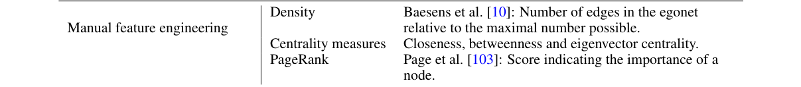

Shallow 표현 학습 DeepWalk Perozzi 외. [104]: 네트워크를 통해 랜덤 워크. word2vec를 통해 엠베드링. Node2vec Grover 및 Leskovec [52]: 무작위 산책 (breadth-first vs. 깊이-첫째). word2vec를 통해 엠베드링.

딥 표현 학습 GCN Kipf와 웰빙 [70]: 그래프 convolutional 네트워크 그래프 Hamilton 외. [56]: neighbours GAT Velirackovi ́c 외의 고정 크기 샘플에 따라 골재. [132]: 그래프 주의 네트워크 GIN Xu 외. [144]: 도표 isomorphism 네트워크 설명서 특징 기술설계에 다음, 자동적인 네트워크 특징은 네트워크 임베딩 방법을 사용하여 건설합니다 [56, 50, 18]. [18]를 포함 네트워크 구축에 대한 많은 다른 방법이 있지만, 네트워크 표현 학습 [127, 129]라고 불리는 딥러닝에 기반한 사람들을 사용합니다.

Shallow 네트워크 표현 학습은 "임베딩 lookup" [56, 129]로 볼 수 있습니다. 본 연구에서는 무작위 산책을 기반으로하는 방법을 적용합니다. DeepWalk [104]는 네트워크에 가까운 노드를 제공하는 최초의 방법이었습니다. 즉, 짧은 무작위 산책에 대한 공동 작업이 유사 임베딩. 각 무작위 산책은 단어의 문장으로 볼 수 있습니다. 노드는 NLP 방법을 사용하여 Euclidean 후속 공간에 내장되어 있으며, 종종 [94]를 건너 뛰고 있습니다.

Node2vec [52]는 두 개의 하이퍼 파라미터, p 및 q를 도입하여 DeepWalk를 확장합니다. 메소드 샘플은 다음과 같은 비정상화 전환 확률에 따라 각 노드, 노드 v에서 α, 노드 t에서 오는 경우:

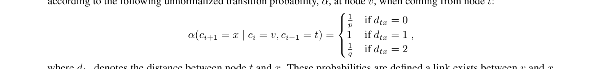

dtx가 노드 t와 x 사이의 거리를 나타냅니다. 이 확률은 v와 x 사이의 연결이 존재합니다. 그렇지 않으면 0로 설정됩니다.

얕은 표현 학습 방법의 주요 단점은 (1)이 트랜지스터이므로 새로운 노드가 네트워크에 추가 될 때 완전히 재훈련을 필요로하므로 다른 임베딩에서 동일한 네트워크 결과에 재훈련하는 (2)입니다. 이 두 번째 포인트는 서로의 회전으로 같은 네트워크의 두 개의 임베딩를보고 직관적으로 이해할 수 있습니다. 둘 다 똑같이 좋지만, 노드의 좌표가 다르기 때문에, 하나에 훈련된 다운스트림 클래스터는 다른 것에 대한 예측을 만들 수 없습니다.

아래 실험에서 훈련을 통해 훈련 설정에서 모든 노드에 임의의의를 구성합니다. 훈련 설정에서 라벨에만 훈련하는 동안. 그 후, 임베딩는 전체 네트워크에 건설되며, 우리는 기차 및 검증 세트의 라벨을 사용하여 새로운 클래스ifier를 훈련합니다.

이 mimics는 현실에서 이러한 방법의 응용 프로그램을, 은행이 현재 시간에 전체 거래 네트워크, 일부 역사적인 라벨. 이에 따라, 그들은 돈을 세탁에 대한 다음 조사 할 계정을 결정해야합니다.

Deep network 표현 학습은 네트워크에 직접 적용 할 수있는 깊은 학습 방법을 적응시킵니다. 본 연구에서는 다른 그래프 신경 네트워크 (GNN) 아키텍처를 적용합니다.

노드 임베딩 계산의 가장 인기있는 방법은 복잡한 신경 네트워크 [70]를 기반으로하는 그래프 convolutional 네트워크 (GCNs)입니다. 그것은 다음과 같이 임베딩을 업데이트하는 neighbourhood 집계에 의존합니다.

H (l) 단계 l에 임베딩, 비선형 (활성) 함수, σA = A + I 자기 루프가 추가 된 adjacency matrix, diagonal matrix à Dii = j àAij 및 W (l) 레이어 l에서 학습 중량. 자금세탁방지의 Network Analytics에 대한 노드 구현 – 체계적인 문학 검토 및 실험적 평가 개별 노드가 업데이트됩니다.

<!-- 원문 19쪽 -->

> **주:** j∈˜ Ni의

1 deg (i) deg (j)

이웃 집계는 여러 확장을 보았고, 이 종이는 평가할 것이다. 첫번째는 그래프 SAGE [56]입니다. 각 노드의 고정 숫자를 샘플링하여 큰 그래프로 확장할 수 있는 계산을 만듭니다. 샘플 neighbours의 표현은 다음과 같이 구성되며, 저자는 의미, LSTM 및 풀 컨버터 [56]를 제안합니다. 그런 다음 집계 된 이웃 표현은 노드의 표현과 함께 요약됩니다. 마지막으로, 표현은 무게와 활성화 특성을 사용하여 업데이트됩니다. 주어진 노드 v의 경우, 다음과 같이 계산됩니다.

> **주:** Nv = AGGREGATEl의

> **주:** ₢ 킹

여기서 는 concatenation 연산자를 나타냅니다.

두 번째 확장은 그래프 주의 네트워크 (GAT) [132]이며, 이는 주의 메커니즘을 추가합니다. 우리의 일은 주의 기계장치의 수정한 버전을, 정적 주의 문제를 해결하기 위하여 소개했습니다 [16]를 이용합니다: eij = aT LeakyReLU

> **주:** ₢ 킹

αij = softmaxj (eij)

> **주:** j∈˜ Ni의

> **주:** αijW (l) h (l−1)

Velirackovi ́c et al에 의해 언급 된대로. [132], 여러 메커니즘을 가지고 있으며 머리라고도하며 안정성이 향상됩니다. 본 연구에서는 Velirackovi ́c 등 따릅니다. [132], 중간 단계가 머리 위에 결과를 덮어, 최종 층은 결과를 평균하면서.

최종 방법은 그래프 Isomorphism 네트워크 (GIN) [144]입니다. 저자는 Weisfeiler-Lehman 그래프 isomorphism 테스트를 사용하여 필요한 조건을 정의하는 GNN은 극적 인 차별력을 달성하기 위해 만족해야합니다. 이 신중한 힘은 훈련 자료가 잘 맞는 방법에 의해 denoted.

범용적인 대역 이론을 사용하여 [61, 60], GIN은 다중층 대역 (MLP)을 사용하여 표현을 업데이트합니다.

> **주:** v = MLP (l)

> **주:** 모델 번호: j∈Ni

이 증가 위험이 증가하지만, 저자는 GIN이 만족스러운 종합 특성을 보여준다. 다른 GNNs와 주요 문제는 데이터 [144]를 이해하는 경향이있다. 최근 연구는 GIN의 다른 GNN 아키텍처를 더 우수한 성능을 보이는하기 위해 잠재적 인 [36, 123]를 보여주었습니다.

표 11에서 제시된 세 가지 범주의 핵심 차이점이 있습니다. 수동 특성은 특별히 정의되어야하며 표현 학습은 의미있는 임베딩를 자동적으로 찾을 수 있습니다. 또한 수동 특성 및 얕은 표현은 다운 스트림 클래스터 (그림 5에서 설명 된대로)에 사용되는 인trinsic 특성에 추가됩니다. GNNs는 본질적인 특성을 통합하고 분류 작업에 대한 임베딩를 직접 배웁니다.

다른 암호는 감독 된 설정에서 최종 분류에 사용됩니다. 두 개의 숨겨진 레이어와 함께 신경 네트워크, 각 치수 10 수동 특성 및 얕은 표현 방법을 사용. 그래프 신경망의 경우, GNN 레이어는 예측을 위한 단일 선형 레이어에 의해 뒤따릅니다.

감독되지 않은 모델의 경우, 우리는 고립 숲 [80]를 적용, 그것은 아웃리에 / 악명 높은 감지 [122, 64]에 대한 최첨단 성능을 달성한다. 이 인트랜스닉과 매뉴얼 특성에 적용되며, 얕은 표현은 탭 입력이 필요합니다. 네트워크 분석을위한 더 큰 실험은 미래 작업에 대한 좌절되지 않은 방법을 비교합니다.

이 연구의 목적 중 하나는 깨끗하고 간단한 방법으로 모든 방법을 제공하는 것입니다 이러한 방법을 쉽게 연구자와 실무자에 접근 할 수 있습니다. Python에서 구현되는 방법은 Python에서 구현됩니다. 의 특징

<!-- 원문 20쪽 -->

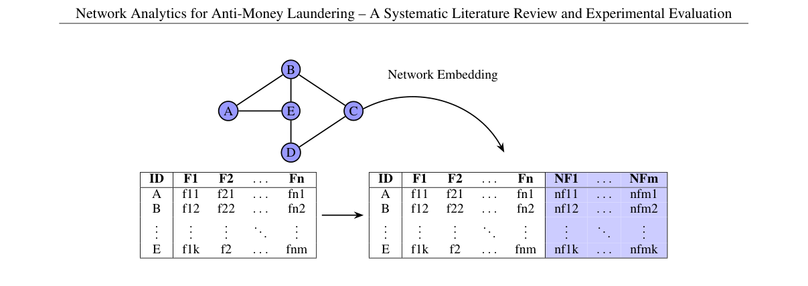

**그림 5: 특징 기술설계를 위해 및 얕은 표현 방법, 얻어진 네트워크 특징/조정은 본질적인 것에 추가됩니다.**

이 특성은 NetworkX [54] 및 NetworKit [7]를 사용하여 구성되며, PyTorch Geometric [39]에서 표현 학습이 구현됩니다. GitHub2에서 코드가 제공됩니다.

### 4.2 데이터

방법은 두 가지 데이터셋에 비해; Elliptic [37, 134] 및 IBM 돈 라 닌 [6, 36] 데이터셋. 이 문서의 두 가지 주요 줄을 다룹니다. Elliptic data set 우려 real-world crypto-거래, IBM 데이터셋 거래와 가장 많은 거래에서 fiat 통화.

#### 4.2.1 엘립틱.

Elliptic 데이터셋 [37, 134]는 49 시간 단계에 대한 Bitcoin 거래를 포함하고, 각이 약 2 주 동안. 네트워크에는 203 769 노드 및 234 355 가장자리가 있습니다. 노드는 거래에 대응하고, 가장자리는 하나의 거래의 출력이 다음의 입력임을 나타냅니다. 또한, 데이터셋는 166 사전 계산 된 특성을 포함합니다. 이 94 거래 별, 즉, 로컬 특성 및 72 집계 특성으로 나뉩니다. 노드의 이웃의 로컬 특성을 요약합니다.

모든 특성은 수치이며 이미 표준화되었습니다. 로컬 특성은 모든 방법을 위해 사용됩니다. GNNs에 포함되지 않은 특성들을 포함하지 않습니다. 이 방법들은 노드 특성을 포함한 neighbourhood 정보를 집계합니다. Weber et al.에 의해도 주소가 있 었습니다. [134]는 그래프 신경 네트워크가 집계 된 특성보다 이웃의 이질성을 해결하는 것이 좋습니다.

거래의 33%가 라벨링되어 있으며, 4 545는 illicit 및 42 019가 licit로 표시됩니다. Hence, 분류 문제는 모든 노드의 2%로 불균형됩니다. 본 연구에서는 illicit 레이블이 자동으로 거래가 launder 돈에 사용된다는 것을 의미하지 않습니다. 그러나 범죄자는이 illicit 자금의 소스를 손상하려고합니다. 그래서 우리는 여전히 알 수 있다고 믿고 있습니다. 단면도 3.2는 또한 이 자료 세트가 AML 연구에서 널리 이용됩니다 그 설명했습니다.

본 연구에서는 Pytorch Geometric library [25, 39]에 포함된 Elliptic data를 사용합니다. 본 연구에서는 기차로 기간을 분할 (1-30), 검증 (기간 31-40) 및 테스트 세트 (기간 41-49). 라벨을 가지고 있는 노드만 성능 평가에 사용됩니다. 레이블 2 (알 수 없음)과 거래는 네트워크의 건설에 포함되지만 [70, 147, 134] 훈련 또는 손실 계산에 기여하지 않습니다.

#### 4.2.2 IBM 돈 세탁.

두 번째 데이터셋는 개인, 회사 및 은행 [6, 36] 사이에 가상 세계에서 가장된 거래로 구성된 Kaggle에서 가져온 HI-Small 데이터셋입니다. 이 거래의 분수는 돈 세탁으로 라벨을 붙입니다. 레이블이 거래 수준에 있음을 알리는 것은 네트워크는 노드로 거래를 구성합니다. 거래 vi의 수신자가 거래 vj의 보낸 사람 인 경우 거래 vi에서 vj에 추가됩니다. 거래 vj는 vi 전에 일어난 거래 vj이며, 시간에 차이는 Δt, i.e보다 작습니다. Δt ≥tj −ti ≥0. 이것은 Tariq와 Hassani [120]에 의해 작업에 의해 영감을 받았으며 돈 흐름을 캡처 할 수 있습니다. 본 연구에서는 60-20-20 거래 시간에 따라 열차 유효성 테스트 분할을 가지고.

안티-돈 라우팅을위한 2https://github.com/B-Deprez/AML_Network 네트워크 분석 – 체계적인 문학 검토 및 실험 평가

<!-- 원문 21쪽 -->

**표 12: Elliptic와 IBM-AML 데이터셋를 위한 네트워크 특징. 네트워크 노드 가장자리 퍼센트 Fraud Avg. 학위 Avg. 길 길이 클러스터링**

DeepWalk 및 node2vec에 대한 대규모 데이터셋 및 하이퍼 파라미터 튜닝에 이 결과가 너무 오래 걸릴 것이므로, 마지막 500 000 거래를 완료하고 Δt를 4 시간으로 설정합니다. 500 000 노드 및 1 278 952 가장자리와 네트워크에서이 결과. 1356 거래, 즉, 0.27%, 돈 라테로 라벨링.

각 거래에는 다음을 사용하는 특성의 두 가지가 있습니다. 'Amount received', 'Receiving Currency', 'Amount Paid', 'Payment Currency', 'Payment Format'. 그 다음으로, 우리는 일주일, 시간 및 분의 거래 날짜 스탬프를 추출합니다. 카테고리의 특징, 즉, ‘통화’, ‘Payment Currency’, ‘Payment Format’, 한 열 인코딩을 사용하여 변형됩니다. 이 종이의 나머지 부분에, 우리는 IBM-AML로 설정이 데이터를 나타냅니다.

네트워크의 topology의 분석은 잘 알려진 네트워크 특성을 기반으로 Table 12에서 제공됩니다. IBM-AML은 Elliptic 데이터셋와 비교하여 훨씬 더 연결되고, 평균도가 높고 평균 경로 길이가 낮습니다. 이것은 학위 배포 및 근접 중앙의 배포에 의해 손상된다, 그림 6 및 그림 7, 각각. Elliptic 데이터는 더 밀접하게 확장없는 배포를 제시하지만 IBM-AML 데이터는이에서 더 적은 정도와 더 많은 노드와 더 높은 학위 (hubs)와 함께 몇 가지 노드로 편차를 설정한다. 허브는 평균 경로 길이가 훨씬 낮아지고, 더 높은 근접 중심값을 나타냅니다.

**그림 6: Elliptic 및 IBM-AML 데이터셋의 정도 배포의 비교.**

**그림 7: Elliptic와 IBM-AML 자료 세트의 근접성 중심의 배급의 비교.**

### 4.3 Hyperparameter 조정

hyperparameters는 유효성 설정에서 AUC-PR을 극화하기 위해 조정됩니다. 그러나, 그리드 검색을 사용하여 이러한 것을 조정 할 수 없습니다. 종종 많은 hyperparameters가 있는 방법으로, 조합의 수는 자금세탁방지의 Network Analytics를 증가시킵니다. 체계적인 문학 검토 및 실험 평가

<!-- 원문 22쪽 -->

**표 13: 감독 학습 모델의 하이퍼 파라미터 값의 개요. 튜닝된 하이퍼 파라미터 값은 모델명 옆에 모체 사이를 추가합니다.**

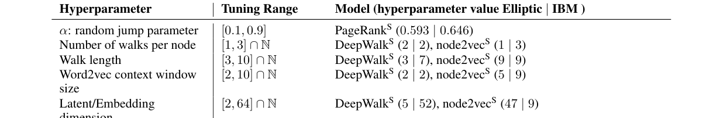

범위는 표 13 및 14에서 요약되며, 감독 및 감독되지 않는 학습을 위해 각각 요약됩니다. 본 연구에서는 Supervised 및 unsupervised 학습을 위해 수행되는 것을 나타내는 Superscript S와 U를 추가합니다. 본질적인 특징 (IF)에 근거를 둔 모형은 포함됩니다. 시험의 수는 DeepWalk 및 node2vec의 50로 설정되며, GNN에 100로 설정됩니다.

IBM 데이터셋가 훨씬 더 큽니다, 두 번의 확장성 및 메모리는 매우 중요. 특히 DeepWalk 및 node2vec는 실행할 때 훨씬 시간이 걸립니다. 높은 평균도는 또한 전환 확률 계산을 더 비싼 만듭니다. 임의의의 계산을 위한 epochs의 수는 100에서 넣는 입니다. GAT의주의 메커니즘은 쿼리 노드에 대한 조건이며, 관심은 각 노드 쌍을 배운 의미입니다. 메모리에서 모델을 훈련 할 수 있도록, 우리는 두 가지의 최대 관심을 제한합니다.

분류에 사용되는 모든 디코더는 고정 아키텍처 (Section 4.1)를 가지고 있습니다. GNNs의 경우, 디코더 중량의 훈련은 훈련 중에 다른 무게와 동시에 발생합니다. 수동 및 얕은 표현 특성의 경우, 디코더 / 클래스터는 나중에 훈련해야합니다. epochs의 숫자만 튜빙됩니다.

조정된 hyperparameters는 표 13 및 표 14에 있는 모체에서 선물됩니다.

<!-- 원문 23쪽 -->

자금세탁방지의 네트워크 분석 – 체계적인 문학 검토 및 실험적 평가

**표 14: 감독되지 않은 학습 모델의 하이퍼 파라미터 값의 개요. 튜닝된 하이퍼 파라미터 값은 모델명 옆에 모체 사이를 추가합니다.**

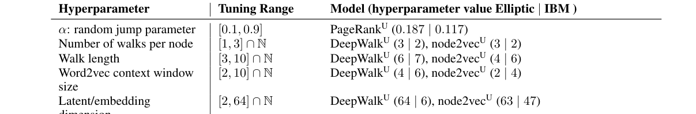

### 4.4 성능 미터

본 연구에서는 바이너리 분류 문제로 돈을 쫓아. 본 연구에서는 문학에서 가장 인기있는 성능 지표를 채택, 즉 정밀도, 회귀 및 F1-score (Section 3.2). 이 분류 임계값이 필요합니다. 조사 자원이 제한된 [129]이기 때문에, 임계 값은 정상 0.1%, 1% 또는 10%를 분류하여 상대적으로 높, 예를들면 설정됩니다. 이것은 데이터셋에서 돈 세탁의 상대적 임신과 같은 임계 값에 의해 보충됩니다.

이 문턱의 선택은 광고 - 호크이며 결론에 영향을 미칠 수 있습니다. 따라서, 우리는 또한 문턱에 의존하는 미터를 포함합니다. 이진 분류의 가장 인기 있는 것은 ROC 곡선 (AUC-ROC)의 밑에 지역입니다. ROC 곡선은 거짓 긍정적 인 비율에 대한 진정한 긍정적 인 속도를 그릴 수 있습니다. 그러나, 많은 부정적인 표본과 높게 침수된 자료 세트에서, 거짓 긍정적인 비율은 거짓 긍정적인의 절대 수가 높을 때 조차 낮을, 그것에게 미성년성 종류 [26, 111] 검출에 있는 성과 문제점에 과민한 것 같이 나타날 수 있습니다. 정밀 호출 곡선 (AUC-PR)의 영역은이 모델 [26, 102, 111]를 비교하기 위해 더 잘 적응됩니다. 이 문서에 추가, 우리가 섹션 3.2에서 보여 이후 몇 종이는 AUC-PR에 결론을 기본.

모델 안정성을 테스트하려면 모델은 훈련 세트의 무작위 버전에서 10 시간을 훈련합니다. 수동 네트워크 특성 및 얕은 표현은 고전적인 tabular 특성 (cf. 그림 5). 이 경우, 우리는 새로운 기차 세트가 원래 것과 동일한 크기로 구성되는 부츠 스트랩 방법을 적용합니다. 관측이 교체로 샘플링됩니다. 깊은 표현 방법은 기차 마스크를 적용합니다. 본 연구에서는 무작위로 선택하여 새로운 기차 마스크를 초기화합니다.

## 5 결과 및 토론

### 5.1 학습의 특징

임계 값에 의존하는 미터의 결과, 즉, AUC-ROC 및 AUC-PR, 테스트 세트에 대한 결과는 섹션 4.4에 설명 된대로 계산 된 표준 편차를 포함하여 표 15에서 표시됩니다. 또한 임계 값 의존 결과, 즉, 정밀도, 리콜 및 F1-score는 표 16 및 표 17에서 top-1% 결과에 부여됩니다. 임계값에 대한 감도를 분석하기 위해 Appendix C의 다른 세 개의 임계값에 결과를 보여줍니다.

<!-- 원문 24쪽 -->

자금세탁방지의 네트워크 분석 – 체계적인 문학 검토 및 실험적 평가

**표 15: 임계값에서 독립된 미터: 시험 세트에 근거를 둔 2개의 자료 세트를 위한 다른 방법에 AUC-ROC와 AUC-PR 가치. 표준 편차도 보고됩니다.**

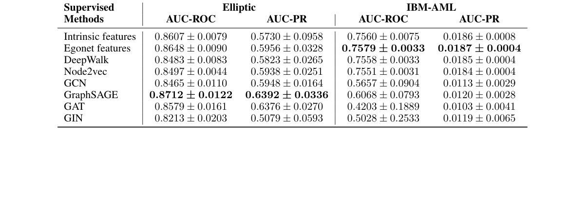

**표 16: 임계값 의존도계: 최고 1% 점수를 위한 정밀도, 리콜 및 F1 핵심 가치는 시험 세트에 근거를 둔 Elliptic 자료 세트를 위한 다른 방법 이상으로 점수를 매깁니다. 표준 편차도 보고됩니다.**

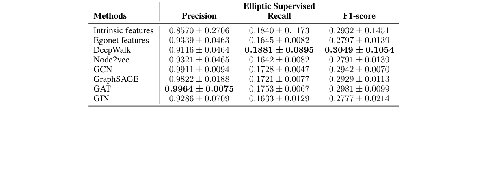

**표 17: 임계값 의존하는 미터: 정상 1% 점수를 위한 정밀도, 회귀 및 F1 핵심 가치는 IBM-AML 자료 세트를 위한 다른 방법에, 놓인 시험 세트를 위한 다른 방법. 표준 편차도 보고됩니다.**

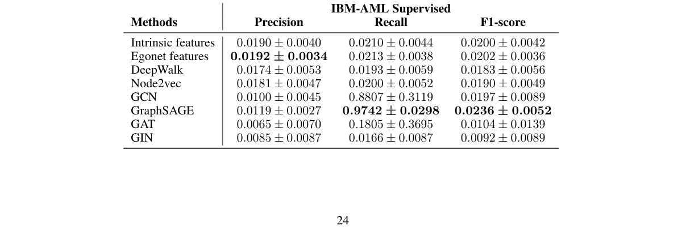

<!-- 원문 25쪽 -->

자금세탁방지의 네트워크 분석 – 체계적인 문학 검토 및 실험적인 평가 데이터셋 모두에 대한, 본질적인 특성이있는 모델은 이미 좋은 결과를 제공합니다. egonet 특성을 추가하면 데이터셋 모두에 좋습니다. 본 연구에서는 그러나 DeepWalk 및 node2vec의 성능에 대한 드롭을 참조하십시오. 이 특성은 값의 일부가, 즉,, 늦은 공간의 좌표가 상관 관계 또는 noisy이다. 분류를 위한 암호로 하는 데 사용 하는 신경 네트워크, 관련 하 고 noisy 특성 [51]에서 고통에 알려져 있다. GIN은 또한 두 데이터셋에 빈약하게 실행합니다. 하나의 설명은 집계 단계의 신경 네트워크가 최적의 것이 아니며 더 조정해야합니다. 또 다른 설명은 신경 네트워크 집계의 포함은 GIN을 더 민감하게하는 고급 불균형이다. Hence, GIN은 덜 안티 - 돈 세탁에 적합 보인다. GIN은 예측의 최고 비율에 거짓 긍정적을 감소시키는 정밀도에 대한 좋은 성능이 관찰되어야한다.

Elliptic data set을 찾고 있다면, GraphSAGE를 제외하고는 GNNs가 하위형으로 나타날 수 있다는 것을 알 수 있습니다. 또한 GAT는 AUC-PR 성능을 잘 가지고 있습니다. 본 연구에서는 표 16, C1, C3 및 C5에서 최고 비율을 위해 GNNs는 더 높은 정밀도를, 그러나 더 낮은 회귀가 있습니다. 몇 가지 경우를 감지하지만, 가장 높은 예측된 돈 세탁 번영은 훨씬 적은 거짓 긍정적 인 것을 포함합니다. 이 모델은 연습에서 채택할 때 매우 중요합니다.

표 15에서 설정된 IBM 데이터에 대한 결과는 다른 그림을 보여줍니다. egonet 특성만 향상. 임계 값 의존도계는 유사한 그림을 보여줍니다.

GNNs의 가난한 성능에 대한 하나의 설명은 네트워크 구조 (Section 4.2)과 관련이있을 수 있으며 매우 짧은 평균 경로와 많은 고도 노드. 강력한 over-smoothing [77]의 결과, 충분한 신분전력과 다른 노드에 대한 매우 유사한 임베딩로 결과.

또한, 더 깊은 분석은 훈련 손실이 발생했을 때, 훈련 및 검증 설정에 훈련하면 매우 불안합니다. epoch 및 특정 중량 초기화에 따라, 결과는 모델과 함께 널리 다를 수 있지만, 대부분의 클래스를 예측합니다. 이 특정 데이터셋의 경우, GNNs는 극단적 인 클래스 불균형 때문에 불안정성을 직면하게됩니다.

두 데이터셋에서 감독 된 학습 실험은 네트워크 구조가 안티 - 돈 세탁에 대한 추가 통찰력을 제공합니다. 관찰된 성능 개선은 제한되지만 성능의 작은 상대적 증가는 사업에 대한 재료의 영향을 갖습니다. AML 관행의 효율성은 조사관이 더 높은 품질 예측을 가지고 있기 때문에 현저하게 증가하고 거짓 긍정적 인 조사에 더 적은 시간을 소비합니다.

그러나 네트워크 지리학에 따라 클래스 불균형의 범위는 GNNs도 불안정 할 수 있습니다. 추가 실험은 GNNs의 감도를 불균형으로 정량화하기 위해 필요하지만, 이 연구의 범위 밖에 있습니다.

### 5.2 학습 방법

고립 숲을 사용하는 비 감독 된 방법의 결과는 표 18에서 제공됩니다. Elliptic 데이터셋의 결과가 특히 좋다. 0.5 아래 AUC-ROC 값과 함께. 완전성에 대해서는 Table 19의 임계값을 포함해 대부분의 모델이 어떤 돈 라우팅 케이스를 감지하지 못하게 합니다.

이 결과는 Lorenz et al에서 수행 한 이전 연구와 함께 라인에 있습니다. Elliptic 데이터셋에 대한 이상 검출 방법을 테스트 한 [83]. 저자는 추가 네트워크 분석 방법을 포함하지 않았으며 F1 점수 만보고했습니다. 그러나, 그들은 방법을 건너 뛰는 것을 발견, 이상 탐지 결과는 0와 동등한 고립 숲을 위한 보고된 F1 핵심과 더불어 감독된 학습을 위해 매우 더 나아졌습니다.

본 연구에서는 이러한 결과에 대한 추가 분석 수행. Figure 8는 Elliptic 데이터셋의 본질적인 특성을 위한 무독점 점수를 보여줍니다. 여기에, 매우 부정적인 점수는 이상치를 나타냅니다. 모든 돈 세탁 케이스는 0, 배포의 대량 내에서, 고립 숲이 이 경우를 인식하지 않는 것을 나타내는, 가까이 점수가 있습니다.

반대적으로, IBM-AML에 대한 결과는 기대와 라인에 더있다. DeepWalk에 의해 캡처 된 네트워크 정보, 여기에 최고의 성능 모델에 결과. Table 15의 이러한 결과를 비교하면 DeepWalk이 AUC-PR의 관점에서 감독 학습 방법을 설명합니다.

우리의 의견에 가장 가용적 설명은 가정에서 고립 숲과 데이터 생성 과정. Liu et al의 두 가지 특정 가정. [80]:

- 이상치는 더 낮은 조밀도를 가진 occupy 지구 때문에 몇몇 분할을 수확합니다;

- 특정 속성과의 인스턴스는 나무에서 이전 분리되어 짧은 경로에 기여합니다.

따라서 데이터셋의 본질은 성능의 차이를 설명합니다. Elliptic data set은 실제 데이터셋이며, 이 문서는 [10]를 커버하는 데 적극적으로 시도합니다. 그들은 '평균 행동'을 mimic하려고하지만 실제 거래 / 사람이 모든 속성에 평균하지 않습니다. 이것은 왜 그것은 가장 의심스러운 분류 것 같다

<!-- 원문 26쪽 -->

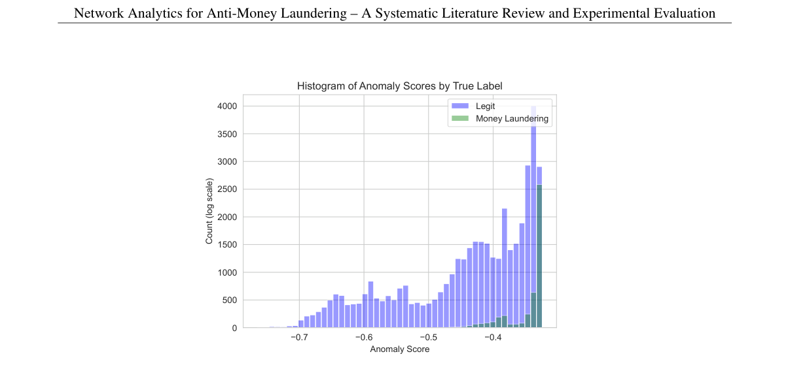

**Figure 8: 합법적인 돈 세탁 케이스에 대한 무의점. 더 부정적인 더 anomalous.**

**표 18: 임계값에서 독립된 미터: 시험 세트에 근거를 둔 2개의 자료 세트를 위한 다른 방법에 AUC-ROC와 AUC-PR 가치. 표준 편차도 보고됩니다.**

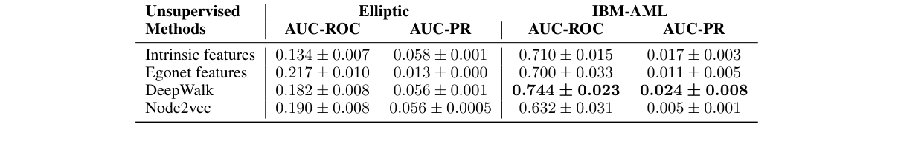

돈 라테어로 거래, 80%의 주위에 AUC-ROC를 달성할 것입니다. Hence, 'too normal'가 실제로 가장 의심 거래. 대비 IBM-AML 데이터셋는 합성이며, 가짜 패턴과 행동이 거의 도입되었습니다. 이 데이터셋에서 위장 행동이 존재하지 않는 가능성이 있습니다.

이 통찰력은 데이터셋를 사용 하 여 정확한 가정을 알고의 중요성을 강조합니다. 합성 데이터셋는 복잡한 행동이 손으로 문제로 인해 과도하게 낙관된 결과를 얻을 수 있습니다.

### 5.3 Ablation 연구

더 나은 모델의 예측 전력에 네트워크 구조의 효과를 이해하기 위해, 우리는 본질적인 특징없이 다른 모델의 성능을 분석합니다. 모델의 경우 표 13 및 표 14에서 결정하는 것과 같이 hyperparameters를 취합니다. GNNs는 특성값이 필요하므로, 각 노드가 값 1 [128]로 더미 특성을 제공합니다. 또한 Elliptic 데이터셋의 경우 요약 특성에 대한 제어가 없습니다. 따라서 우리는 이러한 특성을 무시하지만 일부 네트워크 구조를 나타냅니다.

**표 19: 임계값 의존도계: 최고 1% 점수를 위한 정밀도, 리콜 및 F1 핵심 가치는 시험 세트에 근거를 둔 Elliptic 자료 세트를 위한 다른 방법 이상으로 점수를 매깁니다. 표준 편차도 보고됩니다.**

<!-- 원문 27쪽 -->

자금세탁방지의 네트워크 분석 – 체계적인 문학 검토 및 실험적 평가

**표 20: 임계값 의존하는 미터: 정상 1% 점수를 위한 정밀도, 회귀 및 F1 핵심 가치는 IBM-AML 자료 세트를 위한 다른 방법에, 놓인 시험 세트를 위한 다른 방법. 표준 편차도 보고됩니다.**

**표 21: 임계값에서 독립된 미터: 시험 세트에 근거를 둔 2개의 자료 세트를 위한 다른 방법에 AUC-ROC와 AUC-PR 가치. 표준 편차도 보고됩니다.**

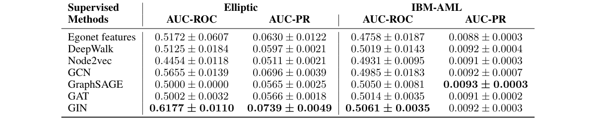

감독 학습의 결과는 표 21에서 제공됩니다. AUC 값은 네트워크 구조에 순으로 근거한 가장 메소드가 임의로 닫습니다.

어느 것이 아닌 예외는 GIN, 특히 특정 그래프 구조를 구별하기 위해 설계된 [144]. 그래프 구조는 실험의이 부분에서 사용할 수있는 유일한 정보입니다. GIN의 결과는 Elliptic 데이터셋의 사기성 및 비 난소 노드에 대한 네트워크의 일부 구조적 차이를 나타냅니다. 이 구조상 차이는 복잡합니다. 그 이후로는 egonet 특성이나 무작위 기반 것들에 의해 선택되지 않습니다.

다른 GNN 아키텍처는 노드 특성에 크게 의존하기 때문에 투쟁합니다. 특히 GAT-는 특성으로 잘 수행되는데 주의 계산에 대한 노드 특성.

IBM 데이터셋의 경우, 차이는 Elliptic 데이터셋에 대해 더 적은 발음. 네트워크 구조는 혼자 돈 세탁을 덮는 충분하지 않을 수 있습니다. 이 합성 데이터셋의 데이터 생성 과정은 돈 laundering 패턴과 특성 값 사이의 직접 상관 관계를 만듭니다. 따라서, 이 특성 값은 네트워크 구조보다 더 중요합니다.

표 22의 고립 숲에 대한 결과는 본질적인 특징과 고립 숲과 비교된 Elliptic 자료 세트를 위한 개선을 보여줍니다. 그러나, 모델은 주로 무작위 예측을 만듭니다. 특성을 포함 할 때, 더 나은 구별은 돈과 비 돈 세탁 사이에 만들 수 있습니다. 이전에 언급했듯이, 자금세탁 거래의 특성은 평균 (이슬림에 따라 무효) 그들은 다시 의심스러운 것입니다. 반대 예측은 매우 좋은 예측자에있었습니다. 네트워크 구조만 고려하면 의미있는 이상치를 찾을 수 없습니다. Hence, 이 경우의 더 높은 AUC는 모델이 무작위로 좋은 것처럼 적은 유용한 모델에 포인트.

IBM 데이터셋의 결과는 우리가 전에 본 무슨과 일치합니다. 모델은 거의 무작위 예측을 가능하게하며, 최고의 AUC-ROC와 AUC-PR 값을 제공합니다.

이 ablation 연구는 그것이 네트워크 구조가 혼자 실행 AML 모형에 왔다는 것을 보여주었습니다. 네트워크와 노드 특성 사이의 중요한 인터플레이가 있어, 2개의 결합을 할 필요가 있습니다. 또한, GNNs의 강력한 의존도를 강조했습니다. 이 노드의 특성에 대해 GIN을 일부 경우에 제외하고는 데이터 생성 프로세스에 대해 설명합니다. 돈 세탁 케이스와 IBM 데이터셋의 특성 값 사이의 비정형 상관은 네트워크 구조를 고려할 때 하위 선택적 결과에서 유래했다.

### 5.4 모델 안정성

최종 분석으로, 우리는 모델 안정성을 평가하기 위해 결과의 범위를 살펴. 그림 9는 10개의 다른 훈련 세트에 모형을 위한 결과의 상자 도형을 선물합니다.

<!-- 원문 28쪽 -->

자금세탁방지의 네트워크 분석 – 체계적인 문학 검토 및 실험적 평가

**표 22: 임계값에서 독립된 미터: 시험 세트에 근거를 둔 2개의 자료 세트를 위한 다른 방법에 AUC-ROC와 AUC-PR 가치. 표준 편차도 보고됩니다.**

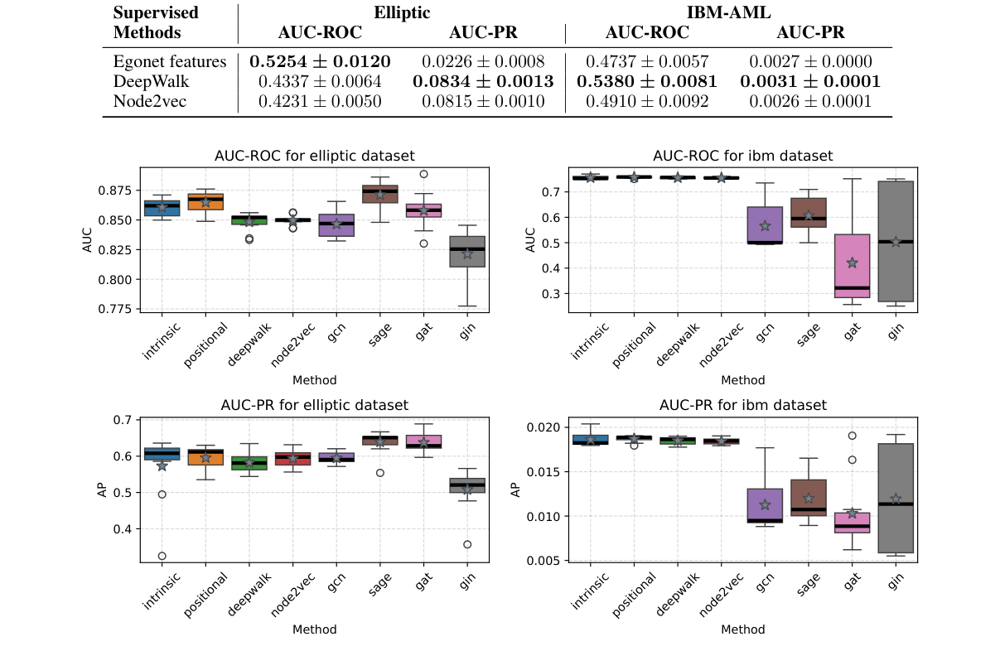

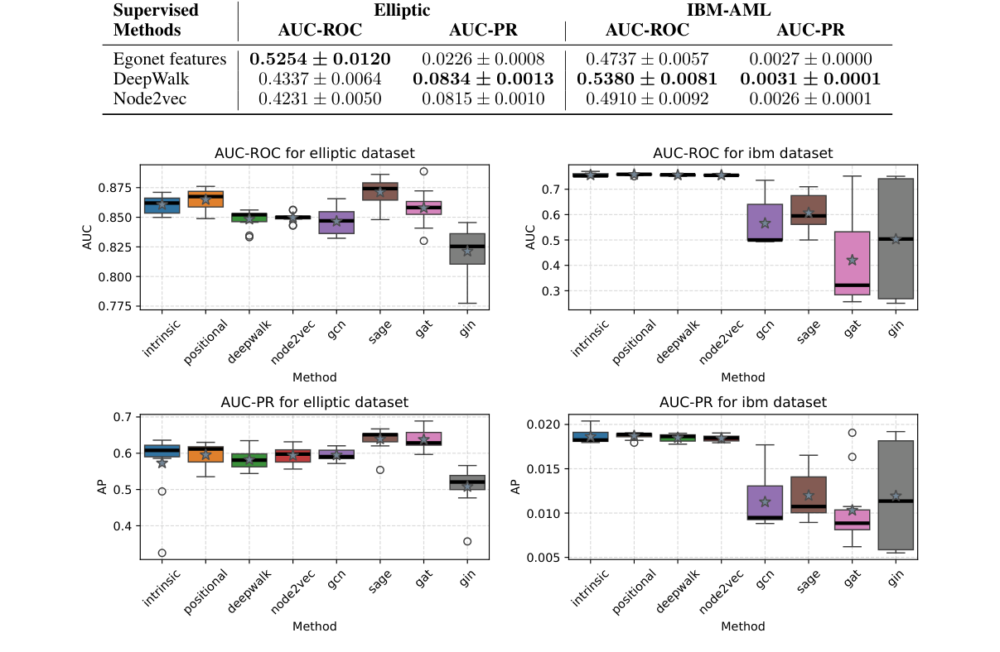

**그림 9: 10개의 다른 훈련 세트를 위한 AUC-ROC와 AUC-PR의 상자 도형.**

결과는 Elliptic 데이터셋에 매우 안정적이지만 AUC-ROC는 GNNs에 대한 좀 더 다양한 특성을 보여줍니다. IBM 데이터셋의 값은 모든 GNNs에 강한 불안정성을 보여줍니다. 반면 다른 모델은 상대적으로 안정적입니다. GNNs는 더 큰 클래스 임차 균형 때문에 IBM 데이터셋에 안정적입니다.

## 6 결론

### 6.1 문헌 검토

이 논문은 자금세탁방지에 대한 네트워크 분석에 대한 문학 리뷰를 제시합니다. 97 선택된 종이는 두 단계에서 (1)를 달성하는 것을 포괄적인 이해를 넓히는 넓은 문학과 (2)의 종합적인 이해를 가진 연구에 상세 통찰력으로 지역 사회에 의해 잘 받아졌습니다. 종합 분석은 7 가지 범주에 따라 모든 종이를 분류, 각 다른 하위 통계를 가지고. 상세한 분석은 Bockel-Rickermann et al에서 제안된 프레임워크를 사용하여 더 많은 분류된 범위에서 10%의 가장 인용된 종이에 수행되었습니다. [14]. - 비디오 정보는 다른 처리 단계에 주어졌다, 도전 직면 또는 종이에 주소, 실험 수행, 네트워크 노드와 가장자리의 정의.

수동 특성 엔지니어링 및 규칙 기반 방법을 적용하여 전문가가 확고하게 쌓은 문학 문제 방법의 큰 부분. 이들의 대부분은 기본적인 네트워크 중심의 메트릭을 기반으로 합니다.

모델의 분석 및 비교는 주로 임계 값 의존도계, 가장 주목할만한 정확도, 정밀도 및 리콜을 사용하여 수행됩니다. 클래스 임밸런스를 제공, 우리는 강력하게 AML 모델에 대한 평가 미터 네트워크 분석으로 정확도의 사용에 대해 조언 – 체계적인 문학 검토 및 실험 평가. 대신 AML 연구는 표준 평가 미터로 임계 AUC-PR을 채택해야하며, 이는 고급 불균형의 존재에 모델 비교에 적합하다.

<!-- 원문 29쪽 -->

미래 연구가 반드시 주소해야 할 6 가지 중요한 간격을 식별 한 문학의 우리의 분석:

1. - 비디오 Benchmark: 문학의 다른 모델과 새로운 방법의 비교가 부족합니다. 이 쇼는 표준 오픈 소스 데이터셋를 포함하여 테스트 수행 할 수있는 통합 된 접근 방식뿐만 아니라 기본 모델과 최첨단으로 볼 수있는 consensus에 대한 합의가있을 수 있음을 보여줍니다.

2. - 비디오 Interpretability: Few 연구는 규정 및 운영 투명성에 필수적인 그래프 신경 네트워크 (GNNs)의 출력을 설명하는 도구가 탐구했습니다.

3. - 비디오 Unsupervised Methods: 고전적인 unsupervised 메소드의 제한적 탐험은 이상치를 감지하는 잠재력을 제한하고, 돈 laundering 전술로 중요한 요구 사항이 진화합니다.

4. - 비디오 Dynamic Network Analysis: 대부분의 접근법은 정적 네트워크에 의존하며, 충분한 연구가 동적인 방법으로 거래의 임시 성격을 더 잘 캡처할 수 있습니다.

5. - 비디오 특정 방법: AML 상표의 유창한 불완전성, 탐지한 케이스 및 자원 제약 때문에, 전문화한 PU-learning 기술을 위한 필요를 강조하고, 제한된 자원은 활동 가능한, 학습에 크랭크 방법을 통해 달성될 수 있던 예측을 중단하고, 실행할 수 있는 동안.

6. - 비디오 Adoption State-of-the-Art: AML은 종종 기본 네트워크 메트릭을 사용하여 수행되며, 필드의 새로운 개발이 천천히 채택됩니다. AML의 이질적이고 역동적인 네트워크의 사용을 표준화하는 필요는 있습니다. 미래 작업은 연속적인 그래프 학습, 그래프 대조 학습, 이질 및 temporal GNNs 및 AML에 대한 그래프 변압기를 비교하여 달성 할 수있는 방법을 연구해야합니다.

### 6.2 실험 평가

지식의 기존 몸에 확장하고 문헌의 간격을 부분적으로 해결하기 위해, 우리는 광범위한 실험적 평가 덮음 설명서 특성 공학, 얕고 깊은 표현 학습, 감독 및 감독되지 않은 설정에서 모두 구현합니다. 네트워크 특성은 노드 특성과 결합될 때 AML 모델에 대한 추가 예측력을 가져올 수 있습니다. 그러나 GNNs는 극한 수준의 불균형과 많은 허브와 네트워크를 직면했을 때 투쟁했습니다.

관찰 된 성능 개선은 제한되었지만 성능의 작은 상대적 증가는 사업에 대한 재료의 영향을 갖는다. AML 관행의 효율성은 조사관이 더 높은 품질 예측을 가지고 있기 때문에 현저하게 증가하고 거짓 긍정적 인 조사에 더 적은 시간을 소비합니다.

탁월한 학습 실험에서 우리는 고립 숲을 고용하고 실제 세계 Elliptic 데이터셋와 합성 IBM-AML 데이터셋 사이의 주목할만한 차이를 관찰했습니다. 합성 데이터에 있지만, 방법은 잘 수행되었지만, Elliptic 데이터의 관측은 강한 위장 전술을 전시하는 것 같습니다. 후자의 소문 점수는 자금세탁에 대한 적어도 의심 거래를 투자하는 것이 더 나은 전략이되었다. 본 연구에서는 이에서 결론을 내릴 수 있기 때문에 합성 데이터의 방법을 테스트 할 때, 그것은 지나치게 낙관적인 결과를 줄 수 있습니다.

초시 학습에 대한 우리의 실험은, 그러나, 한정. 세계적 무독성 탐지법인 고립 숲만 적용 미래 작업은 더 큰 벤치 마크로 확장에 초점을 맞추고, 로렌즈 외의 작업과 라인. [83]는 다른 글로벌 및 로컬 분석 방법을 파악하는 것과 같은 결론을 분석합니다.

추가적인 ablation 연구는 네트워크와 특성 정보를 통합하는 필요를 강조했습니다. 노드 특성을 제외하고는 모델 예측은 무작위로 좋다. 이 접근법은 문학에서 일반적이지만, 네트워크 구조에서 단독으로 재적으로 재적으로 관련하는 것이 좋습니다.

### 6.3 의약

미래 연구에 해결해야 할 우리의 일에 제한이 있습니다.

첫째, 결론은 두 가지 데이터셋를 기반으로 그려집니다. 결론을 종합하려면 데이터셋의 광범위한 범위에서 추가 테스트가 수행되어야합니다. 이 특성을 사용할 때 더 개방형 데이터셋를 포함 하 여 수행 될 수 있으며, 실제에 의존하여 우리의 코드를 사용하여 자신의 독점적 인 데이터에 방법을 테스트하고 결과를 게시 할 수 있습니다.

<!-- 원문 30쪽 -->

자금세탁방지의 네트워크 분석 – 체계적인 문학 검토 및 실험적인 평가 초, 암호는 항상 신경 네트워크에 기반을 둔다. 다운스트림 클래스터로 다른 기계 학습 방법을 적용하는 응용 및 영향 분석은 실험을 확장하는 또 다른 흥미로운 영역입니다.

셋째, hyperparameter tuning 프로세스가 제한되었습니다. Optuna는 hyperparameter 수색에 대한 효율적인 방법을 제공하지만, 50는 100에 대한 라운드를 조정하는 것은이 연구에서 충분히있을 수 있습니다. 이 종이의 선택은 모든 지루하고 가능한 한 제한된 리소스를 제공하도록 만들었습니다. 미래 작업은 매개 변수 범위와 튜닝 라운드의 수를 확장 할 수 있습니다.

## 감사의 글

이 작업은 연구 재단에 의해 지원되었다 – Flanders (FWO 연구 프로젝트 1SHEN24N) Fraud 분석에 BNP Paribas Fortis 의자. 이 작업에 사용되는 자원 및 서비스는 VSC (Flemish Supercomputer Center)에 의해 제공되었으며, 연구 재단 (FWO) 및 Flemish 정부에 의해 기금을 받았습니다.

## 참고문헌

[1] Florian Adriaens, Cigdem Aslay, Tijl De Bie, Aristides Gionis, and Jefrey Lijffijt. Discovering interesting cycles

in directed graphs. In Proceedings of the 28th ACM International Conference on Information and Knowledge Management, pages 1191–1200, 2019.

[2] Takuya Akiba, Shotaro Sano, Toshihiko Yanase, Takeru Ohta, and Masanori Koyama. Optuna: A next-generation

hyperparameter optimization framework. In Proceedings of the 25th ACM SIGKDD International Conference on Knowledge Discovery and Data Mining, 2019.

[3] Leman Akoglu, Hanghang Tong, and Danai Koutra. Graph based anomaly detection and description: a survey. Data Mining and Knowledge Discovery, 29(3):626–688, 2015. doi:10.1007/s10618-014-0365-y. URL https://doi.org/10.1007/s10618-014-0365-y.

[4] Ismail Alarab, Simant Prakoonwit, and Mohamed Ikbal Nacer. Comparative analysis using supervised learning

methods for anti-money laundering in bitcoin. In Proceedings of the 2020 5th International Conference on Machine Learning Technologies, ICMLT '20, page 11–17, Beijing, China, 2020. Association for Computing Machinery. ISBN 9781450377645. doi:10.1145/3409073.3409078. URL https://doi.org/10.1145/ 3409073.3409078.

[5] Ismail Alarab, Simant Prakoonwit, and Mohamed Ikbal Nacer. Competence of graph convolutional networks

for anti-money laundering in bitcoin blockchain. In Proceedings of the 2020 5th International Conference on Machine Learning Technologies, ICMLT '20, page 23–27, Beijing, China, 2020. Association for Computing Machinery. ISBN 9781450377645. doi:10.1145/3409073.3409080. URL https://doi.org/10.1145/ 3409073.3409080.

[6] Erik Altman, Jovan Blanuša, Luc von Niederhäusern, Beni Egressy, Andreea Anghel, and Kubilay Atasu. Realistic synthetic financial transactions for anti-money laundering models. In A. Oh, T. Naumann, A. Globerson, K. Saenko, M. Hardt, and S. Levine, editors, Advances in Neural Information Processing Systems, volume 36, pages 29851–29874. Curran Associates, Inc., 2023. URL https://proceedings.neurips.cc/paper_files/paper/2023/file/ 5f38404edff6f3f642d6fa5892479c42-Paper-Datasets_and_Benchmarks.pdf.

[7] Eugenio Angriman, Alexander van der Grinten, Michael Hamann, Henning Meyerhenke, and Manuel Pen-

schuck. Algorithms for Large-Scale Network Analysis and the NetworKit Toolkit, pages 3–20. Springer Nature Switzerland, Cham, 2022. ISBN 978-3-031-21534-6. doi:10.1007/978-3-031-21534-6_1. URL https://doi.org/10.1007/978-3-031-21534-6_1.

[8] Henrique S Assumpção, Fabrício Souza, Leandro Lacerda Campos, Vinícius T de Castro Pires, Paulo M Laurentys

de Almeida, and Fabricio Murai. Delator: Money laundering detection via multi-task learning on large transaction graphs. In 2022 IEEE International Conference on Big Data (Big Data), pages 709–714. IEEE, 2022. doi:10.1109/BigData55660.2022.10021010.

[9] LAa Badalov, SDa Belov, and ISa Kadochnikov. Checking foreign counterparty companies using big data. In

CEUR Workshop Proceedings, volume 2267, pages 523–527, 2018.

[10] Bart Baesens, Veronique Van Vlasselaer, and Wouter Verbeke. Fraud analytics using descriptive, predictive, and

social network techniques: a guide to data science for fraud detection. John Wiley & Sons, Inc, 2015. ISBN 9781119133124. doi:10.1002/9781119146841.

<!-- 원문 31쪽 -->

Network Analytics for Anti-Money Laundering – A Systematic Literature Review and Experimental Evaluation

[11] Ashwin Bahulkar, N Orkun Baycik, Thomas Sharkey, Yeming Shen, Boleslaw Szymanski, and William Wallace.

Integrative analytics for detecting and disrupting transnational interdependent criminal smuggling, money, and money-laundering networks. In 2018 IEEE International Symposium on Technologies for Homeland Security (HST), pages 1–6. IEEE, 2018. doi:10.1109/THS.2018.8574121.

[12] Luigi Bellomarini, Davide Magnanimi, Markus Nissl, and Emanuel Sallinger. Neither in the programs nor

in the data: Mining the hidden financial knowledge with knowledge graphs and reasoning. In Mining Data for Financial Applications: 5th ECML PKDD Workshop, MIDAS 2020, Ghent, Belgium, September 18, 2020, Revised Selected Papers 5, pages 119–134. Springer, 2021.

[13] Rasika Bhalerao, Maxwell Aliapoulios, Ilia Shumailov, Sadia Afroz, and Damon McCoy. Mapping the under-

ground: Supervised discovery of cybercrime supply chains. In 2019 APWG Symposium on Electronic Crime Research (eCrime), pages 1–16. IEEE, 2019. doi:10.1109/eCrime47957.2019.9037582.

[14] Christopher Bockel-Rickermann, Tim Verdonck, and Wouter Verbeke. Fraud analytics: A decade of research:

Organizing challenges and solutions in the field. Expert Systems with Applications, 232:120605, 2023. ISSN 0957- 4174. doi:https://doi.org/10.1016/j.eswa.2023.120605. URL https://www.sciencedirect.com/science/ article/pii/S0957417423011077.

[15] Richard J. Bolton and David J. Hand. Statistical Fraud Detection: A Review. Statistical Science, 17(3):235 –

255, 2002. doi:10.1214/ss/1042727940. URL https://doi.org/10.1214/ss/1042727940.

[16] Shaked Brody, Uri Alon, and Eran Yahav. How attentive are graph attention networks? CoRR, abs/2105.14491,

2021. URL https://arxiv.org/abs/2105.14491.

[17] Mehmet Ça˘glayan and ¸Serif Bahtiyar. Money laundering detection with node2vec. Gazi University Journal of

Science, 35(3):854–873, 2022.

[18] Hongyun Cai, Vincent W Zheng, and Kevin Chen-Chuan Chang. A comprehensive survey of graph embedding:

Problems, techniques, and applications. IEEE transactions on knowledge and data engineering, 30(9):1616–1637, 2018. doi:10.1109/TKDE.2018.2807452.

[19] Ramiro Daniel Camino, Radu State, Leandro Montero, and Petko Valtchev. Finding suspicious activities in

financial transactions and distributed ledgers. In 2017 IEEE International Conference on Data Mining Workshops (ICDMW), pages 787–796. IEEE, 2017. doi:10.1109/ICDMW.2017.109.

[20] Mário Cardoso, Pedro Saleiro, and Pedro Bizarro. Laundrograph: Self-supervised graph representation learning

for anti-money laundering. In Proceedings of the Third ACM International Conference on AI in Finance, ICAIF '22, pages 130–138, New York, NY, USA, 2022. Association for Computing Machinery. ISBN 9781450393768.

doi:10.1145/3533271.3561727. URL https://doi.org/10.1145/3533271.3561727.

[21] Varun Chandola, Arindam Banerjee, and Vipin Kumar. Anomaly detection: A survey. ACM Comput. Surv., 41(3),

July 2009. ISSN 0360-0300. doi:10.1145/1541880.1541882. URL https://doi.org/10.1145/1541880. 1541882.

[22] Remco Chang, Mohammad Ghoniem, Robert Kosara, William Ribarsky, Jing Yang, Evan Suma, Caroline

Ziemkiewicz, Daniel Kern, and Agus Sudjianto. Wirevis: Visualization of categorical, time-varying data from financial transactions. In 2007 IEEE symposium on visual analytics science and technology, pages 155–162. IEEE, 2007. doi:10.1109/VAST.2007.4389009.

[23] Tat-Man Cheong and Yain-Whar Si. Event-based approach to money laundering data analysis and visualization.

In Proceedings of the 3rd International Symposium on Visual Information Communication, VINCI '10, Beijing, China, 2010. Association for Computing Machinery. ISBN 9781450304368. doi:10.1145/1865841.1865869. URL https://doi.org/10.1145/1865841.1865869.

[24] Mariusz Chmielewski and Piotr Stkapor. Money laundering analytics based on contextual analysis. application of

problem solving ontologies in financial fraud identification and recognition. In Information Systems Architecture and Technology: Proceedings of 37th International Conference on Information Systems Architecture and Technology–ISAT 2016–Part I, pages 29–39. Springer, 2017.

[25] Elliptic Dataset. Source code for torch_geometric.datasets.elliptic. https://pytorch-geometric. readthedocs.io/en/latest/_modules/torch_geometric/datasets/elliptic.html. Accessed: 2024-01-31.

[26] Jesse Davis and Mark Goadrich. The relationship between precision-recall and roc curves. In Proceedings of

the 23rd International Conference on Machine Learning, ICML '06, page 233–240, Pittsburgh, Pennsylvania, USA, 2006. ISBN 1595933832. doi:10.1145/1143844.1143874. URL https://doi.org/10.1145/1143844. 1143874.

<!-- 원문 32쪽 -->

Network Analytics for Anti-Money Laundering – A Systematic Literature Review and Experimental Evaluation

[27] Min-Yuh Day. Artificial intelligence for knowledge graphs of cryptocurrency anti-money laundering in fintech.

In Proceedings of the 2021 IEEE/ACM International Conference on Advances in Social Networks Analysis and Mining, ASONAM '21, page 439–446, Virtual Event, Netherlands, 2022. Association for Computing Machinery. ISBN 9781450391283. doi:10.1145/3487351.3488415. URL https://doi.org/10.1145/ 3487351.3488415.

[28] Floris Devriendt, Jente Van Belle, Tias Guns, and Wouter Verbeke. Learning to rank for uplift modeling. IEEE

Transactions on Knowledge and Data Engineering, 34(10):4888–4904, 2022. doi:10.1109/TKDE.2020.3048510.

[29] Walter Didimo, Giuseppe Liotta, Fabrizio Montecchiani, and Pietro Palladino. An advanced network visualization

system for financial crime detection. In 2011 IEEE Pacific visualization symposium, pages 203–210. IEEE, 2011. doi:10.1109/PACIFICVIS.2011.5742391.

[30] Walter Didimo, Giuseppe Liotta, and Fabrizio Montecchiani. Vis4aui: Visual analysis of banking activity

networks. In Proceedings of the International Conference on Computer Graphics Theory and Applications and International Conference on Information Visualization Theory and Applications - Volume 1: IVAPP, (VISIGRAPP 2012), pages 799–802. INSTICC, SciTePress, 2012. ISBN 978-989-8565-02-0. doi:10.5220/0003933407990802.

[31] Walter Didimo, Luca Grilli, Giuseppe Liotta, Fabrizio Montecchiani, and Daniele Pagliuca. Visual query-

ing and analysis of temporal fiscal networks. Information Sciences, 505:406–421, 2019. ISSN 0020-0255. doi:https://doi.org/10.1016/j.ins.2019.07.097. URL https://www.sciencedirect.com/science/article/ pii/S0020025519307182.

[32] Peng Dong, Marie Loh, and Adrian Mondry. The "impact factor" revisited. Biomedical Digital Libraries, 2(1):7,

2005. doi:10.1186/1742-5581-2-7. URL https://doi.org/10.1186/1742-5581-2-7.

[33] Rafał Dre˙zewski, Jan Sepielak, and Wojciech Filipkowski. The application of social network analysis algorithms

in a system supporting money laundering detection. Information Sciences, 295:18–32, 2015. ISSN 0020-0255. doi:https://doi.org/10.1016/j.ins.2014.10.015. URL https://www.sciencedirect.com/science/article/ pii/S0020025514009979.

[34] Bogdan Dumitrescu, Andra B˘altoiu, and ¸Stefania Budulan. Anomaly detection in graphs of bank transactions for

anti money laundering applications. IEEE Access, 10:47699–47714, 2022. doi:10.1109/ACCESS.2022.3170467.

[35] The Economist. Losing the war, April 2021. URL https://www.economist.com/ finance-and-economics/2021/04/12/the-war-against-money-laundering-is-being-lost.

[36] Béni Egressy, Luc von Niederhäusern, Jovan Blanusa, Erik Altman, Roger Wattenhofer, and Kubilay Atasu.

Provably powerful graph neural networks for directed multigraphs, 2024.

[37] Elliptic. Elliptic. www.elliptic.co. Accessed: 2024-01-31.

[38] Europol. Does crime still pay? criminal asset recovery in the eu, 2016.

[39] Matthias Fey and Jan E. Lenssen. Fast graph representation learning with PyTorch Geometric. In ICLR Workshop

on Representation Learning on Graphs and Manifolds, 2019.

[40] Emily Fletcher, Charles Larkin, and Shaen Corbet. Countering money laundering and terrorist financing: A

case for bitcoin regulation. Research in International Business and Finance, 56:101387, 2021. ISSN 0275- 5319. doi:https://doi.org/10.1016/j.ribaf.2021.101387. URL https://www.sciencedirect.com/science/ article/pii/S0275531921000088.

[41] Andrea Fronzetti Colladon and Elisa Remondi. Using social network analysis to prevent money laundering. Expert Systems with Applications, 67:49–58, 2017. ISSN 0957-4174. doi:https://doi.org/10.1016/j.eswa.2016.09.029. URL https://www.sciencedirect.com/science/ article/pii/S0957417416305139.

[42] Zengan Gao and Mao Ye. A framework for data mining-based anti-money laundering research. Journal of Money

Laundering Control, 10(2):170–179, 2007. doi:10.1108/13685200710746875. URL https://doi.org/10. 1108/13685200710746875.

[43] Ignacio González García and Alfonso Mateos. Use of social network analysis for tax control in spain. Hacienda

Publica Espanola, (239):159–197, 2021.

[44] Olmer Garcia-Bedoya, Oscar Granados, and José Cardozo Burgos. Ai against money laundering networks: the

colombian case. Journal of Money Laundering Control, 24(1):49–62, 2021.

[45] Javier Garcia-Bernardo, Joost Witteman, and Marilou Vlaanderen. Uncovering the size of the illegal corporate

service provider industry in the netherlands: a network approach. EPJ Data Science, 11(1):23, 2022.

<!-- 원문 33쪽 -->

Network Analytics for Anti-Money Laundering – A Systematic Literature Review and Experimental Evaluation

[46] Ayshan Gasanova, Alexander N Medvedev, Evgeny I Komotskiy, Kamen B Spasov, and Igor N Sachkov. On the

use of data mining methods for money laundering detection based on financial transactions information. In AIP Conference Proceedings, volume 2040, page 050021. AIP Publishing LLC, 2018.

[47] Peter Gerbrands, Brigitte Unger, Michael Getzner, and Joras Ferwerda. The effect of anti-money laundering

policies: an empirical network analysis. EPJ Data Science, 11(1):15, 2022.

[48] Yanan Gong, Kam-Pui Chow, Hing-Fung Ting, and Siu-Ming Yiu. Analyzing the error rates of bitcoin clustering

heuristics. In Advances in Digital Forensics XVIII: 18th IFIP WG 11.9 International Conference, Virtual Event, January 3–4, 2022, Revised Selected Papers, pages 187–205. Springer, 2022.

[49] Ian Goodfellow, Yoshua Bengio, and Aaron Courville. Deep learning. MIT press, 2016.

[50] Palash Goyal and Emilio Ferrara. Graph embedding techniques, applications, and performance: A survey.

Knowledge-Based Systems, 151:78–94, 2018. ISSN 0950-7051. doi:https://doi.org/10.1016/j.knosys.2018.03.022. URL https://www.sciencedirect.com/science/article/pii/S0950705118301540.

[51] Léo Grinsztajn, Edouard Oyallon, and Gaël Varoquaux. Why do tree-based models still outperform deep learning

on typical tabular data? Advances in neural information processing systems, 35:507–520, 2022.

[52] Aditya Grover and Jure Leskovec. node2vec: Scalable feature learning for networks. In Proceedings of the

22nd ACM SIGKDD International Conference on Knowledge Discovery and Data Mining, KDD '16, page 855–864, San Francisco, California, USA, 2016. Association for Computing Machinery. ISBN 9781450342322. doi:10.1145/2939672.2939754. URL https://doi.org/10.1145/2939672.2939754.

[53] Andrea Gulino, Stefano Ceri, Georg Gottlob, Emanuel Sallinger, and Luigi Bellomarini. Distributed company

control in company shareholding graphs. In 2021 IEEE 37th International Conference on Data Engineering (ICDE), pages 2637–2648. IEEE, 2021. doi:10.1109/ICDE51399.2021.00294.

[54] Aric A. Hagberg, Daniel A. Schult, and Pieter J. Swart. Exploring network structure, dynamics, and function

using networkx. In Gaël Varoquaux, Travis Vaught, and Jarrod Millman, editors, Proceedings of the 7th Python in Science Conference, pages 11 – 15, Pasadena, CA USA, 2008.

[55] Oussama H Hamid. Breaking through opacity: A context-aware data-driven conceptual design for a predictive

anti money laundering system. In 2017 9th IEEE-GCC conference and exhibition (GCCCE), pages 1–9. IEEE, 2017. doi:10.1109/IEEEGCC.2017.8448084.

[56] Will Hamilton, Zhitao Ying, and Jure Leskovec. Inductive representation learning on large graphs. 30, 2017. URL https://proceedings.neurips.cc/paper_files/paper/2017/file/ 5dd9db5e033da9c6fb5ba83c7a7ebea9-Paper.pdf.

[57] HuaLong Han, YuPeng Chen, ChenYing Guo, and Yin Zhang. Blockchain abnormal transaction behavior

analysis: a survey. In Blockchain and Trustworthy Systems: Third International Conference, BlockSys 2021, Guangzhou, China, August 5–6, 2021, Revised Selected Papers 3, pages 57–69. Springer, 2021.

[58] Jing He, Jiao Tian, Yuanyuan Wu, Xinyi Cia, Kai Zhang, Mengjiao Guo, Hui Zheng, Junfeng Wu, and Yimu

Ji. An efficient solution to detect common topologies in money launderings based on coupling and connection. IEEE Intelligent Systems, 36(1):64–74, 2021. doi:10.1109/MIS.2021.3057590.

[59] Tamer Hossam Helmy, Mohamed Zaki, Tarek Salah, and Khaled Badran. Design of a monitor for detecting

money laundering and terrorist financing. Journal of Theoretical & Applied Information Technology, 85(3), 2016.

[60] Kurt Hornik. Approximation capabilities of multilayer feedforward networks. Neural Networks, 4(2):251–

257, 1991. ISSN 0893-6080. doi:https://doi.org/10.1016/0893-6080(91)90009-T. URL https://www. sciencedirect.com/science/article/pii/089360809190009T.

[61] Kurt Hornik, Maxwell Stinchcombe, and Halbert White. Multilayer feedforward networks are universal approximators. Neural Networks, 2(5):359–366, 1989. ISSN 0893-6080. doi:https://doi.org/10.1016/0893-6080(89)90020-8. URL https://www.sciencedirect.com/science/ article/pii/0893608089900208.

[62] Maryam Imanpour, Stephanie Rosenkranz, Bastian Westbrock, Brigitte Unger, and Joras Ferwerda. A mi-

croeconomic foundation for optimal money laundering policies. International Review of Law and Economics, 60:105856, 2019. ISSN 0144-8188. doi:https://doi.org/10.1016/j.irle.2019.105856. URL https: //www.sciencedirect.com/science/article/pii/S0144818818302643.

[63] Angela SM Irwin and Adam B Turner. Illicit bitcoin transactions: challenges in getting to the who, what, when

and where. Journal of money laundering control, 21(3):297–313, 2018. URL https://doi.org/10.1108/ JMLC-07-2017-0031.

<!-- 원문 34쪽 -->

Network Analytics for Anti-Money Laundering – A Systematic Literature Review and Experimental Evaluation

[64] Qing-Xuan Jia, Chun-Xu Chen, Xin Gao, Xin-Peng Li, Bo Yan, Guan-Qun Ai, Jun-Liang Li, and Jian-Hang

Xu. Anomaly detection method using center offset measurement based on leverage principle. Knowledge- Based Systems, 190:105191, 2020. ISSN 0950-7051. doi:https://doi.org/10.1016/j.knosys.2019.105191. URL https://www.sciencedirect.com/science/article/pii/S0950705119305301.

[65] Chengxiang Jin, Jie Jin, Jiajun Zhou, Jiajing Wu, and Qi Xuan. Heterogeneous feature augmentation for ponzi

detection in ethereum. IEEE Transactions on Circuits and Systems II: Express Briefs, 69(9):3919–3923, 2022. doi:10.1109/TCSII.2022.3177898.

[66] Hai Jin, Chenchen Li, Jiang Xiao, Teng Zhang, Xiaohai Dai, and Bo Li. Detecting arbitrage on ethereum through

feature fusion and positive-unlabeled learning. IEEE Journal on Selected Areas in Communications, 40(12): 3660–3671, 2022. doi:10.1109/JSAC.2022.3213335.

[67] Yaqin Jin and Zhenxin Qu. Research on anti-money laundering hierarchical model. In 2018 IEEE 9th In-

ternational Conference on Software Engineering and Service Science (ICSESS), pages 406–411. IEEE, 2018. doi:10.1109/ICSESS.2018.8663895.

[68] Mikel Joaristi, Edoardo Serra, and Francesca Spezzano. Inferring bad entities through the panama papers network.

In 2018 IEEE/ACM International Conference on Advances in Social Networks Analysis and Mining (ASONAM), pages 767–773. IEEE, 2018. doi:10.1109/ASONAM.2018.8508497.

[69] Mikel Joaristi, Edoardo Serra, and Francesca Spezzano. Detecting suspicious entities in offshore leaks networks.

Social Network Analysis and Mining, 9:1–15, 2019.

[70] Thomas N. Kipf and Max Welling. Semi-supervised classification with graph convolutional networks, 2017.

[71] Jerzy Korczak and Walter Łuszczyk. Visual exploration of cash flow chains. In 2011 Federated Conference on

Computer Science and Information Systems (FedCSIS), pages 41–46. IEEE, 2011.

[72] Aditya Kurniawan, Muhammad Yusuf Handeu, Bayu Alvian, and Ade Andriani Renouw. Information system

for depicting relations between banking customer with risk: Study case in indonesia. In 2015 3rd International Conference on Information and Communication Technology (ICoICT), pages 125–128. IEEE, 2015. doi:10.1109/ICoICT.2015.7231409.

[73] Eren Kurshan and Hongda Shen. Graph computing for financial crime and fraud detection: Trends, challenges

and outlook. International Journal of Semantic Computing, 14(04):565–589, 2020.

[74] Dattatray Vishnu Kute, Biswajeet Pradhan, Nagesh Shukla, and Abdullah Alamri. Deep learning and explainable

artificial intelligence techniques applied for detecting money laundering–a critical review. IEEE Access, 9: 82300–82317, 2021. doi:10.1109/ACCESS.2021.3086230.

[75] Michael Levi and Peter Reuter. Money laundering. Crime and justice, 34(1):289–375, 2006. doi:10.1086/501508.

[76] An Li, Zhongshuai Wang, Minghao Yu, and Di Chen. Blockchain abnormal transaction detection method based on weighted sampling neighborhood nodes. In 2022 3rd International Conference on Big Data, Artificial Intelligence and Internet of Things Engineering (ICBAIE), pages 746–752. IEEE, 2022. doi:10.1109/ICBAIE56435.2022.9985815.

[77] Qimai Li, Zhichao Han, and Xiao-ming Wu. Deeper insights into graph convolutional networks for semi-

supervised learning. Proceedings of the AAAI Conference on Artificial Intelligence, 32(1), Apr. 2018. doi:10.1609/aaai.v32i1.11604. URL https://ojs.aaai.org/index.php/AAAI/article/view/11604.

[78] Xiangfeng Li, Shenghua Liu, Zifeng Li, Xiaotian Han, Chuan Shi, Bryan Hooi, He Huang, and Xueqi Cheng.

Flowscope: Spotting money laundering based on graphs. Proceedings of the AAAI Conference on Artificial Intelligence, 34(04):4731–4738, 2020. doi:10.1609/aaai.v34i04.5906. URL https://ojs.aaai.org/index. php/AAAI/article/view/5906.

[79] Ziyu Li, Yanmei Zhang, Qian Wang, and Shiping Chen. Transactional network analysis and money laundering

behavior identification of central bank digital currency of china. Journal of Social Computing, 3(3):219–230, 2022. doi:10.23919/JSC.2022.0011.

[80] Fei Tony Liu, Kai Ming Ting, and Zhi-Hua Zhou. Isolation-based anomaly detection. ACM Trans. Knowl. Discov.

Data, 6(1), mar 2012. ISSN 1556-4681. doi:10.1145/2133360.2133363. URL https://doi.org/10.1145/ 2133360.2133363.

[81] Xuan Liu, Jia Li, Zhigao Chen, and Pengzhu Zhang. Research on financial super-network model based on

variational inequalities. In Michael J. Shaw, Dongsong Zhang, and Wei T. Yue, editors, E-Life: Web-Enabled Convergence of Commerce, Work, and Social Life, pages 66–76, Berlin, Heidelberg, 2012. Springer Berlin Heidelberg. ISBN 978-3-642-29873-8.

<!-- 원문 35쪽 -->

Network Analytics for Anti-Money Laundering – A Systematic Literature Review and Experimental Evaluation

[82] Mark E. Lokanan. Financial fraud detection: the use of visualization techniques in credit card fraud and money

laundering domains. Journal of Money Laundering Control, 26(3):436–444, 2023. doi:10.1108/JMLC-04-2022- 0058. URL https://doi.org/10.1108/JMLC-04-2022-0058.

[83] Joana Lorenz, Maria Inês Silva, David Aparício, João Tiago Ascensão, and Pedro Bizarro. Machine learning

methods to detect money laundering in the bitcoin blockchain in the presence of label scarcity. In Proceedings of the First ACM International Conference on AI in Finance, ICAIF '20, New York, NY, USA, 2021. Association for Computing Machinery. ISBN 9781450375849. doi:10.1145/3383455.3422549. URL https://doi.org/ 10.1145/3383455.3422549.

[84] Pritheega Magalingam, Stephen Davis, and Asha Rao. Using shortest path to discover criminal commu-

nity. Digital Investigation, 15:1–17, 2015. ISSN 1742-2876. doi:https://doi.org/10.1016/j.diin.2015.08.002. URL https://www.sciencedirect.com/science/article/pii/S1742287615000894. Special Issue: Big Data and Intelligent Data Analysis.

[85] Shamil Magomedov, Sergei Pavelyev, Irina Ivanova, Alexey Dobrotvorsky, Marina Khrestina, and Timur

Yusubaliev. Anomaly detection with machine learning and graph databases in fraud management. International Journal of Advanced Computer Science and Applications, 9(11), 2018.

[86] Maryam Mahootiha, Alireza Hashemi Golpayegani, and Babak Sadeghian. Designing a new method for detecting

money laundering based on social network analysis. In 2021 26th International Computer Conference, Computer Society of Iran (CSICC), pages 1–7. IEEE, 2021. doi:10.1109/CSICC52343.2021.9420621.

[87] Aili Malm and Gisela Bichler. Using friends for money: the positional importance of money-launderers in

organized crime. Trends in Organized Crime, 16:365–381, 2013. doi:10.1007/s12117-013-9205-5. URL https://doi.org/10.1007/s12117-013-9205-5.

[88] Dan McGinn, David Birch, David Akroyd, Miguel Molina-Solana, Yike Guo, and William J Knottenbelt.

Visualizing dynamic bitcoin transaction patterns. Big data, 4(2):109–119, 2016. doi:10.1089/big.2015.0056.

[89] Murad Mehmet and Duminda Wijesekera. Data analytics to detect evolving money laundering. In STIDS, pages

71–78, 2013.

[90] Murad Mehmet and Duminda Wijesekera. Using dynamic risk estimation & social network analysis to detect

money laundering evolution. In 2013 IEEE International Conference on Technologies for Homeland Security (HST), pages 310–315. IEEE, 2013. doi:10.1109/THS.2013.6699020.

[91] Murad Mehmet, Murat Güne¸sta¸s, and Duminda Wijesekera. Dynamic risk model of money laundering. In Risk

Assessment and Risk-Driven Testing: First International Workshop, RISK 2013, Held in Conjunction with ICTSS 2013, Istanbul, Turkey, November 12, 2013. Revised Selected Papers 1, pages 3–20. Springer, 2014.

[92] Giovanni Micale, Alfredo Pulvirenti, Alfredo Ferro, Rosalba Giugno, and Dennis Shasha. Fast methods for

finding significant motifs on labelled multi-relational networks. Journal of Complex Networks, 7(6):817–837, 03 2019. ISSN 2051-1329. doi:10.1093/comnet/cnz008. URL https://doi.org/10.1093/comnet/cnz008.

[93] Krzysztof Michalak and Jerzy Korczak. Graph mining approach to suspicious transaction detection. In 2011

Federated conference on computer science and information systems (FedCSIS), pages 69–75. IEEE, 2011.

[94] Tomas Mikolov, Kai Chen, Greg Corrado, and Jeffrey Dean. Efficient estimation of word representations in

vector space, 2013.

[95] Anuraj Mohan, Karthika P. V., Parvathi Sankar, K. Maya Manohar, and Amala Peter. Improving anti-money

laundering in bitcoin using evolving graph convolutions and deep neural decision forest. Data Technologies and Applications, 57(3):313–329, 2023. doi:10.1108/DTA-06-2021-0167. URL https://doi.org/10.1108/ DTA-06-2021-0167.

[96] Philippe Mongeon and Adèle Paul-Hus. The journal coverage of web of science and scopus: a comparative

analysis. Scientometrics, 106(1):213–228, 2016. doi:10.1007/s11192-015-1765-5. URL https://doi.org/ 10.1007/s11192-015-1765-5.

[97] M Nandhini and Bikram Bikash Das. An assessment and methodology for fraud detection in online social

network. In 2016 Second International Conference on Science Technology Engineering and Management (ICONSTEM), pages 104–108. IEEE, 2016. doi:10.1109/ICONSTEM.2016.7560932.

[98] Mark Newman. Networks: An Introduction. Oxford University Press, 03 2010. ISBN 9780199206650. doi:10.1093/acprof:oso/9780199206650.001.0001. URL https://doi.org/10.1093/ acprof:oso/9780199206650.001.0001.

[99] E.W.T. Ngai, Yong Hu, Y.H. Wong, Yijun Chen, and Xin Sun. The application of data mining techniques in

financial fraud detection: A classification framework and an academic review of literature. Decision Support

<!-- 원문 36쪽 -->

Network Analytics for Anti-Money Laundering – A Systematic Literature Review and Experimental Evaluation

Systems, 50(3):559–569, 2011. ISSN 0167-9236. doi:https://doi.org/10.1016/j.dss.2010.08.006. URL https: //www.sciencedirect.com/science/article/pii/S0167923610001302. On quantitative methods for

detection of financial fraud.

[100] Normah Omar, Ismail bin Mohamed, Zuraidah Mohd Sanusi, and Hendi Yogi Prabowo. Understanding social

network analysis (sna) in fraud detection. In Proceedings of the International Congress on Interdisciplinary Behaviour and Social Sciences, pages 543–548, 2014.

[101] Michael Ovelgönne, Chanhyun Kang, Anshul Sawant, and VS Subrahmanian. Covertness centrality in networks.

In 2012 IEEE/ACM International Conference on Advances in Social Networks Analysis and Mining, pages 863–870. IEEE, 2012. doi:10.1109/ASONAM.2012.156.

[102] Brice Ozenne, Fabien Subtil, and Delphine Maucort-Boulch. The precision–recall curve overcame the optimism

of the receiver operating characteristic curve in rare diseases. Journal of clinical epidemiology, 68(8):855–859, 2015.

[103] Lawrence Page, Sergey Brin, Rajeev Motwani, and Terry Winograd. The pagerank citation ranking: Bringing

order to the web. Technical report, Stanford InfoLab, 1999.

[104] Bryan Perozzi, Rami Al-Rfou, and Steven Skiena. Deepwalk: online learning of social representations. In

Proceedings of the 20th ACM SIGKDD International Conference on Knowledge Discovery and Data Mining, KDD '14, page 701–710, New York, New York, USA, 2014. Association for Computing Machinery. ISBN 9781450329569. doi:10.1145/2623330.2623732. URL https://doi.org/10.1145/2623330.2623732.

[105] Silivanxay Phetsouvanh, Frédérique Oggier, and Anwitaman Datta. Egret: Extortion graph exploration techniques

in the bitcoin network. In 2018 IEEE International conference on data mining workshops (ICDMW), pages 244–251. IEEE, 2018. doi:10.1109/ICDMW.2018.00043.

[106] Clifton Phua, Vincent C. S. Lee, Kate Smith-Miles, and Ross W. Gayler. A comprehensive survey of data mining-

based fraud detection research. CoRR, abs/1009.6119, 2010. URL http://arxiv.org/abs/1009.6119.

[107] Kirill Plaksiy, Andrey Nikiforov, and Natalia Miloslavskaya. Applying big data technologies to detect cases of

money laundering and counter financing of terrorism. In 2018 6th International Conference on Future Internet of Things and Cloud Workshops (FiCloudW), pages 70–77. IEEE, 2018.

[108] Mario Alfonso Prado-Romero and Andrés Gago-Alonso. Community feature selection for anomaly detection

in attributed graphs. In Progress in Pattern Recognition, Image Analysis, Computer Vision, and Applications: 21st Iberoamerican Congress, CIARP 2016, Lima, Peru, November 8–11, 2016, Proceedings 21, pages 109–116. Springer, 2017.

[109] M Mazhar Rathore, Sushil Chaurasia, and Dhirendra Shukla. Mixers detection in bitcoin network: a step towards

detecting money laundering in crypto-currencies. In 2022 IEEE International Conference on Big Data (Big Data), pages 5775–5782. IEEE, 2022. doi:10.1109/BigData55660.2022.10020982.

[110] Piergiorgio Ricci. How economic freedom reflects on the bitcoin transaction network. Journal of Industrial and

Business Economics, 47(1):133–161, 2020.

[111] Takaya Saito and Marc Rehmsmeier. The precision-recall plot is more informative than the roc plot when

evaluating binary classifiers on imbalanced datasets. PloS one, 10(3):e0118432, 2015.

[112] A Semenov, D Doropheev, A Mazeev, and T Yusubaliev. Survey of common design approaches in aml software

development. In CEUR Workshop Proceedings, pages 1–9, 2017.

[113] Ted E Senator, Henry G Goldberg, Jerry Wooton, Matthew A Cottini, AF Umar Khan, Christina D Klinger,

Winston M Llamas, Michael P Marrone, and Raphael WH Wong. Financial crimes enforcement network ai system (fais) identifying potential money laundering from reports of large cash transactions. AI magazine, 16(4): 21–21, 1995. doi:10.1609/aimag.v16i4.1169.

[114] Abdul K Shaikh and Amril Nazir. A model for identifying relationships of suspicious customers in money

laundering using social network functions. In Proceedings of the world congress on engineering, volume 1, pages 4–7, 2018.

[115] Abdul Khalique Shaikh, Malik Al-Shamli, and Amril Nazir. Designing a relational model to identify relationships

between suspicious customers in anti-money laundering (aml) using social network analysis (sna). Journal of Big Data, 8:1–22, 2021.

[116] Yeming Shen, Thomas C. Sharkey, Boleslaw K. Szymanski, and William (Al) Wallace. Interdicting inter-

dependent contraband smuggling, money and money laundering networks. Socio-Economic Planning Sciences, 78:101068, 2021. ISSN 0038-0121. doi:https://doi.org/10.1016/j.seps.2021.101068. URL https: //www.sciencedirect.com/science/article/pii/S0038012121000604.

<!-- 원문 37쪽 -->

Network Analytics for Anti-Money Laundering – A Systematic Literature Review and Experimental Evaluation

[117] Rafael Sousa Lima, André Luiz Marques Serrano, Joshua Onome Imoniana, and César Medeiros Cupertino.

Identifying financial patterns of money laundering with social network analysis: A brazilian case study. Journal of Money Laundering Control, 25(1):118–134, 2022. [118] Michele Starnini, Charalampos E Tsourakakis, Maryam Zamanipour, André Panisson, Walter Allasia, Marco

Fornasiero, Laura Li Puma, Valeria Ricci, Silvia Ronchiadin, Angela Ugrinoska, et al. Smurf-based anti-money laundering in time-evolving transaction networks. In Machine Learning and Knowledge Discovery in Databases. Applied Data Science Track: European Conference, ECML PKDD 2021, Bilbao, Spain, September 13–17, 2021, Proceedings, Part IV 21, pages 171–186. Springer, 2021. [119] Kai Sun, Kun Meng, and Ziqiang Zheng. Game-bc: A graph attention model for exploring bitcoin crime. In

2022 6th International Symposium on Computer Science and Intelligent Control (ISCSIC), pages 342–346. IEEE, 2022. doi:10.1109/ISCSIC57216.2022.00077. [120] Haseeb Tariq and Marwan Hassani. Topology-agnostic detection of temporal money laundering flows in

billion-scale transactions, 2023. URL https://arxiv.org/abs/2309.13662. [121] Jeyakumar Samantha Tharani, Eugene Yougarajah Andrew Charles, Zhé Hóu, Marimuthu Palaniswami, and

Vallipuram Muthukkumarasamy. Graph based visualisation techniques for analysis of blockchain transactions. In 2021 IEEE 46th Conference on Local Computer Networks (LCN), pages 427–430. IEEE, 2021. doi:10.1109/LCN52139.2021.9524878. [122] Elena Tiukhova, Manon Reusens, Bart Baesens, and Monique Snoeck. Benchmarking conventional outlier

detection methods. In Renata Guizzardi, Jolita Ralyté, and Xavier Franch, editors, Research Challenges in Information Science, pages 597–613, Cham, 2022. Springer International Publishing. ISBN 978-3-031-05760-1.

[123] Elena Tiukhova, Emiliano Penaloza, María Óskarsdóttir, Bart Baesens, Monique Snoeck, and Cristián

Bravo. Inflect-dgnn: Influencer prediction with dynamic graph neural networks. IEEE Access, 2024. doi:10.1109/ACCESS.2024.3443533. [124] Adam B Turner, Stephen McCombie, and Allon J Uhlmann. A target-centric intelligence approach to wannacry

2.0. Journal of Money Laundering Control, 22(4):646–665, 2019. [125] Adam B Turner, Stephen McCombie, and Allon J Uhlmann. Discerning payment patterns in bitcoin from

ransomware attacks. Journal of Money Laundering Control, 23(3):545–589, 2020. [126] United Nations Office on Drugs and Crime. Money laundering. https://www.unodc.org/unodc/en/ money-laundering/overview.html. Accessed: 2023-04-07. [127] Rafaël Van Belle, Sandra Mitrovi´c, and Jochen De Weerdt. Representation learning in graphs for credit card fraud

detection. In Mining Data for Financial Applications: 4th ECML PKDD Workshop, MIDAS 2019, Würzburg, Germany, September 16, 2019, Revised Selected Papers 4, pages 32–46. Springer, 2020. [128] Rafaël Van Belle, Charles Van Damme, Hendrik Tytgat, and Jochen De Weerdt. Inductive graph representation learning for fraud detection. Expert Systems with Applications, 193:116463, 2022. doi:https://doi.org/10.1016/j.eswa.2021.116463. [129] Rafaël Van Belle, Bart Baesens, and Jochen De Weerdt. Catchm: A novel network-based credit card fraud

detection method using node representation learning. Decision Support Systems, 164:113866, 2023. ISSN 0167- 9236. doi:https://doi.org/10.1016/j.dss.2022.113866. URL https://www.sciencedirect.com/science/ article/pii/S0167923622001373. [130] Toon Vanderschueren, Bart Baesens, Tim Verdonck, and Wouter Verbeke. A new perspective on classifica-

tion: Optimally allocating limited resources to uncertain tasks. Decision Support Systems, 179:114151, 2024. ISSN 0167-9236. doi:https://doi.org/10.1016/j.dss.2023.114151. URL https://www.sciencedirect.com/ science/article/pii/S0167923623002269. [131] Rafael B Velasco, Igor Carpanese, Ruben Interian, Octavio CG Paulo Neto, and Celso C Ribeiro. A decision

support system for fraud detection in public procurement. International Transactions in Operational Research, 28(1):27–47, 2021. [132] Petar Veliˇckovi´c, Guillem Cucurull, Arantxa Casanova, Adriana Romero, Pietro Liò, and Yoshua Bengio. Graph

attention networks, 2018. [133] Zhonglin Wang, Niu Guiqian, Zhou Yan, and Yaqiong Mu. Detection mechanism of money laundering based on

random walk and skip-grim model. In 2022 IEEE 5th International Conference on Electronic Information and Communication Technology (ICEICT), pages 444–448. IEEE, 2022. doi:10.1109/ICEICT55736.2022.9909113. [134] Mark Weber, Giacomo Domeniconi, Jie Chen, Daniel Karl I. Weidele, Claudio Bellei, Tom Robinson, and

Charles E. Leiserson. Anti-money laundering in bitcoin: Experimenting with graph convolutional networks for financial forensics, 2019.

<!-- 원문 38쪽 -->

Network Analytics for Anti-Money Laundering – A Systematic Literature Review and Experimental Evaluation

[135] Ollie A Williams. Watchdogs hit money launderers with record fines, Aug 2021. URL https://www.forbes.com/sites/oliverwilliams1/2021/08/26/ money-laundering-thrived-during-covid-pandemic/. [136] Donald Winiecki, Katherine Kappelman, Bryant Hay, Mikel Joaristi, Edoardo Serra, and Francesca Spezzano.

Validating bad entity ranking in the panama papers via open-source intelligence. In 2020 IEEE/ACM International Conference on Advances in Social Networks Analysis and Mining (ASONAM), pages 752–759. IEEE, 2020. doi:10.1109/ASONAM49781.2020.9381389. [137] Jiajing Wu, Jieli Liu, Weili Chen, Huawei Huang, Zibin Zheng, and Yan Zhang. Detecting mixing services via

mining bitcoin transaction network with hybrid motifs. IEEE Transactions on Systems, Man, and Cybernetics: Systems, 52(4):2237–2249, 2021. [138] Lei Wu, Yufeng Hu, Yajin Zhou, Haoyu Wang, Xiapu Luo, Zhi Wang, Fan Zhang, and Kui Ren. Towards

understanding and demystifying bitcoin mixing services. In Proceedings of the Web Conference 2021, WWW '21, page 33–44, Ljubljana, Slovenia, 2021. ISBN 9781450383127. doi:10.1145/3442381.3449880. URL

https://doi.org/10.1145/3442381.3449880. [139] Zonghan Wu, Shirui Pan, Fengwen Chen, Guodong Long, Chengqi Zhang, and S Yu Philip. A comprehensive

survey on graph neural networks. IEEE transactions on neural networks and learning systems, 32(1):4–24, 2020. doi:10.1109/TNNLS.2020.2978386. [140] Pingfan Xia, Zhiwei Ni, Hongwang Xiao, Xuhui Zhu, and Peng Peng. A novel spatiotemporal prediction

approach based on graph convolution neural networks and long short-term memory for money laundering fraud. Arabian Journal for Science and Engineering, 47(2):1921–1937, 2022. doi:10.1007/s13369-021-06116-2. URL

https://doi.org/10.1007/s13369-021-06116-2. [141] Zhao Xiao, Yuelei Li, and Kang Zhang. Visual analysis of risks in peer-to-peer lending market. Personal and

Ubiquitous Computing, 22:825–838, 2018. [142] Jianying Xiong and Wen Xiao. Identification of key nodes in abnormal fund trading network based on improved

pagerank algorithm. Journal of Physics: Conference Series, 1774(1):012001, jan 2021. doi:10.1088/1742- 6596/1774/1/012001. URL https://dx.doi.org/10.1088/1742-6596/1774/1/012001. [143] Jianying Xiong and Haifeng Zhong. Identification of money laundering accounts based on weighted cap-

ital flow network. Journal of Physics: Conference Series, 1629(1):012023, sep 2020. doi:10.1088/1742- 6596/1629/1/012023. URL https://dx.doi.org/10.1088/1742-6596/1629/1/012023. [144] Keyulu Xu, Weihua Hu, Jure Leskovec, and Stefanie Jegelka. How powerful are graph neural networks?, 2019. [145] Xie Xueshuo, Wang Jiming, Ye Junyi, Fang Yaozheng, Lu Ye, Li Tao, and Wang Guiling. Awap: Adaptive

weighted attribute propagation enhanced community detection model for bitcoin de-anonymization. Applied Soft Computing, 109:107507, 2021. ISSN 1568-4946. doi:https://doi.org/10.1016/j.asoc.2021.107507. URL https://www.sciencedirect.com/science/article/pii/S1568494621004300. [146] Qingqing Yang, Yuexin Xiang, Wenmao Liu, and Wei Ren. An illicit bitcoin address analysis scheme based

on subgraph evolution. In 2022 IEEE 24th Int Conf on High Performance Computing & Communications; 8th Int Conf on Data Science & Systems; 20th Int Conf on Smart City; 8th Int Conf on Dependability in Sensor, Cloud & Big Data Systems & Application (HPCC/DSS/SmartCity/DependSys), pages 679–686. IEEE, 2022. doi:10.1109/HPCC-DSS-SmartCity-DependSys57074.2022.00116. [147] Zhilin Yang, William Cohen, and Ruslan Salakhudinov. Revisiting semi-supervised learning with graph embeddings. In Maria Florina Balcan and Kilian Q. Weinberger, editors, Proceedings of The 33rd International Conference on Machine Learning, volume 48 of Proceedings of Machine Learning Research, pages 40–48, New York, New York, USA, 20–22 Jun 2016. PMLR. URL https://proceedings.mlr.press/v48/yanga16.

html. [148] Yahan Yu, Yixuan Xu, Jian Wang, Zhenxing Li, and Bin Cao. Anti-money laundering risk identification of

financial institutions based on aspect-level graph neural networks. In 2022 IEEE 22nd International Conference on Software Quality, Reliability, and Security Companion (QRS-C), pages 542–546. IEEE, 2022. doi:10.1109/QRS- C57518.2022.00086. [149] Shilei Zhang, Toyotaro Suzumura, and Li Zhang. Dyngraphtrans: Dynamic graph embedding via modified

universal transformer networks for financial transaction data. In 2021 IEEE International Conference on Smart Data Services (SMDS), pages 184–191. IEEE, 2021. doi:10.1109/SMDS53860.2021.00032. [150] Maria Zhdanova, Jürgen Repp, Roland Rieke, Chrystel Gaber, and Baptiste Hemery. No smurfs: Revealing

fraud chains in mobile money transfers. In 2014 Ninth International Conference on Availability, Reliability and Security, pages 11–20. IEEE, 2014. doi:10.1109/ARES.2014.10.

<!-- 원문 39쪽 -->

Network Analytics for Anti-Money Laundering – A Systematic Literature Review and Experimental Evaluation

[151] Dawei Zhou, Si Zhang, Mehmet Yigit Yildirim, Scott Alcorn, Hanghang Tong, Hasan Davulcu, and Jingrui He. A

local algorithm for structure-preserving graph cut. In Proceedings of the 23rd ACM SIGKDD International Conference on Knowledge Discovery and Data Mining, KDD '17, page 655–664, Halifax, NS, Canada, 2017. ISBN 9781450348874. doi:10.1145/3097983.3098015. URL https://doi.org/10.1145/3097983.3098015. [152] Jiajun Zhou, Chenkai Hu, Jianlei Chi, Jiajing Wu, Meng Shen, and Qi Xuan. Behavior-aware account de-

anonymization on ethereum interaction graph. IEEE Transactions on Information Forensics and Security, 17: 3433–3448, 2022. doi:10.1109/ASONAM.2012.156. [153] Jie Zhou, Ganqu Cui, Shengding Hu, Zhengyan Zhang, Cheng Yang, Zhiyuan Liu, Lifeng Wang, Changcheng Li,

and Maosong Sun. Graph neural networks: A review of methods and applications. AI Open, 1:57–81, 2020. ISSN 2666-6510. doi:https://doi.org/10.1016/j.aiopen.2021.01.001. URL https://www.sciencedirect. com/science/article/pii/S2666651021000012. [154] Yadong Zhou, Ximi Wang, Junjie Zhang, Peng Zhang, Lili Liu, Huan Jin, and Hongbo Jin. Analyzing and detecting money-laundering accounts in online social networks. IEEE Network, 32(3):115–121, 2017. doi:10.1109/MNET.2017.1700213.

<!-- 원문 40쪽 -->

Network Analytics for Anti-Money Laundering – A Systematic Literature Review and Experimental Evaluation

0 1 Bitcoin/Crypto

0.0

0.2

0.4

0.6

0.8

1.0

Data - Crypto

Proprietary Open-source Synthetic

Figure A1: The data for papers dealing with crypto currencies (1) and those that do not (0).

### A. Crypto와 Non-Crypto Papers 사이 카테고리 분석

부록의이 부분은 비암호 관련 연구에 비해 암호화 문학의 본질에 차이를 비교하는 음모를 제공합니다.

> **주:** Crypto없이 데이터

> **주:** Proprietary 오픈 소스 합성

(a) 암호화 통화를 덮지 않는 종이에 대한 데이터의 진화.

> **주:** 데이터 암호화

> **주:** Proprietary 오픈 소스 합성

(b) 암호화 통화를 다루는 종이에 대한 년 동안 데이터의 진화.

그림 A2: 데이터의 진화.

<!-- 원문 41쪽 -->

자금세탁방지의 네트워크 분석 – 체계적인 문학 검토 및 실험적 평가

> **주:** 커뮤니티 탐지

> **주:** Flow/Chain 탐지

> **주:** 거래 분류

> **주:** 고객 분류

> **주:** 데이터

> **주:** 비암호 암호화

그림 A3: 종이의 목적의 배포.

## AUPRC TPR FPR의 특징

> **주:** 의 특징

> **주:** 정도

> **주:** 상기하다

## AUROC 소개

> **주:** 데이터

> **주:** 비암호 암호화

Figure A4: 사용된 평가 메트릭의 배포.

<!-- 원문 42쪽 -->

자금세탁방지의 네트워크 분석 – 체계적인 문학 검토 및 실험적 평가

### B. 탑-캐스팅 용지

부록의이 부분에, 우리는 최고 인용 된 종이를 요약 한 인물을 제공합니다.

> **주:** 반 감독

> **주:** 힌디어

> **주:** 의 특징

> **주:** 의 특징

> **주:** 의논하기

### 0.7 방법 유형

그림 B1: 정상 인용된 종이를 위한 방법.

> **주:** 얕은 repr.

> **주:** Neural 네트워크

> **주:** 딥 repr.

> **주:** 관련 제품

> **주:** 트리 기반

> **주:** SVM 기반

> **주:** 걷기

> **주:** 이상 탐지

> **주:** 의붓기

> **주:** 재향상

> **주:** 규칙 기반

> **주:** 수동 특성

> **주:** Modelling 방법

Figure B2: 최고 인용 종이에 대한 모델링 방법.

> **주:** 의 특징

## AUPRC AUROC TPR FPR의 특징

> **주:** 정도

> **주:** 상기하다

Figure B3: 최고 인용된 종이에 대한 성능 지표.

<!-- 원문 43쪽 -->

자금세탁방지의 네트워크 분석 – 체계적인 문학 검토 및 실험적 평가

> **주:** 커뮤니티 탐지

> **주:** 거래 분류

> **주:** Flow/Chain 탐지

> **주:** 고객 분류

> **주:** 의 특징

그림 B4: 최고 인용 종이의 목적.

> **주:** 제품정보

> **주:** 회사 소개

> **주:** 의논문

> **주:** 데이터

Figure B5: 최고 인용 종이의 데이터의 본질.

<!-- 원문 44쪽 -->

자금세탁방지의 네트워크 분석 – 체계적인 문학 검토 및 실험 평가 표 C1: 위협자 의존도 측정: 정밀, 회고 및 F1-score 값에 대한 상단 0.1% 점수에 대한 Elliptic 데이터셋에 대한 다른 방법, 테스트 세트에 따라. 표준 편차도 보고됩니다.

## 방법 정밀도 Recall F1 핵심

## 방법 정밀도 Recall F1 핵심

### C. 결과 Threshold-Dependent Metrics

부록의이 부분에, 우리는 다른 문턱을 사용하여 모델에 대한 정밀도, 리콜 및 F1-scores를 제공합니다. 임계 값은 상단 0.1%, 10% 및 점수의 p%와 관찰이 돈 라 딩으로 분류되어 있으며, p%가 라벨의 상대적 인 발생과 동일합니다.

표 C3: 임계값: 정밀, 리콜 및 F1-score 값은 상단 10% 점수를 위한 Elliptic data set에 대한 다른 방법들을 통해, 테스트 세트에 따라 계산됩니다. 표준 편차도 보고됩니다.

## 방법 정밀도 Recall F1 핵심

<!-- 원문 45쪽 -->

## 방법 정밀도 Recall F1 핵심

## 방법 정밀도 Recall F1 핵심

## 방법 정밀도 Recall F1 핵심
