# 프로젝트 오로라: 기관과 국경을 넘어 자금세탁에 대응하는 데이터·기술·협업의 힘

> **원문 제목:** Project Aurora: The Power of Data, Technology and Collaboration to Combat Money Laundering Across Institutions and Borders  
> **저자:** BIS Innovation Hub Nordic Centre  
> **게재 정보:** Bank for International Settlements, May 2023  
> **DOI:** 별도 표기 없음

> **번역 안내:** 본문과 부록은 문단 문맥을 기준으로 한국어로 옮겼습니다. 수식과 참고문헌은 정확성을 위해 원문 표기를 유지했습니다. 원문의 그림과 표는 개별 이미지로 잘라 해당 본문 위치에 바로 배치했습니다.

---

<!-- 원문 1쪽 -->

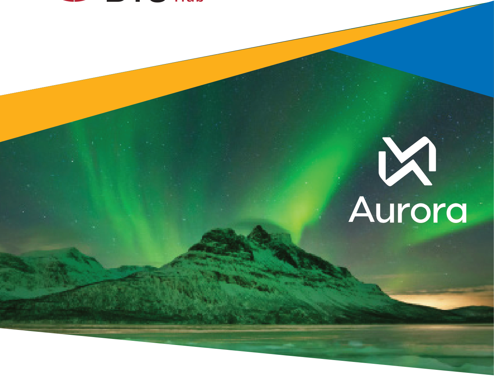

## 프로젝트 Aurora

5월 2023 데이터의 힘, 기술 및 기관과 국경을 맞은 돈의 전투에 협력

<!-- 원문 2쪽 -->

<!-- 원문 3쪽 -->

Project Aurora: 데이터, 기술 및 협업의 힘은 돈 세탁을 전투합니다.

## Preface: 이 보고서를 읽는 방법

## 프로젝트 개요, 유용한 배경 및 키 찾기 읽기

- 장 2: 경영진

- 장 3: 소개

- 장 4: 프로젝트 오로라 - 개념 증명

- 장 6: 결론

## 더 많은 지원 세부사항을 위해 읽으십시오

- 장 5: 더 많은 고려 사항

- Annex A: 동향 및 기회

## 다른 세부 사항 읽기

- 별관 B - E

## Project Aurora는 파트너십을 맺고

발행일: 5월 2023. © 국제 정착을위한 은행 2023. 의 모든 권리 Brief 발췌는 재제작되거나 번역된 소스가 명시된 것입니다.

<!-- 원문 4쪽 -->

Project Aurora: 데이터, 기술 및 협업의 힘은 돈 세탁을 전투합니다.

## 의논하기

## 1 약어, 약어 및 정의 7

## 2 10 개요

### 1.1 배경 10

### 1.2 데이터, 기술 및 혁신 11

### 1.3 프로젝트 오로라 12

### 1.4 찾아와 열쇠 도가니 12

#### 1.4.1 지불 데이터의 전체보기는 돈 세탁 네트워크 13를 공개

#### 1.4.2 Behavioural 모니터링 및 개인 정보 보호 강화 기술은 AML 노력 13에 대한 게임 체인저가 될 수 있습니다

#### 1.4.3 프로젝트 오로라 14를 레버로 처리

## 3 16 소개

### 3.1 돈 세탁은 무엇입니까? 모델 번호: 16

### 3.2 돈 라우팅 과정 17

### 3.3 AML 모니터링 및 분석 오늘 18

#### 3.3.1 규칙 기반 모니터링 시스템 18

#### 3.3.2 Behavioural 감시 체계 19

#### 3.3.3 보고 및 de-risking 결과 19

### 3.4 AML 노력 20에 직면하는 도전

### 3.5 기술 22

#### 3.5.1 개인화 기술 (PET) 22

#### 3.5.2 그래프 데이터 구조 23

#### 3.5.3 기계 학습 23

#### 3.5.4 네트워크 분석 24

### 3.6 동향 및 기회의 개요 24

## 4 프로젝트 오로라 - 개념의 증거 26

### 4.1 목표 및 범위 26

#### 4.1.1 객관적인 26

#### 4.1.2 범위 27

### 4.2 부품 A: 합성 데이터 생성 29

#### 4.2.1 합성 자료 29 생성의 목적

#### 4.2.2 합성 자료 30 생성

#### 4.2.3 합성 데이터 31를 생성하는 세 단계 접근 방식을 활용

<!-- 원문 5쪽 -->

Project Aurora: 데이터, 기술 및 협업의 힘은 돈 세탁을 전투합니다.

#### 4.2.4 합성 데이터셋 34에서 돈 세탁 활동을 건설

### 4.3 부품 B: 합성 데이터셋 39에 기계 학습의 응용

#### 4.3.1 기계 학습 모델 39

#### 4.3.2 모형 41를 시험하십시오

#### 4.3.3 결과 42

#### 4.3.4 46 개요

### 4.4 부품 C: AML 48에 대한 개인 정보 보호 강화 기술 테스트

#### 4.4.1 48를 탐구하는 개인화 기술

#### 4.4.2 4가지 다른 협업 분석 및 학습 배열 49의 개인 정보 보호 강화 기술의 조합을 테스트

#### 4.4.3 결과: 개인 정보 보호 강화 기술 55와 결합하여 기계 학습 모델을 적용

#### 4.4.4 거래 데이터를 암호화 할 때 PET의 개인 평가. 모델 번호: 61

#### 4.4.5 62 개요

## 5 65를 더 고려하십시오

### 5.1 자료 65

#### 5.1.1 추가 데이터 및 돈 라우팅 태아 65

#### 5.1.2 Real-world 데이터는 타당성 및 충격 66를 이해하는 데 중요합니다.

#### 5.1.3 지불 데이터의 제한 및 다른 데이터 66의 필요

#### 5.1.4 자료 보호 67

### 5.2 기술 67

#### 5.2.1 CAL 배열 67와 기술적인 도전

#### 5.2.2 68를 공유하는 정보를 촉진하는 기계 읽기 쉬운 태종

#### 5.2.3 설명 71

### 5.3 71를 앞서보기

#### 5.3.1 즉시 지불 시스템, CBDC 시스템 및 금융 범죄 71

#### 5.3.2 법률 및 규제 고려 사항 72

## 6 결론 74

## 7 별관 A: 동향 및 기회 77

### 7.1 지불 77에서 표준화, 투명성 및 조화

#### 7.1.1 크로스 국경 지불 77를 강화하기위한 G20 로드맵

#### 7.1.2 ISO 20022 조화 77

#### 7.1.3 법적인 법인 식별 및 유익한 소유권 78에 대한 데이터 표준

#### 7.1.4 Wolfsberg 그룹 지불 투명성 표준 79

<!-- 원문 6쪽 -->

Project Aurora: 데이터, 기술 및 협업의 힘은 돈 세탁을 전투합니다.

### 7.2 거래 모니터링 유틸리티 79

#### 7.2.1 TMU 예제: 네덜란드 81의 거래 모니터링

### 7.3 즉시 지불 체계와 잠재적인 CBDC 체계 81

### 7.4 지불 82에 사용되는 공개 블록 체인

## 8 Annex B: 이 PoC 83에서 기계 학습

### 8.1 기계 학습 훈련, 검증 및 평가 83

### 8.2 기계 학습 모델 특성 엔지니어링 84

## 9 별관 C: 개인화하에 기술 85

### 9.1 PET의 개요 85

#### 9.1.1 Homomorphic 암호화 85

#### 9.1.2 지역 차별 개인 정보 보호 85

#### 9.1.3 학습 86를 강화

#### 9.1.4 기타 개인 정보 보호 강화 기술 86

### 9.2 PET의 응용 87

## 10 Annex D: 실제 파일럿 91를 지원하는 질문

### 10.1 목표, 성능 모니터링 및 범위 91

### 10.2 데이터 및 분석 91

### 10.3 포스트-그림자 질문 93

## 11 Annex E: 추가 약어 및 정의 94

## 12 96 참조

## 13 Acknowledgements 100의 특징

<!-- 원문 7쪽 -->

Project Aurora: 데이터, 기술 및 협업의 힘은 돈 세탁을 전투합니다.

## 1 약어, 약어 및 정의

프로젝트의 특정 약어, 약어 및 정의 프로젝트 오로라에서 사용 된 대담한. 다른 유용한 약어, 약어 및 정의는 Annex E에 나열됩니다.

## 모델 번호: AML

안티 - 돈 세탁은 규칙, 법, 원칙, 규정, 프로세스 및 금융 부문에 특정 도구 세트를 포함하여 모든 종류의 작업을 포함합니다 - 불법 자금의 위반을 얻은 객관적으로 범죄에 의해 얻은 객관적 인 객관적 인 의 목적.

## ᄋᄋᄋ

인공 신경망은 뇌의 신경의 단순화에 의해 영감을받은 기계 학습의 하위 집합입니다. 그들은 복잡한 네트워크 관계 및 패턴에 적용 할 수 있습니다.

국제 정착을위한 BIS Bank.

## CAL(주)

협업 분석 및 학습. 이 집단 용어는 중앙 집중식 방식으로 데이터 공유 및 분석에 의해 공동으로 다른 당사자가 공동으로 협력하는 접근을 의미합니다. 또는 다른 당사자는 로컬 데이터에 기계 학습 모델을 훈련시키는 데 집중된 방식으로 학습을 사용하여 공동으로 협력합니다. 그런 다음 모든 당사자와 공유되는 일반적인 모델에서 학습을 업데이트합니다. Hybrid CAL은 중앙화된 접근법으로 구성됩니다.

## CFT(대형)

테러의 금융을 반대하는 것은 반반항과 관련된 비슷한 행동과 힘을 포함한다. 이러한 행동은 촉발적인 테러를 촉진하는 것을 목표로 합니다.

## 퀵메뉴

복잡한 계층화 계획은 종종 돈 세탁에 사용되는 다른 금융 기관의 여러 계정의 복잡한 네트워크를 포함한다.

CPMI 결제 및 시장 인프라 위원회.

FATF 금융 작업 작업 힘.

## ₢ 킹

Federated Learning은 여러 엔티티티를 사용하여 고유 데이터를 교환하지 않고 공동 모델 협업을 훈련 할 수있는 분산 된 기계 학습 프레임 워크입니다.

FIU 금융 정보 단위.

FSB 금융 안정성 보드.

## GNN 소개

그래프 neural 네트워크는 그래픽 데이터에서 작동하고 배우 (edges and nodes) 간의 관계를 설정하는 인공 신경 네트워크의 클래스입니다.

## 뚱 베어

Homomorphic 암호화는 데이터의 훼손 없이 데이터를 계산할 수 있는 암호화의 특정 종류입니다.

IPS 즉시 지불 체계.

## ISO 20022의 품질 보증

ISO 20022 표준은 다른 지불 시스템 및 관할권의 맞은편에 사용될 수 있는 금융 메시지에 대한 일반적인 언어 및 구조를 제공합니다.

## KYC 소개

고객/고객은 투자 및 금융 서비스 업계에서 사용된 필수 표준을 알고 있으며, 고객의 위험과 금융 프로파일을 파악합니다.

법률 집행 기관.

LEI 법적인 법인 식별자.

LDP 현지 차별 프라이버시.

돈 mule 네트워크 돈 mules는 의도적으로, 또는 unintentionally, 다른 사람 대신 불법 이익을 수신하고 전송함으로써 돈을 벌 수 있는 개인으로 이루어져 있습니다.

분석을위한 세 가지 다른 수준에 표시되는 시나리오 거래 데이터 모니터링, 각 금융 기관 (실험)의보기, 단일 국가 및 국가 전역의 크로스 국경보기.

## MPC의

Secure Multi-party computation은 개별 데이터를 공개하지 않고 여러 당사자가 계산을 만들 수 있도록 암호화 도구 상자입니다.

개인정보 보호 기술은 기본 데이터 보호 원칙을 위험하지 않고 데이터 가치를 추출하도록 설계된 광범위한 기술입니다.

<!-- 원문 8쪽 -->

Project Aurora: 데이터, 기술 및 협업의 힘은 돈 세탁을 전투합니다.

PII 개인 식별 정보.

PPP 공개 개인 파트너십.

illicit 자금의 진행을 끊는 행위는 다른 작은 거래 중 쉽게 숨겨질 수있는 소량으로 쉽게 할 수 있습니다.

인공적으로 원래 데이터의 특성과 구조를 재현하기 위해 훈련되는 실제 데이터에 대한 합성 정보.

## TBML의

무역 기반 돈 세탁은 국제 무역 시스템을 통해 illicit 활동의 진행을 통해 범죄에 의해 사용되는 방법입니다.

TMU 거래 모니터링 유틸리티.

## 의붓기

가상 자산 서비스 제공 업체는 교환, 보유, 안전, 판매, 변환 또는 다른 전송 가상 자산 예를 들면 암호 화폐 교환을 포함하는 자연 또는 법적인 사람입니다.

<!-- 원문 9쪽 -->

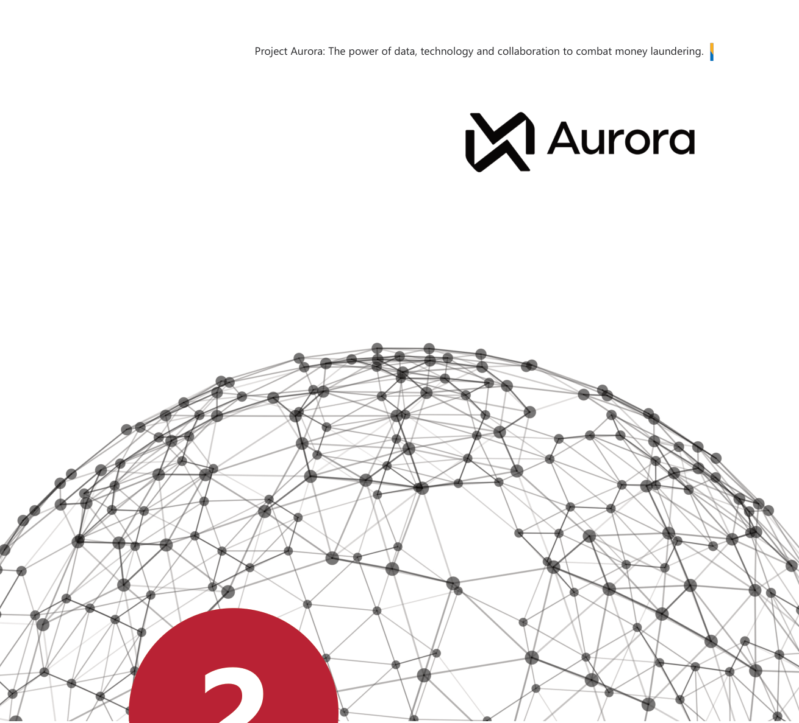

## 2 개요

Project Aurora: 데이터, 기술 및 협업의 힘은 돈 세탁을 전투합니다.

<!-- 원문 10쪽 -->

Project Aurora: 데이터, 기술 및 협업의 힘은 돈 세탁을 전투합니다.

## 2 의논문

### 2.1 배경

자금세탁은 글로벌 금융 시스템의 무결성과 안전성을 바탕으로 글로벌 문제입니다. 현재 금융 기관은 실로 덥은 방식으로 의심 활동을 위한 거래를 모니터링합니다. 그러나,이 접근법은 많은 지불 거래가 복잡하고 여러 금융 기관과 국경을 맞은 상호 연결 네트워크와 함께 효과적입니다. Criminals는 네트워크에서 작동하고이 복잡성을 악용합니다.

합법적인 illicit 거래는 결제 시스템을 통해 흐름을 흘려줍니다. 결제 데이터의 네트워크 전망은 돈 세탁을 전투하는 데 필수적입니다.

2는 UNODC를 참조하십시오. 소스는 $800 billion를 $2 조에 따라 글로벌 GDP를 작성하는 데 사용됩니다. 예상 값이 차선이 2022의 글로벌 GDP에 따라 계산되면, 이는 약 $100 조 (Statista 2023 참조), 추정 값 차선은 $2 조 - $5 조. 그것은 laundering 사이클을 통해가는 총 금액의 돈을 추정하기 어렵다.

3 statista (2023)를 참조하십시오. 총 합계의 값은 2022의 글로벌 GDP를 기반으로 추정된 값에서 계산되며, 이는 약 $100 조조였습니다.

<!-- 원문 11쪽 -->

Project Aurora: 데이터, 기술 및 협업의 힘은 돈 세탁을 전투합니다. 금융 범죄 위험에 대한 전반적인 노출을 줄이기 위해 고객 관계의 종료 ("de-risking"). 9

### 2.2 데이터, 기술 및 혁신

기술 및 협력은 금융 기관, 중앙 은행, 감독 및 기타 공공 당국을 지원할 수 있으며 공동 분석 및 학습 (CAL)을 통해 AML 문제를 해결합니다. 이러한 이니셔티브는 지불 시스템 수준의 데이터를 활용할 수 있으며, 공공 개인 정보 보호 보호 데이터 분석에 대한 공동적 접근 방식19은 금융 기관이 고립에 행동하지 않을 수 있음을 의심스러운 네트워크와 활동을 공개 할 수 있습니다.

12 공유 정보는 또한 제도적인 위험 평가, 고객 onboarding, 이익 관리의 사업상의 관계, 유리한 소유자의 ID와 같은 다른 요인 측정 때문에 고객, 그리고 태풍과 같은 본과 교류를 식별하고 공유할 수 있었습니다.

13 개인정보 보호 기술 (또한 균형 암호화, 안전한 다중 파티 계산, 차별 프라이버시 및 제로-knowledge 증거와 같은 암호화 / 암호화 기술로 참조)는 안전하고 개인 정보 보호 보호 보호 된 정보 보호 및 분석을 촉진 할 수 있습니다.

14 기계 학습, 확장 학습, 딥러닝, 네트워크 분석 및 자연 언어 처리와 같은 고급 분석은 구조화 및 구조화 된 데이터의 대량을 분석하고 더 효율적으로 구성하고 패턴과 추세를 더 효과적으로 식별 할 수 있습니다.

19 Collaborative 분석에 대한 접근은 국가 및 국경 수준에서 중앙 집중식, 탈중앙화 또는 하이브리드 (centralised and decentralised)을 포함합니다. 이 섹션 4.4에서 더 논의됩니다.

<!-- 원문 12쪽 -->

Project Aurora: 데이터, 기술 및 협업의 힘은 돈 세탁을 전투합니다.

개인 및 기본 권리의 보호는 금융 범죄를 싸울 데이터 및 기술을 고려할 때 우려가 될 수 있습니다. 데이터 개인 정보 보호 및 보호 및 금융 범죄는 서로 반대하지 않는 중요한 공공 이익입니다. 그들은 올바른 기술 도구와 균형 법률 프레임 워크에 의해 지원되어야한다.

### 2.3 프로젝트 Aurora

프로젝트 오로라는 개념 증명에 대한 위배된 이니셔티브와 도전에 대한 구축 (PoC). PoC는 개인 정보 보호 강화 기술 및 다른 CAL 접근법에 대한 고급 분석의 사용을 조사하여 돈을 세탁 활동을 탐지합니다. PoC는 다음과 같은 부품을 포함합니다:

- 국가 및 국경을 넘어 금융 기관, 개인 및 기업 간의 거래를 나타내는 합성 데이터셋의 발생. 데이터셋는 데이터에 내장 된 복잡한 돈 세탁 이벤트를 반영합니다. 데이터셋는 즉각적인 지불 시스템 (IPS) 및 잠재적 CBDC 시스템, CAL 배열에 필요한 데이터 필드뿐만 아니라 다른 지불 생태계와 공통되는 최소 데이터 필드로 구성됩니다.

- 3개의 다른 가장한 감시 시나리오를 시험하십시오 (단일 금융 기관 수준에 합성 자료를, 국가 수준 및 교차 국경 수준에 보기) 기계 학습 model20와 네트워크 분석과 더불어, 돈 launderers 및 의심스러운 네트워크 검출에 있는 시나리오의 performance21를 비교하기 위하여.

- 국가 및 국경 수준에서 중앙 집중식, 탈중앙화 또는 하이브리드와 같은 다른 CAL 접근의 성능 테스트 및 비교 – 돈 라우더와 의심스러운 탐지. 개인화 기술이 적용된 데이터는 각 접근 방식에 적용되며 고급 분석 방법을 사용하여 분석된 데이터는 개인화 및 데이터 보호 특성을 지원할 수 있는 방법을 조사합니다.

### 2.4 주요 발견 및 취항지

Project Aurora는 개인 정보 보호 강화 기술, 기계 학습 모델 및 네트워크 분석과 함께 지불 데이터를 사용하여 이점과 잠재력을 보여줍니다 복잡한 돈 세탁 계획의 탐지. 이 프로젝트는 이러한 데이터와 기술을 어떻게 함께 가져갈 수 있는지 시뮬레이션하고 공동적 분석 및 학습 (CAL) 배열, 모두 국가 및 국제적으로, 돈을 기부하기 위해. 이 프로젝트는 CAL 20 기계 학습이 인공 지능의 하위 세트임을 보여줍니다. 데이터의 통찰력에서 배울 수있는 기계를 가능하게합니다. 기계 학습은 이 보고서에서 "artificial Intelligence and Machine Learning"을 의미합니다.

21 성과는 2개 부품으로 위로 만듭니다: 효과와 효율성. 이들은 데이터에 대해 감지된 자금세탁 활동의 분수를 참조하고, 잘못된 긍정적 인 수를 유지하면서.

<!-- 원문 13쪽 -->

Project Aurora: 데이터, 기술 및 협업의 힘은 돈 세탁을 전투합니다. 접근법은 현재 실로즈 접근법보다 돈 세탁 네트워크 검출에 더 효과적입니다 (금융 기관이 고립에 분석을 수행).

#### 2.4.1 결제 데이터의 전체보기는 돈 세탁 네트워크

지불 데이터의 전체보기는 단일 금융 기관 및 국가 국경의 경계를 넘어가는 강력한 활동을 효과적으로 식별하고 전투하는 데 필수적입니다. 이 데이터를 활용하면 네트워크의 전체적인 보기를 열어 모니터링에 대한 개선을 이끌어낼 수 있습니다.

국가 수준에서, 분석은 이 프로젝트에서 탐구하는 접근은 거래 모니터링 유틸리티 또는 CAL 배열을 통해 수행 될 수 있습니다 지불 데이터의 다른 생태계 (예: 금융 기관, 핀테크, 가상 자산 서비스 제공 업체 (VASPs), 카드 계획, e-money 또는 기타) 연결됩니다. 크로스 국경 수준에서 유사한 분석은 CAL 배열에서 배치 할 수 있습니다.

이와 유사한 접근법은 IPS 또는 잠재적 CBDC 시스템의 운영자 (예를들면 중앙 은행 또는 민간 부문 엔티티티티)에 의해 AML 모니터링 및 분석 특성을 포함 할 수 있습니다. 이 시스템의 운영자는 추가 도구와 지원을 제공하여 모니터링 효율성을 향상시킬 수 있습니다.22

#### 2.4.2 Behavioural 모니터링 및 개인 정보 보호 강화 기술은 AML 노력을위한 게임 체인저가 될 수 있습니다.

네트워크 분석은 무효성 및 의심스러운 네트워크를 감지하는 데 중점을 둡니다. 개인 행동의 초점은 의심스러운 네트워크의 전반적인 행동에 중점을두고, 향상된 탐지 특성으로 결과.

Project Aurora는 잘못된 경고의 수를 줄이면서 돈을 세탁하는 탐지를 개선 할 수있는 잠재력을 보여줍니다. 또한, 이 프로젝트는 기계 학습 모델의 최적의 성능이 가장 민감한 거래 데이터 보호 및 보안 (암호화 또는 개인 정보 보호 보호 방법의 조합) 보호되고 보호되는 가장 교차 국경 시나리오에서 관찰된다는 것을 보여줍니다. 중앙 시스템 23과 네트워크 분석이 활용되는 곳.

또한, 국가 수준의 개인 정보 보호 관리 데이터를 통합하고 다른 국가들과 공동으로 훈련하는 기계 학습 모델을 공동으로 훈련하는 공동으로 협력 (자유 학습을 사용하여 탈중앙화된 접근 방식)

22는 디자인 선택과 자료에 따라 검출될 수 있는 돈 세탁 활동과 배우의 유형에 제한이 있을 수 있었습니다. 5.1.1 섹션이 더 논의합니다.

23 프로젝트 오로라가 실험에 중앙화된 크로스-블레어 CAL 접근을 시뮬레이션하는 동안 데이터 보호, 데이터 현지화, 법적, 규제 및 기타 요인과 관련된 과제를 현실로 파악해야 합니다. 크로스-배틀 레벨에서 학습을 통해 분산 된 CAL 접근은 대안 솔루션을 제공 할 수 있지만, 돈 세탁 활동을 감지하는 데 효과가있는 거래가 될 수 있습니다.

<!-- 원문 14쪽 -->

Project Aurora: 데이터, 기술 및 협업의 힘은 돈 세탁을 전투합니다. 현지에 적용할 수 있으며, AML 노력의 잠재적 교차 국경 협력을 지원할 수 있으며, 개별 국가의 데이터 소위성을 파악하는 동안. 24의 특징

#### 2.4.3 프로젝트 Aurora

Project Aurora를 활용하려면 세 가지 측면이 염두에 두어야합니다.

첫째, 금융 범죄의 탐지에 필요한 특정 데이터 필드 및 소스는 범죄자가 사용하는 기술과 방법에 따라 다를 수 있습니다. 금융 범죄의 다른 유형의 철저한 이해를 갖는 것이 필수적이며, 자신의 발생을 나타내는 데 도움이 될 수있는 데이터 필드와 소스를 식별합니다. Project Aurora는 이러한 분석의 성능은 사용 가능한 데이터의 빵만큼 좋지 않다는 것을 보여줍니다. 데이터 식별자 및 필드의 데이터 품질 및 표준화는 중요한 요소입니다.

ISO 20022의 채택은 데이터 식별자 및 필드의 사용에 대한 더 큰 국제 일관성을 촉매 할 수있는 opportune 순간이 될 수 있으며, 공유 정의 (기계 읽기 쉬운 형태로 사용할 수 있음), 금융 범죄 탐지에 사용될 수 있으며 CAL 배열을 활성화 할 수 있습니다. 예를 들어, ISO 20022 결제 메시지에서 법적인 법인 식별자 (LEI)의 포함. 이 메시지에서 사용할 수있는 추가 데이터 필드와 결합 할 때, LEI는 법적 인 entities.25와 유사한, 유리 소유자의 식별에 대한 표준이 중요 할 것입니다, 너무 중요 할 것입니다. 이 표준은 Annex A에서 더 논의됩니다.

둘째, AML의 CAL 배열의 공개 혜택에 대한 자세한 토론은 이러한 배열을 지원하는 법률적 선명도가 필요합니다. 데이터 보호 기관은 CAL 배열의 다른 이해 관계자와 공동 설계 프로세스의 일부가되기 위해 초기 단계에서 참여해야하며 위험과 주소가 불확실한 것으로 간주되며 PET의 역할과 응용 프로그램을 고려해야합니다.

세 번째, 효과적인 CAL 배열, 금융 범죄 탐지를위한 공공 - 링크 도구로서 금융 범죄 예방 및 파괴를위한 더 넓은 전략적 프레임 워크의 일부로서, 공공 및 민간 부문 간의 협력을 요구하고 이러한 전략적 접근을 전달할 수 있습니다. 이러한 접근법은 위험과 응답의 우선염을 고려해야 할 것이며, 참가자와 CAL 배열을 활성화하기 위해 필요한 법적 특정간의 신뢰를 필요로합니다. AML 모니터링 및 분석을위한 국가 전략은 또한 적절한 크로스 국경 CAL 이니셔티브를 포함 할 수 있으며, 네트워크와 자금의 흐름을 강화하는 더 넓은보기를 얻을 수 있습니다.

네트워크가 끊어지는 네트워크가 걸립니다.

24는 White House (2021)를 참조합니다. 미국 및 영국 상은 개인 정보 보호 강화 기술을 사전에 입증하기 위해 노력하며 개인 정보 보호 및 지적 재산을 보호하면서 데이터의 힘을 활용할 수있는 기회를 제공하며 크로스 - 국경 및 크로스 - 감독 협력을 가능하게합니다.

25 법적인 법인 식별자 (LEI)는 법적인 법인 식별을 위한 세계적인 표준입니다. 그것은 법적 인 entities와 관련된 데이터를 활성화 할 수 있습니다. 거래 데이터에 연결하고 국경을 넘어. LEI는 데이터셋의 더 큰 범위를 연결하고 AML 노력에서 유용한 다른 관계를 캡처 할 수 있습니다. 또한, 엔티티티티가 식별되는 방식의 인사이트에서 모니터링 시스템에 직면한 도전을 해결할 수 있었습니다.

<!-- 원문 15쪽 -->

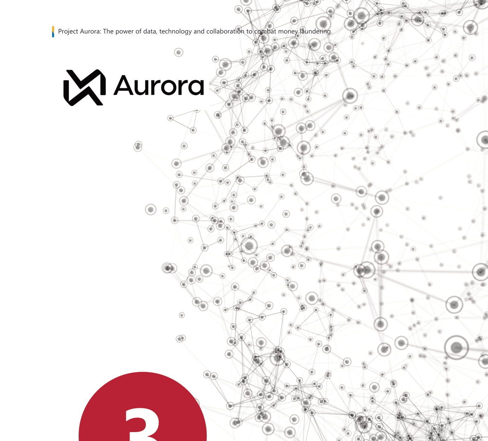

## 3 소개

Project Aurora: 데이터, 기술 및 협업의 힘은 돈 세탁을 전투합니다.

<!-- 원문 16쪽 -->

Project Aurora: 데이터, 기술 및 협업의 힘은 돈 세탁을 전투합니다.

## 3 서론

### 3.1 돈 세탁은 무엇입니까?

돈 세탁은 불법 자산의 기원을 숨기고 종종 표면에 합법적 인 것으로 보일 수있는 일련의 거래를 포함하는 행위입니다. 이 거래 과정에서, 자금의 공제 소유자 및 자산의 형태는 원래 자산과 연결이 숨길 수 있습니다.

이 illicit 활동은 금융 시스템의 무결성 및 안정성과 광범위한 경제의 무결성 및 안정성을 강화함으로써, 금융, 테러, 현대 노예 및 환경 범죄에 대한 범죄, 조직 범죄, 테러, 현대 노예 및 환경 범죄에 대한 무결성, 그리고 다른 경제 활동의 배수 자원에 의해 복지 손실에 대한 결과로 발생할 수 있습니다. 27 결과가 오늘날의 금융 기관에 대한 무결성 및 안정성을 제한하지 않는 개인의 상호 작용에 대한 무결성 및 개인의 영향을 받지 않습니다.

Money launderers는 규제 데이터 가시성 및 국가법의 정보 및 차이를 공유하는 능력에 대한 규정 준수 데이터 가시성 및 정보의 격차로 인해 글로벌 금융 시스템의 복잡성을 악화합니다. FATF에 따르면, 모든 대규모 돈 세탁 계획은 다르지만 크로스 국경 요소가 포함되어 있습니다. 28 따라서, 돈 세탁은 금융 시스템의 무결성과 안정성을 보호하기 위해 필수적으로 글로벌 노력 조정을 요구하는 도전입니다.

금융 기관은 "처음의 첫 번째 선"으로 봉사하면서 이러한 활동을 감지하고 예방하는 중요한 역할을합니다. 글로벌 노력에도 불구하고, 대부분의 FI는 사일로 데이터 및 격리 시스템에 의존하여 의심 거래 모니터링을 위해 복잡한 국경과 교차 대변의 돈 세탁 네트워크를 감지 할 수있는 능력을 제한합니다.

금융 범죄는 가장 약한 링크만큼 강하며, 인간 및 기술 프로세스의 능력을 요구하는 지속적인 과정으로 진화 위험을 적응시킵니다. 새로운 돈 세탁 기술은 지속적으로 범죄 요소가 소스를 손상시키는 창조적 인 방법을 사용하도록 계속됩니다 (들), 목적지 (들) 및 그들 사이의 자금의 흐름. 금융 시스템의 복잡성을 악화하고 신속하게 새로운 기회를 찾아 규칙과 규정을 evade 또는 가능한 한 어려운 활동의 탐지를 할 수 있습니다.

<!-- 원문 17쪽 -->

Project Aurora: 데이터, 기술 및 협업의 힘은 돈 세탁을 전투합니다.

### 3.2 돈 세탁 과정

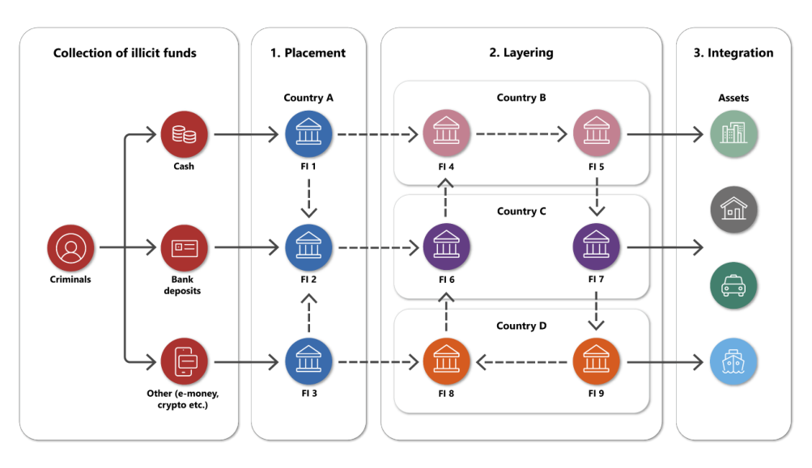

일반적으로 Graph 1.29에서 설명 된대로 다음 단계가 단순화 된 돈 세탁

## 단계 1: 배치

배치 단계에서 돈 launderer는 금융 시스템에 illicit 자금을 소개합니다. 이 자금이 계좌 또는 지갑에 송금하여 돈 세탁자가 통제 할 수 있습니다. 사용되는 전송 방법은 예를 들어 현금, 은행 예금 또는 cryptoassets에 대한 illicit 자금의 소스 및 유형에 따라 달라집니다.

## 단계 2: 층을 깔기

층계 단계에서, 돈 세탁자는 다른 층을 통해 배치 단계에서 자금을 이동, 다른 금융 기관 또는 다른 자산으로의 전송을 포함, 소스를 손상하기 위해 (s).

돈 라테어에 의해 사용되는 기술은 자산의 유형에 따라 달라집니다, 그러나 대규모 돈 라테어링 계획은 복잡한 계층 구조의 배열을 사용하여 금융 시스템을 통해 이동되는 불법 자금으로 이루어져 있습니다. 예를 들면:

그래프 1: 현실에서 돈 세탁의 세 단계의 단순화 된 전망, 이 과정은이 다이어그램에서 보이는 선형이 아닙니다.

<!-- 원문 18쪽 -->

Project Aurora: 데이터, 기술 및 협업의 힘은 돈 세탁을 전투합니다.

- Money mule 네트워크는 개인으로 구성되어, 의도적으로 또는 불확실히, 다른 사람을 대신 불법 이익을 수신하고 전송함으로써 돈을 세탁하는 데 사용됩니다. 목표는 자금의 소스와 범죄 사이의 층을 추가하는 것입니다. 전문 돈 mule 네트워크는 종종 다른 금융 기관과 관할권의 여러 계정을 포함, 자금 추적하기 어려운.

- Smurfing은 더 작은 거래로 더 큰 거래를 파괴하는 행위로 감지를 방지합니다. 이 여러 은행 계좌, 신용 카드 및 쉘 회사, 때로는 다른 나라에서 수행 할 수 있습니다.

## 단계 3: 통합

세 번째 단계에서, 라테드 펀드는 범죄에 의해 통제되거나 부동산, 가치 또는 고급 품목, 또는 비즈니스 벤처와 같은 자산에 투자하는 자산에 투자하는 경제로 재연됩니다.

### 3.3 AML 모니터링 및 분석 오늘

금융 기관은 AML 통제 및 모니터링 프로세스의 범위를 구현해야하며, 고객에 대한 위험 가치, 거래 모니터링 시스템, 라벨링 및 검토 의심 거래, 그리고 공공 당국에 의심스러운 돈 세탁 활동을보고, 일반적으로 국가 금융 정보 단위 (FIUs).

의심 활동의 거래 모니터링은 일반적으로 두 가지 접근 방식의 하나 또는 다른 곳에 근거합니다. 규칙 기반 시스템 및 행동 모니터링 시스템.

효과적인 준수 절차에서 산란의 위험, 규정 및 규정 준수 불확실성의 비용 증가 (회화 금융 범죄 위협의 풍경에서 상승 위험에 따라) 준수에 대한 방어적인 접근을 채택 금융 기관에 납득 할 수 있습니다.

#### 3.3.1 Rule 기반 모니터링 시스템

Rule-based Monitoring system은 사전 정의된 규칙 또는 알고리즘을 사용하여 의심 거래를 식별합니다. 이 규칙은 역사적 데이터를 기반으로 할 수 있으며 크기, 주파수 및 거래의 기원과 같은 다른 요인에 따라 달라질 수 있습니다.

일반적으로, 예를 들어, 일반적인 돈 세탁 태질을 감지 할 때 규칙 기반 접근은 고객 예금이 요구 사항을 피하기 위해 설계 된 방식으로 자금이 될 수 있습니다.

그러나, 규칙 기반 시스템은 높은 수에서 발생할 수 있습니다:

- false 긍정적 인 - 합법적 인 거래는 잠재적으로 의심스러운으로 끌어; 그리고

- false 부정적인 – illicit 거래는 의심스러운으로 끌지 않습니다.

<!-- 원문 19쪽 -->

Project Aurora: 데이터, 기술 및 협업의 힘은 돈 세탁을 전투합니다.

거짓 긍정적 또는 거짓 부정적인의 발생은 종종 광범위한 거래의 경고를 유발하는 일반적인 규칙의 사용으로 인해 종종 발생합니다. 90-95%가 생성된 모든 경고의 false Positives.30, 31 서명 자원이 시험에 소요되고 이 거짓 긍정적 인 긍정적 인 리뷰를 검토하는 것으로 추정됩니다.32

#### 3.3.2 Behavioural 감시 체계

규칙 기반 모니터링은 사전 정의된 규칙과 트리거에 대한 의존을 갖는 동안, 행동 모니터링은 거래과 관련된 인간 행동의 패턴을 검사, 기계 학습 모델을 사용하여 일반적인 행동과 계정과 거래 간의 관계를 이해합니다.

이 접근법은 예상된 정상 행동의 전형적인 본에서 편차를 식별할 수 있으며, 더 정교한 돈 세탁 기술을 감지하고 잠재적으로 거짓 긍정적 인 볼륨을 줄일 수 있습니다. 이 시스템은 거래 데이터의 큰 세트를 분석 할 수 있기 때문에, 학습하고 시간 이상 모델을 조정 할 수 있습니다. 33 Behavioural 모니터링은 의심스러운 행동을 감지하는 귀중한 도구가 될 수 있지만 금융 기관과 국경을 통해 돈을 세탁하는 데 효과가 제한되어 데이터의 실종 전망과 정보를 공유 할 수 있습니다.

#### 3.3.3 의 보고 및 de-risking 결과

금융 기관은 필요한 경우 sanctioned 될 수 있으며 효과적인 AML 준수 절차 및 불법으로 인해 처리 거래 프로세스. AML 규제 및 새로운 금융 범죄 위협에 노출을 증가시키는 데 관련된 비용뿐만 아니라 AML 준수에 대한 방어적인 접근을 채택하는 금융 기관을 일으킬 수 있습니다.

이것은 당국에 거래의 overreporting에 지도 할 수 있습니다, 공공 자원에 배수가된다. 금융기관은 금융 범죄 위험에 대한 전반적인 노출을 줄이기 위해 특정 고객과의 관계가 종료될 수 있습니다. 이 금융 제외와 같은 높은 사회적 비용, 궁극적으로 두 공공 및 민간 부문에서 위험 평가 도구 및 규제 프레임 워크에 대한 무신호를 만들 수 있습니다. 모델 번호: 34

32는 페이지 69에서 Finanstilsynet (2019)를 참조하십시오 - 체계적인 중요한 금융 기관 (SIFI)의 이사는 정규적인 고객이 수동 검토를 위해 다만 한 번 선정되는 경우에, 그 고객이 사라질 것을 가지고 있는 경제 이득이 재정적인 감독자에 진술했습니다.

<!-- 원문 20쪽 -->

Project Aurora: 데이터, 기술 및 협업의 힘은 돈 세탁을 전투합니다.

### 3.4 AML 노력에 대한 도전

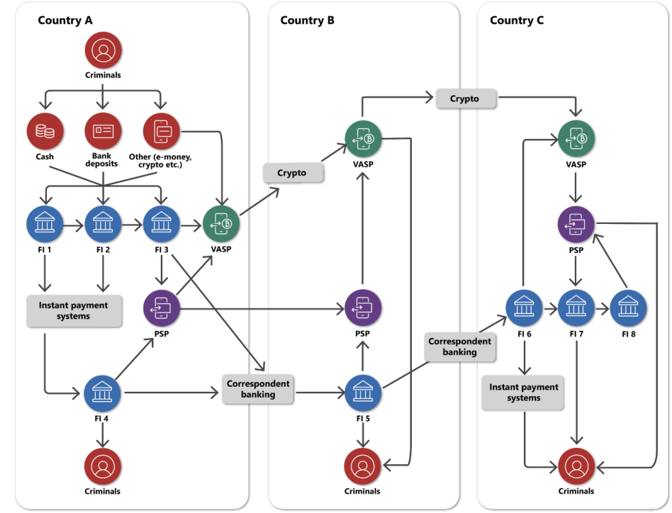

Money launderers는 금융 기관과 국경을 넘어 복잡한 네트워크를 만들면서, 이러한 기관들은 종종 어떤 것이든 (Challenge 1)에 갈 수 있는 제한적이고 침묵된 전망이 있습니다. 데이터에 의해 더욱 복잡해지는 표준 또는 읽을 수 없는 소모품, 기관의 협력을 더욱 어렵게 만들기 (Challenge 2). 마지막으로, 효과적인 AML / CFT 측정을 수행해야 하는 데이터는 개인의 개인 정보 보호 및 개인 데이터를 보호하는 데 필요한 균형을 잡는다. 이는 협업 및 공유 (Challenge 3)를 보완합니다. 이러한 도전은 다음과 같습니다.

- 챌린지 1: 자금세탁 행위자는 다른 금융 기관 및 지불 서비스 제공 업체 (PSP), 암호화 지불, 대응 은행 관계, 국내 즉시 지불 시스템 및 현금 구매에 계정과 같은 자금의 소스와 목적지를 숨기는 방법의 조합을 사용합니다. 금융기관과 국경을 넘어 거래의 복잡한 네트워크를 만듭니다. 이것은 그래프 2에서 설명됩니다. 이 복잡한 네트워크의 돈 세탁은 개별 금융 기관의 모니터링 및 분석에 대한 실로드 접근 방식과 감지되지 않고 데이터를 안전하게 공유하고 협업 접근 방식을 사용하여 분석 수행 할 때 사용 된 versus입니다 (즉, 개인 정보 보호 강화 기술 및 고급 분석). 이것은 그래프 3에서 설명됩니다.

그래프 2: 현실에서 돈 launderers에 의해 사용되는 다른 지불 생태계의 단순화 된 전망, 이 과정은이 다이어그램에서 더 복잡 할 수 있습니다.

<!-- 원문 21쪽 -->

Project Aurora: 데이터, 기술 및 협업의 힘은 돈 세탁을 전투합니다.

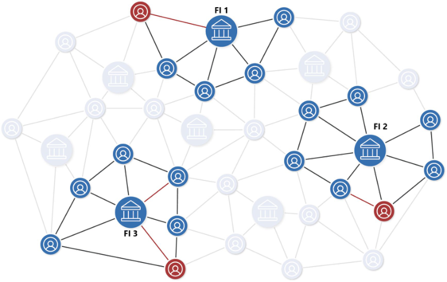

- 챌린지 2: 데이터 필드, 형식 및 프로세스는 표준, 데이터 품질, 효율적인 분석, comparability 및 시스템 통합을 방해하지 않습니다. 또한 금융 범죄 타이포 리온 및 기타 관련 정보를 설명하는 데이터 정의는 분석 시스템에 대한 표준 기계 읽기 쉬운 형태로 표준으로 제공되지 않습니다.

Graph 3: 지불 데이터가 CAL 배열에서 분석 될 때 고립 대에 의심스러운 네트워크의 가시성의 단순 한 전망

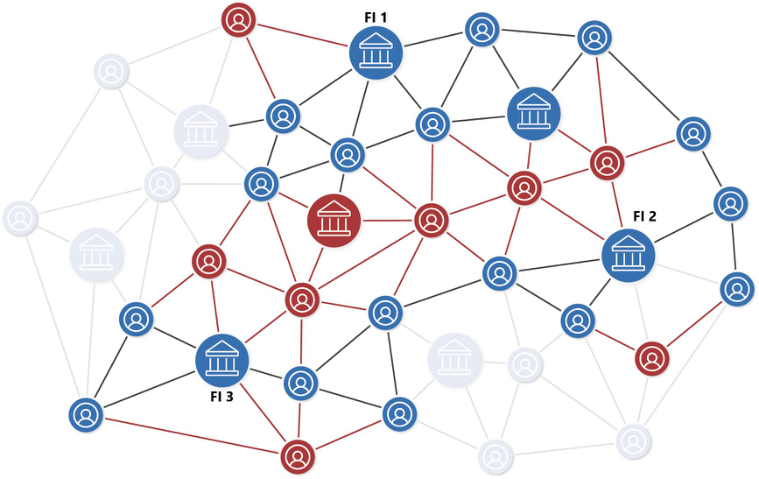

## 격리된 전망

## 협력 분석 및 학습 (CAL) 배열

<!-- 원문 22쪽 -->

Project Aurora: 데이터, 기술 및 협업의 힘은 돈 세탁을 전투합니다.

- 3: 데이터 보호 및 개인 정보 보호를위한 목적 사이의 균형, AML / CFT의 사람들을 도전 할 수 있습니다. 한 손으로 개인의 개인 정보 보호 및 개인 데이터를 보호하는 데 필요한 데이터 보호 규정을 준수합니다. 다른 한편, 효과적인 AML/CFT 측정은 관련 데이터와 정보를 감지하고 illicit 활동을 방지하기 위해 액세스해야합니다. 개인 정보 보호 및 효과적인 AML / CFT 조치는 복잡하며 법적, 윤리 및 기술 고려사항을 준수하여 개인 정보 보호 및 보안의 목적을 해결합니다.

### 3.5 기술 정보

#### 3.5.1 개인정보 보호 기술(PET)

AML 노력의 주요 과제 중 하나는 개인 정보 보호를 보호하기 위해 의심 활동을 감지 할 필요가 균형을 잡습니다. PET는 민감한 정보를 보호하기 위해 설계된 솔루션으로 여러 조직에서 데이터가 배포되는 경우에도 보호 된 데이터에 적용 할 수있는 고급 분석 방법을 가능하게합니다. PET 분야는 혁신과 다른 PET의 빠르게 성장하는 지역입니다. 각에는 특정한 힘, 한계 및 주어진 사용 케이스에 suitability가 있습니다. 표 1는 이 프로젝트에서 사용되는 PET의 개요를 제공합니다. 각 PET에 대한 추가 정보는 Annex C에서 확인할 수 있습니다.

36 공유 정보는 또한 기관적인 위험 평가와 같은 고객 때문에 diligence 측정을 지원할 수 있었습니다, 고객, 사업상의 위험 관리, 유익한 소유자의 ID, 그리고 태풍과 같은 본과 교류를 식별하고 공유할 수 있습니다.

37 개인정보 보호 기술 (또한 균형 암호화, 안전한 다중 파티 계산, 차별 프라이버시 및 제로-knowledge 증거와 같은 암호화 / 암호화 기술로 참조)는 안전하고 개인 정보 보호 보호 보호 된 정보 보호 및 분석을 촉진 할 수 있습니다.

38 기계 학습, 확장 학습, 깊은 학습, 네트워크 분석 및 자연 처리와 같은 고급 분석은 구조화 및 구조화되지 않은 데이터의 대량을 분석하고 더 효율적으로 식별하고 패턴과 추세를 더 효과적으로 식별 할 수 있습니다.

<!-- 원문 23쪽 -->

Project Aurora: 데이터, 기술 및 협업의 힘은 돈 세탁을 전투합니다.

**표 1: 이 프로젝트에서 사용되는 PET, AML 및 도전에 적용**

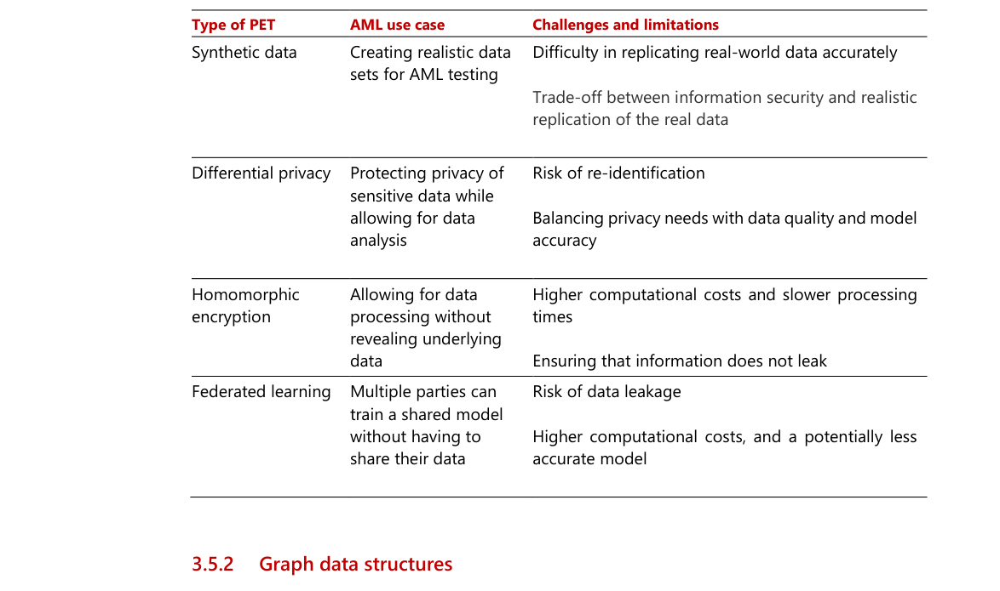

그래프 데이터 구조는 다양한 종류의 네트워크(예: 거래 데이터)를 모델링하는 데 유용합니다. 그들은 다른 관계 (즉 개인 및 비즈니스)와의 넓은 관계를 나타내는 데 사용될 수 있으며, 그 사이에 중요한 배우와 관계를 식별하는 데 도움이됩니다. 그들은 기계 학습과 네트워크 분석과 결합하여 AML 모니터링에 적합한 기계 학습 모델, 데이터 클러스터링 그래프 알고리즘 및 네트워크 분석에 의해 사용될 수 있습니다.

#### 3.5.3 기계 학습

인공지능과 기계 학습 방법은 AML의 자치적인 거래 모니터링을 통해 기존의 방식이 불가능한 거래 데이터에 패턴과 동종을 식별하여 잠재적인 거래를 제공합니다. 하나의 잠재적 예는 그래프 neural 네트워크의 사용이며, graphstructured data(예: 거래 data)를 분석할 수 있는 기계 학습 모델의 유형입니다. AML 거래 모니터링 및 분석의 상황에 있는 그래프 신경 네트워크와 같은 모델을 사용하여 전통적인 방법을 식별 할 수있는 거래 네트워크의 의심스러운 패턴과 동종을 감지 할 수 있습니다.

그러나 그들의 사용도 문제 해결. 네트워크 특성을 사용하여 기계 학습 모델은 데이터 bias 및 해석 문제에서 고통받을 수 있습니다. Data ethics 및 자동화된 결정의 설명, 뿐만 아니라 인간의 검토의 역할, 중요한 고려 사항이 될 것입니다.

<!-- 원문 24쪽 -->

Project Aurora: 데이터, 기술 및 협업의 힘은 돈 세탁을 전투합니다.

#### 3.5.4 Network 분석

네트워크 분석은 금융 거래 데이터의 의심스러운 돈 세탁 네트워크의 숨겨진 패턴을 덮을 수 있습니다. 네트워크 분석은 AML 모니터링을 개선하기 위해 기계 학습 방법을 보완 할 수 있습니다 데이터 (예: 비율, 축적)의 네트워크에서. 같은 특성의 예는 Annex B에서 상세합니다.

entities(예: 개인 및 기업)과의 연결을 시험함으로써, 거래 데이터에 포함된 정보, 네트워크 분석은 네트워크의 탐지를 가능하게 하고 데이터 시각화, 통계 분석, 결과 해석을 통해 통찰력을 제공합니다. 이 AML 전문가가 의심 활동을 식별 할 수 있으며, illicit 펀드의 흐름을 이해하고 조사를 요구하는 핵심 돈 세탁 네트워크의 핀 포인트를 이해할 수 있습니다.

### 3.6 동향 및 기회 요약

지불, 데이터 표준 및 거래 모니터링의 여러 동향, 이니셔티브 및 개발은 AML 노력에 직면 한 도전의 일부에 연결할 수 있습니다. 메인은 별관 A에서 각 세부 사항과 아래 요약됩니다.

## 표준화, 투명성 및 조화

- 크로스-블레지먼트를 강화하기위한 G20 로드맵 - 금융 범죄 예방을 포함한 다양한 문제를 해결하는 여러 건물 블록을 통해 크로스-블레지스터 결제를 강화하는 것을 모색합니다.

- ISO 20022 표준을 사용하여 다양한 지불에 의해 사용될 수있는 금융 메시지에 공통 언어 및 구조를 제공하는 ISO 20022 표준을 조화롭게 처리, ISO 20022 메시지를 가진 구조화 된 데이터의 풍부한 세트는 AML 분석을 얻을 것이다.

- 법적인 법인 식별자 (LEI)와 같은 데이터 표준 및 유익한 소유권은 또한 법률적 인 및 유익한 소유자와 관련된 다른 데이터셋를 연결하는 일반적인 언어, 구조 및 능력을 제공합니다. 예를 들어 LEI는 지불 또는 증권 거래에서 사용되는 다른 식별자에 대한지도를 나타냅니다.

- Wolfsberg Group이 발표 한 지불 투명 표준은 10 가지 원칙 금융 기관으로 지불 할 때 준수해야합니다.

## 거래 모니터링 유틸리티

- 특정 관할권에서 거래 모니터링 유틸리티 (TMUs) (예: 네덜란드에서 TMNL)는 금융 범죄를 탐지하고 방지하기 위해 개인 개인 개인 협력 분석 배열에 설치되었습니다.

## 즉시 지불 시스템 및 잠재적인 CBDC 시스템

Instant Payment 시스템은 광범위한 거래 데이터를 제공 할 수 있으며 여러 금융 기관의 전담 네트워크를 비난 할 수있는 능력을 제공 할 수 있습니다. 이 또한 CBDC 시스템에 적용 할 수 있습니다.

<!-- 원문 25쪽 -->

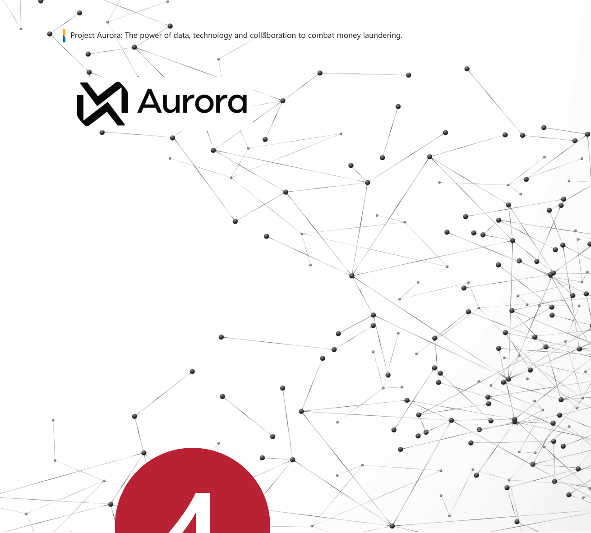

## 프로젝트 오로라 - 개념의 증거 4

Project Aurora: 데이터, 기술 및 협업의 힘은 돈 세탁을 전투합니다.

<!-- 원문 26쪽 -->

Project Aurora: 데이터, 기술 및 협업의 힘은 돈 세탁을 전투합니다.

## 4 Project Aurora – 개념 증명

### 4.1 목표 및 범위

프로젝트 Aurora는 금융 기관과 국경을 넘어 돈을 떨어뜨릴 수있는 연결된 지불 데이터의 힘을 활용합니다. 의 목적에 대한 돈 세탁 탐지, 프로젝트 테스트 개인 정보 보호 강화 기술 서로 다른 모니터링 시나리오에 기계 학습 및 네트워크 분석과 공동 분석 및 학습에 다른 접근과 결합.

#### 4.1.1 의 특징

프로젝트의 목적은 다음과 같습니다.

- 일반 데이터 포인트의 최소 세트를 포함하는 합성 데이터셋를 생성하고 실제 거래를 대표하고 여러 국가에서 많은 금융 기관 간의 교류를 통해 데이터에 내장 된 돈 세탁 활동.

- 합성 데이터에 기반하여 3 가지 시뮬레이션 모니터링 시나리오 (사일 금융 기관 수준, 국가 수준 및 크로스 국경 수준)을 테스트하고 돈 세탁 네트워크 감지 네트워크에서 각 시나리오의 성능과 효율성을 비교하기 위해 기계 학습 모델 및 네트워크 분석과 함께 실험합니다.

- 합성 데이터 및 이전 목적의 최적의 기계 학습 모델에 따라 CAL 접근 방식과 같은 다른 CAL 접근 방식과 국가 및 크로스-블레벨40에서 중앙 집중식 또는 하이브리드와 같은 개인 정보 보호 기술을 적용 할 때 CAL 접근 방식. 기계 학습 및 네트워크 분석을 사용하여 데이터를 분석하고 테스트하고 돈 세탁 네트워크의 감지에 각 CAL 접근의 성능과 효율성을 비교합니다.

40 이들은 단면도 4.4에 있는 세부사항에서 토론됩니다.

<!-- 원문 27쪽 -->

Project Aurora: 데이터, 기술 및 협업의 힘은 돈 세탁을 전투합니다.

#### 4.1.2 의논하기

프로젝트 오로라에서 수행 된 몇 가지 실험. PoC는 3개의 주요 부품으로 구성되며, 이는 문제의 이전을 해결합니다.

- Part A - 여러 금융 기관 간의 국내 및 크로스 국경 결제를 대표하는 합성 데이터셋의 세대는 하나 이상의 관할 구역에서 운영되며 데이터셋에 내장 된 여러 돈 세탁 이벤트와 함께합니다.

- Part B – 생성 된 합성 데이터셋에 기계 학습 모델의 응용 프로그램은 데이터의 다른 레이아웃에 대한 의심스러운 흐름의 네트워크와 패턴을 감지 – 단일 금융 기관 수준에서, 국가 수준과 크로스 국경 수준.

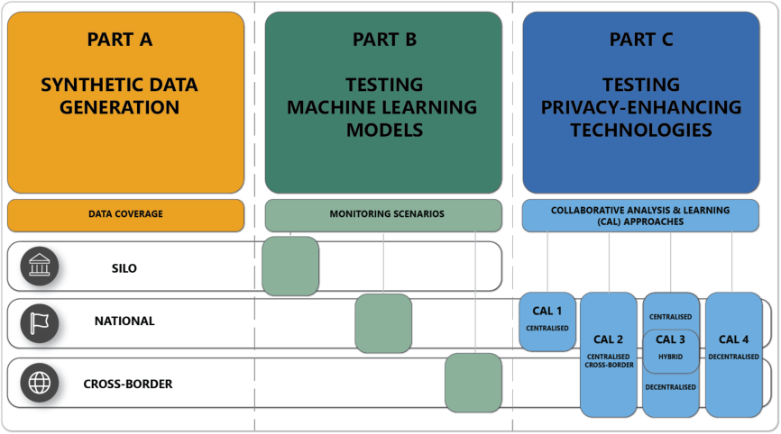

- Part C – 생성된 합성 데이터에 PET의 응용 프로그램은 CAL 배열 (분명, 탈중앙화 및 하이브리드) 및 각 기계 학습 모델의 성능.

## 다음은 프로젝트 오로라의 이 단계의 범위에서

- AML에 사용할 수있는 모든 사용 가능한 기계 학습 모델의 비교를 제공;

- 기계 학습 모델의 모든 클래스에 가장 적합한 알고리즘을 찾는;

- 개인 정보 보호 강화 기술의 완전한 비교를 제시; 그리고

- 포괄적인 태아를 포함한 포괄적인 태아를 설정하고 실제 데이터에 대한 탐지 결과를 연구합니다.

그래프 4: 프로젝트 오로라의 세 부분

<!-- 원문 28쪽 -->

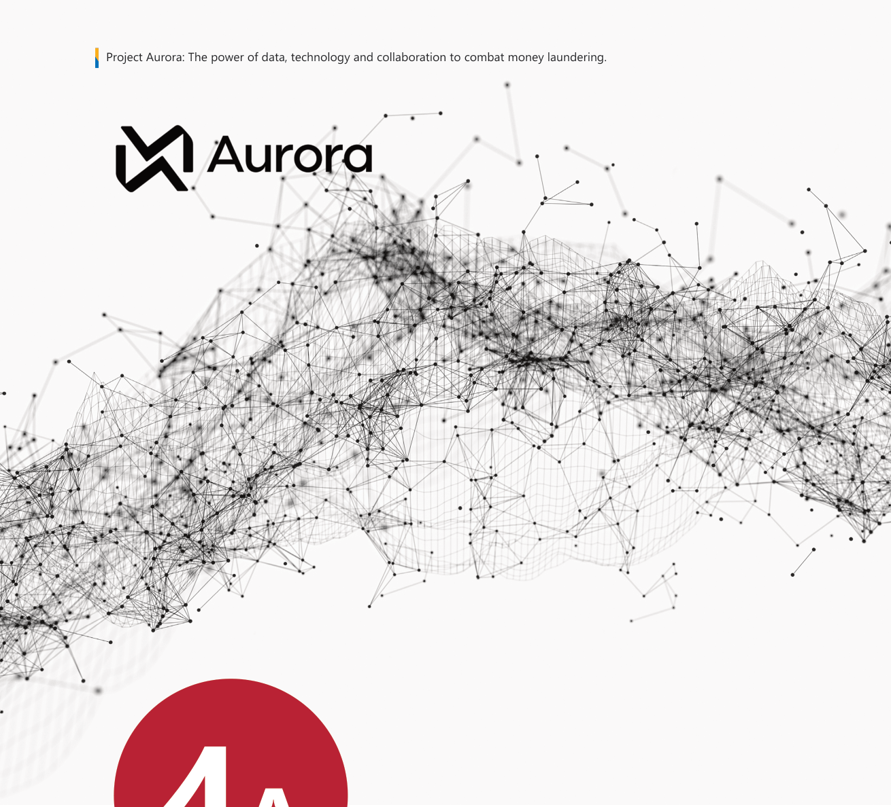

## 부품 A - 합성 데이터 생성 4A

Project Aurora: 데이터, 기술 및 협업의 힘은 돈 세탁을 전투합니다.

<!-- 원문 29쪽 -->

Project Aurora: 데이터, 기술 및 협업의 힘은 돈 세탁을 전투합니다.

### 4.2 Part A: 합성 데이터 생성

합성 데이터 생성은 기차, 테스트 및 다른 분석 도구의 효과를 측정 할 수있는 현실적이고 대표 데이터를 만드는 데 유용한 기술로 출현했습니다. 민감한 정보를 포함할 데이터 시뮬레이션에 특히 유용합니다. 예를 들어 지불 데이터는 일반적으로 얻을 수 없습니다.

합성 데이터는 다른 접근법을 통해 생성될 수 있습니다. 이 프로젝트는 여러 금융 기관과 여러 국가를 통해 다양한 금융 기관과 여러 국가를 통해 다양한 금융 기관과 여러 국가를 통해 부동산 및 기술에 사용되는 목표를 테스트하기 위해 합성 데이터, 편향성 현실적 국내 및 크로스 국경 거래를 생성하는 단계별 계층 접근 방식을 활용합니다.

#### 4.2.1 합성 데이터 생성 목적

이 프로젝트의 합성 데이터의 생성은 다음과 같은 작업을 수행해야합니다.

- 실제 거래 데이터의 표현에 교육 기계 학습 모델.

- 데이터의 다른 전망에 대한 실험을 실행: 실로 즈 금융 기관, 국가 및 크로스 국경, 기계 학습을 사용하여 그들 사이의 차이를 비교합니다.

- 일반적인 데이터 포인트의 최소 세트를 사용하여 돈을 세탁 네트워크 검출의 효능을 이해.

- 일반적인 데이터 포인트의 최소 세트를 데모하는 것은 CAL 배열의 모든 참가자 또는 즉시 지불 또는 중앙 은행 디지털 통화 (CBDC) 시스템 수준에서 분석에 의해 사용될 수 있습니다.

- 각의 힘과 한계를 잘 이해하기 위하여 자료에 다른 애완 동물을 적용.

- 다른 CAL 배열을 시뮬레이션.

- 즉시 결제 시스템의 거래 시뮬레이션 (또는 다른 시스템, 예를 CBDC).

<!-- 원문 30쪽 -->

Project Aurora: 데이터, 기술 및 협업의 힘은 돈 세탁을 전투합니다.

#### 4.2.2 합성 데이터 생성

이 PoC에 생성 된 합성 데이터는 6 개국과 29 금융 기관 사이에 개인 및 법인을 포함하여 155,250 엔티티티 중 2 개월 이상 국내 및 크로스 국경 거래를 나타냅니다. 41 프로젝트에 생성 된 합성 데이터셋는 다음과 같은 최소 필수 정보를 포함합니다.

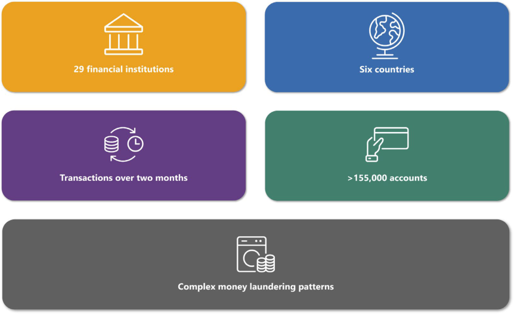

- 보낸 사람 (유료) 및 수신자 (유료) 세부 사항;

- 거래 금액;

- 거래의 날짜와 시간;

- 거래 방법 (예를들면 카드 결제, 은행 송금 또는 현금 입금); 42

- 국가 지불은에서 보내졌다;

- 지불이 받은 국가; 그리고

- 금융 기관의 세부 사항 (예: 은행 및 지불 서비스 제공 업체).

41 PoC에서 사용되는 데이터 크기의 실제 거래 네트워크의 크기와 비교하여 더 작습니다. 이 결정은 PoC 내에서 다양한 기술을 테스트하는 데 대한 우정과 단순성을 보장하는 의도적으로 이루어졌습니다. 데이터셋가 정확하지 않을 수 있지만 실제 거래 네트워크의 규모를 반영하지 못하면 여전히 통제 된 환경에서 다른 기술을 증발시키는 데 목적을 제공합니다.

42는 범죄자가 종종 illicit 펀드의 기원과 흐름을 은폐하는 여러 거래 방법을 사용하여 거래의 형태를 포함하기 위해 중요합니다.

그래프 5: 생성 된 합성 데이터 프로젝트 오로라의 고도 개요: 데이터의 힘, 기술 및 돈 세탁을 전투하는 협력.

<!-- 원문 31쪽 -->

이 접근법은 데이터 최소화의 원칙에 부합하는 동안 다양한 배열과 시스템의 비교 및 사용 가능함을 보장합니다.

#### 4.2.3 합성 데이터를 생성하는 세 단계 접근을 활용

합성 데이터는 세 단계로 생성됩니다.

1. - 비디오 관계 매핑은 개인과 기업 간의 관계를 나타내는 네트워크 그래프를 생성합니다.

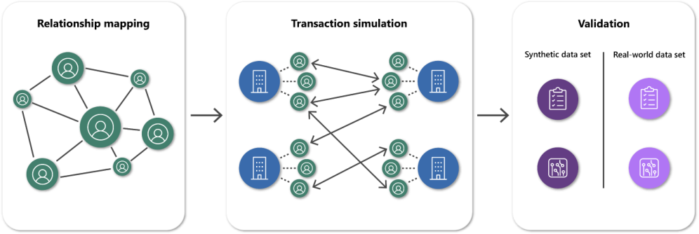

2. - 비디오 거래의 거래 시뮬레이션은 관계지도의 관계에 근거합니다.

3. - 비디오 생성된 합성 자료의 검증.

## 관계 맵핑

관계지도는 가장 가장 가장된 거래의 기초를 형성하는 개인과 기업의 관계와 행동 패턴을 나타내는 그래프입니다. 개인 및 기업의 행동과 상호 작용은 국내 결제 데이터에서 관찰 된 행동과 관계를 이해하기 위해 조정 된 통계 모델을 사용하여 만들어집니다. 이 합성 데이터는 원래 데이터의 직접적인 1-to-one 복제가 아닌 실제 행동과 관계를 mimicking하는 것을 의미합니다.

관계 지도는 다음 방법으로 만들어집니다: 1. 개인과 기업 간의 연결 시뮬레이션. 이 데이터는 개인과 기업의 거래 행동에 대한 통찰력을 제공하고 다른 사람에게 전송하는 거래 수를 포함하여, 해당 거래 금액 배포.

2. - 비디오 각 국가 내에서 개인, 기업 및 FI와 관계 구축. 이러한 관계는 개인과 기업을 다양한 금융 기관에 연결합니다. 개인 또는 비즈니스의 확률은 그래프 6: 합성 데이터 생성 프로세스 프로젝트 오로라: 데이터, 기술 및 협업의 힘은 돈 세탁을 전투합니다. 특정 기관의 고객은 기관의 상대적인 크기를 포함하여 요인의 수에 의해 영향을 받습니다. 또한, 개인과 기업 간의 관계는 행동 (예를 들어 고용, 쇼핑, 송금), 거래 유형 (카드, 현금 또는 송금) 및 거래 볼륨을 기반으로 설립되었습니다. 이 관계는 실제 데이터에서 관찰 된 집계 지불 패턴을 대략적으로 기반으로합니다.

<!-- 원문 32쪽 -->

3. - 비디오 개인, 기업 및 국경을 맞댄 FI 간의 관계를 수립. 이 관계는 다양한 행동을 기반으로 국경을 넘어 개인과 기업 간의 연결 (크로스 국경 구매, 송금 등), 지불 방법 (카드, 현금 또는 송금) 및 거래 볼륨.

데이터셋의 사업은 VASP를 포함한 다양한 엔티티티를 우회합니다. 이 데이터셋의 대안 지불 방법을 사용하여 성장 추세를 나타냅니다. 암호화 세트 및 암호화 교환과 같은 돈 laundering.43 VASP는 들어오는 거래의 실질적인 볼륨에 의해 문자화되지만, 그들의 외출 거래에 대한 가시성을 제한합니다. VASPs (예: 암호화로 변환)에서 거래를 처리하는 시나리오는 때로는 최소 AML 규정과 관할권에서 위치하거나 운영되는 VASP와 연결하여 볼 수 있습니다.

이 프로세스의 출력은 클러스터로 구성되는 개인, 기업, 금융 기관 및 국가 간의 상호 연결 관계의 집합입니다.

## 거래 시뮬레이션

거래 시뮬레이터는 관계 지도의 상단에 추가 레이어이며 관계 매핑의 정보에 근거하여 개인과 기업 간의 가장 거래 세트를 생성합니다. 이러한 가장 가장 큰 거래는 다양한 관할권에 위치한 여러 금융 기관에서 수행됩니다.

매일, 시뮬레이터는 거래 날짜와 같은 개인과 기업에 대한 정보를 수집합니다, 연결 그들은 다른 사람과 가지고 있으며, 그들은 일반적으로 거래를 만드는 방법. 이 정보를 사용하여 시뮬레이터는 개인 또는 비즈니스가 다음 거래를해야 할 때 결정합니다. 또한 거래의 지불 방법 및 가치를 결정합니다. 이 과정은 지속적으로 관계를 매핑하는 것에 대한 정보를 시뮬레이션하는 것입니다. Graph 7는 단일 날로부터 거래를 기반으로 네트워크를 시각화합니다.

<!-- 원문 33쪽 -->

Project Aurora: 데이터, 기술 및 협업의 힘은 돈 세탁을 전투합니다.

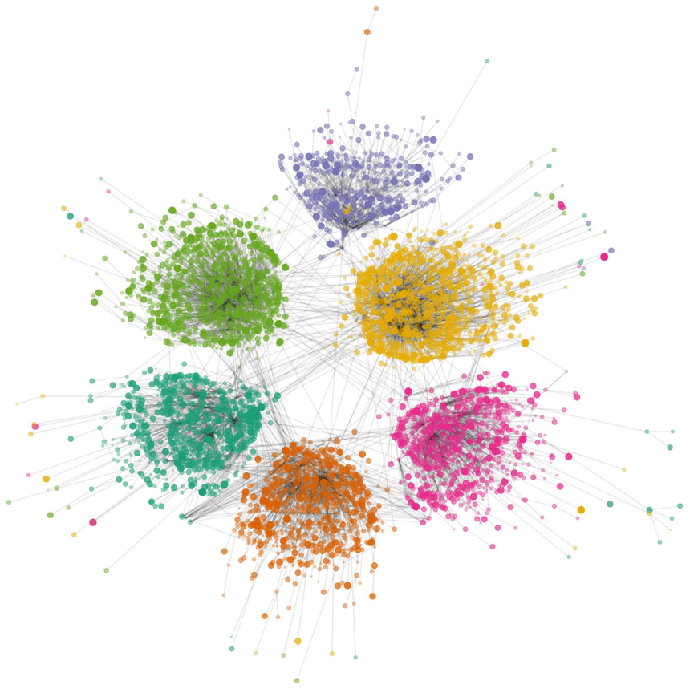

## 의 특징

합성 데이터의 유효성은 집단 패턴 관점과 배우 행동 관점을 결합하여 입증됩니다.

- 배우 행동 – 개인과 기업의 행동은 일관성을 보장하기 위해 실제 데이터44와 비교됩니다.

- Aggregated 패턴 – 국가 및 국경 수준의 전체 패턴은 중앙 은행의 통계와 비교하여 검증됩니다.

44 Real-world 데이터는 비교에 사용되었으며, 제3자의 독점적 인 데이터에 근거했습니다.

Graph 7: 6개국에 걸쳐 개인 및 기업 간의 거래를 나타내는 일일 거래 그래프의 1일 거래 네트워크 예의 최소 예. 각 국가는 다른 색깔로 대표되고 각 거래는 회색 선으로 대표됩니다. 매월 첫날 거래가 표시됩니다. 거래는 다른 목적으로.

<!-- 원문 34쪽 -->

Project Aurora: 데이터, 기술 및 협업의 힘은 돈 세탁을 전투합니다. intergovernmental 몸, 그리고 다른 사람은 합성 자료가 정확하게 진짜 세계 정보를 반영한다는 것을 보증합니다.

#### 4.2.4 합성 데이터셋의 돈 세탁 활동 구축

거래 flows는 합성 데이터셋에 포함 된 돈 라테인팅 패턴을 나타내는 흐름입니다. 이 프로젝트의 목적에 대한 이상적 인 알려진 복잡한 돈 세탁 기법을 기반으로합니다.

이 PoC에서 사용되는 돈 세탁 기술은 다음과 같습니다.

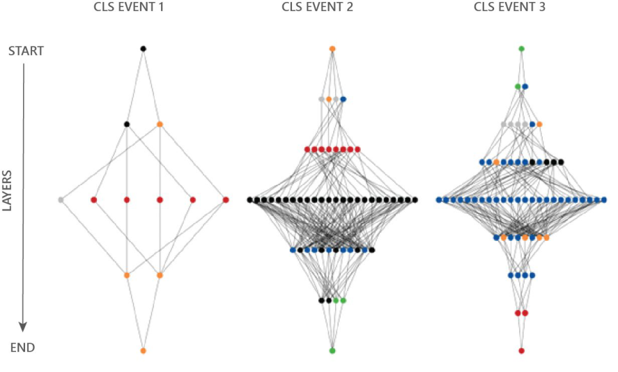

## 1 복잡한 층을 깔는 계획 (CLSs).45 2... 46 복합층 구성 태세학

CLS 이벤트 (다양한 태아를 덮고, 때때로 조합에서 사용)는 명확한 시작점 (원자) 및 엔드포인트 (수채)와 더불어 네트워크 구조로 대표될 수 있고, 거래의 층과 사이에서 계정. CLS 이벤트를 나타내는 네트워크 구조의 몇 가지 예는 그래프 8에서 설명됩니다.

45 이것은 돈 뮤링, 이상한 크로스 국경 거래, 기숙사 계정에서 거래, 갑작스러운 계정 빈 및 더 많은 것 같은 기술 / 기술 / 기술이 포함되어 있습니다.

46 는 습지의 주요 목적은 문턱을보고하는 것을 피하기 위해이지만, 비정상적인 크로스 국경 거래, 갑작스러운 계정 빈 및 기타 행동을 포함 할 수 있습니다.

그래프 8: 복잡한 계층화 계획의 간단한 예 패턴 (CLS) CLS 이벤트의 세 가지 다른 네트워크 구조를 보여줍니다. 착색된 노드는 돈 세탁 네트워크에 관련된 다른 국가에서 다양한 FI에 위치한 계정을 나타냅니다. entities 사이의 라인은 거래 흐름을 나타냅니다.

<!-- 원문 35쪽 -->

Project Aurora: 데이터, 기술 및 협업의 힘은 돈 세탁을 전투합니다.

그래프 8의 CLS는 합성 데이터에 내장되어 있으며 다음과 같은 방법으로 대표됩니다. 47

1. - 비디오 시작과 끝 – CLS는 시작점(top node)로 시작하며 엔드포인트(bottom 노드)로 종료합니다. 이 두 표는 시작과 돈 세탁 과정의 끝 계정. 2. - 비디오 Funds 할당 – 시작 시점 (위 노드)에서, 특정 양의 illicit 자금 할당. 이 자금은 돈 세탁 활동을위한 초기 자금으로 사용됩니다. 3. - 비디오 레이어 – 시작점과 엔드포인트 사이, 여러 레이어가 있습니다. 각 단계는 돈 세탁 프로세스에 표시됩니다. 이 층은 금융 기관의 다른 계정으로 구성됩니다. 4. - 비디오 레이어 크기 – 레이어는 특정 방법으로 조직됩니다. 층의 첫 반은 그 후 층 (뇌관절)보다 더 큽니다. 그리고 두 번째 반은 이전 층보다 (뇌관절) 더 작습니다. 이 배열은 돈 세탁 공정을 통해 복잡한 계층화 구조를 만듭니다. 5. - 비디오 레이어 사이의 연결 – 각 레이어는 다음 레이어에 연결되며, 한 층에서 다른 층으로 진행을 보장합니다. 이 연결은 돈 세탁 과정에서 자금의 흐름을 시뮬레이션합니다. 6. - 비디오 자금의 흐름 – 프로세스가 한 층에서 다른 방향으로 이동하므로, illicit 자금은 다음 층으로 나뉩니다. 각 후속 층에서 자금을 약간 줄이면됩니다. 이 감소는 돈 세탁 과정에서 관련된 사람들 (예를들면)에 지불을 나타냅니다. 그래프의 생성에 설명된 단계는 복잡한 계층화 계획을 나타내는 그래프의 생성에 Graph 8에 표시된 것과 같이 설명했습니다. 이 그래프는 이러한 돈 세탁 활동을 정확하게 캡처하는 합성 데이터를 생성하기 위해 매핑 관계에 통합됩니다.

## Smurfing 태아

많은 유사성은 촉감 태아와 복잡한 계층화 계획 태아와 함께 존재하며, 둘 다 복잡한 네트워크의 돈을 세탁하는 엔티티티를 생성 할 수 있습니다. 습격이 다른 주요 방법은이 태아 내에서 떨어지는 거래가 모든 evade보고 요구 사항을 설계하는 것입니다.

또한, smurfing 이벤트는 여러 일 이상에 일어나고 참여하는 계정 수는 작은 네트워크에서 큰 하나에 다를 수 있습니다. smurfing 이벤트의 복잡성을 의미 할 수도 있습니다.

47 이것은 CLS 사건의 단순화된 설명입니다. CLS 이벤트는 합성 데이터에 내장되어 여러 나라의 다른 유형의 계정, 다양한 거래 크기, 중간 참여 및 거래가 포함됩니다.

<!-- 원문 36쪽 -->

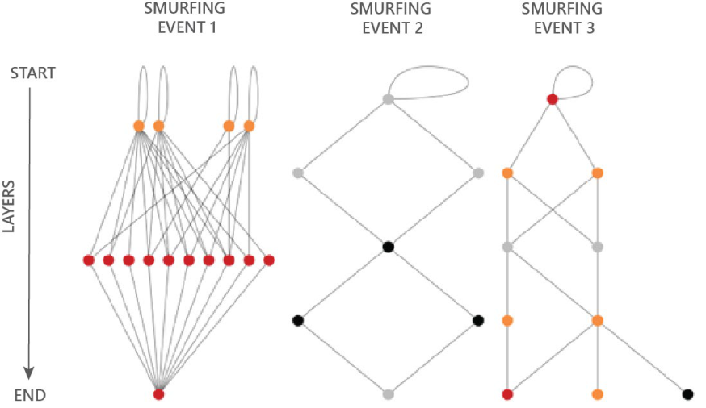

Project Aurora: 데이터, 기술 및 협업의 힘은 돈 세탁을 전투합니다.

Graph 9에서 보이는 것과 같이, smurfing typology의 가장는 다음과 같이 구조됩니다: 1. 시작 및 끝 – 스푸핑 계획은 하나 이상의 시작점(상호 노드)과 하나 이상의 엔드포인트(bottom 노드)로 시작합니다. 예를 들어, smurfing 이벤트 2 및 3는 하나의 시작점과 smurfing 이벤트 1 및 2는 하나의 엔드포인트가 있습니다. 각 스푸핑 이벤트의 시작점에서 루프는 보고 임계값을 하나의 계정으로 한 개 이상의 계정으로 입금을 나타냅니다. smurfing 이벤트 1에서 여러 계정이 참여하고 있으며, 단 하나의 계정이 2 및 3를 smurfing 이벤트에 참여합니다. 2. - 비디오 기금 할당 – 시작점에서, illicit 펀드는 지급된 초기 자금으로 사용되며, 3. - 비디오 레이어 – 시작점과 엔드포인트 사이, 하나 또는 여러 레이어가 될 수 있습니다, 각 돈 세탁 과정에서 하나의 단계를 나타냅니다. 예를 들어, smurfing 이벤트 1는 시작과 엔드포인트 사이에 한 층으로 구성되며, smurfing 이벤트 3는 여러 레이어로 구성되어 있습니다. 4. - 비디오 레이어 크기 – 시작과 끝점 사이의 각 층의 경우, 계정의 수는 증가 또는 감소. 5. - 비디오 펀드의 흐름 – illicit 펀드는 그 다음 사전 정의된 기간을 통해 전송됩니다. 여러 레이어가 있는 경우 (예: smurfing event 2 및 3), 시작 지점에서 계정은 다음 층에서 계좌로 illicit 자금을 전송하여 각 후속 층에서 자금을 약간 줄입니다. 6. - 비디오 반복 – 위의 단계는 돈이 최종 계정에 도달 할 때까지 반복됩니다. 그래프의 생성에 설명된 단계는 그래프 9에서 보여지는 것과 같이, smurfing 사건을 나타내는 그래프의 생성에 설명됩니다. 이 그래프는 관계 그래프 9에 통합됩니다. smurfing 이벤트의 단순 예 패턴은 플로트가 습격 사건의 세 가지 다른 네트워크 구조를 보여줍니다. 착색된 노드는 돈 laundering 네트워크에 관련된 배우들을 나타냅니다. entities 사이 라인은 거래 흐름을 나타냅니다.

<!-- 원문 37쪽 -->

Project Aurora: 데이터, 기술 및 협업의 힘은 돈 세탁을 전투합니다. 이 돈 세탁 활동을 정확하게 캡처하는 합성 데이터를 생성하는 매핑. 합성 데이터 생성 기간 동안의 핵심 가정 돈 세탁 이벤트: 돈 세탁 이벤트는 다양한 시간 기간 동안 발생할 수 있습니다. 합성 데이터의 경우, 최대 기간의 돈 세탁 이벤트는 14 일에 설정되었습니다.

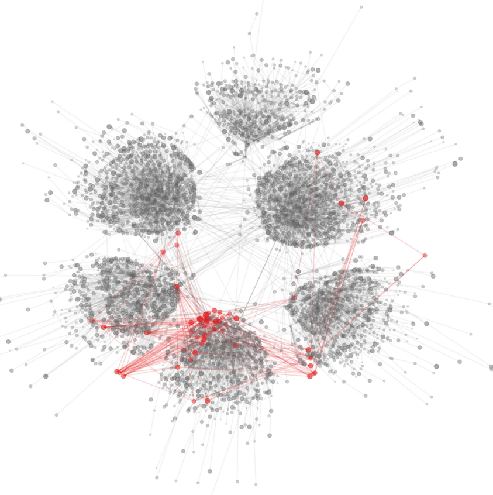

표준 데이터 및 일관된 데이터 구조: 데이터 필드 및 구조는 FI 및 다른 국가를 기준으로 표준화됩니다.

데이터 포인트를 완료: 데이터셋에 누락된 데이터 필드가 없습니다.

Graph 10: 통합 CLS 이벤트를 가진 1 주 거래 그래프의 예. 회색 클러스터는 주어진 국가에서 거래 네트워크를 나타냅니다. 돈 세탁 사건은 빨간색으로 표시됩니다.

<!-- 원문 38쪽 -->

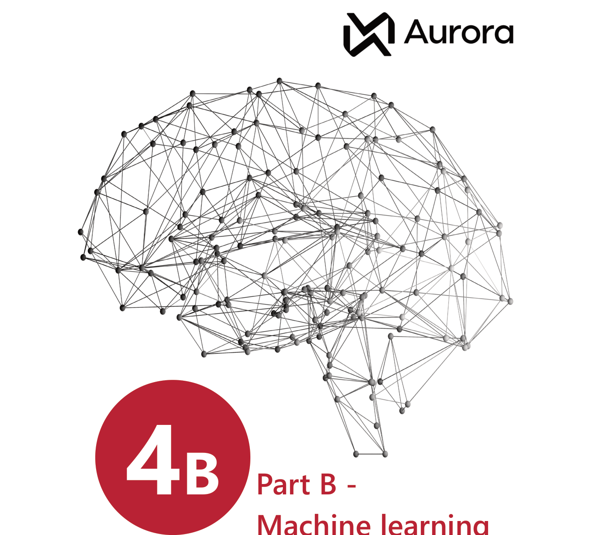

## B 부 - 기계 학습 4B

Project Aurora: 데이터, 기술 및 협업의 힘은 돈 세탁을 전투합니다.

<!-- 원문 39쪽 -->

Project Aurora: 데이터, 기술 및 협업의 힘은 돈 세탁을 전투합니다.

### 4.3 Part B: 합성 데이터셋에 기계 학습의 신청

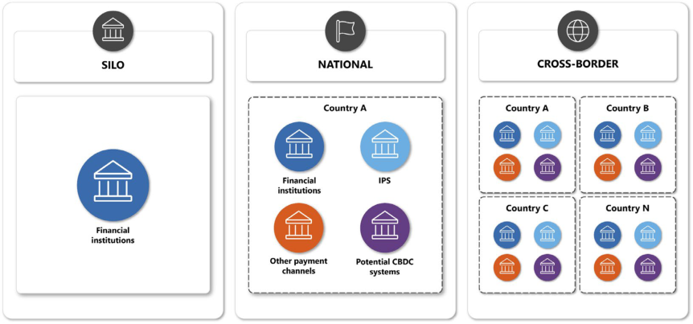

이 프로젝트의 일부는 Part A에서 생성 된 합성 데이터셋에 몇 가지 기계 학습 모델의 응용 프로그램을 보여줍니다. 기계 학습 모델의 성능은 그래프 11에서 보여지는 다른 모니터링 시나리오와 비교하여 FI와 국경의 데이터의 다른 전망 아래 의심 거래 모니터링의 가능성을 탐구하고 제한합니다.

#### 4.3.1 기계 학습 모델

프로젝트에서 탐구 된 기계 학습 모델은 두 가지 유형으로 분류 될 수 있습니다: 감독 및 감독.

- 감독 된 모델은 거래가 illicit 또는 합법적인지 나타내는 라벨을 포함하는 데이터에 훈련됩니다. 이 모델은 데이터 내에서 의심스러운 패턴과 거래를 식별하기 위해 우선 지식을 활용할 수 있습니다. 초시 학습의 장점은 모델이 더 높은 정확도로 특정 결과를 예측할 수 있다는 것입니다. 충분한 라벨을 붙인 대표 데이터가 제공됩니다. Supervised 학습 모델은 데이터 구조가 유사하다는 것을 쉽게 공유 할 수 있습니다.

- Unsupervised 모델은 라벨 데이터에 의존하지 않습니다. 대신 이전에 지식없이 데이터 내에서 패턴, 아웃리터 및 관계를 식별하는 것을 목표로합니다. 이 접근법은 라벨 데이터가 흉터가 될 때 유용 할 수 있으며, AML 공간에서 종종 케이스가 될 수 있습니다. 탁월한 학습의 장점은 숨겨진 또는 예상치 못한 발견 할 수 있다는 것입니다.

Graph 11: 3개의 감시 시나리오 Silo: 각 금융 기관은, 그들의 자신의 거래 자료를 사용하여, 자주적으로 거래 감시를 지휘합니다. 국가: 거래 데이터는 국가 수준에 표시됩니다. 각 국가는 자체 거래 데이터를 볼 수 있습니다. 거래 모니터링 및 모델 교육은 국가 수준에서 수행됩니다. 이것은 즉시 지불 체계, 국가 거래 감시 실용, 다른 공동 작업 배열 또는 잠재적인 CBDC 체계일 수 있었습니다. Cross-border: 거래 데이터는 크로스-블레벨에 표시됩니다. 거래 모니터링 및 모델 교육은 크로스-배틀 레벨에서 수행됩니다.

<!-- 원문 40쪽 -->

Project Aurora: 데이터, 기술 및 협업의 힘은 돈 세탁을 전투합니다. AML 전문가에 명백하지 않을 수 있는 자료에 있는 본. 그러나, 라벨 데이터의 사용 없이 모델의 출력의 품질을 평가하는 것은 도전이 될 수 있습니다.

**표 2는 AML 거래 모니터링에서이 PoC 및 그 특성에 사용되는 모델을 요약합니다.48**

모델 비교에서, 규칙 기반 접근법은 의심 거래를 감지하는 규칙 기반 방법을 사용하여 일반적인 연습을 복제하는 데 도입됩니다. 이 벤치 마크로 소개되어 규칙 기반 접근법과 기계 학습 접근법 모두 동일한 데이터를 사용하고 비교할 수 있습니다.

48 프로젝트는 하나의 감독 학습 모델과 함께 다양한 모델의 복잡성을 가진 세 가지 감독 학습 모델을 통합합니다. 이 모형은 AML 연구에서 널리 이용되는 때문에 선택됩니다. 논리적인 회귀 모형은 간단한 선형 분류 모형을 대표합니다, 인공 신경망에는 선형과 비선형 관계 둘 다 붙잡는 능력이 있습니다. 또한, 그래프 신경 네트워크는 네트워크에서 정보를 효율적으로 추출할 수 있습니다. 고립 숲이 감독되지 않는 동안, 그것은 밖의 검출하고 잠재적으로 돈 세탁에 연결되는 물질에 적응할 수 있습니다.

**표 2: 기계 학습 모델 탐험**

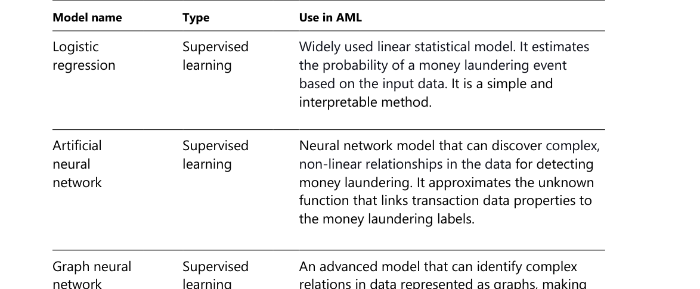

그래프로 표현된 데이터의 복잡한 관계를 식별할 수 있는 고급 모델로 돈을 감수하는 데 유용하게 만듭니다. 그것은 거래 네트워크의 구조를 사용하여 돈을 세탁 이벤트를 감지합니다.

고립 숲 Unsupervised 학습은 무작위로 그룹으로 관측을 분할하여 데이터의 특이한 패턴을 감지하고, 초기 프로세스에서 나타나는 이상치를 고립시키는 것은 돈 세탁 활동을 감지하는 좋은 선택입니다.

<!-- 원문 41쪽 -->

Project Aurora: 데이터, 기술 및 협업의 힘은 돈 세탁을 전투합니다.

## 의제

모니터링에 사용되는 특정 특성49을 선택하기위한 모델과 합리적 인 가정은 다음과 같습니다.

- 특성의 선택 및 사용. 모델에 사용되는 특성은 금융 범죄 연구 및 상담에서 규정 준수 전문가로 파생되었습니다. 다양한 특성들은 모델에 포함되어 있으며, 예를 들어 고유한 부분, 거래 값, 계산, 비율 및 다양한 유형의 거래, 자금의 이동 속도 및 임계값 또는 축적된 자금의 사각형 거리의 합과 같은 다양한 유형의 거래 값이 포함됩니다. PoC는 이러한 특성의 일관된 사용을 가정합니다. 모델에 대한 자세한 내용은 Annex B를 참조하십시오.

- 정지 패턴. 그것은 illicit 거래의 패턴과 돈 세탁과 관련된 다른 데이터 특성 시간이 지남에 따라 안정적으로 유지된다는 가정. 따라서 예측을 만들기 위해 역사적인 데이터와 기계 학습 모델을 훈련하는 충분한 정보가 있어야합니다.

#### 4.3.2 모델 테스트

50는 진정한 긍정적 인 부정적인, 모델의 관점에서, 52의 관점에서, 11의 성능과 효율성을 테스트하고 평가 한 후, 기계 학습 모델을 사용하도록 (훈련 과정 설명에 대한 Annex B 참조).50이 테스트 단계는 진정한 긍정적51 및 거짓 부정적인, 52 모델의 능력의 관점에서 모델의 의심스러운 행동을 식별 할 수 있지만, 의심스러운 네트워크의 여지가없는 네트워크의 일부가 될 수 있기 때문에, 자신의 네트워크의 일부가 될 수 있습니다.

모델의 성능과 효율성을 측정하는 데 사용되는 1 차 미터는 다음과 같습니다.

- recall54 – 돈 launderers의 탐지율을 측정, 이는 모델이 실제 돈 laundering 활동을 감지 할 수있는 방법을 보여줍니다; 그리고

49 이 특성은 속성이나 입력 변수로도 알려져 있습니다. 이 특성은 데이터의 밑 부분과 관계를 나타내는 데 사용되며 예측이나 결정에 대한 기계 학습 알고리즘에 의해 사용됩니다.

50 평가된 기계 학습 모형은 합성 자료에 제일 가능한 성과를 달성하기 위하여 잘 조정되지 않았습니다, 그러나 그들의 일반적인 모양에서 사용되었습니다. 비교는 각 모델을 설정에 소요되는 동등한 시간과 노력이 가정합니다.

51 제대로 식별 된 돈 세탁자의 분수.

52 잘못된 식별 돈 launderers의 분수.

53 합성 데이터에서, 돈 라테어는 illicit 지불이 거래 데이터에 내장 될 때 떨어졌다.

54는 진정한 긍정적 인 예측의 비율이며, 부정적 인 (모델이 식별하지 못하는 돈 세탁 활동의 일종). 높은 리콜은 모델이 가장 많은 돈 세탁 활동을 감지하는 데 효과적임을 나타냅니다. 검출되지 않은 인스턴스의 수를 최소화합니다.

<!-- 원문 42쪽 -->

Project Aurora: 데이터, 기술 및 협업의 힘은 돈 세탁을 전투합니다.

- false Positive case의 감소 – 규칙 기반 방법을 사용하여 모니터링과 비교하여 잘못된 긍정적 인 손실을 줄이기 위해 기계 학습 모델의 능력을 캡처하는 데 사용되는 미터입니다.

> **주:** 다른 미터는 정밀55와 F1 점수를 포함했습니다. 56, 57

#### 4.3.3 결과

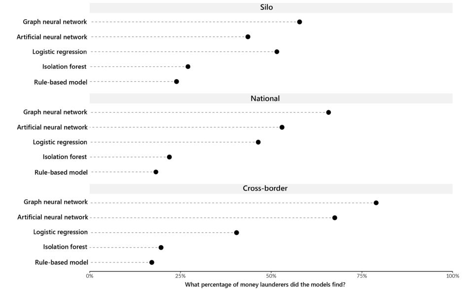

결과 1: 기계 학습 모델은 규칙 기반 모니터링을 수행.

그래프 12는 4 개의 다른 기계 학습 모델의 성능을 설명하고 돈 라우팅 이벤트를 감지하기위한 세 가지 모니터링 시나리오의 각각에 적용 된 하나의 규칙 기반 모델.

## 비교에서 두 가지 주요 발견은 강조된다: 58

55 그것은 모든 식별 된 돈 세탁 활동 (정확하고 잘못된)의 합계에 정확히 식별 된 돈 세탁자의 비율입니다. 높은 정밀도는 모델이 성공적으로 가짜 긍정적 인 균형을 맞추는 동안 돈 세탁 활동을 식별한다는 것을 나타냅니다.

56 F1 점수는 항-자금세탁 컨텍스트의 경우 종종 불균형 데이터셋를 처리 할 때 유용합니다. 자금세탁 인스턴스는 합법적인 거래와 비교하여 상대적으로 드물게 됩니다.

57 이 실험에서, 정밀도와 F1 점수는 리콜과 유사합니다.

58 병참술 회귀의 개선과 고립 숲은 다양한 모니터링 시나리오에서 상대적으로 작습니다. 이것은 모델이 대우되고 그(것)들을 비교하기 위하여 각 모형에 더 명세 없이 동일한 방법으로 훈련된 사실 때문에 주로 입니다. 실제 경우, 더 많은 사양은 각 모델마다 개별적으로 훈련해야합니다. 비교에서 그래프 신경 네트워크는 설계에 의해 그래픽 구조를 활용하고 전반적인 더 나은 성능을 보여 같은 복잡한 관계를 캡처 할 수 있습니다.

Graph 12: 다른 감시 시나리오 프로젝트 오로라에 있는 기계 학습 모형의 성과: 자료의 힘, 기술 및 협력은 돈 박판으로 만들기를 전투합니다.

<!-- 원문 43쪽 -->

1. - 비디오 기계 학습 모델은 돈 launderers를 감지하는 규칙 기반 모델보다 더 효과적입니다. 이 실험에서, 규칙 기반 모니터링 접근은 사일로 감시 시나리오에서 돈 launderers의 25%까지 검출, 기계 학습 모델이 많은만큼 더 많은 것을 감지 할 수 있었다. 2. - 비디오 네트워크 특성을 통합하는 기계 학습 모델은 최적의 제품입니다. 그래프 신경 네트워크 (GNN) 모델은 데이터의 더 넓은 설정이 가능할 때 5 가지 테스트 모델에서 가장 잘 수행됩니다. 거래 데이터의 크로스 국경 전망으로, 모델은 합성 데이터의 돈 launderers의 80%에 대해 감지 할 수 있습니다. 결과 2: 데이터의 전체보기 및 모니터링은 복잡한 돈 세탁 네트워크의 탐지를 향상시킵니다.

기계 학습 모델은 더 효율적으로 거래 데이터의 큰 세트를 기반으로 할 때, 거기에서 더 나은 거래 네트워크의보기를 제공. 그래프 13는 세 가지 모니터링 시나리오의 각 모델의 비교를 보여줍니다.

<!-- 원문 44쪽 -->

Project Aurora: 데이터, 기술 및 협업의 힘은 돈 세탁을 전투합니다.

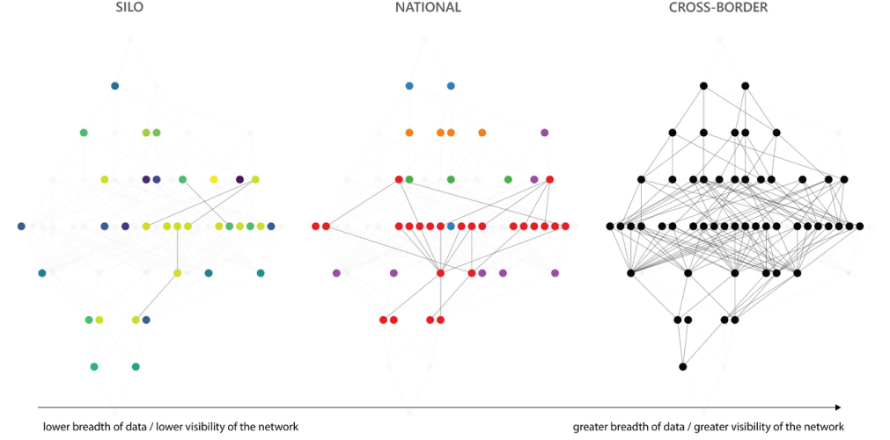

- 크로스-브젝트 모니터링 시나리오는 복잡한 계층화 계획에서 배우를 감지하는 국가 및 사일로드보다 더 효과적입니다.

- Siloed 및 National Monitoring 시나리오는 돈 세탁 네트워크에 관련된 개별 엔티티티의 하위 세트를 활성화 할 수 있지만 더 넓은 컨텍스트가 부족하고 더 넓은 네트워크에 가시성을 얻을 수 없습니다.

- 그러나 국가 감시 시나리오는 여전히 국가의 자신의 관할권 경계 내에서 의심스러운 네트워크를 감지하는 데 유용합니다.

결과 3: Supervised 학습 모델 플래그는 더 많은 의심 활동을 시작하고 약간의 거짓 긍정적 인 긍정적 인 효과를 만듭니다.

Graph 14는 데이터가 국가 모니터링 시나리오에서 분석 될 때, 규칙 기반 모니터링 모델을 포함하여 모든 모델은 더 효율적이다. 더 많은 개선은 크로스-블레지스터 모니터링 시나리오에서 일부 모델을 관찰합니다.

그래프 13: 다른 모니터링 시나리오 Silo의 그래프 신경 네트워크와 돈 세탁 네트워크의 탐지를 시각화: 컬러 코딩은 금융 기관이 감지 할 수있는 것을 나타냅니다. 국가: 색깔 기호화는 국가 수준에 검출될 수 있는 것을 나타냅니다. Cross-border: 검은 색 점은 크로스 국경 수준에서 감지 될 수있는 것을 나타냅니다. 어둠의 선은 의심스러운 계정이나 거래를 나타냅니다.

<!-- 원문 45쪽 -->

Project Aurora: 데이터, 기술 및 협업의 힘은 돈 세탁을 전투합니다.

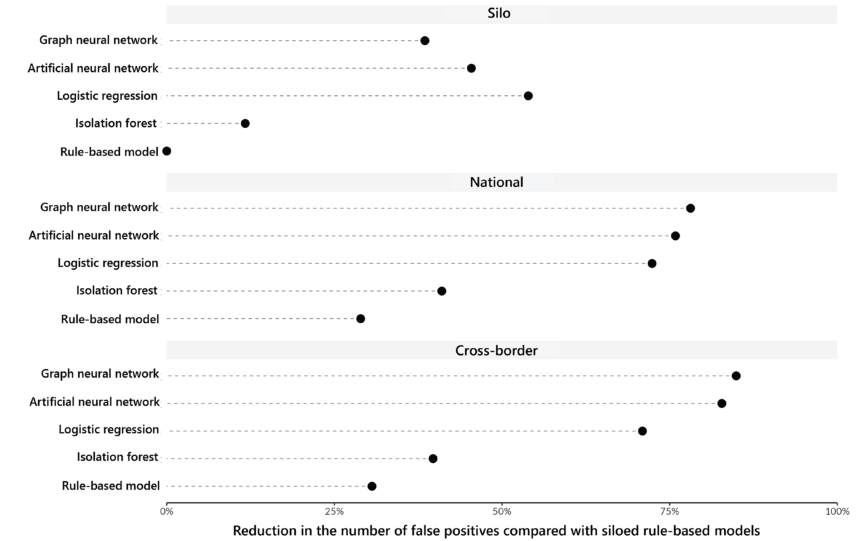

1. - 비디오 거래 데이터의 국가 및 크로스 국경 모니터링은 현재 규칙 기반 모델보다 거짓 긍정적 인 수를 줄이는 데 더 효과적입니다. • 대부분의 감독 기계 학습 모델은 규칙 기반 모델과 비교하여 거짓 긍정적 인 수를 감소시킵니다. 감소는 실로스에서 모니터링 할 때 약 40%이며, 이는 약 75%이며, 국가 거래 데이터의 관점에서 취임 할 때입니다. 더 많은 개선은 크로스 국경보기로 관찰됩니다. • 기계 학습 모델은 복잡한 데이터 패턴을 배우고 정교한 시나리오에 조정하는 능력으로 인해 규칙 기반 한 것보다 더 효과적입니다. 2. - 비디오 Supervised machine 학습 모델은 false 긍정적 인 감소에 더 잘 될 수 있습니다. • 감독 된 기계 학습 모델의 전반적인 성능은 탁월한 모델보다 더 낫습니다. • Labelling59는 의심스러운 정상적인 거래와 모델이 더 잘 구별됩니다.

59 모델은 거래가 illicit 또는 합법적인지 여부에 대한 라벨을 포함하는 데이터에 훈련.

Graph 14: 실로 즈 모니터링에 있는 규칙 근거한 모형과 비교된 틀 근거한 긍정적인 감소 실로 즈는 감시 시나리오에 있는 규칙 근거한 모형은 잠재적인 감소가 비교되는 벤치 마크로 이용됩니다. 예를 들어, 실로 덮인 모니터링 시나리오의 GNN은 규칙 기반 접근과 비교된 40%에 의해 거짓 긍정적 인 수를 줄일 수 있습니다.

<!-- 원문 46쪽 -->

Project Aurora: 데이터, 기술 및 협업의 힘은 돈 세탁을 전투합니다.

- 그래프 신경 네트워크 모델은 국가 또는 국경 수준에서 모니터링 할 때 가장 잘 작동하므로 모델은 더 큰 관찰 네트워크 구조에서 더 많은 것을 배울 수 있습니다.

결론적으로 Project Aurora는 성공적으로 다른 기계 학습 방법과 합성 거래 데이터의 다른 전망에 대한 규칙 기반 모니터링 도구 테스트 및 비교했습니다. 이 포함 된 실로즈, 국가, 및 크로스 국경 전망은 모니터링 시나리오를 나타내는 돈을 세탁 네트워크. 결과 기계 학습 모델이 전통적인 규칙 기반 접근보다 더 효과적 일 수 있음을 보여주었습니다. 특히 그 모델이 네트워크 특성을 통합 할 때.

또한, 다양한 결제 시스템과 국경을 통해 모니터링을 포함하는 전체 거래 모니터링은 정교한 돈 세탁 네트워크의 탐지를 향상시키고, 거짓 긍정적 인 수를 줄입니다.

마지막으로, 감독 된 기계 학습 모델은 거짓 긍정적 인 긍정적 인 감소에 더 효과적입니다. 이 발견은 국가 또는 국경 거래 모니터링 배열과 결합될 때 기계 학습 모형이 AML 노력에 있는 귀중한 일 수 있다는 것을 건의합니다.

<!-- 원문 47쪽 -->

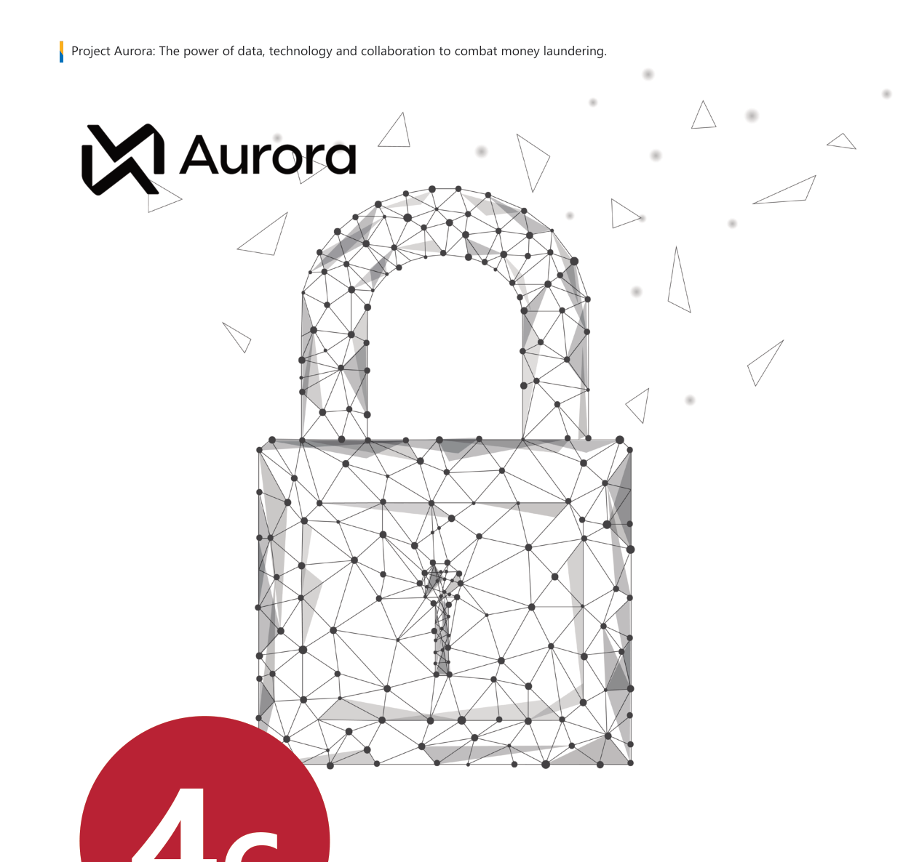

## 부품 C: 개인화 강화 기술 4C

Project Aurora: 데이터, 기술 및 협업의 힘은 돈 세탁을 전투합니다.

<!-- 원문 48쪽 -->

Project Aurora: 데이터, 기술 및 협업의 힘은 돈 세탁을 전투합니다.

### 4.4 부품 C: AML에 대한 개인 정보 보호 강화 기술 테스트

Part B는 거래 데이터에서 기계 학습 모델을 사용하여 국가 및 국경 수준에서 복잡한 돈 세탁 네트워크를 감지하는 잠재적 이점을 입증했습니다. 그러나 이러한 CAL 배열을 구현하는 것은 데이터 보호, 개인 정보 보호, 보안, 경쟁 및 법적 준수에 관한 우려로 인해 어려울 수 있습니다.

이러한 도전에 대한 일부에, 이 부분은 안전한 보호 CAL 배열을 촉진하기 위해 개인 정보 보호 강화 기술 (PET)의 사용을 탐구하고, 다른 PET와 조화하여 기계 학습 모델의 효과를 평가합니다. PoC의이 부분은 세 단계로 구조화됩니다.

1. - 비디오 다른 가장 큰 CAL 배열 (분명, 탈중앙화 및 잡종)에 다른 애완 동물을 테스트.

2. - 비디오 Part B에서 각 배열에 가장 적합한 기계 학습 모델을 적용.

3. - 비디오 개인 정보 보호 정책에 대한 이러한 모델의 탐지 특성을 평가하고 각 CAL 배열에서 각 PET를 사용하여 타당성을 평가합니다.

#### 4.4.1 개인화 기술 탐구

이 PoC에서 세 가지 PET가 탐구됩니다.

- Homomorphic Encrypt (HE)는 암호화된 데이터에서 수행될 수 있는 컴퓨팅을 가능하게 하는 신흥적이고 진화 기술입니다. 개인 식별 정보를 보호하면서 AML 노력에 거래 데이터를 분석 할 때 예를 들어, 개인 식별 정보 (PII).60

- 현지 차별 개인 정보 보호는 데이터셋 (즉, 금융 기관 수준에서)에 개별 레코드를 할당하고 정확한 분석에 허용하고, 돈 세탁 탐지에 비-PII 데이터의 개인 정보 보호 보호 보호의 일부를 보장하는 데 유용한 기술을 만드는. 그러나, 원료에 소음을 추가하는 과정은 모델 성능을 감소시키기 위해 리드 할 수 있습니다. 61

60 현재까지, HE와 관련된 계산 오버 헤드는 처리 시간과 자원 요구 사항을 증가 할 수 있지만, 이것은 빠르게 변화합니다. 일부 하드웨어 제조업체 및 기술 회사는 기술의 잠재력을 믿고 더 연구 및 개발에 투자하고 있습니다. ISO 표준 (ISO/IEC 18033-6:2019)은 균형 암호화를 위해 개발되었습니다.

61 모델이 로컬 차분한 개인 정보 보호에 의해 도입 된 소음에 민감하는 경우 모델 성능은 PET를 적용 한 후 악화 될 수 있습니다. 프로젝트에서, 기계 학습 방법은 성능이 소음에 영향을 미치는지 보여주는 로컬 차분한 개인 정보 보호의 밑에 시험됩니다.

<!-- 원문 49쪽 -->

Project Aurora: 데이터, 기술 및 협업의 힘은 돈 세탁을 전투합니다.

- Federated 학습은 여러 엔티티티를 사용하여 고유 데이터를 공유 할 필요없이 공유 모델 협업을 훈련 할 수있는 분산 된 기계 학습 기술입니다. 이 기술은 데이터 프라이버시, 데이터 보안, 데이터 액세스 권한, 데이터 로컬라이제이션 및 이진 데이터에 대한 접근과 같은 문제를 해결할 수 있습니다. 그러나, 그것은 증가된 처리와 통신 머리 위, 자료 질, 자료의 신뢰성 및 참가자의 증가한 문제 및 다른 금융 기관에 의하여 중앙 집중된 접근을 통해 돈을 박판으로 만드는 네트워크를 검출하는 감소된 능력을 직면합니다.

PET 선택은 특정 요구 사항, 자원 및 제약 기관의 안티 - 돈 세탁 노력에 따라 달라집니다. 여러 PET를 사용하는 하이브리드 접근법은 각 PET의 독특한 강점을 활용함으로써 더 나은 결과를 얻을 수 있습니다.

다른 신흥 애완 동물은 멀티 파티 계산 (MPC), 제로 - knowledge proofs (ZKPs) 및 개인 설정 교차로 (PSI) 혁신적인 개인 정보 보호 솔루션을 제공 할 수 있지만,이 단계에서 테스트되지 않았습니다. 62 Nevertheless, 이러한 애완 동물은 미래 조사에 대한 고려 가치가 있습니다. (애완 동물에 대한 자세한 내용은 Annex C를 참조하십시오.)

## 균형 암호화를 사용하는 제한

실험의 첫 번째 부분에서, 균형 암호화는 1 차 PET.63로 사용되었습니다. 이 방법은 모든 데이터를 암호화하고 공유 된 데이터의 보안 및 개인 정보 보호를 분석 할 수있는 중앙 데이터 풀로 공유 할 수 있기 때문에 약속을 제공 할 수 있기 때문입니다.

그러나 PoC에서이 PET를 완전히 구현하는 것은 암호화 된 금융 거래 데이터의 크기로 인해 불연성 증명.64 따라서 지역 차별 개인 정보 취급과 같은 HE 및 기타 PET의 조합을 포함하는 대안 접근법이 탐구되었다.

#### 4.4.2 4가지 다른 협업 분석 및 학습 배열에 대한 개인 정보 보호 기술의 조합을 테스트

프로젝트 오로라는 4가지 다른 협업 분석 및 학습(CAL) 배열에서 개인 정보 보호 강화 기술을 실험합니다.

62 예를 들어, 금융 범죄의 개인 정보 보호 탐지 (APP DFC)는 MPC 및 ZKPs의 사용을 연구하고 KYC, AML 및 사기 탐지에 대한 합성 데이터 생성.

63 체온 외 (2017)를 참조하십시오. 이 프로젝트에서 완전히 HE 접근이 사용되었습니다.

64 심지어는 RAM의 최대 70GB의 분산 인프라에 오픈 소스 FHE 라이브러리를 사용하여 테스트되었지만 암호화 된 데이터의 크기로 구성 된 문제를 극복 할 수 없었습니다.

<!-- 원문 50쪽 -->

Project Aurora: 데이터, 기술 및 협업의 힘은 돈 세탁을 전투합니다.

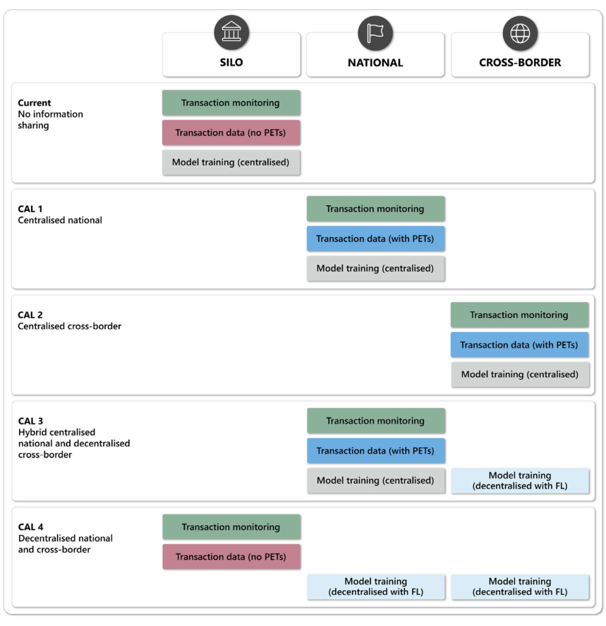

그래프 15는이 실험에서 다른 CAL 접근법을 설명합니다.

- CAL 1 (중앙화 국가) - 데이터는 LDP를 사용하여 암호화되며 개인 정보 보호 된 데이터는 중앙화 된 국가 시스템에서 공유됩니다. 기계 학습 모델은 국가 수준의 데이터에 훈련 및 적용된다.

- CAL 2 (중앙화된 크로스-Border) – 데이터는 LDP를 사용하여 암호화되며, 개인 정보 보호-연합 데이터는 데이터셋가 공유된 거래를 나타내는 중앙화된 크로스-Border 시스템에서 공유됩니다. 기계 학습 모델은 크로스-배틀 레벨의 데이터에 훈련 및 적용된다.

그래프 15: 다른 PET-enabled CAL 배열의 개요는 균형 암호화 (HE) 및 지역 차별 개인 정보 보호 (LDP)가 있는 프로젝트에서 사용되는 PET를 탐구했습니다. 집중된 모델 교육은 FI 또는 국가 수준의 협업을 통해 학습 (FL)을 활용합니다.

<!-- 원문 51쪽 -->

Project Aurora: 데이터, 기술 및 협업의 힘은 돈 세탁을 전투합니다.

- CAL 3 (고향 국가 및 크로스 국경) 65 - 데이터는 LDP를 사용하여 HE 및 비분쇄를 사용하여 암호화됩니다. 개인정보 보호 정책은 중앙화된 국가 시스템으로 공유됩니다. 각 국가는 국경을 넘어 거래 데이터를 공유 할 필요가없이 학습을 통해 기계 학습 모델을 훈련에 협력합니다.

- CAL 4 (국립 및 국경을 분산) - 참가자는 자신의 데이터에 로컬로 학습을 사용하여 기계 학습 모델을 공동으로 훈련하고 일반적인 글로벌 모델에 모델 업데이트를 공유합니다. 이 지역 모델 업데이트는 글로벌 모델로, 그 다음, 차례로, 공유.

균형 암호화 및 로컬 차분한 개인 정보 보호 - 데이터의 감도에 따라 PET를 적용하는이 접근법은 1 차 PET로 HE를 사용하는 제한을 해결하기 위해 테스트되었습니다. 이 접근 방식에서는 민감한 계정 식별자를 포함한 개인 식별 정보 (PII) 데이터는 로컬 차분한 개인 정보 보호 (LDP)가 거래 흐름 데이터 (더 자세한 내용은 Annex C 참조)에 PET로 사용됩니다. 그래프 16 및 17에서 설명 된이 접근법은 다른 PET가 데이터 필드의 감도에 맞게 조합 및 적합하도록 할 수 있음을 보여줍니다.

65 거래 데이터는 중앙 서버(예: 각 국가)에서 처리할 수 있으며, 각 국가가 협업적으로 기차 모델을 허용하고, 거래 데이터를 직접 공유하지 않고 국가 분석 결과를 개선할 수 있습니다.

<!-- 원문 52쪽 -->

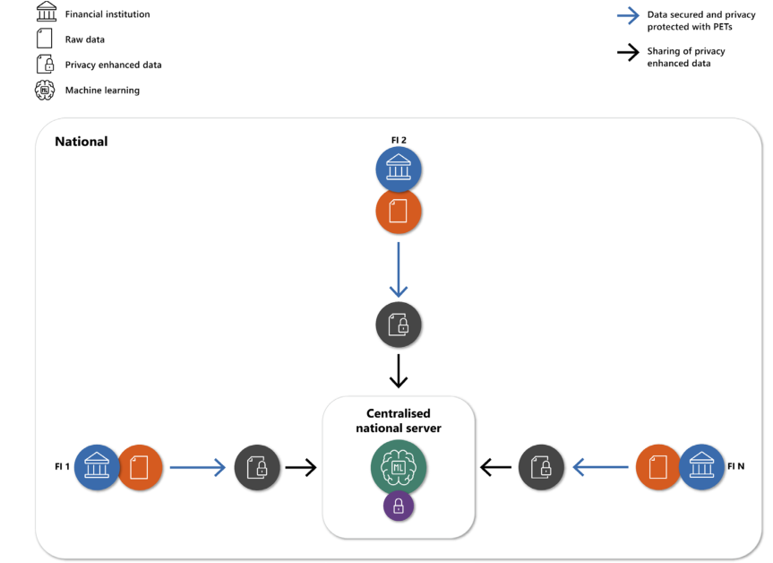

Project Aurora: 데이터, 기술 및 협업의 힘은 돈 세탁을 전투합니다.

Graph 16: CAL 1 – PET를 사용하는 중앙화된 국가 접근은 각각 금융 기관 암호화를 암호화하고 HE 및 LDP를 사용하여 자체 거래 데이터를 손상시킵니다. 금융기관은 금융기관의 주택 국가 내에서 암호화된 데이터를 중앙 서버로 공유합니다. 발견의 분석 (flags)는 다양한 방법으로 접근 할 수 있습니다. 예를 들어, 서버에서 중앙으로 분석할 수 있으며, 각 금융 기관으로 다시 전송할 수 있습니다. 그러나이 실험은 결과와 발견이 공유 될 곳에 대해 어떤 가정을하지 않았다.

<!-- 원문 53쪽 -->

Project Aurora: 데이터, 기술 및 협업의 힘은 돈 세탁을 전투합니다.

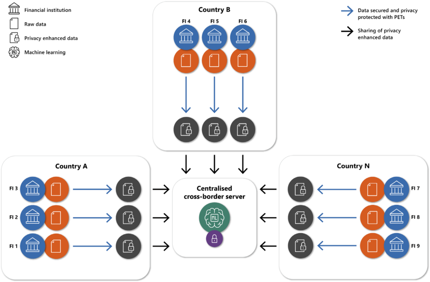

## 탈중앙화된 하이브리드 CAL 배열을 위한 학습(FL)을 사용하여

탈중앙화된 CAL 배열(CAL 4) 및 하이브리드 CAL 배열(CAL 3)에 대한 부분적으로, 학습을 강화하는 것은 활용됩니다.

FL을 사용하는 주요 목적은 거래 데이터를 공유하지 않지만, 돈 세탁 활동을 감지 할 수있는 기계 학습 모델 훈련에서 다른 당사자와 협력합니다. 금융 기관은 자신의 거래 데이터에 모델을 훈련하고 신뢰할 수있는 중앙 서버를 통해 다른 금융 기관과 모델 업데이트 (레오닝) 만 공유합니다.

모델에 따라, 정확도와 견고성은 고립에 있는 금융 기관에 의해 훈련된 모형과 비교될 수 있습니다 (기술적인 묘사를 위한 별관 C를 보십시오). 그래프 18 및 19는 CALs 3 및 4에 대한 설정을 설명합니다.

Graph 17: CAL 2 – PET를 사용하는 중앙 교차 국경 접근 각 금융 기관 암호화 및 HE 및 LDP를 사용하여 자체 거래 데이터를 손상. 각 금융 기관은 크로스-블레어 중앙 시스템에 거래 데이터를 공유합니다.

발견의 분석 (flags)는 다양한 방법으로 접근 할 수 있습니다. 예를 들어, 서버에서 중앙으로 분석할 수 있으며, 각 국가 또는 각 금융 기관으로 다시 전송할 수 있습니다. 그러나이 실험은 결과와 발견이 공유 될 곳에 대해 어떤 가정을하지 않았다.

<!-- 원문 54쪽 -->

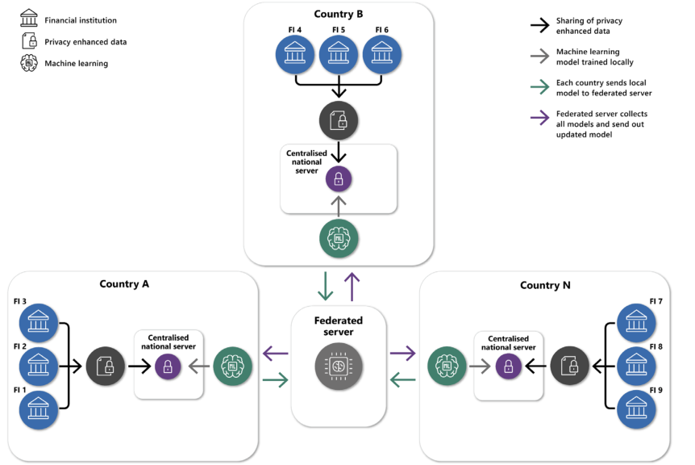

Project Aurora: 데이터, 기술 및 협업의 힘은 돈 세탁을 전투합니다.

Graph 18: CAL 3 – CAL 1로 PET를 사용하는 하이브리드 국가 및 크로스 국경 접근, 각 금융 기관은 자체 거래 데이터를 암호화하고 국가 중앙 서버로 공유합니다. 또한 각 국가는 자신의 데이터에 FL 기계 학습 모델을 훈련하고 타당 학습을 사용하여 다른 국가와 모델 업데이트를 공유합니다.

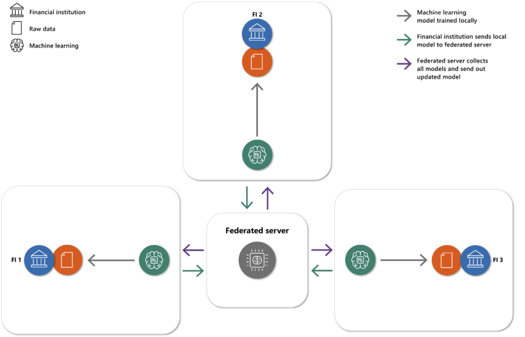

그래프 19: CAL 4 – FL를 사용하여 완전하게 탈중앙화 국가 및 국경 접근 방식 각 금융 기관은 자신의 거래 데이터에 FL 모델을 훈련하고 국경을 넘어 다른 금융 기관과 모델을 공유합니다. 거래 데이터는 다른 국가와 공유되지 않습니다.

<!-- 원문 55쪽 -->

Project Aurora: 데이터, 기술 및 협업의 힘은 돈 세탁을 전투합니다.

#### 4.4.3 결과: 개인 정보 보호 강화 기술과 결합하여 기계 학습 모델을 적용

실험의 두 번째 부분은 각 시뮬레이션 CAL 배열의 개인 정보 보호 - 엔한 데이터에 Part B에서 최고의 성능 기계 학습 모델을 적용하고, 돈을 세탁 네트워크 감지에서 각 성능 비교. 이 섹션은 실험에서 얻은 결과를 제시하고, 이러한 CAL 배열의 성능을 비교합니다.

3 기계 학습 모델 – 그래프 신경 네트워크, 인공 신경 네트워크 및 병리적 회귀 – Part B에서 우수한 성능을 갖는 것으로 나타났습니다. 이 모델은 개인 정보 보호 정책에 대한 자신의 성능을 평가하기 위해 각 CAL 배열에서 사용됩니다. PET를 적용 할 때 정보의 잠재적 인 손실 및 복잡한 돈 세탁 네트워크 감지를위한 최적의 CAL 배열.

또한, 규칙 기반 모델은 CAL 2 (중앙화된 크로스-브레더) 배열에 대해 테스트하여 기계 학습 모델에 대한 성능과 각 CAL 배열에서 잠재적인 효율성 이익을 평가하는 데 실로 즈를 곱합니다. 66 결과 1: PET-enabled CAL 접근법은 CAL없이 규칙 기반 모니터링과 비교하여 최대 3 배의 성능을 향상시킬 수 있습니다.

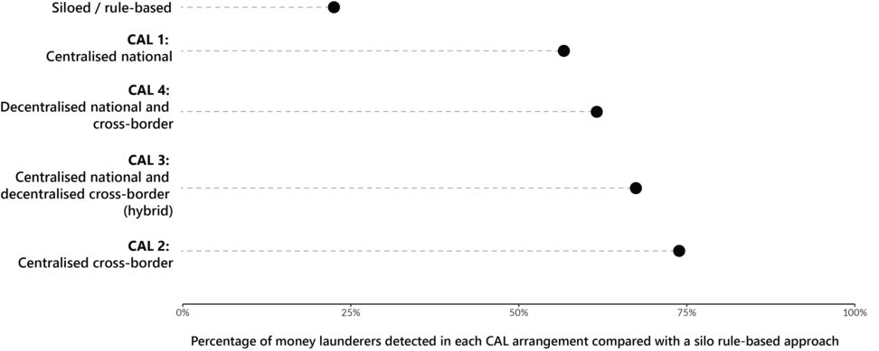

그래프 20는 돈 라테어를 검출하는 각 CAL 배열과 비교된 실로 묶인 규칙 기반 모니터링의 효과 결과를 보여줍니다. 각 CAL 배열에서 가장 뛰어난 기계 학습 모델을 사용합니다. 평가 미터는 모델에 의해 발견 된 돈 라 테르의 비율입니다 ("recall").

66 모델은 Part B와 동일한 메트릭을 사용하여 비교되며, 즉 잘못된 식별 된 돈 라테어의 감소. 미터는 돈 launderers의 비율로 제시됩니다 각 모델은 발견, 그리고 시간 절약은 감소 된 숫자의 거짓 긍정적입니다.

Graph 20: PET 활성화 CAL 배열의 밑에 기계 학습 모형은 돈 launderers의 더 큰 비율을 검출할 수 있었습니다 결과는 각 CAL 배열의 밑에 제일 성과 기계 학습 모형에 대응합니다.

<!-- 원문 56쪽 -->

Project Aurora: 데이터, 기술 및 협업의 힘은 돈 세탁을 전투합니다.

1. - 비디오 PET 활성화 CAL 배열은 기계 학습 모델을 사용할 때 돈 launderers의 더 효과적인 식별에 납.

- 평균적으로, 애완 동물을 가진 국가 또는 교차 국경 CALs의 밑에 기계 학습 모형은 CAL 배열 없이 통치하는 감시와 더불어 통치자 보다는 2개 3배 더 많은 돈 launderers를 검출할 수 있습니다.

2. - 비디오 PET는 안전한 CAL 배열을 촉진하고 크로스-배경 탐지 특성을 개량할 수 있습니다.

- CAL 1 (중앙화 된 국가 모델)는 4 CAL 배열 중 가장 낮은 리콜 점수를 산출합니다. 모든 돈 세탁자의 약 60%는 CAL 1에 의해 감지됩니다.

- CAL 2 (중앙화된 크로스-Border 모델)는 가장 높은 리콜 점수를 산출하여, 이는 효과적으로 돈 라우더를 검출할 수 있다는 것을 나타냅니다. 모든 돈 세탁자의 약 75%는 CAL 2에 의해 감지됩니다.

- CAL 3 (고체 모형)는 CAL 2와 비교된 약간 낮은 회위, 돈 launderers의 70%를 검출할 수 있습니다.

- CAL 4 (완전히 탈중앙화 모형)는 CAL 3 보다는 약간 더 낮은 성과 및 결과를 전시합니다. 이 서비스는 개인 정보 보호 및 민감한 정보의 보호를 보호하는 데 완전히 집중된 접근 방식을 의미하며 글로벌 협력을 증가시키는 것은 중앙화된 하이브리드 CAL 배열과 비교하여 탐지 특성의 측면에서 거래가 참여할 수 있습니다.

결과 2: 중앙 교차 국경 CAL 배열은 크로스 국경 돈 세탁 네트워크 감지에서 더 나은 수행.

다양한 CALs가 감지 된 돈 세탁소의 수에서 똑같이 수행 할 수 있지만, 그것은 돈 세탁소의 수량과 돈 세탁 네트워크의 식별을 감지하는 데 필수적입니다. 광범위한 데이터셋는 복잡한 범죄 네트워크를 식별 할 필요가 있습니다. 그래프 21는 파트 CAL 2 (중앙 국경)에서 "CLS 이벤트 3"를 감지하여 다른 CAL 배열에서 결과를 비교하고 국가 전체에 걸쳐 하위 네트워크 구조를 발견 할 수 있습니다.

<!-- 원문 57쪽 -->

Project Aurora: 데이터, 기술 및 협업의 힘은 돈 세탁을 전투합니다.

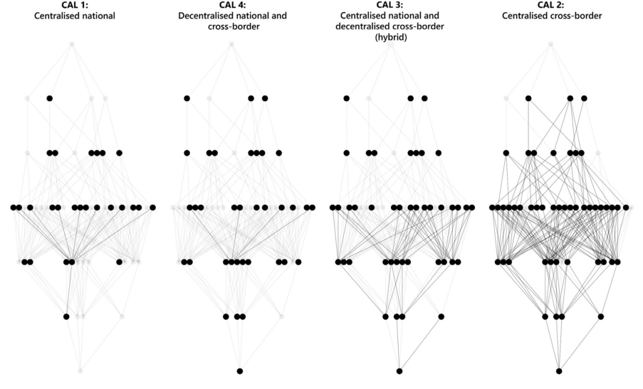

다른 CALs의 기계 학습 모델의 탐지 특성의 개선은 데이터 가용성과 거래 네트워크의 개선 된보기로 인해됩니다. 3를 5로 검색하면 비교에서 발견되었습니다.

결과 3: 기계 학습 기반 네트워크 분석과 함께 PET-enabled CAL은 사일로 지배적 인 규칙 기반 방식으로 비교된 80%까지 거짓 긍정적의 수를 줄이기 위해 나타납니다.

그래프 22는 CAL 배열과 기계 학습 모델이 실로 묶인 규칙 기반 모델과 비교하여 거짓 긍정적 인 수를 줄일 수 있음을 보여줍니다 (벤치 마크 역할을합니다).

Graph 21: 다른 CAL 배열에 있는 네트워크 탐지 특성의 비교 회색과 까만 노드는 돈 laundering 네트워크에서 관여된 배우를 대표합니다. 배우 사이의 어두운 선은 의심 거래 흐름을 나타냅니다.

<!-- 원문 58쪽 -->

Project Aurora: 데이터, 기술 및 협업의 힘은 돈 세탁을 전투합니다.

### A. PET-enabled CAL 배열은 더 효율적인 거래로 이어졌습니다.

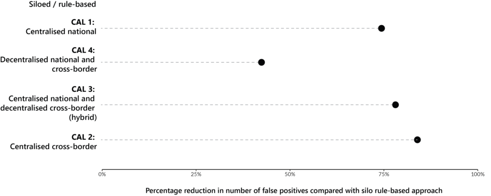

잘못된 긍정적 인 수를 모니터링.

- 그래프 22는 4 개의 PET-enabled CAL 배열이 40와 80% 사이의 거짓 긍정적을 줄일 수 있다고 제안한다. 사일로 된 규칙 기반 방법과 비교하여 CAL 2 (중앙 교차 국경)과 거짓 긍정적 인 감소.

### B. 국가 및 국경 CAL 배열은 가장 높은 감소를 가지고

거짓 긍정적.

- 거짓 긍정적 인 수는 각 CAL 배열과 다릅니다.

- 4개의 CALs 중, CAL 2 (중앙 국경) 중에는 실로드 규칙 근거한 방법과 비교된 틀린 긍정적인 것에 있는 가장 중대한 감소를 보여줍니다.

- CAL 1 (중앙화한 국가)와 3 (고파)는 CAL 2에 comparable 거짓 긍정적인 긍정적에 있는 감소를 보여줍니다.

- CAL 4 (분쇄 국가 및 국경)는 40%에 의해 거짓 긍정적인 케이스를 줄일 수있었습니다.

결과 4: 국가 CALs는 국가 네트워크를 감지하는 데 제한됩니다.

CALs 1 및 3의 탐지 특성은 그래프 23에서 계산되는 네트워크의 탐지 특성을 나타냅니다:

- CAL 1는 국가의 자신의 국경 내에서 돈 세탁 네트워크의 일부 발견을 가능하게하지만 자체 국가 이외의 네트워크를 감지 할 수 없습니다.

- CAL 1와 마찬가지로 CAL 3는 국가 국경 내에서도 돈을 세탁 네트워크의 탐지를 가능하게합니다. 그러나, 자신의 관할 구역 내에서 자금세탁 네트워크를 감지하는 각 국가의 특성을 강화하는 데 강화 된 federated 학습 모델의 구현.

그래프 22: 기계 학습 모델과 PET-enabled CAL 배열은 거짓 긍정적 인 수를 줄일 수 있습니다 결과 각 CAL에서 최고의 성능을 발휘하는 모델에 해당합니다.

<!-- 원문 59쪽 -->

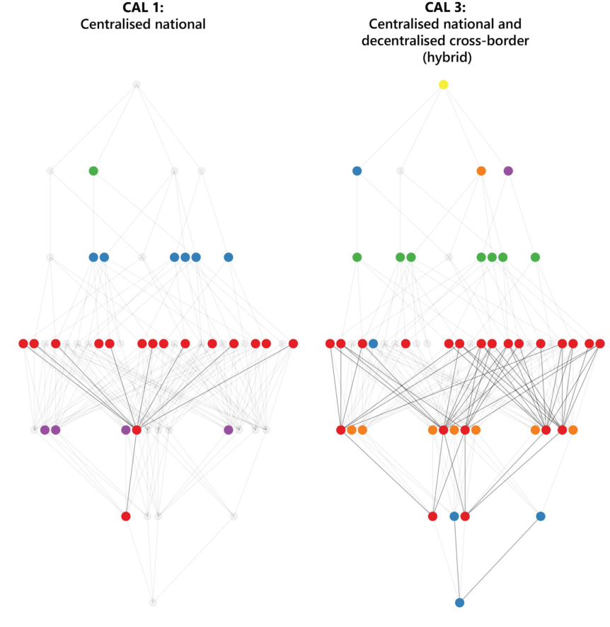

Project Aurora: 데이터, 기술 및 협업의 힘은 돈 세탁을 전투합니다.

Graph 23: 국가 CAL 배열 사이 네트워크 발견의 비교는 착색한 노드는 돈 laundering 네트워크에서 관여된 다른 국가에서 1개의 색깔에 있는 배우를 대표합니다. entities 사이의 라인은 거래 흐름을 나타냅니다.

<!-- 원문 60쪽 -->

Project Aurora: 데이터, 기술 및 협업의 힘은 돈 세탁을 전투합니다.

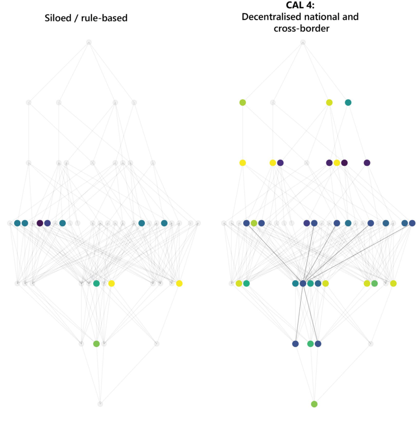

결과 5: 완전히 분산 된 CAL은 로컬 탐지를 향상시킬 수 있습니다.

그래프 25에서 설명하는 것과 같이, CAL 4는 각 금융 기관의 돈 세탁자의 로컬 탐지를 개선하지만, 라테어들 간의 네트워크 링크를 놓을 수 있습니다.

그래프 25: CAL 4와 CAL 배열이 없는 현재 침묵하는 접근과 비교하여 컬러 노드는 돈 세탁 네트워크에 관련된 다른 금융 기관 (금융 기관 당 1 색상)의 배우를 나타냅니다. entities 사이의 라인은 거래 흐름을 나타냅니다.

<!-- 원문 61쪽 -->

Project Aurora: 데이터, 기술 및 협업의 힘은 돈 세탁을 전투합니다.

#### 4.4.4 거래 데이터를 암호화 할 때 PET의 개인 평가.

실험은 균형 암호화 (HE) 및 로컬 차분한 개인 정보 보호 (LDP)는 개인 식별 정보 데이터 및 거래 데이터를 보호하는 데 사용할 수있는 기술입니다.

LDP는 암호화 없이 암호화된 데이터에 대해 계산할 수 있으며, 이를 공유하기 전에 데이터를 손상 시키면서 데이터에 데이터를 연결하기가 어렵습니다. 또한, FL이 더 강한 개인 정보 보호 보장을 제공 할 수있는 유망한 애완 동물이 있다는 것을 보여주었습니다. 데이터는 각 파티 시스템에서 남아 있으며 모델 업데이트 만 공유됩니다.

## 개인 정보 보호 및 공격

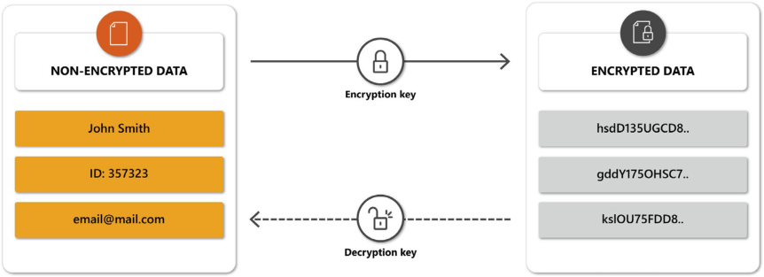

이 애완 동물은 개인 정보 보호 이점을 제공하지만, 다른 기술처럼, 제한 및 잠재적 위험이 있습니다.

개인정보 취급 방침에 관한 법률적 선임을 얻기 위해 중요하며, 특히 개인 정보 취급 방침에 대한 규정을 준수합니다. 이 법적 선고는 개인과 기업에 대한 중요 한 것은 자신의 개인 데이터에 대한 권리를 이해, 뿐만 아니라 그 데이터는 사용 하 고 금융 기관에 의해 보호 하는 방법. 이 금융 기관과 고객 간의 투명성과 신뢰를 촉진하고, 모든 사람이 법의 경계 내에서 작동한다는 것을 보장합니다.

이 섹션은 법적 평가를 제공 할 것을 목표로하지 않지만, 대신 데이터 보호를위한 PET의 사용에 다양한 관점과 위험을 논의 할 것입니다.

데이터가 익명이 되는 것을 의미하지 않는 것을 암호화하는 것이 중요합니다. 익명화는 데이터가 개인에게 추적 할 수 없다는 것을 보증하지만, 의사는 종종 고유 식별자와 식별 정보를 대체 할 수 있습니다. 따라서, 사용 된 PET에 따라 PII 데이터는 익명화보다 훨씬 유사하며 암호화 될 때. 그래피 26: 유사화, 암호화 및 해독 프로젝트 오로라의 예: 데이터의 힘, 기술 및 돈 세탁을 전투하는 협력. 식별자가 외부 정보 (예: 암호 키의 사용)과 Graph 26.67에 설명 된대로 개별로 추적 된 원본 데이터

<!-- 원문 62쪽 -->

- 암호화 된 데이터는 여전히 개인 또는 비즈니스에 연결되며, 개인은 필요한 암호 해독 키와 재 활성화 될 수 있으므로 개인 데이터의 암호화는 익명보다 훨씬 가짜로 간주 될 수 있습니다. 또한 공격자가 데이터를 해독하는 side-channel attacks68 또는 다른 방법을 사용할 수있는 위험이 있습니다.

- 마찬가지로 LDP는 데이터를 공유하기 전에 임의의의 소음을 추가하여 민감한 정보를 보호하기 위해 일부 수준의 보호를 제공합니다. 그러나 제한이 있습니다. 데이터에 대한 소음을 추가함으로써 특정 엔티티티에 데이터를 연결하기가 어렵지만, 외부 정보를 사용하여 개인을 식별 할 수 있는 위협 배우를 위해 여전히 가능할 수 있습니다.

- 마지막으로, FL은 데이터 누설 공격에 취약 할 수 있으며, 원본 데이터는 모델 업데이트에서 재구성 될 수 있습니다. 이 취약점은 CAL 3 및 4 모두의 위험을 감수 할 수 있습니다. 모델 누설의 잠재적 위험은 안전한 멀티 파티 계산 및 안전한 집계로 mitigated 수 있습니다. 더 실험은 유용할 것입니다. 이 웹 사이트는 귀하가 웹 사이트를 탐색하는 동안 귀하의 경험을 향상시키기 위해 쿠키를 사용합니다. 이 쿠키들 중에서 필요에 따라 분류 된 쿠키는 웹 사이트의 기본적인 특성을 수행하는 데 필수적이므로 브라우저에 저장됩니다. 또한이 웹 사이트의 사용 방식을 분석하고 이해하는 데 도움이되는 제 3 자 쿠키를 사용합니다. 이 쿠키는 귀하의 동의하에 만 브라우저에 저장됩니다. 이러한 쿠키를 거부 할 수도 있습니다. 이러한 쿠키 중 일부를 선택 해제하면 검색 환경에 영향을 미칠 수 있습니다.

결론에, 실험은 모든 CAL 배열이 금융 범죄를 감지하기위한 장소에 그러한 배열이 없다는 시나리오에 우수하다는 것을 보여줍니다. 각 배열에는 그것의 힘 및 약점이 있습니다, 그러나 전반적인 결과는 탐지 특성 및 몇몇 거짓 긍정적인 개량됩니다. 이 실험에서 중요한 취항지는 정보와 네트워크 분석을 공유하는 것은 금융 범죄에 대한 싸움에서 혁신적인 솔루션을 제공 할 수 있습니다. 중앙화된 크로스-배틀(CAL 2)은 기계 학습 모델을 사용할 때 돈을 차단을 감지하는 가장 효과적인 방법입니다. 그것은 돈 세탁자를 검출하고 규칙 기반 모니터링과 비교하여 80%에 의해 거짓 긍정적 인 수를 감소에서 세 번 더 잘 수행한다. 이 배열은 또한 돈 launderers의 다량 더 큰 네트워크를 검출하는 것에 제일, 십자가 국경 돈 laundering를 검출하는에 그것에게 능률적인 만듭니다. 중앙 국가 (CAL 1) 및 하이브리드 중앙 국가 플러스 분산 크로스 국경 (CAL 3) 방법 또한 CAL 배열과 규칙 기반 모니터링과 비교하여 상당한 개선을 보여. 하이브리드 모델, CAL 3, 많은 돈 세탁사로 거의 두 번 감지, 67에 의해 거짓 긍정적 인 감소 링크 특성의 개념은 불법 데이터셋에서 식별되는 경우 링크 특성의 개념이 관련 될 수 있으며, 해당 개인으로 추적되어야하며 적절한 제어 대상.

68 측채널 공격은 시스템의 물리적 구현에 약점을 악용하는 해킹의 방법입니다, 전력 소비와 같은 전자기 누출, 또는 소리, 민감한 데이터를 추출.

<!-- 원문 63쪽 -->

Project Aurora: 데이터, 기술 및 협업의 힘은 돈 세탁을 전투합니다. 75% 이상으로 CAL 배열과 비교하여, 자금세탁 네트워크의 더 큰 부분을 감지했습니다. 그러나 국가 모델은 규칙 기반 모니터링보다 더 나은 수행 경우에도 국경 밖에 네트워크를 감지 할 수 없다는 것을 주목하는 것이 중요합니다. 완전히 탈중앙화 (CAL 4) 방법은 CAL 배열과의 규칙 기반 모니터링과 비교하여 두 번의 돈 라테어를 감지하여 각 가장 큰 금융 기관의 로컬 탐지의 성능을 향상 시켰습니다. 40%에 의해 거짓 긍정적의 수를 줄일 수 있었지만, 그 중반 거래 데이터가 공유되지 않았기 때문에 풀 머니 라 딩 네트워크를 감지하는 다른 CAL 배열과는 효과적 일 수 없었다. 각 기관은 자체 데이터를 분석 할 수 있었다. 또한 PoC는 PET의 조합을 사용하여 특정 데이터 필드를 암호화하고 손상시켜 개인 및 민감한 데이터를 성공적으로 보호했습니다. PET는 제한 및 잠재적 위험이 있습니다. 암호화 될 때 데이터의 개인 정보 보호 수준에 대한 법적 선명도가 있음을 중요합니다. 암호화는 반드시 익명이며 일부 PET는 개인에게 잠재적으로 추적 할 수 있도록 의사소통을 제공 할 수 있습니다. 다른 개인 정보 보호 강화 솔루션을 결합하면 정보 보안 및 개인 정보 보호 위험을 완화 할 수 있습니다.

<!-- 원문 64쪽 -->

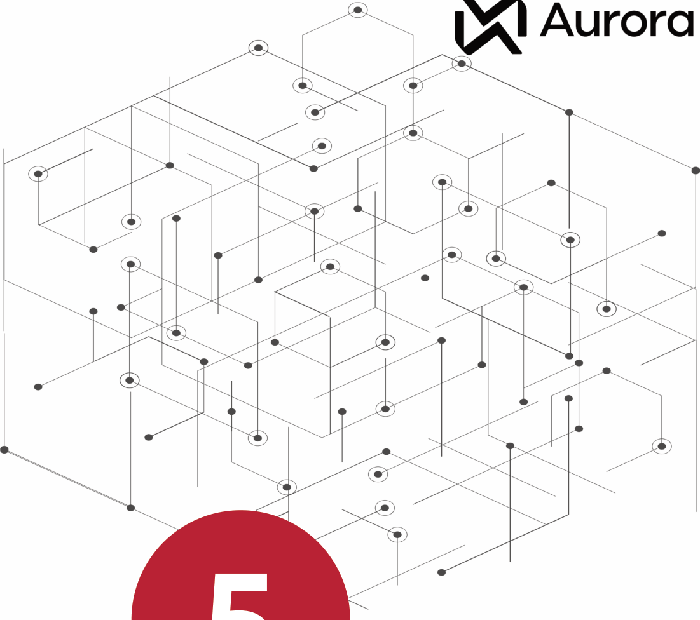

## 5를 더 고려하십시오

Project Aurora: 데이터, 기술 및 협업의 힘은 돈 세탁을 전투합니다.

<!-- 원문 65쪽 -->

Project Aurora: 데이터, 기술 및 협업의 힘은 돈 세탁을 전투합니다.

## 5 더 많은 고려사항

프로젝트 오로라는 기계 학습 및 네트워크 분석, 합성 거래 데이터의 개인 정보 보호 강화 기술, 이러한 기술을 활용하고 지불 데이터의 가치는 기관과 국경을 통해 의심스러운 네트워크와 illicit 흐름을 감지하는 더 효과적인 방법이 될 수 있음을 입증했다.

PoC는 이전에 나열된 여러 가지 간단한 가정을 기반으로하지만, 실제로는 이러한 불안정한 것은 해결해야 할 몇 가지 도전에 직면 할 것입니다.

이 장은 AML의 노력 향상을 위해이 프로젝트의 발견을 활용하는 미래 작업에 유용한 데이터, 기술 및 정책 고려 사항에 대한 몇 가지 토론 포인트를 다룹니다.

### 5.1 데이터

#### 5.1.1 추가 데이터 및 돈 laundering 태아

모든 돈 세탁 태아는 거래 데이터 분석과 최소 데이터 포인트를 사용하여 단독으로 감지 할 수 없습니다. 태아에 따라 추가 데이터 소스 및 데이터 포인트는 aid detection에 필수 할 수 있습니다. 예를 들어:

- 사업 계정의 개인 사용. 이 태아는 궁극적인 유익 소유자 (UBO) 상표, 세금 보고, 사업비 영수증과 같은 아스-고객 (KYC) 데이터를 모니터링하여 또는 법적 인 적법성에서 개인에 큰 거래를 통해 감지 될 수 있습니다.

- 정치인 노출인과의 해석 (PEPs). 이 태아는 PEP로 거래의 주력 및 대응에 의해 감지 될 수 있습니다. 공동 데이터 집계 설정에서, 이것은 관련 당사자들 사이에서이 플래그의 공유를 요구할 것입니다.

- 암호화 자산으로 오프 램핑. 암호화 세트와 VASP의 성장 인기를 통해 돈 세탁자가 돈을 숨길 수있는이 채널을 사용할 수 있다는 것을 주목할 것이 중요합니다. 이 태핑은 전통적인 금융 시스템에 시작되지만 블록체인 주소의 유사성 때문에 개인 또는 단체에 특정 거래를 연결하기 어려울 수 있는 공공 블록체인으로 빠르게 이동할 수 있습니다. VASPs(예: KYC data)의 추가 정보 및 관련 블록체인 분석은 이러한 타병을 감지해야 합니다.

- 무역 기반 돈 세탁 (TBML). TBML은 전세계의 가치를 이동하기 위해 국제 무역의 악용을 포함, 종종 복잡한 금융 거래를 사용하고 여러 중간에 자금의 기원과 움직임을 손상, 그리고 인공적으로 팽창하거나 합법적 인 제품의 가격을 팽창. Project Aurora가 CAL 배열을 통해 협업을 통해 TBMLs와 같은 복잡한 계획을 감지하는 더 나은 결과를 얻을 수 있지만 여전히 부족 할 수 있습니다.

<!-- 원문 66쪽 -->

Project Aurora: 데이터, 기술 및 협업의 힘은 돈 세탁을 전투합니다. 이러한 종류의 조사에 도움이 될 중요한 데이터에 대한 액세스의, 송장, 배송 기록, 제품 가격 지수 및 더.

#### 5.1.2 Real-world 데이터는 타당성 및 충격을 이해하는 데 중요합니다.

CAL 배열은 많은 잠재적 혜택을 제공 할 수 있지만, 규모에서 실제 세계 조종사에 착수 할 필요가 있으며, 이상적으로 현재 접근 방식과 평행으로 실행되는 시간의 기간 동안 수행됩니다. 이 문제를 해결해야 할 문제 또는 질문들을 더 많이 덮어쓰는 실제적인 효과와 이해를 돕습니다. 실제 파일럿은 규모에서 중요한 학습과 결과가 정책, 데이터 및 법적 토론을 지원하는 것입니다.

CAL 접근 방식에 대해 명확하게 합의가 없습니다. 특히 크로스 국경 상황에 따라 배열 할 수 있습니다. 프로젝트 오로라에서 탐구한 CAL 배열은 이 토론에 푹 빠질 수 있었습니다.

CAL 배열 및 협업 분석 특성은 키 문제의 수를 고려해야 할 것입니다. 이 기금, 회원, 지위, 목표 및 성능 모니터링이 포함됩니다. 또한 분석에 의해 덮은 범죄의 범위와 분석의 본질을 고려해야합니다. 데이터 및 분석, 감사 및 보증에 대한 가시성, 제어, 책임과 관련된 문제 및 공공 기관의 역할은 또한 검사를 필요로한다.

ISO 20022 메시징 표준은 금융 범죄를 효과적으로 전투하기 위해 잠재적으로 CAL 노력을 개량할 수 있는 추가 표준화된 자료 점을 포함합니다. ISO 20022 기반 데이터가 금융 범죄를 포함하여 다양한 사용 사례에 활용 될 수 있는지 더 잘 이해하는 실용적인 작업은 유리 할 수 있습니다. 이 표준에 더 향상된 특성을 식별합니다. 국가 및 국경 금융 범죄 탐지를 위한 표준화된 데이터 프레임워크를 달성하는 데 목적은 고려될 수 있습니다.

프로젝트 오로라가 강조한 CAL 배열 개발과 관련된 추가 문제들은 데이터의 유형이 활용되고, 개인 정보 보호 강화 기술 및 원하는 개인 정보 보호 수준의 사용, 사이버 및 정보 보안을 보장하고, 운영 절차 및 전문 표준을 정의하고, 참여 법 집행 기관. 실제 파일럿의 디자인을 지원하는 질문은 Annex D에서 찾을 수 있습니다.

#### 5.1.3 결제 데이터의 제한 및 기타 데이터의 필요

네트워크 전체 거래 데이터는 이전 알 수없는 계정이 고위험 또는 의심 활동과 연계하여 큰 분석 이점을 제공합니다. 그러나, 입력 데이터에 대한 적은 가시성, 제한 및 임계값과의 접근을 위해, 데이터 최소화 및 개인 정보 처리로 침입의 감소 수준에 이점이 있습니다. 절대로, 거래가, 감소된 효능의 관점에서, 개인 구성원에 볼 수없는 네트워크 전체 위험을 식별 할 수 있습니다.

데이터 최소화 및 목적 제한의 원칙은 중요합니다. 이 마음으로, 그것은 지불 수준 데이터 혼자 제공 할 수 없습니다 금융 범죄 위험과 추가 데이터 프로젝트 오로라에 따라 요구 될 수 있다: 데이터의 힘, 기술 및 돈 세탁을 전투에 협력. 금융 범죄 대상. 예를 들어, KYC, 세금 당국 또는 법인 등록 자료.

<!-- 원문 67쪽 -->

현재 AML 시스템의 설계에 대한 주요 도전은 고객 및 관련 위조로 만든 사람들에게 개별 금융 기관의 지불에 대한 가시성을 의미합니다. KYC의 인식은 고객과의 직접적인 상호 작용에 제한되고, 반드시 금융 관계의 광범위에 확장하고 고객이 다른 금융 기관과 함께 가질 수 있다는 것을 계정. KYC 데이터에 대한 가시성도는 금융 기관 간의 지불 흐름에 훨씬 더 큰 가시성을 가질 수 있지만 KYC 데이터에 대한 가시성이 없습니다.

#### 5.1.4 데이터 보호

데이터의 책임과 윤리적 공유 및 처리를 위해 투명하고 개방적인 대화를 수립하는 것이 중요합니다. 이 명확하게 법률 및 지침의 창조를 촉진 할 수 있습니다, 이는 더 국가 및 국경 협력 프레임 워크의 혁신과 일관성을 촉진 할 수 있습니다.

개인정보 보호 및 보안 보호, 금융 범죄를 퇴치하는 것은 균형 잡힌 중요한 공공적 관심사입니다. 이 목적은 상호적으로 독점적으로 또는 충돌하지 않습니다, 하지만 보완. 이러한 목적 사이의 올바른 균형을 찾는 것은 금융 시스템의 무결성을 유지하면서 데이터의 책임과 윤리적 사용을 보장하는 데 필수적입니다. 데이터가 공유되고 있는 그 권리를 보유하는 것이 중요하며, 데이터 처리도 엄격하게 개인 정보의 잠재적인 오용을 방지하기 위해 목적으로 합니다.

### 5.2 기술 정보

#### 5.2.1 CAL 배열과 기술적인 도전

CAL 배열은 몇몇 기술적인 도전에 직면할 수 있었습니다. 다음을 포함합니다:

- 데이터 품질 및 일관성. 금융 기관 중 데이터 수집, 저장 및 처리 방법에 대한 차이는 인소싱, 공유 데이터의 디파니시 또는 biases로 이어질 수 있습니다. 검출 모델의 성능에 영향을 미치는. 이 도전을 해결하려면, FI는 표준 데이터 수집 및 처리 방법에 동의하고 공유 데이터의 일관성과 정확성을 보장하기 위해 데이터 품질 관리 메커니즘을 구현해야합니다.

- 특징 선택과 기술설계. 금융기관과의 연계를 통해 금융기관의 금융기관과의 연계를 통해 금융기관의 금융기관과의 연계를 통해 금융기관의 금융기관의 금융기관과의 연계를 통해 금융기관의 금융기관과의 연계를 통해 금융기관의 금융기관의 금융기관과의 연계를 통해 금융기관의 금융기관의 금융기관의 금융기관과의 연계를 통해 금융기관의 금융기관의 금융기관의 신원을 확보하고 있습니다. 이 문제를 해결하기 위해 금융 기관은 이러한 중요한 요인을 선택하고 분석하기위한 공유 프레임 워크를 수립 할 수 있습니다.

- Computational 비용 및 정보 과부하. 많은 기계 학습 모델과 PET는 현재 대용량의 데이터를 처리 할 때 비선형 방식으로 증가 할 수있는 높은 계산 비용의 도전에 직면. (주)

<!-- 원문 68쪽 -->

Project Aurora: 데이터, 기술 및 협업의 힘은 돈 세탁을 전투합니다. 관할 구역과 기관에 따라 볼륨이 매우 커질 것입니다. 개인 및 공공 부문은 모니터링 시스템에 대한 효율적인 솔루션을 찾는 데 협력해야합니다.

- 모델은 하향 및 과잉으로 인해 분기. 학습 접근법을 사용할 때 모델이 잘 작동하지 않을 위험이 있습니다., 혹독하거나 과잉, 교육에 사용되는 다른 데이터셋가 제한된 정보를 포함하거나 데이터 구조에서 많은 다른 경우. 이를 방지하기 위해 금융 기관은 모델을 검토하고 데이터 구조 및 기준을 통합해야합니다.

- 전 세계적으로 실제 라벨의 부족. 전 세계적으로 자금세탁 활동을 식별하기 위해 정확한 정보를 얻을 수 있습니다. 개인 기관이나 국가가 일부 정보가 있으면 다른 장소에 적용되지 않을 수 있습니다. 이 문제를 해결하기 위해 금융 기관은 전문가가 시스템에 대한 피드백을 제공 할 수있는 방법을 만들 수 있습니다. 이는 시스템은 정확한 정보를 받고 시간이 지남에 따라 개선된다는 것을 보장 할 수 있습니다.

- 공정성과 불순. 기계 학습 모델은 AML에 활용될 때 모니터링 모델과 정책 권고의 공정성과 불순성을 평가하는 데 필수적입니다. 프로젝트 오로라에서는 기계 학습 바이스의 잠재적 위험은 합성 데이터 생성 공정이 간단하고 투명하기 때문에 미분화되고 통계 시뮬레이션은 훈련 샘플에서 바이스를 소개하지 않습니다. 변수는 일반적으로 bias 및 discrimination, eg 성별 및 기타 인구 통계 정보와 관련되어 있으며 합성 데이터의 일부가 아닙니다. 또한, 프로젝트의 기계 학습 모델은 "블랙 박스"를 열고 잠재적 인 모델 분노를 검사하는 데 도움이 설명되어 있습니다. • 준거, 위험 관리 및 정보 보안. CAL 배열에 따라, 특성은 데이터의 매우 큰 양에 액세스 할 수 있습니다. 데이터의 잠재적 인 "호니팟"로 조직 된 범죄를 파괴하는 고위험을 부여, CAL 배열은 사이버 보안 공격의 위험에있을 수, 침투 및 데이터 손상은 조직 범죄, 내부자, kleptocrats 및 악성 국가 행위와 같은 위협으로부터 시도. Governance, Risk Management, Conduct 및 보증 프로세스는 사이버 보안 및 정보 보안 위험을 완화해야합니다.

- 실용. CAL 배열은 참가자 및 데이터 소스의 수만큼만 좋을 것입니다. 5.2.2 기계 정보 공유를 촉진하는 읽기 쉬운 태종

정보 공유는 사이버 공격에 금융 범죄로부터 위협의 넓은 범위를 전투에 필수적입니다. 예를 들어, 사이버 보안의 맥락에서 실시간 프로젝트 오로라: 데이터, 기술 및 협업의 힘은 돈 세탁을 전투합니다. 지표는 공유되고, 69 및 표준은 사이버 위협 인텔리전스의 자동화 교환을 가능하게하는, 70는 즉시 위협을 전투합니다.

<!-- 원문 69쪽 -->

AML의 상황에 따라 금융 범죄 태세학과 관련된 것과 같은 공유해야 할 데이터는 정의 또는 설명에 따라 표준이 아니며 형식의 비구조 및 아날로그입니다. 이 데이터 분석에 대한 이 귀중한 정보를 사용하기 위해 노력합니다.

지식 그래프로 태생을 대표하면 고급 분석 시스템에 의해 정보 쉐이링 및 분석에 적합 할 수 있으며 솔루션을 제공 할 수 있습니다. 이 공공 및 민간 부문은 크로스-블로그 협업 및 지식 공유를 강화하기 위해 협력 할 수 있습니다. 실제로, 유럽 금융 정보 공개 민간 파트너십 (EFIPPP)의 사람들과 같은 기존 노력에 구축 할 수 있습니다. 71 지식 그래프는 무엇이며 AML 노력에 어떻게 적용 할 수 있습니까?

지식 그래프는 다른 데이터 포인트 (nodes)의 네트워크로 정보를 인코딩하고 (edges) 간의 관계를 구성하는 동적 데이터 구조의 유형입니다. 그들은 같은 문법, 세미노미, 종양학과 같은 세만제를 포함 할 수있는 능력을 제공합니다 (데이터에 대한 컨텍스트와 의미를 제공). 특히, 다른 이름이나 설명과 함께 한 개 이상의 데이터 필드가 동일한 일 (일렬화) 인지 여부를 결정할 수 있습니다. 이 상황은 AML 노력과 같은 규모와 데이터 일관성을 수행해야 할 상황에서 유용합니다.

지식 그래프는 다른 정보, 컨텍스트 및 의미와 관련하여 다양한 정보를 포함한 포괄적 인 정보를 제공합니다. 이 새로운 통찰력을 구동 할 수 있습니다. 지식 그래프는 새로운 정보가 사용되기 때문에 동적으로 업데이트 될 수 있습니다. 예를 들어 누락 된 데이터 항목 및 누락 또는 이전에 숨겨진 관계.

지식 그래프는 탐험, 감속 및 인스톱에 초점을 맞추고 통찰력을 제공 할 수 있으며 AML에 유용하게 만듭니다. 예를 들어, 그래프 쿼리는 더 조사 및 그래프 알고리즘을 보장하는 특정 특성을 살펴볼 수 있습니다. 그래프 임베딩는 지식 그래프의 데이터에서 학습하고 공유 특성을 기반으로 발견되지 않은 데이터의 새로운 연결을 찾을 수 있습니다. 이 문서는 고객의 행동 특성과 다른 데이터 포인트를 포함해 의심스러운 패턴을 감지할 수 있는 지식 그래프.

지식 그래프는 특히 디지털 형태로 태아에 대한 지식을 나타내는 AML에 유용합니다. 이 69에 공공 민간 파트너십에서 사용할 수 있습니다 인터넷 보안 웹 사이트에 대한 센터를 참조: www.cisecurity.org/ms-isac/services/real-time-indicatorfeeds.

71 EFIPPP는 여러 관할청에서 큰 금융 기관, FIU 및 법률 집행 기관으로 구성됩니다. EFIPPP는 투자 사기, 거래 기반 돈 세탁, 가상 자산, narcotics 등과 같은 다른 태종에 대한 정보를 공유합니다.

<!-- 원문 70쪽 -->

Project Aurora: 데이터, 기술 및 협업의 힘은 돈 세탁을 전투합니다. 오타와에 대한 지식을 갖추고, 금융 기관 및 당국에 대한 같은 코드를 고급 분석 시스템에 사용할 수 있습니다. 이 더 큰 협업을 지원할 수 있습니다, 정보 쉐이빙, 더 나은 통찰력 및 탐지 특성, 뿐만 아니라 잠재적 인 위협 및 위험에 적시 및 효과적인 응답. 그래프 27는 태생 지식 그래프의 고급 일러스트를 보여줍니다.

개념적으로 지식 그래프는 다음과 같습니다.

- 데이터 필드, 데이터 유형, 데이터 소스, 보안 및 개인 정보 분류;

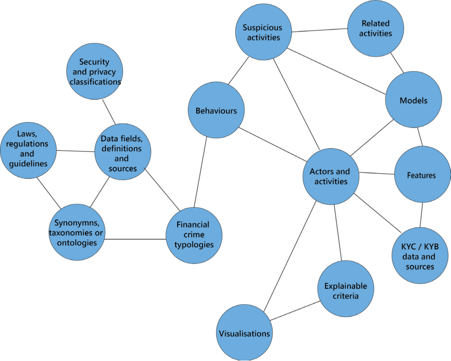

- 문법, 세토미노미 또는 종양;

- 거래 특성;

- 행동;

- 배우 및 활동;

- 설명된 기준;

- 의심의 여지없이 활동 및 관련 활동; 및

- 법률, 규정 또는 지침에 대한 참조.

더 많은 분석 및 실험이 필요할 것입니다.

그래프 27: 태아 지식 그래프 프로젝트 오로라의 고급 일: 데이터의 힘, 기술 및 돈 세탁을 전투하는 협력.

<!-- 원문 71쪽 -->

#### 5.2.3 관련 제품

기계 학습 모델이 최종 결과에 도착하는지 이해하는 것은 중요하며, 모델의 설명도 알려져 있습니다. 다른 기계 학습 모델은 다른 접근 방식을 필요로하며, 일부 모델은 다른 것보다 더 투명합니다. Explainability는 기계 학습 모형에 있는 투명성, 공정성 및 책임 승진을 위해 결정적입니다. 의심스러운 고객으로 뽑아 금융의 혜택을 누릴 수 있는 기업과 기업에 큰 영향을 줄 수 있습니다. 따라서 금융 기관에 대한 중요 한 때문에 모델의 작업과 결과가 계산되는 방법을 이해 하 고 설명. AML 노력의 불공정, 편향 또는 신중한 관행에 지도할 수 있는 "블랙 박스"모드를 피하는 것은 입니다. PoC에서 사용하는 특성에 대해 매우 중요합니다. 모든 데이터는 사전 정의된 표준을 기반으로 다양한 데이터 포인트를 구성하여 만들어졌습니다. 집계없이 데이터 포인트를 투자함으로써, 하나는 각 특성에 갔다 정보를 이해할 수 있습니다.

설명은 중요하지만, 모델 지배, 법적 위험 및 규제 준수와 같은 다른 요인을 고려하는 것이 중요합니다.

예를 들어, 모델 관리는 기계 학습 모델을 개발, 배포 및 책임감 있는 방식으로 유지되도록 프레임 워크를 구축하는 것을 포함합니다. 이 모델의 지속적인 평가를 위해 적절한 리소스를 할당하는 사용 되는 기계 학습 모델의 개요를 생성 및 유지, 개선 성능과 높은 복잡성/저 설명성 사이 무역 오프 무게, 그리고 최고의 관행의 공유를 촉진.72

### 5.3 더 보기

#### 5.3.1 즉시 지불 시스템, CBDC 시스템 및 금융 범죄

즉각적인 지불 시스템 (IPS)의 상승 채택과 CBDC 시스템의 잠재적 인 소개는 국내 및 국경 지불을 강화하는 새로운 가능성을 제공합니다. CBDC 시스템의 구현은 새로운 참가자에 발생 할 수 있으며 금융 범죄에 대한 새로운 벡터를 만드는 지불의 다른 방법을 활성화 할 수 있습니다.

범죄자들이 이러한 시스템의 잠재적인 오용을 평가하고, 그들이 재정적인 범죄를 퇴치하기 위해 새로운 수익 창출을 할 수 있는 방법을 결정하는 것이 중요합니다. 따라서, 해당 운영사(예: 민간 부문 또는 중앙 은행)은 이러한 시스템에 참여하는 금융 기관과 함께 작업하여 적절한 금융 범죄 통제가 장소에 있는지 확인합니다.

72 다 마크 국립 은행 (2022) 참조.

<!-- 원문 72쪽 -->

Project Aurora: 데이터, 기술 및 협업의 힘은 돈 세탁을 전투합니다.

운영자는 공공 및 민간 조직과 사전 승인 작업을 수행 할 수 있으며, 국내 및 국경 금융 범죄 태질병의 명확한 이해를 개발하여 즉시 지불 및 CBDC 시스템에 출현 할 수 있으며, 돈 세탁, 테러 금융 및 기타 해시 활동 등. 이 정부 기관과 금융 기관과 협력하여 금융 범죄를 탐지하고 예방하기위한 정보 및 모범 사례를 공유 할 수 있습니다.

이 프로젝트에서 탐구 된 접근은 IPS 또는 CBDC 시스템을 고려하여 AML 모니터링 및 분석 특성을 포함하는 운영자가 의심 활동의 네트워크를 더 큰 탐지 할 수 있도록하는 데 사용될 수 있습니다. 73 금융 범죄 대책은 여전히 체계 참가자에게 지침 및 규정을 제공하면서 지불의 효율성과 속도에 방해하지 않는 것을 보장하는 것이 중요합니다. 적절한 조치를 취하는 것을 보장합니다. 법적 프레임 워크는 AML 및 기타 금융 범죄 예방 조치를 위해 이러한 시스템의 사용을 지배 할 필요가 있습니다. 이러한 문제를 해결함으로써 IPS 및 CBDC 시스템은 지불 시스템의 안전과 효율성을 보장하는 방식으로 구현 될 수 있습니다.

#### 5.3.2 법적 및 규제 고려 사항

CAL 배열의 잠재적 혜택을 실현하기 위해 지불 데이터를 활용, 공공 민간 파트너십을위한 국가 및 크로스 국경 전략 금융 범죄를 전투하는 것이 유리합니다. 공개 개인 파트너십은 정보 보호 및 협업 분석을 가능하게하는 명확한 법률 기반을 요구합니다. 다른 CAL 배열과 기술에 따라, 다른 법적, 개인 정보 보호, 윤리, 정책 및 규정의 의미가 고려 될 수 있습니다.

한 종류의 협업을 허용하는 법은 다른 것을 지원할 수 없습니다. 정책 제작자는 필요한 전체 특성에 반영 할 수 있습니다. 이 금융 범죄 위협 태종, 네트워크 탐지, 거래 모니터링, 사건 보고, 증거 기록 및 보고 팩의 개발을 포함 할 수 있습니다.

공공 당국과 적절한 법률 및 규제 프레임 워크를 만드는 민간 부문 간의 협력은 CAL 배열을 지원하는 데 필수적입니다. 그러한 법적 근거없이, 데이터 개인 정보 보호 위험, 시민 손상, 변조, 경쟁 법 위험, 은행 secrecy 및 AML 프레임 워크 금지 팁 off74 어떤 이니셔티브를 방해 할 수 있습니다.

73 운영자는 데이터에 따라 감지 될 수있는 돈 세탁기의 유형에 제한을 발생시킬 수 있습니다.

74 법적 금지, 예를 들어, 의심 거래 보고서 또는 관련 정보가 FIU로 제출되는 사실에.

<!-- 원문 73쪽 -->

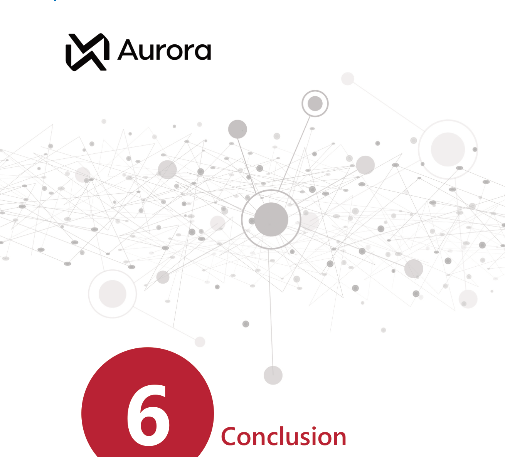

## 결론 6

Project Aurora: 데이터, 기술 및 협업의 힘은 돈 세탁을 전투합니다.

<!-- 원문 74쪽 -->

Project Aurora: 데이터, 기술 및 협업의 힘은 돈 세탁을 전투합니다.

## 6 결론

프로젝트 오로라는 AML에 대한 결제 데이터의 분석이 매우 가치라고 설명했습니다. 금융기관과 국경을 넘어 더 큰 가시성과 향상된 의심스러운 네트워크와 illicit 결제 흐름을 제공합니다. 이 프로젝트는 국내 및 국제 거래의 합성 데이터셋를 시뮬레이션 (데이터 최소화의 원칙을 채택). 그것은 그런 다음 4 가지 다른 CAL 배열을 통해 사용할 수있는 데이터 분석 또는 학습과 비교된 실로즈 데이터에 대한 여러 개인 정보 보호 강화 기술 및 고급 기계 학습 방법을 테스트했습니다.

프로젝트 오로라의 주요 발견은 국가 또는 국제 수준에서 행동 기반 거래 모니터링 및 분석이 현재 siloed 및 통치 기반 모니터링보다 돈 launderers 및 의심스러운 네트워크를 감지하는 데 더 효과적이다는 것을 제안합니다. 이 접근법은 고급 분석 도구를 사용하여 네트워크의 큰 비율을 발견 할 수 있습니다. Graph neural 네트워크는 이 사용 사례에 최적으로 표시된 도구입니다.

개인화 기술은 금융 기관과 국경을 넘어 기계 교육 (사용 federated Learning)을 포함하여 안전한 개인 정보 보호 정책 CAL 배열을 허용하도록 활용 될 수 있습니다. 이 개인 정보 보호 보호 모니터링 및 국제 수준에서 AML 노력 지원할 수 있습니다.

이러한 기술 및 접근법의 사용은 공공 민간 파트너십 및 협업 분석 및 학습에 대한 접근 방식을 촉매화하는 역할을 할 수 있습니다. 이 장애물은 여러 장벽이 극복하고 기술 및 접근법과 관련된 잠재적 제한이 있습니다. 기술에 대한 미래 발전은 제한 및 차단제의 일부를 제거 할 수 있습니다. 민간 및 공공 부문 간의 협력을 강화하고, 다른 분야와 국경을 넘어 주요 드라이버는 AML 노력 개선을 위해 혁신을 위한 것입니다. 정책 제작자는 이미 금융을 감지하기 위해 개인 정보 보호 정책에 필요한 특성을 사용하여 환경 보호 및 공동 설계에 대한 전략적 접근 방식을 식별했지만, 공공 민간 이니셔티브에 대한 더 전략적 작업이 귀중할 것입니다.

G20 로드맵과 같은 다양한 이니셔티브는 국경 결제를 강화하기 위해 국가 거래 모니터링 유틸리티의 설립, 규칙 기반 모니터링 대신 행동에 초점을 맞춘 고급 분석의 채택, ISO 20022 메시징 표준에 지불 시스템의 마이그레이션 및 FATF 권고 16의 지속적인 검토, 금융 범죄에 대한 데이터 중심 노력에 긍정적 인 영향을 미칠 수 있습니다.

Greater Cross-functional 대화는 결제, 금융 범죄 및 데이터 보호에 대한 전문가 간의 데이터 표준의 개발을 지원할 수 있습니다. 이 포함 될 수 있습니다, 예를 들어, 레버리지 또는 ISO 20022 메시지를 강화, 법적 인적 식별자 (LEI)의 더 큰 사용 법적 인 항목과 관련된 데이터셋, 사용 유리 소유권 표준 시스템 및 프로세스의 설계, 또는 태아 정보 또는 행동 모델 개발의 표준화 및 표현.

<!-- 원문 75쪽 -->

Project Aurora: 데이터, 기술 및 협업의 힘은 돈 세탁을 전투합니다.

## 더 많은 일

프로젝트 오로라는 기관과 국경을 넘어 돈을 떨어뜨리는 연결된 지불 데이터를 활용하여 국가 및 국제 토론에 기여합니다. 이 웹 사이트는 귀하가 웹 사이트를 탐색하는 동안 귀하의 경험을 향상시키기 위해 쿠키를 사용합니다. 이 쿠키들 중에서 필요에 따라 분류 된 쿠키는 웹 사이트의 기본적인 특성을 수행하는 데 필수적이므로 브라우저에 저장됩니다. 또한이 웹 사이트의 사용 방식을 분석하고 이해하는 데 도움이되는 제 3 자 쿠키를 사용합니다. 이 쿠키는 귀하의 동의하에 만 브라우저에 저장됩니다. 이러한 쿠키를 거부 할 수도 있습니다. 이러한 쿠키 중 일부를 선택 해제하면 검색 환경에 영향을 미칠 수 있습니다.

기술 및 CAL의 타당성 및 효율성을 측정하기 위해, 가치에 대한 실제 증거 (또는 파일럿)의 다양한 배우와 함께 지불 풍경이 필요합니다. 이러한 실제 이니셔티브는 또한 주소가 될 필요가있는 법률, 규제, 데이터 보호 및 기술 문제 및 질문에 대한 서핑 법률, 규제, 데이터 보호 및 유용한 정보를 제공 할 수 있습니다.

이 보고서에서 제안 된 지식 그래프를 사용하여 기계 읽기 쉬운 태아 개념은 기술 및 프로세스 설계 운동으로 공공 및 민간 부문 전문가와 더 탐구 될 수 있습니다.

즉시 지불 시스템 및 잠재적인 CBDC 시스템은 또한 디자인에 따라 돈 launderers 및 의심스러운 네트워크를 감지하는 핵심 역할을 할 수 있습니다. 개인정보 보호 기술 및 데이터 최소화의 원칙은 이를 달성하는 데 중요한 역할을 할 수 있습니다.

CBDC 시스템은 돈 라테어에 대한 새로운 벡터를 제공 할 수 있습니다. 따라서, 초기 단계에서 일부 예비적 작업이 발생하면 CBDC 시스템에 영향을 미칠 수있는 잠재적 인 금융 범죄 태질 75을 시뮬레이션 할 수 있습니다.

75는 알려진 태질병을 CBDC 시스템에 확장 할 수 있지만, 새로운 태질병은 모든 시간을 가리키지만 일부 특성이 공통 될 수 있습니다.

<!-- 원문 76쪽 -->

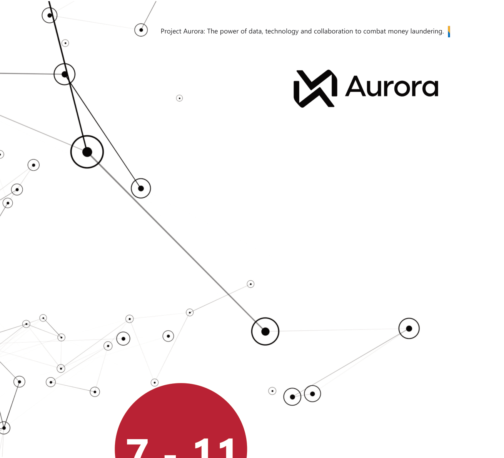

## 별관 A - E

- A: 동향 및 기회.

- B: 이 PoC에서 기계 학습.

- C: 개인화하는 기술.

- D: 실제 파일럿을 지원하는 질문.

- E: 추가 약어 및 정의

## 7 - 11의

Project Aurora: 데이터, 기술 및 협업의 힘은 돈 세탁을 전투합니다.

<!-- 원문 77쪽 -->

Project Aurora: 데이터, 기술 및 협업의 힘은 돈 세탁을 전투합니다.

## 7 Annex A: 동향 및 기회

이 annex는 결제, 데이터 표준 및 거래 모니터링 이니셔티브의 추세, 이니셔티브 및 개발을 탐구합니다. 또한 AML 노력에 직면 한 도전의 잠재적 영향을 탐구하고이 보고서에서 이전 논의 된.

### 7.1 결제에 대한 표준화, 투명성 및 조화

다양한 표준화, 투명성 및 조화 이니셔티브가 있습니다. 이 데이터는 기관과 국경을 넘어 데이터 품질을 개선하고, 준수 및 AML 노력 향상을 통해 더 나은 데이터를 연결할 수 있습니다.

#### 7.1.1 크로스-Border 결제를 강화하는 G20 로드맵

2020에서는 G20 리더가 크로스-블레지블 지불을 강화하기위한 로드맵을 승인했습니다. 76 도로맵은 크로스-블레지블 결제를 강화하고 금융 범죄 예방을 포함하여 다양한 문제, 기술 및 배열을 커버하는 19 건물 블록 (BB)로 구성됩니다.

#### 7.1.2 ISO 20022 조화

ISO 20022 표준은 다른 지불 시스템 및 관할권의 맞은편에 사용될 수 있는 금융 메시지에 대한 일반적인 언어 및 구조를 제공하며, 더 큰 상호 운용성을 가능하게 하고 가공을 통해 곧게 됩니다. ISO 20022는 AML 거래 모니터링 시스템의 효율성을 향상시키기 위해 잠재적 인 메시지를 통해 공유 할 수있는 풍부한 구조화 된 데이터를 허용합니다.

지불 및 시장 인프라 (CPMI)에 국제 정착위원회의 은행은 업계와 협력하여 ISO 20022 해병 요구 사항에 대한 보고서를 작성하여 크로스 국경 지불을 강화하기위한 업계와 협력하고 있습니다. 77 예를 들어 제안 된 요구 사항은 다음과 같습니다.

- 거래의 목적 (예를 들어 국경 거래).

- 은행 식별 코드 (BIC)를 사용하여 교차 국경 지불에 관련된 모든 FI의 식별.

<!-- 원문 78쪽 -->

Project Aurora: 데이터, 기술 및 협업의 힘은 돈 세탁을 전투합니다. LEI와 같은 글로벌 식별자 사용, 더 검증에 대한 관련 참조 데이터78의 사용을 가능하게합니다.79 FATF 권고 16는 이름, 계정 번호 및 주소와 같은 지불 전송 (국내 및 크로스 국경)의 전송자와 수신자에 대한 기본 정보를 필요로, 거래 메시지에 포함 될.80 추천 16XZ의 계획 검토의 일환으로, 이 ISOFQF의 표준을 채택 할 수있다.

#### 7.1.3 법적인 ID 및 유익한 소유권 데이터 표준

## 법적인 식별자

법인 식별자 (LEI)는 법인 식별에 대한 유일한 글로벌 표준입니다. 그것은 20 문자, ISO 17442 표준에 근거를 둔 영숫자 부호입니다. 각 LEI는 엔티티티티티의 소유권 구조에 대한 정보를 포함하고 "who is who"에 대한 질문에 대답하고 "who owns who"를 포함합니다. LEI 데이터는 공개적으로 사용 가능하며 기업의 정보의 투명도를 향상시킬 수 있습니다.

LEI는 LEI를 사용하는 다른 세트의 기업 정보를 연결할 수 있지만 다른 식별자도지도 할 수 있습니다. 예를 들어, Global LEI Foundation (GLEIF)는 다음과 같은 맵핑을 제공합니다.

- LEI 및 비즈니스 식별 코드 (BIC);

- LEI 및 국제 증권 식별 번호 (ISIN);

- LEI 및 시장 식별 코드 (MIC);

- LEI 및 OpenCorporates ID; 및

- LEI 및 S & P 글로벌 기업 ID.

작업은 LEI와 관련된 엔티티티 소유권 데이터 (BDOS)를 처음 시작한다.

GLEIF는 자체 배심원 식별 (SSI)의 개념을 기반으로 한 "verifiable LEI"(vLEI)로 알려진 LEI의 디지털 버전을 소개했습니다. 기업 정체 정보의 자동화 및 탈중앙화 검증을 지원하며, 단 몇 개의 국경 시나리오에서 유용 할 수 있습니다.

## Beneficial 소유권 자료 기준

유익한 소유권에 대한 정보는 회사 및 기타 법적 인 entities가 소유하고 제어되는 방법에 대한 가시성을 높일 수 있습니다. 이러한 정보는 78 글로벌 LEI 재단 (GLEIF)을 포함 할 수 있습니다 LEI 데이터가 있습니다.

79 Verification는 LEI 데이터의 조회를 통해 발생할 수 있으며 LEI 정보를 디지털 검증된 자격 증명으로 포함시킨 VLEIs를 활용할 수 있습니다. 이는 W3C 표준입니다.

80 여행 규칙은 2019에서 가상 자산 서비스 제공 업체 (VASPs)를 포함 하 여 2021에서 확장 개인 지갑, 비 호환 토큰 (NFT) 및 분산 금융 (DeFi)을 포함 하 여 업데이트 되었다.

<!-- 원문 79쪽 -->

Project Aurora: 데이터, 기술 및 협업의 힘은 돈 세탁을 전투합니다. 개인 소유자 및 기타 법적 인 또는 소유권 사슬의 중간 인적, 그리고 주주 및 투표권의 고장. Data는 연간 보고서, 기사 및 일반 서류를 포함한 다른 소스를 통해 종종 확산됩니다. 이 문서는 더 많은 정보를 제공합니다.

Beneficial Ownership Data Standard (BDOS)는 이러한 데이터가 수집, 공유 및 사용해야하는 방법을 위해 구조화 된 형식과 표준81을 제공합니다. 회사는 개인정보의 수집 및 이용목적이 달성된 후에는 해당 정보를 수집·관리하는 방법에 대해 책임을 지지 않습니다. 표준은 명확하게 식별하고 추적 할 수있는 소유권 정보를 도울 수 있습니다.

#### 7.1.4 Wolfsberg 그룹 지불 투명성 표준

Wolfsberg Group은 2000에 설립되었으며 회원은 세계 금융 기관의 수로로 구성되었습니다. 그룹은 업계 표준을 개발하고 글로벌 금융 시스템에 투명성을 촉진하는 것을 목표로합니다. 2017에서, 그룹은 지불을 수행 할 때 금융 기관이 준수해야하는 10 가지 원칙으로 구성된 지불 투명성 Standards82을 발표했습니다.

또한 Wolfsberg Group은 LEI를 결제 메시지로 통합하고 잠재적 인 혜택을 더 탐험하는 데 도움이되는 토론을 지원하여, 특히 산법 검열 시스템 및 거래 모니터링 시스템에 의해 생성 된 거짓 긍정적 인 경고를 줄이는 측면에서.

### 7.2 거래 모니터링 유틸리티

다양한 정보 공유 접근법은 다양한 이해 관계자가 탐구하고 설립되고 있습니다. 이 정보는 금융 기관과 같은 공유된 Know-your-customer (KYC) 유틸리티와 같은 정보를 직접 공유하고 금융 기관 간의 KYC 정보를 수집하고 공유하기 위해 - 또는 의심 거래 모니터링 유틸리티 (TMUs).

특정 관할구역에서 거래 모니터링 유틸리티는 이미 설립되어 금융 범죄를 탐지하고 방지하는 방법으로 금융 기관을 제공하고있다. 예를 들어, 거래 Monitoring Netherlands (TMNL)는 현재 기업에 의해 거래를 모니터링하는 TMU입니다.

TMU는 참여 금융 기관과 잠재적으로 공공 당국 (예 법 집행) 간의 협력적 배열이며, 주로 국가 수준에서. 거래 data는 공유 또는 풀이 될 수 있으며, 그 후 분석됩니다. 따라서 거래 모니터링 유틸리티는 금융 기관과 공공 당국을 81에 가능하게하여 더 자세한 정보 및 사양에 대한 개방 소유권을 참조하십시오.

82 늑대 그룹을 참조하십시오 (2017).

<!-- 원문 80쪽 -->

Project Aurora: 데이터, 기술 및 협업의 힘은 돈 세탁을 전투합니다. 범죄 행위에 대한 더 큰 통찰력을 얻을하고 고립을 감지하기 어렵게 해체 행동의 패턴을 식별합니다.

## TMU와 기회

- 증가된 효율성: TMU는 데이터 통합 및 중앙화된 플랫폼을 제공하는 통합하여 거래 모니터링의 효율성을 증가할 수 있습니다.

- 향상된 정확도: TMU는 개별 금융 기관과 관련된 데이터를 분석 할 때 명시 할 수없는 패턴과 이상치의 감지에 정확도를 높일 수있는 여러 소스에서 데이터를 풀링 할 수 있습니다.

- 향상된 위험 관리: TMU는 금융 기관이 더 효과적으로 파악하고 완화 위험을 수반 할 수 있도록합니다. 데이터 및 통찰력을 공유함으로써 금융 기관은 신흥 위험을 잘 이해하고 그를 완화하는 조치를 취합니다.

- 비용 절감: TMU는 TMU 개발 및 유지 비용을 공유함으로써 개별 거래 모니터링 솔루션보다 더 비용 효과적 일 수 있습니다.

## TMU와 도전

- 데이터 보호 및 개인 정보 보호: 금융 기관 중 거래 데이터 공유는 데이터 프라이버시에 대한 우려를 제기 할 수 있습니다. 금융기관은 민감한 고객 데이터를 보호해야 하며 데이터 보호 규정에 따라 데이터 공유가 준수된다는 것을 확인합니다.

- 운영 위험: TMU는 시스템 고장, 사이버 공격 및 무해한 접근을 포함하여 운영 위험에 취약할 수 있습니다. 금융기관은 적절한 보안 대책이 이러한 위험을 방지하기 위해 있어야 합니다.

- 법적 및 규제 위험: TMU의 사용은 특히 모니터링을위한 데이터 쉐링, 비례 및 책임의 주위에 법적 및 규제 문제를 제기 할 수 있습니다. 금융기관은 TMU에 참여하기 전에 적절한 법률 및 규제의 특정을 가지고 있어야 합니다.

- 신뢰와 협력: TMU의 성공은 참여 금융 기관들 간의 신뢰와 협력에 달려 있습니다. 금융기관은 경쟁력 있는 환경에서 도전할 수 있는 자신의 동료들과 데이터와 통찰력을 공유할 수 있어야 합니다.

- 표준화: TMU는 데이터가 일관성 있고 효과적으로 분석될 수 있도록 표준화의 고차가 필요합니다. 금융 기관은 일반적인 데이터 형식과 정의에 대해 효과적인 분석을 가능하게해야합니다.

- 상호 운용성: TMU는 기존의 거래 모니터링 솔루션과 통합하여 효과적인 결과를 보장합니다. 금융 기관은 TMU가 기존 시스템과 프로세스를 원활하게 작동할 수 있도록 해야 합니다.

<!-- 원문 81쪽 -->

Project Aurora: 데이터, 기술 및 협업의 힘은 돈 세탁을 전투합니다.

- 거버넌스 및 감독: TMU는 효과적인 지배와 감독을 필요로 하고, 그들이 적절하게 이용되고, 공유된 자료는 정확하고 믿을 수 있습니다. 금융기관은 TMU의 사용을 효과적으로 관리하기 위해 적절한 관리 구조를 수립해야 합니다.

이러한 도전에 직면함으로써 금융 기관은 TMU의 전체 잠재력을 실현하고 illicit 활동을 감지하고 방지하고 금융 범죄 위험을 관리 할 수 있습니다.

#### 7.2.1 TMU 예제: 네덜란드의 거래 모니터링

거래 Monitoring Netherlands (TMNL)는 네덜란드에서 5개의 은행을 공동으로 운영하여 거래 모니터링을 개선하고 금융 시스템의 게이트키로 은행의 역할을 강화하는 것을 목적으로 합니다. 궁극적 인 목표는 거래 모니터링을위한 업계 전체 유틸리티를 구축하고 금융 기관을 사용하여 더 효과적으로 금융 세탁 및 테러를 감지하고 고품질의 정보로 법 집행을 제공합니다.

## TMNL에 의해 사용되는 데이터의 종류

- 현재, 기업에서 거래 데이터 만 모니터링됩니다.

- 거래의 시간과 장소 및 가치와 같은 데이터는 특정 거래 패턴을 감지하는 데 사용됩니다.

- 은행(예: 상공 회의소, IBAN 및 회사명)에서 이용 목적 모니터링을 위해 필요한 데이터를 수신하고, TMNL에 제공되기 전에 은행에 의해 소중히 수행되므로 개별 고객에게 연결할 수 없으며 은행의 암호화 키가 없는 의미가 없습니다.

### 7.3 즉시 지불 시스템 및 잠재적인 CBDC 시스템

일괄 처리 (작업 일 동안 특정 간격으로 정착)에서 특정 유형의 지불의 이동은 개인 및 즉시 합의에 따라 금융 기관, 운영자 및 당국에 대한 기회와 과제를 모두 제시합니다. 의심 활동을위한 거래를 모니터링하는 관계. 즉시 지불 체계 (또는 미래 CBDC 체계)와 같은 지불 체계, 83는 사용자를 위해 더 빠르고, 능률 적이고 그리고 더 편리한 재정적인 거래를 만듭니다. 그러나 이러한 같은 특성은 여러 금융 기관과 국가 전역의 illicit 자금을 신속하게 이동하는 범죄자에게 쉽게 만들 수 있습니다.

83 CBDC는 중앙 은행의 직접적인 책임인 계정의 국가 단위에서, 디지털 방식으로 돈의 모양입니다. CBDCs는 금융 중개인 (즉 도매 CBDCs) 중 하나 또는 더 많은 개별 수준 (즉 소매 CBDCs)에 더 넓은 경제에 의해 설계 될 수 있습니다.

<!-- 원문 82쪽 -->

Project Aurora: 데이터, 기술 및 협업의 힘은 돈 세탁을 전투합니다.

## 의논문

- 즉시 지불 시스템은 실시간 중앙으로 거래 데이터를 분석하여 여러 금융 기관의 뒤에 돈을 따라 가능성을 제공합니다. • 이 전체적인 결제 시스템 수준의 데이터는 개별 기관 수준에서 볼 수없는 의심 활동의 감지를 가능하게합니다. • 즉시 지불 체계와 미래 CBDC 체계는 민감하는 사용자 정보를 위한 기밀 보호에서 건축될 수 있었습니다, 자료의 원리에 의해 설명된 AML 규칙을 위한 특성.

## 의논문

- 범죄는 금융 기관과 국경을 맞은 뒤 다중 지불 계정 및 채널을 사용합니다. 그대는 한 시스템에서 빠르게 사라지고 또 다른 한 가지를 다시 쫓아냅니다. 이 패턴을 가진 illicit 흐름의 식별은 이러한 다른 생태계를 통해 확산되는 데이터가 연결될 수 있을 때 네트워크 분석에 도전할 수 있습니다. • 일부 데이터는 IPS 또는 CBDC 시스템 밖에서 가시성을 줄이게 될 수 있습니다. • CBDC 지불 시스템은 설계에 따라 새로운 벡터가 될 수 있으며 새로운 태아를 생산할 수 있습니다.

### 7.4 지불에 사용되는 공개 블록 체인

공개 블록 체인은 투명하고 모든 거래으로 추가 통찰력을 공개적으로 기록하고 누구나 볼 수 있습니다.

## 의논문

- 이 투명성은 시스템 전체 거래 모니터링을 위한 기회를 제공합니다. 이는 돈 세탁 또는 기타 질병 활동을 나타내는 활동의 의심스러운 패턴을 식별하는 데 사용할 수 있습니다.

- 공개 블록 체인의 거래 모니터링은 블록 체인 분석 도구를 사용하여 자동화 될 수 있으며 실시간 거래 데이터의 대량 분석 및 잠재적으로 의심 활동을 플래그 할 수 있습니다.

## 의논문

- 공개 블록 체인의 거래 모니터링은 은 총알이 아니며, 블록체인 주소의 유사성 때문에 개인 또는 기업에 거래를 연결하기 어려울 수 있습니다. 일부 블록체인은 거래 세부 정보를 처리함으로써 더 높은 수준의 프라이버시를 제공합니다. 이를 통해 자금의 움직임을 추적할 수 있습니다.

- 데이터 저장, 유지, 현지화 및 잊어버린 권리는 또한 도전입니다.

<!-- 원문 83쪽 -->

Project Aurora: 데이터, 기술 및 협업의 힘은 돈 세탁을 전투합니다.

## 8 Annex B: 이 PoC에서 기계 학습

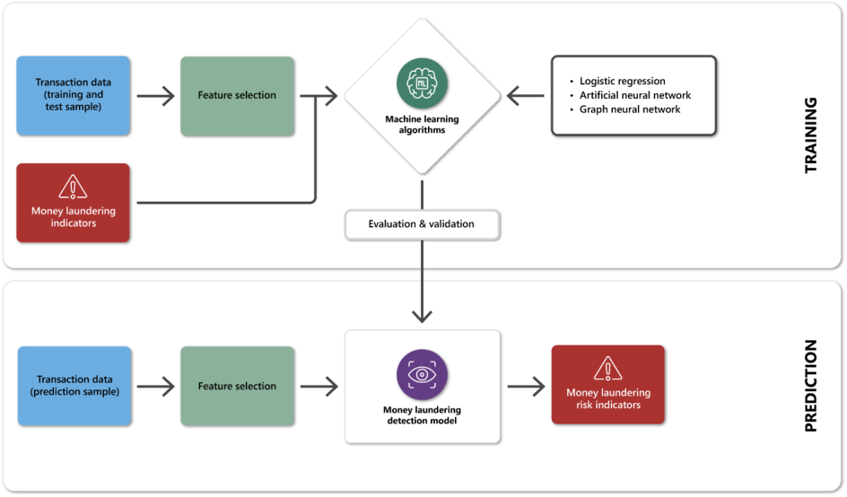

### 8.1 기계 학습 훈련, 검증 및 평가

이 annex에서 기계 학습 훈련, 검증 및 평가 과정이 발표됩니다. Graph B1은 슈퍼바이저 기계 학습 모델의 워크플로를 보여줍니다. Unsupervised 모델은 돈 세탁 지표의 사용을하지 않습니다.

1. - 비디오 특성 공학: 전문가는 AML에 대한 정보를 제공 할 수있는 관련 데이터 특성을 선택, 예를 들어 일반 거래 유출 및 배우를위한 유출. 2. - 비디오 Model training: 기계 학습 모델은 거래 데이터를 사용하여 훈련됩니다. 입력 특성은 거래의 특성을 나타내고 모델은 알려진 돈 세탁 이벤트의 라벨 인 outcome의 특성에서 맵핑을 찾습니다. 3. - 비디오 모델 평가 및 검증: 훈련 된 모델은 돈 세탁 이벤트 라벨을 예측하기위한 테스트 샘플에서 사용됩니다. 알려진 돈 세탁 라벨은 모델 성능 평가 및 검증에 사용됩니다. 4. - 비디오 모델 예측: 훈련 후, 각 모델은 새로운 예측 샘플을위한 돈 세탁 이벤트 인 거래의 확률을 예측합니다. 입력 특성의 동일한 세트는 훈련 단계에서 선택됩니다. 거래의 위험 지표는 돈 세탁 네트워크의 일부입니다.

Graph B1: 기계 학습 모델 프로젝트 오로라의 교육, 검증 및 평가: 데이터의 힘, 기술 및 돈 세탁을 전투하는 협력.

<!-- 원문 84쪽 -->

5. - 비디오 돈 세탁 사건 지표: 위험 점수가 선택된 임계값보다 더 큰지 여부를 기준으로 분류 (자금세탁 event or non-events)에 각 모델의 위험 점수를 매길 수 있습니다.

### 8.2 기계 학습 모델 특성 공학

기계 학습 모델의 특성 목록은 거래 활동의 다양한 측면을 캡처하는 것이 중요합니다. 예를 들어 거래 수, 거래 값, 지불 흐름과 관련된 당사자. 이 웹 사이트는 귀하가 웹 사이트를 탐색하는 동안 귀하의 경험을 향상시키기 위해 쿠키를 사용합니다. 이 쿠키들 중에서 필요에 따라 분류 된 쿠키는 웹 사이트의 기본적인 특성을 수행하는 데 필수적이므로 브라우저에 저장됩니다. 또한이 웹 사이트의 사용 방식을 분석하고 이해하는 데 도움이되는 제 3 자 쿠키를 사용합니다. 이 쿠키는 귀하의 동의하에 만 브라우저에 저장됩니다. 이러한 쿠키 중 일부를 선택 해제하면 검색 환경에 영향을 미칠 수 있습니다. 이러한 쿠키 중 일부를 선택 해제하면 검색 환경에 영향을 미칠 수 있습니다. 거래의 다른 유형에 대한 임계값을보고하는 정사각형 거리의 합; 그리고 • 자금 운동의 속도와 자주 거래가 반대 사이에 일어나는 방법. 이 집계된 특성은 감독하고 감독되지 않은 기계 학습 모델 모두에 입력되는 거래 패턴의 종합적인 표현을 제공합니다. 다른 기계 학습 방법과 비교된 그래프 신경 네트워크 (GNN)에 대한 특성 목록이 다릅니다. GNN 모델은 거래 네트워크의 특성을 학습하여 그래프 기반 돈 세탁 이벤트를 감지할 수 있는 능력을 강화합니다. GNN 모델에 고용된 특성:

- In-degree 및 out-degree – 이러한 특성은 관계 매핑에 각 기업의 들어오고 나가는 거래의 수를 나타냅니다. • 총 금액은 전송 및 총 금액 - 개인 및 기업 총 금액은 전송 및 수신된 거래 값에 대한 거래 행동의 개요를 제공합니다. • 각 법인, 개인 또는 비즈니스에 의해 전송 및 수신 된 거래 수; • 엔티티티티티티 유형은 거래 네트워크의 개인 및 기업과 구별됩니다.

이 특성은 GNN 모델이 거래의 그래프 표현을 배우고 네트워크 기반 돈 세탁 이벤트를 효과적으로 감지 할 수 있도록 합니다. 이 접근법은 거래 데이터에서 요약된 정보를 사용하는 다른 감독 및 감독되지 않은 모델에서 고용된 특성을 보완합니다.

<!-- 원문 85쪽 -->

Project Aurora: 데이터, 기술 및 협업의 힘은 돈 세탁을 전투합니다.

## 9 Annex C: 개인화 강화 기술

### 9.1 PET 개요

#### 9.1.1 Homomorphic 암호화

Homomorphic Encrypt (HE)는 암호화된 결과를 생성하는 데이터 암호화 알고리즘에 의해 변환되는 ciphertexts에서 수행 할 수 있으며, 해독할 때 실제 데이터에서 수행 된 작업의 결과로 해당합니다. 이 기술은 암호화 된 데이터의 유용한 분석을 가능하게하면서 강력한 개인 정보 보호 보장을 제공 할 수있는 잠재력을 가지고 있습니다. 84 금융 기관의 협업을 촉진하기 위해, 균형 암호화는 개인 식별 정보 (PII)와 같은 민감한 정보의 개인 정보 보호에 대한 역할을 할 수 있습니다.

Homomorphic 암호화는 특히 실제 데이터의 네트워크 기반 측정을 보존하기 때문에 거래 네트워크 분석에 유용합니다. AML 모니터링 시스템은 거래를 확인하고, 해당 개인 또는 법인의 개인 정보를 보호하기 위해, 뮤링 및 스푸핑과 같은 잠재적 인 태질을 식별 할 수 있습니다. 또한 암호화된 Know-your-customer(KYC) 및 위험 데이터는 감지 정확도를 향상시키기 위해 활용될 수 있습니다.

그러나 HE 적용의 주요 도전은 암호화 된 데이터의 수행 작업과 관련된 계산 오버 헤드이며, 처리 시간과 자원 요구 사항을 증가시킬 수 있습니다.85

#### 9.1.2 지역 차별 프라이버시

로컬 차분한 개인 정보 보호 (LDP)는 정확한 분석을 허용하면서 데이터셋의 개인 레코드의 개인 정보를 보장하는 수학 프레임 워크입니다. 데이터 쿼리에 대한 주의깊은 측정량을 도입하여 특정 개인 또는 법인에 대한 기여를 더욱 어렵게 만듭니다. 86A 메커니즘과 같은 Laplace 메커니즘은 현지의 차별적 인 프라이버시를 달성하기 위해 현지의 데이터 (예: 금융 기관)에 적용됩니다. 예를 들어, Laplace 메커니즘은 쿼리의 진정한 결과에 Laplace-distributed noise를 추가하고 쿼리의 감도와 개인 정보 보호 매개 변수에 의해 결정된 소음 스케일과 함께합니다. 개인 정보 보호 매개 변수는 개인 정보 보호 수준과 쿼리 결과의 정확도 사이의 거래 오프를 제어합니다. 현지 차별 개인 정보 보호는 의미있는 통계 분석을 가능하게하는 동안 강력한 개인 정보 보호 보장을 제공 할 수 있습니다.

개인 정보 보호 정책은 개인 정보 보호 정책의 보호를 보장하기 위해 비-PII 수치 데이터에 적용 할 수 있습니다. 그러나, 원료에 대한 소음을 추가하는 과정은 모델 감소로 이어질 수 있습니다.

<!-- 원문 86쪽 -->

Project Aurora: 데이터, 기술 및 협업의 힘은 돈 세탁을 전투합니다. 공연, 특히 참여 회원이 같은 연습 규칙을 따르지 않는 경우.

#### 9.1.3 학습의 장점

FEST는 포괄적인 학습(Fastaling Learning)을 통해, 다양한 entities를 통해, 원시 데이터를 교환하지 않고 공유 모델 협업을 훈련할 수 있습니다.87,88 이 기술은 고급 개인 정보 보호 보호를 가능하게 하며, 민감한 정보는 각 참여 기관의 경계 내에서 유지되며 지식과 공유 통찰력을 활용합니다. 학습을 습득한 학습은 데이터의 파괴 없이 돈의 세탁 활동을 감지하는 공유 기계 학습 모델을 훈련하거나 데이터를 추가하는 데 사용될 수 있습니다. 모델 파라미터 변경과 같은 모델 업데이트만 참여자 중 공유됩니다.

Federated 학습은 다른 기관의 데이터 풀 없이 데이터셋의 광범위한 수집에서 학습할 수 있습니다. 이 접근법은 더 견고하고 정확한 모델로 이어질 수 있으며, 이를 통해 생성된 학습은 프라이버시를 유지하면서 예기치 않은 데이터 특성에 대해 종합적으로 활용할 수 있습니다. 또한, 학습을 통해 위험 점수와 모델 결과를 비교할 수 있는 중앙화된 모델의 사용을 가능하게 합니다.

그러나, 학습을 강화하는 것은 또한 문제의 문제를 직면, 증가된 통신 오버 헤드와 호환되는 데이터 구조를 위한 필요 모델 업데이트의 적절한 공유를 보장. 또한, 공유 모델은 횡단 거래 네트워크에 대한 제한적인 접근을 가지고 있으며, 특정 유형의 돈 세탁 활동을 감지하는 데 더 도전합니다.

#### 9.1.4 기타 개인 정보 보호 기술

보안 멀티파티 컴퓨팅(SMPC), 제로-knowledge proof(ZKPs), 프라이빗 셋 교차로(PSI)와 같은 방법 또한 귀중한 개인 정보 보호 기술 제공.

SMPC는 여러 당사자가 연결되는 동안 입력에 대한 특성을 공동으로 컴파일할 수 있게 합니다. 이 금융 기관은 데이터 분석에 대해 서로의 민감한 정보를 공개하지 않고, 개인 정보 보호의 추가 계층을 제공 할 수 있습니다. SMPC는 교차점 그래프 태아를 위한 강력한 탐지 특성을 유지하면서 중앙화되고 집중된 접근법에서 발생하는 제한의 일부를 해결할 수 있습니다.

ZKPs는 추가 정보와 PSI가 실제 데이터를 공유하지 않고 데이터셋의 일반적인 요소를 찾을 수 없는 진술의 유효성을 입증 할 수있는 한 당사자를 허용합니다.

<!-- 원문 87쪽 -->

Project Aurora: 데이터, 기술 및 협업의 힘은 돈 세탁을 전투합니다.

### 9.2 PET의 응용

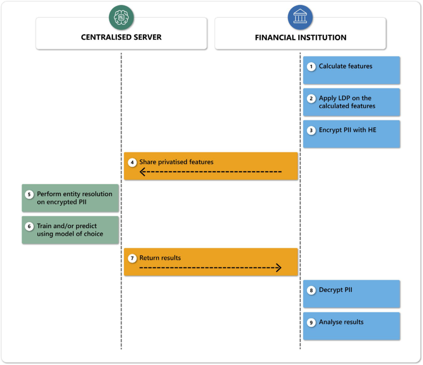

## HE 및 지역 차별 개인 정보 취급에 적용

이 접근법에서, HE 및 LDP는 고용됩니다. 이 과정은 다음과 같은 단계가 포함되어 있으며 위의 그림에서 묘사 된 것과 같습니다.

1. - 비디오 각 금융기관은 배우 수준의 특징의 사전 정의된 세트를 계산합니다 (개인 및 기업을위한 통계). 이 특성은 자신의 행동과 패턴을 이해하는 데 도움이 될 것입니다.

2. - 비디오 개인 정보 보호 정책에 따라 각 기관은 LDP를 사용하여 계산 된 특성에 약간의 임의의의 소음을 추가합니다. 이로 인해 특정 개인 또는 기업을 식별하기가 어렵지만 여전히 전체 패턴을 보존합니다.

3. - 비디오 모든 금융 기관은 개인 정보를 공개하지 않고 비교할 수 있도록 HE (가능하게 다른 PET)를 사용하여 자신의 데이터를 암호화합니다.

4. - 비디오 암호화된 특성 및 식별자는 중앙 서버와 공유되며, 이는 분석을위한 안전한 허브 역할을합니다.

Graph C1: 중앙화된 CAL 배열 프로젝트 오로라에 있는 HE와 LDP의 구현: 데이터의 힘, 기술 및 협업은 돈 세탁을 전투합니다.

<!-- 원문 88쪽 -->

5. - 비디오 중앙 서버는 암호화 식별자를 비교하고 같은 사람이나 조직에 속한 경우 결정합니다. 식별자의 차이가 특정 임계값의 밑에 있는지 확인하여 이것을 합니다. 그들이 인 경우, 그들은 같은 성격을 나타냅니다.

6. - 비디오 이 결합된 정보를 사용하여, 기계 학습 모형은 자료를 기준으로 예측 또는 분석합니다. 중앙 서버는 사전 정의된 규칙을 사용하거나 보호된 데이터에 액세스할 수 있는 전문가의 팀을 참여할 수 있습니다.

7. - 비디오 예측 또는 분석은 다음 해당 금융 기관에 다시 보내, 결과가 더 잘 이해하는 데 도움이되는 추가 정보와 함께.

8. - 비디오 각 기관은 식별자를 해독하고 자신의 내부 식별 시스템에 다시 맵을합니다.

9. - 비디오 각 기관은 그 결과에 따라 결과를 분석할 수 있습니다.

이 과정은 데이터의 새로운 배치에 반복 될 수 있으며, 여전히 개인 정보를 보호하면서 지속적인 분석이 가능합니다.

<!-- 원문 89쪽 -->

Project Aurora: 데이터, 기술 및 협업의 힘은 돈 세탁을 전투합니다.

## 학습을 통한 탈중앙화된 접근

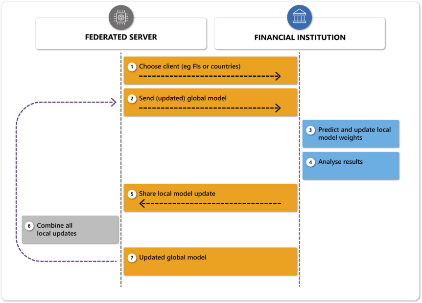

탈중앙화 설정에서 학습 절차:

1. - 비디오 프로세스는 더 큰 네트워크에서 클라이언트 (예: FI 또는 국가)의 그룹을 선택하는 federated 서버로 시작합니다.

2. - 비디오 선택한 클라이언트는 federated 서버에서 글로벌 모델을받습니다.

3. - 비디오 각 클라이언트는 모델을 개선하기 위해 자신의 로컬 데이터를 사용하여 모델의 무게를 업데이트, 즉, 각각이 모델을 개선하는 자신의 지식을 기여한다는 것을 의미.

4. - 비디오 각 클라이언트는 그 결과에 따라 결과를 분석 할 수 있습니다.

5. - 비디오 무게를 올리면 클라이언트는 페더링 서버로 업데이트를 다시 보냅니다.

6. - 비디오 federated 서버는 모든 클라이언트에서 글로벌 모델을 개선합니다. 각 클라이언트의 기여를 고려하여 모델의 정확하고 효과적인 효과를 낼 수 있습니다.

7. - 비디오 1–6는 이차적인 방식으로 반복됩니다. 이 과정은 지속적인 협업 학습과 개선을 위해 다시 일어나고 계속 진행하는 것을 의미합니다.

그래프 C2: Federated Learning setup Project Aurora: 데이터, 기술 및 협업의 힘은 돈 세탁을 전투합니다.

<!-- 원문 90쪽 -->

개인 정보 보호 정책은 금융 기관 및 국가가 개인 식별 정보를 보호하는 동안 돈을 세탁하는 활동을 감지하는 데 협력 할 수있는 분산 된 설정에서 학습의 응용 프로그램을 가능하게합니다. 원료 데이터, 기관 및 국가가 아닌 모델 업데이트를 공유함으로써 전체 네트워크의 공동 지식과 통찰력을 얻을 수 있으며 더 강력하고 효과적인 AML 시스템에서 발생합니다.

<!-- 원문 91쪽 -->

Project Aurora: 데이터, 기술 및 협업의 힘은 돈 세탁을 전투합니다.

## 10 Annex D: 실제 파일럿을 지원하는 질문

Project Aurora는 개인 정보 보호 강화 기술과 고급 분석과 결합될 때 지불 데이터를 분석하는 다른 접근 방식의 잠재적 이점을 보여줍니다. 그러나 실제 조종사들은 충격에 실제 데이터가 derive real-world에 필요한 것이며 어떤 실제적인 문제로 해결해야 합니다. 이러한 데이터 및 성능 정보는 정책 토론을 지원하기 위해 필수적입니다.

Constant Innovation은 협업 분석 및 학습 (CAL) 이니셔티브가 준비되어야하는 방법을 위한 명확한 "ideal"모델이 없기 때문에 중요합니다. 더 많은 실무자 및 정책 대화 및 고려 사항이 연결 된 지불 또는 거래 데이터의 사용을 만들기 위해 모델의 디자인에 유리 할 것입니다. FATF에 의해 강조 된 공공 당국은 CAL 플랫폼의 파트너 / 스테이크 홀더 또는 CAL 이니셔티브의 디자인 또는 출력에 대한 피드백의 소스와 같은 이니셔티브를 지원하기 위해 중요한 역할을합니다.

실제 조종사에 의해 답변 될 수있는 모델을 설계 할 때 고려해야 할 질문은 아래 나열되어 있습니다.

### 10.1 Objectives, 성능 모니터링 및 범위

- CAL 기반 접근의 궁극적 인 목적은 무엇입니까?

- 성공 기준은 무엇입니까?

- CAL 기반의 영향을 측정해야 할 성능 지표

접근?

- 이 미터는 수집, 저장되고 보고될 것입니까?

- 법의적으로 분석 할 수있는 금융 범죄 활동의 범위는 무엇입니까

어떤 파일럿?

- 국가, 국제 또는 국가 및 국제 모두 결합 된 범위는?

- 데이터 보호 당국, 규제, 중앙 은행, 법의 역할이되어야한다.

집행 기관 및 금융 인텔리전스 기관은 그런 조종사에 있습니까? 그들은 서로 상호 작용해야 합니까?

### 10.2 데이터 및 분석

금융 범죄 분석에 필요한 데이터의 유형과 볼륨은 실제 세계 파일럿과 관련된 법률, 보안, 데이터 보호 및 기술 문제의 핵심 베어링을 가질 것입니다. 공유 할 데이터 유형의 고려해야 할 것이 중요합니다. 공유 할 방법 및 누구와 공유 할 것입니다.

<!-- 원문 92쪽 -->

Project Aurora: 데이터, 기술 및 협업의 힘은 돈 세탁을 전투합니다.

- 결제 데이터의 소스는 어떤 사용되거나 공유 될 것인가?

- 각 소스에서 일일 거래량은 무엇입니까?

o 파일럿에 대해 얼마가 필요합니까?

- 어떤 데이터 표준이 사용됩니까?

- 어떤 데이터 포맷이 사용됩니까?

- 실제 거래의 기초에 생성 된 합성 데이터의 사용

파일럿을 위해 가능한가요?

- 얼마나 많은 역사적인 자료는 분석에 사용할 수 및 만든 필요?

o 이 데이터는 이전에 확인된 돈 launderers가 포함될 것입니까?

- 거래에 필요한 최소 데이터 필드는 무엇입니까?

- 데이터의 특징은 어떤 측정될 것인가?

- 다른 데이터가 필요한 것 및 어떤 목적으로 할 수 있습니까?

o 다른 데이터는 어떻게 제공됩니까? o 볼륨, 주파수 및 형식은 무엇입니까?

- 정보가 정확하고, 적시, 신뢰할 수있는 것을 보장하는 책임

그리고 비례?

- 중앙 집중적이고 집중적이고 하이브리드 CAL 접근법이 탐험되고 있습니다.

시험? 어떤 접근법은 선호하는 출발점입니까? o 데이터의 어떤 유형과 수준 또는 통찰력은 공유되고 누구와 함께 할 것인가? o 특정 공공 당국은 추가 정보를받을 것 (예를 들어 확인 된 의심 네트워크의 전체 개요)?

- 데이터 처리를위한 현재의 법률 프레임 워크는이 파일럿을 지원합니까?

o 데이터 컨트롤러 및 데이터 프로세서는 누구입니까?

- 개인 정보 보호 강화 기술은 어떻게 적용됩니까?

- 어떤 기록 유지가 작동되는지 설명하는 작업에 대해 설명합니다.

개인정보 보호 정책

- 개인 정보 보호 정책 데이터와 함께 데이터 품질 문제, 특히,

관찰? o 데이터가 어떻게 수정될까요?

- CAL에서 발견 및 탐지는 참여와 공유됩니다.

CAL 회원/파트너가 아닌 기관과 함께?

<!-- 원문 93쪽 -->

Project Aurora: 데이터, 기술 및 협업의 힘은 돈 세탁을 전투합니다.

### 10.3 포스트-그림자 질문

- 개인정보 보호 관련 데이터와 관련한 데이터 품질 문제가 있습니까?

o 이 주소는 어떻게 될 수 있습니까?

- CAL 특성의 소유자 (들)는 누구입니까?

o 자금 모델은 이러한 특성을 위해 필요한 것입니까? o 이익, 협력적인 비영리 유틸리티 또는 국가 공공 자산을 위해?

- 누구가 분석의 구성원과 비효율은?

- 누가 능력이 어떤 기초에 책임이 있습니까?

- 운영 위험 및 서비스 수준 관리에 대한 책임은

플랫폼의?

- 어떤 의무, 인센티브 및 책임은 CAL의 다른 이해 관계자를 것입니다

이 특성은 목적에 대한 정보의 적절한 사용과 관련하여 있습니까?

- 누가 본 정보에 의해 발생하는 모든 손해에 대해 책임지고

플랫폼?

- 규제 또는 법적 위험에 대한 책임 문제 관리는 누구입니까?

- 플랫폼을위한 미래 방향과 투자 로드맵이 될 것입니다.

관리?

- 어떤 기준이 플랫폼에서 참여 및 / 또는 출구에 대한 것인가?

- 지불 수준에서 중앙 집중화 또는 탈중앙화 분석의 역할은 무엇입니까?

개인의 책임과 비교된 위험을 식별할 수 있는 위험?

- 결제 수준 분석에는 수동 조사 또는 자동화만 포함됩니다.

경고?

- 보안, 개인 정보 보호 및 유틸리티 문제의 균형은 다음과 같습니다.

개인 정보 보호 정책 분석?

- 감사 및 검사 제한은 분석의

개인정보 보호 정책

- 어떤 지배력 및 보안 통제는 물리적을 완화하기 위하여 요구될 것입니다,

사이버 및 정보 보안 위험? o 이러한 이니셔티브에 참여할 의무는 무엇입니까? o 어떤 검증, 감사 및 보증 조치가 필요합니까?

<!-- 원문 94쪽 -->

Project Aurora: 데이터, 기술 및 협업의 힘은 돈 세탁을 전투합니다.

## 11 Annex E: 추가 약어 및 정의

BIC Bank 식별 코드.

CPU 중앙 처리 단위.

데이터 풀 다른 소스에서 설정되는 프로세스는 중앙 저장소에 결합되어 풀린다.

## ECID(이태)

암호화된 comparable 식별자는 ID를 공개하지 않고 데이터 및 시스템을 통해 추적 할 수 있도록 개인 식별의 코드 또는 다른 수단이 될 수 있습니다.

EFIPPP 유럽 금융 정보 공개 개인 파트너십.

F1 점수 F1 점수는 통계 분석에서 사용되며 모델의 정확도와 전반적인 성능을 측정합니다. 정밀 및 리콜의 조합에 의해 표현됩니다. 통계적 테스트에 사용되는 두 가지 요소입니다.

False 부정은 모델에 의해 의심되는 것으로 밝혀지지 않은 illicit 거래의 수를 보여주는 통계 분석에 사용되는 미터입니다.

False 긍정적 인 통계 분석에 사용되는 지표는 긍정적으로 분류 된 사람이나 거래의 수를 보여줍니다.

결제 데이터 결제 또는 거래 데이터는 신용 카드, 직불 카드 또는 기타 지불 방법을 포함하여 신용 카드, 직불 카드 또는 기타 지불 방법으로 수집 할 수있는 개인 또는 금융 정보를 의미합니다. 그러나 제한되지 않은 개인 계정.

PEP 폴리에스터 노출

개념의 PoC 증거.

정밀 진정한 긍정적 / (긍정 + 거짓 긍정적 인). 정확한 모델이 돈 세탁 활동을 식별하는 방법에 대해 측정합니다.

## PSI의

Private set 교차로는 암호화된 버전과 교차점을 제외하고는 아무것도 밝혀지지 않고 그 세트의 교차점을 비교할 수 있는 안전한 다중 파티 계산 암호화 기술입니다.

PSP 결제 서비스 제공업체.

## 모델 번호: RDF

리소스 설명 프레임 워크는 구조화 및 표준화 된 방법으로 상호 연결 된 데이터를 나타내는 프레임 워크입니다.

## SMPC의 특징

Secure Multi-party computation은 여러 당사자를 통해 계산 능력을 배포하는 암호화 프로토콜이며, 당사자는 다른 당사자의 데이터를 볼 수 없습니다.

지갑 전자 결제 또는 전자 결제를 위해 사용되는 앱 또는 온라인 서비스 또는 전자 항공권, 문서 또는 기타 자격 증명의 전자 표현을 저장하기 위해.

<!-- 원문 95쪽 -->

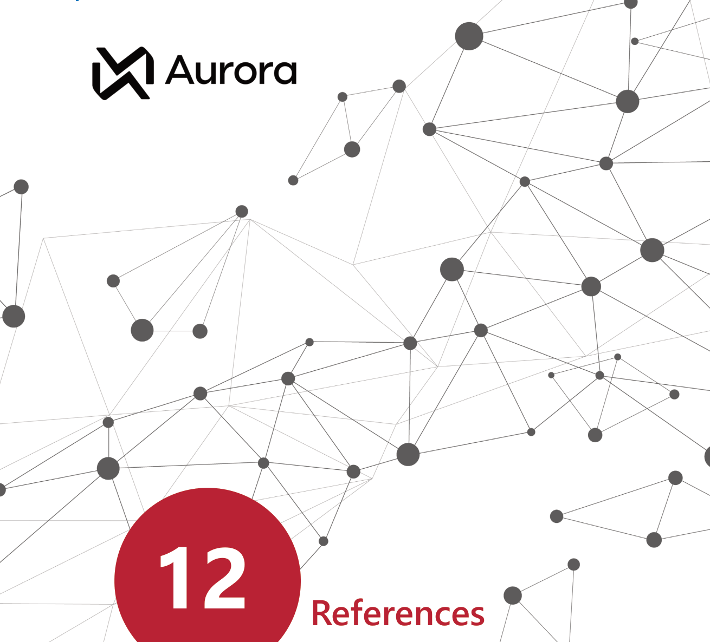

## 참고문헌

12

Project Aurora: The power of data, technology and collaboration to combat money laundering.

<!-- 원문 96쪽 -->

Project Aurora: The power of data, technology and collaboration to combat money laundering.

12. References

Aono, Y, T Hayashi, L Trieu and S Yamada (2016): "Scalable and secure logistic regression via homomorphic encryption", in Proceedings of the sixth ACM conference on data and application security and privacy, Association for Computing Machinery, pp 142–44. Bank for International Settlements (BIS) (2019): "FSI Insights: Suptech applications for anti-money laundering", August, "https://www.bis.org/fsi/publ/insights18.pdf". ——— (2023): "Committee on Payments and Market Infrastructures (CPMI) consultative report: ISO 20022 harmonisation requirements for enhancing crossborder payments", March, "https://www.bis.org/cpmi/publ/d215.pdf". Beutel, D J, T Topal, A Mathur, X Qiu, J Fernandez-Marques, Y Gao, L Sani, K H Li, T Parcollet, P P B de Gusmão and N D Lane (2022): "Flower: A friendly federated learning framework". Cheon, J H, A Kim, M Kim and Y Song (2017): "Homomorphic encryption for arithmetic of approximate numbers", in T Takagi and T Peyrin (eds), Advances in cryptology–ASIACRYPT 2017: 23rd international conference on the theory and applications of cryptology and information security, Hong Kong, China, December 3-7, 2017, proceedings, part I, Springer International Publishing, pp 409–37. Danmarks Nationalbank (2022): "AI and machine learning in the financial sector: five focus points", April, "https://www.nationalbanken.dk/en/publications/Documents/2022/04/EM%202022 %203.pdf". Dwork, C, F McSherry, K Nissim and A Smith (2006): "Calibrating noise to sensitivity in private data analysis", in S Halevi and T Rabin (eds), Theory of cryptography: third theory of cryptography conference, TCC 2006, New York, NY, USA, March 4-7, 2006, proceedings, Springer, pp 265–84. Financial Action Task Force (FATF) (2018): "Professional money laundering", July, "https://www.fatf-gafi.org/en/publications/Methodsandtrends/Professional-moneylaundering.html". ——— (2020): "Virtual assets red flag indications of money laundering and terrorist financing", September, "https://www.fatfgafi.org/en/publications/Methodsandtrends/Virtual-assets-red-flag-indicators.html". ——— (2021a): "Opportunities and challenges of new technologies for AML/CFT", July, www.fatf-gafi.org/en/publications/Digitaltransformation/Opportunities-challengesnew-technologies-for-aml-cft.html.

<!-- 원문 97쪽 -->

Project Aurora: The power of data, technology and collaboration to combat money laundering.

——— (2021b): "Stocktake on data pooling, collaborative analytics and data protection", July, www.fatf-gafi.org/en/publications/Digitaltransformation/Data-poolingcollaborative-analytics-data-protection.html. ——— (2021c): "Suggested actions to support the use of new technologies for AML/CFT". ——— (2022): "Conference on digital transformation". ——— (2023): Frequently asked questions – money laundering, https://www.fatfgafi.org/en/pages/frequently-asked-questions.html#tabs-36503a8663-item- 6ff811783c-tab. Financial Stability Board (FSB) (2022): "G20 roadmap for enhancing cross-border payments", October, "https://www.fsb.org/wp-content/uploads/P101022-1.pdf". Finanstilsynet (2021): "Project AML/TEK", May, "https://www.dfsa.dk/- /media/Nyhedscenter/2021/Consultation_Project_AML_TEK.pdf". Gentry, C (2009): "A fully homomorphic encryption scheme", Stanford University, mimeo. International Federation of Accountants (IFAC) (2022): "Anti-money laundering: The basics", March, "https://www.ifac.org/_flysystem/azureprivate/publications/files/AML-Installment-8-Crime-Trends.pdf". International Monetary Fund (IMF) (2021): "Factsheet: IMF and the fight against money laundering and the financing of terrorism", July, "https://iwimf.org/en/About/Factsheets/Sheets/2016/08/01/16/31/Fight-Against-Money- Laundering-the-Financing-of-Terrorism.html". Lexis Nexis (2021): "True cost of financial crime global summary". ——— (2022) : "True cost of financial crime global summary", "https://risk.lexisnexis.com/global/- /media/files/financial%20services/infographics/lnrs-global-tcoc-infographic2022_v2- nxr15749-00-1122-en-us.pdf". McMahan B, E Moore, D Ramage, S Hampson, and B A Arcas (2017): "Communication-efficient learning of deep networks from decentralized data", in Proceedings of machine learning research: Volume 54 Artificial intelligence and statistics 20 – 22 April 17, Fort Launderdale, Florida, USA, ,pp. 1273-1282. Open Ownership: "Beneficial Ownership Data Standard", "https://www.openownership.org/en/topics/beneficial-ownership-data-standard/". Oracle (2019): "Disrupting status quo in AML compliance", March, "https://www.oracle.com/a/ocom/docs/industries/financial-services/fs-disruptingstatus-quo-aml-complaince-wp.pdf".

<!-- 원문 98쪽 -->

Project Aurora: The power of data, technology and collaboration to combat money laundering.

Statista (2023): "Global gross domestic product (GDP) at current prices from 1985 to 2028", May," https://www.statista.com/statistics/268750/global-gross-domesticproduct-gdp/". United Nations Office on Drugs and Crime (UNODC): "Money laundering", "https://www.unodc.org/unodc/en/money-laundering/overview.html". The White House (2021): "US and UK to partner on prize challenges to advance privacy enhancing technologies", December, "https://www.whitehouse.gov/ostp/newsupdates/2021/12/08/us-and-uk-to-partner-on-a-prize-challenges-to-advanceprivacy-enhancing-technologies". The Wolfsberg Group (2017): "Payment transparency standards", October, "https://wb-db.basel.institute/assets/116e9ff8-e4af-4481-bb34- 3421a93b22e0/1.%20Wolfsberg-Payment-Transparency-Standards-October- 2017.pdf".

<!-- 원문 99쪽 -->

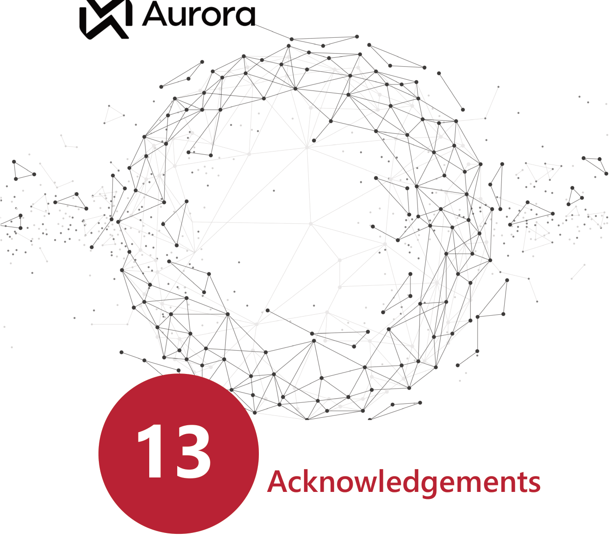

Acknowledgements 13

Project Aurora: The power of data, technology and collaboration to combat money laundering.

<!-- 원문 100쪽 -->

Project Aurora: The power of data, technology and collaboration to combat money laundering.

13. Acknowledgements

Bank for International Settlements

Beju Shah (Head of Nordic Centre, BIS Innovation Hub)

Hachem Hassan (Adviser)

Xin Zhang (Adviser)

William Zhang (Adviser)

Sidney Lampart (Adviser)

Björn Segendorff (Adviser)

Caroline Leung (Adviser)

Grimur Sigurdarson (Adviser)

Susanne Bohman (Adviser)

Ben Dovey (Adviser)

Karen Martin (Executive Assistant)

Lucinity

Óli Páll Geirsson

Guðmundur Kristjánsson

Jón Kristinn Þórðarson

Brynjólfur Gauti Guðrúnar Jónsson

Kristín Björg Bergþórsdóttir

Daníel Pálmason

Francisco Mainez

Consultants

Nick Maxwell (Head of Future of Financial Intelligence Sharing Programme)

<!-- 원문 101쪽 -->

Project Aurora: The power of data, technology and collaboration to combat money laundering.

Special acknowledgements The BIS Innovation Hub Nordic Centre team would like to thank the following people for their support, input or feedback: Cecilia Skingsley (Head of BIS Innovation Hub)

Ross Leckow (Head of Strategy and Operations, and Deputy Head of the BIS Innovation Hub)

Miguel Diaz (Head of Toronto Centre, BIS Innovation Hub)

Cristina Picillo (Adviser, BIS Innovation Hub)

Esther Rey Losada (Senior Operations Manager, BIS innovation Hub)

Lucy Wong (Adviser, BIS Innovation Hub) Andreas Adriano (Communications Advisor, BIS Innovation Hub) Vivienne Artz OBE FSCI (Hon)

Pavle Avramović (Financial Conduct Authority, UK)

Jo Ann Barefoot (Alliance for Innovative Regulation)

Theresa Bercich (Lucinity)

Ingvar Bjarki Einarsson (Lucinity)

Michael Dewar (Mastercard)

Helga Rut Eysteinsdóttir (Seðlabanki Íslands)

Baptiste Forestier (Hero)

Gabriela Guiborg (Sveriges Riksbank)

Leo Gosland (Financial Conduct Authority, UK)

Kristoffer Hansson (Finansinspektionen)

Maciej Janas (Klarna)

Thais Lærkholm Jensen (Danmarks Nationalbank)

Friðrik Laxdal Kárason (Lucinity)

<!-- 원문 102쪽 -->

Project Aurora: The power of data, technology and collaboration to combat money laundering.

Magnus Karlsson (Finanspolisen)

Matt Lowe (Financial Conduct Authority, UK)

Klas Malmen (Finansinspektionen)

Justo Manrique (Klarna)

Valerie Marshall (Financial Conduct Authority, UK)

Lasse Meholm (Norges Bank)

Viktor Möllborg (Sveriges Riksbank)

Henrike Muelle (Financial Conduct Authority, UK)

Dilan Ölcer (Sveriges Riksbank)

Mathias Lien Oskarsson (Finansinspektionen)

Helena Salomonsson (Klarna)

Che Sidanius (Global coalition to fight financial crime)

Hjörtur Stefánsson (Lucinity)

Luisa Stock (Klarna)

### D. 에드워드 윌슨 주니어.

Daniël Worm (TNO) 국제 정착 은행 (BIS)

<!-- 원문 103쪽 -->

## ISBN 978-92-9259-657-6
