# 자금세탁방지를 위한 시간 인지형·해석 가능한 예측 모니터링 시스템

> **원문 제목:** Time-aware and Interpretable Predictive Monitoring System for Anti-Money Laundering  
> **저자:** Pavlo Tertychnyi · Mariia Godgildieva · Marlon Dumas · Madis Ollikainen  
> **게재 정보:** Machine Learning with Applications 8 (2022) 100306  
> **DOI:** [https://doi.org/10.1016/j.mlwa.2022.100306](https://doi.org/10.1016/j.mlwa.2022.100306)

> **번역 안내:** 본문과 부록은 문단 문맥을 기준으로 한국어로 옮겼습니다. 수식과 참고문헌은 정확성을 위해 원문 표기를 유지했습니다. 원문의 그림과 표는 개별 이미지로 잘라 해당 본문 위치에 바로 배치했습니다.

---

<!-- 원문 1쪽 -->

자금세탁은 현재 사회에 대한 글로벌 위협입니다. 정부 및 정부 당국은 자금세탁, 일부, 규제 은행 및 금융 기관에 의해. 금융기관, 차례로, 자금세탁을 방지하기 위해 메커니즘을 구현하는 의무가 있습니다. 일반적으로 이러한 예방 메커니즘은 자동화된 모니터링 시스템을 포함합니다. 이 종이에서는, 우리는 기계 학습 기술을 기반으로 한 안티 머니 라 딩 모니터링 시스템을 제안한다. (i) 정확한 과 비 중복 경고 생성; (ii) 적시 경고 생성; 그리고 (iii) 각 경고에 대한 설명과 위험 추정. 첫 번째 요구 사항은 고객의 역사의 다른 스냅 샷에 기계 학습 분류 모델을 훈련하여이 모델에 의해 생성 된 분류 점수를 먹이는 것은 중복 경고를 방지하기 위해 설계된 경고 정책으로. 두 번째 요구 사항은 분류 모델의 성능을 평가하기 위해 사용자 정의 미터를 통해 주소, 이는 안티 - 돈 세탁 도메인에 발생되는 시간 요구 사항. 마지막으로, 세 번째 요구 사항은 클래스 확률 교정 및 Shapley 값에 근거한 해석성 층에 대한 방법을 적용하여 주소가집니다. 제안된 모니터링 시스템은 금융 기관의 조사 단위에 의해 제공된 요구 사항에 따라 설계되었으며 실제 데이터뿐만 아니라 전문 주제 매트 전문가로부터 여러 피드백을 사용하여 평가되었습니다.

## 1 서론

돈 세탁은 재정 당국에서 돈을 인수 한 소스를 deliberately의 연습입니다. 일반적으로 말하자면, 돈 세탁은 세 단계로 이루어져 있습니다. 불법적으로 금융 시스템에 돈을 얻고 금융 시스템 내에서 돈을 얻고, 금융 시스템 내에서 돈을 얻고, 그 기원을 훔쳐서 깨끗한 돈의 통합을 명백하게 합법적 인 금융 자산 (FCE Network, 2020).

규제 요건에 따라 구동, 금융 기관은 일반적으로 관련 금융 당국에 신고하기 위해 3 단계 (주택, 층 및 통합)에 걸쳐 돈을 세탁 활동을 감지하는 다양한 모니터링 메커니즘을 배포합니다. 잠재적인 돈 세탁 활동의 탐지를 자동화하기 위해 금융 기관은 Machine Learning (ML) 기반 모니터링 시스템을 포함한 다양한 도구를 사용합니다. 이러한 시스템은 고객의 행동이 발생할 수 있는 경고를 발생시킵니다.

자금세탁방지 (AML)를 위한 ML 기반 모니터링 시스템의 사용성은 비즈니스 사용자에 의해 정의되며 최소 3 가지 요구 사항에 따라 밑그림됩니다. 첫째, 최전선, 모니터링 시스템은 이전에 감지되지 않은 illicit 행동을 식별 할 가능성이있는 경고를 생성해야합니다. 이 필요조건은 2개의 subrequirements를 만족시킵니다. 첫째, 모니터링 시스템은 정확한 ❉Corresponding 저자를 생산해야 합니다.

이메일 주소: pavel.tertychny@gmail.com (P. Tertychnyi), mariagodg@gmail.com (M.. 바카라사이트 Dumas), madisollikainen@gmail.com (M., 미국) 오릴리카인엔 경고. 높은 숫자의 거짓 긍정적인 경고는 주제 매트 전문가 (즉에 높은 작업 부하를 넣어. 각 경고를 수동으로 확인해야 하는 조사관. 턴에서 거짓 음의 높은 숫자는, 감시 시스템 사용은 illicit 활동의 대부분을 놓기 때문에. 두 번째 하위 요구는 시스템가 이전 경고에 대한 추가 정보를 가져하지 않는 경우 동일한 고객에 대한 경고를 생성하지 않아야한다는 것입니다. Redundant alerts는 투자자로부터 귀중한 시간을 소비합니다.

<!-- 원문 2쪽 -->

### P. 테티키니, M. 의정부관광청 Dumas 외. 응용 프로그램 8 (2022) 100306와 기계 학습

셋째, ML 기반 모니터링 시스템은 해석 가능한 경고를 생성해야하므로 조사자가 더 많은 조사를 가치가 있는지 확인하고 조사가 진행되는 방향으로 어떤 방향으로도 결정할 수 있습니다. 경고를 조사하기 위해 필요한 시간을 단축하고, 더 많은 경고를 검사 할 수 있습니다. 상기와 관련된 AML의 ML 기반 모니터링 시스템은 특정 고객에 참여하는 확률의 정확한 (카리브레이션) 견적을 제공해야하므로 투자자가 관련 위험을 평가하기 위해이 정보를 사용할 수 있습니다.

본 논문에서는 다국적 금융기관의 AML를 위한 ML기반 모니터링 시스템의 설계 및 개발 관련 사례 연구를 진행하고 있습니다. 연구의 목적은 감시 체계의 성과 뿐 아니라 최종 사용자를 위해 쓸모가 있는 체계를 만들기 위하여 디자인하고 평가하는 것입니다. 제안된 모니터링 시스템은 세 가지 주요 요구 사항을 해결합니다. (i) 정확한 비 과도한 경고 생성; (ii) 적시 경고 생성; (iii) 각 경고에 대한 설명과 위험 추정 관련 설명. 첫 번째 요구 사항은 고객의 금융 행동 역사에 훈련 된 ML 분류 모델에 의해 해결됩니다. 중복 경고를 방지하기 위해 설계된 경고 정책은이 ML 모델에 의해 생성 된 분류 점수의 상단에 내장되었습니다. 두 번째 요구 사항은 분류 모델의 성능을 평가하기 위해 사용자 정의 미터를 설계하여 주소입니다. 이는 적시 요구 사항을 고려합니다. 마지막으로, 세 번째 요구 사항은 Shapley 값 (Shapley, 1953)을 기반으로 해석성 레이어에 의해 지정되며 클래스 확률 보정을 위한 방법을 적용하여 사용됩니다.

제안된 모니터링 시스템은 금융 기관의 조사 단위에 의해 제공된 요구 사항에 따라 설계되었으며 실제 데이터뿐만 아니라 전문 주제 매트 전문가로부터 여러 피드백을 사용하여 평가되었습니다.

종이의 나머지는 다음과 같이 구성됩니다. Section 2는 관련 문학을 간략히 검토합니다. 단면도 3는 AML를 위한 제안한 MLbased 감시 시스템을 설명합니다. Section 4는 실제 환경에서 제안된 시스템의 평가를 논의하고 이 설정에서 주제 매트 전문가가 주어진 피드백을 요약합니다. 마지막으로, 섹션 5는 미래의 연구의 방향을 스케치하고 우리의 주요 결론과 기여를 요약합니다.

## 2 관련 연구

ML 기반 모니터링 시스템은 ML 모델을 사용하여 주기적으로 긍정적이고 부정적인 클래스로 인성을 분류하는 시스템이며 예를 들어 잠재적으로 illicit 또는 non-illicit로 인성을 분류합니다. 일반적으로 ML 기반 모니터링 시스템은 부정적인 클래스에서 엔티티티가 떨어지면 경고를 올리도록 설계되어 도메인 전문가가 더 조사 및 / 또는 이러한 경고에 행동 할 수 있도록합니다. 모니터링 시스템은 장비 고장 모니터링, 예측 기계 유지 보수, 카드 사기 탐지 등 다양한 영역에서 공통됩니다. ML 기반 모니터링 시스템은 수동 모니터링이 불능하고 규칙의 형태로 경고 할 수있는 모든 가능한 행동을 codify 할 수 없다는 도메인에서 특히 유용합니다. 이것은 돈 세탁 탐지의 맥락에서 케이스, 일 당 수백만의 거래이있을 수 있습니다 (설명서 분류에 적합하지 않음) 규칙 세트를 통해 관심의 모든 가능한 행동을 문자 할 수 없습니다.

AML 도메인의 ML 기반 모니터링 시스템 설계 및 개발의 문제는 이전 연구 연구 연구 연구에 적용되었습니다. Ketenci 등. (2021)는 시간 빈도 분석에 근거를 둔 tailormade 시간 인식 특징의 소설 세트를 추진해서 시간 요인에 문제가 있는 돈 세탁 탐지의 문제를 해결했습니다. 탐지 모형은 6680 Akbank 고객의 진짜 생활 자료에, 돈 laundering 활동에 관여된 26% 시험됩니다. 이 비율은 실제 유통에서 매우 멀며 의심스러운 고객의 비율이 보통 매우 낮습니다. 따라서, 전형적인 실제 시나리오에서, AML 감시 시스템은 강한 종류 불균형을 가진 데이터셋를 취급할 필요가 있습니다. Ketenci et al의 일이지만. 돈 세탁 탐지를 위한 해결책을 제공하십시오, 분류 모형의 산출이 경고에 지도해야 할 때 시간을 삭제하는 것은 시간의 문제를 해결하지 않습니다. 또한, 모델이 최종 사용자에 의해 만들어진 예측을 설명하는 질문도하지 않습니다.

ML 기반 모니터링 기술은 Chao et al.의 돈 세탁 모니터링에 적용되었습니다. (2019). 저자는 Bayesian 네트워크를 사용하여 무역 기반 돈 세탁에 자본 흐름을 모니터링했습니다. 제안 된 Bayes net은 훈련 데이터에 내장 된 방향 그래프와 조건의 확률 테이블에 의해 표현됩니다. 개발 도구의 평가는 ROC- AUC, F-score 및 Geomean 측정을 사용하여 수행되었으며 예측의 타이밍을 고려하지 않고 수행되었습니다. 모니터링 기술은 또한 Fawcett 및 Provost (1997)가 발표 한 작업에서 셀룰러 사기를 감지하는 데 사용되었습니다. 저자는 cellular cloning 사기를 감지하기 위해 경고 발생을위한 규칙 기반 모델을 개발했습니다. 그들의 연구는 통화 기록과 모델 성능의 데이터베이스에 수행되어 모델의 시간에 의해 평균적으로 정확도로 측정되었습니다. 추가 성능 메트릭으로 경고 비용을 계산합니다. 이 후자는 거짓 경고의 비용을 고려한다 (즉. false Positives), 그것은 경고를 너무 일찍 생성하는 비용으로 고려하지 않습니다 또는 너무 늦게 (시동의 시간).

ML 알고리즘의 관점에서, 사용되지 않는 접근법 모두의 훌륭한 다양성이 있습니다. Jullum 외. (2020) 노르웨이 은행 DNB의 실제 데이터에 의심 거래를 감지하는 XGBoost 프레임 워크의 구현에서 그라디언트 부스트 나무의 사용을 연구했습니다. 제안 된 방법의 성능은 ROC-AUC, Brier Score 및 긍정적 예측의 비율을 사용하여 평가되었습니다. Ahmed (2021)는 의심 거래의 3개의 공공 데이터셋에 무작위 숲 (RF) 및 XGBoost 알고리즘의 비교를 만들었습니다: Elliptic 데이터셋, Ethereum Illegal 계정 데이터셋 및 NOAA 데이터셋. 모델의 성능은 정밀, 리콜, 정확도 및 F1 점수를 사용하여 테스트되었습니다. 지원 벡터 기계 (SVM)는 다수 저자 (Alkhalili 등, 2021에 의하여 돈 세탁 탐지를 위해 사용되었습니다; Raiter, 2021). 일반적으로 SVMs는 모델 교육에 필요한 시간 제약으로 인해 작고 중간 데이터셋에 사용됩니다. 특히 문제가 비 선형 커널의 사용을 필요로 할 때. 이로 인해 대규모 실제 애플리케이션에서 알고리즘의 가족을 사용할 수 없습니다. 의로 감독되지 않은 접근, Mubalaike 및 Adali (2018)는 쌓인 AutoEncoders (SAE)의 사용을 조사하고 Boltzmann 기계 (RBM)를 제한했습니다. 모바일 돈 거래의 합성 데이터셋에 실시간 금융 사기 탐지. 첸 외. (2021)는 Autoencoders (AE)와 Variational Autoencoders (VAE)를 사용하여 Malasian 은행의 실제 데이터에 대한 실시간 탐지를 제공합니다. 성능과 촉촉한 클래스 불균형 Wasserstein Generative Adversarial Networks (WGAN)은 인공 사기성 거래를 생성하기 위해 사용되었습니다.

모니터링 작업에서, 근본적인 질문은 제대로 모델의 성능을 평가하는 방법. 전통적인 성능 메트릭은 매우 정확하게 모델의 실제 상태를 나타내지 않으며 성능이 매우 과도하게 될 수 있습니다. 경고의 타이밍의 질문은 Dachraoui et al에 의해 해결되었습니다. (2015)는 향후 분류 비용의 예상 이득을 균형으로하는 방법을 제안하고 결정 지연의 비용. 이 방법은 합성 데이터와 실제 두 개의 두 개의 LeadECG 데이터셋 모두 테스트되었습니다. 시포 외의 시포관리 도메인의 알림 시스템의 성능은 Sipos et al.에 의해 평가되었습니다. (2014). 이 저자는 의료 기기의 이벤트 로그에서 데이터를 마이닝하여 장비 고장을 예측하고 있습니다. 경고의 타이밍을 fulfil로 그들은 경고가이 간격의 외부로 발생 한 경우 실패와 거짓 긍정적 인 경우로 진정한 긍정적 인 정의를 재설계했습니다. 최종 모델 성능은 Predictive-Maintenance 기반 AUC에 의해 평소 PRAUC로 측정되지만 사용자 정의 리콜 및 정밀도로 측정됩니다. 성능 메트릭 redefinition의 유사한 접근은 Zhang et al에서 선택되었습니다. (2016). 그들은 또한 예측 유지 보수 작업에 경고의 문제로 데려 왔습니다. 제안된 접근법은 두 개의 엔터프라이즈 시스템 로그 추적에 유효했다: 웹 서버 클러스터 및 메일러 서버 클러스터. 프레임 워크의 성능은 사용자 정의 PRAUC 메트릭 (Custom-defined recall에서 만들어졌습니다)에 의해 추정되었습니다.

<!-- 원문 3쪽 -->

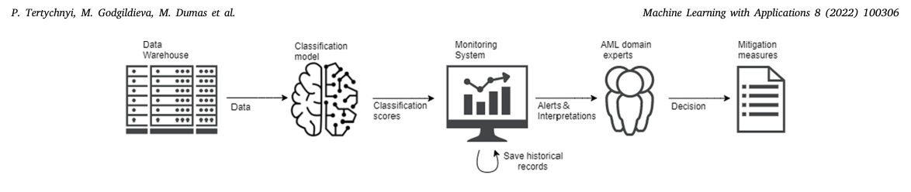

사용자 정의 정밀), 예측 가능한 간격 메트릭 및 예측 가능한 주파수 메트릭. 이 종이에서는 Sipos et al의 작업에서 제안 된 측정에서 영감을 얻었다. AML 모니터링을 위한 예측 모델의 성능을 평가하기 위해.

AML 도메인을 넘어 모니터링 시스템의 중요한 요구 사항은 대부분의 경우, 이러한 시스템에 의해 생성 된 경고는 주제 매트 전문가에 의해 분석되어야합니다. Xing 외. (2011)는 초기 시간 시리즈 분류 작업에서 모델의 해석성을 압정했습니다. 그들은 지역 모양을 특징으로 추출. Shapelet은 특정 모양을 가진 시간 시리즈의 세그먼트를 나타냅니다. 알고리즘의 결과는 UCR 시간 시리즈 아카이브에서 7개의 데이터셋에 평가되었습니다. 모양에 근거한 유사한 접근은 He et al에 의해 고려되었습니다. (2015). 이 후자는 두 개의 합성 데이터셋 및 실제 웨이퍼 및 ECG 데이터셋에 테스트되었습니다. 둘 다 외. (2015)와 싱 등. (2011)는 해석 가능한 특징 및 조기 분류 문제, i.e의 디자인에 집중됩니다. 시간. 그러나 그(것)들의 감시는 경고의 질을 올리고 평가하는 경고의 알고리즘으로 설정한다. 모델의 해석은 실제 최종 사용자에 테스트되지 않았습니다.

## 3 관련 기사

이 섹션에서는, 우리는 섹션 1에서 3 가지 요구 사항을 해결하는 ML 기반 모니터링 시스템의 디자인을 제시, 즉: (i) 정확도 및 경고의 비 중복; (ii) 경고의 시간; 및 (ii) 경고의 해석성.

ML 기반 고객 모니터링 시스템의 파이프라인의 단순화 된 전망은 Fig에서 발표됩니다. 1. - 비디오 다른 ML 기반 시스템처럼, 시스템의 첫 번째 구성 요소는 데이터 추출 및 사전 처리 구성 요소이며, 이는 저장에서 데이터를 추출하여 분류 모델을 훈련하는 데 사용되는 특성 매트릭스를 구성합니다. 이 분류 모델은 모든 지점에서 모든 엔티티티에 대한 출력 분류 점수로 생산합니다 (예: 매주). 분류 점수는 모니터링 시스템 자체에 의해 사용되며, 분류 모델 결과를 경고로 전환하기위한 정책을 구현합니다. 이 정책은 이전 경고 및 분류 점수 (중복 경고를 방지하기 위해) 계정으로 들어가고 경고 시간대 요구 사항을 고려하는 특정 사용자 주도 분류 메트릭을 극대화하기 위해 측정됩니다. 모니터링 시스템은 확률 보정과 설명 가능한 ML 기술에 의존하여 각 생성 된 경고와 함께 도메인 전문가에 대한 위험 점수와 설명을 제공합니다. 이 입력을 바탕으로 도메인 전문가는 각 경고를 조사하고 필요한 경우 완화 조치를 취합니다.

이 단면도의 나머지는 감시 체계의 디자인을 선물합니다, 제안한 감시 체계와 관련된 probability 구경측정 및 해석성 층을 경고하는 주문 미터.

### 3.1 모니터링 시스템

제안된 모니터링 시스템의 입력 (MS)은 금융 기관의 고객 및 금융 활동의 데이터셋입니다 (데이터셋의 상세한 설명에 대한 섹션 4.1 참조). 데이터셋는 시간 동안 각 고객의 거래의 역사를 포함하고이 연구에서, 우리는 6 개월 긴 거래 역사 처리. 고객이 6 개월 전보다 적은 금융 기관에 합류 한 경우 고객은 6 개월 기간의 시작에 기숙사가 된 경우 여전히 모니터링되고 치료됩니다. 데이터셋에는 고객의 2개 그룹이 포함됩니다:

1. - 비디오 보고된 고객(‘Reported'라고 함)은 FIU(Financial Intelligence Unit)와 같은 관련 기관에 대한 정보를 수집하기 때문에 잠재적으로 illicit 활동을 탐지했습니다. 보고된 고객은 적어도 1개의 보고가 있고, 각 보고에는 대응적인 보고 날짜가 있습니다. 2. - 비디오 누가 보고 된 적이 없다. 결코 보고된 고객의 전체적인 고객 기초의 밖으로, 우리는 고객의 세트를 표본으로 우리 부르는 그 우리 무작위로 간색했습니다.

업무는 은행의 고객의 재정적 활동을 모니터링하고 잠재적으로 illicit 활동이 감지되면 알림을 제기하는 것입니다. 고객은 여러 잠재적으로 illicit 작업을 수행 할 수 있으므로 고객은 여러 경고를 얻을 수 있습니다. 알림은 고객의 금융 활동과 역사적인 라벨의 역사적인 데이터에 훈련된 ML 분류 모델의 기초에 생성됩니다. 손의 문제는 분류 문제로 치료되었지만 생존 분석의 사용 사례로 치료되었습니다. 고객이 잠재적으로 illicit을 발견 할 때, 궁극적으로, 고객이 잠재적으로 illicit을 찾을 수 있는지 여부를 알아내는 것이 좋습니다. 생존 모델은 이벤트가 일어날 때까지 시간을 견적 할 때 적합하며,이 상황에 따라 고객이 참여하거나 illicit 행동에 참여하는 것으로 나타났습니다. 그러나이 종이에서, 우리는 오히려 투자가 유용 할 경고 생성에 초점을 맞추고.

우리의 접근 방식에서 고객은 주어진 기간 동안 거래의 범위뿐만 아니라 프로필 특성의 기초에 분류됩니다 (예를 들어. 6 달). 이 접근법은 다른 후 두 가지 예측 모델 체인을 사용합니다. 첫 번째 예측 모델은 고객이 명확하게보고 된 고객과 유사한 행동을 전시하지 않는 고객을 필터링하도록 설계된 논리적 회귀 모델입니다. 고객의 수백만에 적용 가능한 한 필수 인 확장 가능한 방식으로 계산 될 수있는 작은 특성에 근거합니다. 두 번째 모델은 트리 ensemble 모델 (무기한 그라디언트 부스트, 특히 CatBoost)과 같은 많은 특성 (투명 합계, 카운트 및 이와 유사한 집계), 인구학적 특성 (고객, 지리의 유형), Markov Chain 모델에서 추출 된 특징 인바운드 및 아웃바운드 거래 시리즈에 훈련 된, 임시 거래 패턴 캡처. 분류 모델의 이러한 두 계층 구조는 가장 많이 요구하는 계산이 고객의 필터 세트에 완료되기 때문에 더 나은 확장성을 제공합니다. 또한, 이 건축은 고객 분류를 수행하는 두 번째 층 모델에 대한 지식 중심의 undersampling을 수행함으로써 모델의 침착성을 보장합니다. 데이터에 대한 자세한 정보, 추출 특성, 모델 선택 및 비교는 우리의 이전 연구 (Tertychnyi et al., 2020)에서 찾을 수 있습니다.

분류 모델은 주기적으로 실행됩니다 — 우리의 경우, 일주일에 한 번. 다른 말에서는, 모형은 매주 달고 각 달리기 후에, 고객은 잠재적으로 illicit 또는 non-illicit로 분류됩니다. 각 모델에서, 고객은 이전 6 개월의 거래의 역사를 기반으로 분류됩니다 (고객 스냅 샷이라고 불린, 또는 짧은 스냅 샷). 이것은 각 모형에서, 고객 실행한다는 것을 의미합니다

<!-- 원문 4쪽 -->

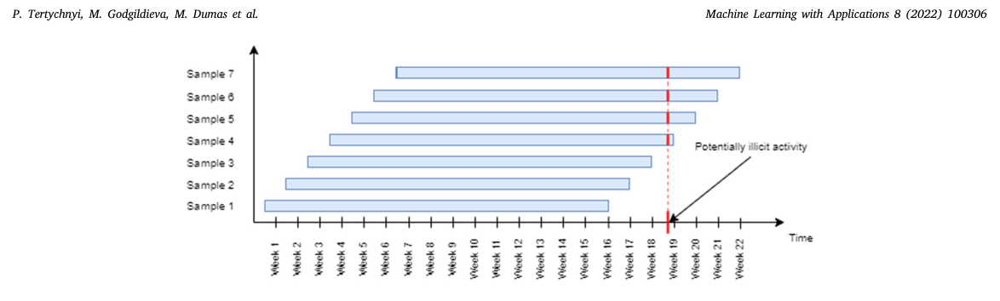

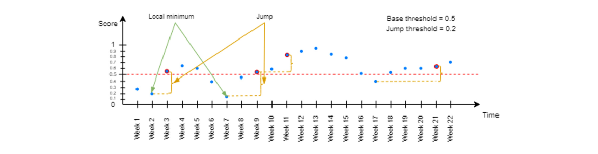

거래의 1 주일 동안 새로운 거래의 주가 잊혀질 것입니다 (그림 참조). 2). 다른 말에서는, 분류는 미끄러지는 창의 기초에, 표본이 comparable 있다는 것을 보증하기 위하여 합니다. 이 complication을 제공합니다 순차적 모니터링 우리는 같은 기업의 매우 유사한 스냅 샷을 분류, 새로운 거래의 1 주와 오래된 거래의 1 주없이. 각 고객마다 분류 점수를 매겨 낸 각 고객마다 분류 모델을 실행할 때마다 잠재적으로 illicit의 확률을 나타내는 분류 점수를 매겨 줍니다.

고객의 분류 점수를 한 번에 한 번에 진행할 수 있는 시퀀스를 통해 경고를 올릴 때 이해해야 합니다. 이 경고는 AML 도메인 전문가에 의해 수동으로 확인할 수 있습니다. 이 빛에서, 그것은 같은 고객에 대 한 경고를 제기 하는 것은 사실이 잠재적으로 illicit 활동의 동일한 세트로 인해 발생할 가능성이 있기 때문에, 몇 주 동안 또는 심지어 행에 몇 주 동안.

따라서, 우리는 두 매개 변수로 우리의 사용자 정의 MS를 제안합니다: (i) 기본 임계 값 - 고객의 활동이 증가하는 경고에 대한 충분한 비정상적이어야한다는 것을 상기; 그리고 (ii) 점프 임계값 – 점수 사이의 델타의 임계값은 고객의 활동에서 급격한 변화를 감지합니다. 제기 될 경고를 위해, 해당 분류 점수는 두 가지 요구 사항을 충족해야합니다:

1. - 비디오 점수는 기본 임계값과 같거나 같을 수 있습니다. 2. - 비디오 마지막 경고 이후 점수와 최소 점수의 차이 (지속 로컬 최소) 점프 임계값보다 더 커야한다.

첫 번째 요구 사항 뒤에 합리적 인 경고는 높은 수준의 위험과 관련된 고객에게만 제기되어야한다. 두 번째 요구 사항, 차례로, 경고는 고객의 행동에 변화를 때만 제기됩니다.

### 3.2 사용자 정의 미터

MS의 품질을 평가하기 위해, 우리는 일반적으로 분류의 분야에서 사용되는 recall 및 정밀도의 양상에 의존합니다. 일부 조정으로 MS가 아래 설명 된 것과 같이 순차적 인 설정을 고려해야합니다.

3.2.1. - 비디오 AML 분류 작업에서 리콜은 AML 분류 모델이 같은 분류하는 잠재적으로 illicit 고객의 비율 인 ''에 해당합니까?'. 주기적인 AML 감시의 상황에서, 이 질문은 임시 차원을 가지고 갑니다.

<!-- 원문 5쪽 -->

### P. 테티키니, M. 의정부관광청 Dumas 외. 응용 프로그램 8 (2022) 100306와 기계 학습

구체적으로, AML 분류 모형은 시간에 있는 특정한 점에 고객의 자료의 스냅샷을 입력합니다. 이 스냅샷의 기초에 출력(alert 또는 no-alert)을 생성하고 나중에 다른 (later) 스냅샷으로 다시 호출됩니다. AML 모델은 타임 스프트와 같은 고객의 여러 스냅 샷을 분류 할 수 있음을 의미합니다. 예를 들어, 고객이 20 주 동안 모니터링하고 모니터링 시스템은 일주일에 한 번 실행되며,이 고객의 20 샘플은 모델에 의해 라벨을 붙일 것입니다. 이 설정에서 리콜의 네이티브 응용 프로그램은 AML 모델이 잠재적으로 illicit (즉, 그 20 샘플의 마지막을 분류하는 경우, 대표자가되지 않을 것입니다. 그것은 경고를 제기) 그리고 비 해시 (오류 없음)로 첫 번째 19, 우리는 1 20의 호출을 얻을. Yet, 모델은 잠재적으로 illicit (i.e.로 고객을 분류했습니다. 경고가 제기되었습니다) 그래서 arguably는 (이것에 데이터셋를 제한하는 경우에) 1이어야 합니다, 경고가 잠재적으로 illicit로 보고된 때 시간에 올려진 것을 제공했습니다.

위 빛에서는, 우리는 고객 수준에 회귀의 정의를 채택합니다 (주문 회귀이라고 불린). 특히, 우리는 잠재적으로 illicit 고객의 수로로 사용자 정의를 정의합니다. 데이터셋의 잠재적으로 illicit 고객에 의해 분할된 잠재적으로 illicit로 보고 된 시간의 적어도 한 번 경고했다. 이 정의를 완료하려면, 우리는 ''또는 그 시간의 주위에'의 표기를 정의해야합니다. 이것은 정밀도의 정의의 일부로 정의된다.

3.2.2. - 비디오 정밀 한 오프 분류 설정에서, 정밀는 질문 '''는 AML 모델이 지상 진실에 따라 실제로 잠재적으로 illicit 인 잠재적으로 illicit로 분류하는 고객의 비율은 무엇입니까?'. 주기적인 모니터링 설정에서, 대신 캡처하는 이 정의를 사용자 정의해야, AML 시스템에서 생성 된 정확한 경고의 비율. 다른 말에서는, 우리는 정밀의 사용자 정의 표기가 필요하며, 특히, 동일한 고객을 위한 행에 올려진 반복 경고를 제공합니다.

따라서, 우리는 고객이 illicit 활동을 가지고보고했을 때 날짜에 가까운 사건이 발생한다는 아이디어를 캡처하는 정밀의 정의를 제안합니다. 특히, 우리는 보고서가 고객 (Fig를 참조하십시오.)에 대해 만든 날짜 주위에 isosceles 사다리꼴 아래 떨어지는지 여부를 기반으로 경고의 유틸리티를 캡처하는 것을 제안합니다. 4). 매우 초기 경고에는 사다리꼴의 왼쪽 다리의 유틸리티가 있으며, 유틸리티는 보고서 날짜에 접근하는 경고와 선형으로 성장합니다. 매우 늦은 경고에는 사다리꼴의 오른쪽 다리의 양에 유틸리티가 있으며, 이 유틸리티는 보고서 날짜 이후 보고서 날짜 이후 1 주 전에 선형으로 시작되며 두 주의 시점에서 종료됩니다. 사다리꼴의 낮은베이스는 경고가 몇 가지 긍정적인 유틸리티를 얻을 수있는 시간 범위는 정의; 이 범위 밖에 경고는 0의 유틸리티를 얻을. 가장 높은 유틸리티는 4에서 1 주일 간 시간에 달성됩니다. 이 선택에 대한 합리적은 이전 경고가 늦은 경고보다 더 많은 가치를 가지고 있다는 것입니다.

정밀도는 산출됩니다

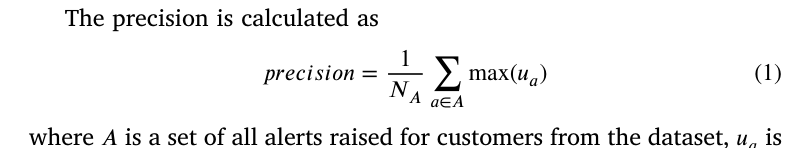

최대 (아) (1) Ais는 데이터셋에서 고객을 위해 모은 모든 경고의 세트, 경고의 시간에 사다리꼴의 고도로 acalculated 경고의 유틸리티, A의 크기 NAis. 고객이 한 번 이상 보고 될 수 있으므로 보고서의 각에 대한 대응 함정이있을 것입니다. 그래서 우리는 여러 번 겹쳐 쌓이는 사다리꼴 아래에 떨어지면 최대 (아)로 경고의 유틸리티를 계산합니다.

Fig 예제를 보자. 4. - 비디오 예를 들어 고객은 주 8에 FIU에보고되었으며 3가 주 3, 5 및 9의 비대칭 유틸리티가있는 2 경고를 받았습니다.

3, 1 및 1 3 (응답한 사다리꼴 고도). 이 고객의 정밀도 (주사 경고 유틸리티의 여름)의 감쇄에 영향을 미칠 것입니다 2

3 +1 + 1 3 = 2. 그리고 정밀도의 denominator에 충격은 생성된 3 경고가 있기 때문에 +3입니다. 고객이 주 3 및 5에서만 경고를 얻는 경우에

그 후 정밀도의 정류기에 영향을 줄 것입니다 2

3 + 1 = 5 3, 그러나 정밀도의 탈중앙에 충격은 +2, 거기 생성된 2 경고만 있었다는 것을부터. 즉, 동일한 고객을 위해 제기 된 반복 경고를 곱합니다. 정밀 계산의 이러한 디자인을 볼 수 있듯이, 올바른 시간에 제기되지 않은 경고의 유틸리티를 줄이기 위해 경고의 타이밍을 제어 할 수 있습니다. False Positives를 차별화하는 현재 방법 - 보고서가없는 고객이지만 1 경고가 제기 된 0 총 유틸리티를 얻을 것이다. 총 정밀도는 더 작은 수 (보통 총 수는 +1)로 나뉩니다. 보고서가없는 고객이지만 20 경고가 발생하면 0 총 유틸리티를 얻을 수 있지만 전체 정밀도에 대한 영향은 큰 숫자로 나뉩니다 (보통 총 경고의 수는 +20).

위에 설명된 사용자 정의 미터는 사용자 정의 MS의 최적의 매개 변수를 찾는 데 사용됩니다. 따라서 기본 임계값과 점프 임계값은 유효성 설정에서 F1 점수를 극대화하는 것과 같은 (4.3 참조)를 가지고 있습니다. F1 점수는 모델의 정밀도와 리콜 사이에 거래가 가능한 한 최적화된 메트릭으로 선택됩니다.

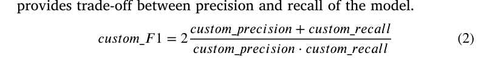

### 3.3 Probability 구경측정

제안 된 AML 모니터링 접근의 목표는 고객이 illicit 행동에 참여하는 높은 확률이있을 때 경고를 제기하는 것입니다.

이 끝에, 우리는 주어진 고객 snapshot가 illicit 행동 종류에 속한 시간에 주어진 점에서 추출한 확률을 추정해야 합니다. 비선형 분류 모델 출력 클래스 확률 점수는 확률 분포의 속성과 일치하지 않는. 예를 들어, 모델이 0.8의 출력 점수를 샘플 세트로 할당하면 80%가 긍정적 인 클래스에 속할 것으로 예상됩니다. 그러나, 이것은 반드시 비선형 클래스터의 경우가 아닙니다. 이러한 모델에 의해 생성 된 분류 점수가 유사성 미터를 나타내고 실제 확률이 아닙니다.

우리의 접근법에서는 분류 모델에 의해 클래스 확률이 측정되어야하며, 실제 확률을 반영하기 위해 조정되는 의미를 나타냅니다. 이를 보장함으로써, 우리는 다음과 같은 혜택을 얻을 수 있습니다:

1. - 비디오 모델은 최종 사용자가 기대할 때, 해당 전문가들이 모델을 조정할 때 위험 기반 접근 방식을 따르는 것을 증명하는 점수를 생성합니다. 2. - 비디오 모델은 모델이 다른 기간 동안 훈련 된 모델에 적합하기 때문에 정기적 인 재훈련에 강력합니다.

probability 구경측정을 위한 수많은 알고리즘이 있습니다. Experiments는 우리의 작업에서 가장 좋은 접근법은 beta 구경측정 (Kull 등, 2017) (그림을 보십시오. 5는 다른 구경측정의 비교를 위해 우리의 시험 자료에 접근합니다). 베타 교정의 장점은 이진 분류 작업의 클래스의 점수가 일반적으로 배포되는 가정을 만들지 않는다는 것입니다. 즉, 무한한 지원으로 배포가 있습니다. 대신, 그것은 베타 배포에 따라 배포되는 [0,1]의 무한한 지원과 캘리브레이션 특성의 새로운 가족을 derives

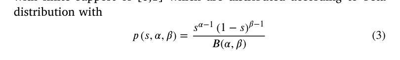

### 3.4 예측의 설명

ML 모델에 의해 생성 된 예측에 해석을 할당 할 수있는 능력은 특히 ML 모델의 출력이 도메인 전문가에 의해 검증 될 필요가있는 상황에서 산업 응용 프로그램에 공통 요구 사항입니다. AML 모니터링 시스템의 상황에 따라 ML 모델의 기초에 생성 된 경고는 조사를 트리거하는 데 사용됩니다.

<!-- 원문 6쪽 -->

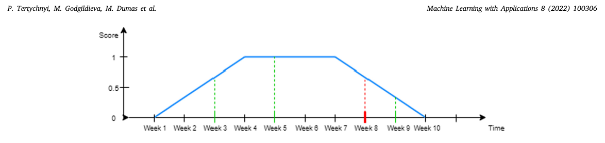

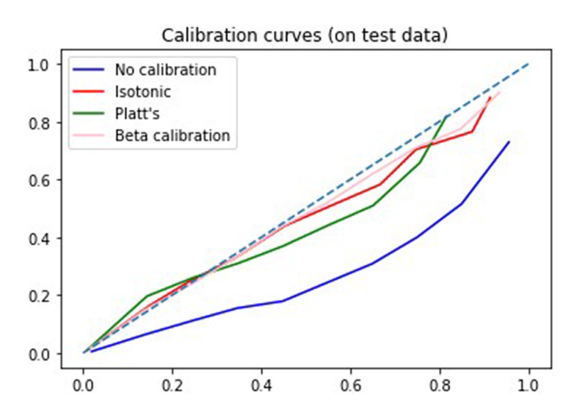

Naturally, 조사자는 해당 확률 점수와 경고뿐만 아니라이 경고가 생성 된 이유로 clues를 주장합니다.

경고를 설명하려면 Shapley 값 (Shapley, 1953)을 사용합니다. Shapley 값은 기여에 따라 연합 게임의 기여자 중의 지급을 어떻게 정의합니다. ML 모델의 경우, contributors는 분류 모델에 공급하고 지불금은 인스턴스의 최종 분류 점수입니다. Shapley 값의 알고리즘은 모든 가능한 석탄화에 의해 특성의 모든 한계 기여의 평균을 계산합니다. 특정 특성에 대한 Shapley 값을 계산하는 공식은 다음과 같습니다.

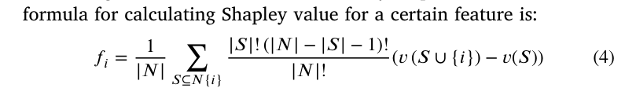

여기서 N - 특성 세트, v - 값 함수 (특성의 연합을위한 지급 특성), i- 특성 색인, S- 설정의 하위 세트 N. Shapley 값 뒤에 세부사항 그리고 intuition는 본래 종이 (Shapley, 1953)에서 찾아낼 수 있었습니다. 원래 종이에 따라 Shapley 값의 계산은 현재 설정에 대한 불평성 때문에 모든 가능한 특성 연합의 영향을 추정하기 위해 필요한 모든 특성 연합의 영향을 추정해야합니다, 즉. 그것을 위한 분리되는 모형을 훈련하기 위하여. 따라서, 우리는 SHAP (SHapley 첨가제 exPlanations) 프레임 워크 (Lundberg & Lee, 2017)를 사용하여 대략적인 Shapley 값을 계산하여 SHAP 값으로 더 많은 주소로 변경했습니다.

설정에서 각 모델 실행에 SHAP 값을 계산하여 각 특성의 사진이 각 고객의 모델 출력 점수에 기여한 방법을 제공합니다. 예측에 대한 설명을 제공하기 위해, 우리는 상단 SHAP 값이있는 5 특성을 선택 - 이것은 MS (기초 임계값)의 첫 번째 요구 사항에 해당합니다. 또한, 우리는 분류의 시간과 가까운 지역 최저의 시간 사이에 SHAP 값의 가장 높은 델타스를 가진 5 특성을 선택 - 이것은 MS (jump 임계값)의 두 번째 요구 사항에 해당합니다. 간단히 말해서, 우리는 가장 높은 기여와 기여가 증가한 특성을 강조합니다.

모든 추출 특성은 여러 범주로 그룹화됩니다 (예:, 그들은 인간적으로 읽기 쉬운 정의에 묘사 된 후, 턴오버, 위조 관련 특성, 현금 거래 특성 등을 나타내는 특성). 가장 기여한 특성을 확인한 후, 미리 정의된 특성 그룹에 지도하고, 특성 그룹 정의에 근거한 문자 설명을 형성합니다. 결국 24 특성 그룹에 맵핑 된 123 특성이있다. 경고가 MS를 스트라이프 후 첫 주에 제기되는 경우, 우리는 SHAP 값의 deltas와 함께 특성을하지 않습니다. SHAP 값을 비교하지 않는 것이 아무것도 없기 때문에. 이 경우, 우리는 가장 높은 SHAP 값과 5 특성을 사용합니다.

우리의 경고 발생 접근의 해석 층의 schematic 전망은 Fig에서 주어집니다. 6. - 비디오 이 그림은 이동 거래의 현금 패턴을 캡처하고 고유 한 부분의 수는 가장 높은 SHAP 값을 가지고, 따라서 모델에 의해 만들어진 예측에 기여. 한편, 합의금의 합과 의미는 1.0와 2.4 포인트에 가장 증가한 (이 특성은 현재 시간 내에 로컬 최저 및 SHAP 값의 시간에서 SHAP 값 간의 반대).

## 4 평가

이 섹션에서는 AML 도메인 전문가의 다국적 금융 기관 및 피드백에서 실제 데이터를 사용하여 제안 된 MS의 empirical 평가를 제공합니다. 평가의 목표는 다음과 같은 연구 질문에 대한 것입니다:

- RQ1: 제안된 관례 MS가 단일 클래스 확률 임계값을 기반으로 경고하는 기본 MS와 상대하는 과다한 경고 (고객)의 수를 감소시키는 무슨 범위에? • RQ2: 올바르게 제안 된 MS의 예측 성능을 예측하는 방법 기본 구성에서? • RQ3: 제안 된 MS의 튜닝은 예측 성능 향상? • RQ4: 도메인 전문가들이 정의 MS가 관련되는 경고가 있음을 인식하는 것은? • RQ5: 도메인 전문가들이 만든 경고가 사용자 정의 MS가 조사를 시작하는 시점으로 유용하다고 인식하려면?

### 4.1 데이터셋

위의 연구 질문에 대한 문의는 은행의 데이터베이스에서 추출 된 거래 역사의 익명화 된 데이터셋를 사용했습니다. 추출된 데이터셋는 81 주 전역에 세 개의 국가에서 circa 330000 고객의 하위 세트를 커버하고 240 million 거래보다 총. 데이터셋의 고객 중 0.4%는 ‘‘reported'''고객이며 99.6%는 ‘‘randomly sampled'(not report)고객입니다. 8%의 법인 및 92%의 개인 고객. 모든 고객은 3 월 2018에서 4 월 2020로 거래 내역을 가지고 있습니다. 각 고객은 주간 교대 6 달 스냅샷 (그림 참조)로 표시됩니다. 2). 고객이 일주일 동안 거래하지 않았다면 해당 6-months 스냅 샷은 추출되지 않았음

<!-- 원문 7쪽 -->

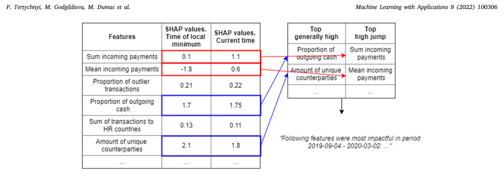

고객은 이미 이전의 반복에 모니터링하고 새로운 정보가 추가되었습니다. 연수기간은 9월 2018–10월 2019(56주) 및 테스트(모니터링) 기간이 10월 2019–4월 2020(25주)입니다. 우리는이 모델이 훈련되고 연습에서 사용 된 방법을 반영하기 때문에 단일 임시 분할을 사용합니다. 훈련은 T 전에 사용할 수있는 데이터에 항상 Tbased T를 기반으로하며 테스트는 특정 테스트 기간 동안 포인트 T를 사용할 수 있도록합니다 (Sheridan, 2013).

데이터는 특정 시간 포인트 T에서 고객 여부 또는 아니 여부를 예측하는 분류 모델을 훈련하는 데 사용되며보고 된 고객 또는 그렇지 않은 사람과 유사한 활동에 종사합니다. 다른 말에서 사용되는 라벨은 ''reported''' versus ''''고객입니다. 분류 모델을 훈련하는 데 사용되는 접근은 위의 Proposed Approach 섹션에서 설명 된 것입니다 (Tertychnyi et al., 2020).

### 4.2 재조정 경고 처리 (RQ1)

RQ1의 첫 실험은 고객에게 illicit의 확률이 높을 때 경고가 제기되는 기본 (기본) MS를 제안 (주문) MS를 비교하여 RQ1를 요구합니다. predefined 임계값 (클래스로 확률을 변환하는 표준 방법)을 초과합니다. 이 질문에 대한 존중으로, 작업 hypothesis는 기본 MS가 줄에 몇 주 동안 정기적 인 (주간) 경고를 생성하는 것입니다, 그들 중 대부분은 중복, 사용자 정의 MS가 주어진 고객을위한 중복 경고를 생성 할 것입니다, 단지 sporadically. 이 실험을 위해 0.5의 기본 임계값과 0.2의 점프 임계값을 사용자 정의 MS에 사용하며, 기본 MS (캘리브레이션 확률)의 0.5의 임계값을 사용합니다. 유틸리티 사다리꼴 매개 변수의 매개 변수는 다음과 같이 설정되었다: 낮은 기초의 시작 – 16 주 전에 보고서 날짜, 낮은 기초의 끝 – 8 주 후 보고서 날짜, 상단의 시작 – 6 주 전에 보고서 날짜, 상단의 끝 – 2 주 전에 보고서 날짜. 이 경고는 4 개월 전에 또는 2 개월 전에 발생 한 경고는 보고서 날짜가 어떤 유틸리티가 없으며, 6 주 전에 2 주 전에 경고가 최대 가능한 유틸리티가 있습니다. 경고가 사용자 정의 MS에 의해 제기 된 경우 기본 MS뿐만 아니라,하지만 부버 (Fig를 참조하십시오. 7).

기본 MS가 재조정 경고 요구 사항을 처리하지 않는 것을 강조하려면 사용자 정의 MS가 수행 한 동안 우리는 고객 당 제기 된 경고 수의 배포를 플롯합니다 (Fig를 참조하십시오. 8). 25 주의 테스트 기간 동안 고객 당 3 경고까지만 모이는 관례 MS가 보일 수 있습니다. 동시에, 기본 MS는 고객 당 25 알림까지 제기, 이는 일부 고객이 모니터링의 매주 경고를 의미.

### 4.3 사용자 정의 MS (RQ2)의 성능

다음 질문은 사용자 정의 MS의 성능을 평가하는 방법. AML 모니터링을 수행 할 때, 우리는 많은 고객이 경고를 받았는지뿐만 아니라 그 고객을 위해 많은 경고가 제기 된 방법을 걱정합니다. 이것은 우리가 감시 시스템의 성과를 이해하기 위하여 2개의 혼란 모조 (CM)를 분석해야 하는 것을 의미합니다:

1. - 비디오 Alert Level CM – CM 한 객체가 하나의 customernapshot입니다. CM에 존재하는 한 고객에 관한 여러 객체가 있습니다. CM는 alert 레벨에 정의되어 다음과 같이 정의됩니다.

- TP - 경고는 보고된 고객의 스냅샷을 위해 제기되었다 • FP - 경고는 결코 보고된 고객의 스냅샷을 위해 제기되었다 • TN - 경고는 결코 보고된 고객의 스냅샷을 위해 제기되지 않았다 • FN — 경고는 보고한 고객의 스냅샷을 위해 제기되지 않았다

2. - 비디오 Entity Level CM – CM 한 객체가 하나의 고객입니다. 따라서 모델 모니터링의 결과는 고객 중 적어도 하나의 스냅 샷이 경고 (적정 시간 프레임에서)를 생성 한 규칙에 의해 엔티티티티 수준 CM에 긍정적 인 예측을받습니다. 특정한, 법인 수준에 CM는 다음과 같이 정의됩니다:

- TP - 고객은 적어도 한 번보고 한 MS는 적어도 하나의 경고를 제기했습니다 • FP - 고객은 적어도 하나의 경고를 제기 한 MS가보고되지 않았습니다 • TN - 고객은 결코보고되지 않았으며 MS는 경고를 제기하지 않았습니다 • FN - 고객은 적어도 한 번보고 한 MS는 어떤 경고를 제기하지 않았다

**표 1는 587의 테스트 세트에 관례 MS를 위한 엔티티티 레벨 및 경고 수준 CM을 보고하고 97911는 감시의 25 주에 무작위로 표본으로 고객 보여줍니다.**

RQ1에 대한 답변에서 사용자 정의 MS 핸들 재조정 경고를 처리하고 3 경고는 25 주의 테스트 모니터링 기간에 대한 단일 고객에 대해 제기했다. 따라서, CM에서 위의, 그것은 381 경고 발생 (알ert Level TP) 298에 고객 (환경 수준 TP)보고되었다는 것을 알 수있다. 동시에, 경고가 제기되지 않은 고객에보고 된 9856 스냅 샷이 있습니다 (등록 수준 FN) 및 289는 경고를받지 않은 고객을보고 (특허 수준 FN). 표준 경고 레벨 리콜 (calculated)

<!-- 원문 8쪽 -->

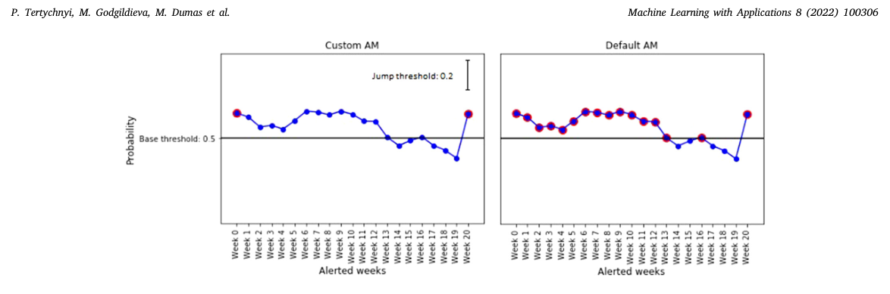

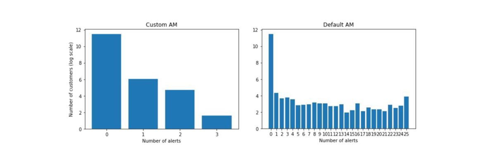

**표 1 Alert 레벨 CM (왼쪽) 및 일반 레벨 CM (오른쪽) 테스트 세트에서 고객에게 맞춤 MS로 제기 된 경고.**

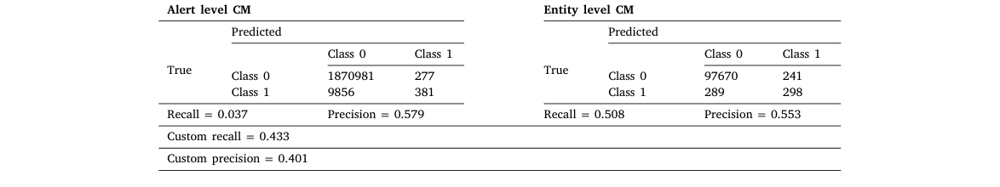

𝑟𝑒𝑐𝑎𝑙𝑙= TP TP+FN로)는 눈에 띄게 작습니다. 이것은 더 낮은 크기였습니다 — 보고한 고객이 1 경고를 25 주의 시험 감시 기간에 가지고 있는 경우에, 그 후에 경고 수준 CM에서 우리는 TP에 +1를 얻고 +24를 FN에 얻습니다. 그리고 리콜이 경고받은 고객의 비율을 나타내기 때문에, 우리는 Recall가 엔티티티티티티티 수준에 계산되어야한다는 결론에 왔습니다. 표 1에서 277 경고 발생 (직위 수준 FP) 241 무작위로 샘플 고객 (성도 수준 FP)이 있음을 알 수 있습니다. 정밀도 (𝑝𝑟𝑒𝑐𝑖𝑠𝑖𝑜𝑛= TP TP+FP로 산출되는) 그것은 경보 수준과 법인 수준 CMs 둘 다를 위한 유사한 수를 보여주기 위하여, 정밀도가 AML 감시 업무를 위한 제대로 올려진 경고의 비율을 나타내기 때문에, 경고 수준에 산출되어야 합니다. 모니터링 시스템의 최종 사용자는 AML 도메인 전문가로 경고를 올리고, 정확하게 계산된 정밀도(오류 수준에 정밀)는 시스템의 성능에 대한 더 정확한 평가를 제공하며, 인체적 작업 부하의 추정에 도움이됩니다. 결론을 내기 위해, 사업 필요에 따라, AML MS의 정밀도는 법인 수준에 계산되는 동안 경고 수준에 계산되어야 합니다.

앞서 언급한 것처럼, 모니터링 설정의 주요 요구 사항은 제기 된 경고의 타이밍입니다. 매우 이른 경고 또는 매우 늦은 경고는 FP로 간주되어야한다. CM과 Recall 및 정밀도의 표준 정의는 제기 된 경고의 타이밍 측면을 반영 할 수있는 용량이 없습니다. 따라서 그 지표는 MS의 실제 성능을 나타냅니다. 계정 타이밍 측면으로 복용하여 성능 평가를 제공하지 않는 것을 제공하기 위해, 우리는 사용자 정의 회신 및 사용자 정의 정밀도 (제 3.2 참조)을 설계했습니다. 위에서 설명한대로, 제안된 사용자 정의 회담은 엔티티티티 수준에서 계산되며, TPs는 보고서 날짜에 가까운 경고만 발생했습니다. 사용자 정의 정밀도, 차례로, 또한 보고서 날짜에 가까운 경고를 고려하고 초기 경고를 곱합니다.

위 정의된 매개변수를 가진 관례 MS를 위해 (기초 문턱 = 0.5와 점프 문턱 = 0.2), 우리는 0.433의 관례 회귀를 얻고 0.401의 관례 정밀도. 본 연구에서는 엔티티에 기반한 리콜 및 경고 기반 정밀도 (recall = 0.508 및 정밀 = 0.579 표 1)에 표시된 것과 같은 값을 비교하면 실질적인 차이를 볼 수 있습니다. 이 관측은 AML MS 성능의 정확한 추정을 얻기 위해 성능 측정의 정의에 경고의 타이밍을 고려하는 중요성을 강조합니다.

<!-- 원문 9쪽 -->

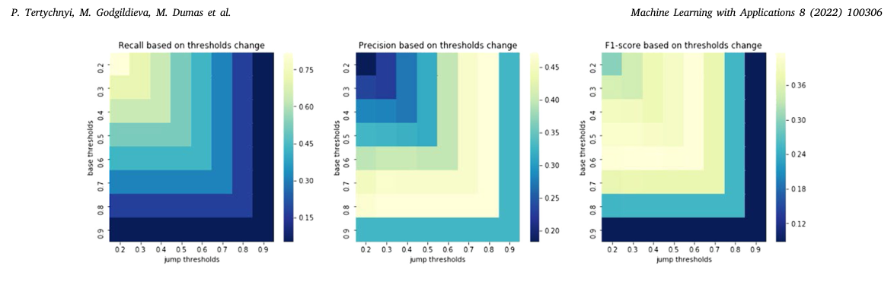

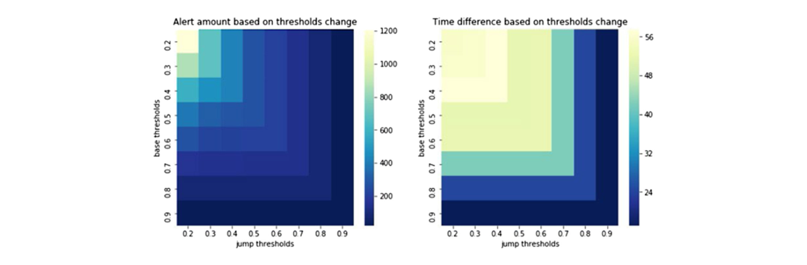

### 4.4 사용자 정의 MS (RQ3) 조정

사용자 정의 MS의 동작을 분석하기 위해 우리는 매개 변수의 그리드 검색 및 계산 된 사용자 정의 회담, 사용자 정의 정밀도 및 사용자 정의 F1 점수 (Fig 참조. 9).

가장 높은 리콜은 가장 작은 가능한 임계 값으로 달성된다는 것을 관찰합니다. 이것은 가장 작은 문턱으로 인해 정확하므로 최대의 경고를 올릴 것입니다. 따라서 illicit 행동으로 고객의 최대 수를 잡을 것입니다. 기본 임계 값과 점프 임계 값이 둘 다 0.7-0.8의 범위에서 매우 높은 임계값과 함께 보여주는 높은 정밀도가 고객 당 제기 된 경고의 매우 제한 수 있어야하며 가장 적절한 시간에 제기됩니다. F1 점수로, 기본 임계값과 임계값이 0.5–0.6 범위에 있을 때 가장 높은 숫자가 달성됩니다. 그 범위에서, 정밀도와 리콜 사이의 평형은 도달합니다. 절대로, 매개 변수의 최종 결정은 주제 매트 전문가에 의해 만들어야한다.

경고의 타이밍은 감시 시스템의 상황에 결정되므로, 우리는 보고서 날짜와 사용자 정의 MS의 다른 매개 변수와 함께 테스트 세트에서보고 된 고객을위한 첫 번째 경고 날짜 사이에 평균 시간을 측정합니다. 함께, 우리는 직접 최종 사용자의 워크로드를 정의하는 제기 된 경고 수를 측정 (Fig를 참조하십시오. 10).

경고 날짜와 보고서 날짜 사이의 시간 차이의 음소거에서, 우리는 F1-score (기본 임계값을 극대화하고 임계값을 점프하는 매개 변수가 0.5-0.6)의 범위에서 모두 45-50 일의 평균 시간 차이를 볼 수 있습니다. 이 동전은 우리가 제기 된 경고를위한 최대 유틸리티를주는 시간 기간으로 잘 - 6 주 전에 2 주 전에.

이 관측은 F1 점수가 매개변수 임계값을 조정하는 적절한 측정을 제안한다. 경고에서 열지도를, 우리

**표 2 샘플 테스트 라운드의 개요.**

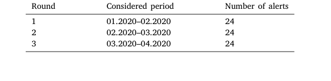

문턱이 더 낮아지도록 관찰하면 더 많은 경고가 제기됩니다. 주제 매트 전문가는 이러한 열지도를 사용하여 임계값에 대한 결정을 내릴 수 있습니다.

### 4.5 도메인 전문가 평가 (RQ4 및 RQ5)

경고 설명의 유용성은 3 테스트 라운드를 통해 평가되었습니다. 이러한 테스트 라운드의 각, 우리는 무작위로 8 경고를 선택 3 국가의 각각에 대한 사용자 정의 MS에 의해 제기, 연구에 포함, 테스트 라운드 당 24 경고의 총에 지도 (표 2 참조). 각 경고는 AML 도메인 전문가가 질문에 대한 답변을 받았습니다. 이 분석에 따라, 조사관은 경고의 고위와 정확성을 명시하고 관련 설명의 유용성을 나타냅니다. 이 실험의 목적에 대해 설명의 평가에 초점을 맞추고 있습니다. 경고에 대한 설명으로, 주제는 가장 기여하는 특성 (상 SHAP 값) 및 5 특성의 5를 가장 변경 (상위 델타 SHAP 값) 특성 그룹의 인간 읽기 쉬운 표현에서 소화. 각 경고는 10 FGs까지 대표됩니다. 1개 이상의 기여 특성은 동일한 그룹, 예를 들어 있을 수 있습니다. 2 특성, 들어오는 지불의 의미 및 주어진 지불금의 합계는 1개의 FG ‘‘Payments 본 들어오는 거래'로 떨어졌습니다.

<!-- 원문 10쪽 -->

### P. 테티키니, M. 의정부관광청 Dumas 외. 응용 프로그램 8 (2022) 100306와 기계 학습

**표 3 시간의 주파수 FGs는 3 샘플 테스트 라운드에서 유용했다.**

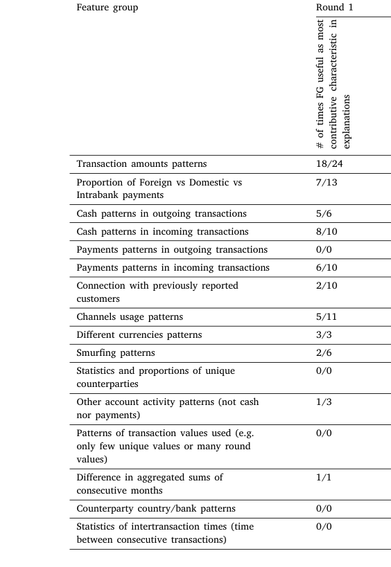

> **주:** # 시간의 FG 유용

> **주:** 가장 많이 변화하는 특성

> **주:** 설명

> **주:** # 대부분의 FG 유용한 시간

> **주:** 관련 특징

> **주:** 의 특징

> **주:** # 시간의 FG 유용

> **주:** 가장 많이 변화하는 특성

> **주:** 설명

> **주:** # 대부분의 FG 유용한 시간

> **주:** 관련 특징

> **주:** 의 특징

> **주:** # 시간의 FG 유용

> **주:** 가장 많이 변화하는 특성

> **주:** 설명

> **주:** 거래 금액 패턴 18/24 8/10 23/24 3/3 19/23 0/0

> **주:** 거래 0/0 1/1 0/0 0/0 1/1 0/0X

> **주:** 채널 사용 패턴 5/11 1/1 2/2 1/1 10/10 0/0

> **주:** 다른 통화 패턴 3/3 2/2 2/4 1/1 2/2 0/0

상기 설명 (제 3.4), 경고가 모니터링의 첫 주에 제기되는 경우, 경고의 설명은 5의 가장 기여한 특성 만 구성됩니다.

모든 3 샘플 테스트 라운드 및 계산 주파수에서 등장하는 모든 FGs는 가장 기여 (TOP SHAP) 특성과 가장 변화 (top delta SHAP) 특성 설명에 유용하게 발견되었다 (표시 3 참조). 이 테이블에 7/13의 값은 테스트 라운드 동안 주어진 FG는 13 시간을 (13 다른 제기 경고) 표시와 7 시간이 지남에 따라 유용하게 발견되었습니다. 일부 FGs는 가장 기여하거나 가장 변화하는 것일 수 없었던 이후로 모든 것에 대한 설명에 나타나지 않았습니다.

FG는 모든 경고에서 지배적 존재하고 거의 존재한다는 것을 관찰합니다. 대부분의 '거래 amount pattern'과 'Cash pattern in outgoing 거래''은 FGs가 있으며, 모든 3개의 테스트 라운드에 대해 한 번만 등장하는 FGs가 가장 주목할만한 ''의 통계적 ''입니다. 지배적 인 FGs는 일반 고객의 행동을 나타냅니다. 지배적 인 FGs는 행동의 특정 측면을 나타냅니다.

AML 도메인 전문가로부터 받은 피드백을 바탕으로 첫 라운드 이후 (초회 후), 우리는 우리가 설명을 제시하는 방법을 개선했습니다. FG ‘‘Connection with before report customers''에 대해 예시를 할 수 있습니다. 이 특성은 그룹은 고객이 알려진보고 된 반역과 접촉하여 얻은 사실로 표시 된 첫 번째 테스트 라운드에서 도메인 조사에 의해 유용하지 않았습니다. 이 FG와 관련된 초기 설명이 정확하고 보고 된 반대를 강조하지 않았기 때문에 도메인 전문가를 도울 수 없었다. 우리는, 따라서, 질문에 대한 반대 부분과이 FG를 언급 한 각 경고의 설명을 동반하는 피드백을 업데이트. 이 업데이트 후 라운드 2에서 시작, 우리는이 FG의 인식 유용성에 대한 개선을 통지. 또한, 첫 번째 라운드에서, FGs의 일부는 도메인 전문가가 혼란을 발견 한 방식으로 이름을 따서 두 번째와 세 번째 테스트 라운드에 대해 재공식화했다. 결론을 내기 위해, 돈 세탁 탐지 MS의 최종 사용자로부터 피드백을 기반으로, 생성 된 경고 설명은 조사를 시작하는데 도움이 될 것으로 나타났습니다.

## 5 결론

본 논문에서는 다국적 금융기관의 AML 모니터링의 맥락에서 사용되는 예측 MS의 사용 사례 연구를 발표했습니다. MS 주소는 정확하고 비 중복 및 적시 경고 생성의 요구 사항을 충족합니다. 아래 ML 기반 돈 세탁 감지 모델은 고객의 행동의 스냅 샷에 훈련되어, 과거 보고서에서 나오는 라벨과 함께 돈 세탁의 식별 된 사례를 보냈습니다. 알림을 생성하기 위해 ML 모델의 출력 점수는 고객의 행동 변화로 즉시 경고를 올리는 디자인 된 MS로 전달됩니다. MS가 생성한 알림의 알림 및 타이밍을 고려한 사용자 정의 예측 품질 지표는 사용됩니다. 이 사용자 정의 품질 미터는 MS 매개 변수를 최적화하는 데 사용되며 최적화 된 MS가 해당 조사가 관련되어 중복 순차적 경고를 올리는 것을 방지 할 때 시간과 가까이 경고를 생성합니다.

발표된 예측 MS 시스템은 또한 생성된 필요조건의 easyof 사용 요구에, 특히 해결하기 위하여 디자인됩니다

<!-- 원문 11쪽 -->

### P. 테티키니, M. 의정부관광청 Dumas 외. 응용 프로그램 8 (2022) 100306와 기계 학습

경고는 경고의 경고와 타이밍에 대한 이유와 관련된 설명에 의해 동반되어야한다. 설명 생성에 대한 접근은 Shapley 값에 근거하지만, 고도 특성 그룹 설명의 수준에 들어, AML 도메인 전문가가 조사를 시작하도록 돕기 위해 설계.

제안 된 방법은 다국적 금융 기관의 실제 산업 응용 프로그램의 컨텍스트에서 설계되었으며 실제 생활 데이터를 사용하여 평가 및 AML 조사자로부터 피드백을 받았습니다. 표준 기본 MS가 사용자 정의 MS 접근과 비교하여 중복 경고의 상당한 수를 생성합니다. AML 사업에 따라, 리콜은 엔티티티티 수준에서 계산되어야하며, 정밀는 경고 수준에서 계산되어야합니다. 다른 말에서, 거짓 긍정적은 경고 수준 (신호 경고)에서 피해야, 거짓 부정적인은 엔티티티티티 수준 (누드 illicit 고객)에서 피해야. 실험에서 표준 리콜 (인체 수준에 따라 계산) 및 정밀도 (인체 수준에 따라 계산)이 실질적으로 MS의 실제 성능에 따라 실질적으로, 그들은 계정의 리커링 경고와 경고 측면의 타이밍에 걸릴 용량이 없기 때문에. 반대에서, 사용자 정의 미터는 계정으로 이동 aforementioned AML 측면, 따라서 MS 성능의 더 정확한 평가를 제공합니다. 요약하면, 평가는 제안 된 사용자 정의 미터를 사용하여 최적화 된 예측 MS가 스테이크에 두 가지 문제를 해결 할 수 있음을 보여 주었다: 경고의 타이밍과 중복 재조합 경고를 피.

Empirical 평가는 AML 도메인 전문가와 함께 3개의 테스트 라운드를 통해 생성된 경고의 해석성을 평가했습니다. 이 평가는 조사자가 해당 경고를 조사하기 위해 시작점으로 설명이 유용하다고 인정했다. 해석성 개선을 위한 미래 업무로서, 이는 경고의 설명 세대에 대한 상호적인 설명 접근을 적용하는 것으로 간주됩니다. 이 접근법은 분류 모델 결정을 변경하기 위해 필요한 고객 행동의 최소 변화를 강조 할 수있는 '''문헌 유형과 함께 생성 된 텍스트 설명이있을 수 있습니다.

도메인 전문가와의 empirical 평가에는 유효성 및 제한에 대한 위협이 있습니다. 첫 번째 평가는 사례 연구 연구에 관련된 검증에 전형적인 생태 위협이, 특히 연구가 단일 조직에서 수행 된 사실 때문에 제한된 일반성. 그러나, 우리는 평가는 3 개국 (및 각 국가의 다른 도메인 전문가)에 포함. 둘째, empirical 평가는 경고의 감소된 수를 사용하여 만들어졌습니다. 더 큰 규모의 평가는 더 일반적인 결론을 그리기 위해 필요합니다. 세 번째, 인식 relevance에 초점을 맞춘 평가 및 인식 유용성. 매일 사용 설정에서 사용자의 수용에 대한 심층 평가는 MS의 전체 채택에 잠재적 인 장벽으로 더 통찰력을 이끌어 낼 수 있습니다.

CRediT 승인 기여 성명 Pavlo Tertychnyi: 개념화, 방법론, 소프트웨어, 쓰기 - 원본 초안. Mariia Godgildieva: 방법론, 소프트웨어. Marlon Dumas: 감독, 쓰기 – 리뷰 & 편집. Madis Ollikainen: 개념화, 감독.

이 문서는 저작권법에 따라 해석됩니다. 이 문서는 저작권법에 따라 해석됩니다.

## 감사의 글

이 연구는 NUTIKAS 프로그램을 통해 ERDF에 의해 일부 자금을 받고 Estonian Research Council (grant PRG1226)에 의해.

## 참고문헌

Ahmed, A. A. A. (2021). Anti-money laundering recognition through the gradient

boosting classifier. Academy of Accounting and Financial Studies Journal, 25(5). Alkhalili, M., Qutqut, M. H., & Almasalha, F. (2021). Investigation of applying

machine learning for watch-list filtering in anti-money laundering. IEEE Access, 9, 18481–18496. Chao, X., Kou, G., Peng, Y., & Alsaadi, F. E. (2019). Behavior monitoring methods for

trade-based money laundering integrating macro and micro prudential regulation: a case from China. Technological and Economic Development of Economy, 25(6), 1081–1096. Chen, Z., Soliman, W. M., Nazir, A., & Shorfuzzaman, M. (2021). Variational au-

toencoders and Wasserstein generative adversarial networks for improving the anti-money Laundering process. IEEE Access, 9, 83762–83785. Dachraoui, A., Bondu, A., & Cornuejols, A. (2015). Early classification of time series as

a non myopic sequential decision making problem. In Joint european conference on machine learning and knowledge discovery in databases (pp. 433–447). Cham: Springer. Fawcett, T., & Provost, F. (1997). Adaptive fraud detection. Data Mining and Knowledge

Discovery, 1(3), 291–316. FCE Network (2020). History of anti-money laundering laws. United States Department

of the Treasury. He, G., Duan, Y., Peng, R., Jing, X., Qian, T., & Wang, L. (2015). Early classification

on multivariate time series. Neurocomputing, 149, 777–787. Jullum, M., Løland, A., Huseby, R. B., ˚ Anonsen, G., & Lorentzen, J. (2020). Detecting

money laundering transactions with machine learning. Journal of Money Laundering Control. Ketenci, U. G., Kurt, T., Önal, S., Erbil, C., Aktürkoˇglu, S., & Ilhan, H. Ş (2021). A

time-frequency based suspicious activity detection for anti-money laundering. IEEE Access, 9, 59957–59967. Kull, M., Silva Filho, T., & Flach, P. (2017). Beta calibration: a well-founded and easily

implemented improvement on logistic calibration for binary classifiers. In Artificial Intelligence and Statistics. PMLR, Article 623631. Lundberg, S. M., & Lee, S. I. (2017). A unified approach to interpreting model

predictions. In Proceedings of the 31st international conference on neural information processing systems (pp. 4768–4777). Mubalaike, A. M., & Adali, E. (2018). Deep learning approach for intelligent financial

fraud detection system. In 2018 3rd international conference on computer science and engineering (pp. 598–603). IEEE. Raiter, O. (2021). Applying supervised machine learning algorithms for fraud detection

in anti-money laundering. Journal of Modern Issues in Business Research, 1(1), 14–26. Shapley, L. S. (1953). Contributions to the theory of games. In Chapter a value for

n-person games. Sheridan, R. P. (2013). Time-split cross-validation as a method for estimating the

goodness of prospective prediction. Journal of Chemical Information and Modeling, 53(4), 783–790. Sipos, R., Fradkin, D., Moerchen, F., & Wang, Z. (2014). Logbased predictive mainte-

nance. In Proceedings of the 20th ACM SIGKDD international conference on knowledge discovery and data mining (pp. 1867–1876). Tertychnyi, P., Slobozhan, I., Ollikainen, M., & Dumas, M. (2020). Scalable and

imbalance-resistant machine learning models for anti-money laundering: A twolayered approach. In Markets and services in the finance industry, International workshop on enterprise applications (pp. 43–58). Cham: Springer. Xing, Z., Pei, J., Yu, P. S., & Wang, K. (2011). Extracting interpretable features for

early classification on time series. In Society for industrial and applied mathematics, Proceedings of the 2011 SIAM international conference on data mining (pp. 247–258). Zhang, K., Xu, J., Min, M. R., Jiang, G., Pelechrinis, K., & Zhang, H. (2016). Automated

IT system failure prediction: A deep learning approach. In 2016 IEEE international conference on big data (pp. 1291–1300). IEEE.
