# Flagright Transaction Monitoring 조사

> **조사 대상:** Flagright Transaction Monitoring의 룰 엔진과 AI·머신러닝 기반 탐지 기능  
> **공식 페이지:** [Real-Time Transaction Monitoring Software](https://www.flagright.com/transaction-monitoring#rule-engine)  
> **정리 기준:** 기존에 기록한 문장과 캡처의 등장 순서는 유지하고, 각 화면이 담당하는 기능과 실제 사용 흐름을 보충했다.

## 1. 서비스 개요

FRAML 모니터링 시스템
- AL 기반 노코드 규칙 엔진으로 60초 만에 규칙 생성이 가능

Flagright는 AML과 사기 방지를 하나의 거래 모니터링 플랫폼에서 다루는 **FRAML(Fraud + AML)** 솔루션이다. 공식 페이지에서는 자연어 기반 AI 룰 생성, 노코드 IF/THEN 룰 설정, 머신러닝 이상 탐지, 임계값 추천, 시뮬레이션, 섀도우 룰, 동적 위험 기반 임계값을 주요 기능으로 제시한다.

> 위 문장의 `AL 기반`은 공식 설명의 `AI-native`를 가리키는 것으로 이해할 수 있다. 공식 페이지에서 제시하는 `60초`는 검증된 룰 생성 시간이라는 공급사 설명이다.

### 지원하는 거래 모니터링 실행 방식

- **실시간 모니터링:** 거래 발생 시점에 탐지 로직을 실행한다.
- **사후 처리(Post-processing):** 거래가 완료된 후 동일한 탐지 로직으로 검사한다.
- **배치 실행:** 예약된 시점에 대량 거래를 일괄 검사한다.

즉, Flagright는 실시간 처리만 제공하는 FDS 전용 제품이 아니라 실시간·사후 처리·배치 TMS를 모두 지원하는 구조다.

## 2. 룰 엔진 인터페이스

### 2.1 룰 생성 화면

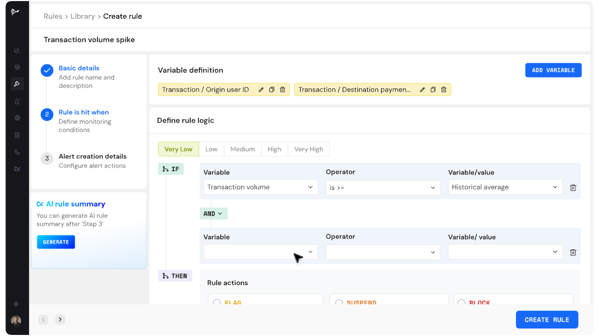

변수와 조건을 선택해 `IF 조건 → THEN 조치`를 구성하는 화면이다. 예시에서는 거래량이 과거 평균 이상인지 판단하고, 조건 충족 시 `FLAG`, `SUSPEND`, `BLOCK` 등의 조치를 지정할 수 있다. 왼쪽 단계는 기본정보 입력, 탐지조건 설정, Alert 생성 설정 순서로 구성되어 있다.

### 2.2 룰 생성 완료

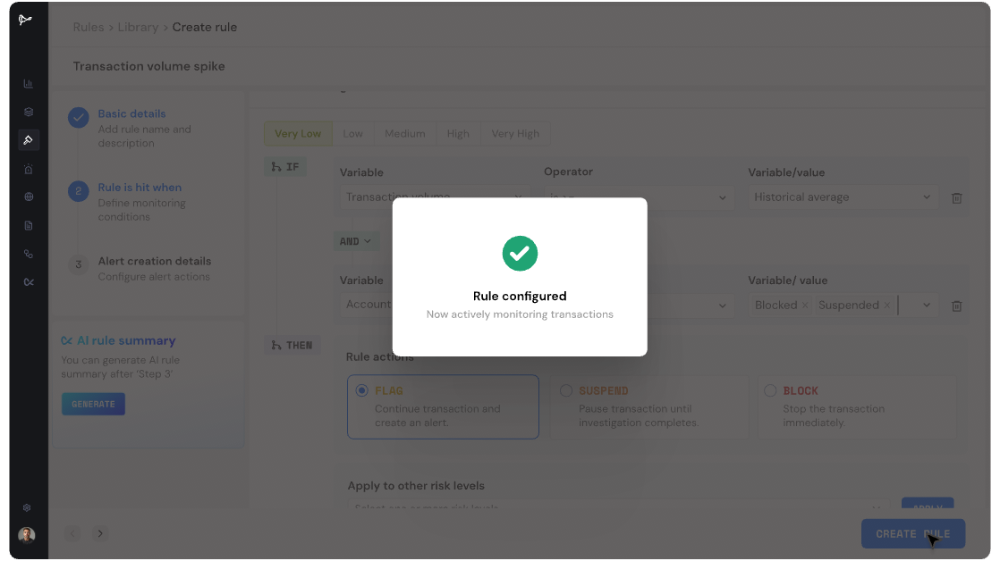

룰 생성이 완료되어 거래 모니터링이 시작되었음을 보여주는 화면이다. 화면상 룰은 거래를 계속 진행하면서 Alert만 생성하는 `FLAG`, 조사가 끝날 때까지 거래를 보류하는 `SUSPEND`, 거래를 즉시 중지하는 `BLOCK`과 연결할 수 있다.

> `SUSPEND`와 `BLOCK`은 실시간 거래 흐름을 제어할 수 있는 고객사 시스템과 연동된 경우에 의미가 있다. 일 배치 TMS로 기획하는 우리 시스템에서는 우선 `FLAG → Alert 생성`을 중심으로 보는 것이 적절하다.

### 2.3 운영 중인 룰 목록

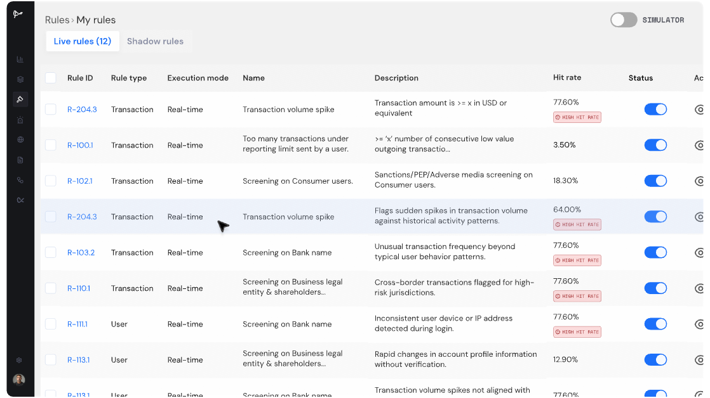

운영 중인 룰을 한 화면에서 조회하는 목록이다. 룰 ID, 대상 유형, 실행 방식, 이름, 설명, 적중률, 활성화 상태를 확인할 수 있으며 `Live rules`와 `Shadow rules`가 분리되어 있다. 적중률이 지나치게 높은 룰에는 별도의 경고가 표시되어 임계값이나 조건을 재검토할 수 있다.

### 2.4 개별 룰 성과 요약

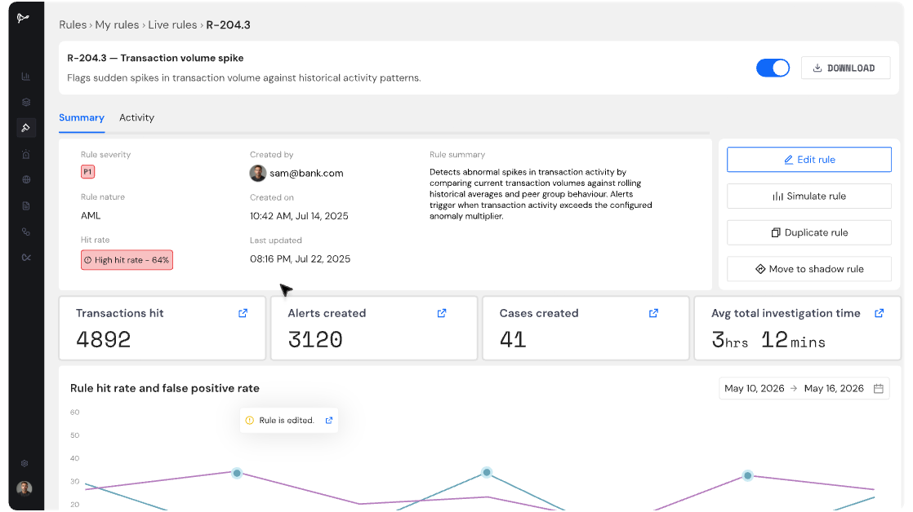

개별 룰의 심각도, 생성자, 생성·수정 시각, 룰 설명, 적중률과 운영 성과를 확인하는 화면이다. 룰 수정, 시뮬레이션, 복제, 섀도우 룰 전환 기능도 제공한다. `Transactions hit → Alerts created → Cases created`가 별도 지표로 표시되어 거래 적중, Alert, Case가 서로 다른 단위라는 점을 확인할 수 있다.

### 2.5 적중률·오탐률 추이

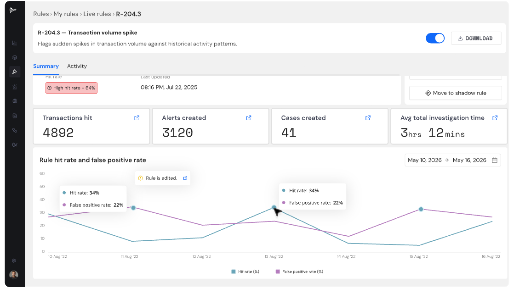

기간별 룰 적중률과 오탐률을 비교하는 화면이다. 룰 수정 시점도 차트에 함께 기록되므로 조건이나 임계값 변경이 탐지량과 오탐률에 어떤 영향을 주었는지 추적할 수 있다.

## 3. 노코드 시나리오와 AI 기능

설정 가능한 IF/THEN 논리, 행동 패턴, 동적 임계값 및 다변수 위험 오케스트레이션을 사용하여 정교한 거래 모니터링 시나리오를 구축하세요.

이 문장은 Flagright 룰 엔진의 핵심 구조를 요약한다. 룰 하나는 단순 금액 비교뿐 아니라 여러 변수, 고객 행동 패턴, 고객별 위험등급, 조건 조합과 실행 조치를 함께 가질 수 있다.

### 3.1 Alert 조사 자동화 화면

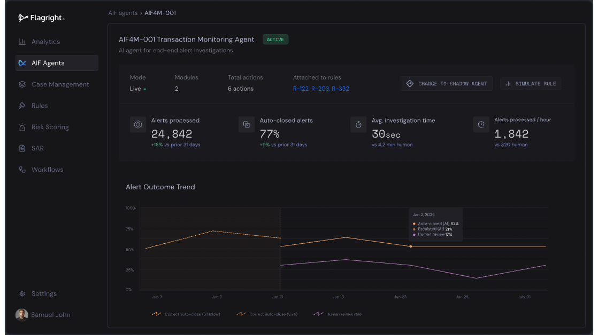

이 화면은 룰 생성기가 아니라 탐지 이후 Alert 조사를 자동화하는 **AI Forensics for Monitoring Agent** 화면이다. 처리한 Alert 수, 자동 종결 비율, 평균 조사시간, 시간당 처리량과 Alert 결과 추이를 보여준다. 공식 설명상 이 에이전트는 거래이력 수집, 거래상대방 관계 연결, 유형 매칭, SAR 서술 초안 작성 등을 수행한다.

> 따라서 Flagright의 전체 흐름은 `룰·ML 탐지 → Alert 생성 → AI 조사 보조 → 분석가 검토 → Case/SAR`로 이해할 수 있다.

### 3.2 AI Rule Builder 실행 예시

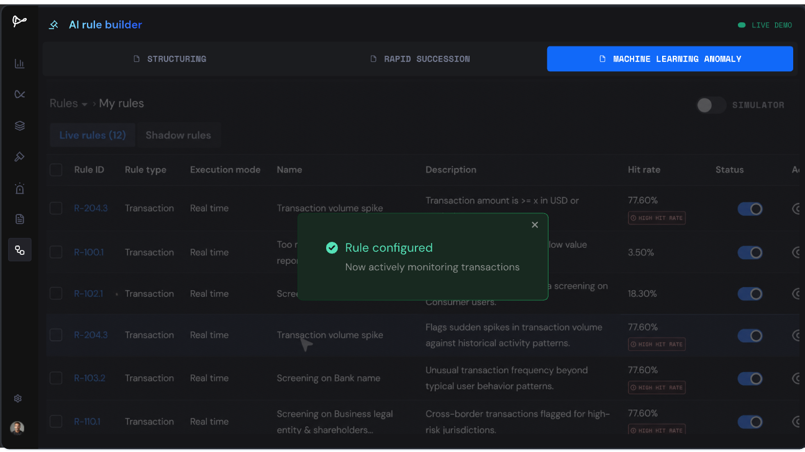

상단에서 자금세탁 유형을 선택하거나 머신러닝 이상 탐지를 선택해 룰을 만들 수 있는 예시 화면이다. 생성된 룰은 운영 룰 목록에 추가되며, 생성 후 바로 운영하거나 시뮬레이션·섀도우 모드로 검증할 수 있다.


## 4. 기능 설명 
### AI 규칙 생성기
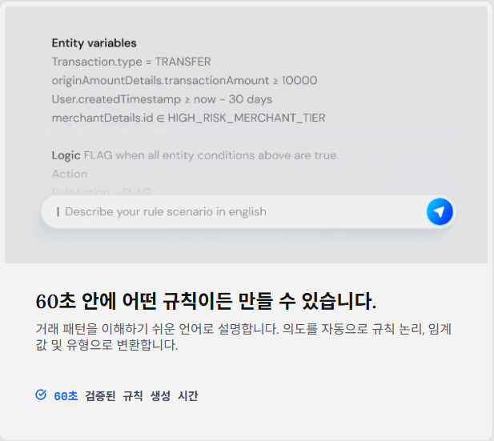

자연어로 의심 패턴을 설명하면 AI가 이를 변수, 조건, 임계값, 유형으로 변환해 룰 초안을 만든다. 완성된 룰을 자동 승인하는 기능이라기보다, 사용자가 검토하고 수정할 수 있는 룰 로직을 빠르게 생성하는 인터페이스로 보는 것이 적절하다.

### 머신러닝 규칙
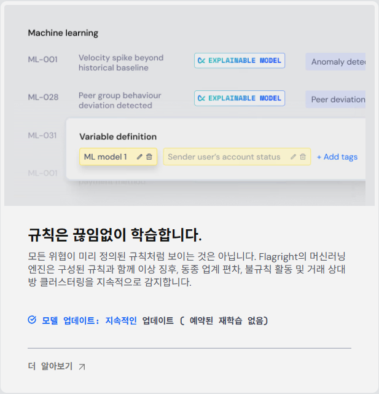

미리 정의된 정적 조건만 검사하지 않고 고객의 과거 행동 기준선과 동종집단을 이용해 이상을 탐지하는 영역이다. 공식 페이지는 거래속도 급증, 동종집단 이탈, 비정상 시간대 거래, 거래상대방 집중, 금액 증가 패턴, 휴면계좌 활성화를 예시로 든다. 이 머신러닝 탐지기는 사용자가 설정한 룰과 **병렬로 실행**된다고 설명되어 있다.

### AI 규칙 임계값 추천기
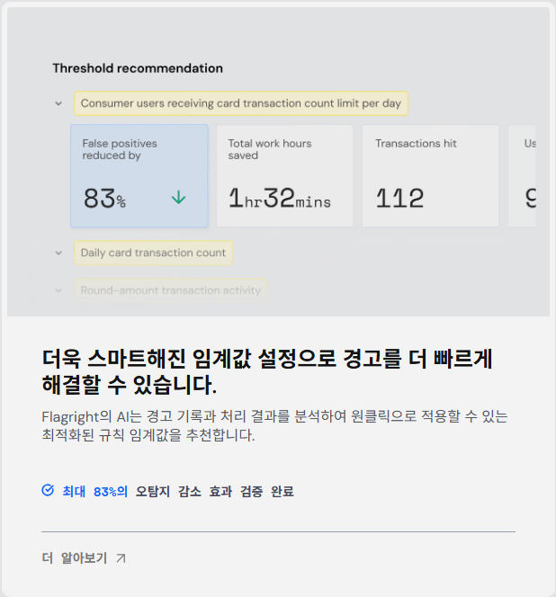

과거 Alert의 처리 결과를 분석해 룰 임계값을 추천하는 기능이다. 거래 적중 수, Alert 처리 결과, 오탐 여부 등이 충분히 축적된 뒤에 활용하는 튜닝 기능이며, 공식 페이지에서는 처분 결과가 기록된 Alert가 약 100건 이상인 룰을 이상적인 적용 대상으로 설명한다.

> 화면의 `최대 83% 오탐 감소`는 Flagright가 제시한 검증 결과이며, 모든 고객 환경에서 동일한 효과를 보장하는 수치는 아니다.

### 시뮬레이션 및 그림자 규칙
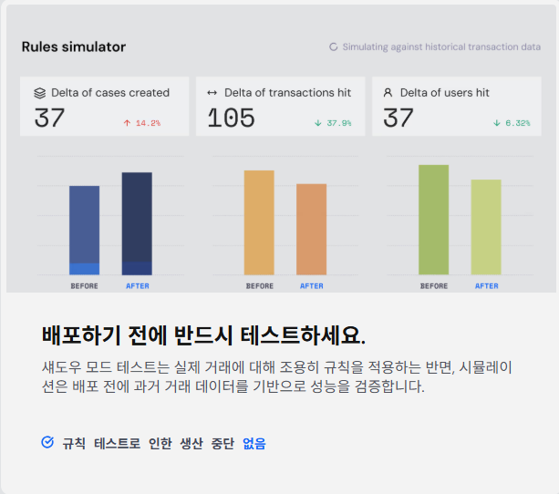

시뮬레이션은 운영 배포 전에 과거 거래에 룰을 적용해 변경 전·후의 거래 적중 수, 대상 고객 수, Alert·Case 발생량, 조사시간 등의 변화를 비교하는 기능이다. 섀도우 룰은 실제 운영 거래를 대상으로 실행되지만 일반 조사자에게 Alert를 노출하지 않는 검증용 모드다.

### 동적 위험 기반 모니터링
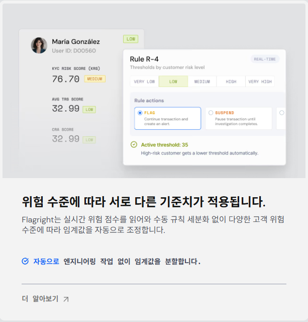

동일한 룰에서도 고객 위험등급에 따라 서로 다른 임계값을 적용하는 기능이다. 고위험 고객에게는 낮은 임계값을 적용해 더 민감하게 탐지하고, 저위험 고객에게는 높은 임계값을 적용해 불필요한 Alert를 줄인다. 이를 사용하려면 고객별 KYC·위험평가 점수가 Flagright에 입력되거나 플랫폼의 위험평가 기능과 연계되어야 한다.

## 5. 룰의 생성·검증·배포 흐름

Flagright가 제시하는 룰 운영 흐름은 `설명 → 테스트 → 그림자 운영 → 정식 배포`의 네 단계다. 룰을 만든 즉시 운영하는 것이 아니라 과거 데이터와 실제 거래에서 성능을 검증한 뒤 운영 룰로 전환하는 구조다.

#### 01 설명
모니터링하고 싶은 항목을 입력하세요
- 패턴을 자연어로 설명하고 미리 채워진 규칙 논리를 자동으로 생성하거나, 유형별로 태그가 지정되어 바로 사용자 정의할 수 있는 100개 이상의 사전 구성된 시나리오 중에서 선택하여 시작할 수 있습니다.
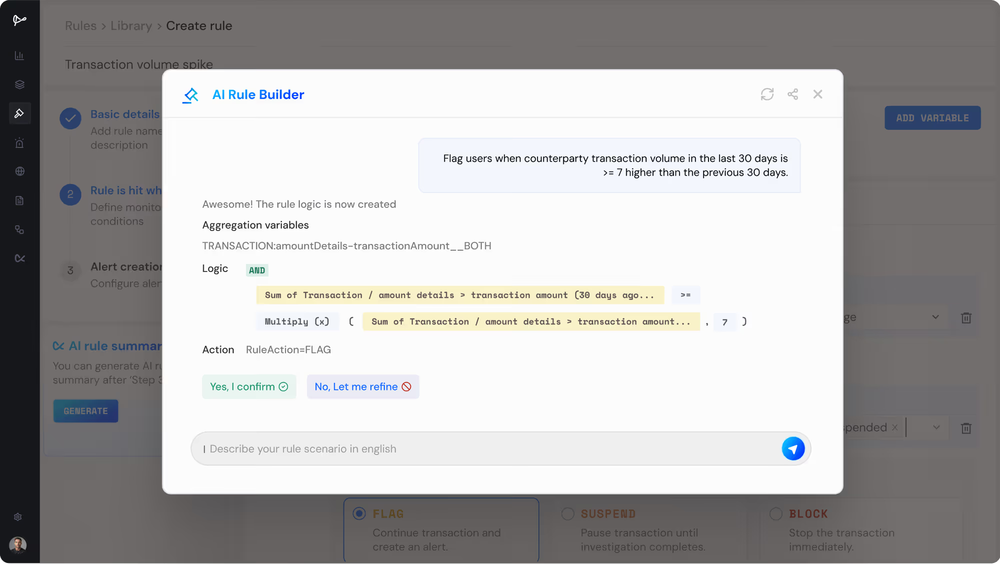

사용자가 자연어로 입력한 시나리오를 집계 변수, 기간, 비교 연산자, 배수와 실행 조치가 포함된 룰 로직으로 변환한다. 예시 화면에서는 최근 30일 거래상대방 거래량이 직전 30일보다 7배 이상인지 검사하는 조건을 생성하고 사용자의 확인을 기다린다.

#### 02 테스트
실제 데이터를 대상으로 테스트한 후 정식 출시하세요.
- 90일간의 과거 거래 내역을 기반으로 백테스팅을 수행하세요. 알림 발생량, 오탐률, AI가 권장하는 임계값 등을 모두 알림이 대기열에 추가되기 전에 확인할 수 있습니다.
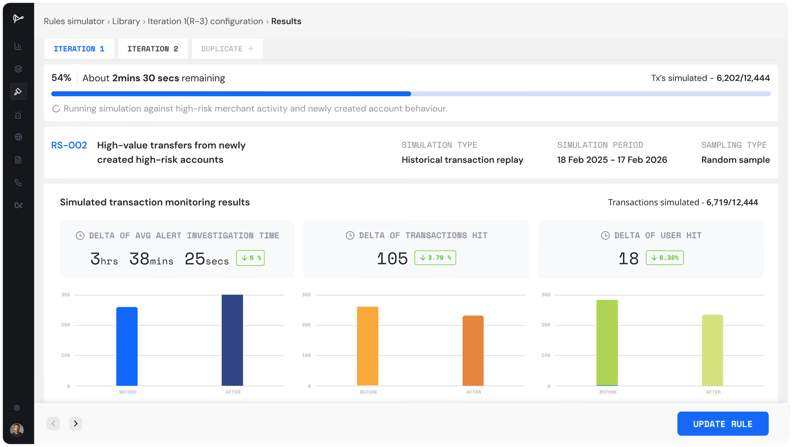

과거 거래를 재생해 룰 적용 전·후의 결과를 비교한다. 화면에서는 시뮬레이션 진행률, 대상 기간과 표본 방식, 거래 적중 수, 고객 적중 수, 평균 조사시간 변화를 확인한 뒤 룰을 수정할 수 있다.

#### 03 그림자
라이브 규칙과 함께 조용히 실행됩니다.
- 섀도우 모드로 배포하세요. 이 규칙은 실시간 거래를 모니터링하고 분석가에게는 보이지 않는 비공개 알림 피드를 생성합니다. 중단 없이 실제 환경에서 성능을 검증하세요.
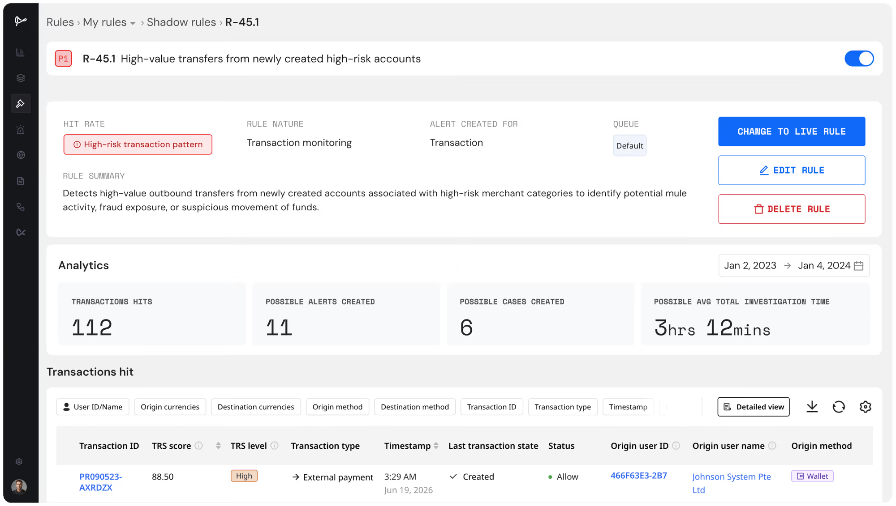

섀도우 룰 화면에서는 실제 운영 시 예상되는 거래 적중 수, Alert 수, Case 수와 평균 조사시간을 확인할 수 있다. 충분히 검증되면 `CHANGE TO LIVE RULE`을 통해 운영 룰로 전환한다.

#### 04 배포
단 한 번의 클릭으로 라이브 방송을 시작하세요 .
- 검증이 완료되면 테스트 환경에서 실제 운영 환경으로 전환하세요. 규칙에 대한 전체 감사 추적 기록이 생성됩니다. 임계값 수정, 일시 중지 또는 비활성화 등 모든 작업을 셀프 서비스 방식으로 수행할 수 있으며, 엔지니어링 팀의 개입이 필요하지 않습니다
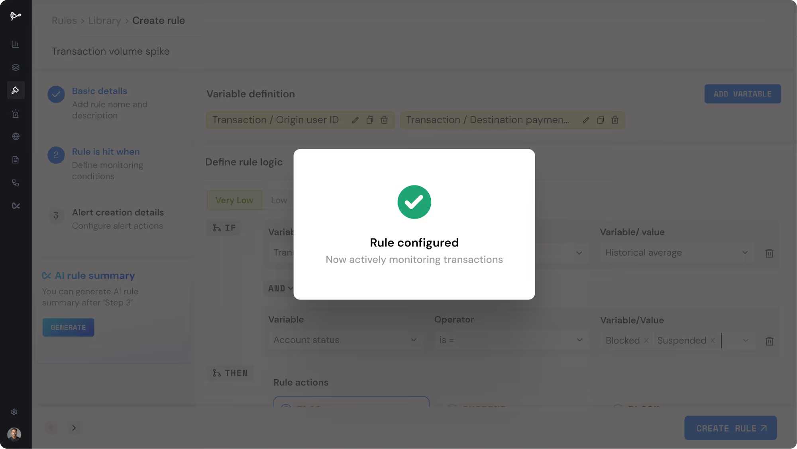

정식 배포 후에는 실제 거래를 모니터링하고 Alert를 생성한다. 공식 설명상 룰의 생성·수정·배포 이력과 각 버전을 저장하며, 권한 기반 Maker-Checker 승인 절차도 지원한다.

## 6. 전체 서비스 흐름

```text
고객·거래·KYC/위험정보 연동
→ 룰 엔진과 ML 이상탐지 병렬 실행
→ 룰 적중 또는 ML 이상 탐지
→ Alert 생성
→ AI Forensics 조사 보조 또는 분석가 검토
→ Case 생성·조사
→ 정상 종결 / 의심거래 판정
→ SAR 작성·제출
```

## 7. 우리 시스템 기획에 참고할 점

1. **룰과 모델의 관계:** Flagright는 정적 룰이 먼저 거래를 걸러낸 뒤 남은 거래만 모델에 전달하는 구조가 아니라, 설정된 룰과 ML 이상탐지를 병렬로 운영한다고 설명한다.
2. **룰 수명주기:** 룰 생성 기능만큼 `백테스트 → 섀도우 운영 → 정식 배포 → 성과 모니터링 → 임계값 조정`이 중요하다.
3. **단위 분리:** 거래 적중 수, Alert 생성 수, Case 생성 수를 분리해 관리한다. 여러 적중 거래가 하나의 Alert나 Case로 묶일 수 있음을 인터페이스에서 확인할 수 있다.
4. **위험 기반 임계값:** 고객위험평가를 직접 구현하지 않더라도 고객사로부터 위험등급을 받아 탐지 임계값에 반영할 수 있다.
5. **우리 MVP 적용 범위:** 일 배치 환경에서는 거래 차단보다 Alert 생성이 중심이다. 우선 룰·GNN 병렬 탐지, 결과 병합, Alert 생성, 룰 백테스트, 룰 버전·감사 이력을 핵심 범위로 잡는 것이 적절하다.

## 7. 확인 시 주의사항

- 이 문서는 Flagright 공식 제품 페이지와 캡처 화면을 기준으로 정리한 기능 조사다.
- 성능 수치와 고객 효과는 Flagright가 공개한 공급사 자료이므로 독립 검증 결과로 보아서는 안 된다.
- 캡처에 표시된 데이터, 사용자, 룰 ID와 성과 수치는 제품 기능을 설명하기 위한 예시 화면이다.
