# NAVER Cloud AMLXpress 서비스 조사

## 1. AMLXpress 주요 기능

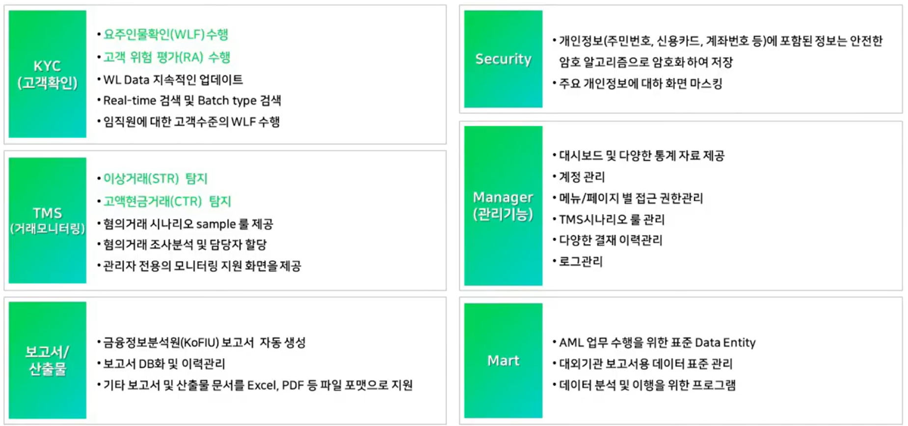

---

## 2. AML 클라우드 시스템 구성

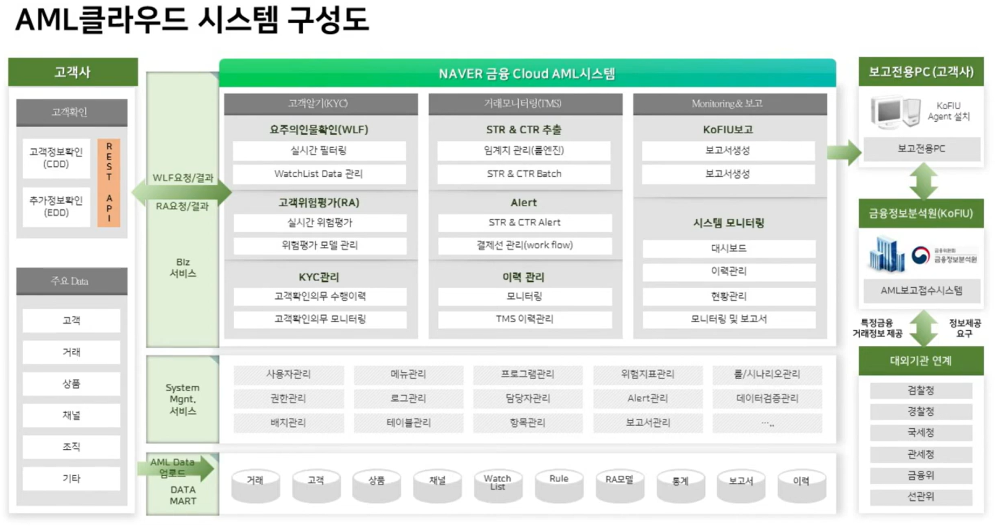

### 2.1 고객확인 및 위험평가 흐름

1. **고객사에서 고객 정보 확인**
    - 고객사는 상품 가입·고객확인 과정에서 신원, 국적, 직업, 거래 목적 등 CDD에 필요한 원천 정보를 수집·확인하고, 그중 요주의인물확인(WLF)과 고객위험평가(RA)에 필요한 값을 REST API로 AMLXpress에 보낸다.
    - AMLXpress가 고객의 신원 자체를 처음 확인하는 구조라기보다, 고객사가 확인한 정보를 받아 검색·평가하는 구조다.

2. **고객 위험평가에서 고위험을 받게 되면 추가 정보확인을 하게됨**
    - **확인 사항:** 고객 위험 평가는 누가하는건데? 고객사, AML시스템?
    - AMLXpress의 고객위험평가(RA) 엔진이 하고, 평가 기준의 설정과 결과에 따른 조치는 고객사가 책임진다.
    - 고객사는 위험평가 모델·지표·가중치 등의 정책을 정하고 AMLXpress는 이를 적용해 위험등급을 산출한다. 고위험으로 판정되면 고객사 담당자가 강화된 고객확인(EDD)을 수행한다. 즉, **시스템이 산출하고 고객사가 판단·조치한다.**

3. **restapi를 통해서 AML 시스템으로 데이터가 넘어옴**
    - 이 구성도의 REST API는 주로 WLF·RA 요청에 필요한 고객/KYC 정보를 보내고 그 결과를 받는 연동을 뜻한다. 고객 전체 원장을 통째로 넘긴다는 의미는 아니다. 거래·상품·채널·조직 등 TMS에 필요한 데이터는 그림 하단처럼 별도의 AML 데이터 업로드·데이터마트 적재 경로를 사용한다. 공개 자료에는 REST API의 정확한 필드 명세까지 나와 있지 않으므로 실제 구현 시 연동 명세를 별도로 확인해야 한다.

4. **이 넘어온 정보를 바탕으로 해서 요주의 인물확인이랑 고객위험평가를 함**
    - 서로 독립된 두 번의 위험평가로 보는 것은 적절하지 않다. 고객사는 CDD·EDD 정보를 수집하고 평가 정책을 정하며, AMLXpress의 RA 엔진이 그 정보와 정책을 사용해 위험점수·등급을 계산한다. 그림의 고객사 영역은 고객확인과 결과에 따른 업무 처리를, AML 시스템 영역은 실제 WLF 검색과 RA 계산을 나타낸다.

5. **이 정보를 다시 고객사에 돌려줘서 추가적인 정보를 확인할 지 하지 않을지에 대해서 판별을 함**

### 2.2 거래 모니터링 및 보고 흐름

6. **AML에서 활용 되는 데이터를 고객으로부터 넘겨 받으면 받은 데이터를 데이터마트에 넣음**

7. **하루에 한번씩 배치를 돌려서 거래 모니터링을 진행**

8. **이상거래랑 고액 현금 거래 체크후 레포트 생성하고 고객사가 다운을 받게 됨**

9. **이 레포트를 금융정보분석원에 보고하는것을 클라우드시스템에서 직접하는 것은 아니고 보고 전용 pc를 하나씩 고객사에 배치를 해서 보고**
    - 금융정보분석원에서 제공하는 에이전트를 깔아야하고 또 깔기 위해서는 반드시 pc의 고유넘버를 등록을 해야하기 때문에 반드시 고객사의 pc가 있어야 한다.

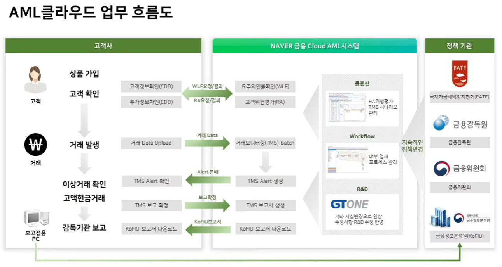

---

## 3. AML 클라우드의 필요성

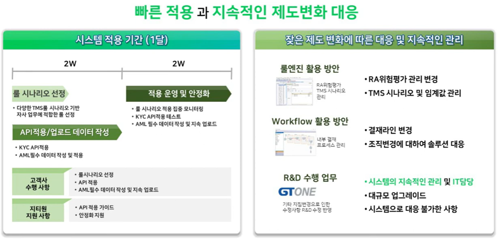

---

## 4. 화면 데모

### 4.1 대시보드

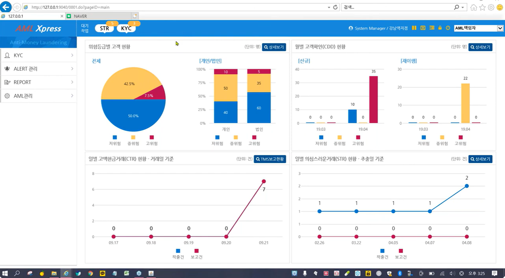

**상단에서 대기작업수도 파악가능**

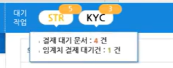

**상세보기를 통해 데이터들의 상세한 row데이터를 확인 가능**

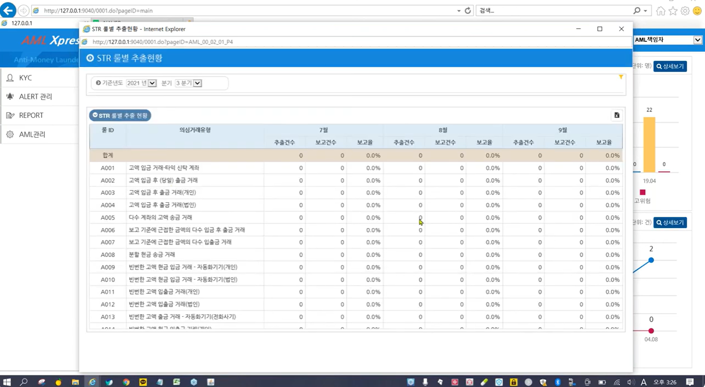

### 4.2 KYC - Watch List 조회

- 요주의 인물리스트를 검색으로 조회
- 정확도를 지정해서 정확도에 따른 사람들이 체크가 됨
- 실제로는 시스템에서 고객을 조회하는 일은 거의 없음
- 고객사에서 고객확인을 할때 국가나 이름 같은 정보들이 들어오기 때문에 보통 자동 체크가 되지만 조회도 가능하다

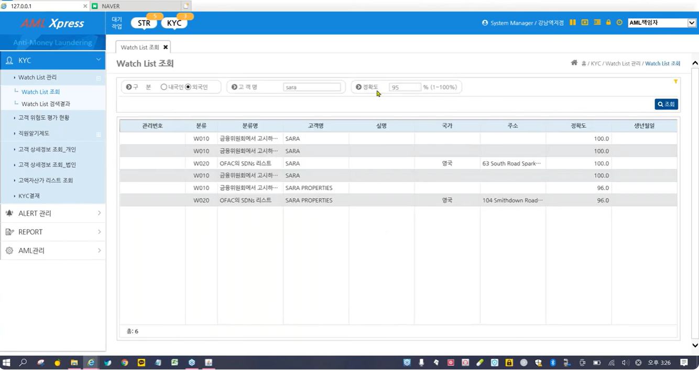

### 4.3 KYC - Watch List 검색결과

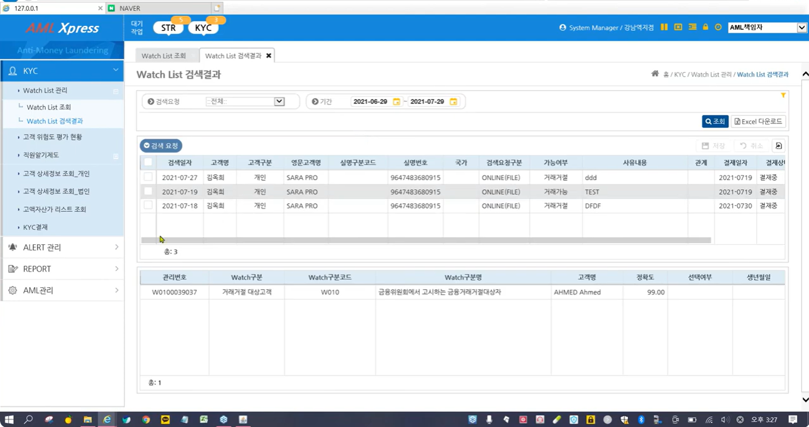

**상단에서 확인이 필요한 고객에 경우**

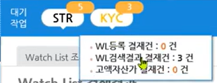

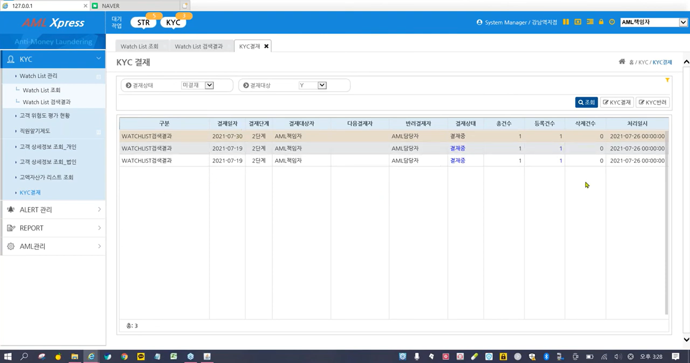

### 4.4 ALERT 관리 - STR 결제

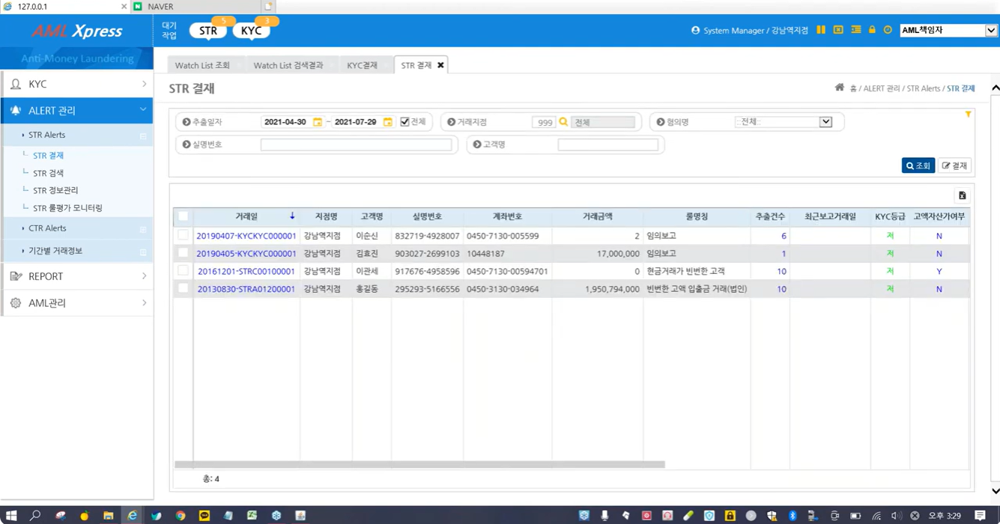

#### STR 결제 상세 - 고객알기상세

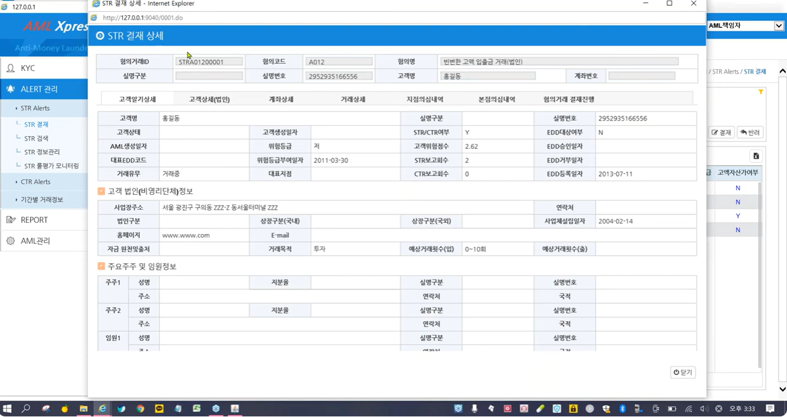

#### STR 결제 상세로 - 계좌상세

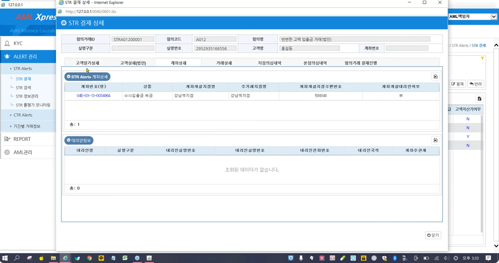

#### STR 결제 상세 - 거래상세

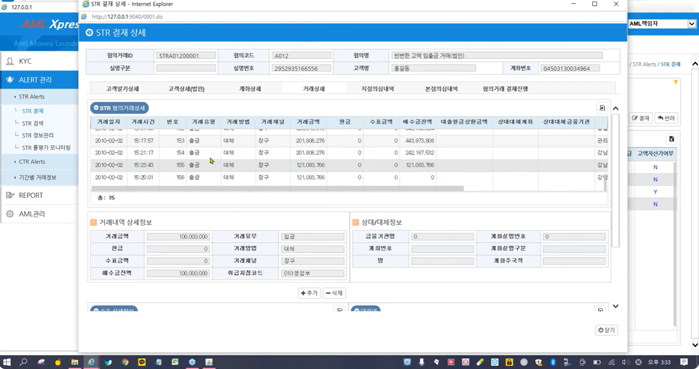

#### STR 결제 상세 - 본점의심내역

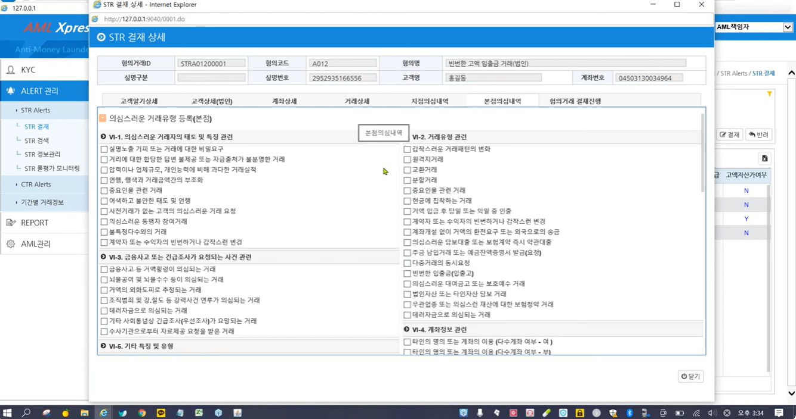

- 종합의견에 기본적으로 가져가야 하는 정보에 경우는 넣어줌
- 추가적으로 해야하는 수정 삭제 기입 가능

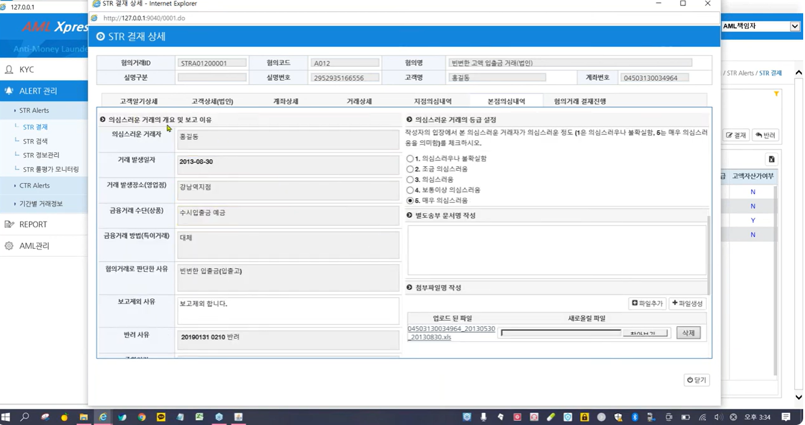

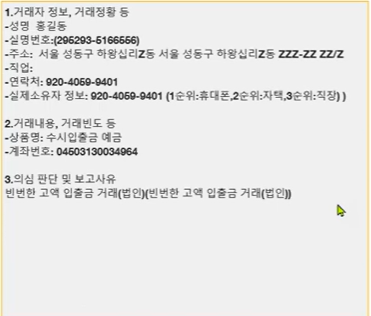

#### STR 결제 상세 - 혐의거래 결재진행

- 상태및 히스토리 기록

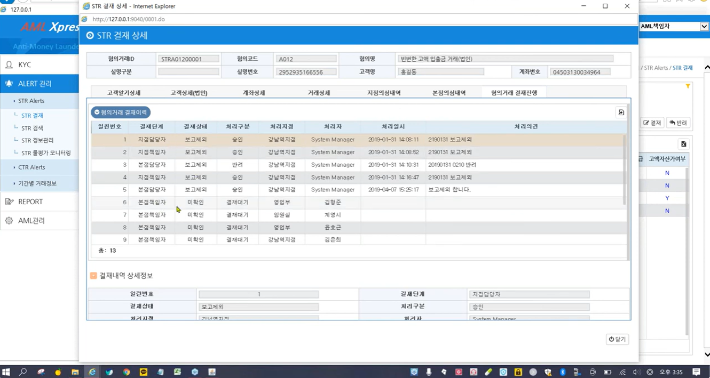

#### 결재 및 보고

- 여기서는 AML 책임자가 결제를 하고 AML 담당자가 보고를 함
- KoFIU 대기 문서를 클릭하면 -> STR 파일 생성페이지로 이동함
- 결재가 완료되면 파일을 생성할 수 있음

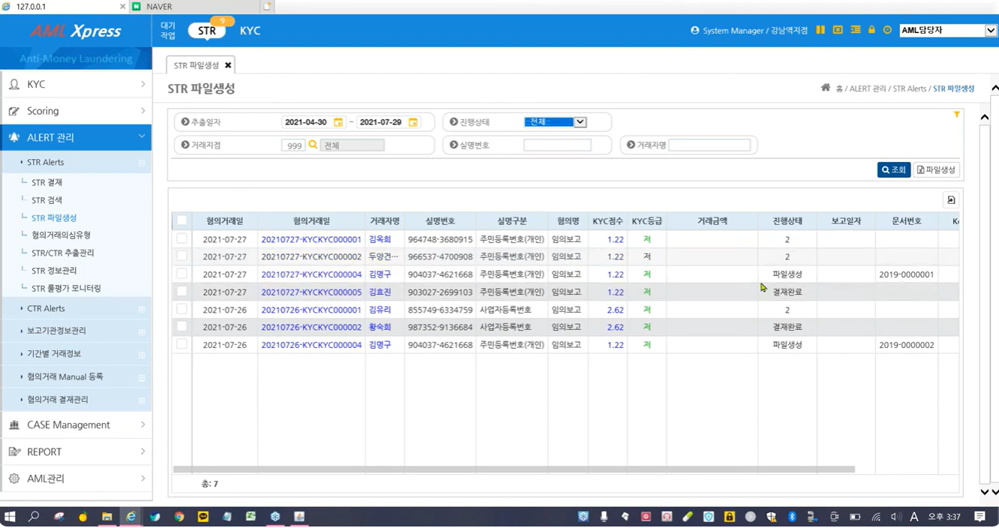

> 더 많은 편의 기능은 더이상 설명 x
> 2021년 데모로 확인한 인터페이스라 현재는 모름

출처
https://www.youtube.com/watch?v=UaZn3rSJqFg
https://www.gtone.co.kr/kr/aml-and-compliance.php