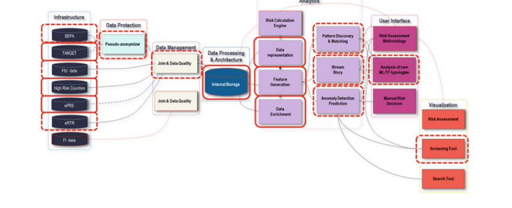
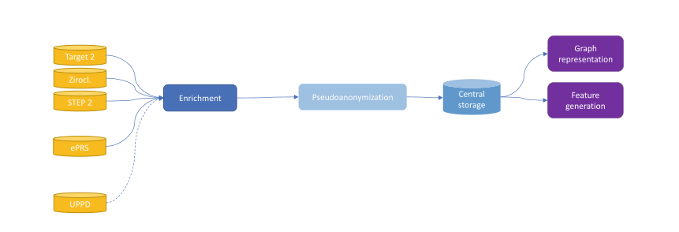
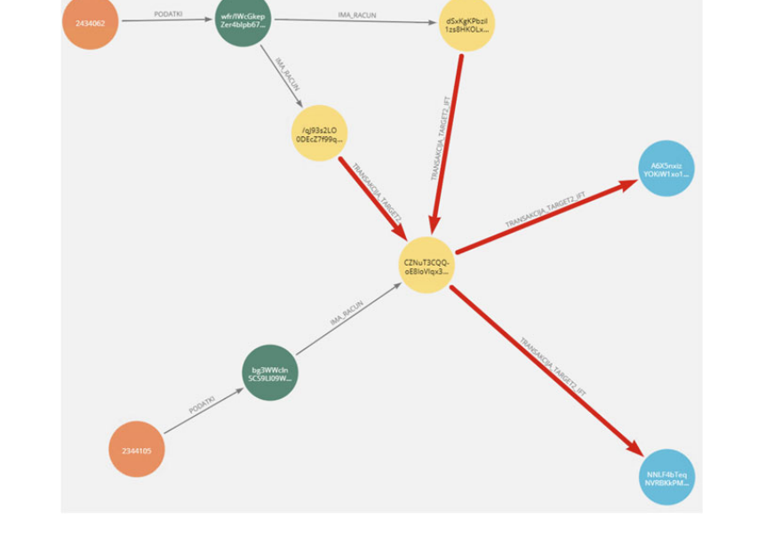
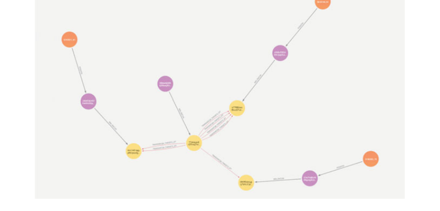
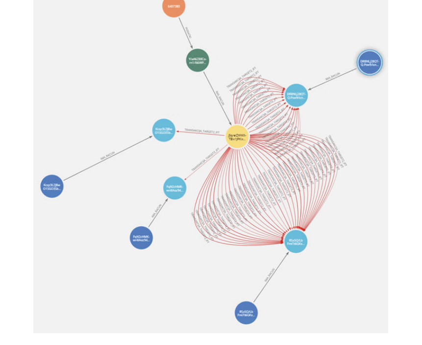
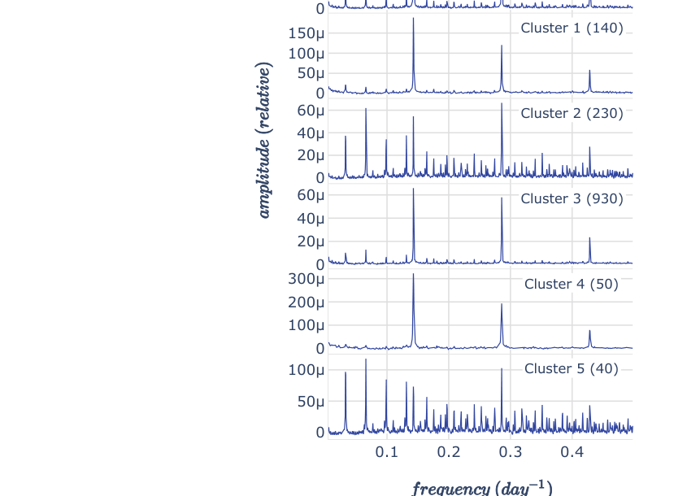
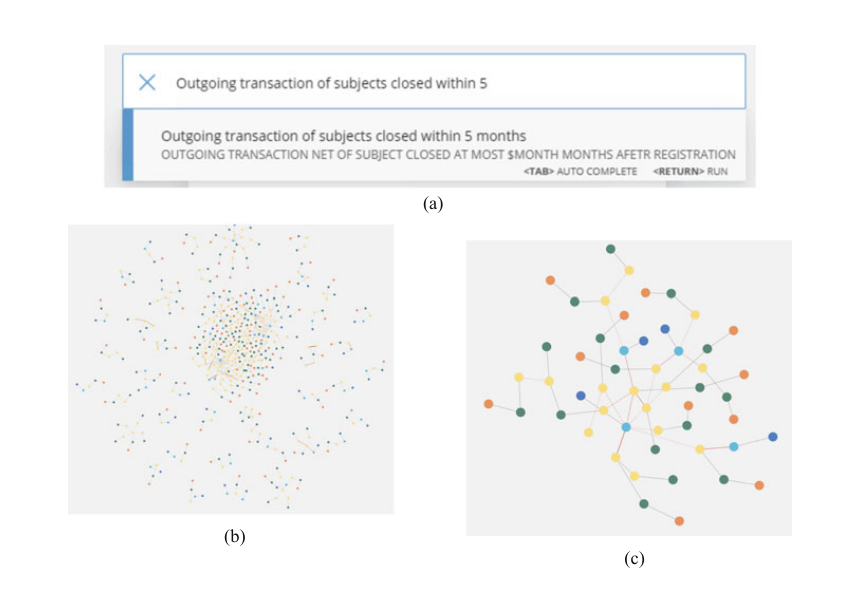
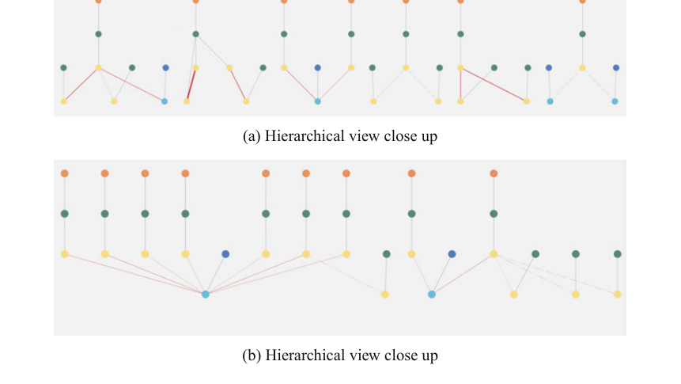
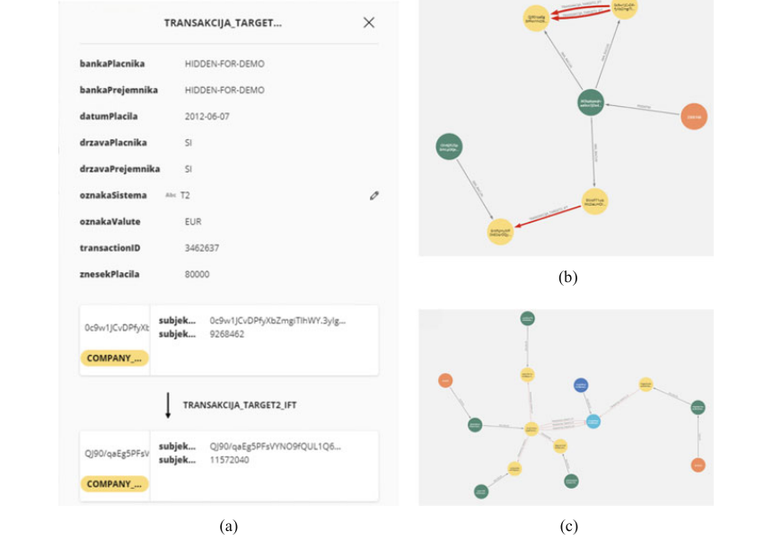

# 자금세탁방지 감독을 위한 스크리닝 도구

> **원문 제목:** Screening Tool for Anti-money Laundering Supervision  
> **저자:** Filip Koprivec · Gregor Kržmanc · Maja Škrjanc · Klemen Kenda · Erik Novak  
> **게재 정보:** Big Data and Artificial Intelligence in Digital Finance, Chapter 13, 2022, pp. 233-251  
> **DOI:** [https://doi.org/10.1007/978-3-030-94590-9_13](https://doi.org/10.1007/978-3-030-94590-9_13)

> **번역 범위:** PDF 뷰어 기준 248-266쪽 (문서 인쇄면 233-251쪽), Chapter 13 전체

> **번역 안내:** 본문은 문단 전체의 문맥을 기준으로 한국어로 옮겼습니다. AML·규칙 엔진·전문가 시스템 관련 용어를 통일했으며, 수식·코드·참고문헌은 정확성을 위해 원문 표기를 유지했습니다. 원문의 그림과 표는 각각 잘라 해당 본문 위치에 바로 배치했습니다.

---

<!-- PDF 248쪽 / 원문 233쪽 -->

## 1 서론

자금세탁방지 및 테러 자금 조달 방지(AML/CTF) 분야의 활동은 안정적인 금융 및 경제 부문을 제공하는 데 중요한 부분입니다. 전국적인 자율 규제 기관인 슬로베니아 은행(BOS)은 개별 은행의 규정 준수를 감독하고 검사를 실시하며 규정 [1]를 작성할 때 컨설팅 기관 역할을 합니다. 세계가 점점 더 상호 연결되고 국가 및 지리적 경계가 모호해짐에 따라 국가와 기업 간의 대량 송금이 그 어느 때보다 보편화되고 있습니다. 전 세계와 EU 지역 내에서 금융 이체를 위한 시스템의 상호 연결과 손쉬운 사용으로 인해 효율적이고 시기적절한 감독이 그 어느 때보다 필요합니다.

악의적인 엔터티가 더 빠르게 움직이고 현재의 탐지 및 예방 메커니즘을 능가함에 따라 데이터가 확장되는 디지털 시대에 수동 및 인간 기반 탐지 방법으로는 엄청난 양의 거래과 처리에 필요한 추가 데이터의 양을 처리할 수 없다는 것이 분명해지고 있습니다. 이는 위험한 거래 패턴에 대한 특정 조기 경고 시스템의 추가 데이터와 자동 감지가 은행 수준과 감독 기관 수준 모두에서 시행되어야 함을 명확하게 보여주는 최근 사건 [2]로 예시될 수 있습니다. 이러한 시스템은 문제가 있는 시나리오를 조기에 발견하고 보고할 수 있는 도구를 제공함으로써 개별 은행에 대한 감독 수준을 높이고 효율적으로 관리함으로써 두 감독 기관 모두에게 도움이 될 것입니다.

<!-- PDF 249쪽 / 원문 234쪽 -->



**그림 13.1 스크리닝 도구 파이프라인 개요**

인공 지능과 기계 학습 방법은 감독 당국과 은행이 직면한 문제에 자연스럽게 적합합니다. 인피니텍 프로젝트의 일환으로 개발된 스크리닝 도구는 기존 도구를 자연스럽게 확장하고 새로운 정보를 제공합니다. 스크리닝 도구의 주요 목표는 다양한 소스의 거래 데이터를 처리 및 분석하고, 자금세탁방지 및 테러 자금 조달 요구 사항과 관련된 추가 외부 정보로 이를 강화하고, 다양한 수준의 데이터 세분화를 효율적으로 결합하는 것입니다. 스크리닝 툴은 특정 금융기관 수준에서 자금세탁(ML)이나 테러자금조달(TF)의 유형과 위험을 나타내는 결합데이터 간의 비정상적인 거래 패턴과 관계를 파악하려고 한다. 자동 심사 및 플래그가 지정된 패턴의 결과는 추가 탐색 및 고려를 위해 도메인 전문가에게 자동으로 제공됩니다. 프로세스의 자동화는 분석할 수 있는 거래의 양을 늘리고, 인간의 실수 가능성을 제거하며, 인간 행위자가 추적할 수 없는 추가 소스의 데이터를 처리하고 수집할 수 있게 해줍니다. 스크리닝 도구에 의해 보고된 패턴은 위험도의 상대적 측정에 따라 가중치가 부여되고 컨텍스트에 포함됩니다. 여기서 도메인 전문가는 정보에 입각한 결정을 내리기 전에 풍부한 컨텍스트에서 패턴을 추가로 탐색하고 분석할 수 있습니다.

스크리닝 도구 파이프라인은 그림 13.1에 나와 있습니다. 파이프라인은 Infinitech 구현 방식에 따라 컨테이너에 깔끔하게 포장된 여러 개별적이고 대부분 독립적인 구성 요소로 구성됩니다. 이러한 방식으로 전체 도구 모음을 현장에 쉽게 배포할 수 있으며 유연성과 원활한 통합이 가능합니다. Infinitech 철학에 따라 추가 도구와 검출기를 쉽게 포함할 수 있으며 맞춤형 수정 없이 검사 도구 제품군과 통합할 수 있습니다. 이 도구 모음은 대용량 데이터의 성능을 위해 구축되었으며 거의 ​​실시간으로 사용할 수 있으며 기록 데이터 탐색 및 시나리오 모델링을 위한 배치 모드도 제공합니다.

<!-- PDF 250쪽 / 원문 235쪽 -->

## 2 관련 연구

그래프 데이터셋에서 기계 학습의 사용은 지난 몇 년 동안 엄청난 진전을 보였으며 이전에는 어려운 문제로 생각되었던 많은 문제에 적극적으로 통합되었습니다. 거래 데이터는 자연스럽게 그래프 구조(액터로서의 노드, 에지로서의 거래, 메타데이터에 대한 추가 노드 및 속성 포함)로 모델링됩니다. 금융 거래 데이터에서 의심스러운 패턴을 탐지하는 작업을 처리하기 위해 지도 학습 방식과 비지도 학습 방식이 모두 제안되었습니다.

### 2.1 명확하게 정의된 설명변수를 활용한 자금세탁방지

[3]에서 저자는 고차원 클라이언트 프로필에 사용할 수 있는 비지도 방법을 제안합니다. 차원 축소를 이용한 시각화 방법을 제안한다. 고객을 설명하는 고차원 특징 벡터는 PCA와 같은 차원 축소 절차를 사용하여 시각화하기 위해 2D 공간에 투영됩니다. 이를 통해 감독 담당자는 잠재적으로 위험한 대상의 이상 그룹(클러스터)을 시각적으로 식별할 수 있습니다. 추가적으로 이상 탐지를 위한 필링 알고리즘이 제안되었다. 여기 각 단계에서 모든 거리 함수(저자가 Mahalanobis 거리를 제안함)를 기반으로 하는 가장 극단적인 이상값이 제거되고 이상 항목으로 표시되며 그런 다음 프로세스가 원하는 수의 단계에 대해 반복됩니다.

이러한 방법은 n차원 유클리드 공간의 모든 유형의 이상 탐지 문제에 사용될 수 있습니다. 그러나 의심 거래를 식별한다는 최종 목표에 따라 이를 적용하는 것이 중요합니다. 자금세탁 그룹에서 흔히 발생하는 것으로 알려진 활동을 노출하는 기능을 사용하는 것이 중요합니다.

고객 프로파일의 k-평균 클러스터링을 기반으로 하는 클라이언트 프로파일링 접근 방식은 [4]에 설명되어 있습니다. 설명변수(특징 벡터)는 도메인 전문가와의 상호작용을 통해 순진하게 구성되었습니다. 최적의 클러스터 수는 실루엣 계수와 제곱 오차의 합을 사용하여 추정되었습니다. 클러스터링 후 분류 규칙을 생성하고 여러 규칙 생성 알고리즘을 사용하여 테스트했습니다. 고위험 고객을 대상으로 생성된 규칙의 관련성은 도메인 전문가가 수동으로 추정했습니다. 저자는 주어진 문제와 관련된 기능을 포함하는 것이 필수적임을 보여줍니다. 이러한 기능에는 계정 유형, 계정 수명, 거래량 등이 포함됩니다. 이러한 목표 중심 개발의 최종 결과는 목표에 따라 이름이 지정된 고유한 클러스터이며(예: "위험 그룹", "표준 고객" 등) 일련의 규칙을 사용하여 명확하게 설명할 수 있습니다.

또한 Mastercard의 Brighterion은 AML 제품 [5]에 비지도 학습을 사용한다고 주장합니다.

<!-- PDF 251쪽 / 원문 236쪽 -->

[6]에서는 거래(엔티티가 아님)에서 직접 작동하는 지도 학습 기술이 제시됩니다. Gradient Boosting 모델은 과거 SAR(의심 활동 보고서)을 기반으로 의심 거래를 예측하도록 훈련되었습니다. 훈련에 사용되는 특징 벡터는 엔터티 전체와 개별 거래에 대한 정보를 모두 포함합니다. 이러한 기능에는 거래 유형별로 그룹화된 지난 2개월 동안의 법인, 회사 부문 유형, 활동 수준 및 거래 금액과 관련된 이전 파산 표시가 포함됩니다. 저자는 모델이 정확하고 효율적이며 은행의 규칙 기반 접근 방식을 능가한다는 것을 보여줍니다.

### 2.2 그래프 구조 데이터에 대한 머신러닝

수동으로 생성된 클라이언트 특징 벡터를 사용하면 더 큰 모델 설명 가능성이 제공되지만, 이러한 방식으로 캡처되지 않는 거래 네트워크에는 여전히 숨겨진 정보가 있을 수 있습니다. 그래프 머신러닝의 최근 발전으로 인해 노드 주변의 더 깊은 구조적 정보를 캡처하는 것이 가능해졌습니다.

그래프의 노드는 대략 두 가지 방식으로 설명할 수 있습니다. 즉, 노드가 속한 커뮤니티(동질성) 또는 네트워크에서 노드가 갖는 역할(구조적 동등성)입니다.

DeepWalk 알고리즘 [7]는 네트워크에서 무작위 보행을 시뮬레이션하고 이러한 보행을 문장으로 처리하여 연속 벡터 공간에서 노드 표현을 생성합니다. 생성된 임베딩은 모든 예측 또는 분류 작업에 사용될 수 있습니다. 랜덤 워크 아이디어는 node2vec [8]에 의해 더욱 확장되었습니다. DeepWalk 및 node2vec은 생체 의학 네트워크 [9] 및 추천 시스템 [10]와 같은 도메인에서 성공적으로 사용되었습니다.

[11]가 제안한 또 다른 알고리즘 struc2vec은 DeepWalk와 유사한 방식으로 작동하지만 원래 네트워크의 수정된 버전에서 무작위 탐색을 수행하여 원래 네트워크의 노드 간의 구조적 유사성을 더 잘 인코딩합니다. struc2vec에 의해 생성된 임베딩은 node2vec보다 구조적 동등성 기반 작업에서 더 나은 성능을 발휘할 수 있습니다. Struc2vec 임베딩은 일반적으로 생의학 네트워크 [9]의 링크 예측 작업에서 node2vec 또는 DeepWalk보다 더 나은 성능을 보이는 것으로 나타났습니다.

DeepWalk, node2vec 및 struc2vec은 본질적으로 변환적입니다. 즉, 개별 노드의 임베딩을 학습할 수 있으려면 전체 그래프가 필요합니다. 이는 진화하는 대규모 네트워크의 실제 애플리케이션에 어려움을 줄 수 있습니다. 따라서 최근 귀납적인 다른 표현 학습 기술이 제안되었습니다. 즉, 네트워크의 일부에 대해서만 훈련할 수 있고 이전에 볼 수 없었던 새로운 네트워크 및 노드에 직접 적용할 수 있습니다.

GCN(Graph Convolutional Networks) [12]는 노드 기능을 활용하여 메시지 전달을 통해 노드 간의 종속성을 캡처하는 모델입니다. 원래 GCN 아이디어는 Hamilton et al의 귀납적 표현 학습으로 더욱 확장되었습니다. [13].

(Variational) Graph Autoencoder - (V)GAE - 노드 표현을 생성하기 위해 [14]에서 제안한 모델입니다. 저자는 GCN 인코더와 간단한 스칼라 곱 디코더를 사용하는 자동 인코더가 Cora 인용 데이터셋의 의미 있는 노드 표현을 생성한다는 것을 보여줍니다. 그러나 구조적 동등성이 노드 설명에서 더 중요한 역할을 하는 그래프에서 그러한 모델이 어떻게 수행되는지는 불분명합니다.

<!-- PDF 252쪽 / 원문 237쪽 -->

T-GCN이라고 불리는 GCN의 시간적 변형이 [15]로 제안되었습니다. 저자는 먼저 각 시간 단계에서 개별적으로 GCN 레이어로 공간 정보를 집계한 다음 시간 단계를 GRU(Gated Recurrent Unit)와 연결하여 최종적으로 예측을 산출하는 모델을 제안합니다. 이러한 모델은 공간적 및 시간적 정보를 모두 집계하여 실제 도시 교통 데이터셋에 대한 교통 예측 작업에서 다른 최첨단 기술(SVR 및 GRU 포함)보다 성능이 뛰어납니다. 또한, 동적 그래프 [16]에 대한 유도적 표현 학습을 위한 대안으로 최근 TGAT(temporal graph attention) 계층이 제안되었습니다.

### 2.3 AML을 위한 그래프 구조 데이터 머신러닝

자금세탁 탐지가 수행될 수 있는 거래 네트워크에는 일반적으로 알려진 의심스러운 대상(있는 경우)의 극히 일부만 포함됩니다. 강력한 감독 모델을 생성하려면 이러한 클래스 불균형을 처리해야 합니다.

[17]에서 제안된 자금세탁 패턴 탐지 방법은 그래프의 노드 표현 학습을 기반으로 합니다. 금융기관의 실제 거래 데이터를 바탕으로 거래 그래프를 구성합니다. 방향이 없고 가중치가 없는 그래프는 고정된 기간 내의 데이터로 구성됩니다. 자금세탁과 관련하여 소수의 피험자가 의심되는 것으로 알려져 있습니다. 은행 국가 이외의 계좌는 국가별로 집계됩니다. 노드 표현은 DeepWalk를 사용하여 학습된 후 SVM(Support Vector Machine), MLP(Multi-Layer Perceptron) 및 Naive Bayes의 세 가지 이진 분류기로 분류됩니다. 극단적인 클래스 불균형은 소수 클래스의 합성 오버샘플링을 위해 널리 사용되는 SMOTE 알고리즘을 사용하여 극복됩니다. 테스트된 또 다른 전략은 다수 클래스의 과소 샘플링과 소수 클래스의 무작위 복제입니다. 그런 다음 훈련에 포함되지 않은 실제(오버샘플링되지 않은) 엔터티의 일부에 대해 모델이 평가됩니다. MLP와 무작위 복제를 사용하면 최상의 결과를 얻을 수 있지만(결과 간의 차이는 미미할 수 있음) SMOTE가 약간 더 안정적인 모델을 생성하는 것이 좋습니다.

GraphSMOTE라는 그래프용 SMOTE 적용이 [18]에서 제안되었습니다. GraphSMOTE는 그래프에 삽입되는 소수 클래스의 합성 노드([17]에 설명된 합성 임베딩뿐만 아니라)를 생성하여 훈련을 직접 수행할 수 있습니다. 저자는 GraphSMOTE의 변형이 가중 손실 및 SMOTE의 변형을 포함하여 불균형 데이터셋에 대한 기존 교육 기술보다 성능이 뛰어나며 다양한 불균형 비율에 걸쳐 잘 일반화된다는 것을 보여줍니다.

<!-- PDF 253쪽 / 원문 238쪽 -->

[19]에서 저자는 ICIJ Offshore Leaks Database에 게시된 4개의 별도 지향 네트워크에서 의심스러운 엔터티를 예측하는 실험을 수행합니다. 일부 노드는 국제 제재 목록과 일치하여 블랙리스트로 표시됩니다. 데이터셋는 블랙리스트에 등록된 노드의 0.05% 미만을 포함하여 매우 불균형합니다. 첫 번째 부분에서는 임베딩 알고리즘이 [17]와 비슷한 방식으로 사용됩니다. 여기서는 O-SVM(One-class SVM)을 사용하여 오버샘플링과 달리 의심스러운 엔터티를 예측합니다. 그런 다음 모델은 실제 데이터의 비율에 대해서만 평가됩니다. Struc2vec은 AUC 점수 측면에서 대부분 node2vec보다 성능이 뛰어납니다. 하지만 그 차이는 데이터베이스의 4개 데이터셋에 따라 크게 다릅니다. 또한 정도 중심성 측정값(PageRank, 고유 벡터 중심성, 로컬 클러스터링 계수 및 정도 중심성)이 네트워크에서 노드의 중요성을 설명하는 기능으로 사용됩니다. 이들 중 PageRank만으로도 대부분 최고의 성능을 발휘하며 struc2vec도 능가하며 이러한 작업에서 노드 중심성의 역할을 강조합니다. 또한 모든 실험은 무방향, 방향 및 역방향 그래프 버전에서 수행되었습니다. 결과는 데이터세트에 따라 크게 다르지만 일반적으로 역방향 네트워크를 사용하여 최상의 결과를 얻었습니다.

PageRank 알고리즘에서 영감을 받은 SRBF(Suspiciousness Rank Back and Forth)라는 새로운 방법이 [19]에 추가로 도입되었습니다. 저자는 일반적으로 정도 중심성 측정 및 언급된 그래프 임베딩 알고리즘에 비해 의심스러운 주제를 탐지하는 데 더 나은 성능을 발휘하여 4 데이터셋 중 3에서 전체 최고 점수를 달성했음을 보여줍니다.

[19]에 언급된 방법은 알려진 블랙리스트 엔터티 목록과 비교하여 평가됩니다. 그러나 위험도가 높은 것으로 보이지만 원래의 실제 블랙리스트에 없는 엔터티를 검증하는 것은 여전히 ​​어려운 일입니다. 이러한 예측된 고위험 엔터티를 검증하기 위해 OSINT(오픈 소스 인텔리전스)의 사용이 [20]에서 제안되었습니다. 이러한 방법은 비록 많은 수작업이 필요하기는 하지만 잠재적인 숨겨진 링크를 발견할 만큼 충분한 정보가 온라인에서 발견된 경우에 성공적인 것으로 입증되었습니다.

[21]에서는 비트코인 ​​거래의 Elliptic Dataset이라는 라벨을 사용하여 실험이 수행됩니다. 데이터셋의 노드 중 약 2%는 "불법"으로 표시되고(예: 암시장에 속한 것으로 알려짐) 일부(21%)는 "합법적"으로 표시됩니다(예: 잘 알려진 환전소에 속함). 데이터는 49 시간 단계에 분산되어 있습니다. 각 노드에는 거래 정보와 집계된 이웃 기능으로 구성된 대략 150 기능이 수반됩니다. 그들은 GCN을 사용하여 노드의 의심을 예측하는 귀납적 접근 방식을 설명합니다. 마지막으로, 이러한 접근 방식은 노드가 적법한지 불법인지 예측하는 목표에 대해 다양한 분류 방법과 비교됩니다. 테스트된 분류자는 소수 클래스인 불법 노드의 우선순위를 지정하기 위해 가중 교차 엔트로피 손실로 훈련된 MLP(다층 퍼셉트론), Random Forest 및 로지스틱 회귀입니다.

노드 기능만 사용하는 Random Forest를 사용하여 우수한 분류 결과가 표시됩니다. 또한 언급된 기능에 GCN 임베딩을 연결하여 Random Forest 모델을 "그래프 인식"하게 함으로써 성능이 향상됩니다. 감독된 환경에서 GCN을 단독으로 사용하는 것은 좋은 결과를 얻지 못했습니다. 그러나 시간 역학을 캡처하기 위해 EvolveGCN을 사용하면 순수 GCN에 비해 약간 더 나은 결과를 얻을 수 있습니다. 시간이 지남에 따라 제안된 모델의 정확도를 살펴보면 흥미로운 사실이 나타납니다. 대규모 암시장은 특정 시간 단계에서 폐쇄되므로 모든 모델의 정확도가 크게 떨어지며 다음 시간 단계 후에도 복구되지 않습니다. 그러한 사건에 대한 모델의 견고성은 해결해야 할 주요 과제입니다.

<!-- PDF 254쪽 / 원문 239쪽 -->

[21]에서는 로지스틱 회귀 대신 GCN의 마지막 계층에서 [22]가 제안한 미분 가능한 버전의 의사 결정 트리를 사용하여 Random Forest와 GCN의 기능을 결합하는 향후 작업 아이디어가 지적되었습니다.

그래프의 이상 탐지는 비정상적인 활동을 탐지하는 데에도 사용될 수 있습니다. [23]에서는 그래프에서 비정상적인 에지를 감지하기 위한 완전 비지도 방식이 제시됩니다. 분류자는 두 노드 사이에 에지가 존재하는지 여부를 예측하기 위해 동일한 수의 기존 및 존재하지 않는 에지에 대해 훈련됩니다. 존재하지 않는 것으로 분류된 가장자리를 가진 노드는 변칙적인 것으로 볼 수 있습니다. 이 접근 방식은 온라인 소셜 네트워크와 같은 실제 데이터셋에서 테스트되었습니다.

## 3 데이터 수집 및 구조

### 3.1 데이터 보강 및 가명화

스크리닝 도구의 핵심은 효율적인 데이터 수집, 저장 및 두 가지 거래 데이터 소스의 대규모 다중 그래프 거래 데이터 표현입니다. 순수한 거래 데이터 그래프는 가치가 있으며 추가 분석을 위한 백본을 제공할 뿐만 아니라, 데이터도 강화되어 획득한 결과를 더 깊이 탐색하고 더 쉽게 이해할 수 있습니다. 자금세탁방지 시나리오에 맞게 특별히 맞춤화된 추가 정보가 함께 수집(및 자동 업데이트)됩니다. 거래 데이터의 높은 민감도, 개인 정보 보호 문제 및 법적 고려 사항으로 인해 수집 파이프라인은 매우 구체적이고 특별히 맞춤화된 의사 익명화 및 강화 파이프라인을 따릅니다. 일반적인 데이터 흐름은 그림 13.2에 나와 있습니다.



**그림 13.2 데이터 수집 및 준비 개요**

<!-- PDF 255쪽 / 원문 240쪽 -->

다양한 소스의 거래 데이터는 공공 사업자 등기소에서 제공하는 회사별 정보로 강화됩니다. 추가 회사 관련 정보는 특히 자금세탁 및 테러자금 조달 정보뿐만 아니라 비정상적인 행동 패턴을 발견하기 위한 일반적인 특징을 대상으로 합니다. 회사 규모, 자본화 유형, 소유권 구조, 회사 등록 날짜, 회사 폐쇄 가능 날짜, 자본 출처 등 계정 정보 데이터는 eRTR(공용 계정 등록부)에서 제공되며 AML 시나리오에 필요한 정보가 추가됩니다: 계정 등록, 가능한 계정 폐쇄, 계정 소유자 등. 중요한 정보는 계정 유형입니다. 계정은 개인이 사용할 수도 있고 특정 회사와 연결될 수도 있으며 어떤 경우에는 둘 다일 수도 있습니다. 의심스러운 패턴을 보다 효율적으로 식별하는 데 관련된 메타 매개변수는 정기적으로 수집됩니다. EU의 고위험 제3국 목록은 목록에 있는 국가의 고위험 수준을 분류합니다.

법률 및 개인 정보 보호 문제에 따라 향후 버전의 심사 도구에는 위험도가 높은 외국에 대한 추가 거래가 포함될 것으로 예상됩니다. 이 목록은 해당 AML 및 CTF 법률에 따라 자금세탁방지를 위해 사무실에서 관리합니다. 이 목록을 포함하면 특정 법인에 대한 더 광범위한 정보를 제공하고 의심스러운 자금 경로에 대한 추적이 향상됩니다.

수집 및 데이터 강화 후에 직접 식별 가능한 모든 회사 및 계정 데이터는 의사 익명화됩니다. 초기 조사에 따르면 의사 익명화 과정에서는 세심한 주의가 필요하다는 사실이 밝혀졌습니다. 일부 정보는 개인 정보 보호 문제를 충족하기 위한 의사 익명화(동일한 개인의 여러 계정, 회사 이름, 계좌 번호)로 인해 필연적으로 복구 불가능하게 손실되지만 다른 정보는 의도치 않게 손실될 수 있습니다. 원본 거래 데이터와 위험 국가에 대한 거래 데이터는 보고 기준이 다르기 때문에 의사 익명화 프로세스 전에 쌍을 이루어야 하며 이로 인해 의사 익명화 이후 쌍이 불가능합니다. 유사 익명화의 또 다른 부정적인 부작용은 데이터 품질 문제를 쉽게 숨길 수 있다는 사실입니다. 예를 들어 잘못 구조화된 계좌 번호, 수동으로 귀속된 데이터, 의사 익명화 전 거래 수준에서 데이터를 처리할 때 보이지 않는 기타 작은 불일치, 허위 공백, 문자 및 숫자 유사성, 문자열 조합 등과 함께 탐지하기 어려운 완전히 다른 의사 익명화 결과가 생성됩니다. 이러한 몇 가지 함정을 발견하고 이에 따라 의사 익명화 프로세스를 조정하기 위해 개발 단계에서 여러 교차 확인 및 데이터 검증 절차가 사용되었습니다. 전체 데이터 흐름을 모니터링하기 위해 프로덕션 환경에서도 데이터 품질 관리에 대한 교차 점검이 이루어집니다.

프로젝트 중에 개발된 의사 익명화 장치는 이전 호출의 솔트 정보를 재사용하여 들어오는 데이터 스트림을 성공적으로 익명화할 수 있습니다. 이를 통해 그래프 구조 및 연결에 대한 많은 정보를 계속 유지하면서 새로운 데이터 및 다양한 플랫폼의 수집과 결합하여 이후 단계에서 데이터를 더 쉽게 수집할 수 있습니다. 많은 양의 데이터와 자동 수집의 필요성으로 인해 개발된 의사 익명화 서비스는 실시간으로 데이터를 마스킹할 수 있는 독립형 Kubernetes 서비스로 Infinitech 구성 요소의 일부로 제공됩니다.

<!-- PDF 256쪽 / 원문 241쪽 -->

### 3.2 데이터 저장

수집되고 의사 익명 처리된 데이터는 빠르고 효율적인 쿼리가 가능하도록 변환 및 저장됩니다. 크고 빠른 데이터 수집으로 인해 데이터는 세 개의 별도 데이터베이스에 저장됩니다. 원시 데이터베이스는 의사 익명화되고 정규화되지 않은 원시 데이터를 저장하는 간단한 PostgreSQL 컨테이너입니다. 데이터 수집 엔진은 먼저 원시 데이터를 자동으로 정규화하고 이를 고성능 읽기 및 시간 기반 인덱싱을 위해 특별히 구성된 마스터 PostgreSQL 데이터베이스에 저장된 기존 데이터와 병합합니다. 마스터 데이터베이스는 푸리에 변환 기반 특징 계산을 위한 핵심 데이터 소스 역할을 합니다. 5.2, 스트림 스토리 및 기능 생성. 정규화 후에는 수집된 데이터의 스키마 유효성을 확인하고 불일치 및 익명화 오류를 확인하기 위해 일련의 온전성 검사가 수행됩니다. 정규화된 데이터는 그래프 관련 검색, 패턴 인식 및 이상 탐지를 위한 백본 역할을 하는 neo4j 데이터베이스의 오픈 소스 버전으로 가져옵니다.

그래프 데이터베이스 스키마는 거래 환경을 쉽게 탐색하고 매개변수화된 쿼리를 실행할 수 있도록 특별히 맞춤화되었습니다. 이웃 루트 시스템 발전을 위한 시간 기반 분석과 금융 기관 수준 데이터 획득을 위한 적절한 인덱싱 지원을 제공하기 위해 세심한 주의를 기울였습니다. 이를 통해 상대적인 시간과 특정 위험한 유형 탐지에서 거래 구조 진화를 효율적으로 탐색할 수 있습니다. 바닐라 neo4j 데이터베이스와 함께 neo4j Bloom도 구성되어 더욱 심층적인 분석과 추가 탐색을 위해 플랫폼에 포함됩니다.

데이터베이스 부분과 정규화 및 온전성 검사 서비스는 모두 Infinitech 방식에 따라 자체 포함된 도커 이미지로 제공되며 사용하기 쉽도록 완전히 구성 가능합니다.

## 4 시나리오 기반 필터링

BOS는 감독 기관의 역할을 하며 금융 기관 수준과 금융 부문 수준 모두에서 위험 관리 및 위험 감지를 감독합니다. 스크리닝 도구는 여러 거래 데이터 소스의 데이터를 결합하고, 데이터를 단일 데이터 소스로 병합 및 정규화하며, 여러 수준의 세분성에서 효율적인 데이터 탐색을 가능하게 합니다. 감독 기관으로서 주요 목표 중 하나는 금융 기관이 의심 거래 탐지 및 보고를 위한 적절한 통제 환경을 개발하는 것입니다. 개별 금융 기관이 인식하지 못하고 위험하다고 간주하는 다양한 위험 시나리오에 대해 적절한 설명과 해석을 제공하기 위해 세심한 주의를 기울였습니다.

도메인 전문 지식과 고위험 제3국의 거래 데이터와 결합된 과거 데이터에 대한 초기 탐색은 해석 가능성이 높고 신속하게 실행 가능한 통찰력을 얻는 가장 확실한 방법은 먼저 시나리오 기반 필터링을 적용하는 것임을 보여주었습니다. 단순 탐지에 사용되는 일반적인 시나리오는 사람이 읽을 수 있는 간단한 규칙 기반 형식으로 제공됩니다.

<!-- PDF 257쪽 / 원문 242쪽 -->

새로 설립된 회사나 설립 후 바로 문을 닫는 회사는 해외계좌에서 거액의 자금을 수취하고 개인계좌에서도 비슷한 금액을 지불하는 위험이 높습니다. 회사의 위험은 지급인/수취인 국가의 위험 수준에 따라 증가합니다.

규칙 기반 시나리오의 주요 장점은 간단한 설명 가능성, 구성 가능성 및 기존 자금세탁방지 규정과의 쉬운 대응입니다. 감독 기관으로서 신고 및 추가 처리에 대한 명확한 설명을 제공하면 청구를 추구하는 능력이 향상되고 조사 결과의 실행 가능성도 향상됩니다. 또한 설명 가능한 규칙 기반 필터는 현장 점검 시 쉽게 구현할 수 있습니다. 위험한 행동을 평가하고 표시하기 위한 기존 규칙과 관련하여 전문가와의 협력이 직접적으로 기여한 것은 특수 매개변수화된 일반 규칙의 개발이었습니다. 이는 일반적인 자금세탁 및 테러 자금 조달 거래 패턴을 자동으로 포함하고 Sect.에 제시된 추가 조사를 위해 이를 데이터베이스 쿼리에 매핑합니다. 6.

규칙 기반 접근 방식은 유형학의 언어로도 잘 변환됩니다. 특정 거래 패턴은 자금세탁 과정의 시간 기반 부분(준비, 확산 등) 또는 그래프 기반 부분(이전에 회사와 관련된 개인에게 돈이 다시 연결되는 부분, 돈이 EU 국경을 넘어가는 부분...)으로 해석될 수 있습니다. 모든 거래가 포함되는 것은 아니기 때문에 시나리오의 일부라도 감지하면 좋은 통찰력을 제공하고 추가 탐색으로 이어질 수 있습니다. 이 중 특정 부분을 유형학이라고 하며 일반적으로 역사적 사례가 발견되거나 두드러진 경우의 이름을 따서 명명됩니다. 일반화된 매개변수화된 규칙 기반 쿼리를 사용하면 하위 그래프(특정 은행 거래, 은행 계좌가 일반적으로 혼합되는 은행의 조합...) 및 특정 기간에서 이러한 부분을 감지하고 정확하게 식별하는 것이 쉽고 전문가가 이미 말한 언어 및 컨텍스트로 직접 변환되어 실행 가능합니다.

규칙 기반 필터링은 잠재적인 자금세탁 시나리오의 단계로 즉시 해석된 과거 데이터의 특정 패턴을 쉽게 감지할 수 있을 만큼 유연한 것으로 입증되었습니다. 유연하기는 하지만 일반화된 규칙이라도 여전히 쉽게 해석할 수 있으며 분석 중에 자금세탁방지의 맥락에 포함될 수 있습니다.

## 5 자동 탐지 및 경보 시스템

### 5.1 패턴 탐지

스크리닝 도구는 의심스러운 유형을 자동으로 감지하고 위험한 시나리오에 플래그를 지정하는 기능을 제공합니다. 자동 감지 및 조기 실시간 경고 시스템은 감독 기관에 추가 데이터와 추가 위험 기반 분석을 제공하므로 도메인 전문가가 결정한 경우 감독 프로세스를 용이하게 하고 지원합니다.

<!-- PDF 258쪽 / 원문 243쪽 -->



**그림 13.3 대규모 거래 전달**

**그림 13.3는 스크리닝 도구에서 감지되고 추가로 탐색되는 특정 플래그가 지정된 시나리오를 보여줍니다. 그래프의 노드는 다양한 시나리오 엔터티에 해당합니다. 노란색 노드는 회사가 소유한 계정에 해당하고, 파란색 노드는 개인이 소유한 계정에 해당하고, 녹색 노드는 회사에 해당하고, 주황색 노드는 선택한 시나리오에 대해 플래그가 지정되고 모니터링되는 개체에 해당합니다. 이 특정 시나리오에서 회사에 존재하는 주황색 노드는 등록 후 6개월 이내에 문을 닫았습니다. 이는 회사가 설립 직후 비정상적인 양의 거래를 처리하는 시나리오에 해당합니다. 노드 사이의 가장자리는 특정 종속성에 해당합니다. 은행 계좌 노드 사이의 모서리(빨간색)는 전송되는 금액(로그 스케일)을 나타내는 모서리 두께를 갖는 거래에 해당합니다. 계정 노드와 보라색 노드 사이의 가장자리는 계정 소유권에 해당합니다. 회사는 하나 이상의 계좌를 소유할 수 있으며 동일한 회사의 거래 조합은 격리된 은행 계좌와 완전히 다른 이야기를 전달할 수 있습니다. 마지막으로 플래그가 지정된 주황색 노드와 회사 노드 사이의 가장자리는 플래그가 지정된 회사 노드를 나타내며 특정 플래그 정보 및 결과는 주황색 노드의 속성으로 저장됩니다. 노드의 라벨은 익명화된 회사 및 은행 계좌 표시에 해당합니다.**

<!-- PDF 259쪽 / 원문 244쪽 -->



**그림 13.4 거래 붕괴**

이 시나리오에서 회사는 같은 날 두 번의 대규모 전환(1.2M e)을 받고 두 개의 다른 개인 은행 계좌에 거의 동일한 금액을 두 번 지불했습니다. 해당 프록시 회사는 4개월 미만의 기간 동안 존재했습니다.

**그림 13.4는 발견된 또 다른 패턴을 보여줍니다. 이번에는 회사 노드가 보라색으로 표시됩니다.**

두 번째로 감지된 예에서는 동일한 엔터티가 짧은 기간에 개설 및 마감된 두 엔터티와 1년 후에 개설된 세 번째 엔터티에 대해 여러 개의 동일한 거래를 수행합니다.

두 시나리오 모두 계층화라고 불리는 잠재적인 자금세탁 단계의 징후를 나타냅니다. 계층화의 주요 목표는 위장 회사, 외국 및 비 EU 국가, 특히 느슨한 AML 표준을 적용한 국가를 통해 지불금을 받고 처리하는 등 다양한 수단을 통해 불법 자금의 출처를 탐지하기 어렵게 만드는 것입니다. 두 번째 예는 일반적인 통제를 은폐 및 회피하기 위해 지불금을 더 작은 금액으로 나누고 소유권 정보를 분산시키기 위해 여러 계좌를 통해 이체하는 스머핑(smurfing)의 사용 가능성을 보여줍니다.

세 번째 예외는 그림 13.5에 나와 있는데, 이는 단일 단기 회사가 짧은 시간 내에 여러 거래를 개인 개인 계정에 분산시키는 거래로 구성됩니다. 더욱 변칙적으로 모든 거래가 국경을 넘어 이루어지므로 효율적인 자금 추적이 더욱 어려워집니다.

특정 시나리오의 자동 감지에 대한 향후 방향은 상대적인 시간 척도를 사용하여 유사한 회사 유형의 지역 관계 발전을 비교하는 것입니다. 이를 통해 다양한 회사 유형과 관련된 특정 유형의 거래 내역과 관련된 그래프 표현의 더 나은 모델링이 가능해집니다(공익 기업 및 소매 회사의 거래 구조는 기관 고객에게 금융 서비스를 제공하는 회사와 크게 다릅니다).

<!-- PDF 260쪽 / 원문 245쪽 -->



**그림 13.5 여러 개인 계정으로 거래 분산**

### 5.2 푸리에 변환을 이용한 데이터 탐색

금융 데이터는 본질적으로 일시적입니다. 주체의 거래 활동에는 반복되는 패턴이 존재한다고 가정하는 것이 합리적입니다. Φj를 엔터티 j가 수행한 일별 나가는 거래 수의 시계열로 설정합니다. (여기에 설명된 것과 동일한 분석은 다른 시계열에서도 수행될 수 있습니다.) 효율적인 고속 푸리에 변환(FFT) 알고리즘 [24]를 사용하여 각 Φj의 주파수 영역 표현 Aj(ν)를 계산합니다.

결과 스펙트럼의 기준선은 [25]에 설명된 대로 I-ModPoly 알고리즘을 사용하여 수정되고 다항식 1를 사용하여 BaselineRemoval Python 라이브러리(https://pypi.org/project/BaselineRemoval/)에서 구현됩니다. 각 클라이언트의 결과 주파수 도메인 스펙트럼은 주파수 범위 전체에 걸쳐 n = 1000 동일한 간격의 지점에서 선형 보간을 통해 리샘플링되어 n차원을 생성합니다.

<!-- PDF 261쪽 / 원문 246쪽 -->

**그림. FFT 클러스터의 13.6 Barycentre 스펙트럼. 괄호 안에 표시된 각 클러스터의 대략적인 구성원 수**



```text
0
20μ
40μ
60μ
80μ
```

유클리드 바리센터 클러스터 1(140) 클러스터 2(230) 클러스터 3(930) 클러스터 4(50) 클러스터 5 (40) 엔터티 χj의 벡터 표현. 마지막으로 각 χj는 |ψj | t=1 Φj(t).

k = 5를 사용한 K-평균 클러스터링과 주어진 특징 벡터에 대해 유클리드 거리가 수행됩니다. 품질 스펙트럼에 대해 기록된 데이터 포인트가 충분하지 않은 엔터티는 간단한 규칙으로 필터링됩니다. Φj에 <365 0이 아닌 데이터 포인트가 있는 계정은 이 분석에서 고려되지 않습니다. 우리의 데이터셋는 드물다. 데이터셋에 있는 모든 엔터티의 <1%는 필터링 후에도 주파수 영역 분석에 계속 사용할 수 있습니다.

그림 13.6에서 모든 클러스터에는 세 개의 뚜렷한 피크가 있음을 알 수 있습니다. 이는 1 7의 배수인 주파수에 해당합니다. 주말에는 처리된 거래가 없기 때문에 데이터에는 고유한 주간 역학이 있습니다. 클러스터 간에는 뚜렷한 차이가 있습니다. 클러스터 1 및 3는 유클리드 무게 중심과 매우 유사하며 대부분 주간이지만 일부 다른(월간) 빈도도 포함합니다. 클러스터 2 및 5의 엔터티는 강력한 월간 역학(예: 한 달에 한 번 지불)을 나타내는 반면, 클러스터 4의 주제는 주간 역학(예: 각 근무일에 단일 거래를 수행하고 주말에는 거래 없음)을 나타냅니다.

<!-- PDF 262쪽 / 원문 247쪽 -->

## 6 활용 사례

자금세탁방지 및 감독을 위한 전체 작업 플랫폼은 간단하고 직관적인 플랫폼에 결합된 이전에 설명된 모든 세그먼트를 포함합니다. 플랫폼은 데이터 수집, 의사 익명화, 데이터 강화, 자동 이상 탐지 및 패턴 플래그 지정을 처리합니다. 그래프 탐색을 위해 현재 개발된 웹 기반 그래픽 사용자 인터페이스와 결합된 Neo4j Bloom 도구를 사용하면 감독 및 규정 준수 전문가가 더 넓은 맥락에서 플래그가 지정된 시나리오를 수동으로 검사할 수 있습니다.

자동 시나리오 감지는 시나리오 기반 분석과 계산된 위험 측정을 모두 포괄하는 제안된 매개변수화된 쿼리를 사용자에게 제공합니다.

**그림 13.7a는 자동 감지가 제안하는 사용 가능한 시나리오의 매개변수화된 쿼리 예를 보여줍니다. 이 경우 사용자는 관심 있는 상대 시간을 수동으로 구성할 수 있습니다. 그림 13.7b는 이러한 쿼리에 의해 생성된 예제 결과를 보여줍니다. 세분성 및 선택한 기간에 따라 특정 기능이 더 두드러집니다. 예제 시나리오는 거래 이웃이 그래프의 절반 이상을 제어하는 ​​큰 구성 요소와 많은 작은 구성 요소로 고도로 분할된 그래프를 형성한다는 것을 잘 보여줍니다. 작은 구성 요소는 일반적으로 불규칙한 동작을 나타내기 때문에 특히 중요합니다.**



**그림. 13.7 결과 그래프 구조가 포함된 매개변수화된 쿼리. (a) 매개변수화된 쿼리 예. (b) 매개변수화된 쿼리에 해당하는 거래 그래프. (c) 중간 수준 클러스터 클로즈업**

<!-- PDF 263쪽 / 원문 248쪽 -->



**그림 13.8 (a) 및 (b) 계층적 뷰 클로즈업**

스크리닝 도구를 사용하면 특정 클러스터(예: 그림 13.7c에 클로즈업된 클러스터)에 대한 ML 알고리즘의 쉬운 탐색, 추가 처리 및 적용이 가능합니다.

다양한 그래프 클러스터를 탐색하면 일반적으로 특정 클러스터 데이터에 대한 추가 질문이 제기됩니다. 데이터가 전처리됨에 따라 추가 거래 및 회사 관련 데이터가 쉽게 포함되며 그림 13.9a에서 볼 수 있듯이 특정 노드나 에지를 클릭하여 검색할 수 있습니다. 추가 데이터 표시는 데이터 상태에 따라 다릅니다. 계좌 번호와 같은 기밀 데이터는 개인 정보 보호 및 법적 문제로 인해 의사 익명 버전으로 제공됩니다. 개인 식별 정보 또는 기밀 데이터(거래 날짜)를 나타내지 않는 데이터는 전체가 표시될 수 있습니다. 익명처리 설정에 따라 다양한 승인 수준이 다양한 유사 익명화 수준(은행 계좌 번호, BIC 번호, 전체 날짜, 특정 회사 유형)으로 제시될 수 있습니다.

그림 13.9b 및 c에 표시된 추가 클로즈업 예는 다양한 기능을 갖춘 추가 거래 토폴로지를 보여줍니다. 이상 탐지 중에 계산된 추가 측정항목을 사용하여 노드를 강화하고 이 정보 및 유사한 노드와 함께 표시할 수도 있습니다. 이전과 마찬가지로 필요한 경우 각각을 별도로 탐색하고 에스컬레이션할 수 있습니다.

클로즈업 뷰는 추가적인 구조적 데이터 종속성을 노출하는 계층적 뷰로 더욱 전문화될 수 있습니다. 이러한 보기의 두 가지 클로즈업이 그림 13.8a 및 b에 나와 있습니다. 계층적 보기는 그림 13.9에서 볼 수 있듯이 여러 클러스터를 연결하는 높은 수준의 연결성을 통해 클러스터 구조를 신속하게 평가하고 노드를 분리하는 데 특히 유용합니다.

<!-- PDF 264쪽 / 원문 249쪽 -->



**그림 13.9 정보 및 클로즈업 예시. (a) 추가 거래 정보. (b) 회사 계좌 간 송금. (c) 개인에 대한 거래를 포함한 시작 유형 유형**

일부 회사의 매우 구체적인 성격과 다른 회사(공익사업 회사, 지자체, 외국 자회사가 있는 대기업)의 이상한 거래 패턴으로 인해 특별 화이트리스트가 시행되고 있습니다. 모든 데이터는 가익명화되므로 특정 특수 사례를 수동으로 추론하는 것은 거의 불가능합니다. 외부에서 제공되는 화이트리스트는 완전히 익명화되어 두 가지 시나리오에서 사용될 수 있습니다. 이상 탐지 알고리즘의 계산에서 화이트리스트에 있는 회사를 완전히 포함하거나 전체 데이터셋에 대한 모든 계산을 수행하고 프레젠테이션 및 수동 탐색 중에만 필터링할 수 있습니다. 두 번째 옵션은 화이트리스트를 정교하게 작성하고 제외할 수 있지만 여전히 볼 수 있으므로 추가로 유용합니다. 중요한 예는 개인 계정에서 많은 거래를 처리하지만 여전히 해외 거래에 대한 위험 점수를 계산하고 제시하는 유틸리티 회사를 화이트리스트에 추가하는 것입니다.

<!-- PDF 265쪽 / 원문 250쪽 -->

## 7 요약

스크리닝 도구는 자동화된 데이터 캡처 및 자동 데이터 품질 관리를 가능하게 하는 포괄적인 PAMLS 플랫폼의 일부입니다. 스크리닝 도구는 세 가지 특정 목표를 달성합니다. 첫째, 다양한 거래의 데이터 소스에서 데이터를 수집하고 강화할 수 있습니다. 둘째, 이 도구는 잠재적으로 의심되는 미리 알려진 거래 패턴에 대한 자동 스크리닝을 제공하고 최종적으로 감독 기관은 풍부한 거래 공간을 조사하고 잠재적으로 의심스러운 새로운 패턴을 발견하여 금융 기관의 고유 위험을 감지하고 이에 상응하는 수준의 감독을 적용할 수 있습니다. PAMLS 플랫폼은 빅데이터 처리 및 잠재적으로 위험한 거래 패턴 감지를 위해 만들어졌습니다. 스크리닝 도구는 PAMLS의 도구 중 하나이며 풍부한 거래 데이터 소스를 그래프 공간에 매핑할 수 있습니다. 여기서 매개변수화된 쿼리를 사용하면 위험 유형을 그래프 토폴로지로 쉽게 매핑하여 인간 친화적인 조사 및 패턴 인식을 할 수 있습니다. 이 도구는 아직 개발 단계에 있으므로 도메인 전문가의 추가 검증이 필요합니다. 유사한 솔루션의 필요성은 개별 금융 기관과 감독 기관 모두에서 분명합니다.

감사의 글 이 장에 제시된 결과로 이어지는 연구는 보조금 협정 번호 1에 따라 유럽 연합의 자금 지원 프로젝트 INFINITECH로부터 자금을 지원 받았습니다. 856632.

## 참고문헌

1. Yearly report 2020 (2021), Bank of Slovenia. 2. Expert tells NLB Irangate commission good system was not implemented (2017). https://english.sta.si/2441615/expert-tells-nlb-irangate-commission-good-system-wasnot-implemented 3. Sudjianto, A., Yuan, M., Kern, D., Nair, S., Zhang, A., & Cela-Díaz, F. (2010). Technometrics, 52(1), 5. 4. Alexandre, C., & Balsa, J. (2016). https://arxiv.org/abs/1510.00878. 5. Next generation anti-money laundering and compliance powered by artificial intelligence and machine learning (2017). https://brighterion.com/anti-money-laundering-compliancerequires-unsupervised-machine-learning/ 6. Jullum, M., Løland, A., Huseby, R. B., Ånonsen, G., & Lorentzen, J. (2020). Journal of Money Laundering Control 23(1). https://doi.org/10.1108/JMLC-07-2019-0055. https://www. emerald.com/insight/1368-5201.htm 7. Perozzi, B., Al-Rfou, R., & Skiena, S. (2014). Proceedings of the ACM SIGKDD International Conference on Knowledge Discovery and Data Mining (pp. 701–710). Association for Computing Machinery. https://doi.org/10.1145/2623330.2623732 8. Grover, A., & Leskovec, J. (2016). Proceedings of the 22nd ACM SIGKDD International Conference on Knowledge Discovery and Data Mining (pp. 855–864). http://arxiv.org/abs/ 1607.00653

<!-- PDF 266쪽 / 원문 251쪽 -->

9. Yue, X., Wang, Z., Huang, J., Parthasarathy, S., Moosavinasab, S., Huang, Y., Lin, S. M., Zhang, W., Zhang, P., & Sun, H. (2020). Bioinformatics, 36(4), 1241. https://doi.org/10. 1093/bioinformatics/btz718 10. Chen, J., Wu, Y., Fan, L., Lin, X., Zheng, H., Yu, S., & Xuan, Q. (2019). arXiv:1904.12605. http://arxiv.org/abs/1904.12605 11. Ribeiro, L. F. R., Savarese, P. H. P., & Figueiredo, D. R. (2017). KDD '17: Proceedings of the 23rd ACM SIGKDD International Conference on Knowledge Discovery and Data Mining. https://doi.org/10.1145/3097983.3098061. https://arxiv.org/abs/1704.03165 12. Kipf, T. N., & Welling, M. (2017). arXiv:1609.02907 [cs, stat]. http://arxiv.org/abs/1609.02907 13. Hamilton, W. L., Ying, R., & Leskovec, J. (2017). arXiv:1706.02216 [cs, stat]. http://arxiv.org/ abs/1706.02216 14. Kipf, T. N., & Welling, M. (2016). Variational Graph Auto-Encoders. Technical Report. https:// arxiv.org/abs/1611.07308 15. Zhao, L., Song, Y., Zhang, C., Liu, Y., Wang, P., Lin, T., Deng, M., & Li, H. (2020). IEEE Transactions on Intelligent Transportation Systems, 21(9), 3848. https://doi.org/10.1109/TITS. 2019.2935152. http://arxiv.org/abs/1811.05320 16. Xu, D., Ruan, C., Korpeoglu, E., Kumar, S., & Achan, K. (2020). arXiv:2002.07962 [cs, stat]. http://arxiv.org/abs/2002.07962 17. D. Wagner, (2019). In M. Becke (Ed.), SKILL 2019 – Studierendenkonferenz Informatik (pp. 143–154). Gesellschaft für Informatik e.V. 18. Zhao, T., Zhang, X., & Wang, S. (2021). Proceedings of the 14th ACM International Conference on Web Search and Data Mining. https://doi.org/10.1145/3437963.3441720 19. Joaristi, M., Serra, E., & Spezzano, F. (2019). Social Network Analysis and Mining, 9(1), 1. Springer Vienna. https://doi.org/10.1007/s13278-019-0607-5 20. Winiecki, D., Kappelman, K., Hay, B., Joaristi, M., Serra, E., & Spezzano, F. (2020). Proceedings of the 2020 IEEE/ACM International Conference on Advances in Social Networks Analysis and Mining, ASONAM 2020 pp. 752–759. https://doi.org/10.1109/ASONAM49781. 2020.9381389 21. Weber, M., Domeniconi, G., Chen, J., Karl Weidele, D. I., Bellei, C., Robinson, T., & Leiserson, C. E. (2019). Anti-Money Laundering in Bitcoin: Experimenting with Graph Convolutional Networks for Financial Forensics. Technical Report. 22. Kontschieder, P., Fiterau, M., Criminisi, A., & Bulò, S. R. (2015). 2015 IEEE International Conference on Computer Vision (ICCV) (pp. 1467–1475). ISSN: 2380-7504. https://doi.org/ 10.1109/ICCV.2015.172. 23. Kagan, D., Elovichi, Y., & Fire, M. (2018). Social Network Analysis and Mining, 8(1), 27. https://doi.org/10.1007/s13278-018-0503-4. 24. Cooley, J. W., & Tukey, J. W. (1965). Mathematics of Computation, 19, 297. 25. Zhao, J., Lui, H., McLean, D., & Zeng, H. (2007). Applied Spectroscopy, 61, 1225. https://doi. org/10.1366/000370207782597003

Open Access This chapter is licensed under the terms of the Creative Commons Attribution 4.0 International License (http://creativecommons.org/licenses/by/4.0/), which permits use, sharing, adaptation, distribution and reproduction in any medium or format, as long as you give appropriate credit to the original author(s) and the source, provide a link to the Creative Commons license and indicate if changes were made.

The images or other third party material in this chapter are included in the chapter's Creative Commons license, unless indicated otherwise in a credit line to the material. If material is not included in the chapter's Creative Commons license and your intended use is not permitted by statutory regulation or exceeds the permitted use, you will need to obtain permission directly from the copyright holder.
