# FinCEN 인공지능 시스템: 대규모 현금거래 보고서에서 잠재적 자금세탁 식별

> **원문 제목:** The FinCEN Artificial Intelligence System: Identifying Potential Money Laundering from Reports of Large Cash Transactions  
> **저자:** Ted E. Senator · Henry G. Goldberg · Jerry Wooton · Matthew A. Cottini · A.F. Umar Khan · Christina D. Klinger · Winston M. Llamas · Michael P. Marrone · Raphael W.H. Wong  
> **게재 정보:** Proceedings of IAAI-95, pp. 156-170  
> **DOI:** 별도 표기 없음

> **번역 안내:** 본문은 문단 전체의 문맥을 기준으로 한국어로 옮겼습니다. AML·규칙 엔진·전문가 시스템 관련 용어를 통일했으며, 수식·코드·참고문헌은 정확성을 위해 원문 표기를 유지했습니다. 원문의 그림과 표는 각각 잘라 해당 본문 위치에 바로 배치했습니다.

---

<!-- 원문 1쪽 -->

## 초록

FinCEN* 인공 지능 시스템(FAIS)은 대규모 현금거래 보고서를 연결하고 평가하여 잠재적인 자금세탁을 식별합니다. FAIS의 목적은 이전에 알려지지 않은 잠재적인 고가치 리드를 발견하여 가능한 조사를 수행하는 것입니다. FAIS는 매우 큰 데이터 공간에 대한 협력적 검색 작업에 지능형 인간과 소프트웨어 에이전트를 통합합니다. 이는 규칙 기반 추론 및 블랙보드을 포함하여 AI 기술의 여러 측면을 통합한 복잡한 시스템입니다. FAIS는 기본 데이터베이스(블랙보드 역할), 그래픽 사용자 인터페이스, 여러 전처리 및 분석 모듈로 구성됩니다. FAIS는 3월 1993부터 전담 분석가 그룹에 의해 FinCEN에서 운영되어 주당 약 200,000 거래를 처리했으며, 이 기간 동안 잠재적 세탁 자금에서 $1 billion 이상에 해당하는 400 이상의 조사 지원 보고서가 개발되었습니다. FAIS 고유의 분석력은 주로 기본 데이터에 대한 관점을 거래 중심 관점에서 주제(예: 사람 또는 조직) 중심 관점으로 변환하는 데서 발생합니다. 은행비밀보호법(BSA)의 조항에 따라 '. FinCEN은 FinCEN 인공 지능 시스템(FAIS)이라는 시스템을 개발했습니다. 이 시스템은 보고된 모든 거래를 연결하고 평가하여 자금세탁의 의심 활동 특성을 나타냅니다. 이는 이전에 알려지지 않은 잠재적 고가치 단서를 식별하여 후속 조사와 기소(보증되는 경우 The Wall Street Journal 1993)를 목적으로 합니다(The Wall Street Journal 1993).

## 서론

금융 범죄 단속 네트워크(FinCEN)는 연방, 주 및 지방 법 집행을 지원하여 자금세탁을 방지하고 감지하기 위한 정책을 수립, 감독 및 구현하는 것을 임무로 하는 미국 재무부의 비교적 새로운 기관(1990로 설립)입니다. FinCEN에서 사용할 수 있는 주요 데이터 소스는 재무부에 이루어진 대규모 현금 거래에 대한 보고서입니다. FAIS는 매우 큰 데이터 공간에 대한 협력 검색 작업에 지능형 소프트웨어와 인간 에이전트를 통합합니다. 이는 규칙 기반 추론 및 블랙보드을 포함하여 AI 기술의 여러 측면을 통합한 복잡한 시스템입니다. FAIS는 기본 데이터베이스, 그래픽 사용자 인터페이스(GUI), 여러 전처리 및 분석 모듈로 구성됩니다. 데이터베이스는 블랙보드 역할을 하며 Sybase에서 구현됩니다. GUI는 ​​Neuron Data의 개방형 인터페이스에서 구현됩니다. 의심성 평가 모듈은 Neuron Data의 Nexpert Object(현재 Smart Elements라고 함)에 구현된 규칙 기반 추론기입니다. Alta Analytics의 NetMap은 링크 분석 모듈을 제공합니다. 데이터를 비동기적으로 로드하고 사전 처리하는 다른 FAIS 프로그램은 SQL 및 C로 작성되었습니다. FAIS는 UNIX 운영 체제 하의 Sun 서버 및 워크스테이션 네트워크에서 실행됩니다. 본 문서의 저자는 미국 재무부 산하 금융범죄단속네트워크(Financial Crimes Enforcement Network)의 직원이지만, 이 문서가 미국 재무부나 미국 정부의 공식 정책 성명을 대변하는 것은 아닙니다. 여기에 표현된 견해는 전적으로 저자의 견해입니다. 본 문서는 본문에 언급된 특정 제품에 대한 일반적인 보증을 의미하지 않습니다.

FAIS는 전담 분석가 그룹에 의해 3월 1993부터 FinCEN에서 운영되어 주당 약 200,000 거래를 처리하고 있습니다. FAIS는 데이터 중심 및 사용자 중심의 두 가지 모드로 작동합니다. 400 이상의 조사 지원 보고서는 잠재적 세탁 자금의 $1 billion 주문에 대한 거래를 반영하여 시스템을 사용한 결과입니다. FAIS의 개발은 자금세탁 기술 및 법령의 변경 사항을 최신 상태로 유지하고, 효율성을 높이고, 추가 기능을 추가하고, 탐지 및 조사 지원 외에도 FinCEN의 정책 및 규제 책임을 지원하기 위해 계속되고 있습니다.

FAIS의 고유한 분석 능력은 주로 현재 주소: FC Business Systems, 5205 Leesburg '12 U.S.C. 섹션 1730d, 1829b, 1951-1959 및 31 Bike, #700, Falls Church, VA 22041 U.S.C. 섹션 5311-5326.

보낸 사람: IAAI-95 절차. 저작권 © 1995, AAAI(www.aaai.org). 모든 권리 보유.

<!-- 원문 2쪽 -->

## 과업 설명

범죄 행위의 가장 일반적인 동기는 이익입니다. 범죄 조직이 클수록 이익도 커집니다. 법 집행 기관은 이익 창출 능력을 방해함으로써 대규모 범죄 조직의 취약한 측면에 집중할 수 있습니다. 자금세탁은 자금의 출처, 소유권 또는 사용을 모호하게 할 목적으로 불법 활동으로 얻은 이익(보통 현금)을 합법적인 금융 시스템에 투입하는 복잡한 과정입니다. 이전에는 부수적인 범죄로 여겨졌던 자금세탁이 오늘날에는 그 자체로 주요 범죄가 되었습니다. 자금세탁을 통해 마약 거래자, 테러리스트, 무기 거래자 및 기타 사람들이 범죄 사업을 운영하고 확장할 수 있습니다. 이를 방치하면 금융기관의 건전성이 훼손될 수 있습니다. 자금세탁은 일반적으로 서로 다른 개인이 서로 다른 은행 및 기타 금융 기관에서 서로 다른 소유자의 여러 계좌로 다수의 거래를 수행하는 것을 의미합니다. 대규모 자금세탁 계획을 탐지하려면 잠재적으로 관련된 거래를 서로 연결하여 이러한 거래 패턴을 재구성한 다음 합법적인 거래 집합과 불법적인 거래 집합을 구별할 수 있는 능력이 필요합니다. 링크 분석이라고 불리는 정보 요소 간의 관계를 찾는 이 기술은 법 집행 정보에 사용되는 주요 분석 기술입니다(Andrews 및 Peterson 1990).

자금세탁을 방지하기 위해 BSA는 $10,000를 초과하는 현금 거래에 대한 보고를 요구합니다. 이러한 기록 보관을 통해 조사관이 따라갈 수 있는 금융 추적이 유지되고 정부가 대규모 현금 거래를 체계적으로 조사할 수 있습니다. 이러한 거래는 금융 기관, 카지노, 국가에 입국하거나 출국하는 ​​개인에 의해 보고됩니다. 은행과 같은 전통적인 기관과 Casas de Cambio와 같은 비전통적인 기관을 포함하는 금융 기관에서의 거래는 국세청(IRS) 양식 4789, 통화 거래 보고서(CTR)에 부분적으로 복제되어 보고됩니다.

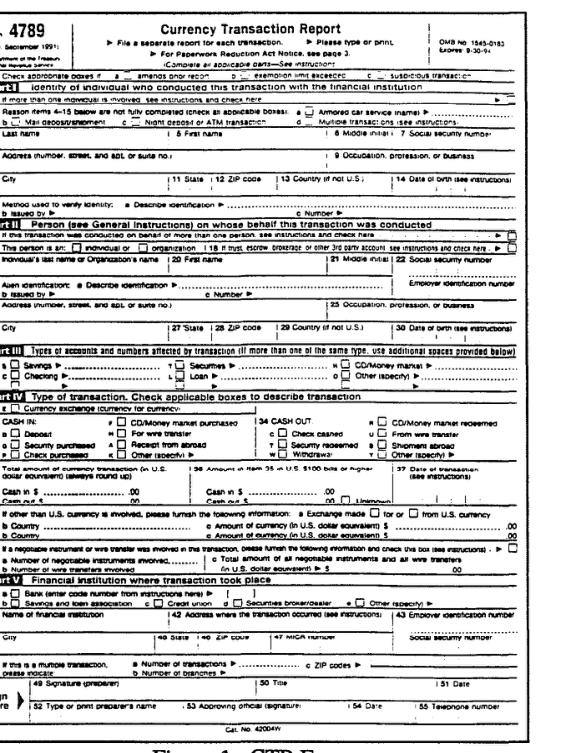

**그림 1: CTR 양식**

매년 약 IO백만 건의 거래가 보고되며, 90% 이상이 CTR의 거래입니다. 1993에서 이러한 거래 금액은 약 $500 billion에 달했습니다. 그림 2에 표시된 것처럼 이러한 금액은 지속적으로 증가해 왔습니다. 양식은 재무부의 금융 데이터베이스에 입력되며, 이는 두 군데로 유지됩니다.

```text
2Cash transactions 
at non-financial 
businesses 
are 
reported under 26 U.S.C. section 60501 to the IRS on 
Form 8300, the Report of Cash Payments Over $10,000 
Received in a Trade or Business. As of November 1992, 
law enforcement agencies other than the IRS no longer 
have access to this information. 
FAIS is designed to 
accommodate these reports if they once again become 
more widely available to law enforcement
```

<!-- 원문 3쪽 -->

```text
6,000
```

```text
4mQ
```

```text
2,~
```

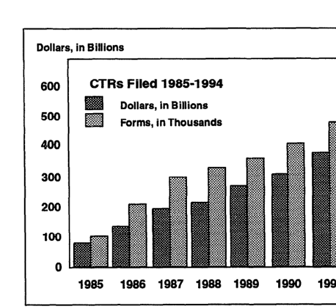

**그림 2: CTR 파일링**

메인프레임 호스팅 데이터베이스 시스템, 미국 관세청에서 운영하는 TECS(Treasury Enforcement Communications System), IRS에서 운영하는 통화 은행 규제 시스템. 이러한 시스템은 법 집행 기관에서 일반 또는 특정 문의에 대한 응답을 위해 사용됩니다. 이러한 시스템은 기존 조사를 지원하고 자금세탁 및 현금 거래에 대한 전략적 연구에 매우 유용합니다. 그러나 복잡한 기준에 따라 양식을 검색, 정렬 또는 연결할 수는 없습니다. 양식에 보고된 데이터에는 식별 및 거래 정보에 영향을 미치는 오류, 불확실성 및 불일치가 있을 수 있습니다. 단순한 데이터 입력 오류는 손으로 쓴 양식을 읽는 데 어려움이 있거나 키를 치는 오류로 인해 발생할 수 있습니다. 더 복잡한 어려움은 형태의 다른 측면에서 발생합니다. 업종이나 직업 등을 포함하는 자유 텍스트 필드는 표준화되지 않아 설명이 다양해집니다. 특히 CMIR 형식과 개인 이름의 언어 및 민족 유형이 다양하기 때문에 데이터를 해석하기가 어렵습니다. 모든 양식에 모든 필드가 채워져 있지는 않습니다. 신고자는 다양한 형태의 신분증(예: 사회보장번호, 운전면허증 번호 등)을 허용할 수 있습니다. 각 양식 유형에 제공된 정보는 완전히 동일하지 않습니다. AI1 이러한 요인으로 인해 거래 패턴을 재구성하는 것이 매우 어려워집니다. 기술. 잠재적으로 관련이 있는 거래 세트의 수는 양식 수에 따라 기하급수적으로 증가하므로3, 가장 의미 있는 연결 세트를 생성하여 검색 공간을 지능적으로 정리하는 능력은 자금세탁을 탐지할 목적으로 모든 형태를 현실적으로 평가하는 데 필요합니다.4 또한 자금세탁 탐지는 잘 훈련된 분석가의 수년간의 경험과 판단이 필요한 복잡한 작업입니다. 그 이유는 공식적인 도메인 모델과 현금에 관한 규범적 데이터가 모두 부족하기 때문입니다. 경제. 이러한 요소는 모두 AI가 FAIS의 필수 구성 요소라는 믿음에 기여했습니다. 마지막으로 아마도 가장 중요한 것은 FAIS의 성공적인 전신 시스템이 1980 중반에 미국 관세청에 의해 개발되었다는 점입니다. CAIS(Customs AI System)라고 불리는 이 시스템은 의심 여부 평가를 위해 규칙 기반 추론을 활용했습니다. 이는 이 AI 기술이 BSA 거래에서 자금세탁을 탐지하는 작업에 효과적으로 적용될 수 있다는 개념 증명 역할을 했습니다.

FAIS의 주요 작업은 잠재적인 리드를 생성하기 위해 모든 BSA 서류를 자동으로 검토하는 것입니다. FAIS 작업에 필요한 전문 지식은 다른 단서를 기반으로 자금세탁을 탐지하는 (적어도 그만큼 중요한) 능력과는 달리 23SA 데이터베이스에서 자금세탁의 잠재적 징후를 탐지하는 능력입니다. BSA 의심 분석은 분석가와 조사관이 가장 의심 활동에 집중할 수 있도록 데이터베이스의 주제에 대한 정보를 축적하는 점진적 프로세스로 생각할 수 있습니다. FAIS는 분석가가 BSA 서류에서 식별된 가장 의심스러운 주제, 계정 및 거래에 집중할 수 있도록 지원합니다.

수신된 양식의 양, 양식의 필드 수와 다양성, 양식 항목의 품질로 인해 인간 분석가가 연결되지 않은 개별 기반에서도 모든 양식을 검토하는 것은 불가능합니다. 자금세탁 징후가 있는지 관련 거래 세트를 검토하기 위해 양식을 연결하는 것은 고급 컴퓨팅을 사용하지 않고는 불가능합니다. 의심스러운 징후에 대해 BSA 서류를 평가하는 프로세스는 FAIS가 BSA 거래를 연결하고 평가하는 것으로 시작하여 FAIS에서 생성된 정보를 분석하고 해당 정보를 3을 통해 법 집행 기관에 제공합니다. 허용되는 연결 유형에 관한 가정에 따라 복잡성은 파티션 또는 하위 집합의 수에 비례하여 확장될 수 있습니다. 4대형 검색 공간을 갖춘 대부분의 AI 애플리케이션과 마찬가지로 대규모 컴퓨팅 성능은 또 다른 잠재적인 솔루션입니다.

<!-- 원문 4쪽 -->

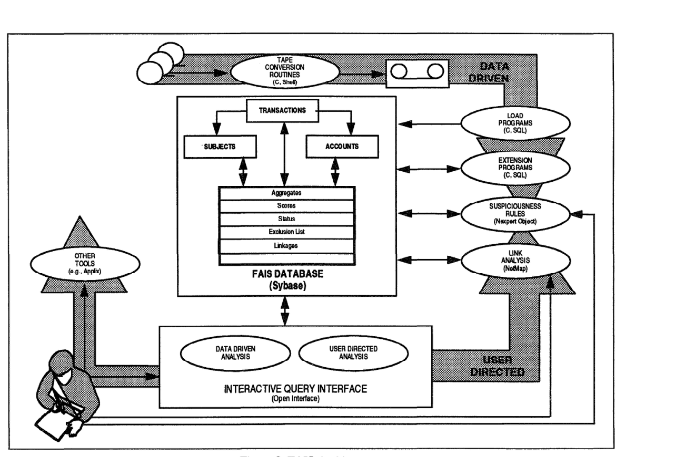

**그림 3: FAIS 아키텍처**

해당 문제에 대한 관할권. 이는 궁극적으로 위반자를 기소하고 유죄 판결을 내릴 수 있을 뿐만 아니라 정부가 불법적으로 취득한 자산을 압수할 수도 있습니다. 이 프로세스는 FinCEN의 조사 지원 작업이라는 더 큰 맥락에서 발생합니다. FAIS에서 단서가 생성되면, 기존 조사를 지원하기 위해 고객 기관이 제공한 알려진 단서를 기반으로 기존 사례를 개발하기 위해 금융 및 법 집행 정보 정보를 대조 및 분석하는 데 주로 사용되는 다른 FinCEN 시스템도 조사 지원 프로세스를 발전시키는 데 사용됩니다.

## 응용 시스템 설명

이 섹션에서는 FAIS의 작동 방식, 정의, AI 기술 및 개념을 사용하는 방법에 대해 설명합니다. 그림 3는 FAIS 아키텍처와 데이터 기반 및 사용자 지향의 두 가지 작동 모드를 보여줍니다. FAIS의 핵심 기능 모듈은 다음과 같습니다: 0 기본 데이터베이스 0 데이터 로드 프로그램 e 데이터베이스 확장 업데이트 프로그램 0 의심 평가 프로그램

- 링크 분석 도구 및 0 대화형 쿼리 인터페이스(IQI). Sun 환경에서 사용할 수 있는 다른 프로그램 및 패키지(예: 워드 프로세서, 스프레드시트, 이메일 및 데이터베이스로 구성된 Applix 사무 자동화 패키지)도 FAIS 구성 요소와 완전한 잘라내기 및 붙여넣기 상호 운용성을 갖기 때문에 때때로 FAIS의 일부로 간주됩니다.

## 운영 개념

FAIS는 데이터 기반 모드와 사용자 지향 모드의 두 가지 모드로 작동합니다. 데이터 기반 운영은 새로운 정보가 수신될 때 로드, 연결 및 평가하는 일반적인 프로세스입니다. 사용자 중심 분석은 특정 프로젝트나 작업에 대한 응답으로 시작되는 임시적입니다. 사용자는 데이터 기반 작업의 최종 결과물, 즉 점수별로 정렬된 주제 목록을 정기적으로 검토하고 분석합니다. 시스템의 운영 로드 대부분은 모든 거래의 데이터 기반 처리입니다. 데이터 기반 기능은 시스템이 수신한 모든 정보에 대해 작동하기 때문에 처리의 복잡성은 사용 가능한 컴퓨팅 리소스에 따라 제한됩니다. 대조적으로, 사용자 지향 A 시스템 운영자는 데이터 기반 작업을 수행할 책임이 있습니다. 데이터 테이프는 버지니아 주 뉴잉턴에 있는 미국 관세청 데이터 센터에서 받았습니다. 테이프는 로드 및 보관을 위해 8 mm 카세트에 복사 및 결합됩니다. 그런 다음 데이터가 F/W에 로드됩니다. 로드 프로그램은 공통 개인, 비즈니스 또는 계정 식별 정보에 따라 거래를 연결하여 클러스터(예: 주체 또는 계정)를 생성하는 프로세스인 통합을 수행합니다. 데이터베이스 확장 프로그램은 클러스터와 관련된 요약 정보를 생성하거나 업데이트하기 위해 실행됩니다. 클러스터의 의심 등급을 업데이트하기 위해 분석 규칙이 실행됩니다. 이러한 데이터 기반 프로세스는 모두 데이터베이스에 추가 정보를 생성합니다. 이러한 프로그램은 테이프 수신 시기, 테이프에 있는 데이터 양, 시스템 및 운영자 가용성에 따라 비동기식으로 실행됩니다.

<!-- 원문 5쪽 -->

사용자는 사용자 중심 분석이나 데이터 기반 분석을 선택하는 기본 메뉴를 통해 시스템에 들어갑니다. 사용자 주도 모드에서 사용자는 거래 집합에 대한 특정 기준을 설정하고 시스템은 지정된 기준을 충족하는 모든 거래를 검색합니다. 데이터 기반 모드에서 사용자는 데이터 기반 의심 점수를 기반으로 거래 세트를 검색합니다. 계속해서 이러한 주제 또는 계정에 대한 다른 모든 거래를 찾거나 지정된 주제 또는 계정에 연결된 다른 주제 및 계정을 찾아 연결 추적을 수행할 수 있습니다. 분석가가 연결된 주제, 계정 및 거래의 추적을 따르기 때문에 이 프로세스는 반복적으로 계속될 수 있습니다. 어느 단계에서나 사용자는 추가 분석을 위해 일련의 거래를 NetMap 링크 분석 도구에 로드할 수 있습니다. 사용자는 시스템 식별 주제를 결합하여 새 주제를 생성할 수도 있습니다. 이는 시스템이 사용자가 동일하다고 생각하는 두 주제를 통합하지 않았거나 두 주제가 단일 개체(예: 남편과 아내)로 비즈니스를 수행하는 경우 유용하며 이러한 사용자 생성 주제에 대한 의심을 재평가할 수 있습니다. 사용자는 의심스러운 평가에 직접 액세스하여 특정 주제나 계정에 대해 어떤 규칙이 적용되는지 결정하고, 본질적으로 해당 주제나 계정에 대한 의심 점수에 대한 설명을 얻을 수 있습니다. 마지막으로 사용자는 Nexpert 그래픽 모드를 활용하고 값이나 규칙을 변경하여 관심 있는 가상 상황을 분석할 수도 있습니다.

## 아키텍처

이 섹션에서는 FAIS의 각 구성 요소의 구조와 작동을 설명합니다.

## FAIS 데이터베이스

Sybase는 표준 FinCEN 데이터베이스 관리 시스템(DBMS)입니다. 평가 없음 FAIS 데이터 모델은 거래, 주제 및 계정이라는 세 가지 기본 개념을 기반으로 합니다. 여기에는 모든 BSA 양식 유형의 모든 필드가 포함되어 있으며 여러 양식 유형에 공통된 해당 필드를 통합합니다. 대략 120 필드가 있으며 그 중 약 절반이 특정 양식에 채워져 있습니다. 이는 다양한 모듈이 공유 데이터 저장소에서 비동기적으로 읽고 쓰는 블랙보드 시스템 아키텍처를 지원하도록 설계되었습니다. FAIS 데이터 모델은 또한 그림 4에 표시된 것처럼 데이터 액세스 및 제어의 세 가지 다른 수준에 해당하는 "보고된", "수락된" 및 "가정화된" 세 가지 수준의 믿음을 지원합니다.

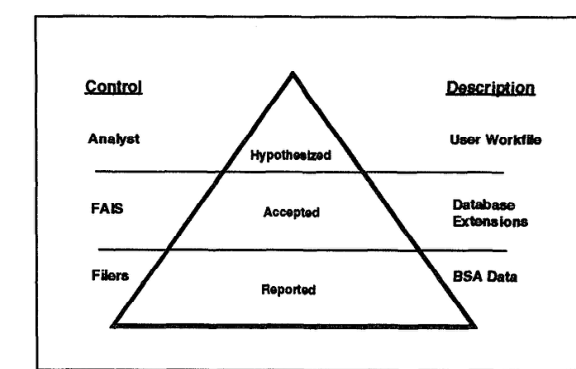

**그림 4: 믿음의 수준**

거래은 FAIS의 데이터 해석 없이 보고되는 대로 데이터베이스에 직접 입력됩니다. 그러나 데이터는 거래만을 기반으로 하는 모델에서 거래, 주제 및 계정을 기반으로 하는 FAIS 모델로 재구성됩니다. 주제와 계정은 유사한 식별 정보를 사용하여 거래를 "클러스터"로 그룹화하는 통합 프로세스의 결과로 생성된 추상화입니다(Goldberg 및 Senator 1995). 거래에서 클러스터로의 변환은 거래에 보고된 식별 정보를 기반으로 합니다. 여러 주체가 거래에 나타날 수 있으므로 거래은 여러 클러스터의 일부일 수 있습니다. 거래에서 주제 또는 계정으로의 변환은 그림 5에 개념적으로 설명되어 있습니다. 데이터 기반 처리는 거래에서 주제 및 계정으로의 이러한 보기 변환을 편집하여 사용자 요청 시 모든 데이터에 대해 이 보기를 사용할 수 있도록 하는 것으로 볼 수 있습니다. 이 두 가지 보기를 모두 사용할 수 있음

<!-- 원문 6쪽 -->

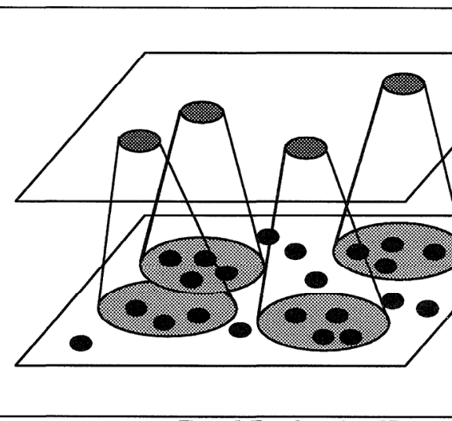

**그림 5: 관점의 변환**

동시에 FAIS가 사용자에게 제공하는 분석 통찰력이 크게 향상되었습니다.

주제 및 계정 클러스터와 이러한 거래 세트에서 계산된 집계 또는 요약 데이터는 다음 수준의 믿음(즉, 허용됨)을 나타내며 전체 시스템이 의존하는 보수적이고 입증된 알고리즘에 따라 계산됩니다. 클러스터 또는 거래에 대한 이러한 요약 정보를 데이터베이스 확장이라고 합니다. 여기에는 의심성 평가에 필요한 파생 속성, 데이터 기반 의심성 평가 결과, 대상 상태와 같은 정보가 포함된 다양한 "플래그", 클러스터 간의 추가 연결을 포함하여 사용자 지시 모드에서 분석가가 발견한 추가 정보가 포함됩니다. 믿음의 최종 수준(예: 가설)은 더 높은 수준의 추상화(예: 사례, 패턴)와 대체 주제 및 계정 통합을 위해 예약되어 있습니다.

전체 데이터베이스는 관계형 모델에서 구현되지만 특정 유형의 데이터를 보다 효율적으로 검색하기 위해 약간 비정규화되었습니다. FAIS 데이터베이스는 40 Sybase 테이블로 구성되어 있으며 현재 약 20GB를 차지합니다.

데이터 로드 프로그램. 데이터 로드 프로그램은 성능에 최적화된 C(9K 라인)와 Sybase SQL 저장 프로시저 코드(4K 라인)의 하이브리드 프로그램입니다. 이 모듈에서 가장 흥미로운 활동은 주제와 계정을 통합하는 것입니다. 이러한 통합은 지식 엔지니어링에서 개발한 일련의 경험적 방법을 기반으로 합니다. 이 지식은 현재 데이터베이스 확장 프로그램과 합당한 일치 항목을 찾기 위해 데이터베이스 검색을 사용하는 두 개의 SQL 저장 프로시저의 프로그램에 코딩되어 있습니다. 확장 프로그램은 클러스터에 대한 요약 정보를 계산합니다. 이 모듈의 주요 활동은 각 주제 또는 계정의 기본이 되는 일련의 거래에 대한 집계 및 요약 모델을 생성하는 것입니다. 이는 의심 평가 규칙이 사용하고 시스템의 향후 개선을 위한 주요 영역 중 하나를 나타내는 파생 데이터 필드입니다. 이 요약 정보는 기간별 신고 건수 또는 금전적 가치와 같은 수치적 집계와 주제와 관련된 위치 또는 직업과 같은 기타 비숫자 정보로 구성됩니다. 이 모듈은 가장 기본적인 작업(200 라인)만을 위한 SQL 저장 프로시저와 함께 C(8K 라인)로 작성된 일반 데이터베이스 액세스 라이브러리를 사용하는 두 개의 작은 C 프로그램(1K 라인)으로 구성됩니다. 향후 계산하기로 결정한 추가 기능에는 약간의 수정만 필요합니다.

Swpiciousnm 평가. FAIS의 의심 평가 모듈에는 시스템의 주요 전문가 규칙 기반 구성 요소가 포함되어 있습니다. 이 작업을 위해 Neuron Data의 Nexpert Object 셸이 선택되었습니다. Nexpert는 규칙 베이스의 개발 및 실행을 위해 GUI를 제공합니다. 이 GUI는 기본적인 설명 기능이 내장되어 있어 사용자가 어떤 규칙이 실행되었는지, 각 규칙이 결과에 어떻게 기여했는지 쉽게 확인할 수 있습니다. 또한 적절한 교육을 받은 분석가가 "가상" 유형의 질문에 답하기 위해 규칙 기반을 수정하거나 추가할 수 있으며 이는 결국 지식 엔지니어링 프로세스에 도움이 됩니다. 이 애플리케이션에 대한 Nexpert의 다른 유용한 기능으로는 빠른 역방향 연결 추론 엔진, 데이터베이스 시스템(Sybase 포함)에서 직접 데이터를 가져오는 기능, 모든 표준 데스크탑과 미니컴퓨터 간의 이식성, 그리고 Nexpert 규칙 베이스가 모든 것을 Nexpert 모델에 맞추는 대신 더 큰 시스템의 구성 요소가 되도록 허용하는 포괄적인 API가 있습니다.

<!-- 원문 7쪽 -->

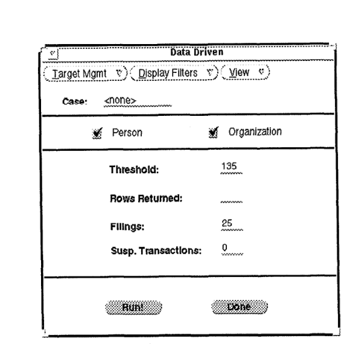

**그림 6: 데이터 기반 모드**

FAIS의 의심성 평가의 초기 구현은 CAIS에서 개발된 규칙 기반을 거의 전적으로 활용합니다. CAIS는 Apollo(현 Hewlett Packard) 컴퓨터 시스템용 KES(지식 엔지니어링 시스템)에 구현된 439 규칙과 함께 6 고유 규칙 세트로 구성되었습니다. 이 6가지 규칙 세트는 개별 CTR 거래, 개별 CMlR 거래, 은행 계좌의 CTR 활동, 개인 또는 기업의 CTR 활동, 개인 또는 기업의 CMIR 활동, 개인 또는 기업의 결합된 CTR 및 CMIR 활동에 대한 의심을 계산했습니다. CAIS 규칙과 의미론적으로 동등한 것이 FAIS에 대해 다시 구현되었습니다. 두 개발 도구 모두 유사한 전문가 시스템 기술 모델을 사용하기 때문에 이 프로세스는 매우 간단했습니다. 규칙 세트의 일부 단순화가 이루어져 FAIS에는 336 규칙만 포함되어 더 나은 실행과 더 쉬운 유지 관리라는 이점이 있습니다. 이는 다수의 전문가 규칙이 본질적으로 C 함수로 대체된 간단한 테이블 조회를 구현했다는 점을 인식함으로써 달성되었습니다. 증거 조합의 보다 명확한 표현으로 인해 일부 규칙 세트의 수가 실제로 증가했습니다. 의심성 평가 모듈은 Nexpert 코드의 8,000 라인, SQL 코드의 1300 라인, OfC 라인의 2000 라인으로 구성됩니다.

각 규칙 세트는 자금세탁과 관련된 금융 활동의 다양한 징후를 찾습니다. 또한 양식에서 자유 텍스트 직업 및 비즈니스 유형 필드를 해석하는 데에도 경험적 지식이 사용됩니다. 이러한 휴리스틱은 이 분야에서 관찰된 실제 값을 기반으로 개발되었습니다. 다른 규칙은 다음의 패턴을 검색합니다.

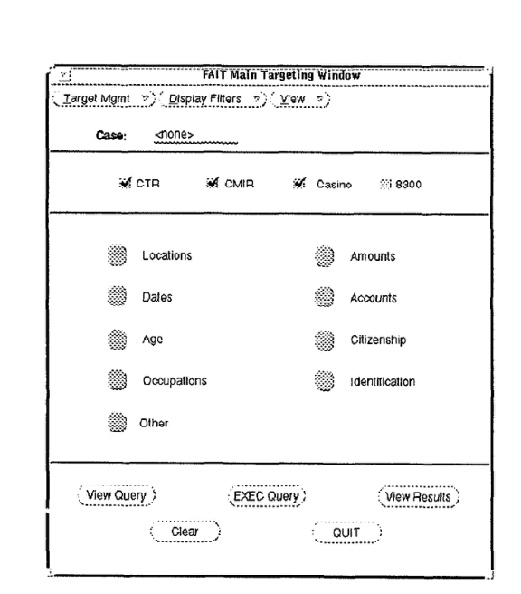

**그림 7: 사용자 주도 모드**

CTR 신고를 피하기 위해 $10,000 보고 기준액 바로 아래에 있는 금액을 거래하는 "스머핑"과 같은 특정 자금세탁 기술과 관련된 활동입니다. 각 규칙은 거래/주제/계정이 각각 의심스럽거나 합법적이라는 긍정적 또는 부정적 증거를 제공합니다. 각 규칙의 증거는 간단한 베이지안 방식으로 결합되어 거래/주제/계정에 대한 단일 의심 등급을 제시합니다. 높은 의심 점수는 추가 조사를 위해 분석가에게 보고됩니다.

대화형 쿼리 인터레이스. FinCEN의 컴퓨팅 환경은 주로 DOS 및 Microsoft Windows를 실행하는 IBM 호환 개인용 컴퓨터로 구성됩니다. 추가 사용자가 FAIS를 사용할 수 있어야 할 가능성이 있기 때문에 UNIX 워크스테이션이나 PC에서 실행할 수 있는 사용자 인터페이스를 갖는 것이 매우 바람직했습니다. 인터페이스 이식에 드는 노력을 최소화하기 위해 Neuron Data의 개방형 인터페이스가 GUI의 개발 도구로 선택되었습니다. 대화형 쿼리 인터페이스는 오픈 인터페이스 리소스 파일 및 라이브러리 외에도 약 25, OOO 줄의 C 코드로 구성됩니다.

대화형 쿼리 인터페이스는 데이터베이스에서 잠재적인 리드를 검색하는 동안 서로 분리되어 있지만 관련된 데이터셋를 동시에 확인하려는 사용자의 요구에 부응하여 설계되었습니다. 화면 양식은 데이터베이스에 대한 쿼리를 공식화하는 데 사용됩니다. 데이터베이스에서 검색된 데이터 사용자는 기본 메뉴에서 데이터 기반 또는 사용자 주도 모드를 선택하여 시스템에 들어갑니다. 데이터 기반 모드는 그림 6에 표시된 창을 불러옵니다. 사용자는 과목을 검사할 점수 임계값을 선택합니다. 개인 또는 조직 주제 유형을 지정할 수 있습니다. 주제별 제출 건수나 거래 수와 같은 다른 기준을 사용하여 목록에서 주제를 제거할 수도 있습니다. 데이터베이스의 플래그를 사용하는 디스플레이의 필터를 통해 사용자는 이전에 검사했거나 알려진 적법한 주제를 무시할 수 있습니다. 대안으로, 그림 7에 표시된 것처럼 사용자 주도 모드를 사용하면 사용자가 양식 유형을 포함하여 거래의 정보 항목을 기반으로 쿼리를 구성할 수 있습니다. 실제 SQL 쿼리는 증분적으로 구성되는 것처럼 볼 수 있습니다. 쿼리는 사용자가 "보기" 메뉴에서 선택하는 주제 또는 계정별로 구성된 일련의 거래를 반환합니다.

<!-- 원문 8쪽 -->

어느 모드에서나 사용자는 여러 창에서 쿼리 결과를 검사하고 그림 8에 표시된 대로 관심 사항과 분석 결과에 따라 그 창 사이를 이동합니다. (그림 8에서는 실제 주체의 개인 정보를 보호하기 위해 모든 식별 정보가 일반 식별자로 대체되었습니다.) 이 예에서 데이터 기반 쿼리는 주체 목록을 반환하며, 여기에서 사용자는 높은 의심 점수(예: 150)를 받고 129를 갖는 기업인 주체 5338를 선택합니다. CTR의 총액은 1 12월 1993로 끝나는 연도에 3,600만 달러가 넘습니다. "협회" 메뉴에서 사용자는 원래 BUSINESS-5338 및 BUSINESS-5338와 함께 모든 거래에 나타나는 10 추가 비즈니스 및 사람을 포함하는 BUSINESS-5338와 관련된 모든 주제를 다른 창에서 봅니다. 다음으로 사용자는 이 목록에서 세 가지 주제를 선택합니다. PERSON - 트레일이 완료되거나 소진될 때까지 주제나 계정을 통해 이 링크 추적 프로세스를 무기한 계속합니다. 사용자는 연결된 창 집합에서 자신이 어디에 있는지 추적할 책임이 있지만 모든 활성 창의 계층적 표시를 포함하면 이 작업이 더 쉬워집니다.

## 링크 분석

Alta Analytics의 NetMap 링크 분석 패키지(Davidson 1993)가 선택되어 사용자 정의 FAIS 시스템 구성 요소와 통합되었습니다. 왜냐하면 이 패키지가 인간 분석가의 뛰어난 패턴 인식 능력을 활용하는 강력한 시각화 도구를 제공하고 전통적인 법 집행 기관의 "링크 및 에지" 차트에서 가능한 것보다 "왜건 휠" 디스플레이에 훨씬 더 많은 노드 및 연결 세트를 효과적으로 수용했기 때문입니다. FinCEN 분석가는 두 가지 유형의 표현을 모두 사용합니다. 수레바퀴 표시는 링크 세트를 탐색할 때 분석 프로세스 중에 유용합니다. 링크 및 에지 표시(법 집행 커뮤니티에서는 "Anacapa" 차트라고 함)는 완전히 개발된 분석을 표시하는 데 유용합니다. 그림 9 및 10는 이러한 두 가지 유형의 디스플레이에 대한 예를 제공합니다. 이 수치는 FAIS가 작성한 실제 정보 보고서의 일부를 모든 식별 데이터가 제거된 상태로 복제한 것입니다. 이는 더 작은 데이터셋에 초점을 맞추면서 연계 발견 및 중요성 평가 프로세스를 계속할 수 있는 사용자의 능력을 더 자세히 보여줍니다.

사용자는 주제나 계정을 선택하여 NetMap을 호출합니다. 모든 거래과 해당 거래의 관련 정보는 FAIS 데이터베이스에서 NetMap으로 로드됩니다. NetMap에 대한 인터페이스에는 C 코드의 400 라인이 필요했습니다. 사용자는 이 정보를 탐색하여 '특정 사례와 관련된 항목을 선택하고 데이터 기반 통합으로 인해 별도로 남겨진 일부 주제를 병합할 수도 있습니다.

하드웨어 및 시스템 소프트웨어 환경. FAIS 하드웨어와 시스템 소프트웨어는 현재 Solaris 2.3 운영 체제를 실행하는 SUN 서버와 워크스테이션으로 구성되어 있습니다. 라이브 BSA 데이터는 768MB 메모리와 88GB 디스크 스토리지를 갖춘 6 프로세서 SPAlWCenter 2000의 Sybase에 저장되며, 70GB는 데이터에 사용할 수 있습니다. Sybase SQL 서버가 이 시스템에서 실행되고 대규모 검색의 병목 현상이 발생하므로 가능한 한 많은 다른 애플리케이션 모듈이 다른 워크스테이션에 배포되었습니다. 한 워크스테이션은 개발용 SQL 서버입니다. 두 번째는 애플리케이션 코드용 파일 서버이고 나머지는 Nexpert Object/Smart Elements 2.0 및 NetMap 3.63 서버입니다. 사용자 워크스테이션은 32-48MB 메모리와 400MB - 1GB 디스크 공간으로 구성된 SPARCstation(2 및 5)입니다. 1 출시

<!-- 원문 9쪽 -->

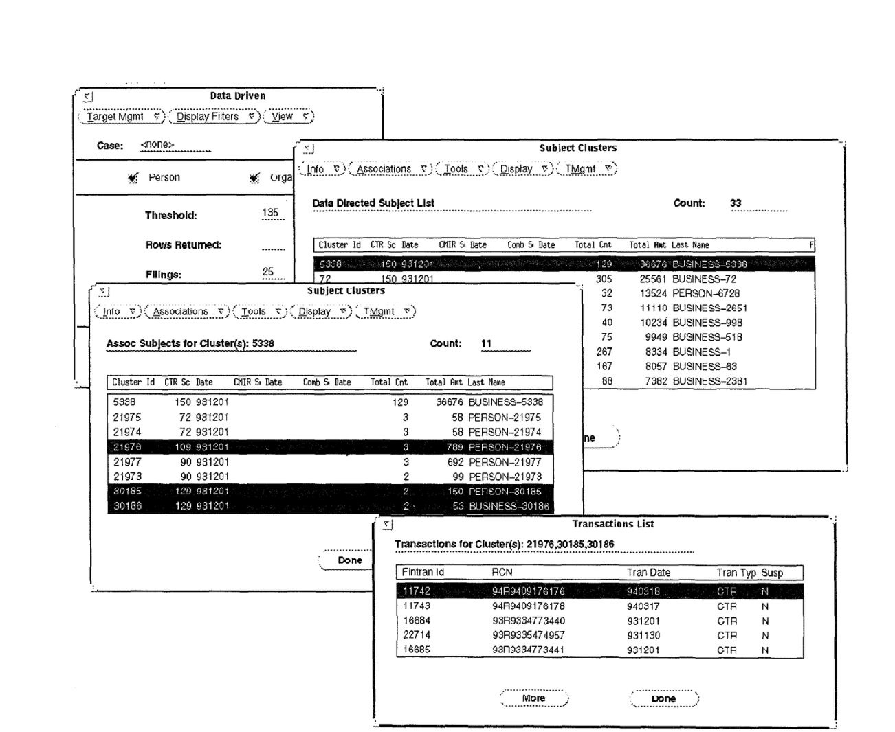

**그림 8: 대화형 쿼리 인터페이스로 결과 조사**

FAIS는 288MB 메모리, 20 1.3GB 디스크 및 5개의 컨트롤러를 갖춘 Sun 4/490 서버에서 작동됩니다.

## AI 기술의 활용

위에서 설명한 것처럼 FAIS는 복잡한 정보 시스템의 구성 요소에 대한 필수 활성화 기술로 AI를 사용하는 예입니다. FAIS의 규칙 및 블랙보드 사용은 AI에서 이러한 아이디어를 원래 사용하는 것과 다릅니다. FAIS 프로젝트는 이러한 유형의 작업에 사례 기반 추론 및 기타 기계 학습 기술을 적용하는 데 따른 어려움에 대한 통찰력도 제공했습니다. FAIS의 규칙 기반은 말 그대로 2세대이기 때문에 흥미롭습니다. 마지막으로 FAIS는 애플리케이션 도메인과 링크 분석 작업 때문에 흥미롭습니다. FAIS는 ​​불확실하고 부정확한 식별 정보를 기반으로 거래를 연결해야 한다는 점에서 이전에 보고된 Inspector(Bymes et. al. 1990) 및 Spotlight(Anand and Kahn 1992)와 같은 대규모 데이터 분석 시스템과 같은 금융 모니터링 시스템과 다릅니다.

"전문가 시스템"의 차이점 명시적 지식은 현재 설계된 FAIS의 세 가지 구성 요소에 사용됩니다. 의심성 평가 규칙은 FAIS의 기본 지식 저장소입니다. 데이터 로드 프로그램의 통합 알고리즘과 의심 평가 구성 요소의 직업 디코딩도 kuowledge 기반입니다. 이 지식은 미리 정의된 제어 경로에 따라 적용됩니다. 특정 항목에 따라 선택적으로 호출되지 않습니다.

<!-- 원문 10쪽 -->

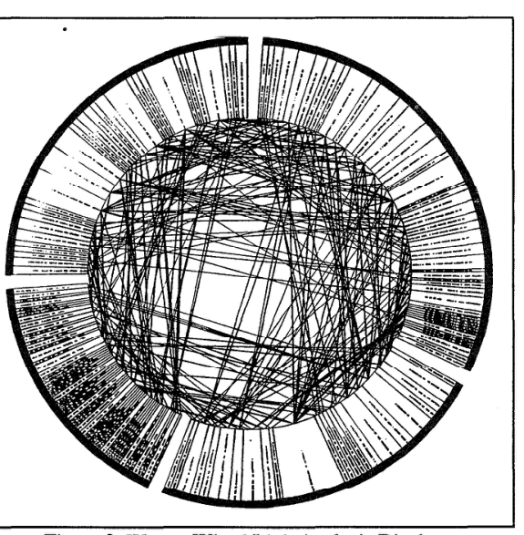

**그림 9: 왜건 휠 링크 분석 디스플레이**

특정 문제 인스턴스. FAIS 작업의 이러한 부분은 규칙 기반 의심 평가를 준비하기 위해 들어오는 모든 데이터를 평가해야 하기 때문에 Lowledge의 전역 호출이 필요합니다. 마지막으로 사용자 중심의 조작 개념으로 구체화된 검색 모델은 절차적 지식 획득의 결과이다. 문제 해결 시 시스템에서만 사용하기 위해 이러한 절차적 지식을 내장하는 대신, 이 지식은 전문 사용자가 자신의 검색을 통해 경험적으로 추론하는 데 사용됩니다. 사용자는 인간과 컴퓨터가 혼합된 문제 해결 시스템의 맥락에서 지능형 에이전트입니다. 인간과 소프트웨어 에이전트는 데이터베이스를 통해 협력합니다. 사용자가 작업을 수행하는 방법에 대한 통찰력을 얻으면 이러한 기능 중 일부가 자동화됩니다.

FAIS가 수행하는 작업은 전통적으로 전문가 시스템 접근 방식(Hayes-Roth, Waterman 및 Lenat 1983)으로 처리할 수 있다고 생각되는 작업과 여러 면에서 크게 다릅니다. 가장 중요한 것은 FA,IS가 이 시스템이 존재하기 전에는 전혀 수행되지 않았던 작업을 수행하려고 시도한다는 것입니다. 거래를 자동으로 연결하는 컴퓨팅 인프라가 없었습니다. 이 인프라를 사용할 수 있었다 하더라도 FAIS의 "전문가 시스템과 같은" 부분인 의심 자동 평가는 관련 데이터 양이 많기 때문에 수동으로 수행할 수 없었습니다. 따라서 FAIS 개발의 주요 목표는 생산성 향상, 비용 절감, 의사 결정 속도 향상, 의사 결정 품질 향상, 부족한 전문 지식 유지 또는 배포보다는 이 작업을 수행하고 관련 운영상의 이점을 제공하는 것이었습니다.

FAIS는 분석가에게 지원을 제공하려고 시도합니다. 컴퓨터와 인간의 결합은 혼자서는 할 수 없는 작업을 수행할 수 있습니다. FAIS는 데이터베이스에 대한 개별 거래를 처리하지 않습니다. 대신 새로운 증거(예: 추가 관련 거래)를 수신하면서 데이터베이스 내 각 주체 및 계정의 의심을 (재)평가합니다. 마지막으로, FAIS는 하나의 특정 작업을 수행하기 위해 광범위한 개념 세트로 광범위한 추론을 수행하지 않습니다. 오히려 다단계 프로세스의 다양한 지점에서 다양한 관점의 증거를 결합합니다.

## 블랙보드로서의 데이터베이스

FAIS 데이터베이스의 블랙보드 특성이 위에서 논의되었지만 (Engelmore & Morgan 1988)에 설명된 것과 같은 기존 블랙보드 시스템과 그 사용이 어떻게 다른지 주목하는 것이 중요합니다. 먼저, 모든 입력 데이터가 데이터베이스에 로드되고 모든 "허용" 수준 통합이 수행됩니다. 결과적인 주제 및 계정 클러스터와 파생된 데이터는 시스템의 다른 부분이 요청할 때까지 기다리지 않고 전체 블랙보드에 지식을 적용한 결과입니다. 이는 인간 사용자가 루프에 있을 때 성능을 고려하기 때문에 필요합니다. 더 중요한 점은 데이터베이스에 클러스터가 미리 채워져 있기 때문에 사용자가 조사 결과에 따라 거래에서 주제 또는 계정으로 자유롭게 초점을 전환하고 다시 그 반대로 이동할 수 있다는 것입니다.

특정 문제 해결 방법을 제어하기 위해 블랙보드을 사용하는 기존 방식과 달리 FAIS 블랙보드은 장기간에 걸쳐 인터리브된 여러 문제 해결 인스턴스를 제어하며, 그 동안 추가 관련 데이터가 무작위로 도착할 수 있습니다. 데이터 양과 시간적 측면이 구현 선택을 좌우합니다. 기존 블랙보드 시스템이 특정 문제 인스턴스와 관련된 데이터를 구축, 사용 및 폐기하는 반면, FAIS는 시간이 지남에 따라 연속성을 제공하여 여러 조사를 위한 제도적 메모리 역할을 해야 합니다.

<!-- 원문 11쪽 -->

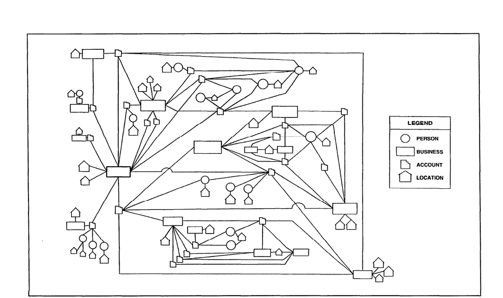

**그림 10: 링크 및 에지(Anacapa) 디스플레이**

별도의 조사를 연결할 가능성을 허용합니다. FAIS는 매우 큰 데이터 공간에 대한 공동 발견 작업에서 지능형 소프트웨어와 인간 에이전트를 통합하기 때문에 데이터베이스 기술로 해결되는 시간적 및 성능 문제가 시스템 설계를 지배합니다.

현재 규칙 기반 의심 평가 모듈은 다시 블랙보드 전체에서 실행되어 사용자에게 빠른 점수 쿼리를 제공합니다. 어떤 의미에서 이는 데이터 기반 분석이 깊이 우선이 아닌 너비 우선 검색을 수행하게 만듭니다. 보다 세련되고 제한적으로 적용 가능한 규칙 세트, 특수 목적 통합 모듈 및 적용 가능성이 제한될 수 있는 기타 형태의 추론(예: 사례 기반)을 도입함에 따라 블랙보드은 데이터베이스의 일부를 다양한 수준으로 설명하는 다양한 표현으로 보다 전통적인 풍미를 갖게 될 것입니다.

## 사례 기반 추론 및 머신러닝

이 시스템을 개발하는 동안 사례 기반 추론(CBR) 및 기타 기계 학습 기술이 탐구되었습니다. 5 이러한 노력은 주요 시스템 개발 노력을 보완하고 5로 추진되었습니다. 이 작업은 각각 Cognitive Systems, Inc. 및 Ascent Technology, Inc.에서 수행되었습니다.

성공할 경우 전체 시스템에 추가하려는 의도입니다. 현재 운영 체제에는 포함되어 있지 않지만 이러한 노력 중에 확인된 문제가 해결되면 향후 버전에서 사용할 수 있을 것으로 예상됩니다. 이러한 노력은 특정 애플리케이션에 대한 AI 기술의 유용성에 대한 통찰력을 제공하기 때문에 여기서 논의됩니다.

상용 CBR 쉘을 활용하려는 시도에서 몇 가지 문제가 발생했습니다. CBR은 사례를 표현하기 위해 적절한 특성 집합을 정의하도록 요구했습니다. 지식 공학이 후보 세트를 식별했지만 이러한 특성은 FAIS 데이터베이스에 명시적으로 표시되지 않습니다. 모든 거래에서 데이터 기반 모드로 이러한 기능을 파생시키는 계산 능력은 아직 우리에게 제공되지 않습니다. 평가 목적으로 일부 거래에 대해 이러한 기능을 도출하는 것조차 어려웠습니다. 기능이 데이터 측면에서 명확하게 지정되지 않았기 때문입니다. 일부는 추가 도메인 지식이 필요합니다. CBR 쉘은 플랫 기능 벡터를 기반으로 합니다. 그들은 자금세탁 계획을 나타내는 데 필요한 더 복잡한 데이터 구조를 설명할 수 없었습니다. CBR의 기본 아이디어(즉, 가장 가까운 이웃 일치 및 귀납적 검색)는 작업의 일부에 유용해 보였지만 상업용 CBR 셸에서 "제거"할 수 없었고 상업용 CBR 셸을 통합하는 데 관련된 오버헤드가 상당했습니다. 당시 이 작업.

<!-- 원문 12쪽 -->

최근접 이웃 검색 및 의사 결정 트리의 귀납적 구축에 대한 기계 학습 아이디어를 적용하는 보다 직접적인 접근 방식도 탐구되었습니다. 레이블이 지정된 예제가 없다는 점이 이러한 기술을 사용하는 데 가장 큰 장애물이었습니다. 비지도 학습 알고리즘이 고려되었지만 작동할 적절한 기능을 도출하는 것이 어렵기 때문에 이러한 기술은 실행 불가능했습니다. 이러한 어려움은 열악한 데이터 품질과 추가적인 배경 지식의 필요성으로 인해 더욱 악화되었습니다. 이러한 기술은 데이터 실험을 수행하기 위한 지식 공학 보조 수단으로 잠재적으로 유용하다는 것이 발견되었습니다. 한 테스트에서는 귀납법을 사용하여 지식 엔지니어링 중에 식별된 40 기능을 기반으로 제한된 데이터셋로 의사결정 트리를 만들었습니다. 그런 다음 분석가는 의사결정 트리를 조사하여 다양한 경험적 기능이 의심의 지표로서 얼마나 유용한지 확인했습니다.

## 응용 시스템의 활용과 효과

FAIS는 3월 1993부터 운영에 사용되었습니다. 1월 1995를 기준으로 20 million 거래가 입력되고 함께 연결되어 3.0 million 통합 주제와 2.5 million 계정이 생성되었습니다. 여기에는 1월 1993부터 12월 1994까지 수신된 모든 거래와 1992 동안 발생한 선택된 거래가 포함됩니다. 평균적으로 매주 약 200,000 거래가 추가됩니다. 전담 인텔리전스 분석가 그룹이 시스템에서 생성된 잠재적 리드를 검토, 검증 및 추적하는 데 풀타임으로 참여하고 있습니다. 또한 후속 조사를 위해 다른 FinCEN 분석가에게 단서를 제공합니다. 이러한 분석가는 BSA 의심 분석 프로세스를 주요 책임으로 갖고 있습니다. 추가적인 책임은 시스템 개발을 위한 주요 지식 소스 역할을 하는 것입니다. 현재 전담 애널리스트는 3명인데 많게는 5명까지 늘어났다. 이러한 사용자는 때때로 FAIS 시스템에 대해 배우고 BSA 데이터와 관련된 특정 프로젝트에서 작업할 기회를 사용한 다른 FinCEN 분석가에 의해 보강되었습니다. 분석가는 FAIS의 데이터 중심 모드와 사용자 지향 모드를 모두 사용합니다. 데이터 기반 모드는 상대적으로 높은 의심 점수를 표시하는 주제나 계정을 선택하는 데 사용됩니다. 그런 다음 분석가는 유효한 단서 개발을 위해 재무 데이터 및 기타 소스 데이터에 대한 조사 및 분석을 통해 주제 또는 계정을 추가로 평가합니다. FAIS는 분석가를 위한 각 BSA 파일을 검토, 처리 및 평가하여 FAIS 이전에 엄청난 노력과 시간이 소비된 정도까지 사용자 지시 모드에서 분석가는 법 집행 기관의 요청, FinCEN 내의 다른 그룹의 요청 또는 자체 시작 프로젝트를 지원하는 특정 기준을 설정합니다. 프로젝트에는 지정된 기준에 맞는 수많은 "히트"가 포함되지만 히트가 반드시 서로 관련되지는 않을 수도 있습니다. "적중" 목록의 각 항목에는 의심스러운 금융 활동 수준이 더 높은 항목으로 분석가를 즉시 연결하는 의심 점수가 포함됩니다. 사용자 중심 분석은 FAIS 이전 환경에서 수행되었습니다. 일반적인 사전 쿼리 시간이 약 1일에서 1시간 미만으로 단축되었습니다. 데이터 중심 모드에서와 마찬가지로 피험자는 연구 및 분석을 통해 추가로 평가됩니다.

분석가들이 시스템에 대한 경험을 쌓으면서 생산성이 더욱 높아졌습니다. 표 1에는 생성된 보고서 수와 식별된 주제 수를 기준으로 연도별(4월 1995까지) 보고서가 요약되어 있습니다. 이 보고서는 잠재적 세탁 자금으로 $1 billion 이상에 해당합니다.

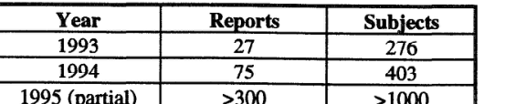

**테이블 1: FAIS에서 발생하는 리드**

피드백과 고객과의 연락은 중요한 역할을 합니다. 우리가 수집하는 정보는 지식 기반 평가에 매우 유용합니다. 이전에 법 집행 기관에 알려지지 않은 단서로 인해 공개된 조사는 동일한 유형의 행동을 보이는 다른 대상을 찾는 것이 가치가 있음을 시사합니다. 1993, FinCEN은 3월부터 내부 조사의 피드백 외에도 외부 기관으로부터 109 피드백 양식을 받았습니다. 피드백의 90% 이상이 새로운 케이스가 열렸거나 진행 중인 조사와 관련이 있음을 나타냅니다. 최근 피드백 양식을 통해 시스템과 후속 조사, 기소 및 유죄 판결에 의해 생성된 단서로 인해 첫 번째 종결된 사건이 ​​통보되었습니다. 피드백을 받지 못한 사례에 대한 적절한 후속 조치는 전파된 리드의 가치에 대한 보다 정확한 그림을 얻기 위해 향후 수행될 것입니다.

<!-- 원문 13쪽 -->

FAIS의 또 다른 이점은 분석가가 이전에 볼 수 없었던 BSA 데이터를 볼 수 있다는 것입니다. FAIS 데이터베이스에 대한 쿼리를 통해 BSA 정책 결정, 양식 재설계 및 필수 규정 준수 조치 식별에 유용한 통찰력을 얻었습니다. 분석가들은 조사 지원 기능에 매우 유용한 데이터 요소와 그렇지 않은 데이터를 판단할 수 있었습니다. 결과적으로 합법적인 거래와 연결된 기업을 식별하는 것은 BSA 규정 준수 프로그램을 지원하는 재무부에 매우 유용합니다. 이들 사업체는 금융기관의 면제 대상자 명단에 등재될 가능성이 매우 높은 것으로 판단된다.

## 응용 시스템 개발 및 배포

개발팀은 7명의 기술 직원으로 구성되었으며 대부분은 추가 책임을 맡았습니다. 개발 비용은 급여와 하드웨어 및 소프트웨어 도구 구입으로 구성되었습니다. FinCEN은 신생 에이전시였기 때문에 시스템을 개발하는 동시에 자원 확보와 직원 채용이 필요했습니다. 전체 팀은 1992의 늦은 봄까지 제자리에 있지 않았습니다. 프로그래밍 직원을 위한 컴퓨터, 기성 소프트웨어 구성 요소, Sybase, Nexpert Object 및 Open Interface 교육, 의미 있는 데이터셋를 보관할 수 있을 만큼 큰 서버도 약 6월 1992까지 마련되지 않았습니다.

1980 중반에 미국 관세청은 현재 FAIS가 수행하는 작업을 해결하기 위한 시스템을 개발했습니다. 이 시스템인 CAIS는 1990의 FinCEN 구성의 일부로 FinCEN에 의해 상속되었습니다. CAIS는 1980 중반의 일반적인 거래량에 맞게 설계되었습니다. Aegis 운영 체제의 Apollo 워크스테이션에서 실행되었으며 1990의 현재 하드웨어 및 운영 체제에서는 더 이상 지원되지 않거나 사용할 수 없는 상용 기성 소프트웨어를 통합했습니다. 엄청나게 증가한 거래량을 처리하기 위해 CAIS를 업데이트하는 유일한 방법은 새로운 하드웨어 및 소프트웨어 환경에서 CAIS를 재구축하는 것이라고 결정되었습니다.

**표 2에는 주요 FAIS 개발 마일스톤이 나열되어 있습니다.**

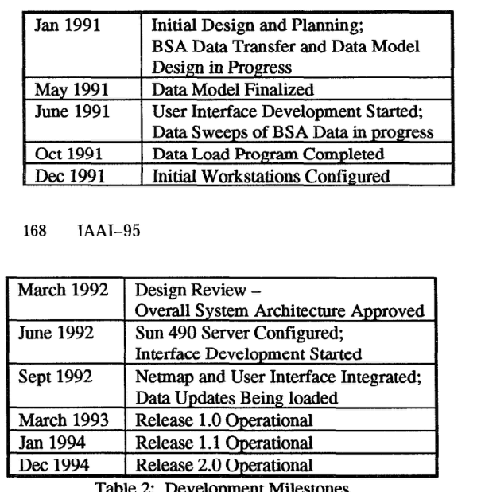

**표 2: 개발 마일스톤**

FAIS에 대한 초기 계획은 1991 초기에 시작되었습니다. 이 계획에는 요구 사항 수집 및 분석, 개념적 시스템 아키텍처 및 데이터 모델 개발, 시스템 개발을 위한 하드웨어 및 기성 소프트웨어 도구 평가 및 선택이 포함되었습니다. 미국 관세 데이터 센터에서 FinCEN로 데이터를 제공하기 위한 절차 및 프로그램은 1991 동안 개발되었으며 전체 과거 BSA 데이터베이스를 TECS의 금융 데이터베이스에서 추출하여 시스템 개발 및 운영에 사용할 수 있게 되었습니다. CAIS 시스템을 재평가하고 개선 사항을 제안했습니다. 3월에 주요 디자인 검토가 이루어졌습니다.

```text
1992 at which point the requirements for Release 1.0 and 
the overall system architecture and the data model design 
were approved. Development of FAIS began in earnest in 
June 1992. An early release of the user interface with a 
limited data set was delivered in September 1992. This 
delivery 
also included 
the suspiciousness 
evaluation 
module and the NetMap link analysis module. 
Release 
1 .O was deployed to users in March 1993. Release 1.1 
was deployed in January 1994. 
Continued 
system 
development has resulted in Release 2.0, containing a 
better user interface, 
additional aggregates identified 
during system usage and evaluation, 
and increased 
performance and storage resulting from a port to larger, 
faster computers, and version updates to the system 
software packages.
```

개발자와 사용자 간의 긴밀한 유대로 인해 시스템 배포가 점진적으로 이루어졌습니다. 개발 중에 사용자는 "진행 중인 작업"을 확인하고 개선 사항을 제안할 수 있었습니다. 구성 요소가 준비되고 테스트되자마자 통합되어 사용자가 사용할 수 있게 되었습니다. 개발자는 문제를 쉽게 해결할 수 있으므로 새로운 기능과 수정 사항을 거의 즉시 제공할 수 있으므로 유망한 아이디어가 완전히 검증되기 전에 시험해 볼 수 있습니다. 사용자 하드웨어는 기본적으로 개발자 하드웨어와 동일합니다. 본 연구에서는 동일한 네트워크 및 시스템 관리자를 공유합니다. 데이터 중심의 테이프 복사, 데이터 로딩, 확장 구축, 의심성 평가 등의 시스템 운영도 수행됩니다.

<!-- 원문 14쪽 -->

## 유지보수

초기 관리 방향은 가능한 한 빨리 운영 능력을 제공하는 것이었습니다. 이 목표를 달성하기 위해 CAIS의 일부였던 의심성 평가 규칙 기반을 다시 구현하고 전체 시스템에 개발 자원을 집중하기로 결정했습니다. 대부분의 개발 노력은 대규모 FAIS 데이터베이스를 처리하기 위한 도구를 구축하는 데 집중되었습니다. 지식공학은 초기 단계에서는 사용자 중심 모드, 관련 거래의 연결, 데이터 불확실성 해석에 필요한 절차적 지식을 습득하는 데 중점을 두었습니다.

시스템이 발전하면서 초기에는 운영 능력 배치에 대한 강조가 성능 개선으로 바뀌었습니다. 지식 공학은 추가적인 의심 지표를 식별하고 이러한 지표를 결합하는 다양한 방법의 효율성을 평가하는 데 중점을 두었습니다. 이를 위해 다수의 특수 목적 데이터 "스크리닝" 쿼리가 실행되었으며 그 결과가 마치 시스템의 데이터 기반 측면을 통해 나온 것처럼 평가되었습니다. 목적은 데이터베이스/블랙보드에 "의심" 표시를 게시하여 전체 시스템에 기여할 수 있는 작은 규칙 기반 지식 소스로 각각의 성공적인 "화면"을 개발하는 것입니다. 본 연구에서는 이러한 규칙이 작동하는 파생 속성(예: 집계)을 쉽게 확장할 수 있도록 기본 데이터베이스를 설계했습니다. 본 연구에서는 전체 데이터베이스의 맥락에서 그러한 지식 소스를 개발하는 것이 중요하다는 것을 발견했습니다. 데이터의 관리 가능한 하위 집합을 살펴보려는 초기 노력은 항상 왜곡된 결과를 가져왔고 전국적인 심사 작업에 적용할 수 없었습니다.

시스템은 아직 개발 중이며 유지 관리는 개발자가 수행합니다. 법 집행의 성공과 금융 시스템 자체의 변화에 ​​따라 기본 영역이 계속 변경되기 때문에 지식 기반은 결코 "완성"되지 않습니다. 자금세탁 기술의 변화와 BSA 형식의 변화에 ​​보조를 맞추기 위해 지속적으로 발전해야 합니다. 분석가가 Nexpert 및 SQL와 같은 도구에 대한 교육을 받으면서 일부 유지 관리가 분석가에게로 옮겨가고 있습니다. 지식 기반에는 자금세탁과 인텔리전스 소스 및 방법에 관한 FinCEN의 가장 민감한 지식 중 일부가 포함되어 있습니다. 또한 자금세탁 및 BSA 데이터는 자금세탁에 관한 전문 지식이 모든 FinCEN 분석가에게 분산되어 있기 때문에 이러한 광범위한 지식을 시스템에 통합하기 위한 절차를 개발하고 있습니다. 특정 자금세탁 지표를 다루는 개별 규칙 세트를 갖춘 의심 평가 모듈의 설계는 추가 지표의 통합을 용이하게 할 것입니다. 이러한 메커니즘은 새로 식별된 자금세탁 기술을 나타내는 기준을 충족하는 주제를 검색하기 위해 사용자 주도 모드를 사용하는 것만큼 간단할 수 있습니다. 특정 기술이 널리 퍼져 있는 것으로 나타나면 추가 규칙 세트가 개발되어 의심성 평가 모듈에 통합되어 이러한 기술에 대한 모든 서류를 정기적으로 평가합니다.

FAIS 유지 관리의 주요 측면에는 시스템에서 생성된 잠재적 리드 배치를 추적하고 평가하는 것이 포함됩니다. 수사 및 기소에 소요되는 시간으로 인해 아직 종합적인 자료를 수집하지 못하고 있습니다. FinCEN 고객 대행사의 피드백은 지식 기반의 지속적인 발전을 안내하는 데 사용됩니다.

## 감사의 글

저자는 FAIS의 개발을 도왔거나 지식 기반에 기여한 FinCEN의 모든 동료들의 공헌에 감사를 표하고 싶습니다. 또한 시스템을 구동하는 데이터를 일관되고 관대하게 제공하는 버지니아 주 뉴잉턴에 있는 미국 관세 데이터 센터 직원에게도 감사의 말씀을 전하고 싶습니다. 가장 중요한 것은 금융 범죄의 탐지 및 분석을 지원하기 위해 첨단 컴퓨팅 기술의 사용을 적극적으로 옹호하려는 비전을 가지고 있던 FinCEN의 은퇴한 창립 이사인 Mr. Brian Bruh에게 그의 확고한 지원, 자신감, 지원 및 통찰력에 대해 감사를 표하고 싶습니다. 그가 없었다면 이 시스템은 결코 개발되지 않았을 것입니다. 그리고 즉시 그 가치를 인식한 FinCEN의 현 이사인 Mr. FAIS는 리드 생성뿐만 아니라 규제 및 규정 준수 프로그램 강화에도 사용되며 지속적인 지원은 확장된 사용 및 개발에 필수적입니다.

## 참고문헌

Anand, T. and Kahn, G. 1992 Making Sense of Gigabytes: A System for Knowledge-Based Market Analysis, in Innovative Applications of Artijicial Intelligence 4, Scott, AC. and Klahr, P. eds. Menlo Park, CA: AAAI Press.

<!-- 원문 15쪽 -->

Andrews, I? P. and Peterson, M. B. eds. 1990. Criwlinal Intelligence Analysis. Loomis, CA: Palmer Enterprises.

Bymes, E., Campfield, T., Henry, N., and WaIdman, S.

1990. Inspector: An Expert System for Monitoring Worldwide Trading Activities in Foreign Exchange. In Proceedings of the Second Annual Conference on Innovative Applications of Artificial Intelligence, 16-20. Menlo Park, CA: AAAI.

Davidson, C. 1993. What Your Database Hides Away. New Scientist 185528-31 (9 January).

EngeImore, R. and Morgan, T. eds. 1988. Blackboard Systems. Reading, MA: Addison-Wesley.

Goldberg, H.G. and Senator, T.E. 1995. Restructuring Databases for Knowledge Discovery by Consolidation and Link Analysis. Forthcoming in Proceedings of the First International Conference on Knowledge Discovery in Databases (KDD-95). Menlo Park, CA: AAAI.

Hayes-Roth, F., Waterman, D.A., and Lenat, D.B. eds.

1983. Building Expert Systems. Reading, MA: Addison- Wesley.

The Wall Street Journal. 1993.1 December: p.1, c.4.
