# 거래 모니터링 모델의 임계값 조정: 자금세탁 방지를 위한 위험 기반 접근법

> **원문 제목:** Threshold Tuning of Transaction Monitoring Models: A Risk-Based Approach to Combat Money Laundering  
> **저자:** Simone Vis  
> **학위·발행 정보:** Delft University of Technology, Master of Science Thesis, November 2022  
> **원문 페이지:** 116쪽

> **번역 안내:** 본문·표제·글머리표와 그림·표 캡션은 문맥에 맞춰 한국어로 옮겼습니다. 그림 43개, 표 20개, 알고리즘 5개는 원문에서 개별 이미지로 잘라 해당 위치에 직접 배치했습니다. 도표 내부를 중복해 풀어 쓴 텍스트는 제거했으며, 통계 수식·기호와 참고문헌은 정확성을 위해 원문 표기를 유지했습니다.

---

<!-- 원문 1쪽 -->

### 거래 모니터링 모델의 임계값 조정

#### 자금세탁 방지를 위한 위험 기반 접근법

**S. Vis**

<!-- 원문 2쪽 -->

### 거래 모니터링 모델의 임계값 조정

#### 자금세탁 방지를 위한 위험 기반 접근법

**저자:** S. Vis  
**학위:** 이학석사(Master of Science), 델프트 공과대학교  
**공개 심사:** 2022년 11월 9일 수요일 14:00  
**학생번호:** 4603990  
**프로젝트 기간:** 2022년 2월 7일 - 2022년 11월 2일

**논문 심사위원회**

- Dr. D. Kurowicka - TU Delft, 지도교수
- Dr. J. Goudsmit - Rabobank, 지도교수
- Dr. W. van Willigen - Rabobank, 지도교수
- Dr. K. S. Postek - TU Delft

전자본: http://repository.tudelft.nl/  
표지 이미지 출처: https://www.investopedia.com [17, 42]

<!-- 원문 3쪽 -->

### 초록

자금세탁은 세계 경제에서 점점 증가하는 문제입니다. 자금세탁을 방지하기 위해 은행은 특정 기준을 적용한 거래 모니터링 모델을 사용하여 비정상적인 거래 행위를 탐지합니다. 그러나 거래의 오분류 위험이 은행의 위험 선호도에 포함되는지 확인하기 위해 임계값 수준의 적합성을 결정하고 평가하는 것은 어려운 일입니다. 임계값 조정 프로세스에서는 분석가가 검토한 임계값 수준 이하 또는 이상의 거래 샘플을 통해 임계값 수준의 적합성을 평가할 수 있습니다. 한 가지 문제는 임계값 조정 프로세스 중 거래 검토 프로세스에 시간이 많이 걸린다는 것입니다. 또한 은행은 거래의 오분류 위험을 정량화하여 이것이 위험 선호 범위에 속하는지 여부를 판단할 수 있기를 원합니다.

이는 거래의 오분류 위험을 정량화하여 거래가 은행의 위험 선호 범위에 속하는지 여부를 판단할 수 있는 임계값 조정 프로세스를 가속화하기 위한 임계값 조정 전략을 개발할 필요성을 강조합니다. 임계값 조정 프로세스를 가속화하기 위해 프레임워크가 개발되었고 주어진 전략에 따라 다양한 임계값 수준의 적합성을 평가하는 5가지 임계값 조정 전략이 확립되었습니다. 또한, 오분류 위험을 정량화하고 해당 위험이 은행의 위험 선호 범위 내에 있는지 확인하기 위해 신뢰구간을 결정하는 여러 방법을 조사했습니다.

임계값 조정 전략은 합성 데이터셋을 사용하여 거래 검토에 필요한 양과 발견된 임계값 수준과 실제 임계값 수준의 차이를 비교 평가했습니다. 전반적으로 이분법 임계값 조정 전략을 사용하는 것이 좋습니다. 이 전략을 사용하면 거래에 대해 필요한 검토 건수가 가장 적고 발견된 임계값 수준과 실제 임계값 수준 사이에 작은 차이가 발생하기 때문입니다. 합성 데이터셋의 결과는 유망했지만, 프레임워크와 제안된 이분법 전략을 더욱 발전시키고 완전히 검증하려면 실제 거래 데이터 또는 기타 분포를 사용하는 더 많은 실험이 필요합니다. 본 논문에서 제시된 작업은 거래 모니터링 모델의 임계값 조정 프로세스의 효과성과 효율성을 향상시키기 위해 보다 위험 기반 접근 방식에 기여했습니다.

<!-- 원문 4쪽 -->

### 서문

지난 9개월은 흥미롭고 배움이 많은 시간이었습니다. 이 논문은 델프트 공과대학교 응용수학 석사과정의 마지막 프로젝트이자 델프트에서의 학업을 마무리하는 작업입니다. 지난 6년 동안 학업 안팎에서 저 자신을 발전시키고 관심 분야를 발견하며 지금의 제가 될 수 있도록 해준 모든 기회에 깊이 감사드립니다.

연구 과정에서 도움을 주신 모든 분께 진심으로 감사드립니다. 흥미로운 응용 연구 프로젝트를 수행하고 Rabobank의 컴플라이언스 모델 검증 부서와 협업할 기회를 얻은 데 감사드립니다. Rabobank의 지도교수 Jeroen Goudsmit와 Willem van Willigen께서 보내주신 지원과 지도, 지식 공유에 감사드립니다. 이 협업을 통해 자금세탁, 모델 검증, 위험 정량화 분야의 전문가들에게 배울 수 있었습니다. 또한 제안과 피드백, 따뜻한 대화로 지도해 주신 TU Delft의 Dorota Kurowicka께도 감사드립니다.

학업 기간 내내 지지와 동기를 보내준 가족과 친구들에게도 감사드립니다. 언제나 무한한 사랑과 응원을 보내주고 제 길을 선택할 자신감을 준 부모님과 자매에게 특히 감사드립니다. 논문을 쓰는 동안 점심, 커피 휴식, 교내 산책과 공부 시간을 함께한 Frank, Eva, Anna W, Anna N, Maricke에게도 고마움을 전합니다. 언제나 편안히 돌아갈 수 있게 해준 하우스메이트들, 함께 공부한 친구들, 잊지 못할 갭이어를 함께한 'TU Delft Solar Boat Team 2021'의 동료들, 그리고 평생 소중히 간직할 우정을 나눈 조정팀 'the Potvissen'에도 감사드립니다. 마지막으로 지난 9개월 동안 제 어려움을 기꺼이 들어주고 다정하게 곁을 지켜준 남자친구에게 감사드립니다. 모두 고맙습니다!

Simone Vis  
Delft, 2022년 11월

<!-- 원문 5쪽 -->

### 목차

- 초록 ··· i
- 서문 ··· ii
- 그림 목록 ··· v
- 표 목록 ··· vii
- 기호 및 약어 ··· viii
- 제1장 서론 ··· 1
  - 1.1 연구 목적 ··· 2
  - 1.2 논문 구성 ··· 2
- 제2장 임계값 조정 배경 ··· 3
  - 2.1 자금세탁방지 ··· 3
    - 2.1.1 은행의 자금세탁방지 거래 모니터링 절차 ··· 3
    - 2.1.2 거래 모니터링 단계 ··· 6
  - 2.2 거래 모니터링 모델의 임계값 조정 절차 ··· 6
    - 2.2.1 규칙 백테스팅 절차 ··· 7
  - 2.3 문제 정식화 ··· 10
  - 2.4 장 요약 ··· 10
- 제3장 표본추출 및 신뢰구간 방법 ··· 11
  - 3.1 무작위 표본추출 ··· 11
  - 3.2 이항분포의 신뢰구간 및 표본 크기 산정 방법 ··· 12
    - 3.2.1 신뢰구간 성능 기준: 포함확률과 기대길이 ··· 13
    - 3.2.2 정확 방법 ··· 15
    - 3.2.3 정규근사 방법 ··· 16
    - 3.2.4 포함확률과 기대길이 시뮬레이션 연구 ··· 18
    - 3.2.5 표본 크기 산정 방법으로의 변환 ··· 23
  - 3.3 부트스트래핑을 이용한 신뢰구간 ··· 26
    - 3.3.1 표본분포의 부트스트랩 추정 ··· 26
    - 3.3.2 부트스트랩 신뢰구간 ··· 27
    - 3.3.3 부트스트랩 신뢰구간 계산 시간 시뮬레이션 ··· 29
  - 3.4 장 요약 ··· 30
- 제4장 연구 방법론 ··· 31
  - 4.1 모델 프레임워크 ··· 31
  - 4.2 임계값 평가 접근법 ··· 33
    - 4.2.1 전체 모집단 접근법 ··· 34
    - 4.2.2 버킷 접근법 ··· 34
  - 4.3 정적 임계값 조정 전략 ··· 35
    - 4.3.1 단계 전략 ··· 36
    - 4.3.2 이분법 전략 ··· 37
  - 4.4 동적 임계값 조정 전략 ··· 38
    - 4.4.1 다수준 전략 ··· 38
    - 4.4.2 볼츠만 탐색 전략 ··· 40
  - 4.5 필요 검토 건수를 줄이는 방법 ··· 41
    - 4.5.1 조기 중단 원칙 ··· 41
    - 4.5.2 기존 검토 표본의 정보 재사용 ··· 41

<!-- 원문 6쪽 -->

### 목차 - 계속

- 4.6 평가 지표 ··· 43
  - 4.6.1 임계값 조정 전략의 성능 평가 ··· 43
- 제5장 실험 ··· 44
  - 5.1 사례 연구 ··· 44
    - 5.1.1 사례 1: 현금 입금의 분할입금(smurfing) 탐지 ··· 45
    - 5.1.2 사례 2: 파생상품의 비정상 수익 탐지 ··· 46
    - 5.1.3 사례 3: 고위험 국가 대상 비정상 금융거래 탐지 ··· 47
  - 5.2 시나리오의 분포 변환 ··· 48
  - 5.3 실험 목적 ··· 52
- 제6장 결과 ··· 54
  - 6.1 사례별 거래 모집단 ··· 54
  - 6.2 실험 1: 임계값 평가 접근법 ··· 55
  - 6.3 실험 2: 성능 평가 ··· 58
    - 6.3.1 볼츠만 탐색에서 온도 매개변수의 영향 ··· 58
    - 6.3.2 임계값 조정 전략의 성능 ··· 59
    - 6.3.3 임계값 수준 개수의 영향 ··· 63
  - 6.4 실험 3: 정보 재사용을 통한 필요 검토 건수 감소 ··· 67
  - 6.5 실험 4: 측정지표 선택의 영향 ··· 70
- 제7장 결론 및 논의 ··· 72
  - 7.1 결론 ··· 72
  - 7.2 논의 ··· 73
  - 7.3 향후 연구 제언 ··· 74
- 참고문헌 ··· 78
- 부록 A 혼동행렬의 용어와 산출식 ··· 79
- 부록 B 표본 크기 ··· 80
- 부록 C Clopper-Pearson 신뢰구간 한계의 증명 ··· 84
- 부록 D 임계값 조정 전략 ··· 86
- 부록 E 전략 알고리즘 ··· 89
- 부록 F 온도 매개변수 조정 결과 ··· 95
- 부록 G 실험 결과 ··· 97

<!-- 원문 7쪽 -->

### 그림 목록

2.1 은행 내 자금세탁방지 거래 모니터링 프로세스 [10]....... 4 2.2 거래 모니터링 프로세스 단계 및 거래 유형 [19] 레이블..... 6 2.3 데이터 분석에서 임계값 수준 거래 모니터링 모델까지의 프로세스입니다.. 7 2.4 임계값 수준 설정에 대한 절충 예시.................. 8 2.5 다양한 성능 지표를 포함하는 혼동 행렬의 예입니다........... 9 2.6 백테스팅 프로세스 그림............................. 9 3.1 다양한 확률 무작위 샘플링 방법의 샘플 구성을 보여주는 그림입니다... 12 3.2 Wald, Agresti, Wilson Score, Arcsine 및 Clopper-Pearson 신뢰구간 방법의 포함 확률(CP) α = 0.05....................... 20 3.3 기대길이(EL) Wilson 점수 및 Clopper-Pearson 신뢰구간 방법 α = 0.05...................................... 22 3.4 다양한 신뢰구간 방법을 사용하여 필요한 표본 크기 비교 a 95% 또는 99% 신뢰구간(오차 여유 있음) e = 0.05, 0.04 및 0.03..... 24 3.5 부트스트랩 방법 의 예시는 관심 통계의 샘플링 모집단을 결정하기 위해 테스트된 임계값 수준입니다.............................. 26 3.6 n = 264가 있는 임계값 레벨 10의 사례 연구 1 민감도의 샘플링 분포입니다.............................................. 29 4.1 전체 모집단 접근 방식 BTL 및 ATL 테스트에 대한 그림입니다........ 34 4.2 버킷 접근 방식 BTL 및 ATL 테스트 예시................ 34 4.3 버킷 접근 방식과 전체 채우기 접근 방식 간의 차이점을 보여주는 그림입니다... 35 4.4 완전한 모집단 접근 방식 BTL 튜닝과 결합된 단계 전략의 그림입니다.......................................... 36 4.5 전체 모집단 접근 방식 BTL 튜닝과 결합된 이분법 튜닝 전략을 보여주는 그림입니다.................................... 38 4.6 완전한 모집단 접근 방식 BTL 튜닝과 결합된 다단계 전략의 예시입니다..................................... 39 4.7 이전에 테스트한 임계값 수준이 더 높았을 때 검토된 샘플의 일부를 재사용하는 그림............................................ 42 4.8 이전에 테스트한 임계값 수준이 더 낮았을 때 검토된 샘플의 일부를 재사용하는 그림입니다............................................. 42 5.1 사례 연구 1: 교환 거래 [33]로 설명된 현금 예금 분할입금(smurfing) 탐지. 45 5.2 사례 연구 2: 파생상품 [37]에서 비정상적인 이익을 감지합니다................ 46 5.3 사례 연구 3: 고위험 국가 [35]에 대한 비정상적인 금융 거래 탐지..... 47 5.4 사례 연구 1의 분포: 현금 예금 분할입금(smurfing) 탐지........... 48 5.5 사례 연구 2의 분포: 파생상품에서 비정상적인 이익을 감지합니다....... 50 5.6 사례 연구 3의 분포: 고위험 국가에 대한 비정상적인 금융 거래 탐지............................................. 51 6.1 거래량 수와 특정 임계값 수준 이하의 모집단에서 비정상적인 거래량의 비율입니다........................ 55 6.2 주어진 임계값 수준 미만의 버킷에 있는 모집단의 거래 볼륨 수와 비정상적인 거래 볼륨의 비율입니다................. 56 6.3 BTL 테스트, 발견된 임계값과 실제 임계값 간의 차이 다른 임계값 조정 전략................................... 57 6.4 BTL 테스트, 검토된 거래의 필수 금액 감소하거나 일정한 일정 다른 τ(0) 값............................. 59

<!-- 원문 8쪽 -->

그림 목록 vi

6.5 BTL 테스트, 필요 검토 및 K = 20 임계값 수준 및 n = 264 의 표본 크기를 사용한 발견된 임계값과 실제 임계값 간의 차이점 전략............................................. 60 6.6 BTL 테스트, 필요 검토에 대한 임계값 수준 수의 영향 및 K = 20 대신 K = 40를 사용하여 발견된 임계값 수준과 실제 임계값 수준 간의 차이 임계값 레벨 다양한 튜닝 전략....................... 66 6.7 BTL 테스트, 필요한 검토 감소 및 이전에 검토한 샘플 의 정보를 재사용하지 않고 다른 조정 전략을 사용하거나 사용하지 않고 발견된 임계값과 실제 임계값 수준 간의 차이 변경................ 69 6.8 주어진 임계값 수준 이하(FN) 및 이상(TP) 비정상적인 거래량의 민감도 및 모집단 비율입니다............................ 70 6.9 필요한 검토와 발견된 임계값과 실제 임계값 간의 차이 이분법 및 이분법 전략이 있는 다수준 모든 경우에 민감도를 측정값으로 사용합니다.......................................... 71 B.1 다양한 CI 방법 a 95% 또는 99% 신뢰구간과 오차 한계 e = 0.05를 사용하여 필요한 표본 크기를 비교합니다..................... 82 B.2 다양한 CI 방법을 사용하여 필요한 표본 크기 비교 α =를 사용하여 0.05, 0.04 및 0.03와 동일한 오차 한계 e 0.05......................... 83 D.1 버킷 접근 방식 BTL 튜닝과 결합된 단계, 이분법 및 다단계 전략의 그림입니다.................................... 87 D.2 전체 모집단 접근 방식 ATL 튜닝과 결합된 단계, 이분법 및 다단계 전략을 보여주는 그림입니다.......................... 88 F.1 BTL 테스트, 발견된 임계값과 실제 임계값 간의 차이 감소 또는 일정한 일정 다른 τ(0) 값 K = 20 임계값 수준......... 96 G.1 사례 연구 1, 최대값, 75% 분위수, 중앙값, 25% 분위수 및 최소 검토 건수에는 25 실행에 대해 다양한 조정 전략이 필요합니다........... 98 G.2 사례 연구 1, 최대값, 75% 분위수, 중앙값, 25% 분위수 및 발견된 임계값과 실제 임계값 간의 최소 차이 에 대한 다양한 튜닝 전략 25가 실행됩니다.............................................. 99 G.3 B = 10000 및 n =를 사용한 임계값 수준 2, 3 및 4의 사례 연구 1 민감도의 샘플링 분포 264.................................. 106

<!-- 원문 9쪽 -->

### 표 목록

3.1 유한 모집단 수정 항 다양한 표본 크기 n 모집단 크기 N = 10, 000............................................ 16 3.2 (1−α) × 100% 신뢰 수준 양측 신뢰구간 p 다양한 신뢰구간 방법의 하한 및 상한 L(X) 및 U(X)........ 18 3.3 다양한 신뢰구간 방법을 사용하는 필수 표본 크기 α = 0.05 및 e = 0.05 예비 점 추정치 p0.......................... 25 3.4 다양한 신뢰구간 방법을 사용하는 필수 표본 크기 α = 0.01 및 e = 0.05 예비 점 추정치 p0.......................... 25 3.5 신뢰구간은 Clopper Pearson pa 및 pb와 부트스트랩 θ,, θ = TPR(감도) 및 n을 사용하여 결정됩니다. = 264..................... 30 3.6 Clopper Pearson pa 및 pb와 부트스트래핑 θ,, θ = TPR(감도) 및 n을 사용하여 신뢰구간을 계산하는 데 필요한 시간(초) = 264..... 30 4.1 K 임계값 수준으로 거래를 분할하기로 선택한 경우 이분법 전략으로 테스트해야 하는 최대 m 임계값 수준입니다.......... 37 5.1 매개변수 설정 모든 사례 연구.......................... 51 6.1 K = 20 임계값 수준, 최고를 나타내는 1 및 최악의 성과 전략을 나타내는 5를 사용하여 필요 검토 건수 양을 기반으로 5가지 전략의 순위입니다........ 62 6.2 K = 20 임계값 수준, 최고를 나타내는 1 및 최악의 성과 전략을 나타내는 5를 사용하여 발견된 임계값 수준과 실제 임계값 수준 간의 차이를 기반으로 하는 5가지 전략의 순위입니다.............................................. 63 6.3 K = 20 임계값 수준 대신 K = 40를 사용하여 필요 검토 건수 양의 중앙값과 확산을 비교합니다. 모든 사례 연구.................... 64 6.4 K = 20 임계값 수준 대신 K = 40를 사용하여 발견된 임계값과 실제 임계값 사이의 차이의 중앙값과 확산을 비교합니다. 모든 사례 연구.......... 65 6.5 다른 임계값 수준에 대해 이전에 검토된 샘플에 대한 지식을 사용하거나 사용하지 않고 필요한 검토 중앙값을 비교합니다................... 67 6.6 다른 임계값 수준에 대해 이전에 검토한 샘플에 대한 지식을 사용하거나 사용하지 않고 발견된 임계값과 실제 임계값 간의 중앙값 차이를 비교합니다.. 68 G.1 다양한 전략으로 발견된 임계값과 실행당 실제 임계값 사례 연구 1.............................................. 100 G.2 다양한 전략으로 발견된 임계값과 실행당 실제 임계값 사례 연구 2.............................................. 101 G.3 다양한 전략으로 발견된 임계값과 실행당 실제 임계값 사례 연구 3.............................................. 102 G.4 다양한 전략을 사용하여 발견된 임계값과 실행당 실제 임계값 사례 연구 1, 측정값으로 민감도를 기반으로 합니다......................... 103 G.5 다양한 전략을 사용하여 발견된 임계값과 실행당 실제 임계값 사례 연구 2, 측정값으로서의 민감도를 기반으로 합니다......................... 104 G.6 다양한 전략을 사용하여 발견된 임계값과 실행당 실제 임계값 사례 연구 3, 측정값으로 민감도를 기반으로 합니다......................... 105

<!-- 원문 10쪽 -->

### 기호 및 약어

#### 약어

- **AML** - 자금세탁방지
- **ATL** - 선 위(Above-the-line)
- **BTL** - 선 아래(Below-the-line)
- **CDD** - 고객확인의무
- **CI** - 신뢰구간
- **CP** - 포함확률
- **DNB** - 네덜란드 중앙은행
- **EL** - 기대길이
- **FATF** - 금융행동특별작업반
- **FIU** - 금융정보분석원
- **FN / FP** - 위음성 / 위양성
- **FPC** - 유한모집단 보정
- **RTL** - 위험 허용 수준
- **SIRA** - 체계적 무결성 위험분석
- **TN / TP** - 진음성 / 진양성

#### 주요 기호

- **α** - 신뢰구간의 유의수준
- **B** - 부트스트랩 표본 수
- **e** - 신뢰구간의 오차한계
- **k / n** - 표본의 관심 거래 수 / 표본 크기
- **K** - 임계값 수준의 개수
- **N** - 모집단 크기
- **p / p̂** - 모집단 / 표본의 관심 거래 비율
- **RTL** - 위험 허용 수준
- **Rᵢ(t), μ̂ᵢ(t)** - 시점 t에서 임계값 i의 보상과 평균 보상
- **τ** - 탐색과 활용의 균형을 조절하는 온도 매개변수

<!-- 원문 11쪽 -->

## 제1장 서론

자금세탁은 세계 경제에서 갈수록 심각해지는 문제이며, 그 규모는 전 세계 GDP의 2~5%로 추산됩니다[6]. 한편 금융기관의 규정 준수 실패에 따른 벌금은 계속 증가해 2016년 전 세계에서 약 420억 달러에 이르렀습니다[15]. 네덜란드 법무부 산하 연구자료센터(WODC)는 2014년 네덜란드에서 세탁된 범죄수익이 약 160억 유로라고 추산했습니다. 이 가운데 69억 유로는 네덜란드에서 발생해 국내에서 세탁된 범죄수익이고, 91억 유로는 다른 국가에서 유입된 자금으로, 네덜란드 자금세탁의 국제적 성격을 보여줍니다[30]. 이에 따라 세계 각국의 규제기관은 자금세탁에 대응하고 금융기관의 건전성과 안정성을 보호할 혁신적 접근법을 장려하고 있습니다.

자금세탁은 범죄자들이 합법적인 출처에서 자금이 나오는 것처럼 보이게 하는 불법적인 과정입니다. 금융 기관은 글로벌 금융 시스템의 안정성과 무결성의 문지기로서 중요한 역할을 하며 시스템을 통과하는 모든 거래를 모니터링하고 각 거래를 비정상적인 거래인지 아닌지 분류해야 합니다. 따라서 현재 고정된 파생 임계값이 있는 규칙 기반 시스템에 주로 의존하고 있는 자금세탁방지(AML) 모델은 거래 데이터 [19]에서 비정상적인 동작을 탐지하는 것을 목표로 합니다.

다음 예에서는 은행이 거래 모니터링을 통해 자금세탁을 감지하는 방법을 설명합니다. 잘 알려진 자금세탁 방법은 분할입금(smurfing)(구조화라고도 함)으로, 은행에서 거액의 돈을 여러 개의 소액 거래로 분할하는 것입니다. A 국가의 X 구성원 그룹의 각 범죄자가 은행에 계좌를 가지고 있다고 가정합니다. 이 계좌는 다른 은행에 있을 수 있습니다. 모든 회원은 일주일 중 처음 며칠 동안 특정 금액 M을 자신의 계좌에 입금하는데, 처음에는 은행에서 이를 눈치채지 못합니다. 주말에 며칠 후, 각 회원은 일정 금액을 B 국가의 동일한 계좌로 이체하며, 그 결과 매주 [29] 금액의 M*X가 B 국가의 계좌로 유입됩니다.

분할입금(smurfing)을 탐지하기 위해 은행은 거래 모니터링 시나리오를 개발할 수 있습니다. 예를 들어, 7일 이내에 입금된 돈의 90% 이상이 다른 계좌로 이체되면 거래에서 경고가 생성되어야 합니다. 경고는 잠재적으로 비정상적인 거래 [10]를 나타내는 신호를 나타냅니다. 이러한 시나리오를 통해 은행은 비정상적인 거래 행위를 감지하려고 시도합니다. 범죄자가 일주일 이내에 예금을 전달하면 거래에서 경고가 생성됩니다. 자금세탁방지 및 테러자금조달방지법(Wwft) [11]의 16조에 설명된 대로, 경고가 조사되고 기관은 거래의 비정상적인 성격이 알려지면 즉시 금융정보분석원(FIU)에 비정상적인 거래를 보고할 의무가 있습니다. 그런 다음 FIU는 ​​보고서를 분석하고 분석이 [13]로 확인되면 법 집행 기관에 보냅니다. 이 경우 자금세탁이 발생했으며 AML 모델은 거래를 진양성(true positives)이라고 하는 비정상적인 거래로 올바르게 분류했습니다. 반면, AML 모델은 자금세탁으로 판명되지 않은 거래에 대한 경고를 생성할 수도 있습니다. 이처럼 잘못 생성된 경보를 위양성이라고 합니다.

안타깝게도 AML 모델이 모든 비정상 거래를 탐지하는 것은 아닙니다.

<!-- 원문 12쪽 -->

예를 들어, 시나리오가 입금 후 7일 이내에 자금이 이체될 때만 경보를 생성하도록 설정되어 있다면, 범죄자가 8일 뒤 자금을 이체하는 경우 해당 거래는 경보를 발생시키지 않습니다. AML 모델에 의해 감지되지 않은 비정상적인 거래는 잘못 분류되어 위음성(false negatives)이라고 하며, 감지되지 않은 정상적인 거래는 진음성(true negative)으로 올바르게 분류됩니다.

임계값 미만의 위음성 또는 임계값 이상의 위양성으로 잘못 분류되는 거래 수는 임계값 수준의 선택에 따라 달라집니다. AML 모델에 가장 적합한 임계값 수준을 결정하기 위해 임계값 수준 위 및/또는 아래의 거래 샘플을 채취합니다. 이를 통해 특정 신뢰 수준으로 AML 모델의 임계값 수준의 유효성을 평가할 수 있습니다. 그러나 샘플링된 모든 거래를 분석가가 조사해야 하므로 임계값 조정 프로세스에는 시간이 많이 걸립니다. 또한 거래 모니터링은 심각한 규정 준수 문제로 이어질 수 있으므로 AML 모델 개발자는 임계값 수준을 신중하게 선택해야 합니다. 임계값이 비정상적인 거래 동작에 너무 민감한 경우 임계값은 조사하는 데 상당한 시간이 걸리는 관심 대상이 아닌 경고 거래(위양성)을 많이 생성할 가능성이 높습니다. 반면에 충분히 민감하지 않은 임계값은 은행에 위험을 초래하는 관심 거래를 놓칠 위험(위음성)을 나타냅니다.

따라서 본 논문의 첫 번째 목표는 임계값 조정 프로세스를 발전시킬 수 있는 가능성을 연구하는 것입니다. 목표는 가장 적합한 임계값 수준을 결정하기 위해 임계값 조정 프로세스를 가속화하는 효율적인 임계값 조정 전략을 정의하는 것입니다. 제안된 임계값 조정 전략의 효율성과 한계, 상대 및 절대 성능이 검증됩니다. 또한 본 논문에서는 임계값 조정 과정에서 샘플링으로 인해 발생하는 불확실성을 어떻게 정량화할 수 있는지에 대해 논의합니다. 이러한 수량화를 통해 임계값 조정 프로세스를 완료한 후 특정 신뢰도 수준으로 거래 모집단에 대한 설명을 작성할 수 있습니다. 본 논문에서는 합성하여 생성한 세 가지 데이터셋을 사용하여 다양한 임계값 조정 전략의 잠재력을 평가합니다. 이를 통해 비정상적인 거래에 대한 사전 지식을 사용하여 실험을 제어할 수 있습니다.

### 1.1 연구 목적

논문 주제를 소개한 후에는 연구 목적을 명시하는 것이 중요합니다. 본 논문의 연구 목적은 다음 두 질문에 답하는 것입니다.

1. 거래 모니터링 모델의 임계값 조정 절차를 가속하기 위해 임계값 조정 전략을 어떻게 도입할 수 있는가?
2. 임계값 조정 절차에서 선택한 임계값 수준의 불확실성을 어떻게 정량화할 수 있는가?

### 1.2 논문 구조

이 섹션에서는 논문의 구조를 소개합니다. 임계값 조정 프로세스를 가속화하기 위한 임계값 조정 전략에 대해 자세히 알아보기 전에 2 및 3 장에서는 필요한 배경 문헌의 개요를 소개합니다. 먼저, 2 장에서는 자금세탁과 금융 기관에서 시행 중인 현재 자금세탁방지 검증 관행에 대해 설명합니다. 그러면 문제 설정이 공식화됩니다. 이는 본 논문이 임계값 조정 전략에 초점을 맞춘 이유에 대한 배경을 제공합니다. 3 장에서는 샘플링의 불확실성을 정량화하는 다양한 신뢰구간 방법과 필요한 표본 크기를 결정하는 방법을 설명합니다. 4 장에서는 본 논문에서 더 자세히 조사되는 다양한 임계값 조정 전략을 설명합니다. 다양한 합성 데이터셋을 사용한 실험은 5 장에 설명되어 있습니다. 이러한 실험은 임계값 조정 전략의 성능을 보다 철저하게 이해하기 위해 수행됩니다. 실험의 경험적 결과는 6 장에 나와 있습니다. 7 장에서는 본 논문에서 도출된 결과에 대한 결론을 제공함으로써 본 논문을 마무리한다. 또한 추가 연구 방향에 대한 권장 사항이 제시됩니다.

<!-- 원문 13쪽 -->

## 제2장 임계값 조정 배경

이 장에서는 은행 내 거래 모니터링 및 임계값 조정 프로세스에 대한 관련 배경 정보에 대한 개요를 더 자세히 제공합니다. 이 장은 2.1.1항의 자금세탁방지 관행과 은행 내 거래 모니터링 프로세스에 대한 소개로 시작됩니다. 이어서 섹션 2.2에서는 거래 모니터링 모델의 임계값 조정 프로세스에 대해 논의합니다. 또한 이 논문의 설정 문제는 2.3 절에 설명되어 있습니다. 마지막으로 섹션 2.4에서는 임계값 조정 프로세스의 가장 중요한 측면을 요약합니다.

### 2.1 자금세탁방지

서문에서 간략하게 소개했듯이 자금세탁은 범죄자들이 합법적인 출처에서 자금이 나오는 것처럼 보이게 하는 불법적인 과정으로 설명할 수 있습니다. 범죄자들은 ​​자금세탁 시 세 가지 단계를 따르는 경우가 많습니다. 첫 번째 단계는 배치 단계라고도 알려진 합법적인 금융 시스템에 비밀리에 '더러운 돈'을 주입하는 것입니다. 그 다음에는 범죄자들이 거래와 부기 수법을 통해 돈의 출처를 숨기려고 하는 계층화 단계가 이어집니다. 마지막으로, 범죄자는 이제 합법적인 계좌에서 세탁된 자금을 인출할 수 있으며 이는 [25] 시스템에 통합됩니다.

자금세탁과 테러자금조달은 사회적으로 갈수록 심각한 문제가 되고 있습니다. 이에 대응하기 위해 유럽의회와 이사회는 금융행동특별작업반(FATF)의 권고를 바탕으로 금융 시스템이 자금세탁이나 테러자금조달에 이용되는 것을 방지하는 지침을 제정했습니다. 네덜란드 중앙은행(DNB)은 특이한 거래 공개법(MOT)을 대체하는 Wwft와 1977 [9]에 제정된 제재법(Sw)을 고려하여 네덜란드 금융 기관의 무결성을 감독합니다. FATF의 권장 사항에 따라 DNB는 ​​금융 기관이 2011에서 금융 시스템의 문지기 역할을 적절하게 수행할 수 있는 도구를 제공하는 지침을 설정했습니다. 그 결과, 최근 몇 년 동안 은행은 비정상적인 거래 [7]를 식별하기 위해 고객확인의무(CDD) 및 거래 모니터링 프로세스에 막대한 투자를 해왔습니다.

#### 2.1.1 은행 내 자금세탁방지 거래 모니터링 프로세스

DNB는 은행 [10]의 이벤트 후 거래 모니터링 프로세스에 대한 지침 보고서를 발표했습니다. 이 섹션에서는 이 보고서의 주요 측면에 대해 자세히 설명합니다. 많은 은행은 효과적인 위험 관리 시스템(위험 소유자, 위험 감독 및 위험 보증)을 촉진하기 위해 설계된 프레임워크인 소위 '3가지 방어선' 모델을 사용합니다. 이 프레임워크를 거래 모니터링 프로세스로 변환하려면 모델 개발, 구현, 사용 및 검증에 대한 부적절한 거버넌스가 은행의 위험을 증가시킬 수 있으므로 기능을 명확하게 분리하는 것이 중요합니다. 거래 모니터링 절차에서는 일반적으로 다음과 같이 세 가지 기능을 구분합니다.

1. 제1선(비즈니스): 거래 모니터링을 담당합니다.

<!-- 원문 14쪽 -->

2. 제2선(컴플라이언스): 독립적인 자문·통제 역할을 통해 품질을 보증하고, 제1선의 모델 위험관리 절차를 정기적으로 점검합니다.
3. 제3선(감사): 제1선과 제2선의 운영을 독립적으로 점검합니다. 모델 위험을 최대한 최소화하기 위해 기능이 분리되어 있습니다. 또한 자금세탁 및 테러자금조달 위험에 대한 인식을 제고하려면 직원을 정기적으로 교육하는 것이 필수적입니다. 기능 및 교육 분리 외에도 AML 및 거래 모니터링 프로세스는 은행의 이벤트 후 거래 모니터링 프로세스에 대한 DNB의 지침 보고서에 설명되고 그림 2.1 [10]에 제시된 대로 여러 단계로 나눌 수 있습니다.

- 고객 심사

- 위험 식별

- 정책 및 절차

- 거래 모니터링

- 모델 검증

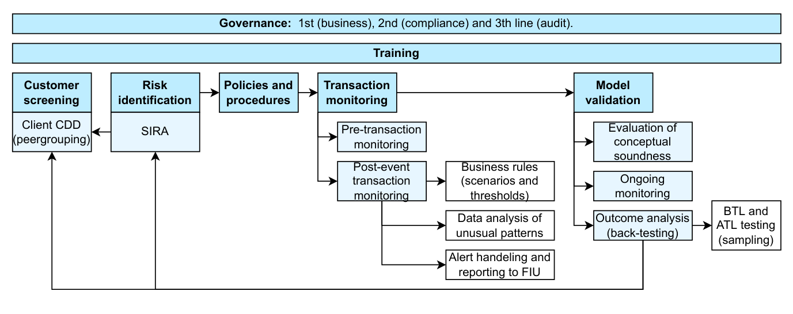

**그림 2.1: 은행 [10] 내 자금세탁방지 거래 모니터링 프로세스.**

고객 심사 첫째, Wwft에 따라 은행은 고객 심사를 실시하고 고객 위험 프로필을 작성해야 합니다. 고객의 실사(CDD) 위험 등급(낮음, 중간, 높음)을 결정할 때 은행은 동료 그룹화를 통해 예상되는 거래 행동을 설정해야 합니다. 피어 그룹화를 통해 은행은 예상되는 거래 프로필을 결정하여 비정상적인 거래를 감지할 수 있습니다. 이는 은행이 수행된 거래가 은행의 지식 및 고객의 위험 프로필과 일치하는지 확인하기 위해 필요합니다. 이를 통해 은행은 비정상적인 거래를 감지할 수 있습니다.

위험 식별 두 번째 단계로 은행은 고객, 제품, 유통 패널 및 거래 유형에 대한 위험을 식별해야 합니다. 이 위험 분석은 체계적인 무결성 위험 분석(SIRA)을 통해 보고되어야 합니다. SIRA는 [8]: 1의 네 가지 측면의 주기로 구성됩니다. 여러 요인을 기반으로 위험 식별. 2. 위험이 위험 확률에 위험 영향을 곱한 것과 동일한 위험 분석입니다. 3. 정책, 절차, 시스템 및 통제를 통한 위험 관리. 4. 위험 모니터링 및 검토. 위험 분석에 따른 조치는 은행의 위험 선호도에 따라 달라집니다.

<!-- 원문 15쪽 -->

정책 및 절차 셋째, 은행은 SIRA를 거래 모니터링 프로세스에 관한 정책 및 절차로 가시적으로 번역해야 합니다.

거래 모니터링 두 번째 단계는 거래 모니터링 프로세스 자체로, 거래 전 모니터링과 이벤트 후 거래 모니터링으로 나눌 수 있습니다. 거래 전 모니터링이란 고객과 은행 직원이 대면 접촉하는 상황을 말한다. 예를 들어 고객이 은행 창구에서 외화를 환전하고 싶어하거나 많은 양의 현금을 입금하고 싶을 때 등이 있습니다. 이벤트 후 거래 모니터링은 비정상적인 비현금 거래 감지를 의미하며 정책 및 절차를 일련의 비즈니스 규칙으로 변환, 데이터 분석을 통해 비정상적인 거래 감지, 경고 처리 및 보고 프로세스의 세 가지 측면으로 나눌 수 있습니다. 1. 비즈니스 규칙 설정: 비즈니스 규칙 집합은 시나리오와 거래 금액 및 횟수 또는 그 조합과 같은 특정 임계값으로 구성된 탐지 규칙입니다. 비즈니스 규칙은 자금세탁이나 테러자금조달을 나타낼 수 있는 비정상적인 거래 패턴을 탐지하는 데 사용됩니다. 2. 데이터 분석을 통한 거래 감지: 데이터 분석은 잠재적으로 비정상적인 거래 동작을 감지하여 경고가 생성되는 데 사용됩니다. 그런 다음 거래의 비정상적인 성격이 알려지면 즉시 경고를 조사하여 FIU-NL에 보고합니다. 3. 경고 처리: 경고 처리 및 보고 프로세스에는 FIU-NL에 대한 보고 결과를 평가하고 보고하며 추가 제어 조치가 필요한지 여부가 포함됩니다. 경고를 종료하거나 FIU-NL에 보고하려면 고려 사항과 결론을 기록해야 합니다. 모델 검증 마지막 단계는 모델이 예상대로 작동하는지, 현재 검증 활동이 모델 위험을 줄이는 데 충분한지 확인하기 위한 지속적인 모델 검증 프로세스입니다. 모델 검증에 관한 이 섹션은 주로 감사관 핸드북 [23]의 모델 위험 관리 보고서를 기반으로 합니다. 검증의 목표는 개발자와 사용자에게 도전하고 수정해야 할 단점에 대한 결과를 기록하는 것입니다. 효과적인 검증 프레임워크에는 개념적 건전성 평가, 지속적인 모니터링, 결과 분석이라는 세 가지 요소가 중요합니다.

- 개념적 건전성 평가: 개념적 건전성 평가에서는 모델의 설계 및 구성 품질에 대한 평가가 이루어집니다. 이를 위해서는 모든 모델 선택, 모델 가정, 데이터 및 이론적 구성을 지원하는 문서가 필요합니다.

- 지속적인 모니터링: 모델이 올바르게 구현 및 사용되었으며 의도한 대로 수행되고 있는지 확인하기 위해 지속적인 모니터링이 실행됩니다. 또한 제품, 고객 또는 시장 상황의 변화에 ​​대한 평가는 모델을 조정해야 함을 나타냅니다.

- 결과 분석: 결과 분석에서는 예상 모델 결과와 통계 테스트 또는 기타 정량적 측정을 통해 얻을 수 있는 실제 결과를 비교합니다. 결과 분석의 한 형태에는 통계적 신뢰구간을 사용하여 모델 개발에 사용된 데이터와 다른 샘플 기간 동안 결과를 모델 예측과 비교하는 백테스트가 포함됩니다. 많은 AML 모델의 백테스팅은 정말 특이한 거래와 시스템에서 비정상적인 것으로 식별된 거래를 비교하는 구체적인 방법이 없기 때문에 어렵거나 심지어 불가능할 수도 있습니다. 이를 해결하는 한 가지 방법은 주어진 기간 동안 상위(ATL) 및 하위(BTL) 테스트를 통해 AML 모델을 평가하는 것입니다.

- 상위(ATL) 테스트에는 임계값을 초과하는 관심 거래(경고된 거래)을 고려하는 경고 생산성 메트릭이 포함됩니다. ATL 테스트의 목표는 관심 대상이 아닌 경고 수를 줄여 시나리오의 전반적인 효율성을 높이는 것입니다.

- 하위(BTL) 테스트는 모델이 관심 있는 것으로 식별하지 않아 경고를 생성하지 않는 임계값 미만의 거래에 중점을 둡니다. 탐지 실패를 나타내는 누락된 관심 거래를 확인하고 이 위험이 은행의 위험 선호도에 속하는지 여부를 검증하기 위해 이러한 거래의 샘플이 채취됩니다. ATL 테스트와 달리 목표는

<!-- 원문 16쪽 -->

BTL 테스트는 관심 대상이 아닌 경고의 양을 줄이는 것이 아니라 설정된 임계값 수준이 은행의 위험 선호도와 일치하는지 확인하는 것입니다. 은행은 모델 선택, 테스트 선택 및 결과 해석을 입증하고 문서화해야 합니다. 백테스팅에는 통계적 테스트가 필요하지만 주어진 환경에서 어떤 테스트가 가장 적합한지 입증하거나 결과를 해석하는 방법이 어려운 경우가 많습니다.

따라서 본 논문에서는 백테스팅 및 임계값 조정 프로세스를 가속화하기 위한 임계값 조정 전략을 조사합니다.

#### 2.1.2 거래 모니터링 단계

금융기관의 거래 모니터링 과정에서 거래는 3단계를 거칠 수 있습니다. 그림 2.2 [19]에 표시된 것처럼 경고 단계, 사례 단계 및 보고 단계입니다. 모든 거래는 거래가 일련의 규칙과 비교되는 경고 단계를 거칩니다. 경고된 거래는 간단한 초기 수동 확인을 통해 검사됩니다. 거래가 합법적인 것으로 나타나면 경고된 거래는 더 이상 조사되지 않습니다. 나머지 경고는 사례 단계로 이동하고 경험이 풍부한 분석가가 해당 사례를 광범위하게 조사한 후 비정상적이거나 비정상적이라는 레이블을 지정합니다. 비정상적인 것으로 분류된 사례는 보고 단계로 이동하여 해당 사례를 FIU에 보고할지 여부에 대한 최종 결정이 내려집니다.

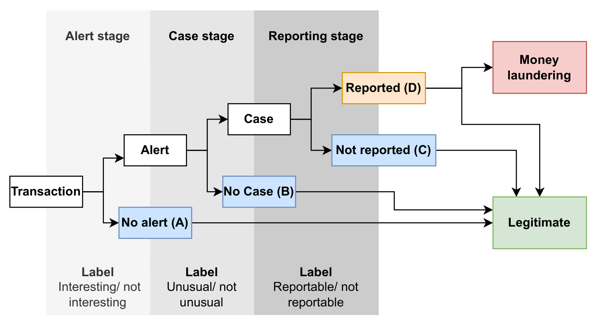

**그림 2.2: 거래 모니터링 프로세스 단계 및 거래 유형 [19] 레이블.**

### 2.2 거래 모니터링 모델의 임계값 조정 프로세스

2.1.1 섹션에서는 거래 모니터링 프로세스의 다양한 측면이 간략하게 소개됩니다. 이 프로세스에서는 범죄자의 예상되는 행동을 특성화하는 다양한 시나리오를 개발하여 비정상적인 거래 패턴을 탐지하기 위해 데이터 분석이 수행됩니다. 소개의 분할입금(smurfing) 예제로 돌아가서 시나리오는 다음과 같이 정의될 수 있습니다.

분할입금(smurfing)을 탐지하기 위해 거래 모니터링 모델은 거액의 자금이 구조적으로 분할되어 특정 계좌(수신자)에서 수신되는지, 또는 공개적으로 알려진 임계값 바로 아래에 금액이 구조적으로 이체되었는지(송신자)를 탐지해야 합니다. 이 시나리오에서는 분할입금(smurfing)을 나타낼 수 있는 범죄 행위의 특성을 파악해야 합니다.

<!-- 원문 17쪽 -->

이후 DNB의 지침 보고서에는 은행이 이 시나리오 [10]를 완화하기 위해 각 시나리오마다 하나 이상의 (비즈니스) 규칙을 개발해야 한다고 명시되어 있습니다. 예에서는 다음 규칙을 정의할 수 있습니다. 분할입금(smurfing) 시나리오 예:

- 송금인 규정: 송금인이 은행 고객인 경우 일정 기간 동안 고위험 자금세탁으로 분류되는 국가의 외국 계좌로 반복 거래를 수행합니다.

- 수취인 규칙: 수취인이 은행 고객인 경우, 일정 기간 동안 고위험 자금세탁으로 분류되는 국가의 해외 계좌에서 반복 거래를 반복합니다. 이후에는 각 규칙에 하나 이상의 임계값을 설정해야 합니다. 이 예에서는 다음 임계값을 정의할 수 있습니다.

- 거래가 모니터링되는 기간(예:), 1개월, 2개월 등.

- 해외 계좌와의 자금 이체 빈도(예:), 5일마다, 매주, 2주마다 등.

- 해외 계좌로/에서 반복적으로 이체되는 금액(예: 예, 1000 유로, 2000 유로 등). 여기에는 평균 이체 금액이나 기간에 따른 이체 금액의 변동을 모니터링하는 것도 포함될 수 있습니다. 적절한 임계값 수준을 결정하기 위해 비정상적인 거래 패턴의 데이터 분석 프로세스가 그림 2.3에 설명되어 있습니다.

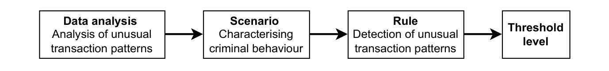

**그림 2.3: 데이터 분석에서 임계값 수준 거래 모니터링 모델까지의 프로세스.**

가장 적합한 임계값 수준을 결정하는 방법을 설명하려면 먼저 감사관 핸드북 [23]의 모델 위험 관리 보고서에 설명된 현재 서로 다른 임계값 수준을 비교하는 방법을 설명하는 것이 중요합니다. 그 후, 가장 적절한 임계값 수준을 결정하기 위해 다양한 임계값 조정 전략이 도입될 예정이며, 비정상적인 거래 다양한 규칙의 기본 확률은 알려지지 않았습니다.

#### 2.2.1 규칙 백테스팅 과정

이전 섹션에서 설명한 것처럼 거래 모니터링 모델의 임계값은 비정상적인 거래 동작을 감지하는 데 사용됩니다. 이러한 임계값은 최상의 임계값 수준과 매개변수를 식별하기 위해 임계값을 늘리거나 줄이는 테스트 환경에서 ATL 및 BTL 테스트를 통해 임계값 조정 프로세스 중에 결정됩니다. 임계값 조정 프로세스를 수행할 때 고려해야 할 두 가지 상황이 있습니다.

- 초기 임계값 조정 새 규칙: 지정된 성능 지표 세트와 관련하여 이전에 임계값 수준이 설정되지 않은 경우 좋은 초기 임계값 수준을 설정하기 위해 다양한 임계값 수준을 평가하고 평가합니다. 초기 임계값 조정 상황에서는 특정 규칙에 따른 비정상적인 거래 동작 에 대한 사전 지식이 없습니다.

- 기존 규칙에 따른 임계값 의 주기적 평가: 감사관 핸드북 [23]의 모델 위험 관리 보고서에는 은행이 모델을 주기적으로 평가하여 현재 임계값 수준이 의도한 성과를 달성하는지 여부와 지정된 성과 지표 세트와 관련하여 성과가 충분한지 여부를 결정해야 한다고 명시되어 있습니다. 기존 규칙 임계값을 주기적으로 평가하는 상황에서는 일반적으로 특정 규칙 의 비정상적인 거래 동작에 대한 몇 가지 역사적 사전 지식이 있습니다.

<!-- 원문 18쪽 -->

위에서 언급한 두 가지 상황 중 본 논문의 주요 초점은 초기 임계값 조정에 있습니다. 초기 임계값 조정은 기존 규칙에 비해 현재 임계값 의 주기적인 평가보다 덜 자주 발생하지만 잘못된 초기 임계값 수준이 발생할 위험이 더 높다는 점을 이해하는 것이 중요합니다. 잘못된 초기 임계값 수준으로 인해 많은 수의 잘못 경고된 거래가 발생하여 필요한 것보다 더 높은 작업 부하가 발생하거나 비정상적인 거래가 너무 많이 누락될 경우 은행에 높은 위험이 발생할 수 있습니다. 현재 임계값 수준의 위험이 알려지고 허용되는 기존 규칙의 현재 임계값을 주기적으로 평가하면 잘못된 임계값 수준의 위험이 낮아집니다. 따라서 추가된 값인 초기 임계값 조정은 더 높은 것으로 간주될 수 있습니다.

임계값의 백테스팅은 ATL 및 BTL 테스트를 통해 수행할 수 있습니다. 테스트된 임계값 수준보다 낮거나 높은 거래에서 샘플이 채취됩니다. 그 후, 분석가는 테스트된 임계값 수준 이하 및/또는 이상에서 샘플링된 거래를 평가하고 해당 거래에 관심이 있는지 여부를 표시합니다. 이는 각각의 짧은 검정색 선이 임계값 레벨을 나타내는 그림 2.4에 설명되어 있습니다.

위음성(FN)

참음성(TN)

진양성(TP)

위양성(FP)

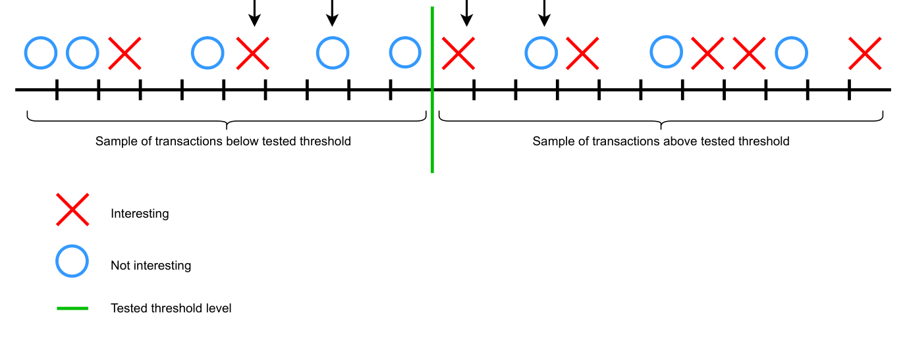

**그림 2.4: 임계값 수준 설정에 대한 절충 그림.**

모든 거래가 평가되고 라벨이 지정된 후에 혼동 행렬을 만들 수 있습니다. 관심 있음으로 표시된 임계값 아래의 모든 샘플링된 거래는 거짓음성인 반면, 관심 없음으로 표시된 샘플링된 거래는 참음성입니다. 또한 관심으로 표시된 임계값을 초과하는 모든 샘플링된 거래는 진양성인 반면, 관심 대상이 아닌 것으로 표시된 샘플링된 거래는 위양성입니다. 혼동 행렬의 예가 그림 2.5에 나와 있습니다.

<!-- 원문 19쪽 -->

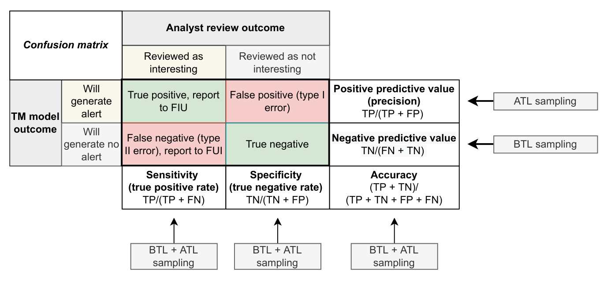

**그림 2.5: 다양한 성능 지표를 포함하는 혼동 행렬의 예.**

혼동 행렬을 사용하면 다음과 같은 5가지 성능 측정 항목과 그 보완 항목을 결정할 수 있습니다. 양성 예측값, 음성 예측값, 민감도, 특이성 및 정확성. 혼동 행렬의 맨 윗줄에 표시되는 긍정적인 예측 값을 결정하려면 테스트된 임계값을 초과하는 거래의 샘플만 채취하면 됩니다. 혼동 행렬의 맨 아래 행에 의해 제공되는 부정적인 예측 값을 결정하려면 테스트된 임계값 미만의 거래 샘플만 채취하면 됩니다. 그러나 민감도, 특이성 또는 정확성을 결정하려면 테스트된 임계값 수준보다 낮은 거래와 높은 거래의 샘플을 모두 채취해야 합니다. 혼동 행렬의 용어와 파생어는 부록 A에 요약되어 있습니다.

임계값 조정 프로세스에서 가장 적절한 임계값 레벨을 결정하는 것이 가능하기 전에 임계값 조정 프로세스의 중지 조건 역할을 하는 기준과 함께 성능 측정을 선택해야 합니다. 본 논문에서는 탐지 실패의 위험이 종종 은행의 위험 선호도에서 중요한 측면이기 때문에 1에서 음의 예측 값을 뺀 잘못된 누락률 F N F N+T N에 초점을 맞췄습니다. 또한 본 논문에서는 당사의 자체 성능 기준을 위험 허용 수준(RTL)으로 정의합니다.

정의 1. 위험 허용 수준(RTL). 위험 허용 수준은 (1 −α) × 100% 신뢰 수준을 사용하여 테스트된 임계값 아래로 샘플링된 전환 중 누락된 관심 거래(위음성)의 최대 허용 백분율 X입니다. 여기서 α는 종종 0.05로 선택되는 신뢰구간의 유의 수준입니다. 백 테스트 프로세스는 그림에 설명되어 있습니다. 2.6. 다른 성능 측정을 선택할 때 임계값 조정 프로세스에서 변경되는 유일한 블록은 테스트된 임계값보다 낮거나 높은 거래를 샘플링한 결과가 있는 노란색 블록입니다. 3.3 및 6.5 섹션에서는 선택이 임계값 조정 프로세스에 어떤 영향을 미치는지 자세히 설명합니다. 선택한 성능 지표에 따라 가장 적절한 임계값 수준을 결정합니다.

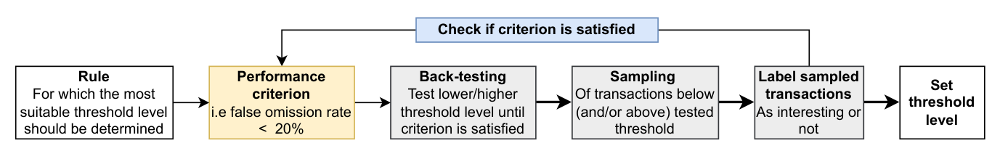

**그림 2.6: 백테스팅 프로세스 예시.**

<!-- 원문 20쪽 -->

### 2.3 문제 공식화

서론에서 간략하게 언급했듯이, 이 논문의 목적은 특정 성능 기준을 충족하는 가장 적절한 임계값을 결정하기 위해 순서적이고 효율적인 방식으로 임계값 수준을 테스트하는 임계값 조정 전략을 정의하는 것입니다. RTL를 기준으로 테스트된 임계값의 잘못된 누락률로 임계값 성능을 측정한다고 가정합니다.

탐사-이용 트레이드오프 위험이 은행의 위험 수용 범위 내에 속하는 가장 적절한 임계값 수준을 찾는 딜레마는 탐사-이용 트레이드오프를 포함하는 의사결정 문제로 설명할 수 있습니다. 탐색-이용 트레이드 오프는 여러 경쟁 대안에 직면했을 때 의사 결정자가 어떻게 알려진 좋은 대안(이용으로 정의됨)과 하나 이상의 알려지지 않았지만 잠재적으로 더 보람 있는 대안(탐색으로 정의됨) 중에서 선택해야 하는지를 설명합니다. 임계값 조정 상황에서는 탐색으로 정의된 해당 순간에 가장 유망한 성능을 갖는 임계값 수준이 아닌 다른 임계값 수준에서 거래를 검토하는 것 중에서 선택해야 합니다. 이 작업에는 시간이 더 걸리지만 잠재적으로 더 적절한 임계값 수준이 생성됩니다. 또 다른 선택은 악용으로 정의된 지금까지 가장 유망한 성능을 보이는 임계값에서 거래를 계속 검토하는 것입니다. 어떤 임계값 수준이 가장 적합한지 알아보기 위해 모든 임계값 수준에 대한 충분한 정보를 수집하는 탐색과 성능 저하 임계값 수준을 피하기 위해 알려진 정보를 사용하는 악용 사이의 절충이 필요한 이 문제 설정은 Robbins가 1952 [21]에서 도입한 다중 무장 산적 문제에 반영됩니다.

다중 무장 적기 문제는 다음과 같이 공식화됩니다. 도박꾼이 카지노를 방문하여 일련의 슬롯 머신에서 플레이하기로 선택했습니다. 각 슬롯 머신은 도박꾼에게 알려지지 않은 일부 분포에 따라 무작위 지불금을 생성합니다. 도박꾼은 각각 특정 지불금을 제공하는 다양한 팔을 당겨 슬롯머신의 분포에 대해 배울 수 있습니다. 도박꾼은 자신의 기존 지식을 활용하는 것과 이전에 가장 높은 지불금을 제공했던 무기를 뽑아서 단기적으로 더 많은 수익을 얻거나 장기적으로 가장 높은 지불금을 받기 위해 모든 무기의 분포를 배우기 위해 다른 무기를 탐색하는 것 사이에서 절충해야 합니다. 도박꾼의 두 가지 목표는 어떤 팔이 가장 높은 기대 지불금을 가지고 있는지 발견하고 다른 한편으로는 플레이하는 동안 지불금을 최대화하는 순차적 전략을 개발하는 것입니다. 2중 목표를 임계값 조정 프로세스로 변환하는 것은 다음을 의미합니다.

2중 임계값 조정 목표

- 미리 설정된 성능 기준을 충족하는 가장 적합한 임계값 수준을 결정하기 위해 임계값 조정 전략을 개발합니다.

- 분석가가 (1 −α) × 100% 신뢰 수준으로 가장 적합한 임계값 수준을 결정하기 위해 검토해야 하는 샘플링된 거래의 양을 최소화합니다.

이 두 가지 목표를 달성하기 위해 다양한 임계값 조정 전략을 자세히 알아보기 전에 3 장에서는 먼저 이러한 임계값 조정 전략에서 샘플링 중에 발생하는 불확실성을 정량화할 수 있는 방법을 설명합니다.

### 2.4 장 요약

이 장에서는 은행 내 자금세탁방지 거래 모니터링 프로세스와 AML 모델을 검증하는 방법에 대해 설명했습니다. AML 모델은 라인 위(ATL) 및 라인 아래(BTL) 테스트를 통해 테스트된 임계값 수준 위 및/또는 아래의 거래 샘플을 채취하여 평가할 수 있습니다. 자금세탁을 탐지하기 위해 범죄 행위를 특징짓는 시나리오와 규칙이 확립됩니다. 선택한 성능 지표에 따라 성능 기준을 정의할 수 있습니다. 이후 백테스팅 과정에서 샘플링된 거래는 분석가가 검토하여 혼동 행렬을 생성할 수 있습니다. 검토된 거래의 결과에 따라 성능 기준을 충족하는 가장 적절한 임계값 수준이 결정될 때까지 더 높거나 낮은 임계값 수준이 테스트됩니다.

<!-- 원문 21쪽 -->

## 제3장 표본추출 및 신뢰구간 방법

이 장에서는 임계값 조정 프로세스에서 샘플링 중에 발생하는 불확실성을 정량화하는 방법에 대해 설명합니다. 2 장에서 논의된 BTL 및 ATL 테스트를 통한 백 테스트 프로세스는 이 장에서 논의된 측면 의 기초를 형성합니다.

이 장은 네 부분으로 나누어져 있습니다. 백테스트 임계값 수준의 중요한 측면은 테스트된 임계값 수준보다 낮거나 높은 거래를 샘플링하는 것입니다. 따라서 섹션 3.1에서는 다양한 무작위 샘플링 방법을 논의합니다. 이러한 방법은 모집단에서 표본을 추출하는 방법에 대한 다양한 방법을 설명합니다. 이어서 섹션 3.2에서는 모집단의 일반적인 거래 수와 비정상적인 거래 수의 기본 분포가 이항 분포로 설명될 수 있으므로 신뢰구간을 사용하여 표본 추정치의 불확실성을 어떻게 정량화할 수 있는지 설명합니다. 이 섹션에서는 잘 알려진 다섯 가지 신뢰구간 방법을 비교하기 위한 두 가지 성능 기준을 제공하고 신뢰구간 방법 이항 분포를 사용하여 필요한 표본 크기를 결정하는 방법을 설명합니다. 그러나 섹션 3.2에 설명된 선택된 신뢰도 방법은 측정값으로서의 민감도, 특이성 또는 정확도의 신뢰구간 한계 를 결정하는 데 적합하지 않습니다. 왜냐하면 이러한 측정값은 분포를 알 수 없는 두 확률 변수의 비율을 표현하기 때문입니다. 따라서 섹션 3.3에서는 비율의 표본 추정치인 신뢰구간 을 구성하는 방법을 설명합니다. 마지막으로, 본 논문에서 추가로 사용될 이 장에서 이루어진 중요한 선택에 대한 요약이 섹션 3.4에 제공됩니다.

### 3.1 무작위 샘플링

2.2 섹션에서는 BTL 및 ATL 테스트라고 하는 테스트된 임계값 수준 위 및/또는 아래의 거래에서 샘플을 채취하여 임계값 조정을 수행할 수 있는 방법에 대해 설명합니다. 이 섹션에서는 테스트된 임계값 수준보다 낮거나 높은 거래 모집단에서 샘플을 추출하는 방법에 대해 자세히 설명합니다.

표본 추출은 전체 모집단의 특성을 추정하기 위해 통계 모집단 내에서 개별 관찰의 하위 집합을 선택하는 것입니다. 이 경우 표본 추출의 목적은 모집단을 대표하는 표본을 수집하는 것입니다. 표본 추출 시 표본을 추출할 모집단을 정의하는 것이 중요합니다. 모집단은 특정 특성을 가진 모든 관측치를 포함하는 것으로 정의될 수 있습니다.

논의될 샘플링 기술은 본질적으로 확률적입니다. 즉, 모집단의 각 관측값은 샘플에 포함될 특정 확률을 가지며 샘플의 실제 구성은 무작위 [18]임을 의미합니다. 무작위 샘플을 수행하는 다양한 방법 가 있습니다. 무작위 표본추출의 일반적인 방법으로는 단순 무작위 표본추출, 체계적 표본추출,

<!-- 원문 22쪽 -->

계층화된 샘플링과 클러스터 샘플링. 다양한 샘플링 방법 간의 샘플 구성 차이는 그림 3.1에 설명되어 있습니다.

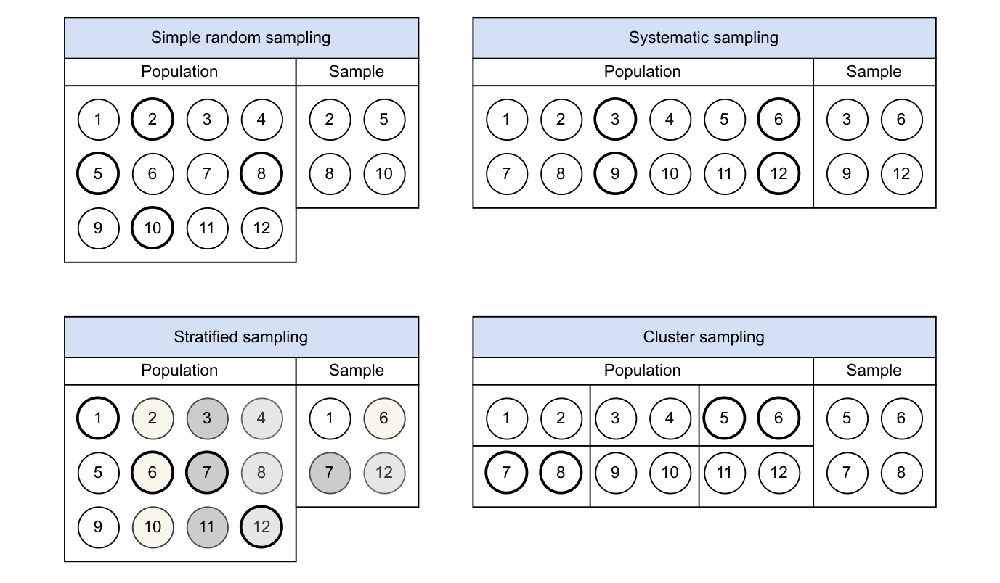

**그림 3.1: 다양한 확률 무작위 샘플링 방법의 샘플 구성 그림.**

단순 무작위 샘플링을 사용하면 각 관측치가 모집단의 하위 그룹 없이 선택될 확률이 동일합니다. 체계적 표본추출에서는 특정 특성에 따라 모집단을 정렬합니다. 그런 다음 임의의 시작점을 사용하여 특정 간격으로 관측치가 선택됩니다. 계층화된 샘플링을 통해 관측값은 여러 개의 개별 범주(층)로 나뉘며 각 계층에서 독립적인 동종 하위 모집단으로 무작위 표본이 추출됩니다. 이 방법은 전체 [18] 집단에 대한 정보 외에도 여러 하위 집단 각각에 대한 정보에 관심이 있는 경우 사용할 수 있습니다. 클러스터 샘플링을 사용하면 관측치가 특정 그룹(클러스터)에서 선택됩니다. 군집 표본 추출과 계층화 표본 추출의 차이점은 군집 표본 추출은 모집단을 그룹으로 나눈 다음 무작위로 선택한 일부 그룹의 모든 관측치를 포함하는 반면, 층화 표본 추출은 모집단을 그룹으로 나누지만 각 그룹의 일부 관측치만 포함한다는 것입니다. 클러스터 샘플링의 장점은 비용 효율성이 더 높으며 대규모 인구 [27]에 매우 적합하다는 것입니다.

전반적으로, 샘플링 방법의 성능과 선택은 주로 모집단의 특성에 따라 달라집니다. 일반적으로 계층화되고 체계적인 무작위 샘플링이 단순 무작위 샘플링 [12]보다 더 효과적입니다. 그러나 단순 무작위 표본 추출의 주요 장점은 단순성과 모집단에 대한 가정이 필요하지 않다는 것입니다.

따라서 알려지지 않은 거래 모집단, 특히 비정상적인 거래 비율과 관련하여 가정을 하는 것이 어렵기 때문에 다양한 임계값 조정 전략을 백테스트하는 단순 무작위 샘플링 방법을 선택합니다.

### 3.2 신뢰구간 및 표본 크기 방법 이항 분포

이전 섹션에서는 테스트된 임계값 이하 및/또는 이상의 거래가 '단순 무작위 샘플링'을 사용하여 샘플링된다고 설명했습니다. 이 섹션에서는 이항 분포에 대한 다양한 신뢰구간 방법 에 대해 설명합니다. 각 방법의 장점과 한계는 다음과 같습니다.

<!-- 원문 23쪽 -->

시뮬레이션 연구를 통해 설명합니다. 이후에는 이러한 신뢰구간에서 표본 크기를 결정하는 방법에 대해 논의합니다.

이항 분포의 모집단 비율인 신뢰구간 를 결정하는 다양한 통계 방법이 있습니다. 신뢰구간 공식을 다시 작성하여 이러한 신뢰구간 방법을 사용하여 표본 크기를 결정할 수 있습니다. 다양한 신뢰구간 방법을 논의하기 전에 신뢰구간의 정의가 명시되어 있습니다.

정의 2. 신뢰구간(CI). 신뢰구간, 모집단 모수 θ,는 표본에서 계산된 무작위 구간으로, 지정된 확률 [18]를 갖는 θ를 포함합니다.

예, 95% 신뢰구간 모집단 매개변수 θ는 0.95 확률로 θ를 포함하는 무작위 구간입니다. 즉, 많은 무작위 샘플을 가져와 각 샘플 주위에 신뢰구간을 형성하면 이 구간의 약 95%에 θ [18]가 포함됩니다. 신뢰구간의 개념을 설명하기 위해 모집단에서 20 샘플을 뽑아 95% 신뢰구간 θ.에 근접한다고 가정합니다. 이는 평균적으로 95% 신뢰구간의 5% 또는 1가 20에는 θ [18]가 포함되지 않습니다. 마지막으로, 포함 확률이 (1−α)×100%.인 경우 구간을 (1−α)×100% 신뢰구간이라고 합니다. 세 가지 요소는 신뢰 수준 [28]가 주어지면 신뢰구간의 너비에 영향을 미칩니다.

- 신뢰구간의 너비는 표본의 분산에 따라 달라집니다. 표본의 분산이 더 크면 신뢰구간이 더 넓어집니다.

- 표본 크기는 신뢰구간의 너비에 영향을 미칩니다. 표본 크기가 클수록 정밀도가 높아지고 신뢰구간이 작아집니다. 정밀도는 신뢰구간의 기대길이의 절반으로 정의됩니다.

- 99% 신뢰구간은 95% 신뢰구간보다 넓어야 합니다. 그 이유는 구간에 더 확실한 모집단 매개변수가 포함되어야 하기 때문입니다.

#### 3.2.1 CI 성능 기준: 적용 확률 및 기대길이

신뢰구간 이항 분포 구성에 대한 많은 연구가 문헌에서 이용 가능합니다. 이러한 방법의 성능을 평가하는 데 자주 사용되는 두 가지 기준은 적용 확률(CP)과 기대길이(EL)입니다. 포함 확률은 구간에 실제 모집단 매개변수가 포함되는 실제 확률인 반면, '명목 포함 확률'은 종종 95%로 설정되는 구성된 신뢰구간의 신뢰 수준입니다. 기대길이는 신뢰구간의 예상 너비입니다. 이항 분포 확률 밀도 함수는 다음과 같이 정의됩니다.

```text
f(k, n, p) = P(X = k) =
```

엔케이

pk(1 -p)n-k(3.1)

```text
for k = 0, 1, 2, ..., n, where
```

엔케이

= 엔! k!(n-k)!.

여기서 k는 n개의 트레일에서 성공한 횟수입니다. X가 성공 횟수로 정의되고 크기 n의 무작위 표본이 추출되는 크거나 무한한 모집단을 생각해 보세요. p를 알 수 없는 모집단 비율로 가정하면 명목 신뢰 수준(1 −α) × 100%)을 갖는 양측 신뢰구간은 [L(X), U(X)]로 나타낼 수 있습니다. 표본 크기 n과 모집단 비율이 주어지면

```text
p the CP and EL are defined as follows [24, 16]:
```

```text
CP(n, p) =
```

N

```text
k=0
```

엔케이

```text
∑
pk(1 −p)n−kI[L(k),U(k)](p)
(3.2)
```

```text
(with I[a,b](x) = 1 if x ∈[a, b] and I[a,b](x) = 0, otherwise) and
```

```text
EL(n, p) =
```

N

```text
k=0
```

엔케이

pk(1 -p)n-k(U(k) -L(k)) (3.3)

<!-- 원문 24쪽 -->

앞에서 언급했듯이 신뢰구간에는 항상 매개 변수의 실제 값이 포함되지 않지만 방정식 3.2의 해로서 임의 구간 [L(X), U(X)]의 CP는 (1 −α).)이어야 합니다. 또한 두 방법 모두 거의 동일한 CP [16]입니다.

신뢰구간 방법 이항 분포를 사용하면 정규 근사에 기반한 방법과 정확한 방법을 명확하게 구분할 수 있습니다. 다음 방법을 비교합니다.

- 정확한 방법: Clopper-Pearson

- 정규 근사에 기초한 방법

### – Wald(유한한 인구 및 Yates의 연속성 수정 사용)

### – 아그레스티-콜

### – Wilson Score(유한한 모집단 및 Yates의 연속성 수정 포함)

### – Arcsine(유한한 모집단 및 Yates의 연속성 수정 포함)

이러한 다양한 신뢰구간 방법은 문헌에서 [16]의 몇 가지 좋은 특성을 갖는 것으로 확인되었기 때문에 비교됩니다. CP를 다양한 신뢰구간 방법을 비교하기 위한 기준으로 사용하는 경우 방법은 세 가지 그룹 [24]로 분류될 수 있습니다.

- 첫 번째 그룹: 엄격하게 보수적인 방법, 최소 포함 확률이 1 −α −0.005 all n ≥10 및 all p보다 크거나 같은:

분

```text
p CP(p, n) ≥1 −α −0.005, ∀n ≥10
```

- 두 번째 그룹: 평균적으로 올바른 방법으로 평균 적용 확률이 1 −α −0.005 all n ≥10:보다 크거나 같은

```text
0
CP(p, n)dp ≥1 −α −0.005, ∀n ≥10
```

- 세 번째 그룹: 1 또는 2 그룹에 속하지 않는 기타 방법입니다. 처음 두 그룹만 허용 가능한 신뢰구간 방법으로 간주됩니다. 다양한 신뢰구간에 대한 공식 를 자세히 살펴보기 전에 정확한 신뢰구간 방법 또는 정규 근사 [16, 4]를 기반으로 한 신뢰구간 방법을 사용하는 문헌 에서 다음과 같은 장점과 단점이 자주 언급됩니다.

정확한 방법(Clopper-Pearson) 장점

- 이 방법은 np < 5 또는 n(1 −p) < 5일 때 정확합니다.

- 신뢰구간 계산은 p = 0 또는 p = 1 일 때 가능합니다.

- 기본 분포에 대해 어떤 가정이나 근사치를 만들 필요가 없습니다. 불리

- 신뢰구간의 상한과 하한을 결정하는 공식은 더 복잡하며 상한과 하한을 계산하려면 컴퓨터가 필요합니다. 정규 근사 방법 장점

- 이러한 방법은 일반적으로 이해하기 쉽습니다.

- 이러한 방법의 상한과 하한은 직접 계산하기가 더 쉽습니다. 단점

- 일반적으로 np < 5 또는 n(1 −p) < 5일 때 정확도가 저하됩니다.

- p = 0 또는 p = 1인 경우에는 신뢰구간 계산이 불가능합니다.

<!-- 원문 25쪽 -->

#### 3.2.2 정확한 방법

Clopper-Pearson Clopper-Pearson 방법은 이항 확률 함수 [39]를 기반으로 확률의 정확한 신뢰구간을 결정하는 황금 표준 로 간주됩니다. α 및 표본 비율 ˆp = k가 주어지면

```text
n, the exact confidence limits can be determined by solving the following equations [24]:
```

N

```text
i=k
```

아니 나는

파이

```text
lower(1 −plower)n−i = α
```

```text
2
(3.4)
```

케이

```text
i=0
```

아니 나는

파이

```text
upper(1 −pupper)n−i = α
```

```text
2
(3.5)
```

여기서 쟁기는 L(X)에 해당하고 pupper는 U(X)에 해당합니다. k = 0 및 k = n, 방정식의 해는 명시적입니다.

```text
k = 0; plower = 0, pupper = 1 −(α/2)1/n
(3.6)
```

```text
k = n; plower = (α/2)1/n, pupper = 1
(3.7)
```

```text
For the other cases, the solutions can be determined by the relation [24]:
```

```text
1 −P(X ≤k −1) = P(X ≥k)
(3.8)
```

```text
=
```

N

```text
i=k
```

아니 나는

```text
∑
pi(1 −p)n−i =
Γ(n + 1)
Γ(k)Γ(n −k + 1)
```

p 0 tk−1(1 −t)n−kdt (3.9)

```text
= Ip(k, n −k + 1) = P(X ≤p)
(3.10)
```

```text
→P(X ≥k) = Ip(k, n −k + 1)
(3.11)
```

여기서 정규화된 불완전 베타 함수라고도 하는 Iy(a, b)는 매개변수 a > 0 및 b > 0를 사용하여 베타 확률 변수 X의 누적 분포 함수(CDF)를 나타냅니다. 구간의 한계는 베타 분포의 분위수와 같습니다. 결과적으로 Clopper-Pearson 신뢰구간은 [24]로 제공됩니다.

```text
(plower, pupper) = (βα/2(k, n −k + 1), β1−α/2(k + 1, n −k))
(3.12)
```

폐쇄형 해법이 없기 때문에 정확히 지정된 신뢰수준으로 신뢰구간을 구하는 것은 불가능하지만, 적어도 (1 −α) [24])의 포함확률을 갖는 신뢰구간을 구성하는 것은 가능합니다.

### 방정식 3.11의 관계 증명은 Scholz [26]의 보고서에 설명되어 있으며 두 가지 사실이 입증되었습니다.

```text
1. Let x(p) = P(X ≥k) and y(p) = Ip(k, n −k + 1). Firstly, it is proven that:
```

```text
x′(p) = ∂P(X ≥k)
```

```text
∂p
= ∂Ip(k, n −k + 1)
```

```text
∂p
= y′(p) ∀p ≥0.
(3.13)
```

2. 또한 다음이 입증되었습니다.

```text
x(p) = P(X ≥k) = Ip(k, n −k + 1) = y(p) for p = 0.
(3.14)
```

3. 1 및 2로부터, P(X ≥k) = Ip(k, n −k + 1) 는 방정식 3.11의 관계를 증명하는 p ≥0의 모든 값이라는 결론을 내릴 수 있습니다. 점 3는 x′(p) = y′(p) = f(p)가 x(p) = y(p)+C라는 사실로부터 도출됩니다. 또한 x(0) =가 입증되었습니다. y(0)는 C = 0를 따릅니다. 따라서 함수가 연속적이므로 방정식 3.11의 증명은 다음과 같습니다. 3.12는 부록 C에 나와 있습니다.

<!-- 원문 26쪽 -->

#### 3.2.3 정규 근사 방법

신뢰구간을 결정하기 위해 문헌에서 자주 언급되는 방법은 N(np, np(1 −p)) 분포 [24]에 의한 Bin(n, p)의 근사치를 기반으로 합니다.

k -np np(1 -p)

```text
=
```

k n −p p(1−p) n

```text
d−→N(0, 1)
(3.15)
```

그리고

피

```text
−z1−α/2 ≤
```

k n −p p(1−p) n

```text
≤z1−α/2
```

```text
≈1 −α
(3.16)
```

여기서 zα/2 및 z1−α/2는 z 점수를 나타냅니다. 는 점수가 표준 편차 단위로 평균과 얼마나 떨어져 있는지를 설명하는 표준 정규 분포입니다. 이산형 이항 분포를 연속형 정규 분포로 근사하는 이 방법은 중심 극한 정리(CLT)를 기반으로 하며 표본 크기가 충분히 크지 않거나 모집단 비율 p가 0 또는 1에 가까울 때 신뢰할 수 없습니다. 이러한 방법을 사용할 수 있는 경험적 규칙은 np > 5 및 n(1−p) > 5 [4]일 때입니다. 잘 알려진 정규 근사 방법은 Wald의 방법입니다.

Wald의 방법

```text
Using ˆp = k
```

```text
n, the Wald’s confidence interval is given by [24]:
```

```text
(plower, pupper) = ˆp ± z1−α/2
```

```text
∑
ˆp(1 −ˆp)
```

```text
n
= k
```

```text
n ± z1−α/2
```

kn2

### 1 -k n

```text
∑
(3.17)
```

방정식 3.17는 비율 [16]가 불가능한 [0,1] 간격 외부의 값을 생성한다는 점에 유의하는 것이 중요합니다. 이를 방지하기 위해 Wald의 하한과 상한은 표 3.2의 공식에 적용됩니다. Wald 구간의 하한과 상한은 ˆp를 ~p = ˆp± 1로 대체하여 Yates의 연속성 수정을 도입하여 개선할 수 있습니다.

2n [24]. 이산형 분포를 근사화하기 위해 연속형 분포를 사용하는 경우 연속성 수정을 적용해야 합니다. 유한 모집단에서 대체 없이 표본을 추출할 때 표본 크기가 전체 모집단의 5%보다 큰 경우,

```text
standard error must be corrected by multiplying by a Finite Population Correction, FPC =
```

N−n N−1 에

```text
scale the variance
ˆp(1−ˆp)
```

```text
n
∗FPC2 = ˆp(1−ˆp)
```

N

```text
N−n
N−1 = ˆp(1−ˆp)
```

n N−1

```text
N−n , replacing n by ˜n = n N−1
```

```text
N−n [41]. The Finite
```

모집단 수정은 표본이 표 3.1 [20]에 설명된 모집단의 중요한 부분, 즉 5%보다 큰 경우를 제외하고 수정 항이 1에 가깝기 때문에 복원이 있는 샘플링과 없는 샘플링 간의 차이를 포착합니다.


**표 3.1: 유한 모집단 수정 항 다양한 표본 크기 n 모집단 크기 N = 10, 000.**

Wilson Score 방법 비대칭 신뢰구간 비율 ˆp = k 를 결정하기 위해 Wilson 점수 방법이 제안되었습니다.

```text
n and is given by [39]:
```

<!-- 원문 27쪽 -->

```text
(plower, pupper) =
```

```text
2nˆp + z2
1−α/2 ± z1−α/2
∑
4nˆp(1 −ˆp) + z2
1−α/2
2(n + z2
1−α/2)
(3.18)
```

```text
=
```

```text
2k + z2
1−α/2 ± z1−α/2
∑
4k(1 −k/n) + z2
1−α/2
2(n + z2
1−α/2)
(3.19)
```

Yates의 연속성 수정 및 유한 모집단 수정은 Wilson 점수 구간에도 적용될 수 있습니다.

Agresti-Coull 방법 a 95% 신뢰구간, z2 = 1.962 ≒4 및 Wilson Score 구간의 중간점은 (k + z2/2)/(n + z2) ≒(k + 2)/(n + 4). Agresti-Coull은 4 관측치를 표본에 추가하는 간단하면서도 효과적인 방법을 제안했습니다. ~n = n + z2 중 2는 성공이고 2 실패는 ~k = k + z2입니다.

```text
2 ,
then ˜p =
```

```text
˜k
˜n =
1
n+z2 (k + z2
```

```text
2 ) and then applying Wald’s confidence interval [24]:
```

```text
(plower, pupper) = k + 2
```

```text
n + 4 ± z1−α/2
```

k + 2 (n + 4)2

### 1 -k + 2 n + 4

```text
∑
(3.20)
```

아크사인 방법 아크사인 방법은 안정화 변환이 분산 [24]에 적용된 후 대략적인 정규 분포를 기반으로 합니다.

아크신

케이엔

```text
d−→N
```

```text
∑
arcsin√p, 1
```

4n

```text
∑
(3.21)
```

Yates의 연속성 수정을 적용하면 성능이 향상되어 적용 범위 확률 [24, 2]가 높아집니다. 유한 모집단 보정은 아크사인 간격에도 적용될 수 있습니다.

논의된 방법의 신뢰구간 비율 p의 하한 및 상한은 표 3.2에 요약되어 있으며 이는 [24] 논문에도 제시되어 있습니다.

<!-- 원문 28쪽 -->

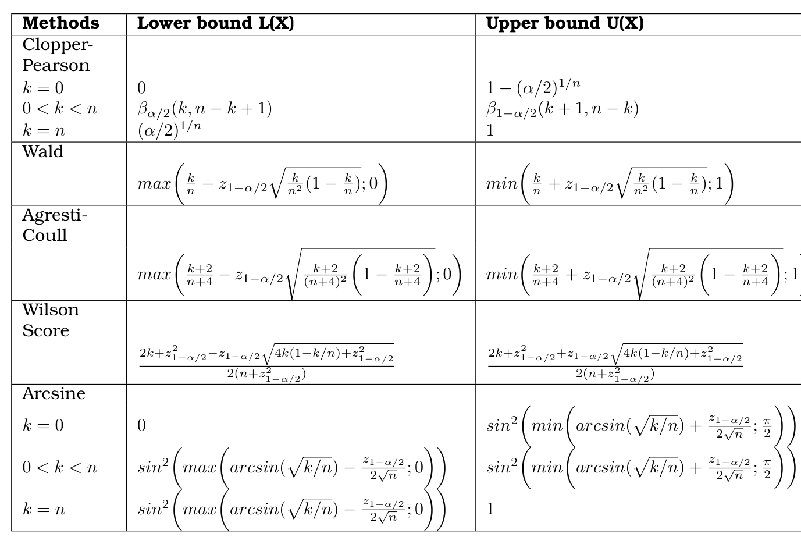

**표 3.2: 양측 (1−α) × 100% 신뢰 수준 의 하한 및 상한 L(X) 및 U(X)**

신뢰구간 p 다양한 신뢰구간 방법.

#### 3.2.4 적용 범위 확률 및 기대길이에 대한 3.2.4 시뮬레이션 연구

신뢰구간을 결정하기 위한 다양한 방법을 비교하기 위해 다음 두 가지 기준에 따라 다양한 신뢰구간 방법을 비교하는 시뮬레이션 연구가 수행됩니다.

- 방정식 3.2에 정의된 적용 범위 확률.

- 기대길이(수식 3.3에 정의됨). 본 논문에서 사용하기에 가장 적합한 신뢰구간 방법을 결정하기 위해 다음과 같은 세 가지 요구 사항이 공식화되었습니다.

요구 사항 신뢰구간 방법

- 첫째, 신뢰구간 방법은 최소한 명목형 포함 확률과 동일한 포함 확률을 보장해야 합니다.

- 또한, 더 많은 방법이 대략 동일한 Coverage Probability를 가질 때 가장 작은 EL를 갖는 신뢰구간 방법인 를 선호합니다.

- 마지막으로, 관심 거래의 모집단 비율에 관계없이 항상 신뢰구간 방법을 사용할 수 있는 것이 바람직합니다.

<!-- 원문 29쪽 -->

시뮬레이션 연구 시뮬레이션 연구, 적용 범위 확률 5가지 신뢰구간 방법인 Wald, Wilson Score, Agresti-Coull, Arcsine 및 Clopper-Pearson은 방정식 3.2를 통해 결정됩니다. 그 후, 기대길이도 방정식 3.3를 통해 5가지 신뢰구간 방법 로 결정되었습니다. 시뮬레이션 연구는 더 큰 표본 크기가 적용 범위 확률의 정확성과 크기에 미치는 영향을 평가하기 위해 소형, 중형 및 대형 표본 크기, n = 50, n = 250 및 n = 500로 수행되었습니다. 신뢰구간의 기대길이. 또한 시뮬레이션 연구는 소규모, 중간 및 대규모 인구, N = 500, N = 1000 및 N = 10, 000를 대상으로 를 수행하여 더 많은 인구가 정확도에 미치는 영향을 평가합니다. 포함 확률 및 신뢰구간의 기대길이 크기에 대한 영향. 예이츠의 연속성 수정 및 유한 모집단 수정은 정규 근사를 기반으로 하는 신뢰구간에 적용되어 포함 확률이 모집단 N이 작아질수록 정확도가 떨어지지 않도록 합니다. 500 및 모집단 크기 500, 1000 및 10,000 및 95% 신뢰구간은 그림 3.2에 나와 있습니다. 적용 확률(CP)은 y축에 표시되고 인구 비율 p는 x축 p = [0.01, 0.02,..., 0.98, 0.99]에 표시됩니다.

시뮬레이션 연구 결과: 포함 확률(CP)을 기반으로 그림 3.2는 연속성과 유한 모집단 보정 값이 p = 0 및 p =에 가까운 Wald 신뢰구간의 CP를 보여줍니다. 1는 공칭 CP 보다 상당히 작으며 이는 그림 3.2a, 3.2b 및 3.2c에서 볼 수 있는 더 작은 표본 크기입니다. 또한 연속성과 유한 모집단 수정을 사용하는 Agresti-Coull 신뢰구간의 CP는 명목 CP 근처에 있지만 일반적으로 명목 CP보다 작습니다. 또한 연속성과 유한 모집단 보정을 갖춘 Arcsine 신뢰구간의 CP는 공칭 CP보다 높지만 공칭 CP보다 작을 수 있습니다. 마지막으로 CP, 연속성과 유한 모집단 보정 및 Clopper-Pearson 신뢰구간을 사용한 Wilson 점수 분석을 통해 최소 CP가 항상 공칭 CP보다 크다는 것을 보여줍니다. 그림 3.2의 결과를 바탕으로 5가지 신뢰구간 방법은 다음과 같이 분류할 수 있습니다.

- 첫 번째 그룹 - 엄격하게 보수적인 방법: 연속성과 유한 모집단 수정을 사용하는 Wilson 점수와 Clopper-Pearson 방법은 95% 신뢰구간 그룹에 속합니다. 또한 Clopper-Pearson 신뢰구간은 엄격하게 보수적인 방법 [1]라고 문헌에 명시되어 있습니다.

- 두 번째 그룹 - 평균 올바른 방법: 연속성과 유한 모집단 수정 방법을 사용하는 Arcsine 및 Agresti-Coull은 95% 신뢰구간 그룹에 속합니다. Agresti-Coul 신뢰구간은 현재 주로 대규모 샘플 [16]를 권장합니다.

- 세 번째 그룹 - 기타: 연속성과 유한 모집단 수정 방법을 사용하는 Wald는% 신뢰구간 그룹에 속합니다. 또한 k = 0 또는 k = n, Wald 구간의 길이가 0이라는 점에 유의하는 것이 중요합니다. 이 두 가지 경우에는 Clopper-Pearson 방정식을 사용하는 것이 좋습니다. 마지막으로 Wald의 신뢰구간은 작은 표본과 치우친 데이터 [41]를 사용하는 데 적합하지 않습니다. 이러한 결과는 연속성 수정을 사용한 Wilson Score와 Clopper-Pearson을 엄격하게 보수적인 방법으로 분류하고 연속성 수정을 사용한 Arcsine 변환과 Agresti-Coull을 평균 올바른 방법으로 분류하고 Wald의 방법을 95% 신뢰구간의 세 번째 그룹으로 분류한 논문 [24, 16]의 결과와 일치합니다. CP의 결과에 따르면 연속성과 유한 모집단 보정을 갖춘 Wilson 점수와 Clopper-Pearson 방법이 가장 신뢰할 수 있으므로 관심 있는 거래의 비율인 신뢰구간 를 결정하는 데 사용하는 데 가장 적합합니다. 두 방법의 CP가 비교 가능하므로 기대길이, 즉 신뢰구간의 예상 너비에 대한 분석이 수행됩니다. 여기서 가장 작은 EL를 사용하는 신뢰구간 방법 를 선호합니다. 결과 기대길이 표본 크기 50, 250 및 500 및 모집단 크기 500, 1000 및 10,000 a 95% 신뢰구간은 그림 3.3에 나와 있습니다.

<!-- 원문 30쪽 -->

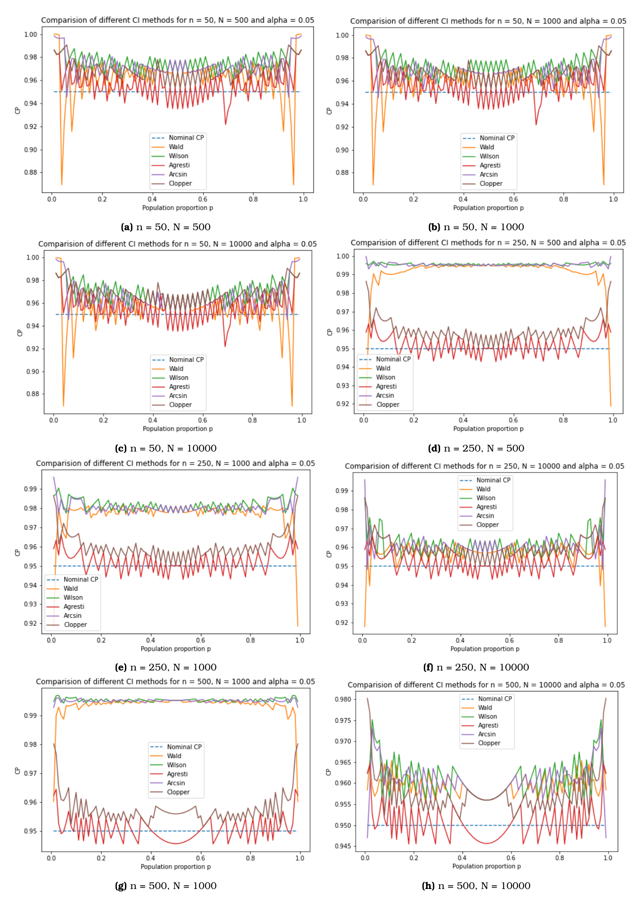

**그림 3.2: Wald, Agresti, Wilson Score, Arcsine 및 Clopper-Pearson의 적용 확률(CP)**

신뢰구간 방법 α = 0.05.

<!-- 원문 31쪽 -->

시뮬레이션 연구 결과: 기대길이(EL) 기반 그림 3.3의 분석에서 그림 3.3a, 3.3b 및 3.3c를 그림과 비교하면 표본 크기가 클수록 EL가 작아지는 것을 알 수 있습니다. 3.3g 및 3.3h. 또한, 표본 크기가 모집단의 작은 부분인 경우, 즉 표본 크기가 모집단의 5 퍼센트보다 작거나 같을 때(그림 3.3b의 경우), EL는 연속성과 유한 모집단 보정을 갖춘 Clopper-Pearson 및 Wilson Score 신뢰구간 와 유사하다는 것이 분명해졌습니다. 3.3c, 3.3f 및 3.3h. 그러나 표본 크기가 모집단의 큰 부분인 경우, 즉 표본 크기가 모집단의 5%를 초과하는 경우 EL Clopper-Pearson 및 Wilson Score 신뢰구간의 연속성과 유한 모집단 수정이 그림 3.3d에서 명확하게 표시됩니다. 3.3e 및 3.3g. 여기서 EL Clopper-Pearson 신뢰구간은 EL Wilson Score 신뢰구간보다 상당히 작습니다. 마지막으로 Clopper-Pearson 신뢰구간의 EL는 EL Wilson Score 신뢰구간 보다 작습니다. 표본 크기는 250 이상이지만 표본 크기가 모집단의 5 퍼센트보다 작을 때 무시할 수 있습니다.

마지막으로, 신뢰구간 방법의 선택은 원하는 보수성 정도와 예상되는 모집단 비율에 따라 달라집니다. 인구 비율이 0 또는 1에 가깝지 않을 것으로 예상되는 경우 Wilson Score 신뢰구간을 사용할 수 있습니다. 인스턴스 CP(n, p) ≥1 −α가 필수인 경우 Clopper-Pearson이 적절한 방법입니다.

결론 요약하자면, 가장 적합한 신뢰구간 방법인 요구 사항은 섹션 3.2.4의 시작 부분에 설명되어 있습니다. 본 논문에서 Clopper-Pearson 신뢰구간 방법은 관심 있는 거래의 모집단 비율인 신뢰구간 를 결정하기 위해 선택되었습니다. 왜냐하면 이 방법은 항상 명목 CP와 최소한 동일한 CP를 보장하기 때문입니다. 둘째, Clopper-Pearson 방법은 EL가 가장 작습니다. 마지막으로 Clopper-Pearson 방법은 인구 중 관심 있는 거래의 비율에 관계없이 항상 사용할 수 있다는 큰 장점이 있습니다. 모집단에서 관심 있는 거래의 비율이 1에 가까울 가능성은 없지만 0에 가까운 비율은 제외할 수 없으며 np > 5 및 n(1 −p) > 5 조건이 충족된다고 보장할 수 없습니다.

<!-- 원문 32쪽 -->

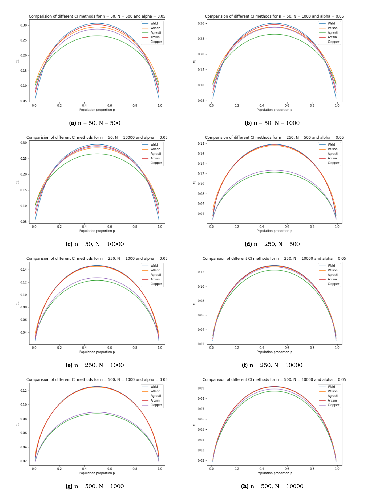

**그림 3.3: 기대길이(EL) Wilson 점수 및 Clopper-Pearson 신뢰구간 방법**

```text
α = 0.05.
```

<!-- 원문 33쪽 -->

#### 3.2.5 표본 크기 방법으로 변환

샘플 추정치의 신뢰구간 한계를 결정하기 전에 거래 모집단에서 샘플을 가져와야 합니다. 분석가가 검토해야 하는 거래 수인 필수 표본 크기 n은 표 3.2에 설명된 신뢰구간을 사용하여 결정할 수 있습니다. 필요한 표본 크기를 결정하는 잘 알려진 방법은 Wald의 신뢰구간입니다. Wald의 표본 크기 필요한 표본 크기는 Wald의 신뢰구간을 역전시켜 결정할 수 있습니다. 여기서 방정식 3.23로 표시되는 오차 한계 e는 신뢰구간 길이의 1/2로 정의됩니다. 특정 적용 확률과 원하는 오차 한계 e를 사용하여 필요한 표본 크기를 결정하려면 모집단 근사치 ˆp를 예비 점 추정치 p0 관심 거래의 모집단 비율로 대체해야 합니다. 방정식 3.23를 다시 작성하면 모집단 근사치 ˆp가 예비 점 추정치 p0로 대체되어 방정식 3.25에 제시된 필수 표본 크기 n이 가장 가까운 정수로 반올림됩니다.

```text
(plower, pupper) = p0 ± z1−α/2
```

```text
∑
p0(1 −p0)
```

```text
n
(3.22)
```

```text
e = z1−α/2
```

```text
∑
p0(1 −p0)
```

```text
n
(3.23)
```

```text
n =
```

```text
∑(z1−α/2)2p0(1 −p0)
e2
```

```text
∑
(3.24)
```

인구비율에 대한 선행연구가 없어 예비점추정 p0을 만드는 것이 어려운 경우에는 방정식 3.24를 최대화하는 보수적인 p0 = 0.5를 선택할 수 있다. 표 3.2에서 Wald가 적용한 상한과 하한을 따르는 표본 크기 공식은 [16]로 제공됩니다.

```text
n =
```

```text
∑(z1−α/2)2p0(1−p0)
(e−p0)2
```

```text
∑
, 0 ≤p0 < e
```

```text
2
∑(z1−α/2)2p0(1−p0)
e2
```

, 전자

```text
2 ≤p0 ≤1 −e
2
∑(z1−α/2)2p0(1−p0)
(e−(1−p0))2
```

, 1 -e

```text
2 < p0 ≤1
```

```text
(3.25)
```

Agresti-Coull 표본 크기 필요한 표본 크기를 결정하기 위해 Agresti-Coull 신뢰구간에 이 접근 방식을 적용하면 Wald의 신뢰구간 방법을 사용할 때와 동일한 필수 표본 크기가 생성됩니다. Agresti-Coull 신뢰구간은 수정된 비율 ~p =만 제외하고 Wald의 신뢰구간과 동일하기 때문입니다.

```text
˜k
˜n =
1
n+z2 (k + z2
```

### 2).

윌슨 점수 표본 크기 분석 솔루션 를 필요한 표본 크기로 얻기 위해 윌슨 점수 신뢰구간을 반전시키는 것은 불가능합니다. 그러나 표본 크기는 다른 접근 방식으로 결정할 수 있습니다. 모집단 근사치 ˆp가 예비 점 추정치 p0로 대체되는 방정식 3.18의 Wilson 점수 신뢰구간을 고려하면 다음과 같습니다.

```text
(plower, pupper) =
```

```text
2np0 + z2
1−α/2 ± z1−α/2
∑
4np0(1 −p0) + z2
1−α/2
2(n + z2
1−α/2)
(3.26)
```

특정 포함 확률과 원하는 오차 한계 e를 얻기 위해 필요한 표본 크기 n은 다음 비선형 방정식 시스템 [39]를 풀어 결정할 수 있습니다.

<!-- 원문 34쪽 -->

```text
pupper ≤
```

```text
2np0+z2
1−α/2+z1−α/2
√
```

```text
4np0(1−p0)+z2
1−α/2
2(n+z2
1−α/2)
```

```text
plower ≥
```

```text
2np0+z2
1−α/2−z1−α/2
√
```

```text
4np0(1−p0)+z2
1−α/2
2(n+z2
1−α/2)
pupper −plower < 2e
```

```text
(3.27)
```

이 비선형 방정식 시스템은 Python의 scipy.optimize.fsolve()와 같은 솔버 함수를 사용하여 풀 수 있습니다. 비선형 방정식 시스템을 풀어서 얻은 표본 크기는 가장 가까운 정수로 반올림됩니다.

Arcsine 및 Clopper-Pearson 표본 크기 비선형 방정식 시스템을 해결하는 이 접근 방식은 Arcsine 및 Clopper-Pearson 신뢰구간에도 적용되어 상위 두 방정식의 우변을 표 3.2에 제시된 대로 Arcsine 및 Clopper-Pearson 신뢰구간의 하한 및 상한으로 대체하여 필요한 표본 크기를 결정할 수 있습니다. 이 접근법은 비선형 방정식 (아크사인 및 Clopper-Pearson 신뢰구간)의 세 가지 시스템을 생성하며, 각 시스템 는 세 가지 경우 중 하나입니다. Arcsine 및 Clopper-Pearson 신뢰구간에 적용되는 세 가지 비선형 방정식 시스템은 부록 B에 설명되어 있습니다.

Wald, Agresti-Coull, Arcsine 및 Wilson Score 신뢰구간 방법은 이항 분포의 정규 근사를 기반으로 한다는 점에 유의하는 것이 중요합니다. 이러한 방법을 사용하는 의 경험 법칙은 np > 5 및 n(1 −p) > 5 및 p가 0 또는 1에 가깝지 않은 경우입니다. 따라서 관심 거래의 모집단 비율이 0 또는 1에 가까울 것으로 예상되는 경우 이러한 방법을 사용하여 표본 크기를 결정하지 않는 것이 좋습니다.

표본 크기 결과 α = 0.05 및 α = 0.01 및 오차 한계는 0.05, 0.04 및 0.03와 동일하며 필요한 표본 크기 선택한 신뢰구간 방법의 상한과 하한이 상위 두 방정식 의 우변에 적용되는 방정식 3.25 및 방정식 3.27를 따르는 방정식 예비 점 추정치 0.01 < p0 < 0.99가 그림에 표시됩니다. 3.4. Agresti-Coull 방법을 사용하는 표본 크기는 그림에 표시되지 않습니다. 왜냐하면 이 방법은 Wald의 방법과 동일한 표본 크기를 생성하기 때문입니다.

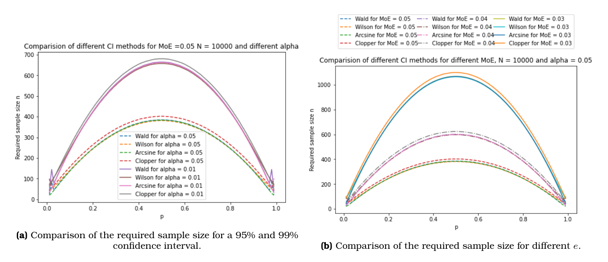

**그림 3.4: 다양한 신뢰구간 방법 a 95% 또는 99%를 사용한 필수 표본 크기 비교**

```text
confidence interval with a margin of error e = 0.05, 0.04 and 0.03
```

우선, 그림 3.4a는 필요한 표본 크기가 더 높은 신뢰 수준의 신뢰구간, 1 −α. 필요한 표본 크기가 a 99% 신뢰도의 약 두 배로 증가함을 보여줍니다.

<!-- 원문 35쪽 -->

95% 신뢰구간과 비교한 구간입니다. 이 경우 신뢰구간에는 100 시간 중 95 대신 모집단 매개변수 100 시간 중 99가 포함되어야 하므로 예상한 대로이며, 이로 인해 필요한 표본 크기가 더 커집니다.

또한 그림 3.4b는 필요한 표본 크기가 를 증가시켜 더 좁은 신뢰구간과 동일한 더 작은 오차 한계를 나타냅니다. 이는 또한 모집단에서 더 많은 표본을 추출할 때 신뢰구간이 덜 넓어지기 때문에 예상한 대로입니다. 그림 3.4a 및 3.4b는 부록 B.1의 그림 B.1 및 B.2에 각 신뢰구간 방법 를 별도로 표시합니다.

다양한 신뢰구간 방법 0.05 < p0 < 0.5 사이의 예비 점 추정치를 사용하여 결정되는 필수 표본 크기는 표 3.3 a 95% 신뢰 수준과 표에 나와 있습니다. 3.4 a 99% 신뢰도(오차 한계는 e = 0.05)와 동일합니다. Agresti-Coull 방법으로 결정된 필수 표본 크기는 표에 표시되어 있지 않습니다. 이 방법은 Walds 방법과 동일한 표본 크기를 생성하기 때문입니다. 표 3.3 및 3.4는 Wald's, Wilson Score 또는 Arcsine 방법으로 결정된 필수 표본 크기가 비슷한 표본 크기를 가져오고 Clopper-Pearson 신뢰구간으로 결정된 필수 표본 크기가 가장 큰 표본 크기라는 것을 보여줍니다.

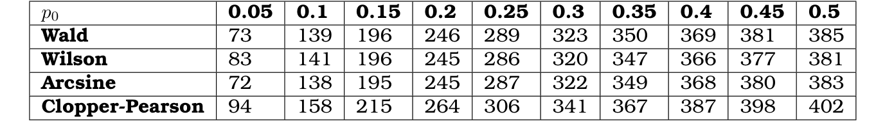

**표 3.3: 다양한 신뢰구간 방법을 사용하는 필수 표본 크기 α = 0.05 및 e = 0.05**

예비점추정 p0.

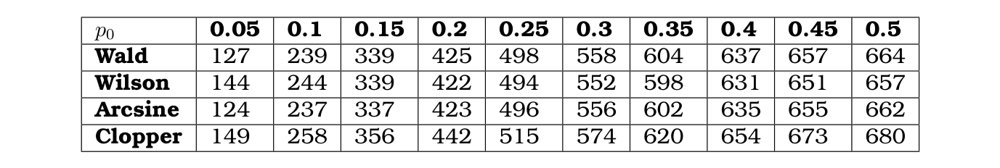

**표 3.4: 다양한 신뢰구간 방법을 사용하는 필수 표본 크기 α = 0.01 및 e = 0.05**

예비점추정 p0.

결론 본 논문에서는 관심 있는 거래의 알려지지 않은 모집단 비율인 신뢰구간 상한 를 결정하기 위해 Clopper-Pearson 신뢰구간을 선택했습니다. 따라서 본 논문에서는 Clopper-Pearson 신뢰구간을 사용하여 결정된 표본 크기가 (1 −α) × 100% 신뢰 수준 Clopper-Pearson 신뢰구간만 보장하므로 Clopper-Pearson 신뢰구간을 사용하여 필요한 표본 크기를 결정합니다. 표본 크기를 결정하려면 BTL 테스트에서는 예비 점 추정치 p0를 RTL와 동일하게 설정하도록 선택됩니다. BTL 임계값 조정을 통해 다양한 임계값 수준을 테스트하여 잘못된 누락률(FN 거래 비율)의 상한이 더 작은 임계값 수준 를 결정합니다. RTL, 즉 강아지 < RTL. p0 = RTL를 선택하면 (1 −α) × 100% 확실성을 갖는 강아지보다 작은 실제 모집단 비율 p도 작아집니다. (1 −α) × 100% 확실성을 갖는 p0보다. 결과적으로, p0으로 결정된 표본 크기는 최대 오차 한계의 2배인 폭을 갖는 신뢰구간이 됩니다. 마지막으로, 본 논문에서는 동일한 표본 크기가 ATL 및 BTL 테스트에서 선택됩니다.

<!-- 원문 36쪽 -->

### 3.3 부트스트래핑을 사용한 신뢰구간

Clopper-Pearson 방법은 측정 민감도, 특이성 및 정확도의 하한 및 상한 신뢰구간 한계 를 결정하는 데 적합하지 않습니다. 이유는 이러한 측정값이 분포를 알 수 없는 두 개의 랜덤 변수의 비율을 표현하기 때문입니다. 따라서 이러한 측정값의 신뢰구간 을 결정하려면 다른 접근 방식이 필요합니다. 문헌에서는 비율 추정기 주위의 신뢰구간을 구성하는 다양한 매개변수 근사 가 제안되었습니다. 그러나 이러한 측정값의 샘플링 분포는 알 수 없으므로 파라메트릭 기술 [3]에 주의해야 합니다. 비모수적 부트스트랩 신뢰구간은 샘플링 분포 [3]의 매개변수 가정에 의존하지 않기 때문에 잠재적으로 이러한 측정값인 신뢰구간 를 구성하는 데 더 적합한 방법입니다.

#### 3.3.1 샘플링 분포의 부트스트랩 추정

전산 비모수적 기법인 '재표본 추출'인 부트스트래핑을 사용하면 추정량에 대해 모수적 가정을 하는 대신 기존 표본에서 엄격하게 모집단의 특성에 대한 결론을 도출할 수 있습니다.

관찰되지 않은 확률 분포 F를 갖고 크기 n의 무작위 표본 S를 취하는 특정 모집단을 가정해 보겠습니다. 목표는 그림 3.5의 처음 세 단계에 설명된 모집단의 표본을 기반으로 모집단 매개변수 θ에 대한 설명을 만들기 위해 관심 통계를 결정하는 것입니다. 부트스트랩 방법은 관측된 무작위 표본을 확률 분포 [3]의 경험적 추정치로 간주합니다. 그 후, 크기 n의 B 무작위 샘플이 S에서 교체로 추출되어 그림 3.5의 4단계와 5단계에 설명된 대로 부트스트랩 샘플이 생성됩니다. 이어서, 관심 통계 θ가 각 부트스트랩 샘플 로 계산됩니다. 결과 값 θ∗의 경험적 분포

1, θ∗ 1,..., θ∗ B는 그림 3.5의 6단계와 7단계에 설명된 것처럼 B가 큰 경우 샘플링 분포 ˆθ의 좋은 근사입니다. 그런 다음 표본 분포를 사용하여 신뢰구간을 구성할 수 있습니다.

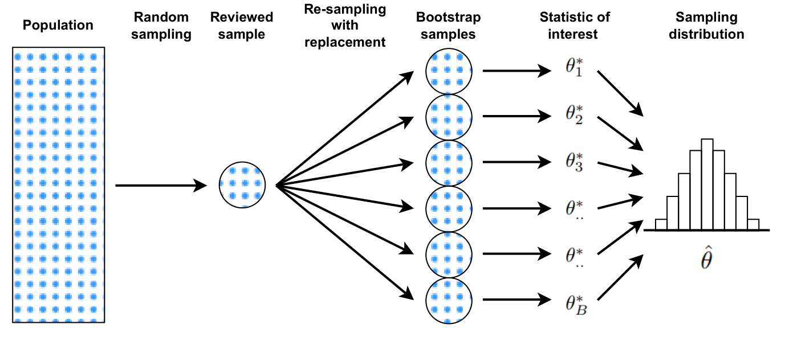

**그림 3.5: 샘플링 모집단을 결정하기 위해 테스트된 임계값 레벨인 부트스트랩 방법 의 그림**

관심 있는 통계입니다.

샘플 추정치 민감도(진양성률(TPR)라고도 함), 특이성(진음성률(TNR)이라고도 함) 및 정확도(ACC)는 그림 2.5에 이미 간략하게 설명된 대로 다음 공식을 통해 결정할 수 있습니다.

<!-- 원문 37쪽 -->

```text
ˆ
TPR =
TP
TP + FN =
ˆpan
ˆpan + ˆpbn =
ˆpa
ˆpa + ˆpb
```

감도 (3.28)

```text
ˆ
TNR =
TN
TN + FP =
(1 −ˆpb)n
(1 −ˆpb)n + (1 −ˆpa)n =
(1 −ˆpb)
(1 −ˆpb) + (1 −ˆpa)
specificity
(3.29)
```

```text
ˆ
ACC =
TP + TN
TP + TN + FP + FN =
ˆpan + (1 −ˆpb)n
ˆpan + (1 −ˆpb)n + (1 −ˆpa)n + ˆpbn
```

```text
=
ˆpa + (1 −ˆpb)
ˆpa + (1 −ˆpb) + (1 −ˆpa) + ˆpb
```

정확도(3.30)

여기서 ˆpa는 테스트된 임계값(즉, 긍정적인 예측 값)을 초과하는 샘플 내 관심 거래의 비율이고, ˆpb는 테스트된 임계값(즉, 거짓 누락률) 아래에 있는 샘플의 관심 거래의 비율입니다.

민감도가 관심 측정값, 즉 θ = TPR라고 가정합니다. 샘플 추정치 민감도는 두 샘플, 즉 테스트된 임계값 수준 Sb보다 낮은 샘플 하나와 테스트된 임계값 수준 Sa보다 높은 샘플 하나의 두 통계 ˆpa 및 ˆpb를 사용하여 추정되므로 민감도의 샘플링 분포에 대한 부트스트랩 추정치는 다음 절차를 사용하여 얻을 수 있습니다.

2단계 부트스트랩 프로세스: 1. BTL 및 ATL 샘플 Sb 및 Sa에서 대체 n 관측값을 사용하여 샘플을 추출하여 p∗ 계산

```text
a and p∗
```

b는 ˆpa 및 ˆpb.의 부트스트랩 추정치입니다.

2. 그런 다음 민감도의 부트스트랩 추정치는 다음과 같이 제공됩니다.

```text
θ∗=
p∗
```

```text
a
p∗a + p∗
```

비

```text
(3.31)
```

이 2단계 프로세스를 B번 반복하면 민감도 통계 ˆθ.의 경험적 샘플링 분포인 부트스트랩 추정값의 벡터가 생성됩니다. 경험적 샘플링 분포의 기대값은 [3]로 표시됩니다.

```text
¯θ∗= 1
```

```text
B
```

```text
B
∑
```

```text
i=1
```

```text
θ∗i
(3.32)
```

추정기의 표준 오차에 대한 부트스트랩 추정치는 경험적 샘플링 분포 [3]의 표준 편차로 제공됩니다.

```text
ˆσ∗=
```

```text
∑
∑
∑
∑
1
B −1
```

```text
B
∑
```

```text
i=1
```

```text
(¯θ∗−θ∗i)2
(3.33)
```

샘플링 분포의 근사치는 B를 임의로 큰 [18]를 취함으로써 임의로 정확해집니다. 실제로 필요한 부트스트랩 복제 수에 관한 공식 규칙은 없으며 샘플링 분포에 대한 신뢰할 수 있는 추정입니다.

#### 3.3.2 부트스트랩 신뢰구간

샘플링 분포 를 결정한 후 추정기는 비율로 표현됩니다. 테스트된 임계값 수준의 민감도인 Briggs [3]의 논문에서는 추정기의 신뢰구간 를 결정하기 위해 일반적으로 사용되는 네 가지 방법을 설명합니다. 1. 정규 근사 방법: 이 방법의 아이디어는 표준 오류의 부트스트랩 추정을 취하고 추정기의 샘플링 분포가 정규라고 가정하는 것입니다. 그런 다음 Wald 신뢰구간은 추정기 (1−α)×100% 신뢰구간 를 생성합니다. 그러나 이 방법은 추정기의 샘플링 분포가 정규 [3]가 아닌 경우 오해의 소지가 있을 수 있습니다.

<!-- 원문 38쪽 -->

```text
This results in the (1 −α) × 100% confidence interval:
```

```text
∑
ˆθ −zα/2 ˆσ∗, ˆθ + zα/2 ˆσ∗
```

```text
∑
(3.34)
```

2. 백분위수 방법: 이 방법의 아이디어는 샘플링 분포 ˆθ.의 분위수를 사용하는 것입니다. (α

### 2) × 100 및 (1 −α 2) × 100 부트스트랩 표본 추출 분포 ˆθ의 분위수 값은 신뢰구간 상한 및 하한으로 사용됩니다.

```text
∑
θ∗
```

```text
α/2, θ∗
```

```text
1−α/2
```

```text
∑
(3.35)
```

이 방법의 장점은 단순성입니다. 그러나 백분위수 방법은 추정기의 부트스트랩 반복이 편향되지 않은 [3]라고 가정하므로 비율 추정기 θ∗인 경우 이 방법은 적합하지 않습니다.

```text
1, θ∗
1, ..., θ∗
B are biased.
```

3. 편향 보정 및 가속(BCa) 백분위수 방법: 이는 ˆθ.의 샘플링 분포에서 가능한 편향 및 왜곡 보정을 고려하여 백분위수 방법을 수정한 것입니다. 조정된 백분위수는 [3]에 의해 제공됩니다.

```text
α1 = Φ
```

```text
∑
ˆz +
ˆz + zα/2
1 −ˆa(ˆz + zα/2)
```

```text
∑
(3.36)
```

```text
α2 = Φ
```

```text
∑
ˆz +
ˆz + z1−α/2
1 −ˆa(ˆz + z1−α/2)
```

```text
∑
(3.37)
```

여기서 Φ는 표준 정규 누적 분포 함수이고 zα는 표준 정규 분포의 100α 백분위수 지점입니다. 또한 ˆz = Φ(Q)는 샘플링 분포 를 추정기의 편향으로 조정합니다. 여기서 Q는 샘플 추정치 ˆθ [3]보다 작은 부트스트랩 반복 실험의 비율입니다. 또한, ˆa는 ​​샘플링 분포 ˆθ.의 왜곡도를 로 조정합니다. 잭나이프 추정치 ˆa [3]를 사용하는 것이 좋습니다.

```text
ˆa =
```

```text
∑n
i=1(¯θ∗∗−ˆθ∗∗
```

나) 3

```text
6[∑n
i=1(¯θ∗∗−ˆθ∗∗
```

```text
i )2]3/2
(3.38)
```

```text
with ¯θ∗∗= (∑n
```

```text
i=1 ˆθ∗∗
```

```text
i )/n and ˆθ∗∗
```

나는 i번째 관찰 없이 ˆθ의 잭나이프 복제를 수행했습니다. 방정식 3.36 및 3.37의 백분위수는 ˆa 및 ˆz가 0인 경우 백분위수 방법의 백분위수에 해당합니다. BCa 백분위수 방법은 샘플링 분포에 대해 가정을 하지 않지만 관찰된 편향의 분포에 대해 모수적 가정을 합니다. 이는 이 방법 [3]의 잠재적인 약점입니다.

4. 백분위수-t 방법: 이 경우 각 부트스트랩은 θ∗of를 복제합니다. 추정기는 다음과 같이 주어진 표준화된 변수 t∗,로 변환됩니다.

```text
t∗i = θ∗i −ˆθ
```

```text
ˆσ∗i
(3.39)
```

여기서 ˆσ∗i는 또 다른 부트스트래핑 라운드로 계산되므로 훨씬 더 많은 계산이 필요하며 이는 이 방법의 상당한 단점입니다. 그 결과 백분위수-t(1 −α) × 100% 신뢰구간:

```text
∑
ˆθ −t∗
```

```text
1−α/2 ˆσ∗, ˆθ + t∗
1−α/2 ˆσ∗
∑
(3.40)
```

요약하자면, (1 −α) × 100% 신뢰 수준을 사용하여 테스트된 임계값 수준의 민감도, 특이성 또는 정확도에 대해 설명하는 것이 선호되는 경우 부트스트래핑 및 위에서 언급한 부트스트랩 신뢰구간 방법 중 하나를 사용할 수 있습니다.

그러나 샘플링 분포의 신뢰구간 경계를 결정하기 위한 부트스트래핑은 다음과 같습니다.

<!-- 원문 39쪽 -->

민감도, 특이성 또는 정확도 테스트된 각 임계값 수준은 보다 계산적으로 더 집약적입니다. 잘못된 누락률 또는 Clopper-Pearson 신뢰구간을 사용한 양성 예측 값입니다. 계산 시간의 차이는 섹션 3.3.3에 설명되어 있습니다. 표본분포가 결정되면 선택한 측정값 중 하나의 표본분포가 정규분포를 갖는 것으로 나타나면 신뢰구간 한계를 상대적으로 쉽게 결정할 수 있으므로 정규 근사 방법을 적용할 수 있습니다. 추정량의 부트스트랩 반복이 편향되지 않은 경우 신뢰구간 한계를 결정하는 것도 비교적 간단하므로 백분위수 방법을 사용할 수 있습니다. 그러나 그렇지 않은 경우 BCa 백분위수 방법을 사용할 수 있지만 매개변수 ˆz 및 ˆa를 결정해야 하며 이 방법은 관찰된 편향의 분포에 대해 모수적 가정을 한다는 단점이 있습니다.

#### 3.3.3 계산 시간 시뮬레이션 부트스트랩 CI

Clopper 신뢰구간을 사용하여 신뢰구간 거짓 생략률 또는 양성 예측 값을 결정하는 데 필요한 계산 시간과 비교하여 신뢰구간 민감도, 정확성 또는 특이성을 결정하기 위한 부트스트래핑의 상대적으로 집약적인 계산 시간을 보여주기 위해 짧은 시뮬레이션이 수행됩니다. 이 시뮬레이션에서는 신뢰구간 민감도가 결정됩니다. 사례 연구 1는 5, 임계값 수준 10 장에 설명되어 있습니다. 먼저 BTL 및 ATL 샘플을 표본 크기 n으로 취하고 두 샘플의 거래가 관심 대상으로 분류된지(1) 또는 아닌지(0) 검토되어 두 개의 레이블이 지정된 샘플이 생성됩니다. 시뮬레이션은 B = [1000, 5000, 10, 000] 부트스트랩 샘플을 사용하여 수행됩니다. 그런 다음 2단계 부트스트랩 프로세스를 통해 그림 3.6에 표시된 대로 감도의 샘플링 분포를 결정할 수 있습니다. 임계 수준 10의 샘플링 분포 민감도 사례 연구 1는 ​​정규 근사 방법을 사용하여 민감도 구간 를 결정할 수 있는 정규 분포를 갖는 것으로 보입니다. 마지막으로 (1 −α) × 100% 신뢰 수준을 갖는 방정식 3.34를 사용하여 신뢰구간 민감도를 결정할 수 있습니다. 신뢰구간 를 결정하는 데 필요한 시간 민감도, 거짓 생략률 및 양성 예측 값은 표 3.6에 나와 있습니다. Clopper-Pearson 신뢰구간을 사용하여 신뢰구간, 잘못된 생략률 및 양성 예측 값을 결정하는 데 필요한 시간은 부트스트래핑을 사용하여 신뢰구간 민감도를 결정하는 데 필요한 시간보다 훨씬 짧다는 결론을 내릴 수 있습니다. 시간은 정확한 알고리즘, 사용된 컴퓨터 및 다른 프로그램이 활성화되어 있는지 여부에 따라 다르지만 이러한 결과는 계산 시간에서 뚜렷한 차이를 보여줍니다.

그러나 신뢰구간 민감도를 결정하기 위한 이 계산 시간은 분석가가 n개의 = 264 거래 한 임계값 수준의 BTL 및 ATL 샘플을 검토하는 데 걸리는 시간에 비해 무시할 수 있습니다. 분석가가 하나의 거래를 검토하는 데 최소 10분이 걸린다고 가정하면, 2*264 거래를 검토하는 데 약 88시간이 걸리는 반면, 10,000 부트스트랩 샘플을 사용한 부트스트래핑으로 신뢰구간 민감도를 결정하는 데 70초가 소요됩니다.

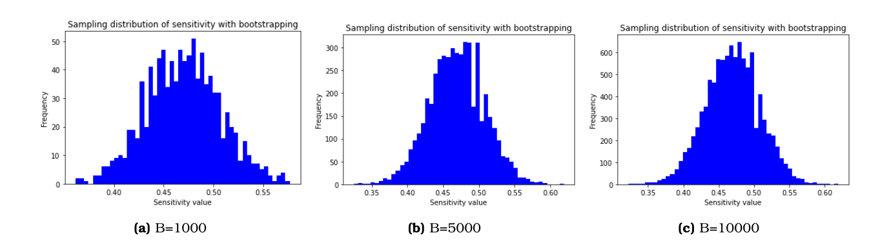

**그림 3.6: n = 264를 사용한 임계값 레벨 10의 사례 연구 1 민감도의 샘플링 분포.**

<!-- 원문 40쪽 -->

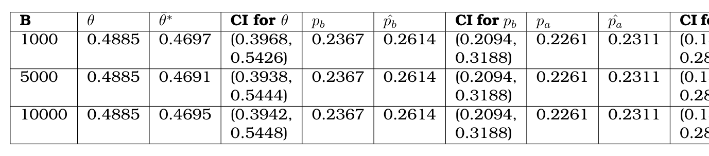

**표 3.5: Clopper Pearson pa 및 pb와 부트스트래핑 θ,를 사용하여 결정된 신뢰구간**

θ = TPR(감도) 및 n = 264.


**표 3.6: Clopper Pearson pa 및 pb를 사용하여 신뢰구간을 계산하는 데 필요한 시간(초)**

부트스트랩 θ,와 θ = TPR(감도) 및 n = 264를 사용합니다.

### 3.4 장 결론

이 섹션에서는 이 장에서 선택한 중요한 선택 사항을 요약합니다. 본 논문에서 더 사용될 선택은 다음과 같습니다: 1. 무작위 샘플링 방법으로는 단순 무작위 샘플링이 선택됩니다. 2. Clopper-Pearson 신뢰구간 방법은 잘못된 생략률 또는 양성 예측 값을 측정하는 신뢰구간 를 결정하기 위한 신뢰구간 방법으로 선택됩니다. 3. 필요한 표본 크기는 Clopper-Pearson 방법으로 결정됩니다. 4. 네 가지 적절한 부트스트랩 신뢰구간 방법 중 하나를 사용한 부트스트래핑은 측정 민감도, 정확도 또는 특이도의 신뢰구간 을 결정하는 방법으로 선택됩니다.

<!-- 원문 41쪽 -->

## 제4장 연구 방법론

이 장에서는 본 논문에서 사용된 다양한 임계값 조정 전략에 대해 더 자세히 설명합니다. 2 장에서 논의된 BTL 및 ATL 테스트를 통한 현재 거래 모니터링 프로세스와 백 테스트는 이 장에서 논의된 튜닝 전략 의 시작점을 형성합니다. 본 논문에서 주요 초점은 2.2 섹션의 끝 부분에 명시된 바와 같이 임계값 수준 미만으로 관심 거래가 누락될 위험을 정량화하기 위한 척도로서 잘못된 누락률에 있습니다.

이 장은 여러 섹션으로 나누어져 있습니다. 먼저, 모델 프레임워크인 (2.3 섹션에 간략하게 소개된 결정 문제)는 4.1 섹션에서 더 자세히 설명되며 다양한 임계값 조정 전략의 기초 를 형성합니다. 두 번째 연구 목표를 해결하기 위해 임계값 수준 미만으로 관심 거래가 누락될 위험을 정량화하는 두 가지 임계값 평가 접근 방식이 섹션 4.2에서 논의됩니다. 첫 번째 연구 목표를 해결하기 위해 4.3 및 4.4 섹션에서 다양한 튜닝 전략을 논의합니다. 두 가지 정적 임계값 조정 전략은 섹션 4.3에서 논의됩니다. 이러한 전략에는 탐색 단계가 없고 가장 적절한 임계값 수준을 결정하는 활용 단계만 있습니다. 이어서 섹션 4.4에서는 가장 적절한 임계값 수준을 결정하기 위해 탐색 및 활용 단계를 결합하는 두 가지 동적 임계값 조정 전략이 논의됩니다. 또한 임계값 조정 프로세스를 가속화하기 위해 4.5 섹션에서는 검토해야 하는 거래 수를 줄이는 두 가지 방법을 논의합니다. 마지막으로, 논문 실험 전반에 걸쳐 사용된 평가 지표는 섹션 4.6에서 논의됩니다.

### 4.1 모델 프레임워크

탐사-이용 트레이드오프와 관련된 2.3 절에 도입된 결정 문제는 다중 무기 산적 문제에 반영됩니다. 분석가는 거래를 검토하는 동안 두 가지 옵션 중에서 선택할 수 있습니다. 첫 번째 옵션으로 분석가는 탐색으로 정의된 해당 순간에 가장 유망한 성과를 보이는 임계값 수준이 아닌 다른 임계값 수준에서 거래를 검토하도록 선택할 수 있습니다. 반면 분석가는 악용으로 정의된 지금까지 가장 유망한 성능을 보이는 임계값에서 거래를 계속 검토하도록 선택할 수 있습니다. 수학적 프레임워크 이 문제는 Tor Lattimore 및 Csaba Szepesvári [22]의 Bandit Algorithms 책에 설명되어 있습니다.

Multi-armed bandit 프레임워크는 학습자가 알 수 없는 환경 클래스 ε,에서 학습자와 환경이 포함된 순차적 게임입니다. 게임은 지평선이라고 불리는 T 라운드를 반복합니다. 각 라운드 t ∈[T],에서 학습자는 먼저 K 작업 세트 A = {1, 2,..., K}에서 작업을 선택한 다음 환경으로부터 보상 Rt ∈R를 받습니다. 학습자는 과거를 기반으로 다음 행동을 선택합니다. 이는 At가 과거 Ht−1 =(A1, R1,..., At−1, Rt−1)에만 의존한다는 것을 의미합니다. 학습자는 T로 정의된 모든 T 라운드에 걸쳐 최대 누적 보상으로 이어지는 행동을 선택하기 위해 특정 정책(의사결정 전략)을 선택합니다.

> **주:** t=1 Rt.

<!-- 원문 42쪽 -->

```text
For all bandit problems, two assumptions are made [22]:
```

1. 학습자는 매 라운드마다 보상을 관찰합니다. 2. 미래에 학습자가 선택할 수 있는 선택과 보상은 현재 또는 과거의 결정에 영향을 받지 않습니다. 임계값 조정의 맥락에서 첫 번째 가정은 분석가가 거래를 검토할 때마다 거래가 관심 대상으로 분류된지 여부를 관찰한다는 것을 의미합니다. 두 번째 가정은 가능한 임계값 수준의 수와 해당 수준의 적합성이 임계값 조정 프로세스 동안 동일하게 유지된다는 것을 의미합니다.

임계값 조정 프로세스로 변환 다중 무장 적기 프레임워크는 임계값 조정 프로세스로 변환될 수 있습니다. 임계값 조정 프로세스의 환경은 분석가가 다양한 임계값 수준 A = {1,..., K}의 샘플에서 거래를 검토하기 위해 선택할 수 있는 작업 세트로 설명할 수 있습니다. 샘플에서 검토된 거래의 출력은 알 수 없는 확률 벡터 µ = [0, 1]k를 사용하여 Yt = {0, 1}로 정의될 수 있습니다. 따라서 Yt = 1 확률은 다음과 같습니다. 분석가가 =에서 조치로 선택한 경우 µa a. 잘못된 누락율 F N F N+T N, 즉 테스트된 임계값 수준 아래의 관심 거래 비율이 임계값 조정 프로세스의 측정값으로 선택되었다고 가정합니다. 1 정의에 정의된 대로 위험 허용 수준(RTL)이 성능 기준으로 선택됩니다. BTL 테스트, 분석가가 특정 임계값 수준을 검토한 각 관심 대상으로 분류된(1) 또는 관심 대상이 아닌(0) 거래, 관심 거래 ˆp의 비율과 상한 비율 모두 업데이트될 수 있습니다. RTL가 주어지면 시간 t에서 RTL와 퍼퍼 임계값 i 사이의 차이 d는 다음을 통해 결정될 수 있습니다.

```text
di(t) = RTL −pupper,i(t)
for i = 1, ..., K
(4.1)
```

소수점 이하 두 자리로 반올림됩니다. 20%가 테스트된 임계값 수준 아래에서 누락된 관심 거래의 최대 허용 비율로 선택되었다고 가정합니다. 즉, RTL = 0.2입니다. 이는 RTL와 비율의 상한 사이의 차이 di(t)가 -0.8와 0.2 사이에 있다는 결과를 가져옵니다. 왜냐하면 비율의 상한은 항상 0와 1 사이에 있으므로 di(t) ∈[−0.8,입니다. 0.2]. 작은 양의 차이는 테스트된 임계값 수준이 가장 적절한 임계값 수준에 가깝고 그보다 낮음을 나타냅니다. 차이가 더 크다면 이는 테스트된 임계값 수준이 가장 적절한 임계값 수준보다 상당히 낮다는 것을 의미합니다. 반면, 작은 음의 차이는 테스트된 임계값 수준이 가장 적절한 임계값 수준에 가깝거나 그 이상이라는 것을 나타냅니다. 차이가 더 크다면 이는 테스트된 임계값 수준이 가장 적합한 임계값 수준보다 상당히 높다는 것을 의미합니다.

보상 함수 정의 적절한 보상 함수를 정의하기 위해 RTL와 Pupper 사이에 임계 수준의 차이가 작을 때 큰 보상을 할당하는 것이 목표입니다. 또한, 테스트된 임계값 수준이 최적 임계값 수준 바로 위에 있는 작은 음의 차이 d보다 테스트된 임계값 수준이 최적 임계값 수준 바로 아래인 작은 양의 차이 d에 더 높은 보상을 할당하는 것이 바람직합니다. 이를 달성하기 위해 다음과 같은 보상 함수가 정의됩니다.

```text
Ri(t) =
```

```text
1
di(t) ∗w
if di(t) > 0
```

```text
1
0.005
if di(t) = 0
for i = 1, ..., K
|
1
di(t)|
if di(t) < 0
```

```text
(4.2)
```

여기서 w는 양의 차이가 있는 임계값 수준에 더 많은 보상을 할당하기 위한 가중치입니다. 여기서 pupper는 RTL 위가 아닌 RTL 아래에 있습니다. 반올림된 차이 di(t)에 대한 보상 는 di(t)가 0.8와 같을 경우 1.25 값과 di(t)가 0.01와 같을 경우 100 값 사이에 있습니다. 단, di(t)가 0과 같을 때는 무한한 보상이 발생합니다. 따라서 반올림된 차이 di(t)가 0과 같으면 1 0.005 = 200의 보상을 할당하도록 선택되며, 그 결과 Ri(t) ∈[1.25, 200]가 됩니다. 그러면 평균 보상은 다음과 같이 정의됩니다.

```text
ˆµi(t) =
```

```text
∑t
s=1 Ri(s)I{Is=i}
```

아니, 난

```text
for i = 1, ..., K
(4.3)
```

<!-- 원문 43쪽 -->

```text
where nt,i = ∑t
```

s=1 I{Is=i}는 분석가가 라운드 t가 끝날 때까지 임계 수준 i를 검토한 거래 수입니다.

라운드 정의 라운드는 분석가가 수행한 특정 임계값 수준의 샘플에서 얻은 거래에 대한 각 검토로 정의할 수 있습니다. 각각 n = 250 거래의 샘플에 K = 20 임계값 수준이 있다고 가정합니다. 이 경우 분석가가 모든 거래를 검토한다면 최대 라운드 수는 5000입니다.

임계값 조정 프로세스에서 분석가에게는 두 가지 옵션이 있습니다. 분석가는 탐색 단계가 없는 를 선택하고 임계값 수준을 직접 테스트/이용할 수 있습니다. 테스트된 임계값 수준이 가장 적합하지 않은 것으로 나타나면 테스트를 통해 새로운 임계값 수준을 선택할 수 있습니다. 이 경우, 다양한 임계값 수준의 성능이 발견되는 탐색 단계에서 시간이 낭비되지 않지만, 첫 번째 테스트된 임계값 수준 중 하나가 가장 적합하지 않은 것으로 나타나면 일부 시간이 손실됩니다. 이로 인해 가장 적합한 임계값 수준을 결정하기 전에 여러 임계값 수준을 테스트해야 합니다.

반면, 분석가는 탐색 단계 후 가장 유망한 임계값 수준을 테스트/이용하기 전에 먼저 다양한 임계값 수준의 성능을 탐색하도록 선택할 수 있습니다. 이 경우 서로 다른 임계값 수준의 성능이 발견되는 탐색 단계에서는 시간이 손실되지만 탐색 단계 이후 가장 유망한 임계값 수준이 가장 적합한 임계값 수준에 가까울 가능성이 있으므로 활용 단계에서는 시간이 확보될 수 있습니다. 예를 들어, 분석가는 T = 1000의 기간 동안 다양한 임계값 수준을 탐색하고 그 순간 이후 가장 유망한 임계값 수준을 활용하기로 결정할 수 있습니다.

분석가의 목적 분석가의 목표는 (1 −α) × 100% 신뢰 수준으로 가장 적합한 임계값 수준을 결정하는 데 필요한 라운드를 최소화하는 것입니다.

이제 행동 세트, 보상 기능 및 목표가 정의되었으므로 거래에 대한 검토를 최대한 적게 하면서 가장 적절한 임계값 수준을 결정하기 위해 임계값 조정 전략을 정의할 수 있습니다. 다양한 임계값 조정 전략을 자세히 살펴보기 전에 섹션 4.2에서 두 가지 가능한 임계값 평가 접근 방식에 대해 설명합니다. 모델 위험 관리 [23]에 대한 감사관 핸드북에는 명확한 지침이 제공되지 않기 때문에 임계값 위 또는 아래의 거래를 샘플링할 수 있음을 설명합니다.

### 4.2 임계값 평가 접근 방식

2.1.1 섹션에서는 라인 위(ATL) 및 라인 아래(BTL) 테스트를 통한 임계값 수준 백테스팅이 도입되었습니다. 그러나 다양한 임계값 수준을 테스트하려면 먼저 적합한 임계값을 결정해야 합니다.

설명 예 1 분할입금(smurfing)의 예에서는 백테스팅을 통해 다양한 임계값 수준을 선택할 수 있습니다. 단순화된 예로, 해외 계좌에 대한 거래량 데이터 분석에서 특정 기간 동안 거래량이 0 유로와 80,000 유로 사이인 것으로 나타났다고 가정해 보겠습니다. 거래량은 측정기간 동안 하나의 은행계좌에서 발생한 거래의 총합으로 정의된다. 0 유로와 80,000 유로 간의 거래량은 여러 임계값 수준으로 구분될 수 있습니다. 5,000 유로당 거래량을 이산화하기로 결정했다고 가정합니다. 이는 0와 5,000 유로 사이의 거래량이 임계값 수준 0와 1 사이에 속하고, 5,000와 10,000 사이의 거래량이 임계값 수준 1와 2 사이에 속한다는 것을 의미합니다.

본 논문에서 거래는 모든 임계값 수준 간에 동일한 두 임계값 수준 사이의 특정 고정 폭을 갖는 고정 임계값 수준으로 구분됩니다.

<!-- 원문 44쪽 -->

#### 4.2.1 완전한 모집단 접근 방식

BTL 테스트에서 평가되는 임계값 수준보다 낮은 관심 거래의 모집단 비율을 명확하게 파악하려면 0 수준과 평가되는 임계값 수준 사이의 모든 거래 샘플을 채취하는 것이 논리적입니다. 반면, ATL 테스트에서는 평가되는 임계값 수준과 그 위의 모든 거래 사이의 모든 거래 샘플을 채취하는 것이 합리적입니다. 본 논문에서 이 접근법은 완전한 모집단 접근법으로 정의되며 그림 4.1에 설명되어 있습니다.

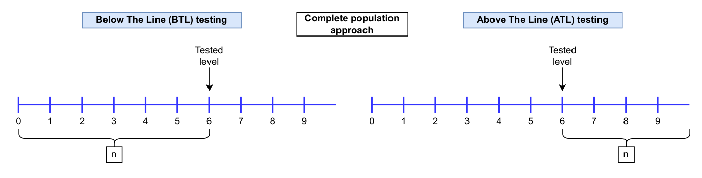

**그림 4.1: 전체 모집단 접근 방식 BTL 및 ATL 테스트를 보여주는 그림입니다.**

이어서, 표본 내 관심 있는 거래의 비율, 즉 표본 비율이 결정될 수 있습니다. 그 후, 표본 비율의 하한 및 상한 는 Clopper-Pearson 신뢰구간을 사용하여 결정될 수 있습니다. Clopper-Pearson 신뢰구간에는 이 접근 방식을 사용하여 (1 −α) × 100% 신뢰 수준을 갖는 모집단 비율이 포함됩니다. 이는 특정 임계값 수준에서 관심 있는 거래 비율에 대해 명확하게 설명할 수 있다는 이점이 있습니다. BTL 테스트를 통해 상한이 다음과 같다고 가정합니다. 관심 거래량의 비율이 pupper와 동일한 것으로 결정되면 다음과 같은 진술을 할 수 있습니다.

임계값 L 미만의 모집단에서 관심 거래의 비율은 (1−α)×100% 신뢰 수준이 pupper 이하입니다.

#### 4.2.2 버킷 접근 방식

또 다른 접근 방식은 임계값 수준보다 낮거나 높지만 평가되는 임계값 수준에 가까운 거래의 샘플을 채취하는 것입니다. 평가되는 임계값 수준에 가까운 거래의 샘플만 취하는 이유는 이러한 거래가 평가되는 임계값 수준보다 더 낮거나 높은 거래보다 관심 있는 거래의 비율을 더 잘 대표할 수 있기 때문입니다. 본 논문에서는 이 접근 방식을 버킷 접근 방식으로 정의하고 그림 4.2에 설명되어 있습니다.

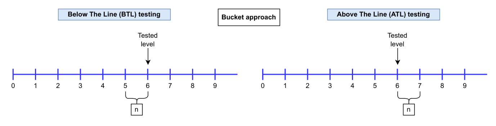

**그림 4.2: 버킷 접근 방식 BTL 및 ATL 테스트 예시.**

그러나 이 접근 방식의 주요 단점은 그림 4.3에 표시된 것처럼 평가된 임계값 수준보다 더 낮거나 높은 관심 거래의 수를 알 수 없다는 것입니다. 계속해서

<!-- 원문 45쪽 -->

탐색적 예 1에서 25,000 값과 동일한 임계값 수준이 버킷 접근 방식 BTL 테스트를 통해 평가된다고 가정합니다. 관심 있는 거래의 비율을 결정하기 위해 값 20,000와 25,000 사이의 거래 샘플이 사용됩니다. 이 비율은 비율을 결정할 때 빨간색 영역을 고려하지 않고 그림 4.3a의 파란색 영역을 표본 크기로 나눈 추정치입니다. 20,000 값과 25,000 값 사이의 관심 거래 비율은 로컬 최소값이므로 버킷 접근 방식에서는 20,000 값보다 낮은 관심 거래의 큰 그룹이 누락됩니다. 결과적으로, 20,000와 25,000 값 사이의 관심 거래 비율은 0와 25,000 값 사이의 관심 거래의 실제 비율보다 상당히 낮습니다. 이 경우 25,000 값과 동일하게 설정된 임계값 레벨이 RTL를 만족한다고 잘못 결론을 내릴 수 있지만 그렇지 않습니다. 버킷 접근 방식에는 관심 있는 거래의 큰 그룹이 누락되었는지 여부를 알 수 없기 때문에 (1 −α) × 100% 신뢰 수준으로 관심 있는 거래의 비율에 대한 설명을 만드는 것이 불가능합니다.

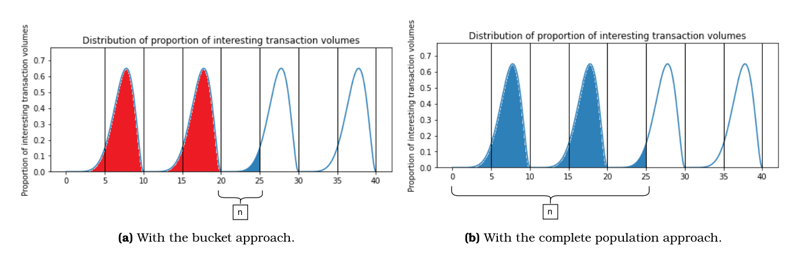

**그림 4.3: 버킷 접근 방식과 전체 채우기 접근 방식 간의 차이점을 보여주는 그림입니다.**

완전한 모집단 접근 방식을 사용하면 25,000 값과 동일한 임계값 수준이 평가될 때 빨간색 영역이 포함되며 이는 그림 4.3b에 설명되어 있습니다. 따라서 얼마나 많은 관심 거래가 누락되었는지 알 수 없는 위험은 전체 모집단 접근 방식에는 적용되지 않습니다.

### 4.3 정적 임계값 조정 전략

이제 임계값 조정 전략을 정의하는 모든 요소가 소개되었으므로 다양한 임계값 조정 전략을 더 자세히 설명할 수 있습니다. 임계값 조정 전략은 정적 전략과 동적 전략으로 구분되며 본 논문에서는 다음과 같이 정의합니다.

정의 3. 정적 전략 정적 전략에는 활용 단계만 포함되고 탐색 단계는 포함되지 않습니다.

정의 4. 동적 전략 동적 전략에는 활용 및 탐색 단계가 모두 포함됩니다.

이 섹션에서는 테스트된 임계값 수준과 0 수준 사이의 거래에서 샘플을 가져오는 전체 모집단 접근 방식 BTL 테스트를 사용하는 두 가지 정적 전략에 대해 설명합니다. 이어서 섹션 4.4에서는 탐사 단계의 이점을 나타내는 두 가지 동적 전략이 설명됩니다. 버킷 접근 방식, 임계값 조정 전략은 동일한 방식으로 작동합니다. 또한 튜닝 전략은 임계값 수준 아래의 거래에서 샘플을 채취하는 대신 임계값 수준 이상의 거래에서 샘플을 채취한다는 점을 제외하면 ATL 테스트와 동일합니다.

임계값 조정 전략을 적용하려면 먼저 시뮬레이션된 데이터셋의 모든 거래에 레이블을 지정해야 합니다. 시뮬레이션된 데이터셋의 거래는 1로 관심 있음으로 표시되고 5 장에 자세히 설명된 일부 기본 분포를 사용하여 0으로 관심 없음으로 표시됩니다. 이후 거래 데이터는 임계값 i = 1,..., K로 분할됩니다.

<!-- 원문 46쪽 -->

서로 다른 임계값 레벨 사이의 너비가 고정되어 있습니다. 마지막으로 각 임계값 수준 i, Si,a 이상의 거래 샘플, Si,a 미만의 거래 샘플을 채취해야 합니다. 시뮬레이션된 거래 데이터셋가 설정된 후 임계값 조정 전략을 적용할 수 있습니다. 첫 번째이자 아마도 가장 확실한 전략은 '단계 전략'입니다.

#### 4.3.1 단계 전략

튜닝 전략의 목적은 RTL가 만족하는 최고 임계값 레벨 를 결정하는 것입니다. 처음에는 튜닝 전략에서 테스트할 첫 번째 임계값 수준을 결정해야 합니다. 원칙적으로 어떤 수준이든 선택하여 시작할 수 있지만 전문가나 데이터 분석가는 이미 적절한 임계값 수준이 무엇인지 어느 정도 알고 있을 수 있습니다. BTL 테스트 단계 전략에서는 가장 낮은 논리적 임계값 수준이 전문가의 전문 지식을 통해 테스트할 첫 번째 임계값 수준으로 선택됩니다. 본 논문에서는 거래 볼륨이 분할되는 임계값 수준 수의 10와 30 사이에서 무작위로 가장 낮은 논리 수준을 선택하여 가장 낮은 논리적 임계값 수준을 시뮬레이션합니다. K = 20 임계값 레벨의 경우 이는 2와 6 중에서 가장 낮은 논리 레벨이 무작위로 선택됨을 의미합니다.

단계 전략의 아이디어는 테스트된 임계 수준 i(pupper인 경우),i ≥RTL보다 한 수준 낮은 수준을 테스트하고, 테스트된 임계 수준 i(pupper인 경우),i < RTL보다 한 수준 높은 테스트를 수행하는 것입니다. 이는 방정식 4.4에 표시됩니다.

```text
Lnext =
```

```text
∑
Li + 1
if pupper,i < RTL
Li −1
if pupper,i ≥RTL
(4.4)
```

여기서 Li는 분석가가 확인하는 임계값 수준이고 Lnext는 분석가가 다음에 테스트해야 하는 임계값 수준입니다. 다양한 임계값 수준을 테스트하는 이 프로세스는 해당 강아지,i < RTL를 보유하는 가장 높은 임계값 수준 i가 결정될 때까지 반복됩니다. 단계 전략의 아이디어는 부록 E.1의 재귀 알고리즘 2의 알고리즘 형식으로 설명되어 있습니다.

단계 전략은 2 상황의 그림 4.4에 설명되어 있습니다. 상황에서 A∗, 레벨 3는 테스트된 첫 번째 임계값 레벨입니다. 레벨 0와 3 사이의 거래 샘플은 관심 있는 거래의 비율인 신뢰 하한 및 상한 를 결정하는 데 사용됩니다. 신뢰 상한 수준 3가 RTL, 즉 pupper,3 < RTL보다 낮다고 가정하면 다음 단계는 동일한 절차로 임계값 수준 4를 테스트하는 것입니다. 이 프로세스는 8 레벨까지 반복되지만 8 레벨에서 0 및 8 레벨 사이의 거래 샘플은 신뢰 상한 를 초래합니다. 관심 거래의 비율은 RTL보다 높습니다. 즉, 퍼퍼,8 > RTL. 이는 임계값 레벨 7가 관심 거래 비율의 상한이 RTL 아래에 있는 가장 높은 임계값 임을 나타냅니다. 따라서 이 경우 최적의 임계값 레벨은 7 레벨입니다.

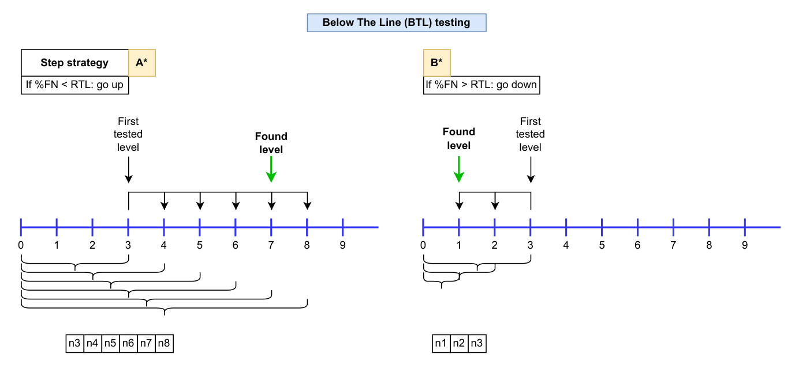

**그림 4.4: 전체 모집단 접근 방식 BTL 튜닝과 결합된 단계 전략의 그림입니다.**

<!-- 원문 47쪽 -->

B∗, 상황에서는 거래 샘플을 사용하여 관심 있는 거래의 비율인 신뢰 하한 및 상한 를 결정합니다. 신뢰 상한 수준 3가 RTL보다 높다고 가정하면 다음 단계는 동일한 절차로 임계값 수준 2를 테스트하는 것입니다. 레벨 1, 레벨 0와 1 사이의 거래 샘플은 신뢰 상한 의 결과로 관심 거래의 비율이 RTL보다 낮습니다. 이는 임계값 레벨 1가 관심 거래 비율의 상한이 RTL 아래에 있는 가장 높은 임계값 레벨 임을 나타냅니다. 따라서 이 경우 최적의 임계값 레벨은 1 레벨입니다.

단계 전략의 가능한 단점은 예에서 최적의 임계값 수준이 임계값 수준 15인 경우 많은 수의 거래를 검토해야 하고 일부 임계값 수준을 테스트해야 한다는 것입니다. 그러나 이 단점은 이분법 전략을 통해 줄어들 수 있습니다.

#### 4.3.2 이분법 전략

이분법 전략은 테스트할 첫 번째 임계값 수준과 테스트할 다음 임계값 수준을 선택하는 방법을 제외하고는 단계 전략과 대부분 동일한 절차를 따릅니다. 동사 bisect는 이 전략의 아이디어 인 두 부분으로 나누는 것을 의미합니다. 테스트할 수 있는 K = 20 임계값 수준이 있다고 가정합니다. 첫 번째 단계는 임계값 수준 10를 테스트하는 것입니다. 이는 거래를 두 부분, 즉 10 수준 아래의 거래과 10 수준 이상의 거래으로 나눕니다. 신뢰 상한 관심 거래 비율이 RTL보다 낮으면 다음 단계는 레벨 20와 10 사이의 중간 레벨, 즉 (반올림) 레벨 15를 선택하는 것입니다. 상한 관심 거래 비율이 RTL보다 높은 경우 수준 0와 10 사이의 중간 수준인 (반올림) 수준 5가 선택됩니다. 거래를 두 부분으로 나누는 이 절차는 방정식 4.5에 제시된 최적의 임계값 수준이 결정될 때까지 반복됩니다.

```text
Lnext =
```

Li + Lmax−Li

```text
2
∑
if phigh,i < RTL
∑
Li −Li−Lmin
```

```text
2
∑
if phigh,i ≥RTL
(4.5)
```

여기서 Lmin 및 Lmax는 분석가가 확인한 최소 및 최대 임계값 레벨이며 처음에는 Lmin = 0, Lmax = K와 같습니다. 이분법 전략의 아이디어는 부록 E.2의 재귀 알고리즘 3의 알고리즘 형식으로 설명되어 있습니다.

이분법 전략은 단계 전략과 달리 가장 적합한 임계값 수준을 결정하기 위해 테스트해야 하는 최대 임계값 수를 미리 결정하는 것이 가능합니다. 거래가 K개의 임계값 수준으로 분할되어 있고 테스트할 최대 수준 수 m은 K ∗와 같다고 가정합니다.

```text
∑1
2
```

```text
∑m∑
= 1
(4.6)
```

K 임계값 수준으로 거래 볼륨을 분할하기로 선택한 다음 표 4.1에 제시된 대로 이분법 전략으로 테스트해야 하는 최대 m 임계값 수준을 선택한다고 가정합니다.


**표 4.1: 선택한 경우 이분법 전략으로 테스트해야 하는 최대 m 임계값 수준**

K개의 임계값 수준으로 거래를 분할합니다.

이는 더 많은 임계값 수준으로 거래를 분할할 때 주목할 만한 이점입니다. 20 임계값 수준 대신 K = 40 임계값 수준으로 거래를 분할하기로 선택했다고 가정합니다. 더 많은 임계값 수준으로 거래를 분할하면 두 임계값 사이의 폭이 더 좁아지기 때문에 관심 있는 거래의 비율을 보다 정확하게 추정할 수 있습니다. 이 경우 테스트할 수 있는 임계값 레벨의 최대 개수는 5에서 6로만 변경되며, 두 임계값 레벨 사이의 너비는 두 배로 작아져 비율 추정이 더 정확해집니다.

<!-- 원문 48쪽 -->

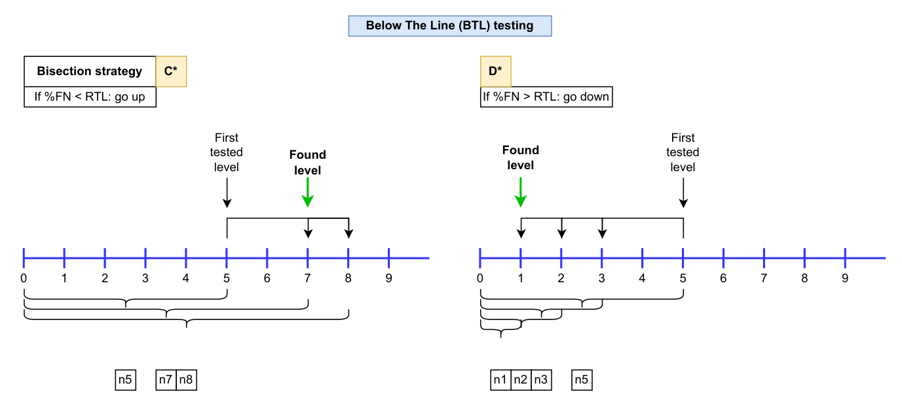

**그림 4.5: 전체 모집단 접근 방식 와 결합된 이분법 조정 전략의 그림**

BTL 튜닝.

이분법 전략은 2 상황의 그림 4.5에 설명되어 있습니다. 상황 A∗of 그림 4.4를 상황 C∗,와 비교하면 가장 적절한 수준이 0 수준보다 상당히 높은 수준인 경우 검토해야 하는 거래과 임계값 수준이 더 적다는 의미에서 이분법 방법이 최적의 임계값 수준을 더 빠르게 결정할 수 있다는 것이 즉시 표시됩니다. C∗the 상황에서 이분법 전략은 5 수준에서 시작한 다음 8 수준으로 계속되고 마지막으로 7 수준을 확인합니다. 이 경우 6 ∗n 거래는 단계 전략으로 검토하여 7 레벨에 도달해야 하며, 3 ∗n 거래만 이분법 전략으로 검토하여 7 레벨에 도달해야 합니다. 그러나 상황 B∗of 그림 4.4를 상황 D∗,와 비교하면 가장 적절한 수준이 0 수준보다 몇 수준만 높을 때 단계 방법이 최적의 임계값 수준을 더 빠르게 결정할 수 있다는 것이 분명해집니다. D∗, 상황에서 이분법 전략은 5 수준에서 시작한 다음 3 수준, 2 수준, 마지막으로 1 수준을 테스트합니다. 3∗n 거래만 1 레벨에 도달하기 위해 단계 전략으로 검토해야 하는 반면, 4 ∗n 거래는 1 레벨에 도달하기 위해 이분법 전략으로 검토해야 합니다.

기본적으로 중간 임계값 수준에서 시작하는 것이 때때로 불리할 수 있는 상황 D∗demonstrates는 단계 전략보다 최적의 임계값 수준을 결정하기 위해 더 많은 거래과 임계값 수준을 검토해야 하는 상황을 초래합니다. 이 단점은 탐색 단계를 사용하여 관심 거래 다양한 임계값 수준의 비율에 대한 첫 번째 표시를 얻음으로써 향상될 수 있습니다. 그런 다음 분석가는 가장 유망한 임계값 수준을 시작점으로 테스트하도록 선택할 수 있습니다. 이 아이디어는 섹션 4.4.1의 다단계 전략에 설명되어 있습니다.

### 4.4 동적 임계값 조정 전략

이전 섹션에서는 단계 및 이분법 전략에 탐색 단계가 없으며 분석가가 가장 적절한 수준이 결정될 때까지 다양한 임계값 수준을 테스트한다는 점을 설명했습니다. 탐색 단계가 없기 때문에 시간이 절약되지만 활용 단계가 필요 이상으로 길어질 수 있습니다. 이번 절에서는 다단계 탐사 전략과 볼츠만 탐색 전략에 대해 좀 더 자세히 설명한다. 다수준 전략은 활용 단계에서 가장 유망한 임계값 수준을 계속 사용하기 전에 몇 가지 임계값 수준을 탐색합니다. Boltzmann 탐사 전략에서는 모든 임계값 수준을 탐색하여 탐사 단계를 더욱 확장합니다.

#### 4.4.1 다단계 전략

다단계 전략은 단계 및 이분법 전략과 대부분 동일한 절차를 따르지만 이 전략에 짧은 탐색 단계가 추가됩니다. 다단계 전략의 개념은 표본에 포함된 거래의 일부를 검토하여 관심 있는 거래의 비율을 먼저 추측하는 것입니다.

<!-- 원문 49쪽 -->

탐색 단계로 정의되는 몇 가지 임계값 수준 중 하나입니다. 이후 이 전략은 단계 또는 이분법 전략을 사용하여 활용 단계에서 가장 유망한 임계 수준으로 계속됩니다. 다수준 전략의 아이디어는 부록 E.3의 알고리즘 4의 알고리즘 형식으로 설명됩니다.

다시 K = 20와 탐색할 임계값 수준의 백분율이 x = 0.2와 같다고 가정합니다. 이는 K ∗x = 20 ∗0.2의 탐색을 의미합니다. = 4 임계값 수준. 또한, 1 K∗x = 1

샘플의 거래 중 4 부분, 샘플의 n∗transactions와 동등한 임계값 수준이 탐색됩니다. 탐색 단계에서 샘플의 거래 중 예, 10% 또는 50%와 같이 샘플의 더 작거나 더 큰 부분을 검토하도록 선택하여 추정치를 덜 또는 더 정확하게 만들 수 있습니다. 그러나 탐색 단계의 주요 아이디어는 특정 임계값 수준의 적합성에 대한 초기 아이디어를 얻는 것입니다. 따라서 샘플의 거래 중 1 K∗x 부분을 탐색하도록 선택되었습니다. 탐색할 네 가지 임계값 수준 Li는 다음과 같이 결정됩니다.

```text
Li =
```

```text
∑
K ∗
j + 1
K ∗x + 1
```

```text
∑
(4.7)
```

j = [0, 1,..., K ∗x]. 이 경우 임계값 수준은 i = 4, 8, 12, 탐험할 16. 관심 거래 비율의 신뢰 상한이 4개의 탐색된 임계값 수준 모두 RTL 보다 큰 상황에서는 활용 단계 내에서 계속하기 위해 가장 낮은 임계값 수준이 선택됩니다.

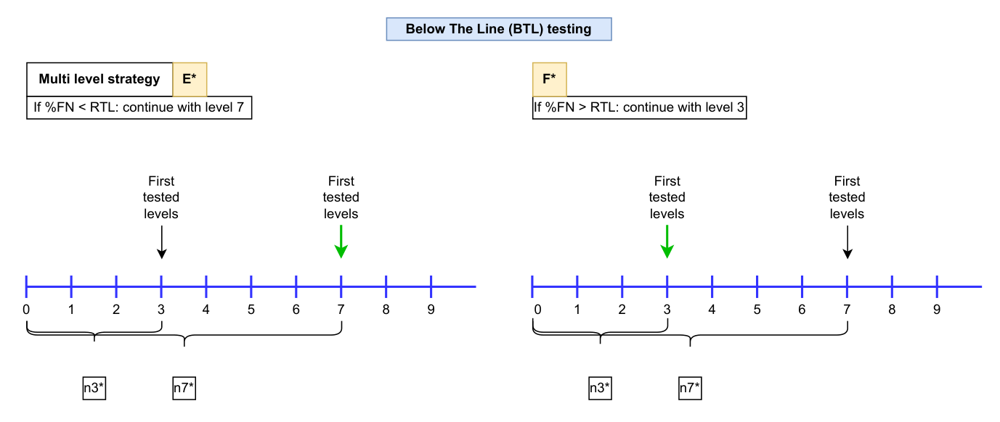

**그림 4.6: 완전한 모집단 접근 방식 BTL와 결합된 다단계 전략의 그림**

동조.

다수준 전략은 두 가지 상황에서 그림 4.6에 설명되어 있습니다. E∗, 상황에서 관심 거래 비율에 대한 첫 번째 추측이 모두 RTL보다 낮고 임계 수준 7를 첫 번째 임계 수준으로 활용하기로 결정했다고 가정합니다. 그런 다음 7 레벨부터는 단계 또는 이분법 전략을 사용할 수 있습니다. 반면, 상황 F ∗.에서 관심 거래 비율의 첫 번째 추측이 둘 다 RTL보다 높다고 가정합니다. 이 경우 임계 수준 3를 첫 번째 임계 수준으로 활용하도록 선택됩니다. 그런 다음 3 레벨부터 단계 또는 이분법 전략을 다시 사용할 수 있습니다.

요약하면, 정적 임계값 조정 전략과 달리 다단계 전략을 사용하면 분석가가 샘플링된 거래의 하위 집합을 검토한 후 가장 유망한 임계값 수준을 계속 사용하여 몇 가지 임계값 수준을 탐색합니다. 그러나 일부 임계값 수준이 아닌 모든 임계값 수준을 탐색하는 이 아이디어는 분석가가 검토해야 하는 샘플링된 거래의 양을 최소화하기 위해 더욱 확장될 수 있습니다.

시간이 지남에 따라 이 문제를 해결하기 위해 광범위한 알고리즘이 공식화되었습니다. 활용(탐욕스러운 선택)과 탐색(일련의 작업에 대한 균일한 확률) 사이의 이진 선택을 암시하는 방법은 반균일 방법 [40]로 알려져 있습니다. 가장 간단한 변형은 ϵ-Greedy입니다.

<!-- 원문 50쪽 -->

전략. 각 라운드에서 ϵ-Greedy 알고리즘은 확률 ϵ로 한 거래를 검토할 무작위 임계값 수준(탐색)을 선택하고 1−ϵ 확률로 하나의 거래를 검토할 평균 보상(이용)이 가장 높은 임계값 수준을 선택합니다. 이 전략의 가장 큰 단점은 이러한 임계값 수준이 최적이 아닌 것으로 식별된 후에도 최적이 아닌 임계값 수준이 여전히 선택된다는 것입니다. 따라서 이 전략은 가장 적절한 임계값 수준을 결정하기 위해 검토해야 하는 샘플링된 거래의 필수 양을 최소화하는 데 가장 효율적이지 않습니다. ϵ-Greedy 알고리즘에 대한 자세한 내용은 부록 E에 설명되어 있습니다.

전략의 또 다른 범주는 작업(이 경우 서로 다른 임계값 수준)이 최적일 가능성을 반영하는 확률 분포에 따라 작업을 선택하는 확률 매칭 방법입니다. 잘 알려진 확률 매칭 전략은 Softmax 전략이라고도 알려진 Boltzmann 탐색입니다.

#### 4.4.2 볼츠만 탐색 전략

섹션 4.1 및 관련 볼츠만 탐색 전략에 명시된 차이 d, 보상 R 및 평균 보상 ˆµ의 정의를 기억하세요.

```text
di(t) = RTL −pupper,i(t)
for i = 1, ..., K
```

소수점 두 자리에서 반올림되었습니다.

```text
Ri(t) =
```

```text
1
di(t) ∗w
if di(t) > 0
```

```text
1
0.005
if di(t) = 0
for i = 1, ..., K
|
1
di(t)|
if di(t) < 0
```

```text
ˆµi(t) =
```

```text
∑t
s=1 Ri(s)I{Is=i}
```

아니, 난

```text
for i = 1, ..., K
```

볼츠만 탐색은 반 균일 방법의 경우와 같이 모든 임계값 수준을 균일하게 탐색하는 대신 평균 보상에 비례하는 확률로 각 임계값 수준을 선택하는 불확실성 하에서 순차적 의사 결정을 내리는 고전적인 전략 입니다. 이 전략은 초기 경험적 평균 ˆµ0(0),...,ˆµK(0) [21]가 주어지면 볼츠만 분포를 사용하여 임계값 수준을 선택합니다.

```text
pselect,i(t + 1) =
eˆµi(t)/τ(t)
∑K
j=1 eˆµj(t)/τ(t) , i = 1, ..., K
(4.8)
```

여기서 τ는 온도 계수라고 하며 임계값 수준을 탐색하기 위한 선택의 무작위성을 제어합니다. 본 논문에서는 각 임계값 수준의 샘플에서 거래의 1 50를 검토하여 초기 경험적 평균 ˆµ1(0),...,ˆµK(0),를 결정하기로 결정했습니다. 이는 각 임계값 수준마다 평균 보상 에 대한 추정치를 제공하지만 분석가에게 많은 시간을 필요로 하지 않기 때문입니다. 일부 값 v와 동일한 초기 보상 ˆµ1(0) = v,...,ˆµK(0) = v를 선택하거나 각 임계값 수준의 샘플에서 더 많은 거래를 검토하여 더 확실하게 초기 경험적 평균 ˆµ1(0),...,ˆµK(0)를 결정하는 것도 가능하지만 몇 가지 선택을 해야 했습니다.

τ가 작을 때 각 임계값 레벨의 전체 지수 요소는 현재 수익에 지수적으로 비례합니다. 결과적으로, 평균 수익률이 더 높은 임계값 수준은 탐색 단계에서 선택될 가능성이 더 높습니다. τ →∞, 모든 임계값 수준의 전체 지수 요소가 1의 결과 값에 접근하면 알고리즘은 임계값 수준을 무작위로 균일하게 선택합니다. 이 전략은 ϵ-Greedy 전략과 동일한 방식으로 볼츠만 탐색 감소로 수정될 수 있습니다. 여기서 τ는 플레이된 라운드 수에 따라 특정 함수로 감소합니다. τ(t)는 실제로 [5]가 어렵습니다. 보다 정확하게는 모든 평균 보상을 올바르게 추정한 후에도 일정이 차선의 임계값 수준을 너무 자주 선택하거나 차선의 임계값 수준에 너무 일찍 약속하고 더 나은 임계값 수준으로 돌아오지 않을 수 있습니다. 5 장에서 몇 가지 일정 τ(t)가

<!-- 원문 51쪽 -->

어떤 일정이 최고의 성과를 내는지를 결정하기 위해 비교될 수 ​​있습니다 볼츠만 탐색 전략 다양한 사례 연구.

본 논문에서는 탐색 단계가 있는 동적 임계값 조정 전략이 탐색 단계가 없는 정적 임계값 조정 전략보다 더 효율적인지 여부를 연구하는 데 초점을 맞춘 다른 밴디트 알고리즘은 연구되지 않았습니다. 가장 적절한 임계값 수준을 결정하기 위해 분석가가 검토해야 하는 샘플링된 거래가 더 적다면 전략이 더 효율적입니다. 볼츠만 탐색 전략은 부록 E.4의 알고리즘 5에 알고리즘 형식으로 설명되어 있습니다.

모든 임계값 조정 전략의 목표는 (1−α)×100% 신뢰 수준으로 가장 적합한 임계값 수준을 결정하는 데 필요한 검토를 최소화하는 것입니다. 그러나 섹션 4.5에 설명된 간단한 방식으로 필요한 검토 모든 임계값 조정 전략을 줄이는 두 가지 방법이 있습니다.

### 4.5 필요한 검토를 줄이는 방법

이 섹션에서는 필요한 검토 건수를 줄이는 두 가지 간단한 방법을 설명합니다. 첫 번째 방법은 '원리 조기 깨기' BTL 테스트로 정의되며 섹션 4.5.1에 자세히 설명되어 있습니다. 이어서 4.5.2 섹션에서는 검토된 거래를 재사용하여 필요한 검토를 더욱 줄일 수 있는 방법을 설명합니다. 분석가의 작업량을 크게 줄일 수 있으므로 검토 건수를 줄일 수 있는 방법을 모색하는 것은 흥미롭습니다.

#### 4.5.1 조기 브레이크 오프 원리

BTL 테스트에서는 < RTL가 퍼퍼인지 확인하기 위해 샘플의 모든 거래를 검토하는 것이 항상 필요한 것은 아닙니다. 임계값 수준이 n개의 = 250 거래 샘플과 RTL = 0.2의 샘플로 테스트된다고 가정합니다. 150 거래를 검토한 후 51 거래를 관심 거래로 검토합니다. 현재 시점에서 관심 거래의 상한 비율은 최소 k입니다.

n = 51 250 = 0.204는 샘플의 모든 거래가 검토되지는 않지만 RTL보다 높습니다. 이 경우 나머지 100 거래를 검토할 필요가 없습니다.

n은 테스트된 임계값 수준인 만 늘릴 수 있습니다. 따라서 검토 프로세스 임계값 수준이 조기 종료될 수 있으며 이는 '조기 중단 원칙'으로 정의됩니다. 임계값 조정 전략은 > RTL를 실행하는 경우 일반적인 방식으로 를 계속할 수 있습니다. 이 경우 샘플의 다른 100 거래를 검토하는 데 필요한 시간이 '초기 브레이크 오프 원칙'으로 절약되므로 임계값 조정 전략을 통해 가장 적합한 임계값을 결정하는 보다 효율적인 절차가 가능해집니다. 이 원칙은 관심 있는 거래의 비율이 지정된 최소 생산성 허용 수준보다 낮은 상황에서 ATL 테스트에도 적용될 수 있습니다.

#### 4.5.2 이전에 검토한 샘플의 정보 재사용

필요한 검토를 줄이는 또 다른 방법은 임계값 조정 프로세스 중에 수집된 정보를 재사용하는 것입니다.

이전 테스트 레벨이 현재 테스트 레벨보다 낮은 상황 그림 4.7에 표시된 것처럼 이전 테스트 임계값 레벨이 5 레벨이고 현재 테스트 임계값 레벨이 6 레벨이라고 가정합니다. 이 경우 BTL 테스트에서 임계값 6, S6 샘플의 0 및 5 레벨 간의 거래는 그림의 왼쪽 이미지에 표시된 레벨 5, S5 샘플의 거래에서 수집된 정보와 비교하여 새로운 정보를 제공하지 않습니다. 주황색 선이 있는 4.7. 5 수준 이상의 거래만 녹색 선으로 표시된 관심 거래 임계값 6 비율에 대한 새로운 정보를 제공합니다. 표본 크기가 n = 250이고 임계 수준 6, S6의 샘플에 임계 수준 5, VL5 값보다 높은 20 거래가 있다고 가정합니다. 이 경우 분석가는 VL5 위 샘플 S6의 20 거래를 검토하고 샘플 S5의 250 -20 = 230 검토 거래의 정보를 재사용할 수 있습니다. 230 거래의 무작위 샘플을 샘플 S5에서 가져오고 샘플 S6의 20 거래과 결합하여 관심 있는 거래 임계값 6의 비율을 결정합니다. 이것은

<!-- 원문 52쪽 -->

분석가가 230 새 거래를 검토하는 데 필요한 시간을 절약할 수 있습니다.

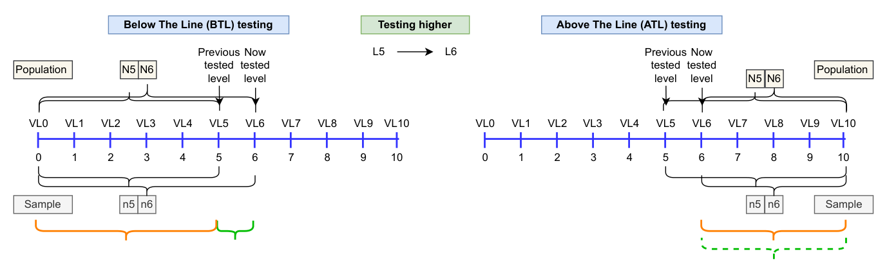

**그림 4.7: 이전에 테스트한 임계값 수준이 더 높았을 때 검토된 샘플의 일부를 재사용하는 그림.**

반면, ATL 테스트를 통해 분석가는 임계값 수준 6, VL6 값보다 높은 샘플 S5에서 검토된 거래 정보를 재사용할 수 있습니다. n = 250 및 임계값 5, S5 샘플에 임계값 6, VL6 값보다 높은 210 거래가 있다고 다시 가정합니다. 이 경우 샘플 S5의 거래를 검토한 210의 정보를 재사용할 수 있습니다. 또한 분석가는 샘플 S6의 250 -210 = 40 거래를 검토해야 합니다. 그림 4.7의 오른쪽 이미지에 표시된 대로 40 거래의 무작위 샘플을 S6에서 가져와 샘플 S5의 210 거래과 결합하여 관심 거래 임계값 수준 6의 비율을 결정합니다.

이전 테스트 수준이 현재 테스트 수준보다 높은 상황 그림 4.8는 이전 테스트 수준이 현재 테스트 수준보다 높은 상황을 보여줍니다. 이 경우 수집된 정보를 재사용하는 것은 BTL 및 ATL 테스트와 반대입니다. BTL 테스트를 통해 분석가는 임계 수준 5, VL5 값 아래에서 샘플 S6에서 검토된 거래 정보를 재사용할 수 있습니다. 재사용할 수 있는 거래 수와 표본 크기 n 간의 차이는 그림 4.8의 왼쪽 이미지에 표시된 대로 관심 거래 임계값 수준 5의 비율을 결정하기 위해 다시 무작위 샘플을 통해 샘플 S5의 거래으로 보완될 수 있습니다.

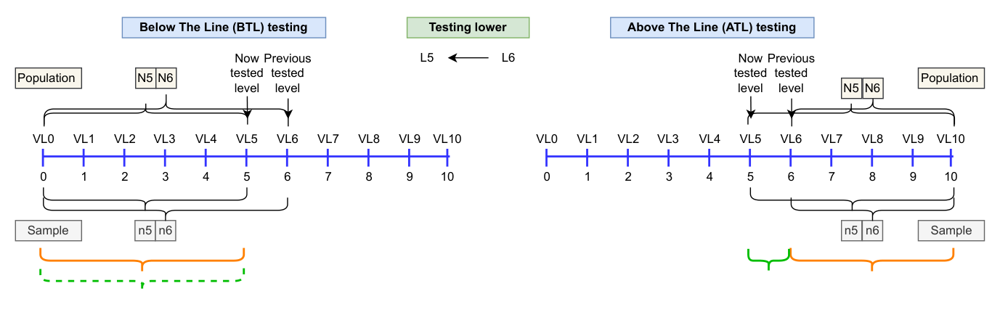

**그림 4.8: 이전에 테스트한 임계값 수준이 더 낮았을 때 검토된 샘플의 일부를 재사용하는 그림.**

대조적으로, ATL 테스트에서 분석가는 샘플 S6에서 검토된 거래 정보를 재사용할 수 있습니다. 6 수준 이하의 거래만 관심 거래 임계값 5 비율에 대한 새로운 정보를 제공합니다. 이 경우 분석가는 샘플 S5, 인스턴스 30 거래에서 VL6 미만의 거래를 검토하고 무작위 샘플을 통해 샘플 S6의 250 −30 = 220에서 검토한 거래의 정보를 재사용하여 관심 있는 거래의 비율을 결정할 수 있습니다. 임계값 레벨 5(그림 4.8의 오른쪽 이미지 참조)

<!-- 원문 53쪽 -->

이 장에서는 다양한 임계값 조정 전략이 자세히 설명되어 있으며 임계값 조정 전략의 성능을 어떻게 비교하고 정량적으로 평가할 수 있는지에 대한 의문이 자연스럽게 제기됩니다. 이에 대해서는 섹션 4.6에 설명되어 있습니다.

### 4.6 평가 지표

다양한 임계값 조정 전략의 성능은 세 가지 사례 연구를 통해 평가됩니다. 성과평가에는 두 가지 측면이 중요하다. 첫 번째 측면은 가장 적절한 임계값 수준, 즉 임계값 조정 프로세스 기간을 결정하기 위해 분석가가 검토해야 하는 필수 거래 양입니다. 또한 샘플링을 통한 임계값 조정 전략으로 결정된 가장 적절한 임계값 수준이 실제 거래 모집단을 기반으로 하는 가장 적합한 실제 임계값 수준과 일치하는지 여부를 아는 것이 중요합니다. 거래 샘플을 기반으로 발견된 임계값 수준 Tstrategy와 샘플링이 없는 거래 모집단을 기반으로 한 실제 임계값 수준 Ttrue 간의 차이는 다음과 같이 정의할 수 있습니다.

```text
Dthreshold = Ttrue −Tstrategy.
(4.9)
```

5.2 섹션에서는 일부 분포에 따라 거래가 무작위로 생성되는 방법과 일부 분포에 따라 거래에 관심(1) 또는 관심 없음(0)으로 무작위로 레이블이 지정되는 방법에 대해 자세히 설명합니다. 이로 인해 분포의 무작위 생성 및 무작위 샘플링으로 인해 임계값 조정 전략이 실행될 때마다 검토 건수와 차이가 조금씩 달라질 수 있습니다.

본 논문에서는 임계값 조정 전략 25 x (각 실행에서 일부 분포에 따라 거래 모집단이 무작위로 생성되는 특정 사례 연구)를 반복하도록 선택되었습니다. 각 실행에서 필요한 검토 건수과 발견된 임계값 수준과 실제 임계값 수준 간의 차이가 결정됩니다. 부록의 그림 G.1 및 G.2에 표시된 대로 25가 사례 연구 1를 실행한 후 필요한 검토 건수의 최대, 중앙 및 최소와 발견된 임계값과 실제 임계값 수준 사이의 차이가 안정화되므로 임계값 조정 전략 25 횟수를 반복하도록 선택했습니다. G.1. 사례 연구 2 및 3도 동일한 결론을 내릴 수 있습니다.

#### 4.6.1 임계값 조정 전략의 성능 평가

임계값 조정 전략의 성능을 정량화하고 이를 다른 임계값 조정 전략과 비교할 수 있도록 다음 기본 설정이 정의되었습니다.

- 검토 건수: 가장 적절한 임계값 수준을 결정하기 위해 가능한 한 적은 수의 거래 검토가 필요한 임계값 조정 전략인 를 선호합니다.

- 차이점: 샘플을 기반으로 발견된 임계값이 모집단을 기반으로 한 실제 임계값에 가깝다는 것을 의미하므로 작은 차이가 있는 임계값 조정 전략인 를 선호합니다. 또한, 긍정적인 차이는 발견된 임계값 수준이 안전한 선택 BTL 테스트인 실제 임계값 수준보다 낮다는 것을 나타내기 때문에 부정적인 차이보다는 긍정적인 차이인 를 선호합니다. 반면, 차이가 음수인 경우 이는 발견된 임계값 레벨이 실제 임계값 레벨보다 높다는 것을 의미하며, 이는 RTL가 거래 모집단 를 충족하지 못할 것임을 의미합니다. 따라서 그 차이가 마이너스가 되는 상황을 방지하는 것이 바람직하다.

- 튜닝 전략의 성능 분산: 가장 적절한 임계값 수준을 결정하기 위해 필요한 검토 및 차이의 분산이 25 실행에 비해 가능한 한 작은 분포인 임계값 조정 전략 가 선호됩니다. 임계값 조정 전략은 필요한 검토 양과 차이가 더 많이 변동하는 전략에 비해 전략에서 종종 비슷한 수의 거래를 검토해야 하고 발견된 임계값 수준과 실제 임계값 수준 간의 차이가 동일한 경우 더 안정적인 성능을 갖습니다. 25 실행에 대한 분산은 최대값, 75% 분위수, 중앙값, 25% 분위수 및 최소값을 보여주는 상자 그림으로 표시됩니다.

<!-- 원문 54쪽 -->

## 제5장 실험

본 장에서는 트리 사례 연구를 기반으로 한 합성 데이터셋 설정과 본 논문에서 수행된 다양한 실험을 보다 자세히 설명합니다. 이 장은 여러 섹션으로 나누어져 있습니다. 5.1 섹션에서는 범죄 행위와 범죄자가 어떻게 법을 회피하려고 하는지에 대한 더 많은 통찰력을 제공하기 위해 세 가지 일반적인 자금세탁 시나리오가 제시됩니다. 이어서 5.2 섹션에서는 5.1 섹션에 설명된 자금세탁 시나리오를 사용하여 다양한 임계값 조정 전략을 평가하기 위해 레이블이 지정된 합성 거래 데이터셋을 구성하는 방법을 설명합니다. 마지막으로 섹션 5.3에서는 본 논문에서 실행될 다양한 실험의 목적을 설명합니다.

### 5.1 사례 연구

본 논문에서는 섹션 4.3 및 4.4에 제시된 임계값 조정 전략을 세 가지 사례 연구에 적용하여 성능을 평가합니다. 거래가 비정상인지 아닌지 라벨이 붙은 공개적으로 사용 가능한 라벨이 붙은 거래 데이터셋는 거의 없습니다. 그러나 금융 기관이 직면하는 다양한 자금세탁 시나리오는 공개적으로 이용 가능하며 레이블이 지정된 거래 데이터셋을 구성하는 데 사용될 수 있습니다. 공개적으로 이용 가능한 자금세탁 시나리오의 몇 가지 예는 [32]입니다.

- 분할입금(smurfing)과 결합된 교환 시장을 통한 자금세탁. 이 방법에는 불법적으로 획득한 막대한 양의 현금이 포함됩니다. 이 사례는 좀 더 자세히 논의될 것이며 본 논문에서는 사례 연구로 사용된다.

- 파생상품을 이용한 자금세탁. 파생상품 계약은 일부 기본 시장 요인의 움직임에 베팅하는 것입니다. 이 사례는 좀 더 자세히 논의될 것이며 본 논문에서는 사례 연구로 사용된다.

- 자선단체 및 비영리단체를 통한 자금세탁(NPOs). 운영 모델 (많은 NPOs)에는 은행 계좌에 입금되기 전에 수많은 소액 현금 기부와 자금을 배치할 수 있는 고위험 국가로의 금융 이체와 함께 현금 집약적인 모금 활동이 포함됩니다. 자금세탁에 이상적인 커버를 제공하는 인도주의적 활동입니다. 이 사례는 좀 더 자세히 논의될 것이며 본 논문에서는 사례 연구로 사용된다.

- 무역 금융을 통한 자금세탁. 이 방법은 무역 흐름의 양, 외환 거래의 복잡성 및 관련된 장기 공급망으로 인해 불법 자금의 흐름이 시야에서 숨겨질 수 있음을 나타내기 때문에 감지하기가 매우 복잡합니다. 자금세탁 시나리오 및 유형의 더 많은 예는 공개적으로 이용 가능하며 FIU-NL [36, 38]에 설명되어 있습니다.

<!-- 원문 55쪽 -->

#### 5.1.1 사례 연구 1: 현금 예금 분할입금(smurfing) 탐지

분할입금(smurfing)과 결합하여 교환 시장을 통한 자금세탁을 고려하십시오. 본 사례 연구는 다음과 같은 자금세탁 시나리오 '암시장 페소 교환소' [33]를 기반으로 합니다. 이 시나리오에서는 미국 마약 카르텔이 소유한 달러가 브로커의 도움을 받아 콜롬비아에서 페소로 교환됩니다. 또한 상품은 국경을 넘어 이동할 수 있지만 돈을 이동하는 것이 더 복잡하기 때문에 상품이 미국에서 콜롬비아로 수출됩니다. 미국과 콜롬비아 간의 자금세탁 시나리오는 7 단계로 설명할 수 있으며 [33]를 기반으로 한 그림 5.1에 설명되어 있습니다. 1. 첫 번째 단계로 콜롬비아 카르텔은 마약을 미국으로 수출하여 그곳에서 판매됩니다. 이로 인해 콜롬비아 카르텔이 브로커를 주선하여 이러한 약물 판매로 생성된 달러를 구매하는 대량의 현금 달러 가 생성됩니다. 2. 그런 다음 브로커는 미국에서 콜롬비아로 수출할 미국 공급업체 상품에 대금을 지불하려는 콜롬비아 현지 수입업자에게 달러를 판매할 준비를 합니다. 3. 그런 다음 브로커는 미국에 있는 그의 대리인 을 주선하여 카르텔에서 달러를 수금합니다. 4. 그 후, 브로커는 이 달러를 사용하여 미국 공급업체 에게 수출 상품에 대한 대금을 지불합니다. 이는 예와 같이 구조화 예금을 사용하여 브로커가 관리하는 여러 은행 계좌에 현금을 넣은 다음 전신 송금을 통해 공급자에게 자금을 전달함으로써 수행될 수 있습니다. 5. 미국 공급자는 상품을 콜롬비아로 수출하고 그곳에서 콜롬비아 수입업체가 상품을 받습니다. 6. 수입품을 수령한 콜롬비아 수입업자는 브로커에게 페소로 지불합니다. 7. 마지막으로, 브로커는 이제 콜롬비아 카르텔에 지불할 페소를 갖게 되었고, 그는 수수료를 받은 후 그렇게 했습니다. 네 번째 단계에서는 하나 이상의 은행이 관련되어 있으며 비정상적인 거래를 보고할 책임이 있습니다. 은행비밀보호법에 따라 은행 및 기타 금융 기관은 10,000 달러 [14]를 초과하는 현금 거래를 보고할 의무가 있습니다. 이 경우 범죄자는 많은 양의 현금을 여러 개의 소액 현금 예금으로 구성하여 법을 회피하려고 시도할 수 있으며, 이는 은행이 탐지하려고 시도하는 행위입니다. 5.2 섹션에서는 이러한 자금세탁 시나리오를 기반으로 레이블이 지정된 데이터셋을 구성하는 방법에 대해 자세히 설명합니다.

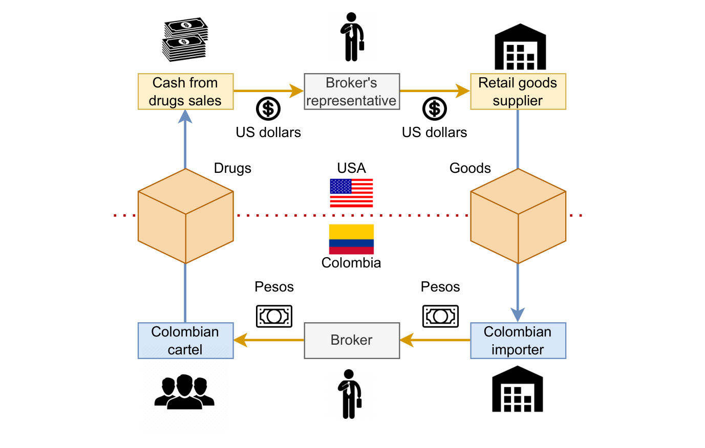

**그림 5.1: 사례 연구 1: 교환 거래 [33]로 설명된 현금 예금 분할입금(smurfing) 탐지.**

<!-- 원문 56쪽 -->

#### 5.1.2 사례 연구 2: 파생상품에서 비정상적인 이익 감지

파생상품을 통한 자금세탁을 고려해보세요. 파생상품은 둘 이상의 당사자 간에 설정된 금융 계약의 한 유형으로, 기초 자산 또는 자산 그룹에서 그 가치를 도출합니다. 이 사례 연구는 다음 자금세탁 시나리오 [37]를 기반으로 합니다. 이 시나리오에서는 러시아 범죄 조직이 거래를 통해 범죄적으로 획득한 자금을 세탁하려고 합니다. 이 자금세탁 시나리오는 [37]를 기반으로 한 그림 5.2에 설명되어 있습니다. 중요한 용어는 계약에서 매도 포지션과 매수 포지션 간의 차이를 이해하는 것입니다. 투자자가 가격의 가치가 상승할 것이라고 베팅하는 경우 계약을 '매수'한다고 합니다. 반대로, 투자자가 계약을 '매도'하면 투자자는 기초 가치가 감소할 것이라고 베팅합니다. 불법 자금을 세탁하는 방법은 파생 상품의 복잡성과 파생 상품 시장이 자금세탁 활동을 숨기는 완벽한 커버 [37]를 제공하기 때문에 탐지하기 어렵습니다. 이는 시장 참가자가 브로커의 신원만 알고 다른 사람의 신원을 아는 것이 매우 정상적이기 때문입니다. 이 자금세탁 시나리오는 5 단계로 설명할 수 있습니다. 1. 불법 자금은 공모 브로커가 관리하는 중개 계좌인 A 계좌에 입금됩니다. 2. 브로커는 거래일 동안 특정 상품에 대해 매수와 매도를 모두 진행하고 하루가 끝날 때 두 포지션을 모두 청산합니다. 이후 브로커는 손실을 A 계좌에 할당하여 '더티' 자금이 있는 계좌의 잔액을 줄이고 수익을 B 계좌에 할당하여 더 많은 '청정' 자금을 생산합니다. 3. 다음 단계로 브로커는 롱 포지션을 취하고 특정 상품에 대한 파생 계약 을 구매하는 동시에 브로커는 특정 상품에 대해 숏 포지션을 취하고 동일한 수량의 파생 계약 을 매도합니다. 거래일 후반에 브로커는 시장으로 돌아가 두 개의 오픈 포지션을 청산합니다. 4. 이제 기본 상품의 가격이 하락했다고 가정해 보겠습니다. 즉, 매수 포지션에서 손실이 발생하고 매도 포지션에서 이익이 발생했다는 의미입니다. 그런 다음 브로커는 롱(손실 포지션)을 계정 A에 할당하고 숏(승리 포지션)을 계정 B에 할당합니다. 5. 그 이후에는 승리한 포지션의 이익이 패배한 포지션의 손실액보다 적어집니다. 이 차이가 바로 자금세탁의 대가입니다. 승리한 포지션이 50,000 유로의 수익을 냈고 패배한 포지션이 60,000 유로의 손실을 냈다고 가정하면, '청정' 돈으로 50,000 유로를 생성하려면 '더티' 돈으로 60,000 유로가 필요합니다. 특정 은행 계좌에서 표준 이익 또는 손실보다 상당히 높거나 낮은 이익 또는 손실이 발생하는 경우 이는 비정상적인 거래 행위를 나타낼 수 있으며 추가 조사가 필요합니다. 섹션 5.2에서는 파생상품의 비정상적인 이익이나 손실을 탐지하기 위해 레이블이 지정된 데이터셋을 구성하는 방법에 대해 자세히 설명합니다.

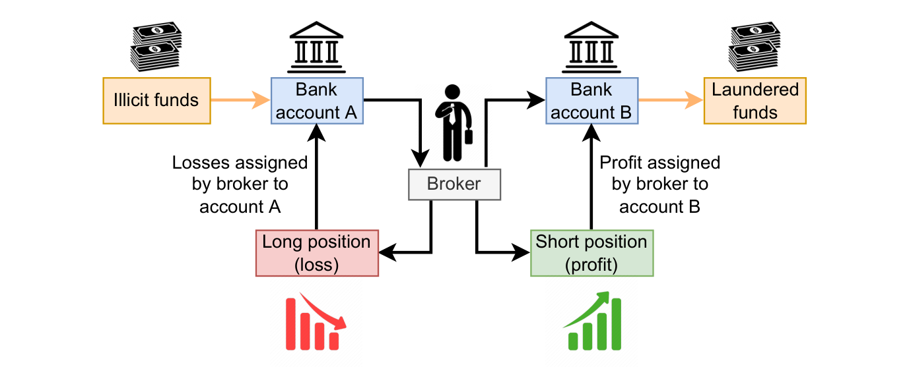

**그림 5.2: 사례 연구 2: 파생상품 [37]에서 비정상적인 이익을 감지합니다.**

<!-- 원문 57쪽 -->

#### 5.1.3 사례 연구 3: 고위험 국가에 대한 비정상적인 금융 거래 감지

자선단체를 통한 자금세탁과 고위험 국가로의 자금 이체를 통한 NPOs를 고려하세요. FATF와 유럽연합 집행위원회에 의해 고위험 국가로 지정된 국가 목록은 [34] 1년에 3회 게시됩니다. 이 사례 연구는 다음 자금세탁 시나리오 [35]를 기반으로 합니다. 이 시나리오에서는 자선 단체 또는 NPO가 자금세탁 또는 테러자금조달에 이용됩니다. 이러한 악용은 NPO 운영 모델의 수집 단계, 전송 단계 또는 전달 시점 단계에서 발생할 수 있습니다. 이 자금세탁 시나리오는 [35]를 기반으로 한 그림 5.3에 설명되어 있습니다. 이체 단계에서 다음과 같은 방법으로 자금세탁이 가능합니다.

NPO 이사회의 대다수에게 알려지지 않은 이체 단계에서는 자금세탁을 적극적으로 하거나 테러리스트 그룹을 지원하는 소수가 있습니다. 이 소수자에는 NPO의 은행 계좌에 접근할 수 있는 개인이 포함됩니다. 미국에서 모금된 자금은 NPO가 사무실이 있는 고위험 국가인 [34]인 알바니아의 계좌에 통합된 후 기부 대상 국가인 (예: 소말리아)인 로 전송됩니다. 이러한 다양한 이체가 이루어지면 자금은 국제 전신 송금을 통해 가짜 기업의 계좌(물류 서비스로 추정)로 전환되고 궁극적으로 테러리스트 그룹을 지원하는 데 사용됩니다.

자선 단체 또는 NPO의 돈이 복잡하거나 불필요한 금융 구축을 통해 고위험 국가를 통해 돈이 의도된 국가 로 이체되는 경우 이는 비정상적인 거래 행위를 나타낼 수 있습니다. 섹션 5.2에서는 고위험 국가에 대한 비정상적인 금융 거래를 탐지하기 위해 레이블이 지정된 데이터셋을 구성하는 방법에 대해 자세히 설명합니다.

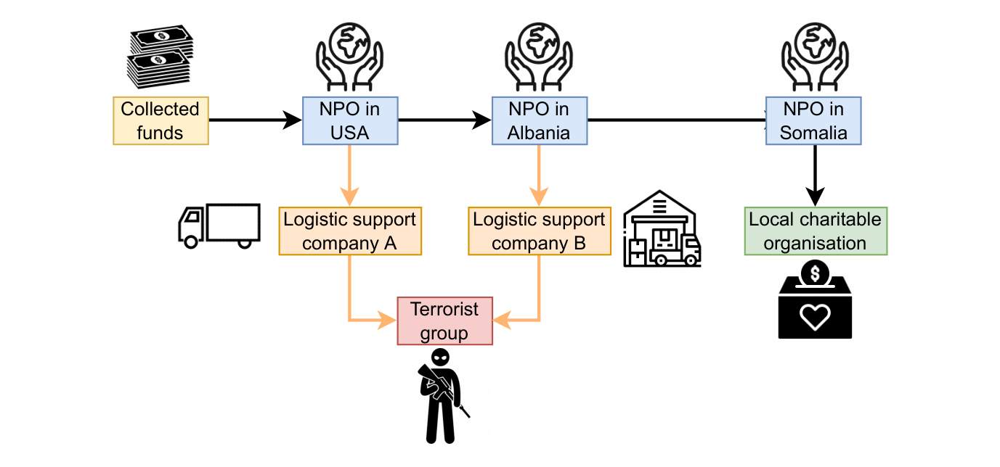

**그림 5.3: 사례 연구 3: 고위험 국가 [35]에 대한 비정상적인 금융 거래 탐지.**

<!-- 원문 58쪽 -->

### 5.2 시나리오에서 배포판으로 번역

이 섹션에서는 이전 섹션에서 설명한 자금세탁 시나리오를 기반으로 합성 데이터셋을 구성하는 방법을 설명합니다. 분포를 구성하기 위해 만들어진 가정은 사례 연구가 가능한 범죄 행위를 설명하는 데 사용되는 계산의 예를 설명하기 위한 출발점으로 사용된다는 점에 유의하는 것이 중요합니다. 공개적으로 사용 가능한 레이블이 지정된 거래 데이터셋가 거의 없기 때문에 관심 있는 거래 볼륨의 비율이 변동/비단조, 단조 비감소 또는 일정한 상황에서 튜닝 전략의 성능을 테스트하기 위해 분포가 구성됩니다. 분포와 가정의 타당성은 테스트되지 않았다는 점을 강조하는 것이 중요합니다. 다른 분포에 대한 연구는 향후 연구에 흥미로울 수 있으며 이에 대해서는 7 장에서 자세히 논의할 것입니다.

사례 연구 1: 현금 예금 분할입금(smurfing) 감지 규칙을 사용하여 현금 예금 분할입금(smurfing)을 감지하려면 거래 모니터링 모델에서 공개적으로 알려진 임계값 바로 아래에 있는 대규모 현금이 구조적으로 이체되었는지 여부를 감지해야 합니다. 이 규칙은 분할입금(smurfing)을 나타낼 수 있는 범죄 행위의 특성을 특성화해야 합니다. 범죄자들이 공개적으로 알려진 10,000 유로 한도 바로 아래에 있는 더 작은 금액으로 현금 예금을 구성할 것이라고 가정합니다. 이러한 추론을 바탕으로 다음과 같은 분포가 거래 로 구성됩니다.

데이터 분석 임계값 조정이 수행되는 특정 기간에 은행이 여러 은행 계좌에서 수집된 10,000 거래량을 처리한다고 가정해 보겠습니다. 거래량은 특정 기간 동안 한 은행 계좌의 거래 금액의 합계로 정의됩니다. 단순성에서는 거래량이 0와 40,000 유로 사이에 있고 10,000 다른 은행 계좌의 거래량이 그림 5.4c에 표시된 대로 0와 40,000 유로 사이에 균일하게 배포된다고 가정합니다. 또한, 10,000 유로와 그 배수의 공개 임계값 바로 아래에서 거래량이 흥미로울 확률이 더 높다고 가정합니다. 이 목적에서는 관심 거래가 그림 5.4a에 표시된 대로 0와 10,000 유로 및 그 배수 사이에 배포된 β(8, 3)라고 가정합니다. 데이터셋는 서로 다른 은행 계좌의 10,000 거래량이 y축에 주어진 확률 p로 관심 대상(1)으로 표시되고 확률 1 −p로 일반 거래량(0)으로 레이블이 지정되어 구성됩니다. 거래량 분포와 관심 거래량 분포는 그림 5.4에 나와 있습니다.

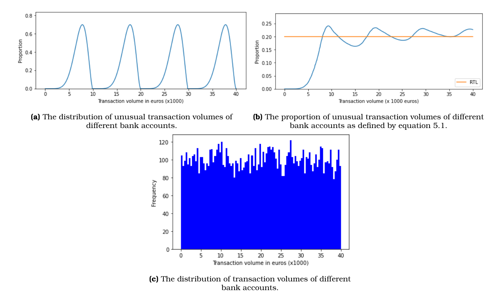

**그림 5.4: 사례 연구 1의 분포: 현금 예금 분할입금(smurfing) 탐지.**

<!-- 원문 59쪽 -->

BTL 테스트에서 그림 5.4b의 파란색 선은 임계값 수준 0과 다음과 같이 정의된 특정 임계값 수준 사이의 관심 거래 볼륨 비율을 나타냅니다.

```text
pb = yb
```

NB

```text
(5.1)
```

여기서 yb는 값이 0인 임계값부터 특정 값과 같은 임계값 수준까지의 관심 거래량이며, Nb는 값이 0인 임계값부터 특정 값과 같은 임계값 수준까지의 거래량의 모집단입니다. 0와 30,000 유로 사이의 값을 갖는 7600 거래량이 있고 그 중 1590가 관심 거래(1)로 표시되고 30,000 유로의 임계값 수준보다 낮은 관심 거래의 비율이 pb = yb/Nb와 같다고 가정합니다. = 1590/7600 = 0.209 이 사례가 관심 대상으로 분류된 주요 이유는 임계값 조정 전략이 가장 적절한 임계값 수준이 로컬 최소값 중 하나에 있다고 결정할 가능성이 있다는 것입니다. 그림 5.4b에 표시된 대로 관심 거래량의 비율은 비단조 함수입니다. 따라서 이 사례 연구의 목적은 관심 있는 거래의 비율이 비단조 함수로 설명될 수 있는 경우 다양한 임계값 조정 전략의 성능을 평가하는 것입니다.

사례 연구 2: 파생 상품의 비정상적인 이익 탐지 파생 상품의 비정상적인 이익을 탐지하려면 거래 모니터링 모델은 파생 상품 거래의 이익이 특정 기간의 시장 가치 변화보다 주목할 만한 수준인지 여부를 탐지해야 합니다. 이 규칙은 파생상품을 이용한 자금세탁을 나타낼 수 있는 범죄 행위를 특성화해야 합니다. 다음 분포는 거래량 로 구성됩니다.

특정 기간에 은행이 시장 가치의 변화로 인해 증가하거나 감소하는 다양한 은행 계좌의 10,000 거래 거래량 모집단을 처리한다고 가정해 보겠습니다. 시장 가치의 변화에 ​​따른 은행 계좌의 거래량 변화는 다음 비율로 표현될 수 있습니다.

```text
ratio = ∆vtrade
```

Δv마켓

```text
=
```

vte vt0 vme vm0

```text
(5.2)
```

여기서 Δvtrade는 특정 기간의 시작 vt0과 끝 vte 사이의 은행 계좌 거래량의 증가 또는 감소이고, Δvmarket은 특정 기간의 시작 vm0과 끝 vme 사이의 시장 가치의 증가 또는 감소입니다.

예에서 백만 Btu당 천연 가스의 시장 가치는 1 7월 2022의 5.712 달러이고 9월 1 2022 [31]의 9.33 달러입니다. 이 기간 동안 천연가스의 시장 가치는 (9.33/5.712) × 100% = 163%만큼 변경되었습니다. 이제 해당 기간 동안 은행 계좌의 거래량이 250%만큼 변경되었다고 가정합니다. vte = 50, 000 및 vt0 = 20, 000, 시장 가치 변화는 163%였습니다. 이 경우 은행계좌의 시가총액과 거래량의 변동폭의 차이는 250/163 = 1.53와 같습니다. 범죄자들은 ​​은행 계좌의 거래량 변화와 시장 가치 사이의 큰 차이가 눈에 띌 수 있다는 것을 알고 있기 때문에 이를 최소화할 가능성이 높습니다. 따라서 비율이 0와 2 사이에 있다고 가정하면 비율은 N(1, 1)입니다.

3)는 그림 5.5c에 표시된 대로 배포됩니다. 또한, 비정상적으로 높은 수익을 내는 은행 계좌에서 깨끗한 자금이 생성되므로 비율이 1보다 높고 상대적으로 클수록 관심 거래량이 발생할 확률이 더 높다고 가정합니다. 이 목적에서는 그림 5.5a에 표시된 대로 관심 비율이 0와 2 사이에 분포된 β(7, 3)라고 가정합니다. 데이터셋는 서로 다른 은행 계좌의 10,000 거래량에 대한 비율이 계산되고 y축에 주어진 확률 p로 관심(1)으로 레이블이 지정되고 확률 1 −p로 정규(0)로 레이블이 지정되는 방식으로 구성됩니다. 10,000 다양한 은행 계좌의 비율 분포와 관심 비율의 분포는 그림 5.5에 나와 있습니다.

이 사례가 관심 대상으로 분류된 주된 이유는 거래량의 곱셈적 변화를 비교하는 것입니다. 그림 5.5b에 표시된 비율은 단조로운 비감소 함수입니다. 따라서 이 사례 연구의 목적은 다음과 같은 경우에 다양한 임계값 조정 전략의 성능을 평가하는 것입니다.

<!-- 원문 60쪽 -->

관심 있는 거래량의 비율은 단조로운 비감소 함수로 설명할 수 있습니다.

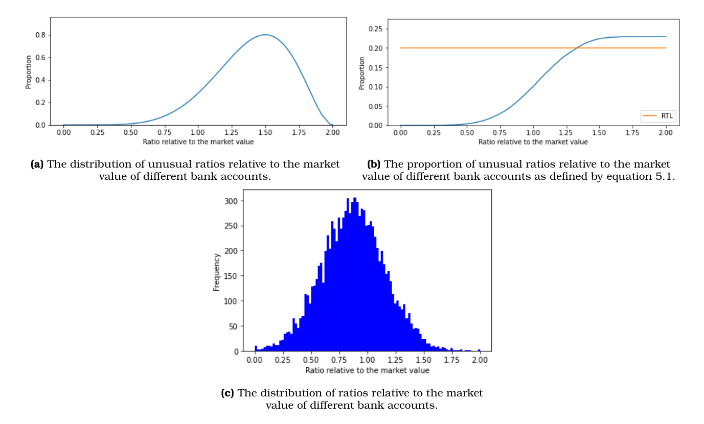

**그림 5.5: 사례 연구 2의 분포: 파생상품에서 비정상적인 이익을 감지합니다.**

사례 연구 3: 고위험 국가에 대한 비정상적인 금융 거래 감지 고위험 국가의 은행 계좌와의 비정상적인 금융 거래를 감지하려면 거래 모니터링 모델은 특정 기간에 최종 은행 계좌로 자금이 이체되기 전에 고위험 국가를 통해 복잡한 구성을 통해 금융 거래가 이체되었는지 여부를 감지해야 합니다. 이 규칙은 고위험 국가에 대한 비정상적인 금융 거래를 통한 자금세탁을 나타낼 수 있는 범죄 행위를 특성화해야 합니다. 다음 분포는 거래량 로 구성됩니다.

특정 기간에 은행이 고위험 국가의 은행 계좌로 이체되거나 그 계좌에서 이체된 다양한 은행 계좌의 거래량 10,000 집단을 처리한다고 가정해 보겠습니다. 단순성, 거래량이 0와 100,000 유로 사이에 있다고 가정합니다. 이에 따라 10,000 다른 은행 계좌의 거래량은 제시된 대로 0와 100,000 유로 사이에 분산된 β(3,(8)입니다. 그림 5.6c에서는 높은 거래 볼륨보다 낮은 거래 볼륨이 더 많을 것임을 알 수 있습니다. 또한, 고위험 국가의 은행 계좌에서 들어오고 나가는 모든 금융 거래에 관심 있는 거래량이 발생할 확률이 일정하다고 가정합니다. 이는 강력한 가정이며 아마도 자주 발생하지는 않지만 자금세탁은 대기업과 중소기업 모두, 거래 규모가 크거나 작을 때 모두 발생할 수 있습니다. 이 목적에서는 관심 거래량이 그림 5.6a에 표시된 대로 0와 100,000 유로 사이에 균일하게 분포되어 있다고 가정합니다. 데이터셋는 서로 다른 은행 계좌의 10,000 거래량이 y축에 주어진 확률 p로 관심(1)으로 표시되고 확률 1 −p로 일반 거래량(0)으로 레이블이 지정되어 구성됩니다. 거래량 분포와 관심 거래량 분포는 그림 5.6에 나와 있습니다.

이 사례가 관심 대상으로 분류된 주요 이유는 각 임계값 수준의 적합성 사이에 차이가 거의 없는 상황을 조정 전략이 어떻게 처리하는지 조사하는 것입니다. 그림 5.6b에 표시된 대로 관심 거래량의 비율은 일정한 함수입니다. 따라서 이 사례 연구의 목적은 관심 있는 거래의 비율이 일정한 함수를 갖는 경우 다양한 임계값 조정 전략의 성능을 평가하는 것입니다.

<!-- 원문 61쪽 -->

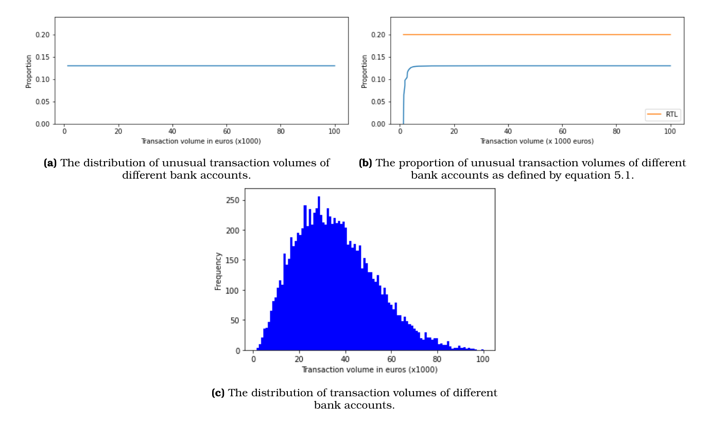

**그림 5.6: 사례 연구 3의 분포: 고위험 국가에 대한 비정상적인 금융 거래 감지.**

분포는 numpy.random.distribution() 및 stats.distribution.pdf()를 사용하여 생성됩니다. 또한 매개변수 설정 에 대한 다양한 사례 연구가 표 5.1에 나와 있습니다. 본 논문에서는 거래 볼륨을 K = 20 임계값 수준으로 분할하기로 선택했습니다. 그 이유는 다양한 임계값 조정 전략의 성능 차이가 임계값 수준 수가 많고 임계값 수준 사이의 폭이 더 좁을수록 더 뚜렷해지기 때문입니다. 거래 볼륨을 분할하는 데 더 많은 임계값 수준이 사용되면 섹션 6.3.3에 설명된 것처럼 다양한 임계값 조정 전략의 성능 차이가 더 많이 드러납니다.

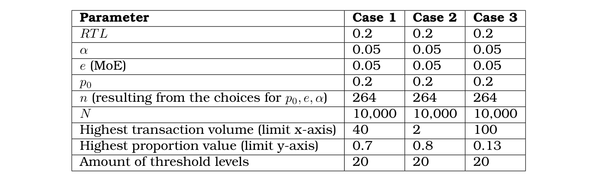

**표 5.1: 매개변수 설정 모든 사례 연구.**

<!-- 원문 62쪽 -->

### 5.3 실험 목적

이 섹션에서는 '거래 모니터링 모델의 임계값 조정 프로세스를 가속화하기 위해 임계값 조정 전략을 어떻게 통합할 수 있습니까?'라는 연구 질문에 답하기 위해 본 논문에서 수행된 다양한 실험의 목적을 설명합니다. 및 '임계값 조정 프로세스 선택한 임계값 레벨의 불확실성을 어떻게 정량화할 수 있습니까?' 본 논문에서는 총 4가지 유형의 실험이 수행되었다. 처음 세 번의 실험은 가장 적절한 임계값 를 결정하기 위해 BTL 테스트를 수행했으며, 관심 거래 비율이 RTL를 (1 −α) × 100% 신뢰 수준으로 충족했습니다. 네 번째 실험은 조합으로 수행되었습니다. BTL 및 ATL 테스트의 4가지 실험과 각 실험의 목적은 다음과 같습니다. 이 실험의 목적은 완전한 모집단 접근 방식이 발견된 가장 적절한 임계 수준이 (1 −α) × 100% 신뢰 수준으로 RTL를 만족함을 보장할 수 있지만 버킷 접근 방식은 이 보장을 제공할 수 없음을 입증하는 것입니다. 완전한 모집단 접근 방식은 다음과 같습니다. 두 번째 연구 질문인 '임계값 조정 프로세스 의 불확실성은 어떻게 정량화할 수 있습니까?' 2 실험 2: 초기 임계값 조정 실험에서는 샘플링만 사용됩니다. 초기 임계값 조정의 경우와 같이 정보가 없는 경우 이 실험의 목적은 가장 적합한 임계값 수준을 결정하기 위해 가장 적은 거래를 검토해야 하는 전략을 결정하는 것입니다. 또한 이 실험의 목적은 거래 모집단의 샘플을 기반으로 발견된 임계값 수준과 실제 임계값 수준 사이에 가장 작은(양수) 차이가 있는 전략을 결정하는 것입니다. 또한 이 실험은 거래가 더 많은 임계값으로 분할될 때 다른 임계값 조정 전략과 비교하여 성능이 어떻게 향상되거나 저하되는지 조사합니다. 또한, 다른 일정으로 인해 볼츠만 탐색 전략의 성능이 어떻게 변하는지 조사할 것입니다. 온도 매개변수 τ. 이 실험은 어떤 튜닝 전략이 특정 상황에 가장 적합하고 일반적으로 어떤 튜닝 전략이 중요한 최상의 성능을 가져오는지에 대한 통찰력을 제공합니다. 첫 번째 연구 질문은 필요한 검토 양과 차이에 따라 다양한 전략을 비교합니다. 3 실험: 검토된 샘플의 정보를 재사용하여 필요한 검토를 줄입니다. 이전에 테스트한 임계값 수준의 검토된 샘플에서 수집된 정보를 섹션 4.5.2에 설명된 대로 부분적으로 재사용할 수 있기 때문에 다른 임계값 수준의 새 샘플에서 모든 거래를 검토하는 것은 종종 비효율적입니다. 이 실험의 목적은 이전에 테스트한 임계값 수준의 검토된 샘플에서 얻은 정보를 부분적으로 재사용하여 가장 적합한 임계값 수준을 결정하는 경우 얼마나 많은 시간을 얻을 수 있는지 확인하는 것입니다. 이 실험은 가장 유망한 임계값 조정 전략을 선택한 후 첫 번째 연구 질문의 초점인 임계값 조정 프로세스를 어떻게 더욱 가속화할 수 있는지에 대한 더 많은 통찰력을 제공합니다. 필요한 검토 양과 발견된 임계값 수준과 실제 임계값 수준 간의 차이에 따라 다양한 전략이 다시 비교됩니다. 4. 실험 4: 측정값 선택이 가장 적합한 임계값 수준에 미치는 영향. 이 실험의 목적은 선택한 측정값이 출력으로서 가장 적합한 임계값 레벨에 미치는 영향을 입증하는 것입니다. 가 이 실험에 관심을 갖는 이유는 BTL 테스트를 통한 측정값으로서의 잘못된 누락률이 임계값 수준의 품질에 대해 제공한다는 제한된 통찰력 때문입니다. 잘못된 누락률 F N T N+F N이 질문에 답합니다. 경고를 생성하지 않는 모든 거래 중에서 임계값이 관심 대상이 아닌 것으로 잘못 예측하는 거래는 몇 개입니까? 그러나 임계값 수준 이상으로 경고된 거래의 생산성에 대한 통찰력은 제공하지 않습니다. 반면에 척도로서의 민감도는 질문에 답합니다. 관심 대상으로 분류된 것으로 검토된 모든 거래 중 얼마나 많은 거래가

<!-- 원문 63쪽 -->

임계값이 관심 대상으로 분류된 것으로 정확하게 예측합니까(관심 거래가 경고를 생성한다는 의미)? 이 측정항목은 거짓음성 분류가 우선순위인 경우에 자주 사용됩니다. 민감도 a 임계값은 테스트된 임계값 수준 아래의 거래 샘플(BTL 테스트)과 테스트된 임계값 수준 이상의 거래 샘플(ATL 테스트)을 채취하여 결정할 수 있습니다. 실험 2와 3에서 가장 성과가 좋은 전략은 필요한 검토 양과 발견된 임계값 수준과 실제 임계값 수준 간의 차이에 따라 비교됩니다.

<!-- 원문 64쪽 -->

## 제6장 결과

이 장에서는 5.3 장에 설명된 다양한 실험 결과가 제시됩니다. 이 장은 다섯 부분으로 나누어져 있습니다.

섹션 6.1는 거래 모집단을 제시하고 거래 모집단을 기반으로 한 실제 임계값 각 사례 연구가 설명됩니다. 또한 섹션 6.2에서는 버킷 및 전체 모집단 접근 방식을 비교하는 첫 번째 실험 결과를 설명합니다. 이어서 6.3 섹션에서 다양한 전략의 성과를 평가합니다. 이 섹션에서는 또한 Boltzmann 전략의 온도 매개변수 의 영향과 필요 검토 건수에 대한 임계값 수준 수의 영향, 발견된 임계값 수준과 실제 임계값 수준 간의 차이를 조사합니다. 6.4 섹션에서는 이전에 검토한 샘플의 정보를 재사용할 때 필요한 검토 양이 줄어들 수 있는 가능성을 조사합니다. 마지막으로 섹션 6.5에서는 선택한 측정값이 가장 적절한 임계값 수준에 미치는 영향을 논의합니다. 결과의 주요 결론은 각 (하위)섹션의 끝에 제공됩니다.

### 6.1 거래 모집단 각 사례 연구

거래 모집단 각 사례 연구는 그림 6.1에 설명되어 있습니다. 파란색 막대는 특정 임계값 수준까지의 총 거래 수를 나타냅니다. 파란색 막대 임계값 레벨 10는 임계값 레벨 11까지의 총 거래 수를 나타냅니다. 그림 6.1의 빨간색 막대는 특정 임계값 수준과 0 수준 사이의 비정상적인 거래 비율을 나타냅니다. 빨간색 막대 임계값 레벨 10는 임계값 레벨 11까지의 비정상적인 거래 수를 나타냅니다. 검은색 수직선은 25 실행 후 평균과의 표준 편차입니다. 녹색 선은 미리 설정된 RTL입니다. 모집단을 기반으로 한 실제 임계값 수준은 빨간색 막대가 녹색 선 아래에 있는 가장 높은 임계값 수준 로 정의됩니다. 각 사례 연구 실행당 실제 임계값 수준은 부록 G.2에서 확인할 수 있습니다.

많은 실행에서 실제 임계값 수준 사례 연구 1는 수준 3와 같고 때로는 수준 2와 같습니다. 이는 각 실행마다 비율의 작은 변화로 인해 그림 6.1a에서 빨간색 막대가 처음으로 녹색 선을 교차하는 지점이기도 합니다. 사례 연구 2에서 실제 임계값 수준은 종종 11 또는 12 수준이고 산발적으로 19 수준입니다. 그림 6.1b에서는 빨간색 막대가 녹색 선 를 처음으로 교차하는 지점이기도 합니다. 사례 연구 3에서 빨간색 막대가 녹색 선을 절대 넘지 않기 때문에 실제 임계값 수준은 그림 6.1c에 표시된 수준 19와 같습니다.

<!-- 원문 65쪽 -->

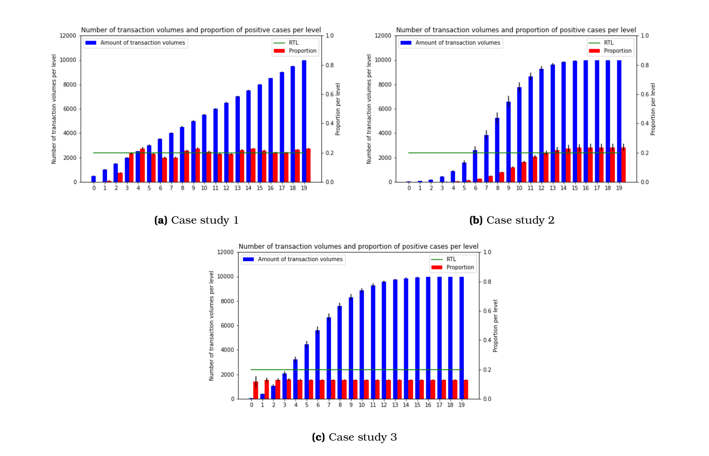

**그림 6.1: 거래량 수와 비정상 거래량 비율**

주어진 임계값 수준 미만의 인구.

### 6.2 실험 1: 임계값 평가 접근법

버킷과 전체 모집단 접근 방식 간의 성능 차이는 단계, 이분법 및 다단계 튜닝 전략을 통해 분석됩니다. 4.2 섹션에서는 버킷 접근 방식 BTL 테스트에는 평가된 임계값 수준보다 더 낮은 관심 거래 수를 알 수 없다는 주요 단점이 있으며, 이에 따라 관심 있는 거래의 큰 그룹이 누락되었는지 알 수 없는 로컬 최소값 에서 임계값 수준을 선택할 위험이 있다는 점을 간략하게 설명했습니다. 이 문제는 그림 6.2a에 표시된 것처럼 관심 거래의 비율이 변동하는 사례 연구 1에서 가장 분명합니다. 또한 이 문제는 이분법 및 다단계 전략과 같이 가장 낮은 임계 수준 중 하나에서 시작하지 않는 전략에서 가장 심각한 입니다. 이러한 전략은 단계 전략의 경우와 같이 가장 낮은 논리적 임계값 수준 중 하나에서 시작하지 않기 때문에 관심 있는 거래의 비율이 로컬 최소값인 임계값 수준을 테스트할 위험이 더 높습니다.

<!-- 원문 66쪽 -->

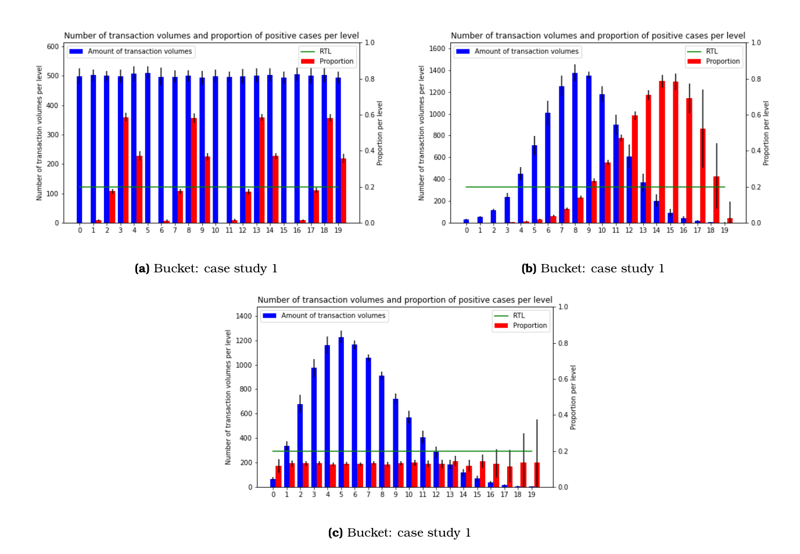

**그림 6.2: 거래량 수와 비정상 거래량 비율**

특정 임계값 수준 미만의 버킷에 인구를 모집합니다.

BTL 테스트는 그림 6.3a, 6.3b 및 6.3c에서 발견된 임계값과 실제 임계값 사이의 중앙값 차이인 Dthreshold가 4개의 오른쪽 상자 그림에 표시된 전체 모집단 접근법을 사용하여 0에 더 가까워지는 경우가 더 많다는 것을 알 수 있습니다. 버킷 접근 방식과 비교하여 4개의 왼쪽 상자 그림에 표시됩니다. 사례 연구 1, 빨간색으로 강조 표시된 왼쪽 상자 그림의 그림 6.3a에서 볼 수 있습니다. 중앙값 차이 버킷 접근 방식을 사용하는 단계 또는 이분법 전략을 사용한 다단계는 중앙값 대신 14 수준에 가깝습니다. 완전 모집단 접근법을 사용하여 녹색으로 강조 표시된 0의 차이점. 사례 연구 2, 그림 6.3b의 상자 그림을 분석하면 버킷 접근 방식이 녹색으로 강조 표시된 완전 모집단 접근 방식을 사용한 1 수준의 중앙값 차이와 비교하여 빨간색으로 강조 표시된 3 수준의 중앙값 차이를 초래한다는 것을 알 수 있습니다. 완전한 모집단 접근법이 반드시 0 수준의 차이를 가져오는 것은 아닙니다. 이는 모집단 비율 p를 기준으로 결정되는 실제 기준 수준과 달리 pupper 비율의 상한을 기준으로 가장 적절한 기준 수준이 결정된다는 사실로 설명할 수 있습니다. 사례 연구 3, 그림 6.3c의 상자 그림을 분석하면 버킷 또는 완전 모집단 접근 방식을 사용하는 이분법 전략을 사용한 이분법 및 다중 수준의 중앙값 차이 가 0와 1 수준 사이에 있음을 알 수 있습니다. 단계 전략과 버킷 또는 완전 모집단 접근 방식을 사용하는 단계 전략이 있는 다단계 전략은 8와 11 수준 사이의 중앙값 차이이며 훨씬 더 큽니다. 또한 단계적 전략과 다단계 전략의 차이 확산이 더 커 성능이 덜 안정적이라는 것을 의미합니다. 단계 전략은 가장 낮은 논리적 임계값 레벨 테스트로 시작합니다. 이는 단계 전략이 실제 임계값 레벨 19에 도달하기 전에 많은 임계값 레벨을 테스트해야 함을 의미합니다. 일정한 인구 비율 p = 0.13를 선택하면 가 크게 확산되는 원인이 될 수 있습니다. 이 경우 인구 비율과 RTL의 차이는 크지 않습니다. 이는 약 ˆp = 0.15의 발견된 샘플 비율로 인해 pupper = 0.2(선택한 오류 한계는 e = 0.05와 동일함)가 발생하며 이미 중지 조건 를 트리거할 수 있습니다. 단계 전략. 반면에 이분법 및 이분법이 포함된 다수준 전략은 19 레벨에 도달하기 위해 더 적은 수의 레벨을 테스트해야 하므로 중지가 발생할 가능성이 줄어듭니다.

<!-- 원문 67쪽 -->

조건을 통해 이러한 전략은 실제 임계값 수준에 더 가까워질 수 있습니다.

결론 1. 첫째, 완전 모집단 접근 방식은 버킷 접근 방식과 비교하여 발견된 임계값 수준과 실제 임계값 수준 사이의 차이가 0에 가까운 결과를 나타내는 경우가 더 많습니다. 2. 또한 버킷 접근 방식은 테스트되는 임계값 수준 미만의 버킷에 없는 관심 거래가 누락될 위험이 있습니다. 3. 따라서 0 수준과 BTL 테스트로 평가된 임계값 수준 사이의 모든 거래에서 샘플을 채취하는 4.2.1 섹션에 설명된 완전한 모집단 접근 방식이 이 논문의 나머지 부분에서 사용됩니다.

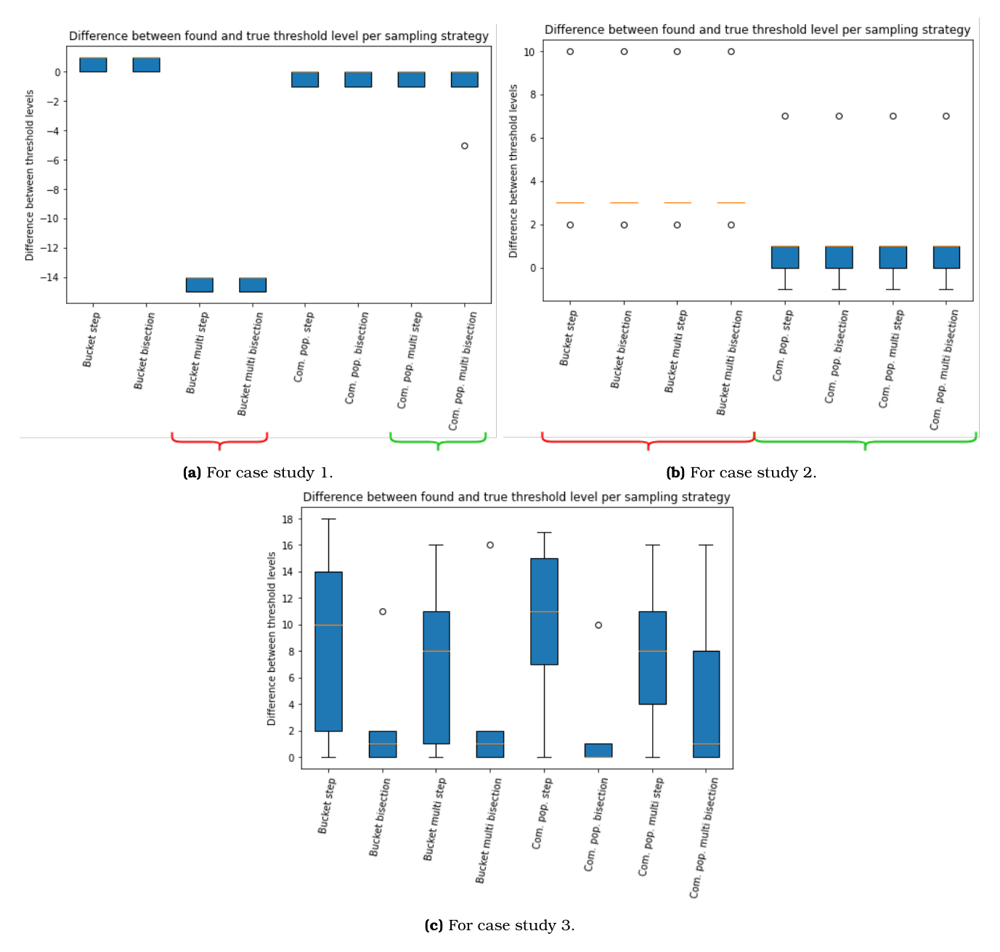

**그림 6.3: BTL 테스트, 발견된 임계값과 실제 임계값 간의 차이 다른 임계값**

튜닝 전략.

<!-- 원문 68쪽 -->

### 6.3 실험 2: 성능 평가

이 섹션에서는 네 가지 임계값 조정 전략의 성능을 설명합니다. 단계, 이분법, 다단계 및 볼츠만 탐색을 비교합니다. 단계 또는 이분법 전략과 결합된 다수준 전략은 두 가지 다른 튜닝 전략으로 간주되어 총 5가지 튜닝 전략을 비교합니다. 튜닝 전략은 가장 적절한 임계값 수준, 발견된 임계값 수준과 실제 임계값 수준 간의 차이, 섹션 4.6.1에 설명된 대로 25 실행에 대한 임계값 조정 전략 성능의 확산을 결정하기 위해 필요한 거래 검토에 따라 비교됩니다.

#### 6.3.1 볼츠만 탐색에 대한 온도 매개변수의 영향

볼츠만 탐색 전략의 성능을 다른 전략과 비교하려면 먼저 최고의 성능을 제공하는 각 사례 연구 일정 온도 매개변수 를 결정하는 것이 중요합니다. 그 후, 가장 좋은 온도 일정을 가진 볼츠만 탐색는 다른 전략과 비교됩니다. 최적의 일정은 필요한 검토가 가장 적은 일정으로 정의됩니다.

각 사례 연구에서 최상의 일정 온도 매개변수 를 결정하기 위해 두 가지 다른 유형의 온도 일정을 사용한 실험이 수행되었습니다.

- 일정한 일정: 온도 매개변수는 시간이 지나도 일정하게 유지되고 실행됩니다. 5개의 큰 값 τ(0) = [200, 160, 120, 80, 40], 탐색에 중점을 두고 5개의 작은 값 τ(0) = [20, 15, 10, 5, 1]는 다음 공식으로 설명되는 공격에 중점을 둡니다.

```text
τ(t) = τ(0)
for t = 1, ..., K ∗n
(6.1)
```

- 감소 일정: 값 온도 매개변수는 시간이 지남에 따라 감소하고 실행됩니다. 5개의 값 τ(0) =

```text
∑
K ∗n, K∗n
```

2, K∗n 3, K∗n 4, K∗n 5 = [5280, 2640, 1760, 1320, 1056] K = 설명된 대로 p0 = 0.2, α = 0.05 및 e = 0.05를 사용하여 20 임계값 수준 및 n = 264와 동일한 표본 크기 표 3.3에서. 온도 감소에 대한 아이디어는 먼저 탐사에 더 집중하고 더 많은 시간이 경과하고 다양한 임계값 수준에 대한 더 많은 정보를 사용할 수 있게 되면서 다음 공식으로 설명되는 활용으로 초점을 이동하는 것입니다.

```text
τ(t) = max
```

```text
∑τ(0)
t
, 1
```

```text
∑
for t = 1, ..., K ∗n
(6.2)
```

τ(t)는 항상 1보다 크거나 같아야 하며, 그렇지 않으면 방정식 4.8의 지수 구성 요소가 폭발합니다. 이 두 일정은 10개와 5개의 서로 다른 값 τ(0)를 실행하여 총 15개의 상자 그림이 생성됩니다. 각 사례 연구 τ(0):의 다음 값

```text
τ(0) = [τ1, ..., τ15] = [5280d, 2640d, 1760d, 1320d, 1056d, 200c, 160c, 120c, 80c, 40c, 20c, 15c, 10c, 5c, 1c]
```

여기서 밑줄 d는 감소하는 일정을 나타내고 밑줄 c는 일정한 일정을 나타냅니다.

온도 매개변수의 조정 결과 필요 검토 건수 양 세 가지 사례 연구 모두 τ(0) = [τ1,..., τ15] with K = 20 임계값 수준은 그림의 상자 그림에 표시됩니다. 6.4. 중앙값은 주황색 선으로 표시되고, 25% 및 75% 분위수는 파란색 상자로, 최대값과 최소값은 검은색 선으로 표시됩니다. 이상치로서의 최대값 또는 최소값은 원으로 표시됩니다. 발견된 임계값 수준과 실제 임계값 수준 세 가지 사례 연구 τ(0) = [τ1,..., τ15] 사이의 차이를 설명하는 상자 그림은 차이점만 고려되므로 부록 F의 그림 F.1에 나와 있습니다. 여러 개의 τj가 비슷한 성능을 발휘하고 보고서의 수치 수를 제한하는 경우. K = 20 임계값 수준을 사용한 세 가지 사례 연구에서 온도 일정과 τ(0) 값의 효과에 대해 다음 결론을 도출할 수 있습니다.

<!-- 원문 69쪽 -->

1. 세 가지 사례 연구 모두 감소하는 일정, τ1,..., τ5,는 일반적으로 탐색에 초점을 맞춘 일정한 일정보다 필요한 검토 건수가 적습니다. τ6,..., τ10,는 녹색 막대 로 표시됩니다. 처음 5개의 τj 값과 빨간색 막대 그림 6.4의 중간 5개 τj 값입니다. 2. 세 가지 사례 연구 모두, 활용에 중점을 둔 지속적인 일정, τ11,..., τ(0) 값이 낮은 τ15,는 일반적으로 탐색에 중점을 둔 지속적인 일정, τ6,..., 녹색 막대로 표시된 높은 τ(0) 값을 갖춘 τ10,보다 필요한 검토 건수가 적습니다. 는 마지막 5개의 τj 값과 빨간색 막대 는 그림 6.4의 중간 5개의 τj 값입니다. 3. 세 가지 사례 연구 모두, 감소하는 일정, τ1,..., τ5,는 일반적으로 활용에 초점을 맞춘 지속적인 일정, τ11,..., τ15,와 녹색 막대로 표시된 그림의 첫 번째 및 마지막 5개 τj 값과 비슷한 수의 필요 검토를 생성합니다. 6.4. 결론 본 논문에서는 K = 20 임계값 수준을 사용하여 τ14 사례 연구 1 및 3를 계속하기로 선택했습니다. 부록 F.1의 그림 F.1에 설명된 것처럼 실제 임계값 수준과 상대적으로 더 큰 스프레드입니다. τ2는 τ14.보다 필요한 검토 건수가 더 자주 발생했기 때문에 K = 20 임계값 수준을 갖춘 사례 연구 2를 선택했습니다. 이러한 특정 τj 값을 사용한 볼츠만 탐색 전략은 다른 4가지 조정 전략과 비교됩니다.

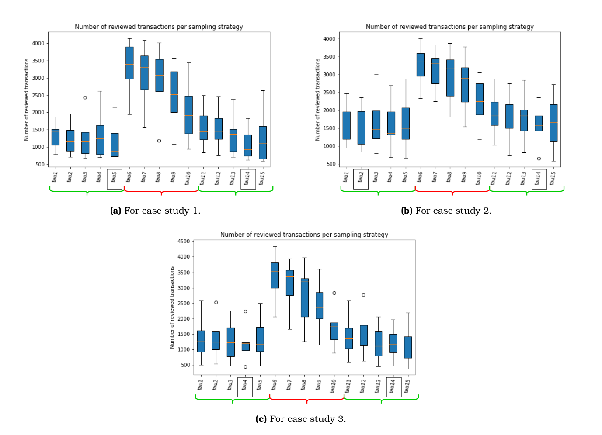

**그림 6.4: BTL 테스트, 검토된 거래 에 필요한 금액 감소 또는 일정한 일정**

τ(0) 값이 다릅니다.

#### 6.3.2 임계값 조정 전략의 성능

이 섹션에서는 5가지 임계값 전략의 성능을 설명합니다. 단계, 이분법, 단계가 있는 다단계, 이분법이 있는 다단계 및 볼츠만 탐색을 비교합니다. K = 20 임계값 수준과 n = 264 표본 크기를 사용한 각 사례 연구에서 필요한 검토 건수와 발견된 임계값 수준과 실제 임계값 수준 사이의 차이가 그림 6.5에 나와 있습니다.

<!-- 원문 70쪽 -->

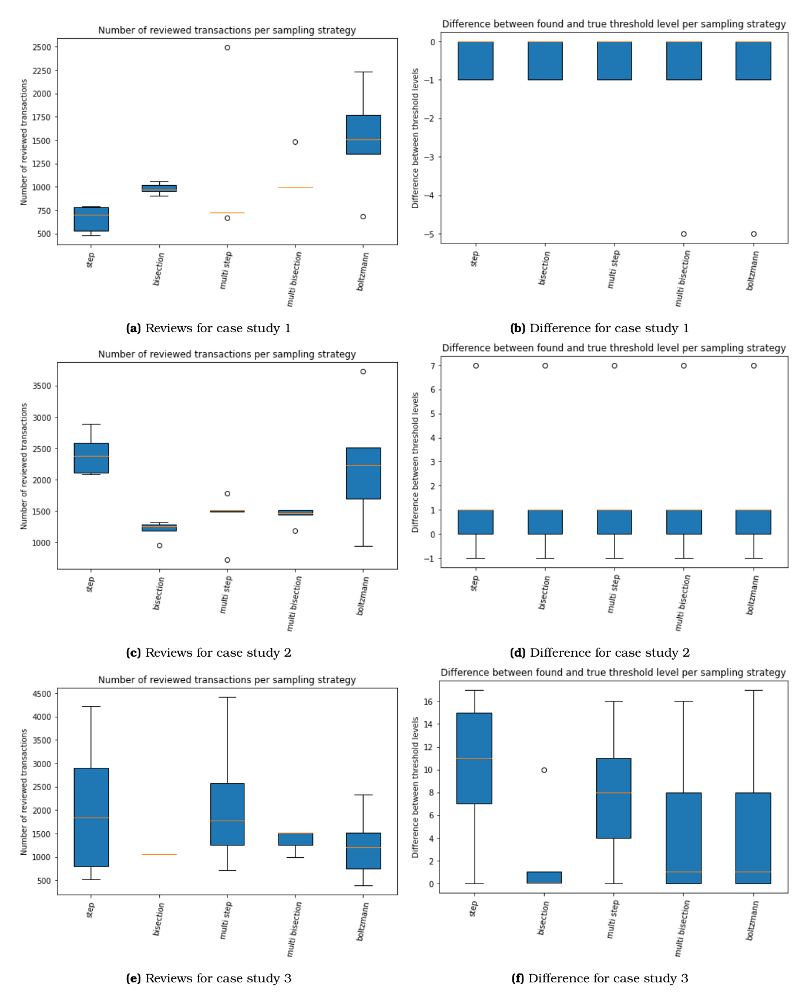

**그림 6.5: BTL 테스트, 필요 검토 및 발견된 임계값과 실제 임계값 간의 차이**

K = 20 임계값 레벨과 n = 264 의 표본 크기는 다양한 튜닝 전략입니다.

필요 검토를 기반으로 한 성과 평가 필요 검토 K = 20 임계값 수준 1를 사용한 세 가지 사례 연구에 대해 다음 결론을 도출할 수 있습니다. 필요 검토 건수의 중앙값: 일반적으로 필요 검토 건수의 중앙값은 이분법 전략을 사용하여 가장 작습니다. 단, 사례 연구 1 는 실제 임계값이 낮아서

<!-- 원문 71쪽 -->

단계 전략의 더 나은 성능. 반면에 스텝과 볼츠만 전략은 일반적으로 가장 많은 검토가 필요합니다. 2. 필요 검토의 확산: 세 가지 사례 연구 모두, 이분법 및 이분법을 사용한 다단계 전략은 가장 안정적인 전략이며 다른 전략에 비해 필요 검토의 확산이 비슷하거나 더 작습니다. 3. 사례 연구별 전략의 동작: (a) 사례 연구 1(비단조 함수): 필요한 검토 중앙값을 고려하여,

단계 전략에서는 2 또는 3의 실제 임계값이 상대적으로 낮기 때문에 가장 적합한 임계값 수준을 결정하기 위해 최소한의 거래 검토가 필요합니다. 그 다음에는 단계적 다단계 전략이 가장 적은 검토를 필요로 하고, 다음으로 이분법과 다단계 이분법 전략이 필요합니다. 이분법 및 단계 또는 이분법 전략이 포함된 다수준은 가장 작은 확산으로 가장 안정적이며 Boltzmann 탐사 전략은 25 실행에 비해 성능이 가장 큰 확산으로 가장 안정적이지 않습니다. (b) 사례 연구 2(단조 비감소 함수): 사례 연구 1와 동일한 결론이 유지됩니다. 단, 중앙값 필요 검토를 고려한 단계 전략은 종종 11와 19 수준 사이에 있는 실제 임계값이 이제 사례 연구보다 상당히 높기 때문에 이제 가장 많은 검토가 필요합니다. 1. (c) 사례 연구 3(상수 함수): 사례 연구 3에서는 다양한 전략의 성능이 사례 연구 1 및 2에 비해 약간 변경되었습니다. 이분법 전략은 가장 적합한 임계값 수준을 결정하기 위해 여전히 거래에 대한 최소한의 검토가 필요합니다. 그러나 단계적 전략과 단계적 다단계 전략은 다른 전략에 비해 상대적으로 스프레드가 더 크다는 점에 주목할 가치가 있습니다. 사례 연구 3에서 일정한 모집단 비율 p = 0.13를 선택하면 의 큰 확산이 발생할 수 있으며, 이는 약 ˆp = 0.15의 표본 비율이 발견되어 결과적으로 강아지가 발생할 수 있습니다. = 0.2(e = 0.05와 동일한 오차 한계 선택)는 이미 단계 전략의 정지 조건 를 트리거할 수 있습니다. 일반적으로 단계 및 단계가 포함된 다수준 전략은 레벨 19에 도달하기 위해 더 많은 레벨을 테스트해야 하며, 이는 이러한 전략이 가장 낮은 레벨과 레벨 19 사이의 레벨에서 중지 조건인 Pupper > RTL를 트리거하여 더 큰 확산을 초래할 가능성이 높습니다. 차이에 따른 성능 평가 또한 K = 20 임계값 수준을 사용한 세 가지 사례 연구에서 발견된 임계값과 실제 임계값 간의 차이를 고려하면 다음과 같은 결론을 도출할 수 있습니다. 1. 중앙값 차이: 세 가지 사례 연구 모두, 이분법, 이분법을 포함한 다수준 및 볼츠만 전략은 발견된 임계값 수준과 실제 임계값 사이에 0 또는 1의 중앙값 차이를 가져옵니다. 이는 또한 사례 연구 1 및 2의 단계 및 단계 전략이 있는 다단계 사례이지만 사례 연구 3는 아닙니다. 2. 차이의 확산: 세 가지 사례 연구 모두에서 이분법 전략은 가장 안정적인 전략이며 다른 전략에 비해 차이의 확산이 비슷하거나 더 작습니다. 다른 전략은 사례 연구 3에서 가장 분명하게 나타나는 덜 안정적인 성능을 보여줍니다. 3. 사례 연구별 전략의 동작: (a) 사례 연구 1(비단조 함수): 발견된 항목 간의 중앙값 차이 고려

및 실제 임계값 수준을 고려하면 모든 전략에 따라 0의 차이가 발생합니다. 게다가 때로는 전략이 한 단계 더 높은 수준으로 끝나는 경우도 있습니다. 에 대한 가능한 설명은 실제 임계값 수준이 종종 3 수준이고 때로는 2 수준이라는 것입니다. 레벨 3는 관심 거래의 비율이 RTL와 거의 동일하므로 전략은 거의 항상 3 레벨에서 끝나며, 이는 한 레벨의 차이를 설명합니다. 또한 이분법, 단계 또는 이분법이 있는 다수준 및 볼츠만 탐색 전략은 그림 6.1a에 표시된 수준 6, 7, 11 또는 12 주변의 그림 6.1a에 설명된 것처럼 가장 적합한 임계 수준이 로컬 최소값에 있는지 결정할 수 있는 기회를 갖습니다. 왜냐하면 이러한 전략은 단계 전략과 같이 가장 낮은 논리적 수준에서 시작하지 않기 때문입니다. 상자 플롯의 작은 원은 이분법이 있는 다수준과 볼츠만 전략이 이러한 동작을 보여줍니다. 여기서 전략은 실제 임계값보다 높은 로컬 최소 5 레벨로 끝났습니다.

<!-- 원문 72쪽 -->

(b) 사례 연구 2(단조 비감소 함수): 전략이 실제 임계값 아래로 끝나는 경우가 더 많다는 점을 제외하면 사례 연구 1와 동일한 결론이 유지됩니다. 실제 임계값 수준 사례 연구 2는 종종 11 또는 12 수준이고 산발적으로 19 수준입니다. 전략은 정기적으로 한 수준이 너무 낮아집니다. 이는 신뢰 상한이 중지 기준으로 사용되기 때문에 발생합니다. 이 신뢰 상한은 모집단 비율보다 높을 경우가 많으며, 이로 인해 모든 전략이 실제 임계값보다 한 수준 아래로 끝나는 경우가 많습니다. 또한 임계값 수준 19는 실제 임계값 수준과 산발적인 반면 전략은 그림 6.5d의 7 수준 차이에서 작은 원을 설명하는 12 수준에서 끝날 수 있습니다. 마지막으로, 전략이 때때로 한 레벨을 너무 높게 끝내는 경우가 있는데, 이는 아마도 11 레벨과 13 레벨의 비율이 거의 다르기 때문에 발생하는 것 같습니다. (c) 사례 연구 3(상수 함수): 실제 임계값 수준 사례 연구 3는 항상 19 수준인 가장 높은 수준입니다. 사례 연구 3에서는 다양한 전략의 발견된 임계값 수준과 실제 임계값 간의 차이가 사례 연구 1 및 2에 비해 상당히 변경되었습니다. 이분법 전략은 여전히 ​​0의 중앙값 차이를 가지며 성능에 있어서 약간의 분산을 갖습니다. 그러나 단계적 전략과 다단계 전략의 중간값 차이는 에서 더 커졌습니다. 단계 및 단계가 있는 다수준은 레벨 19에 도달하기 위해 더 많은 레벨을 테스트해야 하며, 이로 인해 이러한 전략이 중지 조건인 > RTL를 트리거할 가능성이 높아져 결과적으로 더 큰 확산과 큰 양의 중앙값 차이가 발생합니다. 대조적으로, 이분법 전략은 일반적으로 중지 조건을 트리거할 가능성을 줄이는 19 레벨에 도달하기 위해 더 적은 수의 레벨을 테스트해야 하기 때문에 차이에서 가장 작은 확산을 가지며 이 전략은 실제 임계값 레벨에 더 가까워질 수 있습니다. 또한 이분법을 사용한 다단계 전략과 볼츠만 탐색 전략은 0에 가까운 중앙값 차이를 가지지만 스프레드가 넓습니다. 다수준 전략은 샘플 비율의 퍼퍼가 RTL 주위에 있기 때문에 전략이 4, 8, 12 또는 16 레벨을 테스트하여 다양하게 시작한다는 사실로 인해 발생할 수 있습니다. 결과적으로, 전략은 전략이 항상 19 레벨에서 끝나지 않는 결과를 가져오는 다양한 수의 레벨을 테스트해야 하며 이는 스프레드를 설명합니다. 또한 모든 임계값 수준의 거래는 볼츠만 탐색 전략과 동시에 검토됩니다. 이 전략은 > RTL가 적용되는 19 수준보다 낮은 수준을 정기적으로 테스트할 수 있습니다. 왜냐하면 는 모든 수준에서 상한과 RTL 사이의 차이가 있기 때문입니다. d = RTL −pupper는 0와 유사하며 스프레드를 설명합니다. 다양한 조정 전략을 사용하여 발견된 임계값 수준과 실행당 실제 임계값 수준 각 사례 연구는 부록 G.2에서 확인할 수 있습니다.

결론 필요한 검토 건수, 발견된 임계값과 실제 임계값 수준 간의 차이, 25 실행에 대한 성능 분포를 고려하여 표 6.1 및 6.2에 제시된 대로 5가지 전략의 순위를 매길 수 있습니다. 이 순위에서 이분법 전략은 일반적으로 필요 검토 건수가 가장 적고 중앙값 차이가 0에 가까우며 표에서 녹색으로 강조 표시된 25 실행에 대한 작은 스프레드로 표현되는 가장 안정적인 성능을 갖는다는 결론을 내릴 수 있습니다.

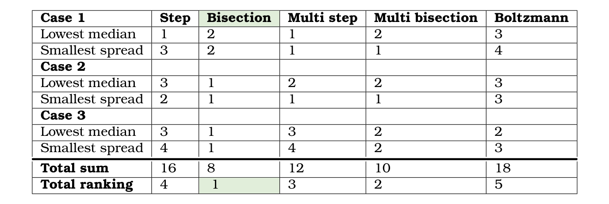

**표 6.1: K = 20 임계값 수준, 1를 사용하여 필요 검토 건수 양을 기반으로 한 5가지 전략의 순위**

최고를 나타내고 5는 최악의 성과 전략을 나타냅니다.

<!-- 원문 73쪽 -->

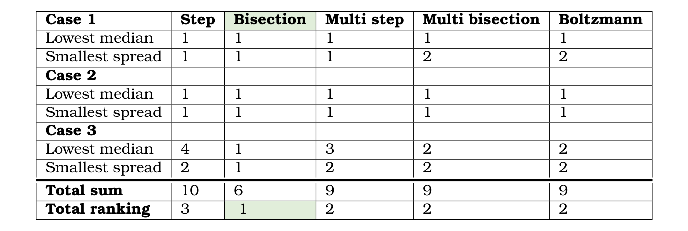

**표 6.2: 발견된 임계값 수준과 실제 임계값 수준 간의 차이를 기반으로 한 5가지 전략 순위**

K = 20 임계값 레벨, 1는 최고를 나타내고 5는 최악의 성능 전략을 나타냅니다.

#### 6.3.3 임계값 수준의 영향

이 섹션에서는 튜닝 전략의 성능에 대한 임계값 수준의 영향을 조사합니다. 이러한 영향을 조사하기 위해 거래 모집단을 10,000에서 20,000 거래으로 두 배로 늘리고 임계값 수준 수를 20에서 40로 늘렸지만 α, e 및 p0과 같은 다른 모든 매개변수는 동일하게 유지됩니다. 분석가가 대규모 거래 집단을 처리해야 하지만 여전히 가장 적절한 임계값 수준을 정확하게 결정하기를 원하여 거래를 더 많은 임계값 수준으로 분할해야 하는 경우 이 효과를 조사하는 것은 흥미롭습니다.

중앙값과 산포의 상대적 변화, 필요 검토의 중앙값과 산포의 절대값, 그리고 발견된 임계값과 실제 임계값 간의 차이를 모두 고려하여 어떤 전략의 성능이 가장 좋은지 결정합니다. K = 20 임계값 수준 대신 K = 40를 사용한 세 가지 사례 연구 모두 필요한 검토 건수 에서 중앙값 Δmedian 및 스프레드 Δspread의 변화가 표 6.3에 나와 있습니다. K = 20 임계값 수준 대신 K = 40를 사용한 세 가지 사례 연구 모두 발견된 임계값 수준과 실제 임계값 수준 간의 차이에 대한 중앙값 및 확산의 변화가 표 6.4에 나와 있습니다. 중앙값과 스프레드의 변화는 다음과 같이 계산됩니다.

```text
∆median = Xmedian,k=40
```

```text
Xmedian,k=20
```

필요한 검토 건수 (6.3)

```text
∆median = Xmedian,k=40 −Xmedian,k=20
for the difference
(6.4)
```

```text
∆spread =
```

```text
∑Xmax,k=40−Xmin,k=40
Xmax,k=20−Xmin,k=20
if (Xmax,k=20 −Xmin,k=20)̸ = 0
```

```text
Xmax,k=40 −Xmin,k=40
if (Xmax,k=20 −Xmin,k=20) = 0
```

```text
(6.5)
```

여기서 X는 검토 건수 또는 발견된 임계값 수준과 실제 임계값 수준 간의 차이입니다.

### K = 20 임계값 수준 대신 K = 40를 사용한 성능 비교는 그림 6.6의 그림 6.5와 같은 상자 그림으로 표시됩니다.

결과: 필요 검토를 기반으로 한 임계값 수준의 영향 표 6.3 및 그림 6.6에서 다음 결론을 도출할 수 있습니다. 1. 필요한 검토의 중앙값: 전략의 상대적 성과를 K = 20 임계값 수준의 상황과 비교할 때 필요한 검토의 중앙값은 일반적으로 증가합니다. 예외는 사례 연구 2로, 단계 전략을 사용하여 다단계의 중앙값이 감소합니다. 그러나 사례 연구 2에서 필요한 검토의 확산은 그림 6.6c에 설명된 것처럼 크게 증가하고 표 6.3에 주황색 셀로 표시됩니다. 사례 연구 3에서 중앙값은 단계 전략 를 감소시키지만 발견된 임계값과 실제 임계값 사이의 중앙값 차이가 커서 그림 6.6f에 제시되고 표 6.4에 주황색 셀로 표시되는 것처럼 이 전략이 너무 낮은 임계값 수준에서 끝나는 경우가 많다는 것을 보여줍니다. 단계 및 다단계 제외

<!-- 원문 74쪽 -->

단계 전략은 사례 연구 2 및 3에서 바람직하지 않은 동작을 가지고 있기 때문에 검토에 필요한 중앙값은 표 6.3에서 녹색으로 표시된 셀 '평균 Δ중앙값'으로 제시된 이분법 전략에서 최소한 를 증가시킵니다. 필요 검토 건수 중앙값은 볼츠만 전략의 를 가장 많이 증가시킵니다. 2. 필요 검토의 확산: 사례 연구 2 및 3의 바람직하지 않은 동작으로 인해 단계 및 단계 전략이 있는 다단계 전략을 다시 고려하지 않음, 전략의 상대적 성과를 K = 20 임계 수준의 상황과 비교할 때 필요 검토의 확산은 녹색으로 표시된 이분법 전략이 있는 다단계 전략의 최소 증가 표 6.3의 셀 '평균 Δspread'. 필요 검토의 확산은 사례 연구 2의 결과로 인해 발생하는 단계 전략을 가장 많이 증가시킵니다. 3. K = 20 임계값 수준이 있는 상황에서와 같이 절대 성능을 고려하면 이분법 전략은 그림 6.6의 왼쪽 상자 그림에 표시된 대로 필요한 검토 중앙값이 낮고 모든 사례가 작은 스프레드로 최상의 성능을 제공합니다.

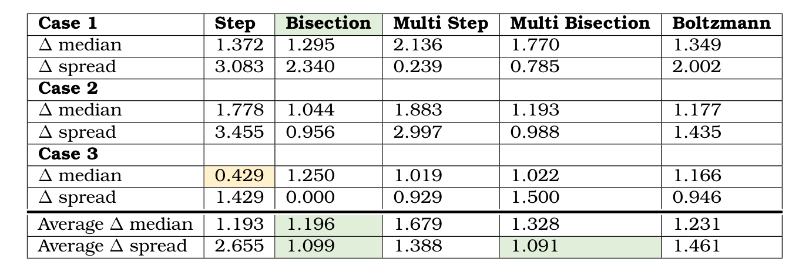

**표 6.3: 필요한 검토 건수의 중앙값과 스프레드를 K = 40 대신 비교합니다.**

K = 20 임계값 수준 모든 사례 연구.

결과: 차이에 따른 임계값 수준 수의 영향 표 6.4 및 그림 6.6에서 다음 결론을 도출할 수 있습니다. 1. 중앙값 차이: 전략의 상대적 성과를 K = 20 임계값 수준의 상황과 비교할 때 중앙값 차이는 일반적으로 증가합니다. 중앙값 차이는 표 6.4에서 녹색으로 표시된 셀 '평균 Δ중앙값'으로 제시된 이분법 전략을 사용하는 다중 수준 를 최소로 증가시키고 이분법 및 볼츠만 전략이 이어집니다. 필요한 검토 중앙값은 표 6.4에서 주황색으로 표시된 셀로 표시되는 것처럼 이러한 전략이 종종 너무 낮은 임계값 수준에서 끝나는 사례 연구 3에 의해 주로 발생하는 단계 및 단계 전략이 있는 다단계 를 증가시킵니다. 2. 차이의 확산: 사례 연구 2 및 3의 바람직하지 않은 동작으로 인해 단계 및 단계 전략이 있는 다단계 전략을 다시 고려하지 않고, 전략의 상대적 성과를 K = 20 임계값 수준의 상황과 비교할 때 차이의 확산은 이분법 전략의 를 최소한으로 증가시킵니다. 표 6.4에는 녹색으로 표시된 셀 '평균 Δspread'가 표시됩니다. 차이의 확산은 사례 연구 1의 결과로 인해 발생하는 볼츠만 전략의 가장 큰 를 증가시킵니다. 3. K = 20 임계값 수준의 상황에서와 같이 절대 성능을 고려하면 이분법 전략은 그림 6.6의 오른쪽 상자 그림에 표시된 대로 낮은 중앙값 차이와 발견된 임계값 수준 사이의 차이의 작은 확산으로 최상의 성능을 제공합니다.

<!-- 원문 75쪽 -->

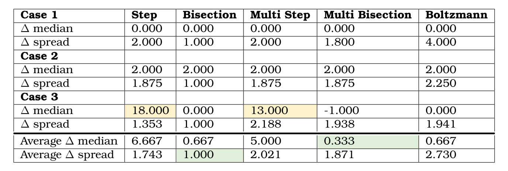

**표 6.4: 발견된 임계값 수준과 실제 임계값 수준 사이의 차이에 대한 중앙값과 스프레드를 다음과 같이 비교합니다.**

K = 40 대신 K = 20 임계값 수준 모든 사례 연구.

결론 1. 필요한 검토 건수, 발견된 임계값 수준과 실제 임계값 수준 간의 차이, 25 실행에 대한 성능 분포를 고려할 때 임계값 수준 수는 필요한 검토의 분포뿐만 아니라 임계값 수준이 많을수록 일반적으로 중앙값 필요 검토 및 차이가 증가하는 효과가 있습니다. 이분법 전략은 일반적으로 필요 검토 건수 및 차이의 절대 중앙값이 가장 낮고 임계값 수준이 두 배에 달하여 필요 검토 건수 및 차이의 양이 상대적으로 적게 증가합니다. 또한 필요한 검토 및 차이의 확산은 임계값 수준이 두 배로 다른 전략에 비해 크게 증가하지 않으며 이분법 전략은 K = 40 및 K = 20 임계값 수준 모두에서 안정적인 성능을 나타냅니다. 2. 단계, 단계가 포함된 다수준 전략 및 볼츠만 전략은 필요한 검토와 임계값 수준의 수가 이러한 전략의 성능에 명확하게 영향을 미치는 발견된 임계값 수준과 실제 임계값 수준 간의 차이를 모두 살펴보는 것 모두에서 가장 안정적인 성능을 갖습니다.

<!-- 원문 76쪽 -->

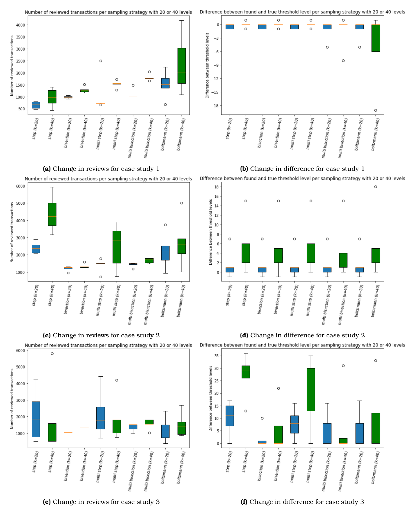

**그림 6.6: BTL 테스트, 필요 검토에 대한 임계값 수준 수의 영향 및 K = 20 임계값 수준 대신 K = 40를 사용한 발견된 임계값 수준과 실제 임계값 수준 간의 차이 다른 튜닝**

전략.

<!-- 원문 77쪽 -->

### 6.4 실험 3: 정보 재사용을 통한 필수 리뷰 감소

4.5.2 섹션에서 간략하게 설명했듯이 새로운 샘플의 모든 거래를 검토한다고 해서 항상 새로운 통찰력을 얻을 수 있는 것은 아닙니다. 이 실험에서는 4.5.2 섹션에 설명된 대로 이전에 검토한 다른 임계값 수준의 샘플에서 축적된 거래 지식을 재사용하는 경우 필요한 거래 검토 건수가 감소하는지 조사합니다. 필요 검토의 감소는 가장 적합한 임계값 수준을 결정하기 위해 정보를 재사용하는 필요 검토를 정보를 재사용하지 않는 필요 검토로 나누어 계산됩니다. 결과는 표 6.5에 제시되어 있으며 그림 6.7의 상자 그림에 설명되어 있습니다.

결과: 필요 검토를 기반으로 한 정보 재사용의 효과 표 6.5의 결과는 표의 마지막 행에 설명된 대로 이전에 검토한 다른 임계값 수준의 샘플에서 정보를 재사용할 때 필요한 검토 중 37%에서 54% 사이의 모든 전략이 평균적으로% 필요하다는 것을 보여줍니다. 6.5. 이는 분석가에게 필요한 검토 및 작업 부하 중앙값이 크게 감소한 것입니다. 결과는 이분법 전략이 단계 전략과 비교하여 평균 감소의 차이가 크지는 않지만 필요한 검토에서 가장 큰 평균 감소를 갖는 것으로 나타났습니다. 반면, 이분법을 사용하는 다중 수준 전략은 평균 감소가 가장 적습니다. 다단계 및 볼츠만 전략보다 감소가 적은 가능한 이유는 정보 재사용이 특히 활용 단계에서 필요한 검토를 감소시키기 때문에 이러한 전략에 '시간'이 손실되는 탐색 단계가 있다는 것입니다. 또한 그림 6.7의 왼쪽 상자 그림은 이전에 검토한 샘플의 정보를 재사용할 때 필요한 검토의 범위가 좁아진다는 것을 분명히 보여줍니다.

그러나 이전에 검토한 샘플의 정보를 재사용하면 발견된 임계값 수준과 실제 임계값 수준 간의 차이가 어떻게 되는지 궁금할 수 있습니다. 예, 이전에 검토한 샘플의 정보를 재사용하므로 차이가 커지나요? 해당 질문에 대답하기 위해 이전에 검토한 샘플의 정보를 재사용한 경우와 재사용하지 않은 경우 발견된 임계값과 실제 임계값 간의 중앙값 차이가 표 6.6에 나와 있습니다.

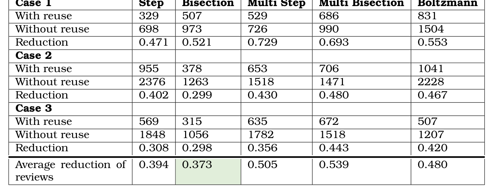

**표 6.5: 이전에 대한 지식을 사용하거나 사용하지 않고 필요 검토 건수 중앙값 비교**

다양한 임계값 수준의 샘플을 검토했습니다.

결과: 차이에 따른 정보 재사용 효과 차이의 변화는 가장 적합한 임계값 수준을 결정하기 위해 정보를 재사용하지 않은 차이에서 정보를 재사용한 차이를 뺀 값으로 계산됩니다. 그림 6.7의 오른쪽 상자 그림은 이전에 검토한 샘플의 정보를 재사용할 때 발견된 임계값과 실제 임계값 간의 중앙값 차이가 크게 변하지 않음을 보여줍니다. 표 6.6의 결과는 발견된 임계값과 실제 임계값 사이의 평균 중앙값 차이가 표 6.6의 마지막 행에 표시된 대로 이분법 전략 을 변경하지 않는다는 것을 보여줍니다. 다른 전략에서는 평균 중앙값 차이가 정보를 재사용하지 않은 경우보다 0와 1 사이의 중앙값 차이로 변경되었습니다.

<!-- 원문 78쪽 -->

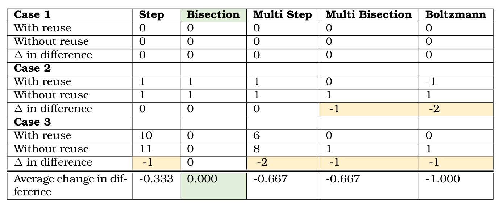

**표 6.6: 다음을 사용하거나 사용하지 않고 발견된 임계값과 실제 임계값 간의 중앙값 차이 비교**

이전에 검토한 다양한 임계값 수준의 샘플에 대한 지식.

결론 1. 필요한 검토 양, 발견된 임계값과 실제 임계값 수준 간의 차이, 25 실행에 대한 성능 분포를 고려할 때 이전에 검토한 다른 임계값 수준 샘플 정보를 재사용하는 것이 좋습니다. 일반적으로 BTL 테스트를 통해 이전에 검토된 샘플의 정보를 재사용하는 경우 필요 검토 중 50% 미만이 필요합니다. 또한 이전에 검토한 샘플의 정보를 재사용하면 필요 검토의 확산이 눈에 띄게 좁아집니다. 전반적으로, 단계 및 이분법 전략은 이전에 검토한 샘플의 정보를 가장 크게 줄여 재사용할 수 있다는 가장 큰 장점이 있습니다. 2. 일반적으로 발견된 임계값 수준과 실제 임계값 수준 사이의 중앙값 차이는 이분법 전략을 제외한 모든 전략이 때때로 정보가 재사용되지 않는 상황에 비해 1 또는 2 수준 더 높은 것으로 끝나더라도 전략 와 유사하게 유지됩니다. 또한 차이의 확산은 단계 및 단계적 전략이 포함된 다단계 전략을 제외하고 정보를 재사용하지 않은 상황과 비교하여 유사하게 유지되며, 여기서 확산은 사례 연구 3를 확대합니다.

<!-- 원문 79쪽 -->

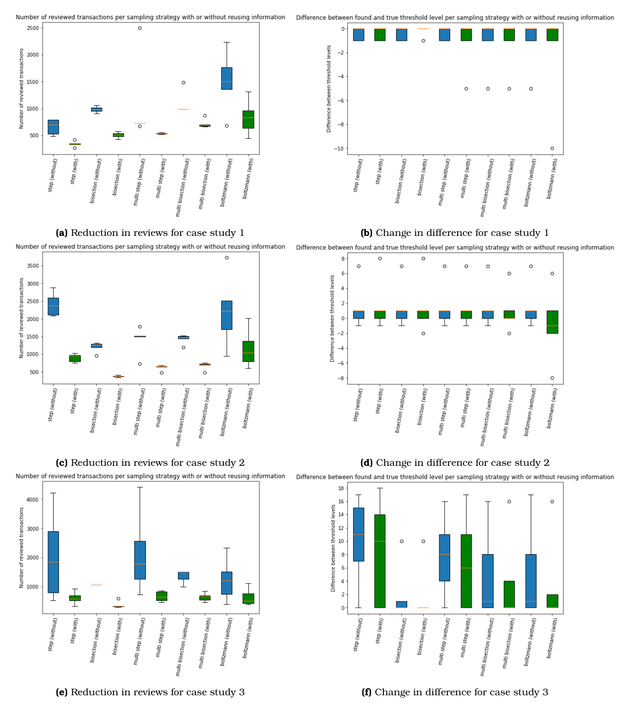

**그림 6.7: BTL 테스트, 필요한 검토 감소 및 이전에 검토한 샘플 의 정보를 재사용하거나 사용하지 않고 발견된 임계값과 실제 임계값 간의 차이 변경**

튜닝 전략.

<!-- 원문 80쪽 -->

### 6.5 실험 4: 측정값 선택의 영향

본 논문과 지금까지 수행된 모든 실험에서 주요 초점은 임계값 미만에서 관심 거래를 놓칠 위험을 정량화하는 것이었습니다. 1에서 음성 예측 값 1 − T N T N+F N을 뺀 잘못된 생략률 F N T N+F N 을 실험의 성능 기준으로 사용했습니다. 그러나 실제 임계값 수준이 달라질 수 있는 다른 측정값을 선택할 수도 있습니다. 잘못된 누락 비율은 다음 질문에 답합니다. 경고를 생성하지 않는 모든 거래 중에서 임계값이 관심 대상이 아닌 것으로 잘못 예측하는 거래는 몇 개입니까? 반면에 민감도는 다음 질문에 답합니다. 관심 대상으로 분류된 것으로 검토된 모든 거래 중에서 임계값이 관심 대상으로 분류된 것으로 정확하게 예측하는 거래는 몇 개입니까? 즉, 관심 거래가 경고를 생성한다는 의미입니까? 이 측정항목은 거짓음성 분류가 우선순위인 경우에 자주 사용됩니다.

관심 있는 거래를 놓칠 위험 외에도 임계값 수준의 민감도에 관심이 있고 진양성 거래보다 위음성 거래가 4배 더 적은 선호 가 있다고 가정해 보겠습니다. 이는 임계값 레벨 를 찾고 있으며 감도가 최소한 4 4+1 × 100% = 80%임을 의미합니다. 세 가지 사례 연구의 감도 는 그림 6.8에 설명되어 있습니다. 이 그림은 실제 임계값 수준이 다른 측정값을 선택하여 변경될 수 있음을 보여줍니다. 사례 연구 3, 실제 임계값 수준은 19 수준에서 변경됩니다. 를 임계값 수준 로 보면 최대 잘못된 누락률이 20%의 RTL보다 낮고 실제 임계값 수준은 0 수준입니다. 를 보면 최소 감도가 80%인 임계값을 볼 수 있습니다. 이 예에서는 임계값이 가장 적절한 임계값 수준으로 간주되는 선택된 측정값의 영향을 보여줍니다.

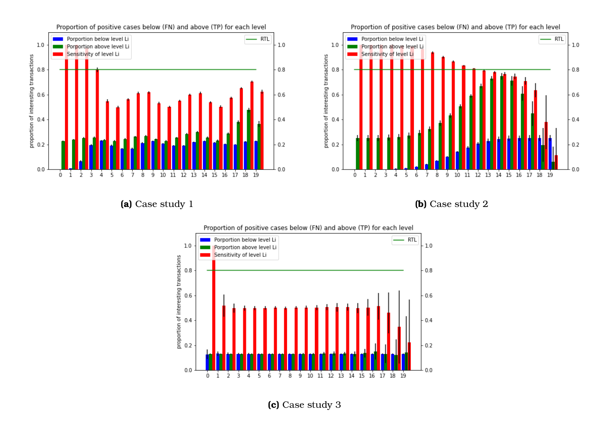

**그림 6.8: 이하(FN) 이상 비정상적인 거래량의 민감도 및 모집단 비율**

(TP) 주어진 임계값 레벨.

결과: 전략 성과에 대한 측정값의 영향 이분법 전략이 포함된 이분법 및 다중 수준의 성능에 대한 측정값으로서의 민감도가 K = 20 임계값 수준을 사용하는 세 가지 사례 연구에서 테스트되었으며 결과는 그림 6.9에 나와 있습니다. 동일한 표본 크기가 이하의 샘플에서 평가되는 임계값 수준 이상으로 취해집니다. 이 경우 4.5.1 절에 설명된 초기 중단 원칙은 다음과 같이 적용되지 않았습니다.

<!-- 원문 81쪽 -->

는 잘못된 누락률을 측정값으로 구체적으로 정의했습니다. 그러나 이전에 검토한 다른 임계값 수준 샘플의 정보를 재사용하는 방식이 적용되었습니다. 지금까지 가장 좋은 성능을 보인 이분법과 이분법을 사용한 다단계의 성능만을 조사하기로 결정했습니다.

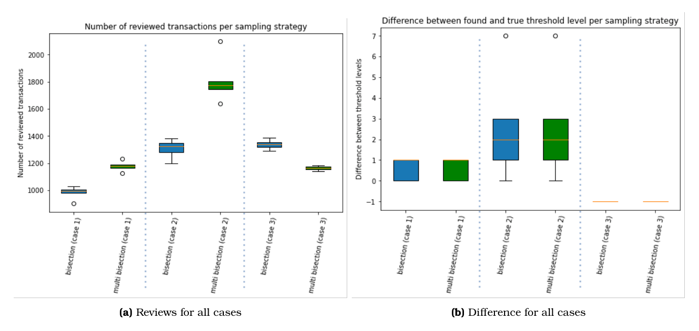

**그림 6.9: 필요한 검토 및 발견된 임계값과 실제 임계값 간의 차이 이분법**

민감도를 측정값으로 사용하는 이분법 전략 를 사용한 다단계.

그 결과, 요구되는 리뷰의 양이 상당히 증가했다는 결론을 내릴 수 있다. 이는 임계값 수준 위 및 아래의 거래를 모두 분석가가 검토해야 하기 때문에 예상할 수 있습니다. 잘못된 누락률을 측정값으로 사용하는 사례 연구 1에서는 그림 6.7a에 제시된 대로 각각 약 500 및 600 중앙값 검토가 필요한 두 가지 전략이 나왔습니다. 그러나 그림 6.8a는 이 숫자가 사례 연구 1의 대략 두 배임을 보여줍니다. 사례 연구 2 및 3의 경우 필요 검토 건수 양이 2배 이상 증가합니다. 가능한 원인은 잘못된 누락률을 측정값으로 사용할 때와 비교하여 전략이 가장 적절한 임계값 수준을 결정하기 위해 다양한 수준을 테스트한다는 것입니다. 케이스 3, 이분법 전략으로 테스트되는 임계값 수준의 경로는 테스트 수준 10, 15, 18에서 잘못된 누락 비율을 기반으로 한 수준 19에서 테스트 수준 10, 5로 변경됩니다. 3, 2 및 감도에 따라 1 레벨을 지정합니다. 또한 그림 6.9b의 결과는 일반적으로 전략이 1 또는 2 수준의 중앙값 차이를 가지며 실제 임계값 수준보다 낮은 임계값 수준에서 종료되었음을 보여줍니다. 민감도를 기준으로 실제 임계값 수준이 0인 사례 연구 3만이 전략에서 1 수준을 너무 높게 종료했습니다. 이분법을 사용하여 발견된 임계값 수준과 이분법 전략을 사용하는 다중 수준 및 실행당 실제 임계값 수준 각 사례 연구는 부록 G.3 결론 1에서 확인할 수 있습니다. 가장 적절한 임계값은 임계값 수준의 적합성을 평가하는 데 사용되는 선택된 측정값에 따라 달라집니다. 따라서 중요하다고 간주되는 측면과 임계값 수준이 충족해야 하는 요구 사항에 대한 통찰력을 제공하는 측정값을 선택하는 것이 중요합니다. 2. 허위누락률을 판단하는데 필요 검토 건수수에 비해 민감도를 판단하는데 필요 검토 건수수는 상당히 증가한다. 이는 민감도, 특이성 또는 정확도를 측정값으로 사용하는 경우의 단점으로 간주될 수 있습니다.

<!-- 원문 82쪽 -->

## 제7장 결론 및 논의

본 장에서는 본 논문에서 제안한 임계값 조정 전략을 요약하고, 이러한 전략의 함의와 한계를 논의한다. 이 논문은 추가 연구 주제에 대한 섹션으로 마무리됩니다.

### 7.1 결론

본 절에서는 1.1 장에서 언급한 연구 목적에 대해 본 논문에서 도출된 결과를 사용하여 답변하고 논의할 것입니다. 대답해야 할 첫 번째 연구 목표는 다음과 같습니다.

거래 모니터링 모델의 임계값 조정 프로세스를 가속화하기 위해 임계값 조정 전략을 어떻게 통합할 수 있습니까?

본 논문에서는 거래 모니터링 모델의 임계값 조정 프로세스를 가속화하기 위해 초기 임계값 조정 5가지 임계값 조정 전략의 성능을 조사했습니다. 이 논문의 주요 초점은 BTL 테스트와 임계값 수준 미만에서 관심 거래가 누락될 위험에 관한 것이었습니다. 6 장의 결과에서 이분법 전략은 가장 적절한 임계값 수준을 결정하기 위해 거래에 대한 최소한의 검토가 필요하다는 결론을 내릴 수 있습니다. 이분법 전략을 사용하는 다수준은 비슷한 성능을 갖지만 거래에 대한 검토가 약간 더 필요합니다.

또한 이분법 전략은 실제 임계값 수준과 발견된 임계값 수준 사이에 작은 차이를 가져오고 안정적인 성능을 제공합니다. 이분법 전략의 또 다른 장점은 이분법 전략이 성능을 향상시키기 위해 볼츠만 탐색 전략의 경우 온도 매개변수 처럼 매개변수 조정이 필요하지 않다는 것입니다. 그러나 이분법 전략은 가장 낮은 논리적 수준을 테스트하는 것부터 시작하지 않기 때문에 관심 있는 거래의 비율이 변동할 때 로컬 최소값으로 끝날 수 있습니다.

또한 이전에 검토한 다른 임계값 수준 샘플의 정보를 재사용하여 임계값 조정 프로세스를 가속화할 수 있습니다. 이를 통해 테스트된 사례 연구에서 필요한 검토 건수를 50% 이상 줄여 분석가의 작업 부하 를 크게 줄일 수 있습니다.

마지막으로, 선택한 측정값이 필요한 검토 건수에 영향을 미친다는 점에 유의하는 것이 중요합니다. 선택한 측정값의 잘못된 누락률은 민감도를 측정값으로 선택한 상황에 비해 필요한 검토 건수가 훨씬 적습니다.

결론적으로, 임계값 조정 프로세스에서 귀중한 지식을 낭비하지 않기 위해 이분법 전략 초기 임계값 조정을 사용하고 이전에 검토한 다른 임계값 수준 샘플의 정보를 재사용하는 것이 선호됩니다.

대답해야 할 두 번째 연구 목표는 다음과 같습니다.

<!-- 원문 83쪽 -->

임계값 조정 프로세스 선택한 임계값 레벨의 불확실성을 어떻게 정량화할 수 있습니까?

본 논문에서는 주요 관심 사항이 BTL 테스트를 통해 결정된 거짓 및 진음성 거래가거나 ATL 테스트를 통해 결정된 거짓 및 진양성 거래일 때 시뮬레이션 연구를 통해 5가지 신뢰구간 방법을 평가했습니다. 3.2.4 절의 결과에서 Clopper-Pearson 방법은 항상 명목 포함 확률과 동일한 포함 확률을 보장하므로 Clopper-Pearson 신뢰구간 방법이 가장 적합하다는 결론을 내릴 수 있습니다. 또한 Clopper-Pearson 신뢰구간법은 모집단 내 관심거래의 비율에 상관없이 적용할 수 있다는 큰 장점을 가지고 있다.

완전 모집단 접근법과 결합된 Clopper-Pearson 신뢰구간을 사용하여 표본 비율의 불확실성을 정량화하고 다음과 같은 특정 신뢰 수준으로 설명하는 것이 가능합니다. '임계 수준 L 미만의 모집단에서 관심 거래의 비율은 (1 −α) × 100% 신뢰 수준이 pupper보다 작거나 같습니다.')

BTL 및 ATL 테스트를 통해 거짓, 진음성 및 긍정 거래의 조합으로 표현된 변수에 관심이 있는 경우 전체 모집단 접근 방식과 결합된 부트스트래핑을 통해 불확실성을 정량화할 수 있습니다. 부트스트래핑을 사용하면 원하는 변수에 대한 샘플링 분포 를 결정할 수 있습니다. 이어서 Wald의 신뢰구간 또는 BCa(Bias Corrected and Accelerated) 백분위수 신뢰구간 방법을 사용하여 변수의 불확실성을 정량화하고 다음과 같은 특정 신뢰 수준으로 설명할 수 있습니다. '임계 수준 L의 민감도는 (1−α)∗100% 신뢰 수준이 θlower'. 이상입니다. 어떤 방법이 적절한지 평가되는 임계 수준은 부트스트래핑에 의해 결정된 샘플링 분포를 기반으로 해야 합니다.

마지막으로 임계값 조정 프로세스에 필요한 표본 크기는 예비 모집단 비율과 원하는 신뢰 수준 신뢰구간에 따라 달라집니다. 필요한 표본 크기는 를 더 큰 예비 모집단 비율로 늘리고, 최대 필수 표본 크기 는 예비 모집단 비율을 0.5와 동일하게 만듭니다. 또한 더 큰 표본 크기에는 더 높은 신뢰 수준 또는 더 작은 오차 한계가 있는 신뢰구간이 필요합니다.

결론적으로 거짓 및 참음성 거래에만 관심이 있거나 거짓 및 진양성 거래에만 관심이 있는 경우 Clopper-Pearson 신뢰구간 방법을 사용하여 표본 비율의 불확실성을 정량화하는 것이 좋습니다. 거짓, 진음성 및 긍정 거래의 조합으로 표현되는 변수에 관심이 있는 경우 Wald 또는 Bias 수정 및 가속(BCa) 백분위수 신뢰구간 방법과 함께 부트스트래핑을 사용하여 불확실성을 정량화하는 것이 좋습니다.

### 7.2 토론

이 섹션에서는 본 논문의 기여를 반성하고 얻은 결과를 논의합니다. 이분법 전략은 어떤 ​​임계값 수준이 가장 적합한지 알 수 없는 다양한 상황에서 초기 임계값 조정에 적합한 전략입니다. 이 전략은 조사된 각 임계값 수준 이후 옵션 수를 절반으로 줄여 잠재적으로 적합한 임계값 수준의 수를 빠르게 줄입니다. 그러나 본 논문에서 수행된 연구는 다음과 같은 한계점을 갖고 있다.

첫째, 초기 임계값 조정과 달리 특정 임계값 수준의 적합성에 대한 일부 정보가 이미 알려진 주기적 평가 상황에서 튜닝 전략의 성능이 검사되지 않았습니다. 새로운 데이터 분석을 통해 관심 거래의 비율이 원하는 것보다 높다는 사실이 밝혀지면 기존 규칙을 주기적으로 평가하는 것이 적용될 수 있습니다. 주기적 평가의 경우 가장 적절한 임계값은 원래 임계값 수준에 상당히 가까울 수 있으며, 이를 통해 단계 전략은 이분법 전략보다 더 적은 수의 거래 검토를 통해 가장 적절한 임계값 수준을 결정할 수 있습니다. 가장 적절한 임계값 수준을 적절하게 추정하기 위해 전문가 판단을 사용하는 것이 가능한 경우 단계 전략은 다음과 같은 결과를 초래할 수 있습니다.

<!-- 원문 84쪽 -->

이분법 전략에 비해 성능이 더 좋습니다. 따라서 주어진 상황에 어떤 전략이 가장 적합한 인지 의식적으로 고려하는 것이 항상 중요합니다.

또한, 전략은 은행이 실제로 직면하는 거래 데이터를 대표적으로 반영하지 못할 수 있는 제한된 수의 분포에서 테스트되었습니다. 합성 데이터셋을 설정하기 위해 가능한 범죄 행위에 대한 강력한 가정이 만들어졌지만 가정의 타당성은 임계값 조정 전략에 초점을 맞추기 위해 제한된 범위에서 탐색되었습니다. 분포 또는 분포에서 모수를 다르게 선택하면 다른 결과가 나타날 수 있다는 점을 강조하는 것이 중요합니다.

다양한 거래 데이터에 대한 전략의 성과를 조사하기 위해서는 다른 분포를 사용한 합성 데이터에 대한 전략의 성과에 대한 더 많은 연구가 필요합니다. 튜닝 전략의 성능을 보다 확실하게 확인하려면 실제 레이블이 지정된 거래 데이터에서 전략을 테스트하고 해당 분야 전문가와 논의해야 합니다.

더욱이, 이분법 전략은 합리적인 수의 임계값 수준을 처리할 때 특히 좋은 성능을 발휘합니다. 그러나 10 임계값(예:)으로만 거래 데이터를 분할하기로 결정한 경우 이분법 전략의 성능이 다른 전략에 비해 상대적으로 나빠질 수 있습니다.

또한 본 논문에서는 실험에서 RTL의 25%인 0.05의 오차범위를 갖는 표본 크기를 선택하였다. 그러나 RTL에 대한 상대적으로 큰 오차 한계는 모집단 비율이 RTL에 가까울 경우 문제를 일으킬 수 있으며, 이로 인해 발견된 임계값 수준이 실제 임계값 수준보다 더 낮거나 높을 수 있습니다. 더 큰 표본 크기가 필요한 RTL보다 상대적으로 작은 오차 한계는 샘플 비율을 더 정확하게 결정할 수 있도록 하여 이 문제를 완화합니다.

또한 이 전략의 성과에 대한 다단계 전략으로 탐색된 임계 수준 비율 선택의 영향은 본 논문에서 조사되지 않습니다. 다수준도 일반적으로 좋은 성능을 가져왔으므로 다수준 전략으로 탐색된 임계값 레벨의 비율이 높을수록 성능이 향상될 수 있는지 여부를 조사하는 것은 흥미롭습니다.

마지막으로, 본 논문에서는 신뢰구간 부트스트래핑에 상대적으로 제한적인 관심을 기울였습니다. 그러나 샘플링 분포가 항상 정규 분포와 유사한 분포를 가져오는 것은 아닙니다. 예를 들어, 0와 1 사이의 값을 취할 수 있는 선택된 측정값으로 감도를 고려하고 특정 임계값 수준의 감도는 1에 가깝습니다. 이로 인해 부록 G.4의 그림 G.3에 표시된 것처럼 정규 분포와 유사하지 않은 샘플링 분포가 발생할 수 있습니다. 신뢰구간 부트스트래핑과 임계값 조정 프로세스에서의 적용 가능성에 대해 더 많은 연구가 수행될 수 있습니다.

### 7.3 권장 사항 미래 연구

이 섹션에서는 향후 연구 권장 사항에 대해 논의합니다.

첫째, 이 논문 전반에 걸쳐 사용된 임계값 조정 프레임워크는 고정된 임계값 수준을 기반으로 했습니다. 모든 거래는 고정된 거리만큼 떨어진 임계값 수준을 사용하여 분할되었습니다. 그러나 이는 예와 같이 가장 적절한 임계값 수준이 두 개의 고정 임계값 수준 사이에 있는 경우 임계값 조정 프로세스를 제한할 수 있습니다. 임계값 수준 간의 거리에 유연성을 허용하는 보다 연속적인 임계값 조정 프레임워크를 사용하면 최적의 임계값에 더 가까워질 수 있습니다. 이 경우, 고정된 거리로 구분된 임계값 대신 연속적인 임계값 레벨을 고려할 수 있습니다. 이분법 전략은 테스트해야 할 다음 임계값 수준이 두 개의 고정 임계값 수준 중간이 아닌 두 값의 중간에 있는 값임을 의미합니다. 그러나 두 임계값 수준 간의 차이가 50 유로에 불과할 때까지 프로세스가 예제로 계속되면 임계값 조정 프로세스가 오랜 시간 지속될 수 있으므로 두 임계값 수준 값 간의 최소 차이를 미리 정의하는 것이 중요합니다. 이 경우에는

<!-- 원문 85쪽 -->

이렇게 작은 차이인 추가 임계값 레벨 를 테스트하는 것은 시간 낭비입니다. 보다 연속적인 임계값 조정 프레임워크에 대한 추가 연구는 이 논문의 관심 대상으로 분류된 연속이 될 것입니다.

또한 이제 임계값 수준을 평가한 후 매번 잠재적인 임계값 수준을 절반으로 줄이는 이분법 전략이 공식화되었습니다. 그러나 이것이 반드시 가장 현명한 선택은 아닙니다. 거래가 20 임계값 수준으로 구분되고 수준 10가 먼저 를 테스트하고 분석가가 = 0.22를 결정한다고 가정합니다. 이 상황에서는 RT L에 관한 다음 임계값 수준을 테스트하는 것이 더 합리적일 수 있습니다.

0.22 = 0.2 0.22 ≒0.91는 '가중치로 조정된 이분법' 전략으로 정의될 수 있는 테스트된 임계값 수준 값의 약 절반에서 임계값 수준이 아닌 테스트된 임계값 수준의 값을 곱합니다. '가중치로 조정된 이분법' 전략을 사용하여 임계값 조정 프로세스를 얼마나 더 가속화할 수 있는지 조사하는 것은 흥미로울 것입니다. 마지막으로 사례연구에서는 하나의 관심변수만 고려하거나 여러 변수를 관심변수로 요약할 수도 있었다. 그러나 실제로는 임계값 수준의 적합성에 영향을 미치는 여러 변수가 있을 수 있으며 항상 하나의 변수로 요약할 수는 없습니다. 따라서 관심 변수로 요약할 수 없는 여러 변수가 임계값 수준의 적절성에 영향을 미치는 상황에서 이 프레임워크 를 조사하고 적용하는 것은 흥미로울 것입니다.

<!-- 원문 86쪽 -->

## 참고문헌

[1] Alan Agresti and Brent A Coull. "Approximate Is Better than "Exact" for Interval Estimation of Binomial Proportions". In: The American Statistician 52.2 (1998), pp. 119–126. url: https://users.stat.ufl.edu/~aa/articles/agresti_coull_1998.pdf. [2] F J Anscombe. "The Transformation of Poisson, Binomial and Negative-Binomial Data". In: Biometrika 35 (1948), pp. 246–254. url: https://academic.oup.com/biomet/article/ 35/3-4/246/280278. [3] Andrew H. Briggs, David E. Wonderling, and Christopher Z. Mooney. "Pulling costeffectiveness analysis up by its bootstraps: A non-parametric approach to confidence interval estimation". In: Health Economics. Vol. 6. 4. July 1997, pp. 327–340. doi: 10. 1002/(SICI)1099-1050(199707)6:4<327::AID-HEC282>3.0.CO;2-W. [4] Lawrence D Brown, T Tony Cai, and Anirban Dasgupta. "Interval Estimation for a Binomial Proportion". In: Source: Statistical Science 16.2 (2001), pp. 101–117. url: http: //www-stat.wharton.upenn.edu/~lbrown/Papers/2001a%20Interval%20estimation%20for%

20a%20binomial%20proportion%20(with%20T.%20T.%20Cai%20and%20A.%20DasGupta).pdf. [5] Nicolò Cesa-Bianchi et al. "Boltzmann Exploration Done Right". In: Neural Information Processing Systems (May 2017). url: http://arxiv.org/abs/1705.10257. [6] Azra Pravdic Daniel Mikkelsen and Bryan Richardson. "Flushing out the money launderers with better customer risk- rating models". In: McKinsey & Company, Risk Practice September (2019). url: https://www.mckinsey.com/business-functions/risk-andresilience/our-insights/flushing-out-the-money-launderers-with-better-customerrisk-rating-models. [7] David Zacks. The Future of Anti-Money Laundering Compliance. 2018. url: https://www. acamstoday.org/the-future-of-anti-money-laundering-compliance/. [8] De Nederlandse Bank (DNB). De integriteitrisicoanalyse. Tech. rep. 2015. url: https: //www.dnb.nl/media/nu5pqb1a/integriteitrisicoanalyse.pdf. [9] De Nederlandse Bank (DNB). Leidraad Wwft en Sw. Tech. rep. 2020. url: https://www. dnb.nl/media/dzicty20/leidraad-wwft-en-sanctiewet.pdf. [10] De Nederlandse Bank (DNB). Post-event transactie-monitorings proces bij banken - Guidance. Tech. rep. 2017. url: https://www.dnb.nl/media/0eilgixn/guidance-documenttransactiemonitoring-banken.pdf. [11] Dutch government. Wet ter voorkoming van witwassen en financieren van terrorisme. 1977. url: https://wetten.overheid.nl/BWBR0024282/2022-10-01#Hoofdstuk3. [12] Habib Ahmed Elsayir. "Comparison of Precision of Systematic Sampling with Some other Probability Samplings". In: American Journal of Theoretical and Applied Statistics 3.4 (2014), p. 111. issn: 2326-8999. doi: 10.11648/j.ajtas.20140304.16. [13] European Commission. Preventing money laundering and terrorist financing across the EU. 2018. url: https://ec.europa.eu/info/sites/default/files/diagram_aml_2018. 07_ok.pdf. [14] Financial Crimes Enforcement Network. The Bank Secrecy Act. 1970. url: https://www. fincen.gov/resources/statutes-and-regulations/bank-secrecy-act. [15] Gavin Finch. Worlds biggest banks fined $321 billion since financial crisis. 2017. url: https://www.bloomberg.com/professional/blog/worlds- biggest- banks- fined- 321- billion-since-financial-crisis/. [16] Luzia Gonçalves et al. "Sample size for estimating a binomial proportion: Comparison of different methods". In: Journal of Applied Statistics 39.11 (2012), pp. 2453–2473. issn: 02664763. doi: 10.1080/02664763.2012.713919. [17] Ryan Eichler James Chen Somer Anderson. Money Laundering: What is is and how to prevent it. June 2022.

<!-- 원문 87쪽 -->

[18] John A. Rice. Mathematical Statistics and Data Analysis. Third edition. Belmont: Brooks/Cole, Cengage Learning, 2007, pp. 217–220. isbn: ISBN-13: 978-0-495-11868-8. [19] Martin Jullum, Anders Løland, and Ragnar Bang Huseby. "Detecting money laundering transactions with machine learning". In: 23.1 (2020), pp. 173–186. doi: 10.1108/JMLC- 07-2019-0055. [20] Ramachandran Kandethody M and Chris P. Tsokos. Mathematical Statistics with Applications in R. Second Edition. Elsevier Inc., 2015, p. 181. url: https://www-sciencedi rect-com.tudelft.idm.oclc.org/book/9780124171138/mathematical-statistics-withapplications-in-r. [21] Volodymyr Kuleshov and Doina Precup. "Algorithms for multi-armed bandit problems". In: Journal of Machine Learning Research (Feb. 2014). url: http://arxiv.org/abs/1402. 6028. [22] Tor Lattimore and Csaba Szepesvári. Bandit Algorithms. Cambridge Univiersity Press, 2020, pp. 10–56. url: https://tor-lattimore.com/downloads/book/book.pdf?msclkid= 5444db1ebbf411ec86a8fd015c94529c. [23] Office of the Comptroller of the Currency. Safety and Soundness - Model Risk Management. Tech. rep. 2021. url: https://www.occ.gov/publications- and- resources/ publications/comptrollers- handbook/files/model- risk- management/pub- ch- modelrisk.pdf. [24] Ana M Pires and Conceição Amado. "Interval estimators for a binomial proportion: Comparison of twenty methods". In: Statistical Journal 6.2 (2008), pp. 165–197. url: https: //www.researchgate.net/publication/237465854. [25] Friedrich Schneider and Ursula Windischbauer. "Money laundering: Some facts". In: European Journal of Law and Economics 26.3 (Dec. 2008), pp. 387–404. issn: 09291261. doi: 10.1007/s10657-008-9070-x. url: https://link.springer.com/content/pdf/10. 1007/s10657-008-9070-x.pdf. [26] Fritz Scholz. Confidence Bounds & Intervals for Parameters Relating to the Binomial, Negative Binomial, Poisson and Hypergeometric Distributions With Applications to Rare Events. Tech. rep. University of Washington, 2019, pp. 4–4. url: http://faculty.washi ngton.edu/fscholz/Stat498B2008.html.. [27] Gaganpreet Sharma. "Pros and cons of different sampling techniques". In: International Journal of Applied Research 3.7 (2017), pp. 749–752. issn: 2394-5869. url: https : //www.allresearchjournal.com/archives/2017/vol3issue7/PartK/3-7-69-542.pdf. [28] Julius Sim and Norma Reid. "Statistical Inference by Confidence Intervals: Issues of Interpretation and Utilization Professional Perspective". In: Physical Therapy 79.2 (1999). url: https://academic.oup.com/ptj/article/79/2/186/2837119. [29] Mikael Hagstroem Stuart Breslow and Daniel Mikkelsen. "The new frontier in antimoney laundering". In: McKinsey & Company (2017). url: https://www.mckinsey.com/ business-functions/risk-and-resilience/our-insights/the-new-frontier-in-antimoney-laundering. [30] Brigitte Unger Joras Ferwerda Ian Koetsier Bojken Gjoleka and Alexander van Saase Brigitte. Aard en omvang van criminele bestedingen Opdrachtgever: WODC. Tech. rep. Wetenschappelijk Onderzoek- en Documentatiecentrum, 2018. url: https://reposit ory.wodc.nl/bitstream/handle/20.500.12832/2319/2790_Volledige_Tekst_tcm28- 355586.pdf?sequence=2&isAllowed=y. [31] Unknown. Natural Gas. 2022. url: https://tradingeconomics.com/commodity/naturalgas. [32] unknown. Case studies. 2022. url: https://kyc360.riskscreen.com/case-study/. [33] unknown. How does the Black Market Peso Exchange work? 2016. url: https://kyc360. riskscreen.com/case-study/the-black-market-peso-exchange/. [34] unknown. Jurisdictions under Increased Monitoring - June 2022. June 2022. url: https: //www.fatf-gafi.org/publications/high-risk-and-other-monitored-jurisdictions/

documents/increased-monitoring-june-2022.html. [35] unknown. Money laundering through charities and NPOs. 2016. url: https://kyc360. riskscreen.com/case-study/abuse-of-charities-and-npos/.

<!-- 원문 88쪽 -->

[36] unknown. Money laundering typologies. 2022. url: https://www.fiu-nederland.nl/en/ general-legislation/money-laundering-typologies. [37] unknown. Money laundering with derivatives. 2016. url: https://kyc360.riskscreen. com/case-study/money-laundering-with-derivatives/. [38] unknown. Relevant cases. 2022. url: https://www.fiu-nederland.nl/en/legislation/ relevant-cases. [39] Adriana Vallejo et al. "New method to estimate the sample size for calculation of a proportion assuming binomial distribution". In: Research in Veterinary Science 95.2 (Oct. 2013), pp. 405–409. issn: 00345288. doi: 10.1016/j.rvsc.2013.04.005. [40] Joannès Vermorel and Mehryar Mohri. Multi-Armed Bandit Algorithms and Empirical Evaluation. Tech. rep. 2005, pp. 437–448. url: https://cs.nyu.edu/~mohri/pub/bandit. pdf. [41] Sean Wallis. Accurate confidence intervals on Binomial proportions, functions of proportions, algebraic formulae and effect sizes. Tech. rep. 2022. url: https://www.ucl.ac.uk/ english-usage//staff/sean/resources/confidence-intervals.pdf. [42] Timothy Li Will Kenton Somer Anderson. Anti Money Laundering (AML) Definition: Its history and how it works. May 22.

<!-- 원문 89쪽 -->

## 부록 A: 혼동행렬의 용어와 산출식

### 정의

- 진양성(TP): 조건이나 특성의 존재를 정확하게 나타내는 테스트 결과입니다.

- 진음성(TN): 조건이나 특성이 없음을 정확하게 나타내는 테스트 결과입니다.

- Talse positive(FP): 특정 조건이나 속성이 존재한다고 잘못 나타내는 테스트 결과입니다.

- Talse negative(FN): 특정 조건이나 속성이 없다고 잘못 나타내는 테스트 결과 용어

```text
TPR =
TP
TP + FN = 1 −FNR
Sensitivity or True Positive Rate
(A.1)
```

```text
TNR =
TN
TN + FP = 1 −FPR
Specificity or True Negative Rate
(A.2)
```

```text
PPV =
TP
TP + FP
Positive Predictive Value
(A.3)
```

```text
FDR =
FP
TP + FP = 1 −PPV
False Discovery Rate (FDR)
(A.4)
```

```text
NPV =
TN
TN + FN
Negative Predictive Value
(A.5)
```

```text
FOR =
FN
TN + FN = 1 −NPV
False Omission rate
(A.6)
```

```text
ACC =
TP + TN
TP + TN + FP + FN
Accuracy
(A.7)
```

```text
FNR =
FN
TN + TP = 1 −TPR
False Negative Rate
(A.8)
```

```text
FPR =
FP
FP + TN = 1 −TNR
False Positive Rate
(A.9)
```

<!-- 원문 90쪽 -->

## 부록 B: 표본 크기

Clopper-Pearson 표본 크기 Clopper-Pearson CI, 세 가지 경우의 방정식은 다음과 같습니다. x = 0

```text
pupper ≤1 −(α/2)1/n
```

```text
plower ≥0
pupper −plower < 2e
```

(B.1)

```text
For 0 < x < n:
```

```text
pupper ≤Beta1−α/2(x + 1, n −x)
plower ≥Betaα/2(x, n −x + 1)
pupper −plower < 2e
```

(B.2)

```text
For x = n:
```

```text
pupper ≤1
plower ≥(α/2)1/n
```

```text
pupper −plower < 2e
```

(B.3)

방정식 시스템을 풀어서 얻은 표본 크기는 가장 가까운 정수로 반올림됩니다.

<!-- 원문 91쪽 -->

Arcsine 표본 크기 Arcsine CI, 세 가지 경우의 방정식 시스템은 다음과 같습니다. x = 0

```text
pupper ≤sin2
```

분

```text
∑
arcsin(√p0) +
```

```text
z1−α/2
```

```text
2√n ; π
2
```

```text
plower ≥0
pupper −plower < 2e
```

(B.4)

```text
For 0 < x < n:
```

```text
pupper ≤sin2
```

분

```text
∑
arcsin(√p0) +
```

```text
z1−α/2
```

```text
2√n ; π
2
```

```text
plower ≥sin2
```

최대

```text
∑
arcsin(√p0) −
```

```text
z1−α/2
```

```text
2√n ; 0
∑∑
```

```text
pupper −plower < 2e
```

(B.5)

```text
For x = n:
```

```text
pupper ≤1
```

```text
plower ≥sin2
```

최대

```text
∑
arcsin(√p0) −
```

```text
z1−α/2
```

```text
2√n ; 0
∑∑
```

```text
pupper −plower < 2e
```

(B.6)

방정식 시스템을 풀어서 얻은 표본 크기는 가장 가까운 정수로 반올림됩니다.

<!-- 원문 92쪽 -->

### B.1 표본 크기 수치

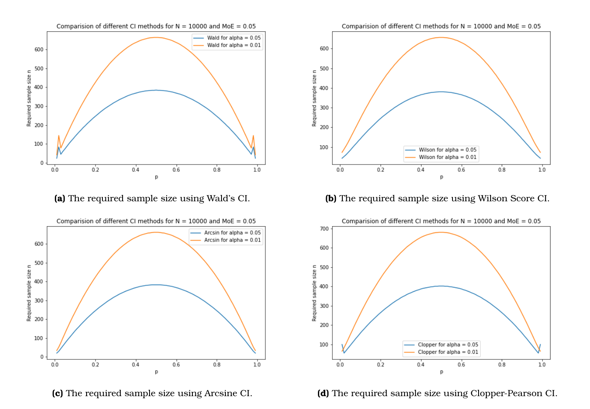

**그림 B.1: 다양한 CI 방법 a 95% 또는 99% 신뢰도를 사용하여 필요한 표본 크기 비교**

```text
interval with a margin of error e = 0.05
```

<!-- 원문 93쪽 -->

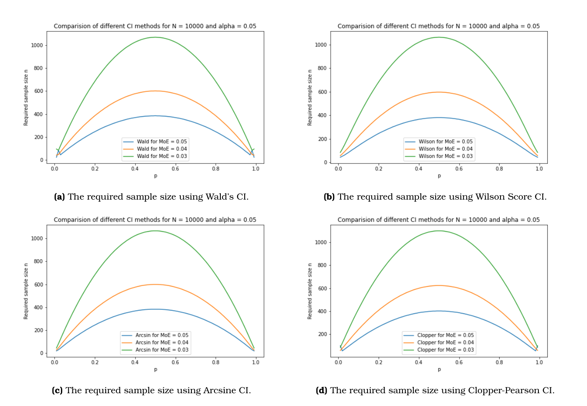

**그림 B.2: 다양한 CI 방법을 사용하여 필요한 표본 크기 비교 오차 한계 e는 다음과 같습니다.**

```text
0.05, 0.04 and 0.03 with α = 0.05
```

<!-- 원문 94쪽 -->

## 부록 C: Clopper-Pearson 신뢰구간 한계의 증명

Clopper-Pearson 신뢰구간의 한계가 베타 분포의 분위수와 동일하다는 증명, 즉 P(X ≥k) = Ip(k, n −k + 1) 및 P(X ≤k) = 1 −Ip(k + 1, n −k)는 Scholz [26]의 보고서에 설명되어 있으며 두 가지 사실이 입증되었습니다.

```text
1. Let x(p) = P(X ≥k) and y(p) = Ip(k, n −k + 1). Firstly, it is proven that:
```

```text
x′(p) = ∂P(X ≥k)
```

```text
∂p
= ∂Ip(k, n −k + 1)
```

```text
∂p
= y′(p) ∀p ≥0.
(C.1)
```

2. 또한 다음이 입증되었습니다.

```text
x(p) = P(X ≥k) = Ip(k, n −k + 1) = y(p) for p = 0.
(C.2)
```

3. 1 및 2로부터, P(X ≥k) = Ip(k, n −k + 1) 는 방정식 3.11의 관계를 증명하는 p ≥0의 모든 값이라는 결론을 내릴 수 있습니다. 점 3는 x′(p) = y′(p) = f(p)가 x(p) = y(p)+C라는 사실로부터 도출됩니다. 또한 x(0) =가 입증되었습니다. y(0)는 C = 0를 따릅니다. 따라서 함수가 연속적이므로 해의 고유성을 의미하므로 x(p) = y(p) ∀p ≥0라는 결론을 내릴 수 있습니다.

증명 방정식 C.1를 증명하기 위해 X가 이항 확률 변수 X라고 가정합니다. 그런 다음:

```text
P(X ≤k) =
```

케이

```text
i=0
```

아니 나는

파이(1 −p)n−i (C.3)

및 P(X ≥k) = 1 −P(X ≤k −1) P(X ≤k)는 p k =에서 엄격하게 감소한다는 것이 입증될 수 있습니다. 0, 1,..., n −1 및 P(X ≥k)는 p k = 0, 2,..., n에서 엄격하게 증가합니다. ID 사용 i

아니 나는

```text
∑
= n
```

n−1 i−1

그리고 (n -i)

아니 나는

```text
∑
= n
```

n−1 i

```text
∑
in equation C.6 and taking the derivative of P(X ≥k) with
respect to p gives as result:
```

<!-- 원문 95쪽 -->

```text
x′(p) = ∂P(X ≥k)
```

```text
∂p
=
```

N

```text
i=k
```

아니 나는

ipi−1(1 −p)n−i −

N

```text
i=k
```

아니 나는

(n −i)pi(1 −p)n−i−1 (C.4)

```text
=
```

N

```text
i=k
```

아니 나는

ipi−1(1 −p)n−i −

```text
n−1
∑
```

```text
i=k
```

아니 나는

(n −i)pi(1 −p)n−i−1 + 0 (C.5)

```text
= n
```

N

```text
i=k
```

n −1 i −1

ipi−1(1 −p)n−i −

```text
n−1
∑
```

```text
i=k
```

n -1 나는

파이(1 -p)n−i−1

(C.6)

```text
= n
```

n −1 k −1

pk−1(1 −p)n−k −

n -1k

pk(1 −p)n−k−1 (C.7)

+

n -1k

pk(1 −p)n−k−1 −

n -1 k + 1

pk+1(1 −p)n−k−2 (C.8)

+... −... (C.9) +

n −1 n −2

pn−2(1 −p) −

n −1 n −1

pn−1 (C.10)

+

n −1 n −1

pn−1

```text
∑
(C.11)
```

```text
= n
```

n −1 k −1

```text
∑
pk−1(1 −p)n−k = k
```

엔케이

```text
∑
pk−1(1 −p)n−k > 0
(C.12)
```

파란색 용어는 서로 상쇄됩니다. 또한 미적분학의 기본 정리(Fundamental Theorem of Calculus)에 따라 다음이 파생됩니다.

```text
Ip(k, n −k + 1) =
Γ(n + 1)
Γ(k)Γ(n −k + 1)
```

피

```text
0
tk−1(1 −t)n−kdt = k
```

엔케이

p 0 tk−1(1 −t)n−kdt (C.13)

p에 관해서는 다음과 같습니다:

케이

엔케이

pk−1(1 −p)n−k (C.14)

이는 p에 대한 P(X ≥k)의 도함수와 동일합니다. 이는 방정식 C.1를 증명합니다. 또한 P(X ≥k) = 0 및 Ip(k, n −k + 1) = 0 p = 0 이는 방정식 C.2를 증명합니다. 따라서 관계식 P(X ≥k) = Ip(k, n−k+1)가 성립한다고 결론을 내릴 수 있습니다. k < n 그 [26]:

```text
P(X ≤k) = 1 −P(X ≥k + 1) = 1 −Ip(k + 1, n −k)
(C.15)
```

이는 상한 및 하한 비율 p Clopper-Pearson CI가 방정식 3.12에 설명된 대로 베타 분포의 분위수와 동일하다는 것을 증명합니다.

<!-- 원문 96쪽 -->

<!-- 원문 97쪽 -->

## 부록 D: 임계값 조정 전략

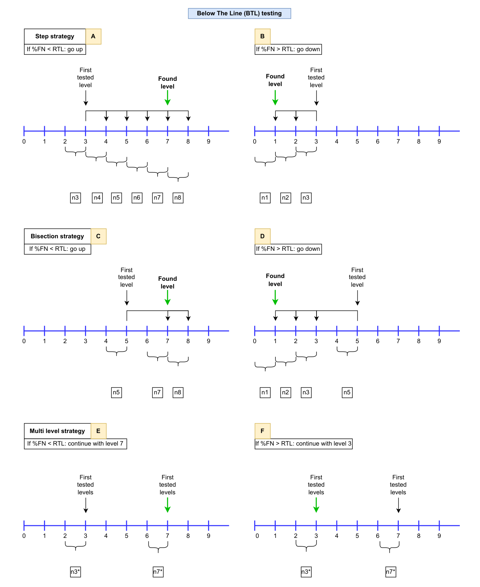

**그림 D.1: 버킷 접근 방식 와 결합된 단계, 이분법 및 다단계 전략의 그림**

BTL 튜닝.

<!-- 원문 98쪽 -->

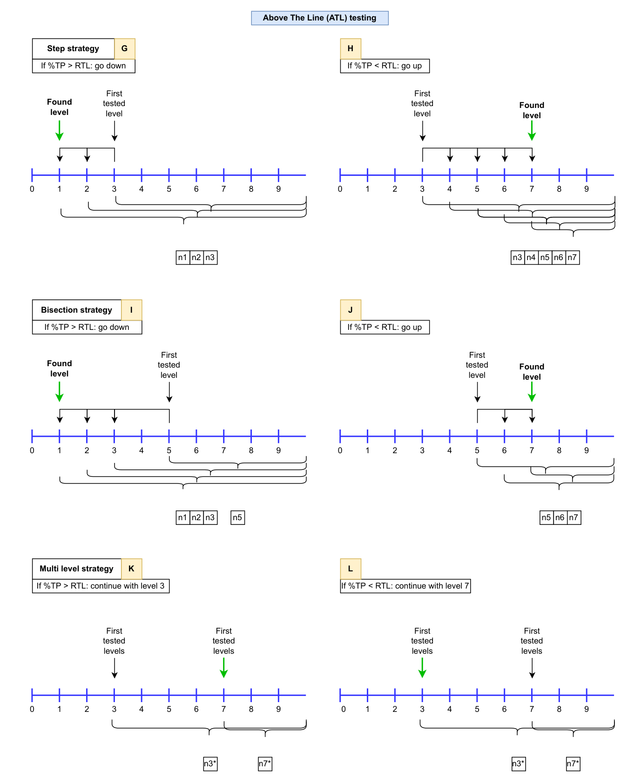

**그림 D.2: 전체 모집단과 결합된 단계, 이분법 및 다단계 전략의 그림**

ATL 튜닝에 접근합니다.

<!-- 원문 99쪽 -->

## 부록 E: 전략 알고리즘

### E.1 단계 알고리즘

샘플에서 관심 있는 거래의 비율을 결정하는 검토 프로세스는 알고리즘 1의 알고리즘 형식으로 설명됩니다. 또한, 신뢰구간 상한 및 하한 관심 거래의 비율도 검토 프로세스에서 결정되며 분석가가 검토한 거래 금액도 결정됩니다.

### 알고리즘 1 검토 프로세스

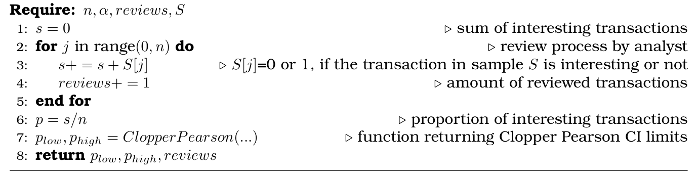

<!-- 원문 100쪽 -->

### 알고리즘 2 단계

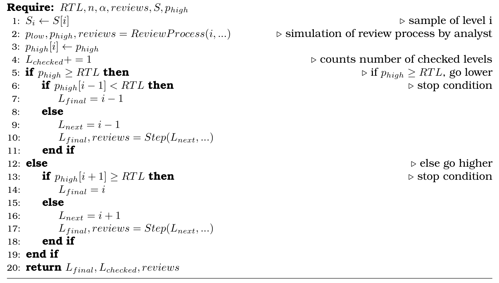

<!-- 원문 101쪽 -->

### E.2 이분법 알고리즘

### 알고리즘 3 이분법

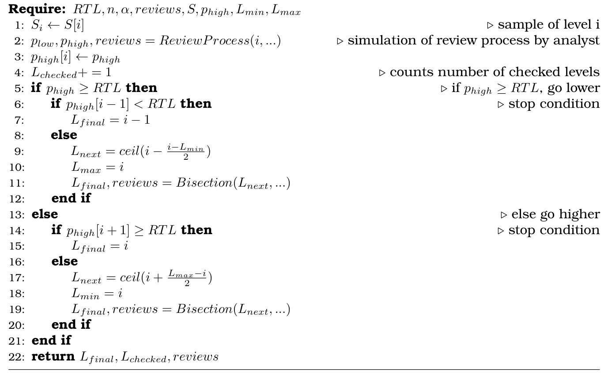

<!-- 원문 102쪽 -->

### E.3 다단계 알고리즘

### 알고리즘 4 다단계

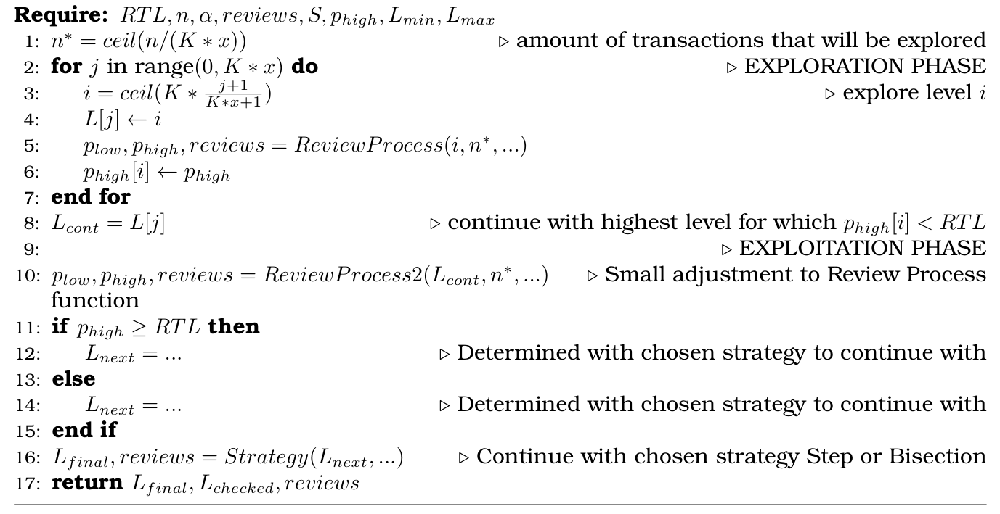

여기서 x는 탐색할 임계값 수준의 백분율과 탐색할 샘플의 거래량 n∗the입니다. '검토 프로세스2' 기능은 가장 유망한 임계값 수준의 거래를 계속 검토하고 알고리즘 1의 2 라인을 'range(n∗, n)의 j'로 변경하고 s = 0로 시작하지 않는다는 점을 제외하면 '검토 프로세스' 기능과 동일합니다.

<!-- 원문 103쪽 -->

### E.4 볼츠만 탐색 알고리즘

### 알고리즘 5 볼츠만 탐색

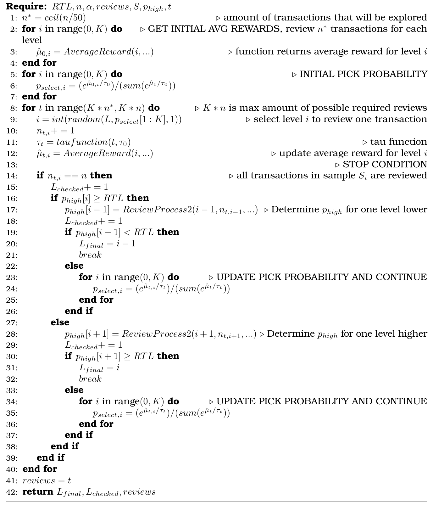

<!-- 원문 104쪽 -->

### E.5 Epsilon-Greedy 전략

ϵ-Greedy 전략(반균일 방법) ϵ-Greedy 알고리즘은 각 라운드에서 확률 ϵ로 무작위 임계값 수준(탐색)을 선택하고 확률 1−ϵ로 가장 높은 평균 보상(착취)을 갖는 임계값 수준을 선택합니다. 따라서 초기 경험적 평균 ˆµ1(0),...,ˆµK(0) [21]가 주어지면 다음과 같습니다.

```text
pselect,i(t + 1) =
```

```text
∑
1 −ϵ + ϵ
k
if i = argmaxj=1,...,K ˆµj(t)
ϵ
k
otherwise
```

이 전략은 ϵ = 0를 사용하여 평균 보상이 가장 높은 임계값 수준을 순전히 활용합니다. 엡실론이 증가함에 따라 탐색이 증가하여 최적의 임계값 수준이 더 높은 빈도로 선택됩니다. 그러나 엡실론이 증가함에 따라 ϵ = 1까지 탐색이 더 많아지고 활용이 줄어드는 전환점에 도달합니다. ϵ를 일정하게 유지하는 대신 시간이 지남에 따라 ϵ가 감소(탐색 감소)하는 ϵ-decreasing 전략과 같이 엡실론 탐욕 알고리즘에 대한 많은 변형이 고안되었습니다. 이 전략의 가장 큰 단점은 이러한 임계값 수준이 최적이 아닌 것으로 식별된 후에도 최적이 아닌 임계값 수준이 여전히 선택된다는 것입니다.

<!-- 원문 105쪽 -->

## 부록 F: 온도 매개변수 조정 결과

<!-- 원문 106쪽 -->

### F.1 발견된 임계값과 실제 임계값 간의 차이

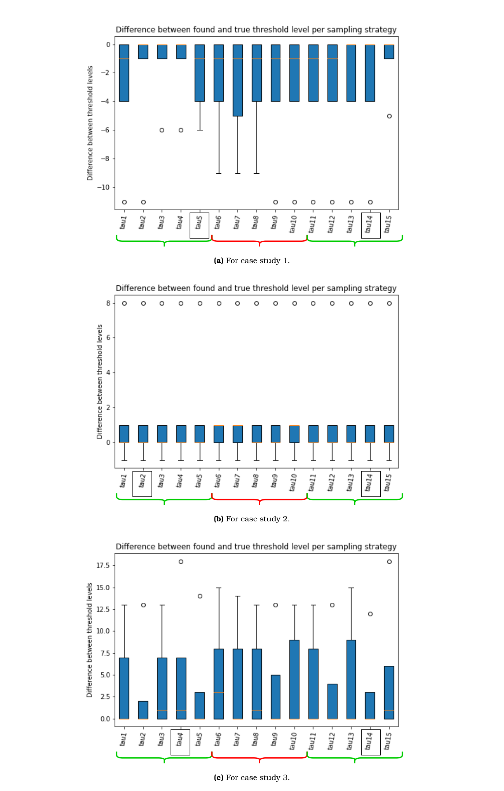

**그림 F.1: BTL 테스트, 발견된 임계값과 실제 임계값 레벨 사이의 차이 감소 또는 상수**

다른 τ(0) 값 K = 20 임계값 수준을 예약합니다.

<!-- 원문 107쪽 -->

## 부록 G: 실험 결과

### G.1 안정 순간

그림 G.1 및 G.2에서는 검토의 최대값, 중앙값 및 최소값과 발견된 임계값 수준과 실제 임계값 수준 간의 차이가 안정화되고 25가 사례 연구 1를 실행한 후에도 크게 변하지 않는다는 것을 분명히 볼 수 있습니다. 사례 연구 2 및 3도 동일한 결론을 내릴 수 있습니다.

<!-- 원문 108쪽 -->

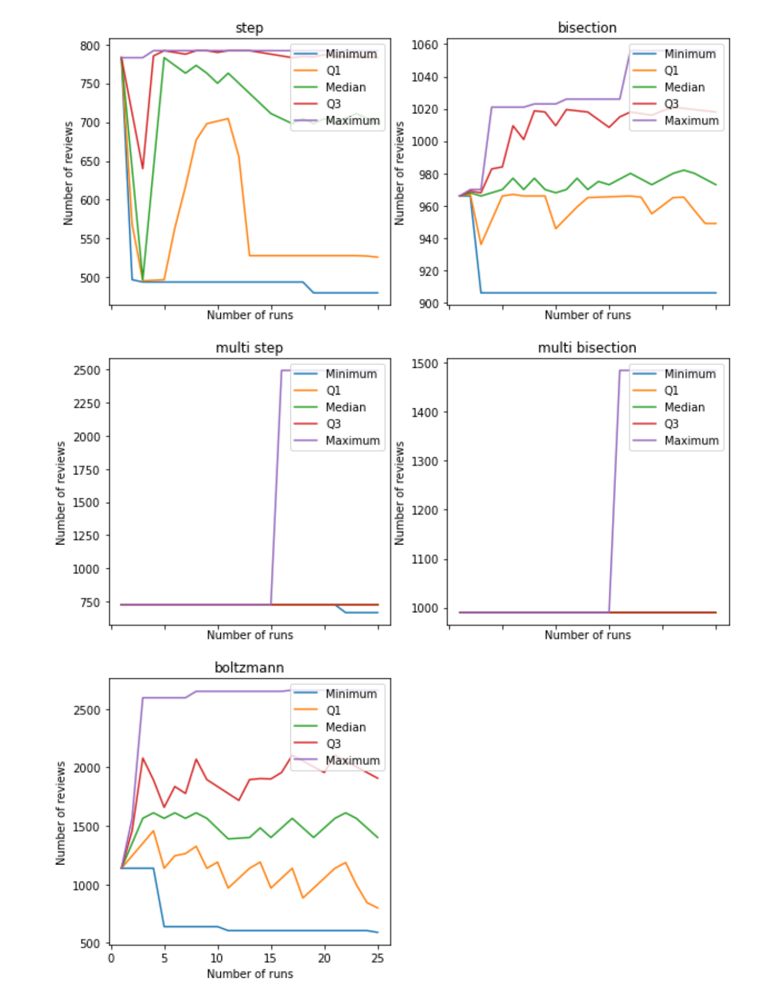

**그림 G.1: 사례 연구 1, 최대값, 75% 분위수, 중앙값, 25% 분위수 및 최소량**

검토를 위해서는 25 실행에 비해 의 다양한 튜닝 전략이 필요했습니다.

<!-- 원문 109쪽 -->

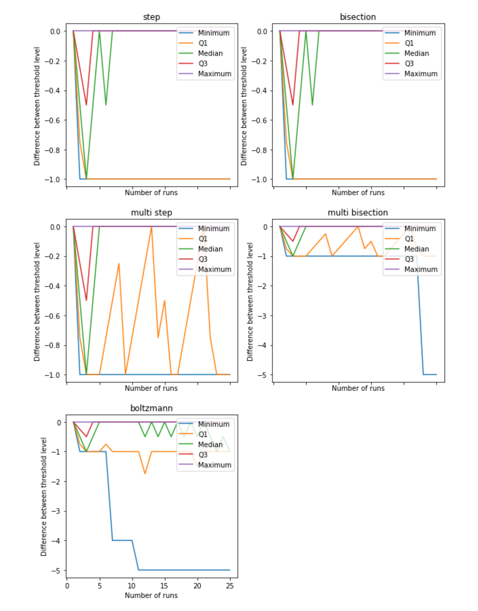

**그림 G.2: 사례 연구 1, 최대값, 75% 분위수, 중앙값, 25% 분위수 및 최소 차이**

발견된 임계값과 실제 임계값 사이 25 실행에 대한 다양한 조정 전략.

<!-- 원문 110쪽 -->

### G.2 발견 및 실제 임계값 각 사례는 잘못된 누락 비율을 기반으로 합니다.

셀 색상이 주황색이 진할수록 실제 임계값 수준보다 발견된 임계값 수준이 더 높습니다. 셀 색상이 녹색으로 진해질수록 발견된 임계값 수준은 실제 임계값 수준보다 더 낮습니다.

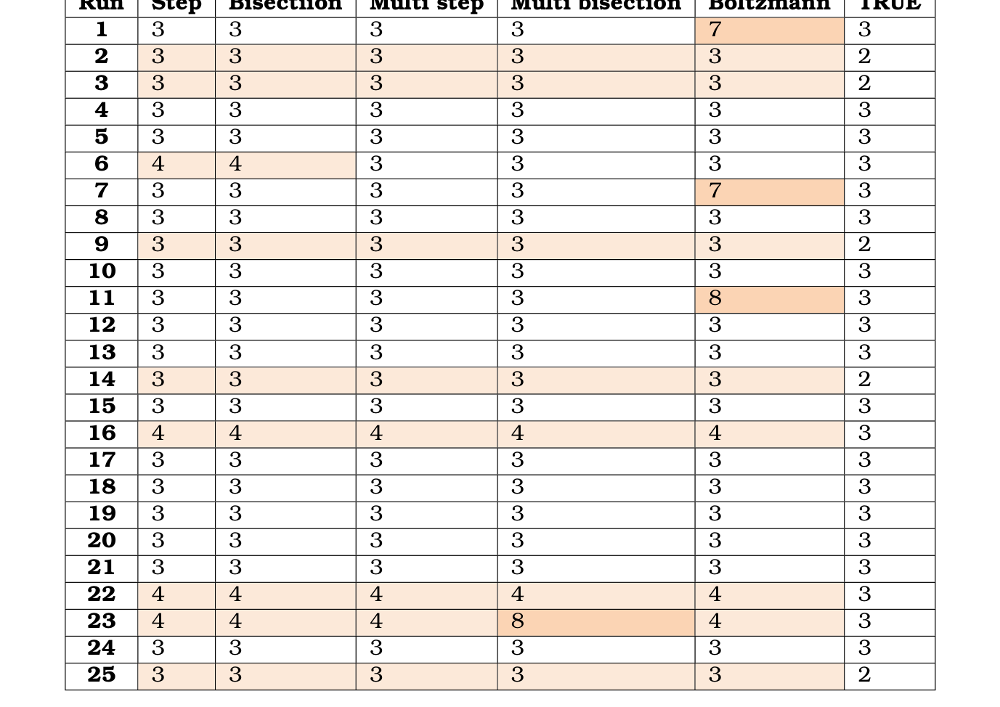

**표 G.1: 다양한 전략으로 발견된 임계값과 실행당 실제 임계값 사례 연구 1.**

<!-- 원문 111쪽 -->

셀 색상이 주황색이 진할수록 실제 임계값 수준보다 발견된 임계값 수준이 더 높습니다. 셀 색상이 녹색으로 진해질수록 발견된 임계값 수준은 실제 임계값 수준보다 더 낮습니다.

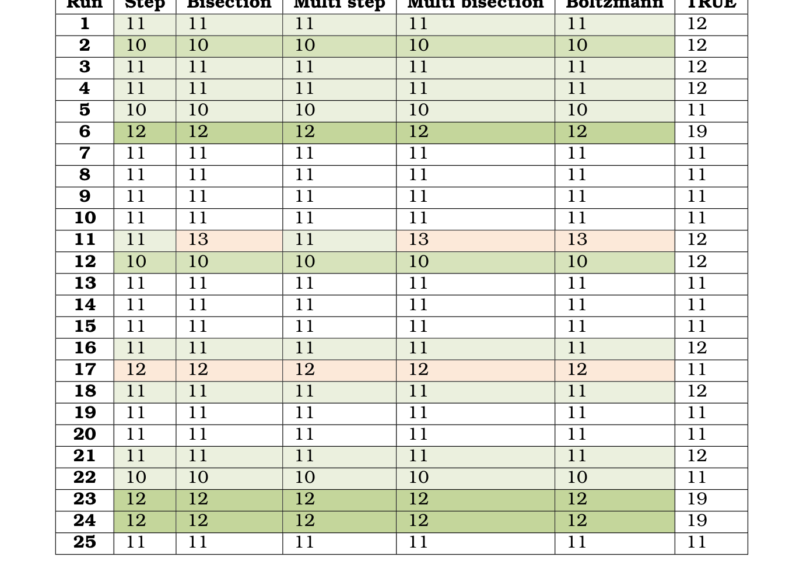

**표 G.2: 다양한 전략으로 발견된 임계값과 실행당 실제 임계값 사례 연구 2.**

<!-- 원문 112쪽 -->

셀 색상이 주황색이 진할수록 실제 임계값 수준보다 발견된 임계값 수준이 더 높습니다. 셀 색상이 녹색으로 진해질수록 발견된 임계값 수준은 실제 임계값 수준보다 더 낮습니다.

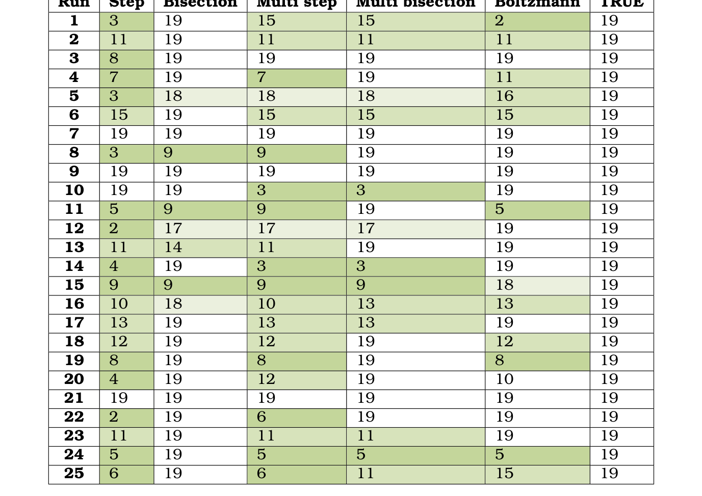

**표 G.3: 다양한 전략으로 발견된 임계값과 실행당 실제 임계값 사례 연구 3.**

<!-- 원문 113쪽 -->

### G.3 발견 및 실제 임계값 각 사례는 민감도를 기반으로 합니다.

오른쪽 열은 측정값인 잘못된 누락률 대신 측정값인 민감도를 기반으로 한 실제 임계값 수준 간의 차이를 보여줍니다.

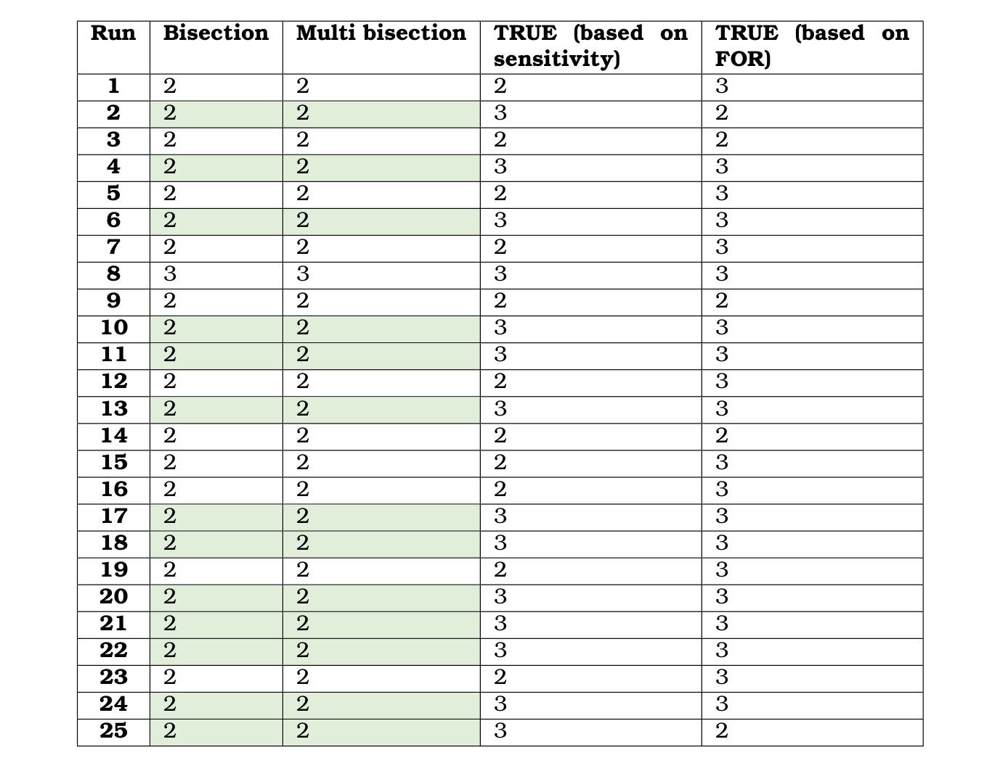

**표 G.4: 다양한 전략을 사용하여 발견된 임계값 및 실행당 실제 임계값 사례 연구 1, 기반**

측정으로서의 민감도.

<!-- 원문 114쪽 -->

셀 색상이 녹색으로 진해질수록 발견된 임계값 수준은 실제 임계값 수준보다 더 낮습니다. 오른쪽 열은 측정값인 잘못된 누락률 대신 측정값인 민감도를 기반으로 한 실제 임계값 수준 간의 차이를 보여줍니다.

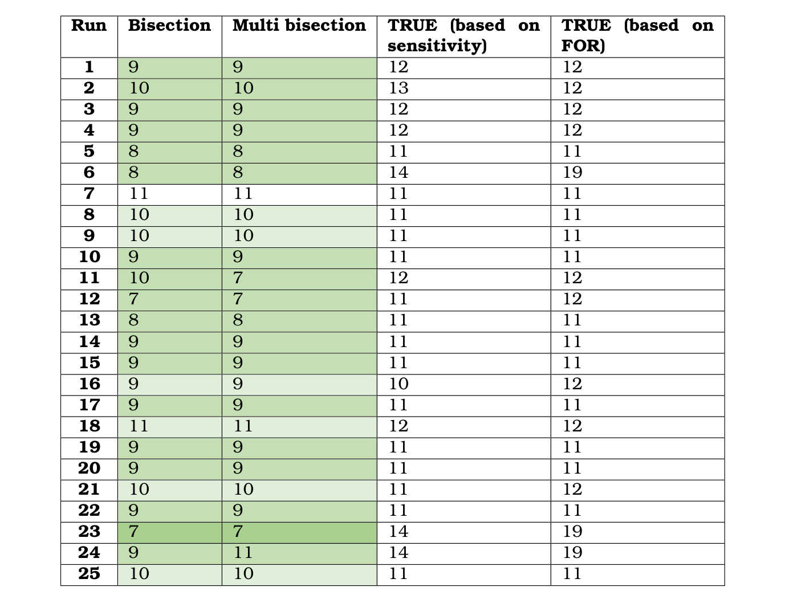

**표 G.5: 다양한 전략을 사용하여 발견된 임계값 및 실행당 실제 임계값 사례 연구 2, 기반**

측정으로서의 민감도.

<!-- 원문 115쪽 -->

셀 색상이 주황색이 진할수록 실제 임계값 수준보다 발견된 임계값 수준이 더 높습니다. 오른쪽 열은 측정값인 잘못된 누락률 대신 측정값인 민감도를 기반으로 한 실제 임계값 수준 간의 차이를 보여줍니다.

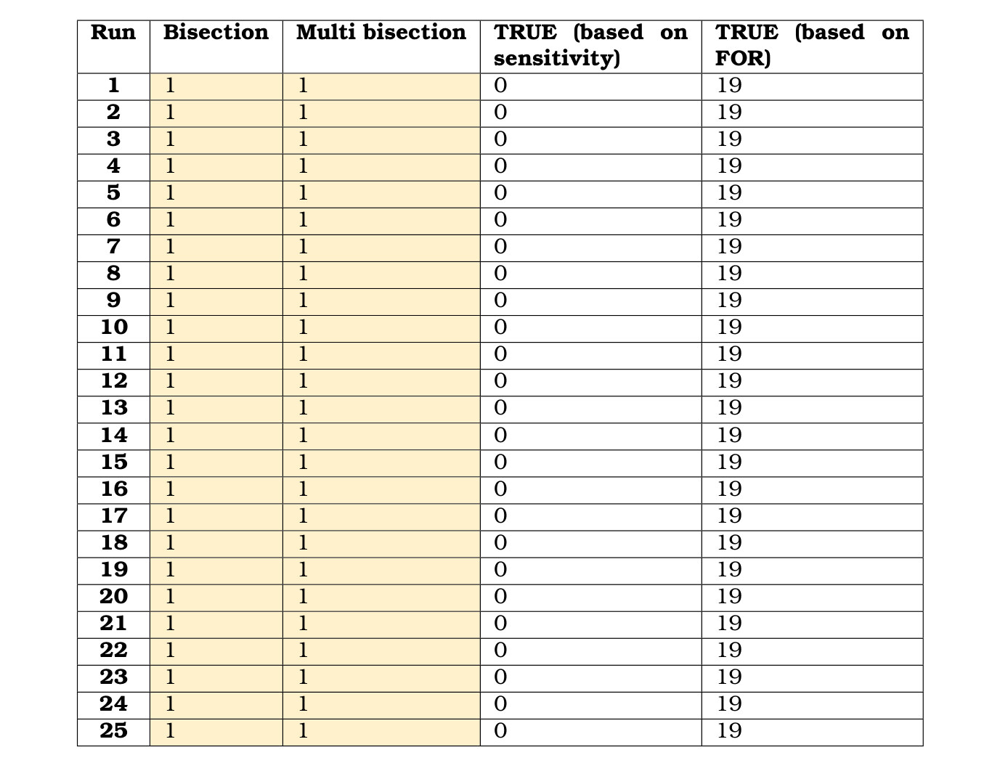

**표 G.6: 다양한 전략을 사용하여 발견된 임계값 및 실행당 실제 임계값 사례 연구 3, 기반**

측정으로서의 민감도.

<!-- 원문 116쪽 -->

### G.4 부트스트랩 샘플링 분포

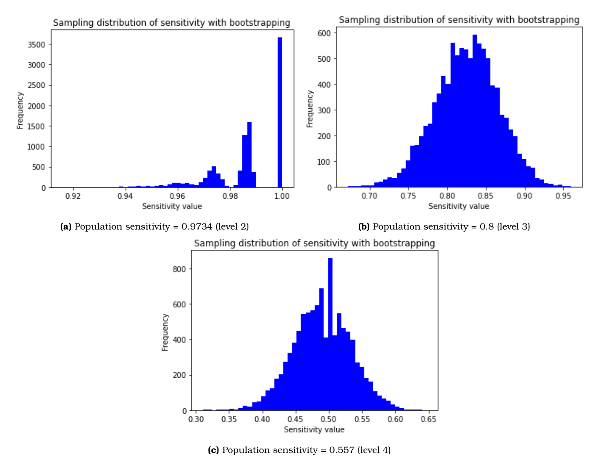

**그림 G.3: 임계 수준 2, 3 및 4의 사례 연구 1 민감도의 샘플링 분포**

```text
B = 10000 and n = 264.
```
