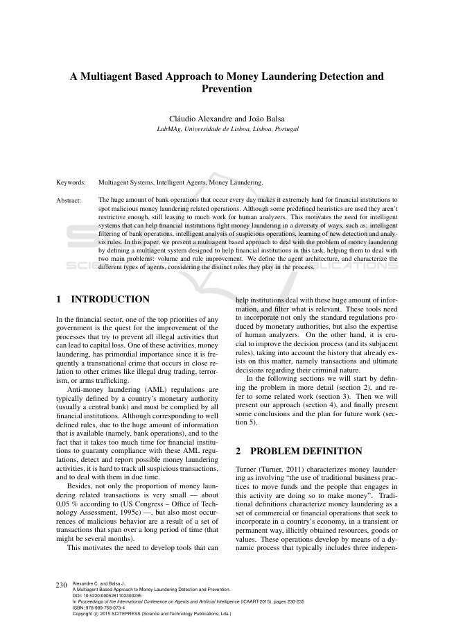
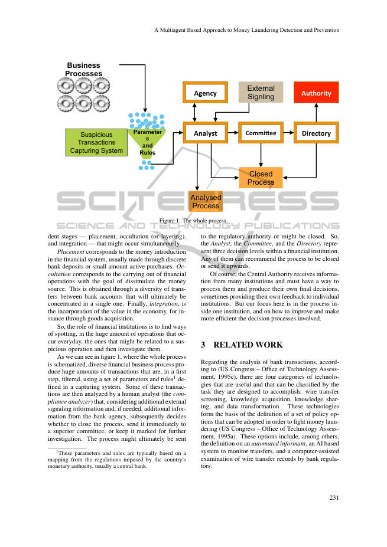
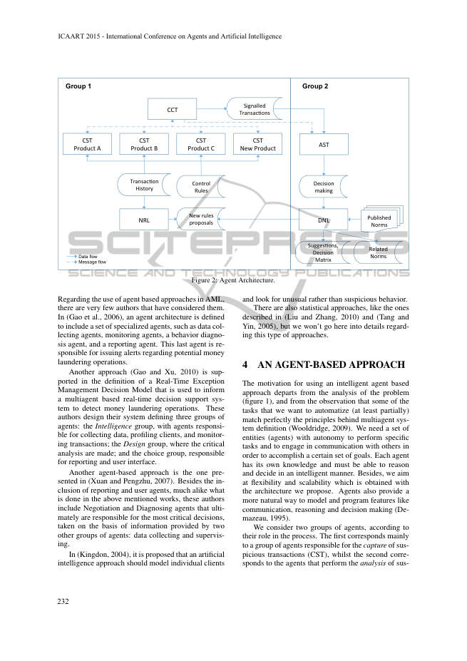
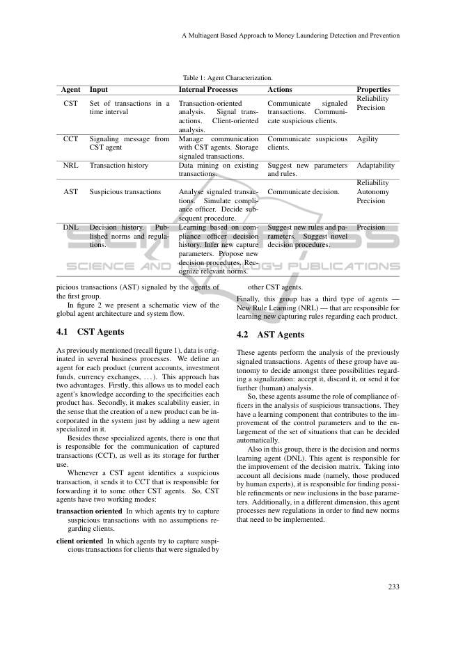
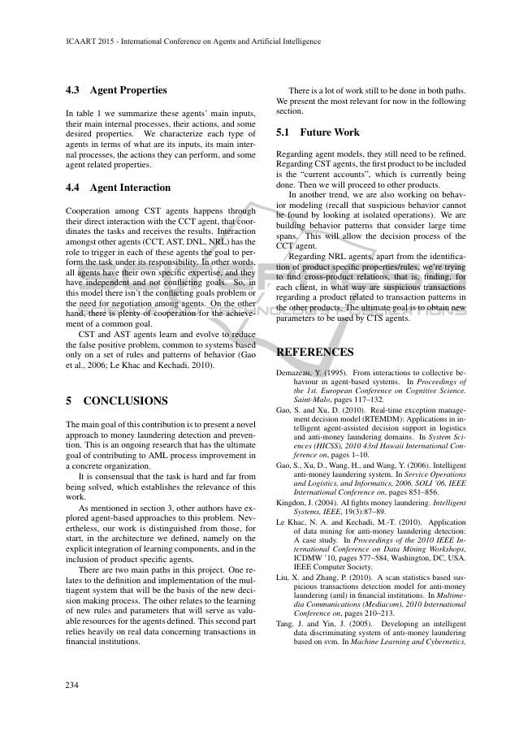
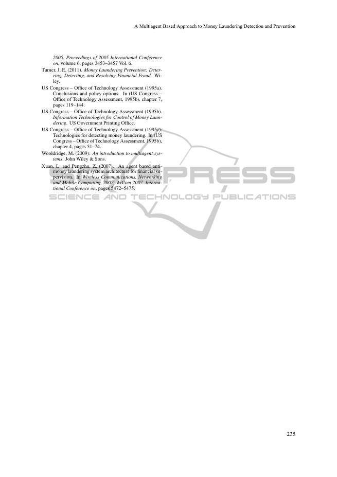

# 자금세탁 탐지 및 방지를 위한 다중에이전트 기반 접근법

> **원문 제목:** A Multiagent Based Approach to Money Laundering Detection and Prevention  
> **저자:** Cláudio Alexandre · João Balsa  
> **게재 정보:** ICAART 2015, pp. 230-235  
> **DOI:** [https://doi.org/10.5220/0005281102300235](https://doi.org/10.5220/0005281102300235)

> **번역 안내:** 본문은 문단 전체의 문맥을 기준으로 한국어로 옮겼습니다. AML·규칙 엔진·전문가 시스템 관련 용어를 통일했으며, 수식·코드·참고문헌은 정확성을 위해 원문 표기를 유지했습니다. 각 페이지의 그림·표·원래 배치는 해당 번역 구간에 놓인 원문 페이지 이미지에서 확인할 수 있습니다.

---

<!-- 원문 1쪽 -->

<details>
<summary>원문 1쪽 이미지 보기</summary>



</details>

## 핵심어

다중에이전트 시스템, 지능형 에이전트, 자금세탁.

## 초록

매일 발생하는 엄청난 양의 은행 업무로 인해 금융 기관은 악의적인 자금세탁 관련 업무를 발견하기가 매우 어렵습니다. 일부 사전 정의된 휴리스틱이 사용되기는 하지만 충분히 제한적이지는 않으며 여전히 인간 분석가의 작업이 많이 남아 있습니다. 이는 은행 운영의 지능형 필터링, 의심스러운 운영에 대한 지능형 분석, 새로운 탐지 및 분석 규칙 학습과 같은 다양한 방법으로 금융 기관이 자금세탁에 맞서 싸울 수 있도록 지원하는 지능형 시스템의 필요성을 불러일으킵니다. 본 논문에서는 금융 기관이 자금세탁 문제를 처리하는 데 도움이 되는 다중에이전트 시스템을 정의하여 자금세탁 문제를 해결하기 위한 다중에이전트 기반 접근 방식을 제시하고, 거래량 및 규칙 개선이라는 두 가지 주요 문제를 처리하도록 돕습니다. 본 연구에서는 에이전트 아키텍처를 정의하고 에이전트가 프로세스에서 수행하는 고유한 역할을 고려하여 다양한 유형의 에이전트를 특성화합니다.

## 1 서론

금융 부문에서 모든 정부의 최우선 과제 중 하나는 자본 손실로 이어질 수 있는 모든 불법 활동을 방지하기 위한 프로세스 개선을 모색하는 것입니다. 이러한 활동 중 하나인 자금세탁은 불법 마약 거래, 테러, 무기 밀매 등 다른 범죄와 밀접하게 연관되어 발생하는 초국가적 범죄인 경우가 많기 때문에 매우 중요합니다.

자금세탁방지(AML) 규정은 일반적으로 국가의 통화 당국(대개 중앙은행)에 의해 정의되며 모든 금융 기관에서 준수해야 합니다. 잘 정의된 규칙에 해당하지만, 이용 가능한 정보(즉, 은행 운영)의 양이 많고 금융 기관이 AML 규정 준수를 보장하고 자금세탁 가능성을 감지 및 보고하는 데 너무 많은 시간이 걸린다는 사실로 인해 의심 거래를 모두 추적하고 적시에 처리하기가 어렵습니다.

게다가 자금세탁 관련 거래의 비율은 매우 작을 뿐만 아니라(US Congress – Office of Technology Assessment, 1995c)에 따르면 약 0,05%입니다. 또한 대부분의 악의적인 행위 발생은 장기간(몇 달이 될 수도 있음)에 걸친 일련의 거래의 결과입니다.

이는 기관이 엄청난 양의 정보를 처리하고 관련 정보를 필터링하는 데 도움이 되는 도구를 개발할 필요성을 불러일으킵니다. 이러한 도구에는 통화 당국이 제정한 표준 규정뿐만 아니라 인간 분석가의 전문 지식도 통합되어야 합니다. 반면에, 이 문제에 대해 이미 존재하는 이력, 즉 범죄 성격에 관한 거래 및 최종 결정을 고려하여 결정 프로세스(및 그 하위 규칙)를 개선하는 것이 중요합니다.

다음 섹션에서는 문제를 더 자세히 정의하는 것(2 섹션)으로 시작하고 일부 관련 작업(3 섹션)을 참조합니다. 그런 다음 우리의 접근 방식(섹션 4)을 제시하고 마지막으로 몇 가지 결론과 향후 작업 계획(섹션 5)을 제시합니다.

## 2 문제 정의

Turner(Turner, 2011)는 자금세탁을 "기금을 이동하기 위해 전통적인 비즈니스 관행을 사용하고 이 활동에 참여하는 사람들은 돈을 벌기 위해 그렇게 하는 것"을 포함한다고 규정합니다. 전통적인 정의에서는 자금세탁을 불법적으로 취득한 자원, 상품 또는 가치를 일시적 또는 영구적인 방식으로 국가 경제에 통합시키려는 일련의 상업적 또는 금융 활동으로 규정합니다. 이러한 작업은 일반적으로 3개의 독립적인 의심 거래 캡처 시스템 기관 외부 서명 기관 위원회 매개 변수 및 규칙 분석가 분석된 프로세스 디렉터리 폐쇄 프로세스 비즈니스 프로세스를 포함하는 동적 프로세스를 통해 개발됩니다.

<!-- 원문 2쪽 -->

<details>
<summary>원문 2쪽 이미지 보기</summary>



</details>

**그림 1: 전체 프로세스.**

동시에 발생할 수 있는 덴트 단계(배치, 엄폐(또는 레이어링) 및 통합).

배치는 일반적으로 별도의 은행 예금이나 소액의 활성 구매를 통해 이루어지는 금융 시스템의 자금 도입에 해당합니다. 오컬트(Occultation)는 자금 출처를 위장하려는 목적으로 금융 업무를 수행하는 것을 의미합니다. 이는 궁극적으로 하나의 계좌에 집중되는 은행 계좌 간의 다양한 이체를 통해 얻습니다. 마지막으로 통합은 예를 들어 상품 획득을 통해 경제에 가치를 통합하는 것입니다.

그래서 금융기관의 역할은 매일같이 발생하는 엄청난 양의 업무 속에서 의심스러운 업무와 관련이 있을 수 있는 업무를 찾아내고 조사하는 것입니다.

전체 프로세스가 도식화된 그림 1에서 볼 수 있듯이 다양한 금융 비즈니스 프로세스는 캡처 시스템에 정의된 일련의 매개변수 및 규칙1을 사용하여 첫 번째 단계에서 필터링되는 엄청난 양의 거래를 생성합니다. 이러한 거래 중 일부는 추가 외부 신호 정보와 필요한 경우 은행 기관의 추가 정보를 고려하여 인간 분석가(규정 준수 분석기)에 의해 분석된 후 프로세스를 종료할지, 상급 위원회에 즉시 보낼지, 추가 조사를 위해 표시해 둘지 결정합니다. 프로세스는 궁극적으로 전송될 수 있습니다. 1 이러한 매개변수와 규칙은 일반적으로 국가의 통화 당국(보통 중앙은행)이 부과하는 규정의 매핑을 기반으로 합니다. 규제 당국에 제출하거나 폐쇄될 수 있습니다. 따라서 분석가, 위원회 및 디렉토리는 금융 기관 내의 세 가지 결정 수준을 나타냅니다. 그들 중 누구라도 프로세스 종료를 권장하거나 위쪽으로 보낼 수 있습니다.

물론 중앙당국은 많은 기관으로부터 정보를 받아 이를 처리하고 자체적으로 최종 결정을 내리며 때로는 개별 기관에 자체 피드백을 제공할 수 있는 방법을 갖추어야 합니다. 그러나 여기서 우리의 초점은 한 기관 내부의 프로세스와 관련된 의사결정 프로세스를 개선하고 보다 효율적으로 만드는 방법에 있습니다.

## 3 관련 연구

은행 거래 분석과 관련하여(US Congress - Office of Technology Assessment, 1995c)에 따르면 유용하고 수행하도록 설계된 작업에 따라 분류될 수 있는 네 가지 기술 범주가 있습니다: 전신 송금 심사, 지식 획득, 지식 공유 및 데이터 변환. 이러한 기술은 자금세탁을 방지하기 위해 채택할 수 있는 일련의 정책 옵션 정의의 기초를 형성합니다(미국 의회 – 기술 평가국, 1995a). 이러한 옵션에는 자동화된 정보원에 대한 정의, 이체를 모니터링하는 AI 기반 시스템, 은행 규제 기관의 전신 이체 기록에 대한 컴퓨터 지원 검사 등이 포함됩니다.

<!-- 원문 3쪽 -->

<details>
<summary>원문 3쪽 이미지 보기</summary>



</details>

CST 제품 A CST 제품 B CST 제품 C CST 신제품 CCT 신호 Transac7ons Transac7on 내역 제어 규칙 NRL 새로운 규칙 제안

```text
AST
```

의사결정

```text
DNL
```

Suggest7ons, 의사결정 매트릭스 그룹 1 그룹 2 관련 규범 게시

> **주:** 규범 데이터 흐름 메시지 흐름

**그림 2: 에이전트 아키텍처.**

AML에서 에이전트 기반 접근 방식의 사용과 관련하여 이를 고려한 작성자는 거의 없습니다. (Gao et al., 2006)에서는 에이전트 아키텍처가 데이터 수집 에이전트, 모니터링 에이전트, 행동 진단 에이전트 및 보고 에이전트와 같은 특수 에이전트 세트를 포함하도록 정의됩니다. 이 마지막 에이전트는 잠재적인 자금세탁 작업에 대한 경고를 발행하는 역할을 담당합니다.

또 다른 접근 방식(Gao 및 Xu, 2010)은 자금세탁 작업을 탐지하기 위해 다중에이전트 기반 실시간 의사 결정 지원 시스템에 알리는 데 사용되는 실시간 예외 관리 의사 결정 모델의 정의에서 지원됩니다. 이 저자는 세 가지 에이전트 그룹을 정의하는 시스템을 설계합니다. 즉, 데이터 수집, 클라이언트 프로파일링 및 거래 모니터링을 담당하는 에이전트로 구성된 Intelligence 그룹; 비판적 분석이 이루어지는 디자인 그룹; 보고 및 사용자 인터페이스를 담당하는 선택 그룹.

또 다른 에이전트 기반 접근 방식은 (Xuan 및 Pengzhu, 2007)에 제시된 접근 방식입니다. 위에서 언급한 작업에서 수행되는 것과 매우 유사한 보고 및 사용자 에이전트를 포함하는 것 외에도 이러한 작성자에는 다른 두 에이전트 그룹인 데이터 수집 및 감독이 제공한 정보를 기반으로 가장 중요한 결정을 궁극적으로 담당하는 협상 및 진단 에이전트가 포함됩니다.

(Kingdon, 2004)에서는 인공 지능 접근 방식이 개별 클라이언트를 모델링하고 의심스러운 행동보다는 비정상적인 행동을 찾아야 한다고 제안했습니다.

(Liu and Zhang, 2010) 및 (Tang and Yin, 2005)에 설명된 것과 같은 통계적 접근 방식도 있지만 여기서는 이러한 접근 방식에 대해 자세히 설명하지 않겠습니다.

## 4 에이전트 기반 접근법

지능형 에이전트 기반 접근 방식을 사용하려는 동기는 문제 분석(그림 1)과 자동화하려는 일부 작업(적어도 부분적으로)이 다중에이전트 시스템 정의(Wooldridge, 2009)의 원칙과 완벽하게 일치한다는 관찰에서 출발합니다. 특정 목표를 달성하기 위해 특정 작업을 수행하고 다른 사람과 통신하는 자율성을 갖춘 일련의 개체(에이전트)가 필요합니다. 각 에이전트는 고유한 지식을 갖고 있으므로 지능적인 방식으로 추론하고 결정할 수 있어야 합니다. 또한, 우리가 제안하는 아키텍처를 통해 얻을 수 있는 유연성과 확장성을 목표로 합니다. 또한 에이전트는 의사소통, 추론, 의사결정과 같은 기능을 모델링하고 프로그래밍하는 보다 자연스러운 방법을 제공합니다(Demazeau, 1995).

본 연구에서는 프로세스에서의 역할에 따라 두 그룹의 상담원을 고려합니다. 첫 번째는 주로 의심 거래 캡처를 담당하는 에이전트 그룹(CST)에 해당하고, 두 번째는 의심 거래 분석을 수행하는 에이전트에 해당합니다.

<!-- 원문 4쪽 -->

<details>
<summary>원문 4쪽 이미지 보기</summary>



</details>

**표 1: 에이전트 특성화.**

에이전트 입력 내부 프로세스 작업 속성 CST 시간 간격의 거래 집합 거래 지향 분석입니다. 신호 거래. 클라이언트 중심 분석.

신호를 받은 거래를 전달합니다. 의심스러운 고객과 소통하세요.

신뢰성 정밀도 CCT CST 에이전트의 신호 메시지 CST 에이전트와의 통신을 관리합니다. 스토리지 신호 거래.

의심스러운 고객과 소통하세요.

민첩성 NRL 거래 내역 기존 거래에 대한 데이터 마이닝.

새로운 매개변수와 규칙을 제안합니다.

적응성 AST 의심 거래 신호를 받은 거래를 분석합니다. 규정 준수 담당자를 시뮬레이션합니다. 후속 절차를 결정합니다.

결정을 전달합니다.

신뢰성 자율성 정밀도 DNL 의사결정 이력. 공개된 규범 및 규정.

준법감시인 결정 이력을 바탕으로 학습합니다. 새로운 캡처 매개변수를 추론합니다. 새로운 결정 절차를 제안합니다. 관련 규범을 인식합니다.

새로운 규칙과 매개변수를 제안합니다. 새로운 의사결정 절차를 제안합니다.

첫 번째 그룹의 에이전트가 신호하는 정밀한 거래(AST).

그림 2에서는 글로벌 에이전트 아키텍처와 시스템 흐름의 개략도를 제시합니다.

### 4.1 CST 에이전트

앞서 언급한 것처럼(1 그림 참조) 데이터는 여러 비즈니스 프로세스에서 생성됩니다. 본 연구에서는 각 상품(당좌 계좌, 투자 자금, 환전 등)에 대한 대리인을 정의합니다. 이 접근 방식에는 두 가지 장점이 있습니다. 첫째, 이를 통해 각 제품의 특성에 따라 각 에이전트의 지식을 모델링할 수 있습니다. 둘째, 전문화된 새로운 에이전트를 추가하는 것만으로 새로운 제품의 생성이 시스템에 통합될 수 있다는 점에서 확장성을 더 쉽게 만듭니다.

이러한 전문 에이전트 외에도 캡처된 거래(CCT)의 통신과 향후 사용을 위한 저장을 담당하는 에이전트가 있습니다.

CST 에이전트는 의심 거래를 식별할 때마다 해당 거래를 다른 CST 에이전트에 전달할 책임이 있는 CCT로 보냅니다. 따라서 CST 에이전트에는 두 가지 작업 모드가 있습니다. 거래 지향 에이전트는 클라이언트에 대한 가정 없이 의심 거래를 캡처하려고 시도합니다. 클라이언트 지향 에이전트는 다른 CST 에이전트가 신호한 클라이언트에 대한 의심 거래를 캡처하려고 시도합니다.

마지막으로 이 그룹에는 각 제품에 대한 새로운 캡처 규칙을 학습하는 세 번째 유형의 에이전트인 New Rule Learning(NRL)이 있습니다.

### 4.2 AST 에이전트

이러한 에이전트는 이전에 신호를 받은 거래를 분석합니다. 이 그룹의 에이전트는 신호에 관한 세 가지 가능성(수락, 폐기 또는 추가(인간) 분석을 위해 전송) 중에서 결정할 자율성을 갖습니다.

따라서 이러한 에이전트는 의심 거래 분석에서 규정 준수 담당자의 역할을 맡습니다. 여기에는 제어 매개변수를 개선하고 자동으로 결정할 수 있는 일련의 상황을 확대하는 데 기여하는 학습 구성 요소가 있습니다.

또한 이 그룹에는 의사결정 및 규범 학습 에이전트(DNL)가 있습니다. 이 에이전트는 의사결정 매트릭스의 개선을 담당합니다. 모든 결정(즉, 인간 전문가가 내린 결정)을 고려하여 기본 매개변수에서 가능한 개선 사항이나 새로운 포함 사항을 찾는 역할을 담당합니다. 또한 다른 차원에서 이 에이전트는 구현해야 할 새로운 규범을 찾기 위해 새로운 규정을 처리합니다.

<!-- 원문 5쪽 -->

<details>
<summary>원문 5쪽 이미지 보기</summary>



</details>

### 4.3 에이전트 속성

표 1에는 이러한 에이전트의 주요 입력, 주요 내부 프로세스, 작업 및 일부 원하는 속성이 요약되어 있습니다. 입력 내용, 주요 내부 프로세스, 수행할 수 있는 작업 및 일부 에이전트 관련 속성을 기준으로 각 에이전트 유형을 특성화합니다.

### 4.4 에이전트 상호작용

CST 에이전트 간의 협력은 작업을 조정하고 결과를 받는 CCT 에이전트와의 직접적인 상호 작용을 통해 이루어집니다. 다른 에이전트(CCT, AST, DNL, NRL) 간의 상호 작용은 각 에이전트에서 책임 하에 작업을 수행하려는 목표를 촉발하는 역할을 합니다. 즉, 모든 에이전트는 고유한 전문 지식을 갖고 있으며 독립적이고 충돌하지 않는 목표를 가지고 있습니다. 따라서 이 모델에는 목표 상충 문제나 에이전트 간 협상의 필요성이 없습니다. 반면에, 공동의 목표 달성을 위해 많은 협력이 이루어지고 있습니다.

CST 및 AST 에이전트는 일련의 규칙 및 행동 패턴만을 기반으로 하는 시스템에 흔히 발생하는 위양성 문제를 줄이기 위해 학습하고 진화합니다(Gao et al., 2006; Le Khac 및 Kechadi, 2010).

## 5 결론

이 기고의 주요 목표는 자금세탁 탐지 및 예방에 대한 새로운 접근 방식을 제시하는 것입니다. 이는 구체적인 조직의 AML 프로세스 개선에 기여하는 궁극적인 목표를 가지고 진행 중인 연구입니다.

이 작업이 어렵고 해결되기 어렵다는 점은 공감되며, 이는 이 작업의 관련성을 확립합니다.

3 섹션에서 언급했듯이 다른 저자들은 이 문제에 대한 에이전트 기반 접근 방식을 탐색했습니다. 그럼에도 불구하고 우리의 작업은 우선 우리가 정의한 아키텍처, 즉 학습 구성 요소의 명시적인 통합과 제품별 에이전트의 포함에서 작업과 구별됩니다.

이 프로젝트에는 두 가지 주요 경로가 있습니다. 하나는 새로운 의사결정 프로세스의 기초가 될 다중에이전트 시스템의 정의 및 구현과 관련됩니다. 다른 하나는 정의된 에이전트에 귀중한 리소스 역할을 할 새로운 규칙 및 매개변수를 학습하는 것과 관련이 있습니다. 두 번째 부분은 금융 기관의 거래와 관련된 실제 데이터에 크게 의존합니다.

두 가지 경로 모두에서 아직 수행해야 할 작업이 많이 있습니다. 다음 섹션에서는 현재 가장 관련성이 높은 내용을 제시합니다.

### 5.1 향후 연구

에이전트 모델과 관련하여 여전히 개선이 필요합니다. CST 에이전트에 대해 가장 먼저 포함되는 제품은 현재 진행중인 "당좌 계정"입니다. 그럼 다른 제품으로 넘어가겠습니다.

또 다른 추세에서는 행동 모델링도 진행하고 있습니다(격리된 작업을 살펴보면 의심스러운 행동을 찾을 수 없다는 점을 기억하세요). 본 연구에서는 긴 시간 범위를 고려한 행동 패턴을 구축하고 있습니다. 이를 통해 CCT 에이전트의 결정 프로세스가 가능해집니다.

NRL 에이전트에 대해서는 제품별 속성/규칙 식별 외에도 제품 간 관계, 즉 각 클라이언트에 대해 다른 제품의 거래 패턴과 관련된 제품에 대한 의심 거래가 어떤 방식으로 있는지 찾으려고 노력하고 있습니다. 궁극적인 목표는 CTS 에이전트가 사용할 새로운 매개변수를 얻는 것입니다.

## 참고문헌

Demazeau, Y. (1995). From interactions to collective be-

haviour in agent-based systems. In Proceedings of the 1st. European Conference on Cognitive Science. Saint-Malo, pages 117–132. Gao, S. and Xu, D. (2010). Real-time exception manage-

ment decision model (RTEMDM): Applications in intelligent agent-assisted decision support in logistics and anti-money laundering domains. In System Sciences (HICSS), 2010 43rd Hawaii International Conference on, pages 1–10. Gao, S., Xu, D., Wang, H., and Wang, Y. (2006). Intelligent

anti-money laundering system. In Service Operations and Logistics, and Informatics, 2006. SOLI '06. IEEE International Conference on, pages 851–856. Kingdon, J. (2004). AI fights money laundering. Intelligent

Systems, IEEE, 19(3):87–89. Le Khac, N. A. and Kechadi, M.-T. (2010). Application

of data mining for anti-money laundering detection: A case study. In Proceedings of the 2010 IEEE International Conference on Data Mining Workshops, ICDMW '10, pages 577–584, Washington, DC, USA. IEEE Computer Society. Liu, X. and Zhang, P. (2010). A scan statistics based sus-

picious transactions detection model for anti-money laundering (aml) in financial institutions. In Multimedia Communications (Mediacom), 2010 International Conference on, pages 210–213. Tang, J. and Yin, J. (2005). Developing an intelligent data discriminating system of anti-money laundering based on svm. In Machine Learning and Cybernetics,

<!-- 원문 6쪽 -->

<details>
<summary>원문 6쪽 이미지 보기</summary>



</details>

2005. Proceedings of 2005 International Conference on, volume 6, pages 3453–3457 Vol. 6. Turner, J. E. (2011). Money Laundering Prevention: Deter-

ring, Detecting, and Resolving Financial Fraud. Wiley. US Congress – Office of Technology Assessment (1995a).

Conclusions and policy options. In (US Congress – Office of Technology Assessment, 1995b), chapter 7, pages 119–144. US Congress – Office of Technology Assessment (1995b).

Information Technologies for Control of Money Laundering. US Government Printing Office. US Congress – Office of Technology Assessment (1995c).

Technologies for detecting money laundering. In (US Congress – Office of Technology Assessment, 1995b), chapter 4, pages 51–74. Wooldridge, M. (2009). An introduction to multiagent sys-

tems. John Wiley & Sons. Xuan, L. and Pengzhu, Z. (2007). An agent based antimoney laundering system architecture for financial supervision. In Wireless Communications, Networking and Mobile Computing, 2007. WiCom 2007. International Conference on, pages 5472–5475.
