# 신흥시장 은행의 자금세탁방지(AML) 및 테러자금조달방지(CFT) 위험관리

> **원문 제목:** Anti-Money-Laundering (AML) & Countering Financing of Terrorism (CFT) Risk Management in Emerging Market Banks  
> **발행 기관:** International Finance Corporation (IFC)  
> **발행 정보:** Good Practice Note, 2019  
> **원문 페이지:** 87쪽

> **번역 안내:** 이 문서는 원문의 절·문단·글머리표 순서를 따라 전체 내용을 한국어로 옮긴 번역본입니다. AML/CFT, KYC, CDD, CBR 등 고유 약어는 원문 표기를 유지하고, 은행 자금세탁방지 분야의 용어를 일관되게 적용했습니다. 원문의 그림과 도식은 각각 잘라 해당 본문 위치에 바로 배치했습니다.

---

<!-- 원문 1쪽 -->

모범사례 노트

### 자금세탁방지(AML) 및 테러자금조달방지(CFT) 신흥시장 은행의 위험관리

<!-- 원문 2쪽 -->

© 국제금융공사 2019. 모든 권리 보유. 2121 펜실베이니아 애비뉴, N.W. 워싱턴 D.C. 20433 인터넷: www.ifc.org 이 작품의 자료는 저작권으로 보호됩니다. 허가 없이 이 저작물의 일부 또는 전체를 복사 및/또는 전송하는 것은 해당 법률을 위반하는 행위일 수 있습니다. 본 문서의 내용은 신흥시장 은행의 AML/CFT 준법 및 위험관리와 관련된 일반 정보 제공 목적으로만 제공됩니다. IFC는 본 저작물에 포함된 내용의 정확성, 신뢰성 또는 완전성을 보장하지 않으며 여기에 설명된 결론이나 판단에 대해 보증하지 않으며, 내용의 누락이나 오류(인쇄상의 오류 및 기술적 오류를 포함하되 이에 국한되지 않음)에 대해 어떠한 책임도 지지 않습니다. IFC 또는 그 계열사는 여기에 언급될 수 있는 특정 회사 및 당사자에 투자하거나, 다른 조언이나 서비스를 제공하거나, 금전적 이해관계를 가질 수 있습니다. 귀하 또는 이 문서의 다른 사용자가 그러한 정보에 의존하는 데 따른 위험은 전적으로 귀하의 책임입니다.

이 문서에는 제3자 웹사이트 및 출판물의 링크와 콘텐츠를 포함하여 제3자가 제공한 콘텐츠가 포함될 수 있습니다. IFC는 제3자 정보의 내용이나 제3자 웹사이트에 포함된 링크된 내용의 정확성에 대해 책임을 지지 않습니다. 해당 제3자 웹사이트나 해당 출판물에 포함된 콘텐츠는 본 문서에 참조로 포함되지 않습니다. 제3자 링크나 콘텐츠가 포함되어 있다고 해서 IFC나 세계 은행 그룹 회원이 이를 보증한다는 의미는 아닙니다. 이 자료에 표현된 모든 진술 및/또는 의견은 전적으로 해당 자료를 제공하는 개인 또는 단체의 의견 및 책임이며, 반드시 IFC의 의견을 반영하는 것은 아닙니다.

이 문서는 법적, 규제 또는 투자 조언을 구성하지 않으며 AML/CFT 준법 및 위험관리와 관련된 정책 및 절차 준비에 관한 지침이나 조언을 구성하지 않으며 당사는 이 문서와 관련하여 주의할 의무가 없습니다. 이 문서에 설명된 관행과 표준은 해당 법률이나 사용자가 거래하려는 다른 금융 기관에 따라 충분하지 않을 수 있습니다. 이 가이드의 사용자는 자신에게 적용되는 AML/CFT 표준뿐만 아니라 AML/CFT 준법 및 위험관리와 관련하여 구현하는 관행 및 절차와 관련하여 스스로 조언을 구해야 합니다.

국제금융공사(International Finance Corporation)는 회원국 간 협정에 따라 설립된 국제기구이자 세계은행그룹(World Bank Group)의 회원사입니다. 모든 이름, 로고 및 상표는 IFC의 자산이며 IFC의 명시적인 서면 동의 없이는 어떤 목적으로도 해당 자료를 사용할 수 없습니다. 또한 "International Finance Corporation" 및 "IFC"는 IFC의 등록 상표이며 국제법에 따라 보호됩니다.

<!-- 원문 3쪽 -->

모범사례 노트

### 자금세탁방지(AML) 및 테러자금조달방지(CFT) 신흥시장 은행의 위험관리

<!-- 원문 4쪽 -->

<!-- 원문 5쪽 -->

### 목차

- 서문 ··· V
- 감사의 글 및 주요 용어 약어 ··· VI
- 제1장 서론 ··· 1
- 제2장 건전한 금융기관 위험관리 프레임워크·거버넌스 구조·문화의 확립 ··· 7
- 제3장 건전한 AML/CFT 프로그램의 필수 요소 ··· 15
  - 3.1 서론 ··· 15
  - 3.2 거버넌스 ··· 16
  - 3.3 위험 식별·평가·완화 ··· 19
  - 3.4 정책 및 절차 ··· 24
  - 3.5 고객 식별 및 고객확인의무 ··· 27
  - 3.6 거래 모니터링 ··· 37
  - 3.7 보고 ··· 42
  - 3.8 의사소통 및 교육 ··· 43
  - 3.9 지속적 개선 및 테스트 ··· 45
  - 3.10 내부 및 외부 감사 ··· 45
- 제4장 환거래은행 및 기타 이해관계자와의 협력 ··· 47
- 제5장 AML/CFT 프로그램 성숙도 프레임워크 자체평가 ··· 53
- 제6장 결론 ··· 65
- 부록 1 국제기구와 시스템적 중요 은행의 위험회피 대응 활동 ··· 69
- 부록 2 환거래은행업의 최근 동향 ··· 71
- 부록 3 주요 FATF 권고사항 및 바젤 간행물 목록 ··· 73
- 부록 4 계좌 개설 일반 지침 ··· 74
- 부록 5 볼프스베르크 지침 ··· 77

<!-- 원문 6쪽 -->

<!-- 원문 7쪽 -->

### 서문

최근 몇 년 동안 예비 자본 요구 사항, 자금세탁방지 및 테러자금조달방지(AML/CFT) 준법 요구 사항이 동시에 증가하면서 전 세계 은행의 비용과 복잡성이 눈에 띄게 증가했습니다. 이러한 규제 변화 중 다수는 금융 시스템의 회복력을 높이고 금융 범죄와의 전쟁에 도움이 되었지만 환거래은행 관계 및 국경 간 금융 네트워크에 대한 압박도 가중시켰습니다. 이러한 네트워크는 무역을 가능하게 하고, 송금을 지원하며, 외화 결제를 용이하게 합니다.

규제기관의 시정명령, 기소유예 합의, 징벌적 벌금에 직면한 환거래은행들은 규제 위험 대비 수익성이 더 양호한 시장으로 활동을 제한했습니다.

많은 신흥시장, 특히 소규모 경제권의 규제 문제와 상업적 경제 요인으로 인해 비용과 구현 문제가 불균형하게 증가했으며, 이는 해당 은행 관계의 철회로 인해 더욱 악화되었습니다. 무역 라인과 송금 채널 내에서 흐름이 눈에 띄게 집중되어 금융 부문 안정성과 신흥시장 국가의 성장 및 번영에 중요할 수 있는 소규모 현지 은행이 약화되었습니다.

IFC의 연구 및 간행물인 "신흥시장 금융 부문의 위험회피(de-risking) 및 기타 과제"인 1에서는 90 이상의 신흥시장에 있는 300 이상의 은행 중 25% 이상이 환거래은행 관계 손실을 보고했음을 강조했습니다. 연구 대상 은행 중 72%는 규모나 위험에 관계없이 모든 조사 대상 시장에 영향을 미치는 외생적인 문제(주로 환거래은행 스트레스 및 관련 준법 문제)에 직면해 있다고 보고했습니다.

은행의 AML/CFT 기능을 업그레이드하기 위한 강력한 비즈니스 사례가 있습니다. 신흥시장에서 선두를 달리는 은행은 국경을 초월한 환거래은행 네트워크를 유지 및/또는 성장시켜 고객에게 더 나은 서비스를 제공하고 글로벌 경제와 고객의 관계를 더욱 효과적으로 연결할 수 있는 강력한 위치에 있습니다. 이는 비즈니스에 고유한 성장 기회를 제공하여 시장 입지와 안정성을 강화합니다. 이는 시장, 고객 및 제품 잠재력을 파악하기 위한 혁신을 주도하는 심층적인 데이터로의 문을 열어 개인의 성장 곡선을 변화시킵니다.

AML/CFT 준법의 지속적인 개선에 대한 기대가 글로벌 금융 시스템에 널리 퍼져 있기 때문에 EM 금융 기관은 다음을 수행하는 것이 중요합니다. (i) 보안 및 범죄에 대한 영향과 함께 ML/FT의 비즈니스 영향을 이해합니다. (ii) 글로벌 금융 시스템에 참여하기 위한 추가 준법 요구 사항을 식별하고 (iii) 이 분야에서 우수성을 향한 자신만의 길을 찾습니다. 본 연구에서는 각 국가와 각 기관이 서로 다르다는 점을 인식합니다. 각 기관은 이러한 목표를 달성하기 위해 노력할 때 서로 다른 수준의 지원이나 명확성이 필요합니다. 그러나 대부분의 경우 요청은 기본 AML/CFT 개념, 규제 지침 해석 및 구현, 환거래은행 보고 및 시스템 조정, 미국/EU 규제 요구 사항 해석, 기술 기반 솔루션 등 여러 분야에 걸친 지침입니다.

이 간행물이 어느 정도 지침을 제공할 수 있으며 현재 국경을 초월한 금융 네트워크가 직면하고 있는 과제를 해결하기 위한 추가적인 솔루션 기회를 촉진할 수 있다고 우리는 믿습니다. 각 금융 기관이 이 문제를 해결하기 위해 노력함에 따라 품질과 우수성에 대한 관심은 물론 공동 노력에 내재된 혁신 기회가 더욱 강력한 EM 글로벌 금융 시스템을 제공할 수 있기를 바랍니다.

### 파울로 드 볼레, 수석 이사

글로벌 금융 기관 그룹

> **주:** 1 http://documents.worldbank.org/curated/en/895821510730571841/pdf/121275-WP-IFC-2017-Survey-on-Correspondent-Banking-in-EMs-PUBLIC.pdf

<!-- 원문 8쪽 -->

### 감사의 말

Manuela Adl과 Cameron Evans의 감독 하에 이 모범사례 노트는 Ebrahim Farouk, Annetta Cortez, Yannick Stephant, Susan Starnes, Robert Heffernan, Brian Robert Sokoliuk, Margarete O. Biallas, Mariyam Zhumadil, William C. Hayworth, Matthew Huggins, Sokhareth Kim, Elizabeth Gibbens, Andrew Berghauser, Lauren Kaley Johnson 및 Rob Wright의 도움을 받아 준비되었습니다.

IFC는 Yan Liu, IMF 법무 자문위원, Emile J. M. Van Der Does De Willebois, 세계 은행 수석 금융 부문 전문가, John T. Murray, BONY-Mellan, Ayo Omoogun, Standard Chartered Bank, William L. Burmeister, Citibank, Lisan Hannah, The Bank of Nova를 포함하여 문서를 검토하고 통찰력 있는 의견을 제공한 동료 및 파트너에게 감사의 말씀을 전합니다. Scotia, Lauren Girard 및 Jeff Gontero, JP Morgan Chase, Steven Puig, Banco BHD Leone 및 Miriam Ratkovicova, Deloitte Transactions and Business Analytics LLP의 의견이 없었다면 이 출판물은 실현되지 못했을 것입니다.

### 주요 용어 약어

- **AML** — 자금세탁방지
- **BCBS** — 바젤은행감독위원회
- **BIS** — 국제결제은행
- **CBR** — 환거래은행 관계
- **CDD** — 고객확인의무
- **COSO** — 트레드웨이위원회 후원조직위원회
- **CPMI** — 지급결제 및 시장인프라 위원회
- **CFT** — 테러자금조달방지
- **EDD** — 강화된 고객확인의무
- **FATF** — 금융행동특별작업반
- **FIU** — 금융정보분석원
- **FSB** — 금융안정위원회
- **FT** — 테러자금조달
- **GPN** — 모범사례 노트
- **IFC** — 국제금융공사
- **IMF** — 국제통화기금
- **KRI** — 핵심위험지표
- **KYC** — 고객알기
- **KYCC** — 고객의 고객 알기
- **ML** — 자금세탁
- **MTO** — 송금사업자
- **PEP** — 정치적 주요인물
- **STR** — 의심거래보고
- **WBG** — 세계은행그룹

<!-- 원문 9쪽 -->

## 제1장 서론

### 배경

국제금융공사(IFC)는 세계은행그룹(WBG)의 민간 부문 계열사이자 신흥시장의 주요 투자자 및 대출 기관 중 하나입니다. IFC의 비전은 사람들이 빈곤에서 벗어나 삶을 개선할 수 있는 기회를 가져야 한다는 것입니다. IFC의 목적은 개발도상국에서 개방적이고 경쟁적인 시장을 촉진하고, 기업 및 기타 민간 부문 파트너를 지원하고, 생산적인 일자리를 창출하고, 기본 서비스를 제공하는 것입니다. IFC는 신흥시장을 글로벌 경제에 포함시키는 것이 강력한 글로벌 금융 시스템을 구축하는 데 중요하다고 믿습니다.

2007-2008 글로벌 금융 위기 이후 글로벌 금융 시스템을 강화하려는 노력으로 인해 환거래은행 서비스가 중단되었으며 이는 신흥시장에 불균형적으로 부정적인 영향을 미치고 있습니다. 92 국가의 300 은행 고객을 대상으로 한 신흥시장의 2017년 신흥시장 환거래은행 설문조사2에서 전 세계 설문 조사 참가자 중 4분의 1 이상이 환거래은행 관계(CBRs)가 감소했다고 주장했습니다. 환거래은행은 응답자의 자금세탁방지/테러자금조달 방지(AML/CFT) 프로그램 효율성, 고객 파악 및 고객확인의무(KYC/CDD) 프로그램, 관할권 관련 준수 의무에 점점 더 많은 관심을 기울이고 있습니다. AML/CFT 요구 사항.3 설문 조사에서 민간 부문 신흥시장 은행은 새로운 글로벌 표준을 이해하고 적응하는 데 도움이 되는 가장 유용한 솔루션 구성 요소를 확인했습니다. 이에 대응하여 IFC는 은행이 AML/CFT 위험관리에 대한 지식과 역량을 향상시키고 CBR 유지를 촉진 및 지원할 수 있도록 이 모범사례 노트: AML/CFT 신흥시장 은행의 위험관리(GPN)를 발행했습니다.

> **주:** 2 IFC. 2018. 신흥시장 금융 부문의 위험회피(de-risking) 및 기타 과제. 3 세계은행그룹. 2018. 신흥시장의 환거래은행 서비스에 대한 접근 감소: 추세, 영향 및 솔루션.

<!-- 원문 10쪽 -->

단순화를 위해 이 GPN은 환거래은행을 "한 은행(환거래은행)이 다른 은행(피응답은행)이 소유한 예금을 보유하고 해당 피응답은행에 지급 및 기타 서비스를 제공하는 약정"으로 정의합니다. 4 환거래은행은 은행 서비스를 용이하게 하며 국제 경제 인프라에 중요합니다. 환거래은행 관계 축소로 인해 영향을 받는 일부 은행 서비스 및 상품은 다음 표와 같습니다.

주요 제품/서비스:

- 청산 및 결제

- 국제 전신 송금

- 현금 관리 서비스

- 무역 금융/신용장 및 추심

- 외환 서비스

보조 제품/서비스:

- 투자 서비스

- 구조화금융/외국인투자

- 증권 보관 서비스

- 국경 간 대출

- 수표 청산

환거래은행 관계는 신흥시장 은행과 그 고객을 글로벌 금융 시스템에 연결하는 핵심 통로입니다. 이러한 계약을 통해 신흥시장 은행(흔히 피응답은행이라 함)은 고객에게 국경 간 결제 서비스를 제공할 수 있고, 그 결과 해당 은행이 속한 관할권의 글로벌 금융 시스템 편입도 촉진됩니다.

최근 몇 년 동안 "위험회피(de-risking)"로 알려진 환거래은행 관계의 쇠퇴가 명백해졌습니다. 금융행동특별작업반(FATF)에 따르면 위험회피(de-risking)는 "FATF의 위험 기반 접근 방식에 따라 AML/CFT 위험을 관리하기보다는 피하기 위해 금융 기관이 고객 또는 고객 범주와의 비즈니스 관계를 종료하거나 제한하는 현상"을 의미합니다. 신흥시장에서 가장 작고 가난한 국가는 더 심각하지만 어느 누구도 면역되지 않습니다. IFC가 최근 발행한 간행물에 따르면 사하라 이남 아프리카, 북아프리카, 중동, 라틴 아메리카 및 카리브해 지역, 유럽 및 중앙 아시아는 환거래은행 관계의 감소를 가장 자주 보고한 지역 중 하나입니다. 6 환거래은행 관계 종료에 기여하는 요인은 다양하며 상호 연관되어 있습니다. Box 1에 표시된 것처럼 위험회피(de-risking) 동인은 비즈니스 관련, 규제 및 위험 관련이라는 두 가지 범주로 그룹화될 수 있습니다. 동인은 시장, 은행 및/또는 고객 부문에서 완전한 철수로 이어질 수도 있고, 환거래은행 서비스의 부분 철수 형태로 선택적인 위험회피(de-risking)로 이어질 수도 있습니다.

박스 1

### 위험회피(de-risking) 운전자 위험회피(de-risking) 접근 방식

### 비즈니스 관련:

수익성 전략 건전성 요구 사항

### 규제 및 위험 관련:

불확실성 규제 의도 AML/CFT KYC 비준수 우려

### 선택적 위험회피(de-risking)

환거래은행업 일부 인출

서비스

시장 및/또는 고객 부문에서 완전한 철수

### 도매 위험회피(de-risking)

출처: BAFT(The Bankers Association for Finance and Trade)에서 발췌, De-Risking: How to address the de-risking Dynamics?

> **주:** 4 CPMI. 2015. 지불 및 결제 시스템에 사용되는 용어집입니다. 5 http://www.fatf-gafi.org/topics/fatfrecommendations/documents/rba-and-de-risking.html 6 IFC. 2017. 신흥시장 금융 부문의 위험회피(de-risking) 및 기타 과제.

<!-- 원문 11쪽 -->

지역, 국가, 때로는 하위 국가 수준의 관리 표준은 일관성 없는 기대와 모호함을 증가시켰습니다. 이러한 환경은 선진 시장과 신흥시장 은행이 위험 기반 통제를 적절하게 구현하고 합리적인 위험 성향을 결정하는 데 점점 더 많은 어려움을 겪고 있습니다. 예를 들어, 2016년에는 환거래은행 관계에 대한 고객확인의무에 대한 추가 설명을 제공하기 위해 FATF에서는 은행이 고객의 고객에 대해 고객확인의무(KYCC라고도 함)를 수행할 필요가 없다고 명시했습니다. 고객확인의무 요구 사항을 명확히 하기 위한 이러한 노력에도 불구하고 일부 글로벌 은행은 규제 기대의 명확성과 규제 표준을 완전히 충족하는 자체 AML/CFT 위험관리 시스템 및 프로세스의 실패와 관련된 책임에 대해 여전히 우려하고 있습니다. 고객의 고객에 대한 고객확인의무 범위를 둘러싼 불확실성은 환거래은행이 피응답은행 관련 위험을 평가하기 어렵게 만들었고, 그 결과 일부 관계를 종료하려는 유인도 생겼습니다. 7 증가하는 준법 비용은 환거래은행 관계 제공 및 유지에 대한 위험 보상 계산에도 영향을 미쳤습니다. 운영 비용과 같은 일부 비용은 수량화하기 쉽습니다. 잠재적인 집행 조치의 평판 영향과 같은 기타 비용은 평가하기가 더 어렵습니다. 비즈니스 요구 사항을 인식한 많은 은행은 AML/CFT 위험을 보다 효율적이고 효과적으로 관리하기 위해 글로벌 모범 사례를 도입하고 새로운 프로세스 및 시스템에 투자하고 있습니다. 이러한 투자 중 일부에는 상세한 KYC 데이터베이스, 고객의 거래를 지속적으로 모니터링하고 적절하게 비정상적이고 잠재적으로 의심 거래를 조사할 수 있는 시스템이 포함됩니다.

환거래은행 관계의 감소는 이러한 추세가 무역에 부정적인 영향을 미쳐 중요 상품의 수출입과 궁극적인 경제 성장을 위험에 빠뜨리는 것으로 나타나 한동안 신흥시장 국가의 우려 사항이었습니다. 8 예를 들어 카리브해 국가는 2014에서 카리브해 국가의 대외 무역이 해당 국가 전체 GDP의 94%를 차지할 정도로 무역 및 국경 간 지불에 크게 의존하고 있습니다. 또한 이들 국가는 물품 수입에 크게 의존하고 있습니다.

2017년에 수행된 8개국 사례 연구의 주요 관찰 내용을 요약한 WBG의 논문은 송금 사업자(MTOs)가 특히 영향을 받았다고 제안합니다. 거의 모든 조사 대상 국가에서 다수의 피응답은행이 해당 환거래은행으로부터 MTOs 서비스를 중단하라는 지시를 받았습니다. MTOs가 제공하는 국경 간 금융 서비스는 신흥시장에서 집중적으로 사용됩니다. 이주 노동자가 본국으로 자금을 이동시키는 것은 많은 신흥 경제국에서 중요한 소득원입니다. 9 9 CBRs의 감소는 신흥시장의 가족이 의존하는 소득을 받는 송금 및 능력에 부정적인 영향을 미칠 수 있습니다.

2018년 9월에, IFC는 "무역 금융에서 필수 자금세탁방지 탐색 및 테러 요구 사항 자금조달 방지: 피응답은행을 위한 가이드"를 발행하여 피응답은행이 무역 금융과 관련된 AML/CFT 요구 사항 및 개발에 대한 인식을 높일 수 있도록 했습니다. GPN과 마찬가지로 이 가이드는 신흥시장 은행이 CBRs를 확보하고 유지하는 데 도움을 주기 위해 작성되었습니다. 두 간행물 모두 신흥시장 은행이 위험관리 전략을 개발하고 수정하는 데 도움을 주기 위한 것입니다. 전자는 강력한 전사적 AML/CFT 프로그램과 관련된 지침을 제공하고 후자는 주로 무역 금융과 관련된 AML/CFT 개발에 중점을 둡니다.

세계은행, 국제통화기금(IMF), 금융안정위원회(FSB) 등 다른 기관들도 상황을 모니터링하고 영향을 분석하고 있습니다.

이 GPN을 발행하는 IFC의 목적은 신흥시장 은행이 고객에게 국경 간 서비스를 수익성 있게 제공하고, 환거래 관계를 보다 효과적으로 관리하고, 위험회피(de-risking)를 피하기 위해 기존 CBRs를 유지하고, 새로운 CBRs 개설을 촉진하는 데 도움이 되는 실용적인 지침과 정보를 제공하는 것입니다.

> **주:** 7 CPMI. 2016. 환거래은행. 8 IFC. 2018. 신흥시장 금융 부문의 위험회피(de-risking) 및 기타 과제. 9 세계은행그룹. 2017. 신흥시장의 환거래은행 서비스에 대한 접근 감소: 추세, 영향 및 솔루션.

<!-- 원문 12쪽 -->

고객의 요청에 부응하고 위험회피(de-risking)를 해결하기 위해 국제 사회가 수행하는 많은 이니셔티브에 추가하면서 위험회피(de-risking)의 부정적인 영향 중 일부를 완화하는 데 도움이 될 수 있는 실용적인 지침이 되는 것을 목표로 합니다.10

이 GPN은 현재의 국제 AML/CFT 표준과 지침 원칙을 실용적인 형식으로 종합하여 신흥시장의 은행이 CBR 유지를 향상시킬 바람직한 모범 사례를 효과적으로 구현하도록 지원합니다.

### 귀하와 같은 은행이 강력한 AML/CFT 프로그램 개발에 투자해야 하는 이유는 무엇입니까?

강력한 AML/CFT 프로그램에는 충분한 수의 숙련된 자원뿐만 아니라 자금세탁 및 테러자금조달에 대한 더 나은 식별, 측정, 모니터링, 제어 및 보고를 위해 은행의 AML/CFT 준법 기능을 지원할 수 있는 고급 기술이 필요하기 때문에 상당한 투자가 필요합니다. (ML/FT) 위험. 그렇다면 귀하와 같은 은행이 왜 이러한 투자를 하려고 합니까?

강력한 AML/CFT 프로그램을 보유하면 은행에 다양한 이점을 제공할 수 있습니다. 다음을 고려하십시오.

- AML/CFT 프로그램은 귀하의 은행이 고위험 관할권에 위치한 경우 환거래은행이 귀하와 거래할 때 직면하는 위험을 완화할 수 있으며 전반적인 잔여 위험을 환거래은행이 허용할 수 있는 수준으로 가져올 수 있습니다.

- CBRs를 확보하고 유지할 수 있는 능력을 갖추면 귀하의 은행은 고부가가치 은행 고객이 요구하는 모든 범위의 역외 뱅킹 서비스를 제공할 수 있습니다.

- 귀하의 환거래은행이 귀하의 고객확인의무 표준에 만족한다면 귀하가 필요로 할 수 있는 계좌를 통한 지불 서비스 제공을 받아들일 가능성이 높습니다.

- 강력한 시스템과 기술을 보유하면 귀하의 은행에 일부 대규모 환거래은행에서 사용하는 KYC 유틸리티에 참여하는 데 필요한 기능이 제공됩니다. 이러한 KYC 유틸리티는 교환되는 문서의 양이 적기 때문에 효율성을 향상하고 비용을 절감할 수 있는 잠재력을 가지고 있습니다. 낮은 비용은 이러한 관계가 수익성이 없게 되었다고 지적한 환거래은행에게 CBRs를 더욱 매력적으로 만들 가능성이 있습니다. 또한, 새로운 기술로 인해 장기적으로 준법 비용이 낮아질 수 있습니다.

- 효과적인 AML/CFT 준법 프로그램을 갖추지 못한 경우 감독 당국은 다음과 같이 일반적으로 막대한 벌금을 부과하는 집행 조치를 내릴 수 있습니다.

- 강화된 규제 조사;

- 은행의 자금조달 및 유동성에 대한 압박;

- 비용이 많이 드는 문제 해결 노력과 높은 법적 비용;

- 이사회/고위경영진/기타 직원의 민사 및 형사 책임;

- 감독 부족 및 과실로 인해 이사회/고위경영진을 상대로 주주 소송;

- 평판 훼손;

- 외국인 직접 투자 부족; 그리고

- 국제 무대에서 차입 비용이 더 높습니다.

> **주:** 10 다양한 국제 기관에서 수행한 환거래은행 관련 최근 작업 목록은 부록 2를 참조하세요.

<!-- 원문 13쪽 -->

- 피응답은행이 개선된 AML/CFT 위험관리 프로그램에 투자할 수 있는 비즈니스 사례를 강조합니다.

- 신흥시장 은행 전문가를 위해 FATF, 은행 감독에 관한 바젤 위원회(또는 BCBS) 및 Wolfsberg Group을 포함한 다양한 국제 기관에서 발표한 AML/CFT 지침 원칙 및 표준을 해석합니다.

- 많은 환거래은행을 감독하는 미국 및 유럽 규제 기관에 대한 AML/CFT 기대에 대한 신흥시장 은행의 인식을 높입니다.

- AML/CFT 위험관리 프로그램을 구현하는 신흥시장 은행에 기대되는 것이 무엇인지 설명하십시오.

- 신흥시장 은행의 AML/CFT 프로그램을 강화하기 위해 새로운 기술과 운영 모델을 배치할 수 있는 부분을 강조합니다.

- 은행이 AML/CFT 프로그램을 향상시키는 데 사용할 수 있는 실제 사례와 사례 연구를 제공합니다.

- 신흥시장 은행의 AML/CFT 프로그램 성숙도 수준 자체 평가를 위한 프로세스 개요를 설명합니다.

- 신흥시장 은행의 효과적인 AML/CFT 프로그램에 대한 잠재적인 장애물에 대한 통찰력을 제공합니다.

이 모범사례 노트는 그렇지 않습니다.

- 신흥시장의 국가 및/또는 지역 규제 기관이 부과하는 규제 요구 사항 및 기대 사항을 해석합니다.

- 모든 신흥시장 은행에서 배포할 수 있는 단일 규모의 솔루션을 제공합니다. 대신에 이 GPN에서 논의된 모범 사례는 은행의 위험 프로필과 전반적인 위험관리 프레임워크에 맞게 조정되어야 합니다.

AML/CFT 위험관리 프로그램은 신용 위험, 금리 위험, 운영 위험, 준법 위험, 평판 위험 등 다양한 위험 범주를 포함하는 기관의 전체 위험관리 프레임워크의 여러 구성 요소 중 하나입니다. 효과적인 위험관리 프레임워크는 안전하고 건전한 금융 기관, 관할권 금융 시스템, 그리고 궁극적으로 국제 금융 시스템의 무결성에 필수적입니다. 이 GPN에서는 은행의 전반적인 위험관리 프레임워크와 기타 금융 범죄 위험(AML/CFT, 사기, 뇌물 방지 및 부패, 시장 조작 및 탈세 위험 포함) 간의 연관성을 간략하게 설명하지만 주요 초점은 AML/CFT 준법 구성 요소의 개발 및 향상에 있습니다.

1 장에서는 GPN, 그 역할과 목표, 위험회피(de-risking) 현상, 환거래은행 서비스에 미치는 영향 및 신흥시장을 소개합니다.

2 장에서는 강력한 기업 위험관리 프레임워크 구축의 기본 개념과 중요성을 소개하고 이 위험 프레임워크 내에서 AML/CFT 프로그램 구성 요소의 설정을 연결합니다.

3 장에서는 은행 내 AML/CFT 프로그램의 핵심을 확립하고 은행 AML/CFT 내부 통제의 핵심 요소에 대한 세부 정보를 제공합니다.

4 장 4 요구사항과 역량에 대한 공유된 견해를 개발하기 위해 은행이 환거래은행 및 감독당국 등 기타 이해관계자와 대화를 구축하도록 지원합니다.

5 장에서는 내부 통제 평가 도구의 기반을 확립하고 내부 통제의 강도를 측정 및/또는 문서화하는 높은 수준의 성숙도 매트릭스를 소개합니다.

6 장 GPN의 중요한 요소와 CBR 관계를 가장 잘 관리하는 방법에 대한 지침을 요약합니다.

<!-- 원문 14쪽 -->

<!-- 원문 15쪽 -->

## 제2장 건전한 금융기관 위험관리 프레임워크·거버넌스 구조·문화의 확립

### 소개

위험을 감수하는 것은 은행 업무의 기본입니다. 동일한 위험을 성공적으로 관리하는 것은 수익성 있고 지속 가능한 은행 업무에 매우 중요합니다. 은행이 직면한 다양한 위험에 대한 강력한 위험관리 프레임워크를 구축하는 것은 은행의 안전하고 건전한 운영을 위해 필수적입니다. 공식적인 위험관리 프로그램은 위험을 식별, 측정, 모니터링, 보고하고 궁극적으로 해결하기 위한 프레임워크를 만듭니다. Treadway 위원회 후원 조직 위원회(COSO) 기업 위험관리(ERM) 프레임워크는 국제적으로 승인된 프레임워크의 한 예입니다. 이는 바젤 은행 감독 위원회(BCBS), 국제 표준화 기구(ISO) 등의 다른 국제 위험관리 지침과 유사합니다. 11 강력한 위험관리 프레임워크는 강력한 AML/CFT 프로그램을 구축하기 위한 기반을 마련합니다. 규모와 복잡성에 관계없이 은행은 조직의 상품, 서비스, 고객 및 전반적인 위험 프로필에 맞게 설계된 효과적인 위험관리 프로그램을 보유해야 합니다. 적절한 리스크 관리 프레임워크는 은행의 비즈니스 전략, 시장, 리스크 프로필에 따라 정교함이 상당히 다를 수 있지만 궁극적으로 은행 운영 전체에 걸쳐 리스크를 관리하는 효율성에 따라 판단됩니다.

건전한 위험관리의 원칙은 비즈니스/전략, 시장, 신용, 유동성, 운영, 법률, 평판 및 준법 위험12을 포함하되 이에 국한되지 않고 금융 기관이 직면한 위험의 전체 스펙트럼에 적용되며 각 위험은 다음과 같이 가장 잘 설명됩니다.

- 비즈니스/전략적 위험은 조직의 비즈니스 전략 및 전략적 목표에 영향을 미치거나 이로 인해 발생하는 위험입니다.

- 시장리스크는 금리(예: 이자율리스크), 환율, 주가 등 시장이자율이나 가격의 불리한 움직임으로 인해 은행의 재무상태에 미치는 리스크입니다.

- 신용위험은 차용자나 거래상대방이 의무를 이행하지 못할 가능성에서 발생합니다.

- 유동성 위험은 기관이 자금 부족, 자산 청산 또는 적절한 자금 조달 불가능으로 인해 의무를 이행할 수 없거나, 대차대조표/자본 수준에 심각한 영향을 주지 않고 특정 익스포저를 쉽게 해소하거나 상쇄할 수 없는 경우(어떤 경우에는 부적절한 시장 깊이 또는 시장 혼란으로 인한 시장 가격 하락의 결과)를 의미합니다.

- 운영 위험은 부적절하거나 실패한 내부 프로세스, 인력, 시스템이나 외부 사건으로 인해 발생합니다. 예로는 부적절한 정보 시스템, 운영 실행 문제, 내부 통제 위반, 사기 또는 예상치 못한 손실을 초래하는 예상치 못한 외부 재앙 등이 있습니다.

- 법적 위험은 집행 불가능한 계약, 소송 또는 불리한 판결로 인해 은행 조직의 운영이나 상태가 방해를 받거나 부정적인 영향을 받을 수 있는 가능성에서 발생합니다.

- 평판 위험은 기관의 비즈니스 관행에 대한 부정적인 평판의 가능성입니다.

> **주:** 11 "엔터프라이즈 위험관리 - 전략 및 성과 통합;" 6월 2017. 트레드웨이 위원회 후원 조직 위원회(COSO). https://www.coso. 조직/페이지/erm.aspx; 자금세탁 및 테러자금조달과 관련된 위험의 건전한 관리," 6월 2017. 바젤 은행 감독 위원회(BCBS), https://www.bis.org/ bcbs/publ/d405.htm, "위험관리 – 지침, ISO 31000:2018," 국제 기구 표준화(ISO) https://www.iso.org/iso-31000-risk-management.html 12 연방 준비 제도 이사회 SR 95-51.

<!-- 원문 16쪽 -->

비용이 많이 드는 소송 또는 수익 감소.

- 준법 위험은 조직이 업계 법률 및 규정, 내부 정책 또는 규정된 모범 사례에 따라 행동하지 않을 경우 법적 처벌, 재정적 몰수 및 물질적 손실에 노출되는 것입니다.

AML/CFT 위험은 주로 준법 또는 법적 위험 범주에 포함됩니다. AML/CFT 위험은 유동성, 전략적, 운영, 법률/준법, 평판 및 경우에 따라 신용 위험을 포함한 여러 위험 범주에 영향을 미칠 수도 있습니다. 이사회, 최고 위험 책임자(CRO) 및 고위경영진은 조직 전체의 AML/CFT 위험 범위를 모니터링하여 정의된 위험 성향 매개변수 내에 유지되도록 해야 합니다.

위험관리 관점에서 볼 때, 이전에는 2005, AML/CFT 준법 결점으로 인해 일반적으로 은행에 대한 실질적인 민사 및 형사 집행 조치가 발생하지 않았습니다. 지난 10년 동안 AML/CFT 준법, 민사 집행 조치, 민사 처벌 및 형사 기소(연기 여부와 상관없이)에 대한 강조가 점점 더 강조되어 왔습니다. 관련 규정 집행에 대한 강조 및 접근 방식의 이러한 변화는 정부가 AML/CFT 준수를 관할권의 국가 보안 인프라의 일부로 보는 반면, 이전에는 AML/CFT 준수를 은행 내부 문제로 보았던 결과입니다. 위험관리 기대에 대한 이러한 중요성과 접근 방식의 변화

전 세계 금융 활동 전반에 걸쳐 예를 들어 준법 비용 증가, 금융 관계에 대한 새로운 위험/보상 계산 및 그에 따른 위험회피(de-risking) 현상이 있습니다.

이러한 변화는 다양한 유형의 민사 및 형사 제재(재정적 처벌 및 구제 규제 조치)를 받고 AML/CFT 프로그램을 실질적으로 강화해야 하는 여러 글로벌 은행에 영향을 미쳤습니다. 또한 효율성 평가를 포함하여 2014에 구현된 FATF의 새로운 상호 평가 표준은 신흥시장 관할권에 대한 자체 AML/CFT 인프라 및 내부 요구 사항의 일부를 재평가하고 강화하라는 압력을 가중시켰습니다. 결과적으로 전 세계 정부 및 금융 부문 감독자들은 규모, 복잡성 또는 지역에 관계없이 이사회, 고위경영진, 중간 경영진 및 은행 소유주를 포함하여 금융 부문 및 리더십 내에서 AML/CFT 준법에 대한 강력한 문화를 갖는 것이 중요하다는 점을 점점 더 강조해 왔습니다.

준법와 금융 및 형사 처벌(AML 임원 및 기타 직원에 대한 잠재적인 개인 책임 포함)에 대한 강조와 관심이 높아지면서 AML/CFT 준법 비용과 은행의 위험 선호도에 영향을 미쳤습니다. 이는 또한 환거래은행 서비스 제공(예: 위험회피(de-risking))에 직접적인 후속 영향을 미쳤습니다.

**그림 1: AML/CFT 위험 관계 차트**

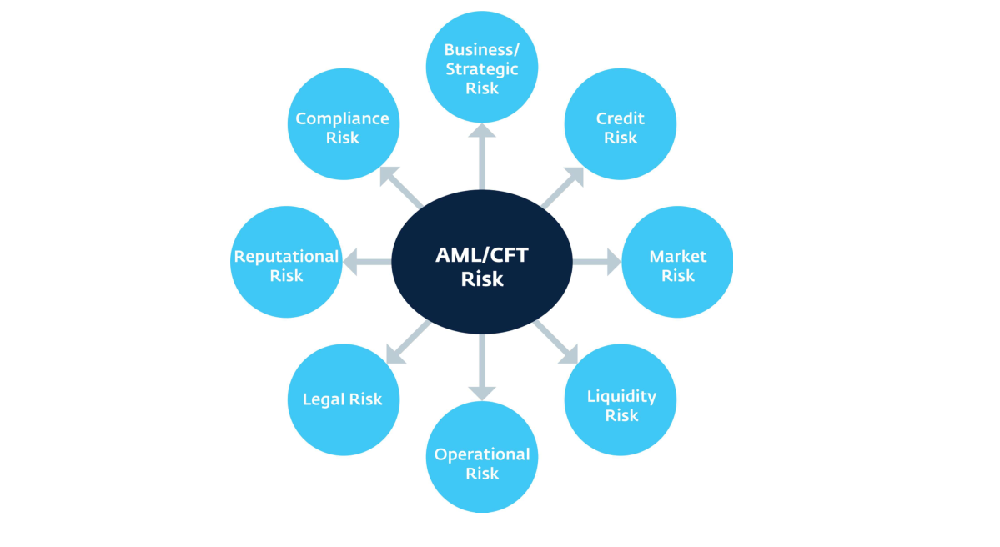

<!-- 원문 17쪽 -->

전사적 준법 위험관리13는 비즈니스 라인, 지원 부서, 법인 및 관할권 내외의 전체 조직에 걸쳐 준법 위험을 관리하는 데 사용되는 프로세스를 의미합니다. 이러한 접근 방식을 통해 준법 위험관리는 법인의 개별 사업 부문 내에서만 발생하는 것보다 더 넓은 맥락에서 수행됩니다.

은행의 컴플라이언스 리스크 관리 프로그램은 컴플라이언스 정책 및 절차, 컴플라이언스 리스크 관리 표준의 형태로 문서화되어야 합니다.

은행 위험관리 프레임워크의 일부로 규제 및 법률 준수는 일반적으로 법적 위험 또는 준법 위험 범주 내에서 고려됩니다. 그럼에도 불구하고, 은행 조직이 비즈니스 활동의 범위와 글로벌 성격을 크게 확장함에 따라 이러한 활동과 관련된 준법 요구 사항은 더욱 복잡해졌습니다. 그 결과, 조직은 특히 비즈니스 라인, 법인 및 관할권을 초월하는 준법 위험과 관련하여 위험관리 및 기업 거버넌스 문제에 직면해 있습니다. 많은 은행 조직은 전사적 준법 위험관리 프로그램과 프로그램 거버넌스/감독을 강화했습니다. 전사적 준법 부서는 AML/CFT를 포함한 준법 위험을 관리 및 감독하는 동시에 조직 전체에 강력한 준법 문화를 장려하는 데 핵심적인 역할을 합니다.

건전한 준법 위험관리 시스템14의 요소에는 다음이 포함됩니다.

- 적극적 이사회 및 고위경영진 감독(이익 동기와 위험 감수, 모든 범주에 걸친 준법 간의 균형을 보장하기 위한 문화 강조 포함15);

- 포괄적인 위험 측정, 모니터링 및 관리 정보 시스템; 그리고

- 적절한 정책, 절차 및 제한을 포함한 포괄적인 내부 통제.

효과적인 위험관리는 적절한 기업 지배구조의 핵심 요소입니다. 특히 위험, 위험 성향, 내부 통제 및 준법에 대한 정책을 승인하고 감독하기 위한 이사회의 요구 사항은 ML/FT 위험에 적합합니다. 이사회는 리스크를 완전히 식별하고, 리스크 노출을 모니터링하고, 은행 고유의 리스크를 관리하기 위해 구현된 내부 통제 환경의 충분성을 보장하고, 조직 문화에 관해 경영진 및 은행 직원과 적극적으로 소통하기 위한 인프라를 구축해야 합니다. 여기에는 다음이 포함됩니다.

- 조직 문화를 촉진하고 전달하는 비즈니스 전략 및 조직 목표를 개발합니다(즉, 최고위층의 분위기). 문화는 그룹이 하는 일과 그룹이 하는 일을 설명합니다. "통제 환경"은 조직의 문화입니다. 이는 관찰 가능한 행동과 일반적인 관계에 대한 설명을 통해 추론할 수 있습니다.

- 자격을 갖춘 고위경영진을 식별하고 고용합니다.

- 정책 및 절차를 포함하여 위험 성향과 위험 프레임워크를 설정합니다.

- 운영 성과 모니터링.

- 비즈니스 환경의 변화에 ​​맞춰 비즈니스 전략을 조정합니다.

최고의 은행에서 AML/CFT 위험관리는 은행의 위험 및 준법 관리 프레임워크의 필수적인 부분으로 간주됩니다. AML/CFT 위험에 대한 정보는 이사회가 정보에 입각한 결정을 내릴 수 있도록 적시에 완전하고 이해하기 쉽고 정확한 방식으로 이사회에 전달됩니다. 이사회는 은행의 정책과 절차가 효과적으로 구현되고 관리되도록 하기 위해 은행의 지배구조를 확립하는 명시적인 책임을 할당합니다. 이사회와 고위경영진은 일반적으로 AML/CFT 기능에 대한 전반적인 책임을 지는 적절한 자격을 갖춘 최고 AML/CFT 책임자를 임명합니다. AML/CFT 최고 책임자는 이사회, 고위경영진 및 비즈니스 라인에 필요한 접근 권한을 가질 수 있도록 은행 내에서 위상과 필요한 권한을 가져야 합니다.

> **주:** 13 연방 준비 제도 이사회 SR 08-08/CA 08-11 10월 16, 2008. 14 COSO – 기업 위험관리 프레임워크. 15 위험 범주의 예로는 비즈니스/전략, 신용, 시장, 유동성, 운영, 준법, 법률 및 평판 위험이 있습니다.

<!-- 원문 18쪽 -->

은행 전략 및 운영과 관련하여 경영진이 이러한 위험을 식별, 측정, 모니터링 및 통제하고 은행 운영에 필요한 기술 지식 수준을 유지하며 적절한 문화를 전달하는 데 필요한 조치를 취하고 있는지 확인하는 책임도 있습니다.

고위경영진은 각 전략과 관련된 위험을 관리하고 장기적으로 일상적으로 법률 및 규정을 준수하는 방식으로 전략을 구현할 책임이 있습니다. 따라서 경영진은 해당 기관의 활동에 완전히 참여하고 모든 주요 비즈니스 라인에 대한 충분한 지식을 보유하여 적절한 정책, 통제 및 위험 모니터링 시스템이 마련되고 권한 라인이 명확하게 규정되도록 해야 합니다. 고위경영진은 효과적인 내부 통제와 높은 윤리 기준에 대한 강력한 인식과 필요성을 확립하고 전달하는 책임도 있습니다. 이러한 책임을 충족하려면 은행의 고위 관리자가 은행 및 금융 시장 활동을 철저히 이해하고 관련 위험을 제한하는 데 필요한 내부 통제의 성격을 포함하여 해당 기관이 수행하는 활동에 대한 자세한 지식을 보유해야 합니다.

### 위험 측정, 모니터링 및 관리 정보 시스템

효과적인 위험 모니터링을 위해서는 모든 중요한 위험 노출을 식별하고 측정해야 합니다. 따라서 위험 모니터링 활동은 CRO, 고위경영진 및 이사회에 연결 조직의 재무 상태, 운영 성과 및 위험 노출에 대한 시기적절한 보고서를 제공하는 정보 시스템의 지원을 받아야 합니다. 조직 활동의 일상적인 관리에 참여하는 라인 관리자(예: 1선)와 준법 관리자(예: 2선)에 대한 정기적이고 충분히 상세한 보고서도 필요합니다.

위험 측정, 모니터링, 보고 및 이러한 프로세스를 지원하는 기술은 지난 몇 년 동안 발전해 왔습니다. 이제 은행은 AML/CFT 준법 위험관리 프로그램 및 프로그램 감독을 지원하기 위해 데이터와 다양한 시스템 및 기술을 활용하는 것이 중요합니다. 기술의 사용은 기관의 규모와 복잡성에 따라 달라집니다. 그러나 AML/CFT 최고 책임자는 다른 비즈니스 라인에서 운영하거나 사용하는 경우에도 자신의 기능과 관련된 한 IT 시스템에 액세스하고 혜택을 누릴 수 있어야 합니다.

AML/CFT 운영 위험관리 운영은 전반적인 은행 위험 평가, 고객 식별, 고위험 고객의 정기 평가 및 재평가, 의심 거래 모니터링 및 보고 시스템 성능, 교육과 관련됩니다.

은행은 최소한 규모, 활동, 복잡성은 물론 은행에 존재하는 위험 측면에서 적합한 모니터링 시스템을 갖추고 있어야 합니다. 대부분의 은행, 특히 국경을 넘어 운영되는 은행의 경우 효과적인 모니터링을 위해서는 모니터링 프로세스의 자동화가 필요할 수 있습니다.

연례 내부 감사에서는 IT 시스템이 적절하고 1차 및 2차 방어선에서 효과적으로 사용되는지 확인해야 합니다. 16 정책, 절차 및 제한을 포함하는 포괄적인 내부 통제 이사회와 고위경영진이 비즈니스 전략을 확정하고 기관 내 위험을 정량화하고 위험 성향(한도 포함)을 결정한 후 고위경영진에게 맞춤형 정책을 설계하고 구현하도록 지시합니다. 은행의 활동과 고객으로부터 발생하는 위험에 대한 절차 및 통제. 모든 은행 조직은 중요한 활동과 위험을 다루는 정책과 절차를 보유해야 하지만, 이러한 선언문에 포함된 적용 범위와 세부 정보 수준은 다양합니다.

최소한 은행은 고객 기반, 상품, 배송 채널, 제공되는 서비스(개발 중이거나 출시 예정인 상품 포함)에 존재하는 내재된 ML/FT 위험과 은행 또는 고객이 사업을 수행하는 관할권을 철저히 이해해야 합니다. 식별된 고유 위험을 적절하게 관리할 수 있도록 고객 수용, 실사 및 지속적인 모니터링을 위한 정책 및 절차를 설계하고 구현해야 합니다.

### 내부 통제

기관의 내부 통제 구조가 은행 조직과 위험관리 시스템의 안전하고 건전한 기능에 매우 중요하다는 것은 잘 알려져 있습니다.

> **주:** 16 BCBS. 2017. 지침: 자금세탁 및 테러자금조달과 관련된 위험의 건전한 관리.

<!-- 원문 19쪽 -->

공식적인 권한 라인에 대한 모니터링과 적절한 업무 분리 보장을 포함한 통제는 경영진의 가장 중요한 책임 중 하나입니다.

내부 감사, 준법 및 위험관리 기능 간의 관계는 2008 금융 위기 이후 규제 조사가 더욱 강화되었습니다. 전 세계 규제 기관은 내부 감사의 역할과 내부 감사가 전반적인 위험관리 프레임워크를 어떻게 보완하는지, 비즈니스 라인 관리, 위험관리, 준법 및 기타 통제 기능을 평가하는 방법에 관심을 집중해 왔습니다. 규제 당국은 은행이 효과적인 위험관리 기능, 준법 기능, 내부 감사 기능을 갖추어야 한다고 기대합니다. 은행의 운영 관리와 함께 이러한 각 통제 기능은 기업이 직면한 위험에 대한 방어선을 구성하며 세 가지 방어선이라고 합니다.17 세 가지 방어선은 다음과 같습니다.

- 첫 번째 라인: 운영 관리;

- 두 번째 라인: 위험관리 기능, 준법

### 기능 및 기타 모니터링 기능; 그리고

- 세 번째 줄: 내부 감사 기능.

다음 다이어그램은 위험관리 준법 감독 구조 모델을 보여줍니다18. CRO와 일반 준법 및 AML/CFT 제어를 위한 CCO(최고 준법 책임자)는 2차 방어선의 일부이며, 고위 책임자는 일반적으로 AML/CFT 준법에 대한 운영 책임을 집니다. 또한 일부 은행에서는 CCO가 최고 AML/CFT 책임자일 수도 있다는 점에 유의해야 합니다.

전반적인 위험관리의 맥락에서 프론트 오피스의 고객 대면 사업부는 해당 사업 영역 내에서 위험을 식별, 평가 및 관리하는 일차 방어선입니다. 이들은 정책과 절차를 알고 실행해야 하며, 이를 효과적으로 수행할 수 있는 충분한 자원을 할당받아야 합니다.

두 번째 방어선은 정책과 절차(예: 위험관리, 준법, 인적 자원, 법률)가 준수되는지 확인하는 제어 기능입니다. 위험관리 기능은 비즈니스 라인 관리를 통해 효과적인 위험관리 관행의 구현을 촉진하고 모니터링하며 예외 사항과 1차 구현 상태를 보고합니다.

**그림 2: 세 가지 방어선**

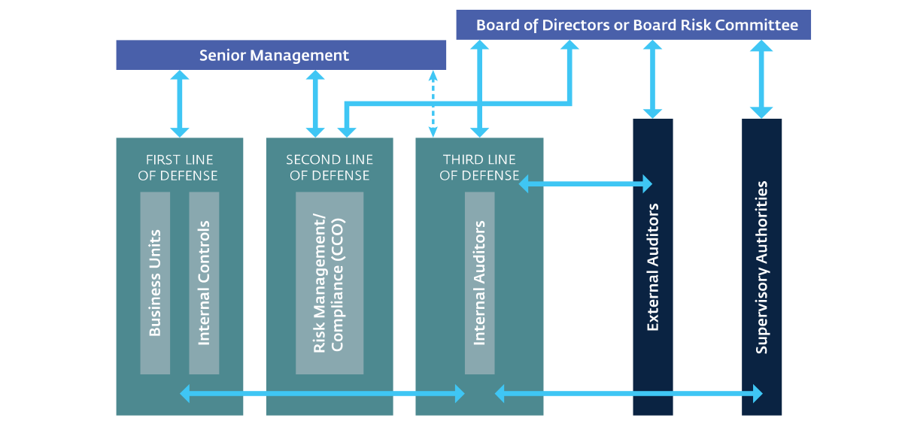

> **주:** 17 BCBS - 은행의 내부 감사 기능, 12월 2011; 기업 지배구조 강화 원칙, 10월 2010; 준법 및 18 8차 EU 회사법 지침에 대한 유럽 내부 감사 기관 연맹/유럽 위험관리 협회 연맹 지침, 기사 41에서 채택되었습니다.

<!-- 원문 20쪽 -->

내부 감사 기능. 내부 감사 기능은 내부 통제의 설계 및 실행과 법률, 규칙 및 준법의 효율성을 평가하는 일을 담당합니다. 또한 두 번째 라인이 수행하는 작업을 평가하여 두 라인이 모두 의도한 대로 작동하는지 확인합니다. 내부 감사에서는 통제 테스트 및 해당 법률 준수에 대한 정기적인 서면 평가를 독립적으로 보고하고 제공합니다.

AML/CFT 위험관리의 경우 프론트 오피스 고객 대면 사업부는 계속해서 해당 사업 영역 내 위험을 식별, 평가 및 관리할 책임이 있습니다. (AML/CFT 기대와 요구 사항의 진화하는 특성을 고려할 때 두 번째 라인이 기술 지식과 관련된 첫 번째 라인을 지원하고 AML/CFT 위험 평가를 수행하는 것이 일반적입니다.) 오늘날의 환경에서는 AML/CFT 두 번째 라인의 임명이 주도됩니다. AML 책임자는 3차 라인(내부 감사)에서 활용할 수 있는 2차 준법 테스트 책임을 수행할 뿐만 아니라 의심 활동 모니터링, 고객 온보딩에 대한 초기 및 지속적인 심사, 제재 준수 심사 등 일부 1차 기능을 운영할 수도 있습니다. 해당 부서는 정책과 절차를 알고 실행해야 하며, 이를 효과적으로 수행할 수 있는 충분한 자원이 할당되어야 합니다. AML/CFT 3차 방어선은 유사한 기능을 수행하고 기관의 3차 방어선과 동일한 책임을 갖고 있지만 고도로 기술적이고 위험 기반의 준법 영역도 담당합니다.

### 첫 번째 라인: 운영 관리

운영 관리는 은행의 비즈니스 활동 중에 직면하는 위험을 식별, 평가, 통제, 완화 및 보고할 책임이 있습니다.

이 "첫 번째 라인"은 위험 감수 한도를 정의하고 해당 한도를 준수하며 정책 지침을 따르고 승인된 절차를 구현/사용하는 비즈니스 생성자이기도 합니다. 일선은 또한 높은 수준에서 은행의 위험 감수 한도를 정의하는 데 중요한 역할을 합니다. 계단식 책임 구조를 통해 중간 관리자는 종종 통제 역할을 하고 직원의 해당 절차 실행을 감독하는 세부 절차를 설계 및 구현합니다.

일선 직원은 고객 상호 작용, 고객 관계 관리, 승인된 정책 및 절차 실행을 통해 AML/CFT 준법 위험관리에 필수적입니다. 첫 번째 라인은 가장 중요한 AML/ 중 하나를 충족하는 데 매우 중요합니다.

그리고 의심 활동. 일상적인 활동 중에 일선 직원은 고객이 나타내는 비정상적이거나 잠재적으로 의심 활동 및/또는 행동을 관찰할 수 있습니다. 일선 직원은 정책 및 절차에 따라 잠재적으로 의심스럽거나 비정상적인 활동을 식별하고 보고하고 보고하는 데 주의를 기울여야 합니다. 경영진은 모든 직원, 특히 고객과 직접 상호 작용하는 직원이 잠재적으로 의심 활동을 식별하고 추천하기 위한 내부 프로세스를 준수하는지 확인해야 합니다. 또한 경영진은 고객 퇴출 정책, 환거래은행과의 의사소통, 이전 고객 활동에 대한 내부 검토 등 추천 이외의 의심 활동에 대한 은행의 대응을 명확히 해야 합니다. 은행은 높은 윤리적, 전문적 기준을 충족할 수 있도록 장래 직원과 기존 직원을 선별하는 적절한 정책과 프로세스를 갖추고 있어야 합니다. AML/CFT 준법는 조직 내 모든 사람의 책임으로 간주됩니다.

직원 교육이 중요합니다. 이러한 교육의 범위와 빈도는 직원이 자신의 책임으로 인해 노출되는 위험 요소와 은행에 존재하는 위험의 수준 및 성격에 맞게 조정되어야 합니다. 모든 은행은 지속적인 직원 교육 프로그램을 시행하여 은행 직원이 은행 정책과 절차를 이행할 수 있도록 적절하게 교육을 받아야 합니다. 다양한 부문의 직원을 위한 교육 시기와 내용은 은행에서 직원의 필요와 은행의 위험 프로필에 따라 조정해야 합니다.

교육 요구 사항은 직원 기능 및 직무 책임에 따라 달라집니다. 교육 과정 구성 및 자료는 직원이 은행의 AML/CFT 정책 및 절차를 효과적으로 구현하는 데 필요한 충분한 지식과 정보를 갖도록 직원의 특정 책임이나 기능에 맞게 조정되어야 합니다. 같은 이유로 신입사원은 가능한 한 빨리 교육에 참석해야 합니다. 직원이 자신의 의무를 상기시키고 지식과 전문 지식을 최신 상태로 유지할 수 있도록 재교육 교육을 제공해야 합니다.

### 두 번째 줄: 위험관리 기능, 준법 기능 및 기타 모니터링 기능

이는 위험 감수(위험관리, 준법 위험, 인적 자원 및 법률)와 관련된 정책 및 절차가 마련되고 시행되도록 보장하는 제어 기능입니다. 위험관리 기능은 효과적인 위험관리 구현을 촉진하고 모니터링합니다.

<!-- 원문 21쪽 -->

조직 전반에 걸쳐 위험 노출 및 위험 보고를 정의하는 라인 관리입니다. 준법 기능은 법률, 규정 및 표준을 준수하지 않을 위험을 모니터링합니다. 기타 모니터링 기능에는 인사 부서와 법무 부서가 포함될 수 있습니다.

대부분의 은행에서는 2차 방어선의 일부로 최고 AML/CFT 책임자가 은행의 모든 ​​AML/CFT 의무를 지속적으로 이행할 책임이 있습니다. 은행의 규모와 복잡성에 따라 최고 AML/CFT 책임자가 CRO나 CCO 또는 이와 동등한 역할을 수행할 수도 있습니다. 그/그녀는 이사회 또는 이사회가 임명한 위원회에 직접 접근할 수 있어야 합니다. 직무를 분리하는 경우에는 최고책임자들과 각자의 역할 간의 관계가 명확하게 정의되고 잘 이해되어야 합니다.

최고 AML/CFT 책임자는 의심 거래를 고위경영진, 이사회 및 현지 금융 정보 유닛(FIU)에 보고할 책임도 있어야 합니다. AML/CFT 최고 책임자에게는 모든 책임을 효과적으로 수행하고 은행의 AML/CFT 체제에서 중심적이고 적극적인 역할을 수행할 수 있는 충분한 자원이 제공되어야 합니다. 그렇게 하려면 은행의 AML/CFT 제도, 법적 및 규제 요건, 관련 국제 표준, 비즈니스에서 발생하는 ML/FT 위험에 대해 완전히 숙지하고 있어야 합니다.

내부 감사 기능은 내부 통제의 설계 및 운영과 법률, 규칙 및 준법 관행의 효율성을 독립적으로 평가할 책임이 있습니다. 내부 감사 직원은 매년 통제 및 해당 법률 준수 테스트에 대한 서면 평가를 독립적으로 제공합니다. 외부 감사인은 재무 감사, 내부 통제 감사, AML/CFT 감사 중에 은행의 내부 통제 및 절차를 평가하는 데 중요한 역할을 할 수도 있습니다. 외부 감사인은 은행이 적용 가능한 현지 규정 및 감독 관행은 물론 환거래은행의 기대 사항을 준수하는지 독립적으로 확인할 수 있습니다.

내부 감사 기능은 위험관리 및 통제를 독립적이고 객관적으로 평가하고 AML/CFT 정책 및 절차 준수의 효율성에 대한 평가를 이사회 또는 이사회가 임명한 위원회(즉, 감사 위원회 또는 유사한 감독 기관)에 정기적으로 보고함으로써 거버넌스 및 감독 프레임워크에서 중요한 역할을 합니다. 은행의 내부 감사 프로그램은 1를 포괄적으로 다루어야 합니다. 준법 거버넌스 및 감독의 효율성;

2. 식별된 위험(AML/CFT 포함)을 처리하는 데 있어 은행 정책 및 절차의 적절성

3. 은행 통제 및 위험관리 실행에 있어서 은행 직원의 역량;

4. 의심 활동 모니터링 및 조사 프로세스와 같은 중요한 내부 통제 기능에 대한 자세한 테스트 그리고 5. 관련 직원에 대한 은행 교육의 효율성.

이사회는 감사 기능이 충분한 자원과 적절한 전문지식을 갖추고 그러한 감사를 수행할 수 있도록 은행 업무에 대한 지식을 갖추고 있는지 확인해야 합니다. 또한 이사회는 감사 범위와 방법이 은행의 위험 프로필에 적합하고 감사 및 테스트 빈도도 위험에 따라 결정되는지 확인해야 합니다. 마지막으로, 내부 감사자는 내부 감사 프로세스와 사업 부문을 담당하는 이사회 위원회에 보고하기 위한 발견 사항과 권장 사항을 공식적으로 추적하고 모니터링해야 합니다.

1차 위험관리와 2차 위험관리 사이에는 본질적인 긴장이 있습니다. 예를 들어, 1차 라인이 내부 은행 정책, 절차, 통제 및 위험 한도를 충족하는지 확인하기 위해 준법 여부를 테스트하거나 품질 보증 프로세스를 지원하는 것은 2차 라인의 책임입니다. AML/CFT 요구 사항의 고유한 위험 기반 특성으로 인해 첫 번째 줄과 두 번째 줄 모두에서 판단을 내려야 합니다. 내부 및 규제 요구 사항을 충족하기 위해 가장 적절한 결정을 내리는 데 어려움을 겪는 몇 가지 고유한 상황과 고객 상황을 고려할 때 준법 및 위험 선택이 항상 명확하지는 않습니다. 은행의 규모나 경영 구조에 관계없이 서로 다른 사업 분야 간에 잠재적인 긴장이 발생할 수 있으며 이를 해결해야 합니다. 때로는 고위경영진의 견해와 결정을 위해 문제를 제기해야 할 수도 있습니다.

<!-- 원문 22쪽 -->

건전한 위험관리 원칙은 은행이 직면한 모든 위험에 적용됩니다. 포괄적인 위험 평가를 수행할 때 은행은 국가, 부문, 은행 및 고객 관계 수준에서 관련 내재적 및 잔여 위험 요소를 모두 고려하여 기관의 위험 프로필과 적용할 적절한 완화 수준을 결정해야 합니다.

마찬가지로, 은행은 고객 기반, 제품 제공, 배송 채널 및 서비스 제공(개발 중이거나 출시 예정인 제품 포함)에 존재하는 내재된 ML/FT 위험과 은행이 속한 관할권을 철저히 이해해야 합니다.

국가 위험 평가 및 국제기구의 국가 보고서와 같은 외부 정보 소스뿐만 아니라 은행이 수집한 특정 운영 및 거래 데이터와 기타 내부 정보를 기반으로 해야 합니다. 고객 수용, 실사 및 지속적인 모니터링을 위한 정책 및 절차는 식별된 고유 위험을 적절하게 제어할 수 있도록 설계 및 구현되어야 합니다. 19 주요 성공 요인으로서 은행은 거래 관계에 있는 해당 위험을 식별하고 효과적인 KYC/CDD 프로세스를 포함하여 이러한 위험을 완화하기 위한 내부 통제를 구현해야 합니다.

> **주:** 19 BCBS. 2017. 지침: 자금세탁 및 테러자금조달과 관련된 위험의 건전한 관리.

<!-- 원문 23쪽 -->

### 3.1 소개

건전한 AML/CFT 프로그램은 금융 기관이 직면한 위험, 관련 규제 요구 사항, 규제 지침 및 비준수로 인한 잠재적 영향에 대한 완전한 이해를 기반으로 해야 합니다. AML/CFT 프로그램은 모든 국가 요구 사항과 기대치를 통합해야 합니다. 또한 은행은 비즈니스 요구에 따라 국가적 요구 사항을 넘어 글로벌 모범 사례와 원칙을 구현해야 합니다. 본 지침서 외에도 출발점 역할을 하는 신흥시장 은행과 관련된 주요 국제 AML/CFT 표준에는 다음이 포함됩니다. 자금세탁방지 및 테러 및 확산 자금 조달에 관한 FATF 국제 표준; FATF(총칭하여 "FATF 40+9" 권장 사항)에 의해 발행된 후속 해석 노트; 자금세탁 및 테러자금조달과 관련된 위험의 건전한 관리에 관한 BCBS의 지침.

FATF 40 권장 사항은 개별 국가와 은행이 ML/FT 위험을 효과적으로 관리하기 위해 구축할 수 있는 조치의 기본 프레임워크를 설정합니다. FATF는 개인과 기업이 책임감 있고 지속 가능한 방식(금융포용20)으로 제공되는 유용하고 저렴한 금융 상품 및 서비스에 접근할 수 있는 방법과 위험 기반 접근 방식인 21에 접근할 수 있는 방법을 설명하는 해석 노트와 추가 지침 문서로 권장 사항을 보완했습니다. 두 가지 모두 효과적인 AML/CFT 프로그램을 구축하는 데 도움이 될 수 있습니다. BCBS 지침은 은행이 FATF 40를 기반으로 ML/FT 위험을 관리하는 방법을 더욱 확장합니다.

보완하는 권장 사항.

또한, 피응답은행은 파트너 환거래은행이 직면한 ML/FT 문제를 명확히 하기 위해 고안된 주요 OECD 민간 부문 주도 산업 이니셔티브를 알고 있어야 합니다. 그 예로는 13 글로벌 은행 협회인 Wolfsberg Group, 22에서 개발한 효과적인 ML/FT 위험관리를 위한 모범 사례와 지침 원칙이 있습니다. 이들의 권장 관행은 인용된 다른 국제 표준과 일치합니다.

Wolfsberg가 수행한 유용한 이니셔티브 중 하나는 CBR을 수행, 유지 또는 종료할지 여부를 고려할 때 피응답은행의 AML/CFT 관행을 평가하기 위해 많은 OECD 환거래은행에서 사용하는 모델 환거래은행 실사 설문지23를 발행하는 것입니다. 그러나 CBR을 설립하거나 종료하기로 한 결정은 이 실사 설문지보다 더 많은 것을 기반으로 한다는 점에 유의하십시오. 국가 위험, 지속적인 준법 비용 및 예상 수익은 단일 은행의 AML/CFT 실사 결과보다 중요할 수 있는 추가 고려 사항입니다. 그럼에도 불구하고, 피응답은행은 이 설문지와 자체 AML/CFT 프로그램을 개발할 때 암시되는 모범 사례 표준을 숙지하고 싶을 수도 있습니다.

강력한 AML/CFT 프로그램은 피응답은행이 인지하는 높은 위험을 줄여 대규모 글로벌 환거래은행 네트워크에서의 입지를 향상시킬 수 있습니다.

## 제3장 건전한 AML/CFT 프로그램의 필수 요소

> **주:** 20 자금세탁방지 및 테러자금조달 조치 및 금융포용(2013) 21 FATF. 위험 기반 접근 방식에 대한 지침. 은행 부문. 2014 22 볼프스베르크 그룹의 임무, 타임라인 및 배경은 https://www.wolfsberg-principles.com/ 23에서 확인할 수 있습니다. 볼프스베르크 그룹 환거래은행 실사 설문지는 https://www.wolfsberg-principles.com/sites/default/files/wb/pdfs/Wolfsberg%27s_CBD DQ_220218_v1.2.pdf에서 확인할 수 있습니다.

<!-- 원문 24쪽 -->

의사결정 과정의 일부로 국제적으로 환거래은행을 운영합니다.

최고의 AML/CFT 위험관리 관행을 사용하면 피응답은행은 미국 달러와 유로로 역외 거래를 청산하고 결제하는 환거래은행의 기대를 충족할 수 있습니다. 이를 통해 새로운 CBRs를 유지하고 필요에 따라 획득하며 고객에게 국경 간 은행 서비스를 계속 제공하는 능력이 향상될 것입니다. CBR 유지 외에도 건전한 AML/CFT 프로그램은 규제 제재, 처벌 및 관련 평판 위험에 대한 은행의 노출을 최소화합니다. 기관이 보다 강력한 AML/CFT 프로그램을 개발함에 따라 AML/CFT 준법을 위한 리소스 할당이 일반적으로 증가함에 따라 지속적인 투자가 잠재적으로 운영 문제가 될 수 있습니다. 이러한 추가 투자와 강화된 AML/CFT 통제는 비즈니스 목적을 위해 환거래은행 관계를 유지, 유지 및 획득하기 위한 비즈니스 요구 사항과 부과될 수 있는 제재 또는 처벌을 다루기 위한 재무 및 평판 위험의 잠재적 감소 측면에서 보아야 합니다.

고객이 지속적인 국경 간 뱅킹 서비스를 이용할 수 있도록 AML/CFT 프로그램을 강화합니다. 귀하의 은행은 글로벌 금융 시스템과 계속 연결되어 있습니다. 국제 표준 또는 기타 표준을 충족합니다. 궁극적으로 강력하고 지속 가능하며 성숙한 준법 프로그램을 달성하는 데는 몇 년이 걸리며 단계적으로 달성될 수 있습니다.

건전한 AML/CFT 프로그램에는 ML/FT 위험관리의 모든 중요한 측면을 처리하도록 설계된 다음과 같은 상호 연관된 구성 요소가 포함되어야 합니다: 24 1. 거버넌스 2. 위험 식별, 평가 및 완화

4. 고객 식별 및 고객확인의무 5. 거래 모니터링 6. 7를 보고합니다. 커뮤니케이션 및 교육 8. 지속적인 개선 및 테스트 9. 내부 및 외부 감사 다음 섹션에서는 AML/CFT 프로그램의 핵심 요소와 환거래은행 계좌를 확보 및 유지하고 고부가가치 은행 고객이 요구하는 역외 뱅킹 서비스를 제공하기 위한 강력한 AML/CFT 프로그램 구축을 보장하기 위해 구현을 고려해야 하는 글로벌 모범 사례에 대해 설명합니다. 또한 강력한 AML/CFT 프로그램에 투자하면 기관은 효율적이고 효과적으로 내부 통제를 강화하고 위험을 평가하며 AML/CFT 준법 프로그램과 관련된 모든 요청에 ​​쉽게 대응할 수 있습니다.

### 3.2 거버넌스

건전한 거버넌스 구조는 효과적인 AML/CFT 프로그램의 기초이며, 이사회와 고위경영진이 최고위층의 분위기를 조성하고, 자격을 갖춘 최고 AML/CFT 임원을 고용하고, 세 가지 방어선에 적절한 자원을 확보하는 것을 포함합니다. "최고위의 톤"은 핵심 임무의 일환으로 AML/CFT 요구 사항을 준수하고 이것이 은행의 전반적인 위험관리 프레임워크에 중요하다는 인식을 충족하겠다는 은행 최고위층의 공개 약속입니다.

여기에 설명된 모범 사례는 은행의 AML/CFT 거버넌스 구조를 강화합니다:25,26

### 이사회

- 이사회에는 ML/FT 위험을 명확하게 이해하고 AML/CFT 문제와 관련된 정보에 입각한 결정을 내릴 수 있는 사람들이 포함되어야 합니다. AML/CFT 준법에 대한 이사회의 인식은 해당 작업에 대한 교육 및 주기적인 모니터링을 통해 향상될 수 있습니다.

- 이사회는 전사적 AML/CFT 정책 및 절차를 승인하고 감독할 책임이 있습니다. 기관의 규모와 복잡성에 따라 이사회의 위원회(예: 준법 위원회 또는 위험 위원회) 중 하나가 이 책임을 수행할 수 있습니다.

- 이사회는 주요 준법 위험과 이를 완화하기 위한 계획을 최소한 1년에 한 번 통보받아야 하며, 주요 준법 실패 및 시정 조치와 같은 기타 AML/CFT 문제에 대해서도 시의적절하고 포괄적인 방식으로 통보받아야 합니다.

- 이사회는 자격을 갖춘 최고 AML/CFT 임원을 임명할 책임을 져야 합니다. 이사회는 은행이 AML/CFT 준법에 전념하는 충분한 전문 지식, 기술 및 제어 시스템을 보유하고 있는지 확인하기 위해 은행의 자원 할당을 지속적으로 모니터링해야 합니다.

> **주:** 24 BCBS. 2017. 지침: 자금세탁 및 테러자금조달과 관련된 위험의 건전한 관리. 25 BCBS. 2017. 지침: 자금세탁 및 테러자금조달과 관련된 위험의 건전한 관리. 26 BCBS. 2015. 지침: 은행을 위한 기업 지배구조 원칙.

<!-- 원문 25쪽 -->

### 고위경영진

- 고위경영진 AML/CFT 관련 책임에는 다음이 포함되어야 합니다.

- 자격을 갖춘 최고 AML/CFT 임원을 식별, 평가 및 채용하는 데 있어 이사회를 지원합니다.

- 이사회가 확립한 AML/CFT 준법 문화를 전달 및 강화하고, 현지 법률 및 기타 정책 요구 사항(예: 채택된 국제 표준)을 준수하도록 보장하기 위해 이사회에서 승인한 AML/CFT 준법 프로그램 요구 사항을 구현 및 시행합니다.

- AML/CFT 위험 평가 승인 및 모니터링;

- 모든 AML/CFT 관련 정책을 승인합니다.

- 이사회 준법 위원회에서 논의된 모든 주요 준법 관련 이니셔티브 및 실행 계획 또는 AML/CFT 임원을 통해 작성된 임시 제안을 승인합니다.

- 3차 방어선을 통해 은행에 대해 확립된 AML/CFT 통제 메커니즘의 효율성을 지속적으로 모니터링 및 평가하고 필요에 따라 이사회의 관심 영역에 보고하고 에스컬레이션합니다.

- 모든 방어선 내에서 책임을 보장합니다. 그리고

- AML/CFT 준법을 직무 설명 및 해당 인력의 성과 평가에 통합합니다.

- 고위경영진은 정책, 절차 및 위험 통제 실행에 있어 중요한 새로운 AML/CFT 준법 위험과 약점을 모니터링하고 이에 대한 정보를 받아야 합니다. 확인된 문제를 완화하기 위해 시정 조치 계획을 적시에 개발해야 합니다.

### 첫 번째 방어선

- 일반적으로 사업부(예: 고객 응대 직원, 프론트 오피스)는 특정 사업 분야 또는 초점에 따른 위험을 식별, 평가 및 통제하는 일차 방어선입니다.

- 사업부의 직원은 AML/CFT 정책과 절차를 이해하고 수행해야 하며 조직 임무의 이 부분을 달성하기 위해 충분한 자원과 교육을 제공받아야 합니다.

### 두 번째 방어선

- 2차 방어선에는 AML/CFT 준법 기능과 AML/CFT 준법의 특정 부분(예: 정책 및 절차 개발, 의심 거래 시스템 운영, 조사 및 보고 프로세스, 필수 통화 보고 및 기타 현지 법률) 실행을 담당하는 최고 AML/CFT 책임자가 포함됩니다. 요구 사항), 사업부와 긴밀히 협력하여 교육을 제공하고 AML/CFT 요구 사항 및 위험 기반 개념을 이해합니다.

- 또한 사업부의 위험을 식별 및 관리하고 정책 및 절차가 현지 법률을 준수하고 준수하는지 확인하기 위해 일부 영역에서 준법 테스트를 수행할 수도 있습니다.

### AML/CFT 준수 기능:

- AML/CFT 준법 부서는 은행 내에서 공식적인 지위를 가져야 하며 독립적이어야 합니다. 예를 들어 준법 담당자는 준법 책임과 기타 일선 책임 간에 이해 상충이 있는 위치에 있어서는 안 됩니다.

- 필요한 지식과 기술을 갖춘 인재를 고용하고 유지하기 위해 은행은 보상 수준이 전문성과 권위 수준에 상응하도록 보장해야 합니다.

- 준법 부서 직원은 AML/CFT 위험을 식별, 측정 및 모니터링하기 위해 핵심 위험 지표(KRIs)를 개발해야 합니다. KRIs에 대한 자세한 보고서는 이사회 및 고위경영진부터 운영 관리까지 모든 관련 이해관계자에게 제공되어야 합니다.

- 은행의 위험 프로필을 기반으로 준법 부서 직원은 ML/TF 위험을 완화하는 데 필요한 통제 프레임워크를 설계하고 정책 및 절차를 개발해야 합니다.

- 준법 부서 직원은 자신의 책임을 수행하는 데 필요한 모든 정보와 은행 직원에 접근할 수 있어야 합니다.

- 준법 부서 직원은 정기적인 테스트를 실시하여 일선 내부 통제가 의도한 대로 작동하는지 확인해야 합니다.

- 준법 활동은 독립적인 감사를 통해 정기적으로 검토되어야 합니다.

<!-- 원문 26쪽 -->

### AML/CFT 책임자:

- AML/CFT 담당자는 은행의 규제 요건과 다양한 사업 부문 및 은행 운영에서 발생하는 ML/FT 위험에 대한 적절한 자격과 지식을 갖추고 있어야 합니다.

- 담당자는 전체 기관에 걸쳐 해당 AML/CFT 프로그램을 책임져야 하며, AML/CFT 위험과 관련된 결정에 영향을 미치고 은행의 AML/CFT 요구 사항을 효과적으로 이행할 수 있도록 은행 내에서 충분한 권한과 직위를 보유해야 합니다.

- 최고 AML/CFT 책임자가 최고 경영자(CEO), 최고 재무 책임자(CFO) 또는 기타 고위경영진에게 직접 보고하는 경우 해당 임원도 보고하고 이사회에 직접 접근할 수 있어야 합니다.

- 책임자는 위험 평가, 관련 성과 지표를 기반으로 한 준법 위험 프로필의 변경 사항, 식별된 위반 사항 및 시정 조치를 포함하여 AML/CFT 준법 문제에 대해 이사회 및 고위경영진에 보고해야 합니다.

- AML/CFT 임원의 독립성이 가장 중요하며, CFO, 최고운영책임자(COO), 최고감사인 등 사업 부문의 책임 및 기타 집행 기능과 구별되는 역할을 맡아야 합니다.

- 국내 및 국제적으로 사업을 수행하는 은행은 전체 그룹을 관리할 최고 AML/CFT 임원을 임명해야 합니다. 최고 AML/CFT 책임자는 모든 전략의 구현을 감독하고 정기적인 현장 방문을 통해 적절한 준수 여부를 확인해야 합니다.

- AML/CFT 담당자는 규제 기관 및 금융 정보 기관(FIU)을 포함한 내부 및 외부 당사자의 모든 AML/CFT 관련 문제에 대한 연락 담당자가 되어야 합니다.

### 세 번째 방어선

- 세 번째 방어선은 첫 번째 및 두 번째 방어선에서 생성된 AML/CFT 준법 및 위험 프로세스의 효율성을 독립적으로 평가하는 역할을 담당하는 내부 감사 기능입니다. 25 내부 감사 직원은 충분한 AML/CFT 전문 지식과 감사 경험을 보유해야 합니다.

- AML/CFT 관련 책임에는 다음이 포함되어야 합니다.

- 관련 AML/CFT 프로그램 문서(예: KYC/ CDD/강화된 실사[EDD] 정책 및 의심 거래 식별, 조사 및 보고와 관련된 절차 및 절차)에 대한 정기적인 평가 수행.

- KYC/CDD/EDD, 교육, 의심 활동 보고, 기록 유지 및 보존과 같은 1차 및 2차 방어선에서 수행되는 AML/CFT 제어 및 프로세스에 대한 테스트를 수행합니다.

- 은행의 AML/CFT 위험 평가에 대해 정기적인 평가를 실시합니다. 그리고

- 독립적인 감사 또는 규제 조사 결과로 인해 발생하는 모든 시정 조치에 대한 후속 조치.

- 내부 감사 부서 직원은 독립적이어야 하며, 은행 내에서 자신의 책임을 객관성 있게 수행할 수 있는 충분한 권한을 가져야 합니다.

- 내부 감사 기능 직원은 이사회 감사 위원회 또는 유사한 감독 기관에 보고해야 합니다.

효과적인 AML/CFT 거버넌스를 위해 이사회와 고위경영진은 은행에서 위험 및 준법 문화를 설정하는 데 있어 자신의 책임에 대한 의지를 보여야 합니다. 효과적인 AML/CFT 거버넌스는 모든 해당 직원의 책임을 정의하고 명확하게 합니다.

이는 은행의 AML/CFT 위험관리 기능의 전반적인 효율성을 입증하는 데 핵심입니다. 27

> **주:** 27 일부 신흥시장 국가에서는 외부 감사가 1차 및 2차 방어선에서 생성된 AML/CFT 프로세스의 효율성을 평가하는 것과 관련된 책임을 수행할 수 있습니다.

<!-- 원문 27쪽 -->

은행은 정기적인 전사적 AML/CFT 위험 평가를 통해 직면한 특정 ML/FT 위험을 철저히 이해해야 합니다. 업계에는 AML/CFT 위험 평가를 수행하는 여러 가지 접근 방식이 있지만 일반적으로 모두 다음 세 단계를 포함합니다.

1. 은행이 직면한 고유한 ML/FT 위험 식별 2. 내부 통제 평가 그리고 3. 은행의 고유 위험에 대한 통제의 효율성/상태를 고려하는 잔여 위험 평가. 결과적으로 발생하는 잔여 위험은 은행의 위험 허용 범위 내에서 측정되어야 합니다.28,29

여기에 나타나는 것은 높은 수준의 그림입니다. 포괄적이고 성숙한 위험 평가 방법론 및 프로세스를 개발하려면 상당한 양의 작업, 데이터 수집, 분석 및 전문 지식이 필요합니다. 이 예는 모든 경우에 적용되는 일률적인 접근 방식으로 해석되어서는 안 됩니다.

### 단계 1: 은행이 직면한 고유한 ML/FT 위험 식별

모든 사업 부문에서 직면하게 되는 고유한 ML/FT 위험을 평가하기 위해 은행은 위험 평가 프로세스에 다음 위험 범주를 포함해야 합니다.

- 고객 기반

- 제공되는 제품 및 서비스

- 전달 채널

- 관할권

- 기타 질적 위험 요소 강력한 AML/CFT 프로그램은 피응답은행이 인식한 높은 위험을 줄여 대규모 글로벌 환거래은행 네트워크에서의 입지를 향상시킬 수 있습니다.

**그림 3: EWRA의 단계**

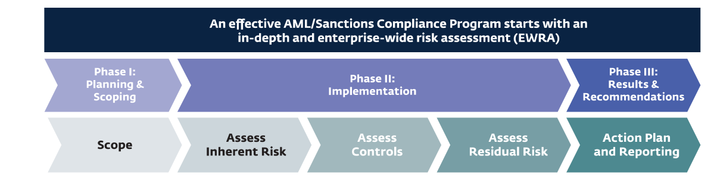

사업부, 법인, 부서, 국가 및 지역을 포함하여 평가할 사업 영역의 범위와 구조를 정의합니다.

ML/FT 위험 모두에 대한 경험적 데이터 분석 및 분석 기법을 기반으로 고유 위험을 평가하기 위한 위험 영역 및 요소를 선택합니다.

과거 감사, 자체 평가 설문지 및 통제에 대한 문서 증거를 기반으로 완화 통제의 설계 및 운영 효율성을 평가합니다.

충분한 완화가 이루어지지 않은 위험 요소와 가장 큰 위험을 초래하는 사업 영역을 강조하고 기관의 위험 선호도 진술과 비교하여 결과를 평가합니다.

식별된 격차를 기반으로 실적이 저조한 통제에 대한 실행 계획을 개발하고, 보고를 작성하고, 감사/시험 목적을 위한 문서를 준비합니다.

출처: Deloitte Risk and Financial Advisory.

> **주:** 28 볼프스베르크. 2015. 자금세탁, 제재, 뇌물 수수 및 부패에 대한 위험 평가에 대한 볼프스버그 자주 묻는 질문입니다. 29 자금세탁, 제재, 뇌물 수수 및 부패에 대한 위험 평가에 대한 볼프스버그의 자주 묻는 질문(2015)은 내재된 위험, 통제 및 잔여 위험을 다음과 같이 정의합니다. "내재된 위험은 통제 환경이 적용되지 않을 때 자금세탁, 제재 또는 뇌물 수수 및 부패 위험에 대한 노출을 나타냅니다." "통제란 ML 위험의 실현을 방지하거나 잠재적인 위험을 즉시 식별하기 위해 FI가 시행하는 프로그램, 정책 또는 활동입니다. 또한 통제는 조직의 활동을 관리하는 규정을 준수하는 데에도 사용됩니다." "잔여 위험은 내재된 위험에 통제를 적용한 후에도 남아 있는 위험입니다. 이는 내재된 위험 수준과 위험관리 활동/통제의 전반적인 강도 사이의 균형을 맞춰 결정됩니다. 잔여 위험 등급은 FI 내의 ML 위험이 적절하게 관리되고 있는지 여부를 나타내는 데 사용됩니다."

<!-- 원문 28쪽 -->

은행은 고객과 관련된 위험을 개별적으로 또는 범주별로 이해해야 합니다. 고객 위험을 평가할 때 은행은 고위험 고객을 식별하기 위한 기준을 설정하는 것이 중요합니다. 고객 유형, 소유권, 산업, 직업/비즈니스, 과거 활동, 정치적/정부 역할, 제품 사용, 고객의 거래 활동 등의 요소를 사용하여 고객 위험을 차별화할 수 있습니다. 각 고객은 기준에 따라 위험 등급을 받아야 합니다. 이 정보는 은행에서 고객 기반의 구성(예: 최소한 고위험군, 중간 위험군, 저위험군 인구의 비율)을 결정하는 데 사용됩니다. 은행은 특정 범주의 고객이 더 높은 위험을 초래할 수 있다는 점을 고려해야 합니다. 그러한 고객의 예는 다음과 같습니다.

- 정치적 주요인물(PEPs)(일반적으로 뇌물 수수 및 정부 부패 수준이 높은 국가에서 사업을 운영할 때 ML/FT에 걸릴 위험이 더 높습니다).

- 자금 또는 가치 이전 서비스 제공업체(비즈니스는 현금 집약적이며 AML/CFT 통제력이 부족할 수 있으므로 더 높은 위험으로 간주됨).

- 상대 은행 고객(일반적으로 실행 은행이 상대 은행의 AML/CFT 통제에 의존해야 하는 경우 더 높은 위험으로 간주되며 그 강도는 알 수 없음).

### 제공되는 제품 및 서비스

위험 평가 과정에서 은행은 제공하는 상품과 서비스의 목록을 작성하고 상품에 내재된 위험을 평가해야 합니다. 평가에는 은행이 제공하는 기존 상품 및 서비스뿐만 아니라 개발 중이거나 출시 예정인 상품 및 서비스도 포함되어야 합니다. 평가에 향후 제품 제공을 포함하면 경영진이 현재 통제가 위험을 관리하는 데 충분한지 또는 추가 통제가 필요한지를 예측하는 데 도움이 됩니다. 일반적으로 다음 제품 및 서비스는 역사적으로 범죄 수익을 배치, 계층화 또는 통합하는 데 사용되어 ML/TF 위험이 높은 것으로 간주되므로 ML/FT 위험이 더 높습니다.

나열된 제품 외에도 전신 송금은 높은 수준의 위험을 초래할 수 있습니다. 은행은 전신 송금 및 관련 메시지를 모니터링하여 필수 수혜자 및/또는 송금인 정보가 모두 포함되지 않은 메시지를 탐지하고 지정된 개인 및 단체(예: 인권 침해, 테러 활동 또는 기타 사유로 인해 금융 제한을 받는 개인 및 단체)와 관련된 전신 송금 처리를 방지하기 위한 적절한 조치를 취해야 합니다. AML/CFT 위험관리와 준법 입증에는 완전하고 정확한 기록이 중요합니다. 이러한 위험을 관리하고 범죄 가능성으로부터 은행을 보호하려면 투명성이 필수적이기 때문입니다.

### 배송 채널

위험 평가에서는 전달 채널도 고려해야 합니다. 특정 전달 채널(예: 대면하지 않는 비즈니스 관계 또는 거래)은 고객의 신원 및 활동을 확인하는 것이 더 까다로워 더 높은 ML/FT 위험을 초래할 수 있습니다.

### 관할권

위험 평가에서는 은행이 영업하는 관할권과 관련된 위험뿐만 아니라 은행 고객이 사업을 수행하는 관할권과 관련된 위험도 고려해야 합니다. 은행은 지리적 위치를 이해하고 각 국가 내 고객 수를 결정하기 위해 분석을 수행해야 합니다. 다양한 관할 구역의 고객 수를 결정하는 것은 거주지, 국적 및/또는 법인 설립 등의 요소 중 일부 또는 전부를 기반으로 할 수 있습니다. 관할권 위험을 평가할 때 은행은 외부에서 구입한 국가 위험 방법론/모델을 사용하거나 더 높은 위험을 내포하는 하위 국가 관할권을 위해 자체 개발할 수 있습니다. 은행인 경우

- 환거래은행업

- 프라이빗 뱅킹(국내 및 국제)

- 무역금융

- 계좌를 통해 결제 가능

- 저장 가치 상품

- 국경 간 대량 현금 배송

- 국내 대량현금배송

- 국제 현금 편지

- 원격입금 회수

- 가상/디지털 화폐

- 저가증권

- 메일 보관

- 국경 간 송금

- 방문 고객을 위한 서비스(비계정 보유자)

- 개인자동입출금기 후원

<!-- 원문 29쪽 -->

FATF30 또는 OECD 국가 위험 분류에서 발표한 고위험 및 기타 감시 관할 구역 목록과 같이 국제 테러를 지원하는 것으로 알려진 경제 제재 대상 국가와 자금세탁 및 테러자금조달방지에 결함이 있는 국가를 식별하는 국제 조직의 국가 보고서 활용을 고려해야 합니다. 31 또한 바젤 AML 지수32는 전 세계적으로 ML/TF의 위험이 있습니다.

### 기타 질적 요인

은행의 고유 위험에 영향을 미칠 수 있는 다른 질적 요소가 있으므로 ML/FT 위험 평가 중에 고려해야 하거나 고려해야 할 수 있습니다. 고려해야 할 질적 요소 중 일부는 다음과 같습니다.

- 예상되는 계정 및 수익 성장;

- 최근 AML/CFT 준법 담당자 교체율;

- AML/CFT 프로그램 요구 사항 및 책임을 수행하기 위해 제3자 공급자에 의존합니다.

- 최근 집행 조치 및/또는 처벌; 그리고

- 독립적인 감사 및 규제 조사 결과.

아래 그림은 평가 요약을 제공합니다.

설명을 위한 목적일 뿐이며 완전한 것으로 간주되어서는 안 됩니다.

### 단계 2: 내부 통제 평가

은행이 고유한 위험을 식별한 후 프로세스의 두 번째 단계에서는 식별된 위험을 얼마나 잘 관리하는지 확인하기 위해 기존 통제의 품질을 평가하는 작업이 포함됩니다. 은행은 기존 통제 수단의 전반적인 설계 및 운영 효율성을 평가합니다. 제어 효율성은 해당 분야 전문가의 자가 평가 및 과제를 통해 평가할 수 있습니다. 내부 통제의 효율성을 판단할 때는 독립적인 감사 테스트와 내부 준법 테스트 결과도 고려해야 합니다.

다음 그림은 AML/CFT 제어 평가 접근 방식을 보여줍니다. 이 방법론은 일반적으로 위험 평가 프로세스의 제어 부분에 사용되며 각 중요 제어의 상태를 평가하고 문서화하기 위한 제어 설문지("샘플 제어 범주" 참조) 작성을 포함합니다. 그런 다음 통제 평가의 결과와 통제 효과에 대한 후속 계산이 다양한 위험 수준에 따라 수집 및 요약됩니다("만족", "개선 필요" 및 "불만족" 등급 참조). 위험 평가 프로세스의 이 단계에서는 상당한 양의 정보도 필요합니다.

**그림 4: 위험 요소**

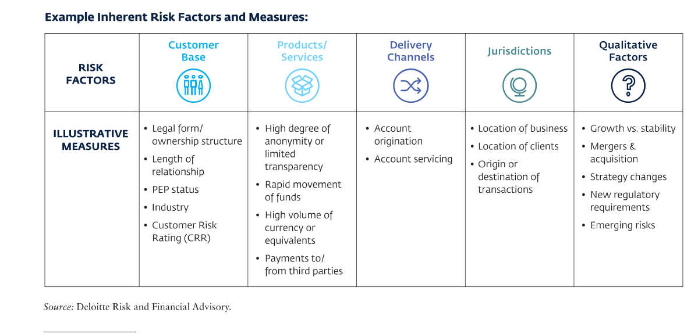

> **주:** 30 http://www.fatf-gafi.org/countries/#high-risk 31 http://www.oecd.org/trade/xcred/crc.htm 32 https://index.baselgovernance.org/sites/index/documents/Basel_AML_Index_Report_2017.pdf

<!-- 원문 30쪽 -->

포괄적이고 성숙한 통제 위험 평가 방법론 및 프로세스를 개발하기 위한 전문 지식.

위험 식별 및 평가는 은행이 생성한 운영 및 거래 데이터와 같은 내부 정보뿐만 아니라 다양한 국제기구의 국가 보고서 및 국가 위험 평가와 같은 외부 정보를 기반으로 해야 합니다. 위험 평가 방법에는 정량적 요소와 정성적 요소(예: 거래량 및 가치)33가 모두 포함되어야 하며 명확하게 문서화되고 고위경영진의 승인을 받아야 합니다.

### 단계 3: 잔여 위험 평가

은행이 내재된 위험과 완화를 위해 설계된 통제의 효율성을 평가하고 나면 위험 평가의 3단계가 완료될 수 있습니다. 잔여 위험은 내재된 위험에 통제가 적용된 후 남은 위험입니다. 이는 고유 위험과 통제 위험 평가 모두에서 종합적인 결론을 도출하고 잔여 위험을 결정하는 프로세스입니다(다음 잔여 위험 접근 방식 그림 참조). 잔여 위험은 은행이 제기하는 ML/FT 위험이 효과적으로 관리되고 있는지 여부를 나타냅니다. 예를 들어, 은행의 고유 위험이 "중간"으로 간주되고 통제가 다음 세 가지 기준에 따라 "불만족"으로 평가되는 경우

그림 6에 표시된 것처럼 이 "높음" 잔여 위험 등급은 "중간" 위험 등급과 "불만족" 제어 등급의 교차점에서 발견됩니다.

위험 평가의 빈도는 국내 규제 요구 사항, 은행의 위험 프로필에 영향을 미치는 인수 합병, 새로운 상품 및 서비스, 위험 평가 결과, 잠재적으로 상응하는 은행 기대 등 여러 요인에 따라 달라집니다. 35 은행이 매년 위험 평가를 수행하는 것이 일반적입니다. 그러나 은행은 은행의 리스크 프로필을 크게 변화시키는 새로운 또는 새로운 리스크를 식별하는 경우(예: 새로운 시장이나 지역으로 확장하거나 새로운 전달 채널을 구현하는 경우) 매년보다 더 자주 리스크 평가를 업데이트해야 합니다.

은행은 위험 평가를 수행하기 위해 외부 당사자나 외부에서 구입한 기술에 의존할 수 있지만 위험 평가 및 관리에 대한 책임은 궁극적으로 은행 이사회와 고위경영진에게 있으며 "아웃소싱"될 수 없다는 점을 기억해야 합니다. 은행이 위험 평가를 위해 외부 당사자를 고용하는 경우, 외부 당사자는 은행이 정한 위험 평가 방법론과 관련 정책 및 절차와 현지 요구 사항을 따라야 합니다. 외부에서 구매한 기술/위험 평가 모델의 경우 은행은 다음을 수행해야 합니다.

**그림 5: 위험 통제 카테고리**

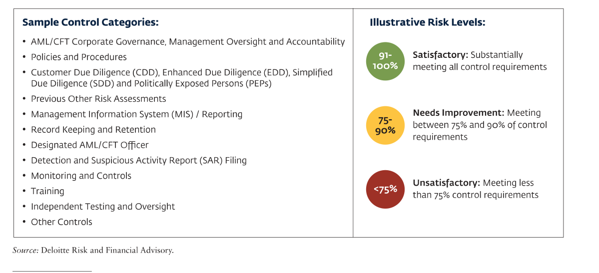

> **주:** 33 BCBS. 2015. 지침: 은행을 위한 기업 지배구조 원칙. 34 이 그림은 3단계 등급 척도를 나타냅니다. 일부 기관에서는 "내재적" 위험에 대한 등급(높음, 중간 높음, 중간, 낮음)과 "통제" 평가에 대한 등급(강함, 만족, 개선 필요, 불만족)을 포함하는 4단계 등급 척도를 사용합니다. 잔여 위험 결정 등급에는 높음, 중간 높음, 중간, 낮음이 포함됩니다. 35 Wolfsberg Group의 환거래은행 실사 설문지에서는 전사적 위험 평가의 빈도가 12개월이어야 한다고 제안합니다.

<!-- 원문 31쪽 -->

**그림 6**

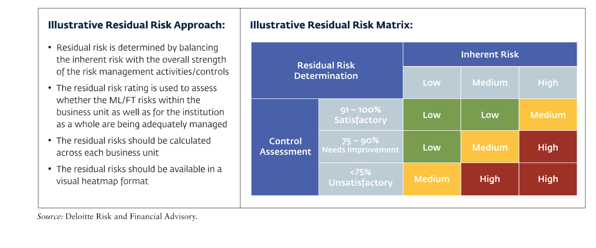

기술을 검증하고 그것이 은행의 요구 사항을 충족하는지 확인하는 데 필요한 단계입니다.36 위험 평가 결과, 사용된 방법론 및 식별된 위험을 관리하기 위해 은행이 취한 모든 조치는 종합 보고서에 통합되어 이사회에 전달되어야 합니다.

시기 적절하고 완전하며 정확한 방식으로 이사 및 고위경영진에게 전달됩니다. 이는 이사회뿐만 아니라 고위경영진, CRO 및 AML 최고 책임자가 정보에 입각한 결정을 내리고 은행의 자원, 전문성 및 기술이 위험 완화에 부합하도록 보장하는 데 도움이 될 것입니다.

> **주:** 36 BCBS. 2015. 지침: 은행을 위한 기업 지배구조 원칙.

<!-- 원문 32쪽 -->

### 3.4 정책 및 절차

AML/CFT 정책, 절차 및 내부 통제는 위험 평가를 통해 식별된 고유 위험을 완화하도록 설계되어야 합니다. 그들은 고유한 위험과 은행 위험 프로필을 다루어야 합니다. AML/CFT 정책과 절차는 서면으로 작성되어야 하며 잠재적으로 의심 활동을 예방, 감지 및 보고하고 현지 법률을 준수하며 강력한 내부 통제 및 위험관리 환경을 구축하는 목적에 부합해야 합니다.

정책, 절차, 내부 통제를 설계하고 구현할 때 은행은 위험 기반 접근 방식을 사용해야 합니다. 이 접근 방식은 위험도가 높은 고객, 위험도가 높은 제품 또는 기타 요인에 대해 보다 엄격한 통제와 지속적인 모니터링이 필요할 수 있음을 의미합니다. 다음은 정책 및 절차와 기타 AML/CFT 제어에 대한 위험 기반 접근 방식의 예시입니다.

AML/CFT 정책 및 절차는37,38

### 예: 위험 평가

고유 위험 평가:

내재적 위험에 대한 평가는 정성적 위험 요소에 대한 설문지를 관리하고 관련 은행 시스템에서 정량적 데이터를 추출하여 수행할 수 있습니다. 은행은 위험 선호도에 따라 정량적 위험 요인의 기준점을 신중하게 결정해야 하며, 정성적 요인과 정량적 요인 모두에 위험 가중치를 부여해야 합니다.

수집된 정보는 은행의 고유 위험을 계산하기 위해 ML/TF 고유 위험 평가 설문지에 대해 채워져야 합니다. ML/TF 고유 위험 평가 설문지는 은행 비즈니스의 중요한 영역(예: 고객, 지역, 제품, 서비스, 거래 및 배송 채널)을 다루어야 하며 AML/CFT 프로그램의 견고성을 평가할 때 고려해야 하는 운영 및 규제 위험 요소(예: 신제품 출시, 새로운 시장으로의 확장, 인수 합병, 새로운 규제)를 고려해야 합니다. 요구 사항, 최근 규제 조치 등).

통제 평가 완화:

완화 통제를 평가하기 위해 은행은 알려진 규제 기대치 및 적용 가능한 업계 선도 관행(알려진 ML 위험 신호 및 유형과 관련)을 포함하여 규제 요구 사항 또는 의무에 대한 등록을 작성해야 합니다. 구현된 은행의 정책, 절차 및 프로세스 통제는 등록부에 매핑되어야 합니다. 이 연습을 통해 제어 공백이 있는 경우 이를 식별해야 합니다.

구현된 통제의 효율성을 테스트해야 합니다. 은행은 통제 효율성을 평가할 때 다음 사항을 고려할 것을 강력히 권장합니다: 1. 정책과 규제 요건 간의 격차를 확인하기 위해 은행의 정책 및 절차를 검토합니다. 2. 정책과 절차가 효과적으로 운영되고 있는지(즉, 설계된 대로 구현 및 운영되고 있는지) 확인하기 위해 비즈니스 및 운영 팀과 함께 살펴봅니다. 및 3. 주요 통제 지표 및 통제 샘플 테스트 임계값에 대한 샘플 테스트.

실행 중인 통제 장치는 효율성을 정기적으로 검토하고 테스트해야 하며, 비즈니스의 고유 위험이나 잔류 위험의 변화로 인해 그러한 통제를 강화해야 하는지 여부도 테스트해야 합니다. 출처: "무역 기반 자금세탁방지 모범 사례" 18 5월 2018에서 채택(ACIP) https://abs.org.sg/industry-guidelines/aml-cft-industry-partnership.에서 발행: AML/CFT

> **주:** 37 BCBS. 2017. 지침: 자금세탁 및 테러자금조달과 관련된 위험의 건전한 관리. 38 볼프스베르크 그룹. 2018. 환거래은행 실사 설문지.

<!-- 원문 33쪽 -->

**그림 7**

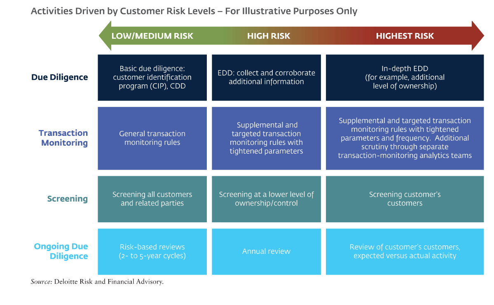

- 은행 이사회나 이사 또는 고위 위원회의 승인을 받아야 합니다.

- AML/CFT 프로그램을 조정하고 감독할 최고 AML/CFT 책임자를 지정합니다.

- 내부 감사 또는 독립적인 제3자에 의한 AML/CFT 프로그램 평가에 관한 프로세스를 간략하게 설명합니다.

- AML/CFT 교육과 관련된 프로세스를 문서화합니다. 정책 업데이트; CDD 및 EDD; 다른 은행에서 수행된 실사 잠재적으로 의심 거래를 탐지하고 보고합니다. 통화 거래 보고; 법 집행 기관의 요청에 응답 제재 준수.

- 위험 기반 접근 방식을 사용하여 모든 새 계정에 CDD 표준을 적용하고 필요에 따라 기존 관계에서 CDD를 새로 고칩니다.

- PEPs 스크리닝에 관한 개요 프로세스.

- 은행이 필요한 모든 기록을 유지하는 보존 정책을 문서화합니다. 기록은 5년 동안 또는 현지 법률을 준수하는 기간 동안 보관되어야 합니다.

- 사업 부문의 위험이나 사업 운영의 지리적 위치에 따라 조정하여 조직 전체에서 일관성을 유지합니다.

- 본국의 모든 지점 및 자회사뿐만 아니라 관할권 밖의 위치에도 적용됩니다(해당하는 경우).

- 정기적으로 업데이트되고 모든 관련 직원에게 배포되고 접근 가능합니다.

AML/CFT 정책과 절차는 다음과 같습니다.39,40

- 익명 계정이나 명백한 허위 이름의 계정을 허용합니다.

- 위장 은행과의 환거래 관계를 허용합니다.

- 지정된 개인 및 법인과의 거래를 허용합니다.

- 인터넷이나 다른 기관의 절차에서 찾은 문서를 "잘라내기 및 붙여넣기" 가이드로 삼으십시오.

- 시대에 뒤떨어지고 일관성 없는 정보를 제공합니다.

> **주:** 39 BCBS. 2017. 지침: 자금세탁 및 테러자금조달과 관련된 위험의 건전한 관리. 40 FATF. 2018. 자금세탁방지와 테러 및 확산 자금 조달에 관한 국제 표준.

<!-- 원문 34쪽 -->

### 그룹 전체 및 국경 간 상황에서의 AML/CFT

여러 관할 구역에서 운영되는 금융 기관은 국제 운영 전반에 걸쳐 위험을 설명할 수 있도록 그룹 차원의 AML/CFT 정책 및 절차 개발을 고려해야 합니다. 지점 또는 자회사 수준의 정책 및 절차는 해당 관할권의 현지 요구 사항 및 고려 사항을 반영해야 할 뿐만 아니라 그룹 전체의 정책 및 절차와 일관되고 지원되어야 합니다.

본국과 호스트 국가 간에 법적 요구 사항이 다를 경우 둘 중 더 높은 기준을 따라야 합니다. 또한, 관할 구역에서 표준의 적절한 구현을 허용하지 않는 경우 최고 AML/CFT 담당자는 본국 감독자에게 이를 알려야 합니다.

국제적으로 사업을 운영하는 은행이 고려해야 할 또 다른 중요한 사항은 사업 의뢰 시 은행이 다른 은행의 절차에 어느 정도 의존할 수 있는지입니다. 은행은 자신보다 덜 엄격한 정책과 절차를 허용하지 않도록 해야 합니다. 즉, 은행은 참조 은행의 관할권에서 사용되는 표준에 대해 자체 실사를 수행해야 합니다. 소개자가 동일한 금융그룹에 속해 있는 경우 소개자가 은행과 동일한 기준을 준수하고 해당 기준의 적용을 감독하는 한 은행은 소개자의 고객 정보에 더 많이 의존할 수 있습니다. 은행이 이 접근 방식을 취하더라도 추천된 고객이 의심 활동에 연루된 것으로 밝혀진 경우 추천 은행으로부터 고객 정보(KYC 및 거래 데이터)를 확보해야 합니다.

중앙 집중식 시스템과 데이터베이스를 구현하는 경우 은행은 전체 그룹에 걸쳐 의심 활동을 모니터링할 수 있도록 모든 로컬 및 중앙 집중식 기능에 대한 적절한 문서를 보유해야 합니다.

그룹의 글로벌 AML/CFT 표준에 관한 정보를 얻고 검토할 수 있는 그룹 전체의 능력을 보장하려면 본사, 모든 지점 및 자회사(허용되는 경우) 간의 활발한 정보 공유가 권장되어야 합니다. 은행의 그룹 전반에 걸친 정책 및 절차에는 잠재적으로 의심 활동을 식별, 모니터링 및 조사하기 위해 모든 관할권에서 준수해야 하는 프로세스가 포함되어야 합니다. 여기에는 필요한 경우 정보 공유 조정이 포함됩니다. 지점과 자회사는 고위험 고객 및 글로벌 표준과 관련된 것으로 간주되는 특정 활동에 관한 정보를 본사에 제공할 수 있어야 합니다. 본사의 모든 요청은 적시에 응답되어야 합니다.

정보 공유 요청에 관한 정책 및 절차를 설계할 때 은행은 다음을 고려해야 합니다.

- 고객의 데이터 보호 및 개인정보 보호와 관련된 현지 법률 및 규정.

- 법 집행 기관, 감독 기관 또는 FIU의 요청을 처리하는 방법.

- 공유할 수 있는 정보 유형과 저장, 검색, 배포 및 폐기에 대한 요구 사항.

- 보고된 활동으로 인해 발생하는 잠재적 위험, 특정 고객이나 고객 그룹의 위험, 그리고 다른 지점이나 자회사도 해당 고객에 대한 계정을 보유하고 있는지 여부. 출처: BCBS에서 발췌. 2017. 지침: 자금세탁 및 테러자금조달과 관련된 위험의 건전한 관리.

<!-- 원문 35쪽 -->

ML/FT 위험을 효과적으로 관리하려면 은행은 고객이 누구인지 이해해야 합니다. 이를 달성하기 위해 은행은 신규 고객 온보딩 시 고객 식별 및 고객확인의무를 수행해야 하며 고객과의 은행 관계 전반에 걸쳐 CDD를 업데이트해야 합니다. 다음 표에는 규제 당국이 은행에 CDD를 수행하도록 요구하는 시기, 파트너 환거래은행이 활발한 CDD를 기대하는 시기, 그리고 CDD에서 취해야 할 조치가 나와 있습니다.

은행은 이러한 각 CDD 조치를 모든 고객에게 적용해야 합니다. 그러나 이러한 조치 또는 추가 조치는 고객 위험 수준에 따라 결정되어야 합니다. 언제

고객 위험을 평가할 때 은행은 고객의 배경(예: 직업), 출신 국가 또는 거주 국가, 사용된 은행 상품, 계좌의 성격과 목적, 거래 및 비즈니스 활동과 같은 관련 요소를 고려해야 합니다. 41 고객 위험 평가 프로세스 고객 위험 평가는 비즈니스 관계의 시작, 지속 또는 종료 여부에 대한 은행의 결정을 지원하고 지속적인 의심 활동 모니터링 유형을 포함하여 위험을 관리하는 데 필요한 통제 수준을 결정합니다. 고객 위험 등급 및 프로필은 개별 고객 수준 또는 유사한 특성을 나타내는 고객 그룹(예: 소득 범위가 비슷하고 유사한 거래를 수행하는 소매 고객 그룹)에 대해 개발될 수 있습니다. 42 다음 그림은 CRR 프로세스를 요약한 것입니다.

### 은행은 언제 CDD를 수행해야 합니까?

금융 기관은 다음과 같은 경우 CDD를 수행해야 합니다.

- 새로운 비즈니스 관계 구축.

- (i) 해당 지정된 한도($15,000/€ 15,000에 해당)를 초과하거나 (ii) 국경 간 및 국내 전신 송금인 비정기적 거래 수행

- 자금세탁이나 테러자금조달이 의심됩니다.

- 금융 기관이 이전에 획득한 고객 식별 데이터의 진실성 또는 적절성에 대해 의구심을 갖고 있습니다.

금융 기관이 이러한 요구 사항을 준수할 수 없는 경우 다음을 수행해야 합니다.

- 계좌를 개설하거나 비즈니스 관계를 시작하거나 거래를 수행하지 마십시오.

- 비즈니스 관계를 종료합니다.

- 고객과 관련된 의심 거래 보고서 제출을 고려하십시오. 출처: FATF 권장사항 번호 10에서 발췌.

### 은행은 어떤 CDD 조치를 취해야 합니까?

금융 기관은 다음 CDD 조치를 수행해야 합니다. 신뢰할 수 있고 독립적인 원본 문서, 데이터 또는 정보를 사용하여 고객을 식별하고 고객의 신원을 확인합니다. 비. 실소유자를 식별하고 실소유자의 신원을 확인하기 위한 합리적인 조치를 취합니다. 기음. 비즈니스 관계의 목적과 의도된 성격에 대한 정보를 이해하고 필요한 경우 획득합니다. 디. 수행 중인 거래가 고객에 대한 기관의 지식과 고객의 비즈니스 및 위험 프로필(필요한 경우 자금 출처 포함)과 일치하는지 확인하기 위해 비즈니스 관계에 대해 지속적인 실사를 수행하고 해당 관계가 진행되는 동안 수행된 거래를 면밀히 조사합니다. 출처: FATF 권장사항 번호 10에서 발췌.

> **주:** 41 BCBS. 2017. 지침: 자금세탁 및 테러자금조달과 관련된 위험의 건전한 관리. 42 FATF. 2014. 위험 기반 접근 방식에 대한 지침. 은행 부문.

<!-- 원문 36쪽 -->

위험 평가 프로세스와 유사하게, CRR 프로세스에는 포괄적인 CRR 방법론 및 프로세스를 개발하기 위해 상당한 양의 작업, 데이터 수집, 분석 및 전문 지식이 필요합니다.

위험도가 낮다고 판단되는 고객의 경우 단순화된 실사 조치가 허용될 수 있습니다. 고객 위험이 더 높다고 판단되면 은행은 위험을 완화하기 위해 강화된 통제 및 CDD/EDD 조치를 취해야 합니다.

새로운 관계가 받아들여지지 않거나 현재의 관계가 종료되는 상황을 제시하는 정책. 고객 수용 정책을 시행할 때 재정적으로나 사회적으로 불리하다고 간주되는 고객을 거부하는 결과를 초래할 정도로 제한적이지 않은 것이 중요합니다. 단순히 위험을 피하는 것이 아니라 위험을 이해하고 완화하기 위해 위험 기반 접근 방식을 취해야 합니다.43

**그림 8: 고객 위험 등급(설명 목적으로만 사용)**

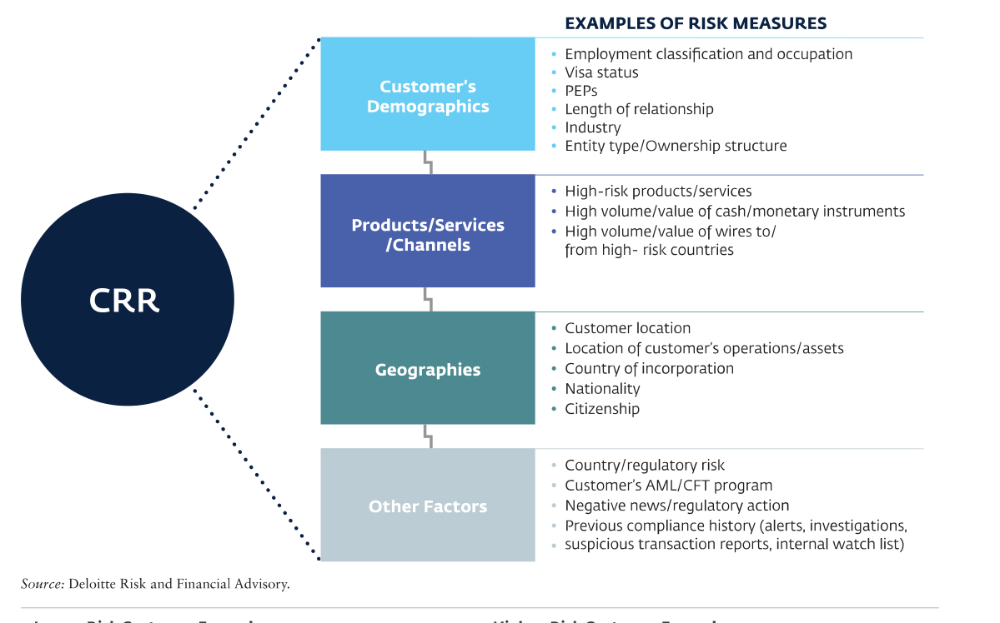

### 위험도가 낮은 고객 사례 고위험 고객 사례

- 거래량이 적은 소매 고객

- 송금 고객은 거래량이 적고 연간 총량이 적은 경우에만 위험이 낮습니다.

- 공인 증권 거래소에서 거래되는 상장 기업은 분기별 재무 보고서와 연간 감사 재무제표를 제출합니다.

- 규정을 준수하는 국가의 공인 증권 거래소에 있는 금융 기관(참고: 거래 활동 및 지역 등 기타 요인에 따라 위에 나열된 고객은 더 높은 위험을 초래할 수 있습니다.)

- 순자산이 높은 개인

- PEPs

- 고위험 국가의 정부 기관

- 송금 사업자(MTOs)

- 현금자동입출금기 운영자

- 카지노

- 외국인 민간투자법인

- 역외 관할권의 신탁 및 페이퍼 컴퍼니

> **주:** 43 FSD 아프리카. 2017. 자금세탁방지, 고객 파악, 테러자금조달 억제

<!-- 원문 37쪽 -->

고객 승인 및 고객확인의무 정책과 절차를 개발할 때 은행은 PEPs(고객 또는 수익적 소유자)의 대우에 대해 특별히 고려해야 합니다. 외국 PEPs,44와 관련하여 은행은 일반적인 고객확인의무 수행 외에도 다음을 수행해야 합니다.45

- 고객 또는 법인의 수익적 소유자가 다음과 같은지 여부를 결정하는 적절한 시스템을 갖추고 있습니다.

```text
PEP;
```

- 그러한 관계를 구축하거나 지속하기 위해 고위경영진의 승인을 얻습니다.

- 부의 원천과 자금의 원천을 확립하기 위한 합리적인 조치를 취합니다. 44 FATF 권고사항은 PEPs를 다음과 같이 정의합니다: "외국인 PEPs는 외국으로부터 중요한 공적 기능을 위임받았거나 위임받은 개인입니다. 예를 들어 국가 원수 또는 정부 원수, 고위 정치인, 고위 정부, 사법 또는 군 관료, 국영 기업의 고위 간부, 중요한 정당 관료입니다. 국내 PEPs는 국가 원수, 정부 원수, 고위 정치인, 고위 정부, 사법 또는 군 관료, 국유 기업의 고위 간부, 중요한 정당 관료 등 국내에서 주요 공적 기능을 위임받은 개인입니다. 국제 조직에서 주요 기능을 위임했거나 위임받은 사람은 고위경영진, 즉 이사, 부국장, 이사회 구성원 또는 이와 동등한 기능을 의미합니다. PEPs는 앞서 언급한 카테고리에서 중간 순위 이상의 개인을 대상으로 하지 않습니다." 45 FATF. 2018. 자금세탁방지와 테러 및 확산 자금 조달에 관한 국제 표준. 46 FATF. 2018. 자금세탁방지와 테러 및 확산 자금 조달에 관한 국제 표준.

- 그러한 관계에 대해 강화된 지속적인 모니터링을 수행합니다.

은행은 또한 고객이나 수익적 소유자가 국내 PEP인지 또는 국제기구로부터 중요한 기능을 위임받았거나 위임받은 사람인지 여부를 확인하기 위해 합리적인 조치를 취해야 합니다. 이러한 PEPs가 더 높은 위험을 나타내는 경우 은행은 외국 PEPs와 동일한 요구 사항을 적용해야 합니다.46 PEPs가 제기하는 위험을 적절하게 평가하려면 은행은 다음 정보를 획득하고 평가하는 것을 고려해야 합니다.

### 강화된 실사/간소화된 실사 조치의 예

강화된 실사(EDD)

- 고객에 대한 추가 정보(예: 직업, 자산 규모)를 수집하고 고객 및 수익 소유자의 식별 데이터를 보다 정기적으로 업데이트합니다.

- 비즈니스 관계의 의도된 성격에 대한 추가 정보를 얻습니다.

- 고객의 자금 출처 또는 부의 출처에 대한 정보를 얻습니다.

- 의도되거나 수행된 거래의 이유에 대한 정보를 얻습니다.

- 비즈니스 관계를 시작하거나 지속하기 위해 고위경영진의 승인을 얻습니다.

- 적용되는 통제의 수와 시기를 늘리고 추가 조사가 필요한 거래 패턴을 선택하여 비즈니스 관계에 대한 강화된 모니터링을 수행합니다.

단순화된 실사

- 비즈니스 관계 수립 후 고객과 수익적 소유자의 신원을 확인합니다(예: 계좌 거래가 정의된 금전적 기준점을 초과하는 경우).

- 고객 식별 업데이트 빈도를 줄입니다.

- 합리적인 금액 한도를 기준으로 거래를 지속적으로 모니터링하고 면밀히 조사하는 정도를 줄입니다.

- 거래 관계의 목적과 의도된 성격을 이해하기 위해 특정 정보를 수집하거나 특정한 조치를 취하지 않고, 거래 유형이나 설정된 거래 관계에서 목적과 성격을 추론합니다. 출처: FATF에서 발췌. 2018. 자금세탁방지와 테러 및 확산 자금 조달에 관한 국제 표준.

<!-- 원문 38쪽 -->

- 이 직위가 고위험 국가에 있는지 여부;

- PEP에 정부 자금을 이동할 수 있는 능력이 있는지 여부;

- PEP의 현재 사업의 성격;

- 관련 거래의 패턴;

- PEP의 부와 자금의 원천; 그리고

- PEP의 명성.

은행의 정책과 절차는 PEPs에 필요한 추가 실사가 무엇인지 명확하게 설명해야 합니다. PEPs에 대한 요구 사항은 해당 PEPs의 가족 구성원이나 가까운 동료에게도 적용되어야 합니다.

앞서 언급한 바와 같이 은행은 실사를 수행할 때 실소유주(고객이 법인인 경우)의 신원을 식별하고 확인하기 위한 합리적인 조치를 취해야 합니다. 여기에는 고객의 소유권 및 통제 구조를 알고 이해하는 것, 그리고 실소유자가 PEP(외국인, 국내인 또는 국제기구에서 중요한 지위를 보유한 사람)인지, 지정된 사람인지, 부정적인 뉴스와 관련된 개인인지 여부를 판단하는 것이 포함됩니다. 법 집행 기관이나 기타 당국이 요청하는 경우 모든 수익적 소유자 및 통제에 대한 정보를 적시에 제공해야 합니다.

은행은 고객이 누구인지 진정으로 알고 있음을 입증할 수 있어야 합니다. 예를 들어, 은행이 기업 고객의 20%가 신탁 소유라고 판단하는 경우 은행의 실사 노력은 거기서 끝나서는 안 됩니다. 은행은 신탁 자체와 청산인, 수탁자, 수혜자와 같은 관련 당사자에 대해 충분한 정보를 수집해야 합니다.

실사는 고객과 수익적 소유자뿐만 아니라 고객을 대신하여 행동하는 사람에게도 적용되어야 합니다. 은행은 고객을 대신하여 행동하는 모든 개인에게 그렇게 할 수 있는 권한이 있는지 확인하고 해당 개인의 신원을 확인해야 합니다.

고객, 실소유주 또는 승인된 사람의 신원을 확인하기 위해 은행은 신뢰할 수 있고 독립적인 원본 문서, 데이터 및 정보를 사용해야 합니다. 공식 문서가 아닌 보충 자료를 사용하는 경우, 은행은 방법과 자료가 관할권 요건 및 기대치, 은행 정책 및 절차와 일치하는지 확인해야 합니다. 이러한 방법에는 재무제표를 얻거나 다른 은행 및 공공 유틸리티와 같은 인정된 기관과의 참고 자료를 확인하는 것이 포함될 수 있습니다.

검증은 은행이 고객에 대해 수행한 고객 위험 등급 및 위험 평가에 따라 달라집니다.

고객 정보 수집 및 고객 신원 확인에 대한 추가 정보는 이 주제에 대한 구체적인 내용이 포함된 부록 5를 참조하십시오.

은행은 고객의 CDD 확인 및 수집 빈도에 관한 정책 및 절차를 개발하여 CDD의 일부로 수집된 정보가 최신 상태로 유지되도록 해야 합니다. 고위험 고객에 대한 검토는 더 자주 수행되어야 하며 강화된 실사가 필요합니다. 테러리스트 및 제재 조사는 고객 위험 프로필에 관계없이 모든 고객에 대해 수행되어야 한다는 점에 유의해야 합니다. 은행은 이러한 심사를 수행하기 위해 자동화된 솔루션을 사용하는 것을 고려해야 하며 관련 법률에서 요구하는 대로 식별된 지정된 개인 및 법인의 자금/자산을 지체 없이 동결하고 사전 통지해야 합니다.

은행은 EDD가 필요한 고위험 고객(예: PEPs)이나 금지된 고객(예: 지정된 개인 및 단체)을 식별하기 위해 고객 기반을 정기적으로 검사해야 합니다.

CDD 및 관련 고객 위험 등급은 중앙 집중식 데이터베이스 또는 자금세탁방지 및 은행 준법을 담당하는 제재 준법 담당자에 대한 액세스를 제공하는 시스템에 최적으로 보관되어야 합니다. MIS(경영 정보 시스템)는 사업부와 준법 담당자 모두에게 고객과 고객의 활동에 대한 주요 정보를 제공합니다. MIS는 계정 문서, 거래 내역, 고객 프로필의 변경 사항 등 고객에 대해 필요한 모든 정보를 제공할 수 있어야 합니다. 이 정보는 전사적 수준(모든 비즈니스 라인에 걸쳐)에서 제공되어야 합니다.

수많은 금융 기관을 통합한 대규모 통합 또는 국경 간 금융 그룹의 경우 CDD 정책 및 절차를 공유해야 합니다. 그러나 각 비즈니스 부문에 내재된 위험을 기반으로 CDD 조치는 각 특정 그룹에 맞게 조정되어야 합니다.

<!-- 원문 39쪽 -->

### 제3자에 대한 의존

CDD 준법는 궁극적으로 은행의 책임입니다. 그러나 은행이 CDD 절차의 특정 요소를 수행하기 위해 제3자에게 의존하는 것이 허용되는 경우도 있습니다. 제3자가 CDD를 수행하도록 허용하는 것은 현지 법률에 따라 허용되어야 합니다. 은행은 CDD의 수집 및 업데이트를 아웃소싱하는 것이 법적 범위 내에 있는지 확인해야 합니다. 은행은 해당 관할권의 개인 정보 보호법이 이러한 유형의 활동을 허용하는지 확인해야 합니다. 은행은 다음과 같은 목적으로 제3자를 이용할 수 있습니다47.

- 신뢰할 수 있고 독립적인 원본 문서, 데이터 또는 정보를 사용하여 고객의 신원을 식별하고 확인합니다.

- 수익적 소유자를 식별하고 수익적 소유자의 신원을 확인하기 위한 합리적인 조치를 취합니다. 법인의 경우, 여기에는 기업의 소유권 및 통제 구조에 대한 이해가 포함되어야 합니다.

- 비즈니스 관계의 목적과 의도된 성격을 이해하고 필요한 경우 이에 대한 정보를 얻습니다.

제3자를 이용할 경우 다음과 같은 최소 기준을 충족해야 합니다.

- 은행은 온보딩 전에 고객으로부터 수집된 CDD 정보를 받아야 합니다.

- 은행은 식별 데이터 사본을 포함한 모든 문서가 제3자로부터 지체 없이 접수되거나 이용 가능하도록 적절한 조치를 취해야 합니다.

- 은행은 제3자가 적절하게 규제, 감독 또는 모니터링되고 있으며 CDD 및 기록 유지 준법을 위한 조치가 마련되어 있는지 확인해야 합니다.

### KYC/CDD를 지원하는 신기술

AML/CFT 프로세스의 효율성과 효율성을 향상시켜 은행 운영을 개선할 수 있는 잠재력을 지닌 새로운 기술 애플리케이션이 많이 있습니다. 몇몇 글로벌 은행에서는 일부 AML/CFT 준법 문제를 해결하는 여러 기술을 실험하고 있습니다. 48 소규모 기관은 준법 및 비용 절감 측면에서, 그리고 CBRs 획득 및 유지 측면에서 새로운 기술의 이점을 누릴 수도 있습니다. 이러한 혁신 중 일부는 여기에 설명되어 있습니다.

### KYC 유틸리티

KYC 유틸리티는 아래 텍스트 상자에 설명된 대로 여러 형식을 취할 수 있습니다. 한 가지 유형에 초점을 맞춰 중앙 집중식 데이터베이스 레지스트리 형태를 취하는 KYC 유틸리티를 사용하는 것은 은행이 수집된 CDD 정보를 저장하는 혁신적인 방법입니다. KYC 유틸리티는 피응답은행에서 환거래은행으로 중복 전송되는 데이터의 양을 줄여 은행의 절차를 도울 수 있습니다. 또한 공익사업에서는 환거래은행이 지속적으로 환거래은행을 모니터링할 수 있도록 허용합니다. 유틸리티를 사용하지 않고 KYC 문서를 수집하는 경우 환거래은행과 피피응답은행이 직면하는 세 가지 일반적인 문제가 있습니다.

1. 일반적으로 널리 사용되는 볼프스베르크 그룹 환거래은행 실사 설문지를 사용하여 모든 환거래은행은 동일하거나 유사한 정보를 수집해야 합니다. 2. 일부 환거래은행은 KYC 실사 요구 사항이 다릅니다. 3. KYC 실사 수집 및 지속적인 모니터링 프로세스는 노동 집약적이며 복잡하고 비용이 많이 들고 시간이 많이 걸릴 수 있습니다.

### 지속적인 모니터링 – 설명 목적으로만 사용

위험 수준 빈도 은행이 취해야 할 예시 단계 높은 위험 매 12개월마다 경고를 발생시키지 않은 고객과 관련하여 은행은 고객에게 파일에 있는 기본 정보를 확인하도록 요청하는 자동 이메일을 보내 필수 정보를 새로 고치는 것을 고려할 수 있습니다.

경고를 트리거한 고객의 경우 수동 정보 요청(RFI) 및 고객 활동 검토를 포함한 보다 심층적인 평가가 필요할 수 있습니다.

중간 위험 18–36개월마다 또는 트리거 기반 검토마다 낮은 위험 36–60개월마다(기업 고객의 경우)

트리거 기반 검토(소매 고객용)

> **주:** 47 FATF. 2월 2018. FATF 추천 48 IFC. 2018. 피응답은행 가이드: 무역에서 환거래은행 관계를 관리하기 위한 필수 KYC 고려 사항.

<!-- 원문 40쪽 -->

활동하고 앞서 언급한 문제를 지원합니다.

KYC 유틸리티는 다음을 포함하여 여러 가지 이점을 제공합니다.

1. 피응답은행은 모든 환거래인 관계가 액세스하고 사용할 수 있도록 하나의 데이터베이스에 해당 KYC 실사를 입력합니다. 이를 통해 응답자가 유사한 정보를 수집하여 다양한 환거래은행에 전송해야 하는 횟수가 크게 줄어듭니다. 2. KYC 유틸리티 하나만으로 KYC 실사 문서를 제공, 업데이트 및 교환해야 하므로 대상 은행 거래 비용을 줄일 수 있습니다. 3. 단일 템플릿을 사용하면

이는 일반적으로 대부분의 환거래은행의 KYC 의무를 포함합니다. 4. KYC 유틸리티를 사용하면 각 환거래은행의 추가 고유 KYC 실사 금액이 크게 줄어듭니다. 5. KYC 실사 정보의 정확성과 일관성은 피응답은행이 유틸리티 내에서 단 하나의 업데이트된 정보 세트만 유지하기 때문에 향상됩니다. 6. 중앙 집중식 KYC 유틸리티를 사용하면 환거래은행이 환거래은행과 관계를 시작하거나 계좌 개설을 고려할 때 환거래은행에 대한 KYC 실사 정보의 가용성이 빨라집니다.49

**그림 9: KYC 활동 중앙 집중화**

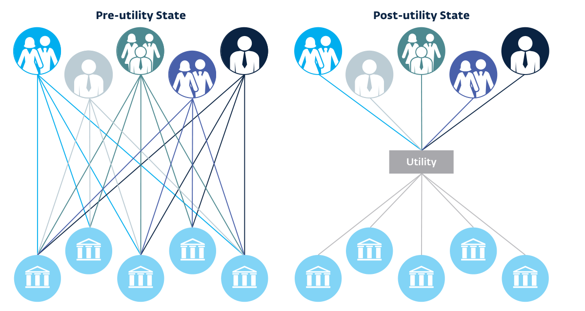

출처: IFC. 5월 2018. 피응답은행 가이드: 무역에서 환거래은행 관계를 관리하기 위한 필수 KYC 고려 사항.

> **주:** 49 CPMI. 2016. 환거래은행.

<!-- 원문 41쪽 -->

고객 파악 유틸리티란 무엇입니까? 현재 운영되는 KYC 유틸리티에는 산업 협업 유틸리티, 관할권 유틸리티 및 유틸리티 서비스 제공자의 세 가지 유형이 있습니다. 유틸리티 서비스 제공자의 두 가지 하위 범주는 다음과 같습니다. a) 주로 데이터 서비스 및 식별(ID) 정보 저장인 유틸리티 서비스; b) 기본적으로 아웃소싱 유틸리티 서비스인 관리 서비스에 거래 추적 및 CDD를 더한 것입니다. 각 유틸리티 유형의 예는 다음과 같습니다.

### 산업 협업 유틸리티: SWIFT

CDD에는 고객 지불이 시작되고 종료되는 위치에 대한 기록이 필요합니다. 이는 최초의 성공적인 KYC 유틸리티 중 하나가 세계 은행 간 금융 통신 협회(Society for Worldwide Interbank Financial Telecommunications)인 SWIFT에 의해 도입된 이유를 설명합니다.

기본적으로 SWIFT는 은행 간의 전자 메시지를 처리하며 이러한 메시지는 거래 추적을 제공하여 자금이 어디서 발생하고 종료되는지 기록합니다. SWIFT는 거래를 청산하거나 정산하지 않으며 계좌도 보유하지 않지만 매우 안전한 메시징 시스템을 통해 결제에 대한 정보를 전달합니다. SWIFT는 수백 개의 응답자 및 통신사 은행의 프로필 데이터를 보관하는 성공적인 공유 데이터 저장소를 보유하고 있습니다. SWIFT 회원이 사용할 수 있는 KYC 유틸리티는 회원 환거래은행/피응답은행 관계에 유용하며, SWIFT 유틸리티가 돈이 가는 곳과 수취인이 허용되는지 확인하므로 고위험 또는 제재 관할권에 있는 피응답은행과 거래할 때 환거래은행의 위험을 줄여줍니다. 주요 환거래은행과 환거래은행에서 사용하는 유틸리티는 주로 대기업의 대규모 지불에 사용됩니다. 현재 약 11,000 SWIFT 사용자가 있으며, 이로 인해 SWIFT는 국제 기업 결제에서 중요한 역할을 합니다. 그러나 신흥시장의 많은 소규모 은행과 FI는 SWIFT 회원이 아닙니다.

### 관할 유틸리티: 싱가포르 통화청 KYC 유틸리티

2017에서 싱가포르 통화청은 싱가포르에 계좌를 보유한 모든 개인을 대상으로 하는 국가 KYC 유틸리티 개발을 발표했습니다. 모든 계정 보유자의 정부 인증 개인 정보가 포함된 개인 데이터 플랫폼인 "MyInfo" 서비스가 이 유틸리티의 기반입니다. 주민들은 자신의 데이터를 정부에 한 번 제공하고 이후의 모든 온라인 거래를 지원합니다. 목표는 모든 FI를 이 검증된 데이터베이스에 연결하여 중복성을 줄이고 정보 품질을 향상시키는 것입니다. 싱가포르는 매우 우수한 국가 ID 시스템과 데이터베이스의 장점을 갖고 있으며 국가의 디지털 활용도가 높습니다. 해당 유틸리티는 거래 모니터링이나 진행 중인 CDD를 다루지 않습니다. 그 역할은 개별 FI가 유지합니다. 기업 금융 거래에 대해 동일한 작업을 수행하려는 MAS의 보다 야심찬 노력은 최근 구현 비용 및 예상 절감액 검토를 위해 11월 2018에 보류되었습니다.

### 유틸리티 서비스 제공자: BAE Systems

BAE Systems는 세계 최대의 방산업체이며 KYC/CDD 솔루션에 대한 관리 서비스로 "NetReveal" 제품을 제공합니다. 이러한 전사적 접근 방식은 재무 기능을 BAE에 아웃소싱하는 금융 기관(주로 유럽 은행)에 대한 모든 KYC/CDD 요구 사항을 충족하기 위한 것입니다. BAE의 시스템에는 고객 정보 캡처, 검증, 위험 평가, 정치적 주요인물(PEP) 검사, 조사, 규제 보고, 지속적인 모니터링, 실소유자 검증, 위험 평가, 경영진 변경, 불리한 사건, 사업 확장, 신규 사업 부문, 기업공개(IPO), 인수, 매각, 지리적 확장, 소셜 미디어 적용 범위, 신용 등급 변경 등이 포함됩니다. 시스템은 또한 거래를 모니터링하고 인공 지능을 사용합니다. (AI) 및 기타 애플리케이션을 사용하여 이러한 활동의 대부분을 자동화합니다(그림 10). (다음 페이지에 계속)

### www.ifc.org/thoughtleadership

<!-- 원문 42쪽 -->

**그림 10**

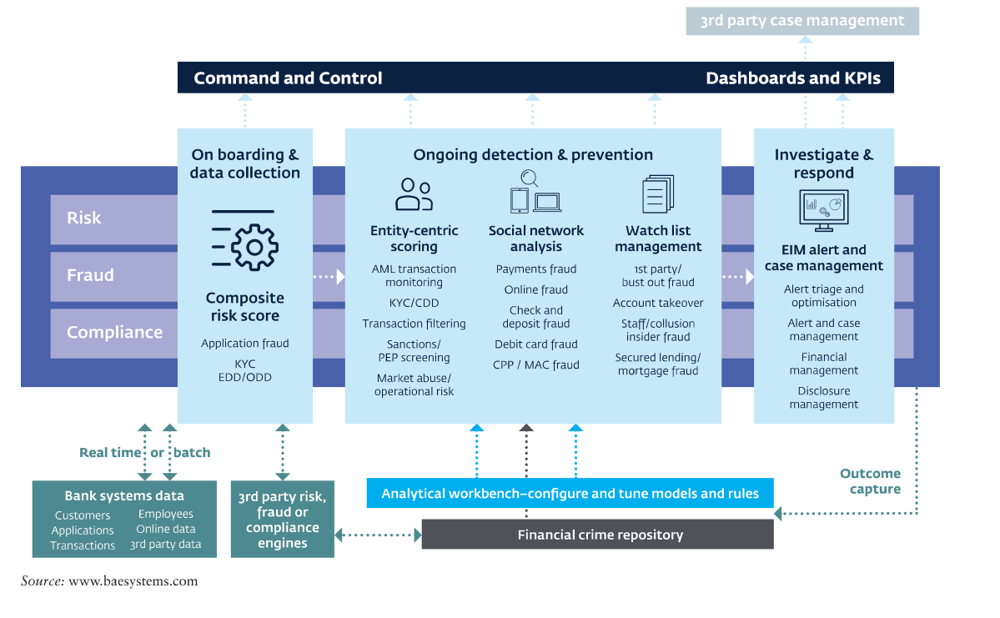

KYC 유틸리티를 사용할 준비를 하려면 은행은 모든 필수 데이터를 정기적으로 입력하고 업데이트할 수 있는 내부 용량과 인프라를 갖추고 있어야 합니다. 이를 위해서는 은행 측에서 상당한 기술 투자가 필요할 수 있습니다. KYC 유틸리티를 채택하기 전에 필요한 특정 내부 인프라와 용량이 있습니다. 필요한 필수 용량의 예는 다음과 같습니다50:

- 식별 시스템(국가 당국 또는 민간 부문에서 개발).

- 영어가 아닌 언어로 존재하는 기본 정보의 경우 해당 은행에서 번역 서비스를 허용합니다.

- 제출된 정보의 진위 여부를 환거래은행에 제공하는 기타 확인/인증.

- 적시에 공공 시설의 데이터를 지속적으로 업데이트하고 유지 관리하기 위한 시스템 및 프로세스.51 이러한 공공 시설은 비용을 절감할 수 있는 잠재력을 가질 수 있지만 은행의 모든 ​​절차를 대체할 수는 없으며 (미국 규제 기관의 관점에서) 은행이 여전히 책임을 집니다.

제3자 도구 또는 방법에 대한 의존으로 인해 발생하는 준법 위반 또는 책임. 또한 KYC 유틸리티는 기관별 KYC 프로세스 및 절차를 대체해서는 안 됩니다.

KYC 유틸리티 사용을 고려할 때 글로벌 환거래은행이 염두에 두어야 할 특정 제한 사항이 있습니다. 이러한 제한 사항 중 일부는 다음과 같습니다.

- 정보가 최신이고 정확한지 확인하려면 피응답은행의 정기 또는 자동 업데이트가 여전히 필요합니다.

- KYC 유틸리티는 필요한 모든 CDD 정보를 수집하지 못할 수 있으므로 다른 정보를 양방향으로 수집해야 할 수도 있습니다.

- 일부 관할권의 개인정보 보호법에서는 기본 정보의 공유, 저장 또는 마이닝을 금지할 수 있습니다.

이러한 제한에도 불구하고 KYC 유틸리티는 신흥시장 은행이 환거래은행과 공유하는 KYC/CDD에 접근할 때 활용할 수 있는 매우 귀중한 도구가 될 수 있습니다.

> **주:** 50 IFC. 2018. 피응답은행 안내: 무역에서 환거래 관계를 관리하기 위한 필수 KYC 고려 사항. 51 IFC. 2018. 피응답은행 가이드: 무역에서 환거래은행 관계를 관리하기 위한 필수 KYC 고려 사항.

<!-- 원문 43쪽 -->

### 법적 실체 식별자

최근 국제 사회에서는 금융 거래에 참여하는 고유한 법인을 식별하는 국제적으로 인정되는 20 문자 영숫자 코드인 법인식별기호(LEIs)의 광범위한 사용을 요구하고 있습니다. LEI는 모든 당사자가 자유롭게 액세스할 수 있는 비독점 데이터 형식으로 설계된 글로벌 표준입니다.

첫 번째 LEIs는 12월 2012에 출시되었습니다. 현재 미국과 유럽 국가에서는 기업이 장외파생상품 거래내역을 금융당국에 보고할 때 법인식별기호 사용을 의무화하고 있다. 12월 2018 현재, 200 이상의 국가에서 1,300,000 이상의 법인이 LEIs로 발행되었습니다.

CPMI(지불 및 시장 인프라 위원회) 및 Wolfsberg Group과 같은 여러 국제 기구에서는 LEIs를 널리 채택하면 제재 및 AML/CFT 목적을 위해 거래 모니터링 시스템에서 생성되는 위양성 경고를 크게 줄일 수 있는 잠재력이 있다고 지적합니다. 52,53 LEI는 다음과 관련된 특정 이점을 제공할 수 있지만 AML/CFT 규정을 준수하지만 AML/CFT 목적으로 설계되지 않았으며 잠재력과 한계를 추가로 조사해야 합니다. 게다가 LEI 때문에

자연인에게는 적용되지 않으므로 개인에게도 유사한 솔루션이 필요합니다.

명확한 법인식별기호(LEI)의 중요성은 글로벌 금융위기 이후에도 분명해졌습니다. 전 세계 당국은 다양한 시장, 지역, 상품에 걸쳐 거래를 수행하는 당사자를 식별할 수 없었으며, 이로 인해 은행이 추세를 파악하고 새로운 위험을 평가하며 시정 조치를 취하는 것이 어려워졌습니다. 이러한 어려움을 해결하기 위해 규제 기관은 민간 부문과 협력하여 고유한 20 자리 영숫자 참조 코드를 발행하여 법인54을 명확하게 식별할 수 있는 프레임워크를 개발했습니다. AML/CFT 목적으로 사용하도록 설계되지는 않았지만 특히 환거래은행 관계에서 특정 AML/CFT 프로세스의 효율성을 향상시킬 수 있습니다. 앞서 설명한 KYC 유틸리티 및 정보 공유에는 각 데이터베이스에 포함된 은행 또는 고객의 식별이 필요합니다. LEI는 ​​새로운 표준을 개발하기보다는 일반적으로 이러한 유틸리티의 표준으로 채택되고 있습니다.

LEIs는 현지 운영 기관(LOUs)을 통해 다양한 관할권에서 발행됩니다. 이 기관에서는 유료로 LEIs를 발행하고 발행 시 및 정기적으로 참조 데이터를 검증합니다.

### KYC 유틸리티 공급업체

IFC는 특정 KYC 유틸리티를 보증하지 않으며 공급업체의 샘플 목록은 정보 제공 목적으로만 제공됩니다.

- SWIFT는 피응답은행이 무료로 데이터를 제공할 수 있는 반면, 환거래은행은 데이터 액세스에 대한 수수료를 지불하는 KYC 레지스트리를 개발했습니다.

- Thomson Reuters는 또한 55 이상의 글로벌 금융 기관 고객이 사용하는 자체 "KYC 서비스형" 유틸리티 솔루션을 개발했습니다.

- IHS Markit은 법인 식별자가 포함된 80,000를 포함하여 140,000개 이상의 법인이 대표되는 KYC 서비스 플랫폼을 만들었습니다.

- Bankers Almanac은 거래상대방 KYC, 실사 저장소, KYC 실사 데이터 파일, 규제 보기 및 궁극적인 실소유권 데이터를 포함하여 위험 및 준법을 위한 솔루션 제품군을 개발했습니다.

로컬 KYC 솔루션:

- Thomson Reuters는 남아프리카공화국에서 국가 KYC 서비스를 시작했습니다. 이곳의 참여 금융 기관은 웹 기반 포털을 통해 무료로 액세스할 수 있습니다.

- 아프리카 수출입 은행(Afreximbank)은 아프리카 고객의 KYC 비용을 절감하기 위해 아프리카 금융 기관 및 기업에 대한 정보를 저장하는 아프리카 고객확인의무 저장소 플랫폼을 만들었습니다. 출처: IFC. 2018. 피응답은행 안내: 무역에서 환거래 관계를 관리하기 위한 필수 KYC 고려 사항.

> **주:** 52 CPMI. 2016. 환거래은행. 53 볼프스베르크 그룹. 2017. 결제 투명성 표준. 54 LEIs는 법인(신탁과 같은 법적 계약 포함)을 식별하기 위한 것이며 비즈니스 자격으로 활동하는 개인을 제외하고 자연인에게는 적용되지 않습니다.

<!-- 원문 44쪽 -->

LEI 시스템을 전 세계적으로 조정하며, 인증된 LOUs 목록은 GLEIF 웹사이트에서 확인할 수 있습니다. 56 LEI를 획득하는 비용과 서비스가 제공되는 관할권은 LOU에 따라 다릅니다. 따라서 스스로 LEIs를 취득하고 거래하는 모든 법인을 지원하는 데 관심이 있는 은행은 이러한 LEI 발행자의 웹사이트를 방문하여 어떤 발행자가 자신의 요구 사항을 충족하는지 확인해야 합니다.

### 고급 기술 애플리케이션

적절하고 충분하게 구현되면 금융 및 규제 기술(핀테크 및 레그테크)이 은행에 KYC/CDD에 대한 시간 및 비용 절약 솔루션을 제공할 수 있습니다. 이러한 기술 방법 중 일부는 다음과 같습니다.57

- 암호화: 은행에서 KYC/CDD 정보를 공유하려고 할 때 안전하고 일반적으로 코딩된 형식의 데이터 통신 및 저장을 사용할 수 있습니다. 또한 외부(즉, Dropbox)에 저장된 데이터의 암호화 증거를 보관할 수 있습니다.

소셜 미디어 데이터, 기업 고객 데이터, 공개적으로 사용 가능한 데이터, 위치 데이터, 모바일 데이터, 웹 데이터 및 행동 데이터를 포함한 현재 소스. 이러한 데이터를 집계하면 은행은 특히 고객의 신용도를 결정할 때 고객이 누구인지 더 잘 알 수 있습니다.

- 인공 지능: 인공 지능은 지능적인 기계를 만드는 것을 목표로 하는 컴퓨터 과학의 한 분야입니다. 이는 추론, 문제 해결, 인식과 같은 특정 특성을 위해 컴퓨터를 프로그래밍하는 데 초점을 맞춘 핀테크 산업의 필수적인 부분이 되었습니다. 그러나 컴퓨터에 할당된 문제와 관련된 대규모 데이터셋(빅 데이터)가 있는 경우 컴퓨터는 종종 "지능"으로 행동하고 반응할 수 있습니다. 예를 들어, 인공 지능은 법률 문서를 스캔하고 분석하여 위험과 관련된 중요한 데이터 포인트와 조항을 추출함으로써 은행이 정보 처리에 있어 보다 효율적이 되도록 도울 수 있는 잠재력을 가지고 있습니다.

- 머신러닝: 머신러닝은 하위 카테고리입니다.

### e-KYC: 인도 사례

인도는 전자 수단을 사용하여 KYC의 비용을 낮추는 데 큰 진전을 이루었습니다. KYC 노력의 기반으로 고객을 식별하기 위해 Aadhaar 시스템을 사용합니다. Aadhar는 인도 정부가 모든 시민에게 발급하는 고유한 12 자리 식별 ​​번호입니다. Aadhar의 기본 아이디어는 문서에 단일 고유 식별 번호를 갖는 것입니다. Aadhar 카드는 인도에 거주하는 모든 개인의 인구 통계 및 생체 인식 정보를 포함한 모든 세부 정보를 캡처합니다. Aadhar 카드는 기존 신분증 교체를 의무화하지 않지만 고객 프로필을 유지 관리하는 금융 기관 및 기타 기업이 KYC 표준을 준수하기 위한 기반으로 사용할 수 있습니다.

거주하는 인도인은 기존 신원 증명(여권, 운전 면허증 등)과 주소 증명(전화, 전기 요금 청구서, 은행 명세서 등)을 제출하고 Aadhar 센터에서 생체 인식 프로파일링(지문 및 홍채 스캔)을 수행하여 Aadhar 번호와 카드를 신청할 수 있습니다.

Aadhaar는 인도 내 일부 혁신적인 프로젝트의 기초가 되었습니다. 예를 들어, 2014에서 인도는 신원에 대한 세부 정보를 제공할 수 있는 경우 소외 계층에게 저렴하고 부담 없는 은행 계좌를 제공하는 총리의 인민 부 제도를 시작했습니다. 2014에서 2017까지, 이와 같은 단순 은행 계좌의 수는 부분적으로 Aadhaar 인증의 가용성 덕분에 30 million에서 300 million로 10배 증가했습니다.

환거래은행의 경우, 응답자가 생체 인식 시스템을 사용하고 고객에 대한 신뢰할 수 있는 최신 정보에 접근할 수 있다는 사실은 응답자가 KYC에 대해 어느 정도 편안함을 느끼게 하므로 다른 모든 조건이 동일하다면 이 관계를 더욱 매력적으로 만듭니다. 출처: 세계은행그룹(World Bank Group)의 "신흥시장의 환거래은행 서비스 접근 감소: 추세, 영향 및 솔루션", 2018 및 https://www.foreignaffairs.com/articles/asia/2018-08-13/data-people에서 발췌

> **주:** 55 CPMI. 2016. 환거래은행. 56 https://www.gleif.org/en/about-lei/how-to-get-an-lei-find-lei-issuing-organizations. 57 유럽 은행 당국. 2018. 핀테크로 인해 기관에 발생하는 건전성 위험 및 기회에 관한 EBA 보고서.

<!-- 원문 45쪽 -->

적절하게 말하면, 이 기술은 진양성 탐지 경험을 통해 "학습"함으로써 의심 거래 패턴을 탐지하는 프로세스를 더욱 개선하는 데 사용될 수 있습니다.

- 생체인식: 생체인식 인증 기술은 개인의 고유하고 안정적인 생체인식 특징을 측정하고 이를 동일한 사람의 승인된 생체인식 샘플과 일치시킵니다. 이를 통해 지문, 얼굴, 홍채 패턴, 음성 등 개인 고유의 외부 특징을 통해 해당 개인의 신원을 정확하게 확인할 수 있습니다. 생체인식 인증은 은행과 고객 모두에게 큰 기회가 되지만, 그러한 기술에는 법적, 보안, 평판상의 위험이 따릅니다. 이러한 기술이 AML/CFT 프로그램 내의 위험 평가뿐만 아니라 기관 관할권 내의 법률 및 규정에도 적합하도록 은행은 가능한 모든 위험을 해결하고 현지 법률을 숙지하는 것이 중요합니다.

여기에 제공된 사례 연구에서는 KYC 관련 혁신이 인도에서 어떻게 사용되고 있는지, 그리고 이것이 응답자 및 통신사 은행에 제공하는 이점에 대해 논의합니다.

디지털 옵션을 적절하게 사용할 수 있고 사용해야 하지만 AML/CFT 프로세스를 완전히 대체할 수는 없습니다. 특히 KYC/CDD 측면에서 적절한 정책과 절차의 위험과 책임은 은행 자체에 있습니다. 모든 금융 기술은 위험 기반 접근 방식과 결합하여 정보 공유와 같은 특정 활동을 제한할 수 있는 현지 법률 또는 데이터 개인 정보 보호 규정을 준수하여 사용해야 합니다.

### 3.6 거래 모니터링

거래 모니터링에는 특정 매개변수(예: 고객 및 수취인 이름, 거래량, 가치, 거래 원산지 또는 목적지)를 기반으로 거래를 수동 또는 전자적으로 스캔하여 해당 거래가 은행이 고객에 대해 알고 있는 정보와 일치하는지 확인하는 작업이 포함됩니다. 거래 모니터링은 비정상적인 비즈니스 관계 및 활동을 은행에 경고하여 은행이 잠재적으로 의심 거래를 보고하는 것과 관련된 법적 의무를 이행할 수 있도록 하기 위한 것입니다. 은행은 은행의 위험 프로필, 규모, 복잡성 및 활동에 대한 적절한 모니터링 시스템을 갖추고 있어야 합니다. 58 일부 소규모 은행에서는 거래 수동 스캔을 사용하는 것이 적절할 수 있지만 대부분의 은행, 특히 국제 거래를 수행하는 은행은 비정상적인 거래 및 패턴을 보다 효율적이고 효과적인 방식으로 식별할 수 있는 자동화된 솔루션을 갖출 것으로 예상됩니다.

거래 모니터링의 정도와 성격은 위험을 기반으로 해야 합니다. 이 접근 방식을 사용하면 위험도가 높은 상황에서는 향상된 모니터링이 필요할 수 있지만 은행은 위험도가 낮은 상황(예: 고유 위험이 낮은 고객, 엄격한 한도가 있는 제품 및 서비스, 고객 및 거래의 위험도가 낮은 관할권)에 축소된 모니터링을 적용할 수 있습니다. 59,60 임계값 및 위험 매개변수를 설계할 때 은행은 고객 위험 프로필, CDD 프로세스 중에 수집된 정보, 그리고 해당하는 경우 법 집행 기관이나 기타 당국이 제공한 모든 정보를 고려해야 합니다. ML/FT 구성표는 이를 식별합니다. 61 모니터링 제어에는 경고 시나리오 또는 특정 활동에 대한 제한 설정이 포함될 수 있습니다. 시스템 임계값과 매개변수는 정기적으로 AML/CFT 준법 부서와 독립 감사를 통해 평가됩니다.

은행의 모니터링 시스템은 테러리스트로 알려졌거나 의심되는 사람, 제재를 받은 사람이나 단체와의 거래를 탐지할 수 있는 능력을 갖추어야 합니다. 전신 송금과 관련된 메시지는 지속적인 모니터링을 받는 것이 좋습니다. 전신 송금의 경우 MT 103 및 MT 202 COV 메시지는 전신 송금의 발신자와 수혜자를 식별하므로 특히 중요합니다.

거래 모니터링 시스템에는 최소한 고객 프로필 변경과 같은 이사회와 고위경영진을 위한 주요 정보를 생성할 수 있는 기능이 있어야 합니다. 또한 시스템에는 고객별, 상품별 또는 그룹 엔터티 전체에 대한 중앙 집중식 정보 보기를 제공하는 기능이 있어야 합니다. 62 중앙 집중식 또는 전사적 보기를 제공하는 기능은 은행의 고객이 여러 사업부에서 서비스를 받는 경우 특히 중요합니다. 이 기능을 통해 은행은 해당 고객이 제기하는 모든 위험을 설명할 수 있습니다.

> **주:** 58 BCBS. 2017. 지침: 자금세탁 및 테러자금조달과 관련된 위험의 건전한 관리. 59 FATF. 2017. 자금세탁방지 및 테러자금조달 조치 및 금융포용. 고객확인의무에 대한 보충 자료 포함. 60 FATF. 2014. 위험 기반 접근 방식에 대한 지침. 은행 부문. 61 BCBS. 2017. 지침: 자금세탁 및 테러자금조달과 관련된 위험의 건전한 관리. 62 BCBS. 2017. 지침: 자금세탁 및 테러자금조달과 관련된 위험의 건전한 관리.

<!-- 원문 46쪽 -->

은행은 의심 거래를 식별, 조사, 보고하기 위한 절차와 프로세스를 갖추어야 합니다. 이러한 프로세스에는 거래가 의심스러운지 여부를 결정하고 관련 당국에 보고해야 하는지 확인하기 위해 추가 조사가 필요한 비정상적이거나 잠재적으로 의심 거래 활동을 표시하는 데 필요한 자동, 반자동 또는 수동 모니터링 시스템이 포함되어야 합니다.

은행은 필요한 모니터링 시스템을 설계하고 구현하기 위해 충분한 전문 지식과 자원에 접근할 수 있어야 합니다. 모니터링 시스템의 설계 및 구현에서 중요한 부분은 은행의 위험 평가 결과뿐만 아니라 위험 평가 및 CRR 결과 내에서 다루는 제품, 서비스, 고객 및 지역과 관련된 범죄 유형과도 일치하는지 확인하는 것입니다. 성숙한 프로세스에는 거래 모니터링 시스템 출력, 조사 활동, 의심 거래 보고서(STR) 제출 또는 비제출을 추적하고 문서화하는 컴퓨터 기반 케이스 관리 시스템도 포함됩니다.

의심 거래를 식별, 조사 및 보고하는 담당자는 내부 정책, 절차 및 법적 요구 사항(예: STRs 준비 방법)에 대해 잘 교육받아야 하며 해당 범죄 유형 및 계획을 기반으로 의심 활동을 인식하는 방법에 대해 필요한 리소스와 지침을 제공받아야 합니다. 선의로 의심하는 경우 STR이 FIU에 제출되고 있음을 공개하는 것이 법으로 금지되어야 합니다.

의심 활동을 식별, 조사 및 보고하는 프로세스를 설계할 때 은행은 조정된 정보 공유를 고려해야 합니다. 지점과 자회사는 전사적 위험관리 프레임워크의 일부로 제출된 고위험 고객 및 STRs와 관련된 정보를 본사에 제공할 수 있어야 합니다. 그러나 STRs의 기밀 특성으로 인해 은행은 해당 정보를 보호하기 위한 조치를 취해야 합니다. 왜냐하면 STR 자체가 공개된 경우 지배 회사나 본사에 의해 또는 STR이 제출되었다는 사실만으로도 직간접적으로 공개에 대해 은행이 책임을 져야 할 수 있는 현지 법률이 있을 수 있기 때문입니다. 일반적으로 수령인 본사, 지배 주체 또는 관련 당사자는 STR 정보나 그러한 보고서가 제출되었다는 사실을 공개할 수 없습니다. 일부 관할권에서는 정보가 STR이 제출되었음을 명시적으로 밝히지 않고 공개 제한의 대상이 되지 않는 한 정부 승인 없이 STR와 관련된 기본 정보(즉, 보고된 거래 또는 활동 유형에 대한 정보)를 기관이 공개하는 것을 허용합니다. 이러한 이유로 은행은 자금세탁방지 프로그램의 일환으로 STR 서류가 공유되는 경우 본사나 지배 회사가 적절한 내부 통제를 통해 STR의 기밀성을 보호해야 함을 명시하는 서면 기밀 유지 계약 또는 약정을 마련해야 합니다.

3.5 고객확인의무 섹션에서 설명한 대로, 은행이 고객에 대해 STR을 제출하는 등 특정 유발 사건이 발생하면 은행은 이 고객이 제기하는 잠재적 위험을 재평가하고 위험 등급을 재평가해야 합니다. 또한 고객에 대해 다수의 STRs가 접수되거나 STR이 심각한 범죄 행위를 주장하는 경우, 기관은 즉시 위험을 완화하기 위한 적절한 조치를 취해야 합니다. 예를 들어 (i) AML/CFT 담당자 또는 AML/CFT 준법 기능 내 다른 고위 의사결정자의 승인을 요구하여 비즈니스 관계, (ii) 고객에게 향상된 모니터링을 적용하고 더 낮은 임계값 설정, 또는 (iii)

금융기관과 그 직원은 의심거래 신고나 관련 정보가 접수되고 있다는 사실을 공개하거나 '제보'하지 않는 것이 중요합니다. 고객에게 정보를 제공하는 것은 많은 국가에서 범죄 행위입니다.

금융 기관과 그 직원은 의심 거래 보고서 제출과 관련된 정보 공개 제한 위반에 대한 형사 및 민사 책임으로부터 법으로 보호되어야 합니다.

> **주:** 63 BCBS. 2017. 지침: 자금세탁 및 테러자금조달과 관련된 위험의 건전한 관리.

<!-- 원문 47쪽 -->

고객의 거래를 제한된 수의 제품/서비스로 제한합니다. 위험을 완화할 수 없는 경우,

은행은 계좌 폐쇄를 고려해야 합니다.64

### AML/CFT 거래 모니터링 시스템 미세 조정을 위한 실용적인 팁62

시나리오/규칙 선택

- 범위 내 은행의 고객, 상품, 서비스 및 지역과 관련된 내재적 위험을 고려하여 모니터링할 위험 신호 또는 비정상/의심스러운 행동 유형을 식별하기 위해 ML/FT 위험 평가를 수행합니다.

- 시나리오/규칙 논리(위험 완화, 시나리오 중심 엔터티, 빈도, 조회 기간 및 조정 가능한 매개변수)를 이해하고 위험 신호를 거래 모니터링 솔루션에서 제공하는 시나리오/규칙에 매핑합니다.

- 자동화된 거래 모니터링 도구로 일부 위험을 해결할 수 없는 경우 완화 통제를 구현하기 위한 대체 접근 방식을 식별합니다(예: 수동 모니터링).

시나리오/규칙에 적용할 고객 세분화 식별

- 보다 집중적이고 강화된 시나리오/규칙 논리를 적용할 수 있도록 고객을 세분화하는 것을 고려합니다.

- KYC 정보를 사용하여 대상 모니터링을 위해 고객을 모집단 및 동료 그룹으로 분류합니다(예: 고객의 순자산, 비즈니스/개인, 비즈니스 유형).

- 기관에서 사용하는 CRR 및 지리 위험 등급이 추가 세분화를 위해 모니터링 플랫폼 규칙에 의해 어떻게 채택되고 사용될 수 있는지 평가합니다.

- 고객 모집단/동료 그룹이 거래 모니터링 시나리오/규칙을 "알리는" 방법을 결정합니다.

초기 임계값 설정/제작 전 튜닝

- 초기 튜닝에 앞서 샘플링 접근 방식, 샘플 채점, 위험 허용 범위(위험 허용 범위는 특정 시나리오/규칙 목표 달성과 관련하여 은행이 허용할 수 있는 위험 노출 수준을 정의함)를 포함하여 생산 전 조정을 위한 명확한 프로토콜 및 절차를 확립합니다.

- 테스트 환경에서는 정의된 모집단/동료 그룹을 사용하여 최소(낮은 값) 임계값을 사용하여 각 시나리오/규칙에 대한 분포 및 통계 속성을 식별하기 위한 통계 분석을 수행합니다.

- 경고 활동 분포(예: 95번째 백분위수)를 기반으로 각 시나리오/규칙의 초기 임계값을 식별합니다.

- 임계값 미세 조정: 초기 임계값 선 위와 아래에 있는 테스트 경고의 통계적 샘플링을 수행하고 상위 수준 조사(재무 조사 부서는 샘플링 전에 규칙 및 위험 범위에 대해 교육을 받아야 함) 및 채점("긍정 오류", "관심 사항", "고관심")을 위해 임계값 주변의 샘플 테스트 경고를 재무 조사 부서에 제공합니다.

- 샘플 채점 결과와 은행의 위험 허용 범위에 따라 초기 임계값보다 약간 높거나 낮은 추가 샘플을 선택하고 필요에 따라 새 임계값 주변의 경고 샘플링 및 조사를 반복합니다.

- 은행의 위험 허용 범위 내에서 위험 범위를 제공하는 수준(즉, 누락된 참양성 또는 관심 있는 경고의 수가 낮은 수준)으로 최종 임계값을 설정합니다.

- 튜닝을 위한 생산 기록을 사용하여 6~12개월 내에 설정된 모든 초기 매개변수를 다시 검토합니다.

생산 임계값 조정

- 생산 튜닝을 위한 명확한 프로토콜과 절차를 수립합니다.

- 사전 프로덕션 튜닝과 유사한 방식으로 프로덕션 튜닝을 수행합니다.

- 각 규칙에 대한 기록 경고, 사례 및 STR 파일링에 대한 분포 분석을 수행합니다.

- 활동 분포에 따라 상위 및 하위 샘플링과 채점을 수행하여 위양성 경보 발생을 줄이거나 참양성 경보를 포착하지 못하는 것을 최소화합니다. 필요에 따라 다른 임계값에서 샘플링을 반복합니다.

- 샘플링 결과에 따라 필요에 따라 임계값을 조정합니다.

문서화 • 사용된 튜닝 프로세스의 프로세스, 방법론, 증거 및 결과를 문서화합니다.

> **주:** 64 FST에서 발췌. 2010. AML 규칙 최적화를 통해 거래 모니터링을 향상합니다.

<!-- 원문 48쪽 -->

은행이 외부 조달 거래 모니터링 시스템을 사용하는 경우 시스템이 적절한 매개변수를 갖고 은행의 요구를 충족하는지 확인하기 위해 필요한 조치를 취해야 합니다. 시스템을 외부에서 구매한 경우에도 AML/CFT 준법 및 독립 감사 기능을 통해 시스템 임계값과 매개변수를 정기적으로 평가해야 합니다.

은행이 제3자/대리인을 사용하여 CDD 중 일부를 수행하는 경우 거래 모니터링 시스템은 그러한 제3자/대리인이 수행하는 내용도 다루어야 합니다. 65 거래 모니터링을 지원하는 신기술 새로운 핀테크 및 레그테크의 출현은 의심 거래를 감지하고 보고하는 은행의 능력을 향상시킬 수 있는 큰 잠재력을 제공합니다. IIF(국제 금융 연구소) 실무 그룹은 금융 범죄 방지 Regtech 배포 보고서에서 새로운 기술을 통해 다음을 수행할 수 있다고 밝혔습니다.

- "보다 빠르고 안전하며 효율적인 데이터 공유를 위해 점점 더 정확한 탐지 시스템과 기술을 통해 의심 거래 및 활동을 보다 효과적으로 탐지합니다.

- 프로세스 일부의 자동화로 인한 인적 오류 감소;

- 은행과 고객 간의 상호 작용 보안이 강화되어 사기에 대한 취약성이 줄어듭니다. 그리고

- 준법 비용이 낮아짐에 따라 금융 부문 전반에 걸쳐 은행의 효율성이 향상됩니다."66 현재 신흥시장에서 사용할 수 있는 여러 기술을 사용하면 의심 활동을 식별, 조사 및 보고하는 것과 관련된 은행의 프로세스를 개선할 수 있습니다.67,68

- 스토리지 저장소를 포함한 빅데이터 기술

엔진은 은행에 대량의 정보를 저장할 수 있는 중앙 인프라를 제공할 수 있습니다. 빅 데이터 인프라는 거래 메타데이터 등 AML/CFT 조사와 관련된 방대한 양의 데이터를 보유할 수 있습니다. 운영자의 신원을 숨기기 위해 여러 단계의 익명성을 통해 라우팅되고 일상적인 인터넷 사용자가 접근할 수 없는 색인화되지 않은 웹사이트를 포함한 외부 소스로부터의 정보("딥 웹"으로 알려짐) 공개 소스; 및 KYC 유틸리티.

- 기계 학습 기술은 비정상적인 활동을 감지하는 데 매우 유용할 수 있습니다. 이러한 고급 소프트웨어는 방대한 양의 데이터에 탐지 규칙을 적용하고, 복잡한 패턴과 비선형 관계를 식별하고, 구조화되지 않은 데이터 소스를 분석할 수 있습니다. 거래 모니터링에 적용하면 의심 활동을 보다 정확하게 탐지할 수 있습니다. 예를 들어, 의심 활동을 "위험 신호"로 표시하도록 소프트웨어를 프로그래밍한 경우 FIU 조사 결과를 프로그램에 피드백하여 소프트웨어 자체에서 신뢰 수준을 높이고 위양성를 줄일 수 있습니다. 이러한 기술은 사람의 모니터링을 통해 생성하기 어려운 비정상적인 활동 패턴을 자동으로 감지하여 의심 활동 보고서를 생성할 수 있습니다.

- 수동 작업을 자동화하기 위해 인공 지능을 사용하는 로봇공학은 AML/KYC 조사와 관련된 특정 프로세스에 사용될 수 있습니다. 조사 분석가는 여전히 조사 과정에서 중요한 역할을 하고 있지만 로봇 공학은 준법 담당자의 시간을 확보하여 분석 작업과 복잡한 조사에 집중할 수 있는 잠재력을 가지고 있습니다. 자동화는 또한 의사 결정에서 인적 오류와 인적 편견을 제한할 수 있습니다.

사용 가능한 기술의 효율성은 은행의 역량에 따라 달라지며 은행, 중앙은행 및 기타 규제 기관 간의 조율된 조치가 필요합니다. 69 다음 사례 연구에서는 거래 모니터링 및 고객확인의무와 관련하여 멕시코 당국이 수행한 노력을 간략하게 설명합니다.

> **주:** 65 FATF. 2017. 자금세탁방지 및 테러자금조달 조치 및 금융포용. 고객확인의무에 대한 보충 자료 포함. 66 IIF. 2017. 금융 범죄에 맞서 Regtech를 배치합니다. 67 IIF. 2017. 금융 범죄에 맞서 Regtech를 배치합니다. 68 세계은행그룹. 2018. 신흥시장의 환거래은행 서비스에 대한 접근 감소: 추세, 영향 및 솔루션. 69 세계은행그룹. 2018. 신흥시장의 환거래은행 서비스에 대한 접근 감소: 추세, 영향 및 솔루션.

<!-- 원문 49쪽 -->

### 국경 간 거래 및 KYC 유틸리티: 멕시코 사례

멕시코 당국은 국경간 거래용 데이터베이스와 KYC 유틸리티라는 두 가지 데이터베이스를 결합하여 개발하고 있습니다. 국경 간 거래 데이터베이스에는 규모에 관계없이 멕시코에서 발생한 국경 간 전신 송금은 물론 외국 통화로 이루어진 모든 국내 전신 송금이 기록됩니다. 국경을 넘는 모든 금융 거래는 보고되어야 합니다. 각 거래에 대해 은행은 주문 고객, 수취 은행, 송금 수취인, 송금 금액, 송금 통화 등에 대한 기본 정보를 보고합니다. 현재 데이터베이스가 해외에서 발생하는 인바운드 작업을 포착하지 않는다는 점은 주목할 만합니다. 인바운드 거래은 2018 후반에 캡처됩니다.

국경 간 거래를 위한 데이터베이스의 목표는 은행이 고객의 위험을 보다 전체적인 방식으로 평가할 수 있도록 하는 것입니다. 은행은 고객의 재무 프로필을 부분적으로만 볼 수 있습니다. 이들은 고객을 대신하여 수행하는 거래에 대한 정보를 갖고 있지만 다른 기업이 수행하는 거래에 대한 정보는 갖고 있지 않습니다. 데이터베이스를 통해 각 은행은 나무뿐만 아니라 숲도 볼 수 있습니다.

결과는 은행에서 언제든지 조회할 수 있으며 전년도 고객 거래에 대한 정보로 구성되며 매일 업데이트됩니다. 은행이 다른 정보를 수집할 필요는 없지만 데이터베이스는 다른 방법으로는 접근할 수 없는 거래에 대한 추가 정보를 제공함으로써 ML/FT 위험관리의 품질을 향상시킵니다. 또한, 데이터베이스는 국경 간 거래 및 국내 외화 송금에 대한 자세한 정보를 제공합니다. 또한 시스템은 각 고객에 대해 고객의 활동 수준에 해당하는 특정 코드(1 ~ 5 범위)를 정의합니다. 이를 통해 은행은 추가 실사를 수행하고 고객에 대한 추가 정보를 찾게 됩니다.

데이터의 정확성과 일관성이 가장 중요합니다. 데이터베이스가 금융 시스템에서 보낸 사람의 거래 활동을 정확하게 요약하고 신뢰할 수 있는 정보 소스로서 은행 사이에서 신뢰를 얻으려면 보고된 데이터의 품질이 높아야 합니다. 따라서 Banco de Mexico(BdM)는 은행이 이미 보고된 데이터를 수정하고 재발을 방지하기 위한 조치와 함께 일관되고 확실한 데이터를 보고하도록 장려하는 포괄적인 프레임워크를 구축했습니다.

데이터베이스는 아직 운영되지는 않지만 범위가 넓고 리소스 집약적이며 적절한 정보 기술 인프라에 의존합니다. 이러한 차원을 갖춘 데이터베이스의 유용성은 분명하지만, 이 데이터베이스는 용량이 적은 국가에서는 선택 사항이 아닐 수 있습니다. 안정적이고 널리 분산된 정보 기술 인프라, 시스템을 유지 관리할 수 있는 충분한 용량(BdM은 불일치 및 오류를 모니터링하기 위해 자체 알고리즘을 개발함), 사이버 위협으로부터 보호하기 위한 강력한 보안 시스템을 포함하여 충족해야 할 몇 가지 전제 조건이 있습니다. 출처: World Bank Group의 "신흥시장의 환거래은행 서비스 접근 감소: 추세, 영향 및 솔루션" 2018에서 발췌.

<!-- 원문 50쪽 -->

모든 은행 관할권의 자금세탁방지 제도의 핵심 부분은 중요한 금융 거래에 대한 보고서를 당국에 제공하는 것입니다. 이러한 은행 규제 요구 사항에는 일반적으로 의심 거래 보고서 및 대규모 통화 거래 보고서가 포함됩니다. 이러한 의무를 이행하기 위해 은행은 적절한 정부 기관에 필요한 보고서(외부 보고)를 제공할 수 있는 적절한 정책, 절차 및 시스템을 갖추고 있어야 합니다. 이러한 보고서의 금융 인텔리전스 가치는 은행이 ML/FT 위험(내부 보고)을 관리할 수 있게 해주는 MIS 보고서를 통해 내부적으로 가장 잘 활용됩니다.

### 외부 보고

외부 보고에는 일반적으로 (i) 의심 거래 및 (ii) 특정 기준을 초과하는 현금(통화) 거래를 관련 기관(예: FIU)에 보고하는 작업이 포함됩니다.

### 의심 거래 보고

거래 모니터링 섹션에서 논의한 바와 같이, 은행은 의심 거래를 보고하기 위한 절차와 프로세스를 갖추어야 합니다. STRs는 법 집행 기관에 귀중한 정보를 제공합니다. 은행은 적시에 보고서를 제출하는 것을 포함하여 보고 요구 사항을 이해하고 준수할 수 있도록 충분한 전문 지식, 자원 및 필요한 모니터링을 갖추어야 합니다.

### 현금(통화) 거래 보고

FATF 표준은 아니지만 이러한 활동에 대한 통화 거래 보고 및 정부 분석은 금융 범죄 정보의 점점 더 중요한 소스가 되었습니다. 이러한 제출 요구 사항에 대응하고 당국에 높은 가치를 부여하기 위해 은행은 국내법에서 요구하는 대로 현금(통화) 거래를 식별하고 집계하여 적절한 정부 기관에 보고하는 절차와 프로세스를 갖추어야 합니다. 은행은 이러한 보고 프로세스를 지원하는 컴퓨터 기반 시스템을 보유해야 합니다. 이러한 시스템의 설계에는 적시에 보고서를 제출하는 것을 포함하여 은행이 보고 의무를 이행할 수 있도록 하는 적절한 규제 요구 사항이 포함되어야 합니다.

(통화) 거래 보고서는 내부 정책 및 절차에 대한 교육을 잘 받아야 합니다. 또한 여러 관할권에서 영업을 하는 은행은 현금(통화) 보고 요구 사항이 국가마다 다르다는 점을 인식하고 그러한 보고를 담당하는 준법 담당자가 현지 규제 요구 사항을 완전히 숙지하고 있는지 확인해야 합니다.

### 내부 보고

AML 운영 성과 및 결과에 대한 내부 보고는 전체 은행 위험관리 및 AML/CFT 위험관리 프로세스에 매우 중요합니다. AML/CFT 관련 MIS 보고서는 일반적으로 다음과 같은 주요 정보를 다룹니다.

- 중요한 AML/CFT 규정 변경,

- 규제 조사 및 내부 감사 결과,

- 위험 평가/은행 위험 프로필 변경,

- 고위험 계정에 대한 통계 데이터,

- STR 출원 동향,

- 적시에 STR 또는 현금(통화) 거래 보고서 제출의 잠재적 잔고,

- 직원 수준 및

- 파이프라인에 있는 새로운 제품 및 서비스 제공의 잠재적 영향.

모든 MIS 보고서는 은행 위험 위원회 또는 준법 운영 회의에서 이용 가능하고 일반적으로 논의되어야 하며 고위경영진, 일선 임원, CRO, CCO 및 AML/CFT 임원을 포함한 모든 관련 이해관계자를 포함해야 합니다. 보고서는 AML/CFT 위험 노출 상태에 대한 경영진의 평가를 용이하게 할 수 있도록 충분히 자세하고 주요 핵심 위험 지표(KRIs)를 다루어야 합니다. 더 중요한 것은 보고서가 AML/CFT 제어 환경의 효과적인 운영뿐만 아니라 AML/CFT 운영 내의 모든 문제 또는 사업부의 AML/CFT 요구 사항 실행에 대한 조기 식별을 다루어야 한다는 것입니다. 다음 표는 MIS 보고서에 포함될 정보의 예를 제공합니다.

<!-- 원문 51쪽 -->

### 3.8 통신 및 교육

효과적인 AML/CFT 위험관리는 명확하고 일상적인 조직 간 의사소통과 적절한 직원 교육 없이는 불가능합니다. 허용되는 경우, 은행은 전체 기관에 걸쳐 관련 정보를 공유하기 위한 메커니즘을 개발해야 합니다. 이는 강력한 리스크 관리 문화와 이사회가 확립한 분위기에서 시작됩니다.

고위경영진을 거쳐 중간 경영진, 라인 경영진 및 직원으로 흘러갑니다. 성숙한 커뮤니케이션 및 위험관리 인프라에는 은행 전략 논의 및 운영 위원회 회의에 참여하는 준법 및 AML/CFT 임원이 포함됩니다. 이를 통해 중요하고 시의적절한 AML/CFT 운영, 준법, 규제 변경 및 문제를 전략적 수준에서 논의하고 해결할 수 있으며 기관의 모든 수준에서 동의를 보장할 수 있습니다. 이 구조는 또한

### MIS 보고서(설명 목적으로만 사용)

### 보고서에 포함될 정보의 주요 주제 예시

규제환경 내부 테스트 결과 규제심사 결과

- AML/CFT 규정 변경

- 내부 감사 테스트 결과

- 규제심사 결과

- 문제 해결 조치 계획 및 진행 보고서

위험 평가 • 추가 상품 및 서비스, 새로운 고위험 고객, 잠재적 고위험 지역 등 은행 위험 프로필의 잠재적 변화 고위험 고객(HRC)

- 이번 달에 새로운 HRC 온보딩

- 총 HRC 수

- 고객 기반 대비 HRC 비율

- 고객 유형별 HRC 분류(예: PEPs, 카지노)

- 전월 대비 HRC 수 비교

의심 거래 보고서(STRs)

- STRs 제출 추세, 지난 3 개월 및 전년도에 제출된 STRs의 수 및 백분율 변경

- 늦게 제출된 STRs의 수

- 지난 2개월 동안 진행 중인 조사 건수와 주간 기준으로 완료된 조사 건수 비교

- 지난 2개월 동안 이전 주에 아직 완료되지 않은 조사 수

거래 모니터링 알림

- 이번 달 현재 대기열의 경고 및 조사 수(예: 공개 및 종료된 경고 및 조사 수)

- 지난 달에 생성되고 종료된 경고 및 조사 수

- 이전 2 개월 동안 생성되고 종료된 경고 및 조사 수

- 기한이 지난 경고 및 조사(예: 백로그) 수를 정량화하기 위해 생성된 월별 차이와 종료된 월별 차이를 식별합니다.

EDD/CDD/신원 확인이 뛰어난 고객

- 신규 고객 수 및 본인 인증 완료 건수

- 업데이트가 필요한 예약된 EDD 수 및 완료된 EDD 새로 고침 수

- 업데이트가 필요한 예약된 CDD 수 및 완료된 CDD 새로 고침 수

- 완료가 필요한 미해결 EDD/CDD의 총 개수

- EDD가 불완전한 HRC 비율

기타 준법 문제

- 교육 일정 및 이수율

- 인력 수준과 인력 배치 계획

- 중요한 준법 및 운영 부서의 핵심 리더십/인력 부족

<!-- 원문 52쪽 -->

AML/CFT 준법 담당자가 해당 정보를 필요한 임원에게 자유롭게 전달할 수 있는 데 유용합니다. 이렇게 적시에 정보를 공유하면 더욱 강력하고 통합된 제어 및 위험관리 환경이 조성됩니다. 통제 및 위험관리 환경이 더욱 강력하고 투명할수록 환거래은행은 AML/CFT 프로그램 효율성을 호의적으로 평가할 가능성이 높습니다.

이사회에서 운영 직원에 이르기까지 적절한 은행 직원을 교육하는 것은 AML/CFT 프로그램을 효과적으로 운영하는 핵심 구성 요소입니다. 교육의 범위와 빈도는 은행에 존재하는 위험의 수준과 성격, 직원이 자신의 책임으로 인해 노출되는 위험 요소에 맞게 조정되어야 합니다. 자신의 역할과 책임으로 인해 가장 큰 위험 요소에 노출된 직원은 AML/CFT 위험관리에 대한 전문 과정을 통해 매년 최소 40 시간의 지속적인 전문 교육 훈련을 이수해야 합니다.

이러한 전문적인 AML/CFT 교육 과정은 ACAMS(공인 자금세탁방지 전문가 협회), ACFE(공인 사기 조사관 협회) 및 ABA(미국 은행 협회)와 같은 다양한 전문 조직에서 제공됩니다. 과정을 성공적으로 이수하고 시험에 합격하면 개인은 공인 자금세탁방지 전문가(CAMS), 공인 사기 조사관(CFE) 또는 공인 자금세탁 및 사기 방지 전문가(CAFP)와 같은 전문 인증/지정을 받게 됩니다. 또한, 은행 직원이 준수해야 하는 AML/CFT 프로세스와 프로세스를 통해 완화해야 하는 위험 및 이러한 위험의 결과를 이해할 수 있도록 적절한 교육이 필요합니다. 은행은 모든 관련 직원이 AML/CFT 정책, 절차 및 프로세스에 대해 적절하게 교육을 받고 이러한 절차를 쉽게 이용할 수 있도록 해야 합니다.

채용 후에도 가능하며, 직원의 지식이 최신 상태로 유지되도록 재교육을 제공해야 합니다. 은행은 참석 기록과 사용된 관련 교육 자료를 포함하여 교육 세션 기록을 보관하는 것이 좋습니다.

은행 직원이 받는 교육은 다음과 같습니다:70

- 은행의 정책, 절차, 통제, 현재 규제 요구 사항, ML/TF 위험 및 은행의 비즈니스 활동과 관련된 높은 품질;

- 모든 관련 직원(이사회, 고위 임원, 중간 경영진 및 운영 직원 포함)의 의무입니다.

- 정책, 절차 및 규정 요구 사항을 다루는 별도의 사실 기반 교육(예: 일반적으로 컴퓨터 기반 프로그램을 통해 실행)과 위험 기반 AML/CFT 준법의 보다 까다로운 질적 측면을 논의하는 보다 대화형(대면) 교육 세션(예: 사내 교육 세션, 컨퍼런스 또는 세미나)을 혼합하는 등 효과적입니다. 효율성 기대의 일환으로 직원에게 제공된 주제에 대한 테스트를 통과하도록 요구하면 직원이 이러한 지식을 얻고 유지할 책임이 있습니다. 은행의 AML/CFT 통제 준법 수준을 모니터링하고 직원이 예상되는 지식 수준을 입증할 수 없는 부분을 식별하는 것은 추가 교육 요구 사항을 식별하는 프로세스에 중요합니다.

- 은행 내 특정 업무 기능 및 사업 분야에 맞게 조정됩니다.

- 진행 중입니다. 즉, AML/CTF 교육은 직원 채용 시 일회성 훈련이 아니라 정기적이고 관련성이 높아야 함을 의미합니다. 정기적인 AML/CFT 정보와 적시에 관련 직원에게 배포되는 업데이트로 보완됩니다.

> **주:** 70 FATF. 2014. 위험 기반 접근 방식에 대한 지침. 은행 부문.

<!-- 원문 53쪽 -->

### 3.9 지속적인 개선 및 테스트

AML/CFT 준법 부서는 은행 직원의 모든 AML/CFT 의무 이행을 지속적으로 모니터링할 책임이 있습니다. 이는 AML/CFT 준법 평가, 예외 보고서 검토, 이사회 및/또는 고위경영진에 대한 주요 준법 실패 보고를 의미합니다.

AML/CFT 준법 위험을 측정하고 모니터링하는 데 사용되는 주요 가정, 데이터 소스 및 절차를 지속적으로 신뢰할 수 있는지 검증하기 위해 준법 평가를 구성해야 합니다. AML/CFT 준법 평가는 프로그램 전반에 걸쳐 위험 기반으로 이루어져야 하며 다음과 같은 주요 AML/CFT 준법 측면을 포함해야 합니다.

- CDD 프로세스;

- STR 보고;

- 현금(통화) 거래 보고;

- 훈련;

- AML/CFT 준법을 지원하는 시스템(예: 거래 모니터링, 고객 정보 관리) 및

- 은행에서 사용하는 AML/CFT 방법론(예: 위험 평가, CRR, 제품 위험 등급 및 국가 위험 등급).

은행의 지속적인 개선 프로그램의 일환으로, 강력한 AML/CFT 준법 평가는 기존 AML/CFT 제어의 약점을 자체 식별하고 식별된 결함을 해결하는 데 중요한 역할을 하므로 효과적인 AML/CFT 위험관리를 유지하는 데 필수적입니다.

### 3.10 내부 및 외부 감사

설명된 대로 내부 감사는 1차 방어선과 2차 방어선에서 수행되는 AML/CFT 프로그램 및 프로세스를 독립적으로 평가하는 3차 방어선입니다. AML/CFT 프로그램(내부든 외부든)을 테스트하는 당사자의 전문성과 독립성이 가장 중요합니다. 고위경영진은 감사자가 자격을 갖추고 독립적이며 감사 결과에 영향을 미칠 수 있는 비즈니스 이해관계/책임이 상충되지 않도록 해야 합니다. 감사 테스트 기능의 독립성을 더욱 촉진하기 위해 이사회와 고위경영진은 모든 AML/CFT 감사 보고서(내부 또는 외부)가 이사회 및 감사 위원회에 직접 제공되도록 해야 합니다.

### AML/CFT 교육 지침

직원을 위한 AML/CFT 교육을 개발할 때 금융 기관은 다음 요소를 고려해야 합니다.

- 금융 기관은 다음을 포함하는 필수 AML/CFT 교육을 제공합니까?

- 정부 당국에 보고해야 하는 거래 식별 및 보고;

- 금융 기관의 상품 및 서비스와 관련된 다양한 형태의 자금세탁 및 테러자금조달의 예;

- 자금세탁 및 테러자금조달을 통제하기 위한 내부 정책;

- 시장에서 발생하는 새로운 문제(예: 중요한 규제 조치 또는 새로운 규제); 그리고

- 행동과 문화?

- 이 필수 교육은 이사회, 고위경영진, 세 가지 방어선 모두, AML/CFT 활동이 아웃소싱된 제3자 및 계약자/컨설턴트를 포함한 모든 관련 인력에게 제공됩니까?

- 교육은 특정 역할, 책임, 고위험 제품, 서비스 및 활동을 대상으로 합니까? 출처: Wolfsberg Group에서 발췌. 2018. 환거래은행 실사 설문지.

<!-- 원문 54쪽 -->

AML/CFT 프로그램의 다음 구성 요소에 대한 평가:

- 거버넌스, 감독 및 조직 구조;

- 위험 평가;

- 서면 정책 및 절차;

- 고객 식별, 고객확인의무, 강화된 실사;

- 거래 모니터링;

- 의심 거래 및 통화 거래 보고;

- 경영 정보 시스템 보고;

- 훈련;

- AML/CFT 프로그램을 지원하는 데 사용되는 AML/CFT 기술 플랫폼;

- AML/CFT 관련 프로세스에 제3자를 활용합니다.

- 기록 보존; 그리고

- 이전에 언급되지 않은 해당 법적 요구 사항.

독립적인 감사 테스트에는 고객 식별, CDD/EDD, 거래 모니터링, 의심 거래 및 통화 거래 보고 등과 같은 주요 제어 및 프로세스에 대한 샘플 테스트도 포함되어야 합니다. 또한 AML/CFT 준수를 지원하는 거래 모니터링 도구 및 기타 모델/방법(예: CRR 및 제품 위험 등급)은 의도한 대로 작동하는지 확인하기 위해 독립적인 검증을 받아야 합니다.

필요한 지식을 갖고, 적절한 훈련을 받아야 하며, 1차 또는 2차 방어 기능의 개발, 구현 또는 운영에 관여하지 않아야 합니다. 고위경영진은 내부 감사 기능에 충분한 자원(지식이 풍부하고 필요한 전문성을 갖춘 적절한 수의 직원, 필요한 시스템, 정보 및 은행 직원에 대한 접근권)이 할당되도록 해야 합니다. 은행의 규모와 복잡성에 따른 자원의 양.

AML/CFT 감사의 빈도, 범위 및 방법론은 은행의 위험 프로필에 상응해야 합니다. 내부 감사자는 정기적으로 전사적 차원에서 AML/CFT 감사를 수행해야 합니다. 성숙한 프로그램은 일반적으로 매년 독립적인 테스트를 받거나 12~18개월에 한 번씩 테스트를 받습니다. 또한 내부 감사인은 독립적인 감사 또는 규제 조사 결과로 인해 발생하는 모든 시정 조치에 대해 적극적으로 후속 조치를 취하고 이러한 시정 활동 상태를 이사회 또는 해당 위원회에 정기적으로 보고해야 합니다. 내부 감사 기능이 수행하는 프로세스는 서면 절차로 공식적으로 문서화되어야 합니다.

외부 감사인은 은행의 AML/CFT 프로그램을 평가하는 데 사용될 수도 있습니다. 은행이 AML/CFT 프로그램의 효율성을 평가하기 위해 외부 감사인을 고용하는 경우 은행은 1를 수행해야 합니다.) 감사 범위가 은행의 ML/FT 위험을 적절하게 다루도록 해야 합니다. 2.) 필요한 직원 전문 지식이 해당 업무에 할당됩니다. 및 3.) 충분한 리소스가 제공됩니다. 또한 은행은 그러한 업무에 대해 적절한 감독을 수행해야 합니다. 마지막으로, 피응답은행이 외부 감사 보고서를 기밀로 공유하려는 경우 많은 환거래은행은 AML/CFT 프로그램의 효율성에 대해 안심할 것입니다.

<!-- 원문 55쪽 -->

### 환거래은행의 관점 이해

CBRs를 유지하려면 환거래은행의 관점을 이해하고 귀하의 업무 방식을 글로벌 표준에 맞추는 것이 필수적입니다.

최근 몇 년 동안 국제 사회와 지방 당국은 통신 계좌가 불법 활동을 조장하는 데 사용되는 것에 대해 우려를 표명했으며 은행에 계좌가 자금세탁 및 테러자금조달에 사용되는 것을 금지하거나 금지하는 데 필요한 통제 조치를 취할 것을 촉구했습니다. 미국, 유럽 및 기타 지역의 은행에 부과된 막대한 벌금을 포함한 최근 집행 조치의 일부는 해당 기관이 적절한 실사, 의심 활동 모니터링 및 외국 환거래은행 계좌 활동에 대한 보고를 수행할 수 없기 때문입니다. 이로 인해 은행이 모든 환거래은행 관계를 재평가해야 한다는 필요성에 대한 인식이 높아졌습니다.

이러한 규제 조치와 2008 이후 수익성/비즈니스 고려 사항으로 인해 보다 엄격한 위험 기준, 고객 온보딩 및 실사 프로세스가 등장했습니다. 글로벌 및 지역 환거래은행은 이제 현재 관계 및 잠재적인 새로운 관계와 관련된 ML/FT 위험의 여러 측면을 평가합니다. 많은 기업에서는 외부 규제 기대치와 국제 표준을 기반으로 보다 강력한 통제와 실사 프로세스를 구현했습니다. 이러한 실사 평가에는 일반적으로 다음과 같은 위험 지표가 포함됩니다: 71 1. 피응답은행의 특징

- 목표 시장과 서비스를 받는 고객의 전반적인 유형을 포함한 피응답은행의 주요 사업 활동.

- 실소유주를 포함한 피응답은행의 관리 및 소유권.

- 피응답은행의 거버넌스 프레임워크와 AML/CFT가 이 프레임워크에서 처리되는 방식.

- 피응답은행의 AML/CFT 정책 및 절차, 특히 CDD 절차. 여기에는 PEPs 또는 기타 고위험 고객을 거부했다는 증거와 정책 및 절차가 미국 및 EU 표준과 차이가 있는지 여부가 포함될 수 있습니다.

- 법원이나 규제 기관이 피고 은행에 적용하는 모든 민사, 행정 또는 형사 소송.

2. 피응답은행이 영업하는 환경

- 피응답은행과 그 자회사 및 지점이 위치한 관할권.

- 피응답은행 국가의 AML/CFT 법률 및 규정의 유효성.

3. 중첩된 거래처 또는 지불 계좌를 통해 은행 서비스를 사용할지 여부

- 지급 계좌72는 내재된 AML 위험으로 인해 현재 대부분/모든 환거래은행에서 대부분 금지되어 있습니다. 중첩된 환거래은행73은 투명성이 낮고 최종 고객이 누구인지, 최종 고객에 대해 어떤 실사가 수행되었는지 판단하기 어렵기 때문에 환거래은행에 의해 위험이 더 높은 것으로 인식됩니다.

## 제4장 환거래은행 및 기타 이해관계자와의 협력

> **주:** 71 BCBS. 2017. 지침: 자금세탁 및 테러자금조달과 관련된 위험의 건전한 관리. 72 자신을 대신하여 거래를 수행하기 위해 환거래 계좌에 직접 액세스할 수 있는 피응답은행의 고객이 은행 환거래 관계를 이용하는 것으로 정의됩니다. 73 연속적으로 여러 피응답은행이 은행의 환거래 관계를 사용하는 것으로 정의됩니다.

<!-- 원문 56쪽 -->

환거래은행은 국경 간 환거래은행과 관련하여 추가 실사를 수행합니다. 추가 조치에는 다음이 포함됩니다.

- 피응답은행의 AML/CFT 통제를 평가합니다. 그리고

- 지급 계좌와 관련하여, 피응답은행에 직접 접근할 수 있는 고객을 대상으로 수행된 피응답은행의 CDD에 만족하며, 요청 시 해당 은행에 관련 CDD 정보를 제공할 수 있습니다.

또한, 환거래은행은 위장은행과 관계를 맺거나 지속하는 것이 금지되어 있으며, 피응답은행이 위장은행과 관계를 유지하지 않는다는 점을 스스로 확인해야 합니다.

환거래은행은 온보딩 시 피응답은행에 대한 실사를 수행하는 것 외에도, 제공된 서비스의 목적과 일치하지 않거나 환거래은행과 피응답은행 간의 합의에 위배되는 거래를 적발하기 위해 피응답은행에 대한 지속적인 모니터링을 실시할 것으로 예상됩니다. 지속적인 모니터링 수준은 피응답은행이 제기하는 위험 수준에 따라 달라져야 합니다. 예를 들어, 지급 계정은 강화된 모니터링을 받아야 합니다.

지속적인 의심 활동 모니터링의 일환으로, 특정 경고 활동에 대한 우려가 있는 경우 거래처는 해당 거래에 대한 정보 요청(RFI)을 피응답은행에 발행해야 합니다.

비록 이것이 드문 일이기는 하지만, 특정 관할권에서는 환거래은행이 여전히 실사를 수행하고 피응답은행뿐만 아니라 고객의 의심 활동을 모니터링해야 한다는 점에 유의해야 합니다.

환거래은행과 관련된 이러한 국제 표준과 실사 기대 사항은 상당수의 주요 환거래은행이 소재한 미국과 유럽 연합의 국내 규제 기관에 의해 수용되었습니다. 유럽연합의 제5차 자금세탁방지지침은 FATF 지침과 밀접하게 일치하는 해당 은행 표준을 확립합니다. 미국 규정도 국제 지침과 일치합니다. 그러나 미국 은행에 부과된 추가 요건 중 일부는 아래에 강조되어 있습니다74. 계좌는 해당 외국 은행의 소유자를 식별하는 기록을 미국에서 유지해야 합니다. 미국 은행은 또한 미국에 거주하고 법적 절차 송달을 수락하는 대리인이 되기로 승인되고 동의한 사람의 이름과 주소를 기록해야 합니다. 이 정보는 계정을 개설한 후 30 달력일 이내에 획득해야 하며 그 이후에는 적어도 3년마다 한 번씩 획득해야 하며 합리성과 정확성을 검토해야 합니다.

- 미국 은행은 다음과 같이 운영되는 외국 은행에 대해 온보딩 시 및 지속적으로 EDD를 수행해야 합니다.

- 해외 은행 라이센스.

- 미국이 회원으로 속해 있는 정부 간 그룹 또는 조직에 의해 국제 AML 원칙 또는 절차에 비협조적으로 지정된 외국에서 발급한 은행 ​​라이센스.

- 자금세탁 우려로 인해 특별 조치를 보장하는 것으로 재무장관이 지정한 외국에서 발행한 은행 라이센스.

### 환거래은행 및 기타 관련 이해관계자와의 커뮤니케이션

이 장의 시작 부분에서 언급했듯이, CBRs를 유지하려면 환거래은행의 관점을 이해하고 은행의 관행을 글로벌 표준에 맞추는 것이 필수적입니다. 피응답은행은 환거래은행 및 규제 기관, 감사인, 전문 협회 등 기타 관련 이해관계자와의 빈번한 대화 및 관계 구축을 통해 강력한 AML/CFT 프로그램을 설계, 구현 및 시연하는 데 중점을 두는 것을 고려해야 합니다. 다음 통신 및 AML/CFT 위험관리 전략이 도움이 될 수 있습니다.

> **주:** 74 미국 은행은 광범위한 환거래은행 관계를 갖고 있으므로 신흥시장 은행은 고유한 미국 요구 사항을 알고 있어야 하기 때문에 이 논의는 정보 제공 목적으로 포함되었습니다.

<!-- 원문 57쪽 -->

앞서 언급한 바와 같이, 환거래은행은 피응답은행에 대한 충분한 정보를 수집하고 유지해야 합니다. CBRs를 관리하는 능력은 품질, 적시성 및 응답자로부터 받는 정보를 얻는 비용에 따라 달라집니다. CBRs를 유지하는 것은 양측 모두에게 어렵고 비용이 많이 듭니다. 따라서 피응답은행은 정보 교환을 촉진하고, 특히 현재 문서 기대치를 충족하며, 양 당사자에게 발생하는 비용 절감을 가능하게 할 수 있는 시스템과 도구를 채택하도록 노력해야 합니다.

자동화는 이러한 방향에서 필요한 단계입니다. 일부 소규모 은행에는 여전히 고객 온보딩 및 지속적인 모니터링을 위한 수동 프로세스가 있습니다. 이는 정보 흐름을 방해하고 때로는 고객 거래 활동에 대한 이해를 방해할 수 있습니다. 그러나 종이 기반 CDD 프로세스가 어떻게 효과적일 수 있는지에 대한 충분한 설명이 없으면 환거래은행은 환거래은행의 ML/FT 위험관리 시스템의 강도에 의문을 제기할 수 있습니다. 이로 인해 CBR 계정이 폐쇄될 수 있습니다.

성숙한 AML/CFT 프로그램은 CDD/EDD 및 의심 활동 모니터링 시스템을 포함하여 중요한 금융 범죄 프로세스에 대한 기술을 활용합니다. 정보 교환을 용이하게 하는 일부 도구(예: KYC 유틸리티 및 LEIs)는 이전 장에서 논의되었습니다. 피응답은행이 환거래은행과 지속적인 논의를 진행하는 동안 그들이 업계 최고의 KYC 유틸리티를 사용하고 있는지 알아내는 것은 시간을 투자할 가치가 있습니다. 또한, 피응답은행은 응답자의 AML/CFT 위험을 평가하기 위해 많은 국제 환거래은행에서 사용하는 Wolfsberg Correspondent Banking Due Diligence Questionnaire를 통합한 KYC 유틸리티의 사용을 고려해야 합니다.

이러한 도구를 사용하면 대부분의 정보 요구 사항이 사전 정의되어 있으므로 양측 모두에 대해 CBRs를 더 쉽게 관리할 수 있습니다. 이는 정보 흐름을 촉진하고 그러한 정보 생산 비용을 낮출 수 있습니다. 피응답은행 수가 적은 관할권에서는 다른 은행과 협력하여 자동화된 의심 활동 모니터링 솔루션을 개발하거나 관련 상업 데이터베이스에 액세스하는 등의 새로운 계획을 고려할 수 있습니다.

피응답은행이 고려해야 할 추가 커뮤니케이션 전략에는 은행을 담당하는 실무 그룹 구성이 포함됩니다. 이를 통해 모든 이해관계자는 외국 관할권의 규제 요구 사항에 대한 공통된 이해에 도달하고, AML/CFT 모범 사례를 개발 또는 따르거나, 외국 감독관 및 관련 환거래은행과의 추가 커뮤니케이션 채널을 개발할 수 있습니다.75

### 모범 사례 공유

환거래은행과 피응답은행 간, 그리고 피응답은행 간 모범 사례를 공유하면 해당 관할권의 전체 AML/CFT 제도의 포괄성을 지원할 수 있습니다. 또한 이러한 공유는 응답자가 AML/CFT 위험관리 관행에서 잠재적인 격차를 식별하고 CBR 유지를 지원하기 위한 시정 조치를 신속하게 처리하는 데 도움이 될 수 있습니다. 피응답은행은 환거래은행과의 의사소통에 있어 적극적인 접근 방식을 취하여 환거래은행의 위험 허용 범위와 모범 사례 기대치를 파악하는 것을 고려해야 합니다. 응답자는 이 정보를 사용하여 AML/CFT 제어를 강화하고 국제 표준(예: FATF, Basel, Wolfsberg)과 더욱 긴밀하게 조정해야 합니다. 이는 많은 국제 환거래은행이 모범 사례로 보고 있는 표준이기 때문입니다.

AML/CFT 준법 담당자가 국제 표준과 모범 사례를 인지하고 교육을 받았는지 확인하는 것은 현재 환거래은행 및 국제 AML/CFT 기대치를 적극적으로 충족하고 CBRs를 유지하는 데 중요합니다. 응답자는 글로벌 표준을 해석하는 데 도움이 필요하거나 대상 교육이 필요한 경우 환거래은행에게 적극적으로 연락해야 합니다.

한 은행은 미국 대형 은행에서의 최고 준법 책임자의 광범위한 경험이 해당 은행과 강력한 관계를 유지하는 데 중요한 역할을 했다고 밝혔습니다. 이를 통해 피응답은행은 미국 은행의 위험 프레임워크와 유사한 위험 기반 프레임워크를 채택할 수 있었고 개인적인 관계는 어느 정도의 신뢰를 보장하는 데 도움이 되었습니다.

> **주:** 75 세계은행그룹. 2015. 환거래은행에서 인출: 어디서, 왜, 무엇을 해야 하는지.

> **주:** 출처: 세계은행그룹. 2018. 신흥시장의 환거래은행 서비스에 대한 접근 감소: 추세, 영향 및 솔루션.

<!-- 원문 58쪽 -->

### 국내 규제기관 및 국제기구와의 커뮤니케이션

피응답은행의 위험을 평가할 때 환거래인은 피응답은행이 소재한 국가의 위험 프로필을 일상적으로 고려합니다. FATF 표준은 국가가 ML/FT 위험(예: 국가 위험 평가)을 평가하고 식별된 위험을 완화하기 위한 조치를 개발하도록 요구합니다. 피응답은행은 AML/CFT 위험관리에 대한 국가의 의지와 국가 평가가 CBRs에 미칠 수 있는 긍정적인 영향을 입증하기 위해 국가 평가 수행 및 발표의 중요성에 대해 국내 당국과 대화해야 합니다. 또한, 피응답은행은 신흥시장 은행 및 국내 당국에 기술 지원을 제공한 기록이 있는 세계은행과 같은 국제기구에 연락하는 것을 고려해야 합니다. 예를 들어, 세계 은행 그룹은 국가가 국가 ML/FT 위험 평가를 수행하는 데 도움을 주는 도구를 개발했습니다. 이 WBG 도구는 이미 80 이상의 관할권에서 사용되었습니다.76

은행 조직은 FIU 및 규제 기관과 긴밀한 관계를 조성하고 열린 소통 채널을 구축하도록 권장됩니다. FIU는 자금세탁, 테러자금조달, 기타 금융 범죄에 맞서 싸우는 국제적 싸움에서 중추적인 역할을 하며 필수적인 구성 요소입니다. FIU는 은행, 기타 개인 및 단체로부터 의심 거래에 대한 보고를 받고 이를 분석하며 결과 정보를 법 집행 기관에 전파하는 정부가 설립한 국가 기관입니다. 마찬가지로, 은행 규제 기관은 금융 시스템의 안전과 건전성을 보장하고 해당 기관이 감독하는 기관이 자금세탁 및 테러자금조달의 통로로 사용되지 않도록 하는 데 중요한 역할을 합니다. 통신 금융 서비스 이용에 대한 관심이 지속적으로 높아지면서 은행이 FIU 및 규제 기관과 좋은 관계를 구축하는 것이 중요해졌습니다. 2007-2008의 금융 위기 이후 규제가 시행되면서 금융 시스템에 더 많은 안전과 안정성을 제공하는 것이 목표였습니다. 전 세계 규제 기관은 정보 공유를 늘리고 준법 표준을 전 세계적으로 조화시키기 위해 노력하고 있습니다. 따라서 FIU의 기본 기능은 국가의 감독/규제 프레임워크와 일치해야 합니다.

### 예: 피응답은행에 대한 Standard Chartered 은행의 지원

Standard Chartered 은행은 다양한 방법으로 피응답은행 고객에게 지원을 제공합니다. "약속방문"의 일환으로 금융범죄 컴플라이언스 전문가가 고객을 방문하여 자금세탁 및 기타 금융범죄와 관련된 최신 국제 규제 동향을 공유하고 좋은 컴플라이언스 프로그램이 어떤 것인지에 대한 아이디어를 공유합니다.

참여 방문의 변형은 Standard Chartered 은행이 정책, 심사 절차, 조직 구조, 거버넌스 및 교육과 같은 금융 범죄 준수의 다양한 측면에서 고객 피응답은행이 어떻게 수행하고 있는지 평가하는 "심층 다이빙"입니다. 은행은 고객에게 부족한 점을 조언하고 양측은 개선 방법에 동의합니다.

Standard Chartered는 또한 국가 내 고객 및 규제 기관을 위해 개최되는 1 또는 2 당일 이벤트인 국내 "대리 은행 아카데미"를 조직합니다. 아카데미 기간 동안 사례 연구를 공유하고 고객확인의무 및 금융 범죄 식별 및 예방 방법에 대한 모범 사례 표준을 교환합니다. 마지막으로, 은행은 비슷하지만 범위가 더 넓고 고위급 준법 직원을 대상으로 하는 "지역 환거래은행 아카데미"도 운영하고 있습니다. 출처: http://growthcrossings.economist.com/article/scperspectives-promoting-financial-inclusion-in-correspondent-banking/.

> **주:** 76 세계은행그룹. 2018. 신흥시장의 환거래은행 서비스에 대한 접근 감소: 추세, 영향 및 솔루션.

<!-- 원문 59쪽 -->

### AML/CFT 프로그램에 대한 외부 독립 평가

환거래은행에서 점점 더 많이 요구하고 있는 접근 방식은 환거래은행의 AML/CFT 프로그램에 대한 독립적인 평가입니다. 이러한 방식으로, 피응답은행은 AML/CFT 프로그램의 품질과 효율성에 대한 독립적인 평가를 제공할 수 있습니다. 이는 또한 환거래은행이 피응답은행의 위험 노출과 위험에 대해 더 많은 편안함을 제공할 수 있습니다.

완화 통제. 이 옵션을 선택할 때, 피응답은행은 피응답은행의 AML/CFT 통제의 효율성을 확실하게 평가할 수 있는 전문 지식과 경험을 갖춘 평판이 좋은 회사를 고용해야 합니다. 이러한 테스트 또는 평가 결과와 시정 조치를 현재 또는 장래의 환거래은행에 전달하면 CBR 온보딩 또는 유지 관리에 대한 신뢰도와 편안함이 높아질 것입니다.

### AML/CFT 요법 개선: 소말리아 사례

CBRs 손실과 관련된 위험을 완화하기 위해 당국은 은행 및 MTOs의 국제 금융 표준 준수와 투명성에 대한 더 높은 기준을 조성하기 위한 다양한 조치를 고려할 수 있습니다. MTOs와 같은 특정 부문에 맞춰 AML/CFT 규정 초안을 작성하면 송금과 같이 경제에 중요한 부문에서 활동하는 행위자의 공식화, 투명성 및 준법을 크게 향상시킬 수 있습니다. 그런 점에서 소말리아의 경우를 생각해 보십시오.

소말리아 인구는 해외 송금에 크게 의존하고 있습니다. 매년 소말리아 디아스포라들은 소말리아에 있는 친척과 친구들에게 약 $1.3~$1.5 billion를 송금합니다. 2013년 5월, 영국의 한 은행은 소말리아 송금 회사인 Dahabshiil과 소말리아에 있는 약 100의 다른 송금 회사의 은행 계좌를 폐쇄할 계획이라고 밝혔습니다. 이 조치는 ML/FT의 위험이 더 높다고 인식되는 특정 비즈니스 라인의 위험을 제거하겠다는 기업 결정에 따른 것입니다. 송금액이 소말리아 GDP의 24~45%를 차지하는 것으로 추정되기 때문에 영국 은행과 소말리아에 환뱅킹을 제공하는 기타 은행의 철수 위협은 상당한 우려를 불러일으켰습니다.

이에 대응하여 소말리아 연방정부는 세계은행 및 기타 국제 파트너의 기술 지원을 받아 정책 및 제도 개혁 프로그램을 착수하고 있습니다. 영국의 자금 지원을 받는 "소말리아로의 송금 흐름 지원 프로젝트"에는 소말리아 송금 제공업체의 공식화, 투명성 및 준법을 개선하기 위한 조치가 포함되어 있습니다. 이 프로젝트는 4 년 동안 CBS와 협력하여 MTOs의 현장 및 외부 감독을 확립하는 "신뢰할 수 있는 대리인"(세계 은행이 조달한 외부 기업)의 도움을 받아 소말리아 중앙 은행(CBS)이 소말리아 MTOs의 공식 감독을 시작하려는 노력을 지원합니다. 3월 2016에서 세계은행은 노르웨이 회사인 Abyrint를 신뢰할 수 있는 대리인으로 선택했습니다.

MTO 부문에 대한 규제 체계를 강화하기 위해 세계은행은 소말리아 중앙은행과 협력하여 MTO 규정 초안을 작성했습니다. 규정은 두 가지 주요 영역에 중점을 둡니다. (i) 고객확인의무, 기록 유지, 지속적인 모니터링, 보고, 내부 통제, 소비자 보호 및 위험관리에 대한 조항을 포함하여 소말리아에서 운영되는 모든 등록 및 라이선스 MTOs에 적용되는 운영 목적 규정; (ii) 모든 MTOs의 고객(개인 및 기업)에게 적용되는 고객 등록 규정은 모든 사람에게 공정하고 동등한 성공 기회를 보장합니다. 신뢰할 수 있는 에이전트는 CBS와 협력하여 MTOs와 해당 에이전트가 규정을 준수하고 지속적으로 요구 사항을 충족하는지 확인합니다. 출처: 세계은행그룹. 2018. 신흥시장의 환거래은행 서비스에 대한 접근 감소: 추세, 영향 및 솔루션.

<!-- 원문 60쪽 -->

지속적인 생산적인 대화 수익성 있고 잘 관리된 관계; 성숙한 AML/CFT 위험관리 프로그램을 구현하면 은행이 환거래은행 해고 통지를 받을 가능성이 줄어들 것으로 예상됩니다. 최소한 이러한 방식으로 행동하는 은행에는 환거래은행이 가질 수 있는 심각한 우려 사항을 해결할 수 있는 기회가 주어져야 합니다. 그러나 이러한 일이 발생하지 않는 경우, 피응답은행은 종료 통지를 받았을 때 즉시 대응해야 합니다. 특정 문제나 종료 이유에 대해 환거래은행과 자세한 대화를 시작하면 피응답은행이 확인된 결함을 적시에 해결할 수 있는 실행 계획을 개발하는 데 도움이 될 것입니다. 환거래은행이 시정 조치가 만족스럽지 않고 종료가 불가피하다고 판단하는 경우, 피응답은행은 대체 환거래은행 관계를 찾기 위해 추가 시간을 허용할 수 있는 연장 요청을 고려해야 합니다.

요약하자면, 진화하는 규제, 국제 및 환거래은행 AML/CFT 프로그램 기대치를 따라잡기 위한 귀하의 노력을 지속적으로 전달하면 기대치를 충족하고 CBRs를 유지하는 능력이 향상됩니다.

예: 종료 통지 처리

한 국가에서는 피응답은행의 관행이 글로벌 은행으로부터 관계 종료 의사를 통보받은 후 즉각적인 조치를 취하는 것이 가치 있음을 보여주었습니다. 피응답은행은 즉각 영국 본사에서 환거래은행 고위경영진과의 일대일 면담을 주장했다. 피응답은행은 원래 30일의 종료 통지를 1년으로 연장하는 데 성공했습니다. 그들은 또한 시정 조치 계획에도 동의했습니다. 대상은행이 기간 연장을 결정한 궁극적인 이유는 확인할 수 없으나, 피응답은행은 고객층(주로 영국 정부로부터 국가 연금을 받는 연금 수급자)의 위험성이 낮다는 점을 지적하며 소송을 법정까지 고려할 것이라고 언급했다. 신속한 조치와 부정적인 평판의 위협도 그러한 결정에 영향을 미쳤을 수 있습니다. 출처: 세계은행그룹. 2018. 신흥시장의 환거래은행 서비스에 대한 접근 감소: 추세, 영향 및 솔루션.

<!-- 원문 61쪽 -->

지속적인 개선 프로세스의 일환으로 은행은 AML/CFT 프로그램의 성숙도 수준을 정기적으로 평가해야 합니다. 이를 통해 은행은 기존 AML/CFT 프로그램의 잠재적인 약점이나 결함을 식별하고 다음 성숙도 수준을 달성하기 위한 시정 조치 계획 개발을 지원할 수 있습니다. 또한 이러한 평가를 환거래은행, 은행 감독관 등 관련 당사자와 공유하고, 귀하의 현황과 개선 계획을 적극적으로 전달하는 것도 도움이 될 것입니다.

AML/CFT 준법 환경이 발전함에 따라 AML/CFT 프로그램 구성 요소는 모범 사례와 비교할 때 다양한 수준의 효율성/성숙도를 가질 수 있습니다. 준법 표준의 변경 외에도 프로그램 성숙도 수준에 대한 영향에는 고위경영진 및 중간 경영진의 변경이 포함될 수 있습니다. 금융 범죄 리더십 및 핵심 전문 지식; 비즈니스 전략의 의미 있는 변화; 고객 기반의 변화; 규제 기대의 진화; 보드의 지원 부족과 상단의 톤도 마찬가지입니다. 이러한 각 요소와 기타 요소는 AML/CFT 프로그램 성숙도에 대한 특정 시점 평가에 영향을 미칠 수 있습니다.

다음 매트릭스는 신흥시장 은행이 AML/CFT 프로그램을 자체 평가하는 데 도움이 되는 성숙도 프레임워크를 제시합니다. 이 프레임워크에는 필수 AML/CFT 구성 요소가 포함되어 있으며 프로그램의 위치를 ​​평가하는 데 지원됩니다. 프레임워크는 네 가지 수준의

### 성숙도(기본, 신흥, 개발, 고급) 및

각 성숙도 수준이 나타내는 내용에 대한 일반적인 설명이 포함되어 있습니다.

이것의 목표는 은행이 전반적인 AML 프로그램 성숙도뿐만 아니라 건전한 AML/CFT 위험관리의 핵심 구성 요소에 대한 개별 성숙도 수준을 평가하도록 지원하는 것입니다. 은행은 거버넌스부터 내부 및 외부 감사까지 이 프레임워크의 각 구성 요소를 검토하고 해당 기관에 가장 적합한 설명과 수준을 결정해야 합니다. 이 자체 평가는 인증이나 검증이 아니지만 은행이 강점 영역과 개선이 필요한 영역을 식별하기 위한 지속적인 노력을 지원하기 위한 것입니다. 이 프로세스는 전사적 차원의 지속적인 개선 프로세스의 일부로 통합될 수도 있습니다.

IFC는 또한 AML/CFT 프로그램의 성숙도를 측정하도록 설계된 소프트웨어 기반의 상세한 진단 도구를 개발했습니다. 이 도구는 다음에 나오는 성숙도 매트릭스와 밀접하게 연관되어 있습니다. 신흥시장 은행은 자체 AML/CFT 위험 프레임워크에 대한 평가를 강화하기 위해 이 도구 사용과 관련하여 IFC에 문의하는 것을 고려해야 합니다.

## 제5장 AML/CFT 프로그램 성숙도 프레임워크 자체평가

<!-- 원문 62쪽 -->

### 구성 요소 기본 신흥 개발 고급

거버넌스 이사회는 AML/CFT 거버넌스 구조를 승인하지 않았습니다. AML/CFT와 관련된 역할과 책임은 명확하게 표현 및 정의되어 있지 않습니다.

ML/FT 위험관리는 3가지 방어선(사업부, AML/CFT 준법 기능 및 내부 감사)에 통합되지 않으며 대부분의 AML/CFT 준법 책임은 사업부에서 수행될 수 있습니다.

이사회는 AML/CFT 거버넌스 구조를 승인하지 않았습니다. 역할과 책임이 정의되어 있지만 ML/FT 위험 수는 제한되어 있습니다. ML/FT 위험관리는 세 가지 방어선으로 통합되지 않습니다(예: 내부 감사 기능이 존재하지 않거나 사업부가 ML/FT 위험관리에 참여하지 않음).

은행은 이사회에서 승인한 공식적인 AML/CFT 거버넌스 구조를 가지고 있습니다. 이러한 거버넌스 방식이 기관 전체에 명확하게 전달되지는 않았지만 ML/FT 위험은 세 가지 방어선 모두에서 관리됩니다.

은행은 이사회에서 승인한 공식적인 AML/CFT 거버넌스 구조를 가지고 있습니다. AML/CFT와 관련하여 명확하게 정의된 역할과 책임이 기관 전체에 전달되었으며 모든 관련 직원이 잘 이해하고 있습니다. ML/ FT 위험관리는 세 가지 방어선에 통합되어 있습니다.

이사회는 은행의 위험 허용 범위를 정의하지 않았습니다.

이사회는 은행의 위험 허용 범위를 정의했지만 이를 기관 전체에 전달하지 않았습니다.

이사회는 은행의 위험 허용 범위를 정의하고 모든 관련 직원이 이를 이해하고 각 사업 단위가 위험 허용 범위를 명확하게 정의했는지 확인했습니다.

이사회는 은행의 위험 허용 범위를 정의하고 모든 관련 직원이 이를 이해하고 각 사업 단위가 위험 허용 범위를 명확하게 정의했는지 확인했습니다. 은행과 사업부의 위험 허용 범위 내역서는 정기적으로 검토되고 승인됩니다.

이사회는 AML/CFT 위험 예방에 적극적으로 참여하지 않으며 일반적으로 위험 평가 결과와 확인된 위험을 관리하기 위해 은행이 취한 조치를 받지 않습니다.

AML/CFT 위험 예방에는 이사회 참여가 있지만 산발적이고 제한적입니다. 위험 평가 결과 및 은행이 취한 조치에 대한 보고는 1년에 1회 미만으로 이루어집니다.

이사회는 모든 주요 AML/CFT 준법 문제에 대한 보고서를 1년에 한 번, 중요한 문제가 발생하는 경우 더 일찍 받습니다. 은행에는 일반적으로 모든 주요 AML/CFT 준법 문제에 대한 보고서를 받는 AML/CFT 준법을 담당하는 고위 관리 위원회가 있습니다.

이사회는 모든 주요 AML/CFT 준법 문제에 대한 보고서를 일년에 여러 번(예: 분기별) 받고, 중요한 문제가 발생하는 경우 더 일찍 받습니다. 은행에는 일반적으로 모든 주요 AML/CFT 준법 문제에 대한 보고서를 받는 AML/CFT 준법을 담당하는 고위 관리 위원회와 소위원회가 있습니다.

임명된 AML/CFT 책임자가 없습니다.

임명된 AML/CFT 임원이 있지만 그의 책임은 비즈니스 라인 책임 및 CFO, CEO, 최고 감사 및/또는 AML/CFT 임원과 같은 기타 집행 기능과 다르지 않으며 전체 기관에 대한 AML/CFT 권한이 없습니다.

전체 기관에 걸쳐 AML/CFT 기능을 담당하고 AML/CFT와 관련된 결정에 영향을 미칠 수 있을 만큼 은행 내에서 충분한 권한과 직위를 보유한 AML/CFT 담당자가 임명되었습니다. AML/CFT 책임자는 보드에 직접 액세스할 수 있습니다.

기관 전체에 걸쳐 AML/CFT 기능을 담당하는 AML/CFT 책임자가 임명되었습니다. 그러나 임원은 CEO, CFO 또는 기타 유사한 직책에 직접 보고하며 이사회에 직접 접근할 수 없습니다.

<!-- 원문 63쪽 -->

### 구성 요소 기본 신흥 개발 고급

위험 식별, 평가 및 완화

은행은 전사적 수준에서 AML/CFT 위험 평가를 수행하지 않았습니다. AML/CFT 위험 평가는 선택된 사업부 또는 지점에서만 수행되었으며 관련 내재 위험 구성 요소(고객 기반, 제품/서비스, 배송 채널, 관할권 또는 최근 시행 조치와 같은 기타 질적 요소)를 모두 다루지는 않았습니다.

은행은 전사적 차원의 AML/CFT 위험 평가를 수행합니다. 여기에는 (i) 일부 사업 단위에 일관되지 않고 산발적으로 적용되는 관련 내재 위험 구성 요소(고객 기반, 제품/서비스, 배송 채널, 관할권 또는 기타 질적 요소(최근 시행 조치 등)) 중 일부만 포함됩니다. (ii) 은행이 보유하고 있는 내부 통제 중 일부에 대해서만 평가합니다.

은행은 (i) 모든 범위 내 사업부, 부서 및 법인에 일관되지 않게 적용되는 일부 관련 고유 위험 구성 요소(고객 기반, 제품/서비스, 배송 채널, 관할권 또는 기타 질적 요소(최근 시행 조치 등))를 포함하는 전사적 AML/CFT 위험 평가를 수행합니다. (ii) 은행이 시행하고 있는 대부분의 내부 통제에 대한 평가.

은행의 전사적 AML/CFT 위험 평가에는 (i) 모든 범위 내 사업부, 부서 및 법인에 일관되게 적용되는 모든 관련 고유 위험 구성 요소(고객 기반, 제품/서비스, 배송 채널, 관할권 및 기타 질적 요소(최근 시행 조치 등))가 포함됩니다. (ii) 은행이 시행 중인 모든 내부 통제에 대한 평가.

은행에는 고객, 상품, 서비스, 거래 국가에 대한 위험 등급을 평가하는 프로세스가 없습니다.

은행은 현재 고객, 상품 및 서비스, 국가 위험 평가 방법론을 사용하고 있습니다. 그러나 이 요구 사항은 은행 정책 및 절차에 문서화되어 있지 않습니다. 은행은 일반적으로 이러한 방법론을 검토하고 업데이트하지 않습니다.

은행은 고객, 상품, 서비스, 거래 국가를 위험 등급으로 평가하는 프로세스를 갖추고 있습니다. 은행의 정책과 절차에는 이러한 방법론을 정기적으로 검토하고 업데이트해야 한다는 요구 사항이 명시되어 있지 않습니다. 그러나 일반적으로 2–3년마다 검토되고 업데이트됩니다.

은행은 고객, 상품, 서비스, 거래 국가를 위험 등급으로 평가하는 프로세스를 갖추고 있습니다. 이러한 방법론은 정기적으로(예: 매년) 검토되고 업데이트됩니다. 이 요구 사항은 은행의 정책 및 절차에 문서화되어 있습니다.

은행은 전사적 AML/CFT 위험 평가를 수행하지 않았습니다. 은행은 비즈니스 평가만 수행하며 부분적으로만 완료했습니다. 위험 평가 방법은 주로 내부 정보를 기반으로 하며 본질적으로 정성적이며 제한된 수의 요소를 포함합니다. 문서화가 제대로 이루어지지 않았거나 문서화되지 않았으며 일반적으로 고위경영진의 승인을 받지 않습니다.

은행은 24–36개월마다 전사적 AML/CFT 위험 평가를 실시합니다. 위험성 평가 방법론은 주로 내부 정보를 기반으로 하며 정성적 요소와 정량적 요소를 모두 포함하지만 정량적 요소의 수는 제한되어 있습니다. 위험 평가 방법론이 문서화되어 있지만 일반적으로 고위경영진은 이를 승인하지 않습니다.

은행은 12–18개월마다 전사적 AML/CFT 위험 평가를 실시합니다. 위험 평가 방법론은 은행이 생산한 운영 및 거래 데이터와 같은 내부 정보뿐만 아니라 다양한 국제기구의 국가 보고서 및 국가 위험 평가와 같은 외부 정보를 기반으로 하며 정성적, 정량적 요소(예: 거래 규모 및 가치)를 모두 포함합니다. 이는 2–3년마다 고위경영진에 의해 명확하게 문서화되고 검토 및 승인됩니다.

은행은 12–18개월마다 전사적 AML/CFT 위험 평가를 수행합니다. 은행의 위험 프로필을 크게 변화시키는 새로운 위험이나 새로운 위험이 식별되면 더 자주 새로 고침이 수행됩니다. 위험 평가 방법론은 은행이 생성한 운영 및 거래 데이터와 같은 내부 정보뿐만 아니라 다양한 국제기구의 국가 보고서 및 국가 위험 평가와 같은 외부 정보를 기반으로 하며 정성적, 정량적 요소(예: 거래 규모 및 가치)를 모두 포함합니다. 이는 정기적으로(최소 1년에 한 번 또는 해당되는 경우 더 자주) 고위경영진에 의해 명확하게 문서화되고 승인됩니다.

<!-- 원문 64쪽 -->

### 구성 요소 기본 신흥 개발 고급

### 정책 및 절차

은행에는 문서화된 전사적 AML/CFT 정책이 없습니다. 비공식적 정책이 사업부 전반에 걸쳐 일관성 없이 적용됩니다.

은행에는 주요 AML/CFT 준법 영역 중 일부만 다루는 문서화된 전사적 AML/CFT 정책이 있습니다. 상당한 격차가 존재합니다. 이 정책은 연간보다 덜 빈번하게 이사회의 승인을 받으며 그러한 요구 사항을 명시적으로 명시하지 않습니다.

은행은 주요 AML/CFT 준법 영역의 대부분을 다루는 문서화된 전사적 AML/CFT 정책을 보유하고 있습니다. 미미한 격차가 존재합니다. 이 정책은 매년 이사회의 승인을 받지만 그러한 요구 사항을 명시적으로 명시하지는 않습니다.

은행은 모든 주요 AML/CFT 준법 영역(예: AML/CFT 담당자 임명, 위험 평가, 정책 및 절차, CDD, 거래 모니터링)을 포괄하는 문서화된 전사적 AML/CFT 정책을 보유하고 있습니다. 이 정책은 최소한 매년 이사회의 승인을 받으며, 정책에는 그러한 요구 사항이 명시적으로 명시되어 있습니다.

은행에 LOB(Line of Business) 수준 AML/CFT 절차가 없거나 절차에 상당한 적용 범위 격차가 있고 모든 해당 직원이 항상 쉽게 사용할 수 있는 것은 아니며 지속적으로 업데이트되지 않습니다. 절차는 AML/CFT 준법 부서에서 검토 및 승인되지 않았습니다.

자세한 LOB 수준 AML/CFT 절차가 마련되어 있지만 적용 범위에 차이가 있습니다. 절차는 자주 업데이트되지 않으며 이 요구 사항은 절차에 명시적으로 명시되어 있지 않습니다. 모든 해당 직원이 절차를 항상 쉽게 이용할 수 있는 것은 아닙니다. 절차는 AML/CFT 준법 기능에 의해 검토 및 승인되지 않습니다.

자세한 LOB 수준 AML/CFT 절차가 존재하며 주요 AML/CFT 준법 영역(예: CDD, EDD, 거래 모니터링, 기록 보존, 교육)을 다루며 모든 직원이 쉽게 사용할 수 있습니다. 절차는 정기적으로 업데이트되지만 이 요구 사항은 절차에 명시적으로 명시되어 있지 않습니다. 절차는 AML/CFT 준법 기능에 의해 검토 및 승인되지 않습니다.

자세한 LOB 수준 AML/CFT 절차가 존재하며 주요 AML/CFT 준법 영역(예: CDD, EDD, 거래 모니터링, 기록 보존 및 교육)을 다룹니다. 절차는 매년 업데이트되며 이 요구 사항은 절차에 명시적으로 명시되어 있습니다. 절차는 AML/CFT 준법 부서에서 검토 및 승인되었으며 모든 직원이 쉽게 사용할 수 있습니다.

은행의 AML/CFT 정책 및 절차에서는 금지된 관계를 다루지 않습니다.

은행의 AML/CFT 정책 및 절차는 금지된 관계를 다루지만, 국제 표준에 따라 금지될 것으로 예상되는 관계, 계좌 및 거래(예: 익명 계좌 또는 명백한 허위 이름의 계좌, 위장 은행, 지정된 개인 및 단체)를 명시적으로 금지하지는 않습니다.

은행의 AML/CFT 정책 및 절차는 국제 표준에 따라 금지될 것으로 예상되는 일부 관계, 계좌 및 거래(예: 익명 계좌 또는 명백한 허위 이름의 계좌, 위장 은행, 지정된 개인 및 단체)를 명시적으로 금지합니다.

은행의 AML/CFT 정책 및 절차는 국제 표준에 따라 금지될 것으로 예상되는 관계, 계좌 및 거래(예: 익명 계좌 또는 명백한 허위 이름의 계좌, 위장 은행, 지정된 개인 및 단체)를 명시적으로 금지합니다.

<!-- 원문 65쪽 -->

### 구성 요소 기본 신흥 개발 고급

은행의 AML/CFT 정책 및 절차는 위험 기반 접근 방식을 따르지 않습니다.

일부 AML/CFT 정책 및 절차는 위험 기반 접근 방식을 따릅니다. 이 접근 방식은 일부 적용 가능한 영역(예: 고객 온보딩 또는 지속적인 실사)에서 사용됩니다.

은행의 AML/CFT 정책 및 절차는 위험 기반 접근 방식을 따르며 위험 평가를 통해 식별된 고유 위험을 적절하게 완화하도록 설계되었습니다. 위험 기반 접근 방식은 적용 가능한 모든 영역(예: 고객 온보딩, 지속적인 실사, 거래 모니터링)에서 사용됩니다.

은행의 AML/CFT 정책 및 절차는 위험 기반 접근 방식을 따르며 위험 평가를 통해 식별된 고유 위험을 적절하게 완화하도록 설계되었습니다. 위험 기반 접근 방식은 정책과 절차에 공식적으로 문서화되어 있으며 적용 가능한 모든 영역(예: 고객 온보딩, 지속적인 실사, 거래 모니터링)에서 사용됩니다. 정책과 절차는 새로 식별된 고유 위험을 해결하기 위해 정기적으로 업데이트됩니다.

### 고객 식별 및 고객확인의무

은행은 일반적으로 고객을 식별하고 확인하지만 실소유주, 승인된 서명인 및 주요 관리자를 식별하고 확인하기 위한 공식적인 프로세스를 갖추고 있지 않습니다. 은행의 정책과 절차에는 필수 정보를 수집해야 하는 기간과 예외 처리 방법이 명시되어 있지 않습니다. 고객 식별 및 검증 외에 은행은 일반적으로 추가 실사를 수집하지 않습니다.

은행에는 (i) 고객과 실소유자를 식별하고 확인하는 프로세스가 있습니다. (ii) 국제 표준에 따라 수집될 것으로 예상되는 몇 가지 요소(예: 관계의 목적 및 성격, 제품 사용, 예상 활동 및 자금 출처)만 포함하는 고객확인의무/강화된 실사(CDD/EDD)를 수행합니다. 은행의 정책과 절차에는 최종 수익 소유자, 승인된 서명자 및 주요 통제자가 식별되고 검증되어야 하는지 여부가 명시되어 있지 않습니다. 또한 은행의 정책과 절차에는 필수 정보를 수집해야 하는 기간과 예외 처리 방법이 명시되어 있지 않습니다.

은행은 (i) 고객, 최종 수익 소유자를 포함한 수익 소유자, 승인된 서명인 및 주요 통제자를 식별하고 확인하기 위한 프로세스를 갖추고 있습니다. (ii) 국제 표준에 따라 수집될 것으로 예상되는 대부분의 요소(예: 관계의 목적 및 성격, 제품 사용, 예상 활동 및 자금 출처)를 포함하는 CDD/ EDD를 고객에게 수행합니다. 필수 정보는 온보딩 시 또는 합리적인 시간(예: 60–90일) 내에 수집되고 확인됩니다. 은행은 계좌를 개설하여 고객이 거래할 수 있도록 하지만 이러한 거래는 확인 프로세스가 완료될 때까지 AML/CFT 준법 부서에서 모니터링합니다. 은행이 60~90일 이내에 고객의 식별 정보를 확보하고 확인할 수 없는 경우 계좌를 폐쇄하고 의심 거래 보고서 제출을 고려할 것입니다. 이러한 요구 사항은 정책과 절차에 공식적으로 문서화되어 있습니다.

은행은 (i) 고객, 최종 수익 소유자를 포함한 수익 소유자, 승인된 서명인 및 주요 통제자를 식별하고 확인하기 위한 프로세스를 갖추고 있습니다. (ii) 국제 표준에 따라 수집될 것으로 예상되는 모든 요소(예: 관계의 목적 및 성격, 제품 사용, 예상 활동 및 자금 출처)를 포함하는 CDD/ EDD를 고객에게 수행합니다. 필수 정보는 온보딩 시 또는 그 직후(예: 30 일 이내) 수집되고 확인됩니다. 은행은 해당 절차가 완료될 때까지 계좌를 개설하지 않으며, 정보를 얻거나 확인할 수 없는 경우 고객과 관련된 의심 거래 보고서 제출을 고려할 것입니다. 이러한 요구 사항은 정책과 절차에 공식적으로 문서화되어 있으며 모든 예외 사항은 AML/CFT 준법 부서에서 면밀히 모니터링합니다.

<!-- 원문 66쪽 -->

### 구성 요소 기본 신흥 개발 고급

은행에는 공식적인 전사적 CRR 프로세스가 없습니다. CRR는 일부 사업부 또는 지점에서만 수행되었으며 관련 위험 요소(예: 지역, 제품 사용, 산업, 법인 유형 및 심사 결과)를 모두 다루지는 않습니다.

은행은 관련 위험 요소 중 일부(예: 지역, 제품 사용, 산업, 법인 유형 및 심사 결과)만 포함하는 CRR를 수행합니다. 상당한 격차가 존재합니다. 이 요구 사항은 은행의 정책 및 절차에 제대로 문서화되어 있지 않습니다.

은행은 대부분의 관련 위험 요소(예: 지역, 제품 사용, 산업, 법인 유형 및 심사 결과)를 포함하는 CRR를 수행합니다. 미미한 격차가 존재합니다.

은행은 모든 관련 위험 요소(예: 지역, 제품 사용, 산업, 법인 유형 및 심사 결과)를 포함하는 CRR를 수행합니다.

은행에는 고객 정보를 검토하고 업데이트하기 위한 공식적인 프로세스가 없습니다. 비공식 검토가 수행될 경우 사업부 전반에 걸쳐 일관되지 않게 적용됩니다.

은행에는 고위험 고객에 대해서만 정기적인 검토를 수행하는 프로세스가 있습니다. 중간 및 낮은 위험도의 고객은 일반적으로 검토되지 않습니다.

은행에는 정기적으로 고객 정보를 업데이트하는 프로세스가 있습니다. 모든 고객(위험도가 높음, 중간, 낮음)은 트리거 이벤트를 기반으로 검토됩니다. 정책과 절차에는 어떤 정보를 업데이트해야 하는지, 그리고 이 프로세스를 어떻게 수행해야 하는지 명확하게 문서화되어 있습니다. 은행이 규정된 기간(예: 30~60일) 내에 필요한 정보를 수집할 수 없는 경우 관계 종료를 고려할 것입니다.

은행에는 정기적으로 고객 정보를 업데이트하는 프로세스가 있습니다. 고위험 고객은 매년 검토됩니다. 위험도가 중간 및 낮은 고객은 2–5년마다 또는 트리거 이벤트를 기반으로 검토됩니다. 정책과 절차에는 어떤 정보를 업데이트해야 하는지, 그리고 이 프로세스를 어떻게 수행해야 하는지 명확하게 문서화되어 있습니다. 은행이 규정된 기간(예: 30~60일) 내에 필요한 정보를 수집할 수 없는 경우 관계 종료를 고려할 것입니다.

은행은 일반적으로 고객 온보딩 시와 그 이후 산발적으로 심사를 실시합니다. 심사 과정은 수동으로 진행되며 PEP 심사가 포함되지 않을 수도 있습니다. 이 프로세스는 은행의 정책 및 절차에 공식적으로 문서화되어 있지 않으며 일관되게 수행되지 않습니다.

은행은 일반적으로 고객 온보딩 시 트리거 이벤트를 기반으로 테러리스트/제재, 부정적인 뉴스 및 PEP 심사를 수행합니다. 심사 과정은 수동입니다. 은행의 정책과 절차에는 어떤 고객과 관련 당사자가 심사를 받아야 하는지, 그리고 이 과정이 어떻게 수행되어야 하는지 명확하게 설명되어 있지 않습니다.

은행은 고객 온보딩 시, 정기 검토 중, 트리거 이벤트를 기반으로 테러리스트/제재, 부정적인 뉴스 및 PEP 심사를 수행합니다. 심사 과정은 자동화와 수동이 혼합되어 있습니다. 잠재적 일치 항목은 적시에 검토되고 에스컬레이션됩니다. 은행의 정책과 절차에는 어떤 고객과 관련 당사자를 심사해야 하는지, 그리고 이 과정을 어떻게 수행해야 하는지 명확하게 설명되어 있습니다.

은행은 고객 온보딩 시와 그 이후에도 자주(예: 매일 또는 매주) 테러리스트/제재, 부정적인 뉴스, PEP 심사를 실시합니다. 심사 과정은 완전 자동화되어 있습니다. 잠재적 일치 항목은 즉시 검토되고 에스컬레이션됩니다. 은행의 정책과 절차에는 어떤 고객과 관련 당사자를 심사해야 하는지, 그리고 이 과정을 어떻게 수행해야 하는지 명확하게 설명되어 있습니다.

<!-- 원문 67쪽 -->

### 구성 요소 기본 신흥 개발 고급

### 거래 모니터링

은행에는 비정상적이거나 의심 거래와 고객을 식별하기 위해 거래 모니터링을 수행하는 문서화된 프로세스가 없습니다. AML/CFT 준법에서는 정기적으로 거래에 대한 비공식 수동 검토를 수행하지만 이러한 검토는 산발적이고 제한적입니다.

은행은 거래 모니터링을 수행하여 비정상/의심 거래 및 고객을 식별합니다. 은행에서 사용하는 방법은 수동입니다. 이 요구 사항은 은행의 정책 및 절차에 제대로 문서화되어 있지 않습니다.

은행은 거래 모니터링을 수행하여 비정상적/의심 거래 및 고객을 식별합니다. 은행에서 사용하는 방법은 자동화와 수동이 혼합되어 있습니다. 은행의 정책과 절차는 이러한 요구 사항을 다루고 있습니다.

은행은 자동화된 거래 모니터링 도구를 사용하여 비정상/의심 거래 및 고객을 식별하기 위해 거래 모니터링을 수행합니다. 은행의 정책과 절차는 이러한 요구 사항을 다루고 있습니다.

은행에는 비정상적이거나 잠재적으로 의심 활동을 검토, 조사 및 에스컬레이션하기 위한 공식적인 프로세스가 없습니다. AML/CFT 준법에서는 경고 및 직원 추천을 주기적으로 검토하지만 이러한 검토는 산발적이고 제한적입니다.

거래 모니터링 솔루션이나 직원 추천 등 기타 수단을 통해 식별된 모든 비정상적이거나 잠재적으로 의심 활동을 검토하고 조사합니다. 의심스러운 것으로 판단된 활동에 대한 검토는 상급자가 수행하지 않습니다. 이러한 요구 사항은 은행의 정책 및 절차에 제대로 문서화되어 있지 않습니다.

거래 모니터링 솔루션이나 직원 추천과 같은 기타 수단을 통해 식별된 모든 비정상적/잠재적으로 의심 활동은 검토, 조사를 거쳐 해당되는 경우 고위 직원에게 에스컬레이션됩니다. 의심스러운 것으로 판단된 활동 샘플은 고위 담당자가 검토합니다. 은행의 정책과 절차는 이러한 요구 사항을 다루지만 미미한 차이가 존재합니다.

거래 모니터링 솔루션이나 직원 추천과 같은 기타 수단을 통해 식별된 모든 비정상적/잠재적으로 의심 활동은 검토 및 조사되며, 해당되는 경우 규정된 기간(예: 30일) 내에 에스컬레이션됩니다. 의심스러운 것으로 판단된 모든 활동은 고위 인사(및/또는 의심 거래 보고서 검토 위원회)의 검토를 받습니다. 이러한 요구 사항은 은행의 정책과 절차에 명확하게 문서화되어 있습니다.

은행은 모니터링해야 할 해당 위험 신호 행동을 식별하기 위한 분석을 수행하지 않았습니다.

은행은 모니터링해야 할 해당 위험 신호 행동을 식별했습니다. 확인된 위험 신호 중 일부만이 자동화된 거래 모니터링 시스템이나 수동 프로세스를 통해 추적됩니다. 은행은 일반적으로 위험 신호 목록을 업데이트하지 않습니다.

은행은 모니터링해야 할 해당 위험 신호 행동을 식별했습니다. 절차에는 이러한 위험 신호를 주기적으로 업데이트해야 한다는 요구 사항이 명시되어 있지 않지만 일반적으로 2–3년마다 검토됩니다. 대부분의 위험 신호는 현재 자동화된 거래 모니터링 시스템이나 수동 프로세스를 통해 추적됩니다.

은행은 모니터링해야 할 해당 위험 신호 행동을 식별했습니다. 이러한 위험 신호는 정기적으로(최소 1년에 1회) 검토됩니다. 은행은 위험 신호를 거래 모니터링 시스템에서 사용할 수 있는 규칙에 매핑했습니다. 현재 자동 거래 모니터링 시스템에서 추적되지 않는 위험 신호에 대해서는 은행에서 수동 프로세스를 사용하고 있습니다. 은행의 정책과 절차에는 그러한 요구 사항이 명시되어 있습니다.

<!-- 원문 68쪽 -->

### 구성 요소 기본 신흥 개발 고급

은행은 거래 모니터링 시스템을 사용하지 않습니다.

은행은 거래 모니터링 시스템을 사용합니다. 거래 모니터링 시스템의 규칙은 일반적이며 다양한 고객 부문과 다양한 위험 수준의 고객에 대해 서로 다른 임계값을 설정하지 않습니다. 규칙은 정기적으로 검토/승인되지 않습니다.

은행은 거래 모니터링 시스템을 사용합니다. 거래 모니터링 시스템의 규칙은 실제 고객 거래 활동을 기반으로 조정됩니다. 다양한 고객 부문과 다양한 위험 수준의 고객에 대해 다양한 임계값이 적용됩니다. 은행의 정책과 절차에는 정기적으로 규칙을 검토해야 한다는 요구 사항이 명시되어 있지 않습니다. 그러나 일반적으로 2–3년마다 검토 및 승인됩니다.

은행은 거래 모니터링 시스템을 사용합니다. 거래 모니터링 시스템의 규칙은 실제 고객 거래 활동을 기반으로 미세 조정됩니다. 다양한 고객 부문과 다양한 위험 수준의 고객에 대해 다양한 임계값이 적용됩니다. 규칙은 조정이 필요한지 여부를 결정하기 위해 정기적으로(예: 최소 1년에 한 번) 검토되며 매년 최고 AML/CFT 책임자의 승인을 받습니다. 이러한 요구 사항은 은행의 정책 및 절차에 문서화되어 있습니다.

보고 관리 보고는 산발적이고 제한적입니다. ML/FT 위험 예방에 경영진의 개입은 제한적입니다.

은행은 관련 AML/CFT 영역 중 일부(예: 위험 평가, 고위험 고객, 의심 거래 보고, 거래 모니터링 경고, 탁월한 EDD/CDD/신원 확인 고객)만을 다루는 관리 보고를 갖추고 있습니다. 보고는 일반적으로 1년에 한 번 발생합니다. 이러한 요구 사항은 은행의 정책 및 절차에 제대로 문서화되어 있지 않습니다.

은행은 대부분의 관련 AML/CFT 영역(예: 위험 평가, 고위험 고객, 의심 거래 보고서, 거래 모니터링 경고, 탁월한 EDD/CDD/신원 확인 고객)을 다루는 정기적인 관리 보고를 갖추고 있습니다. 보고서는 이사회와 고위경영진부터 운영 경영진까지 모든 관련 이해관계자에게 1년에 한 번씩 제공됩니다. 이러한 요구 사항은 은행의 정책 및 절차에 문서화되어 있습니다. 은행에는 AML/CFT 준법와 관련된 특별 프로젝트를 추적하기 위한 공식적인 프로세스가 없습니다.

은행은 모든 관련 AML/CFT 영역(예: 위험 평가, 고위험 고객, 의심 거래 보고, 거래 모니터링 경고, 탁월한 EDD/CDD/신원 확인 고객)을 다루는 정기적인 관리 보고를 갖추고 있습니다. 보고서는 이사회 및 고위경영진부터 운영 경영진까지 모든 관련 이해관계자에게 정기적으로(예: 월별 또는 분기별) 제공됩니다. 은행에는 AML/CFT 준법(예: 백로그 제거 또는 KYC 수정)와 관련된 특별 프로젝트를 추적, 모니터링 및 보고하기 위한 공식 프로세스가 마련되어 있습니다. 이러한 요구 사항은 은행의 정책 및 절차에 문서화되어 있습니다.

<!-- 원문 69쪽 -->

### 구성 요소 기본 신흥 개발 고급

은행의 정책과 절차에는 의심스럽거나 비정상적인 거래를 각 감독 기관에 보고하는 프로세스가 명시되어 있지 않습니다. STRs에 대한 보고는 산발적이며 STRs는 고위 준법 담당자의 검토를 받지 않습니다.

식별된 비정상적/의심 거래는 일반적으로 해당 감독 기관에 보고되지만 항상 적시에 보고되는 것은 아닙니다. 이러한 프로세스 및 시기 요구사항은 은행의 정책 및 절차에 제대로 문서화되어 있지 않습니다. STRs는 고위 준법 담당자의 검토를 받지 않습니다.

확인된 모든 비정상적/의심 거래는 적시에 해당 감독 기관에 보고됩니다. 은행에는 거래의 배경과 목적, 연루된 사람, 발생한 시기 및 장소, 관련된 제품 및 서비스 등을 포함하여 의심스럽거나 비정상적인 거래에 대한 모든 관련 세부 정보가 포함됩니다. 은행의 정책과 절차는 이러한 보고 프로세스 및 시기 요구사항을 다루고 있지만 미미한 차이가 존재합니다. STRs 샘플만 고위 준법 담당자가 검토합니다.

확인된 모든 비정상적/의심 거래는 적시에 해당 감독 기관에 보고됩니다. 은행에는 거래의 배경과 목적, 연루된 사람, 발생한 시기 및 장소, 관련된 제품 및 서비스 등을 포함하여 의심스럽거나 비정상적인 거래에 대한 모든 관련 세부 정보가 포함됩니다. 은행의 정책과 절차는 이러한 보고 절차 및 시기 요구 사항을 다루고 있습니다. 모든 STRs는 고위 준법 담당자가 검토합니다.

은행의 정책 및 절차에서는 현금(통화) 거래를 식별하고 집계하여 해당 감독 기관에 보고하는 프로세스를 다루지 않습니다. 비공식 보고는 산발적이며 항상 시의적절하지 않습니다. 보고가 발생하는 경우 현금집계 프로세스 및 현금(통화) 보고서는 품질관리 대상이 아닙니다.

현금(통화) 보고서는 일반적으로 해당 감독 기관에 보고되지만 항상 적시에 보고되는 것은 아닙니다. 이러한 프로세스 및 시기 요구사항은 은행의 정책 및 절차에 제대로 문서화되어 있지 않습니다. 현금 집계 프로세스 및 현금(통화) 보고서는 품질 관리 대상이 아닙니다.

은행은 현금(통화) 거래를 식별하고 집계하여 적시에 해당 감독 기관에 보고합니다. 은행의 정책과 절차는 이러한 보고 절차 및 시기 요구 사항을 다루고 있습니다. 단, 현금 집계 프로세스 및 현금(통화) 보고서는 품질 관리 대상이 아닙니다.

은행은 현금(통화) 거래를 식별하고 집계하여 적시에 해당 감독 기관에 보고합니다. 현금 집계 프로세스 및 현금(통화) 보고서는 품질 관리 대상입니다. 은행의 정책과 절차는 이러한 보고 절차 및 시기 요구 사항을 다루고 있습니다.

### 커뮤니케이션 및 교육

부서 간 정보 공유는 거의 발생하지 않습니다. 이 프로세스는 은행의 정책 및 절차에 문서화되어 있지 않습니다.

부서 간 정보 공유가 이루어지지만 항상 일관되고 시기적절한 방식으로 이루어지는 것은 아닙니다. 이 프로세스는 은행의 정책 절차에 제대로 문서화되어 있지 않습니다.

부서 간 정보 공유는 정기적으로 이루어지며, AML/CFT 준법 담당자는 일반적으로 적시에 다른 부서로부터 관련 정보를 받습니다. 이러한 요구 사항의 대부분은 은행의 정책과 절차에 문서화되어 있지만 미미한 차이가 존재합니다.

정보 공유 프로세스를 통해 관련 정보가 기관 전체에 전달될 수 있습니다. AML/CFT 준법 담당자는 적시에 다른 부서로부터 관련 정보를 받습니다. 이 요구 사항은 은행의 정책 및 절차에 문서화되어 있습니다. 이사회와 고위경영진은 AML/CFT 준법 부서와 관련 정보를 공유하는 것의 중요성을 강조합니다.

<!-- 원문 70쪽 -->

### 구성 요소 기본 신흥 개발 고급

은행에는 필수 AML/CFT 교육이 없습니다.

은행은 특정 역할과 책임을 대상으로 하지 않는 일반적인 AML/CFT 교육을 제공합니다. 교육 종료 시 최소 완료 점수로 테스트를 통과할 필요는 없습니다. 직원 채용 시 교육이 제공됩니다. 지속적인 의무교육은 없습니다. 이사회, 제3자, 계약자/컨설턴트는 교육을 받을 필요가 없습니다.

은행은 직원 채용 시 특정 역할과 책임을 목표로 하는 필수 AML/CFT 교육을 매년 제공합니다. 모든 직원은 교육이 끝나면 최소 완료 점수로 테스트를 통과해야 합니다. 직원이 시험에 합격하지 못한 경우의 후속 조치(예: 시험 재응시 요건 또는 대리인에 대한 임시 면허 취소)는 은행 정책 및 절차에 문서화되어 있지 않으며 항상 수행되지는 않습니다. 이사회, 제3자, 계약자/컨설턴트를 포함한 모든 관련 인력은 필수 교육을 받습니다.

은행은 직원 채용 시 특정 역할과 책임을 목표로 하는 필수 AML/CFT 교육을 매년 제공합니다. 모든 직원은 교육이 끝나면 최소 완료 점수로 테스트를 통과해야 합니다. 직원이 시험에 불합격한 경우(예: 시험 재응시 요건 또는 대리인에 대한 임시 면허 취소) 후속 조치가 있으며, 이는 은행 정책 및 절차에 명확하게 문서화되어 있습니다. 필수 교육은 일반적으로 제3자 또는 계약자/컨설턴트에게 제공되지 않습니다.

AML/CFT 준수 요구 사항 준수는 해당 은행 직원의 성과 평가에 포함되지 않습니다. 규정을 준수하지 않는 경우 어떠한 징계 조치도 취하지 않습니다.

AML/CFT 준수 요구 사항에 대한 준수는 기관 전체에서 수용되지 않았으며 일부 직원의 성과 평가에만 통합되었습니다. 상당한 격차가 발생합니다. 때때로 징계 조치가 취해지지만 이 과정은 공식화되지 않았습니다.

AML/CFT 준법 요구 사항을 준수하는 것은 대부분의 해당 직원의 성과 평가에 공식적으로 포함됩니다. 직원이 AML/CFT 요구 사항을 준수하지 않는 것으로 확인되면 최대 해고를 포함한 징계 조치가 즉시 취해집니다.

AML/CFT 준법 요구 사항을 준수하는 것은 모든 해당 직원의 성과 평가에 공식적으로 포함됩니다. 직원이 AML/CFT 요구 사항을 준수하지 않는 것으로 확인되면 최대 해고를 포함한 징계 조치가 즉시 취해집니다.

AML/CFT 준수 기능이 완전히 개발되지 않았습니다. AML/CFT 준법 책임의 대부분은 독립적이지 않은 사업부의 직원에 의해 수행됩니다. 상당한 자원 부족으로 인해 밀린 일이 자주 발생하고 은행이 법적 요구 사항을 준수하는 능력에 영향을 미칩니다.

AML/CFT 준법 기능이 존재하지만 이 기능 내의 일부 직원은 완전히 독립적이지 않고 준법 책임과 충돌하는 책임을 수행합니다(예: 내부 감사 기능에 참여). 자원이 부족하고 품질 보증 프로세스가 마련되어 있지 않습니다.

AML/CFT 준법 기능이 존재하며, 이 기능 내의 직원은 독립적이며 충분한 자원을 보유하고 있습니다. AML/CFT 준법 부서는 프로세스 및 제어에 대한 정기적인 준법 테스트를 수행하지만 결과에 대한 보고는 없으며 이는 정책 및 절차에 공식적으로 문서화되지 않습니다.

AML/CFT 준법 기능이 존재하며 충분한 리소스(적절한 수의 직원, 필요한 시스템, 정보 및 은행 직원에 대한 액세스)를 갖추고 있습니다. AML/CFT 준법 부서의 직원은 독립적입니다(즉, 준법 책임과 기타 책임 간에 이해 상충이 있는 위치에 있지 않습니다). AML/CFT 준법 부서는 프로세스 및 제어에 대한 정기적인 준법 테스트를 수행하고 결과를 보고하며 이는 정책 및 절차에 통합됩니다.

<!-- 원문 71쪽 -->

### 구성 요소 기본 신흥 개발 고급

### 지속적인 개선 및 테스트

은행에는 AML/CFT 준법 테스트/품질 보증 프로세스가 마련되어 있지 않습니다.

은행에는 AML/CFT 준법 테스트/품질 보증 프로세스가 있지만 관련 AML/CFT 프로세스 중 일부(예: CDD, STR 보고, 현금 거래 보고 및 교육)만 포함되어 있으며 이러한 프로세스는 자주 발생하지 않습니다. 테스트/품질 보증 프로세스 요구 사항이 은행 정책 및 절차에 제대로 문서화되어 있지 않습니다.

은행의 AML/CFT 준법 부서는 일부 관련 AML/CFT 프로세스(예: CDD, STR 보고, 현금 거래 보고 및 교육)에 대한 품질 보증을 테스트/수행합니다. 테스트/품질 보증은 일반적으로 매년 수행되며 이러한 요구 사항은 은행 정책 및 절차에 문서화되어 있습니다.

은행의 AML/CFT 준법 부서는 모든 관련 AML/CFT 프로세스(예: CDD, STR 보고, 현금 거래 보고 및 교육)의 품질 보증을 테스트/수행합니다. 테스트/품질 보증은 빈번하게(월별 또는 분기별) 수행되며 이러한 요구 사항은 은행 정책 및 절차에 문서화되어 있습니다.

은행의 AML/CFT 준법 기능은 은행에서 사용하는 AML/CFT 방법론(예: CRR, 제품 위험 등급 및 국가 위험 등급)에 대한 테스트를 수행하지 않습니다.

은행의 AML/CFT 준법 기능은 은행에서 사용하는 일부 AML/CFT 방법론(예: CRR, 제품 위험 등급 및 국가 위험 등급)에 대한 테스트를 수행합니다. 이 과정은 산발적이고 제한적입니다. 모델의 기술적 검증은 일반적으로 이 테스트의 일부로 수행되지 않거나 드물고 제한적으로 수행됩니다. 이러한 요구 사항과 테스트 빈도는 은행 정책 및 절차에 문서화되어 있지 않습니다.

은행의 AML/CFT 준법 기능은 은행에서 사용하는 모든 AML/CFT 방법론(예: CRR, 제품 위험 등급 및 국가 위험 등급)에 대한 테스트를 정기적으로 수행합니다. 이 테스트의 일환으로 은행은 일반적으로 데이터 관리, 백테스트, 위양성 테스트 등 모델의 기술 검증을 수행합니다. 이러한 요구 사항은 은행의 정책과 절차에 문서화되어 있지만 일부 차이가 있습니다(예: 테스트 빈도가 언급되지 않음).

은행의 AML/CFT 준법 기능은 매년 은행에서 사용하는 모든 AML/CFT 방법론(예: 고객 위험 등급, 제품 위험 등급, 국가 위험 등급)에 대한 테스트를 수행합니다. 이 테스트의 일환으로 은행은 데이터 관리, 백테스트, 위양성 경고 테스트를 포함한 모델의 기술 검증을 수행합니다. 이러한 요구 사항은 은행의 정책 및 절차에 문서화되어 있습니다.

### 내부 및 외부 감사

은행에는 내부 감사 기능이 없습니다.

은행에는 CEO 또는 그에 준하는 직속 상사에게 보고하는 내부 감사 기능이 있습니다. 객관성을 갖고 책임을 적절하게 수행하기에는 독립성과 자원이 부족합니다. 내부감사부서의 권고사항이 은행에 의해 이행되는 경우는 거의 없습니다.

은행은 CEO 또는 이에 상응하는 직위에 보고하는 내부 감사 기능을 갖추고 있지만 대부분의 책임을 객관성을 가지고 수행할 수 있는 충분한 권한을 가지고 있습니다. 권장 사항 중 일부는 적절한 부서에서 적시에 구현됩니다.

은행에는 이사회나 그에 상응하는 고위 경영 위원회에 직접 보고하는 내부 감사 기능이 있습니다. 내부 감사 부서는 독립적이며, 객관적으로 책임을 수행할 수 있는 충분한 권한을 가지고 있습니다. 모든 권장 사항은 적절한 부서에서 적시에 구현됩니다.

<!-- 원문 72쪽 -->

### 구성 요소 기본 신흥 개발 고급

은행은 AML/CFT 프로그램에 대한 독립적인 감사/테스트를 거의 수행하지 않습니다. 은행의 정책과 절차에서는 이 요구 사항을 다루지 않습니다.

은행의 AML/CFT 프로그램은 독립적인 내부 감사를 받지만 정기적이지는 않습니다. 은행은 AML/CFT 프로그램을 평가하기 위해 외부 감사인을 고용하지 않습니다. 감사 범위에는 상당한 차이가 있습니다. 감사 결과는 일반적으로 AML/CFT 임원에게만 공유되며 이사회 및 고위경영진과는 공유되지 않습니다. 이러한 요구 사항은 은행의 정책 및 절차에 명확하게 설명되어 있지 않습니다.

은행의 AML/CFT 프로그램은 정기적으로(예: 12–18개월마다) 독립적인 감사를 받습니다. 독립 감사는 일반적으로 내부 감사인이 수행하지만 경우에 따라 외부 감사인이 수행합니다. 감사 범위는 일반적으로 포괄적이지만 일부 차이가 있을 수 있습니다. 감사 결과는 이사회, 고위경영진 및 AML/CFT 임원과 공유됩니다. 결함이 확인된 경우 공식적인 실행 계획이 개발되지만 실행 계획의 진행 상황을 공식적으로 추적하지는 않습니다. 이러한 요구 사항은 은행의 정책 및 절차에 문서화되어 있습니다.

은행의 AML/CFT 프로그램은 매년 내부 및/또는 외부 감사자의 포괄적이고 독립적인 감사를 받습니다. 감사 결과는 이사회, 고위경영진 및 AML/CFT 임원과 공유됩니다. 결함이 확인된 경우 공식적인 실행 계획이 개발되고 실행 계획의 진행 상황이 정기적으로 고위경영진에게 보고됩니다. 이러한 요구 사항은 은행의 정책 및 절차에 문서화되어 있습니다.

<!-- 원문 73쪽 -->

IFC의 사명과 시장 지원을 위한 이니셔티브 개발의 오랜 역사를 뒷받침하는 GPN 개발의 목표는 신흥시장 대응 은행이 필요한 경우 환거래은행 관계를 유지하고 확보할 수 있도록 모범 사례 지침과 실용적인 솔루션을 제공하는 것입니다. GPN 외에도 IFC는 IFC 고객 은행과 파트너가 AML/CFT 프로그램의 성숙도를 평가하는 데 도움이 되는 소프트웨어 기반 진단 도구를 개발하여 시험하고 있습니다. GPN 및 진단 도구는 피응답은행이 위험회피(de-risking) 문제 및 과제에 대응할 수 있는 방법을 제시합니다.

GPN은 피응답은행이 AML/CFT, 적절한 거버넌스 구조 및 운영, 주요 AML/CFT 내부 통제, 향상된 등 중요한 프로세스를 이해하는 데 도움이 될 수 있는 국제적 기대, 표준 및 프로세스와 함께 AML/CFT 위험관리에 투자하기 위한 비즈니스 사례를 간략하게 설명합니다. 환거래은행의 기대와 정보 요청에 앞서기 위해 자동화된 위험관리 및 의심 활동 모니터링. 이러한 모범 사례를 적용하면 잠재적으로 은행 감독 제재/벌금 노출을 최소화하고 장기적인 준법 비용을 줄일 수 있습니다. 지침을 따르면 신흥시장의 은행은 AML/CFT 프로그램의 약점이나 결함을 적시에 식별하고 그러한 문제가 환거래은행 관계에 영향을 미치기 전에 사전에 해결할 수 있는 기회를 제공할 수 있습니다.

GPN 및 진단 도구는 다음을 위해 설계되었습니다.

1. AML/CFT 준법 위험관리 프로그램 및 프로그램 감독을 포함하여 적절한 위험관리 프레임워크를 개발하고 구현하는 관점에서 이러한 문제에 접근하는 방법에 대한 국제 및 업계 모범 사례를 제공합니다. 이 정보는 은행 및 관할권 관련 AML/CFT 위험과 관련된 우려 사항을 식별, 측정, 모니터링, 관리 및 보고하는 데 도움이 될 수 있습니다. 특히 진단 도구는 AML/CFT 프로그램 성숙도 상태를 평가하고 4가지 성숙도를 자세히 설명하도록 설계된 자체 평가 도구입니다.

AML/CFT 프로그램의 11 구성 요소에 대한 레벨입니다. 2. 대응 은행의 관점을 이해하여 대응 은행이 기대치를 높이고 위험, 수익성 및 관할권 위험에 대한 인식으로 인해 발생하는 문제나 질문을 신속하고 효율적으로 해결할 수 있도록 지원합니다. 3. AML/CFT 컨트롤의 효율성을 독립적으로 문서화하기 위한 타사 테스트의 가치를 소개합니다. 이 테스트 활동은 피응답은행이 가능한 문제를 식별하고 시정 조치 계획을 개발하는 데 도움이 될 수 있습니다. GPN은 ​​모든 개별 은행 문제(예: 수익/수익성, 위험 선호도 및 필요한 정보에 대한 환거래은행 액세스)를 해결할 수는 없지만 문제가 발생하기 전, 도중 또는 후에 환거래은행 문제를 촉진하고 잠재적으로 완화할 수 있는 프레임워크를 제공합니다.

마지막으로, 우리는 피응답은행의 여러 주요 성공 요인을 확인했습니다. 따라서 GPN 및 진단 도구를 활용하여 피응답은행의 CBR 성공 기회를 크게 향상시킬 때 고려해야 할 여러 가지 중요한 조치와 요소가 있습니다. 여기에는 다음이 포함됩니다. 투자를 포함하여 AML/CFT 위험관리 및 준법에 대한 활성 이사회 및 고위경영진의 감독과 약속을 문서화합니다.

## 제6장 결론

<!-- 원문 74쪽 -->

준법 기능을 지원합니다. 비. 위험 평가 및 CRR 프로세스를 설계, 개발 및 구현하여 위험 노출을 식별하고 기업 및 개인 고객 위험을 완화하는 데 필요한 해당 제어 수단을 결정합니다. 기음. 강력한 AML/CFT 프로그램을 설계, 구현하고 궁극적으로 독립적으로 테스트하여 해당 프로그램의 효율성을 환거래은행에 입증합니다. 디. KYC 유틸리티, LEIs 및 STR용 고급 소프트웨어와 같은 기술 및 산업 정보 공유 서비스를 활용하여 피응답은행의 AML/CFT 프로그램 요소의 효과를 증폭시킵니다. 이자형. FIU, 현지 규제 기관, 환거래은행, 동료 은행 및 국제 조직과 협력하여 최신 정보를 확인하세요.

AML/CFT의 임무와 관련된 모든 당사자의 위험관리를 지원하기 위한 정보 공유 그리고 에프. 타사 리소스를 사용하여 AML/CFT 프로그램의 효율성을 검증하고 효율성에 대한 독립적인 평가를 제공합니다. 이 GPN 및 진단 도구는 피응답은행, 특히 신흥시장의 피응답은행이 위험회피(de-risking) 기간 동안 환거래 관계를 획득하고 유지하는 데 있어 실질적인 환경 문제를 효과적으로 해결하도록 지원하도록 설계되었습니다. 제공된 정보를 사용하고 격차를 해소하기 위한 조치를 취하면 환거래은행 관계에 영향을 미치는 외부 영향으로부터 은행을 최대한 보호하고 현지 고객에게 서비스를 제공하는 데 있어 경쟁 우위를 제공할 수 있는 수단을 제공해야 합니다.

<!-- 원문 75쪽 -->

<!-- 원문 76쪽 -->

<!-- 원문 77쪽 -->

## 부록 1: 국제기구와 시스템적 중요 은행의 위험회피 대응 활동

여기에 관심을 가질 수 있는 국제 사회가 수행하는 환거래은행 관련 이니셔티브 중 일부가 나열되어 있습니다.

### 금융안정위원회

2015년 11월, 금융안정위원회(FSB)는 G20 지도자들에게 다음 4가지 요소로 구성된 실행 계획을 제시했습니다.

- 문제의 차원과 의미를 추가로 조사합니다.

- 금융행동특별작업반(FATF)의 추가 지침을 포함하여 우선 순위에 따라 규제 기대치를 명확히 합니다.

- 영향을 받은 피응답은행이 있는 관할권에서 국내 역량 구축을 늘리고 있습니다. 그리고

- 환거래은행의 실사를 위한 도구를 강화합니다.

2016년 3월, FSB는 실행 계획의 구현을 조정하기 위해 CBCG(Correspondent Banking Coordination Group)를 설립했습니다.77 2018년 3월, FSB는 송금 서비스 제공업체에 대한 은행 서비스 접근성을 향상시키기 위한 권장 사항을 제공하는 간행물을 발행했습니다.78

### 금융행동특별작업반

2016년 10월에는 응답자를 대할 때 통신 기관에 대한 기대치를 명확히 하기 위해 환거래은행 서비스79에 대한 지침이 발표되었습니다. FATF는 발행물에서 다음과 같이 명시했습니다. "위험회피(de-risking)는 금융 거래를 덜 규제되거나 규제되지 않은 채널로 유도하여 금융 흐름의 투명성을 감소시키고 금융 배제를 만들어 자금세탁 및 테러자금조달(ML/TF) 위험에 대한 노출을 증가시킬 수 있습니다." 환거래은행 관계에 대한 고객확인의무에 대한 추가 설명을 제공하기 위해 "FATF 권장 사항은 금융 기관이 고객의 고객(즉, 각 개인 고객)에 대해 고객확인의무를 수행하도록 요구하지 않습니다."라고 명시했습니다. 2017년 11월, FATF는 자금세탁방지/테러자금조달방지(AML/CFT) 조치 및 금융포용에 대한 지침을 발표했으며, 금융 기관이 금융포용을 방해하지 않는 AML/CFT 조치를 설계하도록 장려하는 고객확인의무에 대한 보충 자료도 함께 발표했습니다. 개정된 지침은 위험 기반 접근 방식을 AML/CFT 프로그램의 기본 원칙으로 강화합니다.80

> **주:** 77 FSB. 2015. 환거래은행 감소를 평가하고 해결하기 위해 취한 조치에 대해 G20에 보고합니다. 78 FSB. 2018. 송금 서비스 제공업체의 은행 서비스 이용 현황 조사. 79 FATF. 2016. 환거래은행 서비스. 80 FATF. 2017. 자금세탁방지 및 테러자금조달 조치 및 금융포용.

<!-- 원문 78쪽 -->

1월 2014에는 환거래은행(환거래은행의 자금세탁 및 테러자금조달 및 환거래은행의 고객확인의무 요구 사항 포함)에 대한 부록이 포함된 자금세탁 및 테러자금조달과 관련된 위험의 건전한 관리 지침이 발표되었습니다.

2017년 6월, 은행 감독에 관한 바젤 위원회(BCBS)는 부록 2: 환거래은행 및 부록 4: 계좌 개설에 대한 일반 지침의 최종 개정과 함께 이러한 지침의 업데이트 버전을 발표했습니다.81

### 결제 및 시장 인프라 위원회

2016년 7월, 결제 및 시장 인프라 위원회(CPMI)는 환거래은행과 관련된 은행이 고객(KYC) 유틸리티 및 정보 공유 계약에 제공되어야 하는 식별 수단으로 결제 메시지의 법인 식별자(LEI) 사용을 고려할 것을 권장하는 보고서를 발행했습니다. LEI의 광범위한 사용은 특정 엔터티의 데이터와 부분적으로만 일치하는 이름과 주소를 검사할 때 위양성 경고 수를 줄여 AML/CFT 검사의 효율성을 촉진하고 증가시킬 수 있습니다.82

### 볼프스베르크 그룹

2월 2018에서 볼프스베르크 그룹은 피응답은행 정보의 보다 표준화된 수집을 지원하고 환거래은행의 실사를 위한 도구를 강화하기 위한 대상 은행 실사 설문지를 발표했습니다. 설문지는 환거래은행 관계 수의 감소를 해결하는 데 도움이 되는 업계 이니셔티브 중 하나로 여겨집니다.

싱가포르 통화청에 따르면 KYC는 비용이 많이 들고 노동 집약적이며 중복되기 때문에 금융 업계에서 가장 복잡한 프로세스 중 하나입니다. 따라서 싱가포르 통화청은 CBR 유지를 촉진할 수 있는 KYC를 간소화하기 위해 은행 KYC 공유 서비스 유틸리티를 모색하기 위해 현지 및 외국 은행과 긴밀히 협력하고 있습니다. 이 KYC 유틸리티는 다음과 같은 프로세스를 중앙 집중화합니다.

1. 고객 식별 및 확인을 위해 MyInfo(정부에 제출되고 검증된 개인 데이터가 포함된 단일 플랫폼)를 활용합니다. 2. KYC 문서 수집 및 검증 그리고 3. 제재 및 블랙리스트에 대한 심사. 뱅킹 KYC 유틸리티는 업계 전반에 걸쳐 KYC 검사를 조화 및 향상시키고 위험관리 품질을 향상시키는 동시에 소요되는 비용과 시간을 줄일 것으로 예상됩니다.83

### 톰슨 로이터 KYC

2016년 7월에는 남아프리카 공화국 3개 은행(Barclays Africa, Rand Merchant Bank 및 Standard Bank of South Africa)이 Thomson Reuters와 제휴하여 남아프리카 KYC 관리형 서비스를 설계하고 출시했습니다.

이 KYC 관리형 서비스는 다음과 같은 이점을 제공합니다.

- KYC 관리 서비스 비용은 여러 은행에서 공유됩니다.

- 고객 문서를 중앙의 한 곳에 보관할 수 있습니다.

- 중복된 정보 요청이 제거됩니다.

- 은행은 고객 서비스에 집중할 수 있습니다.

따라서 이 KYC 관리 서비스를 통해 은행과 고객은 보다 효율적이고 규정을 준수하며 비용 효율적인 방식으로 책임을 수행할 수 있습니다.84

> **주:** 81 BCBS. 2017. 지침: 자금세탁 및 테러자금조달과 관련된 위험의 건전한 관리. 82 CPMI. 2016. 환거래은행. 83 세계은행그룹. 2018. 신흥시장의 환거래은행 서비스에 대한 접근 감소: 추세, 영향 및 솔루션. 84 https://blogs.thomsonreuters.com/answerson/south-africa-leads-way-know-customer-kyc-compliance/

<!-- 원문 79쪽 -->

## 부록 2: 환거래은행업의 최근 동향

### 정성적 분석

결제 및 시장 인프라 위원회(CPMI) 실무 그룹이 수행한 비공식 사실 조사에서 다음과 같은 해당 은행 동향이 확인되었습니다85:

- 환거래은행 관계의 수가 줄어들고 있으며, 특히 다음과 같은 피응답은행의 경우 더욱 그렇습니다.

- 준법 비용을 회수할 만큼 충분한 볼륨을 생성하지 않습니다.

- 너무 위험하다고 인식되는 관할권에 위치해 있습니다.

- 적절한 위험 평가에 필요한 정보를 이용할 수 없는 고객에게 결제 서비스를 제공합니다. 그리고

- 자금세탁방지/테러자금조달방지(AML/CFT) 위험이 높아 관리가 더 어려운 제품이나 서비스를 제공하거나 고객을 유치합니다.

- 관련 위험이 더 높은 것으로 인식된 중첩된 환거래은행 및 지불 계좌를 축소하여 전통적인 환거래은행이 나머지 관계에서 확실히 우세하도록 하고 있습니다.

- 관계 수의 감소와 관계 성격의 변화로 인해 상대적으로 소수의 서비스 제공 기관에 관계가 집중되어 점점 더 이 시장을 지배하게 되었습니다.

- 환거래은행 관계의 수립과 유지는 환거래은행과 환거래은행 모두에게 점점 더 많은 비용이 드는 것으로 인식되고 있습니다.

- 일부 환거래은행은 경제제재의 위험, AML/CFT와 관련된 규제 부담 또는 이러한 조치 이행과 관련된 불확실성으로 인해 특정 외화에 대한 환뱅킹 서비스 제공을 점점 꺼리고 있습니다.

요구 사항을 준수하지 않을 경우 요구 사항과 잠재적인 평판 위험이 더 높은 것으로 보입니다.

- 모든 관할권과 통화가 동일하게 영향을 받는 것은 아닙니다. 피응답은행, 특히 너무 위험하다고 인식되는 관할권에 위치한 소규모 은행은 특히 관계 수 감소로 인해 영향을 받습니다.

위험회피(de-risking)의 동인은 다양하며 상호 연관되어 있습니다. 증가하는 비용, 규제 요구 사항 및 위험에 대한 인식 증가로 인해 일부 국가 및/또는 일부 고객의 이러한 활동과 관련된 이익 마진이 감소하고 있으며 점점 더 많은 수의 환거래은행에서 이 사업 분야를 점점 더 매력적이지 않게 만들 수 있습니다. 특히 이는 규모의 경제에 크게 영향을 받는 사업으로, 특정 관할권 및/또는 특정 고객에 대한 사업 규모가 관련된 준법 비용을 정당화할 수 없는 것으로 간주될 때 은행이 수익을 내기 위해 고군분투하고 있습니다. 이 사업 부문이 저위험/저마진 부문에서 고위험/저마진 부문으로 전환되었다는 인식이 있습니다.

### SWIFT 정량적 데이터 분석

SWIFT에서 예외적으로 제공하는 월별 거래 데이터를 사용하여 2011에서 201586까지 환거래은행의 발전 상황을 정량적으로 분석했습니다. 데이터에는 각 국가 쌍(복도)에 대한 전송 및 수신량과 명목 값이 포함되어 있습니다. 데이터에는 특정 달에 각 복도에 대한 활성 환거래은행 수가 포함되었습니다. 데이터셋에는 200 이상의 국가 및 지역에 대한 정보가 포함되어 있습니다. SWIFT는 국경 간 결제에 가장 일반적으로 사용되는 표준이기 때문에 해당 데이터는 아마도 해당 은행 활동의 상당 부분을 포착했을 것입니다.

집계된 데이터를 살펴보면 교통량이 많은 복도의 우세로 인해 다른 복도 및 심지어 활동이 덜한 전체 지역 내의 개발이 가려집니다. 데이터에 따르면 결제 트래픽이 다음 지역에 집중되어 있는 것으로 나타났습니다.

> **주:** 85 CPMI에서 발췌. 2016. 환거래은행. 86 CPMI에서 발췌. 2016. 환거래은행.

<!-- 원문 80쪽 -->

그리고 북미. 따라서 지역적, 국가적 발전이 크게 다를 수 있기 때문에 전체적인 발전은 그림에 편향을 줄 수 있습니다.

전체 볼륨이 2011에서 2015로 증가했습니다(다음 그래프 참조). 이는 계좌 폐쇄 후 결제가 다른 채널로 전환될 가능성이 높기 때문에 환거래은행의 위험회피(de-risking) 보고서와 일치합니다. 결제가 제3국을 통해 다시 전달될 경우 환거래은행 활동이 증가할 수도 있습니다. 다음 그래프는 지역 전반에 걸쳐 활동적인 환거래은행 수가 확실히 감소하는 추세를 보여줍니다. 이를 종합해보면, 활동하는 환거래은행 수의 감소와 거래량의 증가는 환거래은행 뱅킹의 집중도가 높아졌다는 것을 의미합니다.

활동하는 기자 수가 감소하는 추세

역학이 고르지 않지만. 데이터에 따르면 활동적인 환거래은행의 절대적인 감소가 가장 두드러진 것은 유럽 지역에서 발생했습니다. 2012, 2014 및 2015년에는 상당한 감소가 발생한 반면, 2013년에는 활동이 꾸준하거나 심지어 증가하는 경우가 많았습니다.

전반적으로 분석 결과, 결제 트래픽을 기준으로 측정하면 환거래은행 활동이 집중되는 경향이 있는 것으로 나타났습니다. 이는 세계은행(2015)의 조사 데이터 결과와 일치합니다.

본 간행물 이외의 환거래은행 발전에 대한 추가 정보는 "환거래은행 발전"을 참조하십시오. (상환거래은행, pp 9–17. 스위스 바젤: 국제 결제 은행, 지불 및 시장 인프라 위원회, 2016.)

**그림 11: SWIFT 메시지 수에 따른 거래 볼륨**

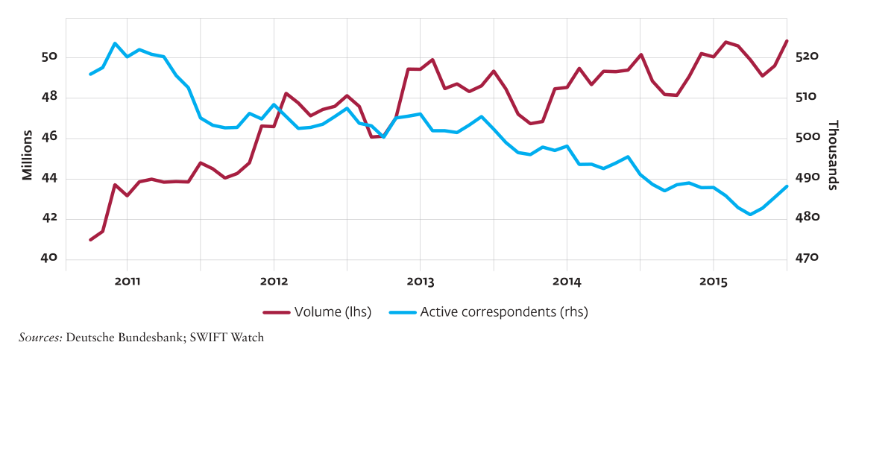

<!-- 원문 81쪽 -->

## 부록 3: 주요 FATF 권고사항 및 바젤 간행물 목록

### 금융행동특별작업반(FATF) 권장 사항

### R. 1 위험 평가 및 위험 기반 접근 방식 적용

### R. 2 국가 협력 및 조정

### R. 9 금융기관비밀보호법

### R. 10 고객확인의무

### R. 11 기록 보관

### R. 12 정치적 주요인물

### R. 13 환거래은행

### R. 15 신기술

### R. 16 전신환 송금

### R. 17 제3자에 대한 의존

### R. 18 내부 통제 및 해외 지사 및

자회사

### R. 20 의심 거래 신고

### R. 21 제보 및 기밀유지

### R. 24 법률의 투명성 및 실소유권

명

### R. 25 법률의 투명성 및 실소유권

준비

### R. 26 금융기관 규제 및 감독

### 바젤 출판물

1. 자금세탁 및 테러자금조달과 관련된 위험의 건전한 관리(2017) 2. 은행을 위한 기업 지배구조 원칙(2015)

<!-- 원문 82쪽 -->

## 부록 4: 계좌 개설 일반 지침

이 가이드는 은행이 신규 고객 계좌를 개설할 때 사용할 수 있는 도구로 제작되었습니다. 발생할 수 있는 모든 사례를 다루지는 않지만 은행이 고객 식별 및 확인 프로그램을 개발하는 데 도움이 될 수 있으며 자연인, 87 법인, 88 및 법적 계약에 대한 계좌 개설 시 수집 및 확인되어야 하는 정보가 포함되어 있습니다. 89 선진국 시장에서는 이 정보를 쉽게 사용할 수 있는 경우가 많지만 많은 신흥시장에서는 그렇지 않을 수 있습니다. 증명

예를 들어, 거주지 주소는 특히 시골 지역과 공식적인 주소 지정 시스템이 없는 도시/마을의 고객에게 일반적으로 문제가 되는 정보 중 하나입니다.

### 정보 수집

가능한 한 은행은 식별 목적으로 고객이나 기타 이용 가능한 출처90로부터 다음 정보를 수집해야 합니다.

### 자연인 법인 법률관계

최소한

- 법적 이름(성과 이름);

- 완전한 거주지 주소;b

- 국적, 공식 개인 식별 번호 또는 기타 고유 식별자b

- 생년월일 및 장소.b

- 법인의 이름, 법적 형태, 지위 및 법인 설립 증명;

- 법인 활동의 주요 장소의 영구 주소;

- 공식 식별 번호(회사 등록 번호, 세금 식별 번호);

- 법인의 우편물 및 등록된 주소;

- 계좌 운영 권한을 부여받은 자연인의 신원. 권한을 위임받은 사람이 없는 경우, 고위 관리직인 해당 사람의 신원

- 수익적 소유자의 신원;

- 법인을 규제하고 구속하는 권한(예: 기업의 정관).

- 법적 합의의 이름 및 존재 증명;

- 주소 및 설립 국가;

- 법적 합의의 성격, 목적 및 대상(예: 재량 또는 유언);

- 청산인, 수탁자, 보호자(있는 경우), 수혜자 또는 수혜자 집단, 법적 합의에 대해 궁극적으로 효과적인 통제권을 행사하는 기타 자연인(통제/소유권 체인을 통한 포함)의 이름.

> **주:** 87 자연인은 고객, 수익적 소유자 또는 승인된 서명자인 개인입니다. 88 FATF는 "법인"을 은행과 영구적인 고객 관계를 구축하거나 재산을 소유할 수 있는 자연인 이외의 모든 실체로 정의합니다. 여기에는 회사, 법인체, 재단, Anstalt 유형의 구조, 파트너십, 협회 및 기타 관련 유사한 단체가 포함될 수 있습니다. 89 FATF는 "법적 합의"를 명시적 신탁 또는 기타 유사한 합의로 정의합니다. 90 BCBS에서 발췌. 2017. 지침: 자금세탁 및 테러자금조달과 관련된 위험의 건전한 관리.

<!-- 원문 83쪽 -->

은행은 초기 고객 위험 프로필을 개발하기 위해 다음과 같은 추가 정보를 수집해야 합니다.

### 고객 신원 확인

은행은 신뢰할 수 있고 독립적으로 출처가 지정된 문서, 데이터 또는 정보를 사용하여 식별 목적으로 수집된 정보를 통해 확보된 고객의 신원을 확인해야 합니다91. 고객의 신원을 확인하는 데 사용되는 모든 조치는 고객의 신원에 비례해야 합니다.

고객 관계로 인해 발생하는 위험을 방지하고 은행이 고객이 누구인지 알 수 있도록 해야 합니다. 검증은 서류 및 비서류 절차를 통해 완료될 수 있습니다. 다음은 다양한 확인 절차의 몇 가지 예입니다. 이 예제 목록은 완전한 것이 아닙니다.

### 자연인 법인 법률관계

최소한

- 직업, 공직 보유;

- 소득;

- 계정의 예상 사용: 예상되는 거래의 금액, 수, 유형, 목적 및 빈도;

- 고객이 요청한 금융상품이나 서비스.

- 법인 활동의 성격과 목적, 그리고 그 적법성;

- 계좌의 예상 용도: 예상되는 거래 금액, 수, 유형, 목적 및 빈도.

- 법적 합의의 목적/활동에 대한 설명(예: 공식 헌법, 신탁 증서);

- 계좌의 예상 용도: 예상되는 거래 금액, 수, 유형, 목적 및 빈도.

잠재적인 추가 정보(위험 기준)

- 해당되는 경우 고용주 이름;

- 고객의 부의 원천;

- 계좌를 통과하는 자금의 출처;

- 계좌를 통과하는 자금의 목적지.

- 기업의 재정 상황;

- 계좌에 입금된 자금의 출처와 계좌를 통과하는 자금의 목적지.

- 자금 출처;

- 계좌를 통과하는 자금의 출처와 목적지.

잠재적인 추가 정보(위험 기준)

- 사용된 기타 이름(예: 결혼 이름, 이전 법적 이름 또는 별칭);

- 회사 주소, 사서함 번호, 이메일 주소, 유선전화 또는 휴대전화 번호;

- 거주 상태;c

- 성별.c

- 법인 식별자(LEI)(적격한 경우)d

- 전화 및 팩스 번호에 문의하세요.

- 고위 관리직을 맡고 있는 관련자의 신원.

- LEI(적격한 경우)d

- 해당되는 경우 전화 및 팩스 번호로 연락하십시오.

- 법적 계약에서 고위 관리직을 맡고 있는 관련자의 이름(해당하는 경우 수탁자, 수혜자의 주소).

b 이 정보를 합법적으로 사용할 수 없는 상황이 있습니다. 이는 고객이 공식적인 은행 서비스에 액세스하는 것을 방지할 수 있습니다. 고객이 공식 은행 서비스에 접근할 수 있도록 허용된 경우, 은행은 국내법에 따라 내부 위험 정책에 규정된 완화 조치를 적용해야 합니다. 이러한 조치에는 대체 정보를 활용하거나 적절한 모니터링을 수행하는 것이 포함될 수 있습니다.

> **주:** 91 BCBS에서 발췌. 2017. 지침: 자금세탁 및 테러자금조달과 관련된 위험의 건전한 관리.

> **주:** a 단순화된 실사가 적용될 수 있는 저위험 상황에서는 이 정보가 모두 필요한 것은 아닙니다. 이 표에는 계정 소유자의 서명 수집과 같이 AML/CFT 요구 사항과 구체적으로 관련되지 않은 기타 기본 요구 사항은 포함되어 있지 않습니다.

> **주:** a 단순화된 실사가 적용될 수 있는 저위험 상황에서는 이 정보가 모두 필요한 것은 아닙니다. 이 표에는 계정 소유자의 서명 수집과 같이 AML/CFT 요구 사항과 구체적으로 관련되지 않은 기타 기본 요구 사항은 포함되어 있지 않습니다.

> **주:** c 이 정보의 수집에는 국가 데이터 보호 및 개인 정보 보호 체제가 적용될 수 있습니다. d LEI 프로젝트의 개발에 따라 이 정보는 향후 필요할 수 있습니다.

<!-- 원문 84쪽 -->

본 간행물 이외의 계좌 개설에 대한 추가 지침은 "부록 4: 계좌 개설 일반 지침"을 참조하십시오. (지침: 자금세탁 및 자금조달과 관련된 위험의 건전한 관리

테러리즘, 페이지 33–43. 스위스 바젤: 국제 결제 은행, 은행 감독에 관한 바젤 위원회(BCBS), 2017.)

### 자연인 법인 법률관계

서류 검증 절차

- 고객의 사진이 포함된 만료되지 않은 공식 문서(예: 여권, 신분증, 거주 허가증, 사회보장 기록 또는 운전면허증)를 통해 고객 또는 수익적 소유자의 신원을 확인합니다.

- 공식 문서(예: 출생 증명서, 여권, 신분증 또는 사회 보장 기록)에서 출생 날짜와 장소를 확인합니다.

- 승인된 사람(예: 대사관 직원 또는 공증인)의 인증을 통해 제공된 공식 문서의 유효성을 확인합니다.

- 거주지 주소 확인(예: 공과금 청구서, 세금 평가, 은행 명세서 또는 공공 기관에서 보낸 편지).

- 법인 설립 증명서, 각서, 정관 또는 파트너십 계약서(또는 회사/상거래 등기부 개요 등 법인의 존재를 증명하는 기타 법적 문서)의 사본을 확보합니다.

- 기존 법인의 경우 최신 재무제표 사본을 검토합니다(가능한 경우 감사).

- 계정 소유자의 성격과 법적 존재를 확인하는 문서 사본을 얻습니다(예: 신탁 증서 또는 자선 단체 등록부).

비문서 검증 절차

- 계좌가 개설된 후 제공된 정보를 확인하기 위해 전화나 서신으로 고객에게 연락합니다(예를 들어 전화 연결이 끊기거나 반송된 메일은 추가 조사가 필요함).

- 다른 금융기관에서 제공한 추천인을 확인합니다.

- 공공 등록부, 개인 데이터베이스 또는 기타 신뢰할 수 있는 독립 소스(예: 신용 조회 기관)에 액세스하는 등 독립적인 정보 확인 프로세스를 사용합니다.

- 법인이 해산, 해산, 청산 또는 종료되지 않았거나 진행 중이 아닌지 확인하기 위해 회사 검색 및/또는 기타 상업적 조사를 수행합니다.

- 공공 기업 등록부, 개인 데이터베이스 또는 기타 신뢰할 수 있는 독립 소스(예: 변호사 또는 회계사)에 액세스하는 등 독립적인 정보 확인 프로세스를 사용합니다.

- 공공 액세스 서비스에서 LEI 및 관련 데이터를 검증합니다.

- 사전 은행 조회 확보;

- 가능한 경우 법인체를 방문합니다.

- 전화, 우편, 이메일을 통해 해당 법인에 연락합니다.

- 제출된 문서를 확인하는 평판이 좋고 알려진 변호사 또는 회계사로부터 독립적인 확약을 얻습니다.

- 사전 은행 조회 확보;

- 공개 및 비공개 데이터베이스나 기타 신뢰할 수 있는 독립 소스에 액세스하거나 검색합니다.

> **주:** a 단순화된 실사가 적용될 수 있는 저위험 상황에서는 이 정보가 모두 필요한 것은 아닙니다. 이 표에는 계정 소유자의 서명 수집과 같이 AML/CFT 요구 사항과 구체적으로 관련되지 않은 기타 기본 요구 사항은 포함되어 있지 않습니다.

<!-- 원문 85쪽 -->

## 부록 5: 볼프스베르크 지침

92 https://www.wolfsberg-principles.com/sites/default/files/wb/Wolfsberg%27s_CBDDQ_140618_v1.2.pdf 93 https://www.wolfsberg-principles.com/sites/default/files/wb/Wolfsberg%20FC%20Country%20Risk%20FAQs%20Mar18.pdf 94 https://www.wolfsberg-principles.com/sites/default/files/wb/pdfs/wolfsberg-standards/1.%20Wolfsberg-Payment-Transparency-Standards-October-2017.pdf 95 https://www.wolfsberg-principles.com/sites/default/files/wb/pdfs/wolfsberg-standards/4.%20Wolfsberg-Guidance-on-PEPs-May-2017.pdf 96 https://www.wolfsberg-principles.com/sites/default/files/wb/pdfs/faqs/17.%20Wolfsberg-Risk-Assessment-FAQs-2015.pdf 97 https://www.wolfsberg-principles.com/sites/default/files/wb/pdfs/wolfsberg-standards/8.%20Wolfsberg-Correspondent-Banking-Principles-2014.pdf 98 https://www.wolfsberg-principles.com/sites/default/files/wb/pdfs/faqs/18.%20Wolfsberg-Correspondent-Banking-FAQ-2014.pdf

볼프스베르크 그룹(Wolfsberg Group)은 특히 고객 파악(KYC) 및 자금세탁방지/테러자금조달방지(AML/CFT) 정책과 관련하여 금융 범죄 위험관리를 위한 프레임워크 및 지침을 개발하는 것을 목표로 하는 13 글로벌 은행 협회입니다. Wolfsberg Group이 발행한 자료는 효과적인 금융 범죄 위험관리에 대한 업계 관점을 금융 기관에 제공하기 위해 고안되었습니다.

볼프스베르크 그룹은 원칙, 지침, 자주 묻는 질문 및 설명의 형태로 여러 자료를 게시했으며, 이 모든 자료는 그룹 웹사이트(https://www.wolfsberg-principles.com).)에서 찾을 수 있습니다. 여기에 나열된 것은 AML/CFT 프로그램의 효과를 촉진하기 위해 고안된 최근 몇 년간 그룹이 게시한 주요 문서 중 일부입니다.

- 환거래은행 실사 설문지

```text
(2018);92
```

- 국가 위험에 대해 자주 묻는 질문(2018);93

- 결제 투명성 표준(2017);94

- 정치적 주요인물에 대한 지침(2017);95

- 자금세탁, 제재, 뇌물 및 부패에 대한 위험 평가에 대해 자주 묻는 질문(2015);96

- 환거래은행을 위한 자금세탁방지 원칙(2014);97and

- 환거래은행업에 관해 자주 묻는 질문

```text
(2014).98
```

<!-- 원문 86쪽 -->

<!-- 원문 87쪽 -->
