# 의심 거래 탐지를 위한 온톨로지 기반 전문가 시스템

> **원문 제목:** Ontology Based Expert-System for Suspicious Transactions Detection  
> **저자:** Quratulain Rajput · Nida Sadaf Khan · Asma Larik · Sajjad Haider  
> **게재 정보:** Computer and Information Science, Vol. 7, No. 1, 2014, pp. 103-114  
> **DOI:** [https://doi.org/10.5539/cis.v7n1p103](https://doi.org/10.5539/cis.v7n1p103)

> **번역 안내:** 본문은 문단 전체의 문맥을 기준으로 한국어로 옮겼습니다. AML·규칙 엔진·전문가 시스템 관련 용어를 통일했으며, 수식·코드·참고문헌은 정확성을 위해 원문 표기를 유지했습니다. 각 페이지의 그림·표·원래 배치는 해당 번역 구간에 놓인 원문 페이지 이미지에서 확인할 수 있습니다.

---

<!-- 원문 1쪽 -->

<details>
<summary>원문 1쪽 이미지 보기</summary>

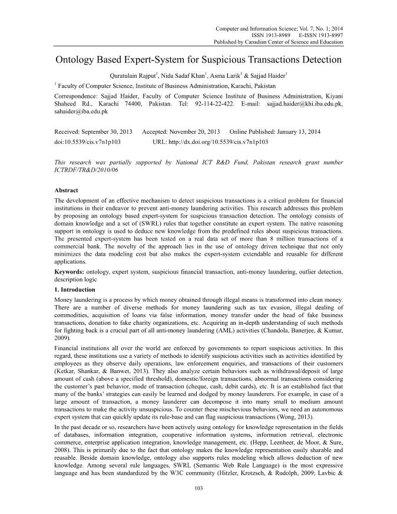

</details>

## 초록

의심 거래를 탐지하기 위한 효과적인 메커니즘의 개발은 자금세탁방지 활동을 방지하려는 금융 기관의 노력에 있어 중요한 문제입니다. 본 연구에서는 의심거래 탐지를 위한 온톨로지 기반 전문가 시스템을 제안함으로써 이러한 문제를 해결한다. 온톨로지는 전문가 시스템을 구성하는 도메인 지식과 (SWRL) 규칙 세트로 구성됩니다. 온톨로지의 기본 추론 지원은 의심 거래에 대해 사전 정의된 규칙에서 새로운 지식을 추론하는 데 사용됩니다. 제시된 전문가 시스템은 상업 은행의 8 million 거래 이상의 실제 데이터셋에서 테스트되었습니다. 이 접근 방식의 참신함은 데이터 모델링 비용을 최소화할 뿐만 아니라 전문가 시스템을 다양한 응용 프로그램에 대해 확장 및 재사용할 수 있게 만드는 온톨로지 기반 기술을 사용한다는 것입니다.

## 핵심어

온톨로지, 전문가 시스템, 의심금융거래, 자금세탁방지, 이상치 탐지, 기술논리

## 1 서론

자금세탁은 불법적인 수단을 통해 얻은 돈을 깨끗한 돈으로 바꾸는 과정입니다. 자금세탁에는 탈세, 상품 불법 거래, 허위 정보를 통한 대출 취득, 허위 사업 거래 책임자를 통한 자금 이체, 허위 자선 단체에 대한 기부 등 다양한 방법이 있습니다. 이러한 대응 방법에 대한 심층적인 이해를 얻는 것은 모든 자금세탁방지(AML) 활동에서 중요한 부분입니다(Chandola, Banerjee, & Kumar, 2009).

전 세계의 금융 기관은 정부에 의해 의심 활동을 보고하도록 강요받고 있습니다. 이와 관련하여 이들 기관은 직원이 일상 업무를 관찰하면서 식별한 활동, 법 집행 조사, 고객 거래 등 의심 활동을 식별하기 위해 다양한 방법을 사용합니다(Ketkar, Shankar, & Banwet, 2013). 또한 고액현금(일정 기준액 이상) 입출금, 국내외 거래, 고객의 과거 행태를 고려한 이상거래, 거래방식(수표, 현금, 직불카드) 등 특정 행위를 분석합니다. 은행의 전략 중 다수가 자금세탁 행위자들에 의해 쉽게 학습되고 회피될 수 있다는 것은 자명한 사실입니다. 예를 들어, 거래 규모가 큰 경우 자금세탁 행위자는 이를 의심할 여지가 없는 활동으로 만들기 위해 이를 중소규모 거래로 분해할 수 있습니다. 이러한 악의적인 행동에 대응하려면 규칙 기반을 신속하게 업데이트하고 의심 거래에 플래그를 지정할 수 있는 자율 전문가 시스템이 필요합니다(Wong, 2013).

지난 10여 년 동안 연구자들은 데이터베이스, 정보 통합, 협력 정보 시스템, 정보 검색, 전자 상거래, 기업 애플리케이션 통합, 지식 관리 등의 분야에서 지식 표현을 위해 온톨로지를 적극적으로 사용해 왔습니다(Hepp, Leenheer, de Moor, & Sure, 2008). 이는 주로 온톨로지가 지식 표현을 쉽게 공유하고 재사용할 수 있게 만든다는 사실에 기인합니다. 도메인 지식 외에도 온톨로지는 새로운 지식을 추론할 수 있는 규칙 모델링을 지원합니다. 여러 규칙 언어 중에서 SWRL(Semantic Web Rule Language)는 가장 표현력이 뛰어난 언어이며 W3C 커뮤니티(Hitzler, Krotzsch, & Rudolph, 2009; Lavbic & Bajec, 2012)에 의해 표준화되었습니다. 따라서 전문가 시스템 개발에 온톨로지를 사용하는 것은 지식 기반을 통합할 뿐만 아니라 규칙 모델링도 허용하므로 자연스러운 선택이 됩니다. 함께 사용하면 쉽게 재사용할 수 있고 운영 데이터로부터 독립된 전문가 시스템을 만들 수 있습니다(Valiente-Rocha & Lozano-Tello, 2010). 본 논문에서는 의심거래 탐지를 위한 온톨로지 기반 전문가 시스템을 제시한다. 온톨로지를 사용하면 시스템이 도메인 지식으로부터 독립적이게 되며 다른 도메인의 온톨로지를 추가하려는 경우 확장이 가능해집니다.

<!-- 원문 2쪽 -->

<details>
<summary>원문 2쪽 이미지 보기</summary>

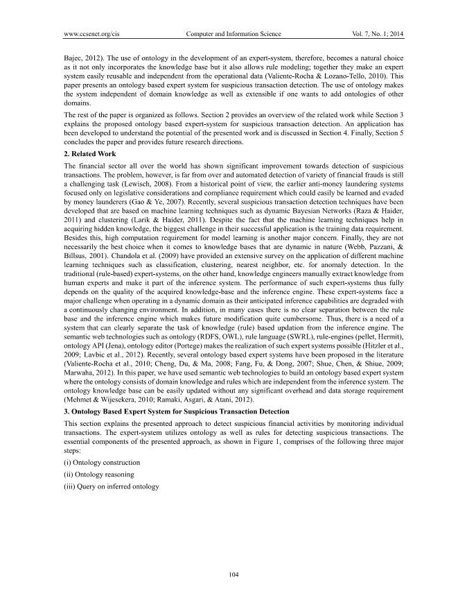

</details>

나머지 논문은 다음과 같이 구성된다. 섹션 2는 관련 작업의 개요를 제공하고 섹션 3는 의심 거래 탐지를 위해 제안된 온톨로지 기반 전문가 시스템을 설명합니다. 제시된 작업의 잠재력을 이해하기 위한 애플리케이션이 개발되었으며 섹션 4에서 논의됩니다. 마지막으로 섹션 5에서는 논문을 마무리하고 향후 연구 방향을 제시합니다.

## 2 관련 연구

전 세계 금융 부문은 의심 거래 탐지에 있어 상당한 개선을 보였습니다. 그러나 문제는 아직 끝나지 않았으며 다양한 금융 사기를 자동으로 탐지하는 것은 여전히 ​​어려운 작업입니다(Lewisch, 2008). 역사적 관점에서 볼 때, 초기 자금세탁방지 시스템은 자금세탁 행위자가 쉽게 학습하고 회피할 수 있는 입법적 고려 사항 및 준수 요구 사항에만 초점을 맞췄습니다(Gao & Ye, 2007). 최근에는 동적 베이지안 네트워크(Raza & Haider, 2011) 및 클러스터링(Larik & Haider, 2011)과 같은 기계 학습 기술을 기반으로 하는 여러 가지 의심 거래 탐지 기술이 개발되었습니다. 머신러닝 기술이 숨겨진 지식을 습득하는 데 도움이 된다는 사실에도 불구하고 성공적인 적용에 있어 가장 큰 과제는 훈련 데이터 요구 사항입니다. 이 외에도 모델 학습을 위한 높은 계산 요구 사항은 또 다른 주요 관심사입니다. 마지막으로, 본질적으로 역동적인 지식 기반(Webb, Pazzani, & Billsus, 2001)의 경우 이것이 반드시 최선의 선택은 아닙니다. Chandolaet al. (2009)은 이상 탐지를 위한 분류, 클러스터링, 최근접 이웃 등과 같은 다양한 기계 학습 기술의 적용에 대한 광범위한 조사를 제공했습니다. 반면, 전통적인(규칙 기반) 전문가 시스템에서는 지식 엔지니어가 인간 전문가로부터 지식을 수동으로 추출하여 추론 시스템의 일부로 만듭니다. 따라서 그러한 전문가 시스템의 성능은 획득한 지식 기반과 추론 엔진의 품질에 전적으로 달려 있습니다. 이러한 전문가 시스템은 지속적으로 변화하는 환경으로 인해 예상되는 추론 기능이 저하되기 때문에 동적 영역에서 작동할 때 큰 문제에 직면합니다. 또한 많은 경우 규칙 베이스와 추론 엔진 사이에 명확한 구분이 없어 향후 수정이 매우 번거롭습니다. 따라서 지식(규칙) 기반 업데이트 작업을 추론 엔진과 명확하게 분리할 수 있는 시스템이 필요하다. 온톨로지(RDFS, OWL), 규칙 언어(SWRL), 규칙 엔진(pellet, Hermit), 온톨로지 API(Jena), 온톨로지 편집기(Portege)와 같은 시맨틱 웹 기술은 이러한 전문가 시스템의 구현을 가능하게 합니다(Hitzler et al., 2009; Lavbic et al. al., 2012). 최근 여러 온톨로지 기반 전문가 시스템이 문헌에서 제안되었습니다(Valiente-Rocha et al., 2010; Cheng, Du, & Ma, 2008; Fang, Fu, & Dong, 2007; Shue, Chen, & Shiue, 2009; Marwaha, 2012). 본 논문에서는 온톨로지가 추론 시스템과 독립적인 도메인 지식과 규칙으로 구성되는 온톨로지 기반 전문가 시스템을 구축하기 위해 시맨틱 웹 기술을 사용했습니다. 온톨로지 지식 기반은 상당한 오버헤드 및 데이터 저장 요구 사항 없이 쉽게 업데이트될 수 있습니다(Mehmet & Wijesekera, 2010; Ramaki, Asgari, & Atani, 2012).

## 3 의심거래 탐지를 위한 온톨로지 기반 전문가 시스템

이 섹션에서는 개별 거래를 모니터링하여 의심스러운 금융 활동을 탐지하는 제시된 접근 방식을 설명합니다. 전문가 시스템은 의심 거래를 탐지하기 위해 온톨로지와 규칙을 활용합니다. 그림 1에 표시된 것처럼 제시된 접근 방식의 필수 구성 요소는 다음 세 가지 주요 단계로 구성됩니다. (i) 온톨로지 구성 (ii) 온톨로지 추론 (iii) 추론된 온톨로지에 대한 쿼리

<!-- 원문 3쪽 -->

<details>
<summary>원문 3쪽 이미지 보기</summary>

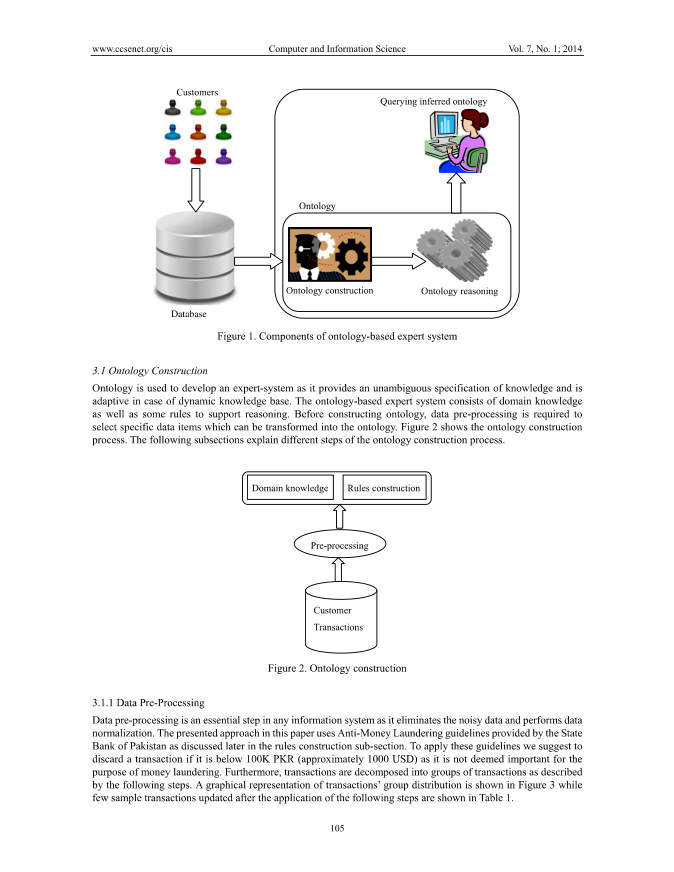

</details>

**그림 1. 온톨로지 기반 전문가 시스템의 구성요소**

### 3.1 온톨로지 구축

온톨로지는 지식의 명확한 사양을 제공하고 동적 지식 기반의 경우 적응 가능하므로 전문가 시스템을 개발하는 데 사용됩니다. 온톨로지 기반 전문가 시스템은 도메인 지식과 추론을 지원하는 몇 가지 규칙으로 구성됩니다. 온톨로지를 구축하기 전에 온톨로지로 변환할 수 있는 특정 데이터 항목을 선택하기 위한 데이터 전처리가 필요합니다. 그림 2는 온톨로지 구축 프로세스를 보여줍니다. 다음 하위 섹션에서는 온톨로지 구성 프로세스의 다양한 단계를 설명합니다.

**그림 2. 온톨로지 구축**

#### 3.1.1 데이터 전처리

데이터 전처리는 잡음이 있는 데이터를 제거하고 데이터 정규화를 수행하므로 모든 정보 시스템에서 필수적인 단계입니다. 이 백서에 제시된 접근 방식은 나중에 규칙 구성 하위 섹션에서 설명하는 것처럼 파키스탄 중앙 은행에서 제공한 자금세탁방지 지침을 사용합니다. 이러한 지침을 적용하려면 거래 금액이 100K PKR(약 1000 USD) 미만인 경우 자금세탁 목적으로 중요하지 않은 것으로 간주되므로 거래를 폐기하는 것이 좋습니다. 또한 거래은 다음 단계에 설명된 대로 거래 그룹으로 분해됩니다. 거래 그룹 분포의 그래픽 표현은 그림 3에 표시되어 있으며 다음 단계를 적용한 후 업데이트된 몇 가지 샘플 거래은 표 1에 표시되어 있습니다.

도메인 지식 규칙 구성 고객 거래 전처리 데이터베이스 온톨로지 구성 온톨로지 추론 고객 추론된 온톨로지 쿼리 온톨로지 i. 7-일 간격으로 모든 거래를 집계하고 차변 거래 합계, 대변 거래 합계, 차변 거래 빈도 및 대변 거래 빈도와 같은 집계된 각 값에 간격 ID를 할당합니다. ii. i단계에서 거래 합계(차변 또는 대변) 금액이 100000 PKR(1000 USD)보다 크거나 같은 모든 레코드를 선택합니다. 이 레코드 세트는 그룹 GT에 속합니다. iii. 수표로만 거래가 이루어진 GT의 모든 기록을 선택하세요. 이 레코드 세트는 그룹 GC에 속합니다. iv. 거래 합계(차변 또는 대변)가 다음보다 크거나 같은 GT의 모든 기록을 선택하세요.

<!-- 원문 4쪽 -->

<details>
<summary>원문 4쪽 이미지 보기</summary>

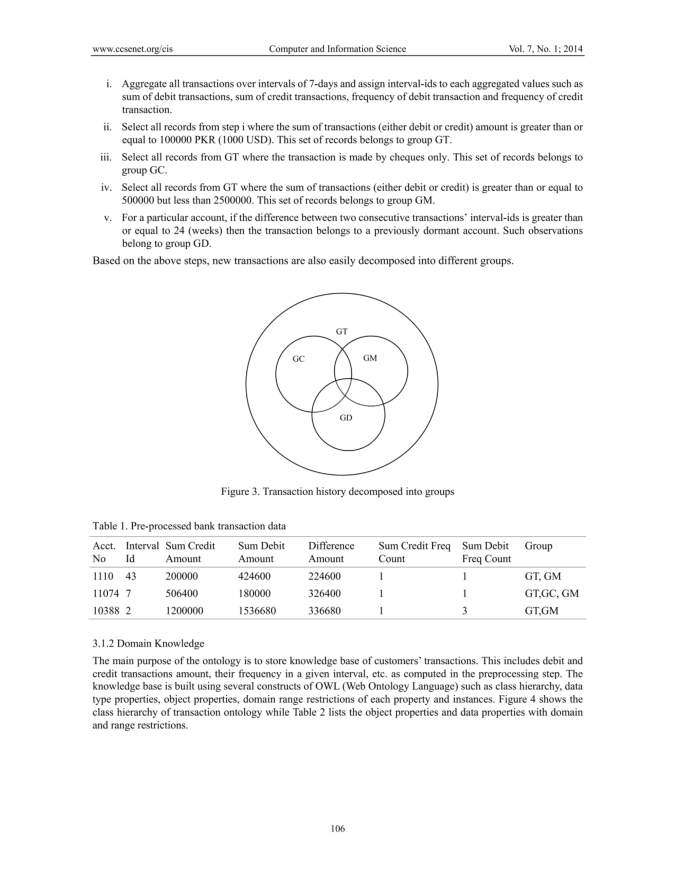

</details>

```text
500000 but less than 2500000. This set of records belongs to group GM.
```

v. 특정 계정의 경우 두 연속 거래의 간격 ID 차이가 24(주)보다 크거나 같으면 해당 거래은 이전에 휴면 계정에 속합니다. 이러한 관찰은 그룹 GD에 속합니다.

위의 단계를 기반으로 새로운 거래도 쉽게 다른 그룹으로 분해됩니다.

**그림 3. 그룹으로 분해된 거래 내역**

**테이블 1. 전처리된 은행 거래 데이터**

계정 간격 없음 ID 합계 대변 금액 합계 차변 금액 차이 금액 합계 대변 빈도 횟수 합계 차변 빈도 횟수 그룹

```text
1110 
43 
200000 
424600 
224600 
1 
1 
GT, GM
```

```text
11074 7 
506400 
180000 
326400 
1 
1 
GT,GC, GM
```

```text
10388 2 
1200000 
1536680 
336680 
1 
3 
GT,GM
```

#### 3.1.2 도메인 지식

온톨로지의 주요 목적은 고객 거래에 대한 지식 기반을 저장하는 것입니다. 여기에는 전처리 단계에서 계산된 차변 및 대변 거래 금액, 특정 간격에서의 빈도 등이 포함됩니다. 지식 기반은 클래스 계층 구조, 데이터 유형 속성, 개체 속성, 각 속성 및 인스턴스의 도메인 범위 제한과 같은 OWL(웹 온톨로지 언어)의 여러 구성을 사용하여 구축됩니다. 그림 4는 거래 온톨로지의 클래스 계층 구조를 보여주고, 표 2는 도메인 및 범위 제한이 있는 개체 속성과 데이터 속성을 나열합니다.

```text
GT
```

GCGM

```text
GD
```

<!-- 원문 5쪽 -->

<details>
<summary>원문 5쪽 이미지 보기</summary>

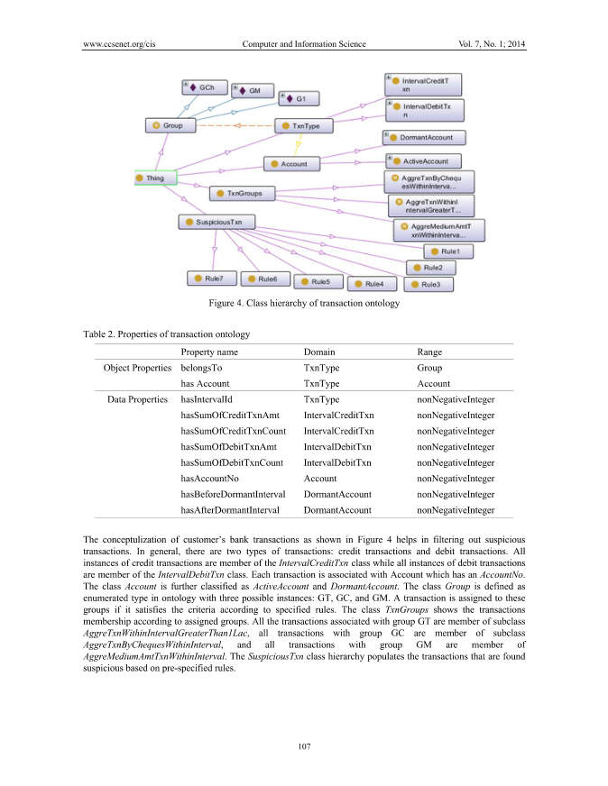

</details>

**그림 4. 거래 온톨로지의 클래스 계층 구조**

**테이블 2. 거래 온톨로지의 속성**

속성 이름 도메인 범위 개체 속성 속하는 TxnType 그룹에 계정이 있음 TxnType 계정 데이터 속성 hasIntervalId TxnType nonNegativeInteger hasSumOfCreditTxnAmt IntervalCreditTxn nonNegativeInteger hasSumOfCreditTxnCount IntervalCreditTxn nonNegativeInteger hasSumOfDebitTxnAmt IntervalDebitTxn nonNegativeInteger hasSumOfDebitTxnCount IntervalDebitTxn nonNegativeInteger hasAccountNo 계정 nonNegativeInteger hasBeforeDormantInterval DormantAccount nonNegativeInteger hasAfterDormantInterval DormantAccount nonNegativeInteger 그림 4에 표시된 고객 은행 거래의 개념화는 의심 거래를 필터링하는 데 도움이 됩니다. 일반적으로 거래에는 신용 거래와 차변 거래의 두 가지 유형이 있습니다. 신용 거래의 모든 인스턴스는 IntervalCreditTxn 클래스의 멤버이고 차변 거래의 모든 인스턴스는 IntervalDebitTxn 클래스의 멤버입니다. 각 거래는 AccountNo가 있는 Account와 연결됩니다. Account 클래스는 ActiveAccount 및 DormantAccount로 더 분류됩니다. Group 클래스는 GT, GC 및 GM의 세 가지 가능한 인스턴스를 포함하는 온톨로지의 열거 유형으로 정의됩니다. 지정된 규칙에 따라 기준을 충족하는 경우 거래이 이러한 그룹에 할당됩니다. TxnGroups 클래스는 할당된 그룹에 따른 거래 멤버십을 보여줍니다. GT 그룹과 연관된 모든 거래은 AggreTxnWithinIntervalGreaterThan1Lac 서브클래스의 멤버이고, 그룹 GC의 모든 거래은 AggreTxnByChequesWithinInterval 서브클래스의 멤버이며, GM 그룹의 모든 거래은 AggreMediumAmtTxnWithinInterval의 멤버입니다. SuspiciousTxn 클래스 계층 구조는 미리 지정된 규칙에 따라 의심 거래를 채웁니다.

<!-- 원문 6쪽 -->

<details>
<summary>원문 6쪽 이미지 보기</summary>

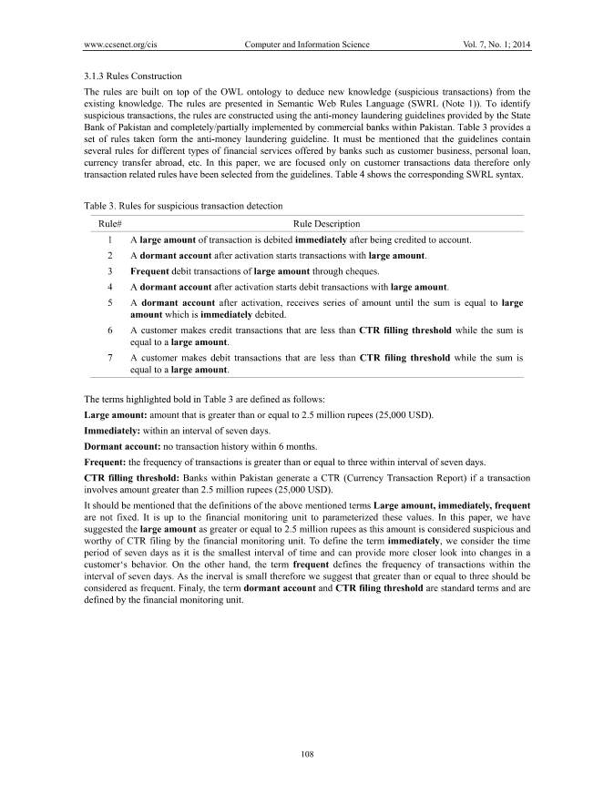

</details>

#### 3.1.3 규칙 구축

규칙은 OWL 온톨로지 위에 구축되어 기존 지식에서 새로운 지식(의심 거래)을 추론합니다. 규칙은 시맨틱 웹 규칙 언어(SWRL(참고 1))로 표시됩니다. 의심 거래를 식별하기 위해 파키스탄 중앙은행이 제공한 자금세탁방지 지침을 사용하여 규칙을 구성하고 파키스탄 내 상업은행에서 전체/부분을 시행합니다. 표 3는 자금세탁방지 지침에서 채택된 일련의 규칙을 제공합니다. 가이드라인에는 고객 비즈니스, 개인 대출, 해외 송금 등 은행이 제공하는 다양한 유형의 금융 서비스에 대한 여러 규칙이 포함되어 있다는 점을 언급해야 합니다. 본 논문에서는 고객 거래 데이터에만 초점을 맞추기 때문에 가이드라인에서는 거래 관련 규칙만 선택했습니다. 테이블 4는 해당 SWRL 구문을 보여줍니다.

**테이블 3. 의심 거래 탐지 규칙**

규칙# 규칙 설명 1 대량의 거래가 계좌에 입금된 후 즉시 출금됩니다.

2 활성화 후 휴면계좌로 고액 거래가 시작됩니다.

3 수표를 통한 고액의 빈번한 출금 거래.

4 활성화 후 휴면계좌에서 고액 출금 거래가 시작됩니다.

5 휴면 계좌는 활성화 후 일련의 금액을 받아 그 금액이 즉시 인출되는 큰 금액과 같아질 때까지 받습니다.

6 고객은 합계가 큰 금액인 경우 CTR 채우기 임계값보다 작은 신용 거래를 수행합니다.

7 고객이 CTR 신고 기준액보다 적은 금액으로 차변 거래를 했으나 금액은 큰 금액입니다.

표 3에서 굵게 강조 표시된 용어는 다음과 같이 정의됩니다.

큰 금액: 2.5 million 루피(25,000 USD) 이상인 금액.

즉시: 7일 간격 이내.

휴면계좌: 6개월간 거래내역이 없습니다.

빈번함: 거래 빈도가 7일 이내에 3회 이상입니다.

CTR 채우기 임계값: 파키스탄 내 은행은 거래에 2.5 million 루피(25,000 USD)보다 큰 금액이 포함된 경우 CTR(통화 거래 보고서)를 생성합니다.

위에서 언급한 대량, 즉시, 빈번이라는 용어의 정의는 고정되어 있지 않습니다. 이러한 값을 매개변수화하는 것은 재무 모니터링 단위에 달려 있습니다. 이 백서에서는 이 금액이 의심스럽고 금융 모니터링 부서에서 CTR를 제출할 가치가 있는 것으로 간주되므로 2.5 million 루피보다 크거나 같은 금액을 제안했습니다. 용어를 즉각적으로 정의하자면, 7일이라는 기간은 가장 짧은 시간 간격이며 고객의 행동 변화를 더 자세히 살펴볼 수 있는 기간이라고 생각합니다. 반면, 빈번함이라는 용어는 7일 간격 내의 거래 빈도를 정의합니다. Inerval이 작기 때문에 3보다 크거나 같은 경우를 빈번한 것으로 간주해야 한다고 제안합니다. 마지막으로 휴면 계정이라는 용어와 CTR 신고 기준액은 표준 용어이며 재무 모니터링 부서에서 정의합니다.

<!-- 원문 7쪽 -->

<details>
<summary>원문 7쪽 이미지 보기</summary>

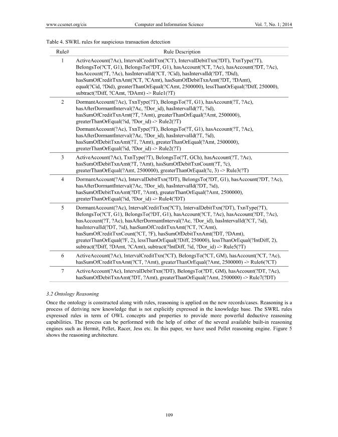

</details>

**테이블 4. 의심 거래 탐지를 위한 SWRL 규칙**

규칙# 규칙 설명

```text
1 
ActiveAccount(?Ac), IntervalCreditTxn(?CT), IntervalDebitTxn(?DT), TxnType(?T), 
BelongsTo(?CT, G1), BelongsTo(?DT, G1), hasAccount(?CT, ?Ac), hasAccount(?DT, ?Ac), 
hasAccount(?T, ?Ac), hasIntervalId(?CT, ?Cid), hasIntervalId(?DT, ?Did), 
hasSumOfCreditTxnAmt(?CT, ?CAmt), hasSumOfDebitTxnAmt(?DT, ?DAmt), 
equal(?Cid, ?Did), greaterThanOrEqual(?CAmt, 2500000), lessThanOrEqual(?Diff, 250000), 
subtract(?Diff, ?CAmt, ?DAmt) -> Rule1(?T)
```

```text
2 
DormantAccount(?Ac), TxnType(?T), BelongsTo(?T, G1), hasAccount(?T, ?Ac), 
hasAfterDormantInterval(?Ac, ?Dor_id), hasIntervalId(?T, ?id), 
hasSumOfCreditTxnAmt(?T, ?Amt), greaterThanOrEqual(?Amt, 2500000), 
greaterThanOrEqual(?id, ?Dor_id) -> Rule2(?T) 
DormantAccount(?Ac), TxnType(?T), BelongsTo(?T, G1), hasAccount(?T, ?Ac), 
hasAfterDormantInterval(?Ac, ?Dor_id), hasIntervalId(?T, ?id), 
hasSumOfDebitTxnAmt(?T, ?Amt), greaterThanOrEqual(?Amt, 2500000), 
greaterThanOrEqual(?id, ?Dor_id) -> Rule2(?T)
```

```text
3 
ActiveAccount(?Ac), TxnType(?T), BelongsTo(?T, GCh), hasAccount(?T, ?Ac), 
hasSumOfDebitTxnAmt(?T, ?Amt), hasSumOfDebitTxnCount(?T, ?c), 
greaterThanOrEqual(?Amt, 2500000), greaterThanOrEqual(?c, 3) -> Rule3(?T)
```

```text
4
DormantAccount(?Ac), IntervalDebitTxn(?DT), BelongsTo(?DT, G1), hasAccount(?DT, ?Ac),
hasAfterDormantInterval(?Ac, ?Dor_id), hasIntervalId(?DT, ?id),
hasSumOfDebitTxnAmt(?DT, ?Amt), greaterThanOrEqual(?Amt, 2500000),
greaterThanOrEqual(?id, ?Dor_id) -> Rule4(?DT)
```

```text
5 
DormantAccount(?Ac), IntervalCreditTxn(?CT), IntervalDebitTxn(?DT), TxnType(?T), 
BelongsTo(?CT, G1), BelongsTo(?DT, G1), hasAccount(?CT, ?Ac), hasAccount(?DT, ?Ac), 
hasAccount(?T, ?Ac), hasAfterDormantInterval(?Ac, ?Dor_id), hasIntervalId(?CT, ?id), 
hasIntervalId(?DT, ?id), hasSumOfCreditTxnAmt(?CT, ?CAmt), 
hasSumOfCreditTxnCount(?CT, ?F), hasSumOfDebitTxnAmt(?DT, ?DAmt), 
greaterThanOrEqual(?F, 2), lessThanOrEqual(?Diff, 250000), lessThanOrEqual(?IntDiff, 2), 
subtract(?Diff, ?DAmt, ?CAmt), subtract(?IntDiff, ?id, ?Dor_id) -> Rule5(?T)
```

```text
6
ActiveAccount(?Ac), IntervalCreditTxn(?CT), BelongsTo(?CT, GM), hasAccount(?CT, ?Ac),
hasSumOfCreditTxnAmt(?CT, ?Amt), greaterThanOrEqual(?Amt, 2500000) -> Rule6(?CT)

7
ActiveAccount(?Ac), IntervalDebitTxn(?DT), BelongsTo(?DT, GM), hasAccount(?DT, ?Ac),
hasSumOfDebitTxnAmt(?DT, ?Amt), greaterThanOrEqual(?Amt, 2500000) -> Rule7(?DT)
```

### 3.2 온톨로지 추론

규칙과 함께 온톨로지가 구축되면 새로운 기록/사례에 대한 추론이 적용됩니다. 추론은 지식 베이스에 명시적으로 표현되지 않은 새로운 지식을 도출하는 과정이다. SWRL 규칙은 보다 강력한 연역적 추론 기능을 제공하기 위해 OWL 개념 및 속성 측면에서 규칙을 표현했습니다. 이 프로세스는 Hermit, Pellet, Racer, Jess 등과 같은 내장된 여러 추론 엔진 중 하나를 사용하여 수행할 수 있습니다. 이 문서에서는 Pellet 추론 엔진을 사용했습니다. 그림 5는 추론 아키텍처를 보여줍니다.

<!-- 원문 8쪽 -->

<details>
<summary>원문 8쪽 이미지 보기</summary>

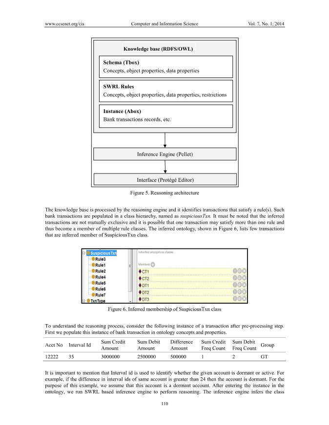

</details>

**그림 5. 추론 아키텍처**

지식 기반은 추론 엔진에 의해 처리되며 규칙을 충족하는 거래를 식별합니다. 이러한 은행 거래는 의심스러운Txn이라는 클래스 계층 구조로 채워집니다. 유추된 거래은 상호 배타적이지 않으며 하나의 거래이 둘 이상의 규칙을 충족하여 여러 규칙 클래스의 구성원이 될 수 있다는 점에 유의해야 합니다. 그림 6에 표시된 추론된 온톨로지는 SuspiciousTxn 클래스의 추론된 멤버인 거래를 거의 나열하지 않습니다.

**그림 6. SuspiciousTxn 클래스의 멤버십 추론**

추론 프로세스를 이해하려면 전처리 단계 이후의 다음 거래 인스턴스를 고려하세요. 먼저 우리는 온톨로지 개념과 속성에 은행 거래 인스턴스를 채웁니다.

회계 번호 간격 ID 합계 대변 금액 합계 차변 금액 차이 금액 합계 대변 빈도 횟수 합계 차변 빈도 횟수 그룹

```text
12222 
35 
3000000 
2500000 
500000 
1 
2 
GT
```

Interval ID는 해당 계정이 휴면 상태인지 활성 상태인지 식별하는 데 사용된다는 점을 언급하는 것이 중요합니다. 예를 들어, 동일한 계정의 간격 ID 차이가 24보다 크면 해당 계정은 휴면 상태입니다. 이 예에서는 이 계정이 휴면 계정이라고 가정합니다. 온톨로지에 인스턴스를 입력한 후 SWRL 기반 추론 엔진을 실행하여 추론을 수행합니다. 추론 엔진은 클래스 스키마(Tbox) 개념, 객체 속성, 데이터 속성 인스턴스(Abox) 은행 거래 기록 등을 추론합니다.

기술 자료(RDFS/OWL) 추론 엔진(Pellet) 인터페이스(Protégé Editor) SWRL 규칙 개념, 개체 속성, 데이터 속성, 규칙에 의해 추론된 제한 사항 멤버십. 그림 7는 Protégé 편집기에서 추론된 지식의 스냅샷을 보여줍니다. 이 은행 거래 인스턴스는 Rule2, Rule4 및 Rule5를 충족하므로 이러한 모든 규칙 클래스의 상위 클래스인 SuspiciousTxn 클래스의 멤버가 됩니다. 따라서 해당 거래는 추가 조사를 위해 의심 거래로 강조 표시됩니다.

<!-- 원문 9쪽 -->

<details>
<summary>원문 9쪽 이미지 보기</summary>

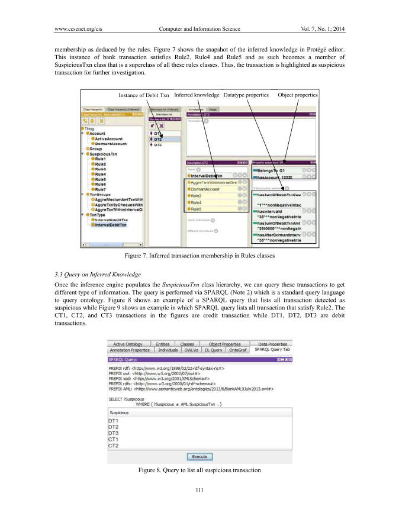

</details>

**그림 7. 규칙 클래스의 추론된 거래 멤버십**

### 3.3 추론 지식에 대한 질의

추론 엔진이 SuspiciousTxn 클래스 계층 구조를 채우면 이러한 거래를 쿼리하여 다양한 유형의 정보를 얻을 수 있습니다. 쿼리는 온톨로지를 쿼리하기 위한 표준 쿼리 언어인 SPARQL(참고 2)를 통해 수행됩니다. 그림 8는 의심스러운 것으로 감지된 모든 거래를 나열하는 SPARQL 쿼리의 예를 보여주고, 그림 9는 규칙 2를 충족하는 모든 거래를 나열하는 SPARQL 쿼리의 예를 보여줍니다. 그림의 CT1, CT2, CT3 거래는 대변 거래이고, DT1, DT2, DT3은 차변 거래입니다.

**그림 8. 모든 의심 거래를 나열하는 쿼리**

추론된 지식 객체 속성 데이터 유형 속성 차변 Txn 인스턴스

<!-- 원문 10쪽 -->

<details>
<summary>원문 10쪽 이미지 보기</summary>

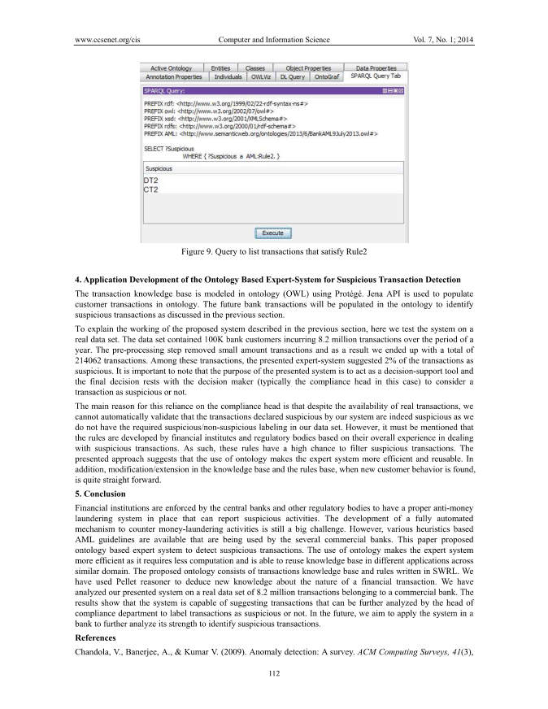

</details>

**그림 9. Rule2를 만족하는 거래 목록을 조회하는 쿼리**

## 4 의심거래 탐지를 위한 온톨로지 기반 전문가 시스템의 응용 개발

거래 지식 기반은 Protégé를 사용하여 온톨로지(OWL)로 모델링됩니다. Jena API는 온톨로지에서 고객 거래를 채우는 데 사용됩니다. 이전 섹션에서 설명한 것처럼 의심 거래를 식별하기 위해 향후 은행 거래가 온톨로지에 채워집니다.

이전 섹션에서 설명한 제안 시스템의 작동을 설명하기 위해 여기서는 실제 데이터셋에서 시스템을 테스트합니다. 데이터셋에는 1년 동안 8.2 million 거래를 발생한 100,000명의 은행 고객이 포함되어 있습니다. 전처리 단계에서 소액 거래가 제거되었고 그 결과 총 214062 거래가 발생했습니다. 이러한 거래 중에서 제시된 전문가 시스템은 거래의 2%를 의심스러운 것으로 제안했습니다. 제시된 시스템의 목적은 의사 결정 지원 도구로 작동하는 것이며 거래를 의심스러운 것으로 간주할지 여부에 대한 최종 결정은 의사 결정자(이 경우 일반적으로 규정 준수 책임자)에게 달려 있다는 점에 유의하는 것이 중요합니다.

규정 준수 책임자에 의존하는 주된 이유는 실제 거래가 가능함에도 불구하고 데이터셋에 의심스러운/의심스럽지 않은 라벨링이 없기 때문에 시스템에서 의심스러운 것으로 선언된 거래가 실제로 의심스러운지 자동으로 확인할 수 없기 때문입니다. 그러나 이 규칙은 의심 거래를 처리하는 전반적인 경험을 바탕으로 금융 기관 및 규제 기관에서 개발했다는 ​​점을 언급해야 합니다. 따라서 이러한 규칙은 의심 거래를 필터링할 가능성이 높습니다. 제시된 접근법은 온톨로지의 사용이 전문가 시스템을 더욱 효율적이고 재사용 가능하게 만든다는 것을 시사합니다. 또한, 새로운 고객 행동이 발견되면 지식 베이스와 규칙 베이스의 수정/확장이 매우 간단해집니다.

## 5 결론

금융 기관은 의심 활동을 보고할 수 있는 적절한 자금세탁방지 시스템을 갖추도록 중앙 은행 및 기타 규제 기관에 의해 시행됩니다. 자금세탁 활동에 대응하기 위한 완전 자동화된 메커니즘을 개발하는 것은 여전히 ​​큰 과제입니다. 그러나 여러 상업 은행에서 사용하고 있는 다양한 휴리스틱 기반 AML 지침을 사용할 수 있습니다. 본 논문에서는 의심거래 탐지를 위한 온톨로지 기반 전문가 시스템을 제안하였다. 온톨로지를 사용하면 계산이 덜 필요하고 유사한 도메인의 다양한 애플리케이션에서 지식 기반을 재사용할 수 있으므로 전문가 시스템이 더욱 효율적이 됩니다. 제안된 온톨로지는 거래 지식 베이스와 SWRL로 작성된 규칙으로 구성됩니다. 본 연구에서는 금융 거래의 성격에 대한 새로운 지식을 추론하기 위해 Pellet 추론기를 사용했습니다. 본 연구에서는 상업 은행에 속한 8.2 million 거래의 실제 데이터셋에 대해 제시된 시스템을 분석했습니다. 결과는 시스템이 규정 준수 부서장이 추가로 분석하여 거래가 의심스러운지 여부를 표시할 수 있는 거래를 제안할 수 있음을 보여줍니다. 앞으로 우리는 이 시스템을 은행에 적용하여 그 강도를 더욱 분석하여 의심 거래를 식별하는 것을 목표로 하고 있습니다.

## 참고문헌

Chandola, V., Banerjee, A., & Kumar V. (2009). Anomaly detection: A survey. ACM Computing Surveys, 41(3),

<!-- 원문 11쪽 -->

<details>
<summary>원문 11쪽 이미지 보기</summary>

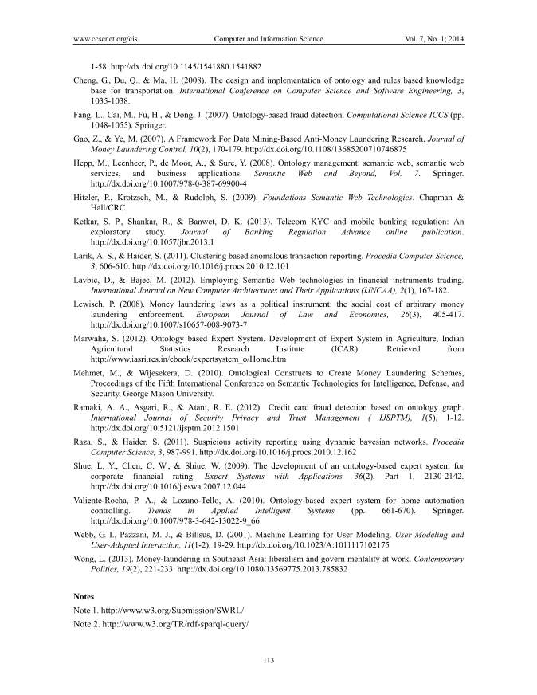

</details>

1-58. http://dx.doi.org/10.1145/1541880.1541882

Cheng, G., Du, Q., & Ma, H. (2008). The design and implementation of ontology and rules based knowledge

base for transportation. International Conference on Computer Science and Software Engineering, 3, 1035-1038.

Fang, L., Cai, M., Fu, H., & Dong, J. (2007). Ontology-based fraud detection. Computational Science ICCS (pp.

1048-1055). Springer.

Gao, Z., & Ye, M. (2007). A Framework For Data Mining-Based Anti-Money Laundering Research. Journal of

Money Laundering Control, 10(2), 170-179. http://dx.doi.org/10.1108/13685200710746875

Hepp, M., Leenheer, P., de Moor, A., & Sure, Y. (2008). Ontology management: semantic web, semantic web

services, and business applications. Semantic Web and Beyond, Vol. 7. Springer. http://dx.doi.org/10.1007/978-0-387-69900-4

Hitzler, P., Krotzsch, M., & Rudolph, S. (2009). Foundations Semantic Web Technologies. Chapman &

Hall/CRC.

Ketkar, S. P., Shankar, R., & Banwet, D. K. (2013). Telecom KYC and mobile banking regulation: An

exploratory study. Journal of Banking Regulation Advance online publication. http://dx.doi.org/10.1057/jbr.2013.1

Larik, A. S., & Haider, S. (2011). Clustering based anomalous transaction reporting. Procedia Computer Science,

3, 606-610. http://dx.doi.org/10.1016/j.procs.2010.12.101

Lavbic, D., & Bajec, M. (2012). Employing Semantic Web technologies in financial instruments trading.

International Journal on New Computer Architectures and Their Applications (IJNCAA), 2(1), 167-182.

Lewisch, P. (2008). Money laundering laws as a political instrument: the social cost of arbitrary money

laundering enforcement. European Journal of Law and Economics, 26(3), 405-417. http://dx.doi.org/10.1007/s10657-008-9073-7

Marwaha, S. (2012). Ontology based Expert System. Development of Expert System in Agriculture, Indian

Agricultural Statistics Research Institute (ICAR). Retrieved from http://www.iasri.res.in/ebook/expertsystem_o/Home.htm

Mehmet, M., & Wijesekera, D. (2010). Ontological Constructs to Create Money Laundering Schemes,

Proceedings of the Fifth International Conference on Semantic Technologies for Intelligence, Defense, and Security, George Mason University.

Ramaki, A. A., Asgari, R., & Atani, R. E. (2012) Credit card fraud detection based on ontology graph.

International Journal of Security Privacy and Trust Management ( IJSPTM), 1(5), 1-12. http://dx.doi.org/10.5121/ijsptm.2012.1501

Raza, S., & Haider, S. (2011). Suspicious activity reporting using dynamic bayesian networks. Procedia

Computer Science, 3, 987-991. http://dx.doi.org/10.1016/j.procs.2010.12.162

Shue, L. Y., Chen, C. W., & Shiue, W. (2009). The development of an ontology-based expert system for

corporate financial rating. Expert Systems with Applications, 36(2), Part 1, 2130-2142. http://dx.doi.org/10.1016/j.eswa.2007.12.044

Valiente-Rocha, P. A., & Lozano-Tello, A. (2010). Ontology-based expert system for home automation

controlling. Trends in Applied Intelligent Systems (pp. 661-670). Springer. http://dx.doi.org/10.1007/978-3-642-13022-9_66

Webb, G. I., Pazzani, M. J., & Billsus, D. (2001). Machine Learning for User Modeling. User Modeling and

User-Adapted Interaction, 11(1-2), 19-29. http://dx.doi.org/10.1023/A:1011117102175

Wong, L. (2013). Money-laundering in Southeast Asia: liberalism and govern mentality at work. Contemporary

Politics, 19(2), 221-233. http://dx.doi.org/10.1080/13569775.2013.785832

Notes

Note 1. http://www.w3.org/Submission/SWRL/

Note 2. http://www.w3.org/TR/rdf-sparql-query/

<!-- 원문 12쪽 -->

<details>
<summary>원문 12쪽 이미지 보기</summary>

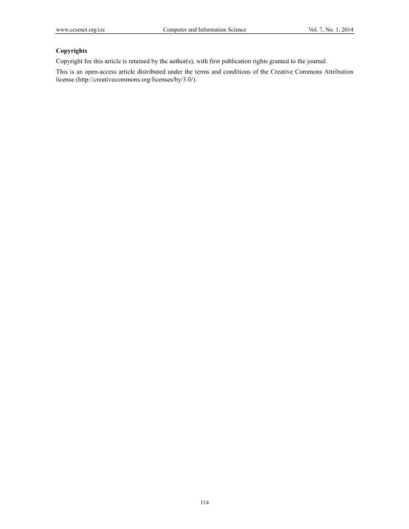

</details>

Copyrights

Copyright for this article is retained by the author(s), with first publication rights granted to the journal.

This is an open-access article distributed under the terms and conditions of the Creative Commons Attribution license (http://creativecommons.org/licenses/by/3.0/).
