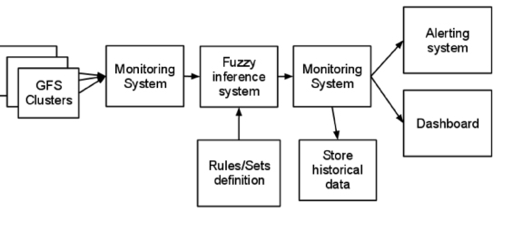
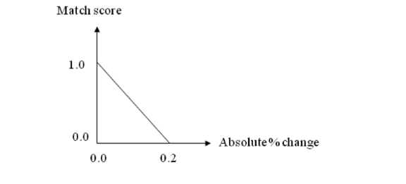
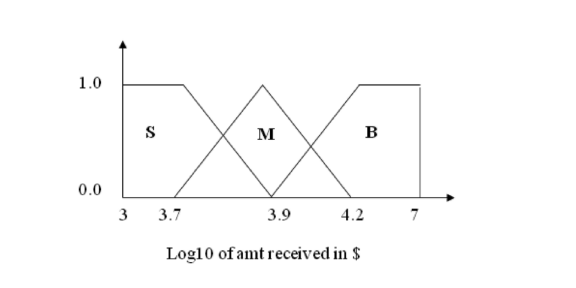
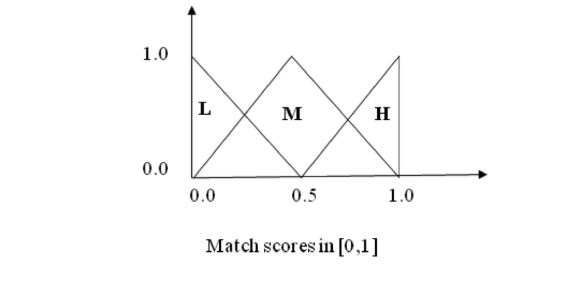
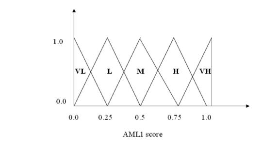

# 자금세탁방지 및 분산 스토리지 시스템 부하 모니터링을 위한 퍼지 컴퓨팅 응용

> **원문 제목:** Fuzzy Computing Applications for Anti-Money Laundering and Distributed Storage System Load Monitoring  
> **저자:** Yu-To Chen · Johan Mathe  
> **게재 정보:** World Conference on Soft Computing, 2011  
> **DOI:** 별도 표기 없음

> **번역 안내:** 본문은 문단 전체의 문맥을 기준으로 한국어로 옮겼습니다. AML·규칙 엔진·전문가 시스템 관련 용어를 통일했으며, 수식·코드·참고문헌은 정확성을 위해 원문 표기를 유지했습니다. 원문의 그림과 표는 각각 잘라 해당 본문 위치에 바로 배치했습니다.

---

<!-- 원문 1쪽 -->

## 초록

퍼지 컴퓨팅(FC)은 인간의 도메인 지식을 캡처하고 입출력 공간의 비선형 매핑을 모델링하는 데 큰 영향을 미쳤습니다. 본 논문에서는 금융 거래에서 자금세탁 행위를 탐지하고 분산 스토리지 시스템 부하를 모니터링하기 위한 FC 시스템의 설계 및 구현에 대해 설명합니다. 우리의 목표는 부정확하고 불확실한 데이터 및 불완전한 도메인 지식이 특징인 실제 응용 프로그램에 대한 FC의 성능을 입증하는 것입니다. 두 애플리케이션 모두에서 우리는 거래의 자금세탁 시나리오 또는 분산 스토리지 시스템의 "상태"에 따라 전문가의 도메인 지식을 기반으로 퍼지 규칙을 설계했습니다. 또한 일반적인 퍼지 추론 엔진을 개발하고 오픈 소스 커뮤니티에 기여했습니다.

## I. 서론

### A. 연구 동기

불확실하고 불완전한 정보의 분석을 요구하는 다양한 산업 및 금융 문제가 있습니다. 설상가상으로 분석에 사용된 데이터는 부정확한 경우가 많습니다. 이러한 문제는 퍼지 컴퓨팅 기술을 적용할 수 있는 좋은 기회를 제공합니다.

분산 스토리지 시스템에서는 로드 밸런싱을 개선하고 병목 현상을 방지하기 위해 메모리 및 CPU와 같은 사용 패턴을 이해하는 것이 필수적입니다. 이는 시스템 상태를 측정하고 시스템의 전반적인 "정상"을 보고하는 도구를 사용하여 수행할 수 있습니다. 이러한 도구는 실시간 모니터링과 의사결정을 통합하는 높은 수준의 정교함을 가져야 합니다. 금융 기관에서는 하드 코딩된 컷오프가 있는 규칙 기반 시스템에 의해 트리거된 경고를 기반으로 의심스러운 계정 활동을 검토하는 등 노동 집약적인 작업을 여전히 찾을 수 있습니다. 이러한 작업의 복잡성으로 인해 분산 저장 시스템 모니터링 및 자금세탁 거래 탐지를 지원하기 위해 인공 지능(AI), 특히 퍼지 컴퓨팅이 요구되었습니다. 이 문서에서는 모니터링과 감지라는 두 가지 측면에서 퍼지 컴퓨팅을 사용하는 데 중점을 둡니다. 우선, 다음 섹션에서 퍼지 컴퓨팅에 대한 간략한 개요를 설명하겠습니다.

### B. 퍼지 컴퓨팅

Post, Kleene 및 Lukasiewicz의 작업은 고전적인 부울 논리 [1], [2]에 반대되는 다중 값 논리 시스템의 부정확성과 모호함을 최초로 처리한 것 중 하나입니다. 1937에서 Max Black은 모호한 개념 [3]를 표현하기 위해 일관성 프로파일의 사용을 제안했습니다. 가장 중요한 것은 Zadeh가 1965 [4]에서 퍼지 세트 및 퍼지 논리에 대한 완전한 이론을 제공하여 잘못 정의된 개념을 표현하고 조작할 수 있게 했다는 것입니다. 또한 Zadeh는 퍼지 논리의 네 가지 측면 [5]를 정의하여 계산을 위한 구문과 의미를 갖춘 언어를 제공했습니다. 특히, 퍼지 논리를 사용하면 언어 변수를 사용하여 일련의 퍼지 규칙에 따라 동적 시스템을 모델링할 수 있습니다. 각 규칙은 일련의 언어 변수로 구성됩니다. 이러한 변수는 퍼지 소속 함수의 특징인 퍼지 값을 사용합니다. 또한 일반화된 모더스 포넨스(modus-ponens) [6]를 기반으로 퍼지 규칙에 따라 작동하는 추론 메커니즘인 퍼지 추론 엔진이 있습니다. 퍼지 논리와 퍼지 컴퓨팅에 대한 포괄적인 검토는 [7]에서 확인할 수 있습니다.

### C. 논문 구성

다음 섹션에서는 FC와 모니터링 및 탐지 애플리케이션에 중점을 둘 것입니다. 섹션 II에서 모니터링 및 탐지 문제에 대해 간략하게 논의한 후 FC 기술의 두 가지 응용 프로그램을 설명합니다. 섹션 III에 설명된 첫 번째 응용 프로그램은 분산 저장소 시스템을 모니터링할 때 퍼지 규칙을 적용하는 것으로 구성됩니다. 섹션 IV에 설명된 두 번째 응용 프로그램에서는 퍼지 논리 추론을 사용하여 자금세탁의 이상 징후를 탐지하는 방법을 다룹니다. 마지막 섹션 V에서는 FC 사용의 이점을 요약하고 이러한 기술의 몇 가지 잠재적인 확장에 대해 논의합니다.

## II. 모니터링 및 탐지를 위한 퍼지 컴퓨팅 응용

본 논문에서는 모니터링 및 탐지 분야의 두 가지 퍼지 컴퓨팅 애플리케이션을 연구합니다. 분산 저장 시스템을 위한 퍼지 로드 모니터링과 금융 기관을 위한 퍼지 자금세탁방지 기능이 있습니다. 일반적으로 모니터링은 복잡한 실제 시스템을 이해하는 첫 번째 단계입니다. 모니터링 프로세스 중에 원하지 않는 특정 사례나 시나리오가 발견된 경우 다음 논리 단계는 반복되는 패턴을 감지하고 이후에 문제를 격리하는 것입니다. 마지막으로 문제를 관리하기 위한 제어 전략을 공식화할 수 있습니다.

<!-- 원문 2쪽 -->

> **주:** 표 I 부하 모니터링을 위한 퍼지 규칙

메모리\CPU 낮음 AVG 높음 낮음 HVG HG HB AVG HG HG HB 높음 HB HB HB

## III. 분산 스토리지 시스템의 퍼지 부하 모니터링

### A. 문제 설명

Google 파일 시스템 [8]는 분산 파일 시스템입니다. GFS 클러스터는 단일 마스터와 여러 청크 서버(노드)로 구성되며 여러 클라이언트에서 액세스됩니다. 서로 다른 GFS 클러스터는 매우 다른 사용 패턴을 가질 수 있으며 이러한 사용 패턴이 항상 클러스터의 바이트 사용량과 연관되어 있는 것은 아닙니다. 예를 들어, 백업 저장소로 사용되는 클러스터는 트래픽이 매우 적고 바이트 사용량이 매우 높지만, 라이브 트래픽을 제공하는 GFS 클러스터는 반드시 중요한 양의 바이트를 사용하지 않고도 매우 많은 처리량을 볼 수 있습니다.

GFS는 마스터가 병목 현상을 일으키지 않도록 설계되었음에도 불구하고 클러스터의 청크 서버 수가 증가하고 트래픽이 증가함에 따라 마스터의 CPU 로드 및 메모리 사용량이 계속 증가합니다.

우리의 목표는 다양한 목적을 위해 GFS 마스터의 상태에 대한 좋은 아이디어를 제공하는 퍼지 추론 시스템을 사용하는 것입니다.

- 프로비저닝: 가능한 경우 더 나은 하드웨어로 GFS 마스터를 업그레이드할 수 있는지 여부

- 사용자 재라우팅: 일부 대규모 사용자를 다른 클러스터로 이동할 수 있는 경우

### B. 접근법

본 연구에서는 시스템 관리자의 당직 순환 중에는 일반적으로 많은 질적 사고가 관련된다는 사실을 발견했습니다. 여기에서 퍼지 논리는 이러한 정성적 사고를 모방하여 GFS 마스터에 관한 더 빠른 사고 대응 또는 용량 계획을 가능하게 합니다.

해당 주제에 대해 다양한 시스템 관리자의 전문 지식을 수집한 후 다음과 같은 퍼지 세트를 발견했습니다.

- 메모리 사용량 높음, 메모리 사용량 낮음, 메모리 사용량 평균

- CPU 사용량 높음, CPU 사용량 낮음, CPU 사용량 평균

- GFS 마스터 지연 시간이 높습니다.

- 상태가 매우 좋음(HVG), 상태가 좋음(HG), 상태가 나쁨(HB) CPU 및 메모리에 관한 규칙은 표 I에 정리되어 있습니다.

그런 다음 시스템 대기 시간과 관련된 규칙을 하나 더 사용합니다.

- RPC 지연 시간이 길면 상태가 좋지 않습니다.

### C. 선행 연구

오늘날 대부분의 네트워크 모니터링 시스템 [9]는 호스트의 측정값(예: 대기 시간, CPU 사용량, 오류율 등)을 특정 임계값과 비교하고 이메일을 통해 경고하는 방식으로 작동합니다.



**그림 1. 시스템 데이터 흐름 모니터링**

또는 이벤트의 심각도에 따라 호출기. 이 접근 방식을 대규모 분산 시스템에 적용하려면 기본 시스템에 대한 매우 깊은 이해가 필요하며, 상관된 이벤트의 경우 모든 해석은 운영자에게 맡겨집니다. 퍼지 로드 추론 시스템은 분산 시스템에 대한 더 높은 수준의 보기를 제공할 수 있습니다.

### D. 해결 방법 설명

퍼지 추론 시스템을 Google의 모니터링 인프라에 통합하기 위해 Python[17]에 GFuzzy라는 프로덕션 품질 추론 시스템을 작성해야 했습니다. 규칙은 프로토콜 버퍼(Google의 데이터 교환 형식 [10])를 통해 정의됩니다.

Python 추론 엔진은 다양한 퍼지화 및 역화 기능 [17]를 제공합니다. 본 연구에서는 퍼지화를 위해 삼각형 퍼지 세트를 사용하고 역퍼지화를 위해 중심 방법을 사용했습니다.

워크플로는 그림 1에도 설명된 대로 다음과 같습니다.

- 모니터링 시스템은 여러 GFS 클러스터에서 데이터를 수집합니다.

- 퍼지 추론 시스템은 모니터링 시스템의 데이터를 폴링하고 퍼지 규칙을 적용하여 출력을 생성합니다.

- 이 출력은 다른 모니터링 시스템에 의해 자체적으로 수집됩니다.

- 값이 특정 임계값을 초과하면 시스템 관리자와 용량 계획자에게 경고가 전송됩니다.

1) 입력 전처리: 모니터링 데이터를 퍼지 세트로 변환하기 전에 마지막 N일의 데이터에 대해 가우스 윈도우를 사용하여 데이터의 평균을 계산합니다. 이는 데이터 급증을 완화하고 고주파 노이즈를 필터링하는 효과가 있습니다.

### E. 결과

이 시스템은 1년 동안 운영되었으며 초기에는 일부 거짓 음성 및 양성 결과가 나타났습니다. 이를 찾기 위한 우리의 방법론은 대기 엔지니어가 내린 결정과 퍼지 추론 시스템의 결과를 비교하는 것이었습니다. 본 연구에서는 첫 번째 반복에서 다음과 같은 개선 사항을 수행했습니다.

- 초기 구현에는 RAM 및 CPU 관련 퍼지 세트만 포함되었습니다. GFS 마스터의 상태와 매우 관련이 있기 때문에 대기 시간 세트를 추가했습니다.

<!-- 원문 3쪽 -->

- 직사각형 창이 고주파 노이즈에 너무 민감하기 때문에 창 크기를 늘리고 직사각형 창에서 가우스 창으로 전환했습니다.

- 시간이 지남에 따라 우리는 대기 중인 엔지니어에게 GFS 마스터와 관련된 문제의 근본 원인이 되는 데이터를 결정하게 하는 임계값이 무엇인지 물어봄으로써 거짓 긍정/부정을 확인함으로써 일부 멤버십 기능을 조정했습니다.

### F. 퍼지 부하 모니터링에 대한 결론

본 연구에서는 분산 파일 시스템의 마스터를 모니터링하기 위한 퍼지 추론 엔진을 성공적으로 설계, 구현 및 배포했습니다. 향후 작업에는 파일 시스템의 노드(청크서버 [8])를 측정하고 마스터와 노드의 상태를 사용하여 GFS 클러스터의 사용 가능한 용량과 가용성을 자동으로 결정하는 작업이 포함됩니다.

## IV. 자금세탁방지를 위한 퍼지 탐지

### A. 문제 설명

자금세탁방지(AML)는 미국에서 은행비밀보호법 1970에 의해 시행되었습니다. AML은 금융 기관 및 기타 규제 대상체가 자금세탁 활동 [11]을 방지하거나 보고하도록 요구하는 법적 통제를 나타냅니다. Wikepedia [12]에 따르면 AML은 "금융 기관 및 기타 규제 기관이 자금세탁 활동을 방지하거나 보고하도록 요구하는 법적 통제를 설명하기 위해 금융 및 법률 산업에서 주로 사용되는" 용어입니다. 미국 법률에서 자금세탁에는 불법 행위의 결과로 자산이나 가치를 창출하는 모든 금융 거래가 포함됩니다. 예를 들어 탈세, 허위 회계 등이 있습니다. 모든 금융 기관은 의심 거래를 식별하고 해당 국가의 금융 정보 부서([13])에 보고해야 합니다.

널리 사용되는 접근 방식 중 하나인 [14], [15]는 잠재적으로 의심 활동을 탐지하기 위해 거래에 시나리오와 위험 요소를 적용하는 것입니다. 규칙 매개변수를 충족하는 거래 이벤트는 경고가 됩니다. 마지막으로 경고에는 억제, 위험 점수 매기기, 라우팅과 같은 추가 워크플로 프로세스가 적용됩니다. 본질적으로 이는 규칙 기반 시스템이며 인간의 도메인 지식에 크게 의존합니다. 문헌에 잘 설명되어 있듯이 규칙 기반 시스템은 경직되고 취약하며 융통성이 없는 규칙 조건으로 인해 어려움을 겪습니다. 뛰어난 인간 인지 능력과 함께 제공되는 모든 이점과 함께 인간 언어 표현의 부정확한 특성을 물려받았습니다.

### B. 접근법

퍼지 논리가 구출됩니다. 인간의 본성언어에 담긴 인상을 다루려는 목적으로 창안된 것이다. 예를 들어, 우리는 "음식이 맛있다", "서비스가 훌륭하다"와 같은 말을 직관적으로 이해합니다. 게다가 '음식이 맛있고 서비스가 좋으면 팁도 좋을 것 같다' 같은 규칙도 만들 수 있다. "맛있다", "훌륭하다", "잘생겼다"와 같은 모든 언어 용어는 본질적으로 모호합니다. 당신의 맛은 아마도 나와 같지 않을 것입니다. 그러나 퍼지 논리는 "맛있음"의 정도를 정의하므로 나중에 이러한 언어 용어를 기반으로 추론 엔진을 개발할 수 있습니다.

본 연구에서는 인터넷을 통해 돈을 보내고 받는 고객에게 서비스를 제공하는 비즈니스를 담당하는 XCorp라는 가상의 금융 회사를 가정하여 퍼지 AML 작업을 시작했습니다. 자금세탁(ML)에 대한 상당한 양의 지식이 지식 엔지니어링을 통해 축적되었습니다. 실제로 이는 고객 서비스 담당자의 의심 거래에 대한 체계적인 식별, 분석가의 노동 집약적 사례 연구, 마지막으로 앞서 언급한 두 당사자의 ML 지표 일반화를 통해 수행되었습니다. 주요 데이터 소스는 다음과 같습니다.

- ML 위험이 있을 수 있는 사기꾼을 격리하는 기존 사기 모델에서

- 계정을 조회하고 고객과 연락하는 고객 서비스 담당자로부터

- XCorp 지불을 수락/제공하는 의심스러운 웹사이트를 찾는 웹 검색을 수행하는 분석가로부터

- 고객이 계정 탈취를 신고하는 등 의심 활동을 인지하게 된 고객 또는 제3자 사례 연구는 실제 사례를 강조하기 위해 다음과 같이 표시되었습니다.

- 용의자는 영국 우편 주소를 사용하여 XCorp 계정을 만들고, 자금을 받고, 여러 프랑스 계정으로 자금을 보내는 패턴을 개발했으며 자금은 은행 계좌로 인출되었습니다. 거래가 이루어진 후 수신 및 전송 계정이 폐쇄되었습니다. 25 계정이 확인되었으며 총 거래 금액은 $32K입니다. 보내는 계정과 받는 사람 계정은 IP와 컴퓨터 지문을 공유합니다. 사례 연구를 통해 다양한 ML 지표가 일반화되었습니다.

- 한 당사자가 여러 계정을 관리함

- 개설-송금-폐쇄 및 개설-수취-출금-폐쇄 등 짧은 시간 내에 많은 계좌 활동

- 실행 가능한 비즈니스 이유가 없습니다.

### C. 선행 연구

학술지 및 논문집에는 퍼지 자금세탁방지(AML)에 대한 중요한 사전 연구가 없습니다. 그러나 SAS, Actimize, telemetrix 등 AML용 상용 소프트웨어가 많이 있습니다. 논의된 바와 같이 널리 사용되는 접근 방식 중 하나는 거래에 위험 요소를 적용하여 시나리오 및 사례 연구를 통해 잠재적으로 의심 활동을 탐지하는 것입니다. 특정 속도 제한 기준이 충족되면 경고가 발행됩니다.

### D. 해결 방법 설명

우리의 목표는 AML에 대한 퍼지 추론 시스템을 구축하는 것이었습니다. 시연을 위해 AML 시나리오를 설명한 다음 이를 퍼지 규칙으로 변환합니다. 그 다음에는 퍼지 시스템의 멤버십 기능을 개략적으로 설명하겠습니다. 마지막으로 퍼지 추론 결과를 요약하였다.

<!-- 원문 4쪽 -->

1) 퍼지 규칙: AML 시나리오는 다음과 같습니다. 다음과 같은 경우 계정이 의심됩니다.

- 큰 가치 수신 (>= $10,000)

- 즉시 철회(1-3일 이내) 이 시나리오를 AML1로 표시해 보겠습니다. 따라서 우리는 받은 금액과 일치 점수(받은 $와 인출된 $의 일치 정도)를 입력으로 취하고 AML1 점수를 출력으로 제공하는 퍼지 AML 점수를 설계하는 것을 목표로 했습니다.

- AML1 <- fuzzy.inference(amt.received, match.score) 받은 금액과 일치 점수로부터 점수를 도출하는 아이디어였습니다. 예를 들어:

- 받은 금액이 크고 매치 스코어가 높을 경우 AML1 점수가 매우 높습니다.

- AML1 점수가 매우 낮습니다. 받은 금액이 적고 일치 점수가 낮은 경우 따라서 AML1 점수는 [0,1]로 둘러싸인 실수이며, 이는 해당 계정이 ML 위반일 가능성을 나타냅니다.

일치 점수는 시간 창에서 $ 수신 및 철회 $에 대한 일치 정도를 나타냅니다. 본질적으로 점수는 받은 금액, 인출한 금액, 기간 등 세 가지 매개변수의 함수였습니다. 예를 들어

- 인출된 $가 받은 $의 [80%, 120%] 내에 있으면 일치 점수가 높습니다.

- 인출된 $가 받은 $의 [80%, 120%] 내에 있으면 일치 점수가 높습니다.

- $를 받은 후 즉시 $를 인출하는 경우 일치 점수가 높습니다.

- $를 받은 3일 후에 $를 인출하는 경우 일치 점수는 0입니다.

- $를 받은 후 1-3일 이내에 $를 인출하는 경우 일치 점수는 보통입니다. 본질적으로 일치 점수는 [0,1]로 둘러싸인 실수입니다. 점수가 높을수록 1-3 일 이내에 2달러 금액이 더 가까워집니다. 차이 측정값을 a−b로 정의해 보겠습니다.

```text
b
```

, "절대% 변화"로 라벨을 붙입니다. 여기서 a와 b는 각각 시간 창에서 인출되고 수신된 $입니다. 세 가지 다른 시간대(1-, 2- 및 3-일)가 있으므로 절대 변화율(%) 점수의 세 가지 수준이 계산되었습니다. 또한 "일치 인자"가 정의되었으며 세 가지 수준의 시간 창을 나타내는 {1,2,3}에서 정수 값을 사용했습니다.

- Match.score = 0.9(1-abs.%.change/0.2)(match.factor-1), 만약 abs.%.change <= 0.2

- Match.score = 0, if abs.%.change > 0.2 기본적으로 2 및 3 일에 $가 각각 인출되면 점수는 10% 및 19% 할인을 받았습니다. 자세한 내용은 그림 2를 참조하십시오.

AML1 점수는 받은 금액과 일치 점수라는 두 가지 인수를 취하는 함수라고 가정합니다. 또한 두 인수의 정의역은 [0,1]로 제한된 실수입니다. 퍼지 채점에 대한 아이디어는 먼저 평균 AML1 점수를 내림차순으로 분리된 하위 영역으로 공간을 분할한 다음 퍼지 추론을 사용하여 영역 간 점수를 평활화/보간하는 것입니다. AML1의 경우 9개의 퍼지 규칙



**그림 2. 절대 변화율 대 경기 점수**

> **주:** 표 II 각 9 퍼지 규칙에 대한 AML 점수

추론을 위해 Amount Rcvd\Match Score S M B L M H VH M L M H S VL L M 을 표 II와 같이 구성했습니다. 예를 들어:

- 받은 금액이 크고 일치 점수가 높으면 AML1이 매우 높은 것입니다.

- 수신된 금액이 중간이고 일치 점수가 중간이면 AML1은 중간입니다.

- 받은 금액이 적고 일치 점수도 낮다면 AML1은 매우 낮습니다.

```text
2) Fuzzy membership functions: As described in the last
section, there were three fuzzy sets: amt received, match
score and AML1, where amt received and match score were
antecedent, and AML1 was consequence. Their membership
functions were defined as shown in figures 3, 4 and 5,
respectively.
```

### E. 실험 결과

일부 샘플 계정과 해당 거래에 대해 퍼지 AML1 점수를 테스트했습니다. 점수를 받은 710 계정 중 AML1 중앙값은 0.55였습니다. AML1 점수 > 0.8가 있는 73 계정은 사람의 검토를 위해 AML 대기열로 라우팅되었습니다. 대기열은 AML1 점수의 내림차순으로 작동됩니다.



**그림 3. 받은 금액 멤버십 기능**

<!-- 원문 5쪽 -->



**그림 4. 수학 점수 멤버십 기능**



**그림 5. AML1 멤버십 기능**

시연을 위해 의심스러운 계정 두 개를 다음과 같이 설명했습니다.

테이블 III의 1 행의 경우 해당 $는 > $10K(큰) 및 최종 일치 점수 = 1(대)를 받았으므로 AML1 점수 = 1(매우 큼)입니다. 이 예에서는 절대% 변경 = 0($ 수신 = $ 철회) 이후 초기 MatchScore =1입니다. 또한, MatchFactor = 1 이후 모든 인출은 $ 수신 후 하루에 로그인되었습니다. 따라서 초기 MatchScore에 대한 할인은 없습니다. 결과적으로 최종 MatchScore는 초기 MatchScore와 동일합니다.

테이블 III의 2 행에 대해 해당 $는 > 10K(대)와 최종 일치 점수 = 0.83(대)를 받았으므로 AML1 점수 = 0.92(대)를 받았습니다. 이 예에서는 변경 = 1.5%($ 수신 > $ 철회)의 절대 비율이 변경되므로 초기 MatchScore = 0.92입니다. 그러나 $를 받은 후 2 일 이내에 모든 인출이 기록되므로 MatchFactor = 2가 됩니다. 따라서 이는 초기 MatchScore에 대해 10% 할인이 있음을 의미합니다. 그 결과, 최종 MatchScore = 0.83 (= 0.92 × 0.9)가 나왔습니다.

### F. 퍼지 탐지에 대한 결론

본 연구에서는 퍼지 컴퓨팅을 사용하여 복잡한 금융 거래에서 자금세탁(ML) 패턴을 탐지하는 접근 방식을 제시했습니다. ML의 패턴 이해와 지능 수집을 위한 지식 엔지니어링 프로세스를 보여주었습니다.

표 III AML에 대한 실험 결과

> **주:** Act $ recv #wtxn $ wtx 일치%change MScore1 MScore2 AML1Score

```text
1
$35,306
2
$35,306
1
0.0%
1.00
1.00
1.00
```

```text
8
$25,713
3
$25,326
2
1.5%
0.92
0.83
0.92
```

그런 다음 거래를 입력으로 사용하고 의심스러운 ML 동작의 점수를 출력으로 제공하는 퍼지 추론 시스템(FIS)의 설계 및 개발에 대해 설명했습니다. FIS는 ML에 맞서기 위한 직관적이고 강력한 방법을 제공하는 동시에 당국이 정한 금융 기관의 의무를 이행합니다. 향후 작업에서는 오분류 비율과 인간 에이전트의 피드백을 기반으로 퍼지 규칙과 멤버십 기능을 자동으로 조정하는 데 중점을 둘 것입니다.

V. 최종 설명 퍼지 컴퓨팅(FC)은 모니터링 및 예측 모델링부터 진단 및 제어 [16]에 이르기까지 많은 산업 및 금융 운영에 영향을 미치고 있습니다. 이는 전통적인 지식 중심 추론 시스템에 대한 대안적 접근 방식을 제공하며 규칙 구조의 경직성이라는 주요 결함을 극복합니다. 본 연구에서는 모니터링 및 탐지 분야에서 FC 애플리케이션의 성공적인 실제 배포 두 가지를 시연했습니다. 특히 분산 파일 시스템의 건전성을 모니터링하는 방법과 자금세탁에서 의심 거래를 탐지하는 방법을 설명했습니다. 두 시스템 모두 해결해야 할 문제의 특징인 부정확성, 불확실성 및 불완전성에 대한 내성을 활용합니다. 또한 일반적인 퍼지 추론 엔진을 개발하고 오픈 소스 커뮤니티[17]에 기여했습니다. 미래에는 퍼지 컴퓨팅과 확률적 추론, 음성 인식, 텍스트 처리, 컴퓨터 비전 등의 진보가 결합되어 광범위한 산업 및 금융 문제에 대한 문제 해결 능력이 더욱 향상되고 확장될 것으로 기대합니다.

## 참고문헌

[1] N. Rescher, Many-valued Logic, McGraw-Hill, New York, NY, 1969. [2] J. Lukasiewicz, Elementy Logiki Matematycznej Elements of Mathematical Logic, Warsaw, Poland: Panstowowe Wydawinctow Naukowe,1929. [3] M. Black, Vaguenes: an Exercise in Logical Analysis, Phil.Sci. vol. 4.,

pp-427-455, 1937. [4] L.A. Zadeh, Fuzzy sets, Information and Control, vol. 8, pp.338-353,

1965. [5] L.A. Zadeh, Foreword, in Handbook of Fuzzy Computation, E.H. Ruspini, P.P. Bonissone, and W. Pedycz, Eds., Bristol, UK: Institute of Physics, 1998. [6] Y-M. Pok and J-X. Xu, Why is Fuzzy Control Robust, in Proc. Third

IEEE Intl. Conf. on Fuzzy Systems (FUZZ-IEEE'94), pp. 1018-1022, Orlando, FL, 1994. [7] E.H. Ruspini, P.P. Bonissone, and W. Pedycz, Handbook of Fuzzy Computation, Bristol, UK: Institute of Physics, 1998. [8] Ghemawat, S., Gobioff, H., And Leung, S.-T. The Google file system,

In Proc. of the 19th ACM SOSP (Dec. 2003), pp. 29-43. [9] Wikipedia, Network monitoring, http://en.wikipedia.org/wiki/Network_monitoring. [10] Google, Protocol Buffers - Google´s data interchange format, http://code.google.com/p/protobuf/ . [11] Paul Allan Schott Reference Guide to Anti-Money Laundering and Combating the Financing of Terrorism, World Bank, 2006. [12] Wikipedia, Anti Money Laundering, http://en.wikipedia.org/wiki/Anti-

money_laundering [13] Jackie Harvey, (2005) An evaluation of money laundering policies, Journal of Money Laundering Control, Vol. 8 Iss: 4, pp.339 - 345. [14] SAS Anti Money Laundering , http://www.sas.com/industry/financial-

services/banking/anti-money-laundering [15] Kingdon, J., AI fights money laundering, Intelligent Systems, IEEE,

Vol. 19, Issue 3, May-Jun 2004, pp.87 - 89. [16] Bonissone et al. Hybrid Soft Computing Systems: Industrial and Commercial Applications, Proceedings of the IEEE, 1999. [17] GFuzzy, http://code.google.com/p/gfuzzy/
