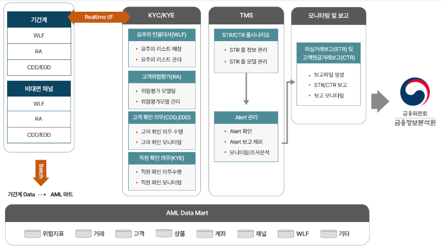
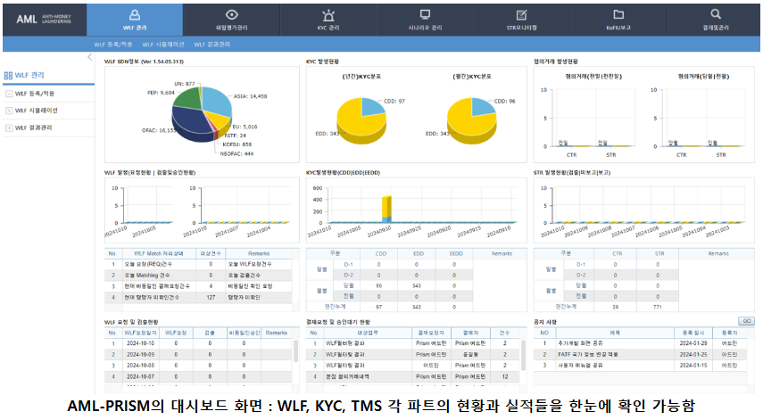
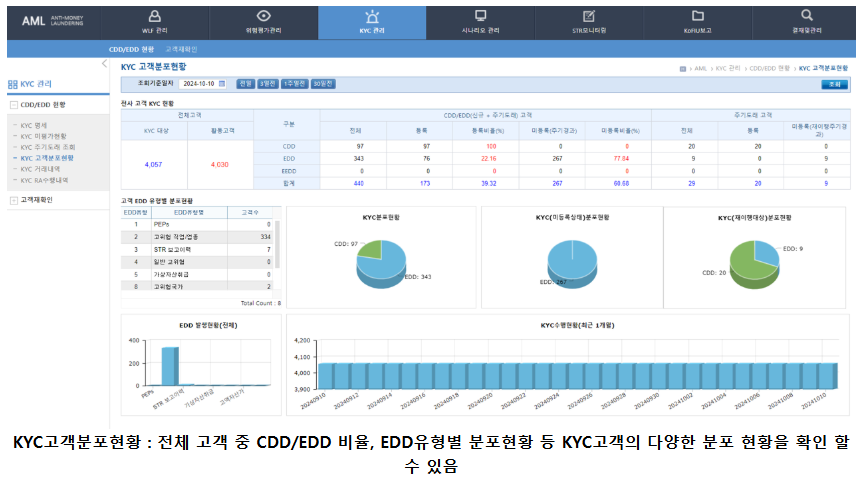
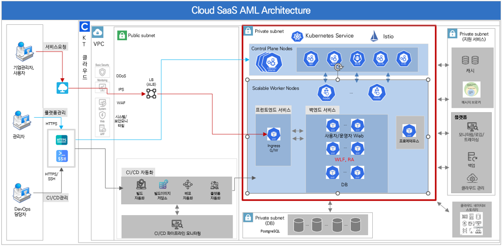

# 옥타솔루션 AML-PRISM 조사


## 1. 서비스 흐름

전체 흐름은 다음과 같이 정리할 수 있다.

```text
WLF → 고객위험평가 → 거래 모니터링 → Alert 조사 → STR/CTR → KoFIU 보고
```

1. **고객확인 및 실시간 연동**
    - 기간계와 비대면 채널에서 WLF, RA, CDD/EDD 정보를 실시간 인터페이스로 연동한다.
    - 고객·임직원을 요주의 인물 목록과 대조하고 고객위험평가를 수행한다.

2. **AML Data Mart 적재**
    - 고객사의 기간계 데이터를 배치 방식으로 AML Data Mart에 적재한다.
    - 공개 구성도에는 위험지표, 거래, 고객, 상품, 계좌, 채널, WLF, 기타 데이터가 표시되어 있다.

3. **거래 모니터링과 Alert 관리**
    - STR/CTR 시나리오와 모델을 관리하고 적재된 데이터를 대상으로 거래를 모니터링한다.
    - 발생한 Alert를 확인한 뒤 보고 제외 여부를 판단하고 모니터링·조사분석을 수행한다.

4. **보고 및 이력 관리**
    - 조사 결과를 바탕으로 STR·CTR 보고파일을 생성하고 금융정보분석원(KoFIU)에 보고한다.
    - 공개 화면의 상단 메뉴에는 `STR모니터링`, `KoFIU보고`, `결재및관리`가 별도 업무 영역으로 구성되어 있다.

---

## 2. AML-PRISM 시스템 구성



### 2.1 구성요소별 역할

| 영역 | 공개 자료에서 확인되는 기능 |
|---|---|
| 기간계·비대면 채널 | WLF, RA, CDD/EDD 요청 및 결과 연동 |
| KYC/KYE | 요주의 인물 대사, 고객위험평가, 고객확인의무, 직원확인의무 |
| TMS | STR/CTR 시나리오 관리, 모델 관리, Alert 확인 및 조사분석 |
| 모니터링 및 보고 | STR·CTR 보고파일 생성, 보고, 보고 모니터링 |
| AML Data Mart | 위험지표·거래·고객·상품·계좌·채널·WLF 등 AML 업무 데이터 저장 |

### 2.2 기획 관점에서 볼 부분

- KYC와 TMS를 분리하면서도 하나의 AML Data Mart를 공통 기반으로 사용한다.
- `시나리오 관리 → Alert 관리 → 조사분석 → STR/CTR 보고`가 연결된 업무 흐름으로 구성된다.
- 조사 화면만이 아니라 WLF, 위험평가, KYC, 시나리오, 보고, 결재를 각각 주요 메뉴로 둔다.
- 공개 자료에는 룰 편집기의 상세 조건, 임계값 필드, Alert 조사 상세 화면, API 필드 명세까지는 나와 있지 않다.

---

## 3. 공개 인터페이스

### 3.1 통합 대시보드



대시보드에서는 WLF, KYC, TMS 각 영역의 현황과 실적을 한눈에 확인할 수 있다.

- 상단 주요 메뉴: `WLF 관리`, `위험평가관리`, `KYC 관리`, `시나리오 관리`, `STR모니터링`, `KoFIU보고`, `결재및관리`
- WLF 목록과 매칭 현황
- 개인·법인의 CDD/EDD 현황
- STR·CTR 탐지 및 보고 현황
- 결재 요청과 공지사항

### 3.2 KYC 고객분포 화면



KYC 고객분포 화면에서는 다음 정보를 확인할 수 있다.

- 전체 KYC 대상과 등록 고객 수
- CDD·EDD 대상 고객 수와 등록 현황
- EDD 유형별 분포
- 개인·법인 등 고객 유형별 KYC 분포
- 기간별 KYC 수행 현황

공개 화면만으로 상세 Alert 조사와 Case 처리 인터페이스까지 확인하기는 어렵지만, 국내 AML 시스템의 메뉴 구조와 현황 대시보드를 설계하는 기준으로는 활용할 수 있다.

---

## 4. Cloud SaaS AML-PRISM

> 기존 조사 메모: 공식 설명상 공개된 SaaS 범위는 기본적인 WLF와 RA가 중심이라 볼필요 없을 듯



공개된 Cloud SaaS 아키텍처에서는 다음 구조를 확인할 수 있다.

- Kubernetes Service와 Istio 기반의 클라우드 운영 구조
- Ingress Gateway를 통한 서비스 접근
- 프런트엔드와 백엔드 서비스의 분리
- 사용자·운영자용 Web 및 API 구성
- 공개 아키텍처상 애플리케이션 기능은 WLF와 RA로 표시
- 데이터베이스, 메시지 브로커, 캐시, 모니터링·로깅·트레이싱, 백업, 클라우드 관리 영역 분리
- CI/CD 자동화와 파이프라인 모니터링 구조

따라서 **전체 AML-PRISM과 Cloud SaaS AML-PRISM을 같은 기능 범위로 보면 안 된다.** 전체 제품 구성도에서는 TMS, Alert, STR/CTR, KoFIU 보고까지 확인되지만, SaaS 공개 아키텍처에서 명확히 확인되는 업무 기능은 WLF와 RA 중심이다. SaaS가 TMS와 보고 업무까지 실제로 제공하는지는 별도의 제품 명세 확인이 필요하다.

---

## 5. 우리 시스템 기획에 참고할 점

1. 국내 AML 용어와 상위 메뉴는 AML-PRISM의 공개 화면을 기준점으로 활용할 수 있다.
2. 실시간 KYC 계열 데이터와 배치 기반 거래 데이터를 서로 다른 수집 경로로 설계할 수 있다.
3. 룰·시나리오 관리를 Alert 조사 화면과 분리된 운영자 기능으로 두는 구조를 참고할 수 있다.
4. Alert 조사 이후 STR/CTR 보고, 결재, KoFIU 제출까지 이어지는 후속 업무를 독립된 기능으로 설계해야 한다.
5. 공개 자료만으로는 룰엔진의 상세 설정 방식이나 조사 Case 화면을 확인하기 어려우므로, 이 부분은 다른 공개 솔루션 자료와 함께 보완해야 한다.

---

## 6. 출처

- [옥타솔루션 AML-PRISM 제품 페이지](https://octasolution.co.kr/product/finance/aml.php)
- [옥타솔루션 SaaS AML-PRISM](https://octasolution.co.kr/product/finance/saasAML.php)
- [옥타솔루션 고객 및 파트너](https://www.octasolution.co.kr/customer/customer.php)
- [옥타솔루션 인터뷰 — 월간인물](https://www.monthlypeople.com/news/articleView.html?idxno=700752)
