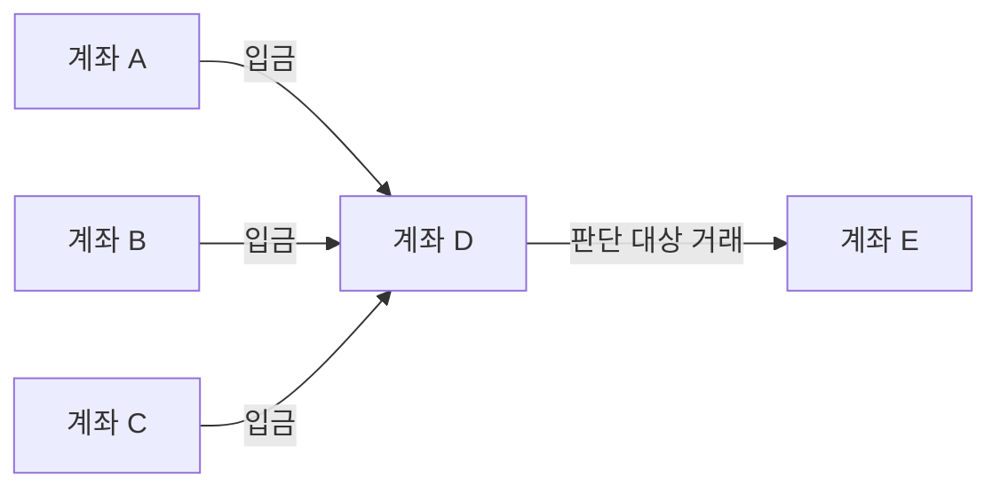
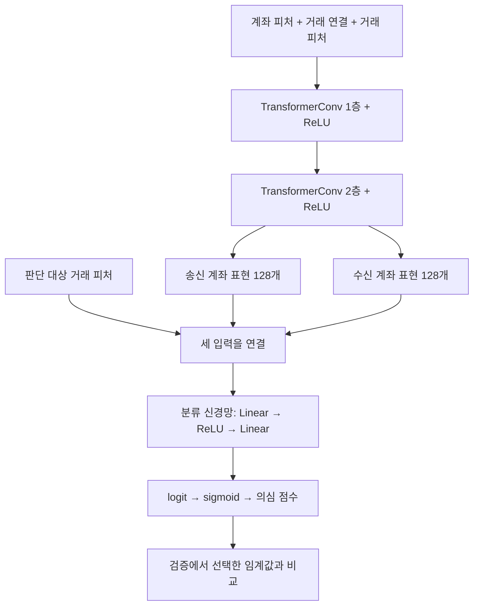
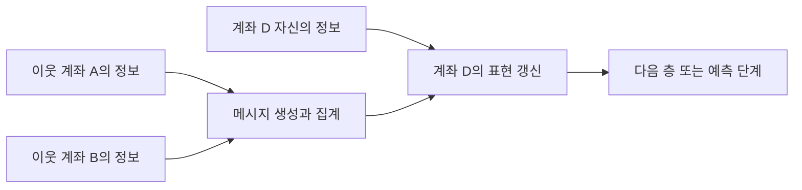

# Graph Transformer 원리와 우리 자금세탁 탐지 모델

작성일: 2026-09-18

이 문서는 Graph Transformer의 기본 원리와 현재 프로젝트의 `TransformerConv` 기반 거래 이진 분류 모델을 연결해 설명한다. 일반적인 Graph Transformer 계열의 특징과 우리 코드에서 실제 사용하는 구성을 구분한다. 설명용 거래와 attention 수치는 실제 분석 결과가 아닌 예시다.

## 1. Graph Transformer란?

**Graph Transformer는 그래프로 연결된 데이터에서 주변 정보 중 무엇을 얼마나 반영할지 attention으로 학습하는 모델 계열이다.**

우리 프로젝트에서는 계좌의 활동과 주변 거래 관계를 함께 반영해 각 거래의 세탁 의심 점수를 계산한다. Graph Transformer는 하나의 고정된 구조를 뜻하지 않는다. 전역 attention을 사용하는 구조도 있고, 실제 이웃 연결을 따라 attention을 계산하는 구조도 있다. 우리 모델은 후자인 `TransformerConv`를 사용한다.

[PyG TransformerConv 공식 문서](https://pytorch-geometric.readthedocs.io/en/latest/generated/torch_geometric.nn.conv.TransformerConv.html) · [지역 메시지 전달과 전역 attention을 결합한 GraphGPS 논문](https://arxiv.org/abs/2205.12454)

## 2. 우리 데이터에서 그래프는 무엇인가?

| 구성 | 의미 | 예시 |
|---|---|---|
| 노드(Node) | 계좌 | 계좌 A, B |
| 엣지(Edge) | 방향이 있는 거래 | A → B 송금 |
| 노드 피처 | 계좌의 활동 특성 | 거래 횟수, 거래 상대 수, 활동일 수 |
| 엣지 피처 | 거래 자체와 거래 관계의 특성 | 정규화 금액, 거래 간격, 최근 거래 횟수 |
| 예측 대상 | 개별 거래 | D → E 거래가 세탁 의심인지 |

동일 계좌쌍 사이에 여러 거래가 있으면 서로 다른 거래 엣지로 표현할 수 있다. 최종 출력은 계좌의 분류가 아니라 거래의 이진 분류 점수다.



D → E 거래만 보면 평범해 보여도, D가 여러 계좌에서 돈을 받은 이력과 연결해 보면 추가적인 판단 근거가 생길 수 있다. 모델은 이런 관계를 학습에 활용한다. 다만 그림과 같은 모양만으로 자금세탁이라고 확정하는 규칙은 아니다.

## 3. Attention: 주변 정보를 서로 다른 비중으로 반영하기

D 계좌의 표현을 계산할 때 A·B·C에서 들어오는 정보를 모은다고 하자. 모델은 각 메시지에 서로 다른 가중치를 줄 수 있다.

| 주변 거래 | 설명용 attention 값 |
|---|---:|
| A → D | 0.15 |
| B → D | 0.65 |
| C → D | 0.20 |

위 예시에서는 B가 전달하는 정보가 상대적으로 크게 반영된다. **0.65는 B가 세탁 계좌일 확률도, 최종 판단에 대한 65%의 기여도도 아니다.** 특정 층·특정 head에서 D로 들어오는 메시지들 사이의 상대적 비중이다.

Attention 값은 모델에 저장된 고정 거래별 점수가 아니다. 학습되는 변환 가중치와 현재 입력을 이용해 매번 계산된다.

## 4. Query·Key·Value의 의미

D가 B의 정보를 받는 상황을 기준으로 설명하면 다음과 같다.

| 요소 | 직관적인 의미 | 우리 계산에서의 출발점 |
|---|---|---|
| Query | D가 어떤 주변 정보를 참고할지 비교하기 위한 표현 | 수신 노드 D의 현재 표현 |
| Key | B와 해당 거래의 특성을 비교하기 위한 표현 | 송신 노드 B의 표현과 B → D 거래 피처 |
| Value | 실제로 D에 전달할 정보 | 송신 노드 B의 표현과 B → D 거래 피처 |

계산 순서는 다음과 같다.

1. 수신 노드의 Query와 송신 노드·거래의 Key를 비교한다.
2. 같은 수신 노드로 들어오는 메시지들에 softmax를 적용해 비중을 만든다.
3. 각 Value에 그 비중을 곱한다.
4. 이웃 메시지를 합치고 자기 노드의 변환된 정보도 더한다.

개념적으로는 다음과 같다.

```text
새 계좌 표현
= 자기 계좌 정보의 변환
+ Σ(attention 비중 × 주변에서 전달된 정보)
```

우리 코드에서 확인한 한 head의 계산을 조금 더 자세히 쓰면 다음과 같다. 선형 변환의 편향 항은 간결하게 생략했다.

```text
q_i = Wq × x_i
k_ji = Wk × x_j + We × e_ji
v_ji = Wv × x_j + We × e_ji

attention_ji = softmax_j((q_i · k_ji) / sqrt(head 차원))
새 표현_i = Wroot × x_i + Σ_j(attention_ji × v_ji)
```

- `i`: 정보를 받는 계좌
- `j`: 정보를 보내는 계좌
- `x`: 계좌 입력 또는 이전 층의 계좌 표현
- `e_ji`: j → i 거래 피처
- `W`: 학습으로 조정되는 변환 가중치
- `softmax_j`: i로 들어오는 메시지 사이에서 계산하는 정규화

이 식은 설치된 `TransformerConv`의 엣지 피처 처리와 자기 노드 결합 구현을 정리한 것이다. 엣지 피처가 Key와 Value에 들어가는 방식은 [공식 문서](https://pytorch-geometric.readthedocs.io/en/latest/generated/torch_geometric.nn.conv.TransformerConv.html)에도 명시돼 있다.

## 5. 거래 피처는 두 경로로 사용된다

우리 모델에서 거래 피처는 그래프 계산과 최종 판정에 모두 사용된다.

| 경로 | 사용되는 정보 | 역할 |
|---|---|---|
| 주변 그래프의 메시지 전달 | 문맥 거래의 피처 | attention 계산과 이웃 메시지에 반영 |
| 대상 거래의 최종 분류 | 판단 대상 거래의 피처 | 송·수신 계좌 표현과 함께 분류기에 직접 입력 |

예를 들어 정규화 금액은 주변 입금 거래를 이해하는 정보로 쓰일 수 있고, 판단 대상 거래 자체의 특성으로도 쓰인다. 따라서 우리 모델은 연결 모양만 보는 모델이 아니라 **계좌 특성·연결 관계·거래 피처를 함께 보는 모델**이다.

근거: [실제 모델 코드](CODE/daily_pipeline.py).

## 6. Multi-head attention과 계좌 임베딩

우리 모델은 **2개의 attention head**를 사용한다. 서로 다른 가중치로 정보를 계산하고 결과를 이어 붙인다.

```text
Head 1의 결과: 64개 숫자
Head 2의 결과: 64개 숫자
두 결과를 연결: 128개 숫자
```

서로 다른 head가 다른 정보를 활용할 수 있지만, “1번 head는 금액, 2번 head는 연결 구조 담당”처럼 역할을 정해둔 것은 아니다. 실제 학습된 역할은 분석해야 한다.

이렇게 얻는 128개 숫자를 **계좌 임베딩**, 즉 학습된 계좌 표현이라고 부른다. 각 차원에 거래 횟수 같은 고정된 한글 의미가 있는 것은 아니다. 예측에 유용하도록 여러 입력 정보가 변환·결합된 결과다.

## 7. 두 개 층을 사용하는 이유와 2홉의 의미

우리 모델은 TransformerConv를 두 번 적용한다.

```text
첫 번째 층: 직접 연결된 이웃의 입력을 받는다.
두 번째 층: 이웃이 첫 번째 층에서 모은 정보까지 받는다.
```

A → D → E 경로에서 E의 두 번째 층 표현에는 D를 거쳐 A의 정보가 간접적으로 들어갈 수 있다. 이는 **선택된 그래프에서 최대 2홉**까지 메시지가 전달된다는 의미다.

우리 구현은 송금 방향을 따라 **수신 계좌가 송신 계좌의 정보를 받는다.** 모든 엣지에 역방향 연결을 자동으로 추가하지 않는다. 대신 거래를 판정할 때 송신 계좌와 수신 계좌의 표현을 모두 사용한다. 송신 횟수 등 노드 집계 피처에는 송신 활동도 포함된다.

2홉이라는 조건은 긴 세탁 경로 전체를 추적한다는 뜻은 아니다. 샘플링에서 빠진 거래나 2홉 밖의 관계는 메시지 전달로 직접 확인하지 못하며, 일부 정보가 집계 피처에 요약돼 있을 수 있다.

## 8. 우리 모델의 전체 구조



| 모델 버전 | 노드 원본 피처 | 거래 피처 | 마지막 분류기 입력 |
|---|---:|---:|---:|
| 기존 HI-Large 40개 모델 | 22 | 18 | 128 + 128 + 18 = **274** |
| 공통 28개 모델 | 11 | 17 | 128 + 128 + 17 = **273** |

“40개 피처”는 노드 22개와 거래 18개의 피처 종류를 합친 수다. 여러 계좌·거래가 그래프에 포함되므로 전체 그래프가 40개의 숫자로만 구성된다는 뜻은 아니다.

분류기는 연결된 입력을 128차원으로 변환한 뒤 최종 숫자 하나인 logit을 출력한다. 예측 함수가 sigmoid를 적용하면 0~1의 점수가 된다.

```text
점수 ≥ 검증에서 선택한 임계값 → 세탁 의심
점수 < 검증에서 선택한 임계값 → 정상으로 분류
```

0~1 점수라고 해서 현실의 세탁 확률로 정확히 보정됐다는 뜻은 아니다. 우리 학습은 양성 손실 가중치 300을 사용하므로, 점수를 곧바로 실제 확률로 해석하지 않고 검증 구간에서 임계값을 선택한다. 임계값은 모델·실험에 따라 다르다.

근거: [모델과 예측 함수](CODE/daily_pipeline.py), [기존 40개 모델 설정](experiments/split_60_20_20/decision_rule.json), [공통 28개 모델 설정](experiments/common_features_hi_to_saml/decision_rule.json).

## 9. 학습 과정에서는 무엇이 바뀌는가?

학습 거래의 실제 이진 정답과 예측의 차이로 손실을 계산한다. 역전파로 Query·Key·Value 변환, 거래 피처 변환, 자기 노드 변환, 최종 분류기 가중치가 함께 조정된다.

```text
거래·계좌 입력
→ 점수 계산
→ 실제 이진 정답과 비교해 손실 계산
→ 역전파
→ 가중치 업데이트
```

우리 모델은 거래의 정상/세탁 이진 라벨로 학습한다. “이 거래는 Fan_In이니 이 연결을 보라”는 유형별 지시를 받지 않는다. 패턴 라벨은 별도 성능 집계에만 사용한다.

| 시작 방법 | 의미 |
|---|---|
| 무작위 초기화 | 아직 학습하지 않은 가중치에서 시작 |
| HI 사전학습 미세조정 | HI에서 학습한 가중치로 시작해 SAML-D로 추가 업데이트 |
| 고정 가중치 외부 평가 | HI 가중치를 바꾸지 않고 SAML-D 예측만 수행 |

이 세 방법은 같은 Graph Transformer 구조를 사용하더라도 학습 조건과 검증 질문이 다르다.

## 10. 일반 Transformer 및 다른 GNN과의 관계

Graph Transformer는 GNN과 완전히 별개인 도구가 아니다. 우리 `TransformerConv` 모델은 attention을 사용해 그래프 메시지 전달을 수행하는 GNN이다.

| 구분 | 주요 관점 |
|---|---|
| 일반적인 텍스트 Transformer | 토큰 간 관계를 attention으로 계산하며 위치·마스크 등의 정보를 사용 |
| 그래프 메시지 전달 모델 | 연결 관계를 따라 이웃 정보를 모아 노드 표현을 갱신 |
| 우리 Graph Transformer | 선택된 그래프 연결에서 Query·Key 기반 attention과 거래 피처로 메시지를 계산 |
| 전역 attention을 사용하는 Graph Transformer | 실제 엣지 이외의 노드 관계도 계산할 수 있으며 구조·위치 정보가 별도로 중요 |

모든 Graph Transformer가 동일한 범위·시간 처리·구조 표현을 갖는 것은 아니다. 예를 들어 GraphGPS는 지역 메시지 전달, 전역 attention, 위치/구조 인코딩을 결합하는 설계를 제안한다. 우리 코드는 GraphGPS 전체 구조를 구현한 것이 아니다. [GraphGPS 원 논문](https://arxiv.org/abs/2205.12454)

## 11. 우리 모델이 실제로 보는 범위와 한계

| 항목 | 현재 구현 |
|---|---|
| 그래프 범위 | 예측일을 포함한 최근 30개 달력 날짜 |
| 문맥 엣지 선택 | 수신 계좌별 최근 입금 거래 최대 10개 |
| 전달 깊이 | 2층, 최대 2홉 |
| attention head | 2개 |
| 계좌 임베딩 | 128차원 |
| 자기 노드 정보 | 변환 후 이웃 집계에 더함 |
| 학습형 beta 결합 | 사용하지 않음: TransformerConv 기본 beta=False |
| attention dropout | 0 |
| 전체 계좌 간 전역 attention | 사용하지 않음 |
| 별도 그래프 위치 인코딩 | 사용하지 않음 |
| 시간 정보 | 거래 간격·횟수 등의 피처 및 날짜/최근 거래 기준의 그래프 구성 |
| 목표 | 개별 거래의 이진 판정 |

최근 입금 **거래 10개**이지 항상 서로 다른 **계좌 10개**인 것은 아니다. 같은 상대의 반복 거래가 포함될 수 있다. 또한 문맥 이웃으로 선택되지 않은 거래라도 판단 대상 거래로 점수를 계산할 수 있다.

그래프와 노드 집계가 30일 창을 사용한다고 해서 모든 피처가 30일 이력만 사용하는 것은 아니다. 거래쌍의 일부 누적 이력 피처는 관측 시작 이후의 과거 정보를 사용한다. 서로 다른 데이터셋에서 관측 기간이 다르면 피처 분포도 달라질 수 있다.

일 마감 그래프에는 같은 날의 거래가 포함된다. 따라서 이 결과는 **일 마감 배치 탐지**의 성능이다. 개별 거래가 발생한 순간의 실시간 판단으로 해석하려면 당시까지의 정보만 사용하는 별도 설계가 필요하다.

Graph Transformer를 사용한다고 해서 자동으로 모든 세탁 패턴을 알아내거나 다른 데이터셋에 일반화하는 것은 아니다. 입력 피처·라벨·학습 분포·이웃 선택·임계값도 성능을 좌우한다. 실제 외부 검증에서는 공통 피처 모델의 SAML-D 성능이 낮았으므로 모델 이름 자체가 일반화의 근거가 되지는 않는다.

근거: [그래프 구성·이웃 샘플링 구현](CODE/daily_pipeline.py), [외부 검증 실험 설계와 결과](experiments/HI_Large_모델_외부검증_실험설계_ko.md).

## 12. 일반 GNN은 무엇인가?

**GNN(Graph Neural Network, 그래프 신경망)은 노드의 정보와 노드 사이의 연결 관계를 함께 학습하는 신경망 계열이다.** 하나의 특정 알고리즘 이름이 아니라 여러 구조를 포함하는 큰 범주다. 우리 TransformerConv 기반 모델도 GNN에 속한다.

거래 한 행의 금액·시각만으로 판단하는 모델과 비교하면, GNN은 거래로 연결된 상대 계좌의 특성까지 계산에 반영할 수 있다. 다만 표 기반 모델도 미리 계산한 계좌 활동 집계 피처를 사용할 수 있으므로, 그래프 정보를 활용하는 방법이 GNN만 있는 것은 아니다.

### 12.1 대표적인 원리: 메시지 전달

메시지 전달 방식의 GNN은 각 노드가 이웃 정보를 받고 자기 표현을 갱신한다. 여기서 메시지는 실제로 보내는 문장이 아니라 학습 가능한 숫자 벡터다.

```text
1. 메시지 만들기: 이웃 노드와 연결의 정보를 숫자로 변환
2. 메시지 모으기: 합계·평균·최댓값·attention 등의 방식으로 집계
3. 자기 정보와 결합: 모은 정보를 사용해 노드 표현을 갱신
4. 반복하기: 여러 층을 거치며 더 먼 이웃 정보까지 반영
```

예를 들어 A → D, B → D라는 거래가 있으면 D는 A와 B에서 전달된 정보를 모은다. 어떤 정보를 전달하고 어떤 비중으로 모을지가 GNN 구조마다 다르다. 우리 모델은 이 단계에서 거래 피처와 Query·Key 기반 attention을 사용한다.



GNN은 기본적으로 이웃 나열 순서에 의존하지 않는 집계 방식을 사용한다. 예를 들어 같은 이웃들의 메시지를 합하거나 평균하면 입력 순서가 달라도 결과가 같다. 다만 우리처럼 최근 거래를 선택할 때는 시각과 동점 처리 기준이 어떤 엣지를 이웃으로 포함할지 결정한다.

### 12.2 GNN은 무엇을 예측할 수 있는가?

| 예측 단위 | 질문 예시 | 우리 모델과의 관계 |
|---|---|---|
| 노드 | 이 계좌는 의심 계좌인가? | 현재 모델의 직접 출력은 아님 |
| 엣지 | 이 거래는 세탁 의심 거래인가? | **우리 모델의 목표** |
| 링크 존재 | 두 계좌 사이에 거래가 생길 것인가? | 현재 거래 라벨 분류와 다른 문제 |
| 그래프 전체 | 이 거래 네트워크 전체가 의심스러운가? | 현재 모델의 직접 출력은 아님 |

GNN 층이 계좌 표현을 만든다고 해서 최종 과제가 계좌 분류로 제한되는 것은 아니다. 우리 모델은 송신·수신 계좌 표현과 거래 피처를 결합해 **이미 관측된 거래의 라벨**을 분류한다.

## 13. 대표 GNN과 우리 모델의 차이

“일반 GNN”은 범위가 넓으므로, 모든 GNN을 하나의 단순한 구조로 묶어 비교하면 부정확하다. 대표적인 GCN·GAT와 우리 TransformerConv를 구분하면 차이가 분명해진다.

| 항목 | 기본 GCNConv | GATConv | 우리 TransformerConv |
|---|---|---|---|
| 공통점 | 그래프를 따라 이웃 정보를 집계 | 그래프를 따라 이웃 정보를 집계 | 그래프를 따라 이웃 정보를 집계 |
| 이웃 반영 비중 | 연결 수와 엣지 가중치에 따른 정규화 계수 | 노드 특성 등에 기반해 학습한 attention | Query·Key 내적으로 계산한 attention |
| 집계의 특징 | 정규화된 이웃 정보를 모아 변환 | 학습한 attention으로 가중 집계 | 거래 피처를 포함한 Key·Value로 가중 집계 |
| 여러 head | 기본 연산에는 없음 | 지원 | 우리 설정은 2개 |
| 엣지 입력 | 기본 API는 스칼라 edge_weight 지원 | edge_dim 설정 시 다차원 엣지 특성을 attention에 반영 가능 | 거래 피처를 attention과 전달 메시지에 반영 |
| 우리 프로젝트에서의 사용 | 현재 주 모델은 아님 | 현재 주 모델은 아님 | 실제 사용 중인 연산 |

GCN의 이웃 가중치는 일반적으로 연결 수에 따른 정규화가 포함되므로 “모든 이웃을 똑같이 평균한다”라고 단정하면 안 된다. 또한 GAT도 attention을 사용하므로 **attention이 있는 것은 Graph Transformer만의 특징이 아니다.** 차이는 attention의 구체적인 계산과 엣지 정보를 반영하는 방식 등에 있다.

위 비교는 PyG의 해당 기본 연산을 기준으로 한다. 다른 GNN도 별도 메시지 함수나 엣지 인코더를 붙이면 거래 피처를 활용할 수 있다. 따라서 “일반 GNN은 거래 피처를 사용할 수 없다”는 설명은 틀리다.

근거: [GCNConv 공식 문서](https://pytorch-geometric.readthedocs.io/en/latest/generated/torch_geometric.nn.conv.GCNConv.html), [GATConv 공식 문서](https://pytorch-geometric.readthedocs.io/en/latest/generated/torch_geometric.nn.conv.GATConv.html), [TransformerConv 공식 문서](https://pytorch-geometric.readthedocs.io/en/latest/generated/torch_geometric.nn.conv.TransformerConv.html).

### 13.1 우리 모델을 구체적으로 구분하는 요소

우리 모델은 GNN의 기본 메시지 전달 틀 안에서 다음 설계를 선택했다.

| 설계 요소 | 우리 모델의 선택 | 의미 |
|---|---|---|
| 메시지 가중치 | Query·Key 기반 2-head attention | 주변 정보를 입력에 따라 서로 다른 비중으로 반영 |
| 거래 정보 | 문맥 엣지 피처를 Key·Value에 반영 | 같은 상대와의 거래라도 거래 특성이 계산에 영향을 줄 수 있음 |
| 메시지 방향 | 송신 → 수신 | 송금 방향을 따라 정보 전달 |
| 문맥 선택 | 최근 30일, 수신 계좌별 최근 입금 거래 최대 10개 | 전체 네트워크 대신 정해진 범위의 문맥 사용 |
| 층 수 | 2개 | 선택된 그래프에서 최대 2홉 정보 전달 |
| 출력 설계 | 송신 표현 + 수신 표현 + 대상 거래 피처 | 계좌 표현을 거래 이진 분류에 사용 |
| 시간 처리 | 날짜별 그래프와 거래 간격·활동 집계 피처 | 시간 순서를 Transformer라는 이름만으로 자동 학습하는 구조가 아님 |

최근 30일·이웃 10개·2층·거래 분류 같은 조건은 Graph Transformer의 필수 규칙이 아니라 **우리 프로젝트의 설계 선택**이다. 다른 GNN에도 같은 조건을 적용할 수 있다.

### 13.2 Graph Transformer를 사용하면 항상 더 좋은가?

그렇지는 않다. 복잡한 메시지 계산이 유용할 수 있지만, 학습 데이터와 과제에 따라 단순한 모델이 비슷하거나 더 좋은 결과를 낼 수도 있다. 우리 모델의 장점은 모델 이름으로 주장하기보다 동일 조건의 실험으로 확인해야 한다.

- **연결 없는 신경망과 비교:** 주변 연결 정보를 활용하는 것이 도움이 되는가?
- **같은 피처의 GCN·GAT와 비교:** 메시지 집계 방식의 차이가 도움이 되는가?
- **거래 피처를 제거한 모델과 비교:** 엣지 특성이 얼마나 필요한가?
- **이웃 수·층 수를 바꾼 모델과 비교:** 더 넓은 문맥이 실제로 도움이 되는가?

GCN·GAT와 직접 비교하려면 데이터 분할, 사용 피처, 그래프 범위, 거래 분류기, 학습·선택 예산을 최대한 맞춰야 한다. 현재 TransformerConv 모델이 있다는 사실만으로 다른 GNN보다 우수하다고 결론 내릴 수는 없다. 위 목록은 비교 질문을 설명한 것이며 새 실험을 실행했다는 뜻은 아니다.

근거: [우리 모델·그래프 구현](CODE/daily_pipeline.py), [기존 SAML 모델 비교 결과](experiments/saml_daily_v1/COMPARISON_ko.md).

## 14. 설명·발표에 사용할 수 있는 문장

> GNN은 그래프의 노드 정보와 연결 관계를 함께 학습하는 신경망 계열이다. 우리 모델은 그중 TransformerConv를 사용하는 attention 기반 GNN이다. 계좌를 노드, 거래를 방향성 엣지로 구성하고, 두 개의 head와 두 개의 층으로 주변 거래 정보를 반영한 계좌 표현을 만든다. 이후 송신·수신 계좌 표현과 대상 거래 피처를 결합해 거래별 세탁 의심 점수를 산출한다. 최근 30일의 일 마감 그래프에서 수신 계좌별 최근 입금 거래 최대 10개를 문맥으로 사용한다.

**우리 모델도 GNN이며, 일반적인 GNN의 정보 집계 방식을 attention과 거래 피처를 사용하도록 구체화한 구조**라고 설명하면 된다.
