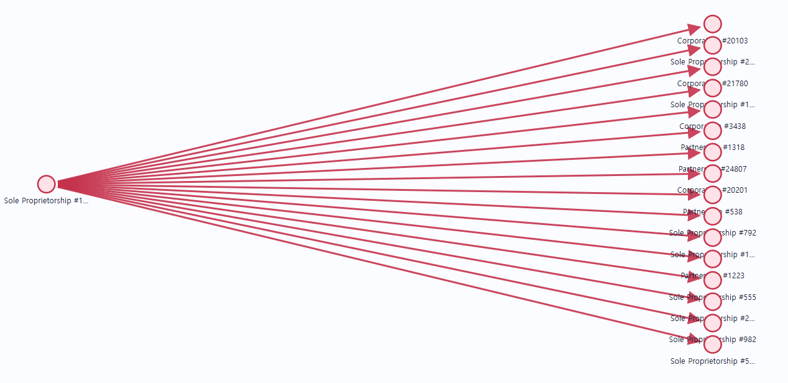
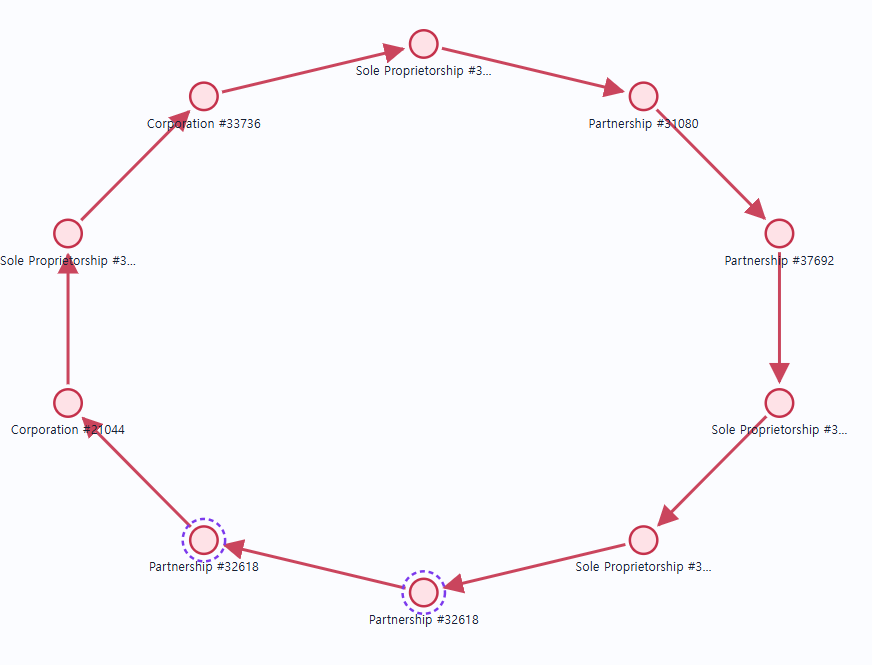
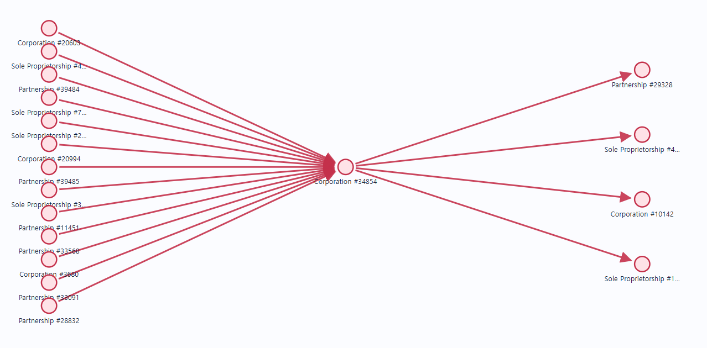
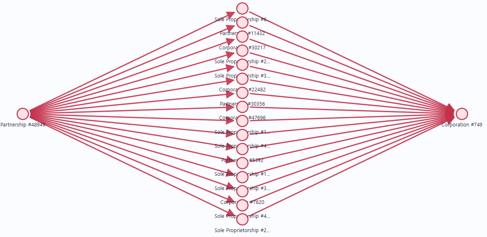
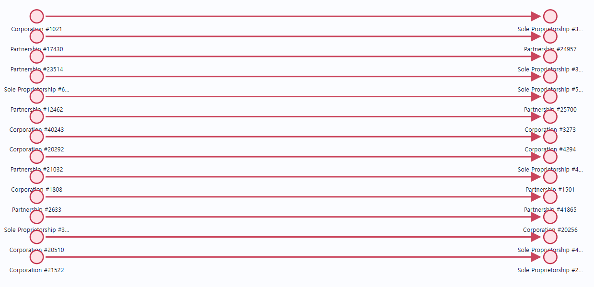
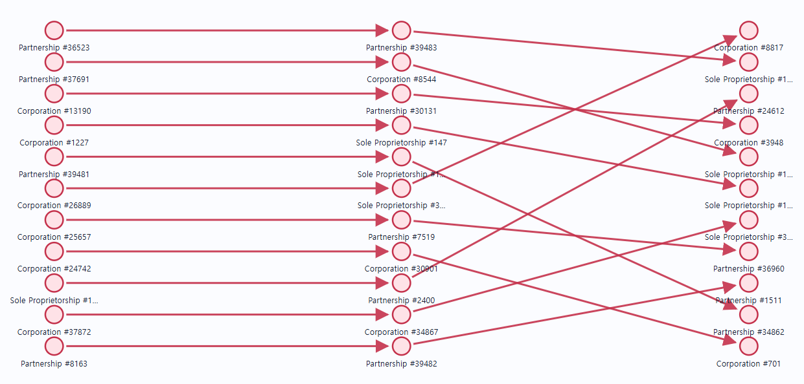

# IBM AML 데이터셋 분석일기
- 작성일: 2026-08-23

## 현재까지 패턴
| 패턴 | 데이터에서 확인할 구조 |
|---|---|
| FAN-OUT | 한 계좌가 여러 계좌로 분산 송금 |
| FAN-IN | 여러 계좌가 한 계좌로 집중 송금 |
| GATHER-SCATTER | 여러 계좌 → 중심 계좌 → 다시 여러 계좌 |
| SCATTER-GATHER | 한 계좌 → 여러 중간 계좌 → 한 계좌 |
| CYCLE | 자금이 여러 계좌를 거쳐 시작 계좌로 복귀 |
| RANDOM | 통제 계좌 사이를 무작위 경로처럼 이동하고 시작점으로 돌아오지 않음 |
| BIPARTITE | 여러 입력 계좌에서 여러 출력 계좌로 이동 |
| STACK | Bipartite 구조가 여러 층으로 이어짐 |


## 패턴별 자금세탁 attempt 수

| 패턴 | HI-Small | LI-Small |
|---|---:|---:|
| BIPARTITE | 49 | 16 |
| CYCLE | 54 | 12 |
| FAN-IN | 40 | 12 |
| FAN-OUT | 48 | 19 |
| GATHER-SCATTER | 51 | 12 |
| RANDOM | 41 | 15 |
| SCATTER-GATHER | 44 | 13 |
| STACK | 43 | 18 |
| **합계** | **370** | **117** |
| 패턴외 | 1297 | 1651 |

### 분석1 : 왜 이 패턴인가?
- 시각화를 시간순으로 본 결과 조금 패턴차이가 확실하게 보임

#### FAN-OUT
- 한 계좌가 여러 계좌로 분산 송금


#### FAN-IN
- 여러 계좌가 한 계좌로 집중 송금


#### CYCLE 


#### GATHER-SCATTER
- 여러 계좌 → 중심 계좌 → 다시 여러 계좌


#### SCATTER-GATHER
- 한 계좌 → 여러 중간 계좌 → 한 계좌


#### BIPARTITLE
- 여러 입력 계좌에서 여러 출력 계좌로 이동

예시)
```
A ─→ X
A ─→ Y
B ─→ X
B ─→ Y
```

같은 계좌 쌍의 반대 방향 거래가 서로 다른 BIPARTITE attempt로 나뉜 사례도 있슴
```
HI_0023: A → B
HI_0025: B → A
HI_0059: B → A
```




#### STACK
- Bipartite 구조가 여러 층으로 이어짐


#### 랜덤
- 통제 계좌 사이를 무작위 경로처럼 이동하고 시작점으로 돌아오지 않음

| 생성기 패턴 | 구조 검증을 위한 최소 조건 |
|---|---|
| FAN-IN | 서로 다른 송금 계좌 2개 이상 → 중심 계좌 |
| FAN-OUT | 중심 계좌 → 서로 다른 수취 계좌 2개 이상 |
| BIPARTITE | 송금 계좌 2개 이상, 수취 계좌 2개 이상 |
| STACK | 최소 2개 계층과 중간 계좌 존재 |
| RANDOM | 최소 2홉 이상이며 cycle이 아님 |
| CYCLE | 자기거래를 제외한 방향성 cycle 존재 |
| GATHER-SCATTER | 한 중심 노드의 in/out-degree가 모두 2 이상 |
| SCATTER-GATHER | 분산과 재집중이 모두 관찰됨 |


### 분석2 : 단건 패턴 수
| 데이터셋 | BIPARTITE | RANDOM | FAN-IN | FAN-OUT | GATHER-SCATTER | 패턴 외 |
|---|---:|---:|---:|---:|---:|---:|
| HI-Small | 18 | 13 | 4 | 8 | 0 | 1,238 |
| LI-Small | 2 | 2 | 2 | 1 | 1 | 1,586 |

- 결과적으로 분석해보면 다른 어떠한 피처들을 활용해도 단건으로는 패턴을 확인할 수 없음

#### 단건 자금 세탁 비중은?

HI

### 분석3 : 그래프 분석

#### HI-Small

| 구분 | 컴포넌트 | 계좌 | 거래 |
|---|---:|---:|---:|
| 정상-only | 114,131개, 99.993% | 142,978개, 27.76% | 203,737건, 4.01% |
| 자금세탁 포함 | 8개, 0.007% | 372,110개, 72.24% | 4,874,599건, 95.99% |

단건 자금세탁 비중
```
전체 자금세탁: 5,177건
단건 자금세탁: 1,281건
비중: 24.74%
```

#### LI-Small
| 구분 | 컴포넌트 | 계좌 | 거래 |
|---|---:|---:|---:|
| 정상-only | 160,023개, 99.994% | 201,489개, 28.54% | 286,043건, 4.13% |
| 자금세탁 포함 | 10개, 0.006% | 504,418개, 71.46% | 6,637,998건, 95.87% |

단건 자금세탁 비중
```
전체 자금세탁: 3,565건
단건 자금세탁: 1,594건
비중: 44.71%
```

#### 정상-only 컴포넌트 제거하면? 

- 정상-only 컴포넌트: 개수는 매우 많지만 대부분 작음
  - 실제로 정상-only 컴포넌트는 계좌당 평균 거래 수가 약 1.4임
    - HI: 203,737 ÷ 142,978 ≈ 1.42건
    - LI: 286,043 ÷ 201,489 ≈ 1.42건
- 자금세탁 포함 컴포넌트: 개수는 적지만 매우 큼

- 만약에 정상 컴포넌트들만 지우면
  - HI의 자금세탁 비율 0.101943% → 0.106204%
  - LI의 자금세탁 비율 0.051487% → 0.053706%
  - 정상 거래를 HI에서 203,737건, LI에서 286,043건 제거했지만 양성 비율은 각각 약 0.004%p, 0.002%p만 올라감
    - 정상-only 컴포넌트가 전체 거래의 약 4%밖에 되지 않기 때문

- 결론적으로 따라서 정상-only 컴포넌트를 전부 삭제하는 것은:
  - 계좌 약 28%를 잃고
  - 거래는 약 4%만 감소하며
  - 클래스 비율은 거의 개선되지 않는
비효율적인 방법이고 추가적으로 저활동 정상 계좌를 집중적으로 삭제하게 되므로 모델이 실제 환경보다 활동량이 높은 계좌만 보게 되는 선택 편향이 생긴다.

#### 단건 거래만 삭제했을 때

HI
```
양성: 5,177 → 3,896
양성 비율: 0.101943% → 0.076737%
정상:양성 = 979.94:1 → 1,302.15:1
```

LI
```
양성: 3,565 → 1,971
양성 비율: 0.051487% → 0.028473%
정상:양성 = 1,941.23:1 → 3,511.15:1
```
단건 양성만 지웠기 때문에 정상 거래 수는 그대로고 양성만 감소, 따라서 불균형이 크게 악화

특히 LI는:
```
약 1,941:1 → 약 3,511:1
```
로 거의 두 배 가까이 나빠집니다.

#### 단건 계좌에 붙은 거래까지 삭제했을 때
- 현재 단건 자금세탁 거래의 송·수취 계좌는 다른 거래에도 참여하고 있음

HI
| 항목 | 수 |
|---|---:|
| 단건 자금세탁 | 1,281 |
| 단건에 등장한 계좌 | 2,491 |
| 이 계좌에 직접 연결된 거래 | 46,474 |
| 함께 제거되는 정상 거래 | 44,973 |
| 함께 제거되는 자금세탁 | 1,501 |

- 단건은 1,281건인데 실제 제거되는 자금세탁은 1,501건입니다. 다른 자금세탁 220건이 추가로 같이 삭제

LI
| 항목 | 수 |
|---|---:|
| 단건 자금세탁 | 1,594 |
| 단건에 등장한 계좌 | 3,185 |
| 이 계좌에 직접 연결된 거래 | 60,011 |
| 함께 제거되는 정상 거래 | 58,386 |
| 함께 제거되는 자금세탁 | 1,625 |

- LI에서도 단건 외 자금세탁 31건이 추가로 삭제

클래스 비율은 다음처럼 악화됨  


### 분석4 : 동일 계좌쌍이 서로 다른 자금세탁 attempt에 반복 사용된 사례

같은 계좌쌍의 반대 방향 거래가 서로 다른 attempt에 나뉘어 있는지 전체 Patterns 파일을 대상으로 확인했다.

검사 기준
- 계좌는 `(Bank ID, Account Number)` 복합키로 식별
- 동일한 무방향 계좌쌍 `{A, B}`에서 `A → B`와 `B → A`가 모두 존재하는지 확인
- 두 방향의 거래가 서로 다른 Attempt ID에 존재하는 경우를 집계
- 자기 자신에게 송금한 거래는 제외
- Patterns 파일에 들어 있는 자금세탁 거래만 사용했으며 패턴 외 거래는 제외

| 데이터셋 | 서로 다른 attempt 간 반대 방향 거래가 확인된 계좌쌍 |
|---|---:|
| HI-Small | 26개 |
| LI-Small | 8개 |
| **합계** | **34개** |

패턴 약어

| 약어 | 패턴 | 약어 | 패턴 |
|---|---|---|---|
| BI | BIPARTITE | ST | STACK |
| FI | FAN-IN | FO | FAN-OUT |
| CY | CYCLE | GS | GATHER-SCATTER |
| SG | SCATTER-GATHER | RA | RANDOM |

#### BIPARTITE attempt끼리 반대 방향으로 나뉜 사례

HI-Small에서 3개 계좌쌍이 확인됐고 LI-Small에서는 확인되지 않았다.

| 계좌쌍 | A → B BIPARTITE | B → A BIPARTITE |
|---|---|---|
| `0119/812A09CF0` ↔ `0049365/812A09D40` | HI_0023, HI_0134 | HI_0025, HI_0059, HI_0257 |
| `0148350/811FFF630` ↔ `0148350/812D0C3C0` | HI_0275 | HI_0366 |
| `015231/80266F880` ↔ `023691/8021353D0` | HI_0101, HI_0267, HI_0268, HI_0330 | HI_0097, HI_0102 |

#### HI-Small 전체 사례

표의 계좌 표기는 `은행ID/계좌번호`이며 왼쪽 계좌를 A, 오른쪽 계좌를 B로 보았다. Attempt ID의 `HI_` 접두사는 표에서 생략했다.

| # | 계좌쌍 | A → B attempt | B → A attempt |
|---:|---|---|---|
| 1 | `0119/811C597B0` ↔ `0048309/811C599A0` | 0003(GS), 0081(SG), 0112(ST), 0130(FI), 0183(GS), 0185(SG), 0222(GS), 0259(GS), 0279(RA), 0362(GS) | 0003(GS), 0013(FI), 0017(RA), 0045(FI), 0068(CY), 0103(CY), 0183(GS), 0185(SG), 0222(GS), 0362(GS) |
| 2 | `0150240/812D22980` ↔ `0048309/811C599A0` | 0003(GS), 0017(RA), 0052(FO), 0068(CY), 0130(FI), 0183(GS), 0214(ST), 0259(GS), 0313(FO), 0362(GS) | 0100(GS), 0214(ST), 0259(GS), 0277(FI) |
| 3 | `0222/811B83280` ↔ `0048309/811C599A0` | 0003(GS), 0081(SG), 0103(CY), 0130(FI), 0141(GS), 0259(GS), 0362(GS) | 0112(ST), 0259(GS), 0362(GS) |
| 4 | `0148350/811FFF630` ↔ `0148350/812D0C3C0` | 0012(GS), 0021(FI), 0065(CY), 0085(FO), 0178(CY), 0217(RA), 0275(BI), 0294(SG) | 0012(GS), 0065(CY), 0071(FO), 0086(RA), 0209(FI), 0250(FO), 0294(SG), 0366(BI) |
| 5 | `0148350/812D0C3C0` ↔ `0050528/812D0C600` | 0012(GS), 0041(ST), 0071(FO), 0088(RA), 0140(RA), 0158(RA), 0178(CY), 0250(FO), 0292(BI) | 0012(GS), 0021(FI), 0041(ST), 0086(RA), 0315(RA) |
| 6 | `0119/811C597B0` ↔ `0222/811B83280` | 0017(RA), 0068(CY), 0103(CY), 0141(GS), 0214(ST), 0222(GS), 0289(FI) | 0013(FI), 0045(FI), 0141(GS), 0214(ST), 0222(GS) |
| 7 | `0048308/811ED7DF0` ↔ `0048309/81235EAA0` | 0293(CY) | 0015(FI) |
| 8 | `015231/80266F880` ↔ `023691/8021353D0` | 0022(ST), 0024(CY), 0037(ST), 0048(FO), 0062(CY), 0070(SG), 0101(BI), 0111(FO), 0133(FO), 0135(SG), 0154(ST), 0157(SG), 0165(GS), 0171(GS), 0175(ST), 0233(RA), 0241(SG), 0263(CY), 0267(BI), 0268(BI), 0311(FI), 0322(GS), 0326(SG), 0330(BI), 0351(RA), 0363(ST), 0364(RA) | 0022(ST), 0024(CY), 0035(GS), 0037(ST), 0062(CY), 0070(SG), 0097(BI), 0098(GS), 0102(BI), 0135(SG), 0154(ST), 0157(SG), 0165(GS), 0175(ST), 0225(FO), 0241(SG), 0263(CY), 0322(GS), 0326(SG), 0363(ST) |
| 9 | `0119/812A09CF0` ↔ `0049365/812A09D40` | 0023(BI), 0032(FI), 0054(SG), 0069(CY), 0110(CY), 0113(GS), 0134(BI), 0145(ST), 0159(SG), 0189(SG), 0190(CY), 0224(FO), 0276(CY), 0297(SG), 0355(ST) | 0025(BI), 0054(SG), 0059(BI), 0069(CY), 0110(CY), 0113(GS), 0145(ST), 0159(SG), 0161(FI), 0189(SG), 0190(CY), 0200(FO), 0202(GS), 0257(BI), 0276(CY), 0297(SG), 0355(ST), 0369(RA) |
| 10 | `0119/811C597B0` ↔ `0150240/812D22980` | 0100(GS), 0185(SG), 0277(FI) | 0045(FI), 0081(SG), 0100(GS), 0112(ST), 0185(SG), 0243(FO), 0313(FO) |
| 11 | `0150240/812D22980` ↔ `0222/811B83280` | 0052(FO), 0081(SG), 0100(GS), 0141(GS), 0243(FO), 0289(FI), 0313(FO) | 0068(CY), 0100(GS), 0112(ST), 0141(GS), 0277(FI) |
| 12 | `0148350/811FFF630` ↔ `0050528/812D0C600` | 0085(FO), 0120(ST), 0294(SG), 0303(BI) | 0120(ST), 0158(RA), 0178(CY), 0209(FI), 0294(SG) |
| 13 | `0119/81235E8B0` ↔ `0148389/811EDAA30` | 0089(BI) | 0293(CY) |
| 14 | `0148016/811FCA7B0` ↔ `0223/811EDA940` | 0293(CY) | 0089(BI) |
| 15 | `0222/812D127D0` ↔ `0050202/812D129C0` | 0105(CY), 0235(ST), 0336(SG), 0339(SG), 0370(BI) | 0105(CY), 0235(ST), 0318(FO), 0336(SG), 0339(SG) |
| 16 | `0118/811B6E170` ↔ `0222/811D80C30` | 0119(GS), 0345(GS) | 0119(GS) |
| 17 | `0118/811B9B110` ↔ `0222/811D80C30` | 0119(GS) | 0296(CY) |
| 18 | `0121/8000E1590` ↔ `0222/811D80C30` | 0119(GS), 0216(FO) | 0119(GS) |
| 19 | `0222/811D80C30` ↔ `0223/811A65E30` | 0119(GS), 0173(BI) | 0119(GS) |
| 20 | `0148389/811EDAA30` ↔ `0048309/81235EAA0` | 0180(BI) | 0293(CY) |
| 21 | `0249176/812A70ED0` ↔ `0049508/812A70E80` | 0197(RA), 0238(RA), 0261(ST), 0280(RA), 0287(BI), 0301(GS), 0310(FI), 0312(FO), 0343(ST), 0358(BI) | 0261(ST), 0301(GS), 0343(ST) |
| 22 | `0118/811B6E170` ↔ `0121/8000E1590` | 0345(GS) | 0216(FO) |
| 23 | `0121/8000E1590` ↔ `0223/811A65E30` | 0216(FO) | 0342(RA) |
| 24 | `0118/811A67510` ↔ `0119/81235E8B0` | 0317(SG) | 0293(CY) |
| 25 | `0118/811B6E170` ↔ `0118/811B9B110` | 0345(GS) | 0296(CY) |
| 26 | `0118/811B6E170` ↔ `0119/811DCA9B0` | 0345(GS) | 0342(RA) |

#### LI-Small 전체 사례

Attempt ID의 `LI_` 접두사는 표에서 생략했다.

| # | 계좌쌍 | A → B attempt | B → A attempt |
|---:|---|---|---|
| 1 | `005383/8027CAB40` ↔ `00600/8027CAD30` | 0030(SG), 0103(SG) | 0030(SG), 0103(SG) |
| 2 | `015461/8026EC1C0` ↔ `006058/8026EC210` | 0034(ST), 0080(SG) | 0034(ST), 0080(SG) |
| 3 | `015516/8026EA390` ↔ `025788/8026EA1A0` | 0044(SG), 0094(FI), 0117(GS) | 0044(SG) |
| 4 | `024643/8026B9C00` ↔ `003/8026B9BB0` | 0046(CY), 0109(FI) | 0046(CY) |
| 5 | `013354/802E1FDA0` ↔ `003533/802E1FDF0` | 0064(ST) | 0063(GS), 0064(ST), 0065(FO) |
| 6 | `025634/80273DE60` ↔ `00425/80195DD20` | 0066(ST), 0087(CY) | 0066(ST), 0087(CY) |
| 7 | `014620/801C5DFB0` ↔ `01835/8027ECAA0` | 0077(BI) | 0111(RA) |
| 8 | `014640/802E9F160` ↔ `002557/802E9EF70` | 0078(SG), 0112(ST) | 0078(SG), 0112(ST) |

#### 같은 attempt 내부의 반대 방향 거래

서로 다른 attempt 사이뿐만 아니라 하나의 attempt 안에서도 동일 계좌쌍의 양방향 거래가 확인됐다.

| 데이터셋 | GATHER-SCATTER | SCATTER-GATHER | STACK | CYCLE | 합계 |
|---|---:|---:|---:|---:|---:|
| HI-Small | 25 | 15 | 14 | 14 | 68 |
| LI-Small | 1 | 5 | 5 | 2 | 13 |

- CYCLE 내부의 왕복 거래는 패턴 구조상 자연스럽다.
- 그러나 STACK, GATHER-SCATTER, SCATTER-GATHER에서도 같은 계좌쌍의 왕복이 반복적으로 나타난다.
- 위 전체 사례 표에서 같은 Attempt ID가 A → B와 B → A 양쪽에 모두 적힌 경우는 해당 attempt 자체가 양방향 거래를 포함한다는 의미다.

#### 해석

- 동일한 소수 계좌쌍이 여러 날짜와 여러 패턴 유형에 반복적으로 사용되고 있다.
- 따라서 각 attempt는 거래 목록상 구분되어 있지만 계좌 관계 측면에서는 서로 독립된 그래프가 아니다.
- BIPARTITE 단건처럼 관측된 구조만으로 생성기 패턴을 확인할 수 없는 경우가 있고, 같은 계좌쌍이 다른 attempt에서 반대 방향으로 다시 사용되기도 한다.
- Pattern Type은 거래 그래프만 보고 다시 판별한 결과라기보다 데이터 생성 시 부여된 메타데이터로 보는 것이 적절하다.
- 거래 행을 무작위로 학습·평가 데이터에 나누면 같은 계좌 또는 같은 계좌쌍이 양쪽에 포함되어 데이터 누수가 발생할 수 있다.
- 모델 평가 시에는 시간 분리를 기본으로 하고, 추가로 계좌쌍·Entity ID·연결 계좌 그룹이 학습과 평가에 동시에 들어가는지 확인할 필요가 있다.

출처
https://papers.nips.cc/paper/2023/file/5f38404edff6f3f642d6fa5892479c42-Paper-Datasets_and_Benchmarks.pdf
