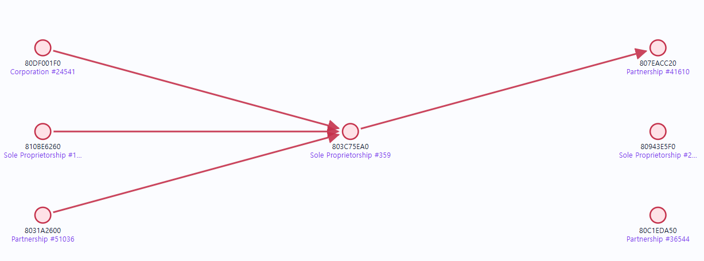
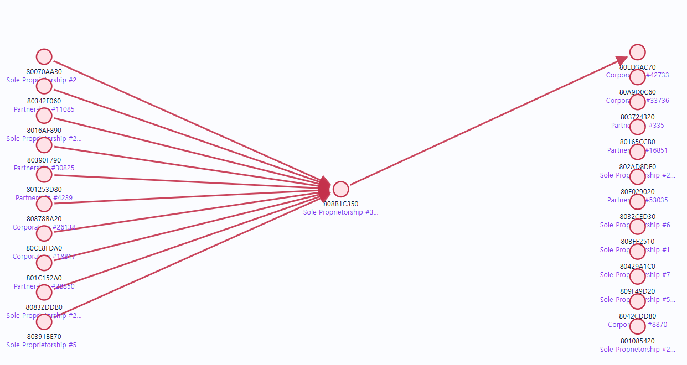
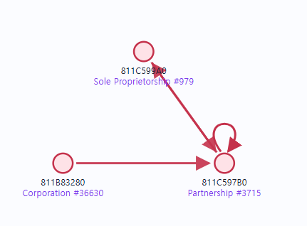
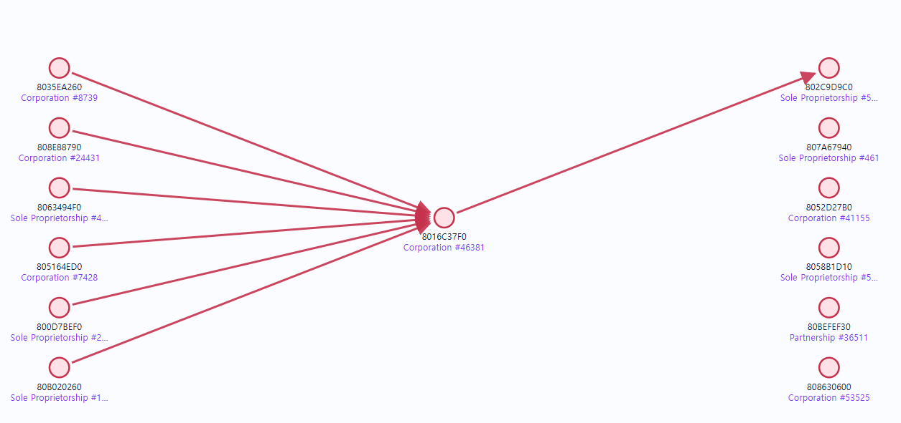
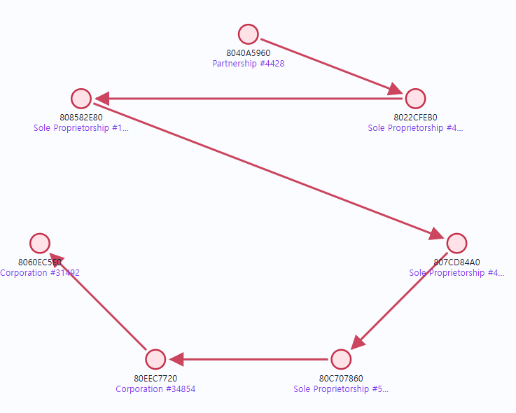
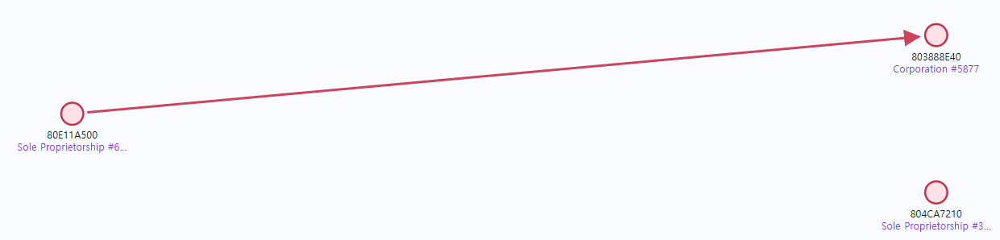
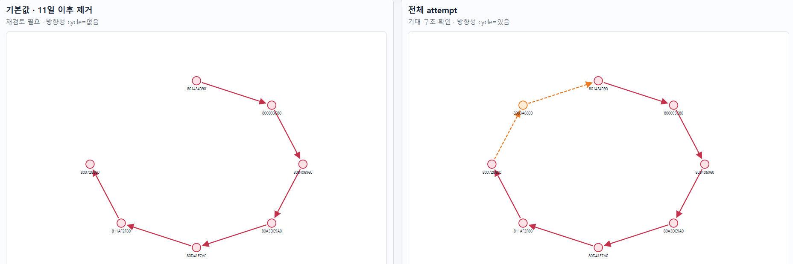
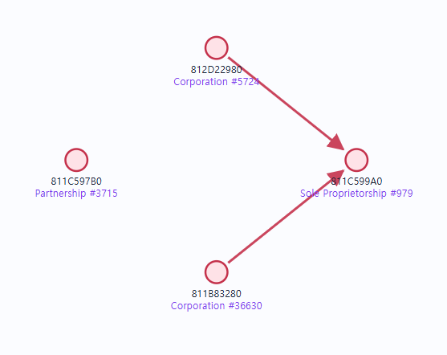

# IBM AML 데이터셋 분석일기
- 작성일: 2026-08-24

## 11일 이후 데이터를 끊었을 때 자금 세탁 패턴이 잘려서 패턴이 망가지는 경우가 있는가?

패턴이 살아 있는것
HI_0116	GATHER-SCATTER
HI_0119	GATHER-SCATTER
HI_0148	GATHER-SCATTER
HI_0156	GATHER-SCATTER
HI_0177	GATHER-SCATTER
HI_0215	GATHER-SCATTER

HI_0228 SCATTER-GATHER

HI_0236 SCATTER-GATHER
HI_0231 STACK
HI_0240 STACK
HI_0239 STACK
HI_0240 · STACK
HI_0247 FAN-OUT
HI_0251 FAN-IN
HI_0252 FAN-OUT

HI_0253	FAN-IN	
HI_0254	FAN-OUT
HI_0256 · STACK
HI_0260	STACK
HI_0262	STACK
HI_0264	RANDOM
HI_0266	STACK
HI_0269 SCATTER-GATHER
HI_0270 FAN-IN

망지지는 후보

HI_0181
GATER-SCATTER 

HI_0196
GATER-SCATTER 

HI_0222 
GATHER-SCATTER

HI_0229 
GATHER-SCATTER

HI_0232 · CYCLE

HI_0244 · FAN-OUT

HI_0255	SCATTER-GATHER

HI_0258	CYCLE

HI_0259	GATHER-SCATTER

