# IBM AML HI-Large 데이터셋 EDA

## 분석 개요

| 항목 | 값 |
| --- | ---: |
| 거래 데이터 | `Trans.csv` |
| 계좌 데이터 | `accounts.csv` |
| 거래 기간 | 2022-08-01 00:00 ~ 2023-01-12 16:49 |
| 전체 거래 수 | 179,702,229건 |
| 자금세탁 거래 수 | 225,546건 |

## 1. 거래 데이터(`Trans.csv`) 확인

### 1.1 기본 정보

| 항목 | 값 |
| --- | ---: |
| 전체 행 수 | 179,702,229 |
| 거래 기간 | 2022-08-01 00:00:00 ~ 2023-01-12 16:49:00 |
| 자금세탁 거래 수 | 225,546 |
| `Amount Paid` 범위 | 0.000001 ~ 8,158,609,321,727.61 |
| 결측치 | 없음 |

| 순번 | 컬럼 | 타입 | 설명 |
| ---: | --- | --- | --- |
| 0 | `Timestamp` | Datetime | 거래 시각(분 단위) |
| 1 | `From Bank` | String | 송금 은행 ID |
| 2 | `Account` | String | 송금 계좌번호 |
| 3 | `To Bank` | String | 수취 은행 ID |
| 4 | `Account.1` | String | 수취 계좌번호 |
| 5 | `Amount Received` | Float64 | 수취 금액 |
| 6 | `Receiving Currency` | String | 수취 통화 |
| 7 | `Amount Paid` | Float64 | 송금 금액 |
| 8 | `Payment Currency` | String | 송금 통화 |
| 9 | `Payment Format` | String | 거래 방식(ACH, Cheque, Credit Card 등) |
| 10 | `Is Laundering` | Int8 | 자금세탁 여부(0/1) |

**앞부분 5행**

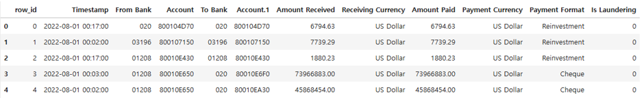

### 1.2 완전 중복 거래 확인

| 항목 | 행 수 |
| --- | ---: |
| 중복을 제외한 추가 행 | 150 |
| 중복에 포함된 전체 행 | 300 |
| 중복 제거 후 남은 행 | 179,702,079 |

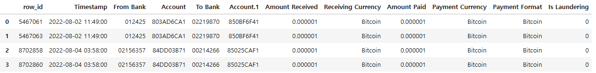

### 1.3 거래 데이터 추가 분석

| 구분 | 거래 수 |
| --- | ---: |
| 송금·수취 금액이 같은 거래 | 176,905,192 |
| 송금·수취 금액이 다른 거래 | 2,797,037 |
| 송금·수취 통화가 같은 거래 | 176,904,911 |
| 송금·수취 통화가 다른 거래 | 2,797,318 |
| 통화는 다르고 금액은 같은 거래 | 281 |
| 통화는 같고 금액은 다른 거래 | 0 |
| 같은 계좌로 보내는 거래 | 10,895,216 |
| 계좌번호는 같고 은행은 다른 거래 | 0 |
| 같은 은행 안에서 발생한 거래 | 12,307,096 |


## 2. 계좌 데이터(`accounts.csv`) 확인

### 2.1 기본 정보

| 항목 | 값 |
| --- | ---: |
| 전체 행 수 | 2,126,855 |

| 순번 | 컬럼 | 타입 | 설명 |
| ---: | --- | --- | --- |
| 0 | `Bank Name` | String | 은행 이름 |
| 1 | `Bank ID` | String | 은행 ID |
| 2 | `Account Number` | String | 계좌번호 |
| 3 | `Entity ID` | String | 계좌 소유 엔티티 ID |
| 4 | `Entity Name` | String | 엔티티 이름(Corporation, Partnership 등) |

**앞부분 5행**

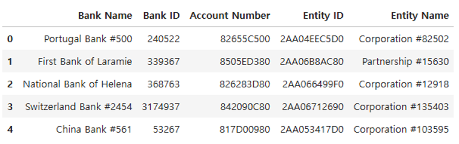

### 2.2 중복 계좌 확인

| 항목 | 수 |
| --- | ---: |
| 중복 관련 행 | 33,123 |
| 중복된 `Account Number` 종류 | 16,496 |

`Account Number`는 전체 데이터에서 고유하지 않으며, 같은 은행 안에서만 고유하다.

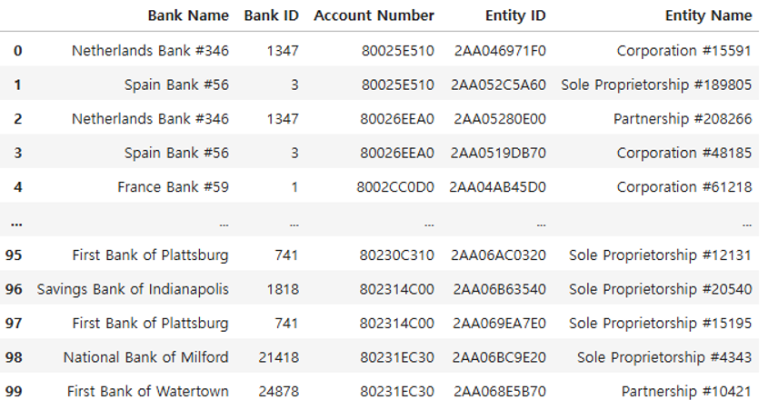

### 2.3 Entity ID 확인

| 항목 | 값 |
| --- | ---: |
| 전체 계좌 수 | 2,126,855 |
| `Entity ID` 종류 수 | 670,231 |
| 여러 은행에 계좌를 가진 Entity 수 | 211,971 |
| Entity당 최대 계좌 수 | 8,611 |
| Entity당 계좌 수 중앙값 | 1.0 |
| Entity당 계좌 수 평균 | 3.17 |
| 동일 `Entity ID`에 서로 다른 `Entity Name`이 있는 경우 | 없음 |

#### Entity ID당 계좌 수 분포(계좌 수 1~10)

| 계좌 수 | Entity 수 |
| ---: | ---: |
| 1 | 457,996 |
| 2 | 63,142 |
| 3 | 36,783 |
| 4 | 21,474 |
| 5 | 13,678 |
| 6 | 10,004 |
| 7 | 7,703 |
| 8 | 6,142 |
| 9 | 4,804 |
| 10 | 4,061 |

#### 계좌를 가장 많이 가진 Entity 상위 10개

| 순위 | Entity ID | 계좌 수 |
| ---: | --- | ---: |
| 1 | `2AA03CCAFB0` | 8,611 |
| 2 | `2AA067413D0` | 5,836 |
| 3 | `2AA06CC87D0` | 5,689 |
| 4 | `2AA06293330` | 5,199 |
| 5 | `2AA0659ADA0` | 4,349 |
| 6 | `2AA069FF9A0` | 4,280 |
| 7 | `2AA0643EBD0` | 4,188 |
| 8 | `2AA069FF730` | 3,874 |
| 9 | `2AA04821CB0` | 3,567 |
| 10 | `2AA03CE29D0` | 3,340 |

### 2.4 Bank ID 확인

#### Bank ID는 다르지만 Bank Name이 같은 경우

| 항목 | 수 |
| --- | ---: |
| 전체 `Bank ID` | 122,333 |
| 전체 `Bank Name` | 80,180 |
| 해당 (`Bank Name`, `Bank ID`) 쌍 | 42,621 |
| 중복 이름을 사용하는 `Bank Name` 종류 | 468 |
| 동일 `Bank ID`에 서로 다른 `Bank Name`이 있는 경우 | 없음 |

#### 같은 이름을 사용하는 Bank ID가 많은 은행명 상위 10개

| 순위 | Bank Name | Bank ID 수 |
| ---: | --- | ---: |
| 1 | First Bank of Newport | 165 |
| 2 | First Bank of New York | 158 |
| 3 | Bank of Lacrosse | 155 |
| 4 | Bank of Huron | 154 |
| 5 | Savings Bank of Lincoln | 154 |
| 6 | National Bank of Miami | 153 |
| 7 | First Bank of Dallas | 152 |
| 8 | Savings Bank of the South | 152 |
| 9 | Bank of Butte | 151 |
| 10 | National Bank of Omaha | 150 |

## 3. 패턴 데이터 원문 확인

```
  1:BEGIN LAUNDERING ATTEMPT - STACK
  2: 2022/08/09 05:14,00952,8139F54E0,0111632,8062C56E0,5331.44,US Dollar,5331.44,US Dollar,ACH,1
  3: 2022/08/13 13:09,0111632,8062C56E0,008456,81363F620,5602.59,US Dollar,5602.59,US Dollar,ACH,1
  4: 2022/08/15 07:40,0118693,823D5EB90,013729,801CF2E60,1400.54,US Dollar,1400.54,US Dollar,ACH,1
  5: 2022/08/15 14:19,013729,801CF2E60,0123621,81A7090F0,1467.94,US Dollar,1467.94,US Dollar,ACH,1
  6: 2022/08/13 12:40,0024750,81363F410,0213834,808757B00,16898.29,US Dollar,16898.29,US Dollar,ACH,1
  7: 2022/08/22 06:34,0213834,808757B00,000,800073EF0,17607.19,US Dollar,17607.19,US Dollar,ACH,1
  8: END LAUNDERING ATTEMPT - STACK
  9: 
 10: BEGIN LAUNDERING ATTEMPT - CYCLE:  Max 12 hops
 11: 2022/08/01 00:19,0134266,814167590,0036925,810E343A0,132713.46,Yuan,132713.46,Yuan,ACH,1
 12: 2022/08/01 13:05,0036925,810E343A0,0119211,814AB4F60,18264.20,US Dollar,18264.20,US Dollar,ACH,1
 13: 2022/08/03 13:28,0119211,814AB4F60,0132965,81B88A230,14567.69,Euro,14567.69,Euro,ACH,1
 14: 2022/08/09 02:32,0132965,81B88A230,0137089,810C71940,114329.26,Yuan,114329.26,Yuan,ACH,1
 15: 2022/08/11 07:16,0137089,810C71940,0216618,81D5302D0,14567.69,Euro,14567.69,Euro,ACH,1
 16: 2022/08/13 05:09,0216618,81D5302D0,0024083,81836B520,13629.75,Euro,13629.75,Euro,ACH,1
 17: 2022/08/15 18:04,0024083,81836B520,0038110,81B868730,97481.96,Yuan,97481.96,Yuan,ACH,1
 18: 2022/08/20 08:57,0038110,81B868730,0225015,81C6EA460,14054.71,US Dollar,14054.71,US Dollar,ACH,1
 19: 2022/08/22 12:08,0225015,81C6EA460,018112,8045CC910,13718.22,US Dollar,13718.22,US Dollar,ACH,1
 20: 2022/08/22 19:53,018112,8045CC910,007818,8037732C0,12908.33,US Dollar,12908.33,US Dollar,ACH,1
 21: 2022/08/27 07:10,007818,8037732C0,0121523,80D1BD2F0,10636.75,Euro,10636.75,Euro,ACH,1
 22: 2022/08/30 11:54,0121523,80D1BD2F0,0134266,814167590,1378736.88,Yen,1378736.88,Yen,ACH,1
 23: END LAUNDERING ATTEMPT - CYCLE

 ...
```

### 3.1 패턴별 Attempt 수

| 패턴 | Attempt 수 |
| --- | ---: |
| BIPARTITE | 2,109 |
| CYCLE | 2,086 |
| FAN-IN | 2,014 |
| FAN-OUT | 2,040 |
| GATHER-SCATTER | 2,054 |
| RANDOM | 2,001 |
| SCATTER-GATHER | 2,067 |
| STACK | 2,096 |

#### HI-Large 패턴 파싱 결과

| 항목 | 수 |
| --- | ---: |
| 거래 행 | 137,936 |
| Attempt | 16,467 |
| 패턴 종류 | 8 |

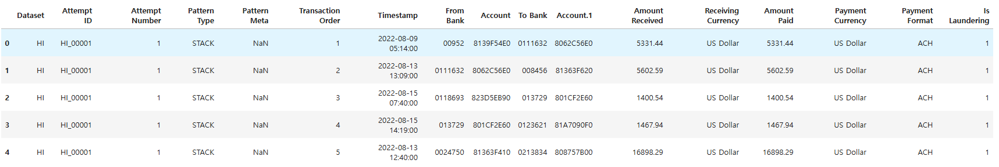

### 3.2 2022-10-27 경계 기준 구분

| 구분 | Attempt 수 |
| --- | ---: |
| PRE_ONLY | 10,449 |
| BOUNDARY_CROSSING | 4,105 |
| POST_ONLY | 1,913 |

#### 패턴 종류별 구분

| 패턴 | BOUNDARY_CROSSING | POST_ONLY | PRE_ONLY |
| --- | ---: | ---: | ---: |
| BIPARTITE | 186 | 331 | 1,592 |
| CYCLE | 521 | 195 | 1,370 |
| FAN-IN | 475 | 205 | 1,334 |
| FAN-OUT | 507 | 212 | 1,321 |
| GATHER-SCATTER | 950 | 209 | 895 |
| RANDOM | 331 | 206 | 1,464 |
| SCATTER-GATHER | 585 | 242 | 1,240 |
| STACK | 550 | 313 | 1,233 |

## 4. 날짜별 거래 데이터

| 구분 | 거래 수 |
| --- | ---: |
| 전체 자금세탁 거래 | 225,546 |
| 패턴 자금세탁 | 137,936 |
| 패턴 외 자금세탁 | 87,610 |


### 4.1 월별 자금세탁 거래 수

| 월 | 전체 거래 수 | 자금세탁 거래 수(라벨 1) | 자금세탁 거래 비율 |
| --- | ---: | ---: | ---: |
| 2022-08 | 59,468,136 | 46,040 | 0.0774% |
| 2022-09 | 56,137,121 | 67,372 | 0.1200% |
| 2022-10 | 54,821,376 | 75,263 | 0.1373% |
| 2022-11 | 9,269,215 | 33,013 | 0.3562% |
| 2022-12 | 6,132 | 3,704 | 60.4044% |
| 2023-01 | 249 | 154 | 61.8474% |

### 4.2 시간대별 자금세탁 거래 수

| 시간대 | 전체 거래 수 | 자금세탁 거래 수(라벨 1) | 자금세탁 거래 비율 |
| ---: | ---: | ---: | ---: |
| 00시 | 18,653,109 | 6,877 | 0.0369% |
| 01시 | 7,012,409 | 6,642 | 0.0947% |
| 02시 | 6,997,571 | 6,637 | 0.0948% |
| 03시 | 6,994,432 | 6,653 | 0.0951% |
| 04시 | 6,996,544 | 6,620 | 0.0946% |
| 05시 | 7,004,779 | 8,510 | 0.1215% |
| 06시 | 7,002,324 | 8,406 | 0.1200% |
| 07시 | 6,999,998 | 8,416 | 0.1202% |
| 08시 | 7,011,128 | 10,364 | 0.1478% |
| 09시 | 7,010,842 | 10,373 | 0.1480% |
| 10시 | 6,993,407 | 10,553 | 0.1509% |
| 11시 | 7,006,371 | 13,978 | 0.1995% |
| 12시 | 7,008,592 | 14,123 | 0.2015% |
| 13시 | 7,009,876 | 13,461 | 0.1920% |
| 14시 | 7,011,067 | 13,041 | 0.1860% |
| 15시 | 7,004,710 | 13,295 | 0.1898% |
| 16시 | 7,007,311 | 13,085 | 0.1867% |
| 17시 | 7,000,558 | 10,570 | 0.1510% |
| 18시 | 7,004,872 | 10,561 | 0.1508% |
| 19시 | 6,996,701 | 10,238 | 0.1463% |
| 20시 | 6,998,368 | 5,870 | 0.0839% |
| 21시 | 6,990,693 | 5,731 | 0.0820% |
| 22시 | 6,995,130 | 5,766 | 0.0824% |
| 23시 | 6,991,437 | 5,776 | 0.0826% |

#### 분 단위 거래 밀집도

| 항목 | 값 | 해석 |
| --- | ---: | --- |
| 거래가 발생한 분 | 157,422분 | 거래 기간 중 한 건 이상의 거래가 발생한 분 수 |
| 1분 내 최대 거래 | 83,002건 | 8월 1일 또는 월말 00:00의 `Reinvestment` 일괄 발생 시점으로 추정 |
| 같은 분에 다른 거래와 함께 발생한 거래 | 179,697,258건 | 전체 179,702,229건 중 동일 분에 다른 거래가 존재하는 거래 |
| 해당 분에 단독으로 발생한 거래 | 4,971건 | 전체 거래 수에서 위 거래 수를 뺀 값 |
| 거래가 2건 이상 발생한 분 | 152,451분 | 거래가 발생한 157,422분 중 2건 이상 발생한 분 |

#### 통화·금액 일치 여부

> 모든 자금세탁 거래는 송금·수취 통화와 금액이 모두 일치한다.

| 통화 일치 | 금액 일치 | 행 수 | 자금세탁 거래 수 | 자금세탁 거래 비율 |
| --- | --- | ---: | ---: | ---: |
| 같음 | 같음 | 176,904,809 | 225,546 | 0.1275% |
| 같음 | 다름 | 0 | 0 | 해당 없음 |
| 다름 | 같음 | 281 | 0 | 0.0000% |
| 다름 | 다름 | 2,796,989 | 0 | 0.0000% |

> **데이터 범위 참고:** 패턴 외 자금세탁 거래는 2022-11-06부터 0건이다. 정상 거래도 같은 시점부터 급감하며 이후 소량만 존재한다.


### 4.3 거래 유형별 일자 추이

#### 정상 거래

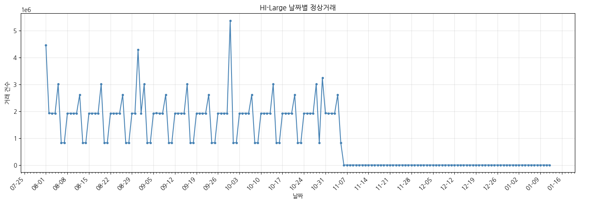

#### 패턴 자금세탁 거래

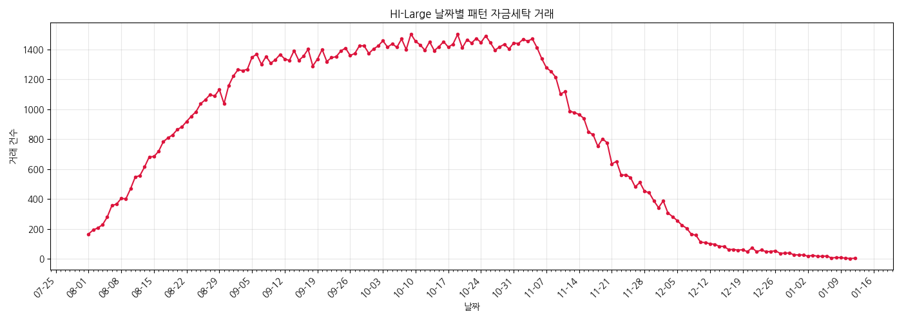

#### 패턴 외 자금세탁 거래

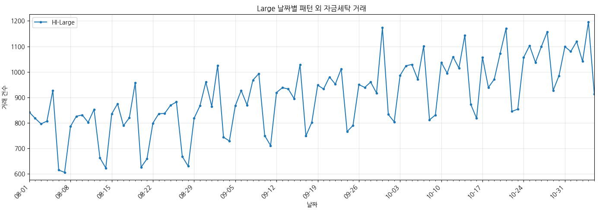

#### 전체 비교

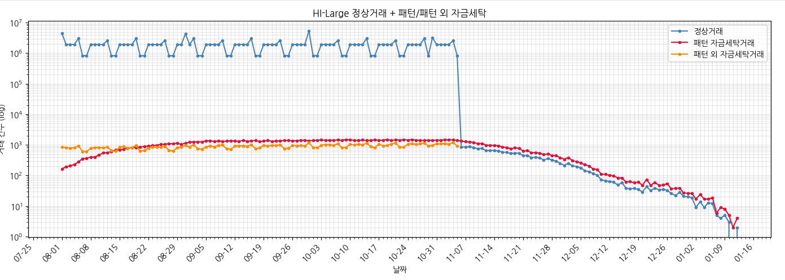

### 4.4 날짜별 거래 방식

- `Reinvestment`는 첫날과 매월 말일에 집중되며, 나머지 날짜에는 거의 발생하지 않는다.

#### 집계 예시

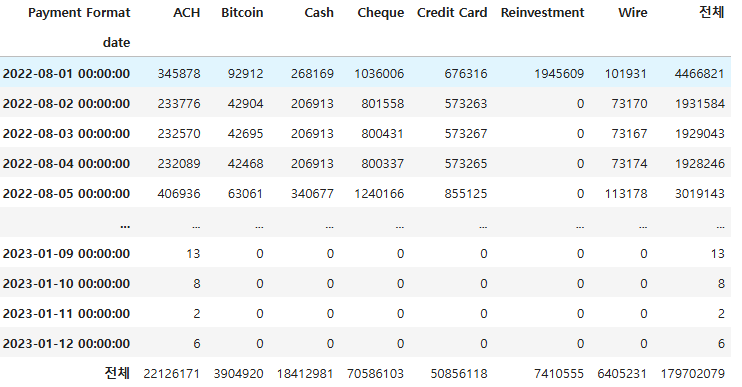

#### 일자 추이

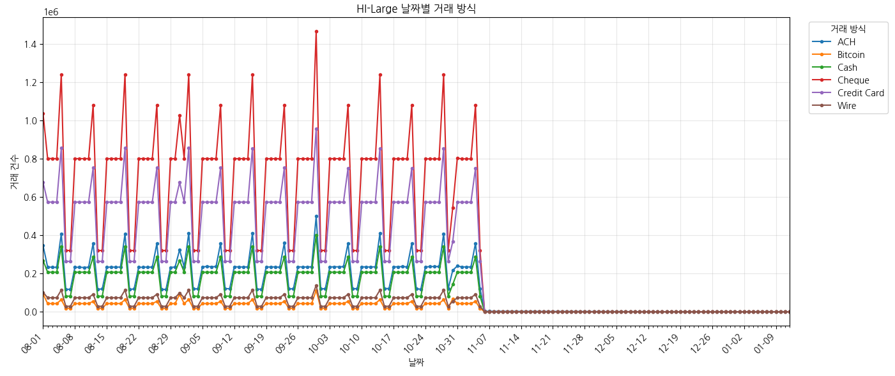

## 5. 패턴 자금세탁과 패턴 외 자금세탁 비교

아래 표는 문서 길이를 줄이기 위해 기본적으로 접혀 있다. 펼치면 지원되는 Markdown 렌더러에서 최대 높이 420px의 영역 안에서 세로로 스크롤할 수 있다. 인라인 스타일을 제한하는 렌더러에서는 접기/펼치기만 적용된다.

<details>
<summary><strong>전체 일자별 통계 보기 (165일)</strong></summary>

<div style="max-height: 420px; overflow: auto; margin-top: 0.75rem;">
<table>
  <thead style="position: sticky; top: 0; background: white;">
    <tr>
      <th scope="col">일자</th>
      <th scope="col">패턴 자금세탁</th>
      <th scope="col">패턴 외 자금세탁</th>
    </tr>
  </thead>
  <tbody>
    <tr>
      <th scope="row">2022-08-01</th>
      <td align="right">166</td>
      <td align="right">842</td>
    </tr>
    <tr>
      <th scope="row">2022-08-02</th>
      <td align="right">193</td>
      <td align="right">818</td>
    </tr>
    <tr>
      <th scope="row">2022-08-03</th>
      <td align="right">207</td>
      <td align="right">796</td>
    </tr>
    <tr>
      <th scope="row">2022-08-04</th>
      <td align="right">228</td>
      <td align="right">807</td>
    </tr>
    <tr>
      <th scope="row">2022-08-05</th>
      <td align="right">279</td>
      <td align="right">927</td>
    </tr>
    <tr>
      <th scope="row">2022-08-06</th>
      <td align="right">356</td>
      <td align="right">615</td>
    </tr>
    <tr>
      <th scope="row">2022-08-07</th>
      <td align="right">366</td>
      <td align="right">606</td>
    </tr>
    <tr>
      <th scope="row">2022-08-08</th>
      <td align="right">404</td>
      <td align="right">786</td>
    </tr>
    <tr>
      <th scope="row">2022-08-09</th>
      <td align="right">401</td>
      <td align="right">826</td>
    </tr>
    <tr>
      <th scope="row">2022-08-10</th>
      <td align="right">469</td>
      <td align="right">831</td>
    </tr>
    <tr>
      <th scope="row">2022-08-11</th>
      <td align="right">547</td>
      <td align="right">802</td>
    </tr>
    <tr>
      <th scope="row">2022-08-12</th>
      <td align="right">557</td>
      <td align="right">853</td>
    </tr>
    <tr>
      <th scope="row">2022-08-13</th>
      <td align="right">615</td>
      <td align="right">663</td>
    </tr>
    <tr>
      <th scope="row">2022-08-14</th>
      <td align="right">682</td>
      <td align="right">623</td>
    </tr>
    <tr>
      <th scope="row">2022-08-15</th>
      <td align="right">684</td>
      <td align="right">835</td>
    </tr>
    <tr>
      <th scope="row">2022-08-16</th>
      <td align="right">719</td>
      <td align="right">875</td>
    </tr>
    <tr>
      <th scope="row">2022-08-17</th>
      <td align="right">783</td>
      <td align="right">789</td>
    </tr>
    <tr>
      <th scope="row">2022-08-18</th>
      <td align="right">809</td>
      <td align="right">820</td>
    </tr>
    <tr>
      <th scope="row">2022-08-19</th>
      <td align="right">829</td>
      <td align="right">957</td>
    </tr>
    <tr>
      <th scope="row">2022-08-20</th>
      <td align="right">865</td>
      <td align="right">626</td>
    </tr>
    <tr>
      <th scope="row">2022-08-21</th>
      <td align="right">883</td>
      <td align="right">659</td>
    </tr>
    <tr>
      <th scope="row">2022-08-22</th>
      <td align="right">919</td>
      <td align="right">799</td>
    </tr>
    <tr>
      <th scope="row">2022-08-23</th>
      <td align="right">954</td>
      <td align="right">836</td>
    </tr>
    <tr>
      <th scope="row">2022-08-24</th>
      <td align="right">984</td>
      <td align="right">837</td>
    </tr>
    <tr>
      <th scope="row">2022-08-25</th>
      <td align="right">1,038</td>
      <td align="right">869</td>
    </tr>
    <tr>
      <th scope="row">2022-08-26</th>
      <td align="right">1,064</td>
      <td align="right">882</td>
    </tr>
    <tr>
      <th scope="row">2022-08-27</th>
      <td align="right">1,098</td>
      <td align="right">668</td>
    </tr>
    <tr>
      <th scope="row">2022-08-28</th>
      <td align="right">1,089</td>
      <td align="right">630</td>
    </tr>
    <tr>
      <th scope="row">2022-08-29</th>
      <td align="right">1,133</td>
      <td align="right">818</td>
    </tr>
    <tr>
      <th scope="row">2022-08-30</th>
      <td align="right">1,038</td>
      <td align="right">867</td>
    </tr>
    <tr>
      <th scope="row">2022-08-31</th>
      <td align="right">1,159</td>
      <td align="right">960</td>
    </tr>
    <tr>
      <th scope="row">2022-09-01</th>
      <td align="right">1,223</td>
      <td align="right">865</td>
    </tr>
    <tr>
      <th scope="row">2022-09-02</th>
      <td align="right">1,265</td>
      <td align="right">1,025</td>
    </tr>
    <tr>
      <th scope="row">2022-09-03</th>
      <td align="right">1,259</td>
      <td align="right">744</td>
    </tr>
    <tr>
      <th scope="row">2022-09-04</th>
      <td align="right">1,268</td>
      <td align="right">729</td>
    </tr>
    <tr>
      <th scope="row">2022-09-05</th>
      <td align="right">1,349</td>
      <td align="right">867</td>
    </tr>
    <tr>
      <th scope="row">2022-09-06</th>
      <td align="right">1,368</td>
      <td align="right">927</td>
    </tr>
    <tr>
      <th scope="row">2022-09-07</th>
      <td align="right">1,301</td>
      <td align="right">870</td>
    </tr>
    <tr>
      <th scope="row">2022-09-08</th>
      <td align="right">1,354</td>
      <td align="right">968</td>
    </tr>
    <tr>
      <th scope="row">2022-09-09</th>
      <td align="right">1,309</td>
      <td align="right">993</td>
    </tr>
    <tr>
      <th scope="row">2022-09-10</th>
      <td align="right">1,332</td>
      <td align="right">750</td>
    </tr>
    <tr>
      <th scope="row">2022-09-11</th>
      <td align="right">1,367</td>
      <td align="right">711</td>
    </tr>
    <tr>
      <th scope="row">2022-09-12</th>
      <td align="right">1,337</td>
      <td align="right">919</td>
    </tr>
    <tr>
      <th scope="row">2022-09-13</th>
      <td align="right">1,327</td>
      <td align="right">938</td>
    </tr>
    <tr>
      <th scope="row">2022-09-14</th>
      <td align="right">1,393</td>
      <td align="right">933</td>
    </tr>
    <tr>
      <th scope="row">2022-09-15</th>
      <td align="right">1,327</td>
      <td align="right">895</td>
    </tr>
    <tr>
      <th scope="row">2022-09-16</th>
      <td align="right">1,355</td>
      <td align="right">1,029</td>
    </tr>
    <tr>
      <th scope="row">2022-09-17</th>
      <td align="right">1,402</td>
      <td align="right">749</td>
    </tr>
    <tr>
      <th scope="row">2022-09-18</th>
      <td align="right">1,290</td>
      <td align="right">802</td>
    </tr>
    <tr>
      <th scope="row">2022-09-19</th>
      <td align="right">1,336</td>
      <td align="right">948</td>
    </tr>
    <tr>
      <th scope="row">2022-09-20</th>
      <td align="right">1,400</td>
      <td align="right">933</td>
    </tr>
    <tr>
      <th scope="row">2022-09-21</th>
      <td align="right">1,320</td>
      <td align="right">980</td>
    </tr>
    <tr>
      <th scope="row">2022-09-22</th>
      <td align="right">1,346</td>
      <td align="right">952</td>
    </tr>
    <tr>
      <th scope="row">2022-09-23</th>
      <td align="right">1,352</td>
      <td align="right">1,012</td>
    </tr>
    <tr>
      <th scope="row">2022-09-24</th>
      <td align="right">1,390</td>
      <td align="right">766</td>
    </tr>
    <tr>
      <th scope="row">2022-09-25</th>
      <td align="right">1,410</td>
      <td align="right">790</td>
    </tr>
    <tr>
      <th scope="row">2022-09-26</th>
      <td align="right">1,360</td>
      <td align="right">950</td>
    </tr>
    <tr>
      <th scope="row">2022-09-27</th>
      <td align="right">1,374</td>
      <td align="right">939</td>
    </tr>
    <tr>
      <th scope="row">2022-09-28</th>
      <td align="right">1,426</td>
      <td align="right">960</td>
    </tr>
    <tr>
      <th scope="row">2022-09-29</th>
      <td align="right">1,424</td>
      <td align="right">917</td>
    </tr>
    <tr>
      <th scope="row">2022-09-30</th>
      <td align="right">1,374</td>
      <td align="right">1,173</td>
    </tr>
    <tr>
      <th scope="row">2022-10-01</th>
      <td align="right">1,404</td>
      <td align="right">833</td>
    </tr>
    <tr>
      <th scope="row">2022-10-02</th>
      <td align="right">1,424</td>
      <td align="right">804</td>
    </tr>
    <tr>
      <th scope="row">2022-10-03</th>
      <td align="right">1,459</td>
      <td align="right">986</td>
    </tr>
    <tr>
      <th scope="row">2022-10-04</th>
      <td align="right">1,416</td>
      <td align="right">1,024</td>
    </tr>
    <tr>
      <th scope="row">2022-10-05</th>
      <td align="right">1,438</td>
      <td align="right">1,029</td>
    </tr>
    <tr>
      <th scope="row">2022-10-06</th>
      <td align="right">1,415</td>
      <td align="right">971</td>
    </tr>
    <tr>
      <th scope="row">2022-10-07</th>
      <td align="right">1,471</td>
      <td align="right">1,101</td>
    </tr>
    <tr>
      <th scope="row">2022-10-08</th>
      <td align="right">1,400</td>
      <td align="right">812</td>
    </tr>
    <tr>
      <th scope="row">2022-10-09</th>
      <td align="right">1,504</td>
      <td align="right">831</td>
    </tr>
    <tr>
      <th scope="row">2022-10-10</th>
      <td align="right">1,454</td>
      <td align="right">1,037</td>
    </tr>
    <tr>
      <th scope="row">2022-10-11</th>
      <td align="right">1,431</td>
      <td align="right">995</td>
    </tr>
    <tr>
      <th scope="row">2022-10-12</th>
      <td align="right">1,395</td>
      <td align="right">1,059</td>
    </tr>
    <tr>
      <th scope="row">2022-10-13</th>
      <td align="right">1,452</td>
      <td align="right">1,015</td>
    </tr>
    <tr>
      <th scope="row">2022-10-14</th>
      <td align="right">1,393</td>
      <td align="right">1,144</td>
    </tr>
    <tr>
      <th scope="row">2022-10-15</th>
      <td align="right">1,419</td>
      <td align="right">873</td>
    </tr>
    <tr>
      <th scope="row">2022-10-16</th>
      <td align="right">1,453</td>
      <td align="right">818</td>
    </tr>
    <tr>
      <th scope="row">2022-10-17</th>
      <td align="right">1,416</td>
      <td align="right">1,057</td>
    </tr>
    <tr>
      <th scope="row">2022-10-18</th>
      <td align="right">1,436</td>
      <td align="right">939</td>
    </tr>
    <tr>
      <th scope="row">2022-10-19</th>
      <td align="right">1,501</td>
      <td align="right">971</td>
    </tr>
    <tr>
      <th scope="row">2022-10-20</th>
      <td align="right">1,411</td>
      <td align="right">1,072</td>
    </tr>
    <tr>
      <th scope="row">2022-10-21</th>
      <td align="right">1,466</td>
      <td align="right">1,170</td>
    </tr>
    <tr>
      <th scope="row">2022-10-22</th>
      <td align="right">1,444</td>
      <td align="right">845</td>
    </tr>
    <tr>
      <th scope="row">2022-10-23</th>
      <td align="right">1,475</td>
      <td align="right">854</td>
    </tr>
    <tr>
      <th scope="row">2022-10-24</th>
      <td align="right">1,447</td>
      <td align="right">1,057</td>
    </tr>
    <tr>
      <th scope="row">2022-10-25</th>
      <td align="right">1,492</td>
      <td align="right">1,103</td>
    </tr>
    <tr>
      <th scope="row">2022-10-26</th>
      <td align="right">1,446</td>
      <td align="right">1,037</td>
    </tr>
    <tr>
      <th scope="row">2022-10-27</th>
      <td align="right">1,396</td>
      <td align="right">1,099</td>
    </tr>
    <tr>
      <th scope="row">2022-10-28</th>
      <td align="right">1,418</td>
      <td align="right">1,157</td>
    </tr>
    <tr>
      <th scope="row">2022-10-29</th>
      <td align="right">1,435</td>
      <td align="right">927</td>
    </tr>
    <tr>
      <th scope="row">2022-10-30</th>
      <td align="right">1,404</td>
      <td align="right">985</td>
    </tr>
    <tr>
      <th scope="row">2022-10-31</th>
      <td align="right">1,444</td>
      <td align="right">1,099</td>
    </tr>
    <tr>
      <th scope="row">2022-11-01</th>
      <td align="right">1,440</td>
      <td align="right">1,080</td>
    </tr>
    <tr>
      <th scope="row">2022-11-02</th>
      <td align="right">1,468</td>
      <td align="right">1,119</td>
    </tr>
    <tr>
      <th scope="row">2022-11-03</th>
      <td align="right">1,457</td>
      <td align="right">1,041</td>
    </tr>
    <tr>
      <th scope="row">2022-11-04</th>
      <td align="right">1,471</td>
      <td align="right">1,196</td>
    </tr>
    <tr>
      <th scope="row">2022-11-05</th>
      <td align="right">1,412</td>
      <td align="right">914</td>
    </tr>
    <tr>
      <th scope="row">2022-11-06</th>
      <td align="right">1,339</td>
      <td align="right">0</td>
    </tr>
    <tr>
      <th scope="row">2022-11-07</th>
      <td align="right">1,278</td>
      <td align="right">0</td>
    </tr>
    <tr>
      <th scope="row">2022-11-08</th>
      <td align="right">1,254</td>
      <td align="right">0</td>
    </tr>
    <tr>
      <th scope="row">2022-11-09</th>
      <td align="right">1,214</td>
      <td align="right">0</td>
    </tr>
    <tr>
      <th scope="row">2022-11-10</th>
      <td align="right">1,103</td>
      <td align="right">0</td>
    </tr>
    <tr>
      <th scope="row">2022-11-11</th>
      <td align="right">1,118</td>
      <td align="right">0</td>
    </tr>
    <tr>
      <th scope="row">2022-11-12</th>
      <td align="right">987</td>
      <td align="right">0</td>
    </tr>
    <tr>
      <th scope="row">2022-11-13</th>
      <td align="right">979</td>
      <td align="right">0</td>
    </tr>
    <tr>
      <th scope="row">2022-11-14</th>
      <td align="right">965</td>
      <td align="right">0</td>
    </tr>
    <tr>
      <th scope="row">2022-11-15</th>
      <td align="right">940</td>
      <td align="right">0</td>
    </tr>
    <tr>
      <th scope="row">2022-11-16</th>
      <td align="right">849</td>
      <td align="right">0</td>
    </tr>
    <tr>
      <th scope="row">2022-11-17</th>
      <td align="right">830</td>
      <td align="right">0</td>
    </tr>
    <tr>
      <th scope="row">2022-11-18</th>
      <td align="right">753</td>
      <td align="right">0</td>
    </tr>
    <tr>
      <th scope="row">2022-11-19</th>
      <td align="right">802</td>
      <td align="right">0</td>
    </tr>
    <tr>
      <th scope="row">2022-11-20</th>
      <td align="right">777</td>
      <td align="right">0</td>
    </tr>
    <tr>
      <th scope="row">2022-11-21</th>
      <td align="right">635</td>
      <td align="right">0</td>
    </tr>
    <tr>
      <th scope="row">2022-11-22</th>
      <td align="right">652</td>
      <td align="right">0</td>
    </tr>
    <tr>
      <th scope="row">2022-11-23</th>
      <td align="right">560</td>
      <td align="right">0</td>
    </tr>
    <tr>
      <th scope="row">2022-11-24</th>
      <td align="right">562</td>
      <td align="right">0</td>
    </tr>
    <tr>
      <th scope="row">2022-11-25</th>
      <td align="right">544</td>
      <td align="right">0</td>
    </tr>
    <tr>
      <th scope="row">2022-11-26</th>
      <td align="right">481</td>
      <td align="right">0</td>
    </tr>
    <tr>
      <th scope="row">2022-11-27</th>
      <td align="right">511</td>
      <td align="right">0</td>
    </tr>
    <tr>
      <th scope="row">2022-11-28</th>
      <td align="right">452</td>
      <td align="right">0</td>
    </tr>
    <tr>
      <th scope="row">2022-11-29</th>
      <td align="right">442</td>
      <td align="right">0</td>
    </tr>
    <tr>
      <th scope="row">2022-11-30</th>
      <td align="right">388</td>
      <td align="right">0</td>
    </tr>
    <tr>
      <th scope="row">2022-12-01</th>
      <td align="right">342</td>
      <td align="right">0</td>
    </tr>
    <tr>
      <th scope="row">2022-12-02</th>
      <td align="right">388</td>
      <td align="right">0</td>
    </tr>
    <tr>
      <th scope="row">2022-12-03</th>
      <td align="right">307</td>
      <td align="right">0</td>
    </tr>
    <tr>
      <th scope="row">2022-12-04</th>
      <td align="right">282</td>
      <td align="right">0</td>
    </tr>
    <tr>
      <th scope="row">2022-12-05</th>
      <td align="right">256</td>
      <td align="right">0</td>
    </tr>
    <tr>
      <th scope="row">2022-12-06</th>
      <td align="right">225</td>
      <td align="right">0</td>
    </tr>
    <tr>
      <th scope="row">2022-12-07</th>
      <td align="right">205</td>
      <td align="right">0</td>
    </tr>
    <tr>
      <th scope="row">2022-12-08</th>
      <td align="right">165</td>
      <td align="right">0</td>
    </tr>
    <tr>
      <th scope="row">2022-12-09</th>
      <td align="right">158</td>
      <td align="right">0</td>
    </tr>
    <tr>
      <th scope="row">2022-12-10</th>
      <td align="right">111</td>
      <td align="right">0</td>
    </tr>
    <tr>
      <th scope="row">2022-12-11</th>
      <td align="right">109</td>
      <td align="right">0</td>
    </tr>
    <tr>
      <th scope="row">2022-12-12</th>
      <td align="right">101</td>
      <td align="right">0</td>
    </tr>
    <tr>
      <th scope="row">2022-12-13</th>
      <td align="right">97</td>
      <td align="right">0</td>
    </tr>
    <tr>
      <th scope="row">2022-12-14</th>
      <td align="right">84</td>
      <td align="right">0</td>
    </tr>
    <tr>
      <th scope="row">2022-12-15</th>
      <td align="right">83</td>
      <td align="right">0</td>
    </tr>
    <tr>
      <th scope="row">2022-12-16</th>
      <td align="right">62</td>
      <td align="right">0</td>
    </tr>
    <tr>
      <th scope="row">2022-12-17</th>
      <td align="right">63</td>
      <td align="right">0</td>
    </tr>
    <tr>
      <th scope="row">2022-12-18</th>
      <td align="right">58</td>
      <td align="right">0</td>
    </tr>
    <tr>
      <th scope="row">2022-12-19</th>
      <td align="right">61</td>
      <td align="right">0</td>
    </tr>
    <tr>
      <th scope="row">2022-12-20</th>
      <td align="right">48</td>
      <td align="right">0</td>
    </tr>
    <tr>
      <th scope="row">2022-12-21</th>
      <td align="right">74</td>
      <td align="right">0</td>
    </tr>
    <tr>
      <th scope="row">2022-12-22</th>
      <td align="right">48</td>
      <td align="right">0</td>
    </tr>
    <tr>
      <th scope="row">2022-12-23</th>
      <td align="right">59</td>
      <td align="right">0</td>
    </tr>
    <tr>
      <th scope="row">2022-12-24</th>
      <td align="right">48</td>
      <td align="right">0</td>
    </tr>
    <tr>
      <th scope="row">2022-12-25</th>
      <td align="right">49</td>
      <td align="right">0</td>
    </tr>
    <tr>
      <th scope="row">2022-12-26</th>
      <td align="right">54</td>
      <td align="right">0</td>
    </tr>
    <tr>
      <th scope="row">2022-12-27</th>
      <td align="right">37</td>
      <td align="right">0</td>
    </tr>
    <tr>
      <th scope="row">2022-12-28</th>
      <td align="right">38</td>
      <td align="right">0</td>
    </tr>
    <tr>
      <th scope="row">2022-12-29</th>
      <td align="right">39</td>
      <td align="right">0</td>
    </tr>
    <tr>
      <th scope="row">2022-12-30</th>
      <td align="right">27</td>
      <td align="right">0</td>
    </tr>
    <tr>
      <th scope="row">2022-12-31</th>
      <td align="right">26</td>
      <td align="right">0</td>
    </tr>
    <tr>
      <th scope="row">2023-01-01</th>
      <td align="right">26</td>
      <td align="right">0</td>
    </tr>
    <tr>
      <th scope="row">2023-01-02</th>
      <td align="right">17</td>
      <td align="right">0</td>
    </tr>
    <tr>
      <th scope="row">2023-01-03</th>
      <td align="right">24</td>
      <td align="right">0</td>
    </tr>
    <tr>
      <th scope="row">2023-01-04</th>
      <td align="right">17</td>
      <td align="right">0</td>
    </tr>
    <tr>
      <th scope="row">2023-01-05</th>
      <td align="right">17</td>
      <td align="right">0</td>
    </tr>
    <tr>
      <th scope="row">2023-01-06</th>
      <td align="right">19</td>
      <td align="right">0</td>
    </tr>
    <tr>
      <th scope="row">2023-01-07</th>
      <td align="right">6</td>
      <td align="right">0</td>
    </tr>
    <tr>
      <th scope="row">2023-01-08</th>
      <td align="right">9</td>
      <td align="right">0</td>
    </tr>
    <tr>
      <th scope="row">2023-01-09</th>
      <td align="right">8</td>
      <td align="right">0</td>
    </tr>
    <tr>
      <th scope="row">2023-01-10</th>
      <td align="right">5</td>
      <td align="right">0</td>
    </tr>
    <tr>
      <th scope="row">2023-01-11</th>
      <td align="right">2</td>
      <td align="right">0</td>
    </tr>
    <tr>
      <th scope="row">2023-01-12</th>
      <td align="right">4</td>
      <td align="right">0</td>
    </tr>
  </tbody>
</table>
</div>
</details>

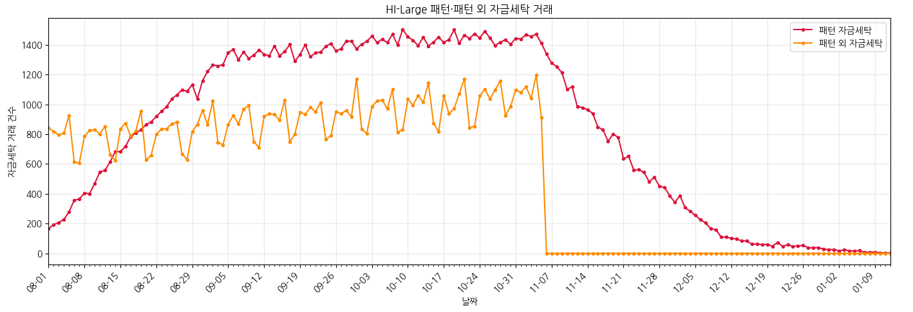

## 6. Payment Format별 자금세탁 일자 추이

### 6.1 전체 자금세탁 결제 방식 통계

| 결제 방식 | 전체 거래 수 | 자금세탁 거래 수(라벨 1) | 자금세탁 거래 비율 |
| --- | ---: | ---: | ---: |
| 수표 (Cheque) | 70,586,103 | 13,260 | 0.0188% |
| 신용카드 (Credit Card) | 50,856,118 | 7,846 | 0.0154% |
| 자동결제망 이체 (ACH) | 22,126,214 | 199,164 | 0.9001% |
| 현금 (Cash) | 18,412,981 | 3,663 | 0.0199% |
| 재투자 (Reinvestment) | 7,410,556 | 0 | 0.0000% |
| 전신 송금 (Wire) | 6,405,236 | 5 | 0.0001% |
| 비트코인 (Bitcoin) | 3,905,021 | 1,608 | 0.0412% |

### 6.2 패턴 자금세탁

| Payment Format | 전체 거래 수 |
| --- | ---: |
| ACH | 137,919 |
| Bitcoin | 13 |
| Wire | 4 |
| **전체** | **137,936** |

<details>
<summary><strong>Payment Format별 전체 일자 통계 보기 (합계 포함)</strong></summary>

<div style="max-height: 420px; overflow: auto; margin-top: 0.75rem;">
<table>
  <thead style="position: sticky; top: 0; background: white;">
    <tr>
      <th scope="col">일자</th>
      <th scope="col">ACH</th>
      <th scope="col">Bitcoin</th>
      <th scope="col">Wire</th>
      <th scope="col">전체</th>
    </tr>
  </thead>
  <tbody>
    <tr>
      <th scope="row">2022-08-01</th>
      <td align="right">166</td>
      <td align="right">0</td>
      <td align="right">0</td>
      <td align="right">166</td>
    </tr>
    <tr>
      <th scope="row">2022-08-02</th>
      <td align="right">193</td>
      <td align="right">0</td>
      <td align="right">0</td>
      <td align="right">193</td>
    </tr>
    <tr>
      <th scope="row">2022-08-03</th>
      <td align="right">207</td>
      <td align="right">0</td>
      <td align="right">0</td>
      <td align="right">207</td>
    </tr>
    <tr>
      <th scope="row">2022-08-04</th>
      <td align="right">228</td>
      <td align="right">0</td>
      <td align="right">0</td>
      <td align="right">228</td>
    </tr>
    <tr>
      <th scope="row">2022-08-05</th>
      <td align="right">279</td>
      <td align="right">0</td>
      <td align="right">0</td>
      <td align="right">279</td>
    </tr>
    <tr>
      <th scope="row">2022-08-06</th>
      <td align="right">356</td>
      <td align="right">0</td>
      <td align="right">0</td>
      <td align="right">356</td>
    </tr>
    <tr>
      <th scope="row">2022-08-07</th>
      <td align="right">366</td>
      <td align="right">0</td>
      <td align="right">0</td>
      <td align="right">366</td>
    </tr>
    <tr>
      <th scope="row">2022-08-08</th>
      <td align="right">404</td>
      <td align="right">0</td>
      <td align="right">0</td>
      <td align="right">404</td>
    </tr>
    <tr>
      <th scope="row">2022-08-09</th>
      <td align="right">401</td>
      <td align="right">0</td>
      <td align="right">0</td>
      <td align="right">401</td>
    </tr>
    <tr>
      <th scope="row">2022-08-10</th>
      <td align="right">469</td>
      <td align="right">0</td>
      <td align="right">0</td>
      <td align="right">469</td>
    </tr>
    <tr>
      <th scope="row">2022-08-11</th>
      <td align="right">547</td>
      <td align="right">0</td>
      <td align="right">0</td>
      <td align="right">547</td>
    </tr>
    <tr>
      <th scope="row">2022-08-12</th>
      <td align="right">556</td>
      <td align="right">1</td>
      <td align="right">0</td>
      <td align="right">557</td>
    </tr>
    <tr>
      <th scope="row">2022-08-13</th>
      <td align="right">615</td>
      <td align="right">0</td>
      <td align="right">0</td>
      <td align="right">615</td>
    </tr>
    <tr>
      <th scope="row">2022-08-14</th>
      <td align="right">682</td>
      <td align="right">0</td>
      <td align="right">0</td>
      <td align="right">682</td>
    </tr>
    <tr>
      <th scope="row">2022-08-15</th>
      <td align="right">684</td>
      <td align="right">0</td>
      <td align="right">0</td>
      <td align="right">684</td>
    </tr>
    <tr>
      <th scope="row">2022-08-16</th>
      <td align="right">719</td>
      <td align="right">0</td>
      <td align="right">0</td>
      <td align="right">719</td>
    </tr>
    <tr>
      <th scope="row">2022-08-17</th>
      <td align="right">783</td>
      <td align="right">0</td>
      <td align="right">0</td>
      <td align="right">783</td>
    </tr>
    <tr>
      <th scope="row">2022-08-18</th>
      <td align="right">809</td>
      <td align="right">0</td>
      <td align="right">0</td>
      <td align="right">809</td>
    </tr>
    <tr>
      <th scope="row">2022-08-19</th>
      <td align="right">829</td>
      <td align="right">0</td>
      <td align="right">0</td>
      <td align="right">829</td>
    </tr>
    <tr>
      <th scope="row">2022-08-20</th>
      <td align="right">865</td>
      <td align="right">0</td>
      <td align="right">0</td>
      <td align="right">865</td>
    </tr>
    <tr>
      <th scope="row">2022-08-21</th>
      <td align="right">883</td>
      <td align="right">0</td>
      <td align="right">0</td>
      <td align="right">883</td>
    </tr>
    <tr>
      <th scope="row">2022-08-22</th>
      <td align="right">919</td>
      <td align="right">0</td>
      <td align="right">0</td>
      <td align="right">919</td>
    </tr>
    <tr>
      <th scope="row">2022-08-23</th>
      <td align="right">954</td>
      <td align="right">0</td>
      <td align="right">0</td>
      <td align="right">954</td>
    </tr>
    <tr>
      <th scope="row">2022-08-24</th>
      <td align="right">984</td>
      <td align="right">0</td>
      <td align="right">0</td>
      <td align="right">984</td>
    </tr>
    <tr>
      <th scope="row">2022-08-25</th>
      <td align="right">1,038</td>
      <td align="right">0</td>
      <td align="right">0</td>
      <td align="right">1,038</td>
    </tr>
    <tr>
      <th scope="row">2022-08-26</th>
      <td align="right">1,063</td>
      <td align="right">0</td>
      <td align="right">1</td>
      <td align="right">1,064</td>
    </tr>
    <tr>
      <th scope="row">2022-08-27</th>
      <td align="right">1,098</td>
      <td align="right">0</td>
      <td align="right">0</td>
      <td align="right">1,098</td>
    </tr>
    <tr>
      <th scope="row">2022-08-28</th>
      <td align="right">1,089</td>
      <td align="right">0</td>
      <td align="right">0</td>
      <td align="right">1,089</td>
    </tr>
    <tr>
      <th scope="row">2022-08-29</th>
      <td align="right">1,133</td>
      <td align="right">0</td>
      <td align="right">0</td>
      <td align="right">1,133</td>
    </tr>
    <tr>
      <th scope="row">2022-08-30</th>
      <td align="right">1,037</td>
      <td align="right">0</td>
      <td align="right">1</td>
      <td align="right">1,038</td>
    </tr>
    <tr>
      <th scope="row">2022-08-31</th>
      <td align="right">1,159</td>
      <td align="right">0</td>
      <td align="right">0</td>
      <td align="right">1,159</td>
    </tr>
    <tr>
      <th scope="row">2022-09-01</th>
      <td align="right">1,223</td>
      <td align="right">0</td>
      <td align="right">0</td>
      <td align="right">1,223</td>
    </tr>
    <tr>
      <th scope="row">2022-09-02</th>
      <td align="right">1,265</td>
      <td align="right">0</td>
      <td align="right">0</td>
      <td align="right">1,265</td>
    </tr>
    <tr>
      <th scope="row">2022-09-03</th>
      <td align="right">1,259</td>
      <td align="right">0</td>
      <td align="right">0</td>
      <td align="right">1,259</td>
    </tr>
    <tr>
      <th scope="row">2022-09-04</th>
      <td align="right">1,268</td>
      <td align="right">0</td>
      <td align="right">0</td>
      <td align="right">1,268</td>
    </tr>
    <tr>
      <th scope="row">2022-09-05</th>
      <td align="right">1,349</td>
      <td align="right">0</td>
      <td align="right">0</td>
      <td align="right">1,349</td>
    </tr>
    <tr>
      <th scope="row">2022-09-06</th>
      <td align="right">1,368</td>
      <td align="right">0</td>
      <td align="right">0</td>
      <td align="right">1,368</td>
    </tr>
    <tr>
      <th scope="row">2022-09-07</th>
      <td align="right">1,300</td>
      <td align="right">1</td>
      <td align="right">0</td>
      <td align="right">1,301</td>
    </tr>
    <tr>
      <th scope="row">2022-09-08</th>
      <td align="right">1,354</td>
      <td align="right">0</td>
      <td align="right">0</td>
      <td align="right">1,354</td>
    </tr>
    <tr>
      <th scope="row">2022-09-09</th>
      <td align="right">1,309</td>
      <td align="right">0</td>
      <td align="right">0</td>
      <td align="right">1,309</td>
    </tr>
    <tr>
      <th scope="row">2022-09-10</th>
      <td align="right">1,331</td>
      <td align="right">1</td>
      <td align="right">0</td>
      <td align="right">1,332</td>
    </tr>
    <tr>
      <th scope="row">2022-09-11</th>
      <td align="right">1,366</td>
      <td align="right">1</td>
      <td align="right">0</td>
      <td align="right">1,367</td>
    </tr>
    <tr>
      <th scope="row">2022-09-12</th>
      <td align="right">1,337</td>
      <td align="right">0</td>
      <td align="right">0</td>
      <td align="right">1,337</td>
    </tr>
    <tr>
      <th scope="row">2022-09-13</th>
      <td align="right">1,327</td>
      <td align="right">0</td>
      <td align="right">0</td>
      <td align="right">1,327</td>
    </tr>
    <tr>
      <th scope="row">2022-09-14</th>
      <td align="right">1,393</td>
      <td align="right">0</td>
      <td align="right">0</td>
      <td align="right">1,393</td>
    </tr>
    <tr>
      <th scope="row">2022-09-15</th>
      <td align="right">1,326</td>
      <td align="right">0</td>
      <td align="right">1</td>
      <td align="right">1,327</td>
    </tr>
    <tr>
      <th scope="row">2022-09-16</th>
      <td align="right">1,355</td>
      <td align="right">0</td>
      <td align="right">0</td>
      <td align="right">1,355</td>
    </tr>
    <tr>
      <th scope="row">2022-09-17</th>
      <td align="right">1,402</td>
      <td align="right">0</td>
      <td align="right">0</td>
      <td align="right">1,402</td>
    </tr>
    <tr>
      <th scope="row">2022-09-18</th>
      <td align="right">1,290</td>
      <td align="right">0</td>
      <td align="right">0</td>
      <td align="right">1,290</td>
    </tr>
    <tr>
      <th scope="row">2022-09-19</th>
      <td align="right">1,336</td>
      <td align="right">0</td>
      <td align="right">0</td>
      <td align="right">1,336</td>
    </tr>
    <tr>
      <th scope="row">2022-09-20</th>
      <td align="right">1,400</td>
      <td align="right">0</td>
      <td align="right">0</td>
      <td align="right">1,400</td>
    </tr>
    <tr>
      <th scope="row">2022-09-21</th>
      <td align="right">1,320</td>
      <td align="right">0</td>
      <td align="right">0</td>
      <td align="right">1,320</td>
    </tr>
    <tr>
      <th scope="row">2022-09-22</th>
      <td align="right">1,346</td>
      <td align="right">0</td>
      <td align="right">0</td>
      <td align="right">1,346</td>
    </tr>
    <tr>
      <th scope="row">2022-09-23</th>
      <td align="right">1,352</td>
      <td align="right">0</td>
      <td align="right">0</td>
      <td align="right">1,352</td>
    </tr>
    <tr>
      <th scope="row">2022-09-24</th>
      <td align="right">1,390</td>
      <td align="right">0</td>
      <td align="right">0</td>
      <td align="right">1,390</td>
    </tr>
    <tr>
      <th scope="row">2022-09-25</th>
      <td align="right">1,410</td>
      <td align="right">0</td>
      <td align="right">0</td>
      <td align="right">1,410</td>
    </tr>
    <tr>
      <th scope="row">2022-09-26</th>
      <td align="right">1,358</td>
      <td align="right">2</td>
      <td align="right">0</td>
      <td align="right">1,360</td>
    </tr>
    <tr>
      <th scope="row">2022-09-27</th>
      <td align="right">1,374</td>
      <td align="right">0</td>
      <td align="right">0</td>
      <td align="right">1,374</td>
    </tr>
    <tr>
      <th scope="row">2022-09-28</th>
      <td align="right">1,426</td>
      <td align="right">0</td>
      <td align="right">0</td>
      <td align="right">1,426</td>
    </tr>
    <tr>
      <th scope="row">2022-09-29</th>
      <td align="right">1,424</td>
      <td align="right">0</td>
      <td align="right">0</td>
      <td align="right">1,424</td>
    </tr>
    <tr>
      <th scope="row">2022-09-30</th>
      <td align="right">1,374</td>
      <td align="right">0</td>
      <td align="right">0</td>
      <td align="right">1,374</td>
    </tr>
    <tr>
      <th scope="row">2022-10-01</th>
      <td align="right">1,404</td>
      <td align="right">0</td>
      <td align="right">0</td>
      <td align="right">1,404</td>
    </tr>
    <tr>
      <th scope="row">2022-10-02</th>
      <td align="right">1,424</td>
      <td align="right">0</td>
      <td align="right">0</td>
      <td align="right">1,424</td>
    </tr>
    <tr>
      <th scope="row">2022-10-03</th>
      <td align="right">1,459</td>
      <td align="right">0</td>
      <td align="right">0</td>
      <td align="right">1,459</td>
    </tr>
    <tr>
      <th scope="row">2022-10-04</th>
      <td align="right">1,416</td>
      <td align="right">0</td>
      <td align="right">0</td>
      <td align="right">1,416</td>
    </tr>
    <tr>
      <th scope="row">2022-10-05</th>
      <td align="right">1,437</td>
      <td align="right">1</td>
      <td align="right">0</td>
      <td align="right">1,438</td>
    </tr>
    <tr>
      <th scope="row">2022-10-06</th>
      <td align="right">1,415</td>
      <td align="right">0</td>
      <td align="right">0</td>
      <td align="right">1,415</td>
    </tr>
    <tr>
      <th scope="row">2022-10-07</th>
      <td align="right">1,471</td>
      <td align="right">0</td>
      <td align="right">0</td>
      <td align="right">1,471</td>
    </tr>
    <tr>
      <th scope="row">2022-10-08</th>
      <td align="right">1,399</td>
      <td align="right">1</td>
      <td align="right">0</td>
      <td align="right">1,400</td>
    </tr>
    <tr>
      <th scope="row">2022-10-09</th>
      <td align="right">1,504</td>
      <td align="right">0</td>
      <td align="right">0</td>
      <td align="right">1,504</td>
    </tr>
    <tr>
      <th scope="row">2022-10-10</th>
      <td align="right">1,454</td>
      <td align="right">0</td>
      <td align="right">0</td>
      <td align="right">1,454</td>
    </tr>
    <tr>
      <th scope="row">2022-10-11</th>
      <td align="right">1,431</td>
      <td align="right">0</td>
      <td align="right">0</td>
      <td align="right">1,431</td>
    </tr>
    <tr>
      <th scope="row">2022-10-12</th>
      <td align="right">1,395</td>
      <td align="right">0</td>
      <td align="right">0</td>
      <td align="right">1,395</td>
    </tr>
    <tr>
      <th scope="row">2022-10-13</th>
      <td align="right">1,452</td>
      <td align="right">0</td>
      <td align="right">0</td>
      <td align="right">1,452</td>
    </tr>
    <tr>
      <th scope="row">2022-10-14</th>
      <td align="right">1,393</td>
      <td align="right">0</td>
      <td align="right">0</td>
      <td align="right">1,393</td>
    </tr>
    <tr>
      <th scope="row">2022-10-15</th>
      <td align="right">1,419</td>
      <td align="right">0</td>
      <td align="right">0</td>
      <td align="right">1,419</td>
    </tr>
    <tr>
      <th scope="row">2022-10-16</th>
      <td align="right">1,452</td>
      <td align="right">1</td>
      <td align="right">0</td>
      <td align="right">1,453</td>
    </tr>
    <tr>
      <th scope="row">2022-10-17</th>
      <td align="right">1,416</td>
      <td align="right">0</td>
      <td align="right">0</td>
      <td align="right">1,416</td>
    </tr>
    <tr>
      <th scope="row">2022-10-18</th>
      <td align="right">1,436</td>
      <td align="right">0</td>
      <td align="right">0</td>
      <td align="right">1,436</td>
    </tr>
    <tr>
      <th scope="row">2022-10-19</th>
      <td align="right">1,501</td>
      <td align="right">0</td>
      <td align="right">0</td>
      <td align="right">1,501</td>
    </tr>
    <tr>
      <th scope="row">2022-10-20</th>
      <td align="right">1,411</td>
      <td align="right">0</td>
      <td align="right">0</td>
      <td align="right">1,411</td>
    </tr>
    <tr>
      <th scope="row">2022-10-21</th>
      <td align="right">1,466</td>
      <td align="right">0</td>
      <td align="right">0</td>
      <td align="right">1,466</td>
    </tr>
    <tr>
      <th scope="row">2022-10-22</th>
      <td align="right">1,444</td>
      <td align="right">0</td>
      <td align="right">0</td>
      <td align="right">1,444</td>
    </tr>
    <tr>
      <th scope="row">2022-10-23</th>
      <td align="right">1,475</td>
      <td align="right">0</td>
      <td align="right">0</td>
      <td align="right">1,475</td>
    </tr>
    <tr>
      <th scope="row">2022-10-24</th>
      <td align="right">1,447</td>
      <td align="right">0</td>
      <td align="right">0</td>
      <td align="right">1,447</td>
    </tr>
    <tr>
      <th scope="row">2022-10-25</th>
      <td align="right">1,492</td>
      <td align="right">0</td>
      <td align="right">0</td>
      <td align="right">1,492</td>
    </tr>
    <tr>
      <th scope="row">2022-10-26</th>
      <td align="right">1,446</td>
      <td align="right">0</td>
      <td align="right">0</td>
      <td align="right">1,446</td>
    </tr>
    <tr>
      <th scope="row">2022-10-27</th>
      <td align="right">1,396</td>
      <td align="right">0</td>
      <td align="right">0</td>
      <td align="right">1,396</td>
    </tr>
    <tr>
      <th scope="row">2022-10-28</th>
      <td align="right">1,418</td>
      <td align="right">0</td>
      <td align="right">0</td>
      <td align="right">1,418</td>
    </tr>
    <tr>
      <th scope="row">2022-10-29</th>
      <td align="right">1,435</td>
      <td align="right">0</td>
      <td align="right">0</td>
      <td align="right">1,435</td>
    </tr>
    <tr>
      <th scope="row">2022-10-30</th>
      <td align="right">1,404</td>
      <td align="right">0</td>
      <td align="right">0</td>
      <td align="right">1,404</td>
    </tr>
    <tr>
      <th scope="row">2022-10-31</th>
      <td align="right">1,444</td>
      <td align="right">0</td>
      <td align="right">0</td>
      <td align="right">1,444</td>
    </tr>
    <tr>
      <th scope="row">2022-11-01</th>
      <td align="right">1,439</td>
      <td align="right">1</td>
      <td align="right">0</td>
      <td align="right">1,440</td>
    </tr>
    <tr>
      <th scope="row">2022-11-02</th>
      <td align="right">1,468</td>
      <td align="right">0</td>
      <td align="right">0</td>
      <td align="right">1,468</td>
    </tr>
    <tr>
      <th scope="row">2022-11-03</th>
      <td align="right">1,457</td>
      <td align="right">0</td>
      <td align="right">0</td>
      <td align="right">1,457</td>
    </tr>
    <tr>
      <th scope="row">2022-11-04</th>
      <td align="right">1,471</td>
      <td align="right">0</td>
      <td align="right">0</td>
      <td align="right">1,471</td>
    </tr>
    <tr>
      <th scope="row">2022-11-05</th>
      <td align="right">1,412</td>
      <td align="right">0</td>
      <td align="right">0</td>
      <td align="right">1,412</td>
    </tr>
    <tr>
      <th scope="row">2022-11-06</th>
      <td align="right">1,339</td>
      <td align="right">0</td>
      <td align="right">0</td>
      <td align="right">1,339</td>
    </tr>
    <tr>
      <th scope="row">2022-11-07</th>
      <td align="right">1,278</td>
      <td align="right">0</td>
      <td align="right">0</td>
      <td align="right">1,278</td>
    </tr>
    <tr>
      <th scope="row">2022-11-08</th>
      <td align="right">1,254</td>
      <td align="right">0</td>
      <td align="right">0</td>
      <td align="right">1,254</td>
    </tr>
    <tr>
      <th scope="row">2022-11-09</th>
      <td align="right">1,214</td>
      <td align="right">0</td>
      <td align="right">0</td>
      <td align="right">1,214</td>
    </tr>
    <tr>
      <th scope="row">2022-11-10</th>
      <td align="right">1,102</td>
      <td align="right">1</td>
      <td align="right">0</td>
      <td align="right">1,103</td>
    </tr>
    <tr>
      <th scope="row">2022-11-11</th>
      <td align="right">1,118</td>
      <td align="right">0</td>
      <td align="right">0</td>
      <td align="right">1,118</td>
    </tr>
    <tr>
      <th scope="row">2022-11-12</th>
      <td align="right">986</td>
      <td align="right">0</td>
      <td align="right">1</td>
      <td align="right">987</td>
    </tr>
    <tr>
      <th scope="row">2022-11-13</th>
      <td align="right">979</td>
      <td align="right">0</td>
      <td align="right">0</td>
      <td align="right">979</td>
    </tr>
    <tr>
      <th scope="row">2022-11-14</th>
      <td align="right">965</td>
      <td align="right">0</td>
      <td align="right">0</td>
      <td align="right">965</td>
    </tr>
    <tr>
      <th scope="row">2022-11-15</th>
      <td align="right">939</td>
      <td align="right">1</td>
      <td align="right">0</td>
      <td align="right">940</td>
    </tr>
    <tr>
      <th scope="row">2022-11-16</th>
      <td align="right">849</td>
      <td align="right">0</td>
      <td align="right">0</td>
      <td align="right">849</td>
    </tr>
    <tr>
      <th scope="row">2022-11-17</th>
      <td align="right">830</td>
      <td align="right">0</td>
      <td align="right">0</td>
      <td align="right">830</td>
    </tr>
    <tr>
      <th scope="row">2022-11-18</th>
      <td align="right">753</td>
      <td align="right">0</td>
      <td align="right">0</td>
      <td align="right">753</td>
    </tr>
    <tr>
      <th scope="row">2022-11-19</th>
      <td align="right">802</td>
      <td align="right">0</td>
      <td align="right">0</td>
      <td align="right">802</td>
    </tr>
    <tr>
      <th scope="row">2022-11-20</th>
      <td align="right">777</td>
      <td align="right">0</td>
      <td align="right">0</td>
      <td align="right">777</td>
    </tr>
    <tr>
      <th scope="row">2022-11-21</th>
      <td align="right">635</td>
      <td align="right">0</td>
      <td align="right">0</td>
      <td align="right">635</td>
    </tr>
    <tr>
      <th scope="row">2022-11-22</th>
      <td align="right">652</td>
      <td align="right">0</td>
      <td align="right">0</td>
      <td align="right">652</td>
    </tr>
    <tr>
      <th scope="row">2022-11-23</th>
      <td align="right">560</td>
      <td align="right">0</td>
      <td align="right">0</td>
      <td align="right">560</td>
    </tr>
    <tr>
      <th scope="row">2022-11-24</th>
      <td align="right">562</td>
      <td align="right">0</td>
      <td align="right">0</td>
      <td align="right">562</td>
    </tr>
    <tr>
      <th scope="row">2022-11-25</th>
      <td align="right">543</td>
      <td align="right">1</td>
      <td align="right">0</td>
      <td align="right">544</td>
    </tr>
    <tr>
      <th scope="row">2022-11-26</th>
      <td align="right">481</td>
      <td align="right">0</td>
      <td align="right">0</td>
      <td align="right">481</td>
    </tr>
    <tr>
      <th scope="row">2022-11-27</th>
      <td align="right">511</td>
      <td align="right">0</td>
      <td align="right">0</td>
      <td align="right">511</td>
    </tr>
    <tr>
      <th scope="row">2022-11-28</th>
      <td align="right">452</td>
      <td align="right">0</td>
      <td align="right">0</td>
      <td align="right">452</td>
    </tr>
    <tr>
      <th scope="row">2022-11-29</th>
      <td align="right">442</td>
      <td align="right">0</td>
      <td align="right">0</td>
      <td align="right">442</td>
    </tr>
    <tr>
      <th scope="row">2022-11-30</th>
      <td align="right">388</td>
      <td align="right">0</td>
      <td align="right">0</td>
      <td align="right">388</td>
    </tr>
    <tr>
      <th scope="row">2022-12-01</th>
      <td align="right">342</td>
      <td align="right">0</td>
      <td align="right">0</td>
      <td align="right">342</td>
    </tr>
    <tr>
      <th scope="row">2022-12-02</th>
      <td align="right">388</td>
      <td align="right">0</td>
      <td align="right">0</td>
      <td align="right">388</td>
    </tr>
    <tr>
      <th scope="row">2022-12-03</th>
      <td align="right">307</td>
      <td align="right">0</td>
      <td align="right">0</td>
      <td align="right">307</td>
    </tr>
    <tr>
      <th scope="row">2022-12-04</th>
      <td align="right">282</td>
      <td align="right">0</td>
      <td align="right">0</td>
      <td align="right">282</td>
    </tr>
    <tr>
      <th scope="row">2022-12-05</th>
      <td align="right">256</td>
      <td align="right">0</td>
      <td align="right">0</td>
      <td align="right">256</td>
    </tr>
    <tr>
      <th scope="row">2022-12-06</th>
      <td align="right">225</td>
      <td align="right">0</td>
      <td align="right">0</td>
      <td align="right">225</td>
    </tr>
    <tr>
      <th scope="row">2022-12-07</th>
      <td align="right">205</td>
      <td align="right">0</td>
      <td align="right">0</td>
      <td align="right">205</td>
    </tr>
    <tr>
      <th scope="row">2022-12-08</th>
      <td align="right">165</td>
      <td align="right">0</td>
      <td align="right">0</td>
      <td align="right">165</td>
    </tr>
    <tr>
      <th scope="row">2022-12-09</th>
      <td align="right">158</td>
      <td align="right">0</td>
      <td align="right">0</td>
      <td align="right">158</td>
    </tr>
    <tr>
      <th scope="row">2022-12-10</th>
      <td align="right">111</td>
      <td align="right">0</td>
      <td align="right">0</td>
      <td align="right">111</td>
    </tr>
    <tr>
      <th scope="row">2022-12-11</th>
      <td align="right">109</td>
      <td align="right">0</td>
      <td align="right">0</td>
      <td align="right">109</td>
    </tr>
    <tr>
      <th scope="row">2022-12-12</th>
      <td align="right">101</td>
      <td align="right">0</td>
      <td align="right">0</td>
      <td align="right">101</td>
    </tr>
    <tr>
      <th scope="row">2022-12-13</th>
      <td align="right">97</td>
      <td align="right">0</td>
      <td align="right">0</td>
      <td align="right">97</td>
    </tr>
    <tr>
      <th scope="row">2022-12-14</th>
      <td align="right">84</td>
      <td align="right">0</td>
      <td align="right">0</td>
      <td align="right">84</td>
    </tr>
    <tr>
      <th scope="row">2022-12-15</th>
      <td align="right">83</td>
      <td align="right">0</td>
      <td align="right">0</td>
      <td align="right">83</td>
    </tr>
    <tr>
      <th scope="row">2022-12-16</th>
      <td align="right">62</td>
      <td align="right">0</td>
      <td align="right">0</td>
      <td align="right">62</td>
    </tr>
    <tr>
      <th scope="row">2022-12-17</th>
      <td align="right">63</td>
      <td align="right">0</td>
      <td align="right">0</td>
      <td align="right">63</td>
    </tr>
    <tr>
      <th scope="row">2022-12-18</th>
      <td align="right">58</td>
      <td align="right">0</td>
      <td align="right">0</td>
      <td align="right">58</td>
    </tr>
    <tr>
      <th scope="row">2022-12-19</th>
      <td align="right">61</td>
      <td align="right">0</td>
      <td align="right">0</td>
      <td align="right">61</td>
    </tr>
    <tr>
      <th scope="row">2022-12-20</th>
      <td align="right">48</td>
      <td align="right">0</td>
      <td align="right">0</td>
      <td align="right">48</td>
    </tr>
    <tr>
      <th scope="row">2022-12-21</th>
      <td align="right">74</td>
      <td align="right">0</td>
      <td align="right">0</td>
      <td align="right">74</td>
    </tr>
    <tr>
      <th scope="row">2022-12-22</th>
      <td align="right">48</td>
      <td align="right">0</td>
      <td align="right">0</td>
      <td align="right">48</td>
    </tr>
    <tr>
      <th scope="row">2022-12-23</th>
      <td align="right">59</td>
      <td align="right">0</td>
      <td align="right">0</td>
      <td align="right">59</td>
    </tr>
    <tr>
      <th scope="row">2022-12-24</th>
      <td align="right">48</td>
      <td align="right">0</td>
      <td align="right">0</td>
      <td align="right">48</td>
    </tr>
    <tr>
      <th scope="row">2022-12-25</th>
      <td align="right">49</td>
      <td align="right">0</td>
      <td align="right">0</td>
      <td align="right">49</td>
    </tr>
    <tr>
      <th scope="row">2022-12-26</th>
      <td align="right">54</td>
      <td align="right">0</td>
      <td align="right">0</td>
      <td align="right">54</td>
    </tr>
    <tr>
      <th scope="row">2022-12-27</th>
      <td align="right">37</td>
      <td align="right">0</td>
      <td align="right">0</td>
      <td align="right">37</td>
    </tr>
    <tr>
      <th scope="row">2022-12-28</th>
      <td align="right">38</td>
      <td align="right">0</td>
      <td align="right">0</td>
      <td align="right">38</td>
    </tr>
    <tr>
      <th scope="row">2022-12-29</th>
      <td align="right">39</td>
      <td align="right">0</td>
      <td align="right">0</td>
      <td align="right">39</td>
    </tr>
    <tr>
      <th scope="row">2022-12-30</th>
      <td align="right">27</td>
      <td align="right">0</td>
      <td align="right">0</td>
      <td align="right">27</td>
    </tr>
    <tr>
      <th scope="row">2022-12-31</th>
      <td align="right">26</td>
      <td align="right">0</td>
      <td align="right">0</td>
      <td align="right">26</td>
    </tr>
    <tr>
      <th scope="row">2023-01-01</th>
      <td align="right">26</td>
      <td align="right">0</td>
      <td align="right">0</td>
      <td align="right">26</td>
    </tr>
    <tr>
      <th scope="row">2023-01-02</th>
      <td align="right">17</td>
      <td align="right">0</td>
      <td align="right">0</td>
      <td align="right">17</td>
    </tr>
    <tr>
      <th scope="row">2023-01-03</th>
      <td align="right">24</td>
      <td align="right">0</td>
      <td align="right">0</td>
      <td align="right">24</td>
    </tr>
    <tr>
      <th scope="row">2023-01-04</th>
      <td align="right">17</td>
      <td align="right">0</td>
      <td align="right">0</td>
      <td align="right">17</td>
    </tr>
    <tr>
      <th scope="row">2023-01-05</th>
      <td align="right">17</td>
      <td align="right">0</td>
      <td align="right">0</td>
      <td align="right">17</td>
    </tr>
    <tr>
      <th scope="row">2023-01-06</th>
      <td align="right">19</td>
      <td align="right">0</td>
      <td align="right">0</td>
      <td align="right">19</td>
    </tr>
    <tr>
      <th scope="row">2023-01-07</th>
      <td align="right">6</td>
      <td align="right">0</td>
      <td align="right">0</td>
      <td align="right">6</td>
    </tr>
    <tr>
      <th scope="row">2023-01-08</th>
      <td align="right">9</td>
      <td align="right">0</td>
      <td align="right">0</td>
      <td align="right">9</td>
    </tr>
    <tr>
      <th scope="row">2023-01-09</th>
      <td align="right">8</td>
      <td align="right">0</td>
      <td align="right">0</td>
      <td align="right">8</td>
    </tr>
    <tr>
      <th scope="row">2023-01-10</th>
      <td align="right">5</td>
      <td align="right">0</td>
      <td align="right">0</td>
      <td align="right">5</td>
    </tr>
    <tr>
      <th scope="row">2023-01-11</th>
      <td align="right">2</td>
      <td align="right">0</td>
      <td align="right">0</td>
      <td align="right">2</td>
    </tr>
    <tr>
      <th scope="row">2023-01-12</th>
      <td align="right">4</td>
      <td align="right">0</td>
      <td align="right">0</td>
      <td align="right">4</td>
    </tr>
    <tr style="font-weight: 700;">
      <th scope="row">전체</th>
      <td align="right">137,919</td>
      <td align="right">13</td>
      <td align="right">4</td>
      <td align="right">137,936</td>
    </tr>
  </tbody>
</table>
</div>
</details>

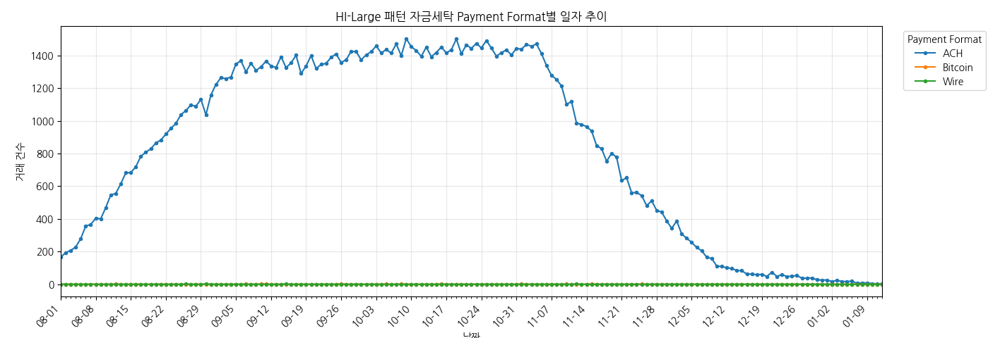

### 6.3 패턴 외 자금세탁

| Payment Format | 전체 거래 수 |
| --- | ---: |
| ACH | 61,245 |
| Bitcoin | 1,595 |
| Cash | 3,663 |
| Cheque | 13,260 |
| Credit Card | 7,846 |
| Wire | 1 |
| **전체** | **87,610** |

<details>
<summary><strong>Payment Format별 전체 일자 통계 보기 (합계 포함)</strong></summary>

<div style="max-height: 420px; overflow: auto; margin-top: 0.75rem;">
<table>
  <thead style="position: sticky; top: 0; background: white;">
    <tr>
      <th scope="col">일자</th>
      <th scope="col">ACH</th>
      <th scope="col">Bitcoin</th>
      <th scope="col">Cash</th>
      <th scope="col">Cheque</th>
      <th scope="col">Credit Card</th>
      <th scope="col">Wire</th>
      <th scope="col">전체</th>
    </tr>
  </thead>
  <tbody>
    <tr>
      <th scope="row">2022-08-01</th>
      <td align="right">476</td>
      <td align="right">17</td>
      <td align="right">53</td>
      <td align="right">183</td>
      <td align="right">113</td>
      <td align="right">0</td>
      <td align="right">842</td>
    </tr>
    <tr>
      <th scope="row">2022-08-02</th>
      <td align="right">509</td>
      <td align="right">9</td>
      <td align="right">40</td>
      <td align="right">153</td>
      <td align="right">107</td>
      <td align="right">0</td>
      <td align="right">818</td>
    </tr>
    <tr>
      <th scope="row">2022-08-03</th>
      <td align="right">494</td>
      <td align="right">17</td>
      <td align="right">37</td>
      <td align="right">161</td>
      <td align="right">87</td>
      <td align="right">0</td>
      <td align="right">796</td>
    </tr>
    <tr>
      <th scope="row">2022-08-04</th>
      <td align="right">509</td>
      <td align="right">13</td>
      <td align="right">37</td>
      <td align="right">153</td>
      <td align="right">95</td>
      <td align="right">0</td>
      <td align="right">807</td>
    </tr>
    <tr>
      <th scope="row">2022-08-05</th>
      <td align="right">525</td>
      <td align="right">16</td>
      <td align="right">55</td>
      <td align="right">208</td>
      <td align="right">123</td>
      <td align="right">0</td>
      <td align="right">927</td>
    </tr>
    <tr>
      <th scope="row">2022-08-06</th>
      <td align="right">449</td>
      <td align="right">15</td>
      <td align="right">23</td>
      <td align="right">75</td>
      <td align="right">53</td>
      <td align="right">0</td>
      <td align="right">615</td>
    </tr>
    <tr>
      <th scope="row">2022-08-07</th>
      <td align="right">490</td>
      <td align="right">11</td>
      <td align="right">17</td>
      <td align="right">52</td>
      <td align="right">36</td>
      <td align="right">0</td>
      <td align="right">606</td>
    </tr>
    <tr>
      <th scope="row">2022-08-08</th>
      <td align="right">479</td>
      <td align="right">21</td>
      <td align="right">42</td>
      <td align="right">159</td>
      <td align="right">85</td>
      <td align="right">0</td>
      <td align="right">786</td>
    </tr>
    <tr>
      <th scope="row">2022-08-09</th>
      <td align="right">527</td>
      <td align="right">14</td>
      <td align="right">45</td>
      <td align="right">150</td>
      <td align="right">90</td>
      <td align="right">0</td>
      <td align="right">826</td>
    </tr>
    <tr>
      <th scope="row">2022-08-10</th>
      <td align="right">521</td>
      <td align="right">24</td>
      <td align="right">42</td>
      <td align="right">165</td>
      <td align="right">79</td>
      <td align="right">0</td>
      <td align="right">831</td>
    </tr>
    <tr>
      <th scope="row">2022-08-11</th>
      <td align="right">494</td>
      <td align="right">20</td>
      <td align="right">40</td>
      <td align="right">155</td>
      <td align="right">93</td>
      <td align="right">0</td>
      <td align="right">802</td>
    </tr>
    <tr>
      <th scope="row">2022-08-12</th>
      <td align="right">508</td>
      <td align="right">18</td>
      <td align="right">52</td>
      <td align="right">165</td>
      <td align="right">110</td>
      <td align="right">0</td>
      <td align="right">853</td>
    </tr>
    <tr>
      <th scope="row">2022-08-13</th>
      <td align="right">515</td>
      <td align="right">20</td>
      <td align="right">12</td>
      <td align="right">71</td>
      <td align="right">45</td>
      <td align="right">0</td>
      <td align="right">663</td>
    </tr>
    <tr>
      <th scope="row">2022-08-14</th>
      <td align="right">492</td>
      <td align="right">16</td>
      <td align="right">13</td>
      <td align="right">62</td>
      <td align="right">40</td>
      <td align="right">0</td>
      <td align="right">623</td>
    </tr>
    <tr>
      <th scope="row">2022-08-15</th>
      <td align="right">526</td>
      <td align="right">17</td>
      <td align="right">34</td>
      <td align="right">153</td>
      <td align="right">105</td>
      <td align="right">0</td>
      <td align="right">835</td>
    </tr>
    <tr>
      <th scope="row">2022-08-16</th>
      <td align="right">565</td>
      <td align="right">23</td>
      <td align="right">44</td>
      <td align="right">146</td>
      <td align="right">97</td>
      <td align="right">0</td>
      <td align="right">875</td>
    </tr>
    <tr>
      <th scope="row">2022-08-17</th>
      <td align="right">500</td>
      <td align="right">16</td>
      <td align="right">38</td>
      <td align="right">154</td>
      <td align="right">81</td>
      <td align="right">0</td>
      <td align="right">789</td>
    </tr>
    <tr>
      <th scope="row">2022-08-18</th>
      <td align="right">543</td>
      <td align="right">17</td>
      <td align="right">33</td>
      <td align="right">158</td>
      <td align="right">69</td>
      <td align="right">0</td>
      <td align="right">820</td>
    </tr>
    <tr>
      <th scope="row">2022-08-19</th>
      <td align="right">536</td>
      <td align="right">19</td>
      <td align="right">59</td>
      <td align="right">209</td>
      <td align="right">134</td>
      <td align="right">0</td>
      <td align="right">957</td>
    </tr>
    <tr>
      <th scope="row">2022-08-20</th>
      <td align="right">498</td>
      <td align="right">6</td>
      <td align="right">18</td>
      <td align="right">70</td>
      <td align="right">34</td>
      <td align="right">0</td>
      <td align="right">626</td>
    </tr>
    <tr>
      <th scope="row">2022-08-21</th>
      <td align="right">533</td>
      <td align="right">11</td>
      <td align="right">19</td>
      <td align="right">63</td>
      <td align="right">33</td>
      <td align="right">0</td>
      <td align="right">659</td>
    </tr>
    <tr>
      <th scope="row">2022-08-22</th>
      <td align="right">523</td>
      <td align="right">18</td>
      <td align="right">40</td>
      <td align="right">128</td>
      <td align="right">90</td>
      <td align="right">0</td>
      <td align="right">799</td>
    </tr>
    <tr>
      <th scope="row">2022-08-23</th>
      <td align="right">529</td>
      <td align="right">15</td>
      <td align="right">47</td>
      <td align="right">161</td>
      <td align="right">84</td>
      <td align="right">0</td>
      <td align="right">836</td>
    </tr>
    <tr>
      <th scope="row">2022-08-24</th>
      <td align="right">540</td>
      <td align="right">21</td>
      <td align="right">42</td>
      <td align="right">156</td>
      <td align="right">78</td>
      <td align="right">0</td>
      <td align="right">837</td>
    </tr>
    <tr>
      <th scope="row">2022-08-25</th>
      <td align="right">569</td>
      <td align="right">13</td>
      <td align="right">35</td>
      <td align="right">169</td>
      <td align="right">83</td>
      <td align="right">0</td>
      <td align="right">869</td>
    </tr>
    <tr>
      <th scope="row">2022-08-26</th>
      <td align="right">529</td>
      <td align="right">13</td>
      <td align="right">52</td>
      <td align="right">182</td>
      <td align="right">106</td>
      <td align="right">0</td>
      <td align="right">882</td>
    </tr>
    <tr>
      <th scope="row">2022-08-27</th>
      <td align="right">565</td>
      <td align="right">11</td>
      <td align="right">17</td>
      <td align="right">46</td>
      <td align="right">29</td>
      <td align="right">0</td>
      <td align="right">668</td>
    </tr>
    <tr>
      <th scope="row">2022-08-28</th>
      <td align="right">494</td>
      <td align="right">14</td>
      <td align="right">17</td>
      <td align="right">72</td>
      <td align="right">33</td>
      <td align="right">0</td>
      <td align="right">630</td>
    </tr>
    <tr>
      <th scope="row">2022-08-29</th>
      <td align="right">536</td>
      <td align="right">8</td>
      <td align="right">41</td>
      <td align="right">153</td>
      <td align="right">80</td>
      <td align="right">0</td>
      <td align="right">818</td>
    </tr>
    <tr>
      <th scope="row">2022-08-30</th>
      <td align="right">583</td>
      <td align="right">14</td>
      <td align="right">31</td>
      <td align="right">136</td>
      <td align="right">103</td>
      <td align="right">0</td>
      <td align="right">867</td>
    </tr>
    <tr>
      <th scope="row">2022-08-31</th>
      <td align="right">592</td>
      <td align="right">15</td>
      <td align="right">52</td>
      <td align="right">204</td>
      <td align="right">97</td>
      <td align="right">0</td>
      <td align="right">960</td>
    </tr>
    <tr>
      <th scope="row">2022-09-01</th>
      <td align="right">590</td>
      <td align="right">14</td>
      <td align="right">40</td>
      <td align="right">143</td>
      <td align="right">78</td>
      <td align="right">0</td>
      <td align="right">865</td>
    </tr>
    <tr>
      <th scope="row">2022-09-02</th>
      <td align="right">605</td>
      <td align="right">20</td>
      <td align="right">73</td>
      <td align="right">201</td>
      <td align="right">125</td>
      <td align="right">1</td>
      <td align="right">1,025</td>
    </tr>
    <tr>
      <th scope="row">2022-09-03</th>
      <td align="right">601</td>
      <td align="right">9</td>
      <td align="right">29</td>
      <td align="right">71</td>
      <td align="right">34</td>
      <td align="right">0</td>
      <td align="right">744</td>
    </tr>
    <tr>
      <th scope="row">2022-09-04</th>
      <td align="right">600</td>
      <td align="right">17</td>
      <td align="right">12</td>
      <td align="right">60</td>
      <td align="right">40</td>
      <td align="right">0</td>
      <td align="right">729</td>
    </tr>
    <tr>
      <th scope="row">2022-09-05</th>
      <td align="right">542</td>
      <td align="right">16</td>
      <td align="right">56</td>
      <td align="right">162</td>
      <td align="right">91</td>
      <td align="right">0</td>
      <td align="right">867</td>
    </tr>
    <tr>
      <th scope="row">2022-09-06</th>
      <td align="right">606</td>
      <td align="right">16</td>
      <td align="right">50</td>
      <td align="right">157</td>
      <td align="right">98</td>
      <td align="right">0</td>
      <td align="right">927</td>
    </tr>
    <tr>
      <th scope="row">2022-09-07</th>
      <td align="right">582</td>
      <td align="right">19</td>
      <td align="right">40</td>
      <td align="right">138</td>
      <td align="right">91</td>
      <td align="right">0</td>
      <td align="right">870</td>
    </tr>
    <tr>
      <th scope="row">2022-09-08</th>
      <td align="right">645</td>
      <td align="right">14</td>
      <td align="right">56</td>
      <td align="right">160</td>
      <td align="right">93</td>
      <td align="right">0</td>
      <td align="right">968</td>
    </tr>
    <tr>
      <th scope="row">2022-09-09</th>
      <td align="right">620</td>
      <td align="right">19</td>
      <td align="right">49</td>
      <td align="right">209</td>
      <td align="right">96</td>
      <td align="right">0</td>
      <td align="right">993</td>
    </tr>
    <tr>
      <th scope="row">2022-09-10</th>
      <td align="right">620</td>
      <td align="right">14</td>
      <td align="right">21</td>
      <td align="right">62</td>
      <td align="right">33</td>
      <td align="right">0</td>
      <td align="right">750</td>
    </tr>
    <tr>
      <th scope="row">2022-09-11</th>
      <td align="right">579</td>
      <td align="right">8</td>
      <td align="right">19</td>
      <td align="right">69</td>
      <td align="right">36</td>
      <td align="right">0</td>
      <td align="right">711</td>
    </tr>
    <tr>
      <th scope="row">2022-09-12</th>
      <td align="right">654</td>
      <td align="right">12</td>
      <td align="right">45</td>
      <td align="right">126</td>
      <td align="right">82</td>
      <td align="right">0</td>
      <td align="right">919</td>
    </tr>
    <tr>
      <th scope="row">2022-09-13</th>
      <td align="right">594</td>
      <td align="right">20</td>
      <td align="right">45</td>
      <td align="right">162</td>
      <td align="right">117</td>
      <td align="right">0</td>
      <td align="right">938</td>
    </tr>
    <tr>
      <th scope="row">2022-09-14</th>
      <td align="right">631</td>
      <td align="right">12</td>
      <td align="right">59</td>
      <td align="right">150</td>
      <td align="right">81</td>
      <td align="right">0</td>
      <td align="right">933</td>
    </tr>
    <tr>
      <th scope="row">2022-09-15</th>
      <td align="right">586</td>
      <td align="right">13</td>
      <td align="right">47</td>
      <td align="right">164</td>
      <td align="right">85</td>
      <td align="right">0</td>
      <td align="right">895</td>
    </tr>
    <tr>
      <th scope="row">2022-09-16</th>
      <td align="right">637</td>
      <td align="right">16</td>
      <td align="right">74</td>
      <td align="right">192</td>
      <td align="right">110</td>
      <td align="right">0</td>
      <td align="right">1,029</td>
    </tr>
    <tr>
      <th scope="row">2022-09-17</th>
      <td align="right">619</td>
      <td align="right">13</td>
      <td align="right">14</td>
      <td align="right">68</td>
      <td align="right">35</td>
      <td align="right">0</td>
      <td align="right">749</td>
    </tr>
    <tr>
      <th scope="row">2022-09-18</th>
      <td align="right">668</td>
      <td align="right">14</td>
      <td align="right">16</td>
      <td align="right">73</td>
      <td align="right">31</td>
      <td align="right">0</td>
      <td align="right">802</td>
    </tr>
    <tr>
      <th scope="row">2022-09-19</th>
      <td align="right">649</td>
      <td align="right">16</td>
      <td align="right">34</td>
      <td align="right">146</td>
      <td align="right">103</td>
      <td align="right">0</td>
      <td align="right">948</td>
    </tr>
    <tr>
      <th scope="row">2022-09-20</th>
      <td align="right">634</td>
      <td align="right">13</td>
      <td align="right">46</td>
      <td align="right">148</td>
      <td align="right">92</td>
      <td align="right">0</td>
      <td align="right">933</td>
    </tr>
    <tr>
      <th scope="row">2022-09-21</th>
      <td align="right">676</td>
      <td align="right">21</td>
      <td align="right">49</td>
      <td align="right">153</td>
      <td align="right">81</td>
      <td align="right">0</td>
      <td align="right">980</td>
    </tr>
    <tr>
      <th scope="row">2022-09-22</th>
      <td align="right">622</td>
      <td align="right">11</td>
      <td align="right">46</td>
      <td align="right">189</td>
      <td align="right">84</td>
      <td align="right">0</td>
      <td align="right">952</td>
    </tr>
    <tr>
      <th scope="row">2022-09-23</th>
      <td align="right">651</td>
      <td align="right">17</td>
      <td align="right">48</td>
      <td align="right">189</td>
      <td align="right">107</td>
      <td align="right">0</td>
      <td align="right">1,012</td>
    </tr>
    <tr>
      <th scope="row">2022-09-24</th>
      <td align="right">644</td>
      <td align="right">9</td>
      <td align="right">15</td>
      <td align="right">54</td>
      <td align="right">44</td>
      <td align="right">0</td>
      <td align="right">766</td>
    </tr>
    <tr>
      <th scope="row">2022-09-25</th>
      <td align="right">643</td>
      <td align="right">11</td>
      <td align="right">26</td>
      <td align="right">65</td>
      <td align="right">45</td>
      <td align="right">0</td>
      <td align="right">790</td>
    </tr>
    <tr>
      <th scope="row">2022-09-26</th>
      <td align="right">645</td>
      <td align="right">22</td>
      <td align="right">56</td>
      <td align="right">135</td>
      <td align="right">92</td>
      <td align="right">0</td>
      <td align="right">950</td>
    </tr>
    <tr>
      <th scope="row">2022-09-27</th>
      <td align="right">640</td>
      <td align="right">19</td>
      <td align="right">35</td>
      <td align="right">156</td>
      <td align="right">89</td>
      <td align="right">0</td>
      <td align="right">939</td>
    </tr>
    <tr>
      <th scope="row">2022-09-28</th>
      <td align="right">643</td>
      <td align="right">12</td>
      <td align="right">58</td>
      <td align="right">158</td>
      <td align="right">89</td>
      <td align="right">0</td>
      <td align="right">960</td>
    </tr>
    <tr>
      <th scope="row">2022-09-29</th>
      <td align="right">662</td>
      <td align="right">8</td>
      <td align="right">34</td>
      <td align="right">114</td>
      <td align="right">99</td>
      <td align="right">0</td>
      <td align="right">917</td>
    </tr>
    <tr>
      <th scope="row">2022-09-30</th>
      <td align="right">708</td>
      <td align="right">21</td>
      <td align="right">71</td>
      <td align="right">231</td>
      <td align="right">142</td>
      <td align="right">0</td>
      <td align="right">1,173</td>
    </tr>
    <tr>
      <th scope="row">2022-10-01</th>
      <td align="right">686</td>
      <td align="right">19</td>
      <td align="right">16</td>
      <td align="right">70</td>
      <td align="right">42</td>
      <td align="right">0</td>
      <td align="right">833</td>
    </tr>
    <tr>
      <th scope="row">2022-10-02</th>
      <td align="right">674</td>
      <td align="right">13</td>
      <td align="right">17</td>
      <td align="right">66</td>
      <td align="right">34</td>
      <td align="right">0</td>
      <td align="right">804</td>
    </tr>
    <tr>
      <th scope="row">2022-10-03</th>
      <td align="right">696</td>
      <td align="right">17</td>
      <td align="right">32</td>
      <td align="right">155</td>
      <td align="right">86</td>
      <td align="right">0</td>
      <td align="right">986</td>
    </tr>
    <tr>
      <th scope="row">2022-10-04</th>
      <td align="right">711</td>
      <td align="right">16</td>
      <td align="right">36</td>
      <td align="right">172</td>
      <td align="right">89</td>
      <td align="right">0</td>
      <td align="right">1,024</td>
    </tr>
    <tr>
      <th scope="row">2022-10-05</th>
      <td align="right">709</td>
      <td align="right">19</td>
      <td align="right">41</td>
      <td align="right">157</td>
      <td align="right">103</td>
      <td align="right">0</td>
      <td align="right">1,029</td>
    </tr>
    <tr>
      <th scope="row">2022-10-06</th>
      <td align="right">678</td>
      <td align="right">19</td>
      <td align="right">46</td>
      <td align="right">124</td>
      <td align="right">104</td>
      <td align="right">0</td>
      <td align="right">971</td>
    </tr>
    <tr>
      <th scope="row">2022-10-07</th>
      <td align="right">709</td>
      <td align="right">21</td>
      <td align="right">60</td>
      <td align="right">203</td>
      <td align="right">108</td>
      <td align="right">0</td>
      <td align="right">1,101</td>
    </tr>
    <tr>
      <th scope="row">2022-10-08</th>
      <td align="right">665</td>
      <td align="right">19</td>
      <td align="right">11</td>
      <td align="right">72</td>
      <td align="right">45</td>
      <td align="right">0</td>
      <td align="right">812</td>
    </tr>
    <tr>
      <th scope="row">2022-10-09</th>
      <td align="right">688</td>
      <td align="right">20</td>
      <td align="right">13</td>
      <td align="right">78</td>
      <td align="right">32</td>
      <td align="right">0</td>
      <td align="right">831</td>
    </tr>
    <tr>
      <th scope="row">2022-10-10</th>
      <td align="right">722</td>
      <td align="right">16</td>
      <td align="right">43</td>
      <td align="right">159</td>
      <td align="right">97</td>
      <td align="right">0</td>
      <td align="right">1,037</td>
    </tr>
    <tr>
      <th scope="row">2022-10-11</th>
      <td align="right">683</td>
      <td align="right">21</td>
      <td align="right">44</td>
      <td align="right">151</td>
      <td align="right">96</td>
      <td align="right">0</td>
      <td align="right">995</td>
    </tr>
    <tr>
      <th scope="row">2022-10-12</th>
      <td align="right">754</td>
      <td align="right">13</td>
      <td align="right">44</td>
      <td align="right">141</td>
      <td align="right">107</td>
      <td align="right">0</td>
      <td align="right">1,059</td>
    </tr>
    <tr>
      <th scope="row">2022-10-13</th>
      <td align="right">717</td>
      <td align="right">18</td>
      <td align="right">36</td>
      <td align="right">150</td>
      <td align="right">94</td>
      <td align="right">0</td>
      <td align="right">1,015</td>
    </tr>
    <tr>
      <th scope="row">2022-10-14</th>
      <td align="right">738</td>
      <td align="right">19</td>
      <td align="right">57</td>
      <td align="right">204</td>
      <td align="right">126</td>
      <td align="right">0</td>
      <td align="right">1,144</td>
    </tr>
    <tr>
      <th scope="row">2022-10-15</th>
      <td align="right">737</td>
      <td align="right">16</td>
      <td align="right">20</td>
      <td align="right">61</td>
      <td align="right">39</td>
      <td align="right">0</td>
      <td align="right">873</td>
    </tr>
    <tr>
      <th scope="row">2022-10-16</th>
      <td align="right">691</td>
      <td align="right">22</td>
      <td align="right">7</td>
      <td align="right">63</td>
      <td align="right">35</td>
      <td align="right">0</td>
      <td align="right">818</td>
    </tr>
    <tr>
      <th scope="row">2022-10-17</th>
      <td align="right">749</td>
      <td align="right">16</td>
      <td align="right">41</td>
      <td align="right">153</td>
      <td align="right">98</td>
      <td align="right">0</td>
      <td align="right">1,057</td>
    </tr>
    <tr>
      <th scope="row">2022-10-18</th>
      <td align="right">662</td>
      <td align="right">12</td>
      <td align="right">40</td>
      <td align="right">142</td>
      <td align="right">83</td>
      <td align="right">0</td>
      <td align="right">939</td>
    </tr>
    <tr>
      <th scope="row">2022-10-19</th>
      <td align="right">680</td>
      <td align="right">25</td>
      <td align="right">36</td>
      <td align="right">139</td>
      <td align="right">91</td>
      <td align="right">0</td>
      <td align="right">971</td>
    </tr>
    <tr>
      <th scope="row">2022-10-20</th>
      <td align="right">758</td>
      <td align="right">20</td>
      <td align="right">43</td>
      <td align="right">150</td>
      <td align="right">101</td>
      <td align="right">0</td>
      <td align="right">1,072</td>
    </tr>
    <tr>
      <th scope="row">2022-10-21</th>
      <td align="right">793</td>
      <td align="right">15</td>
      <td align="right">47</td>
      <td align="right">189</td>
      <td align="right">126</td>
      <td align="right">0</td>
      <td align="right">1,170</td>
    </tr>
    <tr>
      <th scope="row">2022-10-22</th>
      <td align="right">718</td>
      <td align="right">14</td>
      <td align="right">19</td>
      <td align="right">65</td>
      <td align="right">29</td>
      <td align="right">0</td>
      <td align="right">845</td>
    </tr>
    <tr>
      <th scope="row">2022-10-23</th>
      <td align="right">711</td>
      <td align="right">18</td>
      <td align="right">24</td>
      <td align="right">66</td>
      <td align="right">35</td>
      <td align="right">0</td>
      <td align="right">854</td>
    </tr>
    <tr>
      <th scope="row">2022-10-24</th>
      <td align="right">730</td>
      <td align="right">15</td>
      <td align="right">46</td>
      <td align="right">172</td>
      <td align="right">94</td>
      <td align="right">0</td>
      <td align="right">1,057</td>
    </tr>
    <tr>
      <th scope="row">2022-10-25</th>
      <td align="right">785</td>
      <td align="right">20</td>
      <td align="right">38</td>
      <td align="right">158</td>
      <td align="right">102</td>
      <td align="right">0</td>
      <td align="right">1,103</td>
    </tr>
    <tr>
      <th scope="row">2022-10-26</th>
      <td align="right">728</td>
      <td align="right">16</td>
      <td align="right">43</td>
      <td align="right">161</td>
      <td align="right">89</td>
      <td align="right">0</td>
      <td align="right">1,037</td>
    </tr>
    <tr>
      <th scope="row">2022-10-27</th>
      <td align="right">763</td>
      <td align="right">18</td>
      <td align="right">46</td>
      <td align="right">180</td>
      <td align="right">92</td>
      <td align="right">0</td>
      <td align="right">1,099</td>
    </tr>
    <tr>
      <th scope="row">2022-10-28</th>
      <td align="right">748</td>
      <td align="right">23</td>
      <td align="right">65</td>
      <td align="right">197</td>
      <td align="right">124</td>
      <td align="right">0</td>
      <td align="right">1,157</td>
    </tr>
    <tr>
      <th scope="row">2022-10-29</th>
      <td align="right">771</td>
      <td align="right">16</td>
      <td align="right">11</td>
      <td align="right">86</td>
      <td align="right">43</td>
      <td align="right">0</td>
      <td align="right">927</td>
    </tr>
    <tr>
      <th scope="row">2022-10-30</th>
      <td align="right">791</td>
      <td align="right">18</td>
      <td align="right">24</td>
      <td align="right">91</td>
      <td align="right">61</td>
      <td align="right">0</td>
      <td align="right">985</td>
    </tr>
    <tr>
      <th scope="row">2022-10-31</th>
      <td align="right">777</td>
      <td align="right">20</td>
      <td align="right">36</td>
      <td align="right">159</td>
      <td align="right">107</td>
      <td align="right">0</td>
      <td align="right">1,099</td>
    </tr>
    <tr>
      <th scope="row">2022-11-01</th>
      <td align="right">787</td>
      <td align="right">23</td>
      <td align="right">32</td>
      <td align="right">145</td>
      <td align="right">93</td>
      <td align="right">0</td>
      <td align="right">1,080</td>
    </tr>
    <tr>
      <th scope="row">2022-11-02</th>
      <td align="right">791</td>
      <td align="right">25</td>
      <td align="right">38</td>
      <td align="right">167</td>
      <td align="right">98</td>
      <td align="right">0</td>
      <td align="right">1,119</td>
    </tr>
    <tr>
      <th scope="row">2022-11-03</th>
      <td align="right">722</td>
      <td align="right">26</td>
      <td align="right">39</td>
      <td align="right">168</td>
      <td align="right">86</td>
      <td align="right">0</td>
      <td align="right">1,041</td>
    </tr>
    <tr>
      <th scope="row">2022-11-04</th>
      <td align="right">813</td>
      <td align="right">21</td>
      <td align="right">58</td>
      <td align="right">193</td>
      <td align="right">111</td>
      <td align="right">0</td>
      <td align="right">1,196</td>
    </tr>
    <tr>
      <th scope="row">2022-11-05</th>
      <td align="right">765</td>
      <td align="right">18</td>
      <td align="right">24</td>
      <td align="right">76</td>
      <td align="right">31</td>
      <td align="right">0</td>
      <td align="right">914</td>
    </tr>
    <tr>
      <th scope="row">2022-11-06</th>
      <td align="right">0</td>
      <td align="right">0</td>
      <td align="right">0</td>
      <td align="right">0</td>
      <td align="right">0</td>
      <td align="right">0</td>
      <td align="right">0</td>
    </tr>
    <tr>
      <th scope="row">2022-11-07</th>
      <td align="right">0</td>
      <td align="right">0</td>
      <td align="right">0</td>
      <td align="right">0</td>
      <td align="right">0</td>
      <td align="right">0</td>
      <td align="right">0</td>
    </tr>
    <tr>
      <th scope="row">2022-11-08</th>
      <td align="right">0</td>
      <td align="right">0</td>
      <td align="right">0</td>
      <td align="right">0</td>
      <td align="right">0</td>
      <td align="right">0</td>
      <td align="right">0</td>
    </tr>
    <tr>
      <th scope="row">2022-11-09</th>
      <td align="right">0</td>
      <td align="right">0</td>
      <td align="right">0</td>
      <td align="right">0</td>
      <td align="right">0</td>
      <td align="right">0</td>
      <td align="right">0</td>
    </tr>
    <tr>
      <th scope="row">2022-11-10</th>
      <td align="right">0</td>
      <td align="right">0</td>
      <td align="right">0</td>
      <td align="right">0</td>
      <td align="right">0</td>
      <td align="right">0</td>
      <td align="right">0</td>
    </tr>
    <tr>
      <th scope="row">2022-11-11</th>
      <td align="right">0</td>
      <td align="right">0</td>
      <td align="right">0</td>
      <td align="right">0</td>
      <td align="right">0</td>
      <td align="right">0</td>
      <td align="right">0</td>
    </tr>
    <tr>
      <th scope="row">2022-11-12</th>
      <td align="right">0</td>
      <td align="right">0</td>
      <td align="right">0</td>
      <td align="right">0</td>
      <td align="right">0</td>
      <td align="right">0</td>
      <td align="right">0</td>
    </tr>
    <tr>
      <th scope="row">2022-11-13</th>
      <td align="right">0</td>
      <td align="right">0</td>
      <td align="right">0</td>
      <td align="right">0</td>
      <td align="right">0</td>
      <td align="right">0</td>
      <td align="right">0</td>
    </tr>
    <tr>
      <th scope="row">2022-11-14</th>
      <td align="right">0</td>
      <td align="right">0</td>
      <td align="right">0</td>
      <td align="right">0</td>
      <td align="right">0</td>
      <td align="right">0</td>
      <td align="right">0</td>
    </tr>
    <tr>
      <th scope="row">2022-11-15</th>
      <td align="right">0</td>
      <td align="right">0</td>
      <td align="right">0</td>
      <td align="right">0</td>
      <td align="right">0</td>
      <td align="right">0</td>
      <td align="right">0</td>
    </tr>
    <tr>
      <th scope="row">2022-11-16</th>
      <td align="right">0</td>
      <td align="right">0</td>
      <td align="right">0</td>
      <td align="right">0</td>
      <td align="right">0</td>
      <td align="right">0</td>
      <td align="right">0</td>
    </tr>
    <tr>
      <th scope="row">2022-11-17</th>
      <td align="right">0</td>
      <td align="right">0</td>
      <td align="right">0</td>
      <td align="right">0</td>
      <td align="right">0</td>
      <td align="right">0</td>
      <td align="right">0</td>
    </tr>
    <tr>
      <th scope="row">2022-11-18</th>
      <td align="right">0</td>
      <td align="right">0</td>
      <td align="right">0</td>
      <td align="right">0</td>
      <td align="right">0</td>
      <td align="right">0</td>
      <td align="right">0</td>
    </tr>
    <tr>
      <th scope="row">2022-11-19</th>
      <td align="right">0</td>
      <td align="right">0</td>
      <td align="right">0</td>
      <td align="right">0</td>
      <td align="right">0</td>
      <td align="right">0</td>
      <td align="right">0</td>
    </tr>
    <tr>
      <th scope="row">2022-11-20</th>
      <td align="right">0</td>
      <td align="right">0</td>
      <td align="right">0</td>
      <td align="right">0</td>
      <td align="right">0</td>
      <td align="right">0</td>
      <td align="right">0</td>
    </tr>
    <tr>
      <th scope="row">2022-11-21</th>
      <td align="right">0</td>
      <td align="right">0</td>
      <td align="right">0</td>
      <td align="right">0</td>
      <td align="right">0</td>
      <td align="right">0</td>
      <td align="right">0</td>
    </tr>
    <tr>
      <th scope="row">2022-11-22</th>
      <td align="right">0</td>
      <td align="right">0</td>
      <td align="right">0</td>
      <td align="right">0</td>
      <td align="right">0</td>
      <td align="right">0</td>
      <td align="right">0</td>
    </tr>
    <tr>
      <th scope="row">2022-11-23</th>
      <td align="right">0</td>
      <td align="right">0</td>
      <td align="right">0</td>
      <td align="right">0</td>
      <td align="right">0</td>
      <td align="right">0</td>
      <td align="right">0</td>
    </tr>
    <tr>
      <th scope="row">2022-11-24</th>
      <td align="right">0</td>
      <td align="right">0</td>
      <td align="right">0</td>
      <td align="right">0</td>
      <td align="right">0</td>
      <td align="right">0</td>
      <td align="right">0</td>
    </tr>
    <tr>
      <th scope="row">2022-11-25</th>
      <td align="right">0</td>
      <td align="right">0</td>
      <td align="right">0</td>
      <td align="right">0</td>
      <td align="right">0</td>
      <td align="right">0</td>
      <td align="right">0</td>
    </tr>
    <tr>
      <th scope="row">2022-11-26</th>
      <td align="right">0</td>
      <td align="right">0</td>
      <td align="right">0</td>
      <td align="right">0</td>
      <td align="right">0</td>
      <td align="right">0</td>
      <td align="right">0</td>
    </tr>
    <tr>
      <th scope="row">2022-11-27</th>
      <td align="right">0</td>
      <td align="right">0</td>
      <td align="right">0</td>
      <td align="right">0</td>
      <td align="right">0</td>
      <td align="right">0</td>
      <td align="right">0</td>
    </tr>
    <tr>
      <th scope="row">2022-11-28</th>
      <td align="right">0</td>
      <td align="right">0</td>
      <td align="right">0</td>
      <td align="right">0</td>
      <td align="right">0</td>
      <td align="right">0</td>
      <td align="right">0</td>
    </tr>
    <tr>
      <th scope="row">2022-11-29</th>
      <td align="right">0</td>
      <td align="right">0</td>
      <td align="right">0</td>
      <td align="right">0</td>
      <td align="right">0</td>
      <td align="right">0</td>
      <td align="right">0</td>
    </tr>
    <tr>
      <th scope="row">2022-11-30</th>
      <td align="right">0</td>
      <td align="right">0</td>
      <td align="right">0</td>
      <td align="right">0</td>
      <td align="right">0</td>
      <td align="right">0</td>
      <td align="right">0</td>
    </tr>
    <tr>
      <th scope="row">2022-12-01</th>
      <td align="right">0</td>
      <td align="right">0</td>
      <td align="right">0</td>
      <td align="right">0</td>
      <td align="right">0</td>
      <td align="right">0</td>
      <td align="right">0</td>
    </tr>
    <tr>
      <th scope="row">2022-12-02</th>
      <td align="right">0</td>
      <td align="right">0</td>
      <td align="right">0</td>
      <td align="right">0</td>
      <td align="right">0</td>
      <td align="right">0</td>
      <td align="right">0</td>
    </tr>
    <tr>
      <th scope="row">2022-12-03</th>
      <td align="right">0</td>
      <td align="right">0</td>
      <td align="right">0</td>
      <td align="right">0</td>
      <td align="right">0</td>
      <td align="right">0</td>
      <td align="right">0</td>
    </tr>
    <tr>
      <th scope="row">2022-12-04</th>
      <td align="right">0</td>
      <td align="right">0</td>
      <td align="right">0</td>
      <td align="right">0</td>
      <td align="right">0</td>
      <td align="right">0</td>
      <td align="right">0</td>
    </tr>
    <tr>
      <th scope="row">2022-12-05</th>
      <td align="right">0</td>
      <td align="right">0</td>
      <td align="right">0</td>
      <td align="right">0</td>
      <td align="right">0</td>
      <td align="right">0</td>
      <td align="right">0</td>
    </tr>
    <tr>
      <th scope="row">2022-12-06</th>
      <td align="right">0</td>
      <td align="right">0</td>
      <td align="right">0</td>
      <td align="right">0</td>
      <td align="right">0</td>
      <td align="right">0</td>
      <td align="right">0</td>
    </tr>
    <tr>
      <th scope="row">2022-12-07</th>
      <td align="right">0</td>
      <td align="right">0</td>
      <td align="right">0</td>
      <td align="right">0</td>
      <td align="right">0</td>
      <td align="right">0</td>
      <td align="right">0</td>
    </tr>
    <tr>
      <th scope="row">2022-12-08</th>
      <td align="right">0</td>
      <td align="right">0</td>
      <td align="right">0</td>
      <td align="right">0</td>
      <td align="right">0</td>
      <td align="right">0</td>
      <td align="right">0</td>
    </tr>
    <tr>
      <th scope="row">2022-12-09</th>
      <td align="right">0</td>
      <td align="right">0</td>
      <td align="right">0</td>
      <td align="right">0</td>
      <td align="right">0</td>
      <td align="right">0</td>
      <td align="right">0</td>
    </tr>
    <tr>
      <th scope="row">2022-12-10</th>
      <td align="right">0</td>
      <td align="right">0</td>
      <td align="right">0</td>
      <td align="right">0</td>
      <td align="right">0</td>
      <td align="right">0</td>
      <td align="right">0</td>
    </tr>
    <tr>
      <th scope="row">2022-12-11</th>
      <td align="right">0</td>
      <td align="right">0</td>
      <td align="right">0</td>
      <td align="right">0</td>
      <td align="right">0</td>
      <td align="right">0</td>
      <td align="right">0</td>
    </tr>
    <tr>
      <th scope="row">2022-12-12</th>
      <td align="right">0</td>
      <td align="right">0</td>
      <td align="right">0</td>
      <td align="right">0</td>
      <td align="right">0</td>
      <td align="right">0</td>
      <td align="right">0</td>
    </tr>
    <tr>
      <th scope="row">2022-12-13</th>
      <td align="right">0</td>
      <td align="right">0</td>
      <td align="right">0</td>
      <td align="right">0</td>
      <td align="right">0</td>
      <td align="right">0</td>
      <td align="right">0</td>
    </tr>
    <tr>
      <th scope="row">2022-12-14</th>
      <td align="right">0</td>
      <td align="right">0</td>
      <td align="right">0</td>
      <td align="right">0</td>
      <td align="right">0</td>
      <td align="right">0</td>
      <td align="right">0</td>
    </tr>
    <tr>
      <th scope="row">2022-12-15</th>
      <td align="right">0</td>
      <td align="right">0</td>
      <td align="right">0</td>
      <td align="right">0</td>
      <td align="right">0</td>
      <td align="right">0</td>
      <td align="right">0</td>
    </tr>
    <tr>
      <th scope="row">2022-12-16</th>
      <td align="right">0</td>
      <td align="right">0</td>
      <td align="right">0</td>
      <td align="right">0</td>
      <td align="right">0</td>
      <td align="right">0</td>
      <td align="right">0</td>
    </tr>
    <tr>
      <th scope="row">2022-12-17</th>
      <td align="right">0</td>
      <td align="right">0</td>
      <td align="right">0</td>
      <td align="right">0</td>
      <td align="right">0</td>
      <td align="right">0</td>
      <td align="right">0</td>
    </tr>
    <tr>
      <th scope="row">2022-12-18</th>
      <td align="right">0</td>
      <td align="right">0</td>
      <td align="right">0</td>
      <td align="right">0</td>
      <td align="right">0</td>
      <td align="right">0</td>
      <td align="right">0</td>
    </tr>
    <tr>
      <th scope="row">2022-12-19</th>
      <td align="right">0</td>
      <td align="right">0</td>
      <td align="right">0</td>
      <td align="right">0</td>
      <td align="right">0</td>
      <td align="right">0</td>
      <td align="right">0</td>
    </tr>
    <tr>
      <th scope="row">2022-12-20</th>
      <td align="right">0</td>
      <td align="right">0</td>
      <td align="right">0</td>
      <td align="right">0</td>
      <td align="right">0</td>
      <td align="right">0</td>
      <td align="right">0</td>
    </tr>
    <tr>
      <th scope="row">2022-12-21</th>
      <td align="right">0</td>
      <td align="right">0</td>
      <td align="right">0</td>
      <td align="right">0</td>
      <td align="right">0</td>
      <td align="right">0</td>
      <td align="right">0</td>
    </tr>
    <tr>
      <th scope="row">2022-12-22</th>
      <td align="right">0</td>
      <td align="right">0</td>
      <td align="right">0</td>
      <td align="right">0</td>
      <td align="right">0</td>
      <td align="right">0</td>
      <td align="right">0</td>
    </tr>
    <tr>
      <th scope="row">2022-12-23</th>
      <td align="right">0</td>
      <td align="right">0</td>
      <td align="right">0</td>
      <td align="right">0</td>
      <td align="right">0</td>
      <td align="right">0</td>
      <td align="right">0</td>
    </tr>
    <tr>
      <th scope="row">2022-12-24</th>
      <td align="right">0</td>
      <td align="right">0</td>
      <td align="right">0</td>
      <td align="right">0</td>
      <td align="right">0</td>
      <td align="right">0</td>
      <td align="right">0</td>
    </tr>
    <tr>
      <th scope="row">2022-12-25</th>
      <td align="right">0</td>
      <td align="right">0</td>
      <td align="right">0</td>
      <td align="right">0</td>
      <td align="right">0</td>
      <td align="right">0</td>
      <td align="right">0</td>
    </tr>
    <tr>
      <th scope="row">2022-12-26</th>
      <td align="right">0</td>
      <td align="right">0</td>
      <td align="right">0</td>
      <td align="right">0</td>
      <td align="right">0</td>
      <td align="right">0</td>
      <td align="right">0</td>
    </tr>
    <tr>
      <th scope="row">2022-12-27</th>
      <td align="right">0</td>
      <td align="right">0</td>
      <td align="right">0</td>
      <td align="right">0</td>
      <td align="right">0</td>
      <td align="right">0</td>
      <td align="right">0</td>
    </tr>
    <tr>
      <th scope="row">2022-12-28</th>
      <td align="right">0</td>
      <td align="right">0</td>
      <td align="right">0</td>
      <td align="right">0</td>
      <td align="right">0</td>
      <td align="right">0</td>
      <td align="right">0</td>
    </tr>
    <tr>
      <th scope="row">2022-12-29</th>
      <td align="right">0</td>
      <td align="right">0</td>
      <td align="right">0</td>
      <td align="right">0</td>
      <td align="right">0</td>
      <td align="right">0</td>
      <td align="right">0</td>
    </tr>
    <tr>
      <th scope="row">2022-12-30</th>
      <td align="right">0</td>
      <td align="right">0</td>
      <td align="right">0</td>
      <td align="right">0</td>
      <td align="right">0</td>
      <td align="right">0</td>
      <td align="right">0</td>
    </tr>
    <tr>
      <th scope="row">2022-12-31</th>
      <td align="right">0</td>
      <td align="right">0</td>
      <td align="right">0</td>
      <td align="right">0</td>
      <td align="right">0</td>
      <td align="right">0</td>
      <td align="right">0</td>
    </tr>
    <tr>
      <th scope="row">2023-01-01</th>
      <td align="right">0</td>
      <td align="right">0</td>
      <td align="right">0</td>
      <td align="right">0</td>
      <td align="right">0</td>
      <td align="right">0</td>
      <td align="right">0</td>
    </tr>
    <tr>
      <th scope="row">2023-01-02</th>
      <td align="right">0</td>
      <td align="right">0</td>
      <td align="right">0</td>
      <td align="right">0</td>
      <td align="right">0</td>
      <td align="right">0</td>
      <td align="right">0</td>
    </tr>
    <tr>
      <th scope="row">2023-01-03</th>
      <td align="right">0</td>
      <td align="right">0</td>
      <td align="right">0</td>
      <td align="right">0</td>
      <td align="right">0</td>
      <td align="right">0</td>
      <td align="right">0</td>
    </tr>
    <tr>
      <th scope="row">2023-01-04</th>
      <td align="right">0</td>
      <td align="right">0</td>
      <td align="right">0</td>
      <td align="right">0</td>
      <td align="right">0</td>
      <td align="right">0</td>
      <td align="right">0</td>
    </tr>
    <tr>
      <th scope="row">2023-01-05</th>
      <td align="right">0</td>
      <td align="right">0</td>
      <td align="right">0</td>
      <td align="right">0</td>
      <td align="right">0</td>
      <td align="right">0</td>
      <td align="right">0</td>
    </tr>
    <tr>
      <th scope="row">2023-01-06</th>
      <td align="right">0</td>
      <td align="right">0</td>
      <td align="right">0</td>
      <td align="right">0</td>
      <td align="right">0</td>
      <td align="right">0</td>
      <td align="right">0</td>
    </tr>
    <tr>
      <th scope="row">2023-01-07</th>
      <td align="right">0</td>
      <td align="right">0</td>
      <td align="right">0</td>
      <td align="right">0</td>
      <td align="right">0</td>
      <td align="right">0</td>
      <td align="right">0</td>
    </tr>
    <tr>
      <th scope="row">2023-01-08</th>
      <td align="right">0</td>
      <td align="right">0</td>
      <td align="right">0</td>
      <td align="right">0</td>
      <td align="right">0</td>
      <td align="right">0</td>
      <td align="right">0</td>
    </tr>
    <tr>
      <th scope="row">2023-01-09</th>
      <td align="right">0</td>
      <td align="right">0</td>
      <td align="right">0</td>
      <td align="right">0</td>
      <td align="right">0</td>
      <td align="right">0</td>
      <td align="right">0</td>
    </tr>
    <tr>
      <th scope="row">2023-01-10</th>
      <td align="right">0</td>
      <td align="right">0</td>
      <td align="right">0</td>
      <td align="right">0</td>
      <td align="right">0</td>
      <td align="right">0</td>
      <td align="right">0</td>
    </tr>
    <tr>
      <th scope="row">2023-01-11</th>
      <td align="right">0</td>
      <td align="right">0</td>
      <td align="right">0</td>
      <td align="right">0</td>
      <td align="right">0</td>
      <td align="right">0</td>
      <td align="right">0</td>
    </tr>
    <tr>
      <th scope="row">2023-01-12</th>
      <td align="right">0</td>
      <td align="right">0</td>
      <td align="right">0</td>
      <td align="right">0</td>
      <td align="right">0</td>
      <td align="right">0</td>
      <td align="right">0</td>
    </tr>
    <tr style="font-weight: 700;">
      <th scope="row">전체</th>
      <td align="right">61,245</td>
      <td align="right">1,595</td>
      <td align="right">3,663</td>
      <td align="right">13,260</td>
      <td align="right">7,846</td>
      <td align="right">1</td>
      <td align="right">87,610</td>
    </tr>
  </tbody>
</table>
</div>
</details>

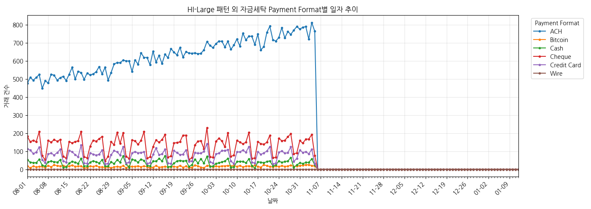

## 7. 통화별 자금세탁 거래 통계

| 송금 통화 | 수취 통화 | 전체 거래 수 | 자금세탁 거래 수(라벨 1) |
| --- | --- | ---: | ---: |
| 미국 달러 (US Dollar) | 미국 달러 (US Dollar) | 64,350,622 | 90,439 |
| 유로 (Euro) | 유로 (Euro) | 40,606,576 | 63,086 |
| 위안 (Yuan) | 위안 (Yuan) | 12,704,822 | 17,468 |
| 셰켈 (Shekel) | 셰켈 (Shekel) | 7,928,960 | 4,615 |
| 캐나다 달러 (Canadian Dollar) | 캐나다 달러 (Canadian Dollar) | 6,043,417 | 3,532 |
| 영국 파운드 (UK Pound) | 영국 파운드 (UK Pound) | 5,651,676 | 10,221 |
| 루블 (Ruble) | 루블 (Ruble) | 5,478,283 | 9,089 |
| 호주 달러 (Australian Dollar) | 호주 달러 (Australian Dollar) | 5,173,060 | 5,212 |
| 엔 (Yen) | 엔 (Yen) | 4,756,246 | 7,288 |
| 스위스 프랑 (Swiss Franc) | 스위스 프랑 (Swiss Franc) | 4,750,775 | 2,326 |
| 멕시코 페소 (Mexican Peso) | 멕시코 페소 (Mexican Peso) | 4,724,684 | 2,165 |
| 루피 (Rupee) | 루피 (Rupee) | 4,112,617 | 5,249 |
| 비트코인 (Bitcoin) | 비트코인 (Bitcoin) | 3,903,065 | 1,608 |
| 브라질 헤알 (Brazil Real) | 브라질 헤알 (Brazil Real) | 3,540,841 | 1,806 |
| 사우디 리얄 (Saudi Riyal) | 사우디 리얄 (Saudi Riyal) | 3,179,267 | 1,442 |

