# HI-Large 데이터 EDA

## 핵심 결과

| 항목 | 확인 결과 | 의미 |
|---|---|---|
| 전체 거래 | 179,702,229건 | 전체 행 분석, 잘못된 CSV 행을 건너뛰지 않음 |
| 양성 거래 | 225,546건 (0.1255%) | 극심한 클래스 불균형 |
| 원본 결측·공백·문자형 NULL | 거래·계좌·패턴 거래 필드 모두 0건 | 검사한 원본 범위의 결과. 조인 이후 결측은 별도 관리 |
| 완전 중복 | 150쌍, 총 300행, 초과분 150행 | 전부 정상 라벨이지만 발생 원인은 미확정 |
| 계좌 연결 | 관측 계좌 2,116,168개, 정규화 후 미연결 0개 | 은행 ID 정규화와 복합 키가 필수 |
| 시간 순서 | 원본 인접 행의 시간 역전 85,464,014회 | 파일 순서를 거래 시간순으로 간주하면 안 됨 |
| 패턴 정답 | 16,467개 시도, 137,936개 거래 | 양성 중 38.8435%는 패턴 정보가 없음 |
| 통화 | 15종, 통화 변경 거래 2,797,318건 | 원금액을 통화 구분 없이 합산하면 안 됨 |
| 후반 분포 | 2022-11-06 거래량이 전일 대비 약 99.74% 감소 | 후반 꼬리 구간을 일반 운영 분포로 간주하기 어려움 |

### 읽는 순서

1. [분석 범위와 원본 구조](#1-분석-범위와-원본-구조)
2. [결측·형식·타입](#2-결측과-형식-검사)
3. [시간 분포와 불균형](#3-시간-분포와-클래스-불균형)
4. [계좌 연결과 그래프 구조](#4-계좌-연결과-그래프-구조)
5. [중복](#5-중복-컬럼과-중복-행)
6. [통화와 금액](#6-통화와-금액-분포)
7. [패턴 정답](#7-패턴-파일과-정답-커버리지)

## 1. 분석 범위와 원본 구조

| 파일 | 용도 | 규모 |
|---|---|---|
| `HI-Large_Trans.csv` | 거래 원본 11열 | 179,702,229행 · 17.05 GB |
| `HI-Large_accounts.csv` | 계좌·엔티티 원본 5열 | 2,126,855행 · 147.69 MB |
| `HI-Large_Patterns.txt` | 시도별 패턴 종류·소속 거래 | 16,467개 시도 · 137,936개 거래 · 13.81 MB |

파일 크기는 10진 단위입니다. 원본 위치는 `/workspace/IBM/`입니다.

### 거래 컬럼 11개

| 순서 | 원본 컬럼 | 분석용 이름 | 한글 의미 |
|---|---|---|---|
| 1 | Timestamp | `timestamp_raw` | 거래 시각 |
| 2 | From Bank | `from_bank` | 송신 은행 ID |
| 3 | Account | `from_account` | 송신 계좌번호 |
| 4 | To Bank | `to_bank` | 수신 은행 ID |
| 5 | Account | `to_account` | 수신 계좌번호 |
| 6 | Amount Received | `amount_received_raw` | 수취 금액 |
| 7 | Receiving Currency | `receiving_currency` | 수취 통화 |
| 8 | Amount Paid | `amount_paid_raw` | 송금 금액 |
| 9 | Payment Currency | `payment_currency` | 송금 통화 |
| 10 | Payment Format | `payment_format` | 결제 방식 |
| 11 | Is Laundering | `label_raw` | 자금세탁 정답 0/1 |

### 계좌 컬럼 5개

| 원본 컬럼 | 한글 의미 |
|---|---|
| Bank Name | 은행명 |
| Bank ID | 은행 ID |
| Account Number | 계좌번호 |
| Entity ID | 계좌 소유 엔티티 ID |
| Entity Name | 엔티티명 |

### 집계 정의와 신뢰 범위

- **범위:** 원본 전체 행을 엄격한 CSV 파서로 처리했습니다. 형식 불량 행을 조용히 제외하지 않았습니다.
- **결측:** 빈 CSV 필드/NULL, 공백만 있는 값, 문자형 NULL 표식, 앞뒤 공백을 각각 확인했습니다.
- **정확 집계:** 행 수·고유값 수·중복 수는 정확 집계입니다. 금액 분위수는 `approx_quantile` 근사값입니다.
- **금액:** 연결·동등성 비교는 `DECIMAL(38,8)`을 사용했습니다. 평균·분위수 및 아래 표의 금액 표시에는 부동소수점·반올림이 포함됩니다.
- **한계:** 정합성 검사는 독립적인 두 번째 전체 원본 파싱이 아닙니다. 전체 파일의 암호학적 무결성 증명도 아닙니다.

## 2. 결측과 형식 검사

### 전체 원본 검사

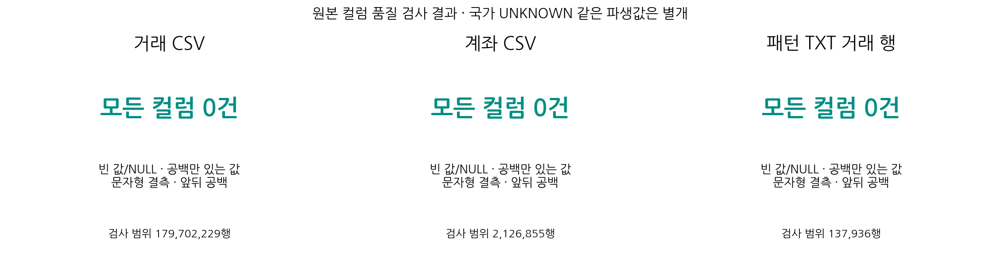

**그래프 해석:** 원본 세 파일 모두 검사한 결측·공백 항목이 0건입니다. 국가 정보 미상과 같은 파생 속성의 정보 부족은 이 결과와 구분합니다.

| 검사 | 거래 11열 | 계좌 5열 | 패턴 거래 11열 |
|---|---|---|---|
| 빈 필드·NULL | 0 | 0 | 0 |
| 공백만 있는 값 | 0 | 0 | 0 |
| 문자형 NULL 표식 | 0 | 0 | 0 |
| 앞뒤 공백 | 0 | 0 | 0 |

| 추가 검사 | 결과 |
|---|---|
| 시각 파싱 실패 | 0 |
| 0/1 이외 라벨 | 0 |
| 송금 금액 변환 실패 | 0 |
| 수취 금액 변환 실패 | 0 |
| 음수 송금 | 0 |
| 음수 수취 | 0 |
| 0원 송금 | 0 |
| 0원 수취 | 0 |
| 은행 ID 형식 오류 | 0 |
| 송금 금액 소수점 8자리 초과 | 0 |
| 수취 금액 소수점 8자리 초과 | 0 |

**해석:** 검사한 원본에서는 결측·타입 오류가 발견되지 않았습니다. 그러나 국가처럼 원본에 명시적으로 없는 속성을 파생할 때의 `UNKNOWN`은 별개입니다. 계좌번호는 영문자와 숫자가 섞인 문자열 식별자이므로 숫자 변환 대상이 아닙니다.

## 3. 시간 분포와 클래스 불균형

### 전체 기간과 월별 분포

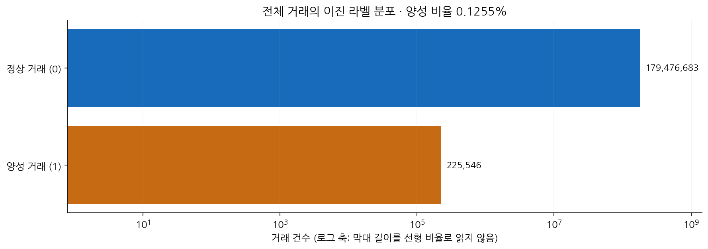

**그래프 해석:** 양성은 전체의 0.1255%입니다. 두 집단의 규모 차이가 커 로그 축으로 표시했으며, 단순 정확도만으로 탐지 성능을 판단하기 어렵습니다.

거래 시각 범위는 **2022-08-01 00:00 ~ 2023-01-12 16:49**입니다. 이 범위에서 거래가 한 건도 없는 달력 날짜는 없습니다. 다만 1월은 12일까지의 부분 기간입니다.

| 월 | 전체 거래 | 양성 거래 | 양성 비율 |
|---|---|---|---|
| 2022-08 | 59,468,136 | 46,040 | 0.0774% |
| 2022-09 | 56,137,121 | 67,372 | 0.1200% |
| 2022-10 | 54,821,376 | 75,263 | 0.1373% |
| 2022-11 | 9,269,215 | 33,013 | 0.3562% |
| 2022-12 | 6,132 | 3,704 | 60.4044% |
| 2023-01 | 249 | 154 | 61.8474% |

전체 정상 거래는 **179,476,683건**, 양성은 **225,546건**입니다. 정상:양성 비율은 약 **795.7:1**입니다. 모두 정상으로 예측해도 정확도가 **99.8745%**이므로 정확도만으로 모델을 평가하면 안 됩니다.

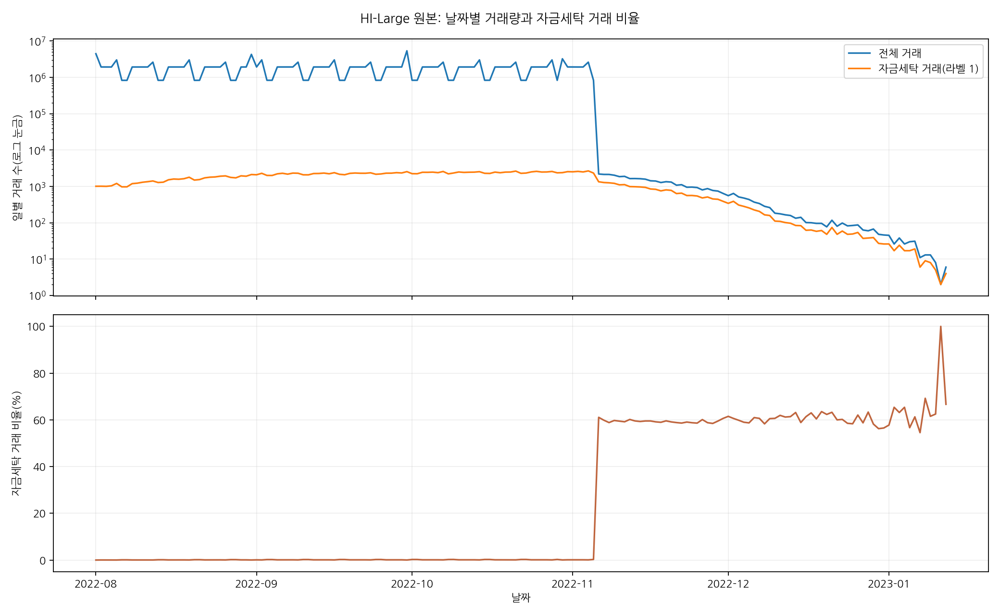

### 일별 학습 대상의 양성 수와 패턴 수

아래는 **샘플 실험이 아닌 원본 전량·daily_v1 중복 유지 기준**입니다. 학습은 **8월 8~31일**, 검증은 **9월**, 테스트는 **10월**이며 8월 1~7일은 통화 기준 산출에만 사용합니다. 각 행은 그날의 **판정 대상 거래**로, 과거 30일 그래프 문맥을 중복 합산한 수가 아닙니다. 에폭마다 같은 대상 거래를 다시 사용하므로 아래 수에 에폭 수를 곱하지 않았습니다.

| 컬럼 | 집계 기준 |
|---|---|
| 양성 거래 | 원본 `Is Laundering=1` 거래 수 |
| 패턴 거래 | 패턴 TXT에 속하고 원본 양성과 연결된 거래 수. 양성 거래의 부분집합 |
| 미연결 양성 | 양성 거래 − 패턴 거래. 패턴명이 없다고 정상으로 바꾸지 않음 |
| 당일 작전 수 | 그날 거래가 최소 1건 있는 고유 `attempt_id` 수. 같은 작전의 당일 거래가 여러 건이어도 1개 |
| 시작 작전 수 | 해당 작전의 원본 전체 최소 거래일이 그날인 작전 수. 실제 범죄 시작·알람 생성 시각을 뜻하지 않음 |
| 유형 수 | 당일 관측된 패턴 종류 수, 최대 8종. 작전 수와 구별 |

**여러 날 이어지는 작전은 각 날짜의 ‘당일 작전 수’에 다시 포함됩니다. 따라서 일별 작전 수의 합은 고유 작전 수가 아닙니다.** 구간별 고유 작전 수도 같은 작전이 학습·검증·테스트를 걸치면 중복되므로 구간끼리 단순 합산할 수 없습니다. 패턴 수는 모델의 예측·알람 수가 아니라 원본 정답 메타데이터입니다. 패턴 라벨은 X 피처에 넣지 않습니다.

완전 중복 초과분 150건은 모두 음성이므로 **중복 제거 실험에서도 양성 수와 패턴 수는 변하지 않습니다.** 아래 전체 거래 수는 중복 유지 기준이므로 중복 제거 후 일별 전체 건수와는 차이가 날 수 있습니다.

#### 구간별 합계

| 구간 | 날짜 수 | 전체 거래 | 양성 거래 | 패턴 거래 | 미연결 양성 | 구간 내 고유 작전 |
|---|---:|---:|---:|---:|---:|---:|
| 통화 기준 산출 | 7 | 14,933,012 | 7,206 | 1,795 | 5,411 | 1,022 |
| 학습 | 24 | 44,535,124 | 38,834 | 19,723 | 19,111 | 4,815 |
| 검증 | 30 | 56,137,121 | 67,372 | 40,338 | 27,034 | 8,621 |
| 테스트 | 31 | 54,821,376 | 75,263 | 44,559 | 30,704 | 9,334 |
| 실험 범위 밖 | 73 | 9,275,596 | 36,871 | 31,521 | 5,350 | 5,158 |

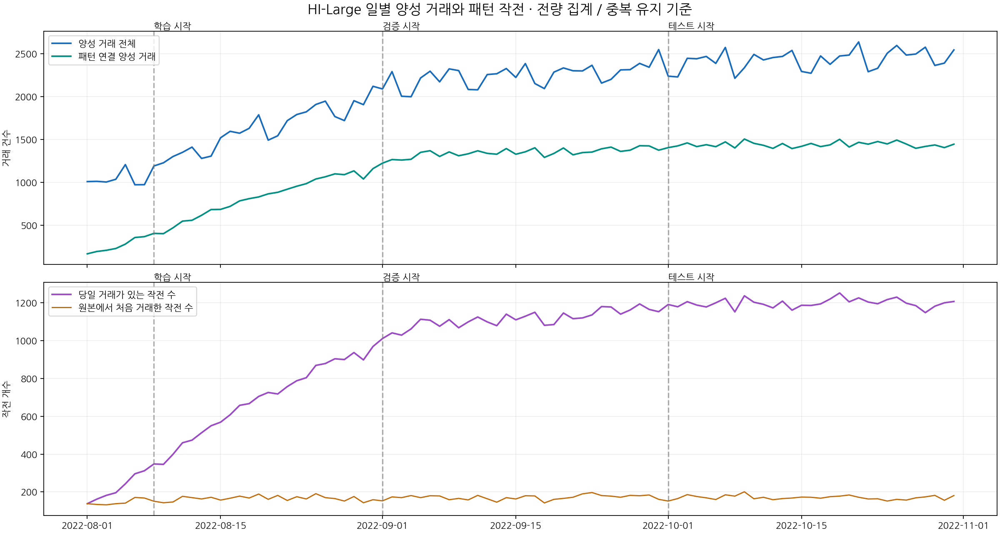

#### 통화 기준 산출 일별 내역 (2022-08-01 ~ 2022-08-07)

| 날짜 | 전체 거래 | 양성 거래 | 패턴 거래 | 미연결 양성 | 당일 작전 수 | 시작 작전 수 | 유형 수 |
|---|---:|---:|---:|---:|---:|---:|---:|
| 2022-08-01 | 4,466,821 | 1,008 | 166 | 842 | 138 | 138 | 8 |
| 2022-08-02 | 1,931,585 | 1,011 | 193 | 818 | 162 | 134 | 8 |
| 2022-08-03 | 1,929,043 | 1,003 | 207 | 796 | 182 | 132 | 8 |
| 2022-08-04 | 1,928,249 | 1,035 | 228 | 807 | 196 | 138 | 8 |
| 2022-08-05 | 3,019,143 | 1,206 | 279 | 927 | 243 | 141 | 8 |
| 2022-08-06 | 828,981 | 971 | 356 | 615 | 296 | 171 | 8 |
| 2022-08-07 | 829,190 | 972 | 366 | 606 | 312 | 168 | 8 |

#### 학습 일별 내역 (2022-08-08 ~ 2022-08-31)

| 날짜 | 전체 거래 | 양성 거래 | 패턴 거래 | 미연결 양성 | 당일 작전 수 | 시작 작전 수 | 유형 수 |
|---|---:|---:|---:|---:|---:|---:|---:|
| 2022-08-08 | 1,928,374 | 1,190 | 404 | 786 | 348 | 151 | 8 |
| 2022-08-09 | 1,928,823 | 1,227 | 401 | 826 | 346 | 143 | 8 |
| 2022-08-10 | 1,927,628 | 1,300 | 469 | 831 | 399 | 147 | 8 |
| 2022-08-11 | 1,929,142 | 1,349 | 547 | 802 | 460 | 177 | 8 |
| 2022-08-12 | 2,621,701 | 1,410 | 557 | 853 | 474 | 170 | 8 |
| 2022-08-13 | 829,920 | 1,278 | 615 | 663 | 513 | 163 | 8 |
| 2022-08-14 | 830,550 | 1,305 | 682 | 623 | 550 | 172 | 8 |
| 2022-08-15 | 1,928,907 | 1,519 | 684 | 835 | 569 | 157 | 8 |
| 2022-08-16 | 1,930,159 | 1,594 | 719 | 875 | 608 | 167 | 8 |
| 2022-08-17 | 1,929,245 | 1,572 | 783 | 789 | 658 | 178 | 8 |
| 2022-08-18 | 1,929,724 | 1,629 | 809 | 820 | 667 | 168 | 8 |
| 2022-08-19 | 3,019,001 | 1,786 | 829 | 957 | 705 | 189 | 8 |
| 2022-08-20 | 828,475 | 1,491 | 865 | 626 | 726 | 161 | 8 |
| 2022-08-21 | 830,799 | 1,542 | 883 | 659 | 718 | 182 | 8 |
| 2022-08-22 | 1,928,432 | 1,718 | 919 | 799 | 757 | 155 | 8 |
| 2022-08-23 | 1,928,708 | 1,790 | 954 | 836 | 788 | 175 | 8 |
| 2022-08-24 | 1,929,742 | 1,821 | 984 | 837 | 804 | 163 | 8 |
| 2022-08-25 | 1,929,035 | 1,907 | 1,038 | 869 | 869 | 191 | 8 |
| 2022-08-26 | 2,621,239 | 1,946 | 1,064 | 882 | 879 | 170 | 8 |
| 2022-08-27 | 828,897 | 1,766 | 1,098 | 668 | 904 | 165 | 8 |
| 2022-08-28 | 828,321 | 1,719 | 1,089 | 630 | 900 | 152 | 8 |
| 2022-08-29 | 1,927,752 | 1,951 | 1,133 | 818 | 937 | 176 | 8 |
| 2022-08-30 | 1,929,584 | 1,905 | 1,038 | 867 | 898 | 143 | 8 |
| 2022-08-31 | 4,290,966 | 2,119 | 1,159 | 960 | 969 | 159 | 8 |

#### 검증 일별 내역 (2022-09-01 ~ 2022-09-30)

| 날짜 | 전체 거래 | 양성 거래 | 패턴 거래 | 미연결 양성 | 당일 작전 수 | 시작 작전 수 | 유형 수 |
|---|---:|---:|---:|---:|---:|---:|---:|
| 2022-09-01 | 1,931,023 | 2,088 | 1,223 | 865 | 1,011 | 153 | 8 |
| 2022-09-02 | 3,021,894 | 2,290 | 1,265 | 1,025 | 1,041 | 174 | 8 |
| 2022-09-03 | 832,028 | 2,003 | 1,259 | 744 | 1,029 | 170 | 8 |
| 2022-09-04 | 831,450 | 1,997 | 1,268 | 729 | 1,062 | 181 | 8 |
| 2022-09-05 | 1,930,514 | 2,216 | 1,349 | 867 | 1,113 | 170 | 8 |
| 2022-09-06 | 1,932,948 | 2,295 | 1,368 | 927 | 1,108 | 180 | 8 |
| 2022-09-07 | 1,931,102 | 2,171 | 1,301 | 870 | 1,076 | 179 | 8 |
| 2022-09-08 | 1,931,683 | 2,322 | 1,354 | 968 | 1,111 | 159 | 8 |
| 2022-09-09 | 2,622,963 | 2,302 | 1,309 | 993 | 1,068 | 166 | 8 |
| 2022-09-10 | 832,706 | 2,082 | 1,332 | 750 | 1,099 | 158 | 8 |
| 2022-09-11 | 831,914 | 2,078 | 1,367 | 711 | 1,125 | 182 | 8 |
| 2022-09-12 | 1,931,230 | 2,256 | 1,337 | 919 | 1,099 | 164 | 8 |
| 2022-09-13 | 1,930,274 | 2,265 | 1,327 | 938 | 1,079 | 146 | 8 |
| 2022-09-14 | 1,929,871 | 2,326 | 1,393 | 933 | 1,140 | 170 | 8 |
| 2022-09-15 | 1,930,507 | 2,222 | 1,327 | 895 | 1,110 | 163 | 8 |
| 2022-09-16 | 3,021,851 | 2,384 | 1,355 | 1,029 | 1,129 | 180 | 8 |
| 2022-09-17 | 829,978 | 2,151 | 1,402 | 749 | 1,150 | 179 | 8 |
| 2022-09-18 | 829,352 | 2,092 | 1,290 | 802 | 1,081 | 142 | 8 |
| 2022-09-19 | 1,930,012 | 2,284 | 1,336 | 948 | 1,085 | 161 | 8 |
| 2022-09-20 | 1,929,666 | 2,333 | 1,400 | 933 | 1,146 | 166 | 8 |
| 2022-09-21 | 1,930,014 | 2,300 | 1,320 | 980 | 1,116 | 172 | 8 |
| 2022-09-22 | 1,928,248 | 2,298 | 1,346 | 952 | 1,120 | 190 | 8 |
| 2022-09-23 | 2,623,289 | 2,364 | 1,352 | 1,012 | 1,136 | 197 | 8 |
| 2022-09-24 | 830,925 | 2,156 | 1,390 | 766 | 1,180 | 181 | 8 |
| 2022-09-25 | 831,749 | 2,200 | 1,410 | 790 | 1,178 | 178 | 8 |
| 2022-09-26 | 1,930,439 | 2,310 | 1,360 | 950 | 1,140 | 172 | 8 |
| 2022-09-27 | 1,929,470 | 2,313 | 1,374 | 939 | 1,162 | 182 | 8 |
| 2022-09-28 | 1,929,725 | 2,386 | 1,426 | 960 | 1,194 | 180 | 8 |
| 2022-09-29 | 1,930,672 | 2,341 | 1,424 | 917 | 1,165 | 184 | 8 |
| 2022-09-30 | 5,379,624 | 2,547 | 1,374 | 1,173 | 1,153 | 161 | 8 |

#### 테스트 일별 내역 (2022-10-01 ~ 2022-10-31)

| 날짜 | 전체 거래 | 양성 거래 | 패턴 거래 | 미연결 양성 | 당일 작전 수 | 시작 작전 수 | 유형 수 |
|---|---:|---:|---:|---:|---:|---:|---:|
| 2022-10-01 | 832,116 | 2,237 | 1,404 | 833 | 1,191 | 152 | 8 |
| 2022-10-02 | 832,369 | 2,228 | 1,424 | 804 | 1,179 | 165 | 8 |
| 2022-10-03 | 1,930,139 | 2,445 | 1,459 | 986 | 1,206 | 186 | 8 |
| 2022-10-04 | 1,930,594 | 2,440 | 1,416 | 1,024 | 1,188 | 176 | 8 |
| 2022-10-05 | 1,930,379 | 2,467 | 1,438 | 1,029 | 1,178 | 169 | 8 |
| 2022-10-06 | 1,931,274 | 2,386 | 1,415 | 971 | 1,200 | 160 | 8 |
| 2022-10-07 | 2,621,858 | 2,572 | 1,471 | 1,101 | 1,224 | 185 | 8 |
| 2022-10-08 | 832,095 | 2,212 | 1,400 | 812 | 1,152 | 178 | 8 |
| 2022-10-09 | 832,173 | 2,335 | 1,504 | 831 | 1,237 | 201 | 8 |
| 2022-10-10 | 1,930,343 | 2,491 | 1,454 | 1,037 | 1,203 | 164 | 8 |
| 2022-10-11 | 1,929,616 | 2,426 | 1,431 | 995 | 1,192 | 172 | 8 |
| 2022-10-12 | 1,929,251 | 2,454 | 1,395 | 1,059 | 1,173 | 159 | 8 |
| 2022-10-13 | 1,929,640 | 2,467 | 1,452 | 1,015 | 1,209 | 165 | 8 |
| 2022-10-14 | 3,019,871 | 2,537 | 1,393 | 1,144 | 1,161 | 168 | 8 |
| 2022-10-15 | 832,532 | 2,292 | 1,419 | 873 | 1,187 | 173 | 8 |
| 2022-10-16 | 833,297 | 2,271 | 1,453 | 818 | 1,186 | 172 | 8 |
| 2022-10-17 | 1,929,391 | 2,473 | 1,416 | 1,057 | 1,194 | 167 | 8 |
| 2022-10-18 | 1,929,604 | 2,375 | 1,436 | 939 | 1,220 | 175 | 8 |
| 2022-10-19 | 1,930,931 | 2,472 | 1,501 | 971 | 1,252 | 178 | 8 |
| 2022-10-20 | 1,928,908 | 2,483 | 1,411 | 1,072 | 1,205 | 184 | 8 |
| 2022-10-21 | 2,619,435 | 2,636 | 1,466 | 1,170 | 1,226 | 172 | 8 |
| 2022-10-22 | 830,740 | 2,289 | 1,444 | 845 | 1,204 | 163 | 8 |
| 2022-10-23 | 829,241 | 2,329 | 1,475 | 854 | 1,195 | 164 | 8 |
| 2022-10-24 | 1,928,801 | 2,504 | 1,447 | 1,057 | 1,217 | 152 | 8 |
| 2022-10-25 | 1,929,619 | 2,595 | 1,492 | 1,103 | 1,230 | 161 | 8 |
| 2022-10-26 | 1,930,729 | 2,483 | 1,446 | 1,037 | 1,198 | 157 | 8 |
| 2022-10-27 | 1,929,976 | 2,495 | 1,396 | 1,099 | 1,185 | 169 | 8 |
| 2022-10-28 | 3,016,403 | 2,575 | 1,418 | 1,157 | 1,148 | 174 | 8 |
| 2022-10-29 | 830,552 | 2,362 | 1,435 | 927 | 1,182 | 182 | 8 |
| 2022-10-30 | 3,243,922 | 2,389 | 1,404 | 985 | 1,200 | 156 | 8 |
| 2022-10-31 | 1,935,577 | 2,543 | 1,444 | 1,099 | 1,207 | 181 | 8 |

11월 이후는 현재 학습·검증·테스트에서 제외됩니다. 전체 EDA는 2022년 8월 1일부터 2023년 1월 12일까지 165일을 포함합니다.

### 11월 이후 분포 변화

- **11월 5일:** 831,092건 → **11월 6일:** 2,192건. 전일 대비 약 **99.74% 감소**했습니다.
- 11월 6일 양성 비율은 **61.09%**, 12월과 1월도 약 60% 이상입니다.
- 8~10월의 낮은 양성 비율과 전혀 다른 분포입니다. 후반부는 일부 시도의 잔여 거래가 이어지는 구간일 가능성이 있으나, **원본 생성 규칙을 확인하지 않아 원인으로 확정할 수 없습니다.**
- 월별 비율 변화에는 기간·거래 구성 차이가 포함됩니다. 실제 자금세탁 위험이 증가했다고 단정하지 않습니다.

**적용:** 현재 모델은 8월 학습·9월 검증·10월 테스트를 사용합니다. 11월 이후는 해당 실험 범위 밖으로 구분했습니다. 다른 운영 기간을 평가하려면 그 분포를 별도로 검증해야 합니다.

### 파일 순서와 분 단위 시간 중첩

| 항목 | 값 |
|---|---|
| 원본 인접 행의 시각 역전 | 85,464,014회 |
| 인접 행의 동일 시각 | 8,709,528회 |
| 서로 다른 거래 분 | 157,422개 |
| 거래가 중첩된 분 | 152,451개 |
| 같은 분을 다른 거래와 공유하는 행 | 179,697,258행 |
| 한 분의 최대 거래 수 | 83,002건 |

**적용:** 원본 행 순서 대신 파싱한 시각을 사용합니다. 같은 분 안의 실제 선후관계는 알 수 없어, 거래 직전 시간 피처는 이전 분까지 계산합니다. 정렬용 내부 행 ID는 재현성을 제공할 뿐 실제 발생 순서를 증명하지 않습니다.

### 결제 방식별 분포

| 결제 방식 | 거래 수 | 양성 수 | 양성 비율 |
|---|---|---|---|
| Cheque | 70,586,103 | 13,260 | 0.0188% |
| Credit Card | 50,856,118 | 7,846 | 0.0154% |
| ACH | 22,126,214 | 199,164 | 0.9001% |
| Cash | 18,412,981 | 3,663 | 0.0199% |
| Reinvestment | 7,410,556 | 0 | 0.0000% |
| Wire | 6,405,236 | 5 | 0.0001% |
| Bitcoin | 3,905,021 | 1,608 | 0.0412% |

ACH에 양성 **199,164건**, 전체 양성의 **88.3031%**가 집중되어 있습니다. 이는 데이터에서 관측된 연관성입니다. 결제 방식의 실제 위험성이나 인과관계를 증명하지 않습니다. Wire 양성은 5건으로, 범주별 성능 추정에 표본 수를 함께 제시해야 합니다.

현재 18개 엣지 입력에는 `Payment Format`이 들어 있지 않습니다. 추가 여부는 시간순 검증에서 비교할 실험 후보이며, 현재 성능 저하의 원인으로 확정한 것은 아닙니다.

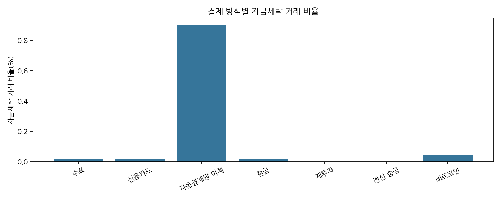

## 4. 계좌 연결과 그래프 구조

### Account CSV 자체의 분석 범위

대상 파일은 `HI-Large_accounts.csv`입니다. **2,126,855행 × 5개 컬럼**, 파일 크기 **147,691,860바이트(약 140.85 MiB)**이며 저장된 원본 전량 EDA 결과를 사용했습니다. 원본의 각 행은 계좌 등록 정보입니다. 계좌 CSV에는 **거래 시각·금액·자금세탁 라벨·패턴명·계좌 개설 시각이 없습니다.** 따라서 이 파일만으로 일별 양성 수나 계좌의 세탁 여부를 산출하지 않습니다. 거래와 연결한 활동 분석은 아래에서 별도로 구분합니다.

#### 5개 컬럼의 의미와 자료형

| 원본 컬럼 | 한글 의미 | 원문 해석 | 분석에서의 역할 |
|---|---|---|---|
| `Bank Name` | 은행명 | 문자열 | 표시·국가 토큰 추출. 고유 은행 키가 아님 |
| `Bank ID` | 은행 ID | 숫자 모양의 문자열 | 표기를 정규화해 복합키의 은행 부분으로 사용 |
| `Account Number` | 계좌번호 | 16진수 형태 문자열 | 숫자 크기 의미 없이 은행 ID와 함께 계좌 식별 |
| `Entity ID` | 소유 주체 ID | 문자열 | 같은 주체의 여러 계좌를 묶는 식별자 |
| `Entity Name` | 소유 주체명 | 문자열 | 표시 및 유형 접두부 추출. 이진 라벨이 아님 |

#### 컬럼별 결측·공백·길이·고유값

빈 필드/NULL, 공백만 있는 값, `NULL`·`N/A` 등의 문자형 결측 표기, 앞뒤 공백을 각각 검사했습니다. 고유값 수는 근사가 아닌 전체 집계입니다.

| 컬럼 | 빈 값/NULL | 공백만 | 문자형 결측 | 앞뒤 공백 | 원문 길이 최소~최대 | 고유값 수 |
|---|---:|---:|---:|---:|---|---:|
| `bank_name` | 0 | 0 | 0 | 0 | 8~30 | 80,180 |
| `bank_id` | 0 | 0 | 0 | 0 | 1~7 | 122,333 |
| `account_number` | 0 | 0 | 0 | 0 | 9~9 | 2,110,228 |
| `entity_id` | 0 | 0 | 0 | 0 | 11~11 | 670,231 |
| `entity_name` | 0 | 0 | 0 | 0 | 9~27 | 670,231 |

**해석:** 검사한 5개 컬럼은 모두 결측·공백 문제가 없었습니다. 그러나 국가 정보가 은행명에 없는 경우까지 “정보가 완전하다”는 뜻은 아닙니다. 계좌번호는 모두 9자리이며 16진수 형식에서 벗어난 값은 0개입니다. 은행 ID의 숫자 형식 오류와 선행 0은 각각 0개입니다. 엔티티 ID는 모두 11자리라는 길이 검사 결과이며, 계좌번호와 동일한 숫자 변환 규칙을 적용한다는 뜻은 아닙니다.

#### 중복과 식별자 충돌을 구별

| 검사 | 전량 결과 | 해석·처리 |
|---|---:|---|
| 계좌 CSV의 중복 헤더 | 0개 | 거래 CSV의 중복 `Account` 헤더와 구별 |
| 5개 컬럼 완전 중복 초과 행 | 0행 | 현재 계좌 파일에서 완전 중복으로 제거할 행 없음 |
| 정규화된 은행 ID + 계좌번호 중복 키 | 0개 | 노드 식별용 복합키로 사용 가능 |
| 같은 복합키의 엔티티 충돌 | 0개 | 하나의 계좌 키에 여러 소유 주체가 연결되지 않음 |
| 동일 은행 ID에 여러 은행명 | 0개 | 이 파일에서는 은행 ID→은행명 대응이 일관됨 |
| 동일 엔티티 ID에 여러 엔티티명 | 0개 | 이 파일에서는 엔티티 ID→이름 대응이 일관됨 |
| 여러 은행 ID를 가진 은행명 | 468개 | 은행명만으로 은행을 합치지 않음 |
| 여러 은행에서 재사용된 계좌번호 | 16,496개 | 계좌번호만으로 노드를 합치지 않음 |
| 여러 소유 주체와 연결된 계좌번호 | 16,443개 | 복합키가 아닌 계좌번호 단독 비교의 결과. 소유권 오류로 단정하지 않음 |

**핵심:** 같은 은행명·계좌번호 문자열이 반복된다는 사실과 완전 중복 행은 다릅니다. 반복된 ID·이름을 임의로 삭제하면 정상적인 계좌–은행–소유 주체 관계가 사라질 수 있습니다.

### 계좌 식별과 연결

| 항목 | 결과 |
|---|---|
| 등록 계좌 행 | 2,126,855 |
| 은행 ID 종류 | 122,333 |
| 계좌번호 문자열 종류 | 2,110,228 |
| 엔티티 ID 종류 | 670,231 |
| 여러 은행에서 쓰인 동일 계좌번호 | 16,496개 |
| 복수 엔티티와 연결된 동일 계좌번호 | 16,443개 |
| 정규화된 은행 ID + 계좌번호 키 중복 | 0개 |
| 은행 ID 정규화 없이 문자열 그대로 연결된 관측 노드 | 0개 |
| 정규화 후 연결 실패 노드·거래 끝점 | 각각 0개 |
| 등록됐지만 거래에서 관측되지 않은 계좌 | 10,687개 |

**원인:** 거래 원본의 은행 ID는 송신·수신 모두 선행 0을 포함하지만 계좌 원본의 은행 ID에는 선행 0이 없습니다. 은행명도 여러 은행 ID에 대응하는 이름이 468개 있어 단독 식별자로 사용할 수 없습니다.

**적용:** 은행 ID 표기를 정규화하고 **은행 ID + 문자열 계좌번호**를 노드 키로 사용합니다. 계좌번호만으로 연결하면 다른 은행·엔티티 계좌가 합쳐질 수 있습니다.

### 국가·엔티티 속성

- 은행명에서 국가가 명시적으로 드러나지 않는 계좌는 **789,927개**입니다.
- Crypto/Crytpo 표식 계좌 **46,600개**가 별도 집계되었습니다. 두 집계의 중첩 여부를 이 보고서에서 재검사하지 않았으므로 합산하지 않습니다.
- 국가를 원본의 독립된 검증 컬럼으로 받은 것이 아니라 은행명에서 추출합니다. 모르는 값은 `UNKNOWN`으로 유지합니다.
- 엔티티 유형도 이름 접두부에서 파생한 값입니다. 실제 법적 유형과 동등한 검증 정보로 간주하지 않습니다.

| 추출 유형 | 계좌 수 | 엔티티 수 |
|---|---|---|
| Partnership | 745,341 | 222,958 |
| Corporation | 692,680 | 223,674 |
| Sole Proprietorship | 680,013 | 223,101 |
| Country | 5,689 | 1 |
| Individual | 3,104 | 495 |
| Direct | 28 | 2 |

Country 유형은 5,689개 계좌가 하나의 엔티티 ID에 속합니다. 엔티티 집계가 일부 큰 그룹의 영향을 받을 수 있으므로 분포를 확인해야 합니다.

### 소유 주체별 등록 계좌 수 분포

같은 엔티티 ID로 계좌 행을 묶으면 **670,231개 소유 주체**가 있습니다. 주체당 평균 등록 계좌 수는 **3.1733개**, 중앙값은 **1개**, 95백분위는 **14개**, 99백분위는 **22개**, 최대는 **8,611개**입니다. 분위수는 엔티티별 계좌 수 빈도표를 이용한 선형 보간이며 정확 집계에 기반합니다.

| 등록 계좌 수 구간 | 엔티티 수 | 엔티티 비율 | 소속 계좌 수 |
|---|---:|---:|---:|
| 1개 | 457,996 | 68.3341% | 457,996 |
| 2~5개 | 135,077 | 20.1538% | 390,919 |
| 6~10개 | 32,714 | 4.8810% | 246,927 |
| 11~50개 | 43,246 | 6.4524% | 758,197 |
| 51~100개 | 711 | 0.1061% | 48,866 |
| 101개 이상 | 487 | 0.0727% | 223,950 |

**해석:** 하나의 계좌만 가진 주체가 많지만 많은 계좌를 가진 주체도 있습니다. 이는 등록 정보의 분포이며 거래량·위험도의 분포는 아닙니다. `log_entity_observed_accounts`는 이 전체 등록 계좌 수가 아니라 **그날 최근 30일 문맥에서 활동이 관측된 같은 엔티티 계좌 수**를 사용하므로 구별해야 합니다.

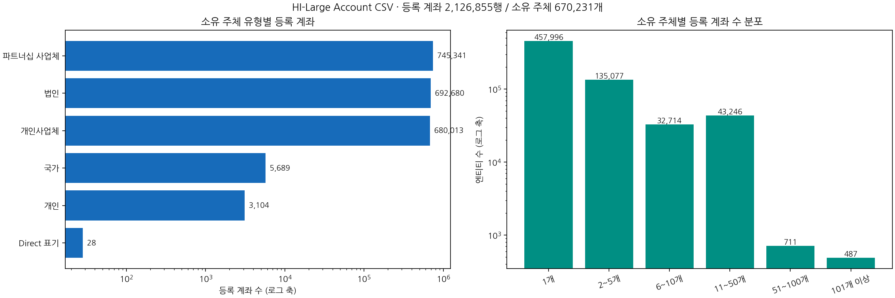

### 계좌 정보를 학습에 사용할 때의 판단

| 확인 결과 | 적용 기준 |
|---|---|
| 원본 결측·완전 중복 없음 | 근거 없이 계좌 행을 삭제하거나 결측을 만들어 채우지 않음 |
| 계좌번호 단독으로는 고유하지 않음 | 은행 ID 정규화 + 계좌번호 문자열 복합키 유지 |
| 국가·유형은 이름에서 파생 | 원본에 명시된 독립 검증 속성으로 과대해석하지 않음 |
| 동일 주체가 여러 계좌 보유 | 엔티티 관계는 유지하되 거래 시점·문맥 범위에 맞춰 활동 집계 |
| 계좌 등록 정보에 유효 시각 없음 | 당시 알려져 있던 KYC인지 이 파일만으로 검증할 수 없음. 일별 거래 시간 제약과 별개 |
| 원본 계좌 파일에 Y 라벨 없음 | 거래의 `Is Laundering`으로 거래를 학습하며 패턴·양성 집계를 계좌 입력에 넣지 않음 |
| 거래에서 관측되지 않는 등록 계좌 존재 | 등록 노드와 활동 노드를 구별하며 미관측을 정상·음성 라벨로 지정하지 않음 |

위의 등록 계좌 분석과 아래의 거래 연결 후 활동 분석은 집계 대상이 다릅니다.

### 거래와 연결한 관측 노드의 활동

#### ‘끝점’과 ‘끝점 등장 횟수’의 의미

**끝점(endpoint)은 거래를 나타내는 화살표 양쪽의 계좌**, 즉 송신 계좌와 수신 계좌를 뜻합니다. 여기서 ‘끝’은 거래가 끝나는 시각이나 최종 수취인이라는 의미가 아닙니다.

```text
A 계좌 ──송금──▶ B 계좌
송신 끝점        수신 끝점
```

**계좌별 끝점 등장 횟수 = 송신으로 등장한 횟수 + 수신으로 등장한 횟수**입니다. 아래 예시는 집계 방법을 설명하기 위한 가상 거래입니다.

| 거래 예시 | 계좌별 끝점 등장 횟수 | 읽는 방법 |
|---|---|---|
| `A → B` 1건 | A: 1회, B: 1회 | 한 거래에 송신·수신 끝점이 하나씩 있음 |
| `A → B`, `C → B` | A: 1회, C: 1회, B: 2회 | B는 두 거래의 수신 계좌로 등장 |
| `A → B`, `B → C` | A: 1회, B: 2회, C: 1회 | B는 수신 1회와 송신 1회를 합쳐 2회 |
| `A → A` 자기 이체 1건 | A: 2회 | 같은 계좌가 송신·수신 양쪽에 있으므로 각각 집계 |

따라서 아래의 **‘끝점 등장 1회 노드’ 30,150개는 전체 원본 거래에서 송신·수신 등장 횟수를 합쳐 정확히 1회인 계좌 수**입니다. 단순히 서로 다른 상대가 1개인 계좌나 하루에 한 번 거래한 계좌를 뜻하지 않습니다. 자기 이체 1건만 있는 계좌도 끝점 등장은 2회이므로 이 집단에 포함되지 않습니다.

또한 **‘미연결 거래 끝점’은 거래의 송신 또는 수신 계좌를 계좌 등록 정보에 연결하지 못한 경우**를 뜻합니다. 현재 EDA에서는 은행 ID 정규화와 은행+계좌 복합키 적용 후 미연결 끝점이 0개였습니다.

| 항목 | 결과 |
|---|---|
| 관측 노드 | 2,116,168개 |
| 송신 전용 | 391,075개 |
| 수신 전용 | 39,867개 |
| 끝점 등장 1회 노드 | 30,150개 |
| 자기 이체 거래 | 10,895,216건 (6.0629%) |
| 같은 은행 내 거래 | 12,307,096건 (6.8486%) |
| 수신 전용 계좌로 입금된 양성 거래 | 1,531건 |
| 수취 1회 계좌로 입금된 양성 거래 | 929건 |

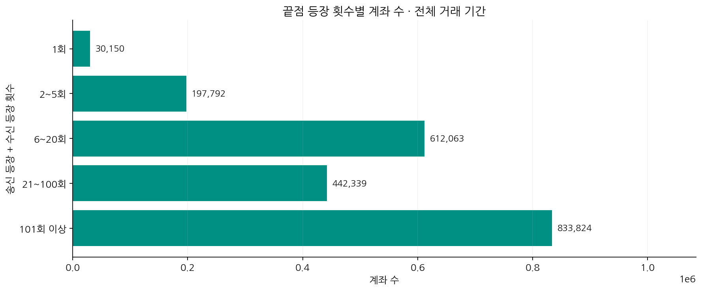

**그래프 해석:** 송신·수신 등장 횟수를 합산한 분포입니다. 자기 이체 한 건은 같은 계좌의 끝점 등장 두 번으로 집계됩니다.

| 끝점 등장 횟수 구간 | 노드 수 |
|---|---|
| 1 | 30,150 |
| 2-5 | 197,792 |
| 6-20 | 612,063 |
| 21-100 | 442,339 |
| 101+ | 833,824 |

끝점 등장 횟수는 송신·수신으로 등장한 횟수 기준이며, 자기 이체에서는 양쪽 끝점이 같은 계좌입니다. 활동이 적거나 수신만 한다는 이유로 노드를 제거하면 실제 양성도 잃습니다.

| 최초 관측 월 | 새로 관측된 노드 |
|---|---|
| 2022-08 | 2,093,929 |
| 2022-09 | 14,715 |
| 2022-10 | 7,428 |
| 2022-11 | 95 |
| 2022-12 | 1 |

노드 대부분이 8월에 처음 관측되므로, 전체 테스트 성능과 신규 계좌 성능을 별도로 비교할 필요가 있습니다. ‘최초 관측’은 실제 계좌 개설일을 뜻하지 않습니다.

## 5. 중복 컬럼과 중복 행

### 이름이 같은 컬럼과 값이 같은 컬럼

- 거래 헤더의 3번째와 5번째 `Account`는 각각 **송신·수신 계좌**입니다. 중복된 이름을 분리해야 하며 열 자체를 삭제하면 안 됩니다.
- `Amount Paid`와 `Amount Received`가 같은 거래는 **176,905,192건**이지만, 다른 거래도 **2,797,037건** 있습니다. 의미와 값이 항상 같지 않으므로 원본에서 하나를 없애지 않습니다.
- 같은 통화에서는 송금·수취 금액 차이가 0건이지만, 서로 다른 통화에서는 단위가 달라집니다. 자주 같다는 사실만으로 불필요한 컬럼이라고 판단하지 않습니다.

### 완전 중복 — 원본 11개 필드 기준

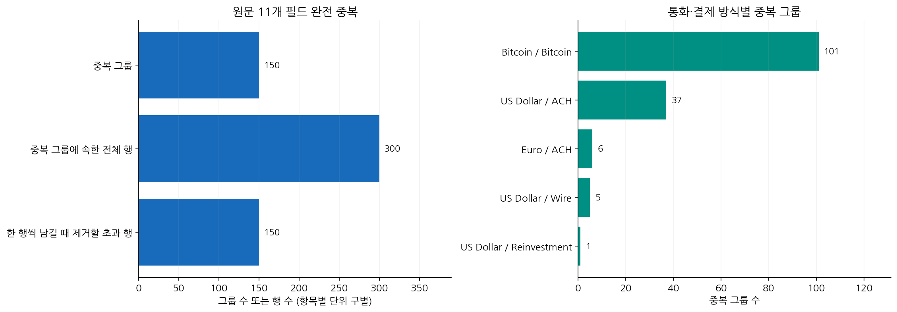

**그래프 해석:** 완전 중복은 150그룹·300행이며 각 그룹에서 한 행을 남기면 제거되는 초과분은 150행입니다. 모두 정상 라벨이고, 반복 발생 원인은 확인되지 않았습니다.

| 항목 | 결과 |
|---|---|
| 중복 그룹 | 150개 |
| 중복 그룹에 속한 전체 행 | 300행 |
| 한 행씩 남길 때 제거될 초과분 | 150행 |
| 그룹당 최대 반복 | 2회 |
| 양성 중복 그룹 | 0개 |
| 6개 연결 키가 반복된 그룹 | 376개 |
| 그중 다른 필드가 실제로 다른 그룹 | 226개 |

6개 키는 **시각·송신 은행·송신 계좌·수신 은행·수신 계좌·송금 금액**입니다. 이 키만으로 중복 제거하면 통화·수취 금액·결제 방식이 다른 거래까지 합칠 수 있습니다. 완전 중복은 해시로 후보를 좁힌 뒤 원본 11개 필드로 재확인했습니다.

| 송금 통화 | 결제 방식 | 완전 중복 그룹 |
|---|---|---|
| Bitcoin | Bitcoin | 101 |
| US Dollar | ACH | 37 |
| Euro | ACH | 6 |
| US Dollar | Wire | 5 |
| US Dollar | Reinvestment | 1 |

### 실제 반복 거래인가요?

- 원본 행 위치 차이가 2인 중복쌍은 **129개**, 4는 **19개**, 1과 15는 각각 **1개**입니다.
- 인접 행과 작은 금액의 환전·지급 흐름은 실제 반복 거래 또는 생성 과정의 연속 이벤트일 가능성을 시사하지만, **원인을 확정하지는 못했습니다.**
- 독립적인 거래 ID, 초·밀리초 시각, 생성기 이벤트 로그가 없어 ‘중복 적재’와 ‘값이 같은 두 거래’를 확실히 구분할 수 없습니다.
- **현재 정책:** 원본은 유지하고 중복 감사를 남깁니다. 적재 중복이 확인되면 이벤트 ID에 따른 멱등 처리를 적용하는 것이 좋습니다.
- 라벨이 0이어도 반복 횟수·시간 피처·그래프 구조에 영향을 줍니다. 반대로 이번 초과분 150행은 전체 규모 대비 매우 작으므로, 그것이 성능 저하의 주원인이라고 단정하지 않습니다.

## 6. 통화와 금액 분포

### 송금 통화별 규모

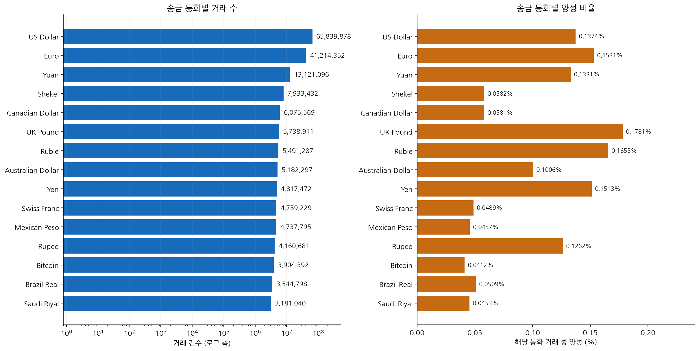

**그래프 해석:** 거래량이 많은 통화와 양성 비율이 높은 통화는 구별해야 합니다. 각 비율의 분모는 해당 송금 통화 거래 수입니다.

아래 수치는 **송금 통화** 기준입니다. 송금 또는 수취 어느 쪽이든 해당 통화인 거래 수와는 다릅니다.

| 송금 통화 | 거래 수 | 양성 수 | 양성 비율 |
|---|---|---|---|
| US Dollar | 65,839,878 | 90,439 | 0.1374% |
| Euro | 41,214,352 | 63,086 | 0.1531% |
| Yuan | 13,121,096 | 17,468 | 0.1331% |
| Shekel | 7,933,432 | 4,615 | 0.0582% |
| Canadian Dollar | 6,075,569 | 3,532 | 0.0581% |
| UK Pound | 5,738,911 | 10,221 | 0.1781% |
| Ruble | 5,491,287 | 9,089 | 0.1655% |
| Australian Dollar | 5,182,297 | 5,212 | 0.1006% |
| Yen | 4,817,472 | 7,288 | 0.1513% |
| Swiss Franc | 4,759,229 | 2,326 | 0.0489% |
| Mexican Peso | 4,737,795 | 2,165 | 0.0457% |
| Rupee | 4,160,681 | 5,249 | 0.1262% |
| Bitcoin | 3,904,392 | 1,608 | 0.0412% |
| Brazil Real | 3,544,798 | 1,806 | 0.0509% |
| Saudi Riyal | 3,181,040 | 1,442 | 0.0453% |

### 대표 통화의 금액 범위

각 값은 **그 통화의 단위**이며 통화 간 경제적 가치를 직접 비교하면 안 됩니다. 중앙값은 근사값입니다.

| 통화 | 라벨 | 최소 | 근사 중앙값 | 평균 | 최대 |
|---|---|---|---|---|---|
| Bitcoin | 정상 | 1e-06 | 0.0677059 | 18.9514 | 2.61396e+06 |
| Bitcoin | 양성 | 8.1e-05 | 0.209392 | 582.513 | 434,553 |
| Euro | 정상 | 0.01 | 717.459 | 231,463 | 8.94884e+10 |
| Euro | 양성 | 0.03 | 5,411.46 | 5.75645e+06 | 6.13706e+10 |
| US Dollar | 정상 | 0.01 | 832.234 | 317,579 | 1.08172e+11 |
| US Dollar | 양성 | 0.04 | 6,091.82 | 4.82962e+06 | 3.31446e+10 |
| Yen | 정상 | 0.01 | 85,184.4 | 5.60605e+07 | 2.04616e+12 |
| Yen | 양성 | 18.69 | 727,824 | 5.28226e+08 | 1.05574e+12 |

평균과 중앙값의 큰 차이는 긴 오른쪽 꼬리를 보여줍니다. 큰 금액이 있다는 이유만으로 오류 또는 세탁 거래라고 단정할 수 없습니다. 로그 변환·통화별 정규화를 적용하고 범주별 성능을 확인해야 합니다.

### 송금·수취 컬럼의 관계

| 비교 | 거래 수 |
|---|---|
| 송금·수취 통화 같음 | 176,904,911 |
| 송금·수취 통화 다름 | 2,797,318 |
| 통화가 다른데 숫자 금액은 같음 | 281 |
| 통화는 같은데 금액은 다름 | 0 |

### 비트코인 처리

- 송금 또는 수취 통화가 비트코인인 거래: **3,959,480건**, 양성 **1,608건**.
- 결제 방식이 `Bitcoin`인 거래는 **3,905,021건**으로, 통화 기준 집계와 다릅니다.
- 작은 단위라는 이유로 제거하면 해당 거래군 전체를 평가 대상에서 잃습니다. 현재는 비트코인을 유지합니다.
- 10월 활동 노드 1,989,150개 중 **60,249개(3.0289%)**가 여러 통화를 사용하며 최대 8종입니다. 계좌별 원금액 단순 합산은 단위가 섞입니다.

### 고정환율을 확정할 수 있나요?

수취 금액 ÷ 송금 금액의 관측 비율은 환산의 단서이지만 공식 환율표가 아닙니다.

| 방향 | 거래 수 | 최소 비율 | 중앙 비율 | 최대 비율 |
|---|---|---|---|---|
| US Dollar → Euro | 602,533 | 0.5 | 0.8534 | 1 |
| US Dollar → Yuan | 176,511 | 6.6060606 | 6.6976 | 6.875 |
| US Dollar → Bitcoin | 42,169 | 5e-05 | 8.4179964e-05 | 0.0001 |

소액 반올림 등이 비율 차이를 만들 수 있지만, 이 EDA로 환율의 시간 일관성·수수료·생성 규칙을 확정하지 않았습니다. **관측 중앙값을 곧바로 고정환율로 쓰지 않았습니다.**

현재 전처리는 8월 1~7일의 통화별 양수 금액 중앙값을 기준으로 `log1p(금액 / 기준 금액)`을 계산하고, 같은 기준 기간의 중앙값·IQR로 정규화해 ±8로 제한합니다. 이는 통화 내 상대 규모이며 공통 통화 환산 금액이 아닙니다. 기준 기간에 없는 통화는 중립 점수와 별도 플래그로 처리합니다.

### 금액 정밀도

원금액을 곧바로 float32로 바꾸면 송금 **172,615,812건**, 수취 **172,620,847건**의 수치가 달라졌습니다. 송금 최대 절대 차이는 float64 기준 비교에서 약 **216,122.28 원통화 단위**였습니다. 이는 비교 방법상 근사 오차 규모이며, 모든 작은 표현 차이가 업무적으로 중대한 오류라는 뜻은 아닙니다.

**적용:** 원문·DECIMAL 금액은 조인과 감사에 보존하고, 변환·정규화 후 모델 입력만 float32로 사용합니다.

## 7. 패턴 파일과 정답 커버리지

### 구조와 연결 검사

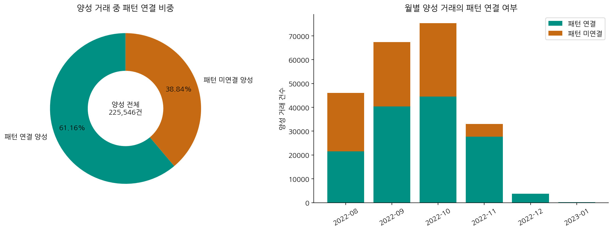

**그래프 해석:** 양성 중 61.16%만 패턴 파일에 연결됩니다. 미연결 38.84%도 이진 라벨은 양성이며 정상 거래로 바꾸면 안 됩니다.

- 패턴 유형 **8종**, 시도 **16,467개**, 소속 거래 **137,936건**.
- 구조 오류·빈 시도·시각 오류·금액 오류·라벨 1 이외 거래: **모두 0건**.
- 패턴 거래 **137,936건 전부** 원본 양성 거래와 연결되었습니다. 남은 필드 불일치, 다중 매칭, 여러 시도에 중복 소속된 원본 거래는 0건입니다.
- 전체 양성 중 **87,610건은 패턴 파일에 없습니다.** 이들은 정상으로 바꾸거나 오류로 단정하면 안 됩니다.

| 월 | 전체 양성 | 패턴 연결 양성 | 미연결 양성 | 양성 중 패턴 커버리지 |
|---|---|---|---|---|
| 2022-08 | 46,040 | 21,518 | 24,522 | 46.7376% |
| 2022-09 | 67,372 | 40,338 | 27,034 | 59.8735% |
| 2022-10 | 75,263 | 44,559 | 30,704 | 59.2044% |
| 2022-11 | 33,013 | 27,663 | 5,350 | 83.7943% |
| 2022-12 | 3,704 | 3,704 | 0 | 100.0000% |
| 2023-01 | 154 | 154 | 0 | 100.0000% |

전체 양성의 패턴 커버리지는 **61.1565%**입니다. 이진분류 정답은 `Is Laundering`이며, 패턴명은 별도 보조 정답입니다.

### 패턴별 규모와 지속시간

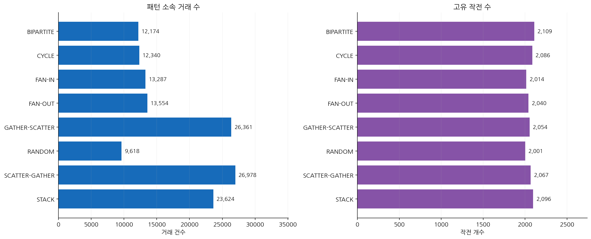

**그래프 해석:** 작전 수가 비슷해도 작전당 거래 수가 달라 패턴별 거래 규모는 다릅니다. 왼쪽은 거래 건수, 오른쪽은 작전 개수입니다.

지속시간은 시도 안의 **마지막 거래 시각 − 첫 거래 시각**입니다. 자금의 실제 체류시간이나 탐지 지연시간을 직접 나타내지 않습니다.

| 패턴 | 시도 수 | 거래 수 | 지속시간 중앙값(일) | 최대(일) | 월 경계 초과 시도 |
|---|---|---|---|---|---|
| BIPARTITE | 2,109 | 12,174 | 10.43 | 16.95 | 524 |
| CYCLE | 2,086 | 12,340 | 29.18 | 35.02 | 1,640 |
| FAN-IN | 2,014 | 13,287 | 28.81 | 35.02 | 1,381 |
| FAN-OUT | 2,040 | 13,554 | 29.13 | 35.01 | 1,410 |
| GATHER-SCATTER | 2,054 | 26,361 | 55.76 | 70.45 | 1,612 |
| RANDOM | 2,001 | 9,618 | 20.52 | 35.00 | 1,055 |
| SCATTER-GATHER | 2,067 | 26,978 | 32.44 | 35.02 | 1,796 |
| STACK | 2,096 | 23,624 | 26.51 | 42.51 | 1,543 |

FAN-IN은 집금, FAN-OUT은 분산, GATHER-SCATTER는 집금 후 분산, SCATTER-GATHER는 분산 후 재집금, CYCLE은 순환, BIPARTITE는 두 집단 사이 연결을 살펴볼 유형입니다. STACK·RANDOM의 세부 생성 규칙은 원본 예시만으로 확정하지 않았습니다.

### 시간 분할 경계와 패턴 끊김

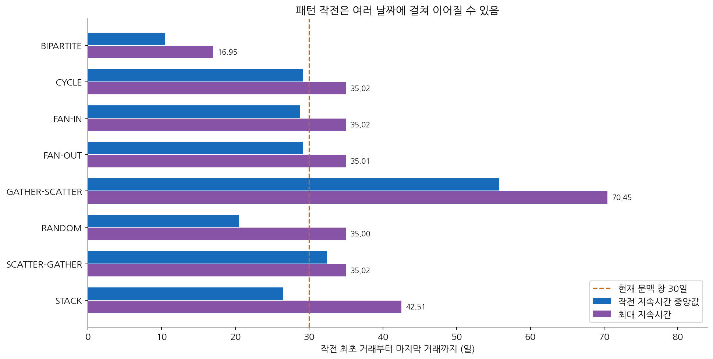

**그래프 해석:** 일부 작전은 30일을 넘습니다. 30일 문맥을 사용해도 모든 작전의 전체 거래 경로가 한 번에 포함된다는 뜻은 아닙니다.

| 패턴 | 8·9월 모두 등장 | 9·10월 모두 등장 | 10월·이후 모두 등장 |
|---|---|---|---|
| BIPARTITE | 168 | 165 | 191 |
| CYCLE | 559 | 548 | 517 |
| FAN-IN | 457 | 488 | 438 |
| FAN-OUT | 453 | 433 | 512 |
| GATHER-SCATTER | 498 | 900 | 961 |
| RANDOM | 356 | 350 | 331 |
| SCATTER-GATHER | 566 | 606 | 617 |
| STACK | 424 | 555 | 534 |

위 열은 해당 두 기간 모두에 거래가 존재하는 시도 수입니다. 한 시도가 여러 경계를 넘을 수 있어 열끼리 합산하면 중복 집계됩니다.

**해석·적용:** 월마다 독립 그래프를 만들면 실제 연결이 끊길 수 있습니다. 현재는 시간순으로 채점 대상을 나누되 과거 30일을 문맥으로 이어 씁니다. 다만 GATHER-SCATTER 최대 약 70.45일, STACK 최대 약 42.51일이므로 **30일 창이 모든 시도의 전체 경로를 보존하지는 않습니다.** 두 층 GNN과 최근 10개 유입 거래 제한의 영향도 별도 검증이 필요합니다.


현재 입력 X는 노드 23개·엣지 18개 피처와 그래프 연결, 정답 Y는 거래별 `Is Laundering`입니다. 패턴 정답과 라벨 기반 집계는 입력에서 제외했습니다.

비율은 각 표의 분모를 기준으로 계산하고 표시 자리수에서 반올림했습니다. 확인되지 않은 원인이나 효과는 관측 결과와 구분해 설명했습니다.
