# GNN 6종 전체 파이프라인 통합 설명서

이 문서는 **데이터 전처리 → 그래프 생성 → GNN 6종 학습 → 클러스터링 감사 → 잠재공간 증강 → 시각화·결과 비교**를 설명합니다. 실행 코드와 저장된 결과는 [통합 노트북](통합본_전체코드_시각화_결과.ipynb)에 있습니다.

**중요한 구분:** 기존 실제 데이터 실험 결과, 새 인공 데이터 데모 결과, 코드 정합성 검사는 서로 다른 근거입니다. 이 자료의 성능은 검증셋 결과이며 독립 테스트셋 평가가 아닙니다.

## 1. 새 컴퓨터에서 실행하기

두 방식 중 하나를 선택합니다.

- **파일 하나로 실행:** `통합본_전체코드_시각화_결과.ipynb`만 복사합니다.
- **나눠 읽으며 실행:** `00`부터 `60`까지 노트북 7개를 같은 폴더에 복사하고 `00`을 엽니다.

1. Python 3.11 또는 3.12와 Jupyter를 설치합니다. Jupyter가 없다면 터미널에서 `python -m pip install notebook` 후 `python -m notebook`을 실행합니다.
2. 노트북이 있는 폴더에서 실행합니다.
3. 처음에는 `INSTALL_DEPENDENCIES=True`로 라이브러리를 설치합니다. 필요하면 커널을 재시작합니다. 설치가 끝나면 False로 바꿔도 됩니다.
4. 기본 `DEMO=True`로 위에서부터 실행합니다. 가상 계좌 8개·거래 288건을 만들고 CPU에서 전체 흐름을 확인합니다.
5. 실제 학습은 `DEMO=False`로 변경하고 `RAW_DATA_DIR`와 `OUTPUT_DIR`를 지정한 뒤 실행합니다.

실제 원본 폴더에는 다음 파일이 필요합니다.

- `HI-Large_Trans.csv`: 거래
- `HI-Large_accounts.csv`: 계좌 정보
- `HI-Large_Patterns.txt`: 패턴 메타데이터. 정답 감사용이며 입력 피처로 사용하지 않습니다.

별도 `.py` 파일이나 기존 실험 폴더를 복사할 필요는 없습니다. 노트북 코드 셀에서 `_runtime/gnn_pipeline/` 내부 모듈이 자동 생성됩니다. 실제 대용량 학습에는 충분한 RAM·디스크와 GPU 사용을 권장합니다. GPU 사용 시 해당 컴퓨터의 CUDA와 호환되는 PyTorch를 설치해야 합니다.

**실행 검증 범위:** Linux·Python 3.12·CPU의 새 임시 폴더에서 확인했습니다. Windows/macOS에서는 직접 실행 검증하지 않았습니다. 설치에는 인터넷 연결이 필요할 수 있습니다.

이 MD의 그림까지 다른 컴퓨터에서 보려면 **`문서_그림/` 폴더도 함께 복사**하세요. 실행용 통합 노트북은 그림을 내부에 포함합니다.

## 2. 파일 구성

| 파일 | 역할 |
|---|---|
| [00 전체 실행](00_전체파이프라인_실행.ipynb) | 설정부터 전처리·학습·분석까지 순서대로 실행 |
| [10 데이터 전처리](10_데이터전처리_함수설명.ipynb) | 입력 검사·중복 처리·계좌 매핑·이력 피처 |
| [20 그래프 생성](20_그래프생성_함수설명.ipynb) | 일별 그래프와 19+17 피처 선택·저장 |
| [30 GNN 6종](30_GNN6종_모델설명.ipynb) | 모델별 설명·생성 함수·6종 실행 확인 |
| [40 샘플링·학습](40_샘플링과학습_함수설명.ipynb) | 학습 표본·IPW·학습·검증 |
| [50 클러스터링·증강](50_클러스터링과증강_시각화.ipynb) | 상세 알고리즘·시각화·증강 비교·코드 검사 |
| [60 기존 결과](60_기존실험결과_비교.ipynb) | 보관된 실제 실험 결과·그림·감사 기록 |
| [통합본](통합본_전체코드_시각화_결과.ipynb) | 위 코드·설명·그림·결과를 한 파일에 포함 |

## 3. 전체 흐름

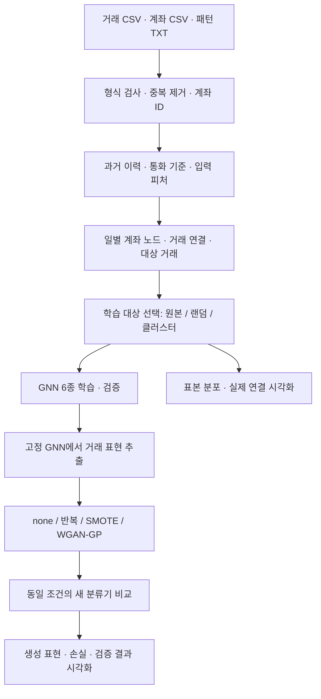

| 단계 | 입력 | 핵심 처리 | 결과 |
|---|---|---|---|
| 전처리 | 원본 CSV/TXT | 열·값 검사, 완전 중복 제거, 계좌 ID, 과거 이력 | DuckDB·피처·감사표 |
| 그래프 | 정제 거래와 피처 | 일별 노드/연결, 들어오는 최근 이웃, 배치 2홉 | 날짜별 배열 |
| 학습 | 저장 그래프 | 학습 표본 선택, 가중 손실, 모델·시드 반복 | 가중치·검증 점수·임계값 |
| 클러스터 감사 | 정상 학습 거래 | 군집 예산·분포·IPW 검사 | 표·PCA·연결 그림 |
| 증강 | 고정된 GNN의 학습 거래 표현 | 반복·보간·GAN, 동일 분류기 비교 | 생성 진단·검증 비교 |

### 데이터 전처리

`build_dataset`은 입력 열과 값을 엄격히 검사하고 기본 `drop_exact` 정책으로 원본 11개 열이 모두 같은 거래의 첫 행만 유지합니다. 은행·계좌 조합을 계좌 ID에 매핑하고 거래를 정규화합니다. 패턴 TXT는 평가용 메타데이터로만 처리합니다.

`build_pairagg`는 당일 시작 전까지의 계좌 쌍 이력을 계산합니다. `build_features`는 거래 빈도·간격·관계와 통화별 기준을 계산합니다. 통화 기준 적합 구간은 학습 시작 전입니다. 레이블은 입력 피처에 넣지 않습니다.

### 그래프 생성

노드는 계좌, 엣지는 방향이 있는 거래입니다. 하루의 판정 대상 거래와 과거부터 당일까지의 문맥 거래를 함께 사용합니다. 이 방식은 **일 마감 분석**이며 거래 직전 시점만 보는 실시간 탐지와 다릅니다.

입력은 계좌 특징 19개와 거래 특징 17개입니다. 마지막 거래 특징은 학습 이전 보정 구간의 통화별 기준으로 표준화한 지불 금액입니다. 배치에서는 대상 거래 양 끝 계좌에서 들어오는 이웃을 두 번 따라가 2홉 그래프를 구성합니다.

### 모델 학습과 검증

6개 모델은 같은 그래프·피처·학습 대상 표본을 공유합니다. 두 GNN 층으로 만든 **송신 계좌 표현 + 수신 계좌 표현 + 대상 거래 특징**을 분류기에 넣어 거래별 logit을 출력합니다. sigmoid를 적용하면 0~1 예측값이 됩니다.

검증 AP로 가장 좋은 에폭의 가중치를 저장하고 검증 F1이 최대가 되는 임계값을 정합니다. 독립 버전의 기본 GNN 학습 검증은 전체 검증 거래입니다. 테스트 기간은 평가하지 않습니다. 실제 기본 날짜는 학습 `[2022-08-08, 2022-09-28)`, 검증 `[2022-09-28, 2022-10-15)`이며 설정에서 확인할 수 있습니다.

## 4. GNN 6종의 차이

| 모델 | 쉽게 설명하면 | 실제 계층·구현 |
|---|---|---|
| TGNN | 중요한 이웃·거래 정보를 Transformer 어텐션으로 반영 | `TransformerConv` |
| GAT | 이웃별 중요도를 어텐션으로 계산 | `GATConv` |
| GATv2 | GAT와 어텐션 계산 순서가 다른 모델 | `GATv2Conv` |
| GINE | 거래 정보를 더한 이웃 메시지를 합산해 변환 | `GINEConv`, 학습 가능한 epsilon |
| Edge GraphSAGE | 이웃+거래 메시지를 평균 내고 자기 정보를 더함 | 사용자 정의 `EdgeSAGE` |
| Edge-weighted GCN | 거래 특징으로 연결 가중치를 학습한 뒤 GCN 집계 | 사용자 정의 `EdgeWeightedGCN` |

TGNN은 이 프로젝트의 Graph Transformer 명칭으로, 시간 메모리를 갱신하는 TGN 구조가 아닙니다. GraphSAGE와 GCN은 거래 특징을 반영하도록 확장한 구현입니다. 각 모델의 생성 코드는 30번 노트북에 **모델 1/6~6/6**으로 나뉘어 있습니다. `TransactionGNN`은 공통 분류 구조이며 추가 모델이 아닙니다.

## 5. 클러스터링과 증강 상세 설명

## 클러스터링을 왜 하는가?

정상 거래가 매우 많을 때 비슷한 거래를 묶은 뒤 각 묶음에서 표본을 뽑아 학습량을 줄입니다. 이상 거래는 전부 유지합니다. `MiniBatchKMeans`는 데이터를 작은 묶음으로 처리하며 중심점을 갱신합니다. K는 실제 데이터 기본 32개이며, 정답을 입력받아 군집을 만드는 지도학습이 아닙니다. 군집 적합 대상으로 정상 학습 거래를 고르는 데만 레이블을 사용합니다.

1. **적합 데이터:** 학습 날짜별 정상 거래에서 최대 4,096건을 고정 시드로 추출합니다. 검증·테스트는 제외합니다.
2. **입력:** 이번 독립 버전에서는 거래 특징 17개입니다. `StandardScaler`를 학습 참조 표본에만 적합한 뒤 평균 0·표준편차 1 기준으로 변환합니다.
3. **군집 적합:** `MiniBatchKMeans(n_clusters=K, batch_size=8192, n_init=3, random_state=seed)`를 사용합니다.
4. **일별 예산:** 정상 건수가 N, 비어 있지 않은 군집 수가 C, 목표 비율이 r이면 `B = min(N, max(C, ceil(N*r)))`입니다. 각 군집에 최소 1건을 배정하고 남은 예산을 **크기 비례 75% + 균등 25%**의 가중치로 배분합니다. 군집 크기보다 많이 뽑지 않도록 상한과 정수 반올림을 처리합니다. 따라서 최종 배분이 정확한 75:25 건수 분할이라는 뜻은 아닙니다.
5. **보정:** 군집 원본이 N_k건이고 n_k건을 뽑았다면 포함확률은 n_k/N_k, IPW는 N_k/n_k입니다. 이상 거래의 IPW는 1입니다. 손실에 이 값을 적용하고 표본수/원본수로 정규화합니다.
6. **문맥 유지:** 표본으로 고르는 것은 학습할 대상 거래입니다. 주변 계좌와 연결을 담은 일별 그래프는 보존하고, 배치에서 필요한 2홉 이웃을 사용합니다.

작은 예제에서는 군집별 최소 1건 때문에 목표 1%보다 훨씬 많이 뽑을 수 있습니다. 군집 수가 정상 거래 수보다 많으면 줄여야 합니다. 정상 패턴의 다양성을 보존하려는 목적이며, 군집화가 성능 향상을 보장하지는 않습니다.

### 시각화와 감사 지표 읽기

- PCA 그림: 17차원을 2차원으로 줄인 **일부 정상 거래**와 추출 거래입니다. PCA는 학습 참조 데이터에만 적합합니다. 그림에서 겹친다고 원래 17차원에서 같다는 뜻은 아닙니다.
- 막대 그림: 군집별 원본 건수와 표본 건수를 로그 축으로 비교합니다.
- KL: 학습 참조값의 분위수 구간을 사용해 `원본 P → 표본 Q`의 차이를 피처별로 계산합니다. 빈 구간에는 1e-8을 더합니다. raw, IPW 보정, 같은 정상 표본 수의 랜덤 추출을 비교합니다. **단변량 KL이 작다고 전체 관계가 보존되거나 탐지 성능이 좋다는 뜻은 아닙니다.**
- 거래 연결 그림: 첫 학습 날짜에서 뽑힌 정상 거래 최대 30건의 계좌·방향 연결입니다. 원형 배치는 보기 위한 배치이고, 실제 계좌 위치나 군집 간 거리를 의미하지 않습니다. 자기 송금은 이 배치에서 잘 보이지 않을 수 있습니다.

## 데이터 증강은 무엇을 만드는가?

**원본 거래 CSV나 계좌 연결을 합성하지 않습니다.** 학습된 GNN 두 층과 기존 분류기의 Linear/ReLU 은닉 투영을 고정한 뒤 거래 표현을 추출합니다. 원래 실험의 표현은 128차원이며 이 노트북의 빠른 데모는 hidden=16이므로 16차원입니다. 각 모델은 자기 모델이 만든 표현을 사용합니다.

| 조건 | 만드는 데이터 | 비교 목적 |
|---|---|---|
| none | 새 데이터 없음 | 같은 고정 인코더·새 분류기 절차의 기준 |
| repeat | 기존 이상 거래 표현 반복 추출 | 단순 반복 효과 |
| smote | 가까운 이상 표현 두 개 사이를 보간 | 보간 생성 효과 |
| wgan_gp | 잡음에서 학습한 이상 표현 생성 | 신경망 생성 효과 |

### SMOTE

학습 양성 표현 x_i의 가까운 이웃 x_j를 찾고 `x_new = x_i + λ(x_j-x_i)`로 만듭니다. λ는 0~1 난수입니다. 자기 자신을 이웃에서 제외하고 기본 k=5, 표본이 작으면 가능한 이웃 수까지 줄입니다. 생성 결과가 실제로 해당 선분 위에 있는지 검사합니다. 범주형 계좌 정보나 거래 원본 열을 직접 보간하는 것이 아닙니다.

### WGAN-GP

생성기: `32차원 잡음 → 128 → 128 → 표현 차원`.
Critic: `표현 차원 → 128 → 128 → 1`.
Critic은 진짜/가짜의 점수 차이를 학습하고, 입력 보간점에서 기울기 크기가 1에 가까워지도록 `10 × (기울기 크기−1)²`를 더합니다. Critic 3번 갱신 후 생성기를 1번 갱신합니다. 학습 이상 표현으로만 표준화·적합합니다.

**손실 곡선만으로 생성 품질을 판단하지 않습니다.** 분산 비율, 가장 가까운 학습 표현까지의 거리, 거의 같은 표본의 비율도 기록합니다. `possible_collapse`는 낮은 분산/과도한 복제를 찾는 휴리스틱이며 품질 인증이 아닙니다. repeat는 원래 복제 방식이므로 해당 경고가 나오는 것이 자연스럽습니다. 데모의 짧은 GAN 학습은 동작 확인용입니다.

### 공정한 비교와 자원 한도

모든 조건은 같은 인코더·훈련/검증 표현·새 분류기 초기값·optimizer·학습 스텝을 사용합니다. repeat/SMOTE/GAN의 추가 표본 수도 같습니다. 양성 데이터가 늘었다는 이유로 손실의 양성 비중까지 늘지 않도록 `(정상 평균 손실 + α×이상 평균 손실)/(1+α)`를 사용합니다. α는 원래 보정된 양성/정상 질량과 pos_weight로 계산합니다.

분류기는 `표현 차원 → 128 → 1`입니다. **다른 컴퓨터에서도 실행 가능하도록 날짜·클래스별 표현 추출에 기본 2,048건 상한**을 둡니다. 학습 표본의 기존 IPW와 추가 추출 확률을 결합하고, 검증도 추출 확률의 역수로 보정합니다. 전체 거래 평가가 아니라 이 표본 기반 검증 추정값이며, 동일한 검증 표본을 모든 증강 조건이 공유합니다. 데모는 작아서 상한에 걸리지 않습니다. 전체 검증이 필요하면 상한을 늘리고 메모리 사용량을 고려하세요.

**기존 연구와의 차이:** 기존 군집 적합은 18개 거래 특징, 기존 잠재공간 증강은 고정 클러스터 표본과 해당 검증 표본을 사용했습니다. 이 독립 버전은 17개 거래 특징과 새로운 표본·검증 절차를 사용합니다. 아래에 함께 제공하는 기존 실험 결과와 새 실행 결과를 섞어 평균 내거나 동일 실험의 재현값으로 취급하지 마세요.

## 6. 새 독립 실행의 시각화와 결과

아래는 통합본을 새 임시 폴더에 복사하여 **인공 거래 288건**으로 실행한 결과입니다. 실제 연구 성능이나 모델 순위를 의미하지 않습니다. 학습 2일·검증 2일, 모델 hidden=16, 모델별 1에폭·시드 42, GAN 25스텝·새 분류기 40스텝으로 실행했습니다. 증강 표현 상한은 날짜·클래스별 2,048건이므로 이 데모에서는 상한에 걸리지 않습니다.

### 클러스터 표본 감사

첫 학습 날짜의 정상 거래를 새로 군집화한 진단입니다. 데모의 GNN 기본 학습 방법은 원본이므로 이 진단이 학습 표본을 바꾸지는 않습니다. 군집별 최소 1건 보존 때문에 작은 데모에서는 표본 비율이 목표 1%보다 높습니다.

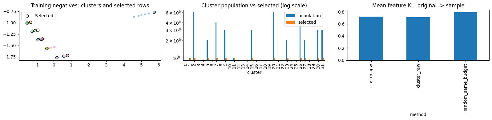

> **그림 읽기:** 왼쪽은 비슷한 정상 거래를 색깔별로 묶고, 뽑힌 거래를 검은 테두리로 표시한 그림입니다. 가운데는 군집별 원본·추출 건수, 오른쪽은 원본과 표본의 분포 차이입니다. 분포 차이 막대가 낮을수록 해당 피처 분포가 원본과 비슷합니다.

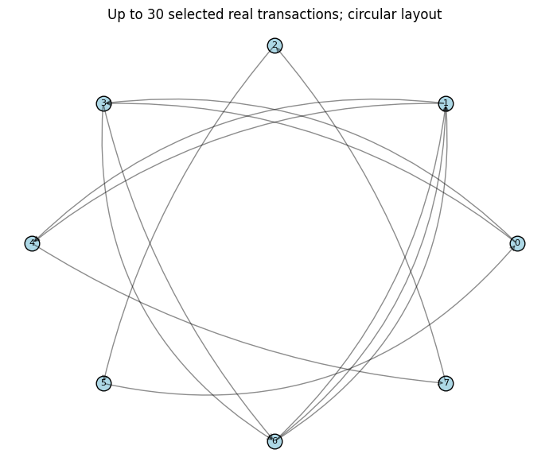

> **그림 읽기:** 동그라미는 계좌, 화살표는 송금 방향입니다. 선택한 거래 일부가 어떤 계좌를 연결하는지 보여줍니다. 계좌를 원형으로 놓은 위치 자체에는 의미가 없습니다.

### TGNN의 증강 표현과 GAN 학습

같은 학습 양성 데이터에 적합한 PCA로 실제 표현과 추가 표현을 비교합니다. 반복·SMOTE·WGAN-GP의 분포와 아래 손실 곡선을 함께 보세요. 패널의 축 범위가 다를 수 있어 그림 크기만으로 분산을 비교하지 마세요. 생성 품질은 진단값과 검증 결과도 확인해야 합니다.

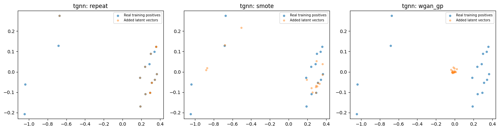

> **그림 읽기:** TGNN이 추출한 이상 거래 특징을 2차원으로 펼친 그림입니다. 파란 점은 실제 특징, 주황 점은 추가한 특징이며 왼쪽부터 반복·SMOTE·WGAN-GP입니다. 점들이 어디에 추가되는지 보되, 패널별 축 범위가 다를 수 있어 그림 크기만으로 비교하지 마세요.

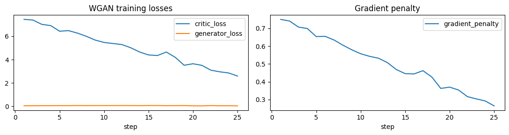

> **그림 읽기:** TGNN의 이상 거래 특징을 생성하는 GAN의 학습 과정입니다. 왼쪽은 생성기와 critic의 손실, 오른쪽은 학습을 안정시키는 기울기 벌점입니다. 가로축은 학습 스텝이며, 손실이 0으로 내려가는지보다 변동과 생성 품질 진단을 함께 보세요.

### GAT의 증강 표현과 GAN 학습

같은 학습 양성 데이터에 적합한 PCA로 실제 표현과 추가 표현을 비교합니다. 반복·SMOTE·WGAN-GP의 분포와 아래 손실 곡선을 함께 보세요. 패널의 축 범위가 다를 수 있어 그림 크기만으로 분산을 비교하지 마세요. 생성 품질은 진단값과 검증 결과도 확인해야 합니다.

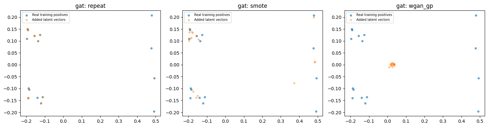

> **그림 읽기:** GAT이 추출한 이상 거래 특징을 2차원으로 펼친 그림입니다. 파란 점은 실제 특징, 주황 점은 추가한 특징이며 왼쪽부터 반복·SMOTE·WGAN-GP입니다. 점들이 어디에 추가되는지 보되, 패널별 축 범위가 다를 수 있어 그림 크기만으로 비교하지 마세요.

> **그림 읽기:** GAT의 이상 거래 특징을 생성하는 GAN의 학습 과정입니다. 왼쪽은 생성기와 critic의 손실, 오른쪽은 학습을 안정시키는 기울기 벌점입니다. 가로축은 학습 스텝이며, 손실이 0으로 내려가는지보다 변동과 생성 품질 진단을 함께 보세요.

### GATv2의 증강 표현과 GAN 학습

같은 학습 양성 데이터에 적합한 PCA로 실제 표현과 추가 표현을 비교합니다. 반복·SMOTE·WGAN-GP의 분포와 아래 손실 곡선을 함께 보세요. 패널의 축 범위가 다를 수 있어 그림 크기만으로 분산을 비교하지 마세요. 생성 품질은 진단값과 검증 결과도 확인해야 합니다.

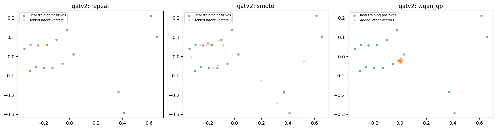

> **그림 읽기:** GATv2이 추출한 이상 거래 특징을 2차원으로 펼친 그림입니다. 파란 점은 실제 특징, 주황 점은 추가한 특징이며 왼쪽부터 반복·SMOTE·WGAN-GP입니다. 점들이 어디에 추가되는지 보되, 패널별 축 범위가 다를 수 있어 그림 크기만으로 비교하지 마세요.

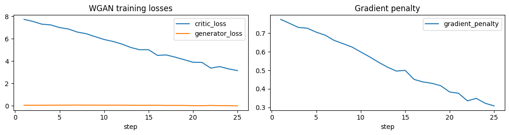

> **그림 읽기:** GATv2의 이상 거래 특징을 생성하는 GAN의 학습 과정입니다. 왼쪽은 생성기와 critic의 손실, 오른쪽은 학습을 안정시키는 기울기 벌점입니다. 가로축은 학습 스텝이며, 손실이 0으로 내려가는지보다 변동과 생성 품질 진단을 함께 보세요.

### GINE의 증강 표현과 GAN 학습

같은 학습 양성 데이터에 적합한 PCA로 실제 표현과 추가 표현을 비교합니다. 반복·SMOTE·WGAN-GP의 분포와 아래 손실 곡선을 함께 보세요. 패널의 축 범위가 다를 수 있어 그림 크기만으로 분산을 비교하지 마세요. 생성 품질은 진단값과 검증 결과도 확인해야 합니다.

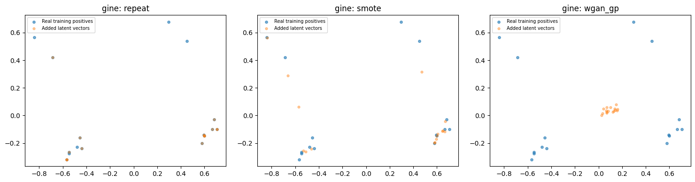

> **그림 읽기:** GINE이 추출한 이상 거래 특징을 2차원으로 펼친 그림입니다. 파란 점은 실제 특징, 주황 점은 추가한 특징이며 왼쪽부터 반복·SMOTE·WGAN-GP입니다. 점들이 어디에 추가되는지 보되, 패널별 축 범위가 다를 수 있어 그림 크기만으로 비교하지 마세요.

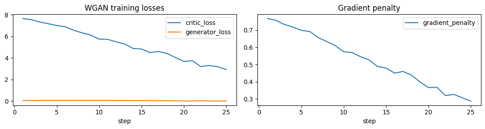

> **그림 읽기:** GINE의 이상 거래 특징을 생성하는 GAN의 학습 과정입니다. 왼쪽은 생성기와 critic의 손실, 오른쪽은 학습을 안정시키는 기울기 벌점입니다. 가로축은 학습 스텝이며, 손실이 0으로 내려가는지보다 변동과 생성 품질 진단을 함께 보세요.

### Edge GraphSAGE의 증강 표현과 GAN 학습

같은 학습 양성 데이터에 적합한 PCA로 실제 표현과 추가 표현을 비교합니다. 반복·SMOTE·WGAN-GP의 분포와 아래 손실 곡선을 함께 보세요. 패널의 축 범위가 다를 수 있어 그림 크기만으로 분산을 비교하지 마세요. 생성 품질은 진단값과 검증 결과도 확인해야 합니다.

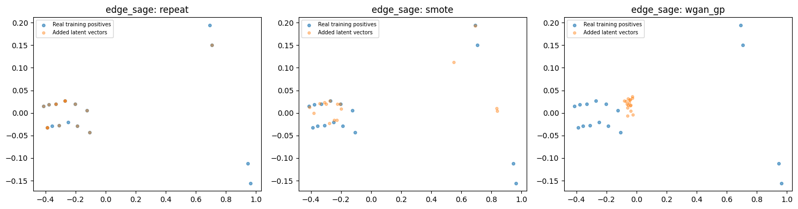

> **그림 읽기:** Edge GraphSAGE이 추출한 이상 거래 특징을 2차원으로 펼친 그림입니다. 파란 점은 실제 특징, 주황 점은 추가한 특징이며 왼쪽부터 반복·SMOTE·WGAN-GP입니다. 점들이 어디에 추가되는지 보되, 패널별 축 범위가 다를 수 있어 그림 크기만으로 비교하지 마세요.

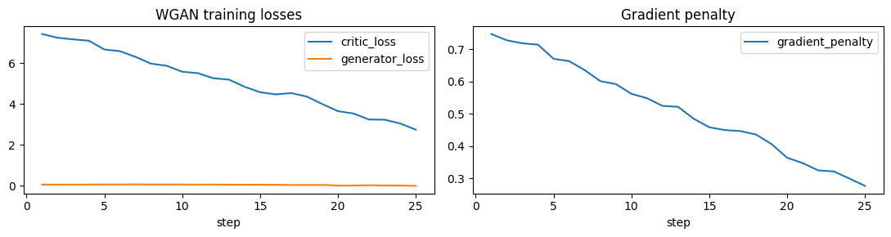

> **그림 읽기:** Edge GraphSAGE의 이상 거래 특징을 생성하는 GAN의 학습 과정입니다. 왼쪽은 생성기와 critic의 손실, 오른쪽은 학습을 안정시키는 기울기 벌점입니다. 가로축은 학습 스텝이며, 손실이 0으로 내려가는지보다 변동과 생성 품질 진단을 함께 보세요.

### Edge-weighted GCN의 증강 표현과 GAN 학습

같은 학습 양성 데이터에 적합한 PCA로 실제 표현과 추가 표현을 비교합니다. 반복·SMOTE·WGAN-GP의 분포와 아래 손실 곡선을 함께 보세요. 패널의 축 범위가 다를 수 있어 그림 크기만으로 분산을 비교하지 마세요. 생성 품질은 진단값과 검증 결과도 확인해야 합니다.

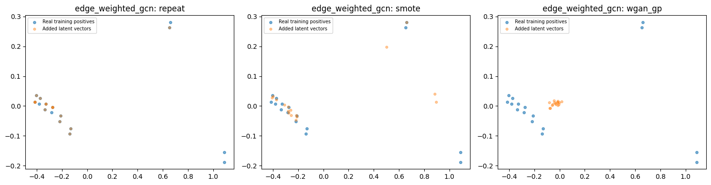

> **그림 읽기:** Edge-weighted GCN이 추출한 이상 거래 특징을 2차원으로 펼친 그림입니다. 파란 점은 실제 특징, 주황 점은 추가한 특징이며 왼쪽부터 반복·SMOTE·WGAN-GP입니다. 점들이 어디에 추가되는지 보되, 패널별 축 범위가 다를 수 있어 그림 크기만으로 비교하지 마세요.

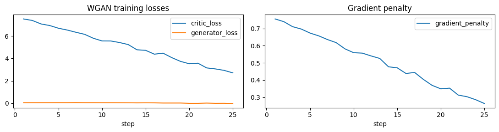

> **그림 읽기:** Edge-weighted GCN의 이상 거래 특징을 생성하는 GAN의 학습 과정입니다. 왼쪽은 생성기와 critic의 손실, 오른쪽은 학습을 안정시키는 기울기 벌점입니다. 가로축은 학습 스텝이며, 손실이 0으로 내려가는지보다 변동과 생성 품질 진단을 함께 보세요.

### 데모 증강 24개 비교

none은 같은 고정 인코더·새 분류기 절차의 무증강 대조군입니다. 위 GNN 원래 분류기의 결과와 직접 같은 조건으로 비교하면 안 됩니다. AP 변화는 해당 모델 none 대비 퍼센트포인트입니다.

| model | seed | method | AP | F1 | AP_gain_pp |
| --- | --- | --- | --- | --- | --- |
| tgnn | 42 | none | 0.214738 | 0.317460 | 0.000000 |
| tgnn | 42 | repeat | 0.214738 | 0.317460 | 0.000000 |
| tgnn | 42 | smote | 0.214738 | 0.317460 | 0.000000 |
| tgnn | 42 | wgan_gp | 0.215320 | 0.317460 | 0.058218 |
| gat | 42 | none | 0.232184 | 0.333333 | 0.000000 |
| gat | 42 | repeat | 0.231794 | 0.333333 | -0.038993 |
| gat | 42 | smote | 0.231794 | 0.333333 | -0.038993 |
| gat | 42 | wgan_gp | 0.231948 | 0.333333 | -0.023621 |
| gatv2 | 42 | none | 0.241348 | 0.349206 | 0.000000 |
| gatv2 | 42 | repeat | 0.241043 | 0.343750 | -0.030474 |
| gatv2 | 42 | smote | 0.241043 | 0.343750 | -0.030474 |
| gatv2 | 42 | wgan_gp | 0.241763 | 0.349206 | 0.041516 |
| gine | 42 | none | 0.221905 | 0.296296 | 0.000000 |
| gine | 42 | repeat | 0.221448 | 0.296296 | -0.045771 |
| gine | 42 | smote | 0.221448 | 0.296296 | -0.045771 |
| gine | 42 | wgan_gp | 0.223631 | 0.296296 | 0.172613 |
| edge_sage | 42 | none | 0.275480 | 0.305556 | 0.000000 |
| edge_sage | 42 | repeat | 0.275618 | 0.306122 | 0.013775 |
| edge_sage | 42 | smote | 0.275618 | 0.306122 | 0.013775 |
| edge_sage | 42 | wgan_gp | 0.275471 | 0.306122 | -0.000865 |
| edge_weighted_gcn | 42 | none | 0.264654 | 0.327869 | 0.000000 |
| edge_weighted_gcn | 42 | repeat | 0.260332 | 0.327869 | -0.432195 |
| edge_weighted_gcn | 42 | smote | 0.260487 | 0.327869 | -0.416667 |
| edge_weighted_gcn | 42 | wgan_gp | 0.260795 | 0.327869 | -0.385848 |

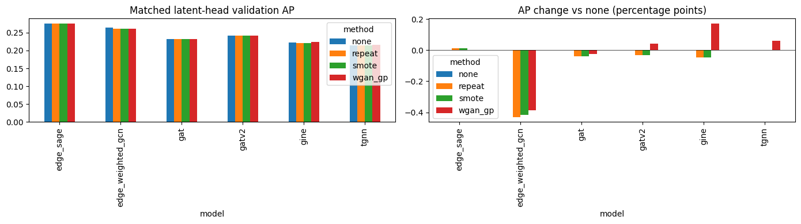

> **그림 읽기:** 왼쪽은 예제 데이터에서 증강 방식별 검증 AP, 오른쪽은 증강하지 않은 none 대비 변화입니다. 오른쪽 막대가 0보다 높으면 개선, 낮으면 감소입니다. 작은 예제의 결과이므로 실제 성능 순위로 해석하지 않습니다.

### 생성 품질 진단

반복 방식은 복제이므로 복제율이 높게 나오는 것이 예상됩니다. 붕괴 의심 플래그는 휴리스틱이며 실제 유용성의 최종 판정이 아닙니다.

| model | seed | method | finite | median_std_ratio | median_nearest_real_distance | exact_duplicate_fraction | possible_collapse |
| --- | --- | --- | --- | --- | --- | --- | --- |
| tgnn | 42 | repeat | True | 0.529009 | 0.000000 | 1.000000 | True |
| tgnn | 42 | smote | True | 0.913520 | 0.031395 | 0.000000 | False |
| tgnn | 42 | wgan_gp | True | 0.074502 | 0.474731 | 0.000000 | False |
| gat | 42 | repeat | True | 0.737787 | 0.000000 | 1.000000 | True |
| gat | 42 | smote | True | 0.942960 | 0.027167 | 0.000000 | False |
| gat | 42 | wgan_gp | True | 0.073570 | 0.330416 | 0.000000 | False |
| gatv2 | 42 | repeat | True | 0.631553 | 0.000000 | 1.000000 | True |
| gatv2 | 42 | smote | True | 0.788422 | 0.030587 | 0.000000 | False |
| gatv2 | 42 | wgan_gp | True | 0.071672 | 0.402583 | 0.000000 | False |
| gine | 42 | repeat | True | 0.931069 | 0.000000 | 1.000000 | True |
| gine | 42 | smote | True | 0.960308 | 0.043314 | 0.000000 | False |
| gine | 42 | wgan_gp | True | 0.086163 | 0.619589 | 0.000000 | False |
| edge_sage | 42 | repeat | True | 0.657101 | 0.000000 | 1.000000 | True |
| edge_sage | 42 | smote | True | 0.898173 | 0.026212 | 0.000000 | False |
| edge_sage | 42 | wgan_gp | True | 0.083233 | 0.367622 | 0.000000 | False |
| edge_weighted_gcn | 42 | repeat | True | 0.507625 | 0.000000 | 1.000000 | True |
| edge_weighted_gcn | 42 | smote | True | 0.742023 | 0.025233 | 0.000000 | False |
| edge_weighted_gcn | 42 | wgan_gp | True | 0.075009 | 0.396705 | 0.000000 | False |

### 이번 실행의 코드 정합성 검사

| test | passed |
| --- | --- |
| cluster budget, minimum one, capacity | True |
| SMOTE segment, no self-neighbor, seed repeatability | True |
| repetition does not increase positive loss mass | True |
| WGAN-GP finite gradient and backward | True |
| constant-output collapse detected | True |

추가로 모델별 학습/검증 거래 ID의 분리, 날짜 경계, SMOTE 선분 수식, 같은 생성 예산을 검사했습니다. 6종 GNN과 24개 증강 분류기의 실행을 완료했습니다. 이 검사는 독립 테스트셋 성능 평가가 아닙니다.

## 7. 기존 실제 데이터 실험 결과

아래는 기존 완료된 실험의 검증 결과입니다. 새 데모와 섞어 평균 내지 않습니다. 원본·랜덤·클러스터 54개 GNN 실험은 같은 클러스터 검증 ID와 IPW를 사용했습니다. 증강 72개 실험은 고정 GNN과 클러스터 학습 표본 위에서 새 분류기를 학습했습니다. 두 표의 학습 절차가 다르므로 증강 효과는 두 번째 표의 none과 비교합니다.

36피처와 인코더 선택에도 기존 검증셋이 사용됐습니다. 평균·표준편차는 3개 학습 시드의 변동이며 독립 일반화 성능이나 통계적 유의성을 뜻하지 않습니다.

### 기존 원본·다운샘플링 비교

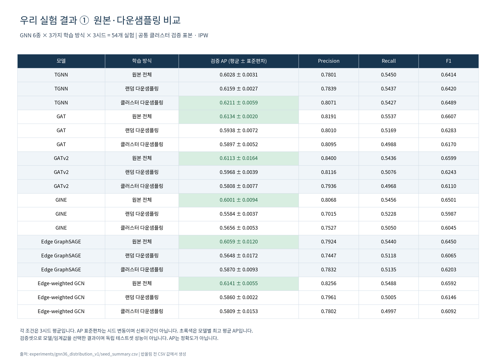

> **그림 읽기:** 같은 모델의 원본·랜덤·클러스터 세 행을 비교하면 표본 선택에 따른 차이를 볼 수 있습니다. 초록색은 그 모델의 최고 평균 AP입니다. ± 값은 3시드의 변동이며, 초록색이라고 통계적으로 우월함이 입증된 것은 아닙니다.

각 조건은 3시드 평균이며, 초록색은 해당 모델에서 가장 높은 평균 AP입니다. 수치는 원본 결과 CSV에서 읽어 이미지로 생성했습니다.

### 기존 잠재공간 증강 비교

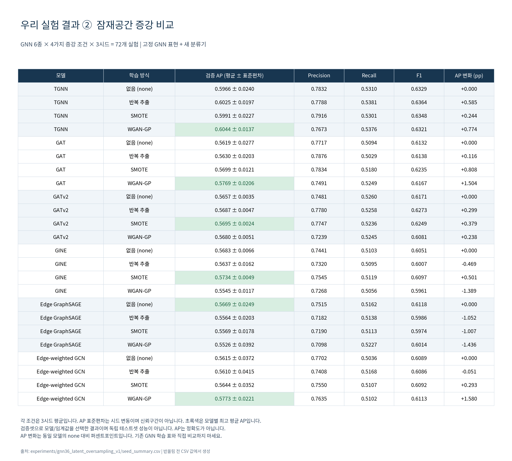

> **그림 읽기:** 모델마다 none과 나머지 세 증강 조건을 비교하세요. 마지막 AP 변화가 양수면 개선, 음수면 감소입니다. 초록색은 모델별 최고 평균 AP이며, 증강하지 않은 none이 가장 높은 경우도 있습니다.

각 조건은 3시드 평균이며, 초록색은 해당 모델에서 가장 높은 평균 AP입니다. 수치는 원본 결과 CSV에서 읽어 이미지로 생성했습니다.

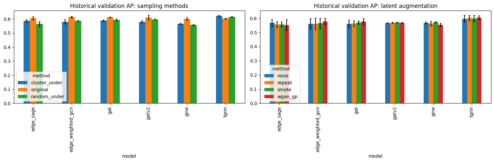

> **그림 읽기:** 왼쪽은 원본·랜덤·클러스터 학습, 오른쪽은 고정 GNN 표현의 증강 조건을 비교합니다. 막대는 평균 AP이고 가는 오차 막대는 3시드의 표준편차입니다. 두 그림은 학습 절차가 달라 각 그림 안에서 비교해야 합니다.

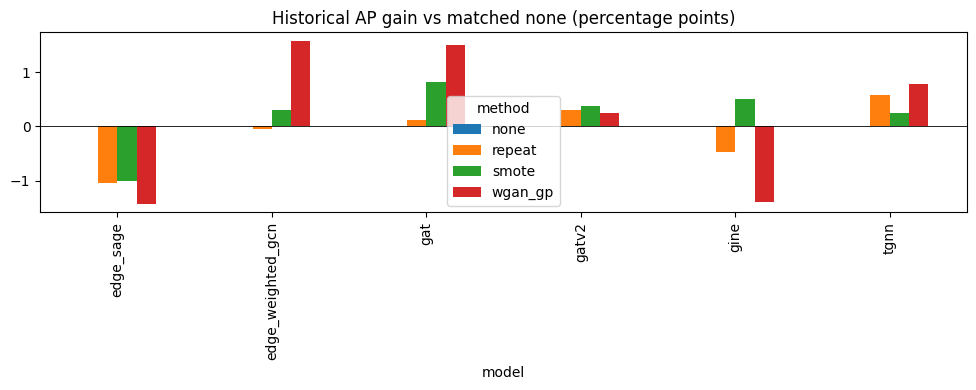

> **그림 읽기:** 각 모델에서 증강하지 않은 none을 기준 0으로 놓았습니다. 위쪽 막대는 AP 개선, 아래쪽 막대는 감소이며 단위는 퍼센트포인트(pp)입니다. 모든 모델에서 같은 증강 방식이 유리한 것은 아닙니다.

모델별 증강 효과가 다르므로 평균만으로 판단하지 않습니다. 기존 결과에서 모델 6종의 평균 AP 변화는 repeat **−0.095pp**, SMOTE **+0.203pp**, WGAN-GP **+0.212pp**였습니다. 작은 평균 개선을 확정적인 성능 향상으로 해석하면 안 됩니다.

## 8. 기존 실제 표본의 시각화와 재검증 기록

아래는 **2026-09-27에 기존 실험 산출물에서 추출·검사해 저장한 시각화**입니다. 위에서 새로 실행한 인공 데이터 데모와 다릅니다. 이미지가 노트북 안에 포함되어 있어 원래 그림 파일 없이 볼 수 있습니다. 이 부분의 재검증 수치는 저장된 감사 기록을 인용한 것이며 이번 통합본 실행에서 대용량 원본을 다시 검사한 결과는 아닙니다.

출처: `reports/gnn_sampling_tables_2026-09-26/build_evidence_visuals.py`, 같은 폴더의 `evidence_visuals/audit.json` 및 `test_verification.txt`.

## 실제 클러스터 표본

2022-08-08의 저장된 정상 표본 19,272건에 적합한 PCA이며 그림에는 그중 3,000건을 표시했습니다. 입력은 기존 실험의 표준화된 거래 특징 18개, PCA 두 축 설명분산은 56.36%입니다. 색은 저장된 32개 군집 ID입니다. 원본 정상 거래 전체를 표시한 그림도, PCA 좌표에서 새로 군집화한 그림도 아닙니다. 오른쪽은 정상 원본·추출 표본·IPW 보정 군집 비중입니다.

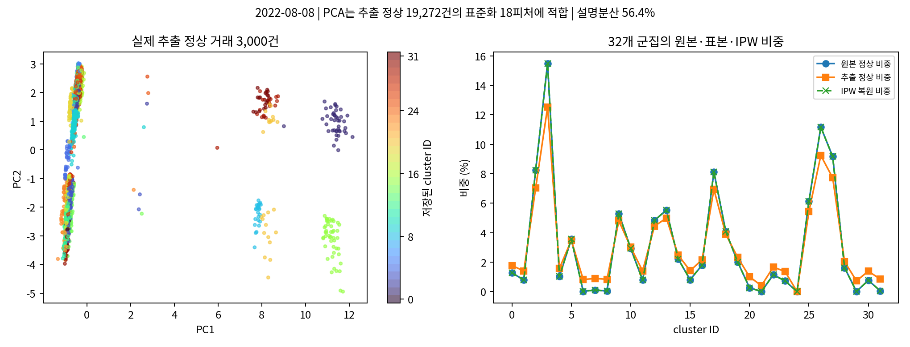

> **그림 읽기:** 왼쪽의 점 하나는 실제로 추출된 정상 거래이고 색은 군집입니다. 오른쪽은 원본·추출·IPW 보정 후 군집 비중을 비교합니다. 보정선이 원본선과 겹치는지는 군집 비중이 복원되는지 보는 기준입니다.

출처: `evidence_visuals/cluster_sample.png` · SHA-256: `3483c8663b6a2b161a917d14ee1cc22f8b404e34cfa74f4028e6c6561278f338`

## 군집별 할당과 추출률

군집별 원본 규모와 실제 추출 수, 추출률을 비교합니다. 작은 군집 보존 때문에 전체 평균 1%와 군집별 추출률은 다릅니다.

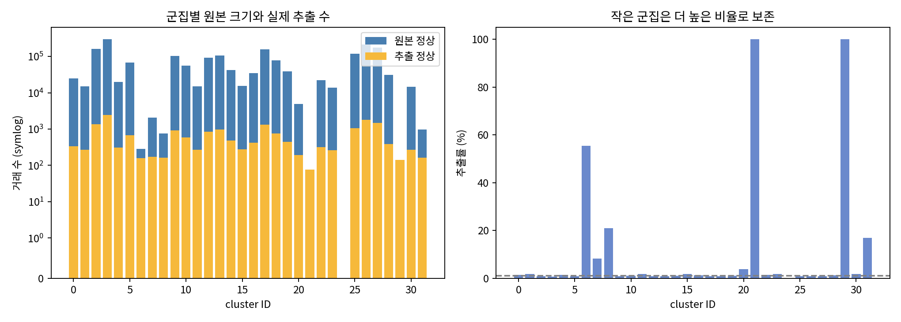

> **그림 읽기:** 군집별 거래 수와 추출률을 보여줍니다. 작은 군집도 남기기 때문에 모든 군집을 똑같이 1%씩 뽑지는 않습니다. 원본 거래 수가 작아도 추출률은 높을 수 있습니다.

출처: `evidence_visuals/cluster_allocation.png` · SHA-256: `00adf06f375b3d1b4a17c5ad6ee93c384408d21e4a111bd433b74c3e00ccf872`

## 기존 전체 분포 감사

기존 실험의 62개 역할별 주변분포(거래 18개 + 송신 계좌 22개 + 수신 계좌 22개)를 검사한 결과입니다. 36피처 자체의 36개 분포로 오해하면 안 됩니다. 로그 축의 KL은 0에 가까울수록 원본의 해당 주변분포와 비슷합니다. IPW 보정 전후와 같은 규모의 랜덤 표본을 함께 비교합니다.

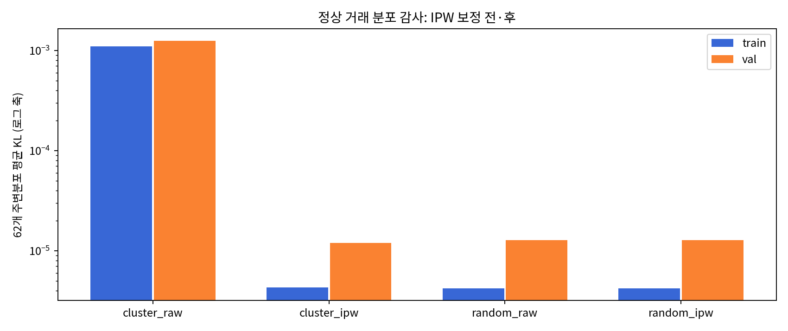

> **그림 읽기:** 원본과 표본의 피처 분포가 얼마나 다른지 KL 값으로 비교합니다. 값이 작을수록 해당 분포가 비슷하며, 세로축은 로그 축입니다. IPW 보정 효과를 볼 수 있지만 작은 KL이 높은 탐지 성능을 보장하지는 않습니다.

출처: `evidence_visuals/cluster_kl.png` · SHA-256: `2da2fe4cccf485ab0e97b77e75f2f61d78fb1ce451c4fe6380072424413e51b0`

## 실제 저장된 TGNN 증강 표본

TGNN seed 42의 표준화된 128차원 학습 이상 거래 표현 10,000건으로 공통 PCA를 적합했습니다. 실제와 각 생성 풀에서 동일한 행 번호 2,000건을 표시했습니다. 두 축 설명분산은 80.33%입니다. 반복/SMOTE/WGAN-GP 그림은 저장된 생성 풀에서 가져온 것이며 원본 계좌·거래 그래프를 합성한 그림이 아닙니다.

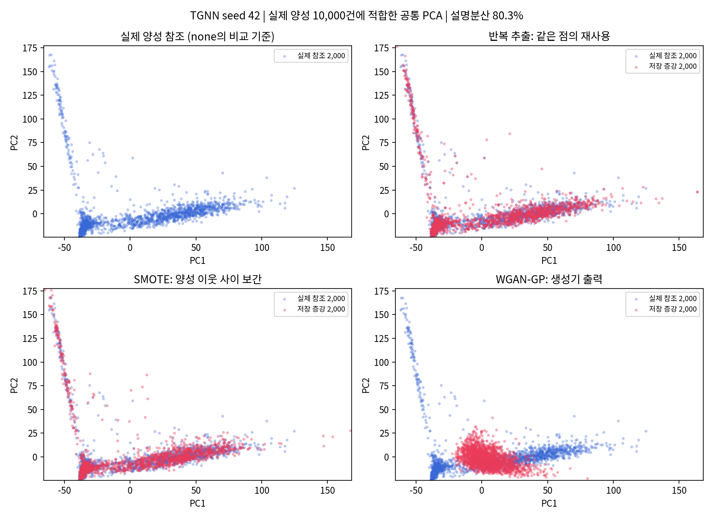

> **그림 읽기:** 파란 점은 실제 학습 이상 거래의 특징, 빨간 점은 반복하거나 생성한 특징입니다. 반복은 기존 점을 재사용하고 SMOTE는 가까운 점 사이를 채우며 GAN은 학습한 분포에서 점을 만듭니다. 새로운 계좌·거래 연결을 그린 그림은 아닙니다.

출처: `evidence_visuals/augmentation_pca.png` · SHA-256: `de6636935cae77ccd2a0c99c9dd8c08c8fb4baed40569e5bfe51fc49c5f894de`

## 기존 증강 품질 진단

128차원 표준화 공간에서 첫 2,048개 생성 표현의 실제 참조까지 최근접 거리와, 전체 생성 풀의 차원별 표준편차 비율 중앙값을 비교합니다. 반복 추출은 복제이므로 거리가 0인 것이 예상됩니다. SMOTE는 가까운 보간이고 GAN은 더 넓게 퍼질 수 있지만, 거리나 분산이 크다는 사실만으로 성능이 좋다는 결론을 내릴 수 없습니다.

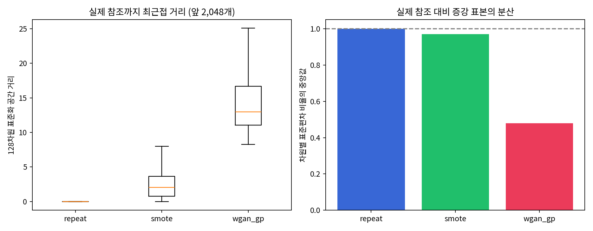

> **그림 읽기:** 왼쪽은 생성 특징과 가장 가까운 실제 특징 사이의 거리, 오른쪽은 실제 특징 대비 퍼진 정도입니다. 반복은 같은 특징을 복제하므로 거리가 0인 것이 자연스럽습니다. 멀리 퍼졌다는 이유만으로 좋은 증강이라고 판단할 수는 없습니다.

출처: `evidence_visuals/augmentation_diagnostics.png` · SHA-256: `c7606187ea73df143a67ef25104bf90da08aa339d001820ae66809575a5e4c56`

## 기존 감사 기록의 확인 항목

| 항목 | 저장된 확인 결과 |
|---|---:|
| 군집·표본 검사 날짜 수 | 68일 |
| 기존 군집 적합 참조 정상 수 | 208,896건 |
| 재예측 군집 ID 일치율 | 100% |
| 일별 KL 재계산 최대 절대 오차 | 9.93e-17 |
| 표현 파일 해시 확인 | 68개 |
| 저장 검증 점수 재현 최대 절대 오차 | 2.98e-07 |
| 저장 반복 추출 풀 재현 | True |
| 저장 SMOTE 풀 재현 | True |
| 기존 GAN 진단 건수 | 18 |
| 기존 진단 기준상 붕괴 판정 | 0건 |

저장된 테스트 로그에는 잠재공간 증강 구성요소 검사 **6개 통과**, 별도 원본 거래 반복 추출 실험 검사 **5개 통과**가 기록되어 있습니다. 후자의 원본 거래 반복 추출 실험 전체 코드는 이 통합본에 포함되지 않습니다. 기존 GAN 18건의 붕괴 판정 0건은 해당 휴리스틱 진단 결과이며, 모든 생성 표본이 현실적이라는 증명은 아닙니다.

**이번 통합본 실행:** 인공 데이터에서 GNN 6종 학습, 6종×4조건=24개 증강 비교, 코드 검사 5항목 및 모델별 데이터 분리/SMOTE 수식 검사를 통과했습니다. 독립 테스트셋 평가를 새로 수행하지 않았습니다.

## 9. 결과 저장 위치와 재실행

| 위치 | 내용 |
|---|---|
| `demo_outputs/` | 기본 예제 실행 결과 |
| `outputs/data/` | 실제 기본 전처리 DB·피처·감사 자료 |
| `outputs/graphs/` | 날짜별 그래프 배열과 `index.csv` |
| `outputs/samples/` | 고정 학습 대상 ID·레이블·IPW |
| `outputs/models/모델_seed번호/` | 가중치, 검증 점수, 학습 기록, 임계값 |
| `outputs/comparison.csv` | 원래 GNN 분류기의 검증 비교 |
| `outputs/analysis/` | 군집 감사표·그림·코드 검사 |
| `outputs/analysis/augmentation/` | 잠재공간 증강 비교·진단·학습 곡선 |
| `outputs/pipeline_manifest.json` | 설정·피처·코드 지문 |

완료된 전처리 단계는 원본·설정이 일치할 때 재사용합니다. 완료된 GNN 모델도 재사용하며, 중단된 모델은 첫 에폭부터 다시 학습합니다. 증강 분석은 호출할 때 다시 실행합니다. 코드나 설정을 변경하면 `outputs_v2/data`처럼 **새 상위 출력 폴더**를 지정하세요. 같은 출력 폴더를 여러 커널에서 동시에 실행하지 마세요.

## 10. 근거와 구현 위치

- 새 실행 코드: [통합 노트북](통합본_전체코드_시각화_결과.ipynb)과 10~50 노트북의 함수·클래스 셀.
- 기존 GNN 결과: [시드 요약 CSV](근거자료/실험결과/원본_다운샘플링_시드요약.csv), [54개 개별 결과 CSV](근거자료/실험결과/원본_다운샘플링_개별결과.csv).
- 기존 증강 결과: [시드 요약 CSV](근거자료/실험결과/잠재공간증강_시드요약.csv), [72개 개별 결과 CSV](근거자료/실험결과/잠재공간증강_개별결과.csv).
- 기존 검사: [감사 요약](근거자료/감사기록/audit.json), [68일 표본 검사](근거자료/감사기록/cluster_68day_checks.csv), [저장된 테스트 로그](근거자료/감사기록/test_verification.txt).
- 기존 생성 품질: [증강 진단](근거자료/감사기록/augmentation_diagnostics.csv), [GAN 18건 진단](근거자료/감사기록/gan_18case_diagnostics.csv).
- 기존 분포 감사: [KL 요약](근거자료/감사기록/kld_overview.csv).
- 기존 그림 생성 방법: [참고용 원본 스크립트](근거자료/참고코드/build_evidence_visuals.py). 이 스크립트의 원본 캐시 의존성은 [근거 자료 안내](근거자료/README.md)를 확인하세요.
- [원본 출처와 SHA-256](근거자료/출처_체크섬.json).

문서의 링크는 모두 이 배포 폴더 안의 상대 경로입니다. 따라서 폴더 구조를 유지한 채 Git 저장소에 올리면 노트북·그림·근거 자료를 함께 열 수 있습니다.

## 11. 주요 함수 찾아보기

정의 셀을 실행하면 함수가 준비됩니다. 실제 전처리나 학습은 통합본의 해당 호출 셀에서 시작합니다. 클래스 메서드는 상태를 공유하므로 한 셀 안에 함께 정의되어 있습니다.

| 함수·클래스 | 역할 | 코드 |
|---|---|---|
| `Config` | 원본 데이터 위치, 날짜 경계, 이웃 수, 학습 설정을 한 곳에 보관합니다. validate는 날짜와 설정값을 검사합니다. | [10번](10_데이터전처리_함수설명.ipynb) |
| `sql_string` | 문자열을 SQL 문자열 리터럴로 안전하게 이스케이프합니다. | [10번](10_데이터전처리_함수설명.ipynb) |
| `file_fingerprint` | 파일 크기·수정 시각·앞뒤 일부 바이트 해시로 원본 변경 여부를 확인할 정보를 만듭니다. | [10번](10_데이터전처리_함수설명.ipynb) |
| `json_write` | JSON을 임시 파일에 저장한 뒤 교체해 중간 파일을 완료 결과로 오인하지 않게 합니다. | [10번](10_데이터전처리_함수설명.ipynb) |
| `base` | 출력 폴더를 만들고 설정값을 검사합니다. | [10번](10_데이터전처리_함수설명.ipynb) |
| `connect` | DuckDB에 연결하고 메모리 한도와 스레드 수를 적용합니다. 읽기 전용 연결도 지원합니다. | [10번](10_데이터전처리_함수설명.ipynb) |
| `stage_manifest` | 단계의 완료 상태와 입력·코드 정보를 JSON으로 기록합니다. | [10번](10_데이터전처리_함수설명.ipynb) |
| `require_stage` | 선행 단계의 완료 여부·설정·코드·원본 파일 지문이 일치하는지 확인합니다. | [10번](10_데이터전처리_함수설명.ipynb) |
| `fresh_stage` | 이미 완료된 전처리 단계를 실수로 덮어쓰지 않도록 검사합니다. | [10번](10_데이터전처리_함수설명.ipynb) |
| `finite` | 배열에 NaN이나 무한대가 없는지 검사하고 문제가 있으면 위치를 알려줍니다. | [10번](10_데이터전처리_함수설명.ipynb) |
| `_country_of` | 은행 이름에서 지원하는 국가 코드를 추출합니다. | [10번](10_데이터전처리_함수설명.ipynb) |
| `build_dataset` | CSV 열과 값 검사 → 완전 중복 처리 → 계좌 ID 매핑 → 거래 정규화 → 감사 결과 저장 순서로 전처리합니다. 원본 파일은 수정하지 않습니다. | [10번](10_데이터전처리_함수설명.ipynb) |
| `build_pairagg` | 당일 시작 전까지의 계좌 쌍별 거래 이력을 계산합니다. 현재 날짜의 거래나 정답 레이블을 이력에 넣지 않습니다. | [10번](10_데이터전처리_함수설명.ipynb) |
| `build_features` | 학습 이전 보정 구간으로 통화별 기준을 만들고 거래 간격·빈도·계좌 관계 피처를 계산합니다. | [10번](10_데이터전처리_함수설명.ipynb) |
| `DayData` | 하루 그래프의 계좌 ID·특징, 연결, 대상 거래, 정답 배열을 저장합니다. | [10번](10_데이터전처리_함수설명.ipynb) |
| `load_day` | 하루의 판정 대상 거래와 과거~당일까지의 문맥 거래를 모아 그래프를 만듭니다. with_labels는 정답을 별도 배열로 읽을지 지정합니다. | [10번](10_데이터전처리_함수설명.ipynb) |
| `FixedNeighborSampler` | 판정할 거래 양 끝 계좌에서 들어오는 이웃을 두 번 따라가 배치 그래프를 만듭니다. batch는 모델에 전달할 다섯 배열을 반환합니다. | [10번](10_데이터전처리_함수설명.ipynb) |
| `torch_modules` | 현재 커널에 설치된 PyTorch와 PyTorch Geometric을 가져옵니다. | [10번](10_데이터전처리_함수설명.ipynb) |
| `tensor_batch` | 배치 배열을 PyTorch 텐서로 변환합니다. 인덱스는 정수, 피처는 실수로 지정합니다. | [10번](10_데이터전처리_함수설명.ipynb) |
| `split_days` | 설정한 반열린 날짜 구간에서 날짜 목록을 생성합니다. | [10번](10_데이터전처리_함수설명.ipynb) |
| `select_threshold` | 검증 정밀도와 재현율로 F1을 계산해 최대 F1의 임계값을 선택합니다. | [10번](10_데이터전처리_함수설명.ipynb) |
| `evaluate_scores` | 정답과 예측 점수로 AP·정밀도·재현율·F1·혼동행렬을 계산합니다. | [10번](10_데이터전처리_함수설명.ipynb) |
| `load_settings` | 설정 JSON을 읽습니다. 상대 경로는 설정 파일이 있는 폴더 기준으로 계산하므로 컴퓨터가 바뀌어도 사용할 수 있습니다. | [20번](20_그래프생성_함수설명.ipynb) |
| `bind_run` | 설정·피처·코드의 지문을 저장합니다. 변경된 조건으로 기존 결과를 잘못 재사용하면 중단합니다. | [20번](20_그래프생성_함수설명.ipynb) |
| `preprocess` | 데이터 정제, 과거 이력, 피처 생성을 순서대로 호출합니다. 완료된 단계는 설정과 원본 파일이 일치할 때 재사용합니다. | [20번](20_그래프생성_함수설명.ipynb) |
| `amount_z` | 학습 이전 기간에서 구한 통화별 평균과 표준편차로 지불 금액을 표준화합니다. 거래 ID를 맞춰 문맥·대상 거래에 연결합니다. | [20번](20_그래프생성_함수설명.ipynb) |
| `graph36` | 원래 그래프에서 계좌 특징 19개와 거래 특징 16개를 선택하고 금액 특징 1개를 추가합니다. 결과는 19+17 피처입니다. | [20번](20_그래프생성_함수설명.ipynb) |
| `graph_dates` | 실제 거래가 존재하는 학습/검증 날짜만 읽습니다. 테스트 구간은 처리하지 않습니다. | [20번](20_그래프생성_함수설명.ipynb) |
| `build_graphs` | 학습·검증 날짜별 그래프를 만들고 배열로 저장합니다. 다음 단계는 이 파일을 그대로 읽습니다. | [20번](20_그래프생성_함수설명.ipynb) |
| `read_graph` | 날짜 하나의 저장 그래프를 메모리 매핑으로 읽어 전체 기간을 한꺼번에 RAM에 올리지 않습니다. | [20번](20_그래프생성_함수설명.ipynb) |
| `EdgeSAGE` | 이웃 계좌와 거래 특징을 변환해 더한 메시지의 평균을 구하고 자기 계좌 정보를 더합니다. | [30번](30_GNN6종_모델설명.ipynb) |
| `EdgeWeightedGCN` | 거래 특징을 0~2 범위의 연결 가중치로 바꿔 GCN에 전달하고 자기 계좌 정보를 더합니다. | [30번](30_GNN6종_모델설명.ipynb) |
| `make_tgnn_layer` | Transformer 어텐션으로 이웃과 거래 정보를 반영합니다. 이 프로젝트의 TGNN은 시간 메모리 TGN이 아닌 Graph Transformer입니다. | [30번](30_GNN6종_모델설명.ipynb) |
| `make_gat_layer` | 이웃별 중요도를 어텐션으로 학습합니다. 거래 특징을 중요도 계산에 반영하고 자기 계좌 정보는 residual 경로로 전달합니다. | [30번](30_GNN6종_모델설명.ipynb) |
| `make_gatv2_layer` | GAT와 다른 어텐션 계산 순서를 사용합니다. GAT와는 별개의 계층이며 별개의 모델로 학습합니다. | [30번](30_GNN6종_모델설명.ipynb) |
| `make_gine_layer` | 거래 특징을 포함한 이웃 메시지를 합산한 뒤 신경망으로 변환합니다. 자기 정보 비중을 조절하는 epsilon도 학습합니다. | [30번](30_GNN6종_모델설명.ipynb) |
| `make_edge_sage_layer` | 위에서 정의한 EdgeSAGE를 사용합니다. 이웃 표현과 거래 특징을 더한 메시지를 평균 내고 자기 정보를 더합니다. | [30번](30_GNN6종_모델설명.ipynb) |
| `make_edge_weighted_gcn_layer` | 위에서 정의한 EdgeWeightedGCN을 사용합니다. 거래 특징으로 양수 연결 가중치를 만든 뒤 GCN 집계에 반영합니다. | [30번](30_GNN6종_모델설명.ipynb) |
| `make_layer` | 입력한 모델 이름에 해당하는 위의 생성 함수를 호출합니다. 새로운 모델이 아니라 6종을 공통 학습 코드에 연결하는 함수입니다. | [30번](30_GNN6종_모델설명.ipynb) |
| `TransactionGNN` | GNN 두 층으로 계좌 표현을 만든 뒤 송신·수신 계좌와 거래 특징을 합쳐 거래별 logit을 계산합니다. | [30번](30_GNN6종_모델설명.ipynb) |
| `allocate` | 정상 표본 예산을 군집 크기 비례 75%와 균등 25%로 배분합니다. 존재하는 군집은 최소 한 건을 남깁니다. | [40번](40_샘플링과학습_함수설명.ipynb) |
| `prepare_samples` | 학습 정상 거래에만 군집을 적합합니다. 이상 거래는 전부 보존하며, 선택한 정상 표본에 역확률 가중치를 부여합니다. 모든 모델이 같은 표본을 사용합니다. | [40번](40_샘플링과학습_함수설명.ipynb) |
| `predict_validation` | 전체 검증 거래의 예측값을 계산합니다. 가중치를 업데이트하지 않고 테스트 구간은 읽지 않습니다. | [40번](40_샘플링과학습_함수설명.ipynb) |
| `train_one` | 모델 하나와 시드 하나를 학습합니다. 검증 AP가 가장 높은 가중치를 저장하고 검증 F1로 임계값을 선택합니다. | [40번](40_샘플링과학습_함수설명.ipynb) |
| `train_all` | 공통 학습 표본을 만들고 선택한 모델·시드를 순서대로 학습한 뒤 비교 표를 저장합니다. | [40번](40_샘플링과학습_함수설명.ipynb) |
| `cluster_audit` | 학습 데이터로만 군집과 PCA를 적합하고 첫 학습일의 표본을 실제로 추출합니다. 군집 건수·PCA·분포 KL·실제 거래 연결을 그리고 검사 결과를 반환합니다. | [50번](50_클러스터링과증강_시각화.ipynb) |
| `extract_latent` | 모델 가중치를 불러와 고정한 뒤 날짜/클래스별 상한만큼 표현을 추출합니다. 정답·거래 ID·날짜·추출 보정 가중치를 별도 표로 반환합니다. | [50번](50_클러스터링과증강_시각화.ipynb) |
| `latent_smote` | 학습 이상 표현을 보간해 추가 표현을 만듭니다. 생성값과 함께 왼쪽/오른쪽 이웃 번호·보간 비율을 반환하므로 수식을 직접 검증할 수 있습니다. | [50번](50_클러스터링과증강_시각화.ipynb) |
| `gradient_penalty` | 진짜와 생성 표현 사이의 보간점에서 critic의 입력 기울기를 구하고 그 크기와 1의 차이를 벌점으로 계산합니다. | [50번](50_클러스터링과증강_시각화.ipynb) |
| `latent_wgan` | 학습 이상 표현만 사용해 WGAN-GP를 학습합니다. 생성한 표현과 스텝별 손실·기울기 벌점 표를 반환합니다. | [50번](50_클러스터링과증강_시각화.ipynb) |
| `synthetic_diagnostics` | 생성 표현의 유한성·분산·최근접 거리·복제율을 계산합니다. 붕괴 의심 여부는 참고 진단이며 통과/실패 성능 판정이 아닙니다. | [50번](50_클러스터링과증강_시각화.ipynb) |
| `balanced_loss` | 반복/합성 표본 수와 무관하게 클래스별 총 손실 비중을 고정합니다. | [50번](50_클러스터링과증강_시각화.ipynb) |
| `fit_head` | 고정 표현으로 새 분류기 하나를 학습합니다. 검증 F1로 임계값을 정하고 추출 보정된 검증 AP·F1 등을 반환합니다. | [50번](50_클러스터링과증강_시각화.ipynb) |
| `visualize_synthesis` | 같은 학습 양성 PCA 좌표계에서 실제/추가 표현을 비교하고 GAN 손실을 그립니다. 그림을 PNG로 저장합니다. | [50번](50_클러스터링과증강_시각화.ipynb) |
| `augmentation_comparison` | 모델·시드마다 none/repeat/SMOTE/WGAN-GP를 같은 조건으로 비교합니다. 시각화, 진단표, 데이터 분리 검사와 성능 표를 저장합니다. | [50번](50_클러스터링과증강_시각화.ipynb) |
| `run_method_tests` | 군집 예산·SMOTE 선분/재현성·반복 손실 불변성·WGAN-GP 역전파·붕괴 탐지 단위 검사를 수행합니다. | [50번](50_클러스터링과증강_시각화.ipynb) |
