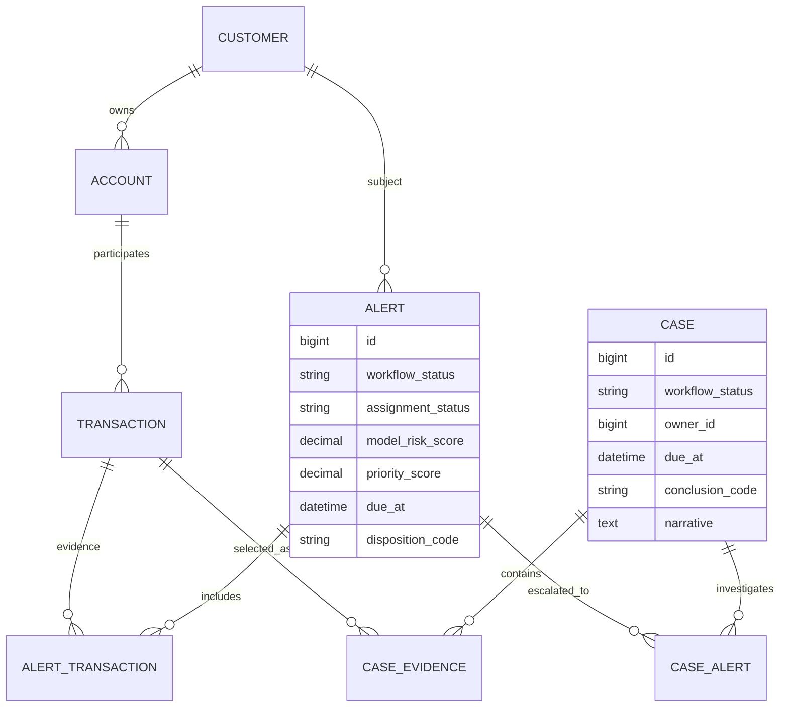

# AML 모니터링 서비스 기획 검토안


## 1. 현재 우선 검토할 항목

현재 프로젝트에서 우선 결정하거나 추가 확인해야 할 내용은 다음 네 가지다.

1. 위험점수 산출 방식 결정
2. 허브 계좌 처리 방식 결정
3. 추가 AML 서비스·솔루션 자료 수집
4. 모델 전처리 범위와 책임 확인

### 1.1 위험점수 산출 방식

다음 항목을 구분해서 결정해야 한다.

- 모델이 출력하는 `Model Risk Score`의 범위와 의미
- 여러 거래 점수를 고객·계좌·위험 에피소드 단위로 묶는 방법
- Alert 생성 임곗값
- 모델 점수와 규칙 기반 신호의 결합 방식
- 과거 Alert·Case, 고객 위험도, 거래 금액을 반영하는 방식
- 분석가에게 보여줄 점수 기여 요인과 설명 데이터
- 모델 점수와 업무 우선순위 점수의 분리

위험점수 하나가 다음 의미를 모두 담당하도록 만들면 안 된다.

```text
모델이 판단한 이상 정도
≠ Alert 생성 여부
≠ 담당자가 먼저 처리해야 할 업무 순서
≠ 최종 의심 거래 판정
```

### 1.2 허브 계좌 처리 방식

거래소, 정산 계좌, 대형 가맹점, 급여·지급 계좌처럼 연결이 매우 많은 계좌를 일반 계좌와 동일하게 2-hop 확장하면 그래프와 DB 조회량이 폭증할 수 있다.

검토할 항목:

- 허브 계좌 판정 기준
- 조회 기간 제한
- 최대 hop 수
- 계좌별 fan-out 상한
- 작업당 최대 노드·엣지 수
- 중요 거래 우선 보존 기준
- 나머지 이웃의 샘플링 방식
- 생략된 이웃을 집계 특징으로 표현하는 방식
- `hub_policy_version`, `input_truncated` 등 재현 정보 저장

세부 인프라 처리 원칙은 [인프라 아키텍처 V2](../../04_design/infra/markdown/아키텍처v2.md)의 `허브 계좌로 인한 그래프 병목 방지` 항목을 참고한다.

### 1.3 추가 서비스 자료 수집

현재 SAS와 Lucinity에서 확인한 구조를 기준으로 하되, 다음 영역을 추가 조사할 필요가 있다.

- Alert 생성과 에피소드 집계 방식
- Alert Triage와 Case Investigation의 역할 분리
- Claim·Assign·Release 방식
- SLA 설정과 지연 업무 처리 방식
- QA 표본 추출과 검토 절차
- Narrative와 체크리스트 구성
- STR 작성·승인·제출 흐름
- 모델 피드백과 종결 이유 코드 관리
- 고객 360과 관계 그래프 표현 방식
- 감사 로그와 설정 변경 승인 절차

추가 솔루션은 화면 디자인 자체보다 **업무 객체, 상태 전이, 담당자 배정과 통제 방식**을 중심으로 비교한다.

### 1.4 모델 전처리 확인

전처리는 목적에 따라 책임을 나눠야 한다.

| 위치 | 담당 범위 | 예시 |
|---|---|---|
| 수집 Worker | 저장을 위한 표준화 | 스키마 검증, 중복 제거, 통화·시간·계좌 식별자 통일 |
| 추론 작업 생성 Worker | 재현 가능한 분석 입력 구성 | 거래 이력 집계, 기간 제한, 서브그래프, 입력 스냅샷 |
| 추론 에이전트 | 모델 종속 전처리 | 스케일링, 인코딩, Tensor 변환, 모델 실행 |

추가 확인이 필요한 내용:

- 초기 일반 모델에 실제로 필요한 Feature 목록
- 각 Feature의 원천 데이터와 계산 위치
- 학습과 추론에서 동일한 전처리를 보장하는 방법
- `model_version`, `feature_version` 관리 방식
- GNN 전환 시 재사용할 거래·계좌 집계 Feature
- 입력 cutoff 시점과 미래 데이터 누수 방지
- 전처리 결과를 DB `JSONB`에 저장할지 S3에 저장할지 결정하는 크기 기준

---

## 2. 실제 솔루션 조사에서 확인한 구조

### 2.1 SAS

SAS는 다음과 같은 업무 흐름을 사용한다.

```text
Alert
→ L1 검토
→ Case 생성
→ 심층 조사
→ 규제 보고
```

핵심은 `Alert`와 `Case`가 명확히 다른 객체라는 점이다.

- Alert는 탐지 시스템이 생성한 검토 대상이다.
- L1 담당자는 Alert가 실제 심층 조사로 이어질 필요가 있는지 분류한다.
- Case는 여러 거래, 고객, 계좌, Alert와 증거를 묶는 조사 단위다.
- 의심이 확인된 Case만 규제 보고 단계로 연결한다.

SAS 분석 자료: [SAS AML Transaction Monitoring UI 분석](../../01_research/SAS_AML_Transaction_Monitoring_UI_분석.html)

### 2.2 Lucinity

Lucinity는 조직의 부서별 메뉴보다 업무 단계별 Workboard를 중심으로 구성한다.

```text
Triage
→ Investigation
→ QA
→ Reporting
```

사용자는 대시보드에서 통계를 구경하는 것보다 자신이 처리해야 할 Queue 또는 Workboard에서 업무를 시작한다.

Lucinity 분석 자료: [Lucinity Case Manager UI 분석](../../01_research/Lucinity_Case_Manager_UI_분석.html)

### 2.3 두 솔루션의 공통점

- 업무가 대시보드보다 Queue·Workboard를 중심으로 시작된다.
- Alert와 Case가 서로 다른 객체다.
- 담당자의 Claim·Assign·Release가 명시된다.
- 고객·계좌·거래·과거 사건을 한 맥락에서 확인한다.
- 조사 누락을 막는 체크리스트와 Narrative가 있다.
- 관리자는 SLA, 업무량과 QA를 관리한다.
- 모든 결정과 변경이 감사 이력으로 남는다.

> 프로젝트가 참고해야 할 핵심은 특정 제품의 색상이나 메뉴를 복제하는 것이 아니라, Alert에서 Case와 보고로 이어지는 업무 통제 구조다.

---

## 3. 용어 정의: SLA와 QA

### 3.1 SLA

`SLA(Service Level Agreement)`는 각 AML 업무를 정해진 시간 안에 처리하도록 관리하는 **처리 기한 또는 서비스 수준 기준**이다.

예시:

```text
고위험 Alert: 생성 후 4시간 이내 검토 시작
일반 Alert: 생성 후 24시간 이내 1차 결론
Case: 이관 후 3영업일 이내 조사 완료
QA 보완 요청: 요청 후 1영업일 이내 재제출
```

프로젝트에서 SLA는 다음 항목으로 관리할 수 있다.

- `due_at`: 처리 기한
- `first_reviewed_at`: 최초 검토 시각
- `completed_at`: 완료 시각
- `sla_status`: 정상, 임박, 위반
- 업무 유형과 위험도에 따른 SLA 정책

관리자는 다음을 확인한다.

- SLA 임박 건수
- SLA 위반 건수
- 평균·최장 대기시간
- 담당자·팀별 처리시간
- 장기 미배정 업무

### 3.2 QA

`QA(Quality Assurance)`는 모델 성능 평가가 아니라 **담당자가 내린 AML 조사 결론의 품질을 다시 확인하는 업무 검수 절차**다.

검토 대상:

- 종결 또는 Case 이관 판단이 근거와 일치하는지
- 필수 거래·고객 정보를 확인했는지
- 체크리스트가 누락되지 않았는지
- 이유 코드가 적절한지
- Narrative가 감사·보고에 충분한지
- 증거로 선택한 거래와 관계가 결론을 뒷받침하는지

QA 결과 예시:

```text
승인
보완 요청
재조사 요청
관리자 에스컬레이션
```

모든 업무를 QA할 필요는 없다. MVP에서는 다음과 같은 방식이 현실적이다.

- 고위험 Case는 전수 QA
- 일반 종결 건은 일정 비율 표본 QA
- 신규 담당자 또는 반려율이 높은 담당자의 업무는 강화 QA
- 임의 종결, 반복 종결, 중요한 이유 코드 사용 건은 위험 기반 QA

> 정리하면 SLA는 **언제까지 처리해야 하는가**, QA는 **판단과 기록이 기준에 맞는가**를 관리한다.

---

## 4. 가장 중요하게 수정할 부분: Alert의 단위

현재 기획은 거래 처리 파이프라인이 중심이므로 `거래 한 건 → Alert 한 건`으로 해석될 여지가 있다. 실제 AML 모니터링에서는 거래 단건보다 고객 또는 계좌의 일정 기간 행동을 하나의 Alert로 묶어 검토하는 것이 적절하다.

### 4.1 모델 출력과 사용자 업무 단위 분리

모델은 거래 또는 계좌별 점수를 출력할 수 있다. 그러나 담당자가 받는 Alert는 다음과 같은 위험 에피소드여야 한다.

```text
김○준 고객의 최근 24시간 행동

- 다수 계좌에서 반복 입금
- 짧은 시간 내 여러 계좌로 분산 송금
- 평소 거래 패턴보다 거래량 급증
- 고위험 관계 계좌와 연결
```

즉, 다음 객체를 구분해야 한다.

```text
Transaction
실제로 발생한 개별 금융 거래

Model Inference Result
거래·계좌에 대해 모델이 계산한 위험 점수와 근거

Alert
일정 기간의 관련 위험 신호를 묶어 L1 담당자에게 전달하는 검토 단위

Case
심층 조사가 필요한 Alert, 고객, 계좌, 거래와 증거를 묶은 조사 단위
```

### 4.2 Alert 묶음 기준 검토

Alert 생성 시 다음 기준을 조합할 수 있다.

- 동일 고객 또는 동일 계좌
- 동일 탐지 시나리오 또는 위험 패턴
- 일정 시간 창
- 연결된 상대 계좌·고객
- 기존 열린 Alert 또는 Case와의 중복 여부
- 같은 위험 에피소드에 속하는 거래 집합

세부 묶음 로직은 위험점수 산출 방식과 함께 결정해야 한다.

---

## 5. 권장 역할 구조

| 역할 | 주요 책임 | MVP 권장 여부 |
|---|---|---|
| 모니터링 담당자 `L1` | Alert 접수, 거래·고객 맥락 확인, 정상 종결 또는 Case 이관 | 필수 |
| 조사 담당자 `L2` | Case 접수, 고객 360, 관계망·거래 경로 조사, 결론 기록 | 필수 |
| AML 운영 관리자 | 업무 배정, 적체·SLA 관리, QA, 에스컬레이션 | 필수 |
| 시스템 관리자 | 사용자·권한·은행 범위·파이프라인 관리 | 최소 기능 |
| 보고 책임자 | STR 검토·승인·제출 | 후속 범위 |
| 거래 전송·추론 시스템 | 거래 수집, 작업 생성, 모델 추론 | 사용자 역할이 아닌 시스템 Actor |

### 5.1 팀 관리자 단순화

MVP에서는 모니터링팀 관리자와 조사팀 관리자를 완전히 다른 역할로 만들 필요가 없다. 하나의 `AML_MANAGER` 역할을 두고 관리 범위만 분리하는 구조가 단순하다.

```text
role = AML_MANAGER
team_scope = MONITORING | INVESTIGATION | ALL
```

- 작은 조직에서는 한 명이 두 팀의 업무량, SLA와 QA를 함께 관리한다.
- 규모가 커지면 같은 역할에서 `team_scope`만 나누어 각 팀장을 배정한다.
- 시스템 설정과 기술 운영은 `SYSTEM_ADMIN`으로 분리한다.

---

## 6. 역할별 User Flow

### 6.1 모니터링 담당자 `L1`

```text
로그인
→ 내 업무
→ Alert 대기열
→ Alert Claim
→ 고객·계좌·기간·주요 거래·관계 확인
→ 체크리스트 완료
├─ 정상 또는 종결
├─ 추가 정보 필요
└─ Case 생성 및 조사팀 이관
```

핵심 화면:

- 내 업무 요약
- Alert Queue
- Alert 상세
- 고객·계좌·거래 맥락
- 1~2 hop 탐지 근거 그래프
- 체크리스트
- 종결 이유 또는 Case 이관 입력

### 6.2 조사 담당자 `L2`

```text
Case 대기열
→ Case Claim
→ 고객 360 확인
→ 과거 Alert·Case 확인
→ 관계 그래프와 자금 흐름 검증
→ 거래·관계·메모를 증거로 추가
→ 결론 및 이유 코드 작성
├─ 의심 없음 종결
├─ 추가 조사
└─ 의심 거래 → QA 또는 보고 단계
```

핵심 화면:

- Case Queue
- Case Summary
- 고객 360
- 관계 그래프·자금 흐름
- 증거 목록
- 메모·협업 이력
- 체크리스트와 Narrative

### 6.3 AML 운영 관리자

```text
운영 현황
→ 단계별 적체·SLA 확인
→ 담당자별 업무량 확인
→ 미배정·지연 건 재배정
→ QA 대상 검토
→ 승인·보완 요청·재조사
```

핵심 화면:

- 단계별 적체 현황
- SLA 임박·위반 목록
- 담당자별 업무량
- 미배정 Alert·Case
- QA Queue
- 재배정·승인·보완 요청

### 6.4 시스템 관리자

```text
사용자·역할 관리
→ 은행·조직 범위 관리
→ 위험 설정 변경안 관리
→ 파이프라인 실패·재시도 확인
→ 감사 로그 확인
```

핵심 화면:

- 사용자·역할·조직 범위
- 읽기 전용 위험 설정 또는 변경 승인
- 수집·추론 파이프라인 상태
- DLQ·실패·재시도
- 시스템 감사 로그

---

## 7. Codex가 제안하는 주요 수정사항

### 7.1 Alert 상태와 담당 상태를 분리

하나의 `status`에 업무 진행과 담당 여부를 모두 넣지 않는다.

```text
업무 상태
NEW / IN_REVIEW / ESCALATED / CLOSED

담당 상태
UNASSIGNED / CLAIMED / ASSIGNED

추론 상태
PENDING / RUNNING / COMPLETED / FAILED
```

각 상태의 의미:

| 구분 | 답하는 질문 |
|---|---|
| 업무 상태 | Alert 또는 Case 업무가 어느 단계인가? |
| 담당 상태 | 누가 업무를 소유하거나 처리하고 있는가? |
| 추론 상태 | 모델 추론 파이프라인이 어느 단계인가? |

예를 들어 Alert는 `NEW`이면서 `UNASSIGNED`일 수 있고, Claim 후에는 `IN_REVIEW`이면서 `CLAIMED`가 된다.

### 7.2 Claim·Assign·Release를 명시

```text
Claim
담당자가 미배정 업무를 직접 가져감

Assign
관리자가 특정 담당자에게 업무를 배정함

Release
담당자가 업무 소유를 해제해 다시 미배정 Queue로 돌림
```

기록할 감사 항목:

- 이전 담당자와 새 담당자
- 변경 주체
- 변경 시각
- 변경 사유
- Release 또는 재배정 이유

### 7.3 모델 점수와 업무 우선순위를 분리

SAS 화면에서도 `Score`와 `Priority Score`를 분리한다. 자세한 내용은 [SAS Alert 분석](../../01_research/SAS_AML_Transaction_Monitoring_UI_분석.html)을 참고한다.

```text
모델 위험점수
= 모델이 거래·계좌·행동에서 판단한 위험 정도

업무 우선순위
= 모델 점수
 + 관련 금액
 + SLA 잔여 시간
 + 고객 KYC/CDD 위험도
 + 과거 Alert·Case 이력
 + 운영 정책
```

UI에서도 두 숫자를 같은 이름이나 같은 의미로 보여주면 안 된다.

권장 표기:

- `모델 위험점수 82/100`
- `업무 우선순위 긴급`
- 우선순위 근거: `고위험 고객 · SLA 1시간 남음 · 관련금액 5천만원`

### 7.4 “오탐”과 “의심 없음”을 구분

담당자가 종결한 모든 건을 모델의 False Positive로 사용하면 학습 피드백이 오염된다. 종결과 조사 결과에는 구체적인 이유 코드가 필요하다.

권장 이유 코드 예시:

```text
정상 행동
모델 탐지 부적합
정보 부족
중복 Alert
이미 조사 중
의심 거래
추가 조사 필요
```

`모델 탐지 부적합`처럼 모델 오류를 의미하는 코드만 명확한 False Positive 후보로 사용한다. `정보 부족`, `중복`, `이미 조사 중`은 모델 정답 라벨로 바로 사용하지 않는다.

### 7.5 고객 360 보강

고객 360은 독립적인 CRM 화면보다 Alert·Case 안에서 다음 정보를 묶어 보여주는 방식이 적합하다.

- KYC/CDD 위험도와 기준일
- 보유 계좌와 고객·법인 관계
- 최근 거래 패턴
- 과거 Alert·Case
- 관련 고객·계좌
- 현재 사건의 핵심 위험 신호
- 데이터 원천과 최종 갱신 시각

Lucinity도 중심 고객, 관련 주체, 과거 사건과 작업을 Case 안에서 묶는다. 자세한 내용은 [Lucinity Case Summary 분석](../../01_research/Lucinity_Case_Manager_UI_분석.html)을 참고한다.

### 7.6 그래프는 조사 맥락 안에 배치

그래프 분석을 주 내비게이션의 독립 메뉴로 먼저 배치하면 사용자가 무엇을 조사하는 그래프인지 잃을 수 있다.

권장 위치:

```text
Alert 상세
탐지 근거가 된 제한된 1~2 hop 부분 그래프

Case 상세
조사자가 확장·필터링할 수 있는 관계와 자금 흐름

통합 검색
고객·계좌를 시작점으로 한 자유 그래프 탐색 — 후속 기능
```

그래프의 목적은 화려한 시각화가 아니라 위험점수의 근거와 조사 경로를 설명하는 것이다.

### 7.7 관리자 화면은 업무 운영 중심으로 구성

관리자 대시보드의 우선 지표:

- 단계별 적체량
- Alert 평균·최장 대기시간
- SLA 임박·위반 건수
- 담당자별 업무량
- Alert에서 Case로 전환된 비율
- 종결 이유 분포
- QA 반려율
- 미배정·장기 미처리 건수

모델의 Precision, Recall, 드리프트와 Feature 품질은 별도의 모델 운영 영역으로 분리하는 것이 좋다.

### 7.8 설정 변경에는 승인 절차 적용

위험 구간과 모델 임곗값을 부서 관리자가 즉시 변경하도록 하면 안 된다.

```text
변경안 작성
→ 예상 영향 확인
→ 다른 관리자 또는 승인권자 검토
→ 적용 시각 예약
→ 설정 적용
→ 감사 기록
→ 문제 발생 시 롤백
```

MVP에서는 설정 화면을 읽기 전용으로 두고 실제 변경은 배포·운영 절차로 처리해도 충분하다.

---

## 8. 권장 정보 구조

```text
내 업무
Alert
Case
통합 탐색
운영 관리       AML 운영 관리자만
시스템 관리     시스템 관리자만
STR 보고        후속 범위
```

`Tasks`를 별도 주 메뉴로 두기보다 `내 업무`에서 다음 업무를 통합해서 보여주는 편이 단순하다.

- 내가 Claim한 Alert
- 나에게 Assign된 Alert
- 내가 조사 중인 Case
- QA 검토 요청
- 보완 요청
- SLA 임박 업무

SAS와 Lucinity의 메뉴를 그대로 합치지 않고, 프로젝트의 MVP 역할과 업무 단계에 맞게 단순화한다.

---

## 9. Alert와 Case의 권장 데이터 관계



이 구조의 의미:

- 여러 거래가 하나의 Alert에 포함될 수 있다.
- 하나 이상의 Alert가 하나의 Case로 이관될 수 있다.
- 조사자는 Case에 추가 거래·계좌·관계를 증거로 포함할 수 있다.
- 모델 추론 결과와 사람이 처리하는 Alert·Case는 서로 다른 객체다.

---

## 10. 단계별 MVP 권장 범위

### 10.1 MVP 필수

- 거래·모델 추론 결과 저장
- 일정 기간 행동을 묶은 Alert 생성
- Alert Queue와 Claim
- L1 Alert 상세 검토
- 종결 이유 코드
- Alert에서 Case 생성·이관
- L2 Case Queue와 Claim
- 고객 360 기본 정보
- 관계 그래프와 주요 거래
- 증거·메모·체크리스트·Narrative
- AML 운영 관리자의 업무량·SLA 관리
- 최소 QA 처리
- 모든 상태·배정·결정의 감사 이력
- 시스템 관리자의 사용자·권한과 파이프라인 실패 조회

### 10.2 후속 개선

- STR 전자 제출 연계
- 고급 QA 표본 정책
- 자유 그래프 탐색
- 협업 댓글·멘션
- 자동 Narrative 초안
- 다단계 설정 변경 승인
- 모델 드리프트·Feature 품질 관리 화면
- 복수 조직·은행의 세분화된 관리 범위

---

## 11. 검토가 필요한 핵심 의사결정

### Alert 설계

- [ ] Alert의 기준 주체는 고객, 계좌 또는 둘 다인가?
- [ ] Alert 묶음 시간 창은 몇 시간 또는 며칠인가?
- [ ] 서로 다른 탐지 시나리오를 하나의 Alert로 합칠 것인가?
- [ ] 열린 Alert·Case와 중복되는 위험 신호를 어떻게 처리할 것인가?
- [ ] Alert 생성 임곗값과 재발행 조건은 무엇인가?

### 점수와 우선순위

- [ ] 모델 위험점수 범위와 보정 방식은 무엇인가?
- [ ] HGB 출력 점수를 실제 위험점수로 어떻게 해석할 것인가?
- [ ] GNN 전환 후에도 같은 점수 의미를 유지할 수 있는가?
- [ ] 업무 우선순위에 금액, SLA, KYC 위험도와 과거 이력을 어떻게 반영할 것인가?
- [ ] 분석가에게 어떤 설명 근거를 제공할 것인가?

### 역할과 업무

- [ ] L1이 Case를 직접 생성하는가, 관리자 승인이 필요한가?
- [ ] L2 종결 건 중 어떤 건을 QA할 것인가?
- [ ] 고위험 Case는 보고 책임자 승인 전까지 종결할 수 없는가?
- [ ] Claim 후 장시간 미처리된 업무를 자동 Release할 것인가?
- [ ] 관리자 재배정에는 사유 입력을 필수로 할 것인가?

### UI/UX

- [ ] 첫 화면을 개인 업무 Queue로 확정할 것인가?
- [ ] Alert 상세에서 기본으로 보여줄 고객·계좌·거래 범위는 무엇인가?
- [ ] Case 그래프의 기본 hop과 확장 제한은 무엇인가?
- [ ] 고객 360에서 KYC/CDD 데이터가 없을 때 어떻게 표시할 것인가?
- [ ] 체크리스트와 Narrative의 필수 입력 조건은 무엇인가?

### 모델·데이터

- [ ] 초기 일반 모델 Feature 목록과 계산 위치가 확정됐는가?
- [ ] 학습·추론 전처리 코드를 어떻게 공유할 것인가?
- [ ] 허브 계좌 정책이 모델 성능에 미치는 영향을 어떻게 비교할 것인가?
- [ ] 종결 이유 중 어떤 값만 모델 학습 라벨로 사용할 것인가?
- [ ] 모델·Feature·그래프 정책 버전을 결과와 함께 저장할 것인가?

---

## 12. 다음 작업 제안

1. Alert, Case, Transaction, Inference Result의 객체 정의를 먼저 확정한다.
2. 초기 일반 모델의 위험점수 의미와 Alert 집계 규칙을 정의한다.
3. 역할별 User Flow를 기준으로 화면 목록과 와이어프레임을 갱신한다.
4. 상태, Claim·Assign·Release와 감사 이벤트를 데이터 모델로 구체화한다.
5. SLA와 QA의 MVP 정책을 최소 범위로 결정한다.
6. 허브 계좌 처리 정책과 그래프 입력 상한을 데이터 실험으로 검증한다.
7. 종결 이유 코드와 모델 피드백 사용 규칙을 정의한다.
8. 추가 상용 AML 솔루션을 동일한 기준표로 조사한다.

---

## 13. 현재 권장 방향 요약

현재의 거래 수집·추론 인프라 흐름은 유지할 수 있다. 다만 사용자에게 거래별 모델 결과를 그대로 Alert로 노출하지 말고, 관련 거래와 위험 신호를 고객·계좌의 위험 에피소드로 묶는 업무 계층을 추가해야 한다.

```text
거래 데이터
→ 모델 추론 결과
→ 위험 신호 집계
→ Alert
→ L1 Triage
→ Case
→ L2 Investigation
→ QA
→ 규제 보고
```

MVP의 중심은 대시보드나 독립 그래프 화면이 아니라 다음 네 가지다.

- Queue·Workboard 기반 업무 시작
- Alert와 Case 분리
- 고객 360과 조사 맥락 안의 그래프
- SLA·QA·감사 이력을 포함한 업무 통제

이 구조를 먼저 확정한 뒤 위험점수, 허브 계좌, 모델 전처리와 UI 와이어프레임을 구체화하는 것이 적절하다.
