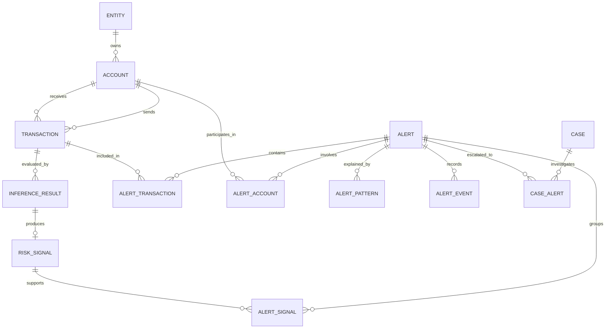

# 에피소드 단위 Alert를 위한 DB·ERD 설계안

## 1. 설계 목적

현재 서비스의 거래별 추론 구조를 유지하면서 담당자에게는 여러 관련 거래를 묶은 **에피소드 단위 Alert**를 제공하기 위한 DB 구조를 정의한다.

핵심은 다음 객체를 서로 분리하는 것이다.

```text
Transaction
실제로 발생한 원천 거래

Inference Result
모델이 거래를 판정한 결과

Risk Signal
Alert로 확정되기 전의 위험 후보

Alert
여러 거래·계좌·위험 신호를 묶은 담당자 검토 단위

Case
심층 조사가 필요한 Alert와 추가 증거를 묶은 조사 단위
```

따라서 거래 테이블에 Alert 상태를 직접 넣거나, Alert 한 행에 거래 목록을 JSON 배열로만 저장하면 안 된다. 원천 거래와 업무 객체를 분리하고 연결 테이블로 관계를 관리해야 한다.

---

## 2. 전체 관계



관계 요약:

- 계좌 하나는 여러 거래에 송금 또는 수취 계좌로 참여한다.
- 거래 하나는 모델 버전별로 여러 추론 결과를 가질 수 있다.
- 추론 결과는 Alert 후보가 되는 Risk Signal을 만들 수 있다.
- Alert 하나는 여러 거래·계좌·Risk Signal을 포함할 수 있다.
- 하나의 거래가 서로 다른 위험을 설명하는 여러 Alert에 포함될 가능성을 허용한다.
- 하나 이상의 Alert가 하나의 Case로 이관될 수 있다.

---

## 3. 처리 흐름

```text
거래 저장
→ 모델 추론 결과 저장
→ 기준 이상이면 Risk Signal 생성
→ 시간 창 안의 관련 거래 조회
→ 계좌·Entity·방향·시간 관계 분석
→ 에피소드 후보 생성
→ Alert 생성 또는 열린 Alert 갱신
→ Alert와 거래·계좌·위험 신호 연결
→ 변경 이력 기록
```

Alert 생성 전후 DB 작업은 가능한 한 하나의 트랜잭션으로 처리한다.

---

## 4. 테이블 설계

### 4.1 `entities`

하나의 고객 또는 조직에 해당하는 데이터셋의 `Entity ID`를 저장한다.

| 컬럼 | 타입 예시 | 제약 | 설명 |
|---|---|---|---|
| `entity_id` | `BIGINT` | PK | 내부 식별자 |
| `external_entity_id` | `VARCHAR(100)` | UNIQUE, NOT NULL | 데이터셋의 Entity ID |
| `entity_name` | `VARCHAR(255)` | NULL | 데이터셋에 존재하는 이름 |
| `created_at` | `TIMESTAMPTZ` | NOT NULL | 생성 시각 |

실제 서비스로 확장하면 고객 위험등급, KYC 상태 등의 별도 테이블과 연결한다. 현재 IBM AML 데이터에서는 Entity를 동일 소유자 계좌를 묶는 보조 기준으로 사용한다.

### 4.2 `accounts`

그래프의 Node가 되는 계좌를 저장한다.

| 컬럼 | 타입 예시 | 제약 | 설명 |
|---|---|---|---|
| `account_id` | `BIGINT` | PK | 내부 계좌 ID |
| `bank_id` | `VARCHAR(50)` | NOT NULL | 은행 ID |
| `account_number` | `VARCHAR(100)` | NOT NULL | 계좌번호 |
| `entity_id` | `BIGINT` | FK, NULL | 소유 Entity |
| `created_at` | `TIMESTAMPTZ` | NOT NULL | 저장 시각 |

필수 제약:

```sql
UNIQUE (bank_id, account_number)
```

IBM 데이터에서는 계좌번호 단독 충돌이 있으므로 `(Bank ID, Account Number)` 복합키를 사용해야 한다.

권장 인덱스:

```sql
CREATE INDEX idx_accounts_entity
ON accounts (entity_id);
```

### 4.3 `transactions`

거래 한 건을 방향성 Edge로 저장한다.

| 컬럼 | 타입 예시 | 제약 | 설명 |
|---|---|---|---|
| `transaction_id` | `BIGINT` | PK | 내부 거래 ID |
| `external_transaction_id` | `VARCHAR(100)` | UNIQUE, NULL | 외부 거래 식별자 |
| `occurred_at` | `TIMESTAMPTZ` | NOT NULL | 실제 거래 발생 시각 |
| `from_account_id` | `BIGINT` | FK, NOT NULL | 송금 계좌 |
| `to_account_id` | `BIGINT` | FK, NOT NULL | 수취 계좌 |
| `amount_paid` | `NUMERIC(24,6)` | NOT NULL | 송금 금액 |
| `amount_received` | `NUMERIC(24,6)` | NULL | 수취 금액 |
| `payment_currency` | `VARCHAR(10)` | NOT NULL | 송금 통화 |
| `receiving_currency` | `VARCHAR(10)` | NULL | 수취 통화 |
| `payment_format` | `VARCHAR(50)` | NOT NULL | 결제 방식 |
| `ingested_at` | `TIMESTAMPTZ` | NOT NULL | 시스템 수집 시각 |

그래프 표현:

```text
from_account_id → to_account_id
```

필수 인덱스:

```sql
CREATE INDEX idx_tx_from_time
ON transactions (from_account_id, occurred_at DESC);

CREATE INDEX idx_tx_to_time
ON transactions (to_account_id, occurred_at DESC);

CREATE INDEX idx_tx_occurred_at
ON transactions (occurred_at DESC);
```

이 인덱스들은 특정 계좌의 최근 24시간 송금·수취 거래를 조회하기 위해 필요하다.

### 4.4 `inference_results`

모델의 거래별 추론 결과를 저장한다.

| 컬럼 | 타입 예시 | 제약 | 설명 |
|---|---|---|---|
| `inference_result_id` | `BIGINT` | PK | 추론 결과 ID |
| `transaction_id` | `BIGINT` | FK, NOT NULL | 대상 거래 |
| `model_version` | `VARCHAR(100)` | NOT NULL | 모델 버전 |
| `feature_version` | `VARCHAR(100)` | NOT NULL | Feature 버전 |
| `risk_score` | `NUMERIC(8,7)` | NOT NULL | `0~1` 위험점수 |
| `predicted_label` | `BOOLEAN` | NOT NULL | 모델 이진 판정 |
| `explanation` | `JSONB` | NULL | 주요 Feature·설명 정보 |
| `inferred_at` | `TIMESTAMPTZ` | NOT NULL | 추론 완료 시각 |

필수 제약:

```sql
UNIQUE (transaction_id, model_version)
CHECK (risk_score >= 0 AND risk_score <= 1)
```

거래 원본과 추론 결과를 분리하는 이유는 동일 거래를 새로운 모델 버전으로 재판정할 수 있기 때문이다.

### 4.5 `risk_signals`

모델 결과가 기준을 넘었지만 아직 Alert로 확정되지 않은 위험 후보를 저장한다.

| 컬럼 | 타입 예시 | 제약 | 설명 |
|---|---|---|---|
| `risk_signal_id` | `BIGINT` | PK | 위험 신호 ID |
| `inference_result_id` | `BIGINT` | FK, UNIQUE | 신호를 만든 추론 결과 |
| `transaction_id` | `BIGINT` | FK, NOT NULL | 대상 거래 |
| `signal_type` | `VARCHAR(50)` | NOT NULL | 모델·규칙 등 신호 유형 |
| `signal_score` | `NUMERIC(8,7)` | NOT NULL | 신호 점수 |
| `status` | `VARCHAR(30)` | NOT NULL | 처리 상태 |
| `detected_at` | `TIMESTAMPTZ` | NOT NULL | 탐지 시각 |
| `expires_at` | `TIMESTAMPTZ` | NULL | 후보 만료 시각 |
| `aggregation_rule_version` | `VARCHAR(100)` | NOT NULL | 집계 정책 버전 |

상태 예시:

```text
PENDING  : 에피소드 집계 대기
GROUPED  : Alert 후보 또는 Alert에 포함됨
ALERTED  : Alert 생성에 사용됨
EXPIRED  : 시간 창 종료 후 Alert 기준 미충족
```

권장 인덱스:

```sql
CREATE INDEX idx_signal_pending_time
ON risk_signals (status, detected_at)
WHERE status = 'PENDING';
```

MVP에서 구현량을 줄이려면 `risk_signals`를 생략하고 `inference_results`에서 직접 후보를 조회할 수도 있다. 하지만 집계 대기, 만료와 재처리를 관리하려면 별도 테이블을 권장한다.

### 4.6 `alerts`

담당자가 처리할 에피소드 단위 업무의 대표 정보를 저장한다.

| 컬럼 | 타입 예시 | 제약 | 설명 |
|---|---|---|---|
| `alert_id` | `BIGINT` | PK | Alert ID |
| `alert_type` | `VARCHAR(50)` | NOT NULL | Alert 유형 |
| `subject_account_id` | `BIGINT` | FK, NULL | 대표·중심 계좌 |
| `subject_entity_id` | `BIGINT` | FK, NULL | 대표 Entity |
| `pattern_type` | `VARCHAR(50)` | NOT NULL | 패턴 또는 `UNKNOWN` |
| `status` | `VARCHAR(30)` | NOT NULL | 업무 상태 |
| `assignment_status` | `VARCHAR(30)` | NOT NULL | 배정 상태 |
| `episode_score` | `NUMERIC(8,7)` | NOT NULL | 에피소드 위험점수 |
| `priority_score` | `NUMERIC(8,7)` | NULL | 업무 우선순위 점수 |
| `window_start` | `TIMESTAMPTZ` | NOT NULL | 조회 시간 창 시작 |
| `window_end` | `TIMESTAMPTZ` | NOT NULL | 조회 시간 창 종료 |
| `first_transaction_at` | `TIMESTAMPTZ` | NOT NULL | 포함 거래 중 최초 시각 |
| `last_transaction_at` | `TIMESTAMPTZ` | NOT NULL | 포함 거래 중 최종 시각 |
| `transaction_count` | `INTEGER` | NOT NULL | 포함 거래 수 요약 |
| `account_count` | `INTEGER` | NOT NULL | 관련 계좌 수 요약 |
| `total_amount` | `NUMERIC(24,6)` | NULL | 관련 금액 요약 |
| `model_version` | `VARCHAR(100)` | NOT NULL | 대표 모델 버전 |
| `aggregation_rule_version` | `VARCHAR(100)` | NOT NULL | 에피소드 집계 정책 버전 |
| `row_version` | `BIGINT` | NOT NULL | 낙관적 잠금 버전 |
| `created_at` | `TIMESTAMPTZ` | NOT NULL | Alert 생성 시각 |
| `updated_at` | `TIMESTAMPTZ` | NOT NULL | 최종 갱신 시각 |

Alert 유형 예시:

```text
PATTERN_EPISODE
GENERAL_EPISODE
SINGLE_HIGH_RISK
```

업무 상태 예시:

```text
NEW
IN_REVIEW
ESCALATED
CLOSED
```

배정 상태는 업무 상태와 분리한다.

```text
UNASSIGNED
CLAIMED
ASSIGNED
```

`window_start`, `window_end`는 시스템이 조회한 시간 범위이고 `first_transaction_at`, `last_transaction_at`는 실제 포함 거래의 시간 범위다.

권장 인덱스:

```sql
CREATE INDEX idx_alert_queue
ON alerts (status, assignment_status, priority_score DESC, created_at);

CREATE INDEX idx_alert_subject_open
ON alerts (subject_account_id, pattern_type, last_transaction_at DESC)
WHERE status IN ('NEW', 'IN_REVIEW');
```

### 4.7 `alert_transactions`

Alert와 관련 거래의 다대다 관계를 저장한다.

| 컬럼 | 타입 예시 | 제약 | 설명 |
|---|---|---|---|
| `alert_id` | `BIGINT` | PK, FK | Alert ID |
| `transaction_id` | `BIGINT` | PK, FK | 거래 ID |
| `risk_signal_id` | `BIGINT` | FK, NULL | 관련 위험 신호 |
| `role` | `VARCHAR(30)` | NOT NULL | 거래의 역할 |
| `included_reason` | `TEXT` | NULL | 포함 근거 |
| `added_at` | `TIMESTAMPTZ` | NOT NULL | Alert에 추가된 시각 |

복합 기본키:

```sql
PRIMARY KEY (alert_id, transaction_id)
```

역할 예시:

```text
SEED            : 에피소드 탐색을 시작시킨 고위험 거래
SUPPORTING      : 위험점수를 보강하는 관련 거래
PATH            : 자금 이동 경로를 연결하는 거래
PATTERN_MEMBER  : 특정 패턴을 구성하는 거래
```

위험점수가 낮아도 경로 연결에 필요한 거래는 `PATH`로 포함할 수 있다.

권장 인덱스:

```sql
CREATE INDEX idx_alert_tx_transaction
ON alert_transactions (transaction_id, alert_id);
```

### 4.8 `alert_accounts`

Alert와 관련 계좌의 관계 및 집계 정보를 저장한다.

| 컬럼 | 타입 예시 | 제약 | 설명 |
|---|---|---|---|
| `alert_id` | `BIGINT` | PK, FK | Alert ID |
| `account_id` | `BIGINT` | PK, FK | 계좌 ID |
| `role` | `VARCHAR(30)` | NOT NULL | 에피소드 내 역할 |
| `in_transaction_count` | `INTEGER` | NOT NULL | 입금 거래 수 |
| `out_transaction_count` | `INTEGER` | NOT NULL | 출금 거래 수 |
| `in_amount` | `NUMERIC(24,6)` | NOT NULL | 입금액 합계 |
| `out_amount` | `NUMERIC(24,6)` | NOT NULL | 출금액 합계 |
| `max_risk_score` | `NUMERIC(8,7)` | NULL | 관련 거래 최고 점수 |

복합 기본키:

```sql
PRIMARY KEY (alert_id, account_id)
```

역할 예시:

```text
SUBJECT
SOURCE
DESTINATION
INTERMEDIARY
HUB
RELATED
```

이 테이블은 `alert_transactions`에서 재계산할 수 있는 조회용 요약이다. 원천 데이터는 아니므로 집계 규칙 버전을 Alert에 반드시 기록한다.

### 4.9 `alert_signals`

여러 Risk Signal이 하나의 Alert에 포함되는 관계를 명시한다.

| 컬럼 | 타입 예시 | 제약 | 설명 |
|---|---|---|---|
| `alert_id` | `BIGINT` | PK, FK | Alert ID |
| `risk_signal_id` | `BIGINT` | PK, FK | 위험 신호 ID |
| `added_at` | `TIMESTAMPTZ` | NOT NULL | 포함 시각 |

```sql
PRIMARY KEY (alert_id, risk_signal_id)
```

### 4.10 `alert_patterns`

그래프 패턴 판정과 상세 지표를 저장한다.

| 컬럼 | 타입 예시 | 제약 | 설명 |
|---|---|---|---|
| `alert_pattern_id` | `BIGINT` | PK | 패턴 결과 ID |
| `alert_id` | `BIGINT` | FK, NOT NULL | 대상 Alert |
| `pattern_type` | `VARCHAR(50)` | NOT NULL | 판정 패턴 |
| `confidence_score` | `NUMERIC(8,7)` | NOT NULL | 패턴 신뢰도 |
| `metrics` | `JSONB` | NOT NULL | 패턴별 상세 지표 |
| `detector_version` | `VARCHAR(100)` | NOT NULL | 탐지 로직 버전 |
| `detected_at` | `TIMESTAMPTZ` | NOT NULL | 판정 시각 |

`metrics` 예시:

```json
{
  "distinct_intermediaries": 3,
  "path_count": 3,
  "amount_retention_ratio": 0.91,
  "duration_minutes": 42,
  "max_hop": 2
}
```

MVP에서는 이 테이블을 생략하고 `alerts.pattern_metrics JSONB`로 저장할 수 있다. 패턴 탐지 결과가 여러 개이거나 이력 관리가 필요해지면 별도 테이블로 분리한다.

### 4.11 `alert_events`

Alert의 생성, 갱신, 배정과 상태 변경을 append-only 이력으로 저장한다.

| 컬럼 | 타입 예시 | 제약 | 설명 |
|---|---|---|---|
| `event_id` | `BIGINT` | PK | 이벤트 ID |
| `alert_id` | `BIGINT` | FK, NOT NULL | 대상 Alert |
| `event_type` | `VARCHAR(50)` | NOT NULL | 이벤트 유형 |
| `previous_status` | `VARCHAR(30)` | NULL | 이전 상태 |
| `new_status` | `VARCHAR(30)` | NULL | 새 상태 |
| `actor_type` | `VARCHAR(30)` | NOT NULL | SYSTEM 또는 USER |
| `actor_id` | `BIGINT` | NULL | 사용자 ID |
| `reason` | `TEXT` | NULL | 변경 사유 |
| `details` | `JSONB` | NULL | 추가 변경 내용 |
| `request_id` | `VARCHAR(100)` | NULL | 요청 추적 ID |
| `created_at` | `TIMESTAMPTZ` | NOT NULL | 발생 시각 |

이벤트 유형 예시:

```text
CREATED
TRANSACTION_ADDED
SCORE_RECALCULATED
PATTERN_CHANGED
CLAIMED
ASSIGNED
RELEASED
ESCALATED_TO_CASE
CLOSED
```

새 거래가 추가된 이벤트 예시:

```json
{
  "added_transaction_ids": [1005, 1006],
  "previous_transaction_count": 4,
  "new_transaction_count": 6,
  "previous_episode_score": 0.72,
  "new_episode_score": 0.84
}
```

### 4.12 `cases`와 `case_alerts`

심층 조사 객체와 Alert의 관계를 저장한다.

`cases` 핵심 컬럼:

| 컬럼 | 타입 예시 | 설명 |
|---|---|---|
| `case_id` | `BIGINT` PK | Case ID |
| `title` | `VARCHAR(255)` | 사건명 |
| `status` | `VARCHAR(30)` | 조사 상태 |
| `owner_id` | `BIGINT` NULL | 담당 조사자 |
| `created_at` | `TIMESTAMPTZ` | 생성 시각 |
| `closed_at` | `TIMESTAMPTZ` NULL | 종결 시각 |

`case_alerts`:

```sql
PRIMARY KEY (case_id, alert_id)
```

현재 기획에서 Alert 하나를 하나의 Case에만 연결하기로 확정한다면 `alert_id UNIQUE` 제약을 추가한다.

---

## 5. 최근 시간 창 거래 조회

Seed 거래가 `A → B`, 발생 시각이 8월 14일 10시이고 시간 창이 최근 24시간이라고 가정한다.

### 5.1 1-hop 조회

```sql
SELECT t.*
FROM transactions t
WHERE t.occurred_at >= :seed_time - INTERVAL '24 hours'
  AND t.occurred_at <= :seed_time
  AND (
       t.from_account_id = ANY(:account_ids)
    OR t.to_account_id = ANY(:account_ids)
  );
```

최초 조회의 `account_ids`는 Seed의 A와 B다.

### 5.2 2-hop 확장

1-hop 결과에서 새로 발견한 계좌를 모아 같은 조건으로 한 번 더 조회한다. 무제한 재귀 조회는 하지 않고 최대 hop, 거래 수와 계좌 수를 제한한다.

초기 제한 예시:

```text
기본 확장: 1-hop
최대 확장: 2-hop
최대 거래 수: 100건
최대 계좌 수: 50개
허브 기준 초과 계좌: 추가 확장 중지
```

조회 결과를 Worker가 다음처럼 해석한다.

```text
Node = account_id
Edge = transaction_id
Edge 속성 = occurred_at, amount, direction, risk_score
```

그 후 연결 거래 집합, 중심 계좌, 상대방 수, Cycle, 분산·재집중, 금액 유지율과 에피소드 점수를 계산한다.

---

## 6. Alert 생성 트랜잭션

에피소드 기준을 충족하면 다음 작업을 하나의 DB 트랜잭션으로 처리한다.

```text
BEGIN
  1. 동일한 열린 Alert 존재 여부 잠금 조회
  2. 없으면 alerts 생성, 있으면 기존 alerts 갱신
  3. alert_transactions 추가
  4. alert_accounts upsert
  5. alert_signals 추가 및 risk_signals 상태 갱신
  6. alert_patterns 기록
  7. alert_events 기록
COMMIT
```

일부 저장만 성공해 `Alert는 있지만 거래가 없는 상태`가 생기지 않도록 원자적으로 처리해야 한다.

---

## 7. 새 Alert와 기존 Alert 갱신 기준

새 Risk Signal이 들어오면 다음 조건의 열린 Alert를 먼저 찾는다.

```text
동일 subject_account 또는 subject_entity
AND 동일·유사 pattern_type
AND 마지막 관련 거래로부터 허용 시간 이내
AND 상태가 NEW 또는 IN_REVIEW
AND 관련 계좌 또는 거래 경로가 중첩
```

조건을 충족하면 새 Alert를 만들지 않고 기존 Alert를 갱신한다.

중복 탐색 보조키 예시:

```text
episode_key =
subject_account_id
+ pattern_type
+ episode_start_bucket
+ aggregation_rule_version
```

단, 고정 시간 bucket만 사용하면 자정 경계에서 같은 행동이 나뉠 수 있다. `episode_key`는 유일한 판정 기준이 아니라 후보 검색용이며, 실제 병합은 마지막 거래 시각과 계좌 중첩을 함께 확인한다.

동시 Worker가 같은 Alert를 갱신할 수 있으므로 다음 중 하나를 사용한다.

- `SELECT ... FOR UPDATE`
- `row_version`을 이용한 조건부 갱신
- 중복 삽입을 막는 PK·UNIQUE 제약

---

## 8. 한 거래의 여러 Alert 포함 정책

DB 관계는 다음처럼 다대다로 설계한다.

```text
Alert N : Transaction M
```

하나의 거래가 FAN-OUT과 CYCLE 등 서로 다른 위험 근거에 동시에 포함될 수 있기 때문이다.

다만 동일 목적의 중복 Alert를 허용한다는 뜻은 아니다. 같은 중심 계좌, 같은 패턴, 중첩 시간 창과 열린 Alert 조건을 만족하면 기존 Alert에 병합한다.

업무 정책상 하나의 거래를 반드시 하나의 열린 Alert에만 포함해야 한다면 별도 UNIQUE 제약을 추가할 수 있지만, 초기 DB 구조에서 이를 강제하면 복합 위험을 표현하기 어려워질 수 있으므로 권장하지 않는다.

---

## 9. 원천 데이터와 파생 데이터 구분

| 구분 | 테이블 | 원칙 |
|---|---|---|
| 원천 | `accounts`, `transactions` | 수집 후 임의 변경 금지 |
| 모델 결과 | `inference_results` | 모델·Feature 버전별 보존 |
| 후보 상태 | `risk_signals` | 집계 대기·만료·재처리 관리 |
| 업무 객체 | `alerts`, `cases` | 담당자 처리 상태 관리 |
| 연결 근거 | `alert_transactions`, `alert_accounts`, `alert_signals` | 왜 묶였는지 추적 가능해야 함 |
| 분석 결과 | `alert_patterns` | 탐지 로직 버전과 상세 지표 보존 |
| 감사 이력 | `alert_events` | append-only 기록 |

`transaction_count`, `account_count`, `total_amount` 같은 Alert 컬럼은 조회 성능을 위한 파생 요약이다. 원본은 연결 테이블이므로 요약값 변경 시 이벤트와 집계 버전을 남긴다.

---

## 10. `Patterns.txt`와 정답 라벨 저장 원칙

`Patterns.txt`의 attempt ID와 `Is Laundering`은 실제 에피소드 생성 로직에 사용하면 안 된다. 이는 정답을 미리 보는 데이터 누수다.

개발·평가 환경에서는 별도 스키마 또는 평가 전용 테이블에 저장한다.

```text
evaluation.pattern_attempts
evaluation.pattern_attempt_transactions
evaluation.transaction_labels
```

운영 스키마의 `alerts`, `risk_signals`, `alert_transactions`에서는 attempt ID를 참조하지 않는다.

평가 단계에서만 다음을 비교한다.

```text
시스템이 생성한 Alert의 거래 집합
vs
Patterns.txt attempt의 정답 거래 집합
```

---

## 11. MVP 권장 범위

### 11.1 MVP 필수 테이블

```text
entities
accounts
transactions
inference_results
risk_signals
alerts
alert_transactions
alert_accounts
alert_events
```

### 11.2 후속 분리 가능 테이블

```text
alert_signals
alert_patterns
cases
case_alerts
```

MVP에서 `alert_signals`는 `alert_transactions.risk_signal_id`로 단순화할 수 있다. `alert_patterns`는 `alerts.pattern_metrics JSONB`로 시작한 후 여러 패턴과 이력 관리가 필요할 때 분리할 수 있다.

### 11.3 초기 집계 정책 예시

```text
슬라이딩 시간 창: 24시간
Seed 거래: model_score >= 0.80
주변 거래: score >= 0.50 또는 경로 연결에 필요
확장 범위: 기본 1-hop, 최대 2-hop
최소 거래 수: 3건
최소 계좌 수: 3개
긴급 단건: transaction_score >= 0.95
```

수치는 정책 확정값이 아니라 데이터 실험을 위한 초기값이며 `aggregation_rule_version`으로 관리해야 한다.

---

## 12. 구현 전 결정해야 할 항목

- [ ] Alert의 대표 주체는 계좌인가, Entity인가, 둘 다 허용하는가?
- [ ] 시간 창 후보 중 어떤 값을 기본으로 사용할 것인가?
- [ ] 열린 Alert에 새 거래를 추가할 수 있는 상태는 어디까지인가?
- [ ] 담당자가 검토 중일 때 새 거래가 추가되면 어떻게 알릴 것인가?
- [ ] 서로 다른 패턴을 하나의 Alert로 합칠 것인가?
- [ ] 한 거래의 여러 Alert 포함을 업무적으로 허용할 것인가?
- [ ] 허브 계좌의 판정 기준과 최대 확장 크기는 무엇인가?
- [ ] Risk Signal의 만료 후 단건 Alert 승격 또는 폐기 기준은 무엇인가?
- [ ] Alert 요약값 재계산 주체와 동시성 제어 방식은 무엇인가?
- [ ] Case 1건에 연결할 수 있는 Alert 수와 반대 방향 제약은 무엇인가?

---

## 13. 최종 요약

```text
accounts
  └─ transactions
       └─ inference_results
            └─ risk_signals
                 └─ alert_signals ─┐
                                   │
alerts ─ alert_transactions ─ transactions
   ├── alert_accounts ─ accounts
   ├── alert_patterns
   ├── alert_events
   └── case_alerts ─ cases
```

가장 중요한 설계 원칙은 다음과 같다.

> `transactions`에는 변하지 않는 원천 거래를 저장하고, `inference_results`에는 모델 판정을 저장하며, `alerts`에는 담당자가 처리할 에피소드를 저장한다. 어떤 거래와 계좌가 어떤 이유로 Alert에 포함됐는지는 연결 테이블과 변경 이력으로 보존한다.

이 구조를 사용하면 거래별 모델 추론을 유지하면서도 최근 시간 창, 계좌 연결, 1~2 hop과 그래프 패턴을 이용한 에피소드 Alert 생성·조회·갱신이 가능하다.
