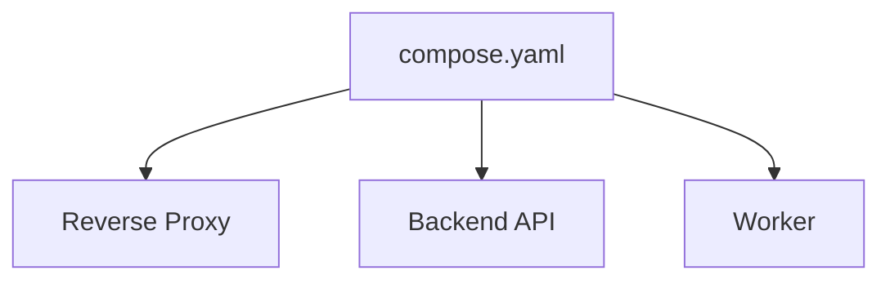

# 컨테이너와 Docker 기본 개념

[인프라 결정 기록으로 돌아가기](README.md)

## 컨테이너란?

컨테이너는 애플리케이션과 실행에 필요한 파일을 격리된 단위로 묶어 실행하는 방식이다. 개발자 컴퓨터와 운영 서버에서 동일한 실행 환경을 재현하는 데 도움이 된다.

컨테이너는 운영체제 전체를 포함하는 가상 머신과 달리 호스트의 운영체제 커널을 공유한다. 따라서 일반적으로 가상 머신보다 가볍고 빠르게 생성된다.

## Docker란?

Docker는 컨테이너 이미지를 만들고 배포하며 실행하는 대표적인 도구다.

## 기본 용어

- **Dockerfile**: 이미지를 만드는 단계와 명령을 적은 파일
- **이미지**: 애플리케이션과 실행 환경을 포함한 변경되지 않는 패키지
- **컨테이너**: 이미지를 실제로 실행한 격리된 프로세스
- **Registry**: 이미지를 저장하고 배포하는 서비스
- **Volume**: 컨테이너를 다시 만들어도 유지해야 하는 데이터를 저장하는 공간
- **Port mapping**: 호스트의 포트와 컨테이너 내부 포트를 연결하는 설정
- **Network**: 컨테이너끼리 이름으로 통신할 수 있게 하는 가상 네트워크
- **Health check**: 컨테이너 내부 서비스가 정상인지 확인하는 검사

## Docker Compose란?

Docker Compose는 여러 컨테이너의 이미지, 포트, 네트워크, 볼륨과 환경변수를 하나의 `compose.yaml` 파일에 정의하고 함께 실행하는 도구다.

Compose는 주로 한 Docker 호스트의 컨테이너들을 관리한다. 여러 서버 전체의 자동 배치와 확장을 담당하는 클러스터 오케스트레이터와는 역할이 다르다.

## 주요 컨테이너 실행 기술

### Docker Compose

Docker Compose는 한 Docker 호스트에서 여러 컨테이너 구성을 `compose.yaml` 파일로 선언하고 함께 생성·연결·종료하는 도구다. Docker Engine이 실제 컨테이너 실행을 담당하고 Compose는 여러 컨테이너 설정을 묶어 전달한다.

### Amazon ECS

ECS는 AWS의 컨테이너 오케스트레이션 서비스다. 컨테이너 정의, 필요한 실행 수, 네트워크와 배치 정책을 AWS API의 자원으로 관리한다. 실행 기반으로 EC2 인스턴스 또는 Fargate를 사용할 수 있다.

### AWS Fargate

Fargate는 사용자가 컨테이너 호스트 서버를 직접 준비하지 않고 컨테이너별 CPU와 메모리를 지정해 실행하는 방식이다. 컨테이너 이미지와 실행 설정은 사용자가 관리하고 기반 서버는 AWS가 관리한다.

### Kubernetes

Kubernetes는 여러 서버로 이루어진 클러스터에서 컨테이너의 배치, 복구, 확장, 네트워크와 설정을 관리하는 오픈소스 오케스트레이션 플랫폼이다. Pod, Deployment, Service 같은 리소스로 원하는 상태를 선언한다.

### Amazon EKS

EKS(Elastic Kubernetes Service)는 AWS가 Kubernetes 제어 영역을 관리하는 서비스다. 애플리케이션은 Kubernetes 리소스로 정의하지만 네트워크, 작업 노드, 권한과 AWS 서비스 연동 구성이 함께 필요하다.
